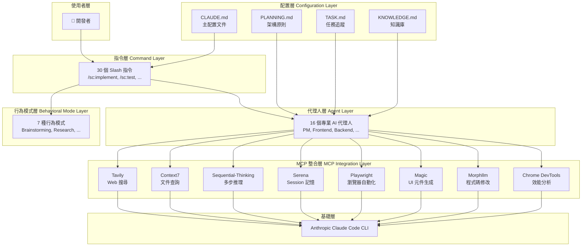
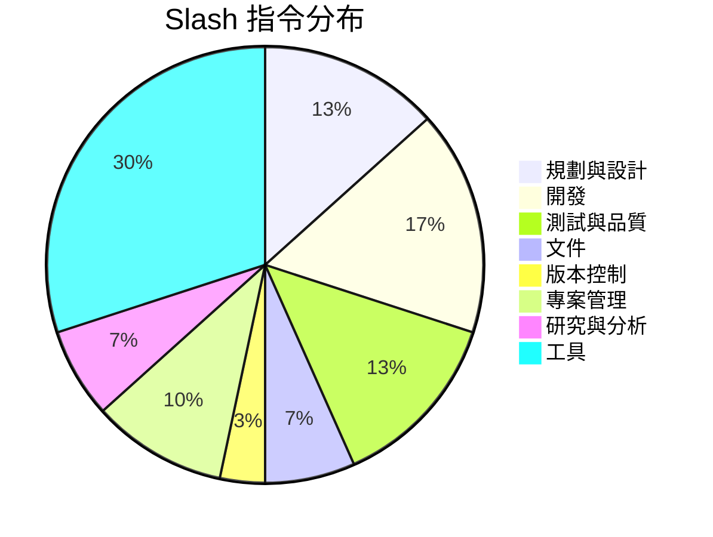

# SuperClaude Framework 生態系教學手冊

> **版本**：v4.2.0（穩定版）  
> **適用對象**：具備基礎開發經驗的工程師  
> **最後更新**：2026-03-12  
> **授權**：內部教學使用

---

## 目錄

- [第一章：SuperClaude Framework 概覽](#第一章superclaude-framework-概覽)
- [第二章：系統需求與安裝](#第二章系統需求與安裝)
- [第三章：系統設定與配置](#第三章系統設定與配置)
- [第四章：30 個 Slash 指令完整指南](#第四章30-個-slash-指令完整指南)
- [第五章：16 個 AI 代理人（Agents）使用指南](#第五章16-個-ai-代理人agents使用指南)
- [第六章：7 種行為模式（Behavioral Modes）](#第六章7-種行為模式behavioral-modes)
- [第七章：Deep Research 深度研究功能](#第七章deep-research-深度研究功能)
- [附錄 A：常見問題（FAQ）](#附錄-a常見問題faq)
- [附錄 B：新進成員檢查清單（Checklist）](#附錄-b新進成員檢查清單checklist)

---

## 第一章：SuperClaude Framework 概覽

### 1.1 什麼是 SuperClaude Framework？

#### 定義與定位

SuperClaude Framework 是一個 **meta-programming configuration framework**（元程式設計配置框架），專為 Anthropic Claude Code 命令列工具（CLI）設計。它並非一個獨立的應用程式，而是一套「行為指令注入」系統——透過在 Claude Code 的對話上下文中注入結構化的指令集、代理人角色與行為模式，將原本泛用的 AI 助手轉化為具備完整軟體工程流程能力的**自動化開發平台**。

簡單來說：

> **Claude Code** 是「引擎」，**SuperClaude Framework** 是「方向盤 + 儀表板 + 自動駕駛系統」。

#### 與原生 Claude Code 的差異比較

| 面向 | 原生 Claude Code | Claude Code + SuperClaude |
|------|-----------------|--------------------------|
| 互動方式 | 自由對話、手動指引 | 30 個結構化 Slash 指令 |
| 角色扮演 | 泛用 AI 助手 | 16 個專業代理人（自動切換） |
| 工作流程 | 無標準化流程 | 7 種行為模式、自動化工作流 |
| 外部工具整合 | 手動配置 MCP | 8 個預整合 MCP Server |
| Session 管理 | 無持久化 | 儲存 / 載入 Session 狀態 |
| 品質保證 | 依賴使用者提示 | 內建程式碼分析、測試生成、反思機制 |
| 學習能力 | 無跨 Session 學習 | KNOWLEDGE.md 累積最佳實踐 |

#### 核心設計理念

1. **行為指令注入（Behavioral Instruction Injection）**  
   透過 Slash 指令將複雜的多步驟工程流程封裝為單一指令調用，降低使用者的認知負擔。

2. **元件協同編排（Component Orchestration）**  
   指令、代理人、模式、MCP Server 四大元件彼此協同——例如執行 `/sc:implement` 時，系統自動調度 Backend Engineer Agent，必要時切換至 Orchestration Mode 並透過 Context7 MCP 查詢官方文件。

3. **漸進式增強（Progressive Enhancement）**  
   框架在無 MCP Server 時仍能正常運作（標準效能），安裝 MCP Server 後可獲得 2-3 倍效能提升。

#### 版本資訊

- **v4.2.0**：現行穩定版（本手冊基準）
- **v5.0**：開發中，將引入 TypeScript Plugin 系統，支援自訂指令與代理人擴展

---

### 1.2 生態系架構圖解

#### 整體架構層次

#### 各元件角色與職責

| 元件 | 角色 | 職責 |
|------|------|------|
| **配置層** | 知識基座 | 定義專案規則、架構原則、任務追蹤、累積知識 |
| **指令層** | 操作介面 | 提供 30 個標準化指令，封裝複雜工作流程 |
| **代理人層** | 專業執行者 | 16 個專業角色，依情境自動切換或手動調用 |
| **行為模式層** | 認知框架 | 控制 AI 的思考方式與輸出風格 |
| **MCP 整合層** | 能力擴展 | 連接外部工具，提供搜尋、自動化、效能分析等能力 |

---

### 1.3 核心能力數據

#### 30 個 Slash 指令概覽

#### 16 個 Agents 概覽

| 類別 | 代理人 | 核心職能 |
|------|--------|---------|
| **管理** | PM Agent | 專案規劃、進度追蹤、風險管理 |
| **研究** | Deep Research Agent | 技術調研、競品分析、多來源驗證 |
| **安全** | Security Engineer Agent | 弱點掃描、安全審計、合規檢查 |
| **前端** | Frontend Architect Agent | UI 架構、元件設計、效能優化 |
| **後端** | Backend Engineer Agent | API 開發、業務邏輯、資料處理 |
| **運維** | DevOps Agent | CI/CD、容器化、基礎設施自動化 |
| **審查** | Code Reviewer Agent | 程式碼品質、最佳實踐、技術債務 |
| **資料庫** | Database Agent | Schema 設計、查詢優化、資料遷移 |
| **API** | API Designer Agent | RESTful/GraphQL 設計、版本管理 |
| **測試** | Testing Agent | 測試策略、測試生成、覆蓋率分析 |
| **文件** | Documentation Agent | 技術文件、API 文件、使用手冊 |
| **效能** | Performance Agent | 效能瓶頸分析、優化建議 |
| **架構** | Architecture Agent | 系統架構設計、技術選型、擴展性規劃 |
| **體驗** | UX Agent | 使用者體驗設計、可用性分析 |
| **資料** | Data Agent | 資料分析、ETL 流程、資料視覺化 |
| **整合** | Integration Agent | 第三方服務整合、系統間通訊 |

#### 7 種 Modes 概覽

| 模式 | 核心特性 | 觸發方式 |
|------|---------|---------|
| Brainstorming | 開放式發散思維 | `/sc:brainstorm` |
| Business Panel | 多專家圓桌討論 | `/sc:business-panel` |
| Deep Research | 多層次搜尋驗證 | `/sc:research` |
| Orchestration | 多工具協調編排 | 複雜任務自動觸發 |
| Token-Efficiency | 精簡輸出、節省用量 | 手動設定 |
| Task Management | 結構化任務組織 | `/sc:task` |
| Introspection | 自我反思與品質評估 | `/sc:reflect` |

#### 8 個 MCP Servers 概覽

| MCP Server | 功能 | 使用場景 |
|------------|------|---------|
| **Tavily** | Web 搜尋引擎 | 技術調研、問題排查 |
| **Context7** | 官方文件即時查詢 | API 確認、版本相容性檢查 |
| **Sequential-Thinking** | 多步驟推理引擎 | 複雜架構決策、除錯分析 |
| **Serena** | Session 持久化與記憶 | 跨 Session 知識保留 |
| **Playwright** | 跨瀏覽器自動化測試 | E2E 測試、UI 驗證 |
| **Magic** | UI 元件自動生成 | 前端開發加速 |
| **Morphllm-Fast-Apply** | 情境感知程式碼修改 | 大規模重構、批次修改 |
| **Chrome DevTools** | 瀏覽器效能分析 | 前端效能調優、記憶體分析 |

> **💡 實務建議**：初次使用建議先安裝 **Tavily** 和 **Context7** 兩個基礎 MCP Server，待熟悉框架後再依需求擴充其他 Server。

---
