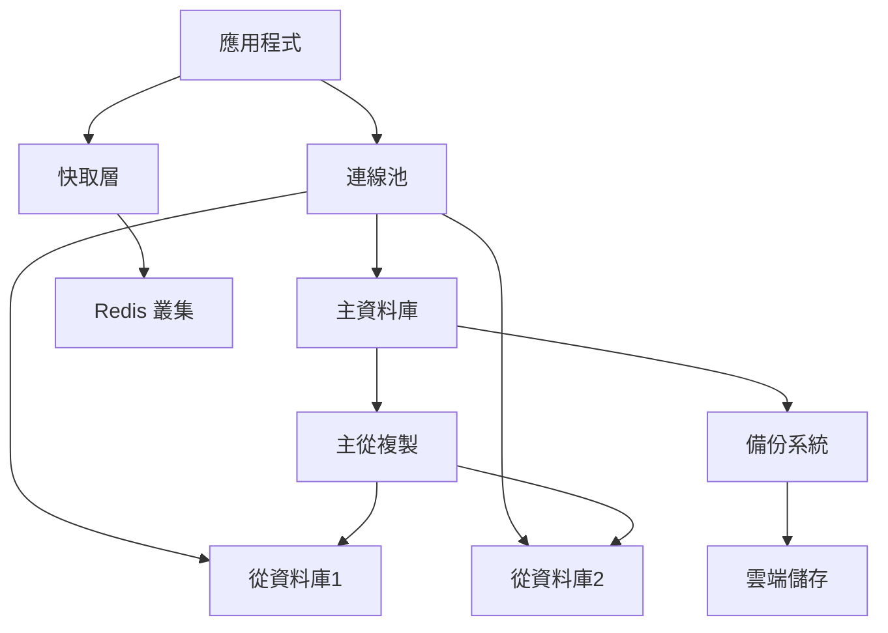
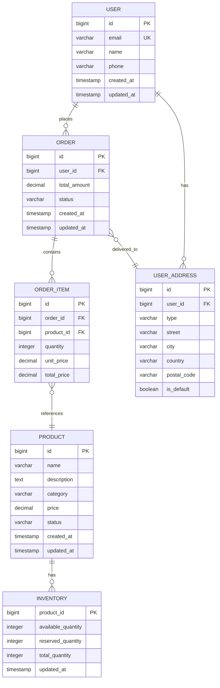

# 資料庫設計指引範本

## Prompt 目標

指導 AI 進行資料庫設計，建立結構化、高效能且可維護的資料庫架構。

## 角色設定

你是一位資深資料庫設計師，具備豐富的資料庫設計經驗，熟悉正規化理論、效能優化和資料安全設計。

## 任務描述

請協助我完成 {專案名稱} 的資料庫設計工作。

### 專案資料庫背景

- **專案名稱**: {填入專案名稱}
- **資料庫類型**: {填入資料庫類型，如：MySQL, PostgreSQL, MongoDB}
- **資料量規模**: {填入預估資料量}
- **併發需求**: {填入併發使用者數量}
- **效能要求**: {填入效能指標}
- **可用性要求**: {填入可用性需求}

### 資料庫設計要求

請按照以下結構進行設計：

#### 1. 概念模型設計
- 實體識別
- 屬性定義
- 關係建立
- 業務規則定義

#### 2. 邏輯模型設計
- 正規化設計
- 資料類型選擇
- 約束條件定義
- 索引策略規劃

#### 3. 實體模型設計
- 表格結構設計
- 主鍵和外鍵設計
- 觸發器和預存程序
- 權限和安全設計

#### 4. 效能優化設計
- 索引最佳化
- 查詢優化
- 分割策略
- 快取策略

#### 5. 資料安全設計
- 存取控制
- 資料加密
- 稽核記錄
- 備份恢復

## 輸出格式

```markdown
# {專案名稱} 資料庫設計文件

## 1. 資料庫概述

### 1.1 設計目標
**功能目標:**
- 支援 {具體業務功能}
- 處理 {資料處理需求}
- 提供 {資料服務能力}

**效能目標:**
- 查詢響應時間: < {時間閾值}
- 併發處理能力: {併發數量}
- 資料處理量: {處理量指標}
- 可用性: {可用性百分比}

### 1.2 技術選型

#### 主要資料庫: {資料庫名稱}
**選擇理由:**
- 符合資料特性和查詢模式
- 滿足效能和擴展性需求
- 團隊技術熟悉度
- 生態系統支援

**版本:** {資料庫版本}
**配置:** {主要配置參數}

#### 補充技術
- **快取系統:** {如 Redis, Memcached}
- **搜尋引擎:** {如 Elasticsearch}
- **時序資料庫:** {如 InfluxDB}
- **圖形資料庫:** {如 Neo4j}

### 1.3 資料庫架構

#### 整體架構圖


## 2. 概念模型設計

### 2.1 實體識別

#### 核心實體清單

**實體1: {實體名稱}**
- **描述:** {實體業務描述}
- **生命週期:** {實體的建立、更新、刪除規則}
- **業務重要性:** 高/中/低
- **資料量級:** {預估記錄數量}

**主要屬性:**
- {屬性名稱1}: {屬性描述}
- {屬性名稱2}: {屬性描述}
- {屬性名稱3}: {屬性描述}

**業務規則:**
- {規則1}: {規則描述}
- {規則2}: {規則描述}

**實體2: {實體名稱}**
[按相同格式列出其他實體]

### 2.2 實體關係圖 (ER Diagram)



### 2.3 關係類型定義

#### 一對一關係 (1:1)
**使用者 - 使用者資料 (User - UserProfile)**
- **關係描述:** 每個使用者有一個詳細資料
- **實作方式:** 共用主鍵或外鍵約束
- **業務規則:** 同時建立和刪除

#### 一對多關係 (1:N)
**使用者 - 訂單 (User - Order)**
- **關係描述:** 一個使用者可以有多個訂單
- **實作方式:** 外鍵參照
- **業務規則:** 刪除使用者時需處理相關訂單

#### 多對多關係 (M:N)
**產品 - 分類 (Product - Category)**
- **關係描述:** 產品可屬於多個分類，分類包含多個產品
- **實作方式:** 中間表 product_category
- **業務規則:** 產品至少屬於一個分類

```sql
-- 多對多關係實作
CREATE TABLE product_category (
    product_id BIGINT NOT NULL,
    category_id BIGINT NOT NULL,
    created_at TIMESTAMP DEFAULT CURRENT_TIMESTAMP,
    PRIMARY KEY (product_id, category_id),
    FOREIGN KEY (product_id) REFERENCES product(id) ON DELETE CASCADE,
    FOREIGN KEY (category_id) REFERENCES category(id) ON DELETE CASCADE
);
```

## 3. 邏輯模型設計

### 3.1 正規化設計

#### 第一正規化 (1NF)
**原則:** 確保每個欄位都是原子值，不可再分割

**範例:**
```sql
-- 違反 1NF
CREATE TABLE bad_user (
    id BIGINT PRIMARY KEY,
    name VARCHAR(100),
    phone_numbers VARCHAR(500)  -- 包含多個電話號碼
);

-- 符合 1NF
CREATE TABLE user (
    id BIGINT PRIMARY KEY,
    name VARCHAR(100)
);

CREATE TABLE user_phone (
    id BIGINT PRIMARY KEY,
    user_id BIGINT,
    phone_type VARCHAR(20),
    phone_number VARCHAR(20),
    FOREIGN KEY (user_id) REFERENCES user(id)
);
```

#### 第二正規化 (2NF)
**原則:** 在1NF基礎上，非主鍵欄位必須完全依賴主鍵

**範例:**
```sql
-- 違反 2NF - 複合主鍵部分依賴
CREATE TABLE bad_order_item (
    order_id BIGINT,
    product_id BIGINT,
    quantity INTEGER,
    product_name VARCHAR(100),    -- 只依賴 product_id
    product_price DECIMAL(10,2),  -- 只依賴 product_id
    PRIMARY KEY (order_id, product_id)
);

-- 符合 2NF
CREATE TABLE order_item (
    order_id BIGINT,
    product_id BIGINT,
    quantity INTEGER,
    unit_price DECIMAL(10,2),     -- 訂單時的價格
    PRIMARY KEY (order_id, product_id),
    FOREIGN KEY (order_id) REFERENCES order(id),
    FOREIGN KEY (product_id) REFERENCES product(id)
);

CREATE TABLE product (
    id BIGINT PRIMARY KEY,
    name VARCHAR(100),
    current_price DECIMAL(10,2)   -- 當前價格
);
```

#### 第三正規化 (3NF)
**原則:** 在2NF基礎上，非主鍵欄位之間不存在傳遞依賴

**範例:**
```sql
-- 違反 3NF - 存在傳遞依賴
CREATE TABLE bad_order (
    id BIGINT PRIMARY KEY,
    customer_id BIGINT,
    customer_name VARCHAR(100),      -- 傳遞依賴 customer_id
    customer_email VARCHAR(255),     -- 傳遞依賴 customer_id
    order_date TIMESTAMP
);

-- 符合 3NF
CREATE TABLE order (
    id BIGINT PRIMARY KEY,
    customer_id BIGINT,
    order_date TIMESTAMP,
    FOREIGN KEY (customer_id) REFERENCES customer(id)
);

CREATE TABLE customer (
    id BIGINT PRIMARY KEY,
    name VARCHAR(100),
    email VARCHAR(255)
);
```

### 3.2 反正規化考量

#### 效能導向的反正規化
```sql
-- 為了查詢效能，適度反正規化
CREATE TABLE order_summary (
    id BIGINT PRIMARY KEY,
    customer_id BIGINT,
    customer_name VARCHAR(100),      -- 反正規化：避免 JOIN
    customer_email VARCHAR(255),     -- 反正規化：避免 JOIN
    order_date TIMESTAMP,
    total_amount DECIMAL(12,2),
    item_count INTEGER,              -- 反正規化：避免聚合計算
    status VARCHAR(20),
    
    -- 保持資料一致性的觸發器或應用程式邏輯負責維護
    
    FOREIGN KEY (customer_id) REFERENCES customer(id)
);
```

### 3.3 資料類型選擇

#### 數值類型選擇指引
```sql
-- 整數類型選擇
id BIGINT,                    -- 主鍵，支援大量資料
user_id BIGINT,              -- 外鍵，與主鍵類型一致
quantity INTEGER,            -- 一般整數，範圍足夠
status_code SMALLINT,        -- 小範圍整數
is_active BOOLEAN,           -- 布林值

-- 浮點數類型選擇
price DECIMAL(10,2),         -- 金額，固定精度
tax_rate DECIMAL(5,4),       -- 稅率，需要高精度
weight FLOAT,                -- 重量，可接受近似值
coordinates DOUBLE,          -- 座標，需要高精度

-- 字串類型選擇
name VARCHAR(100),           -- 變長字串，有長度限制
email VARCHAR(320),          -- 郵件地址，標準長度
description TEXT,            -- 長文本，無長度限制
status CHAR(1),              -- 固定長度字串

-- 日期時間類型選擇
created_at TIMESTAMP,        -- 建立時間，含時區
birth_date DATE,            -- 生日，只需日期
updated_at TIMESTAMP ON UPDATE CURRENT_TIMESTAMP  -- 自動更新
```

#### 字符集和排序規則
```sql
-- 資料庫級別設定
CREATE DATABASE ecommerce
CHARACTER SET utf8mb4
COLLATE utf8mb4_unicode_ci;

-- 表格級別設定
CREATE TABLE product (
    id BIGINT PRIMARY KEY,
    name VARCHAR(100) CHARACTER SET utf8mb4 COLLATE utf8mb4_unicode_ci,
    description TEXT CHARACTER SET utf8mb4 COLLATE utf8mb4_unicode_ci
);
```

### 3.4 約束條件設計

#### 主鍵約束
```sql
-- 自增主鍵
CREATE TABLE user (
    id BIGINT AUTO_INCREMENT PRIMARY KEY,
    email VARCHAR(320) NOT NULL
);

-- UUID 主鍵
CREATE TABLE session (
    id CHAR(36) PRIMARY KEY DEFAULT (UUID()),
    user_id BIGINT NOT NULL,
    created_at TIMESTAMP DEFAULT CURRENT_TIMESTAMP
);

-- 複合主鍵
CREATE TABLE user_role (
    user_id BIGINT,
    role_id BIGINT,
    granted_at TIMESTAMP DEFAULT CURRENT_TIMESTAMP,
    PRIMARY KEY (user_id, role_id)
);
```

#### 外鍵約束
```sql
CREATE TABLE order_item (
    id BIGINT AUTO_INCREMENT PRIMARY KEY,
    order_id BIGINT NOT NULL,
    product_id BIGINT NOT NULL,
    quantity INTEGER NOT NULL,
    
    -- 外鍵約束與參照動作
    FOREIGN KEY (order_id) REFERENCES order(id) 
        ON DELETE CASCADE 
        ON UPDATE CASCADE,
    FOREIGN KEY (product_id) REFERENCES product(id) 
        ON DELETE RESTRICT 
        ON UPDATE CASCADE
);
```

#### 唯一約束
```sql
CREATE TABLE user (
    id BIGINT AUTO_INCREMENT PRIMARY KEY,
    email VARCHAR(320) NOT NULL,
    username VARCHAR(50) NOT NULL,
    
    -- 單欄位唯一約束
    UNIQUE INDEX uk_user_email (email),
    
    -- 複合唯一約束
    UNIQUE INDEX uk_user_username_deleted (username, deleted_at)
);
```

#### 檢查約束
```sql
CREATE TABLE product (
    id BIGINT AUTO_INCREMENT PRIMARY KEY,
    name VARCHAR(100) NOT NULL,
    price DECIMAL(10,2) NOT NULL,
    status VARCHAR(20) NOT NULL,
    
    -- 檢查約束
    CONSTRAINT chk_product_price CHECK (price > 0),
    CONSTRAINT chk_product_status CHECK (status IN ('active', 'inactive', 'discontinued'))
);

-- 年齡檢查約束
CREATE TABLE user (
    id BIGINT AUTO_INCREMENT PRIMARY KEY,
    name VARCHAR(100) NOT NULL,
    birth_date DATE,
    
    CONSTRAINT chk_user_age CHECK (birth_date <= DATE_SUB(CURDATE(), INTERVAL 13 YEAR))
);
```

## 4. 實體模型設計

### 4.1 完整表格結構

#### 使用者相關表格
```sql
-- 使用者主表
CREATE TABLE user (
    id BIGINT AUTO_INCREMENT PRIMARY KEY,
    email VARCHAR(320) NOT NULL,
    password_hash VARCHAR(255) NOT NULL,
    name VARCHAR(100) NOT NULL,
    phone VARCHAR(20),
    status VARCHAR(20) NOT NULL DEFAULT 'active',
    email_verified_at TIMESTAMP NULL,
    created_at TIMESTAMP DEFAULT CURRENT_TIMESTAMP,
    updated_at TIMESTAMP DEFAULT CURRENT_TIMESTAMP ON UPDATE CURRENT_TIMESTAMP,
    deleted_at TIMESTAMP NULL,
    
    UNIQUE INDEX uk_user_email (email),
    INDEX idx_user_status (status),
    INDEX idx_user_created_at (created_at),
    INDEX idx_user_deleted_at (deleted_at)
) ENGINE=InnoDB DEFAULT CHARSET=utf8mb4 COLLATE=utf8mb4_unicode_ci;

-- 使用者資料表
CREATE TABLE user_profile (
    user_id BIGINT PRIMARY KEY,
    first_name VARCHAR(50),
    last_name VARCHAR(50),
    birth_date DATE,
    gender CHAR(1),
    avatar_url VARCHAR(500),
    bio TEXT,
    timezone VARCHAR(50) DEFAULT 'UTC',
    language VARCHAR(10) DEFAULT 'en',
    created_at TIMESTAMP DEFAULT CURRENT_TIMESTAMP,
    updated_at TIMESTAMP DEFAULT CURRENT_TIMESTAMP ON UPDATE CURRENT_TIMESTAMP,
    
    FOREIGN KEY (user_id) REFERENCES user(id) ON DELETE CASCADE,
    INDEX idx_user_profile_birth_date (birth_date)
) ENGINE=InnoDB DEFAULT CHARSET=utf8mb4 COLLATE=utf8mb4_unicode_ci;

-- 使用者地址表
CREATE TABLE user_address (
    id BIGINT AUTO_INCREMENT PRIMARY KEY,
    user_id BIGINT NOT NULL,
    type VARCHAR(20) NOT NULL DEFAULT 'shipping',
    label VARCHAR(50),
    recipient_name VARCHAR(100) NOT NULL,
    phone VARCHAR(20),
    street_address TEXT NOT NULL,
    city VARCHAR(100) NOT NULL,
    state_province VARCHAR(100),
    postal_code VARCHAR(20),
    country_code CHAR(2) NOT NULL,
    is_default BOOLEAN DEFAULT FALSE,
    created_at TIMESTAMP DEFAULT CURRENT_TIMESTAMP,
    updated_at TIMESTAMP DEFAULT CURRENT_TIMESTAMP ON UPDATE CURRENT_TIMESTAMP,
    
    FOREIGN KEY (user_id) REFERENCES user(id) ON DELETE CASCADE,
    INDEX idx_user_address_user_id (user_id),
    INDEX idx_user_address_type (type),
    INDEX idx_user_address_country (country_code)
) ENGINE=InnoDB DEFAULT CHARSET=utf8mb4 COLLATE=utf8mb4_unicode_ci;
```

#### 產品相關表格
```sql
-- 產品分類表
CREATE TABLE category (
    id BIGINT AUTO_INCREMENT PRIMARY KEY,
    parent_id BIGINT NULL,
    name VARCHAR(100) NOT NULL,
    slug VARCHAR(100) NOT NULL,
    description TEXT,
    image_url VARCHAR(500),
    sort_order INTEGER DEFAULT 0,
    is_active BOOLEAN DEFAULT TRUE,
    created_at TIMESTAMP DEFAULT CURRENT_TIMESTAMP,
    updated_at TIMESTAMP DEFAULT CURRENT_TIMESTAMP ON UPDATE CURRENT_TIMESTAMP,
    
    FOREIGN KEY (parent_id) REFERENCES category(id) ON DELETE SET NULL,
    UNIQUE INDEX uk_category_slug (slug),
    INDEX idx_category_parent_id (parent_id),
    INDEX idx_category_sort_order (sort_order),
    INDEX idx_category_active (is_active)
) ENGINE=InnoDB DEFAULT CHARSET=utf8mb4 COLLATE=utf8mb4_unicode_ci;

-- 產品主表
CREATE TABLE product (
    id BIGINT AUTO_INCREMENT PRIMARY KEY,
    sku VARCHAR(100) NOT NULL,
    name VARCHAR(200) NOT NULL,
    slug VARCHAR(200) NOT NULL,
    short_description TEXT,
    description LONGTEXT,
    price DECIMAL(12,2) NOT NULL,
    compare_price DECIMAL(12,2),
    cost_price DECIMAL(12,2),
    weight DECIMAL(8,2),
    dimensions_length DECIMAL(8,2),
    dimensions_width DECIMAL(8,2),
    dimensions_height DECIMAL(8,2),
    status VARCHAR(20) NOT NULL DEFAULT 'draft',
    visibility VARCHAR(20) NOT NULL DEFAULT 'visible',
    featured BOOLEAN DEFAULT FALSE,
    meta_title VARCHAR(200),
    meta_description TEXT,
    created_at TIMESTAMP DEFAULT CURRENT_TIMESTAMP,
    updated_at TIMESTAMP DEFAULT CURRENT_TIMESTAMP ON UPDATE CURRENT_TIMESTAMP,
    published_at TIMESTAMP NULL,
    
    UNIQUE INDEX uk_product_sku (sku),
    UNIQUE INDEX uk_product_slug (slug),
    INDEX idx_product_status (status),
    INDEX idx_product_price (price),
    INDEX idx_product_featured (featured),
    INDEX idx_product_published_at (published_at),
    FULLTEXT INDEX ft_product_search (name, short_description, description)
) ENGINE=InnoDB DEFAULT CHARSET=utf8mb4 COLLATE=utf8mb4_unicode_ci;

-- 產品圖片表
CREATE TABLE product_image (
    id BIGINT AUTO_INCREMENT PRIMARY KEY,
    product_id BIGINT NOT NULL,
    image_url VARCHAR(500) NOT NULL,
    alt_text VARCHAR(200),
    sort_order INTEGER DEFAULT 0,
    is_primary BOOLEAN DEFAULT FALSE,
    created_at TIMESTAMP DEFAULT CURRENT_TIMESTAMP,
    
    FOREIGN KEY (product_id) REFERENCES product(id) ON DELETE CASCADE,
    INDEX idx_product_image_product_id (product_id),
    INDEX idx_product_image_sort_order (sort_order),
    INDEX idx_product_image_primary (is_primary)
) ENGINE=InnoDB DEFAULT CHARSET=utf8mb4 COLLATE=utf8mb4_unicode_ci;

-- 產品庫存表
CREATE TABLE inventory (
    product_id BIGINT PRIMARY KEY,
    available_quantity INTEGER NOT NULL DEFAULT 0,
    reserved_quantity INTEGER NOT NULL DEFAULT 0,
    incoming_quantity INTEGER NOT NULL DEFAULT 0,
    low_stock_threshold INTEGER DEFAULT 5,
    track_inventory BOOLEAN DEFAULT TRUE,
    allow_backorder BOOLEAN DEFAULT FALSE,
    updated_at TIMESTAMP DEFAULT CURRENT_TIMESTAMP ON UPDATE CURRENT_TIMESTAMP,
    
    FOREIGN KEY (product_id) REFERENCES product(id) ON DELETE CASCADE,
    INDEX idx_inventory_available_quantity (available_quantity),
    INDEX idx_inventory_low_stock (low_stock_threshold)
) ENGINE=InnoDB DEFAULT CHARSET=utf8mb4 COLLATE=utf8mb4_unicode_ci;
```

#### 訂單相關表格
```sql
-- 訂單主表
CREATE TABLE order (
    id BIGINT AUTO_INCREMENT PRIMARY KEY,
    order_number VARCHAR(50) NOT NULL,
    customer_id BIGINT NOT NULL,
    customer_email VARCHAR(320) NOT NULL,
    customer_phone VARCHAR(20),
    
    -- 金額相關
    subtotal DECIMAL(12,2) NOT NULL,
    tax_amount DECIMAL(12,2) NOT NULL DEFAULT 0,
    shipping_amount DECIMAL(12,2) NOT NULL DEFAULT 0,
    discount_amount DECIMAL(12,2) NOT NULL DEFAULT 0,
    total_amount DECIMAL(12,2) NOT NULL,
    
    -- 狀態相關
    status VARCHAR(20) NOT NULL DEFAULT 'pending',
    payment_status VARCHAR(20) NOT NULL DEFAULT 'pending',
    fulfillment_status VARCHAR(20) NOT NULL DEFAULT 'unfulfilled',
    
    -- 地址相關
    billing_address JSON,
    shipping_address JSON,
    
    -- 時間相關
    created_at TIMESTAMP DEFAULT CURRENT_TIMESTAMP,
    updated_at TIMESTAMP DEFAULT CURRENT_TIMESTAMP ON UPDATE CURRENT_TIMESTAMP,
    confirmed_at TIMESTAMP NULL,
    shipped_at TIMESTAMP NULL,
    delivered_at TIMESTAMP NULL,
    cancelled_at TIMESTAMP NULL,
    
    -- 備註
    notes TEXT,
    internal_notes TEXT,
    
    FOREIGN KEY (customer_id) REFERENCES user(id) ON DELETE RESTRICT,
    UNIQUE INDEX uk_order_number (order_number),
    INDEX idx_order_customer_id (customer_id),
    INDEX idx_order_status (status),
    INDEX idx_order_payment_status (payment_status),
    INDEX idx_order_created_at (created_at),
    INDEX idx_order_total_amount (total_amount)
) ENGINE=InnoDB DEFAULT CHARSET=utf8mb4 COLLATE=utf8mb4_unicode_ci;

-- 訂單項目表
CREATE TABLE order_item (
    id BIGINT AUTO_INCREMENT PRIMARY KEY,
    order_id BIGINT NOT NULL,
    product_id BIGINT NOT NULL,
    product_sku VARCHAR(100) NOT NULL,
    product_name VARCHAR(200) NOT NULL,
    
    -- 數量和價格
    quantity INTEGER NOT NULL,
    unit_price DECIMAL(10,2) NOT NULL,
    total_price DECIMAL(12,2) NOT NULL,
    
    -- 產品快照（訂單時的產品資訊）
    product_snapshot JSON,
    
    created_at TIMESTAMP DEFAULT CURRENT_TIMESTAMP,
    
    FOREIGN KEY (order_id) REFERENCES order(id) ON DELETE CASCADE,
    FOREIGN KEY (product_id) REFERENCES product(id) ON DELETE RESTRICT,
    INDEX idx_order_item_order_id (order_id),
    INDEX idx_order_item_product_id (product_id)
) ENGINE=InnoDB DEFAULT CHARSET=utf8mb4 COLLATE=utf8mb4_unicode_ci;
```

### 4.2 索引策略設計

#### 主要索引類型

**1. 主鍵索引 (PRIMARY KEY)**
```sql
-- 自動建立，唯一且非空
CREATE TABLE user (
    id BIGINT AUTO_INCREMENT PRIMARY KEY
);
```

**2. 唯一索引 (UNIQUE INDEX)**
```sql
-- 保證資料唯一性
CREATE UNIQUE INDEX uk_user_email ON user(email);
CREATE UNIQUE INDEX uk_product_sku ON product(sku);
```

**3. 普通索引 (INDEX)**
```sql
-- 加速查詢
CREATE INDEX idx_order_status ON order(status);
CREATE INDEX idx_order_created_at ON order(created_at);
```

**4. 複合索引 (COMPOSITE INDEX)**
```sql
-- 多欄位組合索引，注意欄位順序
CREATE INDEX idx_order_customer_status ON order(customer_id, status, created_at);
```

**5. 全文索引 (FULLTEXT INDEX)**
```sql
-- 支援全文搜尋
CREATE FULLTEXT INDEX ft_product_search ON product(name, description);
```

#### 索引設計原則

**索引選擇指引:**
```sql
-- 1. WHERE 條件常用欄位
CREATE INDEX idx_user_status ON user(status);

-- 2. JOIN 條件欄位
CREATE INDEX idx_order_customer_id ON order(customer_id);

-- 3. ORDER BY 欄位
CREATE INDEX idx_product_created_at ON product(created_at);

-- 4. 複合索引設計 - 最常用欄位在前
CREATE INDEX idx_order_multi ON order(status, customer_id, created_at);

-- 5. 覆蓋索引 - 包含查詢所需所有欄位
CREATE INDEX idx_order_summary ON order(customer_id, status) INCLUDE (total_amount, created_at);
```

**索引維護策略:**
```sql
-- 定期分析索引使用情況
SHOW INDEX FROM user;
SHOW TABLE STATUS LIKE 'user';

-- 刪除未使用的索引
-- DROP INDEX idx_unused ON table_name;

-- 重建索引（當資料變化較大時）
-- ALTER TABLE user DROP INDEX idx_user_status, ADD INDEX idx_user_status(status);
```

### 4.3 觸發器和預存程序

#### 審計觸發器
```sql
-- 建立審計表
CREATE TABLE audit_log (
    id BIGINT AUTO_INCREMENT PRIMARY KEY,
    table_name VARCHAR(64) NOT NULL,
    operation_type VARCHAR(10) NOT NULL,
    record_id VARCHAR(100),
    old_values JSON,
    new_values JSON,
    user_id BIGINT,
    created_at TIMESTAMP DEFAULT CURRENT_TIMESTAMP,
    
    INDEX idx_audit_table_name (table_name),
    INDEX idx_audit_operation_type (operation_type),
    INDEX idx_audit_created_at (created_at)
) ENGINE=InnoDB DEFAULT CHARSET=utf8mb4 COLLATE=utf8mb4_unicode_ci;

-- 使用者更新觸發器
DELIMITER $$
CREATE TRIGGER tr_user_audit_update
    AFTER UPDATE ON user
    FOR EACH ROW
BEGIN
    INSERT INTO audit_log (
        table_name, 
        operation_type, 
        record_id, 
        old_values, 
        new_values,
        user_id
    ) VALUES (
        'user',
        'UPDATE',
        NEW.id,
        JSON_OBJECT(
            'email', OLD.email,
            'name', OLD.name,
            'status', OLD.status
        ),
        JSON_OBJECT(
            'email', NEW.email,
            'name', NEW.name,
            'status', NEW.status
        ),
        @current_user_id
    );
END$$
DELIMITER ;
```

#### 業務邏輯觸發器
```sql
-- 庫存更新觸發器
DELIMITER $$
CREATE TRIGGER tr_inventory_update
    AFTER UPDATE ON inventory
    FOR EACH ROW
BEGIN
    -- 當庫存低於閾值時，發送警告
    IF NEW.available_quantity <= NEW.low_stock_threshold AND 
       OLD.available_quantity > OLD.low_stock_threshold THEN
        INSERT INTO low_stock_alert (product_id, current_quantity, threshold, created_at)
        VALUES (NEW.product_id, NEW.available_quantity, NEW.low_stock_threshold, NOW());
    END IF;
END$$
DELIMITER ;

-- 訂單狀態更新觸發器
DELIMITER $$
CREATE TRIGGER tr_order_status_update
    AFTER UPDATE ON order
    FOR EACH ROW
BEGIN
    -- 記錄狀態變更歷史
    IF OLD.status != NEW.status THEN
        INSERT INTO order_status_history (
            order_id, 
            old_status, 
            new_status, 
            changed_at,
            changed_by
        ) VALUES (
            NEW.id, 
            OLD.status, 
            NEW.status, 
            NOW(),
            @current_user_id
        );
    END IF;
    
    -- 當訂單確認時，預留庫存
    IF NEW.status = 'confirmed' AND OLD.status != 'confirmed' THEN
        CALL sp_reserve_inventory(NEW.id);
    END IF;
END$$
DELIMITER ;
```

#### 常用預存程序
```sql
-- 庫存預留預存程序
DELIMITER $$
CREATE PROCEDURE sp_reserve_inventory(IN p_order_id BIGINT)
BEGIN
    DECLARE v_finished INTEGER DEFAULT 0;
    DECLARE v_product_id BIGINT;
    DECLARE v_quantity INTEGER;
    
    -- 宣告游標
    DECLARE inventory_cursor CURSOR FOR
        SELECT product_id, quantity
        FROM order_item
        WHERE order_id = p_order_id;
    
    DECLARE CONTINUE HANDLER FOR NOT FOUND SET v_finished = 1;
    
    -- 開始事務
    START TRANSACTION;
    
    OPEN inventory_cursor;
    
    inventory_loop: LOOP
        FETCH inventory_cursor INTO v_product_id, v_quantity;
        
        IF v_finished = 1 THEN
            LEAVE inventory_loop;
        END IF;
        
        -- 檢查庫存是否足夠
        IF (SELECT available_quantity FROM inventory WHERE product_id = v_product_id) < v_quantity THEN
            ROLLBACK;
            SIGNAL SQLSTATE '45000' SET MESSAGE_TEXT = 'Insufficient inventory';
        END IF;
        
        -- 更新庫存
        UPDATE inventory 
        SET available_quantity = available_quantity - v_quantity,
            reserved_quantity = reserved_quantity + v_quantity
        WHERE product_id = v_product_id;
        
    END LOOP;
    
    CLOSE inventory_cursor;
    COMMIT;
END$$
DELIMITER ;

-- 訂單統計預存程序
DELIMITER $$
CREATE PROCEDURE sp_order_statistics(
    IN p_start_date DATE,
    IN p_end_date DATE,
    OUT p_total_orders INT,
    OUT p_total_revenue DECIMAL(15,2),
    OUT p_avg_order_value DECIMAL(10,2)
)
BEGIN
    SELECT 
        COUNT(*),
        SUM(total_amount),
        AVG(total_amount)
    INTO 
        p_total_orders,
        p_total_revenue,
        p_avg_order_value
    FROM order
    WHERE DATE(created_at) BETWEEN p_start_date AND p_end_date
      AND status NOT IN ('cancelled', 'refunded');
END$$
DELIMITER ;
```

## 5. 效能優化設計

### 5.1 查詢最佳化

#### 常見查詢模式分析
```sql
-- 1. 使用者登入查詢
SELECT id, password_hash, status 
FROM user 
WHERE email = ? AND status = 'active';

-- 最佳化：建立複合索引
CREATE INDEX idx_user_email_status ON user(email, status);

-- 2. 產品列表查詢
SELECT p.id, p.name, p.price, p.image_url
FROM product p
WHERE p.status = 'active' 
  AND p.visibility = 'visible'
ORDER BY p.created_at DESC
LIMIT 20 OFFSET 0;

-- 最佳化：建立複合索引和覆蓋索引
CREATE INDEX idx_product_status_visibility_created ON product(status, visibility, created_at);

-- 3. 訂單詳情查詢
SELECT 
    o.id, o.order_number, o.total_amount, o.status,
    oi.product_name, oi.quantity, oi.unit_price
FROM order o
JOIN order_item oi ON o.id = oi.order_id
WHERE o.customer_id = ? AND o.id = ?;

-- 最佳化：確保 JOIN 欄位有索引
CREATE INDEX idx_order_customer_id ON order(customer_id);
CREATE INDEX idx_order_item_order_id ON order_item(order_id);
```

#### 查詢重寫技巧
```sql
-- 避免使用 SELECT *
-- 壞的查詢
SELECT * FROM product WHERE category_id = 1;

-- 好的查詢
SELECT id, name, price, status FROM product WHERE category_id = 1;

-- 使用 EXISTS 替代 IN（大資料集）
-- 較慢的查詢
SELECT * FROM user WHERE id IN (
    SELECT DISTINCT customer_id FROM order WHERE total_amount > 1000
);

-- 較快的查詢
SELECT * FROM user u WHERE EXISTS (
    SELECT 1 FROM order o WHERE o.customer_id = u.id AND o.total_amount > 1000
);

-- 避免函數在 WHERE 條件中
-- 壞的查詢
SELECT * FROM order WHERE DATE(created_at) = '2024-01-01';

-- 好的查詢
SELECT * FROM order 
WHERE created_at >= '2024-01-01 00:00:00' 
  AND created_at < '2024-01-02 00:00:00';
```

### 5.2 分割策略

#### 水平分割 (Horizontal Partitioning)

**時間範圍分割:**
```sql
-- 按月分割訂單表
CREATE TABLE order (
    id BIGINT AUTO_INCREMENT,
    order_number VARCHAR(50) NOT NULL,
    customer_id BIGINT NOT NULL,
    total_amount DECIMAL(12,2) NOT NULL,
    created_at TIMESTAMP DEFAULT CURRENT_TIMESTAMP,
    PRIMARY KEY (id, created_at)
) ENGINE=InnoDB
PARTITION BY RANGE (YEAR(created_at)*100 + MONTH(created_at)) (
    PARTITION p202401 VALUES LESS THAN (202402),
    PARTITION p202402 VALUES LESS THAN (202403),
    PARTITION p202403 VALUES LESS THAN (202404),
    PARTITION p202404 VALUES LESS THAN (202405),
    -- 繼續添加分割...
    PARTITION p_future VALUES LESS THAN MAXVALUE
);
```

**雜湊分割:**
```sql
-- 按使用者ID雜湊分割
CREATE TABLE user_activity (
    id BIGINT AUTO_INCREMENT,
    user_id BIGINT NOT NULL,
    activity_type VARCHAR(50),
    activity_data JSON,
    created_at TIMESTAMP DEFAULT CURRENT_TIMESTAMP,
    PRIMARY KEY (id, user_id)
) ENGINE=InnoDB
PARTITION BY HASH(user_id)
PARTITIONS 8;
```

#### 垂直分割 (Vertical Partitioning)

**冷熱資料分離:**
```sql
-- 產品基本資訊表（熱資料）
CREATE TABLE product_basic (
    id BIGINT PRIMARY KEY,
    name VARCHAR(200) NOT NULL,
    price DECIMAL(10,2) NOT NULL,
    status VARCHAR(20) NOT NULL,
    created_at TIMESTAMP DEFAULT CURRENT_TIMESTAMP
);

-- 產品詳細資訊表（冷資料）
CREATE TABLE product_detail (
    product_id BIGINT PRIMARY KEY,
    description LONGTEXT,
    specifications JSON,
    meta_title VARCHAR(200),
    meta_description TEXT,
    updated_at TIMESTAMP DEFAULT CURRENT_TIMESTAMP ON UPDATE CURRENT_TIMESTAMP,
    
    FOREIGN KEY (product_id) REFERENCES product_basic(id) ON DELETE CASCADE
);
```

### 5.3 讀寫分離

#### 主從架構配置
```sql
-- 主資料庫配置 (my.cnf)
[mysqld]
server-id = 1
log-bin = mysql-bin
binlog-format = ROW
sync_binlog = 1
innodb_flush_log_at_trx_commit = 1

-- 從資料庫配置 (my.cnf)
[mysqld]
server-id = 2
relay-log = relay-bin
read_only = 1
super_read_only = 1
```

#### 應用層讀寫分離
```java
// 資料源配置
@Configuration
public class DataSourceConfig {
    
    @Bean
    @Primary
    public DataSource routingDataSource() {
        RoutingDataSource routingDataSource = new RoutingDataSource();
        
        Map<Object, Object> dataSourceMap = new HashMap<>();
        dataSourceMap.put("write", writeDataSource());
        dataSourceMap.put("read", readDataSource());
        
        routingDataSource.setTargetDataSources(dataSourceMap);
        routingDataSource.setDefaultTargetDataSource(writeDataSource());
        
        return routingDataSource;
    }
    
    @Bean
    public DataSource writeDataSource() {
        // 主資料庫配置
        return DataSourceBuilder.create()
            .url("jdbc:mysql://master:3306/ecommerce")
            .username("app_user")
            .password("password")
            .build();
    }
    
    @Bean
    public DataSource readDataSource() {
        // 從資料庫配置
        return DataSourceBuilder.create()
            .url("jdbc:mysql://slave:3306/ecommerce")
            .username("app_user")
            .password("password")
            .build();
    }
}
```

### 5.4 快取策略

#### 資料庫層快取
```sql
-- 查詢快取配置
SET GLOBAL query_cache_type = ON;
SET GLOBAL query_cache_size = 268435456;  -- 256MB

-- InnoDB 緩衝池配置
SET GLOBAL innodb_buffer_pool_size = 2147483648;  -- 2GB
```

#### 應用層快取
```java
// Redis 快取配置
@Configuration
public class CacheConfig {
    
    @Bean
    public CacheManager cacheManager() {
        RedisCacheManager.Builder builder = RedisCacheManager
            .RedisCacheManagerBuilder
            .fromConnectionFactory(redisConnectionFactory())
            .cacheDefaults(cacheConfiguration());
        
        return builder.build();
    }
    
    private RedisCacheConfiguration cacheConfiguration() {
        return RedisCacheConfiguration.defaultCacheConfig()
            .entryTtl(Duration.ofMinutes(10))
            .serializeKeysWith(RedisSerializationContext.SerializationPair
                .fromSerializer(new StringRedisSerializer()))
            .serializeValuesWith(RedisSerializationContext.SerializationPair
                .fromSerializer(new GenericJackson2JsonRedisSerializer()));
    }
}

// 快取使用範例
@Service
public class ProductService {
    
    @Cacheable(value = "products", key = "#id")
    public Product getProduct(Long id) {
        return productRepository.findById(id);
    }
    
    @CacheEvict(value = "products", key = "#product.id")
    public Product updateProduct(Product product) {
        return productRepository.save(product);
    }
}
```

## 6. 資料安全設計

### 6.1 存取控制

#### 使用者權限設計
```sql
-- 建立應用程式專用使用者
CREATE USER 'app_read'@'%' IDENTIFIED BY 'secure_password';
CREATE USER 'app_write'@'%' IDENTIFIED BY 'secure_password';
CREATE USER 'app_admin'@'%' IDENTIFIED BY 'secure_password';

-- 唯讀權限
GRANT SELECT ON ecommerce.* TO 'app_read'@'%';

-- 讀寫權限
GRANT SELECT, INSERT, UPDATE ON ecommerce.* TO 'app_write'@'%';
GRANT DELETE ON ecommerce.user_session TO 'app_write'@'%';

-- 管理權限
GRANT ALL PRIVILEGES ON ecommerce.* TO 'app_admin'@'%';

-- 限制特定表格的敏感操作
REVOKE DELETE ON ecommerce.user FROM 'app_write'@'%';
REVOKE DELETE ON ecommerce.order FROM 'app_write'@'%';
```

#### 行級安全性 (Row Level Security)
```sql
-- 使用者只能查看自己的資料
CREATE VIEW user_orders AS
SELECT o.* 
FROM order o
WHERE o.customer_id = get_current_user_id();

-- 多租戶資料隔離
CREATE TABLE tenant_data (
    id BIGINT AUTO_INCREMENT PRIMARY KEY,
    tenant_id BIGINT NOT NULL,
    data_content JSON,
    created_at TIMESTAMP DEFAULT CURRENT_TIMESTAMP,
    
    INDEX idx_tenant_data_tenant_id (tenant_id)
);

-- 建立安全檢視
CREATE VIEW secure_tenant_data AS
SELECT * FROM tenant_data
WHERE tenant_id = get_current_tenant_id();
```

### 6.2 資料加密

#### 欄位級加密
```sql
-- 敏感資料加密存儲
CREATE TABLE user_sensitive (
    user_id BIGINT PRIMARY KEY,
    encrypted_ssn VARBINARY(255),  -- 社會安全號碼加密
    encrypted_phone VARBINARY(255), -- 電話號碼加密
    phone_hash CHAR(64),           -- 電話號碼雜湊（用於查詢）
    encryption_key_id VARCHAR(50),
    created_at TIMESTAMP DEFAULT CURRENT_TIMESTAMP,
    
    FOREIGN KEY (user_id) REFERENCES user(id) ON DELETE CASCADE,
    INDEX idx_user_sensitive_phone_hash (phone_hash)
);

-- 加密函數範例
DELIMITER $$
CREATE FUNCTION encrypt_sensitive_data(data TEXT, key_id VARCHAR(50))
RETURNS VARBINARY(255)
READS SQL DATA
DETERMINISTIC
BEGIN
    -- 實作加密邏輯（實際應使用應用程式層加密）
    RETURN AES_ENCRYPT(data, key_id);
END$$
DELIMITER ;
```

#### 透明資料加密 (TDE)
```sql
-- MySQL 8.0 透明資料加密配置
ALTER TABLE user ENCRYPTION='Y';
ALTER TABLE order ENCRYPTION='Y';
ALTER TABLE payment_info ENCRYPTION='Y';

-- 檢查加密狀態
SELECT 
    TABLE_SCHEMA,
    TABLE_NAME,
    CREATE_OPTIONS
FROM information_schema.TABLES 
WHERE CREATE_OPTIONS LIKE '%ENCRYPTION%';
```

### 6.3 稽核和監控

#### 稽核系統設計
```sql
-- 資料存取稽核表
CREATE TABLE data_access_audit (
    id BIGINT AUTO_INCREMENT PRIMARY KEY,
    user_id BIGINT,
    user_ip VARCHAR(45),
    table_name VARCHAR(64),
    operation_type VARCHAR(20),
    affected_records INTEGER,
    query_hash CHAR(64),
    execution_time_ms INTEGER,
    created_at TIMESTAMP DEFAULT CURRENT_TIMESTAMP,
    
    INDEX idx_audit_user_id (user_id),
    INDEX idx_audit_table_name (table_name),
    INDEX idx_audit_operation_type (operation_type),
    INDEX idx_audit_created_at (created_at)
) ENGINE=InnoDB DEFAULT CHARSET=utf8mb4 COLLATE=utf8mb4_unicode_ci;

-- 敏感操作稽核觸發器
DELIMITER $$
CREATE TRIGGER tr_user_delete_audit
    BEFORE DELETE ON user
    FOR EACH ROW
BEGIN
    INSERT INTO sensitive_operation_audit (
        operation_type,
        table_name,
        record_id,
        old_data,
        user_id,
        ip_address,
        created_at
    ) VALUES (
        'DELETE',
        'user',
        OLD.id,
        JSON_OBJECT(
            'email', OLD.email,
            'name', OLD.name,
            'created_at', OLD.created_at
        ),
        @current_user_id,
        @current_user_ip,
        NOW()
    );
END$$
DELIMITER ;
```

#### 異常檢測
```sql
-- 異常活動檢測檢視
CREATE VIEW suspicious_activities AS
SELECT 
    user_id,
    COUNT(*) as login_attempts,
    COUNT(DISTINCT user_ip) as distinct_ips,
    MIN(created_at) as first_attempt,
    MAX(created_at) as last_attempt
FROM user_login_log
WHERE created_at >= DATE_SUB(NOW(), INTERVAL 1 HOUR)
GROUP BY user_id
HAVING COUNT(*) > 10 OR COUNT(DISTINCT user_ip) > 3;

-- 資料異常檢測
CREATE VIEW data_anomalies AS
SELECT 
    'large_order' as anomaly_type,
    o.id as record_id,
    o.total_amount as value,
    o.created_at
FROM order o
WHERE o.total_amount > (
    SELECT AVG(total_amount) * 10 
    FROM order 
    WHERE created_at >= DATE_SUB(NOW(), INTERVAL 30 DAY)
)
UNION ALL
SELECT 
    'bulk_operation' as anomaly_type,
    user_id as record_id,
    COUNT(*) as value,
    MAX(created_at) as created_at
FROM data_access_audit
WHERE created_at >= DATE_SUB(NOW(), INTERVAL 1 HOUR)
GROUP BY user_id, operation_type
HAVING COUNT(*) > 100;
```

### 6.4 備份和恢復

#### 備份策略設計
```bash
#!/bin/bash
# 全量備份腳本

BACKUP_DIR="/backup/mysql"
DB_NAME="ecommerce"
DATE=$(date +%Y%m%d_%H%M%S)

# 建立備份目錄
mkdir -p $BACKUP_DIR/$DATE

# 全量備份
mysqldump \
    --single-transaction \
    --routines \
    --triggers \
    --events \
    --flush-logs \
    --master-data=2 \
    --compress \
    $DB_NAME > $BACKUP_DIR/$DATE/full_backup_$DATE.sql

# 壓縮備份檔案
gzip $BACKUP_DIR/$DATE/full_backup_$DATE.sql

# 刪除 7 天前的備份
find $BACKUP_DIR -type d -mtime +7 -exec rm -rf {} \;

# 備份到雲端儲存
aws s3 cp $BACKUP_DIR/$DATE/ s3://db-backups/mysql/$DATE/ --recursive
```

#### 增量備份
```bash
#!/bin/bash
# 增量備份腳本（基於 binlog）

BACKUP_DIR="/backup/mysql/incremental"
DATE=$(date +%Y%m%d_%H%M%S)

# 取得目前 binlog 檔案
CURRENT_BINLOG=$(mysql -e "SHOW MASTER STATUS\G" | grep File | awk '{print $2}')

# 複製 binlog 檔案
cp /var/lib/mysql/mysql-bin.* $BACKUP_DIR/

# 記錄備份資訊
echo "Incremental backup at $DATE: $CURRENT_BINLOG" >> $BACKUP_DIR/backup.log
```

#### 恢復程序
```sql
-- 恢復程序文件

-- 1. 停止應用程式服務
-- systemctl stop application

-- 2. 恢復全量備份
-- mysql ecommerce < full_backup_20240101_120000.sql

-- 3. 應用增量備份（binlog）
-- mysqlbinlog mysql-bin.000001 mysql-bin.000002 | mysql ecommerce

-- 4. 驗證資料完整性
SELECT COUNT(*) FROM user;
SELECT COUNT(*) FROM order;
SELECT COUNT(*) FROM product;

-- 5. 重新啟動應用程式服務
-- systemctl start application
```

## 7. 維護和監控

### 7.1 效能監控

#### 關鍵指標監控
```sql
-- 慢查詢監控
SET GLOBAL slow_query_log = 'ON';
SET GLOBAL long_query_time = 1;
SET GLOBAL log_queries_not_using_indexes = 'ON';

-- 查看慢查詢統計
SELECT 
    query_time,
    lock_time,
    rows_sent,
    rows_examined,
    sql_text
FROM mysql.slow_log
WHERE start_time >= DATE_SUB(NOW(), INTERVAL 1 DAY)
ORDER BY query_time DESC
LIMIT 10;

-- 連線狀態監控
SHOW PROCESSLIST;
SHOW STATUS LIKE 'Threads_%';
SHOW STATUS LIKE 'Connection%';

-- InnoDB 狀態監控
SHOW ENGINE INNODB STATUS;
SELECT * FROM information_schema.INNODB_METRICS 
WHERE status = 'enabled';
```

#### 自動化監控腳本
```sql
-- 建立監控表
CREATE TABLE db_performance_metrics (
    id BIGINT AUTO_INCREMENT PRIMARY KEY,
    metric_name VARCHAR(100),
    metric_value DECIMAL(15,2),
    unit VARCHAR(20),
    recorded_at TIMESTAMP DEFAULT CURRENT_TIMESTAMP,
    
    INDEX idx_metrics_name_time (metric_name, recorded_at)
);

-- 效能指標收集預存程序
DELIMITER $$
CREATE PROCEDURE sp_collect_performance_metrics()
BEGIN
    -- 查詢每秒執行次數
    INSERT INTO db_performance_metrics (metric_name, metric_value, unit)
    SELECT 'queries_per_second', VARIABLE_VALUE, 'qps'
    FROM information_schema.GLOBAL_STATUS 
    WHERE VARIABLE_NAME = 'Queries';
    
    -- InnoDB 緩衝池命中率
    INSERT INTO db_performance_metrics (metric_name, metric_value, unit)
    SELECT 
        'innodb_buffer_pool_hit_rate',
        (1 - (VARIABLE_VALUE / 
            (SELECT VARIABLE_VALUE FROM information_schema.GLOBAL_STATUS 
             WHERE VARIABLE_NAME = 'Innodb_buffer_pool_read_requests'))) * 100,
        'percentage'
    FROM information_schema.GLOBAL_STATUS 
    WHERE VARIABLE_NAME = 'Innodb_buffer_pool_reads';
    
    -- 連線使用率
    INSERT INTO db_performance_metrics (metric_name, metric_value, unit)
    SELECT 
        'connection_usage_rate',
        (t.threads_connected / c.max_connections) * 100,
        'percentage'
    FROM 
        (SELECT VARIABLE_VALUE as threads_connected 
         FROM information_schema.GLOBAL_STATUS 
         WHERE VARIABLE_NAME = 'Threads_connected') t,
        (SELECT VARIABLE_VALUE as max_connections 
         FROM information_schema.GLOBAL_VARIABLES 
         WHERE VARIABLE_NAME = 'max_connections') c;
END$$
DELIMITER ;
```

### 7.2 容量規劃

#### 資料增長預測
```sql
-- 資料增長統計表
CREATE TABLE data_growth_stats (
    id BIGINT AUTO_INCREMENT PRIMARY KEY,
    table_name VARCHAR(64),
    row_count BIGINT,
    data_size_mb DECIMAL(10,2),
    index_size_mb DECIMAL(10,2),
    total_size_mb DECIMAL(10,2),
    recorded_date DATE,
    
    UNIQUE INDEX uk_growth_stats (table_name, recorded_date)
);

-- 資料增長分析預存程序
DELIMITER $$
CREATE PROCEDURE sp_analyze_data_growth()
BEGIN
    INSERT INTO data_growth_stats (
        table_name, 
        row_count, 
        data_size_mb, 
        index_size_mb, 
        total_size_mb, 
        recorded_date
    )
    SELECT 
        TABLE_NAME,
        TABLE_ROWS,
        ROUND(DATA_LENGTH / 1024 / 1024, 2),
        ROUND(INDEX_LENGTH / 1024 / 1024, 2),
        ROUND((DATA_LENGTH + INDEX_LENGTH) / 1024 / 1024, 2),
        CURDATE()
    FROM information_schema.TABLES
    WHERE TABLE_SCHEMA = 'ecommerce'
      AND TABLE_TYPE = 'BASE TABLE';
END$$
DELIMITER ;

-- 增長趨勢查詢
SELECT 
    table_name,
    DATE_FORMAT(recorded_date, '%Y-%m') as month,
    AVG(total_size_mb) as avg_size_mb,
    MAX(total_size_mb) - MIN(total_size_mb) as growth_mb
FROM data_growth_stats
WHERE recorded_date >= DATE_SUB(CURDATE(), INTERVAL 12 MONTH)
GROUP BY table_name, DATE_FORMAT(recorded_date, '%Y-%m')
ORDER BY table_name, month;
```

### 7.3 維護任務

#### 定期維護腳本
```sql
-- 資料庫最佳化維護
DELIMITER $$
CREATE PROCEDURE sp_maintenance_optimize()
BEGIN
    DECLARE done INT DEFAULT FALSE;
    DECLARE table_name VARCHAR(64);
    
    DECLARE table_cursor CURSOR FOR
        SELECT TABLE_NAME 
        FROM information_schema.TABLES 
        WHERE TABLE_SCHEMA = 'ecommerce' 
          AND TABLE_TYPE = 'BASE TABLE';
    
    DECLARE CONTINUE HANDLER FOR NOT FOUND SET done = TRUE;
    
    OPEN table_cursor;
    
    maintenance_loop: LOOP
        FETCH table_cursor INTO table_name;
        
        IF done THEN
            LEAVE maintenance_loop;
        END IF;
        
        -- 最佳化表格
        SET @sql = CONCAT('OPTIMIZE TABLE ', table_name);
        PREPARE stmt FROM @sql;
        EXECUTE stmt;
        DEALLOCATE PREPARE stmt;
        
        -- 分析表格
        SET @sql = CONCAT('ANALYZE TABLE ', table_name);
        PREPARE stmt FROM @sql;
        EXECUTE stmt;
        DEALLOCATE PREPARE stmt;
        
    END LOOP;
    
    CLOSE table_cursor;
END$$
DELIMITER ;

-- 清理過期資料
DELIMITER $$
CREATE PROCEDURE sp_cleanup_expired_data()
BEGIN
    -- 清理過期的使用者會話
    DELETE FROM user_session 
    WHERE last_activity < DATE_SUB(NOW(), INTERVAL 30 DAY);
    
    -- 清理過期的重置密碼權杖
    DELETE FROM password_reset_token 
    WHERE expires_at < NOW();
    
    -- 清理舊的稽核記錄（保留 1 年）
    DELETE FROM audit_log 
    WHERE created_at < DATE_SUB(NOW(), INTERVAL 1 YEAR);
    
    -- 清理過期的購物車
    DELETE FROM shopping_cart 
    WHERE updated_at < DATE_SUB(NOW(), INTERVAL 90 DAY);
END$$
DELIMITER ;
```

## 8. 工具和資源建議

### 8.1 設計工具
- **ER 建模:** MySQL Workbench, dbdiagram.io, Lucidchart
- **版本控制:** Flyway, Liquibase
- **效能分析:** MySQL Performance Schema, Percona Toolkit
- **監控工具:** Prometheus + Grafana, New Relic

### 8.2 開發工具
- **查詢編輯器:** MySQL Workbench, DBeaver, DataGrip
- **負載測試:** sysbench, mysqlslap
- **資料遷移:** mydumper/myloader, pt-online-schema-change

## 品質檢查清單

- [ ] 正規化設計合理且符合業務需求
- [ ] 索引策略能支援主要查詢模式
- [ ] 資料類型選擇適當且節省空間
- [ ] 約束條件完整且保證資料完整性
- [ ] 效能設計能滿足預期負載
- [ ] 安全設計符合資料保護要求
- [ ] 備份恢復策略完整且經過測試
- [ ] 監控和維護計劃完善
- [ ] 文件完整且便於維護
```

## 注意事項

1. 資料庫設計應該平衡正規化和效能需求
2. 索引設計要考慮查詢模式和資料變更頻率
3. 定期監控效能並根據實際使用情況調整
4. 重視資料安全和隱私保護
5. 建立完善的備份和災難恢復計劃
6. 持續優化和重構資料庫結構
