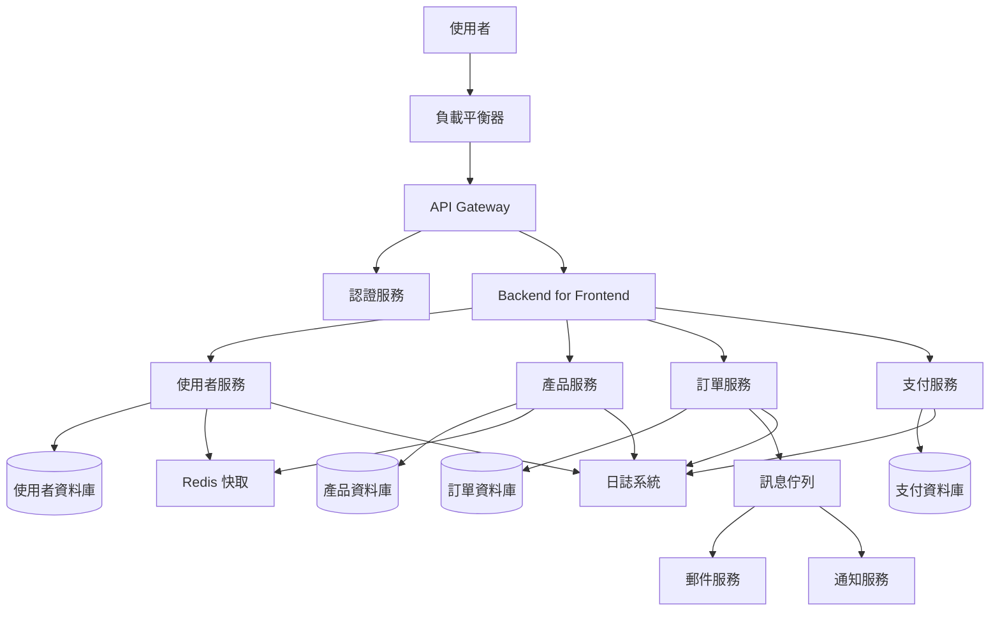
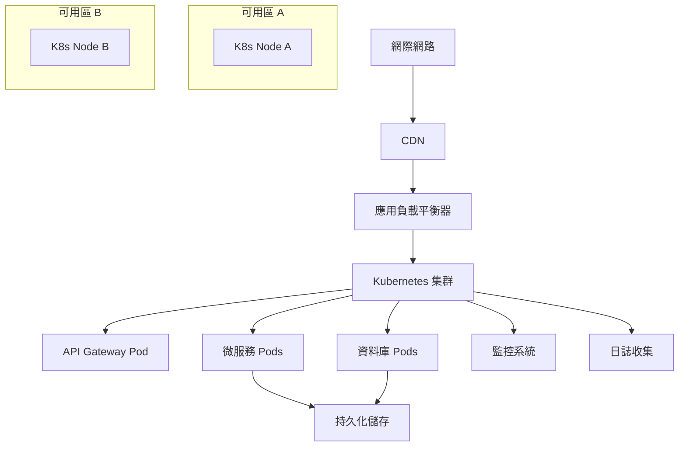
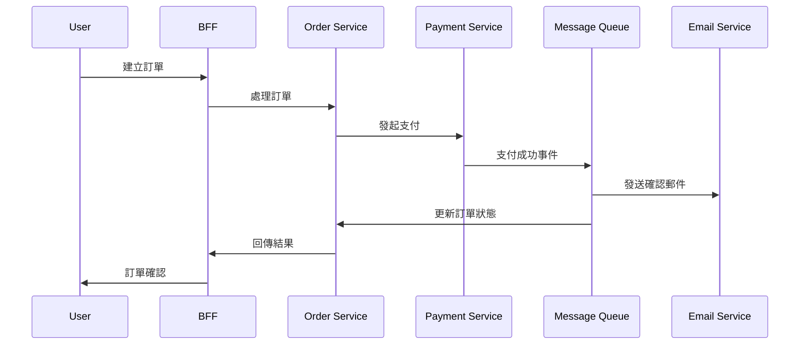
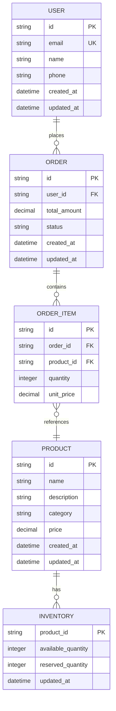
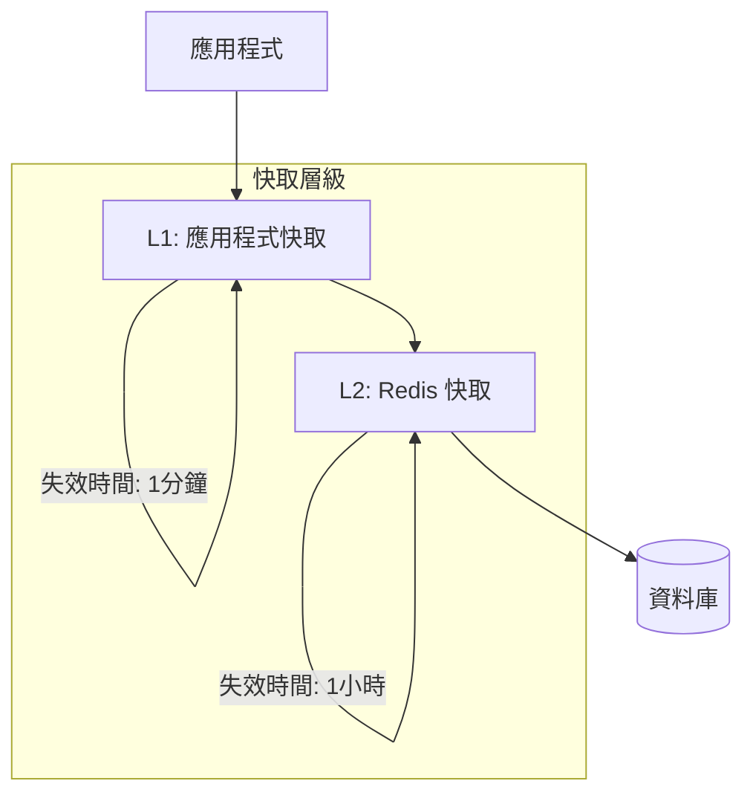
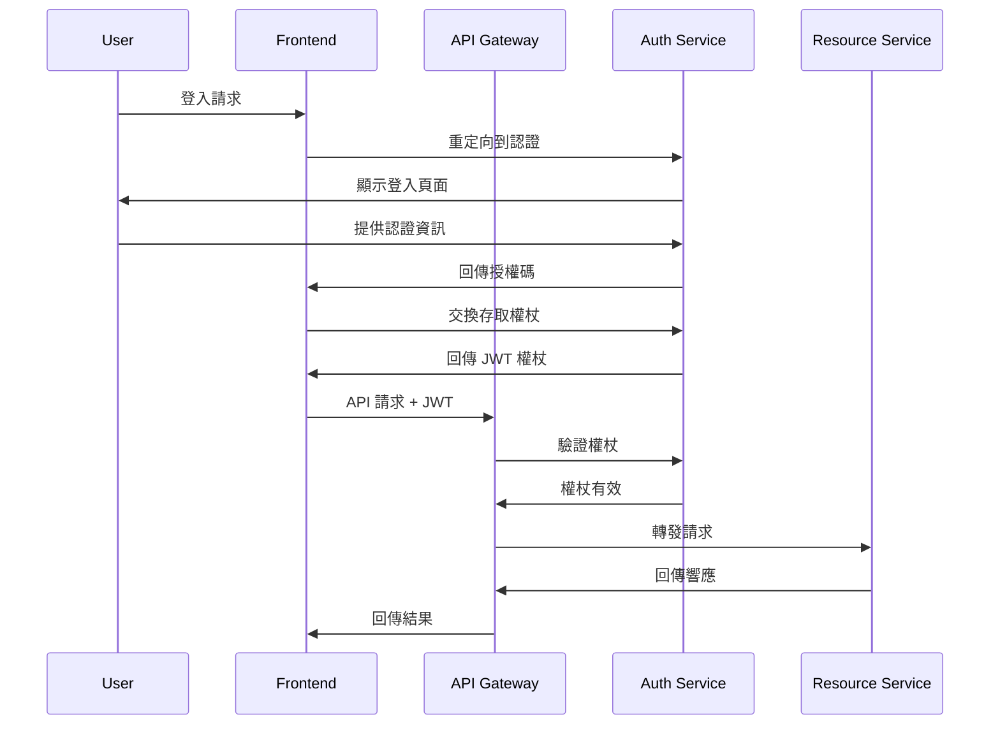
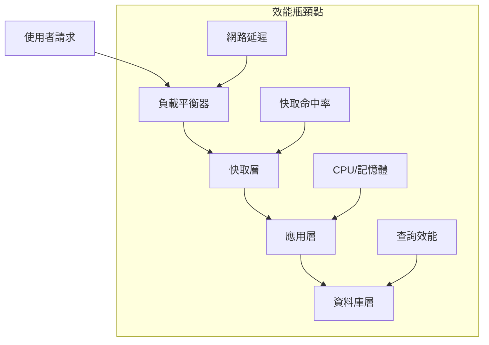
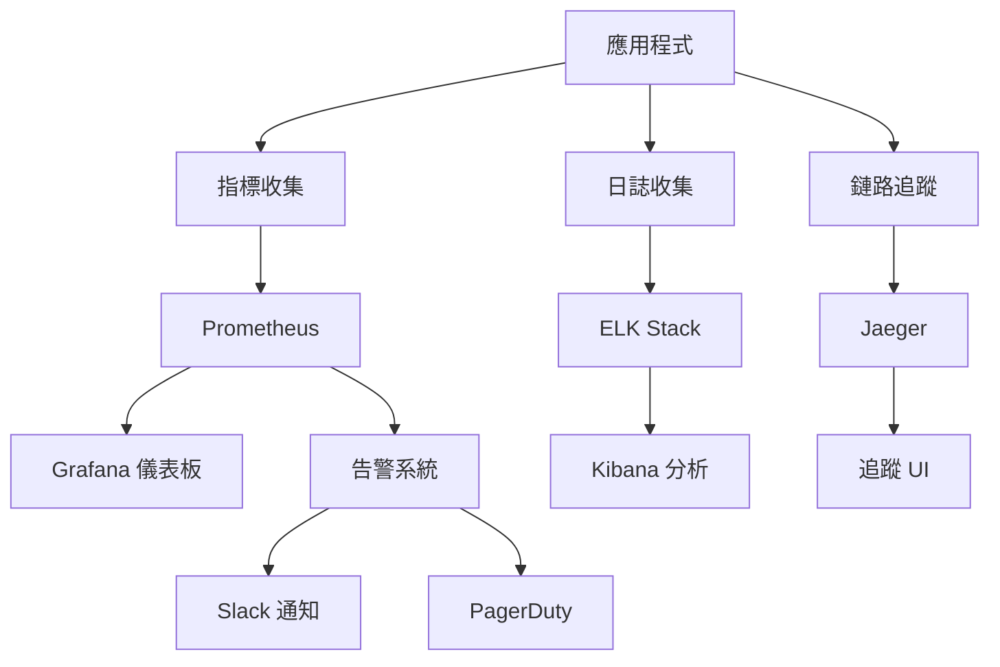

# 軟體架構設計指引範本

## Prompt 目標

指導 AI 進行軟體系統架構設計，建立可擴展、可維護且符合業務需求的技術架構。

## 角色設定

你是一位資深軟體架構師，具備豐富的系統設計經驗，熟悉各種架構模式、設計原則和最佳實務。

## 任務描述

請協助我完成 {專案名稱} 的軟體架構設計工作。

### 專案架構背景

- **專案名稱**: {填入專案名稱}
- **系統類型**: {填入系統類型，如：Web應用、微服務、分散式系統}
- **技術棧**: {填入主要技術棧}
- **預期使用者規模**: {填入預估使用者數量}
- **效能需求**: {填入效能指標}
- **可用性需求**: {填入可用性要求}
- **擴展性需求**: {填入擴展性要求}

### 架構設計要求

請按照以下結構進行設計：

#### 1. 整體架構設計
- 系統架構風格選擇
- 主要組件識別
- 層級架構設計
- 部署架構規劃

#### 2. 組件設計
- 核心組件定義
- 組件間關係
- 介面設計
- 責任分離

#### 3. 資料架構
- 資料模型設計
- 資料流設計
- 儲存策略
- 快取策略

#### 4. 安全架構
- 認證和授權
- 資料安全
- 通訊安全
- 威脅建模

#### 5. 效能架構
- 效能優化策略
- 負載平衡
- 快取機制
- 資源管理

#### 6. 可靠性設計
- 錯誤處理
- 容錯機制
- 監控和日誌
- 災難恢復

## 輸出格式

```markdown
# {專案名稱} 軟體架構設計文件

## 1. 架構概述

### 1.1 系統概述
**系統名稱:** {專案名稱}
**系統類型:** {系統類型描述}
**主要功能:** {核心功能清單}
**技術棧:** {使用的技術列表}

### 1.2 架構目標
**品質屬性優先級:**
1. **可用性** - 目標: 99.9% uptime
2. **效能** - 目標: 響應時間 < 200ms
3. **擴展性** - 目標: 支援 10x 使用者增長
4. **安全性** - 目標: 符合 OWASP 安全標準
5. **可維護性** - 目標: 新功能開發週期 < 2週

### 1.3 約束和假設
**技術約束:**
- 必須使用 {指定技術}
- 須符合 {合規要求}
- 預算限制: {預算範圍}

**業務約束:**
- 上線時間: {時間限制}
- 團隊規模: {開發團隊大小}
- 維運資源: {維運能力說明}

## 2. 整體架構設計

### 2.1 架構風格選擇

#### 選擇的架構風格: {架構風格名稱}
**原因說明:**
- 符合系統規模和複雜度
- 滿足效能和擴展性需求
- 團隊技術能力匹配
- 維運成本可控

#### 替代方案比較

| 架構風格 | 優點 | 缺點 | 適用場景 | 選擇結果 |
|----------|------|------|----------|----------|
| 單體架構 | 簡單、快速開發 | 擴展性限制 | 小型系統 | ❌ |
| 微服務架構 | 可擴展、技術多樣性 | 複雜度高 | 大型系統 | ✅ |
| 無伺服器 | 免維運、彈性擴展 | 冷啟動、供應商綁定 | 事件驅動 | ❌ |

### 2.2 系統架構圖



### 2.3 部署架構

#### 環境規劃
**開發環境:**
- 本地開發: Docker Compose
- 共享開發: Kubernetes 集群
- 測試資料: 測試資料集

**測試環境:**
- 整合測試: 完整服務部署
- 效能測試: 生產規模環境
- 安全測試: 隔離測試環境

**生產環境:**
- 多可用區部署
- 自動擴展配置
- 備份和災難恢復

#### 基礎設施架構


## 3. 組件設計

### 3.1 核心組件清單

#### API Gateway
**職責:**
- 路由和負載平衡
- 認證和授權
- 限流和熔斷
- 監控和日誌

**技術選擇:** {如：Kong, Istio, AWS API Gateway}
**配置要點:**
- 路由規則配置
- 安全策略設定
- 限流閾值設定

#### 使用者服務 (User Service)
**職責:**
- 使用者註冊和登入
- 個人資料管理
- 權限和角色管理
- 使用者偏好設定

**API 設計:**
```yaml
openapi: 3.0.0
paths:
  /users:
    post:
      summary: 建立使用者
      requestBody:
        content:
          application/json:
            schema:
              $ref: '#/components/schemas/CreateUserRequest'
    get:
      summary: 查詢使用者列表
      parameters:
        - name: page
          in: query
          schema:
            type: integer
  /users/{userId}:
    get:
      summary: 取得使用者詳情
    put:
      summary: 更新使用者資料
    delete:
      summary: 刪除使用者
```

#### 產品服務 (Product Service)
**職責:**
- 產品目錄管理
- 庫存管理
- 價格管理
- 產品搜尋

**資料模型:**
```json
{
  "product": {
    "id": "string",
    "name": "string",
    "description": "string",
    "category": "string",
    "price": "decimal",
    "inventory": "integer",
    "images": ["string"],
    "attributes": "object",
    "created_at": "datetime",
    "updated_at": "datetime"
  }
}
```

### 3.2 組件間通訊

#### 同步通訊
**REST API:**
- 使用者介面到 BFF
- BFF 到各微服務
- 服務間查詢操作

**gRPC:**
- 高頻率服務間呼叫
- 內部 API 通訊
- 型別安全要求

#### 非同步通訊
**事件驅動:**
- 訂單建立事件
- 支付完成事件
- 庫存變更事件

**訊息佇列:**
- 使用 Apache Kafka / RabbitMQ
- 保證訊息順序
- 錯誤重試機制



## 4. 資料架構設計

### 4.1 資料模型設計

#### 邏輯資料模型


#### 實體資料模型
**使用者服務資料庫 (PostgreSQL):**
```sql
-- 使用者表
CREATE TABLE users (
    id UUID PRIMARY KEY DEFAULT gen_random_uuid(),
    email VARCHAR(255) UNIQUE NOT NULL,
    password_hash VARCHAR(255) NOT NULL,
    name VARCHAR(255) NOT NULL,
    phone VARCHAR(50),
    status VARCHAR(20) DEFAULT 'active',
    created_at TIMESTAMP DEFAULT CURRENT_TIMESTAMP,
    updated_at TIMESTAMP DEFAULT CURRENT_TIMESTAMP
);

-- 使用者角色表
CREATE TABLE user_roles (
    user_id UUID REFERENCES users(id),
    role_name VARCHAR(50) NOT NULL,
    granted_at TIMESTAMP DEFAULT CURRENT_TIMESTAMP,
    PRIMARY KEY (user_id, role_name)
);
```

**產品服務資料庫 (PostgreSQL):**
```sql
-- 產品表
CREATE TABLE products (
    id UUID PRIMARY KEY DEFAULT gen_random_uuid(),
    name VARCHAR(255) NOT NULL,
    description TEXT,
    category VARCHAR(100) NOT NULL,
    price DECIMAL(10,2) NOT NULL,
    status VARCHAR(20) DEFAULT 'active',
    created_at TIMESTAMP DEFAULT CURRENT_TIMESTAMP,
    updated_at TIMESTAMP DEFAULT CURRENT_TIMESTAMP
);

-- 庫存表
CREATE TABLE inventory (
    product_id UUID PRIMARY KEY REFERENCES products(id),
    available_quantity INTEGER NOT NULL DEFAULT 0,
    reserved_quantity INTEGER NOT NULL DEFAULT 0,
    updated_at TIMESTAMP DEFAULT CURRENT_TIMESTAMP
);
```

### 4.2 資料分片和分散策略

#### 水平分片 (Sharding)
**分片策略:**
- 使用者資料: 按使用者 ID 雜湊分片
- 訂單資料: 按時間範圍分片
- 產品資料: 按類別分片

**分片配置:**
```yaml
sharding:
  strategy: hash
  shards: 4
  key: user_id
  algorithm: murmur3
```

#### 讀寫分離
**主從複製:**
- 寫操作: 主資料庫
- 讀操作: 從資料庫
- 資料同步: 非同步複製

**連線路由:**
```java
@Configuration
public class DataSourceConfig {
    
    @Bean
    @Primary
    public DataSource routingDataSource() {
        return new RoutingDataSource(
            masterDataSource(),
            slaveDataSource()
        );
    }
}
```

### 4.3 快取策略

#### 多層快取架構


**快取策略配置:**
```yaml
cache:
  levels:
    - name: application
      type: caffeine
      ttl: 60s
      max_size: 1000
    - name: distributed
      type: redis
      ttl: 3600s
      cluster:
        nodes:
          - redis-1:6379
          - redis-2:6379
          - redis-3:6379
```

#### 快取模式
**Cache-Aside Pattern:**
```java
@Service
public class ProductService {
    
    public Product getProduct(String productId) {
        // 1. 嘗試從快取取得
        Product product = cacheManager.get("product:" + productId);
        if (product != null) {
            return product;
        }
        
        // 2. 從資料庫查詢
        product = productRepository.findById(productId);
        if (product != null) {
            // 3. 寫入快取
            cacheManager.put("product:" + productId, product, 3600);
        }
        
        return product;
    }
}
```

## 5. 安全架構設計

### 5.1 認證和授權架構

#### OAuth 2.0 + OpenID Connect


#### JWT 權杖設計
```json
{
  "header": {
    "alg": "RS256",
    "typ": "JWT",
    "kid": "auth-service-key-1"
  },
  "payload": {
    "iss": "https://auth.example.com",
    "aud": "api.example.com",
    "sub": "user-123",
    "exp": 1640995200,
    "iat": 1640991600,
    "roles": ["user", "customer"],
    "permissions": ["read:profile", "write:orders"]
  }
}
```

#### RBAC 權限模型
```yaml
roles:
  - name: admin
    permissions:
      - users:*
      - products:*
      - orders:*
  - name: user
    permissions:
      - users:read:self
      - users:update:self
      - products:read
      - orders:read:self
      - orders:create
  - name: support
    permissions:
      - users:read
      - orders:read
      - orders:update:status
```

### 5.2 資料安全

#### 敏感資料加密
**資料分類:**
- **高敏感:** 密碼、支付資訊、個人身分資料
- **中敏感:** 個人資料、聯絡資訊
- **低敏感:** 公開資料、產品資訊

**加密策略:**
```java
@Entity
public class User {
    @Id
    private String id;
    
    private String email; // 明文
    
    @Encrypted(algorithm = "AES-256-GCM")
    private String phone; // 加密存儲
    
    @Hashed(algorithm = "bcrypt", rounds = 12)
    private String password; // 雜湊存儲
    
    @PersonalData
    private String name; // 標記個人資料
}
```

#### 資料遮罩和假名化
```yaml
data_masking:
  rules:
    - field: email
      method: partial_mask
      pattern: "***@***.com"
    - field: phone
      method: format_preserving
      algorithm: AES-FPE
    - field: credit_card
      method: full_mask
      replacement: "****-****-****-1234"
```

### 5.3 網路安全

#### API 安全防護
```yaml
api_security:
  rate_limiting:
    default: 100/minute
    authenticated: 1000/minute
    burst_limit: 150
  
  input_validation:
    max_request_size: 10MB
    content_types: ["application/json", "multipart/form-data"]
    sanitization: enabled
  
  security_headers:
    - "X-Content-Type-Options: nosniff"
    - "X-Frame-Options: DENY"
    - "X-XSS-Protection: 1; mode=block"
    - "Strict-Transport-Security: max-age=31536000"
```

#### WAF 配置
```yaml
waf_rules:
  - name: SQL_INJECTION
    pattern: "(union|select|insert|delete|update|drop)"
    action: block
  - name: XSS_PROTECTION
    pattern: "<script|javascript:|onload=|onerror="
    action: block
  - name: RATE_LIMIT_ABUSE
    condition: requests > 1000/hour
    action: throttle
```

## 6. 效能架構設計

### 6.1 效能目標和指標

#### 效能 SLA
| 指標 | 目標值 | 測量方式 |
|------|--------|----------|
| 響應時間 | P95 < 200ms | APM 監控 |
| 吞吐量 | > 1000 RPS | 負載測試 |
| 可用性 | 99.9% | 健康檢查 |
| 錯誤率 | < 0.1% | 錯誤日誌 |

#### 效能瓶頸分析


### 6.2 負載平衡策略

#### 多層負載平衡
```yaml
load_balancing:
  dns_level:
    type: geolocation
    regions:
      - us-east-1
      - eu-west-1
      - ap-southeast-1
  
  application_level:
    algorithm: least_connections
    health_check:
      path: /health
      interval: 30s
      timeout: 5s
  
  database_level:
    read_replicas: 3
    write_master: 1
    routing: automatic
```

#### 自動擴展配置
```yaml
autoscaling:
  metrics:
    - name: cpu_utilization
      target: 70%
      scale_up_threshold: 80%
      scale_down_threshold: 50%
    - name: memory_utilization
      target: 75%
    - name: request_rate
      target: 1000/minute
  
  scaling_policy:
    min_instances: 2
    max_instances: 20
    scale_up_cooldown: 300s
    scale_down_cooldown: 600s
```

### 6.3 快取最佳化

#### 快取階層化
```java
@Configuration
public class CacheConfig {
    
    @Bean
    public CacheManager cacheManager() {
        return CacheManager.builder()
            .addCache("user_sessions", Duration.ofMinutes(30))
            .addCache("product_catalog", Duration.ofHours(1))
            .addCache("static_content", Duration.ofDays(1))
            .addCache("api_responses", Duration.ofMinutes(5))
            .build();
    }
}
```

#### CDN 配置
```yaml
cdn_config:
  provider: cloudflare
  caching_rules:
    - path: "/static/*"
      ttl: 1d
      compression: gzip
    - path: "/api/products"
      ttl: 1h
      vary: ["Accept-Language", "Authorization"]
    - path: "/images/*"
      ttl: 7d
      optimize: webp
```

## 7. 可靠性和容錯設計

### 7.1 錯誤處理策略

#### 錯誤分類和處理
```java
public enum ErrorType {
    VALIDATION_ERROR(400, "client"),
    AUTHENTICATION_ERROR(401, "client"),
    AUTHORIZATION_ERROR(403, "client"),
    NOT_FOUND_ERROR(404, "client"),
    SERVER_ERROR(500, "server"),
    SERVICE_UNAVAILABLE(503, "server"),
    TIMEOUT_ERROR(504, "server");
}

@Component
public class GlobalErrorHandler {
    
    @ExceptionHandler(ValidationException.class)
    public ResponseEntity<ErrorResponse> handleValidation(ValidationException e) {
        return ResponseEntity.badRequest()
            .body(ErrorResponse.builder()
                .code("VALIDATION_ERROR")
                .message(e.getMessage())
                .timestamp(Instant.now())
                .build());
    }
}
```

#### 熔斷器模式
```java
@Component
public class PaymentServiceClient {
    
    @CircuitBreaker(name = "payment-service", fallbackMethod = "fallbackPayment")
    @Retry(name = "payment-service")
    @TimeLimiter(name = "payment-service")
    public CompletableFuture<PaymentResponse> processPayment(PaymentRequest request) {
        return paymentService.process(request);
    }
    
    public CompletableFuture<PaymentResponse> fallbackPayment(PaymentRequest request, Exception e) {
        // 降級處理邏輯
        return CompletableFuture.completedFuture(
            PaymentResponse.pending("Payment service temporarily unavailable")
        );
    }
}
```

### 7.2 監控和觀測

#### 監控架構


#### 關鍵指標監控
```yaml
monitoring:
  golden_signals:
    latency:
      - metric: http_request_duration_seconds
        percentiles: [50, 95, 99]
      - alert: high_latency
        condition: p95 > 200ms
        duration: 5m
    
    traffic:
      - metric: http_requests_per_second
      - alert: traffic_spike
        condition: increase > 300%
        duration: 2m
    
    errors:
      - metric: http_requests_total
        labels: {status=~"5.."}
      - alert: high_error_rate
        condition: rate > 1%
        duration: 5m
    
    saturation:
      - metric: cpu_usage_percent
      - metric: memory_usage_percent
      - alert: resource_exhaustion
        condition: cpu > 80% OR memory > 90%
        duration: 10m
```

### 7.3 災難恢復

#### 備份策略
```yaml
backup_strategy:
  databases:
    frequency: daily
    retention: 30d
    encryption: enabled
    cross_region: enabled
  
  application_data:
    frequency: hourly
    retention: 7d
    incremental: enabled
  
  configuration:
    frequency: on_change
    versioning: enabled
    git_backup: enabled
```

#### 災難恢復計劃
```yaml
disaster_recovery:
  rpo: 1h  # Recovery Point Objective
  rto: 4h  # Recovery Time Objective
  
  scenarios:
    - name: database_failure
      impact: high
      recovery_steps:
        - failover_to_replica
        - verify_data_integrity
        - update_application_config
        - monitor_performance
    
    - name: region_outage
      impact: critical
      recovery_steps:
        - activate_dr_region
        - restore_from_backup
        - update_dns_routing
        - verify_full_functionality
```

## 8. 部署和維運架構

### 8.1 CI/CD 流水線

#### 流水線配置
```yaml
# .github/workflows/deploy.yml
name: Deploy Pipeline

on:
  push:
    branches: [main]
  pull_request:
    branches: [main]

jobs:
  test:
    runs-on: ubuntu-latest
    steps:
      - uses: actions/checkout@v3
      - name: Run Tests
        run: |
          mvn test
          npm test
  
  security_scan:
    runs-on: ubuntu-latest
    steps:
      - name: Security Scan
        uses: securecodewarrior/github-action-add-sarif@v1
        with:
          sarif-file: security-scan-results.sarif
  
  build:
    needs: [test, security_scan]
    runs-on: ubuntu-latest
    steps:
      - name: Build Docker Images
        run: |
          docker build -t app:${{ github.sha }} .
          docker push registry/app:${{ github.sha }}
  
  deploy:
    needs: build
    runs-on: ubuntu-latest
    environment: production
    steps:
      - name: Deploy to Kubernetes
        run: |
          kubectl set image deployment/app app=registry/app:${{ github.sha }}
          kubectl rollout status deployment/app
```

### 8.2 容器化和編排

#### Kubernetes 部署配置
```yaml
# k8s/deployment.yaml
apiVersion: apps/v1
kind: Deployment
metadata:
  name: user-service
spec:
  replicas: 3
  selector:
    matchLabels:
      app: user-service
  template:
    metadata:
      labels:
        app: user-service
    spec:
      containers:
      - name: user-service
        image: registry/user-service:latest
        ports:
        - containerPort: 8080
        env:
        - name: DATABASE_URL
          valueFrom:
            secretKeyRef:
              name: db-secret
              key: url
        resources:
          requests:
            memory: "256Mi"
            cpu: "250m"
          limits:
            memory: "512Mi"
            cpu: "500m"
        livenessProbe:
          httpGet:
            path: /health
            port: 8080
          initialDelaySeconds: 30
          periodSeconds: 10
        readinessProbe:
          httpGet:
            path: /ready
            port: 8080
          initialDelaySeconds: 5
          periodSeconds: 5
```

## 9. 架構評估和驗證

### 9.1 架構評估方法

#### ATAM (Architecture Tradeoff Analysis Method)
**評估步驟:**
1. 架構展示和分析
2. 品質屬性識別
3. 架構方法提取
4. 敏感點和權衡點分析
5. 風險和非風險識別

#### 品質屬性評估
```yaml
quality_attributes:
  performance:
    scenarios:
      - "使用者在正常負載下查詢產品，系統在200ms內回應"
      - "系統在1000併發使用者下保持穩定效能"
    tactics:
      - load_balancing
      - caching
      - database_optimization
  
  availability:
    scenarios:
      - "單一服務失效時，系統繼續提供核心功能"
      - "系統維護期間，服務可用性 > 99.9%"
    tactics:
      - redundancy
      - health_monitoring
      - graceful_degradation
```

### 9.2 架構風險分析

#### 風險評估矩陣
| 風險項目 | 機率 | 影響 | 風險等級 | 緩解策略 |
|----------|------|------|----------|----------|
| 資料庫效能瓶頸 | 中 | 高 | 高 | 讀寫分離、快取優化 |
| 單點故障 | 低 | 高 | 中 | 冗餘部署、自動故障轉移 |
| 安全漏洞 | 中 | 高 | 高 | 安全審計、定期更新 |
| 擴展性限制 | 高 | 中 | 中 | 微服務化、水平擴展 |

## 10. 文件和知識傳遞

### 10.1 架構文件清單

#### 必要文件
- [ ] 架構決策記錄 (ADR)
- [ ] 系統架構圖
- [ ] 部署架構圖
- [ ] 資料架構文件
- [ ] API 設計規範
- [ ] 安全架構文件
- [ ] 災難恢復計劃
- [ ] 維運手冊

#### 文件模板
```markdown
# 架構決策記錄 (ADR) - {決策編號}

## 狀態
提議中 / 已接受 / 已廢棄 / 已替代

## 背景
描述促使此決策的技術或業務背景。

## 決策
我們將採用 {選擇的方案}。

## 結果
此決策將導致的正面和負面後果。

## 替代方案
考慮過但未採用的其他選項。
```

### 10.2 團隊知識建構

#### 技術分享計劃
```yaml
knowledge_sharing:
  architecture_reviews:
    frequency: monthly
    participants: [architects, senior_developers, tech_leads]
    topics: [design_patterns, performance_optimization, security_practices]
  
  documentation:
    wiki: confluence
    code_documentation: inline_comments + readme
    api_documentation: openapi_spec
  
  training:
    new_member_onboarding: 2_weeks
    technology_updates: quarterly
    best_practices: ongoing
```

## 注意事項

1. 架構設計應該是演進式的，隨著需求變化而調整
2. 始終考慮技術債務和重構成本
3. 平衡過度設計和不足設計的風險
4. 重視非功能需求的設計和驗證
5. 確保架構決策有適當的文件記錄
6. 定期進行架構審查和效能評估
```

## 工具和資源建議

### 架構設計工具
- **圖表繪製:** Mermaid, Lucidchart, Draw.io
- **原型製作:** Figma, Balsamiq
- **文件協作:** Confluence, Notion
- **版本控制:** Git, GitLab

### 建模和分析工具
- **UML 建模:** PlantUML, Enterprise Architect
- **效能分析:** JProfiler, New Relic
- **安全分析:** OWASP ZAP, SonarQube
- **負載測試:** JMeter, K6

## 品質檢查清單

- [ ] 架構目標明確且可測量
- [ ] 系統邊界和組件職責清楚定義
- [ ] 非功能需求有具體的解決方案
- [ ] 安全考量涵蓋各個層面
- [ ] 效能設計符合預期負載
- [ ] 錯誤處理和容錯機制完整
- [ ] 監控和觀測策略全面
- [ ] 部署和維運考量充分
- [ ] 架構決策有充分的理由支撐
- [ ] 文件完整且便於理解和維護
