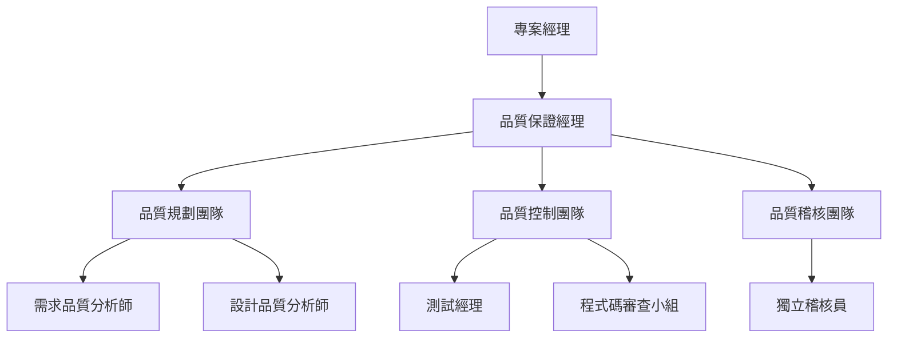
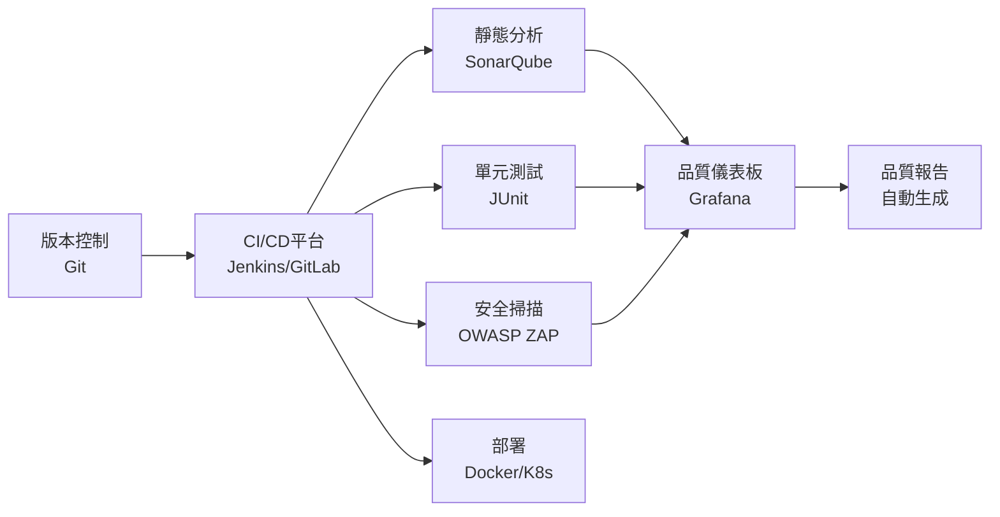
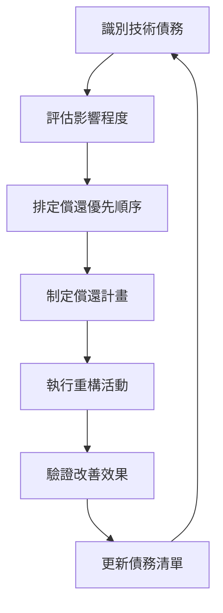
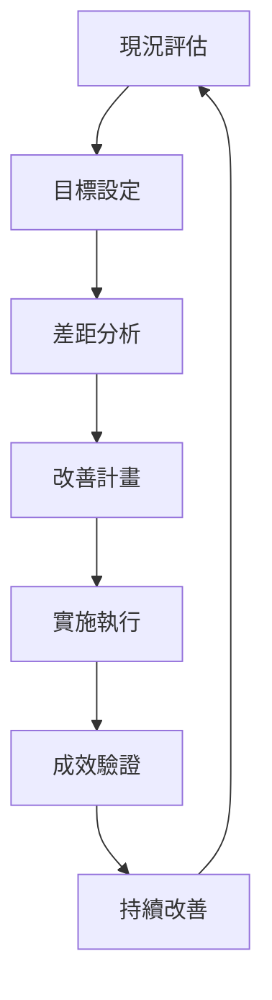
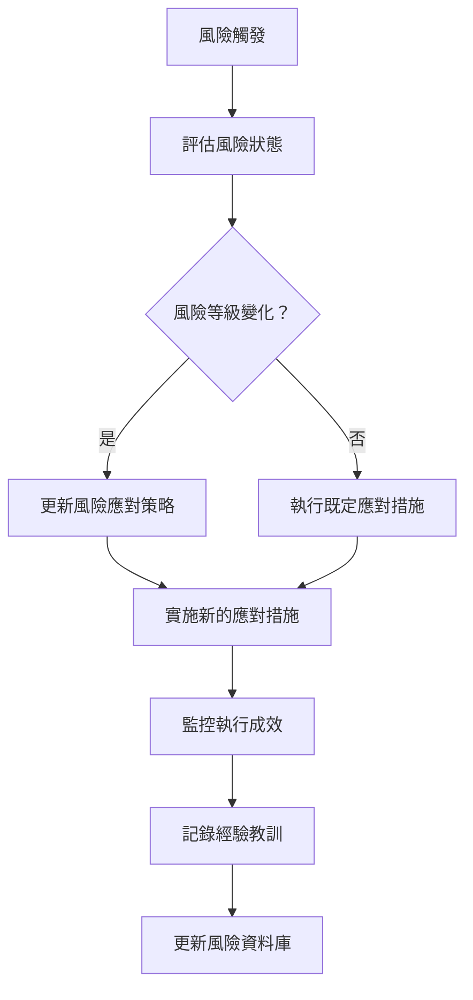
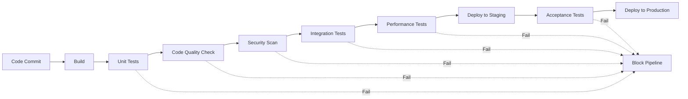

# 專案品質管理指引

## 目錄

1. [品質管理的重要性與目標](#1-品質管理的重要性與目標)
   - 1.1 [品質管理的定義](#11-品質管理的定義)
   - 1.2 [品質管理的重要性](#12-品質管理的重要性)
   - 1.3 [品質管理目標](#13-品質管理目標)
   - 1.4 [實務案例](#14-實務案例)

2. [品質規劃流程](#2-品質規劃流程)
   - 2.1 [品質規劃概述](#21-品質規劃概述)
   - 2.2 [品質規劃輸入](#22-品質規劃輸入)
   - 2.3 [品質規劃工具與技術](#23-品質規劃工具與技術)
   - 2.4 [品質規劃輸出](#24-品質規劃輸出)
   - 2.5 [實務案例](#25-實務案例)

3. [品質保證流程](#3-品質保證流程)
   - 3.1 [品質保證概述](#31-品質保證概述)
   - 3.2 [品質保證活動](#32-品質保證活動)
   - 3.3 [品質保證工具](#33-品質保證工具)
   - 3.4 [品質保證輸出](#34-品質保證輸出)
   - 3.5 [實務案例](#35-實務案例)

4. [品質控制流程](#4-品質控制流程)
   - 4.1 [品質控制概述](#41-品質控制概述)
   - 4.2 [品質控制活動](#42-品質控制活動)
   - 4.3 [品質控制工具與技術](#43-品質控制工具與技術)
   - 4.4 [品質控制輸出](#44-品質控制輸出)
   - 4.5 [實務案例](#45-實務案例)

5. [常用品質工具與方法](#5-常用品質工具與方法)
   - 5.1 [七大品質工具](#51-七大品質工具)
   - 5.2 [軟體品質分析工具](#52-軟體品質分析工具)
   - 5.3 [測試工具與框架](#53-測試工具與框架)
   - 5.4 [品質量測工具](#54-品質量測工具)
   - 5.5 [工具選擇指南](#55-工具選擇指南)

6. [專案品質指標範例](#6-專案品質指標範例)
   - 6.1 [品質指標設計原則](#61-品質指標設計原則)
   - 6.2 [開發階段品質指標](#62-開發階段品質指標)
   - 6.3 [測試階段品質指標](#63-測試階段品質指標)
   - 6.4 [維運階段品質指標](#64-維運階段品質指標)
   - 6.5 [指標監控與報告](#65-指標監控與報告)

7. [品質稽核流程](#7-品質稽核流程)
   - 7.1 [品質稽核概述](#71-品質稽核概述)
   - 7.2 [稽核類型與方法](#72-稽核類型與方法)
   - 7.3 [品質稽核準備](#73-品質稽核準備)
   - 7.4 [品質稽核執行](#74-品質稽核執行)
   - 7.5 [稽核發現與報告](#75-稽核發現與報告)
   - 7.6 [矯正行動與追蹤](#76-矯正行動與追蹤)
   - 7.7 [實務案例](#77-實務案例)

8. [銀行系統專案品質管控實務案例](#8-銀行系統專案品質管控實務案例)
   - 8.1 [案例背景：數位金融平台建置專案](#81-案例背景數位金融平台建置專案)
   - 8.2 [品質管理策略](#82-品質管理策略)
   - 8.3 [品質活動實施](#83-品質活動實施)
   - 8.4 [品質挑戰與解決方案](#84-品質挑戰與解決方案)
   - 8.5 [成果與經驗分享](#85-成果與經驗分享)

9. [常見問題與解法](#9-常見問題與解法)
   - 9.1 [品質規劃階段常見問題](#91-品質規劃階段常見問題)
   - 9.2 [品質保證階段常見問題](#92-品質保證階段常見問題)
   - 9.3 [品質控制階段常見問題](#93-品質控制階段常見問題)
   - 9.4 [組織與文化問題](#94-組織與文化問題)
   - 9.5 [工具與技術問題](#95-工具與技術問題)

10. [附錄：檢核清單範例](#10-附錄檢核清單範例)
    - 10.1 [品質規劃檢核清單](#101-品質規劃檢核清單)
    - 10.2 [程式碼審查檢核清單](#102-程式碼審查檢核清單)
    - 10.3 [測試執行檢核清單](#103-測試執行檢核清單)
    - 10.4 [上線前檢核清單](#104-上線前檢核清單)

11. [參考資料與延伸閱讀](#11-參考資料與延伸閱讀)
    - 11.1 [專案管理相關資源](#111-專案管理相關資源)
    - 11.2 [品質管理相關資源](#112-品質管理相關資源)
    - 11.3 [軟體工程相關資源](#113-軟體工程相關資源)
    - 11.4 [測試相關資源](#114-測試相關資源)
    - 11.5 [工具與技術資源](#115-工具與技術資源)
    - 11.6 [線上社群與討論區](#116-線上社群與討論區)
    - 11.7 [實務案例研究](#117-實務案例研究)
    - 11.8 [持續學習建議](#118-持續學習建議)

12. [品質管理成熟度評估](#12-品質管理成熟度評估)
    - 12.1 [成熟度模型介紹](#121-成熟度模型介紹)
    - 12.2 [評估方法與工具](#122-評估方法與工具)
    - 12.3 [改善路徑規劃](#123-改善路徑規劃)
    - 12.4 [實務評估案例](#124-實務評估案例)

13. [品質風險管理](#13-品質風險管理)
    - 13.1 [品質風險識別](#131-品質風險識別)
    - 13.2 [風險評估與分析](#132-風險評估與分析)
    - 13.3 [風險應對策略](#133-風險應對策略)
    - 13.4 [風險監控與回應](#134-風險監控與回應)

14. [敏捷開發中的品質管理](#14-敏捷開發中的品質管理)
    - 14.1 [敏捷品質管理原則](#141-敏捷品質管理原則)
    - 14.2 [Sprint品質活動](#142-sprint品質活動)
    - 14.3 [持續整合與品質](#143-持續整合與品質)
    - 14.4 [敏捷品質工具](#144-敏捷品質工具)

15. [品質管理的未來趨勢](#15-品質管理的未來趨勢)
    - 15.1 [AI與機器學習在品質管理中的應用](#151-ai與機器學習在品質管理中的應用)
    - 15.2 [DevOps與品質工程](#152-devops與品質工程)
    - 15.3 [雲端環境下的品質管理](#153-雲端環境下的品質管理)
    - 15.4 [業界趨勢與展望](#154-業界趨勢與展望)

---

## 文件資訊

- **文件版本**: 2.0
- **建立日期**: 2025年8月13日
- **最後更新**: 2025年8月29日
- **適用對象**: 新進專案經理、品質工程師、開發團隊主管
- **適用範圍**: 金融業大型系統專案、軟體開發專案

---

## 1. 品質管理的重要性與目標

### 1.1 品質管理的定義

專案品質管理是確保專案能滿足既定需求的所有活動與過程，包含品質規劃、品質保證、品質控制三大流程。

### 1.2 品質管理的重要性

#### 1.2.1 業務層面
- **降低營運風險**: 高品質的系統能減少上線後的故障機率
- **提升客戶滿意度**: 符合需求的產品能增加客戶信任
- **節省維護成本**: 品質良好的系統維護成本較低
- **法規遵循**: 確保系統符合金融法規要求

#### 1.2.2 技術層面
- **減少缺陷**: 早期發現並修正問題
- **提升效能**: 確保系統性能符合預期
- **增強穩定性**: 降低系統當機風險
- **改善可維護性**: 提升程式碼品質

### 1.3 品質管理目標

#### 1.3.1 主要目標
- 確保交付品符合客戶需求與期望
- 建立持續改善的品質文化
- 降低專案風險與成本
- 提升團隊品質意識

#### 1.3.2 具體目標設定原則（SMART原則）
- **Specific（具體）**: 明確定義品質標準
- **Measurable（可衡量）**: 設定可量化的指標
- **Achievable（可達成）**: 目標要實際可行
- **Relevant（相關）**: 與專案目標一致
- **Time-bound（有時限）**: 設定達成時間

### 1.4 實務案例

**案例：某銀行核心系統升級專案**

該專案設定品質目標為：
- 系統可用性 ≥ 99.9%
- 缺陷密度 ≤ 2 個/千行程式碼
- 用戶驗收測試通過率 ≥ 95%
- 上線後3個月內重大事件數量 = 0

透過明確的品質目標設定，專案團隊能聚焦於品質提升，最終成功達成所有目標。

---

## 2. 品質規劃流程

### 2.1 品質規劃概述

品質規劃是識別專案品質需求與標準，並制定滿足這些需求方法的過程。

### 2.2 品質規劃輸入

#### 2.2.1 主要輸入文件
- **專案章程**: 專案高層級需求
- **專案管理計畫**: 範圍、時程、成本基準
- **專案文件**: 需求文件、風險登錄表
- **事業環境因素**: 法規要求、組織文化
- **組織流程資產**: 品質政策、標準範本

#### 2.2.2 相關干係人意見
- 客戶品質期望
- 法規單位要求
- 營運單位標準
- 技術團隊建議

### 2.3 品質規劃工具與技術

#### 2.3.1 成本效益分析
- 品質投資成本 vs 缺陷修復成本
- 預防成本 vs 失敗成本
- ROI（投資報酬率）計算

#### 2.3.2 品質成本模型
- **預防成本**: 訓練、流程改善
- **評鑑成本**: 測試、審查、檢驗
- **內部失敗成本**: 重工、除錯
- **外部失敗成本**: 客戶投訴、維修

#### 2.3.3 標竿分析
- 業界最佳實務
- 組織內部成功案例
- 競爭對手分析

### 2.4 品質規劃輸出

#### 2.4.1 品質管理計畫
包含以下內容：
- 品質政策與目標
- 品質標準與指標
- 品質組織架構
- 品質活動時程
- 品質工具與方法

#### 2.4.2 品質指標
- 程式碼品質指標
- 測試覆蓋率指標
- 缺陷密度指標
- 性能指標

#### 2.4.3 檢核清單
- 需求審查檢核清單
- 設計審查檢核清單
- 程式碼審查檢核清單
- 測試執行檢核清單

### 2.5 實務案例

**案例：網路銀行系統品質規劃**

專案經理在規劃階段進行了以下活動：
1. 分析客戶對系統可用性的要求（99.9%）
2. 研究法規對資安的要求（PCI DSS）
3. 制定程式碼品質標準（SonarQube規則）
4. 設計測試策略（自動化測試覆蓋率80%）

透過完整的品質規劃，專案團隊在執行階段有明確的品質依據。

---

## 3. 品質保證流程

### 3.1 品質保證概述

品質保證是稽核品質要求與品質控制量測結果，以確保採用適當品質標準與作業定義的過程。

### 3.2 品質保證活動

#### 3.2.1 流程稽核
- **目的**: 確保專案遵循既定的品質流程
- **範圍**: 涵蓋所有專案階段
- **頻率**: 定期或里程碑檢查
- **執行者**: 品質保證團隊或獨立稽核員

#### 3.2.2 產品稽核
- **設計文件審查**: 確保設計符合需求
- **程式碼審查**: 檢查程式碼品質
- **測試案例審查**: 驗證測試覆蓋度
- **文件完整性檢查**: 確保交付文件齊全

#### 3.2.3 持續改善
- 收集品質指標數據
- 分析品質趨勢
- 識別改善機會
- 實施改善措施

### 3.3 品質保證工具

#### 3.3.1 稽核技術
- **符合性稽核**: 檢查是否遵循標準
- **最佳實務稽核**: 比較業界標準
- **風險導向稽核**: 聚焦高風險領域

#### 3.3.2 品質分析技術
- **根因分析**: 找出問題根本原因
- **趨勢分析**: 分析品質指標變化
- **相關性分析**: 找出品質因子關聯

### 3.4 品質保證輸出

#### 3.4.1 品質報告
- 品質指標達成狀況
- 稽核發現事項
- 改善建議
- 風險評估

#### 3.4.2 變更請求
- 流程改善建議
- 工具升級需求
- 訓練需求

### 3.5 實務案例

**案例：信用卡系統品質保證**

品質保證團隊每週執行以下活動：
1. 檢查程式碼提交是否通過靜態分析
2. 審查測試執行報告
3. 驗證需求追蹤矩陣完整性
4. 評估缺陷趨勢變化

透過持續的品質保證活動，團隊及時發現流程缺失並進行改善。

---

## 4. 品質控制流程

### 4.1 品質控制概述

品質控制是監督專案結果，判定是否符合品質標準，並識別方法以消除績效不滿意原因的過程。

### 4.2 品質控制活動

#### 4.2.1 檢驗與測試
- **單元測試**: 測試個別程式模組
- **整合測試**: 測試模組間介面
- **系統測試**: 測試完整系統功能
- **驗收測試**: 驗證業務需求滿足度

#### 4.2.2 審查活動
- **同儕審查**: 開發人員互相檢查
- **技術審查**: 技術專家深度檢查
- **管理審查**: 管理層決策檢查點

#### 4.2.3 量測與分析
- 收集品質指標
- 分析偏差原因
- 實施矯正措施
- 監控改善成效

### 4.3 品質控制工具

#### 4.3.1 七大品質工具
1. **因果圖（魚骨圖）**: 分析問題根因
2. **檢核表**: 系統化收集數據
3. **控制圖**: 監控流程穩定性
4. **直方圖**: 顯示數據分布
5. **帕雷托圖**: 識別重要問題
6. **散布圖**: 分析變數關聯
7. **流程圖**: 分析流程步驟

#### 4.3.2 統計抽樣
- 決定樣本大小
- 選擇抽樣方法
- 執行統計分析
- 做出品質判斷

### 4.4 品質控制輸出

#### 4.4.1 品質控制測量
- 測試結果數據
- 缺陷統計報告
- 性能測試結果
- 品質指標趨勢

#### 4.4.2 確認的變更
- 缺陷修正確認
- 改善措施驗證
- 流程更新確認

### 4.5 實務案例

**案例：行動銀行APP品質控制**

專案團隊建立以下品質控制機制：
1. 每日自動化測試執行（回歸測試）
2. 週度程式碼審查會議
3. 月度品質指標檢討
4. 里程碑品質檢查點

透過系統化的品質控制，APP在上線前達到預期品質標準。

---

## 5. 常用品質工具與方法

### 5.1 七大品質工具詳解

#### 5.1.1 檢核表（Check Sheet）

**用途**: 系統化收集與記錄數據

**使用時機**:
- 收集缺陷統計資料
- 記錄問題發生頻率
- 追蹤任務完成狀況

**製作步驟**:
1. 定義要收集的項目
2. 設計表格格式
3. 決定收集期間
4. 指派負責人員
5. 定期彙整分析

**實務應用範例**:
```
系統測試缺陷檢核表
=====================
測試階段: 系統測試第二週
記錄期間: 2025/8/13 - 2025/8/19

缺陷類型          發生次數    百分比
功能性缺陷         ||||||||   35%
介面問題           ||||      17%
性能問題           |||       13%
資安漏洞           ||        9%
其他               ||||||||   26%
```

#### 5.1.2 因果圖（魚骨圖/石川圖）

**用途**: 分析問題的根本原因

**基本架構**:
- 主骨：問題描述
- 大骨：主要原因類別（人、機、料、法、環、測）
- 小骨：具體原因

**製作步驟**:
1. 明確定義問題
2. 畫出主骨架
3. 確定主要原因類別
4. 腦力激盪具體原因
5. 分析根本原因

**案例：系統回應時間過慢分析**
```
人員因素：程式設計師經驗不足、缺乏性能調校知識
方法因素：未進行性能測試、缺乏監控機制
機器因素：伺服器規格不足、網路頻寬限制
材料因素：資料庫設計不當、未建立適當索引
環境因素：測試環境與正式環境差異過大
```

#### 5.1.3 控制圖（Control Chart）

**用途**: 監控流程是否穩定、可預測

**基本元素**:
- 中心線（CL）：流程平均值
- 上控制限（UCL）：上限警戒線
- 下控制限（LCL）：下限警戒線
- 數據點：實際測量值

**判斷準則**:
- 點超出控制限：流程失控
- 連續7點上升或下降：趨勢異常
- 連續8點在中心線同一側：偏移異常

#### 5.1.4 帕雷托圖（Pareto Chart）

**用途**: 識別「關鍵少數」問題

**80/20法則**: 80%的問題來自20%的原因

**製作步驟**:
1. 收集問題數據
2. 依發生頻率排序
3. 計算累積百分比
4. 繪製長條圖與累積線
5. 識別關鍵問題

#### 5.1.5 直方圖（Histogram）

**用途**: 顯示數據的分布狀況

**應用場景**:
- 分析回應時間分布
- 檢視缺陷密度分布
- 評估性能指標變異

#### 5.1.6 散布圖（Scatter Diagram）

**用途**: 分析兩個變數間的關聯性

**關聯型態**:
- 正相關：一個增加，另一個也增加
- 負相關：一個增加，另一個減少
- 無相關：沒有明顯關聯

#### 5.1.7 流程圖（Flow Chart）

**用途**: 視覺化呈現流程步驟

**基本符號**:
- 橢圓形：開始/結束
- 矩形：處理步驟
- 菱形：決策點
- 圓形：連接點

### 5.2 新七大品質工具

#### 5.2.1 關聯圖（Affinity Diagram）

**用途**: 將大量想法歸類整理

#### 5.2.2 關係圖（Relations Diagram）

**用途**: 分析複雜問題間的因果關係

#### 5.2.3 樹狀圖（Tree Diagram）

**用途**: 將目標分解為具體行動

#### 5.2.4 矩陣圖（Matrix Diagram）

**用途**: 分析兩組或多組要素間的關係

#### 5.2.5 優先順序矩陣

**用途**: 根據標準評估方案優先順序

#### 5.2.6 流程決策程序圖（PDPC）

**用途**: 預防計畫執行時的潛在問題

#### 5.2.7 箭形圖（Arrow Diagram）

**用途**: 規劃專案時程與關鍵路徑

### 5.3 實務案例

**案例：電子支付系統品質改善**

專案團隊使用多種品質工具解決交易失敗率過高問題：

1. **檢核表**: 收集一週交易失敗數據
2. **帕雷托圖**: 發現80%失敗來自網路逾時
3. **魚骨圖**: 分析網路逾時根本原因
4. **控制圖**: 監控改善後的交易成功率

結果：交易失敗率從5%降至0.5%。

---

## 6. 專案品質指標範例

### 6.1 品質指標設計原則

#### 6.1.1 SMART原則應用
- **Specific（具體）**: 指標定義明確
- **Measurable（可測量）**: 可量化評估
- **Achievable（可達成）**: 設定合理目標
- **Relevant（相關）**: 與專案目標關聯
- **Time-bound（時限）**: 明確時間範圍

#### 6.1.2 指標分類
- **過程指標**: 評估執行過程品質
- **產品指標**: 評估交付產品品質
- **服務指標**: 評估服務水準品質

### 6.2 程式碼品質指標

#### 6.2.1 程式碼複雜度指標

| 指標名稱 | 計算方式 | 目標值 | 說明 |
|---------|---------|--------|------|
| 循環複雜度 | McCabe複雜度 | ≤ 10 | 單一方法複雜度 |
| 認知複雜度 | 可讀性評估 | ≤ 15 | 程式理解難度 |
| 巢狀深度 | 條件判斷層數 | ≤ 4 | if/for巢狀層級 |

#### 6.2.2 程式碼覆蓋率指標

| 覆蓋類型 | 目標值 | 計算方式 |
|---------|--------|----------|
| 行覆蓋率 | ≥ 80% | 執行行數/總行數 |
| 分支覆蓋率 | ≥ 70% | 執行分支/總分支 |
| 函數覆蓋率 | ≥ 90% | 執行函數/總函數 |

#### 6.2.3 程式碼品質評級

| 等級 | SonarQube評分 | 技術債務比 | 可靠性評級 |
|------|--------------|------------|------------|
| A | 90-100 | < 5% | 無嚴重缺陷 |
| B | 80-89 | 5-10% | 有次要缺陷 |
| C | 70-79 | 10-20% | 有主要缺陷 |

### 6.3 測試品質指標

#### 6.3.1 測試執行指標

| 指標名稱 | 計算公式 | 目標值 |
|---------|---------|--------|
| 測試案例通過率 | 通過案例數/總案例數 × 100% | ≥ 95% |
| 測試執行進度 | 已執行案例/規劃案例 × 100% | 按計畫執行 |
| 自動化測試比例 | 自動化案例/總案例 × 100% | ≥ 80% |

#### 6.3.2 缺陷相關指標

| 指標名稱 | 計算公式 | 目標值 |
|---------|---------|--------|
| 缺陷密度 | 缺陷數/千行程式碼 | ≤ 2 |
| 缺陷移除效率 | 測試發現缺陷/(測試+上線後發現) × 100% | ≥ 95% |
| 缺陷修復時間 | 平均修復天數 | ≤ 3天 |

### 6.4 系統性能指標

#### 6.4.1 回應時間指標

| 交易類型 | 平均回應時間 | 90%百分位數 | 99%百分位數 |
|---------|-------------|------------|------------|
| 登入驗證 | ≤ 2秒 | ≤ 3秒 | ≤ 5秒 |
| 餘額查詢 | ≤ 1秒 | ≤ 2秒 | ≤ 3秒 |
| 轉帳交易 | ≤ 5秒 | ≤ 8秒 | ≤ 12秒 |

#### 6.4.2 系統可用性指標

| 指標類型 | 目標值 | 計算方式 |
|---------|--------|----------|
| 系統可用率 | ≥ 99.9% | (總時間-停機時間)/總時間 × 100% |
| 平均故障間隔 | ≥ 720小時 | 總運行時間/故障次數 |
| 平均修復時間 | ≤ 4小時 | 總修復時間/故障次數 |

### 6.5 客戶滿意度指標

#### 6.5.1 驗收測試指標

| 指標名稱 | 目標值 | 說明 |
|---------|--------|------|
| 用戶驗收通過率 | ≥ 95% | UAT階段通過的功能比例 |
| 客戶滿意度評分 | ≥ 4.5/5.0 | 客戶對系統整體評價 |
| 需求變更率 | ≤ 10% | 驗收階段的需求變更比例 |

### 6.6 流程效率指標

#### 6.6.1 開發流程指標

| 指標名稱 | 計算方式 | 目標值 |
|---------|---------|--------|
| 開發速度 | 完成功能點/開發工時 | 依歷史基準 |
| 重工率 | 重工時間/總開發時間 × 100% | ≤ 15% |
| 程式碼審查覆蓋率 | 審查行數/新增行數 × 100% | 100% |

### 6.7 實務案例

**案例：某銀行數位帳戶開戶系統**

**設定的關鍵品質指標**:

1. **功能品質**
   - 開戶成功率 ≥ 98%
   - 身份驗證準確率 ≥ 99.9%

2. **性能品質**
   - 開戶流程完成時間 ≤ 5分鐘
   - 系統回應時間 ≤ 2秒

3. **安全品質**
   - 無重大資安漏洞
   - 通過滲透測試

4. **使用者體驗**
   - 使用者滿意度 ≥ 4.2/5.0
   - 流程放棄率 ≤ 5%

**監控結果**: 
- 所有指標均達成目標
- 系統上線後客戶開戶數提升 40%

---

## 7. 品質稽核流程

### 7.1 品質稽核概述

品質稽核是獨立檢查專案活動是否遵循組織政策、流程與程序的結構化活動。

### 7.2 品質稽核類型

#### 7.2.1 內部稽核
- **執行者**: 組織內部稽核團隊
- **目的**: 確保遵循內部標準
- **頻率**: 定期或依里程碑執行
- **範圍**: 流程、產品、服務

#### 7.2.2 外部稽核
- **執行者**: 第三方稽核機構
- **目的**: 客觀評估品質水準
- **時機**: 重要里程碑或客戶要求
- **標準**: 國際標準（ISO、CMMI）

#### 7.2.3 法規稽核
- **執行者**: 監管機關或認證機構
- **目的**: 確保法規遵循
- **要求**: 強制性稽核
- **範圍**: 特定法規要求

### 7.3 品質稽核規劃

#### 7.3.1 稽核計畫制定

**稽核計畫包含內容**:
- 稽核目標與範圍
- 稽核標準與準則
- 稽核時程安排
- 稽核團隊組成
- 稽核方法與工具

**稽核準備檢核清單**:
- [ ] 稽核計畫書核准
- [ ] 稽核團隊指派
- [ ] 稽核標準確認
- [ ] 受稽核單位通知
- [ ] 相關文件蒐集

#### 7.3.2 稽核團隊組成

| 角色 | 職責 | 資格要求 |
|------|------|----------|
| 主任稽核員 | 領導稽核活動 | 稽核資格認證 |
| 稽核員 | 執行稽核工作 | 專業領域經驗 |
| 技術專家 | 提供專業意見 | 相關技術背景 |
| 觀察員 | 學習與見證 | 受訓人員 |

### 7.4 品質稽核執行

#### 7.4.1 稽核執行步驟

1. **開始會議**
   - 說明稽核目的與範圍
   - 確認稽核時程
   - 介紹稽核團隊
   - 回答相關問題

2. **現場稽核**
   - 文件審查
   - 訪談相關人員
   - 現場觀察
   - 證據收集

3. **結束會議**
   - 報告稽核發現
   - 討論改善建議
   - 確認後續行動

#### 7.4.2 稽核方法

**文件審查**:
- 政策與程序文件
- 工作紀錄與報告
- 品質指標數據
- 矯正措施記錄

**訪談技巧**:
- 開放式問題
- 具體事例詢問
- 交叉驗證
- 避免誘導性問題

**現場觀察**:
- 實際作業流程
- 工作環境狀況
- 工具使用情形
- 人員操作技能

### 7.5 稽核發現與報告

#### 7.5.1 發現事項分類

| 等級 | 定義 | 處理要求 |
|------|------|----------|
| 重大不符合 | 嚴重違反標準 | 立即矯正 |
| 次要不符合 | 輕微偏離標準 | 限期改善 |
| 觀察事項 | 潛在改善機會 | 建議改善 |
| 良好實務 | 值得推廣做法 | 分享學習 |

#### 7.5.2 稽核報告結構

```markdown
# 品質稽核報告

## 1. 執行摘要
- 稽核目的與範圍
- 主要發現摘要
- 整體評估結論

## 2. 稽核詳情
- 稽核基準與標準
- 稽核方法與過程
- 稽核團隊資訊

## 3. 發現事項
- 重大不符合事項
- 次要不符合事項
- 觀察事項
- 良好實務

## 4. 改善建議
- 根本原因分析
- 改善措施建議
- 預防措施建議

## 5. 後續追蹤
- 矯正行動計畫
- 追蹤時程安排
- 負責人指派
```

### 7.6 矯正行動與追蹤

#### 7.6.1 矯正行動計畫

**計畫要素**:
- 問題描述
- 根本原因
- 矯正措施
- 預防措施
- 負責人員
- 完成期限
- 驗證方法

#### 7.6.2 追蹤驗證

**驗證活動**:
- 文件審查驗證
- 現場確認驗證
- 成效評估驗證
- 流程穩定性驗證

### 7.7 實務案例

**案例：核心銀行系統品質稽核**

**稽核背景**:
- 專案進入系統測試階段
- 客戶要求品質稽核
- 稽核標準：ISO 9001、CMMI Level 3

**稽核發現**:
1. **重大不符合**：缺乏正式的需求變更控制流程
2. **次要不符合**：測試案例追蹤不完整
3. **觀察事項**：可加強自動化測試覆蓋率
4. **良好實務**：優秀的程式碼審查機制

**矯正行動**:
- 建立需求變更管制委員會
- 導入測試管理工具
- 提升自動化測試比例至80%

**追蹤結果**：所有不符合事項於期限內完成改善。

---

## 8. 銀行系統專案品質管控實務案例

### 8.1 案例背景：數位金融平台建置專案

#### 8.1.1 專案概述
- **專案名稱**: 新一代數位金融服務平台
- **專案規模**: 300人年，預算新台幣5億元
- **建置期程**: 24個月
- **系統特性**: 高交易量、高可用性、多通道整合

#### 8.1.2 專案挑戰
- **法規要求**: 須符合金管會資安規範
- **技術複雜**: 整合20+既有系統
- **時程壓力**: 配合法規上路時程
- **品質要求**: 99.9%系統可用率

### 8.2 品質管理策略

#### 8.2.1 品質組織架構



#### 8.2.2 分階段品質目標

| 階段 | 主要品質目標 | 成功標準 |
|------|-------------|----------|
| 需求分析 | 需求完整性與正確性 | 需求審查通過率100% |
| 系統設計 | 架構可行性與效能 | 設計審查無重大缺陷 |
| 程式開發 | 程式碼品質與規範 | 程式碼審查通過率95% |
| 系統測試 | 功能正確性與穩定性 | 測試案例通過率98% |
| 驗收測試 | 使用者滿意度 | UAT通過率100% |

### 8.3 品質活動實施

#### 8.3.1 需求階段品質活動

**需求審查會議制度**:
- **頻率**: 每週一次
- **參與者**: BA、使用者代表、架構師、測試經理
- **審查重點**: 需求完整性、可測試性、一致性

**需求品質檢核清單**:
```markdown
□ 需求描述清楚明確
□ 驗收標準明確定義
□ 優先級正確設定
□ 相依性清楚識別
□ 法規遵循確認
□ 非功能需求完整
□ 可追蹤性建立
```

**實際成果**:
- 發現並修正45個需求缺陷
- 避免後期變更成本約2,000萬元

#### 8.3.2 設計階段品質活動

**架構審查委員會**:
- **組成**: 資深架構師、技術專家、資安專家
- **審查內容**: 技術架構、資安設計、效能設計
- **決策機制**: 共識決或專家投票

**設計審查檢核項目**:
1. **功能設計**:
   - 商業邏輯正確性
   - 異常處理完整性
   - 介面設計一致性

2. **非功能設計**:
   - 效能需求滿足度
   - 安全控制措施
   - 可維護性設計

3. **整合設計**:
   - API設計標準
   - 資料交換格式
   - 錯誤處理機制

**實際成果**:
- 識別15個架構風險並提前解決
- 確保效能目標可達成性

#### 8.3.3 開發階段品質活動

**程式碼品質標準**:
```yaml
程式碼規範:
  - 語言: Java 17
  - 框架: Spring Boot 3.0
  - 品質工具: SonarQube
  - 覆蓋率目標: 80%

品質檢查點:
  - 每日: 自動化靜態分析
  - 每週: 程式碼審查會議
  - 里程碑: 品質指標檢討
```

**程式碼審查流程**:
1. **開發者自檢**: 使用IDE外掛檢查
2. **同儕審查**: Pull Request審查
3. **資深審查**: 複雜模組專家審查
4. **品質門檻**: 通過SonarQube品質門檻

**實際成果**:
- 程式碼品質評級達到A級
- 技術債務比例控制在3%以下

#### 8.3.4 測試階段品質活動

**測試策略金字塔**:
```
    E2E測試(10%)
   ─────────────
  整合測試(20%)
 ───────────────────
單元測試(70%)
```

**測試環境管理**:
- **開發環境**: 開發人員日常測試
- **整合環境**: 系統整合測試
- **效能環境**: 效能與壓力測試
- **預生產環境**: 使用者驗收測試

**自動化測試實施**:
- **API測試**: 使用Postman + Newman
- **UI測試**: 使用Selenium WebDriver
- **效能測試**: 使用JMeter
- **安全測試**: 使用OWASP ZAP

**實際成果**:
- 自動化測試覆蓋率達85%
- 回歸測試時間從2週縮短至2天

### 8.4 品質監控與指標

#### 8.4.1 即時品質儀表板

**儀表板內容**:
```
┌─────────────────────────────────────┐
│           品質監控儀表板                    │
├─────────────────────────────────────┤
│ 程式碼品質     │ A級   │ 技術債務 3.2%    │
│ 測試覆蓋率     │ 82%   │ 通過率 96%      │
│ 缺陷密度       │ 1.8   │ 修復時間 2.1天   │
│ 建置成功率     │ 94%   │ 部署頻率 每日    │
└─────────────────────────────────────┘
```

#### 8.4.2 品質趨勢分析

**週度品質報告內容**:
1. **品質指標趨勢**
2. **風險識別與評估**
3. **改善行動進度**
4. **下週品質重點**

**月度品質檢討會議**:
- **參與者**: 專案經理、品質經理、開發主管
- **議題**: 品質目標達成狀況、改善措施成效
- **決議**: 調整品質策略、資源配置

### 8.5 關鍵成功因素

#### 8.5.1 管理層支持
- **高階主管**: 定期參與品質檢討會議
- **資源投入**: 分配10%預算於品質活動
- **文化建立**: 將品質列入績效考核

#### 8.5.2 流程標準化
- **作業程序**: 建立詳細的品質作業程序
- **檢核清單**: 提供標準化檢核清單
- **工具整合**: 整合品質工具至開發流程

#### 8.5.3 持續改善
- **經驗學習**: 定期檢討品質活動成效
- **最佳實務**: 收集並分享最佳實務
- **創新改善**: 導入新的品質技術與方法

### 8.6 專案成果

#### 8.6.1 品質成果
- **系統可用率**: 99.95%（超越目標99.9%）
- **上線後缺陷**: 0個重大缺陷
- **客戶滿意度**: 4.8/5.0
- **法規查核**: 一次通過所有稽核

#### 8.6.2 效益評估
- **成本節省**: 減少20%維護成本
- **時程控制**: 準時交付，無延期
- **品質提升**: 缺陷密度較業界平均低50%
- **團隊成長**: 提升團隊品質意識與技能

#### 8.6.3 經驗傳承
- **建立標準**: 制定企業級品質管理標準
- **培訓教材**: 開發品質管理培訓課程
- **工具平台**: 建置企業品質管理平台
- **社群分享**: 於業界分享成功經驗

### 8.7 教訓學習

#### 8.7.1 成功關鍵
1. **早期投入**: 從專案初期就重視品質
2. **全員參與**: 所有團隊成員都承擔品質責任
3. **工具支持**: 使用適當的品質工具
4. **數據驅動**: 基於數據做品質決策

#### 8.7.2 改善建議
1. **自動化程度**: 可進一步提升自動化測試比例
2. **左移策略**: 更早期導入安全與效能測試
3. **AI應用**: 探索AI在品質保證上的應用
4. **DevOps整合**: 深化品質活動與DevOps整合

這個案例展現了在大型銀行系統專案中實施全面品質管理的做法，為其他類似專案提供了實務參考。

---

## 9. 常見問題與解法

### 9.1 品質規劃階段常見問題

#### 9.1.1 問題：品質目標設定不明確

**現象描述**:
- 品質目標過於籠統（如「提升系統品質」）
- 缺乏可量化的指標
- 無法驗證目標達成狀況

**根本原因**:
- 對業務需求理解不足
- 缺乏歷史數據參考
- 未與干係人充分溝通

**解決方案**:
1. **使用SMART原則**重新設定目標
2. **建立指標體系**，包含定量與定性指標
3. **參考業界標準**，如ISO標準、CMMI等級
4. **建立基準數據**，透過試驗或歷史專案

**實務案例**:
```
改善前：「提升系統穩定性」
改善後：「系統可用率達99.9%，平均故障修復時間≤4小時」
```

#### 9.1.2 問題：品質成本預算不足

**現象描述**:
- 品質活動經費不足
- 無法購買必要的品質工具
- 品質人力配置不夠

**根本原因**:
- 管理層對品質投資價值認知不足
- 缺乏品質成本效益分析
- 未將品質成本納入專案預算

**解決方案**:
1. **準備成本效益分析報告**
   - 品質投資成本 vs 缺陷修復成本
   - 預防成本 vs 失敗成本
   - 短期投入 vs 長期效益

2. **逐步實施策略**
   - 優先實施高效益的品質活動
   - 利用免費或開源品質工具
   - 培養內部品質專家

3. **建立品質投資說服論述**
   - 引用業界成功案例
   - 計算品質風險成本
   - 展示競爭優勢

### 9.2 品質保證階段常見問題

#### 9.2.1 問題：品質流程執行不確實

**現象描述**:
- 團隊成員不遵循既定流程
- 品質檢查點被跳過
- 文件記錄不完整

**根本原因**:
- 流程過於複雜或不實用
- 缺乏適當的工具支援
- 團隊品質意識不足
- 時程壓力導致捷徑行為

**解決方案**:
1. **流程簡化與自動化**
   - 簡化不必要的流程步驟
   - 導入自動化工具
   - 整合品質檢查至開發流程

2. **強化訓練與溝通**
   - 進行品質流程訓練
   - 說明流程的重要性與價值
   - 建立品質文化

3. **建立激勵機制**
   - 將品質納入績效考核
   - 表揚品質優秀表現
   - 分享品質成功案例

**實務做法**:
```markdown
自動化品質檢查點：
- Git commit時自動執行靜態分析
- Pull request時自動執行單元測試
- 建置失敗時自動通知相關人員
- 品質指標異常時自動發送警報
```

#### 9.2.2 問題：跨團隊協作困難

**現象描述**:
- 不同團隊品質標準不一致
- 溝通協調效率低落
- 責任歸屬不明確

**根本原因**:
- 缺乏統一的品質管理機制
- 團隊間溝通管道不順暢
- 品質責任分工不清楚

**解決方案**:
1. **建立品質管理委員會**
   - 設立跨團隊品質協調機制
   - 定期召開品質檢討會議
   - 統一品質標準與流程

2. **明確品質責任矩陣**
   - 定義各團隊品質職責
   - 建立品質問題升級機制
   - 設立品質聯絡人制度

3. **強化溝通協作**
   - 建立品質資訊分享平台
   - 定期舉辦品質經驗分享會
   - 推動品質最佳實務交流

### 9.3 品質控制階段常見問題

#### 9.3.1 問題：測試覆蓋率不足

**現象描述**:
- 單元測試覆蓋率低於標準
- 整合測試案例不完整
- 邊界條件測試不足

**根本原因**:
- 開發人員測試技能不足
- 時程壓力導致測試被犧牲
- 缺乏有效的測試策略

**解決方案**:
1. **制定測試策略**
   - 採用測試金字塔模型
   - 定義各層測試覆蓋率目標
   - 建立測試案例設計標準

2. **提升測試技能**
   - 進行測試驅動開發（TDD）訓練
   - 建立測試最佳實務指南
   - 分享測試工具使用技巧

3. **強化測試自動化**
   - 建立持續整合（CI）流程
   - 導入自動化測試工具
   - 建立測試環境管理機制

**測試策略範例**:
```
測試金字塔分配：
┌─────────────┐
│  E2E測試 10%  │ ← 重要使用者旅程
├─────────────┤
│ 整合測試 30%  │ ← API與服務整合
├─────────────┤
│ 單元測試 60%  │ ← 商業邏輯與演算法
└─────────────┘
```

#### 9.3.2 問題：缺陷管理混亂

**現象描述**:
- 缺陷狀態追蹤不清楚
- 缺陷優先級判斷不一致
- 缺陷修復驗證不完整

**根本原因**:
- 缺乏標準化的缺陷管理流程
- 缺陷分類標準不明確
- 缺陷工具使用不當

**解決方案**:
1. **建立缺陷管理流程**
   - 定義缺陷生命週期
   - 建立缺陷分類標準
   - 設定缺陷處理SLA

2. **導入缺陷管理工具**
   - 選擇適當的缺陷追蹤工具
   - 建立缺陷範本與欄位
   - 設定自動化通知機制

3. **強化缺陷分析**
   - 定期進行缺陷根因分析
   - 建立缺陷趨勢分析報告
   - 識別高風險缺陷模式

**缺陷分類標準**:
| 嚴重程度 | 定義 | 處理時間 | 範例 |
|---------|------|----------|------|
| 致命 | 系統無法運作 | 4小時內 | 系統當機、資料遺失 |
| 嚴重 | 主要功能無法使用 | 24小時內 | 登入失敗、交易錯誤 |
| 一般 | 功能異常但有替代方案 | 72小時內 | 介面顯示錯誤 |
| 輕微 | 介面美觀或使用便利性 | 1週內 | 文字錯誤、排版問題 |

### 9.4 組織與文化問題

#### 9.4.1 問題：品質文化建立困難

**現象描述**:
- 團隊成員品質意識薄弱
- 「趕進度」優於「保品質」的心態
- 品質活動被視為額外負擔

**根本原因**:
- 組織對品質價值認知不足
- 缺乏品質成功經驗
- 績效考核未包含品質指標

**解決方案**:
1. **從上而下推動**
   - 管理層親自參與品質活動
   - 將品質納入組織願景
   - 建立品質獎勵機制

2. **建立品質成功經驗**
   - 從小專案開始實施
   - 分享品質改善成果
   - 表彰品質優秀表現

3. **教育訓練與宣導**
   - 進行品質意識培訓
   - 分享業界品質事故案例
   - 建立品質知識分享平台

#### 9.4.2 問題：資源配置不當

**現象描述**:
- 品質專家不足
- 品質工具預算有限
- 品質活動時間不夠

**根本原因**:
- 組織對品質投資重視不足
- 缺乏品質投資回報分析
- 未建立品質專業發展路徑

**解決方案**:
1. **逐步建立品質團隊**
   - 培養內部品質專家
   - 建立品質職能發展路徑
   - 與外部品質顧問合作

2. **善用免費與開源工具**
   - 評估開源品質工具
   - 建立工具評估標準
   - 培養工具使用技能

3. **建立品質投資論述**
   - 計算品質活動ROI
   - 分析品質風險成本
   - 建立品質成本模型

### 9.5 工具與技術問題

#### 9.5.1 問題：工具選擇不當

**現象描述**:
- 選用的品質工具不符合專案需求
- 工具功能過於複雜或過於簡單
- 工具與現有系統不相容
- 工具學習成本過高

**根本原因**:
- 缺乏系統性的工具評估流程
- 未充分了解工具特性與限制
- 過度關注工具功能而忽略實用性
- 未考量團隊技能與接受度

**解決方案**:
1. **建立工具評估標準**
   - 功能符合度評估
   - 易用性評估
   - 整合性評估
   - 成本效益評估
   - 支援服務評估

2. **實施試驗計畫**
   - 小規模試用期
   - 收集使用者回饋
   - 評估實際效益
   - 比較多個候選工具

3. **工具決策矩陣範例**:

| 評估項目 | 權重 | 工具A | 工具B | 工具C |
|---------|------|-------|-------|-------|
| 功能完整性 | 30% | 8 | 9 | 7 |
| 易用性 | 25% | 7 | 6 | 9 |
| 整合性 | 20% | 9 | 7 | 6 |
| 成本 | 15% | 6 | 8 | 9 |
| 支援服務 | 10% | 8 | 9 | 7 |
| **總分** | 100% | 7.6 | 7.8 | 7.5 |

#### 9.5.2 問題：工具整合困難

**現象描述**:
- 品質工具間無法有效整合
- 數據重複輸入造成效率低落
- 工具學習成本過高
- 工具產生的資料格式不一致

**根本原因**:
- 缺乏整體工具架構規劃
- 選用的工具缺乏開放API
- 未考量工具間的相容性
- 缺乏統一的資料標準

**解決方案**:
1. **建立工具整合策略**
   - 評估工具間整合可能性
   - 選擇具備API的工具
   - 建立統一的數據格式
   - 設計工具間的資料流

2. **採用DevOps工具鏈**
   - 選擇支援CI/CD的品質工具
   - 建立自動化品質流水線
   - 整合品質檢查至開發流程
   - 使用容器化技術統一環境

3. **建立工具使用指南**
   - 製作工具操作手冊
   - 提供工具訓練課程
   - 建立工具使用支援機制
   - 設立工具管理員角色

**工具整合架構範例**:


#### 9.5.3 問題：自動化實施困難

**現象描述**:
- 自動化測試覆蓋率低
- 自動化腳本維護困難
- 自動化環境不穩定
- 自動化結果可信度低

**根本原因**:
- 缺乏自動化策略規劃
- 團隊自動化技能不足
- 測試資料管理問題
- 環境配置不一致

**解決方案**:
1. **制定自動化策略**
   - 採用測試金字塔模型
   - 優先自動化穩定的測試案例
   - 建立自動化評估標準
   - 設定自動化目標與里程碑

2. **提升團隊自動化能力**
   - 進行自動化工具訓練
   - 建立自動化最佳實務
   - 設立自動化專家角色
   - 推動知識分享

3. **改善自動化環境**
   - 建立一致的測試環境
   - 實施基礎設施即程式碼
   - 使用容器化技術
   - 建立環境監控機制

**自動化成熟度評估**:
```
Level 1: 手動測試為主
Level 2: 基本單元測試自動化
Level 3: 整合測試自動化
Level 4: UI測試自動化
Level 5: 完整CI/CD自動化
```

#### 9.5.4 問題：技術債務累積

**現象描述**:
- 程式碼品質持續下降
- 新功能開發速度變慢
- 維護成本不斷增加
- 團隊士氣受到影響

**根本原因**:
- 短期交付壓力
- 缺乏重構時間
- 技術債務不可見
- 沒有債務償還計畫

**解決方案**:
1. **建立技術債務可視化**
   - 使用靜態分析工具識別債務
   - 建立債務追蹤系統
   - 定期產生債務報告
   - 設定債務警戒線

2. **制定債務償還策略**
   - 評估債務的業務影響
   - 排定債務償還優先順序
   - 分配專門時間進行重構
   - 將債務納入Sprint規劃

3. **預防債務累積**
   - 實施嚴格的程式碼審查
   - 設定程式碼品質門檻
   - 推動重構文化
   - 建立程式碼所有權

**技術債務管理流程**:


### 9.6 問題預防策略

#### 9.6.1 建立早期預警機制

**策略內容**:
- 設定品質指標門檻值
- 建立趨勢監控機制
- 設計自動化警報系統

**實施方法**:
1. **定義關鍵品質指標**
2. **設定警戒閾值**
3. **建立監控儀表板**
4. **設計升級處理流程**

#### 9.6.2 持續改善機制

**改善循環**:
```
計畫(Plan) → 執行(Do) → 查核(Check) → 行動(Act)
```

**具體做法**:
- 定期檢討品質活動成效
- 收集團隊回饋意見
- 實施改善措施
- 驗證改善效果

這些常見問題與解法能幫助專案經理提前識別風險，並採取適當的預防與解決措施。

---

## 10. 附錄：檢核清單範例

### 10.1 專案啟動階段品質檢核清單

#### 10.1.1 品質規劃檢核清單

**A. 品質目標設定**
- [ ] 品質目標符合SMART原則
- [ ] 品質目標與專案目標一致
- [ ] 已獲得干係人對品質目標的共識
- [ ] 品質目標可量化且可驗證
- [ ] 已設定品質基準與參考標準
- [ ] 品質目標已納入專案章程

**B. 品質標準制定**
- [ ] 已識別適用的法規要求
- [ ] 已選擇相關的業界標準
- [ ] 已定義組織內部品質標準
- [ ] 品質標準與客戶期望一致
- [ ] 已建立品質標準追蹤機制
- [ ] 標準文件已獲得核准

**C. 品質組織架構**
- [ ] 已指派品質經理
- [ ] 品質團隊職責明確定義
- [ ] 品質報告關係已建立
- [ ] 品質決策機制已確立
- [ ] 跨團隊品質協調機制就緒
- [ ] 品質升級處理流程已定義

**D. 品質管理計畫**
- [ ] 品質管理計畫已制定
- [ ] 品質活動時程已規劃
- [ ] 品質資源需求已評估
- [ ] 品質風險已識別與評估
- [ ] 品質工具與方法已選定
- [ ] 品質成本已納入預算

### 10.2 需求階段品質檢核清單

#### 10.2.1 需求收集檢核清單

**A. 需求來源確認**
- [ ] 已識別所有相關干係人
- [ ] 需求收集方法已確定
- [ ] 需求訪談計畫已制定
- [ ] 需求文件範本已準備
- [ ] 需求追蹤機制已建立
- [ ] 需求變更控制流程已定義

**B. 需求文件品質**
- [ ] 需求描述清楚明確
- [ ] 需求可測試性已確認
- [ ] 需求優先級已設定
- [ ] 需求相依性已識別
- [ ] 驗收標準已明確定義
- [ ] 需求追蹤ID已建立

**C. 需求審查準備**
- [ ] 需求審查會議已安排
- [ ] 審查參與者已確定
- [ ] 審查材料已準備完成
- [ ] 審查檢核清單已制定
- [ ] 審查記錄範本已準備
- [ ] 後續行動追蹤機制已建立

#### 10.2.2 需求審查檢核清單

**A. 需求完整性檢查**
- [ ] 功能需求完整性
- [ ] 非功能需求完整性
- [ ] 介面需求完整性
- [ ] 資料需求完整性
- [ ] 安全需求完整性
- [ ] 合規需求完整性

**B. 需求品質檢查**
- [ ] 需求描述無歧義
- [ ] 需求間無衝突
- [ ] 需求可行性已評估
- [ ] 需求可測試性已確認
- [ ] 需求優先級合理
- [ ] 需求變更影響已評估

**C. 需求審查結果**
- [ ] 審查意見已記錄
- [ ] 缺陷已分類與優先排序
- [ ] 修正責任已指派
- [ ] 修正期限已設定
- [ ] 再審查計畫已制定
- [ ] 審查通過標準已確認

### 10.3 設計階段品質檢核清單

#### 10.3.1 架構設計檢核清單

**A. 系統架構評估**
- [ ] 架構符合需求規格
- [ ] 架構滿足非功能需求
- [ ] 架構具備良好的可擴展性
- [ ] 架構支援高可用性要求
- [ ] 架構具備適當的安全控制
- [ ] 架構考慮災難復原需求

**B. 技術選型評估**
- [ ] 技術選擇與組織策略一致
- [ ] 技術成熟度已評估
- [ ] 技術社群支援已確認
- [ ] 技術學習成本已考慮
- [ ] 技術整合可行性已驗證
- [ ] 技術生命週期已評估

**C. 介面設計檢核**
- [ ] API設計符合標準
- [ ] 介面文件完整清楚
- [ ] 錯誤處理機制完善
- [ ] 資料格式標準化
- [ ] 版本管理策略明確
- [ ] 安全認證機制適當

#### 10.3.2 詳細設計檢核清單

**A. 模組設計品質**
- [ ] 模組職責單一明確
- [ ] 模組間耦合度低
- [ ] 模組內聚性高
- [ ] 模組介面設計合理
- [ ] 異常處理完整
- [ ] 日誌記錄適當

**B. 資料庫設計品質**
- [ ] 資料模型正規化適當
- [ ] 索引策略合理
- [ ] 資料完整性約束完整
- [ ] 資料安全措施適當
- [ ] 效能考量充分
- [ ] 備份策略明確

**C. 安全設計檢核**
- [ ] 身份認證機制設計
- [ ] 授權控制機制設計
- [ ] 資料加密策略設計
- [ ] 輸入驗證機制設計
- [ ] 日誌稽核機制設計
- [ ] 安全事件處理設計

### 10.4 開發階段品質檢核清單

#### 10.4.1 程式碼開發檢核清單

**A. 程式撰寫標準**
- [ ] 遵循編碼規範
- [ ] 註解完整且有意義
- [ ] 變數命名清楚明確
- [ ] 程式碼結構良好
- [ ] 避免程式碼重複
- [ ] 遵循設計模式

**B. 程式碼品質檢查**
- [ ] 靜態分析工具檢查通過
- [ ] 程式碼複雜度在標準範圍內
- [ ] 程式碼覆蓋率達到標準
- [ ] 安全漏洞掃描通過
- [ ] 效能瓶頸已識別並處理
- [ ] 記憶體洩漏檢查通過

**C. 單元測試檢核**
- [ ] 單元測試案例完整
- [ ] 測試覆蓋率達標
- [ ] 邊界條件測試完整
- [ ] 異常情境測試完整
- [ ] 測試案例可重複執行
- [ ] 測試文件完整

#### 10.4.2 程式碼審查檢核清單

**A. 審查前準備**
- [ ] 審查材料準備完整
- [ ] 審查者已指派
- [ ] 審查時間已安排
- [ ] 審查工具已準備
- [ ] 審查標準已確認
- [ ] 審查記錄範本已準備

**B. 審查執行檢核**
- [ ] 功能實作正確性
- [ ] 程式邏輯合理性
- [ ] 異常處理完整性
- [ ] 效能考量適當性
- [ ] 安全控制完整性
- [ ] 可維護性評估

**C. 審查後續追蹤**
- [ ] 審查意見已記錄
- [ ] 缺陷已分類標記
- [ ] 修正責任已指派
- [ ] 修正期限已設定
- [ ] 再審查計畫已制定
- [ ] 審查通過標準已確認

### 10.5 測試階段品質檢核清單

#### 10.5.1 測試規劃檢核清單

**A. 測試策略制定**
- [ ] 測試目標明確定義
- [ ] 測試範圍清楚界定
- [ ] 測試方法已選定
- [ ] 測試環境需求已確認
- [ ] 測試資源需求已評估
- [ ] 測試時程已規劃

**B. 測試案例設計**
- [ ] 測試案例覆蓋所有需求
- [ ] 正常情境測試完整
- [ ] 異常情境測試完整
- [ ] 邊界條件測試完整
- [ ] 整合介面測試完整
- [ ] 效能測試案例完整

**C. 測試環境準備**
- [ ] 測試環境配置完成
- [ ] 測試資料準備完成
- [ ] 測試工具安裝完成
- [ ] 測試權限設定完成
- [ ] 測試環境驗證完成
- [ ] 備援機制準備完成

#### 10.5.2 測試執行檢核清單

**A. 測試執行過程**
- [ ] 測試案例執行記錄完整
- [ ] 測試結果記錄清楚
- [ ] 缺陷報告及時提出
- [ ] 回歸測試適時執行
- [ ] 測試進度定期更新
- [ ] 測試品質指標監控

**B. 缺陷管理檢核**
- [ ] 缺陷描述清楚完整
- [ ] 缺陷重現步驟明確
- [ ] 缺陷嚴重程度正確分類
- [ ] 缺陷指派適當負責人
- [ ] 缺陷修復驗證完成
- [ ] 缺陷狀態及時更新

**C. 測試完成檢核**
- [ ] 所有計畫測試案例已執行
- [ ] 測試通過率達到標準
- [ ] 重大缺陷已全部修復
- [ ] 測試報告已完成
- [ ] 測試交付物已準備完成
- [ ] 測試結果已獲得確認

### 10.6 專案收尾階段品質檢核清單

#### 10.6.1 交付品質檢核清單

**A. 交付物完整性**
- [ ] 系統功能完整交付
- [ ] 系統文件完整交付
- [ ] 使用者手冊完整交付
- [ ] 技術文件完整交付
- [ ] 測試報告完整交付
- [ ] 安裝部署指南完整交付

**B. 交付物品質檢查**
- [ ] 交付物符合驗收標準
- [ ] 文件內容正確完整
- [ ] 文件格式符合標準
- [ ] 版本資訊正確標記
- [ ] 數位簽章完整有效
- [ ] 存取權限設定正確

#### 10.6.2 專案結案品質檢核清單

**A. 品質總結報告**
- [ ] 品質目標達成狀況總結
- [ ] 品質指標統計分析
- [ ] 品質活動執行總結
- [ ] 品質問題與解決方案記錄
- [ ] 品質經驗學習整理
- [ ] 品質改善建議提出

**B. 知識移轉檢核**
- [ ] 系統操作知識移轉完成
- [ ] 維護知識移轉完成
- [ ] 問題處理知識移轉完成
- [ ] 文件管理知識移轉完成
- [ ] 聯絡資訊更新完成
- [ ] 支援機制建立完成

**C. 後續支援準備**
- [ ] 系統監控機制建立
- [ ] 問題回報機制建立
- [ ] 緊急應變程序建立
- [ ] 定期維護計畫制定
- [ ] 系統升級計畫制定
- [ ] 使用者支援機制建立

這些檢核清單可以幫助專案團隊確保在各個階段都能維持適當的品質水準，並提供具體的檢核項目來驗證品質活動的執行成效。

---

## 11. 參考資料與延伸閱讀

### 11.1 品質管理標準與框架

#### 11.1.1 國際標準

**ISO 9001:2015 品質管理系統**
- 官方網站：https://www.iso.org/iso-9001-quality-management.html
- 內容概述：品質管理系統的國際標準，提供組織持續改善與客戶滿意的框架
- 適用性：適用於所有規模與類型的組織
- 核心原則：客戶導向、領導力、全員參與、流程方法、改善、循證決策、關係管理

**ISO/IEC 25010:2011 系統與軟體品質模型**
- 官方網站：https://www.iso.org/standard/35733.html
- 內容概述：定義軟體產品品質特性與子特性
- 品質特性：功能適合性、效能效率、相容性、使用性、可靠性、安全性、可維護性、可攜性

**CMMI (Capability Maturity Model Integration)**
- 官方網站：https://cmmiinstitute.com/
- 內容概述：流程改善的最佳實務模型
- 成熟度等級：初始級、管理級、已定義級、量化管理級、最佳化級
- 適用領域：開發、服務、採購

#### 11.1.2 專案管理標準

**PMBOK Guide 第七版**
- 發行機構：Project Management Institute (PMI)
- 官方網站：https://www.pmi.org/pmbok-guide-standards
- 品質管理流程：規劃品質管理、管理品質、控制品質
- 核心概念：客戶滿意、預防重於檢驗、持續改善、管理層責任

**PRINCE2®**
- 發行機構：AXELOS
- 官方網站：https://www.axelos.com/best-practice-solutions/prince2
- 品質主題：品質規劃、品質控制、品質保證
- 品質技術：品質審查技術、產品品質審查

### 11.2 品質工具與方法參考

#### 11.2.1 統計品質控制

**《統計製程控制》作者：Douglas C. Montgomery**
- ISBN：978-1118894040
- 內容：控制圖理論與應用、製程能力分析、抽樣檢驗

**《品質改善工具與技術》作者：Dale H. Besterfield**
- ISBN：978-0134052182
- 內容：七大品質工具、新七大品質工具、六標準差方法

#### 11.2.2 軟體品質保證

**《軟體品質保證》作者：Claude Y. Laporte, Alain April**
- ISBN：978-1119134930
- 內容：軟體品質標準、測試策略、品質量測

**《軟體測試的藝術》作者：Glenford J. Myers**
- ISBN：978-1118031964
- 內容：測試設計技術、測試策略、測試管理

### 11.3 敏捷與DevOps品質實務

#### 11.3.1 敏捷品質管理

**《敏捷測試》作者：Lisa Crispin, Janet Gregory**
- ISBN：978-0321534460
- 內容：敏捷測試象限、測試自動化、持續測試

**《持續交付》作者：Jez Humble, David Farley**
- ISBN：978-0321601919
- 內容：部署流水線、測試策略、配置管理

#### 11.3.2 DevOps品質實務

**《DevOps實踐指南》作者：Gene Kim, Jez Humble, Patrick Debois**
- ISBN：978-1950508402
- 內容：三步工作法、持續整合、監控與日誌

**《Google SRE工作手冊》作者：Betsy Beyer等**
- 官方網站：https://sre.google/books/
- 內容：可靠性工程、服務等級目標、事故管理

### 11.4 品質工具與平台

#### 11.4.1 靜態分析工具

**SonarQube**
- 官方網站：https://www.sonarqube.org/
- 功能：程式碼品質分析、安全漏洞檢測、技術債務評估
- 支援語言：Java、C#、Python、JavaScript等29種語言

**ESLint (JavaScript)**
- 官方網站：https://eslint.org/
- 功能：JavaScript程式碼靜態分析、程式碼風格檢查

**PMD (Java)**
- 官方網站：https://pmd.github.io/
- 功能：Java程式碼靜態分析、最佳實務檢查

#### 11.4.2 測試工具

**JUnit 5**
- 官方網站：https://junit.org/junit5/
- 功能：Java單元測試框架、測試生命週期管理

**Selenium WebDriver**
- 官方網站：https://selenium.dev/
- 功能：Web應用程式自動化測試、跨瀏覽器測試

**JMeter**
- 官方網站：https://jmeter.apache.org/
- 功能：效能測試、負載測試、壓力測試

#### 11.4.3 CI/CD平台

**Jenkins**
- 官方網站：https://www.jenkins.io/
- 功能：持續整合、持續部署、建置自動化

**GitLab CI/CD**
- 官方網站：https://docs.gitlab.com/ee/ci/
- 功能：Git整合的CI/CD平台、DevOps生命週期管理

**GitHub Actions**
- 官方網站：https://github.com/features/actions
- 功能：GitHub整合的自動化平台、工作流程自動化

### 11.5 金融業法規與合規

#### 11.5.1 台灣金融法規

**金融監督管理委員會**
- 官方網站：https://www.fsc.gov.tw/
- 相關法規：金融機構資安管理法、個人資料保護法、洗錢防制法

**中央銀行**
- 官方網站：https://www.cbc.gov.tw/
- 相關規範：支付系統法規、外匯管理法規

#### 11.5.2 國際合規標準

**PCI DSS (Payment Card Industry Data Security Standard)**
- 官方網站：https://www.pcisecuritystandards.org/
- 內容：支付卡產業資料安全標準

**GDPR (General Data Protection Regulation)**
- 官方網站：https://gdpr.eu/
- 內容：歐盟一般資料保護規則

**Basel III**
- 發行機構：Basel Committee on Banking Supervision
- 內容：國際銀行資本與流動性標準

### 11.6 線上學習資源

#### 11.6.1 認證課程

**PMP認證 (Project Management Professional)**
- 提供機構：Project Management Institute (PMI)
- 官方網站：https://www.pmi.org/certifications/project-management-pmp

**品質管理相關認證**
- ASQ (American Society for Quality)：https://asq.org/cert
- 包含：CQE、CQA、CSSBB等認證

#### 11.6.2 免費線上課程

**Coursera品質管理課程**
- 網址：https://www.coursera.org/
- 推薦課程：Six Sigma、Quality Improvement、Statistical Process Control

**edX軟體工程課程**
- 網址：https://www.edx.org/
- 推薦課程：Software Engineering、Software Testing、DevOps

#### 11.6.3 技術社群與論壇

**Stack Overflow**
- 網址：https://stackoverflow.com/
- 內容：程式設計問題與解答、最佳實務分享

**Reddit軟體工程社群**
- 網址：https://www.reddit.com/r/softwareengineering/
- 內容：軟體工程討論、經驗分享

**IEEE Computer Society**
- 網址：https://www.computer.org/
- 內容：學術論文、技術標準、專業發展

### 11.7 實務案例研究

#### 11.7.1 成功案例分析

**《Netflix的品質工程實務》**
- 來源：Netflix Technology Blog
- 網址：https://netflixtechblog.com/
- 重點：微服務品質、混沌工程、持續部署

**《Google的軟體測試之道》作者：James A. Whittaker**
- ISBN：978-7115289629
- 內容：Google的測試策略、測試工具、品質文化

#### 11.7.2 失敗案例學習

**《軟體專案失敗案例分析》**
- 參考：IEEE Software雜誌案例研究
- 重點：專案失敗原因、品質缺失、經驗教訓

### 11.8 持續學習建議

#### 11.8.1 定期關注的資源

1. **技術部落格與雜誌**
   - IEEE Software
   - ACM Communications
   - InfoQ
   - ThoughtWorks Technology Radar

2. **會議與研討會**
   - QCon軟體開發大會
   - PMI全球大會
   - DevOps Enterprise Summit
   - Agile Alliance會議

3. **專業社群**
   - 加入當地PMI分會
   - 參與軟體測試社群
   - 關注DevOps社群活動

#### 11.8.2 實務練習建議

1. **建立個人專案**
   - 實作CI/CD流水線
   - 嘗試不同測試工具
   - 實驗品質量測方法

2. **參與開源專案**
   - 貢獻品質改善
   - 學習最佳實務
   - 建立專業網絡

3. **記錄學習心得**
   - 撰寫技術部落格
   - 分享實務經驗
   - 建立知識庫

這份參考資料清單提供了全面的品質管理學習資源，幫助讀者持續提升專業知能並跟上業界最新發展趨勢。

---

## 12. 品質管理成熟度評估

### 12.1 成熟度模型介紹

#### 12.1.1 CMMI（Capability Maturity Model Integration）

**成熟度等級**：
- **Level 1 - 初始級（Initial）**：過程不可預測，控制不佳，反應式
- **Level 2 - 管理級（Managed）**：過程具特殊性質，通常是反應式
- **Level 3 - 定義級（Defined）**：過程具有標準性質，主動式
- **Level 4 - 量化管理級（Quantitatively Managed）**：過程可量測與控制
- **Level 5 - 優化級（Optimizing）**：聚焦於過程改善

#### 12.1.2 ISO 9001品質管理系統

**核心原則**：
- 客戶導向
- 領導力
- 全員參與
- 過程方法
- 改善
- 基於事實的決策
- 關係管理

#### 12.1.3 測試成熟度模型（TMM）

**測試成熟度等級**：
- **Level 1**：初始級，無正式測試過程
- **Level 2**：定義級，基本測試計畫與政策
- **Level 3**：整合級，測試整合至軟體生命週期
- **Level 4**：管理與量測級，測試過程可量測
- **Level 5**：優化級，缺陷預防與品質控制

### 12.2 評估方法與工具

#### 12.2.1 自我評估方法

**評估步驟**：
1. **準備階段**
   - 確定評估範圍與目標
   - 組建評估團隊
   - 準備評估工具與材料

2. **資料收集**
   - 文件審查
   - 訪談相關人員
   - 過程觀察
   - 工具與系統檢查

3. **成熟度評估**
   - 對照成熟度標準
   - 識別強項與弱點
   - 計算成熟度分數

4. **結果分析**
   - 差距分析
   - 改善機會識別
   - 優先順序排定

#### 12.2.2 評估檢核清單範例

**品質規劃成熟度檢核**：
- [ ] 是否有正式的品質政策？
- [ ] 品質目標是否可量測？
- [ ] 品質計畫是否涵蓋完整專案生命週期？
- [ ] 是否定期審查與更新品質計畫？
- [ ] 品質責任是否明確分派？

**品質保證成熟度檢核**：
- [ ] 是否有獨立的品質保證功能？
- [ ] 品質稽核是否定期執行？
- [ ] 品質指標是否持續監控？
- [ ] 是否有正式的改善流程？
- [ ] 品質問題是否有根本原因分析？

### 12.3 改善路徑規劃

#### 12.3.1 成熟度提升策略

**階段性改善方法**：


#### 12.3.2 快速勝利（Quick Wins）識別

**立即可實施的改善項目**：
- 建立基本的品質檢核清單
- 導入簡單的程式碼審查流程
- 設定基本的品質指標監控
- 建立品質問題回報機制

#### 12.3.3 長期改善規劃

**3年改善路徑範例**：
```
第1年：建立基礎
- 制定品質政策與標準
- 建立基本品質流程
- 導入基礎品質工具
- 進行品質意識訓練

第2年：標準化與整合
- 標準化品質流程
- 整合品質工具鏈
- 建立品質指標體系
- 加強跨團隊協作

第3年：優化與創新
- 自動化品質活動
- 預測性品質分析
- 品質文化深植
- 持續創新改善
```

### 12.4 實務評估案例

**案例：中型銀行IT部門品質成熟度評估**

**評估背景**：
- 組織規模：200人IT團隊
- 專案類型：網路銀行、行動銀行系統
- 評估目標：提升軟體品質，降低上線缺陷

**評估結果**：
- **整體成熟度**：CMMI Level 2.3
- **強項**：專案管理流程、需求管理
- **弱項**：測試過程、品質量測

**改善計畫**：
1. **短期（6個月）**
   - 建立測試策略與標準
   - 導入缺陷追蹤工具
   - 設定基本品質指標

2. **中期（1年）**
   - 實施持續整合
   - 建立自動化測試
   - 加強品質訓練

3. **長期（2年）**
   - 達到CMMI Level 3
   - 建立品質文化
   - 實現可預測的品質水準

---

## 13. 品質風險管理

### 13.1 品質風險識別

#### 13.1.1 品質風險類型

**技術風險**：
- 新技術採用風險
- 系統整合複雜度風險
- 效能需求達成風險
- 資安漏洞風險

**過程風險**：
- 需求變更管理風險
- 測試覆蓋不足風險
- 程式碼品質風險
- 文件不完整風險

**人員風險**：
- 關鍵人員離職風險
- 技能不足風險
- 溝通協調風險
- 工作負荷過重風險

**環境風險**：
- 開發環境不穩定風險
- 測試環境不足風險
- 工具支援不足風險
- 第三方服務依賴風險

#### 13.1.2 風險識別技術

**腦力激盪法**：
- 召集跨領域專家
- 開放式討論品質威脅
- 記錄所有可能風險
- 避免早期批評或過濾

**德爾菲技術**：
- 匿名專家意見收集
- 多輪問卷調查
- 逐步收斂專家共識
- 適用於敏感或爭議議題

**檢核清單法**：
- 參考歷史專案經驗
- 使用標準風險分類
- 系統化檢查各個面向
- 確保不遺漏重要風險

**SWOT分析**：
- **Strengths（優勢）**：組織品質能力
- **Weaknesses（劣勢）**：品質能力缺口
- **Opportunities（機會）**：品質改善機會
- **Threats（威脅）**：品質風險來源

### 13.2 風險評估與分析

#### 13.2.1 風險評估矩陣

| 機率\影響 | 極低 | 低 | 中 | 高 | 極高 |
|---------|-----|----|----|----|----|
| **極高** | 中 | 高 | 高 | 極高 | 極高 |
| **高** | 低 | 中 | 高 | 高 | 極高 |
| **中** | 低 | 低 | 中 | 中 | 高 |
| **低** | 極低 | 低 | 低 | 中 | 中 |
| **極低** | 極低 | 極低 | 低 | 低 | 中 |

#### 13.2.2 定量風險分析

**期望貨幣價值（EMV）**：
```
EMV = 風險機率 × 風險影響金額

範例：
系統當機風險：
- 機率：5%
- 影響：停機損失500萬/天
- EMV = 0.05 × 500萬 = 25萬
```

**敏感度分析**：
- 識別對專案品質影響最大的風險因子
- 分析風險參數變化對整體品質的影響
- 優先處理高敏感度風險

#### 13.2.3 風險優先順序排定

**風險評分公式**：
```
風險分數 = 機率分數 × 影響分數 × 檢測難度分數

其中：
- 機率分數：1-5分（1=極低，5=極高）
- 影響分數：1-5分（1=極輕微，5=災難性）
- 檢測難度：1-3分（1=容易檢測，3=難以檢測）
```

### 13.3 風險應對策略

#### 13.3.1 風險應對選項

**規避（Avoid）**：
- 改變專案計畫以完全避免風險
- 採用成熟穩定的技術
- 簡化系統架構設計
- 延後高風險功能開發

**轉移（Transfer）**：
- 外包高風險開發工作
- 購買商業軟體取代自建
- 取得保險保障
- 與供應商分攤風險

**減輕（Mitigate）**：
- 增加測試覆蓋率
- 實施更嚴格的程式碼審查
- 加強團隊訓練
- 建立備援機制

**接受（Accept）**：
- 主動接受：建立應變計畫
- 被動接受：不採取預防行動
- 設立風險準備金
- 定期監控風險狀態

#### 13.3.2 風險應對計畫範例

**風險**：關鍵開發人員離職

**應對策略**：減輕 + 轉移
- **預防措施**：
  - 實施知識管理系統
  - 建立程式碼標準化
  - 進行技術交接訓練
  - 改善工作環境留才

- **應變計畫**：
  - 啟動外部顧問支援
  - 重新分配工作負荷
  - 延後非關鍵功能
  - 加速新人招募訓練

### 13.4 風險監控與回應

#### 13.4.1 風險監控指標

**風險警示指標**：
- 缺陷發現率趨勢
- 測試案例通過率下降
- 程式碼複雜度上升
- 團隊離職率增加
- 客戶抱怨次數上升

#### 13.4.2 風險回應流程



#### 13.4.3 風險溝通與報告

**風險儀表板範例**：
```
品質風險概況 (2024年8月)
━━━━━━━━━━━━━━━━━━━━━━━━
🔴 高風險：3個
🟡 中風險：7個  
🟢 低風險：15個

本月新增風險：2個
本月結案風險：1個
風險趨勢：↗ 上升

關注重點：
• 測試環境不穩定風險升級
• 新增API整合複雜度風險
• 資安滲透測試發現高風險漏洞
```

---

## 14. 敏捷開發中的品質管理

### 14.1 敏捷品質管理原則

#### 14.1.1 敏捷品質核心理念

**Working Software Over Comprehensive Documentation**：
- 重視可運作的軟體勝過詳盡的文件
- 但不意味著忽略必要的品質文件
- 以精簡但有效的品質記錄為目標

**Customer Collaboration Over Contract Negotiation**：
- 與客戶協作定義品質標準
- 持續蒐集使用者回饋
- 快速回應品質期望變化

**Responding to Change Over Following a Plan**：
- 品質計畫需具備彈性
- 根據專案進展調整品質策略
- 擁抱變化而非抗拒變化

#### 14.1.2 敏捷品質實務

**Shift Left Testing**：
- 將測試活動提前至開發早期
- 開發人員參與測試設計
- 預防勝於檢測的品質哲學

**Built-in Quality**：
- 將品質活動內建於開發流程
- 每個Sprint都要達成Definition of Done
- 品質是團隊共同責任

**Continuous Feedback**：
- 透過頻繁的展示獲得回饋
- 使用自動化工具提供即時品質資訊
- 建立學習型組織文化

### 14.2 Sprint品質活動

#### 14.2.1 Sprint Planning中的品質考量

**Definition of Ready檢核**：
- [ ] 使用者故事是否清楚明確？
- [ ] 驗收條件是否完整定義？
- [ ] 品質標準是否明確？
- [ ] 測試策略是否規劃？
- [ ] 技術債務是否評估？

**品質任務規劃**：
- 單元測試開發時間估算
- 整合測試案例設計
- 程式碼審查時間分配
- 品質工具設定與維護

#### 14.2.2 Sprint執行期間的品質活動

**每日站立會議品質話題**：
- 昨日品質活動進展
- 今日品質工作計畫
- 品質阻礙與需要協助事項
- 測試環境或工具問題

**持續整合實務**：
```yaml
# CI Pipeline範例
stages:
  - build
  - test
  - quality-gate
  - deploy

quality-gate:
  script:
    - run_unit_tests
    - check_code_coverage > 80%
    - run_static_analysis
    - check_security_scan
    - validate_performance_metrics
  only:
    - merge_requests
    - master
```

#### 14.2.3 Sprint Review與品質展示

**Demo品質檢核**：
- 功能是否符合驗收條件
- 使用者體驗是否滿意
- 效能是否符合期望
- 是否有明顯的品質問題

**技術債務透明化**：
- 公開技術債務清單
- 說明債務對未來開發的影響
- 規劃債務清償時程

### 14.3 持續整合與品質

#### 14.3.1 CI/CD Pipeline設計

**品質閘門（Quality Gates）**：


#### 14.3.2 自動化測試策略

**測試金字塔在敏捷中的應用**：
```
        /\
       /E2E\      ← 5-10% 端到端測試
      /______\
     /        \
    /Integration\ ← 20-30% 整合測試
   /__________\
  /            \
 /  Unit Tests  \ ← 60-70% 單元測試
/________________\
```

**測試類型與頻率**：
- **單元測試**：每次程式碼提交
- **整合測試**：每日構建
- **端到端測試**：每個Sprint
- **效能測試**：每次Release
- **安全測試**：每週或每個Sprint

### 14.4 敏捷品質工具

#### 14.4.1 開發階段品質工具

**靜態程式碼分析**：
- SonarQube：程式碼品質與安全性分析
- ESLint：JavaScript程式碼風格檢查
- PMD：Java程式碼品質分析
- RuboCop：Ruby程式碼風格檢查

**測試工具**：
- JUnit/TestNG：Java單元測試
- Jest：JavaScript測試框架
- pytest：Python測試框架
- Selenium：Web UI自動化測試

#### 14.4.2 協作與溝通工具

**資訊輻射器（Information Radiators）**：
```
┌─────────────────────────────────┐
│         Sprint Dashboard        │
├─────────────────────────────────┤
│ 🟢 Build Status: PASSING       │
│ 📊 Code Coverage: 87%          │
│ 🐛 Open Bugs: 3               │
│ ⚡ Performance: 98% SLA        │
│ 🔒 Security Issues: 0          │
│ 📈 Velocity: 45 points        │
└─────────────────────────────────┘
```

**通知與警報機制**：
- Slack整合：自動發送建置結果
- Email警報：品質指標異常通知
- 視覺化看板：即時品質狀態顯示
- 手機推播：緊急品質問題通知

#### 14.4.3 品質度量與分析工具

**敏捷品質指標**：
- **Velocity vs Quality**：速度與品質的平衡
- **Defect Escape Rate**：缺陷逃脫率
- **Lead Time**：從需求到交付的時間
- **Cycle Time**：開發週期時間
- **Mean Time to Recovery (MTTR)**：故障恢復時間

**度量工具**：
- Jira：敏捷專案管理與追蹤
- GitLab/GitHub Analytics：程式碼品質分析
- New Relic/Datadog：應用程式效能監控
- Grafana：自訂品質儀表板

---

## 15. 品質管理的未來趨勢

### 15.1 AI與機器學習在品質管理中的應用

#### 15.1.1 預測性品質分析

**缺陷預測模型**：
- 基於歷史資料訓練機器學習模型
- 預測程式碼模組的缺陷機率
- 優先分配測試資源到高風險區域

```python
# 缺陷預測模型範例
import pandas as pd
from sklearn.ensemble import RandomForestClassifier

# 特徵包含：程式碼複雜度、變更頻率、開發者經驗等
features = ['complexity', 'change_frequency', 'developer_experience']
model = RandomForestClassifier()
model.fit(X_train[features], y_train['has_defect'])

# 預測新程式碼的缺陷機率
defect_probability = model.predict_proba(X_new[features])
```

**測試優化建議**：
- AI分析測試案例執行結果
- 識別重複或無效的測試案例
- 建議最佳的測試執行順序
- 動態調整測試覆蓋策略

#### 15.1.2 智能程式碼審查

**自動化程式碼審查**：
- 使用深度學習模型分析程式碼
- 識別潛在的設計問題
- 提供改善建議和最佳實務
- 學習團隊的程式碼風格偏好

**程式碼品質評分**：
```
AI程式碼評分系統
┌─────────────────────┐
│ 整體分數：87/100    │
├─────────────────────┤
│ 可讀性：92/100      │
│ 可維護性：85/100    │
│ 效能：90/100        │
│ 安全性：80/100      │
│ 測試覆蓋：88/100    │
└─────────────────────┘

建議改善項目：
• 函數複雜度過高(行數:156)
• 缺乏輸入驗證
• 建議增加單元測試
```

#### 15.1.3 自動化測試生成

**智能測試案例生成**：
- 分析程式碼自動生成測試案例
- 基於使用者行為模式生成E2E測試
- 自動識別邊界條件和異常情況
- 持續學習和優化測試案例

### 15.2 DevOps與品質工程

#### 15.2.1 品質工程文化

**從品質保證到品質工程**：
```
傳統QA                品質工程
────────────────     ───────────────
• 後期介入            • 全程參與
• 被動檢測            • 主動預防
• 手動測試            • 自動化優先
• 品質閘門            • 持續驗證
• 報告缺陷            • 協助修復
```

**全員品質責任**：
- 開發者：負責單元測試和程式碼品質
- 品質工程師：建立測試策略和自動化
- 運維工程師：監控生產環境品質
- 產品經理：定義品質標準和優先級

#### 15.2.2 持續品質

**品質即程式碼（Quality as Code）**：
```yaml
# 品質配置檔案範例
quality_config:
  code_coverage:
    minimum: 80%
    target: 90%
  
  performance:
    response_time: <2s
    throughput: >1000tps
  
  security:
    vulnerability_scan: enabled
    dependency_check: enabled
  
  testing:
    unit_tests: mandatory
    integration_tests: mandatory
    e2e_tests: on_release
```

**觀測性（Observability）**：
- 結構化日誌記錄
- 分散式追蹤
- 業務指標監控
- 異常檢測和警報

### 15.3 雲端環境下的品質管理

#### 15.3.1 雲原生品質實務

**容器化測試環境**：
- 使用Docker建立一致的測試環境
- Kubernetes orchestration進行測試資源管理
- 測試環境的版本控制和快速部署

**微服務品質挑戰**：
- 服務間依賴關係複雜
- 分散式系統的測試困難
- 服務網格的品質監控
- 資料一致性驗證

#### 15.3.2 雲端品質工具鏈

**Infrastructure as Code品質**：
```terraform
# Terraform基礎設施品質檢查
resource "aws_instance" "web" {
  ami           = var.ami_id
  instance_type = "t3.micro"
  
  # 安全性檢查
  vpc_security_group_ids = [aws_security_group.web.id]
  
  # 標籤管理
  tags = {
    Name        = "web-server"
    Environment = var.environment
    Owner       = var.owner
  }
}

# 品質檢查規則
check "instance_has_backup" {
  assert {
    condition = aws_instance.web.backup_policy != null
    error_message = "所有實例必須有備份政策"
  }
}
```

### 15.4 業界趨勢與展望

#### 15.4.1 新興技術對品質管理的影響

**區塊鏈技術**：
- 不可變的品質記錄
- 去中心化的品質驗證
- 供應鏈品質追溯

**邊緣運算**：
- 分散式品質監控
- 即時品質決策
- 資源受限環境的品質優化

**量子運算**：
- 複雜系統的品質分析
- 最佳化問題求解
- 密碼學安全性測試

#### 15.4.2 組織變革趨勢

**遠端工作品質管理**：
- 分散式團隊協作工具
- 異步品質審查流程
- 虛擬品質文化建立

**持續學習組織**：
- 品質技能的持續提升
- 跨功能團隊合作
- 實驗性品質實務

#### 15.4.3 未來品質專業人員技能

**必備技能清單**：
- 程式設計能力（至少一種語言）
- 自動化工具熟練度
- 資料分析與統計知識
- 雲端平台操作經驗
- DevOps工具鏈理解

**軟實力要求**：
- 系統思維能力
- 持續學習態度
- 跨團隊協作技巧
- 變革管理能力
- 客戶導向思維

**學習建議**：
```
技能發展路徑
─────────────────────────
基礎階段（0-2年）
• 測試理論與方法
• 基礎程式設計
• 品質工具使用

進階階段（2-5年）
• 測試自動化
• CI/CD實務
• 效能測試
• 安全測試

專家階段（5年以上）
• 品質策略制定
• 工具鏈設計
• 團隊領導
• 創新實驗
```

---

**文件資訊**
- 文件版本：2.0
- 最後更新：2025年8月29日
- 下次審查：2026年2月29日
- 維護負責人：專案品質管理小組

*本指引將依據實務經驗與業界發展持續更新改版*
