# 重構指引（Refactoring Guide）

## 目錄
1. [前言與目標](#前言與目標)
   - [什麼是重構？](#什麼是重構)
   - [重構的核心目標](#重構的核心目標)
2. [重構原則](#重構原則)
   - [基本原則](#基本原則)
   - [SOLID 原則在重構中的應用](#solid-原則在重構中的應用)
3. [重構時機](#重構時機)
   - [何時應該進行重構？](#何時應該進行重構)
   - [重構的紅綠燈系統](#重構的紅綠燈系統)
4. [常見重構手法](#常見重構手法)
   - [提煉函數（Extract Function）](#1-提煉函數extract-function)
   - [提煉類別（Extract Class）](#2-提煉類別extract-class)
   - [簡化條件表達式（Simplify Conditional Expressions）](#3-簡化條件表達式simplify-conditional-expressions)
   - [提煉常數（Extract Constants）](#4-提煉常數extract-constants)
   - [移除死程式碼（Remove Dead Code）](#5-移除死程式碼remove-dead-code)
5. [重構流程](#重構流程)
   - [標準重構流程](#標準重構流程)
   - [重構檢核清單](#重構檢核清單)
6. [Java 重構最佳實務](#java-重構最佳實務)
   - [IDE 重構工具使用](#ide-重構工具使用)
   - [Maven 設定重構支援](#maven-設定重構支援)
   - [重構中的測試策略](#重構中的測試策略)
7. [安全性考量](#安全性考量)
   - [重構過程中的安全原則](#重構過程中的安全原則)
   - [重構中的資安檢核清單](#重構中的資安檢核清單)
8. [效能考量](#效能考量)
   - [重構對效能的影響](#重構對效能的影響)
   - [效能測試與監控](#效能測試與監控)
9. [重構工具與技術](#重構工具與技術)
   - [靜態分析工具](#靜態分析工具)
   - [自動化重構工具](#自動化重構工具)
   - [持續整合中的重構](#持續整合中的重構)
10. [常見重構陷阱與解決方案](#常見重構陷阱與解決方案)
    - [常見錯誤](#常見錯誤)
    - [最佳實務建議](#最佳實務建議)
11. [重構案例研究](#重構案例研究)
    - [遺留系統重構](#遺留系統重構)
    - [微服務重構](#微服務重構)
12. [重構檢核清單](#重構檢核清單)
    - [重構前檢核](#重構前檢核)
    - [重構中檢核](#重構中檢核)
    - [重構後檢核](#重構後檢核)
13. [團隊協作與重構](#團隊協作與重構)
    - [Code Review 中的重構](#code-review-中的重構)
    - [重構溝通策略](#重構溝通策略)
14. [重構效果追蹤](#重構效果追蹤)
    - [短期追蹤](#短期追蹤)
    - [中期追蹤](#中期追蹤)
    - [長期追蹤](#長期追蹤)
15. [結論](#結論)

---

## 前言與目標

### 什麼是重構？
重構（Refactoring）是指在不改變程式碼外部行為的前提下，對程式碼內部結構進行改善的過程。這是一種持續性的改進活動，旨在提升程式碼品質、可讀性和可維護性。

### 重構的核心目標

#### 1. 提高可讀性
- **目標**：讓程式碼更容易理解，降低未來維護的難度
- **效益**：
  - 新團隊成員能快速上手
  - 減少程式碼理解時間
  - 降低錯誤修改的風險
- **評估指標**：
  - 程式碼複雜度（Cyclomatic Complexity）
  - 方法長度
  - 類別職責單一性

#### 2. 改善結構與設計
- **目標**：優化架構，使程式更具彈性、可擴充性
- **效益**：
  - 更容易添加新功能
  - 更好的模組化設計
  - 符合 SOLID 設計原則
- **評估指標**：
  - 耦合度（Coupling）
  - 內聚性（Cohesion）
  - 設計模式使用適當性

#### 3. 減少重複（DRY 原則）
- **目標**：把重複的邏輯抽出來，讓程式碼更簡潔
- **效益**：
  - 減少程式碼維護成本
  - 降低一致性問題
  - 提高程式碼重用性
- **評估指標**：
  - 重複程式碼比例
  - 共用元件使用率

#### 4. 提升可測試性
- **目標**：更清晰的結構有助於單元測試與整合測試
- **效益**：
  - 更容易編寫單元測試
  - 提高測試覆蓋率
  - 更好的依賴注入設計
- **評估指標**：
  - 測試覆蓋率
  - 測試案例數量
  - 模擬物件使用便利性

#### 5. 降低技術債（Technical Debt）
- **目標**：清理過時或混亂的程式碼，避免未來出現更多問題
- **效益**：
  - 提升開發效率
  - 減少維護成本
  - 降低系統風險
- **評估指標**：
  - SonarQube 品質評分
  - 程式碼異味數量
  - 安全漏洞數量

#### 6. 促進團隊協作
- **目標**：統一風格與結構，讓不同開發者更容易接手
- **效益**：
  - 提升團隊開發效率
  - 降低知識傳承成本
  - 統一開發標準
- **評估指標**：
  - 程式碼風格一致性
  - Code Review 效率
  - 團隊生產力

---

## 重構原則

### 基本原則

#### 1. 保持外部行為不變
- 重構過程中，程式的功能和對外介面不應改變
- 所有現有的測試案例應該繼續通過
- 使用者感受不到任何功能上的差異

#### 2. 小步快跑
- 每次重構應該是小幅度的改動
- 頻繁進行測試驗證
- 避免大範圍的同時修改

#### 3. 測試先行
- 重構前確保有足夠的測試覆蓋
- 重構過程中持續執行測試
- 新增測試案例以驗證重構結果

#### 4. 循序漸進
- 按照優先順序進行重構
- 先解決最嚴重的程式碼異味
- 避免過度重構

### SOLID 原則在重構中的應用

#### 1. 單一職責原則（Single Responsibility Principle）
```java
// 重構前：一個類別負責多個職責
public class UserManager {
    public void saveUser(User user) {
        // 驗證使用者資料
        if (user.getEmail() == null || !user.getEmail().contains("@")) {
            throw new IllegalArgumentException("Invalid email");
        }
        
        // 儲存到資料庫
        DatabaseConnection conn = new DatabaseConnection();
        conn.save(user);
        
        // 發送通知郵件
        EmailService emailService = new EmailService();
        emailService.sendWelcomeEmail(user.getEmail());
    }
}

// 重構後：職責分離
public class UserValidator {
    public void validate(User user) {
        if (user.getEmail() == null || !user.getEmail().contains("@")) {
            throw new IllegalArgumentException("Invalid email");
        }
    }
}

public class UserRepository {
    public void save(User user) {
        DatabaseConnection conn = new DatabaseConnection();
        conn.save(user);
    }
}

public class UserNotificationService {
    public void sendWelcomeNotification(String email) {
        EmailService emailService = new EmailService();
        emailService.sendWelcomeEmail(email);
    }
}

public class UserService {
    private final UserValidator validator;
    private final UserRepository repository;
    private final UserNotificationService notificationService;
    
    public UserService(UserValidator validator, UserRepository repository, 
                      UserNotificationService notificationService) {
        this.validator = validator;
        this.repository = repository;
        this.notificationService = notificationService;
    }
    
    public void createUser(User user) {
        validator.validate(user);
        repository.save(user);
        notificationService.sendWelcomeNotification(user.getEmail());
    }
}
```

#### 2. 開放封閉原則（Open/Closed Principle）
```java
// 重構前：修改現有程式碼來新增功能
public class DiscountCalculator {
    public double calculateDiscount(String customerType, double amount) {
        if ("REGULAR".equals(customerType)) {
            return amount * 0.05;
        } else if ("VIP".equals(customerType)) {
            return amount * 0.10;
        } else if ("PREMIUM".equals(customerType)) {
            return amount * 0.15;
        }
        return 0;
    }
}

// 重構後：使用策略模式，對擴展開放，對修改封閉
public interface DiscountStrategy {
    double calculateDiscount(double amount);
}

public class RegularCustomerDiscount implements DiscountStrategy {
    @Override
    public double calculateDiscount(double amount) {
        return amount * 0.05;
    }
}

public class VipCustomerDiscount implements DiscountStrategy {
    @Override
    public double calculateDiscount(double amount) {
        return amount * 0.10;
    }
}

public class PremiumCustomerDiscount implements DiscountStrategy {
    @Override
    public double calculateDiscount(double amount) {
        return amount * 0.15;
    }
}

public class DiscountCalculator {
    private final Map<String, DiscountStrategy> strategies;
    
    public DiscountCalculator() {
        strategies = Map.of(
            "REGULAR", new RegularCustomerDiscount(),
            "VIP", new VipCustomerDiscount(),
            "PREMIUM", new PremiumCustomerDiscount()
        );
    }
    
    public double calculateDiscount(String customerType, double amount) {
        DiscountStrategy strategy = strategies.get(customerType);
        return strategy != null ? strategy.calculateDiscount(amount) : 0;
    }
}
```

---

## 重構時機

### 何時應該進行重構？

#### 1. 程式碼異味（Code Smells）出現時
- **長方法（Long Method）**：方法超過 20-30 行
- **大類別（Large Class）**：類別職責過多，超過 200-300 行
- **重複程式碼（Duplicated Code）**：相同或相似的程式碼片段重複出現
- **長參數列表（Long Parameter List）**：方法參數超過 3-4 個

#### 2. 新增功能前
- 為新功能建立適當的架構基礎
- 清理相關的程式碼區域
- 確保新功能不會增加技術債

#### 3. 修復 Bug 時
- 分析 Bug 產生的根本原因
- 改善可能導致類似問題的程式結構
- 增加相關的測試覆蓋

#### 4. Code Review 過程中
- 發現程式碼可讀性問題
- 識別潛在的設計問題
- 統一團隊的程式碼風格

### 重構的紅綠燈系統

#### 🟢 綠燈：適合重構
- 有充足的測試覆蓋（>80%）
- 沒有緊急的產品發布壓力
- 團隊對重構區域有充分了解
- 有足夠的時間進行測試驗證

#### 🟡 黃燈：謹慎重構
- 測試覆蓋率中等（60-80%）
- 有適度的時間壓力
- 重構範圍較大
- 需要多人協作

#### 🔴 紅燈：暫停重構
- 測試覆蓋率不足（<60%）
- 有緊急的產品發布
- 程式碼變動頻繁
- 缺乏領域知識

---

## 常見重構手法

### 1. 提煉函數（Extract Function）

#### 目的
將重複的程式碼片段提煉成獨立的函數，提高重用性和可讀性。

#### 適用情境
- 方法過長（超過 20-30 行）
- 有重複的程式碼片段
- 程式碼意圖不明確

#### 重構範例

```java
// 重構前：長方法，邏輯混雜
public class OrderProcessor {
    public void processOrder(Order order) {
        // 驗證訂單
        if (order == null) {
            throw new IllegalArgumentException("Order cannot be null");
        }
        if (order.getItems() == null || order.getItems().isEmpty()) {
            throw new IllegalArgumentException("Order must have items");
        }
        if (order.getCustomer() == null) {
            throw new IllegalArgumentException("Order must have customer");
        }
        
        // 計算總金額
        double total = 0;
        for (OrderItem item : order.getItems()) {
            total += item.getPrice() * item.getQuantity();
        }
        
        // 套用折扣
        double discount = 0;
        if (order.getCustomer().getType() == CustomerType.VIP) {
            discount = total * 0.1;
        } else if (order.getCustomer().getType() == CustomerType.PREMIUM) {
            discount = total * 0.15;
        }
        
        double finalAmount = total - discount;
        order.setTotalAmount(finalAmount);
        
        // 儲存訂單
        orderRepository.save(order);
        
        // 發送確認郵件
        emailService.sendOrderConfirmation(order.getCustomer().getEmail(), order);
    }
}

// 重構後：提煉出多個小函數
public class OrderProcessor {
    
    public void processOrder(Order order) {
        validateOrder(order);
        
        double total = calculateTotal(order);
        double discount = calculateDiscount(order, total);
        double finalAmount = total - discount;
        
        order.setTotalAmount(finalAmount);
        saveOrder(order);
        sendConfirmation(order);
    }
    
    private void validateOrder(Order order) {
        if (order == null) {
            throw new IllegalArgumentException("Order cannot be null");
        }
        if (order.getItems() == null || order.getItems().isEmpty()) {
            throw new IllegalArgumentException("Order must have items");
        }
        if (order.getCustomer() == null) {
            throw new IllegalArgumentException("Order must have customer");
        }
    }
    
    private double calculateTotal(Order order) {
        return order.getItems().stream()
            .mapToDouble(item -> item.getPrice() * item.getQuantity())
            .sum();
    }
    
    private double calculateDiscount(Order order, double total) {
        CustomerType customerType = order.getCustomer().getType();
        return switch (customerType) {
            case VIP -> total * 0.1;
            case PREMIUM -> total * 0.15;
            default -> 0;
        };
    }
    
    private void saveOrder(Order order) {
        orderRepository.save(order);
    }
    
    private void sendConfirmation(Order order) {
        emailService.sendOrderConfirmation(order.getCustomer().getEmail(), order);
    }
}
```

### 2. 提煉類別（Extract Class）

#### 目的
將大型類別拆分成多個小型類別，降低複雜度，提高內聚性。

#### 適用情境
- 類別過大（超過 200-300 行）
- 類別有多個職責
- 部分屬性和方法總是一起使用

#### 重構範例

```java
// 重構前：一個類別承擔過多職責
public class Customer {
    private String name;
    private String email;
    private String phone;
    
    // 地址相關屬性
    private String street;
    private String city;
    private String state;
    private String zipCode;
    private String country;
    
    // 信用相關屬性
    private double creditLimit;
    private double currentBalance;
    private Date lastPaymentDate;
    private String creditRating;
    
    // 地址相關方法
    public String getFullAddress() {
        return street + ", " + city + ", " + state + " " + zipCode + ", " + country;
    }
    
    public boolean isInternational() {
        return !"Taiwan".equals(country);
    }
    
    // 信用相關方法
    public double getAvailableCredit() {
        return creditLimit - currentBalance;
    }
    
    public boolean isGoodCredit() {
        return "A".equals(creditRating) || "B".equals(creditRating);
    }
    
    // 其他方法...
}

// 重構後：拆分成多個類別
public class Address {
    private String street;
    private String city;
    private String state;
    private String zipCode;
    private String country;
    
    public Address(String street, String city, String state, String zipCode, String country) {
        this.street = street;
        this.city = city;
        this.state = state;
        this.zipCode = zipCode;
        this.country = country;
    }
    
    public String getFullAddress() {
        return street + ", " + city + ", " + state + " " + zipCode + ", " + country;
    }
    
    public boolean isInternational() {
        return !"Taiwan".equals(country);
    }
    
    // getters and setters...
}

public class CreditInfo {
    private double creditLimit;
    private double currentBalance;
    private Date lastPaymentDate;
    private String creditRating;
    
    public CreditInfo(double creditLimit, double currentBalance, 
                     Date lastPaymentDate, String creditRating) {
        this.creditLimit = creditLimit;
        this.currentBalance = currentBalance;
        this.lastPaymentDate = lastPaymentDate;
        this.creditRating = creditRating;
    }
    
    public double getAvailableCredit() {
        return creditLimit - currentBalance;
    }
    
    public boolean isGoodCredit() {
        return "A".equals(creditRating) || "B".equals(creditRating);
    }
    
    // getters and setters...
}

public class Customer {
    private String name;
    private String email;
    private String phone;
    private Address address;
    private CreditInfo creditInfo;
    
    public Customer(String name, String email, String phone, 
                   Address address, CreditInfo creditInfo) {
        this.name = name;
        this.email = email;
        this.phone = phone;
        this.address = address;
        this.creditInfo = creditInfo;
    }
    
    // getters and setters...
}
```

### 3. 簡化條件表達式（Simplify Conditional Expressions）

#### 目的
將複雜的條件邏輯簡化，提升可讀性與可維護性。

#### 適用情境
- 條件判斷過於複雜
- 有多層嵌套的 if-else
- 條件邏輯重複出現

#### 重構範例

```java
// 重構前：複雜的條件判斷
public class ShippingCalculator {
    public double calculateShippingCost(Order order) {
        if (order.getItems().size() > 10 || order.getTotalWeight() > 20.0) {
            if (order.getCustomer().getType() == CustomerType.VIP) {
                if (order.getTotalAmount() > 1000) {
                    return 0; // VIP 免運費
                } else {
                    return order.getTotalWeight() * 2.5;
                }
            } else if (order.getCustomer().getType() == CustomerType.PREMIUM) {
                return order.getTotalWeight() * 3.0;
            } else {
                return order.getTotalWeight() * 5.0;
            }
        } else {
            if (order.getCustomer().getType() == CustomerType.VIP) {
                return order.getTotalWeight() * 1.5;
            } else {
                return order.getTotalWeight() * 2.0;
            }
        }
    }
}

// 重構後：提煉方法，簡化條件
public class ShippingCalculator {
    private static final double HEAVY_ORDER_THRESHOLD_ITEMS = 10;
    private static final double HEAVY_ORDER_THRESHOLD_WEIGHT = 20.0;
    private static final double VIP_FREE_SHIPPING_THRESHOLD = 1000;
    
    public double calculateShippingCost(Order order) {
        if (isVipEligibleForFreeShipping(order)) {
            return 0;
        }
        
        double baseRate = getBaseShippingRate(order);
        return order.getTotalWeight() * baseRate;
    }
    
    private boolean isVipEligibleForFreeShipping(Order order) {
        return order.getCustomer().getType() == CustomerType.VIP 
            && isHeavyOrder(order) 
            && order.getTotalAmount() > VIP_FREE_SHIPPING_THRESHOLD;
    }
    
    private boolean isHeavyOrder(Order order) {
        return order.getItems().size() > HEAVY_ORDER_THRESHOLD_ITEMS 
            || order.getTotalWeight() > HEAVY_ORDER_THRESHOLD_WEIGHT;
    }
    
    private double getBaseShippingRate(Order order) {
        CustomerType customerType = order.getCustomer().getType();
        boolean isHeavy = isHeavyOrder(order);
        
        return switch (customerType) {
            case VIP -> isHeavy ? 2.5 : 1.5;
            case PREMIUM -> isHeavy ? 3.0 : 2.0;
            default -> isHeavy ? 5.0 : 2.0;
        };
    }
}
```

### 4. 提煉常數（Extract Constants）

#### 目的
將魔法數字或字串提煉成具名常數，提高程式碼可讀性與可維護性。

#### 適用情境
- 程式碼中有魔法數字或字串
- 相同的數值在多處出現
- 業務規則需要集中管理

#### 重構範例

```java
// 重構前：魔法數字和字串
public class LoanProcessor {
    public boolean isLoanApproved(LoanApplication application) {
        if (application.getAge() < 18 || application.getAge() > 65) {
            return false;
        }
        
        if (application.getIncome() < 30000) {
            return false;
        }
        
        if (application.getCreditScore() < 600) {
            return false;
        }
        
        double debtToIncomeRatio = application.getTotalDebt() / application.getIncome();
        if (debtToIncomeRatio > 0.4) {
            return false;
        }
        
        return true;
    }
    
    public String getLoanCategory(LoanApplication application) {
        if (application.getAmount() <= 100000) {
            return "SMALL";
        } else if (application.getAmount() <= 500000) {
            return "MEDIUM";
        } else {
            return "LARGE";
        }
    }
}

// 重構後：提煉常數
public class LoanProcessor {
    // 年齡限制
    private static final int MIN_AGE = 18;
    private static final int MAX_AGE = 65;
    
    // 收入限制
    private static final double MIN_INCOME = 30000;
    
    // 信用評分限制
    private static final int MIN_CREDIT_SCORE = 600;
    
    // 負債收入比限制
    private static final double MAX_DEBT_TO_INCOME_RATIO = 0.4;
    
    // 貸款分類門檻
    private static final double SMALL_LOAN_THRESHOLD = 100000;
    private static final double MEDIUM_LOAN_THRESHOLD = 500000;
    
    // 貸款分類常數
    private static final String LOAN_CATEGORY_SMALL = "SMALL";
    private static final String LOAN_CATEGORY_MEDIUM = "MEDIUM";
    private static final String LOAN_CATEGORY_LARGE = "LARGE";
    
    public boolean isLoanApproved(LoanApplication application) {
        return isAgeValid(application.getAge())
            && isIncomeValid(application.getIncome())
            && isCreditScoreValid(application.getCreditScore())
            && isDebtToIncomeRatioValid(application);
    }
    
    private boolean isAgeValid(int age) {
        return age >= MIN_AGE && age <= MAX_AGE;
    }
    
    private boolean isIncomeValid(double income) {
        return income >= MIN_INCOME;
    }
    
    private boolean isCreditScoreValid(int creditScore) {
        return creditScore >= MIN_CREDIT_SCORE;
    }
    
    private boolean isDebtToIncomeRatioValid(LoanApplication application) {
        double debtToIncomeRatio = application.getTotalDebt() / application.getIncome();
        return debtToIncomeRatio <= MAX_DEBT_TO_INCOME_RATIO;
    }
    
    public String getLoanCategory(LoanApplication application) {
        double amount = application.getAmount();
        
        if (amount <= SMALL_LOAN_THRESHOLD) {
            return LOAN_CATEGORY_SMALL;
        } else if (amount <= MEDIUM_LOAN_THRESHOLD) {
            return LOAN_CATEGORY_MEDIUM;
        } else {
            return LOAN_CATEGORY_LARGE;
        }
    }
}
```

### 5. 移除死程式碼（Remove Dead Code）

#### 目的
刪除不再使用或冗餘的程式碼，減少維護負擔。

#### 適用情境
- 未被呼叫的方法或類別
- 註解掉的程式碼
- 永遠不會執行的程式碼分支
- 未使用的變數或匯入

#### 識別死程式碼的方法

```java
// 使用 IDE 的靜態分析功能
// 使用 SonarQube 等程式碼品質工具
// 程式碼覆蓋率報告分析

// 範例：未使用的方法
public class UserService {
    
    public User findById(Long id) {
        return userRepository.findById(id);
    }
    
    // 死程式碼：從未被呼叫的方法
    @Deprecated
    public User findByOldId(String oldId) {
        // 舊版本的查詢方法，已不再使用
        return userRepository.findByOldSystemId(oldId);
    }
    
    // 死程式碼：註解掉的程式碼
    /*
    public void oldProcessingMethod() {
        // 舊的處理邏輯
    }
    */
}

// 重構後：移除死程式碼
public class UserService {
    
    public User findById(Long id) {
        return userRepository.findById(id);
    }
    
    // 只保留真正使用的方法
}
```

---

## 重構流程

### 標準重構流程

#### 1. 準備階段

##### 1.1 建立安全網
```bash
# 確保版本控制是乾淨的
git status
git commit -am "Before refactoring: save current state"

# 執行所有測試
mvn test

# 檢查測試覆蓋率
mvn jacoco:report
```

##### 1.2 分析現狀
- 使用 SonarQube 分析程式碼品質
- 識別程式碼異味（Code Smells）
- 評估重構風險和效益
- 確認測試覆蓋率足夠（建議 >80%）

#### 2. 規劃階段

##### 2.1 設定重構目標
- 明確定義重構範圍
- 設定可衡量的目標（如降低複雜度、提高覆蓋率）
- 估算重構所需時間
- 識別潛在風險

##### 2.2 制定重構計劃
```markdown
## 重構計劃範例

### 重構目標
- 將 UserService 類別的複雜度從 15 降低到 8
- 提高 UserService 的測試覆蓋率從 60% 到 85%
- 消除重複程式碼

### 重構步驟
1. 提煉 validateUser 方法
2. 將通知相關邏輯提煉到 NotificationService
3. 改善錯誤處理機制
4. 新增缺失的單元測試

### 時程安排
- 第 1 天：步驟 1-2
- 第 2 天：步驟 3-4
- 第 3 天：整合測試和 Code Review

### 風險評估
- 低風險：有充足的測試覆蓋
- 中風險：可能影響其他相依元件
```

#### 3. 執行階段

##### 3.1 小步重構
```java
// 步驟 1：先新增測試
@Test
public void testValidateUser_ShouldThrowException_WhenEmailIsInvalid() {
    // Arrange
    User user = new User();
    user.setEmail("invalid-email");
    
    // Act & Assert
    assertThrows(IllegalArgumentException.class, () -> {
        userService.validateUser(user);
    });
}

// 步驟 2：提煉方法
private void validateUser(User user) {
    if (user.getEmail() == null || !user.getEmail().contains("@")) {
        throw new IllegalArgumentException("Invalid email format");
    }
}

// 步驟 3：執行測試確認
mvn test

// 步驟 4：提交變更
git add .
git commit -m "Extract validateUser method"
```

##### 3.2 持續測試
- 每次小修改後執行相關測試
- 定期執行完整測試套件
- 使用 IDE 的即時回饋功能

#### 4. 驗證階段

##### 4.1 功能驗證
- 執行所有自動化測試
- 進行手動功能測試
- 驗證效能沒有退化

##### 4.2 品質驗證
```bash
# 程式碼品質檢查
mvn sonar:sonar

# 安全性檢查
mvn org.owasp:dependency-check-maven:check

# 效能測試
mvn jmeter:jmeter
```

### 重構檢核清單

#### 重構前檢核
- [ ] 有足夠的測試覆蓋率（建議 >80%）
- [ ] 程式碼已提交到版本控制
- [ ] 已備份重要資料
- [ ] 團隊成員已通知重構計劃
- [ ] 有足夠的時間進行重構和測試

#### 重構中檢核
- [ ] 每次小修改後執行測試
- [ ] 定期提交程式碼變更
- [ ] 保持重構範圍在控制內
- [ ] 遇到問題時及時回退
- [ ] 記錄重構過程和決策

#### 重構後檢核
- [ ] 所有測試都通過
- [ ] 程式碼品質指標有改善
- [ ] 功能行為沒有改變
- [ ] 效能沒有顯著退化
- [ ] 文件已更新
- [ ] 團隊成員已了解變更

---

## Java 重構最佳實務

### IDE 重構工具使用

#### IntelliJ IDEA 重構功能

##### 1. 安全重命名（Safe Rename）
```java
// 使用 Shift + F6 進行安全重命名
// IDE 會自動更新所有引用
public class CustomerService {
    // 重命名方法會自動更新所有呼叫處
    public Customer findCustomerById(Long id) {
        return customerRepository.findById(id);
    }
}
```

##### 2. 提煉方法（Extract Method）
```java
// 選取程式碼片段，按 Ctrl + Alt + M
public void processOrder(Order order) {
    // 選取這段程式碼進行提煉
    if (order.getCustomer().getType() == CustomerType.VIP) {
        applyVipDiscount(order);
    }
    
    // IDE 會自動產生：
    // extractedMethod(order);
}

private void extractedMethod(Order order) {
    if (order.getCustomer().getType() == CustomerType.VIP) {
        applyVipDiscount(order);
    }
}
```

##### 3. 內聯（Inline）
```java
// 使用 Ctrl + Alt + N 進行內聯
private static final String DEFAULT_MESSAGE = "Hello";

public void greet() {
    // 內聯常數會直接替換使用處
    System.out.println(DEFAULT_MESSAGE);
}
```

#### VS Code 重構功能

##### 1. 使用 Java Extension Pack
```json
// settings.json 設定
{
    "java.refactor.renameFromFileExplorer": "autoApply",
    "java.codeGeneration.useBlocks": true,
    "java.format.enabled": true
}
```

##### 2. 重構快捷鍵
```text
F2: 重命名符號
Ctrl + Shift + R: 重構選項
Ctrl + .: 快速修正
Shift + Alt + F: 格式化程式碼
```

### Maven 設定重構支援

#### pom.xml 設定
```xml
<properties>
    <maven.compiler.source>17</maven.compiler.source>
    <maven.compiler.target>17</maven.compiler.target>
    <sonar.organization>your-org</sonar.organization>
    <sonar.host.url>https://sonarcloud.io</sonar.host.url>
</properties>

<build>
    <plugins>
        <!-- Checkstyle 插件 -->
        <plugin>
            <groupId>org.apache.maven.plugins</groupId>
            <artifactId>maven-checkstyle-plugin</artifactId>
            <version>3.1.2</version>
            <configuration>
                <configLocation>checkstyle.xml</configLocation>
                <encoding>UTF-8</encoding>
                <consoleOutput>true</consoleOutput>
                <failsOnError>true</failsOnError>
            </configuration>
        </plugin>
        
        <!-- SpotBugs 插件 -->
        <plugin>
            <groupId>com.github.spotbugs</groupId>
            <artifactId>spotbugs-maven-plugin</artifactId>
            <version>4.7.3.0</version>
        </plugin>
        
        <!-- JaCoCo 程式碼覆蓋率 -->
        <plugin>
            <groupId>org.jacoco</groupId>
            <artifactId>jacoco-maven-plugin</artifactId>
            <version>0.8.8</version>
            <executions>
                <execution>
                    <goals>
                        <goal>prepare-agent</goal>
                    </goals>
                </execution>
                <execution>
                    <id>report</id>
                    <phase>test</phase>
                    <goals>
                        <goal>report</goal>
                    </goals>
                </execution>
            </executions>
        </plugin>
    </plugins>
</build>
```

### 重構中的測試策略

#### 1. 測試驅動重構（Test-Driven Refactoring）
```java
// 步驟 1：寫測試
@Test
public void testCalculateTotal_ShouldReturnCorrectSum() {
    // Arrange
    List<OrderItem> items = Arrays.asList(
        new OrderItem("Item1", 10.0, 2),
        new OrderItem("Item2", 15.0, 1)
    );
    
    // Act
    double total = OrderCalculator.calculateTotal(items);
    
    // Assert
    assertEquals(35.0, total, 0.01);
}

// 步驟 2：實作功能
public class OrderCalculator {
    public static double calculateTotal(List<OrderItem> items) {
        return items.stream()
            .mapToDouble(item -> item.getPrice() * item.getQuantity())
            .sum();
    }
}

// 步驟 3：重構改善
public class OrderCalculator {
    public static double calculateTotal(List<OrderItem> items) {
        validateItems(items);
        return calculateSum(items);
    }
    
    private static void validateItems(List<OrderItem> items) {
        if (items == null || items.isEmpty()) {
            throw new IllegalArgumentException("Items cannot be null or empty");
        }
    }
    
    private static double calculateSum(List<OrderItem> items) {
        return items.stream()
            .mapToDouble(OrderItem::getTotalPrice)
            .sum();
    }
}
```

#### 2. 特性測試（Characterization Tests）
```java
// 用於理解遺留程式碼行為的測試
@Test
public void testLegacyBehavior_DocumentCurrentBehavior() {
    // 這個測試用來記錄當前程式碼的行為
    // 在重構過程中確保行為不變
    
    LegacyCalculator calculator = new LegacyCalculator();
    
    // 記錄邊界案例的行為
    assertEquals(0, calculator.calculate(null));
    assertEquals(0, calculator.calculate(new ArrayList<>()));
    assertEquals(10, calculator.calculate(Arrays.asList(10)));
}
```

---

## 安全性考量

### 重構過程中的安全原則

#### 1. 輸入驗證不可忽略
```java
// 重構前：驗證邏輯散落各處
public class UserController {
    public ResponseEntity<User> createUser(@RequestBody User user) {
        if (user.getEmail() == null || user.getEmail().trim().isEmpty()) {
            return ResponseEntity.badRequest().build();
        }
        
        if (!user.getEmail().matches("^[A-Za-z0-9+_.-]+@(.+)$")) {
            return ResponseEntity.badRequest().build();
        }
        
        // 業務邏輯...
        User savedUser = userService.save(user);
        return ResponseEntity.ok(savedUser);
    }
}

// 重構後：統一驗證機制，確保安全性
@Component
public class UserValidator {
    private static final String EMAIL_PATTERN = 
        "^[A-Za-z0-9+_.-]+@[A-Za-z0-9.-]+\\.[A-Za-z]{2,}$";
    
    public void validateUser(User user) {
        validateNotNull(user, "User cannot be null");
        validateEmail(user.getEmail());
        validatePassword(user.getPassword());
        validateUserInput(user);
    }
    
    private void validateEmail(String email) {
        if (email == null || email.trim().isEmpty()) {
            throw new ValidationException("Email is required");
        }
        
        if (!email.matches(EMAIL_PATTERN)) {
            throw new ValidationException("Invalid email format");
        }
        
        // 防止 Email Header Injection
        if (email.contains("\n") || email.contains("\r")) {
            throw new ValidationException("Invalid email format");
        }
    }
    
    private void validatePassword(String password) {
        if (password == null || password.length() < 8) {
            throw new ValidationException("Password must be at least 8 characters");
        }
        
        // 密碼強度檢查
        if (!password.matches("^(?=.*[a-z])(?=.*[A-Z])(?=.*\\d)(?=.*[@$!%*?&])[A-Za-z\\d@$!%*?&]")) {
            throw new ValidationException("Password must contain uppercase, lowercase, digit and special character");
        }
    }
    
    private void validateUserInput(User user) {
        // 防止 XSS 攻擊
        user.setName(sanitizeInput(user.getName()));
        user.setEmail(sanitizeInput(user.getEmail()));
    }
    
    private String sanitizeInput(String input) {
        if (input == null) return null;
        
        return input.replaceAll("<script.*?>.*?</script>", "")
                   .replaceAll("<.*?>", "")
                   .trim();
    }
}
```

#### 2. 敏感資料處理
```java
// 重構前：敏感資料處理不當
public class PaymentService {
    private static final Logger logger = LoggerFactory.getLogger(PaymentService.class);
    
    public void processPayment(PaymentRequest request) {
        logger.info("Processing payment: " + request.toString()); // 可能洩露信用卡號
        
        // 處理邏輯...
    }
}

// 重構後：安全的敏感資料處理
public class PaymentService {
    private static final Logger logger = LoggerFactory.getLogger(PaymentService.class);
    
    public void processPayment(PaymentRequest request) {
        // 使用安全的日誌記錄
        logger.info("Processing payment for order: {}", request.getOrderId());
        
        // 敏感資料遮罩
        String maskedCardNumber = maskCreditCardNumber(request.getCreditCardNumber());
        logger.debug("Card ending with: {}", maskedCardNumber);
        
        // 處理邏輯...
    }
    
    private String maskCreditCardNumber(String cardNumber) {
        if (cardNumber == null || cardNumber.length() < 4) {
            return "****";
        }
        
        return "**** **** **** " + cardNumber.substring(cardNumber.length() - 4);
    }
}

// 安全的 PaymentRequest 類別
public class PaymentRequest {
    private String orderId;
    private String creditCardNumber;
    private BigDecimal amount;
    
    // 重寫 toString 避免敏感資料洩露
    @Override
    public String toString() {
        return "PaymentRequest{" +
            "orderId='" + orderId + '\'' +
            ", creditCardNumber='****'" +
            ", amount=" + amount +
            '}';
    }
    
    // getters and setters...
}
```

#### 3. SQL 注入防護
```java
// 重構前：存在 SQL 注入風險
@Repository
public class UserRepository {
    
    @Autowired
    private JdbcTemplate jdbcTemplate;
    
    public User findByEmail(String email) {
        String sql = "SELECT * FROM users WHERE email = '" + email + "'"; // 危險！
        return jdbcTemplate.queryForObject(sql, User.class);
    }
}

// 重構後：使用參數化查詢
@Repository
public class UserRepository {
    
    @Autowired
    private JdbcTemplate jdbcTemplate;
    
    public User findByEmail(String email) {
        String sql = "SELECT * FROM users WHERE email = ?";
        return jdbcTemplate.queryForObject(sql, User.class, email);
    }
    
    // 或使用 JPA
    @Query("SELECT u FROM User u WHERE u.email = :email")
    public User findByEmailJpa(@Param("email") String email);
}
```

### 重構中的資安檢核清單

#### 輸入驗證檢核
- [ ] 所有外部輸入都經過驗證
- [ ] 使用白名單驗證而非黑名單
- [ ] 驗證邏輯集中管理
- [ ] 特殊字元已正確處理
- [ ] 文件大小和類型已限制

#### 輸出編碼檢核
- [ ] HTML 輸出已編碼
- [ ] JavaScript 輸出已編碼
- [ ] URL 參數已編碼
- [ ] JSON 輸出已正確處理

#### 敏感資料檢核
- [ ] 密碼不以明文儲存
- [ ] 敏感資料不出現在日誌中
- [ ] 敏感資料傳輸已加密
- [ ] 臨時檔案已安全處理

#### 存取控制檢核
- [ ] 認證機制正確實作
- [ ] 授權檢查適當實施
- [ ] Session 管理安全
- [ ] API 端點已保護

---

## 效能考量

### 重構對效能的影響

#### 1. 正面影響

##### 減少記憶體使用
```java
// 重構前：記憶體使用效率低
public class DataProcessor {
    public List<String> processLargeDataset(List<String> data) {
        List<String> result = new ArrayList<>();
        
        // 一次性載入所有資料到記憶體
        for (String item : data) {
            if (item.length() > 10) {
                result.add(item.toUpperCase());
            }
        }
        
        return result;
    }
}

// 重構後：使用 Stream API，延遲計算
public class DataProcessor {
    public Stream<String> processLargeDataset(List<String> data) {
        return data.stream()
            .filter(item -> item.length() > 10)
            .map(String::toUpperCase);
    }
    
    // 或使用批次處理
    public void processLargeDatasetInBatches(List<String> data, 
                                           Consumer<List<String>> processor) {
        int batchSize = 1000;
        
        for (int i = 0; i < data.size(); i += batchSize) {
            List<String> batch = data.subList(i, 
                Math.min(i + batchSize, data.size()));
            
            List<String> processedBatch = batch.stream()
                .filter(item -> item.length() > 10)
                .map(String::toUpperCase)
                .collect(Collectors.toList());
                
            processor.accept(processedBatch);
        }
    }
}
```

##### 減少不必要的計算
```java
// 重構前：重複計算
public class PriceCalculator {
    public double calculateFinalPrice(Product product, Customer customer) {
        double basePrice = product.getPrice();
        double tax = basePrice * 0.1;
        double discount = 0;
        
        // 重複的客戶類型檢查
        if (customer.getType() == CustomerType.VIP) {
            discount = basePrice * 0.15;
        } else if (customer.getType() == CustomerType.PREMIUM) {
            discount = basePrice * 0.1;
        } else if (customer.getType() == CustomerType.REGULAR) {
            discount = basePrice * 0.05;
        }
        
        return basePrice + tax - discount;
    }
}

// 重構後：避免重複計算，使用策略模式
public class PriceCalculator {
    private final Map<CustomerType, DiscountStrategy> discountStrategies;
    private static final double TAX_RATE = 0.1;
    
    public PriceCalculator() {
        discountStrategies = Map.of(
            CustomerType.VIP, new VipDiscountStrategy(),
            CustomerType.PREMIUM, new PremiumDiscountStrategy(),
            CustomerType.REGULAR, new RegularDiscountStrategy()
        );
    }
    
    public double calculateFinalPrice(Product product, Customer customer) {
        double basePrice = product.getPrice();
        double tax = basePrice * TAX_RATE;
        
        DiscountStrategy strategy = discountStrategies.getOrDefault(
            customer.getType(), new NoDiscountStrategy());
        double discount = strategy.calculateDiscount(basePrice);
        
        return basePrice + tax - discount;
    }
}
```

#### 2. 潛在的負面影響與解決方案

##### 過度抽象導致效能損失
```java
// 過度抽象的例子
public interface DataValidator<T> {
    boolean validate(T data);
}

public class GenericDataProcessor<T> {
    private List<DataValidator<T>> validators;
    
    public boolean processData(T data) {
        // 多層抽象可能影響效能
        return validators.stream()
            .allMatch(validator -> validator.validate(data));
    }
}

// 平衡抽象與效能
public class UserDataProcessor {
    // 直接實作，避免不必要的抽象層
    public boolean validateUser(User user) {
        return user != null 
            && user.getEmail() != null 
            && user.getEmail().contains("@")
            && user.getAge() >= 18;
    }
    
    // 需要抽象時使用具體化
    public boolean validateUsers(List<User> users) {
        for (User user : users) {
            if (!validateUser(user)) {
                return false;
            }
        }
        return true;
    }
}
```

### 效能監控與測量

#### 1. 重構前後效能比較
```java
// 效能測試範例
@BenchmarkMode(Mode.AverageTime)
@OutputTimeUnit(TimeUnit.MICROSECONDS)
@State(Scope.Benchmark)
public class RefactoringPerformanceTest {
    
    private List<String> testData;
    
    @Setup
    public void setup() {
        testData = generateTestData(10000);
    }
    
    @Benchmark
    public List<String> testOriginalImplementation() {
        // 測試重構前的實作
        return originalDataProcessor.process(testData);
    }
    
    @Benchmark
    public List<String> testRefactoredImplementation() {
        // 測試重構後的實作
        return refactoredDataProcessor.process(testData);
    }
}
```

#### 2. 使用 JProfiler 或類似工具
```java
// 程式碼中加入效能監控點
public class MonitoredService {
    private static final Logger logger = LoggerFactory.getLogger(MonitoredService.class);
    
    public void performOperation() {
        long startTime = System.nanoTime();
        
        try {
            // 執行業務邏輯
            doActualWork();
        } finally {
            long endTime = System.nanoTime();
            long duration = endTime - startTime;
            
            if (duration > TimeUnit.MILLISECONDS.toNanos(100)) {
                logger.warn("Operation took {}ms, which is longer than expected", 
                    TimeUnit.NANOSECONDS.toMillis(duration));
            }
        }
    }
}
```

### 效能最佳化指引

#### 1. 資料庫存取最佳化
```java
// 重構前：N+1 查詢問題
@Service
public class OrderService {
    public List<OrderDto> getOrdersWithCustomers() {
        List<Order> orders = orderRepository.findAll();
        
        return orders.stream()
            .map(order -> {
                Customer customer = customerRepository.findById(order.getCustomerId()); // N+1 問題
                return new OrderDto(order, customer);
            })
            .collect(Collectors.toList());
    }
}

// 重構後：使用 JOIN 查詢
@Service
public class OrderService {
    public List<OrderDto> getOrdersWithCustomers() {
        List<Order> orders = orderRepository.findAllWithCustomers(); // 一次查詢
        
        return orders.stream()
            .map(order -> new OrderDto(order, order.getCustomer()))
            .collect(Collectors.toList());
    }
}

@Repository
public interface OrderRepository extends JpaRepository<Order, Long> {
    
    @Query("SELECT o FROM Order o JOIN FETCH o.customer")
    List<Order> findAllWithCustomers();
}
```

#### 2. 快取策略
```java
// 重構後：加入快取機制
@Service
public class ProductService {
    
    @Cacheable(value = "products", key = "#id")
    public Product getProduct(Long id) {
        return productRepository.findById(id);
    }
    
    @CacheEvict(value = "products", key = "#product.id")
    public Product updateProduct(Product product) {
        return productRepository.save(product);
    }
    
    @CacheEvict(value = "products", allEntries = true)
    public void clearProductCache() {
        // 清除所有產品快取
    }
}
```

### 效能測試與監控

#### 1. 重構前後效能比較

##### 使用 JMH (Java Microbenchmark Harness)
```xml
<!-- pom.xml 中新增 JMH 依賴 -->
<dependency>
    <groupId>org.openjdk.jmh</groupId>
    <artifactId>jmh-core</artifactId>
    <version>1.36</version>
    <scope>test</scope>
</dependency>
<dependency>
    <groupId>org.openjdk.jmh</groupId>
    <artifactId>jmh-generator-annprocess</artifactId>
    <version>1.36</version>
    <scope>test</scope>
</dependency>
```

```java
// 效能測試範例
@BenchmarkMode(Mode.AverageTime)
@OutputTimeUnit(TimeUnit.MICROSECONDS)
@State(Scope.Benchmark)
@Warmup(iterations = 5, time = 1)
@Measurement(iterations = 10, time = 1)
public class RefactoringPerformanceTest {
    
    private List<String> testData;
    private OriginalProcessor originalProcessor;
    private RefactoredProcessor refactoredProcessor;
    
    @Setup
    public void setup() {
        testData = generateTestData(10000);
        originalProcessor = new OriginalProcessor();
        refactoredProcessor = new RefactoredProcessor();
    }
    
    @Benchmark
    public List<String> testOriginalImplementation() {
        return originalProcessor.process(testData);
    }
    
    @Benchmark
    public List<String> testRefactoredImplementation() {
        return refactoredProcessor.process(testData);
    }
    
    private List<String> generateTestData(int size) {
        return IntStream.range(0, size)
            .mapToObj(i -> "test-data-" + i)
            .collect(Collectors.toList());
    }
}
```

#### 2. 記憶體使用監控

##### 使用 MemoryMXBean 監控記憶體
```java
@Component
public class MemoryMonitor {
    private static final Logger logger = LoggerFactory.getLogger(MemoryMonitor.class);
    private final MemoryMXBean memoryBean = ManagementFactory.getMemoryMXBean();
    
    public void logMemoryUsage(String operation) {
        MemoryUsage heapUsage = memoryBean.getHeapMemoryUsage();
        MemoryUsage nonHeapUsage = memoryBean.getNonHeapMemoryUsage();
        
        logger.info("Memory usage after {}: Heap: {}/{} MB, Non-Heap: {}/{} MB",
            operation,
            heapUsage.getUsed() / 1024 / 1024,
            heapUsage.getMax() / 1024 / 1024,
            nonHeapUsage.getUsed() / 1024 / 1024,
            nonHeapUsage.getMax() / 1024 / 1024
        );
    }
    
    @EventListener
    public void handleRefactoring(RefactoringEvent event) {
        logMemoryUsage("refactoring: " + event.getDescription());
    }
}
```

#### 3. 效能回歸測試

##### 自動化效能測試
```java
@SpringBootTest
@TestMethodOrder(OrderAnnotation.class)
public class PerformanceRegressionTest {
    
    @Autowired
    private UserService userService;
    
    private static final int TEST_DATA_SIZE = 1000;
    private static final long ACCEPTABLE_THRESHOLD_MS = 100;
    
    @Test
    @Order(1)
    public void testUserCreationPerformance() {
        List<User> users = generateTestUsers(TEST_DATA_SIZE);
        
        long startTime = System.currentTimeMillis();
        
        for (User user : users) {
            userService.createUser(user);
        }
        
        long endTime = System.currentTimeMillis();
        long executionTime = endTime - startTime;
        
        assertThat(executionTime)
            .describedAs("User creation should complete within acceptable time")
            .isLessThan(ACCEPTABLE_THRESHOLD_MS * TEST_DATA_SIZE);
    }
    
    @Test
    @Order(2)
    public void testUserQueryPerformance() {
        StopWatch stopWatch = new StopWatch();
        
        stopWatch.start();
        List<User> users = userService.findAllUsers();
        stopWatch.stop();
        
        assertThat(stopWatch.getTotalTimeMillis())
            .describedAs("User query should complete within acceptable time")
            .isLessThan(ACCEPTABLE_THRESHOLD_MS);
    }
}
```

---

## 重構工具與技術

### 靜態分析工具

#### 1. SonarQube 設定
```xml
<!-- pom.xml 中的 SonarQube 設定 -->
<properties>
    <sonar.projectKey>java-tutorial</sonar.projectKey>
    <sonar.organization>your-org</sonar.organization>
    <sonar.host.url>https://sonarcloud.io</sonar.host.url>
    <sonar.coverage.jacoco.xmlReportPaths>target/site/jacoco/jacoco.xml</sonar.coverage.jacoco.xmlReportPaths>
</properties>

<profiles>
    <profile>
        <id>sonar</id>
        <activation>
            <activeByDefault>false</activeByDefault>
        </activation>
        <properties>
            <sonar.host.url>https://sonarcloud.io</sonar.host.url>
        </properties>
    </profile>
</profiles>
```

```bash
# 執行 SonarQube 分析
mvn clean verify sonar:sonar -Psonar
```

#### 2. Checkstyle 設定
```xml
<!-- checkstyle.xml 範例 -->
<?xml version="1.0"?>
<!DOCTYPE module PUBLIC
    "-//Checkstyle//DTD Checkstyle Configuration 1.3//EN"
    "https://checkstyle.org/dtds/configuration_1_3.dtd">

<module name="Checker">
    <property name="charset" value="UTF-8"/>
    
    <module name="TreeWalker">
        <!-- 命名規範 -->
        <module name="ConstantName"/>
        <module name="LocalFinalVariableName"/>
        <module name="LocalVariableName"/>
        <module name="MemberName"/>
        <module name="MethodName"/>
        <module name="PackageName"/>
        <module name="ParameterName"/>
        <module name="StaticVariableName"/>
        <module name="TypeName"/>
        
        <!-- 程式碼大小限制 -->
        <module name="MethodLength">
            <property name="tokens" value="METHOD_DEF"/>
            <property name="max" value="50"/>
        </module>
        
        <module name="ParameterNumber">
            <property name="max" value="4"/>
        </module>
        
        <!-- 複雜度檢查 -->
        <module name="CyclomaticComplexity">
            <property name="max" value="10"/>
        </module>
    </module>
</module>
```

#### 3. SpotBugs 整合
```xml
<!-- pom.xml 中的 SpotBugs 設定 -->
<plugin>
    <groupId>com.github.spotbugs</groupId>
    <artifactId>spotbugs-maven-plugin</artifactId>
    <version>4.7.3.0</version>
    <configuration>
        <effort>Max</effort>
        <threshold>Low</threshold>
        <includeFilterFile>spotbugs-include.xml</includeFilterFile>
        <excludeFilterFile>spotbugs-exclude.xml</excludeFilterFile>
    </configuration>
</plugin>
```

### 自動化重構腳本

#### 1. Git Hooks 整合
```bash
#!/bin/sh
# .git/hooks/pre-commit

echo "Running pre-commit checks..."

# 執行測試
mvn test
if [ $? -ne 0 ]; then
    echo "Tests failed! Commit aborted."
    exit 1
fi

# 執行程式碼品質檢查
mvn checkstyle:check
if [ $? -ne 0 ]; then
    echo "Checkstyle violations found! Commit aborted."
    exit 1
fi

# 執行 SpotBugs
mvn spotbugs:check
if [ $? -ne 0 ]; then
    echo "SpotBugs violations found! Commit aborted."
    exit 1
fi

echo "All checks passed!"
```

#### 2. CI/CD 整合
```yaml
# .github/workflows/code-quality.yml
name: Code Quality Check

on:
  pull_request:
    branches: [ master, develop ]

jobs:
  code-quality:
    runs-on: ubuntu-latest
    
    steps:
    - uses: actions/checkout@v3
    
    - name: Set up JDK 17
      uses: actions/setup-java@v3
      with:
        java-version: '17'
        distribution: 'temurin'
        
    - name: Run tests with coverage
      run: mvn clean test jacoco:report
      
    - name: Run Checkstyle
      run: mvn checkstyle:check
      
    - name: Run SpotBugs
      run: mvn spotbugs:check
      
    - name: SonarQube analysis
      env:
        GITHUB_TOKEN: ${{ secrets.GITHUB_TOKEN }}
        SONAR_TOKEN: ${{ secrets.SONAR_TOKEN }}
      run: mvn sonar:sonar
```

---

## 常見重構陷阱與解決方案

### 常見錯誤

#### 1. 過度重構（Over-Refactoring）

##### 問題描述
- 為了追求「完美」的程式碼而過度重構
- 重構範圍過大，影響開發進度
- 引入不必要的複雜性

##### 解決方案
```java
// 避免：過度抽象
public abstract class AbstractDataProcessor<T, R> {
    protected abstract ValidationStrategy<T> getValidationStrategy();
    protected abstract TransformationStrategy<T, R> getTransformationStrategy();
    protected abstract PersistenceStrategy<R> getPersistenceStrategy();
    
    public final R process(T data) {
        getValidationStrategy().validate(data);
        R result = getTransformationStrategy().transform(data);
        getPersistenceStrategy().save(result);
        return result;
    }
}

// 推薦：簡單直接的解決方案
public class UserProcessor {
    private final UserValidator validator;
    private final UserRepository repository;
    
    public User processUser(UserDto userDto) {
        validator.validate(userDto);
        User user = mapToUser(userDto);
        return repository.save(user);
    }
    
    private User mapToUser(UserDto dto) {
        return User.builder()
            .name(dto.getName())
            .email(dto.getEmail())
            .build();
    }
}
```

#### 2. 忽略向後相容性

##### 問題描述
- 重構時改變了公共 API
- 破壞了現有的使用者程式碼
- 沒有適當的版本管理策略

##### 解決方案
```java
// 錯誤：直接修改公共 API
public class OrderService {
    // 舊版本
    // public void processOrder(String orderId) { ... }
    
    // 新版本 - 破壞性變更
    public void processOrder(OrderRequest request) {
        // 新的實作
    }
}

// 正確：保持向後相容性
public class OrderService {
    
    // 保留舊方法，標記為廢棄
    @Deprecated
    public void processOrder(String orderId) {
        OrderRequest request = OrderRequest.builder()
            .orderId(orderId)
            .build();
        processOrder(request);
    }
    
    // 新方法
    public void processOrder(OrderRequest request) {
        // 新的實作
    }
}
```

#### 3. 重構時沒有足夠的測試

##### 問題描述
- 在測試覆蓋率不足的情況下進行重構
- 重構後沒有進行充分的回歸測試
- 依賴手動測試而非自動化測試

##### 解決方案
```java
// 重構前：先建立安全網
@Test
public class UserServiceRefactoringTest {
    
    @Test
    public void testUserCreation_AllScenarios() {
        // 覆蓋所有可能的情境
        // 正常情況
        User user = createValidUser();
        User savedUser = userService.createUser(user);
        assertThat(savedUser.getId()).isNotNull();
        
        // 邊界情況
        assertThrows(ValidationException.class, 
            () -> userService.createUser(null));
        
        // 錯誤情況
        User invalidUser = createInvalidUser();
        assertThrows(ValidationException.class, 
            () -> userService.createUser(invalidUser));
    }
    
    @Test
    public void testUserUpdate_PreservesExistingBehavior() {
        // 特性測試：記錄現有行為
        User existingUser = createAndSaveUser();
        User updateRequest = createUpdateRequest();
        
        User updatedUser = userService.updateUser(existingUser.getId(), updateRequest);
        
        // 驗證現有行為
        assertThat(updatedUser.getCreatedDate()).isEqualTo(existingUser.getCreatedDate());
        assertThat(updatedUser.getVersion()).isEqualTo(existingUser.getVersion() + 1);
    }
}
```

### 最佳實務建議

#### 1. 建立重構檢核清單

##### 重構前檢核
```markdown
## 重構前檢核清單

### 技術準備
- [ ] 程式碼已提交到版本控制
- [ ] 測試覆蓋率 ≥ 80%
- [ ] 所有測試都通過
- [ ] 建立了效能基準

### 團隊準備
- [ ] 團隊成員已了解重構計劃
- [ ] 預留了足夠的時間
- [ ] 確定了重構範圍和目標
- [ ] 建立了溝通機制

### 風險評估
- [ ] 識別了高風險區域
- [ ] 準備了回退計劃
- [ ] 確認了依賴關係
- [ ] 評估了業務影響
```

#### 2. 段階式重構策略

```java
// 階段一：建立抽象層
public interface PaymentProcessor {
    PaymentResult processPayment(PaymentRequest request);
}

public class LegacyPaymentService implements PaymentProcessor {
    // 保持原有邏輯不變
    @Override
    public PaymentResult processPayment(PaymentRequest request) {
        return legacyProcess(request);
    }
    
    private PaymentResult legacyProcess(PaymentRequest request) {
        // 原有的複雜邏輯
        return new PaymentResult();
    }
}

// 階段二：逐步遷移
public class ModernPaymentService implements PaymentProcessor {
    private final LegacyPaymentService legacyService;
    
    @Override
    public PaymentResult processPayment(PaymentRequest request) {
        if (shouldUseLegacyProcessing(request)) {
            return legacyService.processPayment(request);
        }
        return modernProcess(request);
    }
    
    private PaymentResult modernProcess(PaymentRequest request) {
        // 新的改進邏輯
        return new PaymentResult();
    }
}

// 階段三：完全替換
public class PaymentService implements PaymentProcessor {
    @Override
    public PaymentResult processPayment(PaymentRequest request) {
        // 完全重構後的邏輯
        return processWithModernApproach(request);
    }
}
```

#### 3. 程式碼品質監控

```java
// 使用 ArchUnit 確保架構規則
@AnalyzeClasses(packages = "com.tutorial")
public class ArchitectureTest {
    
    @ArchTest
    static final ArchRule services_should_only_be_accessed_by_controllers =
        classes().that().resideInAPackage("..service..")
            .should().onlyBeAccessed().byAnyPackage("..controller..", "..service..");
    
    @ArchTest
    static final ArchRule repositories_should_only_be_accessed_by_services =
        classes().that().resideInAPackage("..repository..")
            .should().onlyBeAccessed().byAnyPackage("..service..");
    
    @ArchTest
    static final ArchRule controllers_should_not_access_repositories_directly =
        noClasses().that().resideInAPackage("..controller..")
            .should().accessClassesThat().resideInAPackage("..repository..");
}
```

---

## 重構案例研究

### 遺留系統重構

#### 案例背景
- 十年歷史的電商系統
- 單體架構，程式碼複雜度高
- 缺乏測試，維護困難

#### 重構策略

##### 1. 建立安全網
```java
// 步驟一：為遺留程式碼建立特性測試
@SpringBootTest
public class LegacyOrderServiceCharacterizationTest {
    
    @Autowired
    private LegacyOrderService orderService;
    
    @Test
    public void testOrderCreation_DocumentsCurrentBehavior() {
        // 記錄目前的行為，不管是否「正確」
        OrderRequest request = createOrderRequest();
        
        OrderResult result = orderService.createOrder(request);
        
        // 記錄實際行為
        assertThat(result.getOrderId()).isNotNull();
        assertThat(result.getStatus()).isEqualTo("PENDING");
        assertThat(result.getTotalAmount()).isEqualTo(calculateExpectedTotal(request));
    }
    
    @Test
    public void testOrderCreation_EdgeCases() {
        // 記錄邊界情況的行為
        OrderRequest emptyRequest = new OrderRequest();
        
        // 可能會丟出例外，但我們需要記錄這個行為
        assertThrows(IllegalArgumentException.class, 
            () -> orderService.createOrder(emptyRequest));
    }
}
```

##### 2. 提煉關鍵概念
```java
// 步驟二：從遺留程式碼中提煉領域概念
public class OrderCalculator {
    
    public BigDecimal calculateTotal(List<OrderItem> items, Discount discount) {
        BigDecimal subtotal = items.stream()
            .map(item -> item.getPrice().multiply(BigDecimal.valueOf(item.getQuantity())))
            .reduce(BigDecimal.ZERO, BigDecimal::add);
            
        BigDecimal discountAmount = discount.calculateDiscount(subtotal);
        return subtotal.subtract(discountAmount);
    }
}

public class OrderValidator {
    
    public void validate(OrderRequest request) {
        validateCustomer(request.getCustomerId());
        validateItems(request.getItems());
        validatePaymentMethod(request.getPaymentMethod());
    }
    
    private void validateCustomer(String customerId) {
        if (customerId == null || customerId.trim().isEmpty()) {
            throw new ValidationException("Customer ID is required");
        }
    }
}
```

##### 3. 漸進式替換
```java
// 步驟三：使用 Strangler Fig 模式
@Service
public class OrderService {
    
    private final LegacyOrderService legacyService;
    private final ModernOrderProcessor modernProcessor;
    private final FeatureToggle featureToggle;
    
    public OrderResult createOrder(OrderRequest request) {
        if (featureToggle.isEnabled("modern-order-processing")) {
            return modernProcessor.processOrder(request);
        } else {
            return legacyService.createOrder(request);
        }
    }
}

@Component
public class ModernOrderProcessor {
    
    private final OrderValidator validator;
    private final OrderCalculator calculator;
    private final OrderRepository repository;
    
    public OrderResult processOrder(OrderRequest request) {
        validator.validate(request);
        
        Order order = Order.builder()
            .customerId(request.getCustomerId())
            .items(request.getItems())
            .total(calculator.calculateTotal(request.getItems(), request.getDiscount()))
            .build();
            
        Order savedOrder = repository.save(order);
        return mapToResult(savedOrder);
    }
}
```

### 微服務重構

#### 案例背景
- 將單體應用拆分為微服務
- 需要保持資料一致性
- 最小化業務中斷

#### 重構策略

##### 1. 識別領域邊界
```java
// 原始單體服務
@Service
public class ECommerceService {
    
    public OrderResult processOrder(OrderRequest request) {
        // 使用者管理
        User user = userRepository.findById(request.getUserId());
        validateUser(user);
        
        // 產品管理
        List<Product> products = productRepository.findByIds(request.getProductIds());
        validateProductAvailability(products);
        
        // 庫存管理
        reserveInventory(products, request.getQuantities());
        
        // 訂單處理
        Order order = createOrder(request, user, products);
        orderRepository.save(order);
        
        // 付款處理
        PaymentResult payment = processPayment(order);
        
        // 通知服務
        sendOrderConfirmation(user.getEmail(), order);
        
        return mapToOrderResult(order, payment);
    }
}

// 拆分後的微服務
@Service
public class OrderService {
    
    private final UserServiceClient userService;
    private final ProductServiceClient productService;
    private final InventoryServiceClient inventoryService;
    private final PaymentServiceClient paymentService;
    private final NotificationServiceClient notificationService;
    
    @Transactional
    public OrderResult processOrder(OrderRequest request) {
        // 驗證使用者
        UserDto user = userService.getUser(request.getUserId());
        
        // 驗證產品
        List<ProductDto> products = productService.getProducts(request.getProductIds());
        
        // 保留庫存
        InventoryReservation reservation = inventoryService.reserveItems(
            request.getProductIds(), request.getQuantities());
        
        try {
            // 建立訂單
            Order order = createOrder(request, user, products);
            orderRepository.save(order);
            
            // 處理付款
            PaymentResult payment = paymentService.processPayment(
                order.getTotal(), request.getPaymentMethod());
            
            // 確認庫存保留
            inventoryService.confirmReservation(reservation.getId());
            
            // 發送通知
            notificationService.sendOrderConfirmation(user.getEmail(), order.getId());
            
            return mapToOrderResult(order, payment);
            
        } catch (Exception e) {
            // 回滾庫存保留
            inventoryService.cancelReservation(reservation.getId());
            throw new OrderProcessingException("Failed to process order", e);
        }
    }
}
```

##### 2. 資料一致性處理
```java
// 使用 Saga 模式處理分散式交易
@Component
public class OrderSaga {
    
    private final OrderService orderService;
    private final PaymentService paymentService;
    private final InventoryService inventoryService;
    private final NotificationService notificationService;
    
    @SagaOrchestrationStart
    public void processOrder(OrderCreatedEvent event) {
        try {
            // 步驟 1: 保留庫存
            ReserveInventoryCommand reserveCommand = new ReserveInventoryCommand(
                event.getOrderId(), event.getItems());
            commandGateway.send(reserveCommand);
            
        } catch (Exception e) {
            // 補償操作：取消訂單
            commandGateway.send(new CancelOrderCommand(event.getOrderId()));
        }
    }
    
    @SagaOrchestrationOnEvent
    public void on(InventoryReservedEvent event) {
        try {
            // 步驟 2: 處理付款
            ProcessPaymentCommand paymentCommand = new ProcessPaymentCommand(
                event.getOrderId(), event.getTotalAmount());
            commandGateway.send(paymentCommand);
            
        } catch (Exception e) {
            // 補償操作：釋放庫存
            commandGateway.send(new ReleaseInventoryCommand(event.getOrderId()));
            commandGateway.send(new CancelOrderCommand(event.getOrderId()));
        }
    }
    
    @SagaOrchestrationOnEvent
    public void on(PaymentProcessedEvent event) {
        // 步驟 3: 確認訂單並發送通知
        commandGateway.send(new ConfirmOrderCommand(event.getOrderId()));
        commandGateway.send(new SendNotificationCommand(event.getOrderId()));
    }
}
```

---

## 團隊協作與重構

### Code Review 中的重構

#### 1. Code Review 檢核要點

##### 重構品質檢核
```markdown
## Code Review 重構檢核清單

### 程式碼結構
- [ ] 方法長度合理（建議 < 20 行）
- [ ] 類別職責單一
- [ ] 命名清晰有意義
- [ ] 消除了重複程式碼
- [ ] 適當使用設計模式

### 可讀性
- [ ] 程式碼易於理解
- [ ] 註解適當且有意義
- [ ] 程式碼風格一致
- [ ] 複雜邏輯有清楚解釋

### 測試
- [ ] 重構區域有足夠測試覆蓋
- [ ] 新增了必要的測試案例
- [ ] 測試名稱清楚描述意圖
- [ ] 邊界條件已測試

### 效能
- [ ] 沒有明顯的效能問題
- [ ] 資源使用合理
- [ ] 快取策略適當
- [ ] 資料庫查詢最佳化
```

#### 2. 重構建議溝通範本

```markdown
## 重構建議範本

### 建議類型：提煉方法
**位置**：UserService.java 第 45-60 行

**問題描述**：
方法過長，包含多個職責，影響可讀性。

**建議重構**：
```java
// 重構前
public void processUser(User user) {
    // 驗證邏輯（5行）
    if (user.getEmail() == null || !user.getEmail().contains("@")) {
        throw new IllegalArgumentException("Invalid email");
    }
    
    // 儲存邏輯（3行）
    user.setCreatedDate(new Date());
    userRepository.save(user);
    
    // 通知邏輯（4行）
    EmailMessage message = new EmailMessage();
    message.setTo(user.getEmail());
    message.setSubject("Welcome");
    emailService.send(message);
}

// 重構後
public void processUser(User user) {
    validateUser(user);
    saveUser(user);
    sendWelcomeNotification(user);
}

private void validateUser(User user) {
    if (user.getEmail() == null || !user.getEmail().contains("@")) {
        throw new IllegalArgumentException("Invalid email");
    }
}

private void saveUser(User user) {
    user.setCreatedDate(new Date());
    userRepository.save(user);
}

private void sendWelcomeNotification(User user) {
    EmailMessage message = EmailMessage.builder()
        .to(user.getEmail())
        .subject("Welcome")
        .build();
    emailService.send(message);
}
```

**優點**：
- 提高方法可讀性
- 每個方法職責單一
- 更容易進行單元測試
- 提高程式碼重用性

**風險評估**：低風險，不影響外部介面

**建議優先級**：中等
```

### 重構溝通策略

#### 1. 重構提案流程

```mermaid
graph TD
    A[識別重構需求] --> B[評估影響範圍]
    B --> C[撰寫重構提案]
    C --> D[團隊討論]
    D --> E{是否批准?}
    E -->|是| F[制定實施計劃]
    E -->|否| G[修改提案或暫緩]
    F --> H[執行重構]
    H --> I[Code Review]
    I --> J[部署驗證]
```



#### 2. 重構提案範本

```markdown
# 重構提案：UserService 模組化

## 背景
UserService 類別已增長到 500+ 行程式碼，包含多個職責，維護困難。

## 現狀分析
- 類別複雜度：15（建議 < 10）
- 方法數量：25 個
- 職責範圍：驗證、儲存、通知、權限檢查

## 重構目標
1. 將 UserService 拆分為多個職責單一的類別
2. 降低類別複雜度到 8 以下
3. 提高測試覆蓋率到 90%

## 重構計劃

### 階段一：提煉驗證邏輯（1 天）
- 建立 UserValidator 類別
- 遷移所有驗證方法
- 新增對應測試

### 階段二：提煉通知邏輯（1 天）
- 建立 UserNotificationService 類別
- 遷移通知相關方法
- 新增對應測試

### 階段三：提煉權限邏輯（1 天）
- 建立 UserPermissionService 類別
- 遷移權限檢查方法
- 新增對應測試

### 階段四：重構主服務（1 天）
- 重構 UserService 使用注入的服務
- 更新現有測試
- 執行回歸測試

## 風險評估
- **低風險**：有充足的測試覆蓋
- **依賴影響**：可能影響 10 個相關類別
- **回退策略**：保留原始程式碼分支

## 成功指標
- [ ] 類別複雜度 < 10
- [ ] 測試覆蓋率 > 90%
- [ ] 所有現有功能正常運作
- [ ] Code Review 通過
```

---

## 重構檢核清單

### 重構準備檢核清單

#### 專案準備
- [ ] 版本控制系統已就緒
- [ ] 程式碼已提交且工作目錄乾淨
- [ ] 已建立重構專用分支
- [ ] 團隊成員已被通知重構計劃
- [ ] 已預留足夠的重構時間

#### 測試準備
- [ ] 單元測試覆蓋率 ≥ 80%
- [ ] 整合測試已就緒
- [ ] 所有測試都通過
- [ ] 效能基準測試已建立
- [ ] 手動測試計劃已準備

#### 工具準備
- [ ] IDE 重構工具已安裝並設定
- [ ] 靜態分析工具已設定
- [ ] 程式碼品質工具已整合
- [ ] 持續整合流水線已就緒

### 重構執行檢核清單

#### 重構過程
- [ ] 採用小步重構策略
- [ ] 每次變更後執行測試
- [ ] 定期提交程式碼變更
- [ ] 保持重構範圍可控
- [ ] 記錄重構決策和原因

#### 程式碼品質
- [ ] 消除程式碼異味
- [ ] 提高程式碼可讀性
- [ ] 降低程式碼複雜度
- [ ] 改善程式碼結構
- [ ] 統一程式碼風格

#### 安全性
- [ ] 輸入驗證未被破壞
- [ ] 敏感資料處理正確
- [ ] 認證授權機制完整
- [ ] 安全漏洞已修復
- [ ] 安全測試已執行

### 重構完成檢核清單

#### 功能驗證
- [ ] 所有單元測試通過
- [ ] 所有整合測試通過
- [ ] 手動功能測試通過
- [ ] 回歸測試通過
- [ ] 使用者接受測試通過

#### 品質驗證
- [ ] 程式碼品質指標改善
- [ ] 程式碼覆蓋率維持或提升
- [ ] 靜態分析報告改善
- [ ] 程式碼複雜度降低
- [ ] 技術債務減少

#### 效能驗證
- [ ] 效能測試通過
- [ ] 回應時間未退化
- [ ] 記憶體使用合理
- [ ] CPU 使用效率良好
- [ ] 資料庫查詢最佳化

#### 文件更新
- [ ] API 文件已更新
- [ ] 架構文件已更新
- [ ] 開發指引已更新
- [ ] 使用者手冊已更新
- [ ] 變更日誌已記錄

#### 部署準備
- [ ] 部署腳本已更新
- [ ] 環境設定已檢查
- [ ] 資料庫遷移腳本準備
- [ ] 回滾計劃已準備
- [ ] 監控設定已更新

### 重構後追蹤清單

#### 短期追蹤（1-2 週）
- [ ] 監控系統穩定性
- [ ] 追蹤效能指標
- [ ] 收集使用者回饋
- [ ] 檢查錯誤日誌
- [ ] 驗證部署成功

#### 中期追蹤（1-3 個月）
- [ ] 評估開發效率改善
- [ ] 分析維護成本變化
- [ ] 統計缺陷率變化
- [ ] 檢討重構效果
- [ ] 規劃下一輪重構

#### 長期追蹤（3-12 個月）
- [ ] 分析技術債務趨勢
- [ ] 評估程式碼品質演進
- [ ] 檢討重構投資報酬率
- [ ] 更新重構策略
- [ ] 分享經驗教訓

---

## 結論

重構是軟體開發過程中不可或缺的重要活動。透過系統性的重構實務，我們可以：

1. **提升程式碼品質**：使程式碼更易讀、易維護、易擴展
2. **降低技術債務**：預防和清理累積的程式問題
3. **提高開發效率**：為團隊創造更好的開發環境
4. **增強系統穩定性**：通過更好的結構設計提升系統可靠性

### 重構成功的關鍵要素

- **測試先行**：充足的測試是重構的安全網
- **小步快跑**：頻繁的小幅重構比大規模重寫更安全
- **持續改進**：將重構納入日常開發流程
- **團隊協作**：建立共同的程式碼品質標準

### 相關資源

#### 推薦書籍
- 《重構：改善既有程式的設計》- Martin Fowler
- 《Clean Code》- Robert C. Martin
- 《Effective Java》- Joshua Bloch

#### 實用工具
- [SonarQube](https://www.sonarqube.org/) - 程式碼品質分析
- [Checkstyle](https://checkstyle.sourceforge.io/) - 程式碼風格檢查
- [SpotBugs](https://spotbugs.github.io/) - 靜態程式碼分析
- [JaCoCo](https://www.jacoco.org/) - Java 程式碼覆蓋率工具

#### 線上資源
- [Refactoring.com](https://refactoring.com/) - Martin Fowler 的重構資源
- [Clean Code Blog](https://blog.cleancoder.com/) - Robert C. Martin 的部落格
- [SonarSource Rules](https://rules.sonarsource.com/) - 程式碼品質規則參考

---

**文件版本**：2.0  
**最後更新**：2025年8月29日  
**維護者**：專案開發團隊  
**審核者**：技術架構委員會

---

## 附錄

### A. 重構工具清單

#### IDE 內建工具
- **IntelliJ IDEA**：重構選單、安全重命名、提煉方法
- **VS Code**：Java 擴展包、重構功能
- **Eclipse**：內建重構工具

#### 靜態分析工具
- **SonarQube**：程式碼品質分析
- **Checkstyle**：程式碼風格檢查
- **SpotBugs**：錯誤檢測
- **PMD**：程式碼分析

#### 測試工具
- **JUnit 5**：單元測試框架
- **Mockito**：模擬框架
- **JaCoCo**：覆蓋率工具
- **ArchUnit**：架構測試

### B. 參考資源

#### 經典書籍
- 《重構：改善既有程式的設計》（第二版）- Martin Fowler
- 《Clean Code：無瑕的程式碼》- Robert C. Martin
- 《Effective Java》（第三版）- Joshua Bloch
- 《重構：改善既有程式的設計》- Kent Beck

#### 線上資源
- [Refactoring.com](https://refactoring.com/) - Martin Fowler 的重構目錄
- [Clean Code Blog](https://blog.cleancoder.com/) - Robert C. Martin 的部落格
- [SonarSource Rules](https://rules.sonarsource.com/) - 程式碼品質規則
- [Oracle Java Documentation](https://docs.oracle.com/en/java/) - Java 官方文件

#### 社群與論壇
- [Stack Overflow](https://stackoverflow.com/questions/tagged/java+refactoring) - 問答社群
- [Reddit r/java](https://reddit.com/r/java) - Java 社群討論
- [Java Code Geeks](https://www.javacodegeeks.com/) - Java 技術文章

### C. 重構範例庫

本文件中的所有範例程式碼都可以在專案的 `examples/refactoring` 目錄中找到：

```
examples/
├── refactoring/
│   ├── extract-method/
│   ├── extract-class/
│   ├── simplify-conditional/
│   ├── extract-constants/
│   ├── remove-dead-code/
│   ├── legacy-system/
│   └── microservices/
└── README.md
```

### D. 常用重構檢核清單下載

您可以從專案 Wiki 下載以下檢核清單的 PDF 版本：
- 重構前準備檢核清單
- 重構執行檢核清單
- 重構完成檢核清單
- Code Review 重構檢核清單
```
