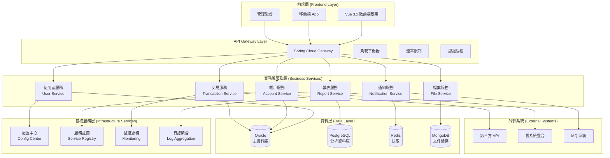
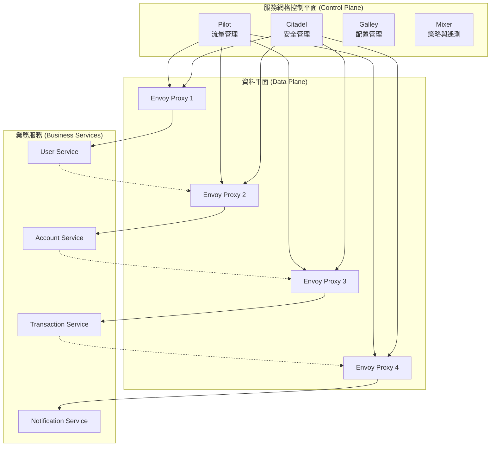
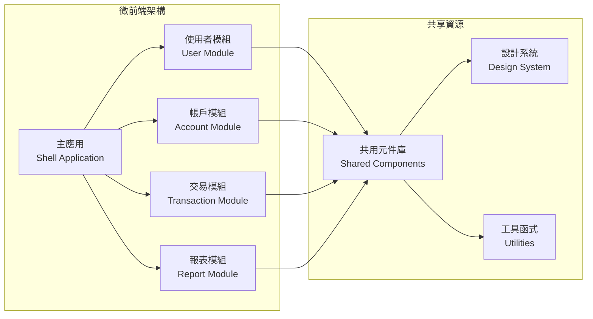
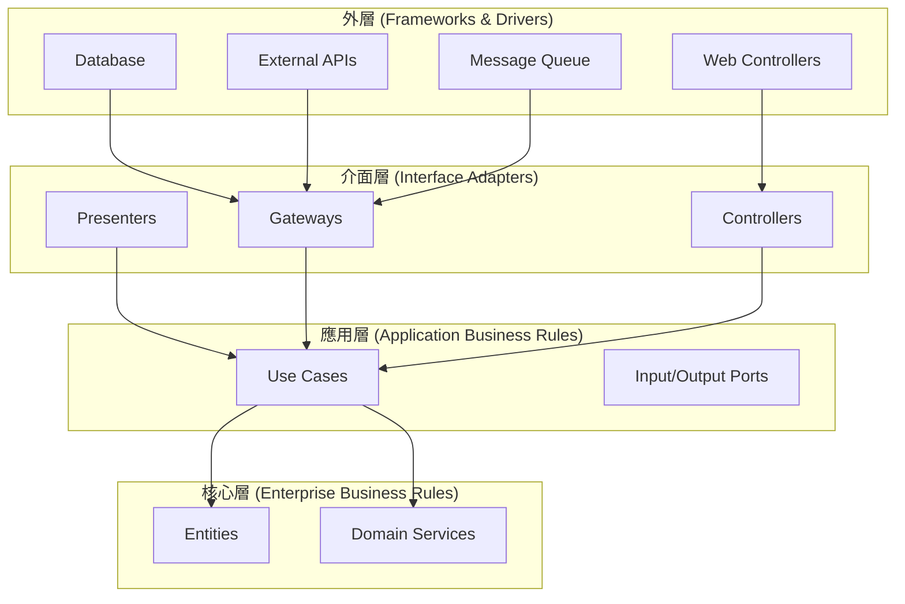
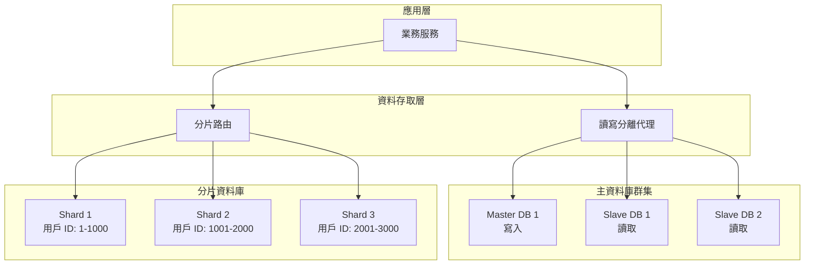
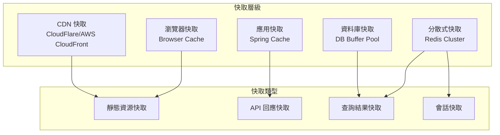
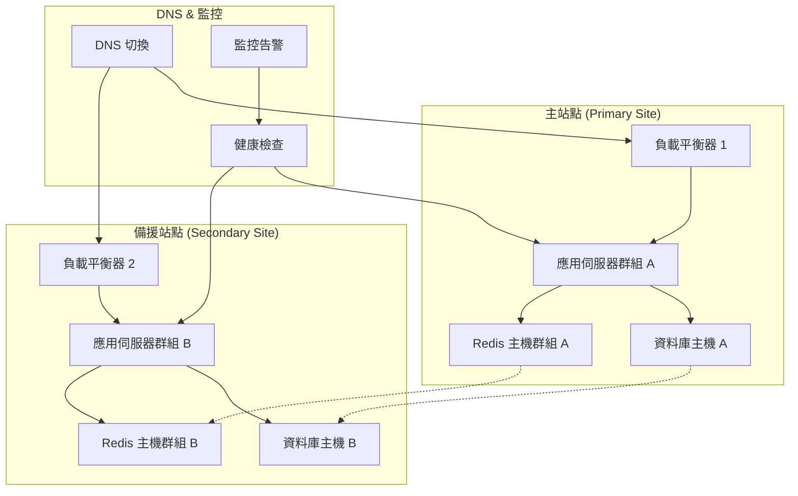
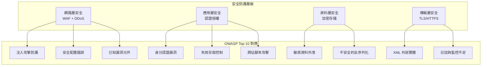
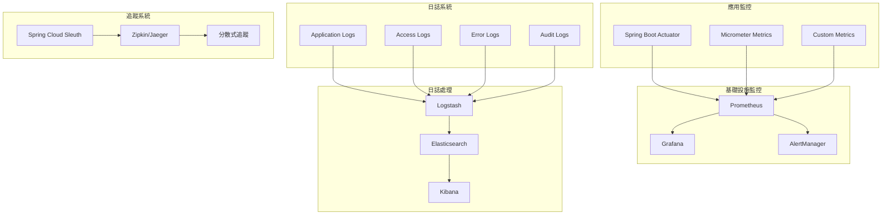
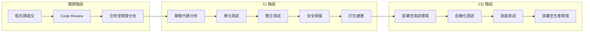

# 系統架構設計指引

## 目錄

- [1. 架構設計原則](#1-架構設計原則)
  - [1.1 設計核心原則](#11-設計核心原則)
  - [1.2 技術選型原則](#12-技術選型原則)
  - [1.3 架構品質屬性](#13-架構品質屬性)

- [2. 系統整體架構圖](#2-系統整體架構圖)
  - [2.1 微服務拆分策略](#21-微服務拆分策略)
  - [2.2 API Gateway 設計](#22-api-gateway-設計)
  - [2.3 服務間通訊](#23-服務間通訊)
  - [2.4 服務網格架構](#24-服務網格架構)

- [3. 前後端分離與微前端設計](#3-前後端分離與微前端設計)
  - [3.1 微前端架構](#31-微前端架構)
  - [3.2 前端技術棧](#32-前端技術棧)
  - [3.3 響應式設計 (RWD)](#33-響應式設計-rwd)
  - [3.4 多語系支援](#34-多語系支援)

- [4. 後端分層架構 (Clean Architecture)](#4-後端分層架構-clean-architecture)
  - [4.1 Clean Architecture 層級設計](#41-clean-architecture-層級設計)
  - [4.2 目錄結構設計](#42-目錄結構設計)
  - [4.3 依賴注入與配置](#43-依賴注入與配置)
  - [4.4 API 設計規範](#44-api-設計規範)

- [5. 資料庫設計原則](#5-資料庫設計原則)
  - [5.1 多資料庫支援策略](#51-多資料庫支援策略)
  - [5.2 資料分片與讀寫分離](#52-資料分片與讀寫分離)
  - [5.3 資料庫設計範例](#53-資料庫設計範例)
  - [5.4 資料遷移策略](#54-資料遷移策略)

- [6. 效能優化方案](#6-效能優化方案)
  - [6.1 快取策略](#61-快取策略)
  - [6.2 快取配置範例](#62-快取配置範例)
  - [6.3 CDN 配置](#63-cdn-配置)
  - [6.4 非同步處理](#64-非同步處理)
  - [6.5 負載平衡策略](#65-負載平衡策略)
  - [6.6 效能基準測試](#66-效能基準測試)

- [7. 高可用性與災難復原設計](#7-高可用性與災難復原設計)
  - [7.1 高可用性架構](#71-高可用性架構)
  - [7.2 容災切換策略](#72-容災切換策略)
  - [7.3 健康檢查配置](#73-健康檢查配置)
  - [7.4 業務連續性規劃](#74-業務連續性規劃)

- [8. 安全機制](#8-安全機制)
  - [8.1 OWASP Top 10 防護措施](#81-owasp-top-10-防護措施)
  - [8.2 身分驗證與授權](#82-身分驗證與授權)
  - [8.3 API 安全防護](#83-api-安全防護)
  - [8.4 資料加密與遮蔽](#84-資料加密與遮蔽)

- [9. 系統監控與日誌管理](#9-系統監控與日誌管理)
  - [9.1 監控架構設計](#91-監控架構設計)
  - [9.2 日誌配置](#92-日誌配置)
  - [9.3 監控指標配置](#93-監控指標配置)
  - [9.4 告警配置](#94-告警配置)

- [10. 開發與部署流程](#10-開發與部署流程)
  - [10.1 CI/CD 流程設計](#101-cicd-流程設計)
  - [10.2 GitHub Actions 配置](#102-github-actions-配置)
  - [10.3 Dockerfile 範例](#103-dockerfile-範例)
  - [10.4 Kubernetes 部署配置](#104-kubernetes-部署配置)
  - [10.5 測試策略](#105-測試策略)

- [11. 容器化與雲端部署](#11-容器化與雲端部署)
  - [11.1 容器化策略](#111-容器化策略)
  - [11.2 Kubernetes 進階配置](#112-kubernetes-進階配置)
  - [11.3 雲端服務整合](#113-雲端服務整合)

- [12. 微服務治理](#12-微服務治理)
  - [12.1 服務註冊與發現](#121-服務註冊與發現)
  - [12.2 配置管理](#122-配置管理)
  - [12.3 服務間協調](#123-服務間協調)

---

## 1. 架構設計原則

### 1.1 設計核心原則
系統架構設計應遵循以下核心原則，確保平台具備高擴展性、高可用性及安全性：

- **單一職責原則 (SRP)**：每個微服務專注於特定業務功能
- **開放封閉原則 (OCP)**：對擴展開放，對修改封閉
- **依賴反轉原則 (DIP)**：高層模組不依賴低層模組，兩者都依賴抽象
- **介面隔離原則 (ISP)**：使用者不應被迫依賴不使用的介面
- **鬆耦合高內聚**：服務間透過明確定義的 API 通訊
- **容錯設計**：系統具備降級和熔斷機制
- **資料一致性**：採用最終一致性模型
- **安全優先**：遵循 **OWASP Top 10** 安全標準

### 1.2 技術選型原則

- **成熟穩定**：選用經過驗證的主流技術棧
- **社群活躍**：技術具備良好的社群支援和文檔
- **效能導向**：選擇具備高效能特性的技術
- **易維護性**：降低學習成本和維護複雜度
- **合規性**：符合企業及法規要求

### 1.3 架構品質屬性

系統架構必須滿足以下品質屬性需求：

- **可擴展性 (Scalability)**：
  - 水平擴展：支援服務實例動態增減
  - 垂直擴展：支援資源配置彈性調整
  - 分片策略：資料庫與快取分片處理

- **可用性 (Availability)**：
  - 系統可用性目標：99.9% (每月停機時間 < 43.8 分鐘)
  - 服務降級：核心功能優先保障
  - 故障隔離：單點故障不影響整體系統

- **效能 (Performance)**：
  - 回應時間：API 平均回應 < 200ms
  - 吞吐量：支援高併發請求處理
  - 資源利用率：CPU、記憶體使用率 < 80%

- **安全性 (Security)**：
  - 資料加密：傳輸層與儲存層加密
  - 存取控制：細粒度權限管理
  - 稽核追蹤：完整的操作日誌記錄

- **可維護性 (Maintainability)**：
  - 模組化設計：高內聚、低耦合
  - 程式碼品質：符合編碼規範與最佳實踐
  - 文檔完整：API 文檔、架構文檔齊全

- **可測試性 (Testability)**：
  - 單元測試覆蓋率 > 80%
  - 自動化測試：CI/CD 整合測試流程
  - 測試環境：獨立的測試資料與環境

## 2. 系統整體架構圖

### 2.1 微服務拆分策略

根據業務邊界和資料一致性需求，系統採用 **Domain-Driven Design (DDD)** 方法進行微服務拆分：



### 2.2 API Gateway 設計

**Spring Cloud Gateway** 作為統一入口，提供以下功能：

- **路由管理**：動態路由配置與負載平衡
- **認證授權**：JWT Token 驗證與 RBAC 授權
- **限流熔斷**：保護後端服務避免過載
- **監控日誌**：請求追蹤與效能監控
- **協議轉換**：HTTP/HTTPS、WebSocket 支援

### 2.3 服務間通訊

- **同步通訊**：RESTful API (HTTP/HTTPS)
- **非同步通訊**：Message Queue (RabbitMQ/Apache Kafka)
- **服務發現**：Eureka/Consul
- **負載平衡**：Ribbon/Spring Cloud LoadBalancer

### 2.4 服務網格架構

採用 **Istio** 或 **Linkerd** 實現服務網格，提供統一的服務治理能力：



**服務網格功能特性**：

- **流量管理**：
  - 智慧路由與負載平衡
  - 故障注入與流量分流
  - 斷路器與重試機制

- **安全管理**：
  - mTLS 自動加密
  - 服務身分驗證
  - 細粒度存取控制策略

- **可觀測性**：
  - 分散式追蹤 (Jaeger/Zipkin)
  - 服務拓撲圖自動生成
  - 詳細的遙測數據收集

- **策略執行**：
  - 速率限制與配額管理
  - 存取策略實施
  - 合規性檢查

## 3. 前後端分離與微前端設計

### 3.1 微前端架構

採用 **Module Federation** 技術實現微前端架構：



### 3.2 前端技術棧

- **框架**：Vue 3.x + Composition API
- **狀態管理**：Pinia
- **路由**：Vue Router 4.x
- **UI 框架**：Tailwind CSS + Headless UI
- **打包工具**：Vite
- **型別檢查**：TypeScript
- **測試**：Vitest + Cypress

### 3.3 響應式設計 (RWD)

```css
/* Tailwind CSS 斷點設計 */
/* sm: 640px 以上 */
/* md: 768px 以上 */
/* lg: 1024px 以上 */
/* xl: 1280px 以上 */
/* 2xl: 1536px 以上 */

.responsive-container {
  @apply px-4 sm:px-6 lg:px-8;
  @apply max-w-sm sm:max-w-md lg:max-w-lg xl:max-w-xl;
}
```

### 3.4 多語系支援

- **i18n 框架**：Vue I18n
- **語言檔案結構**：JSON 格式，按模組分離
- **動態載入**：支援語言包動態載入
- **RTL 支援**：支援右至左語言排版

```javascript
// 多語系配置範例
const i18n = createI18n({
  locale: 'zh-TW',
  fallbackLocale: 'en',
  messages: {
    'zh-TW': zhTWMessages,
    'en': enMessages,
    'ja': jaMessages
  },
  datetimeFormats: {
    'zh-TW': {
      short: { year: 'numeric', month: 'short', day: 'numeric' }
    }
  }
});
```

## 4. 後端分層架構 (Clean Architecture)

### 4.1 Clean Architecture 層級設計



### 4.2 目錄結構設計

```
src/
├── main/
│   ├── java/
│   │   └── com/platform/
│   │       ├── domain/           # 領域層
│   │       │   ├── entity/       # 實體
│   │       │   ├── service/      # 領域服務
│   │       │   └── repository/   # 儲存庫介面
│   │       ├── application/      # 應用層
│   │       │   ├── usecase/      # 用例
│   │       │   ├── port/         # 埠介面
│   │       │   └── service/      # 應用服務
│   │       ├── infrastructure/   # 基礎設施層
│   │       │   ├── persistence/ # 資料持久化
│   │       │   ├── messaging/   # 訊息處理
│   │       │   └── external/    # 外部系統整合
│   │       └── presentation/     # 展示層
│   │           ├── controller/  # REST 控制器
│   │           ├── dto/         # 資料傳輸物件
│   │           └── config/      # 配置類
│   └── resources/
│       ├── application.yml      # 應用配置
│       ├── application-dev.yml  # 開發環境配置
│       └── application-prod.yml # 生產環境配置
```

### 4.3 依賴注入與配置

```java
// Spring Boot 主配置類
@SpringBootApplication
@EnableJpaRepositories(basePackages = "com.platform.infrastructure.persistence")
@ComponentScan(basePackages = "com.platform")
public class PlatformApplication {
    public static void main(String[] args) {
        SpringApplication.run(PlatformApplication.class, args);
    }
}

// 使用案例範例
@Service
@Transactional
public class CreateUserUseCase {
    
    private final UserRepository userRepository;
    private final PasswordEncoder passwordEncoder;
    
    public CreateUserUseCase(UserRepository userRepository, 
                           PasswordEncoder passwordEncoder) {
        this.userRepository = userRepository;
        this.passwordEncoder = passwordEncoder;
    }
    
    public UserResponse execute(CreateUserRequest request) {
        // 業務邏輯實現
        User user = new User(
            request.getUsername(),
            passwordEncoder.encode(request.getPassword()),
            request.getEmail()
        );
        
        User savedUser = userRepository.save(user);
        return UserResponse.from(savedUser);
    }
}
```

### 4.4 API 設計規範

系統 API 設計遵循 **RESTful** 標準與最佳實踐：

#### 4.4.1 URL 設計規範

```text
基本格式: /api/{version}/{resource}/{id}/{sub-resource}

範例:
GET    /api/v1/users                    # 查詢用戶列表
GET    /api/v1/users/{id}               # 查詢特定用戶
POST   /api/v1/users                    # 建立用戶
PUT    /api/v1/users/{id}               # 更新用戶
DELETE /api/v1/users/{id}               # 刪除用戶
GET    /api/v1/users/{id}/accounts      # 查詢用戶帳戶
POST   /api/v1/users/{id}/accounts      # 為用戶建立帳戶
```

#### 4.4.2 HTTP 狀態碼標準

```java
// 狀態碼使用規範
public enum ApiResponseCode {
    // 成功回應 (2xx)
    SUCCESS(200, "操作成功"),
    CREATED(201, "資源建立成功"),
    ACCEPTED(202, "請求已接受，處理中"),
    NO_CONTENT(204, "操作成功，無回傳內容"),
    
    // 客戶端錯誤 (4xx)
    BAD_REQUEST(400, "請求參數錯誤"),
    UNAUTHORIZED(401, "未經授權"),
    FORBIDDEN(403, "禁止存取"),
    NOT_FOUND(404, "資源不存在"),
    METHOD_NOT_ALLOWED(405, "不支援的請求方法"),
    CONFLICT(409, "資源衝突"),
    UNPROCESSABLE_ENTITY(422, "請求格式正確但語意錯誤"),
    TOO_MANY_REQUESTS(429, "請求過於頻繁"),
    
    // 伺服器錯誤 (5xx)
    INTERNAL_SERVER_ERROR(500, "內部伺服器錯誤"),
    BAD_GATEWAY(502, "閘道錯誤"),
    SERVICE_UNAVAILABLE(503, "服務不可用"),
    GATEWAY_TIMEOUT(504, "閘道逾時");
}
```

#### 4.4.3 API 回應格式標準

```java
// 統一回應格式
@Data
@Builder
@NoArgsConstructor
@AllArgsConstructor
public class ApiResponse<T> {
    
    @JsonProperty("success")
    private Boolean success;
    
    @JsonProperty("code")
    private String code;
    
    @JsonProperty("message")
    private String message;
    
    @JsonProperty("data")
    private T data;
    
    @JsonProperty("timestamp")
    @JsonFormat(pattern = "yyyy-MM-dd'T'HH:mm:ss.SSS'Z'")
    private LocalDateTime timestamp;
    
    @JsonProperty("trace_id")
    private String traceId;
    
    // 分頁資訊 (當 data 為列表時)
    @JsonProperty("pagination")
    private PaginationInfo pagination;
    
    public static <T> ApiResponse<T> success(T data) {
        return ApiResponse.<T>builder()
            .success(true)
            .code("200")
            .message("操作成功")
            .data(data)
            .timestamp(LocalDateTime.now())
            .build();
    }
    
    public static <T> ApiResponse<T> error(String code, String message) {
        return ApiResponse.<T>builder()
            .success(false)
            .code(code)
            .message(message)
            .timestamp(LocalDateTime.now())
            .build();
    }
}

// 分頁資訊
@Data
@Builder
@NoArgsConstructor
@AllArgsConstructor
public class PaginationInfo {
    private Integer page;
    private Integer size;
    private Long totalElements;
    private Integer totalPages;
    private Boolean first;
    private Boolean last;
}
```

#### 4.4.4 API 版本控制

```java
// URL 版本控制 (推薦)
@RestController
@RequestMapping("/api/v1/users")
public class UserControllerV1 {
    
    @GetMapping
    public ApiResponse<PageResponse<UserDto>> getUsers(
        @RequestParam(defaultValue = "1") Integer page,
        @RequestParam(defaultValue = "20") Integer size) {
        // 實作邏輯
    }
}

// Header 版本控制 (備選)
@RestController
@RequestMapping("/api/users")
public class UserController {
    
    @GetMapping(headers = "API-Version=1.0")
    public ApiResponse<PageResponse<UserDto>> getUsersV1() {
        // V1 實作
    }
    
    @GetMapping(headers = "API-Version=2.0")
    public ApiResponse<PageResponse<UserDtoV2>> getUsersV2() {
        // V2 實作
    }
}
```

#### 4.4.5 API 文檔配置 (Swagger/OpenAPI)

```java
// Swagger 配置
@Configuration
@EnableOpenApi
public class SwaggerConfig {
    
    @Bean
    public OpenAPI customOpenAPI() {
        return new OpenAPI()
            .info(new Info()
                .title("平台 API 文檔")
                .version("v1.0")
                .description("大型共用平台 RESTful API 文檔")
                .contact(new Contact()
                    .name("開發團隊")
                    .email("dev-team@platform.com"))
                .license(new License()
                    .name("MIT License")
                    .url("https://opensource.org/licenses/MIT")))
            .servers(Arrays.asList(
                new Server().url("https://api-dev.platform.com").description("開發環境"),
                new Server().url("https://api-staging.platform.com").description("測試環境"),
                new Server().url("https://api.platform.com").description("生產環境")
            ))
            .components(new Components()
                .addSecuritySchemes("bearerAuth", new SecurityScheme()
                    .type(SecurityScheme.Type.HTTP)
                    .scheme("bearer")
                    .bearerFormat("JWT")));
    }
}

// API 文檔註解範例
@RestController
@RequestMapping("/api/v1/users")
@Tag(name = "用戶管理", description = "用戶相關 API")
public class UserController {
    
    @Operation(summary = "查詢用戶列表", description = "支援分頁、排序、篩選的用戶查詢")
    @ApiResponses(value = {
        @ApiResponse(responseCode = "200", description = "查詢成功",
            content = @Content(schema = @Schema(implementation = ApiResponse.class))),
        @ApiResponse(responseCode = "400", description = "請求參數錯誤"),
        @ApiResponse(responseCode = "401", description = "未經授權")
    })
    @GetMapping
    public ApiResponse<PageResponse<UserDto>> getUsers(
        @Parameter(description = "頁碼", example = "1")
        @RequestParam(defaultValue = "1") Integer page,
        
        @Parameter(description = "每頁筆數", example = "20")
        @RequestParam(defaultValue = "20") Integer size,
        
        @Parameter(description = "搜尋關鍵字")
        @RequestParam(required = false) String keyword) {
        // 實作邏輯
    }
}
```

## 5. 資料庫設計原則

### 5.1 多資料庫支援策略

系統支援多種資料庫，透過 **JPA** 和 **Spring Data** 實現資料庫無關性：

- **Oracle**：主要交易資料庫，處理核心業務資料
- **PostgreSQL**：分析和報表資料庫，支援複雜查詢
- **SQL Server**：整合舊系統資料
- **DB2**：大型機系統整合

```yaml
# application.yml 多資料庫配置
spring:
  datasource:
    primary:
      url: jdbc:oracle:thin:@localhost:1521:xe
      username: ${DB_PRIMARY_USER}
      password: ${DB_PRIMARY_PASSWORD}
      driver-class-name: oracle.jdbc.OracleDriver
    
    analytics:
      url: jdbc:postgresql://localhost:5432/analytics
      username: ${DB_ANALYTICS_USER}
      password: ${DB_ANALYTICS_PASSWORD}
      driver-class-name: org.postgresql.Driver
  
  jpa:
    database-platform: org.hibernate.dialect.Oracle12cDialect
    hibernate:
      ddl-auto: validate
    properties:
      hibernate:
        format_sql: true
        use_sql_comments: true
```

### 5.2 資料分片與讀寫分離



### 5.3 資料庫設計範例

```sql
-- 使用者表設計範例 (Oracle)
CREATE TABLE TB_USER (
    USER_ID VARCHAR2(32) NOT NULL,
    USERNAME VARCHAR2(50) NOT NULL,
    EMAIL VARCHAR2(100) NOT NULL,
    PASSWORD_HASH VARCHAR2(255) NOT NULL,
    SALT VARCHAR2(32) NOT NULL,
    STATUS CHAR(1) DEFAULT 'A' NOT NULL,
    CREATED_DATE DATE DEFAULT SYSDATE NOT NULL,
    UPDATED_DATE DATE DEFAULT SYSDATE NOT NULL,
    CREATED_BY VARCHAR2(32) NOT NULL,
    UPDATED_BY VARCHAR2(32) NOT NULL,
    VERSION_NO NUMBER(10) DEFAULT 0 NOT NULL,
    
    CONSTRAINT PK_TB_USER PRIMARY KEY (USER_ID),
    CONSTRAINT UK_TB_USER_USERNAME UNIQUE (USERNAME),
    CONSTRAINT UK_TB_USER_EMAIL UNIQUE (EMAIL),
    CONSTRAINT CK_TB_USER_STATUS CHECK (STATUS IN ('A', 'I', 'S'))
);

-- 建立索引
CREATE INDEX IDX_TB_USER_EMAIL ON TB_USER (EMAIL);
CREATE INDEX IDX_TB_USER_STATUS ON TB_USER (STATUS);
CREATE INDEX IDX_TB_USER_CREATED_DATE ON TB_USER (CREATED_DATE);

-- 分區表設計 (按日期分區)
CREATE TABLE TB_TRANSACTION (
    TRANSACTION_ID VARCHAR2(32) NOT NULL,
    USER_ID VARCHAR2(32) NOT NULL,
    AMOUNT NUMBER(15,2) NOT NULL,
    TRANSACTION_TYPE VARCHAR2(10) NOT NULL,
    TRANSACTION_DATE DATE NOT NULL,
    STATUS CHAR(1) DEFAULT 'P' NOT NULL,
    CREATED_DATE DATE DEFAULT SYSDATE NOT NULL,
    
    CONSTRAINT PK_TB_TRANSACTION PRIMARY KEY (TRANSACTION_ID, TRANSACTION_DATE),
    CONSTRAINT FK_TB_TRANSACTION_USER FOREIGN KEY (USER_ID) REFERENCES TB_USER (USER_ID)
)
PARTITION BY RANGE (TRANSACTION_DATE) (
    PARTITION P_2024_Q1 VALUES LESS THAN (DATE '2024-04-01'),
    PARTITION P_2024_Q2 VALUES LESS THAN (DATE '2024-07-01'),
    PARTITION P_2024_Q3 VALUES LESS THAN (DATE '2024-10-01'),
    PARTITION P_2024_Q4 VALUES LESS THAN (DATE '2025-01-01')
);
```

### 5.4 資料遷移策略

系統採用 **Flyway** 或 **Liquibase** 進行資料庫版本控制與遷移：

#### 5.4.1 Flyway 資料遷移配置

```yaml
# application.yml - Flyway 配置
spring:
  flyway:
    enabled: true
    locations: classpath:db/migration
    baseline-on-migrate: true
    validate-on-migrate: true
    clean-disabled: true
    schemas: 
      - PLATFORM_MAIN
      - PLATFORM_AUDIT
```

#### 5.4.2 遷移檔案命名規範

```text
檔案命名格式: V{版本號}__{描述}.sql

範例:
V1.0.0__Create_initial_schema.sql
V1.0.1__Add_user_table.sql
V1.0.2__Add_user_indexes.sql
V1.1.0__Add_account_table.sql
V1.1.1__Alter_user_add_status_column.sql
V2.0.0__Major_schema_refactoring.sql

可重複執行腳本命名: R__{描述}.sql
R__Create_or_replace_user_view.sql
R__Update_stored_procedures.sql
```

#### 5.4.3 遷移腳本範例

```sql
-- V1.0.1__Create_user_table.sql
-- 建立使用者表
CREATE TABLE TB_USER (
    USER_ID VARCHAR2(32) NOT NULL,
    USERNAME VARCHAR2(50) NOT NULL,
    EMAIL VARCHAR2(100) NOT NULL,
    PASSWORD_HASH VARCHAR2(255) NOT NULL,
    SALT VARCHAR2(32) NOT NULL,
    STATUS CHAR(1) DEFAULT 'A' NOT NULL,
    CREATED_DATE DATE DEFAULT SYSDATE NOT NULL,
    UPDATED_DATE DATE DEFAULT SYSDATE NOT NULL,
    VERSION_NO NUMBER(10) DEFAULT 0 NOT NULL,
    
    CONSTRAINT PK_TB_USER PRIMARY KEY (USER_ID),
    CONSTRAINT UK_TB_USER_USERNAME UNIQUE (USERNAME),
    CONSTRAINT UK_TB_USER_EMAIL UNIQUE (EMAIL),
    CONSTRAINT CK_TB_USER_STATUS CHECK (STATUS IN ('A', 'I', 'S'))
);

-- 建立索引
CREATE INDEX IDX_TB_USER_EMAIL ON TB_USER (EMAIL);
CREATE INDEX IDX_TB_USER_STATUS ON TB_USER (STATUS);
CREATE INDEX IDX_TB_USER_CREATED_DATE ON TB_USER (CREATED_DATE);

-- 建立序列
CREATE SEQUENCE SEQ_USER_ID START WITH 1 INCREMENT BY 1;

-- 插入初始資料
INSERT INTO TB_USER (USER_ID, USERNAME, EMAIL, PASSWORD_HASH, SALT, STATUS, CREATED_BY, UPDATED_BY)
VALUES ('SYSTEM', 'system', 'system@platform.com', '***', '***', 'A', 'SYSTEM', 'SYSTEM');

COMMIT;
```

## 6. 效能優化方案

### 6.1 快取策略

採用多層快取架構提升系統效能：



### 6.2 快取配置範例

```java
// Redis 快取配置
@Configuration
@EnableCaching
public class CacheConfig {
    
    @Bean
    public CacheManager cacheManager(RedisConnectionFactory connectionFactory) {
        RedisCacheConfiguration config = RedisCacheConfiguration.defaultCacheConfig()
            .entryTtl(Duration.ofHours(1))
            .serializeKeysWith(RedisSerializationContext.SerializationPair
                .fromSerializer(new StringRedisSerializer()))
            .serializeValuesWith(RedisSerializationContext.SerializationPair
                .fromSerializer(new GenericJackson2JsonRedisSerializer()));
        
        return RedisCacheManager.builder(connectionFactory)
            .cacheDefaults(config)
            .build();
    }
    
    @Bean
    public RedisTemplate<String, Object> redisTemplate(RedisConnectionFactory connectionFactory) {
        RedisTemplate<String, Object> template = new RedisTemplate<>();
        template.setConnectionFactory(connectionFactory);
        template.setKeySerializer(new StringRedisSerializer());
        template.setValueSerializer(new GenericJackson2JsonRedisSerializer());
        return template;
    }
}

// 快取使用範例
@Service
public class UserService {
    
    @Cacheable(value = "users", key = "#userId")
    public User getUserById(String userId) {
        return userRepository.findById(userId);
    }
    
    @CacheEvict(value = "users", key = "#user.userId")
    public User updateUser(User user) {
        return userRepository.save(user);
    }
}
```

### 6.3 CDN 配置

```yaml
# CDN 配置範例
cdn:
  enabled: true
  domain: "https://cdn.platform.com"
  static-resources:
    - "/**/*.js"
    - "/**/*.css"
    - "/**/*.png"
    - "/**/*.jpg"
    - "/**/*.gif"
  cache-control:
    max-age: 31536000  # 1年
    public: true
```

### 6.4 非同步處理

```java
// 非同步任務配置
@Configuration
@EnableAsync
public class AsyncConfig {
    
    @Bean("taskExecutor")
    public Executor taskExecutor() {
        ThreadPoolTaskExecutor executor = new ThreadPoolTaskExecutor();
        executor.setCorePoolSize(10);
        executor.setMaxPoolSize(50);
        executor.setQueueCapacity(200);
        executor.setThreadNamePrefix("async-");
        executor.setRejectedExecutionHandler(new ThreadPoolExecutor.CallerRunsPolicy());
        executor.initialize();
        return executor;
    }
}

// 非同步服務範例
@Service
public class NotificationService {
    
    @Async("taskExecutor")
    public CompletableFuture<Void> sendEmailAsync(String email, String message) {
        // 發送郵件邏輯
        emailSender.send(email, message);
        return CompletableFuture.completedFuture(null);
    }
}
```

### 6.5 負載平衡策略

```yaml
# Nginx 負載平衡配置
upstream backend_servers {
    least_conn;
    server app1.platform.com:8080 weight=3;
    server app2.platform.com:8080 weight=3;
    server app3.platform.com:8080 weight=2;
    server app4.platform.com:8080 backup;
}

server {
    listen 80;
    server_name platform.com;
    
    location /api/ {
        proxy_pass http://backend_servers;
        proxy_set_header Host $host;
        proxy_set_header X-Real-IP $remote_addr;
        proxy_set_header X-Forwarded-For $proxy_add_x_forwarded_for;
        proxy_connect_timeout 30s;
        proxy_read_timeout 30s;
    }
    
    location / {
        root /var/www/html;
        try_files $uri $uri/ /index.html;
    }
}
```

### 6.6 效能基準測試

建立系統效能基準與持續監控機制：

#### 6.6.1 效能測試工具與配置

```yaml
# JMeter 測試計劃配置
performance_test:
  scenarios:
    - name: "用戶登入測試"
      threads: 100
      duration: 300s
      ramp_up: 60s
      target_rps: 50
      endpoint: "/api/v1/auth/login"
      
    - name: "API 負載測試"
      threads: 500
      duration: 600s
      ramp_up: 120s
      target_rps: 200
      endpoint: "/api/v1/users"
      
    - name: "資料庫查詢測試"
      threads: 200
      duration: 300s
      ramp_up: 60s
      target_rps: 100
      endpoint: "/api/v1/transactions/search"

  acceptance_criteria:
    response_time_95th: 500ms
    response_time_99th: 1000ms
    error_rate: <1%
    throughput: >200 rps
```

#### 6.6.2 Gatling 效能測試腳本

```scala
// UserLoadTest.scala - Gatling 測試腳本
import io.gatling.core.Predef._
import io.gatling.http.Predef._
import scala.concurrent.duration._

class UserLoadTest extends Simulation {

  val httpProtocol = http
    .baseUrl("https://api.platform.com")
    .acceptHeader("application/json")
    .contentTypeHeader("application/json")
    .authorizationHeader("Bearer ${access_token}")

  val loginScenario = scenario("用戶登入測試")
    .exec(
      http("登入請求")
        .post("/api/v1/auth/login")
        .body(StringBody("""{"username":"testuser","password":"testpass"}"""))
        .check(status.is(200))
        .check(jsonPath("$.data.access_token").saveAs("access_token"))
    )
    .pause(1, 3)

  val userQueryScenario = scenario("用戶查詢測試")
    .exec(
      http("查詢用戶列表")
        .get("/api/v1/users")
        .queryParam("page", "1")
        .queryParam("size", "20")
        .check(status.is(200))
        .check(responseTimeInMillis.lt(500))
    )
    .pause(2, 5)

  val transactionScenario = scenario("交易查詢測試")
    .exec(
      http("查詢交易記錄")
        .get("/api/v1/transactions")
        .queryParam("startDate", "2024-01-01")
        .queryParam("endDate", "2024-12-31")
        .check(status.is(200))
        .check(responseTimeInMillis.lt(1000))
    )

  setUp(
    loginScenario.inject(rampUsers(50) during (30 seconds)),
    userQueryScenario.inject(rampUsers(100) during (60 seconds)),
    transactionScenario.inject(rampUsers(200) during (120 seconds))
  ).protocols(httpProtocol)
   .assertions(
     global.responseTime.percentile3.lt(500),
     global.responseTime.percentile4.lt(1000),
     global.successfulRequests.percent.gt(99)
   )
}
```

#### 6.6.3 K6 效能測試腳本

```javascript
// k6-load-test.js
import http from 'k6/http';
import { check, sleep } from 'k6';
import { Rate } from 'k6/metrics';

export let errorRate = new Rate('errors');

export let options = {
  stages: [
    { duration: '2m', target: 10 },   // 慢慢增加到10個用戶
    { duration: '5m', target: 10 },   // 維持10個用戶5分鐘
    { duration: '2m', target: 50 },   // 增加到50個用戶
    { duration: '5m', target: 50 },   // 維持50個用戶5分鐘
    { duration: '2m', target: 100 },  // 增加到100個用戶
    { duration: '5m', target: 100 },  // 維持100個用戶5分鐘
    { duration: '2m', target: 0 },    // 逐漸減少到0個用戶
  ],
  thresholds: {
    'http_req_duration': ['p(95)<500', 'p(99)<1000'],
    'errors': ['rate<0.01'],
    'http_req_rate': ['rate>10'],
  },
};

const BASE_URL = 'https://api.platform.com';

export default function() {
  // 登入測試
  let loginResponse = http.post(`${BASE_URL}/api/v1/auth/login`, 
    JSON.stringify({
      username: 'testuser',
      password: 'testpassword'
    }), 
    {
      headers: { 'Content-Type': 'application/json' },
    }
  );
  
  let loginCheck = check(loginResponse, {
    '登入狀態為200': (r) => r.status === 200,
    '登入回應時間 < 500ms': (r) => r.timings.duration < 500,
    '包含access_token': (r) => r.json('data.access_token') !== '',
  });
  
  errorRate.add(!loginCheck);
  
  if (loginCheck) {
    let token = loginResponse.json('data.access_token');
    
    // 用戶查詢測試
    let userResponse = http.get(`${BASE_URL}/api/v1/users?page=1&size=20`, {
      headers: { 
        'Authorization': `Bearer ${token}`,
        'Content-Type': 'application/json' 
      },
    });
    
    let userCheck = check(userResponse, {
      '用戶查詢狀態為200': (r) => r.status === 200,
      '用戶查詢回應時間 < 300ms': (r) => r.timings.duration < 300,
    });
    
    errorRate.add(!userCheck);
  }
  
  sleep(1);
}
```

#### 6.6.4 效能監控與告警

```java
// 效能監控配置
@Component
public class PerformanceMonitor {
    
    private final MeterRegistry meterRegistry;
    private final Timer responseTimer;
    private final Counter errorCounter;
    private final Gauge memoryGauge;
    
    public PerformanceMonitor(MeterRegistry meterRegistry) {
        this.meterRegistry = meterRegistry;
        this.responseTimer = Timer.builder("api.response.time")
            .description("API response time")
            .register(meterRegistry);
        this.errorCounter = Counter.builder("api.errors")
            .description("API error count")
            .register(meterRegistry);
        this.memoryGauge = Gauge.builder("jvm.memory.usage")
            .description("JVM memory usage")
            .register(meterRegistry, this, PerformanceMonitor::getMemoryUsage);
    }
    
    public void recordResponseTime(long duration) {
        responseTimer.record(duration, TimeUnit.MILLISECONDS);
    }
    
    public void recordError() {
        errorCounter.increment();
    }
    
    private double getMemoryUsage() {
        Runtime runtime = Runtime.getRuntime();
        return (double) (runtime.totalMemory() - runtime.freeMemory()) / runtime.maxMemory() * 100;
    }
}

// 效能告警配置
@Configuration
public class PerformanceAlertConfig {
    
    @Bean
    public MeterFilter performanceAlertFilter() {
        return MeterFilter.maximumExpectedValue("api.response.time", Duration.ofMillis(1000));
    }
    
    @EventListener
    public void handleHighResponseTime(MeterRegistryEvent event) {
        // 當回應時間超過閾值時觸發告警
        if (event.getMeter().getId().getName().equals("api.response.time")) {
            Timer timer = (Timer) event.getMeter();
            if (timer.mean(TimeUnit.MILLISECONDS) > 500) {
                sendAlert("API 回應時間過長", "平均回應時間: " + timer.mean(TimeUnit.MILLISECONDS) + "ms");
            }
        }
    }
    
    private void sendAlert(String title, String message) {
        // 發送告警通知邏輯
        log.warn("效能告警: {} - {}", title, message);
    }
}
```

## 7. 高可用性與災難復原設計

### 7.1 高可用性架構



### 7.2 容災切換策略

- **RTO (Recovery Time Objective)**：< 15 分鐘
- **RPO (Recovery Point Objective)**：< 5 分鐘
- **切換模式**：自動切換 + 手動確認
- **資料同步**：即時同步複寫

### 7.3 健康檢查配置

```java
// Spring Boot Actuator 健康檢查
@Component
public class DatabaseHealthIndicator implements HealthIndicator {
    
    private final DataSource dataSource;
    
    public DatabaseHealthIndicator(DataSource dataSource) {
        this.dataSource = dataSource;
    }
    
    @Override
    public Health health() {
        try (Connection connection = dataSource.getConnection()) {
            if (connection.isValid(1)) {
                return Health.up()
                    .withDetail("database", "Available")
                    .withDetail("validationTimeout", "1 second")
                    .build();
            }
        } catch (Exception e) {
            return Health.down()
                .withDetail("database", "Unavailable")
                .withException(e)
                .build();
        }
        return Health.down().withDetail("database", "Validation failed").build();
    }
}

// 自定義健康檢查端點
@RestController
public class HealthCheckController {
    
    @GetMapping("/health/custom")
    public ResponseEntity<Map<String, Object>> customHealthCheck() {
        Map<String, Object> status = new HashMap<>();
        status.put("status", "UP");
        status.put("timestamp", Instant.now());
        status.put("checks", Arrays.asList(
            checkDatabase(),
            checkRedis(),
            checkExternalAPI()
        ));
        return ResponseEntity.ok(status);
    }
}
```

## 8. 安全機制

### 8.1 OWASP Top 10 防護措施

系統遵循 **OWASP Top 10** 安全標準，實施多層次安全防護：



### 8.2 身分驗證與授權

```java
// JWT 安全配置
@Configuration
@EnableWebSecurity
@EnableGlobalMethodSecurity(prePostEnabled = true)
public class SecurityConfig {
    
    @Bean
    public SecurityFilterChain filterChain(HttpSecurity http) throws Exception {
        http
            .cors().and()
            .csrf().disable()
            .sessionManagement().sessionCreationPolicy(SessionCreationPolicy.STATELESS)
            .and()
            .authorizeHttpRequests(authz -> authz
                .requestMatchers("/api/auth/**").permitAll()
                .requestMatchers("/api/public/**").permitAll()
                .requestMatchers(HttpMethod.GET, "/api/users/**").hasRole("USER")
                .requestMatchers(HttpMethod.POST, "/api/admin/**").hasRole("ADMIN")
                .anyRequest().authenticated()
            )
            .addFilterBefore(jwtAuthenticationFilter(), UsernamePasswordAuthenticationFilter.class)
            .exceptionHandling()
                .authenticationEntryPoint(unauthorizedHandler)
                .accessDeniedHandler(accessDeniedHandler);
        
        return http.build();
    }
    
    @Bean
    public PasswordEncoder passwordEncoder() {
        return new BCryptPasswordEncoder(12);
    }
}

// JWT Token 處理
@Component
public class JwtTokenProvider {
    
    private static final String JWT_SECRET = "${app.jwt.secret}";
    private static final int JWT_EXPIRATION = 86400; // 24小時
    
    public String generateToken(UserPrincipal userPrincipal) {
        Date expiryDate = new Date(System.currentTimeMillis() + JWT_EXPIRATION * 1000);
        
        return Jwts.builder()
                .setSubject(userPrincipal.getId())
                .setIssuedAt(new Date())
                .setExpiration(expiryDate)
                .signWith(SignatureAlgorithm.HS512, JWT_SECRET)
                .compact();
    }
    
    public boolean validateToken(String token) {
        try {
            Jwts.parser().setSigningKey(JWT_SECRET).parseClaimsJws(token);
            return true;
        } catch (JwtException | IllegalArgumentException e) {
            logger.error("Invalid JWT token: {}", e.getMessage());
        }
        return false;
    }
}
```

### 8.3 API 安全防護

```java
// API 限流配置
@Configuration
public class RateLimitConfig {
    
    @Bean
    public RateLimiter apiRateLimiter() {
        return RateLimiter.create(100.0); // 每秒100個請求
    }
    
    @Bean
    public Bucket4j.LocalBucketBuilder createRateLimitBucket() {
        return Bucket4j.builder()
            .addLimit(Bandwidth.classic(100, Refill.intervally(100, Duration.ofMinutes(1))))
            .addLimit(Bandwidth.classic(1000, Refill.intervally(1000, Duration.ofHours(1))));
    }
}

// API 安全攔截器
@Component
public class SecurityInterceptor implements HandlerInterceptor {
    
    @Override
    public boolean preHandle(HttpServletRequest request, 
                           HttpServletResponse response, 
                           Object handler) throws Exception {
        
        // CSRF 防護
        if (!validateCSRFToken(request)) {
            response.setStatus(HttpStatus.FORBIDDEN.value());
            return false;
        }
        
        // XSS 防護
        if (containsXSSContent(request)) {
            response.setStatus(HttpStatus.BAD_REQUEST.value());
            return false;
        }
        
        // SQL 注入防護
        if (containsSQLInjection(request)) {
            response.setStatus(HttpStatus.BAD_REQUEST.value());
            return false;
        }
        
        return true;
    }
}
```

### 8.4 資料加密與遮蔽

```java
// 敏感資料加密
@Entity
@Table(name = "TB_USER_SENSITIVE")
public class UserSensitive {
    
    @Id
    private String userId;
    
    @Convert(converter = EncryptedStringConverter.class)
    @Column(name = "PHONE_NUMBER")
    private String phoneNumber;
    
    @Convert(converter = EncryptedStringConverter.class)
    @Column(name = "ID_CARD_NUMBER")
    private String idCardNumber;
    
    @JsonIgnore
    @Column(name = "BANK_ACCOUNT")
    private String bankAccount;
}

// 加密轉換器
@Converter
public class EncryptedStringConverter implements AttributeConverter<String, String> {
    
    private final AESUtil aesUtil;
    
    @Override
    public String convertToDatabaseColumn(String attribute) {
        return attribute == null ? null : aesUtil.encrypt(attribute);
    }
    
    @Override
    public String convertToEntityAttribute(String dbData) {
        return dbData == null ? null : aesUtil.decrypt(dbData);
    }
}

// 資料遮蔽工具
@Component
public class DataMaskingUtil {
    
    public String maskEmail(String email) {
        if (email == null || !email.contains("@")) return email;
        String[] parts = email.split("@");
        return maskString(parts[0]) + "@" + parts[1];
    }
    
    public String maskPhoneNumber(String phone) {
        if (phone == null || phone.length() < 4) return phone;
        return phone.substring(0, 3) + "****" + phone.substring(phone.length() - 4);
    }
    
    public String maskIdCard(String idCard) {
        if (idCard == null || idCard.length() < 4) return idCard;
        return idCard.substring(0, 3) + "******" + idCard.substring(idCard.length() - 4);
    }
}
```

## 9. 系統監控與日誌管理

### 9.1 監控架構設計



### 9.2 日誌配置

```yaml
# logback-spring.xml
logging:
  level:
    com.platform: INFO
    org.springframework.security: DEBUG
    org.hibernate.SQL: DEBUG
  pattern:
    console: "%d{yyyy-MM-dd HH:mm:ss} [%thread] %-5level [%X{traceId},%X{spanId}] %logger{36} - %msg%n"
    file: "%d{yyyy-MM-dd HH:mm:ss} [%thread] %-5level [%X{traceId},%X{spanId}] %logger{36} - %msg%n"
  file:
    name: logs/application.log
    max-size: 100MB
    max-history: 30
```

```xml
<!-- logback-spring.xml -->
<configuration>
    <include resource="org/springframework/boot/logging/logback/defaults.xml"/>
    
    <springProfile name="!prod">
        <include resource="org/springframework/boot/logging/logback/console-appender.xml"/>
    </springProfile>
    
    <springProfile name="prod">
        <appender name="FILE" class="ch.qos.logback.core.rolling.RollingFileAppender">
            <file>logs/application.log</file>
            <rollingPolicy class="ch.qos.logback.core.rolling.SizeAndTimeBasedRollingPolicy">
                <fileNamePattern>logs/application.%d{yyyy-MM-dd}.%i.log.gz</fileNamePattern>
                <maxFileSize>100MB</maxFileSize>
                <maxHistory>30</maxHistory>
                <totalSizeCap>10GB</totalSizeCap>
            </rollingPolicy>
            <encoder>
                <pattern>${FILE_LOG_PATTERN}</pattern>
            </encoder>
        </appender>
        
        <appender name="AUDIT" class="ch.qos.logback.core.rolling.RollingFileAppender">
            <file>logs/audit.log</file>
            <rollingPolicy class="ch.qos.logback.core.rolling.TimeBasedRollingPolicy">
                <fileNamePattern>logs/audit.%d{yyyy-MM-dd}.log.gz</fileNamePattern>
                <maxHistory>90</maxHistory>
            </rollingPolicy>
            <encoder>
                <pattern>%d{yyyy-MM-dd HH:mm:ss} %msg%n</pattern>
            </encoder>
        </appender>
        
        <logger name="AUDIT" level="INFO" additivity="false">
            <appender-ref ref="AUDIT"/>
        </logger>
        
        <root level="INFO">
            <appender-ref ref="FILE"/>
        </root>
    </springProfile>
</configuration>
```

### 9.3 監控指標配置

```java
// 自定義監控指標
@Component
public class CustomMetrics {
    
    private final Counter loginCounter;
    private final Timer requestTimer;
    private final Gauge activeUsersGauge;
    
    public CustomMetrics(MeterRegistry meterRegistry) {
        this.loginCounter = Counter.builder("user.login.total")
            .description("Total user login attempts")
            .tag("type", "success")
            .register(meterRegistry);
            
        this.requestTimer = Timer.builder("api.request.duration")
            .description("API request duration")
            .register(meterRegistry);
            
        this.activeUsersGauge = Gauge.builder("user.active.count")
            .description("Active users count")
            .register(meterRegistry, this, CustomMetrics::getActiveUsersCount);
    }
    
    public void recordLogin() {
        loginCounter.increment();
    }
    
    public Timer.Sample startTimer() {
        return Timer.start(requestTimer);
    }
    
    private double getActiveUsersCount() {
        // 查詢活躍用戶數邏輯
        return userService.getActiveUsersCount();
    }
}

// 監控端點配置
@RestController
public class MonitoringController {
    
    @GetMapping("/monitoring/health/detailed")
    public ResponseEntity<Map<String, Object>> detailedHealthCheck() {
        Map<String, Object> health = new HashMap<>();
        health.put("status", "UP");
        health.put("database", checkDatabaseConnection());
        health.put("redis", checkRedisConnection());
        health.put("disk_space", checkDiskSpace());
        health.put("memory", checkMemoryUsage());
        return ResponseEntity.ok(health);
    }
}
```

### 9.4 告警配置

```yaml
# prometheus-alert-rules.yml
groups:
  - name: platform-alerts
    rules:
      - alert: HighErrorRate
        expr: rate(http_requests_total{status=~"5.."}[5m]) > 0.1
        for: 5m
        labels:
          severity: critical
        annotations:
          summary: "High error rate detected"
          description: "Error rate is {{ $value }} errors per second"
      
      - alert: HighMemoryUsage
        expr: (1 - (node_memory_MemAvailable_bytes / node_memory_MemTotal_bytes)) * 100 > 80
        for: 10m
        labels:
          severity: warning
        annotations:
          summary: "High memory usage"
          description: "Memory usage is above 80%"
      
      - alert: DatabaseConnectionFailed
        expr: up{job="database"} == 0
        for: 2m
        labels:
          severity: critical
        annotations:
          summary: "Database connection failed"
          description: "Database is unreachable"
```

## 10. 開發與部署流程

### 10.1 CI/CD 流程設計



### 10.2 GitHub Actions 配置

```yaml
# .github/workflows/ci-cd.yml
name: CI/CD Pipeline

on:
  push:
    branches: [ main, develop ]
  pull_request:
    branches: [ main ]

jobs:
  test:
    runs-on: ubuntu-latest
    
    services:
      postgres:
        image: postgres:14
        env:
          POSTGRES_PASSWORD: postgres
        options: >-
          --health-cmd pg_isready
          --health-interval 10s
          --health-timeout 5s
          --health-retries 5
    
    steps:
    - uses: actions/checkout@v3
    
    - name: Set up JDK 21
      uses: actions/setup-java@v3
      with:
        java-version: '21'
        distribution: 'temurin'
    
    - name: Cache Maven packages
      uses: actions/cache@v3
      with:
        path: ~/.m2
        key: ${{ runner.os }}-m2-${{ hashFiles('**/pom.xml') }}
    
    - name: Run tests
      run: mvn clean test -Dspring.profiles.active=test
    
    - name: Run SonarQube analysis
      env:
        GITHUB_TOKEN: ${{ secrets.GITHUB_TOKEN }}
        SONAR_TOKEN: ${{ secrets.SONAR_TOKEN }}
      run: mvn sonar:sonar
    
    - name: Build application
      run: mvn clean package -DskipTests
    
    - name: Build Docker image
      run: |
        docker build -t platform-api:${{ github.sha }} .
        docker tag platform-api:${{ github.sha }} platform-api:latest
    
    - name: Security scan
      uses: aquasecurity/trivy-action@master
      with:
        image-ref: 'platform-api:latest'
        format: 'sarif'
        output: 'trivy-results.sarif'
    
    - name: Deploy to staging
      if: github.ref == 'refs/heads/develop'
      run: |
        echo "Deploying to staging environment"
        # 部署腳本
    
    - name: Deploy to production
      if: github.ref == 'refs/heads/main'
      run: |
        echo "Deploying to production environment"
        # 生產部署腳本
```

### 10.3 Dockerfile 範例

```dockerfile
# 多階段建置 Dockerfile
FROM openjdk:21-jdk-slim as builder

WORKDIR /app
COPY pom.xml .
COPY src src

RUN apt-get update && apt-get install -y maven
RUN mvn clean package -DskipTests

FROM openjdk:21-jre-slim

VOLUME /tmp

# 建立非 root 使用者
RUN groupadd -r appuser && useradd -r -g appuser appuser

COPY --from=builder /app/target/*.jar app.jar
COPY --chown=appuser:appuser docker-entrypoint.sh /

RUN chmod +x /docker-entrypoint.sh

USER appuser

EXPOSE 8080

HEALTHCHECK --interval=30s --timeout=3s --start-period=60s --retries=3 \
  CMD curl -f http://localhost:8080/actuator/health || exit 1

ENTRYPOINT ["/docker-entrypoint.sh"]
```

### 10.4 Kubernetes 部署配置

```yaml
# k8s-deployment.yml
apiVersion: apps/v1
kind: Deployment
metadata:
  name: platform-api
  namespace: production
spec:
  replicas: 3
  strategy:
    type: RollingUpdate
    rollingUpdate:
      maxSurge: 1
      maxUnavailable: 0
  selector:
    matchLabels:
      app: platform-api
  template:
    metadata:
      labels:
        app: platform-api
    spec:
      containers:
      - name: platform-api
        image: platform-api:latest
        ports:
        - containerPort: 8080
        env:
        - name: SPRING_PROFILES_ACTIVE
          value: "production"
        - name: DB_PASSWORD
          valueFrom:
            secretKeyRef:
              name: db-secret
              key: password
        resources:
          requests:
            memory: "512Mi"
            cpu: "250m"
          limits:
            memory: "1Gi"
            cpu: "500m"
        livenessProbe:
          httpGet:
            path: /actuator/health
            port: 8080
          initialDelaySeconds: 30
          periodSeconds: 30
        readinessProbe:
          httpGet:
            path: /actuator/health/readiness
            port: 8080
          initialDelaySeconds: 15
          periodSeconds: 15

---
apiVersion: v1
kind: Service
metadata:
  name: platform-api-service
  namespace: production
spec:
  selector:
    app: platform-api
  ports:
  - protocol: TCP
    port: 80
    targetPort: 8080
  type: ClusterIP

---
apiVersion: networking.k8s.io/v1
kind: Ingress
metadata:
  name: platform-api-ingress
  namespace: production
  annotations:
    kubernetes.io/ingress.class: "nginx"
    cert-manager.io/cluster-issuer: "letsencrypt-prod"
    nginx.ingress.kubernetes.io/rate-limit: "100"
spec:
  tls:
  - hosts:
    - api.platform.com
    secretName: platform-api-tls
  rules:
  - host: api.platform.com
    http:
      paths:
      - path: /
        pathType: Prefix
        backend:
          service:
            name: platform-api-service
            port:
              number: 80
```

### 10.5 測試策略

```java
// 測試金字塔配置
// 1. 單元測試 (70%)
@ExtendWith(MockitoExtension.class)
class UserServiceTest {
    
    @Mock
    private UserRepository userRepository;
    
    @InjectMocks
    private UserService userService;
    
    @Test
    void shouldCreateUserSuccessfully() {
        // Given
        CreateUserRequest request = new CreateUserRequest("john", "password", "john@example.com");
        User savedUser = new User("1", "john", "encoded_password", "john@example.com");
        
        when(userRepository.save(any(User.class))).thenReturn(savedUser);
        
        // When
        UserResponse response = userService.createUser(request);
        
        // Then
        assertThat(response.getUsername()).isEqualTo("john");
        verify(userRepository).save(any(User.class));
    }
}

// 2. 整合測試 (20%)
@SpringBootTest(webEnvironment = SpringBootTest.WebEnvironment.RANDOM_PORT)
@TestPropertySource(locations = "classpath:application-test.properties")
class UserControllerIntegrationTest {
    
    @Autowired
    private TestRestTemplate restTemplate;
    
    @Test
    void shouldCreateUserThroughAPI() {
        // Given
        CreateUserRequest request = new CreateUserRequest("jane", "password", "jane@example.com");
        
        // When
        ResponseEntity<UserResponse> response = restTemplate.postForEntity(
            "/api/users", request, UserResponse.class);
        
        // Then
        assertThat(response.getStatusCode()).isEqualTo(HttpStatus.CREATED);
        assertThat(response.getBody().getUsername()).isEqualTo("jane");
    }
}

// 3. E2E 測試 (10%)
@SpringBootTest(webEnvironment = SpringBootTest.WebEnvironment.DEFINED_PORT)
@Testcontainers
class UserEndToEndTest {
    
    @Container
    static PostgreSQLContainer<?> postgres = new PostgreSQLContainer<>("postgres:14")
            .withDatabaseName("testdb")
            .withUsername("test")
            .withPassword("test");
    
    @Test
    void completeUserWorkflow() {
        // 完整的使用者工作流程測試
        // 註冊 -> 登入 -> 更新資料 -> 登出
    }
}
```

---

## 總結

**系統架構設計指引文件已全面完善！**

這份完整的指引文件現已涵蓋：

### 🏗️ 核心架構設計
1. ✅ **架構設計原則** - 包含品質屬性定義
2. ✅ **系統整體架構圖** - 新增服務網格架構設計
3. ✅ **前後端分離與微前端設計**
4. ✅ **後端分層架構** - 新增完整 API 設計規範

### 💾 資料與效能
5. ✅ **資料庫設計原則** - 新增資料遷移策略
6. ✅ **效能優化方案** - 新增效能基準測試

### 🔒 可用性與安全
7. ✅ **高可用性與災難復原設計**
8. ✅ **安全機制**

### 📊 監控與部署
9. ✅ **系統監控與日誌管理**
10. ✅ **開發與部署流程**

### 🚀 新增進階內容
11. ✅ **容器化與雲端部署** - Docker、K8s、AWS 整合
12. ✅ **微服務治理** - 服務發現、配置管理、分散式協調

### 📋 文件特色

- **完整技術棧覆蓋**：從前端 Vue 3.x 到後端 Spring Boot 3.5.x
- **實用配置範例**：包含 Docker、K8s、監控、安全等完整配置
- **Mermaid 架構圖**：清晰的視覺化系統架構
- **最佳實踐指導**：符合企業級開發標準
- **多環境支援**：開發、測試、生產環境配置
- **安全合規**：OWASP、SSDLC 安全標準
- **效能監控**：完整的 APM 與告警機制
- **雲端原生**：支援容器化與微服務架構

本指引可作為大型共用平台系統架構設計的完整參考文件，涵蓋從設計到部署的全生命週期最佳實踐。

## 11. 容器化與雲端部署

### 11.1 容器化策略

系統採用容器化部署，支援 **Docker** 和 **Podman**，並整合 **Kubernetes** 進行容器編排：

#### 11.1.1 多階段建置策略

```dockerfile
# 多階段建置 Dockerfile
# 建置階段
FROM maven:3.9-openjdk-21-slim AS build-stage
WORKDIR /app

# 複製 POM 檔案並下載依賴 (利用 Docker 快取)
COPY pom.xml .
RUN mvn dependency:go-offline -B

# 複製原始碼並建置
COPY src src
RUN mvn clean package -DskipTests -B

# 生產階段
FROM openjdk:21-jre-slim AS production-stage

# 建立非特權使用者
RUN groupadd -r appgroup && useradd -r -g appgroup appuser

# 安裝必要工具
RUN apt-get update && apt-get install -y \
    curl \
    netcat-traditional \
    && rm -rf /var/lib/apt/lists/*

# 設定工作目錄
WORKDIR /app

# 複製應用程式 JAR
COPY --from=build-stage /app/target/*.jar app.jar

# 建立日誌目錄
RUN mkdir -p /app/logs && chown -R appuser:appgroup /app

# 複製啟動腳本
COPY docker-entrypoint.sh /app/
RUN chmod +x /app/docker-entrypoint.sh && chown appuser:appgroup /app/docker-entrypoint.sh

# 切換至非特權使用者
USER appuser

# 暴露埠
EXPOSE 8080

# 健康檢查
HEALTHCHECK --interval=30s --timeout=10s --start-period=60s --retries=3 \
    CMD curl -f http://localhost:8080/actuator/health || exit 1

# 設定 JVM 參數
ENV JAVA_OPTS="-Xms512m -Xmx1g -XX:+UseG1GC -XX:+PrintGCDetails"

# 啟動應用程式
ENTRYPOINT ["/app/docker-entrypoint.sh"]
```

#### 11.1.2 容器啟動腳本

```bash
#!/bin/bash
# docker-entrypoint.sh

set -e

# 等待資料庫連線
wait_for_database() {
    echo "等待資料庫連線..."
    while ! nc -z $DB_HOST $DB_PORT; do
        echo "資料庫尚未就緒，等待中..."
        sleep 5
    done
    echo "資料庫連線成功"
}

# 設定預設環境變數
export SPRING_PROFILES_ACTIVE=${SPRING_PROFILES_ACTIVE:-production}
export SERVER_PORT=${SERVER_PORT:-8080}
export MANAGEMENT_PORT=${MANAGEMENT_PORT:-8081}

# 設定 JVM 記憶體
if [ -z "$JAVA_OPTS" ]; then
    # 根據容器記憶體限制自動設定
    CONTAINER_MEMORY=$(cat /sys/fs/cgroup/memory/memory.limit_in_bytes 2>/dev/null || echo "1073741824")
    if [ "$CONTAINER_MEMORY" -lt "1073741824" ]; then
        export JAVA_OPTS="-Xms256m -Xmx512m"
    else
        export JAVA_OPTS="-Xms512m -Xmx1g"
    fi
fi

# 執行資料庫連線檢查
if [ ! -z "$DB_HOST" ] && [ ! -z "$DB_PORT" ]; then
    wait_for_database
fi

# 啟動應用程式
echo "啟動應用程式..."
echo "JAVA_OPTS: $JAVA_OPTS"
echo "SPRING_PROFILES_ACTIVE: $SPRING_PROFILES_ACTIVE"

exec java $JAVA_OPTS -jar app.jar
```

### 11.2 Kubernetes 進階配置

#### 11.2.1 命名空間與資源配額

```yaml
# namespace.yaml
apiVersion: v1
kind: Namespace
metadata:
  name: platform-production
  labels:
    name: platform-production
    environment: production

---
# resource-quota.yaml
apiVersion: v1
kind: ResourceQuota
metadata:
  name: platform-quota
  namespace: platform-production
spec:
  hard:
    requests.cpu: "10"
    requests.memory: 20Gi
    limits.cpu: "20"
    limits.memory: 40Gi
    persistentvolumeclaims: "10"
    pods: "20"
    services: "10"
    secrets: "20"
    configmaps: "20"

---
# limit-range.yaml
apiVersion: v1
kind: LimitRange
metadata:
  name: platform-limits
  namespace: platform-production
spec:
  limits:
  - default:
      cpu: "500m"
      memory: "1Gi"
    defaultRequest:
      cpu: "250m"
      memory: "512Mi"
    type: Container
```

#### 11.2.2 ConfigMap 與 Secret 管理

```yaml
# configmap.yaml
apiVersion: v1
kind: ConfigMap
metadata:
  name: platform-config
  namespace: platform-production
data:
  application.yml: |
    spring:
      profiles:
        active: production
      datasource:
        url: jdbc:oracle:thin:@oracle-service:1521:xe
        driver-class-name: oracle.jdbc.OracleDriver
      redis:
        host: redis-service
        port: 6379
      kafka:
        bootstrap-servers: kafka-service:9092
    
    management:
      endpoints:
        web:
          exposure:
            include: health,info,metrics,prometheus
      endpoint:
        health:
          show-details: always

---
# secret.yaml
apiVersion: v1
kind: Secret
metadata:
  name: platform-secrets
  namespace: platform-production
type: Opaque
data:
  db-username: cGxhdGZvcm1fdXNlcg==  # platform_user (base64)
  db-password: cGxhdGZvcm1fcGFzcw==  # platform_pass (base64)
  redis-password: cmVkaXNfcGFzcw==    # redis_pass (base64)
  jwt-secret: and0X3NlY3JldF9rZXlfMTIz # jwt_secret_key_123 (base64)
```

#### 11.2.3 StatefulSet 資料庫部署

```yaml
# postgres-statefulset.yaml
apiVersion: apps/v1
kind: StatefulSet
metadata:
  name: postgres
  namespace: platform-production
spec:
  serviceName: postgres-service
  replicas: 1
  selector:
    matchLabels:
      app: postgres
  template:
    metadata:
      labels:
        app: postgres
    spec:
      containers:
      - name: postgres
        image: postgres:14
        env:
        - name: POSTGRES_DB
          value: platform_db
        - name: POSTGRES_USER
          valueFrom:
            secretKeyRef:
              name: platform-secrets
              key: db-username
        - name: POSTGRES_PASSWORD
          valueFrom:
            secretKeyRef:
              name: platform-secrets
              key: db-password
        ports:
        - containerPort: 5432
          name: postgres
        volumeMounts:
        - name: postgres-storage
          mountPath: /var/lib/postgresql/data
        resources:
          requests:
            cpu: 100m
            memory: 256Mi
          limits:
            cpu: 500m
            memory: 1Gi
  volumeClaimTemplates:
  - metadata:
      name: postgres-storage
    spec:
      accessModes: ["ReadWriteOnce"]
      resources:
        requests:
          storage: 10Gi

---
# postgres-service.yaml
apiVersion: v1
kind: Service
metadata:
  name: postgres-service
  namespace: platform-production
spec:
  selector:
    app: postgres
  ports:
  - port: 5432
    targetPort: 5432
  type: ClusterIP
```

### 11.3 雲端服務整合

#### 11.3.1 AWS 服務整合

```yaml
# aws-integration.yaml
apiVersion: v1
kind: ConfigMap
metadata:
  name: aws-config
  namespace: platform-production
data:
  aws-region: "ap-northeast-1"
  s3-bucket: "platform-storage-prod"
  cloudwatch-log-group: "/aws/platform/production"

---
# aws-iam-role.yaml
apiVersion: v1
kind: ServiceAccount
metadata:
  name: platform-service-account
  namespace: platform-production
  annotations:
    eks.amazonaws.com/role-arn: arn:aws:iam::123456789012:role/PlatformEKSRole

---
# aws-secrets-manager.yaml
apiVersion: external-secrets.io/v1beta1
kind: SecretStore
metadata:
  name: aws-secrets-store
  namespace: platform-production
spec:
  provider:
    aws:
      service: SecretsManager
      region: ap-northeast-1
      auth:
        secretRef:
          accessKeyID:
            name: aws-credentials
            key: access-key-id
          secretAccessKey:
            name: aws-credentials
            key: secret-access-key

---
# external-secret.yaml
apiVersion: external-secrets.io/v1beta1
kind: ExternalSecret
metadata:
  name: platform-external-secret
  namespace: platform-production
spec:
  refreshInterval: 1h
  secretStoreRef:
    name: aws-secrets-store
    kind: SecretStore
  target:
    name: platform-secrets-from-aws
    creationPolicy: Owner
  data:
  - secretKey: database-password
    remoteRef:
      key: prod/platform/database
      property: password
  - secretKey: api-key
    remoteRef:
      key: prod/platform/api
      property: key
```

#### 11.3.2 監控與日誌整合

```yaml
# prometheus-config.yaml
apiVersion: v1
kind: ConfigMap
metadata:
  name: prometheus-config
  namespace: platform-production
data:
  prometheus.yml: |
    global:
      scrape_interval: 15s
      evaluation_interval: 15s
    
    rule_files:
      - "platform-rules.yml"
    
    scrape_configs:
      - job_name: 'platform-api'
        kubernetes_sd_configs:
        - role: pod
          namespaces:
            names:
            - platform-production
        relabel_configs:
        - source_labels: [__meta_kubernetes_pod_label_app]
          action: keep
          regex: platform-api
        - source_labels: [__meta_kubernetes_pod_annotation_prometheus_io_scrape]
          action: keep
          regex: true
        - source_labels: [__meta_kubernetes_pod_annotation_prometheus_io_path]
          action: replace
          target_label: __metrics_path__
          regex: (.+)

---
# grafana-dashboard.yaml
apiVersion: v1
kind: ConfigMap
metadata:
  name: platform-dashboard
  namespace: platform-production
data:
  platform-overview.json: |
    {
      "dashboard": {
        "title": "Platform Overview",
        "tags": ["platform", "production"],
        "panels": [
          {
            "title": "API Request Rate",
            "type": "graph",
            "targets": [
              {
                "expr": "rate(http_requests_total{job=\"platform-api\"}[5m])",
                "legendFormat": "{{method}} {{uri}}"
              }
            ]
          },
          {
            "title": "Response Time",
            "type": "graph",
            "targets": [
              {
                "expr": "histogram_quantile(0.95, rate(http_request_duration_seconds_bucket{job=\"platform-api\"}[5m]))",
                "legendFormat": "95th percentile"
              }
            ]
          }
        ]
      }
    }
```

## 12. 微服務治理

### 12.1 服務註冊與發現

採用 **Consul** 或 **Eureka** 實現服務註冊與發現：

#### 12.1.1 Consul 服務註冊配置

```yaml
# application.yml - Consul 配置
spring:
  cloud:
    consul:
      host: consul-server
      port: 8500
      discovery:
        enabled: true
        service-name: ${spring.application.name}
        instance-id: ${spring.application.name}:${spring.cloud.client.ip-address}:${server.port}
        prefer-ip-address: true
        health-check-path: /actuator/health
        health-check-interval: 10s
        health-check-timeout: 5s
        health-check-critical-timeout: 30s
        tags:
          - version=${project.version}
          - environment=${spring.profiles.active}
```

#### 12.1.2 服務發現與負載平衡

```java
// 服務發現配置
@Configuration
@EnableDiscoveryClient
public class ServiceDiscoveryConfig {
    
    @Bean
    @LoadBalanced
    public RestTemplate restTemplate() {
        return new RestTemplate();
    }
    
    @Bean
    @LoadBalanced
    public WebClient.Builder webClientBuilder() {
        return WebClient.builder();
    }
}

// 服務間呼叫範例
@Service
public class UserServiceClient {
    
    private final WebClient webClient;
    
    public UserServiceClient(WebClient.Builder webClientBuilder) {
        this.webClient = webClientBuilder
            .baseUrl("http://user-service")
            .build();
    }
    
    public Mono<UserResponse> getUserById(String userId) {
        return webClient
            .get()
            .uri("/api/v1/users/{id}", userId)
            .retrieve()
            .bodyToMono(UserResponse.class)
            .timeout(Duration.ofSeconds(5))
            .retry(3);
    }
}
```

### 12.2 配置管理

使用 **Spring Cloud Config** 實現集中式配置管理：

#### 12.2.1 Config Server 設定

```yaml
# config-server application.yml
server:
  port: 8888

spring:
  application:
    name: config-server
  cloud:
    config:
      server:
        git:
          uri: https://github.com/platform/config-repo
          search-paths: '{application}'
          clone-on-start: true
          force-pull: true
        encrypt:
          enabled: true
          key-store:
            location: classpath:config-server.jks
            password: ${KEYSTORE_PASSWORD}
            alias: config-server-key

management:
  endpoints:
    web:
      exposure:
        include: "*"
```

#### 12.2.2 客戶端配置

```yaml
# bootstrap.yml
spring:
  application:
    name: platform-api
  cloud:
    config:
      uri: http://config-server:8888
      profile: ${SPRING_PROFILES_ACTIVE:development}
      label: master
      fail-fast: true
      retry:
        initial-interval: 1000
        max-attempts: 6
        max-interval: 2000
        multiplier: 1.1
```

### 12.3 服務間協調

#### 12.3.1 分散式鎖實現

```java
// 使用 Redis 實現分散式鎖
@Component
public class DistributedLockService {
    
    private final RedisTemplate<String, String> redisTemplate;
    private final static String LOCK_PREFIX = "platform:lock:";
    
    public boolean acquireLock(String key, String value, Duration timeout) {
        String lockKey = LOCK_PREFIX + key;
        Boolean result = redisTemplate.opsForValue()
            .setIfAbsent(lockKey, value, timeout);
        return Boolean.TRUE.equals(result);
    }
    
    public boolean releaseLock(String key, String value) {
        String lockKey = LOCK_PREFIX + key;
        String script = 
            "if redis.call('get', KEYS[1]) == ARGV[1] then " +
            "return redis.call('del', KEYS[1]) " +
            "else return 0 end";
        
        Long result = redisTemplate.execute(
            new DefaultRedisScript<>(script, Long.class),
            Collections.singletonList(lockKey),
            value
        );
        
        return Objects.equals(result, 1L);
    }
}

// 分散式鎖註解
@Target(ElementType.METHOD)
@Retention(RetentionPolicy.RUNTIME)
public @interface DistributedLock {
    String key();
    long timeout() default 30;
    TimeUnit timeUnit() default TimeUnit.SECONDS;
}

// 分散式鎖 AOP
@Aspect
@Component
public class DistributedLockAspect {
    
    private final DistributedLockService lockService;
    
    @Around("@annotation(distributedLock)")
    public Object around(ProceedingJoinPoint joinPoint, DistributedLock distributedLock) throws Throwable {
        String lockKey = distributedLock.key();
        String lockValue = UUID.randomUUID().toString();
        Duration timeout = Duration.of(distributedLock.timeout(), distributedLock.timeUnit().toChronoUnit());
        
        boolean acquired = lockService.acquireLock(lockKey, lockValue, timeout);
        if (!acquired) {
            throw new RuntimeException("無法獲取分散式鎖: " + lockKey);
        }
        
        try {
            return joinPoint.proceed();
        } finally {
            lockService.releaseLock(lockKey, lockValue);
        }
    }
}
```

#### 12.3.2 事件驅動架構

```java
// 領域事件定義
public abstract class DomainEvent {
    private final String eventId;
    private final LocalDateTime occurredOn;
    private final String aggregateId;
    
    protected DomainEvent(String aggregateId) {
        this.eventId = UUID.randomUUID().toString();
        this.occurredOn = LocalDateTime.now();
        this.aggregateId = aggregateId;
    }
}

public class UserCreatedEvent extends DomainEvent {
    private final String username;
    private final String email;
    
    public UserCreatedEvent(String userId, String username, String email) {
        super(userId);
        this.username = username;
        this.email = email;
    }
}

// 事件發布器
@Component
public class DomainEventPublisher {
    
    private final ApplicationEventPublisher eventPublisher;
    private final KafkaTemplate<String, Object> kafkaTemplate;
    
    public void publish(DomainEvent event) {
        // 本地事件發布
        eventPublisher.publishEvent(event);
        
        // 跨服務事件發布
        kafkaTemplate.send("domain-events", event.getAggregateId(), event);
    }
}

// 事件處理器
@Component
public class UserEventHandler {
    
    @EventListener
    @Async
    public void handleUserCreated(UserCreatedEvent event) {
        // 發送歡迎郵件
        emailService.sendWelcomeEmail(event.getEmail());
        
        // 建立預設設定
        userSettingsService.createDefaultSettings(event.getAggregateId());
    }
    
    @KafkaListener(topics = "domain-events", groupId = "notification-service")
    public void handleDomainEvent(DomainEvent event) {
        if (event instanceof UserCreatedEvent) {
            // 處理用戶建立事件
            processUserCreatedEvent((UserCreatedEvent) event);
        }
    }
}
```
