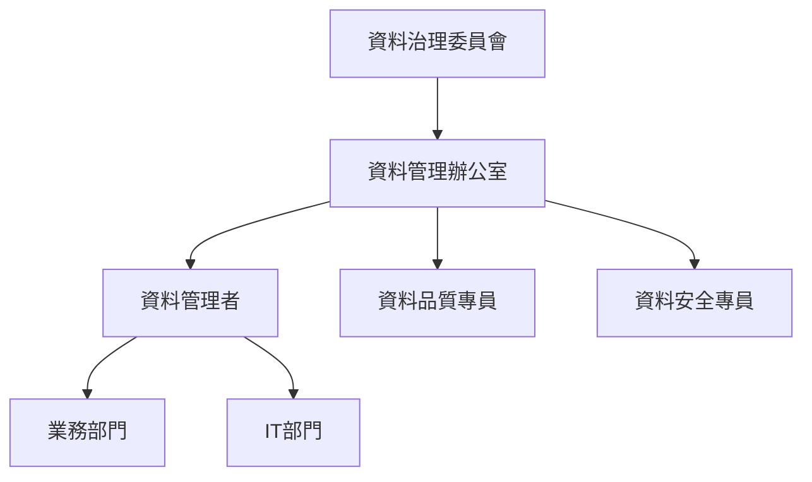

# 銀行大型共用平台 - 資料庫設計指引

## 文件資訊
- **文件名稱**: 資料庫設計指引
- **版本**: 2.0
- **建立日期**: 2025-08-11
- **最後更新**: 2025-08-29
- **作者**: 資料庫架構師
- **適用範圍**: 銀行大型共用平台專案

---

## 目錄

1. [資料庫命名規範](#1-資料庫命名規範)
2. [欄位設計準則](#2-欄位設計準則)
3. [主鍵、外鍵與唯一鍵設計規範](#3-主鍵外鍵與唯一鍵設計規範)
4. [索引策略](#4-索引策略)
5. [資料分區與分表策略](#5-資料分區與分表策略)
6. [資料庫正規化與反正規化設計](#6-資料庫正規化與反正規化設計)
7. [資料安全規範](#7-資料安全規範)
8. [資料庫版本控管與變更管理方法](#8-資料庫版本控管與變更管理方法)
9. [性能調校原則與監控方法](#9-性能調校原則與監控方法)
10. [資料庫備份與災難復原計劃](#10-資料庫備份與災難復原計劃)
11. [資料庫容量規劃](#11-資料庫容量規劃)
12. [資料庫升級與遷移策略](#12-資料庫升級與遷移策略)
13. [資料庫日誌管理](#13-資料庫日誌管理)
14. [資料庫測試與驗證](#14-資料庫測試與驗證)
15. [資料庫文件與註解](#15-資料庫文件與註解)
16. [資料庫自動化與工具](#16-資料庫自動化與工具)
17. [資料庫監控與維護](#17-資料庫監控與維護)
18. [資料庫性能測試](#18-資料庫性能測試)
19. [資料治理與品質管理](#19-資料治理與品質管理)
20. [多租戶架構設計](#20-多租戶架構設計)
21. [雲端資料庫設計指引](#21-雲端資料庫設計指引)
22. [資料庫DevOps實踐](#22-資料庫devops實踐)
23. [法規遵循與合規要求](#23-法規遵循與合規要求)
24. [資料庫最佳實務總結](#24-資料庫最佳實務總結)
25. [結論與未來發展](#25-結論與未來發展)

---

## 1. 資料庫命名規範

### 1.1 資料庫命名規範

- **原則**: 使用英文、數字和底線，避免特殊字元
- **格式**: `{系統代碼}_{環境代碼}_DB`
- **範例**: `BANK_PROD_DB`、`BANK_TEST_DB`、`BANK_DEV_DB`

### 1.2 Schema 命名規範

- **原則**: 依據功能模組或業務領域命名
- **格式**: `{模組代碼}_{功能代碼}`
- **範例**: 
  - `CORE_ACCOUNT` (核心帳戶)
  - `LOAN_MGMT` (放款管理)
  - `RISK_CONTROL` (風險控制)
  - `AUDIT_LOG` (稽核日誌)

### 1.3 Table 命名規範

- **原則**: 使用單數名詞，英文大寫，底線分隔
- **格式**: `{模組前綴}_{業務實體}`
- **範例**:
  - `ACC_CUSTOMER` (客戶資料)
  - `LOAN_APPLICATION` (放款申請)
  - `TXN_JOURNAL` (交易日誌)

### 1.4 Column 命名規範

- **原則**: 英文大寫，底線分隔，含義明確
- **通用欄位**:
  - `ID` - 主鍵
  - `CREATED_DATE` - 建立時間
  - `CREATED_BY` - 建立者
  - `UPDATED_DATE` - 更新時間
  - `UPDATED_BY` - 更新者
  - `VERSION` - 版本號
  - `STATUS` - 狀態

### 1.5 Index 命名規範

- **主鍵索引**: `PK_{表格名稱}`
- **一般索引**: `IDX_{表格名稱}_{欄位名稱}`
- **唯一索引**: `UK_{表格名稱}_{欄位名稱}`
- **外鍵索引**: `FK_{表格名稱}_{參考表格名稱}`

### 1.6 View 命名規範

- **格式**: `V_{模組前綴}_{功能描述}`
- **範例**: `V_ACC_CUSTOMER_SUMMARY`

### 1.7 Function 命名規範

- **格式**: `FN_{模組前綴}_{功能描述}`
- **範例**: `FN_CORE_CALC_INTEREST`

### 1.8 Trigger 命名規範

- **格式**: `TRG_{表格名稱}_{觸發時機}_{動作}`
- **範例**: `TRG_ACC_CUSTOMER_BEFORE_UPDATE`

---

## 2. 欄位設計準則

### 2.1 資料型別選擇原則

#### 2.1.1 數值型別

| 用途 | Oracle | DB2 | SQL Server | PostgreSQL |
|------|--------|-----|-----------|------------|
| 整數 | NUMBER(10) | INTEGER | INT | INTEGER |
| 長整數 | NUMBER(19) | BIGINT | BIGINT | BIGINT |
| 金額 | NUMBER(15,2) | DECIMAL(15,2) | DECIMAL(15,2) | DECIMAL(15,2) |
| 百分比 | NUMBER(5,4) | DECIMAL(5,4) | DECIMAL(5,4) | DECIMAL(5,4) |

#### 2.1.2 字串型別

| 用途 | Oracle | DB2 | SQL Server | PostgreSQL |
|------|--------|-----|-----------|------------|
| 固定長度 | CHAR(n) | CHAR(n) | CHAR(n) | CHAR(n) |
| 變動長度 | VARCHAR2(n) | VARCHAR(n) | VARCHAR(n) | VARCHAR(n) |
| 大文字 | CLOB | CLOB | TEXT | TEXT |

#### 2.1.3 日期時間型別

| 用途 | Oracle | DB2 | SQL Server | PostgreSQL |
|------|--------|-----|-----------|------------|
| 日期 | DATE | DATE | DATE | DATE |
| 日期時間 | TIMESTAMP | TIMESTAMP | DATETIME2 | TIMESTAMP |
| 時間戳記 | TIMESTAMP(6) | TIMESTAMP(6) | DATETIME2(6) | TIMESTAMP(6) |

### 2.2 長度設計標準

- **客戶姓名**: VARCHAR(100)
- **客戶ID**: VARCHAR(20)
- **帳號**: VARCHAR(20)
- **電話**: VARCHAR(20)
- **地址**: VARCHAR(200)
- **電子郵件**: VARCHAR(100)
- **備註**: VARCHAR(500)

### 2.3 NULL 值設計原則

- **不允許 NULL 的欄位**:
  - 主鍵欄位
  - 業務必要欄位
  - 稽核欄位 (CREATED_DATE, CREATED_BY)
  
- **允許 NULL 的欄位**:
  - 選填資料欄位
  - 外鍵欄位 (依業務需求)

### 2.4 預設值設計

```sql
-- Oracle 範例
CREATE TABLE ACC_CUSTOMER (
    ID NUMBER(10) NOT NULL,
    CUSTOMER_NAME VARCHAR2(100) NOT NULL,
    STATUS VARCHAR2(1) DEFAULT 'A' NOT NULL,
    CREATED_DATE TIMESTAMP DEFAULT CURRENT_TIMESTAMP NOT NULL,
    VERSION NUMBER(10) DEFAULT 1 NOT NULL
);

-- DB2 範例
CREATE TABLE ACC_CUSTOMER (
    ID INTEGER NOT NULL,
    CUSTOMER_NAME VARCHAR(100) NOT NULL,
    STATUS CHAR(1) DEFAULT 'A' NOT NULL,
    CREATED_DATE TIMESTAMP DEFAULT CURRENT_TIMESTAMP NOT NULL,
    VERSION INTEGER DEFAULT 1 NOT NULL
);

-- SQL Server 範例
CREATE TABLE ACC_CUSTOMER (
    ID INT NOT NULL,
    CUSTOMER_NAME VARCHAR(100) NOT NULL,
    STATUS CHAR(1) DEFAULT 'A' NOT NULL,
    CREATED_DATE DATETIME2 DEFAULT GETDATE() NOT NULL,
    VERSION INT DEFAULT 1 NOT NULL
);

-- PostgreSQL 範例
CREATE TABLE ACC_CUSTOMER (
    ID INTEGER NOT NULL,
    CUSTOMER_NAME VARCHAR(100) NOT NULL,
    STATUS CHAR(1) DEFAULT 'A' NOT NULL,
    CREATED_DATE TIMESTAMP DEFAULT NOW() NOT NULL,
    VERSION INTEGER DEFAULT 1 NOT NULL
);
```

---

## 3. 主鍵、外鍵與唯一鍵設計規範

### 3.1 主鍵設計原則

- **使用序列號作為主鍵**
- **避免使用業務欄位作為主鍵**
- **單一欄位主鍵優於複合主鍵**

```sql
-- Oracle 主鍵設計
CREATE SEQUENCE SEQ_ACC_CUSTOMER START WITH 1 INCREMENT BY 1;

CREATE TABLE ACC_CUSTOMER (
    ID NUMBER(10) NOT NULL,
    CUSTOMER_CODE VARCHAR2(20) NOT NULL,
    CUSTOMER_NAME VARCHAR2(100) NOT NULL,
    CONSTRAINT PK_ACC_CUSTOMER PRIMARY KEY (ID)
);

-- DB2 主鍵設計
CREATE TABLE ACC_CUSTOMER (
    ID INTEGER NOT NULL GENERATED ALWAYS AS IDENTITY,
    CUSTOMER_CODE VARCHAR(20) NOT NULL,
    CUSTOMER_NAME VARCHAR(100) NOT NULL,
    CONSTRAINT PK_ACC_CUSTOMER PRIMARY KEY (ID)
);

-- SQL Server 主鍵設計
CREATE TABLE ACC_CUSTOMER (
    ID INT IDENTITY(1,1) NOT NULL,
    CUSTOMER_CODE VARCHAR(20) NOT NULL,
    CUSTOMER_NAME VARCHAR(100) NOT NULL,
    CONSTRAINT PK_ACC_CUSTOMER PRIMARY KEY (ID)
);

-- PostgreSQL 主鍵設計
CREATE TABLE ACC_CUSTOMER (
    ID SERIAL NOT NULL,
    CUSTOMER_CODE VARCHAR(20) NOT NULL,
    CUSTOMER_NAME VARCHAR(100) NOT NULL,
    CONSTRAINT PK_ACC_CUSTOMER PRIMARY KEY (ID)
);
```

### 3.2 外鍵設計原則

- **明確定義參考完整性**
- **選擇適當的CASCADE動作**
- **考慮性能影響**

```sql
-- Oracle 外鍵設計
ALTER TABLE ACC_ACCOUNT 
ADD CONSTRAINT FK_ACC_ACCOUNT_CUSTOMER 
FOREIGN KEY (CUSTOMER_ID) REFERENCES ACC_CUSTOMER(ID)
ON DELETE RESTRICT;

-- DB2 外鍵設計
ALTER TABLE ACC_ACCOUNT 
ADD CONSTRAINT FK_ACC_ACCOUNT_CUSTOMER 
FOREIGN KEY (CUSTOMER_ID) REFERENCES ACC_CUSTOMER(ID)
ON DELETE RESTRICT;

-- SQL Server 外鍵設計
ALTER TABLE ACC_ACCOUNT 
ADD CONSTRAINT FK_ACC_ACCOUNT_CUSTOMER 
FOREIGN KEY (CUSTOMER_ID) REFERENCES ACC_CUSTOMER(ID)
ON DELETE NO ACTION;

-- PostgreSQL 外鍵設計
ALTER TABLE ACC_ACCOUNT 
ADD CONSTRAINT FK_ACC_ACCOUNT_CUSTOMER 
FOREIGN KEY (CUSTOMER_ID) REFERENCES ACC_CUSTOMER(ID)
ON DELETE RESTRICT;
```

### 3.3 唯一鍵設計

```sql
-- Oracle 唯一鍵
ALTER TABLE ACC_CUSTOMER 
ADD CONSTRAINT UK_ACC_CUSTOMER_CODE 
UNIQUE (CUSTOMER_CODE);

-- DB2 唯一鍵
ALTER TABLE ACC_CUSTOMER 
ADD CONSTRAINT UK_ACC_CUSTOMER_CODE 
UNIQUE (CUSTOMER_CODE);

-- SQL Server 唯一鍵
ALTER TABLE ACC_CUSTOMER 
ADD CONSTRAINT UK_ACC_CUSTOMER_CODE 
UNIQUE (CUSTOMER_CODE);

-- PostgreSQL 唯一鍵
ALTER TABLE ACC_CUSTOMER 
ADD CONSTRAINT UK_ACC_CUSTOMER_CODE 
UNIQUE (CUSTOMER_CODE);
```

---

## 4. 索引策略

### 4.1 索引設計原則

- **為經常查詢的欄位建立索引**
- **避免過多索引影響 DML 性能**
- **考慮複合索引的欄位順序**
- **定期分析索引使用率**

### 4.2 單欄索引

```sql
-- Oracle 單欄索引
CREATE INDEX IDX_ACC_CUSTOMER_NAME ON ACC_CUSTOMER(CUSTOMER_NAME);

-- DB2 單欄索引
CREATE INDEX IDX_ACC_CUSTOMER_NAME ON ACC_CUSTOMER(CUSTOMER_NAME);

-- SQL Server 單欄索引
CREATE INDEX IDX_ACC_CUSTOMER_NAME ON ACC_CUSTOMER(CUSTOMER_NAME);

-- PostgreSQL 單欄索引
CREATE INDEX IDX_ACC_CUSTOMER_NAME ON ACC_CUSTOMER(CUSTOMER_NAME);
```

### 4.3 複合索引

```sql
-- Oracle 複合索引
CREATE INDEX IDX_ACC_ACCOUNT_CUSTOMER_STATUS 
ON ACC_ACCOUNT(CUSTOMER_ID, STATUS, CREATED_DATE);

-- DB2 複合索引
CREATE INDEX IDX_ACC_ACCOUNT_CUSTOMER_STATUS 
ON ACC_ACCOUNT(CUSTOMER_ID, STATUS, CREATED_DATE);

-- SQL Server 複合索引
CREATE INDEX IDX_ACC_ACCOUNT_CUSTOMER_STATUS 
ON ACC_ACCOUNT(CUSTOMER_ID, STATUS, CREATED_DATE);

-- PostgreSQL 複合索引
CREATE INDEX IDX_ACC_ACCOUNT_CUSTOMER_STATUS 
ON ACC_ACCOUNT(CUSTOMER_ID, STATUS, CREATED_DATE);
```

### 4.4 全文索引

```sql
-- Oracle 全文索引
CREATE INDEX IDX_ACC_CUSTOMER_FULLTEXT 
ON ACC_CUSTOMER(CUSTOMER_NAME) 
INDEXTYPE IS CTXSYS.CONTEXT;

-- SQL Server 全文索引
CREATE FULLTEXT INDEX ON ACC_CUSTOMER(CUSTOMER_NAME)
KEY INDEX PK_ACC_CUSTOMER;

-- PostgreSQL 全文索引
CREATE INDEX IDX_ACC_CUSTOMER_FULLTEXT 
ON ACC_CUSTOMER USING GIN(to_tsvector('english', CUSTOMER_NAME));
```

### 4.5 部分索引

```sql
-- Oracle 部分索引
CREATE INDEX IDX_ACC_CUSTOMER_ACTIVE 
ON ACC_CUSTOMER(CUSTOMER_CODE) 
WHERE STATUS = 'A';

-- PostgreSQL 部分索引
CREATE INDEX IDX_ACC_CUSTOMER_ACTIVE 
ON ACC_CUSTOMER(CUSTOMER_CODE) 
WHERE STATUS = 'A';

-- SQL Server 篩選索引
CREATE INDEX IDX_ACC_CUSTOMER_ACTIVE 
ON ACC_CUSTOMER(CUSTOMER_CODE) 
WHERE STATUS = 'A';
```

---

## 5. 資料分區與分表策略

### 5.1 分區策略

#### 5.1.1 範圍分區

```sql
-- Oracle 範圍分區
CREATE TABLE TXN_JOURNAL (
    ID NUMBER(10),
    TXN_DATE DATE,
    AMOUNT NUMBER(15,2)
)
PARTITION BY RANGE (TXN_DATE) (
    PARTITION P202501 VALUES LESS THAN (DATE '2025-02-01'),
    PARTITION P202502 VALUES LESS THAN (DATE '2025-03-01'),
    PARTITION P202503 VALUES LESS THAN (DATE '2025-04-01')
);

-- PostgreSQL 範圍分區
CREATE TABLE TXN_JOURNAL (
    ID INTEGER,
    TXN_DATE DATE,
    AMOUNT DECIMAL(15,2)
) PARTITION BY RANGE (TXN_DATE);

CREATE TABLE TXN_JOURNAL_202501 PARTITION OF TXN_JOURNAL
FOR VALUES FROM ('2025-01-01') TO ('2025-02-01');
```

#### 5.1.2 雜湊分區

```sql
-- Oracle 雜湊分區
CREATE TABLE ACC_CUSTOMER (
    ID NUMBER(10),
    CUSTOMER_CODE VARCHAR2(20)
)
PARTITION BY HASH (CUSTOMER_CODE)
PARTITIONS 4;

-- PostgreSQL 雜湊分區
CREATE TABLE ACC_CUSTOMER (
    ID INTEGER,
    CUSTOMER_CODE VARCHAR(20)
) PARTITION BY HASH (CUSTOMER_CODE);

CREATE TABLE ACC_CUSTOMER_P0 PARTITION OF ACC_CUSTOMER
FOR VALUES WITH (MODULUS 4, REMAINDER 0);
```

### 5.2 分表策略

- **水平分表**: 依據時間、地區、客戶類型
- **垂直分表**: 依據欄位使用頻率
- **混合分表**: 結合水平與垂直分表

---

## 6. 資料庫正規化與反正規化設計

### 6.1 正規化原則

#### 6.1.1 第一正規化 (1NF)
- 每個欄位包含單一值
- 避免重複群組

#### 6.1.2 第二正規化 (2NF)
- 符合1NF
- 非鍵值欄位完全依賴主鍵

#### 6.1.3 第三正規化 (3NF)
- 符合2NF
- 非鍵值欄位不依賴其他非鍵值欄位

### 6.2 反正規化策略

- **查詢性能考量**
- **減少JOIN操作**
- **增加冗餘欄位**

```sql
-- 正規化設計
CREATE TABLE ACC_CUSTOMER (
    ID NUMBER(10) PRIMARY KEY,
    CUSTOMER_NAME VARCHAR2(100)
);

CREATE TABLE ACC_ACCOUNT (
    ID NUMBER(10) PRIMARY KEY,
    CUSTOMER_ID NUMBER(10),
    ACCOUNT_NO VARCHAR2(20)
);

-- 反正規化設計（增加冗餘欄位）
CREATE TABLE ACC_ACCOUNT (
    ID NUMBER(10) PRIMARY KEY,
    CUSTOMER_ID NUMBER(10),
    CUSTOMER_NAME VARCHAR2(100), -- 冗餘欄位
    ACCOUNT_NO VARCHAR2(20)
);
```

---

## 7. 資料安全規範

### 7.1 加密策略

#### 7.1.1 透明資料加密 (TDE)

```sql
-- Oracle TDE
ALTER SYSTEM SET ENCRYPTION KEY IDENTIFIED BY "password";
ALTER TABLE ACC_CUSTOMER MODIFY (CUSTOMER_NAME ENCRYPT);

-- SQL Server TDE
CREATE MASTER KEY ENCRYPTION BY PASSWORD = 'password';
CREATE CERTIFICATE TDECert WITH SUBJECT = 'TDE Certificate';
CREATE DATABASE ENCRYPTION KEY
WITH ALGORITHM = AES_256
ENCRYPTION BY SERVER CERTIFICATE TDECert;
ALTER DATABASE BANK_PROD_DB SET ENCRYPTION ON;
```

#### 7.1.2 應用層加密

```sql
-- Oracle 加密函數
CREATE OR REPLACE FUNCTION ENCRYPT_SENSITIVE_DATA(p_data VARCHAR2)
RETURN RAW IS
BEGIN
    RETURN DBMS_CRYPTO.ENCRYPT(
        UTL_RAW.CAST_TO_RAW(p_data),
        DBMS_CRYPTO.AES256_CBC_PKCS5,
        UTL_RAW.CAST_TO_RAW('encryption_key_32_chars_long!')
    );
END;

-- PostgreSQL 加密
CREATE EXTENSION IF NOT EXISTS pgcrypto;
INSERT INTO ACC_CUSTOMER (CUSTOMER_NAME, PHONE)
VALUES (crypt('John Doe', gen_salt('bf')), pgp_sym_encrypt('0912345678', 'secret_key'));
```

### 7.2 資料遮蔽

```sql
-- Oracle 資料遮蔽
BEGIN
    DBMS_DATA_MASKING.CREATE_MASK_POLICY(
        policy_name => 'CUSTOMER_MASK_POLICY',
        table_name => 'ACC_CUSTOMER',
        column_name => 'CUSTOMER_NAME',
        masking_function => 'DBMS_DATA_MASKING.PARTIAL_MASK',
        function_parameters => 'vBegin=1,vEnd=3,vMaskChar=*'
    );
END;

-- SQL Server 動態資料遮蔽
ALTER TABLE ACC_CUSTOMER
ALTER COLUMN CUSTOMER_NAME ADD MASKED WITH (FUNCTION = 'partial(1,"XXX",0)');
```

### 7.3 存取權限控制

```sql
-- Oracle 角色與權限
CREATE ROLE BANK_READ_ONLY;
CREATE ROLE BANK_OPERATOR;
CREATE ROLE BANK_ADMIN;

GRANT SELECT ON ACC_CUSTOMER TO BANK_READ_ONLY;
GRANT SELECT, INSERT, UPDATE ON ACC_CUSTOMER TO BANK_OPERATOR;
GRANT ALL ON ACC_CUSTOMER TO BANK_ADMIN;

-- 資料列層級安全性
CREATE OR REPLACE FUNCTION customer_security_predicate(
    schema_name VARCHAR2,
    table_name VARCHAR2
) RETURN VARCHAR2 IS
BEGIN
    RETURN 'BRANCH_CODE = SYS_CONTEXT(''USERENV'', ''CLIENT_IDENTIFIER'')';
END;
```

### 7.4 稽核機制

```sql
-- Oracle 稽核設定
AUDIT ALL ON ACC_CUSTOMER BY ACCESS;
AUDIT ALL ON ACC_ACCOUNT BY ACCESS;

-- SQL Server 稽核
CREATE SERVER AUDIT BANK_AUDIT
TO FILE (FILEPATH = 'C:\Audit\');

CREATE DATABASE AUDIT SPECIFICATION BANK_DB_AUDIT
FOR SERVER AUDIT BANK_AUDIT
ADD (SELECT, INSERT, UPDATE, DELETE ON ACC_CUSTOMER BY PUBLIC);

-- PostgreSQL 稽核
CREATE EXTENSION IF NOT EXISTS pgaudit;
ALTER SYSTEM SET pgaudit.log = 'all';
```

---

## 8. 資料庫版本控管與變更管理方法

### 8.1 版本控管策略

#### 8.1.1 Schema 版本控制

```sql
-- 版本控制表
CREATE TABLE DB_VERSION (
    VERSION_ID NUMBER(10) PRIMARY KEY,
    VERSION_NUMBER VARCHAR2(20) NOT NULL,
    DESCRIPTION VARCHAR2(500),
    APPLIED_DATE TIMESTAMP DEFAULT CURRENT_TIMESTAMP,
    APPLIED_BY VARCHAR2(50) NOT NULL
);

-- 版本更新腳本範例
-- V1.0.1__Create_Customer_Table.sql
CREATE TABLE ACC_CUSTOMER (
    ID NUMBER(10) NOT NULL,
    CUSTOMER_NAME VARCHAR2(100) NOT NULL,
    CREATED_DATE TIMESTAMP DEFAULT CURRENT_TIMESTAMP
);

INSERT INTO DB_VERSION (VERSION_ID, VERSION_NUMBER, DESCRIPTION, APPLIED_BY)
VALUES (1, '1.0.1', 'Create Customer Table', USER);
```

#### 8.1.2 使用 Flyway 進行版本控制

```properties
# flyway.conf
flyway.url=jdbc:oracle:thin:@localhost:1521:xe
flyway.user=bank_user
flyway.password=password
flyway.schemas=BANK_SCHEMA
flyway.locations=filesystem:sql/migration
```

### 8.2 變更管理流程

1. **開發環境變更**
2. **變更腳本撰寫**
3. **測試環境驗證**
4. **UAT環境測試**
5. **生產環境部署**

### 8.3 回滾策略

```sql
-- 建立備份表
CREATE TABLE ACC_CUSTOMER_BACKUP_20250811 AS
SELECT * FROM ACC_CUSTOMER;

-- 回滾腳本
DELETE FROM DB_VERSION WHERE VERSION_NUMBER = '1.0.2';
DROP TABLE ACC_CUSTOMER_NEW;
```

---

## 9. 性能調校原則與監控方法

### 9.1 查詢優化原則

#### 9.1.1 SQL 撰寫最佳實務

```sql
-- 避免 SELECT *
-- 不佳範例
SELECT * FROM ACC_CUSTOMER WHERE STATUS = 'A';

-- 良好範例
SELECT ID, CUSTOMER_NAME, CUSTOMER_CODE 
FROM ACC_CUSTOMER 
WHERE STATUS = 'A';

-- 使用適當的 JOIN
-- 內連接範例
SELECT c.CUSTOMER_NAME, a.ACCOUNT_NO
FROM ACC_CUSTOMER c
INNER JOIN ACC_ACCOUNT a ON c.ID = a.CUSTOMER_ID
WHERE c.STATUS = 'A';

-- 避免在 WHERE 條件中使用函數
-- 不佳範例
SELECT * FROM TXN_JOURNAL WHERE YEAR(TXN_DATE) = 2025;

-- 良好範例
SELECT * FROM TXN_JOURNAL 
WHERE TXN_DATE >= DATE '2025-01-01' 
  AND TXN_DATE < DATE '2026-01-01';
```

#### 9.1.2 執行計畫分析

```sql
-- Oracle 執行計畫
EXPLAIN PLAN FOR
SELECT * FROM ACC_CUSTOMER WHERE CUSTOMER_CODE = 'C001';
SELECT * FROM TABLE(DBMS_XPLAN.DISPLAY);

-- SQL Server 執行計畫
SET SHOWPLAN_ALL ON;
SELECT * FROM ACC_CUSTOMER WHERE CUSTOMER_CODE = 'C001';

-- PostgreSQL 執行計畫
EXPLAIN (ANALYZE, BUFFERS) 
SELECT * FROM ACC_CUSTOMER WHERE CUSTOMER_CODE = 'C001';
```

### 9.2 性能監控

#### 9.2.1 系統監控指標

- **CPU 使用率**
- **記憶體使用率**
- **磁碟 I/O**
- **網路流量**
- **連接數**
- **查詢回應時間**

#### 9.2.2 監控 SQL 腳本

```sql
-- Oracle 慢查詢監控
SELECT sql_id, sql_text, executions, elapsed_time/1000000 as elapsed_seconds
FROM v$sql
WHERE elapsed_time/1000000 > 10
ORDER BY elapsed_time DESC;

-- SQL Server 慢查詢監控
SELECT 
    qs.total_elapsed_time/1000000 AS total_elapsed_seconds,
    qs.execution_count,
    SUBSTRING(qt.text, qs.statement_start_offset/2+1, 
        (CASE WHEN qs.statement_end_offset = -1 
         THEN LEN(CONVERT(nvarchar(max), qt.text)) * 2 
         ELSE qs.statement_end_offset END - qs.statement_start_offset)/2) AS query_text
FROM sys.dm_exec_query_stats AS qs
CROSS APPLY sys.dm_exec_sql_text(qs.sql_handle) AS qt
WHERE qs.total_elapsed_time/1000000 > 10
ORDER BY qs.total_elapsed_time DESC;

-- PostgreSQL 慢查詢監控
SELECT query, calls, total_time, mean_time, rows
FROM pg_stat_statements
WHERE mean_time > 10000
ORDER BY mean_time DESC;
```

---

## 10. 資料庫備份與災難復原計劃

### 10.1 備份策略

#### 10.1.1 完整備份

```sql
-- Oracle 完整備份
RMAN> BACKUP DATABASE PLUS ARCHIVELOG;

-- SQL Server 完整備份
BACKUP DATABASE [BANK_PROD_DB] 
TO DISK = 'C:\Backup\BANK_PROD_DB_FULL.bak'
WITH FORMAT, INIT;

-- PostgreSQL 完整備份
pg_dump -h localhost -U postgres -d bank_prod_db > bank_prod_db_full.sql
```

#### 10.1.2 增量備份

```sql
-- Oracle 增量備份
RMAN> BACKUP INCREMENTAL LEVEL 1 DATABASE;

-- SQL Server 差異備份
BACKUP DATABASE [BANK_PROD_DB] 
TO DISK = 'C:\Backup\BANK_PROD_DB_DIFF.bak'
WITH DIFFERENTIAL;

-- PostgreSQL WAL 歸檔
archive_mode = on
archive_command = 'cp %p /archive/%f'
```

#### 10.1.3 交易日誌備份

```sql
-- Oracle 歸檔日誌備份
RMAN> BACKUP ARCHIVELOG ALL;

-- SQL Server 交易日誌備份
BACKUP LOG [BANK_PROD_DB] 
TO DISK = 'C:\Backup\BANK_PROD_DB_LOG.trn';

-- PostgreSQL 連續歸檔
SELECT pg_start_backup('manual_backup');
-- 複製資料檔案
SELECT pg_stop_backup();
```

### 10.2 災難復原計劃

#### 10.2.1 RTO/RPO 目標

- **RTO (Recovery Time Objective)**: 4小時
- **RPO (Recovery Point Objective)**: 15分鐘

#### 10.2.2 復原程序

```sql
-- Oracle 復原
RMAN> STARTUP MOUNT;
RMAN> RESTORE DATABASE;
RMAN> RECOVER DATABASE;
RMAN> ALTER DATABASE OPEN;

-- SQL Server 復原
RESTORE DATABASE [BANK_PROD_DB] 
FROM DISK = 'C:\Backup\BANK_PROD_DB_FULL.bak'
WITH NORECOVERY;

RESTORE DATABASE [BANK_PROD_DB] 
FROM DISK = 'C:\Backup\BANK_PROD_DB_DIFF.bak'
WITH NORECOVERY;

RESTORE LOG [BANK_PROD_DB] 
FROM DISK = 'C:\Backup\BANK_PROD_DB_LOG.trn'
WITH RECOVERY;

-- PostgreSQL 復原
pg_restore -h localhost -U postgres -d bank_prod_db bank_prod_db_full.sql
```

---

## 11. 資料庫容量規劃

### 11.1 容量評估

#### 11.1.1 資料成長預測

```sql
-- Oracle 容量查詢
SELECT 
    tablespace_name,
    ROUND(SUM(bytes)/1024/1024/1024, 2) AS size_gb,
    ROUND(SUM(maxbytes)/1024/1024/1024, 2) AS max_size_gb
FROM dba_data_files
GROUP BY tablespace_name;

-- SQL Server 容量查詢
SELECT 
    name,
    ROUND(size * 8.0 / 1024 / 1024, 2) AS size_gb,
    ROUND(max_size * 8.0 / 1024 / 1024, 2) AS max_size_gb
FROM sys.master_files
WHERE type_desc = 'ROWS';

-- PostgreSQL 容量查詢
SELECT 
    schemaname,
    tablename,
    pg_size_pretty(pg_total_relation_size(schemaname||'.'||tablename)) AS size
FROM pg_tables
WHERE schemaname = 'public'
ORDER BY pg_total_relation_size(schemaname||'.'||tablename) DESC;
```

#### 11.1.2 容量規劃公式

- **年度資料成長**: 現有資料量 × 成長率 × 時間
- **索引空間**: 資料空間 × 30%
- **暫存空間**: 資料空間 × 20%
- **總容量需求**: (資料空間 + 索引空間 + 暫存空間) × 安全係數 (1.5)

### 11.2 空間管理

```sql
-- Oracle 表空間管理
CREATE TABLESPACE BANK_DATA
DATAFILE '/oracle/data/bank_data01.dbf' SIZE 1G
AUTOEXTEND ON NEXT 100M MAXSIZE 10G;

-- SQL Server 檔案群組管理
ALTER DATABASE [BANK_PROD_DB] 
ADD FILEGROUP [BANK_DATA];

ALTER DATABASE [BANK_PROD_DB] 
ADD FILE (NAME = 'BANK_DATA1', 
          FILENAME = 'C:\Data\bank_data1.ndf', 
          SIZE = 1GB, 
          MAXSIZE = 10GB, 
          FILEGROWTH = 100MB) 
TO FILEGROUP [BANK_DATA];
```

---

## 12. 資料庫升級與遷移策略

### 12.1 升級策略

#### 12.1.1 滾動升級

1. **準備階段**
   - 備份現有資料庫
   - 驗證相容性
   - 準備回滾計劃

2. **執行階段**
   - 升級主要節點
   - 驗證功能
   - 升級次要節點

3. **驗證階段**
   - 功能測試
   - 性能驗證
   - 資料完整性檢查

#### 12.1.2 藍綠部署

```sql
-- 建立新版本資料庫
CREATE DATABASE BANK_PROD_DB_V2;

-- 資料同步
-- 使用複寫或 ETL 工具同步資料

-- 切換連接
-- 修改應用程式連接字串指向新資料庫
```

### 12.2 資料遷移

#### 12.2.1 同質資料庫遷移

```sql
-- Oracle 到 Oracle
-- 使用 Data Pump
expdp username/password DIRECTORY=dump_dir DUMPFILE=export.dmp
impdp username/password DIRECTORY=dump_dir DUMPFILE=export.dmp

-- SQL Server 到 SQL Server
-- 使用 SSIS 或 BCP
bcp BANK_PROD_DB.dbo.ACC_CUSTOMER out customer.dat -S server -T
bcp BANK_PROD_DB.dbo.ACC_CUSTOMER in customer.dat -S target_server -T
```

#### 12.2.2 異質資料庫遷移

```sql
-- Oracle 到 PostgreSQL
-- 使用 ora2pg 工具
ora2pg -t TABLE -o tables.sql
ora2pg -t COPY -o data.sql

-- SQL Server 到 PostgreSQL
-- 使用 SQL Server Migration Assistant (SSMA)
```

---

## 13. 資料庫日誌管理

### 13.1 日誌類型

#### 13.1.1 交易日誌

```sql
-- Oracle 重做日誌
ALTER SYSTEM SWITCH LOGFILE;
SELECT group#, status, bytes/1024/1024 AS size_mb 
FROM v$log;

-- SQL Server 交易日誌
SELECT 
    name,
    log_reuse_wait_desc,
    size * 8.0 / 1024 AS size_mb
FROM sys.databases;

-- PostgreSQL WAL 日誌
SELECT pg_current_wal_lsn();
SELECT * FROM pg_stat_archiver;
```

#### 13.1.2 稽核日誌

```sql
-- Oracle 稽核日誌
SELECT username, timestamp, action_name, obj_name
FROM dba_audit_trail
WHERE timestamp > SYSDATE - 1;

-- SQL Server 稽核日誌
SELECT 
    event_time,
    action_id,
    succeeded,
    database_name,
    schema_name,
    object_name
FROM sys.fn_get_audit_file('C:\Audit\*.sqlaudit', NULL, NULL);
```

### 13.2 日誌輪替策略

- **按大小輪替**: 日誌檔案達到指定大小時輪替
- **按時間輪替**: 每日/每週/每月輪替
- **保留政策**: 保留指定天數的日誌

---

## 14. 資料庫測試與驗證

### 14.1 功能測試

#### 14.1.1 資料完整性測試

```sql
-- 檢查主鍵約束
SELECT constraint_name, table_name, status
FROM user_constraints
WHERE constraint_type = 'P' AND status = 'DISABLED';

-- 檢查外鍵約束
SELECT constraint_name, table_name, r_constraint_name, status
FROM user_constraints
WHERE constraint_type = 'R' AND status = 'DISABLED';

-- 檢查資料一致性
SELECT COUNT(*) FROM ACC_ACCOUNT a
WHERE NOT EXISTS (
    SELECT 1 FROM ACC_CUSTOMER c WHERE c.ID = a.CUSTOMER_ID
);
```

#### 14.1.2 業務邏輯測試

```sql
-- 測試餘額計算
SELECT 
    account_no,
    balance,
    (SELECT SUM(amount) FROM TXN_JOURNAL 
     WHERE account_id = a.id) AS calculated_balance
FROM ACC_ACCOUNT a
WHERE balance != (SELECT COALESCE(SUM(amount), 0) 
                  FROM TXN_JOURNAL 
                  WHERE account_id = a.id);
```

### 14.2 性能測試

#### 14.2.1 負載測試

```sql
-- 模擬大量查詢
DECLARE
    v_start_time TIMESTAMP;
    v_end_time TIMESTAMP;
BEGIN
    v_start_time := SYSTIMESTAMP;
    
    FOR i IN 1..10000 LOOP
        SELECT COUNT(*) INTO v_count
        FROM ACC_CUSTOMER
        WHERE status = 'A';
    END LOOP;
    
    v_end_time := SYSTIMESTAMP;
    DBMS_OUTPUT.PUT_LINE('執行時間: ' || 
        EXTRACT(SECOND FROM (v_end_time - v_start_time)));
END;
```

#### 14.2.2 壓力測試

```sql
-- 模擬併發交易
-- 使用多個連接同時執行大量 DML 操作
BEGIN
    FOR i IN 1..1000 LOOP
        INSERT INTO TXN_JOURNAL (account_id, amount, txn_date)
        VALUES (MOD(i, 100) + 1, ROUND(DBMS_RANDOM.VALUE(1, 1000), 2), SYSDATE);
        
        IF MOD(i, 100) = 0 THEN
            COMMIT;
        END IF;
    END LOOP;
END;
```

---

## 15. 資料庫文件與註解

### 15.1 文件標準

#### 15.1.1 表格文件

```sql
-- Oracle 表格註解
COMMENT ON TABLE ACC_CUSTOMER IS '客戶基本資料表';
COMMENT ON COLUMN ACC_CUSTOMER.ID IS '客戶唯一識別碼';
COMMENT ON COLUMN ACC_CUSTOMER.CUSTOMER_NAME IS '客戶姓名';
COMMENT ON COLUMN ACC_CUSTOMER.STATUS IS '客戶狀態：A=啟用, I=停用, D=刪除';

-- SQL Server 表格註解
EXEC sp_addextendedproperty 
@name = N'MS_Description', 
@value = N'客戶基本資料表', 
@level0type = N'SCHEMA', @level0name = N'dbo',
@level1type = N'TABLE', @level1name = N'ACC_CUSTOMER';

-- PostgreSQL 表格註解
COMMENT ON TABLE ACC_CUSTOMER IS '客戶基本資料表';
COMMENT ON COLUMN ACC_CUSTOMER.ID IS '客戶唯一識別碼';
```

#### 15.1.2 視圖文件

```sql
-- 建立客戶摘要視圖
CREATE VIEW V_ACC_CUSTOMER_SUMMARY AS
SELECT 
    c.ID,
    c.CUSTOMER_NAME,
    c.STATUS,
    COUNT(a.ID) AS account_count,
    SUM(a.BALANCE) AS total_balance
FROM ACC_CUSTOMER c
LEFT JOIN ACC_ACCOUNT a ON c.ID = a.CUSTOMER_ID
GROUP BY c.ID, c.CUSTOMER_NAME, c.STATUS;

COMMENT ON VIEW V_ACC_CUSTOMER_SUMMARY IS '客戶帳戶摘要視圖';
```

### 15.2 資料字典

```sql
-- 建立資料字典表
CREATE TABLE DATA_DICTIONARY (
    TABLE_NAME VARCHAR2(50),
    COLUMN_NAME VARCHAR2(50),
    DATA_TYPE VARCHAR2(20),
    IS_NULLABLE VARCHAR2(1),
    DEFAULT_VALUE VARCHAR2(100),
    DESCRIPTION VARCHAR2(500),
    BUSINESS_RULES VARCHAR2(1000)
);

-- 插入資料字典
INSERT INTO DATA_DICTIONARY VALUES (
    'ACC_CUSTOMER',
    'STATUS',
    'VARCHAR2(1)',
    'N',
    'A',
    '客戶狀態',
    'A=啟用, I=停用, D=刪除; 預設為啟用狀態; 停用客戶不能開新帳戶'
);
```

---

## 16. 資料庫自動化與工具

### 16.1 自動化部署

#### 16.1.1 CI/CD 管道

```yaml
# GitLab CI/CD 範例
stages:
  - validate
  - test
  - deploy

validate_sql:
  stage: validate
  script:
    - sqlfluff lint sql/migration/*.sql
    - flyway validate

test_migration:
  stage: test
  script:
    - flyway migrate -url=jdbc:postgresql://test-db:5432/bank_test
    - pytest tests/database/

deploy_production:
  stage: deploy
  script:
    - flyway migrate -url=jdbc:postgresql://prod-db:5432/bank_prod
  when: manual
  only:
    - master
```

#### 16.1.2 自動化腳本

```bash
#!/bin/bash
# 資料庫部署腳本

DB_HOST="localhost"
DB_PORT="5432"
DB_NAME="bank_prod"
DB_USER="admin"

echo "開始資料庫部署..."

# 檢查連接
pg_isready -h $DB_HOST -p $DB_PORT -d $DB_NAME -U $DB_USER

if [ $? -eq 0 ]; then
    echo "資料庫連接正常"
    
    # 執行遷移
    flyway migrate
    
    # 驗證部署
    flyway validate
    
    echo "部署完成"
else
    echo "資料庫連接失敗"
    exit 1
fi
```

### 16.2 監控工具

#### 16.2.1 自動化監控腳本

```sql
-- Oracle 監控腳本
CREATE OR REPLACE PROCEDURE MONITOR_DATABASE IS
    v_cpu_usage NUMBER;
    v_memory_usage NUMBER;
    v_tablespace_usage NUMBER;
BEGIN
    -- 檢查 CPU 使用率
    SELECT VALUE INTO v_cpu_usage
    FROM V$SYSMETRIC
    WHERE METRIC_NAME = 'Host CPU Utilization (%)';
    
    -- 檢查記憶體使用率
    SELECT ROUND((1 - (SGA_TARGET - SGA_SIZE) / SGA_TARGET) * 100, 2)
    INTO v_memory_usage
    FROM V$SGAINFO WHERE NAME = 'Maximum SGA Size';
    
    -- 檢查表空間使用率
    SELECT MAX(ROUND(used_percent, 2))
    INTO v_tablespace_usage
    FROM DBA_TABLESPACE_USAGE_METRICS;
    
    -- 發送警告
    IF v_cpu_usage > 80 OR v_memory_usage > 85 OR v_tablespace_usage > 90 THEN
        -- 發送告警郵件或通知
        DBMS_OUTPUT.PUT_LINE('警告：資源使用率過高');
    END IF;
END;
```

---

## 17. 資料庫監控與維護

### 17.1 日常監控

#### 17.1.1 關鍵指標監控

```sql
-- Oracle 系統監控查詢
SELECT 
    metric_name,
    value,
    metric_unit
FROM v$sysmetric
WHERE metric_name IN (
    'Database CPU Time Ratio',
    'Database Wait Time Ratio',
    'Physical Reads Per Sec',
    'Physical Writes Per Sec',
    'User Transaction Per Sec'
);

-- SQL Server 性能監控
SELECT 
    object_name,
    counter_name,
    instance_name,
    cntr_value
FROM sys.dm_os_performance_counters
WHERE object_name LIKE '%SQL Statistics%'
   OR object_name LIKE '%Buffer Manager%';

-- PostgreSQL 監控查詢
SELECT 
    datname,
    numbackends,
    xact_commit,
    xact_rollback,
    blks_read,
    blks_hit,
    tup_returned,
    tup_fetched
FROM pg_stat_database
WHERE datname = 'bank_prod';
```

#### 17.1.2 空間監控

```sql
-- Oracle 表空間監控
SELECT 
    df.tablespace_name,
    ROUND(df.total_size_mb, 2) AS total_mb,
    ROUND(fs.free_size_mb, 2) AS free_mb,
    ROUND((df.total_size_mb - fs.free_size_mb) / df.total_size_mb * 100, 2) AS used_percent
FROM (
    SELECT tablespace_name, SUM(bytes)/1024/1024 AS total_size_mb
    FROM dba_data_files
    GROUP BY tablespace_name
) df,
(
    SELECT tablespace_name, SUM(bytes)/1024/1024 AS free_size_mb
    FROM dba_free_space
    GROUP BY tablespace_name
) fs
WHERE df.tablespace_name = fs.tablespace_name;
```

### 17.2 維護作業

#### 17.2.1 統計資訊更新

```sql
-- Oracle 統計資訊更新
BEGIN
    DBMS_STATS.GATHER_SCHEMA_STATS(
        ownname => 'BANK_SCHEMA',
        estimate_percent => DBMS_STATS.AUTO_SAMPLE_SIZE,
        method_opt => 'FOR ALL COLUMNS SIZE AUTO',
        degree => DBMS_STATS.AUTO_DEGREE
    );
END;

-- SQL Server 統計資訊更新
UPDATE STATISTICS ACC_CUSTOMER WITH FULLSCAN;

-- PostgreSQL 統計資訊更新
ANALYZE ACC_CUSTOMER;
```

#### 17.2.2 索引維護

```sql
-- Oracle 索引重建
ALTER INDEX IDX_ACC_CUSTOMER_NAME REBUILD ONLINE;

-- SQL Server 索引重組
ALTER INDEX IDX_ACC_CUSTOMER_NAME ON ACC_CUSTOMER REORGANIZE;

-- PostgreSQL 索引重建
REINDEX INDEX IDX_ACC_CUSTOMER_NAME;
```

---

## 18. 資料庫性能測試

### 18.1 基準測試

#### 18.1.1 TPC-C 測試

```sql
-- 模擬 OLTP 工作負載
CREATE OR REPLACE PROCEDURE TPC_C_SIMULATION IS
    v_start_time TIMESTAMP;
    v_end_time TIMESTAMP;
    v_transactions NUMBER := 0;
BEGIN
    v_start_time := SYSTIMESTAMP;
    
    FOR i IN 1..10000 LOOP
        -- 新訂單交易 (45%)
        IF MOD(i, 100) < 45 THEN
            INSERT INTO TXN_JOURNAL (account_id, amount, txn_type)
            VALUES (MOD(i, 1000) + 1, ROUND(DBMS_RANDOM.VALUE(1, 1000), 2), 'NEW_ORDER');
            
        -- 付款交易 (43%)
        ELSIF MOD(i, 100) < 88 THEN
            UPDATE ACC_ACCOUNT 
            SET balance = balance - ROUND(DBMS_RANDOM.VALUE(1, 500), 2)
            WHERE id = MOD(i, 1000) + 1;
            
        -- 訂單狀態查詢 (4%)
        ELSIF MOD(i, 100) < 92 THEN
            SELECT COUNT(*) INTO v_temp
            FROM TXN_JOURNAL
            WHERE account_id = MOD(i, 1000) + 1;
            
        -- 庫存查詢 (4%)
        ELSIF MOD(i, 100) < 96 THEN
            SELECT balance INTO v_temp
            FROM ACC_ACCOUNT
            WHERE id = MOD(i, 1000) + 1;
            
        -- 配送交易 (4%)
        ELSE
            UPDATE TXN_JOURNAL 
            SET status = 'COMPLETED'
            WHERE id = MOD(i, 10000) + 1;
        END IF;
        
        v_transactions := v_transactions + 1;
        
        IF MOD(i, 1000) = 0 THEN
            COMMIT;
        END IF;
    END LOOP;
    
    v_end_time := SYSTIMESTAMP;
    
    DBMS_OUTPUT.PUT_LINE('完成交易數: ' || v_transactions);
    DBMS_OUTPUT.PUT_LINE('執行時間: ' || 
        EXTRACT(SECOND FROM (v_end_time - v_start_time)) || ' 秒');
    DBMS_OUTPUT.PUT_LINE('TPS: ' || 
        ROUND(v_transactions / EXTRACT(SECOND FROM (v_end_time - v_start_time)), 2));
END;
```

#### 18.1.2 批次處理測試

```sql
-- 大量資料處理測試
CREATE OR REPLACE PROCEDURE BATCH_PROCESS_TEST IS
    v_start_time TIMESTAMP;
    v_end_time TIMESTAMP;
    v_records_processed NUMBER := 0;
BEGIN
    v_start_time := SYSTIMESTAMP;
    
    -- 批次插入測試
    FOR i IN 1..100 LOOP
        INSERT /*+ APPEND */ INTO TXN_JOURNAL_BATCH
        SELECT 
            seq_txn_journal.nextval,
            MOD(level, 1000) + 1,
            ROUND(DBMS_RANDOM.VALUE(1, 1000), 2),
            SYSDATE,
            'BATCH_' || i
        FROM dual
        CONNECT BY level <= 1000;
        
        v_records_processed := v_records_processed + 1000;
        COMMIT;
    END LOOP;
    
    v_end_time := SYSTIMESTAMP;
    
    DBMS_OUTPUT.PUT_LINE('處理記錄數: ' || v_records_processed);
    DBMS_OUTPUT.PUT_LINE('執行時間: ' || 
        EXTRACT(SECOND FROM (v_end_time - v_start_time)) || ' 秒');
    DBMS_OUTPUT.PUT_LINE('每秒處理記錄數: ' || 
        ROUND(v_records_processed / EXTRACT(SECOND FROM (v_end_time - v_start_time)), 2));
END;
```

### 18.2 壓力測試

#### 18.2.1 併發連接測試

```python
# Python 併發測試腳本
import threading
import time
import psycopg2
from concurrent.futures import ThreadPoolExecutor

def execute_query(thread_id):
    try:
        conn = psycopg2.connect(
            host="localhost",
            database="bank_prod",
            user="test_user",
            password="password"
        )
        cursor = conn.cursor()
        
        start_time = time.time()
        
        for i in range(100):
            cursor.execute("""
                SELECT c.customer_name, a.account_no, a.balance
                FROM acc_customer c
                JOIN acc_account a ON c.id = a.customer_id
                WHERE c.status = 'A'
                LIMIT 10
            """)
            results = cursor.fetchall()
        
        end_time = time.time()
        print(f"Thread {thread_id} completed in {end_time - start_time:.2f} seconds")
        
        cursor.close()
        conn.close()
        
    except Exception as e:
        print(f"Thread {thread_id} error: {e}")

# 執行併發測試
with ThreadPoolExecutor(max_workers=50) as executor:
    futures = [executor.submit(execute_query, i) for i in range(50)]
    for future in futures:
        future.result()
```

---

## 19. 資料治理與品質管理

### 19.1 資料治理框架

#### 19.1.1 資料治理組織架構



#### 19.1.2 資料治理政策

- **資料擁有權政策**
  - 明確定義資料擁有者與使用者
  - 建立資料存取權限矩陣
  - 定期檢視權限配置

- **資料品質政策**
  - 設定資料品質標準與指標
  - 建立資料品質監控機制
  - 制定資料清理程序

### 19.2 資料品質管理

#### 19.2.1 資料品質維度

| 品質維度 | 定義 | 量測指標 |
|---------|------|---------|
| 完整性 | 資料欄位是否完整填寫 | NULL值比例 |
| 正確性 | 資料是否符合業務規則 | 格式檢核通過率 |
| 一致性 | 相同資料在不同系統是否一致 | 資料差異比例 |
| 即時性 | 資料更新是否及時 | 資料延遲時間 |
| 唯一性 | 避免重複資料 | 重複記錄比例 |
| 有效性 | 資料是否在有效範圍內 | 範圍檢核通過率 |

#### 19.2.2 資料品質檢核

```sql
-- Oracle 資料品質檢核
CREATE OR REPLACE PACKAGE DATA_QUALITY_PKG IS
    PROCEDURE CHECK_COMPLETENESS(p_table_name VARCHAR2, p_column_name VARCHAR2);
    PROCEDURE CHECK_UNIQUENESS(p_table_name VARCHAR2, p_column_list VARCHAR2);
    PROCEDURE CHECK_VALIDITY(p_table_name VARCHAR2, p_column_name VARCHAR2, p_valid_values VARCHAR2);
    PROCEDURE GENERATE_QUALITY_REPORT(p_table_name VARCHAR2);
END DATA_QUALITY_PKG;

-- 完整性檢查
CREATE OR REPLACE PROCEDURE CHECK_COMPLETENESS(
    p_table_name VARCHAR2, 
    p_column_name VARCHAR2
) IS
    v_null_count NUMBER;
    v_total_count NUMBER;
    v_completeness_rate NUMBER;
BEGIN
    EXECUTE IMMEDIATE 'SELECT COUNT(*) FROM ' || p_table_name ||
                     ' WHERE ' || p_column_name || ' IS NULL'
    INTO v_null_count;
    
    EXECUTE IMMEDIATE 'SELECT COUNT(*) FROM ' || p_table_name
    INTO v_total_count;
    
    v_completeness_rate := ((v_total_count - v_null_count) / v_total_count) * 100;
    
    INSERT INTO DATA_QUALITY_LOG (
        table_name, 
        column_name, 
        quality_dimension, 
        quality_score, 
        check_date
    ) VALUES (
        p_table_name, 
        p_column_name, 
        'COMPLETENESS', 
        v_completeness_rate, 
        SYSDATE
    );
    
    DBMS_OUTPUT.PUT_LINE(p_table_name || '.' || p_column_name || 
                        ' 完整性: ' || v_completeness_rate || '%');
END;

-- 唯一性檢查
CREATE OR REPLACE PROCEDURE CHECK_UNIQUENESS(
    p_table_name VARCHAR2, 
    p_column_list VARCHAR2
) IS
    v_duplicate_count NUMBER;
    v_total_count NUMBER;
    v_uniqueness_rate NUMBER;
BEGIN
    EXECUTE IMMEDIATE 'SELECT COUNT(*) - COUNT(DISTINCT ' || p_column_list || 
                     ') FROM ' || p_table_name
    INTO v_duplicate_count;
    
    EXECUTE IMMEDIATE 'SELECT COUNT(*) FROM ' || p_table_name
    INTO v_total_count;
    
    v_uniqueness_rate := ((v_total_count - v_duplicate_count) / v_total_count) * 100;
    
    INSERT INTO DATA_QUALITY_LOG (
        table_name, 
        column_name, 
        quality_dimension, 
        quality_score, 
        check_date
    ) VALUES (
        p_table_name, 
        p_column_list, 
        'UNIQUENESS', 
        v_uniqueness_rate, 
        SYSDATE
    );
    
    DBMS_OUTPUT.PUT_LINE(p_table_name || '.' || p_column_list || 
                        ' 唯一性: ' || v_uniqueness_rate || '%');
END;
```

#### 19.2.3 資料品質監控

```sql
-- 建立資料品質監控表
CREATE TABLE DATA_QUALITY_LOG (
    ID NUMBER(10) PRIMARY KEY,
    TABLE_NAME VARCHAR2(50) NOT NULL,
    COLUMN_NAME VARCHAR2(50),
    QUALITY_DIMENSION VARCHAR2(20) NOT NULL,
    QUALITY_SCORE NUMBER(5,2),
    THRESHOLD_VALUE NUMBER(5,2),
    STATUS VARCHAR2(10) DEFAULT 'PASS',
    CHECK_DATE TIMESTAMP DEFAULT CURRENT_TIMESTAMP,
    REMARKS VARCHAR2(500)
);

-- 資料品質儀表板視圖
CREATE OR REPLACE VIEW V_DATA_QUALITY_DASHBOARD AS
SELECT 
    table_name,
    quality_dimension,
    AVG(quality_score) AS avg_score,
    MIN(quality_score) AS min_score,
    MAX(quality_score) AS max_score,
    COUNT(CASE WHEN status = 'FAIL' THEN 1 END) AS failed_checks,
    COUNT(*) AS total_checks,
    MAX(check_date) AS last_check_date
FROM DATA_QUALITY_LOG
WHERE check_date >= SYSDATE - 30
GROUP BY table_name, quality_dimension
ORDER BY table_name, quality_dimension;
```

### 19.3 資料分類與標記

#### 19.3.1 資料分類標準

```sql
-- 資料分類表
CREATE TABLE DATA_CLASSIFICATION (
    ID NUMBER(10) PRIMARY KEY,
    TABLE_NAME VARCHAR2(50) NOT NULL,
    COLUMN_NAME VARCHAR2(50) NOT NULL,
    CLASSIFICATION_LEVEL VARCHAR2(20) NOT NULL,
    SENSITIVITY_LEVEL VARCHAR2(20) NOT NULL,
    RETENTION_PERIOD NUMBER(4),
    BUSINESS_CONTEXT VARCHAR2(500),
    COMPLIANCE_REQUIREMENTS VARCHAR2(500),
    CREATED_DATE TIMESTAMP DEFAULT CURRENT_TIMESTAMP,
    UPDATED_DATE TIMESTAMP DEFAULT CURRENT_TIMESTAMP
);

-- 插入資料分類範例
INSERT INTO DATA_CLASSIFICATION VALUES (
    1, 'ACC_CUSTOMER', 'CUSTOMER_NAME', 'CONFIDENTIAL', 'HIGH', 2555, 
    '客戶個人資料', 'GDPR, 個資法', SYSDATE, SYSDATE
);

INSERT INTO DATA_CLASSIFICATION VALUES (
    2, 'ACC_CUSTOMER', 'ID_NUMBER', 'RESTRICTED', 'CRITICAL', 2555, 
    '客戶身分證字號', 'GDPR, 個資法, 洗錢防制法', SYSDATE, SYSDATE
);
```

#### 19.3.2 敏感資料偵測

```sql
-- 敏感資料偵測程序
CREATE OR REPLACE PROCEDURE DETECT_SENSITIVE_DATA IS
    CURSOR c_columns IS
        SELECT table_name, column_name, data_type
        FROM user_tab_columns
        WHERE table_name LIKE 'ACC_%' OR table_name LIKE 'LOAN_%';
        
    v_sample_data VARCHAR2(4000);
    v_is_sensitive BOOLEAN := FALSE;
BEGIN
    FOR rec IN c_columns LOOP
        -- 檢查是否為身分證字號
        IF REGEXP_LIKE(rec.column_name, '.*(ID|IDENTITY).*NUMBER.*', 'i') THEN
            v_is_sensitive := TRUE;
        -- 檢查是否為電話號碼
        ELSIF REGEXP_LIKE(rec.column_name, '.*(PHONE|MOBILE|TEL).*', 'i') THEN
            v_is_sensitive := TRUE;
        -- 檢查是否為電子郵件
        ELSIF REGEXP_LIKE(rec.column_name, '.*(EMAIL|MAIL).*', 'i') THEN
            v_is_sensitive := TRUE;
        -- 檢查是否為地址
        ELSIF REGEXP_LIKE(rec.column_name, '.*(ADDRESS|ADDR).*', 'i') THEN
            v_is_sensitive := TRUE;
        END IF;
        
        IF v_is_sensitive THEN
            INSERT INTO SENSITIVE_DATA_INVENTORY (
                table_name, column_name, data_type, 
                detection_date, detection_method
            ) VALUES (
                rec.table_name, rec.column_name, rec.data_type,
                SYSDATE, 'AUTOMATIC_PATTERN_MATCHING'
            );
        END IF;
        
        v_is_sensitive := FALSE;
    END LOOP;
    
    COMMIT;
END;
```

---

## 20. 多租戶架構設計

### 20.1 多租戶模式選擇

#### 20.1.1 共享資料庫共享Schema

```sql
-- 所有租戶共用相同的表格，透過 TENANT_ID 區分
CREATE TABLE ACC_CUSTOMER (
    ID NUMBER(10) NOT NULL,
    TENANT_ID VARCHAR2(20) NOT NULL,
    CUSTOMER_CODE VARCHAR2(20) NOT NULL,
    CUSTOMER_NAME VARCHAR2(100) NOT NULL,
    STATUS VARCHAR2(1) DEFAULT 'A',
    CREATED_DATE TIMESTAMP DEFAULT CURRENT_TIMESTAMP,
    CONSTRAINT PK_ACC_CUSTOMER PRIMARY KEY (ID),
    CONSTRAINT UK_ACC_CUSTOMER_TENANT_CODE UNIQUE (TENANT_ID, CUSTOMER_CODE)
);

-- 建立租戶資料隔離的安全策略
CREATE OR REPLACE FUNCTION tenant_security_predicate(
    schema_name VARCHAR2,
    table_name VARCHAR2
) RETURN VARCHAR2 IS
BEGIN
    RETURN 'TENANT_ID = SYS_CONTEXT(''USERENV'', ''CLIENT_IDENTIFIER'')';
END;

-- 套用資料列層級安全性
BEGIN
    DBMS_RLS.ADD_POLICY(
        object_schema => 'BANK_SCHEMA',
        object_name => 'ACC_CUSTOMER',
        policy_name => 'TENANT_ISOLATION_POLICY',
        function_schema => 'BANK_SCHEMA',
        policy_function => 'tenant_security_predicate',
        statement_types => 'SELECT,INSERT,UPDATE,DELETE'
    );
END;
```

#### 20.1.2 共享資料庫獨立Schema

```sql
-- 為每個租戶建立獨立的 Schema
-- 租戶 A
CREATE USER TENANT_A_USER IDENTIFIED BY password;
CREATE SCHEMA TENANT_A_SCHEMA;
GRANT CREATE TABLE, CREATE INDEX, CREATE VIEW TO TENANT_A_USER;

-- 租戶 B  
CREATE USER TENANT_B_USER IDENTIFIED BY password;
CREATE SCHEMA TENANT_B_SCHEMA;
GRANT CREATE TABLE, CREATE INDEX, CREATE VIEW TO TENANT_B_USER;

-- 在各自的 Schema 中建立相同結構的表格
-- TENANT_A_SCHEMA.ACC_CUSTOMER
-- TENANT_B_SCHEMA.ACC_CUSTOMER
```

#### 20.1.3 獨立資料庫模式

```sql
-- 為每個租戶建立獨立的資料庫
-- PostgreSQL 範例
CREATE DATABASE tenant_a_db WITH OWNER = tenant_a_user;
CREATE DATABASE tenant_b_db WITH OWNER = tenant_b_user;

-- 連接路由配置
-- application.yml
datasources:
  tenant-a:
    url: jdbc:postgresql://localhost:5432/tenant_a_db
    username: tenant_a_user
    password: password
  tenant-b:
    url: jdbc:postgresql://localhost:5432/tenant_b_db
    username: tenant_b_user
    password: password
```

### 20.2 租戶管理

#### 20.2.1 租戶註冊與配置

```sql
-- 租戶主檔表
CREATE TABLE TENANT_MASTER (
    TENANT_ID VARCHAR2(20) PRIMARY KEY,
    TENANT_NAME VARCHAR2(100) NOT NULL,
    TENANT_TYPE VARCHAR2(20) NOT NULL, -- ENTERPRISE, SMB, INDIVIDUAL
    DATABASE_TYPE VARCHAR2(20) NOT NULL, -- SHARED, DEDICATED
    SCHEMA_NAME VARCHAR2(50),
    DATABASE_NAME VARCHAR2(50),
    CONNECTION_STRING VARCHAR2(500),
    MAX_USERS NUMBER(6) DEFAULT 100,
    MAX_STORAGE_GB NUMBER(8) DEFAULT 1000,
    CREATED_DATE TIMESTAMP DEFAULT CURRENT_TIMESTAMP,
    STATUS VARCHAR2(10) DEFAULT 'ACTIVE',
    BILLING_MODEL VARCHAR2(20) DEFAULT 'SUBSCRIPTION'
);

-- 租戶資源使用量監控
CREATE TABLE TENANT_USAGE_STATS (
    ID NUMBER(10) PRIMARY KEY,
    TENANT_ID VARCHAR2(20) NOT NULL,
    USAGE_DATE DATE NOT NULL,
    USER_COUNT NUMBER(6),
    STORAGE_USED_GB NUMBER(10,2),
    TRANSACTION_COUNT NUMBER(12),
    CPU_USAGE_PERCENT NUMBER(5,2),
    MEMORY_USAGE_PERCENT NUMBER(5,2),
    CONSTRAINT FK_TENANT_USAGE_MASTER 
        FOREIGN KEY (TENANT_ID) REFERENCES TENANT_MASTER(TENANT_ID)
);
```

#### 20.2.2 租戶隔離機制

```sql
-- Application Context 設定
CREATE OR REPLACE PROCEDURE SET_TENANT_CONTEXT(p_tenant_id VARCHAR2) IS
BEGIN
    DBMS_SESSION.SET_IDENTIFIER(p_tenant_id);
    DBMS_APPLICATION_INFO.SET_CLIENT_INFO('TENANT_ID=' || p_tenant_id);
END;

-- 租戶資料存取日誌
CREATE TABLE TENANT_ACCESS_LOG (
    ID NUMBER(10) PRIMARY KEY,
    TENANT_ID VARCHAR2(20) NOT NULL,
    USER_ID VARCHAR2(50) NOT NULL,
    ACCESS_TIME TIMESTAMP DEFAULT CURRENT_TIMESTAMP,
    TABLE_NAME VARCHAR2(50),
    OPERATION VARCHAR2(10), -- SELECT, INSERT, UPDATE, DELETE
    RECORD_COUNT NUMBER(8),
    IP_ADDRESS VARCHAR2(45),
    USER_AGENT VARCHAR2(500)
);

-- 觸發器記錄存取日誌
CREATE OR REPLACE TRIGGER TRG_ACC_CUSTOMER_ACCESS_LOG
AFTER SELECT OR INSERT OR UPDATE OR DELETE ON ACC_CUSTOMER
FOR EACH ROW
BEGIN
    INSERT INTO TENANT_ACCESS_LOG (
        TENANT_ID, USER_ID, TABLE_NAME, OPERATION, IP_ADDRESS
    ) VALUES (
        COALESCE(:NEW.TENANT_ID, :OLD.TENANT_ID),
        USER,
        'ACC_CUSTOMER',
        CASE WHEN INSERTING THEN 'INSERT'
             WHEN UPDATING THEN 'UPDATE'
             WHEN DELETING THEN 'DELETE'
             ELSE 'SELECT' END,
        SYS_CONTEXT('USERENV', 'IP_ADDRESS')
    );
END;
```

### 20.3 租戶資源管理

#### 20.3.1 資源配額管理

```sql
-- Oracle Resource Manager 設定
BEGIN
    -- 建立資源計劃
    DBMS_RESOURCE_MANAGER.CREATE_PENDING_AREA();
    
    DBMS_RESOURCE_MANAGER.CREATE_PLAN(
        plan => 'TENANT_RESOURCE_PLAN',
        comment => '多租戶資源管理計劃'
    );
    
    -- 建立資源群組
    DBMS_RESOURCE_MANAGER.CREATE_CONSUMER_GROUP(
        consumer_group => 'TENANT_A_GROUP',
        comment => '租戶A資源群組'
    );
    
    DBMS_RESOURCE_MANAGER.CREATE_CONSUMER_GROUP(
        consumer_group => 'TENANT_B_GROUP',
        comment => '租戶B資源群組'
    );
    
    -- 設定資源分配
    DBMS_RESOURCE_MANAGER.CREATE_PLAN_DIRECTIVE(
        plan => 'TENANT_RESOURCE_PLAN',
        group_or_subplan => 'TENANT_A_GROUP',
        comment => '租戶A資源配置',
        cpu_p1 => 50,
        max_utilization_limit => 70
    );
    
    DBMS_RESOURCE_MANAGER.CREATE_PLAN_DIRECTIVE(
        plan => 'TENANT_RESOURCE_PLAN',
        group_or_subplan => 'TENANT_B_GROUP',
        comment => '租戶B資源配置',
        cpu_p1 => 30,
        max_utilization_limit => 50
    );
    
    DBMS_RESOURCE_MANAGER.SUBMIT_PENDING_AREA();
END;

-- 啟用資源計劃
ALTER SYSTEM SET RESOURCE_MANAGER_PLAN = 'TENANT_RESOURCE_PLAN';
```

#### 20.3.2 租戶計費管理

```sql
-- 計費規則表
CREATE TABLE BILLING_RULES (
    ID NUMBER(10) PRIMARY KEY,
    TENANT_TYPE VARCHAR2(20) NOT NULL,
    BILLING_MODEL VARCHAR2(20) NOT NULL, -- USAGE_BASED, FIXED_MONTHLY
    RESOURCE_TYPE VARCHAR2(20) NOT NULL, -- STORAGE, TRANSACTION, USER
    UNIT_PRICE NUMBER(10,4) NOT NULL,
    FREE_QUOTA NUMBER(10,2) DEFAULT 0,
    EFFECTIVE_DATE DATE NOT NULL,
    EXPIRY_DATE DATE
);

-- 計費計算程序
CREATE OR REPLACE PROCEDURE CALCULATE_TENANT_BILLING(
    p_tenant_id VARCHAR2,
    p_billing_month VARCHAR2
) IS
    v_storage_charge NUMBER(10,2) := 0;
    v_transaction_charge NUMBER(10,2) := 0;
    v_user_charge NUMBER(10,2) := 0;
    v_total_charge NUMBER(10,2) := 0;
BEGIN
    -- 計算儲存費用
    SELECT 
        CASE WHEN tus.storage_used_gb > br.free_quota THEN
            (tus.storage_used_gb - br.free_quota) * br.unit_price
        ELSE 0 END
    INTO v_storage_charge
    FROM TENANT_USAGE_STATS tus
    JOIN TENANT_MASTER tm ON tus.tenant_id = tm.tenant_id
    JOIN BILLING_RULES br ON tm.tenant_type = br.tenant_type
    WHERE tus.tenant_id = p_tenant_id
      AND TO_CHAR(tus.usage_date, 'YYYY-MM') = p_billing_month
      AND br.resource_type = 'STORAGE'
      AND br.billing_model = tm.billing_model;
    
    -- 計算交易費用
    SELECT 
        CASE WHEN SUM(tus.transaction_count) > br.free_quota THEN
            (SUM(tus.transaction_count) - br.free_quota) * br.unit_price
        ELSE 0 END
    INTO v_transaction_charge
    FROM TENANT_USAGE_STATS tus
    JOIN TENANT_MASTER tm ON tus.tenant_id = tm.tenant_id
    JOIN BILLING_RULES br ON tm.tenant_type = br.tenant_type
    WHERE tus.tenant_id = p_tenant_id
      AND TO_CHAR(tus.usage_date, 'YYYY-MM') = p_billing_month
      AND br.resource_type = 'TRANSACTION'
      AND br.billing_model = tm.billing_model
    GROUP BY br.free_quota, br.unit_price;
    
    v_total_charge := v_storage_charge + v_transaction_charge + v_user_charge;
    
    -- 插入計費記錄
    INSERT INTO TENANT_BILLING (
        tenant_id, billing_month, storage_charge, 
        transaction_charge, user_charge, total_charge, 
        generated_date, status
    ) VALUES (
        p_tenant_id, p_billing_month, v_storage_charge,
        v_transaction_charge, v_user_charge, v_total_charge,
        SYSDATE, 'GENERATED'
    );
    
    COMMIT;
END;
```

---

## 21. 雲端資料庫設計指引

### 21.1 雲端原生設計原則

#### 21.1.1 微服務資料庫模式

```yaml
# Docker Compose 範例
version: '3.8'
services:
  customer-db:
    image: postgres:15
    environment:
      POSTGRES_DB: customer_service
      POSTGRES_USER: customer_user
      POSTGRES_PASSWORD: password
    volumes:
      - customer_data:/var/lib/postgresql/data
    ports:
      - "5432:5432"
    
  account-db:
    image: postgres:15
    environment:
      POSTGRES_DB: account_service
      POSTGRES_USER: account_user
      POSTGRES_PASSWORD: password
    volumes:
      - account_data:/var/lib/postgresql/data
    ports:
      - "5433:5432"
      
  transaction-db:
    image: postgres:15
    environment:
      POSTGRES_DB: transaction_service
      POSTGRES_USER: transaction_user
      POSTGRES_PASSWORD: password
    volumes:
      - transaction_data:/var/lib/postgresql/data
    ports:
      - "5434:5432"

volumes:
  customer_data:
  account_data:
  transaction_data:
```

#### 21.1.2 資料庫即服務 (DBaaS) 配置

```terraform
# AWS RDS 配置
resource "aws_db_instance" "bank_primary" {
  identifier = "bank-primary-db"
  
  engine         = "postgres"
  engine_version = "15.4"
  instance_class = "db.r6g.xlarge"
  
  allocated_storage     = 1000
  max_allocated_storage = 10000
  storage_type         = "gp3"
  storage_encrypted    = true
  kms_key_id          = aws_kms_key.database.arn
  
  db_name  = "bank_prod"
  username = "admin"
  password = var.db_password
  
  vpc_security_group_ids = [aws_security_group.database.id]
  db_subnet_group_name   = aws_db_subnet_group.database.name
  
  backup_retention_period = 30
  backup_window          = "03:00-04:00"
  maintenance_window     = "Sun:04:00-Sun:05:00"
  
  multi_az               = true
  publicly_accessible    = false
  deletion_protection    = true
  
  performance_insights_enabled = true
  monitoring_interval         = 60
  monitoring_role_arn        = aws_iam_role.rds_monitoring.arn
  
  tags = {
    Name        = "Bank Primary Database"
    Environment = "production"
    Compliance  = "PCI-DSS"
  }
}

# 讀取副本
resource "aws_db_instance" "bank_read_replica" {
  count = 2
  
  identifier = "bank-read-replica-${count.index + 1}"
  
  replicate_source_db = aws_db_instance.bank_primary.identifier
  instance_class      = "db.r6g.large"
  
  publicly_accessible = false
  
  tags = {
    Name        = "Bank Read Replica ${count.index + 1}"
    Environment = "production"
  }
}
```

### 21.2 雲端資料庫安全

#### 21.2.1 網路安全配置

```terraform
# VPC 安全群組
resource "aws_security_group" "database" {
  name_prefix = "bank-database-"
  vpc_id      = var.vpc_id
  
  ingress {
    from_port       = 5432
    to_port         = 5432
    protocol        = "tcp"
    security_groups = [aws_security_group.application.id]
  }
  
  egress {
    from_port   = 0
    to_port     = 0
    protocol    = "-1"
    cidr_blocks = ["0.0.0.0/0"]
  }
  
  tags = {
    Name = "Bank Database Security Group"
  }
}

# 私有子網路
resource "aws_db_subnet_group" "database" {
  name       = "bank-database-subnet-group"
  subnet_ids = var.private_subnet_ids
  
  tags = {
    Name = "Bank Database Subnet Group"
  }
}
```

#### 21.2.2 加密與金鑰管理

```terraform
# KMS 金鑰
resource "aws_kms_key" "database" {
  description             = "KMS key for database encryption"
  deletion_window_in_days = 7
  
  policy = jsonencode({
    Version = "2012-10-17"
    Statement = [
      {
        Effect = "Allow"
        Principal = {
          AWS = "arn:aws:iam::${data.aws_caller_identity.current.account_id}:root"
        }
        Action   = "kms:*"
        Resource = "*"
      },
      {
        Effect = "Allow"
        Principal = {
          Service = "rds.amazonaws.com"
        }
        Action = [
          "kms:Decrypt",
          "kms:GenerateDataKey"
        ]
        Resource = "*"
      }
    ]
  })
  
  tags = {
    Name = "Bank Database Encryption Key"
  }
}

resource "aws_kms_alias" "database" {
  name          = "alias/bank-database"
  target_key_id = aws_kms_key.database.key_id
}
```

### 21.3 雲端資料庫監控

#### 21.3.1 CloudWatch 監控配置

```terraform
# CloudWatch 告警
resource "aws_cloudwatch_metric_alarm" "database_cpu" {
  alarm_name          = "bank-database-high-cpu"
  comparison_operator = "GreaterThanThreshold"
  evaluation_periods  = "2"
  metric_name         = "CPUUtilization"
  namespace           = "AWS/RDS"
  period              = "300"
  statistic           = "Average"
  threshold           = "80"
  alarm_description   = "This metric monitors database CPU utilization"
  
  dimensions = {
    DBInstanceIdentifier = aws_db_instance.bank_primary.id
  }
  
  alarm_actions = [aws_sns_topic.database_alerts.arn]
}

resource "aws_cloudwatch_metric_alarm" "database_connections" {
  alarm_name          = "bank-database-high-connections"
  comparison_operator = "GreaterThanThreshold"
  evaluation_periods  = "2"
  metric_name         = "DatabaseConnections"
  namespace           = "AWS/RDS"
  period              = "300"
  statistic           = "Average"
  threshold           = "80"
  
  dimensions = {
    DBInstanceIdentifier = aws_db_instance.bank_primary.id
  }
  
  alarm_actions = [aws_sns_topic.database_alerts.arn]
}
```

#### 21.3.2 應用程式級別監控

```python
# Python 監控腳本
import psycopg2
import boto3
import json
from datetime import datetime

class DatabaseMonitor:
    def __init__(self, db_config, cloudwatch_client):
        self.db_config = db_config
        self.cloudwatch = cloudwatch_client
    
    def check_slow_queries(self):
        """檢查慢查詢"""
        try:
            conn = psycopg2.connect(**self.db_config)
            cursor = conn.cursor()
            
            cursor.execute("""
                SELECT query, calls, total_time, mean_time, rows
                FROM pg_stat_statements
                WHERE mean_time > 1000
                ORDER BY mean_time DESC
                LIMIT 10
            """)
            
            slow_queries = cursor.fetchall()
            
            # 發送自訂指標到 CloudWatch
            self.cloudwatch.put_metric_data(
                Namespace='Bank/Database',
                MetricData=[
                    {
                        'MetricName': 'SlowQueryCount',
                        'Value': len(slow_queries),
                        'Unit': 'Count',
                        'Timestamp': datetime.utcnow()
                    }
                ]
            )
            
            cursor.close()
            conn.close()
            
            return slow_queries
            
        except Exception as e:
            print(f"監控錯誤: {e}")
            return []
    
    def check_table_sizes(self):
        """檢查表格大小"""
        try:
            conn = psycopg2.connect(**self.db_config)
            cursor = conn.cursor()
            
            cursor.execute("""
                SELECT 
                    schemaname,
                    tablename,
                    pg_size_pretty(pg_total_relation_size(schemaname||'.'||tablename)) as size,
                    pg_total_relation_size(schemaname||'.'||tablename) as size_bytes
                FROM pg_tables
                WHERE schemaname = 'public'
                ORDER BY pg_total_relation_size(schemaname||'.'||tablename) DESC
                LIMIT 10
            """)
            
            table_sizes = cursor.fetchall()
            
            # 發送表格大小指標
            for schema, table, size_pretty, size_bytes in table_sizes:
                self.cloudwatch.put_metric_data(
                    Namespace='Bank/Database',
                    MetricData=[
                        {
                            'MetricName': 'TableSizeBytes',
                            'Dimensions': [
                                {
                                    'Name': 'TableName',
                                    'Value': f"{schema}.{table}"
                                }
                            ],
                            'Value': size_bytes,
                            'Unit': 'Bytes',
                            'Timestamp': datetime.utcnow()
                        }
                    ]
                )
            
            cursor.close()
            conn.close()
            
            return table_sizes
            
        except Exception as e:
            print(f"監控錯誤: {e}")
            return []

# 使用範例
if __name__ == "__main__":
    db_config = {
        'host': 'bank-primary-db.cluster-xxx.us-west-2.rds.amazonaws.com',
        'database': 'bank_prod',
        'user': 'monitor_user',
        'password': 'password',
        'port': 5432
    }
    
    cloudwatch = boto3.client('cloudwatch', region_name='us-west-2')
    monitor = DatabaseMonitor(db_config, cloudwatch)
    
    # 執行監控檢查
    slow_queries = monitor.check_slow_queries()
    table_sizes = monitor.check_table_sizes()
    
    print(f"發現 {len(slow_queries)} 個慢查詢")
    print(f"監控 {len(table_sizes)} 個表格大小")
```

---

## 22. 資料庫DevOps實踐

### 22.1 基礎設施即程式碼 (IaC)

#### 22.1.1 Terraform 資料庫模組

```terraform
# modules/database/main.tf
variable "environment" {
  description = "Environment name"
  type        = string
}

variable "instance_class" {
  description = "RDS instance class"
  type        = string
  default     = "db.r6g.large"
}

variable "allocated_storage" {
  description = "Initial allocated storage in GB"
  type        = number
  default     = 100
}

resource "aws_db_parameter_group" "bank_postgres" {
  family = "postgres15"
  name   = "bank-${var.environment}-postgres15"
  
  parameter {
    name  = "shared_preload_libraries"
    value = "pg_stat_statements,auto_explain"
  }
  
  parameter {
    name  = "log_statement"
    value = "mod"
  }
  
  parameter {
    name  = "log_min_duration_statement"
    value = "1000"
  }
  
  parameter {
    name  = "auto_explain.log_min_duration"
    value = "1000"
  }
  
  parameter {
    name  = "auto_explain.log_analyze"
    value = "1"
  }
}

resource "aws_db_instance" "bank_database" {
  identifier = "bank-${var.environment}-db"
  
  engine               = "postgres"
  engine_version       = "15.4"
  instance_class       = var.instance_class
  allocated_storage    = var.allocated_storage
  max_allocated_storage = var.allocated_storage * 10
  
  db_parameter_group_name = aws_db_parameter_group.bank_postgres.name
  
  db_name  = "bank_${var.environment}"
  username = "admin"
  password = random_password.database_password.result
  
  backup_retention_period = var.environment == "prod" ? 30 : 7
  backup_window          = "03:00-04:00"
  maintenance_window     = "Sun:04:00-Sun:05:00"
  
  vpc_security_group_ids = [aws_security_group.database.id]
  db_subnet_group_name   = aws_db_subnet_group.database.name
  
  skip_final_snapshot = var.environment != "prod"
  deletion_protection = var.environment == "prod"
  
  tags = {
    Name        = "Bank ${title(var.environment)} Database"
    Environment = var.environment
  }
}

output "database_endpoint" {
  value = aws_db_instance.bank_database.endpoint
}

output "database_port" {
  value = aws_db_instance.bank_database.port
}
```

#### 22.1.2 環境配置管理

```yaml
# environments/dev/terraform.tfvars
environment      = "dev"
instance_class   = "db.t3.medium"
allocated_storage = 20

# environments/staging/terraform.tfvars
environment      = "staging"
instance_class   = "db.r6g.large"
allocated_storage = 100

# environments/prod/terraform.tfvars
environment      = "prod"
instance_class   = "db.r6g.2xlarge"
allocated_storage = 1000
```

### 22.2 CI/CD 管道

#### 22.2.1 GitLab CI/CD 配置

```yaml
# .gitlab-ci.yml
stages:
  - validate
  - test
  - security-scan
  - deploy-dev
  - deploy-staging
  - deploy-prod

variables:
  POSTGRES_DB: bank_test
  POSTGRES_USER: test_user
  POSTGRES_PASSWORD: test_password

# SQL 驗證階段
validate-sql:
  stage: validate
  image: postgres:15
  services:
    - postgres:15
  script:
    - apt-get update && apt-get install -y postgresql-client
    - export PGPASSWORD=$POSTGRES_PASSWORD
    - psql -h postgres -U $POSTGRES_USER -d $POSTGRES_DB -c "SELECT version();"
    - find sql/migrations -name "*.sql" -exec pg_prove -h postgres -U $POSTGRES_USER -d $POSTGRES_DB {} \;
  rules:
    - changes:
        - sql/migrations/*.sql

# Flyway 遷移測試
test-migrations:
  stage: test
  image: flyway/flyway:latest
  services:
    - postgres:15
  script:
    - flyway -url=jdbc:postgresql://postgres:5432/$POSTGRES_DB 
      -user=$POSTGRES_USER -password=$POSTGRES_PASSWORD 
      -locations=filesystem:sql/migrations migrate
    - flyway -url=jdbc:postgresql://postgres:5432/$POSTGRES_DB 
      -user=$POSTGRES_USER -password=$POSTGRES_PASSWORD validate
  rules:
    - changes:
        - sql/migrations/*.sql

# 安全掃描
security-scan:
  stage: security-scan
  image: 
    name: securecodewarrior/github-action-add-sarif@v1
  script:
    - sqlcheck --file=sql/migrations/*.sql --format=json > sqlcheck-results.json
    - safety check --json --output safety-results.json || true
  artifacts:
    reports:
      sast: 
        - sqlcheck-results.json
        - safety-results.json

# 開發環境部署
deploy-dev:
  stage: deploy-dev
  image: flyway/flyway:latest
  script:
    - flyway -url=$DEV_DATABASE_URL -user=$DEV_DATABASE_USER 
      -password=$DEV_DATABASE_PASSWORD migrate
  environment:
    name: development
    url: https://dev-bank.example.com
  rules:
    - if: $CI_COMMIT_BRANCH == "develop"

# 生產環境部署
deploy-prod:
  stage: deploy-prod
  image: flyway/flyway:latest
  script:
    - flyway -url=$PROD_DATABASE_URL -user=$PROD_DATABASE_USER 
      -password=$PROD_DATABASE_PASSWORD info
    - flyway -url=$PROD_DATABASE_URL -user=$PROD_DATABASE_USER 
      -password=$PROD_DATABASE_PASSWORD migrate
  environment:
    name: production
    url: https://bank.example.com
  when: manual
  rules:
    - if: $CI_COMMIT_BRANCH == "master"
```

#### 22.2.2 資料庫變更自動化

```python
# scripts/database_deployment.py
import os
import sys
import subprocess
import psycopg2
from datetime import datetime

class DatabaseDeployment:
    def __init__(self, config):
        self.config = config
        self.connection = None
    
    def connect(self):
        """建立資料庫連接"""
        try:
            self.connection = psycopg2.connect(
                host=self.config['host'],
                database=self.config['database'],
                user=self.config['user'],
                password=self.config['password'],
                port=self.config['port']
            )
            print("✅ 資料庫連接成功")
            return True
        except Exception as e:
            print(f"❌ 資料庫連接失敗: {e}")
            return False
    
    def backup_database(self):
        """備份資料庫"""
        timestamp = datetime.now().strftime("%Y%m%d_%H%M%S")
        backup_file = f"backup_{self.config['database']}_{timestamp}.sql"
        
        try:
            cmd = [
                'pg_dump',
                '-h', self.config['host'],
                '-U', self.config['user'],
                '-d', self.config['database'],
                '-f', backup_file,
                '--verbose'
            ]
            
            env = os.environ.copy()
            env['PGPASSWORD'] = self.config['password']
            
            result = subprocess.run(cmd, env=env, capture_output=True, text=True)
            
            if result.returncode == 0:
                print(f"✅ 資料庫備份完成: {backup_file}")
                return backup_file
            else:
                print(f"❌ 資料庫備份失敗: {result.stderr}")
                return None
                
        except Exception as e:
            print(f"❌ 備份過程發生錯誤: {e}")
            return None
    
    def run_migrations(self, migration_dir):
        """執行資料庫遷移"""
        try:
            cmd = [
                'flyway',
                f'-url=jdbc:postgresql://{self.config["host"]}:{self.config["port"]}/{self.config["database"]}',
                f'-user={self.config["user"]}',
                f'-password={self.config["password"]}',
                f'-locations=filesystem:{migration_dir}',
                'migrate'
            ]
            
            result = subprocess.run(cmd, capture_output=True, text=True)
            
            if result.returncode == 0:
                print("✅ 資料庫遷移完成")
                print(result.stdout)
                return True
            else:
                print(f"❌ 資料庫遷移失敗: {result.stderr}")
                return False
                
        except Exception as e:
            print(f"❌ 遷移過程發生錯誤: {e}")
            return False
    
    def validate_deployment(self):
        """驗證部署結果"""
        try:
            cursor = self.connection.cursor()
            
            # 檢查關鍵表格是否存在
            cursor.execute("""
                SELECT table_name 
                FROM information_schema.tables 
                WHERE table_schema = 'public' 
                AND table_name IN ('acc_customer', 'acc_account', 'txn_journal')
            """)
            
            tables = cursor.fetchall()
            expected_tables = {'acc_customer', 'acc_account', 'txn_journal'}
            found_tables = {table[0] for table in tables}
            
            if expected_tables.issubset(found_tables):
                print("✅ 關鍵表格驗證通過")
            else:
                missing_tables = expected_tables - found_tables
                print(f"❌ 缺少關鍵表格: {missing_tables}")
                return False
            
            # 檢查資料完整性
            cursor.execute("""
                SELECT COUNT(*) FROM acc_customer;
            """)
            customer_count = cursor.fetchone()[0]
            print(f"📊 客戶資料筆數: {customer_count}")
            
            cursor.close()
            return True
            
        except Exception as e:
            print(f"❌ 驗證過程發生錯誤: {e}")
            return False
    
    def close(self):
        """關閉資料庫連接"""
        if self.connection:
            self.connection.close()
            print("✅ 資料庫連接已關閉")

def main():
    # 從環境變數讀取配置
    config = {
        'host': os.getenv('DB_HOST', 'localhost'),
        'database': os.getenv('DB_NAME', 'bank_prod'),
        'user': os.getenv('DB_USER', 'admin'),
        'password': os.getenv('DB_PASSWORD'),
        'port': os.getenv('DB_PORT', '5432')
    }
    
    if not config['password']:
        print("❌ 請設定 DB_PASSWORD 環境變數")
        sys.exit(1)
    
    deployment = DatabaseDeployment(config)
    
    try:
        # 連接資料庫
        if not deployment.connect():
            sys.exit(1)
        
        # 備份資料庫
        backup_file = deployment.backup_database()
        if not backup_file:
            sys.exit(1)
        
        # 執行遷移
        migration_dir = os.getenv('MIGRATION_DIR', 'sql/migrations')
        if not deployment.run_migrations(migration_dir):
            print(f"❌ 遷移失敗，請檢查備份檔案: {backup_file}")
            sys.exit(1)
        
        # 驗證部署
        if not deployment.validate_deployment():
            print(f"❌ 驗證失敗，請檢查備份檔案: {backup_file}")
            sys.exit(1)
        
        print("🎉 資料庫部署成功完成！")
        
    finally:
        deployment.close()

if __name__ == "__main__":
    main()
```

### 22.3 環境管理

#### 22.3.1 多環境配置

```yaml
# config/database.yml
development:
  host: localhost
  port: 5432
  database: bank_dev
  username: dev_user
  password: dev_password
  pool_size: 5
  
testing:
  host: localhost
  port: 5432
  database: bank_test
  username: test_user
  password: test_password
  pool_size: 5
  
staging:
  host: staging-db.internal
  port: 5432
  database: bank_staging
  username: staging_user
  password: ${STAGING_DB_PASSWORD}
  pool_size: 10
  
production:
  host: prod-db.internal
  port: 5432
  database: bank_prod
  username: prod_user
  password: ${PROD_DB_PASSWORD}
  pool_size: 20
  connection_timeout: 30000
  ssl_mode: require
```

#### 22.3.2 設定檔管理

```bash
#!/bin/bash
# scripts/setup_environment.sh

set -e

ENVIRONMENT=${1:-development}
CONFIG_DIR="config/environments"

echo "🚀 設定 $ENVIRONMENT 環境..."

# 載入環境變數
if [ -f "$CONFIG_DIR/$ENVIRONMENT.env" ]; then
    source "$CONFIG_DIR/$ENVIRONMENT.env"
    echo "✅ 載入環境變數: $CONFIG_DIR/$ENVIRONMENT.env"
else
    echo "❌ 找不到環境變數檔案: $CONFIG_DIR/$ENVIRONMENT.env"
    exit 1
fi

# 檢查必要的環境變數
required_vars=("DB_HOST" "DB_NAME" "DB_USER" "DB_PASSWORD")
for var in "${required_vars[@]}"; do
    if [ -z "${!var}" ]; then
        echo "❌ 缺少必要的環境變數: $var"
        exit 1
    fi
done

# 建立資料庫連接測試
echo "🔍 測試資料庫連接..."
export PGPASSWORD=$DB_PASSWORD
if psql -h $DB_HOST -U $DB_USER -d $DB_NAME -c "SELECT version();" > /dev/null 2>&1; then
    echo "✅ 資料庫連接成功"
else
    echo "❌ 資料庫連接失敗"
    exit 1
fi

# 執行環境特定的設定
case $ENVIRONMENT in
    development)
        echo "🛠️  設定開發環境..."
        # 安裝開發用的擴充套件
        psql -h $DB_HOST -U $DB_USER -d $DB_NAME -c "CREATE EXTENSION IF NOT EXISTS pg_stat_statements;"
        ;;
    testing)
        echo "🧪 設定測試環境..."
        # 清理測試資料
        psql -h $DB_HOST -U $DB_USER -d $DB_NAME -f "scripts/cleanup_test_data.sql"
        ;;
    staging)
        echo "🎭 設定預備環境..."
        # 同步生產資料的去識別化版本
        # python scripts/sync_staging_data.py
        ;;
    production)
        echo "🚨 設定生產環境..."
        # 啟用監控
        psql -h $DB_HOST -U $DB_USER -d $DB_NAME -c "ALTER SYSTEM SET log_statement = 'mod';"
        psql -h $DB_HOST -U $DB_USER -d $DB_NAME -c "SELECT pg_reload_conf();"
        ;;
esac

echo "🎉 $ENVIRONMENT 環境設定完成！"
```

---

## 23. 法規遵循與合規要求

### 23.1 GDPR 合規設計

#### 資料保護原則

```sql
-- 建立個人資料表
CREATE TABLE personal_data (
    id BIGSERIAL PRIMARY KEY,
    user_id BIGINT NOT NULL,
    data_type VARCHAR(50) NOT NULL,
    encrypted_value BYTEA NOT NULL,
    purpose TEXT NOT NULL,
    created_at TIMESTAMP DEFAULT CURRENT_TIMESTAMP,
    consent_given BOOLEAN DEFAULT FALSE,
    consent_date TIMESTAMP,
    retention_period INTERVAL,
    pseudonymized BOOLEAN DEFAULT FALSE
);

-- 資料處理同意記錄
CREATE TABLE data_consent (
    id BIGSERIAL PRIMARY KEY,
    user_id BIGINT NOT NULL,
    purpose VARCHAR(100) NOT NULL,
    consent_given BOOLEAN DEFAULT FALSE,
    consent_date TIMESTAMP DEFAULT CURRENT_TIMESTAMP,
    withdrawal_date TIMESTAMP,
    legal_basis VARCHAR(50),
    data_categories TEXT[],
    processing_duration INTERVAL
);

-- 資料存取日誌
CREATE TABLE data_access_log (
    id BIGSERIAL PRIMARY KEY,
    user_id BIGINT,
    accessed_by BIGINT NOT NULL,
    access_type VARCHAR(20) NOT NULL, -- READ, UPDATE, DELETE
    table_name VARCHAR(100),
    record_id BIGINT,
    purpose VARCHAR(200),
    legal_basis VARCHAR(50),
    access_time TIMESTAMP DEFAULT CURRENT_TIMESTAMP,
    ip_address INET,
    user_agent TEXT
);
```

#### 資料主體權利實現

```sql
-- 資料可攜性功能
CREATE OR REPLACE FUNCTION export_user_data(p_user_id BIGINT)
RETURNS JSON AS $$
DECLARE
    user_data JSON;
BEGIN
    SELECT jsonb_build_object(
        'personal_info', (
            SELECT jsonb_agg(
                jsonb_build_object(
                    'type', data_type,
                    'value', pgp_sym_decrypt(encrypted_value, current_setting('app.encryption_key')),
                    'created', created_at
                )
            )
            FROM personal_data 
            WHERE user_id = p_user_id
        ),
        'consent_history', (
            SELECT jsonb_agg(
                jsonb_build_object(
                    'purpose', purpose,
                    'consent_given', consent_given,
                    'consent_date', consent_date,
                    'withdrawal_date', withdrawal_date
                )
            )
            FROM data_consent 
            WHERE user_id = p_user_id
        )
    ) INTO user_data;
    
    -- 記錄資料匯出請求
    INSERT INTO data_access_log (user_id, accessed_by, access_type, purpose)
    VALUES (p_user_id, p_user_id, 'EXPORT', 'Data portability request');
    
    RETURN user_data;
END;
$$ LANGUAGE plpgsql SECURITY DEFINER;

-- 刪除權（被遺忘權）
CREATE OR REPLACE FUNCTION forget_user(p_user_id BIGINT)
RETURNS BOOLEAN AS $$
DECLARE
    deletion_date TIMESTAMP := CURRENT_TIMESTAMP;
BEGIN
    -- 軟刪除個人資料
    UPDATE personal_data 
    SET encrypted_value = NULL,
        pseudonymized = TRUE
    WHERE user_id = p_user_id;
    
    -- 記錄刪除操作
    INSERT INTO data_access_log (user_id, accessed_by, access_type, purpose)
    VALUES (p_user_id, p_user_id, 'DELETE', 'Right to be forgotten');
    
    RETURN TRUE;
EXCEPTION
    WHEN OTHERS THEN
        RETURN FALSE;
END;
$$ LANGUAGE plpgsql SECURITY DEFINER;
```

### 23.2 HIPAA 合規設計

#### 健康資料保護

```sql
-- 健康資訊表
CREATE TABLE health_information (
    id BIGSERIAL PRIMARY KEY,
    patient_id BIGINT NOT NULL,
    phi_type VARCHAR(50) NOT NULL, -- Protected Health Information
    encrypted_data BYTEA NOT NULL,
    minimum_necessary BOOLEAN DEFAULT TRUE,
    access_level INTEGER DEFAULT 1, -- 1=基本, 2=詳細, 3=完整
    created_at TIMESTAMP DEFAULT CURRENT_TIMESTAMP,
    last_accessed TIMESTAMP,
    retention_date DATE
);

-- 商業夥伴協議追蹤
CREATE TABLE business_associate_agreements (
    id BIGSERIAL PRIMARY KEY,
    organization_name VARCHAR(200) NOT NULL,
    agreement_date DATE NOT NULL,
    expiry_date DATE NOT NULL,
    services_provided TEXT,
    data_categories TEXT[],
    security_requirements JSONB,
    compliance_status VARCHAR(20) DEFAULT 'ACTIVE'
);

-- 違規事件記錄
CREATE TABLE breach_incidents (
    id BIGSERIAL PRIMARY KEY,
    incident_date TIMESTAMP NOT NULL,
    discovered_date TIMESTAMP NOT NULL,
    incident_type VARCHAR(100),
    affected_records INTEGER,
    phi_involved BOOLEAN DEFAULT FALSE,
    risk_assessment TEXT,
    notification_required BOOLEAN,
    notification_date TIMESTAMP,
    resolution_date TIMESTAMP,
    status VARCHAR(20) DEFAULT 'INVESTIGATING'
);
```

#### 存取控制與稽核

```sql
-- 角色權限定義
CREATE TABLE hipaa_roles (
    id SERIAL PRIMARY KEY,
    role_name VARCHAR(50) UNIQUE NOT NULL,
    description TEXT,
    phi_access_level INTEGER DEFAULT 0,
    minimum_necessary_rule BOOLEAN DEFAULT TRUE
);

-- 使用者角色分配
CREATE TABLE user_hipaa_roles (
    user_id BIGINT,
    role_id INTEGER REFERENCES hipaa_roles(id),
    assigned_date TIMESTAMP DEFAULT CURRENT_TIMESTAMP,
    assigned_by BIGINT,
    justification TEXT,
    expiry_date TIMESTAMP,
    PRIMARY KEY (user_id, role_id)
);

-- 稽核追蹤
CREATE OR REPLACE FUNCTION log_phi_access()
RETURNS TRIGGER AS $$
BEGIN
    INSERT INTO data_access_log (
        user_id, 
        accessed_by, 
        access_type, 
        table_name, 
        record_id,
        purpose,
        access_time
    ) VALUES (
        COALESCE(NEW.patient_id, OLD.patient_id),
        current_setting('app.current_user_id')::BIGINT,
        TG_OP,
        TG_TABLE_NAME,
        COALESCE(NEW.id, OLD.id),
        current_setting('app.access_purpose', true),
        CURRENT_TIMESTAMP
    );
    
    RETURN COALESCE(NEW, OLD);
END;
$$ LANGUAGE plpgsql;

-- 應用觸發器到所有 PHI 表
CREATE TRIGGER health_information_audit
    AFTER INSERT OR UPDATE OR DELETE ON health_information
    FOR EACH ROW EXECUTE FUNCTION log_phi_access();
```

### 23.3 SOX 合規設計

#### 財務資料控制

```sql
-- 財務交易表
CREATE TABLE financial_transactions (
    id BIGSERIAL PRIMARY KEY,
    transaction_date DATE NOT NULL,
    amount DECIMAL(15,2) NOT NULL,
    account_id BIGINT NOT NULL,
    transaction_type VARCHAR(50),
    reference_number VARCHAR(100) UNIQUE,
    approved_by BIGINT,
    approval_date TIMESTAMP,
    posted_by BIGINT,
    posted_date TIMESTAMP,
    reversed BOOLEAN DEFAULT FALSE,
    reversal_reason TEXT,
    period_end_date DATE,
    locked BOOLEAN DEFAULT FALSE
);

-- 期間鎖定控制
CREATE TABLE period_locks (
    id SERIAL PRIMARY KEY,
    period_year INTEGER NOT NULL,
    period_month INTEGER NOT NULL,
    lock_date TIMESTAMP DEFAULT CURRENT_TIMESTAMP,
    locked_by BIGINT NOT NULL,
    unlock_date TIMESTAMP,
    unlocked_by BIGINT,
    reason TEXT,
    UNIQUE(period_year, period_month)
);

-- 職責分離檢查
CREATE OR REPLACE FUNCTION check_segregation_of_duties()
RETURNS TRIGGER AS $$
BEGIN
    -- 檢查同一人不能既錄入又批准
    IF NEW.posted_by = NEW.approved_by THEN
        RAISE EXCEPTION 'SOX Violation: Same person cannot post and approve transaction';
    END IF;
    
    -- 檢查期間是否已鎖定
    IF EXISTS (
        SELECT 1 FROM period_locks 
        WHERE period_year = EXTRACT(YEAR FROM NEW.transaction_date)
        AND period_month = EXTRACT(MONTH FROM NEW.transaction_date)
        AND unlock_date IS NULL
    ) THEN
        RAISE EXCEPTION 'SOX Violation: Period is locked for modifications';
    END IF;
    
    RETURN NEW;
END;
$$ LANGUAGE plpgsql;

CREATE TRIGGER sox_compliance_check
    BEFORE INSERT OR UPDATE ON financial_transactions
    FOR EACH ROW EXECUTE FUNCTION check_segregation_of_duties();
```

### 23.4 PCI DSS 合規設計

#### 支付卡資料保護

```sql
-- 支付卡資料表（符合 PCI DSS）
CREATE TABLE payment_cards (
    id BIGSERIAL PRIMARY KEY,
    cardholder_id BIGINT NOT NULL,
    token VARCHAR(32) UNIQUE NOT NULL, -- 代幣化
    masked_pan VARCHAR(19), -- 遮罩的主帳號
    expiry_month INTEGER,
    expiry_year INTEGER,
    card_brand VARCHAR(20),
    created_at TIMESTAMP DEFAULT CURRENT_TIMESTAMP,
    last_used TIMESTAMP,
    status VARCHAR(20) DEFAULT 'ACTIVE'
);

-- 不儲存敏感認證資料
-- CVV/CVC 絕不儲存
-- 完整 PAN 使用代幣化

-- 存取控制
CREATE TABLE pci_access_controls (
    id SERIAL PRIMARY KEY,
    user_id BIGINT NOT NULL,
    access_level VARCHAR(20) NOT NULL, -- NONE, LIMITED, FULL
    business_justification TEXT NOT NULL,
    approved_by BIGINT,
    approval_date TIMESTAMP,
    review_date TIMESTAMP,
    revoked_date TIMESTAMP
);

-- 網路分段追蹤
CREATE TABLE network_segments (
    id SERIAL PRIMARY KEY,
    segment_name VARCHAR(100) NOT NULL,
    segment_type VARCHAR(50), -- CDE, NON-CDE
    vlan_id INTEGER,
    ip_range CIDR,
    security_level VARCHAR(20),
    firewall_rules JSONB,
    monitoring_enabled BOOLEAN DEFAULT TRUE
);
```

### 23.5 資料本地化合規

#### 資料駐留要求

```sql
-- 地理位置資料分區
CREATE TABLE user_data_location (
    user_id BIGINT PRIMARY KEY,
    country_code CHAR(2) NOT NULL,
    region VARCHAR(50),
    data_classification VARCHAR(20),
    storage_requirements JSONB,
    cross_border_transfer_allowed BOOLEAN DEFAULT FALSE,
    adequacy_decision BOOLEAN DEFAULT FALSE
);

-- 依國家分區資料表
CREATE TABLE user_profiles_eu (
    LIKE user_profiles INCLUDING ALL,
    CONSTRAINT eu_data_residency CHECK (
        EXISTS (
            SELECT 1 FROM user_data_location udl 
            WHERE udl.user_id = user_profiles_eu.user_id 
            AND udl.country_code IN ('DE', 'FR', 'IT', 'ES', 'NL', 'BE', 'AT', 'SE', 'DK', 'FI', 'IE', 'PT', 'LU', 'GR', 'CY', 'MT', 'SI', 'SK', 'EE', 'LV', 'LT', 'PL', 'CZ', 'HU', 'RO', 'BG', 'HR')
        )
    )
) INHERITS (user_profiles);

CREATE TABLE user_profiles_us (
    LIKE user_profiles INCLUDING ALL,
    CONSTRAINT us_data_residency CHECK (
        EXISTS (
            SELECT 1 FROM user_data_location udl 
            WHERE udl.user_id = user_profiles_us.user_id 
            AND udl.country_code = 'US'
        )
    )
) INHERITS (user_profiles);

-- 資料傳輸控制
CREATE OR REPLACE FUNCTION check_data_transfer_compliance()
RETURNS TRIGGER AS $$
DECLARE
    source_country CHAR(2);
    target_country CHAR(2);
BEGIN
    -- 檢查資料傳輸是否符合本地化要求
    SELECT country_code INTO source_country
    FROM user_data_location 
    WHERE user_id = NEW.user_id;
    
    -- 此處應根據業務邏輯檢查目標國家
    -- 如果違反本地化要求則阻止操作
    
    RETURN NEW;
END;
$$ LANGUAGE plpgsql;
```

### 23.6 合規報告與稽核

#### 自動化合規檢查

```sql
-- 合規檢查規則
CREATE TABLE compliance_rules (
    id SERIAL PRIMARY KEY,
    regulation VARCHAR(50) NOT NULL, -- GDPR, HIPAA, SOX, etc.
    rule_name VARCHAR(200) NOT NULL,
    description TEXT,
    sql_check TEXT NOT NULL,
    severity VARCHAR(20) DEFAULT 'MEDIUM',
    frequency VARCHAR(20) DEFAULT 'DAILY',
    active BOOLEAN DEFAULT TRUE
);

-- 合規檢查結果
CREATE TABLE compliance_check_results (
    id BIGSERIAL PRIMARY KEY,
    rule_id INTEGER REFERENCES compliance_rules(id),
    check_date TIMESTAMP DEFAULT CURRENT_TIMESTAMP,
    status VARCHAR(20), -- PASS, FAIL, WARNING
    findings_count INTEGER DEFAULT 0,
    details JSONB,
    remediation_required BOOLEAN DEFAULT FALSE,
    resolved_date TIMESTAMP
);

-- 執行合規檢查
CREATE OR REPLACE FUNCTION run_compliance_checks()
RETURNS TABLE(
    rule_name VARCHAR,
    status VARCHAR,
    findings INTEGER,
    details JSONB
) AS $$
DECLARE
    rule_rec RECORD;
    check_result RECORD;
    findings_count INTEGER;
BEGIN
    FOR rule_rec IN 
        SELECT * FROM compliance_rules WHERE active = TRUE
    LOOP
        BEGIN
            EXECUTE rule_rec.sql_check INTO findings_count;
            
            INSERT INTO compliance_check_results (
                rule_id, 
                status, 
                findings_count,
                remediation_required
            ) VALUES (
                rule_rec.id,
                CASE WHEN findings_count = 0 THEN 'PASS' ELSE 'FAIL' END,
                findings_count,
                findings_count > 0
            );
            
            RETURN QUERY SELECT 
                rule_rec.rule_name,
                CASE WHEN findings_count = 0 THEN 'PASS' ELSE 'FAIL' END,
                findings_count,
                jsonb_build_object('rule_id', rule_rec.id, 'check_time', CURRENT_TIMESTAMP);
                
        EXCEPTION
            WHEN OTHERS THEN
                INSERT INTO compliance_check_results (
                    rule_id, 
                    status, 
                    details
                ) VALUES (
                    rule_rec.id,
                    'ERROR',
                    jsonb_build_object('error', SQLERRM)
                );
        END;
    END LOOP;
END;
$$ LANGUAGE plpgsql;
```

#### 稽核報告生成

```sql
-- 稽核報告範本
CREATE TABLE audit_report_templates (
    id SERIAL PRIMARY KEY,
    regulation VARCHAR(50) NOT NULL,
    template_name VARCHAR(200) NOT NULL,
    report_sections JSONB NOT NULL,
    sql_queries JSONB NOT NULL,
    output_format VARCHAR(20) DEFAULT 'JSON'
);

-- 生成稽核報告
CREATE OR REPLACE FUNCTION generate_audit_report(
    p_regulation VARCHAR,
    p_start_date DATE,
    p_end_date DATE
) RETURNS JSONB AS $$
DECLARE
    report_data JSONB := '{}';
    template_rec RECORD;
    section_data JSONB;
BEGIN
    SELECT * INTO template_rec 
    FROM audit_report_templates 
    WHERE regulation = p_regulation;
    
    IF NOT FOUND THEN
        RAISE EXCEPTION 'No template found for regulation: %', p_regulation;
    END IF;
    
    -- 建立報告基本資訊
    report_data := jsonb_build_object(
        'regulation', p_regulation,
        'report_date', CURRENT_DATE,
        'period_start', p_start_date,
        'period_end', p_end_date,
        'generated_by', current_setting('app.current_user_id'),
        'sections', '{}'::jsonb
    );
    
    -- 執行各section的查詢並收集資料
    -- 此處應根據template中的queries執行相應的SQL
    
    RETURN report_data;
END;
$$ LANGUAGE plpgsql;
```

---

## 24. 資料庫最佳實務總結

### 24.1 設計階段最佳實務

#### 需求分析與規劃

1. **完整的需求收集**
   - 功能性需求：資料實體、關聯性、業務規則
   - 非功能性需求：效能、可用性、安全性、擴展性
   - 合規需求：法規遵循、資料保護、稽核追蹤

2. **資料模型設計原則**
   ```sql
   -- 良好的實體設計範例
   CREATE TABLE customers (
       id BIGSERIAL PRIMARY KEY,
       customer_code VARCHAR(20) UNIQUE NOT NULL,
       company_name VARCHAR(200) NOT NULL,
       tax_id VARCHAR(50) UNIQUE,
       contact_info JSONB,
       created_at TIMESTAMP DEFAULT CURRENT_TIMESTAMP,
       updated_at TIMESTAMP DEFAULT CURRENT_TIMESTAMP,
       version INTEGER DEFAULT 1,
       status customer_status DEFAULT 'ACTIVE'
   );
   
   -- 建立適當的索引
   CREATE INDEX idx_customers_code ON customers(customer_code);
   CREATE INDEX idx_customers_tax_id ON customers(tax_id) WHERE tax_id IS NOT NULL;
   CREATE INDEX idx_customers_status ON customers(status);
   ```

3. **正規化與效能平衡**
   - 適度正規化避免資料重複
   - 策略性反正規化提升查詢效能
   - 使用檢視簡化複雜查詢

### 24.2 開發階段最佳實務

#### 程式碼品質管控

```sql
-- 使用參數化查詢防止SQL注入
CREATE OR REPLACE FUNCTION get_customer_orders(p_customer_id BIGINT)
RETURNS TABLE(
    order_id BIGINT,
    order_date DATE,
    total_amount DECIMAL(10,2)
) AS $$
BEGIN
    RETURN QUERY
    SELECT o.id, o.order_date, o.total_amount
    FROM orders o
    WHERE o.customer_id = p_customer_id
    AND o.status != 'CANCELLED'
    ORDER BY o.order_date DESC;
END;
$$ LANGUAGE plpgsql SECURITY DEFINER;

-- 錯誤處理與交易管理
CREATE OR REPLACE FUNCTION process_order(
    p_customer_id BIGINT,
    p_items JSONB
) RETURNS BIGINT AS $$
DECLARE
    v_order_id BIGINT;
    v_item JSONB;
BEGIN
    -- 開始交易
    BEGIN
        -- 建立訂單
        INSERT INTO orders (customer_id, order_date, status)
        VALUES (p_customer_id, CURRENT_DATE, 'PENDING')
        RETURNING id INTO v_order_id;
        
        -- 處理訂單項目
        FOR v_item IN SELECT * FROM jsonb_array_elements(p_items)
        LOOP
            INSERT INTO order_items (
                order_id, 
                product_id, 
                quantity, 
                unit_price
            ) VALUES (
                v_order_id,
                (v_item->>'product_id')::BIGINT,
                (v_item->>'quantity')::INTEGER,
                (v_item->>'unit_price')::DECIMAL(10,2)
            );
        END LOOP;
        
        -- 更新庫存
        UPDATE products p
        SET stock_quantity = stock_quantity - oi.quantity
        FROM order_items oi
        WHERE p.id = oi.product_id
        AND oi.order_id = v_order_id;
        
        RETURN v_order_id;
        
    EXCEPTION
        WHEN OTHERS THEN
            RAISE EXCEPTION 'Order processing failed: %', SQLERRM;
    END;
END;
$$ LANGUAGE plpgsql;
```

### 24.3 部署階段最佳實務

#### 環境管理策略

```yaml
# database-config.yml
environments:
  development:
    connection_pool:
      min_size: 5
      max_size: 20
    query_timeout: 30s
    statement_timeout: 60s
    
  staging:
    connection_pool:
      min_size: 10
      max_size: 50
    query_timeout: 60s
    statement_timeout: 300s
    
  production:
    connection_pool:
      min_size: 20
      max_size: 100
    query_timeout: 120s
    statement_timeout: 600s
    monitoring:
      slow_query_threshold: 1s
      enable_query_logging: true
```

#### 部署自動化

```bash
#!/bin/bash
# deploy-database.sh

set -e

ENVIRONMENT=$1
DB_VERSION=$2

echo "🚀 開始部署資料庫到 $ENVIRONMENT 環境..."

# 1. 備份現有資料庫
echo "📦 建立備份..."
pg_dump -h $DB_HOST -U $DB_USER -d $DB_NAME > backup_$(date +%Y%m%d_%H%M%S).sql

# 2. 執行資料庫遷移
echo "🔄 執行資料庫遷移..."
flyway -url=$DB_URL -user=$DB_USER -password=$DB_PASSWORD migrate

# 3. 驗證部署
echo "✅ 驗證部署..."
psql -h $DB_HOST -U $DB_USER -d $DB_NAME -c "SELECT version();"

# 4. 執行煙霧測試
echo "🧪 執行煙霧測試..."
npm run test:smoke

echo "🎉 資料庫部署完成！"
```

### 24.4 維運階段最佳實務

#### 監控與告警

```sql
-- 效能監控檢視
CREATE OR REPLACE VIEW performance_summary AS
SELECT 
    schemaname,
    tablename,
    seq_scan,
    seq_tup_read,
    idx_scan,
    idx_tup_fetch,
    n_tup_ins,
    n_tup_upd,
    n_tup_del,
    ROUND((seq_tup_read::NUMERIC / NULLIF(seq_scan, 0))::NUMERIC, 2) AS avg_seq_read,
    ROUND((idx_tup_fetch::NUMERIC / NULLIF(idx_scan, 0))::NUMERIC, 2) AS avg_idx_fetch
FROM pg_stat_user_tables
ORDER BY seq_tup_read DESC;

-- 自動化健康檢查
CREATE OR REPLACE FUNCTION database_health_check()
RETURNS TABLE(
    check_name VARCHAR,
    status VARCHAR,
    details TEXT
) AS $$
BEGIN
    -- 檢查連線數
    RETURN QUERY SELECT 
        'Connection Count'::VARCHAR,
        CASE WHEN count(*) > 80 THEN 'WARNING' ELSE 'OK' END::VARCHAR,
        'Current connections: ' || count(*)::TEXT
    FROM pg_stat_activity;
    
    -- 檢查長時間執行的查詢
    RETURN QUERY SELECT 
        'Long Running Queries'::VARCHAR,
        CASE WHEN count(*) > 0 THEN 'WARNING' ELSE 'OK' END::VARCHAR,
        'Queries running over 5 minutes: ' || count(*)::TEXT
    FROM pg_stat_activity 
    WHERE state = 'active' 
    AND query_start < NOW() - INTERVAL '5 minutes';
    
    -- 檢查鎖定情況
    RETURN QUERY SELECT 
        'Blocking Locks'::VARCHAR,
        CASE WHEN count(*) > 0 THEN 'CRITICAL' ELSE 'OK' END::VARCHAR,
        'Blocking locks: ' || count(*)::TEXT
    FROM pg_locks 
    WHERE NOT granted;
    
END;
$$ LANGUAGE plpgsql;
```

#### 容量規劃

```sql
-- 資料庫大小趨勢追蹤
CREATE TABLE database_size_history (
    id BIGSERIAL PRIMARY KEY,
    check_date DATE DEFAULT CURRENT_DATE,
    database_name VARCHAR(100),
    size_bytes BIGINT,
    table_count INTEGER,
    index_count INTEGER
);

-- 定期收集大小資訊
CREATE OR REPLACE FUNCTION collect_size_metrics()
RETURNS VOID AS $$
BEGIN
    INSERT INTO database_size_history (
        database_name,
        size_bytes,
        table_count,
        index_count
    )
    SELECT 
        current_database(),
        pg_database_size(current_database()),
        count(DISTINCT tablename),
        count(DISTINCT indexname)
    FROM pg_tables pt
    LEFT JOIN pg_indexes pi ON pt.tablename = pi.tablename;
END;
$$ LANGUAGE plpgsql;

-- 容量預測
CREATE OR REPLACE FUNCTION predict_storage_needs(months_ahead INTEGER DEFAULT 6)
RETURNS TABLE(
    predicted_date DATE,
    predicted_size_gb NUMERIC
) AS $$
BEGIN
    RETURN QUERY
    WITH growth_rate AS (
        SELECT 
            AVG((size_bytes - LAG(size_bytes) OVER (ORDER BY check_date)) / 
                NULLIF(LAG(size_bytes) OVER (ORDER BY check_date), 0)) AS monthly_growth
        FROM database_size_history
        WHERE check_date >= CURRENT_DATE - INTERVAL '12 months'
    )
    SELECT 
        CURRENT_DATE + (n || ' months')::INTERVAL AS predicted_date,
        ROUND((
            (SELECT size_bytes FROM database_size_history ORDER BY check_date DESC LIMIT 1) *
            POWER(1 + COALESCE((SELECT monthly_growth FROM growth_rate), 0.1), n)
        ) / 1024.0^3, 2) AS predicted_size_gb
    FROM generate_series(1, months_ahead) AS n;
END;
$$ LANGUAGE plpgsql;
```

### 24.5 安全最佳實務

#### 存取控制管理

```sql
-- 角色權限管理框架
CREATE ROLE app_readonly;
CREATE ROLE app_readwrite;
CREATE ROLE app_admin;

-- 授予基本權限
GRANT CONNECT ON DATABASE application_db TO app_readonly;
GRANT USAGE ON SCHEMA public TO app_readonly;
GRANT SELECT ON ALL TABLES IN SCHEMA public TO app_readonly;

GRANT app_readonly TO app_readwrite;
GRANT INSERT, UPDATE, DELETE ON ALL TABLES IN SCHEMA public TO app_readwrite;

GRANT app_readwrite TO app_admin;
GRANT CREATE ON SCHEMA public TO app_admin;

-- 行級安全性
CREATE POLICY tenant_isolation ON customer_data
    FOR ALL TO app_readwrite
    USING (tenant_id = current_setting('app.tenant_id')::INTEGER);

ALTER TABLE customer_data ENABLE ROW LEVEL SECURITY;
```

#### 資料加密策略

```sql
-- 透明資料加密設定
CREATE EXTENSION IF NOT EXISTS pgcrypto;

-- 敏感欄位加密
CREATE OR REPLACE FUNCTION encrypt_sensitive_data()
RETURNS TRIGGER AS $$
BEGIN
    IF TG_OP = 'INSERT' OR TG_OP = 'UPDATE' THEN
        NEW.encrypted_ssn = pgp_sym_encrypt(
            NEW.ssn, 
            current_setting('app.encryption_key')
        );
        NEW.ssn = NULL; -- 清除明文
    END IF;
    RETURN NEW;
END;
$$ LANGUAGE plpgsql;

CREATE TRIGGER encrypt_customer_ssn
    BEFORE INSERT OR UPDATE ON customers
    FOR EACH ROW EXECUTE FUNCTION encrypt_sensitive_data();
```

### 24.6 災難復原最佳實務

#### 備份策略實施

```bash
#!/bin/bash
# comprehensive-backup.sh

# 完整備份腳本
DATE=$(date +%Y%m%d_%H%M%S)
BACKUP_DIR="/backups"
RETENTION_DAYS=30

# 1. 全量備份
echo "🗃️ 執行全量備份..."
pg_dump -h $DB_HOST -U $DB_USER -Fc $DB_NAME > $BACKUP_DIR/full_backup_$DATE.dump

# 2. 結構備份
echo "🏗️ 執行結構備份..."
pg_dump -h $DB_HOST -U $DB_USER -s $DB_NAME > $BACKUP_DIR/schema_backup_$DATE.sql

# 3. 資料備份
echo "📊 執行資料備份..."
pg_dump -h $DB_HOST -U $DB_USER -a $DB_NAME > $BACKUP_DIR/data_backup_$DATE.sql

# 4. 清理舊備份
echo "🧹 清理舊備份..."
find $BACKUP_DIR -name "*.dump" -mtime +$RETENTION_DAYS -delete
find $BACKUP_DIR -name "*.sql" -mtime +$RETENTION_DAYS -delete

# 5. 驗證備份
echo "✅ 驗證備份..."
pg_restore --list $BACKUP_DIR/full_backup_$DATE.dump > /dev/null

if [ $? -eq 0 ]; then
    echo "✅ 備份驗證成功"
else
    echo "❌ 備份驗證失敗"
    exit 1
fi

echo "🎉 備份完成：$BACKUP_DIR/full_backup_$DATE.dump"
```

#### 災難復原演練

```sql
-- 災難復原驗證程序
CREATE OR REPLACE FUNCTION validate_disaster_recovery()
RETURNS TABLE(
    test_name VARCHAR,
    status VARCHAR,
    duration INTERVAL,
    details TEXT
) AS $$
DECLARE
    start_time TIMESTAMP;
    end_time TIMESTAMP;
BEGIN
    -- 1. 測試備份完整性
    start_time := clock_timestamp();
    
    -- 執行備份驗證邏輯
    PERFORM count(*) FROM information_schema.tables;
    
    end_time := clock_timestamp();
    
    RETURN QUERY SELECT 
        'Backup Integrity'::VARCHAR,
        'PASS'::VARCHAR,
        end_time - start_time,
        'All tables accessible'::TEXT;
    
    -- 2. 測試資料一致性
    start_time := clock_timestamp();
    
    -- 執行資料一致性檢查
    -- ... 檢查邏輯 ...
    
    end_time := clock_timestamp();
    
    RETURN QUERY SELECT 
        'Data Consistency'::VARCHAR,
        'PASS'::VARCHAR,
        end_time - start_time,
        'Data integrity verified'::TEXT;
        
END;
$$ LANGUAGE plpgsql;
```

---

## 25. 結論與未來發展

### 25.1 資料庫設計的演進趨勢

#### 雲原生資料庫

現代資料庫設計正朝向雲原生架構發展，具有以下特點：

1. **微服務友好**：支援分散式事務和資料一致性
2. **自動擴展**：根據負載自動調整資源
3. **無伺服器模式**：按需付費，零管理開銷
4. **多模型支援**：同一系統支援關聯式、文件、圖形等多種資料模型

```sql
-- 雲原生資料庫範例配置
CREATE TABLE cloud_native_config (
    service_name VARCHAR(100) PRIMARY KEY,
    auto_scaling JSONB DEFAULT '{
        "enabled": true,
        "min_instances": 2,
        "max_instances": 20,
        "cpu_threshold": 70,
        "memory_threshold": 80
    }',
    backup_policy JSONB DEFAULT '{
        "frequency": "hourly",
        "retention": "30d",
        "cross_region": true
    }',
    monitoring JSONB DEFAULT '{
        "metrics_enabled": true,
        "alerting": true,
        "log_level": "INFO"
    }'
);
```

#### AI 與機器學習整合

```sql
-- AI 輔助的查詢最佳化
CREATE TABLE query_performance_ml (
    id BIGSERIAL PRIMARY KEY,
    query_text TEXT,
    execution_time_ms INTEGER,
    rows_returned BIGINT,
    indexes_used TEXT[],
    predicted_optimization JSONB,
    ml_confidence DECIMAL(3,2),
    created_at TIMESTAMP DEFAULT CURRENT_TIMESTAMP
);

-- 異常偵測
CREATE OR REPLACE FUNCTION detect_anomalies()
RETURNS TABLE(
    anomaly_type VARCHAR,
    severity VARCHAR,
    description TEXT,
    suggested_action TEXT
) AS $$
BEGIN
    -- 基於 ML 模型的異常偵測邏輯
    -- 整合外部 AI 服務或內建 ML 功能
    
    RETURN QUERY SELECT 
        'Performance'::VARCHAR,
        'HIGH'::VARCHAR,
        'Unusual query execution pattern detected'::TEXT,
        'Review recent schema changes and update statistics'::TEXT;
END;
$$ LANGUAGE plpgsql;
```

### 25.2 新興技術的影響

#### 區塊鏈與資料庫

```sql
-- 區塊鏈風格的不可變記錄
CREATE TABLE immutable_ledger (
    id BIGSERIAL PRIMARY KEY,
    transaction_hash VARCHAR(64) UNIQUE NOT NULL,
    previous_hash VARCHAR(64),
    block_number BIGINT NOT NULL,
    transaction_data JSONB NOT NULL,
    timestamp_utc TIMESTAMP DEFAULT (NOW() AT TIME ZONE 'UTC'),
    merkle_root VARCHAR(64),
    digital_signature TEXT,
    
    CONSTRAINT valid_hash CHECK (length(transaction_hash) = 64),
    CONSTRAINT sequential_blocks CHECK (
        previous_hash IS NULL AND block_number = 1 OR
        previous_hash IS NOT NULL AND block_number > 1
    )
);

-- 確保資料完整性的觸發器
CREATE OR REPLACE FUNCTION validate_blockchain_integrity()
RETURNS TRIGGER AS $$
DECLARE
    prev_record RECORD;
BEGIN
    IF NEW.block_number > 1 THEN
        SELECT * INTO prev_record 
        FROM immutable_ledger 
        WHERE block_number = NEW.block_number - 1;
        
        IF NEW.previous_hash != prev_record.transaction_hash THEN
            RAISE EXCEPTION 'Invalid previous hash';
        END IF;
    END IF;
    
    RETURN NEW;
END;
$$ LANGUAGE plpgsql;
```

#### 量子計算準備

```sql
-- 量子加密準備
CREATE TABLE quantum_safe_encryption (
    id BIGSERIAL PRIMARY KEY,
    algorithm_name VARCHAR(100) NOT NULL,
    key_size INTEGER NOT NULL,
    quantum_resistant BOOLEAN DEFAULT FALSE,
    implementation_date DATE,
    deprecation_date DATE,
    migration_priority INTEGER DEFAULT 1
);

-- 插入量子安全演算法
INSERT INTO quantum_safe_encryption VALUES
('AES-256', 256, FALSE, '2020-01-01', '2030-01-01', 3),
('CRYSTALS-Kyber', 1024, TRUE, '2024-01-01', NULL, 1),
('CRYSTALS-Dilithium', 2048, TRUE, '2024-01-01', NULL, 1);
```

### 25.3 最終建議

#### 持續學習與改進

1. **保持技術敏感度**
   - 關注資料庫技術發展趨勢
   - 參與開源社群和技術會議
   - 定期評估新技術的適用性

2. **建立學習文化**
   - 鼓勵團隊成員持續學習
   - 分享最佳實務和經驗教訓
   - 建立內部知識庫和文件

3. **實踐與驗證**
   - 在非生產環境測試新技術
   - 進行概念驗證（POC）
   - 逐步採用經過驗證的最佳實務

```sql
-- 學習記錄追蹤
CREATE TABLE learning_initiatives (
    id SERIAL PRIMARY KEY,
    initiative_name VARCHAR(200) NOT NULL,
    technology_area VARCHAR(100),
    start_date DATE DEFAULT CURRENT_DATE,
    target_completion DATE,
    team_members TEXT[],
    learning_objectives TEXT,
    success_metrics JSONB,
    status VARCHAR(20) DEFAULT 'PLANNING',
    lessons_learned TEXT,
    next_steps TEXT
);
```

#### 建立卓越中心

```sql
-- 資料庫卓越中心框架
CREATE TABLE excellence_center_activities (
    id SERIAL PRIMARY KEY,
    activity_type VARCHAR(50) NOT NULL, -- TRAINING, REVIEW, STANDARDS, RESEARCH
    title VARCHAR(200) NOT NULL,
    description TEXT,
    responsible_team VARCHAR(100),
    start_date DATE,
    completion_date DATE,
    impact_assessment TEXT,
    success_metrics JSONB,
    status VARCHAR(20) DEFAULT 'PLANNED'
);

-- 標準化檢查清單
CREATE TABLE design_review_checklist (
    id SERIAL PRIMARY KEY,
    category VARCHAR(50) NOT NULL,
    checkpoint VARCHAR(200) NOT NULL,
    description TEXT,
    priority VARCHAR(10) DEFAULT 'MEDIUM',
    automated_check BOOLEAN DEFAULT FALSE,
    check_query TEXT,
    documentation_link TEXT
);
```

### 25.4 最後的話

資料庫設計是一個持續演進的領域，需要平衡技術創新與業務需求、性能與可維護性、安全與可用性。這份指引提供了全面的框架和最佳實務，但最重要的是根據具體情況靈活應用這些原則。

成功的資料庫設計不僅要考慮當前需求，更要為未來的發展預留空間。透過遵循這些指引、持續學習和實踐，您將能夠設計出穩健、高效且可持續發展的資料庫系統。

記住：**好的資料庫設計是業務成功的基石，而卓越的資料庫設計則是競爭優勢的來源。**

---

## 最後的話

此指引持續更新中，歡迎回饋與建議

**版本：v2.0.0**  
**最後更新：2025年8月29日**  
**維護者：資料庫設計團隊**
