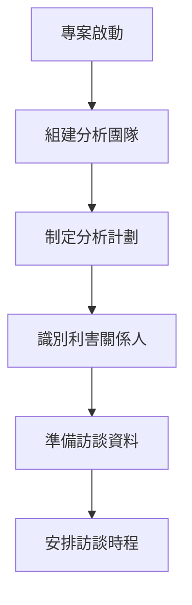

# 專案系統分析指引

## 目錄
1. [系統分析階段目標與產出物](#1-系統分析階段目標與產出物)
2. [需求收集與分析流程](#2-需求收集與分析流程)
3. [涉及角色與職責](#3-涉及角色與職責)
4. [系統分析方法與工具](#4-系統分析方法與工具)
   - 4.1 [UML 建模方法](#41-uml-建模方法)
   - 4.2 [資料流程圖 (DFD)](#42-資料流程圖-data-flow-diagrams-dfd)
   - 4.3 [實體關係圖 (ERD)](#43-實體關係圖-entity-relationship-diagrams-erd)
   - 4.4 [物件導向分析方法 (OOA)](#44-物件導向分析方法-object-oriented-analysis-ooa)
   - 4.5 [狀態圖](#45-狀態圖-state-diagrams)
   - 4.6 [分析模型整合](#46-分析模型整合)
5. [跨系統整合分析](#5-跨系統整合分析)
6. [安全與合規考量](#6-安全與合規考量)
7. [版本控管與審核流程](#7-版本控管與審核流程)
8. [範例與模板](#8-範例與模板)
   - 8.1 [需求規格書模板](#81-需求規格書模板)
   - 8.2 [用例描述表模板](#82-用例描述表模板)
   - 8.3 [物件導向分析模板](#83-物件導向分析模板)
   - 8.4 [系統功能列表模板](#84-系統功能列表模板)
   - 8.5 [需求變更申請表模板](#85-需求變更申請表模板)
9. [總結與最佳實踐](#9-總結與最佳實踐)
10. [敏捷開發環境下的系統分析](#10-敏捷開發環境下的系統分析)
11. [數據驅動的需求分析](#11-數據驅動的需求分析)
12. [雲端架構考量](#12-雲端架構考量)
13. [國際化與在地化需求](#13-國際化與在地化需求)
14. [效能與容量規劃](#14-效能與容量規劃)
15. [災難恢復與營運連續性](#15-災難恢復與營運連續性)
16. [附錄](#16-附錄)

## 文件資訊
- **文件名稱**：專案系統分析指引
- **版本**：2.0
- **建立日期**：2025年8月11日
- **最後更新**：2025年8月29日
- **適用專案**：大型共用平台系統
- **技術架構**：前後端分離 + Clean Architecture + 雲端原生

---

## 1. 系統分析階段目標與產出物

### 1.1 階段目標

系統分析階段是軟體開發生命週期中的關鍵環節，主要目標包括：

- **需求理解與定義**：深入理解業務需求，並將其轉化為明確的系統需求
- **系統邊界確立**：明確定義系統的範圍、功能邊界與非功能需求
- **風險識別與評估**：識別技術風險、業務風險及安全風險
- **可行性分析**：評估技術可行性、經濟可行性與時程可行性
- **架構規劃基礎**：為後續的系統設計階段提供清晰的需求基礎

### 1.2 工作範圍

#### 1.2.1 業務分析範圍
- 現有系統分析與問題識別
- 業務流程梳理與優化建議
- 利害關係人需求收集
- 業務規則定義與驗證
- 使用者體驗需求分析

#### 1.2.2 技術分析範圍
- 系統功能需求分析
- 非功能需求定義（效能、安全、可用性等）
- 系統整合需求分析
- 資料流程與資料模型分析
- 介面需求定義

#### 1.2.3 安全分析範圍
- 威脅建模與風險評估
- 安全需求定義
- 合規要求分析
- 資料保護需求
- 存取控制需求

### 1.3 主要產出物清單

#### 1.3.1 需求文件
- [ ] **業務需求規格書** (Business Requirements Specification, BRS)
- [ ] **系統需求規格書** (System Requirements Specification, SRS)
- [ ] **功能需求規格書** (Functional Requirements Specification, FRS)
- [ ] **非功能需求規格書** (Non-Functional Requirements Specification, NFRS)
- [ ] **使用者需求文件** (User Requirements Document, URD)

#### 1.3.2 分析模型與圖表
- [ ] **用例圖** (Use Case Diagrams)
- [ ] **用例描述表** (Use Case Specifications)
- [ ] **業務流程圖** (Business Process Diagrams)
- [ ] **資料流程圖** (Data Flow Diagrams, DFD)
- [ ] **實體關係圖** (Entity Relationship Diagrams, ERD)
- [ ] **狀態圖** (State Diagrams)
- [ ] **活動圖** (Activity Diagrams)
- [ ] **循序圖** (Sequence Diagrams)

#### 1.3.3 整合與介面文件
- [ ] **系統整合需求規格書** (System Integration Requirements)
- [ ] **API 需求規格書** (API Requirements Specification)
- [ ] **批次處理需求規格書** (Batch Processing Requirements)
- [ ] **資料交換格式定義** (Data Exchange Format Specification)
- [ ] **外部系統介面規格** (External System Interface Specification)

#### 1.3.4 安全與合規文件
- [ ] **安全需求規格書** (Security Requirements Specification)
- [ ] **威脅模型文件** (Threat Model Document)
- [ ] **風險評估報告** (Risk Assessment Report)
- [ ] **合規檢查清單** (Compliance Checklist)
- [ ] **資料保護影響評估** (Data Protection Impact Assessment, DPIA)

#### 1.3.5 測試相關文件
- [ ] **測試需求規格書** (Test Requirements Specification)
- [ ] **驗收標準定義** (Acceptance Criteria Definition)
- [ ] **測試案例大綱** (Test Case Outline)

#### 1.3.6 專案管理文件
- [ ] **需求追蹤矩陣** (Requirements Traceability Matrix, RTM)
- [ ] **變更控制文件** (Change Control Document)
- [ ] **需求優先級矩陣** (Requirements Priority Matrix)
- [ ] **影響分析報告** (Impact Analysis Report)

---

## 2. 需求收集與分析流程

### 2.1 需求收集流程

#### 2.1.1 準備階段


**主要活動：**
- 組建跨功能分析團隊（BA、SA、技術專家、業務專家）
- 制定詳細的需求收集計劃與時程
- 識別並分類所有利害關係人
- 準備標準化的訪談模板與問卷
- 蒐集現有系統文件與業務資料

#### 2.1.2 需求收集技術

| 收集技術 | 適用情境 | 優點 | 缺點 | 建議使用時機 |
|----------|----------|------|------|-------------|
| **面對面訪談** | 複雜業務需求、高層主管 | 深度溝通、即時澄清 | 耗時、成本高 | 關鍵需求確認 |
| **焦點小組** | 多部門協作需求 | 集思廣益、共識建立 | 易偏離主題 | 跨部門整合需求 |
| **問卷調查** | 大量使用者意見 | 覆蓋面廣、標準化 | 回覆率低、缺乏深度 | 使用者體驗調查 |
| **工作坊** | 複雜流程梳理 | 互動性強、效率高 | 準備工作複雜 | 業務流程重設計 |
| **文件分析** | 現有系統了解 | 成本低、客觀 | 可能過時、不完整 | 初期背景了解 |
| **原型展示** | UI/UX 需求 | 視覺化、易理解 | 開發成本、時間 | 介面需求確認 |
| **觀察法** | 實際作業流程 | 真實情況、發現隱藏需求 | 耗時、可能影響作業 | 現況分析 |

### 2.2 需求分析流程

#### 2.2.1 需求分類架構
```
需求分類
├── 功能需求 (Functional Requirements)
│   ├── 核心業務功能
│   ├── 支援功能
│   ├── 報表功能
│   └── 整合功能
├── 非功能需求 (Non-Functional Requirements)
│   ├── 效能需求 (Performance)
│   ├── 安全需求 (Security)
│   ├── 可用性需求 (Usability)
│   ├── 可靠性需求 (Reliability)
│   ├── 擴充性需求 (Scalability)
│   ├── 相容性需求 (Compatibility)
│   └── 維護性需求 (Maintainability)
├── 約束需求 (Constraint Requirements)
│   ├── 技術約束
│   ├── 業務約束
│   ├── 法規約束
│   └── 時程約束
└── 品質需求 (Quality Requirements)
    ├── 資料品質
    ├── 系統品質
    └── 服務品質
```

### 2.3 需求驗證與確認

#### 2.3.1 驗證檢查清單
- [ ] **完整性檢查**：所有必要需求是否已被識別
- [ ] **一致性檢查**：需求間是否存在衝突或矛盾
- [ ] **可測試性檢查**：需求是否具備可驗證的標準
- [ ] **可追蹤性檢查**：需求是否可追蹤至業務目標
- [ ] **現實性檢查**：需求是否在技術與資源限制下可實現
- [ ] **必要性檢查**：需求是否對達成業務目標必要

#### 2.3.2 確認方法
1. **需求審查會議**：跨團隊審查所有需求文件
2. **原型驗證**：透過原型展示驗證關鍵需求
3. **業務場景測試**：使用實際業務場景驗證需求完整性
4. **利害關係人簽核**：取得關鍵利害關係人的正式確認

### 2.4 需求優先級排序

#### 2.4.1 MoSCoW 方法
- **Must Have (必須有)**：系統運作的基本需求，缺少將導致專案失敗
- **Should Have (應該有)**：重要但非關鍵的需求，可在後續版本實現
- **Could Have (可以有)**：有用但非必要的需求，資源允許時實現
- **Won't Have (不會有)**：本版本明確不實現的需求

#### 2.4.2 優先級評估矩陣
```
優先級 = (業務價值 × 權重1) + (技術風險 × 權重2) + (實現成本 × 權重3)

評估維度：
- 業務價值 (1-10分)：對業務目標的貢獻度
- 技術風險 (1-10分)：實現的技術難度與風險
- 實現成本 (1-10分)：開發時間與資源需求
- 緊急程度 (1-10分)：時間敏感性
```

---

## 3. 涉及角色與職責

### 3.1 核心分析團隊

#### 3.1.1 系統分析師 (System Analyst)
**主要職責：**
- 主導需求收集與分析活動
- 撰寫系統需求規格書
- 進行系統分析與建模
- 協調各方利害關係人
- 需求變更控制

**技能要求：**
- 熟悉 UML、DFD 等分析方法
- 具備業務分析能力
- 溝通協調能力
- 文件撰寫能力

#### 3.1.2 業務分析師 (Business Analyst)
**主要職責：**
- 業務需求收集與分析
- 業務流程梳理與最佳化
- 撰寫業務需求規格書
- 使用者需求訪談
- 業務規則定義

**技能要求：**
- 深度業務領域知識
- 流程分析能力
- 利害關係人管理
- 需求引導技巧

#### 3.1.3 技術架構師 (Technical Architect)
**主要職責：**
- 技術可行性評估
- 非功能需求定義
- 技術約束識別
- 整合需求分析
- 技術風險評估

**技能要求：**
- 深度技術專業知識
- 系統整合經驗
- 架構設計能力
- 技術趨勢掌握

#### 3.1.4 安全專家 (Security Specialist)
**主要職責：**
- 安全需求分析
- 威脅建模
- 合規要求分析
- 安全架構設計建議
- 風險評估

**技能要求：**
- 資訊安全專業知識
- 法規合規了解
- 威脅分析能力
- 安全工具使用

### 3.2 業務利害關係人

#### 3.2.1 專案發起人 (Project Sponsor)
**主要職責：**
- 提供專案願景與目標
- 重大決策核准
- 資源分配決定
- 優先級最終裁決

#### 3.2.2 業務代表 (Business Representatives)
**主要職責：**
- 提供業務需求與規則
- 參與需求確認
- 業務流程驗證
- 使用者接受測試參與

#### 3.2.3 終端使用者 (End Users)
**主要職責：**
- 提供實際使用需求
- 參與易用性評估
- 原型測試與回饋
- 驗收測試執行

### 3.3 技術利害關係人

#### 3.2.1 開發團隊代表 (Development Team Representative)
**主要職責：**
- 技術實現可行性評估
- 開發工作量估算
- 技術約束提出
- 設計建議提供

#### 3.3.2 營運團隊 (Operations Team)
**主要職責：**
- 營運需求提出
- 監控需求定義
- 維護需求規劃
- 部署需求分析

#### 3.3.3 資料庫管理員 (Database Administrator)
**主要職責：**
- 資料需求分析
- 效能需求評估
- 資料安全需求
- 備份恢復需求

---

## 4. 系統分析方法與工具

### 4.1 UML 建模方法

#### 4.1.1 用例圖 (Use Case Diagrams)

**使用時機：**

- 專案初期需求收集階段
- 系統功能範圍定義
- 利害關係人識別
- 系統邊界確立

**建模要素：**

```
用例圖組成要素：
├── 參與者 (Actors)
│   ├── 主要參與者：系統的直接使用者
│   ├── 次要參與者：支援系統運作的外部系統
│   └── 系統管理者：負責系統維護的人員
├── 用例 (Use Cases)
│   ├── 功能用例：核心業務功能
│   ├── 管理用例：系統管理功能
│   └── 報表用例：資料查詢與報表
└── 關係 (Relationships)
    ├── 關聯關係：參與者與用例間的互動
    ├── 包含關係：用例間的共用行為
    ├── 擴展關係：用例的可選行為
    └── 泛化關係：用例或參與者的繼承
```

**範例模板：**

```
用例名稱：使用者登入系統
用例編號：UC-001
參與者：一般使用者、系統管理員
前置條件：使用者已擁有有效帳號
後置條件：使用者成功登入並獲得授權
主要流程：
1. 使用者輸入帳號與密碼
2. 系統驗證帳號密碼
3. 系統檢查帳號狀態
4. 系統建立使用者會話
5. 系統顯示主畫面
例外流程：
- 帳號密碼錯誤：顯示錯誤訊息，回到登入畫面
- 帳號被鎖定：顯示帳號鎖定訊息
- 系統維護中：顯示系統維護訊息
```

#### 4.1.2 活動圖 (Activity Diagrams)

**使用時機：**

- 複雜業務流程分析
- 系統工作流程設計
- 並行處理流程建模
- 決策點與分支邏輯

**建模元素：**

- **起始節點**：流程開始點
- **結束節點**：流程結束點
- **活動節點**：具體的工作活動
- **決策節點**：條件判斷點
- **合併節點**：多路徑匯合點
- **分叉節點**：並行處理起點
- **聯合節點**：並行處理終點

#### 4.1.3 循序圖 (Sequence Diagrams)

**使用時機：**

- 物件間互動流程分析
- API 呼叫順序設計
- 系統間通訊協定定義
- 詳細設計階段建模

**建模原則：**

1. **參與者識別**：明確定義參與互動的物件
2. **時間順序**：由上而下表示時間順序
3. **訊息類型**：同步、非同步、回傳訊息
4. **生命線**：物件存活時間
5. **激活框**：物件處理時間

### 4.2 資料流程圖 (Data Flow Diagrams, DFD)

#### 4.2.1 DFD 層級結構

```
DFD 層級架構：
├── 環境圖 (Context Diagram)
│   └── 系統與外部實體的整體互動
├── 第0層 DFD (Level 0 DFD)
│   └── 系統主要功能模組分解
├── 第1層 DFD (Level 1 DFD)
│   └── 各功能模組詳細分解
└── 第2層以下 DFD
    └── 更細部的處理流程
```

#### 4.2.2 DFD 符號與規則

| 符號 | 名稱 | 描述 | 編號規則 |
|------|------|------|----------|
| 圓形 | 處理 (Process) | 資料轉換活動 | P1, P2, P3... |
| 開放方形 | 外部實體 (External Entity) | 系統外部的資料來源或接收者 | E1, E2, E3... |
| 平行線 | 資料儲存 (Data Store) | 資料存放位置 | D1, D2, D3... |
| 箭頭線 | 資料流 (Data Flow) | 資料傳遞方向與內容 | 以資料名稱標示 |

#### 4.2.3 DFD 建模原則

1. **平衡原則**：上層與下層的資料流必須平衡
2. **最小資料原則**：只顯示必要的資料流
3. **功能分解原則**：每個處理應可進一步分解
4. **資料守恆原則**：輸入與輸出資料應邏輯一致

### 4.3 實體關係圖 (Entity Relationship Diagrams, ERD)

#### 4.3.1 ERD 建模層級

1. **概念層 ERD (Conceptual ERD)**
   - 高層次的實體與關係
   - 不包含技術細節
   - 著重業務概念

2. **邏輯層 ERD (Logical ERD)**
   - 詳細的屬性定義
   - 主鍵與外鍵識別
   - 正規化考量

3. **實體層 ERD (Physical ERD)**
   - 實際資料庫結構
   - 資料型別定義
   - 索引與約束

#### 4.3.2 ERD 建模要素

```
ERD 組成要素：
├── 實體 (Entities)
│   ├── 強實體：獨立存在的實體
│   └── 弱實體：依賴其他實體存在
├── 屬性 (Attributes)
│   ├── 主鍵屬性：唯一識別實體
│   ├── 一般屬性：描述實體特性
│   ├── 複合屬性：可分解的屬性
│   └── 衍生屬性：可計算得出的屬性
└── 關係 (Relationships)
    ├── 一對一 (1:1)
    ├── 一對多 (1:N)
    └── 多對多 (M:N)
```

### 4.4 狀態圖 (State Diagrams)

#### 4.4.1 使用時機

- 物件狀態變化建模
- 業務流程狀態追蹤
- 系統生命週期分析
- 工作流程狀態管理

#### 4.4.2 狀態圖要素

- **狀態 (States)**：物件在特定時間點的條件
- **轉換 (Transitions)**：狀態間的變化
- **事件 (Events)**：觸發轉換的原因
- **條件 (Guards)**：轉換的限制條件
- **動作 (Actions)**：轉換時執行的操作

### 4.4 物件導向分析方法 (Object-Oriented Analysis, OOA)

#### 4.4.1 物件導向分析概述

**OOA 核心概念：**

物件導向分析是一種以現實世界的物件為基礎來分析和建模系統的方法。它將系統視為相互協作的物件集合，每個物件都具有特定的屬性和行為。

**OOA 的四大支柱：**

```text
物件導向四大特性：
├── 封裝 (Encapsulation)
│   ├── 資料隱藏：內部資料對外界隱藏
│   ├── 介面定義：明確的外部介面
│   └── 職責分離：每個物件負責特定功能
├── 繼承 (Inheritance)
│   ├── 屬性繼承：子類別繼承父類別屬性
│   ├── 方法繼承：子類別繼承父類別方法
│   └── 階層關係：建立分類階層
├── 多型 (Polymorphism)
│   ├── 方法覆寫：子類別重新定義父類別方法
│   ├── 介面實作：不同類別實作相同介面
│   └── 動態繫結：執行時期決定呼叫方法
└── 抽象 (Abstraction)
    ├── 資料抽象：抽取重要特徵
    ├── 功能抽象：抽取核心行為
    └── 概念建模：建立概念模型
```

#### 4.4.2 物件識別技術

**物件識別方法：**

```text
物件識別策略：
├── 名詞分析法 (Noun Analysis)
│   ├── 分析需求文件中的名詞
│   ├── 識別候選物件
│   ├── 過濾非物件名詞
│   └── 確認物件責任
├── CRC 卡片法 (Class-Responsibility-Collaboration)
│   ├── 類別 (Class)：物件的分類
│   ├── 責任 (Responsibility)：物件的職責
│   ├── 協作 (Collaboration)：與其他物件的互動
│   └── 場景模擬：模擬物件互動
├── 使用案例驅動法 (Use Case Driven)
│   ├── 從使用案例識別物件
│   ├── 分析互動流程
│   ├── 確定物件職責
│   └── 建立物件關係
└── 領域建模法 (Domain Modeling)
    ├── 分析業務領域
    ├── 識別領域概念
    ├── 建立概念模型
    └── 轉換為物件模型
```

**物件識別檢查清單：**

- [ ] **實體物件**：具體存在的事物（如：客戶、訂單、產品）
- [ ] **概念物件**：抽象概念（如：會員等級、折扣規則）
- [ ] **介面物件**：使用者介面元件（如：表單、報表）
- [ ] **控制物件**：協調其他物件的控制器（如：訂單處理器）
- [ ] **資料存取物件**：負責資料存取（如：資料庫存取器）

#### 4.4.3 類別圖建模 (Class Diagrams)

**類別圖組成要素：**

```text
類別圖元素：
├── 類別 (Classes)
│   ├── 類別名稱
│   ├── 屬性 (Attributes)
│   └── 方法 (Methods)
├── 關係 (Relationships)
│   ├── 關聯 (Association)
│   ├── 聚合 (Aggregation)
│   ├── 組合 (Composition)
│   ├── 繼承 (Inheritance)
│   ├── 實現 (Realization)
│   └── 相依 (Dependency)
└── 多重性 (Multiplicity)
    ├── 1：正好一個
    ├── 0..1：零個或一個
    ├── *：零個或多個
    └── 1..*：一個或多個
```

**類別圖範例：**

```text
客戶管理系統類別圖範例：

┌─────────────────┐
│     Customer    │
├─────────────────┤
│ -customerId     │
│ -name           │
│ -email          │
│ -phone          │
├─────────────────┤
│ +register()     │
│ +updateInfo()   │
│ +getOrders()    │
└─────────────────┘
        │ 1
        │ places
        ▼ *
┌─────────────────┐
│      Order      │
├─────────────────┤
│ -orderId        │
│ -orderDate      │
│ -totalAmount    │
│ -status         │
├─────────────────┤
│ +create()       │
│ +cancel()       │
│ +getStatus()    │
└─────────────────┘
        │ 1
        │ contains
        ▼ *
┌─────────────────┐
│   OrderItem     │
├─────────────────┤
│ -quantity       │
│ -unitPrice      │
├─────────────────┤
│ +getSubtotal()  │
└─────────────────┘
```

#### 4.4.4 物件互動分析

**互動圖類型：**

1. **協作圖 (Collaboration Diagrams)**
   - 重點：物件間的靜態關係
   - 用途：展示物件如何協作完成功能
   - 特色：空間導向的布局

2. **循序圖 (Sequence Diagrams)**
   - 重點：訊息傳遞的時間順序
   - 用途：詳細的互動流程分析
   - 特色：時間導向的布局

**物件互動模式：**

```text
常見互動模式：
├── 創建模式 (Creation Patterns)
│   ├── 工廠模式 (Factory Pattern)
│   ├── 建造者模式 (Builder Pattern)
│   └── 原型模式 (Prototype Pattern)
├── 結構模式 (Structural Patterns)
│   ├── 適配器模式 (Adapter Pattern)
│   ├── 裝飾者模式 (Decorator Pattern)
│   └── 外觀模式 (Facade Pattern)
├── 行為模式 (Behavioral Patterns)
│   ├── 觀察者模式 (Observer Pattern)
│   ├── 策略模式 (Strategy Pattern)
│   └── 命令模式 (Command Pattern)
└── 架構模式 (Architectural Patterns)
    ├── MVC 模式
    ├── MVP 模式
    └── MVVM 模式
```

#### 4.4.5 OOA 實務應用步驟

**分析流程：**

```text
OOA 實施步驟：
1. 需求分析階段
   ├── 收集使用案例
   ├── 識別參與者
   ├── 定義系統邊界
   └── 分析功能需求

2. 物件建模階段
   ├── 物件識別
   ├── 類別定義
   ├── 屬性識別
   └── 方法定義

3. 動態建模階段
   ├── 互動分析
   ├── 狀態分析
   ├── 場景模擬
   └── 行為驗證

4. 驗證與精煉階段
   ├── 模型一致性檢查
   ├── 完整性驗證
   ├── 可追蹤性確認
   └── 模型最佳化
```

**品質檢查準則：**

- [ ] **單一職責原則**：每個類別只負責一項職責
- [ ] **開放封閉原則**：對擴展開放，對修改封閉
- [ ] **里氏替換原則**：子類別可以替換父類別
- [ ] **介面隔離原則**：依賴抽象而非具象
- [ ] **依賴反轉原則**：高層模組不應依賴低層模組

#### 4.4.6 OOA 工具與技術

**建模工具：**

| 工具名稱 | 類型 | 主要功能 | 適用場景 | 授權模式 |
|----------|------|----------|----------|----------|
| Enterprise Architect | 商業 | 完整UML支援、程式碼生成 | 大型專案 | 付費 |
| Visual Paradigm | 商業 | UML建模、團隊協作 | 中大型專案 | 付費 |
| StarUML | 商業 | 輕量級UML工具 | 中小型專案 | 免費/付費 |
| PlantUML | 開源 | 文字描述生成UML | 敏捷開發 | 免費 |
| Lucidchart | 商業 | 線上協作圖表 | 團隊協作 | 訂閱制 |

**分析技術：**

```text
OOA 分析技術：
├── 靜態分析技術
│   ├── 類別職責分析
│   ├── 繼承關係分析
│   ├── 關聯關係分析
│   └── 包裝圖分析
├── 動態分析技術
│   ├── 場景分析
│   ├── 互動序列分析
│   ├── 狀態轉換分析
│   └── 活動流程分析
├── 行為分析技術
│   ├── 使用案例實現
│   ├── 協作分析
│   ├── 職責分配
│   └── 介面設計
└── 結構分析技術
    ├── 分層架構分析
    ├── 模組分解
    ├── 相依性分析
    └── 耦合性分析
```

### 4.5 狀態圖 (State Diagrams)

#### 4.5.1 使用時機

- 物件狀態變化建模
- 業務流程狀態追蹤
- 系統生命週期分析
- 工作流程狀態管理

#### 4.5.2 狀態圖要素

- **狀態 (States)**：物件在特定時間點的條件
- **轉換 (Transitions)**：狀態間的變化
- **事件 (Events)**：觸發轉換的原因
- **條件 (Guards)**：轉換的限制條件
- **動作 (Actions)**：轉換時執行的操作

### 4.6 分析模型整合

#### 4.6.1 模型間的對應關係

```text
模型整合對應：
用例圖 ←→ 活動圖 ←→ 物件類別圖
  ↓         ↓            ↓
用例描述 → 循序圖 ←→ 物件互動圖
  ↓         ↓            ↓
DFD ←→ ERD ←→ 狀態圖 ←→ 物件狀態圖
```

**整合原則：**

- **一致性**：確保不同模型間的資訊一致
- **完整性**：各模型互補，涵蓋所有需求面向
- **可追蹤性**：建立模型間的追蹤關係
- **層次性**：從高層抽象到低層具體的漸進式細化

#### 4.6.2 分析工具選擇指引

| 分析目的 | 推薦工具 | 次要工具 | 產出重點 | OOA 對應 |
|----------|----------|----------|----------|----------|
| 功能範圍定義 | 用例圖 | DFD Level 0 | 系統邊界、主要功能 | 參與者與系統互動 |
| 業務流程分析 | 活動圖 | DFD | 流程步驟、決策點 | 物件協作流程 |
| 資料需求分析 | ERD | DFD | 資料實體、關係 | 物件屬性與關聯 |
| 物件互動分析 | 循序圖 | 協作圖 | 互動順序、訊息 | 物件方法呼叫 |
| 狀態變化分析 | 狀態圖 | 活動圖 | 狀態轉換、觸發條件 | 物件生命週期 |
| 結構分析 | 類別圖 | 組件圖 | 靜態結構、關係 | 類別層次與組織 |

#### 4.6.3 整合式分析方法

**混合方法論：**

```text
整合分析流程：
1. 結構化分析階段
   ├── DFD 建立系統整體架構
   ├── ERD 分析資料需求
   ├── 功能分解與模組化
   └── 資料流程優化

2. 物件導向分析階段
   ├── 從 DFD 識別候選物件
   ├── 從 ERD 定義物件屬性
   ├── 建立類別圖與關係
   └── 設計物件互動

3. 動態分析階段
   ├── 用例驅動場景分析
   ├── 循序圖描述互動
   ├── 狀態圖描述行為
   └── 活動圖描述流程

4. 驗證與整合階段
   ├── 模型一致性檢查
   ├── 需求涵蓋度驗證
   ├── 可實現性評估
   └── 文件整合完善
```

---

## 5. 跨系統整合分析

### 5.1 整合需求識別

#### 5.1.1 整合類型分析

```
系統整合類型：
├── 資料整合 (Data Integration)
│   ├── 即時資料同步
│   ├── 批次資料傳輸
│   ├── 資料倉儲整合
│   └── 主資料管理 (MDM)
├── 應用整合 (Application Integration)
│   ├── API 呼叫整合
│   ├── 訊息佇列整合
│   ├── 檔案傳輸整合
│   └── 資料庫直接存取
├── 流程整合 (Process Integration)
│   ├── 工作流程整合
│   ├── 業務規則整合
│   ├── 事件驅動整合
│   └── 服務編排整合
└── 使用者介面整合 (UI Integration)
    ├── 單一登入 (SSO)
    ├── 畫面嵌入整合
    ├── 入口網站整合
    └── 微前端整合
```

#### 5.1.2 整合點識別矩陣

| 整合系統 | 整合類型 | 資料方向 | 頻率 | 資料量 | 優先級 | 技術需求 |
|----------|----------|----------|------|--------|--------|----------|
| 核心銀行系統 | API | 雙向 | 即時 | 高 | 高 | REST/JSON |
| 客戶關係管理 | 批次 | 單向 | 每日 | 中 | 中 | SFTP/CSV |
| 風險管理系統 | MQ | 雙向 | 即時 | 中 | 高 | JMS/XML |
| 報表系統 | DB | 單向 | 每小時 | 高 | 低 | SQL/Direct |

### 5.2 API 整合需求分析

#### 5.2.1 REST API 設計原則

**設計標準：**

1. **RESTful 架構**：遵循 REST 架構原則
2. **HTTP 方法**：正確使用 GET、POST、PUT、DELETE
3. **狀態碼**：標準 HTTP 狀態碼使用
4. **版本控制**：API 版本管理策略
5. **安全性**：認證、授權、加密

**API 需求規格模板：**

```yaml
API名稱: 客戶資料查詢
API版本: v1.0
基礎URL: https://api.platform.com/v1
端點: /customers/{customerId}
方法: GET
描述: 根據客戶ID查詢客戶基本資料

請求參數:
  路徑參數:
    - customerId: string (必要) - 客戶唯一識別碼
  查詢參數:
    - fields: string (選擇性) - 指定回傳欄位
    - format: string (選擇性) - 回傳格式 (json/xml)

回應格式:
  成功 (200):
    content-type: application/json
    schema:
      type: object
      properties:
        customerId: string
        name: string
        email: string
        phone: string
        status: string
  
  錯誤 (400):
    description: 客戶ID格式錯誤
  
  錯誤 (404):
    description: 客戶不存在

安全要求:
  - OAuth 2.0 認證
  - HTTPS 加密傳輸
  - API Key 驗證
  - 請求頻率限制: 1000/小時
```

#### 5.2.2 API 整合檢查清單

- [ ] **功能需求**
  - [ ] API 功能規格明確定義
  - [ ] 輸入輸出格式確認
  - [ ] 錯誤處理機制設計
  - [ ] 資料驗證規則定義

- [ ] **非功能需求**
  - [ ] 效能需求（回應時間、吞吐量）
  - [ ] 可用性需求（SLA 定義）
  - [ ] 安全需求（認證、授權）
  - [ ] 監控需求（日誌、指標）

- [ ] **技術需求**
  - [ ] 協定選擇（REST、GraphQL、gRPC）
  - [ ] 序列化格式（JSON、XML、Protocol Buffers）
  - [ ] 版本控制策略
  - [ ] 快取策略

### 5.3 批次處理整合分析

#### 5.3.1 批次處理需求類型

```
批次處理分類：
├── 資料同步批次
│   ├── 增量同步
│   ├── 全量同步
│   └── 差異同步
├── 報表產生批次
│   ├── 日報表
│   ├── 週報表
│   ├── 月報表
│   └── 年報表
├── 資料清理批次
│   ├── 資料去重
│   ├── 資料驗證
│   ├── 資料修正
│   └── 資料歸檔
└── 業務處理批次
    ├── 帳務處理
    ├── 利息計算
    ├── 費用計算
    └── 風險計算
```

#### 5.3.2 批次作業規格模板

```
批次作業名稱: 客戶資料同步作業
作業編號: BATCH_CUST_SYNC_001
執行頻率: 每日 02:00
預估執行時間: 30分鐘
資料來源: 核心銀行系統
資料目標: 客戶關係管理系統

輸入規格:
  檔案格式: CSV
  檔案大小: 最大 100MB
  記錄筆數: 最大 50萬筆
  檔案編碼: UTF-8
  分隔符號: 逗號(,)

輸出規格:
  成功檔案: CUST_SYNC_SUCCESS_YYYYMMDD.log
  錯誤檔案: CUST_SYNC_ERROR_YYYYMMDD.log
  統計報表: CUST_SYNC_SUMMARY_YYYYMMDD.rpt

處理邏輯:
1. 檔案格式驗證
2. 資料內容驗證
3. 重複資料檢查
4. 資料轉換處理
5. 目標系統更新
6. 結果統計輸出

錯誤處理:
  - 檔案格式錯誤：記錄錯誤並停止處理
  - 資料格式錯誤：跳過錯誤記錄並繼續
  - 系統連線錯誤：重試3次後失敗
  - 資料衝突：依業務規則處理

監控要求:
  - 執行狀態監控
  - 處理進度追蹤
  - 錯誤率監控
  - 執行時間監控
```

### 5.4 資料交換格式與協定

#### 5.4.1 JSON 格式規範

**JSON 設計原則：**

1. **命名規範**：使用 camelCase 命名
2. **資料型別**：明確定義每個欄位型別
3. **必要欄位**：區分必要與選擇性欄位
4. **巢狀結構**：適度使用，避免過深巢狀
5. **陣列處理**：明確定義陣列元素結構

**JSON Schema 範例：**

```json
{
  "$schema": "http://json-schema.org/draft-07/schema#",
  "title": "Customer",
  "type": "object",
  "required": ["customerId", "name", "email"],
  "properties": {
    "customerId": {
      "type": "string",
      "pattern": "^[A-Z0-9]{10}$",
      "description": "客戶唯一識別碼"
    },
    "name": {
      "type": "string",
      "minLength": 1,
      "maxLength": 100,
      "description": "客戶姓名"
    },
    "email": {
      "type": "string",
      "format": "email",
      "description": "電子郵件地址"
    },
    "phone": {
      "type": "string",
      "pattern": "^\\+?[0-9-\\s]+$",
      "description": "聯絡電話"
    },
    "address": {
      "type": "object",
      "properties": {
        "street": {"type": "string"},
        "city": {"type": "string"},
        "zipCode": {"type": "string"}
      }
    },
    "accounts": {
      "type": "array",
      "items": {
        "type": "object",
        "properties": {
          "accountId": {"type": "string"},
          "accountType": {"type": "string"},
          "balance": {"type": "number"}
        }
      }
    }
  }
}
```

#### 5.4.2 XML 格式規範

**XML 設計原則：**

1. **命名空間**：使用命名空間避免衝突
2. **結構設計**：清晰的階層結構
3. **屬性使用**：合理使用元素與屬性
4. **資料驗證**：使用 XSD 進行資料驗證
5. **效能考量**：避免過深巢狀結構

**XSD Schema 範例：**

```xml
<?xml version="1.0" encoding="UTF-8"?>
<xs:schema xmlns:xs="http://www.w3.org/2001/XMLSchema"
           targetNamespace="http://platform.com/schema/customer"
           xmlns:cust="http://platform.com/schema/customer"
           elementFormDefault="qualified">

  <xs:element name="customer" type="cust:CustomerType"/>
  
  <xs:complexType name="CustomerType">
    <xs:sequence>
      <xs:element name="customerId" type="cust:CustomerIdType"/>
      <xs:element name="name" type="xs:string"/>
      <xs:element name="email" type="cust:EmailType"/>
      <xs:element name="phone" type="xs:string" minOccurs="0"/>
      <xs:element name="address" type="cust:AddressType" minOccurs="0"/>
      <xs:element name="accounts" type="cust:AccountsType" minOccurs="0"/>
    </xs:sequence>
  </xs:complexType>
  
  <xs:simpleType name="CustomerIdType">
    <xs:restriction base="xs:string">
      <xs:pattern value="[A-Z0-9]{10}"/>
    </xs:restriction>
  </xs:simpleType>
  
  <xs:simpleType name="EmailType">
    <xs:restriction base="xs:string">
      <xs:pattern value="[^@]+@[^@]+\.[^@]+"/>
    </xs:restriction>
  </xs:simpleType>

</xs:schema>
```

#### 5.4.3 CSV 格式規範

**CSV 設計標準：**

1. **分隔符號**：統一使用逗號或分號
2. **引號處理**：包含分隔符號的欄位用引號包圍
3. **編碼格式**：統一使用 UTF-8 編碼
4. **標題列**：第一列為欄位名稱
5. **空值處理**：明確定義空值表示方式

**CSV 格式範例：**

```csv
Customer_ID,Name,Email,Phone,Registration_Date,Status
CUST000001,"張三","zhang.san@email.com","02-1234-5678","2023-01-15","ACTIVE"
CUST000002,"李四","li.si@email.com","02-8765-4321","2023-01-16","INACTIVE"
CUST000003,"王五","wang.wu@email.com",,"2023-01-17","PENDING"
```

---

## 6. 安全與合規考量

### 6.1 SSDLC 安全分析階段

#### 6.1.1 威脅建模 (Threat Modeling)

**威脅建模流程：**

```text
威脅建模步驟：
1. 系統分解 (System Decomposition)
   ├── 識別資產 (Assets)
   ├── 定義邊界 (Boundaries) 
   ├── 識別入口點 (Entry Points)
   └── 識別信任層級 (Trust Levels)

2. 威脅識別 (Threat Identification)
   ├── STRIDE 威脅分類
   ├── 攻擊樹分析
   ├── 威脅情境建構
   └── 威脅代理分析

3. 風險評估 (Risk Assessment)
   ├── 威脅可能性評估
   ├── 影響程度評估
   ├── 風險等級計算
   └── 風險矩陣建立

4. 對策規劃 (Countermeasure Planning)
   ├── 安全控制選擇
   ├── 降險措施設計
   ├── 實作優先級排序
   └── 殘餘風險評估
```

**STRIDE 威脅分類：**

| 威脅類型 | 定義 | 範例 | 對策 |
|----------|------|------|------|
| **Spoofing (偽造)** | 冒充他人身分 | 假冒使用者登入 | 強化認證機制 |
| **Tampering (竄改)** | 未授權修改資料 | 修改交易金額 | 資料完整性保護 |
| **Repudiation (否認)** | 否認已執行動作 | 否認已下單 | 不可否認性機制 |
| **Information Disclosure (資訊洩露)** | 未授權資訊存取 | 客戶資料外洩 | 存取控制與加密 |
| **Denial of Service (阻斷服務)** | 使系統無法正常運作 | DDoS 攻擊 | 可用性保護 |
| **Elevation of Privilege (權限提升)** | 獲得未授權的較高權限 | 一般使用者取得管理員權限 | 權限控制機制 |

#### 6.1.2 安全需求分析框架

**安全需求分類：**

```text
安全需求架構：
├── 認證需求 (Authentication Requirements)
│   ├── 使用者身分驗證
│   ├── 多因子認證 (MFA)
│   ├── 單一登入 (SSO)
│   └── 生物特徵認證
├── 授權需求 (Authorization Requirements)
│   ├── 角色型存取控制 (RBAC)
│   ├── 屬性型存取控制 (ABAC)
│   ├── 最小權限原則
│   └── 權限分離
├── 資料保護需求 (Data Protection Requirements)
│   ├── 資料加密 (靜態/傳輸)
│   ├── 資料遮蔽與匿名化
│   ├── 資料去識別化
│   └── 資料銷毀
├── 稽核需求 (Auditing Requirements)
│   ├── 活動日誌記錄
│   ├── 稽核軌跡保存
│   ├── 異常行為監控
│   └── 合規報告產生
├── 通訊安全需求 (Communication Security Requirements)
│   ├── 傳輸加密 (TLS/SSL)
│   ├── 訊息完整性
│   ├── 端點認證
│   └── 安全協定使用
└── 應用程式安全需求 (Application Security Requirements)
    ├── 輸入驗證
    ├── 輸出編碼
    ├── 錯誤處理
    ├── 會話管理
    └── 安全設定
```

### 6.2 OWASP 安全考量

#### 6.2.1 OWASP Top 10 風險評估

**2021 OWASP Top 10 應用安全風險：**

| 排名 | 風險項目 | 說明 | 分析重點 |
|------|----------|------|----------|
| A01 | Broken Access Control | 存取控制失效 | 權限設計、授權機制 |
| A02 | Cryptographic Failures | 加密機制失效 | 加密演算法、金鑰管理 |
| A03 | Injection | 注入攻擊 | 輸入驗證、參數化查詢 |
| A04 | Insecure Design | 不安全設計 | 威脅建模、安全設計 |
| A05 | Security Misconfiguration | 安全設定缺陷 | 預設設定、組態管理 |
| A06 | Vulnerable Components | 易受攻擊元件 | 第三方套件、相依性管理 |
| A07 | Authentication Failures | 認證機制失效 | 認證流程、會話管理 |
| A08 | Software and Data Integrity | 軟體與資料完整性失效 | 軟體供應鏈、完整性驗證 |
| A09 | Logging and Monitoring | 日誌與監控失效 | 日誌記錄、異常偵測 |
| A10 | Server-Side Request Forgery | 伺服器端請求偽造 | 外部請求驗證、網路分隔 |

#### 6.2.2 安全需求檢查清單

**認證與授權：**

- [ ] **多因子認證 (MFA)**
  - [ ] 支援多種認證因子 (知識、持有、生物特徵)
  - [ ] 適應性認證機制
  - [ ] 認證失敗處理機制
  - [ ] 帳戶鎖定政策

- [ ] **權限控制**
  - [ ] 最小權限原則實作
  - [ ] 角色型存取控制 (RBAC)
  - [ ] 權限繼承與委派機制
  - [ ] 權限定期審查機制

**資料保護：**

- [ ] **加密保護**
  - [ ] 敏感資料靜態加密 (AES-256)
  - [ ] 傳輸加密 (TLS 1.3)
  - [ ] 資料庫層級加密
  - [ ] 金鑰管理系統 (KMS)

- [ ] **資料處理**
  - [ ] 個人資料識別與分類
  - [ ] 資料去識別化機制
  - [ ] 資料遮蔽技術
  - [ ] 資料保存期限管理

**應用程式安全：**

- [ ] **輸入驗證**
  - [ ] 白名單輸入驗證
  - [ ] 參數長度與格式檢查
  - [ ] SQL 注入防護
  - [ ] XSS 防護機制

- [ ] **會話管理**
  - [ ] 安全會話 ID 產生
  - [ ] 會話過期機制
  - [ ] 會話固定攻擊防護
  - [ ] 安全登出機制

### 6.3 法規合規要求

#### 6.3.1 金融資安規範

**金管會資安規範重點：**

1. **個人資料保護法 (PDPA)**
   - 個人資料蒐集、處理、利用告知
   - 當事人權利保障機制
   - 資料外洩通報機制
   - 個資保護管理制度

2. **金融機構作業委託他人處理內部作業制度及程序辦法**
   - 委外作業風險管控
   - 委外廠商資安要求
   - 委外作業稽核機制
   - 緊急應變計畫

3. **金融監督管理委員會資通安全管理法令遵循**
   - 資安長設置
   - 資安管理制度建立
   - 資安事件通報
   - 資安稽核要求

#### 6.3.2 國際標準合規

**ISO 27001 資訊安全管理**

```text
ISO 27001 控制措施分類：
├── A.5 資訊安全政策
├── A.6 資訊安全組織
├── A.7 人力資源安全
├── A.8 資產管理
├── A.9 存取控制
├── A.10 密碼學
├── A.11 實體與環境安全
├── A.12 作業安全
├── A.13 通訊安全
├── A.14 系統取得、開發及維護
├── A.15 供應商關係
├── A.16 資訊安全事故管理
├── A.17 營運持續管理的資訊安全層面
└── A.18 法規遵循
```

**GDPR 資料保護規範 (適用於歐盟客戶)**

- **合法性基礎**：資料處理的合法依據
- **資料主體權利**：存取、更正、刪除、可攜權
- **隱私設計**：預設隱私保護機制
- **資料保護影響評估 (DPIA)**：高風險處理活動評估
- **資料外洩通報**：72小時內通報監管機關

#### 6.3.3 合規檢查框架

**合規評估流程：**

```text
合規評估步驟：
1. 法規要求識別
   ├── 適用法規清單
   ├── 規範條文分析
   ├── 合規義務釐清
   └── 法規更新追蹤

2. 現況差距分析
   ├── 現有控制措施評估
   ├── 差距識別
   ├── 風險評估
   └── 改善建議

3. 合規計畫制定
   ├── 改善措施規劃
   ├── 實作時程安排
   ├── 責任歸屬定義
   └── 監控機制建立

4. 持續監控改善
   ├── 合規狀態監控
   ├── 定期評估審查
   ├── 法規變更因應
   └── 持續改善機制
```

### 6.4 安全測試需求

#### 6.4.1 安全測試類型

**靜態安全測試 (SAST)：**

- **程式碼安全掃描**：識別程式碼中的安全漏洞
- **設定檔檢查**：檢查安全設定是否適當
- **相依性掃描**：檢查第三方套件的已知漏洞
- **秘密掃描**：識別程式碼中硬編碼的敏感資訊

**動態安全測試 (DAST)：**

- **弱點掃描**：自動化掃描已知安全漏洞
- **滲透測試**：模擬攻擊者進行安全測試
- **模糊測試**：使用異常輸入測試系統穩定性
- **API 安全測試**：測試 API 端點的安全性

**互動式安全測試 (IAST)：**

- **運行時分析**：在應用程式執行時進行安全分析
- **實時漏洞偵測**：即時識別安全問題
- **程式碼涵蓋率分析**：分析安全測試的覆蓋率

#### 6.4.2 安全測試計畫模板

```text
安全測試計畫範本：

測試名稱：Web 應用程式安全測試
測試範圍：使用者認證模組
測試目標：驗證認證機制安全性

測試項目：
1. 認證繞過測試
   - SQL 注入攻擊測試
   - 認證邏輯漏洞測試
   - 暴力破解攻擊測試

2. 會話管理測試
   - 會話 ID 可預測性測試
   - 會話固定攻擊測試
   - 會話劫持攻擊測試

3. 輸入驗證測試
   - XSS 攻擊測試
   - SQL 注入測試
   - 命令注入測試

預期結果：
- 無法繞過認證機制
- 會話 ID 具備足夠隨機性
- 所有輸入都經過適當驗證

工具清單：
- OWASP ZAP (動態掃描)
- SonarQube (靜態分析)
- Burp Suite (手動測試)
- Nessus (弱點掃描)
```

---

## 7. 版本控管與審核流程

### 7.1 需求文件版本控制

#### 7.1.1 版本編號規則

**版本編號格式：** `Major.Minor.Patch`

```text
版本編號規則：
├── Major (主版本號)
│   ├── 重大需求變更
│   ├── 架構性修改
│   └── 不相容變更
├── Minor (次版本號)
│   ├── 功能新增
│   ├── 需求細化
│   └── 相容性變更
└── Patch (修訂版本號)
    ├── 錯誤修正
    ├── 文字修正
    └── 格式調整
```

**範例：**
- v1.0.0：初始版本
- v1.1.0：新增功能需求
- v1.1.1：修正需求描述錯誤
- v2.0.0：重大架構變更

#### 7.1.2 文件版本管理

**Git 分支策略：**

```text
分支結構：
├── main (主分支)
│   └── 穩定的需求版本
├── develop (開發分支)
│   └── 整合中的需求變更
├── feature/* (功能分支)
│   └── 個別需求開發
└── release/* (發布分支)
    └── 版本發布準備
```

**文件狀態管理：**

| 狀態 | 說明 | 責任人員 | 允許操作 |
|------|------|----------|----------|
| **Draft (草稿)** | 初始撰寫階段 | 分析師 | 編輯、修改 |
| **Review (審查中)** | 等待審查 | 審查者 | 審查、回饋 |
| **Approved (已核准)** | 審查通過 | 專案經理 | 發布、實作 |
| **Baseline (基線)** | 正式基線版本 | 專案經理 | 變更控制 |
| **Obsolete (過時)** | 已被新版本取代 | 專案經理 | 歸檔 |

### 7.2 變更控制流程

#### 7.2.1 變更類型分類

```text
變更類型：
├── 緊急變更 (Emergency Change)
│   ├── 安全漏洞修復
│   ├── 系統當機修復
│   └── 法規強制要求
├── 標準變更 (Standard Change)
│   ├── 功能增強
│   ├── 效能改善
│   └── 使用者體驗優化
├── 正常變更 (Normal Change)
│   ├── 新功能開發
│   ├── 整合需求
│   └── 非功能需求調整
└── 次要變更 (Minor Change)
    ├── 文字修正
    ├── 格式調整
    └── 說明補充
```

#### 7.2.2 變更審查標準

**變更影響評估：**

```text
影響評估維度：
├── 技術影響
│   ├── 架構變更程度
│   ├── 開發工作量
│   ├── 測試範圍
│   └── 部署複雜度
├── 業務影響
│   ├── 使用者體驗
│   ├── 業務流程
│   ├── 營運作業
│   └── 服務可用性
├── 時程影響
│   ├── 開發時程
│   ├── 測試時程
│   ├── 上線時程
│   └── 里程碑影響
└── 成本影響
    ├── 開發成本
    ├── 測試成本
    ├── 基礎設施成本
    └── 維運成本
```

**變更審查檢查清單：**

- [ ] **需求合理性**
  - [ ] 變更需求明確且完整
  - [ ] 業務價值清楚
  - [ ] 與現有需求一致
  - [ ] 可測試性確認

- [ ] **技術可行性**
  - [ ] 技術實現可行
  - [ ] 資源需求合理
  - [ ] 風險評估完成
  - [ ] 替代方案評估

- [ ] **影響分析**
  - [ ] 影響範圍識別
  - [ ] 相關系統評估
  - [ ] 測試影響分析
  - [ ] 文件更新需求

### 7.3 審核流程與角色

#### 7.3.1 多層級審核機制

```text
審核層級架構：
├── Level 1: 技術審核
│   ├── 技術架構師
│   ├── 資深分析師
│   └── 安全專家
├── Level 2: 業務審核
│   ├── 業務代表
│   ├── 產品經理
│   └── 使用者代表
├── Level 3: 管理層審核
│   ├── 專案經理
│   ├── 部門主管
│   └── 專案發起人
└── Level 4: 簽核確認
    ├── 專案指導委員會
    ├── 架構委員會
    └── 變更控制委員會
```

#### 7.3.2 審核標準與指標

**品質檢查指標：**

| 檢查項目 | 評估標準 | 權重 | 最低要求 |
|----------|----------|------|----------|
| **完整性** | 需求涵蓋度、資訊完整性 | 25% | 90% |
| **一致性** | 內部一致、外部相容 | 20% | 95% |
| **可追蹤性** | 需求追蹤、變更歷程 | 15% | 100% |
| **可測試性** | 驗收標準、測試案例 | 20% | 90% |
| **合規性** | 法規遵循、標準符合 | 20% | 100% |

**審核里程碑：**

1. **需求收集完成審核**
   - 利害關係人確認
   - 需求完整性檢查
   - 優先級確認

2. **需求分析完成審核**
   - 分析模型驗證
   - 技術可行性確認
   - 風險評估完成

3. **需求規格完成審核**
   - 文件品質檢查
   - 跨團隊審查
   - 正式簽核

4. **基線建立審核**
   - 最終版本確認
   - 變更控制啟動
   - 實作準備就緒

### 7.4 需求追蹤矩陣

#### 7.4.1 追蹤關係定義

**追蹤層級結構：**

```text
需求追蹤關係：
業務需求 (BR)
    ↓ 衍生 (Derives)
使用者需求 (UR)
    ↓ 衍生 (Derives)
功能需求 (FR)
    ↓ 實現 (Implements)
設計規格 (DS)
    ↓ 實現 (Implements)
程式碼 (CODE)
    ↓ 驗證 (Verifies)
測試案例 (TC)
    ↓ 驗證 (Verifies)
需求 (Requirement)
```

#### 7.4.2 追蹤矩陣模板

```text
需求追蹤矩陣範例：

| 業務需求ID | 使用者需求ID | 功能需求ID | 設計文件 | 測試案例 | 狀態 | 負責人 |
|------------|-------------|------------|----------|----------|------|--------|
| BR-001 | UR-001, UR-002 | FR-001, FR-002 | DS-001 | TC-001, TC-002 | 實作中 | 張三 |
| BR-002 | UR-003 | FR-003 | DS-002 | TC-003 | 已完成 | 李四 |
| BR-003 | UR-004, UR-005 | FR-004 | - | - | 待設計 | 王五 |

追蹤狀態說明：
- 待分析：需求已識別但未詳細分析
- 分析中：正在進行需求分析
- 待設計：需求分析完成，等待設計
- 設計中：正在進行系統設計
- 實作中：正在進行程式開發
- 測試中：正在進行測試驗證
- 已完成：開發測試完成
- 已部署：已部署到生產環境
```

---

## 8. 範例與模板

### 8.1 需求規格書模板

#### 8.1.1 業務需求規格書模板

```markdown
# 業務需求規格書 (Business Requirements Specification)

## 文件資訊
- **專案名稱**：[專案名稱]
- **文件版本**：v1.0
- **編寫日期**：[日期]
- **編寫人員**：[業務分析師姓名]
- **審核人員**：[審核人姓名]
- **核准人員**：[核准人姓名]

## 1. 專案概述

### 1.1 專案背景
[描述專案發起的背景與動機]

### 1.2 專案目標
[明確列出專案要達成的業務目標]

### 1.3 專案範圍
[定義專案的範圍與邊界]

### 1.4 成功標準
[定義專案成功的衡量標準]

## 2. 利害關係人

| 角色 | 姓名 | 部門 | 職責 | 聯絡方式 |
|------|------|------|------|----------|
| 專案發起人 | [姓名] | [部門] | [職責描述] | [Email/電話] |
| 業務負責人 | [姓名] | [部門] | [職責描述] | [Email/電話] |
| 終端使用者代表 | [姓名] | [部門] | [職責描述] | [Email/電話] |

## 3. 業務需求

### 3.1 功能需求

#### BR-001: [需求標題]
- **需求描述**：[詳細描述業務需求]
- **業務價值**：[說明此需求帶來的業務價值]
- **優先級**：高/中/低
- **相關利害關係人**：[列出相關人員]
- **驗收標準**：[明確的驗收條件]

### 3.2 非功能需求

#### 3.2.1 效能需求
- [描述效能相關需求]

#### 3.2.2 安全需求
- [描述安全相關需求]

#### 3.2.3 可用性需求
- [描述可用性相關需求]

## 4. 業務規則

### 4.1 業務邏輯規則
[列出重要的業務邏輯規則]

### 4.2 資料驗證規則
[列出資料驗證相關規則]

## 5. 約束條件

### 5.1 技術約束
[列出技術限制]

### 5.2 法規約束
[列出法規限制]

### 5.3 時程約束
[列出時程限制]

## 6. 假設條件
[列出專案假設條件]

## 7. 風險評估
[識別並評估專案風險]

## 附錄
### A. 術語表
### B. 參考文件
```

#### 8.1.2 功能需求規格書模板

```markdown
# 功能需求規格書 (Functional Requirements Specification)

## 文件資訊
- **專案名稱**：[專案名稱]
- **模組名稱**：[功能模組名稱]
- **文件版本**：v1.0
- **編寫日期**：[日期]
- **編寫人員**：[系統分析師姓名]

## 1. 功能概述

### 1.1 功能目的
[描述此功能的目的與價值]

### 1.2 功能範圍
[定義功能邊界]

### 1.3 使用者角色
[列出會使用此功能的使用者角色]

## 2. 功能詳細規格

### 2.1 主要功能流程

#### FR-001: [功能名稱]

**基本資訊：**
- **功能編號**：FR-001
- **功能名稱**：[功能名稱]
- **功能描述**：[詳細功能描述]
- **優先級**：高/中/低
- **複雜度**：高/中/低

**前置條件：**
- [列出執行此功能前必須滿足的條件]

**觸發條件：**
- [列出觸發此功能的條件或事件]

**主要流程：**
1. [步驟1描述]
2. [步驟2描述]
3. [步驟3描述]
...

**替代流程：**
- **Alt-1**：[替代流程描述]
- **Alt-2**：[替代流程描述]

**例外流程：**
- **Exc-1**：[例外情況處理]
- **Exc-2**：[例外情況處理]

**後置條件：**
- [列出功能執行完成後的系統狀態]

**輸入資料：**
| 欄位名稱 | 資料型別 | 長度 | 必填 | 驗證規則 | 範例 |
|----------|----------|------|------|----------|------|
| [欄位1] | [型別] | [長度] | Y/N | [規則] | [範例] |

**輸出資料：**
| 欄位名稱 | 資料型別 | 長度 | 說明 | 範例 |
|----------|----------|------|------|------|
| [欄位1] | [型別] | [長度] | [說明] | [範例] |

**業務規則：**
- BR-001：[業務規則描述]
- BR-002：[業務規則描述]

**驗收標準：**
- [ ] [驗收條件1]
- [ ] [驗收條件2]
- [ ] [驗收條件3]

### 2.2 介面需求

#### 2.2.1 使用者介面
[描述使用者介面需求]

#### 2.2.2 系統介面
[描述與其他系統的介面需求]

## 3. 非功能需求

### 3.1 效能需求
- **回應時間**：[具體時間要求]
- **吞吐量**：[具體數量要求]
- **併發使用者**：[具體數量要求]

### 3.2 安全需求
- **認證要求**：[認證機制說明]
- **授權要求**：[權限控制說明]
- **資料保護**：[資料保護機制]

### 3.3 可用性需求
- **系統可用率**：[具體百分比]
- **維護時間**：[維護時間窗口]
- **災難復原**：[復原時間要求]

## 4. 測試需求

### 4.1 單元測試需求
[描述單元測試要求]

### 4.2 整合測試需求
[描述整合測試要求]

### 4.3 系統測試需求
[描述系統測試要求]

## 5. 附錄

### A. 術語表
### B. 相關文件
### C. 變更歷程
```

### 8.2 用例描述表模板

#### 8.2.1 標準用例模板

```markdown
# 用例描述表

## 基本資訊
- **用例編號**：UC-001
- **用例名稱**：使用者登入系統
- **建立日期**：2025-08-11
- **最後更新**：2025-08-11
- **版本**：v1.0
- **作者**：[分析師姓名]

## 用例概述
- **簡要描述**：使用者透過帳號密碼登入系統
- **主要參與者**：一般使用者
- **次要參與者**：認證服務系統
- **前置條件**：使用者已擁有有效帳號
- **觸發條件**：使用者點擊登入按鈕
- **後置條件**：使用者成功登入系統並進入主畫面

## 主要成功場景

### 基本流程
1. 系統顯示登入畫面
2. 使用者輸入帳號
3. 使用者輸入密碼
4. 使用者點擊「登入」按鈕
5. 系統驗證帳號密碼
6. 系統檢查帳號狀態
7. 系統建立使用者會話
8. 系統記錄登入日誌
9. 系統導向主畫面
10. 用例結束

## 替代流程

### Alt-1: 記住我功能
**分歧點**：步驟4
**條件**：使用者勾選「記住我」選項
1. 使用者勾選「記住我」
2. 系統設定長期認證 Cookie
3. 回到基本流程步驟5

### Alt-2: 忘記密碼
**分歧點**：步驟3
**條件**：使用者點擊「忘記密碼」
1. 使用者點擊「忘記密碼」連結
2. 系統導向密碼重設畫面
3. 用例結束

## 例外流程

### Exc-1: 帳號或密碼錯誤
**分歧點**：步驟5
**條件**：帳號或密碼驗證失敗
1. 系統顯示錯誤訊息「帳號或密碼錯誤」
2. 系統記錄失敗嘗試
3. 系統清空密碼欄位
4. 回到基本流程步驟2

### Exc-2: 帳號被鎖定
**分歧點**：步驟6
**條件**：帳號狀態為鎖定
1. 系統顯示錯誤訊息「帳號已被鎖定，請聯絡管理員」
2. 系統記錄鎖定嘗試
3. 用例結束

### Exc-3: 系統維護中
**分歧點**：步驟1
**條件**：系統處於維護模式
1. 系統顯示維護公告頁面
2. 用例結束

## 特殊需求

### 效能需求
- 登入驗證回應時間：< 2秒
- 支援併發登入：1000人

### 安全需求
- 密碼欄位必須遮蔽顯示
- 連續登入失敗3次後鎖定帳號30分鐘
- 所有登入嘗試必須記錄日誌
- 使用 HTTPS 傳輸

### 可用性需求
- 登入畫面必須支援鍵盤導航
- 錯誤訊息必須清楚易懂
- 支援瀏覽器自動填入功能

## 技術與資料需求

### 輸入資料
| 欄位 | 型別 | 長度 | 必填 | 驗證規則 |
|------|------|------|------|----------|
| 帳號 | 字串 | 6-20 | 是 | 英數字組合 |
| 密碼 | 字串 | 8-50 | 是 | 符合密碼複雜度規則 |
| 記住我 | 布林 | - | 否 | true/false |

### 輸出資料
| 項目 | 說明 |
|------|------|
| 認證結果 | 成功/失敗及原因 |
| 會話 Token | 用於後續 API 呼叫 |
| 使用者資訊 | 基本使用者資料 |
| 權限清單 | 使用者權限資訊 |

## 業務規則
- BR-001：每個帳號同時只能有一個有效會話
- BR-002：密碼錯誤超過3次自動鎖定帳號
- BR-003：會話閒置超過30分鐘自動登出
- BR-004：系統維護期間禁止登入

## 開放問題
- [ ] 是否需要支援第三方登入 (Google, Facebook)?
- [ ] 密碼複雜度規則的具體定義？
- [ ] 帳號鎖定後的解鎖機制？

## 相關文件
- [安全需求規格書]
- [系統架構文件]
- [UI/UX 設計規範]
```

### 8.3 物件導向分析模板

#### 8.3.1 類別規格書模板

```markdown
# 類別規格書 (Class Specification)

## 基本資訊
- **類別名稱**：Customer
- **所屬套件**：com.platform.customer
- **建立日期**：2025-08-29
- **最後更新**：2025-08-29
- **版本**：v1.0
- **作者**：[系統分析師姓名]

## 類別概述
- **目的**：管理客戶基本資料與相關業務邏輯
- **職責**：客戶資料維護、驗證、查詢
- **抽象層級**：具體類別
- **可見性**：公開 (Public)

## 類別關係
- **父類別**：Person (繼承關係)
- **實現介面**：Comparable<Customer>, Serializable
- **關聯類別**：Order (一對多), Account (一對多)
- **相依類別**：CustomerValidator, CustomerRepository

## 屬性規格

| 屬性名稱 | 資料型別 | 可見性 | 預設值 | 說明 | 約束條件 |
|----------|----------|--------|--------|------|----------|
| customerId | String | private | null | 客戶唯一識別碼 | 非空值、10位英數字 |
| customerName | String | private | null | 客戶姓名 | 非空值、最大100字元 |
| email | String | private | null | 電子郵件地址 | 非空值、Email格式 |
| phoneNumber | String | private | null | 聯絡電話 | 可空值、電話格式 |
| registrationDate | LocalDateTime | private | now() | 註冊日期時間 | 非空值 |
| status | CustomerStatus | private | ACTIVE | 客戶狀態 | 非空值、列舉值 |
| creditRating | Integer | private | 0 | 信用評級 | 0-1000 |

## 方法規格

### 建構子

```java
// 預設建構子
public Customer()

// 參數建構子
public Customer(String customerId, String customerName, String email)
```

### 公開方法

#### register()
- **目的**：註冊新客戶
- **簽章**：`public boolean register(String name, String email, String phone)`
- **參數**：
  - name：客戶姓名 (非空值)
  - email：電子郵件 (非空值、格式驗證)
  - phone：聯絡電話 (可空值)
- **回傳值**：boolean - 註冊成功為 true
- **前置條件**：email 必須唯一
- **後置條件**：客戶資料已儲存，狀態為 ACTIVE
- **例外處理**：
  - InvalidEmailException：email 格式錯誤
  - DuplicateEmailException：email 已存在

#### updateProfile()
- **目的**：更新客戶基本資料
- **簽章**：`public void updateProfile(String name, String phone)`
- **參數**：
  - name：新的客戶姓名 (非空值)
  - phone：新的聯絡電話 (可空值)
- **前置條件**：客戶必須存在且狀態為 ACTIVE
- **後置條件**：客戶資料已更新
- **例外處理**：CustomerNotFoundException

#### deactivate()
- **目的**：停用客戶帳號
- **簽章**：`public void deactivate(String reason)`
- **參數**：reason：停用原因 (非空值)
- **前置條件**：客戶狀態為 ACTIVE
- **後置條件**：客戶狀態變更為 INACTIVE
- **業務規則**：停用前需檢查是否有未完成訂單

### 私有方法

#### validateEmail()
- **目的**：驗證電子郵件格式
- **簽章**：`private boolean validateEmail(String email)`
- **參數**：email：待驗證的電子郵件
- **回傳值**：boolean - 格式正確為 true

## 狀態轉換
```text
初始狀態 → PENDING → ACTIVE → INACTIVE
                ↓      ↑
              REJECTED → REACTIVATED
```

## 業務規則
- BR-001：每個客戶的 email 必須唯一
- BR-002：客戶姓名不可包含特殊字元
- BR-003：停用客戶前需確認無未完成交易
- BR-004：信用評級範圍為 0-1000

## 設計模式應用
- **工廠模式**：CustomerFactory 負責建立客戶物件
- **策略模式**：CustomerValidator 使用不同驗證策略
- **觀察者模式**：狀態變更時通知相關系統

## 測試要點
- [ ] 正常建立客戶流程測試
- [ ] Email 格式驗證測試
- [ ] 重複 Email 註冊測試
- [ ] 客戶狀態轉換測試
- [ ] 邊界值測試 (姓名長度、信用評級)

## 實作注意事項
- 所有公開方法需加入參數驗證
- Email 驗證需使用標準正規表示式
- 狀態變更需記錄操作日誌
- 敏感資料需加密儲存

## 相關文件
- [Customer 類別圖]
- [客戶管理用例圖]
- [客戶狀態轉換圖]
- [資料庫設計文件]
```

#### 8.3.2 CRC 卡片模板

```markdown
# CRC 卡片 (Class-Responsibility-Collaboration)

## Customer 類別

### 類別 (Class)
**Customer** - 客戶

### 職責 (Responsibilities)
- 維護客戶基本資料
- 驗證客戶資料有效性
- 管理客戶狀態變更
- 提供客戶資料查詢介面
- 處理客戶註冊邏輯
- 執行客戶資料更新
- 控制客戶帳號生命週期

### 協作對象 (Collaborators)
- **Order**：客戶可以建立多筆訂單
- **Account**：客戶可以擁有多個帳戶
- **CustomerValidator**：驗證客戶資料
- **CustomerRepository**：客戶資料存取
- **NotificationService**：發送客戶通知
- **AuditLogger**：記錄操作日誌

---

## Order 類別

### 類別 (Class)
**Order** - 訂單

### 職責 (Responsibilities)
- 管理訂單基本資料
- 計算訂單總金額
- 處理訂單狀態變更
- 驗證訂單資料完整性
- 管理訂單項目
- 處理訂單取消邏輯

### 協作對象 (Collaborators)
- **Customer**：每筆訂單屬於一個客戶
- **OrderItem**：訂單包含多個項目
- **Product**：訂單項目參照產品
- **PaymentService**：處理訂單付款
- **InventoryService**：檢查庫存
- **ShippingService**：處理訂單配送
```

#### 8.3.3 物件互動圖模板

```markdown
# 物件互動圖 - 客戶註冊流程

## 循序圖描述

### 場景：新客戶註冊
**參與物件：**
- :RegistrationController
- :CustomerService  
- :CustomerValidator
- :Customer
- :CustomerRepository
- :NotificationService

### 互動順序：

```text
客戶 → RegistrationController: register(name, email, phone)
RegistrationController → CustomerValidator: validate(email, phone)
CustomerValidator → RegistrationController: ValidationResult
RegistrationController → CustomerService: createCustomer(customerData)
CustomerService → Customer: new Customer(data)
Customer → CustomerService: customer instance
CustomerService → CustomerRepository: save(customer)
CustomerRepository → CustomerService: customerId
CustomerService → NotificationService: sendWelcomeEmail(customer)
CustomerService → RegistrationController: RegistrationResult
RegistrationController → 客戶: success/failure response
```

### 異常流程：

```text
# Email 格式錯誤
CustomerValidator → RegistrationController: InvalidEmailException
RegistrationController → 客戶: error("Invalid email format")

# Email 已存在
CustomerRepository → CustomerService: DuplicateEmailException  
CustomerService → RegistrationController: DuplicateEmailException
RegistrationController → 客戶: error("Email already exists")
```

## 協作圖描述

### 空間布局：
```text
[RegistrationController] ←1→ [CustomerService]
         ↓2                         ↓3
[CustomerValidator]              [Customer]
                                    ↓4
                           [CustomerRepository]
                                    ↓5
                           [NotificationService]
```

### 訊息編號：
1. register(customerData)
2. validate(email, phone)  
3. createCustomer(data)
4. save(customer)
5. sendWelcomeEmail(customer)
```

#### 8.3.4 物件狀態圖模板

```markdown
# 物件狀態圖 - Customer 狀態轉換

## 狀態定義

### PENDING (待審核)
- **進入條件**：客戶完成註冊申請
- **狀態行為**：等待系統或人工審核
- **可執行操作**：查看申請狀態、補充資料
- **限制**：無法進行交易操作

### ACTIVE (啟用)
- **進入條件**：審核通過或管理員啟用
- **狀態行為**：正常客戶，可使用所有功能
- **可執行操作**：下單、查詢、更新資料
- **限制**：無

### INACTIVE (停用)
- **進入條件**：客戶申請停用或系統停用
- **狀態行為**：暫時無法使用系統功能
- **可執行操作**：查看歷史資料、申請重新啟用
- **限制**：無法下單或修改資料

### SUSPENDED (暫停)
- **進入條件**：違規行為或逾期未付款
- **狀態行為**：臨時限制功能使用
- **可執行操作**：查看帳戶資訊、聯絡客服
- **限制**：無法下新訂單

## 狀態轉換規則

```text
狀態轉換圖：

[Initial] → register() → [PENDING]
                           ↓ approve()
[REJECTED] ← reject() ← [PENDING] → [ACTIVE]
    ↓                                ↓
reapply()                     deactivate()
    ↓                                ↓
[PENDING]                      [INACTIVE]
                                    ↓ reactivate()
                               [ACTIVE]
                                    ↓ suspend()
                              [SUSPENDED]
                                    ↓ resolve()
                               [ACTIVE]
```

## 轉換事件與條件

| 轉換 | 觸發事件 | 前置條件 | 後置條件 | 執行動作 |
|------|----------|----------|----------|----------|
| register | 客戶提交註冊 | 資料完整有效 | 進入 PENDING | 記錄註冊日期 |
| approve | 審核通過 | 狀態為 PENDING | 進入 ACTIVE | 發送歡迎郵件 |
| reject | 審核拒絕 | 狀態為 PENDING | 進入 REJECTED | 記錄拒絕原因 |
| deactivate | 客戶申請停用 | 狀態為 ACTIVE | 進入 INACTIVE | 處理未完成訂單 |
| reactivate | 申請重新啟用 | 狀態為 INACTIVE | 進入 ACTIVE | 恢復客戶權限 |
| suspend | 系統自動暫停 | 狀態為 ACTIVE | 進入 SUSPENDED | 記錄暫停原因 |
| resolve | 問題解決 | 狀態為 SUSPENDED | 進入 ACTIVE | 移除暫停原因 |
```

### 8.4 系統功能列表模板

#### 8.3.1 功能清單模板

```markdown
# 系統功能列表

## 文件資訊
- **專案名稱**：大型共用平台系統
- **文件版本**：v1.0
- **建立日期**：2025-08-11
- **維護人員**：[系統分析師]

## 功能分類架構

### 1. 使用者管理模組 (User Management)

#### 1.1 認證功能 (Authentication)
| 功能編號 | 功能名稱 | 優先級 | 複雜度 | 狀態 | 負責人 | 預計完成時間 |
|----------|----------|--------|--------|------|--------|-------------|
| F001-001 | 使用者註冊 | 高 | 中 | 開發中 | 張三 | 2025-09-15 |
| F001-002 | 使用者登入 | 高 | 中 | 已完成 | 張三 | 2025-08-30 |
| F001-003 | 使用者登出 | 高 | 低 | 已完成 | 張三 | 2025-08-30 |
| F001-004 | 密碼重設 | 中 | 中 | 規劃中 | 李四 | 2025-09-30 |
| F001-005 | 多因子認證 | 中 | 高 | 規劃中 | 李四 | 2025-10-15 |

#### 1.2 使用者資料管理 (User Profile)
| 功能編號 | 功能名稱 | 優先級 | 複雜度 | 狀態 | 負責人 | 預計完成時間 |
|----------|----------|--------|--------|------|--------|-------------|
| F001-006 | 檢視個人資料 | 高 | 低 | 開發中 | 王五 | 2025-09-10 |
| F001-007 | 修改個人資料 | 高 | 中 | 開發中 | 王五 | 2025-09-20 |
| F001-008 | 上傳大頭照 | 低 | 中 | 規劃中 | 王五 | 2025-10-10 |

#### 1.3 權限管理 (Authorization)
| 功能編號 | 功能名稱 | 優先級 | 複雜度 | 狀態 | 負責人 | 預計完成時間 |
|----------|----------|--------|--------|------|--------|-------------|
| F001-009 | 角色定義 | 高 | 高 | 開發中 | 趙六 | 2025-09-25 |
| F001-010 | 權限分配 | 高 | 高 | 規劃中 | 趙六 | 2025-10-05 |
| F001-011 | 權限檢查 | 高 | 中 | 開發中 | 趙六 | 2025-09-30 |

### 2. 客戶管理模組 (Customer Management)

#### 2.1 客戶資料管理 (Customer Data)
| 功能編號 | 功能名稱 | 優先級 | 複雜度 | 狀態 | 負責人 | 預計完成時間 |
|----------|----------|--------|--------|------|--------|-------------|
| F002-001 | 新增客戶 | 高 | 中 | 規劃中 | 錢七 | 2025-09-15 |
| F002-002 | 修改客戶資料 | 高 | 中 | 規劃中 | 錢七 | 2025-09-20 |
| F002-003 | 刪除客戶 | 中 | 低 | 規劃中 | 錢七 | 2025-09-25 |
| F002-004 | 客戶資料查詢 | 高 | 中 | 規劃中 | 孫八 | 2025-09-18 |
| F002-005 | 客戶資料匯出 | 中 | 中 | 規劃中 | 孫八 | 2025-10-01 |

#### 2.2 客戶關係管理 (CRM)
| 功能編號 | 功能名稱 | 優先級 | 複雜度 | 狀態 | 負責人 | 預計完成時間 |
|----------|----------|--------|--------|------|--------|-------------|
| F002-006 | 客戶聯絡紀錄 | 中 | 中 | 規劃中 | 周九 | 2025-10-05 |
| F002-007 | 客戶分類管理 | 中 | 中 | 規劃中 | 周九 | 2025-10-10 |
| F002-008 | 客戶服務歷程 | 低 | 高 | 規劃中 | 周九 | 2025-10-20 |

### 3. 交易處理模組 (Transaction Processing)

#### 3.1 交易管理 (Transaction Management)
| 功能編號 | 功能名稱 | 優先級 | 複雜度 | 狀態 | 負責人 | 預計完成時間 |
|----------|----------|--------|--------|------|--------|-------------|
| F003-001 | 交易建立 | 高 | 高 | 規劃中 | 吳十 | 2025-09-30 |
| F003-002 | 交易確認 | 高 | 高 | 規劃中 | 吳十 | 2025-10-05 |
| F003-003 | 交易取消 | 高 | 中 | 規劃中 | 吳十 | 2025-10-08 |
| F003-004 | 交易查詢 | 高 | 中 | 規劃中 | 鄭十一 | 2025-10-01 |
| F003-005 | 交易對帳 | 中 | 高 | 規劃中 | 鄭十一 | 2025-10-15 |

## 功能統計摘要

### 依優先級統計
| 優先級 | 功能數量 | 百分比 |
|--------|----------|--------|
| 高 | 12 | 60% |
| 中 | 6 | 30% |
| 低 | 2 | 10% |
| **總計** | **20** | **100%** |

### 依複雜度統計
| 複雜度 | 功能數量 | 百分比 |
|--------|----------|--------|
| 高 | 6 | 30% |
| 中 | 12 | 60% |
| 低 | 2 | 10% |
| **總計** | **20** | **100%** |

### 依狀態統計
| 狀態 | 功能數量 | 百分比 |
|------|----------|--------|
| 已完成 | 2 | 10% |
| 開發中 | 6 | 30% |
| 規劃中 | 12 | 60% |
| **總計** | **20** | **100%** |

## 相依關係圖

```text
功能相依關係：
F001-002 (使用者登入)
    ↓ 前置需求
F001-009 (角色定義)
    ↓ 前置需求  
F001-010 (權限分配)
    ↓ 前置需求
F002-001 (新增客戶)
    ↓ 前置需求
F003-001 (交易建立)
```

## 里程碑規劃

### 里程碑 1：使用者管理模組 (2025-09-30)
- [ ] 使用者認證功能完成
- [ ] 基本權限管理完成
- [ ] 使用者資料管理完成

### 里程碑 2：客戶管理模組 (2025-10-15)
- [ ] 客戶資料 CRUD 功能完成
- [ ] 客戶查詢功能完成
- [ ] 客戶分類管理完成

### 里程碑 3：交易處理模組 (2025-11-01)
- [ ] 基本交易功能完成
- [ ] 交易查詢功能完成
- [ ] 交易對帳功能完成

## 風險識別

| 風險項目 | 影響功能 | 風險等級 | 緩解措施 |
|----------|----------|----------|----------|
| 第三方認證服務延遲 | F001-005 | 中 | 提前與廠商確認時程 |
| 法規要求變更 | F002-* | 高 | 定期關注法規動態 |
| 效能需求挑戰 | F003-* | 高 | 提前進行效能測試 |

## 變更歷程

| 版本 | 日期 | 異動內容 | 異動人員 |
|------|------|----------|----------|
| v1.0 | 2025-08-11 | 初始版本建立 | [分析師] |
```

### 8.4 需求變更申請表模板

#### 8.4.1 變更申請表

```markdown
# 需求變更申請表

## 基本資訊
- **變更申請編號**：CR-2025-001
- **申請日期**：2025-08-11
- **申請人**：[申請人姓名]
- **申請部門**：[部門名稱]
- **聯絡方式**：[Email/電話]
- **緊急程度**：高/中/低

## 變更描述

### 變更類型
- [ ] 新增功能
- [ ] 修改功能
- [ ] 刪除功能
- [ ] 非功能需求變更
- [ ] 技術規格變更
- [ ] 其他：[請說明]

### 相關需求項目
- **需求編號**：[原需求編號]
- **需求名稱**：[原需求名稱]
- **目前版本**：[版本號]

### 變更內容詳述
[詳細描述需要變更的內容]

### 變更原因
[說明提出此變更的原因與背景]

### 業務價值
[說明此變更帶來的業務價值]

## 影響評估

### 技術影響
- **架構影響**：有/無，[說明]
- **資料庫影響**：有/無，[說明]
- **介面影響**：有/無，[說明]
- **整合影響**：有/無，[說明]
- **安全影響**：有/無，[說明]

### 功能影響
- **新增功能**：[列出新增功能]
- **修改功能**：[列出修改功能]
- **影響功能**：[列出受影響功能]
- **測試範圍**：[列出需要測試的範圍]

### 時程影響
- **開發工時**：[預估天數]
- **測試工時**：[預估天數]
- **部署工時**：[預估天數]
- **里程碑影響**：有/無，[說明]

### 成本影響
- **開發成本**：[預估金額]
- **測試成本**：[預估金額]
- **基礎建設成本**：[預估金額]
- **總成本**：[預估金額]

### 風險評估
| 風險項目 | 風險等級 | 影響說明 | 緩解措施 |
|----------|----------|----------|----------|
| [風險1] | 高/中/低 | [影響說明] | [緩解措施] |
| [風險2] | 高/中/低 | [影響說明] | [緩解措施] |

## 替代方案
[如有替代方案，請說明]

## 不實施此變更的影響
[說明不實施此變更可能造成的問題]

## 利害關係人意見

### 業務單位意見
- **意見**：同意/不同意/有條件同意
- **說明**：[詳細說明]
- **簽核人**：[姓名] 日期：[日期]

### 技術單位意見
- **意見**：同意/不同意/有條件同意
- **說明**：[詳細說明]
- **簽核人**：[姓名] 日期：[日期]

### 測試單位意見
- **意見**：同意/不同意/有條件同意
- **說明**：[詳細說明]
- **簽核人**：[姓名] 日期：[日期]

## 決策結果

### 變更控制委員會決議
- **決議結果**：核准/拒絕/要求修正
- **決議說明**：[說明決議理由]
- **條件限制**：[如有條件限制，請說明]
- **決議日期**：[日期]
- **主席簽核**：[簽名] 日期：[日期]

### 實施計畫
- **預計開始時間**：[日期]
- **預計完成時間**：[日期]
- **責任人員**：[姓名]
- **監控人員**：[姓名]

## 附件
- [ ] 詳細需求規格
- [ ] 技術設計文件
- [ ] 測試計畫
- [ ] 其他相關文件
```

---

## 9. 總結與最佳實踐

### 9.1 系統分析成功關鍵因素

#### 9.1.1 組織面向

1. **跨功能團隊協作**
   - 建立有效的溝通機制
   - 定期舉行團隊會議
   - 建立共同的目標與願景

2. **利害關係人參與**
   - 識別並involve所有關鍵利害關係人
   - 建立有效的意見回饋機制
   - 確保需求的代表性與完整性

3. **高階主管支持**
   - 獲得專案發起人的明確支持
   - 確保資源的及時投入
   - 建立有效的決策機制

#### 9.1.2 流程面向

1. **標準化流程**
   - 建立標準化的分析流程
   - 使用一致的文件模板
   - 實施有效的品質檢核機制

2. **迭代式開發**
   - 採用迭代式需求收集
   - 持續驗證與改善需求
   - 快速回應變更需求

3. **追蹤與監控**
   - 建立需求追蹤矩陣
   - 定期監控專案進度
   - 及時識別與處理風險

#### 9.1.3 技術面向

1. **工具支援**
   - 使用適當的分析工具
   - 建立需求管理平台
   - 實施自動化的品質檢查

2. **知識管理**
   - 建立知識庫與最佳實踐
   - 進行經驗分享與學習
   - 持續改善分析方法

### 9.2 常見挑戰與解決方案

#### 9.2.1 需求收集挑戰

**挑戰：利害關係人需求不一致**
- **解決方案**：舉辦需求對齊工作坊，透過引導式討論達成共識
- **預防措施**：提早識別潛在衝突，建立優先級排序機制

**挑戰：需求變更頻繁**
- **解決方案**：建立正式的變更控制流程，評估每項變更的影響
- **預防措施**：在專案初期進行充分的需求探索，建立穩定的需求基線

**挑戰：隱含需求未被識別**
- **解決方案**：使用多種需求收集技術，進行原型驗證
- **預防措施**：進行全面的利害關係人分析，包含所有使用者群組

#### 9.2.2 分析品質挑戰

**挑戰：需求不夠明確具體**
- **解決方案**：使用結構化的需求描述模板，進行同儕審查
- **預防措施**：訓練團隊成員需求撰寫技巧，建立品質檢查標準

**挑戰：需求可追蹤性不足**
- **解決方案**：建立完整的需求追蹤矩陣，使用需求管理工具
- **預防措施**：從專案開始就建立追蹤機制，定期更新追蹤關係

### 9.3 持續改善建議

#### 9.3.1 團隊能力提升

1. **定期教育訓練**
   - 系統分析方法論訓練
   - 業務領域知識培訓
   - 工具操作技能提升

2. **經驗分享機制**
   - 建立內部分享會議
   - 維護最佳實踐知識庫
   - 進行跨專案經驗交流

3. **外部學習資源**
   - 參與專業研討會
   - 取得相關認證
   - 關注業界最新趨勢

#### 9.3.2 流程優化

1. **定期流程檢討**
   - 專案結束後進行回顧
   - 識別流程改善機會
   - 更新流程文件與模板

2. **工具評估與升級**
   - 定期評估工具效能
   - 導入新技術與工具
   - 整合不同工具平台

3. **品質指標監控**
   - 建立品質衡量指標
   - 定期監控與分析
   - 持續改善品質水準

---

## 10. 敏捷開發環境下的系統分析

### 10.1 敏捷分析原則

#### 10.1.1 敏捷宣言在系統分析中的應用

**核心價值：**

- **個人與互動** 重於 流程與工具
  - 強調面對面溝通而非過度依賴文件
  - 建立跨功能團隊密切協作
  - 重視利害關係人的直接參與

- **可運作的軟體** 重於 詳盡的文件
  - 透過原型和MVP驗證需求
  - 以可運作的功能展示需求理解
  - 減少過度冗長的規格文件

- **與客戶協作** 重於 合約談判
  - 建立持續的客戶回饋機制
  - 共同參與需求的發展與精煉
  - 快速回應需求變更

- **回應變更** 重於 遵循計畫
  - 擁抱需求變更而非抗拒
  - 建立靈活的分析與設計流程
  - 持續學習與適應

#### 10.1.2 敏捷分析實踐原則

```text
敏捷分析十二原則：
1. 客戶滿意度是最高優先級
2. 歡迎需求變更，即使在開發後期
3. 經常交付可運作的軟體
4. 業務人員與開發人員必須每日協作
5. 以積極的個人為專案核心
6. 面對面溝通是最有效的方式
7. 可運作的軟體是進度的主要衡量標準
8. 敏捷流程促進可持續的開發
9. 持續關注技術卓越和良好設計
10. 簡潔是必要的藝術
11. 最佳架構來自自組織團隊
12. 定期反思並調整行為
```

### 10.2 敏捷需求分析技術

#### 10.2.1 使用者故事 (User Stories)

**使用者故事格式：**

```text
標準格式：
作為一個 [角色]
我想要 [功能]
以便於 [價值/目標]

詳細格式：
作為一個 [角色]
我想要 [功能]
以便於 [價值/目標]
當 [前置條件]
並且 [額外條件]
```

**INVEST 原則：**

- **Independent (獨立性)**：故事間應盡可能獨立
- **Negotiable (可協商)**：故事細節可以討論調整
- **Valuable (有價值)**：每個故事都應帶來業務價值
- **Estimable (可估算)**：團隊能夠估算實作工作量
- **Small (小而美)**：故事大小適中，可在一個衝刺完成
- **Testable (可測試)**：故事有明確的驗收標準

### 10.3 敏捷環境下的文件策略

#### 10.3.1 剛好足夠的文件 (Just Enough Documentation)

**文件產出原則：**

- **價值導向**：只產出有價值的文件
- **即時性**：文件應與需求同步更新
- **可讀性**：使用簡潔明確的語言
- **可維護性**：避免過度複雜的文件結構

---

## 11. 數據驅動的需求分析

### 11.1 數據分析在需求收集中的應用

#### 11.1.1 現況數據分析

**使用者行為分析：**

- **網站/應用程式分析**：Google Analytics, Adobe Analytics
- **使用者互動熱圖**：Hotjar, Crazy Egg
- **A/B 測試結果**：Optimizely, Google Optimize
- **客戶支援資料**：工單系統、FAQ 查詢統計

**業務數據分析：**

```text
業務指標分析架構：
├── 核心業務指標 (KPI)
│   ├── 收入相關指標
│   ├── 客戶相關指標
│   ├── 營運效率指標
│   └── 品質指標
├── 使用者體驗指標 (UX Metrics)
│   ├── 任務完成率
│   ├── 錯誤率
│   ├── 時間效率
│   └── 滿意度分數
└── 技術性能指標 (Technical Metrics)
    ├── 系統回應時間
    ├── 可用性
    ├── 錯誤率
    └── 資源使用率
```

### 11.2 需求優先級的數據化決策

#### 11.2.1 數據驅動的優先級評估

**RICE 評分法：**

```text
RICE = (Reach × Impact × Confidence) / Effort

- Reach: 影響的使用者數量
- Impact: 對個別使用者的影響程度 (3=高, 2=中, 1=低, 0.5=最小)
- Confidence: 估算的信心度 (100%=高, 80%=中, 50%=低)
- Effort: 所需的工作量 (以人月為單位)
```

---

## 12. 雲端架構考量

### 12.1 雲端原生需求分析

#### 12.1.1 雲端優先原則

**雲端原生特性：**

```text
雲端原生架構特徵：
├── 微服務架構 (Microservices)
│   ├── 服務解耦
│   ├── 獨立部署
│   ├── 技術多樣性
│   └── 故障隔離
├── 容器化 (Containerization)
│   ├── Docker 容器
│   ├── Kubernetes 編排
│   ├── 環境一致性
│   └── 資源效率
└── 彈性與擴展性
    ├── 自動擴展
    ├── 負載均衡
    ├── 故障恢復
    └── 多區域部署
```

### 12.2 雲端安全與合規

#### 12.2.1 雲端安全框架

**共同責任模型 (Shared Responsibility Model)：**

```text
雲端安全責任分配：
├── 雲端供應商責任
│   ├── 實體安全
│   ├── 基礎設施安全
│   ├── 網路控制
│   └── 虛擬化層安全
└── 客戶責任
    ├── 資料分類
    ├── 身分與存取管理
    ├── 應用層安全
    ├── 作業系統安全
    └── 網路流量保護
```

---

## 13. 國際化與在地化需求

### 13.1 多語言支援需求分析

#### 13.1.1 國際化 (i18n) 需求

**多語言架構設計：**

```text
國際化架構層次：
├── 文字內容國際化
│   ├── 靜態文字 (Labels, Messages)
│   ├── 動態內容 (User Generated Content)
│   ├── 錯誤訊息 (Error Messages)
│   └── 系統通知 (Notifications)
├── 數據格式國際化
│   ├── 日期時間格式
│   ├── 數字與貨幣格式
│   ├── 地址格式
│   └── 電話號碼格式
└── 使用者介面國際化
    ├── 文字方向 (LTR/RTL)
    ├── 版面配置調整
    ├── 字型選擇
    └── 圖片與圖示
```

### 13.2 多時區與多幣別處理

#### 13.2.1 時區處理需求

**時區管理策略：**

```text
時區處理架構：
├── 伺服器端時區
│   ├── UTC 統一儲存
│   ├── 時區轉換邏輯
│   ├── 夏令時間處理
│   └── 歷史時區變更
└── 客戶端時區
    ├── 自動偵測使用者時區
    ├── 手動時區選擇
    ├── 時區偏好儲存
    └── 即時時區切換
```

---

## 14. 效能與容量規劃

### 14.1 效能需求分析方法

#### 14.1.1 效能需求定義

**效能指標類型：**

```text
效能指標分類：
├── 回應時間指標
│   ├── 平均回應時間 (Average Response Time)
│   ├── 95百分位回應時間 (95th Percentile)
│   ├── 99百分位回應時間 (99th Percentile)
│   └── 最大可接受回應時間
├── 吞吐量指標
│   ├── 每秒交易數 (TPS)
│   ├── 每秒請求數 (RPS)
│   ├── 每分鐘頁面瀏覽 (PPM)
│   └── 資料處理量 (Data Throughput)
└── 可用性指標
    ├── 系統可用率 (Uptime)
    ├── 平均故障間隔 (MTBF)
    ├── 平均修復時間 (MTTR)
    └── 服務等級目標 (SLA)
```

### 14.2 容量規劃方法

#### 14.2.1 容量模型建立

**容量規劃步驟：**

```text
容量規劃流程：
1. 需求分析
   ├── 業務成長預測
   ├── 使用模式分析
   ├── 季節性變化
   └── 高峰期評估

2. 基準測試
   ├── 目前系統效能
   ├── 資源使用情況
   ├── 瓶頸識別
   └── 成長趨勢分析

3. 容量建模
   ├── 數學模型建立
   ├── 負載模擬
   ├── 擴展性測試
   └── 資源需求預測
```

---

## 15. 災難恢復與營運連續性

### 15.1 業務連續性規劃

#### 15.1.1 業務影響分析 (BIA)

**關鍵業務流程識別：**

```text
業務流程優先級分析：
├── 關鍵業務流程 (Critical)
│   ├── RTO: < 1小時
│   ├── RPO: < 15分鐘
│   ├── 範例：即時交易處理
│   └── 影響：直接財務損失
├── 重要業務流程 (Important)
│   ├── RTO: < 4小時
│   ├── RPO: < 1小時
│   ├── 範例：客戶資料查詢
│   └── 影響：客戶滿意度
└── 一般業務流程 (Normal)
    ├── RTO: < 24小時
    ├── RPO: < 4小時
    ├── 範例：報表產生
    └── 影響：營運效率
```

### 15.2 災難恢復策略

#### 15.2.1 恢復策略選項

**DR 策略比較：**

| 策略類型 | RTO | RPO | 成本 | 複雜度 | 適用場景 |
|----------|-----|-----|------|--------|----------|
| 冷備份 (Cold Site) | 數天 | 數小時 | 低 | 低 | 非關鍵系統 |
| 溫備份 (Warm Site) | 數小時 | 1小時內 | 中 | 中 | 重要系統 |
| 熱備份 (Hot Site) | 分鐘級 | 分鐘級 | 高 | 高 | 關鍵系統 |
| 雲端備份 | 可調整 | 可調整 | 中 | 中 | 混合環境 |
| 多活架構 | 即時 | 近零 | 很高 | 很高 | 任務關鍵系統 |

---

## 16. 附錄

### 16.1 縮寫與術語表

#### 16.1.1 常用縮寫

| 縮寫 | 全名 | 中文 |
|------|------|------|
| API | Application Programming Interface | 應用程式介面 |
| BIA | Business Impact Analysis | 業務影響分析 |
| BRS | Business Requirements Specification | 業務需求規格書 |
| CRUD | Create, Read, Update, Delete | 新增、讀取、更新、刪除 |
| DFD | Data Flow Diagram | 資料流程圖 |
| DR | Disaster Recovery | 災難恢復 |
| ERD | Entity Relationship Diagram | 實體關係圖 |
| FRS | Functional Requirements Specification | 功能需求規格書 |
| MVP | Minimum Viable Product | 最小可行產品 |
| RTO | Recovery Time Objective | 恢復時間目標 |
| RPO | Recovery Point Objective | 恢復點目標 |
| RTM | Requirements Traceability Matrix | 需求追蹤矩陣 |
| SLA | Service Level Agreement | 服務等級協議 |

### 16.2 參考資源

#### 16.2.1 標準與規範

**國際標準：**

- **ISO/IEC 29148:2011** - Systems and Software Engineering - Life Cycle Processes - Requirements Engineering
- **IEEE 830-1998** - IEEE Recommended Practice for Software Requirements Specifications
- **ISO 9126** - Software Engineering - Product Quality
- **ISO 27001** - Information Security Management Systems

**業界框架：**

- **BABOK** - Business Analysis Body of Knowledge
- **PMI-PBA** - PMI Professional in Business Analysis
- **Agile Alliance** - Agile Manifesto and Principles
- **SAFe** - Scaled Agile Framework

#### 16.2.2 推薦工具

**需求管理工具：**

| 工具名稱 | 類型 | 適用規模 | 主要功能 | 授權模式 |
|----------|------|----------|----------|----------|
| Jira | 商業 | 中大型 | 敏捷需求管理、缺陷追蹤 | 訂閱制 |
| Azure DevOps | 商業 | 中大型 | 完整ALM解決方案 | 訂閱制 |
| Confluence | 商業 | 中大型 | 協作文件、知識管理 | 訂閱制 |
| Trello | 商業 | 小中型 | 看板式專案管理 | 免費+付費 |
| Notion | 商業 | 小中型 | 全方位工作空間 | 免費+付費 |

---

## 文件結語

本《專案系統分析指引》2.0版為大型共用平台專案的系統分析階段提供了全面的指導框架。相較於1.0版，本版本新增了敏捷開發、數據驅動分析、雲端架構、國際化、效能規劃及災難恢復等現代軟體開發的重要面向。

### 版本更新重點

1. **敏捷適應**：整合敏捷開發方法論與傳統系統分析
2. **數據導向**：加入數據分析在需求決策中的應用
3. **雲端思維**：考量雲端原生架構的特殊需求
4. **全球化視野**：納入國際化與在地化的考量
5. **現代化工具**：更新工具推薦與最佳實踐
6. **風險管理**：強化災難恢復與營運連續性規劃

### 重要提醒

1. **靈活運用**：本指引提供的是框架與原則，實際應用時應依據專案特性進行調整
2. **持續改善**：隨著專案進行與環境變化，應持續檢討與改善分析方法
3. **團隊協作**：系統分析的成功關鍵在於團隊協作與溝通，非僅依賴流程與工具
4. **技術趨勢**：關注新興技術趨勢，適時調整分析方法與工具
5. **用戶導向**：始終以用戶價值為核心，平衡技術可行性與業務需求

### 後續行動

- 依據專案需求客製化相關模板
- 建立團隊共識與操作標準
- 定期檢討與更新指引內容
- 培養團隊系統分析能力
- 導入敏捷分析實踐
- 建立數據驅動決策機制

### 持續改善承諾

- 每季度檢討業界最新趨勢與實踐
- 收集團隊使用回饋並持續優化
- 定期更新工具推薦與技術標準
- 擴充範例與模板的完整性
- 強化多元技術架構的支援

---

**文件版本：** v2.0  
**最後更新：** 2025年8月29日  
**維護單位：** 專案管理辦公室  
**聯絡方式：** [Email]  
**下次檢討：** 2025年11月29日  
**適用範圍：** 大型共用平台系統、雲端原生應用、國際化系統

---
