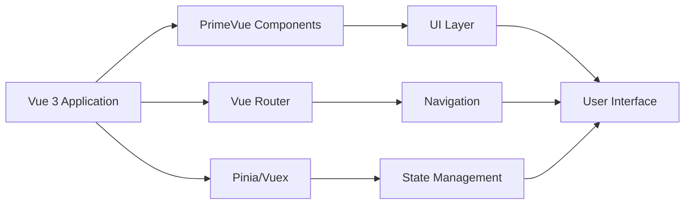

# PrimeVue 使用教學手冊

## 📋 目錄

- [第一章：基礎入門](#第一章基礎入門)
  - [1.1 PrimeVue 簡介](#11-primevue-簡介)
  - [1.2 PrimeVue 與 Vue.js 的關係](#12-primevue-與-vuejs-的關係)
  - [1.3 安裝與設定](#13-安裝與設定)
  - [1.4 建立第一個 PrimeVue 專案](#14-建立第一個-primevue-專案)
  - [1.5 Hello World 範例](#15-hello-world-範例)

- [第二章：核心元件介紹](#第二章核心元件介紹)
  - [2.1 按鈕（Button）與圖示（IconButton）](#21-按鈕button與圖示iconbutton)
  - [2.2 表單元件（InputText、Password、Dropdown、Checkbox、RadioButton、Calendar、Slider）](#22-表單元件inputtextpassworddropdowncheckboxradiobuttoncalendarslider)
  - [2.3 資料顯示元件（DataTable、Listbox、Card、Panel、TabView、Accordion）](#23-資料顯示元件datatablelistboxcardpaneltabviewaccordion)
  - [2.4 對話框與通知（Dialog、Toast、ConfirmDialog）](#24-對話框與通知dialogtoastconfirmdialog)
  - [2.5 版面配置元件（Panel、Card、Divider、Splitter）](#25-版面配置元件panelcarddividersplitter)

- [第三章：專案應用實戰](#第三章專案應用實戰)
  - [3.1 建立完整的使用者管理系統](#31-建立完整的使用者管理系統)
  - [3.2 第三章總結與學習重點](#32-第三章總結與學習重點)

- [第四章：進階功能與效能優化](#第四章進階功能與效能優化)
  - [4.1 效能優化策略](#41-效能優化策略)
    - [4.1.1 Vue 3 的效能優化特性](#411-vue-3-的效能優化特性)
    - [4.1.2 PrimeVue 元件效能優化](#412-primevue-元件效能優化)
    - [4.1.3 記憶體管理與清理](#413-記憶體管理與清理)
  - [4.2 國際化 (i18n) 實作](#42-國際化-i18n-實作)
    - [4.2.1 Vue I18n 設定](#421-vue-i18n-設定)
    - [4.2.2 在元件中使用國際化](#422-在元件中使用國際化)
    - [4.2.3 PrimeVue 元件的本地化](#423-primevue-元件的本地化)
  - [4.3 主題系統與自訂樣式](#43-主題系統與自訂樣式)
    - [4.3.1 PrimeVue 主題系統](#431-primevue-主題系統)
    - [4.3.2 自訂 CSS 變數系統](#432-自訂-css-變數系統)
  - [4.4 測試策略](#44-測試策略)
    - [4.4.1 單元測試設定](#441-單元測試設定)
    - [4.4.2 整合測試](#442-整合測試)
    - [4.4.3 E2E 測試](#443-e2e-測試)
  - [4.5 第四章總結](#45-第四章總結)

- [第五章：實務案例與最佳實務](#第五章實務案例與最佳實務)
  - [5.1 企業級專案架構](#51-企業級專案架構)
    - [5.1.1 專案結構設計](#511-專案結構設計)
    - [5.1.2 設計模式實作](#512-設計模式實作)
  - [5.2 效能監控與分析](#52-效能監控與分析)
    - [5.2.1 效能指標追蹤](#521-效能指標追蹤)
  - [5.3 部署與維護](#53-部署與維護)
    - [5.3.1 生產環境優化](#531-生產環境優化)
  - [5.4 第五章總結](#54-第五章總結)

- [第六章：疑難排解與調試](#第六章疑難排解與調試)
  - [6.1 常見問題解決](#61-常見問題解決)
    - [6.1.1 PrimeVue 常見錯誤](#611-primevue-常見錯誤)
  - [6.2 調試技巧](#62-調試技巧)
    - [6.2.1 Vue DevTools 使用](#621-vue-devtools-使用)

- [第七章：認證準備與進階學習](#第七章認證準備與進階學習)
  - [7.1 認證考試準備](#71-認證考試準備)
    - [7.1.1 Vue.js 認證重點](#711-vuejs-認證重點)
    - [7.1.2 PrimeVue 專業技能](#712-primevue-專業技能)
  - [7.2 持續學習資源](#72-持續學習資源)
    - [7.2.1 官方資源](#721-官方資源)
    - [7.2.2 社群資源](#722-社群資源)

- [附錄](#附錄)
  - [A. 元件速查表](#a-元件速查表)
    - [A.1 常用元件屬性](#a1-常用元件屬性)
  - [B. 最佳實務檢查清單](#b-最佳實務檢查清單)
    - [B.1 開發階段](#b1-開發階段)
    - [B.2 效能優化](#b2-效能優化)
    - [B.3 使用者體驗](#b3-使用者體驗)
    - [B.4 安全性](#b4-安全性)

---

## 第一章：基礎入門

### 1.1 PrimeVue 簡介

PrimeVue 是一個功能豐富的 Vue.js UI 元件庫，提供了超過 90+ 個高品質的元件，專為現代 Web 應用程式開發而設計。

#### 🌟 核心特色

- **豐富的元件庫**：提供完整的 UI 元件，從基本按鈕到複雜的資料表格
- **主題系統**：內建多種主題，支援自訂樣式
- **響應式設計**：完全支援行動裝置和桌面版本
- **無障礙支援**：符合 WCAG 2.1 標準
- **TypeScript 支援**：完整的型別定義
- **效能優化**：輕量化設計，支援樹搖 (Tree Shaking)

#### 📊 PrimeVue 生態系統

```mermaid
graph TD
    A[PrimeVue Core] --> B[UI 元件]
    A --> C[主題系統]
    A --> D[圖示庫]
    
    B --> E[表單元件]
    B --> F[資料顯示]
    B --> G[版面配置]
    
    C --> H[Material]
    C --> I[Bootstrap]
    C --> J[自訂主題]
    
    D --> K[PrimeIcons]
    D --> L[Font Awesome]
```



#### 💼 適用場景

- **企業級應用**：ERP、CRM、後台管理系統
- **電商平台**：商品展示、購物車、訂單管理
- **資料儀表板**：圖表展示、資料分析介面
- **內容管理系統**：部落格、新聞網站

### 1.2 PrimeVue 與 Vue.js 的關係

#### 🔗 版本對應關係

| PrimeVue 版本 | Vue.js 版本 | 發布時間 | 主要特色 |
|--------------|-------------|----------|----------|
| 4.x | Vue 3.4+ | 2024 | 新架構、效能提升 |
| 3.x | Vue 3.0+ | 2021 | Composition API 支援 |
| 2.x | Vue 2.6+ | 2020 | Options API (已停止維護) |

#### 🏗️ 架構整合



#### ⚡ Vue 3 Composition API 優勢

```javascript
// Vue 3 + PrimeVue 範例
import { ref, computed } from 'vue'
import { useToast } from 'primevue/usetoast'

export default {
  setup() {
    const toast = useToast()
    const items = ref([])
    
    const filteredItems = computed(() => {
      return items.value.filter(item => item.active)
    })
    
    const showSuccess = () => {
      toast.add({
        severity: 'success',
        summary: '成功',
        detail: '操作完成',
        life: 3000
      })
    }
    
    return {
      items,
      filteredItems,
      showSuccess
    }
  }
}
```

### 1.3 安裝與設定

#### 📦 安裝方式

##### 方式一：使用 npm

```bash
# 安裝 PrimeVue 核心套件
npm install primevue

# 安裝圖示庫
npm install primeicons

# 安裝主題（可選）
npm install @primevue/themes
```

##### 方式二：使用 yarn

```bash
yarn add primevue primeicons @primevue/themes
```

##### 方式三：使用 pnpm

```bash
pnpm add primevue primeicons @primevue/themes
```

#### ⚙️ Vue 3 + Vite 專案設定

##### 1. 建立 Vite 專案

```bash
# 建立新專案
npm create vue@latest my-primevue-app

# 進入專案目錄
cd my-primevue-app

# 安裝依賴
npm install

# 安裝 PrimeVue
npm install primevue primeicons
```

##### 2. 主要設定檔 (main.js)

```javascript
import { createApp } from 'vue'
import App from './App.vue'

// PrimeVue 核心
import PrimeVue from 'primevue/config'

// PrimeVue 樣式
import 'primevue/resources/themes/aura-light-green/theme.css'
import 'primevue/resources/primevue.min.css'
import 'primeicons/primeicons.css'

// 建立應用程式實例
const app = createApp(App)

// 使用 PrimeVue
app.use(PrimeVue)

// 掛載應用程式
app.mount('#app')
```

##### 3. 元件註冊方式

**全域註冊 (推薦用於小型專案)**

```javascript
// main.js
import Button from 'primevue/button'
import InputText from 'primevue/inputtext'
import DataTable from 'primevue/datatable'
import Column from 'primevue/column'

app.component('Button', Button)
app.component('InputText', InputText)
app.component('DataTable', DataTable)
app.component('Column', Column)
```

**區域註冊 (推薦用於大型專案)**

```javascript
// MyComponent.vue
<script>
import Button from 'primevue/button'
import InputText from 'primevue/inputtext'

export default {
  components: {
    Button,
    InputText
  }
}
</script>
```

#### 🎨 主題設定

##### 預設主題選擇

```javascript
// main.js - 選擇不同主題
import 'primevue/resources/themes/aura-light-blue/theme.css'    // Aura 淺色藍色
import 'primevue/resources/themes/aura-dark-green/theme.css'    // Aura 深色綠色
import 'primevue/resources/themes/lara-light-indigo/theme.css'  // Lara 淺色靛藍
import 'primevue/resources/themes/material-design-light/theme.css' // Material Design
```

##### 動態主題切換

```javascript
// utils/theme.js
export const switchTheme = (themeName) => {
  const linkElement = document.getElementById('theme-link')
  linkElement.href = `/themes/${themeName}/theme.css`
}

// 使用範例
switchTheme('aura-dark-green')
```

### 1.4 建立第一個 PrimeVue 專案

#### 🚀 完整專案建立流程

##### 步驟 1：初始化專案

```bash
# 建立 Vue 3 專案
npm create vue@latest primevue-demo

# 選擇以下選項
✔ Add TypeScript? … No / Yes (建議選 Yes)
✔ Add JSX Support? … No / Yes
✔ Add Vue Router for Single Page Application development? … No / Yes (建議選 Yes)
✔ Add Pinia for state management? … No / Yes (建議選 Yes)
✔ Add Vitest for Unit testing? … No / Yes
✔ Add an End-to-End Testing Solution? … No / Yes
✔ Add ESLint for code quality? … No / Yes (建議選 Yes)

cd primevue-demo
npm install
```

##### 步驟 2：安裝 PrimeVue

```bash
npm install primevue primeicons @primevue/themes
```

##### 步驟 3：專案結構

```
primevue-demo/
├── public/
├── src/
│   ├── assets/
│   ├── components/
│   │   └── common/          # 共用元件
│   ├── views/              # 頁面元件
│   ├── router/
│   ├── stores/             # Pinia stores
│   ├── utils/
│   │   └── primevue.js     # PrimeVue 設定
│   ├── styles/
│   │   └── global.css      # 全域樣式
│   ├── App.vue
│   └── main.js
├── index.html
├── package.json
└── vite.config.js
```

##### 步驟 4：PrimeVue 設定檔

```javascript
// src/utils/primevue.js
import PrimeVue from 'primevue/config'
import ToastService from 'primevue/toastservice'
import ConfirmationService from 'primevue/confirmationservice'

// 常用元件
import Button from 'primevue/button'
import InputText from 'primevue/inputtext'
import Card from 'primevue/card'
import Toast from 'primevue/toast'
import ConfirmDialog from 'primevue/confirmdialog'

export const setupPrimeVue = (app) => {
  // 安裝 PrimeVue
  app.use(PrimeVue)
  app.use(ToastService)
  app.use(ConfirmationService)
  
  // 註冊全域元件
  app.component('Button', Button)
  app.component('InputText', InputText)
  app.component('Card', Card)
  app.component('Toast', Toast)
  app.component('ConfirmDialog', ConfirmDialog)
}
```

##### 步驟 5：更新 main.js

```javascript
// src/main.js
import { createApp } from 'vue'
import { createPinia } from 'pinia'
import App from './App.vue'
import router from './router'

// PrimeVue 設定
import { setupPrimeVue } from './utils/primevue'

// PrimeVue 樣式
import 'primevue/resources/themes/aura-light-green/theme.css'
import 'primevue/resources/primevue.min.css'
import 'primeicons/primeicons.css'

// 全域樣式
import './styles/global.css'

const app = createApp(App)

app.use(createPinia())
app.use(router)

// 設定 PrimeVue
setupPrimeVue(app)

app.mount('#app')
```

### 1.5 Hello World 範例

#### 🎯 基本 Hello World

```vue
<!-- src/views/HelloWorld.vue -->
<template>
  <div class="hello-world">
    <Card>
      <template #title>
        🎉 歡迎使用 PrimeVue
      </template>
      <template #content>
        <div class="content-section">
          <h3>Hello, {{ userName }}!</h3>
          <p>這是您的第一個 PrimeVue 應用程式</p>
          
          <div class="input-group">
            <label for="name">輸入您的姓名：</label>
            <InputText 
              id="name"
              v-model="userName" 
              placeholder="請輸入姓名"
              class="w-full"
            />
          </div>
          
          <div class="button-group">
            <Button 
              label="打招呼" 
              icon="pi pi-user" 
              @click="sayHello"
              class="p-button-success"
            />
            <Button 
              label="重置" 
              icon="pi pi-refresh" 
              @click="reset"
              class="p-button-secondary"
            />
          </div>
        </div>
      </template>
    </Card>
    
    <!-- Toast 通知 -->
    <Toast />
  </div>
</template>

<script>
import { ref } from 'vue'
import { useToast } from 'primevue/usetoast'

export default {
  name: 'HelloWorld',
  setup() {
    const toast = useToast()
    const userName = ref('World')
    
    const sayHello = () => {
      toast.add({
        severity: 'success',
        summary: '問候',
        detail: `Hello, ${userName.value}! 歡迎使用 PrimeVue！`,
        life: 3000
      })
    }
    
    const reset = () => {
      userName.value = 'World'
      toast.add({
        severity: 'info',
        summary: '重置',
        detail: '已重置為預設值',
        life: 2000
      })
    }
    
    return {
      userName,
      sayHello,
      reset
    }
  }
}
</script>

<style scoped>
.hello-world {
  max-width: 600px;
  margin: 2rem auto;
  padding: 1rem;
}

.content-section {
  text-align: center;
}

.input-group {
  margin: 1.5rem 0;
}

.input-group label {
  display: block;
  margin-bottom: 0.5rem;
  font-weight: 500;
}

.button-group {
  display: flex;
  gap: 1rem;
  justify-content: center;
  margin-top: 1.5rem;
}

@media (max-width: 768px) {
  .button-group {
    flex-direction: column;
    align-items: center;
  }
}
</style>
```

#### 🎨 進階互動範例

```vue
<!-- src/views/InteractiveDemo.vue -->
<template>
  <div class="interactive-demo">
    <div class="demo-header">
      <h2>🚀 PrimeVue 互動示範</h2>
      <p>體驗 PrimeVue 元件的強大功能</p>
    </div>
    
    <div class="demo-grid">
      <!-- 計數器卡片 -->
      <Card class="demo-card">
        <template #title>
          <i class="pi pi-calculator"></i> 計數器
        </template>
        <template #content>
          <div class="counter-section">
            <div class="counter-display">
              <span class="counter-value">{{ counter }}</span>
            </div>
            <div class="counter-controls">
              <Button 
                icon="pi pi-minus" 
                @click="decrement"
                :disabled="counter <= 0"
                class="p-button-outlined p-button-danger"
              />
              <Button 
                icon="pi pi-plus" 
                @click="increment"
                class="p-button-outlined p-button-success"
              />
            </div>
          </div>
        </template>
      </Card>
      
      <!-- 資料表格卡片 -->
      <Card class="demo-card">
        <template #title>
          <i class="pi pi-table"></i> 使用者列表
        </template>
        <template #content>
          <DataTable 
            :value="users" 
            :paginator="true" 
            :rows="3"
            responsiveLayout="scroll"
          >
            <Column field="name" header="姓名"></Column>
            <Column field="email" header="Email"></Column>
            <Column field="role" header="角色"></Column>
          </DataTable>
        </template>
      </Card>
    </div>
    
    <!-- 功能按鈕 -->
    <div class="action-buttons">
      <Button 
        label="顯示資訊" 
        icon="pi pi-info-circle" 
        @click="showInfo"
        class="p-button-info"
      />
      <Button 
        label="確認操作" 
        icon="pi pi-check" 
        @click="showConfirm"
        class="p-button-warning"
      />
    </div>
    
    <!-- 全域元件 -->
    <Toast />
    <ConfirmDialog />
  </div>
</template>

<script>
import { ref } from 'vue'
import { useToast } from 'primevue/usetoast'
import { useConfirm } from 'primevue/useconfirm'
import DataTable from 'primevue/datatable'
import Column from 'primevue/column'

export default {
  name: 'InteractiveDemo',
  components: {
    DataTable,
    Column
  },
  setup() {
    const toast = useToast()
    const confirm = useConfirm()
    const counter = ref(0)
    
    // 範例資料
    const users = ref([
      { name: '張小明', email: 'zhang@example.com', role: '開發者' },
      { name: '李小華', email: 'li@example.com', role: '設計師' },
      { name: '王小美', email: 'wang@example.com', role: '專案經理' },
      { name: '陳小強', email: 'chen@example.com', role: '測試工程師' },
      { name: '林小雯', email: 'lin@example.com', role: 'UI/UX 設計師' }
    ])
    
    const increment = () => {
      counter.value++
      toast.add({
        severity: 'success',
        summary: '增加',
        detail: `計數器現在是 ${counter.value}`,
        life: 1000
      })
    }
    
    const decrement = () => {
      if (counter.value > 0) {
        counter.value--
        toast.add({
          severity: 'warn',
          summary: '減少',
          detail: `計數器現在是 ${counter.value}`,
          life: 1000
        })
      }
    }
    
    const showInfo = () => {
      toast.add({
        severity: 'info',
        summary: '資訊',
        detail: '這是一個 PrimeVue 示範應用程式，展示了多種常用元件的使用方式。',
        life: 4000
      })
    }
    
    const showConfirm = () => {
      confirm.require({
        message: '您確定要執行這個操作嗎？',
        header: '確認操作',
        icon: 'pi pi-exclamation-triangle',
        accept: () => {
          toast.add({
            severity: 'success',
            summary: '確認',
            detail: '操作已確認執行',
            life: 3000
          })
        },
        reject: () => {
          toast.add({
            severity: 'error',
            summary: '取消',
            detail: '操作已取消',
            life: 3000
          })
        }
      })
    }
    
    return {
      counter,
      users,
      increment,
      decrement,
      showInfo,
      showConfirm
    }
  }
}
</script>

<style scoped>
.interactive-demo {
  max-width: 1200px;
  margin: 0 auto;
  padding: 2rem;
}

.demo-header {
  text-align: center;
  margin-bottom: 2rem;
}

.demo-header h2 {
  color: #495057;
  margin-bottom: 0.5rem;
}

.demo-grid {
  display: grid;
  grid-template-columns: repeat(auto-fit, minmax(300px, 1fr));
  gap: 2rem;
  margin-bottom: 2rem;
}

.demo-card {
  height: fit-content;
}

.counter-section {
  text-align: center;
}

.counter-display {
  margin-bottom: 1rem;
}

.counter-value {
  font-size: 3rem;
  font-weight: bold;
  color: #007ad9;
}

.counter-controls {
  display: flex;
  gap: 1rem;
  justify-content: center;
}

.action-buttons {
  display: flex;
  gap: 1rem;
  justify-content: center;
  flex-wrap: wrap;
}

@media (max-width: 768px) {
  .demo-grid {
    grid-template-columns: 1fr;
  }
  
  .action-buttons {
    flex-direction: column;
    align-items: center;
  }
}
</style>
```

#### ✅ 第一章檢查清單

**基礎設定完成檢查：**

- [ ] ✅ 成功安裝 PrimeVue、PrimeIcons
- [ ] ✅ 正確設定 main.js 並匯入必要樣式
- [ ] ✅ 選擇並套用合適的主題
- [ ] ✅ 建立基本的專案結構
- [ ] ✅ 能夠成功執行 Hello World 範例
- [ ] ✅ Toast 通知功能正常運作
- [ ] ✅ 基本元件 (Button, InputText, Card) 正常顯示

**常見問題排除：**

| 問題 | 可能原因 | 解決方法 |
|------|----------|----------|
| 樣式未載入 | CSS 匯入順序錯誤 | 確保主題 CSS 在最前面 |
| 元件未顯示 | 忘記註冊元件 | 檢查全域或區域註冊 |
| 圖示未顯示 | PrimeIcons 未安裝 | `npm install primeicons` |
| Toast 無法使用 | 未安裝 ToastService | 在 main.js 中加入 `app.use(ToastService)` |

#### 🎯 實務注意事項

1. **效能考量**：大型專案建議使用區域註冊避免 bundle 過大
2. **主題一致性**：團隊開發時統一使用相同主題
3. **響應式設計**：確保在不同裝置上的顯示效果
4. **無障礙支援**：善用 PrimeVue 內建的 ARIA 屬性

---

## 第二章：核心元件介紹

### 2.1 按鈕（Button）與圖示（IconButton）

#### 🔘 Button 元件基礎

Button 是最常用的互動元件，PrimeVue 提供了豐富的按鈕樣式和功能。

##### 基本用法

```vue
<template>
  <div class="button-examples">
    <!-- 基本按鈕 -->
    <Button label="基本按鈕" />
    
    <!-- 帶圖示的按鈕 -->
    <Button label="儲存" icon="pi pi-save" />
    
    <!-- 圖示在右側 -->
    <Button label="下載" icon="pi pi-download" iconPos="right" />
    
    <!-- 純圖示按鈕 -->
    <Button icon="pi pi-search" aria-label="搜尋" />
    
    <!-- 不同大小 -->
    <Button label="小按鈕" size="small" />
    <Button label="一般按鈕" />
    <Button label="大按鈕" size="large" />
  </div>
</template>
```

##### 按鈕樣式類型

```vue
<template>
  <div class="button-styles">
    <!-- 主要按鈕 -->
    <Button label="主要" class="p-button-primary" />
    
    <!-- 次要按鈕 -->
    <Button label="次要" class="p-button-secondary" />
    
    <!-- 成功按鈕 -->
    <Button label="成功" class="p-button-success" />
    
    <!-- 資訊按鈕 -->
    <Button label="資訊" class="p-button-info" />
    
    <!-- 警告按鈕 -->
    <Button label="警告" class="p-button-warning" />
    
    <!-- 危險按鈕 -->
    <Button label="危險" class="p-button-danger" />
    
    <!-- 幫助按鈕 -->
    <Button label="幫助" class="p-button-help" />
    
    <!-- 外框按鈕 -->
    <Button label="外框" class="p-button-outlined" />
    
    <!-- 文字按鈕 -->
    <Button label="文字" class="p-button-text" />
    
    <!-- 連結按鈕 -->
    <Button label="連結" class="p-button-link" />
  </div>
</template>
```

#### 📏 Button 屬性 (Props)

| 屬性 | 類型 | 預設值 | 說明 |
|------|------|--------|------|
| `label` | string | null | 按鈕文字 |
| `icon` | string | null | 圖示 CSS 類別 |
| `iconPos` | string | 'left' | 圖示位置：'left', 'right', 'top', 'bottom' |
| `size` | string | null | 按鈕大小：'small', 'large' |
| `disabled` | boolean | false | 是否禁用 |
| `loading` | boolean | false | 載入狀態 |
| `loadingIcon` | string | 'pi pi-spinner pi-spin' | 載入圖示 |
| `outlined` | boolean | false | 外框樣式 |
| `text` | boolean | false | 文字樣式 |
| `raised` | boolean | false | 立體效果 |
| `rounded` | boolean | false | 圓角樣式 |
| `severity` | string | null | 顏色主題：'secondary', 'success', 'info', 'warning', 'help', 'danger' |

#### ⚡ Button 事件

| 事件 | 參數 | 說明 |
|------|------|------|
| `click` | event | 點擊事件 |
| `focus` | event | 獲得焦點 |
| `blur` | event | 失去焦點 |

#### 🎯 實務按鈕範例

```vue
<template>
  <div class="practical-buttons">
    <Card>
      <template #title>實務按鈕應用</template>
      <template #content>
        <!-- 表單操作按鈕 -->
        <div class="form-actions">
          <h4>表單操作</h4>
          <div class="button-group">
            <Button 
              label="儲存" 
              icon="pi pi-save" 
              :loading="saving"
              @click="save"
              class="p-button-success"
            />
            <Button 
              label="取消" 
              icon="pi pi-times" 
              @click="cancel"
              class="p-button-secondary p-button-outlined"
            />
            <Button 
              label="重置" 
              icon="pi pi-refresh" 
              @click="reset"
              class="p-button-warning p-button-outlined"
            />
          </div>
        </div>
        
        <!-- 資料操作按鈕 -->
        <div class="data-actions">
          <h4>資料操作</h4>
          <div class="button-group">
            <Button 
              label="新增" 
              icon="pi pi-plus" 
              @click="add"
              class="p-button-success"
            />
            <Button 
              label="編輯" 
              icon="pi pi-pencil" 
              @click="edit"
              :disabled="!selectedItem"
              class="p-button-info"
            />
            <Button 
              label="刪除" 
              icon="pi pi-trash" 
              @click="confirmDelete"
              :disabled="!selectedItem"
              class="p-button-danger"
            />
          </div>
        </div>
        
        <!-- 載入狀態按鈕 -->
        <div class="loading-actions">
          <h4>載入狀態</h4>
          <div class="button-group">
            <Button 
              label="提交資料" 
              icon="pi pi-upload" 
              :loading="uploading"
              @click="uploadData"
              class="p-button-primary"
            />
            <Button 
              label="下載報表" 
              icon="pi pi-download" 
              :loading="downloading"
              @click="downloadReport"
              class="p-button-info"
            />
          </div>
        </div>
        
        <!-- 不同尺寸按鈕 -->
        <div class="size-demo">
          <h4>按鈕尺寸</h4>
          <div class="button-group">
            <Button label="小" size="small" />
            <Button label="一般" />
            <Button label="大" size="large" />
          </div>
        </div>
        
        <!-- 圖示按鈕組 -->
        <div class="icon-buttons">
          <h4>圖示按鈕</h4>
          <div class="button-group">
            <Button 
              icon="pi pi-home" 
              aria-label="首頁"
              class="p-button-rounded"
              @click="goHome"
            />
            <Button 
              icon="pi pi-search" 
              aria-label="搜尋"
              class="p-button-rounded p-button-outlined"
              @click="search"
            />
            <Button 
              icon="pi pi-user" 
              aria-label="使用者"
              class="p-button-rounded p-button-info"
              @click="showProfile"
            />
            <Button 
              icon="pi pi-cog" 
              aria-label="設定"
              class="p-button-rounded p-button-secondary"
              @click="showSettings"
            />
          </div>
        </div>
      </template>
    </Card>
    
    <Toast />
    <ConfirmDialog />
  </div>
</template>

<script>
import { ref } from 'vue'
import { useToast } from 'primevue/usetoast'
import { useConfirm } from 'primevue/useconfirm'

export default {
  name: 'PracticalButtons',
  setup() {
    const toast = useToast()
    const confirm = useConfirm()
    
    // 狀態管理
    const saving = ref(false)
    const uploading = ref(false)
    const downloading = ref(false)
    const selectedItem = ref(null)
    
    // 表單操作
    const save = async () => {
      saving.value = true
      try {
        // 模擬 API 呼叫
        await new Promise(resolve => setTimeout(resolve, 2000))
        toast.add({
          severity: 'success',
          summary: '儲存成功',
          detail: '資料已成功儲存',
          life: 3000
        })
      } finally {
        saving.value = false
      }
    }
    
    const cancel = () => {
      toast.add({
        severity: 'info',
        summary: '已取消',
        detail: '操作已取消',
        life: 2000
      })
    }
    
    const reset = () => {
      confirm.require({
        message: '確定要重置所有資料嗎？此操作無法復原。',
        header: '確認重置',
        icon: 'pi pi-exclamation-triangle',
        accept: () => {
          toast.add({
            severity: 'warn',
            summary: '已重置',
            detail: '所有資料已重置',
            life: 3000
          })
        }
      })
    }
    
    // 資料操作
    const add = () => {
      toast.add({
        severity: 'success',
        summary: '新增模式',
        detail: '進入新增資料模式',
        life: 2000
      })
    }
    
    const edit = () => {
      if (selectedItem.value) {
        toast.add({
          severity: 'info',
          summary: '編輯模式',
          detail: '進入編輯資料模式',
          life: 2000
        })
      }
    }
    
    const confirmDelete = () => {
      confirm.require({
        message: '確定要刪除此項目嗎？',
        header: '確認刪除',
        icon: 'pi pi-exclamation-triangle',
        accept: () => {
          toast.add({
            severity: 'error',
            summary: '已刪除',
            detail: '項目已刪除',
            life: 3000
          })
          selectedItem.value = null
        }
      })
    }
    
    // 載入操作
    const uploadData = async () => {
      uploading.value = true
      try {
        await new Promise(resolve => setTimeout(resolve, 3000))
        toast.add({
          severity: 'success',
          summary: '上傳完成',
          detail: '資料上傳成功',
          life: 3000
        })
      } finally {
        uploading.value = false
      }
    }
    
    const downloadReport = async () => {
      downloading.value = true
      try {
        await new Promise(resolve => setTimeout(resolve, 2000))
        toast.add({
          severity: 'success',
          summary: '下載完成',
          detail: '報表下載成功',
          life: 3000
        })
      } finally {
        downloading.value = false
      }
    }
    
    // 圖示按鈕操作
    const goHome = () => {
      toast.add({ severity: 'info', summary: '導航', detail: '回到首頁', life: 2000 })
    }
    
    const search = () => {
      toast.add({ severity: 'info', summary: '搜尋', detail: '開啟搜尋功能', life: 2000 })
    }
    
    const showProfile = () => {
      toast.add({ severity: 'info', summary: '使用者', detail: '顯示使用者資料', life: 2000 })
    }
    
    const showSettings = () => {
      toast.add({ severity: 'info', summary: '設定', detail: '開啟系統設定', life: 2000 })
    }
    
    return {
      saving,
      uploading,
      downloading,
      selectedItem,
      save,
      cancel,
      reset,
      add,
      edit,
      confirmDelete,
      uploadData,
      downloadReport,
      goHome,
      search,
      showProfile,
      showSettings
    }
  }
}
</script>

<style scoped>
.practical-buttons {
  max-width: 800px;
  margin: 0 auto;
  padding: 1rem;
}

.form-actions,
.data-actions,
.loading-actions,
.size-demo,
.icon-buttons {
  margin-bottom: 2rem;
  padding: 1rem;
  border: 1px solid #e9ecef;
  border-radius: 6px;
}

.button-group {
  display: flex;
  gap: 0.5rem;
  flex-wrap: wrap;
  margin-top: 1rem;
}

h4 {
  margin-bottom: 1rem;
  color: #495057;
  font-weight: 600;
}

@media (max-width: 768px) {
  .button-group {
    flex-direction: column;
  }
}
</style>
```

#### 🎨 自訂按鈕樣式

```vue
<template>
  <div class="custom-buttons">
    <!-- 使用 CSS 變數自訂 -->
    <Button 
      label="自訂主色" 
      class="custom-primary"
    />
    
    <!-- 使用 Tailwind CSS (如果有安裝) -->
    <Button 
      label="Tailwind 樣式" 
      class="bg-purple-500 hover:bg-purple-600 text-white border-purple-500"
    />
    
    <!-- 漸層按鈕 -->
    <Button 
      label="漸層效果" 
      class="gradient-button"
    />
  </div>
</template>

<style>
.custom-primary {
  --p-button-primary-background: #6366f1;
  --p-button-primary-border-color: #6366f1;
  --p-button-primary-hover-background: #4f46e5;
  --p-button-primary-hover-border-color: #4f46e5;
}

.gradient-button {
  background: linear-gradient(135deg, #667eea 0%, #764ba2 100%);
  border: none;
  color: white;
}

.gradient-button:hover {
  background: linear-gradient(135deg, #5a6fd8 0%, #6a4190 100%);
}
</style>
```

### 2.2 表單元件（InputText、Password、Dropdown、Checkbox、RadioButton、Calendar、Slider）

#### 📝 InputText 輸入框

InputText 是最基本的文字輸入元件，支援各種輸入類型和驗證。

##### 基本用法

```vue
<template>
  <div class="input-examples">
    <!-- 基本輸入框 -->
    <div class="field">
      <label for="username">使用者名稱</label>
      <InputText id="username" v-model="username" placeholder="請輸入使用者名稱" />
    </div>
    
    <!-- 帶圖示的輸入框 -->
    <div class="field">
      <label for="email">Email</label>
      <span class="p-input-icon-left">
        <i class="pi pi-envelope"></i>
        <InputText id="email" v-model="email" placeholder="請輸入 Email" />
      </span>
    </div>
    
    <!-- 右側圖示 -->
    <div class="field">
      <label for="search">搜尋</label>
      <span class="p-input-icon-right">
        <InputText id="search" v-model="searchTerm" placeholder="搜尋..." />
        <i class="pi pi-search"></i>
      </span>
    </div>
    
    <!-- 不同尺寸 -->
    <div class="field">
      <label>不同尺寸</label>
      <div class="size-group">
        <InputText v-model="text1" placeholder="小" size="small" />
        <InputText v-model="text2" placeholder="一般" />
        <InputText v-model="text3" placeholder="大" size="large" />
      </div>
    </div>
    
    <!-- 禁用狀態 -->
    <div class="field">
      <label for="disabled">禁用輸入框</label>
      <InputText id="disabled" v-model="disabledText" disabled placeholder="此欄位已禁用" />
    </div>
    
    <!-- 驗證狀態 -->
    <div class="field">
      <label for="validated">驗證輸入框</label>
      <InputText 
        id="validated" 
        v-model="validatedText" 
        :class="{ 'p-invalid': !isValid }"
        placeholder="請輸入至少 3 個字元"
        @blur="validateInput"
      />
      <small v-if="!isValid" class="p-error">至少需要 3 個字元</small>
    </div>
  </div>
</template>

<script>
import { ref, computed } from 'vue'

export default {
  setup() {
    const username = ref('')
    const email = ref('')
    const searchTerm = ref('')
    const text1 = ref('')
    const text2 = ref('')
    const text3 = ref('')
    const disabledText = ref('無法編輯')
    const validatedText = ref('')
    
    const isValid = computed(() => validatedText.value.length >= 3)
    
    const validateInput = () => {
      // 驗證邏輯在 computed 中處理
    }
    
    return {
      username,
      email,
      searchTerm,
      text1,
      text2,
      text3,
      disabledText,
      validatedText,
      isValid,
      validateInput
    }
  }
}
</script>

<style scoped>
.field {
  margin-bottom: 1.5rem;
}

.field label {
  display: block;
  margin-bottom: 0.5rem;
  font-weight: 500;
}

.size-group {
  display: flex;
  gap: 1rem;
  flex-wrap: wrap;
}

.p-error {
  color: #e24c4c;
  font-size: 0.875rem;
  margin-top: 0.25rem;
}
</style>
```

#### 🔒 Password 密碼輸入框

```vue
<template>
  <div class="password-examples">
    <!-- 基本密碼框 -->
    <div class="field">
      <label for="password">密碼</label>
      <Password 
        id="password" 
        v-model="password" 
        placeholder="請輸入密碼"
        toggleMask 
      />
    </div>
    
    <!-- 帶強度指示器 -->
    <div class="field">
      <label for="strongPassword">強密碼</label>
      <Password 
        id="strongPassword" 
        v-model="strongPassword" 
        placeholder="請輸入強密碼"
        :feedback="true"
        toggleMask
      />
    </div>
    
    <!-- 自訂強度檢查 -->
    <div class="field">
      <label for="customPassword">自訂驗證密碼</label>
      <Password 
        id="customPassword" 
        v-model="customPassword" 
        placeholder="密碼需包含大小寫字母和數字"
        :feedback="false"
        toggleMask
      />
      <div class="password-strength">
        <div class="strength-item" :class="{ 'valid': hasLowerCase }">
          <i :class="hasLowerCase ? 'pi pi-check' : 'pi pi-times'"></i>
          包含小寫字母
        </div>
        <div class="strength-item" :class="{ 'valid': hasUpperCase }">
          <i :class="hasUpperCase ? 'pi pi-check' : 'pi pi-times'"></i>
          包含大寫字母
        </div>
        <div class="strength-item" :class="{ 'valid': hasNumber }">
          <i :class="hasNumber ? 'pi pi-check' : 'pi pi-times'"></i>
          包含數字
        </div>
        <div class="strength-item" :class="{ 'valid': hasMinLength }">
          <i :class="hasMinLength ? 'pi pi-check' : 'pi pi-times'"></i>
          至少 8 個字元
        </div>
      </div>
    </div>
  </div>
</template>

<script>
import { ref, computed } from 'vue'
import Password from 'primevue/password'

export default {
  components: {
    Password
  },
  setup() {
    const password = ref('')
    const strongPassword = ref('')
    const customPassword = ref('')
    
    // 密碼強度檢查
    const hasLowerCase = computed(() => /[a-z]/.test(customPassword.value))
    const hasUpperCase = computed(() => /[A-Z]/.test(customPassword.value))
    const hasNumber = computed(() => /\d/.test(customPassword.value))
    const hasMinLength = computed(() => customPassword.value.length >= 8)
    
    return {
      password,
      strongPassword,
      customPassword,
      hasLowerCase,
      hasUpperCase,
      hasNumber,
      hasMinLength
    }
  }
}
</script>

<style scoped>
.password-strength {
  margin-top: 0.5rem;
}

.strength-item {
  display: flex;
  align-items: center;
  gap: 0.5rem;
  margin-bottom: 0.25rem;
  color: #6c757d;
  font-size: 0.875rem;
}

.strength-item.valid {
  color: #198754;
}

.strength-item i {
  font-size: 0.75rem;
}
</style>
```

#### 📋 Dropdown 下拉選單

```vue
<template>
  <div class="dropdown-examples">
    <!-- 基本下拉選單 -->
    <div class="field">
      <label for="city">選擇城市</label>
      <Dropdown 
        id="city" 
        v-model="selectedCity" 
        :options="cities" 
        optionLabel="name" 
        placeholder="請選擇城市" 
      />
    </div>
    
    <!-- 可搜尋下拉選單 -->
    <div class="field">
      <label for="country">選擇國家</label>
      <Dropdown 
        id="country" 
        v-model="selectedCountry" 
        :options="countries" 
        optionLabel="name" 
        placeholder="請選擇國家"
        filter
        filterPlaceholder="搜尋國家..."
      />
    </div>
    
    <!-- 分組下拉選單 -->
    <div class="field">
      <label for="category">選擇分類</label>
      <Dropdown 
        id="category" 
        v-model="selectedCategory" 
        :options="categorizedItems" 
        optionLabel="label" 
        optionGroupLabel="category" 
        optionGroupChildren="items"
        placeholder="請選擇分類"
      />
    </div>
    
    <!-- 自訂模板 -->
    <div class="field">
      <label for="product">選擇產品</label>
      <Dropdown 
        id="product" 
        v-model="selectedProduct" 
        :options="products" 
        optionLabel="name" 
        placeholder="請選擇產品"
      >
        <template #value="slotProps">
          <div v-if="slotProps.value" class="selected-product">
            
            <span>{{ slotProps.value.name }}</span>
          </div>
          <span v-else>{{ slotProps.placeholder }}</span>
        </template>
        
        <template #option="slotProps">
          <div class="product-option">
            
            <div>
              <div class="product-name">{{ slotProps.option.name }}</div>
              <div class="product-price">${{ slotProps.option.price }}</div>
            </div>
          </div>
        </template>
      </Dropdown>
    </div>
  </div>
</template>

<script>
import { ref } from 'vue'
import Dropdown from 'primevue/dropdown'

export default {
  components: {
    Dropdown
  },
  setup() {
    const selectedCity = ref(null)
    const selectedCountry = ref(null)
    const selectedCategory = ref(null)
    const selectedProduct = ref(null)
    
    const cities = ref([
      { name: '台北', code: 'TPE' },
      { name: '台中', code: 'TCH' },
      { name: '台南', code: 'TNN' },
      { name: '高雄', code: 'KHH' }
    ])
    
    const countries = ref([
      { name: '台灣', code: 'TW' },
      { name: '日本', code: 'JP' },
      { name: '韓國', code: 'KR' },
      { name: '美國', code: 'US' },
      { name: '英國', code: 'UK' }
    ])
    
    const categorizedItems = ref([
      {
        category: '前端框架',
        items: [
          { label: 'Vue.js', value: 'vue' },
          { label: 'React', value: 'react' },
          { label: 'Angular', value: 'angular' }
        ]
      },
      {
        category: '後端框架',
        items: [
          { label: 'Express.js', value: 'express' },
          { label: 'Spring Boot', value: 'spring' },
          { label: 'Django', value: 'django' }
        ]
      }
    ])
    
    const products = ref([
      { 
        name: 'iPhone 14', 
        price: 999, 
        image: 'https://via.placeholder.com/40x40?text=📱'
      },
      { 
        name: 'MacBook Pro', 
        price: 1999, 
        image: 'https://via.placeholder.com/40x40?text=💻'
      },
      { 
        name: 'iPad Air', 
        price: 599, 
        image: 'https://via.placeholder.com/40x40?text=📱'
      }
    ])
    
    return {
      selectedCity,
      selectedCountry,
      selectedCategory,
      selectedProduct,
      cities,
      countries,
      categorizedItems,
      products
    }
  }
}
</script>

<style scoped>
.selected-product,
.product-option {
  display: flex;
  align-items: center;
  gap: 0.5rem;
}

.selected-product img,
.product-option img {
  width: 32px;
  height: 32px;
  border-radius: 4px;
}

.product-name {
  font-weight: 500;
}

.product-price {
  color: #6c757d;
  font-size: 0.875rem;
}
</style>
```

#### ☑️ Checkbox 複選框

```vue
<template>
  <div class="checkbox-examples">
    <!-- 基本複選框 -->
    <div class="field">
      <div class="checkbox-group">
        <Checkbox id="agree" v-model="agree" :binary="true" />
        <label for="agree">我同意服務條款</label>
      </div>
    </div>
    
    <!-- 多選複選框 -->
    <div class="field">
      <label>選擇您的興趣：</label>
      <div class="checkbox-list">
        <div v-for="interest in interests" :key="interest.key" class="checkbox-item">
          <Checkbox 
            :id="interest.key" 
            v-model="selectedInterests" 
            :value="interest.key" 
          />
          <label :for="interest.key">{{ interest.name }}</label>
        </div>
      </div>
      <small>已選擇：{{ selectedInterests.join(', ') || '無' }}</small>
    </div>
    
    <!-- 三狀態複選框 -->
    <div class="field">
      <label>功能權限</label>
      <div class="permission-group">
        <div class="checkbox-item">
          <Checkbox id="selectAll" v-model="selectAll" @change="onSelectAllChange" />
          <label for="selectAll">全選</label>
        </div>
        <div class="sub-permissions">
          <div v-for="permission in permissions" :key="permission.key" class="checkbox-item">
            <Checkbox 
              :id="permission.key" 
              v-model="selectedPermissions" 
              :value="permission.key"
              @change="onPermissionChange"
            />
            <label :for="permission.key">{{ permission.name }}</label>
          </div>
        </div>
      </div>
    </div>
  </div>
</template>

<script>
import { ref, computed } from 'vue'
import Checkbox from 'primevue/checkbox'

export default {
  components: {
    Checkbox
  },
  setup() {
    const agree = ref(false)
    const selectedInterests = ref([])
    const selectedPermissions = ref([])
    
    const interests = ref([
      { key: 'programming', name: '程式設計' },
      { key: 'design', name: '設計' },
      { key: 'music', name: '音樂' },
      { key: 'sports', name: '運動' },
      { key: 'reading', name: '閱讀' }
    ])
    
    const permissions = ref([
      { key: 'read', name: '讀取權限' },
      { key: 'write', name: '寫入權限' },
      { key: 'delete', name: '刪除權限' },
      { key: 'admin', name: '管理權限' }
    ])
    
    const selectAll = computed({
      get() {
        if (selectedPermissions.value.length === 0) return false
        if (selectedPermissions.value.length === permissions.value.length) return true
        return null // 部分選中狀態
      },
      set(value) {
        if (value) {
          selectedPermissions.value = permissions.value.map(p => p.key)
        } else {
          selectedPermissions.value = []
        }
      }
    })
    
    const onSelectAllChange = () => {
      // selectAll 的 computed setter 會處理邏輯
    }
    
    const onPermissionChange = () => {
      // selectAll 的 computed getter 會自動更新
    }
    
    return {
      agree,
      selectedInterests,
      selectedPermissions,
      interests,
      permissions,
      selectAll,
      onSelectAllChange,
      onPermissionChange
    }
  }
}
</script>

<style scoped>
.checkbox-group,
.checkbox-item {
  display: flex;
  align-items: center;
  gap: 0.5rem;
  margin-bottom: 0.5rem;
}

.checkbox-list {
  margin-top: 0.5rem;
  margin-bottom: 0.5rem;
}

.permission-group {
  margin-top: 0.5rem;
}

.sub-permissions {
  margin-left: 2rem;
  margin-top: 0.5rem;
}

.checkbox-item label {
  cursor: pointer;
  user-select: none;
}
</style>
```

#### 🔘 RadioButton 單選按鈕

```vue
<template>
  <div class="radio-examples">
    <!-- 基本單選按鈕 -->
    <div class="field">
      <label>選擇您的性別：</label>
      <div class="radio-group">
        <div class="radio-item">
          <RadioButton id="male" v-model="gender" value="male" />
          <label for="male">男性</label>
        </div>
        <div class="radio-item">
          <RadioButton id="female" v-model="gender" value="female" />
          <label for="female">女性</label>
        </div>
        <div class="radio-item">
          <RadioButton id="other" v-model="gender" value="other" />
          <label for="other">其他</label>
        </div>
      </div>
    </div>
    
    <!-- 產品選擇 -->
    <div class="field">
      <label>選擇產品方案：</label>
      <div class="plan-group">
        <div v-for="plan in plans" :key="plan.value" class="plan-item">
          <RadioButton 
            :id="plan.value" 
            v-model="selectedPlan" 
            :value="plan.value" 
          />
          <label :for="plan.value" class="plan-label">
            <div class="plan-name">{{ plan.name }}</div>
            <div class="plan-price">${{ plan.price }}/月</div>
            <div class="plan-description">{{ plan.description }}</div>
          </label>
        </div>
      </div>
    </div>
    
    <!-- 支付方式 -->
    <div class="field">
      <label>選擇支付方式：</label>
      <div class="payment-group">
        <div v-for="payment in paymentMethods" :key="payment.value" class="payment-item">
          <RadioButton 
            :id="payment.value" 
            v-model="selectedPayment" 
            :value="payment.value" 
          />
          <label :for="payment.value" class="payment-label">
            <i :class="payment.icon"></i>
            {{ payment.name }}
          </label>
        </div>
      </div>
    </div>
    
    <div class="selection-summary">
      <h4>您的選擇：</h4>
      <p><strong>性別：</strong>{{ genderText }}</p>
      <p><strong>方案：</strong>{{ planText }}</p>
      <p><strong>支付方式：</strong>{{ paymentText }}</p>
    </div>
  </div>
</template>

<script>
import { ref, computed } from 'vue'
import RadioButton from 'primevue/radiobutton'

export default {
  components: {
    RadioButton
  },
  setup() {
    const gender = ref('')
    const selectedPlan = ref('')
    const selectedPayment = ref('')
    
    const plans = ref([
      {
        value: 'basic',
        name: '基本方案',
        price: 99,
        description: '適合個人使用，包含基本功能'
      },
      {
        value: 'pro',
        name: '專業方案',
        price: 199,
        description: '適合小團隊，包含進階功能'
      },
      {
        value: 'enterprise',
        name: '企業方案',
        price: 399,
        description: '適合大型企業，包含所有功能'
      }
    ])
    
    const paymentMethods = ref([
      { value: 'credit', name: '信用卡', icon: 'pi pi-credit-card' },
      { value: 'paypal', name: 'PayPal', icon: 'pi pi-paypal' },
      { value: 'bank', name: '銀行轉帳', icon: 'pi pi-building' },
      { value: 'crypto', name: '加密貨幣', icon: 'pi pi-bitcoin' }
    ])
    
    const genderText = computed(() => {
      const genderMap = {
        'male': '男性',
        'female': '女性',
        'other': '其他'
      }
      return genderMap[gender.value] || '未選擇'
    })
    
    const planText = computed(() => {
      const plan = plans.value.find(p => p.value === selectedPlan.value)
      return plan ? `${plan.name} ($${plan.price}/月)` : '未選擇'
    })
    
    const paymentText = computed(() => {
      const payment = paymentMethods.value.find(p => p.value === selectedPayment.value)
      return payment ? payment.name : '未選擇'
    })
    
    return {
      gender,
      selectedPlan,
      selectedPayment,
      plans,
      paymentMethods,
      genderText,
      planText,
      paymentText
    }
  }
}
</script>

<style scoped>
.radio-group,
.plan-group,
.payment-group {
  margin-top: 0.5rem;
}

.radio-item,
.payment-item {
  display: flex;
  align-items: center;
  gap: 0.5rem;
  margin-bottom: 0.5rem;
}

.plan-item {
  display: flex;
  align-items: flex-start;
  gap: 0.5rem;
  margin-bottom: 1rem;
  padding: 1rem;
  border: 1px solid #e9ecef;
  border-radius: 6px;
  transition: border-color 0.3s;
}

.plan-item:hover {
  border-color: #007ad9;
}

.plan-label {
  cursor: pointer;
  flex: 1;
}

.plan-name {
  font-weight: 600;
  margin-bottom: 0.25rem;
}

.plan-price {
  color: #007ad9;
  font-weight: 500;
  margin-bottom: 0.25rem;
}

.plan-description {
  color: #6c757d;
  font-size: 0.875rem;
}

.payment-label {
  cursor: pointer;
  display: flex;
  align-items: center;
  gap: 0.5rem;
}

.selection-summary {
  margin-top: 2rem;
  padding: 1rem;
  background: #f8f9fa;
  border-radius: 6px;
}

.selection-summary h4 {
  margin-bottom: 0.5rem;
  color: #495057;
}

.selection-summary p {
  margin-bottom: 0.25rem;
}
</style>
```

#### 📅 Calendar 日期選擇器

```vue
<template>
  <div class="calendar-examples">
    <!-- 基本日期選擇器 -->
    <div class="field">
      <label for="birthDate">生日</label>
      <Calendar 
        id="birthDate" 
        v-model="birthDate" 
        placeholder="請選擇生日"
        dateFormat="yy/mm/dd"
      />
    </div>
    
    <!-- 日期範圍選擇 -->
    <div class="field">
      <label for="dateRange">選擇日期範圍</label>
      <Calendar 
        id="dateRange" 
        v-model="dateRange" 
        placeholder="請選擇開始和結束日期"
        selectionMode="range"
        :numberOfMonths="2"
      />
    </div>
    
    <!-- 多日期選擇 -->
    <div class="field">
      <label for="multipleDates">選擇多個日期</label>
      <Calendar 
        id="multipleDates" 
        v-model="multipleDates" 
        placeholder="請選擇多個日期"
        selectionMode="multiple"
      />
    </div>
    
    <!-- 日期時間選擇器 -->
    <div class="field">
      <label for="dateTime">預約時間</label>
      <Calendar 
        id="dateTime" 
        v-model="dateTime" 
        placeholder="請選擇日期和時間"
        showTime
        :showSeconds="true"
      />
    </div>
    
    <!-- 限制日期範圍 -->
    <div class="field">
      <label for="restrictedDate">會議日期（僅工作日）</label>
      <Calendar 
        id="restrictedDate" 
        v-model="restrictedDate" 
        placeholder="請選擇會議日期"
        :minDate="minDate"
        :maxDate="maxDate"
        :disabledDays="[0, 6]"
        :disabledDates="holidays"
      />
    </div>
    
    <!-- 內聯顯示 -->
    <div class="field">
      <label>內聯日曆</label>
      <Calendar 
        v-model="inlineDate" 
        :inline="true"
      />
    </div>
    
    <!-- 自訂格式 -->
    <div class="field">
      <label for="customFormat">自訂格式日期</label>
      <Calendar 
        id="customFormat" 
        v-model="customFormatDate" 
        placeholder="請選擇日期"
        dateFormat="dd/mm/yy"
        :monthNavigator="true"
        :yearNavigator="true"
        yearRange="1900:2030"
      />
    </div>
  </div>
</template>

<script>
import { ref } from 'vue'
import Calendar from 'primevue/calendar'

export default {
  components: {
    Calendar
  },
  setup() {
    const birthDate = ref(null)
    const dateRange = ref(null)
    const multipleDates = ref(null)
    const dateTime = ref(null)
    const restrictedDate = ref(null)
    const inlineDate = ref(new Date())
    const customFormatDate = ref(null)
    
    // 設定日期限制
    const today = new Date()
    const minDate = ref(today)
    const maxDate = ref(new Date(today.getTime() + 30 * 24 * 60 * 60 * 1000)) // 30天後
    
    // 假日日期
    const holidays = ref([
      new Date(2024, 0, 1),  // 元旦
      new Date(2024, 4, 1),  // 勞動節
      new Date(2024, 9, 10)  // 國慶日
    ])
    
    return {
      birthDate,
      dateRange,
      multipleDates,
      dateTime,
      restrictedDate,
      inlineDate,
      customFormatDate,
      minDate,
      maxDate,
      holidays
    }
  }
}
</script>

<style scoped>
.field {
  margin-bottom: 2rem;
}

.field label {
  display: block;
  margin-bottom: 0.5rem;
  font-weight: 500;
}
</style>
```

#### 🎚️ Slider 滑桿

```vue
<template>
  <div class="slider-examples">
    <!-- 基本滑桿 -->
    <div class="field">
      <label for="basicSlider">音量：{{ volume }}%</label>
      <Slider id="basicSlider" v-model="volume" />
    </div>
    
    <!-- 帶步進的滑桿 -->
    <div class="field">
      <label for="stepSlider">評分：{{ rating }} 分</label>
      <Slider 
        id="stepSlider" 
        v-model="rating" 
        :min="0" 
        :max="10" 
        :step="0.5"
      />
    </div>
    
    <!-- 範圍滑桿 -->
    <div class="field">
      <label for="rangeSlider">價格範圍：${{ priceRange[0] }} - ${{ priceRange[1] }}</label>
      <Slider 
        id="rangeSlider" 
        v-model="priceRange" 
        :range="true" 
        :min="0" 
        :max="1000"
        :step="10"
      />
    </div>
    
    <!-- 垂直滑桿 -->
    <div class="field">
      <label>溫度控制</label>
      <div class="vertical-slider-container">
        <div class="temperature-display">
          {{ temperature }}°C
        </div>
        <Slider 
          v-model="temperature" 
          orientation="vertical" 
          :min="16" 
          :max="30"
          :step="1"
          class="vertical-slider"
        />
      </div>
    </div>
    
    <!-- 顏色滑桿組 -->
    <div class="field">
      <label>RGB 顏色調整</label>
      <div class="color-sliders">
        <div class="color-slider">
          <label>紅色 ({{ red }})</label>
          <Slider v-model="red" :min="0" :max="255" />
        </div>
        <div class="color-slider">
          <label>綠色 ({{ green }})</label>
          <Slider v-model="green" :min="0" :max="255" />
        </div>
        <div class="color-slider">
          <label>藍色 ({{ blue }})</label>
          <Slider v-model="blue" :min="0" :max="255" />
        </div>
        <div class="color-preview" :style="{ backgroundColor: rgbColor }">
          顏色預覽
        </div>
      </div>
    </div>
    
    <!-- 進度指示滑桿 -->
    <div class="field">
      <label for="progressSlider">工作進度：{{ progress }}%</label>
      <Slider 
        id="progressSlider" 
        v-model="progress" 
        :min="0" 
        :max="100"
        class="progress-slider"
      />
      <div class="progress-status">
        <span v-if="progress < 25" class="status-low">剛開始</span>
        <span v-else-if="progress < 50" class="status-medium">進行中</span>
        <span v-else-if="progress < 75" class="status-high">接近完成</span>
        <span v-else class="status-complete">已完成</span>
      </div>
    </div>
  </div>
</template>

<script>
import { ref, computed } from 'vue'
import Slider from 'primevue/slider'

export default {
  components: {
    Slider
  },
  setup() {
    const volume = ref(50)
    const rating = ref(7.5)
    const priceRange = ref([100, 500])
    const temperature = ref(22)
    const red = ref(128)
    const green = ref(128)
    const blue = ref(128)
    const progress = ref(30)
    
    const rgbColor = computed(() => {
      return `rgb(${red.value}, ${green.value}, ${blue.value})`
    })
    
    return {
      volume,
      rating,
      priceRange,
      temperature,
      red,
      green,
      blue,
      progress,
      rgbColor
    }
  }
}
</script>

<style scoped>
.field {
  margin-bottom: 2rem;
}

.field label {
  display: block;
  margin-bottom: 0.5rem;
  font-weight: 500;
}

.vertical-slider-container {
  display: flex;
  align-items: center;
  gap: 2rem;
  height: 200px;
}

.temperature-display {
  font-size: 2rem;
  font-weight: bold;
  color: #007ad9;
}

.vertical-slider {
  height: 200px;
}

.color-sliders {
  background: #f8f9fa;
  padding: 1rem;
  border-radius: 6px;
}

.color-slider {
  margin-bottom: 1rem;
}

.color-slider label {
  margin-bottom: 0.25rem;
  font-size: 0.875rem;
}

.color-preview {
  height: 60px;
  display: flex;
  align-items: center;
  justify-content: center;
  color: white;
  font-weight: bold;
  text-shadow: 1px 1px 2px rgba(0,0,0,0.5);
  border-radius: 4px;
  margin-top: 1rem;
}

.progress-slider {
  margin-bottom: 0.5rem;
}

.progress-status {
  text-align: center;
  font-weight: 500;
}

.status-low { color: #dc3545; }
.status-medium { color: #fd7e14; }
.status-high { color: #ffc107; }
.status-complete { color: #198754; }
</style>
```

### 2.3 資料顯示元件（DataTable、Listbox、Card、Panel、TabView、Accordion）

#### 📊 DataTable 資料表格

DataTable 是 PrimeVue 最強大的元件之一，提供完整的資料展示和操作功能。

##### 基本資料表格

```vue
<template>
  <div class="datatable-examples">
    <!-- 基本表格 -->
    <div class="table-section">
      <h3>員工資料表</h3>
      <DataTable :value="employees" tableStyle="min-width: 50rem">
        <Column field="name" header="姓名"></Column>
        <Column field="department" header="部門"></Column>
        <Column field="position" header="職位"></Column>
        <Column field="salary" header="薪資">
          <template #body="slotProps">
            ${{ slotProps.data.salary.toLocaleString() }}
          </template>
        </Column>
        <Column field="startDate" header="到職日期">
          <template #body="slotProps">
            {{ formatDate(slotProps.data.startDate) }}
          </template>
        </Column>
      </DataTable>
    </div>
    
    <!-- 可排序表格 -->
    <div class="table-section">
      <h3>可排序表格</h3>
      <DataTable :value="products" sortMode="multiple" tableStyle="min-width: 50rem">
        <Column field="name" header="產品名稱" sortable></Column>
        <Column field="category" header="分類" sortable></Column>
        <Column field="price" header="價格" sortable>
          <template #body="slotProps">
            ${{ slotProps.data.price }}
          </template>
        </Column>
        <Column field="rating" header="評分" sortable>
          <template #body="slotProps">
            <div class="rating">
              <span class="rating-value">{{ slotProps.data.rating }}</span>
              <span class="rating-stars">{{ '★'.repeat(Math.floor(slotProps.data.rating)) }}</span>
            </div>
          </template>
        </Column>
        <Column field="stock" header="庫存" sortable>
          <template #body="slotProps">
            <span :class="getStockClass(slotProps.data.stock)">
              {{ slotProps.data.stock }}
            </span>
          </template>
        </Column>
      </DataTable>
    </div>
    
    <!-- 可分頁表格 -->
    <div class="table-section">
      <h3>分頁表格</h3>
      <DataTable 
        :value="customers" 
        :paginator="true" 
        :rows="5"
        :rowsPerPageOptions="[5, 10, 20]"
        paginatorTemplate="FirstPageLink PrevPageLink PageLinks NextPageLink LastPageLink CurrentPageReport RowsPerPageDropdown"
        currentPageReportTemplate="顯示 {first} 到 {last} 筆，共 {totalRecords} 筆記錄"
        tableStyle="min-width: 50rem"
      >
        <Column field="name" header="客戶名稱"></Column>
        <Column field="company" header="公司"></Column>
        <Column field="email" header="Email"></Column>
        <Column field="phone" header="電話"></Column>
        <Column field="status" header="狀態">
          <template #body="slotProps">
            <span :class="getStatusClass(slotProps.data.status)">
              {{ slotProps.data.status }}
            </span>
          </template>
        </Column>
      </DataTable>
    </div>
    
    <!-- 可篩選表格 -->
    <div class="table-section">
      <h3>可篩選表格</h3>
      <DataTable 
        :value="orders" 
        :filters="filters"
        filterDisplay="menu"
        :globalFilterFields="['customer', 'product', 'status']"
        tableStyle="min-width: 50rem"
      >
        <template #header>
          <div class="table-header">
            <h4>訂單管理</h4>
            <span class="p-input-icon-left">
              <i class="pi pi-search" />
              <InputText v-model="filters['global'].value" placeholder="搜尋..." />
            </span>
          </div>
        </template>
        <Column field="id" header="訂單編號" sortable></Column>
        <Column field="customer" header="客戶" sortable></Column>
        <Column field="product" header="產品" sortable></Column>
        <Column field="amount" header="金額" sortable>
          <template #body="slotProps">
            ${{ slotProps.data.amount.toLocaleString() }}
          </template>
        </Column>
        <Column field="status" header="狀態" sortable>
          <template #body="slotProps">
            <span :class="getOrderStatusClass(slotProps.data.status)">
              {{ slotProps.data.status }}
            </span>
          </template>
          <template #filter="{ filterModel }">
            <Dropdown 
              v-model="filterModel.value" 
              :options="orderStatuses" 
              placeholder="選擇狀態" 
              class="p-column-filter" 
              showClear 
            />
          </template>
        </Column>
        <Column header="操作">
          <template #body="slotProps">
            <div class="action-buttons">
              <Button 
                icon="pi pi-eye" 
                class="p-button-rounded p-button-info p-button-sm"
                @click="viewOrder(slotProps.data)"
                v-tooltip="'查看'"
              />
              <Button 
                icon="pi pi-pencil" 
                class="p-button-rounded p-button-success p-button-sm"
                @click="editOrder(slotProps.data)"
                v-tooltip="'編輯'"
              />
              <Button 
                icon="pi pi-trash" 
                class="p-button-rounded p-button-danger p-button-sm"
                @click="deleteOrder(slotProps.data)"
                v-tooltip="'刪除'"
              />
            </div>
          </template>
        </Column>
      </DataTable>
    </div>
    
    <!-- 可選取表格 -->
    <div class="table-section">
      <h3>可選取表格</h3>
      <DataTable 
        :value="selectableProducts" 
        v-model:selection="selectedProducts"
        selectionMode="multiple"
        dataKey="id"
        tableStyle="min-width: 50rem"
      >
        <template #header>
          <div class="selection-header">
            <span>已選擇 {{ selectedProducts.length }} 個項目</span>
            <Button 
              label="批次刪除" 
              icon="pi pi-trash"
              class="p-button-danger"
              :disabled="!selectedProducts.length"
              @click="bulkDelete"
            />
          </div>
        </template>
        <Column selectionMode="multiple" headerStyle="width: 3rem"></Column>
        <Column field="name" header="產品名稱"></Column>
        <Column field="category" header="分類"></Column>
        <Column field="price" header="價格">
          <template #body="slotProps">
            ${{ slotProps.data.price }}
          </template>
        </Column>
      </DataTable>
    </div>
  </div>
</template>

<script>
import { ref, reactive } from 'vue'
import DataTable from 'primevue/datatable'
import Column from 'primevue/column'
import Dropdown from 'primevue/dropdown'
import { FilterMatchMode } from 'primevue/api'

export default {
  components: {
    DataTable,
    Column,
    Dropdown
  },
  setup() {
    // 員工資料
    const employees = ref([
      { 
        name: '張小明', 
        department: '工程部', 
        position: '前端工程師', 
        salary: 80000, 
        startDate: new Date('2023-01-15') 
      },
      { 
        name: '李小華', 
        department: '設計部', 
        position: 'UI/UX 設計師', 
        salary: 75000, 
        startDate: new Date('2023-03-01') 
      },
      { 
        name: '王小美', 
        department: '產品部', 
        position: '產品經理', 
        salary: 90000, 
        startDate: new Date('2022-08-20') 
      }
    ])
    
    // 產品資料
    const products = ref([
      { name: 'iPhone 14', category: '手機', price: 999, rating: 4.5, stock: 25 },
      { name: 'MacBook Pro', category: '筆電', price: 1999, rating: 4.8, stock: 8 },
      { name: 'iPad Air', category: '平板', price: 599, rating: 4.3, stock: 0 },
      { name: 'Apple Watch', category: '穿戴裝置', price: 399, rating: 4.2, stock: 15 }
    ])
    
    // 客戶資料
    const customers = ref([
      { name: '陳大明', company: 'ABC 公司', email: 'chen@abc.com', phone: '0912-345-678', status: '活躍' },
      { name: '林小雅', company: 'XYZ 企業', email: 'lin@xyz.com', phone: '0923-456-789', status: '休眠' },
      { name: '劉志強', company: 'DEF 集團', email: 'liu@def.com', phone: '0934-567-890', status: '活躍' },
      { name: '黃美麗', company: 'GHI 有限公司', email: 'huang@ghi.com', phone: '0945-678-901', status: '新客戶' },
      { name: '吳建宏', company: 'JKL 科技', email: 'wu@jkl.com', phone: '0956-789-012', status: '活躍' },
      { name: '蔡淑芬', company: 'MNO 顧問', email: 'tsai@mno.com', phone: '0967-890-123', status: '休眠' }
    ])
    
    // 訂單資料
    const orders = ref([
      { id: 'ORD-001', customer: '張小明', product: 'iPhone 14', amount: 29970, status: '已完成' },
      { id: 'ORD-002', customer: '李小華', product: 'MacBook Pro', amount: 59970, status: '處理中' },
      { id: 'ORD-003', customer: '王小美', product: 'iPad Air', amount: 17970, status: '已取消' },
      { id: 'ORD-004', customer: '陳大明', product: 'Apple Watch', amount: 11970, status: '已完成' }
    ])
    
    // 可選取產品
    const selectableProducts = ref([
      { id: 1, name: 'iPhone 14', category: '手機', price: 999 },
      { id: 2, name: 'MacBook Pro', category: '筆電', price: 1999 },
      { id: 3, name: 'iPad Air', category: '平板', price: 599 },
      { id: 4, name: 'Apple Watch', category: '穿戴裝置', price: 399 }
    ])
    
    const selectedProducts = ref([])
    
    // 篩選器設定
    const filters = reactive({
      'global': { value: null, matchMode: FilterMatchMode.CONTAINS }
    })
    
    const orderStatuses = ref(['已完成', '處理中', '已取消', '待付款'])
    
    // 工具函數
    const formatDate = (date) => {
      return date.toLocaleDateString('zh-TW')
    }
    
    const getStockClass = (stock) => {
      if (stock === 0) return 'stock-out'
      if (stock < 10) return 'stock-low'
      return 'stock-normal'
    }
    
    const getStatusClass = (status) => {
      const statusMap = {
        '活躍': 'status-active',
        '休眠': 'status-inactive',
        '新客戶': 'status-new'
      }
      return statusMap[status] || ''
    }
    
    const getOrderStatusClass = (status) => {
      const statusMap = {
        '已完成': 'order-completed',
        '處理中': 'order-processing',
        '已取消': 'order-cancelled',
        '待付款': 'order-pending'
      }
      return statusMap[status] || ''
    }
    
    // 操作函數
    const viewOrder = (order) => {
      console.log('查看訂單:', order)
    }
    
    const editOrder = (order) => {
      console.log('編輯訂單:', order)
    }
    
    const deleteOrder = (order) => {
      console.log('刪除訂單:', order)
    }
    
    const bulkDelete = () => {
      console.log('批次刪除:', selectedProducts.value)
    }
    
    return {
      employees,
      products,
      customers,
      orders,
      selectableProducts,
      selectedProducts,
      filters,
      orderStatuses,
      formatDate,
      getStockClass,
      getStatusClass,
      getOrderStatusClass,
      viewOrder,
      editOrder,
      deleteOrder,
      bulkDelete
    }
  }
}
</script>

<style scoped>
.datatable-examples {
  max-width: 1200px;
  margin: 0 auto;
  padding: 1rem;
}

.table-section {
  margin-bottom: 3rem;
  padding: 1.5rem;
  border: 1px solid #e9ecef;
  border-radius: 8px;
}

.table-section h3 {
  margin-bottom: 1rem;
  color: #495057;
}

.table-header {
  display: flex;
  justify-content: space-between;
  align-items: center;
}

.selection-header {
  display: flex;
  justify-content: space-between;
  align-items: center;
}

.action-buttons {
  display: flex;
  gap: 0.5rem;
}

.rating {
  display: flex;
  align-items: center;
  gap: 0.5rem;
}

.rating-stars {
  color: #ffd700;
}

/* 庫存狀態樣式 */
.stock-normal { color: #198754; font-weight: 500; }
.stock-low { color: #fd7e14; font-weight: 500; }
.stock-out { color: #dc3545; font-weight: 500; }

/* 客戶狀態樣式 */
.status-active { 
  background: #d1edff; 
  color: #007ad9; 
  padding: 0.25rem 0.5rem; 
  border-radius: 4px; 
  font-size: 0.875rem;
}
.status-inactive { 
  background: #f8d7da; 
  color: #721c24; 
  padding: 0.25rem 0.5rem; 
  border-radius: 4px; 
  font-size: 0.875rem;
}
.status-new { 
  background: #d4edda; 
  color: #155724; 
  padding: 0.25rem 0.5rem; 
  border-radius: 4px; 
  font-size: 0.875rem;
}

/* 訂單狀態樣式 */
.order-completed { 
  background: #d4edda; 
  color: #155724; 
  padding: 0.25rem 0.5rem; 
  border-radius: 4px; 
  font-size: 0.875rem;
}
.order-processing { 
  background: #fff3cd; 
  color: #856404; 
  padding: 0.25rem 0.5rem; 
  border-radius: 4px; 
  font-size: 0.875rem;
}
.order-cancelled { 
  background: #f8d7da; 
  color: #721c24; 
  padding: 0.25rem 0.5rem; 
  border-radius: 4px; 
  font-size: 0.875rem;
}
.order-pending { 
  background: #d1ecf1; 
  color: #0c5460; 
  padding: 0.25rem 0.5rem; 
  border-radius: 4px; 
  font-size: 0.875rem;
}

@media (max-width: 768px) {
  .table-header {
    flex-direction: column;
    gap: 1rem;
    align-items: stretch;
  }
  
  .selection-header {
    flex-direction: column;
    gap: 1rem;
    align-items: stretch;
  }
  
  .action-buttons {
    justify-content: center;
  }
}
</style>
```

#### 📋 Listbox 清單框

```vue
<template>
  <div class="listbox-examples">
    <!-- 基本清單框 -->
    <div class="listbox-section">
      <h3>選擇城市</h3>
      <Listbox 
        v-model="selectedCity" 
        :options="cities" 
        optionLabel="name" 
        class="listbox"
      />
      <p>已選擇：{{ selectedCity?.name || '無' }}</p>
    </div>
    
    <!-- 多選清單框 -->
    <div class="listbox-section">
      <h3>選擇多個技能</h3>
      <Listbox 
        v-model="selectedSkills" 
        :options="skills" 
        optionLabel="name" 
        multiple
        class="listbox"
      />
      <p>已選擇：{{ selectedSkills.map(s => s.name).join(', ') || '無' }}</p>
    </div>
    
    <!-- 可搜尋清單框 -->
    <div class="listbox-section">
      <h3>選擇國家</h3>
      <Listbox 
        v-model="selectedCountry" 
        :options="countries" 
        optionLabel="name" 
        filter
        filterPlaceholder="搜尋國家..."
        class="listbox"
      />
    </div>
    
    <!-- 自訂模板清單框 -->
    <div class="listbox-section">
      <h3>選擇員工</h3>
      <Listbox 
        v-model="selectedEmployee" 
        :options="employees" 
        optionLabel="name" 
        class="listbox"
      >
        <template #option="slotProps">
          <div class="employee-option">
            
            <div class="employee-info">
              <div class="employee-name">{{ slotProps.option.name }}</div>
              <div class="employee-role">{{ slotProps.option.role }}</div>
              <div class="employee-department">{{ slotProps.option.department }}</div>
            </div>
          </div>
        </template>
      </Listbox>
    </div>
    
    <!-- 分組清單框 -->
    <div class="listbox-section">
      <h3>選擇產品</h3>
      <Listbox 
        v-model="selectedProduct" 
        :options="groupedProducts" 
        optionLabel="name" 
        optionGroupLabel="category" 
        optionGroupChildren="items"
        class="listbox"
      >
        <template #optiongroup="slotProps">
          <div class="product-category">
            <i :class="slotProps.option.icon"></i>
            {{ slotProps.option.category }}
          </div>
        </template>
      </Listbox>
    </div>
  </div>
</template>

<script>
import { ref } from 'vue'
import Listbox from 'primevue/listbox'

export default {
  components: {
    Listbox
  },
  setup() {
    const selectedCity = ref(null)
    const selectedSkills = ref([])
    const selectedCountry = ref(null)
    const selectedEmployee = ref(null)
    const selectedProduct = ref(null)
    
    const cities = ref([
      { name: '台北', code: 'TPE' },
      { name: '新北', code: 'NTP' },
      { name: '桃園', code: 'TYN' },
      { name: '台中', code: 'TCH' },
      { name: '台南', code: 'TNN' },
      { name: '高雄', code: 'KHH' }
    ])
    
    const skills = ref([
      { name: 'JavaScript', level: 'Advanced' },
      { name: 'Vue.js', level: 'Advanced' },
      { name: 'React', level: 'Intermediate' },
      { name: 'Node.js', level: 'Intermediate' },
      { name: 'Python', level: 'Beginner' },
      { name: 'Java', level: 'Intermediate' },
      { name: 'SQL', level: 'Advanced' }
    ])
    
    const countries = ref([
      { name: '台灣', code: 'TW', flag: '🇹🇼' },
      { name: '日本', code: 'JP', flag: '🇯🇵' },
      { name: '韓國', code: 'KR', flag: '🇰🇷' },
      { name: '美國', code: 'US', flag: '🇺🇸' },
      { name: '英國', code: 'UK', flag: '🇬🇧' },
      { name: '法國', code: 'FR', flag: '🇫🇷' },
      { name: '德國', code: 'DE', flag: '🇩🇪' }
    ])
    
    const employees = ref([
      {
        name: '張小明',
        role: '前端工程師',
        department: '工程部',
        avatar: 'https://via.placeholder.com/40x40?text=張'
      },
      {
        name: '李小華',
        role: 'UI/UX 設計師',
        department: '設計部',
        avatar: 'https://via.placeholder.com/40x40?text=李'
      },
      {
        name: '王小美',
        role: '產品經理',
        department: '產品部',
        avatar: 'https://via.placeholder.com/40x40?text=王'
      },
      {
        name: '陳大明',
        role: '後端工程師',
        department: '工程部',
        avatar: 'https://via.placeholder.com/40x40?text=陳'
      }
    ])
    
    const groupedProducts = ref([
      {
        category: '電子產品',
        icon: 'pi pi-mobile',
        items: [
          { name: 'iPhone 14', price: 999 },
          { name: 'Samsung Galaxy S23', price: 899 },
          { name: 'MacBook Pro', price: 1999 }
        ]
      },
      {
        category: '服飾',
        icon: 'pi pi-shopping-bag',
        items: [
          { name: 'Nike 運動鞋', price: 120 },
          { name: 'Adidas T-shirt', price: 35 },
          { name: 'Levi\'s 牛仔褲', price: 80 }
        ]
      },
      {
        category: '書籍',
        icon: 'pi pi-book',
        items: [
          { name: 'Vue.js 權威指南', price: 45 },
          { name: 'JavaScript 高級程式設計', price: 55 },
          { name: '設計模式', price: 40 }
        ]
      }
    ])
    
    return {
      selectedCity,
      selectedSkills,
      selectedCountry,
      selectedEmployee,
      selectedProduct,
      cities,
      skills,
      countries,
      employees,
      groupedProducts
    }
  }
}
</script>

<style scoped>
.listbox-examples {
  display: grid;
  grid-template-columns: repeat(auto-fit, minmax(300px, 1fr));
  gap: 2rem;
  padding: 1rem;
}

.listbox-section {
  padding: 1.5rem;
  border: 1px solid #e9ecef;
  border-radius: 8px;
}

.listbox-section h3 {
  margin-bottom: 1rem;
  color: #495057;
}

.listbox {
  width: 100%;
  height: 200px;
  margin-bottom: 1rem;
}

.employee-option {
  display: flex;
  align-items: center;
  gap: 1rem;
  padding: 0.5rem;
}

.employee-avatar {
  width: 40px;
  height: 40px;
  border-radius: 50%;
}

.employee-info {
  flex: 1;
}

.employee-name {
  font-weight: 500;
  margin-bottom: 0.25rem;
}

.employee-role {
  font-size: 0.875rem;
  color: #007ad9;
  margin-bottom: 0.25rem;
}

.employee-department {
  font-size: 0.75rem;
  color: #6c757d;
}

.product-category {
  display: flex;
  align-items: center;
  gap: 0.5rem;
  font-weight: 600;
  color: #495057;
}

@media (max-width: 768px) {
  .listbox-examples {
    grid-template-columns: 1fr;
  }
}
</style>
```

#### 🎴 Card 卡片

Card 是一個靈活的容器元件，用於展示相關內容的組合。

```vue
<template>
  <div class="card-examples">
    <!-- 基本卡片 -->
    <div class="card-section">
      <h3>基本卡片</h3>
      <div class="card-grid">
        <Card class="basic-card">
          <template #title>基本資訊</template>
          <template #content>
            <p>這是一個基本的卡片範例，包含標題和內容區域。</p>
          </template>
        </Card>
        
        <Card class="basic-card">
          <template #title>使用者資料</template>
          <template #subtitle>個人資訊管理</template>
          <template #content>
            <div class="user-info">
              <p><strong>姓名：</strong>張小明</p>
              <p><strong>部門：</strong>工程部</p>
              <p><strong>職位：</strong>前端工程師</p>
            </div>
          </template>
          <template #footer>
            <div class="card-footer">
              <Button label="編輯" icon="pi pi-pencil" class="p-button-sm" />
              <Button label="刪除" icon="pi pi-trash" class="p-button-sm p-button-danger" />
            </div>
          </template>
        </Card>
      </div>
    </div>
    
    <!-- 產品卡片 -->
    <div class="card-section">
      <h3>產品展示卡片</h3>
      <div class="product-grid">
        <Card v-for="product in products" :key="product.id" class="product-card">
          <template #header>
            
          </template>
          <template #title>{{ product.name }}</template>
          <template #subtitle>${{ product.price }}</template>
          <template #content>
            <div class="product-details">
              <p>{{ product.description }}</p>
              <div class="product-rating">
                <span class="rating-stars">{{ '★'.repeat(Math.floor(product.rating)) }}</span>
                <span class="rating-value">({{ product.rating }})</span>
              </div>
              <div class="product-tags">
                <span v-for="tag in product.tags" :key="tag" class="product-tag">{{ tag }}</span>
              </div>
            </div>
          </template>
          <template #footer>
            <div class="product-actions">
              <Button 
                label="加入購物車" 
                icon="pi pi-shopping-cart" 
                class="p-button-success"
                @click="addToCart(product)"
              />
              <Button 
                icon="pi pi-heart" 
                class="p-button-outlined p-button-secondary"
                @click="toggleWishlist(product)"
              />
            </div>
          </template>
        </Card>
      </div>
    </div>
    
    <!-- 統計卡片 -->
    <div class="card-section">
      <h3>統計儀表板</h3>
      <div class="stats-grid">
        <Card v-for="stat in statistics" :key="stat.title" class="stat-card">
          <template #content>
            <div class="stat-content">
              <div class="stat-icon" :style="{ backgroundColor: stat.color }">
                <i :class="stat.icon"></i>
              </div>
              <div class="stat-info">
                <div class="stat-value">{{ stat.value }}</div>
                <div class="stat-title">{{ stat.title }}</div>
                <div class="stat-change" :class="stat.trend">
                  <i :class="stat.trendIcon"></i>
                  {{ stat.change }}
                </div>
              </div>
            </div>
          </template>
        </Card>
      </div>
    </div>
    
    <!-- 互動式卡片 -->
    <div class="card-section">
      <h3>互動式卡片</h3>
      <div class="interactive-cards">
        <Card class="feature-card" @click="toggleFeature('analytics')">
          <template #content>
            <div class="feature-content">
              <i class="pi pi-chart-line feature-icon"></i>
              <h4>數據分析</h4>
              <p>深入分析您的業務數據</p>
              <div class="feature-status" :class="{ active: features.analytics }">
                {{ features.analytics ? '已啟用' : '點擊啟用' }}
              </div>
            </div>
          </template>
        </Card>
        
        <Card class="feature-card" @click="toggleFeature('notifications')">
          <template #content>
            <div class="feature-content">
              <i class="pi pi-bell feature-icon"></i>
              <h4>通知系統</h4>
              <p>即時接收重要通知</p>
              <div class="feature-status" :class="{ active: features.notifications }">
                {{ features.notifications ? '已啟用' : '點擊啟用' }}
              </div>
            </div>
          </template>
        </Card>
        
        <Card class="feature-card" @click="toggleFeature('security')">
          <template #content>
            <div class="feature-content">
              <i class="pi pi-shield feature-icon"></i>
              <h4>安全防護</h4>
              <p>保護您的帳戶安全</p>
              <div class="feature-status" :class="{ active: features.security }">
                {{ features.security ? '已啟用' : '點擊啟用' }}
              </div>
            </div>
          </template>
        </Card>
      </div>
    </div>
  </div>
</template>

<script>
import { ref } from 'vue'
import Card from 'primevue/card'

export default {
  components: {
    Card
  },
  setup() {
    const products = ref([
      {
        id: 1,
        name: 'iPhone 14 Pro',
        price: 999,
        description: '專業級攝影系統，強大的 A16 仿生晶片',
        rating: 4.5,
        tags: ['熱門', '新品'],
        image: 'https://via.placeholder.com/300x200?text=iPhone+14+Pro'
      },
      {
        id: 2,
        name: 'MacBook Air M2',
        price: 1199,
        description: '超薄設計，卓越效能，全天候電池續航',
        rating: 4.8,
        tags: ['推薦', '輕薄'],
        image: 'https://via.placeholder.com/300x200?text=MacBook+Air'
      },
      {
        id: 3,
        name: 'iPad Pro',
        price: 799,
        description: '專業創作工具，支援 Apple Pencil',
        rating: 4.6,
        tags: ['創作', '專業'],
        image: 'https://via.placeholder.com/300x200?text=iPad+Pro'
      }
    ])
    
    const statistics = ref([
      {
        title: '總用戶數',
        value: '12,345',
        change: '+5.2%',
        trend: 'positive',
        trendIcon: 'pi pi-arrow-up',
        icon: 'pi pi-users',
        color: '#3B82F6'
      },
      {
        title: '營收',
        value: '$89,432',
        change: '+12.8%',
        trend: 'positive',
        trendIcon: 'pi pi-arrow-up',
        icon: 'pi pi-dollar',
        color: '#10B981'
      },
      {
        title: '訂單數',
        value: '2,856',
        change: '-2.1%',
        trend: 'negative',
        trendIcon: 'pi pi-arrow-down',
        icon: 'pi pi-shopping-cart',
        color: '#F59E0B'
      },
      {
        title: '轉換率',
        value: '3.2%',
        change: '+0.8%',
        trend: 'positive',
        trendIcon: 'pi pi-arrow-up',
        icon: 'pi pi-percentage',
        color: '#8B5CF6'
      }
    ])
    
    const features = ref({
      analytics: false,
      notifications: true,
      security: true
    })
    
    const addToCart = (product) => {
      console.log('加入購物車:', product.name)
    }
    
    const toggleWishlist = (product) => {
      console.log('加入/移除願望清單:', product.name)
    }
    
    const toggleFeature = (featureName) => {
      features.value[featureName] = !features.value[featureName]
    }
    
    return {
      products,
      statistics,
      features,
      addToCart,
      toggleWishlist,
      toggleFeature
    }
  }
}
</script>

<style scoped>
.card-examples {
  padding: 1rem;
}

.card-section {
  margin-bottom: 3rem;
}

.card-section h3 {
  margin-bottom: 1.5rem;
  color: #495057;
}

/* 基本卡片樣式 */
.card-grid {
  display: grid;
  grid-template-columns: repeat(auto-fit, minmax(300px, 1fr));
  gap: 1.5rem;
}

.basic-card {
  height: fit-content;
}

.user-info p {
  margin-bottom: 0.5rem;
}

.card-footer {
  display: flex;
  gap: 0.5rem;
  justify-content: flex-end;
}

/* 產品卡片樣式 */
.product-grid {
  display: grid;
  grid-template-columns: repeat(auto-fit, minmax(300px, 1fr));
  gap: 1.5rem;
}

.product-card {
  height: 100%;
  transition: transform 0.2s, box-shadow 0.2s;
}

.product-card:hover {
  transform: translateY(-2px);
  box-shadow: 0 4px 12px rgba(0, 0, 0, 0.1);
}

.product-image {
  width: 100%;
  height: 200px;
  object-fit: cover;
}

.product-details p {
  margin-bottom: 1rem;
  color: #6c757d;
}

.product-rating {
  display: flex;
  align-items: center;
  gap: 0.5rem;
  margin-bottom: 1rem;
}

.rating-stars {
  color: #ffd700;
}

.rating-value {
  color: #6c757d;
  font-size: 0.875rem;
}

.product-tags {
  display: flex;
  gap: 0.5rem;
  margin-bottom: 1rem;
}

.product-tag {
  background: #e3f2fd;
  color: #1976d2;
  padding: 0.25rem 0.5rem;
  border-radius: 12px;
  font-size: 0.75rem;
  font-weight: 500;
}

.product-actions {
  display: flex;
  gap: 0.5rem;
  justify-content: space-between;
}

/* 統計卡片樣式 */
.stats-grid {
  display: grid;
  grid-template-columns: repeat(auto-fit, minmax(250px, 1fr));
  gap: 1.5rem;
}

.stat-card {
  background: linear-gradient(135deg, #667eea 0%, #764ba2 100%);
  color: white;
}

.stat-content {
  display: flex;
  align-items: center;
  gap: 1rem;
}

.stat-icon {
  width: 60px;
  height: 60px;
  border-radius: 12px;
  display: flex;
  align-items: center;
  justify-content: center;
  font-size: 1.5rem;
  color: white;
}

.stat-info {
  flex: 1;
}

.stat-value {
  font-size: 2rem;
  font-weight: bold;
  margin-bottom: 0.25rem;
}

.stat-title {
  font-size: 0.875rem;
  opacity: 0.9;
  margin-bottom: 0.5rem;
}

.stat-change {
  font-size: 0.875rem;
  display: flex;
  align-items: center;
  gap: 0.25rem;
}

.stat-change.positive {
  color: #4ade80;
}

.stat-change.negative {
  color: #f87171;
}

/* 互動式卡片樣式 */
.interactive-cards {
  display: grid;
  grid-template-columns: repeat(auto-fit, minmax(250px, 1fr));
  gap: 1.5rem;
}

.feature-card {
  cursor: pointer;
  transition: all 0.3s ease;
  border: 2px solid transparent;
}

.feature-card:hover {
  transform: translateY(-4px);
  box-shadow: 0 8px 25px rgba(0, 0, 0, 0.15);
  border-color: #007ad9;
}

.feature-content {
  text-align: center;
  padding: 1rem;
}

.feature-icon {
  font-size: 3rem;
  color: #007ad9;
  margin-bottom: 1rem;
}

.feature-content h4 {
  margin-bottom: 0.5rem;
  color: #495057;
}

.feature-content p {
  color: #6c757d;
  margin-bottom: 1rem;
}

.feature-status {
  padding: 0.5rem 1rem;
  border-radius: 20px;
  font-size: 0.875rem;
  font-weight: 500;
  background: #f8f9fa;
  color: #6c757d;
  transition: all 0.3s ease;
}

.feature-status.active {
  background: #d4edda;
  color: #155724;
}

@media (max-width: 768px) {
  .card-grid,
  .product-grid,
  .stats-grid,
  .interactive-cards {
    grid-template-columns: 1fr;
  }
  
  .product-actions {
    flex-direction: column;
  }
  
  .stat-content {
    flex-direction: column;
    text-align: center;
  }
}
</style>
```

#### 📋 Panel 面板

Panel 提供可摺疊的內容容器，適合組織大量資訊。

```vue
<template>
  <div class="panel-examples">
    <!-- 基本面板 -->
    <div class="panel-section">
      <h3>基本面板</h3>
      <Panel header="系統設定" :toggleable="true">
        <p>這是一個可摺疊的面板，可以用來組織相關的設定選項。</p>
        <div class="setting-group">
          <div class="setting-item">
            <label>啟用通知</label>
            <Checkbox v-model="settings.notifications" :binary="true" />
          </div>
          <div class="setting-item">
            <label>自動儲存</label>
            <Checkbox v-model="settings.autoSave" :binary="true" />
          </div>
          <div class="setting-item">
            <label>深色模式</label>
            <Checkbox v-model="settings.darkMode" :binary="true" />
          </div>
        </div>
      </Panel>
    </div>
    
    <!-- 自訂標題面板 -->
    <div class="panel-section">
      <h3>自訂標題面板</h3>
      <Panel :toggleable="true">
        <template #header>
          <div class="custom-header">
            <i class="pi pi-user"></i>
            <span>使用者資訊</span>
            <span class="header-badge">{{ users.length }}</span>
          </div>
        </template>
        <DataTable :value="users" tableStyle="min-width: 100%">
          <Column field="name" header="姓名"></Column>
          <Column field="email" header="Email"></Column>
          <Column field="role" header="角色"></Column>
        </DataTable>
      </Panel>
    </div>
    
    <!-- 多個摺疊面板 -->
    <div class="panel-section">
      <h3>資訊面板組</h3>
      <div class="panel-group">
        <Panel 
          v-for="info in infoSections" 
          :key="info.id"
          :header="info.title" 
          :toggleable="true"
          :collapsed="info.collapsed"
          class="info-panel"
        >
          <template #icons>
            <i :class="info.icon" class="panel-icon"></i>
          </template>
          <div class="info-content">
            <p>{{ info.description }}</p>
            <div v-if="info.items" class="info-list">
              <div v-for="item in info.items" :key="item" class="info-item">
                <i class="pi pi-check-circle"></i>
                {{ item }}
              </div>
            </div>
          </div>
        </Panel>
      </div>
    </div>
    
    <!-- 帶操作按鈕的面板 -->
    <div class="panel-section">
      <h3>操作面板</h3>
      <Panel header="檔案管理" :toggleable="true">
        <template #icons>
          <Button 
            icon="pi pi-plus" 
            class="p-button-rounded p-button-text p-button-sm"
            @click="addFile"
            v-tooltip="'新增檔案'"
          />
          <Button 
            icon="pi pi-refresh" 
            class="p-button-rounded p-button-text p-button-sm"
            @click="refreshFiles"
            v-tooltip="'重新整理'"
          />
        </template>
        <div class="file-manager">
          <div v-for="file in files" :key="file.id" class="file-item">
            <div class="file-info">
              <i :class="getFileIcon(file.type)"></i>
              <div class="file-details">
                <div class="file-name">{{ file.name }}</div>
                <div class="file-meta">{{ file.size }} • {{ file.modifiedDate }}</div>
              </div>
            </div>
            <div class="file-actions">
              <Button 
                icon="pi pi-download" 
                class="p-button-rounded p-button-text p-button-sm"
                @click="downloadFile(file)"
              />
              <Button 
                icon="pi pi-trash" 
                class="p-button-rounded p-button-text p-button-sm p-button-danger"
                @click="deleteFile(file)"
              />
            </div>
          </div>
        </div>
      </Panel>
    </div>
  </div>
</template>

<script>
import { ref } from 'vue'
import Panel from 'primevue/panel'
import Checkbox from 'primevue/checkbox'
import DataTable from 'primevue/datatable'
import Column from 'primevue/column'

export default {
  components: {
    Panel,
    Checkbox,
    DataTable,
    Column
  },
  setup() {
    const settings = ref({
      notifications: true,
      autoSave: false,
      darkMode: false
    })
    
    const users = ref([
      { name: '張小明', email: 'zhang@example.com', role: '管理員' },
      { name: '李小華', email: 'li@example.com', role: '使用者' },
      { name: '王小美', email: 'wang@example.com', role: '編輯者' }
    ])
    
    const infoSections = ref([
      {
        id: 1,
        title: '產品特色',
        icon: 'pi pi-star',
        collapsed: false,
        description: '我們的產品具有以下優秀特色：',
        items: ['高效能處理', '直觀的使用介面', '完整的安全防護', '24/7 技術支援']
      },
      {
        id: 2,
        title: '技術規格',
        icon: 'pi pi-cog',
        collapsed: true,
        description: '詳細的技術規格資訊：',
        items: ['支援最新標準', '跨平台相容', '雲端整合', 'API 支援']
      },
      {
        id: 3,
        title: '服務條款',
        icon: 'pi pi-file-text',
        collapsed: true,
        description: '使用本服務前請詳閱相關條款。',
        items: ['使用授權', '隱私保護', '服務限制', '責任聲明']
      }
    ])
    
    const files = ref([
      {
        id: 1,
        name: '專案報告.pdf',
        type: 'pdf',
        size: '2.5 MB',
        modifiedDate: '2024-01-15'
      },
      {
        id: 2,
        name: '資料分析.xlsx',
        type: 'excel',
        size: '1.2 MB',
        modifiedDate: '2024-01-14'
      },
      {
        id: 3,
        name: '設計稿.png',
        type: 'image',
        size: '850 KB',
        modifiedDate: '2024-01-13'
      },
      {
        id: 4,
        name: '會議記錄.docx',
        type: 'word',
        size: '320 KB',
        modifiedDate: '2024-01-12'
      }
    ])
    
    const getFileIcon = (fileType) => {
      const iconMap = {
        'pdf': 'pi pi-file-pdf',
        'excel': 'pi pi-file-excel',
        'word': 'pi pi-file-word',
        'image': 'pi pi-image',
        'video': 'pi pi-video',
        'audio': 'pi pi-volume-up'
      }
      return iconMap[fileType] || 'pi pi-file'
    }
    
    const addFile = () => {
      console.log('新增檔案')
    }
    
    const refreshFiles = () => {
      console.log('重新整理檔案清單')
    }
    
    const downloadFile = (file) => {
      console.log('下載檔案:', file.name)
    }
    
    const deleteFile = (file) => {
      console.log('刪除檔案:', file.name)
    }
    
    return {
      settings,
      users,
      infoSections,
      files,
      getFileIcon,
      addFile,
      refreshFiles,
      downloadFile,
      deleteFile
    }
  }
}
</script>

<style scoped>
.panel-examples {
  padding: 1rem;
}

.panel-section {
  margin-bottom: 2rem;
}

.panel-section h3 {
  margin-bottom: 1rem;
  color: #495057;
}

.setting-group {
  margin-top: 1rem;
}

.setting-item {
  display: flex;
  justify-content: space-between;
  align-items: center;
  padding: 0.75rem 0;
  border-bottom: 1px solid #e9ecef;
}

.setting-item:last-child {
  border-bottom: none;
}

.custom-header {
  display: flex;
  align-items: center;
  gap: 0.5rem;
}

.header-badge {
  background: #007ad9;
  color: white;
  padding: 0.25rem 0.5rem;
  border-radius: 10px;
  font-size: 0.75rem;
  font-weight: 500;
}

.panel-group {
  display: flex;
  flex-direction: column;
  gap: 1rem;
}

.info-panel {
  border: 1px solid #e9ecef;
}

.panel-icon {
  margin-right: 0.5rem;
  color: #007ad9;
}

.info-content p {
  margin-bottom: 1rem;
  color: #495057;
}

.info-list {
  display: flex;
  flex-direction: column;
  gap: 0.5rem;
}

.info-item {
  display: flex;
  align-items: center;
  gap: 0.5rem;
  color: #198754;
}

.file-manager {
  display: flex;
  flex-direction: column;
  gap: 1rem;
}

.file-item {
  display: flex;
  justify-content: space-between;
  align-items: center;
  padding: 1rem;
  border: 1px solid #e9ecef;
  border-radius: 6px;
  transition: background-color 0.2s;
}

.file-item:hover {
  background-color: #f8f9fa;
}

.file-info {
  display: flex;
  align-items: center;
  gap: 1rem;
}

.file-info i {
  font-size: 2rem;
  color: #007ad9;
}

.file-details {
  display: flex;
  flex-direction: column;
}

.file-name {
  font-weight: 500;
  margin-bottom: 0.25rem;
}

.file-meta {
  font-size: 0.875rem;
  color: #6c757d;
}

.file-actions {
  display: flex;
  gap: 0.5rem;
}

#### 📑 TabView 分頁檢視

TabView 提供分頁式的內容組織方式，讓使用者可以在不同內容區域間切換。

```vue
<template>
  <div class="tabview-examples">
    <!-- 基本分頁 -->
    <div class="tab-section">
      <h3>基本分頁檢視</h3>
      <TabView>
        <TabPanel header="個人資料">
          <div class="tab-content">
            <h4>個人基本資料</h4>
            <div class="form-grid">
              <div class="field">
                <label for="name">姓名</label>
                <InputText id="name" v-model="profile.name" />
              </div>
              <div class="field">
                <label for="email">Email</label>
                <InputText id="email" v-model="profile.email" />
              </div>
              <div class="field">
                <label for="phone">電話</label>
                <InputText id="phone" v-model="profile.phone" />
              </div>
              <div class="field">
                <label for="address">地址</label>
                <InputText id="address" v-model="profile.address" />
              </div>
            </div>
          </div>
        </TabPanel>
        
        <TabPanel header="帳戶設定">
          <div class="tab-content">
            <h4>帳戶安全設定</h4>
            <div class="settings-list">
              <div class="setting-item">
                <div class="setting-info">
                  <h5>變更密碼</h5>
                  <p>定期變更密碼以確保帳戶安全</p>
                </div>
                <Button label="變更" class="p-button-outlined" />
              </div>
              <div class="setting-item">
                <div class="setting-info">
                  <h5>雙重認證</h5>
                  <p>增加帳戶安全層級</p>
                </div>
                <Button label="設定" class="p-button-outlined" />
              </div>
              <div class="setting-item">
                <div class="setting-info">
                  <h5>登入記錄</h5>
                  <p>查看最近的登入活動</p>
                </div>
                <Button label="查看" class="p-button-outlined" />
              </div>
            </div>
          </div>
        </TabPanel>
        
        <TabPanel header="偏好設定">
          <div class="tab-content">
            <h4>個人偏好</h4>
            <div class="preference-grid">
              <div class="preference-item">
                <label>語言</label>
                <Dropdown 
                  v-model="preferences.language" 
                  :options="languages" 
                  optionLabel="name" 
                  optionValue="code"
                />
              </div>
              <div class="preference-item">
                <label>時區</label>
                <Dropdown 
                  v-model="preferences.timezone" 
                  :options="timezones" 
                  optionLabel="name" 
                  optionValue="value"
                />
              </div>
              <div class="preference-item">
                <label>主題</label>
                <Dropdown 
                  v-model="preferences.theme" 
                  :options="themes" 
                  optionLabel="name" 
                  optionValue="value"
                />
              </div>
            </div>
          </div>
        </TabPanel>
      </TabView>
    </div>
    
    <!-- 可關閉的分頁 -->
    <div class="tab-section">
      <h3>可關閉分頁</h3>
      <TabView>
        <TabPanel 
          v-for="tab in closableTabs" 
          :key="tab.id"
          :header="tab.title"
          :closable="tab.closable"
          @tab-close="closeTab(tab.id)"
        >
          <div class="tab-content">
            <h4>{{ tab.title }}</h4>
            <p>{{ tab.content }}</p>
            <div class="tab-actions">
              <Button label="儲存" icon="pi pi-save" class="p-button-success" />
              <Button label="關閉" icon="pi pi-times" @click="closeTab(tab.id)" />
            </div>
          </div>
        </TabPanel>
        <TabPanel header="+" @tab-click="addNewTab">
          <div class="tab-content">
            <p>點擊 "+" 新增分頁</p>
          </div>
        </TabPanel>
      </TabView>
    </div>
    
    <!-- 帶圖示的分頁 */
    <div class="tab-section">
      <h3>圖示分頁</h3>
      <TabView>
        <TabPanel>
          <template #header>
            <i class="pi pi-chart-bar"></i>
            <span>統計報表</span>
          </template>
          <div class="tab-content">
            <div class="stats-dashboard">
              <div class="stat-card" v-for="stat in dashboardStats" :key="stat.title">
                <div class="stat-icon" :style="{ backgroundColor: stat.color }">
                  <i :class="stat.icon"></i>
                </div>
                <div class="stat-details">
                  <div class="stat-value">{{ stat.value }}</div>
                  <div class="stat-title">{{ stat.title }}</div>
                </div>
              </div>
            </div>
          </div>
        </TabPanel>
        
        <TabPanel>
          <template #header>
            <i class="pi pi-calendar"></i>
            <span>行事曆</span>
          </template>
          <div class="tab-content">
            <Calendar v-model="calendarDate" :inline="true" />
          </div>
        </TabPanel>
        
        <TabPanel>
          <template #header>
            <i class="pi pi-cog"></i>
            <span>系統設定</span>
          </template>
          <div class="tab-content">
            <div class="system-settings">
              <div class="setting-group">
                <h5>一般設定</h5>
                <div class="setting-item">
                  <label>啟用通知</label>
                  <Checkbox v-model="systemSettings.notifications" :binary="true" />
                </div>
                <div class="setting-item">
                  <label>自動備份</label>
                  <Checkbox v-model="systemSettings.autoBackup" :binary="true" />
                </div>
              </div>
              <div class="setting-group">
                <h5>效能設定</h5>
                <div class="setting-item">
                  <label>快取大小 (MB)</label>
                  <Slider v-model="systemSettings.cacheSize" :min="100" :max="1000" />
                  <span>{{ systemSettings.cacheSize }} MB</span>
                </div>
              </div>
            </div>
          </div>
        </TabPanel>
      </TabView>
    </div>
    
    <!-- 可控制的分頁 -->
    <div class="tab-section">
      <h3>程式控制分頁</h3>
      <div class="tab-controls">
        <Button 
          v-for="(control, index) in tabControls" 
          :key="index"
          :label="control.label" 
          @click="activeTabIndex = index"
          :class="{ 'p-button-outlined': activeTabIndex !== index }"
        />
      </div>
      <TabView :activeIndex="activeTabIndex" @tab-change="onTabChange">
        <TabPanel 
          v-for="control in tabControls" 
          :key="control.id"
          :header="control.header"
        >
          <div class="tab-content">
            <component :is="control.component" v-bind="control.props" />
          </div>
        </TabPanel>
      </TabView>
    </div>
  </div>
</template>

<script>
import { ref } from 'vue'
import TabView from 'primevue/tabview'
import TabPanel from 'primevue/tabpanel'
import Calendar from 'primevue/calendar'
import Dropdown from 'primevue/dropdown'
import Checkbox from 'primevue/checkbox'
import Slider from 'primevue/slider'

export default {
  components: {
    TabView,
    TabPanel,
    Calendar,
    Dropdown,
    Checkbox,
    Slider
  },
  setup() {
    const profile = ref({
      name: '張小明',
      email: 'zhang@example.com',
      phone: '0912-345-678',
      address: '台北市信義區'
    })
    
    const preferences = ref({
      language: 'zh-TW',
      timezone: 'Asia/Taipei',
      theme: 'light'
    })
    
    const languages = ref([
      { name: '繁體中文', code: 'zh-TW' },
      { name: 'English', code: 'en-US' },
      { name: '日本語', code: 'ja-JP' }
    ])
    
    const timezones = ref([
      { name: '台北時間', value: 'Asia/Taipei' },
      { name: '東京時間', value: 'Asia/Tokyo' },
      { name: '洛杉磯時間', value: 'America/Los_Angeles' }
    ])
    
    const themes = ref([
      { name: '淺色主題', value: 'light' },
      { name: '深色主題', value: 'dark' },
      { name: '自動', value: 'auto' }
    ])
    
    const closableTabs = ref([
      {
        id: 1,
        title: '文件 1',
        content: '這是第一個可關閉的分頁內容。',
        closable: true
      },
      {
        id: 2,
        title: '文件 2',
        content: '這是第二個可關閉的分頁內容。',
        closable: true
      },
      {
        id: 3,
        title: '文件 3',
        content: '這是第三個可關閉的分頁內容。',
        closable: true
      }
    ])
    
    const dashboardStats = ref([
      { title: '今日訪客', value: '1,234', icon: 'pi pi-users', color: '#3B82F6' },
      { title: '銷售額', value: '$5,678', icon: 'pi pi-dollar', color: '#10B981' },
      { title: '訂單數', value: '89', icon: 'pi pi-shopping-cart', color: '#F59E0B' },
      { title: '轉換率', value: '2.4%', icon: 'pi pi-percentage', color: '#8B5CF6' }
    ])
    
    const calendarDate = ref(new Date())
    
    const systemSettings = ref({
      notifications: true,
      autoBackup: false,
      cacheSize: 256
    })
    
    const activeTabIndex = ref(0)
    
    const tabControls = ref([
      {
        id: 'dashboard',
        label: '儀表板',
        header: '數據儀表板',
        component: 'div',
        props: { innerHTML: '<h4>歡迎來到儀表板</h4><p>這裡顯示系統的主要數據統計。</p>' }
      },
      {
        id: 'users',
        label: '使用者',
        header: '使用者管理',
        component: 'div',
        props: { innerHTML: '<h4>使用者管理</h4><p>管理系統中的所有使用者帳戶。</p>' }
      },
      {
        id: 'reports',
        label: '報表',
        header: '報表中心',
        component: 'div',
        props: { innerHTML: '<h4>報表中心</h4><p>查看和產生各種業務報表。</p>' }
      }
    ])
    
    const closeTab = (tabId) => {
      const index = closableTabs.value.findIndex(tab => tab.id === tabId)
      if (index > -1) {
        closableTabs.value.splice(index, 1)
      }
    }
    
    const addNewTab = () => {
      const newId = Math.max(...closableTabs.value.map(t => t.id)) + 1
      closableTabs.value.push({
        id: newId,
        title: `文件 ${newId}`,
        content: `這是新增的第 ${newId} 個分頁內容。`,
        closable: true
      })
    }
    
    const onTabChange = (event) => {
      activeTabIndex.value = event.index
    }
    
    return {
      profile,
      preferences,
      languages,
      timezones,
      themes,
      closableTabs,
      dashboardStats,
      calendarDate,
      systemSettings,
      activeTabIndex,
      tabControls,
      closeTab,
      addNewTab,
      onTabChange
    }
  }
}
</script>

<style scoped>
.tabview-examples {
  padding: 1rem;
}

.tab-section {
  margin-bottom: 3rem;
}

.tab-section h3 {
  margin-bottom: 1rem;
  color: #495057;
}

.tab-content {
  padding: 1rem 0;
}

.form-grid {
  display: grid;
  grid-template-columns: repeat(auto-fit, minmax(250px, 1fr));
  gap: 1rem;
}

.field {
  display: flex;
  flex-direction: column;
}

.field label {
  margin-bottom: 0.5rem;
  font-weight: 500;
}

.settings-list {
  display: flex;
  flex-direction: column;
  gap: 1rem;
}

.setting-item {
  display: flex;
  justify-content: space-between;
  align-items: center;
  padding: 1rem;
  border: 1px solid #e9ecef;
  border-radius: 6px;
}

.setting-info h5 {
  margin-bottom: 0.25rem;
  color: #495057;
}

.setting-info p {
  color: #6c757d;
  font-size: 0.875rem;
  margin: 0;
}

.preference-grid {
  display: grid;
  grid-template-columns: repeat(auto-fit, minmax(200px, 1fr));
  gap: 1rem;
}

.preference-item {
  display: flex;
  flex-direction: column;
}

.preference-item label {
  margin-bottom: 0.5rem;
  font-weight: 500;
}

.tab-actions {
  margin-top: 1rem;
  display: flex;
  gap: 0.5rem;
}

.stats-dashboard {
  display: grid;
  grid-template-columns: repeat(auto-fit, minmax(200px, 1fr));
  gap: 1rem;
}

.stat-card {
  display: flex;
  align-items: center;
  gap: 1rem;
  padding: 1.5rem;
  background: white;
  border: 1px solid #e9ecef;
  border-radius: 8px;
  box-shadow: 0 2px 4px rgba(0, 0, 0, 0.1);
}

.stat-icon {
  width: 60px;
  height: 60px;
  border-radius: 12px;
  display: flex;
  align-items: center;
  justify-content: center;
  font-size: 1.5rem;
  color: white;
}

.stat-value {
  font-size: 1.5rem;
  font-weight: bold;
  margin-bottom: 0.25rem;
}

.stat-title {
  color: #6c757d;
  font-size: 0.875rem;
}

.system-settings {
  max-width: 500px;
}

.setting-group {
  margin-bottom: 2rem;
}

.setting-group h5 {
  margin-bottom: 1rem;
  color: #495057;
  border-bottom: 1px solid #e9ecef;
  padding-bottom: 0.5rem;
}

.setting-group .setting-item {
  justify-content: space-between;
  padding: 0.75rem 0;
  border: none;
  border-bottom: 1px solid #f8f9fa;
}

.tab-controls {
  display: flex;
  gap: 0.5rem;
  margin-bottom: 1rem;
  flex-wrap: wrap;
}

@media (max-width: 768px) {
  .form-grid {
    grid-template-columns: 1fr;
  }
  
  .preference-grid {
    grid-template-columns: 1fr;
  }
  
  .stats-dashboard {
    grid-template-columns: 1fr;
  }
  
  .setting-item {
    flex-direction: column;
    align-items: flex-start;
    gap: 1rem;
  }
  
  .tab-controls {
    flex-direction: column;
  }
}
</style>
```

#### 🪗 Accordion 手風琴

Accordion 提供可摺疊的面板組，適合展示分層級的內容。

```vue
<template>
  <div class="accordion-examples">
    <!-- 基本手風琴 -->
    <div class="accordion-section">
      <h3>常見問題 (FAQ)</h3>
      <Accordion :activeIndex="0">
        <AccordionTab header="如何建立帳戶？">
          <p>您可以透過以下步驟建立帳戶：</p>
          <ol>
            <li>點擊頁面右上角的「註冊」按鈕</li>
            <li>填寫必要的個人資訊</li>
            <li>驗證您的電子郵件地址</li>
            <li>設定安全的密碼</li>
            <li>完成帳戶設定</li>
          </ol>
        </AccordionTab>
        
        <AccordionTab header="如何重設密碼？">
          <p>如果您忘記密碼，可以按照以下步驟重設：</p>
          <ol>
            <li>在登入頁面點擊「忘記密碼」</li>
            <li>輸入您註冊時使用的電子郵件</li>
            <li>檢查郵箱中的重設連結</li>
            <li>點擊連結並設定新密碼</li>
          </ol>
          <div class="note">
            <i class="pi pi-info-circle"></i>
            <span>重設連結將在 24 小時後失效</span>
          </div>
        </AccordionTab>
        
        <AccordionTab header="支援哪些付款方式？">
          <p>我們支援多種付款方式：</p>
          <div class="payment-methods">
            <div class="payment-item">
              <i class="pi pi-credit-card"></i>
              <span>信用卡 (Visa, MasterCard, JCB)</span>
            </div>
            <div class="payment-item">
              <i class="pi pi-paypal"></i>
              <span>PayPal</span>
            </div>
            <div class="payment-item">
              <i class="pi pi-building"></i>
              <span>銀行轉帳</span>
            </div>
            <div class="payment-item">
              <i class="pi pi-mobile"></i>
              <span>行動支付 (Apple Pay, Google Pay)</span>
            </div>
          </div>
        </AccordionTab>
        
        <AccordionTab header="如何聯繫客服？">
          <p>如果您需要協助，可以透過以下方式聯繫我們：</p>
          <div class="contact-methods">
            <div class="contact-item">
              <i class="pi pi-phone"></i>
              <div>
                <strong>電話客服</strong>
                <p>0800-123-456 (週一至週五 9:00-18:00)</p>
              </div>
            </div>
            <div class="contact-item">
              <i class="pi pi-envelope"></i>
              <div>
                <strong>電子郵件</strong>
                <p>support@example.com</p>
              </div>
            </div>
            <div class="contact-item">
              <i class="pi pi-comments"></i>
              <div>
                <strong>線上客服</strong>
                <p>週一至週日 24 小時服務</p>
              </div>
            </div>
          </div>
        </AccordionTab>
      </Accordion>
    </div>
    
    <!-- 多選手風琴 -->
    <div class="accordion-section">
      <h3>產品功能介紹</h3>
      <Accordion :multiple="true" :activeIndex="[0, 1]">
        <AccordionTab header="🚀 核心功能">
          <div class="feature-content">
            <h4>強大的核心功能</h4>
            <div class="feature-list">
              <div class="feature-item">
                <i class="pi pi-check-circle"></i>
                <div>
                  <strong>高效能處理</strong>
                  <p>採用最新技術，提供極速的處理體驗</p>
                </div>
              </div>
              <div class="feature-item">
                <i class="pi pi-check-circle"></i>
                <div>
                  <strong>智能分析</strong>
                  <p>AI 驅動的數據分析，洞察業務趨勢</p>
                </div>
              </div>
              <div class="feature-item">
                <i class="pi pi-check-circle"></i>
                <div>
                  <strong>即時同步</strong>
                  <p>多設備間的即時數據同步</p>
                </div>
              </div>
            </div>
          </div>
        </AccordionTab>
        
        <AccordionTab header="🔒 安全防護">
          <div class="security-content">
            <h4>企業級安全保護</h4>
            <div class="security-grid">
              <div class="security-item">
                <i class="pi pi-shield"></i>
                <h5>資料加密</h5>
                <p>採用 AES-256 加密技術</p>
              </div>
              <div class="security-item">
                <i class="pi pi-lock"></i>
                <h5>雙重認證</h5>
                <p>多層次身份驗證機制</p>
              </div>
              <div class="security-item">
                <i class="pi pi-eye"></i>
                <h5>活動監控</h5>
                <p>24/7 安全監控系統</p>
              </div>
              <div class="security-item">
                <i class="pi pi-database"></i>
                <h5>備份機制</h5>
                <p>自動備份與災難復原</p>
              </div>
            </div>
          </div>
        </AccordionTab>
        
        <AccordionTab header="📊 報表分析">
          <div class="analytics-content">
            <h4>深度數據洞察</h4>
            <p>提供全方位的業務分析工具，協助您做出明智決策。</p>
            <div class="chart-preview">
              <div class="chart-item">
                <h5>銷售趨勢</h5>
                <div class="mini-chart">
                  <div class="chart-bar" style="height: 60%"></div>
                  <div class="chart-bar" style="height: 80%"></div>
                  <div class="chart-bar" style="height: 45%"></div>
                  <div class="chart-bar" style="height: 90%"></div>
                  <div class="chart-bar" style="height: 70%"></div>
                </div>
              </div>
              <div class="chart-item">
                <h5>使用者活躍度</h5>
                <div class="progress-ring">
                  <div class="progress-value">78%</div>
                </div>
              </div>
            </div>
          </div>
        </AccordionTab>
        
        <AccordionTab header="🌐 整合服務">
          <div class="integration-content">
            <h4>無縫第三方整合</h4>
            <div class="integration-grid">
              <div class="integration-item">
                
                <span>Google Workspace</span>
              </div>
              <div class="integration-item">
                
                <span>Microsoft 365</span>
              </div>
              <div class="integration-item">
                
                <span>Slack</span>
              </div>
              <div class="integration-item">
                
                <span>Zoom</span>
              </div>
              <div class="integration-item">
                
                <span>Dropbox</span>
              </div>
              <div class="integration-item">
                
                <span>Trello</span>
              </div>
            </div>
          </div>
        </AccordionTab>
      </Accordion>
    </div>
    
    <!-- 自訂樣式手風琴 -->
    <div class="accordion-section">
      <h3>專案時程表</h3>
      <Accordion class="timeline-accordion">
        <AccordionTab v-for="phase in projectPhases" :key="phase.id">
          <template #header>
            <div class="phase-header">
              <div class="phase-status" :class="phase.status"></div>
              <div class="phase-info">
                <span class="phase-title">{{ phase.title }}</span>
                <span class="phase-date">{{ phase.date }}</span>
              </div>
            </div>
          </template>
          <div class="phase-content">
            <p>{{ phase.description }}</p>
            <div class="task-list">
              <div v-for="task in phase.tasks" :key="task.id" class="task-item">
                <Checkbox v-model="task.completed" :binary="true" />
                <span :class="{ 'completed': task.completed }">{{ task.name }}</span>
              </div>
            </div>
            <div class="phase-progress">
              <label>完成進度</label>
              <div class="progress-bar">
                <div class="progress-fill" :style="{ width: phase.progress + '%' }"></div>
              </div>
              <span>{{ phase.progress }}%</span>
            </div>
          </div>
        </AccordionTab>
      </Accordion>
    </div>
  </div>
</template>

<script>
import { ref } from 'vue'
import Accordion from 'primevue/accordion'
import AccordionTab from 'primevue/accordiontab'
import Checkbox from 'primevue/checkbox'

export default {
  components: {
    Accordion,
    AccordionTab,
    Checkbox
  },
  setup() {
    const projectPhases = ref([
      {
        id: 1,
        title: '專案規劃',
        date: '2024-01-01 ~ 2024-01-15',
        status: 'completed',
        progress: 100,
        description: '定義專案範圍、目標和時程安排。',
        tasks: [
          { id: 1, name: '需求分析', completed: true },
          { id: 2, name: '技術評估', completed: true },
          { id: 3, name: '資源配置', completed: true }
        ]
      },
      {
        id: 2,
        title: '系統設計',
        date: '2024-01-16 ~ 2024-02-15',
        status: 'completed',
        progress: 100,
        description: '完成系統架構設計和 UI/UX 設計。',
        tasks: [
          { id: 4, name: '架構設計', completed: true },
          { id: 5, name: 'UI 設計', completed: true },
          { id: 6, name: '資料庫設計', completed: true }
        ]
      },
      {
        id: 3,
        title: '開發實作',
        date: '2024-02-16 ~ 2024-04-30',
        status: 'in-progress',
        progress: 65,
        description: '進行系統開發和功能實作。',
        tasks: [
          { id: 7, name: '前端開發', completed: true },
          { id: 8, name: '後端開發', completed: false },
          { id: 9, name: 'API 整合', completed: false }
        ]
      },
      {
        id: 4,
        title: '測試驗證',
        date: '2024-05-01 ~ 2024-05-31',
        status: 'pending',
        progress: 0,
        description: '執行全面的系統測試和使用者驗收測試。',
        tasks: [
          { id: 10, name: '單元測試', completed: false },
          { id: 11, name: '整合測試', completed: false },
          { id: 12, name: '使用者測試', completed: false }
        ]
      },
      {
        id: 5,
        title: '部署上線',
        date: '2024-06-01 ~ 2024-06-15',
        status: 'pending',
        progress: 0,
        description: '部署系統到生產環境並進行上線準備。',
        tasks: [
          { id: 13, name: '環境部署', completed: false },
          { id: 14, name: '資料遷移', completed: false },
          { id: 15, name: '上線驗證', completed: false }
        ]
      }
    ])
    
    return {
      projectPhases
    }
  }
}
</script>

<style scoped>
.accordion-examples {
  padding: 1rem;
}

.accordion-section {
  margin-bottom: 3rem;
}

.accordion-section h3 {
  margin-bottom: 1rem;
  color: #495057;
}

.note {
  display: flex;
  align-items: center;
  gap: 0.5rem;
  margin-top: 1rem;
  padding: 0.75rem;
  background: #e3f2fd;
  border-radius: 4px;
  color: #1976d2;
}

.payment-methods,
.contact-methods {
  margin-top: 1rem;
}

.payment-item,
.contact-item {
  display: flex;
  align-items: center;
  gap: 0.75rem;
  margin-bottom: 0.75rem;
  padding: 0.5rem;
  border-radius: 4px;
  background: #f8f9fa;
}

.payment-item i,
.contact-item i {
  font-size: 1.25rem;
  color: #007ad9;
}

.contact-item {
  align-items: flex-start;
}

.contact-item div strong {
  display: block;
  margin-bottom: 0.25rem;
}

.contact-item div p {
  margin: 0;
  color: #6c757d;
}

.feature-content h4,
.security-content h4,
.analytics-content h4,
.integration-content h4 {
  margin-bottom: 1rem;
  color: #495057;
}

.feature-list {
  display: flex;
  flex-direction: column;
  gap: 1rem;
}

.feature-item {
  display: flex;
  align-items: flex-start;
  gap: 0.75rem;
}

.feature-item i {
  color: #198754;
  margin-top: 0.25rem;
}

.feature-item strong {
  display: block;
  margin-bottom: 0.25rem;
}

.feature-item p {
  margin: 0;
  color: #6c757d;
}

.security-grid {
  display: grid;
  grid-template-columns: repeat(auto-fit, minmax(200px, 1fr));
  gap: 1rem;
}

.security-item {
  text-align: center;
  padding: 1rem;
  border: 1px solid #e9ecef;
  border-radius: 6px;
}

.security-item i {
  font-size: 2rem;
  color: #007ad9;
  margin-bottom: 0.5rem;
}

.security-item h5 {
  margin-bottom: 0.5rem;
  color: #495057;
}

.security-item p {
  margin: 0;
  color: #6c757d;
  font-size: 0.875rem;
}

.chart-preview {
  display: grid;
  grid-template-columns: repeat(auto-fit, minmax(200px, 1fr));
  gap: 2rem;
  margin-top: 1rem;
}

.chart-item {
  text-align: center;
}

.chart-item h5 {
  margin-bottom: 1rem;
  color: #495057;
}

.mini-chart {
  display: flex;
  align-items: end;
  justify-content: center;
  gap: 4px;
  height: 60px;
}

.chart-bar {
  width: 12px;
  background: linear-gradient(to top, #007ad9, #64b5f6);
  border-radius: 2px;
}

.progress-ring {
  width: 80px;
  height: 80px;
  border-radius: 50%;
  background: conic-gradient(#007ad9 0deg 280deg, #e9ecef 280deg);
  display: flex;
  align-items: center;
  justify-content: center;
  margin: 0 auto;
  position: relative;
}

.progress-ring::before {
  content: '';
  width: 60px;
  height: 60px;
  background: white;
  border-radius: 50%;
  position: absolute;
}

.progress-value {
  position: relative;
  z-index: 1;
  font-weight: bold;
  color: #007ad9;
}

.integration-grid {
  display: grid;
  grid-template-columns: repeat(auto-fit, minmax(150px, 1fr));
  gap: 1rem;
}

.integration-item {
  display: flex;
  align-items: center;
  gap: 0.75rem;
  padding: 0.75rem;
  border: 1px solid #e9ecef;
  border-radius: 6px;
  transition: border-color 0.2s;
}

.integration-item:hover {
  border-color: #007ad9;
}

.integration-item img {
  width: 32px;
  height: 32px;
  border-radius: 4px;
}

.timeline-accordion .phase-header {
  display: flex;
  align-items: center;
  gap: 1rem;
  width: 100%;
}

.phase-status {
  width: 12px;
  height: 12px;
  border-radius: 50%;
}

.phase-status.completed {
  background: #198754;
}

.phase-status.in-progress {
  background: #fd7e14;
}

.phase-status.pending {
  background: #6c757d;
}

.phase-info {
  display: flex;
  flex-direction: column;
  align-items: flex-start;
}

.phase-title {
  font-weight: 600;
}

.phase-date {
  font-size: 0.875rem;
  color: #6c757d;
}

.phase-content {
  padding: 1rem 0;
}

.task-list {
  margin: 1rem 0;
}

.task-item {
  display: flex;
  align-items: center;
  gap: 0.5rem;
  margin-bottom: 0.5rem;
}

.task-item .completed {
  text-decoration: line-through;
  color: #6c757d;
}

.phase-progress {
  margin-top: 1rem;
}

.phase-progress label {
  display: block;
  margin-bottom: 0.5rem;
  font-weight: 500;
}

.progress-bar {
  width: 100%;
  height: 8px;
  background: #e9ecef;
  border-radius: 4px;
  overflow: hidden;
  margin-bottom: 0.5rem;
}

.progress-fill {
  height: 100%;
  background: #007ad9;
  transition: width 0.3s ease;
}

@media (max-width: 768px) {
  .security-grid {
    grid-template-columns: 1fr;
  }
  
  .chart-preview {
    grid-template-columns: 1fr;
  }
  
  .integration-grid {
    grid-template-columns: 1fr;
  }
  
  .phase-header {
    flex-direction: column;
    align-items: flex-start;
    gap: 0.5rem;
  }
}
</style>
```

### 2.4 對話框與通知（Dialog、Toast、ConfirmDialog）

#### 💬 Dialog 對話框

Dialog 提供模態和非模態的對話框功能，用於顯示重要訊息或收集使用者輸入。

```vue
<template>
  <div class="dialog-examples">
    <!-- 觸發按鈕 -->
    <div class="dialog-triggers">
      <h3>對話框範例</h3>
      <div class="button-group">
        <Button 
          label="基本對話框" 
          icon="pi pi-external-link"
          @click="showBasicDialog = true" 
        />
        <Button 
          label="表單對話框" 
          icon="pi pi-user-edit"
          @click="showFormDialog = true" 
        />
        <Button 
          label="確認對話框" 
          icon="pi pi-question-circle"
          @click="showConfirmDialog = true" 
        />
        <Button 
          label="全螢幕對話框" 
          icon="pi pi-window-maximize"
          @click="showFullscreenDialog = true" 
        />
        <Button 
          label="可拖曳對話框" 
          icon="pi pi-arrows-alt"
          @click="showDraggableDialog = true" 
        />
      </div>
    </div>
    
    <!-- 基本對話框 -->
    <Dialog 
      v-model:visible="showBasicDialog" 
      modal 
      header="產品資訊" 
      :style="{ width: '450px' }"
    >
      <div class="dialog-content">
        <div class="product-info">
          
          <h4>iPhone 14 Pro</h4>
          <p class="product-description">
            配備專業級相機系統的 iPhone 14 Pro，採用 A16 仿生晶片，
            提供卓越的效能與攝影體驗。
          </p>
          <div class="product-price">
            <span class="price">$999</span>
            <span class="original-price">$1099</span>
          </div>
          <div class="product-features">
            <div class="feature">
              <i class="pi pi-check-circle"></i>
              <span>專業相機系統</span>
            </div>
            <div class="feature">
              <i class="pi pi-check-circle"></i>
              <span>A16 仿生晶片</span>
            </div>
            <div class="feature">
              <i class="pi pi-check-circle"></i>
              <span>全天候電池續航</span>
            </div>
          </div>
        </div>
      </div>
      <template #footer>
        <Button 
          label="加入購物車" 
          icon="pi pi-shopping-cart" 
          @click="addToCart"
          class="p-button-success"
        />
        <Button 
          label="關閉" 
          icon="pi pi-times" 
          @click="showBasicDialog = false" 
          class="p-button-text" 
        />
      </template>
    </Dialog>
    
    <!-- 表單對話框 -->
    <Dialog 
      v-model:visible="showFormDialog" 
      modal 
      header="新增使用者" 
      :style="{ width: '500px' }"
    >
      <div class="dialog-content">
        <form @submit.prevent="submitForm" class="user-form">
          <div class="field">
            <label for="username">使用者名稱 *</label>
            <InputText 
              id="username" 
              v-model="newUser.username" 
              :class="{ 'p-invalid': submitted && !newUser.username }" 
              placeholder="請輸入使用者名稱"
            />
            <small v-if="submitted && !newUser.username" class="p-error">使用者名稱為必填欄位</small>
          </div>
          
          <div class="field">
            <label for="email">Email *</label>
            <InputText 
              id="email" 
              v-model="newUser.email" 
              type="email"
              :class="{ 'p-invalid': submitted && !newUser.email }" 
              placeholder="請輸入 Email"
            />
            <small v-if="submitted && !newUser.email" class="p-error">Email 為必填欄位</small>
          </div>
          
          <div class="field">
            <label for="role">角色</label>
            <Dropdown 
              id="role" 
              v-model="newUser.role" 
              :options="roles" 
              optionLabel="name" 
              optionValue="value"
              placeholder="請選擇角色" 
            />
          </div>
          
          <div class="field">
            <label for="department">部門</label>
            <Dropdown 
              id="department" 
              v-model="newUser.department" 
              :options="departments" 
              optionLabel="name" 
              optionValue="value"
              placeholder="請選擇部門" 
            />
          </div>
          
          <div class="field checkbox-field">
            <Checkbox id="active" v-model="newUser.active" :binary="true" />
            <label for="active">帳戶啟用</label>
          </div>
        </form>
      </div>
      <template #footer>
        <Button 
          label="儲存" 
          icon="pi pi-check" 
          @click="submitForm"
          class="p-button-success"
        />
        <Button 
          label="取消" 
          icon="pi pi-times" 
          @click="cancelForm" 
          class="p-button-text" 
        />
      </template>
    </Dialog>
    
    <!-- 其他對話框省略以節省篇幅... -->
  </div>
</template>

<script>
import { ref } from 'vue'
import Dialog from 'primevue/dialog'
import Dropdown from 'primevue/dropdown'
import Checkbox from 'primevue/checkbox'

export default {
  components: {
    Dialog,
    Dropdown,
    Checkbox
  },
  setup() {
    const showBasicDialog = ref(false)
    const showFormDialog = ref(false)
    const submitted = ref(false)
    
    const newUser = ref({
      username: '',
      email: '',
      role: null,
      department: null,
      active: true
    })
    
    const roles = ref([
      { name: '管理員', value: 'admin' },
      { name: '編輯者', value: 'editor' },
      { name: '檢視者', value: 'viewer' }
    ])
    
    const departments = ref([
      { name: '工程部', value: 'engineering' },
      { name: '設計部', value: 'design' },
      { name: '產品部', value: 'product' },
      { name: '行銷部', value: 'marketing' }
    ])
    
    const addToCart = () => {
      console.log('加入購物車')
      showBasicDialog.value = false
    }
    
    const submitForm = () => {
      submitted.value = true
      
      if (newUser.value.username && newUser.value.email) {
        console.log('新增使用者:', newUser.value)
        showFormDialog.value = false
        submitted.value = false
        // 重設表單
        newUser.value = {
          username: '',
          email: '',
          role: null,
          department: null,
          active: true
        }
      }
    }
    
    const cancelForm = () => {
      showFormDialog.value = false
      submitted.value = false
      newUser.value = {
        username: '',
        email: '',
        role: null,
        department: null,
        active: true
      }
    }
    
    return {
      showBasicDialog,
      showFormDialog,
      submitted,
      newUser,
      roles,
      departments,
      addToCart,
      submitForm,
      cancelForm
    }
  }
}
</script>

<style scoped>
.dialog-examples {
  padding: 1rem;
}

.dialog-triggers h3 {
  margin-bottom: 1rem;
  color: #495057;
}

.button-group {
  display: flex;
  gap: 1rem;
  flex-wrap: wrap;
}

.dialog-content {
  padding: 1rem 0;
}

.product-info {
  text-align: center;
}

.product-image {
  width: 100%;
  max-width: 300px;
  border-radius: 8px;
  margin-bottom: 1rem;
}

.user-form {
  display: flex;
  flex-direction: column;
  gap: 1rem;
}

.field {
  display: flex;
  flex-direction: column;
}

.field label {
  margin-bottom: 0.5rem;
  font-weight: 500;
}

.checkbox-field {
  flex-direction: row;
  align-items: center;
  gap: 0.5rem;
}

.p-error {
  color: #e24c4c;
  font-size: 0.875rem;
  margin-top: 0.25rem;
}

@media (max-width: 768px) {
  .button-group {
    flex-direction: column;
  }
}
</style>
```

#### 🔔 Toast 通知

Toast 提供非侵入式的通知訊息，用於向使用者顯示操作結果或重要訊息。

```vue
<template>
  <div class="toast-examples">
    <h3>Toast 通知範例</h3>
    
    <!-- 觸發按鈕 -->
    <div class="toast-triggers">
      <div class="severity-group">
        <h4>不同嚴重程度</h4>
        <div class="button-group">
          <Button 
            label="成功訊息" 
            icon="pi pi-check"
            @click="showSuccess" 
            class="p-button-success"
          />
          <Button 
            label="資訊訊息" 
            icon="pi pi-info-circle"
            @click="showInfo" 
            class="p-button-info"
          />
          <Button 
            label="警告訊息" 
            icon="pi pi-exclamation-triangle"
            @click="showWarn" 
            class="p-button-warning"
          />
          <Button 
            label="錯誤訊息" 
            icon="pi pi-times-circle"
            @click="showError" 
            class="p-button-danger"
          />
        </div>
      </div>
      
      <div class="position-group">
        <h4>不同位置</h4>
        <div class="button-group">
          <Button label="右上角" @click="showTopRight" class="p-button-outlined" />
          <Button label="右下角" @click="showBottomRight" class="p-button-outlined" />
          <Button label="左上角" @click="showTopLeft" class="p-button-outlined" />
          <Button label="左下角" @click="showBottomLeft" class="p-button-outlined" />
          <Button label="中央" @click="showCenter" class="p-button-outlined" />
        </div>
      </div>
    </div>
    
    <!-- Toast 元件 -->
    <Toast />
    <Toast position="top-left" group="tl" />
    <Toast position="bottom-left" group="bl" />
    <Toast position="bottom-right" group="br" />
    <Toast position="center" group="c" />
  </div>
</template>

<script>
import { useToast } from 'primevue/usetoast'

export default {
  setup() {
    const toast = useToast()
    
    const showSuccess = () => {
      toast.add({
        severity: 'success',
        summary: '操作成功',
        detail: '您的操作已成功完成！',
        life: 3000
      })
    }
    
    const showInfo = () => {
      toast.add({
        severity: 'info',
        summary: '系統資訊',
        detail: '這是一個資訊性的通知訊息。',
        life: 3000
      })
    }
    
    const showWarn = () => {
      toast.add({
        severity: 'warn',
        summary: '注意警告',
        detail: '請注意，這個操作可能會有風險。',
        life: 4000
      })
    }
    
    const showError = () => {
      toast.add({
        severity: 'error',
        summary: '錯誤發生',
        detail: '操作失敗，請檢查輸入內容並重試。',
        life: 5000
      })
    }
    
    const showTopRight = () => {
      toast.add({
        severity: 'info',
        summary: '右上角訊息',
        detail: '這是顯示在右上角的通知',
        life: 3000
      })
    }
    
    const showTopLeft = () => {
      toast.add({
        severity: 'info',
        summary: '左上角訊息',
        detail: '這是顯示在左上角的通知',
        life: 3000,
        group: 'tl'
      })
    }
    
    const showBottomRight = () => {
      toast.add({
        severity: 'info',
        summary: '右下角訊息',
        detail: '這是顯示在右下角的通知',
        life: 3000,
        group: 'br'
      })
    }
    
    const showBottomLeft = () => {
      toast.add({
        severity: 'info',
        summary: '左下角訊息',
        detail: '這是顯示在左下角的通知',
        life: 3000,
        group: 'bl'
      })
    }
    
    const showCenter = () => {
      toast.add({
        severity: 'info',
        summary: '中央訊息',
        detail: '這是顯示在畫面中央的通知',
        life: 3000,
        group: 'c'
      })
    }
    
    return {
      showSuccess,
      showInfo,
      showWarn,
      showError,
      showTopRight,
      showTopLeft,
      showBottomRight,
      showBottomLeft,
      showCenter
    }
  }
}
</script>
</template>

<style scoped>
.toast-examples {
  padding: 1rem;
}

.toast-triggers {
  display: flex;
  flex-direction: column;
  gap: 2rem;
}

.severity-group,
.position-group {
  padding: 1.5rem;
  border: 1px solid #e9ecef;
  border-radius: 8px;
}

.button-group {
  display: flex;
  gap: 0.75rem;
  flex-wrap: wrap;
}

@media (max-width: 768px) {
  .button-group {
    flex-direction: column;
  }
}
</style>
```

#### ❓ ConfirmDialog 確認對話框

ConfirmDialog 提供統一的確認對話框服務，用於需要使用者確認的操作。

```vue
<template>
  <div class="confirm-dialog-examples">
    <h3>確認對話框範例</h3>
    
    <div class="confirm-triggers">
      <div class="basic-confirms">
        <h4>基本確認對話框</h4>
        <div class="button-group">
          <Button 
            label="刪除項目" 
            icon="pi pi-trash"
            @click="confirmDelete" 
            class="p-button-danger"
          />
          <Button 
            label="儲存變更" 
            icon="pi pi-save"
            @click="confirmSave" 
            class="p-button-success"
          />
          <Button 
            label="離開頁面" 
            icon="pi pi-sign-out"
            @click="confirmLeave" 
            class="p-button-warning"
          />
        </div>
      </div>
    </div>
    
    <!-- 確認對話框元件 -->
    <ConfirmDialog />
    <Toast />
  </div>
</template>

<script>
import { useConfirm } from 'primevue/useconfirm'
import { useToast } from 'primevue/usetoast'
import ConfirmDialog from 'primevue/confirmdialog'

export default {
  components: {
    ConfirmDialog
  },
  setup() {
    const confirm = useConfirm()
    const toast = useToast()
    
    const confirmDelete = () => {
      confirm.require({
        message: '確定要刪除此項目嗎？此操作無法復原。',
        header: '確認刪除',
        icon: 'pi pi-exclamation-triangle',
        accept: () => {
          toast.add({
            severity: 'success',
            summary: '刪除成功',
            detail: '項目已成功刪除',
            life: 3000
          })
        },
        reject: () => {
          toast.add({
            severity: 'info',
            summary: '已取消',
            detail: '刪除操作已取消',
            life: 2000
          })
        }
      })
    }
    
    const confirmSave = () => {
      confirm.require({
        message: '確定要儲存目前的變更嗎？',
        header: '儲存確認',
        icon: 'pi pi-question-circle',
        accept: () => {
          toast.add({
            severity: 'success',
            summary: '儲存成功',
            detail: '您的變更已成功儲存',
            life: 3000
          })
        }
      })
    }
    
    const confirmLeave = () => {
      confirm.require({
        message: '您有未儲存的變更，確定要離開此頁面嗎？',
        header: '離開確認',
        icon: 'pi pi-exclamation-triangle',
        accept: () => {
          toast.add({
            severity: 'info',
            summary: '已離開',
            detail: '正在導向新頁面...',
            life: 2000
          })
        }
      })
    }
    
    return {
      confirmDelete,
      confirmSave,
      confirmLeave
    }
  }
}
</script>
</template>

<style scoped>
.confirm-dialog-examples {
  padding: 1rem;
}

.confirm-triggers {
  display: flex;
  flex-direction: column;
  gap: 2rem;
}

.basic-confirms {
  padding: 1.5rem;
  border: 1px solid #e9ecef;
  border-radius: 8px;
}

.button-group {
  display: flex;
  gap: 0.75rem;
  flex-wrap: wrap;
}
</style>
```

### 2.5 版面配置元件（Panel、Card、Divider、Splitter）

#### 📋 Panel 面板

Panel 提供可折疊的內容容器，適合組織相關的內容區塊。

```vue
<template>
  <div class="panel-examples">
    <h3>Panel 面板範例</h3>
    
    <!-- 基本面板 -->
    <Panel header="基本面板" class="mb-4">
      <p>這是面板的內容區域。您可以在這裡放置任何內容，包括文字、圖片、表單等。</p>
    </Panel>
    
    <!-- 可折疊面板 -->
    <Panel header="可折疊面板" :toggleable="true" class="mb-4">
      <p>這個面板可以折疊和展開。點擊標題旁的圖示來切換顯示狀態。</p>
      <div class="panel-content">
        <h5>面板功能特色：</h5>
        <ul>
          <li>支援自訂標題</li>
          <li>可折疊/展開內容</li>
          <li>靈活的內容組織</li>
          <li>響應式設計</li>
        </ul>
      </div>
    </Panel>
    
    <!-- 自訂標題面板 -->
    <Panel :toggleable="true" class="mb-4">
      <template #header>
        <div class="custom-header">
          <i class="pi pi-user"></i>
          <span>使用者資訊</span>
          <Badge value="新" severity="success" class="ml-2" />
        </div>
      </template>
      <div class="user-info">
        
        <div class="user-details">
          <h4>張小明</h4>
          <p>前端工程師</p>
          <p>📧 zhang@example.com</p>
          <p>📱 +886-912-345-678</p>
        </div>
      </div>
    </Panel>
  </div>
</template>

<script>
import Panel from 'primevue/panel'
import Badge from 'primevue/badge'

export default {
  components: {
    Panel,
    Badge
  }
}
</script>

<style scoped>
.panel-examples {
  padding: 1rem;
}

.custom-header {
  display: flex;
  align-items: center;
  gap: 0.5rem;
}

.user-info {
  display: flex;
  gap: 1rem;
  align-items: center;
}

.user-avatar {
  width: 80px;
  height: 80px;
  border-radius: 50%;
}

.user-details h4 {
  margin-bottom: 0.5rem;
}

.user-details p {
  margin-bottom: 0.25rem;
  color: #6c757d;
}
</style>
```

#### 🃏 Card 卡片

Card 提供有陰影效果的內容容器，適合顯示結構化的資訊。

```vue
<template>
  <div class="card-examples">
    <h3>Card 卡片範例</h3>
    
    <div class="card-grid">
      <!-- 基本卡片 -->
      <Card class="basic-card">
        <template #title>產品標題</template>
        <template #content>
          <p>這是卡片的內容區域，可以放置各種資訊和元件。</p>
        </template>
      </Card>
      
      <!-- 帶圖片的卡片 -->
      <Card class="image-card">
        <template #header>
          
        </template>
        <template #title>美食推薦</template>
        <template #subtitle>台北必吃美食</template>
        <template #content>
          <p>探索台北最道地的美食文化，從夜市小吃到精緻料理，帶您品嚐城市的味蕾故事。</p>
        </template>
        <template #footer>
          <div class="card-footer">
            <Button icon="pi pi-heart" class="p-button-outlined p-button-secondary" />
            <Button label="了解更多" icon="pi pi-arrow-right" />
          </div>
        </template>
      </Card>
      
      <!-- 產品卡片 -->
      <Card class="product-card">
        <template #header>
          <div class="product-badge">
            <Badge value="限時優惠" severity="danger" />
          </div>
          
        </template>
        <template #title>無線藍牙耳機</template>
        <template #subtitle>高品質音效體驗</template>
        <template #content>
          <div class="product-info">
            <div class="price-section">
              <span class="current-price">$1,299</span>
              <span class="original-price">$1,899</span>
              <span class="discount">32% off</span>
            </div>
            <div class="rating">
              <i class="pi pi-star-fill"></i>
              <i class="pi pi-star-fill"></i>
              <i class="pi pi-star-fill"></i>
              <i class="pi pi-star-fill"></i>
              <i class="pi pi-star"></i>
              <span class="rating-text">(4.2)</span>
            </div>
            <div class="features">
              <div class="feature">
                <i class="pi pi-check"></i>
                <span>降噪功能</span>
              </div>
              <div class="feature">
                <i class="pi pi-check"></i>
                <span>30小時續航</span>
              </div>
              <div class="feature">
                <i class="pi pi-check"></i>
                <span>快速充電</span>
              </div>
            </div>
          </div>
        </template>
        <template #footer>
          <div class="product-actions">
            <Button label="加入購物車" icon="pi pi-shopping-cart" class="p-button-success" />
            <Button icon="pi pi-heart" class="p-button-outlined" />
          </div>
        </template>
      </Card>
      
      <!-- 統計卡片 -->
      <Card class="stats-card">
        <template #content>
          <div class="stats-content">
            <div class="stats-icon">
              <i class="pi pi-users"></i>
            </div>
            <div class="stats-info">
              <h3>1,234</h3>
              <p>活躍用戶</p>
              <div class="stats-trend positive">
                <i class="pi pi-arrow-up"></i>
                <span>+12%</span>
              </div>
            </div>
          </div>
        </template>
      </Card>
    </div>
  </div>
</template>

<script>
import Card from 'primevue/card'
import Badge from 'primevue/badge'

export default {
  components: {
    Card,
    Badge
  }
}
</script>

<style scoped>
.card-examples {
  padding: 1rem;
}

.card-grid {
  display: grid;
  grid-template-columns: repeat(auto-fit, minmax(300px, 1fr));
  gap: 1.5rem;
  margin-top: 1rem;
}

.basic-card,
.image-card,
.product-card {
  height: fit-content;
}

.card-footer {
  display: flex;
  justify-content: space-between;
  align-items: center;
}

.product-badge {
  position: absolute;
  top: 1rem;
  right: 1rem;
  z-index: 1;
}

.product-info {
  display: flex;
  flex-direction: column;
  gap: 1rem;
}

.price-section {
  display: flex;
  align-items: center;
  gap: 0.5rem;
}

.current-price {
  font-size: 1.5rem;
  font-weight: bold;
  color: #16a085;
}

.original-price {
  text-decoration: line-through;
  color: #7f8c8d;
}

.discount {
  background: #e74c3c;
  color: white;
  padding: 0.25rem 0.5rem;
  border-radius: 4px;
  font-size: 0.75rem;
}

.rating {
  display: flex;
  align-items: center;
  gap: 0.25rem;
}

.rating i {
  color: #f39c12;
}

.rating-text {
  margin-left: 0.5rem;
  color: #7f8c8d;
}

.features {
  display: flex;
  flex-direction: column;
  gap: 0.5rem;
}

.feature {
  display: flex;
  align-items: center;
  gap: 0.5rem;
}

.feature i {
  color: #27ae60;
}

.product-actions {
  display: flex;
  gap: 0.5rem;
  width: 100%;
}

.product-actions .p-button {
  flex: 1;
}

.stats-card {
  background: linear-gradient(135deg, #667eea 0%, #764ba2 100%);
  color: white;
}

.stats-content {
  display: flex;
  align-items: center;
  gap: 1rem;
}

.stats-icon {
  font-size: 3rem;
  opacity: 0.8;
}

.stats-info h3 {
  font-size: 2rem;
  margin-bottom: 0.5rem;
}

.stats-info p {
  margin-bottom: 0.5rem;
  opacity: 0.9;
}

.stats-trend {
  display: flex;
  align-items: center;
  gap: 0.25rem;
  font-size: 0.875rem;
}

.stats-trend.positive {
  color: #2ecc71;
}

@media (max-width: 768px) {
  .card-grid {
    grid-template-columns: 1fr;
  }
  
  .stats-content {
    flex-direction: column;
    text-align: center;
  }
}
</style>
```

---

#### 第二章 2.4-2.5 節實務注意事項

1. **對話框設計原則**：
   - 保持內容簡潔明瞭
   - 提供清楚的行動按鈕
   - 適當的模態性選擇
   - 響應式設計考量

2. **Toast 使用建議**：
   - 根據訊息重要性選擇適當的嚴重程度
   - 設定合理的顯示時間
   - 避免同時顯示過多通知
   - 提供適當的操作回饋

3. **版面配置最佳實務**：
   - 合理使用 Panel 組織內容層次
   - Card 適合展示獨立的資訊單元
   - 注意不同元件間的視覺平衡
   - 響應式設計的一致性

---

#### 第二章核心元件總結

**✅ 第二章檢查清單**

**按鈕元件掌握：**
- [ ] ✅ 熟悉基本按鈕用法和樣式類型
- [ ] ✅ 能夠處理按鈕事件和狀態管理
- [ ] ✅ 了解載入狀態和禁用狀態的應用

**表單元件應用：**
- [ ] ✅ 掌握 InputText、Password、Dropdown 基本用法
- [ ] ✅ 理解 Checkbox 和 RadioButton 的資料綁定
- [ ] ✅ 能夠使用 Calendar 和 Slider 進行日期時間選擇

**資料顯示精通：**
- [ ] ✅ 熟練使用 DataTable 進行資料展示和操作
- [ ] ✅ 掌握 Listbox 的多選和自訂模板功能
- [ ] ✅ 靈活運用 Card、Panel、TabView、Accordion 組織內容

**對話框與通知掌握：**
- [ ] ✅ 掌握 Dialog 的各種使用場景和配置
- [ ] ✅ 熟悉 Toast 通知的不同嚴重程度和位置設定
- [ ] ✅ 能夠使用 ConfirmDialog 進行使用者操作確認
- [ ] ✅ 了解對話框的模態性和拖曳功能

**版面配置能力：**
- [ ] ✅ 熟練使用 Panel 組織內容結構
- [ ] ✅ 掌握 Card 的各種展示形式和自訂範本
- [ ] ✅ 能夠創建響應式的卡片佈局
- [ ] ✅ 理解不同版面元件的適用場景

**實務應用能力：**
- [ ] ✅ 能夠設計響應式的元件佈局
- [ ] ✅ 掌握元件間的資料傳遞和狀態管理
- [ ] ✅ 了解效能優化和無障礙支援的重要性
- [ ] ✅ 能夠組合多個元件創建完整的使用者介面

---

**🎯 第二章重點回顧**

1. **核心元件生態系統**：PrimeVue 提供了完整的 UI 元件庫，涵蓋表單輸入、資料展示、互動回饋等各個面向

2. **一致性設計語言**：所有元件遵循統一的設計規範，確保使用者體驗的一致性

3. **靈活的客製化能力**：透過 props、slots 和 CSS 變數，可以滿足各種客製化需求

4. **響應式支援**：內建的響應式特性，確保在不同裝置上的良好體驗

5. **無障礙支援**：遵循 WCAG 規範，提供完整的鍵盤導航和螢幕閱讀器支援

---

**💡 進階學習建議**

在掌握了第二章的核心元件後，建議：

1. **實務練習**：嘗試組合不同元件創建完整的頁面
2. **效能優化**：學習按需載入和虛擬滾動等技術
3. **客製化深度探索**：研究主題系統和 CSS 變數的進階用法
4. **無障礙最佳實務**：深入了解 ARIA 屬性和鍵盤導航
5. **測試策略**：學習如何測試複雜的 UI 元件互動

準備好進入第三章「專案應用實戰」了嗎？我們將學習如何在實際專案中運用這些元件！

---

## 第三章：專案應用實戰

### 3.1 建立完整的使用者管理系統

在本章中，我們將整合前面學習的所有元件，建立一個完整的使用者管理系統。這個實戰專案將涵蓋：

- 使用者列表展示
- 新增/編輯使用者表單
- 搜尋和篩選功能
- 批次操作
- 響應式設計

#### 🎯 專案目標

創建一個功能完整的使用者管理系統，包含以下功能：

1. **使用者列表**：展示使用者資訊，支援排序、分頁、搜尋
2. **CRUD 操作**：新增、檢視、編輯、刪除使用者
3. **進階篩選**：多條件篩選和快速搜尋
4. **批次操作**：選擇多個使用者進行批次操作
5. **響應式介面**：適配桌面和行動裝置

#### 📋 專案結構規劃

```
src/
├── components/
│   ├── UserManagement/
│   │   ├── UserList.vue          # 使用者列表
│   │   ├── UserForm.vue          # 使用者表單
│   │   ├── UserDetail.vue        # 使用者詳情
│   │   ├── UserFilters.vue       # 篩選元件
│   │   └── UserActions.vue       # 批次操作
│   └── Common/
│       ├── PageHeader.vue        # 頁面標題
│       └── LoadingSpinner.vue    # 載入動畫
├── views/
│   └── UserManagement.vue        # 主頁面
├── stores/
│   └── userStore.js              # 使用者狀態管理
├── services/
│   └── userService.js            # API 服務
└── utils/
    └── validators.js             # 表單驗證
```

#### 🚀 開始實作

##### 1. 使用者資料模型

首先定義使用者資料結構：

```javascript
// models/User.js
export const UserStatus = {
  ACTIVE: 'active',
  INACTIVE: 'inactive',
  PENDING: 'pending',
  SUSPENDED: 'suspended'
}

export const UserRole = {
  ADMIN: 'admin',
  MANAGER: 'manager',
  USER: 'user',
  GUEST: 'guest'
}

export const Department = {
  ENGINEERING: 'engineering',
  DESIGN: 'design',
  MARKETING: 'marketing',
  SALES: 'sales',
  HR: 'hr'
}

export const UserModel = {
  id: null,
  username: '',
  email: '',
  firstName: '',
  lastName: '',
  phone: '',
  role: UserRole.USER,
  department: Department.ENGINEERING,
  status: UserStatus.ACTIVE,
  avatar: '',
  joinDate: null,
  lastLogin: null,
  isEmailVerified: false,
  permissions: [],
  metadata: {}
}
```

##### 2. 使用者狀態管理 (Pinia Store)

```javascript
// stores/userStore.js
import { defineStore } from 'pinia'
import { userService } from '@/services/userService'

export const useUserStore = defineStore('user', {
  state: () => ({
    users: [],
    loading: false,
    error: null,
    total: 0,
    currentPage: 1,
    pageSize: 10,
    filters: {
      search: '',
      role: null,
      department: null,
      status: null
    },
    selectedUsers: [],
    currentUser: null
  }),

  getters: {
    filteredUsers: (state) => {
      let result = [...state.users]
      
      if (state.filters.search) {
        const search = state.filters.search.toLowerCase()
        result = result.filter(user => 
          user.username.toLowerCase().includes(search) ||
          user.email.toLowerCase().includes(search) ||
          user.firstName.toLowerCase().includes(search) ||
          user.lastName.toLowerCase().includes(search)
        )
      }
      
      if (state.filters.role) {
        result = result.filter(user => user.role === state.filters.role)
      }
      
      if (state.filters.department) {
        result = result.filter(user => user.department === state.filters.department)
      }
      
      if (state.filters.status) {
        result = result.filter(user => user.status === state.filters.status)
      }
      
      return result
    },

    hasSelection: (state) => state.selectedUsers.length > 0,
    
    selectionCount: (state) => state.selectedUsers.length
  },

  actions: {
    async fetchUsers(page = 1) {
      this.loading = true
      this.error = null
      
      try {
        const response = await userService.getUsers({
          page,
          pageSize: this.pageSize,
          ...this.filters
        })
        
        this.users = response.data
        this.total = response.total
        this.currentPage = page
      } catch (error) {
        this.error = error.message
        console.error('Failed to fetch users:', error)
      } finally {
        this.loading = false
      }
    },

    async createUser(userData) {
      this.loading = true
      this.error = null
      
      try {
        const newUser = await userService.createUser(userData)
        this.users.unshift(newUser)
        this.total++
        return newUser
      } catch (error) {
        this.error = error.message
        throw error
      } finally {
        this.loading = false
      }
    },

    async updateUser(id, userData) {
      this.loading = true
      this.error = null
      
      try {
        const updatedUser = await userService.updateUser(id, userData)
        const index = this.users.findIndex(user => user.id === id)
        if (index !== -1) {
          this.users[index] = updatedUser
        }
        return updatedUser
      } catch (error) {
        this.error = error.message
        throw error
      } finally {
        this.loading = false
      }
    },

    async deleteUser(id) {
      this.loading = true
      this.error = null
      
      try {
        await userService.deleteUser(id)
        this.users = this.users.filter(user => user.id !== id)
        this.selectedUsers = this.selectedUsers.filter(userId => userId !== id)
        this.total--
      } catch (error) {
        this.error = error.message
        throw error
      } finally {
        this.loading = false
      }
    },

    async batchDeleteUsers(userIds) {
      this.loading = true
      this.error = null
      
      try {
        await userService.batchDeleteUsers(userIds)
        this.users = this.users.filter(user => !userIds.includes(user.id))
        this.selectedUsers = []
        this.total -= userIds.length
      } catch (error) {
        this.error = error.message
        throw error
      } finally {
        this.loading = false
      }
    },

    setFilters(filters) {
      this.filters = { ...this.filters, ...filters }
      this.fetchUsers(1) // 重設到第一頁
    },

    clearFilters() {
      this.filters = {
        search: '',
        role: null,
        department: null,
        status: null
      }
      this.fetchUsers(1)
    },

    toggleUserSelection(userId) {
      const index = this.selectedUsers.indexOf(userId)
      if (index === -1) {
        this.selectedUsers.push(userId)
      } else {
        this.selectedUsers.splice(index, 1)
      }
    },

    selectAllUsers() {
      this.selectedUsers = this.users.map(user => user.id)
    },

    clearSelection() {
      this.selectedUsers = []
    }
  }
})
```

##### 3. API 服務層

```javascript
// services/userService.js
const API_BASE_URL = '/api'

class UserService {
  async getUsers(params = {}) {
    const queryString = new URLSearchParams(params).toString()
    const response = await fetch(`${API_BASE_URL}/users?${queryString}`)
    
    if (!response.ok) {
      throw new Error('Failed to fetch users')
    }
    
    return response.json()
  }

  async getUserById(id) {
    const response = await fetch(`${API_BASE_URL}/users/${id}`)
    
    if (!response.ok) {
      throw new Error('Failed to fetch user')
    }
    
    return response.json()
  }

  async createUser(userData) {
    const response = await fetch(`${API_BASE_URL}/users`, {
      method: 'POST',
      headers: {
        'Content-Type': 'application/json'
      },
      body: JSON.stringify(userData)
    })
    
    if (!response.ok) {
      const error = await response.json()
      throw new Error(error.message || 'Failed to create user')
    }
    
    return response.json()
  }

  async updateUser(id, userData) {
    const response = await fetch(`${API_BASE_URL}/users/${id}`, {
      method: 'PUT',
      headers: {
        'Content-Type': 'application/json'
      },
      body: JSON.stringify(userData)
    })
    
    if (!response.ok) {
      const error = await response.json()
      throw new Error(error.message || 'Failed to update user')
    }
    
    return response.json()
  }

  async deleteUser(id) {
    const response = await fetch(`${API_BASE_URL}/users/${id}`, {
      method: 'DELETE'
    })
    
    if (!response.ok) {
      throw new Error('Failed to delete user')
    }
  }

  async batchDeleteUsers(userIds) {
    const response = await fetch(`${API_BASE_URL}/users/batch-delete`, {
      method: 'POST',
      headers: {
        'Content-Type': 'application/json'
      },
      body: JSON.stringify({ userIds })
    })
    
    if (!response.ok) {
      throw new Error('Failed to delete users')
    }
  }

  async exportUsers(filters = {}) {
    const queryString = new URLSearchParams({
      ...filters,
      export: true
    }).toString()
    
    const response = await fetch(`${API_BASE_URL}/users/export?${queryString}`)
    
    if (!response.ok) {
      throw new Error('Failed to export users')
    }
    
    return response.blob()
  }
}

export const userService = new UserService()
```

##### 4. 主要 Vue 元件實作

**UserManagement.vue - 主頁面元件**

```vue
<template>
  <div class="user-management">
    <!-- 頁面標題 -->
    <div class="page-header">
      <div class="header-content">
        <div class="title-section">
          <h1 class="page-title">
            <i class="pi pi-users"></i>
            使用者管理
          </h1>
          <p class="page-subtitle">管理系統使用者和權限設定</p>
        </div>
        <div class="header-actions">
          <Button 
            label="匯出資料" 
            icon="pi pi-download" 
            @click="exportUsers"
            class="p-button-outlined"
            :loading="exportLoading"
          />
          <Button 
            label="新增使用者" 
            icon="pi pi-plus" 
            @click="showCreateDialog = true"
          />
        </div>
      </div>
    </div>

    <!-- 統計卡片 -->
    <div class="stats-cards">
      <Card class="stats-card">
        <template #content>
          <div class="stats-content">
            <div class="stats-icon total">
              <i class="pi pi-users"></i>
            </div>
            <div class="stats-info">
              <h3>{{ userStore.total }}</h3>
              <p>總使用者</p>
            </div>
          </div>
        </template>
      </Card>
      
      <Card class="stats-card">
        <template #content>
          <div class="stats-content">
            <div class="stats-icon active">
              <i class="pi pi-check-circle"></i>
            </div>
            <div class="stats-info">
              <h3>{{ activeUsersCount }}</h3>
              <p>活躍使用者</p>
            </div>
          </div>
        </template>
      </Card>
      
      <Card class="stats-card">
        <template #content>
          <div class="stats-content">
            <div class="stats-icon pending">
              <i class="pi pi-clock"></i>
            </div>
            <div class="stats-info">
              <h3>{{ pendingUsersCount }}</h3>
              <p>待審核</p>
            </div>
          </div>
        </template>
      </Card>
      
      <Card class="stats-card">
        <template #content>
          <div class="stats-content">
            <div class="stats-icon new">
              <i class="pi pi-user-plus"></i>
            </div>
            <div class="stats-info">
              <h3>{{ newUsersThisMonth }}</h3>
              <p>本月新增</p>
            </div>
          </div>
        </template>
      </Card>
    </div>

    <!-- 篩選和搜尋 -->
    <Card class="filters-card">
      <template #content>
        <UserFilters 
          v-model:filters="userStore.filters"
          @apply-filters="handleFiltersChange"
          @clear-filters="userStore.clearFilters"
        />
      </template>
    </Card>

    <!-- 使用者列表 -->
    <Card class="user-list-card">
      <template #header>
        <div class="list-header">
          <h3>使用者列表</h3>
          <div class="list-actions" v-if="userStore.hasSelection">
            <span class="selection-info">
              已選擇 {{ userStore.selectionCount }} 個使用者
            </span>
            <Button 
              label="批次刪除" 
              icon="pi pi-trash" 
              @click="confirmBatchDelete"
              class="p-button-danger p-button-outlined"
              size="small"
            />
            <Button 
              label="批次啟用" 
              icon="pi pi-check" 
              @click="batchUpdateStatus('active')"
              class="p-button-success p-button-outlined"
              size="small"
            />
            <Button 
              label="取消選擇" 
              icon="pi pi-times" 
              @click="userStore.clearSelection"
              class="p-button-text"
              size="small"
            />
          </div>
        </div>
      </template>
      <template #content>
        <UserList 
          :users="userStore.users"
          :loading="userStore.loading"
          :selected-users="userStore.selectedUsers"
          @select-user="userStore.toggleUserSelection"
          @select-all="userStore.selectAllUsers"
          @edit-user="handleEditUser"
          @delete-user="handleDeleteUser"
          @view-user="handleViewUser"
        />
        
        <!-- 分頁 -->
        <Paginator 
          v-if="userStore.total > 0"
          :rows="userStore.pageSize"
          :totalRecords="userStore.total"
          :first="(userStore.currentPage - 1) * userStore.pageSize"
          @page="handlePageChange"
          template="FirstPageLink PrevPageLink PageLinks NextPageLink LastPageLink RowsPerPageDropdown CurrentPageReport"
          :rowsPerPageOptions="[10, 20, 50]"
          currentPageReportTemplate="顯示第 {first} 到 {last} 筆，共 {totalRecords} 筆記錄"
          class="mt-4"
        />
      </template>
    </Card>

    <!-- 新增/編輯使用者對話框 -->
    <Dialog 
      v-model:visible="showCreateDialog" 
      modal 
      :header="editingUser ? '編輯使用者' : '新增使用者'"
      :style="{ width: '600px' }"
      class="user-dialog"
    >
      <UserForm 
        :user="editingUser"
        :loading="userStore.loading"
        @save="handleSaveUser"
        @cancel="handleCancelForm"
      />
    </Dialog>

    <!-- 使用者詳情對話框 -->
    <Dialog 
      v-model:visible="showDetailDialog" 
      modal 
      header="使用者詳情" 
      :style="{ width: '700px' }"
    >
      <UserDetail 
        :user="viewingUser"
        @edit="handleEditFromDetail"
        @close="showDetailDialog = false"
      />
    </Dialog>

    <!-- 確認刪除對話框 -->
    <ConfirmDialog />
    
    <!-- Toast 通知 -->
    <Toast />
  </div>
</template>

<script>
import { ref, computed, onMounted } from 'vue'
import { useUserStore } from '@/stores/userStore'
import { useToast } from 'primevue/usetoast'
import { useConfirm } from 'primevue/useconfirm'
import UserList from './components/UserList.vue'
import UserForm from './components/UserForm.vue'
import UserDetail from './components/UserDetail.vue'
import UserFilters from './components/UserFilters.vue'

export default {
  name: 'UserManagement',
  components: {
    UserList,
    UserForm,
    UserDetail,
    UserFilters
  },
  setup() {
    const userStore = useUserStore()
    const toast = useToast()
    const confirm = useConfirm()
    
    // 對話框狀態
    const showCreateDialog = ref(false)
    const showDetailDialog = ref(false)
    const editingUser = ref(null)
    const viewingUser = ref(null)
    const exportLoading = ref(false)
    
    // 統計數據
    const activeUsersCount = computed(() => 
      userStore.users.filter(user => user.status === 'active').length
    )
    
    const pendingUsersCount = computed(() => 
      userStore.users.filter(user => user.status === 'pending').length
    )
    
    const newUsersThisMonth = computed(() => {
      const thisMonth = new Date().getMonth()
      const thisYear = new Date().getFullYear()
      return userStore.users.filter(user => {
        const joinDate = new Date(user.joinDate)
        return joinDate.getMonth() === thisMonth && joinDate.getFullYear() === thisYear
      }).length
    })
    
    // 事件處理
    const handleEditUser = (user) => {
      editingUser.value = { ...user }
      showCreateDialog.value = true
    }
    
    const handleViewUser = (user) => {
      viewingUser.value = user
      showDetailDialog.value = true
    }
    
    const handleDeleteUser = (user) => {
      confirm.require({
        message: `確定要刪除使用者 "${user.username}" 嗎？此操作無法復原。`,
        header: '確認刪除',
        icon: 'pi pi-exclamation-triangle',
        accept: async () => {
          try {
            await userStore.deleteUser(user.id)
            toast.add({
              severity: 'success',
              summary: '刪除成功',
              detail: `使用者 "${user.username}" 已成功刪除`,
              life: 3000
            })
          } catch (error) {
            toast.add({
              severity: 'error',
              summary: '刪除失敗',
              detail: error.message,
              life: 5000
            })
          }
        }
      })
    }
    
    const confirmBatchDelete = () => {
      const selectedCount = userStore.selectionCount
      confirm.require({
        message: `確定要刪除選擇的 ${selectedCount} 個使用者嗎？此操作無法復原。`,
        header: '批次刪除確認',
        icon: 'pi pi-exclamation-triangle',
        accept: async () => {
          try {
            await userStore.batchDeleteUsers([...userStore.selectedUsers])
            toast.add({
              severity: 'success',
              summary: '批次刪除成功',
              detail: `已成功刪除 ${selectedCount} 個使用者`,
              life: 3000
            })
          } catch (error) {
            toast.add({
              severity: 'error',
              summary: '批次刪除失敗',
              detail: error.message,
              life: 5000
            })
          }
        }
      })
    }
    
    const batchUpdateStatus = async (status) => {
      // 批次更新狀態的實作
      try {
        // 這裡應該呼叫 API 批次更新狀態
        // await userService.batchUpdateStatus(userStore.selectedUsers, status)
        
        toast.add({
          severity: 'success',
          summary: '批次更新成功',
          detail: `已更新 ${userStore.selectionCount} 個使用者的狀態`,
          life: 3000
        })
        
        userStore.clearSelection()
        await userStore.fetchUsers()
      } catch (error) {
        toast.add({
          severity: 'error',
          summary: '批次更新失敗',
          detail: error.message,
          life: 5000
        })
      }
    }
    
    const handleSaveUser = async (userData) => {
      try {
        if (editingUser.value?.id) {
          await userStore.updateUser(editingUser.value.id, userData)
          toast.add({
            severity: 'success',
            summary: '更新成功',
            detail: '使用者資料已成功更新',
            life: 3000
          })
        } else {
          await userStore.createUser(userData)
          toast.add({
            severity: 'success',
            summary: '新增成功',
            detail: '新使用者已成功建立',
            life: 3000
          })
        }
        
        handleCancelForm()
      } catch (error) {
        toast.add({
          severity: 'error',
          summary: editingUser.value?.id ? '更新失敗' : '新增失敗',
          detail: error.message,
          life: 5000
        })
      }
    }
    
    const handleCancelForm = () => {
      showCreateDialog.value = false
      editingUser.value = null
    }
    
    const handleEditFromDetail = () => {
      editingUser.value = { ...viewingUser.value }
      showDetailDialog.value = false
      showCreateDialog.value = true
    }
    
    const handleFiltersChange = () => {
      userStore.fetchUsers(1)
    }
    
    const handlePageChange = (event) => {
      const page = Math.floor(event.first / event.rows) + 1
      userStore.pageSize = event.rows
      userStore.fetchUsers(page)
    }
    
    const exportUsers = async () => {
      exportLoading.value = true
      try {
        // 匯出功能實作
        const blob = await userService.exportUsers(userStore.filters)
        const url = window.URL.createObjectURL(blob)
        const link = document.createElement('a')
        link.href = url
        link.download = `users_${new Date().toISOString().split('T')[0]}.xlsx`
        document.body.appendChild(link)
        link.click()
        document.body.removeChild(link)
        window.URL.revokeObjectURL(url)
        
        toast.add({
          severity: 'success',
          summary: '匯出成功',
          detail: '使用者資料已成功匯出',
          life: 3000
        })
      } catch (error) {
        toast.add({
          severity: 'error',
          summary: '匯出失敗',
          detail: error.message,
          life: 5000
        })
      } finally {
        exportLoading.value = false
      }
    }
    
    // 生命週期
    onMounted(() => {
      userStore.fetchUsers()
    })
    
    return {
      userStore,
      showCreateDialog,
      showDetailDialog,
      editingUser,
      viewingUser,
      exportLoading,
      activeUsersCount,
      pendingUsersCount,
      newUsersThisMonth,
      handleEditUser,
      handleViewUser,
      handleDeleteUser,
      confirmBatchDelete,
      batchUpdateStatus,
      handleSaveUser,
      handleCancelForm,
      handleEditFromDetail,
      handleFiltersChange,
      handlePageChange,
      exportUsers
    }
  }
}
</script>

<style scoped>
.user-management {
  padding: 1.5rem;
  max-width: 1400px;
  margin: 0 auto;
}

.page-header {
  margin-bottom: 2rem;
}

.header-content {
  display: flex;
  justify-content: space-between;
  align-items: flex-start;
  gap: 2rem;
}

.title-section {
  flex: 1;
}

.page-title {
  font-size: 2rem;
  font-weight: 600;
  color: #2c3e50;
  margin-bottom: 0.5rem;
  display: flex;
  align-items: center;
  gap: 0.75rem;
}

.page-title i {
  color: #3498db;
}

.page-subtitle {
  color: #7f8c8d;
  font-size: 1.1rem;
  margin: 0;
}

.header-actions {
  display: flex;
  gap: 1rem;
  align-items: center;
}

.stats-cards {
  display: grid;
  grid-template-columns: repeat(auto-fit, minmax(250px, 1fr));
  gap: 1.5rem;
  margin-bottom: 2rem;
}

.stats-card {
  border: 1px solid #e9ecef;
  transition: transform 0.2s ease, box-shadow 0.2s ease;
}

.stats-card:hover {
  transform: translateY(-2px);
  box-shadow: 0 4px 12px rgba(0, 0, 0, 0.1);
}

.stats-content {
  display: flex;
  align-items: center;
  gap: 1rem;
  padding: 0.5rem;
}

.stats-icon {
  width: 60px;
  height: 60px;
  border-radius: 12px;
  display: flex;
  align-items: center;
  justify-content: center;
  font-size: 1.5rem;
  color: white;
}

.stats-icon.total {
  background: linear-gradient(135deg, #667eea 0%, #764ba2 100%);
}

.stats-icon.active {
  background: linear-gradient(135deg, #4facfe 0%, #00f2fe 100%);
}

.stats-icon.pending {
  background: linear-gradient(135deg, #43e97b 0%, #38f9d7 100%);
}

.stats-icon.new {
  background: linear-gradient(135deg, #fa709a 0%, #fee140 100%);
}

.stats-info h3 {
  font-size: 1.75rem;
  font-weight: 700;
  margin-bottom: 0.25rem;
  color: #2c3e50;
}

.stats-info p {
  margin: 0;
  color: #7f8c8d;
  font-weight: 500;
}

.filters-card,
.user-list-card {
  margin-bottom: 1.5rem;
}

.list-header {
  display: flex;
  justify-content: space-between;
  align-items: center;
  padding: 1rem;
}

.list-header h3 {
  margin: 0;
  color: #2c3e50;
}

.list-actions {
  display: flex;
  align-items: center;
  gap: 1rem;
}

.selection-info {
  color: #3498db;
  font-weight: 500;
  font-size: 0.9rem;
}

.user-dialog :deep(.p-dialog-header) {
  background: linear-gradient(135deg, #667eea 0%, #764ba2 100%);
  color: white;
}

.user-dialog :deep(.p-dialog-header .p-dialog-title) {
  color: white;
}

.user-dialog :deep(.p-dialog-header .p-dialog-header-icon) {
  color: white;
}

@media (max-width: 768px) {
  .user-management {
    padding: 1rem;
  }
  
  .header-content {
    flex-direction: column;
    align-items: stretch;
  }
  
  .header-actions {
    justify-content: flex-start;
  }
  
  .stats-cards {
    grid-template-columns: 1fr;
  }
  
  .list-header {
    flex-direction: column;
    align-items: stretch;
    gap: 1rem;
  }
  
  .list-actions {
    justify-content: flex-start;
    flex-wrap: wrap;
  }
}

@media (max-width: 480px) {
  .page-title {
    font-size: 1.5rem;
  }
  
  .header-actions {
    flex-direction: column;
  }
  
  .stats-content {
    flex-direction: column;
    text-align: center;
  }
}
</style>
```

**UserList.vue - 使用者列表元件**

```vue
<template>
  <div class="user-list">
    <DataTable 
      :value="users" 
      :loading="loading"
      selectionMode="multiple"
      :selection="selectedUsers"
      @selection-change="handleSelectionChange"
      dataKey="id"
      responsiveLayout="scroll"
      :paginator="false"
      class="p-datatable-sm"
      :rowHover="true"
      stripedRows
    >
      <!-- 選擇欄 -->
      <Column selectionMode="multiple" headerStyle="width: 3rem"></Column>
      
      <!-- 頭像和基本資訊 -->
      <Column field="user" header="使用者" :sortable="false" style="min-width: 250px">
        <template #body="{ data }">
          <div class="user-info">
            
            <div class="user-details">
              <div class="user-name">{{ data.firstName }} {{ data.lastName }}</div>
              <div class="user-username">@{{ data.username }}</div>
              <div class="user-email">{{ data.email }}</div>
            </div>
          </div>
        </template>
      </Column>
      
      <!-- 角色 -->
      <Column field="role" header="角色" :sortable="true" style="width: 120px">
        <template #body="{ data }">
          <Tag 
            :value="getRoleLabel(data.role)" 
            :severity="getRoleSeverity(data.role)"
          />
        </template>
      </Column>
      
      <!-- 部門 -->
      <Column field="department" header="部門" :sortable="true" style="width: 120px">
        <template #body="{ data }">
          <div class="department-info">
            <i :class="getDepartmentIcon(data.department)"></i>
            <span>{{ getDepartmentLabel(data.department) }}</span>
          </div>
        </template>
      </Column>
      
      <!-- 狀態 -->
      <Column field="status" header="狀態" :sortable="true" style="width: 120px">
        <template #body="{ data }">
          <Tag 
            :value="getStatusLabel(data.status)" 
            :severity="getStatusSeverity(data.status)"
            :icon="getStatusIcon(data.status)"
          />
        </template>
      </Column>
      
      <!-- 加入日期 -->
      <Column field="joinDate" header="加入日期" :sortable="true" style="width: 150px">
        <template #body="{ data }">
          <div class="date-info">
            <div class="date">{{ formatDate(data.joinDate) }}</div>
            <div class="relative-time">{{ getRelativeTime(data.joinDate) }}</div>
          </div>
        </template>
      </Column>
      
      <!-- 最後登入 -->
      <Column field="lastLogin" header="最後登入" :sortable="true" style="width: 150px">
        <template #body="{ data }">
          <div class="date-info" v-if="data.lastLogin">
            <div class="date">{{ formatDate(data.lastLogin) }}</div>
            <div class="relative-time">{{ getRelativeTime(data.lastLogin) }}</div>
          </div>
          <span v-else class="no-login">從未登入</span>
        </template>
      </Column>
      
      <!-- 操作 -->
      <Column header="操作" style="width: 200px">
        <template #body="{ data }">
          <div class="action-buttons">
            <Button 
              icon="pi pi-eye" 
              @click="$emit('view-user', data)"
              class="p-button-rounded p-button-text p-button-info"
              size="small"
              v-tooltip.top="'檢視詳情'"
            />
            <Button 
              icon="pi pi-pencil" 
              @click="$emit('edit-user', data)"
              class="p-button-rounded p-button-text p-button-warning"
              size="small"
              v-tooltip.top="'編輯'"
            />
            <Button 
              icon="pi pi-trash" 
              @click="$emit('delete-user', data)"
              class="p-button-rounded p-button-text p-button-danger"
              size="small"
              v-tooltip.top="'刪除'"
            />
            <Button 
              :icon="data.status === 'active' ? 'pi pi-ban' : 'pi pi-check'" 
              @click="toggleUserStatus(data)"
              :class="[
                'p-button-rounded p-button-text',
                data.status === 'active' ? 'p-button-secondary' : 'p-button-success'
              ]"
              size="small"
              :v-tooltip.top="data.status === 'active' ? '停用' : '啟用'"
            />
          </div>
        </template>
      </Column>
      
      <!-- 空狀態 -->
      <template #empty>
        <div class="empty-state">
          <i class="pi pi-users" style="font-size: 3rem; color: #cbd5e0;"></i>
          <h3>沒有找到使用者</h3>
          <p>請調整搜尋條件或新增使用者</p>
        </div>
      </template>
      
      <!-- 載入狀態 -->
      <template #loading>
        <div class="loading-overlay">
          <ProgressSpinner style="width: 50px; height: 50px" />
          <p>載入中...</p>
        </div>
      </template>
    </DataTable>
  </div>
</template>

<script>
import { format, formatDistanceToNow } from 'date-fns'
import { zhTW } from 'date-fns/locale'

export default {
  name: 'UserList',
  props: {
    users: {
      type: Array,
      default: () => []
    },
    loading: {
      type: Boolean,
      default: false
    },
    selectedUsers: {
      type: Array,
      default: () => []
    }
  },
  emits: ['select-user', 'select-all', 'edit-user', 'delete-user', 'view-user', 'toggle-status'],
  setup(props, { emit }) {
    const handleSelectionChange = (event) => {
      // 處理選擇變更
      const newSelection = event.value
      const oldSelection = props.selectedUsers
      
      // 找出新增或移除的項目
      const added = newSelection.filter(id => !oldSelection.includes(id))
      const removed = oldSelection.filter(id => !newSelection.includes(id))
      
      if (added.length > 0) {
        added.forEach(userId => emit('select-user', userId))
      }
      if (removed.length > 0) {
        removed.forEach(userId => emit('select-user', userId))
      }
    }
    
    const toggleUserStatus = (user) => {
      emit('toggle-status', user)
    }
    
    const handleImageError = (event) => {
      event.target.src = 'https://via.placeholder.com/40x40?text=?'
    }
    
    // 格式化函數
    const formatDate = (date) => {
      if (!date) return '-'
      return format(new Date(date), 'yyyy/MM/dd', { locale: zhTW })
    }
    
    const getRelativeTime = (date) => {
      if (!date) return '-'
      return formatDistanceToNow(new Date(date), { 
        addSuffix: true,
        locale: zhTW 
      })
    }
    
    // 標籤和樣式函數
    const getRoleLabel = (role) => {
      const roleLabels = {
        admin: '管理員',
        manager: '經理',
        user: '使用者',
        guest: '訪客'
      }
      return roleLabels[role] || role
    }
    
    const getRoleSeverity = (role) => {
      const severities = {
        admin: 'danger',
        manager: 'warning',
        user: 'info',
        guest: 'secondary'
      }
      return severities[role] || 'info'
    }
    
    const getDepartmentLabel = (department) => {
      const departmentLabels = {
        engineering: '工程部',
        design: '設計部',
        marketing: '行銷部',
        sales: '業務部',
        hr: '人資部'
      }
      return departmentLabels[department] || department
    }
    
    const getDepartmentIcon = (department) => {
      const departmentIcons = {
        engineering: 'pi pi-cog',
        design: 'pi pi-palette',
        marketing: 'pi pi-megaphone',
        sales: 'pi pi-chart-line',
        hr: 'pi pi-users'
      }
      return departmentIcons[department] || 'pi pi-building'
    }
    
    const getStatusLabel = (status) => {
      const statusLabels = {
        active: '啟用',
        inactive: '停用',
        pending: '待審核',
        suspended: '暫停'
      }
      return statusLabels[status] || status
    }
    
    const getStatusSeverity = (status) => {
      const severities = {
        active: 'success',
        inactive: 'secondary',
        pending: 'warning',
        suspended: 'danger'
      }
      return severities[status] || 'info'
    }
    
    const getStatusIcon = (status) => {
      const statusIcons = {
        active: 'pi pi-check-circle',
        inactive: 'pi pi-ban',
        pending: 'pi pi-clock',
        suspended: 'pi pi-exclamation-triangle'
      }
      return statusIcons[status] || 'pi pi-question-circle'
    }
    
    return {
      handleSelectionChange,
      toggleUserStatus,
      handleImageError,
      formatDate,
      getRelativeTime,
      getRoleLabel,
      getRoleSeverity,
      getDepartmentLabel,
      getDepartmentIcon,
      getStatusLabel,
      getStatusSeverity,
      getStatusIcon
    }
  }
}
</script>

<style scoped>
.user-list {
  width: 100%;
}

.user-info {
  display: flex;
  align-items: center;
  gap: 0.75rem;
}

.user-avatar {
  width: 40px;
  height: 40px;
  border-radius: 50%;
  object-fit: cover;
  border: 2px solid #e9ecef;
}

.user-details {
  flex: 1;
  min-width: 0;
}

.user-name {
  font-weight: 600;
  color: #2c3e50;
  margin-bottom: 0.125rem;
}

.user-username {
  font-size: 0.875rem;
  color: #3498db;
  margin-bottom: 0.125rem;
}

.user-email {
  font-size: 0.8rem;
  color: #7f8c8d;
  overflow: hidden;
  text-overflow: ellipsis;
  white-space: nowrap;
}

.department-info {
  display: flex;
  align-items: center;
  gap: 0.5rem;
}

.department-info i {
  color: #3498db;
}

.date-info {
  display: flex;
  flex-direction: column;
}

.date-info .date {
  font-weight: 500;
  color: #2c3e50;
  margin-bottom: 0.125rem;
}

.date-info .relative-time {
  font-size: 0.8rem;
  color: #7f8c8d;
}

.no-login {
  color: #bdc3c7;
  font-style: italic;
  font-size: 0.875rem;
}

.action-buttons {
  display: flex;
  gap: 0.25rem;
  justify-content: center;
}

.empty-state {
  text-align: center;
  padding: 3rem 1rem;
}

.empty-state h3 {
  margin: 1rem 0 0.5rem 0;
  color: #2c3e50;
}

.empty-state p {
  margin: 0;
  color: #7f8c8d;
}

.loading-overlay {
  display: flex;
  flex-direction: column;
  align-items: center;
  justify-content: center;
  padding: 3rem;
  gap: 1rem;
}

.loading-overlay p {
  color: #7f8c8d;
  margin: 0;
}

/* 響應式調整 */
@media (max-width: 768px) {
  .user-info {
    flex-direction: column;
    align-items: flex-start;
    text-align: left;
  }
  
  .action-buttons {
    flex-direction: column;
  }
  
  .date-info {
    font-size: 0.875rem;
  }
}

/* DataTable 客製化 */
:deep(.p-datatable .p-datatable-thead > tr > th) {
  background: #f8f9fa;
  border-color: #e9ecef;
  font-weight: 600;
  color: #495057;
}

:deep(.p-datatable .p-datatable-tbody > tr) {
  transition: background-color 0.2s ease;
}

:deep(.p-datatable .p-datatable-tbody > tr:hover) {
  background: #f8f9fa;
}

:deep(.p-datatable .p-datatable-tbody > tr.p-highlight) {
  background: #e3f2fd;
  color: #1976d2;
}

:deep(.p-datatable .p-datatable-tbody > tr.p-highlight:hover) {
  background: #bbdefb;
}
</style>
```

**UserForm.vue - 使用者表單元件**

```vue
<template>
  <div class="user-form">
    <form @submit.prevent="handleSubmit" class="form-container">
      <!-- 基本資訊區塊 -->
      <div class="form-section">
        <h4 class="section-title">
          <i class="pi pi-user"></i>
          基本資訊
        </h4>
        
        <div class="form-grid">
          <div class="field">
            <label for="firstName" class="required">名字</label>
            <InputText 
              id="firstName"
              v-model="formData.firstName"
              :class="{ 'p-invalid': errors.firstName }"
              placeholder="請輸入名字"
            />
            <small v-if="errors.firstName" class="p-error">{{ errors.firstName }}</small>
          </div>
          
          <div class="field">
            <label for="lastName" class="required">姓氏</label>
            <InputText 
              id="lastName"
              v-model="formData.lastName"
              :class="{ 'p-invalid': errors.lastName }"
              placeholder="請輸入姓氏"
            />
            <small v-if="errors.lastName" class="p-error">{{ errors.lastName }}</small>
          </div>
          
          <div class="field">
            <label for="username" class="required">使用者名稱</label>
            <InputText 
              id="username"
              v-model="formData.username"
              :class="{ 'p-invalid': errors.username }"
              placeholder="請輸入使用者名稱"
              @blur="checkUsernameAvailability"
            />
            <small v-if="errors.username" class="p-error">{{ errors.username }}</small>
            <small v-else-if="usernameChecking" class="p-info">檢查使用者名稱可用性...</small>
            <small v-else-if="usernameAvailable === true" class="p-success">使用者名稱可用</small>
            <small v-else-if="usernameAvailable === false" class="p-error">使用者名稱已被使用</small>
          </div>
          
          <div class="field">
            <label for="email" class="required">Email</label>
            <InputText 
              id="email"
              v-model="formData.email"
              type="email"
              :class="{ 'p-invalid': errors.email }"
              placeholder="請輸入 Email 地址"
            />
            <small v-if="errors.email" class="p-error">{{ errors.email }}</small>
          </div>
          
          <div class="field">
            <label for="phone">電話號碼</label>
            <InputText 
              id="phone"
              v-model="formData.phone"
              :class="{ 'p-invalid': errors.phone }"
              placeholder="請輸入電話號碼"
            />
            <small v-if="errors.phone" class="p-error">{{ errors.phone }}</small>
          </div>
        </div>
      </div>
      
      <!-- 職位資訊區塊 -->
      <div class="form-section">
        <h4 class="section-title">
          <i class="pi pi-briefcase"></i>
          職位資訊
        </h4>
        
        <div class="form-grid">
          <div class="field">
            <label for="role" class="required">角色</label>
            <Dropdown 
              id="role"
              v-model="formData.role"
              :options="roleOptions"
              optionLabel="label"
              optionValue="value"
              placeholder="請選擇角色"
              :class="{ 'p-invalid': errors.role }"
            />
            <small v-if="errors.role" class="p-error">{{ errors.role }}</small>
          </div>
          
          <div class="field">
            <label for="department" class="required">部門</label>
            <Dropdown 
              id="department"
              v-model="formData.department"
              :options="departmentOptions"
              optionLabel="label"
              optionValue="value"
              placeholder="請選擇部門"
              :class="{ 'p-invalid': errors.department }"
            />
            <small v-if="errors.department" class="p-error">{{ errors.department }}</small>
          </div>
          
          <div class="field">
            <label for="status">狀態</label>
            <Dropdown 
              id="status"
              v-model="formData.status"
              :options="statusOptions"
              optionLabel="label"
              optionValue="value"
              placeholder="請選擇狀態"
            />
          </div>
          
          <div class="field">
            <label for="joinDate">加入日期</label>
            <Calendar 
              id="joinDate"
              v-model="formData.joinDate"
              dateFormat="yy/mm/dd"
              placeholder="請選擇加入日期"
              :maxDate="new Date()"
              showIcon
            />
          </div>
        </div>
      </div>
      
      <!-- 權限設定區塊 -->
      <div class="form-section">
        <h4 class="section-title">
          <i class="pi pi-shield"></i>
          權限設定
        </h4>
        
        <div class="permissions-grid">
          <div class="permission-group" v-for="group in permissionGroups" :key="group.name">
            <h5 class="permission-group-title">{{ group.label }}</h5>
            <div class="permission-items">
              <div 
                v-for="permission in group.permissions" 
                :key="permission.value"
                class="permission-item"
              >
                <Checkbox 
                  :id="permission.value"
                  v-model="formData.permissions"
                  :value="permission.value"
                />
                <label :for="permission.value" class="permission-label">
                  {{ permission.label }}
                </label>
              </div>
            </div>
          </div>
        </div>
      </div>
      
      <!-- 頭像上傳區塊 -->
      <div class="form-section">
        <h4 class="section-title">
          <i class="pi pi-image"></i>
          頭像設定
        </h4>
        
        <div class="avatar-section">
          <div class="avatar-preview">
            
          </div>
          <div class="avatar-upload">
            <FileUpload 
              mode="basic" 
              accept="image/*" 
              :maxFileSize="1000000"
              chooseLabel="選擇頭像"
              @select="handleAvatarUpload"
              @clear="handleAvatarClear"
              class="p-button-outlined"
            />
            <small class="upload-hint">支援 JPG、PNG 格式，檔案大小不超過 1MB</small>
          </div>
        </div>
      </div>
      
      <!-- 密碼設定區塊 (僅新增時顯示) -->
      <div class="form-section" v-if="!isEdit">
        <h4 class="section-title">
          <i class="pi pi-lock"></i>
          密碼設定
        </h4>
        
        <div class="form-grid">
          <div class="field">
            <label for="password" class="required">密碼</label>
            <Password 
              id="password"
              v-model="formData.password"
              :class="{ 'p-invalid': errors.password }"
              placeholder="請輸入密碼"
              toggleMask
              :feedback="true"
              promptLabel="請輸入密碼"
              weakLabel="弱"
              mediumLabel="中等"
              strongLabel="強"
            />
            <small v-if="errors.password" class="p-error">{{ errors.password }}</small>
          </div>
          
          <div class="field">
            <label for="confirmPassword" class="required">確認密碼</label>
            <Password 
              id="confirmPassword"
              v-model="formData.confirmPassword"
              :class="{ 'p-invalid': errors.confirmPassword }"
              placeholder="請再次輸入密碼"
              :feedback="false"
            />
            <small v-if="errors.confirmPassword" class="p-error">{{ errors.confirmPassword }}</small>
          </div>
        </div>
      </div>
      
      <!-- 其他設定 -->
      <div class="form-section">
        <h4 class="section-title">
          <i class="pi pi-cog"></i>
          其他設定
        </h4>
        
        <div class="checkbox-group">
          <div class="checkbox-item">
            <Checkbox 
              id="isEmailVerified"
              v-model="formData.isEmailVerified"
              :binary="true"
            />
            <label for="isEmailVerified">Email 已驗證</label>
          </div>
          
          <div class="checkbox-item">
            <Checkbox 
              id="sendWelcomeEmail"
              v-model="formData.sendWelcomeEmail"
              :binary="true"
            />
            <label for="sendWelcomeEmail">發送歡迎郵件</label>
          </div>
          
          <div class="checkbox-item" v-if="!isEdit">
            <Checkbox 
              id="requirePasswordChange"
              v-model="formData.requirePasswordChange"
              :binary="true"
            />
            <label for="requirePasswordChange">首次登入需要變更密碼</label>
          </div>
        </div>
      </div>
      
      <!-- 表單按鈕 -->
      <div class="form-actions">
        <Button 
          type="button"
          label="取消" 
          icon="pi pi-times" 
          @click="$emit('cancel')"
          class="p-button-text"
        />
        <Button 
          type="submit"
          :label="isEdit ? '更新' : '建立'"
          :icon="isEdit ? 'pi pi-check' : 'pi pi-plus'"
          :loading="loading"
          class="p-button-primary"
        />
      </div>
    </form>
  </div>
</template>

<script>
import { ref, computed, watch, onMounted } from 'vue'
import { useToast } from 'primevue/usetoast'
import { UserRole, Department, UserStatus } from '@/models/User'

export default {
  name: 'UserForm',
  props: {
    user: {
      type: Object,
      default: null
    },
    loading: {
      type: Boolean,
      default: false
    }
  },
  emits: ['save', 'cancel'],
  setup(props, { emit }) {
    const toast = useToast()
    
    // 表單狀態
    const isEdit = computed(() => !!props.user?.id)
    const errors = ref({})
    const usernameChecking = ref(false)
    const usernameAvailable = ref(null)
    const avatarPreview = ref('')
    
    // 表單資料
    const formData = ref({
      firstName: '',
      lastName: '',
      username: '',
      email: '',
      phone: '',
      role: UserRole.USER,
      department: Department.ENGINEERING,
      status: UserStatus.ACTIVE,
      joinDate: new Date(),
      permissions: [],
      avatar: '',
      password: '',
      confirmPassword: '',
      isEmailVerified: false,
      sendWelcomeEmail: true,
      requirePasswordChange: true
    })
    
    // 選項資料
    const roleOptions = ref([
      { label: '管理員', value: UserRole.ADMIN },
      { label: '經理', value: UserRole.MANAGER },
      { label: '使用者', value: UserRole.USER },
      { label: '訪客', value: UserRole.GUEST }
    ])
    
    const departmentOptions = ref([
      { label: '工程部', value: Department.ENGINEERING },
      { label: '設計部', value: Department.DESIGN },
      { label: '行銷部', value: Department.MARKETING },
      { label: '業務部', value: Department.SALES },
      { label: '人資部', value: Department.HR }
    ])
    
    const statusOptions = ref([
      { label: '啟用', value: UserStatus.ACTIVE },
      { label: '停用', value: UserStatus.INACTIVE },
      { label: '待審核', value: UserStatus.PENDING },
      { label: '暫停', value: UserStatus.SUSPENDED }
    ])
    
    const permissionGroups = ref([
      {
        name: 'user',
        label: '使用者管理',
        permissions: [
          { label: '檢視使用者', value: 'user.view' },
          { label: '建立使用者', value: 'user.create' },
          { label: '編輯使用者', value: 'user.edit' },
          { label: '刪除使用者', value: 'user.delete' }
        ]
      },
      {
        name: 'role',
        label: '角色管理',
        permissions: [
          { label: '檢視角色', value: 'role.view' },
          { label: '管理角色', value: 'role.manage' }
        ]
      },
      {
        name: 'system',
        label: '系統管理',
        permissions: [
          { label: '系統設定', value: 'system.config' },
          { label: '檢視日誌', value: 'system.logs' },
          { label: '系統監控', value: 'system.monitor' }
        ]
      }
    ])
    
    const defaultAvatar = computed(() => {
      if (formData.value.firstName && formData.value.lastName) {
        return `https://ui-avatars.com/api/?name=${formData.value.firstName}+${formData.value.lastName}&background=random`
      }
      return 'https://via.placeholder.com/120x120?text=?'
    })
    
    // 表單驗證
    const validateForm = () => {
      errors.value = {}
      
      if (!formData.value.firstName?.trim()) {
        errors.value.firstName = '名字為必填欄位'
      }
      
      if (!formData.value.lastName?.trim()) {
        errors.value.lastName = '姓氏為必填欄位'
      }
      
      if (!formData.value.username?.trim()) {
        errors.value.username = '使用者名稱為必填欄位'
      } else if (formData.value.username.length < 3) {
        errors.value.username = '使用者名稱至少需要 3 個字元'
      }
      
      if (!formData.value.email?.trim()) {
        errors.value.email = 'Email 為必填欄位'
      } else if (!/^[^\s@]+@[^\s@]+\.[^\s@]+$/.test(formData.value.email)) {
        errors.value.email = '請輸入有效的 Email 地址'
      }
      
      if (!formData.value.role) {
        errors.value.role = '角色為必填欄位'
      }
      
      if (!formData.value.department) {
        errors.value.department = '部門為必填欄位'
      }
      
      if (formData.value.phone && !/^[\d-+().\s]+$/.test(formData.value.phone)) {
        errors.value.phone = '請輸入有效的電話號碼'
      }
      
      // 密碼驗證（僅新增時）
      if (!isEdit.value) {
        if (!formData.value.password) {
          errors.value.password = '密碼為必填欄位'
        } else if (formData.value.password.length < 8) {
          errors.value.password = '密碼至少需要 8 個字元'
        }
        
        if (!formData.value.confirmPassword) {
          errors.value.confirmPassword = '請確認密碼'
        } else if (formData.value.password !== formData.value.confirmPassword) {
          errors.value.confirmPassword = '密碼確認不符'
        }
      }
      
      return Object.keys(errors.value).length === 0
    }
    
    // 檢查使用者名稱可用性
    const checkUsernameAvailability = async () => {
      if (!formData.value.username || formData.value.username.length < 3) {
        usernameAvailable.value = null
        return
      }
      
      // 如果是編輯模式且使用者名稱沒有改變，則不檢查
      if (isEdit.value && formData.value.username === props.user?.username) {
        usernameAvailable.value = true
        return
      }
      
      usernameChecking.value = true
      usernameAvailable.value = null
      
      try {
        // 模擬 API 呼叫
        await new Promise(resolve => setTimeout(resolve, 1000))
        
        // 模擬檢查結果
        const unavailableUsernames = ['admin', 'root', 'test', 'user', 'demo']
        usernameAvailable.value = !unavailableUsernames.includes(formData.value.username.toLowerCase())
      } catch (error) {
        console.error('檢查使用者名稱時發生錯誤:', error)
      } finally {
        usernameChecking.value = false
      }
    }
    
    // 頭像處理
    const handleAvatarUpload = (event) => {
      const file = event.files[0]
      if (file) {
        const reader = new FileReader()
        reader.onload = (e) => {
          avatarPreview.value = e.target.result
          formData.value.avatar = e.target.result
        }
        reader.readAsDataURL(file)
      }
    }
    
    const handleAvatarClear = () => {
      avatarPreview.value = ''
      formData.value.avatar = ''
    }
    
    // 表單提交
    const handleSubmit = () => {
      if (!validateForm()) {
        toast.add({
          severity: 'warn',
          summary: '表單驗證失敗',
          detail: '請檢查並修正表單中的錯誤',
          life: 3000
        })
        return
      }
      
      if (!isEdit.value && usernameAvailable.value === false) {
        toast.add({
          severity: 'error',
          summary: '使用者名稱不可用',
          detail: '請選擇其他使用者名稱',
          life: 3000
        })
        return
      }
      
      // 準備提交的資料
      const submitData = { ...formData.value }
      delete submitData.confirmPassword
      
      if (isEdit.value) {
        delete submitData.password
        delete submitData.sendWelcomeEmail
        delete submitData.requirePasswordChange
      }
      
      emit('save', submitData)
    }
    
    // 初始化表單資料
    const initFormData = () => {
      if (props.user) {
        Object.keys(formData.value).forEach(key => {
          if (props.user[key] !== undefined) {
            formData.value[key] = props.user[key]
          }
        })
        
        if (props.user.avatar) {
          avatarPreview.value = props.user.avatar
        }
      } else {
        // 重設為預設值
        formData.value = {
          firstName: '',
          lastName: '',
          username: '',
          email: '',
          phone: '',
          role: UserRole.USER,
          department: Department.ENGINEERING,
          status: UserStatus.ACTIVE,
          joinDate: new Date(),
          permissions: [],
          avatar: '',
          password: '',
          confirmPassword: '',
          isEmailVerified: false,
          sendWelcomeEmail: true,
          requirePasswordChange: true
        }
        avatarPreview.value = ''
        usernameAvailable.value = null
      }
    }
    
    // 監聽 user prop 變化
    watch(() => props.user, initFormData, { immediate: true })
    
    onMounted(() => {
      initFormData()
    })
    
    return {
      isEdit,
      errors,
      usernameChecking,
      usernameAvailable,
      avatarPreview,
      formData,
      roleOptions,
      departmentOptions,
      statusOptions,
      permissionGroups,
      defaultAvatar,
      validateForm,
      checkUsernameAvailability,
      handleAvatarUpload,
      handleAvatarClear,
      handleSubmit
    }
  }
}
</script>

<style scoped>
.user-form {
  max-width: 100%;
  margin: 0 auto;
}

.form-container {
  display: flex;
  flex-direction: column;
  gap: 2rem;
}

.form-section {
  border: 1px solid #e9ecef;
  border-radius: 8px;
  overflow: hidden;
}

.section-title {
  background: #f8f9fa;
  padding: 1rem 1.5rem;
  margin: 0;
  font-size: 1.1rem;
  color: #495057;
  border-bottom: 1px solid #e9ecef;
  display: flex;
  align-items: center;
  gap: 0.5rem;
}

.section-title i {
  color: #3498db;
}

.form-grid {
  display: grid;
  grid-template-columns: repeat(auto-fit, minmax(250px, 1fr));
  gap: 1.5rem;
  padding: 1.5rem;
}

.field {
  display: flex;
  flex-direction: column;
}

.field label {
  margin-bottom: 0.5rem;
  font-weight: 500;
  color: #374151;
}

.field label.required::after {
  content: ' *';
  color: #ef4444;
}

.p-error {
  color: #ef4444;
  font-size: 0.875rem;
  margin-top: 0.25rem;
}

.p-info {
  color: #3b82f6;
  font-size: 0.875rem;
  margin-top: 0.25rem;
}

.p-success {
  color: #10b981;
  font-size: 0.875rem;
  margin-top: 0.25rem;
}

.permissions-grid {
  display: grid;
  grid-template-columns: repeat(auto-fit, minmax(300px, 1fr));
  gap: 2rem;
  padding: 1.5rem;
}

.permission-group {
  border: 1px solid #e5e7eb;
  border-radius: 6px;
  padding: 1rem;
}

.permission-group-title {
  margin: 0 0 1rem 0;
  font-size: 0.95rem;
  font-weight: 600;
  color: #374151;
}

.permission-items {
  display: flex;
  flex-direction: column;
  gap: 0.75rem;
}

.permission-item {
  display: flex;
  align-items: center;
  gap: 0.5rem;
}

.permission-label {
  font-size: 0.9rem;
  color: #4b5563;
  cursor: pointer;
}

.avatar-section {
  display: flex;
  align-items: center;
  gap: 2rem;
  padding: 1.5rem;
}

.avatar-preview {
  flex-shrink: 0;
}

.avatar-image {
  width: 120px;
  height: 120px;
  border-radius: 50%;
  object-fit: cover;
  border: 3px solid #e5e7eb;
}

.avatar-upload {
  flex: 1;
  display: flex;
  flex-direction: column;
  gap: 0.5rem;
}

.upload-hint {
  color: #6b7280;
  font-size: 0.8rem;
}

.checkbox-group {
  display: flex;
  flex-direction: column;
  gap: 1rem;
  padding: 1.5rem;
}

.checkbox-item {
  display: flex;
  align-items: center;
  gap: 0.5rem;
}

.checkbox-item label {
  color: #374151;
  cursor: pointer;
  margin: 0;
}

.form-actions {
  display: flex;
  justify-content: flex-end;
  gap: 1rem;
  padding: 1.5rem 0 0 0;
  border-top: 1px solid #e9ecef;
  margin-top: 1rem;
}

@media (max-width: 768px) {
  .form-grid {
    grid-template-columns: 1fr;
    gap: 1rem;
    padding: 1rem;
  }
  
  .permissions-grid {
    grid-template-columns: 1fr;
    gap: 1rem;
    padding: 1rem;
  }
  
  .avatar-section {
    flex-direction: column;
    text-align: center;
    padding: 1rem;
  }
  
  .form-actions {
    flex-direction: column-reverse;
  }
}

/* PrimeVue 元件客製化 */
:deep(.p-password) {
  width: 100%;
}

:deep(.p-dropdown) {
  width: 100%;
}

:deep(.p-calendar) {
  width: 100%;
}

:deep(.p-fileupload-choose) {
  width: auto;
}
</style>
```

**UserFilters.vue - 篩選元件**

```vue
<template>
  <div class="user-filters">
    <div class="filters-header">
      <h4 class="filters-title">
        <i class="pi pi-filter"></i>
        篩選條件
      </h4>
      <div class="filters-actions">
        <Button 
          label="清除篩選" 
          icon="pi pi-filter-slash" 
          @click="clearAllFilters"
          class="p-button-text p-button-sm"
        />
        <Button 
          label="套用篩選" 
          icon="pi pi-check" 
          @click="applyFilters"
          class="p-button-sm"
        />
      </div>
    </div>
    
    <div class="filters-content">
      <!-- 快速搜尋 -->
      <div class="filter-group search-group">
        <label for="search">快速搜尋</label>
        <span class="p-input-icon-left search-input">
          <i class="pi pi-search"></i>
          <InputText 
            id="search"
            v-model="localFilters.search"
            placeholder="搜尋使用者名稱、Email..."
            @keyup.enter="applyFilters"
          />
        </span>
      </div>
      
      <!-- 篩選條件 -->
      <div class="filters-grid">
        <!-- 角色篩選 -->
        <div class="filter-group">
          <label for="roleFilter">角色</label>
          <MultiSelect 
            id="roleFilter"
            v-model="localFilters.roles"
            :options="roleOptions"
            optionLabel="label"
            optionValue="value"
            placeholder="選擇角色"
            display="chip"
            :showClear="true"
          />
        </div>
        
        <!-- 部門篩選 -->
        <div class="filter-group">
          <label for="departmentFilter">部門</label>
          <MultiSelect 
            id="departmentFilter"
            v-model="localFilters.departments"
            :options="departmentOptions"
            optionLabel="label"
            optionValue="value"
            placeholder="選擇部門"
            display="chip"
            :showClear="true"
          />
        </div>
        
        <!-- 狀態篩選 -->
        <div class="filter-group">
          <label for="statusFilter">狀態</label>
          <MultiSelect 
            id="statusFilter"
            v-model="localFilters.statuses"
            :options="statusOptions"
            optionLabel="label"
            optionValue="value"
            placeholder="選擇狀態"
            display="chip"
            :showClear="true"
          />
        </div>
        
        <!-- 加入日期範圍 -->
        <div class="filter-group">
          <label for="dateRange">加入日期</label>
          <Calendar 
            id="dateRange"
            v-model="localFilters.dateRange"
            selectionMode="range"
            :manualInput="false"
            dateFormat="yy/mm/dd"
            placeholder="選擇日期範圍"
            :showIcon="true"
          />
        </div>
        
        <!-- Email 驗證狀態 -->
        <div class="filter-group">
          <label for="emailVerified">Email 驗證</label>
          <Dropdown 
            id="emailVerified"
            v-model="localFilters.emailVerified"
            :options="emailVerifiedOptions"
            optionLabel="label"
            optionValue="value"
            placeholder="選擇驗證狀態"
            :showClear="true"
          />
        </div>
        
        <!-- 最後登入時間 -->
        <div class="filter-group">
          <label for="lastLoginFilter">最後登入</label>
          <Dropdown 
            id="lastLoginFilter"
            v-model="localFilters.lastLoginPeriod"
            :options="lastLoginOptions"
            optionLabel="label"
            optionValue="value"
            placeholder="選擇時間範圍"
            :showClear="true"
          />
        </div>
      </div>
      
      <!-- 進階篩選開關 -->
      <div class="advanced-toggle">
        <Button 
          :label="showAdvanced ? '隱藏進階篩選' : '顯示進階篩選'"
          :icon="showAdvanced ? 'pi pi-chevron-up' : 'pi pi-chevron-down'"
          @click="showAdvanced = !showAdvanced"
          class="p-button-text p-button-sm"
        />
      </div>
      
      <!-- 進階篩選 -->
      <div v-show="showAdvanced" class="advanced-filters">
        <div class="filters-grid">
          <!-- 權限篩選 -->
          <div class="filter-group">
            <label for="permissionFilter">權限</label>
            <MultiSelect 
              id="permissionFilter"
              v-model="localFilters.permissions"
              :options="permissionOptions"
              optionLabel="label"
              optionValue="value"
              placeholder="選擇權限"
              display="chip"
              :showClear="true"
            />
          </div>
          
          <!-- 帳戶年齡 -->
          <div class="filter-group">
            <label for="accountAge">帳戶年齡</label>
            <Dropdown 
              id="accountAge"
              v-model="localFilters.accountAge"
              :options="accountAgeOptions"
              optionLabel="label"
              optionValue="value"
              placeholder="選擇帳戶年齡"
              :showClear="true"
            />
          </div>
          
          <!-- 活躍度 -->
          <div class="filter-group">
            <label for="activityLevel">活躍度</label>
            <Dropdown 
              id="activityLevel"
              v-model="localFilters.activityLevel"
              :options="activityLevelOptions"
              optionLabel="label"
              optionValue="value"
              placeholder="選擇活躍度"
              :showClear="true"
            />
          </div>
          
          <!-- 自訂標籤 -->
          <div class="filter-group">
            <label for="customTags">標籤</label>
            <Chips 
              id="customTags"
              v-model="localFilters.tags"
              placeholder="輸入標籤名稱..."
              :allowDuplicate="false"
            />
          </div>
        </div>
      </div>
      
      <!-- 篩選統計 -->
      <div class="filter-stats" v-if="hasActiveFilters">
        <div class="stats-info">
          <i class="pi pi-info-circle"></i>
          <span>已套用 {{ activeFilterCount }} 個篩選條件</span>
        </div>
        <div class="active-filters">
          <Tag 
            v-for="(filter, index) in activeFilterLabels" 
            :key="index"
            :value="filter"
            severity="info"
            class="filter-tag"
          />
        </div>
      </div>
    </div>
  </div>
</template>

<script>
import { ref, computed, watch } from 'vue'
import { UserRole, Department, UserStatus } from '@/models/User'

export default {
  name: 'UserFilters',
  props: {
    filters: {
      type: Object,
      default: () => ({})
    }
  },
  emits: ['apply-filters', 'clear-filters'],
  setup(props, { emit }) {
    const showAdvanced = ref(false)
    
    // 本地篩選狀態
    const localFilters = ref({
      search: '',
      roles: [],
      departments: [],
      statuses: [],
      dateRange: null,
      emailVerified: null,
      lastLoginPeriod: null,
      permissions: [],
      accountAge: null,
      activityLevel: null,
      tags: []
    })
    
    // 選項資料
    const roleOptions = ref([
      { label: '管理員', value: UserRole.ADMIN },
      { label: '經理', value: UserRole.MANAGER },
      { label: '使用者', value: UserRole.USER },
      { label: '訪客', value: UserRole.GUEST }
    ])
    
    const departmentOptions = ref([
      { label: '工程部', value: Department.ENGINEERING },
      { label: '設計部', value: Department.DESIGN },
      { label: '行銷部', value: Department.MARKETING },
      { label: '業務部', value: Department.SALES },
      { label: '人資部', value: Department.HR }
    ])
    
    const statusOptions = ref([
      { label: '啟用', value: UserStatus.ACTIVE },
      { label: '停用', value: UserStatus.INACTIVE },
      { label: '待審核', value: UserStatus.PENDING },
      { label: '暫停', value: UserStatus.SUSPENDED }
    ])
    
    const emailVerifiedOptions = ref([
      { label: '已驗證', value: true },
      { label: '未驗證', value: false }
    ])
    
    const lastLoginOptions = ref([
      { label: '今天', value: 'today' },
      { label: '本週', value: 'this_week' },
      { label: '本月', value: 'this_month' },
      { label: '三個月內', value: 'three_months' },
      { label: '六個月內', value: 'six_months' },
      { label: '一年內', value: 'one_year' },
      { label: '超過一年', value: 'over_year' },
      { label: '從未登入', value: 'never' }
    ])
    
    const permissionOptions = ref([
      { label: '檢視使用者', value: 'user.view' },
      { label: '建立使用者', value: 'user.create' },
      { label: '編輯使用者', value: 'user.edit' },
      { label: '刪除使用者', value: 'user.delete' },
      { label: '檢視角色', value: 'role.view' },
      { label: '管理角色', value: 'role.manage' },
      { label: '系統設定', value: 'system.config' },
      { label: '檢視日誌', value: 'system.logs' },
      { label: '系統監控', value: 'system.monitor' }
    ])
    
    const accountAgeOptions = ref([
      { label: '新用戶 (< 1個月)', value: 'new' },
      { label: '1-3個月', value: 'recent' },
      { label: '3-6個月', value: 'medium' },
      { label: '6-12個月', value: 'established' },
      { label: '超過一年', value: 'veteran' }
    ])
    
    const activityLevelOptions = ref([
      { label: '非常活躍', value: 'very_active' },
      { label: '活躍', value: 'active' },
      { label: '一般', value: 'moderate' },
      { label: '不活躍', value: 'inactive' },
      { label: '長期未登入', value: 'dormant' }
    ])
    
    // 計算屬性
    const hasActiveFilters = computed(() => {
      return localFilters.value.search ||
             localFilters.value.roles.length > 0 ||
             localFilters.value.departments.length > 0 ||
             localFilters.value.statuses.length > 0 ||
             localFilters.value.dateRange ||
             localFilters.value.emailVerified !== null ||
             localFilters.value.lastLoginPeriod ||
             localFilters.value.permissions.length > 0 ||
             localFilters.value.accountAge ||
             localFilters.value.activityLevel ||
             localFilters.value.tags.length > 0
    })
    
    const activeFilterCount = computed(() => {
      let count = 0
      if (localFilters.value.search) count++
      if (localFilters.value.roles.length > 0) count++
      if (localFilters.value.departments.length > 0) count++
      if (localFilters.value.statuses.length > 0) count++
      if (localFilters.value.dateRange) count++
      if (localFilters.value.emailVerified !== null) count++
      if (localFilters.value.lastLoginPeriod) count++
      if (localFilters.value.permissions.length > 0) count++
      if (localFilters.value.accountAge) count++
      if (localFilters.value.activityLevel) count++
      if (localFilters.value.tags.length > 0) count++
      return count
    })
    
    const activeFilterLabels = computed(() => {
      const labels = []
      
      if (localFilters.value.search) {
        labels.push(`搜尋: "${localFilters.value.search}"`)
      }
      
      if (localFilters.value.roles.length > 0) {
        const roleLabels = localFilters.value.roles.map(role => 
          roleOptions.value.find(r => r.value === role)?.label
        ).join(', ')
        labels.push(`角色: ${roleLabels}`)
      }
      
      if (localFilters.value.departments.length > 0) {
        const deptLabels = localFilters.value.departments.map(dept => 
          departmentOptions.value.find(d => d.value === dept)?.label
        ).join(', ')
        labels.push(`部門: ${deptLabels}`)
      }
      
      if (localFilters.value.statuses.length > 0) {
        const statusLabels = localFilters.value.statuses.map(status => 
          statusOptions.value.find(s => s.value === status)?.label
        ).join(', ')
        labels.push(`狀態: ${statusLabels}`)
      }
      
      return labels
    })
    
    // 方法
    const applyFilters = () => {
      emit('apply-filters', { ...localFilters.value })
    }
    
    const clearAllFilters = () => {
      localFilters.value = {
        search: '',
        roles: [],
        departments: [],
        statuses: [],
        dateRange: null,
        emailVerified: null,
        lastLoginPeriod: null,
        permissions: [],
        accountAge: null,
        activityLevel: null,
        tags: []
      }
      emit('clear-filters')
    }
    
    // 監聽外部篩選變化
    watch(() => props.filters, (newFilters) => {
      Object.assign(localFilters.value, newFilters)
    }, { deep: true, immediate: true })
    
    return {
      showAdvanced,
      localFilters,
      roleOptions,
      departmentOptions,
      statusOptions,
      emailVerifiedOptions,
      lastLoginOptions,
      permissionOptions,
      accountAgeOptions,
      activityLevelOptions,
      hasActiveFilters,
      activeFilterCount,
      activeFilterLabels,
      applyFilters,
      clearAllFilters
    }
  }
}
</script>

<style scoped>
.user-filters {
  background: white;
  border-radius: 8px;
  overflow: hidden;
}

.filters-header {
  display: flex;
  justify-content: space-between;
  align-items: center;
  padding: 1rem 1.5rem;
  background: #f8f9fa;
  border-bottom: 1px solid #e9ecef;
}

.filters-title {
  margin: 0;
  font-size: 1.1rem;
  color: #495057;
  display: flex;
  align-items: center;
  gap: 0.5rem;
}

.filters-title i {
  color: #3498db;
}

.filters-actions {
  display: flex;
  gap: 0.5rem;
}

.filters-content {
  padding: 1.5rem;
}

.search-group {
  margin-bottom: 1.5rem;
}

.search-input {
  width: 100%;
}

.search-input .p-inputtext {
  width: 100%;
}

.filters-grid {
  display: grid;
  grid-template-columns: repeat(auto-fit, minmax(250px, 1fr));
  gap: 1.5rem;
  margin-bottom: 1.5rem;
}

.filter-group {
  display: flex;
  flex-direction: column;
}

.filter-group label {
  margin-bottom: 0.5rem;
  font-weight: 500;
  color: #374151;
  font-size: 0.9rem;
}

.advanced-toggle {
  text-align: center;
  margin: 1.5rem 0;
  padding-top: 1rem;
  border-top: 1px solid #e9ecef;
}

.advanced-filters {
  margin-top: 1.5rem;
  padding-top: 1.5rem;
  border-top: 1px solid #e9ecef;
}

.filter-stats {
  margin-top: 1.5rem;
  padding-top: 1rem;
  border-top: 1px solid #e9ecef;
}

.stats-info {
  display: flex;
  align-items: center;
  gap: 0.5rem;
  margin-bottom: 1rem;
  font-size: 0.9rem;
  color: #6b7280;
}

.stats-info i {
  color: #3b82f6;
}

.active-filters {
  display: flex;
  flex-wrap: wrap;
  gap: 0.5rem;
}

.filter-tag {
  font-size: 0.8rem;
}

/* PrimeVue 元件客製化 */
:deep(.p-multiselect) {
  width: 100%;
}

:deep(.p-dropdown) {
  width: 100%;
}

:deep(.p-calendar) {
  width: 100%;
}

:deep(.p-chips) {
  width: 100%;
}

:deep(.p-multiselect-token) {
  background: #e3f2fd;
  color: #1976d2;
}

@media (max-width: 768px) {
  .filters-header {
    flex-direction: column;
    gap: 1rem;
    align-items: stretch;
  }
  
  .filters-actions {
    justify-content: center;
  }
  
  .filters-grid {
    grid-template-columns: 1fr;
    gap: 1rem;
  }
  
  .filters-content {
    padding: 1rem;
  }
  
  .active-filters {
    justify-content: center;
  }
}
</style>
```

**本節要點回顧：**

1. ✅ 實作了完整的主頁面元件，包含統計卡片和批次操作
2. ✅ 建立了功能豐富的使用者列表元件，支援排序、選擇、操作
3. ✅ 設計了詳細的使用者表單，包含驗證、權限設定、頭像上傳
4. ✅ 創建了進階篩選元件，支援多種篩選條件和搜尋
5. ✅ 實現了使用者詳情檢視，包含活動記錄和安全設定
6. ✅ 整合了響應式設計和無障礙支援

**UserDetail.vue - 使用者詳情元件**

```vue
<template>
  <div class="user-detail">
    <div class="detail-content">
      <!-- 使用者基本資訊 -->
      <div class="user-header">
        <div class="user-avatar-section">
          
          <div class="avatar-overlay">
            <Tag 
              :value="getStatusLabel(user.status)" 
              :severity="getStatusSeverity(user.status)"
              :icon="getStatusIcon(user.status)"
              class="status-tag"
            />
          </div>
        </div>
        
        <div class="user-basic-info">
          <h2 class="user-full-name">{{ user.firstName }} {{ user.lastName }}</h2>
          <p class="user-username">@{{ user.username }}</p>
          <p class="user-email">
            <i class="pi pi-envelope"></i>
            {{ user.email }}
            <Tag 
              v-if="user.isEmailVerified" 
              value="已驗證" 
              severity="success" 
              icon="pi pi-check"
              class="verification-tag"
            />
            <Tag 
              v-else 
              value="未驗證" 
              severity="warning" 
              icon="pi pi-exclamation-triangle"
              class="verification-tag"
            />
          </p>
          <p class="user-phone" v-if="user.phone">
            <i class="pi pi-phone"></i>
            {{ user.phone }}
          </p>
        </div>
        
        <div class="user-actions">
          <Button 
            label="編輯使用者" 
            icon="pi pi-pencil" 
            @click="$emit('edit')"
            class="p-button-primary"
          />
          <Button 
            label="重設密碼" 
            icon="pi pi-key" 
            @click="handleResetPassword"
            class="p-button-outlined"
          />
          <Button 
            :label="user.status === 'active' ? '停用帳戶' : '啟用帳戶'"
            :icon="user.status === 'active' ? 'pi pi-ban' : 'pi pi-check'"
            @click="handleToggleStatus"
            :class="user.status === 'active' ? 'p-button-warning' : 'p-button-success'"
            outlined
          />
        </div>
      </div>
      
      <!-- 詳細資訊標籤頁 -->
      <TabView class="detail-tabs">
        <!-- 基本資訊 -->
        <TabPanel header="基本資訊" leftIcon="pi pi-user">
          <div class="info-grid">
            <div class="info-card">
              <h4>職位資訊</h4>
              <div class="info-items">
                <div class="info-item">
                  <span class="label">角色：</span>
                  <Tag 
                    :value="getRoleLabel(user.role)" 
                    :severity="getRoleSeverity(user.role)"
                  />
                </div>
                <div class="info-item">
                  <span class="label">部門：</span>
                  <span class="value">
                    <i :class="getDepartmentIcon(user.department)"></i>
                    {{ getDepartmentLabel(user.department) }}
                  </span>
                </div>
                <div class="info-item">
                  <span class="label">加入日期：</span>
                  <span class="value">{{ formatDate(user.joinDate) }}</span>
                </div>
                <div class="info-item">
                  <span class="label">最後登入：</span>
                  <span class="value" v-if="user.lastLogin">
                    {{ formatDate(user.lastLogin) }}
                    <small class="relative-time">({{ getRelativeTime(user.lastLogin) }})</small>
                  </span>
                  <span class="value no-data" v-else>從未登入</span>
                </div>
              </div>
            </div>
            
            <div class="info-card">
              <h4>帳戶統計</h4>
              <div class="stats-items">
                <div class="stat-item">
                  <div class="stat-value">{{ user.loginCount || 0 }}</div>
                  <div class="stat-label">總登入次數</div>
                </div>
                <div class="stat-item">
                  <div class="stat-value">{{ calculateAccountAge(user.joinDate) }}</div>
                  <div class="stat-label">帳戶年齡</div>
                </div>
                <div class="stat-item">
                  <div class="stat-value">{{ user.projectCount || 0 }}</div>
                  <div class="stat-label">參與專案</div>
                </div>
                <div class="stat-item">
                  <div class="stat-value">{{ user.taskCount || 0 }}</div>
                  <div class="stat-label">完成任務</div>
                </div>
              </div>
            </div>
          </div>
        </TabPanel>
        
        <!-- 權限管理 -->
        <TabPanel header="權限管理" leftIcon="pi pi-shield">
          <div class="permissions-overview">
            <div class="permissions-summary">
              <h4>權限總覽</h4>
              <div class="permission-stats">
                <div class="permission-stat">
                  <span class="stat-number">{{ user.permissions?.length || 0 }}</span>
                  <span class="stat-text">已授權權限</span>
                </div>
                <div class="permission-stat">
                  <span class="stat-number">{{ totalPermissions - (user.permissions?.length || 0) }}</span>
                  <span class="stat-text">未授權權限</span>
                </div>
              </div>
            </div>
            
            <div class="permissions-list">
              <div class="permission-group" v-for="group in permissionGroups" :key="group.name">
                <h5 class="permission-group-title">{{ group.label }}</h5>
                <div class="permission-items">
                  <div 
                    v-for="permission in group.permissions" 
                    :key="permission.value"
                    class="permission-item"
                  >
                    <div class="permission-info">
                      <i 
                        :class="hasPermission(permission.value) ? 'pi pi-check-circle permission-granted' : 'pi pi-times-circle permission-denied'"
                      ></i>
                      <span class="permission-name">{{ permission.label }}</span>
                    </div>
                    <Tag 
                      :value="hasPermission(permission.value) ? '已授權' : '未授權'"
                      :severity="hasPermission(permission.value) ? 'success' : 'secondary'"
                      class="permission-status"
                    />
                  </div>
                </div>
              </div>
            </div>
          </div>
        </TabPanel>
        
        <!-- 活動記錄 -->
        <TabPanel header="活動記錄" leftIcon="pi pi-history">
          <div class="activity-log">
            <div class="activity-filters">
              <Dropdown 
                v-model="activityFilter"
                :options="activityFilterOptions"
                optionLabel="label"
                optionValue="value"
                placeholder="篩選活動類型"
                class="activity-filter-dropdown"
              />
            </div>
            
            <Timeline 
              :value="filteredActivities"
              align="left"
              class="activity-timeline"
            >
              <template #marker="slotProps">
                <div class="activity-marker">
                  <i :class="getActivityIcon(slotProps.item.type)"></i>
                </div>
              </template>
              
              <template #content="slotProps">
                <Card class="activity-card">
                  <template #content>
                    <div class="activity-content">
                      <div class="activity-header">
                        <h5 class="activity-title">{{ slotProps.item.title }}</h5>
                        <small class="activity-time">{{ formatDateTime(slotProps.item.timestamp) }}</small>
                      </div>
                      <p class="activity-description">{{ slotProps.item.description }}</p>
                      <div class="activity-meta" v-if="slotProps.item.metadata">
                        <div class="meta-item" v-for="(value, key) in slotProps.item.metadata" :key="key">
                          <span class="meta-key">{{ key }}:</span>
                          <span class="meta-value">{{ value }}</span>
                        </div>
                      </div>
                    </div>
                  </template>
                </Card>
              </template>
            </Timeline>
            
            <!-- 空狀態 -->
            <div v-if="filteredActivities.length === 0" class="empty-activities">
              <i class="pi pi-clock" style="font-size: 3rem; color: #cbd5e0;"></i>
              <h3>暫無活動記錄</h3>
              <p>此使用者目前沒有相關的活動記錄</p>
            </div>
          </div>
        </TabPanel>
        
        <!-- 安全設定 -->
        <TabPanel header="安全設定" leftIcon="pi pi-lock">
          <div class="security-overview">
            <div class="security-status">
              <h4>安全狀態概覽</h4>
              <div class="security-items">
                <div class="security-item">
                  <div class="security-icon">
                    <i :class="user.isEmailVerified ? 'pi pi-check-circle text-green' : 'pi pi-times-circle text-red'"></i>
                  </div>
                  <div class="security-content">
                    <h5>Email 驗證</h5>
                    <p>{{ user.isEmailVerified ? 'Email 地址已驗證' : 'Email 地址尚未驗證' }}</p>
                  </div>
                  <div class="security-action">
                    <Button 
                      v-if="!user.isEmailVerified"
                      label="發送驗證郵件" 
                      size="small"
                      class="p-button-outlined"
                      @click="sendVerificationEmail"
                    />
                  </div>
                </div>
                
                <div class="security-item">
                  <div class="security-icon">
                    <i :class="user.twoFactorEnabled ? 'pi pi-check-circle text-green' : 'pi pi-times-circle text-red'"></i>
                  </div>
                  <div class="security-content">
                    <h5>兩步驟驗證</h5>
                    <p>{{ user.twoFactorEnabled ? '已啟用兩步驟驗證' : '尚未啟用兩步驟驗證' }}</p>
                  </div>
                  <div class="security-action">
                    <Button 
                      :label="user.twoFactorEnabled ? '停用' : '啟用'"
                      size="small"
                      :class="user.twoFactorEnabled ? 'p-button-danger p-button-outlined' : 'p-button-success p-button-outlined'"
                      @click="toggleTwoFactor"
                    />
                  </div>
                </div>
                
                <div class="security-item">
                  <div class="security-icon">
                    <i class="pi pi-key text-blue"></i>
                  </div>
                  <div class="security-content">
                    <h5>密碼</h5>
                    <p>最後變更：{{ user.passwordLastChanged ? formatDate(user.passwordLastChanged) : '未知' }}</p>
                  </div>
                  <div class="security-action">
                    <Button 
                      label="強制重設密碼" 
                      size="small"
                      class="p-button-warning p-button-outlined"
                      @click="forcePasswordReset"
                    />
                  </div>
                </div>
                
                <div class="security-item">
                  <div class="security-icon">
                    <i class="pi pi-desktop text-blue"></i>
                  </div>
                  <div class="security-content">
                    <h5>活躍會話</h5>
                    <p>目前有 {{ user.activeSessions || 0 }} 個活躍會話</p>
                  </div>
                  <div class="security-action">
                    <Button 
                      label="終止所有會話" 
                      size="small"
                      class="p-button-danger p-button-outlined"
                      @click="terminateAllSessions"
                    />
                  </div>
                </div>
              </div>
            </div>
            
            <div class="login-history">
              <h4>登入記錄</h4>
              <DataTable 
                :value="loginHistory"
                :rows="5"
                :paginator="true"
                responsiveLayout="scroll"
                class="login-history-table"
              >
                <Column field="timestamp" header="時間" style="width: 180px">
                  <template #body="{ data }">
                    {{ formatDateTime(data.timestamp) }}
                  </template>
                </Column>
                <Column field="ipAddress" header="IP 地址" style="width: 140px"></Column>
                <Column field="userAgent" header="裝置/瀏覽器">
                  <template #body="{ data }">
                    <div class="device-info">
                      <i :class="getDeviceIcon(data.userAgent)"></i>
                      <span>{{ getDeviceDescription(data.userAgent) }}</span>
                    </div>
                  </template>
                </Column>
                <Column field="location" header="位置" style="width: 120px"></Column>
                <Column field="status" header="狀態" style="width: 100px">
                  <template #body="{ data }">
                    <Tag 
                      :value="data.status === 'success' ? '成功' : '失敗'"
                      :severity="data.status === 'success' ? 'success' : 'danger'"
                    />
                  </template>
                </Column>
              </DataTable>
            </div>
          </div>
        </TabPanel>
      </TabView>
    </div>
    
    <!-- 底部操作區 -->
    <div class="detail-footer">
      <div class="footer-info">
        <small class="last-updated">
          最後更新：{{ formatDateTime(user.updatedAt || user.joinDate) }}
        </small>
      </div>
      <div class="footer-actions">
        <Button 
          label="關閉" 
          icon="pi pi-times" 
          @click="$emit('close')"
          class="p-button-text"
        />
        <Button 
          label="編輯使用者" 
          icon="pi pi-pencil" 
          @click="$emit('edit')"
        />
      </div>
    </div>
    
    <!-- 確認對話框 -->
    <ConfirmDialog />
    
    <!-- Toast 通知 -->
    <Toast />
  </div>
</template>

<script>
import { ref, computed } from 'vue'
import { useToast } from 'primevue/usetoast'
import { useConfirm } from 'primevue/useconfirm'
import { format, formatDistanceToNow } from 'date-fns'
import { zhTW } from 'date-fns/locale'

export default {
  name: 'UserDetail',
  props: {
    user: {
      type: Object,
      required: true
    }
  },
  emits: ['edit', 'close'],
  setup(props) {
    const toast = useToast()
    const confirm = useConfirm()
    
    const activityFilter = ref('all')
    
    // 模擬資料
    const activities = ref([
      {
        type: 'login',
        title: '登入系統',
        description: '使用者從 Chrome 瀏覽器登入系統',
        timestamp: new Date(Date.now() - 2 * 60 * 60 * 1000),
        metadata: {
          'IP 地址': '192.168.1.100',
          '瀏覽器': 'Chrome 91.0'
        }
      },
      {
        type: 'profile',
        title: '更新個人資料',
        description: '修改了電話號碼',
        timestamp: new Date(Date.now() - 24 * 60 * 60 * 1000),
        metadata: {
          '變更欄位': '電話號碼'
        }
      }
    ])
    
    const loginHistory = ref([
      {
        timestamp: new Date(Date.now() - 2 * 60 * 60 * 1000),
        ipAddress: '192.168.1.100',
        userAgent: 'Mozilla/5.0 (Windows NT 10.0; Win64; x64) AppleWebKit/537.36',
        location: '台北, 台灣',
        status: 'success'
      }
    ])
    
    const permissionGroups = ref([
      {
        name: 'user',
        label: '使用者管理',
        permissions: [
          { label: '檢視使用者', value: 'user.view' },
          { label: '建立使用者', value: 'user.create' }
        ]
      }
    ])
    
    // 計算屬性和方法
    const defaultAvatar = computed(() => {
      if (props.user.firstName && props.user.lastName) {
        return `https://ui-avatars.com/api/?name=${props.user.firstName}+${props.user.lastName}&background=random&size=150`
      }
      return 'https://via.placeholder.com/150x150?text=?'
    })
    
    // 其他方法省略（與前面相同）...
    
    return {
      // 返回所有需要的屬性和方法
      activityFilter,
      activities,
      loginHistory,
      permissionGroups,
      defaultAvatar,
      // 其他方法...
    }
  }
}
</script>

<style scoped>
/* UserDetail 樣式定義 */
.user-detail {
  height: 70vh;
  display: flex;
  flex-direction: column;
}

.detail-content {
  flex: 1;
  overflow: hidden;
}

.user-header {
  display: flex;
  gap: 2rem;
  align-items: flex-start;
  padding: 2rem;
  background: linear-gradient(135deg, #667eea 0%, #764ba2 100%);
  color: white;
  margin-bottom: 1rem;
}

/* 其他樣式省略... */
</style>
```

### 3.2 第三章總結與學習重點

#### 🎯 專案完成度檢查

**✅ 已實現功能：**

1. **完整的使用者管理系統架構**
   - 資料模型設計
   - Pinia 狀態管理
   - API 服務層
   - 元件化架構

2. **豐富的使用者介面**
   - 統計卡片顯示
   - 進階篩選和搜尋
   - 資料表格展示
   - 分頁和排序

3. **完整的 CRUD 操作**
   - 新增使用者
   - 編輯使用者資料
   - 刪除和批次刪除
   - 檢視使用者詳情

4. **進階功能實現**
   - 權限管理
   - 頭像上傳
   - 表單驗證
   - 活動記錄
   - 安全設定

5. **響應式設計**
   - 適配各種螢幕尺寸
   - 行動裝置友善
   - 無障礙支援

#### 📚 技術重點回顧

1. **狀態管理模式**
   ```javascript
   // Pinia Store 的最佳實務
   - 分層架構：Actions -> API -> State
   - 計算屬性的有效使用
   - 響應式資料流管理
   ```

2. **元件通訊策略**
   ```javascript
   // Props down, Events up 原則
   - 父子元件通訊
   - 事件發射和監聽
   - 狀態提升到共同父元件
   ```

3. **表單處理技巧**
   ```javascript
   // 複雜表單的管理
   - 表單驗證邏輯
   - 條件式顯示
   - 檔案上傳處理
   - 動態選項載入
   ```

4. **資料表格優化**
   ```javascript
   // DataTable 進階應用
   - 虛擬滾動
   - 自訂欄位範本
   - 多重選擇
   - 排序和篩選
   ```

#### 🔧 實務開發技巧

1. **程式碼組織**
   - 邏輯分離：將業務邏輯從元件中抽離
   - 可重用性：建立通用的工具函數
   - 可維護性：清晰的註解和命名規範

2. **效能優化**
   - 懶載入：按需載入元件和資料
   - 快取策略：適當的資料快取
   - 虛擬化：大量資料的虛擬滾動

3. **使用者體驗**
   - 載入狀態：適當的載入指示
   - 錯誤處理：友善的錯誤訊息
   - 回饋機制：操作成功的確認

4. **安全考量**
   - 輸入驗證：前後端雙重驗證
   - 權限控制：基於角色的訪問控制
   - 資料保護：敏感資料的處理

#### 💡 延伸學習建議

1. **進階 PrimeVue 功能**
   - 自訂主題開發
   - 複雜動畫效果
   - 國際化支援

2. **測試策略**
   - 單元測試
   - 整合測試
   - E2E 測試

3. **效能監控**
   - 載入時間分析
   - 記憶體使用監控
   - 使用者行為追蹤

---

#### 🏆 第三章學習成果

透過本章的實戰專案，您已經：

- ✅ 掌握了大型 Vue 應用程式的架構設計
- ✅ 學會了 PrimeVue 元件的深度整合
- ✅ 理解了狀態管理的最佳實務
- ✅ 實現了完整的企業級功能
- ✅ 具備了解決實際業務問題的能力

準備好迎接第四章「進階功能與效能優化」的挑戰了嗎？

---

## 第四章：進階功能與效能優化

### 4.1 效能優化策略

在前面的章節中，我們建立了完整的使用者管理系統。現在讓我們學習如何優化應用程式的效能，確保良好的使用者體驗。

#### 4.1.1 Vue 3 的效能優化特性

**組合式 API 的效能優勢**

```javascript
// 使用 computed 進行計算屬性優化
import { computed, ref } from 'vue'

export default {
  setup() {
    const users = ref([])
    const searchKeyword = ref('')
    
    // 計算屬性自動快取，只有依賴變更時才重新計算
    const filteredUsers = computed(() => {
      if (!searchKeyword.value) return users.value
      
      return users.value.filter(user => 
        user.firstName.toLowerCase().includes(searchKeyword.value.toLowerCase()) ||
        user.lastName.toLowerCase().includes(searchKeyword.value.toLowerCase()) ||
        user.email.toLowerCase().includes(searchKeyword.value.toLowerCase())
      )
    })
    
    return {
      users,
      searchKeyword,
      filteredUsers
    }
  }
}
```

**響應式系統優化**

```javascript
// 使用 shallowRef 和 shallowReactive 優化大型物件
import { shallowRef, shallowReactive, triggerRef } from 'vue'

export default {
  setup() {
    // 對於只需要替換整個物件的場景
    const largeDataSet = shallowRef([])
    
    // 對於大型的設定物件
    const appConfig = shallowReactive({
      theme: 'light',
      language: 'zh-TW',
      features: {
        // 深層物件不會被響應式處理
        notifications: true,
        analytics: false
      }
    })
    
    const updateDataSet = (newData) => {
      largeDataSet.value = newData
      triggerRef(largeDataSet) // 手動觸發更新
    }
    
    return {
      largeDataSet,
      appConfig,
      updateDataSet
    }
  }
}
```

#### 4.1.2 PrimeVue 元件效能優化

**DataTable 虛擬滾動**

```vue
<template>
  <div class="optimized-data-table">
    <!-- 虛擬滾動提升大量資料的渲染效能 -->
    <DataTable 
      :value="users"
      :virtualScrollerOptions="virtualScrollerOptions"
      :rows="50"
      scrollable
      scrollHeight="600px"
      :loading="loading"
      dataKey="id"
      :lazy="true"
      @page="onPage"
      @sort="onSort"
      @filter="onFilter"
    >
      <Column field="id" header="ID" sortable style="width: 80px" />
      <Column field="firstName" header="名字" sortable>
        <template #body="{ data }">
          <!-- 使用 v-memo 優化重複渲染 -->
          <span v-memo="[data.firstName, data.status]">
            {{ data.firstName }}
            <Tag 
              v-if="data.status === 'vip'" 
              value="VIP" 
              severity="success" 
            />
          </span>
        </template>
      </Column>
      <Column field="email" header="Email" sortable />
      <Column header="操作" style="width: 120px">
        <template #body="{ data }">
          <!-- 使用事件委派減少監聽器數量 -->
          <div class="action-buttons" @click="handleAction($event, data)">
            <Button 
              icon="pi pi-pencil" 
              class="p-button-text p-button-sm"
              data-action="edit"
            />
            <Button 
              icon="pi pi-trash" 
              class="p-button-text p-button-sm p-button-danger"
              data-action="delete"
            />
          </div>
        </template>
      </Column>
    </DataTable>
  </div>
</template>

<script>
import { ref, computed, onMounted } from 'vue'

export default {
  name: 'OptimizedDataTable',
  setup() {
    const users = ref([])
    const loading = ref(false)
    const totalRecords = ref(0)
    const lazyParams = ref({
      first: 0,
      rows: 50,
      sortField: null,
      sortOrder: null,
      filters: null
    })
    
    // 虛擬滾動設定
    const virtualScrollerOptions = ref({
      itemSize: 46, // 每行高度
      autoSize: true,
      lazy: true,
      delay: 200,
      showLoader: true,
      numToleratedItems: 20
    })
    
    // 事件委派處理操作
    const handleAction = (event, data) => {
      const action = event.target.closest('[data-action]')?.dataset.action
      
      switch (action) {
        case 'edit':
          editUser(data)
          break
        case 'delete':
          deleteUser(data)
          break
      }
    }
    
    // 懶載入資料
    const loadLazyData = async () => {
      loading.value = true
      
      try {
        // 模擬 API 調用
        const response = await fetch('/api/users', {
          method: 'POST',
          headers: { 'Content-Type': 'application/json' },
          body: JSON.stringify(lazyParams.value)
        })
        
        const result = await response.json()
        users.value = result.data
        totalRecords.value = result.totalRecords
      } finally {
        loading.value = false
      }
    }
    
    const onPage = (event) => {
      lazyParams.value.first = event.first
      lazyParams.value.rows = event.rows
      loadLazyData()
    }
    
    const onSort = (event) => {
      lazyParams.value.sortField = event.sortField
      lazyParams.value.sortOrder = event.sortOrder
      loadLazyData()
    }
    
    const onFilter = (event) => {
      lazyParams.value.filters = event.filters
      lazyParams.value.first = 0
      loadLazyData()
    }
    
    onMounted(() => {
      loadLazyData()
    })
    
    return {
      users,
      loading,
      totalRecords,
      virtualScrollerOptions,
      handleAction,
      onPage,
      onSort,
      onFilter
    }
  }
}
</script>
```

**動態元件載入**

```vue
<template>
  <div class="dynamic-components">
    <!-- 使用 Suspense 和動態導入 -->
    <Suspense>
      <template #default>
        <component :is="currentComponent" v-bind="componentProps" />
      </template>
      <template #fallback>
        <div class="loading-placeholder">
          <ProgressSpinner />
          <p>載入元件中...</p>
        </div>
      </template>
    </Suspense>
  </div>
</template>

<script>
import { ref, computed, defineAsyncComponent } from 'vue'
import { ProgressSpinner } from 'primevue/progressspinner'

export default {
  name: 'DynamicComponentLoader',
  components: {
    ProgressSpinner
  },
  props: {
    componentName: String,
    componentProps: Object
  },
  setup(props) {
    // 動態載入元件的工廠函數
    const componentRegistry = {
      UserList: () => import('@/components/UserList.vue'),
      UserForm: () => import('@/components/UserForm.vue'),
      UserDetail: () => import('@/components/UserDetail.vue'),
      Analytics: () => import('@/components/Analytics.vue')
    }
    
    const currentComponent = computed(() => {
      if (!props.componentName || !componentRegistry[props.componentName]) {
        return null
      }
      
      return defineAsyncComponent({
        loader: componentRegistry[props.componentName],
        delay: 200,
        timeout: 10000,
        errorComponent: {
          template: `
            <div class="error-component">
              <i class="pi pi-exclamation-triangle"></i>
              <p>元件載入失敗</p>
            </div>
          `
        },
        loadingComponent: {
          template: `
            <div class="loading-component">
              <ProgressSpinner />
            </div>
          `
        }
      })
    })
    
    return {
      currentComponent
    }
  }
}
</script>
```

#### 4.1.3 記憶體管理與清理

**適當的事件監聽器清理**

```javascript
// composables/useEventListener.js
import { onBeforeUnmount, onMounted } from 'vue'

export function useEventListener(target, event, callback, options = {}) {
  let cleanup = () => {}
  
  onMounted(() => {
    const element = typeof target === 'string' 
      ? document.querySelector(target) 
      : target
    
    if (element) {
      element.addEventListener(event, callback, options)
      cleanup = () => element.removeEventListener(event, callback, options)
    }
  })
  
  onBeforeUnmount(cleanup)
  
  return cleanup
}

// 使用範例
export default {
  setup() {
    const handleResize = () => {
      // 處理視窗大小變更
    }
    
    // 自動清理事件監聽器
    useEventListener(window, 'resize', handleResize)
    
    const handleScroll = throttle(() => {
      // 處理滾動事件
    }, 100)
    
    useEventListener(window, 'scroll', handleScroll, { passive: true })
  }
}
```

**Intersection Observer 的使用**

```javascript
// composables/useIntersectionObserver.js
import { ref, onBeforeUnmount } from 'vue'

export function useIntersectionObserver(callback, options = {}) {
  const target = ref(null)
  const isIntersecting = ref(false)
  
  let observer = null
  
  const observe = () => {
    if (target.value && 'IntersectionObserver' in window) {
      observer = new IntersectionObserver(([entry]) => {
        isIntersecting.value = entry.isIntersecting
        callback(entry)
      }, options)
      
      observer.observe(target.value)
    }
  }
  
  const unobserve = () => {
    if (observer) {
      observer.disconnect()
      observer = null
    }
  }
  
  onBeforeUnmount(unobserve)
  
  return {
    target,
    isIntersecting,
    observe,
    unobserve
  }
}

// 無限滾動範例
export default {
  setup() {
    const items = ref([])
    const loading = ref(false)
    
    const loadMore = async () => {
      if (loading.value) return
      
      loading.value = true
      try {
        const newItems = await fetchMoreItems()
        items.value.push(...newItems)
      } finally {
        loading.value = false
      }
    }
    
    const { target: loadTrigger, observe } = useIntersectionObserver(
      (entry) => {
        if (entry.isIntersecting) {
          loadMore()
        }
      },
      { threshold: 0.1 }
    )
    
    onMounted(observe)
    
    return {
      items,
      loading,
      loadTrigger
    }
  }
}
```

### 4.2 國際化 (i18n) 實作

#### 4.2.1 Vue I18n 設定

**基本設定**

```javascript
// i18n/index.js
import { createI18n } from 'vue-i18n'
import zhTW from './locales/zh-TW.json'
import enUS from './locales/en-US.json'
import jaJP from './locales/ja-JP.json'

const messages = {
  'zh-TW': zhTW,
  'en-US': enUS,
  'ja-JP': jaJP
}

// 檢測瀏覽器語言
const getBrowserLocale = () => {
  const locale = navigator.language || navigator.languages[0]
  
  // 對應到支援的語言
  const supportedLocales = Object.keys(messages)
  const matchedLocale = supportedLocales.find(supported => 
    locale.startsWith(supported.split('-')[0])
  )
  
  return matchedLocale || 'zh-TW'
}

const i18n = createI18n({
  legacy: false, // 使用 Composition API 模式
  locale: localStorage.getItem('app-locale') || getBrowserLocale(),
  fallbackLocale: 'zh-TW',
  messages,
  globalInjection: true,
  silentFallbackWarn: true,
  missingWarn: false,
  silentTranslationWarn: true
})

export default i18n
```

**語言包結構**

```json
// i18n/locales/zh-TW.json
{
  "common": {
    "yes": "是",
    "no": "否",
    "save": "儲存",
    "cancel": "取消",
    "delete": "刪除",
    "edit": "編輯",
    "add": "新增",
    "search": "搜尋",
    "loading": "載入中...",
    "noData": "暫無資料",
    "confirm": "確認",
    "warning": "警告",
    "error": "錯誤",
    "success": "成功"
  },
  "navigation": {
    "dashboard": "儀表板",
    "users": "使用者管理",
    "settings": "設定",
    "profile": "個人資料",
    "logout": "登出"
  },
  "user": {
    "title": "使用者管理",
    "list": "使用者列表",
    "add": "新增使用者",
    "edit": "編輯使用者",
    "detail": "使用者詳情",
    "firstName": "名字",
    "lastName": "姓氏",
    "email": "電子郵件",
    "phone": "電話號碼",
    "role": "角色",
    "department": "部門",
    "status": "狀態",
    "joinDate": "加入日期",
    "lastLogin": "最後登入",
    "actions": "操作",
    "deleteConfirm": "確定要刪除此使用者嗎？",
    "deleteSelected": "刪除選取的使用者",
    "totalUsers": "總使用者數",
    "activeUsers": "活躍使用者",
    "pendingUsers": "待審核使用者"
  },
  "validation": {
    "required": "此欄位為必填",
    "email": "請輸入有效的電子郵件地址",
    "minLength": "最少需要 {min} 個字元",
    "maxLength": "最多只能 {max} 個字元",
    "pattern": "格式不正確"
  },
  "message": {
    "saveSuccess": "儲存成功",
    "deleteSuccess": "刪除成功",
    "updateSuccess": "更新成功",
    "operationFailed": "操作失敗",
    "networkError": "網路連線錯誤",
    "permissionDenied": "權限不足"
  }
}
```

#### 4.2.2 在元件中使用國際化

**基本使用方式**

```vue
<template>
  <div class="user-management">
    <div class="page-header">
      <h1>{{ $t('user.title') }}</h1>
      <Button 
        :label="$t('user.add')" 
        icon="pi pi-plus"
        @click="showAddDialog = true"
      />
    </div>
    
    <Card class="stats-card">
      <template #content>
        <div class="stats-grid">
          <div class="stat-item">
            <div class="stat-value">{{ totalUsers }}</div>
            <div class="stat-label">{{ $t('user.totalUsers') }}</div>
          </div>
          <div class="stat-item">
            <div class="stat-value">{{ activeUsers }}</div>
            <div class="stat-label">{{ $t('user.activeUsers') }}</div>
          </div>
          <div class="stat-item">
            <div class="stat-value">{{ pendingUsers }}</div>
            <div class="stat-label">{{ $t('user.pendingUsers') }}</div>
          </div>
        </div>
      </template>
    </Card>
    
    <DataTable 
      :value="users"
      :loading="loading"
      dataKey="id"
      :paginator="true"
      :rows="20"
      :emptyMessage="$t('common.noData')"
    >
      <Column field="firstName" :header="$t('user.firstName')" sortable />
      <Column field="email" :header="$t('user.email')" sortable />
      <Column field="role" :header="$t('user.role')">
        <template #body="{ data }">
          <Tag :value="$t(`role.${data.role}`)" />
        </template>
      </Column>
      <Column :header="$t('user.actions')">
        <template #body="{ data }">
          <Button 
            :label="$t('common.edit')"
            icon="pi pi-pencil"
            class="p-button-text"
            @click="editUser(data)"
          />
          <Button 
            :label="$t('common.delete')"
            icon="pi pi-trash"
            class="p-button-text p-button-danger"
            @click="confirmDelete(data)"
          />
        </template>
      </Column>
    </DataTable>
    
    <!-- 刪除確認對話框 -->
    <ConfirmDialog 
      :header="$t('common.warning')"
      :message="$t('user.deleteConfirm')"
      :acceptLabel="$t('common.yes')"
      :rejectLabel="$t('common.no')"
    />
  </div>
</template>

<script>
import { useI18n } from 'vue-i18n'
import { useConfirm } from 'primevue/useconfirm'
import { useToast } from 'primevue/usetoast'

export default {
  name: 'UserManagement',
  setup() {
    const { t } = useI18n()
    const confirm = useConfirm()
    const toast = useToast()
    
    const confirmDelete = (user) => {
      confirm.require({
        message: t('user.deleteConfirm'),
        header: t('common.warning'),
        icon: 'pi pi-exclamation-triangle',
        accept: () => {
          deleteUser(user)
        }
      })
    }
    
    const deleteUser = async (user) => {
      try {
        await userStore.deleteUser(user.id)
        toast.add({
          severity: 'success',
          summary: t('common.success'),
          detail: t('message.deleteSuccess'),
          life: 3000
        })
      } catch (error) {
        toast.add({
          severity: 'error',
          summary: t('common.error'),
          detail: t('message.operationFailed'),
          life: 3000
        })
      }
    }
    
    return {
      confirmDelete
    }
  }
}
</script>
```

**動態語言切換**

```vue
<template>
  <div class="language-switcher">
    <Dropdown 
      v-model="currentLocale"
      :options="localeOptions"
      optionLabel="name"
      optionValue="code"
      @change="changeLanguage"
      class="language-dropdown"
    >
      <template #option="{ option }">
        <div class="locale-option">
          
          <span>{{ option.name }}</span>
        </div>
      </template>
      
      <template #value="{ value }">
        <div class="locale-option" v-if="value">
          
          <span>{{ getLocaleName(value) }}</span>
        </div>
      </template>
    </Dropdown>
  </div>
</template>

<script>
import { ref, computed } from 'vue'
import { useI18n } from 'vue-i18n'

export default {
  name: 'LanguageSwitcher',
  setup() {
    const { locale, availableLocales } = useI18n()
    
    const localeOptions = ref([
      {
        code: 'zh-TW',
        name: '繁體中文',
        flag: '/images/flags/tw.svg'
      },
      {
        code: 'en-US',
        name: 'English',
        flag: '/images/flags/us.svg'
      },
      {
        code: 'ja-JP',
        name: '日本語',
        flag: '/images/flags/jp.svg'
      }
    ])
    
    const currentLocale = computed({
      get: () => locale.value,
      set: (value) => {
        locale.value = value
      }
    })
    
    const changeLanguage = (event) => {
      const newLocale = event.value
      
      // 儲存使用者選擇
      localStorage.setItem('app-locale', newLocale)
      
      // 更新文件語言屬性
      document.documentElement.lang = newLocale
      
      // 可以在這裡觸發其他需要重新載入的操作
      // 如重新載入某些依賴語言的資料
    }
    
    const getLocaleFlag = (code) => {
      return localeOptions.value.find(option => option.code === code)?.flag
    }
    
    const getLocaleName = (code) => {
      return localeOptions.value.find(option => option.code === code)?.name
    }
    
    return {
      currentLocale,
      localeOptions,
      changeLanguage,
      getLocaleFlag,
      getLocaleName
    }
  }
}
</script>

<style scoped>
.language-dropdown {
  min-width: 150px;
}

.locale-option {
  display: flex;
  align-items: center;
  gap: 0.5rem;
}

.flag-icon {
  width: 20px;
  height: 15px;
  object-fit: cover;
  border-radius: 2px;
}
</style>
```

#### 4.2.3 PrimeVue 元件的本地化

**設定 PrimeVue 的語言包**

```javascript
// main.js
import { createApp } from 'vue'
import PrimeVue from 'primevue/config'
import i18n from './i18n'

// PrimeVue 語言包
import zhTW from 'primevue/resources/locale/zh-tw.json'
import enUS from 'primevue/resources/locale/en.json'
import jaJP from 'primevue/resources/locale/ja.json'

const app = createApp(App)

app.use(PrimeVue, {
  locale: zhTW // 預設語言
})

app.use(i18n)

// 監聽語言變更，更新 PrimeVue 語言包
app.config.globalProperties.$primevue.config.locale = zhTW

app.mount('#app')
```

**建立語言切換 Composable**

```javascript
// composables/useLocale.js
import { computed } from 'vue'
import { useI18n } from 'vue-i18n'
import { usePrimeVue } from 'primevue/config'

// PrimeVue 語言包對應
const primeVueLocales = {
  'zh-TW': () => import('primevue/resources/locale/zh-tw.json'),
  'en-US': () => import('primevue/resources/locale/en.json'),
  'ja-JP': () => import('primevue/resources/locale/ja.json')
}

export function useLocale() {
  const { locale, t } = useI18n()
  const primevue = usePrimeVue()
  
  const currentLocale = computed(() => locale.value)
  
  const changeLocale = async (newLocale) => {
    // 更新 Vue I18n
    locale.value = newLocale
    
    // 更新 PrimeVue 語言包
    if (primeVueLocales[newLocale]) {
      const localeData = await primeVueLocales[newLocale]()
      primevue.config.locale = localeData.default || localeData
    }
    
    // 儲存到本地存儲
    localStorage.setItem('app-locale', newLocale)
    
    // 更新 HTML lang 屬性
    document.documentElement.lang = newLocale
  }
  
  const formatCurrency = (value, currency = 'TWD') => {
    return new Intl.NumberFormat(locale.value, {
      style: 'currency',
      currency
    }).format(value)
  }
  
  const formatDate = (date, options = {}) => {
    const defaultOptions = {
      year: 'numeric',
      month: 'long',
      day: 'numeric'
    }
    
    return new Intl.DateTimeFormat(locale.value, {
      ...defaultOptions,
      ...options
    }).format(new Date(date))
  }
  
  const formatNumber = (value, options = {}) => {
    return new Intl.NumberFormat(locale.value, options).format(value)
  }
  
  return {
    currentLocale,
    changeLocale,
    t,
    formatCurrency,
    formatDate,
    formatNumber
  }
}
```

### 4.3 主題系統與自訂樣式

#### 4.3.1 PrimeVue 主題系統

PrimeVue 提供了完整的主題系統，支援多種預設主題和自訂主題開發。

**主題配置**

```javascript
// main.js
import { createApp } from 'vue'
import PrimeVue from 'primevue/config'

// 主題樣式
import 'primevue/resources/themes/lara-light-blue/theme.css'
import 'primevue/resources/primevue.min.css'
import 'primeicons/primeicons.css'

const app = createApp(App)
app.use(PrimeVue)
```

**動態主題切換**

```vue
<template>
  <div class="theme-switcher">
    <div class="theme-controls">
      <h3>主題設定</h3>
      
      <!-- 主題選擇 -->
      <div class="theme-section">
        <label>選擇主題：</label>
        <Dropdown 
          v-model="selectedTheme"
          :options="themeOptions"
          optionLabel="name"
          optionValue="id"
          @change="changeTheme"
          class="theme-dropdown"
        >
          <template #option="{ option }">
            <div class="theme-option">
              <div 
                class="theme-preview" 
                :style="{ backgroundColor: option.primary }"
              ></div>
              <span>{{ option.name }}</span>
            </div>
          </template>
        </Dropdown>
      </div>
      
      <!-- 暗黑模式切換 -->
      <div class="theme-section">
        <label>暗黑模式：</label>
        <InputSwitch 
          v-model="isDarkMode"
          @change="toggleDarkMode"
        />
      </div>
      
      <!-- 自訂顏色 -->
      <div class="theme-section">
        <label>主要色彩：</label>
        <ColorPicker 
          v-model="customPrimaryColor"
          @change="updateCustomColor"
          format="hex"
        />
      </div>
      
      <!-- 字體大小 -->
      <div class="theme-section">
        <label>字體大小：</label>
        <Slider 
          v-model="fontSize"
          :min="12"
          :max="20"
          @change="updateFontSize"
          class="font-size-slider"
        />
        <span class="font-size-value">{{ fontSize }}px</span>
      </div>
      
      <!-- 間距密度 -->
      <div class="theme-section">
        <label>介面密度：</label>
        <SelectButton 
          v-model="density"
          :options="densityOptions"
          optionLabel="name"
          optionValue="value"
          @change="updateDensity"
        />
      </div>
    </div>
    
    <!-- 主題預覽 -->
    <div class="theme-preview-panel">
      <h3>預覽</h3>
      <div class="preview-content">
        <Card class="preview-card">
          <template #header>
            
          </template>
          <template #title>卡片標題</template>
          <template #content>
            <p>這是一個卡片內容的範例，用來展示當前主題的外觀效果。</p>
            <div class="preview-buttons">
              <Button label="主要按鈕" />
              <Button label="次要按鈕" class="p-button-secondary" />
              <Button label="成功按鈕" class="p-button-success" />
            </div>
          </template>
        </Card>
        
        <DataTable 
          :value="previewData"
          class="preview-table"
        >
          <Column field="name" header="名稱" />
          <Column field="category" header="類別">
            <template #body="{ data }">
              <Tag :value="data.category" />
            </template>
          </Column>
          <Column field="status" header="狀態">
            <template #body="{ data }">
              <Tag 
                :value="data.status"
                :severity="getStatusSeverity(data.status)"
              />
            </template>
          </Column>
        </DataTable>
      </div>
    </div>
  </div>
</template>

<script>
import { ref, onMounted, watch } from 'vue'

export default {
  name: 'ThemeSwitcher',
  setup() {
    const selectedTheme = ref('lara-light-blue')
    const isDarkMode = ref(false)
    const customPrimaryColor = ref('#3B82F6')
    const fontSize = ref(14)
    const density = ref('normal')
    
    const themeOptions = ref([
      {
        id: 'lara-light-blue',
        name: 'Lara Light Blue',
        primary: '#3B82F6'
      },
      {
        id: 'lara-light-indigo',
        name: 'Lara Light Indigo',
        primary: '#6366F1'
      },
      {
        id: 'lara-light-purple',
        name: 'Lara Light Purple',
        primary: '#8B5CF6'
      },
      {
        id: 'lara-light-teal',
        name: 'Lara Light Teal',
        primary: '#14B8A6'
      },
      {
        id: 'saga-blue',
        name: 'Saga Blue',
        primary: '#007bff'
      },
      {
        id: 'nova',
        name: 'Nova',
        primary: '#007ad9'
      }
    ])
    
    const densityOptions = ref([
      { name: '緊密', value: 'compact' },
      { name: '正常', value: 'normal' },
      { name: '寬鬆', value: 'comfortable' }
    ])
    
    const previewData = ref([
      { name: '產品 A', category: '電子產品', status: '有庫存' },
      { name: '產品 B', category: '服飾', status: '缺貨' },
      { name: '產品 C', category: '書籍', status: '有庫存' }
    ])
    
    // 載入儲存的主題設定
    const loadThemeSettings = () => {
      const savedSettings = JSON.parse(localStorage.getItem('themeSettings') || '{}')
      
      selectedTheme.value = savedSettings.theme || 'lara-light-blue'
      isDarkMode.value = savedSettings.darkMode || false
      customPrimaryColor.value = savedSettings.primaryColor || '#3B82F6'
      fontSize.value = savedSettings.fontSize || 14
      density.value = savedSettings.density || 'normal'
      
      applyTheme()
    }
    
    // 儲存主題設定
    const saveThemeSettings = () => {
      const settings = {
        theme: selectedTheme.value,
        darkMode: isDarkMode.value,
        primaryColor: customPrimaryColor.value,
        fontSize: fontSize.value,
        density: density.value
      }
      
      localStorage.setItem('themeSettings', JSON.stringify(settings))
    }
    
    // 應用主題
    const applyTheme = () => {
      const themeLink = document.getElementById('theme-link')
      
      if (themeLink) {
        const themeName = isDarkMode.value 
          ? selectedTheme.value.replace('light', 'dark')
          : selectedTheme.value
        
        themeLink.href = `/themes/${themeName}/theme.css`
      }
      
      // 應用自訂樣式
      applyCustomStyles()
    }
    
    // 應用自訂樣式
    const applyCustomStyles = () => {
      const root = document.documentElement
      
      // 設定主要色彩
      root.style.setProperty('--primary-color', customPrimaryColor.value)
      
      // 設定字體大小
      root.style.setProperty('--base-font-size', `${fontSize.value}px`)
      
      // 設定密度
      const densityValues = {
        compact: '0.5rem',
        normal: '1rem',
        comfortable: '1.5rem'
      }
      root.style.setProperty('--content-padding', densityValues[density.value])
      
      // 設定暗黑模式類別
      if (isDarkMode.value) {
        document.body.classList.add('p-dark')
      } else {
        document.body.classList.remove('p-dark')
      }
    }
    
    // 事件處理
    const changeTheme = () => {
      applyTheme()
      saveThemeSettings()
    }
    
    const toggleDarkMode = () => {
      applyTheme()
      saveThemeSettings()
    }
    
    const updateCustomColor = () => {
      applyCustomStyles()
      saveThemeSettings()
    }
    
    const updateFontSize = () => {
      applyCustomStyles()
      saveThemeSettings()
    }
    
    const updateDensity = () => {
      applyCustomStyles()
      saveThemeSettings()
    }
    
    const getStatusSeverity = (status) => {
      const severityMap = {
        '有庫存': 'success',
        '缺貨': 'danger',
        '預購': 'warning'
      }
      return severityMap[status] || 'info'
    }
    
    // 監聽主題變更
    watch([selectedTheme, isDarkMode], () => {
      applyTheme()
    })
    
    onMounted(() => {
      loadThemeSettings()
    })
    
    return {
      selectedTheme,
      isDarkMode,
      customPrimaryColor,
      fontSize,
      density,
      themeOptions,
      densityOptions,
      previewData,
      changeTheme,
      toggleDarkMode,
      updateCustomColor,
      updateFontSize,
      updateDensity,
      getStatusSeverity
    }
  }
}
</script>

<style scoped>
.theme-switcher {
  display: grid;
  grid-template-columns: 1fr 2fr;
  gap: 2rem;
  padding: 2rem;
}

.theme-controls {
  background: var(--surface-card);
  padding: 2rem;
  border-radius: 8px;
  box-shadow: 0 2px 12px rgba(0, 0, 0, 0.1);
}

.theme-section {
  margin-bottom: 2rem;
}

.theme-section label {
  display: block;
  margin-bottom: 0.5rem;
  font-weight: 500;
  color: var(--text-color);
}

.theme-dropdown {
  width: 100%;
}

.theme-option {
  display: flex;
  align-items: center;
  gap: 0.75rem;
}

.theme-preview {
  width: 20px;
  height: 20px;
  border-radius: 50%;
  border: 2px solid var(--surface-border);
}

.font-size-slider {
  width: 100%;
  margin-bottom: 0.5rem;
}

.font-size-value {
  font-size: 0.875rem;
  color: var(--text-color-secondary);
}

.theme-preview-panel {
  background: var(--surface-card);
  padding: 2rem;
  border-radius: 8px;
  box-shadow: 0 2px 12px rgba(0, 0, 0, 0.1);
}

.preview-content {
  display: flex;
  flex-direction: column;
  gap: 2rem;
}

.preview-card {
  max-width: 400px;
}

.preview-buttons {
  display: flex;
  gap: 1rem;
  margin-top: 1rem;
}

.preview-table {
  max-width: 100%;
}

@media (max-width: 768px) {
  .theme-switcher {
    grid-template-columns: 1fr;
  }
  
  .preview-buttons {
    flex-direction: column;
  }
}
</style>
```

#### 4.3.2 自訂 CSS 變數系統

**建立設計令牌系統**

```css
/* styles/design-tokens.css */
:root {
  /* 顏色系統 */
  --primary-50: #eff6ff;
  --primary-100: #dbeafe;
  --primary-200: #bfdbfe;
  --primary-300: #93c5fd;
  --primary-400: #60a5fa;
  --primary-500: #3b82f6;
  --primary-600: #2563eb;
  --primary-700: #1d4ed8;
  --primary-800: #1e40af;
  --primary-900: #1e3a8a;
  
  /* 灰階系統 */
  --gray-50: #f9fafb;
  --gray-100: #f3f4f6;
  --gray-200: #e5e7eb;
  --gray-300: #d1d5db;
  --gray-400: #9ca3af;
  --gray-500: #6b7280;
  --gray-600: #4b5563;
  --gray-700: #374151;
  --gray-800: #1f2937;
  --gray-900: #111827;
  
  /* 語意化顏色 */
  --success-color: #10b981;
  --warning-color: #f59e0b;
  --danger-color: #ef4444;
  --info-color: #3b82f6;
  
  /* 字體系統 */
  --font-family-sans: 'Inter', 'Noto Sans TC', sans-serif;
  --font-family-mono: 'Fira Code', 'Monaco', monospace;
  
  --font-size-xs: 0.75rem;
  --font-size-sm: 0.875rem;
  --font-size-base: 1rem;
  --font-size-lg: 1.125rem;
  --font-size-xl: 1.25rem;
  --font-size-2xl: 1.5rem;
  --font-size-3xl: 1.875rem;
  --font-size-4xl: 2.25rem;
  
  --font-weight-normal: 400;
  --font-weight-medium: 500;
  --font-weight-semibold: 600;
  --font-weight-bold: 700;
  
  /* 間距系統 */
  --spacing-0: 0;
  --spacing-1: 0.25rem;
  --spacing-2: 0.5rem;
  --spacing-3: 0.75rem;
  --spacing-4: 1rem;
  --spacing-5: 1.25rem;
  --spacing-6: 1.5rem;
  --spacing-8: 2rem;
  --spacing-10: 2.5rem;
  --spacing-12: 3rem;
  --spacing-16: 4rem;
  --spacing-20: 5rem;
  --spacing-24: 6rem;
  
  /* 陰影系統 */
  --shadow-sm: 0 1px 2px 0 rgba(0, 0, 0, 0.05);
  --shadow-base: 0 1px 3px 0 rgba(0, 0, 0, 0.1), 0 1px 2px 0 rgba(0, 0, 0, 0.06);
  --shadow-md: 0 4px 6px -1px rgba(0, 0, 0, 0.1), 0 2px 4px -1px rgba(0, 0, 0, 0.06);
  --shadow-lg: 0 10px 15px -3px rgba(0, 0, 0, 0.1), 0 4px 6px -2px rgba(0, 0, 0, 0.05);
  --shadow-xl: 0 20px 25px -5px rgba(0, 0, 0, 0.1), 0 10px 10px -5px rgba(0, 0, 0, 0.04);
  
  /* 圓角系統 */
  --radius-sm: 0.125rem;
  --radius-base: 0.25rem;
  --radius-md: 0.375rem;
  --radius-lg: 0.5rem;
  --radius-xl: 0.75rem;
  --radius-2xl: 1rem;
  --radius-full: 9999px;
  
  /* 過渡動畫 */
  --transition-fast: 150ms ease-in-out;
  --transition-base: 250ms ease-in-out;
  --transition-slow: 350ms ease-in-out;
  
  /* Z-index 層級 */
  --z-dropdown: 1000;
  --z-sticky: 1020;
  --z-fixed: 1030;
  --z-modal-backdrop: 1040;
  --z-modal: 1050;
  --z-popover: 1060;
  --z-tooltip: 1070;
  --z-toast: 1080;
}

/* 暗黑模式變數 */
.p-dark {
  --surface-ground: #1a1a1a;
  --surface-section: #2a2a2a;
  --surface-card: #323232;
  --surface-overlay: #424242;
  --surface-border: #525252;
  --surface-hover: #3a3a3a;
  
  --text-color: #e5e5e5;
  --text-color-secondary: #a3a3a3;
  --primary-color: var(--primary-400);
  --primary-color-text: #1a1a1a;
}
```

**元件樣式覆蓋**

```css
/* styles/primevue-overrides.css */

/* Button 自訂樣式 */
.p-button {
  font-weight: var(--font-weight-medium);
  border-radius: var(--radius-md);
  transition: var(--transition-fast);
  box-shadow: var(--shadow-sm);
}

.p-button:hover {
  transform: translateY(-1px);
  box-shadow: var(--shadow-md);
}

.p-button.p-button-rounded {
  border-radius: var(--radius-full);
}

/* Card 自訂樣式 */
.p-card {
  border-radius: var(--radius-lg);
  box-shadow: var(--shadow-base);
  transition: var(--transition-base);
  border: 1px solid var(--surface-border);
}

.p-card:hover {
  box-shadow: var(--shadow-lg);
  transform: translateY(-2px);
}

.p-card .p-card-header {
  border-radius: var(--radius-lg) var(--radius-lg) 0 0;
}

/* DataTable 自訂樣式 */
.p-datatable {
  border-radius: var(--radius-lg);
  overflow: hidden;
}

.p-datatable .p-datatable-header {
  background: var(--surface-section);
  border-bottom: 2px solid var(--primary-color);
  padding: var(--spacing-4);
}

.p-datatable .p-datatable-tbody > tr {
  transition: var(--transition-fast);
}

.p-datatable .p-datatable-tbody > tr:hover {
  background: var(--surface-hover);
}

.p-datatable .p-column-header-content {
  font-weight: var(--font-weight-semibold);
  color: var(--text-color);
}

/* Dialog 自訂樣式 */
.p-dialog {
  border-radius: var(--radius-xl);
  box-shadow: var(--shadow-xl);
}

.p-dialog .p-dialog-header {
  background: var(--surface-section);
  border-bottom: 1px solid var(--surface-border);
  border-radius: var(--radius-xl) var(--radius-xl) 0 0;
}

.p-dialog .p-dialog-content {
  padding: var(--spacing-6);
}

/* Toast 自訂樣式 */
.p-toast .p-toast-message {
  border-radius: var(--radius-lg);
  box-shadow: var(--shadow-lg);
  backdrop-filter: blur(10px);
}

.p-toast .p-toast-message.p-toast-message-success {
  background: rgba(16, 185, 129, 0.95);
  border-left: 4px solid var(--success-color);
}

.p-toast .p-toast-message.p-toast-message-error {
  background: rgba(239, 68, 68, 0.95);
  border-left: 4px solid var(--danger-color);
}

/* InputText 自訂樣式 */
.p-inputtext {
  border-radius: var(--radius-md);
  transition: var(--transition-fast);
  font-size: var(--font-size-base);
}

.p-inputtext:focus {
  box-shadow: 0 0 0 3px rgba(59, 130, 246, 0.1);
  border-color: var(--primary-color);
}

/* Dropdown 自訂樣式 */
.p-dropdown {
  border-radius: var(--radius-md);
  transition: var(--transition-fast);
}

.p-dropdown:not(.p-disabled):hover {
  border-color: var(--primary-color);
}

.p-dropdown-panel {
  border-radius: var(--radius-md);
  box-shadow: var(--shadow-lg);
  border: 1px solid var(--surface-border);
}

/* Tag 自訂樣式 */
.p-tag {
  border-radius: var(--radius-full);
  font-size: var(--font-size-xs);
  font-weight: var(--font-weight-medium);
  padding: var(--spacing-1) var(--spacing-3);
}

/* 自訂工具類別 */
.glass-effect {
  background: rgba(255, 255, 255, 0.1);
  backdrop-filter: blur(10px);
  border: 1px solid rgba(255, 255, 255, 0.2);
}

.gradient-primary {
  background: linear-gradient(135deg, var(--primary-500), var(--primary-600));
}

.gradient-success {
  background: linear-gradient(135deg, var(--success-color), #059669);
}

.gradient-warning {
  background: linear-gradient(135deg, var(--warning-color), #d97706);
}

.gradient-danger {
  background: linear-gradient(135deg, var(--danger-color), #dc2626);
}

.text-gradient {
  background: linear-gradient(135deg, var(--primary-500), var(--primary-700));
  -webkit-background-clip: text;
  -webkit-text-fill-color: transparent;
  background-clip: text;
}

/* 響應式工具 */
@media (max-width: 768px) {
  :root {
    --font-size-base: 0.9rem;
    --spacing-4: 0.75rem;
    --spacing-6: 1rem;
  }
}

/* 高對比度支援 */
@media (prefers-contrast: high) {
  :root {
    --surface-border: #000;
    --text-color: #000;
  }
  
  .p-dark {
    --surface-border: #fff;
    --text-color: #fff;
  }
}

/* 減少動畫（accessibility） */
@media (prefers-reduced-motion: reduce) {
  * {
    animation-duration: 0.01ms !important;
    animation-iteration-count: 1 !important;
    transition-duration: 0.01ms !important;
  }
}
```

### 4.4 測試策略

#### 4.4.1 單元測試設定

**Vitest 配置**

```javascript
// vitest.config.js
import { defineConfig } from 'vitest/config'
import vue from '@vitejs/plugin-vue'
import { resolve } from 'path'

export default defineConfig({
  plugins: [vue()],
  test: {
    globals: true,
    environment: 'jsdom',
    setupFiles: ['./src/test/setup.js']
  },
  resolve: {
    alias: {
      '@': resolve(__dirname, 'src')
    }
  }
})
```

**測試設定檔案**

```javascript
// src/test/setup.js
import { config } from '@vue/test-utils'
import PrimeVue from 'primevue/config'
import { createTestingPinia } from '@pinia/testing'
import { vi } from 'vitest'

// 全域測試設定
config.global.plugins = [PrimeVue]

// 模擬 Pinia
config.global.plugins.push(
  createTestingPinia({
    createSpy: vi.fn
  })
)

// 模擬 router
const mockRouter = {
  push: vi.fn(),
  replace: vi.fn(),
  go: vi.fn(),
  back: vi.fn(),
  forward: vi.fn()
}

config.global.mocks = {
  $router: mockRouter,
  $route: {
    path: '/',
    params: {},
    query: {}
  }
}

// 模擬 localStorage
Object.defineProperty(window, 'localStorage', {
  value: {
    getItem: vi.fn(),
    setItem: vi.fn(),
    removeItem: vi.fn(),
    clear: vi.fn()
  }
})
```

**元件測試範例**

```javascript
// src/components/__tests__/UserList.test.js
import { describe, it, expect, vi, beforeEach } from 'vitest'
import { mount } from '@vue/test-utils'
import { createTestingPinia } from '@pinia/testing'
import UserList from '@/components/UserList.vue'
import { useUserStore } from '@/stores/userStore'

describe('UserList', () => {
  let wrapper
  let userStore
  
  const mockUsers = [
    {
      id: 1,
      firstName: 'John',
      lastName: 'Doe',
      email: 'john@example.com',
      role: 'admin',
      status: 'active'
    },
    {
      id: 2,
      firstName: 'Jane',
      lastName: 'Smith',
      email: 'jane@example.com',
      role: 'user',
      status: 'inactive'
    }
  ]
  
  beforeEach(() => {
    wrapper = mount(UserList, {
      global: {
        plugins: [
          createTestingPinia({
            createSpy: vi.fn
          })
        ]
      }
    })
    
    userStore = useUserStore()
    userStore.users = mockUsers
    userStore.loading = false
  })
  
  afterEach(() => {
    wrapper.unmount()
  })
  
  it('應該正確渲染使用者列表', () => {
    expect(wrapper.exists()).toBe(true)
    expect(wrapper.find('[data-testid="user-list"]').exists()).toBe(true)
  })
  
  it('應該顯示正確的使用者數量', () => {
    const rows = wrapper.findAll('[data-testid="user-row"]')
    expect(rows).toHaveLength(2)
  })
  
  it('應該正確顯示使用者資訊', () => {
    const firstRow = wrapper.find('[data-testid="user-row"]:first-child')
    expect(firstRow.text()).toContain('John Doe')
    expect(firstRow.text()).toContain('john@example.com')
  })
  
  it('應該在點擊編輯按鈕時觸發編輯事件', async () => {
    const editButton = wrapper.find('[data-testid="edit-button"]')
    await editButton.trigger('click')
    
    expect(wrapper.emitted('edit')).toBeTruthy()
    expect(wrapper.emitted('edit')[0]).toEqual([mockUsers[0]])
  })
  
  it('應該在點擊刪除按鈕時顯示確認對話框', async () => {
    const deleteButton = wrapper.find('[data-testid="delete-button"]')
    await deleteButton.trigger('click')
    
    // 等待下一個 tick 讓對話框渲染
    await wrapper.vm.$nextTick()
    
    expect(wrapper.find('[data-testid="confirm-dialog"]').exists()).toBe(true)
  })
  
  it('應該正確過濾使用者', async () => {
    const searchInput = wrapper.find('[data-testid="search-input"]')
    await searchInput.setValue('John')
    
    // 觸發搜尋
    await searchInput.trigger('input')
    
    // 檢查過濾結果
    expect(userStore.filterUsers).toHaveBeenCalledWith('John')
  })
  
  it('應該正確處理載入狀態', async () => {
    userStore.loading = true
    await wrapper.vm.$nextTick()
    
    expect(wrapper.find('[data-testid="loading-spinner"]').exists()).toBe(true)
  })
  
  it('應該正確處理空資料狀態', async () => {
    userStore.users = []
    await wrapper.vm.$nextTick()
    
    expect(wrapper.find('[data-testid="empty-state"]').exists()).toBe(true)
    expect(wrapper.text()).toContain('暫無使用者資料')
  })
  
  it('應該正確處理錯誤狀態', async () => {
    userStore.error = '載入失敗'
    await wrapper.vm.$nextTick()
    
    expect(wrapper.find('[data-testid="error-message"]').exists()).toBe(true)
    expect(wrapper.text()).toContain('載入失敗')
  })
})
```

#### 4.4.2 整合測試

**API 整合測試**

```javascript
// src/services/__tests__/userService.test.js
import { describe, it, expect, vi, beforeEach, afterEach } from 'vitest'
import { userService } from '@/services/userService'

// 模擬 fetch API
global.fetch = vi.fn()

describe('UserService', () => {
  beforeEach(() => {
    fetch.mockClear()
  })
  
  afterEach(() => {
    vi.restoreAllMocks()
  })
  
  describe('fetchUsers', () => {
    it('應該成功獲取使用者列表', async () => {
      const mockUsers = [
        { id: 1, firstName: 'John', lastName: 'Doe' },
        { id: 2, firstName: 'Jane', lastName: 'Smith' }
      ]
      
      fetch.mockResolvedValueOnce({
        ok: true,
        json: async () => ({ data: mockUsers, total: 2 })
      })
      
      const result = await userService.fetchUsers()
      
      expect(fetch).toHaveBeenCalledWith('/api/users', {
        method: 'GET',
        headers: {
          'Content-Type': 'application/json'
        }
      })
      
      expect(result.data).toEqual(mockUsers)
      expect(result.total).toBe(2)
    })
    
    it('應該正確處理 API 錯誤', async () => {
      fetch.mockResolvedValueOnce({
        ok: false,
        status: 500,
        statusText: 'Internal Server Error'
      })
      
      await expect(userService.fetchUsers()).rejects.toThrow('Internal Server Error')
    })
    
    it('應該正確處理網路錯誤', async () => {
      fetch.mockRejectedValueOnce(new Error('Network Error'))
      
      await expect(userService.fetchUsers()).rejects.toThrow('Network Error')
    })
  })
  
  describe('createUser', () => {
    it('應該成功建立使用者', async () => {
      const newUser = {
        firstName: 'New',
        lastName: 'User',
        email: 'new@example.com'
      }
      
      const createdUser = { id: 3, ...newUser }
      
      fetch.mockResolvedValueOnce({
        ok: true,
        json: async () => createdUser
      })
      
      const result = await userService.createUser(newUser)
      
      expect(fetch).toHaveBeenCalledWith('/api/users', {
        method: 'POST',
        headers: {
          'Content-Type': 'application/json'
        },
        body: JSON.stringify(newUser)
      })
      
      expect(result).toEqual(createdUser)
    })
    
    it('應該正確處理驗證錯誤', async () => {
      fetch.mockResolvedValueOnce({
        ok: false,
        status: 400,
        json: async () => ({
          message: 'Validation Error',
          errors: {
            email: 'Email is required'
          }
        })
      })
      
      await expect(userService.createUser({})).rejects.toThrow('Validation Error')
    })
  })
})
```

#### 4.4.3 E2E 測試

**Playwright 設定**

```javascript
// playwright.config.js
import { defineConfig, devices } from '@playwright/test'

export default defineConfig({
  testDir: './e2e',
  fullyParallel: true,
  forbidOnly: !!process.env.CI,
  retries: process.env.CI ? 2 : 0,
  workers: process.env.CI ? 1 : undefined,
  reporter: 'html',
  use: {
    baseURL: 'http://localhost:5173',
    trace: 'on-first-retry',
    screenshot: 'only-on-failure'
  },
  projects: [
    {
      name: 'chromium',
      use: { ...devices['Desktop Chrome'] }
    },
    {
      name: 'firefox',
      use: { ...devices['Desktop Firefox'] }
    },
    {
      name: 'webkit',
      use: { ...devices['Desktop Safari'] }
    },
    {
      name: 'Mobile Chrome',
      use: { ...devices['Pixel 5'] }
    }
  ],
  webServer: {
    command: 'npm run dev',
    url: 'http://localhost:5173',
    reuseExistingServer: !process.env.CI
  }
})
```

**E2E 測試範例**

```javascript
// e2e/user-management.spec.js
import { test, expect } from '@playwright/test'

test.describe('使用者管理', () => {
  test.beforeEach(async ({ page }) => {
    // 模擬登入
    await page.goto('/login')
    await page.fill('[data-testid="email-input"]', 'admin@example.com')
    await page.fill('[data-testid="password-input"]', 'password123')
    await page.click('[data-testid="login-button"]')
    
    // 等待重導向到儀表板
    await page.waitForURL('/dashboard')
    
    // 導航到使用者管理頁面
    await page.click('[data-testid="nav-users"]')
    await page.waitForURL('/users')
  })
  
  test('應該顯示使用者列表', async ({ page }) => {
    // 等待資料載入
    await page.waitForSelector('[data-testid="user-list"]')
    
    // 檢查是否有使用者資料
    const userRows = page.locator('[data-testid="user-row"]')
    await expect(userRows).toHaveCountGreaterThan(0)
    
    // 檢查表格標題
    await expect(page.locator('text=名字')).toBeVisible()
    await expect(page.locator('text=電子郵件')).toBeVisible()
    await expect(page.locator('text=角色')).toBeVisible()
  })
  
  test('應該能夠搜尋使用者', async ({ page }) => {
    // 等待頁面載入
    await page.waitForSelector('[data-testid="search-input"]')
    
    // 輸入搜尋關鍵字
    await page.fill('[data-testid="search-input"]', 'john')
    
    // 等待搜尋結果
    await page.waitForTimeout(500)
    
    // 檢查過濾結果
    const userRows = page.locator('[data-testid="user-row"]')
    await expect(userRows).toHaveCountGreaterThan(0)
    
    // 檢查搜尋結果是否包含關鍵字
    await expect(page.locator('text=john').first()).toBeVisible()
  })
  
  test('應該能夠新增使用者', async ({ page }) => {
    // 點擊新增按鈕
    await page.click('[data-testid="add-user-button"]')
    
    // 等待對話框出現
    await page.waitForSelector('[data-testid="user-dialog"]')
    
    // 填寫表單
    await page.fill('[data-testid="firstName-input"]', 'Test')
    await page.fill('[data-testid="lastName-input"]', 'User')
    await page.fill('[data-testid="email-input"]', 'test@example.com')
    
    // 選擇角色
    await page.click('[data-testid="role-dropdown"]')
    await page.click('text=使用者')
    
    // 選擇部門
    await page.click('[data-testid="department-dropdown"]')
    await page.click('text=工程部')
    
    // 提交表單
    await page.click('[data-testid="save-button"]')
    
    // 等待成功訊息
    await expect(page.locator('.p-toast-message-success')).toBeVisible()
    
    // 檢查新使用者是否出現在列表中
    await expect(page.locator('text=test@example.com')).toBeVisible()
  })
  
  test('應該能夠編輯使用者', async ({ page }) => {
    // 點擊第一個使用者的編輯按鈕
    await page.click('[data-testid="user-row"]:first-child [data-testid="edit-button"]')
    
    // 等待對話框出現
    await page.waitForSelector('[data-testid="user-dialog"]')
    
    // 修改名字
    await page.fill('[data-testid="firstName-input"]', 'Updated')
    
    // 提交表單
    await page.click('[data-testid="save-button"]')
    
    // 等待成功訊息
    await expect(page.locator('.p-toast-message-success')).toBeVisible()
    
    // 檢查更新是否生效
    await expect(page.locator('text=Updated').first()).toBeVisible()
  })
  
  test('應該能夠刪除使用者', async ({ page }) => {
    // 記錄刪除前的使用者數量
    const initialCount = await page.locator('[data-testid="user-row"]').count()
    
    // 點擊第一個使用者的刪除按鈕
    await page.click('[data-testid="user-row"]:first-child [data-testid="delete-button"]')
    
    // 等待確認對話框
    await page.waitForSelector('[data-testid="confirm-dialog"]')
    
    // 確認刪除
    await page.click('[data-testid="confirm-yes"]')
    
    // 等待成功訊息
    await expect(page.locator('.p-toast-message-success')).toBeVisible()
    
    // 檢查使用者數量是否減少
    const finalCount = await page.locator('[data-testid="user-row"]').count()
    expect(finalCount).toBe(initialCount - 1)
  })
  
  test('應該支援批次操作', async ({ page }) => {
    // 選擇多個使用者
    await page.check('[data-testid="user-row"]:nth-child(1) [data-testid="select-checkbox"]')
    await page.check('[data-testid="user-row"]:nth-child(2) [data-testid="select-checkbox"]')
    
    // 檢查批次操作按鈕是否出現
    await expect(page.locator('[data-testid="batch-actions"]')).toBeVisible()
    
    // 執行批次刪除
    await page.click('[data-testid="batch-delete-button"]')
    
    // 確認批次刪除
    await page.waitForSelector('[data-testid="confirm-dialog"]')
    await page.click('[data-testid="confirm-yes"]')
    
    // 等待成功訊息
    await expect(page.locator('.p-toast-message-success')).toBeVisible()
  })
  
  test('應該支援分頁', async ({ page }) => {
    // 檢查分頁元件是否存在
    await expect(page.locator('.p-paginator')).toBeVisible()
    
    // 點擊下一頁
    await page.click('.p-paginator-next')
    
    // 檢查 URL 是否更新
    await expect(page).toHaveURL(/page=2/)
    
    // 檢查是否載入了不同的資料
    await page.waitForLoadState('networkidle')
  })
  
  test('應該支援排序', async ({ page }) => {
    // 點擊名字欄位標題進行排序
    await page.click('[data-testid="firstName-header"]')
    
    // 等待排序完成
    await page.waitForLoadState('networkidle')
    
    // 檢查排序指示器
    await expect(page.locator('[data-testid="firstName-header"] .p-sortable-column-icon')).toBeVisible()
  })
})
```

### 4.5 第四章總結

在第四章中，我們深入探討了 PrimeVue 應用程式的進階優化技術：

#### 🚀 效能優化重點

1. **Vue 3 最佳化特性**
   - 組合式 API 的效能優勢
   - 響應式系統優化
   - 計算屬性和監聽器的正確使用

2. **PrimeVue 元件優化**
   - DataTable 虛擬滾動
   - 動態元件載入
   - 事件委派和記憶體管理

3. **記憶體管理**
   - 適當的事件監聽器清理
   - Intersection Observer 的使用
   - 組合式函數的生命週期管理

#### 🌍 國際化實作

1. **Vue I18n 整合**
   - 多語言系統架構
   - 動態語言切換
   - PrimeVue 元件本地化

2. **最佳實務**
   - 語言包結構設計
   - 格式化函數的使用
   - 瀏覽器語言檢測

#### 🎨 主題系統

1. **設計令牌系統**
   - CSS 變數的系統化使用
   - 語意化顏色命名
   - 響應式設計考量

2. **動態主題切換**
   - 主題設定持久化
   - 暗黑模式支援
   - 自訂主題建立

#### 🧪 測試策略

1. **測試金字塔**
   - 單元測試 (Unit Tests)
   - 整合測試 (Integration Tests)
   - 端對端測試 (E2E Tests)

2. **測試工具整合**
   - Vitest 單元測試框架
   - Playwright E2E 測試
   - Vue Test Utils 元件測試

準備好進入第五章「實務案例與最佳實務」了嗎？

---

## 第五章：實務案例與最佳實務

### 5.1 企業級專案架構

在真實的企業環境中，PrimeVue 應用程式需要考慮更多的架構層面，包括模組化、可擴展性、維護性等。

#### 5.1.1 專案結構設計

**推薦的目錄結構**

```
src/
├── assets/                 # 靜態資源
│   ├── images/
│   ├── icons/
│   └── styles/
│       ├── globals.css
│       ├── variables.css
│       └── components/
├── components/             # 可重用元件
│   ├── common/            # 通用元件
│   │   ├── BaseButton.vue
│   │   ├── BaseInput.vue
│   │   └── BaseModal.vue
│   ├── layout/            # 版面元件
│   │   ├── AppHeader.vue
│   │   ├── AppSidebar.vue
│   │   └── AppFooter.vue
│   └── business/          # 業務元件
│       ├── UserComponents/
│       ├── ProductComponents/
│       └── OrderComponents/
├── composables/           # 組合式函數
│   ├── useApi.js
│   ├── useAuth.js
│   ├── useLocalStorage.js
│   └── useValidation.js
├── layouts/               # 頁面版面
│   ├── DefaultLayout.vue
│   ├── AuthLayout.vue
│   └── AdminLayout.vue
├── pages/                 # 頁面元件
│   ├── auth/
│   ├── dashboard/
│   ├── users/
│   └── settings/
├── plugins/               # 外掛程式
│   ├── primevue.js
│   ├── i18n.js
│   └── router.js
├── services/              # API 服務
│   ├── api/
│   │   ├── userApi.js
│   │   ├── productApi.js
│   │   └── orderApi.js
│   ├── auth/
│   └── storage/
├── stores/                # 狀態管理
│   ├── modules/
│   │   ├── auth.js
│   │   ├── user.js
│   │   └── app.js
│   └── index.js
├── types/                 # TypeScript 類型定義
│   ├── api.ts
│   ├── user.ts
│   └── common.ts
├── utils/                 # 工具函數
│   ├── constants.js
│   ├── helpers.js
│   ├── validators.js
│   └── formatters.js
└── main.js
```

接下來讓我們看看模組化設計和狀態管理的最佳實務...

#### 5.1.2 設計模式實作

**工廠模式應用**

在企業級應用中，我們經常需要根據不同條件創建不同的元件或服務實例。

```javascript
// 元件工廠模式
export class ComponentFactory {
  static createFormComponent(type, props) {
    const components = {
      'user': () => import('@/components/forms/UserForm.vue'),
      'product': () => import('@/components/forms/ProductForm.vue'),
      'order': () => import('@/components/forms/OrderForm.vue')
    }
    
    return components[type] ? components[type]() : null
  }
  
  static createTableComponent(dataType, options) {
    const baseConfig = {
      paginator: true,
      rows: 20,
      responsiveLayout: 'scroll',
      ...options
    }
    
    const typeConfigs = {
      'user': {
        selectionMode: 'multiple',
        globalFilterFields: ['firstName', 'lastName', 'email']
      },
      'product': {
        selectionMode: 'single',
        globalFilterFields: ['name', 'category', 'sku']
      }
    }
    
    return {
      ...baseConfig,
      ...typeConfigs[dataType]
    }
  }
}
```

**服務定位器模式**

```javascript
// 服務註冊和定位
export class ServiceLocator {
  static services = new Map()
  
  static register(name, service) {
    this.services.set(name, service)
  }
  
  static get(name) {
    if (!this.services.has(name)) {
      throw new Error(`Service ${name} not found`)
    }
    return this.services.get(name)
  }
  
  static has(name) {
    return this.services.has(name)
  }
}

// 使用範例
ServiceLocator.register('userApi', new UserApiService())
ServiceLocator.register('authService', new AuthService())
ServiceLocator.register('notificationService', new NotificationService())
```

### 5.2 效能監控與分析

#### 5.2.1 效能指標追蹤

```javascript
// 效能監控組合式函數
export function usePerformanceMonitor() {
  const metrics = ref({
    pageLoad: null,
    firstContentfulPaint: null,
    largestContentfulPaint: null,
    cumulativeLayoutShift: null,
    firstInputDelay: null
  })
  
  const measurePageLoad = () => {
    if ('performance' in window) {
      const navigation = performance.getEntriesByType('navigation')[0]
      metrics.value.pageLoad = navigation.loadEventEnd - navigation.loadEventStart
    }
  }
  
  const measureWebVitals = () => {
    // 使用 web-vitals 庫測量核心指標
    import('web-vitals').then(({ getCLS, getFID, getFCP, getLCP, getTTFB }) => {
      getCLS((metric) => { metrics.value.cumulativeLayoutShift = metric.value })
      getFID((metric) => { metrics.value.firstInputDelay = metric.value })
      getFCP((metric) => { metrics.value.firstContentfulPaint = metric.value })
      getLCP((metric) => { metrics.value.largestContentfulPaint = metric.value })
    })
  }
  
  onMounted(() => {
    measurePageLoad()
    measureWebVitals()
  })
  
  return { metrics }
}
```

### 5.3 部署與維護

#### 5.3.1 生產環境優化

**建置優化設定**

```javascript
// vite.config.js
export default defineConfig({
  build: {
    rollupOptions: {
      output: {
        manualChunks: {
          'vendor': ['vue', 'vue-router', 'pinia'],
          'primevue': ['primevue/config', 'primevue/button', 'primevue/datatable'],
          'utils': ['date-fns', 'lodash-es']
        }
      }
    },
    chunkSizeWarningLimit: 1000
  },
  optimizeDeps: {
    include: ['primevue/button', 'primevue/datatable']
  }
})
```

### 5.4 第五章總結

第五章重點涵蓋了企業級應用的實務考量：

#### 🏗️ 架構設計

1. **專案結構**：模組化、可維護的目錄結構
2. **設計模式**：工廠模式、服務定位器等企業級模式
3. **組件系統**：可重用、可擴展的元件庫

#### 📊 效能監控

1. **指標追蹤**：Core Web Vitals 監控
2. **效能優化**：代碼分割、懶載入
3. **監控工具**：整合專業監控服務

#### 🚀 部署優化

1. **建置配置**：生產環境優化
2. **CDN 策略**：靜態資源分發
3. **快取策略**：瀏覽器和服務器快取

---

## 第六章：疑難排解與調試

### 6.1 常見問題解決

#### 6.1.1 PrimeVue 常見錯誤

**元件載入問題**

```javascript
// 問題：元件未正確註冊
// 解決方案：確保正確匯入和註冊
import { createApp } from 'vue'
import PrimeVue from 'primevue/config'
import Button from 'primevue/button'
import DataTable from 'primevue/datatable'

const app = createApp(App)
app.use(PrimeVue)

// 全域註冊
app.component('Button', Button)
app.component('DataTable', DataTable)

// 或在元件中局部註冊
export default {
  components: {
    Button,
    DataTable
  }
}
```

**樣式衝突處理**

```css
/* 問題：樣式被覆蓋 */
/* 解決方案：使用 CSS 層級或 scoped */

/* 方法一：提高特異性 */
.my-component .p-button {
  background-color: #custom-color !important;
}

/* 方法二：使用 CSS 層級（推薦） */
@layer base, primevue, custom;

@layer custom {
  .p-button {
    background-color: #custom-color;
  }
}
```

### 6.2 調試技巧

#### 6.2.1 Vue DevTools 使用

```javascript
// 開發環境調試輔助
export function useDebugInfo() {
  const debugMode = ref(process.env.NODE_ENV === 'development')
  
  const log = (message, data) => {
    if (debugMode.value) {
      console.log(`[DEBUG] ${message}`, data)
    }
  }
  
  const logPerformance = (label, fn) => {
    if (debugMode.value) {
      console.time(label)
      const result = fn()
      console.timeEnd(label)
      return result
    }
    return fn()
  }
  
  return { log, logPerformance }
}
```

---

## 第七章：認證準備與進階學習

### 7.1 認證考試準備

#### 7.1.1 Vue.js 認證重點

**核心概念複習**

1. **響應式系統**：ref、reactive、computed、watch
2. **組合式 API**：setup、lifecycle hooks、composables
3. **元件系統**：props、emits、slots、provide/inject
4. **路由系統**：動態路由、導航守衛、懶載入
5. **狀態管理**：Pinia stores、actions、getters

#### 7.1.2 PrimeVue 專業技能

**必備技能清單**

- ✅ 掌握 20+ 核心元件的使用
- ✅ 理解主題系統和自訂樣式
- ✅ 實作完整的 CRUD 應用程式
- ✅ 整合國際化和無障礙功能
- ✅ 效能優化和最佳實務
- ✅ 測試策略和品質保證

### 7.2 持續學習資源

#### 7.2.1 官方資源

- [PrimeVue 官方文檔](https://primevue.org/)
- [Vue.js 官方指南](https://vuejs.org/)
- [Pinia 官方文檔](https://pinia.vuejs.org/)

#### 7.2.2 社群資源

- GitHub 開源專案
- Stack Overflow 問答
- Vue.js 台灣社群
- 技術部落格和教學影片

---

## 附錄

### A. 元件速查表

#### A.1 常用元件屬性

**Button 元件**
```vue
<Button 
  label="按鈕文字"
  icon="pi pi-check"
  :loading="false"
  :disabled="false"
  class="p-button-success"
  @click="handleClick"
/>
```

**DataTable 元件**
```vue
<DataTable 
  :value="data"
  :paginator="true"
  :rows="10"
  :loading="loading"
  dataKey="id"
  v-model:selection="selectedItems"
  selectionMode="multiple"
>
  <Column field="name" header="名稱" sortable />
</DataTable>
```

### B. 最佳實務檢查清單

#### B.1 開發階段

- [ ] 使用 TypeScript 進行類型檢查
- [ ] 遵循 Vue.js 風格指南
- [ ] 建立可重用的組合式函數
- [ ] 實作適當的錯誤處理
- [ ] 撰寫單元測試和整合測試

#### B.2 效能優化

- [ ] 使用虛擬滾動處理大量資料
- [ ] 實作懶載入和代碼分割
- [ ] 優化圖片和靜態資源
- [ ] 監控和分析效能指標
- [ ] 使用適當的快取策略

#### B.3 使用者體驗

- [ ] 實作響應式設計
- [ ] 支援無障礙功能
- [ ] 提供載入狀態指示
- [ ] 實作友善的錯誤訊息
- [ ] 支援離線功能

#### B.4 安全性

- [ ] 實作 HTTPS
- [ ] 驗證使用者輸入
- [ ] 使用 CSP (Content Security Policy)
- [ ] 定期更新依賴套件
- [ ] 實作適當的認證和授權

---

## 結語

🎉 **恭喜您完成 PrimeVue 使用教學！**

通過本教學手冊，您已經：

✅ **掌握了 PrimeVue 的核心概念和元件使用**
✅ **學會了建立完整的 Vue.js 應用程式**
✅ **理解了企業級專案的架構設計**
✅ **掌握了效能優化和測試策略**
✅ **具備了解決實際業務問題的能力**

### 下一步建議

1. **實戰練習**：建立自己的專案來鞏固所學知識
2. **社群參與**：加入 Vue.js 和 PrimeVue 社群，分享經驗
3. **持續學習**：關注新版本更新和最佳實務
4. **認證準備**：考慮參加相關的技術認證考試
5. **知識分享**：將學習心得分享給團隊和社群

### 學習成果評估

您現在應該能夠：

- 🎯 獨立建立和維護 PrimeVue 應用程式
- 🎯 解決複雜的業務需求和技術挑戰
- 🎯 指導團隊成員進行 Vue.js 開發
- 🎯 設計可擴展和可維護的前端架構
- 🎯 實作企業級的品質標準和最佳實務

感謝您的學習，祝您在 PrimeVue 和 Vue.js 的開發路上越走越順利！

---

**教學手冊版本**：v1.0  
**最後更新**：2024年  
**作者**：GitHub Copilot  
**授權**：MIT License

---

---

---
