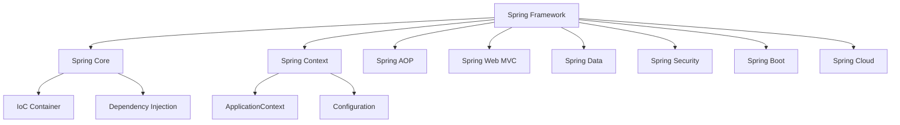
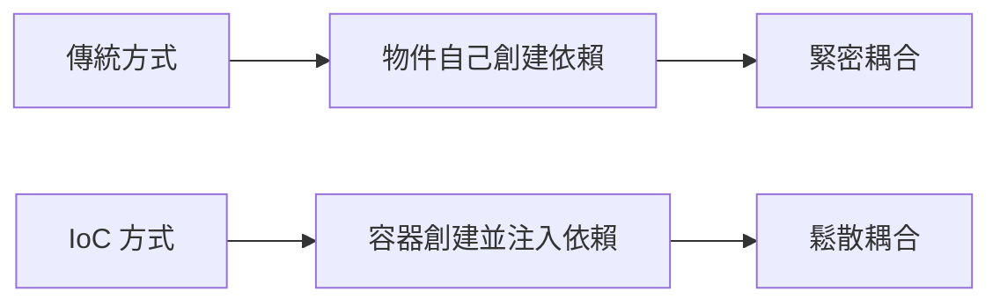
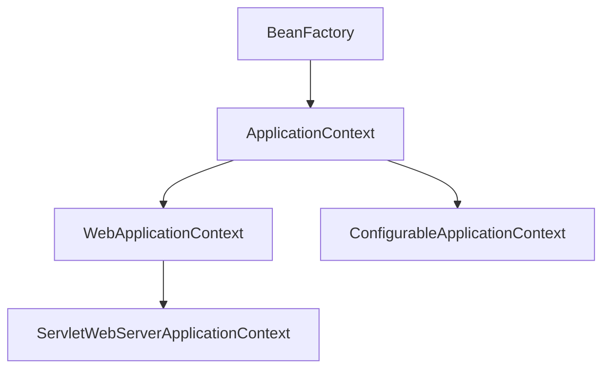
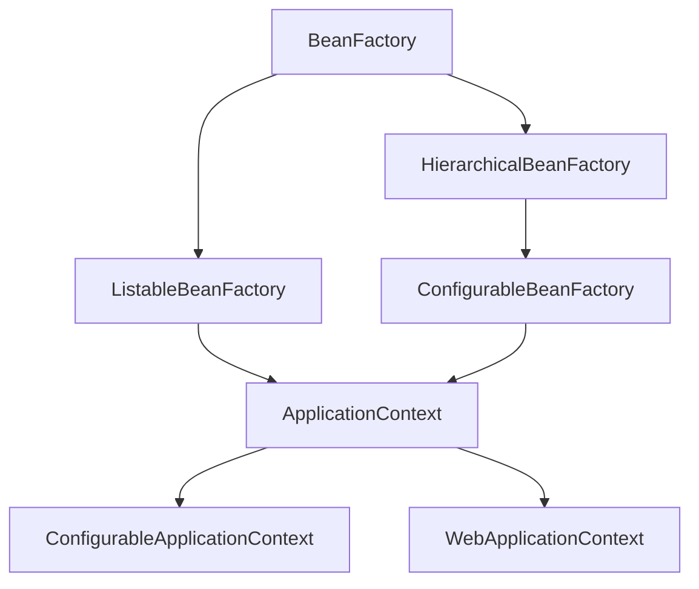
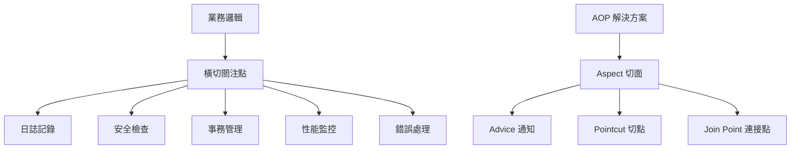
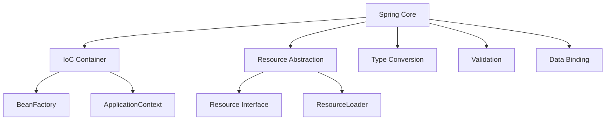
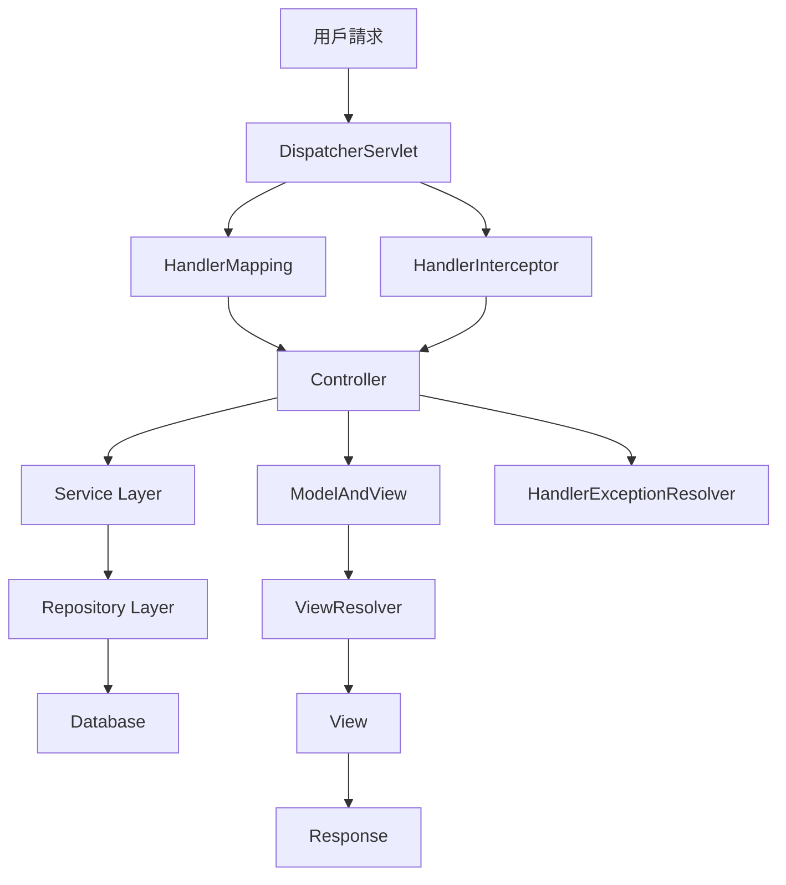
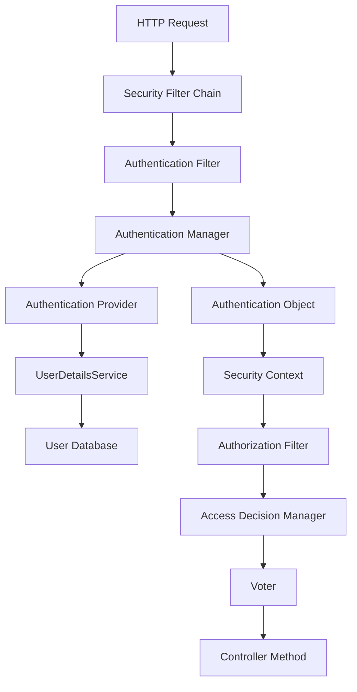
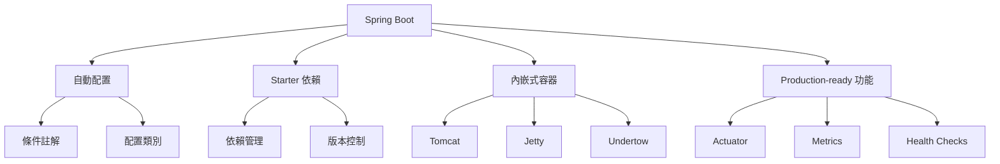

# Spring Framework 教學手冊

## 目錄

1. [Spring Framework 概述](#1-spring-framework-概述)
   - 1.1 [什麼是 Spring Framework](#11-什麼是-spring-framework)
   - 1.2 [Spring 生態系統](#12-spring-生態系統)
   - 1.3 [為什麼使用 Spring Framework](#13-為什麼使用-spring-framework)
   - 1.4 [認證考點提示](#14-認證考點提示)
   - 1.5 [實務案例](#15-實務案例)

2. [核心概念](#2-核心概念)
   - 2.1 [控制反轉 (Inversion of Control, IoC)](#21-控制反轉-inversion-of-control-ioc)
   - 2.2 [依賴注入 (Dependency Injection, DI)](#22-依賴注入-dependency-injection-di)
   - 2.3 [Bean 的概念](#23-bean-的概念)

3. [IoC 容器與依賴注入](#3-ioc-容器與依賴注入)
   - 3.1 [IoC 容器深入解析](#31-ioc-容器深入解析)
   - 3.2 [BeanFactory vs ApplicationContext](#32-beanfactory-vs-applicationcontext)
     - 3.2.1 [BeanFactory](#321-beanfactory)
     - 3.2.2 [ApplicationContext](#322-applicationcontext)
   - 3.3 [Bean 定義與註冊](#33-bean-定義與註冊)
     - 3.3.1 [註解驅動的配置](#331-註解驅動的配置)
     - 3.3.2 [Java 配置方式](#332-java-配置方式)
   - 3.4 [依賴注入的進階特性](#34-依賴注入的進階特性)
     - 3.4.1 [條件式注入](#341-條件式注入)
     - 3.4.2 [Qualifier 與 Primary](#342-qualifier-與-primary)
   - 3.5 [Bean 生命週期](#35-bean-生命週期)
   - 3.6 [ApplicationContext 事件機制](#36-applicationcontext-事件機制)
     - 3.6.1 [內建事件](#361-內建事件)
     - 3.6.2 [自定義事件](#362-自定義事件)
   - 3.7 [認證考點提示](#37-認證考點提示)
   - 3.8 [實務案例](#38-實務案例)

4. [Bean 管理](#4-bean-管理)
   - 4.1 [Bean 的作用域](#41-bean-的作用域)
     - 4.1.1 [Singleton 作用域](#411-singleton-作用域)
     - 4.1.2 [Prototype 作用域](#412-prototype-作用域)
     - 4.1.3 [Web 作用域](#413-web-作用域)
   - 4.2 [Bean 的初始化和銷毀](#42-bean-的初始化和銷毀)
     - 4.2.1 [初始化方法](#421-初始化方法)
     - 4.2.2 [銷毀方法](#422-銷毀方法)
   - 4.3 [Bean 的延遲初始化](#43-bean-的延遲初始化)
   - 4.4 [條件式 Bean 創建](#44-條件式-bean-創建)
     - 4.4.1 [內建條件註解](#441-內建條件註解)
     - 4.4.2 [自定義條件](#442-自定義條件)
   - 4.5 [Profile 環境配置](#45-profile-環境配置)
   - 4.6 [Factory Bean 模式](#46-factory-bean-模式)
   - 4.7 [認證考點提示](#47-認證考點提示)
   - 4.8 [實務案例](#48-實務案例)

5. [面向切面程式設計 (AOP)](#5-面向切面程式設計-aop)
   - 5.1 [AOP 核心概念](#51-aop-核心概念)
     - 5.1.1 [AOP 術語](#511-aop-術語)
   - 5.2 [Spring AOP vs AspectJ](#52-spring-aop-vs-aspectj)
   - 5.3 [Advice 類型](#53-advice-類型)
     - 5.3.1 [Before Advice](#531-before-advice)
     - 5.3.2 [After Advice](#532-after-advice)
     - 5.3.3 [Around Advice](#533-around-advice)
   - 5.4 [Pointcut 表達式](#54-pointcut-表達式)
     - 5.4.1 [執行切點](#541-執行切點)
     - 5.4.2 [常用切點表達式](#542-常用切點表達式)
   - 5.5 [自定義註解與 AOP](#55-自定義註解與-aop)
     - 5.5.1 [創建自定義註解](#551-創建自定義註解)
     - 5.5.2 [實現註解切面](#552-實現註解切面)
   - 5.6 [AOP 配置](#56-aop-配置)
     - 5.6.1 [啟用 AOP](#561-啟用-aop)
     - 5.6.2 [代理機制](#562-代理機制)
   - 5.7 [認證考點提示](#57-認證考點提示)
   - 5.8 [實務案例](#58-實務案例)

6. [Spring 核心模組](#6-spring-核心模組)
   - 6.1 [Spring Core 模組](#61-spring-core-模組)
     - 6.1.1 [Core 模組架構](#611-core-模組架構)
     - 6.1.2 [Resource 抽象化](#612-resource-抽象化)
     - 6.1.3 [類型轉換系統](#613-類型轉換系統)
   - 6.2 [Spring Context 模組](#62-spring-context-模組)
     - 6.2.1 [ApplicationContext 功能](#621-applicationcontext-功能)
     - 6.2.2 [國際化支援](#622-國際化支援)
   - 6.3 [Spring Beans 模組](#63-spring-beans-模組)
     - 6.3.1 [BeanWrapper 和屬性存取](#631-beanwrapper-和屬性存取)
     - 6.3.2 [Bean 定義的程式化創建](#632-bean-定義的程式化創建)
   - 6.4 [Spring Expression Language (SpEL)](#64-spring-expression-language-spel)
     - 6.4.1 [SpEL 基本語法](#641-spel-基本語法)
     - 6.4.2 [SpEL 在配置中的應用](#642-spel-在配置中的應用)
   - 6.5 [Environment 抽象化](#65-environment-抽象化)
     - 6.5.1 [Profile 和屬性管理](#651-profile-和屬性管理)
   - 6.6 [認證考點提示](#66-認證考點提示)
   - 6.7 [實務案例](#67-實務案例)

7. [Spring MVC 與 Web 開發](#7-spring-mvc-與-web-開發)
   - 7.1 [Spring MVC 架構概述](#71-spring-mvc-架構概述)
   - 7.2 [DispatcherServlet 配置](#72-dispatcherservlet-配置)
     - 7.2.1 [Java 配置方式](#721-java-配置方式)
     - 7.2.2 [Spring Boot 簡化配置](#722-spring-boot-簡化配置)
   - 7.3 [Controller 開發](#73-controller-開發)
     - 7.3.1 [基本 Controller](#731-基本-controller)
     - 7.3.2 [REST API Controller](#732-rest-api-controller)
   - 7.4 [請求處理和參數綁定](#74-請求處理和參數綁定)
     - 7.4.1 [各種參數類型](#741-各種參數類型)
     - 7.4.2 [自定義參數解析器](#742-自定義參數解析器)
   - 7.5 [異常處理](#75-異常處理)
     - 7.5.1 [全域異常處理](#751-全域異常處理)
   - 7.6 [攔截器](#76-攔截器)
     - 7.6.1 [自定義攔截器](#761-自定義攔截器)
   - 7.7 [認證考點提示](#77-認證考點提示)
   - 7.8 [實務案例](#78-實務案例)

8. [資料存取層](#8-資料存取層)
   - 8.1 [Spring JDBC](#81-spring-jdbc)
     - 8.1.1 [JdbcTemplate 基本使用](#811-jdbctemplate-基本使用)
     - 8.1.2 [NamedParameterJdbcTemplate 使用](#812-namedparameterjdbctemplate-使用)
   - 8.2 [Spring Data JPA](#82-spring-data-jpa)
     - 8.2.1 [基本配置](#821-基本配置)
     - 8.2.2 [Repository 介面](#822-repository-介面)
     - 8.2.3 [自定義 Repository 實現](#823-自定義-repository-實現)
   - 8.3 [事務管理](#83-事務管理)
     - 8.3.1 [聲明式事務](#831-聲明式事務)
     - 8.3.2 [程式化事務](#832-程式化事務)
   - 8.4 [認證考點提示](#84-認證考點提示)
   - 8.5 [實務案例](#85-實務案例)

9. [Spring Security](#9-spring-security)
   - 9.1 [Spring Security 概述](#91-spring-security-概述)
   - 9.2 [基本配置](#92-基本配置)
     - 9.2.1 [Security 配置類](#921-security-配置類)
     - 9.2.2 [UserDetailsService 實現](#922-userdetailsservice-實現)
   - 9.3 [JWT 認證實現](#93-jwt-認證實現)
     - 9.3.1 [JWT 工具類](#931-jwt-工具類)
     - 9.3.2 [JWT 認證過濾器](#932-jwt-認證過濾器)
   - 9.4 [認證控制器](#94-認證控制器)
   - 9.5 [方法級安全](#95-方法級安全)
     - 9.5.1 [方法安全註解](#951-方法安全註解)
   - 9.6 [認證考點提示](#96-認證考點提示)
   - 9.7 [實務案例](#97-實務案例)

10. [Spring Boot 整合](#10-spring-boot-整合)
    - 10.1 [Spring Boot 概述](#101-spring-boot-概述)
      - 10.1.1 [Spring Boot 核心特性](#1011-spring-boot-核心特性)
    - 10.2 [Spring Boot 專案設定](#102-spring-boot-專案設定)
      - 10.2.1 [Maven 配置](#1021-maven-配置)
      - 10.2.2 [主應用程式類別](#1022-主應用程式類別)
    - 10.3 [配置管理](#103-配置管理)
      - 10.3.1 [application.yml 配置](#1031-applicationyml-配置)
      - 10.3.2 [配置屬性類別](#1032-配置屬性類別)
    - 10.4 [自動配置](#104-自動配置)
      - 10.4.1 [自定義自動配置類別](#1041-自定義自動配置類別)
      - 10.4.2 [條件註解的使用](#1042-條件註解的使用)
    - 10.5 [Spring Boot Actuator](#105-spring-boot-actuator)
      - 10.5.1 [健康檢查](#1051-健康檢查)
      - 10.5.2 [自定義指標](#1052-自定義指標)
    - 10.6 [認證考點提示](#106-認證考點提示)
    - 10.7 [實務案例](#107-實務案例)

11. [最佳實務](#11-最佳實務)
    - 11.1 [Spring 開發最佳實務](#111-spring-開發最佳實務)
      - 11.1.1 [依賴注入最佳實務](#1111-依賴注入最佳實務)
      - 11.1.2 [Bean 配置最佳實務](#1112-bean-配置最佳實務)
    - 11.2 [測試最佳實務](#112-測試最佳實務)
      - 11.2.1 [單元測試](#1121-單元測試)
      - 11.2.2 [整合測試](#1122-整合測試)
    - 11.3 [安全性最佳實務](#113-安全性最佳實務)
      - 11.3.1 [輸入驗證](#1131-輸入驗證)
      - 11.3.2 [認證和授權](#1132-認證和授權)
    - 11.4 [效能優化最佳實務](#114-效能優化最佳實務)
      - 11.4.1 [連接池配置](#1141-連接池配置)
      - 11.4.2 [快取策略](#1142-快取策略)
    - 11.5 [認證考點提示](#115-認證考點提示)

12. [認證考試重點](#12-認證考試重點)
    - 12.1 [Spring 專業認證概述](#121-spring-專業認證概述)
    - 12.2 [核心概念考點](#122-核心概念考點)
      - 12.2.1 [IoC 和依賴注入](#1221-ioc-和依賴注入)
    - 12.3 [Spring Boot 考點](#123-spring-boot-考點)
      - 12.3.1 [自動配置](#1231-自動配置)

13. [練習題與答案](#13-練習題與答案)
    - 13.1 [IoC 容器與依賴注入](#131-ioc-容器與依賴注入)
      - 13.1.1 [基礎題](#1311-基礎題)
    - 13.2 [AOP 相關練習](#132-aop-相關練習)
    - 13.3 [Spring MVC 練習](#133-spring-mvc-練習)
    - 13.4 [事務管理練習](#134-事務管理練習)
    - 13.5 [Spring Boot 練習](#135-spring-boot-練習)
    - 13.6 [測試相關練習](#136-測試相關練習)
    - 13.7 [綜合練習](#137-綜合練習)
    - 13.8 [答案解析總結](#138-答案解析總結)

14. [檢查清單](#14-檢查清單)
    - 14.1 [學習進度檢查清單](#141-學習進度檢查清單)
      - 14.1.1 [Spring Framework 核心 ✓](#1411-spring-framework-核心-)
    - 14.2 [總結](#142-總結)

---

## 1. Spring Framework 概述

### 1.1 什麼是 Spring Framework

Spring Framework 是一個輕量級的 Java 企業級應用程式開發框架，由 Rod Johnson 於 2003 年創建。它提供了一個全面的程式設計和配置模型，用於現代 Java 企業應用程式。

**核心特色：**
- **輕量級**：不依賴容器，可在任何 Java 環境中運行
- **非侵入性**：應用程式代碼不需要實現 Spring 特定的接口
- **控制反轉 (IoC)**：管理物件的創建和依賴關係
- **面向切面程式設計 (AOP)**：將橫切關注點與業務邏輯分離
- **容器功能**：管理應用程式中的物件生命週期

### 1.2 Spring 生態系統



### 1.3 為什麼使用 Spring Framework

**傳統 Java 開發的問題：**
```java
// 傳統方式 - 緊密耦合
public class UserService {
    private UserDAO userDAO = new UserDAOImpl(); // 直接創建依賴
    
    public User getUser(Long id) {
        return userDAO.findById(id);
    }
}
```

**Spring 解決方案：**
```java
// Spring 方式 - 鬆散耦合
@Service
public class UserService {
    @Autowired
    private UserDAO userDAO; // Spring 自動注入依賴
    
    public User getUser(Long id) {
        return userDAO.findById(id);
    }
}
```

### 1.4 認證考點提示
- 理解 Spring Framework 的核心價值主張
- 熟悉 Spring 生態系統的主要模組
- 了解 Spring 與傳統 Java 開發的差異

### 1.5 實務案例
在企業專案中，Spring Framework 常用於：
- **微服務架構**：使用 Spring Boot 快速建立服務
- **Web 應用程式**：使用 Spring MVC 建立 RESTful API
- **資料存取**：使用 Spring Data 簡化資料庫操作
- **安全性**：使用 Spring Security 實現認證和授權

---

## 2. 核心概念

### 2.1 控制反轉 (Inversion of Control, IoC)

控制反轉是一種程式設計原則，將物件的創建和依賴關係的管理從應用程式代碼轉移到外部容器。

**概念圖解：**


**範例說明：**

**傳統方式：**
```java
public class OrderService {
    private PaymentService paymentService;
    private EmailService emailService;
    
    public OrderService() {
        // 物件自己創建依賴 - 控制權在物件本身
        this.paymentService = new PaymentServiceImpl();
        this.emailService = new EmailServiceImpl();
    }
}
```

**IoC 方式：**
```java
@Service
public class OrderService {
    private final PaymentService paymentService;
    private final EmailService emailService;
    
    // 控制權交給 Spring 容器
    public OrderService(PaymentService paymentService, EmailService emailService) {
        this.paymentService = paymentService;
        this.emailService = emailService;
    }
}
```

### 2.2 依賴注入 (Dependency Injection, DI)

依賴注入是實現 IoC 的一種技術，透過外部容器將依賴物件注入到目標物件中。

**三種注入方式：**

#### 2.2.1 建構子注入 (Constructor Injection)
```java
@Service
public class UserService {
    private final UserRepository userRepository;
    private final EmailService emailService;
    
    // 推薦方式：建構子注入
    public UserService(UserRepository userRepository, EmailService emailService) {
        this.userRepository = userRepository;
        this.emailService = emailService;
    }
}
```

#### 2.2.2 Setter 注入 (Setter Injection)
```java
@Service
public class UserService {
    private UserRepository userRepository;
    private EmailService emailService;
    
    @Autowired
    public void setUserRepository(UserRepository userRepository) {
        this.userRepository = userRepository;
    }
    
    @Autowired
    public void setEmailService(EmailService emailService) {
        this.emailService = emailService;
    }
}
```

#### 2.2.3 欄位注入 (Field Injection)
```java
@Service
public class UserService {
    @Autowired
    private UserRepository userRepository;
    
    @Autowired
    private EmailService emailService;
}
```

**最佳實務建議：**
- **優先使用建構子注入**：保證依賴的不可變性和必要性
- **避免欄位注入**：難以測試和可能的循環依賴
- **Setter 注入用於可選依賴**：非必要的依賴項

### 2.3 Bean 的概念

在 Spring 中，Bean 是由 IoC 容器管理的物件。

**Bean 的特徵：**
- 由 Spring 容器實例化
- 由 Spring 容器管理生命週期
- 由 Spring 容器注入依賴

**Bean 定義方式：**

#### 2.3.1 註解方式
```java
@Component
public class UserService {
    // Spring 會自動創建 UserService 的實例
}

@Service
public class OrderService {
    // @Service 是 @Component 的特化註解
}

@Repository
public class UserRepository {
    // @Repository 是 @Component 的特化註解
}

@Controller
public class UserController {
    // @Controller 是 @Component 的特化註解
}
```

#### 2.3.2 Java 配置方式
```java
@Configuration
public class AppConfig {
    
    @Bean
    public UserService userService() {
        return new UserService();
    }
    
    @Bean
    public UserRepository userRepository() {
        return new UserRepositoryImpl();
    }
}
```

### 2.4 ApplicationContext

ApplicationContext 是 Spring 的 IoC 容器，負責管理 Bean 的生命週期和依賴注入。

**ApplicationContext 層級結構：**


**常用 ApplicationContext 實現：**
```java
// 註解配置
ApplicationContext context = new AnnotationConfigApplicationContext(AppConfig.class);

// XML 配置
ApplicationContext context = new ClassPathXmlApplicationContext("applicationContext.xml");

// Web 應用程式
// 通常由 Spring Boot 自動配置
```

### 2.5 認證考點提示
- **IoC vs DI**：理解概念差異和實現方式
- **注入類型**：掌握三種注入方式的優缺點
- **Bean 生命週期**：了解 Bean 的創建、初始化、銷毀過程
- **ApplicationContext 功能**：超越 BeanFactory 的額外功能

### 2.6 實務案例
```java
// 實際專案中的服務層設計
@Service
@Transactional
public class OrderService {
    private final OrderRepository orderRepository;
    private final PaymentService paymentService;
    private final EmailService emailService;
    
    public OrderService(OrderRepository orderRepository,
                       PaymentService paymentService,
                       EmailService emailService) {
        this.orderRepository = orderRepository;
        this.paymentService = paymentService;
        this.emailService = emailService;
    }
    
    public Order createOrder(OrderRequest request) {
        // 1. 創建訂單
        Order order = new Order(request);
        order = orderRepository.save(order);
        
        // 2. 處理付款
        Payment payment = paymentService.processPayment(order);
        
        // 3. 發送確認郵件
        emailService.sendOrderConfirmation(order);
        
        return order;
    }
}
```

**注意事項：**
- 避免循環依賴
- 合理設計 Bean 的作用域
- 注意線程安全性
- 適當使用 @Lazy 延遲初始化

---

## 3. IoC 容器與依賴注入

### 3.1 IoC 容器深入解析

Spring IoC 容器是 Spring Framework 的核心，負責創建物件、配置物件、組裝物件之間的依賴關係，並管理這些物件的完整生命週期。

**容器階層結構：**


### 3.2 BeanFactory vs ApplicationContext

#### 3.2.1 BeanFactory
- 基本的 IoC 容器
- 延遲載入 Bean
- 較少的功能

```java
public interface BeanFactory {
    Object getBean(String name) throws BeansException;
    <T> T getBean(String name, Class<T> requiredType) throws BeansException;
    boolean containsBean(String name);
    boolean isSingleton(String name) throws NoSuchBeanDefinitionException;
    // ... 其他方法
}
```

#### 3.2.2 ApplicationContext
- 企業級應用程式功能
- 預先載入所有 Bean
- 支援國際化、事件發布、AOP

```java
// ApplicationContext 的額外功能
ApplicationContext context = new AnnotationConfigApplicationContext(AppConfig.class);

// 1. 國際化支援
String message = context.getMessage("welcome.message", null, Locale.getDefault());

// 2. 事件發布
context.publishEvent(new UserRegisteredEvent(user));

// 3. 資源載入
Resource resource = context.getResource("classpath:config.properties");
```

### 3.3 Bean 定義與註冊

#### 3.3.1 註解驅動的配置

**基本註解：**
```java
@Configuration
@ComponentScan(basePackages = "com.tutorial")
@EnableAutoConfiguration
public class AppConfig {
}

// 各種 Component 註解
@Component        // 通用元件
@Service         // 服務層
@Repository      // 資料存取層
@Controller      // 控制層
@RestController  // REST 控制層
```

**Bean 作用域：**
```java
@Service
@Scope("singleton")    // 預設，單例
public class UserService { }

@Service
@Scope("prototype")    // 每次請求新實例
public class OrderService { }

@Controller
@Scope("session")      // Web 環境，每個 session 一個實例
public class UserController { }
```

#### 3.3.2 Java 配置方式

```java
@Configuration
public class DatabaseConfig {
    
    @Bean
    @Primary
    public DataSource primaryDataSource() {
        HikariDataSource dataSource = new HikariDataSource();
        dataSource.setJdbcUrl("jdbc:mysql://localhost:3306/primary");
        dataSource.setUsername("user");
        dataSource.setPassword("password");
        return dataSource;
    }
    
    @Bean("secondaryDS")
    public DataSource secondaryDataSource() {
        HikariDataSource dataSource = new HikariDataSource();
        dataSource.setJdbcUrl("jdbc:mysql://localhost:3306/secondary");
        return dataSource;
    }
    
    @Bean
    @Profile("development")
    public UserService devUserService() {
        return new DevUserService();
    }
    
    @Bean
    @Profile("production")
    public UserService prodUserService() {
        return new ProdUserService();
    }
}
```

### 3.4 依賴注入的進階特性

#### 3.4.1 條件式注入

```java
@Service
public class NotificationService {
    private final List<NotificationProvider> providers;
    
    // 注入所有 NotificationProvider 實現
    public NotificationService(List<NotificationProvider> providers) {
        this.providers = providers;
    }
}

@Component
@ConditionalOnProperty(name = "email.enabled", havingValue = "true")
public class EmailNotificationProvider implements NotificationProvider {
    // 只有在配置 email.enabled=true 時才會創建
}

@Component
@ConditionalOnClass(SmsClient.class)
public class SmsNotificationProvider implements NotificationProvider {
    // 只有在 classpath 中存在 SmsClient 類別時才會創建
}
```

#### 3.4.2 Qualifier 與 Primary

```java
public interface PaymentProcessor {
    void process(Payment payment);
}

@Component
@Primary
public class CreditCardProcessor implements PaymentProcessor {
    @Override
    public void process(Payment payment) {
        // 信用卡處理邏輯
    }
}

@Component
@Qualifier("paypal")
public class PayPalProcessor implements PaymentProcessor {
    @Override
    public void process(Payment payment) {
        // PayPal 處理邏輯
    }
}

@Service
public class OrderService {
    private final PaymentProcessor defaultProcessor;
    private final PaymentProcessor paypalProcessor;
    
    public OrderService(PaymentProcessor defaultProcessor,
                       @Qualifier("paypal") PaymentProcessor paypalProcessor) {
        this.defaultProcessor = defaultProcessor;    // 注入 @Primary
        this.paypalProcessor = paypalProcessor;      // 注入指定的 Qualifier
    }
}
```

### 3.5 Bean 生命週期

```mermaid
graph TD
    A[容器啟動] --> B[讀取 Bean 定義]
    B --> C[實例化 Bean]
    C --> D[設定屬性值]
    D --> E[BeanNameAware.setBeanName]
    E --> F[BeanFactoryAware.setBeanFactory]
    F --> G[ApplicationContextAware.setApplicationContext]
    G --> H[BeanPostProcessor.postProcessBeforeInitialization]
    H --> I[@PostConstruct 方法]
    I --> J[InitializingBean.afterPropertiesSet]
    J --> K[自定義 init-method]
    K --> L[BeanPostProcessor.postProcessAfterInitialization]
    L --> M[Bean 可用]
    M --> N[容器關閉]
    N --> O[@PreDestroy 方法]
    O --> P[DisposableBean.destroy]
    P --> Q[自定義 destroy-method]
```

**生命週期實作範例：**
```java
@Component
public class DatabaseConnectionBean implements BeanNameAware, 
                                             BeanFactoryAware,
                                             ApplicationContextAware,
                                             InitializingBean,
                                             DisposableBean {
    
    private String beanName;
    private BeanFactory beanFactory;
    private ApplicationContext applicationContext;
    
    @Override
    public void setBeanName(String name) {
        this.beanName = name;
        System.out.println("BeanNameAware: " + name);
    }
    
    @Override
    public void setBeanFactory(BeanFactory beanFactory) throws BeansException {
        this.beanFactory = beanFactory;
        System.out.println("BeanFactoryAware 被調用");
    }
    
    @Override
    public void setApplicationContext(ApplicationContext applicationContext) throws BeansException {
        this.applicationContext = applicationContext;
        System.out.println("ApplicationContextAware 被調用");
    }
    
    @PostConstruct
    public void postConstruct() {
        System.out.println("@PostConstruct 被調用");
        // 初始化資料庫連接
    }
    
    @Override
    public void afterPropertiesSet() throws Exception {
        System.out.println("InitializingBean.afterPropertiesSet 被調用");
    }
    
    @PreDestroy
    public void preDestroy() {
        System.out.println("@PreDestroy 被調用");
        // 清理資源
    }
    
    @Override
    public void destroy() throws Exception {
        System.out.println("DisposableBean.destroy 被調用");
    }
}
```

### 3.6 ApplicationContext 事件機制

#### 3.6.1 內建事件

```java
@Component
public class ApplicationEventListener {
    
    @EventListener
    public void handleContextRefreshed(ContextRefreshedEvent event) {
        System.out.println("ApplicationContext 已刷新");
    }
    
    @EventListener
    public void handleContextStarted(ContextStartedEvent event) {
        System.out.println("ApplicationContext 已啟動");
    }
    
    @EventListener
    public void handleContextStopped(ContextStoppedEvent event) {
        System.out.println("ApplicationContext 已停止");
    }
}
```

#### 3.6.2 自定義事件

```java
// 自定義事件
public class UserRegisteredEvent extends ApplicationEvent {
    private final User user;
    
    public UserRegisteredEvent(Object source, User user) {
        super(source);
        this.user = user;
    }
    
    public User getUser() {
        return user;
    }
}

// 事件發布者
@Service
public class UserService {
    private final ApplicationEventPublisher eventPublisher;
    
    public UserService(ApplicationEventPublisher eventPublisher) {
        this.eventPublisher = eventPublisher;
    }
    
    public User registerUser(UserRegistrationRequest request) {
        User user = new User(request);
        // 保存用戶邏輯...
        
        // 發布事件
        eventPublisher.publishEvent(new UserRegisteredEvent(this, user));
        
        return user;
    }
}

// 事件監聽器
@Component
public class UserEventHandler {
    
    @EventListener
    @Async
    public void handleUserRegistered(UserRegisteredEvent event) {
        User user = event.getUser();
        // 發送歡迎郵件
        sendWelcomeEmail(user);
    }
    
    @EventListener
    @Order(1)
    public void updateUserStatistics(UserRegisteredEvent event) {
        // 更新用戶統計
    }
}
```

### 3.7 認證考點提示

**重要考點：**
- BeanFactory 與 ApplicationContext 的差異
- Bean 的作用域和生命週期
- 依賴注入的三種方式及最佳實務
- @Qualifier、@Primary 的使用
- Bean 的初始化和銷毀回調方法
- ApplicationContext 的事件機制

### 3.8 實務案例

```java
// 完整的服務配置範例
@Configuration
@EnableScheduling
@EnableAsync
public class ServiceConfig {
    
    @Bean
    @ConfigurationProperties(prefix = "app.cache")
    public CacheProperties cacheProperties() {
        return new CacheProperties();
    }
    
    @Bean
    @ConditionalOnProperty(name = "app.cache.enabled", havingValue = "true")
    public CacheManager cacheManager(CacheProperties properties) {
        RedisCacheManager.Builder builder = RedisCacheManager
            .RedisCacheManagerBuilder
            .fromConnectionFactory(redisConnectionFactory())
            .cacheDefaults(cacheConfiguration(properties));
            
        return builder.build();
    }
    
    @Bean
    @Profile("!test")
    public RedisConnectionFactory redisConnectionFactory() {
        LettuceConnectionFactory factory = new LettuceConnectionFactory();
        factory.setHostName("localhost");
        factory.setPort(6379);
        return factory;
    }
}
```

**注意事項：**
- 避免循環依賴，使用 @Lazy 或重構設計
- 合理使用 Bean 作用域，注意線程安全
- 適當使用條件式 Bean 創建
- 妥善處理 Bean 的初始化和清理工作
- 利用事件機制實現鬆散耦合的架構

---

## 4. Bean 管理

### 4.1 Bean 的作用域

Spring 支援多種 Bean 作用域，每種作用域決定了 Bean 實例的創建方式和生命週期。

**作用域類型：**

| 作用域 | 說明 | 使用場景 |
|--------|------|----------|
| singleton | 預設值，整個 ApplicationContext 中只有一個實例 | 無狀態的服務類 |
| prototype | 每次請求都創建新實例 | 有狀態的物件 |
| request | Web 環境中每個 HTTP 請求一個實例 | Web 請求特定的資料 |
| session | Web 環境中每個 HTTP Session 一個實例 | 用戶會話資料 |
| application | Web 環境中每個 ServletContext 一個實例 | 應用程式級別的資料 |

#### 4.1.1 Singleton 作用域

```java
@Component
@Scope("singleton") // 或 @Scope(ConfigurableBeanFactory.SCOPE_SINGLETON)
public class UserService {
    private int counter = 0; // 注意：線程安全問題
    
    public void incrementCounter() {
        counter++; // 在多線程環境下不安全
    }
}

// 正確的 singleton 設計
@Service
public class UserService {
    private final UserRepository userRepository;
    
    public UserService(UserRepository userRepository) {
        this.userRepository = userRepository;
    }
    
    // 無狀態方法，線程安全
    public User findById(Long id) {
        return userRepository.findById(id);
    }
}
```

#### 4.1.2 Prototype 作用域

```java
@Component
@Scope("prototype")
public class OrderProcessor {
    private Order currentOrder;
    private List<OrderItem> items = new ArrayList<>();
    
    public void setOrder(Order order) {
        this.currentOrder = order;
    }
    
    public void addItem(OrderItem item) {
        items.add(item);
    }
}

// 使用 prototype Bean
@Service
public class OrderService {
    private final ApplicationContext applicationContext;
    
    public OrderService(ApplicationContext applicationContext) {
        this.applicationContext = applicationContext;
    }
    
    public Order processOrder(OrderRequest request) {
        // 每次獲取新的 OrderProcessor 實例
        OrderProcessor processor = applicationContext.getBean(OrderProcessor.class);
        
        Order order = new Order(request);
        processor.setOrder(order);
        
        for (OrderItemRequest itemRequest : request.getItems()) {
            processor.addItem(new OrderItem(itemRequest));
        }
        
        return processor.process();
    }
}
```

#### 4.1.3 Web 作用域

```java
@Component
@Scope(value = WebApplicationContext.SCOPE_REQUEST, proxyMode = ScopedProxyMode.TARGET_CLASS)
public class RequestScopedBean {
    private String requestId = UUID.randomUUID().toString();
    
    public String getRequestId() {
        return requestId;
    }
}

@Component
@Scope(value = WebApplicationContext.SCOPE_SESSION, proxyMode = ScopedProxyMode.TARGET_CLASS)
public class UserSession {
    private User currentUser;
    private LocalDateTime loginTime;
    
    public void login(User user) {
        this.currentUser = user;
        this.loginTime = LocalDateTime.now();
    }
    
    public boolean isLoggedIn() {
        return currentUser != null;
    }
}
```

### 4.2 Bean 的初始化和銷毀

#### 4.2.1 初始化方法

```java
@Component
public class DatabaseService {
    
    private DataSource dataSource;
    
    // 方法1：使用 @PostConstruct
    @PostConstruct
    public void initialize() {
        System.out.println("DatabaseService 正在初始化...");
        // 初始化資料庫連接池
        setupConnectionPool();
    }
    
    // 方法2：實現 InitializingBean 接口
    @Override
    public void afterPropertiesSet() throws Exception {
        System.out.println("InitializingBean.afterPropertiesSet 被調用");
        validateConfiguration();
    }
    
    private void setupConnectionPool() {
        // 設定連接池邏輯
    }
    
    private void validateConfiguration() {
        // 驗證配置邏輯
    }
}

// 方法3：Java 配置中指定初始化方法
@Configuration
public class DatabaseConfig {
    
    @Bean(initMethod = "init", destroyMethod = "cleanup")
    public CustomDatabaseService customDatabaseService() {
        return new CustomDatabaseService();
    }
}

public class CustomDatabaseService {
    
    public void init() {
        System.out.println("自定義初始化方法被調用");
    }
    
    public void cleanup() {
        System.out.println("自定義清理方法被調用");
    }
}
```

#### 4.2.2 銷毀方法

```java
@Component
public class ResourceManager {
    
    private ExecutorService executorService;
    
    @PostConstruct
    public void setUp() {
        executorService = Executors.newFixedThreadPool(10);
    }
    
    // 方法1：使用 @PreDestroy
    @PreDestroy
    public void shutdown() {
        System.out.println("ResourceManager 正在關閉...");
        if (executorService != null && !executorService.isShutdown()) {
            executorService.shutdown();
            try {
                if (!executorService.awaitTermination(30, TimeUnit.SECONDS)) {
                    executorService.shutdownNow();
                }
            } catch (InterruptedException e) {
                executorService.shutdownNow();
                Thread.currentThread().interrupt();
            }
        }
    }
    
    // 方法2：實現 DisposableBean 接口
    @Override
    public void destroy() throws Exception {
        System.out.println("DisposableBean.destroy 被調用");
        // 額外的清理邏輯
    }
}
```

### 4.3 Bean 的延遲初始化

```java
// 全局延遲初始化
@Configuration
@Lazy
public class AppConfig {
    // 所有 Bean 都會延遲初始化
}

// 單個 Bean 延遲初始化
@Service
@Lazy
public class HeavyService {
    
    @PostConstruct
    public void init() {
        System.out.println("HeavyService 被初始化了"); // 只有在第一次使用時才會輸出
    }
}

// 在依賴注入時指定延遲
@Controller
public class UserController {
    
    private final UserService userService;
    
    // 只有在第一次調用 userService 時才會初始化
    public UserController(@Lazy UserService userService) {
        this.userService = userService;
    }
}
```

### 4.4 條件式 Bean 創建

#### 4.4.1 內建條件註解

```java
@Configuration
public class ConditionalConfig {
    
    @Bean
    @ConditionalOnProperty(name = "email.provider", havingValue = "gmail")
    public EmailService gmailEmailService() {
        return new GmailEmailService();
    }
    
    @Bean
    @ConditionalOnProperty(name = "email.provider", havingValue = "outlook")
    public EmailService outlookEmailService() {
        return new OutlookEmailService();
    }
    
    @Bean
    @ConditionalOnMissingBean
    public EmailService defaultEmailService() {
        return new DefaultEmailService();
    }
    
    @Bean
    @ConditionalOnClass(Redis.class)
    public CacheService redisCacheService() {
        return new RedisCacheService();
    }
    
    @Bean
    @ConditionalOnMissingClass("redis.clients.jedis.Jedis")
    public CacheService memoryCacheService() {
        return new MemoryCacheService();
    }
}
```

#### 4.4.2 自定義條件

```java
// 自定義條件類
public class WindowsCondition implements Condition {
    
    @Override
    public boolean matches(ConditionContext context, AnnotatedTypeMetadata metadata) {
        Environment environment = context.getEnvironment();
        String osName = environment.getProperty("os.name");
        return osName != null && osName.toLowerCase().contains("windows");
    }
}

@Configuration
public class OSSpecificConfig {
    
    @Bean
    @Conditional(WindowsCondition.class)
    public FileService windowsFileService() {
        return new WindowsFileService();
    }
    
    @Bean
    @ConditionalOnProperty(name = "os.name", havingValue = "Linux")
    public FileService linuxFileService() {
        return new LinuxFileService();
    }
}
```

### 4.5 Profile 環境配置

```java
@Configuration
public class EnvironmentConfig {
    
    @Bean
    @Profile("development")
    public DataSource devDataSource() {
        return DataSourceBuilder.create()
            .url("jdbc:h2:mem:devdb")
            .username("sa")
            .password("")
            .build();
    }
    
    @Bean
    @Profile("test")
    public DataSource testDataSource() {
        return DataSourceBuilder.create()
            .url("jdbc:h2:mem:testdb")
            .username("sa")
            .password("")
            .build();
    }
    
    @Bean
    @Profile("production")
    public DataSource prodDataSource() {
        return DataSourceBuilder.create()
            .url("jdbc:mysql://prod-server:3306/proddb")
            .username("${db.username}")
            .password("${db.password}")
            .build();
    }
}

// 啟動時指定 Profile
// java -Dspring.profiles.active=development -jar app.jar
// 或在 application.properties 中設定：spring.profiles.active=development

@Component
@Profile("!production")  // 除了 production 環境外都會創建
public class DebugService {
    // 除錯服務只在非正式環境中可用
}
```

### 4.6 Factory Bean 模式

```java
// 實現 FactoryBean 接口
@Component
public class ConnectionFactoryBean implements FactoryBean<Connection> {
    
    @Value("${database.url}")
    private String url;
    
    @Value("${database.username}")
    private String username;
    
    @Value("${database.password}")
    private String password;
    
    @Override
    public Connection getObject() throws Exception {
        return DriverManager.getConnection(url, username, password);
    }
    
    @Override
    public Class<?> getObjectType() {
        return Connection.class;
    }
    
    @Override
    public boolean isSingleton() {
        return false; // 每次請求都創建新的連接
    }
}

// 複雜物件的 Factory
@Component
public class HttpClientFactoryBean implements FactoryBean<CloseableHttpClient> {
    
    @Override
    public CloseableHttpClient getObject() throws Exception {
        RequestConfig requestConfig = RequestConfig.custom()
            .setConnectionRequestTimeout(5000)
            .setConnectTimeout(5000)
            .setSocketTimeout(30000)
            .build();
            
        return HttpClients.custom()
            .setDefaultRequestConfig(requestConfig)
            .setMaxConnTotal(100)
            .setMaxConnPerRoute(20)
            .build();
    }
    
    @Override
    public Class<?> getObjectType() {
        return CloseableHttpClient.class;
    }
    
    @Override
    public boolean isSingleton() {
        return true;
    }
}
```

### 4.7 認證考點提示

**重要考點：**

- **Bean 作用域**：singleton vs prototype 的差異和使用場景
- **初始化回調**：@PostConstruct vs InitializingBean vs init-method 的執行順序
- **銷毀回調**：@PreDestroy vs DisposableBean vs destroy-method
- **條件式 Bean**：各種 @Conditional 註解的使用
- **Profile 配置**：環境隔離和動態配置
- **FactoryBean**：複雜物件創建的設計模式

### 4.8 實務案例

```java
// 完整的服務配置範例
@Configuration
@EnableConfigurationProperties(AppProperties.class)
public class ServiceConfiguration {
    
    private final AppProperties appProperties;
    
    public ServiceConfiguration(AppProperties appProperties) {
        this.appProperties = appProperties;
    }
    
    @Bean
    @Scope("prototype")
    public OrderProcessor orderProcessor() {
        return new OrderProcessor();
    }
    
    @Bean
    @ConditionalOnProperty(name = "app.features.cache.enabled", havingValue = "true")
    public CacheManager cacheManager() {
        return new ConcurrentMapCacheManager("users", "orders", "products");
    }
    
    @Bean
    @Profile("!test")
    @Scope(value = "singleton", proxyMode = ScopedProxyMode.TARGET_CLASS)
    public EmailService emailService() {
        if (appProperties.getEmail().getProvider().equals("smtp")) {
            return new SmtpEmailService(appProperties.getEmail());
        } else {
            return new ApiEmailService(appProperties.getEmail());
        }
    }
    
    @Bean
    @Profile("test")
    public EmailService mockEmailService() {
        return new MockEmailService();
    }
}

@ConfigurationProperties(prefix = "app")
@Data
public class AppProperties {
    private Features features = new Features();
    private Email email = new Email();
    
    @Data
    public static class Features {
        private Cache cache = new Cache();
        
        @Data
        public static class Cache {
            private boolean enabled = false;
        }
    }
    
    @Data
    public static class Email {
        private String provider = "smtp";
        private String host;
        private int port = 587;
        private String username;
        private String password;
    }
}
```

**注意事項：**

- Singleton Bean 必須設計為線程安全
- Prototype Bean 的銷毀方法不會自動調用
- Web 作用域需要配置代理模式
- 適當使用延遲初始化避免循環依賴
- Profile 可以組合使用：@Profile("prod & cloud")

---

## 5. 面向切面程式設計 (AOP)

### 5.1 AOP 核心概念

面向切面程式設計 (Aspect-Oriented Programming) 是一種程式設計典範，用於將橫切關注點 (Cross-cutting Concerns) 從業務邏輯中分離出來。

**核心概念圖解：**



#### 5.1.1 AOP 術語

| 術語 | 說明 | 範例 |
|------|------|------|
| Aspect | 切面，橫切關注點的模組化 | 日誌切面、安全切面 |
| Join Point | 連接點，程式執行過程中的特定點 | 方法調用、異常拋出 |
| Pointcut | 切點，定義在哪些 Join Point 上應用 Advice | 所有 Service 方法 |
| Advice | 通知，在特定 Join Point 執行的代碼 | 方法執行前記錄日誌 |
| Target Object | 目標物件，被一個或多個切面所通知的物件 | UserService 實例 |
| AOP Proxy | AOP 代理，框架創建的物件 | JDK 動態代理或 CGLIB 代理 |

### 5.2 Spring AOP vs AspectJ

| 特性 | Spring AOP | AspectJ |
|------|------------|---------|
| 編織時機 | 運行時 | 編譯時/載入時/運行時 |
| 功能完整性 | 基本功能 | 完整 AOP 功能 |
| 性能 | 較低 | 較高 |
| 複雜度 | 簡單 | 複雜 |
| 支援的 Join Point | 僅方法調用 | 所有 Join Point |

### 5.3 Advice 類型

#### 5.3.1 Before Advice

```java
@Aspect
@Component
public class LoggingAspect {
    
    private static final Logger logger = LoggerFactory.getLogger(LoggingAspect.class);
    
    @Before("execution(* com.tutorial.service.*.*(..))")
    public void logMethodEntry(JoinPoint joinPoint) {
        String methodName = joinPoint.getSignature().getName();
        String className = joinPoint.getTarget().getClass().getSimpleName();
        Object[] args = joinPoint.getArgs();
        
        logger.info("進入方法: {}.{}, 參數: {}", className, methodName, Arrays.toString(args));
    }
    
    @Before("@annotation(secured)")
    public void checkSecurity(JoinPoint joinPoint, Secured secured) {
        String role = secured.value();
        // 檢查當前用戶是否有指定角色
        if (!SecurityContextHolder.getContext().getAuthentication().getAuthorities()
            .stream().anyMatch(auth -> auth.getAuthority().equals(role))) {
            throw new AccessDeniedException("權限不足: 需要 " + role + " 角色");
        }
    }
}
```

#### 5.3.2 After Advice

```java
@Aspect
@Component
public class AuditAspect {
    
    @Autowired
    private AuditService auditService;
    
    @After("execution(* com.tutorial.service.UserService.create*(..))")
    public void auditUserCreation(JoinPoint joinPoint) {
        Object[] args = joinPoint.getArgs();
        if (args.length > 0 && args[0] instanceof User) {
            User user = (User) args[0];
            auditService.logUserCreation(user.getId(), getCurrentUser());
        }
    }
    
    @AfterReturning(value = "execution(* com.tutorial.service.*Service.save*(..))", 
                   returning = "result")
    public void logSuccessfulSave(JoinPoint joinPoint, Object result) {
        logger.info("成功保存: {}, 結果: {}", joinPoint.getSignature().getName(), result);
    }
    
    @AfterThrowing(value = "execution(* com.tutorial.service.*.*(..))", 
                  throwing = "exception")
    public void logException(JoinPoint joinPoint, Exception exception) {
        logger.error("方法 {} 拋出異常: {}", joinPoint.getSignature().getName(), 
                    exception.getMessage(), exception);
    }
}
```

#### 5.3.3 Around Advice

```java
@Aspect
@Component
public class PerformanceAspect {
    
    private static final Logger logger = LoggerFactory.getLogger(PerformanceAspect.class);
    
    @Around("execution(* com.tutorial.service.*.*(..))")
    public Object measureExecutionTime(ProceedingJoinPoint joinPoint) throws Throwable {
        long startTime = System.currentTimeMillis();
        String methodName = joinPoint.getSignature().getName();
        
        try {
            // 執行目標方法
            Object result = joinPoint.proceed();
            
            long endTime = System.currentTimeMillis();
            long executionTime = endTime - startTime;
            
            logger.info("方法 {} 執行時間: {} ms", methodName, executionTime);
            
            return result;
        } catch (Exception e) {
            long endTime = System.currentTimeMillis();
            long executionTime = endTime - startTime;
            
            logger.error("方法 {} 執行失敗，耗時: {} ms, 異常: {}", 
                        methodName, executionTime, e.getMessage());
            throw e;
        }
    }
    
    @Around("@annotation(cacheable)")
    public Object handleCaching(ProceedingJoinPoint joinPoint, Cacheable cacheable) throws Throwable {
        String cacheKey = generateCacheKey(joinPoint, cacheable);
        
        // 檢查快取
        Object cachedResult = cacheManager.get(cacheKey);
        if (cachedResult != null) {
            logger.debug("快取命中: {}", cacheKey);
            return cachedResult;
        }
        
        // 執行方法並快取結果
        Object result = joinPoint.proceed();
        cacheManager.put(cacheKey, result);
        logger.debug("結果已快取: {}", cacheKey);
        
        return result;
    }
}
```

### 5.4 Pointcut 表達式

#### 5.4.1 執行切點

```java
@Aspect
@Component
public class PointcutExamples {
    
    // 1. 方法執行切點
    @Pointcut("execution(public * com.tutorial.service.*.*(..))")
    public void serviceLayer() {}
    
    @Pointcut("execution(* com.tutorial.repository.*Repository.*(..))")
    public void repositoryLayer() {}
    
    @Pointcut("execution(* com.tutorial.controller.*Controller.*(..))")
    public void controllerLayer() {}
    
    // 2. 參數匹配
    @Pointcut("execution(* com.tutorial.service.*.*(Long, ..))")
    public void methodsWithLongFirstParam() {}
    
    // 3. 返回類型匹配
    @Pointcut("execution(com.tutorial.model.User com.tutorial.service.*.*(..))")
    public void methodsReturningUser() {}
    
    // 4. 註解切點
    @Pointcut("@annotation(org.springframework.transaction.annotation.Transactional)")
    public void transactionalMethods() {}
    
    @Pointcut("@within(org.springframework.stereotype.Service)")
    public void serviceAnnotatedClasses() {}
    
    // 5. 組合切點
    @Pointcut("serviceLayer() && transactionalMethods()")
    public void transactionalServiceMethods() {}
    
    @Pointcut("serviceLayer() || repositoryLayer()")
    public void dataAccessLayers() {}
    
    @Pointcut("serviceLayer() && !execution(* com.tutorial.service.*Service.get*(..))")
    public void nonGetterServiceMethods() {}
}
```

#### 5.4.2 常用切點表達式

```java
@Component
@Aspect
public class CommonPointcuts {
    
    // 所有公共方法
    @Pointcut("execution(public * *(..))")
    public void anyPublicMethod() {}
    
    // 特定包下的所有方法
    @Pointcut("within(com.tutorial.service..*)")
    public void inServicePackage() {}
    
    // 實現特定接口的類
    @Pointcut("this(com.tutorial.service.UserService)")
    public void userServiceProxy() {}
    
    // 目標物件實現特定接口
    @Pointcut("target(com.tutorial.service.UserService)")
    public void userServiceTarget() {}
    
    // Bean 名稱匹配
    @Pointcut("bean(userService)")
    public void userServiceBean() {}
    
    @Pointcut("bean(*Service)")
    public void anyServiceBean() {}
    
    // 自定義註解
    @Pointcut("@annotation(com.tutorial.annotation.Auditable)")
    public void auditableMethods() {}
    
    @Pointcut("@args(com.tutorial.annotation.Validated)")
    public void methodsWithValidatedArgs() {}
}
```

### 5.5 自定義註解與 AOP

#### 5.5.1 創建自定義註解

```java
// 日誌註解
@Target(ElementType.METHOD)
@Retention(RetentionPolicy.RUNTIME)
@Documented
public @interface Loggable {
    String value() default "";
    boolean includeArgs() default true;
    boolean includeResult() default true;
}

// 快取註解
@Target(ElementType.METHOD)
@Retention(RetentionPolicy.RUNTIME)
@Documented
public @interface Cacheable {
    String value() default "";
    String key() default "";
    int timeout() default 300; // 秒
}

// 重試註解
@Target(ElementType.METHOD)
@Retention(RetentionPolicy.RUNTIME)
@Documented
public @interface Retryable {
    int maxAttempts() default 3;
    long delay() default 1000; // 毫秒
    Class<? extends Exception>[] retryFor() default {Exception.class};
}
```

#### 5.5.2 實現註解切面

```java
@Aspect
@Component
public class CustomAnnotationAspect {
    
    @Around("@annotation(loggable)")
    public Object handleLogging(ProceedingJoinPoint joinPoint, Loggable loggable) throws Throwable {
        String methodName = joinPoint.getSignature().getName();
        String logMessage = loggable.value().isEmpty() ? methodName : loggable.value();
        
        if (loggable.includeArgs()) {
            logger.info("開始執行 {}, 參數: {}", logMessage, Arrays.toString(joinPoint.getArgs()));
        } else {
            logger.info("開始執行 {}", logMessage);
        }
        
        try {
            Object result = joinPoint.proceed();
            
            if (loggable.includeResult()) {
                logger.info("完成執行 {}, 結果: {}", logMessage, result);
            } else {
                logger.info("完成執行 {}", logMessage);
            }
            
            return result;
        } catch (Exception e) {
            logger.error("執行 {} 時發生錯誤: {}", logMessage, e.getMessage());
            throw e;
        }
    }
    
    @Around("@annotation(retryable)")
    public Object handleRetry(ProceedingJoinPoint joinPoint, Retryable retryable) throws Throwable {
        int maxAttempts = retryable.maxAttempts();
        long delay = retryable.delay();
        Class<? extends Exception>[] retryFor = retryable.retryFor();
        
        Exception lastException = null;
        
        for (int attempt = 1; attempt <= maxAttempts; attempt++) {
            try {
                return joinPoint.proceed();
            } catch (Exception e) {
                lastException = e;
                
                // 檢查是否是需要重試的異常類型
                boolean shouldRetry = Arrays.stream(retryFor)
                    .anyMatch(exceptionType -> exceptionType.isAssignableFrom(e.getClass()));
                    
                if (!shouldRetry || attempt == maxAttempts) {
                    throw e;
                }
                
                logger.warn("方法 {} 第 {} 次嘗試失敗，將在 {} ms 後重試: {}", 
                           joinPoint.getSignature().getName(), attempt, delay, e.getMessage());
                
                try {
                    Thread.sleep(delay);
                } catch (InterruptedException ie) {
                    Thread.currentThread().interrupt();
                    throw new RuntimeException("重試被中斷", ie);
                }
            }
        }
        
        throw lastException;
    }
}
```

### 5.6 AOP 配置

#### 5.6.1 啟用 AOP

```java
@Configuration
@EnableAspectJAutoProxy(proxyTargetClass = true) // 強制使用 CGLIB 代理
public class AopConfig {
    
    // AOP 相關的 Bean 配置
}

// 或在 Spring Boot 中自動啟用
@SpringBootApplication
// @EnableAspectJAutoProxy 自動啟用
public class Application {
    public static void main(String[] args) {
        SpringApplication.run(Application.class, args);
    }
}
```

#### 5.6.2 代理機制

```java
// JDK 動態代理 - 基於接口
public interface UserService {
    User findById(Long id);
    User save(User user);
}

@Service
public class UserServiceImpl implements UserService {
    @Override
    public User findById(Long id) {
        // 實現邏輯
    }
    
    @Override
    public User save(User user) {
        // 實現邏輯
    }
}

// CGLIB 代理 - 基於類別
@Service
public class OrderService { // 無接口
    
    public Order findById(Long id) {
        // 實現邏輯
    }
    
    // final 方法無法被代理
    public final void finalMethod() {
        // 此方法不會被 AOP 攔截
    }
}
```

### 5.7 認證考點提示

**重要考點：**

- **AOP 概念**：Aspect、Advice、Pointcut、Join Point 的理解
- **Advice 類型**：Before、After、Around 的使用場景和執行順序
- **Pointcut 表達式**：execution、within、@annotation 等表達式語法
- **代理機制**：JDK 動態代理 vs CGLIB 代理的差異
- **AOP 限制**：self-invocation 問題、final 方法限制
- **配置方式**：@EnableAspectJAutoProxy 的作用

### 5.8 實務案例

```java
// 完整的 AOP 應用範例
@Aspect
@Component
@Order(1) // 設定切面執行順序
public class BusinessAspect {
    
    private final MeterRegistry meterRegistry;
    private final AuditService auditService;
    
    public BusinessAspect(MeterRegistry meterRegistry, AuditService auditService) {
        this.meterRegistry = meterRegistry;
        this.auditService = auditService;
    }
    
    // 業務方法性能監控
    @Around("execution(* com.tutorial.service.*Service.*(..))")
    public Object monitorPerformance(ProceedingJoinPoint joinPoint) throws Throwable {
        Timer.Sample sample = Timer.start(meterRegistry);
        String methodName = joinPoint.getSignature().toShortString();
        
        try {
            Object result = joinPoint.proceed();
            sample.stop(Timer.builder("method.execution")
                .tag("method", methodName)
                .tag("status", "success")
                .register(meterRegistry));
            return result;
        } catch (Exception e) {
            sample.stop(Timer.builder("method.execution")
                .tag("method", methodName)
                .tag("status", "error")
                .register(meterRegistry));
            throw e;
        }
    }
    
    // 敏感操作審計
    @AfterReturning("@annotation(auditable)")
    public void auditSensitiveOperation(JoinPoint joinPoint, Auditable auditable) {
        String operation = auditable.operation();
        String user = SecurityContextHolder.getContext().getAuthentication().getName();
        Object[] args = joinPoint.getArgs();
        
        auditService.logOperation(operation, user, args);
    }
}

// 使用範例
@Service
@Transactional
public class UserService {
    
    @Loggable("查詢用戶")
    @Retryable(maxAttempts = 3, retryFor = {DataAccessException.class})
    public User findById(Long id) {
        return userRepository.findById(id)
            .orElseThrow(() -> new UserNotFoundException("用戶不存在: " + id));
    }
    
    @Auditable(operation = "創建用戶")
    @Cacheable(key = "user:#{result.id}", timeout = 600)
    public User createUser(CreateUserRequest request) {
        User user = new User(request);
        return userRepository.save(user);
    }
}
```

**注意事項：**

- AOP 代理只能攔截外部調用，內部方法調用無效
- final 類別和方法無法被 CGLIB 代理
- 注意切面的執行順序，使用 @Order 控制
- Around Advice 必須調用 proceed() 方法
- 異常處理要謹慎，避免吞掉業務異常

---

## 6. Spring 核心模組

### 6.1 Spring Core 模組

Spring Core 是整個 Spring Framework 的基礎，提供了 IoC 容器的基本功能。

#### 6.1.1 Core 模組架構



#### 6.1.2 Resource 抽象化

```java
// Resource 接口的使用
@Service
public class ConfigurationService {
    
    @Autowired
    private ResourceLoader resourceLoader;
    
    public Properties loadConfiguration(String location) throws IOException {
        Resource resource = resourceLoader.getResource(location);
        Properties properties = new Properties();
        
        try (InputStream inputStream = resource.getInputStream()) {
            properties.load(inputStream);
        }
        
        return properties;
    }
    
    public void demonstrateResourceTypes() throws IOException {
        // 1. Classpath 資源
        Resource classpathResource = resourceLoader.getResource("classpath:config.properties");
        
        // 2. 文件系統資源
        Resource fileResource = resourceLoader.getResource("file:/path/to/config.properties");
        
        // 3. URL 資源
        Resource urlResource = resourceLoader.getResource("http://example.com/config.properties");
        
        // 4. 相對路徑資源
        Resource relativeResource = resourceLoader.getResource("config/app.properties");
        
        // 檢查資源是否存在
        if (classpathResource.exists()) {
            System.out.println("資源存在: " + classpathResource.getDescription());
            System.out.println("檔案大小: " + classpathResource.contentLength());
            System.out.println("最後修改時間: " + new Date(classpathResource.lastModified()));
        }
    }
}
```

#### 6.1.3 類型轉換系統

```java
// 自定義類型轉換器
@Component
public class StringToDateConverter implements Converter<String, Date> {
    
    private final DateFormat dateFormat = new SimpleDateFormat("yyyy-MM-dd");
    
    @Override
    public Date convert(String source) {
        try {
            return dateFormat.parse(source);
        } catch (ParseException e) {
            throw new IllegalArgumentException("無效的日期格式: " + source, e);
        }
    }
}

// 配置轉換服務
@Configuration
public class ConversionConfig {
    
    @Bean
    public ConversionService conversionService() {
        DefaultConversionService conversionService = new DefaultConversionService();
        conversionService.addConverter(new StringToDateConverter());
        return conversionService;
    }
}

// 使用轉換服務
@Service
public class UserService {
    
    @Autowired
    private ConversionService conversionService;
    
    public User createUser(String birthDateString) {
        Date birthDate = conversionService.convert(birthDateString, Date.class);
        return new User(birthDate);
    }
}
```

### 6.2 Spring Context 模組

Spring Context 建立在 Core 模組之上，提供了企業級功能。

#### 6.2.1 ApplicationContext 功能

```java
// ApplicationContext 的進階使用
@Component
public class ApplicationContextService implements ApplicationContextAware {
    
    private ApplicationContext applicationContext;
    
    @Override
    public void setApplicationContext(ApplicationContext applicationContext) throws BeansException {
        this.applicationContext = applicationContext;
    }
    
    public void demonstrateContextFeatures() {
        // 1. Bean 管理
        UserService userService = applicationContext.getBean(UserService.class);
        boolean containsBean = applicationContext.containsBean("userService");
        String[] beanNames = applicationContext.getBeanNamesForType(UserService.class);
        
        // 2. 環境和 Profile
        Environment environment = applicationContext.getEnvironment();
        String[] activeProfiles = environment.getActiveProfiles();
        String property = environment.getProperty("app.name", "default-app");
        
        // 3. 國際化
        Locale locale = Locale.getDefault();
        String message = applicationContext.getMessage("welcome.message", 
            new Object[]{"Spring"}, locale);
        
        // 4. 事件發布
        applicationContext.publishEvent(new CustomApplicationEvent(this, "測試事件"));
        
        // 5. 資源載入
        Resource resource = applicationContext.getResource("classpath:config.xml");
    }
}
```

#### 6.2.2 國際化支援

```java
// 國際化配置
@Configuration
public class InternationalizationConfig {
    
    @Bean
    public MessageSource messageSource() {
        ReloadableResourceBundleMessageSource messageSource = 
            new ReloadableResourceBundleMessageSource();
        messageSource.setBasename("classpath:messages/messages");
        messageSource.setDefaultEncoding("UTF-8");
        messageSource.setCacheSeconds(3600); // 快取 1 小時
        return messageSource;
    }
    
    @Bean
    public LocaleResolver localeResolver() {
        SessionLocaleResolver localeResolver = new SessionLocaleResolver();
        localeResolver.setDefaultLocale(Locale.TRADITIONAL_CHINESE);
        return localeResolver;
    }
}

// 使用國際化
@Service
public class MessageService {
    
    @Autowired
    private MessageSource messageSource;
    
    public String getMessage(String code, Object[] args, Locale locale) {
        return messageSource.getMessage(code, args, locale);
    }
    
    public String getLocalizedWelcomeMessage(String username, Locale locale) {
        return messageSource.getMessage("welcome.user", 
            new Object[]{username}, "歡迎 {0}", locale);
    }
}

// messages_zh_TW.properties
// welcome.user=歡迎 {0}！
// error.user.notfound=找不到用戶 {0}
// success.user.created=成功創建用戶 {0}

// messages_en.properties  
// welcome.user=Welcome {0}!
// error.user.notfound=User {0} not found
// success.user.created=User {0} created successfully
```

### 6.3 Spring Beans 模組

#### 6.3.1 BeanWrapper 和屬性存取

```java
// BeanWrapper 的使用
@Service
public class BeanManipulationService {
    
    public void demonstrateBeanWrapper() {
        User user = new User();
        BeanWrapper beanWrapper = new BeanWrapperImpl(user);
        
        // 設定屬性值
        beanWrapper.setPropertyValue("name", "張三");
        beanWrapper.setPropertyValue("age", 30);
        beanWrapper.setPropertyValue("email", "zhangsan@example.com");
        
        // 批量設定屬性
        Map<String, Object> properties = new HashMap<>();
        properties.put("phone", "123-456-7890");
        properties.put("address.city", "台北");
        properties.put("address.zipCode", "100");
        beanWrapper.setPropertyValues(properties);
        
        // 讀取屬性值
        String name = (String) beanWrapper.getPropertyValue("name");
        Integer age = (Integer) beanWrapper.getPropertyValue("age");
        
        // 檢查屬性
        boolean hasName = beanWrapper.isReadableProperty("name");
        boolean canWriteAge = beanWrapper.isWritableProperty("age");
        
        System.out.println("用戶: " + name + ", 年齡: " + age);
    }
    
    public void copyProperties(Object source, Object target) {
        BeanWrapper sourceWrapper = new BeanWrapperImpl(source);
        BeanWrapper targetWrapper = new BeanWrapperImpl(target);
        
        PropertyDescriptor[] propertyDescriptors = sourceWrapper.getPropertyDescriptors();
        
        for (PropertyDescriptor pd : propertyDescriptors) {
            String propertyName = pd.getName();
            if (sourceWrapper.isReadableProperty(propertyName) && 
                targetWrapper.isWritableProperty(propertyName)) {
                
                Object value = sourceWrapper.getPropertyValue(propertyName);
                targetWrapper.setPropertyValue(propertyName, value);
            }
        }
    }
}
```

#### 6.3.2 Bean 定義的程式化創建

```java
// 程式化創建 Bean 定義
@Configuration
public class DynamicBeanConfig {
    
    @Bean
    public BeanDefinitionRegistryPostProcessor dynamicBeanRegistrar() {
        return new BeanDefinitionRegistryPostProcessor() {
            
            @Override
            public void postProcessBeanDefinitionRegistry(BeanDefinitionRegistry registry) 
                    throws BeansException {
                // 動態註冊 Bean
                registerDataSourceBeans(registry);
            }
            
            @Override
            public void postProcessBeanFactory(ConfigurableListableBeanFactory beanFactory) 
                    throws BeansException {
                // Bean 工廠後處理
            }
            
            private void registerDataSourceBeans(BeanDefinitionRegistry registry) {
                // 讀取配置檔案中的資料源配置
                List<DataSourceConfig> configs = loadDataSourceConfigs();
                
                for (DataSourceConfig config : configs) {
                    BeanDefinitionBuilder builder = BeanDefinitionBuilder
                        .genericBeanDefinition(HikariDataSource.class);
                    
                    builder.addPropertyValue("jdbcUrl", config.getUrl());
                    builder.addPropertyValue("username", config.getUsername());
                    builder.addPropertyValue("password", config.getPassword());
                    builder.addPropertyValue("maximumPoolSize", config.getMaxPoolSize());
                    
                    registry.registerBeanDefinition(config.getName() + "DataSource", 
                        builder.getBeanDefinition());
                }
            }
        };
    }
}
```

### 6.4 Spring Expression Language (SpEL)

#### 6.4.1 SpEL 基本語法

```java
// SpEL 表達式範例
@Component
public class SpELDemonstration {
    
    // 字面值
    @Value("#{100}")
    private int literalNumber;
    
    @Value("#{'Hello World'}")
    private String literalString;
    
    @Value("#{true}")
    private boolean literalBoolean;
    
    // 屬性引用
    @Value("#{systemProperties['user.name']}")
    private String userName;
    
    @Value("#{environment['spring.application.name']}")
    private String appName;
    
    // Bean 引用
    @Value("#{userService.getUserCount()}")
    private int userCount;
    
    @Value("#{@userService.findActiveUsers().size()}")
    private int activeUserCount;
    
    // 運算符
    @Value("#{10 + 5}")
    private int addition;
    
    @Value("#{userService.getUserCount() > 100}")
    private boolean hasLargeUserBase;
    
    @Value("#{userService.getUserCount() > 100 ? 'Large' : 'Small'}")
    private String userBaseSize;
    
    // 正則表達式
    @Value("#{'123-456-7890' matches '\\d{3}-\\d{3}-\\d{4}'}")
    private boolean isValidPhoneNumber;
    
    // 集合操作
    @Value("#{userService.getAllUsers().?[age > 18]}")
    private List<User> adultUsers;
    
    @Value("#{userService.getAllUsers().![name]}")
    private List<String> userNames;
    
    @Value("#{userService.getAllUsers().^[age > 18]}")
    private User firstAdultUser;
    
    @Value("#{userService.getAllUsers().$[age > 18]}")
    private User lastAdultUser;
}
```

#### 6.4.2 SpEL 在配置中的應用

```java
// 條件式配置
@Configuration
@ConditionalOnExpression("#{environment['app.features.advanced'] == 'true'}")
public class AdvancedFeatureConfig {
    
    @Bean
    @ConditionalOnExpression("#{T(java.lang.Runtime).getRuntime().availableProcessors() > 4}")
    public TaskExecutor highPerformanceTaskExecutor() {
        ThreadPoolTaskExecutor executor = new ThreadPoolTaskExecutor();
        executor.setCorePoolSize(8);
        executor.setMaxPoolSize(16);
        return executor;
    }
}

// 動態屬性注入
@Component
public class DynamicConfiguration {
    
    @Value("#{environment['server.port'] ?: 8080}")
    private int serverPort;
    
    @Value("#{environment['app.timeout'] ?: 30000}")
    private long timeout;
    
    @Value("#{environment['app.features'].split(',')}")
    private List<String> enabledFeatures;
    
    @Value("#{T(java.time.LocalDateTime).now()}")
    private LocalDateTime startupTime;
    
    @Value("#{T(java.util.UUID).randomUUID().toString()}")
    private String instanceId;
}

// 方法安全性中的 SpEL
@Service
public class DocumentService {
    
    @PreAuthorize("hasRole('ADMIN') or #userId == authentication.principal.id")
    public Document getDocument(Long documentId, Long userId) {
        return documentRepository.findById(documentId);
    }
    
    @PreAuthorize("@documentSecurityService.hasPermission(authentication.principal, #doc, 'READ')")
    public void viewDocument(Document doc) {
        // 查看文檔
    }
    
    @PostAuthorize("returnObject.owner == authentication.principal.username")
    public Document createDocument(DocumentRequest request) {
        Document doc = new Document(request);
        doc.setOwner(getCurrentUser().getUsername());
        return documentRepository.save(doc);
    }
}
```

### 6.5 Environment 抽象化

#### 6.5.1 Profile 和屬性管理

```java
// Environment 的進階使用
@Service
public class EnvironmentService {
    
    @Autowired
    private Environment environment;
    
    public void demonstrateEnvironment() {
        // 1. Profile 管理
        String[] activeProfiles = environment.getActiveProfiles();
        String[] defaultProfiles = environment.getDefaultProfiles();
        boolean isDevMode = environment.acceptsProfiles(Profiles.of("development"));
        
        // 2. 屬性獲取
        String appName = environment.getProperty("app.name");
        String appVersion = environment.getProperty("app.version", "1.0.0");
        Integer maxConnections = environment.getProperty("app.max-connections", Integer.class);
        
        // 3. 必需屬性
        String requiredProperty = environment.getRequiredProperty("database.url");
        
        // 4. 屬性佔位符解析
        String template = "應用程式 ${app.name} 版本 ${app.version} 正在運行";
        String resolved = environment.resolvePlaceholders(template);
        
        // 5. 檢查屬性是否存在
        boolean hasProperty = environment.containsProperty("spring.datasource.url");
        
        System.out.println("活動 Profile: " + Arrays.toString(activeProfiles));
        System.out.println("應用程式資訊: " + resolved);
    }
}

// 自定義 PropertySource
@Configuration
public class CustomPropertySourceConfig {
    
    @Bean
    public static PropertySourcesPlaceholderConfigurer propertySourcesPlaceholderConfigurer() {
        PropertySourcesPlaceholderConfigurer configurer = 
            new PropertySourcesPlaceholderConfigurer();
        
        // 添加自定義屬性源
        YamlPropertiesFactoryBean yaml = new YamlPropertiesFactoryBean();
        yaml.setResources(new ClassPathResource("custom-config.yml"));
        configurer.setProperties(yaml.getObject());
        
        return configurer;
    }
    
    @EventListener
    public void handleApplicationReady(ApplicationReadyEvent event) {
        ConfigurableEnvironment environment = event.getApplicationContext().getEnvironment();
        
        // 程式化添加屬性源
        Map<String, Object> customProperties = new HashMap<>();
        customProperties.put("custom.startup.time", System.currentTimeMillis());
        customProperties.put("custom.instance.id", UUID.randomUUID().toString());
        
        MapPropertySource customPropertySource = new MapPropertySource(
            "customProperties", customProperties);
        environment.getPropertySources().addFirst(customPropertySource);
    }
}
```

### 6.6 認證考點提示

**重要考點：**

- **Resource 抽象化**：不同資源類型的存取方式
- **ApplicationContext 功能**：超越 BeanFactory 的額外功能
- **SpEL 語法**：常用表達式和在 Spring 中的應用
- **Environment 抽象化**：Profile 和屬性管理
- **類型轉換**：內建轉換器和自定義轉換器
- **國際化**：MessageSource 的配置和使用

### 6.7 實務案例

```java
// 完整的核心模組應用範例
@Configuration
@EnableConfigurationProperties(AppProperties.class)
public class CoreModuleDemo {
    
    @Autowired
    private Environment environment;
    
    @Bean
    @ConditionalOnExpression("#{environment['app.features.cache'] == 'true'}")
    public CacheManager cacheManager() {
        SimpleCacheManager cacheManager = new SimpleCacheManager();
        
        // 使用 SpEL 動態配置快取
        String cacheNames = environment.getProperty("app.cache.names", "users,orders");
        List<Cache> caches = Arrays.stream(cacheNames.split(","))
            .map(name -> new ConcurrentMapCache(name.trim()))
            .collect(Collectors.toList());
            
        cacheManager.setCaches(caches);
        return cacheManager;
    }
    
    @Bean
    public MessageSource messageSource() {
        ReloadableResourceBundleMessageSource messageSource = 
            new ReloadableResourceBundleMessageSource();
        
        String basename = environment.getProperty("app.messages.basename", 
            "classpath:messages/messages");
        messageSource.setBasename(basename);
        messageSource.setDefaultEncoding("UTF-8");
        
        return messageSource;
    }
    
    @Bean
    @Profile("!test")
    public ResourceLoader customResourceLoader() {
        return new DefaultResourceLoader() {
            @Override
            public Resource getResource(String location) {
                // 自定義資源載入邏輯
                if (location.startsWith("encrypted:")) {
                    return new EncryptedResource(location.substring(10));
                }
                return super.getResource(location);
            }
        };
    }
}

@ConfigurationProperties(prefix = "app")
@Data
public class AppProperties {
    private String name = "Spring Application";
    private String version = "1.0.0";
    private Features features = new Features();
    private Cache cache = new Cache();
    
    @Data
    public static class Features {
        private boolean cache = false;
        private boolean advanced = false;
    }
    
    @Data
    public static class Cache {
        private String names = "default";
        private int ttl = 300;
    }
}
```

**注意事項：**

- Resource 載入要處理異常情況
- SpEL 表達式要注意安全性，避免注入攻擊
- Profile 可以組合使用，支援複雜的環境配置
- Environment 屬性的優先級順序很重要
- 自定義 PropertySource 要注意載入順序

---

## 7. Spring MVC 與 Web 開發

### 7.1 Spring MVC 架構概述

Spring MVC 是基於 Model-View-Controller 設計模式的 Web 框架，提供了靈活的 Web 應用程式開發方式。

**MVC 架構圖：**



### 7.2 DispatcherServlet 配置

#### 7.2.1 Java 配置方式

```java
// Web 應用程式初始化器
public class WebAppInitializer implements WebApplicationInitializer {
    
    @Override
    public void onStartup(ServletContext servletContext) throws ServletException {
        // 創建 Root ApplicationContext
        AnnotationConfigWebApplicationContext rootContext = 
            new AnnotationConfigWebApplicationContext();
        rootContext.register(RootConfig.class);
        
        // 註冊 ContextLoaderListener
        servletContext.addListener(new ContextLoaderListener(rootContext));
        
        // 創建 Web ApplicationContext
        AnnotationConfigWebApplicationContext webContext = 
            new AnnotationConfigWebApplicationContext();
        webContext.register(WebConfig.class);
        
        // 註冊 DispatcherServlet
        ServletRegistration.Dynamic dispatcher = servletContext.addServlet(
            "dispatcher", new DispatcherServlet(webContext));
        dispatcher.setLoadOnStartup(1);
        dispatcher.addMapping("/");
        
        // 註冊編碼過濾器
        FilterRegistration.Dynamic encodingFilter = servletContext.addFilter(
            "encodingFilter", new CharacterEncodingFilter());
        encodingFilter.addMappingForUrlPatterns(null, false, "/*");
        encodingFilter.setInitParameter("encoding", "UTF-8");
        encodingFilter.setInitParameter("forceEncoding", "true");
    }
}

// 根配置類
@Configuration
@ComponentScan(basePackages = "com.tutorial", 
               excludeFilters = @ComponentScan.Filter(type = FilterType.ANNOTATION, 
                                                     value = EnableWebMvc.class))
public class RootConfig {
    // 非 Web 層的配置
}

// Web 配置類
@Configuration
@EnableWebMvc
@ComponentScan(basePackages = "com.tutorial.web")
public class WebConfig implements WebMvcConfigurer {
    
    @Override
    public void configureViewResolvers(ViewResolverRegistry registry) {
        registry.jsp("/WEB-INF/views/", ".jsp");
    }
    
    @Override
    public void addResourceHandlers(ResourceHandlerRegistry registry) {
        registry.addResourceHandler("/static/**")
                .addResourceLocations("/static/")
                .setCacheControl(CacheControl.maxAge(Duration.ofDays(365)));
    }
    
    @Override
    public void configureDefaultServletHandling(DefaultServletHandlerConfigurer configurer) {
        configurer.enable();
    }
}
```

#### 7.2.2 Spring Boot 簡化配置

```java
@SpringBootApplication
public class WebApplication {
    public static void main(String[] args) {
        SpringApplication.run(WebApplication.class, args);
    }
}

@Configuration
public class WebMvcConfig implements WebMvcConfigurer {
    
    @Override
    public void addCorsMappings(CorsRegistry registry) {
        registry.addMapping("/api/**")
                .allowedOrigins("http://localhost:3000")
                .allowedMethods("GET", "POST", "PUT", "DELETE")
                .allowedHeaders("*")
                .allowCredentials(true);
    }
    
    @Override
    public void addInterceptors(InterceptorRegistry registry) {
        registry.addInterceptor(new LoggingInterceptor())
                .addPathPatterns("/api/**");
        
        registry.addInterceptor(new AuthenticationInterceptor())
                .addPathPatterns("/api/admin/**");
    }
    
    @Override
    public void configureMessageConverters(List<HttpMessageConverter<?>> converters) {
        converters.add(new MappingJackson2HttpMessageConverter());
        converters.add(new StringHttpMessageConverter(StandardCharsets.UTF_8));
    }
}
```

### 7.3 Controller 開發

#### 7.3.1 基本 Controller

```java
@Controller
@RequestMapping("/users")
public class UserController {
    
    private final UserService userService;
    
    public UserController(UserService userService) {
        this.userService = userService;
    }
    
    // 顯示用戶列表
    @GetMapping
    public String listUsers(Model model, 
                          @RequestParam(defaultValue = "0") int page,
                          @RequestParam(defaultValue = "10") int size) {
        Page<User> userPage = userService.findUsers(PageRequest.of(page, size));
        model.addAttribute("users", userPage.getContent());
        model.addAttribute("currentPage", page);
        model.addAttribute("totalPages", userPage.getTotalPages());
        return "users/list";
    }
    
    // 顯示用戶詳情
    @GetMapping("/{id}")
    public String showUser(@PathVariable Long id, Model model) {
        User user = userService.findById(id);
        if (user == null) {
            throw new UserNotFoundException("用戶不存在: " + id);
        }
        model.addAttribute("user", user);
        return "users/detail";
    }
    
    // 顯示創建用戶表單
    @GetMapping("/new")
    public String newUserForm(Model model) {
        model.addAttribute("user", new User());
        return "users/form";
    }
    
    // 處理用戶創建
    @PostMapping
    public String createUser(@Valid @ModelAttribute User user, 
                           BindingResult bindingResult,
                           RedirectAttributes redirectAttributes) {
        if (bindingResult.hasErrors()) {
            return "users/form";
        }
        
        User savedUser = userService.save(user);
        redirectAttributes.addFlashAttribute("message", 
            "用戶創建成功: " + savedUser.getName());
        return "redirect:/users/" + savedUser.getId();
    }
    
    // 顯示編輯用戶表單
    @GetMapping("/{id}/edit")
    public String editUserForm(@PathVariable Long id, Model model) {
        User user = userService.findById(id);
        model.addAttribute("user", user);
        return "users/form";
    }
    
    // 處理用戶更新
    @PutMapping("/{id}")
    public String updateUser(@PathVariable Long id,
                           @Valid @ModelAttribute User user,
                           BindingResult bindingResult,
                           RedirectAttributes redirectAttributes) {
        if (bindingResult.hasErrors()) {
            return "users/form";
        }
        
        user.setId(id);
        userService.update(user);
        redirectAttributes.addFlashAttribute("message", "用戶更新成功");
        return "redirect:/users/" + id;
    }
    
    // 刪除用戶
    @DeleteMapping("/{id}")
    public String deleteUser(@PathVariable Long id, 
                           RedirectAttributes redirectAttributes) {
        userService.delete(id);
        redirectAttributes.addFlashAttribute("message", "用戶刪除成功");
        return "redirect:/users";
    }
}
```

#### 7.3.2 REST API Controller

```java
@RestController
@RequestMapping("/api/users")
@Validated
public class UserRestController {
    
    private final UserService userService;
    
    public UserRestController(UserService userService) {
        this.userService = userService;
    }
    
    @GetMapping
    public ResponseEntity<PagedResponse<UserDTO>> getUsers(
            @RequestParam(defaultValue = "0") @Min(0) int page,
            @RequestParam(defaultValue = "10") @Min(1) @Max(100) int size,
            @RequestParam(required = false) String search) {
        
        Pageable pageable = PageRequest.of(page, size);
        Page<User> userPage = userService.findUsers(search, pageable);
        
        List<UserDTO> userDTOs = userPage.getContent().stream()
            .map(UserDTO::from)
            .collect(Collectors.toList());
            
        PagedResponse<UserDTO> response = new PagedResponse<>(
            userDTOs, 
            userPage.getNumber(), 
            userPage.getSize(),
            userPage.getTotalElements(),
            userPage.getTotalPages()
        );
        
        return ResponseEntity.ok(response);
    }
    
    @GetMapping("/{id}")
    public ResponseEntity<UserDTO> getUser(@PathVariable @Positive Long id) {
        User user = userService.findById(id);
        return ResponseEntity.ok(UserDTO.from(user));
    }
    
    @PostMapping
    public ResponseEntity<UserDTO> createUser(@Valid @RequestBody CreateUserRequest request) {
        User user = userService.create(request);
        UserDTO userDTO = UserDTO.from(user);
        
        URI location = ServletUriComponentsBuilder
            .fromCurrentRequest()
            .path("/{id}")
            .buildAndExpand(user.getId())
            .toUri();
            
        return ResponseEntity.created(location).body(userDTO);
    }
    
    @PutMapping("/{id}")
    public ResponseEntity<UserDTO> updateUser(@PathVariable @Positive Long id,
                                            @Valid @RequestBody UpdateUserRequest request) {
        User user = userService.update(id, request);
        return ResponseEntity.ok(UserDTO.from(user));
    }
    
    @DeleteMapping("/{id}")
    public ResponseEntity<Void> deleteUser(@PathVariable @Positive Long id) {
        userService.delete(id);
        return ResponseEntity.noContent().build();
    }
    
    @PostMapping("/{id}/avatar")
    public ResponseEntity<UserDTO> uploadAvatar(@PathVariable @Positive Long id,
                                              @RequestParam("file") MultipartFile file) {
        if (file.isEmpty()) {
            throw new BadRequestException("檔案不能為空");
        }
        
        // 檢查檔案類型
        String contentType = file.getContentType();
        if (!Arrays.asList("image/jpeg", "image/png", "image/gif").contains(contentType)) {
            throw new BadRequestException("不支援的檔案類型");
        }
        
        // 檢查檔案大小 (5MB)
        if (file.getSize() > 5 * 1024 * 1024) {
            throw new BadRequestException("檔案大小不能超過 5MB");
        }
        
        User user = userService.updateAvatar(id, file);
        return ResponseEntity.ok(UserDTO.from(user));
    }
}
```

### 7.4 請求處理和參數綁定

#### 7.4.1 各種參數類型

```java
@RestController
@RequestMapping("/api/demo")
public class ParameterBindingController {
    
    // 路徑變數
    @GetMapping("/users/{userId}/orders/{orderId}")
    public ResponseEntity<String> getOrder(@PathVariable Long userId,
                                         @PathVariable("orderId") Long id) {
        return ResponseEntity.ok("User: " + userId + ", Order: " + id);
    }
    
    // 請求參數
    @GetMapping("/search")
    public ResponseEntity<String> search(
            @RequestParam String keyword,
            @RequestParam(defaultValue = "0") int page,
            @RequestParam(defaultValue = "10") int size,
            @RequestParam(required = false) String category) {
        return ResponseEntity.ok("搜尋: " + keyword);
    }
    
    // 請求頭
    @GetMapping("/headers")
    public ResponseEntity<String> getHeaders(
            @RequestHeader("User-Agent") String userAgent,
            @RequestHeader(value = "Accept-Language", defaultValue = "zh-TW") String language,
            @RequestHeader Map<String, String> allHeaders) {
        return ResponseEntity.ok("User-Agent: " + userAgent);
    }
    
    // Cookie
    @GetMapping("/cookies")
    public ResponseEntity<String> getCookies(
            @CookieValue(value = "session", defaultValue = "none") String sessionId,
            HttpServletRequest request) {
        return ResponseEntity.ok("Session: " + sessionId);
    }
    
    // 請求體
    @PostMapping("/data")
    public ResponseEntity<String> postData(@RequestBody Map<String, Object> data,
                                         @RequestHeader("Content-Type") String contentType) {
        return ResponseEntity.ok("接收到資料: " + data.size() + " 項");
    }
    
    // 表單資料
    @PostMapping("/form")
    public ResponseEntity<String> handleForm(
            @RequestParam String name,
            @RequestParam String email,
            @RequestParam MultipartFile file) {
        return ResponseEntity.ok("表單提交成功: " + name);
    }
    
    // 模型屬性
    @PostMapping("/user")
    public ResponseEntity<String> createUser(@ModelAttribute User user,
                                           BindingResult bindingResult) {
        if (bindingResult.hasErrors()) {
            return ResponseEntity.badRequest().body("驗證失敗");
        }
        return ResponseEntity.ok("用戶創建: " + user.getName());
    }
    
    // 會話屬性
    @PostMapping("/session")
    public ResponseEntity<String> sessionData(@SessionAttribute(required = false) User currentUser,
                                            HttpSession session) {
        if (currentUser == null) {
            return ResponseEntity.status(HttpStatus.UNAUTHORIZED).body("請先登入");
        }
        return ResponseEntity.ok("當前用戶: " + currentUser.getName());
    }
}
```

#### 7.4.2 自定義參數解析器

```java
// 自定義註解
@Target(ElementType.PARAMETER)
@Retention(RetentionPolicy.RUNTIME)
@Documented
public @interface CurrentUser {
}

// 自定義參數解析器
@Component
public class CurrentUserArgumentResolver implements HandlerMethodArgumentResolver {
    
    @Override
    public boolean supportsParameter(MethodParameter parameter) {
        return parameter.hasParameterAnnotation(CurrentUser.class) &&
               parameter.getParameterType().equals(User.class);
    }
    
    @Override
    public Object resolveArgument(MethodParameter parameter, 
                                ModelAndViewContainer mavContainer,
                                NativeWebRequest webRequest, 
                                WebDataBinderFactory binderFactory) throws Exception {
        
        HttpServletRequest request = webRequest.getNativeRequest(HttpServletRequest.class);
        String authorization = request.getHeader("Authorization");
        
        if (authorization != null && authorization.startsWith("Bearer ")) {
            String token = authorization.substring(7);
            return userService.getUserFromToken(token);
        }
        
        throw new UnauthorizedException("無效的認證令牌");
    }
}

// 註冊解析器
@Configuration
public class WebMvcConfig implements WebMvcConfigurer {
    
    @Autowired
    private CurrentUserArgumentResolver currentUserArgumentResolver;
    
    @Override
    public void addArgumentResolvers(List<HandlerMethodArgumentResolver> resolvers) {
        resolvers.add(currentUserArgumentResolver);
    }
}

// 使用自定義解析器
@RestController
@RequestMapping("/api/profile")
public class ProfileController {
    
    @GetMapping
    public ResponseEntity<UserDTO> getProfile(@CurrentUser User currentUser) {
        return ResponseEntity.ok(UserDTO.from(currentUser));
    }
    
    @PutMapping
    public ResponseEntity<UserDTO> updateProfile(@CurrentUser User currentUser,
                                                @Valid @RequestBody UpdateProfileRequest request) {
        User updatedUser = userService.updateProfile(currentUser.getId(), request);
        return ResponseEntity.ok(UserDTO.from(updatedUser));
    }
}
```

### 7.5 異常處理

#### 7.5.1 全域異常處理

```java
@RestControllerAdvice
public class GlobalExceptionHandler {
    
    private static final Logger logger = LoggerFactory.getLogger(GlobalExceptionHandler.class);
    
    // 處理驗證異常
    @ExceptionHandler(MethodArgumentNotValidException.class)
    public ResponseEntity<ErrorResponse> handleValidationException(
            MethodArgumentNotValidException e) {
        
        Map<String, String> errors = new HashMap<>();
        e.getBindingResult().getFieldErrors().forEach(error -> 
            errors.put(error.getField(), error.getDefaultMessage()));
            
        ErrorResponse errorResponse = ErrorResponse.builder()
            .timestamp(LocalDateTime.now())
            .status(HttpStatus.BAD_REQUEST.value())
            .error("Validation Failed")
            .message("請求參數驗證失敗")
            .path(getCurrentRequest().getRequestURI())
            .validationErrors(errors)
            .build();
            
        return ResponseEntity.badRequest().body(errorResponse);
    }
    
    // 處理約束違反異常
    @ExceptionHandler(ConstraintViolationException.class)
    public ResponseEntity<ErrorResponse> handleConstraintViolationException(
            ConstraintViolationException e) {
        
        Map<String, String> errors = new HashMap<>();
        e.getConstraintViolations().forEach(violation -> {
            String propertyPath = violation.getPropertyPath().toString();
            String message = violation.getMessage();
            errors.put(propertyPath, message);
        });
        
        ErrorResponse errorResponse = ErrorResponse.builder()
            .timestamp(LocalDateTime.now())
            .status(HttpStatus.BAD_REQUEST.value())
            .error("Constraint Violation")
            .message("參數約束違反")
            .validationErrors(errors)
            .build();
            
        return ResponseEntity.badRequest().body(errorResponse);
    }
    
    // 處理業務異常
    @ExceptionHandler(BusinessException.class)
    public ResponseEntity<ErrorResponse> handleBusinessException(BusinessException e) {
        logger.warn("業務異常: {}", e.getMessage());
        
        ErrorResponse errorResponse = ErrorResponse.builder()
            .timestamp(LocalDateTime.now())
            .status(e.getStatus().value())
            .error(e.getStatus().getReasonPhrase())
            .message(e.getMessage())
            .build();
            
        return ResponseEntity.status(e.getStatus()).body(errorResponse);
    }
    
    // 處理資源不存在異常
    @ExceptionHandler(ResourceNotFoundException.class)
    public ResponseEntity<ErrorResponse> handleResourceNotFoundException(
            ResourceNotFoundException e) {
        logger.warn("資源不存在: {}", e.getMessage());
        
        ErrorResponse errorResponse = ErrorResponse.builder()
            .timestamp(LocalDateTime.now())
            .status(HttpStatus.NOT_FOUND.value())
            .error("Not Found")
            .message(e.getMessage())
            .build();
            
        return ResponseEntity.notFound().build();
    }
    
    // 處理權限不足異常
    @ExceptionHandler(AccessDeniedException.class)
    public ResponseEntity<ErrorResponse> handleAccessDeniedException(
            AccessDeniedException e) {
        logger.warn("權限不足: {}", e.getMessage());
        
        ErrorResponse errorResponse = ErrorResponse.builder()
            .timestamp(LocalDateTime.now())
            .status(HttpStatus.FORBIDDEN.value())
            .error("Forbidden")
            .message("權限不足")
            .build();
            
        return ResponseEntity.status(HttpStatus.FORBIDDEN).body(errorResponse);
    }
    
    // 處理通用異常
    @ExceptionHandler(Exception.class)
    public ResponseEntity<ErrorResponse> handleGenericException(Exception e) {
        logger.error("未處理的異常", e);
        
        ErrorResponse errorResponse = ErrorResponse.builder()
            .timestamp(LocalDateTime.now())
            .status(HttpStatus.INTERNAL_SERVER_ERROR.value())
            .error("Internal Server Error")
            .message("系統內部錯誤")
            .build();
            
        return ResponseEntity.status(HttpStatus.INTERNAL_SERVER_ERROR).body(errorResponse);
    }
    
    private HttpServletRequest getCurrentRequest() {
        RequestAttributes requestAttributes = RequestContextHolder.getRequestAttributes();
        return ((ServletRequestAttributes) requestAttributes).getRequest();
    }
}

// 錯誤響應 DTO
@Data
@Builder
public class ErrorResponse {
    private LocalDateTime timestamp;
    private int status;
    private String error;
    private String message;
    private String path;
    private Map<String, String> validationErrors;
}
```

### 7.6 攔截器

#### 7.6.1 自定義攔截器

```java
// 日誌攔截器
public class LoggingInterceptor implements HandlerInterceptor {
    
    private static final Logger logger = LoggerFactory.getLogger(LoggingInterceptor.class);
    
    @Override
    public boolean preHandle(HttpServletRequest request, 
                           HttpServletResponse response, 
                           Object handler) throws Exception {
        String requestURI = request.getRequestURI();
        String method = request.getMethod();
        
        logger.info("請求開始 - {} {}", method, requestURI);
        
        // 記錄請求開始時間
        request.setAttribute("startTime", System.currentTimeMillis());
        
        return true;
    }
    
    @Override
    public void postHandle(HttpServletRequest request, 
                         HttpServletResponse response,
                         Object handler, 
                         ModelAndView modelAndView) throws Exception {
        // Controller 處理完成後執行
        logger.debug("Controller 處理完成");
    }
    
    @Override
    public void afterCompletion(HttpServletRequest request, 
                              HttpServletResponse response,
                              Object handler, 
                              Exception ex) throws Exception {
        Long startTime = (Long) request.getAttribute("startTime");
        long endTime = System.currentTimeMillis();
        long duration = endTime - startTime;
        
        String requestURI = request.getRequestURI();
        String method = request.getMethod();
        int status = response.getStatus();
        
        logger.info("請求結束 - {} {} - 狀態: {} - 耗時: {}ms", 
                   method, requestURI, status, duration);
        
        if (ex != null) {
            logger.error("請求處理異常", ex);
        }
    }
}

// 認證攔截器
public class AuthenticationInterceptor implements HandlerInterceptor {
    
    private final AuthService authService;
    
    public AuthenticationInterceptor(AuthService authService) {
        this.authService = authService;
    }
    
    @Override
    public boolean preHandle(HttpServletRequest request, 
                           HttpServletResponse response, 
                           Object handler) throws Exception {
        
        // 檢查是否需要認證
        if (handler instanceof HandlerMethod) {
            HandlerMethod handlerMethod = (HandlerMethod) handler;
            
            // 檢查方法或類別是否有 @NoAuth 註解
            if (handlerMethod.hasMethodAnnotation(NoAuth.class) ||
                handlerMethod.getBeanType().isAnnotationPresent(NoAuth.class)) {
                return true;
            }
        }
        
        String authorization = request.getHeader("Authorization");
        if (authorization == null || !authorization.startsWith("Bearer ")) {
            response.setStatus(HttpStatus.UNAUTHORIZED.value());
            response.setContentType("application/json;charset=UTF-8");
            response.getWriter().write("{\"error\":\"未提供認證令牌\"}");
            return false;
        }
        
        String token = authorization.substring(7);
        try {
            User user = authService.validateToken(token);
            request.setAttribute("currentUser", user);
            return true;
        } catch (Exception e) {
            response.setStatus(HttpStatus.UNAUTHORIZED.value());
            response.setContentType("application/json;charset=UTF-8");
            response.getWriter().write("{\"error\":\"無效的認證令牌\"}");
            return false;
        }
    }
}
```

### 7.7 認證考點提示

**重要考點：**

- **DispatcherServlet**：Spring MVC 的前端控制器角色
- **HandlerMapping**：URL 到 Controller 方法的映射機制
- **ViewResolver**：視圖解析的過程
- **HandlerInterceptor**：請求攔截的生命週期
- **異常處理**：@ExceptionHandler 和 @ControllerAdvice 的使用
- **參數綁定**：各種參數註解的功能和使用場景

### 7.8 實務案例

```java
// 完整的 REST API 範例
@RestController
@RequestMapping("/api/v1/orders")
@Validated
public class OrderController {
    
    private final OrderService orderService;
    private final OrderMapper orderMapper;
    
    public OrderController(OrderService orderService, OrderMapper orderMapper) {
        this.orderService = orderService;
        this.orderMapper = orderMapper;
    }
    
    @GetMapping
    @PreAuthorize("hasRole('USER')")
    public ResponseEntity<PagedResponse<OrderDTO>> getOrders(
            @CurrentUser User currentUser,
            @RequestParam(defaultValue = "0") @Min(0) int page,
            @RequestParam(defaultValue = "20") @Min(1) @Max(100) int size,
            @RequestParam(required = false) OrderStatus status) {
        
        Pageable pageable = PageRequest.of(page, size, Sort.by("createdAt").descending());
        Page<Order> orderPage = orderService.findUserOrders(currentUser.getId(), status, pageable);
        
        List<OrderDTO> orderDTOs = orderPage.getContent().stream()
            .map(orderMapper::toDTO)
            .collect(Collectors.toList());
            
        PagedResponse<OrderDTO> response = new PagedResponse<>(
            orderDTOs,
            orderPage.getNumber(),
            orderPage.getSize(),
            orderPage.getTotalElements(),
            orderPage.getTotalPages()
        );
        
        return ResponseEntity.ok(response);
    }
    
    @PostMapping
    @PreAuthorize("hasRole('USER')")
    public ResponseEntity<OrderDTO> createOrder(
            @CurrentUser User currentUser,
            @Valid @RequestBody CreateOrderRequest request) {
        
        Order order = orderService.createOrder(currentUser.getId(), request);
        OrderDTO orderDTO = orderMapper.toDTO(order);
        
        URI location = ServletUriComponentsBuilder
            .fromCurrentRequest()
            .path("/{id}")
            .buildAndExpand(order.getId())
            .toUri();
            
        return ResponseEntity.created(location).body(orderDTO);
    }
    
    @PutMapping("/{orderId}/cancel")
    @PreAuthorize("hasRole('USER')")
    public ResponseEntity<OrderDTO> cancelOrder(
            @CurrentUser User currentUser,
            @PathVariable @Positive Long orderId) {
        
        Order order = orderService.cancelOrder(currentUser.getId(), orderId);
        return ResponseEntity.ok(orderMapper.toDTO(order));
    }
}
```

**注意事項：**

- Controller 應該只處理 HTTP 相關邏輯，業務邏輯放在 Service 層
- 合理使用 HTTP 狀態碼和響應頭
- 實現適當的異常處理和錯誤響應
- 注意請求和響應的序列化/反序列化
- 使用攔截器實現橫切關注點
- 適當的參數驗證和安全檢查

---

## 8. 資料存取層

### 8.1 Spring JDBC

Spring JDBC 提供了對原始 JDBC 的抽象，簡化了資料庫操作並減少了樣板代碼。

#### 8.1.1 JdbcTemplate 基本使用

```java
// 資料源配置
@Configuration
public class DatabaseConfig {
    
    @Bean
    @Primary
    @ConfigurationProperties(prefix = "spring.datasource.primary")
    public DataSourceProperties primaryDataSourceProperties() {
        return new DataSourceProperties();
    }
    
    @Bean
    @Primary
    public DataSource primaryDataSource() {
        return primaryDataSourceProperties()
            .initializeDataSourceBuilder()
            .type(HikariDataSource.class)
            .build();
    }
    
    @Bean
    public JdbcTemplate jdbcTemplate(@Qualifier("primaryDataSource") DataSource dataSource) {
        return new JdbcTemplate(dataSource);
    }
    
    @Bean
    public NamedParameterJdbcTemplate namedParameterJdbcTemplate(
            @Qualifier("primaryDataSource") DataSource dataSource) {
        return new NamedParameterJdbcTemplate(dataSource);
    }
}

// 基本的 JDBC Repository
@Repository
public class UserJdbcRepository {
    
    private final JdbcTemplate jdbcTemplate;
    private final NamedParameterJdbcTemplate namedParameterJdbcTemplate;
    
    public UserJdbcRepository(JdbcTemplate jdbcTemplate,
                             NamedParameterJdbcTemplate namedParameterJdbcTemplate) {
        this.jdbcTemplate = jdbcTemplate;
        this.namedParameterJdbcTemplate = namedParameterJdbcTemplate;
    }
    
    // 查詢單個物件
    public User findById(Long id) {
        String sql = "SELECT id, name, email, created_at FROM users WHERE id = ?";
        return jdbcTemplate.queryForObject(sql, new UserRowMapper(), id);
    }
    
    // 查詢列表
    public List<User> findAll() {
        String sql = "SELECT id, name, email, created_at FROM users ORDER BY name";
        return jdbcTemplate.query(sql, new UserRowMapper());
    }
    
    // 條件查詢
    public List<User> findByEmail(String email) {
        String sql = "SELECT id, name, email, created_at FROM users WHERE email LIKE ?";
        return jdbcTemplate.query(sql, new UserRowMapper(), "%" + email + "%");
    }
    
    // 統計查詢
    public long count() {
        String sql = "SELECT COUNT(*) FROM users";
        return jdbcTemplate.queryForObject(sql, Long.class);
    }
    
    // 插入資料
    public User save(User user) {
        if (user.getId() == null) {
            return insert(user);
        } else {
            return update(user);
        }
    }
    
    private User insert(User user) {
        String sql = "INSERT INTO users (name, email, created_at) VALUES (?, ?, ?)";
        
        KeyHolder keyHolder = new GeneratedKeyHolder();
        jdbcTemplate.update(connection -> {
            PreparedStatement ps = connection.prepareStatement(sql, Statement.RETURN_GENERATED_KEYS);
            ps.setString(1, user.getName());
            ps.setString(2, user.getEmail());
            ps.setTimestamp(3, Timestamp.valueOf(LocalDateTime.now()));
            return ps;
        }, keyHolder);
        
        user.setId(keyHolder.getKey().longValue());
        return user;
    }
    
    private User update(User user) {
        String sql = "UPDATE users SET name = ?, email = ? WHERE id = ?";
        int rowsAffected = jdbcTemplate.update(sql, user.getName(), user.getEmail(), user.getId());
        
        if (rowsAffected == 0) {
            throw new RuntimeException("用戶不存在: " + user.getId());
        }
        
        return user;
    }
    
    // 刪除資料
    public void deleteById(Long id) {
        String sql = "DELETE FROM users WHERE id = ?";
        int rowsAffected = jdbcTemplate.update(sql, id);
        
        if (rowsAffected == 0) {
            throw new RuntimeException("用戶不存在: " + id);
        }
    }
    
    // 批次操作
    public void batchInsert(List<User> users) {
        String sql = "INSERT INTO users (name, email, created_at) VALUES (?, ?, ?)";
        
        jdbcTemplate.batchUpdate(sql, new BatchPreparedStatementSetter() {
            @Override
            public void setValues(PreparedStatement ps, int i) throws SQLException {
                User user = users.get(i);
                ps.setString(1, user.getName());
                ps.setString(2, user.getEmail());
                ps.setTimestamp(3, Timestamp.valueOf(LocalDateTime.now()));
            }
            
            @Override
            public int getBatchSize() {
                return users.size();
            }
        });
    }
}

// RowMapper 實現
public class UserRowMapper implements RowMapper<User> {
    
    @Override
    public User mapRow(ResultSet rs, int rowNum) throws SQLException {
        User user = new User();
        user.setId(rs.getLong("id"));
        user.setName(rs.getString("name"));
        user.setEmail(rs.getString("email"));
        
        Timestamp createdAt = rs.getTimestamp("created_at");
        if (createdAt != null) {
            user.setCreatedAt(createdAt.toLocalDateTime());
        }
        
        return user;
    }
}
```

#### 8.1.2 NamedParameterJdbcTemplate 使用

```java
@Repository
public class OrderJdbcRepository {
    
    private final NamedParameterJdbcTemplate namedParameterJdbcTemplate;
    
    public OrderJdbcRepository(NamedParameterJdbcTemplate namedParameterJdbcTemplate) {
        this.namedParameterJdbcTemplate = namedParameterJdbcTemplate;
    }
    
    public List<Order> findByUserIdAndStatus(Long userId, OrderStatus status) {
        String sql = """
            SELECT o.id, o.user_id, o.total_amount, o.status, o.created_at,
                   oi.id as item_id, oi.product_name, oi.quantity, oi.price
            FROM orders o
            LEFT JOIN order_items oi ON o.id = oi.order_id
            WHERE o.user_id = :userId AND o.status = :status
            ORDER BY o.created_at DESC
            """;
        
        Map<String, Object> params = Map.of(
            "userId", userId,
            "status", status.name()
        );
        
        return namedParameterJdbcTemplate.query(sql, params, new OrderResultSetExtractor());
    }
    
    public Order save(Order order) {
        if (order.getId() == null) {
            return insertOrder(order);
        } else {
            return updateOrder(order);
        }
    }
    
    private Order insertOrder(Order order) {
        String orderSql = """
            INSERT INTO orders (user_id, total_amount, status, created_at) 
            VALUES (:userId, :totalAmount, :status, :createdAt)
            """;
        
        SqlParameterSource orderParams = new BeanPropertySqlParameterSource(order) {
            @Override
            public Object getValue(String paramName) {
                if ("status".equals(paramName)) {
                    return order.getStatus().name();
                }
                return super.getValue(paramName);
            }
        };
        
        KeyHolder keyHolder = new GeneratedKeyHolder();
        namedParameterJdbcTemplate.update(orderSql, orderParams, keyHolder);
        
        Long orderId = keyHolder.getKey().longValue();
        order.setId(orderId);
        
        // 插入訂單項目
        if (!order.getItems().isEmpty()) {
            insertOrderItems(orderId, order.getItems());
        }
        
        return order;
    }
    
    private void insertOrderItems(Long orderId, List<OrderItem> items) {
        String sql = """
            INSERT INTO order_items (order_id, product_name, quantity, price) 
            VALUES (:orderId, :productName, :quantity, :price)
            """;
        
        List<Map<String, Object>> batchParams = items.stream()
            .map(item -> Map.of(
                "orderId", orderId,
                "productName", item.getProductName(),
                "quantity", item.getQuantity(),
                "price", item.getPrice()
            ))
            .collect(Collectors.toList());
        
        namedParameterJdbcTemplate.batchUpdate(sql, batchParams.toArray(new Map[0]));
    }
}

// ResultSetExtractor 實現
public class OrderResultSetExtractor implements ResultSetExtractor<List<Order>> {
    
    @Override
    public List<Order> extractData(ResultSet rs) throws SQLException, DataAccessException {
        Map<Long, Order> orderMap = new LinkedHashMap<>();
        
        while (rs.next()) {
            Long orderId = rs.getLong("id");
            Order order = orderMap.get(orderId);
            
            if (order == null) {
                order = new Order();
                order.setId(orderId);
                order.setUserId(rs.getLong("user_id"));
                order.setTotalAmount(rs.getBigDecimal("total_amount"));
                order.setStatus(OrderStatus.valueOf(rs.getString("status")));
                order.setCreatedAt(rs.getTimestamp("created_at").toLocalDateTime());
                order.setItems(new ArrayList<>());
                
                orderMap.put(orderId, order);
            }
            
            Long itemId = rs.getLong("item_id");
            if (itemId > 0) {
                OrderItem item = new OrderItem();
                item.setId(itemId);
                item.setProductName(rs.getString("product_name"));
                item.setQuantity(rs.getInt("quantity"));
                item.setPrice(rs.getBigDecimal("price"));
                
                order.getItems().add(item);
            }
        }
        
        return new ArrayList<>(orderMap.values());
    }
}
```

### 8.2 Spring Data JPA

Spring Data JPA 提供了更高層次的抽象，大大簡化了 JPA 的使用。

#### 8.2.1 基本配置

```java
// JPA 配置
@Configuration
@EnableJpaRepositories(basePackages = "com.tutorial.repository")
@EnableTransactionManagement
public class JpaConfig {
    
    @Bean
    public LocalContainerEntityManagerFactoryBean entityManagerFactory(
            DataSource dataSource) {
        LocalContainerEntityManagerFactoryBean em = new LocalContainerEntityManagerFactoryBean();
        em.setDataSource(dataSource);
        em.setPackagesToScan("com.tutorial.model");
        em.setJpaVendorAdapter(new HibernateJpaVendorAdapter());
        
        Properties properties = new Properties();
        properties.setProperty("hibernate.dialect", "org.hibernate.dialect.MySQL8Dialect");
        properties.setProperty("hibernate.hbm2ddl.auto", "validate");
        properties.setProperty("hibernate.show_sql", "true");
        properties.setProperty("hibernate.format_sql", "true");
        properties.setProperty("hibernate.use_sql_comments", "true");
        properties.setProperty("hibernate.jdbc.batch_size", "20");
        properties.setProperty("hibernate.order_inserts", "true");
        properties.setProperty("hibernate.order_updates", "true");
        
        em.setJpaProperties(properties);
        return em;
    }
    
    @Bean
    public PlatformTransactionManager transactionManager(EntityManagerFactory emf) {
        return new JpaTransactionManager(emf);
    }
}

// 實體類別
@Entity
@Table(name = "users")
@EntityListeners(AuditingEntityListener.class)
public class User {
    
    @Id
    @GeneratedValue(strategy = GenerationType.IDENTITY)
    private Long id;
    
    @Column(nullable = false, length = 100)
    private String name;
    
    @Column(nullable = false, unique = true, length = 255)
    private String email;
    
    @Enumerated(EnumType.STRING)
    @Column(nullable = false)
    private UserStatus status = UserStatus.ACTIVE;
    
    @CreatedDate
    @Column(name = "created_at", nullable = false, updatable = false)
    private LocalDateTime createdAt;
    
    @LastModifiedDate
    @Column(name = "updated_at")
    private LocalDateTime updatedAt;
    
    @OneToMany(mappedBy = "user", cascade = CascadeType.ALL, fetch = FetchType.LAZY)
    private List<Order> orders = new ArrayList<>();
    
    @ManyToMany
    @JoinTable(
        name = "user_roles",
        joinColumns = @JoinColumn(name = "user_id"),
        inverseJoinColumns = @JoinColumn(name = "role_id")
    )
    private Set<Role> roles = new HashSet<>();
    
    // 建構子、getter、setter
}

@Entity
@Table(name = "orders")
public class Order {
    
    @Id
    @GeneratedValue(strategy = GenerationType.IDENTITY)
    private Long id;
    
    @ManyToOne(fetch = FetchType.LAZY)
    @JoinColumn(name = "user_id", nullable = false)
    private User user;
    
    @Column(name = "total_amount", nullable = false, precision = 10, scale = 2)
    private BigDecimal totalAmount;
    
    @Enumerated(EnumType.STRING)
    @Column(nullable = false)
    private OrderStatus status;
    
    @OneToMany(mappedBy = "order", cascade = CascadeType.ALL, fetch = FetchType.LAZY)
    private List<OrderItem> items = new ArrayList<>();
    
    @CreatedDate
    @Column(name = "created_at", nullable = false, updatable = false)
    private LocalDateTime createdAt;
    
    // 建構子、getter、setter
}
```

#### 8.2.2 Repository 介面

```java
// 基本 Repository
public interface UserRepository extends JpaRepository<User, Long> {
    
    // 方法名稱查詢
    Optional<User> findByEmail(String email);
    
    List<User> findByNameContainingIgnoreCase(String name);
    
    List<User> findByStatusAndCreatedAtAfter(UserStatus status, LocalDateTime date);
    
    boolean existsByEmail(String email);
    
    long countByStatus(UserStatus status);
    
    void deleteByStatus(UserStatus status);
    
    // 分頁查詢
    Page<User> findByStatus(UserStatus status, Pageable pageable);
    
    Slice<User> findByNameContaining(String name, Pageable pageable);
}

// 自定義查詢
public interface OrderRepository extends JpaRepository<Order, Long> {
    
    // @Query 註解
    @Query("SELECT o FROM Order o WHERE o.user.id = :userId AND o.status = :status")
    List<Order> findByUserAndStatus(@Param("userId") Long userId, 
                                  @Param("status") OrderStatus status);
    
    @Query("SELECT o FROM Order o JOIN FETCH o.items WHERE o.id = :id")
    Optional<Order> findByIdWithItems(@Param("id") Long id);
    
    // 原生 SQL 查詢
    @Query(value = "SELECT * FROM orders WHERE user_id = ?1 AND total_amount > ?2", 
           nativeQuery = true)
    List<Order> findExpensiveOrdersByUser(Long userId, BigDecimal amount);
    
    // 統計查詢
    @Query("SELECT COUNT(o) FROM Order o WHERE o.status = :status")
    long countByStatus(@Param("status") OrderStatus status);
    
    @Query("SELECT SUM(o.totalAmount) FROM Order o WHERE o.user.id = :userId")
    BigDecimal getTotalAmountByUser(@Param("userId") Long userId);
    
    // 更新查詢
    @Modifying
    @Query("UPDATE Order o SET o.status = :status WHERE o.id = :id")
    int updateOrderStatus(@Param("id") Long id, @Param("status") OrderStatus status);
    
    @Modifying
    @Query("DELETE FROM Order o WHERE o.status = :status AND o.createdAt < :date")
    int deleteOldOrdersByStatus(@Param("status") OrderStatus status, 
                               @Param("date") LocalDateTime date);
    
    // 複雜查詢
    @Query("""
        SELECT o FROM Order o 
        WHERE o.user.id = :userId 
        AND o.createdAt BETWEEN :startDate AND :endDate
        AND o.totalAmount >= :minAmount
        ORDER BY o.createdAt DESC
        """)
    List<Order> findOrdersByCriteria(@Param("userId") Long userId,
                                   @Param("startDate") LocalDateTime startDate,
                                   @Param("endDate") LocalDateTime endDate,
                                   @Param("minAmount") BigDecimal minAmount);
}
```

#### 8.2.3 自定義 Repository 實現

```java
// 自定義 Repository 介面
public interface UserRepositoryCustom {
    List<User> findUsersWithComplexCriteria(UserSearchCriteria criteria);
    Page<UserStatistics> getUserStatistics(Pageable pageable);
}

// 自定義 Repository 實現
@Repository
public class UserRepositoryCustomImpl implements UserRepositoryCustom {
    
    @PersistenceContext
    private EntityManager entityManager;
    
    @Override
    public List<User> findUsersWithComplexCriteria(UserSearchCriteria criteria) {
        CriteriaBuilder cb = entityManager.getCriteriaBuilder();
        CriteriaQuery<User> query = cb.createQuery(User.class);
        Root<User> user = query.from(User.class);
        
        List<Predicate> predicates = new ArrayList<>();
        
        // 動態條件建構
        if (criteria.getName() != null) {
            predicates.add(cb.like(cb.lower(user.get("name")), 
                "%" + criteria.getName().toLowerCase() + "%"));
        }
        
        if (criteria.getEmail() != null) {
            predicates.add(cb.like(cb.lower(user.get("email")), 
                "%" + criteria.getEmail().toLowerCase() + "%"));
        }
        
        if (criteria.getStatus() != null) {
            predicates.add(cb.equal(user.get("status"), criteria.getStatus()));
        }
        
        if (criteria.getCreatedAfter() != null) {
            predicates.add(cb.greaterThanOrEqualTo(user.get("createdAt"), 
                criteria.getCreatedAfter()));
        }
        
        if (criteria.getCreatedBefore() != null) {
            predicates.add(cb.lessThanOrEqualTo(user.get("createdAt"), 
                criteria.getCreatedBefore()));
        }
        
        query.where(predicates.toArray(new Predicate[0]));
        query.orderBy(cb.desc(user.get("createdAt")));
        
        TypedQuery<User> typedQuery = entityManager.createQuery(query);
        
        if (criteria.getMaxResults() != null) {
            typedQuery.setMaxResults(criteria.getMaxResults());
        }
        
        return typedQuery.getResultList();
    }
    
    @Override
    public Page<UserStatistics> getUserStatistics(Pageable pageable) {
        String queryStr = """
            SELECT new com.tutorial.dto.UserStatistics(
                u.id, u.name, u.email, 
                COUNT(o.id), 
                COALESCE(SUM(o.totalAmount), 0)
            )
            FROM User u LEFT JOIN u.orders o
            GROUP BY u.id, u.name, u.email
            """;
        
        TypedQuery<UserStatistics> query = entityManager.createQuery(queryStr, UserStatistics.class);
        query.setFirstResult((int) pageable.getOffset());
        query.setMaxResults(pageable.getPageSize());
        
        List<UserStatistics> content = query.getResultList();
        
        // 計算總數
        String countQueryStr = "SELECT COUNT(DISTINCT u.id) FROM User u";
        Long total = entityManager.createQuery(countQueryStr, Long.class).getSingleResult();
        
        return new PageImpl<>(content, pageable, total);
    }
}

// 合併介面
public interface UserRepository extends JpaRepository<User, Long>, UserRepositoryCustom {
    // 繼承基本方法和自定義方法
}

// DTO 類別
@Data
@AllArgsConstructor
public class UserStatistics {
    private Long userId;
    private String name;
    private String email;
    private Long orderCount;
    private BigDecimal totalOrderAmount;
}

// 搜尋條件類別
@Data
public class UserSearchCriteria {
    private String name;
    private String email;
    private UserStatus status;
    private LocalDateTime createdAfter;
    private LocalDateTime createdBefore;
    private Integer maxResults;
}
```

### 8.3 事務管理

#### 8.3.1 聲明式事務

```java
// 事務配置
@Configuration
@EnableTransactionManagement
public class TransactionConfig {
    
    @Bean
    public PlatformTransactionManager transactionManager(EntityManagerFactory emf) {
        JpaTransactionManager transactionManager = new JpaTransactionManager();
        transactionManager.setEntityManagerFactory(emf);
        return transactionManager;
    }
    
    // 自定義事務通知器
    @Bean
    public TransactionInterceptor transactionInterceptor(PlatformTransactionManager transactionManager) {
        NameMatchTransactionAttributeSource source = new NameMatchTransactionAttributeSource();
        
        // 只讀事務
        RuleBasedTransactionAttribute readOnlyTx = new RuleBasedTransactionAttribute();
        readOnlyTx.setReadOnly(true);
        readOnlyTx.setPropagationBehavior(TransactionDefinition.PROPAGATION_SUPPORTS);
        
        // 讀寫事務
        RuleBasedTransactionAttribute readWriteTx = new RuleBasedTransactionAttribute();
        readWriteTx.setPropagationBehavior(TransactionDefinition.PROPAGATION_REQUIRED);
        readWriteTx.setIsolationLevel(TransactionDefinition.ISOLATION_DEFAULT);
        readWriteTx.setTimeout(30);
        
        // 方法名稱映射
        source.addTransactionalMethod("get*", readOnlyTx);
        source.addTransactionalMethod("find*", readOnlyTx);
        source.addTransactionalMethod("query*", readOnlyTx);
        source.addTransactionalMethod("count*", readOnlyTx);
        source.addTransactionalMethod("*", readWriteTx);
        
        return new TransactionInterceptor(transactionManager, source);
    }
}

// 服務層事務管理
@Service
@Transactional(readOnly = true)
public class OrderService {
    
    private final OrderRepository orderRepository;
    private final UserRepository userRepository;
    private final PaymentService paymentService;
    private final EmailService emailService;
    
    public OrderService(OrderRepository orderRepository,
                       UserRepository userRepository,
                       PaymentService paymentService,
                       EmailService emailService) {
        this.orderRepository = orderRepository;
        this.userRepository = userRepository;
        this.paymentService = paymentService;
        this.emailService = emailService;
    }
    
    // 只讀事務
    public Order findById(Long id) {
        return orderRepository.findById(id)
            .orElseThrow(() -> new OrderNotFoundException("訂單不存在: " + id));
    }
    
    public Page<Order> findUserOrders(Long userId, Pageable pageable) {
        return orderRepository.findByUserId(userId, pageable);
    }
    
    // 讀寫事務
    @Transactional
    public Order createOrder(Long userId, CreateOrderRequest request) {
        User user = userRepository.findById(userId)
            .orElseThrow(() -> new UserNotFoundException("用戶不存在: " + userId));
        
        Order order = new Order();
        order.setUser(user);
        order.setTotalAmount(request.getTotalAmount());
        order.setStatus(OrderStatus.PENDING);
        
        // 建立訂單項目
        List<OrderItem> items = request.getItems().stream()
            .map(itemRequest -> {
                OrderItem item = new OrderItem();
                item.setOrder(order);
                item.setProductName(itemRequest.getProductName());
                item.setQuantity(itemRequest.getQuantity());
                item.setPrice(itemRequest.getPrice());
                return item;
            })
            .collect(Collectors.toList());
        
        order.setItems(items);
        Order savedOrder = orderRepository.save(order);
        
        // 發送通知郵件（不影響事務）
        emailService.sendOrderConfirmation(savedOrder);
        
        return savedOrder;
    }
    
    // 複雜事務處理
    @Transactional(
        isolation = Isolation.REPEATABLE_READ,
        timeout = 60,
        rollbackFor = {Exception.class},
        noRollbackFor = {EmailException.class}
    )
    public Order processOrder(Long orderId) {
        Order order = orderRepository.findById(orderId)
            .orElseThrow(() -> new OrderNotFoundException("訂單不存在: " + orderId));
        
        if (order.getStatus() != OrderStatus.PENDING) {
            throw new InvalidOrderStatusException("訂單狀態不正確");
        }
        
        try {
            // 處理付款
            PaymentResult paymentResult = paymentService.processPayment(order);
            
            if (paymentResult.isSuccess()) {
                order.setStatus(OrderStatus.CONFIRMED);
                order = orderRepository.save(order);
                
                // 發送確認郵件（如果失敗不影響事務）
                try {
                    emailService.sendOrderConfirmation(order);
                } catch (EmailException e) {
                    // 記錄日誌但不回滾事務
                    logger.warn("發送確認郵件失敗: {}", e.getMessage());
                }
            } else {
                order.setStatus(OrderStatus.FAILED);
                order = orderRepository.save(order);
                throw new PaymentFailedException("付款失敗: " + paymentResult.getErrorMessage());
            }
            
        } catch (PaymentException e) {
            order.setStatus(OrderStatus.FAILED);
            orderRepository.save(order);
            throw e;
        }
        
        return order;
    }
    
    // 事務傳播示例
    @Transactional(propagation = Propagation.REQUIRES_NEW)
    public void logOrderActivity(Long orderId, String activity) {
        // 獨立事務記錄活動日誌
        OrderLog log = new OrderLog();
        log.setOrderId(orderId);
        log.setActivity(activity);
        log.setTimestamp(LocalDateTime.now());
        orderLogRepository.save(log);
    }
}
```

#### 8.3.2 程式化事務

```java
@Service
public class BatchProcessingService {
    
    private final PlatformTransactionManager transactionManager;
    private final OrderRepository orderRepository;
    
    public BatchProcessingService(PlatformTransactionManager transactionManager,
                                OrderRepository orderRepository) {
        this.transactionManager = transactionManager;
        this.orderRepository = orderRepository;
    }
    
    public void processBatchOrders(List<Order> orders) {
        DefaultTransactionDefinition def = new DefaultTransactionDefinition();
        def.setPropagationBehavior(TransactionDefinition.PROPAGATION_REQUIRED);
        def.setTimeout(300); // 5 分鐘超時
        
        TransactionStatus status = transactionManager.getTransaction(def);
        
        try {
            for (Order order : orders) {
                processOrder(order);
            }
            
            transactionManager.commit(status);
            logger.info("批次處理完成，處理 {} 筆訂單", orders.size());
            
        } catch (Exception e) {
            transactionManager.rollback(status);
            logger.error("批次處理失敗，回滾事務", e);
            throw new BatchProcessingException("批次處理失敗", e);
        }
    }
    
    public void processOrdersWithSavepoint(List<Order> orders) {
        DefaultTransactionDefinition def = new DefaultTransactionDefinition();
        TransactionStatus status = transactionManager.getTransaction(def);
        
        try {
            for (int i = 0; i < orders.size(); i++) {
                Object savepoint = status.createSavepoint();
                
                try {
                    processOrder(orders.get(i));
                } catch (Exception e) {
                    logger.warn("處理訂單 {} 失敗，回滾到保存點", orders.get(i).getId(), e);
                    status.rollbackToSavepoint(savepoint);
                }
                
                status.releaseSavepoint(savepoint);
            }
            
            transactionManager.commit(status);
            
        } catch (Exception e) {
            transactionManager.rollback(status);
            throw e;
        }
    }
    
    private void processOrder(Order order) {
        // 處理訂單邏輯
        order.setStatus(OrderStatus.PROCESSED);
        orderRepository.save(order);
    }
}
```

### 8.4 認證考點提示

**重要考點：**

- **JdbcTemplate vs NamedParameterJdbcTemplate**：使用場景和優缺點
- **Spring Data JPA**：方法名稱查詢規則和 @Query 註解
- **事務管理**：@Transactional 的各種屬性設定
- **事務傳播行為**：七種傳播行為的差異
- **事務隔離級別**：四種隔離級別的特性
- **異常處理**：哪些異常會觸發回滾

### 8.5 實務案例

```java
// 完整的資料存取層實現
@Service
@Transactional(readOnly = true)
public class UserService {
    
    private final UserRepository userRepository;
    private final RoleRepository roleRepository;
    private final AuditService auditService;
    
    public UserService(UserRepository userRepository,
                      RoleRepository roleRepository,
                      AuditService auditService) {
        this.userRepository = userRepository;
        this.roleRepository = roleRepository;
        this.auditService = auditService;
    }
    
    public Page<User> findUsers(UserSearchCriteria criteria, Pageable pageable) {
        if (criteria.hasComplexCriteria()) {
            // 使用自定義查詢
            List<User> users = userRepository.findUsersWithComplexCriteria(criteria);
            return new PageImpl<>(users, pageable, users.size());
        } else {
            // 使用基本查詢
            return userRepository.findByStatus(criteria.getStatus(), pageable);
        }
    }
    
    @Transactional
    public User createUser(CreateUserRequest request) {
        // 檢查郵箱是否已存在
        if (userRepository.existsByEmail(request.getEmail())) {
            throw new EmailAlreadyExistsException("郵箱已存在: " + request.getEmail());
        }
        
        User user = new User();
        user.setName(request.getName());
        user.setEmail(request.getEmail());
        user.setStatus(UserStatus.ACTIVE);
        
        // 設定默認角色
        Role defaultRole = roleRepository.findByName("USER")
            .orElseThrow(() -> new RoleNotFoundException("默認角色不存在"));
        user.getRoles().add(defaultRole);
        
        User savedUser = userRepository.save(user);
        
        // 記錄審計日誌
        auditService.logUserCreation(savedUser.getId());
        
        return savedUser;
    }
    
    @Transactional
    public void assignRole(Long userId, String roleName) {
        User user = userRepository.findById(userId)
            .orElseThrow(() -> new UserNotFoundException("用戶不存在: " + userId));
        
        Role role = roleRepository.findByName(roleName)
            .orElseThrow(() -> new RoleNotFoundException("角色不存在: " + roleName));
        
        if (user.getRoles().contains(role)) {
            throw new RoleAlreadyAssignedException("用戶已擁有該角色");
        }
        
        user.getRoles().add(role);
        userRepository.save(user);
        
        auditService.logRoleAssignment(userId, role.getId());
    }
}
```

**注意事項：**

- 合理使用事務的隔離級別和傳播行為
- 注意 N+1 查詢問題，適當使用 JOIN FETCH
- 大批次操作要分批處理，避免記憶體溢出
- 只讀事務可以提升效能
- 注意事務邊界，避免過大或過小的事務
- 適當處理樂觀鎖和悲觀鎖衝突

---

## 9. Spring Security

### 9.1 Spring Security 概述

Spring Security 是一個功能強大且高度可自定義的認證和存取控制框架，為 Spring 應用程式提供全面的安全性解決方案。

**安全架構圖：**



### 9.2 基本配置

#### 9.2.1 Security 配置類

```java
@Configuration
@EnableWebSecurity
@EnableMethodSecurity(prePostEnabled = true, securedEnabled = true)
public class SecurityConfig {
    
    private final UserDetailsService userDetailsService;
    private final PasswordEncoder passwordEncoder;
    private final JwtAuthenticationEntryPoint jwtAuthenticationEntryPoint;
    private final JwtRequestFilter jwtRequestFilter;
    
    public SecurityConfig(UserDetailsService userDetailsService,
                         PasswordEncoder passwordEncoder,
                         JwtAuthenticationEntryPoint jwtAuthenticationEntryPoint,
                         JwtRequestFilter jwtRequestFilter) {
        this.userDetailsService = userDetailsService;
        this.passwordEncoder = passwordEncoder;
        this.jwtAuthenticationEntryPoint = jwtAuthenticationEntryPoint;
        this.jwtRequestFilter = jwtRequestFilter;
    }
    
    @Bean
    public SecurityFilterChain filterChain(HttpSecurity http) throws Exception {
        http
            // CSRF 配置
            .csrf(csrf -> csrf
                .ignoringRequestMatchers("/api/**")
                .csrfTokenRepository(CookieCsrfTokenRepository.withHttpOnlyFalse())
            )
            
            // CORS 配置
            .cors(cors -> cors.configurationSource(corsConfigurationSource()))
            
            // 會話管理
            .sessionManagement(session -> session
                .sessionCreationPolicy(SessionCreationPolicy.STATELESS)
            )
            
            // 異常處理
            .exceptionHandling(exceptions -> exceptions
                .authenticationEntryPoint(jwtAuthenticationEntryPoint)
                .accessDeniedHandler(customAccessDeniedHandler())
            )
            
            // 授權規則
            .authorizeHttpRequests(authz -> authz
                // 公開端點
                .requestMatchers("/api/auth/**", "/api/public/**").permitAll()
                .requestMatchers("/swagger-ui/**", "/v3/api-docs/**").permitAll()
                .requestMatchers(HttpMethod.GET, "/api/products/**").permitAll()
                
                // 需要認證的端點
                .requestMatchers("/api/admin/**").hasRole("ADMIN")
                .requestMatchers(HttpMethod.POST, "/api/products/**").hasAnyRole("ADMIN", "MANAGER")
                .requestMatchers(HttpMethod.PUT, "/api/products/**").hasAnyRole("ADMIN", "MANAGER")
                .requestMatchers(HttpMethod.DELETE, "/api/products/**").hasRole("ADMIN")
                
                // 其他請求需要認證
                .anyRequest().authenticated()
            )
            
            // 添加 JWT 過濾器
            .addFilterBefore(jwtRequestFilter, UsernamePasswordAuthenticationFilter.class)
            
            // HTTP Basic 認證（可選）
            .httpBasic(Customizer.withDefaults())
            
            // 表單登入（可選）
            .formLogin(form -> form
                .loginPage("/login")
                .loginProcessingUrl("/api/auth/login")
                .defaultSuccessUrl("/dashboard")
                .failureUrl("/login?error=true")
                .permitAll()
            )
            
            // 登出配置
            .logout(logout -> logout
                .logoutUrl("/api/auth/logout")
                .logoutSuccessUrl("/")
                .invalidateHttpSession(true)
                .deleteCookies("JSESSIONID")
                .permitAll()
            );
        
        return http.build();
    }
    
    @Bean
    public AuthenticationManager authenticationManager(
            AuthenticationConfiguration authConfig) throws Exception {
        return authConfig.getAuthenticationManager();
    }
    
    @Bean
    public DaoAuthenticationProvider authenticationProvider() {
        DaoAuthenticationProvider authProvider = new DaoAuthenticationProvider();
        authProvider.setUserDetailsService(userDetailsService);
        authProvider.setPasswordEncoder(passwordEncoder);
        return authProvider;
    }
    
    @Bean
    public PasswordEncoder passwordEncoder() {
        return new BCryptPasswordEncoder(12);
    }
    
    @Bean
    public CorsConfigurationSource corsConfigurationSource() {
        CorsConfiguration configuration = new CorsConfiguration();
        configuration.setAllowedOriginPatterns(Arrays.asList("http://localhost:3000", "https://*.example.com"));
        configuration.setAllowedMethods(Arrays.asList("GET", "POST", "PUT", "DELETE", "OPTIONS"));
        configuration.setAllowedHeaders(Arrays.asList("*"));
        configuration.setAllowCredentials(true);
        
        UrlBasedCorsConfigurationSource source = new UrlBasedCorsConfigurationSource();
        source.registerCorsConfiguration("/**", configuration);
        return source;
    }
    
    @Bean
    public AccessDeniedHandler customAccessDeniedHandler() {
        return new CustomAccessDeniedHandler();
    }
}
```

#### 9.2.2 UserDetailsService 實現

```java
@Service
public class CustomUserDetailsService implements UserDetailsService {
    
    private final UserRepository userRepository;
    
    public CustomUserDetailsService(UserRepository userRepository) {
        this.userRepository = userRepository;
    }
    
    @Override
    @Transactional(readOnly = true)
    public UserDetails loadUserByUsername(String username) throws UsernameNotFoundException {
        User user = userRepository.findByEmail(username)
            .orElseThrow(() -> new UsernameNotFoundException("用戶不存在: " + username));
        
        if (!user.isActive()) {
            throw new DisabledException("用戶帳號已被停用");
        }
        
        return UserPrincipal.create(user);
    }
}

// 自定義 UserDetails 實現
public class UserPrincipal implements UserDetails {
    
    private Long id;
    private String name;
    private String email;
    private String password;
    private Collection<? extends GrantedAuthority> authorities;
    private boolean enabled;
    private boolean accountNonExpired;
    private boolean accountNonLocked;
    private boolean credentialsNonExpired;
    
    public UserPrincipal(Long id, String name, String email, String password,
                        Collection<? extends GrantedAuthority> authorities,
                        boolean enabled, boolean accountNonExpired,
                        boolean accountNonLocked, boolean credentialsNonExpired) {
        this.id = id;
        this.name = name;
        this.email = email;
        this.password = password;
        this.authorities = authorities;
        this.enabled = enabled;
        this.accountNonExpired = accountNonExpired;
        this.accountNonLocked = accountNonLocked;
        this.credentialsNonExpired = credentialsNonExpired;
    }
    
    public static UserPrincipal create(User user) {
        List<GrantedAuthority> authorities = user.getRoles().stream()
            .map(role -> new SimpleGrantedAuthority("ROLE_" + role.getName()))
            .collect(Collectors.toList());
        
        return new UserPrincipal(
            user.getId(),
            user.getName(),
            user.getEmail(),
            user.getPassword(),
            authorities,
            user.getStatus() == UserStatus.ACTIVE,
            true, // accountNonExpired
            true, // accountNonLocked
            true  // credentialsNonExpired
        );
    }
    
    // UserDetails 介面方法實現
    @Override
    public Collection<? extends GrantedAuthority> getAuthorities() {
        return authorities;
    }
    
    @Override
    public String getPassword() {
        return password;
    }
    
    @Override
    public String getUsername() {
        return email;
    }
    
    @Override
    public boolean isAccountNonExpired() {
        return accountNonExpired;
    }
    
    @Override
    public boolean isAccountNonLocked() {
        return accountNonLocked;
    }
    
    @Override
    public boolean isCredentialsNonExpired() {
        return credentialsNonExpired;
    }
    
    @Override
    public boolean isEnabled() {
        return enabled;
    }
    
    // 額外的 getter 方法
    public Long getId() {
        return id;
    }
    
    public String getName() {
        return name;
    }
    
    public String getEmail() {
        return email;
    }
}
```

### 9.3 JWT 認證實現

#### 9.3.1 JWT 工具類

```java
@Component
public class JwtTokenUtil {
    
    private static final Logger logger = LoggerFactory.getLogger(JwtTokenUtil.class);
    
    @Value("${app.jwtSecret}")
    private String jwtSecret;
    
    @Value("${app.jwtExpirationInMs}")
    private int jwtExpirationInMs;
    
    public String generateToken(UserPrincipal userPrincipal) {
        Date expiryDate = new Date(System.currentTimeMillis() + jwtExpirationInMs);
        
        return Jwts.builder()
            .setSubject(userPrincipal.getId().toString())
            .claim("email", userPrincipal.getEmail())
            .claim("name", userPrincipal.getName())
            .claim("authorities", userPrincipal.getAuthorities().stream()
                .map(GrantedAuthority::getAuthority)
                .collect(Collectors.toList()))
            .setIssuedAt(new Date())
            .setExpiration(expiryDate)
            .signWith(SignatureAlgorithm.HS512, jwtSecret)
            .compact();
    }
    
    public String generateRefreshToken(UserPrincipal userPrincipal) {
        Date expiryDate = new Date(System.currentTimeMillis() + jwtExpirationInMs * 7); // 7倍時間
        
        return Jwts.builder()
            .setSubject(userPrincipal.getId().toString())
            .claim("type", "refresh")
            .setIssuedAt(new Date())
            .setExpiration(expiryDate)
            .signWith(SignatureAlgorithm.HS512, jwtSecret)
            .compact();
    }
    
    public Long getUserIdFromToken(String token) {
        Claims claims = Jwts.parser()
            .setSigningKey(jwtSecret)
            .parseClaimsJws(token)
            .getBody();
        
        return Long.parseLong(claims.getSubject());
    }
    
    public boolean validateToken(String authToken) {
        try {
            Jwts.parser().setSigningKey(jwtSecret).parseClaimsJws(authToken);
            return true;
        } catch (SignatureException ex) {
            logger.error("無效的 JWT 簽名");
        } catch (MalformedJwtException ex) {
            logger.error("無效的 JWT 令牌");
        } catch (ExpiredJwtException ex) {
            logger.error("JWT 令牌已過期");
        } catch (UnsupportedJwtException ex) {
            logger.error("不支援的 JWT 令牌");
        } catch (IllegalArgumentException ex) {
            logger.error("JWT 聲明字串為空");
        }
        return false;
    }
    
    public Date getExpirationDateFromToken(String token) {
        Claims claims = Jwts.parser()
            .setSigningKey(jwtSecret)
            .parseClaimsJws(token)
            .getBody();
        
        return claims.getExpiration();
    }
    
    public boolean isTokenExpired(String token) {
        Date expiration = getExpirationDateFromToken(token);
        return expiration.before(new Date());
    }
}
```

#### 9.3.2 JWT 認證過濾器

```java
@Component
public class JwtRequestFilter extends OncePerRequestFilter {
    
    private static final Logger logger = LoggerFactory.getLogger(JwtRequestFilter.class);
    
    private final UserDetailsService userDetailsService;
    private final JwtTokenUtil jwtTokenUtil;
    
    public JwtRequestFilter(UserDetailsService userDetailsService, JwtTokenUtil jwtTokenUtil) {
        this.userDetailsService = userDetailsService;
        this.jwtTokenUtil = jwtTokenUtil;
    }
    
    @Override
    protected void doFilterInternal(HttpServletRequest request, 
                                  HttpServletResponse response, 
                                  FilterChain chain) throws ServletException, IOException {
        
        final String requestTokenHeader = request.getHeader("Authorization");
        
        String username = null;
        String jwtToken = null;
        
        // JWT 令牌格式為 "Bearer token"
        if (requestTokenHeader != null && requestTokenHeader.startsWith("Bearer ")) {
            jwtToken = requestTokenHeader.substring(7);
            try {
                username = jwtTokenUtil.getUserIdFromToken(jwtToken).toString();
            } catch (IllegalArgumentException e) {
                logger.warn("無法獲取 JWT 令牌");
            } catch (ExpiredJwtException e) {
                logger.warn("JWT 令牌已過期");
            }
        } else {
            logger.debug("JWT 令牌不是以 Bearer 開頭");
        }
        
        // 驗證令牌
        if (username != null && SecurityContextHolder.getContext().getAuthentication() == null) {
            
            UserDetails userDetails = this.userDetailsService.loadUserByUsername(username);
            
            if (jwtTokenUtil.validateToken(jwtToken)) {
                UsernamePasswordAuthenticationToken authToken = 
                    new UsernamePasswordAuthenticationToken(
                        userDetails, null, userDetails.getAuthorities());
                authToken.setDetails(new WebAuthenticationDetailsSource().buildDetails(request));
                
                SecurityContextHolder.getContext().setAuthentication(authToken);
            }
        }
        
        chain.doFilter(request, response);
    }
}

// JWT 認證入口點
@Component
public class JwtAuthenticationEntryPoint implements AuthenticationEntryPoint {
    
    private static final Logger logger = LoggerFactory.getLogger(JwtAuthenticationEntryPoint.class);
    
    @Override
    public void commence(HttpServletRequest request, 
                        HttpServletResponse response,
                        AuthenticationException authException) throws IOException, ServletException {
        
        logger.error("未授權的請求 - {}", authException.getMessage());
        
        response.setContentType("application/json;charset=UTF-8");
        response.setStatus(HttpServletResponse.SC_UNAUTHORIZED);
        
        ObjectMapper mapper = new ObjectMapper();
        Map<String, Object> errorResponse = Map.of(
            "timestamp", LocalDateTime.now().toString(),
            "status", HttpStatus.UNAUTHORIZED.value(),
            "error", "Unauthorized",
            "message", "請先登入",
            "path", request.getRequestURI()
        );
        
        response.getWriter().write(mapper.writeValueAsString(errorResponse));
    }
}
```

### 9.4 認證控制器

```java
@RestController
@RequestMapping("/api/auth")
@Validated
public class AuthController {
    
    private static final Logger logger = LoggerFactory.getLogger(AuthController.class);
    
    private final AuthenticationManager authenticationManager;
    private final UserService userService;
    private final JwtTokenUtil jwtTokenUtil;
    private final PasswordEncoder passwordEncoder;
    
    public AuthController(AuthenticationManager authenticationManager,
                         UserService userService,
                         JwtTokenUtil jwtTokenUtil,
                         PasswordEncoder passwordEncoder) {
        this.authenticationManager = authenticationManager;
        this.userService = userService;
        this.jwtTokenUtil = jwtTokenUtil;
        this.passwordEncoder = passwordEncoder;
    }
    
    @PostMapping("/login")
    public ResponseEntity<JwtAuthenticationResponse> authenticateUser(
            @Valid @RequestBody LoginRequest loginRequest) {
        
        Authentication authentication = authenticationManager.authenticate(
            new UsernamePasswordAuthenticationToken(
                loginRequest.getEmail(),
                loginRequest.getPassword()
            )
        );
        
        SecurityContextHolder.getContext().setAuthentication(authentication);
        
        UserPrincipal userPrincipal = (UserPrincipal) authentication.getPrincipal();
        String jwt = jwtTokenUtil.generateToken(userPrincipal);
        String refreshToken = jwtTokenUtil.generateRefreshToken(userPrincipal);
        
        logger.info("用戶登入成功: {}", userPrincipal.getEmail());
        
        return ResponseEntity.ok(new JwtAuthenticationResponse(
            jwt, 
            refreshToken,
            "Bearer",
            jwtTokenUtil.getExpirationDateFromToken(jwt),
            UserDTO.from(userPrincipal)
        ));
    }
    
    @PostMapping("/register")
    public ResponseEntity<ApiResponse> registerUser(@Valid @RequestBody SignUpRequest signUpRequest) {
        
        if (userService.existsByEmail(signUpRequest.getEmail())) {
            return ResponseEntity.badRequest()
                .body(new ApiResponse(false, "郵箱已被使用！"));
        }
        
        // 創建新用戶
        User user = new User();
        user.setName(signUpRequest.getName());
        user.setEmail(signUpRequest.getEmail());
        user.setPassword(passwordEncoder.encode(signUpRequest.getPassword()));
        user.setStatus(UserStatus.ACTIVE);
        
        User result = userService.save(user);
        
        logger.info("新用戶註冊成功: {}", result.getEmail());
        
        return ResponseEntity.ok(new ApiResponse(true, "用戶註冊成功"));
    }
    
    @PostMapping("/refresh")
    public ResponseEntity<JwtAuthenticationResponse> refreshToken(
            @Valid @RequestBody RefreshTokenRequest refreshTokenRequest) {
        
        String refreshToken = refreshTokenRequest.getRefreshToken();
        
        if (!jwtTokenUtil.validateToken(refreshToken)) {
            throw new TokenRefreshException("無效的刷新令牌");
        }
        
        Long userId = jwtTokenUtil.getUserIdFromToken(refreshToken);
        User user = userService.findById(userId);
        UserPrincipal userPrincipal = UserPrincipal.create(user);
        
        String newToken = jwtTokenUtil.generateToken(userPrincipal);
        String newRefreshToken = jwtTokenUtil.generateRefreshToken(userPrincipal);
        
        return ResponseEntity.ok(new JwtAuthenticationResponse(
            newToken,
            newRefreshToken,
            "Bearer",
            jwtTokenUtil.getExpirationDateFromToken(newToken),
            UserDTO.from(userPrincipal)
        ));
    }
    
    @PostMapping("/logout")
    @PreAuthorize("hasRole('USER')")
    public ResponseEntity<ApiResponse> logout(HttpServletRequest request) {
        // 在實際應用中，可以將令牌加入黑名單
        SecurityContextHolder.clearContext();
        
        logger.info("用戶登出成功");
        
        return ResponseEntity.ok(new ApiResponse(true, "登出成功"));
    }
    
    @GetMapping("/me")
    @PreAuthorize("hasRole('USER')")
    public ResponseEntity<UserDTO> getCurrentUser(@CurrentUser UserPrincipal currentUser) {
        return ResponseEntity.ok(UserDTO.from(currentUser));
    }
}

// DTO 類別
@Data
@AllArgsConstructor
public class JwtAuthenticationResponse {
    private String accessToken;
    private String refreshToken;
    private String tokenType;
    private Date expiryDate;
    private UserDTO user;
}

@Data
public class LoginRequest {
    @NotBlank
    @Email
    private String email;
    
    @NotBlank
    @Size(min = 6, max = 20)
    private String password;
}

@Data
public class SignUpRequest {
    @NotBlank
    @Size(min = 2, max = 40)
    private String name;
    
    @NotBlank
    @Size(max = 40)
    @Email
    private String email;
    
    @NotBlank
    @Size(min = 6, max = 20)
    private String password;
}

@Data
public class RefreshTokenRequest {
    @NotBlank
    private String refreshToken;
}

@Data
@AllArgsConstructor
public class ApiResponse {
    private Boolean success;
    private String message;
}
```

### 9.5 方法級安全

#### 9.5.1 方法安全註解

```java
@Service
@PreAuthorize("hasRole('USER')")
public class DocumentService {
    
    private final DocumentRepository documentRepository;
    
    public DocumentService(DocumentRepository documentRepository) {
        this.documentRepository = documentRepository;
    }
    
    // 檢查用戶是否為文檔擁有者
    @PreAuthorize("hasRole('ADMIN') or @documentSecurityService.isOwner(#id, authentication.principal.id)")
    public Document getDocument(Long id) {
        return documentRepository.findById(id)
            .orElseThrow(() -> new DocumentNotFoundException("文檔不存在: " + id));
    }
    
    // 檢查返回的物件是否屬於當前用戶
    @PostAuthorize("returnObject.ownerId == authentication.principal.id or hasRole('ADMIN')")
    public Document findDocument(Long id) {
        return documentRepository.findById(id).orElse(null);
    }
    
    // 過濾集合中的元素
    @PostFilter("filterObject.ownerId == authentication.principal.id or hasRole('ADMIN')")
    public List<Document> findAllDocuments() {
        return documentRepository.findAll();
    }
    
    // 過濾輸入參數
    @PreFilter("filterObject.ownerId == authentication.principal.id")
    public void deleteDocuments(List<Document> documents) {
        documentRepository.deleteAll(documents);
    }
    
    // 複雜的權限檢查
    @PreAuthorize("hasRole('ADMIN') or " +
                 "(hasRole('MANAGER') and @documentSecurityService.isInSameDepartment(#id, authentication.principal.id)) or " +
                 "(@documentSecurityService.isOwner(#id, authentication.principal.id) and @documentSecurityService.canModify(#id))")
    public Document updateDocument(Long id, UpdateDocumentRequest request) {
        Document document = getDocument(id);
        document.setTitle(request.getTitle());
        document.setContent(request.getContent());
        return documentRepository.save(document);
    }
    
    // 使用 @Secured 註解
    @Secured({"ROLE_ADMIN", "ROLE_MANAGER"})
    public void deleteDocument(Long id) {
        Document document = getDocument(id);
        documentRepository.delete(document);
    }
    
    // 使用 @RolesAllowed 註解 (JSR-250)
    @RolesAllowed({"ADMIN", "MANAGER"})
    public List<Document> getAllDocuments() {
        return documentRepository.findAll();
    }
}

// 自定義安全服務
@Service("documentSecurityService")
public class DocumentSecurityService {
    
    private final DocumentRepository documentRepository;
    private final UserRepository userRepository;
    
    public DocumentSecurityService(DocumentRepository documentRepository,
                                 UserRepository userRepository) {
        this.documentRepository = documentRepository;
        this.userRepository = userRepository;
    }
    
    public boolean isOwner(Long documentId, Long userId) {
        return documentRepository.findById(documentId)
            .map(document -> document.getOwnerId().equals(userId))
            .orElse(false);
    }
    
    public boolean canModify(Long documentId) {
        return documentRepository.findById(documentId)
            .map(document -> document.getStatus() == DocumentStatus.DRAFT)
            .orElse(false);
    }
    
    public boolean isInSameDepartment(Long documentId, Long userId) {
        Optional<Document> documentOpt = documentRepository.findById(documentId);
        Optional<User> userOpt = userRepository.findById(userId);
        
        if (documentOpt.isPresent() && userOpt.isPresent()) {
            Document document = documentOpt.get();
            User user = userOpt.get();
            
            User owner = userRepository.findById(document.getOwnerId()).orElse(null);
            return owner != null && owner.getDepartmentId().equals(user.getDepartmentId());
        }
        
        return false;
    }
    
    public boolean hasPermission(UserPrincipal user, Document document, String permission) {
        // 實現複雜的權限邏輯
        if (user.getAuthorities().stream()
            .anyMatch(auth -> auth.getAuthority().equals("ROLE_ADMIN"))) {
            return true;
        }
        
        if (document.getOwnerId().equals(user.getId())) {
            return true;
        }
        
        // 檢查共享權限
        return checkSharedPermission(user.getId(), document.getId(), permission);
    }
    
    private boolean checkSharedPermission(Long userId, Long documentId, String permission) {
        // 實現共享權限檢查邏輯
        return false;
    }
}
```

### 9.6 認證考點提示

**重要考點：**

- **Security Filter Chain**：過濾器的執行順序和作用
- **Authentication vs Authorization**：認證和授權的區別
- **UserDetails 和 UserDetailsService**：用戶資訊的載入機制
- **PasswordEncoder**：密碼編碼的最佳實務
- **方法安全性**：@PreAuthorize、@PostAuthorize 的使用
- **CSRF 保護**：何時啟用/停用 CSRF 保護
- **會話管理**：不同的會話策略

### 9.7 實務案例

```java
// 完整的安全配置範例
@Configuration
@EnableWebSecurity
@EnableMethodSecurity(prePostEnabled = true)
public class ProductionSecurityConfig {
    
    @Bean
    public SecurityFilterChain filterChain(HttpSecurity http) throws Exception {
        http
            .csrf(csrf -> csrf.disable()) // API 模式停用 CSRF
            .sessionManagement(session -> session
                .sessionCreationPolicy(SessionCreationPolicy.STATELESS)
            )
            .authorizeHttpRequests(authz -> authz
                // 公開 API
                .requestMatchers("/api/public/**", "/api/auth/**").permitAll()
                .requestMatchers("/actuator/health", "/actuator/info").permitAll()
                
                // 管理員 API
                .requestMatchers("/api/admin/**").hasRole("ADMIN")
                .requestMatchers("/actuator/**").hasRole("ADMIN")
                
                // 業務 API
                .requestMatchers(HttpMethod.GET, "/api/products/**").hasAnyRole("USER", "MANAGER", "ADMIN")
                .requestMatchers(HttpMethod.POST, "/api/orders/**").hasAnyRole("USER", "MANAGER", "ADMIN")
                .requestMatchers(HttpMethod.PUT, "/api/products/**").hasAnyRole("MANAGER", "ADMIN")
                
                // 其他請求需要認證
                .anyRequest().authenticated()
            )
            .oauth2ResourceServer(oauth2 -> oauth2
                .jwt(jwt -> jwt.jwtDecoder(jwtDecoder()))
            )
            .exceptionHandling(exceptions -> exceptions
                .authenticationEntryPoint(new CustomAuthenticationEntryPoint())
                .accessDeniedHandler(new CustomAccessDeniedHandler())
            );
        
        return http.build();
    }
    
    @Bean
    public JwtDecoder jwtDecoder() {
        // 配置 JWT 解碼器
        return NimbusJwtDecoder.withJwkSetUri("https://your-auth-server/.well-known/jwks.json").build();
    }
}

// 審計和日誌
@Component
@Slf4j
public class SecurityAuditListener {
    
    @EventListener
    public void handleAuthenticationSuccess(AbstractAuthenticationEvent event) {
        Authentication authentication = event.getAuthentication();
        log.info("認證成功: user={}, authorities={}", 
                authentication.getName(), 
                authentication.getAuthorities());
    }
    
    @EventListener
    public void handleAuthenticationFailure(AbstractAuthenticationFailureEvent event) {
        Authentication authentication = event.getAuthentication();
        Exception exception = event.getException();
        log.warn("認證失敗: user={}, reason={}", 
                authentication.getName(), 
                exception.getMessage());
    }
    
    @EventListener
    public void handleAccessDenied(AuthorizationDeniedEvent event) {
        log.warn("存取被拒絕: user={}, resource={}", 
                event.getAuthentication().getName(),
                event.getAuthorizationDecision());
    }
}
```

**注意事項：**

- 密碼必須使用安全的編碼方式（如 BCrypt）
- JWT 令牌要設定適當的過期時間
- 敏感操作要記錄審計日誌
- 實現適當的訪問控制和權限管理
- 注意 CORS 配置的安全性
- 定期更新安全相關的依賴庫

---

## 10. Spring Boot 整合

### 10.1 Spring Boot 概述

Spring Boot 是 Spring 團隊提供的全新框架，設計目的是簡化 Spring 應用程式的初始搭建和開發過程。它採用「約定優於配置」的設計理念，提供了大量的自動配置功能。

**Spring Boot vs Spring Framework 比較：**

| 特性 | Spring Framework | Spring Boot |
|------|------------------|-------------|
| 配置方式 | XML/Java 配置 | 自動配置 + 屬性檔案 |
| 啟動方式 | 需要外部容器 | 內嵌式容器 |
| 依賴管理 | 手動管理版本 | Starter 依賴 |
| 監控功能 | 需要額外配置 | Actuator 內建 |
| 開發效率 | 需要大量配置 | 快速啟動 |

#### 10.1.1 Spring Boot 核心特性



### 10.2 Spring Boot 專案設定

#### 10.2.1 Maven 配置

```xml
<?xml version="1.0" encoding="UTF-8"?>
<project xmlns="http://maven.apache.org/POM/4.0.0"
         xmlns:xsi="http://www.w3.org/2001/XMLSchema-instance"
         xsi:schemaLocation="http://maven.apache.org/POM/4.0.0 
         http://maven.apache.org/xsd/maven-4.0.0.xsd">
    <modelVersion>4.0.0</modelVersion>
    
    <!-- Spring Boot Parent -->
    <parent>
        <groupId>org.springframework.boot</groupId>
        <artifactId>spring-boot-starter-parent</artifactId>
        <version>3.2.0</version>
        <relativePath/>
    </parent>
    
    <groupId>com.tutorial</groupId>
    <artifactId>spring-boot-tutorial</artifactId>
    <version>1.0.0</version>
    <packaging>jar</packaging>
    
    <name>Spring Boot Tutorial</name>
    <description>Spring Boot 教學專案</description>
    
    <properties>
        <java.version>17</java.version>
        <maven.compiler.source>17</maven.compiler.source>
        <maven.compiler.target>17</maven.compiler.target>
        <project.build.sourceEncoding>UTF-8</project.build.sourceEncoding>
    </properties>
    
    <dependencies>
        <!-- Spring Boot Web Starter -->
        <dependency>
            <groupId>org.springframework.boot</groupId>
            <artifactId>spring-boot-starter-web</artifactId>
        </dependency>
        
        <!-- Spring Boot Data JPA Starter -->
        <dependency>
            <groupId>org.springframework.boot</groupId>
            <artifactId>spring-boot-starter-data-jpa</artifactId>
        </dependency>
        
        <!-- Spring Boot Security Starter -->
        <dependency>
            <groupId>org.springframework.boot</groupId>
            <artifactId>spring-boot-starter-security</artifactId>
        </dependency>
        
        <!-- Spring Boot Validation Starter -->
        <dependency>
            <groupId>org.springframework.boot</groupId>
            <artifactId>spring-boot-starter-validation</artifactId>
        </dependency>
        
        <!-- Spring Boot Actuator -->
        <dependency>
            <groupId>org.springframework.boot</groupId>
            <artifactId>spring-boot-starter-actuator</artifactId>
        </dependency>
        
        <!-- Spring Boot Test Starter -->
        <dependency>
            <groupId>org.springframework.boot</groupId>
            <artifactId>spring-boot-starter-test</artifactId>
            <scope>test</scope>
        </dependency>
        
        <!-- MySQL Driver -->
        <dependency>
            <groupId>mysql</groupId>
            <artifactId>mysql-connector-java</artifactId>
            <scope>runtime</scope>
        </dependency>
        
        <!-- H2 Database (for testing) -->
        <dependency>
            <groupId>com.h2database</groupId>
            <artifactId>h2</artifactId>
            <scope>test</scope>
        </dependency>
        
        <!-- Lombok -->
        <dependency>
            <groupId>org.projectlombok</groupId>
            <artifactId>lombok</artifactId>
            <optional>true</optional>
        </dependency>
    </dependencies>
    
    <build>
        <plugins>
            <!-- Spring Boot Maven Plugin -->
            <plugin>
                <groupId>org.springframework.boot</groupId>
                <artifactId>spring-boot-maven-plugin</artifactId>
                <configuration>
                    <excludes>
                        <exclude>
                            <groupId>org.projectlombok</groupId>
                            <artifactId>lombok</artifactId>
                        </exclude>
                    </excludes>
                </configuration>
            </plugin>
            
            <!-- Maven Compiler Plugin -->
            <plugin>
                <groupId>org.apache.maven.plugins</groupId>
                <artifactId>maven-compiler-plugin</artifactId>
                <version>3.11.0</version>
                <configuration>
                    <source>17</source>
                    <target>17</target>
                </configuration>
            </plugin>
        </plugins>
    </build>
</project>
```

#### 10.2.2 主應用程式類別

```java
@SpringBootApplication
@EnableJpaAuditing
public class SpringBootTutorialApplication {
    
    public static void main(String[] args) {
        SpringApplication.run(SpringBootTutorialApplication.class, args);
    }
    
    // 自定義 CommandLineRunner
    @Bean
    public CommandLineRunner initData(UserRepository userRepository, 
                                    PasswordEncoder passwordEncoder) {
        return args -> {
            // 檢查是否已有管理員用戶
            if (!userRepository.existsByEmail("admin@example.com")) {
                User admin = new User();
                admin.setName("管理員");
                admin.setEmail("admin@example.com");
                admin.setPassword(passwordEncoder.encode("admin123"));
                admin.setStatus(UserStatus.ACTIVE);
                userRepository.save(admin);
                
                System.out.println("已創建預設管理員用戶");
            }
        };
    }
    
    // 自定義應用程式啟動監聽器
    @EventListener
    public void handleApplicationReady(ApplicationReadyEvent event) {
        System.out.println("應用程式啟動完成！");
        System.out.println("可用的端點：");
        System.out.println("- http://localhost:8080/api/health");
        System.out.println("- http://localhost:8080/actuator/health");
    }
}

// 分離的配置類別
@Configuration
@ConditionalOnProperty(name = "app.async.enabled", havingValue = "true", matchIfMissing = true)
@EnableAsync
public class AsyncConfig {
    
    @Bean(name = "taskExecutor")
    public Executor taskExecutor() {
        ThreadPoolTaskExecutor executor = new ThreadPoolTaskExecutor();
        executor.setCorePoolSize(5);
        executor.setMaxPoolSize(10);
        executor.setQueueCapacity(100);
        executor.setThreadNamePrefix("async-");
        executor.initialize();
        return executor;
    }
}

@Configuration
@EnableScheduling
@ConditionalOnProperty(name = "app.scheduling.enabled", havingValue = "true")
public class SchedulingConfig {
    
    @Bean
    public TaskScheduler taskScheduler() {
        ThreadPoolTaskScheduler scheduler = new ThreadPoolTaskScheduler();
        scheduler.setPoolSize(5);
        scheduler.setThreadNamePrefix("scheduler-");
        scheduler.initialize();
        return scheduler;
    }
}
```

### 10.3 配置管理

#### 10.3.1 application.yml 配置

```yaml
# application.yml
spring:
  application:
    name: spring-boot-tutorial
    
  profiles:
    active: development
    
  datasource:
    url: jdbc:mysql://localhost:3306/tutorial_db?useSSL=false&serverTimezone=UTC&allowPublicKeyRetrieval=true
    username: ${DB_USERNAME:root}
    password: ${DB_PASSWORD:password}
    driver-class-name: com.mysql.cj.jdbc.Driver
    hikari:
      maximum-pool-size: 20
      minimum-idle: 5
      idle-timeout: 300000
      connection-timeout: 20000
      leak-detection-threshold: 60000
      
  jpa:
    hibernate:
      ddl-auto: validate
    show-sql: false
    properties:
      hibernate:
        dialect: org.hibernate.dialect.MySQL8Dialect
        format_sql: true
        use_sql_comments: true
        jdbc:
          batch_size: 20
        order_inserts: true
        order_updates: true
        
  jackson:
    serialization:
      write-dates-as-timestamps: false
    time-zone: Asia/Taipei
    date-format: yyyy-MM-dd HH:mm:ss
    
  security:
    user:
      name: admin
      password: admin
      roles: ADMIN
      
  servlet:
    multipart:
      max-file-size: 10MB
      max-request-size: 50MB
      
server:
  port: 8080
  servlet:
    context-path: /
    encoding:
      charset: UTF-8
      enabled: true
      force: true
  compression:
    enabled: true
    mime-types: text/html,text/xml,text/plain,text/css,text/javascript,application/javascript,application/json
    min-response-size: 1024
    
management:
  endpoints:
    web:
      exposure:
        include: health,info,metrics,prometheus
      base-path: /actuator
  endpoint:
    health:
      show-details: when-authorized
    metrics:
      enabled: true
  metrics:
    export:
      prometheus:
        enabled: true
        
logging:
  level:
    com.tutorial: DEBUG
    org.springframework.security: DEBUG
    org.hibernate.SQL: DEBUG
    org.hibernate.type.descriptor.sql.BasicBinder: TRACE
  pattern:
    console: "%d{yyyy-MM-dd HH:mm:ss} - %msg%n"
    file: "%d{yyyy-MM-dd HH:mm:ss} [%thread] %-5level %logger{36} - %msg%n"
  file:
    name: logs/application.log
    max-size: 10MB
    max-history: 30
    
app:
  jwt:
    secret: ${JWT_SECRET:mySecretKey}
    expiration: 86400000 # 24 hours
  cors:
    allowed-origins: http://localhost:3000,http://localhost:3001
  async:
    enabled: true
  scheduling:
    enabled: true
  features:
    user-registration: true
    email-notifications: true
    file-upload: true

---
# Development Profile
spring:
  config:
    activate:
      on-profile: development
      
  datasource:
    url: jdbc:h2:mem:devdb
    username: sa
    password: 
    driver-class-name: org.h2.Driver
    
  h2:
    console:
      enabled: true
      path: /h2-console
      
  jpa:
    hibernate:
      ddl-auto: create-drop
    show-sql: true
    
logging:
  level:
    root: INFO
    com.tutorial: DEBUG

---
# Test Profile  
spring:
  config:
    activate:
      on-profile: test
      
  datasource:
    url: jdbc:h2:mem:testdb
    username: sa
    password:
    driver-class-name: org.h2.Driver
    
  jpa:
    hibernate:
      ddl-auto: create-drop
      
app:
  features:
    email-notifications: false

---
# Production Profile
spring:
  config:
    activate:
      on-profile: production
      
  jpa:
    hibernate:
      ddl-auto: validate
    show-sql: false
    
logging:
  level:
    root: WARN
    com.tutorial: INFO
    
management:
  endpoints:
    web:
      exposure:
        include: health,info
```

#### 10.3.2 配置屬性類別

```java
@ConfigurationProperties(prefix = "app")
@Data
@Component
@Validated
public class AppProperties {
    
    private Jwt jwt = new Jwt();
    private Cors cors = new Cors();
    private Features features = new Features();
    private Upload upload = new Upload();
    
    @Data
    public static class Jwt {
        @NotBlank
        private String secret;
        
        @Min(1)
        private long expiration = 86400000; // 24 hours
    }
    
    @Data
    public static class Cors {
        private List<String> allowedOrigins = Arrays.asList("http://localhost:3000");
        private List<String> allowedMethods = Arrays.asList("GET", "POST", "PUT", "DELETE");
        private List<String> allowedHeaders = Arrays.asList("*");
        private boolean allowCredentials = true;
    }
    
    @Data
    public static class Features {
        private boolean userRegistration = true;
        private boolean emailNotifications = true;
        private boolean fileUpload = true;
        private boolean socialLogin = false;
    }
    
    @Data
    public static class Upload {
        @Size(max = 20)
        private String maxFileSize = "10MB";
        
        @Size(max = 50)
        private String maxRequestSize = "50MB";
        
        private List<String> allowedTypes = Arrays.asList(
            "image/jpeg", "image/png", "image/gif", "application/pdf"
        );
    }
}

// 條件配置類別
@Configuration
@ConditionalOnProperty(name = "app.features.email-notifications", havingValue = "true")
public class EmailConfig {
    
    @Bean
    @ConditionalOnMissingBean
    public EmailService emailService() {
        return new SmtpEmailService();
    }
}

@Configuration
@ConditionalOnProperty(name = "app.features.file-upload", havingValue = "true")
public class FileUploadConfig {
    
    @Bean
    public MultipartConfigElement multipartConfigElement(AppProperties appProperties) {
        MultipartConfigFactory factory = new MultipartConfigFactory();
        factory.setMaxFileSize(DataSize.parse(appProperties.getUpload().getMaxFileSize()));
        factory.setMaxRequestSize(DataSize.parse(appProperties.getUpload().getMaxRequestSize()));
        return factory.createMultipartConfig();
    }
}
```

### 10.4 自動配置

#### 10.4.1 自定義自動配置類別

```java
// 自動配置類別
@Configuration
@ConditionalOnClass(RedisTemplate.class)
@ConditionalOnProperty(name = "app.cache.redis.enabled", havingValue = "true")
@EnableConfigurationProperties(RedisProperties.class)
public class RedisAutoConfiguration {
    
    @Bean
    @ConditionalOnMissingBean
    public LettuceConnectionFactory redisConnectionFactory(RedisProperties properties) {
        RedisStandaloneConfiguration config = new RedisStandaloneConfiguration();
        config.setHostName(properties.getHost());
        config.setPort(properties.getPort());
        config.setDatabase(properties.getDatabase());
        
        if (properties.getPassword() != null) {
            config.setPassword(properties.getPassword());
        }
        
        LettuceClientConfiguration clientConfig = LettuceClientConfiguration.builder()
            .commandTimeout(Duration.ofSeconds(properties.getTimeout()))
            .poolConfig(connectionPoolConfig(properties.getPool()))
            .build();
            
        return new LettuceConnectionFactory(config, clientConfig);
    }
    
    @Bean
    @ConditionalOnMissingBean
    public RedisTemplate<String, Object> redisTemplate(LettuceConnectionFactory connectionFactory) {
        RedisTemplate<String, Object> template = new RedisTemplate<>();
        template.setConnectionFactory(connectionFactory);
        
        // 設定序列化器
        Jackson2JsonRedisSerializer<Object> serializer = new Jackson2JsonRedisSerializer<>(Object.class);
        ObjectMapper mapper = new ObjectMapper();
        mapper.setVisibility(PropertyAccessor.ALL, JsonAutoDetect.Visibility.ANY);
        mapper.activateDefaultTyping(LaissezFaireSubTypeValidator.instance, ObjectMapper.DefaultTyping.NON_FINAL);
        serializer.setObjectMapper(mapper);
        
        template.setKeySerializer(new StringRedisSerializer());
        template.setValueSerializer(serializer);
        template.setHashKeySerializer(new StringRedisSerializer());
        template.setHashValueSerializer(serializer);
        
        template.afterPropertiesSet();
        return template;
    }
    
    @Bean
    @ConditionalOnMissingBean
    public CacheManager cacheManager(LettuceConnectionFactory connectionFactory) {
        RedisCacheConfiguration config = RedisCacheConfiguration.defaultCacheConfig()
            .entryTtl(Duration.ofHours(1))
            .serializeKeysWith(RedisSerializationContext.SerializationPair
                .fromSerializer(new StringRedisSerializer()))
            .serializeValuesWith(RedisSerializationContext.SerializationPair
                .fromSerializer(new Jackson2JsonRedisSerializer<>(Object.class)));
                
        return RedisCacheManager.builder(connectionFactory)
            .cacheDefaults(config)
            .build();
    }
    
    private GenericObjectPoolConfig<?> connectionPoolConfig(RedisProperties.Pool pool) {
        GenericObjectPoolConfig<?> config = new GenericObjectPoolConfig<>();
        config.setMaxTotal(pool.getMaxActive());
        config.setMaxIdle(pool.getMaxIdle());
        config.setMinIdle(pool.getMinIdle());
        config.setMaxWaitMillis(pool.getMaxWait().toMillis());
        return config;
    }
}

// 配置屬性
@ConfigurationProperties(prefix = "app.cache.redis")
@Data
public class RedisProperties {
    
    private boolean enabled = false;
    private String host = "localhost";
    private int port = 6379;
    private String password;
    private int database = 0;
    private Duration timeout = Duration.ofSeconds(5);
    private Pool pool = new Pool();
    
    @Data
    public static class Pool {
        private int maxActive = 8;
        private int maxIdle = 8;
        private int minIdle = 0;
        private Duration maxWait = Duration.ofMillis(-1);
    }
}

// spring.factories 檔案內容 (src/main/resources/META-INF/spring.factories)
// org.springframework.boot.autoconfigure.EnableAutoConfiguration=\
// com.tutorial.config.RedisAutoConfiguration
```

#### 10.4.2 條件註解的使用

```java
@Configuration
public class ConditionalConfiguration {
    
    // 當類別存在時創建 Bean
    @Bean
    @ConditionalOnClass(name = "org.springframework.data.redis.core.RedisTemplate")
    public RedisService redisService() {
        return new RedisServiceImpl();
    }
    
    // 當類別不存在時創建 Bean
    @Bean
    @ConditionalOnMissingClass("org.springframework.data.redis.core.RedisTemplate")
    public CacheService memoryCacheService() {
        return new MemoryCacheService();
    }
    
    // 當 Bean 不存在時創建
    @Bean
    @ConditionalOnMissingBean(DataSource.class)
    public DataSource defaultDataSource() {
        return DataSourceBuilder.create()
            .url("jdbc:h2:mem:defaultdb")
            .build();
    }
    
    // 當屬性存在且值匹配時創建
    @Bean
    @ConditionalOnProperty(name = "app.cache.type", havingValue = "redis")
    public CacheManager redisCacheManager() {
        return new RedisCacheManager.Builder(redisConnectionFactory()).build();
    }
    
    // 當 Web 應用程式時創建
    @Bean
    @ConditionalOnWebApplication(type = ConditionalOnWebApplication.Type.SERVLET)
    public WebMvcConfigurer webMvcConfigurer() {
        return new WebMvcConfigurer() {
            @Override
            public void addCorsMappings(CorsRegistry registry) {
                registry.addMapping("/**").allowedOrigins("*");
            }
        };
    }
    
    // 當特定 Profile 激活時創建
    @Bean
    @Profile("development")
    public DataInitializer developmentDataInitializer() {
        return new DevelopmentDataInitializer();
    }
    
    // 複合條件
    @Bean
    @ConditionalOnProperty(name = "app.features.advanced", havingValue = "true")
    @ConditionalOnClass(AdvancedService.class)
    @ConditionalOnMissingBean(AdvancedService.class)
    public AdvancedService advancedService() {
        return new AdvancedServiceImpl();
    }
}
```

### 10.5 Spring Boot Actuator

#### 10.5.1 健康檢查

```java
// 自定義健康檢查
@Component
public class DatabaseHealthIndicator implements HealthIndicator {
    
    private final DataSource dataSource;
    
    public DatabaseHealthIndicator(DataSource dataSource) {
        this.dataSource = dataSource;
    }
    
    @Override
    public Health health() {
        try (Connection connection = dataSource.getConnection()) {
            if (connection.isValid(1)) {
                return Health.up()
                    .withDetail("database", "MySQL")
                    .withDetail("validationQuery", "SELECT 1")
                    .build();
            } else {
                return Health.down()
                    .withDetail("error", "Database connection validation failed")
                    .build();
            }
        } catch (Exception e) {
            return Health.down()
                .withDetail("error", e.getMessage())
                .build();
        }
    }
}

@Component
public class ExternalServiceHealthIndicator implements HealthIndicator {
    
    private final RestTemplate restTemplate;
    
    public ExternalServiceHealthIndicator(RestTemplate restTemplate) {
        this.restTemplate = restTemplate;
    }
    
    @Override
    public Health health() {
        try {
            ResponseEntity<String> response = restTemplate.getForEntity(
                "https://api.external-service.com/health", String.class);
                
            if (response.getStatusCode().is2xxSuccessful()) {
                return Health.up()
                    .withDetail("externalService", "Available")
                    .withDetail("responseTime", "< 100ms")
                    .build();
            } else {
                return Health.down()
                    .withDetail("externalService", "Unavailable")
                    .withDetail("statusCode", response.getStatusCode())
                    .build();
            }
        } catch (Exception e) {
            return Health.down()
                .withDetail("externalService", "Error")
                .withDetail("error", e.getMessage())
                .build();
        }
    }
}
```

#### 10.5.2 自定義指標

```java
// 自定義指標
@Component
public class CustomMetrics {
    
    private final MeterRegistry meterRegistry;
    private final Counter userRegistrationCounter;
    private final Timer orderProcessingTimer;
    private final Gauge activeUsersGauge;
    
    public CustomMetrics(MeterRegistry meterRegistry, UserService userService) {
        this.meterRegistry = meterRegistry;
        
        // 計數器
        this.userRegistrationCounter = Counter.builder("user.registrations")
            .description("用戶註冊數量")
            .tag("type", "new")
            .register(meterRegistry);
            
        // 計時器
        this.orderProcessingTimer = Timer.builder("order.processing.time")
            .description("訂單處理時間")
            .register(meterRegistry);
            
        // 量表
        this.activeUsersGauge = Gauge.builder("user.active.count")
            .description("活躍用戶數量")
            .register(meterRegistry, userService, UserService::getActiveUserCount);
    }
    
    public void incrementUserRegistration() {
        userRegistrationCounter.increment();
    }
    
    public void recordOrderProcessingTime(Duration duration) {
        orderProcessingTimer.record(duration);
    }
    
    public Timer.Sample startOrderProcessingTimer() {
        return Timer.start(meterRegistry);
    }
}

// 在服務中使用指標
@Service
public class OrderService {
    
    private final CustomMetrics customMetrics;
    private final OrderRepository orderRepository;
    
    public OrderService(CustomMetrics customMetrics, OrderRepository orderRepository) {
        this.customMetrics = customMetrics;
        this.orderRepository = orderRepository;
    }
    
    public Order processOrder(CreateOrderRequest request) {
        Timer.Sample sample = customMetrics.startOrderProcessingTimer();
        
        try {
            // 處理訂單邏輯
            Order order = new Order(request);
            Order savedOrder = orderRepository.save(order);
            
            // 記錄成功指標
            sample.stop(Timer.builder("order.processing.time")
                .tag("status", "success")
                .register(meterRegistry));
                
            return savedOrder;
        } catch (Exception e) {
            // 記錄失敗指標
            sample.stop(Timer.builder("order.processing.time")
                .tag("status", "error")
                .register(meterRegistry));
            throw e;
        }
    }
}
```

### 10.6 認證考點提示

**重要考點：**

- **自動配置原理**：@EnableAutoConfiguration 的工作機制
- **Starter 依賴**：如何創建自定義 Starter
- **配置屬性**：@ConfigurationProperties 的使用
- **條件註解**：各種 @Conditional 註解的應用場景
- **Profile 配置**：多環境配置管理
- **Actuator**：生產環境監控和管理功能

### 10.7 實務案例

```java
// 完整的 Spring Boot 應用程式範例
@SpringBootApplication
public class ECommerceApplication {
    
    public static void main(String[] args) {
        System.setProperty("spring.profiles.default", "development");
        SpringApplication app = new SpringApplication(ECommerceApplication.class);
        
        // 添加應用程式監聽器
        app.addListeners(new ApplicationStartupListener());
        
        // 設定額外屬性
        app.setDefaultProperties(Map.of(
            "management.endpoints.web.exposure.include", "health,info,metrics"
        ));
        
        app.run(args);
    }
    
    @Bean
    @Profile("!test")
    public CommandLineRunner dataLoader(UserService userService) {
        return args -> {
            userService.createDefaultUsers();
        };
    }
}

// 啟動監聽器
public class ApplicationStartupListener implements ApplicationListener<ApplicationReadyEvent> {
    
    @Override
    public void onApplicationEvent(ApplicationReadyEvent event) {
        ConfigurableApplicationContext context = event.getApplicationContext();
        Environment env = context.getEnvironment();
        
        String port = env.getProperty("server.port", "8080");
        String contextPath = env.getProperty("server.servlet.context-path", "");
        String[] activeProfiles = env.getActiveProfiles();
        
        System.out.println("========================================");
        System.out.println("應用程式啟動成功！");
        System.out.println("Local: http://localhost:" + port + contextPath);
        System.out.println("Profile: " + Arrays.toString(activeProfiles));
        System.out.println("Actuator: http://localhost:" + port + contextPath + "/actuator");
        System.out.println("========================================");
    }
}

// 全局配置
@Configuration
@EnableConfigurationProperties({AppProperties.class, DatabaseProperties.class})
public class GlobalConfig {
    
    @Bean
    @Primary
    public ObjectMapper objectMapper() {
        ObjectMapper mapper = new ObjectMapper();
        mapper.registerModule(new JavaTimeModule());
        mapper.disable(SerializationFeature.WRITE_DATES_AS_TIMESTAMPS);
        mapper.setPropertyNamingStrategy(PropertyNamingStrategies.SNAKE_CASE);
        return mapper;
    }
    
    @Bean
    @ConditionalOnMissingBean
    public RestTemplate restTemplate() {
        return new RestTemplate();
    }
    
    @Bean
    public PasswordEncoder passwordEncoder() {
        return new BCryptPasswordEncoder(12);
    }
}
```

**注意事項：**

- 合理使用 @ConditionalOn* 註解避免不必要的 Bean 創建
- Profile 配置要覆蓋合理的場景
- Actuator 端點在生產環境要適當限制存取
- 自動配置類別要提供適當的預設值
- 配置屬性要進行驗證
- 注意 Spring Boot 版本兼容性

---

## 11. 最佳實務

### 11.1 Spring 開發最佳實務

#### 11.1.1 依賴注入最佳實務

**優先使用建構子注入：**

```java
// ✅ 推薦：建構子注入
@Service
public class UserService {
    private final UserRepository userRepository;
    private final EmailService emailService;
    private final ValidationService validationService;
    
    // 單一建構子，Spring 會自動使用
    public UserService(UserRepository userRepository, 
                      EmailService emailService,
                      ValidationService validationService) {
        this.userRepository = userRepository;
        this.emailService = emailService;
        this.validationService = validationService;
    }
}

// ❌ 避免：欄位注入
@Service
public class UserService {
    @Autowired
    private UserRepository userRepository; // 難以測試
    @Autowired
    private EmailService emailService;     // 可能為 null
}
```

**依賴管理原則：**
- 必要依賴使用建構子注入
- 可選依賴使用 Setter 注入
- 避免欄位注入，難以進行單元測試
- 使用 final 關鍵字保證依賴不可變

#### 11.1.2 Bean 配置最佳實務

```java
// ✅ 良好的配置類別
@Configuration
@EnableConfigurationProperties(DatabaseProperties.class)
public class DatabaseConfig {
    
    private final DatabaseProperties properties;
    
    public DatabaseConfig(DatabaseProperties properties) {
        this.properties = properties;
    }
    
    @Bean
    @Primary
    @ConditionalOnProperty(name = "database.type", havingValue = "mysql")
    public DataSource mysqlDataSource() {
        HikariConfig config = new HikariConfig();
        config.setJdbcUrl(properties.getUrl());
        config.setUsername(properties.getUsername());
        config.setPassword(properties.getPassword());
        config.setMaximumPoolSize(properties.getMaxPoolSize());
        config.setMinimumIdle(properties.getMinIdle());
        return new HikariDataSource(config);
    }
    
    @Bean
    @ConditionalOnMissingBean
    public TransactionManager transactionManager(DataSource dataSource) {
        return new DataSourceTransactionManager(dataSource);
    }
}

// ✅ 配置屬性類別
@ConfigurationProperties(prefix = "database")
@Data
@Validated
public class DatabaseProperties {
    
    @NotBlank
    private String url;
    
    @NotBlank
    private String username;
    
    @NotBlank
    private String password;
    
    @Min(1)
    @Max(100)
    private int maxPoolSize = 20;
    
    @Min(0)
    @Max(50)
    private int minIdle = 5;
    
    @Min(1000)
    private long connectionTimeout = 30000;
}
```

**Bean 配置原則：**

- 使用 @ConfigurationProperties 外部化配置
- 提供合理的預設值
- 使用條件註解避免不必要的 Bean 創建
- 配置類別要進行依賴驗證
- 使用 @Primary 明確主要 Bean
- 適當使用 @ConditionalOnMissingBean 提供後備方案

### 11.2 測試最佳實務

#### 11.2.1 單元測試

```java
@ExtendWith(MockitoExtension.class)
class UserServiceTest {
    
    @Mock
    private UserRepository userRepository;
    
    @Mock
    private EmailService emailService;
    
    @InjectMocks
    private UserService userService;
    
    @Test
    @DisplayName("成功創建用戶")
    void createUser_Success() {
        // Given
        CreateUserRequest request = new CreateUserRequest();
        request.setUsername("testuser");
        request.setEmail("test@example.com");
        
        User savedUser = new User();
        savedUser.setId(1L);
        savedUser.setUsername("testuser");
        
        when(userRepository.existsByUsername("testuser")).thenReturn(false);
        when(userRepository.save(any(User.class))).thenReturn(savedUser);
        
        // When
        User result = userService.createUser(request);
        
        // Then
        assertThat(result).isNotNull();
        assertThat(result.getId()).isEqualTo(1L);
        verify(emailService).sendWelcomeEmail("test@example.com", "testuser");
    }
    
    @Test
    @DisplayName("創建用戶時用戶名已存在應拋出異常")
    void createUser_UsernameExists_ThrowsException() {
        // Given
        CreateUserRequest request = new CreateUserRequest();
        request.setUsername("existinguser");
        
        when(userRepository.existsByUsername("existinguser")).thenReturn(true);
        
        // When & Then
        assertThatThrownBy(() -> userService.createUser(request))
            .isInstanceOf(UserAlreadyExistsException.class)
            .hasMessage("用戶名 'existinguser' 已存在");
            
        verify(userRepository, never()).save(any(User.class));
        verify(emailService, never()).sendWelcomeEmail(anyString(), anyString());
    }
}
```

**單元測試最佳實務：**

- 使用 @ExtendWith(MockitoExtension.class) 啟用 Mockito
- 使用 @Mock 創建依賴的模擬物件
- 使用 @InjectMocks 自動注入模擬依賴
- 使用 @DisplayName 提供有意義的測試名稱
- 使用 Given-When-Then 結構組織測試
- 驗證方法調用次數和參數
- 測試正常流程和異常情況

#### 11.2.2 整合測試

```java
@SpringBootTest(webEnvironment = SpringBootTest.WebEnvironment.RANDOM_PORT)
@TestPropertySource(locations = "classpath:test.properties")
@Sql(scripts = "/test-data.sql", executionPhase = Sql.ExecutionPhase.BEFORE_TEST_METHOD)
@Sql(scripts = "/cleanup.sql", executionPhase = Sql.ExecutionPhase.AFTER_TEST_METHOD)
class UserControllerIntegrationTest {
    
    @Autowired
    private TestRestTemplate restTemplate;
    
    @Autowired
    private UserRepository userRepository;
    
    @Test
    @DisplayName("API 創建用戶整合測試")
    void createUser_Integration_Success() {
        // Given
        CreateUserRequest request = new CreateUserRequest();
        request.setUsername("newuser");
        request.setEmail("newuser@example.com");
        request.setPassword("password123");
        
        // When
        ResponseEntity<User> response = restTemplate.postForEntity(
            "/api/users", request, User.class);
        
        // Then
        assertThat(response.getStatusCode()).isEqualTo(HttpStatus.CREATED);
        assertThat(response.getBody()).isNotNull();
        assertThat(response.getBody().getUsername()).isEqualTo("newuser");
        
        // 驗證資料庫中確實創建了用戶
        Optional<User> savedUser = userRepository.findByUsername("newuser");
        assertThat(savedUser).isPresent();
        assertThat(savedUser.get().getEmail()).isEqualTo("newuser@example.com");
    }
    
    @Test
    @DisplayName("API 獲取用戶列表分頁測試")
    void getUsers_Pagination_Success() {
        // When
        ResponseEntity<PagedModel<User>> response = restTemplate.exchange(
            "/api/users?page=0&size=5&sort=username,asc",
            HttpMethod.GET,
            null,
            new ParameterizedTypeReference<PagedModel<User>>() {}
        );
        
        // Then
        assertThat(response.getStatusCode()).isEqualTo(HttpStatus.OK);
        PagedModel<User> pagedUsers = response.getBody();
        assertThat(pagedUsers).isNotNull();
        assertThat(pagedUsers.getContent()).hasSizeLessThanOrEqualTo(5);
    }
}

// Web 層測試
@WebMvcTest(UserController.class)
class UserControllerWebTest {
    
    @Autowired
    private MockMvc mockMvc;
    
    @MockBean
    private UserService userService;
    
    @Autowired
    private ObjectMapper objectMapper;
    
    @Test
    @DisplayName("Controller 層用戶創建測試")
    void createUser_Controller_Success() throws Exception {
        // Given
        CreateUserRequest request = new CreateUserRequest();
        request.setUsername("testuser");
        request.setEmail("test@example.com");
        
        User createdUser = new User();
        createdUser.setId(1L);
        createdUser.setUsername("testuser");
        createdUser.setEmail("test@example.com");
        
        when(userService.createUser(any(CreateUserRequest.class))).thenReturn(createdUser);
        
        // When & Then
        mockMvc.perform(post("/api/users")
                .contentType(MediaType.APPLICATION_JSON)
                .content(objectMapper.writeValueAsString(request)))
            .andExpect(status().isCreated())
            .andExpected(jsonPath("$.id").value(1L))
            .andExpected(jsonPath("$.username").value("testuser"))
            .andExpected(jsonPath("$.email").value("test@example.com"));
            
        verify(userService).createUser(any(CreateUserRequest.class));
    }
}

// Repository 層測試
@DataJpaTest
class UserRepositoryTest {
    
    @Autowired
    private TestEntityManager entityManager;
    
    @Autowired
    private UserRepository userRepository;
    
    @Test
    @DisplayName("根據用戶名查找用戶")
    void findByUsername_Exists_ReturnsUser() {
        // Given
        User user = new User();
        user.setUsername("testuser");
        user.setEmail("test@example.com");
        entityManager.persistAndFlush(user);
        
        // When
        Optional<User> found = userRepository.findByUsername("testuser");
        
        // Then
        assertThat(found).isPresent();
        assertThat(found.get().getUsername()).isEqualTo("testuser");
    }
}
```

**整合測試最佳實務：**

- 使用 @SpringBootTest 進行完整的應用程式測試
- 使用 @WebMvcTest 只測試 Web 層
- 使用 @DataJpaTest 只測試 JPA Repository 層
- 使用 @TestPropertySource 指定測試配置
- 使用 @Sql 準備和清理測試資料
- 使用 TestRestTemplate 進行 HTTP 請求測試
- 分離不同層級的測試關注點
```

### 11.3 安全性最佳實務

#### 11.3.1 輸入驗證

```java
@Data
@Validated
public class CreateUserRequest {
    
    @NotBlank(message = "用戶名不能為空")
    @Size(min = 3, max = 20, message = "用戶名長度必須在 3-20 字符之間")
    @Pattern(regexp = "^[a-zA-Z0-9_]+$", message = "用戶名只能包含字母、數字和下劃線")
    private String username;
    
    @NotBlank(message = "密碼不能為空")
    @Size(min = 8, max = 100, message = "密碼長度必須在 8-100 字符之間")
    @Pattern(regexp = "^(?=.*[a-z])(?=.*[A-Z])(?=.*\\d)(?=.*[@$!%*?&])[A-Za-z\\d@$!%*?&]", 
             message = "密碼必須包含大小寫字母、數字和特殊字符")
    private String password;
    
    @Email(message = "電子郵件格式無效")
    @NotBlank(message = "電子郵件不能為空")
    private String email;
    
    @Pattern(regexp = "^\\+?[1-9]\\d{1,14}$", message = "電話號碼格式無效")
    private String phoneNumber;
}

// 自定義驗證註解
@Target({ElementType.FIELD})
@Retention(RetentionPolicy.RUNTIME)
@Constraint(validatedBy = StrongPasswordValidator.class)
public @interface StrongPassword {
    String message() default "密碼強度不足";
    Class<?>[] groups() default {};
    Class<? extends Payload>[] payload() default {};
}

@Component
public class StrongPasswordValidator implements ConstraintValidator<StrongPassword, String> {
    
    @Override
    public boolean isValid(String password, ConstraintValidatorContext context) {
        if (password == null) return false;
        
        return password.length() >= 8 &&
               password.matches(".*[a-z].*") &&
               password.matches(".*[A-Z].*") &&
               password.matches(".*\\d.*") &&
               password.matches(".*[@$!%*?&].*");
    }
}
```

**輸入驗證最佳實務：**

- 使用 Bean Validation 進行資料驗證
- 創建自定義驗證註解處理複雜邏輯
- 在 Controller 層使用 @Valid 或 @Validated
- 提供有意義的錯誤訊息
- 驗證所有外部輸入
- 使用白名單而非黑名單方式驗證
- 對敏感資料進行額外驗證

#### 11.3.2 認證和授權

```java
// JWT 安全配置
@Configuration
@EnableWebSecurity
@EnableGlobalMethodSecurity(prePostEnabled = true)
public class SecurityConfig {
    
    @Autowired
    private JwtAuthenticationEntryPoint jwtAuthenticationEntryPoint;
    
    @Autowired
    private JwtRequestFilter jwtRequestFilter;
    
    @Bean
    public PasswordEncoder passwordEncoder() {
        return new BCryptPasswordEncoder(12); // 強度 12
    }
    
    @Bean
    public AuthenticationManager authenticationManager(
            AuthenticationConfiguration config) throws Exception {
        return config.getAuthenticationManager();
    }
    
    @Bean
    public SecurityFilterChain filterChain(HttpSecurity http) throws Exception {
        http.csrf(csrf -> csrf.disable())
            .authorizeHttpRequests(authz -> authz
                .requestMatchers("/api/auth/**").permitAll()
                .requestMatchers("/api/public/**").permitAll()
                .requestMatchers(HttpMethod.GET, "/api/users").hasRole("USER")
                .requestMatchers(HttpMethod.POST, "/api/users").hasRole("ADMIN")
                .requestMatchers("/api/admin/**").hasRole("ADMIN")
                .anyRequest().authenticated()
            )
            .exceptionHandling(ex -> ex
                .authenticationEntryPoint(jwtAuthenticationEntryPoint)
            )
            .sessionManagement(session -> session
                .sessionCreationPolicy(SessionCreationPolicy.STATELESS)
            )
            .headers(headers -> headers
                .frameOptions().deny()
                .contentTypeOptions(contentTypeOptions -> {})
                .httpStrictTransportSecurity(hstsConfig -> hstsConfig
                    .maxAgeInSeconds(31536000)
                    .includeSubdomains(true)
                )
            );
            
        http.addFilterBefore(jwtRequestFilter, UsernamePasswordAuthenticationFilter.class);
        
        return http.build();
    }
}

// 方法級安全
@Service
public class UserService {
    
    @PreAuthorize("hasRole('ADMIN') or #userId == authentication.principal.id")
    public User getUserById(Long userId) {
        return userRepository.findById(userId)
            .orElseThrow(() -> new UserNotFoundException("用戶不存在"));
    }
    
    @PreAuthorize("hasPermission(#user, 'WRITE')")
    public User updateUser(User user) {
        return userRepository.save(user);
    }
    
    @PostAuthorize("returnObject.owner == authentication.name or hasRole('ADMIN')")
    public Document getDocument(Long documentId) {
        return documentRepository.findById(documentId).orElse(null);
    }
}

// 安全配置屬性
@ConfigurationProperties(prefix = "app.security")
@Data
public class SecurityProperties {
    
    private Jwt jwt = new Jwt();
    private Cors cors = new Cors();
    
    @Data
    public static class Jwt {
        private String secret;
        private long expiration = 86400; // 24小時
        private String issuer = "myapp";
    }
    
    @Data
    public static class Cors {
        private String[] allowedOrigins = {"http://localhost:3000"};
        private String[] allowedMethods = {"GET", "POST", "PUT", "DELETE", "OPTIONS"};
        private String[] allowedHeaders = {"*"};
        private boolean allowCredentials = true;
        private long maxAge = 3600;
    }
}
```

**認證和授權最佳實務：**

- 使用強密碼編碼器（BCryptPasswordEncoder）
- 實施 JWT 令牌過期機制
- 配置適當的 CORS 策略
- 使用 HTTPS 傳輸敏感資料
- 實施方法級安全控制
- 記錄安全相關事件
- 定期輪換密鑰
- 實施速率限制防止暴力攻擊

### 11.4 效能優化最佳實務

#### 11.4.1 連接池配置

```java
@ConfigurationProperties(prefix = "app.datasource")
@Data
@Validated
public class DataSourceProperties {
    
    @NotBlank
    private String url;
    
    @NotBlank
    private String username;
    
    @NotBlank
    private String password;
    
    @Min(1)
    @Max(100)
    private int maximumPoolSize = 20;
    
    @Min(0)
    @Max(50)
    private int minimumIdle = 5;
    
    @Min(1000)
    private long connectionTimeout = 30000;
    
    @Min(10000)
    private long idleTimeout = 600000; // 10分鐘
    
    @Min(30000)
    private long maxLifetime = 1800000; // 30分鐘
    
    @Min(1000)
    private long leakDetectionThreshold = 60000; // 1分鐘
}

// HikariCP 配置
@Configuration
public class DataSourceConfig {
    
    @Bean
    @Primary
    @ConfigurationProperties("spring.datasource.hikari")
    public HikariDataSource dataSource(DataSourceProperties properties) {
        HikariConfig config = new HikariConfig();
        
        // 基本連接資訊
        config.setJdbcUrl(properties.getUrl());
        config.setUsername(properties.getUsername());
        config.setPassword(properties.getPassword());
        
        // 連接池配置
        config.setMaximumPoolSize(properties.getMaximumPoolSize());
        config.setMinimumIdle(properties.getMinimumIdle());
        config.setConnectionTimeout(properties.getConnectionTimeout());
        config.setIdleTimeout(properties.getIdleTimeout());
        config.setMaxLifetime(properties.getMaxLifetime());
        config.setLeakDetectionThreshold(properties.getLeakDetectionThreshold());
        
        // 連接驗證
        config.setConnectionTestQuery("SELECT 1");
        config.setValidationTimeout(5000);
        
        // 其他配置
        config.setPoolName("HikariCP-Pool");
        config.setAutoCommit(true);
        config.setConnectionInitSql("SET NAMES utf8mb4");
        
        return new HikariDataSource(config);
    }
}
```

**連接池配置最佳實務：**

- 根據應用程式負載調整連接池大小
- 設置適當的連接超時時間
- 啟用連接洩漏檢測
- 配置連接驗證查詢
- 監控連接池指標
- 在高併發環境下適當增加最大連接數
- 設置合理的空閒連接超時時間

#### 11.4.2 快取策略

```java
// Spring Cache 配置
@Configuration
@EnableCaching
public class CacheConfig {
    
    @Bean
    @Primary
    public CacheManager cacheManager() {
        RedisCacheManager.Builder builder = RedisCacheManager
            .RedisCacheManagerBuilder
            .fromConnectionFactory(redisConnectionFactory())
            .cacheDefaults(cacheConfiguration());
            
        return builder.build();
    }
    
    @Bean
    public RedisConnectionFactory redisConnectionFactory() {
        LettuceConnectionFactory factory = new LettuceConnectionFactory(
            new RedisStandaloneConfiguration("localhost", 6379));
        factory.setValidateConnection(true);
        return factory;
    }
    
    private RedisCacheConfiguration cacheConfiguration() {
        return RedisCacheConfiguration.defaultCacheConfig()
            .entryTtl(Duration.ofMinutes(10))
            .serializeKeysWith(RedisSerializationContext.SerializationPair
                .fromSerializer(new StringRedisSerializer()))
            .serializeValuesWith(RedisSerializationContext.SerializationPair
                .fromSerializer(new GenericJackson2JsonRedisSerializer()))
            .disableCachingNullValues();
    }
}

// 快取使用示例
@Service
public class UserService {
    
    @Cacheable(value = "users", key = "#id", condition = "#id != null")
    public User getUserById(Long id) {
        log.info("從資料庫查詢用戶: {}", id);
        return userRepository.findById(id)
            .orElseThrow(() -> new UserNotFoundException("用戶不存在"));
    }
    
    @Cacheable(value = "users", key = "#username", unless = "#result == null")
    public User getUserByUsername(String username) {
        log.info("從資料庫查詢用戶: {}", username);
        return userRepository.findByUsername(username).orElse(null);
    }
    
    @CacheEvict(value = "users", key = "#user.id")
    public User updateUser(User user) {
        log.info("更新用戶並清除快取: {}", user.getId());
        return userRepository.save(user);
    }
    
    @CacheEvict(value = "users", allEntries = true)
    public void deleteUser(Long id) {
        log.info("刪除用戶並清除所有用戶快取: {}", id);
        userRepository.deleteById(id);
    }
    
    @CachePut(value = "users", key = "#result.id")
    public User createUser(CreateUserRequest request) {
        log.info("創建用戶並更新快取");
        User user = new User();
        // 設置用戶屬性
        return userRepository.save(user);
    }
}

// 自定義快取配置
@Component
public class CustomCacheConfig {
    
    @Bean
    public CacheManager customCacheManager() {
        ConcurrentMapCacheManager cacheManager = new ConcurrentMapCacheManager();
        cacheManager.setCacheNames(Arrays.asList("users", "products", "orders"));
        return cacheManager;
    }
    
    // 快取鍵生成器
    @Bean
    public KeyGenerator customKeyGenerator() {
        return (target, method, params) -> {
            StringBuilder key = new StringBuilder();
            key.append(target.getClass().getSimpleName()).append(":");
            key.append(method.getName()).append(":");
            for (Object param : params) {
                key.append(param.toString()).append(",");
            }
            return key.toString();
        };
    }
}

// 分層快取策略
@Service
public class ProductService {
    
    private final Map<String, Object> localCache = new ConcurrentHashMap<>();
    
    @Autowired
    private RedisTemplate<String, Object> redisTemplate;
    
    public Product getProduct(Long id) {
        String key = "product:" + id;
        
        // L1: 本地快取
        Product product = (Product) localCache.get(key);
        if (product != null) {
            return product;
        }
        
        // L2: Redis 快取
        product = (Product) redisTemplate.opsForValue().get(key);
        if (product != null) {
            localCache.put(key, product);
            return product;
        }
        
        // L3: 資料庫
        product = productRepository.findById(id).orElse(null);
        if (product != null) {
            redisTemplate.opsForValue().set(key, product, Duration.ofMinutes(30));
            localCache.put(key, product);
        }
        
        return product;
    }
}
```

**快取策略最佳實務：**

- 選擇合適的快取類型（本地、分布式）
- 設置適當的 TTL（生存時間）
- 使用分層快取提高效能
- 實施快取預熱策略
- 處理快取穿透、快取雪崩問題
- 監控快取命中率
- 合理使用快取更新策略
- 避免快取大物件導致記憶體問題

### 11.5 認證考點提示

**最佳實務相關考點：**

- **依賴注入**：建構子注入 vs Setter 注入的選擇
- **配置管理**：@ConfigurationProperties 的使用
- **異常處理**：@ControllerAdvice 全局異常處理
- **事務管理**：@Transactional 的正確使用
- **測試策略**：單元測試與整合測試的區別
- **效能優化**：連接池配置、快取策略

---

## 12. 認證考試重點

### 12.1 Spring 專業認證概述

Spring Professional Certification 是 VMware（原 Pivotal）提供的官方認證，驗證開發者對 Spring Framework 和 Spring Boot 的深度理解。

**認證覆蓋領域：**
- Spring Framework 核心概念
- IoC 容器和依賴注入
- AOP (面向切面程式設計)
- Spring MVC Web 開發
- 資料存取和事務管理
- Spring Security
- Spring Boot
- 測試

### 12.2 核心概念考點

#### 12.2.1 IoC 和依賴注入

**重點知識：**

```java
// 1. 依賴注入類型的比較
public class ServiceComparison {
    
    // 建構子注入 - 推薦方式
    private final UserRepository userRepository;
    private final EmailService emailService;
    
    public ServiceComparison(UserRepository userRepository, EmailService emailService) {
        this.userRepository = userRepository; // 必需依賴，不可變
        this.emailService = emailService;
    }
    
    // Setter 注入 - 用於可選依賴
    private NotificationService notificationService;
    
    @Autowired(required = false)
    public void setNotificationService(NotificationService notificationService) {
        this.notificationService = notificationService;
    }
}
```

**常見考題：**

1. **Q: 建構子注入相比欄位注入有什麼優點？**
   - **A:** 
     - 確保依賴的不可變性（final 欄位）
     - 更容易進行單元測試
     - 明確表達必需的依賴
     - 避免循環依賴問題
     - 失敗快速原則

2. **Q: @Autowired、@Resource 和 @Inject 的區別？**
   - **A:**
     - `@Autowired`：Spring 註解，按類型注入，可配合 @Qualifier
     - `@Resource`：Java 標準註解，按名稱注入
     - `@Inject`：Java 標準註解，按類型注入，需要額外依賴

#### 12.2.2 Bean 的生命週期

```java
@Component
public class LifecycleBean implements InitializingBean, DisposableBean {
    
    @PostConstruct
    public void postConstruct() {
        System.out.println("@PostConstruct");
    }
    
    @Override
    public void afterPropertiesSet() throws Exception {
        System.out.println("InitializingBean.afterPropertiesSet()");
    }
    
    @PreDestroy
    public void preDestroy() {
        System.out.println("@PreDestroy");
    }
    
    @Override
    public void destroy() throws Exception {
        System.out.println("DisposableBean.destroy()");
    }
}
```

**執行順序：**
1. 建構子
2. 依賴注入
3. @PostConstruct
4. InitializingBean.afterPropertiesSet()
5. 自定義 init-method
6. Bean 可用
7. @PreDestroy
8. DisposableBean.destroy()
9. 自定義 destroy-method

#### 12.2.3 Bean 的作用域

```java
// Singleton（預設）
@Component
@Scope("singleton")
public class SingletonBean { }

// Prototype
@Component
@Scope("prototype")
public class PrototypeBean { }

// Web 作用域
@Component
@Scope("request")
public class RequestScopedBean { }

@Component
@Scope("session")
public class SessionScopedBean { }
```

### 12.3 AOP 考點

#### 12.3.1 AOP 概念與術語

**重要術語：**

- **Aspect**: 切面，橫切關注點的模組化
- **Join Point**: 連接點，程式執行中的特定點
- **Pointcut**: 切點，定義在哪些 Join Point 應用通知
- **Advice**: 通知，在特定 Join Point 執行的動作
- **Weaving**: 織入，將切面應用到目標物件的過程

#### 12.3.2 通知類型

```java
@Aspect
@Component
public class LoggingAspect {
    
    @Before("execution(* com.example.service.*.*(..))")
    public void logBefore(JoinPoint joinPoint) {
        System.out.println("Before: " + joinPoint.getSignature().getName());
    }
    
    @After("execution(* com.example.service.*.*(..))")
    public void logAfter(JoinPoint joinPoint) {
        System.out.println("After: " + joinPoint.getSignature().getName());
    }
    
    @AfterReturning(value = "execution(* com.example.service.*.*(..))", returning = "result")
    public void logAfterReturning(JoinPoint joinPoint, Object result) {
        System.out.println("AfterReturning: " + result);
    }
    
    @AfterThrowing(value = "execution(* com.example.service.*.*(..))", throwing = "exception")
    public void logAfterThrowing(JoinPoint joinPoint, Exception exception) {
        System.out.println("AfterThrowing: " + exception.getMessage());
    }
    
    @Around("execution(* com.example.service.*.*(..))")
    public Object logAround(ProceedingJoinPoint joinPoint) throws Throwable {
        long start = System.currentTimeMillis();
        Object result = joinPoint.proceed();
        long end = System.currentTimeMillis();
        System.out.println("執行時間: " + (end - start) + "ms");
        return result;
    }
}
```

### 12.4 Spring MVC 考點

#### 12.4.1 MVC 架構

```java
@Controller
@RequestMapping("/api/users")
public class UserController {
    
    @GetMapping("/{id}")
    @ResponseBody
    public ResponseEntity<User> getUser(@PathVariable Long id) {
        User user = userService.findById(id);
        return ResponseEntity.ok(user);
    }
    
    @PostMapping
    @ResponseBody
    public ResponseEntity<User> createUser(@RequestBody @Valid CreateUserRequest request) {
        User user = userService.create(request);
        return ResponseEntity.status(HttpStatus.CREATED).body(user);
    }
}
```

#### 12.4.2 請求處理流程

1. DispatcherServlet 接收請求
2. HandlerMapping 查找處理器
3. HandlerAdapter 調用處理器
4. ViewResolver 解析視圖
5. 渲染響應

### 12.5 事務管理考點

#### 12.5.1 事務傳播行為

```java
@Service
@Transactional
public class TransactionService {
    
    @Transactional(propagation = Propagation.REQUIRED)
    public void required() { }
    
    @Transactional(propagation = Propagation.REQUIRES_NEW)
    public void requiresNew() { }
    
    @Transactional(propagation = Propagation.NESTED)
    public void nested() { }
    
    @Transactional(propagation = Propagation.SUPPORTS)
    public void supports() { }
    
    @Transactional(propagation = Propagation.NOT_SUPPORTED)
    public void notSupported() { }
    
    @Transactional(propagation = Propagation.MANDATORY)
    public void mandatory() { }
    
    @Transactional(propagation = Propagation.NEVER)
    public void never() { }
}
```

#### 12.5.2 事務隔離級別

```java
@Transactional(isolation = Isolation.READ_UNCOMMITTED)  // 讀未提交
@Transactional(isolation = Isolation.READ_COMMITTED)    // 讀已提交
@Transactional(isolation = Isolation.REPEATABLE_READ)   // 可重複讀
@Transactional(isolation = Isolation.SERIALIZABLE)     // 串列化
```

### 12.3 Spring Boot 考點

#### 12.3.1 自動配置

**條件註解：**

```java
@Configuration
@ConditionalOnClass(DataSource.class)
@ConditionalOnProperty(prefix = "app.datasource", name = "enabled", havingValue = "true")
@EnableConfigurationProperties(DataSourceProperties.class)
public class CustomDataSourceAutoConfiguration {
    
    @Bean
    @ConditionalOnMissingBean
    @Primary
    public DataSource dataSource(DataSourceProperties properties) {
        return DataSourceBuilder
            .create()
            .url(properties.getUrl())
            .username(properties.getUsername())
            .password(properties.getPassword())
            .build();
    }
}
```

**常見考題：**

1. **Q: @SpringBootApplication 等於哪三個註解的組合？**
   - **A:** @Configuration + @EnableAutoConfiguration + @ComponentScan

2. **Q: 如何排除特定的自動配置？**
   - **A:** 使用 exclude 屬性：`@SpringBootApplication(exclude = {DataSourceAutoConfiguration.class})`

### 12.7 測試考點

#### 12.7.1 Spring 測試註解

```java
// 整合測試
@SpringBootTest
@TestPropertySource(locations = "classpath:test.properties")
class IntegrationTest {
    
    @Autowired
    private TestRestTemplate restTemplate;
    
    @Test
    void testEndpoint() {
        ResponseEntity<String> response = restTemplate.getForEntity("/test", String.class);
        assertEquals(HttpStatus.OK, response.getStatusCode());
    }
}

// 單元測試
@ExtendWith(MockitoExtension.class)
class UnitTest {
    
    @Mock
    private Repository repository;
    
    @InjectMocks
    private Service service;
    
    @Test
    void testService() {
        when(repository.findById(1L)).thenReturn(Optional.of(new Entity()));
        Entity result = service.getById(1L);
        assertNotNull(result);
    }
}

// Web 層測試
@WebMvcTest(UserController.class)
class ControllerTest {
    
    @Autowired
    private MockMvc mockMvc;
    
    @MockBean
    private UserService userService;
    
    @Test
    void testGetUser() throws Exception {
        when(userService.findById(1L)).thenReturn(new User());
        
        mockMvc.perform(get("/api/users/1"))
            .andExpect(status().isOk())
            .andExpected(jsonPath("$.id").value(1));
    }
}
```

### 12.8 常見考試陷阱

#### 12.8.1 循環依賴

```java
// ❌ 循環依賴問題
@Service
public class ServiceA {
    @Autowired
    private ServiceB serviceB;
}

@Service  
public class ServiceB {
    @Autowired
    private ServiceA serviceA;
}

// ✅ 解決方案：使用 @Lazy
@Service
public class ServiceA {
    @Autowired
    @Lazy
    private ServiceB serviceB;
}
```

#### 12.8.2 代理限制

```java
// ❌ 自調用不會觸發 AOP
@Service
public class UserService {
    
    @Transactional
    public void publicMethod() {
        privateMethod(); // 不會開啟事務
    }
    
    @Transactional
    private void privateMethod() {
        // 這個事務不會生效
    }
}

// ✅ 正確做法
@Service
public class UserService {
    
    @Autowired
    private UserService self; // 注入代理物件
    
    public void publicMethod() {
        self.privateMethod(); // 會觸發事務
    }
    
    @Transactional
    public void privateMethod() {
        // 事務生效
    }
}
```

### 12.9 準備策略

**學習建議：**

1. **熟悉 Spring 官方文檔**：特別是核心容器和 Web MVC 部分
2. **動手實作**：建立完整的 Spring Boot 專案
3. **理解原理**：不只會用，更要知道為什麼
4. **練習測試**：掌握各種測試註解和技巧
5. **關注最佳實務**：了解常見的反模式和解決方案

**考試技巧：**

- 仔細閱讀題目，注意關鍵字
- 排除明顯錯誤的選項
- 如果不確定，選擇最符合 Spring 設計理念的答案
- 注意版本差異，考試通常基於 Spring 5.x 和 Spring Boot 2.x

---

## 13. 練習題與答案

### 13.1 IoC 容器與依賴注入

#### 13.1.1 基礎題

**題目 1：**
以下哪種依賴注入方式是 Spring 官方推薦的最佳實務？

A) 欄位注入 (Field Injection)
B) Setter 注入 (Setter Injection)  
C) 建構子注入 (Constructor Injection)
D) 介面注入 (Interface Injection)

**答案：C**

**詳解：**
建構子注入是推薦的方式，因為：
- 確保依賴的不可變性（可使用 final 關鍵字）
- 更容易進行單元測試
- 明確表達必需的依賴關係
- 避免循環依賴問題
- 遵循失敗快速原則

**正確答案：A**

### 13.2 AOP 相關練習

#### 練習題 4
以下 AOP 通知類型中，哪一個可以修改方法的返回值？

A) @Before  
B) @After  
C) @AfterReturning  
D) @Around

**正確答案：D**

**解釋：**
只有 @Around 通知可以完全控制方法的執行，包括修改參數、返回值或完全跳過方法執行。

#### 練習題 5
以下切點表達式的含義是什麼？
```
execution(* com.example.service.*.*(..))
```

A) 匹配 com.example.service 包下所有類別的所有方法  
B) 匹配 com.example.service 包及其子包下所有類別的所有方法  
C) 匹配 com.example.service 包下所有以 service 結尾的類別的所有方法  
D) 匹配 com.example 包下所有類別的 service 方法

**正確答案：A**

**解釋：**
- 第一個 * 表示任意返回類型
- com.example.service.* 表示該包下的類別（不包含子包）
- 第二個 * 表示任意方法名
- (..) 表示任意參數

### 13.3 Spring MVC 練習

#### 練習題 6
在 Spring MVC 中，@RequestMapping 註解可以用在哪些地方？

A) 只能用於方法  
B) 只能用於類別  
C) 可以用於類別和方法  
D) 可以用於類別、方法和參數

**正確答案：C**

**解釋：**
@RequestMapping 可以用於類別（定義基礎路徑）和方法（定義具體的請求映射）。

#### 練習題 7
以下哪個註解用於綁定請求路徑中的變數？

A) @RequestParam  
B) @PathVariable  
C) @RequestHeader  
D) @ModelAttribute

**正確答案：B**

**解釋：**
@PathVariable 用於綁定 URL 路徑中的變數，如 /users/{id} 中的 {id}。

### 13.4 事務管理練習

#### 練習題 8
以下關於 @Transactional 註解的說法哪個是錯誤的？

A) 可以用於類別和方法  
B) 預設只對 RuntimeException 進行回滾  
C) 可以指定事務的隔離級別  
D) 私有方法上的 @Transactional 註解會生效

**正確答案：D**

**解釋：**
由於 Spring 使用代理機制實現事務，私有方法上的 @Transactional 註解不會生效。

#### 練習題 9
事務傳播行為 PROPAGATION_REQUIRES_NEW 的含義是什麼？

A) 如果存在事務則加入，否則創建新事務  
B) 總是創建新事務，如果存在事務則暫停  
C) 必須在已存在的事務中執行  
D) 從不在事務中執行

**正確答案：B**

### 13.5 Spring Boot 練習

#### 練習題 10
@SpringBootApplication 註解等效於以下哪些註解的組合？

A) @Configuration + @EnableAutoConfiguration + @ComponentScan  
B) @Component + @EnableAutoConfiguration + @ComponentScan  
C) @Configuration + @AutoConfigurationPackage + @ComponentScan  
D) @Service + @EnableAutoConfiguration + @ComponentScan

**正確答案：A**

#### 練習題 11
以下哪個是 Spring Boot 自動配置的條件註解？

A) @ConditionalOnBean  
B) @ConditionalOnClass  
C) @ConditionalOnProperty  
D) 以上都是

**正確答案：D**

### 13.6 測試相關練習

#### 練習題 12
@WebMvcTest 註解主要用於測試什麼？

A) 完整的 Spring Boot 應用程式  
B) JPA Repository 層  
C) Web 控制器層  
D) Service 業務邏輯層

**正確答案：C**

#### 練習題 13
在 Spring 測試中，@MockBean 和 @Mock 的區別是什麼？

A) 沒有區別  
B) @MockBean 會加入 Spring 上下文，@Mock 不會  
C) @Mock 會加入 Spring 上下文，@MockBean 不會  
D) @MockBean 只能用於 Spring Boot，@Mock 只能用於單元測試

**正確答案：B**

### 13.7 綜合練習

#### 練習題 14
以下代碼中，如何解決循環依賴問題？

```java
@Service
public class UserService {
    @Autowired
    private OrderService orderService;
}

@Service
public class OrderService {
    @Autowired
    private UserService userService;
}
```

A) 使用 @Lazy 註解  
B) 使用 Setter 注入  
C) 重新設計類別結構  
D) 以上都可以

**正確答案：D**

#### 練習題 15
在生產環境中，以下哪個配置是推薦的資料庫連接池配置？

A) 最大連接數設為 1000  
B) 最小連接數設為 0  
C) 根據應用程式負載合理配置最大和最小連接數  
D) 不限制連接數

**正確答案：C**

### 13.8 答案解析總結

**重要知識點回顧：**

1. **依賴注入**：優先使用建構子注入
2. **AOP**：理解各種通知類型的執行時機和用途
3. **Spring MVC**：掌握請求處理流程和常用註解
4. **事務管理**：了解傳播行為和隔離級別
5. **Spring Boot**：理解自動配置原理和條件註解
6. **測試**：區分不同測試註解的用途和範圍
7. **最佳實務**：避免常見的反模式和陷阱

---

## 14. 檢查清單

### 14.1 學習進度檢查清單

#### 14.1.1 Spring Framework 核心 ✓

**IoC 容器與依賴注入**

- [ ] 理解 IoC 和 DI 的概念和區別
- [ ] 掌握三種依賴注入方式的優缺點
- [ ] 熟悉 Bean 的生命週期和回調方法
- [ ] 了解 ApplicationContext 的功能和層級結構
- [ ] 掌握 Bean 的作用域 (singleton, prototype, request, session)

### 14.2 總結

本教學手冊全面覆蓋了 Spring Framework 和 Spring Boot 的核心概念、實用技巧和最佳實務。通過系統性的學習和實踐，您將能夠：

### 核心能力
- 深入理解 Spring 的設計理念和架構原則
- 熟練運用 IoC 容器和依賴注入進行鬆散耦合的設計
- 掌握 AOP 程式設計解決橫切關注點
- 建構健壯的 Web 應用程式和 REST API
- 實現完整的安全認證和授權機制
- 進行有效的資料存取和事務管理

希望這份教學手冊能成為您 Spring 學習旅程中的有力助手。持續學習，不斷實踐，您將成為優秀的 Spring 開發者！

#### 14.1.2 AOP 面向切面程式設計

- [ ] 理解 AOP 的基本概念和術語
- [ ] 掌握各種通知類型的使用場景
- [ ] 熟練使用切點表達式
- [ ] 了解 AOP 的實際應用場景
- [ ] 理解代理機制的工作原理

#### 14.1.3 Spring MVC Web 開發

- [ ] 理解 MVC 架構模式
- [ ] 掌握 Controller 的開發方式
- [ ] 熟悉請求處理流程
- [ ] 能夠設計 RESTful API
- [ ] 掌握異常處理機制

#### 14.1.4 資料存取與事務管理

- [ ] 熟悉 JDBC Template 的使用
- [ ] 理解 JPA 與 Spring 的整合
- [ ] 掌握事務管理的配置和使用
- [ ] 了解事務傳播行為和隔離級別
- [ ] 能夠配置資料庫連接池

#### 14.1.5 Spring Security

- [ ] 理解 Spring Security 的架構
- [ ] 掌握認證和授權的配置
- [ ] 熟悉 JWT 的整合使用
- [ ] 了解 CORS 的配置
- [ ] 掌握安全最佳實務

#### 14.1.6 Spring Boot

- [ ] 理解 Spring Boot 的設計理念
- [ ] 掌握自動配置的原理
- [ ] 熟悉 Starter 依賴的使用
- [ ] 了解配置外部化
- [ ] 掌握 Actuator 監控功能

### 14.2 程式碼品質檢查清單

#### 14.2.1 依賴注入

- [ ] 優先使用建構子注入而非欄位注入
- [ ] 使用 final 關鍵字保證依賴不可變
- [ ] 避免循環依賴
- [ ] 合理使用 @Qualifier 處理多個候選者
- [ ] 適當使用 @Lazy 延遲初始化

#### 14.2.2 配置管理

- [ ] 使用 @ConfigurationProperties 外部化配置
- [ ] 提供合理的預設值
- [ ] 使用 Profile 區分不同環境
- [ ] 敏感資訊不要硬編碼
- [ ] 配置驗證是否完整

#### 14.2.3 異常處理

- [ ] 實現全局異常處理器
- [ ] 提供有意義的錯誤訊息
- [ ] 適當的日誌記錄
- [ ] 不要忽略異常
- [ ] 區分業務異常和系統異常

#### 14.2.4 測試覆蓋

- [ ] 編寫單元測試
- [ ] 編寫整合測試
- [ ] 測試覆蓋率達到要求
- [ ] 使用適當的測試註解
- [ ] Mock 外部依賴

#### 14.2.5 效能考量

- [ ] 合理配置連接池
- [ ] 適當使用快取
- [ ] 避免 N+1 查詢問題
- [ ] 使用分頁處理大量資料
- [ ] 監控關鍵指標

### 14.3 部署前檢查清單

#### 14.3.1 環境配置

- [ ] 生產環境配置檔案正確
- [ ] 資料庫連接配置正確
- [ ] 日誌級別設定適當
- [ ] JVM 記憶體配置合理
- [ ] 外部依賴服務可用

#### 14.3.2 安全性檢查

- [ ] 移除或禁用調試端點
- [ ] 設定適當的 CORS 策略
- [ ] 驗證 HTTPS 配置
- [ ] 檢查密碼編碼方式
- [ ] 確認權限控制正確

#### 14.3.3 監控與日誌

- [ ] 啟用 Actuator 健康檢查
- [ ] 配置應用程式指標
- [ ] 設定日誌輪轉策略
- [ ] 配置告警規則
- [ ] 準備故障排除文檔

### 14.4 認證考試檢查清單

#### 14.4.1 理論知識

- [ ] Spring Framework 的核心概念
- [ ] IoC 容器的工作原理
- [ ] AOP 的實現機制
- [ ] Spring MVC 的請求處理流程
- [ ] 事務管理的原理
- [ ] Spring Boot 的自動配置原理

#### 14.4.2 實務技能

- [ ] 能夠從零建立 Spring 專案
- [ ] 熟練配置各種 Bean
- [ ] 能夠實現 AOP 切面
- [ ] 熟練開發 RESTful API
- [ ] 能夠整合資料庫
- [ ] 熟練使用 Spring Boot

#### 14.4.3 除錯技能

- [ ] 能夠分析 Spring 啟動問題
- [ ] 理解常見的配置錯誤
- [ ] 能夠解決循環依賴問題
- [ ] 熟悉事務失效的原因
- [ ] 能夠診斷效能問題

### 14.5 持續學習檢查清單

#### 14.5.1 進階主題

- [ ] Spring Cloud 微服務開發
- [ ] Spring WebFlux 響應式程式設計
- [ ] Spring Native 原生映像
- [ ] Spring Integration 企業整合
- [ ] Spring Batch 批次處理

#### 14.5.2 生態系統

- [ ] 了解 Spring 生態系統的最新發展
- [ ] 關注 Spring 官方部落格和文檔
- [ ] 參與社群討論和開源專案
- [ ] 學習相關技術棧（如 Docker、Kubernetes）
- [ ] 持續關注最佳實務的發展

### 14.6 結語

通過本教學手冊的學習，您應該已經掌握了 Spring Framework 的核心知識和實務技能。Spring 是一個龐大且不斷發展的生態系統，持續學習和實踐是保持技能更新的關鍵。

**學習建議：**

- 多動手實作，理論結合實務
- 閱讀 Spring 官方文檔和原始碼
- 參與開源專案，貢獻社群
- 關注行業趨勢，學習新技術
- 建立個人技術部落格，分享經驗

祝您在 Spring 開發的道路上越走越遠，成為優秀的 Spring 開發者！

### 檢查清單使用方法

1. **開發前**：確保基礎知識牢固
2. **開發中**：遵循最佳實務
3. **部署前**：確保生產就緒
4. **考試前**：檢驗知識完整性
5. **學習中**：指引學習方向

希望這份檢查清單能夠幫助您系統性地掌握 Spring Framework，並在實際專案開發和認證考試中取得成功。記住，持續的學習和實踐是成為 Spring 專家的必經之路。
