# Clean Code 教學手冊

## 📚 目錄

1. [Clean Code 簡介](#1-clean-code-簡介)
   - [1.1 什麼是 Clean Code？](#11-什麼是-clean-code)
   - [1.2 為什麼 Clean Code 重要？](#12-為什麼-clean-code-重要)
   - [1.3 與專案品質的關係](#13-與專案品質的關係)

2. [核心原則與最佳實踐](#2-核心原則與最佳實踐)
   - [2.1 命名原則](#21-命名原則)
   - [2.2 函式原則](#22-函式原則)
   - [2.3 類別與物件原則](#23-類別與物件原則)
   - [2.4 註解原則](#24-註解原則)
   - [2.5 格式化原則](#25-格式化原則)
   - [2.6 錯誤處理原則](#26-錯誤處理原則)
   - [2.7 測試原則](#27-測試原則)

3. [實務範例與對照](#3-實務範例與對照)
   - [3.1 電商購物車範例](#31-電商購物車範例)
   - [3.2 改善對照分析](#32-改善對照分析)
   - [3.3 使用者註冊系統範例](#33-使用者註冊系統範例)
   - [3.4 重構步驟與技巧](#34-重構步驟與技巧)

4. [專案應用指引](#4-專案應用指引)
   - [4.1 團隊程式碼規範](#41-團隊程式碼規範)
   - [4.2 程式碼審查流程](#42-程式碼審查流程)
   - [4.3 常見反模式與改善](#43-常見反模式與改善)
   - [4.4 開發工具配置](#44-開發工具配置)
   - [4.5 持續整合配置](#45-持續整合配置)

5. [認證考試重點](#5-認證考試重點)
   - [5.1 Clean Code 認證概述](#51-clean-code-認證概述)
   - [5.2 核心知識點](#52-核心知識點)
   - [5.3 常見考試題型](#53-常見考試題型)
   - [5.4 考試準備策略](#54-考試準備策略)
   - [5.5 考試注意事項](#55-考試注意事項)

6. [檢查清單](#6-檢查清單)
   - [6.1 程式碼撰寫檢查清單](#61-程式碼撰寫檢查清單)
   - [6.2 程式碼品質檢查清單](#62-程式碼品質檢查清單)
   - [6.3 重構檢查清單](#63-重構檢查清單)
   - [6.4 團隊協作檢查清單](#64-團隊協作檢查清單)
   - [6.5 專案層級檢查清單](#65-專案層級檢查清單)
   - [6.6 持續改進檢查清單](#66-持續改進檢查清單)
   - [6.7 快速參考卡](#67-快速參考卡)

---

## 1. Clean Code 簡介

### 1.1 什麼是 Clean Code？

**Clean Code（乾淨程式碼）** 是指易於閱讀、理解和維護的程式碼。它不僅僅是能夠運行的程式碼，更是一種追求程式碼品質的哲學。

#### 🎯 定義特徵
- **可讀性高**：如同散文般流暢易懂
- **表達力強**：程式碼本身就是最好的說明文件
- **簡潔明瞭**：只包含必要的邏輯，沒有冗餘
- **易於維護**：修改和擴展時不會破壞既有功能

### 1.2 為什麼 Clean Code 重要？

```mermaid
graph TD
    A[Clean Code] --> B[提高開發效率]
    A --> C[降低維護成本]
    A --> D[減少 Bug 產生]
    A --> E[促進團隊協作]
    
    B --> F[快速理解程式邏輯]
    C --> G[容易修改和擴展]
    D --> H[邏輯清晰減少錯誤]
    E --> I[統一程式碼風格]
```



#### 💡 關鍵效益

1. **開發效率提升**
   - 新成員快速上手
   - 減少理解程式碼的時間
   - 提高開發速度

2. **維護成本降低**
   - 容易定位問題
   - 修改影響範圍可控
   - 重構風險降低

3. **專案品質保證**
   - 減少潛在 Bug
   - 提高系統穩定性
   - 增強可擴展性

### 1.3 與專案品質的關係

```mermaid
flowchart LR
    A[Clean Code] --> B[程式碼品質]
    B --> C[系統品質]
    C --> D[專案成功]
    
    B --> E[可讀性]
    B --> F[可維護性]
    B --> G[可測試性]
    
    E --> H[團隊協作效率]
    F --> I[長期維護成本]
    G --> J[系統穩定性]
```



#### 📊 品質指標關聯

| Clean Code 原則 | 專案品質影響 | 衡量指標 |
|----------------|-------------|----------|
| 命名清晰 | 降低溝通成本 | 程式碼評審時間 |
| 函式簡潔 | 提高可測試性 | 單元測試覆蓋率 |
| 類別職責單一 | 增強可維護性 | 程式碼變更影響範圍 |
| 錯誤處理完善 | 提升系統穩定性 | 生產環境錯誤率 |

### 🏆 章節小結

Clean Code 是軟體開發的基本功，它直接影響專案的成功與否。好的程式碼不僅能正確運行，更能讓團隊高效協作，確保專案長期成功。

#### 💭 思考練習

1. 回想您最近維護過的程式碼，哪些特徵讓您覺得難以理解？
2. 您認為什麼樣的程式碼算是「好程式碼」？
3. 在團隊協作中，程式碼品質如何影響工作效率？

---

## 2. 核心原則與最佳實踐

### 2.1 命名原則

#### 🎯 核心原則：**名稱應該清楚表達意圖**

好的命名是 Clean Code 的基石，它讓程式碼自我說明，減少註解的需要。

#### ✅ 命名最佳實踐

**1. 使用有意義的名稱**

```java
// ❌ 不良範例
int d; // 經過的天數
List<int[]> list1 = getThem();

// ✅ 良好範例  
int elapsedTimeInDays;
List<Cell> flaggedCells = getFlaggedCells();
```

**2. 避免誤導性資訊**

```java
// ❌ 不良範例
List<Account> accountList; // 如果不是 List 型別會造成混淆
String aAbSc; // 意義不明

// ✅ 良好範例
List<Account> accounts;
String accountNumber;
```

**3. 做有意義的區分**

```java
// ❌ 不良範例
public static void copyChars(char a1[], char a2[]) {
    for (int i = 0; i < a1.length; i++) {
        a2[i] = a1[i];
    }
}

// ✅ 良好範例
public static void copyChars(char source[], char destination[]) {
    for (int i = 0; i < source.length; i++) {
        destination[i] = source[i];
    }
}
```

**4. 使用可搜尋的名稱**

```java
// ❌ 不良範例
for (int j = 0; j < 34; j++) {
    s += (t[j] * 4) / 5;
}

// ✅ 良好範例
int realDaysPerIdealDay = 4;
int workDaysPerWeek = 5;
int numberOfTasks = 34;

for (int j = 0; j < numberOfTasks; j++) {
    int realTaskDays = taskEstimate[j] * realDaysPerIdealDay;
    int realTaskWeeks = realTaskDays / workDaysPerWeek;
    sum += realTaskWeeks;
}
```

#### 📋 命名規範表

| 類型 | 規範 | 範例 |
|------|------|------|
| 類別 | PascalCase | `UserManager`, `PaymentService` |
| 方法 | camelCase | `calculateTotal()`, `getUserById()` |
| 變數 | camelCase | `userName`, `totalAmount` |
| 常數 | UPPER_SNAKE_CASE | `MAX_RETRY_COUNT`, `DEFAULT_TIMEOUT` |
| 套件 | lowercase | `com.tutorial.service` |

### 2.2 函式原則

#### 🎯 核心原則：**函式應該短小且只做一件事**

#### ✅ 函式最佳實踐

**1. 保持函式短小**

```java
// ❌ 不良範例 - 函式過長
public void processUser(User user) {
    // 驗證使用者資料
    if (user.getName() == null || user.getName().isEmpty()) {
        throw new IllegalArgumentException("使用者名稱不能為空");
    }
    if (user.getEmail() == null || !user.getEmail().contains("@")) {
        throw new IllegalArgumentException("電子郵件格式不正確");
    }
    
    // 儲存使用者
    Connection conn = DriverManager.getConnection(DB_URL, USER, PASS);
    String sql = "INSERT INTO users (name, email) VALUES (?, ?)";
    PreparedStatement stmt = conn.prepareStatement(sql);
    stmt.setString(1, user.getName());
    stmt.setString(2, user.getEmail());
    stmt.executeUpdate();
    
    // 發送歡迎郵件
    String emailContent = "歡迎 " + user.getName() + " 加入我們！";
    EmailService.send(user.getEmail(), "歡迎加入", emailContent);
    
    // 記錄日誌
    logger.info("新使用者已註冊: " + user.getName());
}

// ✅ 良好範例 - 拆分成多個小函式
public void processUser(User user) {
    validateUser(user);
    saveUser(user);
    sendWelcomeEmail(user);
    logUserRegistration(user);
}

private void validateUser(User user) {
    validateUserName(user.getName());
    validateEmail(user.getEmail());
}

private void validateUserName(String name) {
    if (name == null || name.isEmpty()) {
        throw new IllegalArgumentException("使用者名稱不能為空");
    }
}

private void validateEmail(String email) {
    if (email == null || !email.contains("@")) {
        throw new IllegalArgumentException("電子郵件格式不正確");
    }
}

private void saveUser(User user) {
    userRepository.save(user);
}

private void sendWelcomeEmail(User user) {
    String content = "歡迎 " + user.getName() + " 加入我們！";
    emailService.send(user.getEmail(), "歡迎加入", content);
}

private void logUserRegistration(User user) {
    logger.info("新使用者已註冊: " + user.getName());
}
```

**2. 單一職責原則**

每個函式只做一件事，且做好這件事。

```java
// ❌ 不良範例 - 函式做了多件事
public boolean checkPasswordAndLog(String password, String username) {
    if (password.length() < 8) {
        logger.warn("使用者 " + username + " 密碼太短");
        return false;
    }
    logger.info("使用者 " + username + " 密碼檢查通過");
    return true;
}

// ✅ 良好範例 - 職責分離
public boolean isPasswordValid(String password) {
    return password.length() >= 8;
}

public void logPasswordCheck(String username, boolean isValid) {
    if (isValid) {
        logger.info("使用者 " + username + " 密碼檢查通過");
    } else {
        logger.warn("使用者 " + username + " 密碼太短");
    }
}
```

**3. 參數數量控制**

```java
// ❌ 不良範例 - 參數過多
public void createUser(String firstName, String lastName, String email, 
                      String phone, String address, String city, 
                      String state, String zipCode, Date birthDate) {
    // 實作...
}

// ✅ 良好範例 - 使用物件封裝參數
public void createUser(UserInfo userInfo) {
    // 實作...
}

public class UserInfo {
    private String firstName;
    private String lastName;
    private String email;
    private String phone;
    private Address address;
    private Date birthDate;
    
    // constructors, getters, setters...
}
```

**4. 無副作用**

函式不應該有隱藏的副作用。

```java
// ❌ 不良範例 - 有副作用
public boolean checkPassword(String userName, String password) {
    User user = UserGateway.findByName(userName);
    if (user != null) {
        if (user.getPassword().equals(password)) {
            Session.initialize(); // 副作用！
            return true;
        }
    }
    return false;
}

// ✅ 良好範例 - 職責分離
public boolean isPasswordCorrect(String userName, String password) {
    User user = UserGateway.findByName(userName);
    return user != null && user.getPassword().equals(password);
}

public void initializeSession() {
    Session.initialize();
}
```

#### 🔄 函式重構流程

```mermaid
flowchart TD
    A[識別長函式] --> B[找出不同的職責]
    B --> C[提取小函式]
    C --> D[檢查參數數量]
    D --> E[消除副作用]
    E --> F[改善命名]
    F --> G[撰寫單元測試]
    G --> H[驗證重構結果]
```



### 2.3 類別與物件原則

#### � 核心原則：**單一職責原則 (Single Responsibility Principle)**

一個類別應該只有一個變更的理由，即只負責一個功能領域。

#### ✅ 類別設計最佳實踐

##### 1. 類別應該短小

```java
// ❌ 不良範例 - 類別職責過多
public class Employee {
    private String name;
    private String email;
    private double salary;
    
    // 員工資料管理
    public void updatePersonalInfo(String name, String email) { }
    
    // 薪資計算
    public double calculatePay() { }
    public double calculateBonus() { }
    
    // 報表生成
    public void generatePaySlip() { }
    public void exportToExcel() { }
    
    // 資料庫操作
    public void save() { }
    public void delete() { }
    
    // 郵件發送
    public void sendPaySlipEmail() { }
}

// ✅ 良好範例 - 職責分離
public class Employee {
    private String name;
    private String email;
    private double salary;
    
    // 只負責員工基本資料
    public void updatePersonalInfo(String name, String email) {
        this.name = name;
        this.email = email;
    }
    
    // getters and setters...
}

public class PayrollCalculator {
    public double calculatePay(Employee employee) { }
    public double calculateBonus(Employee employee) { }
}

public class PaySlipGenerator {
    public void generatePaySlip(Employee employee) { }
    public void exportToExcel(Employee employee) { }
}

public class EmployeeRepository {
    public void save(Employee employee) { }
    public void delete(Employee employee) { }
    public Employee findById(Long id) { }
}

public class PayrollNotificationService {
    public void sendPaySlipEmail(Employee employee) { }
}
```

##### 2. 組織類別結構

```java
// ✅ 良好的類別組織
public class UserService {
    // 1. 常數
    private static final int MAX_LOGIN_ATTEMPTS = 3;
    private static final String DEFAULT_ROLE = "USER";
    
    // 2. 靜態變數
    private static UserService instance;
    
    // 3. 實例變數
    private UserRepository userRepository;
    private PasswordEncoder passwordEncoder;
    private EmailService emailService;
    
    // 4. 建構子
    public UserService(UserRepository userRepository, 
                      PasswordEncoder passwordEncoder,
                      EmailService emailService) {
        this.userRepository = userRepository;
        this.passwordEncoder = passwordEncoder;
        this.emailService = emailService;
    }
    
    // 5. 公開方法
    public User registerUser(UserRegistrationRequest request) {
        validateRegistrationRequest(request);
        User user = createUser(request);
        sendWelcomeEmail(user);
        return user;
    }
    
    public boolean authenticateUser(String email, String password) {
        User user = findUserByEmail(email);
        return isPasswordValid(user, password);
    }
    
    // 6. 私有方法 (依使用順序排列)
    private void validateRegistrationRequest(UserRegistrationRequest request) {
        if (request.getEmail() == null || request.getEmail().isEmpty()) {
            throw new IllegalArgumentException("Email is required");
        }
        if (userRepository.existsByEmail(request.getEmail())) {
            throw new IllegalArgumentException("Email already exists");
        }
    }
    
    private User createUser(UserRegistrationRequest request) {
        String encodedPassword = passwordEncoder.encode(request.getPassword());
        User user = new User(request.getEmail(), encodedPassword, DEFAULT_ROLE);
        return userRepository.save(user);
    }
    
    private void sendWelcomeEmail(User user) {
        emailService.sendWelcomeEmail(user.getEmail(), user.getName());
    }
    
    private User findUserByEmail(String email) {
        return userRepository.findByEmail(email)
            .orElseThrow(() -> new UserNotFoundException("User not found"));
    }
    
    private boolean isPasswordValid(User user, String password) {
        return passwordEncoder.matches(password, user.getPassword());
    }
}
```

##### 3. 封裝與資料隱藏

```java
// ❌ 不良範例 - 破壞封裝
public class BankAccount {
    public double balance; // 公開欄位
    public List<Transaction> transactions; // 可直接操作
    
    public void withdraw(double amount) {
        balance -= amount; // 沒有驗證
    }
}

// ✅ 良好範例 - 適當封裝
public class BankAccount {
    private double balance;
    private final List<Transaction> transactions;
    private static final double MIN_BALANCE = 0.0;
    
    public BankAccount(double initialBalance) {
        if (initialBalance < MIN_BALANCE) {
            throw new IllegalArgumentException("Initial balance cannot be negative");
        }
        this.balance = initialBalance;
        this.transactions = new ArrayList<>();
    }
    
    public boolean withdraw(double amount) {
        if (amount <= 0) {
            throw new IllegalArgumentException("Withdrawal amount must be positive");
        }
        
        if (balance - amount < MIN_BALANCE) {
            return false; // 餘額不足
        }
        
        balance -= amount;
        transactions.add(new Transaction(TransactionType.WITHDRAWAL, amount));
        return true;
    }
    
    public void deposit(double amount) {
        if (amount <= 0) {
            throw new IllegalArgumentException("Deposit amount must be positive");
        }
        
        balance += amount;
        transactions.add(new Transaction(TransactionType.DEPOSIT, amount));
    }
    
    public double getBalance() {
        return balance;
    }
    
    public List<Transaction> getTransactionHistory() {
        return new ArrayList<>(transactions); // 防禦性複製
    }
}
```

### 2.4 註解原則

#### 🎯 核心原則：**程式碼應該自我說明，註解用於補充無法從程式碼得知的資訊**

#### ✅ 好註解的特徵

##### 1. 法律資訊註解

```java
/**
 * Copyright (C) 2024 Tutorial Company. All rights reserved.
 * 
 * Licensed under the Apache License, Version 2.0 (the "License");
 * you may not use this file except in compliance with the License.
 */
```

##### 2. 資訊性註解

```java
/**
 * 計算複利收益
 * 
 * @param principal 本金
 * @param rate 年利率 (以小數表示，例如 0.05 代表 5%)
 * @param years 投資年數
 * @param compoundFrequency 每年複利次數
 * @return 最終金額
 */
public double calculateCompoundInterest(double principal, double rate, 
                                      int years, int compoundFrequency) {
    return principal * Math.pow(1 + rate / compoundFrequency, 
                               compoundFrequency * years);
}
```

##### 3. 意圖說明註解

```java
public void sortByWeight() {
    // 我們使用穩定排序以保持相同重量項目的原始順序
    Collections.sort(items, Comparator.comparing(Item::getWeight));
}
```

##### 4. 警告註解

```java
// 警告：這個方法會修改輸入的 List，如果不希望修改原始資料請先複製
public void processItems(List<Item> items) {
    items.removeIf(item -> item.isExpired());
}
```

#### ❌ 避免的註解類型

##### 1. 廢話註解

```java
// ❌ 不良範例
int day; // 日

// ✅ 應該改善變數命名
int dayOfMonth;
```

##### 2. 誤導性註解

```java
// ❌ 不良範例 - 註解與程式碼不符
// 檢查使用者是否為管理員
public boolean isActiveUser(User user) {
    return user.getStatus() == UserStatus.ACTIVE;
}
```

##### 3. 冗餘註解

```java
// ❌ 不良範例
/**
 * 設定使用者名稱
 * @param userName 使用者名稱
 */
public void setUserName(String userName) {
    this.userName = userName;
}

// ✅ 這種情況不需要註解，方法名稱已經很清楚了
```

### 2.5 格式化原則

#### 🎯 核心原則：**一致的格式讓程式碼更易讀**

#### ✅ 格式化最佳實踐

##### 1. 垂直格式化

```java
// ✅ 良好的垂直間距
public class OrderService {
    private static final Logger logger = LoggerFactory.getLogger(OrderService.class);
    
    private OrderRepository orderRepository;
    private PaymentService paymentService;
    private InventoryService inventoryService;

    public OrderService(OrderRepository orderRepository,
                       PaymentService paymentService,
                       InventoryService inventoryService) {
        this.orderRepository = orderRepository;
        this.paymentService = paymentService;
        this.inventoryService = inventoryService;
    }

    public Order processOrder(OrderRequest request) {
        validateOrderRequest(request);
        
        Order order = createOrder(request);
        reserveInventory(order);
        processPayment(order);
        
        return saveOrder(order);
    }

    private void validateOrderRequest(OrderRequest request) {
        if (request == null) {
            throw new IllegalArgumentException("Order request cannot be null");
        }
        
        if (request.getItems().isEmpty()) {
            throw new IllegalArgumentException("Order must contain at least one item");
        }
    }
    
    // 相關方法靠近放置
    private Order createOrder(OrderRequest request) {
        return new Order(request.getCustomerId(), request.getItems());
    }
    
    private void reserveInventory(Order order) {
        for (OrderItem item : order.getItems()) {
            inventoryService.reserve(item.getProductId(), item.getQuantity());
        }
    }
}
```

##### 2. 水平格式化

```java
// ✅ 良好的水平格式
public class CalculationUtils {
    
    public static double calculateDistance(Point p1, Point p2) {
        double deltaX = p2.getX() - p1.getX();
        double deltaY = p2.getY() - p1.getY();
        return Math.sqrt(deltaX * deltaX + deltaY * deltaY);
    }
    
    public static boolean isInRange(double value, double min, double max) {
        return value >= min && value <= max;
    }
    
    // 對齊增強可讀性
    private static final int    MAX_RETRIES     = 3;
    private static final double DEFAULT_TIMEOUT = 30.0;
    private static final String CONFIG_FILE     = "config.properties";
}
```

### 2.6 錯誤處理原則

#### 🎯 核心原則：**錯誤處理很重要，但不應該模糊程式邏輯**

#### ✅ 錯誤處理最佳實踐

##### 1. 使用例外而非錯誤碼

```java
// ❌ 不良範例 - 使用錯誤碼
public int deleteFile(String fileName) {
    if (fileName == null) {
        return ERROR_NULL_FILENAME;
    }
    
    File file = new File(fileName);
    if (!file.exists()) {
        return ERROR_FILE_NOT_FOUND;
    }
    
    if (!file.delete()) {
        return ERROR_DELETE_FAILED;
    }
    
    return SUCCESS;
}

// ✅ 良好範例 - 使用例外
public void deleteFile(String fileName) throws FileOperationException {
    if (fileName == null) {
        throw new IllegalArgumentException("File name cannot be null");
    }
    
    File file = new File(fileName);
    if (!file.exists()) {
        throw new FileNotFoundException("File not found: " + fileName);
    }
    
    if (!file.delete()) {
        throw new FileOperationException("Failed to delete file: " + fileName);
    }
}
```

##### 2. 建立自定義例外

```java
// ✅ 有意義的例外階層
public class UserServiceException extends Exception {
    public UserServiceException(String message) {
        super(message);
    }
    
    public UserServiceException(String message, Throwable cause) {
        super(message, cause);
    }
}

public class UserNotFoundException extends UserServiceException {
    public UserNotFoundException(String userId) {
        super("User not found with ID: " + userId);
    }
}

public class InvalidUserDataException extends UserServiceException {
    public InvalidUserDataException(String message) {
        super("Invalid user data: " + message);
    }
}
```

##### 3. 提供錯誤處理脈絡

```java
// ✅ 良好的錯誤處理
public User createUser(UserCreateRequest request) {
    try {
        validateUserData(request);
        
        User user = new User(request.getEmail(), request.getName());
        return userRepository.save(user);
        
    } catch (ValidationException e) {
        logger.warn("User creation failed due to validation error: {}", e.getMessage());
        throw new InvalidUserDataException(e.getMessage());
        
    } catch (DataAccessException e) {
        logger.error("Database error during user creation for email: {}", 
                    request.getEmail(), e);
        throw new UserServiceException("Failed to create user due to database error");
        
    } catch (Exception e) {
        logger.error("Unexpected error during user creation: {}", e.getMessage(), e);
        throw new UserServiceException("An unexpected error occurred");
    }
}
```

### 2.7 測試原則

#### 🎯 核心原則：**測試是程式碼品質的保證**

#### ✅ 測試最佳實踐

##### 1. 遵循 AAA 模式 (Arrange, Act, Assert)

```java
@Test
public void shouldCalculateCorrectTotalWithDiscount() {
    // Arrange - 準備測試資料
    Order order = new Order();
    order.addItem(new OrderItem("Product1", 100.0, 2));
    order.addItem(new OrderItem("Product2", 50.0, 1));
    DiscountCalculator calculator = new DiscountCalculator();
    
    // Act - 執行要測試的動作
    double total = calculator.calculateTotalWithDiscount(order, 0.1);
    
    // Assert - 驗證結果
    assertEquals(225.0, total, 0.01);
}
```

##### 2. 測試命名清楚表達意圖

```java
// ✅ 良好的測試命名
@Test
public void shouldThrowExceptionWhenWithdrawAmountExceedsBalance() { }

@Test
public void shouldReturnTrueWhenPasswordMeetsAllRequirements() { }

@Test
public void shouldCalculateCorrectInterestForCompoundFrequency() { }
```

##### 3. 一個測試只驗證一個概念

```java
// ❌ 不良範例 - 測試多個概念
@Test
public void userServiceTest() {
    // 測試建立使用者
    User user = userService.createUser(validRequest);
    assertNotNull(user);
    
    // 測試更新使用者
    user.setName("New Name");
    userService.updateUser(user);
    assertEquals("New Name", user.getName());
    
    // 測試刪除使用者
    userService.deleteUser(user.getId());
    assertFalse(userService.exists(user.getId()));
}

// ✅ 良好範例 - 分離測試
@Test
public void shouldCreateUserWithValidData() {
    User user = userService.createUser(validRequest);
    
    assertNotNull(user);
    assertEquals(validRequest.getEmail(), user.getEmail());
    assertEquals(validRequest.getName(), user.getName());
}

@Test
public void shouldUpdateUserName() {
    User user = createTestUser();
    String newName = "New Name";
    
    user.setName(newName);
    userService.updateUser(user);
    
    User updatedUser = userService.findById(user.getId());
    assertEquals(newName, updatedUser.getName());
}

@Test
public void shouldDeleteExistingUser() {
    User user = createTestUser();
    
    userService.deleteUser(user.getId());
    
    assertFalse(userService.exists(user.getId()));
}
```

### 🏆 核心原則小結

Clean Code 的核心原則環環相扣，共同構成了高品質程式碼的基礎：

```mermaid
mindmap
  root((Clean Code 原則))
    命名
      有意義的名稱
      避免誤導
      可搜尋性
    函式
      短小精悍
      單一職責
      無副作用
    類別
      職責分離
      封裝適當
      組織清晰
    註解
      補充說明
      避免冗餘
      保持同步
    格式
      垂直間距
      水平對齊
      一致性
    錯誤處理
      使用例外
      提供脈絡
      graceful degradation
    測試
      AAA 模式
      清楚命名
      單一概念
```



---

## 3. 實務範例與對照

### 3.1 電商購物車範例

讓我們透過一個電商購物車系統來看 Clean Code 的實際應用。

#### ❌ 不良程式碼範例

```java
public class Cart {
    public List<Object> items = new ArrayList<>();
    public double total = 0.0;
    public boolean isVip = false;
    
    public void add(Object item) {
        items.add(item);
        // 計算總價的邏輯混在這裡
        if (item instanceof Product) {
            Product p = (Product) item;
            total += p.price;
            if (isVip && p.category.equals("electronics")) {
                total -= p.price * 0.1; // VIP 電子產品 10% 折扣
            }
        }
    }
    
    public void remove(Object item) {
        if (items.contains(item)) {
            items.remove(item);
            // 重新計算總價 - 重複邏輯
            total = 0.0;
            for (Object i : items) {
                if (i instanceof Product) {
                    Product p = (Product) i;
                    total += p.price;
                    if (isVip && p.category.equals("electronics")) {
                        total -= p.price * 0.1;
                    }
                }
            }
        }
    }
    
    public double getTotal() {
        return total;
    }
    
    // 混合了多種職責：購物車管理、價格計算、折扣邏輯
    public void checkout() {
        if (items.size() == 0) {
            System.out.println("購物車是空的");
            return;
        }
        
        // 複雜的結帳邏輯
        double finalTotal = total;
        if (total > 1000) {
            finalTotal *= 0.95; // 滿 1000 打 95 折
        }
        
        System.out.println("結帳金額: " + finalTotal);
        items.clear();
        total = 0.0;
    }
}

class Product {
    public String name;
    public double price;
    public String category;
    
    public Product(String n, double p, String c) {
        name = n;
        price = p;
        category = c;
    }
}
```

#### ✅ 改善後的 Clean Code 版本

```java
/**
 * 購物車類別 - 負責管理購物車中的商品
 */
public class ShoppingCart {
    private final List<CartItem> items;
    private final PriceCalculator priceCalculator;
    
    public ShoppingCart(PriceCalculator priceCalculator) {
        this.items = new ArrayList<>();
        this.priceCalculator = priceCalculator;
    }
    
    public void addItem(Product product, int quantity) {
        if (product == null) {
            throw new IllegalArgumentException("Product cannot be null");
        }
        if (quantity <= 0) {
            throw new IllegalArgumentException("Quantity must be positive");
        }
        
        CartItem existingItem = findItemByProduct(product);
        if (existingItem != null) {
            existingItem.increaseQuantity(quantity);
        } else {
            items.add(new CartItem(product, quantity));
        }
    }
    
    public boolean removeItem(Product product) {
        return items.removeIf(item -> item.getProduct().equals(product));
    }
    
    public void updateItemQuantity(Product product, int newQuantity) {
        if (newQuantity <= 0) {
            removeItem(product);
            return;
        }
        
        CartItem item = findItemByProduct(product);
        if (item != null) {
            item.setQuantity(newQuantity);
        }
    }
    
    public Money getTotalAmount(Customer customer) {
        return priceCalculator.calculateTotal(items, customer);
    }
    
    public List<CartItem> getItems() {
        return new ArrayList<>(items); // 防禦性複製
    }
    
    public boolean isEmpty() {
        return items.isEmpty();
    }
    
    public void clear() {
        items.clear();
    }
    
    private CartItem findItemByProduct(Product product) {
        return items.stream()
                   .filter(item -> item.getProduct().equals(product))
                   .findFirst()
                   .orElse(null);
    }
}

/**
 * 購物車項目 - 封裝商品和數量
 */
public class CartItem {
    private final Product product;
    private int quantity;
    
    public CartItem(Product product, int quantity) {
        if (product == null) {
            throw new IllegalArgumentException("Product cannot be null");
        }
        if (quantity <= 0) {
            throw new IllegalArgumentException("Quantity must be positive");
        }
        
        this.product = product;
        this.quantity = quantity;
    }
    
    public Product getProduct() {
        return product;
    }
    
    public int getQuantity() {
        return quantity;
    }
    
    public void setQuantity(int quantity) {
        if (quantity <= 0) {
            throw new IllegalArgumentException("Quantity must be positive");
        }
        this.quantity = quantity;
    }
    
    public void increaseQuantity(int amount) {
        if (amount <= 0) {
            throw new IllegalArgumentException("Amount must be positive");
        }
        this.quantity += amount;
    }
    
    public Money getSubtotal() {
        return product.getPrice().multiply(quantity);
    }
}

/**
 * 商品類別 - 封裝商品資訊
 */
public class Product {
    private final String id;
    private final String name;
    private final Money price;
    private final ProductCategory category;
    
    public Product(String id, String name, Money price, ProductCategory category) {
        this.id = requireNonNull(id, "Product ID cannot be null");
        this.name = requireNonNull(name, "Product name cannot be null");
        this.price = requireNonNull(price, "Product price cannot be null");
        this.category = requireNonNull(category, "Product category cannot be null");
    }
    
    public String getId() { return id; }
    public String getName() { return name; }
    public Money getPrice() { return price; }
    public ProductCategory getCategory() { return category; }
    
    @Override
    public boolean equals(Object obj) {
        if (this == obj) return true;
        if (obj == null || getClass() != obj.getClass()) return false;
        Product product = (Product) obj;
        return Objects.equals(id, product.id);
    }
    
    @Override
    public int hashCode() {
        return Objects.hash(id);
    }
}

/**
 * 價格計算器 - 專門負責價格計算和折扣邏輯
 */
public class PriceCalculator {
    private final List<DiscountStrategy> discountStrategies;
    
    public PriceCalculator(List<DiscountStrategy> discountStrategies) {
        this.discountStrategies = new ArrayList<>(discountStrategies);
    }
    
    public Money calculateTotal(List<CartItem> items, Customer customer) {
        Money subtotal = calculateSubtotal(items);
        Money discount = calculateDiscount(items, customer, subtotal);
        return subtotal.subtract(discount);
    }
    
    private Money calculateSubtotal(List<CartItem> items) {
        return items.stream()
                   .map(CartItem::getSubtotal)
                   .reduce(Money.ZERO, Money::add);
    }
    
    private Money calculateDiscount(List<CartItem> items, Customer customer, Money subtotal) {
        return discountStrategies.stream()
                                .map(strategy -> strategy.calculateDiscount(items, customer, subtotal))
                                .reduce(Money.ZERO, Money::add);
    }
}

/**
 * 折扣策略介面
 */
public interface DiscountStrategy {
    Money calculateDiscount(List<CartItem> items, Customer customer, Money subtotal);
}

/**
 * VIP 會員電子產品折扣策略
 */
public class VipElectronicsDiscountStrategy implements DiscountStrategy {
    private static final BigDecimal VIP_ELECTRONICS_DISCOUNT_RATE = new BigDecimal("0.10");
    
    @Override
    public Money calculateDiscount(List<CartItem> items, Customer customer, Money subtotal) {
        if (!customer.isVip()) {
            return Money.ZERO;
        }
        
        Money electronicsTotal = items.stream()
                                     .filter(item -> item.getProduct().getCategory() == ProductCategory.ELECTRONICS)
                                     .map(CartItem::getSubtotal)
                                     .reduce(Money.ZERO, Money::add);
        
        return electronicsTotal.multiply(VIP_ELECTRONICS_DISCOUNT_RATE);
    }
}

/**
 * 滿額折扣策略
 */
public class VolumeDiscountStrategy implements DiscountStrategy {
    private static final Money MINIMUM_AMOUNT = new Money(new BigDecimal("1000"));
    private static final BigDecimal DISCOUNT_RATE = new BigDecimal("0.05");
    
    @Override
    public Money calculateDiscount(List<CartItem> items, Customer customer, Money subtotal) {
        if (subtotal.isGreaterThanOrEqualTo(MINIMUM_AMOUNT)) {
            return subtotal.multiply(DISCOUNT_RATE);
        }
        return Money.ZERO;
    }
}

/**
 * 結帳服務 - 專門處理結帳邏輯
 */
public class CheckoutService {
    private final PaymentService paymentService;
    private final OrderService orderService;
    private final NotificationService notificationService;
    
    public CheckoutService(PaymentService paymentService, 
                          OrderService orderService,
                          NotificationService notificationService) {
        this.paymentService = paymentService;
        this.orderService = orderService;
        this.notificationService = notificationService;
    }
    
    public CheckoutResult checkout(ShoppingCart cart, Customer customer, PaymentMethod paymentMethod) {
        if (cart.isEmpty()) {
            throw new IllegalArgumentException("Cannot checkout empty cart");
        }
        
        try {
            Money totalAmount = cart.getTotalAmount(customer);
            Order order = orderService.createOrder(cart.getItems(), customer, totalAmount);
            
            PaymentResult paymentResult = paymentService.processPayment(
                paymentMethod, totalAmount, order.getId());
            
            if (paymentResult.isSuccessful()) {
                orderService.confirmOrder(order.getId());
                notificationService.sendOrderConfirmation(customer, order);
                cart.clear();
                
                return CheckoutResult.success(order, paymentResult);
            } else {
                orderService.cancelOrder(order.getId());
                return CheckoutResult.failure(paymentResult.getErrorMessage());
            }
            
        } catch (Exception e) {
            return CheckoutResult.failure("Checkout failed: " + e.getMessage());
        }
    }
}
```

### 3.2 改善對照分析

#### 📊 改善效果對比表

| 面向 | 原始程式碼問題 | Clean Code 解決方案 | 效益 |
|------|--------------|-------------------|------|
| **職責分離** | Cart 類別做太多事情 | 分離為 ShoppingCart, PriceCalculator, CheckoutService | 單一職責，易於維護 |
| **命名** | 變數名稱不清楚 (items, total) | 有意義的命名 (cartItems, totalAmount) | 自我說明，減少註解需求 |
| **型別安全** | 使用 Object 類型 | 強型別設計 (Product, CartItem) | 編譯時期錯誤檢查 |
| **封裝** | 公開欄位直接存取 | 適當的 getter/setter 和驗證 | 資料完整性保護 |
| **重複程式碼** | 計算邏輯重複 | 單一方法負責計算 | DRY 原則，降低維護成本 |
| **擴展性** | 硬編碼折扣邏輯 | 策略模式實作折扣 | 易於新增折扣類型 |
| **錯誤處理** | 基本的條件檢查 | 完整的例外處理 | 提高程式穩定性 |
| **測試性** | 緊耦合，難以測試 | 依賴注入，易於mock | 提高測試覆蓋率 |

### 3.3 使用者註冊系統範例

#### ❌ 不良程式碼

```java
public class UserController {
    public String register(String email, String password, String name) {
        // 沒有輸入驗證
        User user = new User();
        user.email = email;
        user.password = password; // 明文密碼
        user.name = name;
        user.created = new Date();
        
        // 直接資料庫操作
        Connection conn = null;
        try {
            conn = DriverManager.getConnection("jdbc:mysql://localhost/db", "user", "pass");
            String sql = "INSERT INTO users (email, password, name, created) VALUES (?, ?, ?, ?)";
            PreparedStatement stmt = conn.prepareStatement(sql);
            stmt.setString(1, user.email);
            stmt.setString(2, user.password);
            stmt.setString(3, user.name);
            stmt.setTimestamp(4, new Timestamp(user.created.getTime()));
            stmt.executeUpdate();
            
            // 發送郵件 - 寫在 controller 裡
            Properties props = new Properties();
            props.put("mail.smtp.host", "smtp.gmail.com");
            Session session = Session.getInstance(props);
            Message message = new MimeMessage(session);
            message.setFrom(new InternetAddress("noreply@company.com"));
            message.setRecipients(Message.RecipientType.TO, InternetAddress.parse(user.email));
            message.setSubject("歡迎加入");
            message.setText("歡迎 " + user.name);
            Transport.send(message);
            
            return "註冊成功";
        } catch (Exception e) {
            return "註冊失敗"; // 沒有具體錯誤資訊
        } finally {
            if (conn != null) {
                try { conn.close(); } catch (Exception e) {}
            }
        }
    }
}
```

#### ✅ Clean Code 改善版本

```java
/**
 * 使用者註冊請求 DTO
 */
public class UserRegistrationRequest {
    private final String email;
    private final String password;
    private final String name;
    
    public UserRegistrationRequest(String email, String password, String name) {
        this.email = email;
        this.password = password;
        this.name = name;
    }
    
    // getters...
}

/**
 * 使用者註冊控制器 - 只負責 HTTP 請求處理
 */
@RestController
@RequestMapping("/api/users")
public class UserRegistrationController {
    private final UserRegistrationService userRegistrationService;
    
    public UserRegistrationController(UserRegistrationService userRegistrationService) {
        this.userRegistrationService = userRegistrationService;
    }
    
    @PostMapping("/register")
    public ResponseEntity<UserRegistrationResponse> register(
            @Valid @RequestBody UserRegistrationRequest request) {
        
        try {
            User user = userRegistrationService.registerUser(request);
            UserRegistrationResponse response = new UserRegistrationResponse(
                user.getId(), user.getEmail(), "註冊成功");
            return ResponseEntity.ok(response);
            
        } catch (UserAlreadyExistsException e) {
            return ResponseEntity.badRequest()
                    .body(new UserRegistrationResponse(null, null, e.getMessage()));
            
        } catch (InvalidUserDataException e) {
            return ResponseEntity.badRequest()
                    .body(new UserRegistrationResponse(null, null, e.getMessage()));
            
        } catch (Exception e) {
            logger.error("Unexpected error during user registration", e);
            return ResponseEntity.internalServerError()
                    .body(new UserRegistrationResponse(null, null, "系統暫時無法處理請求"));
        }
    }
}

/**
 * 使用者註冊服務 - 業務邏輯處理
 */
@Service
@Transactional
public class UserRegistrationService {
    private static final Logger logger = LoggerFactory.getLogger(UserRegistrationService.class);
    
    private final UserRepository userRepository;
    private final PasswordEncoder passwordEncoder;
    private final EmailService emailService;
    private final UserValidator userValidator;
    
    public UserRegistrationService(UserRepository userRepository,
                                  PasswordEncoder passwordEncoder,
                                  EmailService emailService,
                                  UserValidator userValidator) {
        this.userRepository = userRepository;
        this.passwordEncoder = passwordEncoder;
        this.emailService = emailService;
        this.userValidator = userValidator;
    }
    
    public User registerUser(UserRegistrationRequest request) 
            throws UserAlreadyExistsException, InvalidUserDataException {
        
        logger.info("Starting user registration for email: {}", request.getEmail());
        
        userValidator.validate(request);
        checkUserNotExists(request.getEmail());
        
        User user = createUser(request);
        User savedUser = userRepository.save(user);
        
        sendWelcomeEmailAsync(savedUser);
        
        logger.info("User registration completed successfully for email: {}", 
                   savedUser.getEmail());
        
        return savedUser;
    }
    
    private void checkUserNotExists(String email) throws UserAlreadyExistsException {
        if (userRepository.existsByEmail(email)) {
            throw new UserAlreadyExistsException("Email already registered: " + email);
        }
    }
    
    private User createUser(UserRegistrationRequest request) {
        String encodedPassword = passwordEncoder.encode(request.getPassword());
        return new User(
            request.getEmail(),
            encodedPassword,
            request.getName(),
            Instant.now(),
            UserStatus.ACTIVE
        );
    }
    
    @Async
    private void sendWelcomeEmailAsync(User user) {
        try {
            emailService.sendWelcomeEmail(user.getEmail(), user.getName());
        } catch (Exception e) {
            logger.error("Failed to send welcome email to: {}", user.getEmail(), e);
            // 不影響註冊流程，只記錄錯誤
        }
    }
}

/**
 * 使用者資料驗證器
 */
@Component
public class UserValidator {
    private static final Pattern EMAIL_PATTERN = 
        Pattern.compile("^[A-Za-z0-9+_.-]+@([A-Za-z0-9.-]+\\.[A-Za-z]{2,})$");
    private static final int MIN_PASSWORD_LENGTH = 8;
    private static final int MAX_NAME_LENGTH = 50;
    
    public void validate(UserRegistrationRequest request) throws InvalidUserDataException {
        validateEmail(request.getEmail());
        validatePassword(request.getPassword());
        validateName(request.getName());
    }
    
    private void validateEmail(String email) throws InvalidUserDataException {
        if (email == null || email.trim().isEmpty()) {
            throw new InvalidUserDataException("Email is required");
        }
        
        if (!EMAIL_PATTERN.matcher(email).matches()) {
            throw new InvalidUserDataException("Invalid email format");
        }
    }
    
    private void validatePassword(String password) throws InvalidUserDataException {
        if (password == null || password.length() < MIN_PASSWORD_LENGTH) {
            throw new InvalidUserDataException(
                "Password must be at least " + MIN_PASSWORD_LENGTH + " characters long");
        }
        
        if (!password.matches(".*[A-Z].*")) {
            throw new InvalidUserDataException("Password must contain at least one uppercase letter");
        }
        
        if (!password.matches(".*[a-z].*")) {
            throw new InvalidUserDataException("Password must contain at least one lowercase letter");
        }
        
        if (!password.matches(".*\\d.*")) {
            throw new InvalidUserDataException("Password must contain at least one digit");
        }
    }
    
    private void validateName(String name) throws InvalidUserDataException {
        if (name == null || name.trim().isEmpty()) {
            throw new InvalidUserDataException("Name is required");
        }
        
        if (name.length() > MAX_NAME_LENGTH) {
            throw new InvalidUserDataException("Name cannot exceed " + MAX_NAME_LENGTH + " characters");
        }
    }
}

/**
 * 使用者實體 - 不可變設計
 */
@Entity
@Table(name = "users")
public class User {
    @Id
    @GeneratedValue(strategy = GenerationType.IDENTITY)
    private Long id;
    
    @Column(unique = true, nullable = false)
    private String email;
    
    @Column(nullable = false)
    private String passwordHash;
    
    @Column(nullable = false)
    private String name;
    
    @Column(nullable = false)
    private Instant createdAt;
    
    @Enumerated(EnumType.STRING)
    private UserStatus status;
    
    protected User() {} // JPA required
    
    public User(String email, String passwordHash, String name, 
                Instant createdAt, UserStatus status) {
        this.email = email;
        this.passwordHash = passwordHash;
        this.name = name;
        this.createdAt = createdAt;
        this.status = status;
    }
    
    // getters only - 不可變物件
    public Long getId() { return id; }
    public String getEmail() { return email; }
    public String getPasswordHash() { return passwordHash; }
    public String getName() { return name; }
    public Instant getCreatedAt() { return createdAt; }
    public UserStatus getStatus() { return status; }
}
```

### 3.4 重構步驟與技巧

#### 🔄 重構流程圖

```mermaid
flowchart TD
    A[識別問題程式碼] --> B[建立測試保護網]
    B --> C[小步驟重構]
    C --> D[運行測試驗證]
    D --> E{測試通過?}
    E -->|否| F[回滾變更]
    F --> C
    E -->|是| G[提交變更]
    G --> H{重構完成?}
    H -->|否| C
    H -->|是| I[最終測試與文件更新]
```



#### 🛠️ 常用重構技巧

##### 1. 提取方法 (Extract Method)

```java
// 重構前
public void processOrder(Order order) {
    // 驗證訂單
    if (order == null) throw new IllegalArgumentException("Order cannot be null");
    if (order.getItems().isEmpty()) throw new IllegalArgumentException("Order must have items");
    
    // 計算總價
    double total = 0;
    for (OrderItem item : order.getItems()) {
        total += item.getPrice() * item.getQuantity();
    }
    
    // 應用折扣
    if (order.getCustomer().isVip()) {
        total *= 0.9;
    }
    
    order.setTotal(total);
}

// 重構後
public void processOrder(Order order) {
    validateOrder(order);
    double total = calculateTotal(order);
    total = applyDiscounts(total, order.getCustomer());
    order.setTotal(total);
}

private void validateOrder(Order order) {
    if (order == null) throw new IllegalArgumentException("Order cannot be null");
    if (order.getItems().isEmpty()) throw new IllegalArgumentException("Order must have items");
}

private double calculateTotal(Order order) {
    return order.getItems().stream()
                .mapToDouble(item -> item.getPrice() * item.getQuantity())
                .sum();
}

private double applyDiscounts(double total, Customer customer) {
    if (customer.isVip()) {
        return total * 0.9;
    }
    return total;
}
```

##### 2. 提取類別 (Extract Class)

```java
// 重構前：Person 類別職責過多
public class Person {
    private String name;
    private String email;
    private String officeAreaCode;
    private String officeNumber;
    
    public String getTelephoneNumber() {
        return "(" + officeAreaCode + ") " + officeNumber;
    }
}

// 重構後：提取 TelephoneNumber 類別
public class Person {
    private String name;
    private String email;
    private TelephoneNumber officeTelephone;
    
    public String getTelephoneNumber() {
        return officeTelephone.getTelephoneNumber();
    }
}

public class TelephoneNumber {
    private String areaCode;
    private String number;
    
    public TelephoneNumber(String areaCode, String number) {
        this.areaCode = areaCode;
        this.number = number;
    }
    
    public String getTelephoneNumber() {
        return "(" + areaCode + ") " + number;
    }
}
```

### 🏆 實務範例小結

通過這些實際範例，我們可以看到 Clean Code 的威力：

#### 📈 改善成果

1. **可讀性提升**：程式碼如同文章般流暢
2. **維護性增強**：單一職責讓修改變得安全
3. **測試性改善**：分離的組件易於單元測試
4. **擴展性提高**：策略模式等設計模式增加彈性
5. **穩定性增加**：完善的錯誤處理和驗證

#### 💡 關鍵學習點

- **漸進式重構**：不要一次改太多，小步驟安全重構
- **測試先行**：重構前先建立測試保護網
- **單一職責**：每個類別和方法都應該有明確的責任
- **命名重要性**：好的命名勝過註解
- **設計模式**：適當使用設計模式增加程式碼彈性

---

## 4. 專案應用指引

### 4.1 團隊程式碼規範

#### 📋 程式碼風格指引

建立統一的程式碼風格是實施 Clean Code 的第一步。

##### Java 程式碼規範

```java
/**
 * 範例：遵循團隊規範的服務類別
 * 
 * @author 團隊成員名稱
 * @version 1.0
 * @since 2024-01-01
 */
@Service
@Transactional
public class UserAccountService {
    
    // 1. 常數定義 (大寫蛇形命名)
    private static final int MAX_LOGIN_ATTEMPTS = 3;
    private static final String DEFAULT_USER_ROLE = "ROLE_USER";
    private static final Duration ACCOUNT_LOCK_DURATION = Duration.ofMinutes(30);
    
    // 2. 靜態變數
    private static final Logger logger = LoggerFactory.getLogger(UserAccountService.class);
    
    // 3. 依賴注入欄位
    private final UserRepository userRepository;
    private final PasswordEncoder passwordEncoder;
    private final AccountLockService accountLockService;
    private final AuditService auditService;
    
    // 4. 建構子
    public UserAccountService(UserRepository userRepository,
                             PasswordEncoder passwordEncoder,
                             AccountLockService accountLockService,
                             AuditService auditService) {
        this.userRepository = userRepository;
        this.passwordEncoder = passwordEncoder;
        this.accountLockService = accountLockService;
        this.auditService = auditService;
    }
    
    // 5. 公開方法 (業務邏輯方法)
    /**
     * 使用者登入驗證
     * 
     * @param loginRequest 登入請求資料
     * @return 登入結果
     * @throws AccountLockedException 當帳號被鎖定時
     * @throws InvalidCredentialsException 當認證失敗時
     */
    public LoginResult authenticateUser(LoginRequest loginRequest) 
            throws AccountLockedException, InvalidCredentialsException {
        
        String email = loginRequest.getEmail();
        
        // 檢查帳號是否被鎖定
        if (accountLockService.isAccountLocked(email)) {
            auditService.logFailedLogin(email, "Account locked");
            throw new AccountLockedException("Account is temporarily locked");
        }
        
        // 查找使用者
        User user = findUserByEmail(email);
        
        // 驗證密碼
        if (!isPasswordValid(user, loginRequest.getPassword())) {
            handleFailedLogin(email);
            throw new InvalidCredentialsException("Invalid email or password");
        }
        
        // 登入成功處理
        return handleSuccessfulLogin(user);
    }
    
    /**
     * 重設使用者密碼
     * 
     * @param userId 使用者 ID
     * @param newPassword 新密碼
     * @throws UserNotFoundException 當使用者不存在時
     * @throws WeakPasswordException 當密碼強度不足時
     */
    public void resetPassword(Long userId, String newPassword) 
            throws UserNotFoundException, WeakPasswordException {
        
        User user = findUserById(userId);
        validatePasswordStrength(newPassword);
        
        String encodedPassword = passwordEncoder.encode(newPassword);
        user.updatePassword(encodedPassword);
        
        userRepository.save(user);
        auditService.logPasswordReset(userId);
        
        logger.info("Password reset completed for user ID: {}", userId);
    }
    
    // 6. 私有輔助方法 (按使用順序排列)
    private User findUserByEmail(String email) throws InvalidCredentialsException {
        return userRepository.findByEmail(email)
                .orElseThrow(() -> new InvalidCredentialsException("Invalid email or password"));
    }
    
    private User findUserById(Long userId) throws UserNotFoundException {
        return userRepository.findById(userId)
                .orElseThrow(() -> new UserNotFoundException("User not found with ID: " + userId));
    }
    
    private boolean isPasswordValid(User user, String rawPassword) {
        return passwordEncoder.matches(rawPassword, user.getPasswordHash());
    }
    
    private void handleFailedLogin(String email) {
        int attempts = accountLockService.recordFailedAttempt(email);
        auditService.logFailedLogin(email, "Invalid credentials");
        
        if (attempts >= MAX_LOGIN_ATTEMPTS) {
            accountLockService.lockAccount(email, ACCOUNT_LOCK_DURATION);
            auditService.logAccountLocked(email);
            logger.warn("Account locked due to {} failed login attempts: {}", 
                       MAX_LOGIN_ATTEMPTS, email);
        }
    }
    
    private LoginResult handleSuccessfulLogin(User user) {
        accountLockService.clearFailedAttempts(user.getEmail());
        auditService.logSuccessfulLogin(user.getId());
        
        return new LoginResult(user.getId(), user.getEmail(), 
                              generateAccessToken(user), true);
    }
    
    private void validatePasswordStrength(String password) throws WeakPasswordException {
        PasswordStrengthValidator validator = new PasswordStrengthValidator();
        ValidationResult result = validator.validate(password);
        
        if (!result.isValid()) {
            throw new WeakPasswordException("Password does not meet requirements: " 
                                          + result.getErrorMessage());
        }
    }
    
    private String generateAccessToken(User user) {
        // JWT token 生成邏輯
        return "generated-token";
    }
}
```

#### 📏 程式碼度量標準

| 項目 | 建議值 | 說明 |
|------|--------|------|
| 方法長度 | ≤ 20 行 | 超過應考慮拆分 |
| 類別長度 | ≤ 300 行 | 超過應考慮職責分離 |
| 參數數量 | ≤ 3 個 | 超過應使用物件封裝 |
| 複雜度 (Cyclomatic) | ≤ 10 | 降低程式碼複雜度 |
| 巢狀層級 | ≤ 3 層 | 提高可讀性 |
| 類別耦合度 | ≤ 20 | 降低相依性 |

### 4.2 程式碼審查流程

#### 🔍 審查檢查清單

##### Pull Request 提交前自檢

```markdown
## 程式碼自檢清單

### 基本檢查
- [ ] 程式碼編譯無誤
- [ ] 所有測試通過
- [ ] 沒有明顯的程式碼異味 (Code Smell)
- [ ] 符合團隊程式碼風格

### Clean Code 原則
- [ ] 類別和方法職責單一
- [ ] 方法名稱清楚表達意圖
- [ ] 變數命名有意義
- [ ] 沒有重複程式碼
- [ ] 註解必要且準確

### 安全性檢查
- [ ] 輸入驗證完整
- [ ] 密碼等敏感資料已加密
- [ ] SQL 注入防護
- [ ] XSS 攻擊防護

### 效能考量
- [ ] 沒有明顯的效能瓶頸
- [ ] 資源使用合理 (記憶體、連線等)
- [ ] 查詢效率最佳化

### 測試覆蓋
- [ ] 新功能有對應單元測試
- [ ] 測試案例涵蓋邊界情況
- [ ] 整合測試正常
```

##### 程式碼審查指引

```java
// ✅ 良好的審查實務範例
/**
 * 審查者應該關注的重點
 */
@Service
public class PaymentProcessingService {
    
    // 🔍 審查點 1: 依賴注入是否合理
    private final PaymentGateway paymentGateway;
    private final FraudDetectionService fraudDetectionService;
    private final AuditService auditService;
    
    // 🔍 審查點 2: 方法是否職責單一
    public PaymentResult processPayment(PaymentRequest request) {
        // 🔍 審查點 3: 輸入驗證是否充分
        validatePaymentRequest(request);
        
        // 🔍 審查點 4: 業務邏輯是否清晰
        FraudCheckResult fraudCheck = fraudDetectionService.checkTransaction(request);
        if (fraudCheck.isHighRisk()) {
            return PaymentResult.rejected("Transaction flagged as high risk");
        }
        
        // 🔍 審查點 5: 錯誤處理是否完善
        try {
            PaymentGatewayResponse response = paymentGateway.charge(
                request.getAmount(), request.getPaymentMethod());
            
            if (response.isSuccessful()) {
                auditService.logSuccessfulPayment(request.getTransactionId());
                return PaymentResult.success(response.getTransactionId());
            } else {
                return PaymentResult.failed(response.getErrorMessage());
            }
            
        } catch (PaymentGatewayException e) {
            auditService.logPaymentError(request.getTransactionId(), e.getMessage());
            return PaymentResult.failed("Payment processing temporarily unavailable");
        }
    }
    
    // 🔍 審查點 6: 私有方法是否必要且清晰
    private void validatePaymentRequest(PaymentRequest request) {
        if (request == null) {
            throw new IllegalArgumentException("Payment request cannot be null");
        }
        
        if (request.getAmount() == null || request.getAmount().isLessThanOrEqualTo(Money.ZERO)) {
            throw new IllegalArgumentException("Payment amount must be positive");
        }
        
        if (request.getPaymentMethod() == null) {
            throw new IllegalArgumentException("Payment method is required");
        }
    }
}
```

#### 🔄 審查流程圖

```mermaid
flowchart TD
    A[開發者提交 PR] --> B[自動化檢查]
    B --> C{檢查通過?}
    C -->|否| D[修正問題]
    D --> A
    C -->|是| E[分配審查者]
    E --> F[程式碼審查]
    F --> G{審查通過?}
    G -->|否| H[提供反饋]
    H --> I[開發者修正]
    I --> F
    G -->|是| J[核准合併]
    J --> K[合併到主分支]
    K --> L[自動部署]
```



### 4.3 常見反模式與改善

#### ⚠️ 程式碼異味識別與處理

##### 1. 神類別 (God Class)

```java
// ❌ 問題：一個類別做太多事
public class OrderManager {
    // 訂單管理
    public void createOrder() { }
    public void updateOrder() { }
    public void cancelOrder() { }
    
    // 庫存管理
    public void updateInventory() { }
    public void checkStock() { }
    
    // 付款處理
    public void processPayment() { }
    public void refund() { }
    
    // 郵件通知
    public void sendConfirmation() { }
    public void sendShippingNotice() { }
    
    // 報表生成
    public void generateInvoice() { }
    public void exportToExcel() { }
}

// ✅ 解決方案：職責分離
@Service
public class OrderService {
    private final InventoryService inventoryService;
    private final PaymentService paymentService;
    private final NotificationService notificationService;
    private final ReportService reportService;
    
    public Order createOrder(OrderCreateRequest request) {
        Order order = new Order(request);
        inventoryService.reserveItems(order.getItems());
        return orderRepository.save(order);
    }
    
    public void cancelOrder(Long orderId) {
        Order order = findOrderById(orderId);
        order.cancel();
        inventoryService.releaseReservation(order.getItems());
        notificationService.sendCancellationNotice(order);
    }
}

@Service
public class PaymentService {
    public PaymentResult processPayment(Order order) { }
    public void processRefund(Order order) { }
}

@Service
public class NotificationService {
    public void sendOrderConfirmation(Order order) { }
    public void sendShippingNotice(Order order) { }
    public void sendCancellationNotice(Order order) { }
}
```

##### 2. 長參數列表 (Long Parameter List)

```java
// ❌ 問題：參數過多
public void createUser(String firstName, String lastName, String email, 
                      String phone, String address, String city, 
                      String state, String zipCode, Date birthDate,
                      String department, String position, double salary) {
    // 實作...
}

// ✅ 解決方案：參數物件
public void createUser(UserCreateRequest request) {
    // 實作...
}

public class UserCreateRequest {
    private final PersonalInfo personalInfo;
    private final ContactInfo contactInfo;
    private final EmploymentInfo employmentInfo;
    
    public UserCreateRequest(PersonalInfo personalInfo, 
                           ContactInfo contactInfo,
                           EmploymentInfo employmentInfo) {
        this.personalInfo = personalInfo;
        this.contactInfo = contactInfo;
        this.employmentInfo = employmentInfo;
    }
    
    // getters...
}

public class PersonalInfo {
    private final String firstName;
    private final String lastName;
    private final Date birthDate;
    
    // constructor and getters...
}
```

##### 3. 重複程式碼 (Duplicate Code)

```java
// ❌ 問題：重複的驗證邏輯
public class UserController {
    public ResponseEntity<User> createUser(@RequestBody CreateUserRequest request) {
        if (request.getEmail() == null || request.getEmail().isEmpty()) {
            return ResponseEntity.badRequest().body(null);
        }
        if (!request.getEmail().contains("@")) {
            return ResponseEntity.badRequest().body(null);
        }
        // ... 其他邏輯
    }
    
    public ResponseEntity<User> updateUser(@RequestBody UpdateUserRequest request) {
        if (request.getEmail() == null || request.getEmail().isEmpty()) {
            return ResponseEntity.badRequest().body(null);
        }
        if (!request.getEmail().contains("@")) {
            return ResponseEntity.badRequest().body(null);
        }
        // ... 其他邏輯
    }
}

// ✅ 解決方案：提取共用驗證
@RestController
public class UserController {
    private final UserValidator userValidator;
    
    @PostMapping("/users")
    public ResponseEntity<User> createUser(@Valid @RequestBody CreateUserRequest request) {
        try {
            userValidator.validateEmail(request.getEmail());
            User user = userService.createUser(request);
            return ResponseEntity.ok(user);
        } catch (ValidationException e) {
            return ResponseEntity.badRequest().build();
        }
    }
    
    @PutMapping("/users/{id}")
    public ResponseEntity<User> updateUser(@PathVariable Long id, 
                                         @Valid @RequestBody UpdateUserRequest request) {
        try {
            userValidator.validateEmail(request.getEmail());
            User user = userService.updateUser(id, request);
            return ResponseEntity.ok(user);
        } catch (ValidationException e) {
            return ResponseEntity.badRequest().build();
        }
    }
}

@Component
public class UserValidator {
    private static final Pattern EMAIL_PATTERN = 
        Pattern.compile("^[A-Za-z0-9+_.-]+@([A-Za-z0-9.-]+\\.[A-Za-z]{2,})$");
    
    public void validateEmail(String email) throws ValidationException {
        if (email == null || email.trim().isEmpty()) {
            throw new ValidationException("Email is required");
        }
        
        if (!EMAIL_PATTERN.matcher(email).matches()) {
            throw new ValidationException("Invalid email format");
        }
    }
}
```

### 4.4 開發工具配置

#### 🛠️ IDE 設定建議

##### IntelliJ IDEA 設定

```xml
<!-- checkstyle.xml - 程式碼風格檢查配置 -->
<?xml version="1.0"?>
<!DOCTYPE module PUBLIC
    "-//Checkstyle//DTD Checkstyle Configuration 1.3//EN"
    "https://checkstyle.org/dtds/configuration_1_3.dtd">

<module name="Checker">
    <property name="charset" value="UTF-8"/>
    <property name="severity" value="warning"/>
    
    <!-- 檔案大小檢查 -->
    <module name="FileLength">
        <property name="max" value="500"/>
    </module>
    
    <!-- 行長度檢查 -->
    <module name="LineLength">
        <property name="max" value="120"/>
        <property name="ignorePattern" value="^package.*|^import.*|a href|href|http://|https://|ftp://"/>
    </module>
    
    <module name="TreeWalker">
        <!-- 命名檢查 -->
        <module name="ConstantName"/>
        <module name="LocalFinalVariableName"/>
        <module name="LocalVariableName"/>
        <module name="MemberName"/>
        <module name="MethodName"/>
        <module name="PackageName"/>
        <module name="ParameterName"/>
        <module name="StaticVariableName"/>
        <module name="TypeName"/>
        
        <!-- 大小限制 -->
        <module name="MethodLength">
            <property name="max" value="30"/>
        </module>
        <module name="ParameterNumber">
            <property name="max" value="4"/>
        </module>
        
        <!-- 複雜度檢查 -->
        <module name="CyclomaticComplexity">
            <property name="max" value="10"/>
        </module>
        
        <!-- 程式碼重複檢查 -->
        <module name="IllegalImport"/>
        <module name="RedundantImport"/>
        <module name="UnusedImports"/>
    </module>
</module>
```

##### Maven 配置

```xml
<!-- pom.xml 中的 Clean Code 相關外掛 -->
<project>
    <build>
        <plugins>
            <!-- CheckStyle 外掛 -->
            <plugin>
                <groupId>org.apache.maven.plugins</groupId>
                <artifactId>maven-checkstyle-plugin</artifactId>
                <version>3.1.2</version>
                <configuration>
                    <configLocation>checkstyle.xml</configLocation>
                    <encoding>UTF-8</encoding>
                    <consoleOutput>true</consoleOutput>
                    <failsOnError>true</failsOnError>
                </configuration>
                <executions>
                    <execution>
                        <id>validate</id>
                        <phase>validate</phase>
                        <goals>
                            <goal>check</goal>
                        </goals>
                    </execution>
                </executions>
            </plugin>
            
            <!-- SpotBugs 外掛 -->
            <plugin>
                <groupId>com.github.spotbugs</groupId>
                <artifactId>spotbugs-maven-plugin</artifactId>
                <version>4.7.3.0</version>
                <configuration>
                    <effort>Max</effort>
                    <threshold>Low</threshold>
                    <failOnError>true</failOnError>
                </configuration>
                <executions>
                    <execution>
                        <goals>
                            <goal>check</goal>
                        </goals>
                    </execution>
                </executions>
            </plugin>
            
            <!-- JaCoCo 測試覆蓋率外掛 -->
            <plugin>
                <groupId>org.jacoco</groupId>
                <artifactId>jacoco-maven-plugin</artifactId>
                <version>0.8.8</version>
                <configuration>
                    <rules>
                        <rule>
                            <element>BUNDLE</element>
                            <limits>
                                <limit>
                                    <counter>INSTRUCTION</counter>
                                    <value>COVEREDRATIO</value>
                                    <minimum>0.80</minimum>
                                </limit>
                            </limits>
                        </rule>
                    </rules>
                </configuration>
                <executions>
                    <execution>
                        <goals>
                            <goal>prepare-agent</goal>
                        </goals>
                    </execution>
                    <execution>
                        <id>report</id>
                        <phase>test</phase>
                        <goals>
                            <goal>report</goal>
                        </goals>
                    </execution>
                </executions>
            </plugin>
        </plugins>
    </build>
</project>
```

### 4.5 持續整合配置

#### 🔄 CI/CD Pipeline

```yaml
# .github/workflows/clean-code-check.yml
name: Clean Code Quality Check

on:
  pull_request:
    branches: [ main, develop ]
  push:
    branches: [ main ]

jobs:
  code-quality:
    runs-on: ubuntu-latest
    
    steps:
    - uses: actions/checkout@v3
    
    - name: Set up JDK 17
      uses: actions/setup-java@v3
      with:
        java-version: '17'
        distribution: 'temurin'
    
    - name: Cache Maven dependencies
      uses: actions/cache@v3
      with:
        path: ~/.m2
        key: ${{ runner.os }}-m2-${{ hashFiles('**/pom.xml') }}
    
    - name: Run Checkstyle
      run: mvn checkstyle:check
    
    - name: Run SpotBugs
      run: mvn spotbugs:check
    
    - name: Run Tests with Coverage
      run: mvn clean test jacoco:report
    
    - name: Check Coverage Threshold
      run: mvn jacoco:check
    
    - name: Upload Coverage to Codecov
      uses: codecov/codecov-action@v3
      with:
        file: ./target/site/jacoco/jacoco.xml
    
    - name: SonarCloud Scan
      uses: SonarSource/sonarcloud-github-action@master
      env:
        GITHUB_TOKEN: ${{ secrets.GITHUB_TOKEN }}
        SONAR_TOKEN: ${{ secrets.SONAR_TOKEN }}
```

### 🏆 專案應用小結

Clean Code 在專案中的成功實施需要：

#### 🎯 關鍵成功因素

1. **團隊共識**：所有成員都認同 Clean Code 的價值
2. **標準化工具**：統一的程式碼風格和檢查工具
3. **持續改進**：定期回顧和改善程式碼品質
4. **自動化檢查**：CI/CD 流程中整合品質檢查
5. **程式碼審查**：嚴格的審查流程確保品質

#### 📊 實施效果追蹤

| 指標 | 目標值 | 監控方式 |
|------|--------|----------|
| 程式碼覆蓋率 | ≥ 80% | JaCoCo 報告 |
| 程式碼重複率 | ≤ 3% | SonarQube 分析 |
| 程式碼異味數量 | 持續減少 | 每週品質報告 |
| 缺陷密度 | ≤ 5 bugs/KLOC | 缺陷追蹤系統 |
| 程式碼審查時間 | ≤ 2 小時/PR | Git 統計 |

#### 💡 持續改進建議

```mermaid
cycle
    title Clean Code 持續改進循環
    
    "評估現況" : "程式碼品質評估\n技術債務分析"
    "制定計畫" : "改善目標設定\n行動計畫制定"
    "執行改善" : "重構程式碼\n建立標準"
    "驗證效果" : "指標監控\n效果評估"
    "調整策略" : "流程優化\n工具改進"
    
    "評估現況" --> "制定計畫" --> "執行改善" --> "驗證效果" --> "調整策略" --> "評估現況"
```

---

## 5. 認證考試重點

### 5.1 Clean Code 認證概述

#### 📖 認證考試資訊

Clean Code 認證考試主要測驗以下能力：
- 識別和改善程式碼異味
- 應用 Clean Code 原則重構程式碼
- 理解設計原則和最佳實踐
- 撰寫可維護和可測試的程式碼

#### 🎯 考試形式

| 考試類型 | 時間 | 題目數量 | 通過標準 |
|----------|------|----------|----------|
| 選擇題 | 60 分鐘 | 40 題 | 70% 正確率 |
| 程式碼重構 | 90 分鐘 | 3-5 題 | 綜合評分 |
| 案例分析 | 30 分鐘 | 2 題 | 分析完整性 |

### 5.2 核心知識點

#### 📚 必讀概念整理

##### 1. 命名原則 (20% 考試重點)

**常考問題類型：**
- 識別不良命名並提供改善建議
- 選擇最適合的變數/方法名稱
- 判斷命名是否符合 Clean Code 原則

**重點記憶：**
```java
// ❌ 考試中的不良範例
int d; // 意義不明
List<User> userList; // 資料型別資訊重複
String aAbSc; // 無意義縮寫

// ✅ 正確改善方式
int elapsedTimeInDays; // 表達意圖
List<User> users; // 簡潔有力
String accountNumber; // 有意義的名稱
```

**記憶技巧：**
- **意圖明確**：名稱應該回答「為什麼存在、做什麼、如何使用」
- **避免誤導**：不包含不正確的資訊
- **有意義區分**：不使用 a1, a2 這種編號
- **可發音**：便於團隊溝通討論

##### 2. 函式設計 (25% 考試重點)

**常考知識點：**
- 單一職責原則應用
- 函式長度控制
- 參數數量最佳化
- 副作用消除

**核心原則記憶卡：**
```java
// 函式設計的 FIRST 原則
public class FunctionDesignPrinciples {
    
    // F - Fast: 函式應該短小
    public boolean isValidEmail(String email) {
        return email != null && email.contains("@");
    }
    
    // I - Independent: 函式應該獨立
    public double calculateTax(double amount, double rate) {
        return amount * rate; // 不依賴外部狀態
    }
    
    // R - Repeatable: 函式應該可重複
    public String formatCurrency(double amount) {
        return String.format("$%.2f", amount); // 相同輸入產生相同輸出
    }
    
    // S - Self-Validating: 函式應該自我驗證
    public void transfer(Account from, Account to, double amount) {
        if (amount <= 0) {
            throw new IllegalArgumentException("Amount must be positive");
        }
        // 轉帳邏輯...
    }
    
    // T - Timely: 函式應該及時
    public void processOrder(Order order) {
        validateOrder(order);
        updateInventory(order);
        chargePayment(order);
        sendConfirmation(order);
    }
}
```

##### 3. 類別組織 (20% 考試重點)

**記憶口訣：「常靜實公私」**
- **常**數 (Constants)
- **靜**態變數 (Static variables)
- **實**例變數 (Instance variables)
- **公**開方法 (Public methods)
- **私**有方法 (Private methods)

```java
public class StandardClassOrganization {
    // 1. 常數
    private static final String DEFAULT_STATUS = "ACTIVE";
    private static final int MAX_RETRIES = 3;
    
    // 2. 靜態變數
    private static final Logger logger = LoggerFactory.getLogger(StandardClassOrganization.class);
    
    // 3. 實例變數
    private UserRepository userRepository;
    private EmailService emailService;
    
    // 4. 建構子
    public StandardClassOrganization(UserRepository userRepository, EmailService emailService) {
        this.userRepository = userRepository;
        this.emailService = emailService;
    }
    
    // 5. 公開方法
    public User createUser(String email, String name) {
        validateInput(email, name);
        User user = buildUser(email, name);
        return saveUser(user);
    }
    
    // 6. 私有方法 (按調用順序排列)
    private void validateInput(String email, String name) { }
    private User buildUser(String email, String name) { }
    private User saveUser(User user) { }
}
```

##### 4. 錯誤處理 (15% 考試重點)

**關鍵原則：**
- 使用例外而非錯誤碼
- 提供有用的錯誤資訊
- 不要忽略例外
- 定義例外階層

```java
// 考試常見的錯誤處理模式
public class ProperErrorHandling {
    
    // ✅ 正確的例外處理
    public User findUserById(Long id) throws UserNotFoundException {
        if (id == null) {
            throw new IllegalArgumentException("User ID cannot be null");
        }
        
        return userRepository.findById(id)
                .orElseThrow(() -> new UserNotFoundException("User not found with ID: " + id));
    }
    
    // ✅ 適當的例外包裝
    public void sendEmail(String to, String subject, String body) throws NotificationException {
        try {
            emailService.send(to, subject, body);
        } catch (EmailServiceException e) {
            logger.error("Failed to send email to: " + to, e);
            throw new NotificationException("Unable to send notification", e);
        }
    }
}
```

### 5.3 常見考試題型

#### 📝 選擇題範例

**題目 1：下列哪個變數名稱最符合 Clean Code 原則？**
```java
A) int d;
B) int elapsedTime;
C) int elapsed_time_in_days;
D) int elapsedTimeInDays;
```
**答案：D** - 使用 camelCase 並且表達完整意圖

**題目 2：以下哪個函式違反了單一職責原則？**
```java
A) public boolean isValidEmail(String email)
B) public void saveUser(User user)
C) public void processUserAndSendEmail(User user)
D) public double calculateDiscount(double amount)
```
**答案：C** - 函式做了兩件事：處理使用者和發送郵件

#### 🔧 程式碼重構題範例

**題目：重構以下程式碼，使其符合 Clean Code 原則**

```java
// 原始程式碼
public class OrderProcessor {
    public void process(Order o) {
        if (o != null) {
            if (o.items != null && o.items.size() > 0) {
                double total = 0;
                for (int i = 0; i < o.items.size(); i++) {
                    Item item = o.items.get(i);
                    if (item.price > 0) {
                        total += item.price * item.quantity;
                        if (item.category.equals("electronics") && o.customer.isVip) {
                            total -= (item.price * item.quantity) * 0.1;
                        }
                    }
                }
                if (total > 1000) {
                    total = total * 0.95;
                }
                o.total = total;
                
                // save to database
                Connection conn = DriverManager.getConnection(DB_URL, USER, PASS);
                String sql = "INSERT INTO orders (customer_id, total, status) VALUES (?, ?, ?)";
                PreparedStatement stmt = conn.prepareStatement(sql);
                stmt.setLong(1, o.customer.id);
                stmt.setDouble(2, o.total);
                stmt.setString(3, "PROCESSED");
                stmt.executeUpdate();
                
                // send email
                Properties props = new Properties();
                props.put("mail.smtp.host", "smtp.company.com");
                Session session = Session.getInstance(props);
                Message message = new MimeMessage(session);
                message.setFrom(new InternetAddress("orders@company.com"));
                message.setRecipients(Message.RecipientType.TO, InternetAddress.parse(o.customer.email));
                message.setSubject("Order Confirmation");
                message.setText("Your order has been processed. Total: $" + o.total);
                Transport.send(message);
            }
        }
    }
}
```

**標準答案：**

```java
@Service
@Transactional
public class OrderProcessingService {
    private final OrderValidator orderValidator;
    private final PriceCalculator priceCalculator;
    private final OrderRepository orderRepository;
    private final NotificationService notificationService;
    
    public OrderProcessingService(OrderValidator orderValidator,
                                 PriceCalculator priceCalculator,
                                 OrderRepository orderRepository,
                                 NotificationService notificationService) {
        this.orderValidator = orderValidator;
        this.priceCalculator = priceCalculator;
        this.orderRepository = orderRepository;
        this.notificationService = notificationService;
    }
    
    public void processOrder(Order order) throws OrderProcessingException {
        orderValidator.validate(order);
        
        Money totalAmount = priceCalculator.calculateTotal(order);
        order.setTotal(totalAmount);
        order.setStatus(OrderStatus.PROCESSED);
        
        Order savedOrder = orderRepository.save(order);
        notificationService.sendOrderConfirmation(savedOrder);
    }
}

@Component
public class OrderValidator {
    public void validate(Order order) throws InvalidOrderException {
        if (order == null) {
            throw new InvalidOrderException("Order cannot be null");
        }
        
        if (order.getItems() == null || order.getItems().isEmpty()) {
            throw new InvalidOrderException("Order must contain items");
        }
    }
}

@Component
public class PriceCalculator {
    private static final double VIP_ELECTRONICS_DISCOUNT = 0.1;
    private static final double VOLUME_DISCOUNT_THRESHOLD = 1000.0;
    private static final double VOLUME_DISCOUNT_RATE = 0.05;
    
    public Money calculateTotal(Order order) {
        Money subtotal = calculateSubtotal(order);
        Money discount = calculateDiscount(order, subtotal);
        return subtotal.subtract(discount);
    }
    
    private Money calculateSubtotal(Order order) {
        return order.getItems().stream()
                   .filter(item -> item.getPrice().isPositive())
                   .map(this::calculateItemSubtotal)
                   .reduce(Money.ZERO, Money::add);
    }
    
    private Money calculateItemSubtotal(OrderItem item) {
        return item.getPrice().multiply(item.getQuantity());
    }
    
    private Money calculateDiscount(Order order, Money subtotal) {
        Money vipDiscount = calculateVipElectronicsDiscount(order);
        Money volumeDiscount = calculateVolumeDiscount(subtotal);
        return vipDiscount.add(volumeDiscount);
    }
    
    private Money calculateVipElectronicsDiscount(Order order) {
        if (!order.getCustomer().isVip()) {
            return Money.ZERO;
        }
        
        return order.getItems().stream()
                   .filter(item -> "electronics".equals(item.getCategory()))
                   .map(this::calculateItemSubtotal)
                   .reduce(Money.ZERO, Money::add)
                   .multiply(VIP_ELECTRONICS_DISCOUNT);
    }
    
    private Money calculateVolumeDiscount(Money subtotal) {
        if (subtotal.getAmount() > VOLUME_DISCOUNT_THRESHOLD) {
            return subtotal.multiply(VOLUME_DISCOUNT_RATE);
        }
        return Money.ZERO;
    }
}
```

### 5.4 考試準備策略

#### 📋 學習計畫 (4週準備期)

**第 1 週：基礎概念鞏固**
- [ ] 熟讀 Clean Code 原則
- [ ] 練習命名改善題目
- [ ] 掌握函式設計原則
- [ ] 理解類別組織規範

**第 2 週：實務練習**
- [ ] 完成 10 個程式碼重構練習
- [ ] 學習常見設計模式
- [ ] 練習錯誤處理技巧
- [ ] 研讀測試驗證方法

**第 3 週：模擬考試**
- [ ] 完成 3 套完整模擬題
- [ ] 分析錯誤原因
- [ ] 補強弱點領域
- [ ] 熟悉考試時間控制

**第 4 週：總複習**
- [ ] 重點概念快速回顧
- [ ] 最後模擬練習
- [ ] 調整應考狀態

#### 🎯 記憶技巧

**Clean Code 原則記憶法：**
```
名函類註格錯測 (命名、函式、類別、註解、格式、錯誤、測試)

名：有意義的命名
函：短小的函式
類：單一職責的類別
註：必要的註解
格：一致的格式
錯：適當的錯誤處理
測：全面的測試
```

**SOLID 原則記憶法：**
```
S - Single Responsibility (單一職責)
O - Open/Closed (開放封閉)
L - Liskov Substitution (里氏替換)
I - Interface Segregation (介面隔離)
D - Dependency Inversion (依賴反轉)
```

#### 📚 推薦學習資源

1. **必讀書籍**
   - 《Clean Code》 by Robert C. Martin
   - 《Refactoring》 by Martin Fowler
   - 《Effective Java》 by Joshua Bloch

2. **線上練習**
   - Codingame Clean Code 練習
   - LeetCode 程式碼品質題目
   - HackerRank Clean Code 挑戰

3. **實務專案**
   - 重構開源專案
   - 程式碼審查練習
   - 團隊編程訓練

### 5.5 考試注意事項

#### ⚠️ 常見陷阱

1. **過度設計**：不要為了展示技能而使簡單問題複雜化
2. **忽略性能**：Clean Code 不等於慢程式碼
3. **教條主義**：原則要靈活應用，視情況調整
4. **時間管理**：分配好各題目的時間

#### ✅ 考試技巧

1. **審題仔細**：理解題目要求的具體改善點
2. **循序漸進**：先解決明顯問題，再處理細節
3. **保持簡潔**：簡單的解決方案往往是最好的
4. **檢查驗證**：確保重構後邏輯正確

### 🏆 認證考試小結

#### 📊 考試重點分佈

```mermaid
pie title Clean Code 認證考試重點分佈
    "命名原則" : 20
    "函式設計" : 25
    "類別組織" : 20
    "錯誤處理" : 15
    "測試實務" : 10
    "設計原則" : 10
```



#### 🎓 成功秘訣

1. **理論與實務並重**：不只記憶原則，更要能實際應用
2. **大量練習**：通過重構練習培養程式碼嗅覺
3. **持續改進**：將 Clean Code 融入日常開發習慣
4. **團隊協作**：與同事分享學習心得，共同進步

---

## 6. 檢查清單

### 6.1 程式碼撰寫檢查清單

#### � 日常開發檢查表

##### 命名檢查
- [ ] 類別名稱使用 PascalCase (例如：`UserService`)
- [ ] 方法名稱使用 camelCase (例如：`calculateTotal()`)
- [ ] 變數名稱有意義且可發音 (例如：`customerEmail`)
- [ ] 常數使用 UPPER_SNAKE_CASE (例如：`MAX_RETRY_COUNT`)
- [ ] 布林變數使用 is/has/can 前綴 (例如：`isActive`)
- [ ] 避免使用縮寫和編號 (避免：`usr1`, `calc`)
- [ ] 名稱長度適中 (3-20 個字元為佳)

##### 函式檢查
- [ ] 函式長度不超過 20 行
- [ ] 函式只做一件事 (單一職責)
- [ ] 參數數量不超過 3 個
- [ ] 避免使用 flag 參數 (boolean 控制流程)
- [ ] 沒有副作用 (side effects)
- [ ] 輸入驗證完整
- [ ] 錯誤處理適當

##### 類別檢查
- [ ] 類別職責單一且明確
- [ ] 類別長度不超過 300 行
- [ ] 適當封裝 (private/protected/public)
- [ ] 依賴注入而非直接實例化
- [ ] 組織結構清晰 (常數→變數→建構子→公開方法→私有方法)

### 6.2 程式碼品質檢查清單

#### 🔍 程式碼審查檢查表

##### 可讀性檢查
- [ ] 程式碼如同散文般流暢
- [ ] 不需要註解就能理解邏輯
- [ ] 缺排適當，增強視覺結構
- [ ] 相關程式碼聚集在一起
- [ ] 程式碼意圖清晰表達

##### 可維護性檢查
- [ ] 修改一個功能不會影響其他功能
- [ ] 新增功能容易且安全
- [ ] 程式碼重複最小化 (DRY 原則)
- [ ] 硬編碼值提取為常數
- [ ] 複雜邏輯提取為方法

##### 可測試性檢查
- [ ] 每個公開方法都可以獨立測試
- [ ] 依賴可以被模擬 (mock)
- [ ] 無隨機性或時間依賴
- [ ] 輸入輸出明確定義
- [ ] 測試案例容易撰寫

### 6.3 重構檢查清單

#### 🔧 重構前準備

##### 安全性檢查
- [ ] 現有測試全部通過
- [ ] 建立新的測試保護網
- [ ] 確認重構範圍和影響
- [ ] 準備回滾計畫
- [ ] 團隊成員知悉重構計畫

##### 重構步驟檢查
- [ ] 小步驟進行，每次只改一個概念
- [ ] 每個步驟後運行測試
- [ ] 失敗時立即回滾
- [ ] 保持功能不變
- [ ] 及時提交變更

#### 🎯 重構後驗證

##### 功能驗證
- [ ] 所有原有測試仍然通過
- [ ] 新測試涵蓋重構部分
- [ ] 整合測試正常
- [ ] 效能沒有明顯下降
- [ ] 使用者體驗沒有改變

##### 品質提升驗證
- [ ] 程式碼複雜度降低
- [ ] 重複程式碼減少
- [ ] 命名更加清晰
- [ ] 職責劃分更明確
- [ ] 可讀性提升

### 6.4 團隊協作檢查清單

#### 👥 程式碼審查檢查

##### 審查者檢查
- [ ] 理解程式碼變更的目的
- [ ] 檢查 Clean Code 原則遵循
- [ ] 驗證測試覆蓋率
- [ ] 確認安全性考量
- [ ] 評估效能影響
- [ ] 檢查文件更新

##### 開發者檢查
- [ ] 自我審查程式碼
- [ ] 執行所有測試
- [ ] 檢查程式碼風格
- [ ] 更新相關文件
- [ ] 處理所有 TODO 和 FIXME
- [ ] 移除除錯程式碼

### 6.5 專案層級檢查清單

#### 🏗️ 架構設計檢查

##### 設計原則檢查
- [ ] 遵循 SOLID 原則
- [ ] 適當使用設計模式
- [ ] 層次劃分清晰
- [ ] 模組耦合度低
- [ ] 介面設計合理

##### 技術債務檢查
- [ ] 定期評估技術債務
- [ ] 制定償還計畫
- [ ] 追蹤改善進度
- [ ] 預防新債務產生
- [ ] 平衡新功能與重構

### 6.6 持續改進檢查清單

#### 📈 品質監控檢查

##### 指標追蹤
- [ ] 程式碼覆蓋率 ≥ 80%
- [ ] 程式碼重複率 ≤ 3%
- [ ] 平均方法複雜度 ≤ 10
- [ ] 程式碼異味數量持續減少
- [ ] 建置失敗率 ≤ 5%

##### 流程優化
- [ ] 定期回顧程式碼標準
- [ ] 更新工具和配置
- [ ] 團隊培訓安排
- [ ] 最佳實務分享
- [ ] 經驗教訓總結

### 6.7 快速參考卡

#### 🚀 Clean Code 速查表

```markdown
## 命名速查
✅ 好的命名：getUserById(), isValidEmail(), MAX_TIMEOUT
❌ 避免：get(), check(), MAX

## 函式速查
✅ 好的函式：短小、單一職責、無副作用、參數少
❌ 避免：長函式、多職責、flag 參數

## 類別速查
✅ 好的類別：職責單一、適當封裝、依賴注入
❌ 避免：神類別、公開欄位、緊耦合

## 註解速查
✅ 好的註解：法律資訊、意圖說明、警告
❌ 避免：廢話註解、過時註解、註解程式碼

## 錯誤處理速查
✅ 好的處理：使用例外、提供脈絡、有意義的訊息
❌ 避免：忽略例外、吞掉錯誤、返回 null
```

#### 📋 每日檢查要點

**提交程式碼前 (5 分鐘檢查)**
1. 運行所有測試 ✓
2. 檢查命名是否清晰 ✓
3. 確認沒有程式碼重複 ✓
4. 驗證錯誤處理完整 ✓
5. 移除除錯和臨時程式碼 ✓

**程式碼審查時 (10 分鐘檢查)**
1. 理解變更目的 ✓
2. 檢查 Clean Code 原則 ✓
3. 驗證測試充分性 ✓
4. 確認安全考量 ✓
5. 評估可維護性 ✓

**每週團隊回顧 (30 分鐘)**
1. 回顧程式碼品質指標 ✓
2. 討論遇到的問題 ✓
3. 分享最佳實務 ✓
4. 計畫改善行動 ✓
5. 更新團隊標準 ✓

### 🏆 Clean Code 檢查清單總結

#### 🎯 使用指引

1. **新進成員**：從基礎檢查清單開始，逐步建立良好習慣
2. **資深開發者**：使用進階檢查清單，關注架構和設計
3. **團隊領導**：使用專案層級檢查清單，推動團隊改進
4. **程式碼審查**：參考審查檢查清單，確保品質標準

#### 📱 行動建議

1. **列印參考卡**：貼在工作區域，隨時查閱
2. **建立檢查習慣**：每天使用檢查清單，培養肌肉記憶
3. **團隊共享**：讓所有成員使用同樣的檢查標準
4. **持續改進**：根據專案需求調整檢查清單內容

#### 💡 成功秘訣

- **持之以恆**：品質提升需要時間，持續執行檢查清單
- **團隊協作**：整個團隊都使用檢查清單，效果最大
- **工具整合**：將檢查項目整合到 IDE 和 CI/CD 流程
- **定期回顧**：根據使用經驗改進檢查清單內容

記住，Clean Code 不是目標，而是實現高品質軟體的手段。透過這些檢查清單，我們可以確保每一行程式碼都是專業、可維護且優雅的。

---

## 🎓 結語

Clean Code 是每個專業程式設計師的必備技能。它不僅能提高程式碼品質，更能提升整個團隊的開發效率和專案成功率。

這份教學手冊涵蓋了從基礎概念到實際應用的完整內容，希望能幫助您在 Clean Code 的道路上快速成長。記住，優秀的程式碼不是一蹴而就的，需要持續練習和改進。

**開始您的 Clean Code 之旅吧！**

---

***版本資訊**：
- 文件版本：v2.0
- 最後更新：2025年9月2日
- 作者：資深軟體架構師團隊
- 適用對象：Java 開發人員、系統架構師
