# Domain-Driven Design 教學手冊（一）

## 🎯 教學目標
本教學手冊旨在幫助開發團隊成員深入理解並正確應用 Domain-Driven Design (DDD)，從基礎概念到實際應用，最終能夠通過 DDD 認證考試。

## 📚 完整目錄

### [第一篇：基礎入門](#第一篇基礎入門)

- **[1. 什麼是 Domain-Driven Design (DDD)](#1-什麼是-domain-driven-design-ddd)**
  - [1.1 背景與歷史](#11-背景與歷史)
  - [1.2 為什麼需要 DDD](#12-為什麼需要-ddd)
  - [1.3 與傳統開發方式的差異](#13-與傳統開發方式的差異)
  - 💡 實務案例：電商系統設計差異
- **[2. DDD 的核心理念](#2-ddd-的核心理念)**
  - [2.1 Domain（領域）的重要性](#21-domain領域的重要性)
  - [2.2 Ubiquitous Language（通用語言）](#22-ubiquitous-language通用語言)
  - [2.3 Model-Driven Design（模型驅動設計）](#23-model-driven-design模型驅動設計)
- **[3. DDD 的兩大面向](#3-ddd-的兩大面向)**
  - [3.1 戰略設計 (Strategic Design)](#31-戰略設計-strategic-design)
  - [3.2 戰術設計 (Tactical Design)](#32-戰術設計-tactical-design)
  - [3.3 戰略與戰術設計的關係](#33-戰略與戰術設計的關係)
- **[💯 第一篇檢查清單（Checklist）](#-第一篇檢查清單checklist)**
- **[🎓 第一篇總結](#-第一篇總結)**

### [第二篇：DDD 戰略設計 (Strategic Design)](#第二篇ddd-戰略設計-strategic-design)

- **[4. 子域 (Subdomain) 的分類](#4-子域-subdomain-的分類)**
  - [4.1 什麼是子域](#41-什麼是子域)
  - [4.2 核心領域 (Core Domain)](#42-核心領域-core-domain)
  - [4.3 支援子域 (Supporting Subdomain)](#43-支援子域-supporting-subdomain)
  - [4.4 通用子域 (Generic Subdomain)](#44-通用子域-generic-subdomain)
  - [4.5 子域分類實務工作坊](#45-子域分類實務工作坊)
- **[5. 限界上下文 (Bounded Context)](#5-限界上下文-bounded-context)**
  - [5.1 定義與識別方法](#51-定義與識別方法)
  - [5.2 界定上下文的準則](#52-界定上下文的準則)
  - [5.3 限界上下文的邊界劃分範例](#53-限界上下文的邊界劃分範例)
  - [5.4 上下文大小的考量](#54-上下文大小的考量)
- **[6. 上下文映射 (Context Mapping)](#6-上下文映射-context-mapping)**
  - [6.1 Context Map 基本圖示](#61-context-map-基本圖示)
  - [6.2 上下文之間的關係模式](#62-上下文之間的關係模式)
  - [6.3 整合模式選擇指南](#63-整合模式選擇指南)
- **[7. 案例分析](#7-案例分析)**
  - [7.1 如何將真實專案切分為子域與限界上下文](#71-如何將真實專案切分為子域與限界上下文)
  - [7.2 分析銀行/金融系統案例](#72-分析銀行金融系統案例)
- **[💯 第二篇檢查清單（Checklist）](#-第二篇檢查清單checklist)**
- **[🎓 第二篇總結](#-第二篇總結)**

### [第三篇：DDD 戰術設計 (Tactical Design)](#第三篇ddd-戰術設計-tactical-design)

- **[8. 核心構件介紹](#8-核心構件介紹)**
  - [8.1 Entity（實體）](#81-entity實體)
  - [8.2 Value Object（值物件）](#82-value-object值物件)
  - [8.3 Aggregate（聚合）與 Aggregate Root](#83-aggregate聚合與-aggregate-root)
  - [8.4 Repository（倉儲）](#84-repository倉儲)
  - [8.5 Service（領域服務 / 應用服務）](#85-service領域服務--應用服務)
  - [8.6 Factory（工廠）](#86-factory工廠)
- **[💯 第三篇檢查清單（Checklist）](#-第三篇檢查清單checklist)**

### [第四篇：DDD 與實務應用](#第四篇ddd-與實務應用)

- **[9. 領域事件 (Domain Events)](#9-領域事件-domain-events)**
  - [9.1 什麼是領域事件](#91-什麼是領域事件)
  - [9.2 事件發布與訂閱模式](#92-事件發布與訂閱模式)
  - [9.3 Event Sourcing](#93-event-sourcing)
  - [9.4 CQRS 與 DDD 的結合](#94-cqrs-與-ddd-的結合)
- **[10. 模組化與分層架構](#10-模組化與分層架構)**
  - [10.1 DDD 分層架構](#101-ddd-分層架構)
  - [10.2 Hexagonal Architecture（六角架構）](#102-hexagonal-architecture六角架構)
  - [10.3 Clean Architecture](#103-clean-architecture)
- **[11. 在微服務架構中的 DDD](#11-在微服務架構中的-ddd)**
  - [11.1 Bounded Context 與微服務的對應](#111-bounded-context-與微服務的對應)
  - [11.2 微服務邊界設計](#112-微服務邊界設計)
  - [11.3 資料一致性策略](#113-資料一致性策略)
- **[12. 與敏捷、Scrum 的整合](#12-與敏捷scrum-的整合)**
  - [12.1 Event Storming](#121-event-storming)
  - [12.2 Domain Storytelling](#122-domain-storytelling)
  - [12.3 Scrum 中的 DDD 實踐](#123-scrum-中的-ddd-實踐)
- **[13. 專案最佳實踐](#13-專案最佳實踐)**
  - [13.1 常見錯誤與反模式](#131-常見錯誤與反模式)
  - [13.2 成功案例分享](#132-成功案例分享)
  - [13.3 DDD 導入路線圖](#133-ddd-導入路線圖)
- **[💯 第四篇檢查清單（Checklist）](#-第四篇檢查清單checklist)**

### [第五篇：學習檢測與認證準備](#第五篇學習檢測與認證準備)

- **[14. 章節小測驗](#14-章節小測驗)**
  - [14.1 第一篇：基礎入門 - 測驗題](#141-第一篇基礎入門---測驗題)
  - [14.2 第二篇：戰略設計 - 測驗題](#142-第二篇戰略設計---測驗題)
  - [14.3 第三篇：戰術設計 - 測驗題](#143-第三篇戰術設計---測驗題)
  - [14.4 第四篇：實務應用 - 測驗題](#144-第四篇實務應用---測驗題)
- **[15. DDD 認證考試重點整理](#15-ddd-認證考試重點整理)**
  - [15.1 必考核心概念](#151-必考核心概念)
  - [15.2 認證準備策略](#152-認證準備策略)
- **[16. 模擬測驗題庫](#16-模擬測驗題庫)**
  - [16.1 綜合模擬試題](#161-綜合模擬試題)
  - [16.2 模擬試題答案](#162-模擬試題答案)
- **[💯 第五篇檢查清單（Checklist）](#-第五篇檢查清單checklist)**

### [附錄](#附錄)

- **[A. 快速參考指南](#a-快速參考指南)**
  - [A.1 DDD 核心概念速查表](#a1-ddd-核心概念速查表)
- **[B. 成功案例研究](#b-成功案例研究)**
  - [B.1 電商平台 DDD 實施](#b1-電商平台-ddd-實施)
- **[C. 推薦資源](#c-推薦資源)**
  - [C.1 經典書籍](#c1-經典書籍)
  - [C.2 線上資源](#c2-線上資源)

---

# 第一篇：基礎入門

## 1. 什麼是 Domain-Driven Design (DDD)

### 1.1 背景與歷史

Domain-Driven Design（領域驅動設計）是由 Eric Evans 在 2003 年出版的同名書籍中首次系統性提出的軟體開發方法論。DDD 的核心思想是將複雜的業務邏輯透過領域模型來表達，讓軟體設計更貼近實際業務需求。

#### 📅 DDD 發展時間軸
```mermaid
timeline
    title DDD 發展歷程
    2003 : Eric Evans 出版《Domain-Driven Design》
    2004-2010 : 社群開始採用與實踐
    2013 : Vaughn Vernon 出版《Implementing DDD》
    2016 : Alberto Brandolini 提出 Event Storming
    2020+ : DDD 與微服務架構廣泛結合
```

### 1.2 為什麼需要 DDD

#### 🔍 傳統開發方式的挑戰

1. **業務邏輯分散**
   - 業務規則散落在各個層級
   - 缺乏統一的業務語言
   - 難以追蹤業務變更的影響

2. **技術與業務脫節**
   - 開發人員專注於技術實作
   - 業務專家難以參與設計過程
   - 需求理解存在偏差

3. **系統複雜度難以控制**
   - 缺乏清晰的邊界劃分
   - 模組間耦合度過高
   - 維護成本持續上升

#### ✅ DDD 帶來的價值

```mermaid
mindmap
  root)DDD 價值(
    業務對齊
      通用語言
      模型驅動
      持續協作
    設計品質
      清晰邊界
      高內聚低耦合
      可測試性
    開發效率
      減少溝通成本
      降低維護複雜度
      提高交付品質
    組織效益
      跨職能協作
      知識共享
      快速響應變化
```

### 1.3 與傳統開發方式的差異

| 比較項目 | 傳統開發方式 | DDD 方式 |
|---------|-------------|----------|
| **關注焦點** | 技術實作、資料庫設計 | 業務領域、核心邏輯 |
| **設計起點** | 資料模型或技術架構 | 業務模型與領域知識 |
| **語言溝通** | 技術術語為主 | 業務通用語言 |
| **邊界劃分** | 技術層級（MVC、三層式） | 業務邊界（限界上下文） |
| **變更處理** | 技術驅動的重構 | 業務驅動的演進 |
| **測試策略** | 單元測試、整合測試 | 領域測試、業務規則驗證 |

#### 🏗️ 傳統分層架構 vs DDD 架構

```mermaid
graph TB
    subgraph "傳統分層架構"
        A1[Presentation Layer] --> A2[Business Logic Layer]
        A2 --> A3[Data Access Layer]
        A3 --> A4[Database]
    end
    
    subgraph "DDD 架構"
        B1[User Interface] --> B2[Application Layer]
        B2 --> B3[Domain Layer]
        B3 --> B4[Infrastructure Layer]
        B4 --> B5[Database/External Services]
    end
```

### 💡 實務案例：電商系統設計差異

#### 傳統方式：
```java
// 以資料表結構為中心
public class OrderService {
    public void createOrder(OrderDTO orderDto) {
        // 直接操作資料庫
        orderRepository.save(orderDto);
        // 業務邏輯散落各處
        if (orderDto.getAmount() > 1000) {
            // 折扣邏輯
        }
    }
}
```

#### DDD 方式：
```java
// 以領域模型為中心
public class Order {
    private OrderId id;
    private CustomerId customerId;
    private Money totalAmount;
    private List<OrderItem> items;
    
    public Order(CustomerId customerId, List<OrderItem> items) {
        this.customerId = customerId;
        this.items = items;
        this.totalAmount = calculateTotal(items);
        this.applyDiscountRules(); // 業務邏輯封裝在領域物件中
    }
    
    private void applyDiscountRules() {
        // 領域規則的實作
    }
}
```

---

## 2. DDD 的核心理念

### 2.1 Domain（領域）的重要性

#### 🎯 什麼是領域（Domain）

領域是指組織或企業所專注的特定業務範圍，包含了該範圍內的所有業務概念、規則、流程和約束條件。

```mermaid
graph LR
    subgraph "銀行業領域"
        A[帳戶管理]
        B[交易處理]
        C[風險控制]
        D[法規遵循]
        E[客戶服務]
    end
    
    A --- B
    B --- C
    C --- D
    D --- E
    E --- A
```

#### 🔍 領域的特徵

1. **業務核心性**：領域包含組織的核心業務邏輯
2. **複雜性**：真實業務場景往往非常複雜
3. **變化性**：業務需求持續演進
4. **專業性**：需要領域專家的深度參與

### 2.2 Ubiquitous Language（通用語言）

#### 📝 定義與重要性

通用語言是開發團隊、業務專家、利害關係人之間共同使用的語言，確保所有參與者對業務概念有一致的理解。

#### 🎯 通用語言的建立原則

```mermaid
flowchart TD
    A[識別核心概念] --> B[定義業務術語]
    B --> C[建立詞彙表]
    C --> D[在代碼中體現]
    D --> E[持續精煉]
    E --> A
    
    style A fill:#e1f5fe
    style B fill:#e8f5e8
    style C fill:#fff3e0
    style D fill:#fce4ec
    style E fill:#f3e5f5
```

#### 📋 通用語言詞彙表範例（電商領域）

| 業務術語 | 英文對應 | 定義 | 使用場景 |
|---------|----------|------|----------|
| 訂單 | Order | 客戶提交的購買請求 | 下單、付款、出貨 |
| 商品 | Product | 可供銷售的物品 | 商品管理、庫存控制 |
| 購物車 | Cart | 客戶暫存的待購商品 | 購物流程、結帳 |
| 庫存 | Inventory | 可供銷售的商品數量 | 庫存管理、補貨 |
| 客戶 | Customer | 註冊並可能購買的使用者 | 客戶管理、訂單處理 |

#### ⚠️ 通用語言的注意事項

1. **避免技術術語**：不使用 "DTO"、"DAO"、"Entity" 等技術概念
2. **保持一致性**：同一概念在所有地方使用相同名詞
3. **定期檢視**：隨業務發展持續更新詞彙定義
4. **代碼對應**：程式碼中的類別、方法名稱應反映通用語言

### 2.3 Model-Driven Design（模型驅動設計）

#### 🎨 設計理念

模型驅動設計強調領域模型是軟體設計的核心，所有的實作都應該忠實反映領域模型。

```mermaid
graph TB
    A[業務需求] --> B[領域模型]
    B --> C[設計模型]
    C --> D[實作代碼]
    D --> E[測試驗證]
    E --> B
    
    style B fill:#ffeb3b,color:#000
```

#### 🏗️ 模型設計的層次

1. **概念模型**：抽象的業務概念與關係
2. **分析模型**：加入更多業務規則與約束
3. **設計模型**：考慮技術實作的具體模型
4. **實作模型**：最終的程式碼實現

#### 📝 模型驅動設計實例

以「圖書館借閱系統」為例：

```java
// 領域模型：會員
public class Member {
    private MemberId memberId;
    private String name;
    private MembershipType type;
    private List<BorrowRecord> borrowHistory;
    
    public boolean canBorrow(Book book) {
        // 業務規則：檢查借閱資格
        return !isOverdue() && !exceedsBorrowLimit() && book.isAvailable();
    }
    
    public BorrowRecord borrowBook(Book book) {
        if (!canBorrow(book)) {
            throw new BorrowingNotAllowedException("無法借閱此書籍");
        }
        // 業務邏輯的實作
        book.markAsBorrowed(this);
        BorrowRecord record = new BorrowRecord(this, book, LocalDate.now());
        borrowHistory.add(record);
        return record;
    }
}
```

---

## 3. DDD 的兩大面向

### 3.1 戰略設計 (Strategic Design)

#### 🎯 目標與範圍

戰略設計專注於大範圍的架構決策，幫助團隊理解和劃分複雜的業務領域。

```mermaid
mindmap
  root)戰略設計(
    領域劃分
      子域識別
      核心領域
      支援領域
      通用領域
    邊界定義
      限界上下文
      上下文邊界
      團隊邊界
    整合策略
      上下文映射
      防腐層
      開放主機服務
```

#### 📊 戰略設計的主要產出

1. **領域願景陳述**：清楚描述核心領域的價值
2. **子域劃分圖**：識別並分類各個子域
3. **限界上下文圖**：定義各個上下文的邊界
4. **上下文映射圖**：描述上下文間的關係

### 3.2 戰術設計 (Tactical Design)

#### 🛠️ 目標與範圍

戰術設計專注於限界上下文內部的模型設計，提供具體的設計模式和實作指導。

```mermaid
graph LR
    subgraph "戰術設計構件"
        A[Entity 實體]
        B[Value Object 值物件]
        C[Aggregate 聚合]
        D[Repository 倉儲]
        E[Domain Service 領域服務]
        F[Factory 工廠]
        G[Domain Event 領域事件]
    end
    
    C --> A
    C --> B
    A --> D
    E --> A
    F --> A
    A --> G
```

#### 🎨 戰術設計模式特徵

| 設計模式 | 主要職責 | 識別特徵 | 實作重點 |
|---------|----------|----------|----------|
| **Entity** | 具有唯一識別的業務對象 | 有生命週期、會變化 | 保證識別性與一致性 |
| **Value Object** | 描述事物特徵的值 | 不可變、可替換 | 值相等性與不可變性 |
| **Aggregate** | 資料變更的一致性邊界 | 業務不變性 | 事務邊界與封裝 |
| **Repository** | 聚合的存取介面 | 類似集合的操作 | 抽象化資料存取 |
| **Domain Service** | 跨多個物件的業務邏輯 | 無狀態的服務 | 純粹的業務邏輯 |

### 3.3 戰略與戰術設計的關係

```mermaid
flowchart TD
    A[戰略設計] --> B[識別子域]
    B --> C[定義限界上下文]
    C --> D[戰術設計]
    D --> E[設計聚合]
    E --> F[實作實體與值物件]
    F --> G[建立倉儲]
    G --> H[實作領域服務]
    
    style A fill:#ff9800,color:white
    style D fill:#4caf50,color:white
```

#### 🔄 迭代與演進

DDD 的設計是一個持續演進的過程：

1. **戰略層面的調整**：根據業務發展調整子域劃分
2. **戰術層面的精煉**：持續重構領域模型
3. **跨層面的協調**：確保戰略決策與戰術實作的一致性

---

## 💯 第一篇檢查清單（Checklist）

### ✅ 基礎概念理解
- [ ] 能夠解釋 DDD 的核心價值與適用場景
- [ ] 理解傳統開發方式與 DDD 的差異
- [ ] 掌握領域、通用語言、模型驅動設計的概念
- [ ] 能夠區分戰略設計與戰術設計的職責範圍

### ✅ 實務應用準備
- [ ] 建立團隊的通用語言詞彙表
- [ ] 識別專案中的核心業務領域
- [ ] 評估現有系統是否適合引入 DDD
- [ ] 規劃 DDD 導入的階段性目標

### ✅ 團隊協作機制
- [ ] 建立業務專家與開發團隊的協作模式
- [ ] 定期檢視與更新通用語言
- [ ] 建立領域知識的文檔化機制
- [ ] 培養模型驅動的設計思維

---

## 🎓 第一篇總結

Domain-Driven Design 不僅是一套設計方法論，更是一種思維方式的轉變。它要求我們：

1. **以業務為中心**：將關注點從技術轉向業務價值
2. **建立共同語言**：確保團隊對業務有一致理解
3. **模型驅動設計**：讓代碼忠實反映業務模型
4. **持續演進**：隨業務發展不斷精煉模型

透過戰略設計與戰術設計的結合，DDD 幫助我們構建既能滿足業務需求，又具有良好技術品質的軟體系統。

下一篇我們將深入探討 **DDD 戰略設計**，學習如何識別子域、劃分限界上下文，以及建立上下文映射。

---

# 第二篇：DDD 戰略設計 (Strategic Design)

## 4. 子域 (Subdomain) 的分類

### 4.1 什麼是子域

子域是整個業務領域中的一個特定區域，代表業務的某個方面或功能領域。將複雜的業務領域分解為多個子域，有助於團隊更好地理解和管理業務複雜性。

```mermaid
graph TB
    A[電商業務領域] --> B[商品管理子域]
    A --> C[訂單處理子域]
    A --> D[客戶管理子域]
    A --> E[庫存管理子域]
    A --> F[支付處理子域]
    A --> G[物流配送子域]
    A --> H[行銷推廣子域]
    
    style A fill:#ff9800,color:white
    style B fill:#4caf50,color:white
    style C fill:#4caf50,color:white
    style D fill:#2196f3,color:white
    style E fill:#2196f3,color:white
    style F fill:#9c27b0,color:white
    style G fill:#9c27b0,color:white
    style H fill:#9c27b0,color:white
```

### 4.2 核心領域 (Core Domain)

#### 🎯 定義與特徵

核心領域是組織的競爭優勢所在，是最重要且最複雜的業務邏輯集中地。

**識別標準：**
- 為組織帶來競爭優勢
- 業務邏輯複雜且獨特
- 經常變化且需要快速響應
- 無法簡單外包或購買現成解決方案

#### 💡 核心領域實例

| 行業 | 核心領域 | 說明 |
|------|----------|------|
| **電商平台** | 推薦演算法、定價策略 | 影響用戶體驗與營收的關鍵 |
| **金融業** | 風險評估、投資策略 | 核心競爭力與獲利模式 |
| **物流業** | 路線最佳化、配送排程 | 效率與成本控制的關鍵 |
| **製造業** | 生產排程、品質控制 | 影響交期與產品品質 |

#### 🏗️ 核心領域的設計原則

```mermaid
mindmap
  root)核心領域設計原則(
    投資優先
      最佳團隊
      充足資源
      持續重構
    模型精煉
      深度建模
      豐富行為
      業務規則封裝
    快速迭代
      頻繁發布
      快速反饋
      持續改進
    知識保護
      文檔化
      知識分享
      技能傳承
```

### 4.3 支援子域 (Supporting Subdomain)

#### 🔧 定義與特徵

支援子域雖然對業務運作很重要，但不是組織的核心競爭優勢，通常具有一定的複雜性但變化較少。

**識別標準：**
- 支援核心業務運作
- 具有一定業務邏輯複雜性
- 變化頻率中等
- 可能有現成解決方案但需要客製化

#### 📊 支援子域特徵分析

```mermaid
radar
    title 支援子域特徵雷達圖
    ["業務重要性" : 0.7]
    ["技術複雜度" : 0.6]
    ["變化頻率" : 0.4]
    ["競爭優勢" : 0.3]
    ["客製化需求" : 0.6]
    ["投資優先級" : 0.5]
```

#### 💼 支援子域實例

| 領域 | 支援子域範例 | 處理策略 |
|------|-------------|----------|
| **電商** | 會員管理、訂單追蹤 | 內部開發或客製化套裝軟體 |
| **銀行** | 客戶服務、報表系統 | 採用成熟框架快速開發 |
| **製造** | 員工排班、設備維護 | 購買商用軟體並整合 |

### 4.4 通用子域 (Generic Subdomain)

#### ⚙️ 定義與特徵

通用子域是所有組織都需要的基礎功能，沒有業務差異化價值，通常有成熟的市場解決方案。

**識別標準：**
- 跨行業的共通需求
- 沒有業務特殊性
- 有現成的成熟解決方案
- 不需要深度客製化

#### 🛠️ 通用子域處理策略

```mermaid
flowchart LR
    A[識別通用子域] --> B{評估選項}
    B --> C[購買現成軟體]
    B --> D[使用開源方案]
    B --> E[外包開發]
    B --> F[雲端服務]
    
    C --> G[整合與配置]
    D --> G
    E --> G
    F --> G
    
    style B fill:#ffc107
    style G fill:#4caf50,color:white
```

#### 📋 常見通用子域

| 類別 | 功能 | 建議解決方案 |
|------|------|-------------|
| **認證授權** | 用戶登入、權限管理 | OAuth 2.0、Auth0、Keycloak |
| **通訊服務** | 郵件、簡訊、推播 | SendGrid、Twilio、FCM |
| **支付處理** | 信用卡、電子支付 | Stripe、PayPal、綠界 |
| **檔案儲存** | 文件上傳、圖片處理 | AWS S3、Cloudinary、Google Cloud |
| **監控日誌** | 系統監控、錯誤追蹤 | ELK Stack、Datadog、Sentry |

### 4.5 子域分類實務工作坊

#### 🎯 分類步驟

1. **業務活動列舉**：列出所有業務活動與功能
2. **價值評估**：評估每個活動對組織的價值貢獻
3. **複雜度分析**：分析業務邏輯的複雜程度
4. **變化頻率**：評估需求變化的頻率
5. **市場解決方案**：調查現有的市場解決方案
6. **分類決策**：根據以上分析進行分類

#### 📝 分類評估表

| 評估維度 | 核心領域 | 支援子域 | 通用子域 |
|---------|----------|----------|----------|
| **業務價值** | 極高 (9-10) | 中高 (6-8) | 低中 (1-5) |
| **競爭優勢** | 顯著 | 有限 | 無 |
| **複雜度** | 高 | 中 | 低 |
| **變化頻率** | 高 | 中 | 低 |
| **現成方案** | 無或不適用 | 需客製化 | 有成熟方案 |

---

## 5. 限界上下文 (Bounded Context)

### 5.1 定義與識別方法

#### 🎯 什麼是限界上下文

限界上下文是一個明確的邊界，在這個邊界內，領域模型具有特定的意義和一致性。每個限界上下文都有自己的通用語言和模型。

```mermaid
graph LR
    subgraph "電商系統"
        subgraph "商品目錄上下文"
            A1[Product<br/>商品資訊]
            A2[Category<br/>分類]
            A3[Price<br/>定價]
        end
        
        subgraph "訂單處理上下文"
            B1[Product<br/>訂購項目]
            B2[Order<br/>訂單]
            B3[Customer<br/>購買者]
        end
        
        subgraph "庫存管理上下文"
            C1[Product<br/>庫存商品]
            C2[Stock<br/>庫存量]
            C3[Warehouse<br/>倉庫]
        end
    end
    
    A1 -.-> B1
    A1 -.-> C1
```

**注意**：同一個 "Product" 概念在不同上下文中有不同的含義和屬性。

### 5.2 界定上下文的準則

#### 🔍 識別準則

1. **語言邊界**：不同團隊使用不同術語描述相同概念
2. **資料邊界**：不同的資料結構和存取模式
3. **業務邊界**：不同的業務規則和流程
4. **團隊邊界**：不同團隊負責的功能模組
5. **技術邊界**：不同的技術棧或部署單元

#### 📊 上下文識別矩陣

```mermaid
graph TB
    A[業務功能] --> B{語言一致性?}
    B -->|是| C{資料模型一致?}
    B -->|否| D[不同上下文]
    C -->|是| E{業務規則一致?}
    C -->|否| D
    E -->|是| F[同一上下文]
    E -->|否| D
    
    style F fill:#4caf50,color:white
    style D fill:#f44336,color:white
```

### 5.3 限界上下文的邊界劃分範例

#### 💼 銀行系統範例

```mermaid
graph TB
    subgraph "銀行核心系統"
        subgraph "帳戶管理上下文"
            A1[Account<br/>帳戶餘額、狀態]
            A2[Customer<br/>帳戶持有人]
            A3[Transaction<br/>帳戶異動]
        end
        
        subgraph "貸款處理上下文"
            B1[Application<br/>貸款申請]
            B2[Customer<br/>申請人]
            B3[CreditScore<br/>信用評分]
        end
        
        subgraph "風險管控上下文"
            C1[RiskProfile<br/>風險檔案]
            C2[Customer<br/>風險主體]
            C3[RiskAssessment<br/>風險評估]
        end
        
        subgraph "客戶服務上下文"
            D1[Customer<br/>服務對象]
            D2[ServiceRequest<br/>服務申請]
            D3[ContactHistory<br/>聯絡紀錄]
        end
    end
```

#### 🏥 醫院系統範例

| 上下文 | 主要概念 | Patient 的不同含義 |
|--------|----------|-------------------|
| **掛號排程** | Appointment, Schedule | 待診病人 (基本資訊、預約時間) |
| **診療紀錄** | Diagnosis, Treatment | 就診病人 (病史、症狀、診斷) |
| **計費收費** | Bill, Payment | 付費對象 (費用項目、保險資訊) |
| **藥品管理** | Prescription, Medicine | 用藥對象 (過敏史、用藥紀錄) |

### 5.4 上下文大小的考量

#### ⚖️ 大上下文 vs 小上下文

```mermaid
graph LR
    subgraph "大上下文特徵"
        A1[減少整合複雜度]
        A2[統一資料模型]
        A3[團隊協作成本高]
        A4[部署相依性強]
    end
    
    subgraph "小上下文特徵"
        B1[清晰的職責邊界]
        B2[獨立演進能力]
        B3[增加整合工作]
        B4[可能過度設計]
    end
    
    style A1 fill:#ff9800
    style A4 fill:#f44336
    style B1 fill:#4caf50
    style B3 fill:#ff9800
```

#### 🎯 最佳實務建議

1. **以團隊規模為基準**：一個團隊 (7±2 人) 負責一個上下文
2. **考慮變化頻率**：變化頻率相似的功能放在同一上下文
3. **評估資料一致性需求**：強一致性需求的功能合併上下文
4. **避免過早分割**：從較大上下文開始，根據需要分割

---

## 6. 上下文映射 (Context Mapping)

### 6.1 Context Map 基本圖示

#### 📊 上下文映射圖

上下文映射圖描述了不同限界上下文之間的關係和整合模式。

```mermaid
graph LR
    subgraph "電商平台上下文映射"
        A[商品目錄] 
        B[訂單處理]
        C[庫存管理]
        D[客戶管理]
        E[支付處理]
        F[物流配送]
        
        A -->|Customer-Supplier| B
        B -->|Partnership| C
        C -->|Conformist| A
        D -->|Shared Kernel| B
        E -->|Anti-Corruption Layer| B
        F -->|Open Host Service| B
    end
```

### 6.2 上下文之間的關係模式

#### 🤝 Partnership（夥伴關係）

**特徵：**
- 兩個上下文需要協調發展
- 共同的發布排程
- 互相依賴的成功標準

```mermaid
graph LR
    A[訂單管理] <--> B[庫存管理]
    
    style A fill:#4caf50,color:white
    style B fill:#4caf50,color:white
```

**應用場景：**
- 訂單處理與庫存管理需要即時同步
- 支付處理與訂單狀態需要強一致性

#### 🔄 Shared Kernel（共享核心）

**特徵：**
- 共享部分領域模型
- 需要密切協調變更
- 減少重複但增加耦合

```mermaid
graph TB
    A[客戶管理上下文]
    B[訂單處理上下文]
    C[共享客戶模型]
    
    A --- C
    B --- C
    
    style C fill:#ff9800,color:white
```

**實作考量：**
```java
// 共享的客戶模型
public class SharedCustomerModel {
    private CustomerId id;
    private String name;
    private Email email;
    // 只包含兩個上下文都需要的核心屬性
}
```

#### 👥 Customer-Supplier（客戶-供應商）

**特徵：**
- 上游供應商為下游客戶提供服務
- 下游需求驅動上游開發
- 明確的服務合約

```mermaid
graph LR
    A[商品目錄<br/>Supplier] --> B[訂單處理<br/>Customer]
    
    style A fill:#2196f3,color:white
    style B fill:#ff9800,color:white
```

**實作模式：**
- RESTful API 介面
- 事件發布-訂閱
- 服務等級協議 (SLA)

#### 🙇 Conformist（順從者）

**特徵：**
- 下游完全遵循上游模型
- 沒有協商能力
- 通常用於整合外部系統

```mermaid
graph LR
    A[第三方支付<br/>上游] --> B[本地訂單<br/>下游]
    
    style A fill:#9c27b0,color:white
    style B fill:#ff5722,color:white
```

#### 🛡️ Anti-Corruption Layer（防腐層）

**特徵：**
- 保護下游模型不受上游影響
- 轉譯和適配外部模型
- 隔離變化影響

```mermaid
graph LR
    A[外部 ERP 系統] --> B[防腐層] --> C[內部訂單系統]
    
    style B fill:#4caf50,color:white
```

**實作範例：**
```java
// 防腐層：轉譯外部模型到內部模型
public class ERPOrderAdapter {
    public InternalOrder translate(ERPOrderData erpOrder) {
        return InternalOrder.builder()
            .orderId(OrderId.from(erpOrder.getExternalId()))
            .customerInfo(translateCustomer(erpOrder.getCustomerData()))
            .items(translateItems(erpOrder.getLineItems()))
            .build();
    }
}
```

#### 🌐 Open Host Service（開放主機服務）

**特徵：**
- 定義公開的服務協議
- 為多個下游提供服務
- 服務介面穩定且版本化

```mermaid
graph TB
    A[客戶管理<br/>Open Host Service]
    A --> B[訂單處理]
    A --> C[客戶服務]
    A --> D[行銷活動]
    
    style A fill:#4caf50,color:white
```

#### 🔒 Separate Ways（各行其道）

**特徵：**
- 沒有整合關係
- 各自獨立演進
- 可能重複實作相似功能

```mermaid
graph LR
    A[內部客服系統] ⚡ B[外部行銷平台]
    
    style A fill:#607d8b,color:white
    style B fill:#607d8b,color:white
```

### 6.3 整合模式選擇指南

#### 🎯 決策矩陣

| 整合模式 | 耦合度 | 開發成本 | 維護成本 | 適用場景 |
|---------|--------|----------|----------|----------|
| **Shared Kernel** | 高 | 低 | 高 | 緊密合作的團隊 |
| **Partnership** | 中高 | 中 | 中高 | 需要協調演進 |
| **Customer-Supplier** | 中 | 中 | 中 | 明確上下游關係 |
| **Conformist** | 中 | 低 | 中 | 無協商能力 |
| **Anti-Corruption Layer** | 低 | 高 | 中 | 保護內部模型 |
| **Open Host Service** | 低 | 中 | 低 | 一對多服務 |
| **Separate Ways** | 無 | 低 | 低 | 無整合需求 |

---

## 7. 案例分析

### 7.1 如何將真實專案切分為子域與限界上下文

#### 🏦 案例：網路銀行系統

**步驟 1：業務功能識別**

```mermaid
mindmap
  root)網路銀行(
    帳戶服務
      開戶
      銷戶
      帳戶查詢
      帳戶異動
    轉帳服務
      轉帳交易
      交易查詢
      交易限額
      交易授權
    貸款服務
      貸款申請
      信用評估
      貸款審核
      還款管理
    投資服務
      基金申購
      股票交易
      投資組合
      風險評估
    客戶服務
      客戶資料
      客戶驗證
      客服紀錄
      申訴處理
```

**步驟 2：子域分類**

| 子域 | 分類 | 理由 | 投資策略 |
|------|------|------|----------|
| **風險控制** | 核心領域 | 銀行競爭優勢，複雜演算法 | 最佳團隊，自主開發 |
| **交易處理** | 核心領域 | 業務核心，高可靠性需求 | 重點投資，持續優化 |
| **客戶管理** | 支援子域 | 重要但非核心競爭力 | 穩健開發，適度投資 |
| **報表系統** | 支援子域 | 法規要求，複雜但穩定 | 框架開發，效率優先 |
| **認證授權** | 通用子域 | 標準化功能 | 採購或開源方案 |
| **通知服務** | 通用子域 | 基礎設施功能 | 雲端服務或第三方 |

**步驟 3：限界上下文劃分**

```mermaid
graph TB
    subgraph "核心銀行系統"
        subgraph "帳戶管理上下文"
            A1[Account 帳戶實體]
            A2[Customer 帳戶持有人]
            A3[Balance 餘額管理]
        end
        
        subgraph "交易處理上下文"
            B1[Transaction 交易記錄]
            B2[TransferService 轉帳服務]
            B3[Account 交易主體]
        end
        
        subgraph "風險管控上下文"
            C1[RiskProfile 風險檔案]
            C2[RiskRule 風險規則]
            C3[RiskAssessment 風險評估]
        end
        
        subgraph "貸款業務上下文"
            D1[LoanApplication 貸款申請]
            D2[CreditScore 信用評分]
            D3[Customer 借款人]
        end
    end
```

### 7.2 分析銀行/金融系統案例

#### 💰 上下文映射關係

```mermaid
graph LR
    A[帳戶管理] 
    B[交易處理]
    C[風險管控]
    D[貸款業務]
    E[客戶管理]
    F[外部徵信]
    
    A -->|Customer-Supplier| B
    B -->|Partnership| C
    C -->|Anti-Corruption Layer| F
    E -->|Shared Kernel| A
    E -->|Shared Kernel| D
    
    style C fill:#ff9800,color:white
    style F fill:#9c27b0,color:white
```

#### 🔄 整合模式說明

1. **帳戶管理 → 交易處理 (Customer-Supplier)**
   ```java
   // 帳戶管理提供帳戶驗證服務
   public interface AccountValidationService {
       ValidationResult validateAccount(AccountId accountId);
       AccountStatus getAccountStatus(AccountId accountId);
   }
   ```

2. **交易處理 ↔ 風險管控 (Partnership)**
   ```java
   // 雙向依賴：交易觸發風險檢查，風險結果影響交易
   @EventHandler
   public class RiskAssessmentHandler {
       public void handle(TransactionInitiated event) {
           RiskAssessment assessment = riskEngine.assess(event);
           if (assessment.isHighRisk()) {
               transactionService.flagForReview(event.getTransactionId());
           }
       }
   }
   ```

3. **風險管控 → 外部徵信 (Anti-Corruption Layer)**
   ```java
   // 防腐層轉譯外部徵信資料
   public class CreditBureauAdapter {
       public CreditScore translateScore(ExternalCreditData data) {
           return CreditScore.builder()
               .score(normalizeScore(data.getRawScore()))
               .riskLevel(mapRiskLevel(data.getRiskCategory()))
               .build();
       }
   }
   ```

#### 📊 實作架構圖

```mermaid
graph TB
    subgraph "API Gateway"
        API[統一 API 入口]
    end
    
    subgraph "應用服務層"
        AS1[帳戶應用服務]
        AS2[交易應用服務]
        AS3[風險應用服務]
    end
    
    subgraph "領域服務層"
        DS1[帳戶領域服務]
        DS2[交易領域服務]
        DS3[風險領域服務]
    end
    
    subgraph "基礎設施層"
        DB1[帳戶資料庫]
        DB2[交易資料庫]
        DB3[風險資料庫]
        EXT[外部服務]
    end
    
    API --> AS1
    API --> AS2
    API --> AS3
    
    AS1 --> DS1
    AS2 --> DS2
    AS3 --> DS3
    
    DS1 --> DB1
    DS2 --> DB2
    DS3 --> DB3
    DS3 --> EXT
```

---

## 💯 第二篇檢查清單（Checklist）

### ✅ 戰略設計概念
- [ ] 能夠區分核心領域、支援子域、通用子域
- [ ] 理解限界上下文的定義與識別方法
- [ ] 掌握各種上下文映射模式的特徵與應用
- [ ] 能夠繪製上下文映射圖

### ✅ 實務分析能力
- [ ] 能夠分析業務領域並進行子域分類
- [ ] 能夠識別適當的限界上下文邊界
- [ ] 能夠選擇合適的上下文整合模式
- [ ] 能夠評估不同設計選擇的權衡

### ✅ 設計產出交付
- [ ] 完成子域分類與投資策略規劃
- [ ] 建立限界上下文劃分文檔
- [ ] 繪製完整的上下文映射圖
- [ ] 定義上下文間的整合介面

---

## 🎓 第二篇總結

DDD 戰略設計為我們提供了系統性的方法來分解和理解複雜的業務領域：

1. **子域分類**幫助我們識別投資優先級，將資源集中在核心競爭力上
2. **限界上下文**提供了清晰的邊界劃分，避免模型混淆和耦合問題
3. **上下文映射**明確了整合策略，降低系統間的相依風險

透過戰略設計，我們能夠建立起高層次的架構藍圖，為後續的戰術設計奠定堅實的基礎。

下一篇我們將深入探討 **DDD 戰術設計**，學習如何在限界上下文內部設計精良的領域模型。

---

📚 **延伸閱讀**
- Eric Evans《Domain-Driven Design: Tackling Complexity in the Heart of Software》
- Vaughn Vernon《Implementing Domain-Driven Design》
- Scott Millett《Patterns, Principles, and Practices of Domain-Driven Design》

---

# 第三篇：DDD 戰術設計 (Tactical Design)

## 8. 核心構件介紹

### 8.1 Entity（實體）

#### 🆔 定義與特徵

實體是具有唯一識別性的領域物件，即使其屬性發生變化，其身份依然保持不變。

**核心特徵：**
- 具有唯一識別符 (Identity)
- 有生命週期，狀態會變化
- 身份的連續性比屬性值更重要
- 通過 ID 來判斷相等性

```mermaid
graph LR
    A[Entity 特徵] --> B[唯一識別性]
    A --> C[可變性]
    A --> D[生命週期]
    A --> E[身份連續性]
    
    style A fill:#4caf50,color:white
```

#### 💼 實體設計範例

```java
// 客戶實體 - 有明確的身份識別
@Entity
public class Customer {
    private CustomerId customerId;    // 唯一識別符
    private String name;             // 可變屬性
    private Email email;             // 可變屬性
    private CustomerStatus status;   // 可變狀態
    private LocalDateTime createdAt; // 不變屬性
    
    // 建構子確保實體建立時就有身份
    public Customer(CustomerId customerId, String name, Email email) {
        this.customerId = Objects.requireNonNull(customerId);
        this.name = Objects.requireNonNull(name);
        this.email = Objects.requireNonNull(email);
        this.status = CustomerStatus.ACTIVE;
        this.createdAt = LocalDateTime.now();
    }
    
    // 業務行為：變更客戶資訊
    public void updateContactInfo(String newName, Email newEmail) {
        validateNameChange(newName);
        validateEmailChange(newEmail);
        
        this.name = newName;
        this.email = newEmail;
    }
    
    // 業務行為：停用客戶
    public void deactivate(String reason) {
        if (this.status == CustomerStatus.INACTIVE) {
            throw new IllegalStateException("客戶已經是停用狀態");
        }
        this.status = CustomerStatus.INACTIVE;
        // 觸發領域事件
        DomainEventPublisher.instance().publish(
            new CustomerDeactivated(this.customerId, reason)
        );
    }
    
    // 相等性基於身份而非屬性
    @Override
    public boolean equals(Object obj) {
        if (this == obj) return true;
        if (!(obj instanceof Customer)) return false;
        Customer other = (Customer) obj;
        return Objects.equals(this.customerId, other.customerId);
    }
    
    @Override
    public int hashCode() {
        return Objects.hash(customerId);
    }
}
```

#### 🔍 實體識別的最佳實踐

```mermaid
flowchart TD
    A[建立實體] --> B{是否有自然識別?}
    B -->|有| C[使用業務識別符<br/>如:員工編號、身分證字號]
    B -->|無| D[產生技術識別符<br/>如:UUID、自增 ID]
    
    C --> E[設計強型別 ID]
    D --> E
    E --> F[確保不可變性]
    F --> G[驗證唯一性]
    
    style E fill:#ff9800,color:white
    style G fill:#4caf50,color:white
```

### 8.2 Value Object（值物件）

#### 💎 定義與特徵

值物件描述事物的特徵或屬性，沒有概念上的身份識別，完全由其屬性值定義。

**核心特徵：**
- 不可變性 (Immutable)
- 值相等性 (Value Equality)
- 可替換性 (Replaceable)
- 沒有身份識別

#### 📝 值物件設計範例

```java
// 金額值物件
public final class Money {
    private final BigDecimal amount;
    private final Currency currency;
    
    public Money(BigDecimal amount, Currency currency) {
        this.amount = Objects.requireNonNull(amount);
        this.currency = Objects.requireNonNull(currency);
        validateAmount(amount);
    }
    
    // 靜態工廠方法
    public static Money of(double amount, String currencyCode) {
        return new Money(
            BigDecimal.valueOf(amount), 
            Currency.getInstance(currencyCode)
        );
    }
    
    // 業務操作返回新的值物件
    public Money add(Money other) {
        validateSameCurrency(other);
        return new Money(
            this.amount.add(other.amount), 
            this.currency
        );
    }
    
    public Money multiply(BigDecimal factor) {
        return new Money(
            this.amount.multiply(factor), 
            this.currency
        );
    }
    
    // 值相等性
    @Override
    public boolean equals(Object obj) {
        if (this == obj) return true;
        if (!(obj instanceof Money)) return false;
        Money other = (Money) obj;
        return Objects.equals(amount, other.amount) && 
               Objects.equals(currency, other.currency);
    }
    
    @Override
    public int hashCode() {
        return Objects.hash(amount, currency);
    }
    
    // 不提供 setter 方法，確保不可變性
    public BigDecimal getAmount() { return amount; }
    public Currency getCurrency() { return currency; }
}
```

#### 🏗️ 複雜值物件範例

```java
// 地址值物件
public final class Address {
    private final String street;
    private final String city;
    private final String postalCode;
    private final String country;
    
    private Address(Builder builder) {
        this.street = builder.street;
        this.city = builder.city;
        this.postalCode = builder.postalCode;
        this.country = builder.country;
        
        validate();
    }
    
    // Builder 模式for複雜值物件
    public static class Builder {
        private String street;
        private String city;
        private String postalCode;
        private String country;
        
        public Builder street(String street) {
            this.street = street;
            return this;
        }
        
        public Builder city(String city) {
            this.city = city;
            return this;
        }
        
        public Builder postalCode(String postalCode) {
            this.postalCode = postalCode;
            return this;
        }
        
        public Builder country(String country) {
            this.country = country;
            return this;
        }
        
        public Address build() {
            return new Address(this);
        }
    }
    
    // 業務邏輯：地址驗證
    private void validate() {
        if (isEmpty(street) || isEmpty(city) || 
            isEmpty(postalCode) || isEmpty(country)) {
            throw new IllegalArgumentException("地址資訊不完整");
        }
        
        if (!isValidPostalCode(postalCode, country)) {
            throw new IllegalArgumentException("郵遞區號格式不正確");
        }
    }
    
    // 業務查詢：是否為同一國家
    public boolean isSameCountry(Address other) {
        return this.country.equals(other.country);
    }
}
```

### 8.3 Aggregate（聚合）與 Aggregate Root

#### 🔗 定義與設計原則

聚合是一群相關物件的集合，作為資料變更的一致性邊界。聚合根是聚合的唯一入口點。

```mermaid
graph TB
    subgraph "Order Aggregate"
        A[Order<br/>聚合根] --> B[OrderItem<br/>實體]
        A --> C[ShippingAddress<br/>值物件]
        A --> D[BillingAddress<br/>值物件]
        B --> E[Product<br/>值物件參考]
        B --> F[Money<br/>值物件]
    end
    
    style A fill:#ff9800,color:white
    style B fill:#4caf50,color:white
    style C fill:#2196f3,color:white
    style D fill:#2196f3,color:white
```

#### 📋 聚合設計原則

1. **一致性邊界**：聚合內的不變條件必須始終滿足
2. **事務邊界**：一個事務只能修改一個聚合
3. **唯一入口**：外部只能通過聚合根訪問聚合
4. **引用約束**：聚合間只能通過 ID 引用，不能直接持有物件引用

#### 🛒 訂單聚合實作範例

```java
// 訂單聚合根
@Aggregate
public class Order {
    private OrderId orderId;
    private CustomerId customerId;
    private OrderStatus status;
    private List<OrderItem> items;
    private ShippingAddress shippingAddress;
    private Money totalAmount;
    private LocalDateTime orderDate;
    
    // 透過工廠方法建立聚合
    public static Order create(CustomerId customerId, 
                              List<OrderItem> items,
                              ShippingAddress shippingAddress) {
        validateItems(items);
        
        Order order = new Order();
        order.orderId = OrderId.generate();
        order.customerId = customerId;
        order.items = new ArrayList<>(items);
        order.shippingAddress = shippingAddress;
        order.status = OrderStatus.PENDING;
        order.orderDate = LocalDateTime.now();
        order.calculateTotal();
        
        // 發布領域事件
        order.addDomainEvent(new OrderCreated(order.orderId, customerId));
        
        return order;
    }
    
    // 業務操作：新增訂單項目
    public void addItem(Product product, int quantity, Money unitPrice) {
        validateOrderModifiable();
        
        OrderItem item = new OrderItem(product.getId(), quantity, unitPrice);
        this.items.add(item);
        calculateTotal();
        
        // 檢查業務不變條件
        enforceInvariants();
    }
    
    // 業務操作：確認訂單
    public void confirm() {
        if (status != OrderStatus.PENDING) {
            throw new IllegalStateException("只有待處理訂單可以確認");
        }
        
        validateMinimumAmount();
        this.status = OrderStatus.CONFIRMED;
        
        addDomainEvent(new OrderConfirmed(this.orderId));
    }
    
    // 業務不變條件
    private void enforceInvariants() {
        if (items.isEmpty()) {
            throw new IllegalStateException("訂單必須包含至少一個項目");
        }
        
        if (totalAmount.getAmount().compareTo(BigDecimal.ZERO) <= 0) {
            throw new IllegalStateException("訂單總金額必須大於零");
        }
    }
    
    // 聚合內部邏輯
    private void calculateTotal() {
        this.totalAmount = items.stream()
            .map(OrderItem::getSubtotal)
            .reduce(Money.ZERO, Money::add);
    }
    
    // 只提供必要的getter，不提供setter
    public OrderId getOrderId() { return orderId; }
    public OrderStatus getStatus() { return status; }
    public Money getTotalAmount() { return totalAmount; }
    
    // 聚合內實體
    public static class OrderItem {
        private ProductId productId;
        private int quantity;
        private Money unitPrice;
        
        public OrderItem(ProductId productId, int quantity, Money unitPrice) {
            this.productId = productId;
            this.quantity = quantity;
            this.unitPrice = unitPrice;
            validate();
        }
        
        public Money getSubtotal() {
            return unitPrice.multiply(BigDecimal.valueOf(quantity));
        }
        
        private void validate() {
            if (quantity <= 0) {
                throw new IllegalArgumentException("數量必須大於零");
            }
        }
    }
}
```

### 8.4 Repository（倉儲）

#### 📚 定義與職責

Repository 提供類似記憶體內集合的介面，用於存取聚合。它封裝了資料存取的細節，讓領域層專注於業務邏輯。

```mermaid
graph LR
    A[Domain Layer] --> B[Repository Interface]
    B --> C[Repository Implementation]
    C --> D[Data Access Layer]
    D --> E[Database]
    
    style B fill:#4caf50,color:white
    style C fill:#ff9800,color:white
```

#### 🔧 Repository 介面設計

```java
// 倉儲介面 - 位於領域層
public interface OrderRepository {
    // 基本 CRUD 操作
    void save(Order order);
    Optional<Order> findById(OrderId orderId);
    void remove(Order order);
    
    // 業務導向的查詢方法
    List<Order> findByCustomerId(CustomerId customerId);
    List<Order> findPendingOrders();
    List<Order> findOrdersByDateRange(LocalDate startDate, LocalDate endDate);
    
    // 規格模式查詢
    List<Order> findBySpecification(OrderSpecification specification);
    
    // 分頁查詢
    Page<Order> findByCustomerId(CustomerId customerId, Pageable pageable);
    
    // 聚合計算
    OrderStatistics calculateStatistics(CustomerId customerId);
}
```

#### 🏗️ Repository 實作範例

```java
// JPA 實作 - 位於基礎設施層
@Repository
@Transactional
public class JpaOrderRepository implements OrderRepository {
    
    @PersistenceContext
    private EntityManager entityManager;
    
    @Override
    public void save(Order order) {
        if (order.getOrderId() == null) {
            entityManager.persist(order);
        } else {
            entityManager.merge(order);
        }
        
        // 處理領域事件
        publishDomainEvents(order);
    }
    
    @Override
    public Optional<Order> findById(OrderId orderId) {
        Order order = entityManager.find(Order.class, orderId);
        return Optional.ofNullable(order);
    }
    
    @Override
    public List<Order> findByCustomerId(CustomerId customerId) {
        TypedQuery<Order> query = entityManager.createQuery(
            "SELECT o FROM Order o WHERE o.customerId = :customerId", 
            Order.class
        );
        query.setParameter("customerId", customerId);
        return query.getResultList();
    }
    
    @Override
    public List<Order> findBySpecification(OrderSpecification specification) {
        CriteriaBuilder cb = entityManager.getCriteriaBuilder();
        CriteriaQuery<Order> query = cb.createQuery(Order.class);
        Root<Order> root = query.from(Order.class);
        
        Predicate predicate = specification.toPredicate(root, query, cb);
        query.where(predicate);
        
        return entityManager.createQuery(query).getResultList();
    }
    
    private void publishDomainEvents(Order order) {
        order.getDomainEvents().forEach(event -> {
            applicationEventPublisher.publishEvent(event);
        });
        order.clearDomainEvents();
    }
}
```

### 8.5 Service（領域服務 / 應用服務）

#### 🎯 領域服務 (Domain Service)

當業務邏輯不自然地屬於任何實體或值物件時，使用領域服務來封裝這些邏輯。

```java
// 領域服務：轉帳服務
@DomainService
public class TransferService {
    
    public TransferResult transfer(Account fromAccount, 
                                 Account toAccount, 
                                 Money amount) {
        // 跨聚合的業務邏輯
        validateTransfer(fromAccount, toAccount, amount);
        
        // 執行轉帳
        fromAccount.debit(amount);
        toAccount.credit(amount);
        
        // 建立轉帳記錄
        TransferRecord record = new TransferRecord(
            fromAccount.getAccountId(),
            toAccount.getAccountId(),
            amount,
            LocalDateTime.now()
        );
        
        return new TransferResult(record, TransferStatus.SUCCESS);
    }
    
    private void validateTransfer(Account from, Account to, Money amount) {
        if (!from.canDebit(amount)) {
            throw new InsufficientFundsException("餘額不足");
        }
        
        if (!to.canCredit(amount)) {
            throw new AccountLimitExceededException("超過帳戶限額");
        }
        
        if (amount.getAmount().compareTo(BigDecimal.ZERO) <= 0) {
            throw new InvalidAmountException("轉帳金額必須大於零");
        }
    }
}
```

#### 🔄 應用服務 (Application Service)

協調領域物件執行業務用例，處理事務邊界和安全性。

```java
// 應用服務：訂單應用服務
@ApplicationService
@Transactional
public class OrderApplicationService {
    
    private final OrderRepository orderRepository;
    private final CustomerRepository customerRepository;
    private final ProductRepository productRepository;
    private final DomainEventPublisher eventPublisher;
    
    public OrderId createOrder(CreateOrderCommand command) {
        // 1. 驗證權限
        validatePermissions(command.getCustomerId());
        
        // 2. 載入相關聚合
        Customer customer = customerRepository.findById(command.getCustomerId())
            .orElseThrow(() -> new CustomerNotFoundException());
        
        // 3. 驗證業務規則
        validateOrderCreation(customer);
        
        // 4. 建立訂單聚合
        List<OrderItem> items = buildOrderItems(command.getItems());
        ShippingAddress address = command.getShippingAddress();
        
        Order order = Order.create(customer.getCustomerId(), items, address);
        
        // 5. 儲存聚合
        orderRepository.save(order);
        
        // 6. 返回結果
        return order.getOrderId();
    }
    
    public void confirmOrder(OrderId orderId) {
        Order order = orderRepository.findById(orderId)
            .orElseThrow(() -> new OrderNotFoundException());
        
        // 委託給領域物件執行業務邏輯
        order.confirm();
        
        orderRepository.save(order);
    }
    
    private List<OrderItem> buildOrderItems(List<OrderItemCommand> itemCommands) {
        return itemCommands.stream()
            .map(this::buildOrderItem)
            .collect(Collectors.toList());
    }
    
    private OrderItem buildOrderItem(OrderItemCommand itemCommand) {
        Product product = productRepository.findById(itemCommand.getProductId())
            .orElseThrow(() -> new ProductNotFoundException());
        
        return new OrderItem(
            product.getId(),
            itemCommand.getQuantity(),
            product.getPrice()
        );
    }
}
```

### 8.6 Factory（工廠）

#### 🏭 定義與應用場景

Factory 封裝複雜物件的創建邏輯，確保創建的物件處於一致的狀態。

```java
// 訂單工廠
public class OrderFactory {
    
    private final ProductRepository productRepository;
    private final PricingService pricingService;
    
    public Order createOrder(CustomerId customerId, 
                           List<OrderItemRequest> itemRequests,
                           ShippingAddress shippingAddress) {
        
        // 驗證客戶
        validateCustomer(customerId);
        
        // 建立訂單項目
        List<OrderItem> items = createOrderItems(itemRequests);
        
        // 應用價格策略
        applyPricingRules(items, customerId);
        
        // 建立訂單
        Order order = Order.create(customerId, items, shippingAddress);
        
        // 應用促銷規則
        applyPromotions(order, customerId);
        
        return order;
    }
    
    private List<OrderItem> createOrderItems(List<OrderItemRequest> requests) {
        return requests.stream()
            .map(this::createOrderItem)
            .collect(Collectors.toList());
    }
    
    private OrderItem createOrderItem(OrderItemRequest request) {
        Product product = productRepository.findById(request.getProductId())
            .orElseThrow(() -> new ProductNotFoundException());
        
        // 複雜的項目建立邏輯
        Money unitPrice = pricingService.calculatePrice(
            product, request.getQuantity()
        );
        
        return new OrderItem(
            product.getId(),
            request.getQuantity(),
            unitPrice
        );
    }
}
```

---

## 💯 第三篇檢查清單（Checklist）

### ✅ 戰術設計構件理解
- [ ] 理解 Entity 與 Value Object 的區別與應用
- [ ] 掌握 Aggregate 的設計原則與邊界劃分
- [ ] 能夠設計合適的 Repository 介面
- [ ] 區分領域服務與應用服務的職責
- [ ] 了解 Factory 的使用時機與設計模式

### ✅ 程式碼實作能力
- [ ] 能夠實作符合 DDD 原則的實體類別
- [ ] 能夠設計不可變的值物件
- [ ] 能夠設計聚合並確保業務不變條件
- [ ] 能夠實作 Repository 模式
- [ ] 能夠設計應用服務協調業務流程

### ✅ 設計品質檢查
- [ ] 確保實體有唯一識別且相等性正確
- [ ] 確保值物件不可變且值相等
- [ ] 確保聚合邊界清晰且不變條件得到保護
- [ ] 確保 Repository 提供集合式介面
- [ ] 確保服務職責單一且無狀態

---

📚 **延伸閱讀**
- Eric Evans《Domain-Driven Design: Tackling Complexity in the Heart of Software》
- Vaughn Vernon《Implementing Domain-Driven Design》
- Scott Millett《Patterns, Principles, and Practices of Domain-Driven Design》

---

# 第四篇：DDD 與實務應用

## 9. 領域事件 (Domain Events)

### 9.1 什麼是領域事件

領域事件是領域中發生的重要業務事實，代表了業務狀態的變化。它們是實現最終一致性和解耦聚合間互動的重要機制。

#### 🎯 領域事件的特徵

```mermaid
mindmap
  root)領域事件特徵(
    業務意義
      重要業務事實
      狀態變化
      時間敏感
    技術特性
      不可變
      可序列化
      包含元數據
    應用價值
      解耦聚合
      最終一致性
      審計追蹤
```

#### 📝 領域事件設計範例

```java
// 抽象領域事件
public abstract class DomainEvent {
    private final UUID eventId;
    private final LocalDateTime occurredOn;
    private final int version;
    
    protected DomainEvent() {
        this.eventId = UUID.randomUUID();
        this.occurredOn = LocalDateTime.now();
        this.version = 1;
    }
    
    public UUID getEventId() { return eventId; }
    public LocalDateTime getOccurredOn() { return occurredOn; }
    public int getVersion() { return version; }
    
    // 事件名稱用於路由和持久化
    public abstract String getEventType();
}

// 具體領域事件：訂單已確認
public class OrderConfirmed extends DomainEvent {
    private final OrderId orderId;
    private final CustomerId customerId;
    private final Money totalAmount;
    private final LocalDateTime confirmedAt;
    
    public OrderConfirmed(OrderId orderId, CustomerId customerId, Money totalAmount) {
        super();
        this.orderId = orderId;
        this.customerId = customerId;
        this.totalAmount = totalAmount;
        this.confirmedAt = LocalDateTime.now();
    }
    
    @Override
    public String getEventType() {
        return "OrderConfirmed";
    }
    
    // Getters...
    public OrderId getOrderId() { return orderId; }
    public CustomerId getCustomerId() { return customerId; }
    public Money getTotalAmount() { return totalAmount; }
    public LocalDateTime getConfirmedAt() { return confirmedAt; }
}
```

### 9.2 事件發布與訂閱模式

#### 🔄 事件發布機制

```java
// 領域事件發布者
@Component
public class DomainEventPublisher {
    private final ApplicationEventPublisher eventPublisher;
    
    public DomainEventPublisher(ApplicationEventPublisher eventPublisher) {
        this.eventPublisher = eventPublisher;
    }
    
    public void publish(DomainEvent event) {
        eventPublisher.publishEvent(event);
    }
    
    public void publishAll(List<DomainEvent> events) {
        events.forEach(this::publish);
    }
}

// 聚合根基礎類別
public abstract class AggregateRoot {
    private List<DomainEvent> domainEvents = new ArrayList<>();
    
    protected void addDomainEvent(DomainEvent event) {
        this.domainEvents.add(event);
    }
    
    public List<DomainEvent> getDomainEvents() {
        return Collections.unmodifiableList(domainEvents);
    }
    
    public void clearDomainEvents() {
        this.domainEvents.clear();
    }
}

// 修改後的訂單聚合
public class Order extends AggregateRoot {
    // ... 其他屬性和方法
    
    public void confirm() {
        if (status != OrderStatus.PENDING) {
            throw new IllegalStateException("只有待處理訂單可以確認");
        }
        
        this.status = OrderStatus.CONFIRMED;
        this.confirmedAt = LocalDateTime.now();
        
        // 發布領域事件
        addDomainEvent(new OrderConfirmed(this.orderId, this.customerId, this.totalAmount));
    }
}
```

#### 📨 事件處理器

```java
// 事件處理器：庫存扣減
@EventHandler
@Component
public class InventoryEventHandler {
    private final InventoryService inventoryService;
    
    @EventListener
    @Async
    @Transactional
    public void handle(OrderConfirmed event) {
        try {
            // 處理庫存扣減
            inventoryService.reserveInventory(event.getOrderId());
            
            // 記錄處理日誌
            log.info("庫存已為訂單 {} 預留", event.getOrderId());
            
        } catch (Exception e) {
            // 發布補償事件
            eventPublisher.publish(new InventoryReservationFailed(
                event.getOrderId(), e.getMessage()
            ));
        }
    }
}

// 事件處理器：通知客戶
@EventHandler
@Component
public class NotificationEventHandler {
    private final NotificationService notificationService;
    
    @EventListener
    @Async
    public void handle(OrderConfirmed event) {
        CustomerNotification notification = CustomerNotification.builder()
            .customerId(event.getCustomerId())
            .type(NotificationType.ORDER_CONFIRMED)
            .message("您的訂單 " + event.getOrderId() + " 已確認")
            .build();
            
        notificationService.send(notification);
    }
}
```

### 9.3 Event Sourcing

#### 📜 事件溯源概念

Event Sourcing 是一種資料持久化模式，通過儲存事件序列來重建聚合狀態，而不是直接儲存當前狀態。

```mermaid
flowchart LR
    A[命令] --> B[聚合]
    B --> C[事件]
    C --> D[事件儲存]
    D --> E[事件重播]
    E --> B
    
    style C fill:#4caf50,color:white
    style D fill:#ff9800,color:white
```

#### 🏗️ Event Sourcing 實作

```java
// 事件儲存介面
public interface EventStore {
    void saveEvents(String aggregateId, List<DomainEvent> events, int expectedVersion);
    List<DomainEvent> getEventsForAggregate(String aggregateId);
    List<DomainEvent> getEventsForAggregate(String aggregateId, int fromVersion);
}

// 支援 Event Sourcing 的聚合根
public abstract class EventSourcedAggregateRoot extends AggregateRoot {
    private int version = 0;
    
    public int getVersion() { return version; }
    
    // 從事件重建聚合狀態
    public void loadFromHistory(List<DomainEvent> events) {
        for (DomainEvent event : events) {
            applyEvent(event, false);
        }
    }
    
    // 應用事件並選擇性記錄
    protected void applyEvent(DomainEvent event, boolean isNew) {
        applyEventToState(event);
        if (isNew) {
            addDomainEvent(event);
        }
        version++;
    }
    
    // 子類實作具體的事件應用邏輯
    protected abstract void applyEventToState(DomainEvent event);
}

// Event Sourcing 版本的帳戶聚合
public class Account extends EventSourcedAggregateRoot {
    private AccountId accountId;
    private Money balance;
    private AccountStatus status;
    
    // 建立新帳戶
    public static Account create(AccountId accountId, Money initialBalance) {
        Account account = new Account();
        account.applyEvent(new AccountCreated(accountId, initialBalance), true);
        return account;
    }
    
    // 存款
    public void deposit(Money amount) {
        if (status != AccountStatus.ACTIVE) {
            throw new IllegalStateException("帳戶未啟用");
        }
        applyEvent(new MoneyDeposited(accountId, amount), true);
    }
    
    // 提款
    public void withdraw(Money amount) {
        if (status != AccountStatus.ACTIVE) {
            throw new IllegalStateException("帳戶未啟用");
        }
        if (balance.isLessThan(amount)) {
            throw new InsufficientFundsException("餘額不足");
        }
        applyEvent(new MoneyWithdrawn(accountId, amount), true);
    }
    
    @Override
    protected void applyEventToState(DomainEvent event) {
        switch (event.getEventType()) {
            case "AccountCreated":
                AccountCreated created = (AccountCreated) event;
                this.accountId = created.getAccountId();
                this.balance = created.getInitialBalance();
                this.status = AccountStatus.ACTIVE;
                break;
                
            case "MoneyDeposited":
                MoneyDeposited deposited = (MoneyDeposited) event;
                this.balance = this.balance.add(deposited.getAmount());
                break;
                
            case "MoneyWithdrawn":
                MoneyWithdrawn withdrawn = (MoneyWithdrawn) event;
                this.balance = this.balance.subtract(withdrawn.getAmount());
                break;
                
            default:
                throw new IllegalArgumentException("未知的事件類型: " + event.getEventType());
        }
    }
}
```

### 9.4 CQRS 與 DDD 的結合

#### 🔀 CQRS 基本概念

CQRS (Command Query Responsibility Segregation) 將讀取和寫入操作分離，為不同的用途使用不同的模型。

```mermaid
graph TB
    subgraph "CQRS 架構"
        A[用戶介面] --> B[命令處理]
        A --> C[查詢處理]
        
        B --> D[寫入模型<br/>聚合]
        D --> E[事件儲存]
        
        E --> F[事件處理器]
        F --> G[讀取模型<br/>投影]
        C --> G
    end
    
    style D fill:#ff9800,color:white
    style G fill:#4caf50,color:white
```

#### 💼 CQRS 實作範例

```java
// 命令處理器
@Component
public class OrderCommandHandler {
    private final OrderRepository orderRepository;
    private final EventStore eventStore;
    
    @CommandHandler
    public OrderId handle(CreateOrderCommand command) {
        // 驗證命令
        validateCommand(command);
        
        // 建立聚合
        Order order = Order.create(
            command.getCustomerId(),
            command.getItems(),
            command.getShippingAddress()
        );
        
        // 儲存事件
        eventStore.saveEvents(
            order.getOrderId().toString(),
            order.getDomainEvents(),
            0
        );
        
        return order.getOrderId();
    }
    
    @CommandHandler
    public void handle(ConfirmOrderCommand command) {
        // 載入聚合
        List<DomainEvent> events = eventStore.getEventsForAggregate(
            command.getOrderId().toString()
        );
        
        Order order = new Order();
        order.loadFromHistory(events);
        
        // 執行業務邏輯
        order.confirm();
        
        // 儲存新事件
        eventStore.saveEvents(
            command.getOrderId().toString(),
            order.getDomainEvents(),
            order.getVersion()
        );
    }
}

// 查詢處理器
@Component
public class OrderQueryHandler {
    private final OrderReadModelRepository readModelRepository;
    
    @QueryHandler
    public OrderSummary handle(GetOrderSummaryQuery query) {
        return readModelRepository.findOrderSummary(query.getOrderId());
    }
    
    @QueryHandler
    public List<OrderListItem> handle(GetCustomerOrdersQuery query) {
        return readModelRepository.findOrdersByCustomer(
            query.getCustomerId(),
            query.getPageable()
        );
    }
}

// 讀取模型投影器
@Component
public class OrderProjectionEventHandler {
    private final OrderReadModelRepository readModelRepository;
    
    @EventHandler
    public void on(OrderCreated event) {
        OrderSummary summary = new OrderSummary(
            event.getOrderId(),
            event.getCustomerId(),
            event.getTotalAmount(),
            OrderStatus.PENDING,
            event.getOccurredOn()
        );
        
        readModelRepository.save(summary);
    }
    
    @EventHandler
    public void on(OrderConfirmed event) {
        OrderSummary summary = readModelRepository.findById(event.getOrderId());
        summary.updateStatus(OrderStatus.CONFIRMED);
        summary.setConfirmedAt(event.getOccurredOn());
        
        readModelRepository.save(summary);
    }
}
```

---

## 10. 模組化與分層架構

### 10.1 DDD 分層架構

#### 🏗️ 典型的 DDD 分層結構

```mermaid
graph TB
    subgraph "DDD 分層架構"
        A[用戶介面層<br/>User Interface Layer] --> B[應用層<br/>Application Layer]
        B --> C[領域層<br/>Domain Layer]
        B --> D[基礎設施層<br/>Infrastructure Layer]
        C --> D
    end
    
    style C fill:#ff9800,color:white
```

#### 📋 各層職責說明

| 層級 | 主要職責 | 包含組件 | 依賴關係 |
|------|----------|----------|----------|
| **用戶介面層** | 展示資訊、接收用戶輸入 | Controller、View、DTO | 依賴應用層 |
| **應用層** | 協調業務流程、事務管理 | Application Service、Command Handler | 依賴領域層與基礎設施層 |
| **領域層** | 核心業務邏輯、業務規則 | Entity、Value Object、Aggregate、Domain Service | 不依賴其他層 |
| **基礎設施層** | 技術實現、外部整合 | Repository Implementation、External Service | 依賴領域層介面 |

### 10.2 Hexagonal Architecture（六角架構）

#### 🔷 六角架構原理

六角架構將應用程式核心與外部世界隔離，通過端口和適配器模式實現解耦。

```mermaid
graph TB
    subgraph "六角架構"
        A[Web Controller<br/>Primary Adapter] --> B[Application Core]
        C[CLI Interface<br/>Primary Adapter] --> B
        
        B --> D[Repository Port]
        B --> E[Notification Port]
        B --> F[Payment Port]
        
        D --> G[JPA Repository<br/>Secondary Adapter]
        D --> H[MongoDB Repository<br/>Secondary Adapter]
        E --> I[Email Service<br/>Secondary Adapter]
        F --> J[Payment Gateway<br/>Secondary Adapter]
    end
    
    style B fill:#ff9800,color:white
```

#### 🔌 端口與適配器實作

```java
// 端口（介面）- 位於領域層
public interface PaymentPort {
    PaymentResult processPayment(PaymentRequest request);
    PaymentStatus getPaymentStatus(PaymentId paymentId);
    void refundPayment(PaymentId paymentId, Money amount);
}

// 適配器（實作）- 位於基礎設施層
@Component
public class StripePaymentAdapter implements PaymentPort {
    private final StripeApiClient stripeClient;
    
    @Override
    public PaymentResult processPayment(PaymentRequest request) {
        try {
            // 轉換為 Stripe API 格式
            ChargeRequest chargeRequest = StripeChargeRequest.builder()
                .amount(request.getAmount().getAmount())
                .currency(request.getAmount().getCurrency().getCurrencyCode())
                .source(request.getPaymentMethod().getToken())
                .build();
            
            // 呼叫 Stripe API
            Charge charge = stripeClient.createCharge(chargeRequest);
            
            // 轉換回領域模型
            return PaymentResult.success(
                PaymentId.from(charge.getId()),
                Money.of(charge.getAmount(), charge.getCurrency())
            );
            
        } catch (StripeException e) {
            return PaymentResult.failure(e.getMessage());
        }
    }
}

// 應用服務使用端口
@ApplicationService
public class OrderPaymentService {
    private final PaymentPort paymentPort;
    private final OrderRepository orderRepository;
    
    @Transactional
    public void processOrderPayment(ProcessPaymentCommand command) {
        // 載入訂單聚合
        Order order = orderRepository.findById(command.getOrderId())
            .orElseThrow(() -> new OrderNotFoundException());
        
        // 建立支付請求
        PaymentRequest paymentRequest = PaymentRequest.builder()
            .amount(order.getTotalAmount())
            .paymentMethod(command.getPaymentMethod())
            .orderId(order.getOrderId())
            .build();
        
        // 通過端口處理支付
        PaymentResult result = paymentPort.processPayment(paymentRequest);
        
        if (result.isSuccess()) {
            order.markAsPaid(result.getPaymentId());
        } else {
            order.markPaymentFailed(result.getErrorMessage());
        }
        
        orderRepository.save(order);
    }
}
```

### 10.3 Clean Architecture

#### 🎯 Clean Architecture 原則

Clean Architecture 強調依賴反轉，外層依賴內層，內層不知道外層的存在。

```mermaid
graph TB
    subgraph "Clean Architecture"
        A[Frameworks & Drivers<br/>Web, DB, External Interfaces]
        B[Interface Adapters<br/>Controllers, Gateways, Presenters]
        C[Use Cases<br/>Application Business Rules]
        D[Entities<br/>Enterprise Business Rules]
        
        A --> B
        B --> C
        C --> D
    end
    
    style D fill:#ff9800,color:white
    style C fill:#4caf50,color:white
```

#### 🏗️ Clean Architecture 實作結構

```java
// 實體層（Enterprise Business Rules）
public class Customer {
    private CustomerId id;
    private String name;
    private Email email;
    private CustomerType type;
    
    // 企業級業務規則
    public boolean canReceiveDiscount(DiscountType discountType) {
        return switch (this.type) {
            case PREMIUM -> true;
            case REGULAR -> discountType != DiscountType.PREMIUM_ONLY;
            case TRIAL -> discountType == DiscountType.TRIAL_WELCOME;
        };
    }
}

// 用例層（Application Business Rules）
@UseCase
public class CreateCustomerUseCase {
    private final CustomerRepository customerRepository;
    private final EmailService emailService;
    
    public CustomerId execute(CreateCustomerRequest request) {
        // 驗證業務規則
        validateUniqueEmail(request.getEmail());
        
        // 建立實體
        Customer customer = Customer.create(
            request.getName(),
            request.getEmail(),
            request.getCustomerType()
        );
        
        // 儲存
        customerRepository.save(customer);
        
        // 發送歡迎郵件
        emailService.sendWelcomeEmail(customer);
        
        return customer.getId();
    }
    
    private void validateUniqueEmail(Email email) {
        if (customerRepository.existsByEmail(email)) {
            throw new EmailAlreadyExistsException(email);
        }
    }
}

// 介面適配器層（Interface Adapters）
@RestController
@RequestMapping("/api/customers")
public class CustomerController {
    private final CreateCustomerUseCase createCustomerUseCase;
    
    @PostMapping
    public ResponseEntity<CustomerResponse> createCustomer(
            @RequestBody @Valid CreateCustomerDto dto) {
        
        // 轉換 DTO 為請求物件
        CreateCustomerRequest request = CreateCustomerRequest.builder()
            .name(dto.getName())
            .email(Email.of(dto.getEmail()))
            .customerType(CustomerType.valueOf(dto.getType()))
            .build();
        
        // 執行用例
        CustomerId customerId = createCustomerUseCase.execute(request);
        
        // 轉換為回應 DTO
        CustomerResponse response = CustomerResponse.builder()
            .id(customerId.getValue())
            .message("客戶建立成功")
            .build();
        
        return ResponseEntity.status(HttpStatus.CREATED).body(response);
    }
}
```

---

## 11. 在微服務架構中的 DDD

### 11.1 Bounded Context 與微服務的對應

#### 🎯 設計原則

理想情況下，一個限界上下文應該對應一個微服務，但實際情況需要考慮多種因素。

```mermaid
graph TB
    subgraph "DDD 到微服務的映射"
        A[核心領域] --> A1[核心微服務<br/>獨立部署]
        B[支援子域] --> B1[支援微服務<br/>共用基礎設施]
        C[通用子域] --> C1[共享服務<br/>或第三方服務]
    end
    
    style A1 fill:#ff9800,color:white
    style B1 fill:#4caf50,color:white
    style C1 fill:#2196f3,color:white
```

#### 📊 映射決策矩陣

| 考量因素 | 獨立微服務 | 合併微服務 | 共享服務 |
|---------|------------|------------|----------|
| **團隊規模** | 大型團隊 | 小型團隊 | 跨團隊 |
| **變化頻率** | 高頻變化 | 低頻變化 | 穩定功能 |
| **業務重要性** | 核心領域 | 支援領域 | 通用功能 |
| **技術複雜度** | 高複雜度 | 中等複雜度 | 低複雜度 |
| **資料一致性** | 最終一致性 | 強一致性 | 無關 |

### 11.2 微服務邊界設計

#### 🔍 服務邊界識別步驟

```mermaid
flowchart TD
    A[業務分析] --> B[識別限界上下文]
    B --> C[評估技術約束]
    C --> D[考慮組織結構]
    D --> E[設計服務邊界]
    E --> F[定義服務契約]
    F --> G[實作與驗證]
    
    style E fill:#ff9800,color:white
```

#### 🏗️ 電商微服務架構範例

```mermaid
graph TB
    subgraph "電商微服務架構"
        A[API Gateway] --> B[商品服務]
        A --> C[訂單服務]
        A --> D[客戶服務]
        A --> E[庫存服務]
        A --> F[支付服務]
        A --> G[通知服務]
        
        C --> H[訂單資料庫]
        B --> I[商品資料庫]
        D --> J[客戶資料庫]
        E --> K[庫存資料庫]
        
        L[事件匯流排] 
        C --> L
        E --> L
        F --> L
        G --> L
    end
    
    style L fill:#4caf50,color:white
```

#### 📝 服務間通訊模式

```java
// 同步通訊：客戶查詢 API
@FeignClient(name = "customer-service")
public interface CustomerServiceClient {
    @GetMapping("/customers/{customerId}")
    CustomerInfo getCustomer(@PathVariable("customerId") String customerId);
    
    @GetMapping("/customers/{customerId}/credit-score")
    CreditScore getCreditScore(@PathVariable("customerId") String customerId);
}

// 非同步通訊：事件發布
@Component
public class OrderEventPublisher {
    private final RabbitTemplate rabbitTemplate;
    
    public void publishOrderConfirmed(OrderConfirmed event) {
        rabbitTemplate.convertAndSend(
            "order.exchange",
            "order.confirmed",
            event
        );
    }
}

// 事件監聽：庫存服務
@RabbitListener(queues = "inventory.order.confirmed")
@Component
public class InventoryOrderEventHandler {
    private final InventoryService inventoryService;
    
    public void handleOrderConfirmed(OrderConfirmed event) {
        try {
            inventoryService.reserveItems(
                event.getOrderId(),
                event.getOrderItems()
            );
            
            // 發布庫存預留成功事件
            publishInventoryReserved(event.getOrderId());
            
        } catch (InsufficientInventoryException e) {
            // 發布庫存不足事件
            publishInventoryInsufficient(event.getOrderId(), e.getMessage());
        }
    }
}
```

### 11.3 資料一致性策略

#### 🔄 Saga 模式實作

```java
// Saga 協調器
@Component
public class OrderProcessingSaga {
    private final PaymentService paymentService;
    private final InventoryService inventoryService;
    private final ShippingService shippingService;
    
    @SagaOrchestrationStart
    public void handle(OrderConfirmed event) {
        SagaLifeCycle.associateWith("orderId", event.getOrderId().toString());
        
        // 步驟 1：處理支付
        paymentService.processPayment(new ProcessPaymentCommand(
            event.getOrderId(),
            event.getTotalAmount(),
            event.getPaymentMethod()
        ));
    }
    
    @SagaHandler
    public void handle(PaymentProcessed event) {
        // 步驟 2：預留庫存
        inventoryService.reserveInventory(new ReserveInventoryCommand(
            event.getOrderId(),
            event.getOrderItems()
        ));
    }
    
    @SagaHandler
    public void handle(InventoryReserved event) {
        // 步驟 3：安排配送
        shippingService.scheduleShipping(new ScheduleShippingCommand(
            event.getOrderId(),
            event.getShippingAddress()
        ));
    }
    
    // 補償操作
    @SagaHandler
    public void handle(PaymentFailed event) {
        // 取消訂單
        orderService.cancelOrder(event.getOrderId(), "支付失敗");
    }
    
    @SagaHandler
    public void handle(InventoryReservationFailed event) {
        // 退款
        paymentService.refundPayment(event.getOrderId());
        orderService.cancelOrder(event.getOrderId(), "庫存不足");
    }
}
```

---

## 12. 與敏捷、Scrum 的整合

### 12.1 Event Storming

#### 🎯 Event Storming 簡介

Event Storming 是由 Alberto Brandolini 提出的協作工作坊，通過可視化的方式探索複雜業務領域。

```mermaid
graph LR
    A[領域事件<br/>橙色便利貼] --> B[命令<br/>藍色便利貼]
    B --> C[聚合<br/>黃色便利貼]
    C --> D[使用者<br/>小人圖示]
    D --> E[外部系統<br/>粉色便利貼]
    E --> F[關注點<br/>紅色便利貼]
    
    style A fill:#ff9800,color:white
    style B fill:#2196f3,color:white
    style C fill:#ffeb3b,color:black
```

#### 📋 Event Storming 執行步驟

1. **第一階段：探索事件**
   - 參與者：領域專家、開發人員、產品負責人
   - 目標：識別所有重要的領域事件
   - 產出：事件時間軸

2. **第二階段：添加命令**
   - 為每個事件識別觸發的命令
   - 確定命令的來源（使用者或系統）

3. **第三階段：識別聚合**
   - 將相關的命令和事件分組
   - 識別資料一致性邊界

4. **第四階段：定義限界上下文**
   - 根據業務能力和團隊結構劃分
   - 明確上下文之間的關係

#### 🛠️ Event Storming 實務技巧

```java
// Event Storming 結果文檔化
@EventStormingResult
public class OrderProcessingDomain {
    
    // 識別出的核心事件
    public enum DomainEvents {
        PRODUCT_ADDED_TO_CART("產品加入購物車"),
        ORDER_PLACED("訂單建立"),
        PAYMENT_PROCESSED("支付處理"),
        INVENTORY_RESERVED("庫存預留"),
        ORDER_SHIPPED("訂單出貨"),
        ORDER_DELIVERED("訂單送達");
        
        private final String description;
        DomainEvents(String description) { this.description = description; }
    }
    
    // 識別出的命令
    public enum Commands {
        ADD_PRODUCT_TO_CART("AddProductToCart"),
        PLACE_ORDER("PlaceOrder"),
        PROCESS_PAYMENT("ProcessPayment"),
        RESERVE_INVENTORY("ReserveInventory"),
        SHIP_ORDER("ShipOrder");
        
        private final String commandName;
        Commands(String commandName) { this.commandName = commandName; }
    }
    
    // 識別出的聚合
    public enum Aggregates {
        SHOPPING_CART("購物車"),
        ORDER("訂單"),
        INVENTORY("庫存"),
        PAYMENT("支付");
        
        private final String aggregateName;
        Aggregates(String aggregateName) { this.aggregateName = aggregateName; }
    }
}
```

### 12.2 Domain Storytelling

#### 📚 Domain Storytelling 方法

Domain Storytelling 通過圖像化的故事敘述來理解業務流程。

```mermaid
sequenceDiagram
    participant C as 客戶
    participant S as 銷售人員
    participant O as 訂單系統
    participant I as 庫存系統
    participant P as 支付系統
    
    C->>S: 1. 詢問產品資訊
    S->>O: 2. 查詢產品庫存
    O->>I: 3. 檢查可用庫存
    I-->>O: 4. 回傳庫存狀態
    O-->>S: 5. 顯示產品資訊
    S-->>C: 6. 提供產品建議
    C->>S: 7. 決定購買
    S->>O: 8. 建立訂單
    O->>P: 9. 處理支付
    P-->>O: 10. 確認支付結果
    O-->>S: 11. 確認訂單成功
    S-->>C: 12. 通知訂單完成
```

#### 🎨 Domain Storytelling 實務範例

```java
// 從 Domain Story 到程式碼
@DomainStory("客戶購買產品的完整流程")
public class CustomerPurchaseStory {
    
    @StoryStep(order = 1, actor = "客戶", action = "瀏覽產品")
    public List<Product> browseProducts(CategoryId categoryId) {
        return productCatalog.findProductsByCategory(categoryId);
    }
    
    @StoryStep(order = 2, actor = "客戶", action = "加入購物車")
    public void addToCart(CustomerId customerId, ProductId productId, int quantity) {
        ShoppingCart cart = cartRepository.findByCustomerId(customerId);
        cart.addProduct(productId, quantity);
        cartRepository.save(cart);
    }
    
    @StoryStep(order = 3, actor = "客戶", action = "結帳")
    public OrderId checkout(CustomerId customerId, ShippingAddress address) {
        ShoppingCart cart = cartRepository.findByCustomerId(customerId);
        Order order = orderService.createOrderFromCart(cart, address);
        return order.getOrderId();
    }
    
    @StoryStep(order = 4, actor = "系統", action = "處理支付")
    public PaymentResult processPayment(OrderId orderId, PaymentMethod method) {
        Order order = orderRepository.findById(orderId);
        return paymentService.processPayment(order.getTotalAmount(), method);
    }
}
```

### 12.3 Scrum 中的 DDD 實踐

#### 🔄 Sprint 規劃中的 DDD

```mermaid
graph TB
    subgraph "DDD 驅動的 Sprint 規劃"
        A[產品待辦清單] --> B[按限界上下文分組]
        B --> C[評估業務價值]
        C --> D[識別依賴關係]
        D --> E[規劃 Sprint 目標]
        E --> F[分解為開發任務]
    end
    
    style C fill:#ff9800,color:white
    style E fill:#4caf50,color:white
```

#### 📋 DDD 故事卡範本

```yaml
# 用戶故事卡範本
story_template:
  title: "作為 [角色]，我想要 [功能]，以便 [價值]"
  acceptance_criteria:
    - "給定 [前置條件]"
    - "當 [觸發事件]"
    - "那麼 [預期結果]"
  
  ddd_considerations:
    bounded_context: "所屬的限界上下文"
    domain_events: "觸發的領域事件列表"
    business_rules: "涉及的業務規則"
    aggregates: "需要修改的聚合"

# 實際範例
user_story_example:
  title: "作為客戶，我想要確認我的訂單，以便開始準備配送"
  acceptance_criteria:
    - "給定我有一個處於待確認狀態的訂單"

---

# 第五篇：學習檢測與認證準備

## 14. 章節小測驗

### 14.1 第一篇：基礎入門 - 測驗題

#### 📝 單選題

**題目 1:** DDD 的核心關注點是什麼？
A) 技術架構設計
B) 資料庫效能優化
C) 複雜業務領域的建模
D) 用戶介面設計

<details>
<summary>答案與解析</summary>

**正確答案：C**

**解析：** DDD (Domain-Driven Design) 的核心關注點是複雜業務領域的建模。DDD 強調通過深入理解業務領域，建立準確反映業務邏輯的領域模型，而不是單純關注技術實作。

</details>

**題目 2:** 通用語言 (Ubiquitous Language) 的主要目的是什麼？
A) 標準化程式碼命名規範
B) 確保團隊對業務概念有一致理解
C) 簡化技術文檔撰寫
D) 提高程式碼執行效率

<details>
<summary>答案與解析</summary>

**正確答案：B**

**解析：** 通用語言的目的是確保開發團隊、業務專家、利害關係人之間對業務概念有一致的理解，避免溝通誤解，讓所有參與者都能用同樣的術語討論業務問題。

</details>

### 14.2 第二篇：戰略設計 - 測驗題

#### 📝 單選題

**題目 3:** 以下哪個最符合核心領域 (Core Domain) 的特徵？
A) 有現成的市場解決方案
B) 跨行業的共通需求
C) 組織的競爭優勢所在
D) 技術複雜度相對較低

<details>
<summary>答案與解析</summary>

**正確答案：C**

**解析：** 核心領域是組織競爭優勢的來源，具有獨特性和高業務價值。選項 A 和 B 更像是通用子域的特徵，選項 D 不是核心領域的必要特徵。

</details>

### 14.3 第三篇：戰術設計 - 測驗題

#### 📝 程式碼分析題

**題目 4:** 以下程式碼有什麼問題？請識別並說明如何改善。

```java
public class Order {
    public String id;
    public String customerId;
    public List<String> productIds;
    public double totalAmount;
    public String status;
    
    // 所有屬性都是 public，只有 getter/setter
}

public class OrderService {
    public void processOrder(Order order) {
        // 計算總金額
        double total = 0;
        for (String productId : order.productIds) {
            Product product = productRepository.findById(productId);
            total += product.getPrice();
        }
        order.totalAmount = total;
        
        // 改變狀態
        order.status = "CONFIRMED";
    }
}
```

<details>
<summary>答案與解析</summary>

**問題識別：**
1. **貧血模型：** Order 類別只有資料，沒有行為
2. **封裝性差：** 所有屬性都是 public
3. **業務邏輯外洩：** 業務邏輯在服務層而非領域物件中
4. **缺乏型別安全：** 使用基本型別而非值物件
5. **沒有業務規則驗證**

**改善建議：**
```java
public class Order {
    private OrderId id;
    private CustomerId customerId;
    private List<OrderItem> items;
    private Money totalAmount;
    private OrderStatus status;
    
    // 業務行為
    public void confirm() {
        validateCanConfirm();
        this.status = OrderStatus.CONFIRMED;
        this.totalAmount = calculateTotal();
        addDomainEvent(new OrderConfirmed(this.id));
    }
    
    private void validateCanConfirm() {
        if (this.status != OrderStatus.PENDING) {
            throw new IllegalStateException("只有待處理訂單可以確認");
        }
    }
    
    private Money calculateTotal() {
        return items.stream()
            .map(OrderItem::getSubtotal)
            .reduce(Money.ZERO, Money::add);
    }
}
```

</details>

### 14.4 第四篇：實務應用 - 測驗題

#### 🔄 情境題

**題目 1:** 在微服務架構中，如果訂單服務需要獲取客戶的信用評分來決定是否批准訂單，應該採用什麼模式？

A) 直接查詢客戶服務的資料庫
B) 在訂單服務中複製客戶信用評分資料
C) 通過同步 API 呼叫客戶服務
D) 使用事件驅動的最終一致性

<details>
<summary>答案與解析</summary>

**正確答案：C 或 D（視情況而定）**

**解析：**
- **選項 A：** 錯誤，違反微服務的資料獨立性原則
- **選項 B：** 錯誤，導致資料重複和同步問題
- **選項 C：** 適用於需要即時信用評分的場景
- **選項 D：** 適用於可以接受最終一致性的場景

**最佳實踐：** 通常建議使用選項 D，通過事件同步必要的資料到訂單服務，避免服務間的同步依賴。

</details>

**題目 2:** 在 CQRS 架構中，以下哪個說法是正確的？

A) 命令和查詢使用相同的資料模型
B) 查詢操作可以修改資料狀態
C) 讀取模型通過事件投影更新
D) 所有操作都必須通過命令處理

<details>
<summary>答案與解析</summary>

**正確答案：C**

**解析：**
- A: 錯誤，CQRS 的核心是分離讀寫模型
- B: 錯誤，查詢操作不應該修改狀態
- C: 正確，讀取模型通常通過處理事件來更新
- D: 錯誤，查詢操作不通過命令處理器

</details>

**題目 3:** Event Sourcing 的主要優勢不包括：

A) 完整的審計軌跡
B) 時間旅行查詢
C) 簡化的資料庫設計
D) 狀態重建能力

<details>
<summary>答案與解析</summary>

**正確答案：C**

**解析：**
- A: 正確，Event Sourcing 提供完整的事件歷史
- B: 正確，可以重建任意時間點的狀態
- C: 錯誤，Event Sourcing 實際上增加了複雜性
- D: 正確，可以從事件流重建聚合狀態

</details>

#### 📝 實務分析題

**題目 4:** 某電商系統正在考慮從單體架構遷移到微服務，以下哪個策略最符合 DDD 原則？

A) 按技術層面劃分服務（UI服務、業務服務、資料服務）
B) 按限界上下文劃分服務（訂單、庫存、支付、客戶）
C) 按資料庫表格劃分服務
D) 按團隊結構劃分服務

<details>
<summary>答案與解析</summary>

**正確答案：B**

**解析：**
DDD 強調按業務能力和限界上下文劃分系統邊界，而不是按技術層面。按限界上下文劃分能確保：
- 高內聚：相關業務邏輯在同一服務內
- 低耦合：服務間減少不必要的依賴
- 清晰邊界：每個服務有明確的責任範圍
- 獨立演進：不同上下文可以獨立開發和部署

</details>

---

## 15. DDD 認證考試重點整理

### 15.1 必考核心概念

#### 🎯 戰略設計核心概念

```mermaid
mindmap
  root)DDD 戰略設計(
    子域分類
      核心領域
      支援子域
      通用子域
    限界上下文
      邊界識別
      語言統一
      模型一致性
    上下文映射
      Partnership
      Shared Kernel
      Customer-Supplier
      Conformist
      Anti-Corruption Layer
```

**重點複習要點：**

1. **子域分類標準**
   - 核心領域：競爭優勢、高複雜度、頻繁變化
   - 支援子域：業務支援、中等複雜度、中等變化
   - 通用子域：共通需求、低複雜度、穩定

2. **限界上下文識別**
   - 語言邊界：不同術語定義
   - 資料邊界：不同資料結構
   - 業務邊界：不同業務規則
   - 團隊邊界：不同團隊負責

#### 🛠️ 戰術設計核心概念

```mermaid
mindmap
  root)DDD 戰術設計(
    實體設計
      唯一識別性
      生命週期
      相等性判斷
    值物件設計
      不可變性
      值相等性
      可替換性
    聚合設計
      一致性邊界
      事務邊界
      引用規則
    服務設計
      領域服務
      應用服務
      基礎設施服務
```

### 15.2 認證準備策略

#### 📚 學習計畫

**第一階段：基礎鞏固 (2週)**
- 複習核心概念定義
- 整理知識點脈絡圖
- 完成基礎練習題

**第二階段：深度理解 (3週)**
- 研讀經典案例
- 練習設計題型
- 模擬程式碼審查

**第三階段：綜合應用 (2週)**
- 完成綜合案例分析
- 參加模擬考試
- 針對弱點強化練習

**第四階段：考前衝刺 (1週)**
- 複習錯題集
- 背誦核心定義
- 調整考試心態

---

## 16. 模擬測驗題庫

### 16.1 綜合模擬試題

#### 📝 單選題

**1.** DDD 中的通用語言 (Ubiquitous Language) 主要目的是：
A) 統一程式碼命名規範
B) 建立團隊與業務專家的溝通橋樑
C) 制定 API 介面標準
D) 規範資料庫設計準則

**2.** 以下哪個最適合作為核心領域：
A) 用戶註冊系統
B) 郵件發送服務
C) 智慧推薦引擎
D) 日誌記錄系統

**3.** 在聚合設計中，以下哪個原則是錯誤的：
A) 一個事務只修改一個聚合
B) 聚合間可以直接持有物件引用
C) 聚合根是聚合的唯一入口點
D) 聚合內部保證強一致性

### 16.2 模擬試題答案

1. **B** - 通用語言的核心目的是確保所有參與者對業務概念有一致理解
2. **C** - 智慧推薦引擎通常是電商公司的核心競爭優勢
3. **B** - 聚合間應該通過 ID 引用而非直接物件引用

---

## 💯 第五篇檢查清單（Checklist）

### ✅ 理論知識掌握
- [ ] 能夠準確定義 DDD 核心概念
- [ ] 理解戰略設計與戰術設計的區別
- [ ] 掌握各種設計模式的應用場景
- [ ] 能夠識別常見的反模式

### ✅ 實務技能驗證
- [ ] 能夠進行子域分類與上下文劃分
- [ ] 能夠設計合適的聚合邊界
- [ ] 能夠評估程式碼品質
- [ ] 能夠提出系統架構改進建議

### ✅ 考試準備程度
- [ ] 完成所有章節測驗
- [ ] 通過模擬考試
- [ ] 整理錯題集並複習
- [ ] 熟記核心概念定義

---

# 附錄

## A. 快速參考指南

### A.1 DDD 核心概念速查表

| 概念 | 定義 | 關鍵特徵 |
|------|------|----------|
| **領域** | 組織的核心業務活動 | 專業知識、複雜業務邏輯 |
| **子域** | 領域的細分部分 | 核心、支援、通用 |
| **限界上下文** | 模型一致性的邊界 | 語言統一、團隊自治 |
| **聚合** | 一致性和事務的邊界 | 單一責任、強一致性 |
| **實體** | 有唯一身份的物件 | 可變性、生命週期 |
| **值物件** | 不可變的描述性物件 | 無身份、值相等 |

## B. 成功案例研究

### B.1 電商平台 DDD 實施

**背景：** 某大型電商平台重構單體應用

**挑戰：**
- 複雜的業務邏輯
- 多團隊協作
- 高併發需求

**解決方案：**
- 戰略設計：劃分 6 個限界上下文
- 戰術設計：重新設計聚合結構
- 技術架構：微服務 + 事件驅動

**結果：**
- 開發效率提升 40%
- 系統穩定性改善
- 團隊自治度提高

## C. 推薦資源

### C.1 經典書籍
- Eric Evans《Domain-Driven Design》
- Vaughn Vernon《Implementing Domain-Driven Design》
- Martin Fowler《Patterns of Enterprise Application Architecture》

### C.2 線上資源
- DDD Community: https://dddcommunity.org/
- Event Storming: https://www.eventstorming.com/
- Domain Language: https://domainlanguage.com/

---

🎯 **恭喜您完成 Domain-Driven Design 教學手冊！**

通過系統性學習 DDD 的理論基礎、設計原則和實務應用，您現在具備了：
- 深度理解複雜業務領域的能力
- 設計高品質軟體架構的技能
- 領導團隊實施 DDD 的知識

建議您：
1. 在實際專案中應用所學知識
2. 持續關注 DDD 社群的最新發展
3. 分享經驗並持續學習

**Domain-Driven Design 不僅是技術方法，更是一種思維方式。** 

願您在軟體設計的道路上越走越遠！ 🚀
    - "當我確認訂單時"
    - "那麼系統應該將訂單狀態更新為已確認"
    - "並且觸發庫存預留流程"
    - "並且發送確認通知給客戶"
  
  ddd_considerations:
    bounded_context: "訂單處理上下文"
    domain_events: 
      - "OrderConfirmed"
      - "InventoryReservationRequested"
    business_rules:
      - "只有待確認的訂單可以被確認"
      - "確認後的訂單不能修改項目"
    aggregates:
      - "Order"
```

---

## 13. 專案最佳實踐

### 13.1 常見錯誤與反模式

#### ❌ 常見的 DDD 反模式

1. **貧血模型 (Anemic Domain Model)**
```java
// 錯誤示範：貧血模型
public class Order {
    private OrderId id;
    private List<OrderItem> items;
    private Money total;
    private OrderStatus status;
    
    // 只有 getter/setter，沒有業務邏輯
    public OrderId getId() { return id; }
    public void setId(OrderId id) { this.id = id; }
    // ... 其他 getter/setter
}

// 業務邏輯散落在服務中
public class OrderService {
    public void confirmOrder(Order order) {
        if (order.getStatus() != OrderStatus.PENDING) {
            throw new IllegalStateException("只有待處理訂單可以確認");
        }
        order.setStatus(OrderStatus.CONFIRMED);
        // 計算總額邏輯
        Money total = Money.ZERO;
        for (OrderItem item : order.getItems()) {
            total = total.add(item.getPrice().multiply(item.getQuantity()));
        }
        order.setTotal(total);
    }
}

// 正確示範：豐富的領域模型
public class Order {
    private OrderId id;
    private List<OrderItem> items;
    private Money total;
    private OrderStatus status;
    
    // 業務邏輯封裝在領域物件中
    public void confirm() {
        if (status != OrderStatus.PENDING) {
            throw new IllegalStateException("只有待處理訂單可以確認");
        }
        this.status = OrderStatus.CONFIRMED;
        this.total = calculateTotal();
        addDomainEvent(new OrderConfirmed(this.id));
    }
    
    private Money calculateTotal() {
        return items.stream()
            .map(OrderItem::getSubtotal)
            .reduce(Money.ZERO, Money::add);
    }
}
```

2. **聚合過大或過小**
```java
// 錯誤：聚合過大
public class CustomerAggregate {
    private Customer customer;
    private List<Order> orders;           // 不應該包含在聚合中
    private List<Address> addresses;      // 可能造成聚合過大
    private List<PaymentMethod> paymentMethods;
    private CustomerPreferences preferences;
    private List<SupportTicket> supportTickets; // 不應該包含在聚合中
}

// 正確：適當大小的聚合
public class Customer {
    private CustomerId id;
    private PersonalInfo personalInfo;
    private ContactInfo contactInfo;
    private CustomerStatus status;
    
    // 只包含需要保持一致性的資料
}

// 訂單應該是獨立的聚合
public class Order {
    private OrderId id;
    private CustomerId customerId; // 通過 ID 引用，而非直接引用
    private List<OrderItem> items;
    private OrderStatus status;
}
```

3. **錯誤的事務邊界**
```java
// 錯誤：跨聚合事務
@Transactional
public void processOrder(OrderId orderId) {
    Order order = orderRepository.findById(orderId);
    Customer customer = customerRepository.findById(order.getCustomerId());
    Inventory inventory = inventoryRepository.findByProducts(order.getProducts());
    
    // 在同一個事務中修改多個聚合
    order.confirm();
    customer.addLoyaltyPoints(order.getTotal());
    inventory.reserveItems(order.getItems());
    
    orderRepository.save(order);
    customerRepository.save(customer);
    inventoryRepository.save(inventory);
}

// 正確：最終一致性處理
@Transactional
public void confirmOrder(OrderId orderId) {
    Order order = orderRepository.findById(orderId);
    order.confirm(); // 只修改單一聚合
    orderRepository.save(order);
    
    // 透過事件觸發其他聚合的更新
    domainEventPublisher.publish(new OrderConfirmed(order.getId(), order.getTotalAmount()));
}

@EventHandler
public void handleOrderConfirmed(OrderConfirmed event) {
    // 在獨立事務中處理
    customerService.addLoyaltyPoints(event.getCustomerId(), event.getAmount());
    inventoryService.reserveItems(event.getOrderId());
}
```

### 13.2 成功案例分享

#### 🏆 案例一：大型電商平台重構

**背景：** 某大型電商平台面臨系統複雜度過高、開發效率低下的問題。

**DDD 實施策略：**

1. **戰略設計階段**
```yaml
subdomain_analysis:
  core_domains:
    - name: "商品推薦引擎"
      investment: "最高優先級，專門團隊"
      competitive_advantage: "個性化推薦算法"
    
    - name: "定價策略系統"
      investment: "高優先級，持續優化"
      competitive_advantage: "動態定價能力"
  
  supporting_subdomains:
    - name: "訂單管理"
      strategy: "內部開發，標準化流程"
    
    - name: "庫存管理"
      strategy: "購買商用軟體並客製化"
  
  generic_subdomains:
    - name: "使用者認證"
      strategy: "採用 OAuth 2.0 + Auth0"
    
    - name: "支付處理"
      strategy: "整合第三方支付服務"
```

2. **限界上下文劃分**
```java
// 商品目錄上下文
@BoundedContext("ProductCatalog")
public class ProductCatalogContext {
    // 專注於商品資訊管理
    private Product product;
    private Category category;
    private ProductSpecification specification;
}

// 訂單處理上下文
@BoundedContext("OrderProcessing")
public class OrderProcessingContext {
    // 專注於訂單生命週期
    private Order order;
    private OrderItem orderItem;
    private ShippingInfo shippingInfo;
}

// 推薦引擎上下文
@BoundedContext("RecommendationEngine")
public class RecommendationEngineContext {
    // 專注於推薦算法
    private UserProfile userProfile;
    private RecommendationModel model;
    private PersonalizedRecommendation recommendation;
}
```

**實施結果：**
- 開發速度提升 40%
- 系統可維護性顯著改善
- 新功能上線時間縮短 60%
- 團隊自主性增強，減少跨團隊協調成本

#### 🏆 案例二：金融科技公司的 DDD 轉型

**背景：** 新創金融科技公司需要快速開發複雜的金融產品。

**DDD 實施重點：**

1. **事件驅動架構**
```java
// 投資組合聚合
public class Portfolio {
    public void rebalance(RebalancingStrategy strategy) {
        List<AssetAllocation> newAllocations = strategy.calculate(this.holdings);
        
        for (AssetAllocation allocation : newAllocations) {
            if (requiresTrading(allocation)) {
                addDomainEvent(new TradingRequired(
                    this.portfolioId,
                    allocation.getAsset(),
                    allocation.getTargetWeight()
                ));
            }
        }
        
        this.lastRebalanced = LocalDateTime.now();
    }
}

// 風險管理事件處理
@EventHandler
public class RiskManagementEventHandler {
    @EventListener
    public void handle(TradingRequired event) {
        RiskAssessment assessment = riskEngine.assessTrade(
            event.getPortfolioId(),
            event.getAsset(),
            event.getTargetWeight()
        );
        
        if (assessment.exceedsRiskLimit()) {
            eventPublisher.publish(new TradingRejected(
                event.getPortfolioId(),
                "超出風險限額"
            ));
        } else {
            eventPublisher.publish(new TradingApproved(
                event.getPortfolioId(),
                event.getAsset(),
                event.getTargetWeight()
            ));
        }
    }
}
```

2. **CQRS 應用**
```java
// 命令端：交易執行
@CommandHandler
public class TradingCommandHandler {
    public void handle(ExecuteTradeCommand command) {
        Portfolio portfolio = portfolioRepository.findById(command.getPortfolioId());
        Trade trade = portfolio.executeTrade(
            command.getAsset(),
            command.getQuantity(),
            command.getPrice()
        );
        
        tradeRepository.save(trade);
        portfolioRepository.save(portfolio);
    }
}

// 查詢端：投資組合檢視
@QueryHandler
public class PortfolioQueryHandler {
    public PortfolioSummary handle(GetPortfolioSummaryQuery query) {
        return portfolioReadModel.getPortfolioSummary(query.getPortfolioId());
    }
    
    public List<PerformanceMetrics> handle(GetPerformanceHistoryQuery query) {
        return performanceReadModel.getPerformanceHistory(
            query.getPortfolioId(),
            query.getDateRange()
        );
    }
}
```

**實施結果：**
- 法規遵循自動化程度提升 80%
- 新金融產品開發週期縮短 50%
- 系統可擴展性大幅提升
- 風險控制能力顯著增強

### 13.3 DDD 導入路線圖

#### 🗺️ 階段性導入策略

```mermaid
gantt
    title DDD 導入時程規劃
    dateFormat  YYYY-MM-DD
    section 準備階段
    團隊培訓        :2024-01-01, 30d
    工具選型        :2024-01-15, 20d
    試點專案選擇    :2024-01-20, 10d
    
    section 試點階段
    戰略設計工作坊  :2024-02-01, 5d
    限界上下文劃分  :2024-02-06, 10d
    核心聚合實作    :2024-02-16, 30d
    事件系統建立    :2024-03-01, 20d
    
    section 擴展階段
    其他模組重構    :2024-03-21, 60d
    微服務拆分      :2024-04-15, 45d
    CQRS 實施      :2024-05-01, 30d
    
    section 優化階段
    效能調優        :2024-06-01, 20d
    監控完善        :2024-06-15, 15d
    文檔完善        :2024-06-20, 10d
```

#### 📋 導入檢查清單

**階段一：準備階段**
- [ ] 組織 DDD 培訓課程
- [ ] 建立通用語言詞彙表
- [ ] 選擇合適的試點專案
- [ ] 準備開發工具與框架
- [ ] 建立程式碼審查標準

**階段二：試點階段**
- [ ] 進行 Event Storming 工作坊
- [ ] 完成限界上下文劃分
- [ ] 實作核心聚合與領域服務
- [ ] 建立事件發布與訂閱機制
- [ ] 編寫單元測試與整合測試

**階段三：擴展階段**
- [ ] 重構現有模組
- [ ] 實施微服務拆分
- [ ] 引入 CQRS 模式
- [ ] 建立 API Gateway
- [ ] 實作分散式追蹤

**階段四：優化階段**
- [ ] 效能調優與監控
- [ ] 建立 DevOps 流程
- [ ] 完善技術文檔
- [ ] 建立知識分享機制
- [ ] 持續改進流程

---

## 💯 第四篇檢查清單（Checklist）

### ✅ 領域事件與 Event Sourcing
- [ ] 理解領域事件的定義與應用場景
- [ ] 能夠設計事件發布與訂閱機制
- [ ] 掌握 Event Sourcing 的實作方式
- [ ] 了解 CQRS 與 DDD 的結合

### ✅ 架構設計能力
- [ ] 能夠設計分層架構
- [ ] 理解六角架構的原理與實作
- [ ] 掌握 Clean Architecture 的應用
- [ ] 能夠進行微服務邊界劃分

### ✅ 實務應用技能
- [ ] 能夠進行 Event Storming 工作坊
- [ ] 掌握 Domain Storytelling 技巧
- [ ] 能夠與 Scrum 流程整合
- [ ] 避免常見的 DDD 反模式

---

📚 **延伸閱讀**
- Eric Evans《Domain-Driven Design: Tackling Complexity in the Heart of Software》
- Vaughn Vernon《Implementing Domain-Driven Design》
- Scott Millett《Patterns, Principles, and Practices of Domain-Driven Design》