# Domain-Driven Design (DDD) 教學手冊

> **專為新進開發同仁設計的 DDD 學習指南**
> 
> 適用技術棧：Vue 3.x (前端) + Spring Boot (後端) + 前後端分離架構

---

## 📚 目錄

1. [DDD 基礎概念](#1-ddd-基礎概念)
   - 1.1 [什麼是 Domain-Driven Design？](#11-什麼是-domain-driven-design)
   - 1.2 [DDD 核心概念概覽](#12-ddd-核心概念概覽)
   - 1.3 [DDD 的三層架構](#13-ddd-的三層架構)
   - 1.4 [實務案例：電商系統](#14-實務案例電商系統)

2. [核心構建塊 (Building Blocks)](#2-核心構建塊-building-blocks)
   - 2.1 [Entity (實體)](#21-entity-實體)
   - 2.2 [Value Object (值對象)](#22-value-object-值對象)
   - 2.3 [Aggregate (聚合)](#23-aggregate-聚合)
   - 2.4 [Repository (儲存庫)](#24-repository-儲存庫)
   - 2.5 [Domain Service (領域服務)](#25-domain-service-領域服務)

3. [戰略設計 (Strategic Design)](#3-戰略設計-strategic-design)
   - 3.1 [Domain、Subdomain 識別](#31-domainsubdomain-識別)
   - 3.2 [Bounded Context (有界上下文)](#32-bounded-context-有界上下文)
   - 3.3 [Context Map (上下文映射)](#33-context-map-上下文映射)
   - 3.4 [Ubiquitous Language (統一語言)](#34-ubiquitous-language-統一語言)
   - 3.5 [Event Storming 實務應用](#35-event-storming-實務應用)

4. [戰術設計 (Tactical Design)](#4-戰術設計-tactical-design)
   - 4.1 [Domain Events (領域事件)](#41-domain-events-領域事件)
   - 4.2 [Factory Pattern 在 DDD 中的應用](#42-factory-pattern-在-ddd-中的應用)
   - 4.3 [Specification Pattern (規格模式)](#43-specification-pattern-規格模式)

5. [DDD 在專案中的實際應用](#5-ddd-在專案中的實際應用)
   - 5.1 [真實案例研究：電商平台重構](#51-真實案例研究電商平台重構)
   - 5.2 [微服務架構中的 DDD 實踐](#52-微服務架構中的-ddd-實踐)
   - 5.3 [遺留系統整合策略](#53-遺留系統整合策略)
   - 5.4 [團隊協作與知識管理](#54-團隊協作與知識管理)
   - 5.5 [效能最佳化策略](#55-效能最佳化策略)
   - 5.6 [監控與觀測](#56-監控與觀測)

6. [Spring Boot 中的 DDD 實作](#6-spring-boot-中的-ddd-實作)
   - 6.1 [專案結構設計](#61-專案結構設計)
   - 6.2 [應用服務 (Application Service)](#62-應用服務-application-service)
   - 6.3 [領域事件處理](#63-領域事件處理)
   - 6.4 [REST API 設計](#64-rest-api-設計)

7. [專案實務指引](#7-專案實務指引)
   - 7.1 [團隊協作與流程](#71-團隊協作與流程)
   - 7.2 [CQRS (Command Query Responsibility Segregation)](#72-cqrs-command-query-responsibility-segregation)
   - 7.3 [微服務架構整合](#73-微服務架構整合)

8. [測試策略](#8-測試策略)
   - 8.1 [測試金字塔與 DDD](#81-測試金字塔與-ddd)
   - 8.2 [領域模型單元測試](#82-領域模型單元測試)
   - 8.3 [應用服務整合測試](#83-應用服務整合測試)
   - 8.4 [API 端到端測試](#84-api-端到端測試)

9. [常見錯誤與避免方式](#9-常見錯誤與避免方式)
   - 9.1 [設計階段常見錯誤](#91-設計階段常見錯誤)
   - 9.2 [實作階段常見錯誤](#92-實作階段常見錯誤)

10. [學習與認證路徑](#10-學習與認證路徑)
    - 10.1 [學習階段規劃](#101-學習階段規劃)
    - 10.2 [推薦學習資源](#102-推薦學習資源)
    - 10.3 [實作練習專案](#103-實作練習專案)
    - 10.4 [認證考試準備](#104-認證考試準備)

11. [附錄：UML 圖與最佳實踐](#11-附錄uml-圖與最佳實踐)
    - 11.1 [Context Map 繪製指南](#111-context-map-繪製指南)
    - 11.2 [Class Diagram 最佳實踐](#112-class-diagram-最佳實踐)
    - 11.3 [Sequence Diagram 最佳實踐](#113-sequence-diagram-最佳實踐)

12. [檢查清單 (Checklist)](#12-檢查清單-checklist)
    - 12.1 [新進成員快速檢查清單](#121-新進成員快速檢查清單)
    - 12.2 [定期檢視清單](#122-定期檢視清單)

---

## 🎯 學習目標

完成本教學手冊後，您將能夠：

- ✅ 理解 DDD 的核心概念和價值
- ✅ 識別和建立 Domain Model
- ✅ 設計 Bounded Context 和 Context Map
- ✅ 實作 Entity、Value Object、Aggregate 等元件
- ✅ 在 Spring Boot 專案中應用 DDD 模式
- ✅ 與團隊協作進行 DDD 設計
- ✅ 準備 DDD 相關認證考試

---

## 1. DDD 基礎概念

### 1.1 什麼是 Domain-Driven Design？

Domain-Driven Design (領域驅動設計) 是一種軟體開發方法論，強調將複雜的軟體專案重點放在**核心領域**和**領域邏輯**上。

#### 核心理念

```mermaid
graph TD
    A[複雜業務問題] --> B[領域專家 + 開發者協作]
    B --> C[共同語言 Ubiquitous Language]
    C --> D[領域模型 Domain Model]
    D --> E[高品質軟體解決方案]
```

#### DDD 的價值

| 價值點 | 說明 | 實際效益 |
|--------|------|----------|
| **業務對齊** | 軟體設計直接反映業務需求 | 減少需求理解偏差 |
| **可維護性** | 清晰的模型邊界和職責分離 | 降低維護成本 |
| **團隊協作** | 建立共同語言 | 提升溝通效率 |
| **擴展性** | 模組化的系統架構 | 支援業務成長 |

### 1.2 DDD 核心概念概覽

#### 基本術語對照表

| 英文術語 | 中文翻譯 | 簡單說明 |
|----------|----------|----------|
| **Domain** | 領域 | 業務範圍或問題空間 |
| **Subdomain** | 子領域 | 領域的細分部分 |
| **Bounded Context** | 有界上下文 | 模型的明確邊界 |
| **Ubiquitous Language** | 統一語言 | 團隊共同使用的業務術語 |
| **Entity** | 實體 | 有唯一識別的對象 |
| **Value Object** | 值對象 | 沒有身份標識的不可變對象 |
| **Aggregate** | 聚合 | 相關對象的集合單位 |
| **Repository** | 儲存庫 | 資料存取抽象層 |
| **Domain Service** | 領域服務 | 不屬於特定實體的業務邏輯 |

### 1.3 DDD 的三層架構

```mermaid
graph TB
    subgraph "戰略設計 Strategic Design"
        A[領域識別]
        B[上下文劃分]
        C[團隊組織]
    end
    
    subgraph "戰術設計 Tactical Design"
        D[實體設計]
        E[聚合建模]
        F[服務實作]
    end
    
    subgraph "技術實作 Implementation"
        G[程式碼組織]
        H[資料庫設計]
        I[API 設計]
    end
    
    A --> D
    B --> E
    C --> F
    D --> G
    E --> H
    F --> I
```

### 1.4 實務案例：電商系統

讓我們以一個電商系統為例，初步了解 DDD 概念：

#### 業務場景
> 某公司要開發一個線上購物平台，包含商品管理、訂單處理、用戶管理、支付處理等功能。

#### DDD 分析步驟

1. **識別領域 (Domain)**
   - 核心領域：訂單管理、商品目錄
   - 支撐領域：用戶管理、支付處理
   - 通用領域：認證授權、通知服務

2. **劃分上下文 (Bounded Context)**
   - 商品上下文：商品資訊、庫存管理
   - 訂單上下文：購物車、訂單處理
   - 用戶上下文：用戶資料、偏好設定
   - 支付上下文：付款處理、帳務記錄

3. **建立統一語言**
   - **商品 (Product)**：可販售的物品
   - **庫存 (Inventory)**：可用商品數量
   - **訂單 (Order)**：顧客的購買請求
   - **購物車 (Cart)**：暫時的商品選擇

### 📝 章節小結

**重點回顧：**
- DDD 是一種以領域為中心的設計方法
- 強調業務專家與開發者的協作
- 透過統一語言建立清晰的溝通基礎
- 分為戰略設計和戰術設計兩個層面

**注意事項：**
- DDD 適合複雜的業務領域，簡單的 CRUD 系統可能過度設計
- 需要領域專家的深度參與
- 學習曲線較陡峭，需要團隊共同投入

---

## 2. 核心構建塊 (Building Blocks)

### 2.1 Entity (實體)

#### 定義與特徵

**Entity** 是具有唯一身份標識的對象，即使其屬性改變，身份依然保持不變。

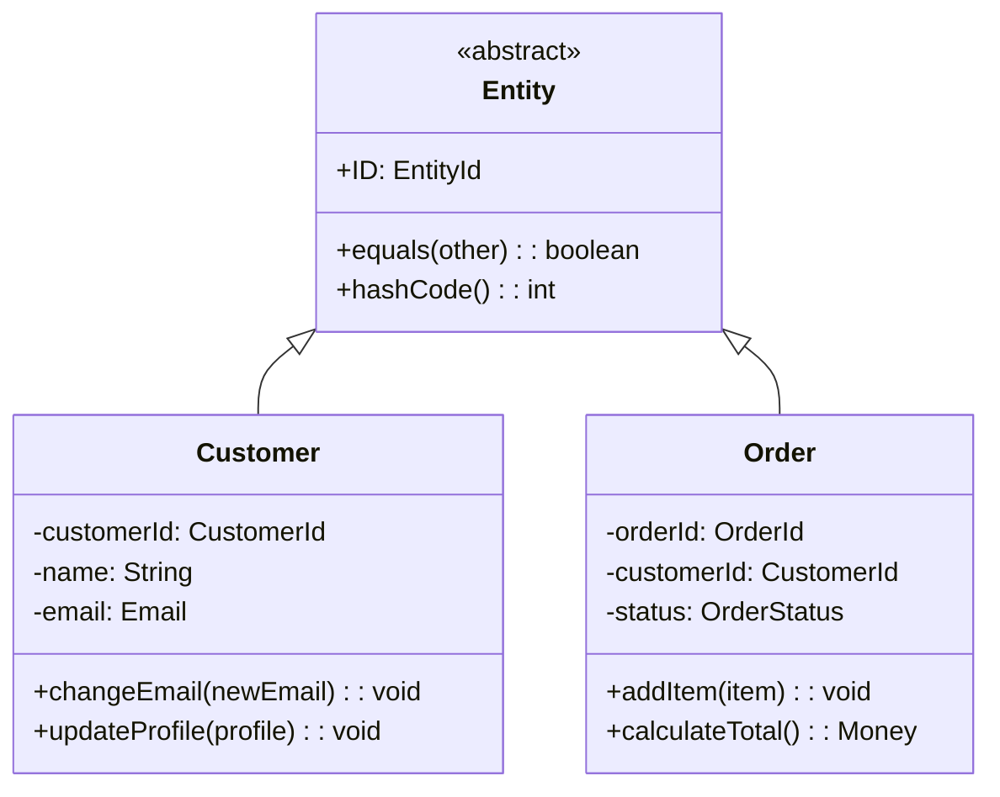

#### Java 實作範例

```java
// 抽象實體基類
public abstract class Entity<ID> {
    protected ID id;
    
    protected Entity(ID id) {
        this.id = Objects.requireNonNull(id, "ID cannot be null");
    }
    
    public ID getId() {
        return id;
    }
    
    @Override
    public boolean equals(Object obj) {
        if (this == obj) return true;
        if (obj == null || getClass() != obj.getClass()) return false;
        Entity<?> entity = (Entity<?>) obj;
        return Objects.equals(id, entity.id);
    }
    
    @Override
    public int hashCode() {
        return Objects.hash(id);
    }
}

// 具體實體實作
@Entity
@Table(name = "customers")
public class Customer extends Entity<CustomerId> {
    
    @Column(name = "name")
    private String name;
    
    @Embedded
    private Email email;
    
    @Embedded
    private Address address;
    
    @Column(name = "created_at")
    private LocalDateTime createdAt;
    
    // 建構子
    public Customer(CustomerId customerId, String name, Email email) {
        super(customerId);
        this.name = validateName(name);
        this.email = Objects.requireNonNull(email);
        this.createdAt = LocalDateTime.now();
    }
    
    // 業務方法
    public void changeEmail(Email newEmail) {
        // 業務規則：email 變更需要驗證
        if (newEmail.equals(this.email)) {
            throw new IllegalArgumentException("新 email 不能與現有相同");
        }
        this.email = newEmail;
    }
    
    public void updateProfile(String newName, Address newAddress) {
        this.name = validateName(newName);
        this.address = newAddress;
    }
    
    private String validateName(String name) {
        if (name == null || name.trim().isEmpty()) {
            throw new IllegalArgumentException("姓名不能為空");
        }
        if (name.length() > 100) {
            throw new IllegalArgumentException("姓名長度不能超過100字元");
        }
        return name.trim();
    }
    
    // Getters
    public String getName() { return name; }
    public Email getEmail() { return email; }
    public Address getAddress() { return address; }
    public LocalDateTime getCreatedAt() { return createdAt; }
}
```

### 2.2 Value Object (值對象)

#### 定義與特徵

**Value Object** 是沒有身份標識的不可變對象，完全由其屬性值定義。

#### 特性對比

| 特性 | Entity | Value Object |
|------|--------|--------------|
| **身份標識** | 有唯一 ID | 無身份標識 |
| **可變性** | 可變 | 不可變 |
| **相等性** | 基於 ID | 基於所有屬性 |
| **生命週期** | 獨立存在 | 依附於 Entity |

#### Java 實作範例

```java
// Email 值對象
public class Email {
    private final String value;
    
    public Email(String email) {
        this.value = validateEmail(email);
    }
    
    private String validateEmail(String email) {
        if (email == null || email.trim().isEmpty()) {
            throw new IllegalArgumentException("Email 不能為空");
        }
        
        String emailRegex = "^[A-Za-z0-9+_.-]+@[A-Za-z0-9.-]+\\.[A-Za-z]{2,}$";
        if (!email.matches(emailRegex)) {
            throw new IllegalArgumentException("Email 格式不正確");
        }
        
        return email.toLowerCase().trim();
    }
    
    public String getValue() {
        return value;
    }
    
    @Override
    public boolean equals(Object obj) {
        if (this == obj) return true;
        if (obj == null || getClass() != obj.getClass()) return false;
        Email email = (Email) obj;
        return Objects.equals(value, email.value);
    }
    
    @Override
    public int hashCode() {
        return Objects.hash(value);
    }
    
    @Override
    public String toString() {
        return value;
    }
}

// Money 值對象
public class Money {
    private final BigDecimal amount;
    private final Currency currency;
    
    public Money(BigDecimal amount, Currency currency) {
        this.amount = validateAmount(amount);
        this.currency = Objects.requireNonNull(currency, "Currency cannot be null");
    }
    
    public Money(String amount, String currencyCode) {
        this(new BigDecimal(amount), Currency.getInstance(currencyCode));
    }
    
    private BigDecimal validateAmount(BigDecimal amount) {
        if (amount == null) {
            throw new IllegalArgumentException("金額不能為空");
        }
        if (amount.scale() > 2) {
            throw new IllegalArgumentException("金額小數點不能超過2位");
        }
        return amount;
    }
    
    // 業務方法
    public Money add(Money other) {
        if (!this.currency.equals(other.currency)) {
            throw new IllegalArgumentException("不同幣別無法直接相加");
        }
        return new Money(this.amount.add(other.amount), this.currency);
    }
    
    public Money multiply(BigDecimal multiplier) {
        return new Money(this.amount.multiply(multiplier), this.currency);
    }
    
    public boolean isGreaterThan(Money other) {
        if (!this.currency.equals(other.currency)) {
            throw new IllegalArgumentException("不同幣別無法比較");
        }
        return this.amount.compareTo(other.amount) > 0;
    }
    
    public boolean isZero() {
        return amount.compareTo(BigDecimal.ZERO) == 0;
    }
    
    // Getters
    public BigDecimal getAmount() { return amount; }
    public Currency getCurrency() { return currency; }
    
    @Override
    public boolean equals(Object obj) {
        if (this == obj) return true;
        if (obj == null || getClass() != obj.getClass()) return false;
        Money money = (Money) obj;
        return Objects.equals(amount, money.amount) && 
               Objects.equals(currency, money.currency);
    }
    
    @Override
    public int hashCode() {
        return Objects.hash(amount, currency);
    }
    
    @Override
    public String toString() {
        return String.format("%s %s", currency.getCurrencyCode(), amount);
    }
}

// Address 值對象
public class Address {
    private final String street;
    private final String city;
    private final String state;
    private final String postalCode;
    private final String country;
    
    public Address(String street, String city, String state, 
                   String postalCode, String country) {
        this.street = validateNotEmpty(street, "街道地址");
        this.city = validateNotEmpty(city, "城市");
        this.state = state; // 可選
        this.postalCode = validatePostalCode(postalCode);
        this.country = validateNotEmpty(country, "國家");
    }
    
    private String validateNotEmpty(String value, String fieldName) {
        if (value == null || value.trim().isEmpty()) {
            throw new IllegalArgumentException(fieldName + "不能為空");
        }
        return value.trim();
    }
    
    private String validatePostalCode(String postalCode) {
        if (postalCode == null || postalCode.trim().isEmpty()) {
            throw new IllegalArgumentException("郵遞區號不能為空");
        }
        // 簡單驗證，實際應根據國家制定規則
        if (!postalCode.matches("\\d{3,10}")) {
            throw new IllegalArgumentException("郵遞區號格式不正確");
        }
        return postalCode.trim();
    }
    
    public String getFullAddress() {
        return String.join(", ", street, city, 
                          state != null ? state : "", 
                          postalCode, country);
    }
    
    // Getters
    public String getStreet() { return street; }
    public String getCity() { return city; }
    public String getState() { return state; }
    public String getPostalCode() { return postalCode; }
    public String getCountry() { return country; }
    
    @Override
    public boolean equals(Object obj) {
        if (this == obj) return true;
        if (obj == null || getClass() != obj.getClass()) return false;
        Address address = (Address) obj;
        return Objects.equals(street, address.street) &&
               Objects.equals(city, address.city) &&
               Objects.equals(state, address.state) &&
               Objects.equals(postalCode, address.postalCode) &&
               Objects.equals(country, address.country);
    }
    
    @Override
    public int hashCode() {
        return Objects.hash(street, city, state, postalCode, country);
    }
}
```

### 📝 第2章小結

**重點回顧：**
- Entity 有唯一身份標識，可以改變狀態
- Value Object 無身份標識，不可變，由屬性值定義
- Aggregate 定義一致性邊界，透過聚合根存取
- Repository 提供集合語義的資料存取介面
- Domain Service 處理跨聚合的業務邏輯

**實務建議：**
- 優先考慮使用 Value Object，只有真正需要身份標識時才使用 Entity
- Value Object 要確保不可變性和驗證規則
- 保持 Aggregate 小而聚焦
- Repository 介面定義在領域層
- 避免在 Domain Service 中處理技術關注點
- 使用 Strategy Pattern 處理不同的業務規則

---

## 2.3 Aggregate (聚合)

### 定義與特徵

**Aggregate** 是一組相關對象的集合，作為資料變更的單位。每個 Aggregate 有一個 **Aggregate Root**（聚合根），外部只能通過聚合根來存取聚合內的對象。

```mermaid
graph TD
    subgraph "Order Aggregate"
        A[Order<br/>聚合根] --> B[OrderItem]
        A --> C[OrderItem]
        A --> D[OrderItem]
        A --> E[ShippingInfo]
        A --> F[Payment]
    end
    
    subgraph "Customer Aggregate"
        G[Customer<br/>聚合根] --> H[Address]
        G --> I[Email]
        G --> J[Phone]
    end
    
    K[外部系統] --> A
    K --> G
    K -.不能直接存取.-> B
    K -.不能直接存取.-> H
```

### Aggregate 設計原則

| 原則 | 說明 | 範例 |
|------|------|------|
| **小聚合** | 聚合應該盡可能小 | 一個訂單而非整個客戶歷史 |
| **參考識別** | 透過 ID 參考其他聚合 | Order 存 CustomerId，而非 Customer 對象 |
| **一致性邊界** | 聚合內強一致性，聚合間最終一致性 | 訂單項目總和必須等於訂單總額 |
| **單一職責** | 每個聚合負責單一業務概念 | Order 負責訂單邏輯，不處理庫存 |

### Java 實作範例

```java
// 訂單聚合根
@Entity
@Table(name = "orders")
public class Order extends Entity<OrderId> {
    
    @Column(name = "customer_id")
    private CustomerId customerId;
    
    @Enumerated(EnumType.STRING)
    @Column(name = "status")
    private OrderStatus status;
    
    @ElementCollection
    @CollectionTable(name = "order_items", joinColumns = @JoinColumn(name = "order_id"))
    private List<OrderItem> items;
    
    @Embedded
    private ShippingInfo shippingInfo;
    
    @Embedded
    private Money totalAmount;
    
    @Column(name = "created_at")
    private LocalDateTime createdAt;
    
    // 建構子
    public Order(OrderId orderId, CustomerId customerId, ShippingInfo shippingInfo) {
        super(orderId);
        this.customerId = Objects.requireNonNull(customerId);
        this.status = OrderStatus.PENDING;
        this.items = new ArrayList<>();
        this.shippingInfo = Objects.requireNonNull(shippingInfo);
        this.totalAmount = Money.ZERO;
        this.createdAt = LocalDateTime.now();
    }
    
    // 業務方法 - 添加商品
    public void addItem(ProductId productId, int quantity, Money unitPrice) {
        if (status != OrderStatus.PENDING) {
            throw new IllegalStateException("只能在訂單待處理狀態下添加商品");
        }
        
        if (quantity <= 0) {
            throw new IllegalArgumentException("商品數量必須大於0");
        }
        
        // 檢查是否已存在相同商品
        Optional<OrderItem> existingItem = items.stream()
            .filter(item -> item.getProductId().equals(productId))
            .findFirst();
            
        if (existingItem.isPresent()) {
            existingItem.get().changeQuantity(
                existingItem.get().getQuantity() + quantity);
        } else {
            items.add(new OrderItem(productId, quantity, unitPrice));
        }
        
        recalculateTotal();
    }
    
    // 業務方法 - 移除商品
    public void removeItem(ProductId productId) {
        if (status != OrderStatus.PENDING) {
            throw new IllegalStateException("只能在訂單待處理狀態下移除商品");
        }
        
        items.removeIf(item -> item.getProductId().equals(productId));
        recalculateTotal();
    }
    
    // 業務方法 - 確認訂單
    public void confirm() {
        if (status != OrderStatus.PENDING) {
            throw new IllegalStateException("只能確認待處理的訂單");
        }
        
        if (items.isEmpty()) {
            throw new IllegalStateException("空訂單無法確認");
        }
        
        this.status = OrderStatus.CONFIRMED;
    }
    
    // 業務方法 - 取消訂單
    public void cancel() {
        if (status == OrderStatus.SHIPPED || status == OrderStatus.DELIVERED) {
            throw new IllegalStateException("已出貨或已送達的訂單無法取消");
        }
        
        this.status = OrderStatus.CANCELLED;
    }
    
    // 內部方法 - 重新計算總額
    private void recalculateTotal() {
        this.totalAmount = items.stream()
            .map(OrderItem::getTotalPrice)
            .reduce(Money.ZERO, Money::add);
    }
    
    // 查詢方法
    public boolean canBeModified() {
        return status == OrderStatus.PENDING;
    }
    
    public int getTotalItems() {
        return items.stream().mapToInt(OrderItem::getQuantity).sum();
    }
    
    // Getters
    public CustomerId getCustomerId() { return customerId; }
    public OrderStatus getStatus() { return status; }
    public List<OrderItem> getItems() { return Collections.unmodifiableList(items); }
    public ShippingInfo getShippingInfo() { return shippingInfo; }
    public Money getTotalAmount() { return totalAmount; }
    public LocalDateTime getCreatedAt() { return createdAt; }
}

// 訂單項目 - 聚合內部實體
@Embeddable
public class OrderItem {
    
    @Column(name = "product_id")
    private ProductId productId;
    
    @Column(name = "quantity")
    private int quantity;
    
    @Embedded
    @AttributeOverrides({
        @AttributeOverride(name = "amount", column = @Column(name = "unit_price")),
        @AttributeOverride(name = "currency", column = @Column(name = "currency"))
    })
    private Money unitPrice;
    
    // JPA 需要
    protected OrderItem() {}
    
    public OrderItem(ProductId productId, int quantity, Money unitPrice) {
        this.productId = Objects.requireNonNull(productId);
        this.quantity = validateQuantity(quantity);
        this.unitPrice = Objects.requireNonNull(unitPrice);
    }
    
    public void changeQuantity(int newQuantity) {
        this.quantity = validateQuantity(newQuantity);
    }
    
    private int validateQuantity(int quantity) {
        if (quantity <= 0) {
            throw new IllegalArgumentException("商品數量必須大於0");
        }
        return quantity;
    }
    
    public Money getTotalPrice() {
        return unitPrice.multiply(BigDecimal.valueOf(quantity));
    }
    
    // Getters
    public ProductId getProductId() { return productId; }
    public int getQuantity() { return quantity; }
    public Money getUnitPrice() { return unitPrice; }
}

// 訂單狀態枚舉
public enum OrderStatus {
    PENDING("待處理"),
    CONFIRMED("已確認"),
    SHIPPED("已出貨"),
    DELIVERED("已送達"),
    CANCELLED("已取消");
    
    private final String description;
    
    OrderStatus(String description) {
        this.description = description;
    }
    
    public String getDescription() {
        return description;
    }
}
```

## 2.4 Repository (儲存庫)

### 定義與特徵

**Repository** 提供了類似於記憶體中集合的介面，用於存取 Aggregate。它封裝了資料存取的複雜性，讓領域層能專注於業務邏輯。

```mermaid
graph TB
    subgraph "Domain Layer"
        A[Order Aggregate]
        B[OrderRepository Interface]
    end
    
    subgraph "Infrastructure Layer"
        C[JpaOrderRepository]
        D[Database]
    end
    
    A --> B
    B <|.. C
    C --> D
    
    E[Application Service] --> B
    E --> A
```

### Repository 設計原則

| 原則 | 說明 | 範例 |
|------|------|------|
| **每個聚合一個** | 每個 Aggregate 對應一個 Repository | OrderRepository 只處理 Order |
| **集合語義** | 提供類似集合的操作介面 | findById, save, delete |
| **查詢封裝** | 封裝複雜的查詢邏輯 | findByCustomerAndStatus |
| **領域介面** | 介面定義在領域層 | Repository interface 在 domain 包 |

### Java 實作範例

```java
// Repository 介面 (位於 domain 層)
public interface OrderRepository {
    
    // 基本操作
    void save(Order order);
    Optional<Order> findById(OrderId orderId);
    void delete(Order order);
    
    // 業務查詢
    List<Order> findByCustomerId(CustomerId customerId);
    List<Order> findByStatus(OrderStatus status);
    List<Order> findByCustomerAndStatus(CustomerId customerId, OrderStatus status);
    
    // 分頁查詢
    Page<Order> findByCustomerId(CustomerId customerId, Pageable pageable);
    
    // 統計查詢
    long countByCustomerId(CustomerId customerId);
    Money calculateTotalAmountByCustomer(CustomerId customerId);
    
    // 複雜業務查詢
    List<Order> findOrdersNeedingReminder();
    List<Order> findExpiredPendingOrders(LocalDateTime expiredBefore);
}

// Repository 實作 (位於 infrastructure 層)
@Repository
@Transactional
public class JpaOrderRepository implements OrderRepository {
    
    private final OrderJpaRepository jpaRepository;
    private final EntityManager entityManager;
    
    public JpaOrderRepository(OrderJpaRepository jpaRepository, 
                             EntityManager entityManager) {
        this.jpaRepository = jpaRepository;
        this.entityManager = entityManager;
    }
    
    @Override
    public void save(Order order) {
        jpaRepository.save(order);
    }
    
    @Override
    public Optional<Order> findById(OrderId orderId) {
        return jpaRepository.findById(orderId);
    }
    
    @Override
    public void delete(Order order) {
        jpaRepository.delete(order);
    }
    
    @Override
    public List<Order> findByCustomerId(CustomerId customerId) {
        return jpaRepository.findByCustomerId(customerId);
    }
    
    @Override
    public List<Order> findByStatus(OrderStatus status) {
        return jpaRepository.findByStatus(status);
    }
    
    @Override
    public List<Order> findByCustomerAndStatus(CustomerId customerId, OrderStatus status) {
        return jpaRepository.findByCustomerIdAndStatus(customerId, status);
    }
    
    @Override
    public Page<Order> findByCustomerId(CustomerId customerId, Pageable pageable) {
        return jpaRepository.findByCustomerId(customerId, pageable);
    }
    
    @Override
    public long countByCustomerId(CustomerId customerId) {
        return jpaRepository.countByCustomerId(customerId);
    }
    
    @Override
    public Money calculateTotalAmountByCustomer(CustomerId customerId) {
        String jpql = """
            SELECT SUM(o.totalAmount.amount)
            FROM Order o 
            WHERE o.customerId = :customerId 
            AND o.status IN ('CONFIRMED', 'SHIPPED', 'DELIVERED')
            """;
            
        BigDecimal total = entityManager.createQuery(jpql, BigDecimal.class)
            .setParameter("customerId", customerId)
            .getSingleResult();
            
        return total != null ? new Money(total, "TWD") : Money.ZERO;
    }
    
    @Override
    public List<Order> findOrdersNeedingReminder() {
        String jpql = """
            SELECT o FROM Order o 
            WHERE o.status = 'PENDING' 
            AND o.createdAt < :reminderTime
            """;
            
        LocalDateTime reminderTime = LocalDateTime.now().minusHours(24);
        
        return entityManager.createQuery(jpql, Order.class)
            .setParameter("reminderTime", reminderTime)
            .getResultList();
    }
    
    @Override
    public List<Order> findExpiredPendingOrders(LocalDateTime expiredBefore) {
        return jpaRepository.findByStatusAndCreatedAtBefore(
            OrderStatus.PENDING, expiredBefore);
    }
}

// Spring Data JPA Repository
@Repository
public interface OrderJpaRepository extends JpaRepository<Order, OrderId> {
    
    List<Order> findByCustomerId(CustomerId customerId);
    Page<Order> findByCustomerId(CustomerId customerId, Pageable pageable);
    
    List<Order> findByStatus(OrderStatus status);
    List<Order> findByCustomerIdAndStatus(CustomerId customerId, OrderStatus status);
    
    long countByCustomerId(CustomerId customerId);
    
    List<Order> findByStatusAndCreatedAtBefore(OrderStatus status, LocalDateTime createdBefore);
    
    @Query("SELECT o FROM Order o WHERE o.status = :status AND o.createdAt >= :startDate")
    List<Order> findByStatusAndDateRange(@Param("status") OrderStatus status, 
                                       @Param("startDate") LocalDateTime startDate);
}
```

## 2.5 Domain Service (領域服務)

### 定義與使用時機

**Domain Service** 包含不自然屬於任何 Entity 或 Value Object 的業務邏輯。

#### 使用時機

1. **跨聚合的業務邏輯**
2. **複雜的業務規則計算**
3. **需要多個領域對象協作的操作**

### Java 實作範例

```java
// 領域服務介面
public interface OrderPricingService {
    Money calculateOrderTotal(Order order, Customer customer);
    Money calculateShippingCost(Order order, ShippingMethod method);
    Money applyDiscount(Order order, Customer customer);
}

// 領域服務實作
@Service
public class OrderPricingServiceImpl implements OrderPricingService {
    
    private final DiscountPolicy discountPolicy;
    private final ShippingCalculator shippingCalculator;
    
    public OrderPricingServiceImpl(DiscountPolicy discountPolicy,
                                 ShippingCalculator shippingCalculator) {
        this.discountPolicy = discountPolicy;
        this.shippingCalculator = shippingCalculator;
    }
    
    @Override
    public Money calculateOrderTotal(Order order, Customer customer) {
        Money subtotal = order.getTotalAmount();
        Money discount = applyDiscount(order, customer);
        Money shipping = calculateShippingCost(order, 
            order.getShippingInfo().getMethod());
        
        return subtotal.subtract(discount).add(shipping);
    }
    
    @Override
    public Money calculateShippingCost(Order order, ShippingMethod method) {
        return shippingCalculator.calculate(
            order.getTotalWeight(),
            order.getShippingInfo().getAddress(),
            method
        );
    }
    
    @Override
    public Money applyDiscount(Order order, Customer customer) {
        return discountPolicy.calculateDiscount(order, customer);
    }
}

// 折扣政策 (Strategy Pattern)
public interface DiscountPolicy {
    Money calculateDiscount(Order order, Customer customer);
}

@Component
public class VipDiscountPolicy implements DiscountPolicy {
    
    @Override
    public Money calculateDiscount(Order order, Customer customer) {
        if (customer.isVip()) {
            // VIP 顧客享有 10% 折扣
            Money discount = order.getTotalAmount().multiply(new BigDecimal("0.1"));
            // 折扣上限 1000 元
            Money maxDiscount = new Money("1000", "TWD");
            return discount.isGreaterThan(maxDiscount) ? maxDiscount : discount;
        }
        
        // 一般顧客滿額折扣
        Money threshold = new Money("2000", "TWD");
        if (order.getTotalAmount().isGreaterThan(threshold)) {
            return new Money("100", "TWD");
        }
        
        return Money.ZERO;
    }
}
```

### 📝 章節小結

**重點回顧：**

- Aggregate 是資料變更的一致性邊界
- Repository 提供集合語義的資料存取介面
- Domain Service 處理跨聚合的業務邏輯
- 遵循單一職責和封裝原則

**實務建議：**

- 保持 Aggregate 小而聚焦
- Repository 介面定義在領域層
- 避免在 Domain Service 中處理技術關注點
- 使用 Strategy Pattern 處理不同的業務規則

---

## 3. 戰略設計 (Strategic Design)

### 3.1 Domain、Subdomain 識別

#### Domain 的層次結構

```mermaid
graph TB
    subgraph "電商業務領域 (Business Domain)"
        A[核心領域<br/>Core Domain]
        B[支撐領域<br/>Supporting Domain]
        C[通用領域<br/>Generic Domain]
    end
    
    subgraph "核心領域"
        A1[商品目錄管理]
        A2[訂單處理]
        A3[庫存管理]
    end
    
    subgraph "支撐領域"
        B1[客戶管理]
        B2[促銷活動]
        B3[數據分析]
    end
    
    subgraph "通用領域"
        C1[身份認證]
        C2[通知服務]
        C3[支付處理]
    end
    
    A --> A1
    A --> A2
    A --> A3
    
    B --> B1
    B --> B2
    B --> B3
    
    C --> C1
    C --> C2
    C --> C3
```

#### 領域分類準則

| 領域類型 | 特徵 | 投資策略 | 範例 |
|----------|------|----------|------|
| **核心領域** | 提供競爭優勢的關鍵業務 | 自建團隊，重點投資 | 商品推薦算法 |
| **支撐領域** | 支援核心業務運作 | 適度投資，可外包 | 客戶服務系統 |
| **通用領域** | 標準化的通用功能 | 採購現成解決方案 | 郵件發送服務 |

### 3.2 Bounded Context (有界上下文)

#### 定義與劃分原則

**Bounded Context** 是模型的明確邊界，在邊界內，每個術語都有明確且一致的含義。

```mermaid
graph TB
    subgraph "電商系統 Context Map"
        subgraph "商品目錄上下文<br/>Product Catalog Context"
            PC1[Product]
            PC2[Category]
            PC3[Price]
            PC4[Inventory]
        end
        
        subgraph "訂單管理上下文<br/>Order Management Context"
            OM1[Order]
            OM2[OrderItem]
            OM3[Customer]
            OM4[Product<br/>(參考)]
        end
        
        subgraph "支付上下文<br/>Payment Context"
            P1[Payment]
            P2[Transaction]
            P3[Account]
            P4[Order<br/>(參考)]
        end
        
        subgraph "用戶管理上下文<br/>User Management Context"
            UM1[User]
            UM2[Profile]
            UM3[Authentication]
            UM4[Authorization]
        end
    end
    
    OM1 -.參考.-> PC1
    P1 -.參考.-> OM1
    OM3 -.參考.-> UM1
```

#### Context 劃分實務指引

**劃分準則：**

1. **業務能力** - 不同的業務功能
2. **資料所有權** - 誰負責資料的生命週期
3. **團隊結構** - 康威定律的考量
4. **變更頻率** - 變更速度不同的功能分開

**範例：電商系統的 Context 劃分**

```java
// 商品目錄上下文中的 Product
@Entity
@Table(name = "products")
public class Product extends Entity<ProductId> {
    private String name;
    private String description;
    private Money price;
    private CategoryId categoryId;
    private InventoryLevel inventory;
    
    // 商品目錄相關的業務邏輯
    public void updatePrice(Money newPrice) { /* ... */ }
    public void adjustInventory(int quantity) { /* ... */ }
}

// 訂單管理上下文中的 Product (不同的模型)
@Entity
@Table(name = "order_products")
public class OrderProduct extends Entity<ProductId> {
    private String name;           // 訂單時的商品名稱
    private Money priceAtOrder;    // 訂單時的價格
    private String imageUrl;       // 展示用圖片
    
    // 訂單相關的業務邏輯
    public OrderItem createOrderItem(int quantity) { /* ... */ }
}
```

### 3.3 Context Map (上下文映射)

#### Context 之間的關係類型

```mermaid
graph LR
    subgraph "上下文關係類型"
        A[Shared Kernel<br/>共享核心] 
        B[Customer/Supplier<br/>客戶/供應商]
        C[Conformist<br/>遵循者]
        D[Anti-corruption Layer<br/>防腐層]
        E[Open Host Service<br/>開放主機服務]
        F[Separate Ways<br/>各自為政]
    end
    
    subgraph "實際應用"
        G[訂單管理] -->|Customer| H[商品目錄]
        I[支付系統] -->|ACL| J[第三方金流]
        K[通知服務] -->|OHS| L[各業務上下文]
        M[報表系統] -->|Conformist| N[數據倉儲]
    end
```

#### Context 整合模式實作

**1. Anti-corruption Layer (防腐層)**

```java
// 外部系統的 DTO
public class ExternalPaymentResponse {
    public String payment_id;
    public String status_code;
    public String error_message;
    // 外部系統的欄位命名和結構
}

// 防腐層 - 轉換外部模型到內部模型
@Component
public class PaymentAntiCorruptionLayer {
    
    public PaymentResult translatePaymentResponse(ExternalPaymentResponse external) {
        PaymentStatus status = mapStatusCode(external.status_code);
        
        if (status == PaymentStatus.FAILED) {
            return PaymentResult.failed(
                new PaymentId(external.payment_id),
                external.error_message
            );
        }
        
        return PaymentResult.successful(
            new PaymentId(external.payment_id)
        );
    }
    
    private PaymentStatus mapStatusCode(String statusCode) {
        return switch (statusCode) {
            case "00" -> PaymentStatus.SUCCESS;
            case "01" -> PaymentStatus.PENDING;
            default -> PaymentStatus.FAILED;
        };
    }
}

// 內部領域模型
public class PaymentResult {
    private final PaymentId paymentId;
    private final PaymentStatus status;
    private final String errorMessage;
    
    public static PaymentResult successful(PaymentId paymentId) {
        return new PaymentResult(paymentId, PaymentStatus.SUCCESS, null);
    }
    
    public static PaymentResult failed(PaymentId paymentId, String errorMessage) {
        return new PaymentResult(paymentId, PaymentStatus.FAILED, errorMessage);
    }
    
    // constructor, getters...
}
```

**2. Open Host Service (開放主機服務)**

```java
// 對外提供的統一 API
@RestController
@RequestMapping("/api/orders")
public class OrderOpenHostController {
    
    private final OrderApplicationService orderService;
    private final OrderDtoAssembler assembler;
    
    @PostMapping
    public ResponseEntity<OrderDto> createOrder(@RequestBody CreateOrderRequest request) {
        CreateOrderCommand command = new CreateOrderCommand(
            new CustomerId(request.getCustomerId()),
            request.getShippingAddress(),
            request.getItems()
        );
        
        OrderId orderId = orderService.createOrder(command);
        Order order = orderService.getOrder(orderId);
        
        return ResponseEntity.ok(assembler.toDto(order));
    }
    
    @GetMapping("/{orderId}")
    public ResponseEntity<OrderDto> getOrder(@PathVariable String orderId) {
        Order order = orderService.getOrder(new OrderId(orderId));
        return ResponseEntity.ok(assembler.toDto(order));
    }
}

// 統一的對外 DTO
public class OrderDto {
    private String orderId;
    private String customerId;
    private String status;
    private List<OrderItemDto> items;
    private BigDecimal totalAmount;
    private String currency;
    private LocalDateTime createdAt;
    
    // getters, setters...
}
```

### 3.4 Ubiquitous Language (統一語言)

#### 建立統一語言的實務做法

**1. 領域專家協作工作坊**

```mermaid
graph LR
    A[業務專家] --> C[Event Storming]
    B[開發團隊] --> C
    C --> D[領域事件識別]
    D --> E[術語定義]
    E --> F[模型設計]
    F --> G[程式碼實作]
    G --> H[持續改進]
    H --> E
```

**2. 術語詞典範例**

| 業務術語 | 英文術語 | 定義 | 程式碼對應 |
|----------|----------|------|------------|
| 商品 | Product | 可販售的物品，包含價格和庫存 | `Product` class |
| 庫存 | Inventory | 商品的可用數量 | `InventoryLevel` value object |
| 購物車 | Shopping Cart | 顧客暫時存放商品的容器 | `ShoppingCart` aggregate |
| 訂單 | Order | 顧客的正式購買請求 | `Order` aggregate |
| 結帳 | Checkout | 將購物車轉換為訂單的過程 | `CheckoutService` |
| 出貨 | Shipment | 將已確認訂單的商品寄送給顧客 | `Shipment` aggregate |

**3. 統一語言在程式碼中的體現**

```java
// 好的範例 - 使用業務術語
public class Order {
    public void ship(ShippingAddress address) {
        if (!canBeShipped()) {
            throw new OrderCannotBeShippedException("訂單狀態不允許出貨");
        }
        // 實作出貨邏輯
    }
    
    public boolean canBeShipped() {
        return status == OrderStatus.CONFIRMED && 
               allItemsInStock();
    }
    
    public void cancel(CancellationReason reason) {
        if (!canBeCancelled()) {
            throw new OrderCannotBeCancelledException("訂單無法取消");
        }
        // 實作取消邏輯
    }
}

// 不好的範例 - 使用技術術語
public class Order {
    public void updateStatus(int statusCode) {
        this.statusCode = statusCode;
    }
    
    public void processData() {
        // 不清楚的方法名
    }
}
```

### 3.5 Event Storming 實務應用

#### Event Storming 流程

```mermaid
graph TD
    A[業務流程梳理] --> B[領域事件識別]
    B --> C[命令識別]
    C --> D[聚合識別]
    D --> E[有界上下文劃分]
    E --> F[上下文映射]
    
    subgraph "產出物"
        G[Event List]
        H[Command List]
        I[Aggregate Design]
        J[Context Map]
    end
    
    B --> G
    C --> H
    D --> I
    E --> J
```

#### 實務工作坊範例

**場景：線上購物流程**

**步驟 1：識別領域事件**

- `CustomerRegistered` - 顧客註冊完成
- `ProductAddedToCart` - 商品加入購物車
- `OrderPlaced` - 訂單建立
- `PaymentProcessed` - 付款處理完成
- `OrderConfirmed` - 訂單確認
- `OrderShipped` - 訂單出貨
- `OrderDelivered` - 訂單送達

**步驟 2：識別命令**

- `RegisterCustomer` - 註冊顧客
- `AddProductToCart` - 將商品加入購物車
- `PlaceOrder` - 下訂單
- `ProcessPayment` - 處理付款
- `ConfirmOrder` - 確認訂單
- `ShipOrder` - 出貨訂單

**步驟 3：設計聚合**

```java
// 從 Event Storming 結果設計的聚合
public class Customer extends AggregateRoot<CustomerId> {
    
    // 處理註冊命令，產生領域事件
    public static Customer register(CustomerId customerId, 
                                  String name, 
                                  Email email) {
        Customer customer = new Customer(customerId, name, email);
        customer.addDomainEvent(new CustomerRegistered(customerId, name, email));
        return customer;
    }
}

public class ShoppingCart extends AggregateRoot<CartId> {
    
    public void addProduct(ProductId productId, int quantity) {
        // 業務邏輯驗證
        OrderItem item = new OrderItem(productId, quantity);
        items.add(item);
        
        addDomainEvent(new ProductAddedToCart(getId(), productId, quantity));
    }
}
```

### 📝 戰略設計小結

**重點回顧：**

- 識別核心、支撐、通用領域，制定不同投資策略
- 建立清晰的有界上下文邊界
- 設計適當的上下文整合關係
- 建立並維護統一語言
- 使用 Event Storming 進行協作式設計

**實務建議：**

- 定期舉辦領域建模工作坊
- 建立術語詞典並持續更新
- 在程式碼中體現業務語言
- 避免技術概念洩漏到業務層

---

## 4. 戰術設計 (Tactical Design)

### 4.1 Domain Events (領域事件)

#### 定義與使用場景

**Domain Events** 表示領域中發生的重要業務事件，用於實現聚合間的解耦和最終一致性。

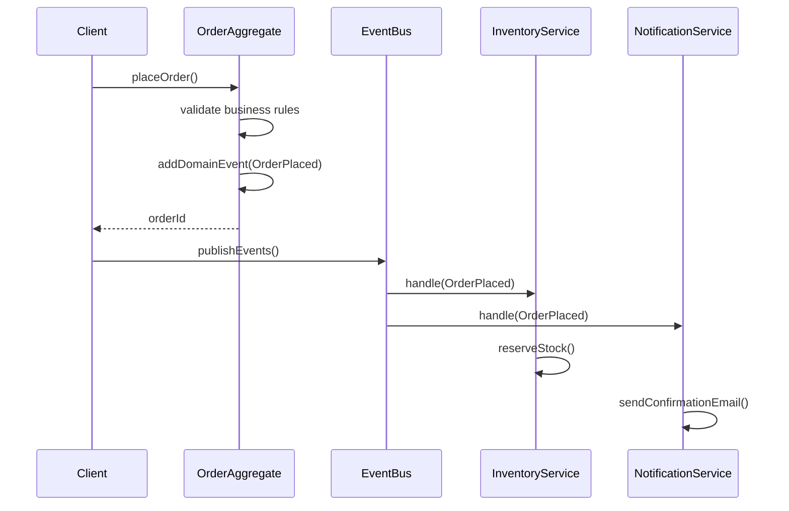

#### Java 實作範例

```java
// 領域事件基類
public abstract class DomainEvent {
    private final String eventId;
    private final LocalDateTime occurredOn;
    
    protected DomainEvent() {
        this.eventId = UUID.randomUUID().toString();
        this.occurredOn = LocalDateTime.now();
    }
    
    public String getEventId() { return eventId; }
    public LocalDateTime getOccurredOn() { return occurredOn; }
}

// 具體領域事件
public class OrderPlaced extends DomainEvent {
    private final OrderId orderId;
    private final CustomerId customerId;
    private final Money totalAmount;
    private final List<OrderItemData> items;
    
    public OrderPlaced(OrderId orderId, 
                      CustomerId customerId, 
                      Money totalAmount,
                      List<OrderItem> items) {
        super();
        this.orderId = orderId;
        this.customerId = customerId;
        this.totalAmount = totalAmount;
        this.items = items.stream()
            .map(OrderItemData::new)
            .collect(Collectors.toList());
    }
    
    // Getters...
    public OrderId getOrderId() { return orderId; }
    public CustomerId getCustomerId() { return customerId; }
    public Money getTotalAmount() { return totalAmount; }
    public List<OrderItemData> getItems() { return items; }
}

// 聚合根基類
public abstract class AggregateRoot<ID> extends Entity<ID> {
    private final List<DomainEvent> domainEvents = new ArrayList<>();
    
    protected AggregateRoot(ID id) {
        super(id);
    }
    
    protected void addDomainEvent(DomainEvent event) {
        domainEvents.add(event);
    }
    
    public List<DomainEvent> getDomainEvents() {
        return Collections.unmodifiableList(domainEvents);
    }
    
    public void clearDomainEvents() {
        domainEvents.clear();
    }
}

// 修改後的 Order 聚合
public class Order extends AggregateRoot<OrderId> {
    
    public static Order createOrder(OrderId orderId, 
                                  CustomerId customerId,
                                  ShippingInfo shippingInfo) {
        Order order = new Order(orderId, customerId, shippingInfo);
        
        // 發布領域事件
        order.addDomainEvent(new OrderCreated(orderId, customerId));
        
        return order;
    }
    
    public void confirm() {
        if (status != OrderStatus.PENDING) {
            throw new IllegalStateException("只能確認待處理的訂單");
        }
        
        if (items.isEmpty()) {
            throw new IllegalStateException("空訂單無法確認");
        }
        
        this.status = OrderStatus.CONFIRMED;
        
        // 發布領域事件
        addDomainEvent(new OrderPlaced(getId(), customerId, totalAmount, items));
    }
    
    public void ship(TrackingNumber trackingNumber) {
        if (status != OrderStatus.CONFIRMED) {
            throw new IllegalStateException("只能出貨已確認的訂單");
        }
        
        this.status = OrderStatus.SHIPPED;
        
        // 發布領域事件
        addDomainEvent(new OrderShipped(getId(), customerId, trackingNumber));
    }
}
```

### 4.2 Factory Pattern 在 DDD 中的應用

#### 複雜對象建立

```java
// 訂單工廠
@Component
public class OrderFactory {
    
    private final ProductRepository productRepository;
    private final OrderPricingService pricingService;
    
    public OrderFactory(ProductRepository productRepository,
                       OrderPricingService pricingService) {
        this.productRepository = productRepository;
        this.pricingService = pricingService;
    }
    
    public Order createOrderFromCart(CustomerId customerId,
                                   ShoppingCart cart,
                                   ShippingInfo shippingInfo) {
        
        OrderId orderId = OrderId.generate();
        Order order = new Order(orderId, customerId, shippingInfo);
        
        // 轉換購物車項目為訂單項目
        for (CartItem cartItem : cart.getItems()) {
            Product product = productRepository.findById(cartItem.getProductId())
                .orElseThrow(() -> new ProductNotFoundException(cartItem.getProductId()));
                
            // 驗證庫存
            if (!product.hasEnoughStock(cartItem.getQuantity())) {
                throw new InsufficientStockException(
                    cartItem.getProductId(), cartItem.getQuantity());
            }
            
            order.addItem(
                cartItem.getProductId(),
                cartItem.getQuantity(),
                product.getCurrentPrice()
            );
        }
        
        return order;
    }
    
    public Order recreateOrderFromHistory(OrderHistoryData historyData) {
        // 從歷史資料重建訂單，用於查詢或分析
        OrderId orderId = new OrderId(historyData.getOrderId());
        CustomerId customerId = new CustomerId(historyData.getCustomerId());
        
        Order order = new Order(orderId, customerId, historyData.getShippingInfo());
        
        for (OrderItemData itemData : historyData.getItems()) {
            order.addItem(
                new ProductId(itemData.getProductId()),
                itemData.getQuantity(),
                itemData.getUnitPrice()
            );
        }
        
        return order;
    }
}
```

### 4.3 Specification Pattern (規格模式)

#### 複雜業務規則的封裝

```java
// 規格模式基類
public interface Specification<T> {
    boolean isSatisfiedBy(T candidate);
    
    default Specification<T> and(Specification<T> other) {
        return candidate -> this.isSatisfiedBy(candidate) && other.isSatisfiedBy(candidate);
    }
    
    default Specification<T> or(Specification<T> other) {
        return candidate -> this.isSatisfiedBy(candidate) || other.isSatisfiedBy(candidate);
    }
    
    default Specification<T> not() {
        return candidate -> !this.isSatisfiedBy(candidate);
    }
}

// 具體規格實作
public class VipCustomerSpecification implements Specification<Customer> {
    
    @Override
    public boolean isSatisfiedBy(Customer customer) {
        return customer.getTotalSpending().isGreaterThan(new Money("10000", "TWD")) &&
               customer.getOrderCount() >= 5;
    }
}

public class HighValueOrderSpecification implements Specification<Order> {
    private final Money threshold;
    
    public HighValueOrderSpecification(Money threshold) {
        this.threshold = threshold;
    }
    
    @Override
    public boolean isSatisfiedBy(Order order) {
        return order.getTotalAmount().isGreaterThan(threshold);
    }
}

public class EligibleForExpressShippingSpecification implements Specification<Order> {
    
    @Override
    public boolean isSatisfiedBy(Order order) {
        return order.getTotalAmount().isGreaterThan(new Money("1000", "TWD")) &&
               order.getItems().stream().allMatch(item -> 
                   !item.getProduct().isOversized());
    }
}

// 使用規格模式的服務
@Service
public class OrderPromotionService {
    
    public boolean isEligibleForFreeShipping(Order order, Customer customer) {
        Specification<Order> freeShippingSpec = 
            new HighValueOrderSpecification(new Money("2000", "TWD"))
            .or(new VipCustomerSpecification().and(
                new HighValueOrderSpecification(new Money("1000", "TWD"))));
                
        return freeShippingSpec.isSatisfiedBy(order);
    }
    
    public List<Promotion> getApplicablePromotions(Order order, Customer customer) {
        List<Promotion> applicablePromotions = new ArrayList<>();
        
        // VIP 顾客促销
        if (new VipCustomerSpecification().isSatisfiedBy(customer)) {
            applicablePromotions.add(new VipDiscount());
        }
        
        // 高价值订单促销
        if (new HighValueOrderSpecification(new Money("5000", "TWD"))
            .isSatisfiedBy(order)) {
            applicablePromotions.add(new HighValueOrderDiscount());
        }
        
        return applicablePromotions;
    }
}
```

---

## 5. DDD 在專案中的實際應用

### 5.1 真實案例研究：電商平台重構

#### 專案背景

某中型電商公司面臨的挑戰：
- 單體應用架構難以擴展
- 業務邏輯散落在各層
- 開發團隊溝通成本高
- 新功能開發週期長

#### 重構前的問題分析

**架構問題：**
```java
// 重構前：貧血模型 + 服務層包含所有邏輯
@Entity
public class Order {
    private Long id;
    private Long customerId;
    private String status;
    private BigDecimal amount;
    // 只有 getters 和 setters
}

@Service
public class OrderService {
    // 包含所有業務邏輯，違反 SRP
    public void createOrder(OrderRequest request) { /* 複雜邏輯 */ }
    public void calculateDiscount(Order order) { /* 複雜邏輯 */ }
    public void validateInventory(Order order) { /* 複雜邏輯 */ }
    public void processPayment(Order order) { /* 複雜邏輯 */ }
}
```

#### DDD 重構策略

**第一階段：戰略設計**

1. **Event Storming 工作坊**
   - 業務專家：產品經理、客服主管、銷售主管
   - 技術團隊：架構師、資深開發者
   - 產出：領域事件清單、業務流程圖

2. **Bounded Context 識別**
   ```mermaid
   graph TB
       subgraph "電商平台 Domain"
           PC[商品目錄上下文<br/>Product Catalog]
           OM[訂單管理上下文<br/>Order Management]
           IM[庫存管理上下文<br/>Inventory Management]
           CM[客戶管理上下文<br/>Customer Management]
           PM[促銷管理上下文<br/>Promotion Management]
           PayM[支付管理上下文<br/>Payment Management]
       end
   ```

**第二階段：戰術設計與實作**

```java
// 重構後：豐富的領域模型
public class Order extends AggregateRoot<OrderId> {
    private CustomerId customerId;
    private OrderStatus status;
    private List<OrderItem> items;
    private Money totalAmount;
    private PromotionCode promotionCode;
    
    public static Order createOrder(CustomerId customerId, 
                                  List<OrderItemRequest> itemRequests) {
        Order order = new Order(OrderId.generate(), customerId);
        
        for (OrderItemRequest request : itemRequests) {
            order.addItem(request.getProductId(), 
                         request.getQuantity(), 
                         request.getUnitPrice());
        }
        
        order.addDomainEvent(new OrderCreated(order.getId(), customerId));
        return order;
    }
    
    public void applyPromotion(PromotionCode code, PromotionPolicy policy) {
        if (!policy.isApplicable(this, code)) {
            throw new PromotionNotApplicableException(code);
        }
        
        this.promotionCode = code;
        recalculateTotal();
        addDomainEvent(new PromotionApplied(getId(), code));
    }
    
    public void confirm() {
        validateCanBeConfirmed();
        this.status = OrderStatus.CONFIRMED;
        addDomainEvent(new OrderConfirmed(getId(), customerId, totalAmount));
    }
}
```

### 5.2 微服務架構中的 DDD 實踐

#### 服務邊界劃分策略

**原則：Bounded Context = Microservice**

```mermaid
graph TB
    subgraph "訂單服務 (Order Service)"
        A[Order Aggregate]
        B[Order Repository]
        C[Order Application Service]
    end
    
    subgraph "商品服務 (Product Service)"
        D[Product Aggregate]
        E[Product Repository]
        F[Product Application Service]
    end
    
    subgraph "庫存服務 (Inventory Service)"
        G[Inventory Aggregate]
        H[Inventory Repository]
        I[Inventory Application Service]
    end
    
    A -.庫存查詢.-> I
    A -.商品資訊.-> F
    C -->|Domain Events| J[Message Broker]
    J --> I
    J --> F
```

#### 服務間通訊設計

**1. 同步通訊 - API 呼叫**

```java
// 訂單服務中的商品資訊查詢
@Component
public class ProductInfoService {
    private final ProductServiceClient productClient;
    
    public ProductInfo getProductInfo(ProductId productId) {
        try {
            ProductResponse response = productClient.getProduct(productId.getValue());
            return new ProductInfo(
                productId,
                response.getName(),
                new Money(response.getPrice(), response.getCurrency()),
                response.isAvailable()
            );
        } catch (FeignException ex) {
            throw new ProductServiceUnavailableException(productId, ex);
        }
    }
}
```

**2. 非同步通訊 - 事件驅動**

```java
// 訂單事件發布
@EventListener
@Component
public class OrderEventPublisher {
    private final RabbitTemplate rabbitTemplate;
    
    @Async
    public void on(OrderConfirmed event) {
        OrderConfirmedEvent externalEvent = new OrderConfirmedEvent(
            event.getOrderId().getValue(),
            event.getCustomerId().getValue(),
            event.getTotalAmount().getAmount(),
            event.getOrderItems().stream()
                .map(item -> new OrderItemEvent(
                    item.getProductId().getValue(),
                    item.getQuantity()
                ))
                .collect(Collectors.toList())
        );
        
        rabbitTemplate.convertAndSend(
            "order.events", 
            "order.confirmed", 
            externalEvent
        );
    }
}

// 庫存服務中的事件處理
@RabbitListener(queues = "inventory.order.events")
@Component
public class InventoryEventHandler {
    private final InventoryApplicationService inventoryService;
    
    public void handle(OrderConfirmedEvent event) {
        ReserveStockCommand command = new ReserveStockCommand(
            new OrderId(event.getOrderId()),
            event.getOrderItems().stream()
                .map(item -> new StockReservation(
                    new ProductId(item.getProductId()),
                    item.getQuantity()
                ))
                .collect(Collectors.toList())
        );
        
        inventoryService.reserveStock(command);
    }
}
```

### 5.3 遺留系統整合策略

#### Strangler Fig 模式

**逐步替換遺留系統的策略：**

```mermaid
graph TB
    subgraph "第一階段：建立新系統"
        A[新 DDD 服務]
        B[API Gateway]
        C[遺留系統]
    end
    
    subgraph "第二階段：部分流量轉移"
        D[新 DDD 服務<br/>80% 流量]
        E[API Gateway<br/>路由規則]
        F[遺留系統<br/>20% 流量]
    end
    
    subgraph "第三階段：完全替換"
        G[新 DDD 服務<br/>100% 流量]
        H[API Gateway]
    end
```

**實作範例：**

```java
// Anti-Corruption Layer 處理遺留系統整合
@Component
public class LegacyOrderAdapter {
    private final LegacyOrderService legacyService;
    private final OrderTranslator translator;
    
    public Order findOrderInLegacySystem(OrderId orderId) {
        LegacyOrderData legacyData = legacyService.getOrder(orderId.getValue());
        
        if (legacyData == null) {
            return null;
        }
        
        return translator.translateToNewModel(legacyData);
    }
    
    public void syncOrderToLegacySystem(Order order) {
        LegacyOrderData legacyData = translator.translateToLegacyModel(order);
        legacyService.updateOrder(legacyData);
    }
}

// 資料遷移策略
@Component
public class OrderMigrationService {
    private final LegacyOrderAdapter adapter;
    private final OrderRepository orderRepository;
    
    @Scheduled(fixedRate = 3600000) // 每小時執行
    public void migrateOrders() {
        List<String> pendingOrderIds = getLegacyOrderIds();
        
        for (String orderId : pendingOrderIds) {
            try {
                Order order = adapter.findOrderInLegacySystem(new OrderId(orderId));
                if (order != null) {
                    orderRepository.save(order);
                    markAsInNewSystem(orderId);
                }
            } catch (Exception ex) {
                logger.error("訂單遷移失敗: {}", orderId, ex);
            }
        }
    }
}
```

### 5.4 團隊協作與知識管理

#### 知識提取工作坊

**Event Storming 實施指南：**

```mermaid
gantt
    title Event Storming 工作坊時程
    dateFormat  HH:mm
    axisFormat %H:%M
    
    section 準備階段
    場地布置     :09:00, 30m
    參與者到齊   :09:30, 30m
    
    section 探索階段
    業務流程梳理 :10:00, 90m
    事件風暴     :11:30, 90m
    
    section 分析階段
    事件分類     :14:00, 60m
    聚合識別     :15:00, 60m
    
    section 設計階段
    上下文劃分   :16:00, 60m
    總結規劃     :17:00, 60m
```

**持續知識管理：**

```java
// 領域知識文件化
/**
 * 訂單聚合
 * 
 * 業務規則：
 * 1. 訂單一旦確認就不能修改商品項目
 * 2. 只有待處理狀態的訂單可以取消
 * 3. 訂單總額必須等於所有項目金額總和
 * 4. VIP 客戶享有特殊取消政策
 * 
 * 不變條件：
 * - 訂單必須至少包含一個商品項目
 * - 商品數量必須大於 0
 * - 總金額不能為負數
 * 
 * 領域事件：
 * - OrderCreated: 訂單建立時
 * - OrderConfirmed: 訂單確認時  
 * - OrderCancelled: 訂單取消時
 * - OrderShipped: 訂單出貨時
 */
public class Order extends AggregateRoot<OrderId> {
    // 實作...
}
```

### 5.5 效能最佳化策略

#### CQRS 在複雜查詢中的應用

```java
// 命令端：專注於寫入操作
@Service
@Transactional
public class OrderCommandService {
    public OrderId createOrder(CreateOrderCommand command) {
        // 純粹的寫入邏輯，不關心查詢效能
        Order order = Order.createOrder(command.getCustomerId(), command.getItems());
        orderRepository.save(order);
        publishDomainEvents(order);
        return order.getId();
    }
}

// 查詢端：最佳化的讀取模型
@Entity
@Table(name = "order_summary_view")
public class OrderSummaryView {
    @Id
    private String orderId;
    private String customerName;
    private String customerEmail;
    private BigDecimal totalAmount;
    private String status;
    private Integer itemCount;
    private String productSummary; // 逗號分隔的商品名稱
    private LocalDateTime createdAt;
    private LocalDateTime updatedAt;
    
    // 查詢最佳化的欄位
    @Column(name = "search_keywords")
    private String searchKeywords; // 包含客戶名稱、商品名稱等
    
    @Column(name = "status_order")
    private Integer statusOrder; // 用於狀態排序
}

// 查詢服務
@Service
@Transactional(readOnly = true)
public class OrderQueryService {
    
    public Page<OrderSummaryDto> searchOrders(OrderSearchCriteria criteria, 
                                            Pageable pageable) {
        // 使用最佳化的查詢模型
        Specification<OrderSummaryView> spec = OrderSpecifications.buildSpec(criteria);
        Page<OrderSummaryView> views = orderSummaryRepository.findAll(spec, pageable);
        
        return views.map(this::toDto);
    }
    
    public OrderAnalyticsDto getOrderAnalytics(LocalDate startDate, LocalDate endDate) {
        // 使用原生 SQL 進行複雜統計查詢
        return orderSummaryRepository.getAnalytics(startDate, endDate);
    }
}
```

### 5.6 監控與觀測

#### 業務指標監控

```java
// 領域事件監控
@Component
public class OrderMetricsCollector {
    private final MeterRegistry meterRegistry;
    private final Counter orderCreatedCounter;
    private final Timer orderProcessingTimer;
    
    public OrderMetricsCollector(MeterRegistry meterRegistry) {
        this.meterRegistry = meterRegistry;
        this.orderCreatedCounter = Counter.builder("orders.created")
            .description("訂單建立數量")
            .register(meterRegistry);
        this.orderProcessingTimer = Timer.builder("orders.processing.time")
            .description("訂單處理時間")
            .register(meterRegistry);
    }
    
    @EventListener
    public void on(OrderCreated event) {
        orderCreatedCounter.increment(
            Tags.of("customer_type", determineCustomerType(event.getCustomerId()))
        );
    }
    
    @EventListener
    public void on(OrderConfirmed event) {
        Duration processingTime = Duration.between(
            event.getOrderCreatedAt(), 
            event.getOccurredOn()
        );
        orderProcessingTimer.record(processingTime);
    }
}

// 業務健康檢查
@Component
public class OrderHealthIndicator implements HealthIndicator {
    private final OrderRepository orderRepository;
    
    @Override
    public Health health() {
        try {
            long pendingOrdersCount = orderRepository.countByStatusAndCreatedAtBefore(
                OrderStatus.PENDING, 
                LocalDateTime.now().minusHours(24)
            );
            
            if (pendingOrdersCount > 100) {
                return Health.down()
                    .withDetail("pending_orders", pendingOrdersCount)
                    .withDetail("reason", "Too many long-pending orders")
                    .build();
            }
            
            return Health.up()
                .withDetail("pending_orders", pendingOrdersCount)
                .build();
                
        } catch (Exception ex) {
            return Health.down(ex).build();
        }
    }
}
```

### 📝 第5章小結

**實際應用重點：**

- **漸進式重構**：使用 Strangler Fig 模式逐步替換遺留系統
- **微服務邊界**：以 Bounded Context 為基礎劃分服務邊界
- **事件驅動架構**：使用領域事件實現服務間解耦
- **效能最佳化**：結合 CQRS 模式最佳化複雜查詢
- **監控觀測**：建立業務指標監控和健康檢查

**關鍵成功因素：**

- 業務專家的深度參與
- 持續的知識提取和文件化
- 團隊的技術能力建設
- 合理的重構節奏控制

---

## 6. Spring Boot 中的 DDD 實作

### 6.1 專案結構設計

#### 六角形架構 (Hexagonal Architecture)

```
src/main/java/com/company/ecommerce/
├── application/              # 應用層
│   ├── service/             # 應用服務
│   ├── dto/                 # 資料傳輸對象
│   └── command/             # 命令對象
├── domain/                  # 領域層
│   ├── model/               # 領域模型
│   │   ├── order/          # 訂單聚合
│   │   ├── product/        # 商品聚合
│   │   └── customer/       # 客戶聚合
│   ├── service/            # 領域服務
│   └── repository/         # 儲存庫介面
├── infrastructure/         # 基礎設施層
│   ├── persistence/        # 資料持久化
│   ├── messaging/          # 訊息處理
│   └── external/           # 外部服務整合
└── interfaces/             # 介面層
    ├── rest/               # REST API
    ├── web/                # Web 控制器
    └── config/             # 配置
```

#### Maven 依賴配置

```xml
<!-- pom.xml -->
<dependencies>
    <!-- Spring Boot Starters -->
    <dependency>
        <groupId>org.springframework.boot</groupId>
        <artifactId>spring-boot-starter-web</artifactId>
    </dependency>
    
    <dependency>
        <groupId>org.springframework.boot</groupId>
        <artifactId>spring-boot-starter-data-jpa</artifactId>
    </dependency>
    
    <dependency>
        <groupId>org.springframework.boot</groupId>
        <artifactId>spring-boot-starter-validation</artifactId>
    </dependency>
    
    <!-- Database -->
    <dependency>
        <groupId>com.h2database</groupId>
        <artifactId>h2</artifactId>
        <scope>runtime</scope>
    </dependency>
    
    <!-- Domain Events -->
    <dependency>
        <groupId>org.springframework</groupId>
        <artifactId>spring-context</artifactId>
    </dependency>
    
    <!-- Testing -->
    <dependency>
        <groupId>org.springframework.boot</groupId>
        <artifactId>spring-boot-starter-test</artifactId>
        <scope>test</scope>
    </dependency>
</dependencies>
```

### 6.2 應用服務 (Application Service)

#### 職責與設計原則

應用服務負責協調領域對象來執行業務流程，不包含業務邏輯。

```java
// 應用服務介面
public interface OrderApplicationService {
    OrderId createOrder(CreateOrderCommand command);
    void confirmOrder(ConfirmOrderCommand command);
    void cancelOrder(CancelOrderCommand command);
    OrderDto getOrder(OrderId orderId);
    List<OrderDto> getCustomerOrders(CustomerId customerId);
}

// 應用服務實作
@Service
@Transactional
public class OrderApplicationServiceImpl implements OrderApplicationService {
    
    private final OrderRepository orderRepository;
    private final CustomerRepository customerRepository;
    private final OrderFactory orderFactory;
    private final ApplicationEventPublisher eventPublisher;
    private final OrderDtoAssembler orderAssembler;
    
    public OrderApplicationServiceImpl(
            OrderRepository orderRepository,
            CustomerRepository customerRepository,
            OrderFactory orderFactory,
            ApplicationEventPublisher eventPublisher,
            OrderDtoAssembler orderAssembler) {
        this.orderRepository = orderRepository;
        this.customerRepository = customerRepository;
        this.orderFactory = orderFactory;
        this.eventPublisher = eventPublisher;
        this.orderAssembler = orderAssembler;
    }
    
    @Override
    public OrderId createOrder(CreateOrderCommand command) {
        // 1. 驗證客戶存在
        Customer customer = customerRepository.findById(command.getCustomerId())
            .orElseThrow(() -> new CustomerNotFoundException(command.getCustomerId()));
        
        // 2. 建立訂單 (透過工廠)
        Order order = orderFactory.createOrder(
            command.getCustomerId(),
            command.getShippingInfo(),
            command.getOrderItems()
        );
        
        // 3. 儲存訂單
        orderRepository.save(order);
        
        // 4. 發布領域事件
        publishDomainEvents(order);
        
        return order.getId();
    }
    
    @Override
    public void confirmOrder(ConfirmOrderCommand command) {
        Order order = findOrderById(command.getOrderId());
        
        // 領域邏輯在聚合內處理
        order.confirm();
        
        orderRepository.save(order);
        publishDomainEvents(order);
    }
    
    @Override
    @Transactional(readOnly = true)
    public OrderDto getOrder(OrderId orderId) {
        Order order = findOrderById(orderId);
        return orderAssembler.toDto(order);
    }
    
    @Override
    @Transactional(readOnly = true)
    public List<OrderDto> getCustomerOrders(CustomerId customerId) {
        List<Order> orders = orderRepository.findByCustomerId(customerId);
        return orders.stream()
            .map(orderAssembler::toDto)
            .collect(Collectors.toList());
    }
    
    private Order findOrderById(OrderId orderId) {
        return orderRepository.findById(orderId)
            .orElseThrow(() -> new OrderNotFoundException(orderId));
    }
    
    private void publishDomainEvents(Order order) {
        order.getDomainEvents().forEach(eventPublisher::publishEvent);
        order.clearDomainEvents();
    }
}
```

### 6.3 領域事件處理

#### Spring Event 整合

```java
// 領域事件監聽器
@Component
public class OrderEventHandler {
    
    private final InventoryService inventoryService;
    private final NotificationService notificationService;
    private final Logger logger = LoggerFactory.getLogger(OrderEventHandler.class);
    
    public OrderEventHandler(InventoryService inventoryService,
                           NotificationService notificationService) {
        this.inventoryService = inventoryService;
        this.notificationService = notificationService;
    }
    
    @EventListener
    @Async
    public void handle(OrderPlaced event) {
        logger.info("處理訂單下單事件: {}", event.getOrderId());
        
        try {
            // 庫存預留
            inventoryService.reserveStock(event.getOrderId(), event.getItems());
            
            // 發送確認郵件
            notificationService.sendOrderConfirmation(
                event.getCustomerId(), 
                event.getOrderId()
            );
            
        } catch (Exception ex) {
            logger.error("處理訂單事件失敗", ex);
            // 可以發布補償事件或進行重試
        }
    }
    
    @EventListener
    public void handle(OrderShipped event) {
        logger.info("處理訂單出貨事件: {}", event.getOrderId());
        
        // 發送出貨通知
        notificationService.sendShippingNotification(
            event.getCustomerId(),
            event.getOrderId(),
            event.getTrackingNumber()
        );
    }
    
    @EventListener
    public void handle(OrderCancelled event) {
        logger.info("處理訂單取消事件: {}", event.getOrderId());
        
        // 釋放庫存
        inventoryService.releaseReservedStock(event.getOrderId());
        
        // 發送取消通知
        notificationService.sendCancellationNotification(
            event.getCustomerId(),
            event.getOrderId()
        );
    }
}

// 非同步事件處理配置
@Configuration
@EnableAsync
public class AsyncConfig {
    
    @Bean
    public TaskExecutor taskExecutor() {
        ThreadPoolTaskExecutor executor = new ThreadPoolTaskExecutor();
        executor.setCorePoolSize(5);
        executor.setMaxPoolSize(10);
        executor.setQueueCapacity(25);
        executor.setThreadNamePrefix("DomainEvent-");
        executor.initialize();
        return executor;
    }
}
```

### 6.4 REST API 設計

#### RESTful 端點設計

```java
@RestController
@RequestMapping("/api/v1/orders")
@Validated
public class OrderController {
    
    private final OrderApplicationService orderService;
    private final OrderQueryService orderQueryService;
    
    public OrderController(OrderApplicationService orderService,
                          OrderQueryService orderQueryService) {
        this.orderService = orderService;
        this.orderQueryService = orderQueryService;
    }
    
    @PostMapping
    public ResponseEntity<CreateOrderResponse> createOrder(
            @Valid @RequestBody CreateOrderRequest request) {
        
        CreateOrderCommand command = CreateOrderCommand.builder()
            .customerId(new CustomerId(request.getCustomerId()))
            .shippingInfo(mapToShippingInfo(request.getShippingInfo()))
            .orderItems(mapToOrderItems(request.getItems()))
            .build();
            
        OrderId orderId = orderService.createOrder(command);
        
        CreateOrderResponse response = new CreateOrderResponse(orderId.getValue());
        
        return ResponseEntity.status(HttpStatus.CREATED)
            .location(URI.create("/api/v1/orders/" + orderId.getValue()))
            .body(response);
    }
    
    @GetMapping("/{orderId}")
    public ResponseEntity<OrderDetailResponse> getOrder(
            @PathVariable String orderId) {
        
        OrderDto order = orderService.getOrder(new OrderId(orderId));
        OrderDetailResponse response = mapToDetailResponse(order);
        
        return ResponseEntity.ok(response);
    }
    
    @PostMapping("/{orderId}/confirm")
    public ResponseEntity<Void> confirmOrder(@PathVariable String orderId) {
        
        ConfirmOrderCommand command = new ConfirmOrderCommand(new OrderId(orderId));
        orderService.confirmOrder(command);
        
        return ResponseEntity.ok().build();
    }
    
    @PostMapping("/{orderId}/cancel")
    public ResponseEntity<Void> cancelOrder(
            @PathVariable String orderId,
            @Valid @RequestBody CancelOrderRequest request) {
        
        CancelOrderCommand command = new CancelOrderCommand(
            new OrderId(orderId),
            request.getReason()
        );
        orderService.cancelOrder(command);
        
        return ResponseEntity.ok().build();
    }
    
    @GetMapping
    public ResponseEntity<List<OrderSummaryResponse>> getCustomerOrders(
            @RequestParam String customerId,
            @RequestParam(defaultValue = "0") int page,
            @RequestParam(defaultValue = "20") int size) {
        
        Pageable pageable = PageRequest.of(page, size);
        Page<OrderDto> orders = orderQueryService.findByCustomerId(
            new CustomerId(customerId), pageable);
            
        List<OrderSummaryResponse> response = orders.getContent().stream()
            .map(this::mapToSummaryResponse)
            .collect(Collectors.toList());
            
        return ResponseEntity.ok(response);
    }
    
    // Mapping methods...
    private ShippingInfo mapToShippingInfo(ShippingInfoRequest request) {
        return new ShippingInfo(
            new Address(
                request.getStreet(),
                request.getCity(),
                request.getState(),
                request.getPostalCode(),
                request.getCountry()
            ),
            ShippingMethod.valueOf(request.getShippingMethod())
        );
    }
}
```

### 📝 第6章小結

重點回顧：

- 應用服務協調領域對象，不包含業務邏輯
- 使用 Spring Event 處理領域事件
- REST API 設計遵循 RESTful 原則
- 透過 Factory 封裝複雜對象建立邏輯

---

## 7. 專案實務指引

### 7.1 團隊協作與流程

#### DDD 導入策略

```mermaid
graph TD
    A[現狀評估] --> B[團隊培訓]
    B --> C[試點專案]
    C --> D[經驗總結]
    D --> E[規模化推廣]
    E --> F[持續改進]
    
    subgraph "評估指標"
        G[業務複雜度]
        H[團隊技能]
        I[時間資源]
        J[管理支持]
    end
    
    A --> G
    A --> H
    A --> I
    A --> J
```

#### 協作工作坊規劃

**Event Storming 工作坊agenda**

| 時間 | 活動 | 參與者 | 產出 |
|------|------|--------|------|
| 09:00-09:30 | 開場與目標設定 | 全員 | 會議目標 |
| 09:30-11:00 | 業務流程梳理 | 業務專家主導 | 流程圖 |
| 11:15-12:30 | 領域事件識別 | 全員協作 | 事件清單 |
| 13:30-15:00 | 命令與聚合識別 | 開發團隊主導 | 模型草圖 |
| 15:15-16:30 | 上下文劃分 | 架構師主導 | Context Map |
| 16:30-17:00 | 總結與後續計劃 | 全員 | 行動項目 |

### 7.2 CQRS (Command Query Responsibility Segregation)

#### CQRS 模式整合

```mermaid
graph TB
    subgraph "Command Side (寫入)"
        A[Command] --> B[Application Service]
        B --> C[Domain Model]
        C --> D[Event Store]
    end
    
    subgraph "Query Side (讀取)"
        E[Query] --> F[Query Handler]
        F --> G[Read Model]
        G --> H[Query Database]
    end
    
    subgraph "事件處理"
        I[Domain Events] --> J[Event Handler]
        J --> K[Read Model Updater]
        K --> G
    end
    
    D --> I
```

#### Java 實作範例

```java
// Command 端 - 寫入模型
@Service
@Transactional
public class OrderCommandService {
    
    private final OrderRepository orderRepository;
    private final ApplicationEventPublisher eventPublisher;
    
    public OrderId createOrder(CreateOrderCommand command) {
        Order order = Order.create(
            OrderId.generate(),
            command.getCustomerId(),
            command.getShippingInfo()
        );
        
        orderRepository.save(order);
        publishDomainEvents(order);
        
        return order.getId();
    }
    
    private void publishDomainEvents(Order order) {
        order.getDomainEvents().forEach(eventPublisher::publishEvent);
        order.clearDomainEvents();
    }
}

// Query 端 - 讀取模型
@Service
@Transactional(readOnly = true)
public class OrderQueryService {
    
    private final OrderReadModelRepository readModelRepository;
    
    public OrderSummaryDto getOrderSummary(OrderId orderId) {
        return readModelRepository.findSummaryById(orderId);
    }
    
    public Page<OrderListDto> getCustomerOrders(CustomerId customerId, 
                                              Pageable pageable) {
        return readModelRepository.findByCustomerId(customerId, pageable);
    }
    
    public List<OrderAnalyticsDto> getOrderAnalytics(LocalDate startDate, 
                                                    LocalDate endDate) {
        return readModelRepository.findAnalyticsData(startDate, endDate);
    }
}

// 讀取模型
@Entity
@Table(name = "order_read_model")
public class OrderReadModel {
    @Id
    private String orderId;
    private String customerId;
    private String customerName;
    private String status;
    private BigDecimal totalAmount;
    private String currency;
    private LocalDateTime createdAt;
    private LocalDateTime updatedAt;
    
    // 非正規化的欄位，提升查詢效率
    private int itemCount;
    private String productNames; // 逗號分隔的商品名稱
    private String shippingAddress;
    
    // getters, setters...
}

// 事件處理器更新讀取模型
@Component
public class OrderReadModelUpdater {
    
    private final OrderReadModelRepository readModelRepository;
    
    @EventListener
    public void on(OrderCreated event) {
        OrderReadModel readModel = new OrderReadModel();
        readModel.setOrderId(event.getOrderId().getValue());
        readModel.setCustomerId(event.getCustomerId().getValue());
        readModel.setStatus("PENDING");
        readModel.setCreatedAt(event.getOccurredOn());
        
        readModelRepository.save(readModel);
    }
    
    @EventListener
    public void on(OrderPlaced event) {
        OrderReadModel readModel = readModelRepository.findById(
            event.getOrderId().getValue()).orElseThrow();
            
        readModel.setStatus("CONFIRMED");
        readModel.setTotalAmount(event.getTotalAmount().getAmount());
        readModel.setCurrency(event.getTotalAmount().getCurrency().getCurrencyCode());
        readModel.setItemCount(event.getItems().size());
        readModel.setUpdatedAt(event.getOccurredOn());
        
        readModelRepository.save(readModel);
    }
}
```

### 7.3 微服務架構整合

#### 微服務邊界劃分

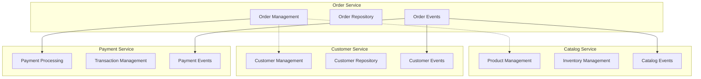

#### 服務間通訊

```java
// 服務間事件通訊
@Component
public class OrderEventPublisher {
    
    private final RabbitTemplate rabbitTemplate;
    
    @EventListener
    public void publishToMessageBroker(OrderPlaced event) {
        OrderPlacedEvent externalEvent = new OrderPlacedEvent(
            event.getOrderId().getValue(),
            event.getCustomerId().getValue(),
            event.getTotalAmount().getAmount(),
            event.getOccurredOn()
        );
        
        rabbitTemplate.convertAndSend(
            "order.exchange", 
            "order.placed", 
            externalEvent
        );
    }
}

// 外部服務整合 - Anti-Corruption Layer
@Component
public class PaymentServiceAdapter {
    
    private final PaymentServiceClient paymentClient;
    private final PaymentResponseTranslator translator;
    
    public PaymentResult processPayment(PaymentRequest request) {
        try {
            ExternalPaymentResponse response = paymentClient.processPayment(
                translateToExternalRequest(request)
            );
            
            return translator.translateToInternalModel(response);
            
        } catch (ExternalServiceException ex) {
            throw new PaymentProcessingException("支付處理失敗", ex);
        }
    }
    
    private ExternalPaymentRequest translateToExternalRequest(PaymentRequest request) {
        return new ExternalPaymentRequest(
            request.getOrderId().getValue(),
            request.getAmount().getAmount(),
            request.getAmount().getCurrency().getCurrencyCode(),
            request.getPaymentMethod().name()
        );
    }
}
```

---

## 8. 測試策略

### 8.1 測試金字塔與 DDD

```mermaid
pyramid
    title DDD 測試金字塔
    
    "E2E Tests" : 5
    "Integration Tests" : 20
    "Unit Tests" : 75
```

#### 各層測試職責

| 測試層級 | 測試對象 | 工具/框架 | 測試重點 |
|----------|----------|-----------|----------|
| **單元測試** | Entity, Value Object, Domain Service | JUnit 5, Mockito | 業務邏輯驗證 |
| **整合測試** | Repository, Application Service | Spring Boot Test, TestContainers | 資料存取與事件發布 |
| **端到端測試** | 完整業務流程 | REST Assured, WebMvcTest | 用戶場景驗證 |

### 8.2 領域模型單元測試

```java
// Entity 測試
@ExtendWith(MockitoExtension.class)
class OrderTest {
    
    @Test
    @DisplayName("新建訂單應該處於待處理狀態")
    void newOrder_ShouldBePendingStatus() {
        // Given
        OrderId orderId = OrderId.generate();
        CustomerId customerId = new CustomerId("customer-123");
        ShippingInfo shippingInfo = createShippingInfo();
        
        // When
        Order order = new Order(orderId, customerId, shippingInfo);
        
        // Then
        assertThat(order.getStatus()).isEqualTo(OrderStatus.PENDING);
        assertThat(order.getId()).isEqualTo(orderId);
        assertThat(order.getCustomerId()).isEqualTo(customerId);
        assertThat(order.getItems()).isEmpty();
    }
    
    @Test
    @DisplayName("添加商品項目應該更新訂單總額")
    void addItem_ShouldUpdateTotalAmount() {
        // Given
        Order order = createPendingOrder();
        ProductId productId = new ProductId("product-123");
        int quantity = 2;
        Money unitPrice = new Money("100.00", "TWD");
        
        // When
        order.addItem(productId, quantity, unitPrice);
        
        // Then
        assertThat(order.getItems()).hasSize(1);
        assertThat(order.getTotalAmount()).isEqualTo(new Money("200.00", "TWD"));
        
        OrderItem addedItem = order.getItems().get(0);
        assertThat(addedItem.getProductId()).isEqualTo(productId);
        assertThat(addedItem.getQuantity()).isEqualTo(quantity);
        assertThat(addedItem.getUnitPrice()).isEqualTo(unitPrice);
    }
    
    @Test
    @DisplayName("確認空訂單應該拋出例外")
    void confirmEmptyOrder_ShouldThrowException() {
        // Given
        Order order = createPendingOrder();
        
        // When & Then
        assertThatThrownBy(order::confirm)
            .isInstanceOf(IllegalStateException.class)
            .hasMessage("空訂單無法確認");
    }
    
    @Test
    @DisplayName("確認訂單應該發布 OrderPlaced 事件")
    void confirmOrder_ShouldPublishOrderPlacedEvent() {
        // Given
        Order order = createOrderWithItems();
        
        // When
        order.confirm();
        
        // Then
        assertThat(order.getStatus()).isEqualTo(OrderStatus.CONFIRMED);
        
        List<DomainEvent> events = order.getDomainEvents();
        assertThat(events).hasSize(1);
        assertThat(events.get(0)).isInstanceOf(OrderPlaced.class);
        
        OrderPlaced event = (OrderPlaced) events.get(0);
        assertThat(event.getOrderId()).isEqualTo(order.getId());
        assertThat(event.getCustomerId()).isEqualTo(order.getCustomerId());
    }
    
    private Order createPendingOrder() {
        return new Order(
            OrderId.generate(),
            new CustomerId("customer-123"),
            createShippingInfo()
        );
    }
    
    private Order createOrderWithItems() {
        Order order = createPendingOrder();
        order.addItem(
            new ProductId("product-123"),
            1,
            new Money("100.00", "TWD")
        );
        return order;
    }
    
    private ShippingInfo createShippingInfo() {
        return new ShippingInfo(
            new Address("123 Test St", "Test City", "Test State", "12345", "Taiwan"),
            ShippingMethod.STANDARD
        );
    }
}

// Value Object 測試
class MoneyTest {
    
    @Test
    @DisplayName("相同金額和幣別的 Money 應該相等")
    void sameCurrencyAndAmount_ShouldBeEqual() {
        // Given
        Money money1 = new Money("100.50", "TWD");
        Money money2 = new Money("100.50", "TWD");
        
        // When & Then
        assertThat(money1).isEqualTo(money2);
        assertThat(money1.hashCode()).isEqualTo(money2.hashCode());
    }
    
    @Test
    @DisplayName("相同幣別的 Money 應該可以相加")
    void sameCurrency_ShouldAllowAddition() {
        // Given
        Money money1 = new Money("100.50", "TWD");
        Money money2 = new Money("50.25", "TWD");
        
        // When
        Money result = money1.add(money2);
        
        // Then
        assertThat(result).isEqualTo(new Money("150.75", "TWD"));
    }
    
    @Test
    @DisplayName("不同幣別的 Money 相加應該拋出例外")
    void differentCurrency_ShouldThrowExceptionOnAddition() {
        // Given
        Money twd = new Money("100.00", "TWD");
        Money usd = new Money("100.00", "USD");
        
        // When & Then
        assertThatThrownBy(() -> twd.add(usd))
            .isInstanceOf(IllegalArgumentException.class)
            .hasMessage("不同幣別無法直接相加");
    }
    
    @ParameterizedTest
    @ValueSource(strings = {"", "invalid", "100.123", "abc"})
    @DisplayName("無效的金額格式應該拋出例外")
    void invalidAmount_ShouldThrowException(String invalidAmount) {
        assertThatThrownBy(() -> new Money(invalidAmount, "TWD"))
            .isInstanceOf(IllegalArgumentException.class);
    }
}
```

### 8.3 應用服務整合測試

```java
@SpringBootTest
@Transactional
@TestPropertySource(properties = {
    "spring.jpa.hibernate.ddl-auto=create-drop",
    "spring.datasource.url=jdbc:h2:mem:testdb"
})
class OrderApplicationServiceIntegrationTest {
    
    @Autowired
    private OrderApplicationService orderService;
    
    @Autowired
    private TestEntityManager entityManager;
    
    @MockBean
    private ApplicationEventPublisher eventPublisher;
    
    @Test
    @DisplayName("建立訂單應該儲存到資料庫並發布事件")
    void createOrder_ShouldPersistAndPublishEvent() {
        // Given
        Customer customer = createAndSaveCustomer();
        CreateOrderCommand command = CreateOrderCommand.builder()
            .customerId(customer.getId())
            .shippingInfo(createShippingInfo())
            .orderItems(createOrderItems())
            .build();
        
        // When
        OrderId orderId = orderService.createOrder(command);
        
        // Then
        entityManager.flush();
        entityManager.clear();
        
        Order savedOrder = entityManager.find(Order.class, orderId);
        assertThat(savedOrder).isNotNull();
        assertThat(savedOrder.getCustomerId()).isEqualTo(customer.getId());
        assertThat(savedOrder.getStatus()).isEqualTo(OrderStatus.PENDING);
        
        verify(eventPublisher).publishEvent(any(OrderCreated.class));
    }
    
    @Test
    @DisplayName("確認不存在的訂單應該拋出例外")
    void confirmNonExistentOrder_ShouldThrowException() {
        // Given
        OrderId nonExistentOrderId = OrderId.generate();
        ConfirmOrderCommand command = new ConfirmOrderCommand(nonExistentOrderId);
        
        // When & Then
        assertThatThrownBy(() -> orderService.confirmOrder(command))
            .isInstanceOf(OrderNotFoundException.class);
    }
    
    private Customer createAndSaveCustomer() {
        Customer customer = new Customer(
            CustomerId.generate(),
            "Test Customer",
            new Email("test@example.com")
        );
        entityManager.persistAndFlush(customer);
        return customer;
    }
    
    private List<OrderItemData> createOrderItems() {
        return List.of(
            new OrderItemData(
                new ProductId("product-1"),
                2,
                new Money("100.00", "TWD")
            )
        );
    }
}
```

### 8.4 API 端到端測試

```java
@SpringBootTest(webEnvironment = SpringBootTest.WebEnvironment.RANDOM_PORT)
@AutoConfigureTestDatabase(replace = AutoConfigureTestDatabase.Replace.NONE)
@Testcontainers
class OrderControllerE2ETest {
    
    @Container
    static PostgreSQLContainer<?> postgres = new PostgreSQLContainer<>("postgres:13")
            .withDatabaseName("testdb")
            .withUsername("test")
            .withPassword("test");
    
    @Autowired
    private TestRestTemplate restTemplate;
    
    @Autowired
    private OrderRepository orderRepository;
    
    @DynamicPropertySource
    static void configureProperties(DynamicPropertyRegistry registry) {
        registry.add("spring.datasource.url", postgres::getJdbcUrl);
        registry.add("spring.datasource.username", postgres::getUsername);
        registry.add("spring.datasource.password", postgres::getPassword);
    }
    
    @Test
    @DisplayName("完整的訂單流程測試")
    void completeOrderFlow_ShouldWork() {
        // 1. 建立訂單
        CreateOrderRequest createRequest = new CreateOrderRequest();
        createRequest.setCustomerId("customer-123");
        createRequest.setShippingInfo(createShippingInfoRequest());
        createRequest.setItems(createOrderItemRequests());
        
        ResponseEntity<CreateOrderResponse> createResponse = restTemplate.postForEntity(
            "/api/v1/orders",
            createRequest,
            CreateOrderResponse.class
        );
        
        assertThat(createResponse.getStatusCode()).isEqualTo(HttpStatus.CREATED);
        String orderId = createResponse.getBody().getOrderId();
        
        // 2. 查詢訂單
        ResponseEntity<OrderDetailResponse> getResponse = restTemplate.getForEntity(
            "/api/v1/orders/" + orderId,
            OrderDetailResponse.class
        );
        
        assertThat(getResponse.getStatusCode()).isEqualTo(HttpStatus.OK);
        assertThat(getResponse.getBody().getStatus()).isEqualTo("PENDING");
        
        // 3. 確認訂單
        ResponseEntity<Void> confirmResponse = restTemplate.postForEntity(
            "/api/v1/orders/" + orderId + "/confirm",
            null,
            Void.class
        );
        
        assertThat(confirmResponse.getStatusCode()).isEqualTo(HttpStatus.OK);
        
        // 4. 驗證訂單狀態已更新
        Order confirmedOrder = orderRepository.findById(new OrderId(orderId)).orElseThrow();
        assertThat(confirmedOrder.getStatus()).isEqualTo(OrderStatus.CONFIRMED);
    }
}
```

### 📝 測試策略小結

**重點回顧：**

- 遵循測試金字塔，重點關注單元測試
- 領域模型測試專注於業務邏輯驗證
- 整合測試驗證不同層級間的協作
- 端到端測試覆蓋關鍵業務場景

---

## 9. 常見錯誤與避免方式

### 9.1 設計階段常見錯誤

#### ❌ 錯誤 1：貧血模型 (Anemic Domain Model)

```java
// 錯誤示範 - 貧血模型
public class Order {
    private OrderId id;
    private CustomerId customerId;
    private OrderStatus status;
    private List<OrderItem> items;
    
    // 只有 getters 和 setters，沒有業務邏輯
    public OrderId getId() { return id; }
    public void setId(OrderId id) { this.id = id; }
    public OrderStatus getStatus() { return status; }
    public void setStatus(OrderStatus status) { this.status = status; }
    // ...
}

// 業務邏輯散布在服務層
@Service
public class OrderService {
    public void confirmOrder(OrderId orderId) {
        Order order = orderRepository.findById(orderId);
        if (order.getStatus() != OrderStatus.PENDING) {
            throw new IllegalStateException("訂單狀態錯誤");
        }
        if (order.getItems().isEmpty()) {
            throw new IllegalStateException("空訂單無法確認");
        }
        order.setStatus(OrderStatus.CONFIRMED);
        orderRepository.save(order);
    }
}
```

**✅ 正確做法 - 豐富的領域模型**

```java
public class Order extends AggregateRoot<OrderId> {
    private CustomerId customerId;
    private OrderStatus status;
    private List<OrderItem> items;
    
    // 業務邏輯封裝在實體內
    public void confirm() {
        validateCanBeConfirmed();
        this.status = OrderStatus.CONFIRMED;
        addDomainEvent(new OrderConfirmed(getId(), customerId));
    }
    
    private void validateCanBeConfirmed() {
        if (status != OrderStatus.PENDING) {
            throw new IllegalStateException("只能確認待處理狀態的訂單");
        }
        if (items.isEmpty()) {
            throw new IllegalStateException("空訂單無法確認");
        }
    }
    
    public boolean canBeShipped() {
        return status == OrderStatus.CONFIRMED && hasShippableItems();
    }
    
    private boolean hasShippableItems() {
        return items.stream().allMatch(OrderItem::isShippable);
    }
}
```

#### ❌ 錯誤 2：過大的聚合

```java
// 錯誤示範 - 包含太多概念的聚合
public class Customer extends AggregateRoot<CustomerId> {
    private String name;
    private Email email;
    private List<Address> addresses;
    private List<Order> orders;           // 不應該包含
    private List<PaymentMethod> paymentMethods; // 不應該包含
    private List<Preference> preferences; // 不應該包含
    private List<Review> reviews;         // 不應該包含
    
    // 會導致性能問題和一致性邊界模糊
}
```

**✅ 正確做法 - 小而聚焦的聚合**

```java
// 客戶聚合只包含基本資訊
public class Customer extends AggregateRoot<CustomerId> {
    private String name;
    private Email email;
    private CustomerStatus status;
    private LocalDateTime registeredAt;
    
    public void changeEmail(Email newEmail) {
        validateEmailChange(newEmail);
        this.email = newEmail;
        addDomainEvent(new CustomerEmailChanged(getId(), newEmail));
    }
    
    public void activate() {
        if (status == CustomerStatus.ACTIVE) {
            throw new IllegalStateException("客戶已經是啟用狀態");
        }
        this.status = CustomerStatus.ACTIVE;
        addDomainEvent(new CustomerActivated(getId()));
    }
}

// 訂單是獨立的聚合
public class Order extends AggregateRoot<OrderId> {
    private CustomerId customerId; // 透過 ID 參考客戶
    // ... 訂單相關邏輯
}
```

#### ❌ 錯誤 3：領域服務濫用

```java
// 錯誤示範 - 過度使用領域服務
@Service
public class OrderDomainService {
    // 這些邏輯應該在 Order 聚合內
    public void addItem(Order order, ProductId productId, int quantity) {
        order.getItems().add(new OrderItem(productId, quantity));
    }
    
    public void removeItem(Order order, ProductId productId) {
        order.getItems().removeIf(item -> item.getProductId().equals(productId));
    }
    
    public Money calculateTotal(Order order) {
        return order.getItems().stream()
            .map(OrderItem::getTotalPrice)
            .reduce(Money.ZERO, Money::add);
    }
}
```

**✅ 正確做法 - 合理使用領域服務**

```java
// 領域服務只處理跨聚合的業務邏輯
@Service
public class OrderPricingService {
    private final TaxCalculator taxCalculator;
    private final DiscountPolicy discountPolicy;
    
    // 需要外部資訊計算的複雜定價邏輯
    public OrderPricing calculatePricing(Order order, Customer customer, Location location) {
        Money subtotal = order.calculateSubtotal(); // 聚合內部方法
        Money discount = discountPolicy.calculateDiscount(order, customer);
        Money tax = taxCalculator.calculateTax(subtotal, location);
        Money shipping = calculateShipping(order, location);
        
        return new OrderPricing(subtotal, discount, tax, shipping);
    }
}
```

### 9.2 實作階段常見錯誤

#### ❌ 錯誤 4：跨聚合的直接引用

```java
// 錯誤示範
@Entity
public class Order {
    @ManyToOne
    @JoinColumn(name = "customer_id")
    private Customer customer; // 直接引用其他聚合
    
    @ManyToMany
    @JoinTable(name = "order_products")
    private List<Product> products; // 直接引用其他聚合
}
```

**✅ 正確做法 - 透過 ID 引用**

```java
@Entity
public class Order {
    @Column(name = "customer_id")
    private CustomerId customerId; // 透過 ID 引用
    
    @ElementCollection
    @CollectionTable(name = "order_items")
    private List<OrderItem> items; // 聚合內部對象
}

@Embeddable
public class OrderItem {
    @Column(name = "product_id")
    private ProductId productId; // 透過 ID 引用商品
    
    @Column(name = "product_name")
    private String productName; // 快照資料
    
    @Column(name = "quantity")
    private int quantity;
    
    @Embedded
    private Money unitPrice;
}
```

#### ❌ 錯誤 5：在領域層使用技術框架

```java
// 錯誤示範 - 領域對象依賴技術框架
public class Order {
    @Autowired
    private OrderRepository repository; // 領域對象不應依賴基礎設施
    
    public void confirm() {
        this.status = OrderStatus.CONFIRMED;
        repository.save(this); // 違反領域層純淨性
    }
}
```

**✅ 正確做法 - 保持領域層純淨**

```java
// 領域對象專注於業務邏輯
public class Order extends AggregateRoot<OrderId> {
    public void confirm() {
        validateCanBeConfirmed();
        this.status = OrderStatus.CONFIRMED;
        addDomainEvent(new OrderConfirmed(getId(), customerId));
    }
}

// 應用服務負責協調和持久化
@Service
@Transactional
public class OrderApplicationService {
    private final OrderRepository orderRepository;
    
    public void confirmOrder(ConfirmOrderCommand command) {
        Order order = orderRepository.findById(command.getOrderId()).orElseThrow();
        order.confirm(); // 調用領域邏輯
        orderRepository.save(order); // 持久化
        publishDomainEvents(order); // 發布事件
    }
}
```

---

## 10. 學習與認證路徑

### 10.1 學習階段規劃

```mermaid
graph LR
    A[基礎概念學習<br/>1-2週] --> B[實作練習<br/>2-3週]
    B --> C[專案應用<br/>4-6週]
    C --> D[進階模式<br/>2-3週]
    D --> E[認證準備<br/>2-4週]
    
    subgraph "學習里程碑"
        F[理解核心概念]
        G[完成 Demo 專案]
        H[重構現有專案]
        I[掌握進階模式]
        J[通過認證考試]
    end
    
    A --> F
    B --> G
    C --> H
    D --> I
    E --> J
```

### 10.2 推薦學習資源

#### 📚 必讀書籍

| 書名 | 作者 | 難度 | 重點內容 |
|------|------|------|----------|
| **領域驅動設計** | Eric Evans | ⭐⭐⭐⭐ | DDD 經典著作，概念基礎 |
| **實作領域驅動設計** | Vaughn Vernon | ⭐⭐⭐ | 實作指南，Spring Boot 範例 |
| **領域驅動設計精粹** | Vaughn Vernon | ⭐⭐ | 快速入門，概念總結 |
| **架構整潔之道** | Robert Martin | ⭐⭐⭐ | 軟體架構原則 |
| **微服務設計** | Sam Newman | ⭐⭐⭐ | 微服務與 DDD 結合 |

#### 🎓 線上課程

**Pluralsight 課程系列：**
- "Domain-Driven Design Fundamentals" - Steve Smith & Julie Lerman
- "Domain-Driven Design in Practice" - Vladimir Khorikov
- "Modern Software Architecture: Domain Models, CQRS, and Event Sourcing" - Dino Esposito

**Udemy 推薦課程：**
- "Domain Driven Design & Microservices for Architects"
- "Spring Boot Microservices with JPA"

#### 🏆 認證路徑

**1. VMware Tanzu (Pivotal) Spring Professional**
- 涵蓋 Spring Boot、JPA、事務管理
- 為 DDD 實作打好基礎

**2. Domain-Driven Design Europe Certificate**
- 歐洲 DDD 社群認證
- 包含戰略設計和戰術設計

**3. Microsoft Azure Solutions Architect**
- 微服務架構設計
- CQRS 和 Event Sourcing 模式

### 10.3 實作練習專案

#### 練習專案 1：圖書館管理系統

**業務需求：**
- 書籍借閱與歸還
- 會員管理
- 逾期罰款處理

**DDD 學習重點：**
- 識別聚合邊界
- 實作領域事件
- 設計值對象

```java
// 練習目標：設計 Book 聚合
public class Book extends AggregateRoot<BookId> {
    private String title;
    private ISBN isbn;
    private List<Author> authors;
    private BookStatus status;
    private MemberId borrowedBy;
    private LocalDate dueDate;
    
    public BorrowResult borrowTo(MemberId memberId, LocalDate dueDate) {
        // 實作借閱邏輯
    }
    
    public void returnBook() {
        // 實作歸還邏輯
    }
}
```

#### 練習專案 2：會議室預約系統

**業務需求：**
- 會議室預約與取消
- 衝突檢測
- 使用統計

**DDD 學習重點：**
- 複雜業務規則處理
- 領域服務設計
- CQRS 模式應用

#### 練習專案 3：線上學習平台

**業務需求：**
- 課程管理
- 學習進度追蹤
- 證書頒發

**DDD 學習重點：**
- 多聚合協作
- 事件驅動架構
- 微服務邊界劃分

### 10.4 認證考試準備

#### DDD 認證考試要點

**戰略設計 (40%)**
- Domain、Subdomain 識別
- Bounded Context 劃分
- Context Map 設計
- Ubiquitous Language 建立

**戰術設計 (40%)**
- Entity vs Value Object 選擇
- Aggregate 設計原則
- Repository 模式應用
- Domain Event 處理

**實作技術 (20%)**
- Spring Boot 整合
- JPA 實體映射
- 測試策略
- 效能考量

#### 考試準備策略

**1. 理論基礎鞏固**
- 每週複習核心概念
- 製作概念關聯圖
- 參與社群討論

**2. 實作能力提升**
- 完成至少 2 個完整專案
- 重構現有專案使用 DDD
- Code Review 和經驗分享

**3. 模擬考試練習**
- 使用官方練習題
- 時間控制練習
- 錯題整理和複習

---

## 11. 附錄：UML 圖與最佳實踐

### 11.1 Context Map 繪製指南

#### Context Map 符號說明

```mermaid
graph LR
    subgraph "關係類型"
        A[上游上下文] -->|Customer/Supplier| B[下游上下文]
        C[合作夥伴] <-->|Partnership| D[合作夥伴]
        E[共享核心] <-.->|Shared Kernel| F[共享核心]
        G[遵循者] -.->|Conformist| H[上游]
        I[防腐層] -->|ACL| J[外部系統]
        K[開放主機] -->|OHS| L[多個下游]
        M[各自為政] -->|Separate Ways| N[獨立發展]
    end
```

#### 實際 Context Map 範例

```mermaid
graph TB
    subgraph "電商系統 Context Map"
        OC[訂單上下文<br/>Order Context]
        PC[商品上下文<br/>Product Context]
        CC[客戶上下文<br/>Customer Context]
        PayC[支付上下文<br/>Payment Context]
        IC[庫存上下文<br/>Inventory Context]
        NC[通知上下文<br/>Notification Context]
        
        OC -->|Customer/Supplier| PC
        OC -->|Customer/Supplier| CC
        OC -->|Customer/Supplier| PayC
        PC <-->|Partnership| IC
        OC -->|Open Host Service| NC
        PayC -.->|Anti-Corruption Layer| ExternalPayment[第三方支付]
    end
```

### 11.2 Class Diagram 最佳實踐

#### 聚合設計圖

```mermaid
classDiagram
    class Order {
        <<AggregateRoot>>
        -OrderId id
        -CustomerId customerId
        -OrderStatus status
        -Money totalAmount
        -LocalDateTime createdAt
        +addItem(ProductId, int, Money)
        +removeItem(ProductId)
        +confirm()
        +cancel(CancellationReason)
        +ship(TrackingNumber)
    }
    
    class OrderItem {
        <<ValueObject>>
        -ProductId productId
        -int quantity
        -Money unitPrice
        +getTotalPrice() Money
        +changeQuantity(int)
    }
    
    class ShippingInfo {
        <<ValueObject>>
        -Address address
        -ShippingMethod method
    }
    
    class Address {
        <<ValueObject>>
        -String street
        -String city
        -String postalCode
        -String country
    }
    
    Order *-- OrderItem : contains
    Order *-- ShippingInfo : has
    ShippingInfo *-- Address : contains
```

### 11.3 Sequence Diagram 最佳實踐

#### 訂單建立流程

```mermaid
sequenceDiagram
    participant Client
    participant OrderController
    participant OrderApplicationService
    participant OrderFactory
    participant OrderRepository
    participant DomainEventPublisher
    
    Client->>OrderController: POST /orders
    OrderController->>OrderApplicationService: createOrder(command)
    OrderApplicationService->>OrderFactory: createOrder(customerId, items)
    OrderFactory-->>OrderApplicationService: order
    OrderApplicationService->>OrderRepository: save(order)
    OrderApplicationService->>DomainEventPublisher: publishEvents(order)
    DomainEventPublisher-->>OrderApplicationService: void
    OrderApplicationService-->>OrderController: orderId
    OrderController-->>Client: 201 Created
```

---

## 12. 檢查清單 (Checklist)

### 12.1 新進成員快速檢查清單

#### 設計階段檢查 ✅

**戰略設計檢查項目：**

- [ ] **領域識別**
  - [ ] 識別出核心領域、支撐領域、通用領域
  - [ ] 為不同類型領域制定適當的投資策略
  - [ ] 確認核心領域真正提供競爭優勢

- [ ] **Bounded Context 劃分**
  - [ ] 每個上下文都有清晰的職責邊界
  - [ ] 上下文大小適中，可由一個團隊維護
  - [ ] 不同上下文間的術語不會產生歧義

- [ ] **統一語言建立**
  - [ ] 業務專家和開發者使用相同術語
  - [ ] 建立並維護術語詞典
  - [ ] 程式碼中體現業務語言

**戰術設計檢查項目：**

- [ ] **實體設計**
  - [ ] 每個實體都有唯一身份標識
  - [ ] 實體包含相關的業務行為
  - [ ] 避免貧血模型

- [ ] **值對象設計**
  - [ ] 值對象是不可變的
  - [ ] 包含驗證邏輯
  - [ ] 實作相等性比較

- [ ] **聚合設計**
  - [ ] 聚合大小適中（推薦一個聚合根加少數實體）
  - [ ] 聚合間透過 ID 參考，不直接持有對象引用
  - [ ] 業務不變條件在聚合邊界內得到保證

#### 實作階段檢查 ✅

**程式碼品質檢查：**

- [ ] **領域層純淨性**
  - [ ] 領域對象不依賴基礎設施框架
  - [ ] 領域邏輯封裝在適當的對象中
  - [ ] 避免在領域層使用技術註解

- [ ] **應用服務設計**
  - [ ] 應用服務保持薄型，只協調不包含業務邏輯
  - [ ] 每個方法對應一個業務用例
  - [ ] 正確處理事務邊界

- [ ] **資料庫設計**
  - [ ] 聚合作為整體進行持久化
  - [ ] 值對象使用 @Embedded 或 @ElementCollection
  - [ ] 避免 N+1 查詢問題

**測試完整性檢查：**

- [ ] **單元測試覆蓋**
  - [ ] 領域對象的業務邏輯有完整測試
  - [ ] 測試涵蓋正常路徑和異常情況
  - [ ] 測試具有良好的可讀性

- [ ] **整合測試覆蓋**
  - [ ] 應用服務的主要流程有整合測試
  - [ ] 資料存取層的複雜查詢有測試
  - [ ] 事件發布機制有測試

#### 專案上線檢查 ✅

**效能與安全性：**

- [ ] **查詢效能**
  - [ ] 複雜查詢有適當的索引
  - [ ] 使用讀取模型優化查詢效能
  - [ ] 分頁查詢避免深分頁問題

- [ ] **安全考量**
  - [ ] API 有適當的認證和授權
  - [ ] 敏感資料有加密保護
  - [ ] 輸入驗證和 SQL 注入防護

- [ ] **監控與日誌**
  - [ ] 關鍵業務流程有監控指標
  - [ ] 異常情況有完整日誌記錄
  - [ ] 效能指標可被追蹤

**部署與維護：**

- [ ] **文件完整性**
  - [ ] API 文件完整且最新
  - [ ] 領域模型文件與程式碼同步
  - [ ] 部署和維護文件完備

- [ ] **團隊準備**
  - [ ] 團隊成員熟悉 DDD 概念
  - [ ] 建立 Code Review 檢查標準
  - [ ] 制定持續改進計劃

### 12.2 定期檢視清單

#### 每月檢視項目：

- [ ] 檢視領域模型是否仍反映實際業務需求
- [ ] 評估聚合邊界是否合適，是否需要調整
- [ ] 檢查統一語言使用情況，更新術語詞典
- [ ] 分析效能瓶頸，優化查詢和資料存取

#### 每季檢視項目：

- [ ] 評估 Bounded Context 劃分是否仍然合理
- [ ] 檢視測試覆蓋率和測試品質
- [ ] 分析技術債務，制定重構計劃
- [ ] 團隊 DDD 技能提升計劃

---

## 🎉 結語

恭喜您完成 Domain-Driven Design 教學手冊的學習！

**關鍵要點回顧：**

1. **以業務為中心**：DDD 的核心是將複雜的業務邏輯轉化為清晰的軟體模型
2. **協作為王**：成功的 DDD 實施需要業務專家和開發者密切協作
3. **持續演進**：領域模型應該隨著業務理解的深入而不斷改進
4. **實用主義**：工具和模式要為業務目標服務，避免過度設計

**下一步建議：**

- 📖 選擇一個小型專案開始 DDD 實踐
- 👥 組織團隊 Event Storming 工作坊
- 🔄 建立定期的模型檢視和改進機制
- 📚 持續學習和分享 DDD 經驗

記住，DDD 是一個長期投資，需要耐心和堅持。隨著實踐的深入，您會發現它為軟體開發帶來的巨大價值。

**Happy Coding with DDD! 🚀**

---

> **文件版本：** v1.0  
> **最後更新：** 2025年9月1日  
> **適用專案：** Vue 3.x + Spring Boot 前後端分離架構  
> **維護者：** 專案開發團隊

