# Entity-Relationship Model (ER Model) 教學手冊

## 📋 目錄

1. [基礎知識](#1-基礎知識)
   - 1.1 [什麼是 ER Model](#11-什麼是-er-model)
   - 1.2 [核心概念](#12-核心概念)
   - 1.3 [ERD 符號與è¦å‰‡](#13-erd-符號與è¦å‰‡)
   - 1.4 [基礎實作練習](#14-基礎實作練習)

2. [專案應用](#2-專案應用)
   - 2.1 [需求分æžåˆ° ER Model](#21-需求分æžåˆ°-er-model)
   - 2.2 [案例研究：電商平å°](#22-案例研究電商平å°)
   - 2.3 [案例研究：銀行系統](#23-案例研究銀行系統)
   - 2.4 [轉æ›ç‚ºè³‡æ–™åº« Schema](#24-轉æ›ç‚ºè³‡æ–™åº«-schema)
   - 2.5 [完整專案開發æµç¨‹](#25-完整專案開發æµç¨‹)

3. [進階主題](#3-進階主題)
   - 3.1 [實體類型與關è¯åº¦](#31-實體類型與關è¯åº¦)
   - 3.2 [æ­£è¦åŒ–ç†è«–](#32-æ­£è¦åŒ–ç†è«–)
   - 3.3 [常見設計錯誤](#33-常見設計錯誤)
   - 3.4 [最佳實務](#34-最佳實務)

4. [èªè­‰æº–å‚™](#4-èªè­‰æº–å‚™)
   - 4.1 [èªè­‰å…§å®¹èˆ‡ç¯„åœ](#41-èªè­‰å…§å®¹èˆ‡ç¯„åœ)
   - 4.2 [練習題庫](#42-練習題庫)
   - 4.3 [模擬考題](#43-模擬考題)
   - 4.4 [é‡é»žçŸ¥è­˜æ‘˜è¦](#44-é‡é»žçŸ¥è­˜æ‘˜è¦)

5. [學習路徑](#5-學習路徑)
   - 5.1 [學習步驟建議](#51-學習步驟建議)
   - 5.2 [推薦工具](#52-推薦工具)
   - 5.3 [進階學習資æº](#53-進階學習資æº)

6. [檢查清單](#6-檢查清單)
   - 6.1 [設計階段檢查清單](#61-設計階段檢查清單)
   - 6.2 [資料庫實作檢查清單](#62-資料庫實作檢查清單)
   - 6.3 [å“質ä¿è­‰æª¢æŸ¥æ¸…å–®](#63-å“質ä¿è­‰æª¢æŸ¥æ¸…å–®)
   - 6.4 [專案交付檢查清單](#64-專案交付檢查清單)
   - 6.5 [學習æˆæžœæª¢æ ¸](#65-學習æˆæžœæª¢æ ¸)
   - 6.6 [æŒçºŒæ”¹é€²æª¢æŸ¥](#66-æŒçºŒæ”¹é€²æª¢æŸ¥)

7. [附錄](#📎-附錄)
   - A. [ERD 符號速查表](#a-erd-符號速查表)
   - B. [SQL 資料型別å°ç…§è¡¨](#b-sql-資料型別å°ç…§è¡¨)
   - C. [常用正è¦åŒ–檢查 SQL](#c-常用正è¦åŒ–檢查-sql)
   - D. [設計模å¼ç¯„本](#d-設計模å¼ç¯„本)
   - E. [效能優化檢查清單](#e-效能優化檢查清單)
   - F. [安全性檢查清單](#f-安全性檢查清單)
   - G. [版本更新記錄](#g-版本更新記錄)

---

## 🚀 快速開始

### 📖 學習建議

如果您是第一次接觸 ER Model，建議按照以下順åºå­¸ç¿’：

#### 🔰 åˆå­¸è€…路徑（é ä¼° 2-3 週）

1. 📚 **基礎建立**：先閱讀「基礎知識ã€ç« ç¯€ï¼Œå»ºç«‹åŸºæœ¬æ¦‚念
2. ðŸ› ï¸ **實作練習**：é€éŽã€Œå°ˆæ¡ˆæ‡‰ç”¨ã€çš„案例練習實作
3. 📈 **深化ç†è§£**：學習「進階主題ã€æ·±åŒ–ç†è§£
4. ✅ **æˆæžœé©—è­‰**：使用「檢查清單ã€é©—證學習æˆæžœ

#### 🎯 進階用戶路徑

- 如果您已具備基礎概念，å¯ç›´æŽ¥å¾žç¬¬ 2 章「專案應用ã€é–‹å§‹
- 需è¦æº–å‚™èªè­‰è€ƒè©¦çš„用戶，é‡é»žé—œæ³¨ç¬¬ 4 章「èªè­‰æº–å‚™ã€
- 尋找工具和資æºçš„用戶，åƒè€ƒç¬¬ 5 章「學習路徑ã€

#### â±ï¸ 時間投入建議

- **基礎學習**：æ¯å¤© 1-2 å°æ™‚，æŒçºŒ 2-3 週
- **實作練習**：æ¯é€± 3-5 å°æ™‚的專案實作
- **èªè­‰æº–å‚™**：é¡å¤– 2-3 週的集中複習

---

## 1. 基礎知識

### 1.1 什麼是 ER Model

**Entity-Relationship Model（實體關係模型）** 是一種用來æè¿°ç¾å¯¦ä¸–界資料çµæ§‹çš„概念模型。它幫助我們：

- 📊 **ç†è§£æ¥­å‹™éœ€æ±‚**：將複雜的業務é‚輯視覺化
- ðŸ—„ï¸ **設計資料庫**：作為資料庫設計的è—圖
- 🤠**æºé€šå·¥å…·**：讓技術與éžæŠ€è¡“人員都能ç†è§£
- 📠**文件記錄**：ä¿å­˜ç³»çµ±è¨­è¨ˆçš„é‡è¦æ–‡ä»¶

#### ç‚ºä»€éº¼éœ€è¦ ER Model？

想åƒæ‚¨è¦è¨­è¨ˆä¸€å€‹åœ–書館系統，您需è¦å›žç­”：
- 圖書館有什麼æ±è¥¿ï¼Ÿï¼ˆæ›¸ç±ã€æœƒå“¡ã€å€Ÿé–±è¨˜éŒ„）
- 它們之間有什麼關係？（會員借閱書ç±ï¼‰
- æ¯å€‹æ±è¥¿æœ‰ä»€éº¼ç‰¹å¾µï¼Ÿï¼ˆæ›¸ç±æœ‰æ›¸åã€ä½œè€…；會員有姓åã€é›»è©±ï¼‰

ER Model 就是用來回答這些å•é¡Œçš„工具ï¼

### 1.2 核心概念

#### 🢠實體 (Entity)
ç¾å¯¦ä¸–界中å¯ä»¥å€åˆ¥çš„「æ±è¥¿ã€ï¼Œå…·æœ‰ç¨ç«‹å­˜åœ¨çš„æ„義。

**特徵：**
- 具有ç¨ç‰¹çš„識別方å¼
- å¯ä»¥æ˜¯å…·é«”的（人ã€ç‰©å“）或抽象的（事件ã€æ¦‚念）
- 在系統中扮演é‡è¦è§’色

**範例：**
- 學生ã€è€å¸«ã€èª²ç¨‹ï¼ˆå­¸æ ¡ç³»çµ±ï¼‰
- 商å“ã€è¨‚å–®ã€é¡§å®¢ï¼ˆé›»å•†ç³»çµ±ï¼‰
- 帳戶ã€äº¤æ˜“ã€å®¢æˆ¶ï¼ˆéŠ€è¡Œç³»çµ±ï¼‰

#### ðŸ·ï¸ 屬性 (Attribute)
æ述實體特徵的資料項目。

**屬性類型：**

1. **簡單屬性**：ä¸å¯å†åˆ†å‰²
   - 例：姓åã€å¹´é½¡ã€é›»è©±

2. **複åˆå±¬æ€§**：å¯ä»¥åˆ†å‰²æˆæ›´å°çš„部分
   - 例：地å€ï¼ˆå¯åˆ†ç‚ºç¸£å¸‚ã€å€åŸŸã€è¡—é“）

3. **多值屬性**：å¯ä»¥æœ‰å¤šå€‹å€¼
   - 例：興趣ã€æŠ€èƒ½ã€é›»è©±è™Ÿç¢¼

4. **è¡ç”Ÿå±¬æ€§**：å¯ä»¥å¾žå…¶ä»–屬性計算得出
   - 例：年齡（從出生日期計算）ã€ç¸½é‡‘é¡ï¼ˆå¾žæ•¸é‡Ã—單價計算）

#### 🔗 關係 (Relationship)
實體之間的關è¯æˆ–互動。

**關係類型：**

1. **一å°ä¸€ (1:1)**
   - 一個實體åªèƒ½å°æ‡‰å¦ä¸€å€‹å¯¦é«”的一個實例
   - 例：員工 ↔ 員工證

2. **一å°å¤š (1:N)**
   - 一個實體å¯ä»¥å°æ‡‰å¦ä¸€å€‹å¯¦é«”的多個實例
   - 例：部門 ↔ 員工（一個部門有多個員工）

3. **多å°å¤š (M:N)**
   - 兩個實體都å¯ä»¥å°æ‡‰å°æ–¹çš„多個實例
   - 例：學生 ↔ 課程（學生å¯é¸å¤šé–€èª²ï¼Œèª²ç¨‹å¯è¢«å¤šå€‹å­¸ç”Ÿé¸ï¼‰

#### 🔑 éµå€¼ (Key)
用來唯一識別實體的屬性或屬性組åˆã€‚

**éµå€¼é¡žåž‹ï¼š**

1. **ä¸»éµ (Primary Key)**
   - 唯一識別實體的屬性
   - 例：學生學號ã€å•†å“編號

2. **候é¸éµ (Candidate Key)**
   - å¯ä»¥ä½œç‚ºä¸»éµçš„屬性
   - 例：學生å¯ç”¨å­¸è™Ÿæˆ–身分證號識別

3. **å¤–ä¾†éµ (Foreign Key)**
   - åƒè€ƒå…¶ä»–實體主éµçš„屬性
   - 例：訂單中的客戶編號åƒè€ƒå®¢æˆ¶å¯¦é«”

### 1.3 ERD 符號與è¦å‰‡

Entity-Relationship Diagram（ERD）是 ER Model 的圖形表示法。

#### 基本符號

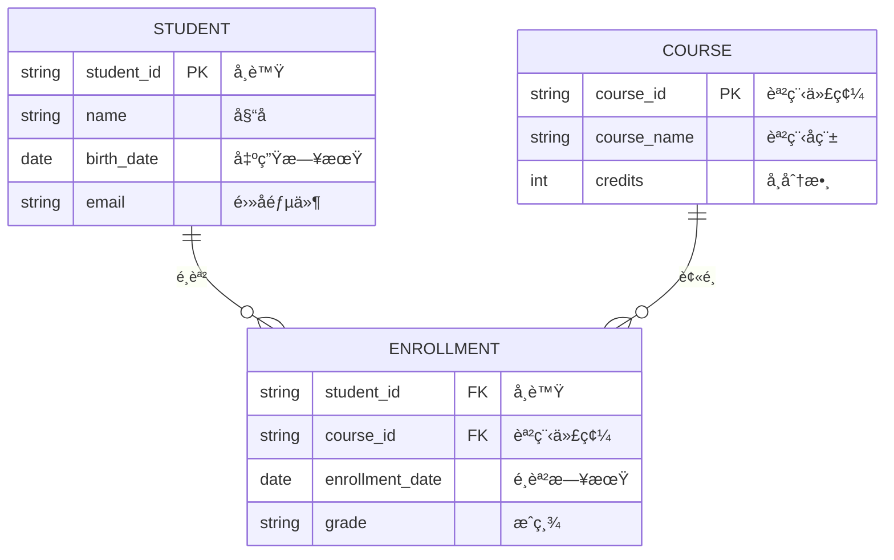
```mermaid
erDiagram
    %% 實體符號示例
    STUDENT {
        string student_id PK "學號"
        string name "姓å"
        date birth_date "出生日期"
        string email "é›»å­éƒµä»¶"
    }
    
    COURSE {
        string course_id PK "課程代碼"
        string course_name "課程å稱"
        int credits "學分數"
    }
    
    ENROLLMENT {
        string student_id FK "學號"
        string course_id FK "課程代碼"
        date enrollment_date "é¸èª²æ—¥æœŸ"
        string grade "æˆç¸¾"
    }
    
    %% 關係
    STUDENT ||--o{ ENROLLMENT : "é¸èª²"
    COURSE ||--o{ ENROLLMENT : "被é¸"
```

#### 符號說明

| 符號 | æ„義 | 說明 |
|------|------|------|
| 矩形 | 實體 | 表示實體類型 |
| 橢圓 | 屬性 | 表示實體的屬性 |
| è±å½¢ | 關係 | 表示實體間的關係 |
| ç·šæ¢ | 連接 | 連接實體ã€å±¬æ€§ã€é—œä¿‚ |
| 底線 | ä¸»éµ | 表示主éµå±¬æ€§ |
| 虛線橢圓 | è¡ç”Ÿå±¬æ€§ | å¯è¨ˆç®—得出的屬性 |

#### é—œè¯åº¦æ¨™è¨˜

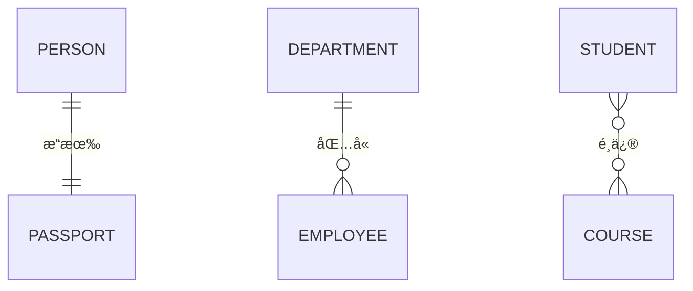
```mermaid
erDiagram
    %% 一å°ä¸€é—œä¿‚
    PERSON ||--|| PASSPORT : "æ“有"
    
    %% 一å°å¤šé—œä¿‚  
    DEPARTMENT ||--o{ EMPLOYEE : "包å«"
    
    %% 多å°å¤šé—œä¿‚
    STUDENT }o--o{ COURSE : "é¸ä¿®"
```

### 1.4 基礎實作練習

#### 練習 1：圖書館系統

**需求：** 設計一個簡單的圖書館借閱系統

**步驟：**

1. **識別實體**
   - 會員 (Member)
   - æ›¸ç± (Book)
   - 借閱記錄 (Loan)

2. **定義屬性**

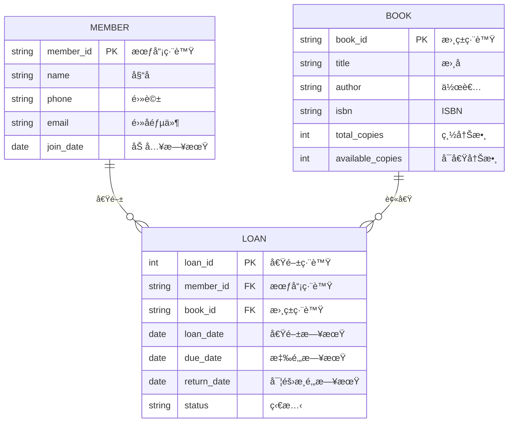
```mermaid
erDiagram
    MEMBER {
        string member_id PK "會員編號"
        string name "姓å"
        string phone "電話"
        string email "é›»å­éƒµä»¶"
        date join_date "加入日期"
    }
    
    BOOK {
        string book_id PK "書ç±ç·¨è™Ÿ"
        string title "書å"
        string author "作者"
        string isbn "ISBN"
        int total_copies "總冊數"
        int available_copies "å¯å€Ÿå†Šæ•¸"
    }
    
    LOAN {
        int loan_id PK "借閱編號"
        string member_id FK "會員編號"
        string book_id FK "書ç±ç·¨è™Ÿ"
        date loan_date "借閱日期"
        date due_date "應還日期"
        date return_date "實際歸還日期"
        string status "狀態"
    }
    
    MEMBER ||--o{ LOAN : "借閱"
    BOOK ||--o{ LOAN : "被借"
```

3. **驗證設計**
   - ✅ æ¯å€‹å¯¦é«”都有主éµ
   - ✅ 關係åˆç†ï¼ˆæœƒå“¡å¯å€Ÿå¤šæœ¬æ›¸ï¼Œæ›¸å¯è¢«å¤šå€‹æœƒå“¡å€ŸéŽï¼‰
   - ✅ 屬性完整且必è¦

#### ç·´ç¿’ 2：線上學習平å°

**需求：** 設計一個線上學習平å°çš„ ER Model

**業務æ述：**
> å¹³å°æœ‰è¬›å¸«å’Œå­¸ç”Ÿã€‚講師å¯ä»¥é–‹è¨­å¤šé–€èª²ç¨‹ï¼Œæ¯é–€èª²ç¨‹åŒ…å«å¤šå€‹å–®å…ƒã€‚學生å¯ä»¥è¨»å†Šå¤šé–€èª²ç¨‹ï¼Œä¸¦å°èª²ç¨‹é€²è¡Œè©•åˆ†å’Œè©•è«–。系統需è¦è¿½è¹¤å­¸ç”Ÿçš„學習進度。

**解答步驟：**

1. **實體識別**
   - 講師 (Instructor)
   - 學生 (Student)  
   - 課程 (Course)
   - 單元 (Lesson)
   - 註冊記錄 (Enrollment)
   - è©•è«– (Review)
   - 學習進度 (Progress)

2. **ERD 設計**

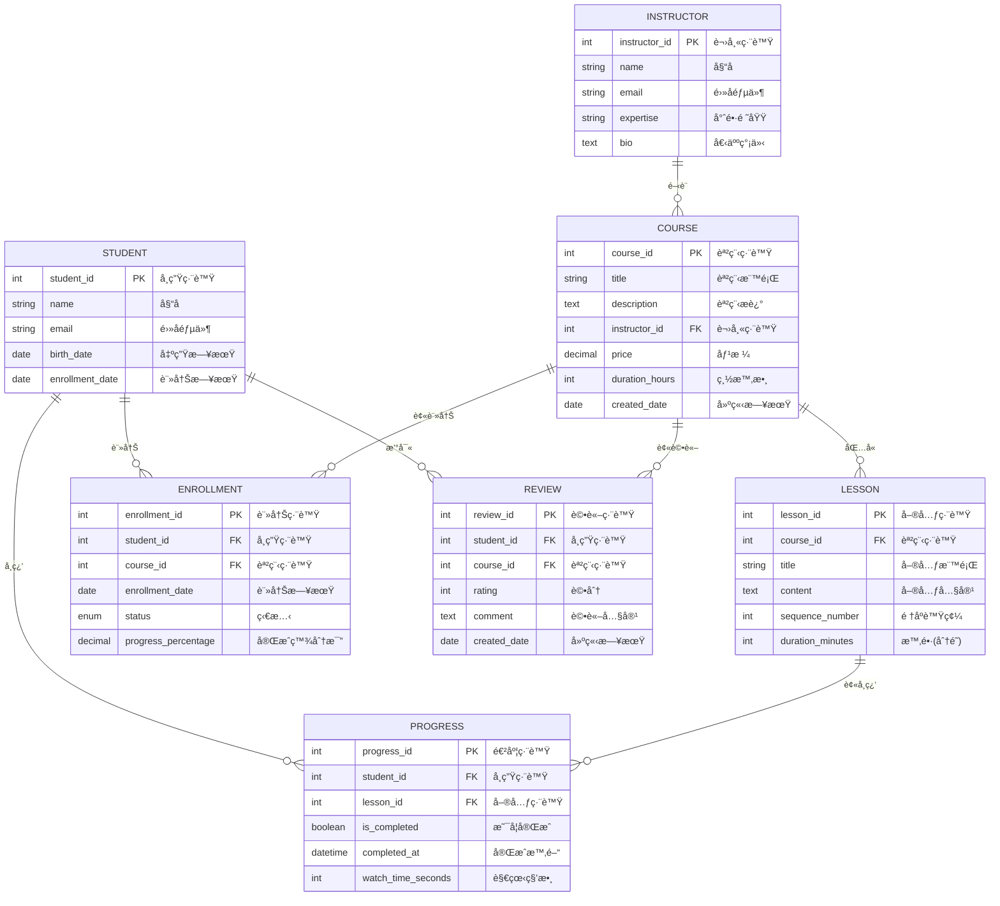
```mermaid
erDiagram
    INSTRUCTOR {
        int instructor_id PK "講師編號"
        string name "姓å"
        string email "é›»å­éƒµä»¶"
        string expertise "專長領域"
        text bio "個人簡介"
    }
    
    STUDENT {
        int student_id PK "學生編號"
        string name "姓å"
        string email "é›»å­éƒµä»¶"
        date birth_date "出生日期"
        date enrollment_date "註冊日期"
    }
    
    COURSE {
        int course_id PK "課程編號"
        string title "課程標題"
        text description "課程æè¿°"
        int instructor_id FK "講師編號"
        decimal price "價格"
        int duration_hours "總時數"
        date created_date "建立日期"
    }
    
    LESSON {
        int lesson_id PK "單元編號"
        int course_id FK "課程編號"
        string title "單元標題"
        text content "單元內容"
        int sequence_number "é †åºè™Ÿç¢¼"
        int duration_minutes "時長(分é˜)"
    }
    
    ENROLLMENT {
        int enrollment_id PK "註冊編號"
        int student_id FK "學生編號"
        int course_id FK "課程編號"
        date enrollment_date "註冊日期"
        enum status "狀態"
        decimal progress_percentage "完æˆç™¾åˆ†æ¯”"
    }
    
    REVIEW {
        int review_id PK "評論編號"
        int student_id FK "學生編號"
        int course_id FK "課程編號"
        int rating "評分"
        text comment "評論內容"
        date created_date "建立日期"
    }
    
    PROGRESS {
        int progress_id PK "進度編號"
        int student_id FK "學生編號"
        int lesson_id FK "單元編號"
        boolean is_completed "是å¦å®Œæˆ"
        datetime completed_at "完æˆæ™‚é–“"
        int watch_time_seconds "觀看秒數"
    }
    
    INSTRUCTOR ||--o{ COURSE : "開設"
    COURSE ||--o{ LESSON : "包å«"
    STUDENT ||--o{ ENROLLMENT : "註冊"
    COURSE ||--o{ ENROLLMENT : "被註冊"
    STUDENT ||--o{ REVIEW : "撰寫"
    COURSE ||--o{ REVIEW : "被評論"
    STUDENT ||--o{ PROGRESS : "學習"
    LESSON ||--o{ PROGRESS : "被學習"
```

3. **設計說明**
   - 使用 ENROLLMENT 實體處ç†å­¸ç”Ÿèˆ‡èª²ç¨‹çš„多å°å¤šé—œä¿‚
   - PROGRESS 實體追蹤細粒度的學習進度
   - REVIEW 實體ç¨ç«‹è™•ç†è©•è«–功能
   - 支æ´èª²ç¨‹çš„階層çµæ§‹ï¼ˆèª²ç¨‹â†’單元）

#### 練習 3：醫院掛號系統

**需求：** 設計醫院門診掛號系統

**解答：**

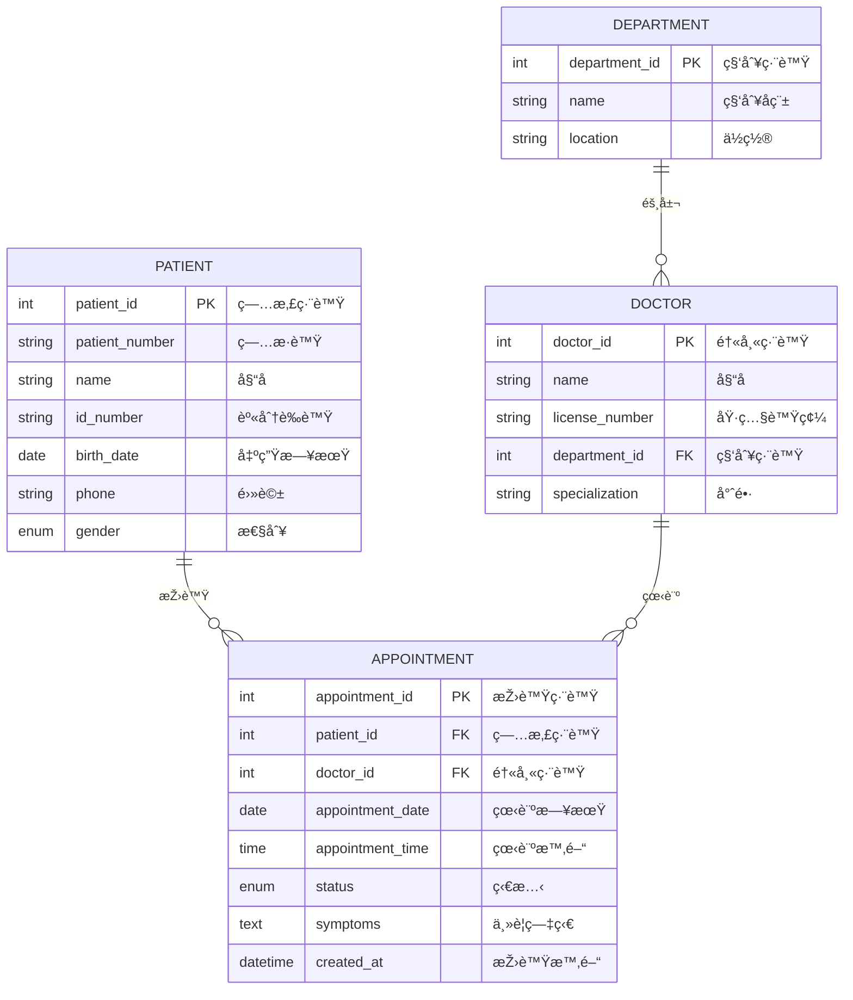
```mermaid
erDiagram
    PATIENT {
        int patient_id PK "病患編號"
        string patient_number "病歷號"
        string name "姓å"
        string id_number "身分證號"
        date birth_date "出生日期"
        string phone "電話"
        enum gender "性別"
    }
    
    DOCTOR {
        int doctor_id PK "醫師編號"
        string name "姓å"
        string license_number "執照號碼"
        int department_id FK "科別編號"
        string specialization "專長"
    }
    
    DEPARTMENT {
        int department_id PK "科別編號"
        string name "科別å稱"
        string location "ä½ç½®"
    }
    
    APPOINTMENT {
        int appointment_id PK "掛號編號"
        int patient_id FK "病患編號"
        int doctor_id FK "醫師編號"
        date appointment_date "看診日期"
        time appointment_time "看診時間"
        enum status "狀態"
        text symptoms "主è¦ç—‡ç‹€"
        datetime created_at "掛號時間"
    }
    
    DEPARTMENT ||--o{ DOCTOR : "隸屬"
    PATIENT ||--o{ APPOINTMENT : "掛號"
    DOCTOR ||--o{ APPOINTMENT : "看診"
```

#### 💡 實務æ醒

1. **從簡單開始**：先識別核心實體，å†é€æ­¥å¢žåŠ ç´°ç¯€
2. **é‡è¤‡é©—è­‰**：經常檢查設計是å¦ç¬¦åˆæ¥­å‹™éœ€æ±‚
3. **團隊討論**：與業務人員確èªå¯¦é«”和關係的正確性
4. **文件記錄**：記錄設計決策的原因

#### âš ï¸ å¸¸è¦‹éŒ¯èª¤

- 把屬性當作實體（例：把「地å€ã€è¨­ç‚ºå¯¦é«”而éžå±¬æ€§ï¼‰
- éºæ¼é‡è¦çš„關係
- 主éµè¨­è¨ˆä¸ç•¶ï¼ˆéžå”¯ä¸€æˆ–éŽæ–¼è¤‡é›œï¼‰
- éŽåº¦è¨­è¨ˆï¼ˆåŒ…å«å¤ªå¤šä¸å¿…è¦çš„細節）

---

**📚 本節é‡é»žå›žé¡§**

- ER Model 是資料庫設計的基礎工具
- 核心概念：實體ã€å±¬æ€§ã€é—œä¿‚ã€éµå€¼
- ERD 使用標準符號表示概念模型
- 從簡單範例開始練習，é€æ­¥å»ºç«‹ä¿¡å¿ƒ

**🔄 下一節é å‘Š**

接下來我們將學習如何在實際專案中應用 ER Model，包å«éœ€æ±‚分æžã€æ¡ˆä¾‹ç ”究和資料庫轉æ›ã€‚

---

## 2. 專案應用

### 2.1 需求分æžåˆ° ER Model

在實際專案中，ER Model 的設計通常從業務需求開始。以下是一個系統化的方法：

#### 📋 步驟 1：需求收集

**技巧：**
- 訪談業務人員，了解業務æµç¨‹
- 分æžç¾æœ‰æ–‡ä»¶å’Œè¡¨å–®
- 觀察實際作業æµç¨‹
- 識別資料æµå‘

**範例：線上書店需求**
> "客戶å¯ä»¥ç€è¦½æ›¸ç±ã€å°‡æ›¸ç±åŠ å…¥è³¼ç‰©è»Šã€ä¸‹è¨‚單。系統需è¦è¨˜éŒ„客戶資訊ã€æ›¸ç±åº«å­˜ã€è¨‚單明細。æ¯æœ¬æ›¸æœ‰å¤šå€‹é¡žåˆ¥ï¼Œå®¢æˆ¶å¯ä»¥æ’°å¯«æ›¸è©•ã€‚"

#### 📋 步驟 2：å詞分æžæ³•

從需求æ述中找出**åè©ž**作為候é¸å¯¦é«”，**å‹•è©ž**作為候é¸é—œä¿‚。

**å詞（候é¸å¯¦é«”）：**
- 客戶 (Customer)
- æ›¸ç± (Book) 
- 購物車 (Cart)
- 訂單 (Order)
- 類別 (Category)
- 書評 (Review)

**動詞（候é¸é—œä¿‚）：**
- ç€è¦½ã€åŠ å…¥ã€ä¸‹è¨‚å–®ã€æ’°å¯«

#### 📋 步驟 3：實體精煉

**判斷準則：**

1. **是å¦ç‚ºç¨ç«‹æ¦‚念？**
   - ✅ 客戶ã€æ›¸ç±ã€è¨‚å–® → ç¨ç«‹å¯¦é«”
   - ⌠客戶姓å → 屬性，éžå¯¦é«”

2. **是å¦éœ€è¦è¿½è¹¤ï¼Ÿ**
   - ✅ 訂單需è¦è¿½è¹¤ç‹€æ…‹ → 實體
   - ⌠臨時計算值 → éžå¯¦é«”

3. **是å¦æœ‰å¤šå€‹å¯¦ä¾‹ï¼Ÿ**
   - ✅ 多個客戶ã€å¤šå€‹æ›¸ç± → 實體
   - ⌠系統設定（通常åªæœ‰ä¸€å€‹ï¼‰ → å¯èƒ½ä¸æ˜¯å¯¦é«”

#### 📋 步驟 4：屬性識別

為æ¯å€‹å¯¦é«”識別必è¦å±¬æ€§ï¼š

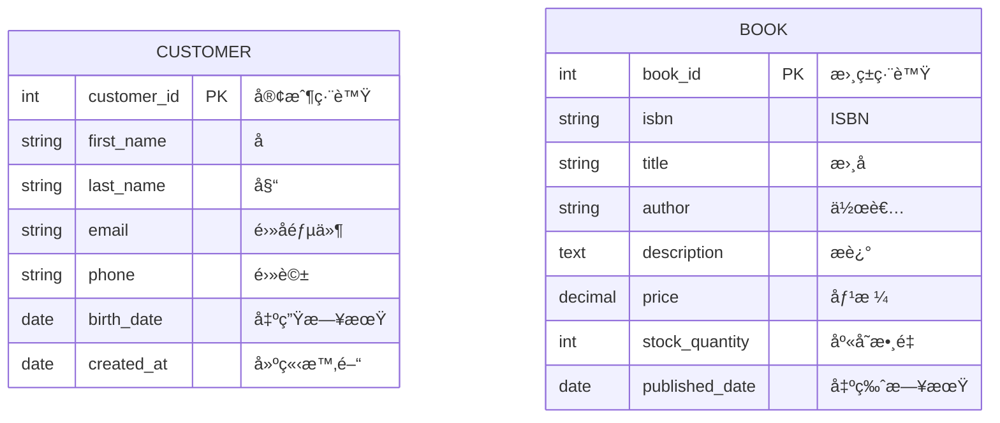
```mermaid
erDiagram
    CUSTOMER {
        int customer_id PK "客戶編號"
        string first_name "å"
        string last_name "姓"
        string email "é›»å­éƒµä»¶"
        string phone "電話"
        date birth_date "出生日期"
        date created_at "建立時間"
    }
    
    BOOK {
        int book_id PK "書ç±ç·¨è™Ÿ"
        string isbn "ISBN"
        string title "書å"
        string author "作者"
        text description "æè¿°"
        decimal price "價格"
        int stock_quantity "庫存數é‡"
        date published_date "出版日期"
    }
```

#### 📋 步驟 5：關係建立

分æžå¯¦é«”間的業務關係：

1. **客戶 - 訂單**：一å°å¤šï¼ˆå®¢æˆ¶å¯ä¸‹å¤šç­†è¨‚單）
2. **訂單 - 書ç±**：多å°å¤šï¼ˆè¨‚å–®å¯åŒ…å«å¤šæœ¬æ›¸ï¼Œæ›¸å¯åœ¨å¤šå€‹è¨‚單中）
3. **æ›¸ç± - 類別**：多å°å¤šï¼ˆæ›¸å¯å±¬æ–¼å¤šå€‹é¡žåˆ¥ï¼Œé¡žåˆ¥åŒ…å«å¤šæœ¬æ›¸ï¼‰

### 2.2 案例研究：電商平å°

讓我們以一個完整的電商平å°ç‚ºä¾‹ï¼Œå±•ç¤ºå®Œæ•´çš„ ER Model 設計éŽç¨‹ã€‚

#### 業務需求分æž

**系統功能：**
- 商å“管ç†ï¼ˆå•†å“ã€é¡žåˆ¥ã€å“牌）
- 訂單處ç†ï¼ˆè³¼ç‰©è»Šã€è¨‚å–®ã€ä»˜æ¬¾ï¼‰
- 用戶管ç†ï¼ˆå®¢æˆ¶ã€åœ°å€ã€å好）
- 評價系統（商å“è©•è«–ã€è©•åˆ†ï¼‰
- 促銷管ç†ï¼ˆå„ªæƒ åˆ¸ã€æŠ˜æ‰£ï¼‰

#### 完整 ERD 設計

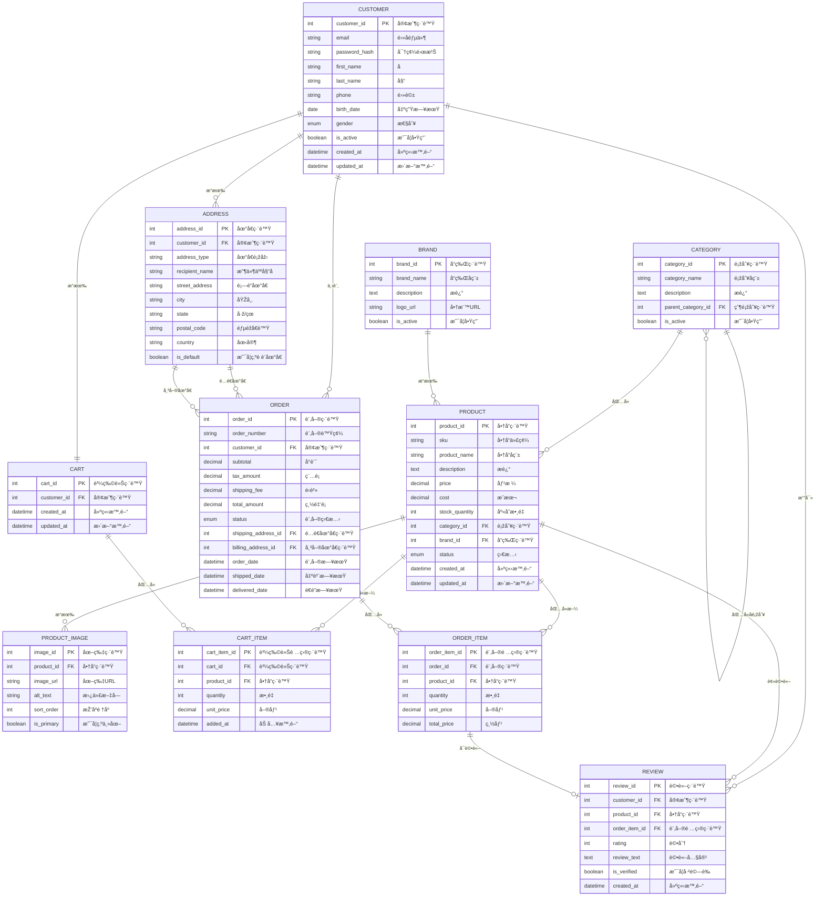
```mermaid
erDiagram
    %% 用戶相關
    CUSTOMER {
        int customer_id PK "客戶編號"
        string email "é›»å­éƒµä»¶"
        string password_hash "密碼雜湊"
        string first_name "å"
        string last_name "姓"
        string phone "電話"
        date birth_date "出生日期"
        enum gender "性別"
        boolean is_active "是å¦å•Ÿç”¨"
        datetime created_at "建立時間"
        datetime updated_at "更新時間"
    }
    
    ADDRESS {
        int address_id PK "地å€ç·¨è™Ÿ"
        int customer_id FK "客戶編號"
        string address_type "地å€é¡žåž‹"
        string recipient_name "收件人姓å"
        string street_address "è¡—é“地å€"
        string city "城市"
        string state "å·ž/çœ"
        string postal_code "郵éžå€è™Ÿ"
        string country "國家"
        boolean is_default "是å¦ç‚ºé è¨­åœ°å€"
    }
    
    %% 商å“相關
    CATEGORY {
        int category_id PK "類別編號"
        string category_name "類別å稱"
        text description "æè¿°"
        int parent_category_id FK "父類別編號"
        boolean is_active "是å¦å•Ÿç”¨"
    }
    
    BRAND {
        int brand_id PK "å“牌編號"
        string brand_name "å“牌å稱"
        text description "æè¿°"
        string logo_url "商標URL"
        boolean is_active "是å¦å•Ÿç”¨"
    }
    
    PRODUCT {
        int product_id PK "商å“編號"
        string sku "商å“代碼"
        string product_name "商å“å稱"
        text description "æè¿°"
        decimal price "價格"
        decimal cost "æˆæœ¬"
        int stock_quantity "庫存數é‡"
        int category_id FK "類別編號"
        int brand_id FK "å“牌編號"
        enum status "狀態"
        datetime created_at "建立時間"
        datetime updated_at "更新時間"
    }
    
    PRODUCT_IMAGE {
        int image_id PK "圖片編號"
        int product_id FK "商å“編號"
        string image_url "圖片URL"
        string alt_text "替代文字"
        int sort_order "排åºé †åº"
        boolean is_primary "是å¦ç‚ºä¸»åœ–"
    }
    
    %% 訂單相關
    CART {
        int cart_id PK "購物車編號"
        int customer_id FK "客戶編號"
        datetime created_at "建立時間"
        datetime updated_at "更新時間"
    }
    
    CART_ITEM {
        int cart_item_id PK "購物車項目編號"
        int cart_id FK "購物車編號"
        int product_id FK "商å“編號"
        int quantity "數é‡"
        decimal unit_price "單價"
        datetime added_at "加入時間"
    }
    
    ORDER {
        int order_id PK "訂單編號"
        string order_number "訂單號碼"
        int customer_id FK "客戶編號"
        decimal subtotal "å°è¨ˆ"
        decimal tax_amount "稅é¡"
        decimal shipping_fee "é‹è²»"
        decimal total_amount "總金é¡"
        enum status "訂單狀態"
        int shipping_address_id FK "é…é€åœ°å€ç·¨è™Ÿ"
        int billing_address_id FK "帳單地å€ç·¨è™Ÿ"
        datetime order_date "訂單日期"
        datetime shipped_date "出貨日期"
        datetime delivered_date "é€é”日期"
    }
    
    ORDER_ITEM {
        int order_item_id PK "訂單項目編號"
        int order_id FK "訂單編號"
        int product_id FK "商å“編號"
        int quantity "數é‡"
        decimal unit_price "單價"
        decimal total_price "總價"
    }
    
    %% 評價系統
    REVIEW {
        int review_id PK "評論編號"
        int customer_id FK "客戶編號"
        int product_id FK "商å“編號"
        int order_item_id FK "訂單項目編號"
        int rating "評分"
        text review_text "評論內容"
        boolean is_verified "是å¦å·²é©—è­‰"
        datetime created_at "建立時間"
    }
    
    %% 關係定義
    CUSTOMER ||--o{ ADDRESS : "æ“有"
    CUSTOMER ||--|| CART : "æ“有"
    CUSTOMER ||--o{ ORDER : "下訂"
    CUSTOMER ||--o{ REVIEW : "撰寫"
    
    CATEGORY ||--o{ CATEGORY : "包å«å­é¡žåˆ¥"
    CATEGORY ||--o{ PRODUCT : "包å«"
    BRAND ||--o{ PRODUCT : "æ“有"
    PRODUCT ||--o{ PRODUCT_IMAGE : "æ“有"
    PRODUCT ||--o{ CART_ITEM : "包å«æ–¼"
    PRODUCT ||--o{ ORDER_ITEM : "包å«æ–¼"
    PRODUCT ||--o{ REVIEW : "被評論"
    
    CART ||--o{ CART_ITEM : "包å«"
    ORDER ||--o{ ORDER_ITEM : "包å«"
    ORDER_ITEM ||--o| REVIEW : "å¯è©•è«–"
    
    ADDRESS ||--o{ ORDER : "é…é€åœ°å€"
    ADDRESS ||--o{ ORDER : "帳單地å€"
```

#### 設計é‡é»žèªªæ˜Ž

1. **用戶管ç†**
   - 分離地å€ç‚ºç¨ç«‹å¯¦é«”，支æ´å¤šå€‹åœ°å€
   - 密碼使用雜湊值，ä¸å„²å­˜æ˜Žæ–‡
   - 包å«è»Ÿåˆªé™¤æ©Ÿåˆ¶ï¼ˆis_active）

2. **商å“管ç†**
   - 類別支æ´éšŽå±¤çµæ§‹ï¼ˆè‡ªæˆ‘åƒè€ƒï¼‰
   - 商å“圖片分離儲存，支æ´å¤šåœ–片
   - SKU 作為商å“唯一識別碼

3. **訂單處ç†**
   - 購物車與訂單分離，支æ´æš«å­˜è³¼è²·æ„願
   - 訂單明細記錄購買時的價格
   - 支æ´ä¸åŒçš„é…é€èˆ‡å¸³å–®åœ°å€

4. **評價系統**
   - 與訂單項目關è¯ï¼Œç¢ºä¿è©•è«–的真實性
   - 包å«é©—證機制

### 2.3 案例研究：銀行系統

銀行系統具有更嚴格的資料完整性和安全性è¦æ±‚。

#### 核心業務實體

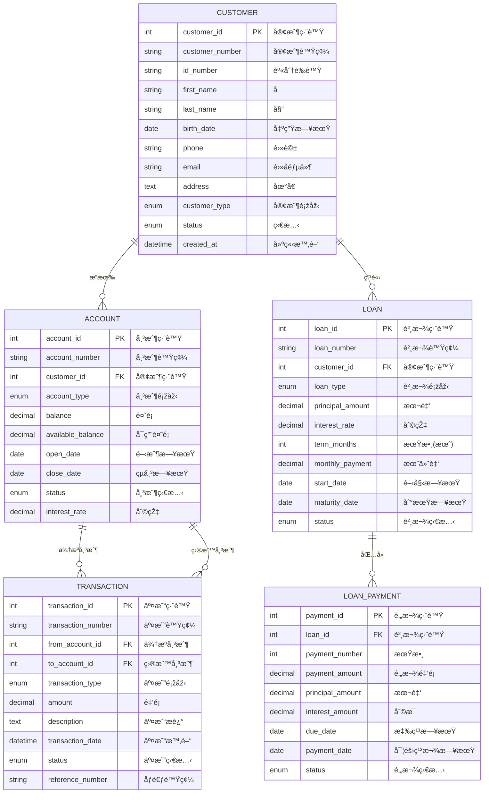
```mermaid
erDiagram
    %% 客戶管ç†
    CUSTOMER {
        int customer_id PK "客戶編號"
        string customer_number "客戶號碼"
        string id_number "身分證號"
        string first_name "å"
        string last_name "姓"
        date birth_date "出生日期"
        string phone "電話"
        string email "é›»å­éƒµä»¶"
        text address "地å€"
        enum customer_type "客戶類型"
        enum status "狀態"
        datetime created_at "建立時間"
    }
    
    %% 帳戶管ç†
    ACCOUNT {
        int account_id PK "帳戶編號"
        string account_number "帳戶號碼"
        int customer_id FK "客戶編號"
        enum account_type "帳戶類型"
        decimal balance "餘é¡"
        decimal available_balance "å¯ç”¨é¤˜é¡"
        date open_date "開戶日期"
        date close_date "çµå¸³æ—¥æœŸ"
        enum status "帳戶狀態"
        decimal interest_rate "利率"
    }
    
    %% 交易管ç†
    TRANSACTION {
        int transaction_id PK "交易編號"
        string transaction_number "交易號碼"
        int from_account_id FK "來æºå¸³æˆ¶"
        int to_account_id FK "目標帳戶"
        enum transaction_type "交易類型"
        decimal amount "金é¡"
        text description "交易æè¿°"
        datetime transaction_date "交易時間"
        enum status "交易狀態"
        string reference_number "åƒè€ƒè™Ÿç¢¼"
    }
    
    %% 貸款管ç†
    LOAN {
        int loan_id PK "貸款編號"
        string loan_number "貸款號碼"
        int customer_id FK "客戶編號"
        enum loan_type "貸款類型"
        decimal principal_amount "本金"
        decimal interest_rate "利率"
        int term_months "期數(月)"
        decimal monthly_payment "月付金"
        date start_date "開始日期"
        date maturity_date "到期日期"
        enum status "貸款狀態"
    }
    
    LOAN_PAYMENT {
        int payment_id PK "還款編號"
        int loan_id FK "貸款編號"
        int payment_number "期數"
        decimal payment_amount "還款金é¡"
        decimal principal_amount "本金"
        decimal interest_amount "利æ¯"
        date due_date "應繳日期"
        date payment_date "實際繳款日期"
        enum status "還款狀態"
    }
    
    %% 關係
    CUSTOMER ||--o{ ACCOUNT : "æ“有"
    CUSTOMER ||--o{ LOAN : "申請"
    ACCOUNT ||--o{ TRANSACTION : "來æºå¸³æˆ¶"
    ACCOUNT ||--o{ TRANSACTION : "目標帳戶"
    LOAN ||--o{ LOAN_PAYMENT : "包å«"
```

#### 銀行系統設計考é‡

1. **資料完整性**
   - 所有金é¡æ¬„ä½ä½¿ç”¨ DECIMAL 確ä¿ç²¾ç¢ºåº¦
   - 交易必須有來æºå’Œç›®æ¨™ï¼ˆæˆ–其中之一）
   - 餘é¡è¨ˆç®—需è¦åš´æ ¼é©—è­‰

2. **稽核è¦æ±‚**
   - 所有交易都有完整的時間戳記
   - 交易狀態追蹤（pending, completed, failed）
   - åƒè€ƒè™Ÿç¢¼ä¾›å¤–部系統追蹤

3. **安全考é‡**
   - æ•æ„Ÿè³‡æ–™ï¼ˆèº«åˆ†è­‰è™Ÿï¼‰éœ€è¦åŠ å¯†
   - 交易金é¡é™åˆ¶
   - 帳戶狀態控制

### 2.4 轉æ›ç‚ºè³‡æ–™åº« Schema

å®Œæˆ ER Model 設計後，需è¦è½‰æ›ç‚ºå¯¦éš›çš„資料庫çµæ§‹ã€‚

#### 轉æ›è¦å‰‡

1. **實體 → 資料表**
   - æ¯å€‹å¯¦é«”å°æ‡‰ä¸€å€‹è³‡æ–™è¡¨
   - 實體å稱å°æ‡‰è³‡æ–™è¡¨å稱

2. **屬性 → 欄ä½**
   - 簡單屬性直接å°æ‡‰æ¬„ä½
   - 複åˆå±¬æ€§æ‹†è§£ç‚ºå¤šå€‹æ¬„ä½
   - 多值屬性建立關è¯è³‡æ–™è¡¨

3. **關係處ç†**
   - **一å°å¤š**：在多的一方加入外來éµ
   - **多å°å¤š**：建立關è¯è³‡æ–™è¡¨
   - **一å°ä¸€**：在任一方加入外來éµ

#### PostgreSQL 範例

```sql
-- 客戶資料表
CREATE TABLE customers (
    customer_id SERIAL PRIMARY KEY,
    customer_number VARCHAR(20) UNIQUE NOT NULL,
    first_name VARCHAR(50) NOT NULL,
    last_name VARCHAR(50) NOT NULL,
    email VARCHAR(100) UNIQUE NOT NULL,
    phone VARCHAR(20),
    birth_date DATE,
    is_active BOOLEAN DEFAULT true,
    created_at TIMESTAMP DEFAULT CURRENT_TIMESTAMP,
    updated_at TIMESTAMP DEFAULT CURRENT_TIMESTAMP
);

-- 商å“資料表
CREATE TABLE products (
    product_id SERIAL PRIMARY KEY,
    sku VARCHAR(50) UNIQUE NOT NULL,
    product_name VARCHAR(200) NOT NULL,
    description TEXT,
    price DECIMAL(10,2) NOT NULL CHECK (price >= 0),
    stock_quantity INTEGER DEFAULT 0 CHECK (stock_quantity >= 0),
    category_id INTEGER REFERENCES categories(category_id),
    brand_id INTEGER REFERENCES brands(brand_id),
    status VARCHAR(20) DEFAULT 'active',
    created_at TIMESTAMP DEFAULT CURRENT_TIMESTAMP,
    updated_at TIMESTAMP DEFAULT CURRENT_TIMESTAMP
);

-- 訂單資料表
CREATE TABLE orders (
    order_id SERIAL PRIMARY KEY,
    order_number VARCHAR(30) UNIQUE NOT NULL,
    customer_id INTEGER NOT NULL REFERENCES customers(customer_id),
    total_amount DECIMAL(12,2) NOT NULL CHECK (total_amount >= 0),
    status VARCHAR(20) DEFAULT 'pending',
    order_date TIMESTAMP DEFAULT CURRENT_TIMESTAMP,
    shipped_date TIMESTAMP,
    delivered_date TIMESTAMP
);

-- 訂單明細資料表（多å°å¤šé—œè¯ï¼‰
CREATE TABLE order_items (
    order_item_id SERIAL PRIMARY KEY,
    order_id INTEGER NOT NULL REFERENCES orders(order_id) ON DELETE CASCADE,
    product_id INTEGER NOT NULL REFERENCES products(product_id),
    quantity INTEGER NOT NULL CHECK (quantity > 0),
    unit_price DECIMAL(10,2) NOT NULL CHECK (unit_price >= 0),
    total_price DECIMAL(12,2) GENERATED ALWAYS AS (quantity * unit_price) STORED,
    UNIQUE(order_id, product_id)  -- é¿å…åŒä¸€è¨‚å–®é‡è¤‡å•†å“
);
```

#### Oracle 範例

```sql
-- 客戶資料表
CREATE TABLE customers (
    customer_id NUMBER GENERATED BY DEFAULT AS IDENTITY PRIMARY KEY,
    customer_number VARCHAR2(20) UNIQUE NOT NULL,
    first_name VARCHAR2(50) NOT NULL,
    last_name VARCHAR2(50) NOT NULL,
    email VARCHAR2(100) UNIQUE NOT NULL,
    phone VARCHAR2(20),
    birth_date DATE,
    is_active CHAR(1) DEFAULT 'Y' CHECK (is_active IN ('Y', 'N')),
    created_at TIMESTAMP DEFAULT CURRENT_TIMESTAMP,
    updated_at TIMESTAMP DEFAULT CURRENT_TIMESTAMP
);

-- 建立觸發器自動更新 updated_at
CREATE OR REPLACE TRIGGER trg_customers_updated_at
    BEFORE UPDATE ON customers
    FOR EACH ROW
BEGIN
    :NEW.updated_at := CURRENT_TIMESTAMP;
END;
```

#### DB2 範例

```sql
-- 客戶資料表
CREATE TABLE customers (
    customer_id INTEGER NOT NULL GENERATED ALWAYS AS IDENTITY (START WITH 1 INCREMENT BY 1),
    customer_number VARCHAR(20) NOT NULL,
    first_name VARCHAR(50) NOT NULL,
    last_name VARCHAR(50) NOT NULL,
    email VARCHAR(100) NOT NULL,
    phone VARCHAR(20),
    birth_date DATE,
    is_active CHAR(1) DEFAULT 'Y' WITH DEFAULT,
    created_at TIMESTAMP DEFAULT CURRENT_TIMESTAMP,
    updated_at TIMESTAMP DEFAULT CURRENT_TIMESTAMP,
    PRIMARY KEY (customer_id),
    UNIQUE (customer_number),
    UNIQUE (email),
    CHECK (is_active IN ('Y', 'N'))
);
```

#### 轉æ›æœ€ä½³å¯¦å‹™

1. **命åè¦ç¯„**
   - 資料表å稱使用複數形å¼ï¼ˆcustomers, orders）
   - 欄ä½å稱使用å°å¯«åŠ åº•ç·šï¼ˆcustomer_id, first_name）
   - 外來éµéµå¾ªå‘½å慣例（table_name + "_id"）

2. **資料型別é¸æ“‡**
   - 主éµä½¿ç”¨ SERIAL/IDENTITY
   - 金é¡ä½¿ç”¨ DECIMAL é¿å…精度å•é¡Œ
   - 文字長度根據實際需求設定
   - 日期時間使用 TIMESTAMP 包å«æ™‚å€è³‡è¨Š

3. **ç´„æŸæ¢ä»¶**
   - 建立é©ç•¶çš„ CHECK ç´„æŸ
   - 設定 NOT NULL ç´„æŸ
   - 使用 UNIQUE ç´„æŸé˜²æ­¢é‡è¤‡
   - 外來éµç´„æŸç¢ºä¿åƒè€ƒå®Œæ•´æ€§

4. **索引優化**
   - 主éµè‡ªå‹•å»ºç«‹ç´¢å¼•
   - 外來éµæ¬„ä½å»ºç«‹ç´¢å¼•
   - 經常查詢的欄ä½å»ºç«‹ç´¢å¼•
   - 複åˆç´¢å¼•æ”¯æ´è¤‡é›œæŸ¥è©¢

### 2.5 完整專案開發æµç¨‹

#### 🚀 從概念到實作的完整æµç¨‹

##### 階段1：需求收集與分æžï¼ˆ1-2週）

**步驟1：業務訪談**
```
åƒèˆ‡äººå“¡ï¼šæ¥­å‹™åˆ†æžå¸«ã€é ˜åŸŸå°ˆå®¶ã€ä½¿ç”¨è€…代表
產出文件：
- 業務需求è¦æ ¼æ›¸
- 使用者故事集åˆ
- 業務æµç¨‹åœ–
- 資料æµç¨‹åœ–
```

**步驟2：需求整ç†**
```
活動內容：
- 識別核心業務實體
- 分æžè³‡æ–™æµå‘
- 確èªæ¥­å‹™è¦å‰‡
- 評估技術約æŸ
```

##### 階段2：概念設計（1週）

**步驟3：åˆæ­¥ ER Model**
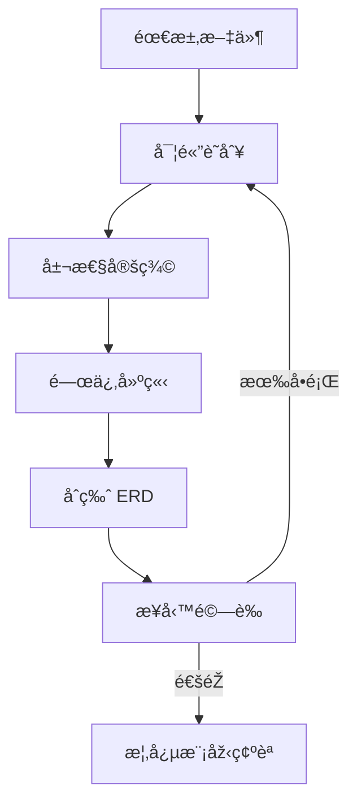
```mermaid
flowchart TD
    A[需求文件] --> B[實體識別]
    B --> C[屬性定義]
    C --> D[關係建立]
    D --> E[åˆç‰ˆ ERD]
    E --> F[業務驗證]
    F -->|有å•é¡Œ| B
    F -->|通éŽ| G[概念模型確èª]
```

**步驟4：設計評審**
```
評審é‡é»žï¼š
✓ 實體完整性檢查
✓ 關係åˆç†æ€§é©—è­‰
✓ 業務è¦å‰‡ç¬¦åˆåº¦
✓ 擴展性評估
```

##### 階段3：é‚輯設計（1週）

**步驟5：正è¦åŒ–分æž**
```
æ­£è¦åŒ–檢查清單：
â–¡ 第一正è¦åŒ–（1NF）
â–¡ 第二正è¦åŒ–（2NF）
â–¡ 第三正è¦åŒ–（3NF）
â–¡ BCNF（如需è¦ï¼‰
â–¡ åæ­£è¦åŒ–考é‡
```

**步驟6：效能優化設計**
```sql
-- 範例：電商系統效能優化
-- 訂單摘è¦åæ­£è¦åŒ–
ALTER TABLE orders ADD COLUMN item_count INTEGER;
ALTER TABLE orders ADD COLUMN total_items_weight DECIMAL(8,2);

-- 商å“æœå°‹å„ªåŒ–
CREATE INDEX idx_products_search ON products 
USING gin(to_tsvector('chinese', product_name || ' ' || description));

-- 分割策略
CREATE TABLE orders_2024 PARTITION OF orders
FOR VALUES FROM ('2024-01-01') TO ('2025-01-01');
```

##### 階段4：物ç†è¨­è¨ˆï¼ˆ1週）

**步驟7：資料庫實作**
```sql
-- 完整的建表腳本範例
-- 1. 建立基礎表
CREATE SCHEMA ecommerce;
SET search_path TO ecommerce;

-- 2. 客戶表
CREATE TABLE customers (
    customer_id SERIAL PRIMARY KEY,
    email VARCHAR(255) UNIQUE NOT NULL,
    password_hash VARCHAR(255) NOT NULL,
    first_name VARCHAR(100) NOT NULL,
    last_name VARCHAR(100) NOT NULL,
    phone VARCHAR(20),
    birth_date DATE,
    is_active BOOLEAN DEFAULT true,
    created_at TIMESTAMP DEFAULT CURRENT_TIMESTAMP,
    updated_at TIMESTAMP DEFAULT CURRENT_TIMESTAMP,
    
    CONSTRAINT chk_email_format CHECK (email ~* '^[A-Za-z0-9._%+-]+@[A-Za-z0-9.-]+\.[A-Za-z]{2,}$'),
    CONSTRAINT chk_phone_format CHECK (phone ~* '^\+?[0-9\-\s()]+$')
);

-- 3. 建立索引
CREATE INDEX idx_customers_email ON customers(email);
CREATE INDEX idx_customers_active ON customers(is_active) WHERE is_active = true;
CREATE INDEX idx_customers_created ON customers(created_at);

-- 4. 建立觸發器
CREATE OR REPLACE FUNCTION update_updated_at()
RETURNS TRIGGER AS $$
BEGIN
    NEW.updated_at = CURRENT_TIMESTAMP;
    RETURN NEW;
END;
$$ LANGUAGE plpgsql;

CREATE TRIGGER trg_customers_updated_at
    BEFORE UPDATE ON customers
    FOR EACH ROW
    EXECUTE FUNCTION update_updated_at();
```

**步驟8：資料é·ç§»è¦åŠƒ**
```sql
-- 資料é·ç§»è…³æœ¬ç¯„例
-- 從舊系統é·ç§»å®¢æˆ¶è³‡æ–™
INSERT INTO ecommerce.customers (
    email, first_name, last_name, phone, 
    birth_date, created_at
)
SELECT 
    LOWER(TRIM(email)),
    TRIM(fname),
    TRIM(lname),
    REGEXP_REPLACE(phone, '[^0-9+\-()]', '', 'g'),
    CASE 
        WHEN birthday IS NOT NULL AND birthday != '0000-00-00' 
        THEN birthday::DATE 
        ELSE NULL 
    END,
    registration_date
FROM legacy.users
WHERE email IS NOT NULL 
  AND email != ''
  AND email ~* '^[A-Za-z0-9._%+-]+@[A-Za-z0-9.-]+\.[A-Za-z]{2,}$'
ON CONFLICT (email) DO NOTHING;
```

##### 階段5：測試與驗證（1週）

**步驟9：資料完整性測試**
```sql
-- 測試腳本範例
-- 1. 主éµå”¯ä¸€æ€§æ¸¬è©¦
SELECT table_name, column_name, constraint_name
FROM information_schema.table_constraints tc
JOIN information_schema.key_column_usage kcu 
ON tc.constraint_name = kcu.constraint_name
WHERE tc.constraint_type = 'PRIMARY KEY'
  AND tc.table_schema = 'ecommerce';

-- 2. 外來éµå®Œæ•´æ€§æ¸¬è©¦
SELECT 
    tc.table_name,
    kcu.column_name,
    ccu.table_name AS foreign_table_name,
    ccu.column_name AS foreign_column_name
FROM information_schema.table_constraints AS tc
JOIN information_schema.key_column_usage AS kcu
ON tc.constraint_name = kcu.constraint_name
JOIN information_schema.constraint_column_usage AS ccu
ON ccu.constraint_name = tc.constraint_name
WHERE tc.constraint_type = 'FOREIGN KEY'
  AND tc.table_schema = 'ecommerce';

-- 3. 檢查約æŸé©—è­‰
SELECT constraint_name, check_clause
FROM information_schema.check_constraints
WHERE constraint_schema = 'ecommerce';
```

**步驟10：效能基準測試**
```sql
-- 效能測試範例
-- 1. 查詢效能測試
EXPLAIN (ANALYZE, BUFFERS) 
SELECT c.customer_id, c.first_name, c.last_name,
       COUNT(o.order_id) as order_count,
       SUM(o.total_amount) as total_spent
FROM customers c
LEFT JOIN orders o ON c.customer_id = o.customer_id
WHERE c.created_at >= '2024-01-01'
GROUP BY c.customer_id, c.first_name, c.last_name
ORDER BY total_spent DESC
LIMIT 100;

-- 2. æ’入效能測試
\timing on
INSERT INTO customers (email, first_name, last_name)
SELECT 
    'test' || generate_series(1,10000) || '@example.com',
    'FirstName' || generate_series(1,10000),
    'LastName' || generate_series(1,10000);
\timing off
```

##### 階段6：部署與監控（æŒçºŒï¼‰

**步驟11：生產環境部署**
```bash
# 部署腳本範例
#!/bin/bash
set -e

echo "開始部署資料庫..."

# 1. 備份ç¾æœ‰è³‡æ–™åº«
pg_dump -h localhost -U postgres -d production > backup_$(date +%Y%m%d_%H%M%S).sql

# 2. 執行é·ç§»è…³æœ¬
psql -h localhost -U postgres -d production -f migration_v2.0.sql

# 3. 驗證部署
psql -h localhost -U postgres -d production -c "SELECT COUNT(*) FROM customers;"

echo "部署完æˆï¼"
```

**步驟12：監控與維護**
```sql
-- 監控腳本
-- 1. 表大å°ç›£æŽ§
SELECT 
    schemaname,
    tablename,
    pg_size_pretty(pg_total_relation_size(schemaname||'.'||tablename)) as size
FROM pg_tables 
WHERE schemaname = 'ecommerce'
ORDER BY pg_total_relation_size(schemaname||'.'||tablename) DESC;

-- 2. 索引使用率監控
SELECT 
    schemaname,
    tablename,
    indexname,
    idx_scan,
    idx_tup_read,
    idx_tup_fetch
FROM pg_stat_user_indexes
WHERE schemaname = 'ecommerce'
ORDER BY idx_scan DESC;

-- 3. 慢查詢監控
SELECT 
    query,
    calls,
    total_time,
    mean_time,
    rows
FROM pg_stat_statements
WHERE query LIKE '%ecommerce%'
ORDER BY mean_time DESC
LIMIT 10;
```

#### 📋 專案檢查清單

**設計階段：**
- [ ] 需求文件完整且已確èª
- [ ] 所有業務實體已識別
- [ ] 實體關係正確建立
- [ ] 屬性設計符åˆæ¥­å‹™éœ€æ±‚
- [ ] æ­£è¦åŒ–分æžå®Œæˆ
- [ ] 效能考é‡å·²ç´å…¥è¨­è¨ˆ

**實作階段：**
- [ ] DDL 腳本符åˆå‘½åè¦ç¯„
- [ ] 所有約æŸæ¢ä»¶å·²è¨­å®š
- [ ] 索引策略已實施
- [ ] 資料é·ç§»è…³æœ¬å·²æ¸¬è©¦
- [ ] 備份還原程åºå·²å»ºç«‹

**測試階段：**
- [ ] 資料完整性測試通éŽ
- [ ] 效能基準測試完æˆ
- [ ] 負載測試通éŽ
- [ ] 安全性測試完æˆ

**部署階段：**
- [ ] 生產環境部署æˆåŠŸ
- [ ] 監控系統已設置
- [ ] 文件已更新
- [ ] 團隊已培訓

#### 💡 實務æ醒

1. **版本控制**：使用é·ç§»è…³æœ¬ç®¡ç†è³‡æ–™åº«çµæ§‹è®Šæ›´
2. **文件記錄**：記錄æ¯å€‹è³‡æ–™è¡¨å’Œæ¬„ä½çš„用途
3. **效能考é‡**：根據查詢模å¼å„ªåŒ–索引策略
4. **安全性**：æ•æ„Ÿè³‡æ–™åŠ å¯†ï¼Œè¨­å®šé©ç•¶æ¬Šé™

#### âš ï¸ å¸¸è¦‹å•é¡Œ

- 忘記設定外來éµç´„æŸ
- 資料型別é¸æ“‡ä¸ç•¶ï¼ˆå¦‚用 FLOAT 儲存金é¡ï¼‰
- 缺少必è¦çš„索引造æˆæ•ˆèƒ½å•é¡Œ
- 命åä¸ä¸€è‡´å¢žåŠ ç¶­è­·å›°é›£

---

**📚 本節é‡é»žå›žé¡§**

- 從需求分æžåˆ° ER Model 的系統化方法
- 電商平å°å’ŒéŠ€è¡Œç³»çµ±çš„完整設計範例
- ER Model 轉æ›ç‚ºå„種資料庫 Schema 的實作
- 設計時需考é‡å®Œæ•´æ€§ã€å®‰å…¨æ€§ã€æ•ˆèƒ½

**🔄 下一節é å‘Š**

接下來我們將深入探討進階主題，包括實體類型ã€é—œè¯åº¦ã€æ­£è¦åŒ–ç†è«–和設計最佳實務。

---

## 3. 進階主題

### 3.1 實體類型與關è¯åº¦

#### 強實體與弱實體

**強實體 (Strong Entity)**
- å¯ä»¥ç¨ç«‹å­˜åœ¨çš„實體
- æ“有足夠的屬性來唯一識別
- 有自己的主éµ

**弱實體 (Weak Entity)**
- ä¾è³´å…¶ä»–實體存在的實體
- 無法單ç¨é€éŽè‡ªèº«å±¬æ€§å”¯ä¸€è­˜åˆ¥
- 需è¦é€éŽèˆ‡å¼·å¯¦é«”的關係來識別

#### 範例：訂單與訂單明細

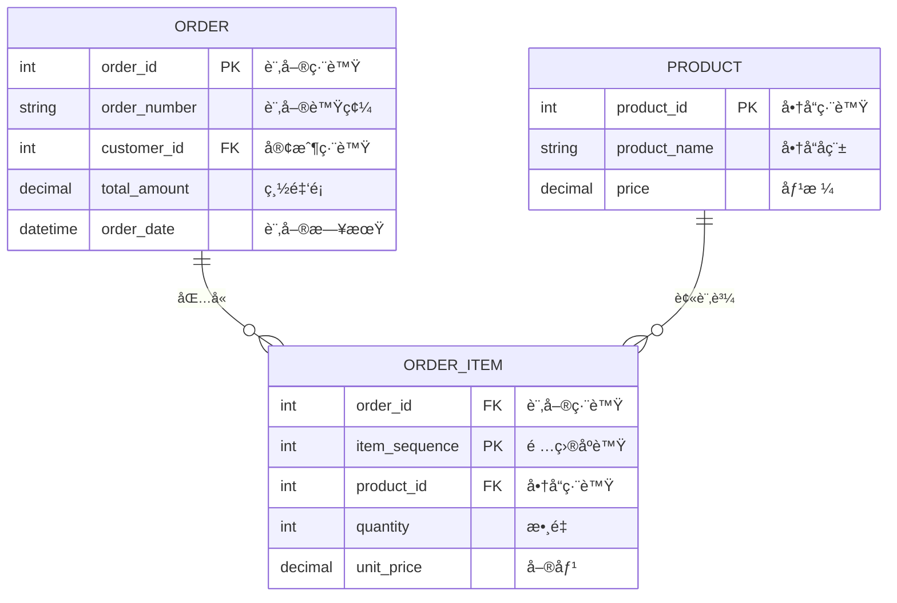
```mermaid
erDiagram
    %% 強實體
    ORDER {
        int order_id PK "訂單編號"
        string order_number "訂單號碼"
        int customer_id FK "客戶編號"
        decimal total_amount "總金é¡"
        datetime order_date "訂單日期"
    }
    
    %% 弱實體 - ä¾è³´è¨‚單存在
    ORDER_ITEM {
        int order_id FK "訂單編號"
        int item_sequence PK "é …ç›®åºè™Ÿ"
        int product_id FK "商å“編號"
        int quantity "數é‡"
        decimal unit_price "單價"
    }
    
    PRODUCT {
        int product_id PK "商å“編號"
        string product_name "商å“å稱"
        decimal price "價格"
    }
    
    ORDER ||--o{ ORDER_ITEM : "包å«"
    PRODUCT ||--o{ ORDER_ITEM : "被訂購"
```

**說明：**
- `ORDER` æ˜¯å¼·å¯¦é«”ï¼Œæœ‰è‡ªå·±çš„ä¸»éµ `order_id`
- `ORDER_ITEM` 是弱實體，主éµæ˜¯ `(order_id, item_sequence)` 的組åˆ
- 沒有訂單就ä¸æœƒæœ‰è¨‚單明細

#### é—œè¯åº¦ (Cardinality) 深入分æž

é—œè¯åº¦å®šç¾©å¯¦é«”間關係的數é‡ç´„æŸã€‚

#### 詳細關è¯åº¦é¡žåž‹

1. **一å°ä¸€ (1:1)**

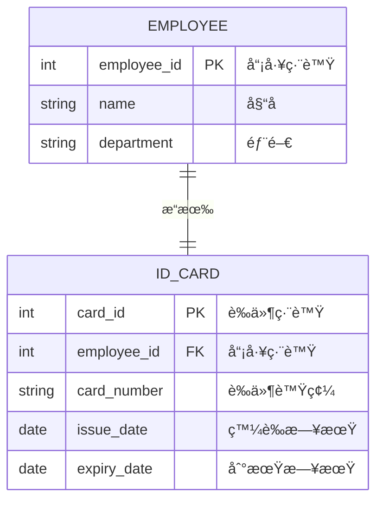
```mermaid
erDiagram
    EMPLOYEE {
        int employee_id PK "員工編號"
        string name "姓å"
        string department "部門"
    }
    
    ID_CARD {
        int card_id PK "證件編號"
        int employee_id FK "員工編號"
        string card_number "證件號碼"
        date issue_date "發證日期"
        date expiry_date "到期日期"
    }
    
    EMPLOYEE ||--|| ID_CARD : "æ“有"
```

**特徵：**
- 一個員工åªèƒ½æœ‰ä¸€å¼µå“¡å·¥è­‰
- 一張員工證åªèƒ½å±¬æ–¼ä¸€å€‹å“¡å·¥
- å¯ä»¥è€ƒæ…®åˆä½µç‚ºä¸€å€‹å¯¦é«”

2. **一å°å¤š (1:N)**

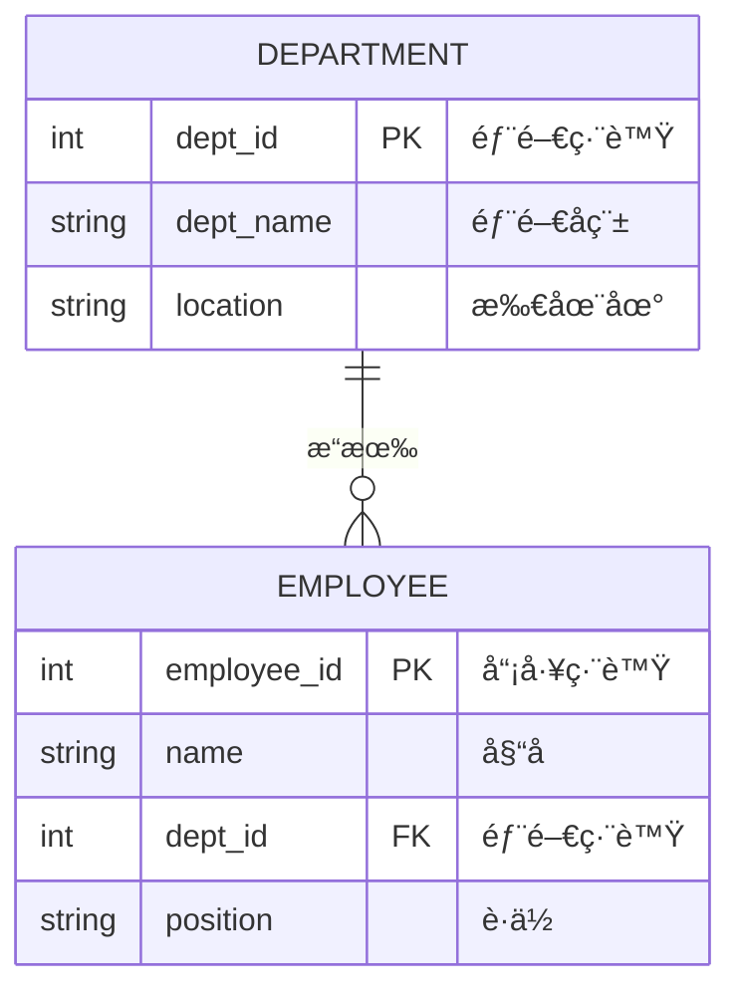
```mermaid
erDiagram
    DEPARTMENT {
        int dept_id PK "部門編號"
        string dept_name "部門å稱"
        string location "所在地"
    }
    
    EMPLOYEE {
        int employee_id PK "員工編號"
        string name "姓å"
        int dept_id FK "部門編號"
        string position "è·ä½"
    }
    
    DEPARTMENT ||--o{ EMPLOYEE : "æ“有"
```

**特徵：**
- 一個部門å¯ä»¥æœ‰å¤šå€‹å“¡å·¥
- 一個員工åªèƒ½å±¬æ–¼ä¸€å€‹éƒ¨é–€
- 在「多ã€çš„一方設置外來éµ

3. **多å°å¤š (M:N)**

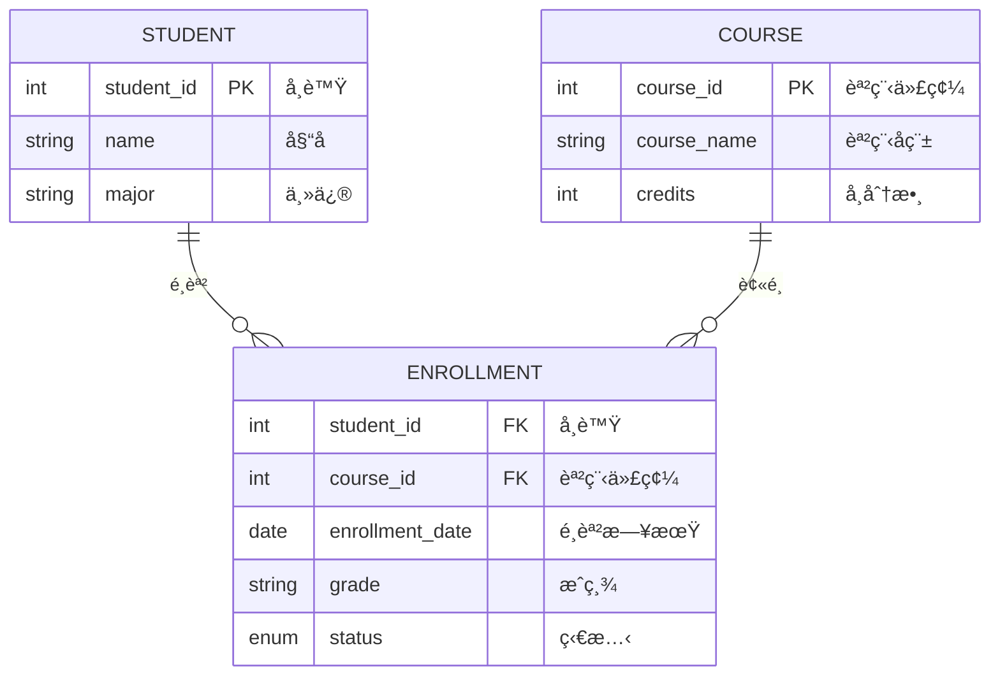
```mermaid
erDiagram
    STUDENT {
        int student_id PK "學號"
        string name "姓å"
        string major "主修"
    }
    
    COURSE {
        int course_id PK "課程代碼"
        string course_name "課程å稱"
        int credits "學分數"
    }
    
    ENROLLMENT {
        int student_id FK "學號"
        int course_id FK "課程代碼"
        date enrollment_date "é¸èª²æ—¥æœŸ"
        string grade "æˆç¸¾"
        enum status "狀態"
    }
    
    STUDENT ||--o{ ENROLLMENT : "é¸èª²"
    COURSE ||--o{ ENROLLMENT : "被é¸"
```

**特徵：**
- 一個學生å¯ä»¥é¸ä¿®å¤šé–€èª²ç¨‹
- 一門課程å¯ä»¥è¢«å¤šå€‹å­¸ç”Ÿé¸ä¿®
- 需è¦å»ºç«‹é—œè¯å¯¦é«”（橋接表）

#### åƒèˆ‡ç´„æŸ (Participation Constraints)

**完全åƒèˆ‡ (Total Participation)**
- 實體的æ¯å€‹å¯¦ä¾‹éƒ½å¿…é ˆåƒèˆ‡é—œä¿‚
- 使用雙線表示

**部分åƒèˆ‡ (Partial Participation)**
- 實體的實例å¯ä»¥é¸æ“‡æ€§åƒèˆ‡é—œä¿‚
- 使用單線表示

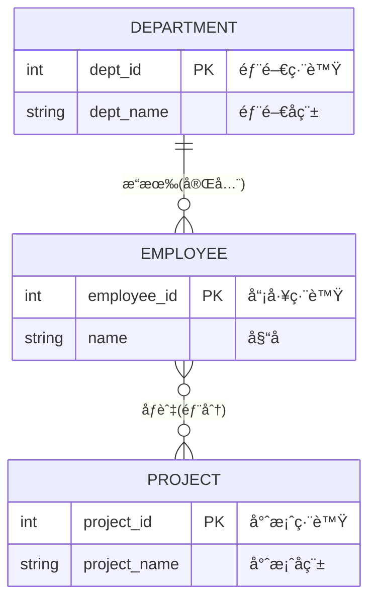
```mermaid
erDiagram
    EMPLOYEE {
        int employee_id PK "員工編號"
        string name "姓å"
    }
    
    DEPARTMENT {
        int dept_id PK "部門編號"
        string dept_name "部門å稱"
    }
    
    PROJECT {
        int project_id PK "專案編號"
        string project_name "專案å稱"
    }
    
    %% 完全åƒèˆ‡ï¼šæ¯å€‹å“¡å·¥éƒ½å¿…須屬於一個部門
    DEPARTMENT ||--o{ EMPLOYEE : "æ“有(完全)"
    
    %% 部分åƒèˆ‡ï¼šå“¡å·¥å¯ä»¥é¸æ“‡æ€§åƒèˆ‡å°ˆæ¡ˆ
    EMPLOYEE }o--o{ PROJECT : "åƒèˆ‡(部分)"
```

### 3.2 æ­£è¦åŒ–ç†è«–

æ­£è¦åŒ–是消除資料冗餘和異常的éŽç¨‹ï¼Œç¢ºä¿è³‡æ–™åº«è¨­è¨ˆçš„é‚輯正確性。

#### 第一正è¦åŒ– (1NF)

**è¦æ±‚：**
- æ¯å€‹æ¬„ä½éƒ½æ˜¯åŽŸå­å€¼ï¼ˆä¸å¯å†åˆ†ï¼‰
- 沒有é‡è¤‡çš„群組
- æ¯ä¸€åˆ—都是唯一的

**⌠é•å 1NF 的例å­ï¼š**

| 學號 | 姓å | 電話 |
|------|------|------|
| S001 | 張三 | 0912345678, 0987654321 |
| S002 | æŽå›› | 0923456789 |

**✅ ç¬¦åˆ 1NF：**

```sql
-- 學生資料表
CREATE TABLE students (
    student_id VARCHAR(10) PRIMARY KEY,
    name VARCHAR(50) NOT NULL
);

-- 學生電話資料表
CREATE TABLE student_phones (
    student_id VARCHAR(10),
    phone VARCHAR(15),
    phone_type VARCHAR(10),
    PRIMARY KEY (student_id, phone),
    FOREIGN KEY (student_id) REFERENCES students(student_id)
);
```

#### 第二正è¦åŒ– (2NF)

**è¦æ±‚：**
- ç¬¦åˆ 1NF
- 所有éžä¸»éµå±¬æ€§éƒ½å®Œå…¨ä¾è³´æ–¼ä¸»éµ

**⌠é•å 2NF 的例å­ï¼š**

| 學號 | 課程代碼 | 姓å | 課程å稱 | æˆç¸¾ |
|------|----------|------|----------|------|
| S001 | C001 | 張三 | 資料庫 | 85 |
| S001 | C002 | 張三 | 程å¼è¨­è¨ˆ | 90 |

å•é¡Œï¼šå§“ååªä¾è³´å­¸è™Ÿï¼Œèª²ç¨‹å稱åªä¾è³´èª²ç¨‹ä»£ç¢¼

**✅ ç¬¦åˆ 2NF：**

```sql
-- 學生資料表
CREATE TABLE students (
    student_id VARCHAR(10) PRIMARY KEY,
    name VARCHAR(50) NOT NULL
);

-- 課程資料表
CREATE TABLE courses (
    course_id VARCHAR(10) PRIMARY KEY,
    course_name VARCHAR(100) NOT NULL
);

-- é¸èª²è³‡æ–™è¡¨
CREATE TABLE enrollments (
    student_id VARCHAR(10),
    course_id VARCHAR(10),
    grade INTEGER,
    PRIMARY KEY (student_id, course_id),
    FOREIGN KEY (student_id) REFERENCES students(student_id),
    FOREIGN KEY (course_id) REFERENCES courses(course_id)
);
```

#### 第三正è¦åŒ– (3NF)

**è¦æ±‚：**
- ç¬¦åˆ 2NF
- 沒有傳éžä¾è³´ï¼ˆéžä¸»éµå±¬æ€§ä¸ä¾è³´å…¶ä»–éžä¸»éµå±¬æ€§ï¼‰

**⌠é•å 3NF 的例å­ï¼š**

| 學號 | 姓å | 系所代碼 | 系所å稱 |
|------|------|----------|----------|
| S001 | 張三 | CS | 資訊工程系 |
| S002 | æŽå›› | EE | 電機工程系 |

å•é¡Œï¼šç³»æ‰€å稱ä¾è³´ç³»æ‰€ä»£ç¢¼ï¼Œå½¢æˆå‚³éžä¾è³´

**✅ ç¬¦åˆ 3NF：**

```sql
-- 系所資料表
CREATE TABLE departments (
    dept_code VARCHAR(10) PRIMARY KEY,
    dept_name VARCHAR(100) NOT NULL
);

-- 學生資料表
CREATE TABLE students (
    student_id VARCHAR(10) PRIMARY KEY,
    name VARCHAR(50) NOT NULL,
    dept_code VARCHAR(10),
    FOREIGN KEY (dept_code) REFERENCES departments(dept_code)
);
```

#### BCNF (Boyce-Codd Normal Form)

**è¦æ±‚：**
- ç¬¦åˆ 3NF
- æ¯å€‹æ±ºå®šå› å­éƒ½æ˜¯å€™é¸éµ

#### åæ­£è¦åŒ–考é‡

在æŸäº›æƒ…æ³ä¸‹ï¼Œç‚ºäº†æ•ˆèƒ½è€ƒé‡ï¼Œå¯èƒ½éœ€è¦é©åº¦çš„åæ­£è¦åŒ–：

1. **查詢效能**：減少 JOIN æ“作
2. **報表需求**：èšåˆè³‡æ–™çš„快速存å–
3. **讀å–密集**：讀多寫少的應用場景

**範例：電商系統的訂單摘è¦**

```sql
-- æ­£è¦åŒ–設計
CREATE TABLE orders (
    order_id SERIAL PRIMARY KEY,
    customer_id INTEGER,
    order_date TIMESTAMP
);

CREATE TABLE order_items (
    order_id INTEGER,
    product_id INTEGER,
    quantity INTEGER,
    unit_price DECIMAL(10,2)
);

-- åæ­£è¦åŒ–：在訂單表增加摘è¦æ¬„ä½
ALTER TABLE orders ADD COLUMN total_amount DECIMAL(12,2);
ALTER TABLE orders ADD COLUMN item_count INTEGER;
```

### 3.3 常見設計錯誤

#### 錯誤 1：éŽåº¦æ­£è¦åŒ–

**å•é¡Œï¼š** 將所有æ±è¥¿éƒ½åˆ†è§£åˆ°æœ€å°å–®ä½

**⌠錯誤範例：**
```sql
-- éŽåº¦åˆ†è§£åœ°å€
CREATE TABLE countries (id, name);
CREATE TABLE states (id, name, country_id);
CREATE TABLE cities (id, name, state_id);
CREATE TABLE streets (id, name, city_id);
CREATE TABLE addresses (id, street_id, house_number);
```

**✅ åˆç†è¨­è¨ˆï¼š**
```sql
CREATE TABLE addresses (
    id SERIAL PRIMARY KEY,
    street_address VARCHAR(200),
    city VARCHAR(100),
    state VARCHAR(100),
    postal_code VARCHAR(20),
    country VARCHAR(100)
);
```

#### 錯誤 2：忽略業務è¦å‰‡

**å•é¡Œï¼š** 沒有在資料庫層é¢å¯¦æ–½æ¥­å‹™ç´„æŸ

**⌠錯誤範例：**
```sql
CREATE TABLE orders (
    order_id SERIAL PRIMARY KEY,
    total_amount DECIMAL(10,2)  -- 沒有檢查約æŸ
);
```

**✅ 正確設計：**
```sql
CREATE TABLE orders (
    order_id SERIAL PRIMARY KEY,
    total_amount DECIMAL(10,2) CHECK (total_amount >= 0),
    status VARCHAR(20) CHECK (status IN ('pending', 'paid', 'shipped', 'delivered', 'cancelled')),
    order_date TIMESTAMP DEFAULT CURRENT_TIMESTAMP
);
```

#### 錯誤 3：錯誤的關係建模

**å•é¡Œï¼š** 誤用一å°ä¸€é—œä¿‚或éºæ¼å¤šå°å¤šé—œä¿‚

**⌠錯誤範例：** 將多å°å¤šå»ºæ¨¡ç‚ºä¸€å°å¤š
```sql
CREATE TABLE students (
    student_id SERIAL PRIMARY KEY,
    name VARCHAR(100),
    course_id INTEGER  -- 學生åªèƒ½é¸ä¸€é–€èª²ï¼Ÿ
);
```

**✅ 正確設計：**
```sql
CREATE TABLE students (
    student_id SERIAL PRIMARY KEY,
    name VARCHAR(100)
);

CREATE TABLE courses (
    course_id SERIAL PRIMARY KEY,
    course_name VARCHAR(100)
);

CREATE TABLE enrollments (
    student_id INTEGER REFERENCES students(student_id),
    course_id INTEGER REFERENCES courses(course_id),
    enrollment_date DATE,
    PRIMARY KEY (student_id, course_id)
);
```

#### 錯誤 4：ä¸é©ç•¶çš„資料型別

**常見å•é¡Œï¼š**

1. **金é¡ä½¿ç”¨ FLOAT**
```sql
-- ⌠錯誤
price FLOAT  -- 精度å•é¡Œ

-- ✅ 正確
price DECIMAL(10,2)  -- 精確的金é¡
```

2. **日期使用 VARCHAR**
```sql
-- ⌠錯誤
birth_date VARCHAR(10)  -- '1990-01-01'

-- ✅ 正確
birth_date DATE
```

3. **布林值使用 VARCHAR**
```sql
-- ⌠錯誤
is_active VARCHAR(10)  -- 'true', 'false', 'yes', 'no'

-- ✅ 正確
is_active BOOLEAN
```

### 3.4 最佳實務

#### 命å慣例

1. **資料表命å**
   - 使用複數å詞：`customers`, `orders`, `products`
   - å°å¯«å­—æ¯ï¼Œå–®å­—間用底線：`order_items`, `product_categories`
   - é¿å…ä¿ç•™å­—：ä¸ä½¿ç”¨ `user`, `order` ç­‰

2. **欄ä½å‘½å**
   - 使用æ述性å稱：`first_name` è€Œéž `fname`
   - 主éµçµ±ä¸€å‘½å：`table_name_id`
   - 外來éµèˆ‡åƒè€ƒçš„主éµåŒå
   - 時間欄ä½åŠ ä¸Šå¾Œç¶´ï¼š`created_at`, `updated_at`

3. **ç´„æŸå‘½å**
```sql
-- 主éµç´„æŸ
CONSTRAINT pk_customers PRIMARY KEY (customer_id)

-- 外來éµç´„æŸ
CONSTRAINT fk_orders_customer_id FOREIGN KEY (customer_id) REFERENCES customers(customer_id)

-- 檢查約æŸ
CONSTRAINT chk_orders_total_amount CHECK (total_amount >= 0)

-- 唯一約æŸ
CONSTRAINT uk_customers_email UNIQUE (email)
```

#### 索引策略

1. **自動索引**
   - 主éµè‡ªå‹•æœ‰ç´¢å¼•
   - 唯一約æŸè‡ªå‹•æœ‰ç´¢å¼•

2. **手動索引**
```sql
-- 外來éµç´¢å¼•
CREATE INDEX idx_orders_customer_id ON orders(customer_id);

-- 查詢æ¢ä»¶ç´¢å¼•
CREATE INDEX idx_orders_order_date ON orders(order_date);

-- 複åˆç´¢å¼•
CREATE INDEX idx_orders_customer_date ON orders(customer_id, order_date);

-- 部分索引
CREATE INDEX idx_orders_active ON orders(customer_id) WHERE status = 'active';
```

#### 資料完整性

1. **實體完整性**
```sql
-- 主éµä¸å¯ç‚ºç©ºä¸”唯一
customer_id SERIAL PRIMARY KEY
```

2. **åƒç…§å®Œæ•´æ€§**
```sql
-- 外來éµç´„æŸ
customer_id INTEGER NOT NULL REFERENCES customers(customer_id) ON DELETE CASCADE
```

3. **領域完整性**
```sql
-- 檢查約æŸ
age INTEGER CHECK (age >= 0 AND age <= 150),
status VARCHAR(20) CHECK (status IN ('active', 'inactive', 'suspended')),
email VARCHAR(255) CHECK (email ~* '^[A-Za-z0-9._%+-]+@[A-Za-z0-9.-]+\.[A-Za-z]{2,}$')
```

#### 安全性考é‡

1. **æ•æ„Ÿè³‡æ–™è™•ç†**
```sql
-- 密碼雜湊
password_hash VARCHAR(255) NOT NULL,  -- 儲存雜湊值，ä¸å„²å­˜æ˜Žæ–‡

-- 資料加密
credit_card_number_encrypted TEXT,  -- 加密後儲存

-- 軟刪除
is_deleted BOOLEAN DEFAULT FALSE,
deleted_at TIMESTAMP
```

2. **稽核軌跡**
```sql
CREATE TABLE audit_log (
    log_id SERIAL PRIMARY KEY,
    table_name VARCHAR(100) NOT NULL,
    operation VARCHAR(10) NOT NULL,  -- INSERT, UPDATE, DELETE
    old_values JSONB,
    new_values JSONB,
    user_id INTEGER,
    timestamp TIMESTAMP DEFAULT CURRENT_TIMESTAMP
);
```

#### 效能優化

1. **分割策略**
```sql
-- 按日期分割訂單表
CREATE TABLE orders_2024_01 PARTITION OF orders
FOR VALUES FROM ('2024-01-01') TO ('2024-02-01');
```

2. **檢視表**
```sql
-- 複雜查詢的檢視表
CREATE VIEW customer_order_summary AS
SELECT 
    c.customer_id,
    c.name,
    COUNT(o.order_id) as total_orders,
    SUM(o.total_amount) as total_spent
FROM customers c
LEFT JOIN orders o ON c.customer_id = o.customer_id
GROUP BY c.customer_id, c.name;
```

#### 💡 設計檢查清單

- [ ] 所有實體都有主éµ
- [ ] 外來éµç´„æŸæ­£ç¢ºè¨­å®š
- [ ] å¿…è¦æ¬„ä½è¨­å®š NOT NULL
- [ ] 金é¡æ¬„ä½ä½¿ç”¨ DECIMAL
- [ ] 日期欄ä½ä½¿ç”¨é©ç•¶åž‹åˆ¥
- [ ] 建立必è¦çš„索引
- [ ] 設定檢查約æŸ
- [ ] 考慮軟刪除機制
- [ ] 包å«ç¨½æ ¸æ¬„ä½ï¼ˆcreated_at, updated_at）
- [ ] æ•æ„Ÿè³‡æ–™é©ç•¶è™•ç†

#### âš ï¸ æ•ˆèƒ½é™·é˜±

1. **éŽå¤šçš„ JOIN**：考慮é©åº¦åæ­£è¦åŒ–
2. **缺少索引**：查詢æ¢ä»¶æ¬„ä½éœ€è¦ç´¢å¼•
3. **ä¸ç•¶çš„資料型別**：é¿å…éŽå¤§çš„資料型別
4. **缺少分割**：大表考慮分割策略

#### 🎨 常見設計模å¼

##### 1. ä¸»å¾žè¡¨æ¨¡å¼ (Master-Detail Pattern)

**應用場景：** 訂單與訂單明細ã€éƒ¨é–€èˆ‡å“¡å·¥

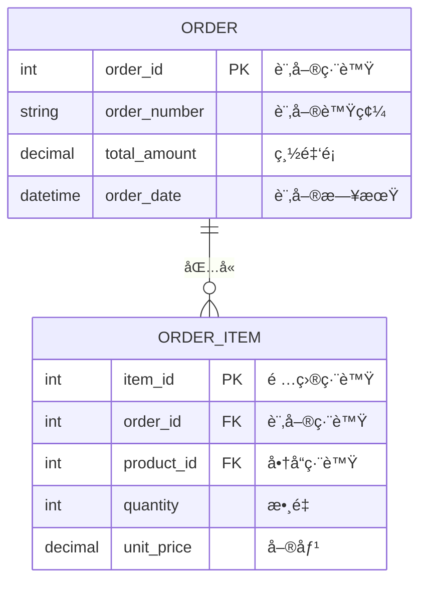
```mermaid
erDiagram
    ORDER {
        int order_id PK "訂單編號"
        string order_number "訂單號碼"
        decimal total_amount "總金é¡"
        datetime order_date "訂單日期"
    }
    
    ORDER_ITEM {
        int item_id PK "項目編號"
        int order_id FK "訂單編號"
        int product_id FK "商å“編號"
        int quantity "數é‡"
        decimal unit_price "單價"
    }
    
    ORDER ||--o{ ORDER_ITEM : "包å«"
```

##### 2. åˆ†é¡žéšŽå±¤æ¨¡å¼ (Category Hierarchy Pattern)

**應用場景：** 商å“分類ã€çµ„織架構

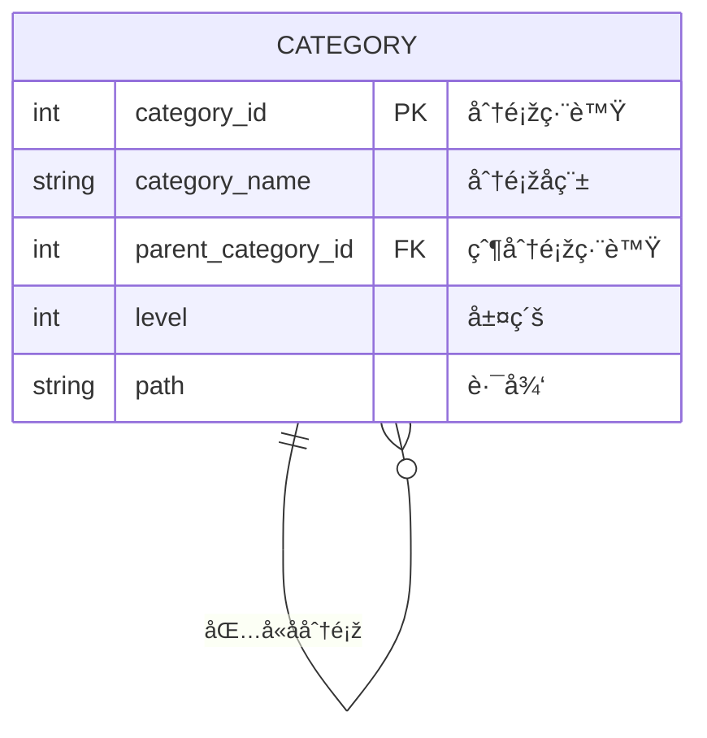
```mermaid
erDiagram
    CATEGORY {
        int category_id PK "分類編號"
        string category_name "分類å稱"
        int parent_category_id FK "父分類編號"
        int level "層級"
        string path "路徑"
    }
    
    CATEGORY ||--o{ CATEGORY : "包å«å­åˆ†é¡ž"
```

##### 3. æ­·å²è¨˜éŒ„æ¨¡å¼ (Audit Trail Pattern)

**應用場景：** 資料變更追蹤ã€ç¨½æ ¸éœ€æ±‚

```sql
-- 主表
CREATE TABLE products (
    product_id SERIAL PRIMARY KEY,
    product_name VARCHAR(100),
    price DECIMAL(10,2),
    created_at TIMESTAMP DEFAULT CURRENT_TIMESTAMP,
    updated_at TIMESTAMP DEFAULT CURRENT_TIMESTAMP
);

-- æ­·å²è¡¨
CREATE TABLE products_history (
    history_id SERIAL PRIMARY KEY,
    product_id INTEGER,
    product_name VARCHAR(100),
    price DECIMAL(10,2),
    operation VARCHAR(10), -- INSERT, UPDATE, DELETE
    changed_by INTEGER,
    changed_at TIMESTAMP DEFAULT CURRENT_TIMESTAMP
);
```

##### 4. å½ˆæ€§å±¬æ€§æ¨¡å¼ (Flexible Attributes Pattern)

**應用場景：** ä¸åŒé¡žåž‹å•†å“有ä¸åŒå±¬æ€§

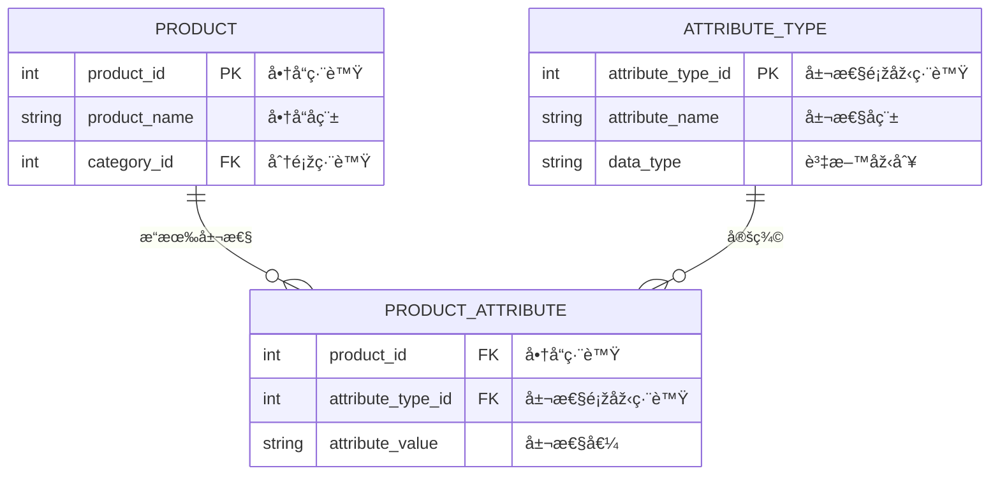
```mermaid
erDiagram
    PRODUCT {
        int product_id PK "商å“編號"
        string product_name "商å“å稱"
        int category_id FK "分類編號"
    }
    
    ATTRIBUTE_TYPE {
        int attribute_type_id PK "屬性類型編號"
        string attribute_name "屬性å稱"
        string data_type "資料型別"
    }
    
    PRODUCT_ATTRIBUTE {
        int product_id FK "商å“編號"
        int attribute_type_id FK "屬性類型編號"
        string attribute_value "屬性值"
    }
    
    PRODUCT ||--o{ PRODUCT_ATTRIBUTE : "æ“有屬性"
    ATTRIBUTE_TYPE ||--o{ PRODUCT_ATTRIBUTE : "定義"
```

##### 5. 多態關è¯æ¨¡å¼ (Polymorphic Association Pattern)

**應用場景：** è©•è«–å¯ä»¥é‡å°å•†å“ã€æ–‡ç« ç­‰ä¸åŒå°è±¡

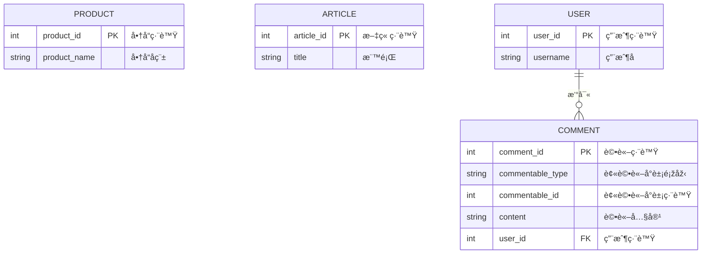
```mermaid
erDiagram
    COMMENT {
        int comment_id PK "評論編號"
        string commentable_type "被評論å°è±¡é¡žåž‹"
        int commentable_id "被評論å°è±¡ç·¨è™Ÿ"
        string content "評論內容"
        int user_id FK "用戶編號"
    }
    
    PRODUCT {
        int product_id PK "商å“編號"
        string product_name "商å“å稱"
    }
    
    ARTICLE {
        int article_id PK "文章編號"
        string title "標題"
    }
    
    USER {
        int user_id PK "用戶編號"
        string username "用戶å"
    }
    
    USER ||--o{ COMMENT : "撰寫"
```

#### ðŸ—ï¸ æž¶æ§‹è¨­è¨ˆåŽŸå‰‡

1. **單一è·è²¬åŽŸå‰‡**：æ¯å€‹å¯¦é«”åªè² è²¬ä¸€å€‹æ¥­å‹™æ¦‚念
2. **開放å°é–‰åŽŸå‰‡**：設計應易於擴展，難於修改
3. **ä¾è³´å€’置原則**：高層模組ä¸æ‡‰ä¾è³´ä½Žå±¤æ¨¡çµ„
4. **介é¢éš”離原則**：ä¸è¦å¼·è¿«å¯¦é«”ä¾è³´å®ƒå€‘ä¸ä½¿ç”¨çš„屬性

---

**📚 本節é‡é»žå›žé¡§**

- 強實體與弱實體的å€åˆ¥èˆ‡æ‡‰ç”¨
- é—œè¯åº¦å’Œåƒèˆ‡ç´„æŸçš„詳細分æž
- æ­£è¦åŒ–ç†è«–從 1NF 到 BCNF 的完整ç†è§£
- 常見設計錯誤的識別與é¿å…
- 設計最佳實務的具體實施

**🔄 下一節é å‘Š**

接下來我們將進入èªè­‰æº–備章節，包å«è€ƒè©¦ç¯„åœã€ç·´ç¿’題庫和é‡é»žæ‘˜è¦ã€‚

---

## 4. èªè­‰æº–å‚™

### 4.1 èªè­‰å…§å®¹èˆ‡ç¯„åœ

#### ä¸»è¦ ER Model èªè­‰é¡žåž‹

1. **Oracle Database Design**
   - Oracle Certified Professional (OCP) Database Developer
   - åŒ…å« ER Model 設計與實作

2. **Microsoft SQL Server**
   - MCSA: SQL Server Database Development
   - 資料庫設計與正è¦åŒ–

3. **IBM DB2**
   - IBM Certified Database Administrator
   - 概念模型設計

4. **國際èªè­‰**
   - CompTIA Database+
   - 涵蓋完整的資料庫設計ç†è«–

#### 考試範åœåˆ†æž

#### 📚 基礎概念 (25-30%)

**必考é‡é»žï¼š**

1. **ER Model 基本元素**
   - 實體ã€å±¬æ€§ã€é—œä¿‚的定義
   - ERD 符號æ„義
   - 主éµã€å¤–來éµã€å€™é¸éµ

2. **é—œè¯åº¦é¡žåž‹**
   - 一å°ä¸€ã€ä¸€å°å¤šã€å¤šå°å¤š
   - 完全åƒèˆ‡èˆ‡éƒ¨åˆ†åƒèˆ‡
   - 最å°èˆ‡æœ€å¤§é—œè¯åº¦

**範例考題：**
> 在 ERD 中，è±å½¢ç¬¦è™Ÿä»£è¡¨ä»€éº¼ï¼Ÿ
> A) 實體  B) 屬性  C) 關係  D) 主éµ

**答案：C**

#### 📊 設計技巧 (35-40%)

**必考é‡é»žï¼š**

1. **需求分æžè½‰æ›**
   - 從文字æ述識別實體
   - 確定實體間關係
   - 屬性分類與設計

2. **æ­£è¦åŒ–ç†è«–**
   - 1NFã€2NFã€3NFã€BCNF
   - 函數ä¾è³´è­˜åˆ¥
   - åæ­£è¦åŒ–考é‡

**範例考題：**
> 下列哪個資料表符åˆç¬¬äºŒæ­£è¦åŒ–？
> A) 所有欄ä½éƒ½æ˜¯åŽŸå­å€¼
> B) 沒有部分功能ä¾è³´
> C) 沒有傳éžä¾è³´
> D) æ¯å€‹æ±ºå®šå› å­éƒ½æ˜¯å€™é¸éµ

**答案：B**

#### 🔧 實作應用 (25-30%)

**必考é‡é»žï¼š**

1. **資料庫轉æ›**
   - ER Model 轉 SQL DDL
   - ç´„æŸæ¢ä»¶è¨­å®š
   - 索引策略

2. **最佳實務**
   - 命å慣例
   - 效能考é‡
   - 安全性設計

#### ⚡ 進階主題 (10-15%)

**必考é‡é»žï¼š**

1. **特殊實體類型**
   - 強實體與弱實體
   - 超類別與å­é¡žåˆ¥
   - èšåˆèˆ‡çµ„åˆ

2. **高級正è¦åŒ–**
   - 4NFã€5NF
   - 多值ä¾è³´
   - 連接ä¾è³´

### 4.2 練習題庫

#### é¸æ“‡é¡Œç·´ç¿’

**題目 1：基礎概念**
在 ER Model 中，下列何者用來表示實體的特徵？
A) 關係 (Relationship)
B) 屬性 (Attribute)  
C) éµå€¼ (Key)
D) ç´„æŸ (Constraint)

<details>
<summary>點擊查看答案</summary>

**答案：B**

**解æžï¼š**
- 屬性用來æ述實體的特徵或性質
- 關係表示實體間的關è¯
- éµå€¼ç”¨ä¾†å”¯ä¸€è­˜åˆ¥å¯¦é«”
- ç´„æŸç”¨ä¾†é™åˆ¶è³‡æ–™çš„有效性
</details>

**題目 2：關è¯åº¦**
圖書館系統中，「會員借閱書ç±ã€çš„é—œè¯åº¦æœ€å¯èƒ½æ˜¯ï¼š
A) 一å°ä¸€
B) 一å°å¤š
C) 多å°ä¸€
D) 多å°å¤š

<details>
<summary>點擊查看答案</summary>

**答案：D**

**解æžï¼š**
- 一個會員å¯ä»¥å€Ÿé–±å¤šæœ¬æ›¸ç±
- 一本書ç±å¯ä»¥è¢«å¤šå€‹æœƒå“¡å€Ÿé–±ï¼ˆåœ¨ä¸åŒæ™‚間）
- 因此形æˆå¤šå°å¤šé—œä¿‚
- 需è¦å»ºç«‹å€Ÿé–±è¨˜éŒ„é—œè¯å¯¦é«”
</details>

**題目 3：正è¦åŒ–**
下列哪個é•å第一正è¦åŒ–？
A) 學號：S001，姓å：張三
B) 學號：S001，興趣：籃çƒ,足çƒ,游泳
C) 學號：S001，出生日期：1990-01-01
D) 學號：S001，GPA：3.75

<details>
<summary>點擊查看答案</summary>

**答案：B**

**解æžï¼š**
- 第一正è¦åŒ–è¦æ±‚æ¯å€‹æ¬„ä½éƒ½æ˜¯åŽŸå­å€¼
- é¸é …B的興趣欄ä½åŒ…å«å¤šå€‹å€¼ï¼Œé•å原å­æ€§
- 應該建立ç¨ç«‹çš„興趣資料表或多個興趣欄ä½
</details>

**題目 4：弱實體**
下列何者最å¯èƒ½æ˜¯å¼±å¯¦é«”？
A) 客戶
B) 訂單
C) 訂單明細
D) 商å“

<details>
<summary>點擊查看答案</summary>

**答案：C**

**解æžï¼š**
- 弱實體無法ç¨ç«‹å­˜åœ¨ï¼Œä¾è³´å…¶ä»–實體
- 訂單明細ä¾è³´è¨‚單存在
- 沒有訂單就ä¸æœƒæœ‰è¨‚單明細
- 其主éµé€šå¸¸åŒ…å«å¼·å¯¦é«”的主éµ
</details>

**題目 5：函數ä¾è³´**
åœ¨é—œè¯ R(A, B, C, D) 中，已知 A → B，B → C，則下列敘述正確的是：
A) A → C（傳éžä¾è³´ï¼‰
B) C → A
C) B → A
D) D → C

<details>
<summary>點擊查看答案</summary>

**答案：A**

**解æžï¼š**
- 根據函數ä¾è³´çš„傳éžæ€§
- A → B 且 B → C，所以 A → C
- 這是傳éžä¾è³´çš„典型例å­
- å¯èƒ½é•å第三正è¦åŒ–
</details>

#### 實作題練習

**題目 1：設計練習**

根據以下需求設計 ER Model：

> 一個大學系統需è¦ç®¡ç†å­¸ç”Ÿã€èª²ç¨‹å’Œæ•™å¸«ã€‚學生有學號ã€å§“åã€é›»è©±ã€é›»å­éƒµä»¶ã€‚課程有課程代碼ã€èª²ç¨‹å稱ã€å­¸åˆ†æ•¸ã€‚教師有教師編號ã€å§“åã€ç³»æ‰€ã€è·ç¨±ã€‚學生å¯ä»¥é¸ä¿®å¤šé–€èª²ç¨‹ï¼Œæ¯é–€èª²ç¨‹å¯ä»¥è¢«å¤šå€‹å­¸ç”Ÿé¸ä¿®ï¼Œé¸èª²æ™‚需è¦è¨˜éŒ„é¸èª²æ—¥æœŸå’Œæˆç¸¾ã€‚æ¯é–€èª²ç¨‹ç”±ä¸€ä½æ•™å¸«æŽˆèª²ï¼Œä½†æ•™å¸«å¯ä»¥æŽˆèª²å¤šé–€èª²ç¨‹ã€‚

**解答：**

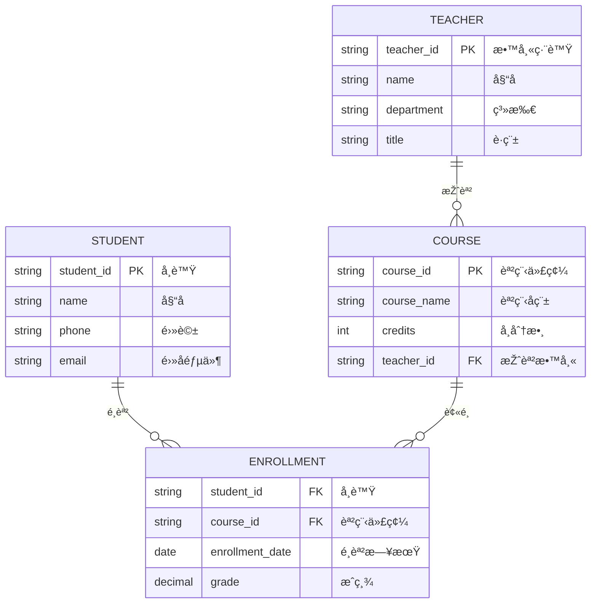
```mermaid
erDiagram
    STUDENT {
        string student_id PK "學號"
        string name "姓å"
        string phone "電話"
        string email "é›»å­éƒµä»¶"
    }
    
    COURSE {
        string course_id PK "課程代碼"
        string course_name "課程å稱"
        int credits "學分數"
        string teacher_id FK "授課教師"
    }
    
    TEACHER {
        string teacher_id PK "教師編號"
        string name "姓å"
        string department "系所"
        string title "è·ç¨±"
    }
    
    ENROLLMENT {
        string student_id FK "學號"
        string course_id FK "課程代碼"
        date enrollment_date "é¸èª²æ—¥æœŸ"
        decimal grade "æˆç¸¾"
    }
    
    STUDENT ||--o{ ENROLLMENT : "é¸èª²"
    COURSE ||--o{ ENROLLMENT : "被é¸"
    TEACHER ||--o{ COURSE : "授課"
```

**題目 2：正è¦åŒ–ç·´ç¿’**

å°ä»¥ä¸‹è³‡æ–™è¡¨é€²è¡Œæ­£è¦åŒ–到 3NF：

```
訂單資料表(訂單編號, 客戶編號, 客戶姓å, 客戶電話, 商å“編號, 商å“å稱, 商å“價格, 數é‡, å°è¨ˆ)
```

**解答步驟：**

1. **識別函數ä¾è³´**
   - 訂單編號 → 客戶編號, 客戶姓å, 客戶電話
   - 客戶編號 → 客戶姓å, 客戶電話
   - 商å“編號 → 商å“å稱, 商å“價格
   - (訂單編號, 商å“編號) → 數é‡, å°è¨ˆ

2. **1NF 檢查**：已符åˆï¼ˆæ‰€æœ‰æ¬„ä½éƒ½æ˜¯åŽŸå­å€¼ï¼‰

3. **2NF 轉æ›**：消除部分ä¾è³´
```sql
-- 客戶資料表
customers(客戶編號, 客戶姓å, 客戶電話)

-- 商å“資料表  
products(商å“編號, 商å“å稱, 商å“價格)

-- 訂單資料表
orders(訂單編號, 客戶編號)

-- 訂單明細資料表
order_items(訂單編號, 商å“編號, 數é‡, å°è¨ˆ)
```

4. **3NF 檢查**：已符åˆï¼ˆç„¡å‚³éžä¾è³´ï¼‰

### 4.3 模擬考題

#### 綜åˆæ¸¬é©—（60分é˜ï¼Œ50題）

**Part A：é¸æ“‡é¡Œï¼ˆ30題，æ¯é¡Œ2分）**

1. ER Model 中的「Eã€ä»£è¡¨ä»€éº¼ï¼Ÿ
   A) Element  B) Entity  C) Entry  D) Error

2. 下列何者ä¸æ˜¯å¯¦é«”的特徵？
   A) 具有屬性  B) å¯ä»¥ç¨ç«‹è­˜åˆ¥  C) 必須有關係  D) 代表ç¾å¯¦ä¸–界的事物

3. 在多å°å¤šé—œä¿‚中，通常需è¦å»ºç«‹ä»€éº¼ï¼Ÿ
   A) 檢視表  B) 索引  C) é—œè¯å¯¦é«”  D) 觸發器

*（çœç•¥å…¶ä»–27é¡Œ...）*

**Part B：實作題（20題，æ¯é¡Œ3分）**

**題目 1：ERD 設計（15分）**
根據以下業務æ述，設計完整的 ERD：

> 一個線上購物平å°éœ€è¦ç®¡ç†å•†å“ã€é¡§å®¢ã€è¨‚單和評論。æ¯å€‹å•†å“屬於一個類別，顧客å¯ä»¥å°è³¼è²·éŽçš„商å“撰寫評論和評分。系統需è¦è¿½è¹¤åº«å­˜è®ŠåŒ–和訂單狀態。

**評分é‡é»žï¼š**
- 實體識別正確（5分）
- 關係建立åˆç†ï¼ˆ5分）
- 屬性設計完整（3分）
- ERD 符號使用正確（2分）

**題目 2：正è¦åŒ–分æžï¼ˆ10分）**
分æžä¸‹åˆ—資料表的正è¦åŒ–程度，並æ出改善建議：

```
學生é¸èª²(學號, 姓å, 系所, 課程代碼, 課程å稱, 教師姓å, æˆç¸¾)
```

**答案架構：**
1. ç›®å‰æ­£è¦åŒ–程度分æž
2. 識別函數ä¾è³´
3. æ出正è¦åŒ–建議
4. 設計改善後的資料表çµæ§‹

### 4.4 é‡é»žçŸ¥è­˜æ‘˜è¦

#### 🎯 核心概念速記

| 概念 | 定義 | 符號/標記 | 範例 |
|------|------|-----------|------|
| 實體 | å¯ç¨ç«‹è­˜åˆ¥çš„事物 | 矩形 | 學生ã€è¨‚å–® |
| 屬性 | 實體的特徵 | 橢圓 | 姓åã€åƒ¹æ ¼ |
| 關係 | å¯¦é«”é–“çš„é—œè¯ | è±å½¢ | é¸èª²ã€è³¼è²· |
| ä¸»éµ | 唯一識別屬性 | 底線 | 學號ã€å•†å“編號 |
| å¤–ä¾†éµ | åƒè€ƒå…¶ä»–å¯¦é«”çš„éµ | FK | 訂單中的客戶編號 |

#### 🔗 é—œè¯åº¦è¨˜æ†¶æ³•

| é—œè¯åº¦ | 符號 | 記憶å£è¨£ | 實例 |
|--------|------|----------|------|
| 1:1 | \|\|--\|\| | 一夫一妻 | 人-身分證 |
| 1:N | \|\|--o{ | ä¸€çˆ¶å¤šå­ | 部門-å“¡å·¥ |
| M:N | }o--o{ | 多å°å¤šé¸ | 學生-課程 |

#### 📊 æ­£è¦åŒ–檢查表

| æ­£è¦åŒ– | 檢查é‡é»ž | 常見é•åæƒ…æ³ | 解決方法 |
|--------|----------|--------------|----------|
| 1NF | 原å­å€¼ | å¤šå€¼æ¬„ä½ | 建立關è¯è¡¨ |
| 2NF | 完全ä¾è³´ | 部分ä¾è³´ | 分解資料表 |
| 3NF | 無傳éžä¾è³´ | A→B→C | 建立中介表 |
| BCNF | 決定因å­æ˜¯å€™é¸éµ | 多候é¸éµå•é¡Œ | 進一步分解 |

#### ðŸ› ï¸ SQL 轉æ›æ¨£æ¿

**實體轉æ›ï¼š**
```sql
-- 實體 → 資料表
CREATE TABLE entity_name (
    entity_id SERIAL PRIMARY KEY,
    attribute1 data_type NOT NULL,
    attribute2 data_type,
    created_at TIMESTAMP DEFAULT CURRENT_TIMESTAMP
);
```

**一å°å¤šé—œä¿‚：**
```sql
-- 在「多ã€çš„一方加外來éµ
ALTER TABLE child_table 
ADD COLUMN parent_id INTEGER REFERENCES parent_table(parent_id);
```

**多å°å¤šé—œä¿‚：**
```sql
-- 建立關è¯è¡¨
CREATE TABLE entity1_entity2 (
    entity1_id INTEGER REFERENCES entity1(entity1_id),
    entity2_id INTEGER REFERENCES entity2(entity2_id),
    additional_attributes,
    PRIMARY KEY (entity1_id, entity2_id)
);
```

#### 🚨 設計陷阱æ醒

1. **éŽåº¦æ­£è¦åŒ–**：ä¸è¦ç‚ºäº†æ­£è¦åŒ–而犧牲查詢效能
2. **忽略索引**：外來éµå’ŒæŸ¥è©¢æ¢ä»¶éœ€è¦ç´¢å¼•
3. **命åä¸ä¸€è‡´**：統一命å慣例很é‡è¦
4. **缺少約æŸ**：業務è¦å‰‡è¦åœ¨è³‡æ–™åº«å±¤é¢å¯¦ç¾
5. **資料型別錯誤**：金é¡ç”¨DECIMAL，ä¸ç”¨FLOAT

#### 📠考å‰è¡åˆºæ¸…å–®

**å‰ä¸€é€±æº–備：**
- [ ] 複習所有 ERD 符號æ„義
- [ ] 練習手繪 ERD
- [ ] 熟記正è¦åŒ–定義
- [ ] åšå®Œæ‰€æœ‰ç·´ç¿’é¡Œ

**考å‰ä¸€å¤©ï¼š**
- [ ] 複習é‡é»žçŸ¥è­˜æ‘˜è¦
- [ ] 檢查計算機和文具
- [ ] 確èªè€ƒè©¦æ™‚間地點
- [ ] ä¿æŒå……足ç¡çœ 

**考試當天：**
- [ ] 仔細閱讀題目
- [ ] å…ˆåšæœ‰æŠŠæ¡çš„題目
- [ ] é ç•™æª¢æŸ¥æ™‚é–“
- [ ] 注æ„時間分é…

---

**📚 本節é‡é»žå›žé¡§**

- 了解主è¦èªè­‰é¡žåž‹å’Œè€ƒè©¦ç¯„åœ
- é€éŽç·´ç¿’題庫加強ç†è§£
- 使用é‡é»žæ‘˜è¦å¿«é€Ÿè¤‡ç¿’
- 掌æ¡è€ƒè©¦æŠ€å·§å’Œæº–備策略

**🔄 下一節é å‘Š**

接下來我們將介紹學習路徑ã€æŽ¨è–¦å·¥å…·å’Œé€²éšŽå­¸ç¿’資æºã€‚

---

## 5. 學習路徑

### 5.1 學習步驟建議

#### 🎯 新手入門路徑（第1-2週）

**目標：建立基礎概念**

**第1週：ç†è«–基礎**
- [ ] 閱讀基礎知識章節
- [ ] ç†è§£å¯¦é«”ã€å±¬æ€§ã€é—œä¿‚概念
- [ ] 學習 ERD 基本符號
- [ ] 完æˆç°¡å–®ç·´ç¿’（如圖書館系統）

**æ¯æ—¥å»ºè­°æ™‚間：1-2å°æ™‚**

**學習檢核：**
- 能說出 ER Model 的用途
- 能識別 ERD 中的基本符號
- 能畫出簡單的實體關係圖

**第2週：實作練習**
- [ ] 練習需求分æžæŠ€å·§
- [ ] 設計å°åž‹ç³»çµ± ERD
- [ ] 學習一å°ä¸€ã€ä¸€å°å¤šã€å¤šå°å¤šé—œä¿‚
- [ ] 完æˆåŸºç¤Žå¯¦ä½œç·´ç¿’

**推薦練習專案：**
1. 學生é¸èª²ç³»çµ±
2. 員工管ç†ç³»çµ±
3. 圖書借閱系統

#### 🚀 進階應用路徑（第3-4週）

**目標：掌æ¡è¨­è¨ˆæŠ€å·§**

**第3週：進階概念**
- [ ] 學習強實體與弱實體
- [ ] ç†è§£æ­£è¦åŒ–ç†è«–（1NF-3NF）
- [ ] ç·´ç¿’é—œè¯åº¦å’Œåƒèˆ‡ç´„æŸ
- [ ] 分æžè¤‡é›œæ¥­å‹™éœ€æ±‚

**第4週：專案實作**
- [ ] 設計中型系統（如電商平å°ï¼‰
- [ ] 練習 ER Model 轉 SQL
- [ ] 學習設計最佳實務
- [ ] 完æˆå°ˆæ¡ˆæ¡ˆä¾‹ç ”究

**推薦專案：**
1. 電商購物平å°
2. 醫院管ç†ç³»çµ±
3. 銀行核心系統

#### 🎓 專業精通路徑（第5-8週）

**目標：é”到專業水準**

**第5-6週：高級主題**
- [ ] æŽŒæ¡ BCNF 和高階正è¦åŒ–
- [ ] 學習效能優化技巧
- [ ] 研究安全性設計
- [ ] 練習大型系統設計

**第7-8週：èªè­‰æº–å‚™**
- [ ] 複習所有ç†è«–知識
- [ ] 大é‡ç·´ç¿’考試題型
- [ ] åƒåŠ æ¨¡æ“¬è€ƒè©¦
- [ ] 準備實際èªè­‰

#### 📈 æŒçºŒæˆé•·è·¯å¾‘（長期）

**進階領域：**
- 分散å¼è³‡æ–™åº«è¨­è¨ˆ
- NoSQL 資料模型
- 資料倉儲建模
- å¾®æœå‹™æž¶æ§‹è¨­è¨ˆ

### 5.2 推薦工具

#### 🎨 ERD 繪圖工具

#### å…費工具

1. **Mermaid** â­â­â­â­â­
   ```mermaid
   erDiagram
       CUSTOMER ||--o{ ORDER : places
       ORDER ||--|{ LINE-ITEM : contains
       PRODUCT ||--o{ LINE-ITEM : "ordered in"
   ```
   
   **優點：**
   - 程å¼ç¢¼åŒ–繪圖，版本控制å‹å–„
   - 與 Markdown 完美整åˆ
   - æ”¯æ´ GitHubã€GitLab 原生顯示
   
   **é©ç”¨ï¼š** 文件化ã€å”作開發

2. **Draw.io (diagrams.net)** â­â­â­â­
   
   **優點：**
   - 完全å…費，功能強大
   - 支æ´å¤šç¨®åœ–表類型
   - å¯æ•´åˆ Google Driveã€GitHub
   
   **é©ç”¨ï¼š** 快速原型ã€ç°¡å ±å±•ç¤º

3. **PlantUML** â­â­â­â­
   ```plantuml
   @startuml
   entity Customer {
     * customer_id : number
     --
     name : varchar
     email : varchar
   }
   @enduml
   ```
   
   **優點：**
   - 文字æ述自動生æˆåœ–表
   - 支æ´å¤šç¨® IDE æ•´åˆ
   - é©åˆç¨‹å¼é–‹ç™¼è€…
   
   **é©ç”¨ï¼š** 開發文件ã€è‡ªå‹•åŒ–生æˆ

#### 付費專業工具

1. **Lucidchart** â­â­â­â­â­
   
   **優點：**
   - 專業級功能完整
   - 優秀的å”作功能
   - è±å¯Œçš„模æ¿åº«
   
   **價格：** $7.95/月起
   **é©ç”¨ï¼š** ä¼æ¥­ç´šå°ˆæ¡ˆã€åœ˜éšŠå”作

2. **ERwin Data Modeler** â­â­â­â­â­
   
   **優點：**
   - 業界標準建模工具
   - 支æ´é€†å‘工程
   - 完整的資料治ç†åŠŸèƒ½
   
   **價格：** ä¼æ¥­æŽˆæ¬Š
   **é©ç”¨ï¼š** 大型ä¼æ¥­ã€å°ˆæ¥­å»ºæ¨¡å¸«

3. **Visual Paradigm** â­â­â­â­
   
   **優點：**
   - 全方ä½å»ºæ¨¡å·¥å…·
   - 支æ´å¤šç¨®å»ºæ¨¡æ¨™æº–
   - 程å¼ç¢¼ç”ŸæˆåŠŸèƒ½
   
   **價格：** $99/年起
   **é©ç”¨ï¼š** 中å°ä¼æ¥­ã€ç³»çµ±åˆ†æžå¸«

#### 📊 資料庫設計工具

1. **MySQL Workbench** (å…è²»)
   - MySQL 官方工具
   - 視覺化資料庫設計
   - 支æ´é€†å‘工程

2. **DBeaver** (å…è²»)
   - 通用資料庫工具
   - 支æ´å¤šç¨®è³‡æ–™åº«
   - ER 圖生æˆåŠŸèƒ½

3. **pgAdmin** (å…è²»)
   - PostgreSQL 管ç†å·¥å…·
   - 內建 ERD 功能
   - é–‹æºä¸”功能è±å¯Œ

#### 🔧 開發整åˆå·¥å…·

1. **VS Code 擴充套件**
   - Mermaid Preview
   - PlantUML
   - Database Client

2. **IntelliJ IDEA**
   - Database Tools
   - UML Support
   - ERD 生æˆå™¨

3. **Eclipse**
   - ERD Editor
   - Data Tools Platform
   - Database Development

### 5.3 進階學習資æº

#### 📚 推薦書ç±

#### 基礎入門

1. **《Database System Concepts》** - Silberschatz
   - 資料庫系統è–經
   - ER Model ç†è«–完整
   - é©åˆå­¸è¡“研究

2. **《資料庫系統ç†è«–與實務》** - 中文書ç±
   - é©åˆä¸­æ–‡è®€è€…
   - ç†è«–與實務並é‡
   - 包å«è±å¯Œæ¡ˆä¾‹

#### 進階實務

1. **《Data Modeling Essentials》** - Simsion
   - 實務導å‘
   - è±å¯Œçš„案例研究
   - 業界最佳實務

2. **《The Data Model Resource Book》** - Silverston
   - 標準資料模型åƒè€ƒ
   - å„行業標準模型
   - 設計模å¼é›†åˆ

#### èªè­‰æº–å‚™

1. **《OCA Oracle Database SQL Exam Guide》**
   - Oracle èªè­‰å®˜æ–¹æŒ‡å—
   - åŒ…å« ER Model 內容
   - 實際考題練習

2. **《CompTIA Database+ Study Guide》**
   - 國際èªè­‰æŒ‡å—
   - å…¨é¢çš„資料庫知識
   - 包å«è¨­è¨ˆç†è«–

#### 🌠線上課程

#### å…費資æº

1. **Coursera - Database Design**
   - å²ä¸¹ä½›å¤§å­¸èª²ç¨‹
   - 完整的ç†è«–基礎
   - 實作專案

2. **Khan Academy - Intro to Databases**
   - é©åˆåˆå­¸è€…
   - 互動å¼å­¸ç¿’
   - 循åºæ¼¸é€²

3. **YouTube é »é“**
   - Database Design Tutorial
   - ERD Tutorial Series
   - SQL and Database Design

#### 付費課程

1. **Udemy - Complete Database Design Course**
   - 實務導å‘
   - 包å«å¤šå€‹å°ˆæ¡ˆ
   - 終身存å–

2. **Pluralsight - Database Design Path**
   - 專業技能路徑
   - 深度技術內容
   - 技能評估

3. **LinkedIn Learning**
   - Database Design Foundations
   - é©åˆè·å ´å­¸ç¿’
   - 證書èªè­‰

#### 📊 實務資æº

#### 標準與è¦ç¯„

1. **ISO/IEC 11179** - 資料元素標準
2. **ANSI-SPARC Architecture** - 資料庫架構標準
3. **OMG UML** - 統一建模語言

#### 社群與論壇

1. **Stack Overflow**
   - Database Design 標籤
   - 實際å•é¡Œè§£ç­”
   - 專家經驗分享

2. **Reddit - r/Database**
   - 設計討論
   - 工具推薦
   - è·æ¶¯å»ºè­°

3. **DBA Stack Exchange**
   - 專業資料庫社群
   - 深度技術討論
   - 最佳實務分享

#### 📱 實用 App

1. **ERD Go** (iOS/Android)
   - 手機繪製 ERD
   - 簡單易用
   - é©åˆå¿«é€Ÿè‰åœ–

2. **Lucidchart Mobile**
   - 行動版專業工具
   - 雲端åŒæ­¥
   - 團隊å”作

#### 🔠實務案例庫

1. **GitHub - Database Samples**
   - é–‹æºè³‡æ–™åº«ç¯„例
   - å„種行業模型
   - 實際專案åƒè€ƒ

2. **Database Tutorial**
   - 線上教學案例
   - é€æ­¥è¨­è¨ˆéŽç¨‹
   - 最佳實務展示

3. **ä¼æ¥­æ¡ˆä¾‹ç ”究**
   - Netflix 資料架構
   - Amazon 電商模型
   - 銀行核心系統

#### 💡 學習建議

1. **ç†è«–與實務並é‡**
   - ä¸è¦åªå­¸ç†è«–，è¦å‹•æ‰‹å¯¦ä½œ
   - 從å°å°ˆæ¡ˆé–‹å§‹ï¼Œé€æ­¥æ“´å¤§è¦æ¨¡

2. **多åšæ¡ˆä¾‹åˆ†æž**
   - 分æžçŸ¥åä¼æ¥­çš„資料模型
   - æ€è€ƒè¨­è¨ˆèƒŒå¾Œçš„商業é‚輯

3. **åƒèˆ‡é–‹æºå°ˆæ¡ˆ**
   - è²¢ç»è³‡æ–™æ¨¡åž‹è¨­è¨ˆ
   - 學習他人的設計æ€è·¯

4. **建立學習筆記**
   - 記錄設計決策éŽç¨‹
   - æ•´ç†å¸¸è¦‹æ¨¡å¼å’Œæœ€ä½³å¯¦å‹™

5. **æŒçºŒé—œæ³¨è¶¨å‹¢**
   - NoSQL 模型設計
   - å¾®æœå‹™è³‡æ–™æž¶æ§‹
   - 雲端資料庫趨勢

---

## 6. 檢查清單

### 6.1 設計階段檢查清單

#### 需求分æžéšŽæ®µ
- [ ] 已完整收集業務需求
- [ ] 識別所有關éµå¯¦é«”
- [ ] 確èªå¯¦é«”間的業務關係
- [ ] 定義æ¯å€‹å¯¦é«”的核心屬性
- [ ] 與業務人員確èªéœ€æ±‚ç†è§£æ­£ç¢º

#### ERD 設計階段
- [ ] 所有實體都有é©ç•¶çš„主éµ
- [ ] 關係的關è¯åº¦è¨­å®šæ­£ç¢º
- [ ] 弱實體正確識別並標示
- [ ] 屬性分類正確（簡單ã€è¤‡åˆã€å¤šå€¼ã€è¡ç”Ÿï¼‰
- [ ] ERD 符號使用正確且一致

#### æ­£è¦åŒ–檢查
- [ ] 符åˆç¬¬ä¸€æ­£è¦åŒ–（原å­å€¼ï¼‰
- [ ] 符åˆç¬¬äºŒæ­£è¦åŒ–（無部分ä¾è³´ï¼‰
- [ ] 符åˆç¬¬ä¸‰æ­£è¦åŒ–（無傳éžä¾è³´ï¼‰
- [ ] 評估是å¦éœ€è¦ BCNF
- [ ] 考慮åæ­£è¦åŒ–çš„å¿…è¦æ€§

### 6.2 資料庫實作檢查清單

#### DDL 建立階段
- [ ] 資料表命åéµå¾ªä¸€è‡´è¦ç¯„
- [ ] 欄ä½è³‡æ–™åž‹åˆ¥é¸æ“‡é©ç•¶
- [ ] 主éµç´„æŸæ­£ç¢ºè¨­å®š
- [ ] 外來éµç´„æŸå»ºç«‹å®Œæ•´
- [ ] 檢查約æŸè¦†è“‹æ¥­å‹™è¦å‰‡
- [ ] é è¨­å€¼è¨­å®šåˆç†

#### 索引與效能
- [ ] 主éµè‡ªå‹•å»ºç«‹ç´¢å¼•
- [ ] 外來éµæ¬„ä½å»ºç«‹ç´¢å¼•
- [ ] 查詢æ¢ä»¶æ¬„ä½å»ºç«‹ç´¢å¼•
- [ ] 複åˆç´¢å¼•æ”¯æ´å¸¸ç”¨æŸ¥è©¢
- [ ] é¿å…éŽå¤šç´¢å¼•å½±éŸ¿å¯«å…¥æ•ˆèƒ½

#### 安全性考é‡
- [ ] æ•æ„Ÿè³‡æ–™æ¬„ä½åŠ å¯†è™•ç†
- [ ] 密碼等機密資訊雜湊儲存
- [ ] 設定é©ç•¶çš„資料表權é™
- [ ] 考慮資料é®ç½©éœ€æ±‚
- [ ] 建立稽核軌跡機制

### 6.3 å“質ä¿è­‰æª¢æŸ¥æ¸…å–®

#### 資料完整性
- [ ] 實體完整性（主éµä¸é‡è¤‡ã€éžç©ºï¼‰
- [ ] åƒç…§å®Œæ•´æ€§ï¼ˆå¤–來éµæœ‰æ•ˆï¼‰
- [ ] 領域完整性（資料型別ã€ç¯„åœé™åˆ¶ï¼‰
- [ ] 使用者定義完整性（業務è¦å‰‡ï¼‰

#### 測試驗證
- [ ] æ’入測試資料驗證設計
- [ ] 查詢效能測試
- [ ] ç´„æŸæ¢ä»¶æ¸¬è©¦
- [ ] é‚Šç•Œæ¢ä»¶æ¸¬è©¦
- [ ] 併發存å–測試

#### 文件化
- [ ] ERD 圖表清晰易懂
- [ ] 資料字典完整
- [ ] 設計決策記錄
- [ ] 業務è¦å‰‡æ–‡ä»¶
- [ ] 維護æ“作手冊

### 6.4 專案交付檢查清單

#### 交付文件
- [ ] 完整的 ERD 圖表
- [ ] 資料庫建立腳本（DDL）
- [ ] 測試資料腳本（DML）
- [ ] 資料字典文件
- [ ] 設計說明文件

#### 程å¼ç¢¼å“質
- [ ] SQL 腳本格å¼çµ±ä¸€
- [ ] 註解說明清楚
- [ ] 版本控制管ç†
- [ ] 命åè¦ç¯„一致
- [ ] 錯誤處ç†å®Œæ•´

#### 部署準備
- [ ] 開發環境測試通éŽ
- [ ] 效能基準測試
- [ ] 備份還原策略
- [ ] 監控告警設定
- [ ] 容é‡è¦åŠƒè©•ä¼°

### 6.5 學習æˆæžœæª¢æ ¸

#### 基礎概念掌æ¡
- [ ] 能解釋 ER Model 的用途和é‡è¦æ€§
- [ ] 熟悉所有 ERD 基本符號
- [ ] ç†è§£å¯¦é«”ã€å±¬æ€§ã€é—œä¿‚的概念
- [ ] 掌æ¡å„種關è¯åº¦çš„å«ç¾©
- [ ] 了解主éµã€å¤–來éµçš„作用

#### 設計技能評估
- [ ] 能從需求分æžä¸­è­˜åˆ¥å¯¦é«”
- [ ] 能建立正確的實體關係
- [ ] 能設計åˆç†çš„屬性çµæ§‹
- [ ] 能進行正è¦åŒ–分æž
- [ ] 能轉æ›ç‚ºè³‡æ–™åº«çµæ§‹

#### 實務應用能力
- [ ] 能設計中等複雜度的系統
- [ ] 能識別和é¿å…常見設計錯誤
- [ ] 能考慮效能和安全因素
- [ ] 能撰寫清楚的設計文件
- [ ] 能與團隊有效æºé€šè¨­è¨ˆç†å¿µ

### 6.6 æŒçºŒæ”¹é€²æª¢æŸ¥

#### 定期檢視
- [ ] æ¯æœˆæª¢è¦–設計是å¦ç¬¦åˆæ¥­å‹™è®ŠåŒ–
- [ ] 收集使用者回饋æ„見
- [ ] 監控系統效能指標
- [ ] 評估新技術應用å¯èƒ½æ€§
- [ ] 更新文件和最佳實務

#### 技能æå‡
- [ ] åƒèˆ‡è¨­è¨ˆå¯©æŸ¥æœƒè­°
- [ ] 學習新的建模技巧
- [ ] 關注業界趨勢發展
- [ ] 分享經驗給團隊æˆå“¡
- [ ] 準備相關技術èªè­‰

---

**🎉 æ­å–œå®Œæˆå­¸ç¿’ï¼**

您已經掌æ¡äº† Entity-Relationship Model 的完整知識體系。這份手冊將陪伴您在資料庫設計的é“路上æŒçºŒæˆé•·ã€‚記ä½ï¼Œå„ªç§€çš„資料模型設計需è¦ä¸æ–·çš„實務練習和經驗累ç©ã€‚

**📞 支æ´è³‡æº**

如果在實際應用中é‡åˆ°å•é¡Œï¼Œå¯ä»¥ï¼š

- åƒè€ƒæœ¬æ‰‹å†Šçš„相關章節
- 使用推薦的工具和資æº
- åƒèˆ‡ç¤¾ç¾¤è¨Žè«–和交æµ
- 尋求資深åŒäº‹çš„指導

**🌟 最後建議**

資料庫設計是一門è—術，也是一門科學。在追求ç†è«–完美的åŒæ™‚，ä¸è¦å¿˜è¨˜è€ƒæ…®å¯¦å‹™éœ€æ±‚和效能因素。æ¯å€‹å°ˆæ¡ˆéƒ½æ˜¯ç¨ç‰¹çš„，需è¦æ ¹æ“šå…·é«”情æ³åšå‡ºæœ€é©åˆçš„設計決策。

ç¥æ‚¨åœ¨è³‡æ–™åº«è¨­è¨ˆçš„è·æ¶¯ç™¼å±•é †åˆ©ï¼ðŸš€

---

## 📎 附錄

### A. ERD 符號速查表

| 符號 | å稱 | 用途 | Mermaid 語法 |
|------|------|------|------------|
| 矩形 | 實體 | 表示實體類型 | `ENTITY_NAME { }` |
| 橢圓 | 屬性 | 表示實體屬性 | `attribute_name type` |
| è±å½¢ | 關係 | 表示實體間關係 | `ENTITY1 }relation{ ENTITY2` |
| ç·šæ¢ | 連接 | 連接元素 | `--`, `\|\|--o{` |
| 底線 | ä¸»éµ | 標示主éµå±¬æ€§ | `attribute_name PK` |
| FK | å¤–ä¾†éµ | 標示外來éµå±¬æ€§ | `attribute_name FK` |

### B. SQL 資料型別å°ç…§è¡¨

#### PostgreSQL

| 用途 | 資料型別 | 說明 | 範例 |
|------|----------|------|------|
| ä¸»éµ | SERIAL | 自動éžå¢žæ•´æ•¸ | `id SERIAL PRIMARY KEY` |
| 整數 | INTEGER | 32ä½å…ƒæ•´æ•¸ | `age INTEGER` |
| 長整數 | BIGINT | 64ä½å…ƒæ•´æ•¸ | `user_count BIGINT` |
| å°æ•¸ | DECIMAL(p,s) | 精確å°æ•¸ | `price DECIMAL(10,2)` |
| 字串 | VARCHAR(n) | å¯è®Šé•·åº¦å­—串 | `name VARCHAR(100)` |
| 文字 | TEXT | ä¸é™é•·åº¦æ–‡å­— | `description TEXT` |
| 布林 | BOOLEAN | 真/å‡å€¼ | `is_active BOOLEAN` |
| 日期 | DATE | 日期 | `birth_date DATE` |
| 時間 | TIMESTAMP | 日期時間 | `created_at TIMESTAMP` |

#### MySQL

| 用途 | 資料型別 | 說明 | 範例 |
|------|----------|------|------|
| ä¸»éµ | AUTO_INCREMENT | 自動éžå¢ž | `id INT AUTO_INCREMENT` |
| 整數 | INT | 32ä½å…ƒæ•´æ•¸ | `age INT` |
| 長整數 | BIGINT | 64ä½å…ƒæ•´æ•¸ | `user_count BIGINT` |
| å°æ•¸ | DECIMAL(p,s) | 精確å°æ•¸ | `price DECIMAL(10,2)` |
| 字串 | VARCHAR(n) | å¯è®Šé•·åº¦å­—串 | `name VARCHAR(100)` |
| 文字 | TEXT | ä¸é™é•·åº¦æ–‡å­— | `description TEXT` |
| 布林 | BOOLEAN | 真/å‡å€¼ | `is_active BOOLEAN` |
| 日期 | DATE | 日期 | `birth_date DATE` |
| 時間 | DATETIME | 日期時間 | `created_at DATETIME` |

### C. 常用正è¦åŒ–檢查 SQL

```sql
-- 檢查第一正è¦åŒ–é•å（多值欄ä½ï¼‰
SELECT table_name, column_name 
FROM information_schema.columns 
WHERE data_type = 'text' 
  AND column_name LIKE '%list%' 
  OR column_name LIKE '%array%';

-- 檢查å¯èƒ½çš„部分ä¾è³´ï¼ˆé•å2NF）
SELECT 
    tc.table_name,
    tc.constraint_type,
    kcu.column_name
FROM information_schema.table_constraints tc
JOIN information_schema.key_column_usage kcu 
ON tc.constraint_name = kcu.constraint_name
WHERE tc.constraint_type = 'PRIMARY KEY'
  AND tc.table_name IN (
    SELECT table_name 
    FROM information_schema.key_column_usage 
    GROUP BY table_name 
    HAVING COUNT(*) > 1
  );

-- 檢查外來éµå®Œæ•´æ€§
SELECT 
    tc.table_name,
    kcu.column_name,
    ccu.table_name AS foreign_table_name,
    ccu.column_name AS foreign_column_name
FROM information_schema.table_constraints AS tc
JOIN information_schema.key_column_usage AS kcu
ON tc.constraint_name = kcu.constraint_name
JOIN information_schema.constraint_column_usage AS ccu
ON ccu.constraint_name = tc.constraint_name
WHERE tc.constraint_type = 'FOREIGN KEY';
```

### D. 設計模å¼ç¯„本

#### 1. 稽核追蹤模å¼

```sql
-- 主表
CREATE TABLE products (
    product_id SERIAL PRIMARY KEY,
    product_name VARCHAR(100) NOT NULL,
    price DECIMAL(10,2) NOT NULL,
    created_at TIMESTAMP DEFAULT CURRENT_TIMESTAMP,
    updated_at TIMESTAMP DEFAULT CURRENT_TIMESTAMP,
    created_by INTEGER REFERENCES users(user_id),
    updated_by INTEGER REFERENCES users(user_id)
);

-- æ­·å²è¡¨
CREATE TABLE products_audit (
    audit_id SERIAL PRIMARY KEY,
    product_id INTEGER NOT NULL,
    operation VARCHAR(10) NOT NULL, -- INSERT, UPDATE, DELETE
    old_values JSONB,
    new_values JSONB,
    changed_at TIMESTAMP DEFAULT CURRENT_TIMESTAMP,
    changed_by INTEGER REFERENCES users(user_id)
);
```

#### 2. 軟刪除模å¼

```sql
CREATE TABLE customers (
    customer_id SERIAL PRIMARY KEY,
    customer_name VARCHAR(100) NOT NULL,
    email VARCHAR(255) NOT NULL,
    is_deleted BOOLEAN DEFAULT FALSE,
    deleted_at TIMESTAMP NULL,
    deleted_by INTEGER REFERENCES users(user_id)
);

-- 檢視表åªé¡¯ç¤ºæœ‰æ•ˆè¨˜éŒ„
CREATE VIEW active_customers AS
SELECT * FROM customers WHERE is_deleted = FALSE;
```

#### 3. 版本控制模å¼

```sql
CREATE TABLE document_versions (
    version_id SERIAL PRIMARY KEY,
    document_id INTEGER NOT NULL,
    version_number INTEGER NOT NULL,
    content TEXT NOT NULL,
    is_current BOOLEAN DEFAULT FALSE,
    created_at TIMESTAMP DEFAULT CURRENT_TIMESTAMP,
    created_by INTEGER REFERENCES users(user_id),
    UNIQUE(document_id, version_number)
);
```

### E. 效能優化檢查清單

#### 索引策略

- [ ] 主éµè‡ªå‹•æœ‰ç´¢å¼•
- [ ] 外來éµæ¬„ä½å»ºç«‹ç´¢å¼•
- [ ] WHERE æ¢ä»¶å¸¸ç”¨æ¬„ä½å»ºç«‹ç´¢å¼•
- [ ] ORDER BY 欄ä½å»ºç«‹ç´¢å¼•
- [ ] 複åˆç´¢å¼•æ”¯æ´å¤šæ¬„ä½æŸ¥è©¢
- [ ] é¿å…éŽå¤šç´¢å¼•å½±éŸ¿å¯«å…¥æ•ˆèƒ½

#### 查詢優化

- [ ] é¿å… SELECT *，åªé¸æ“‡éœ€è¦çš„欄ä½
- [ ] 使用é©ç•¶çš„ JOIN é¡žåž‹
- [ ] é¿å…在 WHERE æ¢ä»¶ä¸­ä½¿ç”¨å‡½æ•¸
- [ ] 使用 LIMIT é™åˆ¶çµæžœæ•¸é‡
- [ ] 考慮分é æŸ¥è©¢ç­–ç•¥

#### 資料表設計

- [ ] é©ç•¶çš„資料型別é¸æ“‡
- [ ] æ­£è¦åŒ–與åæ­£è¦åŒ–平衡
- [ ] 大表考慮分割策略
- [ ] æ­·å²è³‡æ–™æ­¸æª”ç­–ç•¥

### F. 安全性檢查清單

#### 資料ä¿è­·

- [ ] æ•æ„Ÿè³‡æ–™åŠ å¯†å„²å­˜
- [ ] 密碼使用安全雜湊
- [ ] 個人資料é®ç½©æ©Ÿåˆ¶
- [ ] 資料備份加密

#### å­˜å–控制

- [ ] 最å°æ¬Šé™åŽŸå‰‡
- [ ] 角色基礎存å–控制
- [ ] 資料列層級安全
- [ ] 稽核日誌記錄

#### 應用程å¼å±¤é¢

- [ ] SQL 注入防護
- [ ] åƒæ•¸åŒ–查詢
- [ ] 連線加密（SSL/TLS）
- [ ] 連線池管ç†

### G. 版本更新記錄

| 版本 | 日期 | 更新內容 |
|------|------|----------|
| 1.0 | 2024-01-01 | åˆå§‹ç‰ˆæœ¬å»ºç«‹ |
| 1.1 | 2024-02-01 | 新增進階主題章節 |
| 1.2 | 2024-03-01 | 擴充案例研究 |
| 1.3 | 2024-04-01 | 新增èªè­‰æº–備內容 |
| 2.0 | 2024-09-01 | å…¨é¢æ”¹ç‰ˆï¼Œæ–°å¢žé™„錄 |

---


**版本資訊**：
- 文件版本：v2.0
- 最後更新：2025年9月1日
- 作者：資深軟體架構師團隊
- é©ç”¨å°è±¡ï¼šJava 開發人員ã€ç³»çµ±æž¶æ§‹å¸«

## 📚 åƒè€ƒè³‡æ–™

1. Elmasri, R., & Navathe, S. B. (2016). *Fundamentals of Database Systems* (7th ed.). Pearson.
2. Silberschatz, A., Galvin, P. B., & Gagne, G. (2018). *Database System Concepts* (7th ed.). McGraw-Hill Education.
3. Date, C. J. (2003). *An Introduction to Database Systems* (8th ed.). Addison-Wesley.
4. Chen, P. P. (1976). The entity-relationship model—toward a unified view of data. *ACM Transactions on Database Systems*, 1(1), 9-36.
5. Codd, E. F. (1970). A relational model of data for large shared data banks. *Communications of the ACM*, 13(6), 377-387.

---

*本教學手冊æŒçºŒæ›´æ–°ä¸­ï¼Œæ­¡è¿Žæä¾›æ„見回饋以å”助改進內容å“質。*
