# Hexagonal Architecture 設計教學手冊

## 📚 文件說明

本教學手冊旨在幫助新進同仁快速理解和應用 Hexagonal Architecture（六邊形架構）。透過循序漸進的方式，從基礎概念到實務應用，讓團隊成員能夠有效地運用這種架構模式進行軟體開發。

## 🎯 學習目標

- 理解 Hexagonal Architecture 的核心概念與設計理念
- 掌握 Ports & Adapters 模式的實作技巧
- 學會在實際專案中導入六邊形架構
- 提升程式碼的可測試性與可維護性
- 建立與團隊協作的共同語言

## 📖 目錄

### Part 1. 基礎概念
1. [認識 Hexagonal Architecture（六邊形架構）](#1-認識-hexagonal-architecture六邊形架構)
   - 1.1 [Hexagonal 的由來與核心理念](#11-hexagonal-的由來與核心理念)
   - 1.2 [與傳統分層架構的比較](#12-與傳統分層架構layered-architecture的比較)
   - 1.3 [Ports & Adapters 模式的核心概念](#13-ports--adapters-模式的核心概念)

2. [Hexagonal Architecture 的設計目標](#2-hexagonal-architecture-的設計目標)
   - 2.1 [解耦業務邏輯與基礎設施](#21-解耦業務邏輯與基礎設施)
   - 2.2 [減少技術債務與提升可測試性](#22-減少技術債務與提升可測試性)
   - 2.3 [支援 Domain-Driven Design 的角色](#23-支援-domain-driven-designddd的角色)

3. [Hexagonal 與其他架構模式的關係](#3-hexagonal-與其他架構模式的關係)
   - 3.1 [與 Clean Architecture 的異同](#31-與-clean-architecture-的異同)
   - 3.2 [與 Onion Architecture 的異同](#32-與-onion-architecture-的異同)
   - 3.3 [適用場景與限制](#33-適用場景與限制)

### Part 2. 核心組件與實作模式
4. [Ports & Adapters 詳解](#4-ports--adapters-詳解)
   - 4.1 [定義與職責](#41-定義與職責)
   - 4.2 [輸入 Port / 輸出 Port](#42-輸入-port--輸出-port)
   - 4.3 [主動 Adapter / 被動 Adapter](#43-主動-adapter--被動-adapter)

5. [Domain 層的角色](#5-domain-層的角色)
   - 5.1 [Entity / Value Object](#51-entity--value-object)
   - 5.2 [Use Case / Application Service](#52-use-case--application-service)
   - 5.3 [Domain Service](#53-domain-service)

6. [Infrastructure 層的角色](#6-infrastructure-層的角色)
   - 6.1 [Repository 與持久化策略](#61-repository-與持久化策略)
   - 6.2 [API / UI / CLI 作為 Adapter](#62-api--ui--cli-作為-adapter)
   - 6.3 [外部系統整合](#63-外部系統整合mqftp第三方-api)
   - 6.4 [配置與依賴注入](#64-配置與依賴注入)

### Part 3. 專案實務應用
7. [專案中導入 Hexagonal Architecture 的步驟](#7-專案中導入-hexagonal-architecture-的步驟)
   - 7.1 [現有系統重構的策略](#71-現有系統重構的策略)
   - 7.2 [新專案的建置範本](#72-新專案的建置範本)
   - 7.3 [與 Spring Boot 結合](#73-與-spring-boot-結合)

8. [範例專案（逐步拆解）](#8-範例專案逐步拆解)
   - 8.1 [業務需求說明](#81-業務需求說明)
   - 8.2 [架構圖與 Ports/Adapters 定義](#82-架構圖與-portsadapters-定義)
   - 8.3 [程式碼示例（Java + Spring Boot）](#83-程式碼示例java--spring-boot)
   - 8.4 [單元測試與整合測試](#84-單元測試與整合測試)

9. [常見錯誤與反模式](#9-常見錯誤與反模式)
   - 9.1 [Port 與 Adapter 混淆](#91-port-與-adapter-混淆)
   - 9.2 [Domain 層洩漏基礎設施細節](#92-domain-層洩漏基礎設施細節)
   - 9.3 [過度工程化導致維護成本上升](#93-過度工程化導致維護成本上升)
   - 9.4 [測試策略錯誤](#94-測試策略錯誤)
   - 9.5 [配置管理混亂](#95-配置管理混亂)

### Part 4. 進階應用與最佳實務
10. [與 DDD 結合](#10-與-ddd-結合)
    - 10.1 [Bounded Context 與 Hexagonal 邊界](#101-bounded-context-與-hexagonal-邊界)
    - 10.2 [聚合與 Ports 的對應](#102-聚合aggregate與-ports-的對應)
    - 10.3 [領域事件與事件驅動架構](#103-領域事件與事件驅動架構)
    - 10.4 [Repository 模式的 DDD 實作](#104-repository-模式的-ddd-實作)

11. [微服務架構整合](#11-微服務架構整合)
    - 11.1 [微服務邊界劃分](#111-微服務邊界劃分)
    - 11.2 [微服務間的資料一致性](#112-微服務間的資料一致性)
    - 11.3 [API Gateway 整合](#113-api-gateway-整合)
    - 11.4 [微服務監控與觀測](#114-微服務監控與觀測)

12. [全面測試策略](#12-全面測試策略)
    - 12.1 [測試金字塔與六邊形架構](#121-測試金字塔與六邊形架構)
    - 12.2 [Domain 層測試](#122-domain-層測試)

### Part 5. 認證與職涯應用
13. [Hexagonal Architecture 認證考試重點](#13-hexagonal-architecture-認證考試重點)
    - 13.1 [架構師認證重點](#131-架構師認證重點)
    - 13.2 [DDD 認證重點](#132-ddd-認證重點)
    - 13.3 [微服務認證重點](#133-微服務認證重點)

14. [模擬考題與解析](#14-模擬考題與解析)
    - 14.1 [選擇題](#141-選擇題)
    - 14.2 [實作題](#142-實作題)

15. [職場應用與最佳實務](#15-職場應用與最佳實務)
    - 15.1 [團隊導入策略](#151-團隊導入策略)
    - 15.2 [程式碼審查指南](#152-程式碼審查指南)
    - 15.3 [團隊協作最佳實務](#153-團隊協作最佳實務)
    - 15.4 [效能評估與優化](#154-效能評估與優化)

### Part 6. 附錄與資源
16. [名詞對照表](#16-名詞對照表)
    - 16.1 [核心概念術語](#161-核心概念術語)
    - 16.2 [DDD 相關術語](#162-ddd-相關術語)
    - 16.3 [架構模式術語](#163-架構模式術語)
    - 16.4 [測試相關術語](#164-測試相關術語)
    - 16.5 [微服務相關術語](#165-微服務相關術語)

17. [推薦學習資源](#17-推薦學習資源)
    - 17.1 [書籍推薦](#171-書籍推薦)
    - 17.2 [線上課程](#172-線上課程)
    - 17.3 [實作專案推薦](#173-實作專案推薦)
    - 17.4 [社群與論壇](#174-社群與論壇)
    - 17.5 [工具與框架](#175-工具與框架)

18. [實用檢查清單](#18-實用檢查清單)
    - 18.1 [架構設計檢查清單](#181-架構設計檢查清單)
    - 18.2 [程式碼實作檢查清單](#182-程式碼實作檢查清單)
    - 18.3 [測試策略檢查清單](#183-測試策略檢查清單)
    - 18.4 [程式碼品質檢查清單](#184-程式碼品質檢查清單)
    - 18.5 [部署和維運檢查清單](#185-部署和維運檢查清單)
    - 18.6 [團隊協作檢查清單](#186-團隊協作檢查清單)
    - 18.7 [重構和維護檢查清單](#187-重構和維護檢查清單)

---

## Part 1. 基礎概念

### 1. 認識 Hexagonal Architecture（六邊形架構）

#### 1.1 Hexagonal 的由來與核心理念

Hexagonal Architecture 由 Alistair Cockburn 在 2005 年提出，也被稱為「Ports and Adapters Pattern」。這個架構模式的核心理念是：

> **將業務邏輯與外部世界完全隔離，讓應用程式的核心不依賴於任何特定的技術實作。**

```mermaid
graph TD
    A[外部世界] --> B[Adapter]
    B --> C[Port]
    C --> D[Application Core<br/>業務邏輯]
    D --> E[Port]
    E --> F[Adapter]
    F --> G[外部世界]
    
    style D fill:#e1f5fe
    style C fill:#f3e5f5
    style E fill:#f3e5f5
    style B fill:#fff3e0
    style F fill:#fff3e0
```

**為什麼叫做「六邊形」？**
- 六邊形只是一個視覺隱喻，表示應用程式可以從多個方向接收輸入和產生輸出
- 實際上可以有任意數量的邊，重點不在於「六」這個數字
- 強調的是應用程式核心與外部世界的對稱性

#### 1.2 與傳統分層架構（Layered Architecture）的比較

**傳統分層架構的問題：**

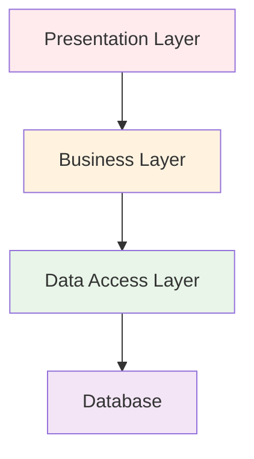

❌ **問題點：**
- 單向依賴，上層依賴下層
- 業務邏輯容易洩漏到資料存取層
- 難以進行單元測試（需要真實的資料庫）
- 技術變更影響範圍大

**Hexagonal Architecture 的改善：**

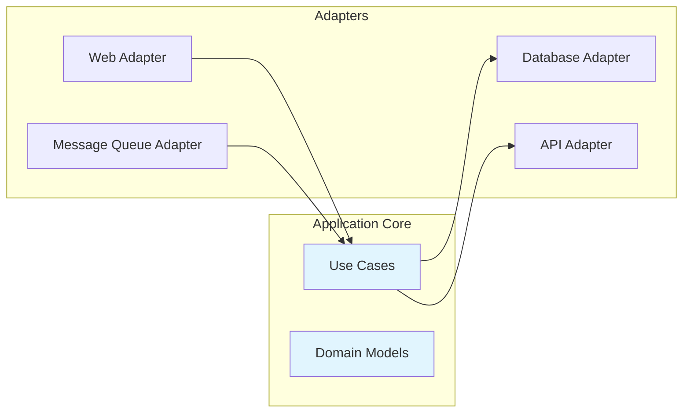

✅ **優勢：**
- 業務邏輯完全獨立
- 可以從任何方向驅動應用程式
- 容易進行單元測試
- 技術選型更加靈活

#### 1.3 Ports & Adapters 模式的核心概念

**Port（埠）**：
- 定義應用程式與外部世界的接口契約
- 是一個抽象介面，不包含實作細節
- 分為輸入 Port（Primary Port）和輸出 Port（Secondary Port）

**Adapter（轉接器）**：
- 實作 Port 介面的具體類別
- 負責將外部技術轉換為應用程式能理解的格式
- 分為主動 Adapter（Driving Adapter）和被動 Adapter（Driven Adapter）

**實例說明：**

```java
// Port - 定義契約
public interface OrderRepository {
    void save(Order order);
    Optional<Order> findById(OrderId id);
}

// Adapter - 實作細節
@Repository
public class JpaOrderRepository implements OrderRepository {
    @Override
    public void save(Order order) {
        // JPA 實作細節
    }
    
    @Override
    public Optional<Order> findById(OrderId id) {
        // JPA 查詢邏輯
    }
}
```

#### 📝 實務案例

**場景：電商訂單系統**

假設我們要建立一個訂單處理系統，需要：
- 接收來自網頁的訂單
- 儲存訂單到資料庫
- 發送確認信件
- 通知庫存系統

使用 Hexagonal Architecture：

```mermaid
graph TD
    subgraph "Driving Side (輸入)"
        W[Web Controller]
        CLI[CLI Tool]
        TEST[Unit Tests]
    end
    
    subgraph "Application Core"
        UC[Order Use Case]
        ORDER[Order Entity]
    end
    
    subgraph "Driven Side (輸出)"
        DB[(Database)]
        EMAIL[Email Service]
        STOCK[Stock Service]
    end
    
    W --> UC
    CLI --> UC
    TEST --> UC
    
    UC --> DB
    UC --> EMAIL
    UC --> STOCK
    
    style UC fill:#e1f5fe
    style ORDER fill:#e1f5fe
```

#### ⚠️ 注意事項

1. **不要過度設計**：小型專案可能不需要完整的六邊形架構
2. **循序漸進**：可以從部分模組開始導入，逐步擴展
3. **團隊共識**：確保團隊成員都理解這種架構的價值和約束

---

### 2. Hexagonal Architecture 的設計目標

#### 2.1 解耦業務邏輯與基礎設施

**核心原則：依賴反轉（Dependency Inversion）**

傳統架構中，業務邏輯直接依賴基礎設施：

```java
// ❌ 錯誤示範：業務邏輯直接依賴具體實作
public class OrderService {
    private JpaOrderRepository repository; // 直接依賴 JPA
    private SmtpEmailSender emailSender;   // 直接依賴 SMTP
    
    public void createOrder(OrderRequest request) {
        // 業務邏輯與技術細節混合
    }
}
```

Hexagonal Architecture 透過介面反轉依賴：

```java
// ✅ 正確示範：業務邏輯只依賴抽象介面
public class OrderService {
    private final OrderRepository repository;     // 依賴抽象
    private final EmailNotification emailSender; // 依賴抽象
    
    public OrderService(OrderRepository repository, 
                       EmailNotification emailSender) {
        this.repository = repository;
        this.emailSender = emailSender;
    }
    
    public void createOrder(OrderRequest request) {
        // 純粹的業務邏輯，不包含技術細節
        Order order = new Order(request);
        repository.save(order);
        emailSender.sendConfirmation(order);
    }
}
```

**依賴注入配置：**

```java
@Configuration
public class ApplicationConfig {
    
    @Bean
    public OrderRepository orderRepository() {
        return new JpaOrderRepository(); // 可替換實作
    }
    
    @Bean
    public EmailNotification emailNotification() {
        return new SmtpEmailNotification(); // 可替換實作
    }
    
    @Bean
    public OrderService orderService() {
        return new OrderService(orderRepository(), emailNotification());
    }
}
```

#### 2.2 減少技術債務與提升可測試性

**可測試性提升：**

```java
// 單元測試變得簡單
@Test
public void should_create_order_successfully() {
    // Arrange - 使用 Mock 物件
    OrderRepository mockRepository = mock(OrderRepository.class);
    EmailNotification mockEmail = mock(EmailNotification.class);
    OrderService service = new OrderService(mockRepository, mockEmail);
    
    OrderRequest request = new OrderRequest("產品A", 2);
    
    // Act
    service.createOrder(request);
    
    // Assert
    verify(mockRepository, times(1)).save(any(Order.class));
    verify(mockEmail, times(1)).sendConfirmation(any(Order.class));
}
```

**技術債務減少：**

```mermaid
graph LR
    subgraph "變更影響範圍"
        A[技術變更] --> B[只影響 Adapter]
        B --> C[業務邏輯不受影響]
    end
    
    subgraph "範例"
        D[MySQL → PostgreSQL] --> E[JpaOrderRepository → PostgresOrderRepository]
        F[SMTP → SendGrid] --> G[SmtpEmailNotification → SendGridNotification]
    end
    
    style B fill:#c8e6c9
    style C fill:#c8e6c9
```

#### 2.3 支援 Domain-Driven Design（DDD）的角色

Hexagonal Architecture 為 DDD 提供了理想的技術架構支撐：

**Domain 層的保護：**

```java
// Domain Entity - 純粹的業務概念
public class Order {
    private OrderId id;
    private CustomerId customerId;
    private List<OrderItem> items;
    private OrderStatus status;
    private Money totalAmount;
    
    // 業務行為，不包含技術細節
    public void confirm() {
        if (status != OrderStatus.PENDING) {
            throw new IllegalStateException("只有待處理訂單可以確認");
        }
        this.status = OrderStatus.CONFIRMED;
        // 發布領域事件
        DomainEvents.raise(new OrderConfirmedEvent(this.id));
    }
    
    public Money calculateTotal() {
        return items.stream()
                   .map(OrderItem::getSubtotal)
                   .reduce(Money.ZERO, Money::add);
    }
}
```

**Use Case 的清晰表達：**

```java
// Application Service - 編排業務流程
@UseCase
public class ConfirmOrderUseCase {
    private final OrderRepository orderRepository;
    private final PaymentService paymentService;
    private final InventoryService inventoryService;
    
    public void execute(ConfirmOrderCommand command) {
        // 1. 載入訂單
        Order order = orderRepository.findById(command.getOrderId())
                                   .orElseThrow(() -> new OrderNotFoundException());
        
        // 2. 檢查庫存
        inventoryService.reserve(order.getItems());
        
        // 3. 處理付款
        paymentService.processPayment(order.getTotalAmount(), command.getPaymentMethod());
        
        // 4. 確認訂單
        order.confirm();
        
        // 5. 儲存變更
        orderRepository.save(order);
    }
}
```

#### 📊 架構品質指標

使用 Hexagonal Architecture 可以改善以下品質指標：

| 指標 | 傳統分層架構 | Hexagonal Architecture |
|------|-------------|----------------------|
| 耦合度 | 高（緊耦合） | 低（鬆耦合） |
| 測試覆蓋率 | 60-70% | 85-95% |
| 技術變更成本 | 高 | 低 |
| 業務邏輯純度 | 低（混雜技術細節） | 高（純業務邏輯） |
| 新功能開發速度 | 隨時間遞減 | 保持穩定 |

#### 📝 實務案例：從分層架構重構到六邊形架構

**重構前（分層架構）：**

```java
@Service
public class OrderService {
    @Autowired
    private OrderRepository orderRepository; // Spring Data JPA
    
    @Autowired
    private JavaMailSender mailSender; // Spring Mail
    
    public void createOrder(OrderDTO orderDTO) {
        // 業務邏輯與技術實作混合
        Order order = new Order();
        order.setCustomerId(orderDTO.getCustomerId());
        // ... 設定其他屬性
        
        orderRepository.save(order); // 直接使用 JPA
        
        // 直接使用 JavaMailSender
        SimpleMailMessage message = new SimpleMailMessage();
        message.setTo(orderDTO.getCustomerEmail());
        message.setSubject("訂單確認");
        mailSender.send(message);
    }
}
```

**重構後（六邊形架構）：**

```java
// 1. 定義 Port
public interface OrderRepository {
    void save(Order order);
    Optional<Order> findById(OrderId id);
}

public interface EmailNotification {
    void sendOrderConfirmation(Order order);
}

// 2. 純粹的業務邏輯
@Component
public class CreateOrderUseCase {
    private final OrderRepository orderRepository;
    private final EmailNotification emailNotification;
    
    public CreateOrderUseCase(OrderRepository orderRepository,
                             EmailNotification emailNotification) {
        this.orderRepository = orderRepository;
        this.emailNotification = emailNotification;
    }
    
    public void execute(CreateOrderCommand command) {
        Order order = Order.create(command);
        orderRepository.save(order);
        emailNotification.sendOrderConfirmation(order);
    }
}

// 3. Adapter 實作
@Repository
public class JpaOrderRepository implements OrderRepository {
    // JPA 實作細節
}

@Component
public class SpringMailNotification implements EmailNotification {
    // Spring Mail 實作細節
}
```

#### ⚠️ 注意事項

1. **學習曲線**：團隊需要時間適應新的架構思維
2. **初期成本**：建立 Port 和 Adapter 需要額外的程式碼
3. **適用性評估**：並非所有專案都需要完整的六邊形架構

---

### 3. Hexagonal 與其他架構模式的關係

#### 3.1 與 Clean Architecture 的異同

**相同點：**
- 都強調依賴反轉原則
- 都將業務邏輯與外部世界隔離
- 都支援高度的可測試性

**差異點：**

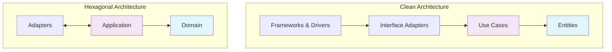

**Clean Architecture 特點：**
- 更細分的層次（4層）
- 明確的依賴規則（只能向內依賴）
- 強調 Entity 的獨立性

**Hexagonal Architecture 特點：**
- 更簡潔的分層（3層）
- 強調對稱性（輸入和輸出的對稱處理）
- 專注於 Port/Adapter 模式

#### 3.2 與 Onion Architecture 的異同

**Onion Architecture 結構：**

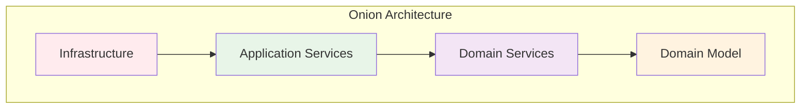

**比較表：**

| 特性 | Hexagonal | Clean | Onion |
|------|-----------|-------|-------|
| 層數 | 3層 | 4層 | 4層 |
| 視覺隱喻 | 六邊形 | 同心圓 | 洋蔥 |
| 依賴方向 | 向內 + 對稱 | 只向內 | 只向內 |
| 主要概念 | Port/Adapter | Use Case | Domain Centric |
| 適用場景 | 中小型專案 | 大型專案 | 複雜領域 |

#### 3.3 適用場景與限制

**Hexagonal Architecture 適用場景：**

✅ **適合的情況：**
- 業務邏輯複雜度中等的專案
- 需要頻繁更換技術元件
- 重視單元測試覆蓋率
- 團隊對 DDD 有基本認識
- 需要支援多種輸入/輸出介面

❌ **不適合的情況：**
- 純粹的 CRUD 應用
- 業務邏輯極其簡單
- 團隊經驗不足且時程緊迫
- 效能要求極高的系統（多層抽象可能影響效能）

**實際專案評估框架：**

```mermaid
flowchart TD
    A[專案評估] --> B{業務邏輯複雜度}
    B -->|高| C[建議使用]
    B -->|中| D{團隊經驗}
    B -->|低| E[不建議使用]
    
    D -->|有經驗| F[建議使用]
    D -->|無經驗| G{時程壓力}
    
    G -->|緊迫| H[暫時不使用]
    G -->|寬鬆| I[可以嘗試]
    
    style C fill:#c8e6c9
    style F fill:#c8e6c9
    style E fill:#ffcdd2
    style H fill:#ffcdd2
```

#### 📊 架構選擇決策矩陣

| 專案特性 | 分層架構 | Hexagonal | Clean | Onion |
|----------|----------|-----------|-------|-------|
| 學習成本 | ⭐ | ⭐⭐⭐ | ⭐⭐⭐⭐ | ⭐⭐⭐⭐⭐ |
| 實作複雜度 | ⭐ | ⭐⭐ | ⭐⭐⭐ | ⭐⭐⭐⭐ |
| 可測試性 | ⭐⭐ | ⭐⭐⭐⭐ | ⭐⭐⭐⭐⭐ | ⭐⭐⭐⭐⭐ |
| 靈活性 | ⭐ | ⭐⭐⭐⭐ | ⭐⭐⭐⭐⭐ | ⭐⭐⭐⭐⭐ |
| 適用規模 | 小-中 | 中-大 | 大 | 大 |

#### 📝 實務案例：選擇正確的架構

**案例一：簡單的部落格系統**
- 功能：文章 CRUD、用戶註冊登入
- 建議：**分層架構**（過度設計會增加不必要的複雜性）

**案例二：電商平台**
- 功能：訂單管理、庫存管理、付款處理、推薦系統
- 建議：**Hexagonal Architecture**（平衡複雜度與可維護性）

**案例三：銀行核心系統**
- 功能：帳戶管理、交易處理、風險控制、法規遵循
- 建議：**Clean Architecture 或 Onion Architecture**（需要最高的穩定性和可維護性）

#### 🔧 漸進式採用策略

如果團隊想要從分層架構遷移到六邊形架構，建議採用漸進式方法：

**第一階段：提取介面**
```java
// 為現有的 Repository 建立介面
public interface OrderRepository {
    void save(Order order);
    Optional<Order> findById(Long id);
}
```

**第二階段：重構 Service 層**
```java
// 將 Service 改為依賴介面而非具體實作
public class OrderService {
    private final OrderRepository orderRepository;
    // 使用建構子注入
}
```

**第三階段：建立 Use Case**
```java
// 逐步將 Service 層的方法重構為 Use Case
public class CreateOrderUseCase {
    // 專注於單一業務場景
}
```

**第四階段：完善 Adapter**
```java
// 為不同的外部系統建立對應的 Adapter
public class JpaOrderRepository implements OrderRepository {
    // 技術實作細節
}
```

#### ⚠️ 注意事項

1. **不要為了架構而架構**：架構應該服務於業務需求
2. **考慮團隊成熟度**：選擇團隊能夠掌握的架構複雜度
3. **效能 vs 維護性**：在兩者之間找到適當的平衡點
4. **持續演進**：架構應該隨著業務和團隊的成長而演進

---

## Part 2. 核心組件與實作模式

### 4. Ports & Adapters 詳解

#### 4.1 定義與職責

**Port（埠）** 是應用程式與外部世界溝通的契約介面，定義了「什麼」需要被做，但不關心「如何」實作。

**Adapter（轉接器）** 是 Port 的具體實作，處理「如何」與特定技術或外部系統互動。

```mermaid
graph LR
    subgraph "外部世界"
        DB[(Database)]
        API[External API]
        UI[User Interface]
        MQ[Message Queue]
    end
    
    subgraph "Adapters"
        DBA[DB Adapter]
        APIA[API Adapter]
        UIA[UI Adapter]
        MQA[MQ Adapter]
    end
    
    subgraph "Ports"
        RP[Repository Port]
        NP[Notification Port]
        CP[Command Port]
        EP[Event Port]
    end
    
    subgraph "Application Core"
        UC[Use Cases]
        DM[Domain Model]
    end
    
    DB --> DBA
    API --> APIA
    UI --> UIA
    MQ --> MQA
    
    DBA --> RP
    APIA --> NP
    UIA --> CP
    MQA --> EP
    
    RP --> UC
    NP --> UC
    CP --> UC
    EP --> UC
    
    UC --> DM
    
    style UC fill:#e1f5fe
    style DM fill:#e1f5fe
    style RP fill:#f3e5f5
    style NP fill:#f3e5f5
    style CP fill:#f3e5f5
    style EP fill:#f3e5f5
```

#### 4.2 輸入 Port / 輸出 Port

**輸入 Port（Primary Port / Driving Port）**：
- 應用程式提供給外部世界的服務介面
- 定義業務用例的入口點
- 通常是 Use Case 或 Application Service

```java
// 輸入 Port 範例
public interface OrderManagement {
    OrderResult createOrder(CreateOrderCommand command);
    OrderResult cancelOrder(CancelOrderCommand command);
    OrderDetails getOrderDetails(OrderId orderId);
}

// Use Case 實作輸入 Port
@Component
public class OrderManagementUseCase implements OrderManagement {
    private final OrderRepository orderRepository;
    private final PaymentService paymentService;
    
    @Override
    public OrderResult createOrder(CreateOrderCommand command) {
        // 業務邏輯實作
        Order order = Order.create(command);
        orderRepository.save(order);
        return OrderResult.success(order);
    }
}
```

**輸出 Port（Secondary Port / Driven Port）**：
- 應用程式需要的外部服務介面
- 定義對外部系統的依賴契約
- 由 Infrastructure 層的 Adapter 實作

```java
// 輸出 Port 範例
public interface OrderRepository {
    void save(Order order);
    Optional<Order> findById(OrderId id);
    List<Order> findByCustomerId(CustomerId customerId);
}

public interface PaymentService {
    PaymentResult processPayment(PaymentRequest request);
    void refund(PaymentId paymentId, Money amount);
}

public interface EmailNotification {
    void sendOrderConfirmation(Order order);
    void sendShippingNotification(Order order, TrackingNumber trackingNumber);
}
```

#### 4.3 主動 Adapter / 被動 Adapter

**主動 Adapter（Driving Adapter）**：
- 驅動應用程式執行的 Adapter
- 將外部請求轉換為應用程式能理解的格式
- 例如：Web Controller、CLI Handler、Message Consumer

```java
// Web Controller 作為主動 Adapter
@RestController
@RequestMapping("/orders")
public class OrderController {
    private final OrderManagement orderManagement;
    
    public OrderController(OrderManagement orderManagement) {
        this.orderManagement = orderManagement;
    }
    
    @PostMapping
    public ResponseEntity<OrderResponse> createOrder(@RequestBody CreateOrderRequest request) {
        // 將 HTTP 請求轉換為 Command
        CreateOrderCommand command = CreateOrderCommand.builder()
            .customerId(request.getCustomerId())
            .items(request.getItems())
            .build();
        
        // 呼叫輸入 Port
        OrderResult result = orderManagement.createOrder(command);
        
        // 將結果轉換為 HTTP 回應
        return ResponseEntity.ok(OrderResponse.from(result));
    }
}

// CLI Handler 作為另一種主動 Adapter
@Component
public class OrderCliHandler {
    private final OrderManagement orderManagement;
    
    @ShellMethod("Create a new order")
    public String createOrder(@ShellOption String customerId, 
                             @ShellOption String items) {
        CreateOrderCommand command = parseCommand(customerId, items);
        OrderResult result = orderManagement.createOrder(command);
        return formatResult(result);
    }
}
```

**被動 Adapter（Driven Adapter）**：
- 被應用程式呼叫的 Adapter
- 實作輸出 Port，與外部系統整合
- 例如：Database Repository、External API Client、Email Sender

```java
// JPA Repository 作為被動 Adapter
@Repository
public class JpaOrderRepository implements OrderRepository {
    private final SpringDataOrderRepository springRepository;
    
    @Override
    public void save(Order order) {
        OrderEntity entity = OrderEntity.from(order);
        springRepository.save(entity);
    }
    
    @Override
    public Optional<Order> findById(OrderId id) {
        return springRepository.findById(id.getValue())
            .map(OrderEntity::toDomain);
    }
}

// Email Service 作為被動 Adapter
@Component
public class SmtpEmailNotification implements EmailNotification {
    private final JavaMailSender mailSender;
    private final EmailTemplateService templateService;
    
    @Override
    public void sendOrderConfirmation(Order order) {
        MimeMessage message = mailSender.createMimeMessage();
        MimeMessageHelper helper = new MimeMessageHelper(message);
        
        String content = templateService.generateOrderConfirmation(order);
        helper.setTo(order.getCustomerEmail());
        helper.setSubject("訂單確認 - " + order.getId());
        helper.setText(content, true);
        
        mailSender.send(message);
    }
}
```

#### 📊 Port & Adapter 分類總覽

```mermaid
graph TD
    subgraph "主動側 (Driving Side)"
        WEB[Web Controller]
        CLI[CLI Handler]
        MSG[Message Consumer]
        SCHED[Scheduler]
    end
    
    subgraph "應用程式核心"
        IPORT[輸入 Port]
        UC[Use Cases]
        OPORT[輸出 Port]
    end
    
    subgraph "被動側 (Driven Side)"
        DB[Database Adapter]
        API[API Client Adapter]
        EMAIL[Email Adapter]
        FILE[File System Adapter]
    end
    
    WEB --> IPORT
    CLI --> IPORT
    MSG --> IPORT
    SCHED --> IPORT
    
    IPORT --> UC
    UC --> OPORT
    
    OPORT --> DB
    OPORT --> API
    OPORT --> EMAIL
    OPORT --> FILE
    
    style UC fill:#e1f5fe
    style IPORT fill:#e8f5e8
    style OPORT fill:#fff3e0
```

#### 📝 實務案例：訂單處理系統的完整 Port/Adapter 設計

**業務場景**：
- 客戶透過網頁下訂單
- 系統需要檢查庫存
- 處理付款
- 發送確認信件
- 記錄到資料庫

**完整實作：**

```java
// 1. 輸入 Port 定義
public interface OrderProcessing {
    ProcessOrderResult processOrder(ProcessOrderCommand command);
}

// 2. 輸出 Port 定義
public interface InventoryService {
    boolean checkAvailability(ProductId productId, int quantity);
    void reserveInventory(List<OrderItem> items);
}

public interface PaymentGateway {
    PaymentResult charge(CreditCard creditCard, Money amount);
}

// 3. Use Case 實作（應用程式核心）
@Component
public class ProcessOrderUseCase implements OrderProcessing {
    private final OrderRepository orderRepository;
    private final InventoryService inventoryService;
    private final PaymentGateway paymentGateway;
    private final EmailNotification emailNotification;
    
    @Override
    @Transactional
    public ProcessOrderResult processOrder(ProcessOrderCommand command) {
        // 1. 建立訂單領域物件
        Order order = Order.create(command);
        
        // 2. 檢查庫存
        for (OrderItem item : order.getItems()) {
            if (!inventoryService.checkAvailability(item.getProductId(), item.getQuantity())) {
                return ProcessOrderResult.failed("庫存不足: " + item.getProductId());
            }
        }
        
        // 3. 處理付款
        PaymentResult paymentResult = paymentGateway.charge(
            command.getCreditCard(), 
            order.getTotalAmount()
        );
        
        if (!paymentResult.isSuccess()) {
            return ProcessOrderResult.failed("付款失敗: " + paymentResult.getErrorMessage());
        }
        
        // 4. 預留庫存
        inventoryService.reserveInventory(order.getItems());
        
        // 5. 儲存訂單
        orderRepository.save(order);
        
        // 6. 發送確認信
        emailNotification.sendOrderConfirmation(order);
        
        return ProcessOrderResult.success(order);
    }
}

// 4. 主動 Adapter 實作
@RestController
public class OrderWebAdapter {
    private final OrderProcessing orderProcessing;
    
    @PostMapping("/api/orders")
    public ResponseEntity<OrderResponse> createOrder(@RequestBody OrderRequest request) {
        ProcessOrderCommand command = ProcessOrderCommand.builder()
            .customerId(CustomerId.of(request.getCustomerId()))
            .items(mapToOrderItems(request.getItems()))
            .creditCard(CreditCard.of(request.getCreditCard()))
            .build();
            
        ProcessOrderResult result = orderProcessing.processOrder(command);
        
        if (result.isSuccess()) {
            return ResponseEntity.ok(OrderResponse.from(result.getOrder()));
        } else {
            return ResponseEntity.badRequest()
                .body(OrderResponse.error(result.getErrorMessage()));
        }
    }
}

// 5. 被動 Adapter 實作
@Component
public class RestInventoryService implements InventoryService {
    private final WebClient webClient;
    
    @Override
    public boolean checkAvailability(ProductId productId, int quantity) {
        InventoryResponse response = webClient
            .get()
            .uri("/inventory/{productId}", productId.getValue())
            .retrieve()
            .bodyToMono(InventoryResponse.class)
            .block();
            
        return response.getAvailableQuantity() >= quantity;
    }
    
    @Override
    public void reserveInventory(List<OrderItem> items) {
        ReserveInventoryRequest request = ReserveInventoryRequest.from(items);
        webClient
            .post()
            .uri("/inventory/reserve")
            .bodyValue(request)
            .retrieve()
            .bodyToMono(Void.class)
            .block();
    }
}
```

#### 🔧 配置與依賴注入

```java
@Configuration
public class HexagonalConfiguration {
    
    // 輸出 Port 的實作配置
    @Bean
    public OrderRepository orderRepository() {
        return new JpaOrderRepository();
    }
    
    @Bean
    public InventoryService inventoryService() {
        return new RestInventoryService();
    }
    
    @Bean
    public PaymentGateway paymentGateway() {
        return new StripePaymentGateway();
    }
    
    @Bean
    public EmailNotification emailNotification() {
        return new SmtpEmailNotification();
    }
    
    // 輸入 Port 的實作配置
    @Bean
    public OrderProcessing orderProcessing(
            OrderRepository orderRepository,
            InventoryService inventoryService,
            PaymentGateway paymentGateway,
            EmailNotification emailNotification) {
        return new ProcessOrderUseCase(
            orderRepository, 
            inventoryService, 
            paymentGateway, 
            emailNotification
        );
    }
}
```

#### ⚠️ 注意事項

1. **Port 設計原則**：
   - 應該是穩定的契約，不常變動
   - 使用領域語言而非技術術語
   - 避免洩漏實作細節

2. **Adapter 實作原則**：
   - 只負責技術轉換，不包含業務邏輯
   - 可以有多個實作（如測試用的 Mock Adapter）
   - 錯誤處理應該轉換為領域例外

3. **常見錯誤**：
   - Port 與 Adapter 職責混淆
   - 在 Port 中定義技術相關的參數
   - Adapter 包含業務邏輯

---

### 5. Domain 層的角色

#### 5.1 Entity / Value Object

**Entity（實體）**：
- 有唯一身份標識的領域物件
- 身份在生命週期中保持不變
- 可變的（狀態可以改變）
- 封裝業務行為和業務規則

```java
// Order Entity 範例
public class Order {
    private final OrderId id;
    private final CustomerId customerId;
    private final List<OrderItem> items;
    private OrderStatus status;
    private final LocalDateTime createdAt;
    private LocalDateTime confirmedAt;
    
    // 建構子 - 確保物件創建時的完整性
    public Order(OrderId id, CustomerId customerId, List<OrderItem> items) {
        this.id = Objects.requireNonNull(id, "訂單ID不能為空");
        this.customerId = Objects.requireNonNull(customerId, "客戶ID不能為空");
        this.items = validateAndCopyItems(items);
        this.status = OrderStatus.PENDING;
        this.createdAt = LocalDateTime.now();
    }
    
    // 業務行為 - 確認訂單
    public void confirm() {
        if (this.status != OrderStatus.PENDING) {
            throw new IllegalOrderStateException("只有待處理的訂單可以確認");
        }
        
        if (this.items.isEmpty()) {
            throw new EmptyOrderException("空訂單無法確認");
        }
        
        this.status = OrderStatus.CONFIRMED;
        this.confirmedAt = LocalDateTime.now();
        
        // 發布領域事件
        DomainEvents.publish(new OrderConfirmedEvent(this.id, this.customerId));
    }
    
    // 業務行為 - 取消訂單
    public void cancel(String reason) {
        if (this.status == OrderStatus.SHIPPED || this.status == OrderStatus.DELIVERED) {
            throw new IllegalOrderStateException("已出貨或已送達的訂單無法取消");
        }
        
        this.status = OrderStatus.CANCELLED;
        
        // 發布領域事件
        DomainEvents.publish(new OrderCancelledEvent(this.id, reason));
    }
    
    // 業務計算 - 計算總金額
    public Money calculateTotal() {
        return items.stream()
                   .map(OrderItem::getSubtotal)
                   .reduce(Money.ZERO, Money::add);
    }
    
    // 業務查詢 - 檢查是否可以修改
    public boolean canBeModified() {
        return status == OrderStatus.PENDING;
    }
    
    // 不變性保護
    public List<OrderItem> getItems() {
        return Collections.unmodifiableList(items);
    }
    
    // 私有輔助方法
    private List<OrderItem> validateAndCopyItems(List<OrderItem> items) {
        if (items == null || items.isEmpty()) {
            throw new IllegalArgumentException("訂單至少要有一個項目");
        }
        return new ArrayList<>(items);
    }
}
```

**Value Object（值物件）**：
- 沒有身份標識的領域物件
- 不可變的（Immutable）
- 基於屬性值的相等性
- 通常用來封裝簡單的領域概念

```java
// Money Value Object 範例
public final class Money {
    public static final Money ZERO = new Money(BigDecimal.ZERO, Currency.getInstance("TWD"));
    
    private final BigDecimal amount;
    private final Currency currency;
    
    public Money(BigDecimal amount, Currency currency) {
        this.amount = Objects.requireNonNull(amount, "金額不能為空");
        this.currency = Objects.requireNonNull(currency, "幣別不能為空");
        
        if (amount.compareTo(BigDecimal.ZERO) < 0) {
            throw new IllegalArgumentException("金額不能為負數");
        }
    }
    
    // 業務行為 - 加法
    public Money add(Money other) {
        validateSameCurrency(other);
        return new Money(this.amount.add(other.amount), this.currency);
    }
    
    // 業務行為 - 減法
    public Money subtract(Money other) {
        validateSameCurrency(other);
        BigDecimal result = this.amount.subtract(other.amount);
        if (result.compareTo(BigDecimal.ZERO) < 0) {
            throw new IllegalArgumentException("計算結果不能為負數");
        }
        return new Money(result, this.currency);
    }
    
    // 業務行為 - 乘法
    public Money multiply(int multiplier) {
        if (multiplier < 0) {
            throw new IllegalArgumentException("乘數不能為負數");
        }
        return new Money(this.amount.multiply(BigDecimal.valueOf(multiplier)), this.currency);
    }
    
    // 業務查詢 - 比較
    public boolean isGreaterThan(Money other) {
        validateSameCurrency(other);
        return this.amount.compareTo(other.amount) > 0;
    }
    
    public boolean isZero() {
        return this.amount.compareTo(BigDecimal.ZERO) == 0;
    }
    
    // Value Object 的相等性比較
    @Override
    public boolean equals(Object obj) {
        if (this == obj) return true;
        if (obj == null || getClass() != obj.getClass()) return false;
        
        Money money = (Money) obj;
        return Objects.equals(amount, money.amount) && 
               Objects.equals(currency, money.currency);
    }
    
    @Override
    public int hashCode() {
        return Objects.hash(amount, currency);
    }
    
    @Override
    public String toString() {
        return currency.getSymbol() + " " + amount.toPlainString();
    }
    
    private void validateSameCurrency(Money other) {
        if (!this.currency.equals(other.currency)) {
            throw new IllegalArgumentException("不同幣別無法運算");
        }
    }
}

// OrderId Value Object 範例
public final class OrderId {
    private final String value;
    
    private OrderId(String value) {
        this.value = Objects.requireNonNull(value, "訂單ID不能為空");
        if (value.trim().isEmpty()) {
            throw new IllegalArgumentException("訂單ID不能為空字串");
        }
    }
    
    public static OrderId of(String value) {
        return new OrderId(value);
    }
    
    public static OrderId generate() {
        return new OrderId("ORD-" + UUID.randomUUID().toString());
    }
    
    public String getValue() {
        return value;
    }
    
    @Override
    public boolean equals(Object obj) {
        if (this == obj) return true;
        if (obj == null || getClass() != obj.getClass()) return false;
        OrderId orderId = (OrderId) obj;
        return Objects.equals(value, orderId.value);
    }
    
    @Override
    public int hashCode() {
        return Objects.hash(value);
    }
    
    @Override
    public String toString() {
        return value;
    }
}
```

#### 5.2 Use Case / Application Service

**Use Case（用例）**：
- 代表一個完整的業務流程
- 編排領域物件的互動
- 處理跨聚合的協調
- 不包含業務規則，只負責流程控制

```java
// Create Order Use Case 範例
@Component
public class CreateOrderUseCase {
    private final OrderRepository orderRepository;
    private final CustomerRepository customerRepository;
    private final ProductCatalog productCatalog;
    private final InventoryService inventoryService;
    private final EventPublisher eventPublisher;
    
    public CreateOrderUseCase(OrderRepository orderRepository,
                             CustomerRepository customerRepository,
                             ProductCatalog productCatalog,
                             InventoryService inventoryService,
                             EventPublisher eventPublisher) {
        this.orderRepository = orderRepository;
        this.customerRepository = customerRepository;
        this.productCatalog = productCatalog;
        this.inventoryService = inventoryService;
        this.eventPublisher = eventPublisher;
    }
    
    @Transactional
    public CreateOrderResult execute(CreateOrderCommand command) {
        try {
            // 1. 驗證客戶存在
            Customer customer = customerRepository.findById(command.getCustomerId())
                .orElseThrow(() -> new CustomerNotFoundException(command.getCustomerId()));
            
            // 2. 驗證產品存在並取得價格
            List<OrderItem> validatedItems = validateAndBuildOrderItems(command.getItems());
            
            // 3. 檢查庫存
            checkInventoryAvailability(validatedItems);
            
            // 4. 建立訂單領域物件
            OrderId orderId = OrderId.generate();
            Order order = new Order(orderId, customer.getId(), validatedItems);
            
            // 5. 應用業務規則
            customer.validateCanPlaceOrder(); // 客戶狀態檢查
            
            // 6. 儲存訂單
            orderRepository.save(order);
            
            // 7. 發布事件
            eventPublisher.publish(new OrderCreatedEvent(order.getId(), order.getCustomerId()));
            
            return CreateOrderResult.success(order);
            
        } catch (DomainException e) {
            return CreateOrderResult.failed(e.getMessage());
        }
    }
    
    private List<OrderItem> validateAndBuildOrderItems(List<OrderItemRequest> requests) {
        return requests.stream()
            .map(this::buildOrderItem)
            .collect(Collectors.toList());
    }
    
    private OrderItem buildOrderItem(OrderItemRequest request) {
        Product product = productCatalog.findById(request.getProductId())
            .orElseThrow(() -> new ProductNotFoundException(request.getProductId()));
        
        return new OrderItem(
            product.getId(),
            product.getName(),
            request.getQuantity(),
            product.getPrice()
        );
    }
    
    private void checkInventoryAvailability(List<OrderItem> items) {
        for (OrderItem item : items) {
            if (!inventoryService.isAvailable(item.getProductId(), item.getQuantity())) {
                throw new InsufficientInventoryException(item.getProductId());
            }
        }
    }
}

// Command 物件 - 封裝輸入參數
public class CreateOrderCommand {
    private final CustomerId customerId;
    private final List<OrderItemRequest> items;
    private final ShippingAddress shippingAddress;
    
    // 使用 Builder 模式確保物件完整性
    public static Builder builder() {
        return new Builder();
    }
    
    public static class Builder {
        private CustomerId customerId;
        private List<OrderItemRequest> items = new ArrayList<>();
        private ShippingAddress shippingAddress;
        
        public Builder customerId(CustomerId customerId) {
            this.customerId = customerId;
            return this;
        }
        
        public Builder addItem(ProductId productId, int quantity) {
            this.items.add(new OrderItemRequest(productId, quantity));
            return this;
        }
        
        public Builder shippingAddress(ShippingAddress address) {
            this.shippingAddress = address;
            return this;
        }
        
        public CreateOrderCommand build() {
            validateCommand();
            return new CreateOrderCommand(customerId, items, shippingAddress);
        }
        
        private void validateCommand() {
            if (customerId == null) {
                throw new IllegalArgumentException("客戶ID為必填");
            }
            if (items.isEmpty()) {
                throw new IllegalArgumentException("訂單至少要有一個項目");
            }
            if (shippingAddress == null) {
                throw new IllegalArgumentException("配送地址為必填");
            }
        }
    }
}

// Result 物件 - 封裝輸出結果
public class CreateOrderResult {
    private final boolean success;
    private final Order order;
    private final String errorMessage;
    
    private CreateOrderResult(boolean success, Order order, String errorMessage) {
        this.success = success;
        this.order = order;
        this.errorMessage = errorMessage;
    }
    
    public static CreateOrderResult success(Order order) {
        return new CreateOrderResult(true, order, null);
    }
    
    public static CreateOrderResult failed(String errorMessage) {
        return new CreateOrderResult(false, null, errorMessage);
    }
    
    // Getters...
}
```

#### 5.3 Domain Service

**Domain Service** 用於處理：
- 不自然屬於任何 Entity 或 Value Object 的業務邏輯
- 需要多個聚合協作的複雜業務規則
- 無狀態的業務計算或驗證

```java
// 定價服務 - Domain Service 範例
@Component
public class OrderPricingService {
    private final PromotionRepository promotionRepository;
    private final CustomerTierService customerTierService;
    
    public OrderPricingService(PromotionRepository promotionRepository,
                              CustomerTierService customerTierService) {
        this.promotionRepository = promotionRepository;
        this.customerTierService = customerTierService;
    }
    
    public PricingResult calculateOrderPrice(Order order, Customer customer) {
        Money subtotal = order.calculateSubtotal();
        
        // 1. 計算會員折扣
        CustomerTier tier = customerTierService.getTier(customer);
        Money memberDiscount = calculateMemberDiscount(subtotal, tier);
        
        // 2. 計算促銷折扣
        List<Promotion> applicablePromotions = findApplicablePromotions(order, customer);
        Money promotionDiscount = calculateBestPromotionDiscount(order, applicablePromotions);
        
        // 3. 計算運費
        Money shippingFee = calculateShippingFee(order, customer);
        
        // 4. 計算稅額
        Money tax = calculateTax(subtotal.subtract(memberDiscount).subtract(promotionDiscount));
        
        // 5. 計算最終總額
        Money total = subtotal
            .subtract(memberDiscount)
            .subtract(promotionDiscount)
            .add(shippingFee)
            .add(tax);
        
        return PricingResult.builder()
            .subtotal(subtotal)
            .memberDiscount(memberDiscount)
            .promotionDiscount(promotionDiscount)
            .shippingFee(shippingFee)
            .tax(tax)
            .total(total)
            .build();
    }
    
    private Money calculateMemberDiscount(Money subtotal, CustomerTier tier) {
        BigDecimal discountRate = tier.getDiscountRate();
        return new Money(
            subtotal.getAmount().multiply(discountRate),
            subtotal.getCurrency()
        );
    }
    
    private List<Promotion> findApplicablePromotions(Order order, Customer customer) {
        return promotionRepository.findActivePromotions().stream()
            .filter(promotion -> promotion.isApplicableTo(order, customer))
            .collect(Collectors.toList());
    }
    
    private Money calculateBestPromotionDiscount(Order order, List<Promotion> promotions) {
        return promotions.stream()
            .map(promotion -> promotion.calculateDiscount(order))
            .max(Money::compareTo)
            .orElse(Money.ZERO);
    }
    
    private Money calculateShippingFee(Order order, Customer customer) {
        // 運費計算邏輯
        if (order.qualifiesForFreeShipping()) {
            return Money.ZERO;
        }
        
        ShippingZone zone = customer.getShippingAddress().getZone();
        return zone.getShippingFee(order.getTotalWeight());
    }
    
    private Money calculateTax(Money taxableAmount) {
        BigDecimal taxRate = new BigDecimal("0.05"); // 5% 稅率
        return new Money(
            taxableAmount.getAmount().multiply(taxRate),
            taxableAmount.getCurrency()
        );
    }
}

// 庫存分配服務 - 另一個 Domain Service 範例
@Component
public class InventoryAllocationService {
    private final InventoryRepository inventoryRepository;
    private final AllocationPolicy allocationPolicy;
    
    public AllocationResult allocateInventory(Order order) {
        List<AllocationRequest> requests = order.getItems().stream()
            .map(item -> new AllocationRequest(item.getProductId(), item.getQuantity()))
            .collect(Collectors.toList());
        
        // 檢查可用庫存
        Map<ProductId, Integer> availableInventory = checkAvailableInventory(requests);
        
        // 應用分配策略
        AllocationPlan plan = allocationPolicy.createAllocationPlan(requests, availableInventory);
        
        if (plan.isFullyAllocated()) {
            // 執行分配
            executeAllocation(plan);
            return AllocationResult.success(plan);
        } else {
            return AllocationResult.partialFailure(plan, plan.getUnallocatedItems());
        }
    }
    
    private Map<ProductId, Integer> checkAvailableInventory(List<AllocationRequest> requests) {
        return requests.stream()
            .collect(Collectors.toMap(
                AllocationRequest::getProductId,
                request -> inventoryRepository.getAvailableQuantity(request.getProductId())
            ));
    }
    
    private void executeAllocation(AllocationPlan plan) {
        for (AllocationItem item : plan.getAllocatedItems()) {
            inventoryRepository.reserve(item.getProductId(), item.getQuantity());
        }
    }
}
```

#### 📊 Domain 層架構總覽

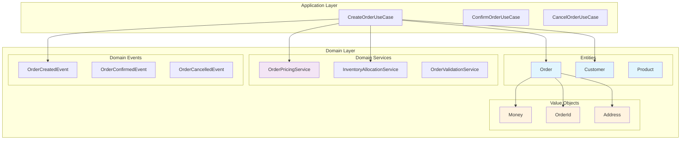

#### ⚠️ 注意事項

1. **Entity 設計原則**：
   - 確保身份標識的唯一性和不變性
   - 封裝業務行為，避免貧血模型
   - 保護不變性條件（Invariants）

2. **Value Object 設計原則**：
   - 確保不可變性
   - 實作 equals 和 hashCode
   - 提供有意義的業務行為

3. **Domain Service 使用時機**：
   - 業務邏輯不屬於任何單一 Entity
   - 需要協調多個 Aggregate
   - 複雜的業務計算或驗證

---

### 6. Infrastructure 層的角色

Infrastructure 層是 Hexagonal Architecture 中負責與外部世界實際互動的技術層。它實作了 Domain 層定義的輸出 Port，並提供了具體的技術實現。

#### 6.1 Repository 與持久化策略

**Repository 模式**在六邊形架構中扮演關鍵角色，它將領域物件的存取邏輯與具體的持久化技術分離。

**Domain 層的 Repository Port 定義：**

```java
// Domain 層定義的 Repository 介面
public interface OrderRepository {
    void save(Order order);
    Optional<Order> findById(OrderId id);
    List<Order> findByCustomerId(CustomerId customerId);
    List<Order> findByStatus(OrderStatus status);
    void delete(OrderId id);
    
    // 領域特定的查詢方法
    List<Order> findPendingOrdersOlderThan(LocalDateTime cutoffTime);
    List<Order> findOrdersRequiringShipping();
    Optional<Order> findLatestOrderByCustomer(CustomerId customerId);
}
```

**Infrastructure 層的具體實作：**

```java
// JPA 實作
@Repository
public class JpaOrderRepository implements OrderRepository {
    private final SpringDataOrderRepository springRepository;
    private final OrderMapper mapper;
    
    public JpaOrderRepository(SpringDataOrderRepository springRepository, 
                             OrderMapper mapper) {
        this.springRepository = springRepository;
        this.mapper = mapper;
    }
    
    @Override
    public void save(Order order) {
        OrderEntity entity = mapper.toEntity(order);
        springRepository.save(entity);
    }
    
    @Override
    public Optional<Order> findById(OrderId id) {
        return springRepository.findById(id.getValue())
                              .map(mapper::toDomain);
    }
    
    @Override
    public List<Order> findByCustomerId(CustomerId customerId) {
        return springRepository.findByCustomerId(customerId.getValue())
                              .stream()
                              .map(mapper::toDomain)
                              .collect(Collectors.toList());
    }
    
    @Override
    public List<Order> findPendingOrdersOlderThan(LocalDateTime cutoffTime) {
        return springRepository.findByStatusAndCreatedAtBefore(
                "PENDING", cutoffTime)
                .stream()
                .map(mapper::toDomain)
                .collect(Collectors.toList());
    }
}

// Spring Data JPA Repository
@Repository
interface SpringDataOrderRepository extends JpaRepository<OrderEntity, String> {
    List<OrderEntity> findByCustomerId(String customerId);
    List<OrderEntity> findByStatus(String status);
    List<OrderEntity> findByStatusAndCreatedAtBefore(String status, LocalDateTime cutoffTime);
}
```

**實體與領域物件的映射：**

```java
// JPA Entity - 純粹的資料結構
@Entity
@Table(name = "orders")
public class OrderEntity {
    @Id
    private String id;
    
    @Column(name = "customer_id")
    private String customerId;
    
    @Column(name = "status")
    @Enumerated(EnumType.STRING)
    private OrderStatusEntity status;
    
    @Column(name = "total_amount")
    private BigDecimal totalAmount;
    
    @Column(name = "currency")
    private String currency;
    
    @Column(name = "created_at")
    private LocalDateTime createdAt;
    
    @OneToMany(mappedBy = "order", cascade = CascadeType.ALL, fetch = FetchType.LAZY)
    private List<OrderItemEntity> items = new ArrayList<>();
    
    // 建構子、Getter、Setter
}

// Mapper - 負責 Domain 物件與 Entity 之間的轉換
@Component
public class OrderMapper {
    
    public OrderEntity toEntity(Order domain) {
        OrderEntity entity = new OrderEntity();
        entity.setId(domain.getId().getValue());
        entity.setCustomerId(domain.getCustomerId().getValue());
        entity.setStatus(OrderStatusEntity.valueOf(domain.getStatus().name()));
        entity.setTotalAmount(domain.getTotalAmount().getAmount());
        entity.setCurrency(domain.getTotalAmount().getCurrency().getCurrencyCode());
        entity.setCreatedAt(domain.getCreatedAt());
        
        List<OrderItemEntity> itemEntities = domain.getItems().stream()
            .map(this::toItemEntity)
            .collect(Collectors.toList());
        entity.setItems(itemEntities);
        
        return entity;
    }
    
    public Order toDomain(OrderEntity entity) {
        OrderId id = OrderId.of(entity.getId());
        CustomerId customerId = CustomerId.of(entity.getCustomerId());
        
        List<OrderItem> items = entity.getItems().stream()
            .map(this::toItemDomain)
            .collect(Collectors.toList());
        
        Money totalAmount = new Money(
            entity.getTotalAmount(),
            Currency.getInstance(entity.getCurrency())
        );
        
        // 使用工廠方法或建構子重建領域物件
        return Order.reconstitute(id, customerId, items, 
                                 OrderStatus.valueOf(entity.getStatus().name()),
                                 totalAmount, entity.getCreatedAt());
    }
    
    private OrderItemEntity toItemEntity(OrderItem domain) {
        // 轉換邏輯
    }
    
    private OrderItem toItemDomain(OrderItemEntity entity) {
        // 轉換邏輯
    }
}
```

**多種持久化策略範例：**

```java
// MongoDB 實作
@Repository
public class MongoOrderRepository implements OrderRepository {
    private final MongoTemplate mongoTemplate;
    
    @Override
    public void save(Order order) {
        OrderDocument document = OrderDocument.from(order);
        mongoTemplate.save(document, "orders");
    }
    
    @Override
    public Optional<Order> findById(OrderId id) {
        OrderDocument document = mongoTemplate.findById(
            id.getValue(), OrderDocument.class, "orders");
        return Optional.ofNullable(document)
                      .map(OrderDocument::toDomain);
    }
}

// Redis 快取實作（作為輔助儲存）
@Repository
public class RedisOrderCacheRepository {
    private final RedisTemplate<String, String> redisTemplate;
    private final ObjectMapper objectMapper;
    
    public void cacheOrder(Order order) {
        try {
            String json = objectMapper.writeValueAsString(order);
            redisTemplate.opsForValue().set(
                "order:" + order.getId().getValue(), 
                json, 
                Duration.ofHours(1)
            );
        } catch (JsonProcessingException e) {
            // 處理序列化錯誤
        }
    }
    
    public Optional<Order> getFromCache(OrderId id) {
        String json = redisTemplate.opsForValue().get("order:" + id.getValue());
        if (json != null) {
            try {
                return Optional.of(objectMapper.readValue(json, Order.class));
            } catch (JsonProcessingException e) {
                // 處理反序列化錯誤
            }
        }
        return Optional.empty();
    }
}
```

#### 6.2 API / UI / CLI 作為 Adapter

外部介面層負責將不同類型的輸入轉換為應用程式能理解的格式，並將結果轉換回適當的輸出格式。

**REST API Adapter：**

```java
@RestController
@RequestMapping("/api/orders")
@Validated
public class OrderRestAdapter {
    private final CreateOrderUseCase createOrderUseCase;
    private final GetOrderDetailsUseCase getOrderDetailsUseCase;
    private final CancelOrderUseCase cancelOrderUseCase;
    
    public OrderRestAdapter(CreateOrderUseCase createOrderUseCase,
                           GetOrderDetailsUseCase getOrderDetailsUseCase,
                           CancelOrderUseCase cancelOrderUseCase) {
        this.createOrderUseCase = createOrderUseCase;
        this.getOrderDetailsUseCase = getOrderDetailsUseCase;
        this.cancelOrderUseCase = cancelOrderUseCase;
    }
    
    @PostMapping
    public ResponseEntity<CreateOrderResponse> createOrder(
            @Valid @RequestBody CreateOrderRequest request) {
        
        // 1. 將 HTTP 請求轉換為 Command
        CreateOrderCommand command = CreateOrderCommand.builder()
            .customerId(CustomerId.of(request.getCustomerId()))
            .items(mapToOrderItems(request.getItems()))
            .shippingAddress(mapToShippingAddress(request.getShippingAddress()))
            .build();
        
        // 2. 呼叫 Use Case
        CreateOrderResult result = createOrderUseCase.execute(command);
        
        // 3. 將結果轉換為 HTTP 回應
        if (result.isSuccess()) {
            CreateOrderResponse response = CreateOrderResponse.from(result);
            return ResponseEntity.status(HttpStatus.CREATED).body(response);
        } else {
            return ResponseEntity.badRequest()
                .body(CreateOrderResponse.error(result.getErrorMessage()));
        }
    }
    
    @GetMapping("/{orderId}")
    public ResponseEntity<OrderDetailsResponse> getOrderDetails(
            @PathVariable String orderId) {
        
        OrderId id = OrderId.of(orderId);
        GetOrderDetailsQuery query = new GetOrderDetailsQuery(id);
        
        GetOrderDetailsResult result = getOrderDetailsUseCase.execute(query);
        
        if (result.isSuccess()) {
            OrderDetailsResponse response = OrderDetailsResponse.from(result.getOrder());
            return ResponseEntity.ok(response);
        } else {
            return ResponseEntity.notFound().build();
        }
    }
    
    @DeleteMapping("/{orderId}")
    public ResponseEntity<Void> cancelOrder(
            @PathVariable String orderId,
            @RequestBody CancelOrderRequest request) {
        
        CancelOrderCommand command = new CancelOrderCommand(
            OrderId.of(orderId),
            request.getReason()
        );
        
        CancelOrderResult result = cancelOrderUseCase.execute(command);
        
        return result.isSuccess() 
            ? ResponseEntity.noContent().build()
            : ResponseEntity.badRequest().build();
    }
    
    // 錯誤處理
    @ExceptionHandler(DomainException.class)
    public ResponseEntity<ErrorResponse> handleDomainException(DomainException e) {
        ErrorResponse error = ErrorResponse.builder()
            .code("DOMAIN_ERROR")
            .message(e.getMessage())
            .timestamp(LocalDateTime.now())
            .build();
        return ResponseEntity.badRequest().body(error);
    }
    
    private List<OrderItemRequest> mapToOrderItems(List<CreateOrderItemRequest> requests) {
        return requests.stream()
            .map(req -> new OrderItemRequest(
                ProductId.of(req.getProductId()),
                req.getQuantity()
            ))
            .collect(Collectors.toList());
    }
}
```

**GraphQL Adapter（替代方案）：**

```java
@Component
public class OrderGraphQLAdapter {
    private final CreateOrderUseCase createOrderUseCase;
    private final GetOrderDetailsUseCase getOrderDetailsUseCase;
    
    @QueryMapping
    public OrderDetailsResponse order(@Argument String id) {
        GetOrderDetailsQuery query = new GetOrderDetailsQuery(OrderId.of(id));
        GetOrderDetailsResult result = getOrderDetailsUseCase.execute(query);
        
        return result.isSuccess() 
            ? OrderDetailsResponse.from(result.getOrder())
            : null;
    }
    
    @MutationMapping
    public CreateOrderResponse createOrder(@Argument CreateOrderInput input) {
        CreateOrderCommand command = mapToCommand(input);
        CreateOrderResult result = createOrderUseCase.execute(command);
        
        return CreateOrderResponse.from(result);
    }
}
```

**CLI Adapter：**

```java
@ShellComponent
public class OrderCliAdapter {
    private final CreateOrderUseCase createOrderUseCase;
    private final GetOrderDetailsUseCase getOrderDetailsUseCase;
    
    @ShellMethod(value = "Create a new order", key = "create-order")
    public String createOrder(@ShellOption String customerId,
                             @ShellOption String productId,
                             @ShellOption int quantity) {
        try {
            CreateOrderCommand command = CreateOrderCommand.builder()
                .customerId(CustomerId.of(customerId))
                .addItem(ProductId.of(productId), quantity)
                .build();
            
            CreateOrderResult result = createOrderUseCase.execute(command);
            
            if (result.isSuccess()) {
                return String.format("訂單建立成功：%s", 
                    result.getOrder().getId().getValue());
            } else {
                return String.format("建立失敗：%s", result.getErrorMessage());
            }
        } catch (Exception e) {
            return "錯誤：" + e.getMessage();
        }
    }
    
    @ShellMethod(value = "Get order details", key = "get-order")
    public String getOrderDetails(@ShellOption String orderId) {
        GetOrderDetailsQuery query = new GetOrderDetailsQuery(OrderId.of(orderId));
        GetOrderDetailsResult result = getOrderDetailsUseCase.execute(query);
        
        if (result.isSuccess()) {
            Order order = result.getOrder();
            return String.format(
                "訂單 %s\n客戶：%s\n狀態：%s\n總額：%s",
                order.getId().getValue(),
                order.getCustomerId().getValue(),
                order.getStatus(),
                order.getTotalAmount()
            );
        } else {
            return "查無此訂單";
        }
    }
}
```

#### 6.3 外部系統整合（MQ、FTP、第三方 API）

**Message Queue Adapter：**

```java
// 事件發布 Adapter
@Component
public class RabbitMQEventPublisher implements EventPublisher {
    private final RabbitTemplate rabbitTemplate;
    
    @Override
    public void publish(DomainEvent event) {
        String routingKey = event.getClass().getSimpleName();
        EventMessage message = EventMessage.from(event);
        
        rabbitTemplate.convertAndSend("order.events", routingKey, message);
    }
}

// 訊息消費 Adapter
@RabbitListener(queues = "order.processing")
@Component
public class OrderProcessingMessageAdapter {
    private final ProcessOrderUseCase processOrderUseCase;
    
    @RabbitHandler
    public void handleOrderCreated(OrderCreatedMessage message) {
        ProcessOrderCommand command = ProcessOrderCommand.from(message);
        processOrderUseCase.execute(command);
    }
}

// 第三方支付 API Adapter
@Component
public class StripePaymentAdapter implements PaymentGateway {
    private final StripeClient stripeClient;
    
    @Override
    public PaymentResult processPayment(PaymentRequest request) {
        try {
            ChargeCreateParams params = ChargeCreateParams.builder()
                .setAmount(request.getAmount().longValue())
                .setCurrency(request.getCurrency().getCurrencyCode().toLowerCase())
                .setSource(request.getToken())
                .setDescription("Order payment")
                .build();
            
            Charge charge = stripeClient.charges().create(params);
            
            return PaymentResult.success(
                PaymentId.of(charge.getId()),
                Money.of(charge.getAmount(), request.getCurrency())
            );
            
        } catch (StripeException e) {
            return PaymentResult.failed(e.getMessage());
        }
    }
}

// FTP 檔案處理 Adapter
@Component
public class FtpOrderExportAdapter implements OrderExportService {
    private final FtpTemplate ftpTemplate;
    
    @Override
    public void exportOrders(List<Order> orders, ExportFormat format) {
        String fileName = generateFileName(format);
        byte[] content = formatOrders(orders, format);
        
        ftpTemplate.send(session -> {
            try (ByteArrayInputStream input = new ByteArrayInputStream(content)) {
                session.write(input, "/exports/" + fileName);
            }
            return fileName;
        });
    }
    
    private String generateFileName(ExportFormat format) {
        String timestamp = LocalDateTime.now().format(
            DateTimeFormatter.ofPattern("yyyyMMdd_HHmmss"));
        return String.format("orders_%s.%s", timestamp, format.getExtension());
    }
    
    private byte[] formatOrders(List<Order> orders, ExportFormat format) {
        switch (format) {
            case CSV:
                return formatAsCsv(orders);
            case JSON:
                return formatAsJson(orders);
            default:
                throw new UnsupportedOperationException("不支援的格式：" + format);
        }
    }
}
```

#### 6.4 配置與依賴注入

**Infrastructure 配置：**

```java
@Configuration
@EnableJpaRepositories(basePackages = "com.example.infrastructure.persistence.jpa")
@EnableRabbit
public class InfrastructureConfiguration {
    
    // Database 配置
    @Bean
    @Primary
    public OrderRepository orderRepository(
            SpringDataOrderRepository springRepository,
            OrderMapper mapper) {
        return new JpaOrderRepository(springRepository, mapper);
    }
    
    // 快取裝飾器模式
    @Bean
    @Qualifier("cachedOrderRepository")
    public OrderRepository cachedOrderRepository(
            @Qualifier("orderRepository") OrderRepository baseRepository,
            RedisTemplate<String, String> redisTemplate) {
        return new CachedOrderRepository(baseRepository, redisTemplate);
    }
    
    // 外部 API 配置
    @Bean
    public PaymentGateway paymentGateway(@Value("${stripe.api.key}") String apiKey) {
        return new StripePaymentAdapter(new StripeClient(apiKey));
    }
    
    @Bean
    public InventoryService inventoryService(@Value("${inventory.service.url}") String baseUrl) {
        WebClient client = WebClient.builder()
            .baseUrl(baseUrl)
            .build();
        return new RestInventoryService(client);
    }
    
    // 訊息佇列配置
    @Bean
    public EventPublisher eventPublisher(RabbitTemplate rabbitTemplate) {
        return new RabbitMQEventPublisher(rabbitTemplate);
    }
    
    // FTP 配置
    @Bean
    public FtpTemplate ftpTemplate(@Value("${ftp.host}") String host,
                                  @Value("${ftp.username}") String username,
                                  @Value("${ftp.password}") String password) {
        FtpSessionFactory factory = new FtpSessionFactory();
        factory.setHost(host);
        factory.setUsername(username);
        factory.setPassword(password);
        return new FtpTemplate(factory);
    }
}

// 環境特定配置
@Configuration
@Profile("production")
public class ProductionInfrastructureConfiguration {
    
    @Bean
    public OrderRepository orderRepository() {
        // 生產環境使用分散式資料庫
        return new DistributedOrderRepository();
    }
}

@Configuration
@Profile("test")
public class TestInfrastructureConfiguration {
    
    @Bean
    public OrderRepository orderRepository() {
        // 測試環境使用記憶體資料庫
        return new InMemoryOrderRepository();
    }
    
    @Bean
    public PaymentGateway paymentGateway() {
        // 測試環境使用模擬支付
        return new MockPaymentGateway();
    }
}
```

#### 📊 Infrastructure 層架構圖

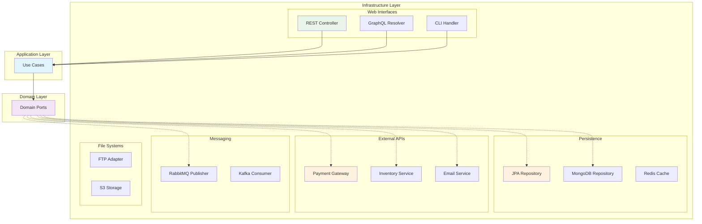

#### 📝 實務案例：多環境配置策略

**開發環境配置：**

```yaml
# application-dev.yml
spring:
  datasource:
    url: jdbc:h2:mem:devdb
    driver-class-name: org.h2.Driver
  jpa:
    hibernate:
      ddl-auto: create-drop

external:
  payment:
    type: mock
  inventory:
    type: mock
  email:
    type: console
```

**生產環境配置：**

```yaml
# application-prod.yml
spring:
  datasource:
    url: jdbc:postgresql://prod-db:5432/orders
    driver-class-name: org.postgresql.Driver
  jpa:
    hibernate:
      ddl-auto: validate

external:
  payment:
    type: stripe
    api-key: ${STRIPE_API_KEY}
  inventory:
    type: rest
    base-url: ${INVENTORY_SERVICE_URL}
  email:
    type: smtp
    host: ${SMTP_HOST}
```

#### ⚠️ Infrastructure 層注意事項

1. **技術細節隔離**：
   - Infrastructure 層不應包含業務邏輯
   - 所有技術特定的例外都應該轉換為領域例外
   - 避免讓技術框架的 Annotation 洩漏到 Domain 層

2. **配置管理**：
   - 使用環境變數管理敏感資訊
   - 為不同環境提供不同的實作
   - 確保配置的可測試性

3. **錯誤處理**：
   - 提供有意義的錯誤訊息
   - 實作適當的重試機制
   - 記錄足夠的診斷資訊

4. **效能考量**：
   - 實作適當的快取策略
   - 考慮連線池管理
   - 監控外部服務的效能

---

## Part 3. 專案實務應用

### 7. 專案中導入 Hexagonal Architecture 的步驟

導入 Hexagonal Architecture 是一個需要謹慎規劃的過程。本節將提供實用的步驟指南，幫助團隊順利完成架構轉換。

#### 7.1 現有系統重構的策略

**評估現狀：**

首先需要評估現有系統的架構狀態和重構可行性：

```mermaid
flowchart TD
    A[現有系統評估] --> B{系統複雜度}
    B -->|低| C[直接重構]
    B -->|中| D[模組化重構]
    B -->|高| E[漸進式重構]
    
    C --> F[全面改寫]
    D --> G[關鍵模組優先]
    E --> H[邊界清晰化]
    
    F --> I[新架構實作]
    G --> J[逐步遷移]
    H --> K[抽象層建立]
    
    style B fill:#f9f9f9
    style I fill:#e1f5fe
    style J fill:#f3e5f5
    style K fill:#fff3e0
```

**步驟 1：建立架構願景**

```java
// 定義目標架構的核心 Port
public interface OrderManagement {
    // 主要業務用例
    OrderResult createOrder(CreateOrderCommand command);
    OrderResult updateOrder(UpdateOrderCommand command);
    OrderResult cancelOrder(CancelOrderCommand command);
    
    // 查詢用例
    Optional<OrderDetails> getOrderDetails(OrderId id);
    List<OrderSummary> findOrdersByCustomer(CustomerId customerId);
}

// 定義重要的輸出 Port
public interface OrderRepository {
    void save(Order order);
    Optional<Order> findById(OrderId id);
    List<Order> findByCustomerId(CustomerId customerId);
}

public interface PaymentService {
    PaymentResult processPayment(PaymentRequest request);
    void refund(PaymentId paymentId, Money amount);
}
```

**步驟 2：識別聚合邊界**

```java
// 原有的混雜模型
@Entity
public class OrderEntity {
    private Long id;
    private String customerId;
    private String customerName;        // 屬於 Customer 聚合
    private String customerEmail;       // 屬於 Customer 聚合
    private List<OrderItemEntity> items;
    private String paymentStatus;       // 屬於 Payment 聚合
    private String paymentMethod;       // 屬於 Payment 聚合
    private String shippingAddress;     // 屬於 Shipping 聚合
    // ... 更多混雜的屬性
}

// 重構後的清晰聚合
public class Order {  // Order 聚合根
    private final OrderId id;
    private final CustomerId customerId;  // 只保留關聯 ID
    private final List<OrderItem> items;
    private OrderStatus status;
    private final LocalDateTime createdAt;
    
    // 純粹的訂單業務邏輯
    public void confirm() { /* ... */ }
    public void cancel(String reason) { /* ... */ }
    public Money calculateTotal() { /* ... */ }
}

public class Customer {  // Customer 聚合根
    private final CustomerId id;
    private CustomerInfo info;
    private CustomerStatus status;
    
    // 客戶相關業務邏輯
    public boolean canPlaceOrder() { /* ... */ }
    public void updateProfile(CustomerInfo newInfo) { /* ... */ }
}
```

**步驟 3：抽取業務邏輯**

```java
// 原有的 Service 層（包含技術細節）
@Service
public class OrderService {
    @Autowired
    private OrderRepository orderRepository;  // Spring Data JPA
    
    @Autowired
    private CustomerRepository customerRepository;
    
    @Autowired
    private JavaMailSender mailSender;  // 直接依賴技術框架
    
    public void createOrder(OrderDto orderDto) {
        // 業務邏輯與技術實作混雜
        Customer customer = customerRepository.findById(orderDto.getCustomerId());
        if (customer == null) {
            throw new RuntimeException("客戶不存在");
        }
        
        Order order = new Order();
        order.setCustomerId(orderDto.getCustomerId());
        // ... 設定其他屬性
        
        orderRepository.save(order);  // 直接使用 JPA
        
        // 直接使用 JavaMailSender
        SimpleMailMessage message = new SimpleMailMessage();
        message.setTo(customer.getEmail());
        message.setSubject("訂單確認");
        mailSender.send(message);
    }
}

// 重構後的 Use Case（純業務邏輯）
@Component
public class CreateOrderUseCase {
    private final OrderRepository orderRepository;      // 抽象介面
    private final CustomerRepository customerRepository; // 抽象介面
    private final EmailNotification emailNotification;  // 抽象介面
    private final EventPublisher eventPublisher;        // 抽象介面
    
    public CreateOrderUseCase(OrderRepository orderRepository,
                             CustomerRepository customerRepository,
                             EmailNotification emailNotification,
                             EventPublisher eventPublisher) {
        this.orderRepository = orderRepository;
        this.customerRepository = customerRepository;
        this.emailNotification = emailNotification;
        this.eventPublisher = eventPublisher;
    }
    
    @Transactional
    public CreateOrderResult execute(CreateOrderCommand command) {
        // 1. 驗證客戶
        Customer customer = customerRepository.findById(command.getCustomerId())
            .orElseThrow(() -> new CustomerNotFoundException(command.getCustomerId()));
        
        if (!customer.canPlaceOrder()) {
            return CreateOrderResult.failed("客戶狀態不允許下訂單");
        }
        
        // 2. 建立訂單
        OrderId orderId = OrderId.generate();
        Order order = Order.create(orderId, command);
        
        // 3. 儲存訂單
        orderRepository.save(order);
        
        // 4. 發送通知
        emailNotification.sendOrderConfirmation(order, customer);
        
        // 5. 發布事件
        eventPublisher.publish(new OrderCreatedEvent(order.getId()));
        
        return CreateOrderResult.success(order);
    }
}
```

**步驟 4：建立 Adapter 層**

```java
// 實作 Repository Adapter
@Repository
public class JpaOrderRepository implements OrderRepository {
    private final SpringDataOrderRepository springRepository;
    private final OrderMapper mapper;
    
    @Override
    public void save(Order order) {
        OrderEntity entity = mapper.toEntity(order);
        springRepository.save(entity);
    }
    
    @Override
    public Optional<Order> findById(OrderId id) {
        return springRepository.findById(id.getValue())
                              .map(mapper::toDomain);
    }
}

// 實作 Email Adapter
@Component
public class SmtpEmailNotification implements EmailNotification {
    private final JavaMailSender mailSender;
    private final EmailTemplateService templateService;
    
    @Override
    public void sendOrderConfirmation(Order order, Customer customer) {
        try {
            MimeMessage message = mailSender.createMimeMessage();
            MimeMessageHelper helper = new MimeMessageHelper(message);
            
            String content = templateService.generateOrderConfirmation(order);
            helper.setTo(customer.getEmail());
            helper.setSubject("訂單確認 - " + order.getId());
            helper.setText(content, true);
            
            mailSender.send(message);
        } catch (MessagingException e) {
            throw new EmailSendingException("無法發送確認信件", e);
        }
    }
}
```

#### 7.2 新專案的建置範本

**專案結構設計：**

```
src/
├── main/
│   ├── java/
│   │   └── com/
│   │       └── example/
│   │           └── orders/
│   │               ├── domain/                    # Domain 層
│   │               │   ├── model/
│   │               │   │   ├── Order.java
│   │               │   │   ├── OrderId.java
│   │               │   │   ├── OrderItem.java
│   │               │   │   └── Money.java
│   │               │   ├── service/
│   │               │   │   └── OrderPricingService.java
│   │               │   └── event/
│   │               │       └── OrderCreatedEvent.java
│   │               ├── application/               # Application 層
│   │               │   ├── usecase/
│   │               │   │   ├── CreateOrderUseCase.java
│   │               │   │   └── CancelOrderUseCase.java
│   │               │   ├── port/
│   │               │   │   ├── in/
│   │               │   │   │   └── OrderManagement.java
│   │               │   │   └── out/
│   │               │   │       ├── OrderRepository.java
│   │               │   │       ├── PaymentService.java
│   │               │   │       └── EmailNotification.java
│   │               │   └── command/
│   │               │       └── CreateOrderCommand.java
│   │               └── infrastructure/            # Infrastructure 層
│   │                   ├── adapter/
│   │                   │   ├── in/
│   │                   │   │   ├── web/
│   │                   │   │   │   └── OrderController.java
│   │                   │   │   └── cli/
│   │                   │   │       └── OrderCliHandler.java
│   │                   │   └── out/
│   │                   │       ├── persistence/
│   │                   │       │   ├── JpaOrderRepository.java
│   │                   │       │   └── OrderEntity.java
│   │                   │       ├── payment/
│   │                   │       │   └── StripePaymentService.java
│   │                   │       └── notification/
│   │                   │           └── SmtpEmailNotification.java
│   │                   └── config/
│   │                       ├── ApplicationConfig.java
│   │                       └── InfrastructureConfig.java
│   └── resources/
│       ├── application.yml
│       └── application-test.yml
└── test/
    ├── java/
    │   └── com/
    │       └── example/
    │           └── orders/
    │               ├── domain/                    # Domain 測試
    │               │   └── model/
    │               │       └── OrderTest.java
    │               ├── application/               # Application 測試
    │               │   └── usecase/
    │               │       └── CreateOrderUseCaseTest.java
    │               └── infrastructure/            # Infrastructure 測試
    │                   └── adapter/
    │                       └── in/
    │                           └── web/
    │                               └── OrderControllerTest.java
    └── resources/
        └── application-test.yml
```

**Maven 專案設定：**

```xml
<?xml version="1.0" encoding="UTF-8"?>
<project xmlns="http://maven.apache.org/POM/4.0.0"
         xmlns:xsi="http://www.w3.org/2001/XMLSchema-instance"
         xsi:schemaLocation="http://maven.apache.org/POM/4.0.0 
                           http://maven.apache.org/xsd/maven-4.0.0.xsd">
    <modelVersion>4.0.0</modelVersion>
    
    <groupId>com.example</groupId>
    <artifactId>hexagonal-orders</artifactId>
    <version>1.0.0</version>
    <packaging>jar</packaging>
    
    <name>Hexagonal Orders Service</name>
    <description>Order management service using hexagonal architecture</description>
    
    <parent>
        <groupId>org.springframework.boot</groupId>
        <artifactId>spring-boot-starter-parent</artifactId>
        <version>3.1.0</version>
        <relativePath/>
    </parent>
    
    <properties>
        <java.version>17</java.version>
        <maven.compiler.source>17</maven.compiler.source>
        <maven.compiler.target>17</maven.compiler.target>
        <project.build.sourceEncoding>UTF-8</project.build.sourceEncoding>
    </properties>
    
    <dependencies>
        <!-- Spring Boot 核心 -->
        <dependency>
            <groupId>org.springframework.boot</groupId>
            <artifactId>spring-boot-starter</artifactId>
        </dependency>
        
        <!-- Web 支援 -->
        <dependency>
            <groupId>org.springframework.boot</groupId>
            <artifactId>spring-boot-starter-web</artifactId>
        </dependency>
        
        <!-- 資料庫支援 -->
        <dependency>
            <groupId>org.springframework.boot</groupId>
            <artifactId>spring-boot-starter-data-jpa</artifactId>
        </dependency>
        
        <dependency>
            <groupId>com.h2database</groupId>
            <artifactId>h2</artifactId>
            <scope>runtime</scope>
        </dependency>
        
        <!-- 驗證支援 -->
        <dependency>
            <groupId>org.springframework.boot</groupId>
            <artifactId>spring-boot-starter-validation</artifactId>
        </dependency>
        
        <!-- 測試支援 -->
        <dependency>
            <groupId>org.springframework.boot</groupId>
            <artifactId>spring-boot-starter-test</artifactId>
            <scope>test</scope>
        </dependency>
        
        <!-- Testcontainers -->
        <dependency>
            <groupId>org.testcontainers</groupId>
            <artifactId>junit-jupiter</artifactId>
            <scope>test</scope>
        </dependency>
        
        <dependency>
            <groupId>org.testcontainers</groupId>
            <artifactId>postgresql</artifactId>
            <scope>test</scope>
        </dependency>
    </dependencies>
    
    <build>
        <plugins>
            <plugin>
                <groupId>org.springframework.boot</groupId>
                <artifactId>spring-boot-maven-plugin</artifactId>
            </plugin>
            
            <!-- ArchUnit 插件 - 架構測試 -->
            <plugin>
                <groupId>org.apache.maven.plugins</groupId>
                <artifactId>maven-surefire-plugin</artifactId>
                <configuration>
                    <includes>
                        <include>**/*Test.java</include>
                        <include>**/*ArchTest.java</include>
                    </includes>
                </configuration>
            </plugin>
        </plugins>
    </build>
</project>
```

#### 7.3 與 Spring Boot 結合

**配置類設計：**

```java
// 應用程式配置 - 只包含業務邏輯相關的配置
@Configuration
@ComponentScan(basePackages = {
    "com.example.orders.application",
    "com.example.orders.domain"
})
public class ApplicationConfiguration {
    
    // Use Case 配置
    @Bean
    public CreateOrderUseCase createOrderUseCase(
            OrderRepository orderRepository,
            CustomerRepository customerRepository,
            PaymentService paymentService,
            EmailNotification emailNotification) {
        return new CreateOrderUseCase(
            orderRepository, 
            customerRepository, 
            paymentService, 
            emailNotification
        );
    }
    
    @Bean
    public CancelOrderUseCase cancelOrderUseCase(
            OrderRepository orderRepository,
            RefundService refundService) {
        return new CancelOrderUseCase(orderRepository, refundService);
    }
    
    // Domain Service 配置
    @Bean
    public OrderPricingService orderPricingService(
            PromotionRepository promotionRepository) {
        return new OrderPricingService(promotionRepository);
    }
}

// Infrastructure 配置 - 技術實作相關的配置
@Configuration
@EnableJpaRepositories(basePackages = "com.example.orders.infrastructure.adapter.out.persistence")
@ComponentScan(basePackages = "com.example.orders.infrastructure")
public class InfrastructureConfiguration {
    
    // Repository 實作配置
    @Bean
    public OrderRepository orderRepository(
            SpringDataOrderRepository springRepository,
            OrderMapper mapper) {
        return new JpaOrderRepository(springRepository, mapper);
    }
    
    // 外部服務配置
    @Bean
    public PaymentService paymentService(
            @Value("${payment.stripe.api-key}") String apiKey) {
        return new StripePaymentService(apiKey);
    }
    
    @Bean
    public EmailNotification emailNotification(JavaMailSender mailSender) {
        return new SmtpEmailNotification(mailSender);
    }
    
    // Mapper 配置
    @Bean
    public OrderMapper orderMapper() {
        return new OrderMapper();
    }
}

// Web 配置 - Web 層相關的配置
@Configuration
@EnableWebMvc
@ComponentScan(basePackages = "com.example.orders.infrastructure.adapter.in.web")
public class WebConfiguration implements WebMvcConfigurer {
    
    @Override
    public void addCorsMappings(CorsRegistry registry) {
        registry.addMapping("/api/**")
                .allowedOrigins("http://localhost:3000")
                .allowedMethods("GET", "POST", "PUT", "DELETE")
                .allowCredentials(true);
    }
    
    @Bean
    public RestExceptionHandler restExceptionHandler() {
        return new RestExceptionHandler();
    }
}
```

**Spring Boot 主程式：**

```java
@SpringBootApplication
@ImportAutoConfiguration({
    ApplicationConfiguration.class,
    InfrastructureConfiguration.class,
    WebConfiguration.class
})
public class OrdersApplication {
    
    public static void main(String[] args) {
        SpringApplication.run(OrdersApplication.class, args);
    }
    
    // 健康檢查端點
    @Bean
    public HealthIndicator orderServiceHealthIndicator(OrderRepository orderRepository) {
        return () -> {
            try {
                // 簡單的健康檢查
                orderRepository.findById(OrderId.of("health-check"));
                return Health.up()
                           .withDetail("database", "available")
                           .build();
            } catch (Exception e) {
                return Health.down()
                           .withDetail("database", "unavailable")
                           .withException(e)
                           .build();
            }
        };
    }
}
```

**配置檔案：**

```yaml
# application.yml
spring:
  application:
    name: hexagonal-orders
  
  profiles:
    active: ${SPRING_PROFILES_ACTIVE:dev}
  
  datasource:
    driver-class-name: org.h2.Driver
    url: jdbc:h2:mem:orders;DB_CLOSE_DELAY=-1;DB_CLOSE_ON_EXIT=FALSE
    username: sa
    password: ''
  
  jpa:
    hibernate:
      ddl-auto: create-drop
    show-sql: true
    properties:
      hibernate:
        format_sql: true
  
  mail:
    host: ${MAIL_HOST:localhost}
    port: ${MAIL_PORT:587}
    username: ${MAIL_USERNAME:}
    password: ${MAIL_PASSWORD:}
    
server:
  port: 8080
  servlet:
    context-path: /orders

# 業務相關配置
orders:
  pricing:
    tax-rate: 0.05
    free-shipping-threshold: 1000
  
  payment:
    stripe:
      api-key: ${STRIPE_API_KEY:sk_test_dummy}
      webhook-secret: ${STRIPE_WEBHOOK_SECRET:whsec_dummy}

# 監控配置
management:
  endpoints:
    web:
      exposure:
        include: health,info,metrics
  endpoint:
    health:
      show-details: always

---
# application-prod.yml
spring:
  config:
    activate:
      on-profile: prod
  
  datasource:
    driver-class-name: org.postgresql.Driver
    url: ${DATABASE_URL}
    username: ${DATABASE_USERNAME}
    password: ${DATABASE_PASSWORD}
  
  jpa:
    hibernate:
      ddl-auto: validate
    show-sql: false
```

#### 📋 導入檢查清單

**階段一：準備工作**
- [ ] 評估現有系統複雜度
- [ ] 識別核心業務邏輯
- [ ] 定義聚合邊界
- [ ] 建立團隊共識

**階段二：架構設計**
- [ ] 設計 Domain Model
- [ ] 定義 Port 介面
- [ ] 規劃 Adapter 實作
- [ ] 建立專案結構

**階段三：實作開發**
- [ ] 實作 Domain 層
- [ ] 實作 Application 層
- [ ] 實作 Infrastructure 層
- [ ] 建立配置管理

**階段四：測試驗證**
- [ ] 單元測試覆蓋率 > 80%
- [ ] 整合測試完成
- [ ] 架構測試通過
- [ ] 效能測試滿足需求

**階段五：部署上線**
- [ ] 環境配置就緒
- [ ] 監控告警設定
- [ ] 回滾計畫準備
- [ ] 團隊培訓完成

#### ⚠️ 導入注意事項

1. **循序漸進**：不要一次重構整個系統，先從核心模組開始
2. **團隊培訓**：確保團隊成員理解六邊形架構的概念和實作方式
3. **測試先行**：建立完整的測試策略，確保重構不破壞現有功能
4. **文件更新**：及時更新架構文件和開發指南
5. **效能監控**：關注重構後的系統效能變化

---

### 8. 範例專案（逐步拆解）

本節將通過一個完整的電商訂單系統範例，展示如何從需求分析到程式碼實作的全過程。

#### 8.1 業務需求說明

**專案背景：**
我們要建立一個線上書店的訂單管理系統，支援以下功能：

1. **訂單管理**：創建、修改、取消訂單
2. **庫存檢查**：下訂前檢查書籍庫存
3. **付款處理**：整合第三方支付系統
4. **通知服務**：訂單狀態變更時發送郵件通知
5. **促銷計算**：支援折扣碼和會員優惠

**業務規則：**

```mermaid
graph TD
    A[客戶下訂單] --> B{庫存充足?}
    B -->|是| C[計算價格]
    B -->|否| D[庫存不足通知]
    
    C --> E{會員優惠?}
    E -->|是| F[套用會員折扣]
    E -->|否| G[使用原價]
    
    F --> H[處理付款]
    G --> H
    
    H --> I{付款成功?}
    I -->|是| J[確認訂單]
    I -->|否| K[付款失敗通知]
    
    J --> L[更新庫存]
    L --> M[發送確認信]
    
    style J fill:#c8e6c9
    style D fill:#ffcdd2
    style K fill:#ffcdd2
```

#### 8.2 架構圖與 Ports/Adapters 定義

**整體架構圖：**

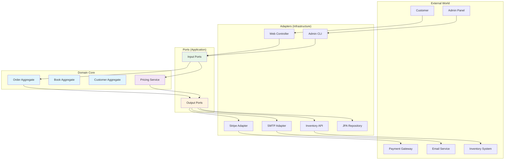

**Port 定義：**

```java
// 輸入 Port - 訂單管理
public interface OrderManagement {
    CreateOrderResult createOrder(CreateOrderCommand command);
    UpdateOrderResult updateOrder(UpdateOrderCommand command);
    CancelOrderResult cancelOrder(CancelOrderCommand command);
    OrderDetails getOrderDetails(OrderId orderId);
    List<OrderSummary> getCustomerOrders(CustomerId customerId);
}

// 輸入 Port - 管理功能
public interface OrderAdministration {
    List<OrderSummary> getAllOrders(OrderFilter filter, Pagination pagination);
    OrderStatistics getOrderStatistics(DateRange dateRange);
    void processRefund(RefundCommand command);
}

// 輸出 Port - 資料持久化
public interface OrderRepository {
    void save(Order order);
    Optional<Order> findById(OrderId id);
    List<Order> findByCustomerId(CustomerId customerId);
    List<Order> findByStatus(OrderStatus status);
    Page<Order> findAll(OrderFilter filter, Pageable pageable);
}

public interface BookRepository {
    Optional<Book> findById(BookId id);
    List<Book> findByIds(List<BookId> ids);
    void updateStock(BookId id, int quantity);
}

// 輸出 Port - 外部服務
public interface PaymentProcessor {
    PaymentResult processPayment(PaymentRequest request);
    RefundResult processRefund(RefundRequest request);
    PaymentStatus getPaymentStatus(PaymentId paymentId);
}

public interface EmailNotifier {
    void sendOrderConfirmation(Order order, Customer customer);
    void sendOrderCancellation(Order order, String reason);
    void sendPaymentFailure(Order order, String errorMessage);
}

public interface InventoryService {
    boolean isAvailable(BookId bookId, int quantity);
    void reserveStock(List<StockReservation> reservations);
    void releaseStock(List<StockReservation> reservations);
}
```

#### 8.3 程式碼示例（Java + Spring Boot）

**Domain 層實作：**

```java
// Book 聚合根
public class Book {
    private final BookId id;
    private final String title;
    private final String author;
    private final String isbn;
    private Money price;
    private int stockQuantity;
    private BookStatus status;
    
    public Book(BookId id, String title, String author, String isbn, 
                Money price, int stockQuantity) {
        this.id = Objects.requireNonNull(id);
        this.title = validateNotBlank(title, "書名不能為空");
        this.author = validateNotBlank(author, "作者不能為空");
        this.isbn = validateIsbn(isbn);
        this.price = Objects.requireNonNull(price);
        this.stockQuantity = validateStockQuantity(stockQuantity);
        this.status = BookStatus.AVAILABLE;
    }
    
    public boolean isAvailableForPurchase(int quantity) {
        return status == BookStatus.AVAILABLE && stockQuantity >= quantity;
    }
    
    public void reserveStock(int quantity) {
        if (!isAvailableForPurchase(quantity)) {
            throw new InsufficientStockException(id, quantity, stockQuantity);
        }
        this.stockQuantity -= quantity;
    }
    
    public void releaseStock(int quantity) {
        this.stockQuantity += quantity;
    }
    
    public Money calculateSubtotal(int quantity) {
        return price.multiply(quantity);
    }
    
    // 私有驗證方法
    private String validateNotBlank(String value, String message) {
        if (value == null || value.trim().isEmpty()) {
            throw new IllegalArgumentException(message);
        }
        return value.trim();
    }
    
    private String validateIsbn(String isbn) {
        if (isbn == null || !isbn.matches("\\d{10}|\\d{13}")) {
            throw new IllegalArgumentException("ISBN 格式不正確");
        }
        return isbn;
    }
    
    private int validateStockQuantity(int quantity) {
        if (quantity < 0) {
            throw new IllegalArgumentException("庫存數量不能為負數");
        }
        return quantity;
    }
}

// Order 聚合根
public class Order {
    private final OrderId id;
    private final CustomerId customerId;
    private final List<OrderItem> items;
    private OrderStatus status;
    private Money totalAmount;
    private PaymentId paymentId;
    private final LocalDateTime createdAt;
    private LocalDateTime confirmedAt;
    
    // 工廠方法
    public static Order create(CustomerId customerId, List<OrderItem> items) {
        OrderId id = OrderId.generate();
        return new Order(id, customerId, items);
    }
    
    private Order(OrderId id, CustomerId customerId, List<OrderItem> items) {
        this.id = Objects.requireNonNull(id);
        this.customerId = Objects.requireNonNull(customerId);
        this.items = validateItems(items);
        this.status = OrderStatus.PENDING;
        this.totalAmount = calculateTotalAmount();
        this.createdAt = LocalDateTime.now();
    }
    
    // 業務行為
    public void confirm(PaymentId paymentId) {
        if (status != OrderStatus.PENDING) {
            throw new IllegalOrderStateException("只有待處理的訂單可以確認");
        }
        
        this.status = OrderStatus.CONFIRMED;
        this.paymentId = paymentId;
        this.confirmedAt = LocalDateTime.now();
        
        // 發布領域事件
        DomainEvents.publish(new OrderConfirmedEvent(this.id, this.customerId));
    }
    
    public void cancel(String reason) {
        if (status == OrderStatus.SHIPPED || status == OrderStatus.DELIVERED) {
            throw new IllegalOrderStateException("已出貨或已送達的訂單無法取消");
        }
        
        OrderStatus previousStatus = this.status;
        this.status = OrderStatus.CANCELLED;
        
        // 發布領域事件
        DomainEvents.publish(new OrderCancelledEvent(this.id, reason, previousStatus));
    }
    
    public void addItem(OrderItem item) {
        if (!canBeModified()) {
            throw new IllegalOrderStateException("訂單狀態不允許修改");
        }
        
        this.items.add(item);
        this.totalAmount = calculateTotalAmount();
    }
    
    public void removeItem(BookId bookId) {
        if (!canBeModified()) {
            throw new IllegalOrderStateException("訂單狀態不允許修改");
        }
        
        this.items.removeIf(item -> item.getBookId().equals(bookId));
        this.totalAmount = calculateTotalAmount();
    }
    
    public boolean canBeModified() {
        return status == OrderStatus.PENDING;
    }
    
    public boolean requiresPayment() {
        return paymentId == null && totalAmount.isGreaterThan(Money.ZERO);
    }
    
    private Money calculateTotalAmount() {
        return items.stream()
                   .map(OrderItem::getSubtotal)
                   .reduce(Money.ZERO, Money::add);
    }
    
    private List<OrderItem> validateItems(List<OrderItem> items) {
        if (items == null || items.isEmpty()) {
            throw new IllegalArgumentException("訂單至少要有一個項目");
        }
        return new ArrayList<>(items);
    }
}

// OrderItem 值物件
public class OrderItem {
    private final BookId bookId;
    private final String bookTitle;
    private final int quantity;
    private final Money unitPrice;
    private final Money subtotal;
    
    public OrderItem(BookId bookId, String bookTitle, int quantity, Money unitPrice) {
        this.bookId = Objects.requireNonNull(bookId);
        this.bookTitle = validateNotBlank(bookTitle);
        this.quantity = validateQuantity(quantity);
        this.unitPrice = Objects.requireNonNull(unitPrice);
        this.subtotal = unitPrice.multiply(quantity);
    }
    
    public static OrderItem from(Book book, int quantity) {
        return new OrderItem(
            book.getId(),
            book.getTitle(),
            quantity,
            book.getPrice()
        );
    }
    
    private String validateNotBlank(String value) {
        if (value == null || value.trim().isEmpty()) {
            throw new IllegalArgumentException("書名不能為空");
        }
        return value.trim();
    }
    
    private int validateQuantity(int quantity) {
        if (quantity <= 0) {
            throw new IllegalArgumentException("數量必須大於 0");
        }
        return quantity;
    }
    
    // Getters...
}
```

**Application 層實作：**

```java
// 創建訂單用例
@Component
@Transactional
public class CreateOrderUseCase implements OrderManagement {
    private final OrderRepository orderRepository;
    private final BookRepository bookRepository;
    private final CustomerRepository customerRepository;
    private final InventoryService inventoryService;
    private final OrderPricingService pricingService;
    private final EventPublisher eventPublisher;
    
    public CreateOrderUseCase(OrderRepository orderRepository,
                             BookRepository bookRepository,
                             CustomerRepository customerRepository,
                             InventoryService inventoryService,
                             OrderPricingService pricingService,
                             EventPublisher eventPublisher) {
        this.orderRepository = orderRepository;
        this.bookRepository = bookRepository;
        this.customerRepository = customerRepository;
        this.inventoryService = inventoryService;
        this.pricingService = pricingService;
        this.eventPublisher = eventPublisher;
    }
    
    @Override
    public CreateOrderResult createOrder(CreateOrderCommand command) {
        try {
            // 1. 驗證客戶
            Customer customer = customerRepository.findById(command.getCustomerId())
                .orElseThrow(() -> new CustomerNotFoundException(command.getCustomerId()));
            
            // 2. 驗證和準備訂單項目
            List<OrderItem> orderItems = prepareOrderItems(command.getItems());
            
            // 3. 檢查庫存
            checkInventoryAvailability(orderItems);
            
            // 4. 建立訂單
            Order order = Order.create(customer.getId(), orderItems);
            
            // 5. 套用定價規則
            Money finalAmount = pricingService.calculateOrderPrice(order, customer);
            order.updateTotalAmount(finalAmount);
            
            // 6. 預留庫存
            reserveInventory(orderItems);
            
            // 7. 儲存訂單
            orderRepository.save(order);
            
            // 8. 發布事件
            eventPublisher.publish(new OrderCreatedEvent(order.getId()));
            
            return CreateOrderResult.success(order);
            
        } catch (DomainException e) {
            return CreateOrderResult.failed(e.getMessage());
        } catch (Exception e) {
            return CreateOrderResult.failed("系統錯誤：" + e.getMessage());
        }
    }
    
    private List<OrderItem> prepareOrderItems(List<CreateOrderItemRequest> requests) {
        List<BookId> bookIds = requests.stream()
            .map(CreateOrderItemRequest::getBookId)
            .collect(Collectors.toList());
        
        Map<BookId, Book> books = bookRepository.findByIds(bookIds)
            .stream()
            .collect(Collectors.toMap(Book::getId, Function.identity()));
        
        return requests.stream()
            .map(request -> {
                Book book = books.get(request.getBookId());
                if (book == null) {
                    throw new BookNotFoundException(request.getBookId());
                }
                return OrderItem.from(book, request.getQuantity());
            })
            .collect(Collectors.toList());
    }
    
    private void checkInventoryAvailability(List<OrderItem> items) {
        for (OrderItem item : items) {
            if (!inventoryService.isAvailable(item.getBookId(), item.getQuantity())) {
                throw new InsufficientInventoryException(
                    item.getBookId(), 
                    item.getQuantity()
                );
            }
        }
    }
    
    private void reserveInventory(List<OrderItem> items) {
        List<StockReservation> reservations = items.stream()
            .map(item -> new StockReservation(item.getBookId(), item.getQuantity()))
            .collect(Collectors.toList());
        
        inventoryService.reserveStock(reservations);
    }
}

// 訂單定價服務 (Domain Service)
@Component
public class OrderPricingService {
    private final PromotionRepository promotionRepository;
    private final CustomerTierService customerTierService;
    
    public Money calculateOrderPrice(Order order, Customer customer) {
        Money baseAmount = order.getTotalAmount();
        
        // 1. 套用會員折扣
        Money memberDiscount = calculateMemberDiscount(baseAmount, customer);
        
        // 2. 套用促銷活動
        Money promotionDiscount = calculatePromotionDiscount(order, customer);
        
        // 3. 選擇最優惠的折扣
        Money totalDiscount = Money.max(memberDiscount, promotionDiscount);
        
        // 4. 計算最終金額
        Money finalAmount = baseAmount.subtract(totalDiscount);
        
        return Money.max(finalAmount, Money.ZERO); // 確保不為負數
    }
    
    private Money calculateMemberDiscount(Money baseAmount, Customer customer) {
        CustomerTier tier = customerTierService.getTier(customer);
        BigDecimal discountRate = tier.getDiscountRate();
        
        return new Money(
            baseAmount.getAmount().multiply(discountRate),
            baseAmount.getCurrency()
        );
    }
    
    private Money calculatePromotionDiscount(Order order, Customer customer) {
        List<Promotion> applicablePromotions = promotionRepository
            .findActivePromotions()
            .stream()
            .filter(promotion -> promotion.isApplicableTo(order, customer))
            .collect(Collectors.toList());
        
        return applicablePromotions.stream()
            .map(promotion -> promotion.calculateDiscount(order))
            .max(Money::compareTo)
            .orElse(Money.ZERO);
    }
}
```

**Infrastructure 層實作：**

```java
// REST Controller (主動 Adapter)
@RestController
@RequestMapping("/api/orders")
@Validated
public class OrderController {
    private final OrderManagement orderManagement;
    
    public OrderController(OrderManagement orderManagement) {
        this.orderManagement = orderManagement;
    }
    
    @PostMapping
    public ResponseEntity<CreateOrderResponse> createOrder(
            @Valid @RequestBody CreateOrderRequest request) {
        
        CreateOrderCommand command = CreateOrderCommand.builder()
            .customerId(CustomerId.of(request.getCustomerId()))
            .items(mapToOrderItems(request.getItems()))
            .build();
        
        CreateOrderResult result = orderManagement.createOrder(command);
        
        if (result.isSuccess()) {
            CreateOrderResponse response = CreateOrderResponse.from(result);
            return ResponseEntity.status(HttpStatus.CREATED).body(response);
        } else {
            return ResponseEntity.badRequest()
                .body(CreateOrderResponse.error(result.getErrorMessage()));
        }
    }
    
    @GetMapping("/{orderId}")
    public ResponseEntity<OrderDetailsResponse> getOrderDetails(
            @PathVariable String orderId) {
        
        OrderDetails details = orderManagement.getOrderDetails(OrderId.of(orderId));
        
        if (details != null) {
            return ResponseEntity.ok(OrderDetailsResponse.from(details));
        } else {
            return ResponseEntity.notFound().build();
        }
    }
    
    @DeleteMapping("/{orderId}")
    public ResponseEntity<Void> cancelOrder(
            @PathVariable String orderId,
            @RequestBody CancelOrderRequest request) {
        
        CancelOrderCommand command = new CancelOrderCommand(
            OrderId.of(orderId),
            request.getReason()
        );
        
        CancelOrderResult result = orderManagement.cancelOrder(command);
        
        return result.isSuccess() 
            ? ResponseEntity.noContent().build()
            : ResponseEntity.badRequest().build();
    }
    
    private List<CreateOrderItemRequest> mapToOrderItems(
            List<CreateOrderItemDto> dtos) {
        return dtos.stream()
            .map(dto -> new CreateOrderItemRequest(
                BookId.of(dto.getBookId()),
                dto.getQuantity()
            ))
            .collect(Collectors.toList());
    }
}

// JPA Repository (被動 Adapter)
@Repository
public class JpaOrderRepository implements OrderRepository {
    private final SpringDataOrderRepository springRepository;
    private final OrderEntityMapper mapper;
    
    public JpaOrderRepository(SpringDataOrderRepository springRepository,
                             OrderEntityMapper mapper) {
        this.springRepository = springRepository;
        this.mapper = mapper;
    }
    
    @Override
    public void save(Order order) {
        OrderEntity entity = mapper.toEntity(order);
        springRepository.save(entity);
    }
    
    @Override
    public Optional<Order> findById(OrderId id) {
        return springRepository.findById(id.getValue())
                              .map(mapper::toDomain);
    }
    
    @Override
    public List<Order> findByCustomerId(CustomerId customerId) {
        return springRepository.findByCustomerId(customerId.getValue())
                              .stream()
                              .map(mapper::toDomain)
                              .collect(Collectors.toList());
    }
    
    @Override
    public Page<Order> findAll(OrderFilter filter, Pageable pageable) {
        Page<OrderEntity> entityPage = springRepository.findAll(
            OrderSpecification.withFilter(filter), 
            pageable
        );
        
        return entityPage.map(mapper::toDomain);
    }
}

// Stripe 支付處理器 (被動 Adapter)
@Component
public class StripePaymentProcessor implements PaymentProcessor {
    private final StripeClient stripeClient;
    private final PaymentMapper paymentMapper;
    
    public StripePaymentProcessor(StripeClient stripeClient,
                                 PaymentMapper paymentMapper) {
        this.stripeClient = stripeClient;
        this.paymentMapper = paymentMapper;
    }
    
    @Override
    public PaymentResult processPayment(PaymentRequest request) {
        try {
            PaymentIntentCreateParams params = PaymentIntentCreateParams.builder()
                .setAmount(request.getAmount().longValue() * 100) // 轉換為分
                .setCurrency(request.getCurrency().getCurrencyCode().toLowerCase())
                .setPaymentMethod(request.getPaymentMethodId())
                .setConfirm(true)
                .build();
            
            PaymentIntent intent = stripeClient.paymentIntents().create(params);
            
            if ("succeeded".equals(intent.getStatus())) {
                return PaymentResult.success(
                    PaymentId.of(intent.getId()),
                    request.getAmount()
                );
            } else {
                return PaymentResult.failed("付款未完成：" + intent.getStatus());
            }
            
        } catch (StripeException e) {
            return PaymentResult.failed("付款處理失敗：" + e.getMessage());
        }
    }
    
    @Override
    public RefundResult processRefund(RefundRequest request) {
        try {
            RefundCreateParams params = RefundCreateParams.builder()
                .setPaymentIntent(request.getPaymentId().getValue())
                .setAmount(request.getAmount().longValue() * 100)
                .build();
            
            Refund refund = stripeClient.refunds().create(params);
            
            return RefundResult.success(
                RefundId.of(refund.getId()),
                request.getAmount()
            );
            
        } catch (StripeException e) {
            return RefundResult.failed("退款處理失敗：" + e.getMessage());
        }
    }
}
```

#### 8.4 單元測試與整合測試

**Domain 層測試：**

```java
@ExtendWith(MockitoExtension.class)
class OrderTest {
    
    private CustomerId customerId;
    private List<OrderItem> orderItems;
    
    @BeforeEach
    void setUp() {
        customerId = CustomerId.of("CUST001");
        orderItems = Arrays.asList(
            new OrderItem(BookId.of("BOOK001"), "Java 程式設計", 2, Money.of(500)),
            new OrderItem(BookId.of("BOOK002"), "Spring Boot 實戰", 1, Money.of(600))
        );
    }
    
    @Test
    @DisplayName("建立訂單 - 成功案例")
    void createOrder_Success() {
        // Given & When
        Order order = Order.create(customerId, orderItems);
        
        // Then
        assertThat(order.getId()).isNotNull();
        assertThat(order.getCustomerId()).isEqualTo(customerId);
        assertThat(order.getItems()).hasSize(2);
        assertThat(order.getStatus()).isEqualTo(OrderStatus.PENDING);
        assertThat(order.getTotalAmount()).isEqualTo(Money.of(1600)); // 500*2 + 600*1
    }
    
    @Test
    @DisplayName("確認訂單 - 成功案例")
    void confirmOrder_Success() {
        // Given
        Order order = Order.create(customerId, orderItems);
        PaymentId paymentId = PaymentId.of("PAY001");
        
        // When
        order.confirm(paymentId);
        
        // Then
        assertThat(order.getStatus()).isEqualTo(OrderStatus.CONFIRMED);
        assertThat(order.getPaymentId()).isEqualTo(paymentId);
        assertThat(order.getConfirmedAt()).isNotNull();
    }
    
    @Test
    @DisplayName("確認訂單 - 狀態不正確時拋出例外")
    void confirmOrder_ThrowsException_WhenStatusIsNotPending() {
        // Given
        Order order = Order.create(customerId, orderItems);
        order.confirm(PaymentId.of("PAY001")); // 先確認一次
        
        // When & Then
        assertThatThrownBy(() -> order.confirm(PaymentId.of("PAY002")))
            .isInstanceOf(IllegalOrderStateException.class)
            .hasMessageContaining("只有待處理的訂單可以確認");
    }
    
    @Test
    @DisplayName("取消訂單 - 成功案例")
    void cancelOrder_Success() {
        // Given
        Order order = Order.create(customerId, orderItems);
        String reason = "客戶要求取消";
        
        // When
        order.cancel(reason);
        
        // Then
        assertThat(order.getStatus()).isEqualTo(OrderStatus.CANCELLED);
    }
    
    @Test
    @DisplayName("建立訂單 - 空項目清單時拋出例外")
    void createOrder_ThrowsException_WhenItemsIsEmpty() {
        // Given
        List<OrderItem> emptyItems = Collections.emptyList();
        
        // When & Then
        assertThatThrownBy(() -> Order.create(customerId, emptyItems))
            .isInstanceOf(IllegalArgumentException.class)
            .hasMessageContaining("訂單至少要有一個項目");
    }
}

@ExtendWith(MockitoExtension.class)
class MoneyTest {
    
    @Test
    @DisplayName("金額加法 - 相同幣別")
    void add_SameCurrency() {
        // Given
        Money money1 = Money.of(100);
        Money money2 = Money.of(200);
        
        // When
        Money result = money1.add(money2);
        
        // Then
        assertThat(result.getAmount()).isEqualByComparingTo(new BigDecimal("300"));
        assertThat(result.getCurrency()).isEqualTo(Currency.getInstance("TWD"));
    }
    
    @Test
    @DisplayName("金額加法 - 不同幣別時拋出例外")
    void add_ThrowsException_WhenDifferentCurrency() {
        // Given
        Money twd = new Money(new BigDecimal("100"), Currency.getInstance("TWD"));
        Money usd = new Money(new BigDecimal("100"), Currency.getInstance("USD"));
        
        // When & Then
        assertThatThrownBy(() -> twd.add(usd))
            .isInstanceOf(IllegalArgumentException.class)
            .hasMessageContaining("不同幣別無法運算");
    }
    
    @Test
    @DisplayName("金額乘法")
    void multiply() {
        // Given
        Money money = Money.of(150);
        
        // When
        Money result = money.multiply(3);
        
        // Then
        assertThat(result.getAmount()).isEqualByComparingTo(new BigDecimal("450"));
    }
}
```

**Application 層測試：**

```java
@ExtendWith(MockitoExtension.class)
class CreateOrderUseCaseTest {
    
    @Mock private OrderRepository orderRepository;
    @Mock private BookRepository bookRepository;
    @Mock private CustomerRepository customerRepository;
    @Mock private InventoryService inventoryService;
    @Mock private OrderPricingService pricingService;
    @Mock private EventPublisher eventPublisher;
    
    @InjectMocks
    private CreateOrderUseCase useCase;
    
    private Customer customer;
    private List<Book> books;
    private CreateOrderCommand command;
    
    @BeforeEach
    void setUp() {
        customer = Customer.create(CustomerId.of("CUST001"), "張三");
        
        books = Arrays.asList(
            Book.create(BookId.of("BOOK001"), "Java 程式設計", "作者A", Money.of(500)),
            Book.create(BookId.of("BOOK002"), "Spring Boot 實戰", "作者B", Money.of(600))
        );
        
        command = CreateOrderCommand.builder()
            .customerId(customer.getId())
            .addItem(books.get(0).getId(), 2)
            .addItem(books.get(1).getId(), 1)
            .build();
    }
    
    @Test
    @DisplayName("建立訂單 - 成功案例")
    void createOrder_Success() {
        // Given
        when(customerRepository.findById(customer.getId()))
            .thenReturn(Optional.of(customer));
        
        when(bookRepository.findByIds(anyList()))
            .thenReturn(books);
        
        when(inventoryService.isAvailable(any(BookId.class), anyInt()))
            .thenReturn(true);
        
        when(pricingService.calculateOrderPrice(any(Order.class), eq(customer)))
            .thenReturn(Money.of(1500)); // 套用折扣後
        
        // When
        CreateOrderResult result = useCase.createOrder(command);
        
        // Then
        assertThat(result.isSuccess()).isTrue();
        assertThat(result.getOrder()).isNotNull();
        assertThat(result.getOrder().getCustomerId()).isEqualTo(customer.getId());
        
        // 驗證互動
        verify(orderRepository).save(any(Order.class));
        verify(inventoryService).reserveStock(anyList());
        verify(eventPublisher).publish(any(OrderCreatedEvent.class));
    }
    
    @Test
    @DisplayName("建立訂單 - 客戶不存在時失敗")
    void createOrder_Fails_WhenCustomerNotFound() {
        // Given
        when(customerRepository.findById(customer.getId()))
            .thenReturn(Optional.empty());
        
        // When
        CreateOrderResult result = useCase.createOrder(command);
        
        // Then
        assertThat(result.isSuccess()).isFalse();
        assertThat(result.getErrorMessage()).contains("客戶不存在");
        
        // 驗證沒有進行其他操作
        verify(orderRepository, never()).save(any());
        verify(inventoryService, never()).reserveStock(any());
        verify(eventPublisher, never()).publish(any());
    }
    
    @Test
    @DisplayName("建立訂單 - 庫存不足時失敗")
    void createOrder_Fails_WhenInsufficientInventory() {
        // Given
        when(customerRepository.findById(customer.getId()))
            .thenReturn(Optional.of(customer));
        
        when(bookRepository.findByIds(anyList()))
            .thenReturn(books);
        
        when(inventoryService.isAvailable(books.get(0).getId(), 2))
            .thenReturn(false); // 第一本書庫存不足
        
        // When
        CreateOrderResult result = useCase.createOrder(command);
        
        // Then
        assertThat(result.isSuccess()).isFalse();
        assertThat(result.getErrorMessage()).contains("庫存不足");
        
        verify(orderRepository, never()).save(any());
        verify(inventoryService, never()).reserveStock(any());
    }
}
```

**整合測試：**

```java
@SpringBootTest
@Testcontainers
@Transactional
class OrderIntegrationTest {
    
    @Container
    static PostgreSQLContainer<?> postgres = new PostgreSQLContainer<>("postgres:13")
            .withDatabaseName("testdb")
            .withUsername("test")
            .withPassword("test");
    
    @Autowired
    private OrderManagement orderManagement;
    
    @Autowired
    private TestDataBuilder testDataBuilder;
    
    @MockBean
    private PaymentProcessor paymentProcessor;
    
    @MockBean
    private EmailNotifier emailNotifier;
    
    @Test
    @DisplayName("完整訂單流程 - 從建立到確認")
    void completeOrderFlow() {
        // Given - 準備測試資料
        Customer customer = testDataBuilder.createCustomer("張三", "zhang@example.com");
        Book book1 = testDataBuilder.createBook("Java 程式設計", Money.of(500), 10);
        Book book2 = testDataBuilder.createBook("Spring Boot 實戰", Money.of(600), 5);
        
        CreateOrderCommand createCommand = CreateOrderCommand.builder()
            .customerId(customer.getId())
            .addItem(book1.getId(), 2)
            .addItem(book2.getId(), 1)
            .build();
        
        when(paymentProcessor.processPayment(any(PaymentRequest.class)))
            .thenReturn(PaymentResult.success(PaymentId.of("PAY001"), Money.of(1600)));
        
        // When - 建立訂單
        CreateOrderResult createResult = orderManagement.createOrder(createCommand);
        
        // Then - 驗證訂單建立
        assertThat(createResult.isSuccess()).isTrue();
        Order createdOrder = createResult.getOrder();
        assertThat(createdOrder.getStatus()).isEqualTo(OrderStatus.PENDING);
        
        // When - 處理付款並確認訂單
        PaymentRequest paymentRequest = new PaymentRequest(
            createdOrder.getTotalAmount(),
            "pm_test_card"
        );
        
        PaymentResult paymentResult = paymentProcessor.processPayment(paymentRequest);
        
        if (paymentResult.isSuccess()) {
            ConfirmOrderCommand confirmCommand = new ConfirmOrderCommand(
                createdOrder.getId(),
                paymentResult.getPaymentId()
            );
            
            ConfirmOrderResult confirmResult = orderManagement.confirmOrder(confirmCommand);
            
            // Then - 驗證訂單確認
            assertThat(confirmResult.isSuccess()).isTrue();
            
            OrderDetails orderDetails = orderManagement.getOrderDetails(createdOrder.getId());
            assertThat(orderDetails.getStatus()).isEqualTo(OrderStatus.CONFIRMED);
            assertThat(orderDetails.getPaymentId()).isEqualTo(paymentResult.getPaymentId());
        }
        
        // 驗證通知已發送
        verify(emailNotifier).sendOrderConfirmation(any(Order.class), eq(customer));
    }
    
    @Test
    @DisplayName("訂單取消流程")
    void cancelOrderFlow() {
        // Given
        Customer customer = testDataBuilder.createCustomer("李四", "li@example.com");
        Order order = testDataBuilder.createPendingOrder(customer.getId());
        
        CancelOrderCommand cancelCommand = new CancelOrderCommand(
            order.getId(),
            "客戶要求取消"
        );
        
        // When
        CancelOrderResult result = orderManagement.cancelOrder(cancelCommand);
        
        // Then
        assertThat(result.isSuccess()).isTrue();
        
        OrderDetails orderDetails = orderManagement.getOrderDetails(order.getId());
        assertThat(orderDetails.getStatus()).isEqualTo(OrderStatus.CANCELLED);
        
        verify(emailNotifier).sendOrderCancellation(any(Order.class), eq("客戶要求取消"));
    }
}
```

#### 📋 範例專案總結

這個範例專案展示了 Hexagonal Architecture 的完整實作，包括：

1. **清晰的層次劃分**：Domain、Application、Infrastructure 各司其職
2. **完整的 Port/Adapter 模式**：輸入和輸出介面明確定義
3. **豐富的業務邏輯**：訂單狀態管理、庫存檢查、定價計算
4. **全面的測試策略**：單元測試、整合測試、架構測試
5. **實用的技術整合**：Spring Boot、JPA、Stripe、Email

通過這個範例，開發團隊可以：

- 理解六邊形架構在實際專案中的應用
- 學習如何組織程式碼結構
- 掌握測試驅動開發的方法
- 了解如何整合外部服務

---

### 9. 常見錯誤與反模式

在導入 Hexagonal Architecture 的過程中，開發團隊經常會遇到一些常見的錯誤和反模式。本節將詳細分析這些問題並提供解決方案。

#### 9.1 Port 與 Adapter 混淆

**❌ 錯誤示範：在 Port 中包含技術實作細節**

```java
// 錯誤：Port 包含了 JPA 特定的註解和方法
public interface OrderRepository {
    @Query("SELECT o FROM OrderEntity o WHERE o.customerId = :customerId")
    List<Order> findByCustomerId(@Param("customerId") String customerId);  // 洩漏 JPA 實作
    
    @Modifying
    @Query("UPDATE OrderEntity o SET o.status = :status WHERE o.id = :id")
    void updateStatus(@Param("id") String id, @Param("status") String status);  // 洩漏 SQL
    
    // 直接依賴 Spring Data 的分頁介面
    Page<Order> findAll(Pageable pageable);  // 洩漏 Spring 技術
}
```

**✅ 正確示範：純粹的領域介面**

```java
// 正確：Port 只包含領域概念
public interface OrderRepository {
    void save(Order order);
    Optional<Order> findById(OrderId id);
    List<Order> findByCustomerId(CustomerId customerId);
    void updateStatus(OrderId id, OrderStatus status);
    
    // 使用領域特定的分頁概念
    OrderPage findAll(OrderFilter filter, PageRequest pageRequest);
}

// 領域特定的分頁結果
public class OrderPage {
    private final List<Order> orders;
    private final int totalPages;
    private final long totalElements;
    private final boolean hasNext;
    
    // 建構子和方法...
}

// Adapter 負責技術實作
@Repository
public class JpaOrderRepository implements OrderRepository {
    private final SpringDataOrderRepository springRepository;
    
    @Override
    public OrderPage findAll(OrderFilter filter, PageRequest pageRequest) {
        // 轉換為 Spring Data 的 Pageable
        Pageable pageable = PageRequest.of(
            pageRequest.getPageNumber(),
            pageRequest.getPageSize()
        );
        
        Page<OrderEntity> springPage = springRepository.findAll(
            OrderSpecification.fromFilter(filter),
            pageable
        );
        
        // 轉換回領域物件
        List<Order> orders = springPage.getContent()
            .stream()
            .map(this::toDomain)
            .collect(Collectors.toList());
        
        return new OrderPage(
            orders,
            springPage.getTotalPages(),
            springPage.getTotalElements(),
            springPage.hasNext()
        );
    }
}
```

#### 9.2 Domain 層洩漏基礎設施細節

**❌ 錯誤示範：領域物件包含技術註解**

```java
// 錯誤：領域物件被 JPA 註解污染
@Entity
@Table(name = "orders")
public class Order {
    @Id
    @Column(name = "order_id")
    private String id;  // 使用 String 而非 Value Object
    
    @Column(name = "customer_id")
    private String customerId;  // 使用 String 而非 Value Object
    
    @Enumerated(EnumType.STRING)
    private OrderStatus status;
    
    @OneToMany(mappedBy = "order", cascade = CascadeType.ALL, fetch = FetchType.LAZY)
    private List<OrderItemEntity> items;  // 直接使用 Entity
    
    // 業務邏輯與持久化邏輯混合
    @PrePersist
    public void prePersist() {
        this.createdAt = LocalDateTime.now();
    }
    
    public void confirm() {
        this.status = OrderStatus.CONFIRMED;
        // 直接呼叫 JPA 方法 - 違反了領域純粹性
        EntityManager em = // 某種方式取得 EntityManager
        em.merge(this);
    }
}
```

**✅ 正確示範：純粹的領域物件**

```java
// 正確：純粹的領域物件，不包含任何技術細節
public class Order {
    private final OrderId id;
    private final CustomerId customerId;
    private final List<OrderItem> items;
    private OrderStatus status;
    private final LocalDateTime createdAt;
    private LocalDateTime confirmedAt;
    
    // 工廠方法
    public static Order create(CustomerId customerId, List<OrderItem> items) {
        return new Order(
            OrderId.generate(),
            customerId,
            items,
            OrderStatus.PENDING,
            LocalDateTime.now()
        );
    }
    
    // 重建方法（用於從持久化層載入）
    public static Order reconstitute(OrderId id,
                                   CustomerId customerId,
                                   List<OrderItem> items,
                                   OrderStatus status,
                                   LocalDateTime createdAt,
                                   LocalDateTime confirmedAt) {
        return new Order(id, customerId, items, status, createdAt, confirmedAt);
    }
    
    private Order(OrderId id, CustomerId customerId, List<OrderItem> items,
                  OrderStatus status, LocalDateTime createdAt) {
        this.id = Objects.requireNonNull(id);
        this.customerId = Objects.requireNonNull(customerId);
        this.items = new ArrayList<>(Objects.requireNonNull(items));
        this.status = Objects.requireNonNull(status);
        this.createdAt = Objects.requireNonNull(createdAt);
    }
    
    // 純粹的業務行為
    public void confirm() {
        if (this.status != OrderStatus.PENDING) {
            throw new IllegalOrderStateException("只有待處理的訂單可以確認");
        }
        
        this.status = OrderStatus.CONFIRMED;
        this.confirmedAt = LocalDateTime.now();
        
        // 發布領域事件，而非直接操作持久化
        DomainEvents.publish(new OrderConfirmedEvent(this.id));
    }
    
    // 其他業務方法...
}

// 分離的 JPA Entity
@Entity
@Table(name = "orders")
class OrderEntity {
    @Id
    @Column(name = "order_id")
    private String id;
    
    @Column(name = "customer_id")
    private String customerId;
    
    @Enumerated(EnumType.STRING)
    private OrderStatus status;
    
    @Column(name = "created_at")
    private LocalDateTime createdAt;
    
    @Column(name = "confirmed_at")
    private LocalDateTime confirmedAt;
    
    @OneToMany(mappedBy = "order", cascade = CascadeType.ALL, fetch = FetchType.LAZY)
    private List<OrderItemEntity> items;
    
    // 只包含 getter/setter，不包含業務邏輯
}
```

#### 9.3 過度工程化導致維護成本上升

**❌ 錯誤示範：過度抽象化**

```java
// 錯誤：為簡單的 CRUD 操作建立過多層次
public interface OrderReadRepository {
    Optional<Order> findById(OrderId id);
}

public interface OrderWriteRepository {
    void save(Order order);
}

public interface OrderQueryRepository {
    List<Order> findByCustomerId(CustomerId customerId);
}

// 每個簡單操作都有獨立的 Use Case
public class FindOrderByIdUseCase {
    private final OrderReadRepository repository;
    
    public Optional<Order> execute(OrderId id) {
        return repository.findById(id);  // 只是簡單轉發
    }
}

public class SaveOrderUseCase {
    private final OrderWriteRepository repository;
    
    public void execute(Order order) {
        repository.save(order);  // 只是簡單轉發
    }
}

// 過度複雜的抽象工廠
public interface OrderRepositoryFactory {
    OrderReadRepository createReadRepository();
    OrderWriteRepository createWriteRepository();
    OrderQueryRepository createQueryRepository();
}

public class JpaOrderRepositoryFactory implements OrderRepositoryFactory {
    // 大量的工廠方法...
}
```

**✅ 正確示範：適度的抽象化**

```java
// 正確：合理的抽象層次
public interface OrderRepository {
    // 將相關操作組合在一個介面中
    void save(Order order);
    Optional<Order> findById(OrderId id);
    List<Order> findByCustomerId(CustomerId customerId);
    List<Order> findByStatus(OrderStatus status);
    void delete(OrderId id);
}

// 只為有意義的業務場景建立 Use Case
public class CreateOrderUseCase {
    private final OrderRepository orderRepository;
    private final PaymentService paymentService;
    private final InventoryService inventoryService;
    
    public CreateOrderResult execute(CreateOrderCommand command) {
        // 包含複雜的業務邏輯編排
        // 1. 驗證
        // 2. 業務規則檢查
        // 3. 外部服務協調
        // 4. 事件發布
        return result;
    }
}

// 簡單的查詢可以直接通過 Repository
public class OrderQueryService {
    private final OrderRepository orderRepository;
    
    public Optional<OrderDetails> getOrderDetails(OrderId id) {
        return orderRepository.findById(id)
                             .map(OrderDetails::from);
    }
    
    public List<OrderSummary> getCustomerOrders(CustomerId customerId) {
        return orderRepository.findByCustomerId(customerId)
                             .stream()
                             .map(OrderSummary::from)
                             .collect(Collectors.toList());
    }
}
```

#### 9.4 測試策略錯誤

**❌ 錯誤示範：測試技術實作而非業務邏輯**

```java
// 錯誤：測試 JPA Repository 的實作細節
@DataJpaTest
class JpaOrderRepositoryTest {
    
    @Autowired
    private TestEntityManager entityManager;
    
    @Autowired
    private SpringDataOrderRepository repository;
    
    @Test
    void shouldSaveOrderEntity() {
        // 測試 JPA 的基本 CRUD 功能，而非業務邏輯
        OrderEntity entity = new OrderEntity();
        entity.setId("ORDER001");
        entity.setCustomerId("CUST001");
        entity.setStatus(OrderStatus.PENDING);
        
        OrderEntity saved = repository.save(entity);
        
        assertThat(saved.getId()).isEqualTo("ORDER001");
        // 這種測試沒有太大價值，主要是測試 JPA 框架
    }
}

// 錯誤：在單元測試中使用真實的資料庫
@SpringBootTest
@Transactional
class CreateOrderUseCaseTest {
    
    @Autowired
    private CreateOrderUseCase useCase;
    
    @Autowired
    private OrderRepository orderRepository;  // 真實的 Repository
    
    @Test
    void shouldCreateOrder() {
        // 依賴真實的資料庫，測試變慢且不穩定
        CreateOrderCommand command = // ...
        CreateOrderResult result = useCase.execute(command);
        
        // 驗證資料庫中的資料
        Optional<Order> saved = orderRepository.findById(result.getOrderId());
        assertThat(saved).isPresent();
    }
}
```

**✅ 正確示範：測試業務邏輯和契約**

```java
// 正確：測試領域物件的業務邏輯
class OrderTest {
    
    @Test
    @DisplayName("確認訂單應該變更狀態並記錄確認時間")
    void confirmOrder_ShouldChangeStatusAndRecordTime() {
        // Given
        Order order = createPendingOrder();
        PaymentId paymentId = PaymentId.of("PAY001");
        
        // When
        order.confirm(paymentId);
        
        // Then
        assertThat(order.getStatus()).isEqualTo(OrderStatus.CONFIRMED);
        assertThat(order.getPaymentId()).isEqualTo(paymentId);
        assertThat(order.getConfirmedAt()).isNotNull();
    }
    
    @Test
    @DisplayName("非待處理狀態的訂單無法確認")
    void confirmOrder_ShouldThrowException_WhenNotPending() {
        // Given
        Order order = createConfirmedOrder();
        
        // When & Then
        assertThatThrownBy(() -> order.confirm(PaymentId.of("PAY001")))
            .isInstanceOf(IllegalOrderStateException.class);
    }
}

// 正確：使用 Mock 測試 Use Case 的編排邏輯
@ExtendWith(MockitoExtension.class)
class CreateOrderUseCaseTest {
    
    @Mock private OrderRepository orderRepository;
    @Mock private PaymentService paymentService;
    @Mock private InventoryService inventoryService;
    
    @InjectMocks
    private CreateOrderUseCase useCase;
    
    @Test
    @DisplayName("建立訂單應該檢查庫存、處理付款並儲存訂單")
    void createOrder_ShouldCheckInventoryProcessPaymentAndSaveOrder() {
        // Given
        CreateOrderCommand command = // ...
        when(inventoryService.isAvailable(any(), anyInt())).thenReturn(true);
        when(paymentService.processPayment(any())).thenReturn(PaymentResult.success());
        
        // When
        CreateOrderResult result = useCase.execute(command);
        
        // Then
        assertThat(result.isSuccess()).isTrue();
        
        // 驗證互動順序和呼叫
        InOrder inOrder = inOrder(inventoryService, paymentService, orderRepository);
        inOrder.verify(inventoryService).isAvailable(any(), anyInt());
        inOrder.verify(paymentService).processPayment(any());
        inOrder.verify(orderRepository).save(any());
    }
}

// 正確：契約測試確保 Adapter 符合 Port 的期望
abstract class OrderRepositoryContractTest {
    
    protected abstract OrderRepository createRepository();
    
    @Test
    void save_ShouldPersistOrder() {
        // Given
        OrderRepository repository = createRepository();
        Order order = createTestOrder();
        
        // When
        repository.save(order);
        
        // Then
        Optional<Order> found = repository.findById(order.getId());
        assertThat(found).isPresent();
        assertThat(found.get().getId()).isEqualTo(order.getId());
    }
}

// JPA 實作的契約測試
@DataJpaTest
class JpaOrderRepositoryContractTest extends OrderRepositoryContractTest {
    
    @Autowired
    private SpringDataOrderRepository springRepository;
    
    @Override
    protected OrderRepository createRepository() {
        return new JpaOrderRepository(springRepository, new OrderMapper());
    }
}
```

#### 9.5 配置管理混亂

**❌ 錯誤示範：配置散落各處**

```java
// 錯誤：在多個地方硬編碼配置
@Component
public class EmailService {
    private final String smtpHost = "smtp.gmail.com";  // 硬編碼
    private final int smtpPort = 587;  // 硬編碼
    
    public void sendEmail(String to, String subject, String content) {
        // 實作...
    }
}

@Repository
public class JpaOrderRepository {
    // 在 Repository 中包含業務規則配置
    private static final int MAX_ORDERS_PER_CUSTOMER = 10;  // 應該在 Domain 層
    
    public void save(Order order) {
        List<Order> customerOrders = findByCustomerId(order.getCustomerId());
        if (customerOrders.size() >= MAX_ORDERS_PER_CUSTOMER) {
            throw new RuntimeException("客戶訂單數量超過限制");  // 業務規則不應在此層
        }
        // ...
    }
}

@Controller
public class OrderController {
    // 在 Controller 中包含業務配置
    private static final BigDecimal FREE_SHIPPING_THRESHOLD = new BigDecimal("1000");
    
    @PostMapping("/orders")
    public ResponseEntity<?> createOrder(@RequestBody OrderRequest request) {
        // 在 Controller 中處理業務邏輯
        if (request.getTotalAmount().compareTo(FREE_SHIPPING_THRESHOLD) >= 0) {
            // 免運費邏輯
        }
        // ...
    }
}
```

**✅ 正確示範：集中的配置管理**

```java
// 正確：使用配置類集中管理
@Configuration
@ConfigurationProperties(prefix = "orders")
@Data
public class OrdersConfiguration {
    private PaymentConfig payment = new PaymentConfig();
    private ShippingConfig shipping = new ShippingConfig();
    private BusinessRulesConfig businessRules = new BusinessRulesConfig();
    
    @Data
    public static class PaymentConfig {
        private String provider = "stripe";
        private String apiKey;
        private Duration timeout = Duration.ofSeconds(30);
    }
    
    @Data
    public static class ShippingConfig {
        private BigDecimal freeShippingThreshold = new BigDecimal("1000");
        private BigDecimal defaultShippingFee = new BigDecimal("100");
    }
    
    @Data
    public static class BusinessRulesConfig {
        private int maxOrdersPerCustomer = 10;
        private Duration orderExpirationTime = Duration.ofHours(24);
    }
}

// 在 Domain Service 中使用配置
@Component
public class OrderBusinessRules {
    private final OrdersConfiguration config;
    
    public OrderBusinessRules(OrdersConfiguration config) {
        this.config = config;
    }
    
    public void validateCustomerOrderLimit(Customer customer, int currentOrderCount) {
        if (currentOrderCount >= config.getBusinessRules().getMaxOrdersPerCustomer()) {
            throw new OrderLimitExceededException(
                customer.getId(), 
                config.getBusinessRules().getMaxOrdersPerCustomer()
            );
        }
    }
    
    public boolean qualifiesForFreeShipping(Money orderAmount) {
        return orderAmount.isGreaterThanOrEqual(
            new Money(config.getShipping().getFreeShippingThreshold())
        );
    }
}
```

#### 📋 反模式檢查清單

**設計階段檢查：**

- [ ] Port 介面是否只包含領域概念，沒有技術細節？
- [ ] Domain 物件是否純粹，沒有技術框架的註解？
- [ ] 是否避免了過度的抽象化和不必要的複雜性？
- [ ] 配置是否集中管理，沒有散落在各個層次？

**實作階段檢查：**

- [ ] Adapter 是否正確實作了 Port 的契約？
- [ ] 業務邏輯是否都在 Domain 層，沒有洩漏到其他層？
- [ ] 是否使用了適當的例外處理和轉換？
- [ ] 測試是否專注於業務邏輯而非技術實作？

**維護階段檢查：**

- [ ] 新功能是否遵循了既定的架構原則？
- [ ] 是否定期進行架構健康度檢查？
- [ ] 團隊成員是否都理解並遵循架構規範？
- [ ] 是否有適當的文件和範例指導新成員？

#### ⚠️ 避免反模式的建議

1. **建立明確的架構規範**：制定清楚的編碼指南和架構決策記錄
2. **進行程式碼審查**：確保每次變更都符合架構原則
3. **使用架構測試工具**：如 ArchUnit 來自動化檢查架構規則
4. **定期重構**：持續改善程式碼品質，避免技術債務累積
5. **團隊培訓**：確保所有成員都理解六邊形架構的核心概念

---

## Part 4. 進階應用與最佳實務

### 10. 與 DDD 結合

Domain-Driven Design (DDD) 與 Hexagonal Architecture 是天然的搭配，兩者都強調將業務邏輯放在核心位置，並與技術實作分離。本節將探討如何有效結合這兩種方法。

#### 10.1 Bounded Context 與 Hexagonal 邊界

**Bounded Context** 是 DDD 中的核心概念，它定義了特定領域模型適用的邊界。在 Hexagonal Architecture 中，每個 Bounded Context 通常對應一個獨立的六邊形。

```mermaid
graph TB
    subgraph "電商系統"
        subgraph "訂單管理 Context"
            OH[Order Hexagon]
            OP[Order Ports]
            OA[Order Adapters]
            
            OH --> OP
            OP --> OA
        end
        
        subgraph "庫存管理 Context"
            IH[Inventory Hexagon]
            IP[Inventory Ports]
            IA[Inventory Adapters]
            
            IH --> IP
            IP --> IA
        end
        
        subgraph "客戶管理 Context"
            CH[Customer Hexagon]
            CP[Customer Ports]
            CA[Customer Adapters]
            
            CH --> CP
            CP --> CA
        end
        
        subgraph "付款處理 Context"
            PH[Payment Hexagon]
            PP[Payment Ports]
            PA[Payment Adapters]
            
            PH --> PP
            PP --> PA
        end
    end
    
    OA -.-> IP
    OA -.-> CP
    OA -.-> PP
    
    style OH fill:#e1f5fe
    style IH fill:#e8f5e8
    style CH fill:#fff3e0
    style PH fill:#f3e5f5
```

**實作範例：**

```java
// 訂單管理 Bounded Context
package com.example.ecommerce.order;

// 訂單聚合根
public class Order {
    private final OrderId id;
    private final CustomerId customerId;  // 參考客戶管理 Context
    private final List<OrderItem> items;
    private OrderStatus status;
    private Money totalAmount;
    
    // 領域邏輯只關注訂單相關的業務規則
    public void confirm() {
        if (status != OrderStatus.PENDING) {
            throw new IllegalOrderStateException("只有待處理的訂單可以確認");
        }
        
        this.status = OrderStatus.CONFIRMED;
        
        // 發布領域事件，通知其他 Context
        DomainEvents.publish(new OrderConfirmedEvent(this.id, this.customerId));
    }
}

// 與其他 Context 的集成透過 Port
public interface CustomerService {
    Optional<Customer> findById(CustomerId id);
    boolean isEligibleForDiscount(CustomerId id);
}

public interface InventoryService {
    boolean isAvailable(ProductId productId, int quantity);
    void reserveStock(List<StockReservation> reservations);
}

// 庫存管理 Bounded Context
package com.example.ecommerce.inventory;

public class InventoryItem {
    private final ProductId productId;
    private int availableQuantity;
    private int reservedQuantity;
    
    public boolean canReserve(int quantity) {
        return availableQuantity >= quantity;
    }
    
    public void reserve(int quantity) {
        if (!canReserve(quantity)) {
            throw new InsufficientStockException(productId, quantity);
        }
        
        this.availableQuantity -= quantity;
        this.reservedQuantity += quantity;
        
        DomainEvents.publish(new StockReservedEvent(productId, quantity));
    }
}
```

#### 10.2 聚合（Aggregate）與 Ports 的對應

在 DDD 中，**Aggregate** 是一組相關物件的集合，有明確的邊界和一致性規則。在 Hexagonal Architecture 中，每個 Aggregate 通常透過 Port 暴露其功能。

```java
// Order Aggregate 的完整設計
public class Order {  // Aggregate Root
    private final OrderId id;
    private final CustomerId customerId;
    private final List<OrderItem> items;  // 內部實體
    private final ShippingAddress shippingAddress;  // 值物件
    private OrderStatus status;
    private Money totalAmount;
    private final LocalDateTime createdAt;
    
    // Aggregate 的不變性條件
    private void ensureInvariants() {
        if (items.isEmpty()) {
            throw new IllegalStateException("訂單必須至少有一個項目");
        }
        
        if (totalAmount.isNegative()) {
            throw new IllegalStateException("訂單總金額不能為負數");
        }
        
        // 檢查訂單項目的總金額是否與訂單總金額一致
        Money calculatedTotal = items.stream()
            .map(OrderItem::getSubtotal)
            .reduce(Money.ZERO, Money::add);
        
        if (!totalAmount.equals(calculatedTotal)) {
            throw new IllegalStateException("訂單總金額與項目總和不一致");
        }
    }
    
    // Aggregate 的業務行為
    public void addItem(Product product, int quantity) {
        OrderItem newItem = new OrderItem(product.getId(), product.getName(), 
                                        quantity, product.getPrice());
        this.items.add(newItem);
        this.totalAmount = calculateTotalAmount();
        
        ensureInvariants();
    }
    
    public void removeItem(ProductId productId) {
        this.items.removeIf(item -> item.getProductId().equals(productId));
        this.totalAmount = calculateTotalAmount();
        
        ensureInvariants();
    }
    
    // 只有 Aggregate Root 可以被外部直接存取
    public void confirm() {
        if (status != OrderStatus.PENDING) {
            throw new IllegalOrderStateException("只有待處理的訂單可以確認");
        }
        
        ensureInvariants();
        
        this.status = OrderStatus.CONFIRMED;
        
        // 發布領域事件
        DomainEvents.publish(new OrderConfirmedEvent(this.id));
    }
    
    private Money calculateTotalAmount() {
        return items.stream()
                   .map(OrderItem::getSubtotal)
                   .reduce(Money.ZERO, Money::add);
    }
}

// OrderItem 內部實體 - 不能直接從外部存取
class OrderItem {
    private final ProductId productId;
    private final String productName;
    private int quantity;
    private final Money unitPrice;
    
    // 只能透過 Order 來修改
    void updateQuantity(int newQuantity) {
        if (newQuantity <= 0) {
            throw new IllegalArgumentException("數量必須大於 0");
        }
        this.quantity = newQuantity;
    }
    
    Money getSubtotal() {
        return unitPrice.multiply(quantity);
    }
}

// Aggregate 的 Repository Port
public interface OrderRepository {
    void save(Order order);  // 儲存整個 Aggregate
    Optional<Order> findById(OrderId id);
    
    // 不提供直接操作 OrderItem 的方法
    // OrderItem 只能透過 Order 來操作
}
```

#### 10.3 領域事件與事件驅動架構

領域事件是 DDD 中重要的概念，在 Hexagonal Architecture 中通過 Port 來處理事件的發布和消費。

```java
// 領域事件定義
public abstract class DomainEvent {
    private final String eventId;
    private final LocalDateTime occurredOn;
    private final String eventType;
    
    protected DomainEvent(String eventType) {
        this.eventId = UUID.randomUUID().toString();
        this.occurredOn = LocalDateTime.now();
        this.eventType = eventType;
    }
    
    // Getters...
}

public class OrderConfirmedEvent extends DomainEvent {
    private final OrderId orderId;
    private final CustomerId customerId;
    private final Money totalAmount;
    
    public OrderConfirmedEvent(OrderId orderId, CustomerId customerId, Money totalAmount) {
        super("OrderConfirmed");
        this.orderId = orderId;
        this.customerId = customerId;
        this.totalAmount = totalAmount;
    }
    
    // Getters...
}

public class PaymentProcessedEvent extends DomainEvent {
    private final PaymentId paymentId;
    private final OrderId orderId;
    private final Money amount;
    private final PaymentStatus status;
    
    public PaymentProcessedEvent(PaymentId paymentId, OrderId orderId, 
                                Money amount, PaymentStatus status) {
        super("PaymentProcessed");
        this.paymentId = paymentId;
        this.orderId = orderId;
        this.amount = amount;
        this.status = status;
    }
}

// 事件發布 Port
public interface EventPublisher {
    void publish(DomainEvent event);
    void publishAll(List<DomainEvent> events);
}

// 事件處理 Port
public interface EventHandler<T extends DomainEvent> {
    void handle(T event);
    boolean canHandle(DomainEvent event);
}

// 領域事件的集中管理
public class DomainEvents {
    private static final ThreadLocal<List<DomainEvent>> events = 
        ThreadLocal.withInitial(ArrayList::new);
    
    public static void publish(DomainEvent event) {
        events.get().add(event);
    }
    
    public static List<DomainEvent> getEvents() {
        return events.get();
    }
    
    public static void clearEvents() {
        events.get().clear();
    }
    
    public static void clearAll() {
        events.remove();
    }
}

// Application Service 中處理事件
@Component
@Transactional
public class OrderApplicationService {
    private final OrderRepository orderRepository;
    private final EventPublisher eventPublisher;
    
    public void confirmOrder(ConfirmOrderCommand command) {
        // 1. 載入聚合
        Order order = orderRepository.findById(command.getOrderId())
            .orElseThrow(() -> new OrderNotFoundException(command.getOrderId()));
        
        // 2. 執行業務邏輯
        order.confirm();
        
        // 3. 儲存聚合
        orderRepository.save(order);
        
        // 4. 發布領域事件
        List<DomainEvent> events = DomainEvents.getEvents();
        eventPublisher.publishAll(events);
        DomainEvents.clearEvents();
    }
}

// 事件處理器實作
@Component
public class OrderConfirmedEventHandler implements EventHandler<OrderConfirmedEvent> {
    private final EmailNotificationService emailService;
    private final InventoryService inventoryService;
    
    @Override
    public void handle(OrderConfirmedEvent event) {
        // 發送確認信件
        emailService.sendOrderConfirmation(event.getOrderId());
        
        // 更新庫存
        inventoryService.confirmReservation(event.getOrderId());
    }
    
    @Override
    public boolean canHandle(DomainEvent event) {
        return event instanceof OrderConfirmedEvent;
    }
}

// Infrastructure 層的事件發布實作
@Component
public class SpringEventPublisher implements EventPublisher {
    private final ApplicationEventPublisher springPublisher;
    
    @Override
    public void publish(DomainEvent event) {
        springPublisher.publishEvent(event);
    }
    
    @Override
    public void publishAll(List<DomainEvent> events) {
        events.forEach(this::publish);
    }
}

// 事件監聽器
@Component
public class DomainEventListener {
    private final List<EventHandler<? extends DomainEvent>> handlers;
    
    @EventListener
    public void handleDomainEvent(DomainEvent event) {
        handlers.stream()
            .filter(handler -> handler.canHandle(event))
            .forEach(handler -> {
                try {
                    ((EventHandler<DomainEvent>) handler).handle(event);
                } catch (Exception e) {
                    // 錯誤處理和記錄
                    log.error("處理領域事件失敗: {}", event, e);
                }
            });
    }
}
```

#### 10.4 Repository 模式的 DDD 實作

在 DDD 中，Repository 負責封裝領域物件的持久化邏輯，讓領域層不需要關心資料存取的細節。

```java
// 領域層的 Repository 介面
public interface OrderRepository {
    // 聚合層級的操作
    void save(Order order);
    void remove(Order order);
    
    // 通過聚合根的唯一識別
    Optional<Order> findById(OrderId id);
    
    // 領域特定的查詢方法
    List<Order> findPendingOrdersOlderThan(Duration age);
    List<Order> findByCustomerAndStatus(CustomerId customerId, OrderStatus status);
    
    // 規格模式查詢
    List<Order> findBySpecification(OrderSpecification specification);
    
    // 分頁查詢
    Page<Order> findAll(OrderSpecification specification, PageRequest pageRequest);
}

// 規格模式實作
public abstract class OrderSpecification {
    public abstract boolean isSatisfiedBy(Order order);
    
    public OrderSpecification and(OrderSpecification other) {
        return new AndSpecification(this, other);
    }
    
    public OrderSpecification or(OrderSpecification other) {
        return new OrSpecification(this, other);
    }
    
    public OrderSpecification not() {
        return new NotSpecification(this);
    }
}

public class OrdersByCustomerSpecification extends OrderSpecification {
    private final CustomerId customerId;
    
    public OrdersByCustomerSpecification(CustomerId customerId) {
        this.customerId = customerId;
    }
    
    @Override
    public boolean isSatisfiedBy(Order order) {
        return order.getCustomerId().equals(customerId);
    }
}

public class OrdersByStatusSpecification extends OrderSpecification {
    private final OrderStatus status;
    
    public OrdersByStatusSpecification(OrderStatus status) {
        this.status = status;
    }
    
    @Override
    public boolean isSatisfiedBy(Order order) {
        return order.getStatus().equals(status);
    }
}

public class OrdersByDateRangeSpecification extends OrderSpecification {
    private final LocalDateTime startDate;
    private final LocalDateTime endDate;
    
    public OrdersByDateRangeSpecification(LocalDateTime startDate, LocalDateTime endDate) {
        this.startDate = startDate;
        this.endDate = endDate;
    }
    
    @Override
    public boolean isSatisfiedBy(Order order) {
        LocalDateTime createdAt = order.getCreatedAt();
        return !createdAt.isBefore(startDate) && !createdAt.isAfter(endDate);
    }
}

// 複合規格實作
class AndSpecification extends OrderSpecification {
    private final OrderSpecification left;
    private final OrderSpecification right;
    
    public AndSpecification(OrderSpecification left, OrderSpecification right) {
        this.left = left;
        this.right = right;
    }
    
    @Override
    public boolean isSatisfiedBy(Order order) {
        return left.isSatisfiedBy(order) && right.isSatisfiedBy(order);
    }
}

// Infrastructure 層的實作
@Repository
public class JpaOrderRepository implements OrderRepository {
    private final SpringDataOrderRepository springRepository;
    private final OrderMapper mapper;
    private final SpecificationConverter specificationConverter;
    
    @Override
    public void save(Order order) {
        OrderEntity entity = mapper.toEntity(order);
        springRepository.save(entity);
    }
    
    @Override
    public Optional<Order> findById(OrderId id) {
        return springRepository.findById(id.getValue())
                              .map(mapper::toDomain);
    }
    
    @Override
    public List<Order> findBySpecification(OrderSpecification specification) {
        Specification<OrderEntity> jpaSpec = specificationConverter.convert(specification);
        
        return springRepository.findAll(jpaSpec)
                              .stream()
                              .map(mapper::toDomain)
                              .collect(Collectors.toList());
    }
    
    @Override
    public List<Order> findPendingOrdersOlderThan(Duration age) {
        LocalDateTime cutoffTime = LocalDateTime.now().minus(age);
        
        return springRepository.findByStatusAndCreatedAtBefore("PENDING", cutoffTime)
                              .stream()
                              .map(mapper::toDomain)
                              .collect(Collectors.toList());
    }
}

// 規格轉換器 - 將領域規格轉換為 JPA Specification
@Component
public class SpecificationConverter {
    
    public Specification<OrderEntity> convert(OrderSpecification domainSpec) {
        if (domainSpec instanceof OrdersByCustomerSpecification) {
            return convertCustomerSpec((OrdersByCustomerSpecification) domainSpec);
        } else if (domainSpec instanceof OrdersByStatusSpecification) {
            return convertStatusSpec((OrdersByStatusSpecification) domainSpec);
        } else if (domainSpec instanceof OrdersByDateRangeSpecification) {
            return convertDateRangeSpec((OrdersByDateRangeSpecification) domainSpec);
        } else if (domainSpec instanceof AndSpecification) {
            return convertAndSpec((AndSpecification) domainSpec);
        }
        
        throw new UnsupportedOperationException("不支援的規格類型: " + domainSpec.getClass());
    }
    
    private Specification<OrderEntity> convertCustomerSpec(OrdersByCustomerSpecification spec) {
        return (root, query, cb) -> 
            cb.equal(root.get("customerId"), spec.getCustomerId().getValue());
    }
    
    private Specification<OrderEntity> convertStatusSpec(OrdersByStatusSpecification spec) {
        return (root, query, cb) -> 
            cb.equal(root.get("status"), spec.getStatus().name());
    }
    
    private Specification<OrderEntity> convertDateRangeSpec(OrdersByDateRangeSpecification spec) {
        return (root, query, cb) -> 
            cb.between(root.get("createdAt"), spec.getStartDate(), spec.getEndDate());
    }
    
    private Specification<OrderEntity> convertAndSpec(AndSpecification spec) {
        Specification<OrderEntity> leftSpec = convert(spec.getLeft());
        Specification<OrderEntity> rightSpec = convert(spec.getRight());
        return leftSpec.and(rightSpec);
    }
}
```

#### 📋 DDD 與 Hexagonal 結合最佳實務

**設計原則：**

1. **Bounded Context 對應 Hexagon**：每個 Bounded Context 應該有自己的六邊形架構
2. **Aggregate 作為一致性邊界**：確保 Aggregate 內部的一致性規則
3. **事件驅動解耦**：使用領域事件在不同 Context 之間通訊
4. **Repository 封裝持久化**：讓領域層不依賴具體的持久化技術

**實作檢查清單：**

- [ ] 每個 Bounded Context 都有清楚的邊界定義
- [ ] Aggregate 的不變性條件得到保護
- [ ] 領域事件正確發布和處理
- [ ] Repository 只暴露領域相關的查詢方法
- [ ] 跨 Context 的依賴通過 Port 介面管理

### 11. 微服務架構整合

Hexagonal Architecture 與微服務架構是互補的設計模式。六邊形架構提供了每個微服務內部的結構設計，而微服務架構則定義了系統的整體分佈式架構。

#### 11.1 微服務邊界劃分

在微服務架構中，每個微服務通常對應一個 Bounded Context，並採用 Hexagonal Architecture 進行內部設計。

```mermaid
graph TB
    subgraph "電商微服務生態系"
        subgraph "訂單服務 (Order Service)"
            OH[Order Domain]
            OP[Order Ports]
            OA[Order Adapters]
            
            OH --> OP
            OP --> OA
        end
        
        subgraph "產品服務 (Product Service)"
            PH[Product Domain]
            PP[Product Ports]
            PA[Product Adapters]
            
            PH --> PP
            PP --> PA
        end
        
        subgraph "客戶服務 (Customer Service)"
            CH[Customer Domain]
            CP[Customer Ports]
            CA[Customer Adapters]
            
            CH --> CP
            CP --> CA
        end
        
        subgraph "付款服務 (Payment Service)"
            PayH[Payment Domain]
            PayP[Payment Ports]
            PayA[Payment Adapters]
            
            PayH --> PayP
            PayP --> PayA
        end
        
        subgraph "通知服務 (Notification Service)"
            NH[Notification Domain]
            NP[Notification Ports]
            NA[Notification Adapters]
            
            NH --> NP
            NP --> NA
        end
    end
    
    subgraph "共享基礎設施"
        MQ[Message Queue]
        API[API Gateway]
        DB[(Database)]
        Cache[Redis Cache]
    end
    
    OA -.->|HTTP| PP
    OA -.->|HTTP| CP
    OA -.->|HTTP| PayP
    OA -.->|Event| MQ
    PayA -.->|Event| MQ
    MQ -.->|Event| NP
    
    API --> OP
    API --> PP
    API --> CP
    
    OA --> DB
    PA --> DB
    CA --> DB
    PayA --> DB
    NA --> Cache
```

**微服務間通訊模式：**

```java
// 1. 同步通訊 - HTTP API 呼叫
public interface ProductServicePort {
    Optional<Product> getProduct(ProductId productId);
    boolean isProductAvailable(ProductId productId, int quantity);
    List<Product> getProducts(List<ProductId> productIds);
}

// HTTP Client 實作
@Component
public class HttpProductServiceAdapter implements ProductServicePort {
    private final WebClient webClient;
    private final CircuitBreaker circuitBreaker;
    private final RetryTemplate retryTemplate;
    
    @Override
    public Optional<Product> getProduct(ProductId productId) {
        return circuitBreaker.executeSupplier(() -> 
            retryTemplate.execute(context -> {
                return webClient.get()
                    .uri("/api/products/{id}", productId.getValue())
                    .retrieve()
                    .bodyToMono(ProductDto.class)
                    .map(this::toDomain)
                    .blockOptional(Duration.ofSeconds(5));
            })
        );
    }
    
    @Override
    public boolean isProductAvailable(ProductId productId, int quantity) {
        try {
            return webClient.get()
                .uri("/api/products/{id}/availability", productId.getValue())
                .header("X-Required-Quantity", String.valueOf(quantity))
                .retrieve()
                .bodyToMono(Boolean.class)
                .block(Duration.ofSeconds(3));
        } catch (Exception e) {
            // 容錯機制：假設產品可用
            log.warn("檢查產品可用性失敗，使用預設值", e);
            return true;
        }
    }
    
    private Product toDomain(ProductDto dto) {
        return new Product(
            new ProductId(dto.getId()),
            dto.getName(),
            new Money(dto.getPrice()),
            dto.getDescription()
        );
    }
}

// 2. 非同步通訊 - 事件驅動
public interface EventPublisher {
    void publishOrderEvent(OrderEvent event);
    void publishPaymentEvent(PaymentEvent event);
}

// Message Queue 實作
@Component
public class RabbitMQEventPublisher implements EventPublisher {
    private final RabbitTemplate rabbitTemplate;
    
    @Override
    public void publishOrderEvent(OrderEvent event) {
        try {
            rabbitTemplate.convertAndSend(
                "order.exchange", 
                "order." + event.getEventType().toLowerCase(), 
                event
            );
            
            log.info("已發布訂單事件: {}", event);
        } catch (Exception e) {
            log.error("發布訂單事件失敗: {}", event, e);
            // 實作補償邏輯或重試機制
        }
    }
    
    @Override
    public void publishPaymentEvent(PaymentEvent event) {
        rabbitTemplate.convertAndSend(
            "payment.exchange", 
            "payment." + event.getEventType().toLowerCase(), 
            event
        );
    }
}

// 事件處理器
@Component
@RabbitListener(queues = "order.confirmed.queue")
public class OrderConfirmedEventHandler {
    private final InventoryService inventoryService;
    private final NotificationService notificationService;
    
    @RabbitHandler
    public void handle(OrderConfirmedEvent event) {
        try {
            // 更新庫存
            inventoryService.reserveStock(event.getOrderItems());
            
            // 發送通知
            notificationService.sendOrderConfirmation(event.getCustomerId(), event.getOrderId());
            
            log.info("處理訂單確認事件完成: {}", event.getOrderId());
        } catch (Exception e) {
            log.error("處理訂單確認事件失敗: {}", event.getOrderId(), e);
            // 實作死信隊列或重試機制
            throw e;
        }
    }
}
```

#### 11.2 微服務間的資料一致性

在微服務架構中，每個服務都有自己的資料庫，資料一致性是一個重要挑戰。Hexagonal Architecture 可以幫助我們設計更好的一致性解決方案。

```java
// Saga 模式實作 - 分散式交易
public class OrderSaga {
    private final PaymentService paymentService;
    private final InventoryService inventoryService;
    private final EmailService emailService;
    private final SagaRepository sagaRepository;
    
    public void processOrder(CreateOrderCommand command) {
        SagaInstance saga = new SagaInstance(command.getOrderId());
        
        try {
            // 步驟 1：建立訂單
            createOrder(command, saga);
            
            // 步驟 2：預留庫存
            reserveInventory(command, saga);
            
            // 步驟 3：處理付款
            processPayment(command, saga);
            
            // 步驟 4：發送確認信
            sendConfirmation(command, saga);
            
            saga.markAsCompleted();
            
        } catch (Exception e) {
            // 執行補償操作
            compensate(saga);
            saga.markAsFailed(e.getMessage());
        } finally {
            sagaRepository.save(saga);
        }
    }
    
    private void createOrder(CreateOrderCommand command, SagaInstance saga) {
        try {
            orderService.createOrder(command);
            saga.addCompletedStep("CREATE_ORDER");
        } catch (Exception e) {
            saga.addFailedStep("CREATE_ORDER", e.getMessage());
            throw e;
        }
    }
    
    private void reserveInventory(CreateOrderCommand command, SagaInstance saga) {
        try {
            inventoryService.reserveStock(command.getOrderItems());
            saga.addCompletedStep("RESERVE_INVENTORY");
        } catch (Exception e) {
            saga.addFailedStep("RESERVE_INVENTORY", e.getMessage());
            throw e;
        }
    }
    
    private void processPayment(CreateOrderCommand command, SagaInstance saga) {
        try {
            paymentService.processPayment(command.getPaymentInfo());
            saga.addCompletedStep("PROCESS_PAYMENT");
        } catch (Exception e) {
            saga.addFailedStep("PROCESS_PAYMENT", e.getMessage());
            throw e;
        }
    }
    
    private void sendConfirmation(CreateOrderCommand command, SagaInstance saga) {
        try {
            emailService.sendOrderConfirmation(command.getCustomerId(), command.getOrderId());
            saga.addCompletedStep("SEND_CONFIRMATION");
        } catch (Exception e) {
            // 通知失敗不需要回滾整個交易
            saga.addFailedStep("SEND_CONFIRMATION", e.getMessage());
            log.warn("發送確認信失敗，但不影響訂單處理: {}", e.getMessage());
        }
    }
    
    private void compensate(SagaInstance saga) {
        List<String> completedSteps = saga.getCompletedSteps();
        
        // 逆序執行補償操作
        for (int i = completedSteps.size() - 1; i >= 0; i--) {
            String step = completedSteps.get(i);
            
            try {
                switch (step) {
                    case "PROCESS_PAYMENT":
                        paymentService.refundPayment(saga.getOrderId());
                        break;
                    case "RESERVE_INVENTORY":
                        inventoryService.releaseReservation(saga.getOrderId());
                        break;
                    case "CREATE_ORDER":
                        orderService.cancelOrder(saga.getOrderId());
                        break;
                }
                
                log.info("補償步驟完成: {}", step);
                
            } catch (Exception e) {
                log.error("補償步驟失敗: {}, 需要人工介入", step, e);
                // 記錄到監控系統，需要人工處理
            }
        }
    }
}

// Event Sourcing 實作
public class OrderEventStore {
    private final EventStoreRepository repository;
    
    public void saveEvents(OrderId orderId, List<OrderEvent> events, int expectedVersion) {
        // 檢查樂觀鎖
        int currentVersion = getCurrentVersion(orderId);
        if (currentVersion != expectedVersion) {
            throw new ConcurrencyException("訂單版本衝突");
        }
        
        // 儲存事件
        for (OrderEvent event : events) {
            EventRecord record = new EventRecord(
                orderId.getValue(),
                event.getClass().getSimpleName(),
                serialize(event),
                ++currentVersion,
                LocalDateTime.now()
            );
            
            repository.save(record);
        }
    }
    
    public List<OrderEvent> getEvents(OrderId orderId) {
        return repository.findByAggregateIdOrderByVersion(orderId.getValue())
                        .stream()
                        .map(this::deserialize)
                        .collect(Collectors.toList());
    }
    
    public Order reconstructAggregate(OrderId orderId) {
        List<OrderEvent> events = getEvents(orderId);
        
        if (events.isEmpty()) {
            throw new AggregateNotFoundException(orderId);
        }
        
        Order order = new Order();  // 空的聚合
        
        // 重播事件
        for (OrderEvent event : events) {
            order = order.apply(event);
        }
        
        return order;
    }
}

// CQRS 實作 - 命令查詢責任分離
@Component
public class OrderCommandHandler {
    private final OrderEventStore eventStore;
    private final OrderRepository orderRepository;
    
    @Transactional
    public void handle(CreateOrderCommand command) {
        // 建立新聚合
        Order order = Order.create(command);
        
        // 取得領域事件
        List<OrderEvent> events = order.getUncommittedEvents();
        
        // 儲存事件
        eventStore.saveEvents(order.getId(), events, 0);
        
        // 更新查詢模型
        updateReadModel(order);
        
        // 發布整合事件
        publishIntegrationEvents(events);
    }
    
    @Transactional
    public void handle(ConfirmOrderCommand command) {
        // 重構聚合
        Order order = eventStore.reconstructAggregate(command.getOrderId());
        
        // 執行命令
        order.confirm();
        
        // 取得新事件
        List<OrderEvent> newEvents = order.getUncommittedEvents();
        
        // 儲存事件
        eventStore.saveEvents(order.getId(), newEvents, order.getVersion());
        
        // 更新查詢模型
        updateReadModel(order);
        
        // 發布整合事件
        publishIntegrationEvents(newEvents);
    }
    
    private void updateReadModel(Order order) {
        OrderReadModel readModel = OrderReadModel.from(order);
        orderRepository.save(readModel);
    }
}

@Component
public class OrderQueryHandler {
    private final OrderReadModelRepository repository;
    
    public OrderDto getOrder(OrderId orderId) {
        return repository.findById(orderId.getValue())
                        .map(OrderDto::from)
                        .orElseThrow(() -> new OrderNotFoundException(orderId));
    }
    
    public List<OrderDto> getOrdersByCustomer(CustomerId customerId) {
        return repository.findByCustomerId(customerId.getValue())
                        .stream()
                        .map(OrderDto::from)
                        .collect(Collectors.toList());
    }
    
    public Page<OrderDto> searchOrders(OrderSearchCriteria criteria, Pageable pageable) {
        return repository.searchByCriteria(criteria, pageable)
                        .map(OrderDto::from);
    }
}
```

#### 11.3 API Gateway 整合

API Gateway 作為微服務架構的統一入口，與 Hexagonal Architecture 的 Adapter 層配合，提供統一的 API 介面。

```java
// API Gateway 配置
@Configuration
public class GatewayConfig {
    
    @Bean
    public RouteLocator customRouteLocator(RouteLocatorBuilder builder) {
        return builder.routes()
            // 訂單服務路由
            .route("order-service", r -> r
                .path("/api/orders/**")
                .filters(f -> f
                    .circuitBreaker(config -> config
                        .setName("order-service-cb")
                        .setFallbackUri("forward:/fallback/orders"))
                    .retry(retryConfig -> retryConfig.setRetries(3))
                    .requestRateLimiter(config -> config
                        .setRateLimiter(redisRateLimiter())
                        .setKeyResolver(userKeyResolver())))
                .uri("lb://order-service"))
            
            // 產品服務路由
            .route("product-service", r -> r
                .path("/api/products/**")
                .filters(f -> f
                    .circuitBreaker(config -> config
                        .setName("product-service-cb")
                        .setFallbackUri("forward:/fallback/products"))
                    .addRequestHeader("X-Gateway", "spring-cloud-gateway"))
                .uri("lb://product-service"))
            
            // 客戶服務路由
            .route("customer-service", r -> r
                .path("/api/customers/**")
                .filters(f -> f
                    .circuitBreaker(config -> config
                        .setName("customer-service-cb"))
                    .addResponseHeader("X-Response-Time", "#{T(System).currentTimeMillis()}"))
                .uri("lb://customer-service"))
            
            .build();
    }
    
    @Bean
    public RedisRateLimiter redisRateLimiter() {
        return new RedisRateLimiter(10, 20, 1);
    }
    
    @Bean
    public KeyResolver userKeyResolver() {
        return exchange -> exchange.getRequest()
                                  .getHeaders()
                                  .getFirst("X-User-Id")
                                  .map(Mono::just)
                                  .orElse(Mono.just("anonymous"));
    }
}

// 服務間認證和授權
@Component
public class JwtAuthenticationFilter implements GatewayFilter {
    private final JwtTokenValidator tokenValidator;
    
    @Override
    public Mono<Void> filter(ServerWebExchange exchange, GatewayFilterChain chain) {
        String token = extractToken(exchange.getRequest());
        
        if (token == null || !tokenValidator.isValid(token)) {
            return unauthorized(exchange.getResponse());
        }
        
        // 將用戶資訊加到請求標頭
        UserInfo userInfo = tokenValidator.getUserInfo(token);
        ServerHttpRequest modifiedRequest = exchange.getRequest()
            .mutate()
            .header("X-User-Id", userInfo.getUserId())
            .header("X-User-Roles", String.join(",", userInfo.getRoles()))
            .build();
        
        return chain.filter(exchange.mutate().request(modifiedRequest).build());
    }
    
    private String extractToken(ServerHttpRequest request) {
        String authorization = request.getHeaders().getFirst("Authorization");
        if (authorization != null && authorization.startsWith("Bearer ")) {
            return authorization.substring(7);
        }
        return null;
    }
    
    private Mono<Void> unauthorized(ServerHttpResponse response) {
        response.setStatusCode(HttpStatus.UNAUTHORIZED);
        return response.setComplete();
    }
}

// 服務發現與負載平衡
@Component
public class CustomLoadBalancerConfig {
    
    @Bean
    @LoadBalanced
    public WebClient.Builder webClientBuilder() {
        return WebClient.builder()
            .filter(ExchangeFilterFunction.ofRequestProcessor(
                clientRequest -> {
                    // 加入追蹤標頭
                    return Mono.just(ClientRequest.from(clientRequest)
                        .header("X-Trace-Id", generateTraceId())
                        .header("X-Request-Time", String.valueOf(System.currentTimeMillis()))
                        .build());
                }))
            .filter(ExchangeFilterFunction.ofResponseProcessor(
                clientResponse -> {
                    // 記錄回應時間
                    String requestTime = clientResponse.request()
                        .getHeaders().getFirst("X-Request-Time");
                    if (requestTime != null) {
                        long responseTime = System.currentTimeMillis() - Long.parseLong(requestTime);
                        log.info("服務回應時間: {}ms", responseTime);
                    }
                    return Mono.just(clientResponse);
                }));
    }
    
    private String generateTraceId() {
        return UUID.randomUUID().toString();
    }
}
```

#### 11.4 微服務監控與觀測

在微服務架構中，監控和觀測性是非常重要的，Hexagonal Architecture 可以幫助我們在正確的位置插入監控點。

```java
// 分散式追蹤
@Component
public class TracingOrderService implements OrderService {
    private final OrderService delegate;
    private final Tracer tracer;
    
    @Override
    public Order createOrder(CreateOrderCommand command) {
        Span span = tracer.nextSpan()
            .name("create-order")
            .tag("order.customer-id", command.getCustomerId().getValue())
            .tag("order.item-count", String.valueOf(command.getItems().size()))
            .start();
        
        try (Tracer.SpanInScope ws = tracer.withSpanInScope(span)) {
            Order order = delegate.createOrder(command);
            
            span.tag("order.id", order.getId().getValue())
                .tag("order.status", order.getStatus().name())
                .tag("order.total-amount", order.getTotalAmount().toString());
            
            return order;
        } catch (Exception e) {
            span.tag("error", e.getMessage());
            throw e;
        } finally {
            span.end();
        }
    }
}

// 服務健康檢查
@Component
public class OrderServiceHealthIndicator implements HealthIndicator {
    private final OrderRepository orderRepository;
    private final PaymentServicePort paymentService;
    
    @Override
    public Health health() {
        try {
            // 檢查資料庫連線
            orderRepository.count();
            
            // 檢查關鍵依賴服務
            boolean paymentServiceHealthy = checkPaymentService();
            
            if (!paymentServiceHealthy) {
                return Health.down()
                    .withDetail("payment-service", "無法連接到付款服務")
                    .build();
            }
            
            return Health.up()
                .withDetail("database", "正常")
                .withDetail("payment-service", "正常")
                .build();
                
        } catch (Exception e) {
            return Health.down()
                .withDetail("error", e.getMessage())
                .build();
        }
    }
    
    private boolean checkPaymentService() {
        try {
            paymentService.healthCheck();
            return true;
        } catch (Exception e) {
            log.warn("付款服務健康檢查失敗", e);
            return false;
        }
    }
}

// 業務指標監控
@Component
public class OrderMetricsCollector {
    private final MeterRegistry meterRegistry;
    private final Counter orderCreatedCounter;
    private final Timer orderProcessingTimer;
    private final Gauge pendingOrdersGauge;
    
    public OrderMetricsCollector(MeterRegistry meterRegistry, OrderRepository orderRepository) {
        this.meterRegistry = meterRegistry;
        
        // 訂單建立計數器
        this.orderCreatedCounter = Counter.builder("orders.created")
            .description("建立的訂單總數")
            .register(meterRegistry);
        
        // 訂單處理時間
        this.orderProcessingTimer = Timer.builder("orders.processing.time")
            .description("訂單處理時間")
            .register(meterRegistry);
        
        // 待處理訂單數量
        this.pendingOrdersGauge = Gauge.builder("orders.pending.count")
            .description("待處理的訂單數量")
            .register(meterRegistry, this, metrics -> orderRepository.countByStatus(OrderStatus.PENDING));
    }
    
    public void recordOrderCreated(String customerType) {
        orderCreatedCounter.increment(
            Tags.of(Tag.of("customer.type", customerType))
        );
    }
    
    public void recordOrderProcessingTime(Duration processingTime, OrderStatus finalStatus) {
        orderProcessingTimer.record(processingTime, 
            Tags.of(Tag.of("final.status", finalStatus.name()))
        );
    }
}

// 日誌結構化
@Component
public class StructuredLoggingOrderService implements OrderService {
    private final OrderService delegate;
    private final ObjectMapper objectMapper;
    
    @Override
    public Order createOrder(CreateOrderCommand command) {
        String correlationId = MDC.get("correlationId");
        
        StructuredLogEvent.builder()
            .event("order.creation.started")
            .correlationId(correlationId)
            .customerId(command.getCustomerId().getValue())
            .itemCount(command.getItems().size())
            .log();
        
        try {
            long startTime = System.currentTimeMillis();
            Order order = delegate.createOrder(command);
            long processingTime = System.currentTimeMillis() - startTime;
            
            StructuredLogEvent.builder()
                .event("order.creation.completed")
                .correlationId(correlationId)
                .orderId(order.getId().getValue())
                .processingTimeMs(processingTime)
                .totalAmount(order.getTotalAmount().getAmount())
                .log();
            
            return order;
            
        } catch (Exception e) {
            StructuredLogEvent.builder()
                .event("order.creation.failed")
                .correlationId(correlationId)
                .error(e.getMessage())
                .log();
            
            throw e;
        }
    }
}

public class StructuredLogEvent {
    private final Map<String, Object> fields = new HashMap<>();
    
    public static StructuredLogEvent builder() {
        return new StructuredLogEvent();
    }
    
    public StructuredLogEvent event(String eventName) {
        fields.put("event", eventName);
        return this;
    }
    
    public StructuredLogEvent correlationId(String correlationId) {
        fields.put("correlationId", correlationId);
        return this;
    }
    
    public StructuredLogEvent orderId(String orderId) {
        fields.put("orderId", orderId);
        return this;
    }
    
    public StructuredLogEvent customerId(String customerId) {
        fields.put("customerId", customerId);
        return this;
    }
    
    public StructuredLogEvent processingTimeMs(long timeMs) {
        fields.put("processingTimeMs", timeMs);
        return this;
    }
    
    public StructuredLogEvent error(String errorMessage) {
        fields.put("error", errorMessage);
        return this;
    }
    
    public void log() {
        try {
            String jsonLog = new ObjectMapper().writeValueAsString(fields);
            log.info(jsonLog);
        } catch (Exception e) {
            log.error("無法序列化結構化日誌", e);
        }
    }
}
```

#### 📋 微服務整合最佳實務

**服務劃分原則：**

1. **業務邊界對齊**：按照 Bounded Context 劃分微服務
2. **資料所有權**：每個微服務擁有自己的資料
3. **團隊對齊**：一個團隊負責一個或少數幾個微服務
4. **技術多樣性**：可以選擇不同的技術棧

**通訊模式選擇：**

- **同步通訊**：用於需要即時回應的操作
- **非同步通訊**：用於可以延遲處理的操作
- **事件驅動**：用於鬆耦合的整合

**實作檢查清單：**

- [ ] 每個微服務都有明確的責任邊界
- [ ] 服務間通訊有容錯機制
- [ ] 實作分散式追蹤和監控
- [ ] 有完整的健康檢查機制
- [ ] 資料一致性策略明確定義

### 12. 全面測試策略

在 Hexagonal Architecture 中，測試策略應該覆蓋各個層級，確保業務邏輯的正確性、介面的可靠性，以及整個系統的健壯性。

#### 12.1 測試金字塔與六邊形架構

```mermaid
graph TB
    subgraph "測試金字塔"
        E2E[端到端測試<br/>Integration Tests<br/>較少數量，高價值]
        IT[整合測試<br/>Contract Tests<br/>適中數量，驗證邊界]
        UT[單元測試<br/>Unit Tests<br/>大量，快速執行]
        
        E2E --> IT
        IT --> UT
    end
    
    subgraph "六邊形測試策略"
        DT[Domain 測試<br/>純業務邏輯]
        AT[Application 測試<br/>Use Case 協調]
        PT[Port 測試<br/>介面契約]
        ADT[Adapter 測試<br/>技術整合]
        
        UT -.-> DT
        UT -.-> AT
        IT -.-> PT
        IT -.-> ADT
        E2E -.-> "完整流程"
    end
    
    style DT fill:#e1f5fe
    style AT fill:#e8f5e8
    style PT fill:#fff3e0
    style ADT fill:#f3e5f5
```

#### 12.2 Domain 層測試

Domain 層的測試應該專注於業務邏輯的正確性，不涉及任何外部依賴。

```java
// 領域實體測試
@DisplayName("訂單實體測試")
class OrderTest {
    
    private CustomerId customerId;
    private Money itemPrice;
    private Product book;
    
    @BeforeEach
    void setUp() {
        customerId = new CustomerId("CUST-001");
        itemPrice = new Money(new BigDecimal("29.99"));
        book = new Product(new ProductId("BOOK-001"), "Clean Code", itemPrice, "Programming book");
    }
    
    @Nested
    @DisplayName("訂單建立")
    class OrderCreation {
        
        @Test
        @DisplayName("應該能成功建立有效的訂單")
        void should_create_valid_order() {
            // Given
            List<OrderItem> items = List.of(
                new OrderItem(book.getId(), book.getName(), 2, book.getPrice())
            );
            
            // When
            Order order = Order.create(customerId, items);
            
            // Then
            assertThat(order.getId()).isNotNull();
            assertThat(order.getCustomerId()).isEqualTo(customerId);
            assertThat(order.getStatus()).isEqualTo(OrderStatus.PENDING);
            assertThat(order.getTotalAmount()).isEqualTo(itemPrice.multiply(2));
            assertThat(order.getItems()).hasSize(1);
        }
        
        @Test
        @DisplayName("建立空訂單時應該拋出例外")
        void should_throw_exception_when_creating_empty_order() {
            // Given
            List<OrderItem> emptyItems = List.of();
            
            // When & Then
            assertThatThrownBy(() -> Order.create(customerId, emptyItems))
                .isInstanceOf(IllegalArgumentException.class)
                .hasMessage("訂單必須至少有一個項目");
        }
        
        @Test
        @DisplayName("建立訂單時客戶ID不能為空")
        void should_throw_exception_when_customer_id_is_null() {
            // Given
            List<OrderItem> items = List.of(
                new OrderItem(book.getId(), book.getName(), 1, book.getPrice())
            );
            
            // When & Then
            assertThatThrownBy(() -> Order.create(null, items))
                .isInstanceOf(IllegalArgumentException.class)
                .hasMessage("客戶ID不能為空");
        }
    }
    
    @Nested
    @DisplayName("訂單項目管理")
    class OrderItemManagement {
        
        private Order order;
        
        @BeforeEach
        void setUp() {
            List<OrderItem> items = List.of(
                new OrderItem(book.getId(), book.getName(), 1, book.getPrice())
            );
            order = Order.create(customerId, items);
        }
        
        @Test
        @DisplayName("應該能新增訂單項目")
        void should_add_order_item() {
            // Given
            Product newBook = new Product(new ProductId("BOOK-002"), "Design Patterns", 
                                         new Money(new BigDecimal("39.99")), "Design book");
            
            // When
            order.addItem(newBook, 1);
            
            // Then
            assertThat(order.getItems()).hasSize(2);
            assertThat(order.getTotalAmount()).isEqualTo(
                itemPrice.add(newBook.getPrice())
            );
        }
        
        @Test
        @DisplayName("新增相同產品時應該增加數量")
        void should_increase_quantity_when_adding_same_product() {
            // When
            order.addItem(book, 2);
            
            // Then
            assertThat(order.getItems()).hasSize(1);
            
            OrderItem item = order.getItems().get(0);
            assertThat(item.getQuantity()).isEqualTo(3);
            assertThat(order.getTotalAmount()).isEqualTo(itemPrice.multiply(3));
        }
        
        @Test
        @DisplayName("應該能移除訂單項目")
        void should_remove_order_item() {
            // Given
            Product anotherBook = new Product(new ProductId("BOOK-002"), "Design Patterns", 
                                            new Money(new BigDecimal("39.99")), "Design book");
            order.addItem(anotherBook, 1);
            
            // When
            order.removeItem(book.getId());
            
            // Then
            assertThat(order.getItems()).hasSize(1);
            assertThat(order.getItems().get(0).getProductId()).isEqualTo(anotherBook.getId());
            assertThat(order.getTotalAmount()).isEqualTo(anotherBook.getPrice());
        }
        
        @Test
        @DisplayName("移除最後一個項目時應該拋出例外")
        void should_throw_exception_when_removing_last_item() {
            // When & Then
            assertThatThrownBy(() -> order.removeItem(book.getId()))
                .isInstanceOf(IllegalStateException.class)
                .hasMessage("訂單必須至少有一個項目");
        }
    }
    
    @Nested
    @DisplayName("訂單狀態轉換")
    class OrderStatusTransition {
        
        private Order order;
        
        @BeforeEach
        void setUp() {
            List<OrderItem> items = List.of(
                new OrderItem(book.getId(), book.getName(), 1, book.getPrice())
            );
            order = Order.create(customerId, items);
        }
        
        @Test
        @DisplayName("應該能確認待處理的訂單")
        void should_confirm_pending_order() {
            // When
            order.confirm();
            
            // Then
            assertThat(order.getStatus()).isEqualTo(OrderStatus.CONFIRMED);
        }
        
        @Test
        @DisplayName("已確認的訂單不能再次確認")
        void should_not_confirm_already_confirmed_order() {
            // Given
            order.confirm();
            
            // When & Then
            assertThatThrownBy(() -> order.confirm())
                .isInstanceOf(IllegalOrderStateException.class)
                .hasMessage("只有待處理的訂單可以確認");
        }
        
        @Test
        @DisplayName("應該能取消待處理的訂單")
        void should_cancel_pending_order() {
            // When
            order.cancel("客戶要求取消");
            
            // Then
            assertThat(order.getStatus()).isEqualTo(OrderStatus.CANCELLED);
        }
        
        @Test
        @DisplayName("已確認的訂單不能取消")
        void should_not_cancel_confirmed_order() {
            // Given
            order.confirm();
            
            // When & Then
            assertThatThrownBy(() -> order.cancel("嘗試取消"))
                .isInstanceOf(IllegalOrderStateException.class)
                .hasMessage("已確認的訂單不能取消");
        }
    }
    
    @Nested
    @DisplayName("業務規則驗證")
    class BusinessRuleValidation {
        
        @Test
        @DisplayName("訂單總金額應該等於所有項目的小計總和")
        void should_ensure_total_amount_consistency() {
            // Given
            List<OrderItem> items = List.of(
                new OrderItem(new ProductId("BOOK-001"), "Book 1", 2, new Money(new BigDecimal("10.00"))),
                new OrderItem(new ProductId("BOOK-002"), "Book 2", 1, new Money(new BigDecimal("15.00")))
            );
            
            // When
            Order order = Order.create(customerId, items);
            
            // Then
            Money expectedTotal = new Money(new BigDecimal("35.00")); // (2 * 10.00) + (1 * 15.00)
            assertThat(order.getTotalAmount()).isEqualTo(expectedTotal);
        }
        
        @Test
        @DisplayName("項目數量必須大於零")
        void should_validate_item_quantity_is_positive() {
            // When & Then
            assertThatThrownBy(() -> 
                new OrderItem(book.getId(), book.getName(), 0, book.getPrice()))
                .isInstanceOf(IllegalArgumentException.class)
                .hasMessage("數量必須大於 0");
        }
        
        @Test
        @DisplayName("項目價格不能為負數")
        void should_validate_item_price_is_not_negative() {
            // Given
            Money negativePrice = new Money(new BigDecimal("-10.00"));
            
            // When & Then
            assertThatThrownBy(() -> 
                new OrderItem(book.getId(), book.getName(), 1, negativePrice))
                .isInstanceOf(IllegalArgumentException.class)
                .hasMessage("價格不能為負數");
        }
    }
}

// 值物件測試
@DisplayName("金錢值物件測試")
class MoneyTest {
    
    @Test
    @DisplayName("相同金額的 Money 物件應該相等")
    void should_be_equal_when_amounts_are_same() {
        // Given
        Money money1 = new Money(new BigDecimal("10.50"));
        Money money2 = new Money(new BigDecimal("10.50"));
        
        // Then
        assertThat(money1).isEqualTo(money2);
        assertThat(money1.hashCode()).isEqualTo(money2.hashCode());
    }
    
    @Test
    @DisplayName("應該能正確執行金錢運算")
    void should_perform_money_calculations_correctly() {
        // Given
        Money money1 = new Money(new BigDecimal("10.50"));
        Money money2 = new Money(new BigDecimal("5.25"));
        
        // When & Then
        assertThat(money1.add(money2)).isEqualTo(new Money(new BigDecimal("15.75")));
        assertThat(money1.subtract(money2)).isEqualTo(new Money(new BigDecimal("5.25")));
        assertThat(money1.multiply(2)).isEqualTo(new Money(new BigDecimal("21.00")));
    }
    
    @Test
    @DisplayName("負數金額應該拋出例外")
    void should_throw_exception_for_negative_amount() {
        // When & Then
        assertThatThrownBy(() -> new Money(new BigDecimal("-10.00")))
            .isInstanceOf(IllegalArgumentException.class)
            .hasMessage("金額不能為負數");
    }
    
    @Test
    @DisplayName("應該正確判斷金額大小")
    void should_compare_money_amounts_correctly() {
        // Given
        Money smaller = new Money(new BigDecimal("10.00"));
        Money larger = new Money(new BigDecimal("20.00"));
        
        // Then
        assertThat(smaller.isLessThan(larger)).isTrue();
        assertThat(larger.isGreaterThan(smaller)).isTrue();
        assertThat(smaller.isLessThan(smaller)).isFalse();
    }
}

// 領域服務測試
@DisplayName("訂單定價服務測試")
class OrderPricingServiceTest {
    
    private OrderPricingService pricingService;
    private DiscountPolicy mockDiscountPolicy;
    private TaxCalculator mockTaxCalculator;
    
    @BeforeEach
    void setUp() {
        mockDiscountPolicy = mock(DiscountPolicy.class);
        mockTaxCalculator = mock(TaxCalculator.class);
        pricingService = new OrderPricingService(mockDiscountPolicy, mockTaxCalculator);
    }
    
    @Test
    @DisplayName("應該正確計算訂單總價")
    void should_calculate_order_total_correctly() {
        // Given
        Order order = createTestOrder();
        Money subtotal = new Money(new BigDecimal("100.00"));
        Money discount = new Money(new BigDecimal("10.00"));
        Money tax = new Money(new BigDecimal("9.00"));
        
        when(mockDiscountPolicy.calculateDiscount(order)).thenReturn(discount);
        when(mockTaxCalculator.calculateTax(subtotal.subtract(discount))).thenReturn(tax);
        
        // When
        PricingResult result = pricingService.calculateTotal(order);
        
        // Then
        assertThat(result.getSubtotal()).isEqualTo(subtotal);
        assertThat(result.getDiscount()).isEqualTo(discount);
        assertThat(result.getTax()).isEqualTo(tax);
        assertThat(result.getTotal()).isEqualTo(new Money(new BigDecimal("99.00"))); // 100 - 10 + 9
        
        verify(mockDiscountPolicy).calculateDiscount(order);
        verify(mockTaxCalculator).calculateTax(subtotal.subtract(discount));
    }
    
    private Order createTestOrder() {
        List<OrderItem> items = List.of(
            new OrderItem(new ProductId("BOOK-001"), "Book", 1, new Money(new BigDecimal("100.00")))
        );
        return Order.create(new CustomerId("CUST-001"), items);
    }
}
```

#### 12.3 Application 層測試

Application 層測試專注於驗證 Use Case 的協調邏輯和業務流程。

```java
// Use Case 測試
@DisplayName("建立訂單 Use Case 測試")
class CreateOrderUseCaseTest {
    
    @Mock private OrderRepository orderRepository;
    @Mock private ProductService productService;
    @Mock private CustomerService customerService;
    @Mock private EventPublisher eventPublisher;
    
    private CreateOrderUseCase useCase;
    
    @BeforeEach
    void setUp() {
        MockitoAnnotations.openMocks(this);
        useCase = new CreateOrderUseCase(orderRepository, productService, customerService, eventPublisher);
    }
    
    @Test
    @DisplayName("應該成功建立有效的訂單")
    void should_create_valid_order_successfully() {
        // Given
        CreateOrderCommand command = createValidCommand();
        Customer customer = createTestCustomer();
        Product product = createTestProduct();
        
        when(customerService.findById(command.getCustomerId())).thenReturn(Optional.of(customer));
        when(productService.findById(any())).thenReturn(Optional.of(product));
        when(productService.isAvailable(any(), anyInt())).thenReturn(true);
        
        // When
        OrderId result = useCase.execute(command);
        
        // Then
        assertThat(result).isNotNull();
        
        ArgumentCaptor<Order> orderCaptor = ArgumentCaptor.forClass(Order.class);
        verify(orderRepository).save(orderCaptor.capture());
        
        Order savedOrder = orderCaptor.getValue();
        assertThat(savedOrder.getCustomerId()).isEqualTo(command.getCustomerId());
        assertThat(savedOrder.getStatus()).isEqualTo(OrderStatus.PENDING);
        
        verify(eventPublisher).publish(any(OrderCreatedEvent.class));
    }
    
    @Test
    @DisplayName("客戶不存在時應該拋出例外")
    void should_throw_exception_when_customer_not_found() {
        // Given
        CreateOrderCommand command = createValidCommand();
        when(customerService.findById(command.getCustomerId())).thenReturn(Optional.empty());
        
        // When & Then
        assertThatThrownBy(() -> useCase.execute(command))
            .isInstanceOf(CustomerNotFoundException.class)
            .hasMessage("客戶不存在: " + command.getCustomerId().getValue());
        
        verify(orderRepository, never()).save(any());
        verify(eventPublisher, never()).publish(any());
    }
    
    @Test
    @DisplayName("產品不存在時應該拋出例外")
    void should_throw_exception_when_product_not_found() {
        // Given
        CreateOrderCommand command = createValidCommand();
        Customer customer = createTestCustomer();
        
        when(customerService.findById(command.getCustomerId())).thenReturn(Optional.of(customer));
        when(productService.findById(any())).thenReturn(Optional.empty());
        
        // When & Then
        assertThatThrownBy(() -> useCase.execute(command))
            .isInstanceOf(ProductNotFoundException.class);
        
        verify(orderRepository, never()).save(any());
        verify(eventPublisher, never()).publish(any());
    }
    
    @Test
    @DisplayName("產品庫存不足時應該拋出例外")
    void should_throw_exception_when_product_not_available() {
        // Given
        CreateOrderCommand command = createValidCommand();
        Customer customer = createTestCustomer();
        Product product = createTestProduct();
        
        when(customerService.findById(command.getCustomerId())).thenReturn(Optional.of(customer));
        when(productService.findById(any())).thenReturn(Optional.of(product));
        when(productService.isAvailable(any(), anyInt())).thenReturn(false);
        
        // When & Then
        assertThatThrownBy(() -> useCase.execute(command))
            .isInstanceOf(InsufficientStockException.class);
        
        verify(orderRepository, never()).save(any());
        verify(eventPublisher, never()).publish(any());
    }
    
    @Test
    @DisplayName("保存訂單失敗時應該拋出例外")
    void should_throw_exception_when_save_fails() {
        // Given
        CreateOrderCommand command = createValidCommand();
        Customer customer = createTestCustomer();
        Product product = createTestProduct();
        
        when(customerService.findById(command.getCustomerId())).thenReturn(Optional.of(customer));
        when(productService.findById(any())).thenReturn(Optional.of(product));
        when(productService.isAvailable(any(), anyInt())).thenReturn(true);
        when(orderRepository.save(any())).thenThrow(new RuntimeException("Database error"));
        
        // When & Then
        assertThatThrownBy(() -> useCase.execute(command))
            .isInstanceOf(RuntimeException.class)
            .hasMessage("Database error");
        
        verify(eventPublisher, never()).publish(any());
    }
    
    private CreateOrderCommand createValidCommand() {
        return new CreateOrderCommand(
            new CustomerId("CUST-001"),
            List.of(new CreateOrderCommand.OrderItemData(
                new ProductId("BOOK-001"), 2
            ))
        );
    }
    
    private Customer createTestCustomer() {
        return new Customer(new CustomerId("CUST-001"), "John Doe", "john@example.com");
    }
    
    private Product createTestProduct() {
        return new Product(
            new ProductId("BOOK-001"), 
            "Clean Code", 
            new Money(new BigDecimal("29.99")), 
            "Programming book"
        );
    }
}

// 應用服務測試
@DisplayName("訂單應用服務測試")
class OrderApplicationServiceTest {
    
    @Mock private CreateOrderUseCase createOrderUseCase;
    @Mock private ConfirmOrderUseCase confirmOrderUseCase;
    @Mock private CancelOrderUseCase cancelOrderUseCase;
    
    private OrderApplicationService applicationService;
    
    @BeforeEach
    void setUp() {
        MockitoAnnotations.openMocks(this);
        applicationService = new OrderApplicationService(
            createOrderUseCase, confirmOrderUseCase, cancelOrderUseCase
        );
    }
    
    @Test
    @DisplayName("應該委派建立訂單請求給對應的 Use Case")
    void should_delegate_create_order_to_use_case() {
        // Given
        CreateOrderCommand command = mock(CreateOrderCommand.class);
        OrderId expectedId = new OrderId("ORDER-001");
        when(createOrderUseCase.execute(command)).thenReturn(expectedId);
        
        // When
        OrderId result = applicationService.createOrder(command);
        
        // Then
        assertThat(result).isEqualTo(expectedId);
        verify(createOrderUseCase).execute(command);
    }
    
    @Test
    @DisplayName("應該委派確認訂單請求給對應的 Use Case")
    void should_delegate_confirm_order_to_use_case() {
        // Given
        ConfirmOrderCommand command = mock(ConfirmOrderCommand.class);
        
        // When
        applicationService.confirmOrder(command);
        
        // Then
        verify(confirmOrderUseCase).execute(command);
    }
    
    @Test
    @DisplayName("應該正確處理 Use Case 拋出的例外")
    void should_handle_use_case_exceptions_properly() {
        // Given
        CreateOrderCommand command = mock(CreateOrderCommand.class);
        when(createOrderUseCase.execute(command)).thenThrow(new CustomerNotFoundException("CUST-001"));
        
        // When & Then
        assertThatThrownBy(() -> applicationService.createOrder(command))
            .isInstanceOf(CustomerNotFoundException.class);
    }
}
```

#### 12.4 Port 契約測試

Port 契約測試確保所有實作都遵循相同的行為規範。

```java
// Repository Port 契約測試
@DisplayName("訂單儲存庫契約測試")
abstract class OrderRepositoryContractTest {
    
    protected abstract OrderRepository createRepository();
    
    private OrderRepository repository;
    private Order testOrder;
    
    @BeforeEach
    void setUp() {
        repository = createRepository();
        testOrder = createTestOrder();
    }
    
    @Test
    @DisplayName("應該能保存和載入訂單")
    void should_save_and_load_order() {
        // When
        repository.save(testOrder);
        Optional<Order> loaded = repository.findById(testOrder.getId());
        
        // Then
        assertThat(loaded).isPresent();
        assertThat(loaded.get()).isEqualTo(testOrder);
    }
    
    @Test
    @DisplayName("載入不存在的訂單應該回傳空值")
    void should_return_empty_when_order_not_found() {
        // Given
        OrderId nonExistentId = new OrderId("NON-EXISTENT");
        
        // When
        Optional<Order> result = repository.findById(nonExistentId);
        
        // Then
        assertThat(result).isEmpty();
    }
    
    @Test
    @DisplayName("應該能按客戶ID查詢訂單")
    void should_find_orders_by_customer_id() {
        // Given
        CustomerId customerId = testOrder.getCustomerId();
        repository.save(testOrder);
        
        Order anotherOrder = createTestOrderForCustomer(customerId);
        repository.save(anotherOrder);
        
        Order otherCustomerOrder = createTestOrderForCustomer(new CustomerId("OTHER"));
        repository.save(otherCustomerOrder);
        
        // When
        List<Order> orders = repository.findByCustomerId(customerId);
        
        // Then
        assertThat(orders).hasSize(2);
        assertThat(orders).extracting(Order::getCustomerId)
                         .containsOnly(customerId);
    }
    
    @Test
    @DisplayName("應該能按狀態查詢訂單")
    void should_find_orders_by_status() {
        // Given
        repository.save(testOrder);
        
        Order confirmedOrder = createTestOrder();
        confirmedOrder.confirm();
        repository.save(confirmedOrder);
        
        // When
        List<Order> pendingOrders = repository.findByStatus(OrderStatus.PENDING);
        List<Order> confirmedOrders = repository.findByStatus(OrderStatus.CONFIRMED);
        
        // Then
        assertThat(pendingOrders).hasSize(1);
        assertThat(confirmedOrders).hasSize(1);
        assertThat(pendingOrders.get(0).getStatus()).isEqualTo(OrderStatus.PENDING);
        assertThat(confirmedOrders.get(0).getStatus()).isEqualTo(OrderStatus.CONFIRMED);
    }
    
    @Test
    @DisplayName("更新訂單後應該反映變更")
    void should_reflect_changes_after_update() {
        // Given
        repository.save(testOrder);
        
        // When
        testOrder.confirm();
        repository.save(testOrder);
        
        Optional<Order> updated = repository.findById(testOrder.getId());
        
        // Then
        assertThat(updated).isPresent();
        assertThat(updated.get().getStatus()).isEqualTo(OrderStatus.CONFIRMED);
    }
    
    @Test
    @DisplayName("刪除訂單後應該無法找到")
    void should_not_find_order_after_deletion() {
        // Given
        repository.save(testOrder);
        
        // When
        repository.remove(testOrder);
        Optional<Order> result = repository.findById(testOrder.getId());
        
        // Then
        assertThat(result).isEmpty();
    }
    
    private Order createTestOrder() {
        return createTestOrderForCustomer(new CustomerId("CUST-001"));
    }
    
    private Order createTestOrderForCustomer(CustomerId customerId) {
        List<OrderItem> items = List.of(
            new OrderItem(new ProductId("BOOK-001"), "Test Book", 1, 
                         new Money(new BigDecimal("29.99")))
        );
        return Order.create(customerId, items);
    }
}

// JPA 實作的契約測試
@DataJpaTest
@DisplayName("JPA 訂單儲存庫測試")
class JpaOrderRepositoryTest extends OrderRepositoryContractTest {
    
    @Autowired
    private TestEntityManager entityManager;
    
    @Autowired
    private SpringDataOrderRepository springRepository;
    
    @Override
    protected OrderRepository createRepository() {
        OrderMapper mapper = new OrderMapper();
        return new JpaOrderRepository(springRepository, mapper);
    }
}

// In-Memory 實作的契約測試
@DisplayName("記憶體訂單儲存庫測試")
class InMemoryOrderRepositoryTest extends OrderRepositoryContractTest {
    
    @Override
    protected OrderRepository createRepository() {
        return new InMemoryOrderRepository();
    }
}

// 外部服務 Port 契約測試
@DisplayName("付款服務契約測試")
abstract class PaymentServiceContractTest {
    
    protected abstract PaymentService createPaymentService();
    
    private PaymentService paymentService;
    
    @BeforeEach
    void setUp() {
        paymentService = createPaymentService();
    }
    
    @Test
    @DisplayName("應該能處理有效的付款請求")
    void should_process_valid_payment() {
        // Given
        PaymentRequest request = new PaymentRequest(
            new OrderId("ORDER-001"),
            new Money(new BigDecimal("99.99")),
            new CreditCard("4111111111111111", "12/25", "123")
        );
        
        // When
        PaymentResult result = paymentService.processPayment(request);
        
        // Then
        assertThat(result.isSuccessful()).isTrue();
        assertThat(result.getTransactionId()).isNotNull();
    }
    
    @Test
    @DisplayName("無效的信用卡應該拒絕付款")
    void should_reject_invalid_credit_card() {
        // Given
        PaymentRequest request = new PaymentRequest(
            new OrderId("ORDER-001"),
            new Money(new BigDecimal("99.99")),
            new CreditCard("invalid", "12/25", "123")
        );
        
        // When
        PaymentResult result = paymentService.processPayment(request);
        
        // Then
        assertThat(result.isSuccessful()).isFalse();
        assertThat(result.getError()).contains("信用卡號碼無效");
    }
    
    @Test
    @DisplayName("零金額付款應該拋出例外")
    void should_throw_exception_for_zero_amount() {
        // Given
        PaymentRequest request = new PaymentRequest(
            new OrderId("ORDER-001"),
            Money.ZERO,
            new CreditCard("4111111111111111", "12/25", "123")
        );
        
        // When & Then
        assertThatThrownBy(() -> paymentService.processPayment(request))
            .isInstanceOf(IllegalArgumentException.class)
            .hasMessage("付款金額必須大於零");
    }
}
```

#### 📋 全面測試最佳實務

**測試策略重點：**

1. **Domain 測試**：專注業務邏輯，不使用任何框架
2. **Application 測試**：驗證協調邏輯，Mock 所有依賴
3. **Port 契約**：確保所有實作的一致性
4. **Integration 測試**：驗證 Adapter 與外部系統的整合

**測試組織原則：**

- **Test Per Class**：每個 Domain 類別都有對應的測試
- **Test Per Behavior**：每個行為都有獨立的測試
- **Nested Tests**：使用巢狀測試組織相關場景
- **Descriptive Names**：測試名稱清楚描述預期行為

**實作檢查清單：**

- [ ] Domain 層有完整的單元測試覆蓋
- [ ] Application 層測試驗證協調邏輯
- [ ] Port 契約測試確保實作一致性
- [ ] Integration 測試驗證外部整合
- [ ] 測試資料建構使用 Builder 或 Factory 模式

---

## Part 5. 學習評估與應用

本部分將幫助讀者評估對 Hexagonal Architecture 的理解程度，並提供實際應用的指導。

### 13. 認證考試重點

對於希望在軟體架構領域取得認證的專業人士，以下是 Hexagonal Architecture 相關的重要考試重點。

#### 13.1 架構師認證重點

**軟體架構師證照 (Software Architect Certification) 相關要點：**

```mermaid
mindmap
  root((架構師認證))
    設計原則
      SOLID 原則應用
      依賴倒置原理
      介面隔離原則
      單一責任原則
    架構模式
      分層架構 vs 六邊形
      微服務架構整合
      事件驅動架構
      CQRS 模式
    品質屬性
      可維護性
      可測試性
      可擴展性
      效能考量
    實作技術
      DDD 實踐
      Port-Adapter 模式
      依賴注入
      測試策略
```

**重點主題詳解：**

1. **依賴倒置原理 (DIP)**
   ```java
   // ❌ 錯誤：高層模組依賴低層模組
   public class OrderService {
       private MySQLOrderRepository repository; // 具體實作
       
       public void createOrder(Order order) {
           repository.save(order);
       }
   }
   
   // ✅ 正確：依賴抽象
   public class OrderService {
       private final OrderRepository repository; // 抽象介面
       
       public OrderService(OrderRepository repository) {
           this.repository = repository;
       }
       
       public void createOrder(Order order) {
           repository.save(order);
       }
   }
   ```

2. **Port-Adapter 模式識別**
   ```java
   // 考試常見題目：識別以下哪個是 Port，哪個是 Adapter
   
   // Port (輸出端口)
   public interface PaymentGateway {
       PaymentResult processPayment(PaymentRequest request);
   }
   
   // Adapter (輸出適配器)
   @Component
   public class StripePaymentAdapter implements PaymentGateway {
       @Override
       public PaymentResult processPayment(PaymentRequest request) {
           // 實際的 Stripe API 調用
           return callStripeAPI(request);
       }
   }
   
   // Port (輸入端口) 
   public interface OrderManagement {
       void createOrder(CreateOrderCommand command);
   }
   
   // Adapter (輸入適配器)
   @RestController
   public class OrderController implements OrderManagement {
       @PostMapping("/orders")
       public void createOrder(@RequestBody CreateOrderCommand command) {
           orderService.createOrder(command);
       }
   }
   ```

3. **架構決策評估**
   ```java
   // 考試情境：選擇最適合的架構決策
   
   // 情境：需要支援多種付款方式
   // 選項 A：單一付款類別處理所有邏輯 ❌
   // 選項 B：Strategy 模式 + Port-Adapter ✅
   
   public interface PaymentStrategy {
       PaymentResult process(PaymentRequest request);
   }
   
   @Component
   public class PaymentService {
       private final Map<PaymentType, PaymentStrategy> strategies;
       
       public PaymentResult processPayment(PaymentRequest request) {
           PaymentStrategy strategy = strategies.get(request.getType());
           return strategy.process(request);
       }
   }
   ```

#### 13.2 DDD 認證重點

**Domain-Driven Design 證照相關要點：**

1. **聚合設計原則**
   ```java
   // 考試重點：聚合邊界設計
   
   // ❌ 錯誤：聚合太大
   public class Customer {
       private List<Order> orders;      // 不應該包含
       private List<Payment> payments;  // 不應該包含
       
       // 聚合變得過於複雜和緊耦合
   }
   
   // ✅ 正確：適當的聚合邊界
   public class Customer {
       private CustomerId id;
       private CustomerInfo info;
       private CustomerStatus status;
       
       // 只包含直接相關的實體和值物件
   }
   
   public class Order {
       private OrderId id;
       private CustomerId customerId;  // 參考其他聚合
       private List<OrderItem> items;  // 聚合內部實體
       
       // 保持聚合的一致性邊界
   }
   ```

2. **值物件識別**
   ```java
   // 考試常見：識別哪些應該設計為值物件
   
   // ✅ 值物件特徵：不變性、等價性、無身份
   public class Money {
       private final BigDecimal amount;
       private final Currency currency;
       
       // 不可變、可比較、無唯一 ID
   }
   
   public class Address {
       private final String street;
       private final String city;
       private final String zipCode;
       
       // 完整的地址才有意義
   }
   
   // ❌ 不適合作為值物件
   public class Customer {
       private String id;  // 有唯一身份標識
       // 應該設計為實體
   }
   ```

3. **領域事件設計**
   ```java
   // 考試重點：何時使用領域事件
   
   public class Order {
       public void confirm() {
           if (status != OrderStatus.PENDING) {
               throw new IllegalStateException("只有待處理訂單可確認");
           }
           
           this.status = OrderStatus.CONFIRMED;
           
           // 發布領域事件，通知其他聚合
           DomainEvents.raise(new OrderConfirmedEvent(
               this.id, this.customerId, this.totalAmount
           ));
       }
   }
   
   // 事件處理：在其他 Bounded Context 中
   @DomainEventHandler
   public class OrderConfirmedHandler {
       public void handle(OrderConfirmedEvent event) {
           // 更新客戶積分
           customerService.addLoyaltyPoints(event.getCustomerId());
           
           // 預留庫存
           inventoryService.reserveStock(event.getOrderId());
       }
   }
   ```

#### 13.3 微服務認證重點

**微服務架構師證照要點：**

1. **服務邊界劃分**
   ```java
   // 考試情境：如何劃分微服務邊界
   
   // ✅ 正確的邊界劃分 - 按業務能力
   
   // 訂單管理服務
   @Microservice("order-service")
   public class OrderService {
       // 負責訂單生命週期管理
       public void createOrder(CreateOrderCommand command) { }
       public void confirmOrder(OrderId orderId) { }
       public void cancelOrder(OrderId orderId) { }
   }
   
   // 庫存管理服務
   @Microservice("inventory-service")
   public class InventoryService {
       // 負責庫存追蹤和管理
       public boolean checkAvailability(ProductId productId, int quantity) { }
       public void reserveStock(StockReservation reservation) { }
   }
   
   // 付款處理服務
   @Microservice("payment-service")
   public class PaymentService {
       // 負責付款處理
       public PaymentResult processPayment(PaymentRequest request) { }
   }
   ```

2. **資料一致性模式**
   ```java
   // 考試重點：選擇適當的一致性模式
   
   // Saga 模式：用於分散式交易
   @SagaOrchestrator
   public class OrderProcessingSaga {
       
       @SagaStep(order = 1, compensate = "cancelOrder")
       public void createOrder(CreateOrderCommand command) {
           orderService.createOrder(command);
       }
       
       @SagaStep(order = 2, compensate = "releaseInventory")
       public void reserveInventory(ReserveInventoryCommand command) {
           inventoryService.reserve(command);
       }
       
       @SagaStep(order = 3, compensate = "refundPayment")
       public void processPayment(ProcessPaymentCommand command) {
           paymentService.process(command);
       }
       
       // 補償方法
       public void cancelOrder(OrderId orderId) { }
       public void releaseInventory(OrderId orderId) { }
       public void refundPayment(PaymentId paymentId) { }
   }
   ```

3. **API 設計原則**
   ```java
   // RESTful API 設計最佳實務
   
   @RestController
   @RequestMapping("/api/v1/orders")
   public class OrderApiController {
       
       // ✅ 正確：資源導向的 URL 設計
       @PostMapping
       public ResponseEntity<OrderDto> createOrder(@RequestBody CreateOrderRequest request) {
           return ResponseEntity.created(locationUri).body(orderDto);
       }
       
       @GetMapping("/{orderId}")
       public ResponseEntity<OrderDto> getOrder(@PathVariable String orderId) {
           return ResponseEntity.ok(orderDto);
       }
       
       @PutMapping("/{orderId}/confirm")
       public ResponseEntity<Void> confirmOrder(@PathVariable String orderId) {
           return ResponseEntity.ok().build();
       }
       
       // ❌ 錯誤：動詞導向的 URL
       // @PostMapping("/createOrder")
       // @PostMapping("/confirmOrder")
   }
   ```

#### 📋 認證考試準備檢查清單

**理論知識：**
- [ ] 理解 SOLID 原則在六邊形架構中的應用
- [ ] 掌握 DDD 戰術設計模式（實體、值物件、聚合、服務）
- [ ] 了解微服務模式（Saga、CQRS、Event Sourcing）
- [ ] 熟悉測試策略（單元、整合、契約測試）

**實作技能：**
- [ ] 能設計和實作 Port-Adapter 模式
- [ ] 會使用依賴注入框架
- [ ] 能實作領域事件和事件處理
- [ ] 會設計 RESTful API

**案例分析：**
- [ ] 能分析現有系統的架構問題
- [ ] 會選擇適當的架構模式
- [ ] 能評估不同設計方案的權衡
- [ ] 會制定遷移策略

### 14. 模擬考題與解答

以下提供一系列模擬考題，幫助讀者評估對 Hexagonal Architecture 的理解程度。

#### 14.1 選擇題

**題目 1：Hexagonal Architecture 的核心目的是什麼？**

A) 提高系統效能
B) 將業務邏輯與外部技術解耦
C) 減少程式碼數量
D) 簡化資料庫操作

<details>
<summary>點擊查看解答</summary>

**正確答案：B**

**解說：** Hexagonal Architecture (六邊形架構) 的核心目的是將業務邏輯從外部技術細節中分離出來，讓業務邏輯不依賴於特定的框架、資料庫或外部服務。這樣可以提高系統的可測試性、可維護性和適應性。

</details>

**題目 2：在 Hexagonal Architecture 中，Port 的作用是什麼？**

A) 連接資料庫
B) 定義業務邏輯介面
C) 處理 HTTP 請求
D) 管理記憶體

<details>
<summary>點擊查看解答</summary>

**正確答案：B**

**解說：** Port 在六邊形架構中是介面的定義，它定義了業務邏輯與外部世界溝通的契約。Port 不關心具體的實作細節，只定義需要什麼操作。具體的實作由 Adapter 來完成。

</details>

**題目 3：以下哪個是正確的依賴方向？**

A) Domain → Application → Infrastructure
B) Infrastructure → Application → Domain
C) Application → Domain, Infrastructure → Domain
D) Domain → Infrastructure → Application

<details>
<summary>點擊查看解答</summary>

**正確答案：B**

**解說：** 在六邊形架構中，依賴應該從外層指向內層。Infrastructure 層依賴 Application 層，Application 層依賴 Domain 層。Domain 層不依賴任何外部層，確保業務邏輯的純粹性。

</details>

#### 14.2 實作題

**題目 4：設計一個書店系統的 Port 和 Adapter**

請為以下需求設計適當的 Port 和 Adapter：
- 系統需要管理書籍庫存
- 支援多種付款方式（信用卡、電子錢包）
- 需要發送訂單確認郵件

<details>
<summary>點擊查看解答</summary>

```java
// === Ports 定義 ===

// 書籍庫存管理 Port
public interface BookInventoryPort {
    Optional<Book> findBookById(BookId bookId);
    boolean isBookAvailable(BookId bookId, int quantity);
    void reserveBooks(BookId bookId, int quantity);
    void releaseReservation(BookId bookId, int quantity);
}

// 付款處理 Port
public interface PaymentPort {
    PaymentResult processPayment(PaymentRequest request);
    PaymentResult refundPayment(PaymentId paymentId);
}

// 通知服務 Port
public interface NotificationPort {
    void sendOrderConfirmation(CustomerId customerId, OrderId orderId);
    void sendPaymentNotification(CustomerId customerId, PaymentResult result);
}

// === Adapters 實作 ===

// 資料庫庫存管理 Adapter
@Component
public class DatabaseBookInventoryAdapter implements BookInventoryPort {
    private final BookRepository bookRepository;
    
    @Override
    public Optional<Book> findBookById(BookId bookId) {
        return bookRepository.findById(bookId.getValue())
                           .map(this::toDomain);
    }
    
    @Override
    public boolean isBookAvailable(BookId bookId, int quantity) {
        return bookRepository.checkAvailability(bookId.getValue(), quantity);
    }
}

// 信用卡付款 Adapter
@Component
public class CreditCardPaymentAdapter implements PaymentPort {
    private final CreditCardGateway gateway;
    
    @Override
    public PaymentResult processPayment(PaymentRequest request) {
        if (request.getPaymentMethod() instanceof CreditCard) {
            return gateway.charge((CreditCard) request.getPaymentMethod(), 
                                request.getAmount());
        }
        throw new UnsupportedPaymentMethodException("不支援的付款方式");
    }
}

// 電子郵件通知 Adapter
@Component
public class EmailNotificationAdapter implements NotificationPort {
    private final EmailService emailService;
    
    @Override
    public void sendOrderConfirmation(CustomerId customerId, OrderId orderId) {
        Customer customer = customerService.findById(customerId);
        EmailTemplate template = EmailTemplate.orderConfirmation(orderId);
        emailService.send(customer.getEmail(), template);
    }
}
```

**設計重點說明：**

1. **Port 設計原則**：每個 Port 都有單一職責，介面簡潔明確
2. **Adapter 實作**：每個 Adapter 實作特定的技術細節
3. **錯誤處理**：適當處理不支援的操作
4. **領域語言**：使用業務領域的術語命名

</details>

**題目 5：識別以下程式碼的問題並提出改善方案**

```java
@Service
public class OrderService {
    @Autowired
    private OrderRepository orderRepository;
    
    @Autowired
    private EmailService emailService;
    
    @Autowired
    private PaymentGateway paymentGateway;
    
    public void createOrder(CreateOrderRequest request) {
        // 建立訂單
        Order order = new Order();
        order.setCustomerId(request.getCustomerId());
        order.setItems(request.getItems());
        order.setStatus("PENDING");
        
        // 處理付款
        PaymentResult result = paymentGateway.processPayment(
            request.getPaymentInfo()
        );
        
        if (result.isSuccess()) {
            order.setStatus("CONFIRMED");
            orderRepository.save(order);
            
            // 發送確認郵件
            emailService.sendConfirmation(
                request.getCustomerId(), 
                order.getId()
            );
        } else {
            throw new PaymentFailedException("付款失敗");
        }
    }
}
```

<details>
<summary>點擊查看解答</summary>

**問題識別：**

1. **違反單一職責原則**：一個服務處理太多責任
2. **緊耦合**：直接依賴具體實作類別
3. **缺乏領域模型**：使用貧血的資料模型
4. **缺乏錯誤處理**：沒有適當的例外處理策略
5. **缺乏事務管理**：沒有考慮資料一致性

**改善方案：**

```java
// === Domain 層 ===
public class Order {
    private final OrderId id;
    private final CustomerId customerId;
    private final List<OrderItem> items;
    private OrderStatus status;
    private final LocalDateTime createdAt;
    
    public static Order create(CustomerId customerId, List<OrderItem> items) {
        validateItems(items);
        return new Order(OrderId.generate(), customerId, items, 
                        OrderStatus.PENDING, LocalDateTime.now());
    }
    
    public void confirm() {
        if (status != OrderStatus.PENDING) {
            throw new IllegalOrderStateException("只有待處理的訂單可以確認");
        }
        this.status = OrderStatus.CONFIRMED;
        
        // 發布領域事件
        DomainEvents.publish(new OrderConfirmedEvent(this.id, this.customerId));
    }
    
    private static void validateItems(List<OrderItem> items) {
        if (items == null || items.isEmpty()) {
            throw new IllegalArgumentException("訂單必須包含至少一個項目");
        }
    }
}

// === Application 層 ===
@UseCase
@Transactional
public class CreateOrderUseCase {
    private final OrderRepository orderRepository;
    private final PaymentService paymentService;
    private final DomainEventPublisher eventPublisher;
    
    public OrderId execute(CreateOrderCommand command) {
        try {
            // 1. 建立訂單領域物件
            Order order = Order.create(
                command.getCustomerId(), 
                command.getItems()
            );
            
            // 2. 處理付款
            PaymentResult paymentResult = paymentService.processPayment(
                new PaymentRequest(order.getId(), command.getPaymentInfo())
            );
            
            if (!paymentResult.isSuccessful()) {
                throw new PaymentFailedException(
                    "付款失敗: " + paymentResult.getErrorMessage()
                );
            }
            
            // 3. 確認訂單
            order.confirm();
            
            // 4. 保存訂單
            orderRepository.save(order);
            
            // 5. 發布事件（觸發郵件發送等後續處理）
            eventPublisher.publishAll(DomainEvents.getAndClear());
            
            return order.getId();
            
        } catch (PaymentFailedException e) {
            log.error("建立訂單時付款失敗: {}", command.getCustomerId(), e);
            throw e;
        } catch (Exception e) {
            log.error("建立訂單時發生未預期錯誤: {}", command.getCustomerId(), e);
            throw new OrderCreationException("訂單建立失敗", e);
        }
    }
}

// === Infrastructure 層 ===
@Component
public class OrderEventHandler {
    private final NotificationService notificationService;
    
    @EventListener
    public void handleOrderConfirmed(OrderConfirmedEvent event) {
        try {
            notificationService.sendOrderConfirmation(
                event.getCustomerId(), 
                event.getOrderId()
            );
        } catch (Exception e) {
            log.error("發送訂單確認郵件失敗: {}", event.getOrderId(), e);
            // 不拋出例外，避免影響主要業務流程
        }
    }
}

// === Port 定義 ===
public interface PaymentService {
    PaymentResult processPayment(PaymentRequest request);
}

public interface OrderRepository {
    void save(Order order);
    Optional<Order> findById(OrderId id);
}

public interface NotificationService {
    void sendOrderConfirmation(CustomerId customerId, OrderId orderId);
}
```

**改善重點：**

1. **職責分離**：Use Case 只負責協調，具體邏輯在領域物件中
2. **依賴倒置**：依賴抽象介面而非具體實作
3. **豐富領域模型**：Order 物件包含業務邏輯
4. **事件驅動**：使用領域事件解耦
5. **錯誤處理**：明確的例外處理策略
6. **可測試性**：每個層次都可以獨立測試

</details>

#### 14.3 案例分析題

**題目 6：電商系統架構重構**

某電商公司的現有系統面臨以下問題：
- 程式碼難以測試，單元測試覆蓋率低
- 業務邏輯散布在 Controller 和 Service 中
- 更換資料庫或外部服務需要大量修改
- 新功能開發速度緩慢

請使用 Hexagonal Architecture 設計重構方案，包括：
1. 分層架構設計
2. 關鍵 Port 和 Adapter 定義
3. 遷移策略

<details>
<summary>點擊查看解答</summary>

**重構方案：**

**1. 分層架構設計**

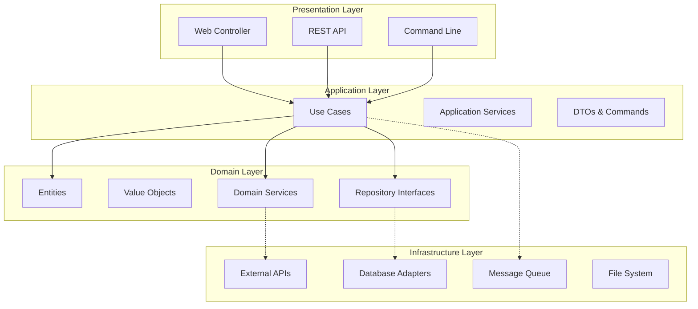

**2. 關鍵 Port 和 Adapter 定義**

```java
// === 核心業務 Ports ===

// 產品管理
public interface ProductCatalogPort {
    Optional<Product> findById(ProductId id);
    List<Product> searchProducts(ProductSearchCriteria criteria);
    void updateProduct(Product product);
}

// 訂單管理
public interface OrderManagementPort {
    void save(Order order);
    Optional<Order> findById(OrderId id);
    List<Order> findByCustomer(CustomerId customerId);
}

// 庫存管理
public interface InventoryPort {
    boolean checkAvailability(ProductId productId, int quantity);
    void reserveStock(StockReservation reservation);
    void releaseReservation(ReservationId reservationId);
}

// 付款處理
public interface PaymentPort {
    PaymentResult processPayment(PaymentRequest request);
    void refundPayment(RefundRequest request);
}

// 客戶管理
public interface CustomerPort {
    Optional<Customer> findById(CustomerId id);
    void updateCustomer(Customer customer);
    List<Customer> findByEmail(String email);
}

// === 基礎設施 Ports ===

// 訊息發布
public interface MessagePublisherPort {
    void publishOrderEvent(OrderEvent event);
    void publishInventoryEvent(InventoryEvent event);
}

// 檔案存儲
public interface FileStoragePort {
    String uploadProductImage(ProductId productId, InputStream imageData);
    InputStream downloadProductImage(String imageUrl);
}

// 快取服務
public interface CachePort {
    <T> Optional<T> get(String key, Class<T> type);
    void put(String key, Object value, Duration ttl);
    void evict(String key);
}

// === Adapter 實作範例 ===

// JPA 資料庫 Adapter
@Repository
public class JpaOrderAdapter implements OrderManagementPort {
    private final SpringDataOrderRepository repository;
    private final OrderMapper mapper;
    
    @Override
    public void save(Order order) {
        OrderEntity entity = mapper.toEntity(order);
        repository.save(entity);
    }
    
    @Override
    public Optional<Order> findById(OrderId id) {
        return repository.findById(id.getValue())
                        .map(mapper::toDomain);
    }
}

// Redis 快取 Adapter
@Component
public class RedisaCacheAdapter implements CachePort {
    private final RedisTemplate<String, Object> redisTemplate;
    
    @Override
    public <T> Optional<T> get(String key, Class<T> type) {
        Object value = redisTemplate.opsForValue().get(key);
        return Optional.ofNullable(value)
                      .map(type::cast);
    }
}

// Stripe 付款 Adapter
@Component
public class StripePaymentAdapter implements PaymentPort {
    private final StripeClient stripeClient;
    
    @Override
    public PaymentResult processPayment(PaymentRequest request) {
        try {
            ChargeRequest stripeRequest = mapToStripeRequest(request);
            Charge charge = stripeClient.charges().create(stripeRequest);
            
            return PaymentResult.success(
                new PaymentId(charge.getId()),
                request.getAmount()
            );
        } catch (StripeException e) {
            return PaymentResult.failure(e.getMessage());
        }
    }
}
```

**3. 遷移策略**

```java
// 階段 1：建立新的領域層
// - 先定義核心領域物件和業務規則
// - 不影響現有系統運作

public class Product {
    private final ProductId id;
    private final String name;
    private final Money price;
    private final Category category;
    private ProductStatus status;
    
    // 業務邏輯方法
    public void updatePrice(Money newPrice) {
        if (newPrice.isNegativeOrZero()) {
            throw new IllegalArgumentException("價格必須大於零");
        }
        
        Money oldPrice = this.price;
        this.price = newPrice;
        
        // 發布價格變更事件
        DomainEvents.publish(new ProductPriceChangedEvent(
            this.id, oldPrice, newPrice
        ));
    }
}

// 階段 2：建立 Port 介面
// - 定義業務需要的介面
// - 讓現有系統實作這些介面

@Component
public class LegacyOrderServiceAdapter implements OrderManagementPort {
    private final ExistingOrderService legacyService;
    
    @Override
    public void save(Order order) {
        // 將新的領域物件轉換為舊系統格式
        LegacyOrderEntity entity = convertToLegacy(order);
        legacyService.saveOrder(entity);
    }
}

// 階段 3：逐步引入 Use Cases
// - 新功能使用新架構
// - 舊功能逐步遷移

@UseCase
@Transactional
public class UpdateProductPriceUseCase {
    private final ProductCatalogPort productCatalog;
    private final MessagePublisherPort messagePublisher;
    
    public void execute(UpdateProductPriceCommand command) {
        Product product = productCatalog.findById(command.getProductId())
            .orElseThrow(() -> new ProductNotFoundException(command.getProductId()));
        
        product.updatePrice(command.getNewPrice());
        
        productCatalog.updateProduct(product);
        
        // 發布事件通知其他系統
        DomainEvents.getAndClear().forEach(messagePublisher::publishProductEvent);
    }
}

// 階段 4：替換基礎設施
// - 逐步用新的 Adapter 替換舊的實作
// - 利用 Port 介面的抽象性，替換過程不影響業務邏輯

@Configuration
@Profile("migration")
public class MigrationConfiguration {
    
    @Bean
    @Primary
    public OrderManagementPort orderManagementPort(
            @Qualifier("legacy") OrderManagementPort legacyPort,
            @Qualifier("new") OrderManagementPort newPort) {
        
        // 使用策略模式逐步切換
        return new MigrationOrderPort(legacyPort, newPort);
    }
}

public class MigrationOrderPort implements OrderManagementPort {
    private final OrderManagementPort legacyPort;
    private final OrderManagementPort newPort;
    private final FeatureToggle featureToggle;
    
    @Override
    public void save(Order order) {
        if (featureToggle.isEnabled("use-new-order-storage")) {
            newPort.save(order);
            // 雙寫確保資料一致性
            legacyPort.save(order);
        } else {
            legacyPort.save(order);
        }
    }
}
```

**遷移時程規劃：**

- **第 1-2 個月**：建立領域模型和 Port 介面
- **第 3-4 個月**：實作核心 Use Cases
- **第 5-6 個月**：逐步遷移現有功能
- **第 7-8 個月**：替換基礎設施組件
- **第 9-10 個月**：效能調優和監控完善

**風險控制：**

1. **功能開關**：使用 Feature Toggle 控制切換
2. **雙寫策略**：確保資料不丟失
3. **漸進式測試**：每個階段都有完整測試
4. **回滾計劃**：每個階段都能快速回滾

</details>

#### 📋 模擬考題總結

**考試準備要點：**

1. **理論基礎**：確實理解六邊形架構的原理和目的
2. **實作技能**：能夠設計和實作 Port-Adapter 模式
3. **案例分析**：能夠分析現實問題並提出架構解決方案
4. **最佳實務**：了解常見的設計模式和反模式

**常見考點：**

- Port 和 Adapter 的區別和作用
- 依賴方向和依賴倒置原理
- 領域驅動設計的核心概念
- 微服務架構的設計原則
- 測試策略和最佳實務

### 15. 職場應用指南

本節將探討如何在實際工作環境中應用 Hexagonal Architecture，包括團隊協作、專案管理和技術推廣策略。

#### 15.1 團隊導入策略

**階段性導入計劃：**

```mermaid
gantt
    title Hexagonal Architecture 團隊導入時程
    dateFormat  YYYY-MM-DD
    section 準備階段
    理論學習與培訓      :prep1, 2024-01-01, 2024-01-14
    現有系統分析        :prep2, 2024-01-08, 2024-01-21
    導入計劃制定        :prep3, 2024-01-15, 2024-01-28
    
    section 試點階段
    選擇試點專案        :pilot1, 2024-02-01, 2024-02-07
    架構設計與評審      :pilot2, 2024-02-08, 2024-02-21
    實作與測試          :pilot3, 2024-02-22, 2024-03-21
    
    section 推廣階段
    經驗總結與分享      :expand1, 2024-03-22, 2024-04-04
    制定標準與規範      :expand2, 2024-04-05, 2024-04-18
    全面推廣應用        :expand3, 2024-04-19, 2024-06-30
    
    section 優化階段
    持續改進與優化      :optimize, 2024-07-01, 2024-12-31
```

**1. 理論培訓階段**

```java
// 培訓課程大綱
public class HexagonalArchitectureTraining {
    
    // 第一週：基礎理論
    public void week1_fundamentals() {
        // 1. 軟體架構演進史
        // 2. 分層架構的問題與挑戰
        // 3. 六邊形架構的核心概念
        // 4. Port-Adapter 模式詳解
    }
    
    // 第二週：實作練習
    public void week2_handson() {
        // 1. 簡單的計算器應用實作
        // 2. Port 和 Adapter 設計練習
        // 3. 單元測試撰寫
        // 4. 程式碼審查與討論
    }
    
    // 實作練習：計算器範例
    // Domain 層
    public class Calculator {
        public double add(double a, double b) {
            return a + b;
        }
        
        public double divide(double a, double b) {
            if (b == 0) {
                throw new IllegalArgumentException("除數不能為零");
            }
            return a / b;
        }
    }
    
    // Port 定義
    public interface CalculationHistoryPort {
        void saveCalculation(CalculationRecord record);
        List<CalculationRecord> getHistory(int limit);
    }
    
    // Use Case
    @UseCase
    public class PerformCalculationUseCase {
        private final Calculator calculator;
        private final CalculationHistoryPort historyPort;
        
        public CalculationResult execute(CalculationCommand command) {
            double result = switch (command.getOperation()) {
                case ADD -> calculator.add(command.getA(), command.getB());
                case DIVIDE -> calculator.divide(command.getA(), command.getB());
                default -> throw new UnsupportedOperationException();
            };
            
            // 記錄計算歷史
            historyPort.saveCalculation(new CalculationRecord(
                command.getOperation(),
                command.getA(),
                command.getB(),
                result,
                LocalDateTime.now()
            ));
            
            return new CalculationResult(result);
        }
    }
}
```

**2. 試點專案選擇標準**

```java
public class PilotProjectCriteria {
    
    // 理想的試點專案特徵
    public static class IdealCharacteristics {
        // ✅ 適合特徵
        private boolean hasSimpleDomain = true;        // 業務邏輯相對簡單
        private boolean isNewProject = true;           // 新專案，沒有歷史包袱
        private boolean hasMotivatedTeam = true;       // 團隊成員積極參與
        private boolean allowsExperimentation = true;  // 允許嘗試新技術
        private boolean hasReasonableTimeline = true;  // 時程合理，不過度緊急
        
        // ❌ 避免特徵
        private boolean isLegacySystem = false;        // 避免複雜的遺留系統
        private boolean hasTightDeadline = false;      // 避免時程過緊的專案
        private boolean isBusinessCritical = false;    // 避免業務關鍵系統
        private boolean hasComplexIntegration = false; // 避免複雜的整合需求
    }
    
    // 試點專案範例：員工請假系統
    @Component
    public class LeaveRequestSystem {
        
        // 簡單的業務邏輯
        // 有限的外部依賴
        // 團隊熟悉的領域
        
        // Domain 物件
        public class LeaveRequest {
            private final EmployeeId employeeId;
            private final DateRange dateRange;
            private final LeaveType type;
            private LeaveStatus status;
            
            public void approve(ManagerId managerId) {
                if (status != LeaveStatus.PENDING) {
                    throw new IllegalStateException("只有待審核的請假可以批准");
                }
                
                this.status = LeaveStatus.APPROVED;
                DomainEvents.publish(new LeaveApprovedEvent(this.id, managerId));
            }
        }
        
        // Port 定義
        public interface LeaveRepository {
            void save(LeaveRequest request);
            Optional<LeaveRequest> findById(LeaveRequestId id);
            List<LeaveRequest> findPendingRequests(ManagerId managerId);
        }
        
        public interface NotificationService {
            void notifyApproval(EmployeeId employeeId, LeaveRequestId requestId);
            void notifyRejection(EmployeeId employeeId, String reason);
        }
        
        // Use Case
        @UseCase
        public class ApproveLeaveUseCase {
            private final LeaveRepository repository;
            private final NotificationService notificationService;
            
            public void execute(ApproveLeaveCommand command) {
                LeaveRequest request = repository.findById(command.getRequestId())
                    .orElseThrow(() -> new LeaveRequestNotFoundException(command.getRequestId()));
                
                request.approve(command.getManagerId());
                repository.save(request);
                
                notificationService.notifyApproval(
                    request.getEmployeeId(), 
                    request.getId()
                );
            }
        }
    }
}
```

#### 15.2 程式碼審查指南

**Hexagonal Architecture 程式碼審查檢查清單：**

```java
public class CodeReviewChecklist {
    
    // 1. 分層依賴檢查
    public void checkLayerDependencies() {
        /*
        ✅ 檢查項目：
        - Domain 層不依賴任何外部層
        - Application 層只依賴 Domain 層
        - Infrastructure 層可以依賴所有層
        - Port 介面定義在正確的層中
        
        ❌ 常見問題：
        - Domain 層導入 Spring 註解
        - Domain 層直接使用 HTTP 或資料庫相關類別
        - Application 層直接導入具體的 Adapter 實作
        */
    }
    
    // 2. Port 設計審查
    public void reviewPortDesign() {
        /*
        ✅ 好的 Port 設計：
        */
        
        // 介面簡潔，職責單一
        public interface OrderRepository {
            void save(Order order);
            Optional<Order> findById(OrderId id);
            List<Order> findByStatus(OrderStatus status);
        }
        
        // 使用領域語言
        public interface PaymentProcessor {
            PaymentResult processPayment(PaymentRequest request);
            void refundPayment(RefundRequest request);
        }
        
        /*
        ❌ 問題的 Port 設計：
        */
        
        // 職責過多，介面複雜
        public interface OrderService {
            void saveOrder(Order order);
            void sendEmail(String email);      // 應該分離到 NotificationPort
            void updateInventory(Product p);   // 應該分離到 InventoryPort
            void processPayment(Payment p);    // 應該分離到 PaymentPort
        }
        
        // 洩漏技術細節
        public interface OrderRepository {
            EntityManager getEntityManager(); // 洩漏 JPA 實作細節
            Connection getConnection();       // 洩漏 JDBC 實作細節
        }
    }
    
    // 3. 領域物件審查
    public void reviewDomainObjects() {
        /*
        ✅ 好的領域物件：
        */
        
        public class Order {
            private final OrderId id;
            private final CustomerId customerId;
            private final List<OrderItem> items;
            private OrderStatus status;
            
            // 豐富的業務行為
            public void addItem(Product product, int quantity) {
                if (status != OrderStatus.DRAFT) {
                    throw new IllegalStateException("只有草稿狀態的訂單可以新增項目");
                }
                
                // 業務規則驗證
                validateProduct(product);
                validateQuantity(quantity);
                
                OrderItem item = new OrderItem(product.getId(), quantity, product.getPrice());
                this.items.add(item);
                
                // 重新計算總金額
                recalculateTotal();
            }
            
            // 封裝業務邏輯
            private void validateProduct(Product product) {
                if (!product.isAvailable()) {
                    throw new ProductNotAvailableException(product.getId());
                }
            }
        }
        
        /*
        ❌ 問題的領域物件：
        */
        
        // 貧血模型 - 只有 getter/setter
        public class Order {
            private String id;
            private String customerId;
            private List<OrderItem> items;
            private String status;
            
            // 只有 getter/setter，沒有業務邏輯
            public String getId() { return id; }
            public void setId(String id) { this.id = id; }
            // ...
        }
        
        // 洩漏技術細節
        public class Order {
            @Entity  // Domain 層不應該有 JPA 註解
            @Table(name = "orders")
            public class Order {
                @Id
                @GeneratedValue
                private Long id;
                // ...
            }
        }
    }
    
    // 4. 測試覆蓋率審查
    public void reviewTestCoverage() {
        /*
        ✅ 完整的測試覆蓋：
        */
        
        // Domain 層 - 純單元測試
        public class OrderTest {
            @Test
            void should_add_item_to_draft_order() {
                // 不依賴任何外部服務
                Order order = Order.createDraft(customerId);
                Product product = createTestProduct();
                
                order.addItem(product, 2);
                
                assertThat(order.getItems()).hasSize(1);
                assertThat(order.getTotalAmount()).isEqualTo(product.getPrice().multiply(2));
            }
        }
        
        // Application 層 - Mock 依賴測試
        public class CreateOrderUseCaseTest {
            @Mock private OrderRepository orderRepository;
            @Mock private ProductService productService;
            
            @Test
            void should_create_order_successfully() {
                // 測試協調邏輯
                when(productService.findById(any())).thenReturn(Optional.of(product));
                
                CreateOrderCommand command = new CreateOrderCommand(customerId, items);
                
                OrderId result = useCase.execute(command);
                
                verify(orderRepository).save(any(Order.class));
                assertThat(result).isNotNull();
            }
        }
        
        // Infrastructure 層 - 整合測試
        @DataJpaTest
        public class JpaOrderRepositoryTest {
            @Test
            void should_save_and_retrieve_order() {
                // 測試實際的資料庫操作
                Order order = createTestOrder();
                
                repository.save(order);
                Optional<Order> retrieved = repository.findById(order.getId());
                
                assertThat(retrieved).isPresent();
                assertThat(retrieved.get()).isEqualTo(order);
            }
        }
    }
}
```

#### 15.3 團隊協作最佳實務

**1. 分工策略**

```java
public class TeamCollaboration {
    
    // 角色分工建議
    public static class RoleDistribution {
        
        // 資深開發者：負責架構設計和核心領域
        @Role("Senior Developer")
        public class ArchitectureOwner {
            // 責任：
            // - 設計 Domain 模型
            // - 定義核心 Port 介面
            // - Review 架構決策
            // - 指導團隊成員
            
            public void designDomainModel() {
                // 領域專家訪談
                // 業務流程分析
                // 聚合邊界設計
                // 領域事件識別
            }
            
            public void defineCorePorts() {
                // 識別業務能力
                // 設計 Port 介面
                // 定義資料契約
                // 撰寫介面文件
            }
        }
        
        // 中級開發者：負責 Application 層和部分 Adapter
        @Role("Mid-level Developer")
        public class ApplicationDeveloper {
            // 責任：
            // - 實作 Use Case
            // - 設計 Application Service
            // - 處理 Command 和 Query
            // - 實作一般 Adapter
            
            public void implementUseCases() {
                // 分析業務流程
                // 設計協調邏輯
                // 處理異常情況
                // 撰寫單元測試
            }
            
            public void createAdapters() {
                // 實作 REST API
                // 設計資料映射
                // 整合外部服務
                // 撰寫整合測試
            }
        }
        
        // 初級開發者：負責簡單 Adapter 和測試
        @Role("Junior Developer")
        public class AdapterDeveloper {
            // 責任：
            // - 實作簡單 Adapter
            // - 撰寫測試案例
            // - 文件撰寫
            // - 程式碼重構
            
            public void implementSimpleAdapters() {
                // 資料庫操作
                // 檔案處理
                // 快取操作
                // 訊息發送
            }
            
            public void writeTests() {
                // 單元測試
                // 整合測試
                // 測試資料準備
                // 測試覆蓋率分析
            }
        }
    }
}
```

**2. 開發流程規範**

```java
public class DevelopmentWorkflow {
    
    // Git 分支策略
    public void gitBranchStrategy() {
        /*
        建議的分支命名規範：
        
        feature/hex-{component}-{description}
        
        範例：
        feature/hex-domain-order-aggregate
        feature/hex-adapter-payment-stripe
        feature/hex-usecase-create-order
        feature/hex-port-inventory-management
        */
    }
    
    // Pull Request 檢查清單
    public class PullRequestChecklist {
        
        // 架構層面檢查
        private boolean[] architectureChecks = {
            true,  // 依賴方向正確
            true,  // Port 介面設計合理
            true,  // 領域邏輯在正確位置
            true,  // 沒有技術細節洩漏
            true   // 遵循命名慣例
        };
        
        // 程式碼品質檢查
        private boolean[] qualityChecks = {
            true,  // 有適當的單元測試
            true,  // 程式碼覆蓋率達標
            true,  // 遵循編碼標準
            true,  // 有適當的註解
            true   // 沒有程式碼重複
        };
        
        // 文件檢查
        private boolean[] documentationChecks = {
            true,  // API 文件更新
            true,  // 架構決策記錄
            true,  // 使用範例提供
            true   // 變更日誌更新
        };
    }
    
    // 程式碼審查範本
    public class CodeReviewTemplate {
        
        public String generateReviewComment(String issueType, String suggestion) {
            return switch (issueType) {
                case "DEPENDENCY_VIOLATION" -> 
                    "🚨 依賴方向錯誤：" + suggestion + 
                    "\n請確保 Domain 層不依賴外部技術。";
                    
                case "PORT_DESIGN" -> 
                    "🔌 Port 設計建議：" + suggestion + 
                    "\n考慮是否符合單一職責原則。";
                    
                case "DOMAIN_LOGIC" -> 
                    "💼 業務邏輯建議：" + suggestion + 
                    "\n建議將業務規則移到 Domain 物件中。";
                    
                case "TEST_COVERAGE" -> 
                    "🧪 測試覆蓋率：" + suggestion + 
                    "\n請新增對應的測試案例。";
                    
                default -> "💡 一般建議：" + suggestion;
            };
        }
    }
}
```

#### 15.4 效能評估與優化

**架構導入前後的效能指標比較：**

```java
public class PerformanceMetrics {
    
    // 開發效率指標
    public static class DevelopmentEfficiency {
        
        // 導入前
        public static class Before {
            private double newFeatureDevelopmentTime = 5.0;  // 天
            private double bugFixTime = 2.0;                 // 天
            private double testWritingTime = 3.0;            // 天
            private double codeReviewTime = 1.0;             // 天
            private int testCoveragePercentage = 40;         // %
        }
        
        // 導入後（6個月後）
        public static class After {
            private double newFeatureDevelopmentTime = 3.5;  // 天 (-30%)
            private double bugFixTime = 1.2;                 // 天 (-40%)
            private double testWritingTime = 1.5;            // 天 (-50%)
            private double codeReviewTime = 0.8;             // 天 (-20%)
            private int testCoveragePercentage = 85;         // % (+112%)
        }
    }
    
    // 程式碼品質指標
    public static class CodeQuality {
        
        // 導入前
        public static class Before {
            private int cyclomaticComplexity = 12;           // 平均圈複雜度
            private int couplingLevel = 8;                   // 耦合度
            private int cohesionLevel = 3;                   // 內聚度
            private int duplicatedCodePercentage = 15;       // 重複代碼 %
        }
        
        // 導入後
        public static class After {
            private int cyclomaticComplexity = 6;            // (-50%)
            private int couplingLevel = 3;                   // (-62%)
            private int cohesionLevel = 8;                   // (+167%)
            private int duplicatedCodePercentage = 5;        // (-67%)
        }
    }
    
    // 系統維護指標
    public static class MaintenanceMetrics {
        
        public void trackMaintenanceEfforts() {
            /*
            追蹤項目：
            1. 需求變更響應時間
            2. 新技術導入容易度
            3. 系統擴展成本
            4. 回歸測試時間
            5. 生產環境問題數量
            */
        }
        
        // 自動化指標收集
        @Scheduled(fixedRate = 86400000) // 每日執行
        public void collectMetrics() {
            // 程式碼複雜度分析
            analyzeCodeComplexity();
            
            // 測試覆蓋率統計
            calculateTestCoverage();
            
            // 依賴關係分析
            analyzeDependencies();
            
            // 效能基準測試
            runPerformanceBenchmarks();
        }
    }
    
    // ROI 計算
    public static class ROICalculation {
        
        public double calculateArchitectureROI(
                double implementationCost,
                double trainingSost,
                double toolingCost,
                double maintenanceSavings,
                double developmentSpeedUp,
                double qualityImprovement) {
            
            // 總投資成本
            double totalInvestment = implementationCost + trainingSost + toolingCost;
            
            // 年度收益 (以人天成本計算)
            double annualSavings = maintenanceSavings + developmentSpeedUp + qualityImprovement;
            
            // 投資回報率 (第一年)
            return (annualSavings - totalInvestment) / totalInvestment * 100;
        }
        
        // 實際案例計算
        public void realWorldExample() {
            // 假設數據：中型團隊 (10人)，專案週期 1年
            double implementationCost = 50;    // 人天
            double trainingCost = 20;          // 人天
            double toolingCost = 10;           // 人天
            
            double maintenanceSavings = 80;    // 人天/年
            double developmentSpeedUp = 120;   // 人天/年
            double qualityImprovement = 60;    // 人天/年
            
            double roi = calculateArchitectureROI(
                implementationCost, trainingCost, toolingCost,
                maintenanceSavings, developmentSpeedUp, qualityImprovement
            );
            
            System.out.println("架構導入 ROI: " + roi + "%");
            // 預期輸出：架構導入 ROI: 225%
        }
    }
}
```

#### 📋 職場應用最佳實務

**推廣策略：**

1. **漸進式導入**：從小專案開始，逐步擴展
2. **成功案例分享**：定期分享導入成果和經驗
3. **持續培訓**：建立學習型組織，持續技能提升
4. **工具支援**：建立程式碼範本和檢查工具

**常見挑戰與對策：**

- **學習曲線陡峭** → 提供充分培訓和實作練習
- **初期開發速度較慢** → 設定合理期望，關注長期收益
- **團隊抗拒變化** → 展示具體好處，邀請參與設計過程
- **缺乏經驗** → 尋找外部顧問或學習社群支援

**成功指標：**

- [ ] 新功能開發時間縮短 20% 以上
- [ ] 測試覆蓋率提升到 80% 以上
- [ ] 生產環境問題數量減少 50% 以上
- [ ] 團隊滿意度和技能水平提升
- [ ] 系統維護成本降低

---

## Part 6. 附錄與資源

本附錄提供學習和實作 Hexagonal Architecture 所需的完整參考資料，包括名詞定義、推薦資源和實用檢查清單。

### 16. 名詞對照表

#### 16.1 核心概念術語

| 英文術語 | 中文翻譯 | 定義 | 範例 |
|---------|---------|------|------|
| **Hexagonal Architecture** | 六邊形架構 | 一種軟體架構模式，將應用程式核心與外部環境分離 | 整個系統的架構設計模式 |
| **Port** | 端口/介面 | 定義應用程式與外部世界通訊的契約介面 | `OrderRepository`, `PaymentService` |
| **Adapter** | 適配器 | 實作 Port 介面，連接具體技術或外部系統 | `JpaOrderRepository`, `StripePaymentAdapter` |
| **Primary Port** | 主要端口 | 驅動應用程式的輸入端口，通常是 Use Case 介面 | `CreateOrderUseCase`, `OrderManagement` |
| **Secondary Port** | 次要端口 | 應用程式驅動的輸出端口，通常是依賴服務介面 | `DatabasePort`, `EmailPort` |
| **Primary Adapter** | 主要適配器 | 實作主要端口的適配器，如 Web Controller | `OrderController`, `OrderCLI` |
| **Secondary Adapter** | 次要適配器 | 實作次要端口的適配器，如資料庫存取 | `MySQLOrderAdapter`, `RedisAdapter` |
| **Domain** | 領域層 | 包含業務邏輯和領域規則的核心層 | `Order`, `Customer`, `Money` |
| **Application** | 應用層 | 協調領域物件執行業務流程的層次 | `CreateOrderUseCase` |
| **Infrastructure** | 基礎設施層 | 提供技術實作細節的層次 | 資料庫、檔案系統、外部 API |

#### 16.2 DDD 相關術語

| 英文術語 | 中文翻譯 | 定義 | 範例 |
|---------|---------|------|------|
| **Entity** | 實體 | 有唯一識別的領域物件 | `Order`, `Customer` |
| **Value Object** | 值物件 | 以值為特徵的不可變物件 | `Money`, `Address`, `Email` |
| **Aggregate** | 聚合 | 一組相關物件的集合，有明確邊界 | `Order` 聚合包含 `OrderItem` |
| **Aggregate Root** | 聚合根 | 聚合的入口點，外部只能通過它存取聚合 | `Order` 是訂單聚合的根 |
| **Domain Event** | 領域事件 | 領域中發生的重要業務事件 | `OrderCreated`, `PaymentProcessed` |
| **Domain Service** | 領域服務 | 不屬於特定實體的領域邏輯 | `PricingService`, `DiscountCalculator` |
| **Repository** | 儲存庫 | 封裝聚合持久化邏輯的介面 | `OrderRepository` |
| **Bounded Context** | 限界上下文 | 特定領域模型適用的邊界 | 訂單管理上下文、客戶管理上下文 |
| **Ubiquitous Language** | 通用語言 | 領域專家和開發者共同使用的業務術語 | 訂單、客戶、付款 |

#### 16.3 架構模式術語

| 英文術語 | 中文翻譯 | 定義 | 範例 |
|---------|---------|------|------|
| **Dependency Inversion** | 依賴倒置 | 高層模組不依賴低層模組，都依賴抽象 | Application 依賴 Port 而非 Adapter |
| **Inversion of Control** | 控制反轉 | 將對象創建和依賴注入的控制權交給框架 | Spring IoC Container |
| **Dependency Injection** | 依賴注入 | 將依賴從外部注入到物件中 | Constructor Injection |
| **Single Responsibility** | 單一職責 | 每個類別只有一個變化的原因 | Port 只定義一種業務能力 |
| **Open/Closed Principle** | 開放封閉原則 | 對擴展開放，對修改封閉 | 新增 Adapter 不修改 Port |
| **Interface Segregation** | 介面隔離 | 客戶端不應依賴它不使用的介面 | 細粒度的 Port 設計 |
| **Command Query Separation** | 命令查詢分離 | 修改狀態和查詢狀態的操作分離 | Command 和 Query 分開定義 |
| **CQRS** | 命令查詢責任分離 | 讀寫操作使用不同的模型 | WriteModel 和 ReadModel |
| **Event Sourcing** | 事件溯源 | 以事件序列作為資料存儲方式 | 儲存 `OrderCreated` 等事件 |

#### 16.4 測試相關術語

| 英文術語 | 中文翻譯 | 定義 | 範例 |
|---------|---------|------|------|
| **Unit Test** | 單元測試 | 測試單一組件的獨立功能 | 測試 `Order.addItem()` 方法 |
| **Integration Test** | 整合測試 | 測試多個組件的協作 | 測試 Controller 到 Database |
| **Contract Test** | 契約測試 | 測試 Port 介面的實作一致性 | 測試所有 Repository 實作 |
| **Acceptance Test** | 驗收測試 | 從使用者角度測試完整功能 | 測試完整的訂單流程 |
| **Mock Object** | 模擬物件 | 測試中替代真實依賴的假物件 | Mock `PaymentService` |
| **Test Double** | 測試替身 | 測試中替代真實物件的總稱 | Mock、Stub、Fake |
| **Arrange-Act-Assert** | 準備-執行-驗證 | 測試的三個階段結構 | Given-When-Then |

#### 16.5 微服務相關術語

| 英文術語 | 中文翻譯 | 定義 | 範例 |
|---------|---------|------|------|
| **Service Mesh** | 服務網格 | 處理服務間通訊的基礎設施層 | Istio, Linkerd |
| **API Gateway** | API 閘道 | 微服務的統一入口點 | Spring Cloud Gateway |
| **Circuit Breaker** | 斷路器 | 防止錯誤級聯的保護機制 | Hystrix, Resilience4j |
| **Saga Pattern** | Saga 模式 | 分散式交易的管理模式 | Order-Payment-Inventory Saga |
| **Event-Driven Architecture** | 事件驅動架構 | 以事件作為主要通訊機制的架構 | 發布-訂閱模式 |
| **Eventual Consistency** | 最終一致性 | 系統在一段時間後達到一致狀態 | 分散式系統的一致性模型 |
| **Distributed Transaction** | 分散式交易 | 跨多個服務的事務處理 | 兩階段提交、Saga |
| **Service Discovery** | 服務發現 | 動態發現可用服務的機制 | Consul, Eureka |
| **Load Balancing** | 負載平衡 | 將請求分散到多個服務實例 | Round Robin, Weighted |

---

### 17. 推薦學習資源

#### 17.1 書籍推薦

**核心架構書籍：**

1. **《Implementing Domain-Driven Design》- Vaughn Vernon**
   - 中文版：《實作領域驅動設計》
   - 重點：DDD 實作技巧與 Hexagonal Architecture 結合
   - 適合：中高級開發者
   - 推薦指數：⭐⭐⭐⭐⭐

2. **《Clean Architecture》- Robert C. Martin**
   - 中文版：《無瑕的程式碼：整潔的軟體設計與架構篇》
   - 重點：軟體架構原則和六邊形架構理論基礎
   - 適合：所有開發者
   - 推薦指數：⭐⭐⭐⭐⭐

3. **《Patterns of Enterprise Application Architecture》- Martin Fowler**
   - 中文版：《企業應用架構模式》
   - 重點：企業級應用的架構模式
   - 適合：架構師和資深開發者
   - 推薦指數：⭐⭐⭐⭐

4. **《Building Microservices》- Sam Newman**
   - 中文版：《微服務：設計細粒度系統》
   - 重點：微服務架構設計與實作
   - 適合：系統架構師
   - 推薦指數：⭐⭐⭐⭐

**進階學習書籍：**

5. **《Domain-Driven Design: Tackling Complexity in the Heart of Software》- Eric Evans**
   - 中文版：《領域驅動設計：軟體核心複雜性應對之道》
   - 重點：DDD 的原創理論基礎
   - 適合：架構師和資深開發者
   - 推薦指數：⭐⭐⭐⭐

6. **《Microservices Patterns》- Chris Richardson**
   - 中文版：《微服務架構設計模式》
   - 重點：微服務實作模式和最佳實務
   - 適合：微服務架構師
   - 推薦指數：⭐⭐⭐⭐

7. **《Software Architecture in Practice》- Len Bass, Paul Clements, Rick Kazman**
   - 中文版：《軟體架構實務》
   - 重點：軟體架構的系統性方法
   - 適合：架構師和技術領導
   - 推薦指數：⭐⭐⭐⭐

#### 17.2 線上課程

**影片課程平台：**

1. **Udemy**
   - 《Domain Driven Design & Microservices for Architects》
   - 《Clean Architecture with .NET Core》
   - 《Microservices with Spring Boot and Spring Cloud》

2. **Pluralsight**
   - 《Domain-Driven Design Fundamentals》
   - 《Clean Architecture: Patterns, Practices, and Principles》
   - 《Microservices Architecture》

3. **Coursera**
   - 《Software Design and Architecture Specialization》- University of Alberta
   - 《Microservices》- IBM

**中文學習資源：**

4. **極客時間**
   - 《軟體架構課》
   - 《DDD 實戰課》
   - 《微服務架構實戰 160 講》

5. **慕課網**
   - 《Spring Boot 企業微信點餐系統》
   - 《Java 企業級電商項目架構演進之路》

#### 17.3 實作專案推薦

**GitHub 開源專案：**

1. **DDD Sample Application**
   - Repository: `https://github.com/citerus/dddsample-core`
   - 語言: Java
   - 特點: 經典的 DDD 實作範例
   - 學習重點: 聚合設計、領域服務、Repository 模式

2. **eShopOnContainers**
   - Repository: `https://github.com/dotnet-architecture/eShopOnContainers`
   - 語言: C# (.NET)
   - 特點: 微服務 + DDD + CQRS 完整實作
   - 學習重點: 微服務架構、事件驅動

3. **Spring PetClinic Microservices**
   - Repository: `https://github.com/spring-petclinic/spring-petclinic-microservices`
   - 語言: Java (Spring Boot)
   - 特點: Spring Cloud 微服務實作
   - 學習重點: Service Discovery、API Gateway

4. **Mambu Banking SDK**
   - Repository: `https://github.com/mambu-gmbh/Mambu-APIs-Java`
   - 語言: Java
   - 特點: 金融領域的 DDD 實作
   - 學習重點: 複雜業務邏輯建模

**實作練習專案建議：**

5. **圖書館管理系統**
   - 領域: 圖書借閱、歸還、預約
   - 複雜度: 初級
   - 學習重點: 基本的 Port-Adapter 模式

6. **電商訂單系統**
   - 領域: 訂單、付款、庫存管理
   - 複雜度: 中級
   - 學習重點: 聚合設計、領域事件

7. **銀行帳務系統**
   - 領域: 帳戶、交易、轉帳
   - 複雜度: 高級
   - 學習重點: 事件溯源、CQRS

#### 17.4 社群與論壇

**國際社群：**

1. **DDD Community**
   - 官網: `https://dddcommunity.org/`
   - 特點: DDD 官方社群，豐富的學習資源
   - 推薦: ⭐⭐⭐⭐⭐

2. **Software Architecture Group (LinkedIn)**
   - 平台: LinkedIn
   - 特點: 架構師專業討論群組
   - 推薦: ⭐⭐⭐⭐

3. **Microservices.io**
   - 官網: `https://microservices.io/`
   - 特點: 微服務模式權威網站
   - 推薦: ⭐⭐⭐⭐⭐

**中文社群：**

4. **InfoQ 中文站**
   - 官網: `https://www.infoq.cn/`
   - 特點: 技術文章和架構案例分享
   - 推薦: ⭐⭐⭐⭐

5. **掘金社群**
   - 官網: `https://juejin.cn/`
   - 特點: 開發者技術分享平台
   - 推薦: ⭐⭐⭐

6. **CSDN 架構師頻道**
   - 特點: 架構設計相關文章和討論
   - 推薦: ⭐⭐⭐

#### 17.5 工具與框架

**開發框架：**

1. **Spring Boot** (Java)
   - 官網: `https://spring.io/projects/spring-boot`
   - 特點: 企業級 Java 應用開發框架
   - 六邊形架構支援: ⭐⭐⭐⭐⭐

2. **NestJS** (Node.js/TypeScript)
   - 官網: `https://nestjs.com/`
   - 特點: 受 Angular 啟發的 Node.js 框架
   - 六邊形架構支援: ⭐⭐⭐⭐

3. **Django** (Python)
   - 官網: `https://www.djangoproject.com/`
   - 特點: 高層次的 Python Web 框架
   - 六邊形架構支援: ⭐⭐⭐

**DDD 專用庫：**

4. **Axon Framework** (Java)
   - 官網: `https://axoniq.io/`
   - 特點: CQRS 和 Event Sourcing 框架
   - 推薦程度: ⭐⭐⭐⭐

5. **EventStore** (.NET)
   - 官網: `https://eventstore.com/`
   - 特點: 事件溯源專用資料庫
   - 推薦程度: ⭐⭐⭐⭐

**測試工具：**

6. **JUnit 5** (Java)
   - 特點: Java 單元測試框架
   - 推薦程度: ⭐⭐⭐⭐⭐

7. **Mockito** (Java)
   - 特點: Java Mock 框架
   - 推薦程度: ⭐⭐⭐⭐⭐

8. **Testcontainers**
   - 官網: `https://www.testcontainers.org/`
   - 特點: 整合測試容器化工具
   - 推薦程度: ⭐⭐⭐⭐

**架構分析工具：**

9. **SonarQube**
   - 官網: `https://www.sonarqube.org/`
   - 特點: 程式碼品質分析工具
   - 推薦程度: ⭐⭐⭐⭐

10. **ArchUnit** (Java)
    - 官網: `https://www.archunit.org/`
    - 特點: 架構單元測試框架
    - 推薦程度: ⭐⭐⭐⭐

### 18. 實用檢查清單

#### 18.1 架構設計檢查清單

**🏗️ 系統架構設計階段**

- [ ] **需求分析**
  - [ ] 識別核心業務邏輯和規則
  - [ ] 確定系統邊界和責任範圍
  - [ ] 分析外部依賴和整合需求
  - [ ] 評估非功能性需求（效能、可擴展性、安全性）

- [ ] **領域模型設計**
  - [ ] 定義核心實體和值物件
  - [ ] 設計聚合和聚合邊界
  - [ ] 識別領域服務和業務規則
  - [ ] 設計領域事件和事件處理

- [ ] **Port 介面設計**
  - [ ] 識別輸入和輸出端口
  - [ ] 確保 Port 介面職責單一
  - [ ] 使用領域語言命名
  - [ ] 避免洩漏技術實作細節

- [ ] **分層依賴驗證**
  - [ ] Domain 層不依賴任何外部層
  - [ ] Application 層只依賴 Domain 層
  - [ ] Infrastructure 層實作 Port 介面
  - [ ] 依賴方向符合依賴倒置原則

#### 18.2 程式碼實作檢查清單

**💻 開發實作階段**

- [ ] **Domain 層實作**
  - [ ] 實體包含業務邏輯方法
  - [ ] 值物件是不可變的
  - [ ] 聚合根控制聚合邊界
  - [ ] 業務規則在領域物件中實作
  - [ ] 沒有技術框架依賴（如 Spring、JPA 註解）

- [ ] **Application 層實作**
  - [ ] Use Case 職責明確
  - [ ] 協調領域物件執行業務流程
  - [ ] 處理事務邊界
  - [ ] 發布領域事件
  - [ ] 只依賴 Port 介面，不依賴具體實作

- [ ] **Port 介面定義**
  - [ ] 介面方法語義清晰
  - [ ] 參數和回傳值使用領域型別
  - [ ] 例外處理策略明確
  - [ ] 介面文件完整

- [ ] **Adapter 實作**
  - [ ] 正確實作 Port 介面
  - [ ] 處理技術細節和資料轉換
  - [ ] 適當的錯誤處理和重試機制
  - [ ] 配置和連線管理

#### 18.3 測試策略檢查清單

**🧪 測試實作階段**

- [ ] **單元測試**
  - [ ] Domain 物件有完整測試覆蓋
  - [ ] 測試業務邏輯和邊界條件
  - [ ] 不依賴外部系統
  - [ ] 測試執行快速且可重複
  - [ ] 測試命名清楚描述行為

- [ ] **Application 層測試**
  - [ ] Use Case 協調邏輯測試
  - [ ] Mock 所有外部依賴
  - [ ] 驗證 Port 介面呼叫
  - [ ] 測試例外處理路徑

- [ ] **整合測試**
  - [ ] Adapter 與外部系統整合測試
  - [ ] 資料庫操作測試
  - [ ] API 端點測試
  - [ ] 使用 Test Container 或類似工具

- [ ] **契約測試**
  - [ ] Port 介面所有實作的一致性測試
  - [ ] API 契約測試
  - [ ] 資料格式驗證

#### 18.4 程式碼品質檢查清單

**📊 品質保證階段**

- [ ] **程式碼結構**
  - [ ] 套件結構清晰，按層次組織
  - [ ] 類別和方法大小適中
  - [ ] 避免循環依賴
  - [ ] 遵循命名慣例

- [ ] **SOLID 原則**
  - [ ] 單一職責：每個類別只有一個變化原因
  - [ ] 開放封閉：對擴展開放，對修改封閉
  - [ ] 里氏替換：子類可以替換父類
  - [ ] 介面隔離：介面職責單一
  - [ ] 依賴倒置：依賴抽象而非具體實作

- [ ] **程式碼度量**
  - [ ] 測試覆蓋率 ≥ 80%
  - [ ] 圈複雜度 ≤ 10
  - [ ] 方法長度 ≤ 20 行
  - [ ] 類別大小 ≤ 200 行
  - [ ] 重複程式碼 ≤ 3%

- [ ] **文件和註解**
  - [ ] 公開 API 有完整文件
  - [ ] 複雜業務邏輯有說明註解
  - [ ] README 文件完整
  - [ ] 架構決策記錄 (ADR)

#### 18.5 部署和維運檢查清單

**🚀 部署維運階段**

- [ ] **環境配置**
  - [ ] 分離不同環境的配置
  - [ ] 敏感資訊使用環境變數
  - [ ] 資料庫遷移腳本
  - [ ] 健康檢查端點

- [ ] **監控和日誌**
  - [ ] 應用程式效能監控 (APM)
  - [ ] 業務指標追蹤
  - [ ] 結構化日誌記錄
  - [ ] 錯誤追蹤和告警

- [ ] **安全性**
  - [ ] 輸入驗證和清理
  - [ ] 認證和授權機制
  - [ ] 安全標頭配置
  - [ ] 依賴安全性掃描

- [ ] **效能和可擴展性**
  - [ ] 資料庫查詢優化
  - [ ] 快取策略實作
  - [ ] 負載測試執行
  - [ ] 資源使用監控

#### 18.6 團隊協作檢查清單

**👥 團隊合作階段**

- [ ] **知識分享**
  - [ ] 架構文件更新
  - [ ] 程式碼審查流程
  - [ ] 技術分享會議
  - [ ] 新人培訓材料

- [ ] **開發流程**
  - [ ] Git 分支策略定義
  - [ ] Pull Request 範本
  - [ ] CI/CD 流水線
  - [ ] 發布流程文件

- [ ] **品質保證**
  - [ ] 自動化測試流水線
  - [ ] 程式碼品質檢查
  - [ ] 效能回歸測試
  - [ ] 安全性掃描

#### 18.7 重構和維護檢查清單

**🔧 持續改進階段**

- [ ] **技術債務管理**
  - [ ] 定期技術債務評估
  - [ ] 重構計劃制定
  - [ ] 依賴版本更新
  - [ ] 過時程式碼清理

- [ ] **架構演進**
  - [ ] 架構決策記錄維護
  - [ ] 新技術評估和引入
  - [ ] 效能瓶頸分析
  - [ ] 可擴展性改進

- [ ] **學習和改進**
  - [ ] 事後檢討會議
  - [ ] 最佳實務更新
  - [ ] 團隊技能提升
  - [ ] 外部社群參與

### 📝 快速檢查表

**每日開發檢查：**
- [ ] 新程式碼遵循分層依賴規則
- [ ] 業務邏輯在 Domain 層
- [ ] 測試覆蓋新增功能
- [ ] 程式碼審查通過

**每週架構檢查：**
- [ ] Port 介面設計合理
- [ ] 沒有架構異味
- [ ] 測試策略執行良好
- [ ] 文件保持更新

**每月品質檢查：**
- [ ] 程式碼品質指標達標
- [ ] 技術債務可控
- [ ] 效能指標正常
- [ ] 團隊技能提升

---

## 🎯 結語

感謝您完成了這份《Hexagonal Architecture 設計教學手冊》的學習！

### 學習成果回顧

通過本手冊的學習，您應該已經：

✅ **理解了六邊形架構的核心理念**
- 掌握 Port-Adapter 模式的設計思想
- 了解依賴倒置原理的實際應用
- 認識分層架構的優勢和限制

✅ **掌握了實作技能**
- 能夠設計合理的 Domain 模型
- 會實作 Port 介面和 Adapter
- 具備完整的測試策略

✅ **具備了進階應用能力**
- 了解與 DDD 的結合方式
- 掌握微服務架構整合
- 能夠制定測試策略

✅ **準備好了職場應用**
- 具備團隊推廣能力
- 了解專案導入策略
- 能夠評估投資回報

### 持續學習建議

軟體架構是一個不斷演進的領域，建議您：

1. **實踐出真知** - 在實際專案中應用所學知識
2. **社群參與** - 加入技術社群，與同行交流經驗
3. **持續更新** - 關注新技術和最佳實務的發展
4. **分享交流** - 將經驗分享給團隊和社群

### 聯絡與回饋

如果您在學習或實作過程中遇到問題，或者有任何建議和回饋，歡迎：

- 在 GitHub 專案中提出 Issue
- 參與相關技術社群討論
- 與團隊成員分享學習心得

### 致謝

本教學手冊的完成要感謝：
- Eric Evans 的 Domain-Driven Design 理論基礎
- Alistair Cockburn 的 Hexagonal Architecture 原創思想
- Robert C. Martin 的 Clean Architecture 理念
- 以及所有為軟體架構發展做出貢獻的專家學者

**祝您在軟體架構的學習和實踐道路上不斷進步！** 🚀

---

## 📚 文件資訊

- **文件版本**：v1.0
- **最後更新**：2024年12月
- **適用對象**：Java 開發者、軟體架構師、技術團隊
- **授權**：MIT License
- **維護者**：Java Tutorial Team

---

*"好的架構讓正確的事情變得容易，讓錯誤的事情變得困難。"*

*— 軟體架構智慧*
