# Onion Architecture 設計教學手冊

> 版本：1.0  
> 日期：2025年9月20日  
> 適用對象：Java 開發新進同仁  
> 目標：學習 Onion Architecture 設計與認證準備

---

## 📚 目錄

- [第 1 章：緒論](#第-1-章緒論)
  - [1.1 教學手冊的目的與對象](#11-教學手冊的目的與對象)
  - [1.2 為什麼需要 Onion Architecture](#12-為什麼需要-onion-architecture)
  - [1.3 與傳統分層架構、Hexagonal Architecture、Clean Architecture 的比較](#13-與傳統分層架構hexagonal-architectureclean-architecture-的比較)
  - [1.4 如何透過本手冊準備 Onion Architecture 認證](#14-如何透過本手冊準備-onion-architecture-認證)

- [第 2 章：Onion Architecture 基礎概念](#第-2-章onion-architecture-基礎概念)
  - [2.1 Onion Architecture 的核心理念](#21-onion-architecture-的核心理念)
  - [2.2 各層級設計原則](#22-各層級設計原則)
  - [2.3 依賴反轉原則 (Dependency Inversion Principle)](#23-依賴反轉原則-dependency-inversion-principle)
  - [2.4 Onion Architecture 的優點與限制](#24-onion-architecture-的優點與限制)

- [第 3 章：分層解析](#第-3-章分層解析)
  - [3.1 Domain Layer - 實體與商業規則](#31-domain-layer---實體與商業規則)
  - [3.2 Application Layer - 用例與服務](#32-application-layer---用例與服務)
  - [3.3 Infrastructure Layer - 技術支援與外部資源](#33-infrastructure-layer---技術支援與外部資源)
  - [3.4 Presentation Layer - 使用者介面與 API](#34-presentation-layer---使用者介面與-api)
  - [3.5 層與層之間的互動與依賴管理](#35-層與層之間的互動與依賴管理)

- [第 4 章：實作指南](#第-4-章實作指南)
  - [4.1 在專案中導入 Onion Architecture 的步驟](#41-在專案中導入-onion-architecture-的步驟)
  - [4.2 專案目錄與模組結構設計](#42-專案目錄與模組結構設計)
  - [4.3 使用 Spring Boot 建立 Onion 架構範例](#43-使用-spring-boot-建立-onion-架構範例)
  - [4.4 Repository 與 Service 的設計實例](#44-repository-與-service-的設計實例)
  - [4.5 測試策略：單元測試、整合測試、端到端測試](#45-測試策略單元測試整合測試端到端測試)

- [第 5 章：最佳實務](#第-5-章最佳實務)
  - [5.1 常見錯誤與如何避免](#51-常見錯誤與如何避免)
  - [5.2 如何重構現有系統到 Onion Architecture](#52-如何重構現有系統到-onion-architecture)
  - [5.3 在大型專案中的應用經驗分享](#53-在大型專案中的應用經驗分享)
  - [5.4 與團隊協作的開發規範](#54-與團隊協作的開發規範)

- [第 6 章：進階議題](#第-6-章進階議題)
  - [6.1 與 Domain-Driven Design (DDD) 的整合](#61-與-domain-driven-design-ddd-的整合)
  - [6.2 CQRS (Command Query Responsibility Segregation) 整合](#62-cqrs-command-query-responsibility-segregation-整合)
  - [6.3 微服務架構中的應用](#63-微服務架構中的應用)
  - [6.4 與事件驅動架構的關聯](#64-與事件驅動架構的關聯)

- [第 7 章：認證準備與實戰演練](#第-7-章認證準備與實戰演練)
  - [7.1 認證考試範圍與要求](#71-認證考試範圍與要求)
  - [7.2 實戰練習題庫](#72-實戰練習題庫)
  - [7.3 模擬面試與實戰演練](#73-模擬面試與實戰演練)
  - [7.4 實際專案評估標準](#74-實際專案評估標準)

- [第 8 章：附錄與參考資源](#第-8-章附錄與參考資源)
  - [8.1 開發工具與環境設定](#81-開發工具與環境設定)
  - [8.2 延伸閱讀與學習資源](#82-延伸閱讀與學習資源)
  - [8.3 社群資源與支援](#83-社群資源與支援)
  - [8.4 持續學習計畫](#84-持續學習計畫)

- [📋 Onion Architecture 開發檢查清單](#-onion-architecture-開發檢查清單)

---

## 第 1 章：緒論

### 1.1 教學手冊的目的與對象

#### 📖 教學目的

本手冊專為 **Java 開發新進同仁** 設計，旨在提供完整且實用的 Onion Architecture 學習指南。透過循序漸進的教學方式，幫助開發人員：

1. **理解核心概念**：掌握 Onion Architecture 的基本原理與設計思維
2. **實戰應用**：學會在實際專案中導入與實作 Onion Architecture
3. **認證準備**：具備參加 Onion Architecture 認證考試的能力
4. **團隊協作**：建立統一的開發規範與最佳實務

#### 🎯 適用對象

- **初級開發人員**：具備基本 Java 程式設計能力，希望學習軟體架構設計
- **中級開發人員**：想要改善專案架構，提升程式品質與可維護性
- **專案經理/技術主管**：需要建立團隊開發規範與技術標準
- **轉職工程師**：來自其他程式語言背景，希望學習 Java 企業級架構

#### 📋 學習前置條件

```mermaid
graph LR
    A[Java 基礎語法] --> B[物件導向程式設計]
    B --> C[Spring Framework 基礎]
    C --> D[Maven/Gradle 專案管理]
    D --> E[開始學習 Onion Architecture]
    
    style E fill:#e1f5fe
```

### 1.2 為什麼需要 Onion Architecture

#### 🤔 傳統架構的痛點

許多專案在成長過程中會遇到以下問題：

```mermaid
graph TD
    A[專案初期] --> B[快速開發]
    B --> C[程式碼耦合度高]
    C --> D[業務邏輯散落各層]
    D --> E[測試困難]
    E --> F[維護成本激增]
    F --> G[重構困難]
    
    style C fill:#ffebee
    style E fill:#ffebee
    style F fill:#ffebee
    style G fill:#ffebee
```

#### ✅ Onion Architecture 的解決方案

| 問題 | 傳統架構 | Onion Architecture |
|------|----------|-------------------|
| **業務邏輯分散** | 散布在各層級中 | 集中在 Domain Layer |
| **測試困難** | 需要完整環境 | 可獨立單元測試 |
| **技術依賴** | 緊密耦合資料庫/框架 | 依賴反轉，易於替換 |
| **可維護性** | 牽一髮動全身 | 清楚的職責分離 |
| **擴展性** | 修改影響多層 | 遵循開放封閉原則 |

#### 💡 實務案例：電商系統重構

**重構前的問題：**
```java
// ❌ 傳統做法：業務邏輯與技術細節混合
@Controller
public class OrderController {
    @Autowired
    private OrderRepository orderRepository;
    
    @PostMapping("/orders")
    public ResponseEntity<String> createOrder(@RequestBody OrderRequest request) {
        // 業務邏輯直接在 Controller 中
        if (request.getTotalAmount().compareTo(BigDecimal.ZERO) <= 0) {
            return ResponseEntity.badRequest().body("金額必須大於 0");
        }
        
        // 直接操作 Repository
        Order order = new Order();
        order.setCustomerId(request.getCustomerId());
        order.setTotalAmount(request.getTotalAmount());
        orderRepository.save(order);
        
        return ResponseEntity.ok("訂單建立成功");
    }
}
```

**使用 Onion Architecture 後：**
```java
// ✅ 清楚的職責分離
@RestController
public class OrderController {
    private final CreateOrderUseCase createOrderUseCase;
    
    @PostMapping("/orders")
    public ResponseEntity<OrderResponse> createOrder(@RequestBody OrderRequest request) {
        OrderCommand command = OrderCommand.builder()
            .customerId(request.getCustomerId())
            .totalAmount(request.getTotalAmount())
            .build();
            
        OrderResult result = createOrderUseCase.execute(command);
        return ResponseEntity.ok(OrderResponse.from(result));
    }
}
```

### 1.3 與傳統分層架構、Hexagonal Architecture、Clean Architecture 的比較

#### 🏗️ 架構演進史


#### 📊 詳細比較表

| 特性 | 傳統分層架構 | Hexagonal Architecture | Clean Architecture | Onion Architecture |
|------|-------------|----------------------|-------------------|-------------------|
| **核心理念** | 垂直分層 | 六邊形隔離 | 同心圓分層 | 洋蔥式分層 |
| **依賴方向** | 向下依賴 | 向內依賴 | 向內依賴 | 向內依賴 |
| **測試性** | 困難 | 容易 | 容易 | 容易 |
| **業務邏輯位置** | 分散各層 | 核心區域 | Entities & Use Cases | Domain Layer |
| **外部依賴** | 緊耦合 | 通過 Port/Adapter | 通過 Interface | 通過 Interface |
| **DDD 支持** | 不適合 | 部分支持 | 支持 | 完全支持 |
| **學習難度** | 簡單 | 中等 | 中等 | 中等 |
| **實作複雜度** | 低 | 中 | 中高 | 中 |

#### 🎨 視覺化比較


### 1.4 如何透過本手冊準備 Onion Architecture 認證

#### 🎯 認證考試概要

Onion Architecture 認證考試主要評估以下能力：

1. **理論基礎** (30%)
   - 核心概念理解
   - 設計原則掌握
   - 與其他架構的比較

2. **設計能力** (40%)
   - 層次劃分能力
   - 介面設計技巧
   - 依賴管理策略

3. **實作技能** (30%)
   - 程式碼組織
   - 測試策略
   - 重構技巧

#### 📚 學習路徑規劃

```mermaid
gantt
    title Onion Architecture 學習計畫
    dateFormat X
    axisFormat %d週
    
    section 基礎階段
    理論學習 :a1, 0, 2
    概念理解 :a2, 1, 3
    
    section 實戰階段  
    範例練習 :b1, 2, 5
    專案實作 :b2, 4, 7
    
    section 進階階段
    最佳實務 :c1, 6, 8
    認證準備 :c2, 7, 9
```

#### 📖 各章節對應考點

| 章節 | 認證考點 | 重要程度 | 建議學習時間 |
|------|----------|----------|-------------|
| 第2章 基礎概念 | 理論基礎 | ⭐⭐⭐⭐⭐ | 1週 |
| 第3章 分層解析 | 設計能力 | ⭐⭐⭐⭐⭐ | 1週 |
| 第4章 實作指南 | 實作技能 | ⭐⭐⭐⭐⭐ | 2週 |
| 第5章 最佳實務 | 綜合應用 | ⭐⭐⭐⭐ | 1週 |
| 第6章 進階議題 | 進階知識 | ⭐⭐⭐ | 1週 |

#### ✅ 學習檢核點

**階段一：理論基礎**
- [ ] 能說明 Onion Architecture 與傳統架構的差異
- [ ] 理解依賴反轉原則的重要性
- [ ] 掌握各層職責與邊界

**階段二：設計實作**
- [ ] 能設計合適的專案結構
- [ ] 實作基本的 CRUD 功能
- [ ] 撰寫有效的單元測試

**階段三：進階應用**
- [ ] 整合 DDD 概念
- [ ] 處理複雜業務場景
- [ ] 重構既有系統

#### 💡 學習建議與注意事項

**📝 筆記技巧**
- 建立概念圖與心智圖
- 記錄實作過程中的問題與解決方案
- 整理常見的程式碼模式

**🔧 實作練習**
- 從簡單的 CRUD 開始
- 逐步增加業務複雜度
- 重視測試覆蓋率

**👥 團隊學習**
- 與同事討論設計決策
- 進行程式碼審查
- 分享學習心得

---

## 第 2 章：Onion Architecture 基礎概念

### 2.1 Onion Architecture 的核心理念

#### 🧅 洋蔥結構的隱喻

Onion Architecture 使用「洋蔥」作為隱喻，強調以下核心概念：


#### 💡 四大核心理念

1. **依賴向內流動** (Dependency Inversion)

```java
// ❌ 錯誤：內層依賴外層
public class OrderService {
    private OrderRepository orderRepository; // Domain 依賴 Infrastructure
    
    public void createOrder(Order order) {
        // 業務邏輯與技術實作混合
        orderRepository.save(order);
    }
}

// ✅ 正確：外層依賴內層
public class OrderService {
    private final OrderRepositoryPort orderRepositoryPort; // 依賴抽象介面
    
    public OrderResult createOrder(CreateOrderCommand command) {
        // 純粹的業務邏輯
        Order order = Order.create(command.getCustomerId(), command.getItems());
        orderRepositoryPort.save(order);
        return OrderResult.from(order);
    }
}
```

2. **關注點分離** (Separation of Concerns)

| 層級 | 關注點 | 不應包含 |
|------|--------|----------|
| **Domain** | 業務規則、實體行為 | 技術細節、外部依賴 |
| **Application** | 用例編排、流程控制 | 業務規則、技術實作 |
| **Infrastructure** | 技術實作、外部整合 | 業務邏輯 |
| **Presentation** | 使用者介面、API | 業務邏輯、技術實作 |

3. **測試性** (Testability)

```java
// ✅ 易於測試的設計
@Test
public void should_create_order_successfully() {
    // Given - 使用 Mock 而非真實資料庫
    OrderRepositoryPort mockRepository = mock(OrderRepositoryPort.class);
    OrderService orderService = new OrderService(mockRepository);
    
    CreateOrderCommand command = CreateOrderCommand.builder()
        .customerId(CustomerId.of("CUST001"))
        .items(Arrays.asList(/* 測試資料 */))
        .build();
    
    // When
    OrderResult result = orderService.createOrder(command);
    
    // Then
    assertThat(result.isSuccess()).isTrue();
    verify(mockRepository).save(any(Order.class));
}
```

4. **可維護性** (Maintainability)

```mermaid
graph LR
    A[需求變更] --> B{變更類型}
    B -->|業務規則| C[修改 Domain Layer]
    B -->|UI 變更| D[修改 Presentation Layer]
    B -->|資料庫變更| E[修改 Infrastructure Layer]
    B -->|流程變更| F[修改 Application Layer]
    
    C --> G[影響範圍小]
    D --> G
    E --> G
    F --> G
    
    style G fill:#c8e6c9
```

### 2.2 各層級設計原則

#### 🎯 Domain Layer 設計原則

**核心職責：** 封裝業務邏輯與領域知識

```java
// ✅ 良好的 Domain Entity 設計
@Entity
public class Order {
    private OrderId id;
    private CustomerId customerId;
    private List<OrderItem> items;
    private OrderStatus status;
    private Money totalAmount;
    private LocalDateTime createdAt;
    
    // 私有建構函式，強制使用工廠方法
    private Order() {}
    
    // 工廠方法：業務邏輯的入口
    public static Order create(CustomerId customerId, List<OrderItem> items) {
        validateCustomer(customerId);
        validateItems(items);
        
        Order order = new Order();
        order.id = OrderId.generate();
        order.customerId = customerId;
        order.items = new ArrayList<>(items);
        order.status = OrderStatus.PENDING;
        order.totalAmount = calculateTotal(items);
        order.createdAt = LocalDateTime.now();
        
        // 發布領域事件
        order.addDomainEvent(new OrderCreatedEvent(order.id));
        return order;
    }
    
    // 業務行為方法
    public void confirm() {
        if (!canConfirm()) {
            throw new OrderCannotBeConfirmedException(this.id);
        }
        this.status = OrderStatus.CONFIRMED;
        this.addDomainEvent(new OrderConfirmedEvent(this.id));
    }
    
    // 業務規則驗證
    private boolean canConfirm() {
        return this.status == OrderStatus.PENDING && 
               !this.items.isEmpty() && 
               this.totalAmount.isPositive();
    }
    
    // 不允許直接修改狀態
    public OrderStatus getStatus() {
        return this.status;
    }
    
    // 計算邏輯
    private static Money calculateTotal(List<OrderItem> items) {
        return items.stream()
            .map(OrderItem::getSubtotal)
            .reduce(Money.ZERO, Money::add);
    }
}
```

**設計原則：**

1. **封裝性**：隱藏內部狀態，只暴露必要的介面
2. **不變性**：優先使用不可變物件
3. **自我驗證**：實體負責維護自身的業務規則
4. **豐富的行為**：實體不只是資料容器，更包含業務邏輯

#### 🔄 Application Layer 設計原則

**核心職責：** 協調 Domain 物件，實現用例

```java
// ✅ Application Service 設計範例
@Service
@Transactional
public class CreateOrderUseCase {
    private final OrderRepositoryPort orderRepository;
    private final CustomerRepositoryPort customerRepository;
    private final ProductRepositoryPort productRepository;
    private final DomainEventPublisher eventPublisher;
    
    public CreateOrderUseCase(
        OrderRepositoryPort orderRepository,
        CustomerRepositoryPort customerRepository,
        ProductRepositoryPort productRepository,
        DomainEventPublisher eventPublisher) {
        this.orderRepository = orderRepository;
        this.customerRepository = customerRepository;
        this.productRepository = productRepository;
        this.eventPublisher = eventPublisher;
    }
    
    public OrderResult execute(CreateOrderCommand command) {
        // 1. 驗證輸入
        validateCommand(command);
        
        // 2. 載入領域物件
        Customer customer = customerRepository.findById(command.getCustomerId())
            .orElseThrow(() -> new CustomerNotFoundException(command.getCustomerId()));
            
        List<Product> products = loadProducts(command.getItems());
        
        // 3. 執行業務邏輯（委託給 Domain）
        List<OrderItem> orderItems = createOrderItems(command.getItems(), products);
        Order order = Order.create(customer.getId(), orderItems);
        
        // 4. 持久化
        Order savedOrder = orderRepository.save(order);
        
        // 5. 發布事件
        eventPublisher.publishAll(savedOrder.getDomainEvents());
        
        // 6. 返回結果
        return OrderResult.success(savedOrder);
    }
    
    private void validateCommand(CreateOrderCommand command) {
        if (command == null) {
            throw new InvalidCommandException("CreateOrderCommand cannot be null");
        }
        if (command.getCustomerId() == null) {
            throw new InvalidCommandException("Customer ID is required");
        }
        if (command.getItems() == null || command.getItems().isEmpty()) {
            throw new InvalidCommandException("Order items are required");
        }
    }
}
```

**設計原則：**

1. **薄層**：不包含業務邏輯，只做編排
2. **無狀態**：Application Service 本身不保存狀態
3. **事務邊界**：定義事務的邊界
4. **介面適配**：將外部請求轉換為 Domain 可理解的格式

#### 🔧 Infrastructure Layer 設計原則

**核心職責：** 提供技術實作與外部整合

```java
// ✅ Infrastructure 實作範例
@Repository
public class JpaOrderRepository implements OrderRepositoryPort {
    private final OrderJpaRepository jpaRepository;
    private final OrderMapper orderMapper;
    
    public JpaOrderRepository(OrderJpaRepository jpaRepository, OrderMapper orderMapper) {
        this.jpaRepository = jpaRepository;
        this.orderMapper = orderMapper;
    }
    
    @Override
    public Optional<Order> findById(OrderId orderId) {
        return jpaRepository.findById(orderId.getValue())
            .map(orderMapper::toDomain);
    }
    
    @Override
    public Order save(Order order) {
        OrderEntity entity = orderMapper.toEntity(order);
        OrderEntity savedEntity = jpaRepository.save(entity);
        return orderMapper.toDomain(savedEntity);
    }
    
    @Override
    public List<Order> findByCustomerId(CustomerId customerId) {
        List<OrderEntity> entities = jpaRepository.findByCustomerId(customerId.getValue());
        return entities.stream()
            .map(orderMapper::toDomain)
            .collect(Collectors.toList());
    }
}

// Domain 到 Entity 的映射
@Component
public class OrderMapper {
    public Order toDomain(OrderEntity entity) {
        // 將資料庫實體轉換為領域物件
        return Order.reconstruct(
            OrderId.of(entity.getId()),
            CustomerId.of(entity.getCustomerId()),
            entity.getItems().stream()
                .map(this::toOrderItem)
                .collect(Collectors.toList()),
            OrderStatus.valueOf(entity.getStatus()),
            Money.of(entity.getTotalAmount()),
            entity.getCreatedAt()
        );
    }
    
    public OrderEntity toEntity(Order order) {
        // 將領域物件轉換為資料庫實體
        OrderEntity entity = new OrderEntity();
        entity.setId(order.getId().getValue());
        entity.setCustomerId(order.getCustomerId().getValue());
        entity.setStatus(order.getStatus().name());
        entity.setTotalAmount(order.getTotalAmount().getAmount());
        entity.setCreatedAt(order.getCreatedAt());
        
        List<OrderItemEntity> itemEntities = order.getItems().stream()
            .map(this::toOrderItemEntity)
            .collect(Collectors.toList());
        entity.setItems(itemEntities);
        
        return entity;
    }
}
```

#### 🖥️ Presentation Layer 設計原則

**核心職責：** 處理使用者介面與 API

```java
// ✅ REST Controller 設計範例
@RestController
@RequestMapping("/api/v1/orders")
@Validated
public class OrderController {
    private final CreateOrderUseCase createOrderUseCase;
    private final GetOrderUseCase getOrderUseCase;
    private final OrderDtoMapper dtoMapper;
    
    @PostMapping
    public ResponseEntity<OrderResponseDto> createOrder(
            @Valid @RequestBody CreateOrderRequestDto request) {
        
        // 1. 將 DTO 轉換為 Command
        CreateOrderCommand command = dtoMapper.toCommand(request);
        
        // 2. 執行用例
        OrderResult result = createOrderUseCase.execute(command);
        
        // 3. 將結果轉換為 DTO
        OrderResponseDto response = dtoMapper.toResponseDto(result.getOrder());
        
        return ResponseEntity.status(HttpStatus.CREATED).body(response);
    }
    
    @GetMapping("/{orderId}")
    public ResponseEntity<OrderResponseDto> getOrder(@PathVariable String orderId) {
        GetOrderQuery query = GetOrderQuery.builder()
            .orderId(OrderId.of(orderId))
            .build();
            
        OrderResult result = getOrderUseCase.execute(query);
        OrderResponseDto response = dtoMapper.toResponseDto(result.getOrder());
        
        return ResponseEntity.ok(response);
    }
    
    @ExceptionHandler(OrderNotFoundException.class)
    public ResponseEntity<ErrorResponseDto> handleOrderNotFound(OrderNotFoundException ex) {
        ErrorResponseDto error = ErrorResponseDto.builder()
            .code("ORDER_NOT_FOUND")
            .message(ex.getMessage())
            .timestamp(LocalDateTime.now())
            .build();
            
        return ResponseEntity.status(HttpStatus.NOT_FOUND).body(error);
    }
}
```

### 2.3 依賴反轉原則 (Dependency Inversion Principle)

#### 🔄 什麼是依賴反轉？

依賴反轉原則是 SOLID 原則中的 'D'，在 Onion Architecture 中扮演關鍵角色：

```mermaid
graph TB
    subgraph "傳統架構 - 依賴向下"
        UI1[Presentation] --> BL1[Business Logic]
        BL1 --> DA1[Data Access]
        DA1 --> DB1[(Database)]
    end
    
    subgraph "Onion 架構 - 依賴反轉"
        UI2[Presentation] --> IF1[Interface]
        IF1 --> BL2[Business Logic]
        IF2[Interface] --> BL2
        DA2[Data Access] --> IF2
        DB2[(Database)] --> DA2
    end
    
    style BL2 fill:#4caf50
    style IF1 fill:#2196f3
    style IF2 fill:#2196f3
```

#### 📚 實作範例：Repository Pattern

**Step 1: 定義 Domain 介面**

```java
// Domain Layer - 定義抽象介面
public interface OrderRepositoryPort {
    Optional<Order> findById(OrderId orderId);
    Order save(Order order);
    List<Order> findByCustomerId(CustomerId customerId);
    void delete(OrderId orderId);
}

// Domain Service 依賴抽象介面
@DomainService
public class OrderDomainService {
    private final OrderRepositoryPort orderRepository; // 依賴抽象
    
    public OrderDomainService(OrderRepositoryPort orderRepository) {
        this.orderRepository = orderRepository;
    }
    
    public boolean isOrderDuplicate(CustomerId customerId, List<OrderItem> items) {
        List<Order> existingOrders = orderRepository.findByCustomerId(customerId);
        return existingOrders.stream()
            .anyMatch(order -> order.hasSameItems(items));
    }
}
```

**Step 2: Infrastructure 實作介面**

```java
// Infrastructure Layer - 實作具體功能
@Repository
public class JpaOrderRepository implements OrderRepositoryPort {
    private final OrderJpaRepository jpaRepository;
    
    @Override
    public Optional<Order> findById(OrderId orderId) {
        return jpaRepository.findById(orderId.getValue())
            .map(this::mapToDomain);
    }
    
    @Override
    public Order save(Order order) {
        OrderEntity entity = mapToEntity(order);
        OrderEntity saved = jpaRepository.save(entity);
        return mapToDomain(saved);
    }
}
```

**Step 3: 依賴注入配置**

```java
// Configuration
@Configuration
public class RepositoryConfiguration {
    
    @Bean
    public OrderRepositoryPort orderRepository(
            OrderJpaRepository jpaRepository,
            OrderMapper mapper) {
        return new JpaOrderRepository(jpaRepository, mapper);
    }
}
```

#### 💡 依賴反轉的好處

1. **可測試性提升**

```java
@Test
public class OrderDomainServiceTest {
    
    @Mock
    private OrderRepositoryPort mockRepository;
    
    @InjectMocks
    private OrderDomainService orderDomainService;
    
    @Test
    public void should_detect_duplicate_order() {
        // Given
        CustomerId customerId = CustomerId.of("CUST001");
        List<Order> existingOrders = Arrays.asList(
            createTestOrder(customerId, "PROD001")
        );
        when(mockRepository.findByCustomerId(customerId))
            .thenReturn(existingOrders);
        
        // When & Then
        assertTrue(orderDomainService.isOrderDuplicate(
            customerId, 
            Arrays.asList(createOrderItem("PROD001"))
        ));
    }
}
```

2. **技術替換容易**

```java
// 從 JPA 切換到 MongoDB
@Repository
public class MongoOrderRepository implements OrderRepositoryPort {
    private final MongoTemplate mongoTemplate;
    
    @Override
    public Optional<Order> findById(OrderId orderId) {
        OrderDocument doc = mongoTemplate.findById(
            orderId.getValue(), 
            OrderDocument.class
        );
        return Optional.ofNullable(doc).map(this::mapToDomain);
    }
}
```

3. **遵循開放封閉原則**

```java
// 新增快取功能，不修改原有程式碼
@Repository
@Primary
public class CachedOrderRepository implements OrderRepositoryPort {
    private final OrderRepositoryPort delegate;
    private final CacheManager cacheManager;
    
    @Override
    @Cacheable("orders")
    public Optional<Order> findById(OrderId orderId) {
        return delegate.findById(orderId);
    }
    
    @Override
    @CacheEvict(value = "orders", key = "#order.id")
    public Order save(Order order) {
        return delegate.save(order);
    }
}
```

### 2.4 Onion Architecture 的優點與限制

#### ✅ 主要優點

1. **高度可測試性**

```java
// 測試變得簡單明確
@Test
public void should_calculate_discount_correctly() {
    // Given - 純粹的業務邏輯測試，無需外部依賴
    Customer vipCustomer = Customer.createVip("CUST001", "John Doe");
    List<OrderItem> items = Arrays.asList(
        OrderItem.create(ProductId.of("PROD001"), Quantity.of(2), Money.of(100))
    );
    
    // When
    Order order = Order.create(vipCustomer.getId(), items);
    
    // Then
    assertThat(order.getTotalAmount()).isEqualTo(Money.of(180)); // 10% VIP 折扣
}
```

2. **技術無關性**

| 技術組件 | 可替換方案 | 影響範圍 |
|----------|------------|----------|
| **資料庫** | MySQL → PostgreSQL → MongoDB | 僅 Infrastructure Layer |
| **Web框架** | Spring MVC → Spring WebFlux → Vert.x | 僅 Presentation Layer |
| **訊息佇列** | RabbitMQ → Apache Kafka → AWS SQS | 僅 Infrastructure Layer |
| **快取** | Redis → Hazelcast → Caffeine | 僅 Infrastructure Layer |

3. **清楚的職責分離**

```mermaid
graph TD
    A[需求：新增訂單折扣功能] --> B{修改範圍分析}
    
    B --> C[折扣計算邏輯]
    C --> D[Domain Layer 修改]
    
    B --> E[UI 顯示折扣]
    E --> F[Presentation Layer 修改]
    
    B --> G[折扣資料儲存]
    G --> H[Infrastructure Layer 修改]
    
    D --> I[影響範圍明確且獨立]
    F --> I
    H --> I
    
    style I fill:#c8e6c9
```

4. **支援 DDD**

```java
// Domain Driven Design 概念的完美實現
@DomainEntity
public class Order {
    // 聚合根
    private OrderId id;
    private CustomerId customerId;
    private List<OrderItem> items; // 實體集合
    private ShippingAddress shippingAddress; // 值物件
    private OrderStatus status; // 列舉
    
    // 領域事件
    private List<DomainEvent> domainEvents = new ArrayList<>();
    
    // 不變量維護
    public void addItem(OrderItem item) {
        validateItemCanBeAdded(item);
        this.items.add(item);
        this.recalculateTotal();
        this.addDomainEvent(new OrderItemAddedEvent(this.id, item));
    }
    
    // 業務規則實作
    private void validateItemCanBeAdded(OrderItem item) {
        if (this.status != OrderStatus.DRAFT) {
            throw new OrderCannotBeModifiedException(this.id);
        }
        if (this.items.size() >= MAX_ITEMS_PER_ORDER) {
            throw new TooManyItemsException(this.id);
        }
    }
}
```

#### ⚠️ 主要限制

1. **學習曲線較陡**

```java
// 新手常見錯誤：在 Domain 中引入技術依賴
// ❌ 錯誤做法
@Entity
@Table(name = "orders")
public class Order {
    @Id
    @GeneratedValue(strategy = GenerationType.IDENTITY)
    private Long id; // 使用 JPA 註解汙染 Domain
    
    @Column(name = "customer_id")
    private String customerId;
    
    // 直接依賴 Spring Framework
    @Autowired
    private OrderRepository orderRepository;
}

// ✅ 正確做法
public class Order {
    private OrderId id; // 使用 Domain 物件
    private CustomerId customerId;
    
    // 純粹的業務邏輯，無技術依賴
    public void confirm() {
        if (!this.canBeConfirmed()) {
            throw new OrderCannotBeConfirmedException(this.id);
        }
        this.status = OrderStatus.CONFIRMED;
    }
}
```

2. **程式碼量增加**

```java
// 簡單的 CRUD 操作需要更多層級

// 1. Domain
public class Customer {
    private CustomerId id;
    private CustomerName name;
    private Email email;
}

// 2. Repository Interface
public interface CustomerRepositoryPort {
    Optional<Customer> findById(CustomerId id);
    Customer save(Customer customer);
}

// 3. Application Service
@Service
public class CreateCustomerUseCase {
    public CustomerResult execute(CreateCustomerCommand command) {
        // ...
    }
}

// 4. Infrastructure Implementation
@Repository
public class JpaCustomerRepository implements CustomerRepositoryPort {
    // ...
}

// 5. Controller
@RestController
public class CustomerController {
    // ...
}
```

3. **專案複雜度增加**

```
專案結構示例：
src/
├── main/
│   ├── java/
│   │   ├── domain/           # Domain Layer
│   │   │   ├── model/
│   │   │   ├── service/
│   │   │   └── port/
│   │   ├── application/      # Application Layer
│   │   │   ├── usecase/
│   │   │   ├── command/
│   │   │   └── query/
│   │   ├── infrastructure/   # Infrastructure Layer
│   │   │   ├── persistence/
│   │   │   ├── messaging/
│   │   │   └── external/
│   │   └── presentation/     # Presentation Layer
│   │       ├── rest/
│   │       └── dto/
```

#### 🤔 何時適用 Onion Architecture？

**✅ 適合的情境：**

- 複雜的業務邏輯
- 長期維護的專案
- 需要高測試覆蓋率
- 團隊規模較大
- 需要支援多種技術棧

**❌ 不適合的情境：**

- 簡單的 CRUD 應用
- 短期的原型專案
- 團隊對架構經驗不足
- 專案時程極度緊迫

#### 📊 成本效益分析

```mermaid
graph LR
    subgraph "專案生命週期"
        A[初期開發] --> B[維護期] --> C[擴展期] --> D[重構期]
    end
    
    subgraph "傳統架構成本"
        A --> E[低成本]
        B --> F[中成本]
        C --> G[高成本]
        D --> H[極高成本]
    end
    
    subgraph "Onion 架構成本"
        A --> I[中成本]
        B --> J[低成本]
        C --> K[中成本]
        D --> L[低成本]
    end
    
    style I fill:#fff3e0
    style J fill:#c8e6c9
    style K fill:#fff3e0
    style L fill:#c8e6c9
    
    style G fill:#ffebee
    style H fill:#ffebee
```

---

## 第 3 章：分層解析

### 3.1 Domain Layer - 實體與商業規則

#### 🏛️ Domain Layer 概述

Domain Layer 是 Onion Architecture 的核心，包含了所有的業務邏輯與領域知識。這一層應該是最穩定的，不受技術變化影響。

```mermaid
graph TD
    subgraph "Domain Layer Components"
        E[Entities<br/>實體]
        VO[Value Objects<br/>值物件]
        AS[Aggregate Roots<br/>聚合根]
        DS[Domain Services<br/>領域服務]
        DE[Domain Events<br/>領域事件]
        SP[Specifications<br/>規格模式]
        RP[Repository Ports<br/>Repository 介面]
    end
    
    E --> AS
    VO --> E
    DE --> E
    DS --> E
    SP --> E
    AS --> RP
    
    style E fill:#4caf50
    style AS fill:#2e7d32
```

#### 📦 核心組件詳解

##### 1. 實體 (Entities)

實體是具有唯一識別碼且生命週期橫跨多個業務流程的物件：

```java
/**
 * 訂單實體 - 聚合根
 * 封裝訂單相關的所有業務邏輯
 */
@DomainEntity
public class Order {
    // 唯一識別碼
    private final OrderId id;
    private final CustomerId customerId;
    
    // 實體集合
    private final List<OrderItem> items;
    
    // 值物件
    private ShippingAddress shippingAddress;
    private BillingAddress billingAddress;
    
    // 狀態
    private OrderStatus status;
    private Money totalAmount;
    private LocalDateTime createdAt;
    private LocalDateTime lastModifiedAt;
    
    // 領域事件
    private final List<DomainEvent> domainEvents = new ArrayList<>();
    
    // 私有建構函式 - 強制使用工廠方法
    private Order(OrderId id, CustomerId customerId) {
        this.id = Objects.requireNonNull(id, "Order ID cannot be null");
        this.customerId = Objects.requireNonNull(customerId, "Customer ID cannot be null");
        this.items = new ArrayList<>();
        this.status = OrderStatus.DRAFT;
        this.createdAt = LocalDateTime.now();
        this.lastModifiedAt = this.createdAt;
    }
    
    /**
     * 工廠方法：建立新訂單
     */
    public static Order create(CustomerId customerId, List<OrderItem> items) {
        validateOrderCreation(customerId, items);
        
        Order order = new Order(OrderId.generate(), customerId);
        
        // 新增商品項目
        items.forEach(order::addItem);
        
        // 發布領域事件
        order.addDomainEvent(new OrderCreatedEvent(order.id, customerId));
        
        return order;
    }
    
    /**
     * 重建 - 從持久化資料重建物件
     */
    public static Order reconstruct(
            OrderId id, 
            CustomerId customerId, 
            List<OrderItem> items,
            OrderStatus status,
            Money totalAmount,
            LocalDateTime createdAt,
            LocalDateTime lastModifiedAt) {
        
        Order order = new Order(id, customerId);
        order.items.addAll(items);
        order.status = status;
        order.totalAmount = totalAmount;
        order.createdAt = createdAt;
        order.lastModifiedAt = lastModifiedAt;
        
        return order;
    }
    
    /**
     * 業務行為：新增商品項目
     */
    public void addItem(OrderItem item) {
        validateItemAddition(item);
        
        // 檢查是否已存在相同商品
        Optional<OrderItem> existingItem = findItemByProductId(item.getProductId());
        if (existingItem.isPresent()) {
            existingItem.get().increaseQuantity(item.getQuantity());
        } else {
            this.items.add(item);
        }
        
        recalculateTotal();
        updateLastModified();
        
        addDomainEvent(new OrderItemAddedEvent(this.id, item));
    }
    
    /**
     * 業務行為：確認訂單
     */
    public void confirm() {
        if (!canBeConfirmed()) {
            throw new OrderCannotBeConfirmedException(
                this.id, 
                this.status, 
                "Order must be in DRAFT status and have at least one item"
            );
        }
        
        this.status = OrderStatus.CONFIRMED;
        updateLastModified();
        
        addDomainEvent(new OrderConfirmedEvent(this.id, this.totalAmount));
    }
    
    /**
     * 業務行為：取消訂單
     */
    public void cancel(String reason) {
        if (!canBeCancelled()) {
            throw new OrderCannotBeCancelledException(this.id, this.status);
        }
        
        this.status = OrderStatus.CANCELLED;
        updateLastModified();
        
        addDomainEvent(new OrderCancelledEvent(this.id, reason));
    }
    
    /**
     * 業務規則：檢查是否可以確認
     */
    private boolean canBeConfirmed() {
        return this.status == OrderStatus.DRAFT && 
               !this.items.isEmpty() && 
               this.totalAmount != null && 
               this.totalAmount.isPositive();
    }
    
    /**
     * 業務規則：檢查是否可以取消
     */
    private boolean canBeCancelled() {
        return this.status == OrderStatus.DRAFT || 
               this.status == OrderStatus.CONFIRMED;
    }
    
    /**
     * 重新計算總金額
     */
    private void recalculateTotal() {
        this.totalAmount = this.items.stream()
            .map(OrderItem::getSubtotal)
            .reduce(Money.ZERO, Money::add);
    }
    
    /**
     * 驗證訂單建立
     */
    private static void validateOrderCreation(CustomerId customerId, List<OrderItem> items) {
        if (customerId == null) {
            throw new IllegalArgumentException("Customer ID is required");
        }
        if (items == null || items.isEmpty()) {
            throw new IllegalArgumentException("Order must have at least one item");
        }
    }
    
    /**
     * 驗證商品項目新增
     */
    private void validateItemAddition(OrderItem item) {
        if (item == null) {
            throw new IllegalArgumentException("Order item cannot be null");
        }
        if (this.status != OrderStatus.DRAFT) {
            throw new OrderCannotBeModifiedException(this.id, this.status);
        }
        if (this.items.size() >= MAX_ITEMS_PER_ORDER) {
            throw new TooManyItemsException(this.id, MAX_ITEMS_PER_ORDER);
        }
    }
    
    // Getters (唯讀存取)
    public OrderId getId() { return id; }
    public CustomerId getCustomerId() { return customerId; }
    public List<OrderItem> getItems() { return new ArrayList<>(items); }
    public OrderStatus getStatus() { return status; }
    public Money getTotalAmount() { return totalAmount; }
    public LocalDateTime getCreatedAt() { return createdAt; }
    public LocalDateTime getLastModifiedAt() { return lastModifiedAt; }
    
    // 領域事件處理
    public List<DomainEvent> getDomainEvents() {
        return new ArrayList<>(domainEvents);
    }
    
    public void clearDomainEvents() {
        domainEvents.clear();
    }
    
    private void addDomainEvent(DomainEvent event) {
        domainEvents.add(event);
    }
    
    private void updateLastModified() {
        this.lastModifiedAt = LocalDateTime.now();
    }
    
    // 常數
    private static final int MAX_ITEMS_PER_ORDER = 50;
}
```

##### 2. 值物件 (Value Objects)

值物件是無識別碼的不可變物件，用於描述實體的屬性：

```java
/**
 * 金額值物件
 * 封裝金額相關的業務規則
 */
@ValueObject
public class Money {
    public static final Money ZERO = new Money(BigDecimal.ZERO, Currency.TWD);
    
    private final BigDecimal amount;
    private final Currency currency;
    
    private Money(BigDecimal amount, Currency currency) {
        this.amount = Objects.requireNonNull(amount, "Amount cannot be null");
        this.currency = Objects.requireNonNull(currency, "Currency cannot be null");
        
        validateAmount(amount);
    }
    
    public static Money of(BigDecimal amount, Currency currency) {
        return new Money(amount, currency);
    }
    
    public static Money of(double amount) {
        return new Money(BigDecimal.valueOf(amount), Currency.TWD);
    }
    
    public static Money of(String amount) {
        return new Money(new BigDecimal(amount), Currency.TWD);
    }
    
    /**
     * 加法運算
     */
    public Money add(Money other) {
        validateSameCurrency(other);
        return new Money(this.amount.add(other.amount), this.currency);
    }
    
    /**
     * 減法運算
     */
    public Money subtract(Money other) {
        validateSameCurrency(other);
        return new Money(this.amount.subtract(other.amount), this.currency);
    }
    
    /**
     * 乘法運算
     */
    public Money multiply(BigDecimal multiplier) {
        if (multiplier == null) {
            throw new IllegalArgumentException("Multiplier cannot be null");
        }
        return new Money(this.amount.multiply(multiplier), this.currency);
    }
    
    /**
     * 除法運算
     */
    public Money divide(BigDecimal divisor) {
        if (divisor == null || divisor.compareTo(BigDecimal.ZERO) == 0) {
            throw new IllegalArgumentException("Divisor cannot be null or zero");
        }
        return new Money(
            this.amount.divide(divisor, 2, RoundingMode.HALF_UP), 
            this.currency
        );
    }
    
    /**
     * 比較運算
     */
    public boolean isGreaterThan(Money other) {
        validateSameCurrency(other);
        return this.amount.compareTo(other.amount) > 0;
    }
    
    public boolean isLessThan(Money other) {
        validateSameCurrency(other);
        return this.amount.compareTo(other.amount) < 0;
    }
    
    public boolean isPositive() {
        return this.amount.compareTo(BigDecimal.ZERO) > 0;
    }
    
    public boolean isNegative() {
        return this.amount.compareTo(BigDecimal.ZERO) < 0;
    }
    
    public boolean isZero() {
        return this.amount.compareTo(BigDecimal.ZERO) == 0;
    }
    
    /**
     * 驗證金額格式
     */
    private void validateAmount(BigDecimal amount) {
        if (amount.scale() > 2) {
            throw new IllegalArgumentException("Money amount cannot have more than 2 decimal places");
        }
    }
    
    /**
     * 驗證幣別一致性
     */
    private void validateSameCurrency(Money other) {
        if (!this.currency.equals(other.currency)) {
            throw new IllegalArgumentException(
                String.format("Cannot operate on different currencies: %s vs %s", 
                    this.currency, other.currency)
            );
        }
    }
    
    // Getters
    public BigDecimal getAmount() { return amount; }
    public Currency getCurrency() { return currency; }
    
    // equals, hashCode, toString
    @Override
    public boolean equals(Object obj) {
        if (this == obj) return true;
        if (obj == null || getClass() != obj.getClass()) return false;
        
        Money money = (Money) obj;
        return Objects.equals(amount, money.amount) && 
               Objects.equals(currency, money.currency);
    }
    
    @Override
    public int hashCode() {
        return Objects.hash(amount, currency);
    }
    
    @Override
    public String toString() {
        return String.format("%s %s", currency.getSymbol(), amount.toString());
    }
}

/**
 * 幣別列舉
 */
public enum Currency {
    TWD("NT$", "新台幣"),
    USD("$", "美元"),
    EUR("€", "歐元"),
    JPY("¥", "日圓");
    
    private final String symbol;
    private final String displayName;
    
    Currency(String symbol, String displayName) {
        this.symbol = symbol;
        this.displayName = displayName;
    }
    
    public String getSymbol() { return symbol; }
    public String getDisplayName() { return displayName; }
}
```

##### 3. 領域服務 (Domain Services)

當業務邏輯不屬於任何特定實體時，使用領域服務：

```java
/**
 * 訂單定價服務
 * 處理複雜的定價邏輯
 */
@DomainService
public class OrderPricingService {
    
    /**
     * 計算訂單總價（包含折扣與稅金）
     */
    public OrderPricing calculatePricing(Order order, Customer customer, List<DiscountRule> discountRules) {
        validateInputs(order, customer, discountRules);
        
        // 1. 計算基本金額
        Money subtotal = calculateSubtotal(order);
        
        // 2. 套用折扣
        Money discountAmount = calculateDiscount(subtotal, customer, discountRules);
        Money discountedAmount = subtotal.subtract(discountAmount);
        
        // 3. 計算稅金
        Money taxAmount = calculateTax(discountedAmount, customer.getTaxProfile());
        
        // 4. 計算最終金額
        Money finalAmount = discountedAmount.add(taxAmount);
        
        return OrderPricing.builder()
            .subtotal(subtotal)
            .discountAmount(discountAmount)
            .taxAmount(taxAmount)
            .finalAmount(finalAmount)
            .appliedDiscounts(getAppliedDiscounts(discountRules))
            .build();
    }
    
    /**
     * 計算小計
     */
    private Money calculateSubtotal(Order order) {
        return order.getItems().stream()
            .map(OrderItem::getSubtotal)
            .reduce(Money.ZERO, Money::add);
    }
    
    /**
     * 計算折扣
     */
    private Money calculateDiscount(Money subtotal, Customer customer, List<DiscountRule> discountRules) {
        return discountRules.stream()
            .filter(rule -> rule.isApplicable(customer, subtotal))
            .map(rule -> rule.calculateDiscount(subtotal))
            .reduce(Money.ZERO, Money::add);
    }
    
    /**
     * 計算稅金
     */
    private Money calculateTax(Money amount, TaxProfile taxProfile) {
        BigDecimal taxRate = taxProfile.getTaxRate();
        return amount.multiply(taxRate);
    }
    
    private void validateInputs(Order order, Customer customer, List<DiscountRule> discountRules) {
        if (order == null) throw new IllegalArgumentException("Order cannot be null");
        if (customer == null) throw new IllegalArgumentException("Customer cannot be null");
        if (discountRules == null) throw new IllegalArgumentException("Discount rules cannot be null");
    }
}
```

##### 4. 領域事件 (Domain Events)

領域事件用於解耦不同聚合間的互動：

```java
/**
 * 基礎領域事件
 */
public abstract class DomainEvent {
    private final String eventId;
    private final LocalDateTime occurredOn;
    private final String eventType;
    
    protected DomainEvent(String eventType) {
        this.eventId = UUID.randomUUID().toString();
        this.occurredOn = LocalDateTime.now();
        this.eventType = eventType;
    }
    
    public String getEventId() { return eventId; }
    public LocalDateTime getOccurredOn() { return occurredOn; }
    public String getEventType() { return eventType; }
}

/**
 * 訂單確認事件
 */
public class OrderConfirmedEvent extends DomainEvent {
    private final OrderId orderId;
    private final Money totalAmount;
    
    public OrderConfirmedEvent(OrderId orderId, Money totalAmount) {
        super("OrderConfirmed");
        this.orderId = orderId;
        this.totalAmount = totalAmount;
    }
    
    public OrderId getOrderId() { return orderId; }
    public Money getTotalAmount() { return totalAmount; }
}
```

### 3.2 Application Layer - 用例與服務

#### 🔄 Application Layer 概述

Application Layer 負責協調 Domain 物件來實現特定的用例，它是系統的「編排者」：

```mermaid
graph TB
    subgraph "Application Layer"
        UC[Use Cases<br/>用例]
        CMD[Commands<br/>命令]
        QRY[Queries<br/>查詢]
        DTO[DTOs<br/>資料傳輸物件]
        MAP[Mappers<br/>映射器]
        VAL[Validators<br/>驗證器]
    end
    
    UC --> CMD
    UC --> QRY
    CMD --> DTO
    QRY --> DTO
    DTO --> MAP
    MAP --> VAL
    
    style UC fill:#2196f3
```

#### 📋 用例實作模式

##### 1. Command Pattern

```java
/**
 * 建立訂單命令
 */
@ValueObject
public class CreateOrderCommand {
    private final CustomerId customerId;
    private final List<OrderItemRequest> items;
    private final ShippingAddress shippingAddress;
    private final BillingAddress billingAddress;
    private final String notes;
    
    private CreateOrderCommand(Builder builder) {
        this.customerId = builder.customerId;
        this.items = Collections.unmodifiableList(builder.items);
        this.shippingAddress = builder.shippingAddress;
        this.billingAddress = builder.billingAddress;
        this.notes = builder.notes;
    }
    
    public static Builder builder() {
        return new Builder();
    }
    
    // Getters
    public CustomerId getCustomerId() { return customerId; }
    public List<OrderItemRequest> getItems() { return items; }
    public ShippingAddress getShippingAddress() { return shippingAddress; }
    public BillingAddress getBillingAddress() { return billingAddress; }
    public String getNotes() { return notes; }
    
    public static class Builder {
        private CustomerId customerId;
        private List<OrderItemRequest> items = new ArrayList<>();
        private ShippingAddress shippingAddress;
        private BillingAddress billingAddress;
        private String notes;
        
        public Builder customerId(CustomerId customerId) {
            this.customerId = customerId;
            return this;
        }
        
        public Builder items(List<OrderItemRequest> items) {
            this.items = items != null ? new ArrayList<>(items) : new ArrayList<>();
            return this;
        }
        
        public Builder addItem(OrderItemRequest item) {
            this.items.add(item);
            return this;
        }
        
        public Builder shippingAddress(ShippingAddress shippingAddress) {
            this.shippingAddress = shippingAddress;
            return this;
        }
        
        public Builder billingAddress(BillingAddress billingAddress) {
            this.billingAddress = billingAddress;
            return this;
        }
        
        public Builder notes(String notes) {
            this.notes = notes;
            return this;
        }
        
        public CreateOrderCommand build() {
            validate();
            return new CreateOrderCommand(this);
        }
        
        private void validate() {
            if (customerId == null) {
                throw new IllegalArgumentException("Customer ID is required");
            }
            if (items.isEmpty()) {
                throw new IllegalArgumentException("Order must have at least one item");
            }
            if (shippingAddress == null) {
                throw new IllegalArgumentException("Shipping address is required");
            }
        }
    }
}

/**
 * 建立訂單用例
 */
@UseCase
@Transactional
public class CreateOrderUseCase {
    private final OrderRepositoryPort orderRepository;
    private final CustomerRepositoryPort customerRepository;
    private final ProductRepositoryPort productRepository;
    private final OrderPricingService pricingService;
    private final DomainEventPublisher eventPublisher;
    
    public CreateOrderUseCase(
            OrderRepositoryPort orderRepository,
            CustomerRepositoryPort customerRepository,
            ProductRepositoryPort productRepository,
            OrderPricingService pricingService,
            DomainEventPublisher eventPublisher) {
        this.orderRepository = orderRepository;
        this.customerRepository = customerRepository;
        this.productRepository = productRepository;
        this.pricingService = pricingService;
        this.eventPublisher = eventPublisher;
    }
    
    public CreateOrderResult execute(CreateOrderCommand command) {
        // 1. 驗證輸入
        validateCommand(command);
        
        // 2. 載入聚合
        Customer customer = loadCustomer(command.getCustomerId());
        List<Product> products = loadProducts(command.getItems());
        
        // 3. 驗證業務規則
        validateBusinessRules(customer, products, command);
        
        // 4. 建立領域物件
        List<OrderItem> orderItems = createOrderItems(command.getItems(), products);
        Order order = Order.create(customer.getId(), orderItems);
        
        // 5. 設定地址資訊
        order.setShippingAddress(command.getShippingAddress());
        order.setBillingAddress(command.getBillingAddress());
        order.setNotes(command.getNotes());
        
        // 6. 計算定價
        OrderPricing pricing = pricingService.calculatePricing(
            order, customer, customer.getApplicableDiscountRules()
        );
        order.applyPricing(pricing);
        
        // 7. 持久化
        Order savedOrder = orderRepository.save(order);
        
        // 8. 發布事件
        eventPublisher.publishAll(savedOrder.getDomainEvents());
        savedOrder.clearDomainEvents();
        
        // 9. 回傳結果
        return CreateOrderResult.success(savedOrder, pricing);
    }
    
    private void validateCommand(CreateOrderCommand command) {
        if (command == null) {
            throw new IllegalArgumentException("Command cannot be null");
        }
    }
    
    private Customer loadCustomer(CustomerId customerId) {
        return customerRepository.findById(customerId)
            .orElseThrow(() -> new CustomerNotFoundException(customerId));
    }
    
    private List<Product> loadProducts(List<OrderItemRequest> itemRequests) {
        List<ProductId> productIds = itemRequests.stream()
            .map(OrderItemRequest::getProductId)
            .collect(Collectors.toList());
            
        List<Product> products = productRepository.findByIds(productIds);
        
        if (products.size() != productIds.size()) {
            List<ProductId> notFound = productIds.stream()
                .filter(id -> products.stream().noneMatch(p -> p.getId().equals(id)))
                .collect(Collectors.toList());
            throw new ProductsNotFoundException(notFound);
        }
        
        return products;
    }
    
    private void validateBusinessRules(Customer customer, List<Product> products, CreateOrderCommand command) {
        // 檢查客戶狀態
        if (!customer.isActive()) {
            throw new InactiveCustomerException(customer.getId());
        }
        
        // 檢查商品可用性
        products.forEach(product -> {
            if (!product.isAvailable()) {
                throw new ProductNotAvailableException(product.getId());
            }
        });
        
        // 檢查庫存
        command.getItems().forEach(item -> {
            Product product = findProductById(products, item.getProductId());
            if (!product.hasEnoughStock(item.getQuantity())) {
                throw new InsufficientStockException(
                    product.getId(), 
                    item.getQuantity(), 
                    product.getAvailableStock()
                );
            }
        });
    }
    
    private List<OrderItem> createOrderItems(List<OrderItemRequest> itemRequests, List<Product> products) {
        return itemRequests.stream()
            .map(request -> {
                Product product = findProductById(products, request.getProductId());
                return OrderItem.create(
                    product.getId(),
                    product.getName(),
                    request.getQuantity(),
                    product.getPrice()
                );
            })
            .collect(Collectors.toList());
    }
    
    private Product findProductById(List<Product> products, ProductId productId) {
        return products.stream()
            .filter(p -> p.getId().equals(productId))
            .findFirst()
            .orElseThrow(() -> new ProductNotFoundException(productId));
    }
}
```

##### 2. Query Pattern

```java
/**
 * 訂單查詢
 */
@ValueObject
public class GetOrderQuery {
    private final OrderId orderId;
    private final boolean includeItems;
    private final boolean includeCustomer;
    
    private GetOrderQuery(OrderId orderId, boolean includeItems, boolean includeCustomer) {
        this.orderId = Objects.requireNonNull(orderId, "Order ID cannot be null");
        this.includeItems = includeItems;
        this.includeCustomer = includeCustomer;
    }
    
    public static GetOrderQuery of(OrderId orderId) {
        return new GetOrderQuery(orderId, true, false);
    }
    
    public static Builder builder() {
        return new Builder();
    }
    
    // Getters
    public OrderId getOrderId() { return orderId; }
    public boolean shouldIncludeItems() { return includeItems; }
    public boolean shouldIncludeCustomer() { return includeCustomer; }
    
    public static class Builder {
        private OrderId orderId;
        private boolean includeItems = true;
        private boolean includeCustomer = false;
        
        public Builder orderId(OrderId orderId) {
            this.orderId = orderId;
            return this;
        }
        
        public Builder includeItems(boolean includeItems) {
            this.includeItems = includeItems;
            return this;
        }
        
        public Builder includeCustomer(boolean includeCustomer) {
            this.includeCustomer = includeCustomer;
            return this;
        }
        
        public GetOrderQuery build() {
            return new GetOrderQuery(orderId, includeItems, includeCustomer);
        }
    }
}

/**
 * 取得訂單用例
 */
@UseCase
@Transactional(readOnly = true)
public class GetOrderUseCase {
    private final OrderRepositoryPort orderRepository;
    private final CustomerRepositoryPort customerRepository;
    
    public GetOrderUseCase(
            OrderRepositoryPort orderRepository,
            CustomerRepositoryPort customerRepository) {
        this.orderRepository = orderRepository;
        this.customerRepository = customerRepository;
    }
    
    public GetOrderResult execute(GetOrderQuery query) {
        // 1. 載入訂單
        Order order = orderRepository.findById(query.getOrderId())
            .orElseThrow(() -> new OrderNotFoundException(query.getOrderId()));
        
        // 2. 根據需求載入關聯資料
        Customer customer = null;
        if (query.shouldIncludeCustomer()) {
            customer = customerRepository.findById(order.getCustomerId())
                .orElse(null);
        }
        
        // 3. 建立結果
        return GetOrderResult.builder()
            .order(order)
            .customer(customer)
            .build();
    }
}
```

### 3.3 Infrastructure Layer - 技術支援與外部資源

#### 🔧 Infrastructure Layer 概述

Infrastructure Layer 提供技術實作，包括資料持久化、外部服務整合、訊息傳遞等：


##### 1. Repository 實作

```java
/**
 * JPA 訂單 Repository 實作
 */
@Repository
public class JpaOrderRepository implements OrderRepositoryPort {
    private final OrderJpaRepository jpaRepository;
    private final OrderItemJpaRepository itemJpaRepository;
    private final OrderMapper orderMapper;
    
    public JpaOrderRepository(
            OrderJpaRepository jpaRepository,
            OrderItemJpaRepository itemJpaRepository,
            OrderMapper orderMapper) {
        this.jpaRepository = jpaRepository;
        this.itemJpaRepository = itemJpaRepository;
        this.orderMapper = orderMapper;
    }
    
    @Override
    public Optional<Order> findById(OrderId orderId) {
        return jpaRepository.findById(orderId.getValue())
            .map(orderMapper::toDomain);
    }
    
    @Override
    public Order save(Order order) {
        // 轉換為 JPA 實體
        OrderEntity entity = orderMapper.toEntity(order);
        
        // 保存主實體
        OrderEntity savedEntity = jpaRepository.save(entity);
        
        // 處理訂單項目
        saveOrderItems(savedEntity, order.getItems());
        
        // 重新載入完整資料
        OrderEntity completeEntity = jpaRepository.findById(savedEntity.getId())
            .orElseThrow(() -> new DataIntegrityException("Failed to reload saved order"));
        
        return orderMapper.toDomain(completeEntity);
    }
    
    @Override
    public List<Order> findByCustomerId(CustomerId customerId) {
        List<OrderEntity> entities = jpaRepository.findByCustomerIdOrderByCreatedAtDesc(
            customerId.getValue()
        );
        return entities.stream()
            .map(orderMapper::toDomain)
            .collect(Collectors.toList());
    }
    
    @Override
    public Page<Order> findByStatus(OrderStatus status, Pageable pageable) {
        Page<OrderEntity> entityPage = jpaRepository.findByStatus(
            status.name(), 
            pageable
        );
        
        return entityPage.map(orderMapper::toDomain);
    }
    
    @Override
    public void delete(OrderId orderId) {
        if (!jpaRepository.existsById(orderId.getValue())) {
            throw new OrderNotFoundException(orderId);
        }
        jpaRepository.deleteById(orderId.getValue());
    }
    
    private void saveOrderItems(OrderEntity orderEntity, List<OrderItem> orderItems) {
        // 刪除現有項目
        itemJpaRepository.deleteByOrderId(orderEntity.getId());
        
        // 新增新項目
        List<OrderItemEntity> itemEntities = orderItems.stream()
            .map(item -> orderMapper.toItemEntity(item, orderEntity))
            .collect(Collectors.toList());
            
        itemJpaRepository.saveAll(itemEntities);
    }
}

/**
 * 實體映射器
 */
@Component
public class OrderMapper {
    
    public Order toDomain(OrderEntity entity) {
        if (entity == null) return null;
        
        // 映射訂單項目
        List<OrderItem> items = entity.getItems().stream()
            .map(this::toDomainItem)
            .collect(Collectors.toList());
        
        // 重建訂單聚合
        return Order.reconstruct(
            OrderId.of(entity.getId()),
            CustomerId.of(entity.getCustomerId()),
            items,
            OrderStatus.valueOf(entity.getStatus()),
            Money.of(entity.getTotalAmount()),
            entity.getCreatedAt(),
            entity.getLastModifiedAt()
        );
    }
    
    public OrderEntity toEntity(Order order) {
        if (order == null) return null;
        
        OrderEntity entity = new OrderEntity();
        entity.setId(order.getId().getValue());
        entity.setCustomerId(order.getCustomerId().getValue());
        entity.setStatus(order.getStatus().name());
        entity.setTotalAmount(order.getTotalAmount().getAmount());
        entity.setCreatedAt(order.getCreatedAt());
        entity.setLastModifiedAt(order.getLastModifiedAt());
        
        return entity;
    }
    
    public OrderItem toDomainItem(OrderItemEntity entity) {
        return OrderItem.reconstruct(
            OrderItemId.of(entity.getId()),
            ProductId.of(entity.getProductId()),
            entity.getProductName(),
            Quantity.of(entity.getQuantity()),
            Money.of(entity.getUnitPrice())
        );
    }
    
    public OrderItemEntity toItemEntity(OrderItem item, OrderEntity orderEntity) {
        OrderItemEntity entity = new OrderItemEntity();
        entity.setId(item.getId().getValue());
        entity.setOrder(orderEntity);
        entity.setProductId(item.getProductId().getValue());
        entity.setProductName(item.getProductName());
        entity.setQuantity(item.getQuantity().getValue());
        entity.setUnitPrice(item.getUnitPrice().getAmount());
        
        return entity;
    }
}
```

##### 2. 外部服務整合

```java
/**
 * 支付服務適配器
 */
@Component
public class PaymentServiceAdapter implements PaymentServicePort {
    private final PaymentApiClient paymentApiClient;
    private final PaymentMapper paymentMapper;
    
    @Override
    public PaymentResult processPayment(PaymentRequest request) {
        try {
            // 轉換為外部 API 格式
            ExternalPaymentRequest apiRequest = paymentMapper.toApiRequest(request);
            
            // 呼叫外部服務
            ExternalPaymentResponse apiResponse = paymentApiClient.processPayment(apiRequest);
            
            // 轉換回領域格式
            return paymentMapper.toDomainResult(apiResponse);
            
        } catch (PaymentApiException e) {
            throw new PaymentProcessingException("Payment processing failed", e);
        }
    }
    
    @Override
    public PaymentStatus checkPaymentStatus(PaymentId paymentId) {
        try {
            ExternalPaymentStatus status = paymentApiClient.getPaymentStatus(
                paymentId.getValue()
            );
            return paymentMapper.toDomainStatus(status);
            
        } catch (PaymentApiException e) {
            throw new PaymentStatusCheckException("Failed to check payment status", e);
        }
    }
}
```

### 3.4 Presentation Layer - 使用者介面與 API

#### 🖥️ Presentation Layer 概述

Presentation Layer 負責處理使用者介面，包括 REST API、Web UI、命令列介面等：


##### 1. REST API 設計

```java
/**
 * 訂單 REST Controller
 */
@RestController
@RequestMapping("/api/v1/orders")
@Validated
@CrossOrigin(origins = "*")
public class OrderController {
    private final CreateOrderUseCase createOrderUseCase;
    private final GetOrderUseCase getOrderUseCase;
    private final UpdateOrderUseCase updateOrderUseCase;
    private final CancelOrderUseCase cancelOrderUseCase;
    private final OrderDtoMapper dtoMapper;
    
    public OrderController(
            CreateOrderUseCase createOrderUseCase,
            GetOrderUseCase getOrderUseCase,
            UpdateOrderUseCase updateOrderUseCase,
            CancelOrderUseCase cancelOrderUseCase,
            OrderDtoMapper dtoMapper) {
        this.createOrderUseCase = createOrderUseCase;
        this.getOrderUseCase = getOrderUseCase;
        this.updateOrderUseCase = updateOrderUseCase;
        this.cancelOrderUseCase = cancelOrderUseCase;
        this.dtoMapper = dtoMapper;
    }
    
    /**
     * 建立訂單
     */
    @PostMapping
    public ResponseEntity<OrderResponseDto> createOrder(
            @Valid @RequestBody CreateOrderRequestDto request,
            HttpServletRequest httpRequest) {
        
        // 記錄請求資訊
        logRequest("CREATE_ORDER", httpRequest, request);
        
        // 轉換 DTO 為 Command
        CreateOrderCommand command = dtoMapper.toCommand(request);
        
        // 執行用例
        CreateOrderResult result = createOrderUseCase.execute(command);
        
        // 轉換結果為 DTO
        OrderResponseDto response = dtoMapper.toResponseDto(result.getOrder());
        
        return ResponseEntity
            .status(HttpStatus.CREATED)
            .location(createOrderLocationUri(result.getOrder().getId()))
            .body(response);
    }
    
    /**
     * 取得訂單詳情
     */
    @GetMapping("/{orderId}")
    public ResponseEntity<OrderResponseDto> getOrder(
            @PathVariable @Valid @NotBlank String orderId,
            @RequestParam(defaultValue = "true") boolean includeItems,
            @RequestParam(defaultValue = "false") boolean includeCustomer) {
        
        GetOrderQuery query = GetOrderQuery.builder()
            .orderId(OrderId.of(orderId))
            .includeItems(includeItems)
            .includeCustomer(includeCustomer)
            .build();
        
        GetOrderResult result = getOrderUseCase.execute(query);
        OrderResponseDto response = dtoMapper.toResponseDto(
            result.getOrder(), 
            result.getCustomer()
        );
        
        return ResponseEntity.ok(response);
    }
    
    /**
     * 更新訂單
     */
    @PutMapping("/{orderId}")
    public ResponseEntity<OrderResponseDto> updateOrder(
            @PathVariable @Valid @NotBlank String orderId,
            @Valid @RequestBody UpdateOrderRequestDto request) {
        
        UpdateOrderCommand command = dtoMapper.toUpdateCommand(orderId, request);
        UpdateOrderResult result = updateOrderUseCase.execute(command);
        OrderResponseDto response = dtoMapper.toResponseDto(result.getOrder());
        
        return ResponseEntity.ok(response);
    }
    
    /**
     * 取消訂單
     */
    @DeleteMapping("/{orderId}")
    public ResponseEntity<Void> cancelOrder(
            @PathVariable @Valid @NotBlank String orderId,
            @RequestParam(required = false) String reason) {
        
        CancelOrderCommand command = CancelOrderCommand.builder()
            .orderId(OrderId.of(orderId))
            .reason(reason != null ? reason : "Cancelled by user")
            .build();
        
        cancelOrderUseCase.execute(command);
        
        return ResponseEntity.noContent().build();
    }
    
    /**
     * 查詢訂單列表
     */
    @GetMapping
    public ResponseEntity<PagedResponseDto<OrderSummaryDto>> searchOrders(
            @RequestParam(required = false) String customerId,
            @RequestParam(required = false) String status,
            @RequestParam(defaultValue = "0") int page,
            @RequestParam(defaultValue = "20") int size,
            @RequestParam(defaultValue = "createdAt") String sortBy,
            @RequestParam(defaultValue = "desc") String sortDirection) {
        
        SearchOrdersQuery query = SearchOrdersQuery.builder()
            .customerId(customerId != null ? CustomerId.of(customerId) : null)
            .status(status != null ? OrderStatus.valueOf(status.toUpperCase()) : null)
            .pageable(PageRequest.of(page, size, createSort(sortBy, sortDirection)))
            .build();
        
        SearchOrdersResult result = searchOrdersUseCase.execute(query);
        PagedResponseDto<OrderSummaryDto> response = dtoMapper.toPagedResponse(result);
        
        return ResponseEntity.ok(response);
    }
    
    /**
     * 全域例外處理
     */
    @ExceptionHandler(OrderNotFoundException.class)
    public ResponseEntity<ErrorResponseDto> handleOrderNotFound(OrderNotFoundException ex) {
        ErrorResponseDto error = ErrorResponseDto.builder()
            .code("ORDER_NOT_FOUND")
            .message(ex.getMessage())
            .timestamp(LocalDateTime.now())
            .build();
        return ResponseEntity.status(HttpStatus.NOT_FOUND).body(error);
    }
    
    @ExceptionHandler(OrderCannotBeModifiedException.class)
    public ResponseEntity<ErrorResponseDto> handleOrderCannotBeModified(OrderCannotBeModifiedException ex) {
        ErrorResponseDto error = ErrorResponseDto.builder()
            .code("ORDER_CANNOT_BE_MODIFIED")
            .message(ex.getMessage())
            .timestamp(LocalDateTime.now())
            .build();
        return ResponseEntity.status(HttpStatus.CONFLICT).body(error);
    }
    
    @ExceptionHandler(ValidationException.class)
    public ResponseEntity<ErrorResponseDto> handleValidation(ValidationException ex) {
        ErrorResponseDto error = ErrorResponseDto.builder()
            .code("VALIDATION_ERROR")
            .message(ex.getMessage())
            .details(extractValidationDetails(ex))
            .timestamp(LocalDateTime.now())
            .build();
        return ResponseEntity.status(HttpStatus.BAD_REQUEST).body(error);
    }
    
    // 輔助方法
    private URI createOrderLocationUri(OrderId orderId) {
        return ServletUriComponentsBuilder
            .fromCurrentRequest()
            .path("/{id}")
            .buildAndExpand(orderId.getValue())
            .toUri();
    }
    
    private Sort createSort(String sortBy, String sortDirection) {
        Sort.Direction direction = "desc".equalsIgnoreCase(sortDirection) 
            ? Sort.Direction.DESC 
            : Sort.Direction.ASC;
        return Sort.by(direction, sortBy);
    }
    
    private void logRequest(String operation, HttpServletRequest request, Object body) {
        logger.info("REST API Request - Operation: {}, Remote IP: {}, User-Agent: {}, Body: {}", 
            operation, 
            request.getRemoteAddr(), 
            request.getHeader("User-Agent"),
            body
        );
    }
}
```

##### 2. DTO 設計

```java
/**
 * 建立訂單請求 DTO
 */
@JsonIgnoreProperties(ignoreUnknown = true)
public class CreateOrderRequestDto {
    
    @NotBlank(message = "Customer ID is required")
    private String customerId;
    
    @Valid
    @NotEmpty(message = "Order must have at least one item")
    private List<OrderItemRequestDto> items;
    
    @Valid
    @NotNull(message = "Shipping address is required")
    private AddressDto shippingAddress;
    
    @Valid
    private AddressDto billingAddress;
    
    @Size(max = 500, message = "Notes cannot exceed 500 characters")
    private String notes;
    
    // Constructors
    public CreateOrderRequestDto() {}
    
    public CreateOrderRequestDto(String customerId, List<OrderItemRequestDto> items, 
                                AddressDto shippingAddress, AddressDto billingAddress, String notes) {
        this.customerId = customerId;
        this.items = items;
        this.shippingAddress = shippingAddress;
        this.billingAddress = billingAddress;
        this.notes = notes;
    }
    
    // Getters and Setters
    public String getCustomerId() { return customerId; }
    public void setCustomerId(String customerId) { this.customerId = customerId; }
    
    public List<OrderItemRequestDto> getItems() { return items; }
    public void setItems(List<OrderItemRequestDto> items) { this.items = items; }
    
    public AddressDto getShippingAddress() { return shippingAddress; }
    public void setShippingAddress(AddressDto shippingAddress) { this.shippingAddress = shippingAddress; }
    
    public AddressDto getBillingAddress() { return billingAddress; }
    public void setBillingAddress(AddressDto billingAddress) { this.billingAddress = billingAddress; }
    
    public String getNotes() { return notes; }
    public void setNotes(String notes) { this.notes = notes; }
}

/**
 * 訂單回應 DTO
 */
public class OrderResponseDto {
    private String id;
    private String customerId;
    private String status;
    private List<OrderItemResponseDto> items;
    private AddressDto shippingAddress;
    private AddressDto billingAddress;
    private String notes;
    private BigDecimal totalAmount;
    private String currency;
    private LocalDateTime createdAt;
    private LocalDateTime lastModifiedAt;
    
    // Constructors, Getters, Setters...
}
```

### 3.5 層與層之間的互動與依賴管理

#### 🔗 依賴管理策略


##### 1. 依賴注入配置

```java
/**
 * 應用程式配置
 */
@Configuration
@EnableJpaRepositories(basePackages = "com.tutorial.infrastructure.persistence")
@ComponentScan(basePackages = {
    "com.tutorial.domain",
    "com.tutorial.application", 
    "com.tutorial.infrastructure"
})
public class ApplicationConfiguration {
    
    /**
     * Domain Services 配置
     */
    @Bean
    public OrderPricingService orderPricingService() {
        return new OrderPricingService();
    }
    
    /**
     * Repository 配置
     */
    @Bean
    public OrderRepositoryPort orderRepository(
            OrderJpaRepository jpaRepository,
            OrderMapper orderMapper) {
        return new JpaOrderRepository(jpaRepository, orderMapper);
    }
    
    @Bean
    public CustomerRepositoryPort customerRepository(
            CustomerJpaRepository jpaRepository,
            CustomerMapper customerMapper) {
        return new JpaCustomerRepository(jpaRepository, customerMapper);
    }
    
    /**
     * Use Cases 配置
     */
    @Bean
    public CreateOrderUseCase createOrderUseCase(
            OrderRepositoryPort orderRepository,
            CustomerRepositoryPort customerRepository,
            ProductRepositoryPort productRepository,
            OrderPricingService pricingService,
            DomainEventPublisher eventPublisher) {
        return new CreateOrderUseCase(
            orderRepository, customerRepository, productRepository, 
            pricingService, eventPublisher
        );
    }
    
    /**
     * Event Publishing 配置
     */
    @Bean
    public DomainEventPublisher domainEventPublisher(ApplicationEventPublisher springEventPublisher) {
        return new SpringDomainEventPublisher(springEventPublisher);
    }
    
    /**
     * External Services 配置
     */
    @Bean
    public PaymentServicePort paymentService(
            @Value("${payment.api.url}") String apiUrl,
            @Value("${payment.api.key}") String apiKey) {
        PaymentApiClient client = new PaymentApiClient(apiUrl, apiKey);
        return new PaymentServiceAdapter(client, new PaymentMapper());
    }
}
```

##### 2. 模組邊界管理

```java
/**
 * Package 可見性控制
 */
// Domain Layer - 只暴露必要介面
package com.tutorial.domain.order;

public class Order { /* 公開 */ }
interface OrderRepositoryPort { /* 公開 */ }
class OrderDomainService { /* 包內可見 */ }

// Application Layer
package com.tutorial.application.order;

public class CreateOrderUseCase { /* 公開 */ }
public class CreateOrderCommand { /* 公開 */ }
class OrderApplicationService { /* 包內可見 */ }

// Infrastructure Layer 
package com.tutorial.infrastructure.persistence;

@Repository
public class JpaOrderRepository implements OrderRepositoryPort { /* 實作介面 */ }

/**
 * ArchUnit 測試確保架構邊界
 */
@AnalyzeClasses(packages = "com.tutorial")
public class ArchitectureTest {
    
    @ArchTest
    static final ArchRule domain_should_not_depend_on_other_layers =
        classes().that().resideInAPackage("..domain..")
            .should().onlyDependOnClassesInPackages("..domain..", "java..", "javax..");
    
    @ArchTest
    static final ArchRule application_should_not_depend_on_infrastructure =
        classes().that().resideInAPackage("..application..")
            .should().notDependOnClassesInPackages("..infrastructure..");
    
    @ArchTest
    static final ArchRule interfaces_should_not_depend_on_implementations =
        classes().that().areInterfaces()
            .should().notDependOnClassesInPackages("..infrastructure..");
}
```

---

## 第 4 章：實作指南

### 4.1 在專案中導入 Onion Architecture 的步驟

#### 📋 導入階段規劃

```mermaid
gantt
    title Onion Architecture 導入時程
    dateFormat X
    axisFormat %d週
    
    section 準備階段
    團隊培訓     :prep1, 0, 2
    架構設計     :prep2, 1, 3
    
    section 實作階段
    Domain Layer   :impl1, 2, 4
    Application Layer :impl2, 3, 5
    Infrastructure Layer :impl3, 4, 6
    Presentation Layer :impl4, 5, 7
    
    section 整合階段
    系統整合     :integ1, 6, 8
    測試驗證     :integ2, 7, 9
    部署上線     :integ3, 8, 10
```

#### 🚀 Step 1: 專案初始設定

```xml
<!-- pom.xml - Maven 專案設定 -->
<?xml version="1.0" encoding="UTF-8"?>
<project xmlns="http://maven.apache.org/POM/4.0.0"
         xmlns:xsi="http://www.w3.org/2001/XMLSchema-instance"
         xsi:schemaLocation="http://maven.apache.org/POM/4.0.0 
         http://maven.apache.org/xsd/maven-4.0.0.xsd">
    <modelVersion>4.0.0</modelVersion>
    
    <parent>
        <groupId>org.springframework.boot</groupId>
        <artifactId>spring-boot-starter-parent</artifactId>
        <version>3.1.5</version>
        <relativePath/>
    </parent>
    
    <groupId>com.tutorial</groupId>
    <artifactId>onion-architecture-demo</artifactId>
    <version>1.0.0</version>
    <packaging>jar</packaging>
    
    <name>Onion Architecture Demo</name>
    <description>Onion Architecture 實作範例專案</description>
    
    <properties>
        <java.version>17</java.version>
        <maven.compiler.source>17</maven.compiler.source>
        <maven.compiler.target>17</maven.compiler.target>
        <project.build.sourceEncoding>UTF-8</project.build.sourceEncoding>
        
        <!-- Dependency Versions -->
        <archunit.version>1.0.1</archunit.version>
        <testcontainers.version>1.19.0</testcontainers.version>
        <mapstruct.version>1.5.5.Final</mapstruct.version>
    </properties>
    
    <dependencies>
        <!-- Spring Boot Starters -->
        <dependency>
            <groupId>org.springframework.boot</groupId>
            <artifactId>spring-boot-starter-web</artifactId>
        </dependency>
        
        <dependency>
            <groupId>org.springframework.boot</groupId>
            <artifactId>spring-boot-starter-data-jpa</artifactId>
        </dependency>
        
        <dependency>
            <groupId>org.springframework.boot</groupId>
            <artifactId>spring-boot-starter-validation</artifactId>
        </dependency>
        
        <dependency>
            <groupId>org.springframework.boot</groupId>
            <artifactId>spring-boot-starter-actuator</artifactId>
        </dependency>
        
        <!-- Database -->
        <dependency>
            <groupId>com.h2database</groupId>
            <artifactId>h2</artifactId>
            <scope>runtime</scope>
        </dependency>
        
        <dependency>
            <groupId>org.postgresql</groupId>
            <artifactId>postgresql</artifactId>
            <scope>runtime</scope>
        </dependency>
        
        <!-- Mapping -->
        <dependency>
            <groupId>org.mapstruct</groupId>
            <artifactId>mapstruct</artifactId>
            <version>${mapstruct.version}</version>
        </dependency>
        
        <!-- Testing -->
        <dependency>
            <groupId>org.springframework.boot</groupId>
            <artifactId>spring-boot-starter-test</artifactId>
            <scope>test</scope>
        </dependency>
        
        <dependency>
            <groupId>com.tngtech.archunit</groupId>
            <artifactId>archunit-junit5</artifactId>
            <version>${archunit.version}</version>
            <scope>test</scope>
        </dependency>
        
        <dependency>
            <groupId>org.testcontainers</groupId>
            <artifactId>junit-jupiter</artifactId>
            <version>${testcontainers.version}</version>
            <scope>test</scope>
        </dependency>
        
        <dependency>
            <groupId>org.testcontainers</groupId>
            <artifactId>postgresql</artifactId>
            <version>${testcontainers.version}</version>
            <scope>test</scope>
        </dependency>
    </dependencies>
    
    <build>
        <plugins>
            <plugin>
                <groupId>org.springframework.boot</groupId>
                <artifactId>spring-boot-maven-plugin</artifactId>
            </plugin>
            
            <plugin>
                <groupId>org.apache.maven.plugins</groupId>
                <artifactId>maven-compiler-plugin</artifactId>
                <configuration>
                    <annotationProcessorPaths>
                        <path>
                            <groupId>org.mapstruct</groupId>
                            <artifactId>mapstruct-processor</artifactId>
                            <version>${mapstruct.version}</version>
                        </path>
                    </annotationProcessorPaths>
                </configuration>
            </plugin>
            
            <!-- Architecture Testing -->
            <plugin>
                <groupId>org.apache.maven.plugins</groupId>
                <artifactId>maven-surefire-plugin</artifactId>
                <configuration>
                    <includes>
                        <include>**/*Test.java</include>
                        <include>**/*ArchTest.java</include>
                    </includes>
                </configuration>
            </plugin>
        </plugins>
    </build>
</project>
```

#### 🏗️ Step 2: 基本配置設定

```yaml
# application.yml
spring:
  profiles:
    active: ${SPRING_PROFILES_ACTIVE:local}
  
  application:
    name: onion-architecture-demo
    
  datasource:
    url: ${DATABASE_URL:jdbc:h2:mem:testdb}
    username: ${DATABASE_USER:sa}
    password: ${DATABASE_PASSWORD:}
    driver-class-name: ${DATABASE_DRIVER:org.h2.Driver}
    
  jpa:
    hibernate:
      ddl-auto: ${JPA_DDL_AUTO:create-drop}
    show-sql: ${JPA_SHOW_SQL:false}
    properties:
      hibernate:
        dialect: ${JPA_DIALECT:org.hibernate.dialect.H2Dialect}
        format_sql: true
        
  h2:
    console:
      enabled: ${H2_CONSOLE_ENABLED:true}
      path: /h2-console
      
logging:
  level:
    com.tutorial: ${LOG_LEVEL:INFO}
    org.springframework.web: ${WEB_LOG_LEVEL:INFO}
    org.hibernate.SQL: ${SQL_LOG_LEVEL:WARN}
    
management:
  endpoints:
    web:
      exposure:
        include: health,info,metrics
  endpoint:
    health:
      show-details: always

---
# application-local.yml
spring:
  config:
    activate:
      on-profile: local
      
  datasource:
    url: jdbc:h2:mem:localdb
    
  h2:
    console:
      enabled: true
      
logging:
  level:
    com.tutorial: DEBUG
    org.springframework.web: DEBUG

---
# application-test.yml  
spring:
  config:
    activate:
      on-profile: test
      
  datasource:
    url: jdbc:h2:mem:testdb
    
  jpa:
    hibernate:
      ddl-auto: create-drop
      
logging:
  level:
    com.tutorial: WARN

---
# application-prod.yml
spring:
  config:
    activate:
      on-profile: prod
      
  datasource:
    url: jdbc:postgresql://${DB_HOST:localhost}:${DB_PORT:5432}/${DB_NAME:onion_demo}
    username: ${DB_USER:postgres}
    password: ${DB_PASSWORD:password}
    driver-class-name: org.postgresql.Driver
    
  jpa:
    hibernate:
      ddl-auto: validate
    show-sql: false
    properties:
      hibernate:
        dialect: org.hibernate.dialect.PostgreSQLDialect
        
  h2:
    console:
      enabled: false
      
logging:
  level:
    com.tutorial: INFO
    org.springframework.web: WARN
```

### 4.2 專案目錄與模組結構設計

#### 📁 目錄結構規劃

```
src/
├── main/
│   ├── java/
│   │   └── com/
│   │       └── tutorial/
│   │           ├── OnionArchitectureDemoApplication.java
│   │           ├── domain/                           # Domain Layer
│   │           │   ├── model/                       # 領域模型
│   │           │   │   ├── order/
│   │           │   │   │   ├── Order.java          # 聚合根
│   │           │   │   │   ├── OrderId.java        # 實體識別碼
│   │           │   │   │   ├── OrderItem.java      # 實體
│   │           │   │   │   ├── OrderStatus.java    # 列舉
│   │           │   │   │   └── Money.java          # 值物件
│   │           │   │   ├── customer/
│   │           │   │   │   ├── Customer.java
│   │           │   │   │   ├── CustomerId.java
│   │           │   │   │   └── CustomerType.java
│   │           │   │   └── product/
│   │           │   │       ├── Product.java
│   │           │   │       ├── ProductId.java
│   │           │   │       └── ProductCategory.java
│   │           │   ├── service/                     # 領域服務
│   │           │   │   ├── OrderPricingService.java
│   │           │   │   └── DiscountCalculationService.java
│   │           │   ├── event/                       # 領域事件
│   │           │   │   ├── DomainEvent.java
│   │           │   │   ├── OrderCreatedEvent.java
│   │           │   │   └── OrderConfirmedEvent.java
│   │           │   └── port/                        # 領域介面
│   │           │       ├── OrderRepositoryPort.java
│   │           │       ├── CustomerRepositoryPort.java
│   │           │       └── DomainEventPublisher.java
│   │           ├── application/                      # Application Layer
│   │           │   ├── usecase/                     # 用例實作
│   │           │   │   ├── order/
│   │           │   │   │   ├── CreateOrderUseCase.java
│   │           │   │   │   ├── GetOrderUseCase.java
│   │           │   │   │   ├── UpdateOrderUseCase.java
│   │           │   │   │   └── CancelOrderUseCase.java
│   │           │   │   └── customer/
│   │           │   │       ├── CreateCustomerUseCase.java
│   │           │   │       └── GetCustomerUseCase.java
│   │           │   ├── command/                     # 命令物件
│   │           │   │   ├── CreateOrderCommand.java
│   │           │   │   ├── UpdateOrderCommand.java
│   │           │   │   └── CancelOrderCommand.java
│   │           │   ├── query/                       # 查詢物件
│   │           │   │   ├── GetOrderQuery.java
│   │           │   │   └── SearchOrdersQuery.java
│   │           │   ├── result/                      # 結果物件
│   │           │   │   ├── CreateOrderResult.java
│   │           │   │   └── GetOrderResult.java
│   │           │   └── exception/                   # 應用程式例外
│   │           │       ├── OrderNotFoundException.java
│   │           │       └── CustomerNotFoundException.java
│   │           ├── infrastructure/                   # Infrastructure Layer
│   │           │   ├── persistence/                 # 資料持久化
│   │           │   │   ├── entity/
│   │           │   │   │   ├── OrderEntity.java
│   │           │   │   │   ├── OrderItemEntity.java
│   │           │   │   │   └── CustomerEntity.java
│   │           │   │   ├── repository/
│   │           │   │   │   ├── JpaOrderRepository.java
│   │           │   │   │   ├── OrderJpaRepository.java
│   │           │   │   │   └── CustomerJpaRepository.java
│   │           │   │   └── mapper/
│   │           │   │       ├── OrderMapper.java
│   │           │   │       └── CustomerMapper.java
│   │           │   ├── messaging/                   # 訊息處理
│   │           │   │   ├── SpringDomainEventPublisher.java
│   │           │   │   └── OrderEventHandler.java
│   │           │   ├── external/                    # 外部服務
│   │           │   │   ├── PaymentServiceAdapter.java
│   │           │   │   └── NotificationServiceAdapter.java
│   │           │   └── config/                      # 基礎設施配置
│   │           │       ├── DatabaseConfiguration.java
│   │           │       └── MessagingConfiguration.java
│   │           ├── presentation/                     # Presentation Layer
│   │           │   ├── rest/                        # REST API
│   │           │   │   ├── OrderController.java
│   │           │   │   ├── CustomerController.java
│   │           │   │   └── GlobalExceptionHandler.java
│   │           │   ├── dto/                         # 資料傳輸物件
│   │           │   │   ├── request/
│   │           │   │   │   ├── CreateOrderRequestDto.java
│   │           │   │   │   └── UpdateOrderRequestDto.java
│   │           │   │   ├── response/
│   │           │   │   │   ├── OrderResponseDto.java
│   │           │   │   │   └── ErrorResponseDto.java
│   │           │   │   └── mapper/
│   │           │   │       └── OrderDtoMapper.java
│   │           │   └── config/                      # 表現層配置
│   │           │       ├── WebConfiguration.java
│   │           │       └── SecurityConfiguration.java
│   │           └── config/                           # 全域配置
│   │               ├── ApplicationConfiguration.java
│   │               └── ProfileConfiguration.java
│   └── resources/
│       ├── application.yml
│       ├── application-local.yml
│       ├── application-test.yml
│       ├── application-prod.yml
│       ├── db/
│       │   └── migration/
│       │       ├── V1__Create_customer_table.sql
│       │       ├── V2__Create_product_table.sql
│       │       └── V3__Create_order_tables.sql
│       └── static/
│           └── api-docs/
│               └── openapi.yml
└── test/
    ├── java/
    │   └── com/
    │       └── tutorial/
    │           ├── architecture/                     # 架構測試
    │           │   └── OnionArchitectureTest.java
    │           ├── domain/                          # 領域測試
    │           │   ├── model/
    │           │   │   └── OrderTest.java
    │           │   └── service/
    │           │       └── OrderPricingServiceTest.java
    │           ├── application/                     # 應用程式測試
    │           │   └── usecase/
    │           │       └── CreateOrderUseCaseTest.java
    │           ├── infrastructure/                  # 基礎設施測試
    │           │   └── persistence/
    │           │       └── JpaOrderRepositoryTest.java
    │           ├── presentation/                    # 表現層測試
    │           │   └── rest/
    │           │       └── OrderControllerTest.java
    │           └── integration/                     # 整合測試
    │               └── OrderIntegrationTest.java
    └── resources/
        ├── application-test.yml
        └── test-data/
            ├── orders.json
            └── customers.json
```

#### 📦 Maven 模組化結構 (可選)

對於大型專案，可以考慮模組化結構：

```xml
<!-- 父專案 pom.xml -->
<modules>
    <module>domain</module>
    <module>application</module>
    <module>infrastructure</module>
    <module>presentation</module>
    <module>bootstrap</module>
</modules>
```

### 4.3 使用 Spring Boot 建立 Onion 架構範例

#### 🌱 Spring Boot 主程式

```java
/**
 * Spring Boot 應用程式入口
 */
@SpringBootApplication
@EnableJpaRepositories(basePackages = "com.tutorial.infrastructure.persistence.repository")
@ComponentScan(basePackages = {
    "com.tutorial.domain",
    "com.tutorial.application", 
    "com.tutorial.infrastructure",
    "com.tutorial.presentation"
})
@EnableConfigurationProperties
public class OnionArchitectureDemoApplication {
    
    public static void main(String[] args) {
        SpringApplication.run(OnionArchitectureDemoApplication.class, args);
    }
    
    /**
     * 應用程式啟動完成後的初始化
     */
    @EventListener(ApplicationReadyEvent.class)
    public void onApplicationReady() {
        log.info("=== Onion Architecture Demo Application Started ===");
        log.info("Available profiles: {}", Arrays.toString(environment.getActiveProfiles()));
        log.info("H2 Console: http://localhost:8080/h2-console");
        log.info("API Documentation: http://localhost:8080/swagger-ui.html");
        log.info("Health Check: http://localhost:8080/actuator/health");
    }
    
    @Autowired
    private Environment environment;
    
    private static final Logger log = LoggerFactory.getLogger(OnionArchitectureDemoApplication.class);
}
```

#### ⚙️ 應用程式配置

```java
/**
 * 主要應用程式配置
 */
@Configuration
@EnableTransactionManagement
@EnableScheduling
@EnableAsync
public class ApplicationConfiguration {
    
    /**
     * 領域服務配置
     */
    @Bean
    public OrderPricingService orderPricingService() {
        return new OrderPricingService();
    }
    
    @Bean
    public DiscountCalculationService discountCalculationService() {
        return new DiscountCalculationService();
    }
    
    /**
     * 用例配置
     */
    @Bean
    public CreateOrderUseCase createOrderUseCase(
            OrderRepositoryPort orderRepository,
            CustomerRepositoryPort customerRepository,
            ProductRepositoryPort productRepository,
            OrderPricingService pricingService,
            DomainEventPublisher eventPublisher) {
        return new CreateOrderUseCase(
            orderRepository, customerRepository, productRepository, 
            pricingService, eventPublisher
        );
    }
    
    @Bean
    public GetOrderUseCase getOrderUseCase(
            OrderRepositoryPort orderRepository,
            CustomerRepositoryPort customerRepository) {
        return new GetOrderUseCase(orderRepository, customerRepository);
    }
    
    /**
     * 事件發布器配置
     */
    @Bean
    public DomainEventPublisher domainEventPublisher(ApplicationEventPublisher springEventPublisher) {
        return new SpringDomainEventPublisher(springEventPublisher);
    }
    
    /**
     * 非同步執行器配置
     */
    @Bean(name = "taskExecutor")
    public Executor taskExecutor() {
        ThreadPoolTaskExecutor executor = new ThreadPoolTaskExecutor();
        executor.setCorePoolSize(5);
        executor.setMaxPoolSize(10);
        executor.setQueueCapacity(25);
        executor.setThreadNamePrefix("async-");
        executor.initialize();
        return executor;
    }
    
    /**
     * 時間提供者 (便於測試)
     */
    @Bean
    public Clock clock() {
        return Clock.systemDefaultZone();
    }
}

/**
 * 資料庫配置
 */
@Configuration
public class DatabaseConfiguration {
    
    @Bean
    @Primary
    @ConfigurationProperties("spring.datasource")
    public DataSource dataSource() {
        return DataSourceBuilder.create().build();
    }
    
    /**
     * JPA 配置
     */
    @Bean
    public LocalContainerEntityManagerFactoryBean entityManagerFactory(DataSource dataSource) {
        LocalContainerEntityManagerFactoryBean em = new LocalContainerEntityManagerFactoryBean();
        em.setDataSource(dataSource);
        em.setPackagesToScan("com.tutorial.infrastructure.persistence.entity");
        
        HibernateJpaVendorAdapter vendorAdapter = new HibernateJpaVendorAdapter();
        em.setJpaVendorAdapter(vendorAdapter);
        
        Properties properties = new Properties();
        properties.setProperty("hibernate.hbm2ddl.auto", "create-drop");
        properties.setProperty("hibernate.show_sql", "false");
        properties.setProperty("hibernate.format_sql", "true");
        em.setJpaProperties(properties);
        
        return em;
    }
    
    /**
     * 交易管理器
     */
    @Bean
    public PlatformTransactionManager transactionManager(EntityManagerFactory entityManagerFactory) {
        JpaTransactionManager transactionManager = new JpaTransactionManager();
        transactionManager.setEntityManagerFactory(entityManagerFactory);
        return transactionManager;
    }
}
```

#### 🔧 Repository 配置

```java
/**
 * Repository 實作配置
 */
@Configuration
public class RepositoryConfiguration {
    
    @Bean
    public OrderRepositoryPort orderRepository(
            OrderJpaRepository jpaRepository,
            OrderItemJpaRepository itemJpaRepository,
            OrderMapper orderMapper) {
        return new JpaOrderRepository(jpaRepository, itemJpaRepository, orderMapper);
    }
    
    @Bean
    public CustomerRepositoryPort customerRepository(
            CustomerJpaRepository jpaRepository,
            CustomerMapper customerMapper) {
        return new JpaCustomerRepository(jpaRepository, customerMapper);
    }
    
    @Bean
    public ProductRepositoryPort productRepository(
            ProductJpaRepository jpaRepository,
            ProductMapper productMapper) {
        return new JpaProductRepository(jpaRepository, productMapper);
    }
    
    /**
     * Mapper 配置
     */
    @Bean
    public OrderMapper orderMapper() {
        return OrderMapper.INSTANCE;
    }
    
    @Bean
    public CustomerMapper customerMapper() {
        return CustomerMapper.INSTANCE;
    }
}
```

### 4.4 Repository 與 Service 的設計實例

#### 🗄️ JPA Repository 完整實作

```java
/**
 * JPA 訂單 Repository 介面
 */
@Repository
public interface OrderJpaRepository extends JpaRepository<OrderEntity, String> {
    
    List<OrderEntity> findByCustomerIdOrderByCreatedAtDesc(String customerId);
    
    Page<OrderEntity> findByStatus(String status, Pageable pageable);
    
    @Query("SELECT o FROM OrderEntity o WHERE o.customerId = :customerId AND o.status IN :statuses")
    List<OrderEntity> findByCustomerIdAndStatusIn(
        @Param("customerId") String customerId, 
        @Param("statuses") List<String> statuses
    );
    
    @Query("SELECT o FROM OrderEntity o WHERE o.createdAt BETWEEN :startDate AND :endDate")
    List<OrderEntity> findByCreatedAtBetween(
        @Param("startDate") LocalDateTime startDate,
        @Param("endDate") LocalDateTime endDate
    );
    
    @Modifying
    @Query("UPDATE OrderEntity o SET o.status = :status WHERE o.id = :orderId")
    int updateOrderStatus(@Param("orderId") String orderId, @Param("status") String status);
    
    @Query("SELECT COUNT(o) FROM OrderEntity o WHERE o.customerId = :customerId")
    long countByCustomerId(@Param("customerId") String customerId);
    
    @Query(value = "SELECT * FROM orders o WHERE o.total_amount > :amount", nativeQuery = true)
    List<OrderEntity> findOrdersWithAmountGreaterThan(@Param("amount") BigDecimal amount);
}

/**
 * JPA Repository 實作
 */
@Repository
@Transactional
public class JpaOrderRepository implements OrderRepositoryPort {
    
    private final OrderJpaRepository jpaRepository;
    private final OrderItemJpaRepository itemJpaRepository;
    private final OrderMapper orderMapper;
    
    private static final Logger log = LoggerFactory.getLogger(JpaOrderRepository.class);
    
    public JpaOrderRepository(
            OrderJpaRepository jpaRepository,
            OrderItemJpaRepository itemJpaRepository,
            OrderMapper orderMapper) {
        this.jpaRepository = jpaRepository;
        this.itemJpaRepository = itemJpaRepository;
        this.orderMapper = orderMapper;
    }
    
    @Override
    @Transactional(readOnly = true)
    public Optional<Order> findById(OrderId orderId) {
        log.debug("Finding order by ID: {}", orderId.getValue());
        
        return jpaRepository.findById(orderId.getValue())
            .map(entity -> {
                log.debug("Found order entity: {}", entity.getId());
                return orderMapper.toDomain(entity);
            });
    }
    
    @Override
    public Order save(Order order) {
        log.debug("Saving order: {}", order.getId().getValue());
        
        try {
            // 轉換為 JPA 實體
            OrderEntity entity = orderMapper.toEntity(order);
            
            // 儲存主實體
            OrderEntity savedEntity = jpaRepository.save(entity);
            log.debug("Saved order entity: {}", savedEntity.getId());
            
            // 處理訂單項目
            saveOrderItems(savedEntity, order.getItems());
            
            // 重新載入完整資料
            OrderEntity completeEntity = jpaRepository.findById(savedEntity.getId())
                .orElseThrow(() -> new DataIntegrityException(
                    "Failed to reload saved order: " + savedEntity.getId()));
            
            Order savedOrder = orderMapper.toDomain(completeEntity);
            log.debug("Successfully saved order: {}", savedOrder.getId().getValue());
            
            return savedOrder;
            
        } catch (Exception e) {
            log.error("Error saving order: {}", order.getId().getValue(), e);
            throw new RepositoryException("Failed to save order", e);
        }
    }
    
    @Override
    @Transactional(readOnly = true)
    public List<Order> findByCustomerId(CustomerId customerId) {
        log.debug("Finding orders for customer: {}", customerId.getValue());
        
        List<OrderEntity> entities = jpaRepository.findByCustomerIdOrderByCreatedAtDesc(
            customerId.getValue()
        );
        
        List<Order> orders = entities.stream()
            .map(orderMapper::toDomain)
            .collect(Collectors.toList());
            
        log.debug("Found {} orders for customer: {}", orders.size(), customerId.getValue());
        return orders;
    }
    
    @Override
    @Transactional(readOnly = true)
    public Page<Order> findByStatus(OrderStatus status, Pageable pageable) {
        log.debug("Finding orders with status: {}, page: {}", status, pageable.getPageNumber());
        
        Page<OrderEntity> entityPage = jpaRepository.findByStatus(status.name(), pageable);
        
        Page<Order> orderPage = entityPage.map(orderMapper::toDomain);
        log.debug("Found {} orders with status: {}", orderPage.getTotalElements(), status);
        
        return orderPage;
    }
    
    @Override
    public void delete(OrderId orderId) {
        log.debug("Deleting order: {}", orderId.getValue());
        
        if (!jpaRepository.existsById(orderId.getValue())) {
            throw new OrderNotFoundException(orderId);
        }
        
        try {
            jpaRepository.deleteById(orderId.getValue());
            log.debug("Successfully deleted order: {}", orderId.getValue());
            
        } catch (Exception e) {
            log.error("Error deleting order: {}", orderId.getValue(), e);
            throw new RepositoryException("Failed to delete order", e);
        }
    }
    
    @Override
    @Transactional(readOnly = true)
    public boolean existsById(OrderId orderId) {
        return jpaRepository.existsById(orderId.getValue());
    }
    
    @Override
    @Transactional(readOnly = true)
    public long countByCustomerId(CustomerId customerId) {
        return jpaRepository.countByCustomerId(customerId.getValue());
    }
    
    /**
     * 儲存訂單項目
     */
    private void saveOrderItems(OrderEntity orderEntity, List<OrderItem> orderItems) {
        log.debug("Saving {} order items for order: {}", orderItems.size(), orderEntity.getId());
        
        // 刪除現有項目
        itemJpaRepository.deleteByOrderId(orderEntity.getId());
        
        // 新增新項目
        List<OrderItemEntity> itemEntities = orderItems.stream()
            .map(item -> orderMapper.toItemEntity(item, orderEntity))
            .collect(Collectors.toList());
            
        itemJpaRepository.saveAll(itemEntities);
        log.debug("Saved {} order items", itemEntities.size());
    }
}
```

#### 🏗️ Domain Service 實作

```java
/**
 * 訂單定價服務 - 完整實作
 */
@DomainService
public class OrderPricingService {
    
    private static final Logger log = LoggerFactory.getLogger(OrderPricingService.class);
    
    /**
     * 計算訂單定價
     */
    public OrderPricing calculatePricing(
            Order order, 
            Customer customer, 
            List<DiscountRule> discountRules) {
        
        log.debug("Calculating pricing for order: {}, customer: {}", 
            order.getId().getValue(), customer.getId().getValue());
        
        validateInputs(order, customer, discountRules);
        
        try {
            // 1. 計算小計
            Money subtotal = calculateSubtotal(order);
            log.debug("Subtotal: {}", subtotal);
            
            // 2. 套用折扣
            DiscountResult discountResult = calculateDiscounts(subtotal, customer, discountRules);
            Money discountAmount = discountResult.getTotalDiscountAmount();
            Money discountedAmount = subtotal.subtract(discountAmount);
            log.debug("Discount amount: {}, Discounted amount: {}", discountAmount, discountedAmount);
            
            // 3. 計算稅金
            Money taxAmount = calculateTax(discountedAmount, customer.getTaxProfile());
            log.debug("Tax amount: {}", taxAmount);
            
            // 4. 計算運費
            Money shippingCost = calculateShippingCost(order, customer);
            log.debug("Shipping cost: {}", shippingCost);
            
            // 5. 計算最終金額
            Money finalAmount = discountedAmount.add(taxAmount).add(shippingCost);
            log.debug("Final amount: {}", finalAmount);
            
            OrderPricing pricing = OrderPricing.builder()
                .subtotal(subtotal)
                .discountAmount(discountAmount)
                .appliedDiscounts(discountResult.getAppliedDiscounts())
                .taxAmount(taxAmount)
                .shippingCost(shippingCost)
                .finalAmount(finalAmount)
                .build();
                
            log.debug("Pricing calculation completed for order: {}", order.getId().getValue());
            return pricing;
            
        } catch (Exception e) {
            log.error("Error calculating pricing for order: {}", order.getId().getValue(), e);
            throw new PricingCalculationException("Failed to calculate order pricing", e);
        }
    }
    
    /**
     * 計算小計
     */
    private Money calculateSubtotal(Order order) {
        return order.getItems().stream()
            .map(OrderItem::getSubtotal)
            .reduce(Money.ZERO, Money::add);
    }
    
    /**
     * 計算折扣
     */
    private DiscountResult calculateDiscounts(
            Money subtotal, 
            Customer customer, 
            List<DiscountRule> discountRules) {
        
        List<AppliedDiscount> appliedDiscounts = new ArrayList<>();
        Money totalDiscountAmount = Money.ZERO;
        
        for (DiscountRule rule : discountRules) {
            if (rule.isApplicable(customer, subtotal)) {
                Money discountAmount = rule.calculateDiscount(subtotal);
                
                AppliedDiscount appliedDiscount = AppliedDiscount.builder()
                    .ruleId(rule.getId())
                    .ruleName(rule.getName())
                    .discountAmount(discountAmount)
                    .discountType(rule.getType())
                    .build();
                    
                appliedDiscounts.add(appliedDiscount);
                totalDiscountAmount = totalDiscountAmount.add(discountAmount);
                
                log.debug("Applied discount: {} - {}", rule.getName(), discountAmount);
            }
        }
        
        return DiscountResult.builder()
            .appliedDiscounts(appliedDiscounts)
            .totalDiscountAmount(totalDiscountAmount)
            .build();
    }
    
    /**
     * 計算稅金
     */
    private Money calculateTax(Money amount, TaxProfile taxProfile) {
        if (taxProfile.isTaxExempt()) {
            return Money.ZERO;
        }
        
        BigDecimal taxRate = taxProfile.getTaxRate();
        Money taxAmount = amount.multiply(taxRate);
        
        // 四捨五入到分
        return Money.of(
            taxAmount.getAmount().setScale(2, RoundingMode.HALF_UP),
            taxAmount.getCurrency()
        );
    }
    
    /**
     * 計算運費
     */
    private Money calculateShippingCost(Order order, Customer customer) {
        // 實作運費計算邏輯
        if (customer.isPremium()) {
            return Money.ZERO; // 高級會員免運費
        }
        
        Money subtotal = calculateSubtotal(order);
        if (subtotal.isGreaterThan(Money.of(1000))) {
            return Money.ZERO; // 滿千免運
        }
        
        return Money.of(100); // 基本運費
    }
    
    /**
     * 驗證輸入參數
     */
    private void validateInputs(Order order, Customer customer, List<DiscountRule> discountRules) {
        if (order == null) {
            throw new IllegalArgumentException("Order cannot be null");
        }
        if (customer == null) {
            throw new IllegalArgumentException("Customer cannot be null");
        }
        if (discountRules == null) {
            throw new IllegalArgumentException("Discount rules cannot be null");
        }
        if (order.getItems().isEmpty()) {
            throw new IllegalArgumentException("Order must have at least one item");
        }
    }
}
```

### 4.5 測試策略：單元測試、整合測試、端到端測試

#### 🧪 測試金字塔結構

```mermaid
pyramid
    title 測試金字塔
    
    top "E2E Tests (10%)"
    middle "Integration Tests (20%)"
    bottom "Unit Tests (70%)"
```

#### 🔬 單元測試範例

```java
/**
 * Domain 層單元測試
 */
@ExtendWith(MockitoExtension.class)
class OrderTest {
    
    @Test
    @DisplayName("應該能成功建立訂單")
    void should_create_order_successfully() {
        // Given
        CustomerId customerId = CustomerId.of("CUST001");
        List<OrderItem> items = Arrays.asList(
            OrderItem.create(
                ProductId.of("PROD001"), 
                "iPhone 14", 
                Quantity.of(1), 
                Money.of(30000)
            )
        );
        
        // When
        Order order = Order.create(customerId, items);
        
        // Then
        assertThat(order).isNotNull();
        assertThat(order.getId()).isNotNull();
        assertThat(order.getCustomerId()).isEqualTo(customerId);
        assertThat(order.getItems()).hasSize(1);
        assertThat(order.getStatus()).isEqualTo(OrderStatus.DRAFT);
        assertThat(order.getTotalAmount()).isEqualTo(Money.of(30000));
        assertThat(order.getDomainEvents()).hasSize(1);
        assertThat(order.getDomainEvents().get(0)).isInstanceOf(OrderCreatedEvent.class);
    }
    
    @Test
    @DisplayName("空的商品清單應該拋出例外")
    void should_throw_exception_when_creating_order_with_empty_items() {
        // Given
        CustomerId customerId = CustomerId.of("CUST001");
        List<OrderItem> emptyItems = Collections.emptyList();
        
        // When & Then
        assertThatThrownBy(() -> Order.create(customerId, emptyItems))
            .isInstanceOf(IllegalArgumentException.class)
            .hasMessage("Order must have at least one item");
    }
    
    @Test
    @DisplayName("應該能成功確認訂單")
    void should_confirm_order_successfully() {
        // Given
        Order order = createTestOrder();
        
        // When
        order.confirm();
        
        // Then
        assertThat(order.getStatus()).isEqualTo(OrderStatus.CONFIRMED);
        assertThat(order.getDomainEvents()).hasSize(2); // Created + Confirmed
        
        OrderConfirmedEvent confirmedEvent = (OrderConfirmedEvent) order.getDomainEvents().get(1);
        assertThat(confirmedEvent.getOrderId()).isEqualTo(order.getId());
        assertThat(confirmedEvent.getTotalAmount()).isEqualTo(order.getTotalAmount());
    }
    
    @Test
    @DisplayName("已確認的訂單不能再次確認")
    void should_not_confirm_already_confirmed_order() {
        // Given
        Order order = createTestOrder();
        order.confirm();
        
        // When & Then
        assertThatThrownBy(order::confirm)
            .isInstanceOf(OrderCannotBeConfirmedException.class);
    }
    
    private Order createTestOrder() {
        return Order.create(
            CustomerId.of("CUST001"),
            Arrays.asList(
                OrderItem.create(
                    ProductId.of("PROD001"), 
                    "Test Product", 
                    Quantity.of(2), 
                    Money.of(100)
                )
            )
        );
    }
}

/**
 * Application 層單元測試
 */
@ExtendWith(MockitoExtension.class)
class CreateOrderUseCaseTest {
    
    @Mock
    private OrderRepositoryPort orderRepository;
    
    @Mock
    private CustomerRepositoryPort customerRepository;
    
    @Mock
    private ProductRepositoryPort productRepository;
    
    @Mock
    private OrderPricingService pricingService;
    
    @Mock
    private DomainEventPublisher eventPublisher;
    
    @InjectMocks
    private CreateOrderUseCase createOrderUseCase;
    
    @Test
    @DisplayName("應該能成功建立訂單")
    void should_create_order_successfully() {
        // Given
        CreateOrderCommand command = createTestCommand();
        Customer customer = createTestCustomer();
        List<Product> products = createTestProducts();
        Order savedOrder = createTestOrder();
        OrderPricing pricing = createTestPricing();
        
        when(customerRepository.findById(any(CustomerId.class))).thenReturn(Optional.of(customer));
        when(productRepository.findByIds(anyList())).thenReturn(products);
        when(orderRepository.save(any(Order.class))).thenReturn(savedOrder);
        when(pricingService.calculatePricing(any(), any(), anyList())).thenReturn(pricing);
        
        // When
        CreateOrderResult result = createOrderUseCase.execute(command);
        
        // Then
        assertThat(result).isNotNull();
        assertThat(result.isSuccess()).isTrue();
        assertThat(result.getOrder()).isEqualTo(savedOrder);
        
        verify(customerRepository).findById(command.getCustomerId());
        verify(productRepository).findByIds(anyList());
        verify(orderRepository).save(any(Order.class));
        verify(eventPublisher).publishAll(anyList());
    }
    
    @Test
    @DisplayName("客戶不存在時應該拋出例外")
    void should_throw_exception_when_customer_not_found() {
        // Given
        CreateOrderCommand command = createTestCommand();
        when(customerRepository.findById(any(CustomerId.class))).thenReturn(Optional.empty());
        
        // When & Then
        assertThatThrownBy(() -> createOrderUseCase.execute(command))
            .isInstanceOf(CustomerNotFoundException.class);
        
        verify(customerRepository).findById(command.getCustomerId());
        verifyNoInteractions(orderRepository, eventPublisher);
    }
    
    // 測試輔助方法...
}
```

#### 🔗 整合測試範例

```java
/**
 * Repository 整合測試
 */
@DataJpaTest
@TestPropertySource(properties = {
    "spring.jpa.hibernate.ddl-auto=create-drop",
    "spring.datasource.url=jdbc:h2:mem:testdb"
})
class JpaOrderRepositoryIntegrationTest {
    
    @Autowired
    private TestEntityManager entityManager;
    
    @Autowired
    private OrderJpaRepository jpaRepository;
    
    private JpaOrderRepository orderRepository;
    private OrderMapper orderMapper;
    
    @BeforeEach
    void setUp() {
        orderMapper = OrderMapper.INSTANCE;
        orderRepository = new JpaOrderRepository(jpaRepository, null, orderMapper);
    }
    
    @Test
    @DisplayName("應該能保存和載入訂單")
    void should_save_and_load_order() {
        // Given
        Order order = createTestOrder();
        
        // When
        Order savedOrder = orderRepository.save(order);
        Optional<Order> loadedOrder = orderRepository.findById(savedOrder.getId());
        
        // Then
        assertThat(loadedOrder).isPresent();
        assertThat(loadedOrder.get().getId()).isEqualTo(savedOrder.getId());
        assertThat(loadedOrder.get().getCustomerId()).isEqualTo(savedOrder.getCustomerId());
        assertThat(loadedOrder.get().getItems()).hasSize(savedOrder.getItems().size());
    }
    
    @Test
    @DisplayName("應該能按客戶ID查詢訂單")
    void should_find_orders_by_customer_id() {
        // Given
        CustomerId customerId = CustomerId.of("CUST001");
        Order order1 = createTestOrderForCustomer(customerId);
        Order order2 = createTestOrderForCustomer(customerId);
        
        orderRepository.save(order1);
        orderRepository.save(order2);
        
        // When
        List<Order> orders = orderRepository.findByCustomerId(customerId);
        
        // Then
        assertThat(orders).hasSize(2);
        assertThat(orders).allMatch(order -> order.getCustomerId().equals(customerId));
    }
    
    private Order createTestOrder() {
        return Order.create(
            CustomerId.of("CUST001"),
            Arrays.asList(
                OrderItem.create(
                    ProductId.of("PROD001"), 
                    "Test Product", 
                    Quantity.of(1), 
                    Money.of(100)
                )
            )
        );
    }
    
    private Order createTestOrderForCustomer(CustomerId customerId) {
        return Order.create(
            customerId,
            Arrays.asList(
                OrderItem.create(
                    ProductId.of("PROD001"), 
                    "Test Product", 
                    Quantity.of(1), 
                    Money.of(100)
                )
            )
        );
    }
}
```

#### 🌐 端到端測試範例

```java
/**
 * 端到端測試
 */
@SpringBootTest(webEnvironment = SpringBootTest.WebEnvironment.RANDOM_PORT)
@Testcontainers
@TestMethodOrder(OrderAnnotation.class)
class OrderEndToEndTest {
    
    @Container
    static PostgreSQLContainer<?> postgres = new PostgreSQLContainer<>("postgres:14")
            .withDatabaseName("testdb")
            .withUsername("test")
            .withPassword("test");
    
    @Autowired
    private TestRestTemplate restTemplate;
    
    @Autowired
    private OrderRepositoryPort orderRepository;
    
    @Autowired
    private CustomerRepositoryPort customerRepository;
    
    @LocalServerPort
    private int port;
    
    @DynamicPropertySource
    static void configureProperties(DynamicPropertyRegistry registry) {
        registry.add("spring.datasource.url", postgres::getJdbcUrl);
        registry.add("spring.datasource.username", postgres::getUsername);
        registry.add("spring.datasource.password", postgres::getPassword);
    }
    
    @Test
    @Order(1)
    @DisplayName("完整的訂單建立流程")
    void should_complete_order_creation_flow() {
        // Given - 準備測試資料
        Customer customer = createTestCustomer();
        customerRepository.save(customer);
        
        CreateOrderRequestDto request = CreateOrderRequestDto.builder()
            .customerId(customer.getId().getValue())
            .items(Arrays.asList(
                OrderItemRequestDto.builder()
                    .productId("PROD001")
                    .quantity(2)
                    .build()
            ))
            .shippingAddress(createTestAddress())
            .build();
        
        // When - 建立訂單
        ResponseEntity<OrderResponseDto> createResponse = restTemplate.postForEntity(
            getApiUrl("/orders"), 
            request, 
            OrderResponseDto.class
        );
        
        // Then - 驗證建立結果
        assertThat(createResponse.getStatusCode()).isEqualTo(HttpStatus.CREATED);
        assertThat(createResponse.getBody()).isNotNull();
        
        OrderResponseDto createdOrder = createResponse.getBody();
        assertThat(createdOrder.getId()).isNotNull();
        assertThat(createdOrder.getCustomerId()).isEqualTo(customer.getId().getValue());
        assertThat(createdOrder.getStatus()).isEqualTo("DRAFT");
        
        // When - 查詢訂單詳情
        ResponseEntity<OrderResponseDto> getResponse = restTemplate.getForEntity(
            getApiUrl("/orders/" + createdOrder.getId()),
            OrderResponseDto.class
        );
        
        // Then - 驗證查詢結果
        assertThat(getResponse.getStatusCode()).isEqualTo(HttpStatus.OK);
        assertThat(getResponse.getBody()).isNotNull();
        assertThat(getResponse.getBody().getId()).isEqualTo(createdOrder.getId());
        
        // When - 更新訂單
        UpdateOrderRequestDto updateRequest = UpdateOrderRequestDto.builder()
            .notes("Updated notes")
            .build();
            
        ResponseEntity<OrderResponseDto> updateResponse = restTemplate.exchange(
            getApiUrl("/orders/" + createdOrder.getId()),
            HttpMethod.PUT,
            new HttpEntity<>(updateRequest),
            OrderResponseDto.class
        );
        
        // Then - 驗證更新結果
        assertThat(updateResponse.getStatusCode()).isEqualTo(HttpStatus.OK);
        assertThat(updateResponse.getBody().getNotes()).isEqualTo("Updated notes");
        
        // When - 取消訂單
        ResponseEntity<Void> cancelResponse = restTemplate.exchange(
            getApiUrl("/orders/" + createdOrder.getId() + "?reason=Test cancellation"),
            HttpMethod.DELETE,
            null,
            Void.class
        );
        
        // Then - 驗證取消結果
        assertThat(cancelResponse.getStatusCode()).isEqualTo(HttpStatus.NO_CONTENT);
        
        // 驗證資料庫狀態
        Optional<Order> cancelledOrder = orderRepository.findById(OrderId.of(createdOrder.getId()));
        assertThat(cancelledOrder).isPresent();
        assertThat(cancelledOrder.get().getStatus()).isEqualTo(OrderStatus.CANCELLED);
    }
    
    @Test
    @Order(2)
    @DisplayName("錯誤處理流程")
    void should_handle_errors_properly() {
        // When - 嘗試查詢不存在的訂單
        ResponseEntity<ErrorResponseDto> response = restTemplate.getForEntity(
            getApiUrl("/orders/NON_EXISTENT_ID"),
            ErrorResponseDto.class
        );
        
        // Then
        assertThat(response.getStatusCode()).isEqualTo(HttpStatus.NOT_FOUND);
        assertThat(response.getBody()).isNotNull();
        assertThat(response.getBody().getCode()).isEqualTo("ORDER_NOT_FOUND");
    }
    
    private String getApiUrl(String path) {
        return "http://localhost:" + port + "/api/v1" + path;
    }
    
    private Customer createTestCustomer() {
        return Customer.create(
            "John Doe",
            "john.doe@example.com",
            CustomerType.REGULAR
        );
    }
    
    private AddressDto createTestAddress() {
        return AddressDto.builder()
            .street("123 Test Street")
            .city("Test City")
            .zipCode("12345")
            .country("Taiwan")
            .build();
    }
}
```

#### 🏗️ 架構測試

```java
/**
 * 架構規則測試
 */
@AnalyzeClasses(packages = "com.tutorial")
class OnionArchitectureTest {
    
    // Domain Layer 規則
    @ArchTest
    static final ArchRule domain_should_not_depend_on_other_layers =
        classes()
            .that().resideInAPackage("..domain..")
            .should().onlyDependOnClassesInPackages(
                "..domain..", 
                "java..", 
                "javax..", 
                "org.slf4j.."
            )
            .because("Domain layer should not depend on other layers");
    
    @ArchTest
    static final ArchRule domain_entities_should_have_private_constructors =
        classes()
            .that().resideInAPackage("..domain.model..")
            .and().areNotEnums()
            .and().areNotInnerClasses()
            .should().haveOnlyPrivateConstructors()
            .because("Domain entities should use factory methods");
    
    // Application Layer 規則
    @ArchTest
    static final ArchRule application_should_not_depend_on_infrastructure =
        classes()
            .that().resideInAPackage("..application..")
            .should().onlyDependOnClassesInPackages(
                "..application..", 
                "..domain..", 
                "java..", 
                "javax..", 
                "org.springframework.transaction.annotation..",
                "org.slf4j.."
            )
            .because("Application layer should not depend on infrastructure");
    
    @ArchTest
    static final ArchRule use_cases_should_be_named_properly =
        classes()
            .that().resideInAPackage("..application.usecase..")
            .should().haveSimpleNameEndingWith("UseCase")
            .because("Use cases should follow naming convention");
    
    // Infrastructure Layer 規則
    @ArchTest
    static final ArchRule repositories_should_implement_domain_ports =
        classes()
            .that().resideInAPackage("..infrastructure.persistence..")
            .and().haveSimpleNameEndingWith("Repository")
            .should().implement(RepositoryPort.class)
            .because("Repository implementations should implement domain ports");
    
    // Presentation Layer 規則
    @ArchTest
    static final ArchRule controllers_should_not_access_domain_directly =
        classes()
            .that().resideInAPackage("..presentation..")
            .should().onlyAccessClassesThat().resideInAnyPackage(
                "..presentation..",
                "..application..",
                "java..",
                "javax..",
                "org.springframework..",
                "org.slf4j.."
            )
            .because("Presentation layer should only access application layer");
    
    @ArchTest
    static final ArchRule controllers_should_be_annotated =
        classes()
            .that().resideInAPackage("..presentation.rest..")
            .and().haveSimpleNameEndingWith("Controller")
            .should().beAnnotatedWith(RestController.class)
            .because("REST controllers should be properly annotated");
    
    // 一般性規則
    @ArchTest
    static final ArchRule no_classes_should_depend_on_upper_packages =
        slices()
            .matching("com.tutorial.(*)..")
            .should().notDependOnEachOther()
            .because("Layers should not have circular dependencies");
    
    @ArchTest
    static final ArchRule interfaces_should_not_depend_on_implementations =
        classes()
            .that().areInterfaces()
            .should().notDependOnClassesThat().resideInAnyPackage("..infrastructure..")
            .because("Interfaces should not depend on implementations");
}
```

---

## 第 5 章：最佳實務

### 5.1 常見錯誤與如何避免

#### ❌ 常見錯誤清單

##### 1. Domain Layer 洩漏技術依賴

**錯誤範例：**
```java
// ❌ 在 Domain 中使用 JPA 註解
@Entity
@Table(name = "orders")
public class Order {
    @Id
    @GeneratedValue(strategy = GenerationType.IDENTITY)
    private Long id;
    
    @Column(name = "customer_id")
    private String customerId;
    
    // 依賴 Spring Framework
    @Autowired
    private OrderRepository repository;
}
```

**正確做法：**
```java
// ✅ 純粹的 Domain 物件
public class Order {
    private final OrderId id;
    private final CustomerId customerId;
    
    private Order(OrderId id, CustomerId customerId) {
        this.id = id;
        this.customerId = customerId;
    }
    
    public static Order create(CustomerId customerId, List<OrderItem> items) {
        // 純粹的業務邏輯
        return new Order(OrderId.generate(), customerId);
    }
}
```

##### 2. Application Layer 包含業務邏輯

**錯誤範例：**
```java
// ❌ 在 Application 層實作業務規則
@Service
public class CreateOrderUseCase {
    public OrderResult execute(CreateOrderCommand command) {
        // 業務邏輯不應該在這裡
        if (command.getTotalAmount().compareTo(BigDecimal.valueOf(10000)) > 0) {
            throw new OrderAmountTooHighException();
        }
        
        // 複雜的折扣計算邏輯
        BigDecimal discount = calculateComplexDiscount(command);
        
        Order order = new Order();
        order.setTotalAmount(command.getTotalAmount().subtract(discount));
    }
}
```

**正確做法：**
```java
// ✅ Application 層只做編排
@Service
public class CreateOrderUseCase {
    private final OrderPricingService pricingService; // Domain Service
    
    public OrderResult execute(CreateOrderCommand command) {
        // 載入聚合
        Customer customer = customerRepository.findById(command.getCustomerId());
        
        // 委託 Domain 處理業務邏輯
        Order order = Order.create(command.getCustomerId(), command.getItems());
        OrderPricing pricing = pricingService.calculatePricing(order, customer);
        order.applyPricing(pricing);
        
        // 持久化與事件發布
        return orderRepository.save(order);
    }
}
```

##### 3. 錯誤的依賴方向

**錯誤範例：**
```java
// ❌ Domain 依賴 Infrastructure
public class OrderService {
    private JpaOrderRepository jpaRepository; // 直接依賴實作
    
    public void processOrder(Order order) {
        jpaRepository.save(order); // Domain 知道 JPA 的存在
    }
}
```

**正確做法：**
```java
// ✅ Domain 定義介面，Infrastructure 實作
// Domain Layer
public interface OrderRepositoryPort {
    Order save(Order order);
}

public class OrderService {
    private final OrderRepositoryPort orderRepository; // 依賴抽象
    
    public void processOrder(Order order) {
        orderRepository.save(order); // 不知道具體實作
    }
}

// Infrastructure Layer
@Repository
public class JpaOrderRepository implements OrderRepositoryPort {
    // 實作細節
}
```

##### 4. DTO 與 Domain 混用

**錯誤範例：**
```java
// ❌ 直接暴露 Domain 物件
@RestController
public class OrderController {
    @PostMapping("/orders")
    public Order createOrder(@RequestBody Order order) { // 直接使用 Domain 物件
        return orderService.create(order);
    }
}
```

**正確做法：**
```java
// ✅ 使用 DTO 進行邊界轉換
@RestController
public class OrderController {
    @PostMapping("/orders")
    public OrderResponseDto createOrder(@RequestBody CreateOrderRequestDto request) {
        CreateOrderCommand command = dtoMapper.toCommand(request);
        CreateOrderResult result = createOrderUseCase.execute(command);
        return dtoMapper.toResponseDto(result.getOrder());
    }
}
```

#### 🛡️ 防範策略

##### 1. 使用 ArchUnit 進行架構測試

```java
@AnalyzeClasses(packages = "com.tutorial")
public class ArchitectureGuardTest {
    
    @ArchTest
    static final ArchRule domain_should_not_use_spring_annotations =
        noClasses()
            .that().resideInAPackage("..domain..")
            .should().beAnnotatedWith(Service.class)
            .orShould().beAnnotatedWith(Repository.class)
            .orShould().beAnnotatedWith(Component.class)
            .because("Domain layer should not use Spring annotations");
    
    @ArchTest
    static final ArchRule domain_should_not_use_jpa_annotations =
        noClasses()
            .that().resideInAPackage("..domain..")
            .should().beAnnotatedWith(Entity.class)
            .orShould().beAnnotatedWith(Table.class)
            .orShould().beAnnotatedWith(Column.class)
            .because("Domain layer should not use JPA annotations");
    
    @ArchTest
    static final ArchRule application_should_not_use_jpa =
        noClasses()
            .that().resideInAPackage("..application..")
            .should().accessClassesThat().resideInAnyPackage("..javax.persistence..")
            .because("Application layer should not directly use JPA");
}
```

##### 2. 建立 Linting 規則

```yaml
# .github/workflows/architecture-lint.yml
name: Architecture Lint
on: [push, pull_request]

jobs:
  architecture-test:
    runs-on: ubuntu-latest
    steps:
      - uses: actions/checkout@v3
      - uses: actions/setup-java@v3
        with:
          java-version: '17'
      - name: Run Architecture Tests
        run: mvn test -Dtest=**/*ArchTest
```

##### 3. Code Review Checklist

```markdown
## Onion Architecture Code Review Checklist

### Domain Layer
- [ ] 沒有使用任何框架註解 (@Entity, @Service, @Repository 等)
- [ ] 所有業務規則都封裝在 Domain 物件中
- [ ] 使用工廠方法而非公開建構函式
- [ ] 值物件是不可變的
- [ ] 領域事件正確發布

### Application Layer  
- [ ] 只做編排，不包含業務邏輯
- [ ] 正確使用 Domain Service
- [ ] 事務邊界設定正確
- [ ] 異常處理適當

### Infrastructure Layer
- [ ] 正確實作 Domain Port
- [ ] Mapper 正確轉換 Domain 與 Entity
- [ ] 沒有業務邏輯洩漏

### Presentation Layer
- [ ] 使用 DTO 而非 Domain 物件
- [ ] 正確的錯誤處理
- [ ] API 設計符合 RESTful 原則
```

### 5.2 如何重構現有系統到 Onion Architecture

#### 🔄 重構策略：分階段進行

```mermaid
graph TD
    A[現有系統分析] --> B[階段1: 建立Domain Layer]
    B --> C[階段2: 抽取Application Layer]
    C --> D[階段3: 重構Infrastructure]
    D --> E[階段4: 調整Presentation]
    E --> F[階段5: 優化與測試]
    
    style A fill:#ffeb3b
    style F fill:#4caf50
```

#### 📊 Stage 1: 現有系統分析

**分析工具：**
```java
/**
 * 現有程式碼分析工具
 */
public class LegacyCodeAnalyzer {
    
    public AnalysisReport analyzeCodebase(String packagePath) {
        return AnalysisReport.builder()
            .businessLogicLocations(findBusinessLogic(packagePath))
            .dataAccessPatterns(findDataAccessPatterns(packagePath))
            .dependencyViolations(findDependencyViolations(packagePath))
            .testCoverage(calculateTestCoverage(packagePath))
            .build();
    }
    
    private List<BusinessLogicLocation> findBusinessLogic(String packagePath) {
        // 掃描程式碼，找出業務邏輯分佈
        // 尋找 if-else、計算邏輯、驗證規則等
    }
    
    private List<DependencyViolation> findDependencyViolations(String packagePath) {
        // 找出違反依賴方向的程式碼
        // 例如：Service 直接使用 Repository 實作類別
    }
}
```

**分析清單：**
- [ ] 識別核心業務邏輯位置
- [ ] 分析現有分層結構
- [ ] 找出緊耦合的程式碼區塊
- [ ] 評估測試覆蓋率
- [ ] 識別技術債務

#### 🏗️ Stage 2: 漸進式重構

**Step 1: 建立 Domain Layer**

```java
// 1. 從現有 Entity 抽取 Domain 物件
// 舊的 JPA Entity
@Entity
@Table(name = "orders")
public class OrderEntity {
    @Id
    private String id;
    private String customerId;
    private BigDecimal amount;
    private String status;
    
    // 複雜的業務邏輯混在 Entity 中
    public void processPayment() {
        if (this.amount.compareTo(BigDecimal.valueOf(1000)) > 0) {
            this.status = "REQUIRES_APPROVAL";
        } else {
            this.status = "PAID";
        }
    }
}

// 2. 建立純粹的 Domain 物件
public class Order {
    private final OrderId id;
    private final CustomerId customerId;
    private Money amount;
    private OrderStatus status;
    
    // 將業務邏輯搬移到 Domain
    public PaymentResult processPayment(PaymentMethod paymentMethod) {
        if (requiresApproval()) {
            return PaymentResult.requiresApproval(this.id);
        }
        
        this.status = OrderStatus.PAID;
        this.addDomainEvent(new OrderPaidEvent(this.id, this.amount));
        return PaymentResult.success(this.id);
    }
    
    private boolean requiresApproval() {
        return this.amount.isGreaterThan(Money.of(1000));
    }
}

// 3. 保留原有 Entity 作為 Infrastructure
@Entity
@Table(name = "orders")
public class OrderJpaEntity {
    @Id
    private String id;
    private String customerId;
    private BigDecimal amount;
    private String status;
    
    // 移除業務邏輯，只保留資料映射
}
```

**Step 2: 抽取 Application Services**

```java
// 舊的 Service (包含太多職責)
@Service
public class OrderService {
    @Autowired
    private OrderRepository orderRepository;
    
    @Autowired
    private PaymentService paymentService;
    
    public void createOrder(CreateOrderRequest request) {
        // 驗證邏輯
        if (request.getAmount() == null || request.getAmount().compareTo(BigDecimal.ZERO) <= 0) {
            throw new IllegalArgumentException("Invalid amount");
        }
        
        // 業務邏輯
        Order order = new Order();
        order.setCustomerId(request.getCustomerId());
        order.setAmount(request.getAmount());
        
        // 資料存取
        orderRepository.save(order);
        
        // 外部服務呼叫
        paymentService.processPayment(order);
        
        // 事件發布
        publishOrderCreatedEvent(order);
    }
}

// 重構後的 Use Case
@UseCase
public class CreateOrderUseCase {
    private final OrderRepositoryPort orderRepository;
    private final PaymentServicePort paymentService;
    private final DomainEventPublisher eventPublisher;
    
    public CreateOrderResult execute(CreateOrderCommand command) {
        // 載入聚合
        Customer customer = customerRepository.findById(command.getCustomerId());
        
        // 委託 Domain 處理業務邏輯
        Order order = Order.create(command.getCustomerId(), command.getAmount());
        
        // 持久化
        Order savedOrder = orderRepository.save(order);
        
        // 處理支付
        PaymentResult paymentResult = paymentService.processPayment(
            PaymentRequest.from(savedOrder)
        );
        
        // 發布事件
        eventPublisher.publishAll(savedOrder.getDomainEvents());
        
        return CreateOrderResult.success(savedOrder, paymentResult);
    }
}
```

**Step 3: 實作 Adapter Pattern**

```java
// 建立適配器來包裝現有服務
@Component
public class LegacyPaymentServiceAdapter implements PaymentServicePort {
    private final LegacyPaymentService legacyPaymentService;
    
    @Override
    public PaymentResult processPayment(PaymentRequest request) {
        // 轉換新格式到舊格式
        LegacyPaymentRequest legacyRequest = convertToLegacyFormat(request);
        
        // 呼叫舊服務
        LegacyPaymentResponse legacyResponse = legacyPaymentService.pay(legacyRequest);
        
        // 轉換回新格式
        return convertFromLegacyFormat(legacyResponse);
    }
}
```

#### 📋 重構檢查清單

**階段完成檢查：**

**Domain Layer 完成:**
- [ ] 所有業務規則都在 Domain 物件中
- [ ] 沒有技術依賴 (JPA, Spring 等)
- [ ] 使用工廠方法建立物件
- [ ] 值物件是不可變的
- [ ] 領域事件正確實作

**Application Layer 完成:**
- [ ] Use Case 只做編排，不包含業務邏輯
- [ ] 正確使用 Domain Service
- [ ] 事務邊界清楚定義
- [ ] 介面定義正確

**Infrastructure Layer 完成:**
- [ ] Repository 正確實作 Domain Port
- [ ] 外部服務有適當的 Adapter
- [ ] Mapper 正確轉換格式
- [ ] 配置管理適當

**Presentation Layer 完成:**
- [ ] 使用 DTO 而非 Domain 物件
- [ ] Controller 職責單純
- [ ] 錯誤處理正確
- [ ] API 文件完整

### 5.3 在大型專案中的應用經驗分享

#### 🏢 大型專案的挑戰

##### 1. 團隊協作挑戰

**問題：** 多團隊開發時容易違反層次邊界

**解決方案：**
```java
// 使用 Module 系統劃分邊界
module com.company.order.domain {
    exports com.company.order.domain.model;
    exports com.company.order.domain.port;
    
    // 不暴露內部實作
    // com.company.order.domain.service 是內部的
}

module com.company.order.application {
    requires com.company.order.domain;
    
    exports com.company.order.application.usecase;
    exports com.company.order.application.command;
}
```

##### 2. 效能考量

**問題：** 多層轉換可能影響效能

**解決方案：**
```java
// 使用 MapStruct 進行高效能轉換
@Mapper(componentModel = "spring")
public interface OrderMapper {
    
    @Mapping(target = "id", source = "id.value")
    @Mapping(target = "customerId", source = "customerId.value")
    OrderEntity toEntity(Order order);
    
    @Mapping(target = "id", expression = "java(OrderId.of(entity.getId()))")
    @Mapping(target = "customerId", expression = "java(CustomerId.of(entity.getCustomerId()))")
    Order toDomain(OrderEntity entity);
}

// 批量查詢優化
@Repository
public class JpaOrderRepository implements OrderRepositoryPort {
    
    @Override
    public List<Order> findByCustomerIds(List<CustomerId> customerIds) {
        // 使用 IN 查詢避免 N+1 問題
        List<String> ids = customerIds.stream()
            .map(CustomerId::getValue)
            .collect(Collectors.toList());
            
        List<OrderEntity> entities = jpaRepository.findByCustomerIdIn(ids);
        return entities.stream()
            .map(orderMapper::toDomain)
            .collect(Collectors.toList());
    }
}
```

##### 3. 監控與觀測

**實作範例：**
```java
// 在 Use Case 中加入監控
@UseCase
@Component
public class CreateOrderUseCase {
    private final MeterRegistry meterRegistry;
    private final Timer.Sample sample;
    
    public CreateOrderResult execute(CreateOrderCommand command) {
        Timer.Sample sample = Timer.start(meterRegistry);
        
        try {
            CreateOrderResult result = doExecute(command);
            
            // 記錄成功指標
            meterRegistry.counter("order.creation.success").increment();
            
            return result;
            
        } catch (Exception e) {
            // 記錄失敗指標
            meterRegistry.counter("order.creation.failure", 
                "error", e.getClass().getSimpleName()).increment();
            throw e;
            
        } finally {
            sample.stop(Timer.builder("order.creation.duration")
                .description("Order creation duration")
                .register(meterRegistry));
        }
    }
}
```

#### 💡 成功經驗分享

##### 1. 段階式導入策略


##### 2. 團隊技能培養

**培訓計畫：**
- **Week 1-2**: Onion Architecture 理論與概念
- **Week 3-4**: Domain-Driven Design 基礎
- **Week 5-6**: 實作工作坊與 Code Review
- **Week 7-8**: 專案實戰與問題解決

**技能檢核：**
```java
// 程式碼審查標準
public class SkillAssessment {
    
    @Test
    public void developer_should_identify_domain_logic() {
        // 給定混合的程式碼，開發者應能識別哪些是業務邏輯
        String mixedCode = """
            public void processOrder(Order order) {
                // 業務邏輯
                if (order.getAmount() > 1000) {
                    order.setStatus("REQUIRES_APPROVAL");
                }
                
                // 技術邏輯
                orderRepository.save(order);
                emailService.sendConfirmation(order.getCustomerEmail());
            }
            """;
            
        // 評估標準：能正確分離業務邏輯與技術邏輯
    }
}
```

### 5.4 與團隊協作的開發規範

#### 📋 編碼規範

##### 1. 命名慣例

```java
// Domain Layer 命名
public class Order { }                    // 實體：名詞
public class OrderId { }                  // ID：實體名 + Id
public class Money { }                    // 值物件：名詞
public enum OrderStatus { }               // 列舉：名詞 + Status/Type
public class OrderCreatedEvent { }        // 事件：動詞過去式 + Event
public interface OrderRepositoryPort { } // Port：名詞 + Port

// Application Layer 命名  
public class CreateOrderUseCase { }       // Use Case：動詞 + 名詞 + UseCase
public class CreateOrderCommand { }       // Command：動詞 + 名詞 + Command
public class GetOrderQuery { }            // Query：動詞 + 名詞 + Query
public class CreateOrderResult { }        // Result：動詞 + 名詞 + Result

// Infrastructure Layer 命名
public class JpaOrderRepository { }       // Repository：技術 + 名詞 + Repository
public class OrderEntity { }              // Entity：名詞 + Entity  
public class OrderMapper { }              // Mapper：名詞 + Mapper

// Presentation Layer 命名
public class OrderController { }          // Controller：名詞 + Controller
public class CreateOrderRequestDto { }    // DTO：動詞 + 名詞 + Request/Response + Dto
```

##### 2. 套件組織原則

```java
// 按功能模組組織 (推薦)
com.company.order.domain.model.order
com.company.order.domain.model.customer  
com.company.order.domain.service
com.company.order.application.usecase.order
com.company.order.application.usecase.customer

// 按技術層組織 (不推薦)
com.company.domain.order
com.company.domain.customer
com.company.application.order
com.company.application.customer
```

##### 3. 註解使用規範

```java
// Domain Layer - 自訂註解
@Target(ElementType.TYPE)
@Retention(RetentionPolicy.RUNTIME)
public @interface DomainEntity { }

@Target(ElementType.TYPE)  
@Retention(RetentionPolicy.RUNTIME)
public @interface ValueObject { }

@Target(ElementType.TYPE)
@Retention(RetentionPolicy.RUNTIME) 
public @interface DomainService { }

// Application Layer
@Target(ElementType.TYPE)
@Retention(RetentionPolicy.RUNTIME)
@Component
public @interface UseCase { }

// 使用範例
@DomainEntity
public class Order { }

@ValueObject
public class Money { }

@UseCase
public class CreateOrderUseCase { }
```

#### 🔄 Git 工作流程

##### 1. 分支策略

```mermaid
gitgraph
    commit id: "Initial"
    
    branch feature/domain-model
    checkout feature/domain-model
    commit id: "Add Order entity"
    commit id: "Add Money value object"
    
    checkout main
    merge feature/domain-model
    
    branch feature/order-usecase  
    checkout feature/order-usecase
    commit id: "Add CreateOrderUseCase"
    commit id: "Add unit tests"
    
    checkout main
    merge feature/order-usecase
    
    branch feature/jpa-repository
    checkout feature/jpa-repository  
    commit id: "Add JpaOrderRepository"
    commit id: "Add integration tests"
    
    checkout main
    merge feature/jpa-repository
```

##### 2. Commit Message 規範

```
格式: <type>(<scope>): <description>

type:
- feat: 新功能
- fix: 錯誤修復  
- refactor: 重構
- test: 測試
- docs: 文件
- style: 格式調整

scope:
- domain: Domain Layer
- application: Application Layer  
- infrastructure: Infrastructure Layer
- presentation: Presentation Layer

範例:
feat(domain): add Order aggregate with business rules
test(application): add unit tests for CreateOrderUseCase  
refactor(infrastructure): extract OrderMapper interface
```

##### 3. Code Review 流程

```markdown
## Pull Request Template

### 變更內容
- [ ] 新增功能
- [ ] 錯誤修復
- [ ] 重構
- [ ] 測試改善

### Onion Architecture 檢查
- [ ] 依賴方向正確 (向內依賴)
- [ ] 沒有跨層依賴
- [ ] 業務邏輯在正確的層級
- [ ] 介面設計合理

### 測試檢查  
- [ ] 單元測試涵蓋率 >= 80%
- [ ] 整合測試通過
- [ ] Architecture 測試通過

### 文件檢查
- [ ] API 文件已更新
- [ ] 架構文件已更新
- [ ] README 已更新 (如需要)
```

#### 📊 品質指標

##### 1. 程式碼品質監控

```java
// SonarQube 質量門檻設定
{
  "qualityGate": {
    "conditions": [
      {
        "metric": "coverage",
        "operator": "LT", 
        "threshold": "80"
      },
      {
        "metric": "duplicated_lines_density",
        "operator": "GT",
        "threshold": "3"
      },
      {
        "metric": "maintainability_rating", 
        "operator": "GT",
        "threshold": "A"
      }
    ]
  }
}
```

##### 2. 架構合規性檢查

```java
// CI/CD Pipeline 中的架構檢查
@Test
public class ContinuousArchitectureTest {
    
    @Test
    public void architecture_should_be_compliant() {
        // 在每次建置時檢查架構合規性
        JavaClasses importedClasses = new ClassFileImporter()
            .importPackages("com.company");
            
        ArchRule rule = classes()
            .that().resideInAPackage("..domain..")
            .should().onlyDependOnClassesInPackages("..domain..", "java..");
            
        rule.check(importedClasses);
    }
}
```

##### 3. 效能基準測試

```java
// JMH 效能基準測試
@BenchmarkMode(Mode.AverageTime)
@OutputTimeUnit(TimeUnit.MICROSECONDS)
@State(Scope.Benchmark)
public class OrderCreationBenchmark {
    
    @Benchmark
    public Order testOrderCreation() {
        return Order.create(
            CustomerId.of("CUST001"),
            Arrays.asList(createTestOrderItem())
        );
    }
    
    @Benchmark  
    public OrderEntity testEntityCreation() {
        // 比較 Domain 物件與 JPA Entity 的效能
        OrderEntity entity = new OrderEntity();
        entity.setCustomerId("CUST001");
        return entity;
    }
}
```

---

## 第 6 章：進階議題

### 6.1 與 Domain-Driven Design (DDD) 的整合

#### 🎯 DDD 戰略設計與 Onion Architecture

```mermaid
graph TB
    subgraph "Bounded Context: 訂單管理"
        subgraph "Onion Architecture"
            D1[Domain Layer<br/>- Order Aggregate<br/>- OrderPolicy<br/>- OrderDomainService]
            A1[Application Layer<br/>- OrderUseCase<br/>- OrderApplicationService]
            I1[Infrastructure Layer<br/>- OrderRepository<br/>- EventStore]
            P1[Presentation Layer<br/>- OrderController<br/>- OrderAPI]
        end
    end
    
    subgraph "Bounded Context: 支付管理"
        subgraph "Onion Architecture"
            D2[Domain Layer<br/>- Payment Aggregate<br/>- PaymentPolicy]
            A2[Application Layer<br/>- PaymentUseCase]
            I2[Infrastructure Layer<br/>- PaymentGateway]
            P2[Presentation Layer<br/>- PaymentController]
        end
    end
    
    D1 -.->|Domain Event| D2
    A1 -.->|Anti-Corruption Layer| A2
    
    style D1 fill:#e1f5fe
    style D2 fill:#e1f5fe
```

#### 📦 Aggregate 設計模式

```java
/**
 * Order Aggregate Root
 * 封裝訂單的完整業務邏輯與不變量
 */
@DomainEntity
public class Order {
    private final OrderId id;
    private final CustomerId customerId;
    private final List<OrderItem> items;
    private OrderStatus status;
    private Money totalAmount;
    private final List<DomainEvent> domainEvents;
    
    // Aggregate 建立工廠方法
    public static Order create(CustomerId customerId, List<OrderLineRequest> lineRequests) {
        OrderId orderId = OrderId.generate();
        
        // 驗證業務規則
        if (lineRequests.isEmpty()) {
            throw new EmptyOrderException("訂單不能為空");
        }
        
        List<OrderItem> items = lineRequests.stream()
            .map(request -> OrderItem.create(
                orderId, 
                request.getProductId(), 
                request.getQuantity(), 
                request.getUnitPrice()
            ))
            .collect(Collectors.toList());
            
        Order order = new Order(orderId, customerId, items);
        order.calculateTotalAmount();
        order.addDomainEvent(new OrderCreatedEvent(orderId, customerId));
        
        return order;
    }
    
    // 業務行為：確認訂單
    public void confirm() {
        if (!canBeConfirmed()) {
            throw new OrderCannotBeConfirmedException(
                String.format("訂單 %s 無法確認，當前狀態: %s", id.getValue(), status)
            );
        }
        
        this.status = OrderStatus.CONFIRMED;
        this.addDomainEvent(new OrderConfirmedEvent(this.id, this.totalAmount));
    }
    
    // 業務行為：取消訂單
    public void cancel(CancellationReason reason) {
        if (!canBeCancelled()) {
            throw new OrderCannotBeCancelledException(
                String.format("訂單 %s 無法取消", id.getValue())
            );
        }
        
        this.status = OrderStatus.CANCELLED;
        this.addDomainEvent(new OrderCancelledEvent(this.id, reason));
    }
    
    // 業務規則：訂單是否可以確認
    private boolean canBeConfirmed() {
        return this.status == OrderStatus.PENDING && 
               this.totalAmount.isPositive() &&
               !this.items.isEmpty();
    }
    
    // 業務規則：訂單是否可以取消
    private boolean canBeCancelled() {
        return this.status == OrderStatus.PENDING || 
               this.status == OrderStatus.CONFIRMED;
    }
    
    // 業務規則：計算總金額
    private void calculateTotalAmount() {
        Money sum = this.items.stream()
            .map(OrderItem::getSubtotal)
            .reduce(Money.ZERO, Money::add);
            
        this.totalAmount = sum;
    }
    
    // 不變量檢查
    public void checkInvariants() {
        if (items.isEmpty()) {
            throw new DomainInvariantViolationException("訂單必須包含至少一個項目");
        }
        
        Money calculatedTotal = items.stream()
            .map(OrderItem::getSubtotal)
            .reduce(Money.ZERO, Money::add);
            
        if (!totalAmount.equals(calculatedTotal)) {
            throw new DomainInvariantViolationException("訂單總金額不一致");
        }
    }
}

/**
 * OrderItem Entity (在 Order Aggregate 內)
 */
@DomainEntity
public class OrderItem {
    private final OrderItemId id;
    private final OrderId orderId;
    private final ProductId productId;
    private final Quantity quantity;
    private final Money unitPrice;
    
    static OrderItem create(OrderId orderId, ProductId productId, 
                           Quantity quantity, Money unitPrice) {
        // 驗證業務規則
        if (quantity.isZeroOrNegative()) {
            throw new InvalidQuantityException("數量必須大於零");
        }
        
        if (unitPrice.isNegative()) {
            throw new InvalidPriceException("單價不能為負數");
        }
        
        return new OrderItem(
            OrderItemId.generate(),
            orderId,
            productId,
            quantity,
            unitPrice
        );
    }
    
    public Money getSubtotal() {
        return unitPrice.multiply(quantity.getValue());
    }
}
```

#### 🏭 Domain Service 實作

```java
/**
 * Domain Service：處理跨聚合的業務邏輯
 */
@DomainService
public class OrderPricingService {
    private final PricingPolicyRepository pricingPolicyRepository;
    private final CustomerRepository customerRepository;
    
    public OrderPricing calculatePricing(Order order, Customer customer) {
        // 載入定價政策
        List<PricingPolicy> policies = pricingPolicyRepository
            .findApplicablePolicies(customer.getCustomerType(), order.getItems());
        
        // 計算基礎價格
        Money baseAmount = order.getTotalAmount();
        
        // 套用折扣
        Money discount = policies.stream()
            .map(policy -> policy.calculateDiscount(order, customer))
            .reduce(Money.ZERO, Money::add);
            
        // 計算稅金
        Money tax = calculateTax(baseAmount.subtract(discount), customer.getTaxRegion());
        
        return OrderPricing.create(baseAmount, discount, tax);
    }
    
    private Money calculateTax(Money amount, TaxRegion region) {
        TaxRate taxRate = region.getTaxRate();
        return amount.multiply(taxRate.getValue());
    }
}

/**
 * 定價值物件
 */
@ValueObject
public class OrderPricing {
    private final Money baseAmount;
    private final Money discount;
    private final Money tax;
    private final Money finalAmount;
    
    public static OrderPricing create(Money baseAmount, Money discount, Money tax) {
        Money finalAmount = baseAmount.subtract(discount).add(tax);
        return new OrderPricing(baseAmount, discount, tax, finalAmount);
    }
    
    // 其他方法...
}
```

#### 📧 Domain Events 實作

```java
/**
 * Domain Event 基礎介面
 */
public interface DomainEvent {
    UUID getEventId();
    Instant getOccurredOn();
    int getVersion();
}

/**
 * 訂單已建立事件
 */
@DomainEvent
public class OrderCreatedEvent implements DomainEvent {
    private final UUID eventId;
    private final Instant occurredOn;
    private final OrderId orderId;
    private final CustomerId customerId;
    private final Money totalAmount;
    private final int version;
    
    public OrderCreatedEvent(OrderId orderId, CustomerId customerId) {
        this.eventId = UUID.randomUUID();
        this.occurredOn = Instant.now();
        this.orderId = orderId;
        this.customerId = customerId;
        this.version = 1;
    }
    
    // getters...
}

/**
 * Domain Event Publisher
 */
@Component
public class DomainEventPublisher {
    private final ApplicationEventPublisher eventPublisher;
    private final DomainEventStore eventStore;
    
    public void publishAll(List<DomainEvent> events) {
        for (DomainEvent event : events) {
            // 儲存事件
            eventStore.save(event);
            
            // 發布事件
            eventPublisher.publishEvent(event);
        }
    }
}

/**
 * Event Handler 範例
 */
@Component
public class OrderCreatedEventHandler {
    
    @EventListener
    @Async
    public void handle(OrderCreatedEvent event) {
        // 發送確認郵件
        sendConfirmationEmail(event.getCustomerId(), event.getOrderId());
        
        // 更新客戶統計
        updateCustomerStatistics(event.getCustomerId());
        
        // 觸發庫存保留
        reserveInventory(event.getOrderId());
    }
    
    private void sendConfirmationEmail(CustomerId customerId, OrderId orderId) {
        // 實作郵件發送邏輯
    }
}
```

### 6.2 CQRS (Command Query Responsibility Segregation) 整合

#### 📊 CQRS 架構整合

```mermaid
graph TB
    subgraph "Command Side (寫入)"
        C[Command] --> CU[Command Use Case]
        CU --> D[Domain Model]
        D --> WR[Write Repository]
        WR --> WDB[(Write Database)]
        D --> E[Domain Events]
    end
    
    subgraph "Query Side (讀取)"
        Q[Query] --> QU[Query Use Case]  
        QU --> QR[Query Repository]
        QR --> RDB[(Read Database)]
    end
    
    E --> ES[Event Store]
    E --> P[Projections]
    P --> RDB
    
    style D fill:#e1f5fe
    style QR fill:#f3e5f5
```

#### ⚡ Command Side 實作

```java
/**
 * Command 模式
 */
@Command
public class CreateOrderCommand {
    private final CustomerId customerId;
    private final List<OrderLineRequest> orderLines;
    private final DeliveryAddress deliveryAddress;
    
    public CreateOrderCommand(CustomerId customerId, 
                             List<OrderLineRequest> orderLines,
                             DeliveryAddress deliveryAddress) {
        this.customerId = Objects.requireNonNull(customerId);
        this.orderLines = Objects.requireNonNull(orderLines);
        this.deliveryAddress = Objects.requireNonNull(deliveryAddress);
    }
    
    // getters...
}

/**
 * Command Handler
 */
@UseCase
@Component
public class CreateOrderCommandHandler {
    private final OrderRepositoryPort orderRepository;
    private final CustomerRepositoryPort customerRepository;
    private final OrderPricingService pricingService;
    private final DomainEventPublisher eventPublisher;
    
    @Transactional
    public CreateOrderResult handle(CreateOrderCommand command) {
        // 載入客戶聚合
        Customer customer = customerRepository.findById(command.getCustomerId());
        
        // 建立訂單聚合
        Order order = Order.create(
            command.getCustomerId(), 
            command.getOrderLines()
        );
        
        // 計算定價
        OrderPricing pricing = pricingService.calculatePricing(order, customer);
        order.applyPricing(pricing);
        
        // 設定配送地址
        order.setDeliveryAddress(command.getDeliveryAddress());
        
        // 持久化
        Order savedOrder = orderRepository.save(order);
        
        // 發布事件
        eventPublisher.publishAll(savedOrder.getDomainEvents());
        
        return CreateOrderResult.success(savedOrder.getId());
    }
}
```

#### 🔍 Query Side 實作

```java
/**
 * Query 模式
 */
@Query
public class GetOrderByIdQuery {
    private final String orderId;
    
    public GetOrderByIdQuery(String orderId) {
        this.orderId = Objects.requireNonNull(orderId);
    }
    
    public String getOrderId() {
        return orderId;
    }
}

/**
 * Read Model (投影)
 */
@ReadModel
public class OrderSummaryView {
    private final String orderId;
    private final String customerId;
    private final String customerName;
    private final BigDecimal totalAmount;
    private final String status;
    private final LocalDateTime createdAt;
    private final List<OrderItemView> items;
    
    // constructors, getters...
}

@ReadModel
public class OrderItemView {
    private final String productId;
    private final String productName;
    private final int quantity;
    private final BigDecimal unitPrice;
    private final BigDecimal subtotal;
    
    // constructors, getters...
}

/**
 * Query Handler
 */
@UseCase
@Component
public class GetOrderByIdQueryHandler {
    private final OrderQueryRepositoryPort queryRepository;
    
    public OrderSummaryView handle(GetOrderByIdQuery query) {
        return queryRepository.findOrderSummaryById(query.getOrderId())
            .orElseThrow(() -> new OrderNotFoundException(query.getOrderId()));
    }
}

/**
 * Query Repository (讀取優化)
 */
@Repository
public class JpaOrderQueryRepository implements OrderQueryRepositoryPort {
    private final OrderViewJpaRepository jpaRepository;
    
    @Override
    public Optional<OrderSummaryView> findOrderSummaryById(String orderId) {
        // 使用 JOIN 一次載入所有資料
        return jpaRepository.findOrderSummaryWithItems(orderId);
    }
    
    @Override
    public Page<OrderSummaryView> findOrdersByCustomerId(String customerId, Pageable pageable) {
        // 分頁查詢優化
        return jpaRepository.findByCustomerIdOrderByCreatedAtDesc(customerId, pageable);
    }
    
    @Override
    public List<OrderStatisticsView> getOrderStatistics(LocalDate fromDate, LocalDate toDate) {
        // 統計查詢
        return jpaRepository.findOrderStatistics(fromDate, toDate);
    }
}
```

#### 🔄 Event Sourcing 整合

```java
/**
 * Event Store 實作
 */
@Component
public class EventStore {
    private final EventJpaRepository eventRepository;
    private final EventSerializer eventSerializer;
    
    public void saveEvents(String aggregateId, List<DomainEvent> events, int expectedVersion) {
        for (int i = 0; i < events.size(); i++) {
            DomainEvent event = events.get(i);
            
            EventEntity eventEntity = EventEntity.builder()
                .aggregateId(aggregateId)
                .aggregateType("Order")
                .eventType(event.getClass().getSimpleName())
                .eventData(eventSerializer.serialize(event))
                .version(expectedVersion + i + 1)
                .timestamp(event.getOccurredOn())
                .build();
                
            eventRepository.save(eventEntity);
        }
    }
    
    public List<DomainEvent> getEvents(String aggregateId) {
        List<EventEntity> eventEntities = eventRepository
            .findByAggregateIdOrderByVersion(aggregateId);
            
        return eventEntities.stream()
            .map(entity -> eventSerializer.deserialize(
                entity.getEventData(), 
                entity.getEventType()
            ))
            .collect(Collectors.toList());
    }
}

/**
 * Event 重播來重建聚合
 */
@Component
public class OrderEventReplayService {
    private final EventStore eventStore;
    
    public Order replayOrder(OrderId orderId) {
        List<DomainEvent> events = eventStore.getEvents(orderId.getValue());
        
        if (events.isEmpty()) {
            throw new OrderNotFoundException(orderId.getValue());
        }
        
        // 重播事件來重建聚合狀態
        Order order = null;
        for (DomainEvent event : events) {
            order = applyEvent(order, event);
        }
        
        return order;
    }
    
    private Order applyEvent(Order order, DomainEvent event) {
        if (event instanceof OrderCreatedEvent) {
            OrderCreatedEvent orderCreated = (OrderCreatedEvent) event;
            return Order.fromEvent(orderCreated);
        } else if (event instanceof OrderConfirmedEvent) {
            order.replay((OrderConfirmedEvent) event);
        } else if (event instanceof OrderCancelledEvent) {
            order.replay((OrderCancelledEvent) event);
        }
        return order;
    }
}
```

### 6.3 微服務架構中的應用

#### 🔗 微服務邊界劃分

```mermaid
graph TB
    subgraph "Order Service"
        subgraph "Onion Architecture"
            OD[Domain Layer]
            OA[Application Layer]
            OI[Infrastructure Layer]
            OP[Presentation Layer]
        end
    end
    
    subgraph "Payment Service"
        subgraph "Onion Architecture"
            PD[Domain Layer]
            PA[Application Layer]
            PI[Infrastructure Layer]
            PP[Presentation Layer]
        end
    end
    
    subgraph "Inventory Service"
        subgraph "Onion Architecture"
            ID[Domain Layer]
            IA[Application Layer]
            II[Infrastructure Layer]
            IP[Presentation Layer]
        end
    end
    
    OP -.->|HTTP/REST| PP
    OP -.->|HTTP/REST| IP
    OA -.->|Domain Events| PA
    OA -.->|Domain Events| IA
    
    style OD fill:#e1f5fe
    style PD fill:#e8f5e8
    style ID fill:#fff3e0
```

#### 🌐 服務間通訊

```java
/**
 * Anti-Corruption Layer 模式
 */
@Component
public class PaymentServiceAntiCorruptionLayer implements PaymentServicePort {
    private final PaymentServiceClient paymentServiceClient;
    private final PaymentDtoMapper paymentMapper;
    
    @Override
    public PaymentResult processPayment(PaymentRequest request) {
        try {
            // 轉換內部模型到外部 API 格式
            ExternalPaymentRequest externalRequest = paymentMapper.toExternalRequest(request);
            
            // 呼叫外部服務
            ExternalPaymentResponse externalResponse = paymentServiceClient.processPayment(externalRequest);
            
            // 轉換外部響應到內部模型
            return paymentMapper.fromExternalResponse(externalResponse);
            
        } catch (ExternalServiceException e) {
            // 將外部例外轉換為領域例外
            throw new PaymentProcessingException("支付處理失敗", e);
        }
    }
}

/**
 * 服務間事件通訊
 */
@Component
public class OrderEventPublisher {
    private final MessageBroker messageBroker;
    
    @EventListener
    public void publishOrderCreated(OrderCreatedEvent event) {
        // 轉換為外部事件格式
        ExternalOrderCreatedEvent externalEvent = ExternalOrderCreatedEvent.builder()
            .orderId(event.getOrderId().getValue())
            .customerId(event.getCustomerId().getValue())
            .totalAmount(event.getTotalAmount().getAmount())
            .currency(event.getTotalAmount().getCurrency().getCode())
            .timestamp(event.getOccurredOn())
            .build();
            
        // 發布到訊息佇列
        messageBroker.publish("order.created", externalEvent);
    }
}

/**
 * 外部事件處理
 */
@Component
public class ExternalEventHandler {
    private final InventoryReservationUseCase inventoryReservationUseCase;
    
    @RabbitListener(queues = "order.created.inventory")
    public void handleOrderCreated(ExternalOrderCreatedEvent event) {
        // 轉換為內部指令
        ReserveInventoryCommand command = ReserveInventoryCommand.builder()
            .orderId(OrderId.of(event.getOrderId()))
            .items(convertToInventoryItems(event.getItems()))
            .build();
            
        // 執行庫存保留
        inventoryReservationUseCase.execute(command);
    }
}
```

#### 🔧 分散式事務處理：Saga 模式

```java
/**
 * Saga Orchestrator 模式
 */
@Component
public class OrderProcessingSaga {
    private final PaymentServicePort paymentService;
    private final InventoryServicePort inventoryService;
    private final OrderRepositoryPort orderRepository;
    
    @SagaOrchestrationStart
    @EventListener
    public void startOrderProcessing(OrderCreatedEvent event) {
        SagaTransaction saga = SagaTransaction.start("ORDER_PROCESSING", event.getOrderId());
        
        try {
            // Step 1: 保留庫存
            InventoryReservationResult inventoryResult = reserveInventory(event);
            saga.addCompensation(() -> releaseInventory(inventoryResult.getReservationId()));
            
            // Step 2: 處理支付
            PaymentResult paymentResult = processPayment(event);
            saga.addCompensation(() -> refundPayment(paymentResult.getTransactionId()));
            
            // Step 3: 確認訂單
            confirmOrder(event.getOrderId());
            
            saga.complete();
            
        } catch (Exception e) {
            // 補償操作
            saga.compensate();
            cancelOrder(event.getOrderId(), e.getMessage());
        }
    }
    
    private InventoryReservationResult reserveInventory(OrderCreatedEvent event) {
        ReserveInventoryCommand command = ReserveInventoryCommand.from(event);
        return inventoryService.reserveInventory(command);
    }
    
    private void releaseInventory(String reservationId) {
        ReleaseInventoryCommand command = new ReleaseInventoryCommand(reservationId);
        inventoryService.releaseInventory(command);
    }
    
    private PaymentResult processPayment(OrderCreatedEvent event) {
        ProcessPaymentCommand command = ProcessPaymentCommand.from(event);
        return paymentService.processPayment(command);
    }
    
    private void refundPayment(String transactionId) {
        RefundPaymentCommand command = new RefundPaymentCommand(transactionId);
        paymentService.refundPayment(command);
    }
}

/**
 * Saga Choreography 模式 (基於事件)
 */
@Component
public class OrderSagaChoreography {
    
    @EventListener
    public void handleOrderCreated(OrderCreatedEvent event) {
        // 發布庫存保留請求事件
        DomainEventPublisher.publish(new InventoryReservationRequestedEvent(
            event.getOrderId(),
            event.getOrderItems()
        ));
    }
    
    @EventListener
    public void handleInventoryReserved(InventoryReservedEvent event) {
        // 發布支付處理請求事件
        DomainEventPublisher.publish(new PaymentProcessingRequestedEvent(
            event.getOrderId(),
            event.getTotalAmount()
        ));
    }
    
    @EventListener
    public void handlePaymentProcessed(PaymentProcessedEvent event) {
        // 確認訂單
        ConfirmOrderCommand command = new ConfirmOrderCommand(event.getOrderId());
        confirmOrderUseCase.execute(command);
    }
    
    @EventListener
    public void handlePaymentFailed(PaymentFailedEvent event) {
        // 釋放庫存
        ReleaseInventoryCommand command = new ReleaseInventoryCommand(event.getOrderId());
        releaseInventoryUseCase.execute(command);
        
        // 取消訂單
        CancelOrderCommand cancelCommand = new CancelOrderCommand(
            event.getOrderId(), 
            "支付失敗"
        );
        cancelOrderUseCase.execute(cancelCommand);
    }
}
```

#### 📊 服務監控與觀測

```java
/**
 * 分散式追蹤
 */
@UseCase
@Component
public class CreateOrderUseCase {
    private final Tracer tracer;
    
    @TraceAsync
    public CreateOrderResult execute(CreateOrderCommand command) {
        Span span = tracer.nextSpan()
            .name("order.creation")
            .tag("order.customer.id", command.getCustomerId().getValue())
            .start();
            
        try (Tracer.SpanInScope ws = tracer.withSpanInScope(span)) {
            // 業務邏輯處理
            CreateOrderResult result = doExecute(command);
            
            span.tag("order.id", result.getOrderId().getValue());
            span.tag("order.amount", result.getTotalAmount().toString());
            
            return result;
            
        } finally {
            span.end();
        }
    }
}

/**
 * 健康檢查
 */
@Component
public class OrderServiceHealthIndicator implements HealthIndicator {
    private final OrderRepositoryPort orderRepository;
    private final PaymentServicePort paymentService;
    
    @Override
    public Health health() {
        try {
            // 檢查資料庫連線
            orderRepository.healthCheck();
            
            // 檢查外部服務
            paymentService.healthCheck();
            
            return Health.up()
                .withDetail("database", "UP")
                .withDetail("payment-service", "UP")
                .build();
                
        } catch (Exception e) {
            return Health.down()
                .withDetail("error", e.getMessage())
                .build();
        }
    }
}

/**
 * 指標收集
 */
@Component
public class OrderMetricsCollector {
    private final MeterRegistry meterRegistry;
    private final Counter orderCreatedCounter;
    private final Timer orderProcessingTimer;
    
    public OrderMetricsCollector(MeterRegistry meterRegistry) {
        this.meterRegistry = meterRegistry;
        this.orderCreatedCounter = Counter.builder("orders.created")
            .description("Total orders created")
            .register(meterRegistry);
        this.orderProcessingTimer = Timer.builder("orders.processing.duration")
            .description("Order processing duration")
            .register(meterRegistry);
    }
    
    @EventListener
    public void handleOrderCreated(OrderCreatedEvent event) {
        orderCreatedCounter.increment(
            Tags.of(
                "customer.type", event.getCustomerType(),
                "order.amount.range", categorizeAmount(event.getTotalAmount())
            )
        );
    }
    
    @EventListener  
    public void handleOrderConfirmed(OrderConfirmedEvent event) {
        orderProcessingTimer.record(
            Duration.between(event.getOrderCreatedAt(), event.getConfirmedAt())
        );
    }
}
```

### 6.4 與事件驅動架構的關聯

#### 🎯 事件驅動架構整合原則

Onion Architecture 與事件驅動架構的結合，提供了高度解耦和可擴展的系統設計方案。

```mermaid
graph TB
    subgraph "事件驅動 Onion Architecture"
        subgraph "Domain Layer"
            DE[Domain Events]
            DA[Domain Aggregates]
            DS[Domain Services]
        end
        
        subgraph "Application Layer"
            EH[Event Handlers]
            EP[Event Publishers]
            AU[Application Use Cases]
        end
        
        subgraph "Infrastructure Layer"
            EB[Event Bus]
            ES[Event Store]
            MB[Message Broker]
        end
        
        subgraph "Presentation Layer"
            EC[Event Controllers]
            EG[Event Gateways]
        end
    end
    
    DA --> DE
    DE --> EP
    EP --> EB
    EB --> EH
    EH --> AU
    AU --> DA
    
    EB --> MB
    EB --> ES
    
    EC --> EG
    EG --> EP
    
    style DE fill:#ffe0e6
    style EP fill:#e6f3ff
    style EB fill:#e6ffe6
```

#### 📨 領域事件設計模式

```java
/**
 * 領域事件基礎類別
 */
public abstract class DomainEvent {
    private final UUID eventId;
    private final Instant occurredOn;
    private final String aggregateId;
    private final Long aggregateVersion;
    
    protected DomainEvent(String aggregateId, Long aggregateVersion) {
        this.eventId = UUID.randomUUID();
        this.occurredOn = Instant.now();
        this.aggregateId = aggregateId;
        this.aggregateVersion = aggregateVersion;
    }
    
    // Getters...
}

/**
 * 具體領域事件
 */
public class OrderCreatedEvent extends DomainEvent {
    private final String customerId;
    private final List<OrderItem> items;
    private final Money totalAmount;
    
    public OrderCreatedEvent(String orderId, Long version, String customerId, 
                           List<OrderItem> items, Money totalAmount) {
        super(orderId, version);
        this.customerId = customerId;
        this.items = Collections.unmodifiableList(items);
        this.totalAmount = totalAmount;
    }
    
    // Getters...
}

/**
 * 聚合根事件發布
 */
public abstract class AggregateRoot {
    private final List<DomainEvent> domainEvents = new ArrayList<>();
    
    protected void addDomainEvent(DomainEvent event) {
        domainEvents.add(event);
    }
    
    public List<DomainEvent> getDomainEvents() {
        return Collections.unmodifiableList(domainEvents);
    }
    
    public void clearDomainEvents() {
        domainEvents.clear();
    }
}

/**
 * 訂單聚合示例
 */
@Entity
public class Order extends AggregateRoot {
    private OrderId id;
    private CustomerId customerId;
    private List<OrderItem> items;
    private OrderStatus status;
    private Money totalAmount;
    
    public static Order create(CustomerId customerId, List<OrderItem> items) {
        Order order = new Order(customerId, items);
        
        // 發布領域事件
        order.addDomainEvent(new OrderCreatedEvent(
            order.getId().getValue(),
            order.getVersion(),
            customerId.getValue(),
            items,
            order.getTotalAmount()
        ));
        
        return order;
    }
    
    public void confirm() {
        if (this.status != OrderStatus.PENDING) {
            throw new IllegalOrderStateException("只有待處理的訂單可以確認");
        }
        
        this.status = OrderStatus.CONFIRMED;
        
        addDomainEvent(new OrderConfirmedEvent(
            this.id.getValue(),
            this.getVersion(),
            this.customerId.getValue(),
            this.totalAmount
        ));
    }
}
```

#### 🚀 事件處理架構

```java
/**
 * 事件發布器接口
 */
public interface DomainEventPublisher {
    void publish(DomainEvent event);
    void publishAll(List<DomainEvent> events);
}

/**
 * Spring 事件發布實作
 */
@Component
public class SpringDomainEventPublisher implements DomainEventPublisher {
    private final ApplicationEventPublisher eventPublisher;
    
    public SpringDomainEventPublisher(ApplicationEventPublisher eventPublisher) {
        this.eventPublisher = eventPublisher;
    }
    
    @Override
    public void publish(DomainEvent event) {
        eventPublisher.publishEvent(event);
    }
    
    @Override
    public void publishAll(List<DomainEvent> events) {
        events.forEach(this::publish);
    }
}

/**
 * 應用服務中的事件發布
 */
@UseCase
@Component
@Transactional
public class CreateOrderUseCase {
    private final OrderRepositoryPort orderRepository;
    private final DomainEventPublisher eventPublisher;
    
    public CreateOrderResult execute(CreateOrderCommand command) {
        // 建立訂單聚合
        Order order = Order.create(
            CustomerId.of(command.getCustomerId()),
            command.getOrderItems()
        );
        
        // 持久化聚合
        Order savedOrder = orderRepository.save(order);
        
        // 發布領域事件
        eventPublisher.publishAll(savedOrder.getDomainEvents());
        savedOrder.clearDomainEvents();
        
        return CreateOrderResult.from(savedOrder);
    }
}

/**
 * 異步事件處理器
 */
@Component
public class OrderEventHandler {
    private final InventoryServicePort inventoryService;
    private final NotificationServicePort notificationService;
    
    @Async
    @EventListener
    public void handleOrderCreated(OrderCreatedEvent event) {
        try {
            // 庫存保留
            ReserveInventoryCommand command = ReserveInventoryCommand.builder()
                .orderId(event.getAggregateId())
                .items(event.getItems())
                .build();
                
            inventoryService.reserveInventory(command);
            
        } catch (Exception e) {
            // 錯誤處理和補償機制
            handleInventoryReservationFailure(event, e);
        }
    }
    
    @Async
    @EventListener
    public void handleOrderConfirmed(OrderConfirmedEvent event) {
        // 發送確認通知
        SendNotificationCommand command = SendNotificationCommand.builder()
            .customerId(event.getCustomerId())
            .type(NotificationType.ORDER_CONFIRMED)
            .orderId(event.getAggregateId())
            .build();
            
        notificationService.sendNotification(command);
    }
    
    private void handleInventoryReservationFailure(OrderCreatedEvent event, Exception e) {
        // 發布補償事件
        InventoryReservationFailedEvent failedEvent = new InventoryReservationFailedEvent(
            event.getAggregateId(),
            e.getMessage()
        );
        
        eventPublisher.publish(failedEvent);
    }
}
```

#### 🔄 事件溯源 (Event Sourcing) 整合

```java
/**
 * 事件存儲接口
 */
public interface EventStore {
    void saveEvent(String aggregateId, DomainEvent event, Long expectedVersion);
    List<DomainEvent> getEvents(String aggregateId);
    List<DomainEvent> getEvents(String aggregateId, Long fromVersion);
}

/**
 * 事件溯源聚合基類
 */
public abstract class EventSourcedAggregateRoot extends AggregateRoot {
    private String id;
    private Long version = 0L;
    
    protected EventSourcedAggregateRoot(String id) {
        this.id = id;
    }
    
    public void loadFromHistory(List<DomainEvent> events) {
        events.forEach(this::apply);
        this.clearDomainEvents();
    }
    
    protected void apply(DomainEvent event) {
        applyEvent(event);
        this.version = event.getAggregateVersion();
    }
    
    protected void raiseEvent(DomainEvent event) {
        apply(event);
        addDomainEvent(event);
    }
    
    protected abstract void applyEvent(DomainEvent event);
    
    // Getters...
}

/**
 * 事件溯源訂單聚合
 */
public class EventSourcedOrder extends EventSourcedAggregateRoot {
    private CustomerId customerId;
    private List<OrderItem> items = new ArrayList<>();
    private OrderStatus status;
    private Money totalAmount;
    
    public EventSourcedOrder(String orderId) {
        super(orderId);
    }
    
    public static EventSourcedOrder create(String orderId, CustomerId customerId, List<OrderItem> items) {
        EventSourcedOrder order = new EventSourcedOrder(orderId);
        
        Money totalAmount = items.stream()
            .map(item -> item.getPrice().multiply(item.getQuantity()))
            .reduce(Money.ZERO, Money::add);
            
        OrderCreatedEvent event = new OrderCreatedEvent(
            orderId, 1L, customerId.getValue(), items, totalAmount
        );
        
        order.raiseEvent(event);
        return order;
    }
    
    public void confirm() {
        if (this.status != OrderStatus.PENDING) {
            throw new IllegalOrderStateException("只有待處理的訂單可以確認");
        }
        
        OrderConfirmedEvent event = new OrderConfirmedEvent(
            this.getId(), this.getVersion() + 1,
            this.customerId.getValue(), this.totalAmount
        );
        
        raiseEvent(event);
    }
    
    @Override
    protected void applyEvent(DomainEvent event) {
        if (event instanceof OrderCreatedEvent) {
            apply((OrderCreatedEvent) event);
        } else if (event instanceof OrderConfirmedEvent) {
            apply((OrderConfirmedEvent) event);
        }
        // 其他事件處理...
    }
    
    private void apply(OrderCreatedEvent event) {
        this.customerId = CustomerId.of(event.getCustomerId());
        this.items = new ArrayList<>(event.getItems());
        this.status = OrderStatus.PENDING;
        this.totalAmount = event.getTotalAmount();
    }
    
    private void apply(OrderConfirmedEvent event) {
        this.status = OrderStatus.CONFIRMED;
    }
}

/**
 * 事件溯源存儲庫
 */
@Repository
public class EventSourcedOrderRepository implements OrderRepositoryPort {
    private final EventStore eventStore;
    
    @Override
    public Optional<Order> findById(OrderId orderId) {
        List<DomainEvent> events = eventStore.getEvents(orderId.getValue());
        
        if (events.isEmpty()) {
            return Optional.empty();
        }
        
        EventSourcedOrder order = new EventSourcedOrder(orderId.getValue());
        order.loadFromHistory(events);
        
        return Optional.of(order);
    }
    
    @Override
    public Order save(Order order) {
        if (order instanceof EventSourcedOrder) {
            EventSourcedOrder eventSourcedOrder = (EventSourcedOrder) order;
            
            List<DomainEvent> newEvents = eventSourcedOrder.getDomainEvents();
            for (DomainEvent event : newEvents) {
                eventStore.saveEvent(
                    eventSourcedOrder.getId(),
                    event,
                    eventSourcedOrder.getVersion()
                );
            }
        }
        
        return order;
    }
}
```

#### 📈 事件驅動監控與追蹤

```java
/**
 * 事件追蹤和監控
 */
@Component
public class EventTrackingService {
    private final MeterRegistry meterRegistry;
    private final Logger logger = LoggerFactory.getLogger(EventTrackingService.class);
    
    @EventListener
    public void trackEvent(DomainEvent event) {
        // 記錄事件指標
        Counter.builder("domain.events.published")
            .tag("event.type", event.getClass().getSimpleName())
            .register(meterRegistry)
            .increment();
        
        // 記錄處理時間
        Timer.builder("domain.events.processing.time")
            .tag("event.type", event.getClass().getSimpleName())
            .register(meterRegistry);
        
        // 結構化日誌
        logger.info("Domain event published: {} with id: {} for aggregate: {}",
            event.getClass().getSimpleName(),
            event.getEventId(),
            event.getAggregateId()
        );
    }
}

/**
 * 事件重播和恢復
 */
@Service
public class EventReplayService {
    private final EventStore eventStore;
    private final DomainEventPublisher eventPublisher;
    
    public void replayEvents(String aggregateId, Instant fromTime) {
        List<DomainEvent> events = eventStore.getEvents(aggregateId)
            .stream()
            .filter(event -> event.getOccurredOn().isAfter(fromTime))
            .collect(Collectors.toList());
            
        events.forEach(eventPublisher::publish);
    }
    
    public void replayAllEvents(Instant fromTime) {
        // 批次重播所有事件
        eventStore.getAllEvents(fromTime)
            .forEach(eventPublisher::publish);
    }
}
```

---

## 第 7 章：認證準備與實戰演練

### 7.1 認證考試範圍與要求

#### 📋 認證目標與能力要求

**學習成果評估標準：**

```mermaid
mindmap
  root((Onion Architecture 認證))
    理論知識
      依賴反轉原則
      分層職責定義
      設計模式應用
      測試策略
    實作能力
      Domain設計
      UseCase實作
      Repository實作
      測試撰寫
    問題解決
      架構重構
      效能優化
      錯誤診斷
      最佳實務
    專案經驗
      團隊協作
      文件撰寫
      Code Review
      持續整合
```

#### 🎯 認證評估維度

##### 1. 理論知識 (25 分)

**必備概念清單：**

- [ ] **依賴反轉原則 (DIP)**
  - 高層模組不應該依賴低層模組
  - 兩者都應該依賴於抽象
  - 抽象不應該依賴細節
  - 細節應該依賴抽象

- [ ] **Onion Architecture 核心原則**
  - 內層不依賴外層
  - 業務邏輯與技術實作分離
  - Port 與 Adapter 模式
  - Domain 模型的純淨性

- [ ] **分層職責定義**
  - Domain Layer：業務邏輯與規則
  - Application Layer：用例協調
  - Infrastructure Layer：技術實作
  - Presentation Layer：用戶介面

- [ ] **設計模式掌握**
  - Repository Pattern
  - Factory Pattern
  - Strategy Pattern
  - Observer Pattern (Domain Events)

##### 2. 實作能力 (40 分)

**程式碼實作評估項目：**

```java
/**
 * 評估標準：Domain Entity 設計
 */
public class DomainEntityAssessment {
    
    @Test
    public void should_design_aggregate_with_business_rules() {
        // 評估能力：設計包含業務規則的聚合
        Order order = Order.create(customerId, orderItems);
        
        // 驗證：業務不變量檢查
        assertThat(order.getTotalAmount()).isPositive();
        assertThat(order.getItems()).isNotEmpty();
        
        // 驗證：業務行為正確性
        order.confirm();
        assertThat(order.getStatus()).isEqualTo(OrderStatus.CONFIRMED);
    }
    
    @Test
    public void should_implement_value_objects_correctly() {
        // 評估能力：值物件設計
        Money price1 = Money.of(100);
        Money price2 = Money.of(100);
        
        // 驗證：不可變性
        assertThat(price1).isEqualTo(price2);
        assertThat(price1.add(Money.of(50))).isNotSameAs(price1);
        
        // 驗證：業務邏輯封裝
        assertThat(price1.isGreaterThan(Money.of(50))).isTrue();
    }
}

/**
 * 評估標準：Use Case 實作
 */
public class UseCaseAssessment {
    
    @Test
    public void should_orchestrate_domain_operations() {
        // 評估能力：用例編排
        CreateOrderCommand command = new CreateOrderCommand(customerId, items);
        CreateOrderResult result = createOrderUseCase.execute(command);
        
        // 驗證：正確的依賴方向
        verify(orderRepository).save(any(Order.class));
        verify(eventPublisher).publishAll(anyList());
        
        // 驗證：事務邊界管理
        assertThat(result.isSuccess()).isTrue();
    }
    
    @Test
    public void should_handle_domain_events() {
        // 評估能力：領域事件處理
        Order order = Order.create(customerId, items);
        List<DomainEvent> events = order.getDomainEvents();
        
        // 驗證：事件產生
        assertThat(events).hasSize(1);
        assertThat(events.get(0)).isInstanceOf(OrderCreatedEvent.class);
    }
}
```

##### 3. 測試策略 (20 分)

**測試覆蓋率要求：**

```java
/**
 * 單元測試評估 (最低 80% 覆蓋率)
 */
@TestMethodOrder(OrderAnnotation.class)
public class TestStrategyAssessment {
    
    @Test
    @Order(1)
    public void domain_unit_tests_should_cover_business_logic() {
        // 測試 Domain 層業務邏輯
        Order order = Order.create(customerId, items);
        
        // 測試業務規則
        assertThrows(InvalidOrderException.class, () -> {
            order.addItem(invalidItem);
        });
        
        // 測試狀態轉換
        order.confirm();
        assertThat(order.canBeCancelled()).isFalse();
    }
    
    @Test
    @Order(2)
    public void application_tests_should_verify_orchestration() {
        // 測試 Application 層協調邏輯
        when(customerRepository.findById(customerId)).thenReturn(customer);
        when(orderRepository.save(any())).thenReturn(savedOrder);
        
        CreateOrderResult result = useCase.execute(command);
        
        verify(orderRepository).save(orderCaptor.capture());
        Order capturedOrder = orderCaptor.getValue();
        assertThat(capturedOrder.getCustomerId()).isEqualTo(customerId);
    }
    
    @Test
    @Order(3)
    public void integration_tests_should_verify_end_to_end_flow() {
        // 整合測試
        mockMvc.perform(post("/api/orders")
                .contentType(MediaType.APPLICATION_JSON)
                .content(createOrderRequestJson))
                .andExpect(status().isCreated())
                .andExpect(jsonPath("$.orderId").exists());
    }
}
```

##### 4. 架構設計 (15 分)

**架構驗證評估：**

```java
/**
 * 架構合規性測試
 */
@AnalyzeClasses(packages = "com.tutorial")
public class ArchitectureComplianceTest {
    
    @ArchTest
    static final ArchRule domain_independence =
        noClasses()
            .that().resideInAPackage("..domain..")
            .should().dependOnClassesThat()
            .resideInAnyPackage("..application..", "..infrastructure..", "..presentation..");
    
    @ArchTest  
    static final ArchRule application_layer_design =
        classes()
            .that().resideInAPackage("..application..")
            .and().areAnnotatedWith(UseCase.class)
            .should().onlyBeAccessed().byClassesThat()
            .resideInAnyPackage("..presentation..", "..application..");
            
    @ArchTest
    static final ArchRule repository_pattern_compliance =
        classes()
            .that().implement(anyClassThat().resideInAPackage("..domain.port.."))
            .should().resideInAPackage("..infrastructure..");
}
```

### 7.2 實戰練習題庫

#### 💡 練習題 1：電商訂單系統設計

**情境描述：**
設計一個電商平台的訂單處理系統，需要處理以下業務需求：
- 客戶可以建立訂單，包含多個商品項目
- 系統需要檢查庫存並保留商品
- 計算訂單總金額，包含稅金和運費
- 支持多種支付方式
- 訂單確認後發送郵件通知

**實作要求：**

```java
/**
 * 練習題解答框架
 */
public class OrderSystemExercise {
    
    // TODO: 設計 Order Aggregate
    public class Order {
        // 請實作：
        // 1. 必要的值物件 (OrderId, Money, etc.)
        // 2. 業務規則驗證
        // 3. 狀態轉換邏輯
        // 4. 領域事件發布
    }
    
    // TODO: 設計 Use Case
    @UseCase
    public class CreateOrderUseCase {
        // 請實作：
        // 1. 依賴注入
        // 2. 編排邏輯
        // 3. 事務管理
        // 4. 例外處理
    }
    
    // TODO: 設計 Repository
    public interface OrderRepositoryPort {
        // 請實作：
        // 1. 基本 CRUD 操作
        // 2. 查詢方法設計
        // 3. 規格模式應用
    }
    
    // TODO: 設計測試
    public class OrderTest {
        // 請實作：
        // 1. 單元測試
        // 2. 整合測試
        // 3. 架構測試
    }
}
```

**評分標準：**

- [ ] **Domain 設計 (10分)**
  - Aggregate 設計合理
  - 業務規則正確實作
  - 值物件設計恰當
  - 領域事件使用正確

- [ ] **Application 設計 (8分)**
  - Use Case 職責清楚
  - 依賴方向正確
  - 事務邊界合適
  - 例外處理完善

- [ ] **Infrastructure 設計 (7分)**
  - Repository 實作正確
  - Mapper 設計恰當
  - 外部服務整合合理

- [ ] **測試設計 (5分)**
  - 測試策略完整
  - 覆蓋率達標
  - 測試可讀性良好

#### 💡 練習題 2：庫存管理系統重構

**情境描述：**
現有一個傳統的庫存管理系統需要重構為 Onion Architecture：

```java
// 現有的混亂程式碼
@Service
public class InventoryService {
    @Autowired
    private InventoryRepository repository;
    
    @Autowired
    private EmailService emailService;
    
    public void updateStock(String productId, int quantity) {
        // 資料存取邏輯
        InventoryEntity entity = repository.findByProductId(productId);
        
        // 業務邏輯混雜
        if (entity.getQuantity() + quantity < 0) {
            throw new InsufficientStockException();
        }
        
        entity.setQuantity(entity.getQuantity() + quantity);
        
        // 副作用邏輯
        if (entity.getQuantity() < entity.getMinimumLevel()) {
            emailService.sendLowStockAlert(productId);
        }
        
        repository.save(entity);
    }
}
```

**重構任務：**

1. **識別業務邏輯**：從現有程式碼中抽取純粹的業務邏輯
2. **設計 Domain Model**：建立 Inventory Aggregate
3. **實作 Use Case**：重構 Service 為 Use Case
4. **建立 Port & Adapter**：分離技術實作
5. **撰寫測試**：確保重構後功能正確

**參考解答：**

```java
// Domain Layer
@DomainEntity
public class Inventory {
    private final ProductId productId;
    private Stock currentStock;
    private final StockLevel minimumLevel;
    private final List<DomainEvent> domainEvents;
    
    public void adjustStock(StockAdjustment adjustment) {
        // 業務規則：檢查庫存是否足夠
        if (!currentStock.canAdjust(adjustment)) {
            throw new InsufficientStockException(
                String.format("產品 %s 庫存不足", productId.getValue())
            );
        }
        
        // 執行調整
        this.currentStock = currentStock.adjust(adjustment);
        
        // 檢查是否需要補貨警告
        if (currentStock.isBelowMinimum(minimumLevel)) {
            this.addDomainEvent(new LowStockDetectedEvent(productId, currentStock));
        }
        
        // 記錄調整事件
        this.addDomainEvent(new StockAdjustedEvent(productId, adjustment));
    }
}

// Application Layer
@UseCase
@Component
public class AdjustStockUseCase {
    private final InventoryRepositoryPort inventoryRepository;
    private final DomainEventPublisher eventPublisher;
    
    @Transactional
    public AdjustStockResult execute(AdjustStockCommand command) {
        // 載入聚合
        Inventory inventory = inventoryRepository.findByProductId(command.getProductId());
        
        // 執行業務邏輯
        inventory.adjustStock(command.getAdjustment());
        
        // 持久化
        inventoryRepository.save(inventory);
        
        // 發布事件
        eventPublisher.publishAll(inventory.getDomainEvents());
        
        return AdjustStockResult.success(inventory.getCurrentStock());
    }
}

// Infrastructure Layer
@Component
public class LowStockAlertHandler {
    private final EmailServicePort emailService;
    
    @EventListener
    @Async
    public void handle(LowStockDetectedEvent event) {
        emailService.sendLowStockAlert(
            event.getProductId(),
            event.getCurrentStock()
        );
    }
}
```

#### 💡 練習題 3：支付系統架構設計

**挑戰場景：**
設計一個支持多種支付方式的支付系統，需要：
- 支持信用卡、銀行轉帳、電子錢包等支付方式
- 處理支付流程中的各種狀態
- 支持退款和部分退款
- 與第三方支付網關整合
- 實作支付失敗重試機制

**技術要求：**
- 使用 Strategy Pattern 處理不同支付方式
- 實作 State Pattern 管理支付狀態
- 使用 Saga Pattern 處理分散式事務
- 實作 Circuit Breaker 處理外部服務失敗

### 7.3 模擬面試與實戰演練

#### 🎤 技術面試模擬

##### **面試問題 1：架構設計**

**問題：** "請設計一個訂單系統的 Onion Architecture，並說明各層的職責和依賴關係。"

**評估要點：**
- [ ] 能正確識別並設計各層結構
- [ ] 清楚說明依賴方向
- [ ] 合理解釋設計決策
- [ ] 考慮到可測試性和可維護性

**參考答案框架：**

```java
/**
 * 完整的架構設計說明
 */
public class OrderSystemArchitectureExplanation {
    
    // 1. Domain Layer - 核心業務邏輯
    public void explainDomainLayer() {
        /*
         * 職責：
         * - 封裝業務邏輯和規則
         * - 定義領域模型 (Entities, Value Objects)
         * - 實作業務行為
         * - 發布領域事件
         * 
         * 設計原則：
         * - 不依賴任何外層
         * - 純粹的業務邏輯
         * - 高內聚，低耦合
         */
        
        class Order {
            // 業務邏輯實作...
        }
    }
    
    // 2. Application Layer - 用例協調
    public void explainApplicationLayer() {
        /*
         * 職責：
         * - 編排 Domain 物件執行業務流程
         * - 定義應用程式的用例
         * - 處理事務邊界
         * - 協調外部服務呼叫
         * 
         * 依賴：
         * - 依賴 Domain Layer (內層)
         * - 定義 Infrastructure 介面 (Port)
         */
        
        @UseCase
        class CreateOrderUseCase {
            // 用例實作...
        }
    }
    
    // 3. Infrastructure Layer - 技術實作
    public void explainInfrastructureLayer() {
        /*
         * 職責：
         * - 實作 Domain Port
         * - 資料庫存取
         * - 外部服務整合
         * - 技術框架配置
         * 
         * 特點：
         * - 可替換性
         * - 技術細節封裝
         * - 適配器模式應用
         */
        
        @Repository
        class JpaOrderRepository implements OrderRepositoryPort {
            // Repository 實作...
        }
    }
    
    // 4. Presentation Layer - 使用者介面
    public void explainPresentationLayer() {
        /*
         * 職責：
         * - 處理 HTTP 請求/響應
         * - DTO 轉換
         * - 輸入驗證
         * - 錯誤處理
         * 
         * 依賴：
         * - 只依賴 Application Layer
         * - 使用 DTO 而非 Domain 物件
         */
        
        @RestController
        class OrderController {
            // Controller 實作...
        }
    }
}
```

##### **面試問題 2：問題診斷**

**問題：** "在現有的 Onion Architecture 專案中，發現測試執行緩慢，如何診斷和優化？"

**診斷步驟：**

```java
/**
 * 測試效能診斷與優化
 */
public class TestPerformanceDiagnostics {
    
    // 1. 識別問題類型
    @Test
    public void diagnose_test_performance_issues() {
        /*
         * 常見問題：
         * - 過度使用 @SpringBootTest
         * - 資料庫測試資料未清理
         * - 外部服務實際呼叫
         * - 重複的上下文載入
         */
    }
    
    // 2. 優化策略
    @ExtendWith(MockitoExtension.class)  // 使用輕量級測試
    class OptimizedDomainTest {
        
        @Test
        void should_calculate_order_total_correctly() {
            // 純單元測試，不需要 Spring Context
            Order order = Order.create(customerId, orderItems);
            Money total = order.calculateTotal();
            assertThat(total).isEqualTo(expectedTotal);
        }
    }
    
    @DataJpaTest  // 只載入 JPA 相關配置
    class OptimizedRepositoryTest {
        
        @Test
        void should_save_and_find_order() {
            // 只測試資料存取層
            OrderEntity entity = new OrderEntity();
            OrderEntity saved = repository.save(entity);
            assertThat(saved.getId()).isNotNull();
        }
    }
    
    @WebMvcTest(OrderController.class)  // 只載入 Web 層
    class OptimizedControllerTest {
        
        @MockBean
        private CreateOrderUseCase createOrderUseCase;
        
        @Test
        void should_create_order_successfully() throws Exception {
            // 模擬 Use Case，測試 Controller 層
            when(createOrderUseCase.execute(any())).thenReturn(successResult);
            
            mockMvc.perform(post("/api/orders")
                    .contentType(MediaType.APPLICATION_JSON)
                    .content(requestJson))
                    .andExpect(status().isCreated());
        }
    }
}
```

### 7.4 實際專案評估標準

#### 📊 專案品質評估矩陣

```mermaid
graph LR
    A[專案評估] --> B[架構設計 25%]
    A --> C[程式碼品質 25%]
    A --> D[測試覆蓋 20%]
    A --> E[文件完整性 15%]
    A --> F[團隊協作 15%]
    
    B --> B1[分層清楚]
    B --> B2[依賴正確]
    B --> B3[設計模式]
    
    C --> C1[可讀性]
    C --> C2[可維護性]
    C --> C3[效能]
    
    D --> D1[單元測試]
    D --> D2[整合測試]
    D --> D3[架構測試]
    
    E --> E1[API文件]
    E --> E2[架構文件]
    E --> E3[使用說明]
    
    F --> F1[Code Review]
    F --> F2[Git使用]
    F --> F3[CI/CD]
```

#### 🏆 認證等級定義

##### **初級認證 (60-70分)**
- 理解 Onion Architecture 基本概念
- 能實作簡單的 Domain Entity 和 Use Case
- 熟悉基本的測試策略
- 能識別並修正基本的架構違規

##### **中級認證 (71-85分)**
- 熟練設計複雜的 Domain Model
- 能正確實作 Repository Pattern 和 Domain Events
- 具備重構現有系統的能力
- 了解與 DDD 和 CQRS 的整合

##### **高級認證 (86-100分)**
- 能設計大型系統的完整架構
- 熟悉微服務環境下的 Onion Architecture
- 具備團隊技術指導能力
- 能制定架構標準和最佳實務

#### 📝 認證專案提交要求

**必須包含的項目：**

1. **完整的程式碼實作**
   - 至少包含 3 個 Aggregate
   - 5 個以上的 Use Case
   - 完整的測試套件
   - 架構合規性測試

2. **技術文件**
   - 架構設計說明
   - API 文件
   - 資料庫設計
   - 部署指南

3. **測試報告**
   - 單元測試覆蓋率報告
   - 整合測試結果
   - 效能測試報告
   - 架構測試結果

4. **專案演示**
   - 15 分鐘架構說明
   - 10 分鐘程式碼 walkthrough
   - 5 分鐘 Q&A

---

## 第 8 章：附錄與參考資源

### 8.1 開發工具與環境設定

#### 🛠️ 推薦開發工具

##### **IDE 設定與插件**

```yaml
# IntelliJ IDEA 必備插件清單
recommended_plugins:
  architecture:
    - "ArchUnit Plugin"              # 架構測試支援
    - "PlantUML Integration"         # UML 圖表
    - "Mermaid"                      # Markdown 圖表
    
  code_quality:
    - "SonarLint"                    # 程式碼品質檢查
    - "CheckStyle-IDEA"              # 編碼規範檢查
    - "SpotBugs"                     # 靜態分析
    
  productivity:
    - "MapStruct Support"            # Mapper 自動生成
    - "Spring Boot Assistant"        # Spring Boot 開發輔助
    - "JPA Buddy"                    # JPA 開發輔助
    
  testing:
    - "JUnit5 Jupiter"               # 測試框架
    - "Mockito"                      # Mock 測試
    - "TestContainers"               # 整合測試
```

##### **VS Code 設定範例**

```json
{
  "java.configuration.updateBuildConfiguration": "automatic",
  "java.compile.nullAnalysis.mode": "automatic",
  "java.saveActions.organizeImports": true,
  
  "sonarlint.rules": {
    "java:S1118": "off",
    "java:S1610": "off"
  },
  
  "files.exclude": {
    "**/target": true,
    "**/.gradle": true
  },
  
  "java.test.config": {
    "vmArgs": ["-ea", "-Dspring.profiles.active=test"]
  }
}
```

#### ⚙️ Maven 專案模板

**完整的 Parent POM：**

```xml
<?xml version="1.0" encoding="UTF-8"?>
<project xmlns="http://maven.apache.org/POM/4.0.0">
    <modelVersion>4.0.0</modelVersion>
    
    <groupId>com.tutorial</groupId>
    <artifactId>onion-architecture-template</artifactId>
    <version>1.0.0</version>
    <packaging>pom</packaging>
    
    <properties>
        <maven.compiler.source>17</maven.compiler.source>
        <maven.compiler.target>17</maven.compiler.target>
        <project.build.sourceEncoding>UTF-8</project.build.sourceEncoding>
        
        <!-- 版本管理 -->
        <spring-boot.version>3.1.5</spring-boot.version>
        <junit-jupiter.version>5.10.0</junit-jupiter.version>
        <mockito.version>5.5.0</mockito.version>
        <testcontainers.version>1.19.1</testcontainers.version>
        <archunit.version>1.1.0</archunit.version>
        <mapstruct.version>1.5.5.Final</mapstruct.version>
    </properties>
    
    <modules>
        <module>domain</module>
        <module>application</module>
        <module>infrastructure</module>
        <module>presentation</module>
        <module>bootstrap</module>
    </modules>
    
    <dependencyManagement>
        <dependencies>
            <!-- Spring Boot BOM -->
            <dependency>
                <groupId>org.springframework.boot</groupId>
                <artifactId>spring-boot-dependencies</artifactId>
                <version>${spring-boot.version}</version>
                <type>pom</type>
                <scope>import</scope>
            </dependency>
            
            <!-- 測試依賴 -->
            <dependency>
                <groupId>org.testcontainers</groupId>
                <artifactId>testcontainers-bom</artifactId>
                <version>${testcontainers.version}</version>
                <type>pom</type>
                <scope>import</scope>
            </dependency>
        </dependencies>
    </dependencyManagement>
    
    <build>
        <pluginManagement>
            <plugins>
                <!-- Spring Boot Maven Plugin -->
                <plugin>
                    <groupId>org.springframework.boot</groupId>
                    <artifactId>spring-boot-maven-plugin</artifactId>
                    <version>${spring-boot.version}</version>
                </plugin>
                
                <!-- 編譯插件 -->
                <plugin>
                    <groupId>org.apache.maven.plugins</groupId>
                    <artifactId>maven-compiler-plugin</artifactId>
                    <version>3.11.0</version>
                    <configuration>
                        <source>17</source>
                        <target>17</target>
                        <annotationProcessorPaths>
                            <path>
                                <groupId>org.mapstruct</groupId>
                                <artifactId>mapstruct-processor</artifactId>
                                <version>${mapstruct.version}</version>
                            </path>
                        </annotationProcessorPaths>
                    </configuration>
                </plugin>
                
                <!-- 測試插件 -->
                <plugin>
                    <groupId>org.apache.maven.plugins</groupId>
                    <artifactId>maven-surefire-plugin</artifactId>
                    <version>3.1.2</version>
                    <configuration>
                        <includes>
                            <include>**/*Test.java</include>
                            <include>**/*Tests.java</include>
                        </includes>
                    </configuration>
                </plugin>
                
                <!-- JaCoCo 覆蓋率 -->
                <plugin>
                    <groupId>org.jacoco</groupId>
                    <artifactId>jacoco-maven-plugin</artifactId>
                    <version>0.8.10</version>
                    <executions>
                        <execution>
                            <goals>
                                <goal>prepare-agent</goal>
                            </goals>
                        </execution>
                        <execution>
                            <id>report</id>
                            <phase>test</phase>
                            <goals>
                                <goal>report</goal>
                            </goals>
                        </execution>
                    </executions>
                </plugin>
            </plugins>
        </pluginManagement>
    </build>
</project>
```

#### 🐳 Docker 開發環境

**開發環境 Docker Compose：**

```yaml
version: '3.8'

services:
  # PostgreSQL 資料庫
  postgres:
    image: postgres:15-alpine
    container_name: onion-postgres
    environment:
      POSTGRES_DB: onion_tutorial
      POSTGRES_USER: tutorial_user
      POSTGRES_PASSWORD: tutorial_pass
    ports:
      - "5432:5432"
    volumes:
      - postgres_data:/var/lib/postgresql/data
      - ./docker/postgres/init.sql:/docker-entrypoint-initdb.d/init.sql
    
  # Redis 快取
  redis:
    image: redis:7-alpine
    container_name: onion-redis
    ports:
      - "6379:6379"
    command: redis-server --appendonly yes
    volumes:
      - redis_data:/data
  
  # RabbitMQ 訊息佇列
  rabbitmq:
    image: rabbitmq:3-management-alpine
    container_name: onion-rabbitmq
    ports:
      - "5672:5672"
      - "15672:15672"
    environment:
      RABBITMQ_DEFAULT_USER: tutorial
      RABBITMQ_DEFAULT_PASS: tutorial
    volumes:
      - rabbitmq_data:/var/lib/rabbitmq
  
  # ElasticSearch (可選)
  elasticsearch:
    image: elasticsearch:8.9.0
    container_name: onion-elasticsearch
    environment:
      - discovery.type=single-node
      - "ES_JAVA_OPTS=-Xms512m -Xmx512m"
      - xpack.security.enabled=false
    ports:
      - "9200:9200"
    volumes:
      - elasticsearch_data:/usr/share/elasticsearch/data

volumes:
  postgres_data:
  redis_data:
  rabbitmq_data:
  elasticsearch_data:

networks:
  default:
    name: onion-network
```

### 8.2 延伸閱讀與學習資源

#### 📚 核心參考書籍

##### **架構設計類**

1. **"Clean Architecture" - Robert C. Martin**
   - 經典的潔淨架構理論
   - 依賴反轉原則詳解
   - 實際案例分析

2. **"Implementing Domain-Driven Design" - Vaughn Vernon**
   - DDD 實作指南
   - Aggregate 設計模式
   - 事件驅動架構

3. **"Patterns of Enterprise Application Architecture" - Martin Fowler**
   - 企業應用架構模式
   - Repository Pattern 詳解
   - 分層架構設計

##### **Spring Boot 相關**

1. **"Spring Boot in Action" - Craig Walls**
   - Spring Boot 深入實作
   - 自動配置原理
   - 實際專案範例

2. **"Spring Microservices in Action" - John Carnell**
   - 微服務架構設計
   - Spring Cloud 應用
   - 分散式系統模式

#### 🌐 線上學習資源

##### **官方文件與教學**

```markdown
## 必讀文件清單

### Spring 官方資源
- [Spring Boot Reference Documentation](https://docs.spring.io/spring-boot/docs/current/reference/htmlsingle/)
- [Spring Framework Documentation](https://docs.spring.io/spring-framework/docs/current/reference/html/)
- [Spring Data JPA Reference](https://docs.spring.io/spring-data/jpa/docs/current/reference/html/)

### 架構與設計
- [Clean Architecture Blog - Uncle Bob](https://blog.cleancoder.com/)
- [Martin Fowler's Website](https://martinfowler.com/)
- [DDD Community](https://dddcommunity.org/)

### 測試資源
- [JUnit 5 User Guide](https://junit.org/junit5/docs/current/user-guide/)
- [Mockito Documentation](https://javadoc.io/doc/org.mockito/mockito-core/latest/org/mockito/Mockito.html)
- [TestContainers Documentation](https://www.testcontainers.org/)
```

##### **影片教學資源**

```yaml
youtube_channels:
  architecture:
    - "Spring Developer"              # Spring 官方頻道
    - "Amigoscode"                   # Java/Spring 教學
    - "Derek Banas"                  # 設計模式教學
    
  conferences:
    - "Spring I/O"                   # Spring 官方會議
    - "Devoxx"                       # Java 開發者會議
    - "JavaZone"                     # 挪威 Java 會議
    
online_courses:
  platforms:
    - "Udemy: Clean Architecture Courses"
    - "Pluralsight: Spring Boot Path"
    - "Coursera: Software Architecture"
```

#### 📖 實用工具與框架

##### **程式碼產生工具**

```bash
# JHipster - 快速產生 Spring Boot 專案
npm install -g generator-jhipster
jhipster

# Spring Initializr CLI
curl https://start.spring.io/starter.zip \
  -d dependencies=web,data-jpa,h2,testcontainers \
  -d type=maven-project \
  -d language=java \
  -d bootVersion=3.1.5 \
  -d groupId=com.tutorial \
  -d artifactId=onion-demo \
  -o onion-demo.zip
```

##### **架構分析工具**

```xml
<!-- ArchUnit 依賴 -->
<dependency>
    <groupId>com.tngtech.archunit</groupId>
    <artifactId>archunit-junit5</artifactId>
    <version>1.1.0</version>
    <scope>test</scope>
</dependency>

<!-- JDepend 相依性分析 -->
<dependency>
    <groupId>org.springframework</groupId>
    <artifactId>spring-core</artifactId>
    <version>6.0.13</version>
</dependency>
```

### 8.3 社群資源與支援

#### 👥 開發者社群

##### **Stack Overflow 熱門標籤**

```markdown
## 推薦關注的標籤

### Spring 相關
- [spring-boot](https://stackoverflow.com/questions/tagged/spring-boot)
- [spring-data-jpa](https://stackoverflow.com/questions/tagged/spring-data-jpa)
- [spring-mvc](https://stackoverflow.com/questions/tagged/spring-mvc)

### 架構設計
- [clean-architecture](https://stackoverflow.com/questions/tagged/clean-architecture)
- [domain-driven-design](https://stackoverflow.com/questions/tagged/domain-driven-design)
- [hexagonal-architecture](https://stackoverflow.com/questions/tagged/hexagonal-architecture)

### 測試
- [junit5](https://stackoverflow.com/questions/tagged/junit5)
- [mockito](https://stackoverflow.com/questions/tagged/mockito)
- [testcontainers](https://stackoverflow.com/questions/tagged/testcontainers)
```

##### **GitHub 開源專案**

```yaml
recommended_repositories:
  examples:
    - "microsoft/spring-petclinic-microservices"    # 微服務範例
    - "spring-projects/spring-petclinic"            # Spring Boot 範例
    - "eugenp/tutorials"                            # Baeldung 教學
    
  frameworks:
    - "spring-projects/spring-boot"                 # Spring Boot 原始碼
    - "spring-projects/spring-framework"            # Spring Framework
    - "TNG/ArchUnit"                               # 架構測試工具
    
  templates:
    - "gothinkster/spring-boot-realworld-example-app"  # 實際專案範例
    - "szerhusenBC/jwt-spring-security-demo"           # 安全性範例
```

#### 🎯 學習路徑建議

##### **初學者路徑 (2-3 個月)**

```mermaid
graph TB
    A[Java 基礎] --> B[Spring Boot 入門]
    B --> C[JPA/Hibernate]
    C --> D[REST API 開發]
    D --> E[單元測試基礎]
    E --> F[Onion Architecture 理論]
    F --> G[簡單專案實作]
    
    style A fill:#ffeb3b
    style G fill:#4caf50
```

**學習檢查點：**

- [ ] **Week 1-2**: Java 17 新特性、Lambda、Stream API
- [ ] **Week 3-4**: Spring Boot 自動配置、依賴注入
- [ ] **Week 5-6**: JPA 實體設計、Repository 模式
- [ ] **Week 7-8**: REST API 設計、錯誤處理
- [ ] **Week 9-10**: JUnit 5、Mockito 測試框架
- [ ] **Week 11-12**: Onion Architecture 概念理解
- [ ] **Week 13-16**: 完整專案實作與檢討

##### **進階開發者路徑 (1-2 個月)**

```mermaid
graph TB
    A[現有經驗評估] --> B[Clean Architecture 深入]
    B --> C[DDD 整合]
    C --> D[CQRS/Event Sourcing]
    D --> E[微服務應用]
    E --> F[效能優化]
    F --> G[大型專案實作]
    
    style A fill:#ffeb3b
    style G fill:#4caf50
```

**進階檢查點：**

- [ ] **Week 1-2**: 重構現有專案到 Onion Architecture
- [ ] **Week 3-4**: Domain Events、Event Sourcing 實作
- [ ] **Week 5-6**: CQRS 模式、讀寫分離
- [ ] **Week 7-8**: 微服務架構、分散式事務

#### 🤝 貢獻與回饋

##### **如何貢獻到社群**

```markdown
## 貢獻方式

### 程式碼貢獻
1. Fork 感興趣的開源專案
2. 提交 Pull Request
3. 參與 Code Review
4. 修復 Bug 或新增功能

### 知識分享
1. 撰寫技術部落格
2. 在 Stack Overflow 回答問題
3. 製作教學影片
4. 參與技術會議分享

### 專案維護
1. 維護開源專案文件
2. 建立範例專案
3. 回報並修復問題
4. 幫助新手解決問題
```

### 8.4 持續學習計畫

#### 📅 年度學習規劃

##### **Q1: 基礎鞏固期**

- **目標**: 熟練掌握 Onion Architecture 基本概念
- **重點**: Domain 設計、Use Case 實作、測試策略
- **里程碑**: 完成中型專案 (3-5 個 Aggregate)

##### **Q2: 進階應用期**

- **目標**: 整合 DDD 和 CQRS 模式
- **重點**: Event Sourcing、複雜業務邏輯處理
- **里程碑**: 設計大型系統架構

##### **Q3: 實戰經驗期**

- **目標**: 微服務環境應用
- **重點**: 服務邊界、分散式事務、監控
- **里程碑**: 上線生產環境系統

##### **Q4: 專精深化期**

- **目標**: 成為團隊技術領導者
- **重點**: 架構決策、團隊指導、最佳實務制定
- **里程碑**: 制定組織架構標準

#### 🎖️ 認證維護

##### **持續認證要求**

- **年度專案**: 至少完成一個 Onion Architecture 專案
- **知識更新**: 跟上 Spring Boot、Java 新版本特性
- **社群參與**: 參與至少 2 個開源專案或技術會議
- **技能評估**: 年度技能評估與改進計畫

---

## � Onion Architecture 實作檢查清單

### 🏗️ 專案設置檢查

#### Maven 專案結構
- [ ] 建立多模組 Maven 專案
- [ ] 設定正確的 parent POM
- [ ] 配置 domain、application、infrastructure、presentation 模組
- [ ] 設定 Spring Boot 依賴版本管理
- [ ] 加入測試相關依賴 (JUnit 5, Mockito, TestContainers)

#### 目錄結構組織
- [ ] 按功能模組組織套件 (com.company.order, com.company.customer)
- [ ] 每個模組內按層次組織 (domain/model, domain/port, application/usecase)
- [ ] 設定合理的 Maven 模組依賴關係
- [ ] 建立整合測試專用目錄

### 🎯 Domain Layer 實作

#### Entity 設計
- [ ] 使用工廠方法建立 Entity，避免公開建構函式
- [ ] 實作業務不變量檢查
- [ ] 使用值物件 (Value Object) 表示業務概念
- [ ] Entity 不依賴任何框架註解 (@Entity, @Table 等)
- [ ] 實作領域事件發布機制

#### Aggregate 設計
- [ ] 正確識別 Aggregate 邊界
- [ ] 確保 Aggregate 內部一致性
- [ ] 通過 Aggregate Root 存取內部 Entity
- [ ] 實作業務規則驗證
- [ ] 控制 Aggregate 大小，避免過大

#### Value Object 實作
- [ ] 確保不可變性 (immutable)
- [ ] 實作 equals() 和 hashCode()
- [ ] 包含業務邏輯方法
- [ ] 使用描述性工廠方法
- [ ] 驗證建立時的前置條件

#### Domain Service
- [ ] 只包含跨聚合的業務邏輯
- [ ] 不包含技術實作細節
- [ ] 使用 Domain 物件作為參數和回傳值
- [ ] 保持無狀態設計

### ⚡ Application Layer 實作

#### Use Case 設計
- [ ] 每個 Use Case 只處理一個業務流程
- [ ] 使用 Command/Query 模式分離讀寫操作
- [ ] 正確設定事務邊界
- [ ] 委託業務邏輯給 Domain 層
- [ ] 協調 Domain Service 和 Repository

#### Command/Query 設計
- [ ] Command 包含執行用例所需的所有資訊
- [ ] Query 專注於資料檢索，不修改狀態
- [ ] 使用不可變的 DTO 物件
- [ ] 包含必要的驗證邏輯

#### Port 定義
- [ ] 定義清楚的介面契約
- [ ] 使用領域術語命名
- [ ] 回傳類型使用 Domain 物件
- [ ] 避免技術實作洩漏

#### 事件處理
- [ ] 實作 Domain Event Publisher
- [ ] 正確處理事件的順序性
- [ ] 實作事件重播機制（如需要）
- [ ] 處理事件處理失敗情況

### 🔧 Infrastructure Layer 實作

#### Repository 實作
- [ ] 實作 Domain Port 介面
- [ ] 使用 Mapper 轉換 Domain 和 Entity
- [ ] 避免在 Repository 中放置業務邏輯
- [ ] 實作適當的查詢方法
- [ ] 處理併發控制（樂觀鎖定）

#### Entity Mapping
- [ ] JPA Entity 只用於資料映射
- [ ] 移除 JPA Entity 中的業務邏輯
- [ ] 使用 MapStruct 進行高效轉換
- [ ] 處理複雜關聯映射
- [ ] 實作適當的 Lazy/Eager 載入策略

#### 外部服務整合
- [ ] 實作 Anti-Corruption Layer
- [ ] 使用 Adapter 模式包裝外部 API
- [ ] 處理外部服務例外
- [ ] 實作重試和斷路器機制
- [ ] 轉換外部模型到內部模型

#### 配置管理
- [ ] 使用 application.yml 進行環境配置
- [ ] 實作 Profile 特定配置
- [ ] 外部化敏感資訊配置
- [ ] 設定適當的連線池參數

### 🖥️ Presentation Layer 實作

#### Controller 設計
- [ ] 使用 DTO 而非 Domain 物件
- [ ] 實作適當的 HTTP 狀態碼
- [ ] 加入輸入驗證
- [ ] 處理例外並回傳適當錯誤訊息
- [ ] 實作 API 版本控制

#### DTO 設計
- [ ] 為不同的用例設計專用 DTO
- [ ] 使用 Bean Validation 註解
- [ ] 避免暴露內部實作細節
- [ ] 包含必要的 Mapper 方法

#### 錯誤處理
- [ ] 實作全域例外處理器
- [ ] 轉換 Domain 例外為 HTTP 錯誤
- [ ] 提供有意義的錯誤訊息
- [ ] 不暴露內部實作細節

### 🧪 測試策略實作

#### 單元測試
- [ ] Domain 層測試覆蓋率 >= 90%
- [ ] Application 層測試覆蓋率 >= 80%
- [ ] 使用 Mock 隔離外部依賴
- [ ] 測試業務邏輯和邊界條件
- [ ] 實作參數化測試

#### 整合測試
- [ ] 使用 @DataJpaTest 測試 Repository
- [ ] 使用 @WebMvcTest 測試 Controller
- [ ] 使用 TestContainers 進行資料庫測試
- [ ] 測試完整的用例流程
- [ ] 驗證事務行為

#### 架構測試
- [ ] 使用 ArchUnit 驗證依賴方向
- [ ] 檢查分層違規情況
- [ ] 驗證命名慣例
- [ ] 檢查註解使用規範

#### 端到端測試
- [ ] 測試完整的業務流程
- [ ] 使用真實的外部服務或 Mock
- [ ] 驗證 API 契約
- [ ] 測試錯誤處理流程

### 📊 程式碼品質檢查

#### 靜態分析
- [ ] 設定 SonarQube 或 SonarLint
- [ ] 通過 CheckStyle 檢查
- [ ] 解決 SpotBugs 警告
- [ ] 達到程式碼覆蓋率目標

#### 效能檢查
- [ ] 分析 JPA 查詢效能
- [ ] 避免 N+1 查詢問題
- [ ] 實作適當的快取策略
- [ ] 監控應用程式效能指標

#### 安全性檢查
- [ ] 輸入驗證和清理
- [ ] SQL 注入防護
- [ ] 敏感資料加密
- [ ] 實作適當的認證授權

### 🚀 部署準備

#### Docker 化
- [ ] 建立多階段 Dockerfile
- [ ] 設定 Docker Compose 開發環境
- [ ] 配置健康檢查
- [ ] 優化映像檔大小

#### 監控與日誌
- [ ] 設定 actuator 端點
- [ ] 實作應用程式指標收集
- [ ] 配置日誌聚合
- [ ] 設定告警機制

#### CI/CD
- [ ] 設定自動化建置
- [ ] 實作自動化測試
- [ ] 配置程式碼品質門檻
- [ ] 設定自動化部署

### 📚 文件撰寫

#### API 文件
- [ ] 使用 Swagger/OpenAPI 3.0
- [ ] 提供 API 使用範例
- [ ] 文件化錯誤回應
- [ ] 保持文件同步更新

#### 架構文件
- [ ] 繪製架構圖 (C4 Model)
- [ ] 說明設計決策
- [ ] 記錄技術債務
- [ ] 提供新手入門指南

#### 開發者文件
- [ ] 本地開發環境設定
- [ ] 測試執行指南
- [ ] 故障排除手冊
- [ ] 編碼規範說明

---

> **✅ 檢查清單使用建議**
>
> 1. **分階段檢查**：不需要一次完成所有項目，可按開發進度逐步檢查
> 2. **團隊協作**：在 Code Review 時使用此清單確保程式碼品質
> 3. **定期檢視**：每個 Sprint 結束時檢視進度，確保不遺漏重要項目
> 4. **客製化調整**：根據專案特性調整檢查項目的優先順序
> 5. **持續改進**：定期回顧並更新檢查清單內容

---

## 🎯 結語

恭喜您完成了這份完整的 **Onion Architecture 設計教學手冊**！

這份手冊涵蓋了從基礎概念到進階應用的完整學習路徑：

### 📖 學習成果回顧

1. **理論基礎** - 掌握依賴反轉、關注點分離等核心原則
2. **實作技能** - 熟練使用 Spring Boot 實作 Onion Architecture
3. **測試策略** - 建立全面的測試金字塔
4. **最佳實務** - 避免常見錯誤，掌握重構技巧
5. **進階議題** - 整合 DDD、CQRS、微服務架構
6. **認證準備** - 系統化的評估標準與實戰演練

### 🚀 下一步行動建議

1. **立即開始** - 使用本手冊的範例程式碼建立您的第一個 Onion Architecture 專案
2. **深入實踐** - 選擇一個現有專案進行重構，應用所學知識
3. **社群參與** - 加入相關技術社群，分享經驗與學習心得
4. **持續學習** - 關注 Spring Boot、DDD 等相關技術的最新發展
5. **團隊分享** - 將學到的知識分享給團隊成員，共同提升

### 💡 最後叮嚀

**Onion Architecture 不只是一種技術模式，更是一種思維方式**：

- 🎯 **以業務為核心** - 讓技術服務於業務，而非相反
- 🔄 **持續重構** - 隨著業務理解深入，不斷優化架構設計  
- 🧪 **測試驅動** - 通過測試確保架構的正確性和穩定性
- 👥 **團隊協作** - 統一架構理解，提升團隊整體效率

記住，**好的架構是演進出來的，不是一開始就完美的**。開始行動，在實踐中學習，在學習中成長！

---

**祝您在 Onion Architecture 的學習旅程中收穫滿滿！** 🎉

---
