# 統一建模語言(UML)教學手冊

## 目錄

1. [UML 基礎概念](#1-uml-基礎概念)
   - 1.1 [什麼是 UML？](#11-什麼是-uml)
   - 1.2 [UML 的用途與價值](#12-uml-的用途與價值)
   - 1.3 [UML 圖表分類](#13-uml-圖表分類)
   - 1.4 [實務注意事項](#14-實務注意事項)

2. [常用 UML 圖表教學](#2-常用-uml-圖表教學)
   - 2.1 [用例圖（Use Case Diagram）](#21-用例圖use-case-diagram)
   - 2.2 [類別圖（Class Diagram）](#22-類別圖class-diagram)
   - 2.3 [序列圖（Sequence Diagram）](#23-序列圖sequence-diagram)
   - 2.4 [活動圖（Activity Diagram）](#24-活動圖activity-diagram)
   - 2.5 [狀態圖（State Diagram）](#25-狀態圖state-diagram)
   - 2.6 [元件圖（Component Diagram）](#26-元件圖component-diagram)
   - 2.7 [部署圖（Deployment Diagram）](#27-部署圖deployment-diagram)

3. [實務應用情境](#3-實務應用情境)
   - 3.1 [專案生命週期中的 UML 應用](#31-專案生命週期中的-uml-應用)
   - 3.2 [不同專案類型的 UML 選擇](#32-不同專案類型的-uml-選擇)
   - 3.3 [團隊協作中的 UML](#33-團隊協作中的-uml)

4. [專案實作指引](#4-專案實作指引)
   - 4.1 [UML 建模流程](#41-uml-建模流程)
   - 4.2 [我們專案中的 UML 應用範例](#42-我們專案中的-uml-應用範例)
   - 4.3 [建模最佳實務](#43-建模最佳實務)

5. [工具介紹](#5-工具介紹)
   - 5.1 [常用 UML 工具比較](#51-常用-uml-工具比較)
   - 5.2 [PlantUML 詳細介紹](#52-plantuml-詳細介紹)
   - 5.3 [在我們專案中整合 UML 工具](#53-在我們專案中整合-uml-工具)

6. [實務範例：學生管理系統](#6-實務範例學生管理系統)
   - 6.1 [專案背景](#61-專案背景)
   - 6.2 [Step-by-Step UML 建模](#62-step-by-step-uml-建模)
   - 6.3 [架構設計 - 元件圖](#63-架構設計---元件圖)
   - 6.4 [部署建模 - 部署圖](#64-部署建模---部署圖)
   - 6.5 [其他領域實務範例](#65-其他領域實務範例)
   - 6.6 [跨領域建模經驗總結](#66-跨領域建模經驗總結)

7. [認證考試準備](#7-認證考試準備)
   - 7.1 [OMG UML 認證概述](#71-omg-uml-認證概述)
   - 7.2 [考試重點知識](#72-考試重點知識)
   - 7.3 [學習路線圖](#73-學習路線圖)
   - 7.4 [考試技巧](#74-考試技巧)

8. [附錄](#8-附錄)
   - 8.1 [推薦書籍](#81-推薦書籍)
   - 8.2 [線上資源](#82-線上資源)
   - 8.3 [學習進度追蹤系統](#83-學習進度追蹤系統)
   - 8.4 [練習題庫](#84-練習題庫)
   - 8.5 [常用符號速查表](#85-常用符號速查表)

9. [檢查清單](#9-檢查清單)
   - 9.1 [UML 專案檢查清單](#91-uml-專案檢查清單)
   - 9.2 [UML 圖表品質檢查清單](#92-uml-圖表品質檢查清單)
   - 9.3 [團隊協作檢查清單](#93-團隊協作檢查清單)

---

## 1. UML 基礎概念

### 1.1 什麼是 UML？

**統一建模語言（Unified Modeling Language, UML）** 是一種標準化的圖形建模語言，用於軟體系統的視覺化、設計和文件化。

#### UML 的起源與發展
- **1994-1997年**：由 Grady Booch、James Rumbaugh 和 Ivar Jacobson 三位大師共同開發
- **1997年**：成為物件管理組織（OMG）的標準
- **目標**：統一不同的物件導向建模方法

### 1.2 UML 的用途與價值

#### 主要用途
1. **系統分析**：理解業務需求與系統邊界
2. **系統設計**：規劃軟體架構與模組關係
3. **溝通工具**：團隊成員間的共同語言
4. **文件化**：記錄系統設計決策
5. **維護支援**：協助後續的系統維護

#### 在軟體開發專案中的價值
- ✅ **降低溝通成本**：統一的視覺語言
- ✅ **提高設計品質**：強迫思考系統結構
- ✅ **減少開發風險**：提前發現設計問題
- ✅ **便於團隊協作**：清楚的角色與責任劃分
- ✅ **支援敏捷開發**：輕量級的文件化方式

### 1.3 UML 圖表分類

UML 2.5 版本定義了 **14 種標準圖表**，主要分為兩大類：

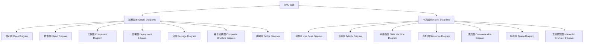
```mermaid
graph TD
    A[UML 圖表] --> B[結構圖 Structure Diagrams]
    A --> C[行為圖 Behavior Diagrams]
    
    B --> B1[類別圖 Class Diagram]
    B --> B2[物件圖 Object Diagram]
    B --> B3[元件圖 Component Diagram]
    B --> B4[部署圖 Deployment Diagram]
    B --> B5[包圖 Package Diagram]
    B --> B6[複合結構圖 Composite Structure Diagram]
    B --> B7[輪廓圖 Profile Diagram]
    
    C --> C1[用例圖 Use Case Diagram]
    C --> C2[活動圖 Activity Diagram]
    C --> C3[狀態機圖 State Machine Diagram]
    C --> C4[序列圖 Sequence Diagram]
    C --> C5[通訊圖 Communication Diagram]
    C --> C6[時序圖 Timing Diagram]
    C --> C7[互動概覽圖 Interaction Overview Diagram]
```

### 1.4 實務注意事項

#### 新進同仁建議學習順序
1. **第一階段**：用例圖、類別圖、序列圖
2. **第二階段**：活動圖、狀態圖
3. **第三階段**：元件圖、部署圖

#### 常見誤區避免
❌ **過度設計**：不是每個細節都需要建模  
❌ **為了畫圖而畫圖**：UML 是工具，不是目的  
❌ **忽略維護**：圖表需要與程式碼同步更新  
❌ **複雜化**：保持簡潔，突出重點  

### 1.5 🎯 練習與自我檢測

#### 📝 練習題

**題目 1：基礎概念選擇題**
UML 是哪三位大師共同開發的？
A) Martin Fowler、Kent Beck、Eric Evans
B) Grady Booch、James Rumbaugh、Ivar Jacobson  
C) Gang of Four (GoF)
D) Linus Torvalds、Richard Stallman、Tim Berners-Lee

**題目 2：圖表分類題**
請將下列 UML 圖表正確分類為「結構圖」或「行為圖」：
- 用例圖：_______
- 類別圖：_______
- 序列圖：_______
- 元件圖：_______
- 活動圖：_______

**題目 3：應用場景題**
你被指派設計一個新的線上訂餐系統。請列出你會在專案不同階段使用哪些 UML 圖表，並說明原因。

#### ✅ 解答與解析

**解答 1：B) Grady Booch、James Rumbaugh、Ivar Jacobson**
解析：這三位被稱為「Three Amigos」，他們分別創造了 Booch method、OMT 和 OOSE，最後統一發展成 UML。

**解答 2：圖表分類**
- 用例圖：**行為圖** - 描述系統功能行為
- 類別圖：**結構圖** - 描述系統靜態結構
- 序列圖：**行為圖** - 描述物件間互動行為
- 元件圖：**結構圖** - 描述系統架構結構
- 活動圖：**行為圖** - 描述業務流程行為

**解答 3：線上訂餐系統範例**
- **需求分析階段**：用例圖 - 定義系統功能範圍
- **概念設計階段**：類別圖 - 識別核心業務實體
- **流程設計階段**：活動圖 - 設計訂餐流程
- **互動設計階段**：序列圖 - 設計系統互動
- **架構設計階段**：元件圖 - 規劃系統架構
- **部署設計階段**：部署圖 - 規劃實體部署

#### 🎬 推薦學習資源

**📺 影片教學**
- [UML 基礎入門 - Coursera](https://www.coursera.org/learn/uml) (免費課程)
- [Visual Paradigm UML 教學](https://www.visual-paradigm.com/tutorials/) (官方教學)

**🌐 互動式學習平台**
- [Lucidchart UML 教學](https://www.lucidchart.com/pages/uml) (線上繪圖教學)
- [PlantUML 線上編輯器](http://www.plantuml.com/plantuml/uml/) (實作練習)

**📱 行動學習應用**
- UML 圖表速查 App (手機隨時查閱)
- 程式設計面試準備 App (包含 UML 相關題目)

#### 🏆 學習成就檢查表

- [ ] 我能說出 UML 的全名和主要用途
- [ ] 我能區分結構圖和行為圖的差異
- [ ] 我能列出至少 5 種常用的 UML 圖表
- [ ] 我了解在什麼情況下應該使用哪種圖表
- [ ] 我能向同事解釋為什麼要使用 UML

---

## 2. 常用 UML 圖表教學

### 2.1 用例圖（Use Case Diagram）

#### 定義與用途
用例圖用於描述系統功能需求，展示系統與外部使用者（Actor）之間的互動關係。

#### 主要元素
- **參與者（Actor）**：系統外部的使用者或其他系統
- **用例（Use Case）**：系統提供的功能或服務
- **系統邊界**：定義系統範圍
- **關係**：包含、擴展、泛化關係

#### 符號說明

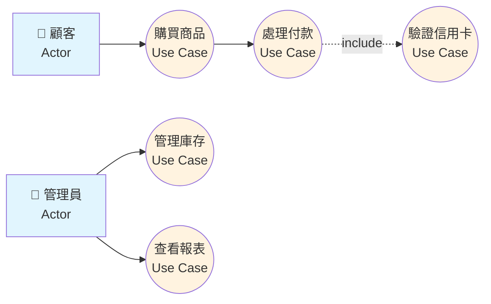
```mermaid
graph LR
    A[👤 顧客<br/>Actor] --> B((購買商品<br/>Use Case))
    C[👤 管理員<br/>Actor] --> D((管理庫存<br/>Use Case))
    C --> E((查看報表<br/>Use Case))
    
    B --> F((處理付款<br/>Use Case))
    F -.->|include| G((驗證信用卡<br/>Use Case))
    
    style A fill:#e1f5fe
    style C fill:#e1f5fe
    style B fill:#fff3e0
    style D fill:#fff3e0
    style E fill:#fff3e0
    style F fill:#fff3e0
    style G fill:#fff3e0
```

#### 實務範例：線上購物系統

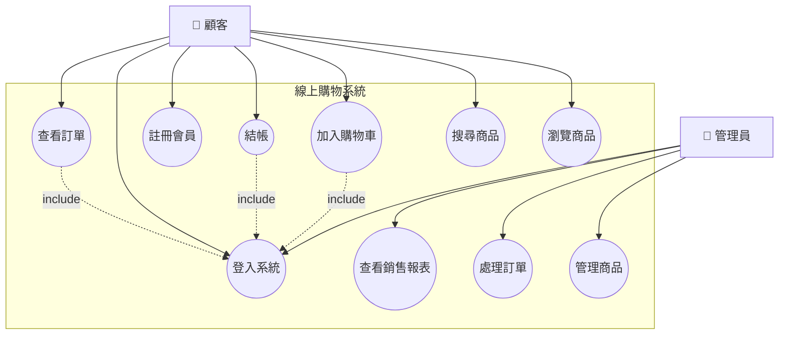
```mermaid
graph TB
    subgraph "線上購物系統"
        UC1((瀏覽商品))
        UC2((搜尋商品))
        UC3((加入購物車))
        UC4((結帳))
        UC5((註冊會員))
        UC6((登入系統))
        UC7((查看訂單))
        UC8((管理商品))
        UC9((處理訂單))
        UC10((查看銷售報表))
    end
    
    Customer[👤 顧客] --> UC1
    Customer --> UC2
    Customer --> UC3
    Customer --> UC4
    Customer --> UC5
    Customer --> UC6
    Customer --> UC7
    
    Admin[👤 管理員] --> UC8
    Admin --> UC9
    Admin --> UC10
    Admin --> UC6
    
    UC4 -.->|include| UC6
    UC3 -.->|include| UC6
    UC7 -.->|include| UC6
```

#### 繪製技巧
1. **識別參與者**：誰會使用這個系統？
2. **列出用例**：系統要提供什麼功能？
3. **建立關係**：參與者如何與用例互動？
4. **定義邊界**：什麼在系統內，什麼在系統外？

#### 實務注意事項

- ✅ 用例名稱使用動詞開頭
- ✅ 一個用例代表一個完整的業務流程
- ✅ 避免過於技術性的描述
- ❌ 不要把用例當作功能清單

---

### 2.2 類別圖（Class Diagram）

#### 定義與用途
類別圖是最常用的 UML 圖表，用於描述系統中類別的結構以及類別之間的關係。它是物件導向設計的核心工具。

#### 主要元素
- **類別（Class）**：具有相同屬性和方法的物件集合
- **屬性（Attribute）**：類別的特徵或資料
- **方法（Method）**：類別能執行的行為或操作
- **關係（Relationship）**：類別之間的連接

#### 類別表示法

```
┌─────────────────┐
│   類別名稱      │
├─────────────────┤
│ - 屬性1: 型別   │
│ + 屬性2: 型別   │
├─────────────────┤
│ + 方法1(): 型別 │
│ - 方法2(): void │
└─────────────────┘
```

**可見性修飾符：**
- `+` public（公開）
- `-` private（私有）
- `#` protected（保護）
- `~` package（套件）

#### 實務範例：學生管理系統

```mermaid
classDiagram
    class Student {
        -studentId: String
        -name: String
        -email: String
        -birthDate: Date
        +getStudentId(): String
        +getName(): String
        +setName(name: String): void
        +enroll(course: Course): void
    }
    
    class Course {
        -courseId: String
        -courseName: String
        -credits: int
        -instructor: String
        +getCourseId(): String
        +getCourseName(): String
        +addStudent(student: Student): void
        +removeStudent(student: Student): void
    }
    
    class Enrollment {
        -enrollmentDate: Date
        -grade: String
        -status: String
        +getGrade(): String
        +setGrade(grade: String): void
        +getStatus(): String
    }
    
    class Department {
        -deptId: String
        -deptName: String
        -location: String
        +getDeptName(): String
        +addCourse(course: Course): void
    }
    
    Student ||--o{ Enrollment : "enrolls in"
    Course ||--o{ Enrollment : "has enrollments"
    Department ||--o{ Course : "offers"
    
    note for Student : "學生可以選修多門課程"
    note for Course : "課程可以有多名學生"
```

#### 類別關係類型

| 關係類型 | 符號 | 說明 | 範例 |
|---------|------|------|------|
| **關聯 Association** | `──` | 一般的使用關係 | 學生 ── 課程 |
| **聚合 Aggregation** | `◇──` | 部分-整體關係（弱） | 部門 ◇── 員工 |
| **組合 Composition** | `◆──` | 部分-整體關係（強） | 房子 ◆── 房間 |
| **泛化 Generalization** | `────▷` | 繼承關係 | 學生 ────▷ 人 |
| **實現 Realization** | `┈┈┈▷` | 介面實現 | 類別 ┈┈┈▷ 介面 |
| **依賴 Dependency** | `┈┈┈>` | 使用關係 | 控制器 ┈┈┈> 服務 |

#### 繪製技巧
1. **從核心類別開始**：識別系統中最重要的實體
2. **添加屬性**：每個類別需要什麼資料？
3. **定義方法**：每個類別能做什麼？
4. **建立關係**：類別之間如何協作？
5. **檢查一致性**：確保關係合理且完整

#### 實務注意事項
- ✅ 類別名稱使用名詞，方法名稱使用動詞
- ✅ 適當使用抽象類別和介面
- ✅ 考慮設計模式的應用
- ❌ 避免過度複雜的繼承階層
- ❌ 不要忽略封裝原則

---

### 2.3 序列圖（Sequence Diagram）

#### 定義與用途
序列圖用於描述物件之間在時間順序上的互動過程，特別適合展示複雜的業務流程和系統互動。

#### 主要元素
- **參與者（Actor）**：系統外部的使用者
- **物件（Object）**：系統內部的物件實例
- **生命線（Lifeline）**：物件的生命週期
- **訊息（Message）**：物件間的互動
- **啟用框（Activation Box）**：物件處於活躍狀態的時間

#### 訊息類型
- **同步訊息** `─────>` ：呼叫者等待回應
- **非同步訊息** `┈┈┈┈>` ：呼叫者不等待回應
- **回傳訊息** `<┈┈┈┈` ：回傳結果
- **自我訊息** `─┐ └─>` ：物件呼叫自己的方法

#### 實務範例：線上購物結帳流程

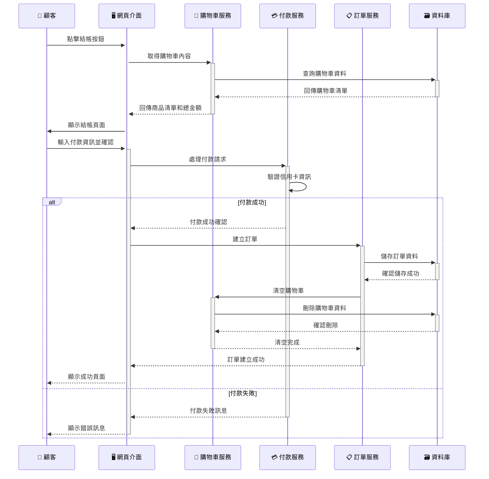
```mermaid
sequenceDiagram
    participant Customer as 👤 顧客
    participant WebUI as 🖥️ 網頁介面
    participant CartService as 🛒 購物車服務
    participant PaymentService as 💳 付款服務
    participant OrderService as 📋 訂單服務
    participant Database as 🗃️ 資料庫
    
    Customer->>+WebUI: 點擊結帳按鈕
    WebUI->>+CartService: 取得購物車內容
    CartService->>+Database: 查詢購物車資料
    Database-->>-CartService: 回傳購物車清單
    CartService-->>-WebUI: 回傳商品清單和總金額
    
    WebUI->>Customer: 顯示結帳頁面
    Customer->>+WebUI: 輸入付款資訊並確認
    
    WebUI->>+PaymentService: 處理付款請求
    PaymentService->>PaymentService: 驗證信用卡資訊
    
    alt 付款成功
        PaymentService-->>WebUI: 付款成功確認
        WebUI->>+OrderService: 建立訂單
        OrderService->>+Database: 儲存訂單資料
        Database-->>-OrderService: 確認儲存成功
        OrderService->>+CartService: 清空購物車
        CartService->>+Database: 刪除購物車資料
        Database-->>-CartService: 確認刪除
        CartService-->>-OrderService: 清空完成
        OrderService-->>-WebUI: 訂單建立成功
        WebUI-->>Customer: 顯示成功頁面
    else 付款失敗
        PaymentService-->>-WebUI: 付款失敗訊息
        WebUI-->>-Customer: 顯示錯誤訊息
    end
```

#### 進階概念

##### 1. 迴圈（Loop）
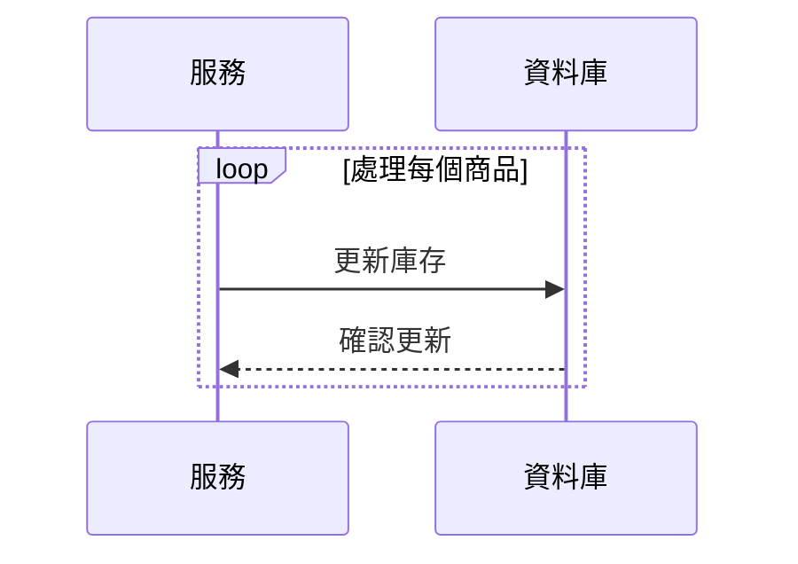
```mermaid
sequenceDiagram
    participant Service as 服務
    participant Database as 資料庫
    
    loop 處理每個商品
        Service->>Database: 更新庫存
        Database-->>Service: 確認更新
    end
```

##### 2. 條件分支（Alt）
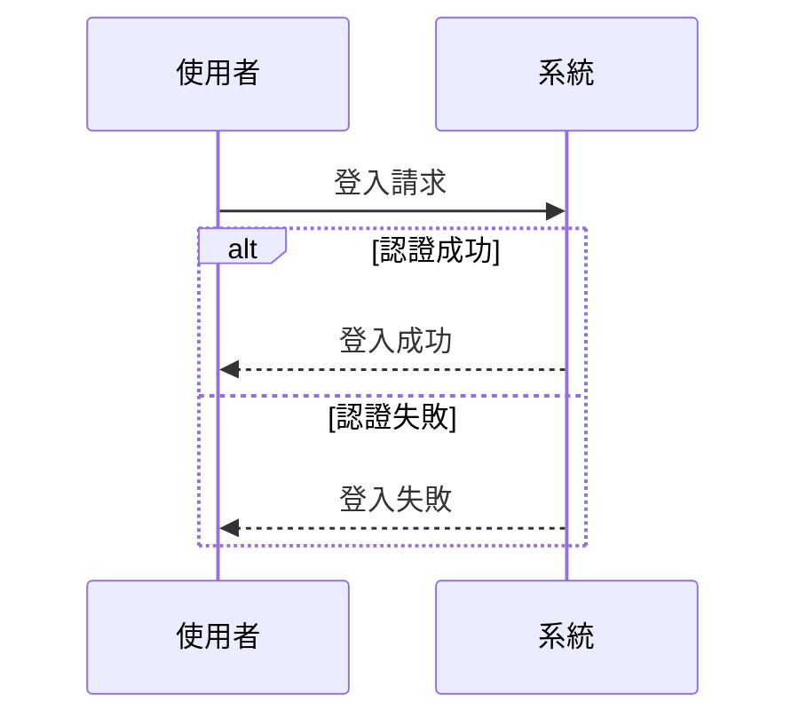
```mermaid
sequenceDiagram
    participant User as 使用者
    participant System as 系統
    
    User->>System: 登入請求
    
    alt 認證成功
        System-->>User: 登入成功
    else 認證失敗
        System-->>User: 登入失敗
    end
```

##### 3. 可選項（Opt）
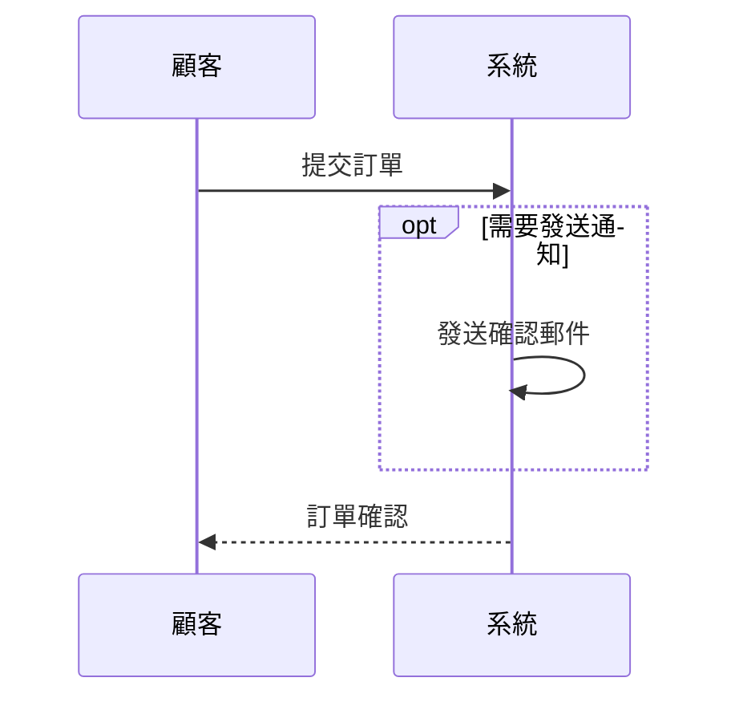
```mermaid
sequenceDiagram
    participant Customer as 顧客
    participant System as 系統
    
    Customer->>System: 提交訂單
    
    opt 需要發送通知
        System->>System: 發送確認郵件
    end
    
    System-->>Customer: 訂單確認
```

#### 繪製技巧
1. **識別關鍵角色**：誰參與了這個流程？
2. **定義開始事件**：流程從什麼開始？
3. **追蹤訊息流**：按時間順序列出互動
4. **處理異常情況**：考慮錯誤和替代路徑
5. **簡化複雜度**：將複雜流程分解成多個圖

#### 實務注意事項

- ✅ 從左到右排列物件，按照互動頻率
- ✅ 使用清楚的訊息標籤
- ✅ 適當使用組合片段（alt、opt、loop）
- ❌ 避免過多的物件在同一個圖中
- ❌ 不要忽略錯誤處理流程

---

### 2.4 活動圖（Activity Diagram）

#### 活動圖的基本概念

活動圖用於描述業務流程或系統行為的工作流程，強調活動的執行順序和條件控制。

#### 活動圖的組成元素

- **開始節點**：流程的起點（實心圓）
- **結束節點**：流程的終點（實心圓加外圓）
- **活動**：具體的動作或任務（圓角矩形）
- **決策節點**：條件分支點（菱形）
- **合併節點**：多個分支的匯合點（菱形）
- **分岔節點**：並行活動的開始（粗黑線）
- **結合節點**：並行活動的結束（粗黑線）

#### 實務範例：線上訂單處理流程

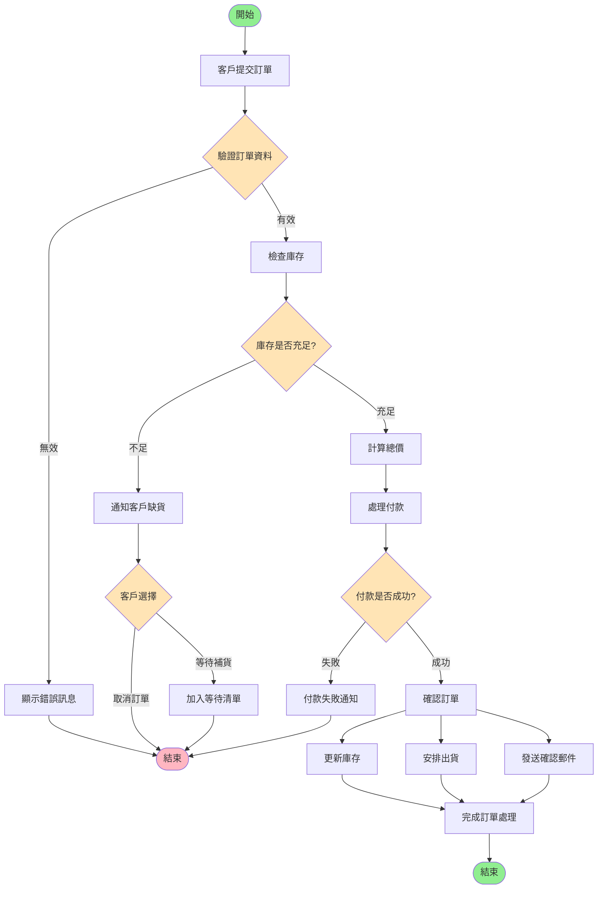
```mermaid
flowchart TD
    Start([開始]) --> A[客戶提交訂單]
    A --> B{驗證訂單資料}
    B -->|有效| C[檢查庫存]
    B -->|無效| D[顯示錯誤訊息]
    D --> End1([結束])
    
    C --> E{庫存是否充足?}
    E -->|充足| F[計算總價]
    E -->|不足| G[通知客戶缺貨]
    G --> H{客戶選擇}
    H -->|等待補貨| I[加入等待清單]
    H -->|取消訂單| End1
    I --> End1
    
    F --> J[處理付款]
    J --> K{付款是否成功?}
    K -->|成功| L[確認訂單]
    K -->|失敗| M[付款失敗通知]
    M --> End1
    
    L --> N[更新庫存]
    L --> O[安排出貨]
    L --> P[發送確認郵件]
    
    N --> Q[完成訂單處理]
    O --> Q
    P --> Q
    Q --> End2([結束])
    
    style Start fill:#90EE90
    style End1 fill:#FFB6C1
    style End2 fill:#90EE90
    style B fill:#FFE4B5
    style E fill:#FFE4B5
    style H fill:#FFE4B5
    style K fill:#FFE4B5
```

#### 活動圖的進階應用

##### 1. 並行活動（Fork/Join）

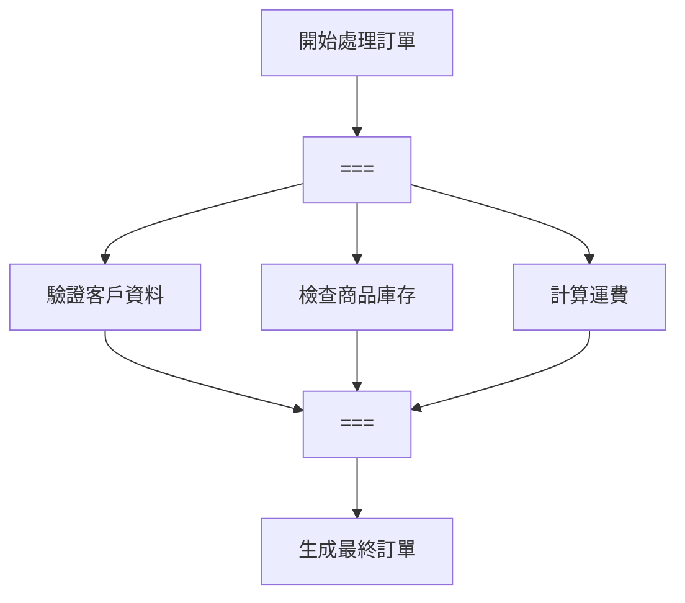
```mermaid
flowchart TD
    A[開始處理訂單] --> B[===]
    B --> C[驗證客戶資料]
    B --> D[檢查商品庫存]
    B --> E[計算運費]
    
    C --> F[===]
    D --> F
    E --> F
    F --> G[生成最終訂單]
```

##### 2. 泳道圖（Swimlane）

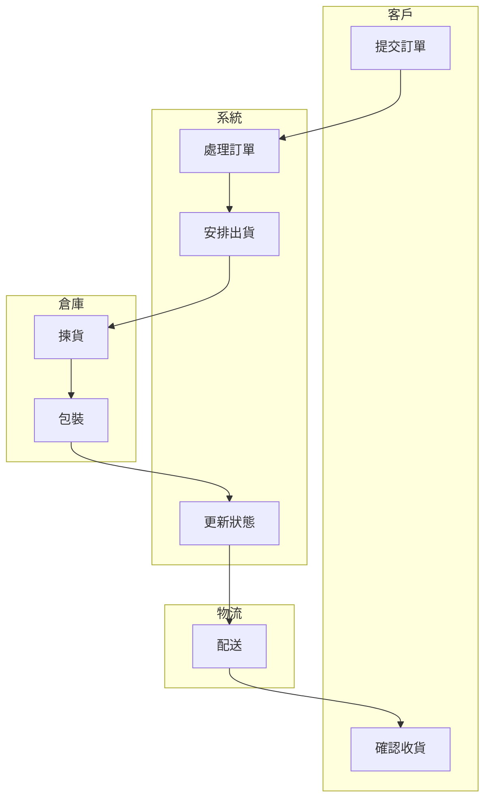
```mermaid
flowchart TD
    subgraph "客戶"
        A[提交訂單]
        H[確認收貨]
    end
    
    subgraph "系統"
        B[處理訂單]
        C[安排出貨]
        F[更新狀態]
    end
    
    subgraph "倉庫"
        D[揀貨]
        E[包裝]
    end
    
    subgraph "物流"
        G[配送]
    end
    
    A --> B
    B --> C
    C --> D
    D --> E
    E --> F
    F --> G
    G --> H
```

#### 活動圖建模技巧

1. **明確起終點**：清楚標示流程的開始和結束
2. **邏輯清晰**：決策條件要明確具體
3. **避免複雜**：單一圖表不要包含過多細節
4. **標示責任**：使用泳道分離不同角色的活動
5. **考慮例外**：包含錯誤處理和異常路徑

#### 活動圖設計注意事項

- ✅ 活動名稱使用動詞開頭
- ✅ 決策條件要明確且互斥
- ✅ 考慮所有可能的執行路徑
- ✅ 適當使用並行活動提高效率
- ❌ 避免過度複雜的決策樹
- ❌ 不要忽略異常處理路徑

---

### 2.5 狀態圖（State Diagram）

#### 狀態圖基礎概念

狀態圖用於描述物件在其生命週期中的狀態變化，以及觸發狀態轉換的事件。

#### 狀態圖核心元素

- **狀態**：物件在某個時間點的條件（圓角矩形）
- **初始狀態**：起始狀態（實心圓）
- **最終狀態**：結束狀態（雙圓圈）
- **轉換**：狀態之間的變化（箭頭）
- **事件**：觸發轉換的條件
- **護衛條件**：轉換的額外條件
- **動作**：進入或離開狀態時執行的操作

#### 實務範例：訂單狀態管理

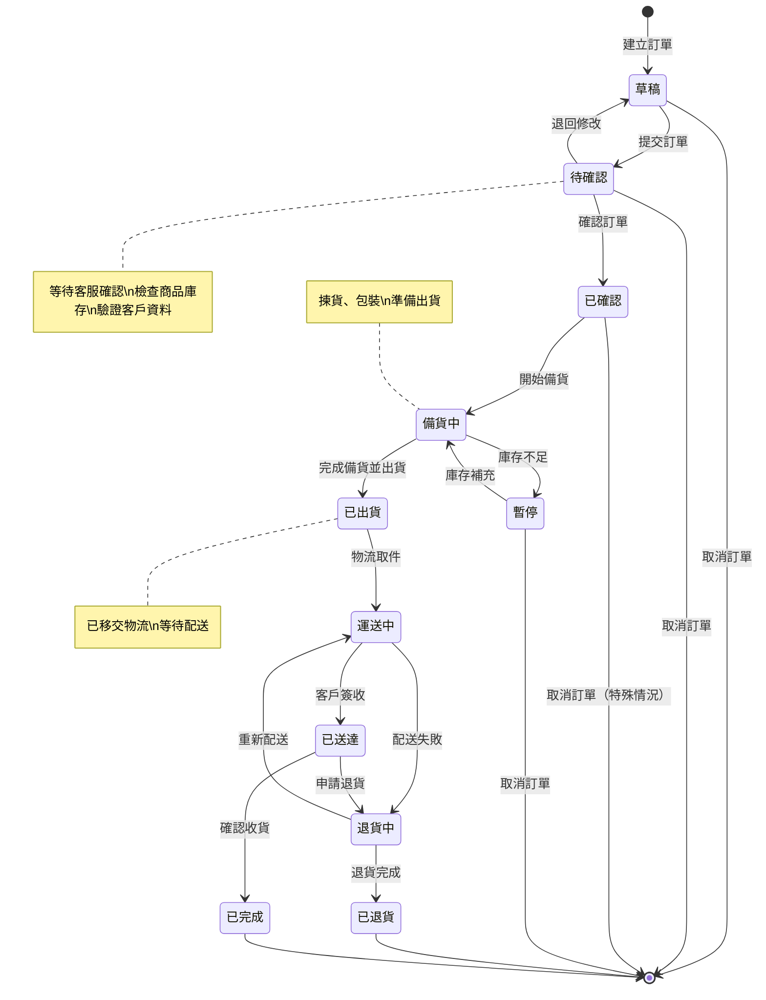
```mermaid
stateDiagram-v2
    [*] --> 草稿 : 建立訂單
    
    草稿 --> 待確認 : 提交訂單
    草稿 --> [*] : 取消訂單
    
    待確認 --> 已確認 : 確認訂單
    待確認 --> 草稿 : 退回修改
    待確認 --> [*] : 取消訂單
    
    已確認 --> 備貨中 : 開始備貨
    已確認 --> [*] : 取消訂單（特殊情況）
    
    備貨中 --> 已出貨 : 完成備貨並出貨
    備貨中 --> 暫停 : 庫存不足
    
    暫停 --> 備貨中 : 庫存補充
    暫停 --> [*] : 取消訂單
    
    已出貨 --> 運送中 : 物流取件
    
    運送中 --> 已送達 : 客戶簽收
    運送中 --> 退貨中 : 配送失敗
    
    退貨中 --> 已退貨 : 退貨完成
    退貨中 --> 運送中 : 重新配送
    
    已送達 --> 已完成 : 確認收貨
    已送達 --> 退貨中 : 申請退貨
    
    已退貨 --> [*]
    已完成 --> [*]
    
    note right of 待確認 : 等待客服確認\n檢查商品庫存\n驗證客戶資料
    note left of 備貨中 : 揀貨、包裝\n準備出貨
    note right of 已出貨 : 已移交物流\n等待配送
```

#### 狀態圖高級功能

##### 1. 複合狀態

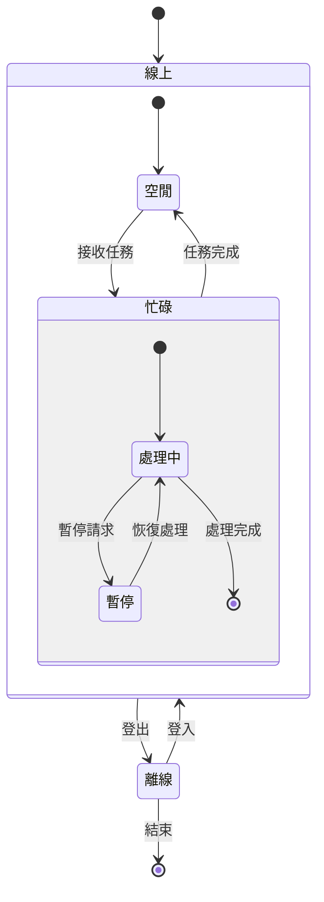
```mermaid
stateDiagram-v2
    [*] --> 線上
    
    state 線上 {
        [*] --> 空閒
        空閒 --> 忙碌 : 接收任務
        忙碌 --> 空閒 : 任務完成
        
        state 忙碌 {
            [*] --> 處理中
            處理中 --> 暫停 : 暫停請求
            暫停 --> 處理中 : 恢復處理
            處理中 --> [*] : 處理完成
        }
    }
    
    線上 --> 離線 : 登出
    離線 --> 線上 : 登入
    離線 --> [*] : 結束
```

##### 2. 帶護衛條件的轉換

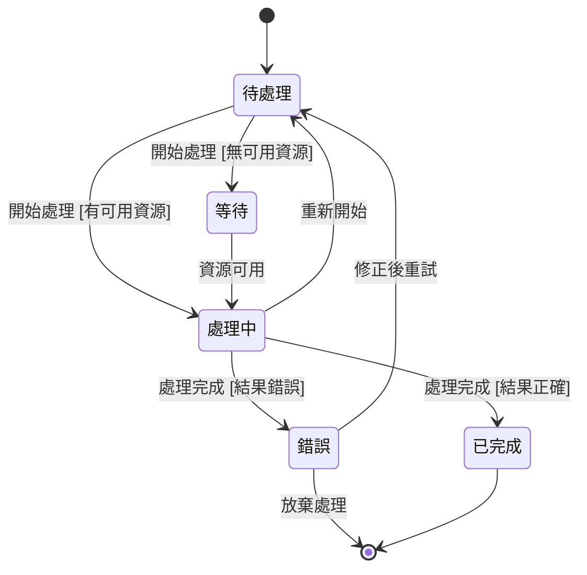
```mermaid
stateDiagram-v2
    [*] --> 待處理
    
    待處理 --> 處理中 : 開始處理 [有可用資源]
    待處理 --> 等待 : 開始處理 [無可用資源]
    
    等待 --> 處理中 : 資源可用
    
    處理中 --> 已完成 : 處理完成 [結果正確]
    處理中 --> 錯誤 : 處理完成 [結果錯誤]
    處理中 --> 待處理 : 重新開始
    
    錯誤 --> 待處理 : 修正後重試
    錯誤 --> [*] : 放棄處理
    
    已完成 --> [*]
```

#### 狀態圖設計方法

1. **識別關鍵狀態**：物件的主要生命階段
2. **定義轉換事件**：什麼條件會觸發狀態改變
3. **考慮護衛條件**：轉換的額外限制條件
4. **包含異常狀態**：錯誤和特殊情況的處理
5. **簡化複雜度**：使用複合狀態組織相關狀態

#### 狀態圖設計準則

- ✅ 狀態名稱使用形容詞或名詞
- ✅ 事件名稱使用動詞
- ✅ 確保所有狀態都可達且可離開
- ✅ 考慮併發狀態的同步問題
- ❌ 避免過多的狀態導致圖表複雜
- ❌ 不要忽略初始和最終狀態

---

### 2.6 元件圖（Component Diagram）

#### 元件圖概述

元件圖用於描述系統的軟體架構，展示軟體元件之間的依賴關係和介面。

#### 元件圖構成要素

- **元件**：可獨立部署的軟體單元（矩形加元件圖示）
- **介面**：元件提供或需要的服務（圓圈或棒棒糖符號）
- **提供介面**：元件對外提供的服務
- **需求介面**：元件依賴的外部服務
- **依賴關係**：元件之間的使用關係

#### 實務範例：線上購物系統架構

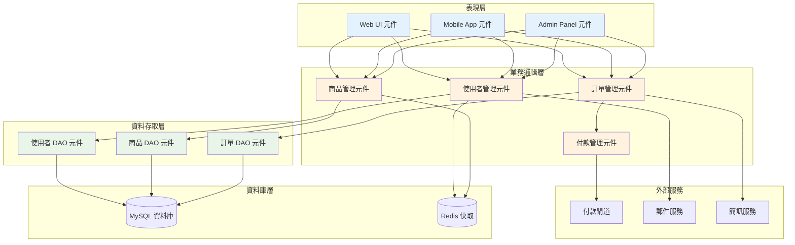
```mermaid
graph TB
    subgraph "表現層"
        WebUI[Web UI 元件]
        MobileApp[Mobile App 元件]
        AdminPanel[Admin Panel 元件]
    end
    
    subgraph "業務邏輯層"
        UserMgmt[使用者管理元件]
        ProductMgmt[商品管理元件]
        OrderMgmt[訂單管理元件]
        PaymentMgmt[付款管理元件]
    end
    
    subgraph "資料存取層"
        UserDAO[使用者 DAO 元件]
        ProductDAO[商品 DAO 元件]
        OrderDAO[訂單 DAO 元件]
    end
    
    subgraph "外部服務"
        PaymentGateway[付款閘道]
        EmailService[郵件服務]
        SMSService[簡訊服務]
    end
    
    subgraph "資料庫層"
        MySQL[(MySQL 資料庫)]
        Redis[(Redis 快取)]
    end
    
    WebUI --> UserMgmt
    WebUI --> ProductMgmt
    WebUI --> OrderMgmt
    
    MobileApp --> UserMgmt
    MobileApp --> ProductMgmt
    MobileApp --> OrderMgmt
    
    AdminPanel --> UserMgmt
    AdminPanel --> ProductMgmt
    AdminPanel --> OrderMgmt
    
    UserMgmt --> UserDAO
    ProductMgmt --> ProductDAO
    OrderMgmt --> OrderDAO
    OrderMgmt --> PaymentMgmt
    
    PaymentMgmt --> PaymentGateway
    UserMgmt --> EmailService
    OrderMgmt --> SMSService
    
    UserDAO --> MySQL
    ProductDAO --> MySQL
    OrderDAO --> MySQL
    
    UserMgmt --> Redis
    ProductMgmt --> Redis
    
    style WebUI fill:#E3F2FD
    style MobileApp fill:#E3F2FD
    style AdminPanel fill:#E3F2FD
    style UserMgmt fill:#FFF3E0
    style ProductMgmt fill:#FFF3E0
    style OrderMgmt fill:#FFF3E0
    style PaymentMgmt fill:#FFF3E0
    style UserDAO fill:#E8F5E8
    style ProductDAO fill:#E8F5E8
    style OrderDAO fill:#E8F5E8
```

#### 介面設計範例

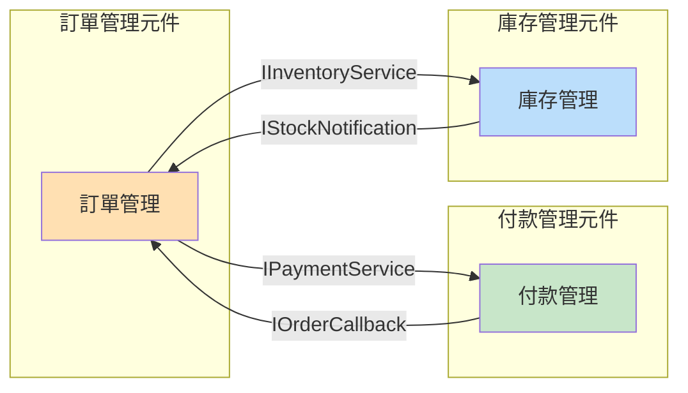
```mermaid
graph LR
    subgraph "訂單管理元件"
        OrderComponent[訂單管理]
    end
    
    subgraph "付款管理元件"
        PaymentComponent[付款管理]
    end
    
    subgraph "庫存管理元件"
        InventoryComponent[庫存管理]
    end
    
    OrderComponent -->|IPaymentService| PaymentComponent
    OrderComponent -->|IInventoryService| InventoryComponent
    
    PaymentComponent -->|IOrderCallback| OrderComponent
    InventoryComponent -->|IStockNotification| OrderComponent
    
    style OrderComponent fill:#FFE0B2
    style PaymentComponent fill:#C8E6C9
    style InventoryComponent fill:#BBDEFB
```

#### 元件設計原則

1. **分層架構**：按照系統層次組織元件
2. **介面定義**：明確元件間的契約
3. **依賴方向**：高層元件依賴低層元件
4. **模組化**：將相關功能組織在同一元件
5. **重用性**：設計可重用的通用元件

#### 元件圖最佳實務

- ✅ 元件名稱要反映其主要職責
- ✅ 介面要有清楚的契約定義
- ✅ 避免循環依賴
- ✅ 考慮元件的可測試性
- ❌ 不要讓元件過於龐大
- ❌ 避免過度耦合的設計

---

### 2.7 部署圖（Deployment Diagram）

#### 部署圖簡介

部署圖用於描述系統的實體架構，展示軟體元件在硬體節點上的分佈情況。

#### 部署圖基本元件

- **節點**：執行環境或硬體設備（立體方塊）
- **軟體元件**：部署在節點上的軟體
- **通訊路徑**：節點間的連接關係
- **部署規格**：部署的具體配置資訊

#### 實務範例：Web 應用系統部署

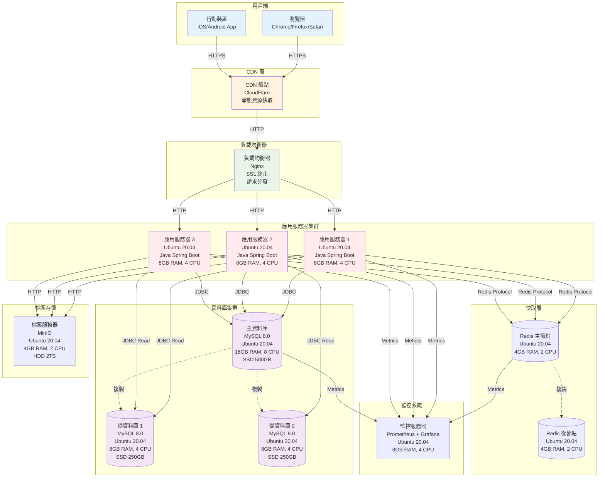
```mermaid
graph TB
    subgraph "用戶端"
        Browser[瀏覽器<br/>Chrome/Firefox/Safari]
        Mobile[行動裝置<br/>iOS/Android App]
    end
    
    subgraph "CDN 層"
        CDN[CDN 節點<br/>CloudFlare<br/>靜態資源快取]
    end
    
    subgraph "負載均衡器"
        LB[負載均衡器<br/>Nginx<br/>SSL 終止<br/>請求分發]
    end
    
    subgraph "應用服務器集群"
        App1[應用服務器 1<br/>Ubuntu 20.04<br/>Java Spring Boot<br/>8GB RAM, 4 CPU]
        App2[應用服務器 2<br/>Ubuntu 20.04<br/>Java Spring Boot<br/>8GB RAM, 4 CPU]
        App3[應用服務器 3<br/>Ubuntu 20.04<br/>Java Spring Boot<br/>8GB RAM, 4 CPU]
    end
    
    subgraph "資料庫集群"
        DBMaster[(主資料庫<br/>MySQL 8.0<br/>Ubuntu 20.04<br/>16GB RAM, 8 CPU<br/>SSD 500GB)]
        DBSlave1[(從資料庫 1<br/>MySQL 8.0<br/>Ubuntu 20.04<br/>8GB RAM, 4 CPU<br/>SSD 250GB)]
        DBSlave2[(從資料庫 2<br/>MySQL 8.0<br/>Ubuntu 20.04<br/>8GB RAM, 4 CPU<br/>SSD 250GB)]
    end
    
    subgraph "快取層"
        Redis1[(Redis 主節點<br/>Ubuntu 20.04<br/>4GB RAM, 2 CPU)]
        Redis2[(Redis 從節點<br/>Ubuntu 20.04<br/>4GB RAM, 2 CPU)]
    end
    
    subgraph "檔案存儲"
        Storage[檔案服務器<br/>MinIO<br/>Ubuntu 20.04<br/>4GB RAM, 2 CPU<br/>HDD 2TB]
    end
    
    subgraph "監控系統"
        Monitor[監控服務器<br/>Prometheus + Grafana<br/>Ubuntu 20.04<br/>8GB RAM, 4 CPU]
    end
    
    Browser -->|HTTPS| CDN
    Mobile -->|HTTPS| CDN
    CDN -->|HTTP| LB
    
    LB -->|HTTP| App1
    LB -->|HTTP| App2
    LB -->|HTTP| App3
    
    App1 -->|JDBC| DBMaster
    App2 -->|JDBC| DBMaster
    App3 -->|JDBC| DBMaster
    
    App1 -->|JDBC Read| DBSlave1
    App2 -->|JDBC Read| DBSlave2
    App3 -->|JDBC Read| DBSlave1
    
    DBMaster -.->|複製| DBSlave1
    DBMaster -.->|複製| DBSlave2
    
    App1 -->|Redis Protocol| Redis1
    App2 -->|Redis Protocol| Redis1
    App3 -->|Redis Protocol| Redis1
    
    Redis1 -.->|複製| Redis2
    
    App1 -->|HTTP| Storage
    App2 -->|HTTP| Storage
    App3 -->|HTTP| Storage
    
    App1 -->|Metrics| Monitor
    App2 -->|Metrics| Monitor
    App3 -->|Metrics| Monitor
    DBMaster -->|Metrics| Monitor
    Redis1 -->|Metrics| Monitor
    
    style Browser fill:#E3F2FD
    style Mobile fill:#E3F2FD
    style CDN fill:#FFF3E0
    style LB fill:#E8F5E8
    style App1 fill:#FFEBEE
    style App2 fill:#FFEBEE
    style App3 fill:#FFEBEE
    style DBMaster fill:#F3E5F5
    style DBSlave1 fill:#F3E5F5
    style DBSlave2 fill:#F3E5F5
```

#### 雲端部署範例

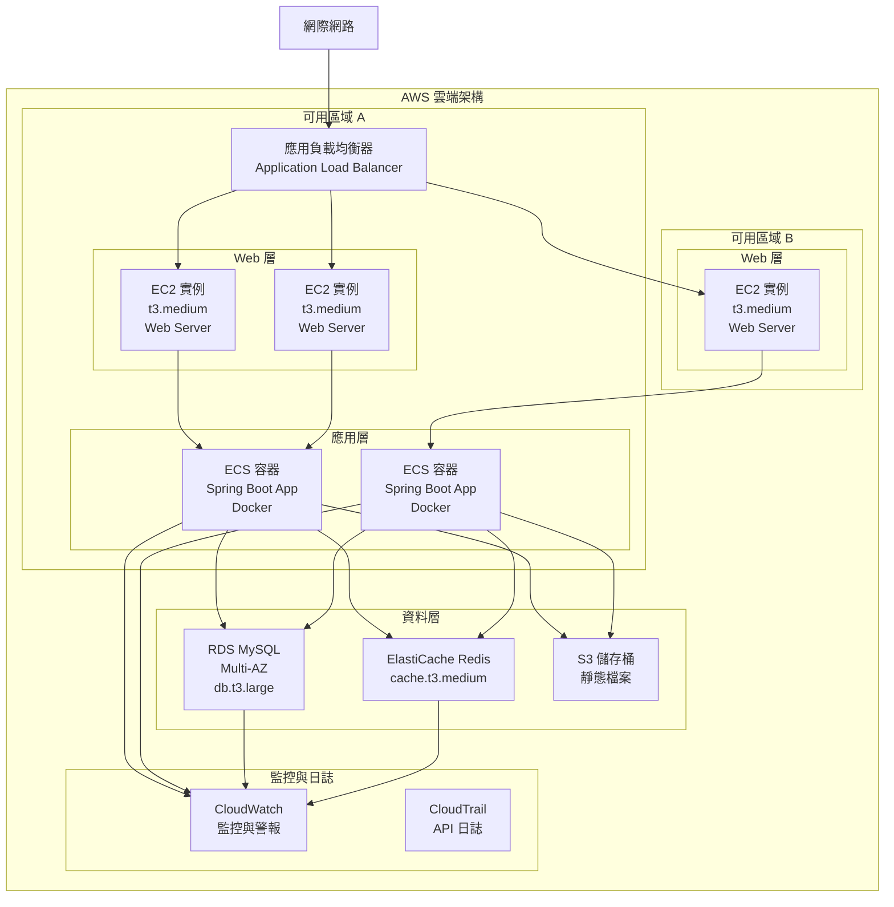
```mermaid
graph TB
    subgraph "AWS 雲端架構"
        subgraph "可用區域 A"
            ALB[應用負載均衡器<br/>Application Load Balancer]
            
            subgraph "Web 層"
                EC2_A1[EC2 實例<br/>t3.medium<br/>Web Server]
                EC2_A2[EC2 實例<br/>t3.medium<br/>Web Server]
            end
            
            subgraph "應用層"
                ECS_A[ECS 容器<br/>Spring Boot App<br/>Docker]
            end
        end
        
        subgraph "可用區域 B"
            subgraph "Web 層"
                EC2_B1[EC2 實例<br/>t3.medium<br/>Web Server]
            end
            
            subgraph "應用層"
                ECS_B[ECS 容器<br/>Spring Boot App<br/>Docker]
            end
        end
        
        subgraph "資料層"
            RDS[RDS MySQL<br/>Multi-AZ<br/>db.t3.large]
            ElastiCache[ElastiCache Redis<br/>cache.t3.medium]
            S3[S3 儲存桶<br/>靜態檔案]
        end
        
        subgraph "監控與日誌"
            CloudWatch[CloudWatch<br/>監控與警報]
            CloudTrail[CloudTrail<br/>API 日誌]
        end
    end
    
    Internet[網際網路] --> ALB
    ALB --> EC2_A1
    ALB --> EC2_A2
    ALB --> EC2_B1
    
    EC2_A1 --> ECS_A
    EC2_A2 --> ECS_A
    EC2_B1 --> ECS_B
    
    ECS_A --> RDS
    ECS_B --> RDS
    ECS_A --> ElastiCache
    ECS_B --> ElastiCache
    ECS_A --> S3
    ECS_B --> S3
    
    ECS_A --> CloudWatch
    ECS_B --> CloudWatch
    RDS --> CloudWatch
    ElastiCache --> CloudWatch
```

#### 部署圖設計要點

1. **分層展示**：從用戶端到後端分層描述
2. **標示規格**：包含硬體配置和軟體版本
3. **網路連接**：明確標示通訊協定和端口
4. **備援設計**：展示高可用性配置
5. **安全考量**：標示防火牆和安全邊界

#### 部署圖設計指南

- ✅ 包含實際的硬體規格資訊
- ✅ 標示網路協定和端口號
- ✅ 考慮高可用性和災難恢復
- ✅ 標示安全邊界和訪問控制
- ❌ 不要忽略網路延遲和頻寬限制
- ❌ 避免過度簡化複雜的網路拓撲

---

## 3. 實務應用情境

### 3.1 專案生命週期中的 UML 應用

#### 需求分析階段

- **主要圖表**：用例圖
- **應用時機**：與客戶討論需求時
- **輸出成果**：系統功能清單、使用者角色定義

#### 系統設計階段

- **主要圖表**：類別圖、序列圖、活動圖
- **應用時機**：架構設計和詳細設計時
- **輸出成果**：系統架構文件、介面定義

#### 實作階段

- **主要圖表**：類別圖、狀態圖
- **應用時機**：編碼前的詳細設計
- **輸出成果**：程式碼結構指引

#### 測試階段

- **主要圖表**：序列圖、活動圖
- **應用時機**：設計測試案例時
- **輸出成果**：測試腳本、測試資料

#### 維護階段

- **主要圖表**：所有圖表
- **應用時機**：系統修改和擴展時
- **輸出成果**：更新的設計文件

### 3.2 不同專案類型的 UML 選擇

#### Web 應用程式

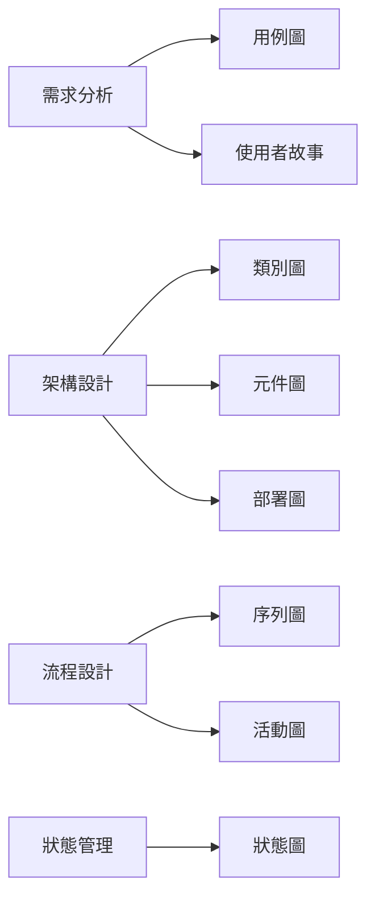
```mermaid
graph LR
    A[需求分析] --> B[用例圖]
    A --> C[使用者故事]
    
    D[架構設計] --> E[類別圖]
    D --> F[元件圖]
    D --> G[部署圖]
    
    H[流程設計] --> I[序列圖]
    H --> J[活動圖]
    
    K[狀態管理] --> L[狀態圖]
```

**建議圖表組合**：

1. 用例圖（需求）
2. 類別圖（架構）
3. 序列圖（業務流程）
4. 元件圖（系統架構）
5. 部署圖（部署架構）

#### 行動應用程式

**建議圖表組合**：

1. 用例圖（功能需求）
2. 活動圖（使用者流程）
3. 狀態圖（畫面狀態）
4. 類別圖（程式架構）
5. 序列圖（資料流程）

#### 企業系統

**建議圖表組合**：

1. 用例圖（業務需求）
2. 活動圖（業務流程）
3. 類別圖（領域模型）
4. 序列圖（系統互動）
5. 元件圖（系統架構）
6. 部署圖（實體架構）

### 3.3 團隊協作中的 UML

#### 與產品經理溝通

- **使用圖表**：用例圖、活動圖
- **溝通重點**：功能範圍、使用者流程
- **注意事項**：避免技術細節，專注業務價值

#### 與設計師溝通

- **使用圖表**：用例圖、活動圖、狀態圖
- **溝通重點**：使用者互動、介面狀態
- **注意事項**：關注使用者體驗流程

#### 與開發團隊溝通

- **使用圖表**：類別圖、序列圖、元件圖
- **溝通重點**：程式架構、模組責任
- **注意事項**：確保技術可行性

#### 與測試團隊溝通

- **使用圖表**：序列圖、活動圖、狀態圖
- **溝通重點**：測試場景、邊界條件
- **注意事項**：涵蓋異常情況

---

## 4. 專案實作指引

### 4.1 UML 建模流程

#### 標準建模流程

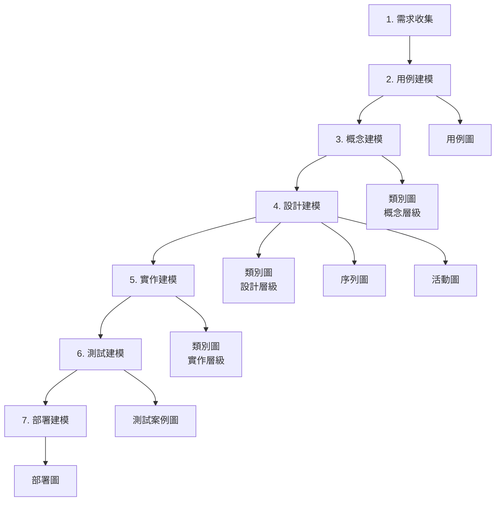
```mermaid
graph TD
    A[1. 需求收集] --> B[2. 用例建模]
    B --> C[3. 概念建模]
    C --> D[4. 設計建模]
    D --> E[5. 實作建模]
    E --> F[6. 測試建模]
    F --> G[7. 部署建模]
    
    B --> B1[用例圖]
    C --> C1[類別圖<br/>概念層級]
    D --> D1[類別圖<br/>設計層級]
    D --> D2[序列圖]
    D --> D3[活動圖]
    E --> E1[類別圖<br/>實作層級]
    F --> F1[測試案例圖]
    G --> G1[部署圖]
```

#### 敏捷開發中的 UML

**Sprint 規劃階段**：

1. 更新用例圖（新功能）
2. 繪製活動圖（使用者流程）
3. 設計類別圖（核心物件）

**Sprint 執行階段**：

1. 詳細序列圖（複雜互動）
2. 狀態圖（物件狀態變化）
3. 更新類別圖（實作細節）

**Sprint 回顧階段**：

1. 檢視並更新所有圖表
2. 記錄設計決策
3. 準備下一個 Sprint 的建模需求

### 4.2 我們專案中的 UML 應用範例

#### Java Tutorial 專案的 UML 建模

基於我們現有的 Java Tutorial 專案，讓我們看看如何實際應用 UML：

##### 1. 專案類別圖範例

```mermaid
classDiagram
    class Person {
        <<abstract>>
        -name: String
        -age: int
        +Person(name: String, age: int)
        +getName(): String
        +setName(name: String): void
        +getAge(): int
        +setAge(age: int): void
        +introduce(): void*
        +displayInfo(): void
    }
    
    class Student {
        -studentId: String
        +Student(name: String, age: int, studentId: String)
        +getStudentId(): String
        +setStudentId(studentId: String): void
        +study(subject: String): void
        +introduce(): void
        +attendClass(course: Course): void
    }
    
    class Course {
        -courseId: String
        -courseName: String
        -instructor: String
        -maxStudents: int
        -enrolledStudents: List~Student~
        +Course(courseId: String, courseName: String)
        +addStudent(student: Student): boolean
        +removeStudent(student: Student): boolean
        +getEnrolledCount(): int
        +getCourseInfo(): String
    }
    
    class Utils {
        <<utility>>
        +isValidEmail(email: String): boolean$
        +formatDate(date: Date): String$
        +generateId(): String$
        +validateAge(age: int): boolean$
    }
    
    Student --|> Person : inherits
    Student "0..*" -- "0..*" Course : enrolls in
    Student ..> Utils : uses
    Course ..> Utils : uses
    
    note for Person : "抽象基底類別\n定義共同屬性和行為"
    note for Student : "繼承 Person\n新增學生特有功能"
    note for Course : "管理課程資訊\n和學生註冊"
```

##### 2. 學生註冊課程的序列圖

```mermaid
sequenceDiagram
    participant Student as 👤 學生
    participant App as 📱 應用程式
    participant Course as 📚 課程
    participant Utils as 🔧 工具類別
    
    Student->>+App: 請求註冊課程
    App->>+Course: 檢查課程是否存在
    Course-->>-App: 確認課程存在
    
    App->>+Course: 檢查課程容量
    Course->>Course: 檢查 enrolledStudents.size() < maxStudents
    
    alt 課程未滿
        Course-->>App: 容量充足
        App->>+Utils: 驗證學生資料
        Utils->>Utils: validateAge(student.getAge())
        Utils-->>-App: 驗證通過
        
        App->>+Course: addStudent(student)
        Course->>Course: enrolledStudents.add(student)
        Course-->>-App: 註冊成功
        
        App->>+Student: 呼叫 attendClass(course)
        Student->>Student: 更新個人課程清單
        Student-->>-App: 確認參加課程
        
        App-->>Student: 顯示註冊成功訊息
    else 課程已滿
        Course-->>-App: 容量不足
        App-->>Student: 顯示課程已滿訊息
    end
```

##### 3. 學生狀態圖

```mermaid
stateDiagram-v2
    [*] --> 未註冊 : 建立學生物件
    
    未註冊 --> 已註冊 : setStudentId()
    已註冊 --> 學習中 : study()
    學習中 --> 已註冊 : 完成學習
    
    已註冊 --> 選課中 : attendClass()
    選課中 --> 已選課 : 成功選課
    選課中 --> 已註冊 : 選課失敗
    
    已選課 --> 學習中 : 開始上課
    已選課 --> 已註冊 : 退選課程
    
    學習中 --> 考試中 : 參加考試
    考試中 --> 已完成 : 考試結束
    考試中 --> 學習中 : 考試取消
    
    已完成 --> [*] : 畢業
    
    note right of 學習中 : 學生正在學習某科目\n可以同時學習多個科目
    note left of 選課中 : 等待課程確認\n檢查容量限制
```

### 4.3 建模最佳實務

#### 迭代式建模方法

```mermaid
graph LR
    A[第一次迭代] --> B[第二次迭代]
    B --> C[第三次迭代]
    C --> D[持續改善]
    
    A --> A1[基本用例圖]
    A --> A2[核心類別圖]
    
    B --> B1[詳細用例圖]
    B --> B2[完整類別圖]
    B --> B3[關鍵序列圖]
    
    C --> C1[所有圖表]
    C --> C2[設計模式應用]
    C --> C3[效能考量]
    
    D --> D1[根據實作回饋調整]
    D --> D2[文件持續更新]
```

#### 建模檢查清單

**類別圖檢查項目：**

- [ ] 每個類別都有明確的責任
- [ ] 類別名稱使用名詞，方法名稱使用動詞
- [ ] 適當的封裝（private/protected/public）
- [ ] 繼承關係合理（IS-A 關係）
- [ ] 關聯關係明確（數量、方向）
- [ ] 避免過度複雜的繼承階層
- [ ] 考慮設計模式的應用

**序列圖檢查項目：**

- [ ] 包含所有必要的參與者
- [ ] 訊息順序符合邏輯
- [ ] 考慮異常情況處理
- [ ] 回傳值明確標示
- [ ] 適當使用組合片段（alt/opt/loop）
- [ ] 物件生命週期正確表示

**用例圖檢查項目：**

- [ ] 用例名稱以動詞開頭
- [ ] 參與者為名詞
- [ ] 系統邊界清楚定義
- [ ] 包含/擴展關係合理
- [ ] 涵蓋所有主要功能
- [ ] 避免過度細節化

---

## 5. 工具介紹

### 5.1 常用 UML 工具比較

| 工具名稱 | 類型 | 優點 | 缺點 | 適用場景 |
|---------|------|------|------|----------|
| **Visual Paradigm** | 商業軟體 | 功能完整、支援團隊協作 | 價格昂贵、學習曲線陡峭 | 大型企業專案 |
| **StarUML** | 免費/商業 | 介面友善、功能豐富 | 免費版功能受限 | 中小型專案 |
| **PlantUML** | 開源 | 文字描述、版本控制友善 | 視覺編輯較弱 | 程式碼集成 |
| **Lucidchart** | 線上工具 | 雲端協作、易於分享 | 需要網路連線 | 遠端團隊 |
| **Draw.io** | 免費線上 | 完全免費、功能齊全 | 缺乏高階功能 | 小型專案、學習 |
| **Enterprise Architect** | 商業軟體 | 企業級功能、程式碼生成 | 複雜、昂貴 | 大型企業架構 |

### 5.2 PlantUML 詳細介紹

PlantUML 是特別推薦給開發人員的工具，因為它使用文字描述來生成 UML 圖表。

#### 安裝與設定

**VS Code 中的 PlantUML**：

1. 安裝 PlantUML 擴展
2. 安裝 Java（PlantUML 需要）
3. 可選：安裝 Graphviz（更好的佈局）

#### PlantUML 語法範例

##### 類別圖語法

```plantuml
@startuml
class Student {
    -studentId: String
    -name: String
    +study(subject: String): void
    +introduce(): void
}

class Course {
    -courseId: String
    -courseName: String
    +addStudent(student: Student): boolean
}

abstract class Person {
    #name: String
    #age: int
    +{abstract} introduce(): void
}

Student --|> Person
Student "0..*" -- "0..*" Course
@enduml
```

##### 序列圖語法

```plantuml
@startuml
actor Student
participant "Registration System" as RS
participant "Course" as C
database "Database" as DB

Student -> RS: 註冊課程請求
RS -> C: 檢查課程容量
C -> DB: 查詢已註冊人數
DB --> C: 回傳人數
alt 容量充足
    C --> RS: 允許註冊
    RS -> DB: 儲存註冊資料
    DB --> RS: 確認儲存
    RS --> Student: 註冊成功
else 容量不足
    C --> RS: 拒絕註冊
    RS --> Student: 課程已滿
end
@enduml
```

##### 活動圖語法

```plantuml
@startuml
start
:學生提交註冊申請;
:系統驗證學生資料;
if (資料是否有效?) then (是)
    :檢查課程容量;
    if (是否有空位?) then (是)
        :註冊成功;
        :發送確認通知;
    else (否)
        :顯示課程已滿訊息;
    endif
else (否)
    :顯示資料錯誤訊息;
endif
stop
@enduml
```

#### 與 Git 整合

PlantUML 的文字格式特別適合版本控制：

```bash
# 在 Git 中追蹤 UML 文件
git add docs/uml/*.puml
git commit -m "Add class diagrams for student management"

# 設定自動生成圖片
# 可以在 CI/CD 中自動將 .puml 轉換為 .png
```

### 5.3 在我們專案中整合 UML 工具

#### 目錄結構建議

```text
java_tutorial/
├── docs/
│   ├── uml/
│   │   ├── class-diagrams/
│   │   │   ├── domain-model.puml
│   │   │   └── implementation.puml
│   │   ├── sequence-diagrams/
│   │   │   ├── student-registration.puml
│   │   │   └── course-management.puml
│   │   ├── use-case-diagrams/
│   │   │   └── student-system.puml
│   │   └── generated/          # 自動生成的圖片
│   │       ├── *.png
│   │       └── *.svg
├── src/
└── README.md
```

#### VS Code 設定範例

`.vscode/settings.json`:

```json
{
    "plantuml.exportFormat": "png",
    "plantuml.exportSubFolder": "docs/uml/generated",
    "plantuml.exportConcurrency": 3,
    "plantuml.previewAutoUpdate": true
}
```

#### 自動化工作流程

`.github/workflows/uml-docs.yml`:

```yaml
name: Generate UML Diagrams
on:
  push:
    paths: ['docs/uml/*.puml']

jobs:
  generate-diagrams:
    runs-on: ubuntu-latest
    steps:
      - uses: actions/checkout@v2
      - name: Generate PlantUML Diagrams
        uses: cloudbees/plantuml-github-action@master
        with:
          args: -v -tpng docs/uml/*.puml
      - name: Commit generated diagrams
        run: |
          git config --local user.email "action@github.com"
          git config --local user.name "GitHub Action"
          git add docs/uml/generated/
          git commit -m "Auto-generate UML diagrams" || exit 0
          git push
```

---

## 6. 實務範例：學生管理系統

### 6.1 專案背景

我們將設計一個簡單的學生管理系統，展示完整的 UML 建模流程。

#### 需求說明

- 管理學生基本資料
- 課程管理和選課功能
- 成績記錄和查詢
- 教師管理
- 系統登入和權限控制

### 6.2 Step-by-Step UML 建模

#### Step 1: 需求分析 - 用例圖

```mermaid
graph TB
    subgraph "學生管理系統"
        UC1((註冊帳號))
        UC2((登入系統))
        UC3((查看個人資料))
        UC4((修改個人資料))
        UC5((瀏覽課程))
        UC6((選修課程))
        UC7((退選課程))
        UC8((查看成績))
        UC9((管理學生))
        UC10((管理課程))
        UC11((輸入成績))
        UC12((生成報表))
    end
    
    Student[👤 學生] --> UC1
    Student --> UC2
    Student --> UC3
    Student --> UC4
    Student --> UC5
    Student --> UC6
    Student --> UC7
    Student --> UC8
    
    Teacher[👨‍🏫 教師] --> UC2
    Teacher --> UC10
    Teacher --> UC11
    
    Admin[👨‍💼 管理員] --> UC2
    Admin --> UC9
    Admin --> UC10
    Admin --> UC12
    
    UC6 -.->|include| UC2
    UC7 -.->|include| UC2
    UC8 -.->|include| UC2
    UC9 -.->|include| UC2
    UC10 -.->|include| UC2
    UC11 -.->|include| UC2
```

#### Step 2: 概念建模 - 領域類別圖

```mermaid
classDiagram
    class User {
        <<abstract>>
        #userId: String
        #username: String
        #password: String
        #email: String
        +login(): boolean
        +logout(): void
        +updateProfile(): void
    }
    
    class Student {
        -studentId: String
        -major: String
        -enrollmentYear: int
        +enrollCourse(course: Course): boolean
        +dropCourse(course: Course): boolean
        +viewGrades(): List~Grade~
    }
    
    class Teacher {
        -teacherId: String
        -department: String
        -title: String
        +createCourse(): Course
        +inputGrade(student: Student, grade: float): void
        +viewStudentList(course: Course): List~Student~
    }
    
    class Administrator {
        -adminId: String
        -permissions: List~String~
        +manageUsers(): void
        +generateReports(): Report
        +systemMaintenance(): void
    }
    
    class Course {
        -courseId: String
        -courseName: String
        -credits: int
        -maxStudents: int
        -description: String
        +addStudent(student: Student): boolean
        +removeStudent(student: Student): boolean
        +getEnrollmentCount(): int
    }
    
    class Grade {
        -gradeId: String
        -score: float
        -gradeDate: Date
        -comments: String
        +calculateGPA(): float
        +isPass(): boolean
    }
    
    class Enrollment {
        -enrollmentId: String
        -enrollmentDate: Date
        -status: String
        +approve(): void
        +cancel(): void
    }
    
    User <|-- Student
    User <|-- Teacher  
    User <|-- Administrator
    
    Student ||--o{ Enrollment
    Course ||--o{ Enrollment
    Teacher ||--o{ Course : teaches
    
    Student ||--o{ Grade
    Course ||--o{ Grade
    
    note for User : "抽象使用者類別\n定義共同登入功能"
    note for Enrollment : "學生選課關聯實體\n包含選課狀態"
```

#### Step 3: 互動建模 - 學生選課序列圖

```mermaid
sequenceDiagram
    participant Student as 👤 學生
    participant UI as 🖥️ 使用者介面
    participant AuthService as 🔐 認證服務
    participant CourseService as 📚 課程服務
    participant EnrollmentService as 📝 選課服務
    participant Database as 🗄️ 資料庫
    participant EmailService as 📧 郵件服務
    
    Student->>+UI: 點擊選課按鈕
    UI->>+AuthService: 檢查登入狀態
    AuthService-->>-UI: 確認已登入
    
    UI->>+CourseService: 取得可選課程清單
    CourseService->>+Database: 查詢課程資料
    Database-->>-CourseService: 回傳課程清單
    CourseService-->>-UI: 回傳可選課程
    
    UI-->>Student: 顯示課程清單
    Student->>+UI: 選擇課程並確認
    
    UI->>+EnrollmentService: 提交選課申請
    EnrollmentService->>+Database: 檢查課程容量
    Database-->>-EnrollmentService: 回傳容量資訊
    
    alt 課程有空位
        EnrollmentService->>+Database: 建立選課記錄
        Database-->>-EnrollmentService: 確認建立成功
        
        EnrollmentService->>+CourseService: 更新課程人數
        CourseService->>+Database: 更新課程資料
        Database-->>-CourseService: 確認更新
        CourseService-->>-EnrollmentService: 更新完成
        
        EnrollmentService->>+EmailService: 發送確認郵件
        EmailService-->>-EnrollmentService: 郵件發送成功
        
        EnrollmentService-->>-UI: 選課成功
        UI-->>Student: 顯示成功訊息
        
    else 課程已滿
        EnrollmentService-->>-UI: 選課失敗（課程已滿）
        UI-->>Student: 顯示失敗訊息
        
    else 時間衝突
        EnrollmentService->>+Database: 檢查時間衝突
        Database-->>-EnrollmentService: 確認有衝突
        EnrollmentService-->>UI: 選課失敗（時間衝突）
        UI-->>Student: 顯示衝突訊息
    end
```

#### Step 4: 行為建模 - 選課狀態圖

```mermaid
stateDiagram-v2
    [*] --> 未選課
    
    未選課 --> 申請中 : 提交選課申請
    申請中 --> 已選課 : 申請通過
    申請中 --> 未選課 : 申請被拒絕
    申請中 --> 未選課 : 取消申請
    
    已選課 --> 上課中 : 開課
    已選課 --> 未選課 : 退選（選課期間內）
    
    上課中 --> 考試中 : 期末考試
    上課中 --> 未選課 : 退選（特殊情況）
    
    考試中 --> 已完成 : 考試結束
    考試中 --> 上課中 : 考試延期
    
    已完成 --> 及格 : 成績公布（>=60分）
    已完成 --> 不及格 : 成績公布（<60分）
    
    不及格 --> 重修 : 申請重修
    重修 --> 申請中 : 重新申請選課
    
    及格 --> [*]
    
    note right of 申請中 : 等待系統確認\n檢查先修條件\n檢查時間衝突
    note left of 上課中 : 可以查看成績\n參與課程活動
```

#### Step 5: 實作建模 - 詳細類別圖

```mermaid
classDiagram
    class UserService {
        -userRepository: UserRepository
        +authenticate(username: String, password: String): User
        +createUser(userData: UserData): User
        +updateUser(userId: String, userData: UserData): void
        +deleteUser(userId: String): void
    }
    
    class CourseService {
        -courseRepository: CourseRepository
        -enrollmentRepository: EnrollmentRepository
        +getAllCourses(): List~Course~
        +getCourseById(courseId: String): Course
        +createCourse(courseData: CourseData): Course
        +updateCourse(courseId: String, courseData: CourseData): void
        +checkAvailability(courseId: String): boolean
    }
    
    class EnrollmentService {
        -enrollmentRepository: EnrollmentRepository
        -courseService: CourseService
        -emailService: EmailService
        +enrollStudent(studentId: String, courseId: String): EnrollmentResult
        +dropCourse(studentId: String, courseId: String): boolean
        +getStudentEnrollments(studentId: String): List~Enrollment~
        +getCourseEnrollments(courseId: String): List~Enrollment~
    }
    
    class EmailService {
        -smtpConfig: SMTPConfig
        +sendEnrollmentConfirmation(student: Student, course: Course): void
        +sendGradeNotification(student: Student, grade: Grade): void
        +sendSystemNotification(user: User, message: String): void
    }
    
    interface UserRepository {
        +findById(id: String): User
        +findByUsername(username: String): User
        +save(user: User): void
        +delete(id: String): void
    }
    
    interface CourseRepository {
        +findById(id: String): Course
        +findAll(): List~Course~
        +findByTeacher(teacherId: String): List~Course~
        +save(course: Course): void
        +delete(id: String): void
    }
    
    interface EnrollmentRepository {
        +findByStudentId(studentId: String): List~Enrollment~
        +findByCourseId(courseId: String): List~Enrollment~
        +save(enrollment: Enrollment): void
        +delete(id: String): void
    }
    
    UserService --> UserRepository : uses
    CourseService --> CourseRepository : uses
    CourseService --> EnrollmentRepository : uses
    EnrollmentService --> EnrollmentRepository : uses
    EnrollmentService --> CourseService : uses
    EnrollmentService --> EmailService : uses
    
    note for EnrollmentService : "核心業務邏輯\n處理選課規則驗證"
    note for EmailService : "外部服務整合\n處理通知功能"
```

### 6.3 架構設計 - 元件圖

```mermaid
graph TB
    subgraph "表現層 Presentation Layer"
        WebUI[Web UI]
        MobileUI[Mobile UI]
        AdminPanel[Admin Panel]
    end
    
    subgraph "應用層 Application Layer"
        UserController[User Controller]
        CourseController[Course Controller]
        EnrollmentController[Enrollment Controller]
        ReportController[Report Controller]
    end
    
    subgraph "服務層 Service Layer"
        UserService[User Service]
        CourseService[Course Service]
        EnrollmentService[Enrollment Service]
        EmailService[Email Service]
        ReportService[Report Service]
    end
    
    subgraph "持久層 Persistence Layer"
        UserRepo[User Repository]
        CourseRepo[Course Repository]
        EnrollmentRepo[Enrollment Repository]
        GradeRepo[Grade Repository]
    end
    
    subgraph "資料層 Data Layer"
        MySQL[(MySQL Database)]
        Redis[(Redis Cache)]
        FileStorage[File Storage]
    end
    
    subgraph "外部服務 External Services"
        EmailProvider[Email Provider]
        SMSProvider[SMS Provider]
        PaymentGateway[Payment Gateway]
    end
    
    WebUI --> UserController
    WebUI --> CourseController
    WebUI --> EnrollmentController
    
    MobileUI --> UserController
    MobileUI --> CourseController
    MobileUI --> EnrollmentController
    
    AdminPanel --> ReportController
    AdminPanel --> UserController
    AdminPanel --> CourseController
    
    UserController --> UserService
    CourseController --> CourseService
    EnrollmentController --> EnrollmentService
    ReportController --> ReportService
    
    UserService --> UserRepo
    CourseService --> CourseRepo
    EnrollmentService --> EnrollmentRepo
    EnrollmentService --> EmailService
    ReportService --> GradeRepo
    
    UserRepo --> MySQL
    CourseRepo --> MySQL
    EnrollmentRepo --> MySQL
    GradeRepo --> MySQL
    
    UserService --> Redis
    CourseService --> Redis
    
    EmailService --> EmailProvider
    EmailService --> SMSProvider
    
    ReportService --> FileStorage
```

### 6.4 部署建模 - 部署圖

```mermaid
graph TB
    subgraph "用戶端環境"
        Browser[Web Browser]
        MobileApp[Mobile App]
        AdminClient[Admin Client]
    end
    
    subgraph "CDN"
        CloudFlare[CloudFlare CDN]
    end
    
    subgraph "負載均衡器"
        LoadBalancer[Load Balancer<br/>Nginx]
    end
    
    subgraph "應用服務器集群"
        AppServer1[Application Server 1<br/>Java Spring Boot<br/>8080]
        AppServer2[Application Server 2<br/>Java Spring Boot<br/>8080]
        AppServer3[Application Server 3<br/>Java Spring Boot<br/>8080]
    end
    
    subgraph "資料庫集群"
        PrimaryDB[(Primary Database<br/>MySQL 8.0<br/>3306)]
        ReplicaDB1[(Replica Database 1<br/>MySQL 8.0<br/>3306)]
        ReplicaDB2[(Replica Database 2<br/>MySQL 8.0<br/>3306)]
    end
    
    subgraph "緩存層"
        RedisCluster[Redis Cluster<br/>6379]
    end
    
    subgraph "檔案存儲"
        FileServer[File Server<br/>MinIO<br/>9000]
    end
    
    subgraph "監控系統"
        Prometheus[Prometheus<br/>9090]
        Grafana[Grafana<br/>3000]
        ELK[ELK Stack<br/>Elasticsearch<br/>Logstash<br/>Kibana]
    end
    
    subgraph "外部服務"
        EmailAPI[Email Service API]
        SMSAPI[SMS Service API]
    end
    
    Browser --> CloudFlare
    MobileApp --> CloudFlare
    AdminClient --> CloudFlare
    
    CloudFlare --> LoadBalancer
    
    LoadBalancer --> AppServer1
    LoadBalancer --> AppServer2
    LoadBalancer --> AppServer3
    
    AppServer1 --> PrimaryDB
    AppServer1 --> ReplicaDB1
    AppServer1 --> RedisCluster
    AppServer1 --> FileServer
    
    AppServer2 --> PrimaryDB
    AppServer2 --> ReplicaDB2
    AppServer2 --> RedisCluster
    AppServer2 --> FileServer
    
    AppServer3 --> PrimaryDB
    AppServer3 --> ReplicaDB1
    AppServer3 --> RedisCluster
    AppServer3 --> FileServer
    
    PrimaryDB -.-> ReplicaDB1 : 主從複製
    PrimaryDB -.-> ReplicaDB2 : 主從複製
    
    AppServer1 --> EmailAPI
    AppServer2 --> SMSAPI
    
    AppServer1 --> Prometheus
    AppServer2 --> Prometheus
    AppServer3 --> Prometheus
    
    Prometheus --> Grafana
    AppServer1 --> ELK
    AppServer2 --> ELK
    AppServer3 --> ELK
```

---

### 6.5 其他領域實務範例

#### 6.5.1 電子商務系統建模

**專案背景：** 設計一個線上購物平台

**核心用例圖：**

```mermaid
graph TB
    subgraph "電商系統"
        UC1((瀏覽商品))
        UC2((搜尋商品))
        UC3((加入購物車))
        UC4((結帳付款))
        UC5((訂單管理))
        UC6((會員註冊))
        UC7((商品管理))
        UC8((庫存管理))
        UC9((訂單處理))
        UC10((數據分析))
    end
    
    Customer[🛒 顧客] --> UC1
    Customer --> UC2
    Customer --> UC3
    Customer --> UC4
    Customer --> UC5
    Customer --> UC6
    
    Merchant[🏪 商家] --> UC7
    Merchant --> UC8
    Merchant --> UC9
    
    Admin[👨‍💼 系統管理員] --> UC10
    
    UC4 -.->|include| UC6
    UC5 -.->|include| UC6
```

**核心領域模型：**

```mermaid
classDiagram
    class Customer {
        -customerId: String
        -email: String
        -shippingAddress: Address
        -paymentMethods: List~PaymentMethod~
        +placeOrder(): Order
        +addToCart(product: Product): void
        +removeFromCart(product: Product): void
    }
    
    class Product {
        -productId: String
        -name: String
        -price: BigDecimal
        -description: String
        -category: Category
        -stockQuantity: int
        +updateStock(quantity: int): void
        +isInStock(): boolean
        +applyDiscount(discount: Discount): void
    }
    
    class ShoppingCart {
        -cartId: String
        -items: List~CartItem~
        -totalAmount: BigDecimal
        +addItem(product: Product, quantity: int): void
        +removeItem(product: Product): void
        +calculateTotal(): BigDecimal
        +checkout(): Order
    }
    
    class Order {
        -orderId: String
        -orderDate: Date
        -status: OrderStatus
        -totalAmount: BigDecimal
        -items: List~OrderItem~
        +processPayment(): boolean
        +shipOrder(): void
        +cancelOrder(): void
    }
    
    class Payment {
        -paymentId: String
        -amount: BigDecimal
        -paymentMethod: PaymentMethod
        -status: PaymentStatus
        +processPayment(): boolean
        +refund(): boolean
    }
    
    Customer ||--|| ShoppingCart
    Customer ||--o{ Order
    ShoppingCart ||--o{ CartItem
    Order ||--o{ OrderItem
    Order ||--|| Payment
    Product ||--o{ CartItem
    Product ||--o{ OrderItem
```

**訂單處理活動圖：**

```mermaid
flowchart TD
    Start([顧客提交訂單]) --> A[驗證商品庫存]
    A --> B{庫存充足?}
    B -->|是| C[計算總金額]
    B -->|否| D[通知庫存不足]
    D --> End1([結束])
    
    C --> E[處理付款]
    E --> F{付款成功?}
    F -->|是| G[更新庫存]
    F -->|否| H[付款失敗通知]
    H --> End2([結束])
    
    G --> I[生成訂單]
    I --> J[發送確認郵件]
    J --> K[安排出貨]
    K --> L[更新訂單狀態]
    L --> End3([完成])
    
    style Start fill:#90EE90
    style End1 fill:#FFB6C1
    style End2 fill:#FFB6C1
    style End3 fill:#90EE90
```

#### 6.5.2 銀行系統建模

**專案背景：** 設計一個網路銀行系統

**核心用例圖：**

```mermaid
graph TB
    subgraph "網路銀行系統"
        UC1((登入驗證))
        UC2((查看帳戶餘額))
        UC3((轉帳))
        UC4((繳費))
        UC5((申請貸款))
        UC6((投資理財))
        UC7((帳戶管理))
        UC8((交易監控))
        UC9((風險評估))
        UC10((合規檢查))
    end
    
    Customer[👤 客戶] --> UC1
    Customer --> UC2
    Customer --> UC3
    Customer --> UC4
    Customer --> UC5
    Customer --> UC6
    
    BankEmployee[🏛️ 銀行員工] --> UC1
    BankEmployee --> UC7
    BankEmployee --> UC8
    
    RiskManager[⚠️ 風險管理員] --> UC9
    ComplianceOfficer[📋 合規專員] --> UC10
    
    UC3 -.->|include| UC1
    UC4 -.->|include| UC1
    UC5 -.->|include| UC1
    UC6 -.->|include| UC1
```

**銀行帳戶狀態圖：**

```mermaid
stateDiagram-v2
    [*] --> 申請中 : 提交開戶申請
    
    申請中 --> 審核中 : 文件完整
    申請中 --> 補件中 : 文件不完整
    
    補件中 --> 審核中 : 補件完成
    補件中 --> [*] : 申請取消
    
    審核中 --> 已開戶 : 審核通過
    審核中 --> [*] : 審核不通過
    
    已開戶 --> 正常 : 帳戶啟用
    
    正常 --> 凍結 : 異常交易/法規要求
    正常 --> 休眠 : 長期無交易
    正常 --> 已關閉 : 客戶申請關戶
    
    凍結 --> 正常 : 解除凍結
    凍結 --> 已關閉 : 強制關戶
    
    休眠 --> 正常 : 恢復交易
    休眠 --> 已關閉 : 休眠期滿
    
    已關閉 --> [*]
    
    note right of 凍結 : 需要額外授權\n才能進行交易
    note left of 休眠 : 超過6個月\n無任何交易記錄
```

#### 6.5.3 醫療管理系統建模

**專案背景：** 設計一個醫院管理系統

**核心類別圖：**

```mermaid
classDiagram
    class Patient {
        -patientId: String
        -name: String
        -birthDate: Date
        -bloodType: String
        -allergies: List~String~
        -medicalHistory: List~MedicalRecord~
        +scheduleAppointment(): Appointment
        +getMedicalHistory(): List~MedicalRecord~
    }
    
    class Doctor {
        -doctorId: String
        -name: String
        -specialization: String
        -licenseNumber: String
        -schedule: Schedule
        +examinePatient(patient: Patient): Diagnosis
        +prescribeMedication(): Prescription
        +updateMedicalRecord(): void
    }
    
    class Appointment {
        -appointmentId: String
        -dateTime: DateTime
        -purpose: String
        -status: AppointmentStatus
        +confirm(): void
        +cancel(): void
        +reschedule(newDateTime: DateTime): void
    }
    
    class MedicalRecord {
        -recordId: String
        -date: Date
        -symptoms: String
        -diagnosis: String
        -treatment: String
        -followUpRequired: boolean
    }
    
    class Prescription {
        -prescriptionId: String
        -medications: List~Medication~
        -dosage: String
        -duration: String
        -instructions: String
    }
    
    Patient ||--o{ Appointment
    Doctor ||--o{ Appointment
    Patient ||--o{ MedicalRecord
    Doctor ||--o{ MedicalRecord
    Doctor ||--o{ Prescription
    MedicalRecord ||--o{ Prescription
```

**掛號流程序列圖：**

```mermaid
sequenceDiagram
    participant P as 👤 病患
    participant UI as 🖥️ 掛號系統
    participant AS as 📅 預約服務
    participant DS as 👨‍⚕️ 醫師服務
    participant NS as 🔔 通知服務
    participant DB as 🗄️ 資料庫
    
    P->>+UI: 選擇科別和醫師
    UI->>+DS: 查詢醫師可用時段
    DS->>+DB: 讀取醫師排班
    DB-->>-DS: 回傳可用時段
    DS-->>-UI: 顯示可預約時段
    
    UI-->>P: 顯示可選時段
    P->>+UI: 選擇時段並確認
    
    UI->>+AS: 建立預約申請
    AS->>+DB: 檢查時段是否仍可用
    DB-->>-AS: 確認可用
    
    AS->>+DB: 保存預約記錄
    DB-->>-AS: 保存成功
    AS-->>-UI: 預約成功
    
    UI->>+NS: 發送確認通知
    NS->>P: 簡訊/郵件通知
    NS->>DS: 通知醫師新預約
    NS-->>-UI: 通知發送完成
    
    UI-->>-P: 顯示預約成功頁面
```

### 6.6 跨領域建模經驗總結

#### 共同模式識別

1. **用戶管理模式**：所有系統都需要身份驗證和授權
2. **狀態管理模式**：訂單、帳戶、預約都有生命週期狀態
3. **通知模式**：重要操作都需要通知機制
4. **稽核模式**：關鍵操作需要記錄和追蹤

#### 領域特定考量

- **電商系統**：重視庫存管理和付款安全
- **銀行系統**：強調合規性和風險控制
- **醫療系統**：注重隱私保護和資料準確性

#### 實務建議

1. **領域專家參與**：每個領域都需要專業知識
2. **法規合規考量**：不同行業有不同的法規要求
3. **安全性設計**：從建模階段就要考慮安全性
4. **可擴展性規劃**：預留未來功能擴展的空間

---

## 7. 認證考試準備

### 7.1 OMG UML 認證概述

#### 認證類型

1. **OMG Certified UML Professional (OCUP) Fundamental**
   - 入門級認證
   - 涵蓋基本 UML 概念和圖表
   - 考試時間：90 分鐘
   - 題目數量：50 題

2. **OMG Certified UML Professional (OCUP) Intermediate**
   - 中級認證
   - 需要先通過 Fundamental 級別
   - 更深入的建模概念和最佳實務

3. **OMG Certified UML Professional (OCUP) Advanced**
   - 高級認證
   - 企業級建模和架構設計

### 7.2 考試重點知識

#### Fundamental 級別考試重點

##### 第一部分：UML 基礎概念 (20%)

- UML 的歷史和目的
- 模型和圖表的區別
- 13 種 UML 圖表的分類
- 建模的最佳實務

##### 第二部分：結構圖 (40%)

- 類別圖：類別、屬性、方法、關係
- 物件圖：物件和連結
- 包圖：包和依賴關係
- 元件圖：元件和介面

##### 第三部分：行為圖 (40%)

- 用例圖：參與者、用例、關係
- 序列圖：生命線、訊息、組合片段
- 活動圖：活動、流程、決策點
- 狀態機圖：狀態、轉換、事件

#### 常見題型範例

##### 題型一：圖表識別

```text
下列哪個圖表最適合描述系統的部署架構？
A) 類別圖
B) 序列圖  
C) 部署圖
D) 用例圖

答案：C
解釋：部署圖專門用於描述系統組件在實體節點上的分佈情況。
```

##### 題型二：關係類型

```text
在類別圖中，實心菱形符號表示什麼關係？
A) 關聯 (Association)
B) 聚合 (Aggregation) 
C) 組合 (Composition)
D) 泛化 (Generalization)

答案：C
解釋：實心菱形表示組合關係，是強的部分-整體關係。
```

##### 題型三：語法正確性

```text
下列哪個是正確的類別屬性宣告？
A) +name:String
B) -age:int
C) #email:String
D) 以上皆是

答案：D
解釋：+表示public，-表示private，#表示protected，都是正確的可見性修飾符。
```

### 7.3 學習路線圖

#### 第一階段：基礎概念學習 (2-3 週)

```mermaid
gantt
    title UML 學習時程規劃
    dateFormat  YYYY-MM-DD
    section 基礎階段
    UML 概述與歷史      :done, basic1, 2025-09-01, 3d
    圖表分類與用途      :done, basic2, after basic1, 4d
    建模原則與最佳實務   :active, basic3, after basic2, 5d
    
    section 結構圖學習
    類別圖基礎         :class1, after basic3, 5d
    類別圖進階         :class2, after class1, 3d
    其他結構圖         :class3, after class2, 4d
    
    section 行為圖學習
    用例圖            :behavior1, after class3, 3d
    序列圖            :behavior2, after behavior1, 5d
    活動圖與狀態圖     :behavior3, after behavior2, 4d
    
    section 實務練習
    綜合練習          :practice1, after behavior3, 7d
    模擬考試          :exam1, after practice1, 3d
```

#### 學習資源配置

**理論學習 (40%)**

- 官方 UML 規範文件
- 教科書和參考書籍
- 線上課程和教學影片

**實務練習 (40%)**

- 工具操作練習
- 實際專案建模
- 同儕討論和代碼審查

**考試準備 (20%)**

- 模擬考試
- 錯題分析
- 重點複習

### 7.4 考試技巧

#### 答題策略

1. **快速瀏覽**：先看一遍所有題目，標記困難題
2. **先易後難**：從簡單題目開始，建立信心
3. **時間管理**：每題平均 1.8 分鐘，留 10 分鐘檢查
4. **排除法**：對於不確定的題目，先排除明顯錯誤選項

#### 常見陷阱避免

❌ **混淆概念**：注意區分聚合與組合、關聯與依賴  
❌ **符號錯誤**：熟記各種 UML 符號的正確寫法  
❌ **過度思考**：根據標準 UML 規範回答，不要過度延伸  
❌ **時間分配**：不要在單一難題上花費過多時間  

---

## 8. 附錄

### 8.1 推薦書籍

#### 入門書籍

1. **《UML 精華》** - Martin Fowler
   - 篇幅適中，適合快速入門
   - 重點關注實用性而非理論

2. **《學會 UML 基礎入門》** - 蔡煥麟
   - 中文書籍，易於理解
   - 包含豐富的實例

#### 進階書籍

3. **《UML 用戶指南》** - Grady Booch
   - UML 創始人之一的著作
   - 深入的理論基礎

4. **《軟體建模與設計》** - Hassan Gomaa
   - 結合軟體工程實務
   - 大型系統設計經驗

### 8.2 線上資源

#### 官方資源

- **OMG UML 官網**：https://www.uml.org/
- **UML 規範文件**：https://www.omg.org/spec/UML/

#### 學習平台

- **Coursera**：UML 相關課程
- **edX**：軟體建模課程
- **Udemy**：PlantUML 實務教學

#### 工具官網

- **PlantUML**：https://plantuml.com/
- **StarUML**：https://staruml.io/
- **Visual Paradigm**：https://www.visual-paradigm.com/

### 8.3 學習進度追蹤系統

#### 🎯 學習里程碑設定

**第一週目標：UML 基礎建立**

```mermaid
gantt
    title UML 學習進度追蹤
    dateFormat  YYYY-MM-DD
    section 第一週
    閱讀第1章 UML基礎概念    :done, week1-1, 2025-09-01, 1d
    完成第1章練習題          :done, week1-2, after week1-1, 1d
    閱讀第2章 用例圖        :active, week1-3, after week1-2, 1d
    實作第一個用例圖        :week1-4, after week1-3, 2d
    第一週測驗              :milestone, week1-test, after week1-4, 1d
    
    section 第二週
    類別圖學習              :week2-1, after week1-test, 2d
    序列圖學習              :week2-2, after week2-1, 2d
    實務練習                :week2-3, after week2-2, 2d
    第二週測驗              :milestone, week2-test, after week2-3, 1d
    
    section 第三週
    進階圖表學習            :week3-1, after week2-test, 3d
    專案實作                :week3-2, after week3-1, 3d
    期中評估                :milestone, mid-test, after week3-2, 1d
```

#### 📊 學習進度檢查表

**🟢 基礎階段 (第1-2週)**

- [ ] **第1天**：完成第1章閱讀，理解UML基本概念
- [ ] **第2天**：完成第1章所有練習題 (正確率≥80%)
- [ ] **第3天**：閱讀第2.1節用例圖，繪製第一個用例圖
- [ ] **第4天**：閱讀第2.2節類別圖，設計簡單類別圖
- [ ] **第5天**：閱讀第2.3節序列圖，理解物件互動
- [ ] **第6天**：實作：為個人專案設計UML圖表
- [ ] **第7天**：第一週總複習與自我評估

**🟡 進階階段 (第3-4週)**

- [ ] **第8天**：活動圖和狀態圖學習
- [ ] **第9天**：元件圖和部署圖學習
- [ ] **第10天**：第3章實務應用情境閱讀
- [ ] **第11天**：第4章建模流程實作
- [ ] **第12天**：選擇一個領域進行完整建模練習
- [ ] **第13天**：工具使用熟練度練習
- [ ] **第14天**：第二週總複習與評估

**🔵 專精階段 (第5-6週)**

- [ ] **第15天**：學生管理系統案例研讀
- [ ] **第16天**：電商系統案例研讀
- [ ] **第17天**：銀行系統案例研讀
- [ ] **第18天**：選擇感興趣的領域深入研究
- [ ] **第19天**：認證考試準備 (第7章)
- [ ] **第20天**：模擬考試與錯題檢討
- [ ] **第21天**：總複習與成果展示

#### 📈 學習成效評估

**自我評估量表** (1-5分，5分為精通)

| 能力項目 | 第1週 | 第2週 | 第3週 | 目標 |
|---------|-------|-------|-------|------|
| UML基礎概念理解 | ___/5 | ___/5 | ___/5 | 4/5 |
| 用例圖繪製能力 | ___/5 | ___/5 | ___/5 | 4/5 |
| 類別圖設計能力 | ___/5 | ___/5 | ___/5 | 4/5 |
| 序列圖設計能力 | ___/5 | ___/5 | ___/5 | 4/5 |
| 活動圖設計能力 | ___/5 | ___/5 | ___/5 | 3/5 |
| 工具使用熟練度 | ___/5 | ___/5 | ___/5 | 4/5 |
| 實務應用能力 | ___/5 | ___/5 | ___/5 | 4/5 |

#### 🏆 學習認證系統

**🥉 銅級認證 - UML基礎能力**
- 完成第1-2章學習
- 練習題正確率≥70%
- 能獨立繪製用例圖和類別圖
- 理解UML基本概念和術語

**🥈 銀級認證 - UML實務應用**
- 完成第1-4章學習
- 練習題正確率≥80%
- 能設計完整的UML圖表組合
- 能為實際專案進行UML建模

**🥇 金級認證 - UML專家級**
- 完成全部章節學習
- 練習題正確率≥90%
- 能指導他人進行UML建模
- 具備認證考試應試能力

#### 📱 數位學習追蹤工具

**推薦追蹤工具：**

1. **Notion學習模板**
   ```
   - 每日學習記錄模板
   - 進度追蹤儀表板
   - 錯題收集本
   - 學習心得筆記
   ```

2. **GitHub學習記錄**
   ```
   - 建立個人UML學習Repository
   - 每日提交學習成果
   - 使用Issues追蹤學習問題
   - 建立Wiki記錄學習筆記
   ```

3. **時間追蹤App**
   - Forest (專注時間追蹤)
   - Toggl (學習時間統計)
   - Habitica (遊戲化學習)

#### 🤝 學習社群與協作

**建立學習夥伴制度：**

- 找到1-2位學習夥伴一起進行
- 每週進行學習進度分享
- 互相檢查練習題解答
- 共同完成專案建模練習

**參與線上社群：**

- UML學習討論群組
- 軟體設計相關論壇
- GitHub開源專案貢獻

### 8.4 練習題庫

#### 基礎練習題

**練習 1：類別圖設計**
設計一個圖書館管理系統的類別圖，包含：

- 圖書、會員、借閱記錄
- 管理員、圖書分類
- 借閱、歸還、續借功能

**練習 2：序列圖繪製**
繪製 ATM 提款的序列圖，包含：

- 插入卡片、輸入密碼
- 選擇交易類型、輸入金額
- 檢查帳戶餘額、扣款
- 發放現金、印收據

**練習 3：用例圖分析**
分析線上購物網站的用例圖：

- 識別所有參與者
- 列出主要用例
- 定義用例之間的關係

#### 進階練習題

**練習 4：系統整合**
設計一個完整的學生資訊系統：

- 用例圖：系統功能分析
- 類別圖：核心領域模型
- 序列圖：關鍵業務流程
- 活動圖：複雜業務規則
- 部署圖：系統架構

### 8.4 常用符號速查表

#### 類別圖符號

| 符號 | 名稱 | 說明 |
|------|------|------|
| `─────` | 關聯 | 一般關係 |
| `◇────` | 聚合 | 弱的部分-整體 |
| `◆────` | 組合 | 強的部分-整體 |
| `────▷` | 泛化 | 繼承關係 |
| `┈┈┈▷` | 實現 | 介面實現 |
| `┈┈┈>` | 依賴 | 使用關係 |

#### 序列圖符號

| 符號 | 名稱 | 說明 |
|------|------|------|
| `─────>` | 同步訊息 | 等待回應 |
| `┈┈┈┈>` | 非同步訊息 | 不等待回應 |
| `<┈┈┈┈` | 回傳訊息 | 回傳結果 |
| `─┐└─>` | 自我訊息 | 自己呼叫 |

#### 活動圖符號

| 符號 | 名稱 | 說明 |
|------|------|------|
| `●` | 開始節點 | 流程起點 |
| `◎` | 結束節點 | 流程終點 |
| `◇` | 決策節點 | 條件分支 |
| `◆` | 合併節點 | 分支匯合 |
| `▬` | 同步條 | 並行分岔 |

---

## 9. 檢查清單

### 9.1 UML 專案檢查清單

#### 專案啟動階段 ✅

**需求分析**

- [ ] 識別所有系統參與者（Actor）
- [ ] 列出系統主要功能（Use Case）
- [ ] 繪製用例圖並確認範圍
- [ ] 與利害關係人確認需求理解正確
- [ ] 建立需求追溯矩陣

**初期規劃**

- [ ] 選擇適合的 UML 建模工具
- [ ] 建立專案 UML 文件結構
- [ ] 定義團隊建模標準和命名規範
- [ ] 安排團隊 UML 培訓（如需要）

#### 設計階段 ✅

**結構設計**

- [ ] 繪製概念層級的類別圖
- [ ] 識別核心領域物件和關係
- [ ] 定義類別的屬性和方法
- [ ] 檢查類別職責是否單一且明確
- [ ] 確認繼承和組合關係合理
- [ ] 應用適當的設計模式

**行為設計**

- [ ] 繪製關鍵業務流程的序列圖
- [ ] 設計複雜物件的狀態圖
- [ ] 描述重要業務規則的活動圖
- [ ] 確保所有用例都有對應的互動圖
- [ ] 檢查異常情況的處理流程

**架構設計**

- [ ] 繪製系統元件圖
- [ ] 設計系統部署圖
- [ ] 定義層次架構和模組劃分
- [ ] 確認技術棧選擇合理
- [ ] 考慮非功能需求（效能、安全、可維護性）

#### 實作階段 ✅

**詳細設計**

- [ ] 完善實作層級的類別圖
- [ ] 加入實作細節（介面、例外處理）
- [ ] 確認程式碼結構與設計一致
- [ ] 更新方法簽章和參數型別
- [ ] 檢查封裝原則是否正確實施

**開發協調**

- [ ] 定期檢視設計與實作的一致性
- [ ] 進行程式碼審查時參考 UML 設計
- [ ] 更新 UML 文件以反映實作變更
- [ ] 確保新加入團隊成員理解設計

#### 測試階段 ✅

**測試設計**

- [ ] 根據序列圖設計整合測試案例
- [ ] 使用狀態圖設計狀態轉換測試
- [ ] 依據活動圖驗證業務流程
- [ ] 確認邊界條件和異常處理
- [ ] 驗證所有用例都有對應測試

#### 維護階段 ✅

**文件維護**

- [ ] 定期更新 UML 文件
- [ ] 記錄重要的設計決策和變更原因
- [ ] 確保新功能的設計文件完整
- [ ] 維護設計文件的版本控制

### 9.2 UML 圖表品質檢查清單

#### 用例圖檢查 ✅

- [ ] 用例名稱是動詞片語
- [ ] 參與者是名詞（角色或外部系統）
- [ ] 系統邊界清楚標示
- [ ] 包含和擴展關係使用正確
- [ ] 沒有過度細節化的用例
- [ ] 涵蓋所有主要功能需求

#### 類別圖檢查 ✅

- [ ] 類別名稱是名詞，使用 PascalCase
- [ ] 方法名稱是動詞，使用 camelCase
- [ ] 可見性修飾符正確使用
- [ ] 關聯關係有明確的數量和方向
- [ ] 繼承關係符合 IS-A 原則
- [ ] 組合和聚合關係使用適當
- [ ] 避免過度複雜的繼承階層
- [ ] 每個類別有明確且單一的職責

#### 序列圖檢查 ✅

- [ ] 參與者和物件順序合理
- [ ] 訊息按時間順序排列
- [ ] 同步和非同步訊息使用正確
- [ ] 包含必要的回傳訊息
- [ ] 使用適當的組合片段（alt、opt、loop）
- [ ] 物件生命線正確表示
- [ ] 包含異常處理流程

#### 活動圖檢查 ✅

- [ ] 有明確的開始和結束節點
- [ ] 決策節點有適當的條件標籤
- [ ] 並行流程使用同步條正確表示
- [ ] 活動名稱清楚描述要執行的動作
- [ ] 流程邏輯合理且完整
- [ ] 考慮所有可能的執行路徑

#### 狀態圖檢查 ✅

- [ ] 初始狀態和最終狀態明確標示
- [ ] 狀態名稱是形容詞或名詞
- [ ] 轉換觸發事件明確定義
- [ ] 護衛條件（guard condition）合理
- [ ] 沒有無法到達的狀態
- [ ] 狀態轉換邏輯正確

### 9.3 團隊協作檢查清單

#### 溝通協調 ✅

- [ ] 建立 UML 建模標準文件
- [ ] 定期舉行設計審查會議
- [ ] 確保所有團隊成員理解 UML 圖表
- [ ] 建立問題回報和追蹤機制
- [ ] 記錄重要的設計決策

#### 工具使用 ✅

- [ ] 選擇適合團隊的 UML 工具
- [ ] 建立共享的模型儲存庫
- [ ] 設定版本控制和備份機制
- [ ] 建立自動化的圖表生成流程
- [ ] 確保所有成員能夠存取和編輯模型

#### 品質保證 ✅

- [ ] 建立 UML 圖表審查流程
- [ ] 定期檢查設計與實作的一致性
- [ ] 進行同儕審查（Peer Review）
- [ ] 記錄和修正常見的建模錯誤
- [ ] 收集團隊回饋並持續改善流程

---

## 結語

UML 不只是一套繪圖符號，更是軟體開發團隊溝通協作的共同語言。通過系統性的學習和實務應用，UML 能幫助我們：

- 🎯 **明確需求**：透過用例圖清楚定義系統功能範圍
- 🏗️ **設計架構**：使用類別圖和元件圖規劃系統結構  
- 🔄 **描述流程**：以序列圖和活動圖展示業務邏輯
- 🤝 **促進協作**：建立團隊共同的技術溝通語言
- 📚 **記錄設計**：為系統維護提供清楚的文件

### 📈 教學增強功能總結

本教學文檔經過全面改進，新增了以下實用功能：

#### 🏢 多領域實際專案範例 (章節 6.5)

- **電商系統建模**：完整的購物流程和訂單管理系統
- **銀行系統建模**：帳戶管理和交易處理流程  
- **醫療系統建模**：患者管理和診療流程
- **跨領域應用**：展示UML在不同行業的實際應用

#### 🎓 互動式學習工具 (章節 1.5)

- **練習題目**：每章提供針對性練習
- **詳細解答**：完整的解題步驟和說明
- **自我評估**：學習進度檢查工具
- **線上資源**：推薦影片和互動平台

#### 📊 學習進度管理 (章節 8.3)

- **進度追蹤**：視覺化學習里程碑
- **成就系統**：分級認證機制
- **數位工具**：學習管理平台推薦
- **時間規劃**：建議學習時程表

### 💡 學習建議

1. **循序漸進**：從基本圖表開始，逐步掌握複雜的建模技巧
2. **實作練習**：將理論知識應用到實際專案中
3. **工具運用**：熟練使用UML建模工具提高工作效率
4. **持續學習**：關注UML標準的更新和最佳實務
5. **參與社群**：加入UML學習社群，分享經驗和問題

記住，UML 是服務於開發的工具，不是開發的目的。在實際應用中，要根據專案需求和團隊情況，選擇適當的圖表類型和詳細程度。

**持續學習，持續實踐，讓 UML 成為你軟體開發路上的得力助手！** 🚀

---

**版本資訊**：

- 文件版本：v1.0
- 最後更新：2025年9月1日
- 維護者：開發團隊
- 審查者：架構師小組

**意見回饋**：
如有任何問題或建議，請提交 Issue 或直接聯繫開發團隊。

