# 資料流程圖 (Data Flow Diagram, DFD) 教學手冊

## 📋 文件資訊
- **建立日期**: 2025年9月1日
- **適用對象**: 新進專案開發同仁、系統分析初學者
- **更新版本**: v1.1
- **文件目的**: 提供完整的DFD學習指引，從基礎概念到實務應用

## 🎯 學習路徑建議

### 初學者路徑 (2-3週)
```yaml
第1週: 基礎概念建立
  - 閱讀第1章：基礎概念
  - 閱讀第2章：DFD元素與符號
  - 練習：繪製簡單的Context Diagram
  
第2週: 技能實作
  - 閱讀第3章：DFD層次架構
  - 閱讀第4章：繪製步驟與方法
  - 練習：完成圖書館管理系統案例
  
第3週: 綜合應用
  - 閱讀第6章：練習與案例
  - 完成ATM提款系統和訂單管理系統
  - 使用第9章檢查清單驗證作品
```

### 進階學習者路徑 (1-2週)
```yaml
第1週: 實務應用
  - 快速複習第1-3章基礎概念
  - 深入學習第5章：專案實務應用
  - 實作中小企業進銷存系統案例
  
第2週: 專業提升
  - 學習第7章：認證準備
  - 閱讀第8章：附錄資源
  - 準備專業認證考試
```

### 團隊領導者路徑 (1週)
```yaml
重點學習:
  - 第5.4節：版本控制與變更管理
  - 第5.5節：團隊協作與溝通
  - 第9章：完整檢查清單
  - 建立團隊DFD標準和流程
```

---

## 📚 目錄

### 1. [基礎概念](#1-基礎概念)
- 1.1 [什麼是資料流程圖 (DFD)](#11-什麼是資料流程圖-dfd)
- 1.2 [DFD的用途與價值](#12-dfd的用途與價值)
- 1.3 [DFD發展歷史與演進](#13-dfd發展歷史與演進)
- 1.4 [在系統分析與程式開發中的角色](#14-在系統分析與程式開發中的角色)

### 2. [DFD元素與符號](#2-dfd元素與符號)
- 2.1 [外部實體 (External Entity)](#21-外部實體-external-entity)
- 2.2 [處理程序 (Process)](#22-處理程序-process)
- 2.3 [資料流 (Data Flow)](#23-資料流-data-flow)
- 2.4 [資料儲存 (Data Store)](#24-資料儲存-data-store)
- 2.5 [符號標準與繪製規範](#25-符號標準與繪製規範)

### 3. [DFD層次架構](#3-dfd層次架構)
- 3.1 [層次概念與原理](#31-層次概念與原理)
- 3.2 [Level 0 - Context Diagram (環境圖)](#32-level-0---context-diagram-環境圖)
- 3.3 [Level 1 - 主要功能分解](#33-level-1---主要功能分解)
- 3.4 [Level 2 及更深層次](#34-level-2-及更深層次)
- 3.5 [分層一致性檢查](#35-分層一致性檢查)
- 3.6 [何時停止分解](#36-何時停止分解)

### 4. [繪製步驟與方法](#4-繪製步驟與方法)
- 4.1 [需求蒐集與資料流識別](#41-需求蒐集與資料流識別)
- 4.2 [系統化繪製流程](#42-系統化繪製流程)
- 4.3 [常見錯誤與避免方式](#43-常見錯誤與避免方式)
- 4.4 [工具使用與技巧](#44-工具使用與技巧)

### 5. [專案實務應用](#5-專案實務應用)
- 5.1 [在專案需求分析文件中使用DFD](#51-在專案需求分析文件中使用dfd)
- 5.2 [讓程式開發與DFD對應](#52-讓程式開發與dfd對應)
- 5.3 [與ER Model、UML的關聯](#53-與er-modeluml的關聯)
- 5.4 [版本控制與變更管理](#54-版本控制與變更管理)
- 5.5 [團隊協作與溝通](#55-團隊協作與溝通)

### 6. [練習與案例](#6-練習與案例)
- 6.1 [案例一：ATM提款系統](#61-案例一atm提款系統)
- 6.2 [案例二：訂單管理系統](#62-案例二訂單管理系統)
- 6.3 [練習題目](#63-練習題目)
- 6.4 [參考解答](#64-參考解答)

### 7. [認證準備](#7-認證準備)
- 7.1 [國際/業界常見DFD認證介紹](#71-國際業界常見dfd認證介紹)
- 7.2 [必考知識點整理](#72-必考知識點整理)
- 7.3 [考試題型與解題策略](#73-考試題型與解題策略)
- 7.4 [模擬試題](#74-模擬試題)
- 7.5 [考試準備策略](#75-考試準備策略)

### 8. [附錄](#8-附錄)
- 8.1 [常用繪圖工具介紹](#81-常用繪圖工具介紹)
- 8.2 [進一步學習資源](#82-進一步學習資源)
- 8.3 [業界最佳實務參考](#83-業界最佳實務參考)
- 8.4 [社群與論壇](#84-社群與論壇)

### 9. [檢查清單](#9-檢查清單)
- 9.1 [DFD繪製檢查清單](#91-dfd繪製檢查清單)
- 9.2 [品質保證檢查清單](#92-品質保證檢查清單)
- 9.3 [文件品質檢查清單](#93-文件品質檢查清單)
- 9.4 [團隊協作檢查清單](#94-團隊協作檢查清單)
- 9.5 [快速檢查表 (Quick Checklist)](#95-快速檢查表-quick-checklist)

---

## 1. 基礎概念

### 1.1 什麼是資料流程圖 (DFD)

**資料流程圖（Data Flow Diagram, DFD）** 是一種圖形化建模技術，用來描述資訊系統中資料的流動方向和處理過程。它以視覺化的方式展現系統如何處理資料，從資料的輸入、處理、儲存到輸出的完整流程。

#### 🎯 核心特點
- **視覺化**: 以圖形方式清楚呈現複雜的資料流程
- **邏輯性**: 強調「做什麼」而非「如何做」
- **階層化**: 支援由粗到細的層次分解
- **標準化**: 使用標準符號，便於溝通與理解

#### 📝 定義重點
```
DFD 專注於描述：
✓ 資料從哪裡來
✓ 資料流向哪裡去  
✓ 資料如何被處理
✓ 資料在哪裡被儲存

DFD 不描述：
✗ 控制流程或時序
✗ 實體關係或資料結構細節
✗ 實作技術或程式邏輯
```

### 1.2 DFD的用途與價值

#### 🏢 在企業中的價值

**1. 需求分析階段**
- 釐清使用者需求和業務流程
- 識別系統邊界和外部實體
- 發現遺漏或不一致的需求

**2. 系統設計階段**  
- 將業務需求轉換為系統規格
- 定義系統功能模組和介面
- 作為程式設計的藍圖

**3. 溝通協調**
- 讓技術與非技術人員都能理解
- 統一專案團隊對系統的認知
- 方便與客戶討論需求

**4. 文件記錄**
- 系統分析文件的重要組成
- 維護階段的參考依據
- 知識傳承和新人培訓

#### 💼 商業效益

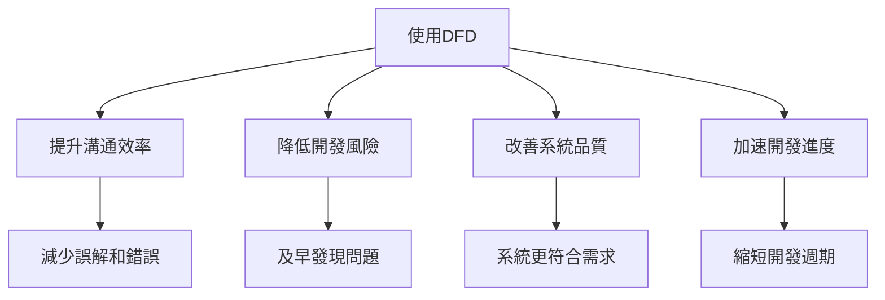

### 1.3 DFD發展歷史與演進

#### 📚 歷史發展脈絡

**1970年代 - 起源階段**
- **Tom DeMarco** 在1978年發表《Structured Analysis and System Specification》
- 建立了DFD的理論基礎和基本符號系統
- 成為結構化系統分析方法的核心工具

**1980年代 - 標準化發展**
- **Edward Yourdon** 推廣Yourdon方法，建立符號標準
- **Chris Gane & Trish Sarson** 發展另一套符號系統
- DFD成為系統分析師的必備技能

**1990年代 - 工具化時代**
- CASE工具(Computer-Aided Software Engineering)興起
- DFD繪製工具標準化，提升繪製效率
- 與資料庫設計工具整合

**2000年代至今 - 整合應用**
- 與UML等物件導向方法論並存
- 在敏捷開發中找到新的應用方式
- 雲端協作工具讓DFD應用更加便利

#### 🌍 DFD在不同地區的發展

```yaml
地區特色:
  北美地區:
    - 強調與軟體工程的整合
    - IIBA等專業組織推動標準化
    - 企業級應用成熟
    
  歐洲地區:
    - 重視與ISO標準的結合
    - BCS等機構提供認證體系
    - 政府專案廣泛採用
    
  亞太地區:
    - 結合本土企業文化特色
    - 與精實管理方法結合
    - 在製造業應用廣泛
```

### 1.4 在系統分析與程式開發中的角色

#### 🔄 系統開發生命週期中的定位

**階段1: 需求分析**
- 建立Context Diagram（環境圖）
- 識別主要的資料流和外部實體
- 確認系統範圍和邊界

**階段2: 系統分析**  
- 繪製Level 1 DFD
- 分解主要處理程序
- 定義資料儲存需求

**階段3: 系統設計**
- 細化到Level 2或更詳細層次
- 對應到程式模組設計
- 定義資料庫設計需求

**階段4: 程式開發**
- DFD作為程式架構的參考
- 處理程序對應到函數或類別
- 資料流對應到參數傳遞

#### 🔗 與其他分析工具的關係

| 工具 | 關係 | 互補作用 |
|------|------|----------|
| **ER Model** | 資料結構 vs 資料流程 | DFD定義資料流，ER定義資料結構 |
| **UML** | 傳統方法 vs 物件導向 | DFD適合功能分析，UML適合物件設計 |
| **流程圖** | 業務流程 vs 資料流程 | 流程圖描述步驟，DFD描述資料 |
| **系統架構圖** | 邏輯 vs 實體 | DFD是邏輯視圖，架構圖是實體視圖 |

### 📋 實務要點

#### ✅ 使用DFD的時機
- 系統需求不夠明確時
- 資料流程複雜的系統
- 需要與使用者充分溝通時
- 大型專案需要模組化分析

#### ⚠️ 注意事項
- DFD不是萬能工具，要配合其他方法
- 過度細化可能失去溝通效果
- 要根據專案規模調整詳細程度
- 保持圖形簡潔清晰

---

*本章節總結：DFD是系統分析的重要工具，幫助我們理解和設計資料流程，在專案開發中扮演關鍵的溝通橋樑角色。*

---

## 2. DFD元素與符號

DFD使用四種基本元素來描述系統的資料流程，每種元素都有標準的圖形符號。理解這些元素是繪製正確DFD的基礎。

### 2.1 外部實體 (External Entity)

#### 📋 定義與特性

**外部實體**是系統邊界外的人、組織、其他系統或設備，它們與目標系統有資料往來關係。

**特性：**
- 位於系統邊界之外
- 是資料的來源或目的地
- 不受分析系統控制
- 可以是人、組織、或其他系統

#### 🔤 符號表示

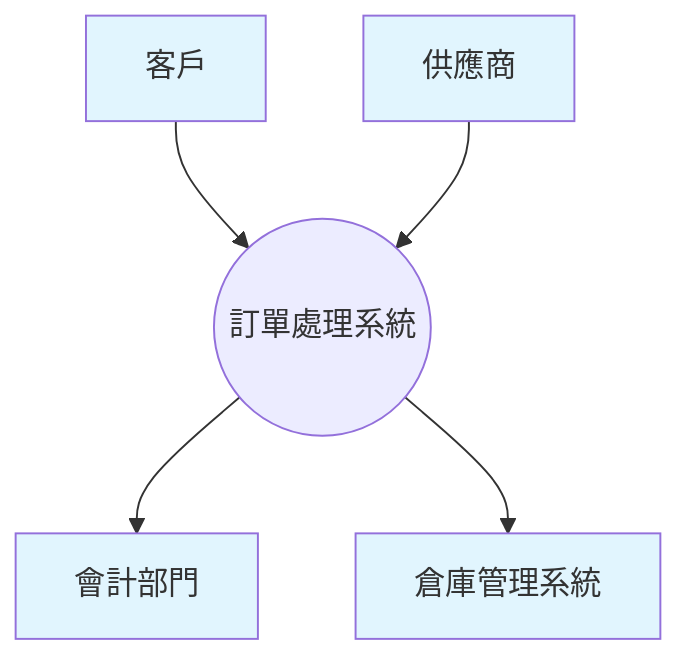

**標準符號：**
- **方形框**：最常用的表示方式
- **文字標籤**：簡潔明確的名稱
- **唯一性**：同一實體在同一張圖中只出現一次

#### 💡 命名原則

| ✅ 良好命名 | ❌ 不當命名 | 說明 |
|------------|------------|------|
| 客戶 | 人 | 具體明確 vs 過於抽象 |
| 銀行系統 | 系統 | 有明確功能 vs 太籠統 |
| 會計部門 | 部門 | 具體部門 vs 不明確 |
| 供應商 | 外部 | 角色明確 vs 位置描述 |

#### 🔍 識別方法

**步驟1：列出所有涉及的人或組織**
- 誰提供資料給系統？
- 誰從系統接收資料？
- 系統需要與哪些外部系統互動？

**步驟2：確認邊界**
- 該實體是否在分析範圍內？
- 是否由我們的系統控制？
- 是否為純粹的資料來源或接收者？

### 2.2 處理程序 (Process)

#### 📋 定義與特性

**處理程序**是系統內部對資料進行轉換、計算、分析或處理的功能或活動。

**特性：**
- 接受輸入資料
- 進行某種轉換或處理
- 產生輸出資料
- 必須有明確的處理邏輯

#### 🔤 符號表示

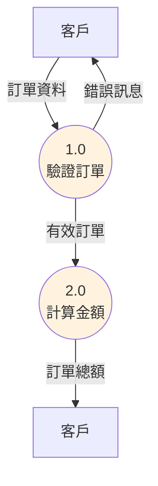

**符號組成：**
- **圓形**：表示處理程序
- **編號**：唯一識別碼（如1.0, 2.0）
- **名稱**：動詞片語描述處理內容

#### 📝 編號規則

| 層次 | 編號格式 | 範例 | 說明 |
|------|----------|------|------|
| Level 0 | 1.0 | 1.0 處理訂單 | 主要處理程序 |
| Level 1 | 1.1, 1.2 | 1.1 驗證訂單<br/>1.2 計算金額 | 子處理程序 |
| Level 2 | 1.1.1, 1.1.2 | 1.1.1 檢查庫存<br/>1.1.2 驗證客戶 | 更細分的處理 |

#### 💡 命名原則

**格式：動詞 + 受詞**
- ✅ 驗證客戶資料
- ✅ 計算訂單金額  
- ✅ 產生報表
- ❌ 客戶資料（缺乏動作）
- ❌ 處理（太籠統）

### 2.3 資料流 (Data Flow)

#### 📋 定義與特性

**資料流**表示資料在系統中的移動路徑，連接外部實體、處理程序和資料儲存。

**特性：**
- 具有方向性
- 代表特定的資料內容
- 連接不同的DFD元素
- 可以分叉但不能合併

#### 🔤 符號表示

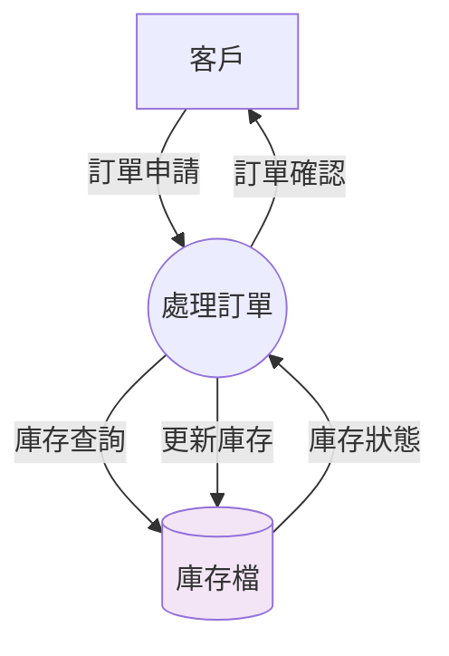

**表示規則：**
- **箭頭線條**：顯示資料流向
- **標籤**：描述資料內容
- **方向**：單向或雙向

#### 📝 命名指引

| 資料流類型 | 命名範例 | 注意事項 |
|------------|----------|----------|
| 申請資料 | 訂單申請、請假申請 | 強調動作意圖 |
| 查詢資料 | 客戶資料、庫存查詢 | 明確查詢對象 |
| 確認回覆 | 訂單確認、核准通知 | 反饋結果性質 |
| 更新異動 | 庫存更新、狀態變更 | 說明異動類型 |

#### ⚠️ 常見錯誤

```
❌ 錯誤的資料流：
- 控制信號（如「開始」、「停止」）
- 實體物品（如「商品」、「金錢」）
- 太抽象的描述（如「資料」、「資訊」）

✅ 正確的資料流：
- 具體的資料內容
- 有明確的商業意義
- 可以被處理或儲存
```

### 2.4 資料儲存 (Data Store)

#### 📋 定義與特性

**資料儲存**表示系統中暫時或永久保存資料的地方，可以是檔案、資料庫、或任何儲存媒體。

**特性：**
- 靜態儲存資料
- 可以被讀取和寫入
- 有固定的資料結構
- 在系統邊界內

#### 🔤 符號表示

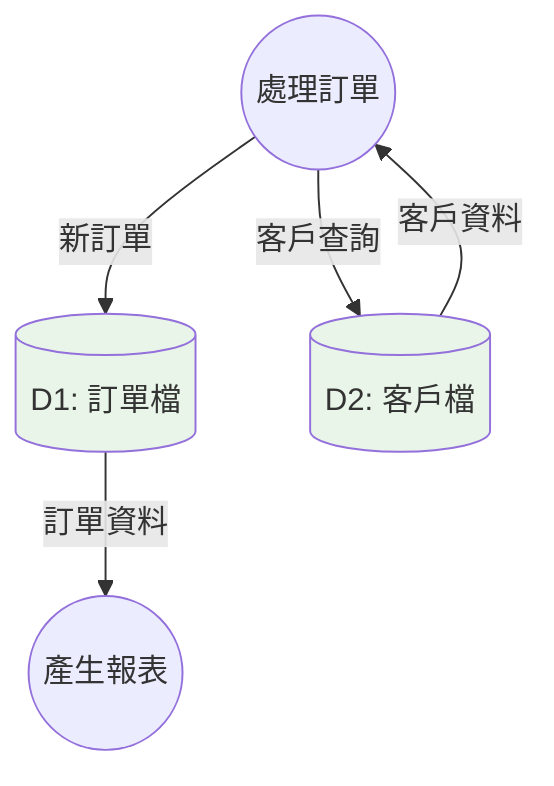

**符號組成：**
- **開放式矩形**：兩條平行線
- **編號**：D1, D2, D3...
- **名稱**：描述儲存的資料類型

#### 📝 編號與命名

| 編號格式 | 命名規則 | 範例 |
|----------|----------|------|
| D1, D2, D3... | 資料類型 + 檔/表 | D1: 客戶檔<br/>D2: 訂單檔<br/>D3: 產品檔 |

#### 💡 識別準則

**是資料儲存的情況：**
- ✅ 需要在不同時間點存取
- ✅ 多個處理程序共同使用
- ✅ 資料需要持續保存
- ✅ 有固定的資料結構

**不是資料儲存的情況：**
- ❌ 暫時的中間變數
- ❌ 計算過程中的臨時結果
- ❌ 外部實體管理的資料

### 2.5 符號標準與繪製規範

#### 📐 圖形標準

| 元素 | Gane & Sarson 標準 | Yourdon 標準 | 建議使用 |
|------|-------------------|-------------|----------|
| 外部實體 | 方形框 | 方形框 | 方形框 |
| 處理程序 | 圓角矩形 | 圓形 | 圓形 |
| 資料流 | 箭頭線 | 箭頭線 | 箭頭線 |
| 資料儲存 | 開放矩形 | 平行線 | 開放矩形 |

#### 📋 繪製規範

**1. 版面配置**
- 由左到右，由上到下的資料流向
- 避免線條交叉
- 保持適當的間距

**2. 命名規範**
- 使用名詞描述實體和儲存
- 使用動詞片語描述處理程序
- 避免技術術語，使用業務語言

**3. 編號系統**
- 處理程序：1.0, 2.0, 3.0...
- 資料儲存：D1, D2, D3...
- 保持一致性和唯一性

#### ⚠️ 繪製注意事項

```
🚫 避免的錯誤：
- 孤立的處理程序（沒有輸入或輸出）
- 直接連接的外部實體
- 沒有標籤的資料流
- 過於複雜的單一圖形

✅ 良好的做法：
- 每個處理程序都有輸入和輸出
- 外部實體通過處理程序間接互動
- 所有資料流都有意義的標籤
- 適當控制圖形複雜度
```

### 📋 本章實務要點

#### 🎯 設計原則
1. **簡潔性**：一張DFD不超過7±2個處理程序
2. **一致性**：命名和編號保持統一標準
3. **完整性**：所有資料流都要有來源和去向
4. **正確性**：符合業務邏輯和資料流向

#### 🔧 工具推薦
- **Visio**：微軟專業繪圖工具
- **Draw.io**：免費線上繪圖工具
- **Lucidchart**：協作式圖表工具
- **Enterprise Architect**：專業建模工具

---

*本章節總結：掌握DFD的四個基本元素和符號標準是繪製正確圖表的基礎，遵循命名和編號規範能確保圖表的專業性和可讀性。*

---

## 3. DFD層次架構

DFD採用階層式分解方法，從高層次的概觀逐步細化到詳細的處理程序。這種分層方式讓我們能夠管理複雜系統的分析過程。

### 3.1 層次概念與原理

#### 📊 分層分解原理

**Top-Down 分解法**：從整體系統開始，逐層分解到具體的處理細節。

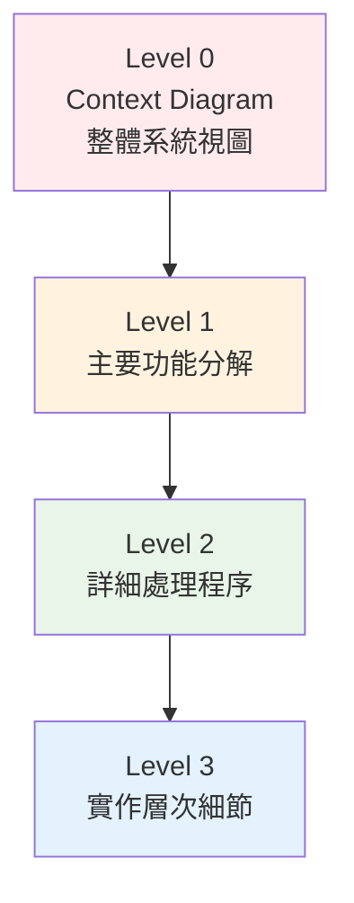

#### 🎯 分層目的

| 目的 | 說明 | 效益 |
|------|------|------|
| **複雜度管理** | 將複雜系統分解為可管理的小塊 | 降低分析難度 |
| **溝通層次** | 不同層級的人員看到適合的詳細程度 | 提升溝通效果 |
| **模組化設計** | 每一層對應不同的設計層次 | 支援模組化開發 |
| **變更管理** | 局部變更不影響其他層次 | 降低維護成本 |

#### 📏 分層原則

**1. 功能完整性**
- 每一層都是完整的功能視圖
- 子層的總和等於父層的功能

**2. 一致性原則**
- 輸入輸出在各層間保持一致
- 資料流名稱和內容保持對應

**3. 平衡原則**
- 每層的處理程序數量適中（3-7個）
- 避免過度細分或過於粗糙

### 3.2 Level 0 - Context Diagram (環境圖)

#### 📋 定義與用途

**Context Diagram** 是DFD的最高層次，展示整個系統與外部環境的互動關係。

**特點：**
- 只有一個處理程序（代表整個系統）
- 顯示所有外部實體
- 展示系統邊界
- 不包含內部資料儲存

#### 🎨 繪製範例

**線上購物系統 Context Diagram**

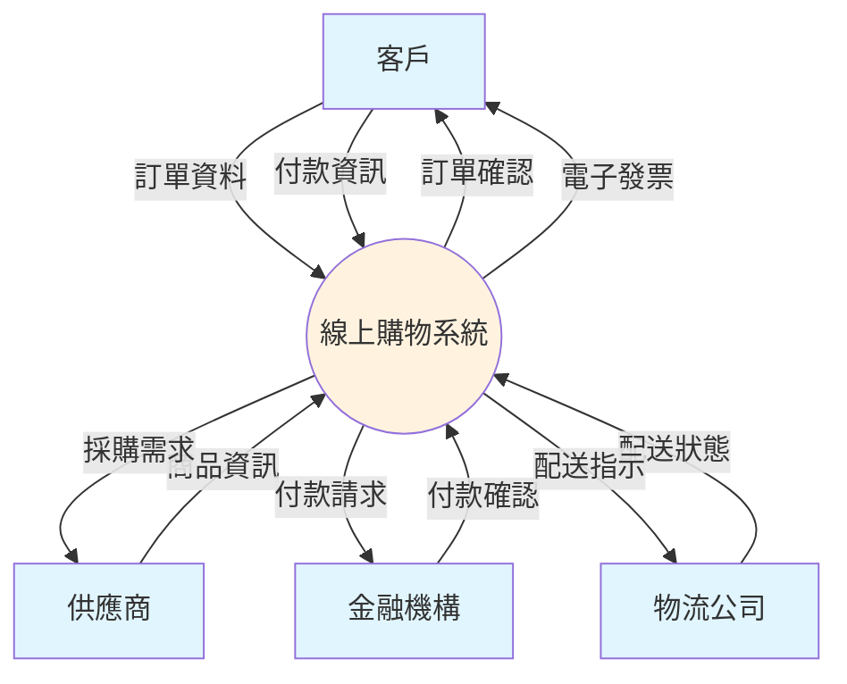

#### 📝 Context Diagram 檢查清單

```yaml
檢查項目:
  系統範圍:
    - ✅ 系統邊界清楚定義
    - ✅ 只有一個處理程序
    - ✅ 所有外部實體都已識別
    
  資料流:
    - ✅ 所有主要資料流都已標示
    - ✅ 資料流名稱具體明確
    - ✅ 沒有控制流或物理流
    
  完整性:
    - ✅ 涵蓋所有主要外部互動
    - ✅ 沒有遺漏重要的資料來源
    - ✅ 資料流方向正確
```

#### 💡 繪製步驟

**步驟1：識別系統範圍**
- 明確定義要分析的系統邊界
- 確認哪些功能屬於系統內部
- 識別系統的主要目標

**步驟2：列出外部實體**
- 誰會使用這個系統？
- 系統需要從哪裡取得資料？
- 系統要將資料送到哪裡？

**步驟3：定義資料流**
- 外部實體提供什麼資料給系統？
- 系統回傳什麼資料給外部實體？
- 資料流的方向是否正確？

### 3.3 Level 1 - 主要功能分解

#### 📋 Level 1 特性

**Level 1 DFD** 將Context Diagram中的單一系統分解為主要的功能模組。

**特點：**
- 展示系統的主要處理程序（通常3-7個）
- 包含內部資料儲存
- 保持與Context Diagram的一致性
- 顯示處理程序間的資料流

#### 🎨 範例：線上購物系統 Level 1

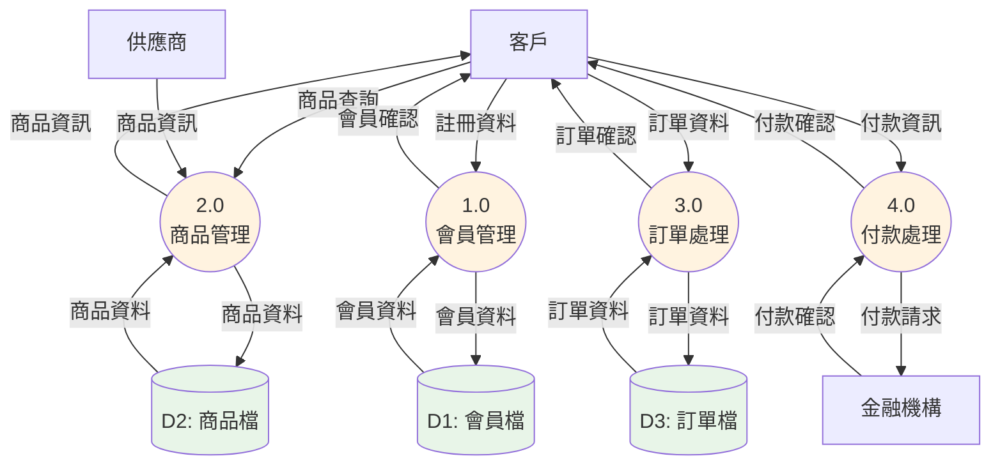

#### 📐 分解規則

**1. 功能劃分原則**
- 按照業務功能分組
- 每個處理程序有明確的職責
- 避免功能重疊或遺漏

**2. 資料流平衡**
- Level 1的所有輸入輸出總和 = Context Diagram
- 新增的內部資料流表示處理程序間的協作
- 資料儲存只在Level 1以下出現

**3. 編號規則**
- 主要處理程序：1.0, 2.0, 3.0...
- 資料儲存：D1, D2, D3...
- 保持邏輯順序

### 3.4 Level 2 及更深層次

#### 📋 Level 2 特性

**Level 2** 進一步分解Level 1中的複雜處理程序。

**分解條件：**
- Level 1處理程序過於複雜
- 需要更詳細的設計規格
- 有多個子功能需要區分

#### 🎨 範例：訂單處理 Level 2

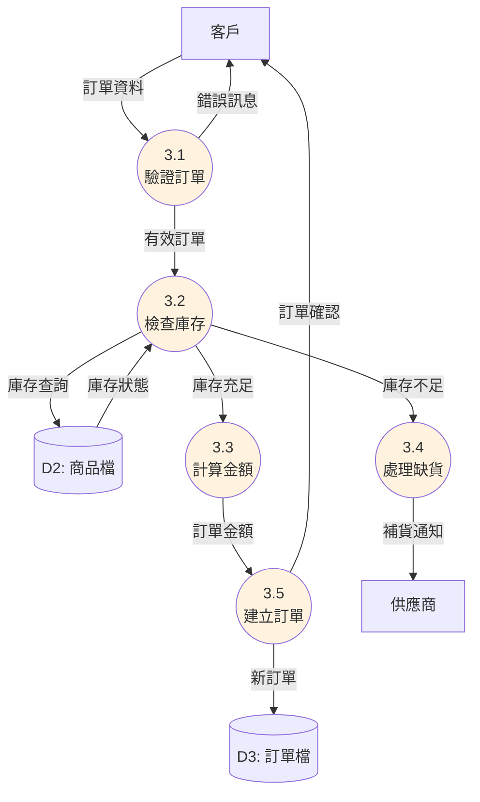

#### 📊 編號對應表

| Level 1 | Level 2 | 說明 |
|---------|---------|------|
| 3.0 訂單處理 | 3.1 驗證訂單 | 子功能1 |
|  | 3.2 檢查庫存 | 子功能2 |
|  | 3.3 計算金額 | 子功能3 |
|  | 3.4 處理缺貨 | 子功能4 |
|  | 3.5 建立訂單 | 子功能5 |

### 3.5 分層一致性檢查

#### 🔍 平衡檢查原則

**輸入輸出平衡**：子層圖的所有外部資料流必須在父層圖中出現。

```text
平衡檢查範例：

Context Diagram 輸入：
- 客戶 → 訂單資料
- 客戶 → 付款資訊

Level 1 必須包含：
- 客戶 → 訂單資料 (到某個處理程序)
- 客戶 → 付款資訊 (到某個處理程序)

新增內部流：
- 處理程序間的資料流
- 資料儲存的讀寫
```

#### 📋 一致性檢查清單

| 檢查項目 | 父層 (Level 0) | 子層 (Level 1) | 狀態 |
|----------|-------------|-------------|------|
| 外部實體 | 客戶、供應商、金融機構 | 相同實體出現 | ✅ |
| 輸入資料流 | 訂單資料、商品資訊 | 分配到相應處理程序 | ✅ |
| 輸出資料流 | 訂單確認、採購需求 | 從相應處理程序產出 | ✅ |
| 命名一致性 | 使用相同的術語 | 保持一致的命名 | ✅ |

### 3.6 何時停止分解

#### 🛑 停止分解的條件

**1. 功能單純化**
- 處理程序足夠簡單，易於理解
- 可以直接對應到程式模組
- 不需要進一步說明

**2. 實作層次**
- 已達到設計所需的詳細程度
- 可以開始編寫程式規格
- 團隊成員都能理解

**3. 成本效益**
- 繼續分解的效益遞減
- 維護成本開始增加
- 達到專案要求的詳細程度

#### 📏 分解深度指引

| 專案規模 | 建議層次 | 說明 |
|----------|----------|------|
| 小型專案 | Level 0-1 | 功能簡單，不需過度分解 |
| 中型專案 | Level 0-2 | 適度分解，便於模組設計 |
| 大型專案 | Level 0-3 | 需要詳細分析，支援團隊協作 |
| 超大型專案 | Level 0-4+ | 複雜系統，需要更細緻的分解 |

### 📋 本章實務要點

#### 🎯 分層策略
1. **先廣後深**：先完成同一層的所有處理程序，再向下分解
2. **保持平衡**：每一層的複雜度要適中
3. **功能導向**：按照業務功能而非技術實作分解
4. **團隊共識**：確保所有成員對分解結果有共識

#### ⚠️ 常見問題
- **過度分解**：分解過細，失去大局觀
- **不一致性**：父子層間的資料流不匹配
- **功能重疊**：不同處理程序有相同功能
- **遺漏邊界**：忘記某些重要的外部實體

---

*本章節總結：DFD層次架構提供了結構化的分析方法，從Context Diagram到詳細層次的逐步分解，幫助我們管理複雜系統的分析過程。*

---

## 4. 繪製步驟與方法

成功繪製DFD需要系統化的方法和明確的步驟。本章將提供完整的繪製流程，從需求蒐集到最終驗證的全過程指導。

### 4.1 需求蒐集與資料流識別

#### 📋 需求蒐集方法

**1. 訪談技巧**

```yaml
訪談準備:
  對象選擇:
    - 業務使用者 (了解業務流程)
    - 系統管理者 (了解現有系統)
    - 決策者 (了解業務目標)
    
  問題設計:
    - 開放式問題: "請描述您的工作流程"
    - 具體問題: "您需要哪些資料來完成這項工作？"
    - 情境問題: "當發生異常時，您如何處理？"
```

**2. 文件分析**
- 現有系統文件
- 業務流程規範
- 表單和報表樣本
- 法規和政策文件

**3. 觀察法**
- 實地觀察工作流程
- 記錄資料流動路徑
- 識別瓶頸和問題點

#### 🔍 資料流識別技巧

**識別資料來源**

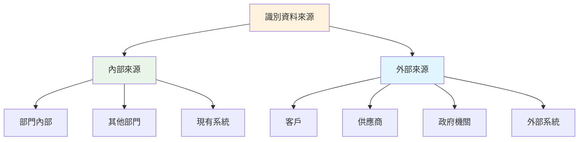

**資料流分類表**

| 分類 | 特徵 | 範例 | 處理方式 |
|------|------|------|----------|
| **主要資料流** | 核心業務資料 | 訂單、客戶資料 | 必須詳細描述 |
| **控制資料流** | 觸發或控制處理 | 核准信號、狀態通知 | 在DFD中省略 |
| **參考資料流** | 查詢或參考用 | 價格查詢、政策規範 | 標示為查詢類型 |
| **異常資料流** | 錯誤或例外處理 | 錯誤訊息、異常報告 | 簡化或合併處理 |

### 4.2 系統化繪製流程

#### 📝 8步驟繪製法

**步驟1：定義系統邊界**

```text
邊界定義檢查清單：
□ 系統的主要目的是什麼？
□ 哪些功能屬於系統內部？
□ 哪些是外部實體？
□ 資料的起始點和終點在哪裡？
```

**步驟2：列出外部實體**

| 實體類型 | 識別問題 | 範例 |
|----------|----------|------|
| **資料提供者** | 誰提供資料給系統？ | 客戶、員工、感測器 |
| **資料接收者** | 誰接收系統產生的資料？ | 管理層、外部機關 |
| **互動系統** | 系統需要與哪些外部系統對接？ | 會計系統、CRM系統 |

**步驟3：識別主要處理程序**

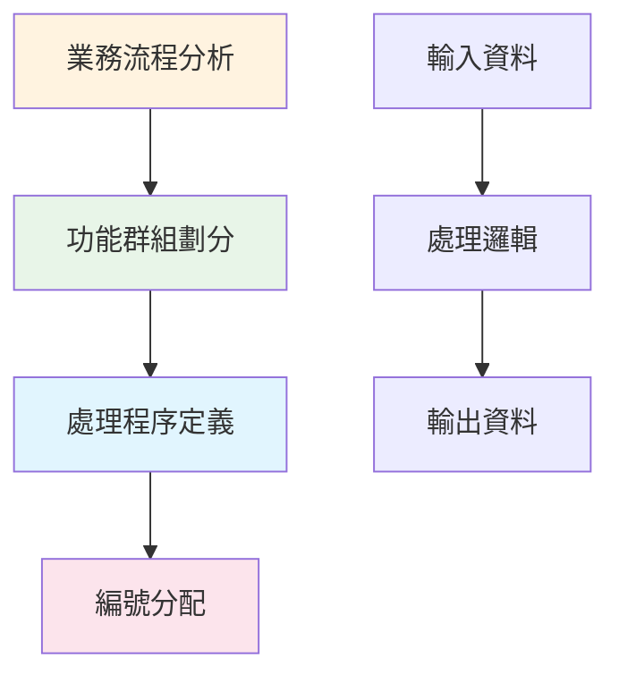

**步驟4：定義資料儲存**

```yaml
資料儲存識別原則:
  永久性儲存:
    - 客戶檔案
    - 產品目錄
    - 歷史交易記錄
    
  暫時性儲存:
    - 工作清單
    - 暫存檔案
    - 緩衝區資料
    
  共享資料:
    - 多個處理程序使用
    - 需要持續更新
    - 有固定格式結構
```

**步驟5：繪製Context Diagram**

實際繪製範例：

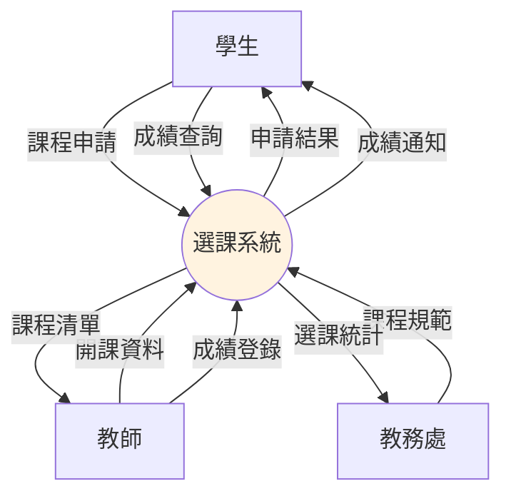

**步驟6：分解為Level 1**

選課系統Level 1分解：

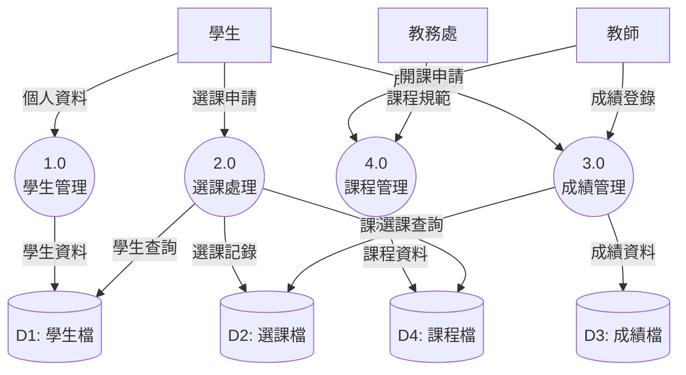

**步驟7：檢查一致性**

```yaml
一致性檢查表:
  資料流平衡:
    - ✅ Context圖的輸入 = Level 1 的外部輸入總和
    - ✅ Context圖的輸出 = Level 1 的外部輸出總和
    
  命名一致性:
    - ✅ 外部實體名稱相同
    - ✅ 資料流名稱對應
    - ✅ 術語使用統一
    
  邏輯正確性:
    - ✅ 資料流方向合理
    - ✅ 處理程序有輸入和輸出
    - ✅ 沒有孤立的元素
```

**步驟8：細化和驗證**

### 4.3 常見錯誤與避免方式

#### ❌ 繪製常見錯誤

**1. 邏輯錯誤**

| 錯誤類型 | 錯誤描述 | 正確做法 |
|----------|----------|----------|
| **孤立處理程序** | 處理程序沒有輸入或輸出 | 確保每個處理程序都有資料流進出 |
| **直接連接外部實體** | 兩個外部實體直接相連 | 外部實體只能通過處理程序互動 |
| **未標示資料流** | 資料流沒有名稱 | 所有資料流都要有具體名稱 |

**錯誤範例詳解：**

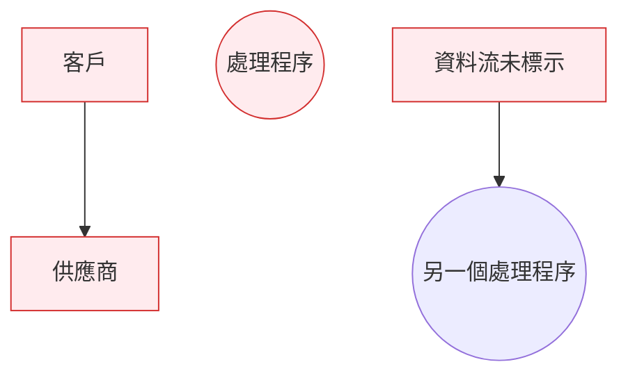

**❌ 問題分析：**
- 客戶和供應商直接連接：違反DFD規則，外部實體不能直接互動
- 孤立的處理程序：沒有任何資料流進出
- 未標示的資料流：無法理解資料內容

**正確範例：**

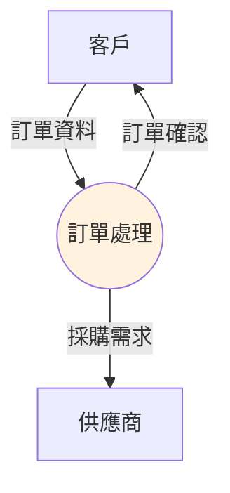

**2. 層次混淆錯誤**

```yaml
錯誤範例:
  問題: 在Level 1中包含太多細節
  
  錯誤做法:
    - 1.0 驗證客戶身分證號碼格式
    - 2.0 檢查信用額度是否足夠
    - 3.0 計算信用卡手續費
    
  正確做法:
    - 1.0 客戶驗證
    - 2.0 信用檢查  
    - 3.0 費用計算
```

**3. 資料流命名錯誤**

| ❌ 錯誤命名 | ✅ 正確命名 | 說明 |
|------------|------------|------|
| 資料 | 客戶資料 | 太抽象，不具體 |
| 開始 | 訂單申請 | 控制流，非資料流 |
| 商品 | 商品資訊 | 實體物品，非資料 |
| 檔案 | 客戶檔案查詢 | 不明確，需說明用途 |

**4. 更多常見錯誤範例**

**錯誤類型A：過度分解**
```text
❌ 錯誤：
1.1 檢查姓名格式
1.2 檢查電話號碼格式  
1.3 檢查電子郵件格式
1.4 檢查地址格式

✅ 正確：
1.0 驗證客戶資料
```

**錯誤類型B：功能重疊**
```text
❌ 錯誤：
2.1 處理現金付款
2.2 處理信用卡付款
2.3 處理線上付款
3.1 驗證付款資訊
3.2 確認付款狀態

✅ 正確：
2.0 付款處理
3.0 付款驗證
```

**錯誤類型C：資料流方向錯誤**
```text
❌ 錯誤：客戶 ← 查詢請求 ← 系統
✅ 正確：客戶 → 查詢請求 → 系統
```

**錯誤類型D：混用不同抽象層次**
```text
❌ 錯誤：
Level 1包含：
- 1.0 客戶管理
- 2.0 檢查密碼正確性
- 3.0 訂單處理

✅ 正確：
Level 1包含：
- 1.0 客戶管理
- 2.0 身分驗證
- 3.0 訂單處理
```

#### ✅ 避免錯誤的最佳實務

**1. 建立檢查清單**

```yaml
繪製前檢查:
  □ 明確定義系統邊界
  □ 列出所有外部實體
  □ 識別主要業務流程
  □ 確認資料來源和去向

繪製中檢查:
  □ 每個處理程序都有明確功能
  □ 資料流名稱具體明確
  □ 編號系統一致
  □ 圖形保持簡潔

繪製後檢查:
  □ 資料流平衡
  □ 命名一致性
  □ 邏輯正確性
  □ 團隊成員共識
```

**2. 團隊審查機制**

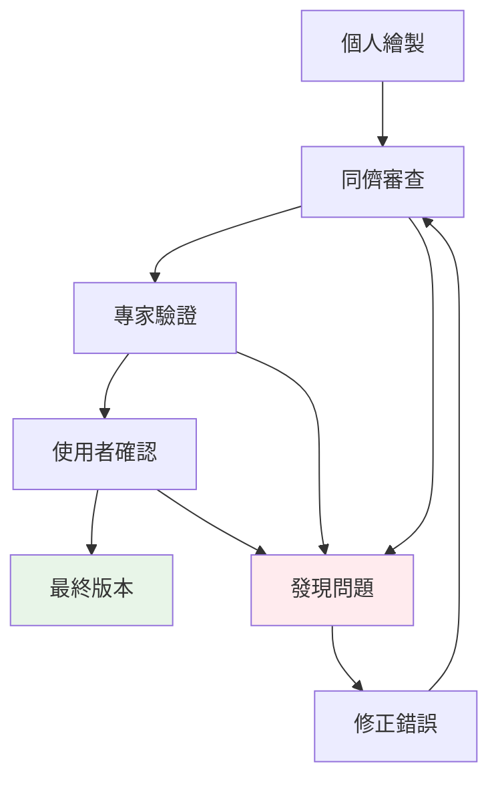

**3. 迭代改進流程**

| 迭代次數 | 重點檢查項目 | 預期成果 |
|----------|-------------|----------|
| **第1版** | 基本架構和主要流程 | 整體框架正確 |
| **第2版** | 資料流完整性和命名 | 細節補充完整 |
| **第3版** | 一致性和邏輯檢查 | 邏輯關係正確 |
| **最終版** | 團隊共識和文件化 | 可用於開發 |

### 4.4 工具使用與技巧

#### 🛠️ 繪圖工具比較

| 工具 | 優點 | 缺點 | 適用情境 |
|------|------|------|----------|
| **Microsoft Visio** | 專業符號庫、格式標準 | 需要授權、學習曲線 | 正式專案文件 |
| **Draw.io** | 免費、線上協作 | 功能相對簡單 | 快速原型和協作 |
| **Lucidchart** | 雲端協作、模板豐富 | 付費、網路依賴 | 團隊協作專案 |
| **手繪** | 快速、直覺 | 不易修改、不正式 | 初期討論和腦力激盪 |

#### 💡 工具使用技巧

**1. 版面配置原則**

```text
建議配置:
┌─────────────────────────────────┐
│ 標題：XXX系統 Level 1 DFD       │
├─────────────────────────────────┤
│                                 │
│  [外部實體]  →  ((處理程序))    │
│     ↓              ↓            │
│  [外部實體]  ←  [資料儲存]      │
│                                 │
├─────────────────────────────────┤
│ 圖例、編號說明、版本資訊         │
└─────────────────────────────────┘
```

**2. 色彩和格式標準**

| 元素類型 | 建議顏色 | 說明 |
|----------|----------|------|
| 外部實體 | 淺藍色 (#E1F5FE) | 區分內外部邊界 |
| 處理程序 | 淺橙色 (#FFF3E0) | 突出主要功能 |
| 資料儲存 | 淺綠色 (#E8F5E8) | 表示資料持久性 |
| 資料流 | 黑色箭頭 | 保持簡潔清晰 |

### 📋 本章實務要點

#### 🎯 成功關鍵因素
1. **系統化方法**：遵循標準步驟，不跳過任何環節
2. **團隊協作**：讓相關人員參與繪製和驗證過程
3. **迭代改進**：預期需要多次修正和完善
4. **工具熟練**：選擇合適工具並熟練使用

#### ⚠️ 特別注意事項
- 不要一開始就追求完美，先求整體架構正確
- 定期與使用者確認，避免閉門造車
- 保持圖形簡潔，過度複雜會失去溝通效果
- 文件化過程和決策，方便後續維護

---

*本章節總結：系統化的繪製流程和錯誤預防機制是成功建立DFD的關鍵，工具的熟練使用能大幅提升效率和品質。*

---

## 5. 專案實務應用

本章將說明如何在真實專案環境中有效運用DFD，包括與其他分析工具的整合、在敏捷開發中的應用，以及如何讓DFD支援程式開發過程。

### 5.1 在專案需求分析文件中使用DFD

#### 📋 需求分析文件結構

**標準需求分析文件中DFD的位置：**

```yaml
需求分析文件架構:
  1. 專案概述:
    - 專案目標和範圍
    - 利害關係人分析
    
  2. 業務需求:
    - 業務流程描述
    - 功能需求清單
    
  3. 系統分析:
    - Context Diagram (必要)
    - Level 1 DFD (必要)
    - Level 2+ DFD (視需要)
    
  4. 資料需求:
    - 資料字典
    - ER Model
    
  5. 非功能需求:
    - 效能要求
    - 安全性要求
```

#### 📝 DFD在文件中的作用

**1. 需求確認工具**

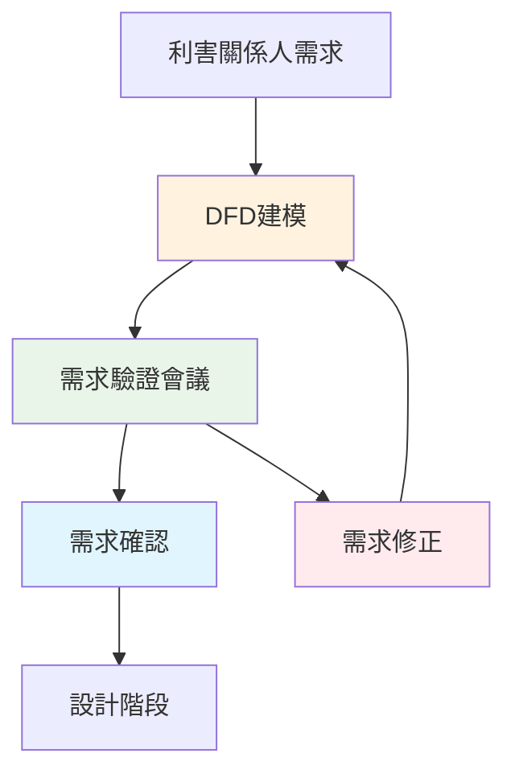

**2. 需求追溯矩陣**

| 業務需求 | Context Diagram | Level 1 DFD | 對應處理程序 | 設計模組 |
|----------|----------------|-------------|-------------|-----------|
| 客戶註冊 | 客戶→系統 | 1.0 會員管理 | 1.1 驗證資料<br/>1.2 建立帳號 | UserService |
| 商品查詢 | 客戶→系統 | 2.0 商品管理 | 2.1 搜尋商品<br/>2.2 顯示結果 | ProductService |
| 訂單處理 | 客戶→系統 | 3.0 訂單處理 | 3.1 建立訂單<br/>3.2 計算金額 | OrderService |

#### 🔗 與需求規格的整合

**需求編號對應**

```yaml
需求編號系統:
  功能需求:
    - FR-001: 系統應支援客戶註冊
      對應DFD: Context圖客戶實體、1.0會員管理
      
    - FR-002: 系統應提供商品搜尋功能  
      對應DFD: 2.0商品管理、D2商品檔
      
    - FR-003: 系統應處理訂單資料
      對應DFD: 3.0訂單處理、D3訂單檔
      
  資料需求:
    - DR-001: 系統應儲存客戶基本資料
      對應DFD: D1客戶檔
      
    - DR-002: 系統應維護商品庫存資訊
      對應DFD: D2商品檔
```

### 5.2 讓程式開發與DFD對應

#### 🏗️ 從DFD到程式架構

**架構對應原則**

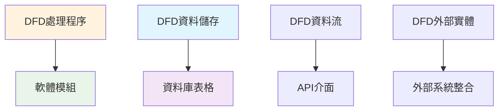

**Java專案對應範例**

| DFD元素 | Java實作 | 檔案位置 | 說明 |
|---------|----------|----------|------|
| 1.0 會員管理 | UserService.java | src/main/java/service/ | 商業邏輯層 |
| 2.0 商品管理 | ProductService.java | src/main/java/service/ | 商業邏輯層 |
| D1 客戶檔 | User.java + UserRepository | src/main/java/entity/<br/>src/main/java/repository/ | 資料存取層 |
| 客戶資料流 | UserDTO.java | src/main/java/dto/ | 資料傳輸物件 |

#### 💻 程式碼結構映射

**1. 處理程序 → 服務類別**

```java
// DFD: 1.0 會員管理
@Service
public class UserService {
    
    // DFD: 1.1 驗證使用者資料
    public ValidationResult validateUserData(UserRegistrationDto userData) {
        // 實作驗證邏輯
    }
    
    // DFD: 1.2 建立會員帳號
    public User createUserAccount(UserRegistrationDto userData) {
        // 實作帳號建立邏輯
    }
    
    // DFD: 1.3 發送確認通知
    public void sendConfirmationNotification(User user) {
        // 實作通知邏輯
    }
}
```

**2. 資料儲存 → 實體和Repository**

```java
// DFD: D1 客戶檔
@Entity
@Table(name = "users")
public class User {
    @Id
    @GeneratedValue(strategy = GenerationType.IDENTITY)
    private Long id;
    
    private String username;
    private String email;
    private String phoneNumber;
    // ... 其他欄位
}

// 對應的Repository
@Repository
public interface UserRepository extends JpaRepository<User, Long> {
    Optional<User> findByUsername(String username);
    Optional<User> findByEmail(String email);
}
```

**3. 資料流 → DTO類別**

```java
// DFD資料流: 客戶註冊資料
public class UserRegistrationDto {
    private String username;
    private String email;
    private String password;
    private String phoneNumber;
    
    // 建構子、Getter、Setter
}

// DFD資料流: 註冊確認
public class RegistrationConfirmationDto {
    private String message;
    private String confirmationToken;
    private LocalDateTime timestamp;
    
    // 建構子、Getter、Setter
}
```

#### 🔄 敏捷開發中的DFD應用

**Sprint規劃與DFD**

```yaml
Sprint 1 - 基礎功能:
  目標: 實作使用者註冊和商品瀏覽
  DFD範圍:
    - Context Diagram完整實作
    - 1.0 會員管理 (Level 2細分)
    - 2.0 商品管理 (Level 1)
    - D1 客戶檔、D2 商品檔
    
Sprint 2 - 核心交易:
  目標: 實作訂單處理和付款
  DFD範圍:
    - 3.0 訂單處理 (Level 2細分)
    - 4.0 付款處理 (Level 1)
    - D3 訂單檔、外部金融機構整合
    
Sprint 3 - 進階功能:
  目標: 報表和管理功能
  DFD範圍:
    - 5.0 報表產生
    - 6.0 庫存管理
    - 與供應商系統整合
```

**User Story與DFD的對應**

| User Story | 對應DFD處理程序 | 驗收條件 |
|------------|----------------|----------|
| "作為客戶，我想要註冊帳號" | 1.0 會員管理 | - 能夠輸入註冊資料<br/>- 系統驗證資料格式<br/>- 收到確認通知 |
| "作為客戶，我想要搜尋商品" | 2.0 商品管理 | - 能夠使用關鍵字搜尋<br/>- 顯示商品清單<br/>- 可以檢視商品詳情 |

### 5.3 與ER Model、UML的關聯

#### 🔗 三種建模方法的關係

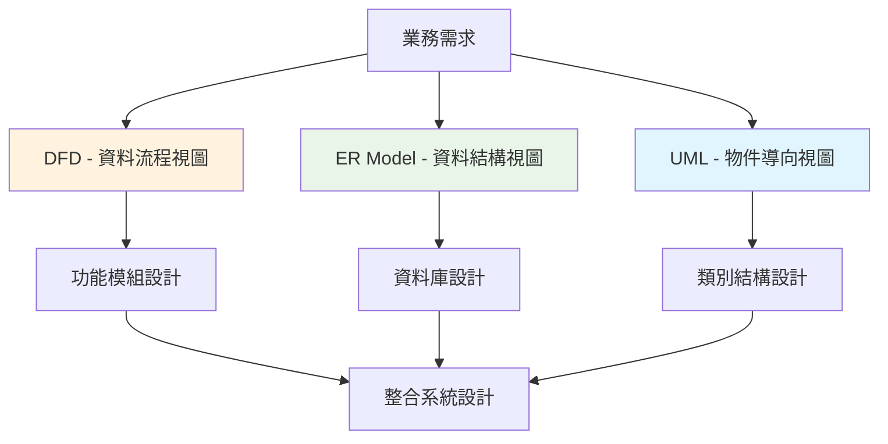

#### 📊 對應關係表

| DFD元素 | ER Model元素 | UML元素 | 說明 |
|---------|-------------|---------|------|
| 資料儲存 | 實體 (Entity) | 類別 (Class) | 資料的邏輯群組 |
| 資料流 | 屬性 (Attribute) | 關聯 (Association) | 資料的移動和關係 |
| 處理程序 | - | 方法 (Method) | 資料的處理邏輯 |
| 外部實體 | - | 介面 (Interface) | 系統邊界的定義 |

#### 🎯 整合應用策略

**階段1：功能分析 (DFD主導)**
- 建立Context Diagram確定系統邊界
- 識別主要資料流和處理程序
- 確定外部實體和互動關係

**階段2：資料設計 (ER Model主導)**
- 從DFD的資料儲存識別實體
- 定義實體間的關係
- 設計資料庫綱要

**階段3：物件設計 (UML主導)**
- 將DFD處理程序轉換為類別方法
- 設計類別間的繼承和組合關係
- 定義介面和抽象類別

### 5.4 版本控制與變更管理

#### 📝 DFD版本管理

**版本編號規則**

```yaml
版本編號格式: 主版本.次版本.修訂版本
範例: 
  v1.0.0 - 初始版本
  v1.1.0 - 新增功能模組
  v1.1.1 - 錯誤修正
  
版本控制策略:
  主版本: 系統架構重大變更
  次版本: 新增或移除處理程序
  修訂版本: 資料流或命名調整
```

**變更追蹤表**

| 版本 | 變更日期 | 變更內容 | 影響範圍 | 負責人 |
|------|----------|----------|----------|--------|
| v1.1.0 | 2025-09-01 | 新增付款處理功能 | Level 1新增4.0處理程序 | 系統分析師A |
| v1.1.1 | 2025-09-05 | 修正資料流名稱 | 資料流標籤更新 | 系統分析師B |

#### 🔄 變更影響分析

**變更類型與影響評估**

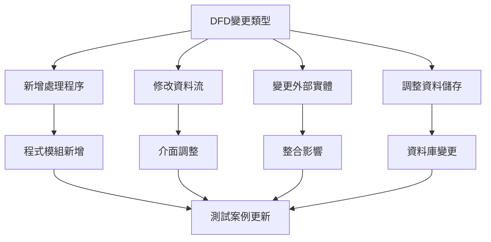

### 5.5 團隊協作與溝通

#### 👥 角色分工

| 角色 | DFD相關職責 | 參與程度 |
|------|-------------|----------|
| **專案經理** | 確認DFD符合專案範圍 | 審查 |
| **系統分析師** | 負責DFD繪製和維護 | 主要 |
| **程式設計師** | 依據DFD進行開發 | 使用 |
| **測試工程師** | 根據DFD設計測試案例 | 參考 |
| **使用者代表** | 確認DFD反映業務需求 | 驗證 |

#### 💬 溝通會議流程

**DFD審查會議議程**

```yaml
會議議程:
  1. 開場 (5分鐘):
    - 會議目的說明
    - 參與者介紹
    
  2. DFD簡報 (20分鐘):
    - Context Diagram說明
    - 主要處理程序介紹
    - 資料流向解釋
    
  3. 問題討論 (30分鐘):
    - 業務邏輯確認
    - 遺漏功能識別
    - 異常情況處理
    
  4. 決議與後續 (5分鐘):
    - 修正項目記錄
    - 下次會議安排
```

### 📋 本章實務要點

#### 🎯 成功關鍵因素
1. **早期參與**：在專案初期就建立DFD，避免後期大幅修改
2. **持續更新**：隨著需求變更及時更新DFD
3. **團隊共識**：確保所有團隊成員理解並同意DFD內容
4. **工具整合**：選擇支援版本控制的繪圖工具

#### ⚠️ 實務注意事項
- DFD是溝通工具，不要過度追求技術細節
- 保持DFD與實際實作的同步
- 定期檢查DFD是否仍然反映現實狀況
- 培訓團隊成員正確理解和使用DFD

#### 🛠️ 推薦實務流程

```mermaid
graph LR
    A[需求蒐集] --> B[DFD建立]
    B --> C[團隊審查]
    C --> D[程式設計]
    D --> E[測試驗證]
    E --> F[部署上線]
    
    G[變更需求] --> H[DFD更新]
    H --> C
    
    style B fill:#fff3e0
    style H fill:#ffebee
```

---

*本章節總結：DFD在專案中的實務應用需要與其他分析工具整合，配合適當的版本管理和團隊協作流程，才能發揮最大效益。*

---

## 6. 練習與案例

本章提供兩個完整的實務案例，從需求分析到完整DFD的建立過程，幫助讀者掌握實際應用技巧。

### 6.1 案例一：ATM提款系統

#### 📋 系統需求描述

**業務背景**
銀行需要建立一套ATM提款系統，讓客戶能夠透過ATM機器進行基本的銀行業務操作。

**功能需求**
1. 客戶可以插入提款卡並輸入密碼進行身分驗證
2. 系統驗證客戶身分和帳戶狀態
3. 客戶可以查詢帳戶餘額
4. 客戶可以提領現金（需檢查餘額和提款限額）
5. 系統記錄所有交易並更新帳戶餘額
6. 銀行總部可以監控ATM狀態和交易記錄

**外部實體識別**
- 客戶（ATM使用者）
- 銀行總部系統
- ATM維護人員

#### 🎨 Context Diagram (Level 0)

```mermaid
graph TD
    A[客戶] -->|提款卡資料| B((ATM提款系統))
    A -->|交易指令| B
    B -->|現金| A
    B -->|交易收據| A
    B -->|錯誤訊息| A
    
    C[銀行總部] -->|帳戶驗證請求| D[核心銀行系統]
    D -->|帳戶狀態| C
    B -->|交易記錄| C
    C -->|系統更新| B
    
    E[維護人員] -->|維護指令| B
    B -->|系統狀態| E
    
    style B fill:#fff3e0
    style A fill:#e1f5fe
    style C fill:#e1f5fe
    style D fill:#e1f5fe
    style E fill:#e1f5fe
```

#### 🔧 Level 1 DFD - 主要功能分解

```mermaid
graph TD
    A[客戶] -->|提款卡| B((1.0<br/>身分驗證))
    A -->|密碼| B
    B -->|驗證成功| C((2.0<br/>選擇交易))
    B -->|驗證失敗| A
    
    C -->|餘額查詢| D((3.0<br/>查詢餘額))
    C -->|提款請求| E((4.0<br/>處理提款))
    
    D -->|餘額資訊| A
    E -->|現金| A
    E -->|收據| A
    
    B -->|帳戶查詢| F[(D1: 帳戶檔)]
    F -->|帳戶資料| B
    
    E -->|餘額查詢| F
    E -->|餘額更新| F
    F -->|目前餘額| E
    
    G((5.0<br/>記錄交易)) -->|交易記錄| H[(D2: 交易檔)]
    D -->|查詢記錄| G
    E -->|提款記錄| G
    
    I[銀行總部] -->|帳戶同步| F
    F -->|交易記錄| I
    H -->|交易統計| I
    
    style B fill:#fff3e0
    style C fill:#fff3e0
    style D fill:#fff3e0
    style E fill:#fff3e0
    style G fill:#fff3e0
    style F fill:#e8f5e8
    style H fill:#e8f5e8
```

#### 🔍 Level 2 DFD - 提款處理詳細分解

**4.0 處理提款的Level 2分解**

```mermaid
graph TD
    A[客戶] -->|提款金額| B((4.1<br/>驗證提款金額))
    B -->|有效金額| C((4.2<br/>檢查帳戶餘額))
    B -->|無效金額| A
    
    C -->|餘額查詢| D[(D1: 帳戶檔)]
    D -->|餘額資料| C
    
    C -->|餘額充足| E((4.3<br/>檢查提款限額))
    C -->|餘額不足| F((4.4<br/>處理異常))
    
    G[(D3: 限額設定檔)] -->|每日限額| E
    E -->|限額內| H((4.5<br/>發放現金))
    E -->|超過限額| F
    
    H -->|現金| A
    H -->|餘額扣款| I((4.6<br/>更新帳戶))
    I -->|餘額更新| D
    
    F -->|錯誤訊息| A
    
    H -->|交易成功| J((4.7<br/>產生收據))
    J -->|收據| A
    
    style B fill:#fff3e0
    style C fill:#fff3e0
    style E fill:#fff3e0
    style H fill:#fff3e0
    style I fill:#fff3e0
    style J fill:#fff3e0
    style F fill:#ffebee
```

#### 📊 資料字典

| 資料流 | 內容描述 | 格式 |
|--------|----------|------|
| 提款卡資料 | 卡號、發卡銀行 | 16位數字 |
| 密碼 | 個人識別碼 | 4-6位數字 |
| 提款金額 | 客戶要求提領的金額 | 數值，100的倍數 |
| 帳戶資料 | 帳號、餘額、狀態 | 帳號(12位)+餘額(數值)+狀態(A/I) |
| 交易記錄 | 時間、類型、金額、餘額 | 時戳+類型碼+金額+餘額 |

### 6.2 案例二：訂單管理系統

#### 📋 系統需求描述

**業務背景**
電商公司需要建立訂單管理系統，處理從客戶下單到商品出貨的完整流程。

**功能需求**
1. 客戶可以瀏覽商品並下訂單
2. 系統驗證庫存並保留商品
3. 處理客戶付款和發票開立
4. 安排商品包裝和出貨
5. 追蹤訂單狀態並通知客戶
6. 管理者可以查看訂單統計和庫存報表

**外部實體識別**
- 客戶
- 金融機構（付款處理）
- 物流公司
- 供應商
- 管理者

#### 🎨 Context Diagram (Level 0)

```mermaid
graph TD
    A[客戶] -->|訂單資料| B((訂單管理系統))
    A -->|付款資訊| B
    B -->|訂單確認| A
    B -->|出貨通知| A
    B -->|電子發票| A
    
    C[金融機構] -->|付款確認| B
    B -->|付款請求| C
    
    D[物流公司] -->|配送狀態| B
    B -->|出貨指示| D
    
    E[供應商] -->|商品資訊| B
    E -->|庫存補充| B
    B -->|採購需求| E
    
    F[管理者] -->|查詢指令| B
    B -->|管理報表| F
    
    style B fill:#fff3e0
    style A fill:#e1f5fe
    style C fill:#e1f5fe
    style D fill:#e1f5fe
    style E fill:#e1f5fe
    style F fill:#e1f5fe
```

#### 🔧 Level 1 DFD - 主要功能分解

```mermaid
graph TD
    A[客戶] -->|商品查詢| B((1.0<br/>商品管理))
    B -->|商品資訊| A
    A -->|訂單資料| C((2.0<br/>訂單處理))
    C -->|訂單確認| A
    
    A -->|付款資訊| D((3.0<br/>付款處理))
    D -->|付款確認| A
    
    E((4.0<br/>庫存管理)) -->|庫存狀態| C
    C -->|庫存保留| E
    
    F((5.0<br/>出貨處理)) -->|出貨通知| A
    C -->|出貨指示| F
    
    G((6.0<br/>報表產生)) -->|管理報表| H[管理者]
    H -->|查詢需求| G
    
    B -->|商品資料| I[(D1: 商品檔)]
    I -->|商品資料| B
    
    C -->|訂單資料| J[(D2: 訂單檔)]
    J -->|訂單資料| C
    
    E -->|庫存資料| K[(D3: 庫存檔)]
    K -->|庫存資料| E
    
    D -->|付款記錄| L[(D4: 付款檔)]
    L -->|付款記錄| D
    
    M[金融機構] -->|付款確認| D
    D -->|付款請求| M
    
    N[物流公司] -->|配送狀態| F
    F -->|出貨指示| N
    
    O[供應商] -->|商品更新| B
    E -->|採購需求| O
    
    style B fill:#fff3e0
    style C fill:#fff3e0
    style D fill:#fff3e0
    style E fill:#fff3e0
    style F fill:#fff3e0
    style G fill:#fff3e0
```

#### 🔍 Level 2 DFD - 訂單處理詳細分解

**2.0 訂單處理的Level 2分解**

```mermaid
graph TD
    A[客戶] -->|訂單資料| B((2.1<br/>驗證訂單))
    B -->|有效訂單| C((2.2<br/>檢查庫存))
    B -->|無效訂單| D((2.7<br/>處理異常))
    
    C -->|庫存查詢| E[(D3: 庫存檔)]
    E -->|庫存狀態| C
    
    C -->|庫存充足| F((2.3<br/>計算金額))
    C -->|庫存不足| G((2.4<br/>處理缺貨))
    
    H[(D1: 商品檔)] -->|價格資訊| F
    F -->|訂單金額| I((2.5<br/>建立訂單))
    
    I -->|新訂單| J[(D2: 訂單檔)]
    I -->|訂單確認| A
    
    G -->|缺貨通知| A
    G -->|補貨需求| K[供應商]
    
    I -->|庫存保留| L((2.6<br/>保留庫存))
    L -->|庫存更新| E
    
    D -->|錯誤訊息| A
    
    style B fill:#fff3e0
    style C fill:#fff3e0
    style F fill:#fff3e0
    style I fill:#fff3e0
    style L fill:#fff3e0
    style G fill:#ffebee
    style D fill:#ffebee
```

#### 📊 完整資料字典

| 資料儲存 | 包含欄位 | 主鍵 |
|----------|----------|------|
| D1: 商品檔 | 商品編號、商品名稱、價格、規格 | 商品編號 |
| D2: 訂單檔 | 訂單編號、客戶編號、訂單日期、狀態 | 訂單編號 |
| D3: 庫存檔 | 商品編號、庫存數量、安全庫存 | 商品編號 |
| D4: 付款檔 | 付款編號、訂單編號、金額、狀態 | 付款編號 |

### 6.3 練習題目

#### 🎯 練習1：圖書館管理系統

**題目描述**
設計一套圖書館管理系統，需要處理以下功能：
- 讀者借還書
- 圖書館員管理圖書
- 逾期罰款處理
- 圖書採購管理

**要求**
1. 繪製Context Diagram
2. 繪製Level 1 DFD
3. 選擇一個處理程序繪製Level 2 DFD

#### 🎯 練習2：學生選課系統

**題目描述**
大學需要建立選課系統，包含：
- 學生查詢課程和選課
- 教師開課和成績登錄
- 教務處課程管理
- 選課衝突檢查

**要求**
1. 識別所有外部實體
2. 繪製完整的Level 1 DFD
3. 定義主要的資料儲存

### 6.4 參考解答

#### 📚 練習1解答：圖書館管理系統

**Context Diagram**

```mermaid
graph TD
    A[讀者] -->|借書申請| B((圖書館管理系統))
    A -->|還書| B
    B -->|借書確認| A
    B -->|逾期通知| A
    
    C[圖書館員] -->|圖書資料| B
    B -->|圖書報表| C
    
    D[供應商] -->|新書資訊| B
    B -->|採購訂單| D
    
    style B fill:#fff3e0
```

**Level 1 DFD**

```mermaid
graph TD
    A[讀者] -->|借書申請| B((1.0<br/>借書處理))
    A -->|還書| C((2.0<br/>還書處理))
    B -->|借書確認| A
    C -->|還書確認| A
    
    D((3.0<br/>逾期管理)) -->|逾期通知| A
    
    E[圖書館員] -->|圖書資料| F((4.0<br/>圖書管理))
    F -->|圖書報表| E
    
    B -->|借閱記錄| G[(D1: 借閱檔)]
    C -->|還書記錄| G
    G -->|借閱狀態| D
    
    F -->|圖書資料| H[(D2: 圖書檔)]
    H -->|圖書資料| B
    H -->|圖書資料| C
    
    I[供應商] -->|新書資訊| J((5.0<br/>採購管理))
    J -->|採購訂單| I
    J -->|新書資料| H
```

#### � 練習3：中小企業進銷存系統

**題目描述**
某中小企業需要建立一套進銷存管理系統，處理日常營運流程：

**業務需求：**
- 供應商管理：新增供應商資料、更新聯絡資訊
- 採購管理：建立採購單、驗收入庫、應付帳款
- 庫存管理：庫存查詢、安全庫存警示、盤點作業
- 銷售管理：客戶下單、出貨作業、應收帳款
- 財務管理：收付款記錄、財務報表產生

**外部實體：**
- 供應商（提供商品和發票）
- 客戶（下訂單和付款）
- 倉庫人員（實際操作進出貨）
- 會計人員（處理財務作業）
- 老闆（查看各種報表）

**要求：**
1. 繪製Context Diagram
2. 繪製Level 1 DFD
3. 針對「銷售管理」繪製Level 2 DFD
4. 定義主要資料儲存和關鍵資料流

### 🎯 練習3參考解答：中小企業進銷存系統

**Context Diagram**

```mermaid
graph TD
    A[供應商] -->|商品資訊| B((進銷存管理系統))
    A -->|發票| B
    B -->|採購單| A
    B -->|付款| A
    
    C[客戶] -->|訂單| B
    C -->|付款| B
    B -->|商品| C
    B -->|發票| C
    
    D[倉庫人員] -->|入庫單| B
    D -->|出貨單| B
    B -->|庫存異動通知| D
    B -->|揀貨清單| D
    
    E[會計人員] -->|付款指示| B
    B -->|應收應付明細| E
    
    F[老闆] -->|報表需求| B
    B -->|營運報表| F
    
    style B fill:#fff3e0
```

**Level 1 DFD**

```mermaid
graph TD
    A[供應商] -->|商品資訊| B((1.0<br/>供應商管理))
    A -->|發票| C((2.0<br/>採購管理))
    B -->|採購單| A
    C -->|付款| A
    
    D[客戶] -->|訂單| E((3.0<br/>銷售管理))
    D -->|付款| F((5.0<br/>財務管理))
    E -->|發票| D
    E -->|出貨通知| D
    
    G[倉庫人員] -->|入庫確認| C
    G -->|出貨確認| E
    H((4.0<br/>庫存管理)) -->|庫存狀態| G
    G -->|庫存異動| H
    
    I[會計人員] -->|收付款記錄| F
    F -->|應收應付報表| I
    
    J[老闆] -->|報表需求| K((6.0<br/>報表管理))
    K -->|營運報表| J
    
    B -->|供應商資料| L[(D1: 供應商檔)]
    L -->|供應商資料| B
    
    C -->|採購資料| M[(D2: 採購檔)]
    M -->|採購資料| C
    
    E -->|銷售資料| N[(D3: 銷售檔)]
    N -->|銷售資料| E
    
    H -->|庫存資料| O[(D4: 庫存檔)]
    O -->|庫存資料| H
    
    F -->|財務資料| P[(D5: 財務檔)]
    P -->|財務資料| F
    
    C -->|庫存異動| H
    E -->|出庫需求| H
    H -->|庫存查詢| C
    H -->|庫存查詢| E
    
    F -->|財務查詢| M
    F -->|財務查詢| N
    K -->|資料查詢| L
    K -->|資料查詢| M
    K -->|資料查詢| N
    K -->|資料查詢| O
    K -->|資料查詢| P
    
    style B fill:#fff3e0
    style C fill:#fff3e0
    style E fill:#fff3e0
    style H fill:#fff3e0
    style F fill:#fff3e0
    style K fill:#fff3e0
```

**Level 2 DFD - 銷售管理詳細分解**

```mermaid
graph TD
    A[客戶] -->|訂單資料| B((3.1<br/>訂單接收))
    B -->|有效訂單| C((3.2<br/>庫存檢查))
    B -->|訂單確認| A
    
    C -->|庫存查詢| D[(D4: 庫存檔)]
    D -->|庫存狀態| C
    
    C -->|庫存充足| E((3.3<br/>訂單處理))
    C -->|庫存不足| F((3.4<br/>缺貨處理))
    
    E -->|銷售訂單| G[(D3: 銷售檔)]
    E -->|出貨指示| H((3.5<br/>出貨作業))
    
    F -->|缺貨通知| A
    F -->|補貨需求| I((2.0<br/>採購管理))
    
    H -->|出貨通知| A
    H -->|庫存扣減| J((4.0<br/>庫存管理))
    
    K((3.6<br/>發票開立)) -->|發票| A
    E -->|銷售資料| K
    K -->|銷售記錄| G
    
    L[倉庫人員] -->|出貨確認| H
    H -->|揀貨清單| L
    
    style B fill:#fff3e0
    style C fill:#fff3e0
    style E fill:#fff3e0
    style H fill:#fff3e0
    style K fill:#fff3e0
    style F fill:#ffebee
```

**主要資料儲存定義**

| 資料儲存 | 內容描述 | 主要欄位 |
|----------|----------|----------|
| D1: 供應商檔 | 供應商基本資料和聯絡資訊 | 供應商編號、名稱、聯絡人、電話、地址 |
| D2: 採購檔 | 採購訂單和入庫記錄 | 採購單號、供應商編號、商品明細、金額 |
| D3: 銷售檔 | 銷售訂單和出貨記錄 | 銷售單號、客戶編號、商品明細、金額 |
| D4: 庫存檔 | 商品庫存和異動記錄 | 商品編號、庫存數量、安全庫存、最後異動日 |
| D5: 財務檔 | 收付款和帳款記錄 | 交易編號、類型、金額、日期、狀態 |

**關鍵資料流**

| 資料流名稱 | 來源 | 目的地 | 內容說明 |
|------------|------|--------|----------|
| 訂單資料 | 客戶 | 銷售管理 | 客戶編號、商品明細、數量、交期 |
| 庫存查詢 | 銷售管理 | 庫存管理 | 商品編號、需求數量 |
| 庫存狀態 | 庫存管理 | 銷售管理 | 商品編號、可用庫存、預計補貨日 |
| 出貨指示 | 銷售管理 | 倉庫人員 | 訂單編號、商品明細、客戶資訊 |
| 營運報表 | 報表管理 | 老闆 | 銷售統計、庫存分析、財務摘要 |

### 📋 案例學習重點

#### 🎯 設計原則總結

1. **由外而內**：先確定系統邊界，再分解內部功能
2. **功能導向**：按業務功能分組，不按技術架構
3. **資料驅動**：追蹤資料流向，確保處理邏輯完整
4. **層次清晰**：每一層都有明確的目的和適當的詳細程度

#### ⚠️ 常見陷阱

1. **混淆層次**：在高層圖中包含太多實作細節
2. **遺漏例外**：只考慮正常流程，忽略異常處理
3. **過度複雜**：單一處理程序承擔太多功能
4. **資料流失衡**：父子層間的資料流不一致

#### 💡 實務建議

1. **從簡單開始**：先完成Context Diagram，確認系統範圍
2. **迭代細化**：逐步增加細節，避免一步到位
3. **團隊討論**：讓業務專家參與驗證
4. **文件記錄**：維護完整的資料字典和設計決策

---

*本章節總結：透過完整的案例練習，可以深入理解DFD的實際應用方法，從需求分析到詳細設計的完整過程。*

---

## 7. 認證準備

本章介紹DFD相關的專業認證考試，幫助讀者準備證照考試，提升專業資格認證。

### 7.1 國際/業界常見DFD認證介紹

#### 🏆 主要認證機構與證照

**1. IIBA (International Institute of Business Analysis)**

```yaml
CBAP (Certified Business Analysis Professional):
  認證機構: IIBA
  適用對象: 資深業務分析師
  DFD相關內容:
    - 系統分析方法論
    - 資料流程建模
    - 需求分析技術
    
CCBA (Certification of Competency in Business Analysis):
  認證機構: IIBA
  適用對象: 中級業務分析師
  DFD相關內容:
    - 基礎DFD繪製
    - 需求建模技術
    - 利害關係人分析
```

**2. PMI (Project Management Institute)**

```yaml
PMI-PBA (Professional in Business Analysis):
  認證機構: PMI
  適用對象: 專案業務分析師
  DFD相關內容:
    - 需求分析生命週期
    - 視覺化建模技術
    - 需求管理流程
```

**3. ISEB/BCS (British Computer Society)**

```yaml
BCS Business Analysis Foundation:
  認證機構: BCS
  適用對象: 業務分析入門者
  DFD相關內容:
    - DFD基本概念
    - 系統分析基礎
    - 文件化技術
    
BCS Systems Analysis & Design:
  認證機構: BCS
  適用對象: 系統分析師
  DFD相關內容:
    - 進階DFD技術
    - 系統設計方法
    - 分析工具整合
```

#### 🌏 國內相關認證

**資訊系統分析師**

```yaml
考試機構: 經濟部工業局 (ITE)
證照名稱: 資訊系統分析師
DFD考試範圍:
  - DFD基本概念與符號
  - 階層式分解方法
  - 系統分析流程
  - 與其他建模工具整合
  
考試形式:
  - 學科: 選擇題 (DFD約佔15-20%)
  - 術科: 實作題 (DFD繪製與分析)
```

### 7.2 必考知識點整理

#### 📚 核心知識架構

**Level 1: 基礎概念 (Foundation)**

```yaml
必考重點:
  DFD定義與用途:
    - DFD的目的和價值
    - 與其他分析工具的差異
    - 適用的專案類型
    
  基本元素:
    - 外部實體 (External Entity)
    - 處理程序 (Process)  
    - 資料流 (Data Flow)
    - 資料儲存 (Data Store)
    
  符號標準:
    - Gane & Sarson記號法
    - Yourdon記號法
    - 符號使用規則
```

**Level 2: 分析技能 (Analysis)**

```yaml
必考重點:
  層次分解:
    - Context Diagram特性
    - Level 1分解原則
    - 更深層次的分解條件
    
  一致性檢查:
    - 父子層間平衡
    - 資料流命名一致性
    - 邏輯正確性驗證
    
  錯誤識別:
    - 常見DFD錯誤類型
    - 錯誤診斷方法
    - 修正策略
```

**Level 3: 設計應用 (Design)**

```yaml
必考重點:
  實務應用:
    - 需求分析流程
    - 專案文件整合
    - 變更管理
    
  進階技術:
    - 與ER Model整合
    - 物件導向轉換
    - 敏捷開發應用
```

#### 🎯 考試重點分佈

| 知識領域 | 考試比重 | 重點主題 |
|----------|----------|----------|
| **基本概念** | 25% | DFD定義、用途、元素 |
| **繪製技術** | 35% | 符號使用、層次分解、命名規則 |
| **分析能力** | 25% | 一致性檢查、錯誤識別、品質保證 |
| **實務應用** | 15% | 專案整合、工具使用、文件化 |

### 7.3 考試題型與解題策略

#### 📝 選擇題類型

**1. 概念理解題**

```text
範例題目:
下列何者不是DFD的基本元素？
(A) 外部實體
(B) 處理程序  
(C) 控制流程
(D) 資料儲存

解題策略:
- 記住DFD只描述資料流，不描述控制流
- 答案: (C) 控制流程
```

**2. 符號識別題**

```text
範例題目:
在DFD中，開放式矩形符號代表什麼？
(A) 外部實體
(B) 處理程序
(C) 資料流
(D) 資料儲存

解題策略:
- 熟記各種符號的標準表示法
- 答案: (D) 資料儲存
```

**3. 層次關係題**

```text
範例題目:
Context Diagram中應該包含幾個處理程序？
(A) 沒有限制
(B) 3-7個
(C) 只有1個
(D) 至少2個

解題策略:
- Context Diagram代表整個系統，只有一個處理程序
- 答案: (C) 只有1個
```

#### ✏️ 實作題類型

**1. DFD繪製題**

```yaml
題目範例:
  情境: 圖書館借書系統
  要求: 繪製Context Diagram和Level 1 DFD
  
解題步驟:
  1. 識別外部實體: 讀者、圖書館員、系統管理員
  2. 定義主要資料流: 借書申請、圖書資料、借閱記錄
  3. 繪製Context Diagram
  4. 分解主要功能: 借書處理、還書處理、圖書管理
  5. 繪製Level 1 DFD
  
評分重點:
  - 外部實體識別正確 (20%)
  - 資料流命名適當 (25%)
  - 處理程序分解合理 (30%)
  - 圖形符號正確 (25%)
```

**2. 錯誤分析題**

```yaml
題目範例:
  給定一個有錯誤的DFD
  要求: 識別錯誤並提出修正建議
  
常見錯誤類型:
  - 孤立的處理程序
  - 直接連接的外部實體
  - 未標示的資料流
  - 層次不一致
  
解題策略:
  1. 系統性檢查每個元素
  2. 驗證資料流平衡
  3. 確認命名一致性
  4. 檢查邏輯合理性
```

### 7.4 模擬試題

#### 📋 選擇題組

**第1題**
在DFD中，資料流的方向表示什麼？
(A) 處理程序的執行順序
(B) 資料的移動方向
(C) 系統的控制流程
(D) 時間的先後順序

**第2題**
下列哪一項是Context Diagram的特色？
(A) 包含所有資料儲存
(B) 顯示詳細的處理步驟
(C) 只有一個處理程序
(D) 不包含外部實體

**第3題**
Level 1 DFD與Context Diagram的關係是？
(A) 完全獨立，沒有關聯
(B) Level 1是Context Diagram的分解
(C) Context Diagram是Level 1的摘要
(D) 兩者描述不同的系統

**第4題**
資料儲存的編號格式應該是？
(A) 1.0, 2.0, 3.0
(B) A1, A2, A3
(C) D1, D2, D3
(D) F1, F2, F3

**第5題**
DFD中的處理程序名稱應該使用？
(A) 名詞片語
(B) 動詞片語
(C) 形容詞
(D) 副詞片語

#### � 選擇題解答

| 題號 | 正確答案 | 解析 |
|------|----------|------|
| 第1題 | (B) | 資料流表示資料在系統中的移動方向，不涉及時序或控制流程 |
| 第2題 | (C) | Context Diagram只有一個處理程序，代表整個系統 |
| 第3題 | (B) | Level 1 DFD是Context Diagram中單一處理程序的分解 |
| 第4題 | (C) | 資料儲存使用D1, D2, D3的編號格式 |
| 第5題 | (B) | 處理程序名稱應使用動詞片語，描述「做什麼」 |

#### �📊 實作題

**題目：網路購物系統**

```yaml
系統描述:
  客戶可以透過網站瀏覽商品、下訂單並付款
  系統需要處理庫存檢查和訂單處理
  金融機構負責付款確認
  管理者可以查看銷售報表
  
要求:
  1. 繪製Context Diagram (20分)
  2. 繪製Level 1 DFD (40分)
  3. 識別主要資料儲存 (20分)
  4. 列出關鍵資料流 (20分)
```

#### 📋 實作題參考解答

**1. Context Diagram**

```mermaid
graph TD
    A[客戶] -->|商品查詢| B((網路購物系統))
    A -->|訂單資料| B
    A -->|付款資訊| B
    B -->|商品資訊| A
    B -->|訂單確認| A
    B -->|電子發票| A
    
    C[金融機構] -->|付款確認| B
    B -->|付款請求| C
    
    D[管理者] -->|報表查詢| B
    B -->|銷售報表| D
    
    style B fill:#fff3e0
```

**2. Level 1 DFD**

```mermaid
graph TD
    A[客戶] -->|商品查詢| B((1.0<br/>商品管理))
    A -->|訂單資料| C((2.0<br/>訂單處理))
    A -->|付款資訊| D((3.0<br/>付款處理))
    
    B -->|商品資訊| A
    C -->|訂單確認| A
    D -->|付款確認| A
    
    E[金融機構] -->|付款結果| D
    D -->|付款請求| E
    
    F[管理者] -->|報表需求| G((4.0<br/>報表產生))
    G -->|銷售報表| F
    
    B -->|商品資料| H[(D1: 商品檔)]
    H -->|商品資料| B
    
    C -->|訂單資料| I[(D2: 訂單檔)]
    I -->|訂單資料| C
    
    D -->|付款記錄| J[(D3: 付款檔)]
    J -->|付款記錄| D
    
    C -->|庫存查詢| H
    G -->|資料查詢| I
    G -->|資料查詢| J
```

**3. 主要資料儲存**
- D1: 商品檔 (商品編號、名稱、價格、庫存)
- D2: 訂單檔 (訂單編號、客戶資料、訂單內容、狀態)
- D3: 付款檔 (付款編號、訂單編號、金額、付款狀態)

**4. 關鍵資料流**
- 商品查詢、商品資訊
- 訂單資料、訂單確認
- 付款資訊、付款確認
- 付款請求、付款結果
- 報表需求、銷售報表

### 7.5 考試準備策略

#### 📅 準備時程規劃

**3個月準備計畫**

```yaml
第1個月 - 基礎建立:
  Week 1-2: 
    - 研讀基本概念
    - 熟記符號和規則
    - 完成基礎練習
    
  Week 3-4:
    - 學習層次分解
    - 練習簡單案例
    - 理解一致性檢查
    
第2個月 - 技能強化:
  Week 5-6:
    - 實作複雜案例
    - 學習錯誤診斷
    - 練習實務應用
    
  Week 7-8:
    - 整合其他工具知識
    - 模擬考試練習
    - 弱點補強
    
第3個月 - 考前衝刺:
  Week 9-10:
    - 大量模擬試題
    - 時間管理練習
    - 重點複習
    
  Week 11-12:
    - 考古題分析
    - 心理調適
    - 最後複習
```

#### 🎯 應考技巧

**選擇題策略**
1. **快速瀏覽**：先看完所有題目，標記難題
2. **確定答案**：先做有把握的題目
3. **排除法**：利用排除法處理困難題目
4. **時間分配**：每題不超過2分鐘

**實作題策略**
1. **仔細讀題**：確保完全理解需求
2. **規劃布局**：先在草稿紙上規劃圖形配置
3. **分步驟作答**：按照邏輯順序繪製
4. **檢查一致性**：完成後檢查平衡和正確性

#### 📚 推薦學習資源

**教科書**
- 《現代系統分析與設計》- Jeffrey A. Hoffer
- 《系統分析與設計》- Alan Dennis
- 《資訊系統分析與設計》- 國內專業教材

**線上資源**
- IIBA官方學習指南
- BCS認證準備材料
- 專業培訓機構課程

**練習工具**
- Draw.io 線上繪圖
- Visio 專業工具
- 考古題題庫網站

### 📋 本章實務要點

#### 🎯 考試成功關鍵
1. **紮實基礎**：確保基本概念完全理解
2. **大量練習**：透過實作累積經驗
3. **時間管理**：培養在限時內完成的能力
4. **心理準備**：保持冷靜和自信

#### ⚠️ 考試注意事項
- 注意符號標準的統一性
- 重視資料流的命名準確性
- 確保層次間的一致性
- 保持圖形的整潔和可讀性

---

*本章節總結：透過系統性的考試準備和充分的練習，可以有效提升DFD相關認證考試的通過率，獲得專業資格認證。*

---

## 8. 附錄

本章提供DFD相關的工具介紹、學習資源和參考資料，幫助讀者深入學習和實務應用。

### 8.1 常用繪圖工具介紹

#### 🛠️ 專業付費工具

**Microsoft Visio**

```yaml
工具特色:
  優點:
    - 專業DFD符號庫完整
    - 支援多種建模標準
    - 與Office套件整合良好
    - 模板豐富，易於上手
    
  缺點:
    - 需要授權費用
    - 僅支援Windows平台
    - 學習曲線相對陡峭
    
  適用情境:
    - 正式專案文件製作
    - 企業標準化建模
    - 需要高品質輸出
    
  價格: 約NT$300-500/月 (訂閱制)
```

**Enterprise Architect (EA)**

```yaml
工具特色:
  優點:
    - 全方位建模工具
    - 支援UML、DFD、ER等多種圖表
    - 強大的模型管理功能
    - 團隊協作支援
    
  缺點:
    - 功能複雜，學習門檻高
    - 價格昂貴
    - 對簡單需求可能過於複雜
    
  適用情境:
    - 大型專案建模
    - 企業架構設計
    - 多工具整合需求
    
  價格: 約US$199-599 (永久授權)
```

#### 🆓 免費開源工具

**Draw.io (現名：diagrams.net)**

```yaml
工具特色:
  優點:
    - 完全免費
    - 線上使用，無需安裝
    - 支援多種圖表類型
    - 可整合Google Drive、OneDrive
    - 匯出格式多樣
    
  缺點:
    - DFD專用功能較少
    - 需要網路連線
    - 進階功能有限
    
  適用情境:
    - 快速原型製作
    - 教學示範
    - 個人學習練習
    - 小型專案文件
    
  網址: https://app.diagrams.net/
```

**yEd Graph Editor**

```yaml
工具特色:
  優點:
    - 免費桌面軟體
    - 強大的自動布局功能
    - 支援多種匯出格式
    - 跨平台支援
    
  缺點:
    - 介面較為複雜
    - DFD專用符號需自製
    - 學習曲線中等
    
  適用情境:
    - 複雜圖表繪製
    - 大量節點的網絡圖
    - 需要精美布局
    
  網址: https://www.yworks.com/products/yed
```

#### ☁️ 雲端協作工具

**Lucidchart**

```yaml
工具特色:
  優點:
    - 優秀的即時協作功能
    - 豐富的模板庫
    - 與Google Workspace整合
    - 直覺的操作介面
    
  缺點:
    - 付費訂閱制
    - 免費版功能受限
    - 需要穩定網路
    
  適用情境:
    - 團隊協作專案
    - 遠端工作環境
    - 需要分享和評論
    
  價格: 免費版受限 / 付費版約US$7.95/月
```

**Miro**

```yaml
工具特色:
  優點:
    - 無限畫布概念
    - 優秀的協作體驗
    - 豐富的視覺元素
    - 支援腦力激盪和工作坊
    
  缺點:
    - 偏向創意工具
    - DFD專業功能較少
    - 對正式文件化支援有限
    
  適用情境:
    - 需求討論會議
    - 設計思考工作坊
    - 創意發想階段
    
  價格: 免費版受限 / 付費版約US$8/月
```

#### 📊 工具比較表

| 工具 | 價格 | 平台 | DFD專業度 | 協作功能 | 學習難度 | 推薦指數 |
|------|------|------|-----------|----------|----------|----------|
| **Visio** | 付費 | Windows | ⭐⭐⭐⭐⭐ | ⭐⭐⭐ | ⭐⭐⭐⭐ | ⭐⭐⭐⭐⭐ |
| **Enterprise Architect** | 付費 | 跨平台 | ⭐⭐⭐⭐⭐ | ⭐⭐⭐⭐ | ⭐⭐⭐⭐⭐ | ⭐⭐⭐⭐ |
| **Draw.io** | 免費 | 網頁 | ⭐⭐⭐ | ⭐⭐ | ⭐⭐ | ⭐⭐⭐⭐⭐ |
| **Lucidchart** | 付費 | 網頁 | ⭐⭐⭐⭐ | ⭐⭐⭐⭐⭐ | ⭐⭐⭐ | ⭐⭐⭐⭐ |
| **yEd** | 免費 | 跨平台 | ⭐⭐ | ⭐ | ⭐⭐⭐⭐ | ⭐⭐⭐ |

### 8.2 進一步學習資源

#### 📚 經典教科書

**英文原文書**

```yaml
推薦書籍:
  1. "Modern Systems Analysis and Design" - Jeffrey A. Hoffer:
    - 內容: 完整的系統分析方法論
    - 特色: DFD理論與實務並重
    - 適合: 初學者到中級讀者
    - ISBN: 978-0133703509
    
  2. "Systems Analysis and Design" - Alan Dennis:
    - 內容: 現代系統分析技術
    - 特色: 實務案例豐富
    - 適合: 中級到進階讀者
    - ISBN: 978-1118897843
    
  3. "Structured Analysis and System Specification" - Tom DeMarco:
    - 內容: 結構化分析經典著作
    - 特色: DFD理論基礎深入
    - 適合: 理論研究者
    - ISBN: 978-0138543808
```

**中文翻譯與本土著作**

```yaml
推薦書籍:
  1. "資訊系統分析與設計" - 黃明達等著:
    - 內容: 本土化系統分析教材
    - 特色: 符合國內業界需求
    - 適合: 國內讀者入門
    
  2. "系統分析與設計：理論與實務" - 林東清著:
    - 內容: 理論實務並重
    - 特色: 案例本土化
    - 適合: 大學課程教材
    
  3. "軟體工程：理論與實務" - 國內知名作者:
    - 內容: 軟體開發全流程
    - 特色: 包含DFD在軟體工程中的應用
    - 適合: 軟體開發人員
```

#### 🌐 線上學習資源

**免費學習平台**

```yaml
推薦資源:
  1. Coursera - "Systems Analysis and Design":
    - 提供者: 知名大學
    - 內容: 完整課程包含DFD
    - 特色: 影片講解 + 實作練習
    - 網址: https://www.coursera.org/
    
  2. edX - "Introduction to Software Engineering":
    - 提供者: MIT等知名學府
    - 內容: 軟體工程基礎
    - 特色: 免費高品質課程
    - 網址: https://www.edx.org/
    
  3. YouTube教學頻道:
    - "Systems Analysis and Design Tutorials"
    - "DFD Step by Step Guide"
    - "Business Analysis Training"
```

**專業認證機構資源**

```yaml
官方學習資源:
  1. IIBA (International Institute of Business Analysis):
    - BABOK Guide (Business Analysis Body of Knowledge)
    - 線上學習模組
    - 認證考試準備資料
    - 網址: https://www.iiba.org/
    
  2. BCS (British Computer Society):
    - Business Analysis Foundation 課程
    - 線上練習題庫
    - 認證準備指南
    - 網址: https://www.bcs.org/
    
  3. PMI (Project Management Institute):
    - PMI-PBA 認證資料
    - 業務分析實務指南
    - 網址: https://www.pmi.org/
```

#### 📱 實用APP和軟體

**手機APP**

```yaml
推薦APP:
  1. "DFD Maker" (Android):
    - 功能: 簡單DFD繪製
    - 特色: 離線使用
    - 適合: 快速草圖
    
  2. "Business Process Model" (iOS):
    - 功能: 多種建模工具
    - 特色: 雲端同步
    - 適合: 行動辦公
```

**桌面輔助軟體**

```yaml
實用工具:
  1. "DFD Assistant":
    - 功能: DFD語法檢查
    - 特色: 自動錯誤偵測
    - 適合: 學習輔助
    
  2. "Systems Analysis Toolkit":
    - 功能: 多種分析工具整合
    - 特色: 模板豐富
    - 適合: 專業分析師
```

### 8.3 業界最佳實務參考

#### 🏢 企業級標準

**ISO/IEC標準**

```yaml
相關標準:
  1. ISO/IEC 12207 - Software Life Cycle Processes:
    - 內容: 軟體生命週期標準
    - DFD相關: 系統分析流程規範
    - 適用: 大型軟體專案
    
  2. ISO 9000系列 - Quality Management:
    - 內容: 品質管理系統
    - DFD相關: 文件化要求和流程
    - 適用: 品質認證企業
```

**業界框架**

```yaml
推薦框架:
  1. TOGAF (The Open Group Architecture Framework):
    - 適用: 企業架構設計
    - DFD角色: 業務架構建模
    - 網址: https://www.opengroup.org/togaf
    
  2. ITIL (Information Technology Infrastructure Library):
    - 適用: IT服務管理
    - DFD角色: 流程設計和改善
    - 網址: https://www.axelos.com/best-practice-solutions/itil
```

#### 📈 專案管理整合

**敏捷開發中的DFD**

```yaml
實務做法:
  1. Scrum中的DFD:
    - 時機: Sprint Planning和Review
    - 用途: 釐清User Story和需求
    - 工具: 輕量級線上工具
    
  2. Kanban中的DFD:
    - 時機: 持續改善流程
    - 用途: 視覺化工作流程
    - 工具: 整合看板工具
```

### 8.4 社群與論壇

#### 💬 專業社群

**國際社群**

```yaml
推薦社群:
  1. Business Analysis Community:
    - 平台: LinkedIn, Facebook
    - 成員: 全球業務分析師
    - 特色: 經驗分享和問題討論
    
  2. Systems Analysis & Design Groups:
    - 平台: Reddit, Stack Overflow
    - 成員: 系統分析師和開發者
    - 特色: 技術問題解答
    
  3. IIBA Local Chapters:
    - 形式: 實體和線上聚會
    - 活動: 工作坊和認證分享
    - 網址: 各地分會網站
```

**國內社群**

```yaml
本土資源:
  1. 台灣系統分析師協會:
    - 活動: 定期研習和認證
    - 特色: 本土化經驗分享
    
  2. IT邦幫忙:
    - 平台: 線上技術論壇
    - 特色: 中文技術討論
    - 網址: https://ithelp.ithome.com.tw/
    
  3. Facebook技術社團:
    - "軟體工程師交流"
    - "系統分析與設計"
    - "業務分析師社群"
```

---

## 9. 檢查清單

本章提供完整的DFD檢查清單，幫助新進成員快速驗證和改善DFD品質。

### 9.1 DFD繪製檢查清單

#### ✅ Context Diagram檢查項目

```yaml
基本要素檢查:
  □ 只有一個處理程序（代表整個系統）
  □ 所有外部實體都已識別並標示
  □ 所有主要資料流都已標示
  □ 沒有內部資料儲存
  □ 系統邊界清楚定義
  
資料流檢查:
  □ 所有資料流都有明確名稱
  □ 資料流方向正確
  □ 沒有控制流或物理流
  □ 沒有直接連接的外部實體
  
命名規範:
  □ 系統名稱清楚明確
  □ 外部實體名稱具體
  □ 資料流名稱有意義
  □ 避免技術術語
```

#### ✅ Level 1 DFD檢查項目

```yaml
結構檢查:
  □ 處理程序數量適中（建議3-7個）
  □ 每個處理程序都有編號（1.0, 2.0...）
  □ 包含必要的資料儲存
  □ 與Context Diagram保持一致
  
處理程序檢查:
  □ 每個處理程序都有輸入和輸出
  □ 處理程序名稱使用動詞片語
  □ 功能劃分合理，無重疊
  □ 沒有孤立的處理程序
  
資料流平衡:
  □ 外部輸入總和 = Context Diagram輸入
  □ 外部輸出總和 = Context Diagram輸出
  □ 內部資料流合理
  □ 資料流命名一致
  
資料儲存檢查:
  □ 資料儲存編號正確（D1, D2...）
  □ 資料儲存名稱清楚
  □ 有讀取和寫入的資料流
  □ 符合業務邏輯需求
```

#### ✅ Level 2+ DFD檢查項目

```yaml
分解正確性:
  □ 子層圖完整分解父層處理程序
  □ 保持輸入輸出平衡
  □ 編號系統一致（如3.1, 3.2...）
  □ 分解程度適當
  
詳細程度:
  □ 處理程序足夠具體
  □ 可以對應到程式模組
  □ 異常處理已考慮
  □ 不會過度細分
  
一致性維護:
  □ 術語使用統一
  □ 資料流定義一致
  □ 與上層圖保持對應
  □ 編號規則統一
```

### 9.2 品質保證檢查清單

#### ✅ 邏輯正確性檢查

```yaml
資料流邏輯:
  □ 每個資料流都有明確來源和目的地
  □ 資料流方向符合業務邏輯
  □ 沒有循環的資料流（除非合理）
  □ 資料流內容與處理程序匹配
  
處理程序邏輯:
  □ 處理程序功能明確定義
  □ 輸入資料足以產生輸出
  □ 沒有不可能的處理邏輯
  □ 異常情況有適當處理
  
系統邊界:
  □ 內外部邊界清楚劃分
  □ 外部實體不能直接互動
  □ 系統範圍符合專案目標
  □ 沒有超出分析範圍的內容
```

#### ✅ 完整性檢查

```yaml
功能完整性:
  □ 所有主要業務功能都已涵蓋
  □ 沒有遺漏的重要流程
  □ 異常和錯誤處理已考慮
  □ 安全和權限控制已納入
  
資料完整性:
  □ 所有必要資料都有來源
  □ 資料的生命週期完整
  □ 沒有孤立的資料儲存
  □ 資料一致性維護
  
介面完整性:
  □ 所有外部系統介面已定義
  □ 使用者介面需求明確
  □ 系統間整合點清楚
  □ 通訊協定已考慮
```

### 9.3 文件品質檢查清單

#### ✅ 視覺呈現檢查

```yaml
圖形品質:
  □ 圖形符號使用正確
  □ 線條清晰，無交叉混亂
  □ 版面配置整潔美觀
  □ 字體大小適中易讀
  
標示清晰:
  □ 所有元素都有標籤
  □ 編號系統清楚
  □ 顏色使用一致（如有）
  □ 圖例說明完整
  
專業性:
  □ 符合公司或業界標準
  □ 版本資訊完整
  □ 作者和日期標示
  □ 適合目標讀者群
```

#### ✅ 文件整合檢查

```yaml
文件一致性:
  □ 與需求文件內容一致
  □ 與其他設計文件對應
  □ 術語定義統一
  □ 版本號同步更新
  
可追溯性:
  □ 需求編號對應清楚
  □ 變更歷史記錄完整
  □ 影響分析文件齊備
  □ 核准簽章完整
  
維護性:
  □ 文件格式標準化
  □ 容易修改和更新
  □ 檔案命名規則一致
  □ 存放位置標準化
```

### 9.4 團隊協作檢查清單

#### ✅ 溝通效果檢查

```yaml
理解度驗證:
  □ 利害關係人能理解DFD內容
  □ 開發團隊認同設計
  □ 測試人員可據此設計測試
  □ 使用者確認業務流程正確
  
會議效果:
  □ DFD審查會議順利進行
  □ 問題和建議有效收集
  □ 決議事項明確記錄
  □ 後續行動計畫清楚
  
知識傳承:
  □ 新成員可以快速理解
  □ 設計理念有文件記錄
  □ 關鍵決策有說明
  □ 學習資源易於取得
```

#### ✅ 專案管控檢查

```yaml
進度管控:
  □ DFD完成時程符合計畫
  □ 品質檢查點按時執行
  □ 變更控制程序有效
  □ 風險識別和應對及時
  
資源運用:
  □ 人力分配合理
  □ 工具使用有效
  □ 成本控制在預算內
  □ 時間運用有效率
  
交付品質:
  □ 符合品質標準要求
  □ 通過所有檢查點
  □ 客戶/使用者滿意度高
  □ 為後續開發提供良好基礎
```

### 9.5 快速檢查表 (Quick Checklist)

#### ⚡ 5分鐘快檢

```yaml
基本檢查 (必要):
  □ Context Diagram只有1個處理程序
  □ 所有圖形都有標籤
  □ 沒有直接連接的外部實體
  □ 資料流方向合理
  □ 編號系統一致
  
完整性檢查 (重要):
  □ 主要業務功能都涵蓋
  □ 外部實體完整識別
  □ 資料儲存合理
  □ 異常處理考慮
  
品質檢查 (加分):
  □ 圖形整潔美觀
  □ 命名清楚易懂
  □ 層次關係正確
  □ 文件版本正確
```

#### 📋 新人自檢表

```yaml
我的DFD是否符合以下標準？
  
基礎級 (60分及格):
  □ 使用正確的DFD符號
  □ 基本的資料流向正確
  □ 主要功能沒有遺漏
  □ 圖形可以看懂
  
良好級 (80分良好):
  □ 層次分解合理
  □ 命名規範一致
  □ 業務邏輯正確
  □ 文件整潔專業
  
優秀級 (90分優秀):
  □ 完整的錯誤處理
  □ 與其他文件整合良好
  □ 團隊共識度高
  □ 可以直接用於開發
```

---

*檢查清單總結：使用這些檢查清單可以確保DFD品質，提升專案成功率。建議根據專案規模和團隊經驗選擇適當的檢查深度。*

---

## 📝 結語

本手冊提供了從基礎概念到實務應用的完整DFD學習路徑。透過系統性的學習和實作練習，相信您能夠熟練掌握DFD技能，在專案中有效運用這項重要的分析工具。

記住，DFD不只是一種繪圖技術，更是一種思考方法。它幫助我們：
- 理清複雜的業務流程
- 促進團隊間的有效溝通  
- 建立可靠的系統設計基礎
- 提升專案成功率

持續練習和應用是精進DFD技能的關鍵。祝您學習愉快，專案成功！

---

**文件資訊**
- 版本：v1.0
- 最後更新：2025年9月1日
- 作者：系統分析專案團隊
- 適用範圍：Java Tutorial專案團隊內部教學使用
