# Podman Desktop 使用教學手冊

## 📋 目錄

- [1. 基礎入門](#1-基礎入門)
  - [1.1 Podman 與 Podman Desktop 介紹](#11-podman-與-podman-desktop-介紹)
  - [1.2 與 Docker 的比較](#12-與-docker-的比較)
  - [1.3 安裝 Podman Desktop](#13-安裝-podman-desktop)
  - [1.4 基本操作介面導覽](#14-基本操作介面導覽)
- [2. 專案實務應用](#2-專案實務應用)
  - [2.1 在專案中使用 Podman Desktop](#21-在專案中使用-podman-desktop)
  - [2.2 容器管理實務](#22-容器管理實務)
  - [2.3 映像檔管理](#23-映像檔管理)
  - [2.4 Volume 與 Network 管理](#24-volume-與-network-管理)
  - [2.5 IDE 整合](#25-ide-整合)
- [3. 進階操作與最佳實務](#3-進階操作與最佳實務)
  - [3.1 Podman CLI 與 Desktop 搭配使用](#31-podman-cli-與-desktop-搭配使用)
  - [3.2 Compose 支援與多容器應用管理](#32-compose-支援與多容器應用管理)
  - [3.3 安全性與資源管理最佳實踐](#33-安全性與資源管理最佳實踐)
  - [3.4 與 Kubernetes/OpenShift 對接基礎](#34-與-kubernetesopenshift-對接基礎)
- [4. 認證考試準備](#4-認證考試準備)
  - [4.1 Podman 認證知識範圍](#41-podman-認證知識範圍)
  - [4.2 常見考題型態與解題練習](#42-常見考題型態與解題練習)
  - [4.3 學習地圖與練習資源](#43-學習地圖與練習資源)
- [5. 檢查清單](#5-檢查清單)
  - [5.1 安裝驗證清單](#51-安裝驗證清單)
  - [5.2 開發環境設定清單](#52-開發環境設定清單)
  - [5.3 專案部署清單](#53-專案部署清單)
  - [5.4 安全性檢查清單](#54-安全性檢查清單)
  - [5.5 效能優化清單](#55-效能優化清單)
  - [5.6 故障排除清單](#56-故障排除清單)
  - [5.7 認證考試準備清單](#57-認證考試準備清單)
  - [5.8 日常維護清單](#58-日常維護清單)

---

## 1. 基礎入門

### 1.1 Podman 與 Podman Desktop 介紹

#### 🎯 學習目標
- 理解 Podman 的核心概念與背景
- 了解 Podman Desktop 的功能與特色
- 掌握容器化技術的基本原理

#### 什麼是 Podman？

**Podman（Pod Manager）** 是由 Red Hat 開發的開源容器引擎，提供無守護程序（daemonless）的容器管理解決方案。

##### 核心特色：
- **無根容器（Rootless containers）**：增強安全性
- **無守護程序架構**：降低系統資源消耗
- **OCI 相容性**：支援 Open Container Initiative 標準
- **Pod 概念**：支援多容器組合管理

```mermaid
graph TD
    A[用戶] --> B[Podman CLI]
    A --> C[Podman Desktop GUI]
    B --> D[容器運行時]
    C --> D
    D --> E[容器]
    D --> F[映像檔]
    D --> G[Volume]
    D --> H[Network]
    
    style A fill:#e1f5fe
    style B fill:#f3e5f5
    style C fill:#f3e5f5
    style D fill:#e8f5e8
```



#### 什麼是 Podman Desktop？

**Podman Desktop** 是 Podman 的圖形化使用者介面，提供直觀的容器管理體驗。

##### 主要功能：
- 📱 **視覺化管理**：圖形化操作介面
- 🔧 **整合開發**：與開發工具無縫整合
- 📊 **監控面板**：即時監控容器狀態
- 🚀 **一鍵部署**：簡化部署流程

#### 實務案例：開發環境隔離

假設您正在開發一個 Java 專案，需要：
- Java 17 運行環境
- PostgreSQL 14 資料庫
- Redis 快取服務

使用 Podman Desktop 可以輕鬆建立隔離的開發環境：

```bash
# 建立開發環境 Pod
podman pod create --name dev-env --publish 8080:8080 --publish 5432:5432

# 啟動 PostgreSQL 容器
podman run -d --pod dev-env \
  --name postgres \
  -e POSTGRES_PASSWORD=password \
  postgres:14

# 啟動 Redis 容器
podman run -d --pod dev-env \
  --name redis \
  redis:7-alpine
```

#### ⚠️ 注意事項
- Podman Desktop 需要管理員權限進行初始設定
- Windows 環境需要 WSL2 支援
- 建議定期更新以獲得最新功能與安全修復

---

### 1.2 與 Docker 的比較

#### 🎯 學習目標
- 了解 Podman 與 Docker 的差異
- 選擇適合的容器化解決方案
- 理解遷移考量因素

#### 架構比較

```mermaid
graph TB
    subgraph "Docker 架構"
        A1[Docker CLI] --> B1[Docker Daemon]
        B1 --> C1[containerd]
        C1 --> D1[runc]
        D1 --> E1[容器]
    end
    
    subgraph "Podman 架構"
        A2[Podman CLI] --> B2[libpod]
        B2 --> C2[conmon]
        C2 --> D2[runc]
        D2 --> E2[容器]
    end
    
    style B1 fill:#ffebee
    style B2 fill:#e8f5e8
```



#### 詳細對比表

| 特性 | Docker | Podman | 說明 |
|------|--------|--------|------|
| **架構** | 守護程序架構 | 無守護程序 | Podman 直接與容器運行時通信 |
| **安全性** | 需要 root 權限 | 支援無根執行 | Podman 可在一般用戶權限下運行 |
| **指令相容性** | Docker CLI | 相容 Docker CLI | 大部分 Docker 指令可直接使用 |
| **Pod 支援** | ❌ | ✅ | Podman 原生支援 Kubernetes Pod 概念 |
| **系統整合** | systemd 整合有限 | 原生 systemd 支援 | 更好的 Linux 系統整合 |
| **企業支援** | Docker Inc. | Red Hat | 不同的商業支援模式 |

#### 指令對照範例

```bash
# Docker 指令
docker run -d --name web nginx
docker ps
docker stop web
docker rm web

# Podman 指令（完全相同）
podman run -d --name web nginx
podman ps
podman stop web
podman rm web
```

#### 選擇建議

**選擇 Podman 的情境：**
- 🔒 重視安全性（無根容器）
- 🏢 企業環境（Red Hat 支援）
- 🐧 Linux 原生整合需求
- ☸️ Kubernetes 部署準備

**選擇 Docker 的情境：**
- 🌐 社群生態系豐富
- 📚 學習資源充足
- 🔄 現有 Docker 工作流程
- 👥 團隊已熟悉 Docker

#### 🔄 遷移建議

從 Docker 遷移到 Podman 的步驟：

1. **評估現況**
   ```bash
   # 列出現有 Docker 容器
   docker ps -a
   
   # 檢查映像檔
   docker images
   ```

2. **建立 alias（過渡期）**
   ```bash
   # 在 ~/.bashrc 或 ~/.zshrc 中加入
   alias docker=podman
   ```

3. **逐步遷移**
   - 先在開發環境測試
   - 驗證 Dockerfile 相容性
   - 更新 CI/CD 腳本

#### ⚠️ 注意事項
- Docker Compose 在 Podman 4.0+ 版本才完全支援
- 某些 Docker 特定功能可能需要調整
- 建議在非關鍵環境先行測試

---

### 1.3 安裝 Podman Desktop

#### 🎯 學習目標
- 完成 Windows 10/11 環境的 Podman Desktop 安裝
- 配置必要的系統設定
- 驗證安裝是否成功

#### 系統需求

**最低需求：**
- Windows 10 Build 19041 以上 或 Windows 11
- 8GB RAM（建議 16GB）
- 50GB 可用磁碟空間
- 啟用 WSL 2
- 啟用虛擬化技術

**檢查系統需求：**

```powershell
# 檢查 Windows 版本
Get-ComputerInfo | Select-Object WindowsProductName, WindowsVersion

# 檢查虛擬化支援
Get-ComputerInfo | Select-Object HyperVRequirementVirtualizationFirmwareEnabled

# 檢查記憶體
Get-ComputerInfo | Select-Object TotalPhysicalMemory
```

#### 安裝步驟

##### 步驟 1：啟用 WSL 2

```powershell
# 以管理員身份執行 PowerShell

# 啟用 WSL 功能
dism.exe /online /enable-feature /featurename:Microsoft-Windows-Subsystem-Linux /all /norestart

# 啟用虛擬機器平台
dism.exe /online /enable-feature /featurename:VirtualMachinePlatform /all /norestart

# 重新啟動電腦
Restart-Computer
```

重啟後繼續：

```powershell
# 設定 WSL 2 為預設版本
wsl --set-default-version 2

# 安裝 Ubuntu（可選，但建議）
wsl --install -d Ubuntu-22.04
```

##### 步驟 2：下載並安裝 Podman Desktop

1. **官方下載**
   - 前往：https://podman-desktop.io/downloads
   - 選擇 Windows 版本下載

2. **使用 Winget 安裝（推薦）**
   ```powershell
   # 使用 Windows Package Manager
   winget install RedHat.Podman-Desktop
   ```

3. **使用 Chocolatey 安裝**
   ```powershell
   # 如果已安裝 Chocolatey
   choco install podman-desktop
   ```

##### 步驟 3：初始設定

1. **啟動 Podman Desktop**
   - 從開始選單啟動
   - 首次啟動會進行初始化設定

2. **設定 Podman 引擎**
   ```powershell
   # 檢查 Podman 是否正確安裝
   podman --version
   
   # 初始化 Podman 機器（Windows 必要）
   podman machine init
   
   # 啟動 Podman 機器
   podman machine start
   ```

3. **驗證安裝**
   ```powershell
   # 測試容器執行
   podman run hello-world
   
   # 檢查系統資訊
   podman system info
   ```

#### 設定流程圖

```mermaid
flowchart TD
    A[開始安裝] --> B{檢查系統需求}
    B -->|符合| C[啟用 WSL 2]
    B -->|不符合| D[升級系統]
    D --> C
    C --> E[重新啟動]
    E --> F[下載 Podman Desktop]
    F --> G[執行安裝程式]
    G --> H[初始化設定]
    H --> I[建立 Podman 機器]
    I --> J[啟動服務]
    J --> K[驗證安裝]
    K --> L{安裝成功?}
    L -->|是| M[完成]
    L -->|否| N[檢查錯誤日誌]
    N --> O[重新安裝]
    O --> H
```



#### 常見問題排除

**問題 1：WSL 2 安裝失敗**
```powershell
# 檢查 Windows 版本
winver

# 手動下載 WSL 2 核心更新
# https://aka.ms/wsl2kernel
```

**問題 2：虛擬化未啟用**
- 進入 BIOS 設定
- 啟用 Intel VT-x 或 AMD-V
- 啟用 Hyper-V（在 Windows 功能中）

**問題 3：權限問題**
```powershell
# 確保以管理員身份執行
Start-Process powershell -Verb runAs
```

#### 驗證清單

- [ ] Windows 版本符合需求
- [ ] WSL 2 正常運作
- [ ] Podman Desktop 安裝完成
- [ ] Podman 機器啟動成功
- [ ] 可以執行基本容器
- [ ] GUI 介面正常顯示

#### ⚠️ 注意事項
- 安裝過程中需要重新啟動電腦
- 確保網路連線穩定，下載過程可能較長
- 企業環境可能需要設定代理伺服器
- 建議關閉防毒軟體的即時掃描（安裝期間）

---

### 1.4 基本操作介面導覽

#### 🎯 學習目標
- 熟悉 Podman Desktop 的使用者介面
- 掌握各功能區域的用途
- 學會基本的 GUI 操作

#### 主介面概覽

Podman Desktop 的主介面分為幾個主要區域：

```mermaid
graph TD
    A[主選單列] --> B[側邊導航欄]
    B --> C[主工作區]
    C --> D[狀態列]
    
    B1[容器] --> B
    B2[映像檔] --> B
    B3[Pod] --> B
    B4[Volume] --> B
    B5[設定] --> B
    
    style A fill:#e3f2fd
    style B fill:#f3e5f5
    style C fill:#e8f5e8
    style D fill:#fff3e0
```



#### 1.4.1 側邊導航欄功能

##### 🐳 容器管理
- **All Containers**：檢視所有容器
- **Running**：執行中的容器
- **Stopped**：已停止的容器
- **Created**：已建立但未啟動的容器

##### 📦 映像檔管理
- **Local Images**：本地映像檔列表
- **Pull Images**：下載新映像檔
- **Build Images**：建置自訂映像檔

##### ☸️ Pod 管理
- **All Pods**：Pod 列表與狀態
- **Create Pod**：建立新的 Pod

##### 💾 儲存管理
- **Volumes**：持久化儲存管理
- **Networks**：網路設定管理

#### 1.4.2 容器檢視詳解

當點擊「容器」頁面時，您會看到：

**容器列表欄位：**
- **Name**：容器名稱
- **Image**：使用的映像檔
- **Status**：運行狀態
- **Created**：建立時間
- **Actions**：操作按鈕

**狀態指示器：**
- 🟢 **Running**：容器正在執行
- 🔴 **Stopped**：容器已停止
- 🟡 **Paused**：容器已暫停
- ⚪ **Created**：容器已建立但未啟動

#### 1.4.3 基本操作示範

##### 建立第一個容器

1. **透過 GUI 建立**
   - 點擊「Images」→「Pull Images」
   - 搜尋：`nginx`
   - 點擊「Pull」下載
   - 下載完成後，點擊映像檔旁的「Run」
   - 設定容器名稱：`my-web-server`
   - 設定埠號對應：`8080:80`
   - 點擊「Start Container」

2. **檢視容器狀態**
   ```bash
   # CLI 對照指令
   podman ps
   ```

3. **存取服務**
   - 開啟瀏覽器
   - 前往：http://localhost:8080
   - 應該看到 Nginx 歡迎頁面

##### 容器生命週期管理


**透過 GUI 操作：**
- **▶️ Start**：啟動容器
- **⏸️ Pause**：暫停容器
- **⏹️ Stop**：停止容器
- **🔄 Restart**：重新啟動
- **🗑️ Delete**：刪除容器

#### 1.4.4 映像檔管理介面

##### 映像檔操作

1. **搜尋與下載映像檔**
   - 點擊「Images」→「Pull Images」
   - 在搜尋框輸入映像檔名稱
   - 選擇標籤（Tag）
   - 點擊「Pull」開始下載

2. **檢視映像檔詳細資訊**
   - 點擊映像檔名稱
   - 查看：
     - Size（大小）
     - Layers（層級結構）
     - Created（建立時間）
     - Tags（標籤）

3. **建置自訂映像檔**
   - 點擊「Build Image」
   - 選擇 Dockerfile 位置
   - 設定建置標籤
   - 監控建置進度

#### 1.4.5 設定與偏好

##### 一般設定

前往「Settings」→「Preferences」：

**Resources（資源設定）**
- CPU 核心數量
- 記憶體分配
- 磁碟空間限制

**Docker Compatibility（Docker 相容性）**
```bash
# 啟用 Docker Socket 相容性
podman system service --time=0 unix:///var/run/docker.sock
```

**Experimental Features（實驗性功能）**
- Kubernetes YAML 支援
- 進階網路功能
- 監控與日誌增強

#### 1.4.6 監控與日誌

##### 即時監控

1. **容器資源使用**
   - 選擇執行中的容器
   - 點擊「Stats」標籤
   - 查看 CPU、記憶體、網路使用情況

2. **容器日誌**
   - 選擇容器
   - 點擊「Logs」標籤
   - 即時查看應用程式輸出

```bash
# CLI 對照指令
podman logs -f container-name
podman stats container-name
```

#### 實務練習

**練習 1：建立 Web 服務容器**
1. 下載 `httpd` 映像檔
2. 建立名為 `apache-web` 的容器
3. 對應埠號 `8081:80`
4. 測試存取服務

**練習 2：管理容器生命週期**
1. 啟動容器
2. 暫停容器
3. 恢復執行
4. 停止並移除容器

#### ⚠️ 介面使用注意事項

- 🔄 某些操作可能需要幾秒鐘完成，請耐心等待
- 📊 資源監控數據每 2-3 秒更新一次
- 🔍 使用搜尋功能快速找到特定容器或映像檔
- 💡 右鍵點擊項目可能有額外的操作選項
- ⚙️ 定期檢查設定，確保資源配置適當

---

## 2. 專案實務應用

### 2.1 在專案中使用 Podman Desktop

#### 🎯 學習目標
- 學會在實際專案中整合 Podman Desktop
- 掌握開發環境容器化最佳實務
- 建立可重複使用的開發環境

#### 2.1.1 Java 開發環境容器化

在本 Java 教學專案中，我們可以使用 Podman Desktop 建立一致的開發環境。

##### 建立 Java 開發容器

**方式一：使用 GUI 建立**

1. **搜尋 Java 映像檔**
   - 開啟 Podman Desktop
   - 點擊「Images」→「Pull Images」
   - 搜尋：`openjdk:17-jdk`
   - 點擊「Pull」下載

2. **建立開發容器**
   ```bash
   # CLI 對照指令
   podman run -it --name java-dev \
     -v /d/developer/repos/java_tutorial:/workspace \
     -w /workspace \
     openjdk:17-jdk bash
   ```

**方式二：使用 Dockerfile**

建立 `Dockerfile.dev`：

```dockerfile
FROM openjdk:17-jdk

# 安裝開發工具
RUN apt-get update && apt-get install -y \
    git \
    maven \
    curl \
    vim \
    && rm -rf /var/lib/apt/lists/*

# 設定工作目錄
WORKDIR /workspace

# 複製專案設定檔
COPY pom.xml .
RUN mvn dependency:go-offline

# 設定環境變數
ENV JAVA_HOME=/usr/local/openjdk-17
ENV MAVEN_HOME=/usr/share/maven

CMD ["bash"]
```

透過 Podman Desktop 建置：
- 點擊「Images」→「Build Image」
- 選擇 Dockerfile.dev
- 標籤：`java-tutorial:dev`
- 點擊「Build」

##### 專案結構整合

```mermaid
graph TD
    A[本地專案目錄] --> B[容器掛載點]
    B --> C[Java 開發環境]
    C --> D[Maven 編譯]
    C --> E[單元測試]
    C --> F[程式執行]
    
    G[Podman Desktop] --> H[容器管理]
    H --> C
    
    style A fill:#e3f2fd
    style C fill:#e8f5e8
    style G fill:#f3e5f5
```



#### 2.1.2 多容器開發環境

實際專案通常需要多個服務，我們可以使用 Pod 來組織：

##### 建立完整開發環境 Pod

```bash
# 建立開發環境 Pod
podman pod create --name dev-env \
  --publish 8080:8080 \
  --publish 5432:5432 \
  --publish 6379:6379

# Java 應用容器
podman run -d --pod dev-env \
  --name java-app \
  -v /d/developer/repos/java_tutorial:/workspace \
  -w /workspace \
  java-tutorial:dev \
  mvn spring-boot:run

# PostgreSQL 資料庫
podman run -d --pod dev-env \
  --name postgres \
  -e POSTGRES_DB=tutorial \
  -e POSTGRES_USER=dev \
  -e POSTGRES_PASSWORD=devpass \
  -v postgres-data:/var/lib/postgresql/data \
  postgres:14

# Redis 快取
podman run -d --pod dev-env \
  --name redis \
  redis:7-alpine
```

**透過 Podman Desktop 操作：**

1. **建立 Pod**
   - 點擊「Pods」→「Create Pod」
   - 名稱：`dev-env`
   - 埠號對應：`8080:8080,5432:5432,6379:6379`

2. **加入容器到 Pod**
   - 在建立容器時選擇「Add to Pod」
   - 選擇 `dev-env` Pod

#### 2.1.3 開發工作流程

##### 日常開發流程

```mermaid
flowchart TD
    A[開始開發] --> B[啟動開發環境 Pod]
    B --> C[開啟 IDE]
    C --> D[編寫程式碼]
    D --> E[在容器中測試]
    E --> F{測試通過?}
    F -->|否| D
    F -->|是| G[提交程式碼]
    G --> H[停止開發環境]
    
    style B fill:#e8f5e8
    style E fill:#fff3e0
    style G fill:#e3f2fd
```



**具體操作步驟：**

1. **啟動開發環境**
   ```bash
   # 一鍵啟動所有服務
   podman pod start dev-env
   ```

2. **連接服務進行開發**
   - 資料庫連線：`localhost:5432`
   - Redis 連線：`localhost:6379`
   - 應用程式：`http://localhost:8080`

3. **即時測試與除錯**
   ```bash
   # 在容器中執行測試
   podman exec -it java-app mvn test
   
   # 檢視應用程式日誌
   podman logs -f java-app
   ```

4. **結束開發**
   ```bash
   # 停止整個 Pod
   podman pod stop dev-env
   ```

#### 2.1.4 環境配置管理

##### 使用 Podman Compose

建立 `docker-compose.yml`（Podman 4.0+ 支援）：

```yaml
version: '3.8'

services:
  java-app:
    build:
      context: .
      dockerfile: Dockerfile.dev
    ports:
      - "8080:8080"
    volumes:
      - .:/workspace
    working_dir: /workspace
    depends_on:
      - postgres
      - redis
    environment:
      - SPRING_PROFILES_ACTIVE=dev
      - DB_HOST=postgres
      - REDIS_HOST=redis

  postgres:
    image: postgres:14
    environment:
      POSTGRES_DB: tutorial
      POSTGRES_USER: dev
      POSTGRES_PASSWORD: devpass
    volumes:
      - postgres-data:/var/lib/postgresql/data
    ports:
      - "5432:5432"

  redis:
    image: redis:7-alpine
    ports:
      - "6379:6379"

volumes:
  postgres-data:
```

**透過 Podman Desktop 使用：**
- 點擊「Compose」→「Start Compose」
- 選擇 `docker-compose.yml` 文件
- 監控所有服務狀態

##### 環境變數管理

建立 `.env` 檔案：

```bash
# 資料庫設定
DB_HOST=postgres
DB_PORT=5432
DB_NAME=tutorial
DB_USER=dev
DB_PASSWORD=devpass

# Redis 設定
REDIS_HOST=redis
REDIS_PORT=6379

# 應用程式設定
APP_PORT=8080
LOG_LEVEL=DEBUG
```

#### ⚠️ 專案整合注意事項

- 📂 確保專案檔案權限正確設定
- 🔄 定期更新基礎映像檔以獲得安全修復
- 💾 重要資料使用 Volume 持久化儲存
- 🌐 網路設定要考慮安全性
- 🔧 環境變數不要包含敏感資訊

---

### 2.2 容器管理實務

#### 🎯 學習目標
- 掌握容器生命週期管理
- 學會容器監控與除錯
- 了解容器資源優化技巧

#### 2.2.1 容器生命週期管理

##### 建立與啟動容器

**最佳實務範例：**

```bash
# 建立具名容器並設定標籤
podman run -d \
  --name web-server \
  --label "environment=development" \
  --label "project=java-tutorial" \
  --publish 8080:80 \
  --restart unless-stopped \
  nginx:alpine
```

**透過 Podman Desktop：**
1. 選擇映像檔點擊「Run」
2. 設定容器名稱與標籤
3. 配置埠號對應
4. 選擇重啟策略
5. 點擊「Start Container」

##### 容器狀態管理


**GUI 操作對照：**
- **建立**：Images → Run → 設定參數
- **啟動**：Containers → 選擇容器 → Start
- **暫停**：Containers → 選擇容器 → Pause
- **停止**：Containers → 選擇容器 → Stop
- **刪除**：Containers → 選擇容器 → Delete

#### 2.2.2 容器監控與除錯

##### 即時監控

**資源使用監控：**

```bash
# 監控容器資源使用
podman stats web-server

# 監控所有容器
podman stats --all
```

**透過 Podman Desktop：**
- 選擇容器 → 點擊「Stats」標籤
- 查看 CPU、記憶體、網路、I/O 使用情況
- 設定監控警告閾值

##### 日誌管理

**檢視容器日誌：**

```bash
# 即時查看日誌
podman logs -f web-server

# 查看最近 100 行日誌
podman logs --tail 100 web-server

# 查看特定時間範圍的日誌
podman logs --since "2025-01-01T00:00:00Z" web-server
```

**GUI 日誌檢視：**
- 選擇容器 → 點擊「Logs」標籤
- 使用過濾器搜尋特定內容
- 設定日誌自動重新整理

##### 容器除錯

**進入容器進行除錯：**

```bash
# 進入執行中的容器
podman exec -it web-server /bin/bash

# 以 root 使用者進入
podman exec -it --user root web-server /bin/bash

# 執行特定指令
podman exec web-server cat /etc/nginx/nginx.conf
```

**透過 Podman Desktop：**
- 選擇容器 → 點擊「Terminal」標籤
- 在容器內執行除錯指令

#### 2.2.3 容器資源優化

##### 記憶體與 CPU 限制

```bash
# 設定資源限制
podman run -d \
  --name limited-app \
  --memory="512m" \
  --cpus="1.5" \
  --memory-swap="1g" \
  java-tutorial:dev
```

**透過 GUI 設定：**
- 建立容器時 → 點擊「Advanced」
- 設定 Memory Limit、CPU Limit
- 配置 Swap 使用限制

##### 健康檢查

**定義健康檢查：**

```dockerfile
# 在 Dockerfile 中定義
HEALTHCHECK --interval=30s --timeout=3s --start-period=5s --retries=3 \
  CMD curl -f http://localhost:8080/health || exit 1
```

```bash
# 執行時定義健康檢查
podman run -d \
  --name web-app \
  --health-cmd="curl -f http://localhost:8080/health || exit 1" \
  --health-interval=30s \
  --health-timeout=3s \
  --health-retries=3 \
  java-tutorial:dev
```

##### 自動重啟策略

```bash
# 設定重啟策略
podman run -d \
  --name resilient-app \
  --restart=unless-stopped \
  java-tutorial:dev
```

**重啟策略說明：**
- `no`：不自動重啟（預設）
- `always`：總是重啟
- `unless-stopped`：除非手動停止否則重啟
- `on-failure`：失敗時重啟

#### 2.2.4 容器安全管理

##### 使用者權限控制

```bash
# 以非 root 使用者執行
podman run -d \
  --name secure-app \
  --user 1000:1000 \
  --read-only \
  --tmpfs /tmp \
  java-tutorial:dev
```

##### 網路安全

```bash
# 建立自訂網路
podman network create --driver bridge secure-network

# 在隔離網路中執行容器
podman run -d \
  --name isolated-app \
  --network secure-network \
  java-tutorial:dev
```

##### Secrets 管理

```bash
# 建立 secret
echo "super-secret-password" | podman secret create db-password -

# 在容器中使用 secret
podman run -d \
  --name app-with-secret \
  --secret db-password \
  java-tutorial:dev
```

#### 2.2.5 容器備份與還原

##### 備份容器

```bash
# 建立容器快照
podman commit web-server web-server-backup:$(date +%Y%m%d)

# 匯出容器為 tar 檔
podman export web-server > web-server-backup.tar

# 匯出映像檔
podman save web-server-backup:20250831 > web-server-image.tar
```

##### 還原容器

```bash
# 從 tar 檔匯入
podman import web-server-backup.tar web-server:restored

# 載入映像檔
podman load < web-server-image.tar
```

#### ⚠️ 容器管理注意事項

- 🔒 定期更新容器映像檔以獲得安全修復
- 📊 監控容器資源使用，避免影響主機效能
- 🗑️ 定期清理無用的容器和映像檔
- 💾 重要資料使用 Volume 或 Bind Mount 保存
- 🌐 適當配置網路安全策略

---

### 2.3 映像檔管理

#### 🎯 學習目標
- 掌握映像檔的建置與管理
- 學會優化映像檔大小與安全性
- 建立映像檔版本控制策略

#### 2.3.1 映像檔基礎操作

##### 搜尋與下載映像檔

**透過 CLI：**

```bash
# 搜尋映像檔
podman search java

# 下載特定版本
podman pull openjdk:17-jdk-alpine

# 下載所有標籤
podman pull --all-tags nginx
```

**透過 Podman Desktop：**
1. 點擊「Images」→「Pull Images」
2. 搜尋：`openjdk`
3. 選擇版本：`17-jdk-alpine`
4. 點擊「Pull」開始下載

##### 檢視映像檔資訊

```bash
# 列出本地映像檔
podman images

# 檢視映像檔詳細資訊
podman inspect openjdk:17-jdk-alpine

# 檢視映像檔歷史
podman history openjdk:17-jdk-alpine

# 檢視映像檔層級
podman image tree openjdk:17-jdk-alpine
```

#### 2.3.2 建置自訂映像檔

##### Dockerfile 最佳實務

**Java 應用程式 Dockerfile 範例：**

```dockerfile
# 多階段建置 - 編譯階段
FROM maven:3.8.6-openjdk-17 AS builder

WORKDIR /app
COPY pom.xml .
RUN mvn dependency:go-offline

COPY src ./src
RUN mvn clean package -DskipTests

# 多階段建置 - 運行階段
FROM openjdk:17-jre-alpine

# 安全性：建立非 root 使用者
RUN addgroup -g 1001 -S appgroup && \
    adduser -u 1001 -S appuser -G appgroup

# 安裝必要工具
RUN apk add --no-cache curl

WORKDIR /app

# 複製編譯後的 JAR 檔
COPY --from=builder /app/target/*.jar app.jar

# 設定檔案權限
RUN chown -R appuser:appgroup /app

# 切換到非 root 使用者
USER appuser

# 健康檢查
HEALTHCHECK --interval=30s --timeout=3s --start-period=10s --retries=3 \
    CMD curl -f http://localhost:8080/actuator/health || exit 1

# 暴露埠號
EXPOSE 8080

# 啟動指令
ENTRYPOINT ["java", "-jar", "/app/app.jar"]
```

##### 透過 Podman Desktop 建置

1. **準備建置環境**
   - 點擊「Images」→「Build Image」
   - 選擇包含 Dockerfile 的目錄

2. **設定建置參數**
   - Image Name：`java-tutorial`
   - Tag：`v1.0.0`
   - Build Args（如需要）

3. **監控建置過程**
   - 查看建置日誌
   - 監控建置進度
   - 檢查錯誤訊息

#### 2.3.3 映像檔優化

##### 減少映像檔大小

**優化策略對比：**

```dockerfile
# ❌ 不良實務
FROM openjdk:17-jdk
RUN apt-get update
RUN apt-get install -y curl
RUN apt-get install -y vim
COPY app.jar /app.jar

# ✅ 最佳實務
FROM openjdk:17-jre-alpine
RUN apk add --no-cache curl && \
    rm -rf /var/cache/apk/*
COPY app.jar /app.jar
```

**大小比較：**

| 映像檔類型 | 大小 | 說明 |
|-----------|------|------|
| openjdk:17-jdk | ~680MB | 完整 JDK |
| openjdk:17-jre | ~470MB | 僅 JRE |
| openjdk:17-jre-alpine | ~180MB | Alpine Linux |
| 自訂最小化 | ~150MB | 移除非必要元件 |

##### .dockerignore 設定

建立 `.dockerignore` 檔案：

```gitignore
# Git 檔案
.git
.gitignore

# IDE 檔案
.vscode
.idea
*.iml

# 建置產物
target/
*.log

# 測試檔案
src/test/

# 文件檔案
docs/
README.md
```

#### 2.3.4 映像檔安全性

##### 安全掃描

```bash
# 使用 Podman 內建掃描
podman build --security-opt label=disable -t secure-app .

# 檢查映像檔弱點
podman run --rm -v /var/run/docker.sock:/var/run/docker.sock \
  aquasec/trivy image java-tutorial:v1.0.0
```

##### 安全最佳實務

```dockerfile
# 1. 使用官方基礎映像檔
FROM openjdk:17-jre-alpine

# 2. 定期更新套件
RUN apk update && apk upgrade && \
    apk add --no-cache curl && \
    rm -rf /var/cache/apk/*

# 3. 建立非 root 使用者
RUN addgroup -g 1001 -S appgroup && \
    adduser -u 1001 -S appuser -G appgroup

# 4. 設定適當的檔案權限
COPY --chown=appuser:appgroup app.jar /app/app.jar

# 5. 切換到非 root 使用者
USER appuser

# 6. 使用特定版本而非 latest
# 在 CI/CD 中使用具體版本標籤
```

#### 2.3.5 映像檔版本控制

##### 標籤策略

```bash
# 版本標籤策略
podman tag java-tutorial:latest java-tutorial:v1.0.0
podman tag java-tutorial:latest java-tutorial:1.0
podman tag java-tutorial:latest java-tutorial:1
podman tag java-tutorial:latest java-tutorial:stable

# 環境標籤
podman tag java-tutorial:latest java-tutorial:dev
podman tag java-tutorial:latest java-tutorial:staging
podman tag java-tutorial:latest java-tutorial:prod
```

##### 映像檔推送與分享

```bash
# 推送到 Registry
podman push java-tutorial:v1.0.0 registry.example.com/java-tutorial:v1.0.0

# 匯出映像檔
podman save java-tutorial:v1.0.0 > java-tutorial-v1.0.0.tar

# 分享映像檔
scp java-tutorial-v1.0.0.tar user@server:/tmp/
```

#### 2.3.6 映像檔清理與維護

##### 自動清理

```bash
# 清理無標籤映像檔
podman image prune

# 清理所有無用映像檔
podman image prune -a

# 清理特定時間前的映像檔
podman image prune --filter "until=72h"
```

**透過 Podman Desktop：**
- 點擊「Images」→「Prune Images」
- 選擇清理選項
- 確認清理操作

##### 映像檔分析

```bash
# 分析映像檔層級
podman image tree java-tutorial:v1.0.0

# 檢視映像檔佔用空間
podman system df

# 詳細空間分析
podman system df -v
```

#### ⚠️ 映像檔管理注意事項

- 🏷️ 使用有意義的標籤命名策略
- 🔒 定期掃描映像檔安全弱點
- 📦 優化映像檔大小以提升部署速度
- 🗑️ 定期清理無用的映像檔
- 📋 記錄映像檔建置過程與相依性

---

## 第二部分總結

在專案實務應用章節中，我們已經涵蓋了：

1. **專案整合實務**：Java 開發環境容器化
2. **容器管理**：生命週期管理、監控除錯、資源優化
3. **映像檔管理**：建置、優化、安全性、版本控制

---

### 2.4 Volume 與 Network 管理

#### 🎯 學習目標
- 掌握 Volume 的建立與管理
- 理解 Network 的配置與最佳實務
- 學會資料持久化與網路隔離策略

#### 2.4.1 Volume 管理

##### Volume 類型與用途

```mermaid
graph TD
    A[Volume 類型] --> B[Named Volume]
    A --> C[Bind Mount]
    A --> D[tmpfs Mount]
    
    B --> B1[持久化資料]
    B --> B2[容器間共享]
    
    C --> C1[開發環境]
    C --> C2[配置檔案]
    
    D --> D1[暫存資料]
    D --> D2[高效能需求]
    
    style B fill:#e8f5e8
    style C fill:#fff3e0
    style D fill:#e3f2fd
```



##### 建立與管理 Named Volume

**透過 CLI 操作：**

```bash
# 建立 Named Volume
podman volume create postgres-data

# 檢視 Volume 詳細資訊
podman volume inspect postgres-data

# 列出所有 Volume
podman volume ls

# 使用 Volume
podman run -d --name postgres \
  -v postgres-data:/var/lib/postgresql/data \
  -e POSTGRES_PASSWORD=password \
  postgres:14
```

**透過 Podman Desktop：**

1. **建立 Volume**
   - 點擊「Volumes」→「Create Volume」
   - 名稱：`postgres-data`
   - 標籤：`project=java-tutorial`

2. **使用 Volume**
   - 建立容器時選擇「Volumes」
   - 選擇 `postgres-data`
   - 掛載點：`/var/lib/postgresql/data`

##### Bind Mount 實務應用

**開發環境範例：**

```bash
# Windows 路徑 Bind Mount
podman run -it --name dev-env \
  -v "D:\developer\repos\java_tutorial:/workspace:Z" \
  -w /workspace \
  openjdk:17-jdk bash
```

**注意事項：**
- Windows 使用絕對路徑
- `:Z` 選項用於 SELinux 標籤
- 開發時使用 Bind Mount，生產環境使用 Named Volume

##### Volume 備份與還原

```bash
# 備份 Volume 資料
podman run --rm \
  -v postgres-data:/data \
  -v "D:\backups:/backup" \
  alpine tar czf /backup/postgres-backup-$(date +%Y%m%d).tar.gz -C /data .

# 還原 Volume 資料
podman run --rm \
  -v postgres-data:/data \
  -v "D:\backups:/backup" \
  alpine tar xzf /backup/postgres-backup-20250831.tar.gz -C /data
```

#### 2.4.2 Network 管理

##### 網路架構概覽

```mermaid
graph TB
    A[Host 網路] --> B[Bridge 網路]
    B --> C[Container 1]
    B --> D[Container 2]
    B --> E[Container 3]
    
    F[自訂網路] --> G[Pod Network]
    G --> H[Pod 內容器 1]
    G --> I[Pod 內容器 2]
    
    J[外部網路] --> K[NAT/Firewall]
    K --> B
    K --> F
    
    style B fill:#e8f5e8
    style F fill:#fff3e0
    style J fill:#ffebee
```



##### 建立自訂網路

**基本網路建立：**

```bash
# 建立 Bridge 網路
podman network create --driver bridge webapp-network

# 建立具有特定子網的網路
podman network create \
  --driver bridge \
  --subnet 172.20.0.0/16 \
  --gateway 172.20.0.1 \
  isolated-network

# 檢視網路詳細資訊
podman network inspect webapp-network
```

**透過 Podman Desktop：**

1. **建立網路**
   - 點擊「Networks」→「Create Network」
   - 名稱：`webapp-network`
   - Driver：`bridge`
   - 子網：`172.20.0.0/16`

2. **網路設定**
   - Gateway：`172.20.0.1`
   - IPAM 配置
   - DNS 設定

##### 容器網路連接

```bash
# 在建立容器時指定網路
podman run -d --name web-app \
  --network webapp-network \
  nginx:alpine

# 將現有容器連接到網路
podman network connect webapp-network existing-container

# 從網路中斷開容器
podman network disconnect webapp-network existing-container
```

##### 多容器網路通信

**實務範例：Web 應用程式 + 資料庫**

```bash
# 建立應用網路
podman network create app-network

# 啟動資料庫容器
podman run -d --name database \
  --network app-network \
  -e POSTGRES_DB=appdb \
  -e POSTGRES_USER=appuser \
  -e POSTGRES_PASSWORD=apppass \
  postgres:14

# 啟動應用程式容器
podman run -d --name webapp \
  --network app-network \
  -p 8080:8080 \
  -e DB_HOST=database \
  -e DB_PORT=5432 \
  java-tutorial:latest
```

**容器間通信：**
- 使用容器名稱作為主機名稱
- 在同一網路內可直接通信
- 無需暴露不必要的埠號

#### 2.4.3 網路安全策略

##### 網路隔離

```bash
# 建立隔離的網路環境
podman network create --internal secure-network

# 在隔離網路中運行敏感服務
podman run -d --name secure-service \
  --network secure-network \
  sensitive-app:latest
```

##### 防火牆規則

```bash
# 限制容器網路存取
podman run -d --name restricted-app \
  --network none \
  --add-host=api.example.com:192.168.1.100 \
  app:latest

# 使用 Slirp4netns 進行使用者網路
podman run -d --name user-network-app \
  --network slirp4netns \
  app:latest
```

#### 2.4.4 儲存與網路監控

##### 監控 Volume 使用

```bash
# 檢視 Volume 使用情況
podman system df -v

# 檢視特定 Volume 的掛載點
podman volume inspect postgres-data --format "{{.Mountpoint}}"

# 監控 Volume 空間使用
du -sh $(podman volume inspect postgres-data --format "{{.Mountpoint}}")
```

##### 網路流量監控

```bash
# 檢視容器網路統計
podman stats --format "table {{.Container}}\t{{.NetIO}}"

# 檢視網路介面
podman exec container-name ip addr show
```

#### 2.4.5 故障排除

##### Volume 相關問題

**問題：權限錯誤**

```bash
# 檢查檔案權限
podman exec -it container-name ls -la /mount/point

# 修正權限問題
podman exec -it --user root container-name chown -R user:group /mount/point
```

**問題：Volume 無法掛載**

```bash
# 檢查 Volume 狀態
podman volume inspect volume-name

# 重新建立 Volume
podman volume rm volume-name
podman volume create volume-name
```

##### 網路相關問題

**問題：容器無法通信**

```bash
# 檢查網路連接
podman network ls
podman network inspect network-name

# 測試網路連通性
podman exec container1 ping container2
podman exec container1 nslookup container2
```

**問題：埠號衝突**

```bash
# 檢查埠號使用
netstat -tulpn | grep 8080

# 變更埠號對應
podman run -p 8081:8080 app:latest
```

#### ⚠️ Volume 與 Network 注意事項

- 💾 定期備份重要的 Volume 資料
- 🔒 適當設定網路隔離策略
- 📊 監控儲存空間使用情況
- 🌐 避免不必要的埠號暴露
- 🔧 使用有意義的命名規則

---

### 2.5 IDE 整合

#### 🎯 學習目標
- 整合 Podman Desktop 與 VS Code
- 配置 IntelliJ IDEA 容器開發環境
- 建立高效的容器化開發工作流程

#### 2.5.1 VS Code 整合

##### 安裝必要擴充功能

**必要擴充功能：**

1. **Dev Containers**
   - 提供容器內開發環境
   - 支援遠端容器連接

2. **Podman Desktop Extension**
   - 直接在 VS Code 中管理容器
   - 整合式容器操作

3. **Docker** (可選)
   - 語法高亮與 IntelliSense
   - Dockerfile 支援

```bash
# 透過 CLI 安裝擴充功能
code --install-extension ms-vscode-remote.remote-containers
code --install-extension redhat.vscode-podman
```

##### 設定開發容器

**建立 `.devcontainer/devcontainer.json`：**

```json
{
    "name": "Java Development",
    "image": "openjdk:17-jdk",
    
    "customizations": {
        "vscode": {
            "extensions": [
                "vscjava.vscode-java-pack",
                "redhat.java",
                "vscjava.vscode-maven"
            ],
            "settings": {
                "java.home": "/usr/local/openjdk-17",
                "maven.terminal.useJavaHome": true
            }
        }
    },
    
    "forwardPorts": [8080],
    "mounts": [
        "source=${localWorkspaceFolder},target=/workspace,type=bind,consistency=cached"
    ],
    "workspaceFolder": "/workspace",
    
    "postCreateCommand": "mvn dependency:go-offline",
    
    "remoteUser": "vscode"
}
```

**建立開發容器 Dockerfile：**

```dockerfile
# .devcontainer/Dockerfile
FROM openjdk:17-jdk

# 安裝必要工具
RUN apt-get update && apt-get install -y \
    git \
    curl \
    wget \
    vim \
    && rm -rf /var/lib/apt/lists/*

# 建立 vscode 使用者
RUN groupadd --gid 1000 vscode \
    && useradd --uid 1000 --gid vscode --shell /bin/bash --create-home vscode

# 安裝 Maven
ENV MAVEN_VERSION=3.9.4
RUN curl -fsSL https://archive.apache.org/dist/maven/maven-3/${MAVEN_VERSION}/binaries/apache-maven-${MAVEN_VERSION}-bin.tar.gz \
    | tar xzf - -C /opt \
    && ln -s /opt/apache-maven-${MAVEN_VERSION} /opt/maven

ENV PATH=/opt/maven/bin:$PATH

USER vscode
```

##### 使用開發容器

1. **啟動開發容器**
   - 開啟 VS Code
   - `Ctrl+Shift+P` → "Dev Containers: Reopen in Container"
   - 等待容器建置完成

2. **開發工作流程**
   ```bash
   # 在容器內編譯專案
   mvn compile
   
   # 執行測試
   mvn test
   
   # 啟動應用程式
   mvn spring-boot:run
   ```

3. **除錯設定**

**launch.json 設定：**

```json
{
    "version": "0.2.0",
    "configurations": [
        {
            "type": "java",
            "name": "Debug Java App",
            "request": "launch",
            "mainClass": "com.tutorial.Application",
            "projectName": "java-tutorial",
            "args": "",
            "vmArgs": "-Dspring.profiles.active=dev"
        }
    ]
}
```

#### 2.5.2 IntelliJ IDEA 整合

##### 配置 Podman 支援

1. **啟用 Docker 外掛程式**
   - File → Settings → Plugins
   - 搜尋並啟用 "Docker" 外掛程式

2. **設定 Podman 連接**
   - File → Settings → Build, Execution, Deployment → Docker
   - 點擊 "+" 新增連接
   - 選擇 "Unix socket"
   - Socket path: `unix:///run/user/1000/podman/podman.sock`

##### 容器內開發設定

**建立 Run Configuration：**

1. **Docker 容器設定**
   - Run → Edit Configurations
   - 點擊 "+" → Docker → Docker Image
   - Image ID: `openjdk:17-jdk`
   - Bind mounts: 專案目錄掛載

2. **遠端開發設定**
   ```bash
   # 啟動開發容器
   podman run -d --name idea-dev \
     -v "D:\developer\repos\java_tutorial:/workspace" \
     -w /workspace \
     -p 8080:8080 \
     -p 5005:5005 \
     openjdk:17-jdk tail -f /dev/null
   
   # 進入容器進行開發
   podman exec -it idea-dev bash
   ```

---

## 3. 進階操作與最佳實務

### 3.1 Podman CLI 與 Desktop 搭配使用

#### 🎯 學習目標

- 掌握 CLI 與圖形介面的協同作業
- 學習進階命令列操作技巧
- 了解自動化腳本撰寫

#### 3.1.1 CLI 進階命令操作

##### 系統資訊與診斷

```bash
# 系統資訊檢查
podman system info

# 連接資訊
podman system connection list

# 磁碟使用量分析
podman system df

# 事件監控
podman events --filter type=container

# 系統重置（注意：會清除所有資料）
podman system reset
```

##### 進階容器管理

```bash
# 容器資源使用統計
podman stats --all --no-stream

# 容器程序檢視
podman top container_name

# 容器檔案系統檢查
podman diff container_name

# 執行中容器的檔案複製
podman cp container_name:/app/logs ./logs
podman cp ./config.properties container_name:/app/config/

# 容器匯出與匯入
podman export container_name > container_backup.tar
podman import container_backup.tar new_image:tag
```

##### 映像檔進階操作

```bash
# 映像檔歷史記錄
podman history image_name

# 映像檔圖層分析
podman inspect image_name | jq '.[]Layers'

# 映像檔安全掃描（需要安裝 skopeo）
skopeo inspect docker://registry.access.redhat.com/ubi8/ubi

# 映像檔簽名驗證
podman image trust show
```

#### 3.1.2 PowerShell 腳本自動化

##### 自動部署腳本

```powershell
# deploy-java-app.ps1
param(
    [string]$ImageTag = "latest",
    [string]$ContainerName = "java-tutorial",
    [int]$Port = 8080
)

# 停止並移除舊容器
Write-Host "清理舊容器..." -ForegroundColor Yellow
podman stop $ContainerName -ErrorAction SilentlyContinue
podman rm $ContainerName -ErrorAction SilentlyContinue

# 拉取最新映像檔
Write-Host "拉取映像檔 $ImageTag..." -ForegroundColor Green
podman pull "java-tutorial:$ImageTag"

# 啟動新容器
Write-Host "啟動容器 $ContainerName..." -ForegroundColor Green
podman run -d `
    --name $ContainerName `
    -p "${Port}:8080" `
    -e SPRING_PROFILES_ACTIVE=prod `
    -v "java-tutorial-logs:/app/logs" `
    "java-tutorial:$ImageTag"

# 檢查健康狀態
Start-Sleep -Seconds 10
$status = podman inspect $ContainerName --format "{{.State.Status}}"
if ($status -eq "running") {
    Write-Host "容器啟動成功！" -ForegroundColor Green
    Write-Host "應用程式網址：http://localhost:$Port" -ForegroundColor Cyan
} else {
    Write-Host "容器啟動失敗！" -ForegroundColor Red
    podman logs $ContainerName
}
```

##### 環境管理腳本

```powershell
# manage-environment.ps1
param(
    [ValidateSet("dev", "test", "prod")]
    [string]$Environment = "dev",
    
    [ValidateSet("start", "stop", "restart", "status")]
    [string]$Action = "status"
)

$containers = @{
    "dev" = @("java-tutorial-dev", "postgres-dev", "redis-dev")
    "test" = @("java-tutorial-test", "postgres-test")
    "prod" = @("java-tutorial-prod", "postgres-prod", "redis-prod")
}

function Start-Environment {
    param([string[]]$ContainerList)
    
    foreach ($container in $ContainerList) {
        Write-Host "啟動 $container..." -ForegroundColor Green
        podman start $container
    }
}

function Stop-Environment {
    param([string[]]$ContainerList)
    
    foreach ($container in $ContainerList) {
        Write-Host "停止 $container..." -ForegroundColor Yellow
        podman stop $container
    }
}

function Get-EnvironmentStatus {
    param([string[]]$ContainerList)
    
    Write-Host "=== $Environment 環境狀態 ===" -ForegroundColor Cyan
    foreach ($container in $ContainerList) {
        $status = podman inspect $container --format "{{.State.Status}}" 2>$null
        if ($status) {
            Write-Host "$container : $status" -ForegroundColor Green
        } else {
            Write-Host "$container : 不存在" -ForegroundColor Red
        }
    }
}

# 執行動作
$targetContainers = $containers[$Environment]
switch ($Action) {
    "start" { Start-Environment $targetContainers }
    "stop" { Stop-Environment $targetContainers }
    "restart" { 
        Stop-Environment $targetContainers
        Start-Sleep -Seconds 5
        Start-Environment $targetContainers
    }
    "status" { Get-EnvironmentStatus $targetContainers }
}
```

### 3.2 Compose 支援與多容器應用管理

#### 🎯 學習目標

- 掌握 Docker Compose 在 Podman 中的使用
- 學習多容器應用架構設計
- 了解服務編排與依賴管理

#### 3.2.1 Podman Compose 基礎

##### 安裝與設定

```bash
# 安裝 podman-compose
pip install podman-compose

# 或使用 Docker Compose（需要額外設定）
# 設定環境變數指向 Podman
export DOCKER_HOST=unix:///run/user/$UID/podman/podman.sock
```

##### 基本 Compose 檔案結構

```yaml
# docker-compose.yml
version: '3.8'

services:
  app:
    build: 
      context: .
      dockerfile: Dockerfile
    ports:
      - "8080:8080"
    environment:
      - SPRING_PROFILES_ACTIVE=dev
      - DB_HOST=database
    depends_on:
      - database
      - redis
    volumes:
      - ./logs:/app/logs
    networks:
      - app-network

  database:
    image: postgres:14
    environment:
      POSTGRES_DB: java_tutorial
      POSTGRES_USER: tutorial_user
      POSTGRES_PASSWORD: tutorial_pass
    volumes:
      - postgres_data:/var/lib/postgresql/data
      - ./db/init:/docker-entrypoint-initdb.d
    networks:
      - app-network
    healthcheck:
      test: ["CMD-SHELL", "pg_isready -U tutorial_user"]
      interval: 30s
      timeout: 10s
      retries: 3

  redis:
    image: redis:7-alpine
    command: redis-server --appendonly yes
    volumes:
      - redis_data:/data
    networks:
      - app-network

volumes:
  postgres_data:
  redis_data:

networks:
  app-network:
    driver: bridge
```

#### 3.2.2 實務應用範例

##### 完整的微服務架構

```yaml
# microservices-compose.yml
version: '3.8'

services:
  # API Gateway
  gateway:
    image: nginx:alpine
    ports:
      - "80:80"
      - "443:443"
    volumes:
      - ./nginx/nginx.conf:/etc/nginx/nginx.conf:ro
      - ./nginx/ssl:/etc/nginx/ssl:ro
    depends_on:
      - user-service
      - order-service
    networks:
      - frontend
      - backend

  # 用戶服務
  user-service:
    build:
      context: ./user-service
      dockerfile: Dockerfile
    environment:
      - SPRING_PROFILES_ACTIVE=docker
      - DATABASE_URL=jdbc:postgresql://user-db:5432/userdb
    depends_on:
      user-db:
        condition: service_healthy
    networks:
      - backend
    deploy:
      replicas: 2

  # 訂單服務
  order-service:
    build:
      context: ./order-service  
      dockerfile: Dockerfile
    environment:
      - SPRING_PROFILES_ACTIVE=docker
      - DATABASE_URL=jdbc:postgresql://order-db:5432/orderdb
      - REDIS_URL=redis://redis:6379
    depends_on:
      order-db:
        condition: service_healthy
      redis:
        condition: service_started
    networks:
      - backend

  # 用戶資料庫
  user-db:
    image: postgres:14
    environment:
      POSTGRES_DB: userdb
      POSTGRES_USER: user_svc
      POSTGRES_PASSWORD: user_pass
    volumes:
      - user_db_data:/var/lib/postgresql/data
    networks:
      - backend
    healthcheck:
      test: ["CMD-SHELL", "pg_isready -U user_svc"]
      interval: 30s
      timeout: 10s
      retries: 3

  # 訂單資料庫
  order-db:
    image: postgres:14
    environment:
      POSTGRES_DB: orderdb
      POSTGRES_USER: order_svc
      POSTGRES_PASSWORD: order_pass
    volumes:
      - order_db_data:/var/lib/postgresql/data
    networks:
      - backend
    healthcheck:
      test: ["CMD-SHELL", "pg_isready -U order_svc"]
      interval: 30s
      timeout: 10s
      retries: 3

  # 快取服務
  redis:
    image: redis:7-alpine
    command: redis-server --appendonly yes
    volumes:
      - redis_data:/data
    networks:
      - backend

  # 監控服務
  prometheus:
    image: prom/prometheus:latest
    ports:
      - "9090:9090"
    volumes:
      - ./prometheus/prometheus.yml:/etc/prometheus/prometheus.yml:ro
      - prometheus_data:/prometheus
    networks:
      - monitoring

  grafana:
    image: grafana/grafana:latest
    ports:
      - "3000:3000"
    environment:
      - GF_SECURITY_ADMIN_PASSWORD=admin
    volumes:
      - grafana_data:/var/lib/grafana
      - ./grafana/dashboards:/etc/grafana/provisioning/dashboards:ro
    networks:
      - monitoring

volumes:
  user_db_data:
  order_db_data:
  redis_data:
  prometheus_data:
  grafana_data:

networks:
  frontend:
    driver: bridge
  backend:
    driver: bridge
    internal: true
  monitoring:
    driver: bridge
```

##### Compose 操作命令

```bash
# 啟動所有服務
podman-compose up -d

# 查看服務狀態
podman-compose ps

# 查看日誌
podman-compose logs -f app

# 擴展服務實例
podman-compose up --scale app=3

# 停止並移除所有容器
podman-compose down

# 重建服務
podman-compose up --build

# 執行單次命令
podman-compose run app mvn test
```

### 3.3 安全性與資源管理最佳實踐

#### 🎯 學習目標

- 建立安全的容器化環境
- 掌握資源限制與監控技巧
- 了解安全性稽核與合規要求

#### 3.3.1 安全性最佳實踐

##### 映像檔安全

```bash
# 使用官方基礎映像檔
FROM openjdk:17-jdk-slim

# 建立非特權使用者
RUN groupadd --gid 1001 appuser && \
    useradd --uid 1001 --gid appuser --shell /bin/bash --create-home appuser

# 設定適當的檔案權限
COPY --chown=appuser:appuser . /app
WORKDIR /app

# 切換到非特權使用者
USER appuser

# 移除不必要的套件
RUN apt-get autoremove -y && \
    apt-get clean && \
    rm -rf /var/lib/apt/lists/*
```

##### 執行時安全選項

```bash
# 使用非特權容器
podman run --user 1001:1001 \
  --security-opt no-new-privileges \
  --cap-drop=ALL \
  --cap-add=NET_BIND_SERVICE \
  app:latest

# 限制系統調用
podman run --security-opt seccomp:default.json \
  app:latest

# 使用 read-only 根檔案系統
podman run --read-only \
  --tmpfs /tmp \
  --tmpfs /var/run \
  app:latest
```

##### 網路安全

```bash
# 建立隔離網路
podman network create --internal secure-backend

# 使用主機網路時的安全考量
podman run --network host \
  --security-opt label=level:s0:c100,c200 \
  app:latest
```

#### 3.3.2 資源管理

##### 記憶體與 CPU 限制

```bash
# 設定資源限制
podman run -d \
  --memory=512m \
  --memory-swap=1g \
  --cpus=1.5 \
  --cpu-shares=1024 \
  app:latest

# 設定更細緻的 CPU 控制
podman run -d \
  --cpuset-cpus=0,1 \
  --cpu-period=100000 \
  --cpu-quota=50000 \
  app:latest
```

##### 儲存限制

```bash
# 限制容器檔案系統大小
podman run -d \
  --storage-opt size=10G \
  app:latest

# 設定磁碟 I/O 限制
podman run -d \
  --device-read-bps /dev/sda:1mb \
  --device-write-bps /dev/sda:1mb \
  app:latest
```

##### 監控與警報

```yaml
# monitoring-compose.yml
version: '3.8'

services:
  cadvisor:
    image: gcr.io/cadvisor/cadvisor:latest
    ports:
      - "8081:8080"
    volumes:
      - /:/rootfs:ro
      - /var/run:/var/run:ro
      - /sys:/sys:ro
      - /var/lib/containers:/var/lib/containers:ro
    privileged: true

  node-exporter:
    image: prom/node-exporter:latest
    ports:
      - "9100:9100"
    volumes:
      - /proc:/host/proc:ro
      - /sys:/host/sys:ro
      - /:/rootfs:ro
    command:
      - '--path.procfs=/host/proc'
      - '--path.sysfs=/host/sys'
      - '--collector.filesystem.mount-points-exclude=^/(sys|proc|dev|host|etc)($$|/)'
```

### 3.4 與 Kubernetes/OpenShift 對接基礎

#### 🎯 學習目標

- 了解 Podman 與 Kubernetes 的整合
- 掌握 Pod 與 Container 的轉換技巧
- 學習 OpenShift 開發工作流程

#### 3.4.1 Podman Play Kubernetes

##### 生成 Kubernetes YAML

```bash
# 從現有容器生成 Pod YAML
podman generate kube java-tutorial-pod > java-tutorial.yaml

# 從現有容器生成 Deployment YAML
podman generate kube --service java-tutorial-pod > java-tutorial-deployment.yaml
```

##### Kubernetes 部署檔案範例

```yaml
# java-tutorial-k8s.yaml
apiVersion: v1
kind: Pod
metadata:
  name: java-tutorial-pod
  labels:
    app: java-tutorial
spec:
  containers:
  - name: app
    image: java-tutorial:latest
    ports:
    - containerPort: 8080
    env:
    - name: SPRING_PROFILES_ACTIVE
      value: "k8s"
    resources:
      requests:
        memory: "256Mi"
        cpu: "250m"
      limits:
        memory: "512Mi"
        cpu: "500m"
    volumeMounts:
    - name: app-logs
      mountPath: /app/logs
  volumes:
  - name: app-logs
    emptyDir: {}
---
apiVersion: v1
kind: Service
metadata:
  name: java-tutorial-service
spec:
  selector:
    app: java-tutorial
  ports:
  - port: 80
    targetPort: 8080
  type: LoadBalancer
```

##### 使用 Podman Play

```bash
# 部署到 Podman
podman play kube java-tutorial-k8s.yaml

# 查看部署狀態
podman pod ps

# 停止並移除 Pod
podman play kube --down java-tutorial-k8s.yaml
```

#### 3.4.2 OpenShift 整合

##### 使用 Source-to-Image (S2I)

```bash
# 建立 S2I 建置
oc new-app java:11~https://github.com/your-org/java-tutorial.git

# 建立 BuildConfig
oc create -f - <<EOF
apiVersion: build.openshift.io/v1
kind: BuildConfig
metadata:
  name: java-tutorial
spec:
  source:
    git:
      uri: https://github.com/your-org/java-tutorial.git
    type: Git
  strategy:
    sourceStrategy:
      from:
        kind: ImageStreamTag
        name: java:11
    type: Source
  output:
    to:
      kind: ImageStreamTag
      name: java-tutorial:latest
EOF
```

##### 部署配置

```yaml
# openshift-deployment.yaml
apiVersion: apps/v1
kind: Deployment
metadata:
  name: java-tutorial
  labels:
    app: java-tutorial
spec:
  replicas: 3
  selector:
    matchLabels:
      app: java-tutorial
  template:
    metadata:
      labels:
        app: java-tutorial
    spec:
      containers:
      - name: java-tutorial
        image: java-tutorial:latest
        ports:
        - containerPort: 8080
        env:
        - name: SPRING_PROFILES_ACTIVE
          value: "openshift"
        resources:
          requests:
            memory: "256Mi"
            cpu: "250m"
          limits:
            memory: "512Mi"  
            cpu: "500m"
        readinessProbe:
          httpGet:
            path: /actuator/health/readiness
            port: 8080
          initialDelaySeconds: 30
          periodSeconds: 10
        livenessProbe:
          httpGet:
            path: /actuator/health/liveness
            port: 8080
          initialDelaySeconds: 60
          periodSeconds: 30
---
apiVersion: v1
kind: Service
metadata:
  name: java-tutorial-service
spec:
  selector:
    app: java-tutorial
  ports:
  - port: 8080
    targetPort: 8080
---
apiVersion: route.openshift.io/v1
kind: Route
metadata:
  name: java-tutorial-route
spec:
  to:
    kind: Service
    name: java-tutorial-service
  port:
    targetPort: 8080
```

---

## 4. 認證考試準備

### 4.1 Podman 認證知識範圍

#### 🎯 學習目標

- 掌握 Red Hat 容器認證考試要點
- 了解考試格式與評分標準
- 建立系統性學習計畫

#### 4.1.1 認證類型與適用對象

##### Red Hat Certified Specialist in Containers and Kubernetes (EX180)

**適用對象：**
- 系統管理員
- 雲端架構師
- DevOps 工程師
- 容器平台管理員

**先備條件：**
- Red Hat Certified System Administrator (RHCSA) 或同等經驗
- Linux 系統管理基礎
- 容器化概念理解

#### 4.1.2 考試範圍對照

##### 核心技能領域

```mermaid
mindmap
  root((EX180 考試範圍))
    容器基礎
      映像檔管理
      容器生命週期
      儲存管理
      網路配置
    Podman 操作
      CLI 命令熟練度
      無根容器
      Pod 管理
      系統整合
    Kubernetes 基礎
      YAML 撰寫
      Pod 部署
      Service 配置
      故障排除
    安全性
      SELinux 整合
      使用者權限
      映像檔掃描
      安全政策
```



##### 具體考試主題

**1. 容器基礎知識 (25%)**
- 容器與映像檔概念
- 容器生命週期管理
- 映像檔建置與管理
- Registry 操作

**2. Podman 操作 (35%)**
- Podman CLI 熟練使用
- 無根容器執行
- Pod 建立與管理
- 儲存與網路配置

**3. Kubernetes 整合 (25%)**
- YAML 檔案撰寫
- Pod 部署與管理
- Service 與 Route 配置
- Kubernetes 對接

**4. 安全性與故障排除 (15%)**
- SELinux 容器政策
- 安全性最佳實踐
- 問題診斷與解決
- 日誌分析

#### 4.1.3 實務考試準備

##### 環境準備

```bash
# 建立練習環境
podman machine init --cpus 2 --memory 4096 --disk-size 20
podman machine start

# 安裝必要工具
sudo dnf install -y podman skopeo buildah
pip install podman-compose

# 設定練習專案
git clone https://github.com/containers/podman-bootcamp.git
cd podman-bootcamp
```

##### 核心命令練習清單

```bash
# 映像檔管理
podman search <term>
podman pull <image>
podman images
podman rmi <image>
podman build -t <tag> .
podman push <image>

# 容器管理
podman run <options> <image>
podman ps -a
podman start/stop/restart <container>
podman rm <container>
podman exec -it <container> <command>
podman logs <container>

# Pod 管理
podman pod create --name <name>
podman pod start/stop <pod>
podman pod ps
podman pod rm <pod>

# 系統管理
podman info
podman system df
podman system prune
podman volume ls/create/rm
podman network ls/create/rm
```

### 4.2 常見考題型態與解題練習

#### 🎯 學習目標

- 熟悉考試題型與解題策略
- 透過實務練習提升應試能力
- 掌握時間管理技巧

#### 4.2.1 實作題型分析

##### 題型一：容器部署與配置

**範例題目：**
使用 nginx:alpine 映像檔建立一個名為 `web-server` 的容器，要求：
1. 將主機的 8080 埠對應到容器的 80 埠
2. 掛載主機目錄 `/home/user/html` 到容器的 `/usr/share/nginx/html`
3. 設定環境變數 `NGINX_PORT=80`
4. 容器必須在背景執行

**標準解答：**

```bash
# 建立主機目錄
mkdir -p /home/user/html
echo "<h1>Test Page</h1>" > /home/user/html/index.html

# 啟動容器
podman run -d \
  --name web-server \
  -p 8080:80 \
  -v /home/user/html:/usr/share/nginx/html:Z \
  -e NGINX_PORT=80 \
  nginx:alpine

# 驗證容器狀態
podman ps
curl http://localhost:8080
```

##### 題型二：映像檔建置

**範例題目：**
建立一個自訂 Java 應用程式映像檔，要求：
1. 基於 `openjdk:17-jdk-alpine`
2. 複製應用程式 JAR 檔到 `/app/app.jar`
3. 建立使用者 `appuser` (UID: 1001)
4. 以非特權使用者執行
5. 暴露 8080 埠

**標準解答：**

```dockerfile
FROM openjdk:17-jdk-alpine

# 建立應用程式使用者
RUN addgroup -g 1001 appgroup && \
    adduser -D -u 1001 -G appgroup appuser

# 建立應用程式目錄
RUN mkdir -p /app && chown appuser:appgroup /app

# 複製應用程式檔案
COPY --chown=appuser:appgroup app.jar /app/app.jar

# 切換使用者
USER appuser

# 設定工作目錄
WORKDIR /app

# 暴露埠號
EXPOSE 8080

# 啟動命令
CMD ["java", "-jar", "app.jar"]
```

```bash
# 建置映像檔
podman build -t java-app:v1.0 .

# 執行驗證
podman run -d --name test-app -p 8080:8080 java-app:v1.0
```

##### 題型三：Pod 管理

**範例題目：**
建立一個名為 `webapp-pod` 的 Pod，包含兩個容器：
1. `nginx` 容器使用 `nginx:alpine` 映像檔
2. `app` 容器使用 `python:3.9-alpine` 映像檔
3. 兩個容器共享網路和儲存空間
4. 將主機的 8080 埠對應到 nginx 的 80 埠

**標準解答：**

```bash
# 建立 Pod
podman pod create --name webapp-pod -p 8080:80

# 啟動 nginx 容器
podman run -d \
  --pod webapp-pod \
  --name nginx \
  nginx:alpine

# 啟動 Python 應用容器
podman run -d \
  --pod webapp-pod \
  --name app \
  python:3.9-alpine \
  python -m http.server 8000

# 驗證 Pod 狀態
podman pod ps
podman ps --pod
```

#### 4.2.2 進階實作練習

##### 練習一：多容器應用部署

**目標：** 部署一個包含 Web 前端、API 後端和資料庫的完整應用

```bash
# 1. 建立自訂網路
podman network create app-network

# 2. 啟動資料庫
podman run -d \
  --name postgres-db \
  --network app-network \
  -e POSTGRES_DB=appdb \
  -e POSTGRES_USER=appuser \
  -e POSTGRES_PASSWORD=apppass \
  -v postgres_data:/var/lib/postgresql/data \
  postgres:13

# 3. 啟動 API 後端
podman run -d \
  --name api-backend \
  --network app-network \
  -e DB_HOST=postgres-db \
  -e DB_PORT=5432 \
  -e DB_NAME=appdb \
  api-backend:latest

# 4. 啟動 Web 前端
podman run -d \
  --name web-frontend \
  --network app-network \
  -p 8080:80 \
  -e API_URL=http://api-backend:8080 \
  web-frontend:latest

# 5. 驗證應用運行
curl http://localhost:8080
```

##### 練習二：安全性強化

**目標：** 實作容器安全性最佳實踐

```bash
# 1. 建立安全容器
podman run -d \
  --name secure-app \
  --user 1001:1001 \
  --security-opt no-new-privileges \
  --cap-drop=ALL \
  --cap-add=NET_BIND_SERVICE \
  --read-only \
  --tmpfs /tmp \
  --tmpfs /var/run \
  secure-app:latest

# 2. 檢查安全設定
podman inspect secure-app | jq '.[]SecurityOpt'
podman inspect secure-app | jq '.[]HostConfig.ReadonlyRootfs'
```

### 4.3 學習地圖與練習資源

#### 🎯 學習目標

- 建立系統性學習路徑
- 掌握有效的練習方法
- 了解持續學習資源

#### 4.3.1 階段性學習計畫

##### 第一階段：基礎建立（2-3週）

**第1週：容器基礎概念**
- [ ] 容器vs虛擬機器差異
- [ ] 映像檔與容器關係
- [ ] Podman vs Docker 比較
- [ ] 安裝與環境設定

**第2週：基本操作**
- [ ] 映像檔搜尋與下載
- [ ] 容器建立與管理
- [ ] 基本網路與儲存
- [ ] 日誌查看與除錯

**第3週：進階操作**
- [ ] Dockerfile 撰寫
- [ ] 映像檔建置
- [ ] Volume 管理
- [ ] 網路配置

##### 第二階段：實務應用（3-4週）

**第4週：Pod 與編排**
- [ ] Pod 概念與操作
- [ ] 多容器應用管理
- [ ] 服務發現與通信
- [ ] Compose 使用

**第5週：安全性實務**
- [ ] 無根容器
- [ ] SELinux 整合
- [ ] 安全掃描
- [ ] 權限管理

**第6週：CI/CD 整合**
- [ ] 自動化建置
- [ ] 部署流程
- [ ] 監控與日誌
- [ ] 故障排除

**第7週：Kubernetes 對接**
- [ ] YAML 撰寫
- [ ] Pod 部署
- [ ] Service 配置
- [ ] 疑難排解

##### 第三階段：認證準備（1-2週）

**第8週：考試準備**
- [ ] 模擬考試練習
- [ ] 弱點強化
- [ ] 時間管理練習
- [ ] 最終複習

#### 4.3.2 實務練習專案

##### 專案一：微服務應用

**目標：** 建立完整的微服務架構

```bash
# 專案結構
microservices-demo/
├── api-gateway/
│   ├── Dockerfile
│   ├── nginx.conf
│   └── src/
├── user-service/
│   ├── Dockerfile
│   ├── pom.xml
│   └── src/
├── order-service/
│   ├── Dockerfile
│   ├── pom.xml
│   └── src/
├── database/
│   ├── init-scripts/
│   └── docker-compose.yml
└── monitoring/
    ├── prometheus/
    ├── grafana/
    └── docker-compose.yml
```

**實作步驟：**

1. **建立基礎設施**
   ```bash
   # 建立網路
   podman network create frontend
   podman network create backend
   
   # 啟動資料庫
   podman run -d --name postgres \
     --network backend \
     -e POSTGRES_MULTIPLE_DATABASES=userdb,orderdb \
     -v ./database/init-scripts:/docker-entrypoint-initdb.d \
     postgres:13
   ```

2. **部署微服務**
   ```bash
   # 建置服務映像檔
   podman build -t user-service:v1 ./user-service
   podman build -t order-service:v1 ./order-service
   
   # 啟動服務
   podman run -d --name user-service \
     --network backend \
     user-service:v1
     
   podman run -d --name order-service \
     --network backend \
     order-service:v1
   ```

3. **配置 API Gateway**
   ```bash
   # 啟動 API Gateway
   podman run -d --name api-gateway \
     --network frontend \
     --network backend \
     -p 8080:80 \
     -v ./api-gateway/nginx.conf:/etc/nginx/nginx.conf:ro \
     nginx:alpine
   ```

##### 專案二：CI/CD 管道

**目標：** 建立自動化建置與部署流程

```yaml
# .github/workflows/ci-cd.yml
name: CI/CD Pipeline

on:
  push:
    branches: [ main ]
  pull_request:
    branches: [ main ]

jobs:
  test:
    runs-on: ubuntu-latest
    steps:
    - uses: actions/checkout@v2
    
    - name: Set up JDK 17
      uses: actions/setup-java@v2
      with:
        java-version: '17'
        distribution: 'adopt'
    
    - name: Run tests
      run: mvn test

  build-and-deploy:
    needs: test
    runs-on: ubuntu-latest
    if: github.ref == 'refs/heads/main'
    
    steps:
    - uses: actions/checkout@v2
    
    - name: Build with Maven
      run: mvn clean package
    
    - name: Build container image
      run: |
        podman build -t java-tutorial:${{ github.sha }} .
        podman tag java-tutorial:${{ github.sha }} java-tutorial:latest
    
    - name: Deploy to staging
      run: |
        podman stop java-tutorial-staging || true
        podman rm java-tutorial-staging || true
        podman run -d --name java-tutorial-staging \
          -p 8081:8080 \
          java-tutorial:latest
```

#### 4.3.3 學習資源與社群

##### 官方資源

1. **Red Hat 訓練課程**
   - DO180: Introduction to Containers, Kubernetes, and Red Hat OpenShift
   - DO188: Red Hat OpenShift Development I: Introduction to Containers
   - 線上實驗室：https://lab.redhat.com/

2. **官方文件**
   - Podman 官方文件：https://docs.podman.io/
   - Red Hat 產品文件：https://access.redhat.com/documentation/

##### 實務練習平台

1. **線上實驗室**
   - Katacoda：https://katacoda.com/courses/container-platform
   - Play with Docker：https://labs.play-with-docker.com/
   - Red Hat Developer Sandbox：https://developers.redhat.com/developer-sandbox

2. **開源專案貢獻**
   - Podman GitHub：https://github.com/containers/podman
   - Buildah GitHub：https://github.com/containers/buildah
   - 參與社群討論與 Bug 回報

##### 認證準備資源

1. **模擬考試**
   - Red Hat Learning Subscription
   - 第三方練習平台
   - 社群分享的練習題

2. **學習群組**
   - Red Hat 學習社群
   - LinkedIn 專業群組
   - Discord/Slack 技術頻道

---

## 5. 檢查清單

### 5.1 安裝驗證清單

#### Podman Desktop 安裝檢查

- [ ] **系統需求確認**
  - [ ] Windows 10/11 版本檢查
  - [ ] WSL2 已啟用並更新
  - [ ] 虛擬化功能已啟用
  - [ ] 至少 4GB RAM 可用空間
  - [ ] 至少 20GB 磁碟空間

- [ ] **Podman Desktop 安裝**
  - [ ] 從官方網站下載最新版本
  - [ ] 安裝程式執行無錯誤
  - [ ] 首次啟動成功
  - [ ] Podman Machine 初始化完成
  - [ ] 虛擬機器狀態為 "Running"

- [ ] **基本功能測試**
  - [ ] 拉取測試映像檔：`podman pull hello-world`
  - [ ] 執行測試容器：`podman run hello-world`
  - [ ] 檢視容器列表：`podman ps -a`
  - [ ] 清理測試容器：`podman rm -a`

- [ ] **CLI 整合測試**
  - [ ] PowerShell 中執行 `podman version`
  - [ ] 檢查 Podman Machine 狀態：`podman machine list`
  - [ ] 測試基本容器操作

### 5.2 開發環境設定清單

#### Java 開發環境

- [ ] **JDK 環境**
  - [ ] JDK 17 或更高版本已安裝
  - [ ] JAVA_HOME 環境變數設定正確
  - [ ] Maven 或 Gradle 建置工具可用

- [ ] **IDE 整合**
  - [ ] VS Code 安裝 Podman 擴充功能
  - [ ] IntelliJ IDEA Docker 外掛程式啟用
  - [ ] Eclipse Docker Tooling 可用

- [ ] **專案設定**
  - [ ] Dockerfile 已建立
  - [ ] .dockerignore 檔案已配置
  - [ ] Maven/Gradle 建置配置完成
  - [ ] 容器化測試通過

#### 容器開發工作流程

- [ ] **映像檔建置**
  - [ ] 基礎映像檔選擇適當
  - [ ] 多階段建置優化完成
  - [ ] 映像檔大小合理（< 500MB）
  - [ ] 安全性掃描通過

- [ ] **本地開發**
  - [ ] 開發容器設定完成
  - [ ] Volume 掛載正確
  - [ ] 熱重載功能正常
  - [ ] 除錯配置完成

### 5.3 專案部署清單

#### 單容器應用部署

- [ ] **預部署檢查**
  - [ ] 映像檔建置成功
  - [ ] 環境變數清單確認
  - [ ] 埠號衝突檢查
  - [ ] 依賴服務確認

- [ ] **部署執行**
  - [ ] 容器啟動成功
  - [ ] 健康檢查通過
  - [ ] 日誌輸出正常
  - [ ] 外部存取測試

- [ ] **部署後驗證**
  - [ ] 功能測試完整
  - [ ] 效能指標正常
  - [ ] 資源使用合理
  - [ ] 監控指標可見

#### 多容器應用部署

- [ ] **Compose 檔案準備**
  - [ ] services 定義完整
  - [ ] networks 配置正確
  - [ ] volumes 設定適當
  - [ ] 依賴關係明確

- [ ] **編排部署**
  - [ ] `podman-compose up` 成功
  - [ ] 所有服務正常啟動
  - [ ] 服務間通信正常
  - [ ] 負載平衡功能正常

### 5.4 安全性檢查清單

#### 映像檔安全

- [ ] **基礎映像檔**
  - [ ] 使用官方或認證映像檔
  - [ ] 基礎映像檔已更新到最新版本
  - [ ] 已知漏洞掃描通過
  - [ ] 不必要的套件已移除

- [ ] **映像檔建置**
  - [ ] 非特權使用者執行
  - [ ] 敏感資訊未寫入映像檔
  - [ ] 檔案權限設定正確
  - [ ] 建置過程可重現

#### 執行時安全

- [ ] **容器配置**
  - [ ] 使用非特權使用者
  - [ ] 只讀根檔案系統
  - [ ] 不必要的 capabilities 已移除
  - [ ] 安全性選項已設定

- [ ] **網路安全**
  - [ ] 網路隔離配置
  - [ ] 不必要的埠號未暴露
  - [ ] TLS 加密已啟用
  - [ ] 防火牆規則已設定

### 5.5 效能優化清單

#### 資源管理

- [ ] **記憶體優化**
  - [ ] 記憶體限制已設定
  - [ ] JVM 堆疊大小已調整
  - [ ] 記憶體洩漏檢查通過
  - [ ] OOM Killer 保護已啟用

- [ ] **CPU 優化**
  - [ ] CPU 限制已設定
  - [ ] CPU 親和性已優化
  - [ ] 多執行緒配置合理
  - [ ] CPU 使用率監控

#### 儲存與網路

- [ ] **儲存優化**
  - [ ] Volume 類型選擇適當
  - [ ] 磁碟 I/O 效能正常
  - [ ] 備份策略已制定
  - [ ] 清理政策已實施

- [ ] **網路優化**
  - [ ] 網路延遲最小化
  - [ ] 頻寬使用合理
  - [ ] 連接池配置優化
  - [ ] DNS 解析快速

### 5.6 故障排除清單

#### 常見問題診斷

- [ ] **容器啟動問題**
  - [ ] 檢查映像檔是否存在
  - [ ] 驗證啟動命令正確性
  - [ ] 確認環境變數設定
  - [ ] 檢查資源限制

- [ ] **網路連接問題**
  - [ ] 檢查埠號映射
  - [ ] 驗證網路配置
  - [ ] 確認防火牆設定
  - [ ] 測試 DNS 解析

#### 效能問題排查

- [ ] **資源瓶頸**
  - [ ] 監控 CPU 使用率
  - [ ] 檢查記憶體使用量
  - [ ] 分析磁碟 I/O
  - [ ] 評估網路流量

- [ ] **應用程式問題**
  - [ ] 檢查應用程式日誌
  - [ ] 分析錯誤訊息
  - [ ] 驗證配置設定
  - [ ] 執行健康檢查

### 5.7 認證考試準備清單

#### 知識準備

- [ ] **核心概念**
  - [ ] 容器 vs 虛擬機器差異
  - [ ] 映像檔與容器關係
  - [ ] Podman 架構理解
  - [ ] 無根容器概念

- [ ] **操作技能**
  - [ ] CLI 命令熟練度
  - [ ] Dockerfile 撰寫能力
  - [ ] Pod 管理技巧
  - [ ] 故障排除技能

#### 實務練習

- [ ] **實作練習**
  - [ ] 完成所有教學範例
  - [ ] 獨立完成專案練習
  - [ ] 模擬考試通過
  - [ ] 時間管理練習

- [ ] **準備工作**
  - [ ] 考試環境熟悉
  - [ ] 參考資料整理
  - [ ] 弱點強化完成
  - [ ] 心理狀態調整

### 5.8 日常維護清單

#### 定期檢查

- [ ] **系統維護**
  - [ ] Podman Desktop 版本更新
  - [ ] 系統資源使用檢查
  - [ ] 日誌輪替設定
  - [ ] 磁碟空間清理

- [ ] **安全性更新**
  - [ ] 基礎映像檔更新
  - [ ] 安全性掃描執行
  - [ ] 漏洞修補應用
  - [ ] 存取權限檢查

#### 備份與災難復原

- [ ] **資料備份**
  - [ ] Volume 資料備份
  - [ ] 配置檔案備份
  - [ ] 映像檔匯出
  - [ ] 備份測試驗證

- [ ] **災難復原**
  - [ ] 復原程序文件化
  - [ ] 復原測試執行
  - [ ] RTO/RPO 目標達成
  - [ ] 備援環境準備

---

## 🎯 總結

這份 Podman Desktop 使用教學手冊提供了從基礎入門到進階應用的完整學習路徑。透過系統性的學習和實務練習，新進開發同仁可以：

1. **快速上手** Podman Desktop 的安裝與基本操作
2. **掌握實務技能** 包含專案整合、容器管理、映像檔建置
3. **學習進階技巧** 涵蓋安全性管理、CI/CD 整合、Kubernetes 對接
4. **準備認證考試** 具備 Red Hat 容器認證所需知識
5. **建立最佳實務** 養成良好的容器化開發習慣

**建議學習順序：**
1. 先閱讀基礎入門章節，完成安裝設定
2. 透過專案實務應用章節，建立實際開發經驗
3. 學習進階操作與最佳實務，提升專業技能
4. 使用檢查清單驗證學習成果
5. 持續練習並參與社群討論

**持續學習資源：**
- 官方文件：https://docs.podman.io/
- 社群論壇：https://github.com/containers/podman/discussions
- Red Hat 訓練：https://www.redhat.com/en/services/training
- 實務練習：https://katacoda.com/courses/container-platform

記住，容器技術發展快速，建議定期關注最新發展並持續學習。祝您在容器化開發的路上順利前進！
     -p 8080:8080 \
     -p 5005:5005 \
     openjdk:17-jdk \
     sleep infinity
   ```

3. **遠端除錯配置**
   - Run → Edit Configurations
   - 點擊 "+" → Remote JVM Debug
   - Host: localhost
   - Port: 5005

##### 專案設定整合

**build.gradle.kts 或 pom.xml 整合：**

```xml
<!-- pom.xml 中的容器化支援 -->
<plugin>
    <groupId>org.springframework.boot</groupId>
    <artifactId>spring-boot-maven-plugin</artifactId>
    <configuration>
        <jvmArguments>
            -agentlib:jdwp=transport=dt_socket,server=y,suspend=n,address=*:5005
        </jvmArguments>
    </configuration>
</plugin>
```

#### 2.5.3 開發工作流程最佳實務

##### 容器化開發生命週期

```mermaid
flowchart TD
    A[開啟 IDE] --> B[啟動開發容器]
    B --> C[同步專案檔案]
    C --> D[安裝相依套件]
    D --> E[開發程式碼]
    E --> F[即時編譯測試]
    F --> G{測試通過?}
    G -->|否| E
    G -->|是| H[提交程式碼]
    H --> I[停止開發容器]
    
    style B fill:#e8f5e8
    style F fill:#fff3e0
    style H fill:#e3f2fd
```



##### 多環境開發設定

**開發環境配置：**

```yaml
# docker-compose.dev.yml
version: '3.8'
services:
  app:
    build:
      context: .
      dockerfile: Dockerfile.dev
    volumes:
      - .:/workspace
      - maven-cache:/root/.m2
    environment:
      - SPRING_PROFILES_ACTIVE=dev
      - DEBUG=true
    ports:
      - "8080:8080"
      - "5005:5005"  # Debug port

  database:
    image: postgres:14
    environment:
      POSTGRES_DB: tutorial_dev
      POSTGRES_USER: dev
      POSTGRES_PASSWORD: devpass
    ports:
      - "5432:5432"

volumes:
  maven-cache:
```

##### 除錯與測試策略

**容器內除錯：**

```bash
# 啟動除錯模式
podman run -it --name debug-session \
  -v "$(pwd):/workspace" \
  -w /workspace \
  -p 8080:8080 \
  -p 5005:5005 \
  openjdk:17-jdk \
  java -agentlib:jdwp=transport=dt_socket,server=y,suspend=n,address=*:5005 \
  -jar target/app.jar
```

**測試環境隔離：**

```bash
# 執行整合測試
podman run --rm \
  -v "$(pwd):/workspace" \
  -w /workspace \
  --network test-network \
  maven:3.8.6-openjdk-17 \
  mvn test -Dspring.profiles.active=test
```

#### 2.5.4 生產力工具整合

##### Git 整合

**在容器內使用 Git：**

```bash
# 設定 Git 配置
podman exec -it dev-container git config --global user.name "Your Name"
podman exec -it dev-container git config --global user.email "your@email.com"

# 掛載 SSH 金鑰
podman run -it \
  -v ~/.ssh:/home/user/.ssh:ro \
  -v "$(pwd):/workspace" \
  dev-image
```

##### 效能監控

**開發環境效能監控：**

```bash
# 監控容器資源使用
podman stats dev-container

# 監控建置時間
time mvn clean package
```

#### 2.5.5 故障排除

##### 常見 IDE 整合問題

**問題：VS Code 無法連接到容器**

```bash
# 檢查容器狀態
podman ps -a

# 重新啟動容器
podman restart dev-container

# 檢查容器日誌
podman logs dev-container
```

**問題：IntelliJ 無法除錯**

```bash
# 確認除錯埠號開放
podman port debug-container

# 測試除錯連接
telnet localhost 5005
```

**問題：檔案同步問題**

```bash
# 檢查掛載點
podman inspect dev-container | grep -A 5 "Mounts"

# 重新掛載
podman run --rm -v "$(pwd):/workspace" alpine ls -la /workspace
```

#### ⚠️ IDE 整合注意事項

- 🔄 定期更新 IDE 擴充功能
- 📁 確保專案路徑對應正確
- 🚀 使用快取優化建置速度
- 🔍 設定適當的除錯斷點
- 💡 利用 IDE 的容器管理功能

---

## 第二部分完整總結

專案實務應用章節包含了完整的開發工作流程：

1. **專案整合**：Java 開發環境容器化與多容器架構
2. **容器管理**：完整的生命週期管理與監控
3. **映像檔管理**：建置、優化、安全性最佳實務
4. **儲存與網路**：Volume 持久化與網路隔離策略
5. **IDE 整合**：VS Code 與 IntelliJ IDEA 的完整整合

接下來我將撰寫第三部分「進階操作與最佳實務」，包含 Podman CLI 進階操作、Compose 支援、安全性管理等內容。您希望我繼續嗎？

---

## 3. 進階操作與最佳實務

### 3.1 Podman CLI 與 Desktop 搭配使用

#### 🎯 學習目標
- 掌握 Podman CLI 進階指令
- 學會 CLI 與 GUI 的最佳搭配方式
- 了解自動化腳本開發

#### 建議使用場景

| 任務類型 | 建議工具 | 理由 |
|---------|---------|------|
| 日常開發 | GUI + CLI | GUI 監控，CLI 快速操作 |
| 批次操作 | CLI | 腳本化，可重複執行 |
| 學習階段 | GUI | 視覺化，容易理解 |
| 生產環境 | CLI | 自動化，記錄化 |
| 除錯分析 | CLI | 詳細輸出，管道處理 |

---

### 3.2 Compose 支援與多容器應用管理

#### 🎯 學習目標
- 掌握 Podman Compose 的使用
- 學會複雜多容器應用的編排
- 了解服務發現與負載平衡

#### 基本 Compose 檔案結構

```yaml
version: '3.8'

services:
  webapp:
    build: .
    ports:
      - "8080:8080"
    depends_on:
      - database
    environment:
      - SPRING_PROFILES_ACTIVE=prod

  database:
    image: postgres:14
    environment:
      POSTGRES_DB: tutorial
      POSTGRES_USER: admin
      POSTGRES_PASSWORD: password
    volumes:
      - postgres-data:/var/lib/postgresql/data

volumes:
  postgres-data:
```

---

### 3.3 安全性與資源管理最佳實踐

#### 🎯 學習目標
- 掌握容器安全性最佳實務
- 學會資源限制與監控
- 了解合規性要求與稽核

#### 安全最佳實務清單

- 🔒 使用官方基礎映像檔
- 👤 始終使用非 root 使用者
- 🔐 妥善管理機密資訊
- 🌐 最小化網路暴露
- 📋 定期進行安全掃描

---

### 3.4 與 Kubernetes/OpenShift 對接基礎

#### 🎯 學習目標
- 了解 Podman 與 Kubernetes 的整合
- 學會生成 Kubernetes YAML
- 掌握 OpenShift 部署流程

#### 生成 Kubernetes YAML

```bash
# 從 Pod 生成 Kubernetes 部署檔案
podman generate kube web-pod > deployment.yaml
```

---

## 4. 認證考試準備

### 4.1 認證知識範圍

#### 🎯 學習目標
- 了解 Red Hat 容器認證要求
- 掌握考試重點知識領域
- 制定有效的學習計畫

#### Red Hat EX188 考試範圍

1. **容器和映像檔管理 (25%)**
2. **容器映像檔建置 (20%)**
3. **Pod 管理 (15%)**
4. **持久儲存 (15%)**
5. **網路配置 (10%)**
6. **安全性 (10%)**
7. **systemd 整合 (5%)**

---

### 4.2 常見考題型態與解題練習

#### 範例題目：容器基本操作

**任務：** 建立一個名為 "webapp" 的容器
- 使用 nginx:alpine 映像檔
- 對應埠號 8080:80
- 背景執行
- 開機自動啟動

**解答：**
```bash
podman run -d --name webapp -p 8080:80 nginx:alpine
podman generate systemd --new --files --name webapp
sudo systemctl enable container-webapp.service
```

---

### 4.3 學習地圖與練習資源

#### 學習計畫建議

**第1-2週：** 基礎概念與安裝
**第3-4週：** 容器與映像檔管理
**第5-6週：** Pod 與網路配置
**第7週：** 認證考試準備

---

## 5. 檢查清單

### 5.1 安裝驗證清單

#### Podman Desktop 安裝檢查

- [ ] **系統需求確認**
  - [ ] Windows 10/11 版本符合需求
  - [ ] 8GB+ RAM 可用
  - [ ] 50GB+ 磁碟空間
  - [ ] 虛擬化技術已啟用

- [ ] **WSL 2 設定**
  - [ ] WSL 功能已啟用
  - [ ] 虛擬機器平台已啟用
  - [ ] WSL 2 設為預設版本
  - [ ] Linux 發行版正常運作

- [ ] **Podman Desktop 安裝**
  - [ ] 應用程式安裝完成
  - [ ] Podman 機器初始化成功
  - [ ] Podman 機器啟動正常
  - [ ] GUI 介面正常顯示

- [ ] **功能驗證**
  - [ ] 可以執行基本容器 (`podman run hello-world`)
  - [ ] 可以下載映像檔
  - [ ] 容器狀態監控正常
  - [ ] 日誌查看功能正常

### 5.2 開發環境設定清單

#### Java 開發環境檢查

- [ ] **映像檔準備**
  - [ ] OpenJDK 17 映像檔已下載
  - [ ] Maven 工具映像檔已下載
  - [ ] 自訂開發映像檔建置成功

- [ ] **容器配置**
  - [ ] 專案目錄正確掛載
  - [ ] 埠號對應設定正確
  - [ ] 環境變數配置完成
  - [ ] 網路連接正常

- [ ] **IDE 整合**
  - [ ] VS Code 擴充功能已安裝
  - [ ] 開發容器配置完成
  - [ ] 除錯設定正常
  - [ ] IntelliJ IDEA Docker 外掛程式啟用

### 5.3 專案部署清單

#### 多容器應用部署檢查

- [ ] **應用架構**
  - [ ] Web 應用程式容器
  - [ ] 資料庫容器
  - [ ] 快取服務容器
  - [ ] 反向代理容器（如需要）

- [ ] **網路配置**
  - [ ] 自訂網路建立
  - [ ] 容器間網路連通
  - [ ] 外部存取設定
  - [ ] 安全性配置

- [ ] **資料管理**
  - [ ] Volume 建立與掛載
  - [ ] 資料持久化設定
  - [ ] 備份策略制定
  - [ ] 權限設定正確

- [ ] **服務監控**
  - [ ] 健康檢查設定
  - [ ] 日誌監控配置
  - [ ] 資源使用監控
  - [ ] 自動重啟策略

### 5.4 安全性檢查清單

#### 容器安全配置檢查

- [ ] **映像檔安全**
  - [ ] 使用官方或可信任的基礎映像檔
  - [ ] 定期更新映像檔
  - [ ] 安全掃描已執行
  - [ ] 弱點評估完成

- [ ] **運行時安全**
  - [ ] 非 root 使用者執行
  - [ ] 最小權限原則
  - [ ] 唯讀檔案系統（適用時）
  - [ ] 網路隔離設定

- [ ] **資料安全**
  - [ ] 機密資訊使用 secrets
  - [ ] 敏感資料加密
  - [ ] 存取控制設定
  - [ ] 稽核日誌啟用

### 5.5 效能優化清單

#### 資源管理檢查

- [ ] **容器資源限制**
  - [ ] CPU 限制設定
  - [ ] 記憶體限制設定
  - [ ] I/O 限制設定（如需要）
  - [ ] 資源監控啟用

- [ ] **映像檔優化**
  - [ ] 多階段建置使用
  - [ ] 層級數量最小化
  - [ ] .dockerignore 設定
  - [ ] 映像檔大小優化

- [ ] **儲存優化**
  - [ ] Volume 使用策略
  - [ ] 暫存檔案管理
  - [ ] 日誌輪替設定
  - [ ] 清理策略制定

### 5.6 故障排除清單

#### 常見問題檢查

- [ ] **安裝問題**
  - [ ] 檢查系統需求
  - [ ] 驗證權限設定
  - [ ] 確認網路連線
  - [ ] 查看錯誤日誌

- [ ] **容器問題**
  - [ ] 檢查容器狀態
  - [ ] 驗證映像檔完整性
  - [ ] 確認網路配置
  - [ ] 檢視容器日誌

- [ ] **效能問題**
  - [ ] 監控資源使用
  - [ ] 檢查磁碟空間
  - [ ] 網路連通性測試
  - [ ] 應用程式效能分析

### 5.7 認證考試準備清單

#### 考試技能檢查

- [ ] **基礎技能**
  - [ ] 容器建立、啟動、停止
  - [ ] 映像檔搜尋、下載、管理
  - [ ] 基本 Dockerfile 撰寫
  - [ ] CLI 指令熟練度

- [ ] **進階技能**
  - [ ] Pod 建立與管理
  - [ ] 網路配置
  - [ ] Volume 管理
  - [ ] systemd 整合

- [ ] **實務技能**
  - [ ] 故障排除能力
  - [ ] 安全性配置
  - [ ] 效能調優
  - [ ] 自動化腳本撰寫

### 5.8 日常維護清單

#### 定期維護工作

- [ ] **每日檢查**
  - [ ] 容器狀態監控
  - [ ] 日誌檢查
  - [ ] 資源使用監控
  - [ ] 備份狀態確認

- [ ] **每週檢查**
  - [ ] 映像檔更新檢查
  - [ ] 安全掃描執行
  - [ ] 清理無用資源
  - [ ] 效能報告檢視

- [ ] **每月檢查**
  - [ ] 系統更新檢查
  - [ ] 備份策略檢討
  - [ ] 安全政策更新
  - [ ] 技能學習評估

---

## 🎯 總結

這份 Podman Desktop 使用教學手冊提供了從基礎入門到進階應用的完整學習路徑。透過系統性的學習和實務練習，新進開發同仁可以：

1. **快速上手** Podman Desktop 的安裝與基本操作
2. **掌握實務技能** 包含專案整合、容器管理、映像檔建置
3. **學習進階技巧** 涵蓋安全性管理、CI/CD 整合、Kubernetes 對接
4. **準備認證考試** 具備 Red Hat 容器認證所需知識
5. **建立最佳實務** 養成良好的容器化開發習慣

**建議學習順序：**
1. 先閱讀基礎入門章節，完成安裝設定
2. 透過專案實務應用章節，建立實際開發經驗
3. 學習進階操作與最佳實務，提升專業技能
4. 使用檢查清單驗證學習成果
5. 持續練習並參與社群討論

**持續學習資源：**
- 官方文件：https://docs.podman.io/
- 社群論壇：https://github.com/containers/podman/discussions
- Red Hat 訓練：https://www.redhat.com/en/services/training
- 實務練習：https://katacoda.com/courses/container-platform

記住，容器技術發展快速，建議定期關注最新發展並持續學習。祝您在容器化開發的路上順利前進！
