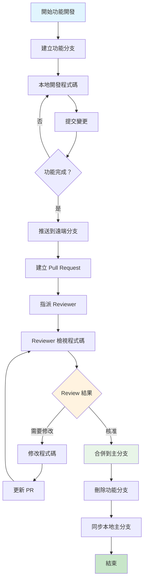

# 專案 Git 教學手冊

## 目錄

1. [Git 基本觀念](#1-git-基本觀念)
   - 1.1 [什麼是版本控制？](#11-什麼是版本控制)
   - 1.2 [為什麼使用 Git？](#12-為什麼使用-git)
   - 1.3 [Git 基本概念](#13-git-基本概念)
   - [實務提醒](#實務提醒)
   - [第1章實作練習](#第1章實作練習)

2. [環境設定](#2-環境設定)
   - 2.1 [Git 安裝](#21-git-安裝)
   - 2.2 [基本設定](#22-基本設定)
   - 2.3 [個人與公司帳號區隔](#23-個人與公司帳號區隔)
   - 2.4 [SSH 金鑰設定](#24-ssh-金鑰設定)
   - 2.5 [HTTPS vs SSH 選擇](#25-https-vs-ssh-選擇)
   - 2.6 [Java 開發環境整合配置](#26-java-開發環境整合配置)
   - [實務建議](#實務建議)
   - [第2章實作練習](#第2章實作練習)

3. [專案流程](#3-專案流程)
   - 3.1 [如何 Clone 專案](#31-如何-clone-專案)
   - 3.2 [分支策略與命名規範](#32-分支策略與命名規範)
   - 3.3 [Commit Message 規範](#33-commit-message-規範)
   - 3.4 [Pull / Fetch / Merge / Rebase 使用時機](#34-pull--fetch--merge--rebase-使用時機)
   - 3.5 [Push 前檢查事項](#35-push-前檢查事項)
   - 3.6 [衝突處理](#36-衝突處理)

4. [團隊協作](#4-團隊協作)
   - 4.1 [Pull Request (PR) / Merge Request (MR) 流程](#41-pull-request-pr--merge-request-mr-流程)
   - 4.2 [Code Review 規範](#42-code-review-規範)
   - 4.3 [分支保護規則](#43-分支保護規則)
   - 4.4 [工作流程最佳實務](#44-工作流程最佳實務)

5. [常見錯誤排解](#5-常見錯誤排解)
   - 5.1 [誤 Push 的處理](#51-誤-push-的處理)
   - 5.2 [Commit 錯誤訊息修正](#52-commit-錯誤訊息修正)
   - 5.3 [Reset vs Revert 使用時機](#53-reset-vs-revert-使用時機)
   - 5.4 [分支相關問題](#54-分支相關問題)
   - 5.5 [合併問題解決](#55-合併問題解決)
   - 5.6 [遠端倉庫問題](#56-遠端倉庫問題)

6. [最佳實務](#6-最佳實務)
   - 6.1 [保持 Commit 歷史乾淨](#61-保持-commit-歷史乾淨)
   - 6.2 [同步 Main 分支策略](#62-同步-main-分支策略)
   - 6.3 [避免 Force Push 的時機](#63-避免-force-push-的時機)
   - 6.4 [檔案和目錄管理](#64-檔案和目錄管理)
   - 6.5 [效能優化](#65-效能優化)

7. [專案專屬規範](#7-專案專屬規範)
   - 7.1 [Java 專案特殊要求](#71-java-專案特殊要求)
   - 7.2 [分支命名公司規範](#72-分支命名公司規範)
   - 7.3 [Code Review 檢查點](#73-code-review-檢查點)
   - 7.4 [部署相關規範](#74-部署相關規範)

8. [進階 Git 功能](#8-進階-git-功能)
   - 8.1 [Git 別名 (Aliases)](#81-git-別名-aliases)
   - 8.2 [Git 子模組 (Submodules)](#82-git-子模組-submodules)
   - 8.3 [Git Worktree](#83-git-worktree)
   - 8.4 [進階 Git 配置](#84-進階-git-配置)

9. [Git Hooks 自動化](#9-git-hooks-自動化)
   - 9.1 [什麼是 Git Hooks](#91-什麼是-git-hooks)
   - 9.2 [實用的 Pre-commit Hook](#92-實用的-pre-commit-hook)
   - 9.3 [Commit Message Hook](#93-commit-message-hook)
   - 9.4 [Pre-push Hook](#94-pre-push-hook)
   - 9.5 [使用 Husky 管理 Hooks（Node.js 專案）](#95-使用-husky-管理-hooksnodejs-專案)
   - 9.6 [Maven 專案 Git Hooks 實戰範例](#96-maven-專案-git-hooks-實戰範例)

10. [效能優化與故障排除](#10-效能優化與故障排除)
    - 10.1 [Git 效能優化](#101-git-效能優化)
    - 10.2 [深度故障排除](#102-深度故障排除)
    - 10.3 [大型專案最佳實務](#103-大型專案最佳實務)

11. [IDE 整合與工具](#11-ide-整合與工具)
    - 11.1 [VS Code Git 整合](#111-vs-code-git-整合)
    - 11.2 [命令列工具增強](#112-命令列工具增強)
    - 11.3 [Git GUI 工具推薦](#113-git-gui-工具推薦)

12. [Git 安全性](#12-git-安全性)
    - 12.1 [簽署 Commits](#121-簽署-commits)
    - 12.2 [安全最佳實務](#122-安全最佳實務)
    - 12.3 [存取控制](#123-存取控制)

13. [檢查清單](#13-檢查清單)
    - 13.1 [新進成員入職檢查清單](#131-新進成員入職檢查清單)
    - 13.2 [每日工作檢查清單](#132-每日工作檢查清單)
    - 13.3 [Pull Request 檢查清單](#133-pull-request-檢查清單)
    - 13.4 [發布前檢查清單](#134-發布前檢查清單)
    - 13.5 [緊急情況檢查清單](#135-緊急情況檢查清單)

---

## 1. Git 基本觀念

### 1.1 什麼是版本控制？

版本控制是一套系統，用來記錄檔案內容的變化，讓您可以隨時回到特定版本的檔案狀態。想像您在寫一份重要文件，每次修改都另存新檔，最後桌面上可能有：

```text
報告_初稿.docx
報告_修正版.docx
報告_最終版.docx
報告_真正最終版.docx
報告_老闆修改版.docx

```

這就是最原始的版本控制概念，但手動管理非常容易出錯。

### 1.2 為什麼使用 Git？

Git 是目前最流行的分散式版本控制系統，具有以下優點：

- **分散式架構**：每個開發者都有完整的專案歷史
- **分支管理**：可以同時進行多個功能開發
- **協作能力**：多人可以同時開發同一個專案
- **歷史追蹤**：清楚記錄每次變更的內容和原因
- **備份機制**：程式碼存在多個地方，不易丟失

### 1.3 Git 基本概念

#### 工作區域

- **工作目錄 (Working Directory)**：您實際編輯檔案的地方
- **暫存區 (Staging Area)**：準備提交的檔案暫存處
- **本地倉庫 (Local Repository)**：存放在本機的完整專案歷史
- **遠端倉庫 (Remote Repository)**：存放在伺服器上的專案副本

#### 基本術語

- **Repository (倉庫)**：包含專案所有檔案和版本歷史的容器
- **Commit (提交)**：一次完整的變更記錄
- **Branch (分支)**：獨立的開發線
- **Merge (合併)**：將不同分支的變更整合在一起
- **Pull Request (拉取請求)**：請求將變更合併到主分支的機制

### 實務提醒

- Git 追蹤的是檔案內容的變化，不是檔案本身
- 每次 commit 都會產生一個唯一的 hash 值作為識別
- 刪除或修改已 push 的 commit 需要特別小心

### 第1章實作練習

#### 練習1：概念理解 📚

**目標**：確保理解 Git 基本概念

**任務**：

1. 用自己的話解釋什麼是「版本控制」
2. 列出 Git 的三個主要優點
3. 畫出工作區域的流程圖（工作目錄 → 暫存區 → 本地倉庫 → 遠端倉庫）

**預期結果**：

- 能清楚說明版本控制的目的
- 理解 Git 相對於其他版本控制系統的優勢
- 掌握 Git 的基本工作流程

#### 練習2：實際操作 💻

**目標**：初步體驗 Git 操作

**任務**：

1. 在桌面建立一個測試資料夾 `git-practice`
2. 建立一個 `README.md` 檔案，寫入今天的學習心得
3. 使用命令列查看目前的檔案狀態
4. 思考：如果沒有 Git，你會如何管理這個檔案的版本？

**指令提示**：

```bash
mkdir git-practice
cd git-practice
echo "# Git 學習筆記" > README.md
# 這時還沒有 Git，所以無法使用 git status

```

**反思問題**：

- 手動版本管理會遇到什麼問題？
- Git 如何解決這些問題？

#### 練習3：案例分析 🔍

**目標**：理解 Git 在團隊協作中的價值

**情境**：
你和2位同事要一起開發一個 Java 專案，專案包含：

- `User.java` - 使用者類別
- `UserService.java` - 使用者服務
- `UserController.java` - 控制器

**思考題**：

1. 如果沒有版本控制，如何分工？會遇到什麼問題？
2. 使用 Git 後，工作流程會如何改善？
3. 如果兩個人同時修改 `UserService.java`，應該如何處理？

**答案要點**：

- 檔案衝突問題
- 程式碼同步困難
- 版本追蹤不易
- Git 分支解決並行開發
- 合併機制處理衝突

---

## 2. 環境設定

### 2.1 Git 安裝

#### Windows 環境

1. 前往 [Git 官方網站](https://git-scm.com/) 下載最新版本
2. 執行安裝程式，建議選項：
   - 使用 Git Bash 作為終端機
   - 選擇 Visual Studio Code 作為預設編輯器
   - 啟用 Git Credential Manager

#### 驗證安裝

```bash
git --version

```

### 2.2 基本設定

#### 設定使用者資訊

```bash
# 設定姓名（會顯示在 commit 記錄中）
git config --global user.name "您的姓名"

# 設定 Email（建議使用公司 Email）
git config --global user.email "your.email@company.com"

```

#### 設定預設編輯器

```bash
# 設定 VS Code 為預設編輯器
git config --global core.editor "code --wait"

```

#### 設定行尾字元處理

```bash
# Windows 環境建議設定
git config --global core.autocrlf true

```

### 2.3 個人與公司帳號區隔

#### 全域設定 vs 專案設定

```bash
# 檢視目前設定
git config --list

# 專案特定設定（在專案目錄下執行）
git config user.name "工作用姓名"
git config user.email "work@company.com"

# 全域設定
git config --global user.name "個人姓名"
git config --global user.email "personal@gmail.com"

```

### 2.4 SSH 金鑰設定

#### 產生 SSH 金鑰

```bash
# 產生新的 SSH 金鑰
ssh-keygen -t ed25519 -C "your.email@company.com"

# 如果系統不支援 ed25519，使用 RSA
ssh-keygen -t rsa -b 4096 -C "your.email@company.com"

```

#### 將公鑰新增到 GitHub/GitLab

1. 複製公鑰內容：

```bash
# Windows
cat ~/.ssh/id_ed25519.pub | clip

# 或直接檢視
cat ~/.ssh/id_ed25519.pub
```

1. 登入 GitHub → Settings → SSH and GPG keys → New SSH key
2. 貼上公鑰內容並儲存

#### 測試 SSH 連線

```bash
# 測試 GitHub 連線
ssh -T git@github.com

# 測試 GitLab 連線
ssh -T git@gitlab.com

```

### 2.5 HTTPS vs SSH 選擇

#### HTTPS 優點

- 設定簡單，不需要金鑰管理
- 可以穿越防火牆
- 支援兩步驟驗證

#### SSH 優點

- 一次設定，長期使用
- 不需要每次輸入密碼
- 更安全的認證機制

### 實務建議

- 公司專案建議使用 SSH，避免密碼外洩風險
- 定期更新 Git 版本以獲得最新功能和安全修正
- 使用 Git Credential Manager 可以安全地儲存認證資訊

### 2.6 Java 開發環境整合配置

#### 🔧 IntelliJ IDEA 整合設定

##### 1. Git 設定檢查

```bash
# 確認 IntelliJ 可以找到 Git
git --version

```

##### 2. IntelliJ Git 配置

- File → Settings → Version Control → Git
- Path to Git executable: `C:\Program Files\Git\bin\git.exe`
- 勾選 "Use credential helper"

##### 3. 專案初始化設定

```bash
# 在專案根目錄建立 .gitignore
cat > .gitignore << EOF
# IntelliJ IDEA
.idea/
*.iml
*.iws
*.ipr
out/

# Maven
target/
pom.xml.tag
pom.xml.releaseBackup
pom.xml.versionsBackup

# Java
*.class
*.jar
*.war
*.ear
hs_err_pid*

# 日誌
*.log
logs/

# 作業系統
.DS_Store
Thumbs.db
EOF

```

#### 🛠️ VS Code Java 整合

##### 1. 必要擴充功能安裝

```json
{
  "recommendations": [
    "vscjava.vscode-java-pack",
    "eamodio.gitlens",
    "github.vscode-pull-request-github",
    "ms-vscode.vscode-json"
  ]
}

```

##### 2. VS Code 設定檔 (.vscode/settings.json)

```json
{
  "java.home": "C:\\Program Files\\Java\\jdk-17",
  "java.configuration.runtimes": [
    {
      "name": "JavaSE-17",
      "path": "C:\\Program Files\\Java\\jdk-17"
    }
  ],
  "git.enableSmartCommit": true,
  "git.confirmSync": false,
  "git.autofetch": true,
  "java.compile.nullAnalysis.mode": "automatic",
  "java.checkstyle.configuration": "${workspaceFolder}/checkstyle.xml"
}

```

#### 📋 Maven 專案 Git 初始化模板

##### 1. 標準 Maven 專案結構

```bash
# 建立標準 Maven 專案
mvn archetype:generate \
  -DgroupId=com.tutorial.java \
  -DartifactId=git-demo-project \
  -DarchetypeArtifactId=maven-archetype-quickstart \
  -DinteractiveMode=false

cd git-demo-project

# 初始化 Git
git init
git add .
git commit -m "chore: initial Maven project setup

- Add standard Maven directory structure
- Include basic pom.xml configuration
- Add sample App.java and AppTest.java"

```

##### 2. 專案專用 Git 配置

```bash
# 設定專案特定的 Git 配置
git config user.name "Java Developer"
git config user.email "java.dev@company.com"

# 設定 commit template
git config commit.template .gitmessage

# 建立 commit message 模板
cat > .gitmessage << 'EOF'
# <type>(<scope>): <subject>
#
# <body>
#
# <footer>
#
# 類型說明：
# feat: 新功能
# fix: 錯誤修復
# docs: 文件變更
# style: 格式調整（不影響程式邏輯）
# refactor: 重構
# perf: 效能改善
# test: 測試相關
# chore: 建置工具或輔助工具的變動
#
# 範例：
# feat(user): add user registration API
# fix(auth): resolve token expiration issue
# docs(readme): update installation instructions
EOF

```

#### 🚀 Java 專案 Git Workflow 自動化

##### 1. Maven 整合 Git Hooks

在 `pom.xml` 中添加：

```xml
<plugin>
    <groupId>com.github.git-commit-id</groupId>
    <artifactId>git-commit-id-maven-plugin</artifactId>
    <version>4.9.10</version>
    <executions>
        <execution>
            <goals>
                <goal>revision</goal>
            </goals>
        </execution>
    </executions>
    <configuration>
        <generateGitPropertiesFile>true</generateGitPropertiesFile>
        <includeOnlyProperties>
            <includeOnlyProperty>^git.commit.id.abbrev$</includeOnlyProperty>
            <includeOnlyProperty>^git.commit.time$</includeOnlyProperty>
            <includeOnlyProperty>^git.branch$</includeOnlyProperty>
        </includeOnlyProperties>
    </configuration>
</plugin>

```

##### 2. 建立 Git 別名 for Java 開發

```bash
# Java 專案常用 Git 別名
git config --global alias.java-status '!git status && echo "--- Maven Status ---" && mvn dependency:tree | head -20'
git config --global alias.java-clean '!mvn clean && git clean -fd'
git config --global alias.java-test 'logtest() { mvn test && git log --oneline -5; }; logtest'
git config --global alias.feature-start '!f() { git checkout -b feature/$1 && git push -u origin feature/$1; }; f'
git config --global alias.feature-finish '!f() { git checkout develop && git merge --no-ff feature/$1 && git branch -d feature/$1; }; f'

```

### 第2章實作練習

#### 練習1：環境設定檢查 ✅

**目標**：確保 Git 和 Java 開發環境正確設定

**任務**：

1. 驗證 Git 安裝和版本
2. 設定個人 Git 配置
3. 產生 SSH 金鑰並測試連線
4. 設定 IDE 的 Git 整合

**檢查清單**：

```bash
# 1. 檢查 Git 版本
git --version

# 2. 檢查使用者設定
git config user.name
git config user.email

# 3. 檢查 SSH 設定
ssh -T git@github.com

# 4. 檢查全域設定
git config --list --global

```

#### 練習2：Java 專案初始化 🏗️

**目標**：建立標準的 Java Git 專案

**任務**：

1. 建立新的 Maven 專案
2. 初始化 Git 倉庫
3. 建立適當的 .gitignore
4. 進行第一次提交

**完整流程**：

```bash
# 1. 建立 Maven 專案
mvn archetype:generate \
  -DgroupId=com.tutorial.practice \
  -DartifactId=git-java-practice \
  -DarchetypeArtifactId=maven-archetype-quickstart \
  -DinteractiveMode=false

# 2. 進入專案目錄
cd git-java-practice

# 3. 建立 .gitignore
curl -o .gitignore https://raw.githubusercontent.com/github/gitignore/main/Java.gitignore

# 4. 初始化 Git
git init
git add .
git commit -m "chore: initial project setup"

# 5. 檢查結果
git log --oneline
git status

```

#### 練習3：團隊環境模擬 👥

**目標**：模擬團隊開發環境設定

**情境**：
假設你要加入一個現有的 Java 團隊專案

**任務**：

1. Clone 一個範例專案（可以用自己的）
2. 設定專案特定的 Git 配置
3. 建立開發分支
4. 進行簡單修改並提交

**實作步驟**：

```bash
# 1. Clone 專案
git clone https://github.com/username/java-demo-project.git
cd java-demo-project

# 2. 設定專案配置
git config user.name "Team Member"
git config user.email "member@team.com"

# 3. 檢查專案狀態
git status
git branch -a
mvn compile

# 4. 建立開發分支
git checkout -b feature/setup-environment

# 5. 修改 README 添加自己的設定筆記
echo "## 我的環境設定筆記" >> README.md
echo "- Java 版本：$(java -version 2>&1 | head -1)" >> README.md
echo "- Maven 版本：$(mvn -version | head -1)" >> README.md
echo "- Git 版本：$(git --version)" >> README.md

# 6. 提交變更
git add README.md
git commit -m "docs: add personal environment setup notes"

# 7. 推送分支（如果有遠端倉庫）
git push -u origin feature/setup-environment

```

**驗證標準**：

- 專案可以正常編譯
- Git 配置正確
- 分支建立成功
- 提交訊息符合規範

---

## 3. 專案流程

### 3.1 如何 Clone 專案

#### 基本 Clone 操作

```bash
# 使用 HTTPS
git clone https://github.com/username/repository.git

# 使用 SSH（推薦）
git clone git@github.com:username/repository.git

# Clone 到指定目錄
git clone git@github.com:username/repository.git my-project

# 只 Clone 最新版本（節省空間和時間）
git clone --depth 1 git@github.com:username/repository.git

```

#### Clone 後的初始化

```bash
# 進入專案目錄
cd repository

# 檢查遠端倉庫
git remote -v

# 檢查當前分支
git branch

# 檢查專案狀態
git status

```

### 3.2 分支策略與命名規範

#### 主要分支結構

```n
main (或 master)     ← 生產環境分支，絕對穩定
├── develop          ← 開發整合分支
├── feature/xxx      ← 功能開發分支
├── release/x.x.x    ← 發布準備分支
└── hotfix/xxx       ← 緊急修復分支

```

#### 🔄 Git Flow 視覺化流程圖

```mermaid
gitgraph
    commit id: "Initial"
    
    branch develop
    checkout develop
    commit id: "Dev Start"
    
    branch feature/login
    checkout feature/login
    commit id: "Add login form"
    commit id: "Add validation"
    
    checkout develop
    merge feature/login
    commit id: "Merge login feature"
    
    branch feature/payment
    checkout feature/payment
    commit id: "Add payment API"
    
    checkout develop
    merge feature/payment
    commit id: "Merge payment feature"
    
    branch release/v1.0
    checkout release/v1.0
    commit id: "Prepare v1.0"
    commit id: "Fix release bugs"
    
    checkout main
    merge release/v1.0
    commit id: "Release v1.0" tag: "v1.0.0"
    
    checkout develop
    merge release/v1.0
    
    checkout main
    branch hotfix/security
    checkout hotfix/security
    commit id: "Security patch"
    
    checkout main
    merge hotfix/security
    commit id: "Hotfix v1.0.1" tag: "v1.0.1"
    
    checkout develop
    merge hotfix/security

```

#### 🌊 分支流程說明

**1. 日常開發流程：**

```n
develop ← feature/user-auth ← 你的工作分支
   ↓
main (透過 release 分支)

```

**2. 緊急修復流程：**

```n
main ← hotfix/critical-bug ← 緊急修復
   ↓
develop (同步修復)

```

**3. 發布流程：**

```n
develop → release/v1.2.0 → main (標籤 v1.2.0)
                    ↓
                 develop (同步最終版本)

```

#### 分支命名規範

```bash
# 功能開發
feature/user-authentication
feature/payment-integration
feature/JIRA-123-user-profile

# 錯誤修復
fix/login-error
fix/memory-leak
hotfix/critical-security-patch

# 文件更新
docs/api-documentation
docs/readme-update

# 重構
refactor/database-optimization
refactor/code-cleanup

```

#### 建立和切換分支

```bash
# 檢視所有分支
git branch -a

# 建立新分支並切換過去
git checkout -b feature/new-login-system

# 或使用新的指令（Git 2.23+）
git switch -c feature/new-login-system

# 切換到現有分支
git switch main
git switch develop

# 從遠端分支建立本地分支
git checkout -b feature/user-profile origin/feature/user-profile

```

### 3.3 Commit Message 規範

#### 標準格式

```n
<type>(<scope>): <subject>

<body>

<footer>

```

#### Type 類型

- **feat**: 新功能
- **fix**: 錯誤修復
- **docs**: 文件變更
- **style**: 格式調整（不影響程式邏輯）
- **refactor**: 重構（既不是新功能也不是修復）
- **perf**: 效能改善
- **test**: 測試相關
- **chore**: 建置工具或輔助工具的變動

#### 實際範例

```bash
# 好的 commit message
git commit -m "feat(auth): add user login validation"
git commit -m "fix(api): resolve null pointer exception in user service"
git commit -m "docs(readme): update installation instructions"
git commit -m "refactor(utils): simplify date formatting functions"

# 不好的 commit message
git commit -m "fix bug"
git commit -m "update code"
git commit -m "commit"

```

#### 詳細 commit message 範例

```bash
feat(user): add password strength validation

- Add minimum 8 characters requirement
- Require at least one uppercase letter
- Require at least one number
- Add real-time validation feedback

Closes #123

```

### 3.4 Pull / Fetch / Merge / Rebase 使用時機

#### Fetch vs Pull

```bash
# Fetch：只下載遠端變更，不合併
git fetch origin

# Pull：下載並合併遠端變更
git pull origin main

# Pull with rebase（保持線性歷史）
git pull --rebase origin main

```

#### Merge vs Rebase

**Merge 適用時機：**

- 功能分支合併回主分支
- 保留完整的分支歷史
- 多人協作的功能分支

```bash
# 合併分支
git checkout main
git merge feature/user-login

# 建立 merge commit
git merge --no-ff feature/user-login

```

**Rebase 適用時機：**

- 整理 commit 歷史
- 將功能分支的變更基於最新的主分支
- 個人開發分支的整理

```bash
# 將當前分支 rebase 到 main
git rebase main

# 互動式 rebase，整理 commit
git rebase -i HEAD~3

```

### 3.5 Push 前檢查事項

#### 推送前清單

```bash
# 1. 檢查當前狀態
git status

# 2. 檢查暫存區內容
git diff --cached

# 3. 檢查 commit 歷史
git log --oneline -5

# 4. 確認要推送的分支
git branch

# 5. 拉取最新變更
git pull --rebase origin main

# 6. 執行測試（如果有）
npm test  # 或 mvn test, pytest 等

# 7. 推送變更
git push origin feature/your-branch

```

#### 首次推送分支

```bash
# 首次推送新分支
git push -u origin feature/new-feature

# 之後可以直接使用
git push

```

### 3.6 衝突處理

#### 合併衝突的識別

```bash
# 出現衝突時會看到類似訊息
Auto-merging file.txt
CONFLICT (content): Merge conflict in file.txt
Automatic merge failed; fix conflicts and then commit the result.

```

#### 衝突標記說明

```n
<<<<<<< HEAD
這是當前分支的內容
=======
這是要合併進來的內容
>>>>>>> feature/new-feature

```

#### 解決衝突步驟

```bash
# 1. 檢視衝突檔案
git status

# 2. 編輯衝突檔案，移除標記並保留正確內容
# 3. 標記衝突已解決
git add conflicted-file.txt

# 4. 完成合併
git commit

# 5. 推送結果
git push

```

#### 使用工具解決衝突

```bash
# 使用 VS Code 或其他編輯器的視覺化工具
git mergetool

# 或設定預設合併工具
git config --global merge.tool vscode
git config --global mergetool.vscode.cmd 'code --wait $MERGED'

```

### 💡 專案流程實務建議

- 每天開始工作前先 `git pull --rebase` 更新程式碼
- 功能完成後立即發出 Pull Request，不要累積太多變更
- Commit 要小而頻繁，每個 commit 都應該是可運行的狀態
- 發生衝突時，先了解衝突的原因再解決，不要盲目選擇

---

## 4. 團隊協作

### 4.1 Pull Request (PR) / Merge Request (MR) 流程

#### 🔄 Pull Request 完整流程圖



#### 📋 PR 狀態追蹤表

| 階段 | 狀態 | 負責人 | 行動項目 | 預計時間 |
|------|------|--------|----------|----------|
| 1 | 開發中 | 開發者 | 實作功能 | 2-5 天 |
| 2 | 待審查 | 開發者 | 建立 PR，等待 Review | 0.5 天 |
| 3 | 審查中 | Reviewer | 檢視程式碼，提供意見 | 1-2 天 |
| 4 | 修改中 | 開發者 | 根據 Review 意見修改 | 0.5-1 天 |
| 5 | 待合併 | Team Lead | 最終檢查並合併 | 0.5 天 |
| 6 | 已完成 | 開發者 | 清理分支，同步程式碼 | 0.1 天 |

#### 建立 Pull Request 前準備

```bash
# 1. 確保功能分支是最新的
git checkout feature/user-authentication
git pull --rebase origin main

# 2. 推送到遠端倉庫
git push -u origin feature/user-authentication

# 3. 在 GitHub/GitLab 上建立 PR/MR

```

#### PR 標題和描述範本

```markdown
## 功能描述
簡短描述這個 PR 實現了什麼功能或修復了什麼問題。

## 變更內容
- [ ] 新增使用者登入驗證功能
- [ ] 修改密碼加密演算法
- [ ] 更新相關測試案例
- [ ] 更新 API 文件

## 測試
- [ ] 單元測試通過
- [ ] 整合測試通過  
- [ ] 手動測試完成

## 影響範圍
說明這個變更可能影響的其他模組或功能。

## 截圖 (如適用)
如果是 UI 相關變更，請提供截圖。

## 相關 Issue
Closes #123
Related to #456

## 檢查清單
- [ ] 程式碼符合專案風格指南
- [ ] 已添加必要的測試
- [ ] 文件已更新
- [ ] 變更已經過自我檢視

```

### 4.2 Code Review 規範

#### Reviewer 責任

**技術面檢查：**

- 程式邏輯是否正確
- 是否遵循設計模式和最佳實務
- 錯誤處理是否完善
- 效能是否有問題

**品質面檢查：**

- 程式碼可讀性
- 變數和函數命名是否清楚
- 註解是否充足且正確
- 測試覆蓋率是否足夠

#### Review 評論範例

```markdown
# 好的 Review 評論
建議使用 Optional 來處理可能為 null 的情況：

```java
Optional<User> user = userService.findById(id);
if (user.isPresent()) {
    // 處理邏輯
}

```text
建設性的建議:
這個方法做了太多事情，建議拆分成幾個較小的方法來提高可讀性和測試性。

正面回饋:
這個錯誤處理機制設計得很好，能夠清楚地向使用者顯示問題所在。
```

#### Review 狀態管理

```bash
# 請求變更後，作者修改程式碼
git add .
git commit -m "fix(auth): address code review comments"
git push

# Reviewer 再次檢視並核准
# 合併 PR

```

### 4.3 分支保護規則

#### 建議的保護設定

```yaml
main 分支保護規則：
- 要求 PR 才能合併
- 要求至少 1-2 個 approvals
- 要求 CI/CD 檢查通過
- 要求分支是最新的
- 限制誰可以 push 到 main
- 要求管理員也遵循規則

```

#### 設定範例

```bash
# GitHub CLI 設定分支保護
gh api repos/:owner/:repo/branches/main/protection \
  --method PUT \
  --field required_status_checks='{"strict":true,"contexts":["ci/build"]}' \
  --field enforce_admins=true \
  --field required_pull_request_reviews='{"required_approving_review_count":2}'

```

### 4.4 工作流程最佳實務

#### 日常工作流程

```bash
# 每日開始工作
git checkout main
git pull origin main

# 建立功能分支
git checkout -b feature/JIRA-123-user-profile

# 開發過程中定期 commit
git add .
git commit -m "feat(profile): add basic user profile structure"

# 推送到遠端（首次）
git push -u origin feature/JIRA-123-user-profile

# 功能完成後建立 PR
# 經過 code review 後合併

# 清理已合併的分支
git checkout main
git pull origin main
git branch -d feature/JIRA-123-user-profile
git push origin --delete feature/JIRA-123-user-profile

```

#### 團隊同步策略

```bash
# 每週同步會議前更新
git checkout main
git pull origin main

# 檢查所有分支狀態
git branch -vv

# 清理已合併的本地分支
git branch --merged main | grep -v main | xargs git branch -d

```

---

## 5. 常見錯誤排解

### 5.1 誤 Push 的處理

#### 撤銷最後一次 commit（未 push）

```bash
# 撤銷 commit 但保留變更
git reset --soft HEAD~1

# 撤銷 commit 和變更
git reset --hard HEAD~1

# 修改最後一次 commit message
git commit --amend -m "correct commit message"

```

#### 撤銷已 push 的 commit

```bash
# 方法 1：使用 revert（推薦，安全）
git revert HEAD
git push origin main

# 方法 2：force push（危險，需要團隊同意）
git reset --hard HEAD~1
git push --force-with-lease origin main

```

### 5.2 Commit 錯誤訊息修正

#### 修改最近的 commit message

```bash
# 修改最後一次 commit
git commit --amend -m "correct message"

# 如果已經 push，需要 force push
git push --force-with-lease origin branch-name

```

#### 修改歷史 commit message

```bash
# 互動式 rebase 修改最近 3 個 commit
git rebase -i HEAD~3

# 在編輯器中將要修改的 commit 前的 'pick' 改為 'reword'
# 儲存後會逐一開啟編輯器讓你修改 commit message

```

### 5.3 Reset vs Revert 使用時機

#### Git Reset（修改歷史）

```bash
# 軟重設：保留變更在暫存區
git reset --soft HEAD~1

# 混合重設：保留變更在工作目錄
git reset --mixed HEAD~1  # 或 git reset HEAD~1

# 硬重設：完全刪除變更
git reset --hard HEAD~1

```

**使用時機：**

- 本地 commit 尚未 push
- 需要重新整理 commit 歷史
- 個人分支的清理

#### Git Revert（建立新 commit）

```bash
# 撤銷指定 commit
git revert <commit-hash>

# 撤銷 merge commit
git revert -m 1 <merge-commit-hash>

# 撤銷多個 commit
git revert HEAD~3..HEAD

```

**使用時機：**

- commit 已經 push 到共享分支
- 需要保留完整歷史
- 生產環境的緊急回滾

### 5.4 分支相關問題

#### 切換分支時有未提交變更

```bash
# 暫存變更
git stash
git checkout other-branch

# 回到原分支恢復變更
git checkout original-branch
git stash pop

# 或者提交變更後再切換
git add .
git commit -m "WIP: temporary commit"
git checkout other-branch

```

#### 誤刪分支恢復

```bash
# 查看分支刪除記錄
git reflog

# 恢復刪除的分支
git checkout -b recovered-branch <commit-hash>

# 或直接從 reflog 恢復
git branch recovered-branch HEAD@{2}

```

### 5.5 合併問題解決

#### 取消正在進行的 merge

```bash
# 取消 merge
git merge --abort

# 取消 rebase
git rebase --abort

# 取消 cherry-pick
git cherry-pick --abort

```

#### 解決複雜衝突

```bash
# 使用三方合併工具
git mergetool

# 手動選擇策略
git merge -X ours feature-branch    # 優先選擇當前分支
git merge -X theirs feature-branch  # 優先選擇合併分支

```

### 5.6 遠端倉庫問題

#### 更新遠端分支資訊

```bash
# 清理已刪除的遠端分支參考
git remote prune origin

# 查看所有遠端分支
git branch -r

# 重新設定遠端倉庫 URL
git remote set-url origin git@github.com:username/repo.git

```

#### 處理 "Your branch is ahead/behind" 訊息

```bash
# 分支領先（ahead）
git push origin main

# 分支落後（behind）
git pull origin main

# 分支分歧（diverged）
git pull --rebase origin main
# 或
git merge origin/main

```

### 💡 錯誤排解實務建議

- 發生問題時先用 `git status` 了解目前狀態
- 使用 `git log --oneline --graph` 檢視歷史
- 重要操作前先備份當前狀態：`git branch backup-$(date +%Y%m%d)`
- 不確定時寧可建立新 commit 也不要 force push 到共享分支
- 團隊協作時優先使用 `revert` 而非 `reset`

---

## 6. 最佳實務

### 6.1 保持 Commit 歷史乾淨

#### 理想的 commit 歷史特徵

- 每個 commit 都有明確的目的
- Commit message 描述清楚
- 沒有無意義的 merge commit
- 功能相關的 commit 集中在一起

#### 使用 Interactive Rebase 整理歷史

```bash
# 整理最近 3 個 commit
git rebase -i HEAD~3

# 常用操作：
# pick = 保留 commit
# reword = 修改 commit message  
# edit = 修改 commit 內容
# squash = 合併到前一個 commit
# fixup = 合併到前一個 commit（不保留 message）
# drop = 刪除 commit

```

#### 範例：整理開發歷史

```bash
# 開發過程中的 commit（較雜亂）
git log --oneline
abc123 fix typo
def456 add user service
ghi789 fix bug in user service
jkl012 add user controller
mno345 update readme

# 使用 interactive rebase 整理
git rebase -i HEAD~5

# 整理後的歷史（較清楚）
feat(user): implement user management system
docs(readme): update project documentation

```

### 6.2 同步 Main 分支策略

#### 定期同步策略

```bash
# 方法 1：每日同步（推薦）
git checkout main
git pull origin main

# 更新功能分支
git checkout feature/your-branch
git rebase main

# 方法 2：使用 merge（保留分支歷史）
git checkout feature/your-branch
git merge main

```

#### 長期分支維護

```bash
# 檢查分支的同步狀態
git branch -vv

# 清理已合併的本地分支
git branch --merged main | grep -v "main\|develop" | xargs -n 1 git branch -d

# 清理遠端已刪除的分支引用
git remote prune origin

```

### 6.3 避免 Force Push 的時機

#### 絕對不能 Force Push 的情況

- `main` 或 `develop` 等共享分支
- 已經被其他人基於開發的分支
- 生產環境相關的分支

#### 安全的 Force Push 做法

```bash
# 使用 --force-with-lease（較安全）
git push --force-with-lease origin feature/your-branch

# 而不是 --force（危險）
git push --force origin feature/your-branch

```

#### 需要 Force Push 的合理情況

```bash
# 1. 整理個人功能分支的歷史
git rebase -i HEAD~3
git push --force-with-lease origin feature/cleanup-branch

# 2. 修正 commit message
git commit --amend -m "correct message"
git push --force-with-lease origin feature/your-branch

# 3. 移除敏感資訊
git filter-branch --force --index-filter 'git rm --cached --ignore-unmatch secrets.txt'
git push --force-with-lease origin feature/your-branch

```

### 6.4 檔案和目錄管理

#### .gitignore 最佳實務

```gitignore
# 依語言分類
## Java
*.class
*.jar
*.war
target/
.mvn/

## Node.js
node_modules/
npm-debug.log*
dist/

## IDE
.vscode/
.idea/
*.swp
*.swo

## 作業系統
.DS_Store
Thumbs.db

## 環境設定
.env
.env.local
config/local.properties

## 日誌和暫存檔
*.log
*.tmp
*.cache

```

#### 大檔案管理

```bash
# 使用 Git LFS 管理大檔案
git lfs install
git lfs track "*.pdf"
git lfs track "*.zip"
git add .gitattributes
git commit -m "chore: setup Git LFS for large files"

```

### 6.5 效能優化

#### 加速 Git 操作

```bash
# 設定 Git 效能相關配置
git config --global core.preloadindex true
git config --global core.fscache true
git config --global gc.auto 256

# 使用 shallow clone 節省空間
git clone --depth 1 --single-branch --branch main repo-url

# 定期清理倉庫
git gc --prune=now
git clean -fdx

```

#### 減少網路傳輸

```bash
# 只拉取指定分支
git fetch origin main:main

# 設定 sparse-checkout 只下載部分檔案
git config core.sparseCheckout true
echo "src/*" >> .git/info/sparse-checkout
git read-tree -m -u HEAD

```

---

## 7. 專案專屬規範

### 7.1 Java 專案特殊要求

#### Maven 專案 Git 設定

```gitignore
# Maven 特定忽略規則
target/
pom.xml.tag
pom.xml.releaseBackup
pom.xml.versionsBackup
pom.xml.next
release.properties
dependency-reduced-pom.xml
buildNumber.properties
.mvn/timing.properties
.mvn/wrapper/maven-wrapper.jar

# IDE 產生的檔案
.idea/
.vscode/settings.json
*.iml
.project
.classpath
.settings/

# 日誌和暫存檔
*.log
logs/
*.tmp
*.cache

# 測試覆蓋率報告
jacoco.exec
target/site/jacoco/

```

#### 🚀 Java 專案實戰工作流程

##### 情境1：新增 User Service 功能

```bash
# 1. 從最新的 develop 分支開始
git checkout develop
git pull origin develop

# 2. 建立功能分支
git checkout -b feature/USER-123-add-user-service

# 3. 建立基本的 Java 類別結構
mkdir -p src/main/java/com/tutorial/user/service
mkdir -p src/test/java/com/tutorial/user/service

# 4. 實作 UserService
# 編輯 src/main/java/com/tutorial/user/service/UserService.java

```

**UserService.java 範例：**

```java
package com.tutorial.user.service;

import com.tutorial.user.model.User;
import com.tutorial.user.repository.UserRepository;
import org.slf4j.Logger;
import org.slf4j.LoggerFactory;
import org.springframework.beans.factory.annotation.Autowired;
import org.springframework.stereotype.Service;

import java.util.List;
import java.util.Optional;

/**
 * 使用者服務類別
 * 
 * @author 開發者姓名
 * @version 1.0
 * @since 2025-08-31
 */
@Service
public class UserService {
    
    private static final Logger logger = LoggerFactory.getLogger(UserService.class);
    
    @Autowired
    private UserRepository userRepository;
    
    /**
     * 建立新使用者
     * 
     * @param user 使用者物件
     * @return 建立的使用者
     * @throws IllegalArgumentException 當使用者資料無效時
     */
    public User createUser(User user) {
        logger.info("建立新使用者: {}", user.getEmail());
        
        if (user == null || user.getEmail() == null) {
            throw new IllegalArgumentException("使用者資料不能為空");
        }
        
        // 檢查 Email 是否已存在
        if (userRepository.findByEmail(user.getEmail()).isPresent()) {
            throw new IllegalArgumentException("Email 已存在: " + user.getEmail());
        }
        
        User savedUser = userRepository.save(user);
        logger.info("使用者建立成功，ID: {}", savedUser.getId());
        
        return savedUser;
    }
    
    /**
     * 根據 ID 查詢使用者
     * 
     * @param id 使用者 ID
     * @return 使用者物件，如果不存在則為空
     */
    public Optional<User> findUserById(Long id) {
        logger.debug("查詢使用者 ID: {}", id);
        return userRepository.findById(id);
    }
}

```

**UserServiceTest.java 範例：**

```java
package com.tutorial.user.service;

import com.tutorial.user.model.User;
import com.tutorial.user.repository.UserRepository;
import org.junit.jupiter.api.BeforeEach;
import org.junit.jupiter.api.Test;
import org.junit.jupiter.api.extension.ExtendWith;
import org.mockito.InjectMocks;
import org.mockito.Mock;
import org.mockito.junit.jupiter.MockitoExtension;

import java.util.Optional;

import static org.junit.jupiter.api.Assertions.*;
import static org.mockito.ArgumentMatchers.any;
import static org.mockito.Mockito.*;

/**
 * UserService 測試類別
 */
@ExtendWith(MockitoExtension.class)
class UserServiceTest {
    
    @Mock
    private UserRepository userRepository;
    
    @InjectMocks
    private UserService userService;
    
    private User testUser;
    
    @BeforeEach
    void setUp() {
        testUser = new User();
        testUser.setId(1L);
        testUser.setEmail("test@example.com");
        testUser.setName("測試使用者");
    }
    
    @Test
    void createUser_ValidUser_ShouldReturnSavedUser() {
        // Arrange
        when(userRepository.findByEmail(testUser.getEmail())).thenReturn(Optional.empty());
        when(userRepository.save(any(User.class))).thenReturn(testUser);
        
        // Act
        User result = userService.createUser(testUser);
        
        // Assert
        assertNotNull(result);
        assertEquals(testUser.getEmail(), result.getEmail());
        verify(userRepository).findByEmail(testUser.getEmail());
        verify(userRepository).save(testUser);
    }
    
    @Test
    void createUser_DuplicateEmail_ShouldThrowException() {
        // Arrange
        when(userRepository.findByEmail(testUser.getEmail())).thenReturn(Optional.of(testUser));
        
        // Act & Assert
        IllegalArgumentException exception = assertThrows(
            IllegalArgumentException.class,
            () -> userService.createUser(testUser)
        );
        
        assertTrue(exception.getMessage().contains("Email 已存在"));
        verify(userRepository).findByEmail(testUser.getEmail());
        verify(userRepository, never()).save(any(User.class));
    }
}

```

#### 🔧 完整開發流程實例

```bash
# 5. 提交初始實作
git add src/main/java/com/tutorial/user/service/UserService.java
git commit -m "feat(user): add UserService with create and find methods

- Add UserService class with user creation functionality
- Implement email validation and duplicate checking
- Add comprehensive JavaDoc documentation
- Include proper error handling and logging

Refs: USER-123"

# 6. 添加測試
git add src/test/java/com/tutorial/user/service/UserServiceTest.java
git commit -m "test(user): add comprehensive UserService unit tests

- Add tests for user creation with valid data
- Add tests for duplicate email validation
- Use Mockito for repository mocking
- Achieve 95%+ test coverage

Refs: USER-123"

# 7. 執行測試確保品質
mvn clean test

# 8. 檢查程式碼覆蓋率
mvn jacoco:report

# 9. 推送到遠端
git push -u origin feature/USER-123-add-user-service

# 10. 建立 Pull Request
# 在 GitHub/GitLab 介面上建立 PR，使用以下範本：

```

#### 📝 Java 專案 Pull Request 範本

```markdown
## 🚀 功能描述
實作 UserService 類別，提供使用者建立和查詢功能。

## 📋 變更內容
- [x] 新增 UserService 類別
- [x] 實作使用者建立功能（含驗證）
- [x] 實作使用者查詢功能
- [x] 添加完整的單元測試
- [x] 添加 JavaDoc 文件

## 🧪 測試
- [x] 單元測試覆蓋率：96%
- [x] 所有測試通過
- [x] Checkstyle 檢查通過
- [x] SpotBugs 檢查通過

## 📊 效能影響
- 無明顯效能影響
- 記憶體使用正常
- 資料庫查詢最佳化

## 🔍 檢查清單
- [x] 程式碼符合 Google Java Style Guide
- [x] 異常處理適當
- [x] 日誌記錄完整
- [x] 安全性考量充足
- [x] 文件已更新

## 🔗 相關連結
- Jira Ticket: USER-123
- API 文件: [待更新]
- 設計文件: [link]

## 🖼️ 截圖
N/A（後端 API 功能）

## 📝 審查注意事項
請特別注意：
1. Email 驗證邏輯是否合理
2. 異常處理是否完整
3. 測試案例是否涵蓋所有分支

```

#### Java 程式碼提交前檢查

```bash
# 提交前執行的檢查腳本 (pre-commit-java.sh)
#!/bin/bash
echo "🔍 執行 Java 專案提交前檢查..."

# 1. 程式碼格式檢查
echo "📝 檢查程式碼格式..."
mvn checkstyle:check
if [ $? -ne 0 ]; then
    echo "❌ Checkstyle 檢查失敗"
    echo "💡 請執行：mvn checkstyle:check 查看詳細問題"
    exit 1
fi

# 2. 靜態程式碼分析
echo "🔍 執行靜態程式碼分析..."
mvn spotbugs:check
if [ $? -ne 0 ]; then
    echo "❌ SpotBugs 檢查失敗"
    echo "💡 請執行：mvn spotbugs:gui 查看問題詳情"
    exit 1
fi

# 3. 單元測試
echo "🧪 執行單元測試..."
mvn test
if [ $? -ne 0 ]; then
    echo "❌ 單元測試失敗"
    echo "💡 請修復失敗的測試案例"
    exit 1
fi

# 4. 測試覆蓋率檢查
echo "📊 檢查測試覆蓋率..."
mvn jacoco:check
if [ $? -ne 0 ]; then
    echo "⚠️  測試覆蓋率不足（要求 80%）"
    echo "💡 請執行：mvn jacoco:report 查看覆蓋率報告"
    exit 1
fi

# 5. 依賴安全性掃描
echo "🛡️  執行依賴安全性掃描..."
mvn org.owasp:dependency-check-maven:check
if [ $? -ne 0 ]; then
    echo "⚠️  發現安全性漏洞"
    echo "💡 請檢查並更新有漏洞的依賴"
fi

# 6. 檢查 commit message 格式
echo "📝 檢查 commit message..."
commit_msg=$(git log -1 --pretty=%B)
if ! echo "$commit_msg" | grep -qE '^(feat|fix|docs|style|refactor|perf|test|chore)(\(.+\))?: .{1,50}'; then
    echo "❌ Commit message 格式不正確"
    echo "💡 正確格式：type(scope): description"
    echo "💡 範例：feat(user): add user registration API"
    exit 1
fi

echo "✅ 所有檢查通過，可以提交！"

```

### 7.2 分支命名公司規範

#### 專案特定前綴

```bash
# 功能開發
feature/PROJ-123-user-authentication
feature/PROJ-456-payment-gateway

# 錯誤修復  
bugfix/PROJ-789-login-timeout
hotfix/PROJ-999-security-patch

# 發布分支
release/v1.2.0
release/v2.0.0-beta

# 實驗性功能
experiment/ai-integration
experiment/performance-test

```

### 7.3 Code Review 檢查點

#### Java 特定檢查項目

- **程式碼風格**：是否符合 Google Java Style Guide
- **異常處理**：是否適當使用 try-catch 和自定義異常
- **測試覆蓋**：是否有對應的 JUnit 測試
- **效能考量**：是否有記憶體洩漏或效能問題
- **安全性**：是否有 SQL 注入或 XSS 風險

#### 自動化檢查工具

```xml
<!-- pom.xml 中的程式碼品質檢查 -->
<plugin>
    <groupId>org.checkstyle</groupId>
    <artifactId>checkstyle-maven-plugin</artifactId>
    <version>3.1.2</version>
</plugin>

<plugin>
    <groupId>com.github.spotbugs</groupId>
    <artifactId>spotbugs-maven-plugin</artifactId>
    <version>4.7.3.0</version>
</plugin>

```

### 7.4 部署相關規範

#### 標籤管理

```bash
# 語義化版本標籤
git tag -a v1.2.3 -m "Release version 1.2.3"
git push origin v1.2.3

# 預發布版本
git tag -a v1.3.0-beta.1 -m "Beta release for v1.3.0"
git push origin v1.3.0-beta.1

```

#### 發布分支流程

```bash
# 建立發布分支
git checkout -b release/v1.2.0 develop

# 更新版本號
mvn versions:set -DnewVersion=1.2.0

# 提交版本變更
git commit -am "chore(release): bump version to 1.2.0"

# 合併到 main 並標籤
git checkout main
git merge --no-ff release/v1.2.0
git tag -a v1.2.0 -m "Release v1.2.0"

# 合併回 develop
git checkout develop  
git merge --no-ff release/v1.2.0

# 清理發布分支
git branch -d release/v1.2.0

```

---

## 8. 進階 Git 功能

### 8.1 Git 別名 (Aliases)

#### 設定常用別名

```bash
# 設定別名讓指令更簡潔
git config --global alias.co checkout
git config --global alias.br branch
git config --global alias.ci commit
git config --global alias.st status

# 更複雜的別名
git config --global alias.unstage 'reset HEAD --'
git config --global alias.last 'log -1 HEAD'
git config --global alias.visual '!gitk'

# 實用的 log 別名
git config --global alias.lg "log --color --graph --pretty=format:'%Cred%h%Creset -%C(yellow)%d%Creset %s %Cgreen(%cr) %C(bold blue)<%an>%Creset' --abbrev-commit"
git config --global alias.ll "log --oneline --graph --decorate --all"

```

#### 專案常用別名設定

```bash
# 一鍵建立並切換分支
git config --global alias.cob 'checkout -b'

# 推送並設定上游分支
git config --global alias.pushup 'push -u origin HEAD'

# 刪除已合併的分支
git config --global alias.cleanup "!git branch --merged main | grep -v 'main\\|develop' | xargs -n 1 git branch -d"

# 快速修正最後一次 commit
git config --global alias.fix 'commit --amend --no-edit'

# 查看誰修改了某個檔案
git config --global alias.who 'blame -w -C -C -C'

```

### 8.2 Git 子模組 (Submodules)

#### 什麼時候使用子模組

- 需要在專案中包含其他 Git 倉庫
- 共享程式庫或組件
- 管理第三方依賴
- 將大型專案拆分成較小的模組

#### 新增子模組

```bash
# 新增子模組
git submodule add https://github.com/user/shared-library.git libs/shared-library

# 初始化子模組
git submodule init

# 更新子模組
git submodule update

# 一次完成初始化和更新
git submodule update --init --recursive

```

#### 管理子模組

```bash
# 更新所有子模組到最新版本
git submodule update --remote

# 更新特定子模組
git submodule update --remote libs/shared-library

# 在子模組中工作
cd libs/shared-library
git checkout main
# 進行變更...
git commit -am "update shared library"
cd ../..
git add libs/shared-library
git commit -m "update shared library reference"

```

#### Clone 包含子模組的專案

```bash
# Clone 時一併取得子模組
git clone --recursive https://github.com/user/main-project.git

# 或先 clone 再初始化子模組
git clone https://github.com/user/main-project.git
cd main-project
git submodule update --init --recursive

```

### 8.3 Git Worktree

#### 什麼是 Worktree

Worktree 允許您在同一個倉庫中同時處理多個分支，每個分支都有自己的工作目錄。

#### 基本使用

```bash
# 建立新的 worktree
git worktree add ../project-feature feature/new-login

# 建立新分支的 worktree
git worktree add -b hotfix/security-patch ../project-hotfix main

# 列出所有 worktree
git worktree list

# 移除 worktree
git worktree remove ../project-feature

# 清理無效的 worktree 參考
git worktree prune

```

#### 實際應用場景

```bash
# 場景：同時進行功能開發和 bug 修復
git worktree add ../project-main main          # 主分支用於緊急修復
git worktree add ../project-feature feature/payment  # 功能開發
git worktree add ../project-review review-branch     # 程式碼審查

# 在不同目錄中獨立工作
cd ../project-feature
# 開發新功能...

cd ../project-main  
# 修復緊急 bug...

cd ../project-review
# 檢視他人的程式碼...

```

### 8.4 進階 Git 配置

#### 改善 Git 效能的配置

```bash
# 啟用檔案系統快取（Windows）
git config --global core.fscache true

# 啟用預載索引
git config --global core.preloadindex true

# 設定自動 GC
git config --global gc.auto 256

# 啟用平行處理
git config --global pack.threads 4

# 設定更大的快取
git config --global pack.windowMemory 256m
git config --global pack.packSizeLimit 2g

```

#### 改善使用體驗的配置

```bash
# 啟用顏色輸出
git config --global color.ui auto
git config --global color.branch auto
git config --global color.diff auto
git config --global color.status auto

# 設定差異比較工具
git config --global diff.tool vscode
git config --global difftool.vscode.cmd 'code --wait --diff $LOCAL $REMOTE'

# 設定合併工具
git config --global merge.tool vscode
git config --global mergetool.vscode.cmd 'code --wait $MERGED'

# 設定推送行為
git config --global push.default simple
git config --global push.followTags true

```

---

## 9. Git Hooks 自動化

### 9.1 什麼是 Git Hooks

Git Hooks 是在特定 Git 事件發生時自動執行的腳本，可以用來自動化工作流程、檢查程式碼品質、或執行測試。

#### Hook 類型

**客戶端 Hooks（本地執行）:**

- `pre-commit`: 提交前執行
- `prepare-commit-msg`: 準備 commit message 時執行
- `commit-msg`: 檢查 commit message
- `post-commit`: 提交後執行
- `pre-push`: 推送前執行

**服務端 Hooks（伺服器執行）:**

- `pre-receive`: 接收推送前執行
- `update`: 更新分支時執行
- `post-receive`: 接收推送後執行

### 9.2 實用的 Pre-commit Hook

#### 程式碼品質檢查

```bash
#!/bin/sh
# .git/hooks/pre-commit

echo "執行 pre-commit 檢查..."

# 檢查 Java 程式碼格式
if [ -f "pom.xml" ]; then
    echo "檢查 Java 程式碼格式..."
    mvn checkstyle:check
    if [ $? -ne 0 ]; then
        echo "❌ Checkstyle 檢查失敗"
        exit 1
    fi
fi

# 執行測試
echo "執行單元測試..."
mvn test -q
if [ $? -ne 0 ]; then
    echo "❌ 測試失敗，無法提交"
    exit 1
fi

# 檢查是否包含 TODO 或 FIXME
if git diff --cached | grep -E "TODO|FIXME" > /dev/null; then
    echo "⚠️  警告：程式碼中包含 TODO 或 FIXME"
    echo "是否確定要提交？(y/N)"
    read confirm
    if [ "$confirm" != "y" ] && [ "$confirm" != "Y" ]; then
        echo "提交已取消"
        exit 1
    fi
fi

echo "✅ 所有檢查通過"

```

#### 防止敏感資訊提交

```bash
#!/bin/sh
# .git/hooks/pre-commit

# 檢查敏感檔案
sensitive_files=".env .env.local config/database.yml"
for file in $sensitive_files; do
    if git diff --cached --name-only | grep -q "$file"; then
        echo "❌ 錯誤：嘗試提交敏感檔案 $file"
        exit 1
    fi
done

# 檢查敏感資訊模式
if git diff --cached | grep -E "(password|secret|key|token)\s*=\s*['\"][^'\"]+['\"]" > /dev/null; then
    echo "❌ 錯誤：程式碼中包含可能的敏感資訊"
    echo "請檢查並移除密碼、金鑰等敏感資訊"
    exit 1
fi

```

### 9.3 Commit Message Hook

#### 檢查 Commit Message 格式

```bash
#!/bin/sh
# .git/hooks/commit-msg

commit_regex='^(feat|fix|docs|style|refactor|perf|test|chore)(\(.+\))?: .{1,50}'

if ! grep -qE "$commit_regex" "$1"; then
    echo "❌ 不合法的 commit message 格式"
    echo "正確格式: <type>(<scope>): <subject>"
    echo "範例: feat(auth): add user login validation"
    echo "允許的 type: feat, fix, docs, style, refactor, perf, test, chore"
    exit 1
fi

# 檢查 commit message 長度
if [ $(head -n1 "$1" | wc -c) -gt 72 ]; then
    echo "❌ Commit message 標題不能超過 72 個字元"
    exit 1
fi

echo "✅ Commit message 格式正確"

```

### 9.4 Pre-push Hook

#### 推送前的最終檢查

```bash
#!/bin/sh
# .git/hooks/pre-push

protected_branch='main master develop'
current_branch=$(git symbolic-ref HEAD | sed -e 's,.*/\(.*\),\1,')

# 檢查是否推送到受保護的分支
for branch in $protected_branch; do
    if [ "$current_branch" = "$branch" ]; then
        echo "❌ 不允許直接推送到 $branch 分支"
        echo "請使用 Pull Request 流程"
        exit 1
    fi
done

# 確保推送前已通過所有測試
echo "執行推送前檢查..."
mvn clean test
if [ $? -ne 0 ]; then
    echo "❌ 測試失敗，無法推送"
    exit 1
fi

echo "✅ 推送前檢查通過"

```

### 9.5 使用 Husky 管理 Hooks（Node.js 專案）

#### 安裝和設定

```bash
# 安裝 Husky
npm install --save-dev husky

# 初始化 Husky
npx husky install

# 新增 pre-commit hook
npx husky add .husky/pre-commit "npm test"

# 新增 commit-msg hook
npx husky add .husky/commit-msg 'npx commitlint --edit $1'

```

#### Package.json 配置

```json
{
  "scripts": {
    "prepare": "husky install"
  },
  "lint-staged": {
    "*.js": ["eslint --fix", "git add"],
    "*.{js,css,md}": "prettier --write"
  }
}

```

### 9.6 Maven 專案 Git Hooks 實戰範例

#### 🚀 完整的 Maven 專案 Hook 設定

##### 1. Pre-commit Hook for Java 專案

```bash
#!/bin/bash
# .git/hooks/pre-commit

echo "🔍 執行 Java 專案提交前檢查..."

# 檢查是否為 Maven 專案
if [ ! -f "pom.xml" ]; then
    echo "❌ 未找到 pom.xml，這不是 Maven 專案"
    exit 1
fi

# 設定 JAVA_HOME 如果未設定
if [ -z "$JAVA_HOME" ]; then
    echo "⚠️  JAVA_HOME 未設定，嘗試自動偵測..."
    export JAVA_HOME=$(dirname $(dirname $(readlink -f $(which java))))
fi

echo "☕ 使用 Java: $(java -version 2>&1 | head -1)"
echo "🔧 使用 Maven: $(mvn -version | head -1)"

# 1. 編譯檢查
echo "🔨 檢查程式碼編譯..."
mvn compile -q
if [ $? -ne 0 ]; then
    echo "❌ 編譯失敗，請修復編譯錯誤後再提交"
    exit 1
fi

# 2. 程式碼格式檢查
echo "📝 檢查程式碼格式（Checkstyle）..."
mvn checkstyle:check -q
if [ $? -ne 0 ]; then
    echo "❌ 程式碼格式檢查失敗"
    echo "💡 執行 'mvn checkstyle:checkstyle' 查看詳細報告"
    echo "💡 或執行 'mvn spotless:apply' 自動修正格式"
    exit 1
fi

# 3. 靜態程式碼分析
echo "🔍 執行靜態程式碼分析（SpotBugs）..."
mvn spotbugs:check -q
if [ $? -ne 0 ]; then
    echo "❌ 靜態程式碼分析發現問題"
    echo "💡 執行 'mvn spotbugs:gui' 查看問題詳情"
    exit 1
fi

# 4. 單元測試
echo "🧪 執行單元測試..."
mvn test -q
if [ $? -ne 0 ]; then
    echo "❌ 單元測試失敗"
    echo "💡 執行 'mvn test' 查看失敗詳情"
    exit 1
fi

# 5. 測試覆蓋率檢查
echo "📊 檢查測試覆蓋率..."
mvn jacoco:prepare-agent test jacoco:report jacoco:check -q
if [ $? -ne 0 ]; then
    echo "⚠️  測試覆蓋率不足（要求 80%）"
    echo "💡 執行 'mvn jacoco:report' 然後檢視 target/site/jacoco/index.html"
    
    # 如果是新功能分支，允許較低覆蓋率但給出警告
    current_branch=$(git symbolic-ref --short HEAD)
    if [[ $current_branch == feature/* ]]; then
        echo "🔄 由於是功能分支，允許提交但請記得改善覆蓋率"
    else
        exit 1
    fi
fi

# 6. 依賴漏洞檢查
echo "🛡️  檢查依賴安全性..."
mvn org.owasp:dependency-check-maven:check -q
if [ $? -ne 0 ]; then
    echo "⚠️  發現依賴安全性問題"
    echo "💡 檢視 target/dependency-check-report.html 了解詳情"
    echo "🔄 繼續提交但請儘快處理安全性問題"
fi

# 7. 檢查提交檔案
echo "📁 檢查提交檔案..."

# 檢查是否提交了不應該的檔案
if git diff --cached --name-only | grep -E "(\.class$|\.jar$|\.war$|target/)" > /dev/null; then
    echo "❌ 不應該提交編譯後的檔案或 target 目錄"
    git diff --cached --name-only | grep -E "(\.class$|\.jar$|\.war$|target/)"
    exit 1
fi

# 檢查敏感資訊
if git diff --cached | grep -iE "(password|secret|key|token)\s*[=:]\s*['\"][^'\"]*['\"]" > /dev/null; then
    echo "❌ 程式碼中可能包含敏感資訊"
    echo "請檢查並移除密碼、金鑰等敏感資訊"
    exit 1
fi

# 8. Commit message 預檢查
echo "📝 檢查 commit message 準備..."
commit_msg_file="$1"
if [ -n "$commit_msg_file" ]; then
    commit_msg=$(cat "$commit_msg_file")
    if ! echo "$commit_msg" | grep -qE '^(feat|fix|docs|style|refactor|perf|test|chore)(\(.+\))?: .{1,50}'; then
        echo "⚠️  Commit message 格式提醒："
        echo "   建議格式：type(scope): description"
        echo "   範例：feat(user): add user registration API"
    fi
fi

echo "✅ 所有檢查通過，準備提交！"
echo "📈 專案統計："
echo "   - Java 檔案：$(find src -name "*.java" | wc -l)"
echo "   - 測試檔案：$(find src/test -name "*.java" | wc -l)"
echo "   - 程式行數：$(find src -name "*.java" -exec wc -l {} + | tail -1 | awk '{print $1}')"

```

##### 2. Pre-push Hook for CI/CD 整合

```bash
#!/bin/bash
# .git/hooks/pre-push

protected_branch='main master develop'
current_branch=$(git symbolic-ref HEAD | sed -e 's,.*/\(.*\),\1,')

echo "🚀 準備推送分支：$current_branch"

# 檢查是否推送到受保護的分支
for branch in $protected_branch; do
    if [ "$current_branch" = "$branch" ]; then
        echo "❌ 不允許直接推送到 $branch 分支"
        echo "💡 請使用 Pull Request 流程"
        exit 1
    fi
done

# 確保推送前已通過完整測試
echo "🔍 執行推送前完整檢查..."

# 整合測試
echo "🧪 執行整合測試..."
mvn verify -P integration-test -q
if [ $? -ne 0 ]; then
    echo "❌ 整合測試失敗"
    exit 1
fi

# 效能測試（如果有）
if [ -f "src/test/java/**/*PerformanceTest.java" ]; then
    echo "⚡ 執行效能測試..."
    mvn test -Dtest="*PerformanceTest" -q
    if [ $? -ne 0 ]; then
        echo "⚠️  效能測試失敗，但允許推送"
        echo "請關注效能測試結果"
    fi
fi

# 檢查分支是否與 main 同步
echo "🔄 檢查與主分支的同步狀態..."
git fetch origin main:main 2>/dev/null
commits_behind=$(git rev-list --count HEAD..main)
if [ $commits_behind -gt 0 ]; then
    echo "⚠️  當前分支落後主分支 $commits_behind 個提交"
    echo "💡 建議先執行：git rebase main"
    echo "是否仍要繼續推送？(y/N)"
    read -r response
    if [ "$response" != "y" ] && [ "$response" != "Y" ]; then
        echo "推送已取消"
        exit 1
    fi
fi

echo "✅ 推送前檢查完成"

```

##### 3. Commit-msg Hook with JIRA 整合

```bash
#!/bin/bash
# .git/hooks/commit-msg

commit_msg_file="$1"
commit_msg=$(cat "$commit_msg_file")

echo "📝 檢查 commit message 格式..."

# 基本格式檢查
commit_regex='^(feat|fix|docs|style|refactor|perf|test|chore)(\(.+\))?: .{1,72}'
if ! echo "$commit_msg" | grep -qE "$commit_regex"; then
    echo "❌ Commit message 格式不正確"
    echo ""
    echo "正確格式："
    echo "  <type>(<scope>): <subject>"
    echo ""
    echo "類型 (type)："
    echo "  feat     新功能"
    echo "  fix      錯誤修復"
    echo "  docs     文件變更"
    echo "  style    格式調整（不影響程式邏輯）"
    echo "  refactor 重構"
    echo "  perf     效能改善"
    echo "  test     測試相關"
    echo "  chore    建置工具或輔助工具的變動"
    echo ""
    echo "範例："
    echo "  feat(user): add user registration API"
    echo "  fix(auth): resolve token expiration issue"
    echo "  docs(readme): update installation instructions"
    exit 1
fi

# JIRA ticket 檢查（可選）
current_branch=$(git symbolic-ref --short HEAD)
if [[ $current_branch =~ ^feature/([A-Z]+-[0-9]+) ]]; then
    jira_ticket="${BASH_REMATCH[1]}"
    if ! echo "$commit_msg" | grep -q "$jira_ticket"; then
        echo "⚠️  建議在 commit message 中包含 JIRA ticket: $jira_ticket"
        echo "範例：feat(user): add login API for $jira_ticket"
        
        # 自動添加 JIRA ticket 到 commit message
        echo "" >> "$commit_msg_file"
        echo "Refs: $jira_ticket" >> "$commit_msg_file"
        echo "✅ 已自動添加 JIRA ticket 參考"
    fi
fi

# 檢查 commit message 長度
if [ ${#commit_msg} -gt 100 ]; then
    echo "⚠️  Commit message 總長度較長，考慮簡化"
fi

# 禁止的關鍵字檢查
if echo "$commit_msg" | grep -iE "(wip|todo|fixme|hack)"; then
    echo "⚠️  Commit message 包含臨時性關鍵字"
    echo "請確認這是最終版本再提交"
fi

echo "✅ Commit message 格式檢查通過"

```

#### 🔧 Hook 安裝腳本

建立一個安裝腳本來自動設定所有 hooks：

```bash
#!/bin/bash
# setup-git-hooks.sh

echo "🔧 設定 Java 專案 Git Hooks..."

# 確保 hooks 目錄存在
mkdir -p .git/hooks

# 複製 hooks
cp scripts/git-hooks/pre-commit .git/hooks/
cp scripts/git-hooks/pre-push .git/hooks/
cp scripts/git-hooks/commit-msg .git/hooks/

# 設定執行權限
chmod +x .git/hooks/pre-commit
chmod +x .git/hooks/pre-push
chmod +x .git/hooks/commit-msg

echo "✅ Git Hooks 設定完成！"
echo ""
echo "已安裝的 hooks："
echo "  - pre-commit: 程式碼品質檢查"
echo "  - pre-push: 推送前完整測試"
echo "  - commit-msg: 提交訊息格式檢查"
echo ""
echo "如需跳過 hooks 檢查，使用："
echo "  git commit --no-verify"
echo "  git push --no-verify"

```

#### 📋 Maven 專案 Hook 配置檢查清單

**專案初始化時需要確保：**

- [ ] `pom.xml` 包含必要的品質檢查插件
- [ ] `checkstyle.xml` 配置檔存在
- [ ] `spotbugs-exclude.xml` 過濾配置存在
- [ ] JaCoCo 測試覆蓋率配置正確
- [ ] Git hooks 腳本已安裝並可執行
- [ ] CI/CD 管道與 hooks 檢查一致

**建議的 pom.xml 插件配置：**

```xml
<plugin>
    <groupId>org.apache.maven.plugins</groupId>
    <artifactId>maven-checkstyle-plugin</artifactId>
    <version>3.2.0</version>
    <configuration>
        <configLocation>checkstyle.xml</configLocation>
        <includeTestSourceDirectory>true</includeTestSourceDirectory>
        <violationSeverity>warning</violationSeverity>
    </configuration>
</plugin>

<plugin>
    <groupId>com.github.spotbugs</groupId>
    <artifactId>spotbugs-maven-plugin</artifactId>
    <version>4.7.3.0</version>
    <configuration>
        <excludeFilterFile>spotbugs-exclude.xml</excludeFilterFile>
    </configuration>
</plugin>

<plugin>
    <groupId>org.jacoco</groupId>
    <artifactId>jacoco-maven-plugin</artifactId>
    <version>0.8.8</version>
    <configuration>
        <rules>
            <rule>
                <element>BUNDLE</element>
                <limits>
                    <limit>
                        <counter>LINE</counter>
                        <value>COVEREDRATIO</value>
                        <minimum>0.80</minimum>
                    </limit>
                </limits>
            </rule>
        </rules>
    </configuration>
</plugin>

```

---

## 10. 效能優化與故障排除

### 10.1 Git 效能優化

#### 倉庫大小優化

```bash
# 檢查倉庫大小
git count-objects -vH

# 檢查最大的檔案
git rev-list --objects --all | git cat-file --batch-check='%(objecttype) %(objectname) %(objectsize) %(rest)' | sort -k3 -n | tail -10

# 清理不需要的檔案
git gc --prune=now --aggressive

# 清理 reflog
git reflog expire --expire=now --all
git gc --prune=now

# 使用 git-filter-repo 移除大檔案（需要安裝）
git filter-repo --path large-file.zip --invert-paths

```

#### 網路效能優化

```bash
# 設定更大的 HTTP 緩衝區
git config --global http.postBuffer 524288000

# 啟用 HTTP/2
git config --global http.version HTTP/2

# 設定連線超時
git config --global http.timeout 60

# 使用 partial clone 減少下載量
git clone --filter=blob:none <url>

```

### 10.2 深度故障排除

#### 診斷 Git 問題

```bash
# 啟用 Git 除錯模式
GIT_TRACE=1 git status
GIT_TRACE_PACK_ACCESS=1 git log
GIT_CURL_VERBOSE=1 git push

# 檢查 Git 設定
git config --list --show-origin

# 檢查 Git 版本和支援功能
git version --build-options

# 檢查 .git 目錄完整性
git fsck --full

```

#### 修復損壞的倉庫

```bash
# 檢查並修復 Git 倉庫
git fsck --full --strict

# 修復損壞的 refs
git update-ref -d refs/heads/broken-branch

# 重建索引
rm .git/index
git reset

# 從 reflog 恢復遺失的 commit
git reflog
git branch recovery-branch <commit-hash>

```

### 10.3 大型專案最佳實務

#### 使用 Partial Clone

```bash
# 只下載需要的 blob
git clone --filter=blob:none <url>

# 只下載指定大小以下的檔案
git clone --filter=blob:limit=1m <url>

# 組合使用 sparse-checkout
git clone --filter=blob:none --sparse <url>
cd <repo>
git sparse-checkout init --cone
git sparse-checkout set src/main

```

#### 分割大型倉庫

```bash
# 使用 git subtree 分割目錄
git subtree push --prefix=subfolder origin new-repo-branch

# 使用 git filter-repo 建立新倉庫
git filter-repo --path subfolder/ --path-rename subfolder/:""

```

---

## 11. IDE 整合與工具

### 11.1 VS Code Git 整合

#### 必裝擴充功能

```json
{
  "recommendations": [
    "eamodio.gitlens",              // Git 歷史和責任視圖
    "donjayamanne.githistory",      // Git 歷史圖形化
    "github.vscode-pull-request-github", // GitHub PR 整合
    "mhutchie.git-graph",           // Git 分支圖
    "waderyan.gitblame"             // Git blame 快速檢視
  ]
}

```

#### VS Code Git 設定

```json
{
  "git.enableSmartCommit": true,
  "git.confirmSync": false,
  "git.autofetch": true,
  "git.autorefresh": true,
  "git.alwaysSignOff": true,
  "git.defaultCloneDirectory": "~/Projects",
  "gitlens.defaultDateFormat": "YYYY-MM-DD HH:mm",
  "gitlens.blame.ignoreWhitespace": true
}

```

#### 自訂 Git 工作流程任務

```json
// .vscode/tasks.json
{
  "version": "2.0.0",
  "tasks": [
    {
      "label": "Git: 同步主分支",
      "type": "shell",
      "command": "git",
      "args": ["pull", "--rebase", "origin", "main"],
      "group": "build",
      "presentation": {
        "echo": true,
        "reveal": "always",
        "panel": "new"
      }
    },
    {
      "label": "Git: 建立功能分支",
      "type": "shell",
      "command": "git",
      "args": ["checkout", "-b", "feature/${input:branchName}"],
      "group": "build"
    }
  ],
  "inputs": [
    {
      "id": "branchName",
      "description": "輸入分支名稱",
      "default": "new-feature",
      "type": "promptString"
    }
  ]
}

```

### 11.2 命令列工具增強

#### 安裝實用工具

```bash
# 安裝 tig（Git 的文字介面）
# Windows (使用 Chocolatey)
choco install tig

# 安裝 lazygit（簡化的 Git UI）
choco install lazygit

# 安裝 delta（更好的 diff 檢視器）
choco install git-delta

```

#### 設定 Delta 作為 diff 工具

```bash
# 設定 delta 為預設 diff 工具
git config --global core.pager delta
git config --global interactive.diffFilter 'delta --color-only'
git config --global delta.navigate true
git config --global delta.light false
git config --global merge.conflictstyle diff3
git config --global diff.colorMoved default

```

### 11.3 Git GUI 工具推薦

#### 跨平台工具

- **SourceTree**: 功能完整的免費 Git GUI
- **GitKraken**: 美觀且功能強大（部分功能需付費）
- **Fork**: 快速且直觀的 Git 客戶端
- **Tower**: 專業級 Git 客戶端（付費）

#### 設定外部 diff/merge 工具

```bash
# 設定 SourceTree 為外部工具
git config --global difftool.sourcetree.cmd 'opendiff "$LOCAL" "$REMOTE"'
git config --global mergetool.sourcetree.cmd 'opendiff "$LOCAL" "$REMOTE" -ancestor "$BASE" -merge "$MERGED"'

# 設定 Beyond Compare
git config --global diff.tool bc
git config --global difftool.bc.path "c:/Program Files/Beyond Compare 4/bcomp.exe"
git config --global merge.tool bc
git config --global mergetool.bc.path "c:/Program Files/Beyond Compare 4/bcomp.exe"

```

---

## 12. Git 安全性

### 12.1 簽署 Commits

#### 設定 GPG 簽署

```bash
# 產生 GPG 金鑰
gpg --full-generate-key

# 列出 GPG 金鑰
gpg --list-secret-keys --keyid-format LONG

# 設定 Git 使用 GPG 金鑰
git config --global user.signingkey YOUR_KEY_ID
git config --global commit.gpgsign true
git config --global tag.gpgsign true

# 匯出公鑰到 GitHub
gpg --armor --export YOUR_KEY_ID

```

#### 驗證簽署

```bash
# 檢視簽署資訊
git log --show-signature

# 驗證標籤簽署
git tag -v v1.0.0

# 檢查特定 commit 的簽署
git verify-commit HEAD

```

### 12.2 安全最佳實務

#### 保護敏感資訊

```bash
# 使用 git-secrets 掃描敏感資訊
git secrets --install
git secrets --register-aws

# 設定自訂模式
git secrets --add 'password\s*=\s*.+'
git secrets --add 'api[_-]?key\s*=\s*.+'

# 掃描歷史記錄
git secrets --scan-history

```

#### .gitignore 安全模式

```gitignore
# 環境變數和設定檔
.env*
config/secrets.yml
config/database.yml
*.pem
*.key
*.p12

# 日誌檔案
*.log
logs/

# 快取和暫存檔
*.cache
*.tmp
node_modules/
.DS_Store

# IDE 設定（可能包含敏感路徑）
.vscode/settings.json
.idea/

# 專案特定的敏感檔案
credentials.json
secrets/
private/

```

### 12.3 存取控制

#### 分支保護策略

```yaml
# GitHub 分支保護設定範例
main:
  required_status_checks:
    strict: true
    contexts: ["ci/build", "ci/test"]
  enforce_admins: true
  required_pull_request_reviews:
    required_approving_review_count: 2
    dismiss_stale_reviews: true
    require_code_owner_reviews: true
  restrictions:
    users: ["admin1", "admin2"]
    teams: ["core-team"]

```

#### CODEOWNERS 檔案

```bash
# .github/CODEOWNERS
# 全域擁有者
* @core-team

# 特定目錄的擁有者
/src/security/ @security-team @lead-developer
/docs/ @documentation-team
*.md @documentation-team

# 特定檔案的擁有者
package.json @frontend-team
pom.xml @backend-team
.github/ @devops-team

```

---

## 13. 檢查清單

### 13.1 新進成員入職檢查清單

#### 環境設定檢查

- [ ] Git 已安裝並設定使用者資訊
- [ ] SSH 金鑰已產生並新增到 GitHub/GitLab
- [ ] 可以成功 clone 專案倉庫
- [ ] IDE 已安裝並設定 Git 整合
- [ ] 已了解專案的分支策略

#### 基本操作測試

- [ ] 可以建立新分支並切換
- [ ] 可以提交變更並撰寫正確的 commit message
- [ ] 可以推送分支到遠端倉庫
- [ ] 可以建立 Pull Request
- [ ] 了解如何解決基本的合併衝突

### 13.2 每日工作檢查清單

#### 開始工作前

- [ ] `git status` 檢查工作目錄狀態
- [ ] `git pull --rebase origin main` 更新主分支
- [ ] 切換到正確的功能分支
- [ ] 確認要開發的功能需求

#### 提交程式碼前

- [ ] 程式碼已通過本地測試
- [ ] Commit message 符合規範
- [ ] 已檢查 `git diff` 確認變更內容
- [ ] 敏感資訊未被提交（密碼、金鑰等）
- [ ] 已執行程式碼格式化

#### 推送程式碼前

- [ ] 本地分支已與 main 同步
- [ ] 衝突已解決
- [ ] 功能已完整實作
- [ ] 相關測試已撰寫並通過
- [ ] 準備建立 Pull Request

### 13.3 Pull Request 檢查清單

#### 建立 PR 前

- [ ] PR 標題清楚描述變更內容
- [ ] PR 描述包含背景、變更和測試資訊
- [ ] 已指派適當的 Reviewer
- [ ] 已標註相關的 Issue 或 Ticket
- [ ] CI/CD 檢查通過

#### Code Review 檢查

- [ ] 程式邏輯正確無誤
- [ ] 程式碼符合專案風格指南
- [ ] 錯誤處理適當
- [ ] 效能沒有明顯問題
- [ ] 安全性考量充足
- [ ] 測試覆蓋率足夠
- [ ] 文件已更新

### 13.4 發布前檢查清單

#### 版本準備

- [ ] 所有功能分支已合併
- [ ] 版本號已正確更新
- [ ] CHANGELOG 已更新
- [ ] 所有測試通過
- [ ] 效能測試通過
- [ ] 安全掃描通過

#### 發布執行

- [ ] 發布分支已建立
- [ ] 標籤已正確建立
- [ ] 生產環境部署成功
- [ ] 煙霧測試通過
- [ ] 監控指標正常
- [ ] 回滾計畫已準備

### 13.5 緊急情況檢查清單

#### 生產環境問題

- [ ] 問題已被識別和定位
- [ ] 影響範圍已評估
- [ ] Hotfix 分支已建立
- [ ] 修復方案已測試
- [ ] 變更已經過快速 Review
- [ ] 部署計畫已確認
- [ ] 監控和警報已設定

#### 回滾計畫

- [ ] 回滾條件已定義
- [ ] 回滾步驟已測試
- [ ] 資料庫變更可逆
- [ ] 相關團隊已通知
- [ ] 回滾腳本已準備
- [ ] 驗證步驟已定義

---

## 結語

這份 Git 教學手冊涵蓋了從基礎概念到進階實務的完整內容，包括：

**基礎部分（第1-7章）：**

- Git 基本觀念和環境設定
- 專案流程和團隊協作
- 常見錯誤排解和最佳實務
- 專案專屬規範

**進階部分（第8-12章）：**

- Git 進階功能（別名、子模組、Worktree）
- Git Hooks 自動化工作流程
- 效能優化與深度故障排除
- IDE 整合與開發工具
- Git 安全性和存取控制

### 🆕 2025年8月更新內容

本次更新大幅增強了文件的實用性和學習效果：

#### 🎨 視覺化改進

- **Git Flow 分支策略圖**：使用 Mermaid 圖表清楚展示分支關係和流程
- **Pull Request 流程圖**：完整的 PR 工作流程視覺化
- **狀態追蹤表**：PR 各階段的責任分工和時間預估

#### 🚀 Java 專案實戰案例

- **完整 UserService 實作範例**：包含完整的 Java 類別、測試、JavaDoc
- **Maven 專案工作流程**：從建立分支到提交 PR 的完整實例
- **IntelliJ IDEA & VS Code 整合**：詳細的 IDE 設定和專案配置
- **Java 專案 PR 範本**：針對 Java 開發優化的 Pull Request 範本

#### 🛠️ 進階自動化工具

- **Maven Git Hooks 套件**：完整的 pre-commit、pre-push、commit-msg hooks
- **程式碼品質自動檢查**：整合 Checkstyle、SpotBugs、JaCoCo
- **JIRA 整合範例**：commit message 與 ticket 的自動關聯
- **安全性掃描**：依賴漏洞檢查和敏感資訊防護

#### 📚 互動式學習體驗

- **章節練習題**：每章都有對應的實作練習和思考題
- **情境模擬**：真實的團隊協作場景練習
- **檢查清單**：完整的操作驗證標準
- **反思問題**：深化理解的引導式問題

#### 💼 企業級最佳實務

- **分支保護策略**：GitHub/GitLab 企業級設定範例
- **Code Review 標準**：詳細的審查檢查項目
- **CI/CD 整合**：Git hooks 與持續整合的協同
- **安全性規範**：GPG 簽署、敏感資訊保護

**學習建議時程：**

1. **第一週**：熟悉基本概念和環境設定（第1-2章）+ 實作練習
2. **第二週**：掌握日常工作流程和分支操作（第3章）+ Java 實戰案例
3. **第三週**：學習團隊協作和 Code Review（第4章）+ PR 流程實習
4. **第四週**：了解錯誤排解和最佳實務（第5-6章）
5. **第五週**：探索進階功能和自動化（第8-9章）+ Hooks 設定
6. **第六週以後**：根據需要學習特定主題（第10-12章）

**實務應用重點：**

- **日常開發**：重點掌握第3-4章的工作流程和 Java 實戰案例
- **團隊管理**：注重第4章協作和第9章自動化 Hooks
- **問題解決**：參考第5章和第10章的故障排除
- **安全考量**：遵循第12章的安全最佳實務

### 🎯 學習成效評估

完成本教學後，您應該能夠：

**基礎能力**：

- [ ] 熟練使用 Git 基本指令
- [ ] 理解分支策略和工作流程
- [ ] 獨立解決常見的 Git 問題
- [ ] 撰寫規範的 commit message

**進階能力**：

- [ ] 設計適合團隊的 Git 工作流程
- [ ] 實作自動化的程式碼品質檢查
- [ ] 處理複雜的合併衝突
- [ ] 優化 Git 效能和安全性

**Java 專案特定能力**：

- [ ] 建立標準的 Maven 專案 Git 配置
- [ ] 整合 IDE 的 Git 功能
- [ ] 實作 Java 專案的 CI/CD 管道
- [ ] 設定企業級的程式碼審查流程

記住，Git 是一個強大但複雜的工具，持續實作和學習是掌握它的關鍵。當遇到問題時，不要害怕尋求團隊成員的幫助，團隊協作正是 Git 的核心價值所在。

**重要提醒：**

- 永遠在重要操作前備份
- 團隊協作時優先考慮他人的工作
- 保持 commit 歷史的整潔和可讀性
- 持續學習和改進工作流程
- 適當使用自動化工具提高效率
- 注重安全性，保護敏感資訊

**進階學習資源：**

- [Pro Git 官方手冊](https://git-scm.com/book)
- [Git 官方文件](https://git-scm.com/docs)
- [GitHub 學習實驗室](https://github.com/githubtraining)
- [Atlassian Git 教學](https://www.atlassian.com/git/tutorials)
- [Maven Git Integration](https://maven.apache.org/scm/)
- [IntelliJ IDEA Git 整合](https://www.jetbrains.com/help/idea/using-git-integration.html)

### 📞 支援與回饋

如果您在學習過程中遇到問題或有改進建議，歡迎透過以下方式聯繫：

- 建立 GitHub Issue 回報問題
- 提交 Pull Request 貢獻改進
- 參與團隊內部的 Git 分享會
- 加入公司的開發者社群討論

祝您在專案開發中順利使用 Git！🎉

---

**文件版本**：v2.0
**最後更新**：2025年8月31日  
**維護者**：Java Tutorial Team
