# PowerShell 使用教學手冊

## 目錄

### 第 1 部分：基礎入門

1. [認識 PowerShell](#1-認識-powershell)
   - 1.1 PowerShell 的歷史與用途
   - 1.2 與 CMD、Bash 的差異
   - 1.3 PowerShell Core vs Windows PowerShell

2. [安裝與環境設定](#2-安裝與環境設定)
   - 2.1 在 Windows 安裝 PowerShell
   - 2.2 跨平台安裝
   - 2.3 PowerShell ISE 與 VS Code 整合
   - 2.4 基本環境變數設定

3. [基本操作](#3-基本操作)
   - 3.1 常用指令（Get-Help、Get-Command、Get-Member）
   - 3.2 管道 (Pipeline) 與物件導向特性
   - 3.3 輸出與重新導向

### 第 2 部分：核心語法

4. [變數與資料型態](#4-變數與資料型態)
   - 4.1 宣告與使用變數
   - 4.2 常見資料型別
   - 4.3 型態轉換與檢查

5. [運算子與流程控制](#5-運算子與流程控制)
   - 5.1 比較運算子與邏輯運算子
   - 5.2 條件判斷（if, switch）
   - 5.3 迴圈語法（for, foreach, while, do-while）

6. [函數與模組](#6-函數與模組)
   - 6.1 定義與呼叫函數
   - 6.2 參數與回傳值
   - 6.3 匯入與建立模組

### 第 3 部分：進階技巧

7. [物件與管道操作](#7-物件與管道操作)
   - 7.1 Select-Object、Where-Object、Sort-Object
   - 7.2 Format-Table、Format-List
   - 7.3 對象操作與屬性方法存取

8. [錯誤處理與除錯](#8-錯誤處理與除錯)
   - 8.1 Try/Catch/Finally
   - 8.2 錯誤物件 $Error
   - 8.3 除錯工具與斷點

9. [檔案與系統管理](#9-檔案與系統管理)
   - 9.1 檔案與目錄操作
   - 9.2 註冊表操作
   - 9.3 系統服務與程序管理

### 第 4 部分：專案實務應用

10. [自動化腳本撰寫](#10-自動化腳本撰寫)
    - 10.1 常見自動化範例
    - 10.2 批次檔轉換與日誌管理
    - 10.3 系統排程整合

11. [開發環境整合](#11-開發環境整合)
    - 11.1 與 Git/GitHub/GitLab 的整合
    - 11.2 與 CI/CD 的應用
    - 11.3 VS Code 開發環境優化

12. [系統與網路操作](#12-系統與網路操作)
    - 12.1 WMI 與 CIM 指令
    - 12.2 遠端管理 (PowerShell Remoting)
    - 12.3 網路測試與自動化

### 第 5 部分：認證考試重點

13. [PowerShell 認證簡介](#13-powershell-認證簡介)
    - 13.1 認證種類與考試結構
    - 13.2 常見考試主題整理
    - 13.3 學習路徑規劃

14. [認證題型解析與模擬題](#14-認證題型解析與模擬題)
    - 14.1 單選/多選題範例
    - 14.2 情境題練習
    - 14.3 解題技巧與常見陷阱

### 第 6 部分：附錄

15. [常用指令速查表](#15-常用指令速查表)
    - 15.1 基本指令速查
    - 15.2 管道操作速查
    - 15.3 系統管理指令速查

16. [實用範例腳本](#16-實用範例腳本)
    - 16.1 系統監控腳本
    - 16.2 檔案管理腳本
    - 16.3 網路診斷腳本

17. [章末練習題與參考答案](#17-章末練習題與參考答案)
    - 17.1 基礎練習題
    - 17.2 進階練習題
    - 17.3 實務應用練習題

---

## 第 1 部分：基礎入門

### 1. 認識 PowerShell

#### 1.1 PowerShell 的歷史與用途

PowerShell 是由微軟開發的任務自動化和配置管理框架，最初於 2006 年發布。它結合了命令列 shell、腳本語言和 .NET Framework 的強大功能。

**主要用途：**
- 系統管理與自動化
- 配置管理
- 軟體部署
- 日誌分析與報告
- DevOps 和 CI/CD 流程整合

```mermaid
graph TD
    A[PowerShell] --> B[系統管理]
    A --> C[自動化腳本]
    A --> D[配置管理]
    A --> E[DevOps整合]
    
    B --> B1[檔案管理]
    B --> B2[使用者管理]
    B --> B3[服務管理]
    
    C --> C1[批次處理]
    C --> C2[排程任務]
    C --> C3[資料處理]
    
    D --> D1[註冊表]
    D --> D2[群組原則]
    D --> D3[環境變數]
    
    E --> E1[Git整合]
    E --> E2[CI/CD管道]
    E --> E3[容器管理]
```



#### 1.2 與 CMD、Bash 的差異

| 特性 | PowerShell | CMD | Bash |
|------|------------|-----|------|
| 物件導向 | ✅ 完整支援 | ❌ 純文字 | ❌ 純文字 |
| .NET 整合 | ✅ 原生支援 | ❌ 無 | ❌ 無 |
| 跨平台 | ✅ Core 版本 | ❌ Windows 限定 | ✅ Unix/Linux/macOS |
| 管道功能 | 🔥 物件管道 | 📝 文字管道 | 📝 文字管道 |
| 腳本功能 | 🔥 強大 | 📝 基本 | 🔥 強大 |

**範例比較：**

```powershell
# PowerShell - 取得服務狀態並篩選
Get-Service | Where-Object {$_.Status -eq "Running"} | Select-Object Name, Status

# CMD - 需要使用外部工具
sc query state= all | findstr "RUNNING"

# Bash - 文字處理
systemctl list-units --type=service --state=running | grep .service
```

#### 1.3 PowerShell Core vs Windows PowerShell

```mermaid
graph LR
    A[PowerShell 版本] --> B[Windows PowerShell 5.1]
    A --> C[PowerShell Core 6.x]
    A --> D[PowerShell 7.x]
    
    B --> B1[Windows 限定]
    B --> B2[.NET Framework]
    B --> B3[ISE 支援]
    
    C --> C1[跨平台]
    C --> C2[.NET Core]
    C --> C3[性能提升]
    
    D --> D1[跨平台]
    D --> D2[.NET 5+]
    D --> D3[向後相容]
    D --> D4[長期支援]
```



**版本特性對比：**

| 功能 | Windows PowerShell 5.1 | PowerShell 7.x |
|------|-------------------------|-----------------|
| 平台支援 | Windows 限定 | Windows, Linux, macOS |
| .NET 版本 | .NET Framework 4.x | .NET 5+ |
| 性能 | 基準 | 顯著提升 |
| 新功能 | 停止更新 | 持續更新 |
| 企業支援 | 維護模式 | 長期支援 |

**實務建議：**
- 新專案建議使用 PowerShell 7.x
- 既有 Windows 環境可維持 5.1，但建議規劃升級
- 跨平台需求必須使用 PowerShell Core/7.x

---

### 2. 安裝與環境設定

#### 2.1 在 Windows 安裝 PowerShell

**方法一：使用 Microsoft Store**
```powershell
# 直接從 Microsoft Store 搜尋 "PowerShell" 安裝
```

**方法二：使用 Winget**
```powershell
# 安裝最新版本
winget install Microsoft.PowerShell

# 查看可用版本
winget search Microsoft.PowerShell
```

**方法三：手動下載安裝**
1. 前往 [PowerShell GitHub Releases](https://github.com/PowerShell/PowerShell/releases)
2. 下載適合的 `.msi` 檔案
3. 執行安裝程式

**方法四：使用 Chocolatey**
```powershell
# 安裝 Chocolatey（如果尚未安裝）
Set-ExecutionPolicy Bypass -Scope Process -Force
[System.Net.ServicePointManager]::SecurityProtocol = [System.Net.ServicePointManager]::SecurityProtocol -bor 3072
iex ((New-Object System.Net.WebClient).DownloadString('https://chocolatey.org/install.ps1'))

# 安裝 PowerShell
choco install powershell-core
```

#### 2.2 跨平台安裝

**Linux (Ubuntu/Debian):**
```bash
# 更新套件清單
sudo apt-get update

# 安裝必要套件
sudo apt-get install -y wget apt-transport-https software-properties-common

# 下載 Microsoft 簽名金鑰
wget -q https://packages.microsoft.com/config/ubuntu/20.04/packages-microsoft-prod.deb

# 註冊 Microsoft 套件庫
sudo dpkg -i packages-microsoft-prod.deb

# 安裝 PowerShell
sudo apt-get update
sudo apt-get install -y powershell
```

**macOS:**
```bash
# 使用 Homebrew
brew install --cask powershell

# 或使用 pkg 安裝程式從官網下載
```

#### 2.3 PowerShell ISE 與 VS Code 整合

**PowerShell ISE（僅 Windows PowerShell 5.1）：**
- 內建於 Windows
- 圖形化界面
- 適合學習和簡單腳本開發

**VS Code 整合（推薦）：**

1. **安裝 PowerShell 擴充功能**
```json
{
    "recommendations": [
        "ms-vscode.powershell"
    ]
}
```

2. **設定 VS Code 使用 PowerShell 7**
```json
{
    "terminal.integrated.defaultProfile.windows": "PowerShell",
    "terminal.integrated.profiles.windows": {
        "PowerShell": {
            "source": "PowerShell",
            "icon": "terminal-powershell"
        },
        "PowerShell 7": {
            "path": "C:\\Program Files\\PowerShell\\7\\pwsh.exe",
            "icon": "terminal-powershell"
        }
    }
}
```

3. **推薦的 VS Code 設定**
```json
{
    "powershell.integratedConsole.showOnStartup": false,
    "powershell.codeFormatting.useCorrectCasing": true,
    "powershell.scriptAnalysis.enable": true,
    "powershell.developer.editorServicesLogLevel": "Warning"
}
```

#### 2.4 基本環境變數設定

**檢視目前設定：**
```powershell
# 檢視 PowerShell 版本
$PSVersionTable

# 檢視執行原則
Get-ExecutionPolicy

# 檢視模組路徑
$env:PSModulePath -split ';'

# 檢視 PowerShell 設定檔路徑
$PROFILE
```

**設定執行原則：**
```powershell
# 檢視所有範圍的執行原則
Get-ExecutionPolicy -List

# 設定目前使用者可執行腳本
Set-ExecutionPolicy -ExecutionPolicy RemoteSigned -Scope CurrentUser

# 企業環境建議設定
Set-ExecutionPolicy -ExecutionPolicy AllSigned -Scope LocalMachine
```

**建立 PowerShell 設定檔：**
```powershell
# 檢查設定檔是否存在
Test-Path $PROFILE

# 建立設定檔目錄（如果不存在）
$profileDir = Split-Path $PROFILE
if (-not (Test-Path $profileDir)) {
    New-Item -ItemType Directory -Path $profileDir -Force
}

# 建立設定檔
New-Item -ItemType File -Path $PROFILE -Force

# 編輯設定檔
notepad $PROFILE
```

**設定檔範例內容：**
```powershell
# PowerShell 設定檔範例

# 設定 PowerShell 視窗標題
$Host.UI.RawUI.WindowTitle = "PowerShell 7 - $(Get-Location)"

# 自訂提示字元
function prompt {
    $currentLocation = Get-Location
    $currentTime = Get-Date -Format "HH:mm:ss"
    Write-Host "[$currentTime] " -NoNewline -ForegroundColor Green
    Write-Host "$currentLocation" -NoNewline -ForegroundColor Blue
    Write-Host " PS>" -NoNewline -ForegroundColor White
    return " "
}

# 常用別名
Set-Alias -Name ll -Value Get-ChildItem
Set-Alias -Name grep -Value Select-String
Set-Alias -Name which -Value Get-Command

# 載入常用模組
Import-Module PSReadLine

# PSReadLine 設定
Set-PSReadLineOption -PredictionSource History
Set-PSReadLineOption -PredictionViewStyle ListView
Set-PSReadLineOption -EditMode Emacs

# 自訂函數
function Get-GitStatus { git status }
Set-Alias -Name gs -Value Get-GitStatus

function Get-GitLog { git log --oneline -10 }
Set-Alias -Name gl -Value Get-GitLog

# 啟動訊息
Write-Host "PowerShell 環境已載入完成！" -ForegroundColor Yellow
Write-Host "輸入 'Get-Help about_' 查看說明文件" -ForegroundColor Green
```

#### 實務案例與注意事項

**案例 1：企業環境部署**
```powershell
# 企業環境自動化安裝腳本
param(
    [string]$InstallPath = "C:\Program Files\PowerShell\7",
    [switch]$CreateDesktopShortcut
)

# 檢查管理員權限
if (-not ([Security.Principal.WindowsPrincipal] [Security.Principal.WindowsIdentity]::GetCurrent()).IsInRole([Security.Principal.WindowsBuiltInRole] "Administrator")) {
    Write-Error "此腳本需要管理員權限執行"
    exit 1
}

# 下載並安裝 PowerShell 7
$downloadUrl = "https://github.com/PowerShell/PowerShell/releases/latest/download/PowerShell-7.x.x-win-x64.msi"
$installerPath = "$env:TEMP\PowerShell-7-installer.msi"

try {
    Invoke-WebRequest -Uri $downloadUrl -OutFile $installerPath
    Start-Process -FilePath "msiexec.exe" -ArgumentList "/i", $installerPath, "/quiet" -Wait
    Write-Host "PowerShell 7 安裝完成" -ForegroundColor Green
} catch {
    Write-Error "安裝過程發生錯誤: $($_.Exception.Message)"
}
```

**注意事項：**
1. **執行原則安全性**：不建議設定為 `Unrestricted`，會有安全風險
2. **版本相容性**：檢查既有腳本在新版本的相容性
3. **模組路徑**：確保自訂模組路徑正確設定
4. **企業防火牆**：可能需要設定代理伺服器或例外規則

**檢查清單：**
- [ ] 確認 PowerShell 版本已正確安裝
- [ ] 設定適當的執行原則
- [ ] 建立並設定個人設定檔
- [ ] 安裝必要的 VS Code 擴充功能
- [ ] 測試基本指令功能正常
- [ ] 設定環境變數（如有需要）
- [ ] 備份現有設定（升級前）

---

### 3. 基本操作

#### 3.1 常用指令（Get-Help、Get-Command、Get-Member）

PowerShell 提供強大的自助說明系統，讓您能夠快速學習和使用各種指令。

**Get-Help - 取得說明文件**

```powershell
# 基本語法
Get-Help [指令名稱] [參數]

# 範例：取得基本說明
Get-Help Get-Process

# 顯示詳細說明
Get-Help Get-Process -Detailed

# 顯示完整說明（包含範例）
Get-Help Get-Process -Full

# 只顯示範例
Get-Help Get-Process -Examples

# 線上說明（開啟瀏覽器）
Get-Help Get-Process -Online

# 更新說明文件
Update-Help
```

**實用技巧：**
```powershell
# 使用萬用字元搜尋相關指令
Get-Help *process*

# 搜尋特定主題
Get-Help about_Variables
Get-Help about_Functions
Get-Help about_Arrays

# 取得概念性主題清單
Get-Help about_*
```

**Get-Command - 探索可用指令**

```powershell
# 列出所有可用指令
Get-Command

# 依類型篩選
Get-Command -CommandType Cmdlet
Get-Command -CommandType Function
Get-Command -CommandType Alias

# 搜尋特定模式的指令
Get-Command -Name "*Service*"
Get-Command -Verb Get
Get-Command -Noun Process

# 查看指令來源
Get-Command Get-Process | Select-Object Name, ModuleName, CommandType
```

**動詞與名詞的組合模式：**

```mermaid
graph TD
    A[PowerShell 指令結構] --> B[動詞-名詞]
    
    B --> C[常用動詞]
    B --> D[常用名詞]
    
    C --> C1[Get - 取得]
    C --> C2[Set - 設定]
    C --> C3[New - 建立]
    C --> C4[Remove - 移除]
    C --> C5[Start - 啟動]
    C --> C6[Stop - 停止]
    
    D --> D1[Process - 程序]
    D --> D2[Service - 服務]
    D --> D3[File - 檔案]
    D --> D4[Item - 項目]
    D --> D5[Location - 位置]
    D --> D6[Content - 內容]
```


**Get-Member - 探索物件屬性與方法**

```powershell
# 探索物件的屬性和方法
Get-Process | Get-Member

# 只顯示屬性
Get-Process | Get-Member -MemberType Property

# 只顯示方法
Get-Process | Get-Member -MemberType Method

# 探索特定物件
$process = Get-Process notepad
$process | Get-Member

# 查看靜態成員
[System.DateTime] | Get-Member -Static
```

**實用範例：**
```powershell
# 探索檔案物件的可用操作
Get-ChildItem C:\Windows\System32\notepad.exe | Get-Member

# 探索字串物件的方法
"Hello World" | Get-Member

# 探索陣列的操作方法
@(1,2,3,4,5) | Get-Member
```

#### 3.2 管道 (Pipeline) 與物件導向特性

PowerShell 的管道是其最強大的功能之一，它允許將一個指令的輸出作為另一個指令的輸入，而且傳遞的是物件而非純文字。

**基本管道概念：**


**基本管道操作：**
```powershell
# 基本管道語法
指令1 | 指令2 | 指令3

# 範例：取得執行中的服務並排序
Get-Service | Where-Object {$_.Status -eq "Running"} | Sort-Object Name

# 取得最耗記憶體的前 10 個程序
Get-Process | Sort-Object WorkingSet -Descending | Select-Object -First 10 Name, WorkingSet

# 取得大於 100MB 的檔案
Get-ChildItem C:\ -Recurse -File | Where-Object {$_.Length -gt 100MB} | Select-Object Name, Length, FullName
```

**物件導向特性示範：**
```powershell
# 取得程序物件
$processes = Get-Process

# 直接存取物件屬性
$processes[0].ProcessName
$processes[0].Id
$processes[0].StartTime

# 呼叫物件方法
$notepad = Get-Process notepad -ErrorAction SilentlyContinue
if ($notepad) {
    $notepad.Kill()  # 呼叫 Kill() 方法
}

# 物件的型別資訊
$process = Get-Process | Select-Object -First 1
$process.GetType()
```

**複雜的管道範例：**
```powershell
# 分析系統服務狀態
Get-Service | 
    Group-Object Status | 
    Select-Object Name, Count, 
    @{Name="Percentage"; Expression={[math]::Round(($_.Count / (Get-Service).Count) * 100, 2)}}

# 找出佔用最多記憶體的服務
Get-WmiObject Win32_Service | 
    Where-Object {$_.State -eq "Running"} |
    ForEach-Object {
        $service = $_
        $process = Get-Process -Id $service.ProcessId -ErrorAction SilentlyContinue
        if ($process) {
            [PSCustomObject]@{
                ServiceName = $service.Name
                ProcessName = $process.ProcessName
                WorkingSet = $process.WorkingSet
                WorkingSetMB = [math]::Round($process.WorkingSet / 1MB, 2)
            }
        }
    } |
    Sort-Object WorkingSet -Descending |
    Select-Object -First 10
```

#### 3.3 輸出與重新導向

PowerShell 提供多種輸出和重新導向的方法，讓您能夠控制資料的流向和格式。

**基本輸出指令：**
```powershell
# Write-Host - 直接輸出到主機（不進入管道）
Write-Host "這是一條訊息" -ForegroundColor Green

# Write-Output - 輸出到管道（預設行為）
Write-Output "這會進入管道"

# Write-Verbose - 詳細訊息（需要 -Verbose 參數才顯示）
Write-Verbose "這是詳細訊息" -Verbose

# Write-Warning - 警告訊息
Write-Warning "這是警告訊息"

# Write-Error - 錯誤訊息
Write-Error "這是錯誤訊息"

# Write-Debug - 除錯訊息（需要 -Debug 參數才顯示）
Write-Debug "這是除錯訊息" -Debug
```

**輸出流的類型：**

```mermaid
graph TD
    A[PowerShell 輸出流] --> B[1. 成功流 Success]
    A --> C[2. 錯誤流 Error]
    A --> D[3. 警告流 Warning]
    A --> E[4. 詳細流 Verbose]
    A --> F[5. 除錯流 Debug]
    A --> G[6. 資訊流 Information]
    
    B --> B1[Write-Output]
    B --> B2[return]
    
    C --> C1[Write-Error]
    C --> C2[throw]
    
    D --> D1[Write-Warning]
    
    E --> E1[Write-Verbose]
    
    F --> F1[Write-Debug]
    
    G --> G1[Write-Host]
    G --> G2[Write-Information]
```


**重新導向操作符：**
```powershell
# > 重新導向到檔案（覆寫）
Get-Process > processes.txt

# >> 重新導向到檔案（附加）
Get-Service >> services.txt

# 2> 重新導向錯誤流
Get-Process NonExistentProcess 2> errors.txt

# 2>&1 將錯誤流合併到成功流
Get-Process NonExistentProcess 2>&1 > all_output.txt

# *> 重新導向所有流
Get-Process *> all_streams.txt

# 3> 重新導向警告流
Write-Warning "Test warning" 3> warnings.txt

# 4> 重新導向詳細流
Write-Verbose "Test verbose" -Verbose 4> verbose.txt

# 5> 重新導向除錯流
Write-Debug "Test debug" -Debug 5> debug.txt
```

**使用 Out-* 指令進行輸出控制：**
```powershell
# Out-File - 輸出到檔案
Get-Process | Out-File -FilePath "processes.txt" -Encoding UTF8

# Out-String - 轉換為字串
$processString = Get-Process | Out-String

# Out-GridView - 在圖形介面中顯示（僅 Windows）
Get-Process | Out-GridView

# Out-Printer - 列印輸出
Get-Process | Out-Printer -Name "預設印表機"

# Out-Null - 丟棄輸出
Get-Process | Out-Null

# Out-Host - 輸出到主機
Get-Process | Out-Host -Paging
```

**格式化輸出：**
```powershell
# Format-Table - 表格格式
Get-Process | Format-Table Name, Id, CPU -AutoSize

# Format-List - 清單格式
Get-Process | Select-Object -First 1 | Format-List

# Format-Wide - 寬欄格式
Get-Process | Format-Wide Name -Column 4

# 自訂格式
Get-Process | Format-Table @{
    Name = "Process Name"
    Expression = {$_.ProcessName}
    Width = 20
}, @{
    Name = "Memory (MB)"
    Expression = {[math]::Round($_.WorkingSet / 1MB, 2)}
    Width = 15
    Alignment = "Right"
}
```

#### 實務案例與注意事項

**案例 1：系統資訊收集腳本**
```powershell
# 系統資訊收集與報告生成
param(
    [string]$OutputPath = ".\SystemReport.txt",
    [switch]$Detailed
)

# 建立報告標頭
$reportHeader = @"
===============================================
系統資訊報告
生成時間: $(Get-Date -Format "yyyy-MM-dd HH:mm:ss")
電腦名稱: $env:COMPUTERNAME
使用者: $env:USERNAME
===============================================

"@

# 輸出到檔案
$reportHeader | Out-File -FilePath $OutputPath -Encoding UTF8

# 基本系統資訊
"=== 系統資訊 ===" | Out-File -FilePath $OutputPath -Append
Get-ComputerInfo | Select-Object WindowsProductName, WindowsVersion, TotalPhysicalMemory | 
    Format-List | Out-File -FilePath $OutputPath -Append

# 執行中的程序
"=== 前 10 個耗記憶體程序 ===" | Out-File -FilePath $OutputPath -Append
Get-Process | Sort-Object WorkingSet -Descending | Select-Object -First 10 Name, 
    @{Name="Memory(MB)"; Expression={[math]::Round($_.WorkingSet/1MB,2)}} |
    Format-Table -AutoSize | Out-File -FilePath $OutputPath -Append

# 服務狀態統計
"=== 服務狀態統計 ===" | Out-File -FilePath $OutputPath -Append
Get-Service | Group-Object Status | Select-Object Name, Count |
    Format-Table -AutoSize | Out-File -FilePath $OutputPath -Append

if ($Detailed) {
    # 詳細資訊
    "=== 詳細程序清單 ===" | Out-File -FilePath $OutputPath -Append
    Get-Process | Select-Object Name, Id, CPU, WorkingSet |
        Format-Table -AutoSize | Out-File -FilePath $OutputPath -Append
}

Write-Host "報告已生成：$OutputPath" -ForegroundColor Green
```

**案例 2：日誌分析腳本**
```powershell
# 分析 Windows 事件日誌
function Analyze-EventLog {
    param(
        [string]$LogName = "System",
        [int]$Hours = 24,
        [string[]]$EventLevel = @("Error", "Warning")
    )
    
    $startTime = (Get-Date).AddHours(-$Hours)
    
    # 取得事件並分析
    $events = Get-WinEvent -LogName $LogName -MaxEvents 1000 |
        Where-Object {$_.TimeCreated -gt $startTime -and $_.LevelDisplayName -in $EventLevel}
    
    if ($events) {
        # 統計分析
        $eventStats = $events | Group-Object LevelDisplayName, Id | 
            Select-Object @{Name="Level"; Expression={$_.Group[0].LevelDisplayName}},
                         @{Name="EventId"; Expression={$_.Group[0].Id}},
                         @{Name="Count"; Expression={$_.Count}},
                         @{Name="LastOccurrence"; Expression={($_.Group | Sort-Object TimeCreated -Descending | Select-Object -First 1).TimeCreated}} |
            Sort-Object Count -Descending
        
        # 輸出結果
        Write-Host "=== 事件日誌分析報告 (最近 $Hours 小時) ===" -ForegroundColor Yellow
        $eventStats | Format-Table -AutoSize
        
        # 詳細事件（前 5 個最頻繁的錯誤）
        Write-Host "`n=== 詳細事件資訊 ===" -ForegroundColor Yellow
        $topEvents = $eventStats | Where-Object {$_.Level -eq "Error"} | Select-Object -First 5
        
        foreach ($eventStat in $topEvents) {
            $sampleEvent = $events | Where-Object {$_.Id -eq $eventStat.EventId -and $_.LevelDisplayName -eq $eventStat.Level} | Select-Object -First 1
            Write-Host "EventId $($eventStat.EventId) (發生 $($eventStat.Count) 次):" -ForegroundColor Red
            Write-Host $sampleEvent.Message.Substring(0, [Math]::Min(200, $sampleEvent.Message.Length)) -ForegroundColor Gray
            Write-Host "---" -ForegroundColor Gray
        }
    } else {
        Write-Host "在指定時間範圍內未找到相關事件" -ForegroundColor Green
    }
}

# 使用範例
Analyze-EventLog -LogName "Application" -Hours 48 -EventLevel @("Error", "Critical")
```

**注意事項：**

1. **管道效能**：過長的管道可能影響效能，適時使用變數儲存中間結果
2. **物件轉換**：注意物件在管道中的轉換，避免資料遺失
3. **輸出編碼**：處理中文時注意檔案編碼設定
4. **錯誤處理**：在管道中加入適當的錯誤處理機制

**檢查清單：**
- [ ] 了解 Get-Help、Get-Command、Get-Member 的基本用法
- [ ] 能夠構建基本的管道操作
- [ ] 理解物件導向的概念並能應用
- [ ] 掌握各種輸出和重新導向方法
- [ ] 能夠撰寫基本的資訊收集腳本
- [ ] 理解不同輸出流的用途和控制方法

---

## 第 2 部分：核心語法

### 4. 變數與資料型態

#### 4.1 宣告與使用變數

PowerShell 的變數以 `$` 符號開頭，支援動態型別，不需要明確宣告即可使用。

**基本變數操作：**
```powershell
# 基本變數宣告與賦值
$name = "John Doe"
$age = 30
$isActive = $true

# 顯示變數內容
Write-Host "姓名: $name"
Write-Host "年齡: $age"
Write-Host "狀態: $isActive"

# 變數命名規則
$validName = "OK"           # 英文字母和數字
$valid_name = "OK"          # 可使用底線
$validName123 = "OK"        # 數字可在後面
# $123invalidName = "錯誤"  # 不可以數字開頭

# 特殊字元變數名稱（需要大括號）
${特殊-變數-名稱} = "可以使用特殊字元"
${C:\Temp\file.txt} = "甚至可以是檔案路徑"
```

**變數範圍 (Scope)：**

```mermaid
graph TD
    A[變數範圍] --> B[Global 全域]
    A --> C[Local 本地]
    A --> D[Script 腳本]
    A --> E[Private 私有]
    
    B --> B1[整個 PowerShell 會話]
    C --> C1[目前執行範圍]
    D --> D1[目前腳本檔案]
    E --> E1[目前範圍，不可被子範圍存取]
```


```powershell
# 全域變數
$global:globalVar = "可在任何地方存取"

# 腳本變數
$script:scriptVar = "只在目前腳本中有效"

# 本地變數
$local:localVar = "本地範圍變數"

# 私有變數
$private:privateVar = "私有變數"

# 檢視變數範圍
Get-Variable globalVar -Scope Global
Get-Variable scriptVar -Scope Script

# 自動變數範例
Write-Host "目前位置: $PWD"
Write-Host "PowerShell 版本: $PSVersionTable"
Write-Host "最後一個指令的結果: $?"
Write-Host "錯誤訊息: $Error"
```

#### 4.2 常見資料型別

**基本資料型別：**
```powershell
# 字串 (String)
$string1 = "雙引號字串 - 可以包含變數: $env:USERNAME"
$string2 = '單引號字串 - 不會展開變數: $env:USERNAME'
$multiLine = @"
這是多行字串
第二行
第三行包含變數: $env:COMPUTERNAME
"@

# 數字類型
$integer = 42                    # [int]
$long = 9876543210L             # [long]
$decimal = 3.14159              # [double]
$float = 3.14f                  # [float]

# 布林值
$true_val = $true
$false_val = $false

# 日期時間
$date = Get-Date
$customDate = [DateTime]"2024-12-31 23:59:59"

# Null 值
$null_var = $null

# 檢查變數型別
$string1.GetType()
$integer.GetType()
$date.GetType()
```

**陣列 (Array)：**
```powershell
# 建立陣列
$array1 = @(1, 2, 3, 4, 5)
$array2 = 1, 2, 3, 4, 5
$array3 = @("Apple", "Banana", "Cherry")
$mixedArray = @("Text", 123, $true, (Get-Date))

# 空陣列
$emptyArray = @()

# 存取陣列元素
Write-Host "第一個元素: $($array1[0])"
Write-Host "最後一個元素: $($array1[-1])"
Write-Host "陣列長度: $($array1.Length)"

# 陣列範圍
$subArray = $array1[1..3]        # 取得索引 1 到 3 的元素
$firstThree = $array1[0..2]      # 取得前三個元素

# 陣列操作
$array1 += 6                     # 新增元素
$combined = $array1 + $array3    # 合併陣列

# 多維陣列
$matrix = @(
    @(1, 2, 3),
    @(4, 5, 6),
    @(7, 8, 9)
)
Write-Host "矩陣 [1,2]: $($matrix[1][2])"

# 陣列的實用方法
$numbers = @(5, 2, 8, 1, 9)
$numbers | Sort-Object           # 排序
$numbers | Where-Object {$_ -gt 3}  # 篩選大於 3 的數字
$numbers | ForEach-Object {$_ * 2}  # 每個元素乘以 2
```

**雜湊表 (Hash Table / Dictionary)：**
```powershell
# 建立雜湊表
$person = @{
    "Name" = "張三"
    "Age" = 30
    "City" = "台北"
    "IsEmployee" = $true
}

# 另一種語法
$computer = @{
    Manufacturer = "Dell"
    Model = "OptiPlex"
    RAM = "16GB"
    Storage = @("500GB SSD", "1TB HDD")
}

# 存取雜湊表
Write-Host "姓名: $($person.Name)"
Write-Host "姓名: $($person['Name'])"  # 另一種存取方式
Write-Host "年齡: $($person.Age)"

# 新增或修改項目
$person.Department = "IT"         # 新增
$person.Age = 31                  # 修改

# 移除項目
$person.Remove("IsEmployee")

# 遍歷雜湊表
foreach ($key in $person.Keys) {
    Write-Host "$key : $($person[$key])"
}

# 巢狀雜湊表
$employees = @{
    "001" = @{
        Name = "李四"
        Department = "HR"
        Salary = 50000
    }
    "002" = @{
        Name = "王五"
        Department = "IT"
        Salary = 60000
    }
}

Write-Host "員工 001 的薪水: $($employees['001'].Salary)"
```

**有序字典 (Ordered Dictionary)：**
```powershell
# 保持插入順序的字典
$orderedHash = [ordered]@{
    "First" = 1
    "Second" = 2
    "Third" = 3
}

# 順序會被保持
foreach ($key in $orderedHash.Keys) {
    Write-Host "$key : $($orderedHash[$key])"
}
```

#### 4.3 型態轉換與檢查

**型態檢查：**
```powershell
# 檢查變數型態
$value = "123"
Write-Host "型別: $($value.GetType().Name)"

# 使用 -is 運算子檢查型態
if ($value -is [string]) {
    Write-Host "這是字串"
}

if ($value -is [int]) {
    Write-Host "這是整數"
} else {
    Write-Host "這不是整數"
}

# 檢查是否為特定型態
$number = 42
$number -is [int]        # True
$number -is [string]     # False
$number -is [object]     # True (所有東西都是 object)
```

**型態轉換：**
```powershell
# 明確型態轉換
$stringNumber = "123"
$intNumber = [int]$stringNumber
$doubleNumber = [double]$stringNumber

# 使用 Convert 類別
$converted = [System.Convert]::ToInt32("456")
$convertedDate = [System.Convert]::ToDateTime("2024-01-01")

# 字串轉換
$number = 123
$stringFromNumber = $number.ToString()
$formattedNumber = $number.ToString("N2")  # 格式化為兩位小數

# 日期轉換
$dateString = "2024-12-31"
$date = [DateTime]$dateString
$dateFromString = Get-Date $dateString

# 布林轉換
$boolFromString = [bool]"true"    # True
$boolFromNumber = [bool]1         # True
$boolFromZero = [bool]0           # False

# 陣列轉換
$arrayFromString = "A,B,C" -split ","
$stringFromArray = $arrayFromString -join ";"

# 安全轉換（避免例外）
function Safe-Convert {
    param($Value, $Type)
    try {
        return $Value -as $Type
    } catch {
        return $null
    }
}

$result = Safe-Convert "abc" [int]  # 回傳 $null 而不是例外
```

**PowerShell 型態加速器：**
```powershell
# 常用型態加速器
[string]     # System.String
[int]        # System.Int32
[long]       # System.Int64
[double]     # System.Double
[decimal]    # System.Decimal
[bool]       # System.Boolean
[datetime]   # System.DateTime
[array]      # System.Array
[hashtable]  # System.Collections.Hashtable
[psobject]   # System.Management.Automation.PSObject
[xml]        # System.Xml.XmlDocument
[regex]      # System.Text.RegularExpressions.Regex

# 使用範例
[xml]$xmlDoc = '<root><item>value</item></root>'
[regex]$pattern = '\d+'
[datetime]$specificDate = "2024-01-01 10:30:00"

# 查看所有型態加速器
[PSObject].Assembly.GetType("System.Management.Automation.TypeAccelerators")::Get
```

#### 實務案例與注意事項

**案例 1：員工資料管理系統**
```powershell
# 員工資料管理範例
class Employee {
    [string]$Id
    [string]$Name
    [string]$Department
    [int]$Salary
    [datetime]$HireDate
    [bool]$IsActive
    
    Employee([string]$id, [string]$name, [string]$dept, [int]$salary) {
        $this.Id = $id
        $this.Name = $name
        $this.Department = $dept
        $this.Salary = $salary
        $this.HireDate = Get-Date
        $this.IsActive = $true
    }
    
    [string] GetInfo() {
        return "$($this.Name) ($($this.Id)) - $($this.Department)"
    }
    
    [void] UpdateSalary([int]$newSalary) {
        $this.Salary = $newSalary
    }
}

# 建立員工資料庫
$employees = @{}

# 新增員工
$emp1 = [Employee]::new("E001", "張小明", "IT", 50000)
$emp2 = [Employee]::new("E002", "李小華", "HR", 45000)
$employees[$emp1.Id] = $emp1
$employees[$emp2.Id] = $emp2

# 查詢和操作
$employees["E001"].UpdateSalary(55000)
Write-Host $employees["E001"].GetInfo()

# 統計資料
$totalSalary = ($employees.Values | Measure-Object -Property Salary -Sum).Sum
$avgSalary = ($employees.Values | Measure-Object -Property Salary -Average).Average
Write-Host "總薪資: $totalSalary"
Write-Host "平均薪資: $([math]::Round($avgSalary, 2))"
```

**案例 2：配置檔案處理**
```powershell
# 配置檔案管理範例
function Read-ConfigFile {
    param(
        [Parameter(Mandatory)]
        [string]$FilePath
    )
    
    $config = @{}
    
    if (Test-Path $FilePath) {
        $content = Get-Content $FilePath
        foreach ($line in $content) {
            if ($line -match '^([^#][^=]+)=(.*)$') {
                $key = $matches[1].Trim()
                $value = $matches[2].Trim()
                
                # 嘗試型態轉換
                $config[$key] = switch -Regex ($value) {
                    '^\d+$' { [int]$value }                    # 整數
                    '^\d+\.\d+$' { [double]$value }           # 小數
                    '^(true|false)$' { [bool]$value }         # 布林值
                    default { $value }                        # 字串
                }
            }
        }
    }
    
    return $config
}

function Write-ConfigFile {
    param(
        [Parameter(Mandatory)]
        [hashtable]$Config,
        
        [Parameter(Mandatory)]
        [string]$FilePath
    )
    
    $lines = @()
    $lines += "# 配置檔案 - 產生於 $(Get-Date)"
    $lines += ""
    
    foreach ($key in $Config.Keys | Sort-Object) {
        $value = $Config[$key]
        $lines += "$key=$value"
    }
    
    $lines | Out-File -FilePath $FilePath -Encoding UTF8
}

# 使用範例
$config = @{
    "DatabaseServer" = "localhost"
    "DatabasePort" = 5432
    "EnableLogging" = $true
    "MaxConnections" = 100
    "Timeout" = 30.5
}

Write-ConfigFile -Config $config -FilePath "app.config"
$loadedConfig = Read-ConfigFile -FilePath "app.config"

# 驗證型態
foreach ($key in $loadedConfig.Keys) {
    $value = $loadedConfig[$key]
    Write-Host "$key = $value ($($value.GetType().Name))"
}
```

**注意事項：**

1. **變數命名慣例**：
   - 使用有意義的名稱
   - 遵循 camelCase 或 PascalCase
   - 避免使用 PowerShell 保留字

2. **型態轉換安全性**：
   - 使用 `-as` 運算子進行安全轉換
   - 在轉換前先驗證資料
   - 處理轉換失敗的情況

3. **記憶體管理**：
   - 大型陣列或雜湊表注意記憶體使用
   - 不再使用的變數可設為 `$null`
   - 避免無限增長的陣列

4. **效能考量**：
   - 雜湊表查詢比陣列搜尋快
   - 預先分配已知大小的陣列
   - 避免頻繁的型態轉換

**檢查清單：**
- [ ] 理解 PowerShell 變數的宣告和命名規則
- [ ] 掌握基本資料型別的使用方法
- [ ] 能夠操作陣列和雜湊表
- [ ] 了解變數範圍的概念
- [ ] 能夠進行安全的型態轉換
- [ ] 會使用型態檢查方法
- [ ] 能夠設計和實作簡單的資料結構

---

### 5. 運算子與流程控制

#### 5.1 比較運算子與邏輯運算子

PowerShell 提供豐富的運算子來進行數值計算、字串處理、邏輯判斷等操作。

**算術運算子：**
```powershell
# 基本算術運算
$a = 10
$b = 3

$addition = $a + $b        # 13 - 加法
$subtraction = $a - $b     # 7  - 減法
$multiplication = $a * $b  # 30 - 乘法
$division = $a / $b        # 3.33... - 除法
$modulus = $a % $b         # 1  - 餘數
$power = $a -pow $b        # 1000 - 次方 (PowerShell 6+)

# 字串運算
$str1 = "Hello"
$str2 = "World"
$combined = $str1 + " " + $str2  # "Hello World"
$repeated = "A" * 5              # "AAAAA"

# 陣列運算
$array1 = @(1, 2, 3)
$array2 = @(4, 5, 6)
$combinedArray = $array1 + $array2  # @(1, 2, 3, 4, 5, 6)
$repeatedArray = @(1, 2) * 3        # @(1, 2, 1, 2, 1, 2)
```

**比較運算子：**
```powershell
# 基本比較運算子（預設不區分大小寫）
$a = 10
$b = "10"
$c = "Hello"
$d = "hello"

# 相等性比較
$a -eq $b     # True  (值相等)
$a -ne $b     # False (值不相等)
$c -eq $d     # True  (不區分大小寫)

# 大小比較
10 -gt 5      # True  (大於)
10 -ge 10     # True  (大於等於)
5 -lt 10      # True  (小於)
10 -le 10     # True  (小於等於)

# 區分大小寫的比較運算子
$c -ceq $d    # False (區分大小寫相等)
$c -cne $d    # True  (區分大小寫不相等)
"Hello" -cgt "hello"  # False (區分大小寫大於)

# 模式比較
"PowerShell" -like "Power*"     # True
"PowerShell" -like "power*"     # True (不區分大小寫)
"PowerShell" -clike "power*"    # False (區分大小寫)
"PowerShell" -notlike "Java*"   # True

# 正規表達式比較
"PowerShell" -match "Shell$"    # True
"PowerShell" -notmatch "^Java"  # True

# 包含比較
@(1,2,3,4,5) -contains 3        # True
@("A","B","C") -notcontains "D" # True
"PowerShell" -in @("PowerShell", "Python", "Java")  # True
```

**邏輯運算子：**
```powershell
# 基本邏輯運算子
$true -and $true    # True
$true -and $false   # False
$false -or $true    # True
$false -or $false   # False
-not $true          # False
!$false             # True

# 實務範例
$age = 25
$hasLicense = $true
$canDrive = ($age -ge 18) -and $hasLicense

$weather = "sunny"
$temperature = 25
$goodWeather = ($weather -eq "sunny") -or ($weather -eq "cloudy" -and $temperature -gt 20)

# 短路求值
function Test-Function {
    Write-Host "函數被呼叫了"
    return $true
}

$result = $false -and (Test-Function)  # Test-Function 不會被呼叫
$result = $true -or (Test-Function)    # Test-Function 不會被呼叫
```

**位元運算子：**
```powershell
# 位元運算（用於整數）
$a = 12  # 二進位: 1100
$b = 10  # 二進位: 1010

$bitwiseAnd = $a -band $b    # 8  (1000)
$bitwiseOr = $a -bor $b      # 14 (1110)
$bitwiseXor = $a -bxor $b    # 6  (0110)
$bitwiseNot = -bnot $a       # -13

# 位移運算
$leftShift = $a -shl 1       # 24 (左移一位)
$rightShift = $a -shr 1      # 6  (右移一位)
```

#### 5.2 條件判斷（if, switch）

**if 語句：**
```powershell
# 基本 if 語句
$score = 85

if ($score -ge 90) {
    Write-Host "優秀" -ForegroundColor Green
} elseif ($score -ge 80) {
    Write-Host "良好" -ForegroundColor Yellow
} elseif ($score -ge 70) {
    Write-Host "及格" -ForegroundColor Orange
} else {
    Write-Host "不及格" -ForegroundColor Red
}

# 複雜條件
$user = @{
    Name = "John"
    Age = 30
    Department = "IT"
    IsActive = $true
}

if ($user.IsActive -and ($user.Department -eq "IT" -or $user.Age -gt 25)) {
    Write-Host "$($user.Name) 符合條件"
}

# 巢狀 if
$weather = "rainy"
$temperature = 15

if ($weather -eq "sunny") {
    if ($temperature -gt 25) {
        Write-Host "完美的天氣"
    } else {
        Write-Host "陽光充足但有點涼"
    }
} elseif ($weather -eq "rainy") {
    if ($temperature -lt 10) {
        Write-Host "寒冷的雨天"
    } else {
        Write-Host "溫和的雨天"
    }
}
```

**switch 語句：**
```powershell
# 基本 switch
$dayOfWeek = (Get-Date).DayOfWeek

switch ($dayOfWeek) {
    "Monday"    { Write-Host "週一，新的開始" }
    "Tuesday"   { Write-Host "週二，繼續努力" }
    "Wednesday" { Write-Host "週三，過半了" }
    "Thursday"  { Write-Host "週四，快到了" }
    "Friday"    { Write-Host "週五，感謝上帝" }
    "Saturday"  { Write-Host "週六，休息日" }
    "Sunday"    { Write-Host "週日，準備新週" }
    default     { Write-Host "未知的日期" }
}

# switch 與正規表達式
$input = "PowerShell 7.3"

switch -Regex ($input) {
    "PowerShell [5-6]" { 
        Write-Host "Windows PowerShell" 
    }
    "PowerShell [7-9]" { 
        Write-Host "PowerShell Core/7+" 
    }
    "Python \d+\.\d+" { 
        Write-Host "Python 語言" 
    }
    default { 
        Write-Host "未知版本" 
    }
}

# switch 與檔案處理
$logEntries = @(
    "ERROR: Database connection failed",
    "WARNING: Memory usage high",
    "INFO: Application started",
    "DEBUG: Variable value: 123",
    "ERROR: File not found"
)

foreach ($entry in $logEntries) {
    switch -Wildcard ($entry) {
        "ERROR:*" {
            Write-Host $entry -ForegroundColor Red
            # 可以記錄到錯誤檔案
        }
        "WARNING:*" {
            Write-Host $entry -ForegroundColor Yellow
        }
        "INFO:*" {
            Write-Host $entry -ForegroundColor Green
        }
        "DEBUG:*" {
            Write-Host $entry -ForegroundColor Gray
        }
        default {
            Write-Host $entry
        }
    }
}

# switch 與多重條件
$value = 15

switch ($value) {
    {$_ -lt 10} { 
        Write-Host "小於 10"
        break
    }
    {$_ -lt 20} { 
        Write-Host "小於 20"
        break
    }
    {$_ -lt 30} { 
        Write-Host "小於 30"
        break
    }
    default { 
        Write-Host "30 或更大" 
    }
}
```

#### 5.3 迴圈語法（for, foreach, while, do-while）

**for 迴圈：**
```powershell
# 基本 for 迴圈
for ($i = 0; $i -lt 10; $i++) {
    Write-Host "計數: $i"
}

# 倒數迴圈
for ($i = 10; $i -gt 0; $i--) {
    Write-Host "倒數: $i"
}

# 自訂步長
for ($i = 0; $i -le 100; $i += 10) {
    Write-Host "步長 10: $i"
}

# 巢狀 for 迴圈（九九乘法表）
for ($i = 1; $i -le 9; $i++) {
    for ($j = 1; $j -le 9; $j++) {
        $result = $i * $j
        Write-Host "$i x $j = $result" -NoNewline
        Write-Host "`t" -NoNewline
    }
    Write-Host ""
}
```

**foreach 迴圈：**
```powershell
# 基本 foreach（遍歷陣列）
$fruits = @("Apple", "Banana", "Cherry", "Date")

foreach ($fruit in $fruits) {
    Write-Host "水果: $fruit"
}

# foreach 與雜湊表
$person = @{
    Name = "張三"
    Age = 30
    City = "台北"
    Job = "工程師"
}

foreach ($key in $person.Keys) {
    Write-Host "$key : $($person[$key])"
}

# 遍歷檔案
$files = Get-ChildItem -Path "C:\Windows" -File | Select-Object -First 10

foreach ($file in $files) {
    $sizeKB = [math]::Round($file.Length / 1KB, 2)
    Write-Host "$($file.Name) - $sizeKB KB"
}

# ForEach-Object (管道中的 foreach)
1..10 | ForEach-Object { $_ * 2 }

Get-Process | ForEach-Object {
    [PSCustomObject]@{
        Name = $_.ProcessName
        ID = $_.Id
        MemoryMB = [math]::Round($_.WorkingSet / 1MB, 2)
    }
} | Sort-Object MemoryMB -Descending | Select-Object -First 5
```

**while 迴圈：**
```powershell
# 基本 while 迴圈
$counter = 0
while ($counter -lt 5) {
    Write-Host "While 計數: $counter"
    $counter++
}

# 條件式 while 迴圈
$userInput = ""
while ($userInput -ne "exit") {
    $userInput = Read-Host "請輸入指令 (輸入 'exit' 結束)"
    if ($userInput -ne "exit") {
        Write-Host "您輸入了: $userInput"
    }
}

# 無限迴圈與 break
$number = 1
while ($true) {
    Write-Host "數字: $number"
    $number++
    
    if ($number -gt 10) {
        Write-Host "達到上限，結束迴圈"
        break
    }
    
    Start-Sleep -Seconds 1
}
```

**do-while 和 do-until 迴圈：**
```powershell
# do-while（至少執行一次）
$count = 0
do {
    Write-Host "Do-While 計數: $count"
    $count++
} while ($count -lt 3)

# do-until（直到條件為真）
$attempt = 0
do {
    $attempt++
    Write-Host "嘗試第 $attempt 次"
    $success = (Get-Random -Minimum 1 -Maximum 10) -eq 5  # 模擬隨機成功
    if ($success) {
        Write-Host "成功！"
    }
} until ($success -or $attempt -ge 10)

if (-not $success) {
    Write-Host "達到最大嘗試次數"
}
```

**迴圈控制語句：**
```powershell
# break 和 continue
$numbers = 1..20

foreach ($number in $numbers) {
    # 跳過偶數
    if ($number % 2 -eq 0) {
        continue
    }
    
    # 如果大於 15 就停止
    if ($number -gt 15) {
        Write-Host "遇到 $number，停止迴圈"
        break
    }
    
    Write-Host "奇數: $number"
}

# 標籤與多層迴圈控制
:outerLoop for ($i = 1; $i -le 3; $i++) {
    for ($j = 1; $j -le 3; $j++) {
        if ($i -eq 2 -and $j -eq 2) {
            Write-Host "跳出所有迴圈"
            break outerLoop
        }
        Write-Host "i=$i, j=$j"
    }
}
```

#### 實務案例與注意事項

**案例 1：檔案批次處理系統**
```powershell
function Process-Files {
    param(
        [Parameter(Mandatory)]
        [string]$SourcePath,
        
        [Parameter(Mandatory)]
        [string]$DestinationPath,
        
        [string[]]$FileExtensions = @("*.txt", "*.log"),
        
        [switch]$WhatIf
    )
    
    # 檢查來源路徑
    if (-not (Test-Path $SourcePath)) {
        Write-Error "來源路徑不存在: $SourcePath"
        return
    }
    
    # 建立目標路徑
    if (-not (Test-Path $DestinationPath)) {
        if ($WhatIf) {
            Write-Host "[WhatIf] 將建立目錄: $DestinationPath" -ForegroundColor Yellow
        } else {
            New-Item -ItemType Directory -Path $DestinationPath -Force | Out-Null
            Write-Host "已建立目錄: $DestinationPath" -ForegroundColor Green
        }
    }
    
    $processedCount = 0
    $errorCount = 0
    
    # 處理每種副檔名
    foreach ($extension in $FileExtensions) {
        $files = Get-ChildItem -Path $SourcePath -Filter $extension -Recurse -File
        
        Write-Host "處理 $extension 檔案，共找到 $($files.Count) 個檔案"
        
        foreach ($file in $files) {
            try {
                $destinationFile = Join-Path $DestinationPath $file.Name
                
                # 檢查檔案大小
                if ($file.Length -eq 0) {
                    Write-Warning "跳過空檔案: $($file.Name)"
                    continue
                }
                
                # 檢查是否已存在
                if (Test-Path $destinationFile) {
                    $choice = switch ((Get-Date).Second % 3) {
                        0 { "Overwrite" }
                        1 { "Skip" }
                        2 { "Rename" }
                    }
                    
                    switch ($choice) {
                        "Skip" {
                            Write-Host "跳過已存在的檔案: $($file.Name)" -ForegroundColor Yellow
                            continue
                        }
                        "Rename" {
                            $destinationFile = Join-Path $DestinationPath "$($file.BaseName)_$(Get-Date -Format 'yyyyMMddHHmmss')$($file.Extension)"
                        }
                    }
                }
                
                if ($WhatIf) {
                    Write-Host "[WhatIf] 將複製: $($file.FullName) -> $destinationFile" -ForegroundColor Cyan
                } else {
                    Copy-Item -Path $file.FullName -Destination $destinationFile -Force
                    Write-Host "已複製: $($file.Name)" -ForegroundColor Green
                }
                
                $processedCount++
                
            } catch {
                Write-Error "處理檔案 $($file.Name) 時發生錯誤: $($_.Exception.Message)"
                $errorCount++
            }
        }
    }
    
    # 結果報告
    Write-Host "`n=== 處理結果 ===" -ForegroundColor Magenta
    Write-Host "成功處理: $processedCount 個檔案" -ForegroundColor Green
    if ($errorCount -gt 0) {
        Write-Host "錯誤: $errorCount 個檔案" -ForegroundColor Red
    }
}

# 使用範例
Process-Files -SourcePath "C:\Logs" -DestinationPath "C:\Backup\Logs" -FileExtensions @("*.log", "*.txt") -WhatIf
```

**案例 2：系統監控腳本**
```powershell
function Monitor-System {
    param(
        [int]$IntervalSeconds = 30,
        [int]$MaxIterations = 0,  # 0 表示無限
        [double]$CPUThreshold = 80.0,
        [double]$MemoryThreshold = 80.0
    )
    
    $iteration = 0
    $alerts = @()
    
    Write-Host "開始系統監控..." -ForegroundColor Green
    Write-Host "CPU 警戒值: $CPUThreshold%"
    Write-Host "記憶體警戒值: $MemoryThreshold%"
    Write-Host "檢查間隔: $IntervalSeconds 秒"
    Write-Host "按 Ctrl+C 停止監控`n"
    
    while ($true) {
        $iteration++
        $timestamp = Get-Date -Format "yyyy-MM-dd HH:mm:ss"
        
        try {
            # 取得 CPU 使用率
            $cpuUsage = (Get-WmiObject -Class Win32_Processor | 
                        Measure-Object -Property LoadPercentage -Average).Average
            
            # 取得記憶體使用率
            $memInfo = Get-WmiObject -Class Win32_OperatingSystem
            $totalMem = $memInfo.TotalVisibleMemorySize
            $freeMem = $memInfo.FreePhysicalMemory
            $memoryUsage = [math]::Round((($totalMem - $freeMem) / $totalMem) * 100, 2)
            
            # 顯示目前狀態
            $status = "[$timestamp] CPU: $cpuUsage% | 記憶體: $memoryUsage%"
            
            $alertTriggered = $false
            
            # 檢查 CPU 警戒
            if ($cpuUsage -gt $CPUThreshold) {
                Write-Host $status -ForegroundColor Red
                $alerts += "[$timestamp] CPU 使用率過高: $cpuUsage%"
                $alertTriggered = $true
            }
            
            # 檢查記憶體警戒
            if ($memoryUsage -gt $MemoryThreshold) {
                if (-not $alertTriggered) {
                    Write-Host $status -ForegroundColor Red
                }
                $alerts += "[$timestamp] 記憶體使用率過高: $memoryUsage%"
                $alertTriggered = $true
            }
            
            if (-not $alertTriggered) {
                Write-Host $status -ForegroundColor Green
            }
            
            # 檢查是否達到最大迭代次數
            if ($MaxIterations -gt 0 -and $iteration -ge $MaxIterations) {
                Write-Host "`n達到最大監控次數 ($MaxIterations)，停止監控" -ForegroundColor Yellow
                break
            }
            
        } catch {
            Write-Error "監控過程中發生錯誤: $($_.Exception.Message)"
        }
        
        # 等待下次檢查
        Start-Sleep -Seconds $IntervalSeconds
    }
    
    # 顯示警報摘要
    if ($alerts.Count -gt 0) {
        Write-Host "`n=== 警報摘要 ===" -ForegroundColor Yellow
        foreach ($alert in $alerts) {
            Write-Host $alert -ForegroundColor Red
        }
    } else {
        Write-Host "`n監控期間未發現警報" -ForegroundColor Green
    }
}

# 使用範例
Monitor-System -IntervalSeconds 10 -MaxIterations 20 -CPUThreshold 70 -MemoryThreshold 75
```

**注意事項：**

1. **效能考量**：
   - 避免在迴圈中進行耗時操作
   - 大量資料處理時考慮使用管道
   - 適當使用 break 和 continue 優化迴圈

2. **邏輯設計**：
   - 複雜條件可拆分為多個變數
   - 使用 switch 處理多重條件比多個 if-elseif 更清晰
   - 注意短路求值的特性

3. **錯誤處理**：
   - 在迴圈中加入適當的錯誤處理
   - 考慮無限迴圈的退出機制
   - 記錄和報告處理過程中的錯誤

**檢查清單：**
- [ ] 掌握各種運算子的使用方法
- [ ] 能夠撰寫複雜的條件判斷邏輯
- [ ] 熟悉不同類型迴圈的適用場景
- [ ] 了解迴圈控制語句的使用
- [ ] 能夠設計高效的流程控制結構
- [ ] 會處理迴圈中的錯誤和例外情況

---

### 6. 函數與模組

#### 6.1 定義與呼叫函數

PowerShell 函數是可重複使用的程式碼區塊，能夠接收參數並回傳結果。

**基本函數語法：**
```powershell
# 基本函數定義
function Get-Greeting {
    return "Hello, PowerShell!"
}

# 呼叫函數
$message = Get-Greeting
Write-Host $message

# 帶參數的函數
function Get-PersonalGreeting {
    param($Name)
    return "Hello, $Name!"
}

# 呼叫帶參數的函數
Get-PersonalGreeting -Name "張三"
Get-PersonalGreeting "李四"  # 位置參數
```

**進階參數定義：**
```powershell
function New-UserAccount {
    param(
        # 必要參數
        [Parameter(Mandatory=$true)]
        [string]$Username,
        
        # 可選參數，有預設值
        [string]$Department = "IT",
        
        # 驗證參數值
        [Parameter(Mandatory=$true)]
        [ValidateSet("Admin", "User", "Guest")]
        [string]$Role,
        
        # 驗證字串長度
        [ValidateLength(8, 50)]
        [string]$Password,
        
        # 驗證範圍
        [ValidateRange(18, 65)]
        [int]$Age,
        
        # 開關參數
        [switch]$Enabled
    )
    
    # 函數主體
    $user = [PSCustomObject]@{
        Username = $Username
        Department = $Department
        Role = $Role
        Age = $Age
        Enabled = $Enabled.IsPresent
        CreatedDate = Get-Date
    }
    
    Write-Host "建立使用者帳號: $Username" -ForegroundColor Green
    return $user
}

# 使用範例
$newUser = New-UserAccount -Username "john.doe" -Role "User" -Password "SecurePass123" -Age 30 -Enabled
```

**函數的進階特性：**
```powershell
# 管道支援
function Convert-ToUpperCase {
    param(
        [Parameter(ValueFromPipeline=$true)]
        [string]$InputString
    )
    
    process {
        return $InputString.ToUpper()
    }
}

# 使用管道
"hello", "world", "powershell" | Convert-ToUpperCase

# begin, process, end 區塊
function Measure-InputData {
    param(
        [Parameter(ValueFromPipeline=$true)]
        $InputObject
    )
    
    begin {
        Write-Host "開始處理資料..." -ForegroundColor Yellow
        $count = 0
        $total = 0
    }
    
    process {
        $count++
        if ($InputObject -is [int]) {
            $total += $InputObject
        }
        Write-Host "處理項目 $count : $InputObject"
    }
    
    end {
        Write-Host "處理完成！" -ForegroundColor Green
        Write-Host "總項目數: $count"
        Write-Host "數字總和: $total"
    }
}

# 使用範例
1, 2, "test", 3, 4, "another" | Measure-InputData
```

**動態參數：**
```powershell
function Get-ProcessInfo {
    param()
    
    # 動態參數區塊
    DynamicParam {
        # 取得所有程序名稱
        $processNames = (Get-Process).ProcessName | Sort-Object -Unique
        
        # 建立動態參數
        $parameterAttribute = New-Object System.Management.Automation.ParameterAttribute
        $parameterAttribute.Mandatory = $true
        
        $validateSet = New-Object System.Management.Automation.ValidateSetAttribute($processNames)
        
        $attributeCollection = New-Object System.Collections.ObjectModel.Collection[System.Attribute]
        $attributeCollection.Add($parameterAttribute)
        $attributeCollection.Add($validateSet)
        
        $processParam = New-Object System.Management.Automation.RuntimeDefinedParameter('ProcessName', [string], $attributeCollection)
        
        $paramDictionary = New-Object System.Management.Automation.RuntimeDefinedParameterDictionary
        $paramDictionary.Add('ProcessName', $processParam)
        
        return $paramDictionary
    }
    
    process {
        $processName = $PSBoundParameters['ProcessName']
        Get-Process -Name $processName | Select-Object Name, Id, CPU, WorkingSet
    }
}
```

#### 6.2 參數與回傳值

**參數處理的最佳實務：**
```powershell
function Copy-FilesWithProgress {
    [CmdletBinding()]
    param(
        [Parameter(Mandatory=$true, Position=0)]
        [ValidateScript({Test-Path $_ -PathType Container})]
        [string]$SourcePath,
        
        [Parameter(Mandatory=$true, Position=1)]
        [string]$DestinationPath,
        
        [Parameter()]
        [string[]]$Include = @("*"),
        
        [Parameter()]
        [string[]]$Exclude = @(),
        
        [Parameter()]
        [switch]$Recurse,
        
        [Parameter()]
        [switch]$WhatIf
    )
    
    begin {
        Write-Verbose "開始複製作業"
        Write-Verbose "來源: $SourcePath"
        Write-Verbose "目標: $DestinationPath"
        
        if (-not (Test-Path $DestinationPath)) {
            if ($WhatIf) {
                Write-Host "[WhatIf] 將建立目錄: $DestinationPath"
            } else {
                New-Item -ItemType Directory -Path $DestinationPath -Force | Out-Null
            }
        }
    }
    
    process {
        $getChildItemParams = @{
            Path = $SourcePath
            Include = $Include
            File = $true
        }
        
        if ($Exclude.Count -gt 0) {
            $getChildItemParams.Exclude = $Exclude
        }
        
        if ($Recurse) {
            $getChildItemParams.Recurse = $true
        }
        
        $files = Get-ChildItem @getChildItemParams
        $totalFiles = $files.Count
        $copiedFiles = 0
        
        foreach ($file in $files) {
            $progress = @{
                Activity = "複製檔案"
                Status = "正在處理: $($file.Name)"
                PercentComplete = [math]::Round(($copiedFiles / $totalFiles) * 100, 2)
            }
            Write-Progress @progress
            
            $destFile = Join-Path $DestinationPath $file.Name
            
            if ($WhatIf) {
                Write-Host "[WhatIf] 複製: $($file.FullName) -> $destFile"
            } else {
                try {
                    Copy-Item -Path $file.FullName -Destination $destFile -Force
                    Write-Verbose "已複製: $($file.Name)"
                } catch {
                    Write-Error "複製失敗 $($file.Name): $($_.Exception.Message)"
                }
            }
            
            $copiedFiles++
        }
        
        Write-Progress -Activity "複製檔案" -Completed
    }
    
    end {
        $result = [PSCustomObject]@{
            SourcePath = $SourcePath
            DestinationPath = $DestinationPath
            TotalFiles = $totalFiles
            CopiedFiles = $copiedFiles
            CompletedAt = Get-Date
        }
        
        return $result
    }
}
```

**多種回傳值類型：**
```powershell
# 單一值回傳
function Get-Square {
    param([int]$Number)
    return $Number * $Number
}

# 多值回傳（陣列）
function Get-MathOperations {
    param([int]$A, [int]$B)
    
    $addition = $A + $B
    $subtraction = $A - $B
    $multiplication = $A * $B
    $division = if ($B -ne 0) { $A / $B } else { $null }
    
    # 回傳多個值（成為陣列）
    return $addition, $subtraction, $multiplication, $division
}

$results = Get-MathOperations 10 3
Write-Host "加法: $($results[0])"
Write-Host "減法: $($results[1])"

# 物件回傳
function Get-SystemSummary {
    $os = Get-WmiObject -Class Win32_OperatingSystem
    $cpu = Get-WmiObject -Class Win32_Processor
    $memory = Get-WmiObject -Class Win32_PhysicalMemory | Measure-Object -Property Capacity -Sum
    
    return [PSCustomObject]@{
        ComputerName = $env:COMPUTERNAME
        OperatingSystem = $os.Caption
        Processor = $cpu.Name
        TotalMemoryGB = [math]::Round($memory.Sum / 1GB, 2)
        LastBootTime = $os.ConvertToDateTime($os.LastBootUpTime)
        Uptime = (Get-Date) - $os.ConvertToDateTime($os.LastBootUpTime)
    }
}

$systemInfo = Get-SystemSummary
$systemInfo | Format-List
```

**錯誤處理與回傳：**
```powershell
function Test-NetworkConnection {
    param(
        [Parameter(Mandatory=$true)]
        [string]$ComputerName,
        
        [int]$Port = 80,
        
        [int]$TimeoutMs = 5000
    )
    
    try {
        $tcpClient = New-Object System.Net.Sockets.TcpClient
        $connectTask = $tcpClient.ConnectAsync($ComputerName, $Port)
        
        if ($connectTask.Wait($TimeoutMs)) {
            $result = [PSCustomObject]@{
                ComputerName = $ComputerName
                Port = $Port
                Connected = $tcpClient.Connected
                ResponseTime = $connectTask.Result
                Error = $null
            }
            $tcpClient.Close()
        } else {
            $result = [PSCustomObject]@{
                ComputerName = $ComputerName
                Port = $Port
                Connected = $false
                ResponseTime = $null
                Error = "Connection timeout"
            }
        }
    } catch {
        $result = [PSCustomObject]@{
            ComputerName = $ComputerName
            Port = $Port
            Connected = $false
            ResponseTime = $null
            Error = $_.Exception.Message
        }
    }
    
    return $result
}

# 測試多個主機
$hosts = @("google.com", "microsoft.com", "nonexistent.example.com")
$results = foreach ($host in $hosts) {
    Test-NetworkConnection -ComputerName $host -Port 80
}

$results | Format-Table -AutoSize
```

#### 6.3 匯入與建立模組

**模組的類型：**

```mermaid
graph TD
    A[PowerShell 模組] --> B[腳本模組 .psm1]
    A --> C[資訊清單模組 .psd1]
    A --> D[二進位模組 .dll]
    A --> E[動態模組]
    
    B --> B1[包含函數和變數]
    C --> C1[描述模組資訊]
    D --> D1[C# 編譯的模組]
    E --> E1[記憶體中建立]
```


**建立簡單的腳本模組：**
```powershell
# 建立模組檔案：MyUtilities.psm1
@'
# MyUtilities.psm1

# 公開函數 - 會被匯出
function Get-FileHash256 {
    [CmdletBinding()]
    param(
        [Parameter(Mandatory=$true, ValueFromPipeline=$true)]
        [string]$FilePath
    )
    
    process {
        if (Test-Path $FilePath) {
            $hash = Get-FileHash -Path $FilePath -Algorithm SHA256
            return [PSCustomObject]@{
                FileName = (Get-Item $FilePath).Name
                FilePath = $FilePath
                Hash = $hash.Hash
                Algorithm = $hash.Algorithm
            }
        } else {
            Write-Error "檔案不存在: $FilePath"
        }
    }
}

function Convert-BytesToHumanReadable {
    [CmdletBinding()]
    param(
        [Parameter(Mandatory=$true)]
        [long]$Bytes
    )
    
    $units = @("B", "KB", "MB", "GB", "TB", "PB")
    $unitIndex = 0
    $size = [double]$Bytes
    
    while ($size -ge 1024 -and $unitIndex -lt ($units.Length - 1)) {
        $size = $size / 1024
        $unitIndex++
    }
    
    return "$([math]::Round($size, 2)) $($units[$unitIndex])"
}

# 私有函數 - 不會被匯出
function Write-InternalLog {
    param($Message)
    Write-Host "[$(Get-Date -Format 'HH:mm:ss')] $Message" -ForegroundColor Gray
}

# 模組變數
$ModuleVersion = "1.0.0"

# 匯出成員
Export-ModuleMember -Function Get-FileHash256, Convert-BytesToHumanReadable -Variable ModuleVersion
'@ | Out-File -FilePath "MyUtilities.psm1" -Encoding UTF8
```

**建立模組資訊清單：**
```powershell
# 建立模組資訊清單檔案
$manifestParams = @{
    Path = "MyUtilities.psd1"
    RootModule = "MyUtilities.psm1"
    ModuleVersion = "1.0.0"
    Author = "Your Name"
    CompanyName = "Your Company"
    Copyright = "(c) 2024 Your Name. All rights reserved."
    Description = "實用工具函數模組"
    PowerShellVersion = "5.1"
    FunctionsToExport = @("Get-FileHash256", "Convert-BytesToHumanReadable")
    VariablesToExport = @("ModuleVersion")
    AliasesToExport = @()
    CmdletsToExport = @()
    Tags = @("Utility", "Files", "Hash")
    ProjectUri = "https://github.com/yourusername/MyUtilities"
    LicenseUri = "https://github.com/yourusername/MyUtilities/blob/main/LICENSE"
    ReleaseNotes = "初始版本發布"
}

New-ModuleManifest @manifestParams
```

**模組的安裝與使用：**
```powershell
# 查看模組路徑
$env:PSModulePath -split ';'

# 建立個人模組目錄
$personalModulePath = "$env:USERPROFILE\Documents\PowerShell\Modules\MyUtilities"
New-Item -ItemType Directory -Path $personalModulePath -Force

# 複製模組檔案到模組目錄
Copy-Item "MyUtilities.psm1" $personalModulePath
Copy-Item "MyUtilities.psd1" $personalModulePath

# 匯入模組
Import-Module MyUtilities

# 查看模組資訊
Get-Module MyUtilities
Get-Command -Module MyUtilities

# 使用模組函數
Get-FileHash256 -FilePath "C:\Windows\System32\notepad.exe"
Convert-BytesToHumanReadable -Bytes 1073741824

# 移除模組
Remove-Module MyUtilities
```

**進階模組範例：**
```powershell
# 建立日誌管理模組：LogManager.psm1
@'
# LogManager.psm1

# 模組層級變數
$script:LogFilePath = $null
$script:LogLevel = "Info"

enum LogLevel {
    Debug = 0
    Info = 1
    Warning = 2
    Error = 3
    Critical = 4
}

function Initialize-Logger {
    [CmdletBinding()]
    param(
        [Parameter(Mandatory=$true)]
        [string]$LogFilePath,
        
        [ValidateSet("Debug", "Info", "Warning", "Error", "Critical")]
        [string]$LogLevel = "Info"
    )
    
    $script:LogFilePath = $LogFilePath
    $script:LogLevel = $LogLevel
    
    # 建立日誌目錄
    $logDir = Split-Path $LogFilePath -Parent
    if (-not (Test-Path $logDir)) {
        New-Item -ItemType Directory -Path $logDir -Force | Out-Null
    }
    
    Write-LogMessage -Message "Logger initialized" -Level "Info"
}

function Write-LogMessage {
    [CmdletBinding()]
    param(
        [Parameter(Mandatory=$true)]
        [string]$Message,
        
        [ValidateSet("Debug", "Info", "Warning", "Error", "Critical")]
        [string]$Level = "Info",
        
        [string]$Source = ""
    )
    
    if (-not $script:LogFilePath) {
        Write-Warning "Logger not initialized. Call Initialize-Logger first."
        return
    }
    
    # 檢查日誌層級
    $currentLevel = [LogLevel]$script:LogLevel
    $messageLevel = [LogLevel]$Level
    
    if ($messageLevel -lt $currentLevel) {
        return
    }
    
    $timestamp = Get-Date -Format "yyyy-MM-dd HH:mm:ss"
    $caller = if ($Source) { $Source } else { (Get-PSCallStack)[1].Command }
    
    $logEntry = "[$timestamp] [$Level] [$caller] $Message"
    
    # 寫入檔案
    Add-Content -Path $script:LogFilePath -Value $logEntry -Encoding UTF8
    
    # 控制台輸出（根據層級使用不同顏色）
    $color = switch ($Level) {
        "Debug" { "Gray" }
        "Info" { "Green" }
        "Warning" { "Yellow" }
        "Error" { "Red" }
        "Critical" { "Magenta" }
    }
    
    Write-Host $logEntry -ForegroundColor $color
}

# 便利函數
function Write-LogDebug { param($Message, $Source) Write-LogMessage -Message $Message -Level "Debug" -Source $Source }
function Write-LogInfo { param($Message, $Source) Write-LogMessage -Message $Message -Level "Info" -Source $Source }
function Write-LogWarning { param($Message, $Source) Write-LogMessage -Message $Message -Level "Warning" -Source $Source }
function Write-LogError { param($Message, $Source) Write-LogMessage -Message $Message -Level "Error" -Source $Source }
function Write-LogCritical { param($Message, $Source) Write-LogMessage -Message $Message -Level "Critical" -Source $Source }

function Get-LogContent {
    [CmdletBinding()]
    param(
        [int]$Tail = 0,
        [string]$Level = $null
    )
    
    if (-not $script:LogFilePath -or -not (Test-Path $script:LogFilePath)) {
        Write-Warning "日誌檔案不存在"
        return
    }
    
    $content = Get-Content $script:LogFilePath
    
    if ($Level) {
        $content = $content | Where-Object { $_ -match "\[$Level\]" }
    }
    
    if ($Tail -gt 0) {
        $content = $content | Select-Object -Last $Tail
    }
    
    return $content
}

# 匯出成員
Export-ModuleMember -Function Initialize-Logger, Write-LogMessage, Write-LogDebug, Write-LogInfo, Write-LogWarning, Write-LogError, Write-LogCritical, Get-LogContent
'@ | Out-File -FilePath "LogManager.psm1" -Encoding UTF8

# 使用日誌模組
Import-Module .\LogManager.psm1

# 初始化日誌
Initialize-Logger -LogFilePath "C:\Logs\app.log" -LogLevel "Debug"

# 記錄各種層級的日誌
Write-LogInfo "應用程式啟動"
Write-LogDebug "除錯資訊：變數值 = 123"
Write-LogWarning "記憶體使用率較高"
Write-LogError "資料庫連線失敗"

# 查看日誌
Get-LogContent -Tail 10
Get-LogContent -Level "Error"
```

#### 實務案例與注意事項

**案例 1：自動化部署模組**
```powershell
# DeploymentUtils.psm1
@'
# 部署工具模組

class DeploymentConfig {
    [string]$ApplicationName
    [string]$Version
    [string]$SourcePath
    [string]$TargetPath
    [string[]]$PreDeployCommands
    [string[]]$PostDeployCommands
    [hashtable]$Variables
    
    DeploymentConfig() {
        $this.Variables = @{}
        $this.PreDeployCommands = @()
        $this.PostDeployCommands = @()
    }
}

function New-DeploymentConfig {
    [CmdletBinding()]
    param(
        [Parameter(Mandatory=$true)]
        [string]$ApplicationName,
        
        [Parameter(Mandatory=$true)]
        [string]$Version,
        
        [Parameter(Mandatory=$true)]
        [string]$SourcePath,
        
        [Parameter(Mandatory=$true)]
        [string]$TargetPath
    )
    
    $config = [DeploymentConfig]::new()
    $config.ApplicationName = $ApplicationName
    $config.Version = $Version
    $config.SourcePath = $SourcePath
    $config.TargetPath = $TargetPath
    
    return $config
}

function Invoke-Deployment {
    [CmdletBinding()]
    param(
        [Parameter(Mandatory=$true)]
        [DeploymentConfig]$Config,
        
        [switch]$WhatIf,
        [switch]$Force
    )
    
    Write-Host "開始部署 $($Config.ApplicationName) v$($Config.Version)" -ForegroundColor Green
    
    try {
        # 預部署檢查
        if (-not (Test-Path $Config.SourcePath)) {
            throw "來源路徑不存在: $($Config.SourcePath)"
        }
        
        # 執行預部署命令
        foreach ($command in $Config.PreDeployCommands) {
            Write-Host "執行預部署命令: $command" -ForegroundColor Yellow
            if (-not $WhatIf) {
                Invoke-Expression $command
            }
        }
        
        # 備份現有版本
        if (Test-Path $Config.TargetPath) {
            $backupPath = "$($Config.TargetPath).backup.$(Get-Date -Format 'yyyyMMdd-HHmmss')"
            Write-Host "備份到: $backupPath" -ForegroundColor Cyan
            if (-not $WhatIf) {
                Copy-Item -Path $Config.TargetPath -Destination $backupPath -Recurse -Force
            }
        }
        
        # 部署新版本
        Write-Host "部署檔案..." -ForegroundColor Cyan
        if (-not $WhatIf) {
            if (Test-Path $Config.TargetPath) {
                Remove-Item -Path $Config.TargetPath -Recurse -Force
            }
            Copy-Item -Path $Config.SourcePath -Destination $Config.TargetPath -Recurse -Force
        }
        
        # 處理變數替換
        if ($Config.Variables.Count -gt 0) {
            Write-Host "處理配置變數..." -ForegroundColor Cyan
            if (-not $WhatIf) {
                $configFiles = Get-ChildItem -Path $Config.TargetPath -Filter "*.config" -Recurse
                foreach ($file in $configFiles) {
                    $content = Get-Content $file.FullName -Raw
                    foreach ($key in $Config.Variables.Keys) {
                        $placeholder = "{{$key}}"
                        $content = $content -replace [regex]::Escape($placeholder), $Config.Variables[$key]
                    }
                    Set-Content -Path $file.FullName -Value $content
                }
            }
        }
        
        # 執行後部署命令
        foreach ($command in $Config.PostDeployCommands) {
            Write-Host "執行後部署命令: $command" -ForegroundColor Yellow
            if (-not $WhatIf) {
                Invoke-Expression $command
            }
        }
        
        Write-Host "部署完成！" -ForegroundColor Green
        
    } catch {
        Write-Error "部署失敗: $($_.Exception.Message)"
        throw
    }
}

Export-ModuleMember -Function New-DeploymentConfig, Invoke-Deployment
'@ | Out-File -FilePath "DeploymentUtils.psm1" -Encoding UTF8

# 使用部署模組
Import-Module .\DeploymentUtils.psm1

$deployConfig = New-DeploymentConfig -ApplicationName "MyWebApp" -Version "1.2.0" -SourcePath "C:\Build\MyWebApp" -TargetPath "C:\inetpub\wwwroot\MyWebApp"

$deployConfig.Variables["DatabaseServer"] = "prod-db-01"
$deployConfig.Variables["ApiKey"] = "your-api-key-here"
$deployConfig.PreDeployCommands += "iisreset /stop"
$deployConfig.PostDeployCommands += "iisreset /start"

Invoke-Deployment -Config $deployConfig -WhatIf
```

**注意事項：**

1. **模組設計原則**：
   - 單一職責：每個模組應該專注於特定功能領域
   - 一致性：函數命名遵循動詞-名詞慣例
   - 文件化：提供完整的說明文件和範例

2. **版本管理**：
   - 使用語意化版本控制 (Semantic Versioning)
   - 在資訊清單中正確設定版本號和相依性
   - 考慮向後相容性

3. **效能與安全**：
   - 避免在模組載入時執行耗時操作
   - 不要在模組中儲存敏感資訊
   - 使用適當的參數驗證

4. **測試與品質**：
   - 為模組函數撰寫單元測試
   - 使用 PSScriptAnalyzer 檢查程式碼品質
   - 提供使用範例和說明文件

**檢查清單：**
- [ ] 能夠建立和使用基本函數
- [ ] 理解參數驗證和處理機制
- [ ] 掌握函數的管道支援
- [ ] 能夠建立和發布 PowerShell 模組
- [ ] 了解模組的匯入和管理
- [ ] 會設計可重複使用的程式碼結構
- [ ] 能夠建立完整的模組資訊清單

---

## 第 3 部分：進階技巧

### 7. 物件與管道操作

#### 7.1 Select-Object、Where-Object、Sort-Object

PowerShell 的管道操作是其核心特性之一，允許您高效地篩選、排序和轉換資料。

**Select-Object - 選擇物件屬性：**
```powershell
# 基本屬性選擇
Get-Process | Select-Object Name, Id, CPU

# 選擇前 N 個物件
Get-Process | Sort-Object CPU -Descending | Select-Object -First 5

# 選擇最後 N 個物件
Get-Service | Select-Object -Last 3

# 跳過 N 個物件
Get-ChildItem C:\Windows | Select-Object -Skip 10 -First 5

# 選擇唯一值
Get-Process | Select-Object ProcessName -Unique

# 計算屬性
Get-Process | Select-Object Name, 
    @{Name="WorkingSetMB"; Expression={[math]::Round($_.WorkingSet / 1MB, 2)}},
    @{Name="CPUTime"; Expression={$_.CPU}},
    @{Name="Started"; Expression={$_.StartTime}}

# 展開屬性
Get-Service | Select-Object -ExpandProperty DependentServices

# 複雜的計算屬性範例
Get-ChildItem C:\Windows\System32 -File | 
    Select-Object Name, Length,
    @{Name="SizeCategory"; Expression={
        switch ($_.Length) {
            {$_ -lt 1KB} { "Small" }
            {$_ -lt 1MB} { "Medium" }
            {$_ -lt 10MB} { "Large" }
            default { "XLarge" }
        }
    }},
    @{Name="LastModifiedDays"; Expression={
        [math]::Round((Get-Date - $_.LastWriteTime).TotalDays, 1)
    }}
```

**Where-Object - 篩選物件：**
```powershell
# 基本篩選
Get-Service | Where-Object {$_.Status -eq "Running"}

# 簡化語法 (PowerShell 3.0+)
Get-Service | Where Status -eq "Running"
Get-Process | Where CPU -gt 100
Get-ChildItem | Where Length -lt 1KB

# 複合條件
Get-Process | Where-Object {$_.CPU -gt 10 -and $_.WorkingSet -gt 100MB}

# 使用正規表達式
Get-Process | Where-Object {$_.ProcessName -match "^s"}

# 字串比較
Get-Service | Where-Object {$_.Name -like "Win*"}

# 範圍篩選
1..100 | Where-Object {$_ % 2 -eq 0}  # 偶數

# 複雜篩選範例
Get-WmiObject Win32_LogicalDisk | 
    Where-Object {$_.DriveType -eq 3 -and ($_.FreeSpace / $_.Size) -lt 0.1} |
    Select-Object DeviceID, 
        @{Name="TotalGB"; Expression={[math]::Round($_.Size / 1GB, 2)}},
        @{Name="FreeGB"; Expression={[math]::Round($_.FreeSpace / 1GB, 2)}},
        @{Name="UsedPercent"; Expression={[math]::Round((1 - $_.FreeSpace / $_.Size) * 100, 1)}}

# 使用腳本區塊進行複雜邏輯
Get-EventLog -LogName System -Newest 1000 |
    Where-Object {
        $_.EntryType -eq "Error" -and 
        $_.TimeGenerated -gt (Get-Date).AddDays(-7) -and
        $_.Source -notmatch "^(DCOM|Service Control Manager)$"
    }
```

**Sort-Object - 排序物件：**
```powershell
# 基本排序
Get-Process | Sort-Object ProcessName
Get-ChildItem | Sort-Object Length

# 降序排序
Get-Process | Sort-Object CPU -Descending

# 多欄位排序
Get-Process | Sort-Object ProcessName, CPU -Descending

# 自訂排序邏輯
Get-ChildItem | Sort-Object {
    switch ($_.Extension) {
        ".exe" { 1 }
        ".dll" { 2 }
        ".txt" { 3 }
        default { 4 }
    }
}, Name

# 數值排序 vs 字串排序
@("1", "10", "2", "20") | Sort-Object           # 字串排序: 1, 10, 2, 20
@("1", "10", "2", "20") | Sort-Object {[int]$_} # 數值排序: 1, 2, 10, 20

# 日期排序
Get-ChildItem | Sort-Object LastWriteTime -Descending

# 複雜排序範例：依檔案大小分組排序
Get-ChildItem C:\Windows\System32 -File |
    Sort-Object @{
        Expression = {
            switch ($_.Length) {
                {$_ -gt 10MB} { 1 }
                {$_ -gt 1MB} { 2 }
                {$_ -gt 100KB} { 3 }
                default { 4 }
            }
        }
    }, Name |
    Select-Object Name, Length,
        @{Name="SizeCategory"; Expression={
            switch ($_.Length) {
                {$_ -gt 10MB} { "Large" }
                {$_ -gt 1MB} { "Medium" }
                {$_ -gt 100KB} { "Small" }
                default { "Tiny" }
            }
        }}
```

#### 7.2 Format-Table、Format-List

**Format-Table - 表格格式化：**
```powershell
# 基本表格顯示
Get-Process | Format-Table Name, Id, CPU

# 自動調整欄位寬度
Get-Process | Format-Table -AutoSize

# 自訂欄位標題和寬度
Get-Process | Format-Table @{
    Label="Process Name"
    Expression="ProcessName"
    Width=20
}, @{
    Label="Memory (MB)"
    Expression={[math]::Round($_.WorkingSet / 1MB, 2)}
    Width=12
    Alignment="Right"
}, @{
    Label="CPU Time"
    Expression="CPU"
    Width=10
    Alignment="Right"
}

# 群組顯示
Get-Service | Sort-Object Status | Format-Table -GroupBy Status

# 包裝欄位內容
Get-Process | Format-Table Name, 
    @{Label="CommandLine"; Expression="Path"; Width=50; Wrap=$true}

# 隱藏表格標頭
Get-Process | Select-Object -First 5 | Format-Table -HideTableHeaders

# 複雜的表格格式範例
Get-WmiObject Win32_LogicalDisk |
    Format-Table @{
        Label="Drive"
        Expression="DeviceID"
        Width=6
    }, @{
        Label="Label"
        Expression="VolumeName"
        Width=15
    }, @{
        Label="Size (GB)"
        Expression={[math]::Round($_.Size / 1GB, 1)}
        Width=10
        Alignment="Right"
    }, @{
        Label="Free (GB)"
        Expression={[math]::Round($_.FreeSpace / 1GB, 1)}
        Width=10
        Alignment="Right"
    }, @{
        Label="% Free"
        Expression={[math]::Round(($_.FreeSpace / $_.Size) * 100, 1)}
        Width=8
        Alignment="Right"
    }, @{
        Label="Type"
        Expression={
            switch ($_.DriveType) {
                2 { "Removable" }
                3 { "Fixed" }
                4 { "Network" }
                5 { "CD-ROM" }
                default { "Unknown" }
            }
        }
        Width=10
    } -AutoSize
```

**Format-List - 清單格式化：**
```powershell
# 基本清單顯示
Get-Process | Select-Object -First 1 | Format-List

# 選擇特定屬性
Get-Service | Select-Object -First 3 | Format-List Name, Status, StartType

# 自訂屬性標籤
Get-Process | Select-Object -First 1 | Format-List @{
    Label="程序名稱"
    Expression="ProcessName"
}, @{
    Label="記憶體使用量 (MB)"
    Expression={[math]::Round($_.WorkingSet / 1MB, 2)}
}, @{
    Label="啟動時間"
    Expression="StartTime"
}

# 複雜物件的清單顯示
Get-ComputerInfo | Format-List @{
    Label="電腦名稱"
    Expression="ComputerName"
}, @{
    Label="作業系統"
    Expression="WindowsProductName"
}, @{
    Label="系統類型"
    Expression="CsSystemType"
}, @{
    Label="總記憶體 (GB)"
    Expression={[math]::Round($_.CsTotalPhysicalMemory / 1GB, 2)}
}, @{
    Label="開機時間"
    Expression="BootTime"
}, @{
    Label="運行時間"
    Expression={(Get-Date) - $_.BootTime}
}
```

#### 7.3 對象操作與屬性方法存取

**物件屬性的深入操作：**
```powershell
# 探索物件結構
$process = Get-Process | Select-Object -First 1
$process | Get-Member

# 存取巢狀屬性
$service = Get-Service | Select-Object -First 1
$service.ServiceController.Status
$service.ServiceController.ServiceType

# 動態屬性存取
$propertyName = "ProcessName"
$process.$propertyName

# 使用點記號與括號記號
$process.ProcessName                    # 點記號
$process["ProcessName"]                 # 括號記號
$process."Process Name with Spaces"    # 含空格的屬性名

# 屬性路徑展開
Get-WmiObject Win32_Process | Select-Object Name, @{
    Name="Owner"
    Expression={$_.GetOwner().User}
}
```

**物件方法的呼叫：**
```powershell
# 基本方法呼叫
$string = "Hello World"
$string.ToUpper()
$string.Substring(0, 5)
$string.Split(" ")

# 日期物件方法
$date = Get-Date
$date.AddDays(30)
$date.ToString("yyyy-MM-dd")
$date.GetDateTimeFormats()

# 陣列方法
$array = @(1, 2, 3, 4, 5)
$array.Contains(3)
$array.IndexOf(4)

# WMI 物件方法
$process = Get-WmiObject Win32_Process -Filter "Name='notepad.exe'"
if ($process) {
    $process.Terminate()
}

# 自訂物件方法
$customObject = New-Object PSObject -Property @{
    Name = "Test"
    Value = 100
}

# 新增方法到物件
$customObject | Add-Member -MemberType ScriptMethod -Name "DoubleValue" -Value {
    return $this.Value * 2
}

$customObject.DoubleValue()
```

**物件的深層操作：**
```powershell
# 物件克隆
function Copy-Object {
    param($InputObject)
    
    $memStream = New-Object System.IO.MemoryStream
    $formatter = New-Object System.Runtime.Serialization.Formatters.Binary.BinaryFormatter
    $formatter.Serialize($memStream, $InputObject)
    $memStream.Position = 0
    $clonedObject = $formatter.Deserialize($memStream)
    $memStream.Close()
    
    return $clonedObject
}

# 物件比較
function Compare-Objects {
    param($Object1, $Object2)
    
    $diff = Compare-Object -ReferenceObject $Object1 -DifferenceObject $Object2 -Property (Get-Member -InputObject $Object1 -MemberType Property).Name
    
    if ($diff) {
        Write-Host "物件有差異:" -ForegroundColor Red
        $diff | Format-Table
    } else {
        Write-Host "物件相同" -ForegroundColor Green
    }
}

# 物件序列化
function ConvertTo-Xml {
    param($InputObject)
    
    return [System.Management.Automation.PSSerializer]::Serialize($InputObject)
}

function ConvertFrom-Xml {
    param($XmlString)
    
    return [System.Management.Automation.PSSerializer]::Deserialize($XmlString)
}

# 使用範例
$originalObject = @{
    Name = "Test"
    Items = @(1, 2, 3)
    SubObject = @{
        Property1 = "Value1"
        Property2 = "Value2"
    }
}

$xmlString = ConvertTo-Xml $originalObject
$restoredObject = ConvertFrom-Xml $xmlString
```

#### 實務案例與注意事項

**案例 1：系統效能報告產生器**
```powershell
function New-PerformanceReport {
    [CmdletBinding()]
    param(
        [string]$OutputPath = ".\PerformanceReport.html",
        [int]$TopProcessCount = 10,
        [switch]$IncludeServices
    )
    
    # 收集系統資訊
    Write-Host "收集系統資訊..." -ForegroundColor Green
    
    # CPU 資訊
    $cpuInfo = Get-WmiObject Win32_Processor | 
        Select-Object Name, NumberOfCores, NumberOfLogicalProcessors, LoadPercentage
    
    # 記憶體資訊
    $memInfo = Get-WmiObject Win32_OperatingSystem | 
        Select-Object @{
            Name="TotalMemoryGB"
            Expression={[math]::Round($_.TotalVisibleMemorySize / 1MB, 2)}
        }, @{
            Name="FreeMemoryGB"  
            Expression={[math]::Round($_.FreePhysicalMemory / 1MB, 2)}
        }, @{
            Name="UsedMemoryGB"
            Expression={[math]::Round(($_.TotalVisibleMemorySize - $_.FreePhysicalMemory) / 1MB, 2)}
        }, @{
            Name="MemoryUsagePercent"
            Expression={[math]::Round((($_.TotalVisibleMemorySize - $_.FreePhysicalMemory) / $_.TotalVisibleMemorySize) * 100, 1)}
        }
    
    # 磁碟資訊
    $diskInfo = Get-WmiObject Win32_LogicalDisk | 
        Where-Object DriveType -eq 3 |
        Select-Object DeviceID,
            @{Name="TotalSizeGB"; Expression={[math]::Round($_.Size / 1GB, 2)}},
            @{Name="FreeSpaceGB"; Expression={[math]::Round($_.FreeSpace / 1GB, 2)}},
            @{Name="UsedSpaceGB"; Expression={[math]::Round(($_.Size - $_.FreeSpace) / 1GB, 2)}},
            @{Name="FreeSpacePercent"; Expression={[math]::Round(($_.FreeSpace / $_.Size) * 100, 1)}} |
        Sort-Object DeviceID
    
    # 前 N 個消耗資源的程序
    $topProcesses = Get-Process | 
        Where-Object WorkingSet -gt 10MB |
        Sort-Object WorkingSet -Descending | 
        Select-Object -First $TopProcessCount ProcessName, Id,
            @{Name="WorkingSetMB"; Expression={[math]::Round($_.WorkingSet / 1MB, 2)}},
            @{Name="CPUTime"; Expression={$_.CPU}},
            @{Name="Threads"; Expression={$_.Threads.Count}}
    
    # 服務資訊（如果需要）
    $serviceInfo = if ($IncludeServices) {
        Get-Service | 
            Group-Object Status | 
            Select-Object Name, Count,
                @{Name="Percentage"; Expression={[math]::Round(($_.Count / (Get-Service).Count) * 100, 1)}}
    }
    
    # 生成 HTML 報告
    $htmlContent = @"
<!DOCTYPE html>
<html>
<head>
    <title>系統效能報告</title>
    <style>
        body { font-family: Arial, sans-serif; margin: 40px; }
        h1, h2 { color: #2c3e50; }
        table { border-collapse: collapse; width: 100%; margin-bottom: 20px; }
        th, td { border: 1px solid #ddd; padding: 8px; text-align: left; }
        th { background-color: #3498db; color: white; }
        tr:nth-child(even) { background-color: #f2f2f2; }
        .metric { background-color: #ecf0f1; padding: 10px; margin: 10px 0; border-radius: 5px; }
    </style>
</head>
<body>
    <h1>系統效能報告</h1>
    <p>生成時間: $(Get-Date -Format "yyyy-MM-dd HH:mm:ss")</p>
    
    <h2>CPU 資訊</h2>
    $($cpuInfo | ConvertTo-Html -Fragment)
    
    <h2>記憶體使用狀況</h2>
    $($memInfo | ConvertTo-Html -Fragment)
    
    <h2>磁碟使用狀況</h2>
    $($diskInfo | ConvertTo-Html -Fragment)
    
    <h2>前 $TopProcessCount 個記憶體使用程序</h2>
    $($topProcesses | ConvertTo-Html -Fragment)
    
    $(if ($IncludeServices) {
        "<h2>服務狀態統計</h2>" + ($serviceInfo | ConvertTo-Html -Fragment)
    })
</body>
</html>
"@
    
    # 儲存報告
    $htmlContent | Out-File -FilePath $OutputPath -Encoding UTF8
    
    Write-Host "效能報告已生成: $OutputPath" -ForegroundColor Green
    
    # 回傳摘要物件
    return [PSCustomObject]@{
        ReportPath = $OutputPath
        GeneratedAt = Get-Date
        CPUCores = $cpuInfo.NumberOfCores
        CPULogicalProcessors = $cpuInfo.NumberOfLogicalProcessors
        CPULoad = $cpuInfo.LoadPercentage
        TotalMemoryGB = $memInfo.TotalMemoryGB
        MemoryUsagePercent = $memInfo.MemoryUsagePercent
        DiskCount = $diskInfo.Count
        TopProcesses = $TopProcessCount
        IncludedServices = $IncludeServices.IsPresent
    }
}

# 使用範例
$report = New-PerformanceReport -TopProcessCount 15 -IncludeServices
$report | Format-List
```

**注意事項：**

1. **效能優化**：
   - 使用 Where-Object 簡化語法提升效能
   - 避免在大型資料集上頻繁使用 Select-Object -First
   - 考慮使用 ForEach-Object 代替 foreach 迴圈處理管道資料

2. **記憶體管理**：
   - 處理大型物件時注意記憶體使用
   - 適時清理不再需要的物件參照
   - 使用 Measure-Object 了解資料量

3. **格式化最佳實務**：
   - Format-* cmdlet 應該在管道的最後使用
   - 不要將格式化的輸出傳遞給其他 cmdlet
   - 使用 Select-Object 而非 Format-* 進行資料轉換

**檢查清單：**
- [ ] 熟練使用 Select-Object 進行資料選擇和轉換
- [ ] 掌握 Where-Object 的各種篩選技巧
- [ ] 能夠使用 Sort-Object 進行複雜排序
- [ ] 理解 Format-Table 和 Format-List 的適用場景
- [ ] 會操作物件的屬性和方法
- [ ] 能夠建立複雜的資料處理管道
---

### 8. 錯誤處理與除錯

#### 8.1 Try/Catch/Finally

PowerShell 提供強大的錯誤處理機制，讓您能夠優雅地處理程式執行中可能遇到的錯誤。

**基本 Try/Catch 語法：**

```powershell
# 基本錯誤處理
try {
    # 可能發生錯誤的程式碼
    $result = 10 / 0
    Write-Host "結果: $result"
} catch {
    # 錯誤處理
    Write-Host "發生錯誤: $($_.Exception.Message)" -ForegroundColor Red
}

# 指定錯誤類型
try {
    $file = Get-Content "C:\NonExistentFile.txt"
} catch [System.IO.FileNotFoundException] {
    Write-Host "檔案不存在" -ForegroundColor Yellow
} catch [System.UnauthorizedAccessException] {
    Write-Host "沒有權限存取檔案" -ForegroundColor Red
} catch {
    Write-Host "其他錯誤: $($_.Exception.Message)" -ForegroundColor Red
}
```

**Finally 區塊：**

```powershell
# Finally 區塊總是會執行
function Test-FileOperation {
    param([string]$FilePath)
    
    $fileStream = $null
    try {
        Write-Host "開始檔案操作..." -ForegroundColor Green
        $fileStream = [System.IO.File]::OpenRead($FilePath)
        $content = New-Object byte[] $fileStream.Length
        $fileStream.Read($content, 0, $content.Length)
        Write-Host "檔案讀取完成" -ForegroundColor Green
        return $content
    } catch [System.IO.FileNotFoundException] {
        Write-Error "檔案不存在: $FilePath"
        return $null
    } catch [System.UnauthorizedAccessException] {
        Write-Error "沒有權限存取檔案: $FilePath"
        return $null
    } catch {
        Write-Error "讀取檔案時發生錯誤: $($_.Exception.Message)"
        return $null
    } finally {
        # 清理資源
        if ($fileStream) {
            $fileStream.Close()
            $fileStream.Dispose()
            Write-Host "檔案串流已關閉" -ForegroundColor Cyan
        }
    }
}

# 使用範例
$data = Test-FileOperation -FilePath "C:\Windows\System32\drivers\etc\hosts"
```

**進階錯誤處理技巧：**

```powershell
# 自訂錯誤處理函數
function Invoke-WithRetry {
    param(
        [Parameter(Mandatory=$true)]
        [scriptblock]$ScriptBlock,
        
        [int]$MaxRetries = 3,
        [int]$DelaySeconds = 1,
        [string]$OperationName = "Operation"
    )
    
    $attempt = 0
    do {
        $attempt++
        try {
            Write-Host "[$OperationName] 嘗試 $attempt/$MaxRetries" -ForegroundColor Yellow
            $result = & $ScriptBlock
            Write-Host "[$OperationName] 成功完成" -ForegroundColor Green
            return $result
        } catch {
            $errorMessage = $_.Exception.Message
            Write-Warning "[$OperationName] 嘗試 $attempt 失敗: $errorMessage"
            
            if ($attempt -ge $MaxRetries) {
                Write-Error "[$OperationName] 已達最大重試次數，操作失敗"
                throw
            }
            
            if ($DelaySeconds -gt 0) {
                Write-Host "等待 $DelaySeconds 秒後重試..." -ForegroundColor Cyan
                Start-Sleep -Seconds $DelaySeconds
            }
        }
    } while ($attempt -lt $MaxRetries)
}

# 使用範例
$result = Invoke-WithRetry -ScriptBlock {
    # 模擬可能失敗的網路操作
    $random = Get-Random -Minimum 1 -Maximum 10
    if ($random -lt 7) {
        throw "網路連線失敗 (隨機錯誤 $random)"
    }
    return "連線成功"
} -MaxRetries 5 -DelaySeconds 2 -OperationName "網路連線"
```

#### 8.2 錯誤物件 $Error

PowerShell 的 `$Error` 自動變數儲存了會話中發生的所有錯誤。

**$Error 變數的使用：**

```powershell
# 清除錯誤歷史
$Error.Clear()

# 製造一些錯誤
Get-Process "NonExistentProcess" -ErrorAction SilentlyContinue
Get-Content "NonExistentFile.txt" -ErrorAction SilentlyContinue
1/0 -ErrorAction SilentlyContinue

# 檢視錯誤
Write-Host "錯誤總數: $($Error.Count)" -ForegroundColor Red

# 檢視最近的錯誤
$Error[0] | Format-List *

# 檢視所有錯誤
for ($i = 0; $i -lt $Error.Count; $i++) {
    Write-Host "錯誤 $($i + 1): $($Error[$i].Exception.Message)" -ForegroundColor Red
}

# 錯誤詳細資訊
function Show-ErrorDetails {
    param([System.Management.Automation.ErrorRecord]$ErrorRecord)
    
    Write-Host "=== 錯誤詳細資訊 ===" -ForegroundColor Red
    Write-Host "錯誤訊息: $($ErrorRecord.Exception.Message)"
    Write-Host "錯誤類型: $($ErrorRecord.Exception.GetType().FullName)"
    Write-Host "發生位置: $($ErrorRecord.InvocationInfo.ScriptName):$($ErrorRecord.InvocationInfo.ScriptLineNumber)"
    Write-Host "錯誤命令: $($ErrorRecord.InvocationInfo.MyCommand)"
    Write-Host "錯誤類別: $($ErrorRecord.CategoryInfo.Category)"
    Write-Host "目標物件: $($ErrorRecord.TargetObject)"
    
    if ($ErrorRecord.Exception.InnerException) {
        Write-Host "內部錯誤: $($ErrorRecord.Exception.InnerException.Message)"
    }
    
    Write-Host "完整錯誤:" -ForegroundColor Yellow
    Write-Host $ErrorRecord.ScriptStackTrace
}

# 使用範例
if ($Error.Count -gt 0) {
    Show-ErrorDetails -ErrorRecord $Error[0]
}
```

**錯誤動作偏好設定：**

```powershell
# ErrorAction 參數的不同選項
Write-Host "=== ErrorAction 示範 ===" -ForegroundColor Green

# Continue (預設) - 顯示錯誤但繼續執行
Write-Host "1. Continue (預設):"
Get-Process "NonExistent" -ErrorAction Continue
Write-Host "繼續執行..." -ForegroundColor Green

# SilentlyContinue - 不顯示錯誤，靜默繼續
Write-Host "`n2. SilentlyContinue:"
Get-Process "NonExistent" -ErrorAction SilentlyContinue
Write-Host "靜默繼續執行..." -ForegroundColor Green

# Stop - 停止執行並產生終止錯誤
Write-Host "`n3. Stop (會被 try/catch 捕獲):"
try {
    Get-Process "NonExistent" -ErrorAction Stop
} catch {
    Write-Host "捕獲錯誤: $($_.Exception.Message)" -ForegroundColor Red
}

# Inquire - 詢問使用者如何處理
# Write-Host "`n4. Inquire (互動模式):"
# Get-Process "NonExistent" -ErrorAction Inquire

# 全域錯誤偏好設定
$originalErrorActionPreference = $ErrorActionPreference
Write-Host "`n目前全域錯誤偏好: $ErrorActionPreference"

# 暫時改變全域設定
$ErrorActionPreference = "SilentlyContinue"
Get-Process "NonExistent"
Write-Host "使用 SilentlyContinue 全域設定" -ForegroundColor Cyan

# 恢復原始設定
$ErrorActionPreference = $originalErrorActionPreference
```

#### 8.3 除錯工具與斷點

PowerShell 提供多種除錯工具，幫助您診斷和修復腳本問題。

**Write-Debug 和 Verbose 輸出：**

```powershell
function Test-DebuggingFeatures {
    [CmdletBinding()]
    param(
        [Parameter(Mandatory=$true)]
        [string]$InputValue,
        
        [int]$ProcessingDelay = 1
    )
    
    Write-Verbose "開始處理輸入值: $InputValue"
    Write-Debug "除錯資訊: 函數參數驗證完成"
    
    # 模擬處理過程
    for ($i = 1; $i -le 3; $i++) {
        Write-Progress -Activity "處理中" -Status "步驟 $i/3" -PercentComplete (($i / 3) * 100)
        Write-Verbose "執行步驟 $i"
        Write-Debug "步驟 $i 的詳細資訊: 處理延遲 $ProcessingDelay 秒"
        Start-Sleep -Seconds $ProcessingDelay
    }
    
    Write-Progress -Activity "處理中" -Completed
    Write-Verbose "處理完成"
    Write-Debug "回傳結果: $InputValue.ToUpper()"
    
    return $InputValue.ToUpper()
}

# 使用不同的詳細層級
Write-Host "=== 一般執行 ===" -ForegroundColor Green
Test-DebuggingFeatures -InputValue "hello"

Write-Host "`n=== 啟用 Verbose ===" -ForegroundColor Green
Test-DebuggingFeatures -InputValue "hello" -Verbose

Write-Host "`n=== 啟用 Debug ===" -ForegroundColor Green
$DebugPreference = "Continue"
Test-DebuggingFeatures -InputValue "hello" -Debug
$DebugPreference = "SilentlyContinue"  # 恢復預設
```

**使用斷點進行除錯：**

```powershell
# 斷點示範腳本
function Test-BreakpointDemo {
    param([int]$Number)
    
    Write-Host "開始處理數字: $Number"
    
    # 這裡設定斷點會很有用
    $doubled = $Number * 2
    Write-Host "數字翻倍: $doubled"
    
    $tripled = $Number * 3
    Write-Host "數字三倍: $tripled"
    
    # 條件處理
    if ($Number -gt 10) {
        Write-Host "數字大於 10"
        $result = $Number * 10
    } else {
        Write-Host "數字小於等於 10"
        $result = $Number * 5
    }
    
    return $result
}

# 斷點管理指令
Write-Host "=== 斷點管理 ===" -ForegroundColor Green

# 設定行斷點（需要指定實際的腳本檔案）
# Set-PSBreakpoint -Script "C:\Scripts\test.ps1" -Line 5

# 設定變數斷點
# Set-PSBreakpoint -Variable "doubled" -Mode Write

# 設定命令斷點
# Set-PSBreakpoint -Command "Write-Host"

# 條件斷點
# Set-PSBreakpoint -Script "C:\Scripts\test.ps1" -Line 10 -Condition '$Number -gt 5'

# 查看所有斷點
$breakpoints = Get-PSBreakpoint
if ($breakpoints) {
    Write-Host "目前設定的斷點:"
    $breakpoints | Format-Table Id, Enabled, Script, Line, Command
} else {
    Write-Host "目前沒有設定斷點"
}

# 停用/啟用斷點
# Disable-PSBreakpoint -Id 1
# Enable-PSBreakpoint -Id 1

# 移除斷點
# Remove-PSBreakpoint -Id 1
# Get-PSBreakpoint | Remove-PSBreakpoint  # 移除所有斷點
```

**進階除錯技巧：**

```powershell
# 除錯工具函數
function Start-DebugSession {
    param(
        [Parameter(Mandatory=$true)]
        [scriptblock]$ScriptBlock,
        
        [hashtable]$Variables = @{},
        [switch]$StepThrough
    )
    
    Write-Host "=== 開始除錯會話 ===" -ForegroundColor Yellow
    
    # 設定除錯環境
    $originalDebugPreference = $DebugPreference
    $DebugPreference = "Continue"
    
    try {
        # 注入變數到腳本範圍
        foreach ($var in $Variables.GetEnumerator()) {
            Set-Variable -Name $var.Key -Value $var.Value -Scope Script
            Write-Debug "設定變數: $($var.Key) = $($var.Value)"
        }
        
        if ($StepThrough) {
            Write-Host "逐步執行模式 - 按 Enter 繼續..." -ForegroundColor Cyan
            Read-Host
        }
        
        # 執行腳本區塊
        $result = & $ScriptBlock
        
        Write-Host "=== 除錯會話完成 ===" -ForegroundColor Yellow
        return $result
        
    } catch {
        Write-Host "=== 除錯過程中發生錯誤 ===" -ForegroundColor Red
        Write-Host "錯誤: $($_.Exception.Message)"
        throw
    } finally {
        $DebugPreference = $originalDebugPreference
    }
}

# 效能監控函數
function Measure-ScriptPerformance {
    param(
        [Parameter(Mandatory=$true)]
        [scriptblock]$ScriptBlock,
        
        [string]$Description = "腳本執行",
        [switch]$ShowMemoryUsage
    )
    
    Write-Host "開始效能測量: $Description" -ForegroundColor Green
    
    # 記錄開始狀態
    $startTime = Get-Date
    $startMemory = if ($ShowMemoryUsage) { [GC]::GetTotalMemory($false) }
    
    try {
        # 執行腳本
        $result = & $ScriptBlock
        
        # 計算執行時間
        $endTime = Get-Date
        $duration = $endTime - $startTime
        
        Write-Host "執行完成 - 耗時: $($duration.TotalMilliseconds) 毫秒" -ForegroundColor Green
        
        if ($ShowMemoryUsage) {
            $endMemory = [GC]::GetTotalMemory($false)
            $memoryUsed = $endMemory - $startMemory
            Write-Host "記憶體使用: $([math]::Round($memoryUsed / 1KB, 2)) KB" -ForegroundColor Cyan
        }
        
        return $result
        
    } catch {
        $endTime = Get-Date
        $duration = $endTime - $startTime
        Write-Host "執行失敗 - 耗時: $($duration.TotalMilliseconds) 毫秒" -ForegroundColor Red
        throw
    }
}

# 使用範例
$testResult = Measure-ScriptPerformance -ShowMemoryUsage -Description "測試函數" -ScriptBlock {
    Start-DebugSession -Variables @{TestNumber = 15} -ScriptBlock {
        Test-BreakpointDemo -Number $TestNumber
    }
}

Write-Host "最終結果: $testResult" -ForegroundColor Magenta
```

#### 實務案例與注意事項

**案例 1：強化的檔案處理系統**

```powershell
function Copy-FilesWithErrorHandling {
    [CmdletBinding()]
    param(
        [Parameter(Mandatory=$true)]
        [string]$SourcePath,
        
        [Parameter(Mandatory=$true)]
        [string]$DestinationPath,
        
        [string[]]$Include = @("*"),
        [string[]]$Exclude = @(),
        [switch]$Recurse,
        [switch]$Force,
        [int]$MaxRetries = 3,
        [string]$LogPath = $null
    )
    
    # 初始化日誌
    if ($LogPath) {
        $logDir = Split-Path $LogPath -Parent
        if (-not (Test-Path $logDir)) {
            New-Item -ItemType Directory -Path $logDir -Force | Out-Null
        }
    }
    
    function Write-LogMessage {
        param($Message, $Level = "Info")
        $timestamp = Get-Date -Format "yyyy-MM-dd HH:mm:ss"
        $logEntry = "[$timestamp] [$Level] $Message"
        
        switch ($Level) {
            "Error" { Write-Error $Message }
            "Warning" { Write-Warning $Message }
            default { Write-Host $Message -ForegroundColor Green }
        }
        
        if ($LogPath) {
            Add-Content -Path $LogPath -Value $logEntry
        }
    }
    
    $errorCount = 0
    $successCount = 0
    $skippedCount = 0
    
    try {
        Write-LogMessage "開始檔案複製作業"
        Write-LogMessage "來源: $SourcePath"
        Write-LogMessage "目標: $DestinationPath"
        
        # 驗證來源路徑
        if (-not (Test-Path $SourcePath)) {
            throw "來源路徑不存在: $SourcePath"
        }
        
        # 建立目標目錄
        if (-not (Test-Path $DestinationPath)) {
            New-Item -ItemType Directory -Path $DestinationPath -Force | Out-Null
            Write-LogMessage "已建立目標目錄: $DestinationPath"
        }
        
        # 取得檔案清單
        $getChildItemParams = @{
            Path = $SourcePath
            Include = $Include
            File = $true
        }
        
        if ($Exclude.Count -gt 0) {
            $getChildItemParams.Exclude = $Exclude
        }
        
        if ($Recurse) {
            $getChildItemParams.Recurse = $true
        }
        
        $files = Get-ChildItem @getChildItemParams -ErrorAction Stop
        Write-LogMessage "找到 $($files.Count) 個檔案需要處理"
        
        foreach ($file in $files) {
            $fileName = $file.Name
            $destinationFile = Join-Path $DestinationPath $fileName
            
            # 重試機制
            $attempt = 0
            $fileProcessed = $false
            
            do {
                $attempt++
                try {
                    # 檢查目標檔案是否存在
                    if ((Test-Path $destinationFile) -and -not $Force) {
                        Write-LogMessage "跳過已存在的檔案: $fileName" "Warning"
                        $skippedCount++
                        $fileProcessed = $true
                        break
                    }
                    
                    # 複製檔案
                    Copy-Item -Path $file.FullName -Destination $destinationFile -Force
                    Write-LogMessage "成功複製: $fileName"
                    $successCount++
                    $fileProcessed = $true
                    
                } catch [System.IO.IOException] {
                    $errorMsg = "IO 錯誤 (嘗試 $attempt/$MaxRetries): $fileName - $($_.Exception.Message)"
                    Write-LogMessage $errorMsg "Warning"
                    
                    if ($attempt -ge $MaxRetries) {
                        Write-LogMessage "達到最大重試次數，跳過檔案: $fileName" "Error"
                        $errorCount++
                        $fileProcessed = $true
                    } else {
                        Start-Sleep -Seconds (2 * $attempt)  # 指數退避
                    }
                    
                } catch [System.UnauthorizedAccessException] {
                    Write-LogMessage "權限不足，無法複製檔案: $fileName" "Error"
                    $errorCount++
                    $fileProcessed = $true
                    
                } catch {
                    $errorMsg = "未知錯誤 (嘗試 $attempt/$MaxRetries): $fileName - $($_.Exception.Message)"
                    Write-LogMessage $errorMsg "Warning"
                    
                    if ($attempt -ge $MaxRetries) {
                        Write-LogMessage "達到最大重試次數，跳過檔案: $fileName" "Error"
                        $errorCount++
                        $fileProcessed = $true
                    } else {
                        Start-Sleep -Seconds $attempt
                    }
                }
            } while (-not $fileProcessed -and $attempt -lt $MaxRetries)
        }
        
    } catch {
        $criticalError = "嚴重錯誤: $($_.Exception.Message)"
        Write-LogMessage $criticalError "Error"
        throw
        
    } finally {
        # 產生摘要報告
        Write-LogMessage "=== 複製作業摘要 ==="
        Write-LogMessage "成功: $successCount 個檔案"
        Write-LogMessage "跳過: $skippedCount 個檔案"
        Write-LogMessage "錯誤: $errorCount 個檔案"
        Write-LogMessage "總計: $($successCount + $skippedCount + $errorCount) 個檔案"
        
        if ($LogPath) {
            Write-LogMessage "詳細日誌已儲存至: $LogPath"
        }
    }
    
    # 回傳結果物件
    return [PSCustomObject]@{
        TotalFiles = $files.Count
        SuccessCount = $successCount
        SkippedCount = $skippedCount
        ErrorCount = $errorCount
        LogPath = $LogPath
        Completed = Get-Date
    }
}

# 使用範例
$result = Copy-FilesWithErrorHandling -SourcePath "C:\Source" -DestinationPath "C:\Backup" -Include @("*.txt", "*.log") -Recurse -Force -LogPath "C:\Logs\file-copy.log"
$result | Format-List
```

**注意事項：**

1. **錯誤處理策略**：
   - 使用適當的錯誤動作偏好設定
   - 區分可恢復和不可恢復的錯誤
   - 實作重試機制處理暫時性錯誤

2. **除錯最佳實務**：
   - 使用有意義的變數名稱
   - 加入適當的 Verbose 和 Debug 輸出
   - 保留錯誤上下文資訊

3. **效能考量**：
   - 避免過度使用 try/catch 影響效能
   - 在迴圈外處理可預見的錯誤
   - 使用條件檢查代替例外處理

**檢查清單：**
- [ ] 理解 Try/Catch/Finally 的使用時機
- [ ] 能夠處理不同類型的例外
- [ ] 熟悉 $Error 變數的操作方法
- [ ] 會使用除錯工具診斷問題
- [ ] 能夠設計強健的錯誤處理策略
- [ ] 理解錯誤動作偏好設定的影響
- [ ] 會實作重試機制和錯誤恢復

---

### 9. 檔案與系統管理

#### 9.1 檔案與目錄操作

PowerShell 提供豐富的檔案系統管理功能，讓您能夠高效地操作檔案和目錄。

**基本檔案操作：**

```powershell
# 建立目錄
New-Item -ItemType Directory -Path "C:\TestFolder" -Force

# 建立檔案
New-Item -ItemType File -Path "C:\TestFolder\test.txt" -Force

# 建立多層目錄
New-Item -ItemType Directory -Path "C:\TestFolder\SubFolder\DeepFolder" -Force

# 檢查檔案/目錄是否存在
$exists = Test-Path "C:\TestFolder\test.txt"
Write-Host "檔案存在: $exists"

# 取得檔案資訊
$fileInfo = Get-Item "C:\TestFolder\test.txt"
$fileInfo | Format-List Name, Length, CreationTime, LastWriteTime, Attributes

# 取得目錄內容
Get-ChildItem "C:\TestFolder"
Get-ChildItem "C:\TestFolder" -Recurse  # 遞迴
Get-ChildItem "C:\TestFolder" -File     # 只顯示檔案
Get-ChildItem "C:\TestFolder" -Directory # 只顯示目錄

# 使用篩選器
Get-ChildItem "C:\Windows\System32" -Filter "*.exe" | Select-Object -First 10
Get-ChildItem "C:\Windows" -Include "*.log", "*.txt" -Recurse | Select-Object -First 5
Get-ChildItem "C:\Windows" -Exclude "System32", "SysWOW64" -Directory
```

**檔案內容操作：**

```powershell
# 寫入檔案
"Hello World" | Out-File -FilePath "C:\TestFolder\hello.txt" -Encoding UTF8

# 追加內容
"Second Line" | Add-Content -Path "C:\TestFolder\hello.txt"

# 讀取檔案
$content = Get-Content "C:\TestFolder\hello.txt"
Write-Host "檔案內容:"
$content

# 讀取特定行數
Get-Content "C:\TestFolder\hello.txt" -TotalCount 1  # 前1行
Get-Content "C:\TestFolder\hello.txt" -Tail 1       # 後1行

# 逐行處理大檔案
Get-Content "C:\Windows\WindowsUpdate.log" -ReadCount 1000 | ForEach-Object {
    # 每次處理1000行
    $lines = $_
    Write-Host "處理了 $($lines.Count) 行"
}

# 設定檔案內容
Set-Content -Path "C:\TestFolder\new.txt" -Value @("Line 1", "Line 2", "Line 3")

# 清空檔案
Clear-Content -Path "C:\TestFolder\new.txt"
```

**進階檔案操作：**

```powershell
function Copy-FilesWithProgress {
    param(
        [string]$Source,
        [string]$Destination,
        [string[]]$Extensions = @("*"),
        [switch]$Mirror
    )
    
    # 取得來源檔案
    $sourceFiles = Get-ChildItem -Path $Source -Recurse -File | 
        Where-Object { $_.Extension -in $Extensions -or "*" -in $Extensions }
    
    $totalFiles = $sourceFiles.Count
    $processedFiles = 0
    
    Write-Host "準備複製 $totalFiles 個檔案..." -ForegroundColor Green
    
    foreach ($file in $sourceFiles) {
        $processedFiles++
        $percentComplete = [math]::Round(($processedFiles / $totalFiles) * 100, 2)
        
        # 計算目標路徑
        $relativePath = $file.FullName.Substring($Source.Length + 1)
        $destinationFile = Join-Path $Destination $relativePath
        $destinationDir = Split-Path $destinationFile -Parent
        
        # 顯示進度
        Write-Progress -Activity "複製檔案" -Status "正在處理: $($file.Name)" -PercentComplete $percentComplete
        
        # 建立目標目錄
        if (-not (Test-Path $destinationDir)) {
            New-Item -ItemType Directory -Path $destinationDir -Force | Out-Null
        }
        
        # 複製檔案
        try {
            Copy-Item -Path $file.FullName -Destination $destinationFile -Force
            Write-Verbose "已複製: $relativePath"
        } catch {
            Write-Warning "複製失敗: $relativePath - $($_.Exception.Message)"
        }
    }
    
    Write-Progress -Activity "複製檔案" -Completed
    Write-Host "複製完成！處理了 $processedFiles 個檔案" -ForegroundColor Green
}

# 使用範例
Copy-FilesWithProgress -Source "C:\Source" -Destination "C:\Backup" -Extensions @(".txt", ".log") -Verbose
```

**檔案權限管理：**

```powershell
# 取得檔案權限 (ACL)
$acl = Get-Acl "C:\TestFolder\test.txt"
$acl.Access | Format-Table IdentityReference, FileSystemRights, AccessControlType

# 設定檔案權限
$acl = Get-Acl "C:\TestFolder\test.txt"

# 新增權限
$accessRule = New-Object System.Security.AccessControl.FileSystemAccessRule(
    "Users",  # 使用者或群組
    "ReadAndExecute",  # 權限類型
    "Allow"   # 允許或拒絕
)
$acl.SetAccessRule($accessRule)

# 套用權限
Set-Acl -Path "C:\TestFolder\test.txt" -AclObject $acl

# 取得檔案擁有者
$owner = (Get-Acl "C:\TestFolder\test.txt").Owner
Write-Host "檔案擁有者: $owner"

# 變更檔案屬性
Set-ItemProperty -Path "C:\TestFolder\test.txt" -Name Attributes -Value "Hidden"
Set-ItemProperty -Path "C:\TestFolder\test.txt" -Name Attributes -Value "Normal"
```

#### 9.2 註冊表操作

PowerShell 可以像操作檔案系統一樣操作 Windows 註冊表。

**基本註冊表操作：**

```powershell
# 瀏覽註冊表
Get-ChildItem "HKCU:\Software" | Select-Object -First 10

# 讀取註冊表值
$windowsVersion = Get-ItemProperty "HKLM:\SOFTWARE\Microsoft\Windows NT\CurrentVersion" -Name "ProductName"
Write-Host "Windows 版本: $($windowsVersion.ProductName)"

# 檢查註冊表項是否存在
$keyExists = Test-Path "HKCU:\Software\MyApplication"
Write-Host "MyApplication 機碼存在: $keyExists"

# 建立註冊表項
if (-not $keyExists) {
    New-Item -Path "HKCU:\Software\MyApplication" -Force
    Write-Host "已建立 MyApplication 機碼"
}

# 設定註冊表值
Set-ItemProperty -Path "HKCU:\Software\MyApplication" -Name "Version" -Value "1.0.0"
Set-ItemProperty -Path "HKCU:\Software\MyApplication" -Name "InstallDate" -Value (Get-Date)
Set-ItemProperty -Path "HKCU:\Software\MyApplication" -Name "Enabled" -Value 1 -Type DWord

# 讀取註冊表值
$appSettings = Get-ItemProperty "HKCU:\Software\MyApplication"
$appSettings | Format-List Version, InstallDate, Enabled

# 刪除註冊表值
Remove-ItemProperty -Path "HKCU:\Software\MyApplication" -Name "Enabled" -ErrorAction SilentlyContinue

# 刪除註冊表項
Remove-Item -Path "HKCU:\Software\MyApplication" -Recurse -Force -ErrorAction SilentlyContinue
```

**進階註冊表管理：**

```powershell
function Backup-RegistryKey {
    param(
        [Parameter(Mandatory=$true)]
        [string]$KeyPath,
        
        [Parameter(Mandatory=$true)]
        [string]$BackupPath
    )
    
    try {
        Write-Host "備份註冊表機碼: $KeyPath" -ForegroundColor Green
        
        # 使用 reg export 指令備份
        $regPath = $KeyPath -replace "^HK(CU|LM|CR|U|CC):", "HK$1"
        $exportResult = reg export $regPath $BackupPath /y
        
        if ($LASTEXITCODE -eq 0) {
            Write-Host "備份成功: $BackupPath" -ForegroundColor Green
        } else {
            throw "reg export 失敗，錯誤碼: $LASTEXITCODE"
        }
        
    } catch {
        Write-Error "備份失敗: $($_.Exception.Message)"
        throw
    }
}

function Restore-RegistryKey {
    param(
        [Parameter(Mandatory=$true)]
        [string]$BackupPath
    )
    
    try {
        if (-not (Test-Path $BackupPath)) {
            throw "備份檔案不存在: $BackupPath"
        }
        
        Write-Host "還原註冊表: $BackupPath" -ForegroundColor Yellow
        $importResult = reg import $BackupPath
        
        if ($LASTEXITCODE -eq 0) {
            Write-Host "還原成功" -ForegroundColor Green
        } else {
            throw "reg import 失敗，錯誤碼: $LASTEXITCODE"
        }
        
    } catch {
        Write-Error "還原失敗: $($_.Exception.Message)"
        throw
    }
}

# 註冊表搜尋函數
function Search-Registry {
    param(
        [string]$SearchPath = "HKCU:\",
        [string]$SearchValue,
        [switch]$SearchKeys,
        [switch]$SearchValues,
        [int]$MaxResults = 50
    )
    
    $results = @()
    $count = 0
    
    function Search-RegistryRecursive {
        param($Path)
        
        if ($count -ge $MaxResults) { return }
        
        try {
            $item = Get-Item $Path -ErrorAction SilentlyContinue
            if (-not $item) { return }
            
            # 搜尋機碼名稱
            if ($SearchKeys -and $item.Name -match $SearchValue) {
                $results += [PSCustomObject]@{
                    Type = "Key"
                    Path = $item.Name
                    Name = Split-Path $item.Name -Leaf
                    Value = $null
                }
                $count++
            }
            
            # 搜尋值
            if ($SearchValues) {
                $properties = Get-ItemProperty $Path -ErrorAction SilentlyContinue
                if ($properties) {
                    foreach ($prop in $properties.PSObject.Properties) {
                        if ($prop.Name -notmatch "^PS" -and 
                            ($prop.Name -match $SearchValue -or $prop.Value -match $SearchValue)) {
                            $results += [PSCustomObject]@{
                                Type = "Value"
                                Path = $item.Name
                                Name = $prop.Name
                                Value = $prop.Value
                            }
                            $count++
                            if ($count -ge $MaxResults) { return }
                        }
                    }
                }
            }
            
            # 遞迴搜尋子機碼
            foreach ($subKey in (Get-ChildItem $Path -ErrorAction SilentlyContinue)) {
                Search-RegistryRecursive $subKey.PSPath
                if ($count -ge $MaxResults) { return }
            }
            
        } catch {
            # 忽略存取錯誤
        }
    }
    
    Search-RegistryRecursive $SearchPath
    return $results
}

# 使用範例
# Backup-RegistryKey -KeyPath "HKCU:\Software\Microsoft\Windows\CurrentVersion\Run" -BackupPath "C:\Backup\startup_programs.reg"
# $searchResults = Search-Registry -SearchPath "HKCU:\Software" -SearchValue "Chrome" -SearchKeys -SearchValues -MaxResults 20
# $searchResults | Format-Table Type, Name, Value -AutoSize
```

#### 9.3 系統服務與程序管理

**服務管理：**

```powershell
# 列出所有服務
Get-Service | Format-Table Name, Status, StartType

# 取得特定服務資訊
$service = Get-Service "Spooler"
$service | Format-List Name, Status, StartType, ServiceType

# 啟動/停止服務
Start-Service "Spooler"
Stop-Service "Spooler"
Restart-Service "Spooler"

# 設定服務啟動類型
Set-Service "Spooler" -StartupType Manual

# 取得服務詳細資訊 (使用 Get-WmiObject)
Get-WmiObject Win32_Service | Where-Object Name -eq "Spooler" | 
    Select-Object Name, State, StartMode, ProcessId, PathName

# 服務相依性
$service = Get-Service "Spooler"
Write-Host "相依的服務:"
$service.ServicesDependedOn | Format-Table Name, Status

Write-Host "依賴此服務的服務:"
$service.DependentServices | Format-Table Name, Status
```

**程序管理：**

```powershell
# 列出所有程序
Get-Process | Sort-Object WorkingSet -Descending | Select-Object -First 10

# 取得特定程序
$notepadProcesses = Get-Process "notepad" -ErrorAction SilentlyContinue
if ($notepadProcesses) {
    $notepadProcesses | Format-Table Id, ProcessName, WorkingSet, CPU
}

# 啟動程序
Start-Process "notepad.exe"
Start-Process "notepad.exe" -ArgumentList "C:\test.txt"
Start-Process "cmd.exe" -ArgumentList "/c", "dir" -WindowStyle Hidden

# 等待程序結束
$process = Start-Process "notepad.exe" -PassThru
$process.WaitForExit()
Write-Host "Notepad 已關閉"

# 結束程序
Get-Process "notepad" | Stop-Process -Force

# 程序監控
function Monitor-Process {
    param(
        [string]$ProcessName,
        [int]$IntervalSeconds = 5,
        [int]$MaxIterations = 0
    )
    
    $iteration = 0
    
    while ($true) {
        $iteration++
        $processes = Get-Process $ProcessName -ErrorAction SilentlyContinue
        
        if ($processes) {
            $totalCPU = ($processes | Measure-Object CPU -Sum).Sum
            $totalMemory = ($processes | Measure-Object WorkingSet -Sum).Sum
            
            Write-Host "[$((Get-Date).ToString('HH:mm:ss'))] $ProcessName 程序:" -ForegroundColor Green
            Write-Host "  數量: $($processes.Count)"
            Write-Host "  總 CPU 時間: $([math]::Round($totalCPU, 2)) 秒"
            Write-Host "  總記憶體: $([math]::Round($totalMemory / 1MB, 2)) MB"
        } else {
            Write-Host "[$((Get-Date).ToString('HH:mm:ss'))] 未找到 $ProcessName 程序" -ForegroundColor Yellow
        }
        
        if ($MaxIterations -gt 0 -and $iteration -ge $MaxIterations) {
            break
        }
        
        Start-Sleep -Seconds $IntervalSeconds
    }
}

# 使用範例（註解掉避免無限執行）
# Monitor-Process -ProcessName "chrome" -IntervalSeconds 10 -MaxIterations 6
```

**系統資訊收集：**

```powershell
function Get-SystemInformation {
    param([switch]$Detailed)
    
    Write-Host "收集系統資訊..." -ForegroundColor Green
    
    # 基本系統資訊
    $computerInfo = Get-ComputerInfo
    $osInfo = Get-WmiObject Win32_OperatingSystem
    $cpuInfo = Get-WmiObject Win32_Processor
    $memoryInfo = Get-WmiObject Win32_PhysicalMemory
    
    $systemInfo = [PSCustomObject]@{
        ComputerName = $env:COMPUTERNAME
        OperatingSystem = $osInfo.Caption
        OSVersion = $osInfo.Version
        Architecture = $osInfo.OSArchitecture
        Processor = $cpuInfo.Name
        ProcessorCores = $cpuInfo.NumberOfCores
        ProcessorLogicalCores = $cpuInfo.NumberOfLogicalProcessors
        TotalMemoryGB = [math]::Round(($memoryInfo | Measure-Object Capacity -Sum).Sum / 1GB, 2)
        BootTime = $osInfo.ConvertToDateTime($osInfo.LastBootUpTime)
        Uptime = (Get-Date) - $osInfo.ConvertToDateTime($osInfo.LastBootUpTime)
        SystemType = $computerInfo.CsSystemType
        Domain = $env:USERDOMAIN
        CurrentUser = $env:USERNAME
    }
    
    if ($Detailed) {
        # 詳細資訊
        $diskInfo = Get-WmiObject Win32_LogicalDisk | Where-Object DriveType -eq 3
        $networkInfo = Get-WmiObject Win32_NetworkAdapterConfiguration | Where-Object IPEnabled -eq $true
        $serviceInfo = Get-Service | Group-Object Status
        
        $systemInfo | Add-Member -NotePropertyName "DisksInfo" -NotePropertyValue $diskInfo
        $systemInfo | Add-Member -NotePropertyName "NetworkAdapters" -NotePropertyValue $networkInfo
        $systemInfo | Add-Member -NotePropertyName "ServicesStatus" -NotePropertyValue $serviceInfo
        
        # 安裝的軟體 (需要較長時間)
        Write-Host "正在收集已安裝軟體清單..." -ForegroundColor Yellow
        $installedSoftware = Get-WmiObject Win32_Product | Select-Object Name, Version, Vendor | Sort-Object Name
        $systemInfo | Add-Member -NotePropertyName "InstalledSoftware" -NotePropertyValue $installedSoftware
    }
    
    return $systemInfo
}

# 使用範例
$sysInfo = Get-SystemInformation
Write-Host "=== 系統資訊摘要 ===" -ForegroundColor Cyan
$sysInfo | Format-List ComputerName, OperatingSystem, Processor, TotalMemoryGB, Uptime

# 詳細資訊 (執行時間較長)
# $detailedInfo = Get-SystemInformation -Detailed
# $detailedInfo.DisksInfo | Format-Table DeviceID, @{Name="SizeGB";Expression={[math]::Round($_.Size/1GB,2)}}, @{Name="FreeGB";Expression={[math]::Round($_.FreeSpace/1GB,2)}}
```

#### 實務案例與注意事項

**案例 1：自動化系統維護腳本**

```powershell
function Invoke-SystemMaintenance {
    [CmdletBinding()]
    param(
        [switch]$CleanTemp,
        [switch]$DefragmentDisks,
        [switch]$UpdateWindows,
        [switch]$OptimizeServices,
        [string]$LogPath = "C:\Logs\maintenance.log"
    )
    
    # 確保日誌目錄存在
    $logDir = Split-Path $LogPath -Parent
    if (-not (Test-Path $logDir)) {
        New-Item -ItemType Directory -Path $logDir -Force | Out-Null
    }
    
    function Write-MaintenanceLog {
        param($Message, $Level = "Info")
        $timestamp = Get-Date -Format "yyyy-MM-dd HH:mm:ss"
        $logEntry = "[$timestamp] [$Level] $Message"
        
        Write-Host $logEntry -ForegroundColor $(
            switch ($Level) {
                "Error" { "Red" }
                "Warning" { "Yellow" }
                "Success" { "Green" }
                default { "White" }
            }
        )
        
        Add-Content -Path $LogPath -Value $logEntry
    }
    
    Write-MaintenanceLog "開始系統維護作業" "Info"
    
    try {
        # 清理暫存檔案
        if ($CleanTemp) {
            Write-MaintenanceLog "清理暫存檔案..." "Info"
            
            $tempPaths = @(
                "$env:TEMP",
                "$env:WINDIR\Temp",
                "$env:USERPROFILE\AppData\Local\Temp"
            )
            
            $totalCleaned = 0
            foreach ($tempPath in $tempPaths) {
                if (Test-Path $tempPath) {
                    try {
                        $beforeSize = (Get-ChildItem $tempPath -Recurse -File | Measure-Object Length -Sum).Sum
                        Get-ChildItem $tempPath -Force | Remove-Item -Recurse -Force -ErrorAction SilentlyContinue
                        $afterSize = (Get-ChildItem $tempPath -Recurse -File -ErrorAction SilentlyContinue | Measure-Object Length -Sum).Sum
                        $cleaned = ($beforeSize - $afterSize) / 1MB
                        $totalCleaned += $cleaned
                        Write-MaintenanceLog "清理 $tempPath : $([math]::Round($cleaned, 2)) MB" "Success"
                    } catch {
                        Write-MaintenanceLog "清理 $tempPath 時發生錯誤: $($_.Exception.Message)" "Warning"
                    }
                }
            }
            Write-MaintenanceLog "總共清理了 $([math]::Round($totalCleaned, 2)) MB 暫存檔案" "Success"
        }
        
        # 優化服務
        if ($OptimizeServices) {
            Write-MaintenanceLog "優化系統服務..." "Info"
            
            # 停用不必要的服務 (範例)
            $servicesToDisable = @("Fax", "TapiSrv")
            
            foreach ($serviceName in $servicesToDisable) {
                try {
                    $service = Get-Service $serviceName -ErrorAction SilentlyContinue
                    if ($service -and $service.StartType -ne "Disabled") {
                        Stop-Service $serviceName -Force -ErrorAction SilentlyContinue
                        Set-Service $serviceName -StartupType Disabled
                        Write-MaintenanceLog "已停用服務: $serviceName" "Success"
                    }
                } catch {
                    Write-MaintenanceLog "處理服務 $serviceName 時發生錯誤: $($_.Exception.Message)" "Warning"
                }
            }
        }
        
        # 磁碟重組 (僅適用於 HDD)
        if ($DefragmentDisks) {
            Write-MaintenanceLog "檢查磁碟重組需求..." "Info"
            
            $drives = Get-WmiObject Win32_LogicalDisk | Where-Object DriveType -eq 3
            foreach ($drive in $drives) {
                try {
                    $driveId = $drive.DeviceID
                    Write-MaintenanceLog "分析磁碟 $driveId ..." "Info"
                    
                    # 檢查是否為 SSD (簡化檢查)
                    $physicalDisk = Get-PhysicalDisk | Where-Object DeviceId -eq 0  # 簡化處理
                    if ($physicalDisk.MediaType -eq "SSD") {
                        Write-MaintenanceLog "磁碟 $driveId 是 SSD，跳過重組" "Info"
                        continue
                    }
                    
                    # 執行重組 (這會需要很長時間)
                    Write-MaintenanceLog "開始重組磁碟 $driveId (這可能需要很長時間)" "Info"
                    # defrag $driveId /A  # 只分析，不實際重組
                    
                } catch {
                    Write-MaintenanceLog "處理磁碟 $driveId 時發生錯誤: $($_.Exception.Message)" "Warning"
                }
            }
        }
        
        Write-MaintenanceLog "系統維護作業完成" "Success"
        
    } catch {
        Write-MaintenanceLog "維護過程中發生嚴重錯誤: $($_.Exception.Message)" "Error"
        throw
    }
}

# 使用範例
Invoke-SystemMaintenance -CleanTemp -OptimizeServices -LogPath "C:\Maintenance\maintenance_$(Get-Date -Format 'yyyyMMdd').log"
```

**注意事項：**

1. **檔案操作安全性**：
   - 操作前先備份重要檔案
   - 使用 -WhatIf 參數測試操作
   - 檢查檔案權限和鎖定狀態

2. **註冊表操作謹慎**：
   - 修改前必須備份
   - 避免修改系統關鍵機碼
   - 測試環境先驗證

3. **服務和程序管理**：
   - 了解服務相依性關係
   - 謹慎結束系統程序
   - 監控資源使用情況

**檢查清單：**
- [ ] 熟練進行檔案和目錄操作
- [ ] 理解檔案權限和安全性設定
- [ ] 能夠安全地操作註冊表
- [ ] 掌握服務和程序管理技巧
- [ ] 會收集和分析系統資訊
- [ ] 能夠撰寫系統維護腳本
- [ ] 理解系統管理的安全考量

---

## 第 4 部分：專案實務應用

### 10. 自動化腳本撰寫

#### 10.1 常見自動化範例

自動化是 PowerShell 的核心應用領域，以下展示各種常見的自動化場景。

**系統監控自動化：**

```powershell
# 系統健康監控腳本
function Start-SystemHealthMonitor {
    [CmdletBinding()]
    param(
        [int]$IntervalMinutes = 5,
        [double]$CPUThreshold = 80.0,
        [double]$MemoryThreshold = 85.0,
        [double]$DiskThreshold = 90.0,
        [string]$AlertEmail = $null,
        [string]$LogPath = "C:\Logs\SystemHealth.log"
    )
    
    # 確保日誌目錄存在
    $logDir = Split-Path $LogPath -Parent
    if (-not (Test-Path $logDir)) {
        New-Item -ItemType Directory -Path $logDir -Force | Out-Null
    }
    
    function Write-HealthLog {
        param($Message, $Level = "Info", $SendAlert = $false)
        
        $timestamp = Get-Date -Format "yyyy-MM-dd HH:mm:ss"
        $logEntry = "[$timestamp] [$Level] $Message"
        
        # 控制台輸出
        $color = switch ($Level) {
            "Critical" { "Red" }
            "Warning" { "Yellow" }
            "Info" { "Green" }
            default { "White" }
        }
        Write-Host $logEntry -ForegroundColor $color
        
        # 寫入日誌檔案
        Add-Content -Path $LogPath -Value $logEntry
        
        # 發送警報郵件
        if ($SendAlert -and $AlertEmail) {
            Send-AlertEmail -Subject "系統警報: $env:COMPUTERNAME" -Message $Message -To $AlertEmail
        }
    }
    
    function Send-AlertEmail {
        param($Subject, $Message, $To)
        try {
            # 這裡需要設定 SMTP 伺服器資訊
            $smtpServer = "smtp.company.com"
            $from = "system-monitor@company.com"
            
            Send-MailMessage -SmtpServer $smtpServer -From $from -To $To -Subject $Subject -Body $Message
            Write-HealthLog "警報郵件已發送至 $To" "Info"
        } catch {
            Write-HealthLog "發送警報郵件失敗: $($_.Exception.Message)" "Warning"
        }
    }
    
    Write-HealthLog "系統健康監控已啟動" "Info"
    Write-HealthLog "CPU 警戒值: $CPUThreshold%"
    Write-HealthLog "記憶體警戒值: $MemoryThreshold%"
    Write-HealthLog "磁碟空間警戒值: $DiskThreshold%"
    Write-HealthLog "檢查間隔: $IntervalMinutes 分鐘"
    
    while ($true) {
        try {
            # 檢查 CPU 使用率
            $cpuUsage = (Get-WmiObject Win32_Processor | Measure-Object -Property LoadPercentage -Average).Average
            if ($cpuUsage -gt $CPUThreshold) {
                Write-HealthLog "CPU 使用率過高: $cpuUsage%" "Critical" $true
            } else {
                Write-HealthLog "CPU 使用率正常: $cpuUsage%" "Info"
            }
            
            # 檢查記憶體使用率
            $memory = Get-WmiObject Win32_OperatingSystem
            $memoryUsage = [math]::Round((($memory.TotalVisibleMemorySize - $memory.FreePhysicalMemory) / $memory.TotalVisibleMemorySize) * 100, 2)
            if ($memoryUsage -gt $MemoryThreshold) {
                Write-HealthLog "記憶體使用率過高: $memoryUsage%" "Critical" $true
            } else {
                Write-HealthLog "記憶體使用率正常: $memoryUsage%" "Info"
            }
            
            # 檢查磁碟空間
            $disks = Get-WmiObject Win32_LogicalDisk | Where-Object DriveType -eq 3
            foreach ($disk in $disks) {
                $usedPercent = [math]::Round((($disk.Size - $disk.FreeSpace) / $disk.Size) * 100, 2)
                if ($usedPercent -gt $DiskThreshold) {
                    Write-HealthLog "磁碟 $($disk.DeviceID) 空間不足: $usedPercent% 已使用" "Critical" $true
                } else {
                    Write-HealthLog "磁碟 $($disk.DeviceID) 空間充足: $usedPercent% 已使用" "Info"
                }
            }
            
            # 檢查關鍵服務
            $criticalServices = @("Spooler", "BITS", "Themes")
            foreach ($serviceName in $criticalServices) {
                $service = Get-Service $serviceName -ErrorAction SilentlyContinue
                if ($service -and $service.Status -ne "Running") {
                    Write-HealthLog "關鍵服務 $serviceName 未執行: $($service.Status)" "Warning" $true
                }
            }
            
        } catch {
            Write-HealthLog "監控過程中發生錯誤: $($_.Exception.Message)" "Warning"
        }
        
        # 等待下次檢查
        Start-Sleep -Seconds ($IntervalMinutes * 60)
    }
}

# 背景執行範例
# Start-Job -ScriptBlock { Start-SystemHealthMonitor -IntervalMinutes 10 -AlertEmail "admin@company.com" }
```

**檔案備份自動化：**

```powershell
function Start-AutoBackup {
    [CmdletBinding()]
    param(
        [Parameter(Mandatory=$true)]
        [string[]]$SourcePaths,
        
        [Parameter(Mandatory=$true)]
        [string]$BackupDestination,
        
        [int]$RetentionDays = 30,
        [string[]]$ExcludeExtensions = @(".tmp", ".log", ".cache"),
        [switch]$Compress,
        [string]$Schedule = "Daily"  # Daily, Weekly, Monthly
    )
    
    function New-BackupSession {
        $sessionId = [guid]::NewGuid().ToString("N").Substring(0, 8)
        $backupDate = Get-Date -Format "yyyyMMdd_HHmmss"
        $backupFolder = Join-Path $BackupDestination "Backup_$backupDate`_$sessionId"
        
        return [PSCustomObject]@{
            SessionId = $sessionId
            StartTime = Get-Date
            BackupFolder = $backupFolder
            SourcePaths = $SourcePaths
            FilesProcessed = 0
            FilesSkipped = 0
            TotalSize = 0
            Errors = @()
        }
    }
    
    function Copy-FileWithProgress {
        param($SourceFile, $DestinationPath, $Session)
        
        try {
            $fileName = $SourceFile.Name
            $fileExtension = $SourceFile.Extension.ToLower()
            
            # 檢查是否要排除
            if ($fileExtension -in $ExcludeExtensions) {
                $Session.FilesSkipped++
                return
            }
            
            # 建立目標目錄
            $destDir = Split-Path $DestinationPath -Parent
            if (-not (Test-Path $destDir)) {
                New-Item -ItemType Directory -Path $destDir -Force | Out-Null
            }
            
            # 複製檔案
            Copy-Item -Path $SourceFile.FullName -Destination $DestinationPath -Force
            $Session.FilesProcessed++
            $Session.TotalSize += $SourceFile.Length
            
            Write-Progress -Activity "備份進行中" -Status "正在處理: $fileName" -PercentComplete (($Session.FilesProcessed / ($Session.FilesProcessed + $Session.FilesSkipped + 1)) * 100)
            
        } catch {
            $Session.Errors += "複製檔案失敗 $($SourceFile.FullName): $($_.Exception.Message)"
            Write-Warning "複製失敗: $($SourceFile.Name) - $($_.Exception.Message)"
        }
    }
    
    # 開始備份會話
    $session = New-BackupSession
    Write-Host "開始備份會話: $($session.SessionId)" -ForegroundColor Green
    Write-Host "備份目標: $($session.BackupFolder)"
    
    # 建立備份目錄
    New-Item -ItemType Directory -Path $session.BackupFolder -Force | Out-Null
    
    try {
        foreach ($sourcePath in $SourcePaths) {
            if (-not (Test-Path $sourcePath)) {
                $session.Errors += "來源路徑不存在: $sourcePath"
                Write-Warning "來源路徑不存在: $sourcePath"
                continue
            }
            
            Write-Host "處理來源: $sourcePath" -ForegroundColor Cyan
            
            # 取得所有檔案
            $files = Get-ChildItem -Path $sourcePath -Recurse -File
            Write-Host "找到 $($files.Count) 個檔案"
            
            foreach ($file in $files) {
                # 計算相對路徑
                $relativePath = $file.FullName.Substring($sourcePath.Length + 1)
                $destinationFile = Join-Path $session.BackupFolder $relativePath
                
                Copy-FileWithProgress -SourceFile $file -DestinationPath $destinationFile -Session $session
            }
        }
        
        # 壓縮備份 (如果需要)
        if ($Compress) {
            Write-Host "壓縮備份檔案..." -ForegroundColor Yellow
            $zipPath = "$($session.BackupFolder).zip"
            Compress-Archive -Path $session.BackupFolder -DestinationPath $zipPath -Force
            Remove-Item -Path $session.BackupFolder -Recurse -Force
            $session.BackupFolder = $zipPath
        }
        
        # 清理舊備份
        Write-Host "清理舊備份..." -ForegroundColor Yellow
        $cutoffDate = (Get-Date).AddDays(-$RetentionDays)
        $oldBackups = Get-ChildItem -Path $BackupDestination | Where-Object {
            $_.CreationTime -lt $cutoffDate -and 
            ($_.Name -match "^Backup_" -or $_.Extension -eq ".zip")
        }
        
        foreach ($oldBackup in $oldBackups) {
            Remove-Item -Path $oldBackup.FullName -Recurse -Force
            Write-Host "已刪除舊備份: $($oldBackup.Name)" -ForegroundColor Gray
        }
        
        # 完成備份
        $session.EndTime = Get-Date
        $duration = $session.EndTime - $session.StartTime
        
        Write-Host "備份完成！" -ForegroundColor Green
        Write-Host "處理檔案: $($session.FilesProcessed)"
        Write-Host "跳過檔案: $($session.FilesSkipped)"
        Write-Host "總大小: $([math]::Round($session.TotalSize / 1MB, 2)) MB"
        Write-Host "耗時: $($duration.ToString('hh\:mm\:ss'))"
        Write-Host "錯誤數: $($session.Errors.Count)"
        
        return $session
        
    } catch {
        Write-Error "備份過程中發生嚴重錯誤: $($_.Exception.Message)"
        throw
    } finally {
        Write-Progress -Activity "備份進行中" -Completed
    }
}

# 使用範例
$backupResult = Start-AutoBackup -SourcePaths @("C:\Important", "C:\Users\$env:USERNAME\Documents") -BackupDestination "D:\Backups" -Compress -RetentionDays 14
```

#### 10.2 批次檔轉換與日誌管理

**批次檔轉換工具：**

```powershell
function Convert-BatchToPowerShell {
    [CmdletBinding()]
    param(
        [Parameter(Mandatory=$true)]
        [string]$BatchFilePath,
        
        [string]$OutputPath = $null,
        [switch]$AddErrorHandling,
        [switch]$AddLogging
    )
    
    if (-not (Test-Path $BatchFilePath)) {
        throw "批次檔不存在: $BatchFilePath"
    }
    
    if (-not $OutputPath) {
        $OutputPath = [System.IO.Path]::ChangeExtension($BatchFilePath, ".ps1")
    }
    
    Write-Host "轉換批次檔: $BatchFilePath" -ForegroundColor Green
    Write-Host "輸出檔案: $OutputPath" -ForegroundColor Green
    
    $batchContent = Get-Content $BatchFilePath
    $powershellLines = @()
    
    # 添加 PowerShell 標頭
    $powershellLines += "# 從批次檔自動轉換而來: $BatchFilePath"
    $powershellLines += "# 轉換時間: $(Get-Date)"
    $powershellLines += ""
    
    if ($AddErrorHandling) {
        $powershellLines += '$ErrorActionPreference = "Stop"'
        $powershellLines += ""
    }
    
    if ($AddLogging) {
        $powershellLines += @'
function Write-Log {
    param($Message, $Level = "Info")
    $timestamp = Get-Date -Format "yyyy-MM-dd HH:mm:ss"
    $logEntry = "[$timestamp] [$Level] $Message"
    Write-Host $logEntry
    # Add-Content -Path "script.log" -Value $logEntry
}
'@
        $powershellLines += ""
    }
    
    foreach ($line in $batchContent) {
        $trimmedLine = $line.Trim()
        
        # 跳過空行和註解
        if ([string]::IsNullOrWhiteSpace($trimmedLine) -or $trimmedLine.StartsWith("::") -or $trimmedLine.StartsWith("REM")) {
            if ($trimmedLine.StartsWith("::") -or $trimmedLine.StartsWith("REM")) {
                $powershellLines += "# $($trimmedLine.Substring(2).Trim())"
            } else {
                $powershellLines += $line
            }
            continue
        }
        
        # 轉換常見指令
        $convertedLine = $trimmedLine
        
        # ECHO 指令
        if ($convertedLine -match "^echo\s+(.+)$") {
            $echoText = $matches[1]
            if ($echoText -eq "off") {
                $convertedLine = "# echo off (PowerShell 預設不顯示指令)"
            } else {
                $convertedLine = "Write-Host `"$echoText`""
            }
        }
        
        # SET 指令
        elseif ($convertedLine -match "^set\s+([^=]+)=(.*)$") {
            $varName = $matches[1].Trim()
            $varValue = $matches[2].Trim()
            $convertedLine = "`$$varName = `"$varValue`""
        }
        
        # IF EXIST 指令
        elseif ($convertedLine -match "^if\s+exist\s+(.+?)\s+(.+)$") {
            $path = $matches[1].Trim()
            $command = $matches[2].Trim()
            $convertedLine = "if (Test-Path `"$path`") { $command }"
        }
        
        # COPY 指令
        elseif ($convertedLine -match "^copy\s+(.+?)\s+(.+)$") {
            $source = $matches[1].Trim()
            $dest = $matches[2].Trim()
            $convertedLine = "Copy-Item -Path `"$source`" -Destination `"$dest`""
        }
        
        # DEL 指令
        elseif ($convertedLine -match "^del\s+(.+)$") {
            $path = $matches[1].Trim()
            $convertedLine = "Remove-Item -Path `"$path`" -Force"
        }
        
        # MD/MKDIR 指令
        elseif ($convertedLine -match "^(md|mkdir)\s+(.+)$") {
            $path = $matches[2].Trim()
            $convertedLine = "New-Item -ItemType Directory -Path `"$path`" -Force"
        }
        
        # CD 指令
        elseif ($convertedLine -match "^cd\s+(.+)$") {
            $path = $matches[1].Trim()
            $convertedLine = "Set-Location -Path `"$path`""
        }
        
        # PAUSE 指令
        elseif ($convertedLine -match "^pause$") {
            $convertedLine = "Read-Host `"按 Enter 繼續...`""
        }
        
        # 變數展開
        $convertedLine = $convertedLine -replace "%([^%]+)%", '$env:$1'
        
        if ($AddErrorHandling) {
            $powershellLines += "try {"
            $powershellLines += "    $convertedLine"
            if ($AddLogging) {
                $powershellLines += "    Write-Log `"執行: $convertedLine`""
            }
            $powershellLines += "} catch {"
            if ($AddLogging) {
                $powershellLines += "    Write-Log `"錯誤: `$(`$_.Exception.Message)`" `"Error`""
            }
            $powershellLines += "    Write-Error `"執行失敗: $convertedLine - `$(`$_.Exception.Message)`""
            $powershellLines += "}"
        } else {
            $powershellLines += $convertedLine
            if ($AddLogging) {
                $powershellLines += "Write-Log `"執行: $convertedLine`""
            }
        }
        
        $powershellLines += ""
    }
    
    # 寫入輸出檔案
    $powershellLines | Out-File -FilePath $OutputPath -Encoding UTF8
    Write-Host "轉換完成！" -ForegroundColor Green
    Write-Host "請檢視並測試生成的 PowerShell 腳本" -ForegroundColor Yellow
    
    return $OutputPath
}

# 使用範例
# Convert-BatchToPowerShell -BatchFilePath "C:\Scripts\deploy.bat" -AddErrorHandling -AddLogging
```

**進階日誌管理系統：**

```powershell
class LogManager {
    [string]$LogPath
    [string]$LogLevel
    [bool]$EnableConsoleOutput
    [int]$MaxLogSizeMB
    [int]$MaxLogFiles
    
    LogManager([string]$logPath) {
        $this.LogPath = $logPath
        $this.LogLevel = "Info"
        $this.EnableConsoleOutput = $true
        $this.MaxLogSizeMB = 10
        $this.MaxLogFiles = 5
        $this.Initialize()
    }
    
    [void] Initialize() {
        $logDir = Split-Path $this.LogPath -Parent
        if (-not (Test-Path $logDir)) {
            New-Item -ItemType Directory -Path $logDir -Force | Out-Null
        }
        $this.WriteLog("LogManager initialized", "Info")
    }
    
    [void] WriteLog([string]$message, [string]$level) {
        $levelOrder = @{
            "Debug" = 0
            "Info" = 1
            "Warning" = 2
            "Error" = 3
            "Critical" = 4
        }
        
        if ($levelOrder[$level] -lt $levelOrder[$this.LogLevel]) {
            return
        }
        
        $timestamp = Get-Date -Format "yyyy-MM-dd HH:mm:ss"
        $caller = (Get-PSCallStack)[1].Command
        $logEntry = "[$timestamp] [$level] [$caller] $message"
        
        # 控制台輸出
        if ($this.EnableConsoleOutput) {
            $color = switch ($level) {
                "Debug" { "Gray" }
                "Info" { "Green" }
                "Warning" { "Yellow" }
                "Error" { "Red" }
                "Critical" { "Magenta" }
                default { "White" }
            }
            Write-Host $logEntry -ForegroundColor $color
        }
        
        # 檔案輸出
        try {
            Add-Content -Path $this.LogPath -Value $logEntry -Encoding UTF8
            $this.RotateLogIfNeeded()
        } catch {
            Write-Warning "無法寫入日誌檔案: $($_.Exception.Message)"
        }
    }
    
    [void] RotateLogIfNeeded() {
        if (-not (Test-Path $this.LogPath)) { return }
        
        $logFile = Get-Item $this.LogPath
        $logSizeMB = $logFile.Length / 1MB
        
        if ($logSizeMB -gt $this.MaxLogSizeMB) {
            $logDir = Split-Path $this.LogPath -Parent
            $logName = [System.IO.Path]::GetFileNameWithoutExtension($this.LogPath)
            $logExt = [System.IO.Path]::GetExtension($this.LogPath)
            
            # 移動現有日誌檔案
            for ($i = $this.MaxLogFiles - 1; $i -gt 0; $i--) {
                $oldLog = Join-Path $logDir "$logName.$i$logExt"
                $newLog = Join-Path $logDir "$logName.$($i + 1)$logExt"
                
                if (Test-Path $oldLog) {
                    if (Test-Path $newLog) {
                        Remove-Item $newLog -Force
                    }
                    Move-Item $oldLog $newLog
                }
            }
            
            # 移動目前的日誌檔案
            $archiveLog = Join-Path $logDir "$logName.1$logExt"
            Move-Item $this.LogPath $archiveLog
            
            $this.WriteLog("Log rotated due to size limit", "Info")
        }
    }
    
    [void] Debug([string]$message) { $this.WriteLog($message, "Debug") }
    [void] Info([string]$message) { $this.WriteLog($message, "Info") }
    [void] Warning([string]$message) { $this.WriteLog($message, "Warning") }
    [void] Error([string]$message) { $this.WriteLog($message, "Error") }
    [void] Critical([string]$message) { $this.WriteLog($message, "Critical") }
}

# 使用範例
$logger = [LogManager]::new("C:\Logs\application.log")
$logger.LogLevel = "Debug"
$logger.MaxLogSizeMB = 5

$logger.Info("應用程式啟動")
$logger.Debug("除錯資訊")
$logger.Warning("這是一個警告")
$logger.Error("發生錯誤")
$logger.Critical("嚴重錯誤")
```

#### 10.3 系統排程整合

**與 Windows 工作排程器整合：**

```powershell
function New-ScheduledPowerShellTask {
    [CmdletBinding()]
    param(
        [Parameter(Mandatory=$true)]
        [string]$TaskName,
        
        [Parameter(Mandatory=$true)]
        [string]$ScriptPath,
        
        [Parameter(Mandatory=$true)]
        [string]$TriggerType,  # Daily, Weekly, Monthly, AtStartup, AtLogon
        
        [datetime]$StartTime = (Get-Date).AddMinutes(5),
        [string]$Description = "",
        [string]$RunAsUser = "SYSTEM",
        [switch]$RunWithHighestPrivileges
    )
    
    # 檢查腳本檔案是否存在
    if (-not (Test-Path $ScriptPath)) {
        throw "PowerShell 腳本不存在: $ScriptPath"
    }
    
    try {
        # 建立排程觸發器
        $trigger = switch ($TriggerType) {
            "Daily" {
                New-ScheduledTaskTrigger -Daily -At $StartTime
            }
            "Weekly" {
                New-ScheduledTaskTrigger -Weekly -DaysOfWeek Monday -At $StartTime
            }
            "Monthly" {
                New-ScheduledTaskTrigger -Weekly -WeeksInterval 4 -DaysOfWeek Monday -At $StartTime
            }
            "AtStartup" {
                New-ScheduledTaskTrigger -AtStartup
            }
            "AtLogon" {
                New-ScheduledTaskTrigger -AtLogOn
            }
            default {
                throw "不支援的觸發器類型: $TriggerType"
            }
        }
        
        # 建立動作
        $action = New-ScheduledTaskAction -Execute "PowerShell.exe" -Argument "-ExecutionPolicy Bypass -File `"$ScriptPath`""
        
        # 建立主體 (執行身份)
        $principal = New-ScheduledTaskPrincipal -UserID $RunAsUser -LogonType ServiceAccount
        if ($RunWithHighestPrivileges) {
            $principal.RunLevel = "Highest"
        }
        
        # 建立設定
        $settings = New-ScheduledTaskSettingsSet -AllowStartIfOnBatteries -DontStopIfGoingOnBatteries -StartWhenAvailable
        
        # 註冊排程工作
        Register-ScheduledTask -TaskName $TaskName -Trigger $trigger -Action $action -Principal $principal -Settings $settings -Description $Description -Force
        
        Write-Host "排程工作已建立: $TaskName" -ForegroundColor Green
        Write-Host "腳本路徑: $ScriptPath"
        Write-Host "觸發器: $TriggerType"
        Write-Host "開始時間: $StartTime"
        
        # 顯示工作詳細資訊
        $task = Get-ScheduledTask -TaskName $TaskName
        return $task
        
    } catch {
        Write-Error "建立排程工作失敗: $($_.Exception.Message)"
        throw
    }
}

function Manage-ScheduledTasks {
    [CmdletBinding()]
    param(
        [string]$TaskName = "*",
        [ValidateSet("List", "Start", "Stop", "Enable", "Disable", "Remove")]
        [string]$Action = "List"
    )
    
    try {
        $tasks = Get-ScheduledTask -TaskName $TaskName | Where-Object Author -like "*PowerShell*"
        
        switch ($Action) {
            "List" {
                Write-Host "PowerShell 排程工作清單:" -ForegroundColor Green
                $tasks | Format-Table TaskName, State, LastRunTime, NextRunTime -AutoSize
            }
            
            "Start" {
                foreach ($task in $tasks) {
                    Start-ScheduledTask -TaskName $task.TaskName
                    Write-Host "已啟動工作: $($task.TaskName)" -ForegroundColor Green
                }
            }
            
            "Stop" {
                foreach ($task in $tasks) {
                    Stop-ScheduledTask -TaskName $task.TaskName
                    Write-Host "已停止工作: $($task.TaskName)" -ForegroundColor Yellow
                }
            }
            
            "Enable" {
                foreach ($task in $tasks) {
                    Enable-ScheduledTask -TaskName $task.TaskName
                    Write-Host "已啟用工作: $($task.TaskName)" -ForegroundColor Green
                }
            }
            
            "Disable" {
                foreach ($task in $tasks) {
                    Disable-ScheduledTask -TaskName $task.TaskName
                    Write-Host "已停用工作: $($task.TaskName)" -ForegroundColor Yellow
                }
            }
            
            "Remove" {
                foreach ($task in $tasks) {
                    Unregister-ScheduledTask -TaskName $task.TaskName -Confirm:$false
                    Write-Host "已移除工作: $($task.TaskName)" -ForegroundColor Red
                }
            }
        }
        
    } catch {
        Write-Error "管理排程工作時發生錯誤: $($_.Exception.Message)"
    }
}

# 建立自動備份排程工作
$backupScript = @'
# 自動備份腳本
$logPath = "C:\Logs\AutoBackup.log"
$timestamp = Get-Date -Format "yyyy-MM-dd HH:mm:ss"

try {
    Add-Content -Path $logPath -Value "[$timestamp] 開始自動備份"
    
    # 執行備份邏輯
    $sourceFiles = Get-ChildItem "C:\ImportantData" -Recurse -File
    $backupPath = "D:\Backups\$(Get-Date -Format 'yyyyMMdd')"
    
    if (-not (Test-Path $backupPath)) {
        New-Item -ItemType Directory -Path $backupPath -Force
    }
    
    foreach ($file in $sourceFiles) {
        $destPath = $file.FullName.Replace("C:\ImportantData", $backupPath)
        $destDir = Split-Path $destPath -Parent
        
        if (-not (Test-Path $destDir)) {
            New-Item -ItemType Directory -Path $destDir -Force
        }
        
        Copy-Item -Path $file.FullName -Destination $destPath -Force
    }
    
    Add-Content -Path $logPath -Value "[$timestamp] 備份完成，處理 $($sourceFiles.Count) 個檔案"
    
} catch {
    Add-Content -Path $logPath -Value "[$timestamp] 備份失敗: $($_.Exception.Message)"
}
'@

# 儲存備份腳本
$backupScriptPath = "C:\Scripts\AutoBackup.ps1"
$backupScript | Out-File -FilePath $backupScriptPath -Encoding UTF8

# 建立排程工作
# New-ScheduledPowerShellTask -TaskName "DailyBackup" -ScriptPath $backupScriptPath -TriggerType "Daily" -StartTime "02:00" -Description "每日自動備份重要資料"

# 管理排程工作
Manage-ScheduledTasks -Action "List"
```

#### 實務案例與注意事項

**案例 1：完整的部署自動化系統**

```powershell
# 部署自動化主腳本
function Start-ApplicationDeployment {
    [CmdletBinding()]
    param(
        [Parameter(Mandatory=$true)]
        [string]$ApplicationName,
        
        [Parameter(Mandatory=$true)]
        [string]$Version,
        
        [Parameter(Mandatory=$true)]
        [string]$PackagePath,
        
        [string]$TargetEnvironment = "Production",
        [string[]]$TargetServers = @("localhost"),
        [switch]$RollbackOnFailure,
        [string]$ConfigPath = $null
    )
    
    # 初始化部署日誌
    $deploymentId = [guid]::NewGuid().ToString("N").Substring(0, 8)
    $logPath = "C:\Logs\Deployment_$deploymentId.log"
    $logger = [LogManager]::new($logPath)
    
    $logger.Info("開始部署 $ApplicationName v$Version")
    $logger.Info("部署 ID: $deploymentId")
    $logger.Info("目標環境: $TargetEnvironment")
    $logger.Info("目標伺服器: $($TargetServers -join ', ')")
    
    $deploymentResult = [PSCustomObject]@{
        DeploymentId = $deploymentId
        ApplicationName = $ApplicationName
        Version = $Version
        StartTime = Get-Date
        EndTime = $null
        Status = "InProgress"
        TargetServers = $TargetServers
        SuccessfulServers = @()
        FailedServers = @()
        Errors = @()
        RollbackPerformed = $false
    }
    
    try {
        # 1. 預部署檢查
        $logger.Info("執行預部署檢查...")
        
        if (-not (Test-Path $PackagePath)) {
            throw "套件檔案不存在: $PackagePath"
        }
        
        # 檢查伺服器連線
        foreach ($server in $TargetServers) {
            try {
                $logger.Info("檢查伺服器連線: $server")
                $testConnection = Test-Connection -ComputerName $server -Count 1 -Quiet
                if (-not $testConnection) {
                    throw "無法連線到伺服器: $server"
                }
            } catch {
                $deploymentResult.FailedServers += $server
                $deploymentResult.Errors += "伺服器連線失敗: $server - $($_.Exception.Message)"
                $logger.Error("伺服器連線失敗: $server - $($_.Exception.Message)")
            }
        }
        
        # 2. 備份現有版本
        $logger.Info("備份現有版本...")
        $backupPaths = @{}
        
        foreach ($server in $TargetServers) {
            if ($server -in $deploymentResult.FailedServers) { continue }
            
            try {
                $backupPath = Invoke-Command -ComputerName $server -ScriptBlock {
                    param($AppName)
                    $appPath = "C:\Applications\$AppName"
                    if (Test-Path $appPath) {
                        $backupPath = "$appPath.backup.$(Get-Date -Format 'yyyyMMddHHmmss')"
                        Copy-Item -Path $appPath -Destination $backupPath -Recurse -Force
                        return $backupPath
                    }
                    return $null
                } -ArgumentList $ApplicationName
                
                $backupPaths[$server] = $backupPath
                $logger.Info("伺服器 $server 備份完成: $backupPath")
                
            } catch {
                $deploymentResult.FailedServers += $server
                $deploymentResult.Errors += "備份失敗: $server - $($_.Exception.Message)"
                $logger.Error("備份失敗: $server - $($_.Exception.Message)")
            }
        }
        
        # 3. 停止服務
        $logger.Info("停止應用程式服務...")
        foreach ($server in $TargetServers) {
            if ($server -in $deploymentResult.FailedServers) { continue }
            
            try {
                Invoke-Command -ComputerName $server -ScriptBlock {
                    param($AppName)
                    $serviceName = "$AppName Service"
                    $service = Get-Service $serviceName -ErrorAction SilentlyContinue
                    if ($service -and $service.Status -eq "Running") {
                        Stop-Service $serviceName -Force
                        # 等待服務停止
                        $timeout = 30
                        while ($service.Status -ne "Stopped" -and $timeout -gt 0) {
                            Start-Sleep -Seconds 1
                            $timeout--
                            $service.Refresh()
                        }
                    }
                } -ArgumentList $ApplicationName
                
                $logger.Info("伺服器 $server 服務已停止")
                
            } catch {
                $logger.Warning("停止服務時發生錯誤: $server - $($_.Exception.Message)")
            }
        }
        
        # 4. 部署新版本
        $logger.Info("部署新版本...")
        foreach ($server in $TargetServers) {
            if ($server -in $deploymentResult.FailedServers) { continue }
            
            try {
                # 複製套件到目標伺服器
                $remotePackagePath = "\\$server\C$\Temp\$ApplicationName`_$Version.zip"
                Copy-Item -Path $PackagePath -Destination $remotePackagePath -Force
                
                # 解壓縮並部署
                Invoke-Command -ComputerName $server -ScriptBlock {
                    param($AppName, $PackagePath, $Version)
                    
                    $appPath = "C:\Applications\$AppName"
                    $tempPath = "C:\Temp\$AppName`_Deploy"
                    
                    # 清理舊版本
                    if (Test-Path $appPath) {
                        Remove-Item -Path $appPath -Recurse -Force
                    }
                    
                    # 解壓縮新版本
                    Expand-Archive -Path $PackagePath -DestinationPath $tempPath -Force
                    Move-Item -Path $tempPath -Destination $appPath -Force
                    
                    # 清理暫存檔案
                    Remove-Item -Path $PackagePath -Force
                    
                } -ArgumentList $ApplicationName, $remotePackagePath, $Version
                
                $deploymentResult.SuccessfulServers += $server
                $logger.Info("伺服器 $server 部署成功")
                
            } catch {
                $deploymentResult.FailedServers += $server
                $deploymentResult.Errors += "部署失敗: $server - $($_.Exception.Message)"
                $logger.Error("部署失敗: $server - $($_.Exception.Message)")
            }
        }
        
        # 5. 啟動服務
        $logger.Info("啟動應用程式服務...")
        foreach ($server in $deploymentResult.SuccessfulServers) {
            try {
                Invoke-Command -ComputerName $server -ScriptBlock {
                    param($AppName)
                    $serviceName = "$AppName Service"
                    $service = Get-Service $serviceName -ErrorAction SilentlyContinue
                    if ($service) {
                        Start-Service $serviceName
                        # 等待服務啟動
                        $timeout = 30
                        while ($service.Status -ne "Running" -and $timeout -gt 0) {
                            Start-Sleep -Seconds 1
                            $timeout--
                            $service.Refresh()
                        }
                    }
                } -ArgumentList $ApplicationName
                
                $logger.Info("伺服器 $server 服務已啟動")
                
            } catch {
                $logger.Warning("啟動服務時發生錯誤: $server - $($_.Exception.Message)")
            }
        }
        
        # 6. 驗證部署
        $logger.Info("驗證部署結果...")
        # 在這裡可以加入健康檢查邏輯
        
        # 判斷部署狀態
        if ($deploymentResult.FailedServers.Count -eq 0) {
            $deploymentResult.Status = "Success"
            $logger.Info("部署成功完成")
        } elseif ($deploymentResult.SuccessfulServers.Count -gt 0) {
            $deploymentResult.Status = "PartialSuccess"
            $logger.Warning("部署部分成功")
        } else {
            $deploymentResult.Status = "Failed"
            $logger.Error("部署完全失敗")
        }
        
    } catch {
        $deploymentResult.Status = "Failed"
        $deploymentResult.Errors += $_.Exception.Message
        $logger.Critical("部署過程中發生嚴重錯誤: $($_.Exception.Message)")
        
        # 執行回滾
        if ($RollbackOnFailure -and $backupPaths.Count -gt 0) {
            $logger.Info("執行回滾操作...")
            # 回滾邏輯...
            $deploymentResult.RollbackPerformed = $true
        }
        
    } finally {
        $deploymentResult.EndTime = Get-Date
        $duration = $deploymentResult.EndTime - $deploymentResult.StartTime
        $logger.Info("部署作業完成，耗時: $($duration.ToString('hh\:mm\:ss'))")
        
        # 生成部署報告
        $reportPath = "C:\Reports\Deployment_$deploymentId.html"
        # 這裡可以生成 HTML 格式的部署報告
        
        return $deploymentResult
    }
}

# 使用範例
# $result = Start-ApplicationDeployment -ApplicationName "WebApp" -Version "2.1.0" -PackagePath "C:\Packages\WebApp_2.1.0.zip" -TargetServers @("web01", "web02") -RollbackOnFailure
```

**注意事項：**

1. **安全性考量**：
   - 使用最小權限原則
   - 敏感資訊不要硬編碼在腳本中
   - 定期更新和審查自動化腳本

2. **可靠性設計**：
   - 實作適當的錯誤處理和重試機制
   - 提供回滾功能
   - 詳細的日誌記錄和監控

3. **維護性**：
   - 模組化設計，便於重複使用
   - 清晰的文件和註解
   - 版本控制和變更管理

**檢查清單：**

- [ ] 能夠識別適合自動化的任務
- [ ] 會設計和實作系統監控腳本
- [ ] 掌握檔案備份自動化技巧
- [ ] 能夠轉換批次檔為 PowerShell 腳本
- [ ] 理解日誌管理的重要性和實作方法
- [ ] 會整合 Windows 工作排程器
- [ ] 能夠設計完整的部署自動化解決方案
- [ ] 理解自動化腳本的安全性和可靠性要求

---

### 11. 開發工具整合

#### 11.1 VS Code 整合

PowerShell 與 Visual Studio Code 的整合提供了優秀的開發體驗。

**VS Code 設定檔案配置：**

```json
// settings.json
{
    "powershell.developer.editorServicesLogLevel": "Diagnostic",
    "powershell.integratedConsole.showOnStartup": false,
    "powershell.debugging.createTemporaryIntegratedConsole": false,
    "powershell.codeFormatting.preset": "OTBS",
    "powershell.codeFormatting.openBraceOnSameLine": true,
    "powershell.codeFormatting.newLineAfterOpenBrace": true,
    "powershell.codeFormatting.newLineAfterCloseBrace": true,
    "powershell.codeFormatting.pipelineIndentationStyle": "IncreaseIndentationForFirstPipeline",
    "powershell.codeFormatting.whitespaceBeforeOpenBrace": true,
    "powershell.codeFormatting.whitespaceBeforeOpenParen": true,
    "powershell.codeFormatting.whitespaceAroundOperator": true,
    "powershell.codeFormatting.whitespaceAfterSeparator": true,
    "powershell.codeFormatting.ignoreOneLineBlock": true,
    "powershell.scriptAnalysis.enable": true,
    "powershell.scriptAnalysis.settingsPath": "PSScriptAnalyzerSettings.psd1"
}
```

**PSScriptAnalyzer 設定檔：**

```powershell
# PSScriptAnalyzerSettings.psd1
@{
    # 只檢查這些規則
    IncludeRules = @(
        'PSAlignAssignmentStatement',
        'PSAvoidDefaultValueForMandatoryParameter',
        'PSAvoidDefaultValueSwitchParameter',
        'PSAvoidGlobalVars',
        'PSAvoidUsingCmdletAliases',
        'PSAvoidUsingComputerNameHardcoded',
        'PSAvoidUsingConvertToSecureStringWithPlainText',
        'PSAvoidUsingEmptyCatchBlock',
        'PSAvoidUsingInvokeExpression',
        'PSAvoidUsingPlainTextForPassword',
        'PSAvoidUsingPositionalParameters',
        'PSAvoidUsingWMICmdlet',
        'PSAvoidUsingWriteHost',
        'PSMissingModuleManifestField',
        'PSPlaceCloseBrace',
        'PSPlaceOpenBrace',
        'PSPossibleIncorrectComparisonWithNull',
        'PSProvideCommentHelp',
        'PSReservedCmdletChar',
        'PSReservedParams',
        'PSReviewUnusedParameter',
        'PSShouldProcess',
        'PSUseApprovedVerbs',
        'PSUseBOMForUnicodeEncodedFile',
        'PSUseCmdletCorrectly',
        'PSUseConsistentIndentation',
        'PSUseConsistentWhitespace',
        'PSUseCorrectCasing',
        'PSUseDeclaredVarsMoreThanAssignments',
        'PSUseIdenticalMandatoryParametersForDSC',
        'PSUseIdenticalParametersForDSC',
        'PSUseLiteralInitializerForHashtable',
        'PSUseOutputTypeCorrectly',
        'PSUseProcessBlockForPipelineCommand',
        'PSUsePSCredentialType',
        'PSUseShouldProcessForStateChangingFunctions',
        'PSUseSingularNouns',
        'PSUseStrictMode',
        'PSUseUTF8EncodingForHelpFile',
        'PSUseVerboseMessageInDSCResource'
    )
    
    # 規則設定
    Rules = @{
        PSUseConsistentIndentation = @{
            Enable = $true
            Kind = 'space'
            IndentationSize = 4
        }
        
        PSUseConsistentWhitespace = @{
            Enable = $true
            CheckOpenBrace = $true
            CheckOpenParen = $true
            CheckOperator = $true
            CheckSeparator = $true
        }
        
        PSPlaceOpenBrace = @{
            Enable = $true
            OnSameLine = $true
            NewLineAfter = $true
            IgnoreOneLineBlock = $true
        }
        
        PSPlaceCloseBrace = @{
            Enable = $true
            NewLineAfter = $true
            IgnoreOneLineBlock = $true
            NoEmptyLineBefore = $false
        }
        
        PSProvideCommentHelp = @{
            Enable = $true
            ExportedOnly = $false
            BlockComment = $true
            VSCodeSnippetCorrection = $true
            Placement = "before"
        }
        
        PSUseCorrectCasing = @{
            Enable = $true
        }
    }
}
```

**VS Code 工作空間設定：**

```json
// .vscode/tasks.json
{
    "version": "2.0.0",
    "tasks": [
        {
            "label": "執行 PowerShell 腳本",
            "type": "shell",
            "command": "powershell.exe",
            "args": [
                "-ExecutionPolicy", "Bypass",
                "-File", "${file}"
            ],
            "group": {
                "kind": "build",
                "isDefault": true
            },
            "presentation": {
                "echo": true,
                "reveal": "always",
                "focus": false,
                "panel": "shared"
            },
            "problemMatcher": []
        },
        {
            "label": "執行 Pester 測試",
            "type": "shell",
            "command": "powershell.exe",
            "args": [
                "-Command",
                "Invoke-Pester -Path '${workspaceFolder}\\Tests' -OutputFormat NUnitXml -OutputFile '${workspaceFolder}\\TestResults.xml'"
            ],
            "group": "test",
            "presentation": {
                "echo": true,
                "reveal": "always",
                "focus": false,
                "panel": "shared"
            }
        },
        {
            "label": "PSScriptAnalyzer 分析",
            "type": "shell",
            "command": "powershell.exe",
            "args": [
                "-Command",
                "Invoke-ScriptAnalyzer -Path '${file}' -Settings '${workspaceFolder}\\PSScriptAnalyzerSettings.psd1'"
            ],
            "group": "build",
            "presentation": {
                "echo": true,
                "reveal": "always",
                "focus": false,
                "panel": "shared"
            }
        }
    ]
}
```

**偵錯設定：**

```json
// .vscode/launch.json
{
    "version": "0.2.0",
    "configurations": [
        {
            "name": "PowerShell: 啟動目前檔案",
            "type": "PowerShell",
            "request": "launch",
            "script": "${file}",
            "cwd": "${workspaceFolder}"
        },
        {
            "name": "PowerShell: 啟動腳本並帶參數",
            "type": "PowerShell",
            "request": "launch",
            "script": "${workspaceFolder}\\Scripts\\MyScript.ps1",
            "args": ["-Parameter1", "Value1", "-Parameter2", "Value2"],
            "cwd": "${workspaceFolder}"
        },
        {
            "name": "PowerShell: 附加到程序",
            "type": "PowerShell",
            "request": "attach",
            "processId": "${command:PickPSHostProcess}",
            "runspaceId": 1
        },
        {
            "name": "PowerShell: 互動式工作階段",
            "type": "PowerShell",
            "request": "launch",
            "cwd": "${workspaceFolder}"
        }
    ]
}
```

#### 11.2 Git 版本控制整合

**PowerShell 專案的 Git 工作流程：**

```powershell
# GitHelper.psm1 - Git 操作輔助模組
function Initialize-PowerShellRepository {
    [CmdletBinding()]
    param(
        [Parameter(Mandatory=$true)]
        [string]$ProjectName,
        
        [string]$ProjectPath = ".",
        [string]$Description = "",
        [switch]$InitializeGit
    )
    
    $projectRoot = Join-Path $ProjectPath $ProjectName
    
    # 建立專案結構
    $folders = @(
        "Scripts",
        "Modules", 
        "Tests",
        "Docs",
        "Config",
        "Logs",
        ".vscode"
    )
    
    Write-Host "建立 PowerShell 專案: $ProjectName" -ForegroundColor Green
    
    foreach ($folder in $folders) {
        $folderPath = Join-Path $projectRoot $folder
        New-Item -ItemType Directory -Path $folderPath -Force | Out-Null
        Write-Host "建立資料夾: $folder" -ForegroundColor Gray
    }
    
    # 建立基本檔案
    $files = @{
        "README.md" = @"
# $ProjectName

$Description

## 專案結構

- **Scripts/**: 主要 PowerShell 腳本
- **Modules/**: PowerShell 模組
- **Tests/**: Pester 測試檔案
- **Docs/**: 專案文件
- **Config/**: 設定檔案
- **Logs/**: 日誌檔案

## 使用方式

```powershell
# 載入模組
Import-Module .\Modules\$ProjectName.psm1

# 執行主腳本
.\Scripts\Main.ps1
```

## 開發指南

1. 所有函數都應該有完整的 Comment-Based Help
2. 使用 Pester 撰寫單元測試
3. 遵循 PowerShell 最佳實務
4. 定期執行 PSScriptAnalyzer 檢查
"@
        
        ".gitignore" = @"
# PowerShell 相關
*.log
*.tmp
*.cache
Thumbs.db
Desktop.ini

# 測試結果
TestResults.xml
coverage.xml

# 設定檔案 (可能包含敏感資訊)
Config/local.json
Config/secrets.json

# VS Code 設定 (個人化設定)
.vscode/settings.json

# Windows 系統檔案
*.lnk
"@
        
        "PSScriptAnalyzerSettings.psd1" = @"
@{
    IncludeDefaultRules = `$true
    ExcludeRules = @('PSAvoidUsingWriteHost')
    Rules = @{
        PSUseConsistentIndentation = @{
            Enable = `$true
            Kind = 'space'
            IndentationSize = 4
        }
    }
}
"@
        
        "Scripts/Main.ps1" = @"
<#
.SYNOPSIS
    $ProjectName 主腳本
.DESCRIPTION
    這是 $ProjectName 專案的主要執行腳本
.EXAMPLE
    .\Scripts\Main.ps1
    執行主程式
#>

[CmdletBinding()]
param()

# 設定錯誤動作
`$ErrorActionPreference = 'Stop'

# 載入模組
`$modulePath = Join-Path `$PSScriptRoot "..\Modules\$ProjectName.psm1"
if (Test-Path `$modulePath) {
    Import-Module `$modulePath -Force
} else {
    Write-Warning "找不到模組檔案: `$modulePath"
}

# 主程式邏輯
try {
    Write-Host "歡迎使用 $ProjectName" -ForegroundColor Green
    
    # 在這裡加入主要功能
    
} catch {
    Write-Error "執行過程中發生錯誤: `$(`$_.Exception.Message)"
    exit 1
}
"@
        
        "Modules/$ProjectName.psm1" = @"
<#
.SYNOPSIS
    $ProjectName PowerShell 模組
.DESCRIPTION
    這是 $ProjectName 專案的主要模組檔案
#>

# 匯出的函數
`$ExportedFunctions = @()

# 範例函數
function Get-$($ProjectName)Info {
    <#
    .SYNOPSIS
        取得 $ProjectName 資訊
    .DESCRIPTION
        顯示 $ProjectName 的基本資訊
    .EXAMPLE
        Get-$($ProjectName)Info
        顯示專案資訊
    #>
    [CmdletBinding()]
    param()
    
    return [PSCustomObject]@{
        Name = '$ProjectName'
        Version = '1.0.0'
        Description = '$Description'
        Author = `$env:USERNAME
        Created = Get-Date
    }
}

`$ExportedFunctions += 'Get-$($ProjectName)Info'

# 匯出函數
Export-ModuleMember -Function `$ExportedFunctions
"@
        
        "Tests/$ProjectName.Tests.ps1" = @"
# Pester 測試檔案
BeforeAll {
    `$ModulePath = Join-Path `$PSScriptRoot "..\Modules\$ProjectName.psm1"
    Import-Module `$ModulePath -Force
}

Describe "$ProjectName 模組測試" {
    Context "Get-$($ProjectName)Info 函數" {
        It "應該回傳正確的專案資訊" {
            `$result = Get-$($ProjectName)Info
            `$result.Name | Should -Be '$ProjectName'
            `$result.Version | Should -BeOfType [string]
        }
    }
}
"@
    }
    
    foreach ($fileName in $files.Keys) {
        $filePath = Join-Path $projectRoot $fileName
        $content = $files[$fileName]
        $content | Out-File -FilePath $filePath -Encoding UTF8
        Write-Host "建立檔案: $fileName" -ForegroundColor Gray
    }
    
    # 初始化 Git 倉庫
    if ($InitializeGit) {
        Set-Location $projectRoot
        try {
            git init
            git add .
            git commit -m "Initial commit: Create $ProjectName project structure"
            Write-Host "Git 倉庫已初始化" -ForegroundColor Green
        } catch {
            Write-Warning "Git 初始化失敗: $($_.Exception.Message)"
        }
    }
    
    Write-Host "專案建立完成: $projectRoot" -ForegroundColor Green
    return $projectRoot
}

function New-PowerShellCommit {
    [CmdletBinding()]
    param(
        [Parameter(Mandatory=$true)]
        [string]$Message,
        
        [string[]]$Files = @("."),
        [ValidateSet("feat", "fix", "docs", "style", "refactor", "test", "chore")]
        [string]$Type = "feat",
        [string]$Scope = "",
        [switch]$SkipTests
    )
    
    # 檢查是否在 Git 倉庫中
    if (-not (Test-Path ".git")) {
        throw "目前目錄不是 Git 倉庫"
    }
    
    try {
        # 執行測試 (如果不跳過)
        if (-not $SkipTests -and (Test-Path "Tests\*.Tests.ps1")) {
            Write-Host "執行測試..." -ForegroundColor Yellow
            $testResult = Invoke-Pester -Path "Tests" -PassThru
            if ($testResult.FailedCount -gt 0) {
                throw "測試失敗，無法提交變更"
            }
            Write-Host "所有測試通過" -ForegroundColor Green
        }
        
        # 執行程式碼分析
        if (Get-Command Invoke-ScriptAnalyzer -ErrorAction SilentlyContinue) {
            Write-Host "執行程式碼分析..." -ForegroundColor Yellow
            $analysisResults = Invoke-ScriptAnalyzer -Path . -Recurse -Settings PSScriptAnalyzerSettings.psd1
            $errors = $analysisResults | Where-Object Severity -eq "Error"
            if ($errors) {
                Write-Host "發現程式碼問題:" -ForegroundColor Red
                $errors | Format-Table ScriptName, Line, RuleName, Message -AutoSize
                $continue = Read-Host "是否繼續提交? (y/N)"
                if ($continue -ne "y") {
                    return
                }
            } else {
                Write-Host "程式碼分析通過" -ForegroundColor Green
            }
        }
        
        # 建立提交訊息
        $commitMessage = if ($Scope) {
            "$Type($Scope): $Message"
        } else {
            "$Type: $Message"
        }
        
        # 添加檔案到暫存區
        foreach ($file in $Files) {
            git add $file
        }
        
        # 提交變更
        git commit -m $commitMessage
        
        Write-Host "變更已提交: $commitMessage" -ForegroundColor Green
        
        # 顯示狀態
        git status --short
        
    } catch {
        Write-Error "提交失敗: $($_.Exception.Message)"
    }
}

function New-PowerShellRelease {
    [CmdletBinding()]
    param(
        [Parameter(Mandatory=$true)]
        [ValidatePattern("^\d+\.\d+\.\d+$")]
        [string]$Version,
        
        [string]$ReleaseNotes = "",
        [switch]$Major,
        [switch]$Minor,
        [switch]$Patch
    )
    
    try {
        # 確保在主分支
        $currentBranch = git rev-parse --abbrev-ref HEAD
        if ($currentBranch -ne "main" -and $currentBranch -ne "master") {
            throw "請在主分支上建立發行版本"
        }
        
        # 確保工作目錄乾淨
        $status = git status --porcelain
        if ($status) {
            throw "工作目錄不乾淨，請先提交所有變更"
        }
        
        # 更新版本號
        if (Test-Path "Modules\*.psd1") {
            $manifestPath = Get-ChildItem "Modules\*.psd1" | Select-Object -First 1
            $manifestContent = Get-Content $manifestPath.FullName -Raw
            $manifestContent = $manifestContent -replace "ModuleVersion\s*=\s*'[^']*'", "ModuleVersion = '$Version'"
            $manifestContent | Out-File -FilePath $manifestPath.FullName -Encoding UTF8
            
            Write-Host "已更新模組版本號: $Version" -ForegroundColor Green
        }
        
        # 提交版本更新
        git add .
        git commit -m "chore: bump version to $Version"
        
        # 建立標籤
        if ($ReleaseNotes) {
            git tag -a "v$Version" -m "Release $Version`n`n$ReleaseNotes"
        } else {
            git tag -a "v$Version" -m "Release $Version"
        }
        
        Write-Host "發行版本已建立: v$Version" -ForegroundColor Green
        Write-Host "使用 'git push origin v$Version' 推送標籤到遠端倉庫" -ForegroundColor Yellow
        
    } catch {
        Write-Error "建立發行版本失敗: $($_.Exception.Message)"
    }
}

# 匯出函數
Export-ModuleMember -Function @(
    'Initialize-PowerShellRepository',
    'New-PowerShellCommit', 
    'New-PowerShellRelease'
)
```

#### 11.3 CI/CD 整合

**GitHub Actions 工作流程：**

```yaml
# .github/workflows/powershell-ci.yml
name: PowerShell CI/CD

on:
  push:
    branches: [ main, develop ]
  pull_request:
    branches: [ main ]
  release:
    types: [ published ]

jobs:
  test:
    runs-on: windows-latest
    strategy:
      matrix:
        powershell-version: ['5.1', '7.x']
    
    steps:
    - uses: actions/checkout@v3
    
    - name: Setup PowerShell ${{ matrix.powershell-version }}
      if: matrix.powershell-version == '7.x'
      uses: actions/setup-powershell@v1
      with:
        powershell-version: ${{ matrix.powershell-version }}
    
    - name: Install Pester
      shell: pwsh
      run: |
        Install-Module -Name Pester -Force -SkipPublisherCheck -Scope CurrentUser
        Install-Module -Name PSScriptAnalyzer -Force -SkipPublisherCheck -Scope CurrentUser
    
    - name: Run PSScriptAnalyzer
      shell: pwsh
      run: |
        $results = Invoke-ScriptAnalyzer -Path . -Recurse -Settings PSScriptAnalyzerSettings.psd1
        $results | ConvertTo-Json | Out-File -FilePath analysis-results.json
        if ($results | Where-Object Severity -eq 'Error') {
          Write-Error "PSScriptAnalyzer found errors"
          exit 1
        }
    
    - name: Run Pester Tests
      shell: pwsh
      run: |
        $config = New-PesterConfiguration
        $config.Run.Path = './Tests'
        $config.TestResult.Enabled = $true
        $config.TestResult.OutputFormat = 'JUnitXml'
        $config.TestResult.OutputPath = './test-results.xml'
        $config.CodeCoverage.Enabled = $true
        $config.CodeCoverage.OutputFormat = 'JaCoCo'
        $config.CodeCoverage.OutputPath = './coverage.xml'
        
        $result = Invoke-Pester -Configuration $config
        
        if ($result.FailedCount -gt 0) {
          Write-Error "Pester tests failed"
          exit 1
        }
    
    - name: Upload Test Results
      uses: actions/upload-artifact@v3
      if: always()
      with:
        name: test-results-${{ matrix.powershell-version }}
        path: |
          test-results.xml
          coverage.xml
          analysis-results.json
    
    - name: Publish Test Results
      uses: dorny/test-reporter@v1
      if: always()
      with:
        name: PowerShell Tests (${{ matrix.powershell-version }})
        path: test-results.xml
        reporter: java-junit

  deploy:
    if: github.event_name == 'release'
    needs: test
    runs-on: windows-latest
    
    steps:
    - uses: actions/checkout@v3
    
    - name: Setup PowerShell
      uses: actions/setup-powershell@v1
      with:
        powershell-version: '7.x'
    
    - name: Build Module
      shell: pwsh
      run: |
        # 建立發佈目錄
        $publishDir = "./publish"
        New-Item -ItemType Directory -Path $publishDir -Force
        
        # 複製模組檔案
        Copy-Item -Path "./Modules/*" -Destination $publishDir -Recurse -Force
        Copy-Item -Path "./Scripts" -Destination $publishDir -Recurse -Force
        Copy-Item -Path "./README.md" -Destination $publishDir
        Copy-Item -Path "./LICENSE" -Destination $publishDir -ErrorAction SilentlyContinue
        
        # 壓縮模組
        Compress-Archive -Path "$publishDir/*" -DestinationPath "./module-package.zip"
    
    - name: Upload Release Asset
      uses: actions/upload-release-asset@v1
      env:
        GITHUB_TOKEN: ${{ secrets.GITHUB_TOKEN }}
      with:
        upload_url: ${{ github.event.release.upload_url }}
        asset_path: ./module-package.zip
        asset_name: module-package.zip
        asset_content_type: application/zip
```

**Azure DevOps Pipeline：**

```yaml
# azure-pipelines.yml
trigger:
  branches:
    include:
    - main
    - develop
  tags:
    include:
    - v*

pool:
  vmImage: 'windows-latest'

variables:
  buildConfiguration: 'Release'

stages:
- stage: Test
  displayName: 'Test Stage'
  jobs:
  - job: PowerShellTest
    displayName: 'PowerShell Test Job'
    strategy:
      matrix:
        PowerShell_5_1:
          powershellVersion: '5.1'
        PowerShell_7_x:
          powershellVersion: '7.x'
    
    steps:
    - task: PowerShell@2
      displayName: 'Install Dependencies'
      inputs:
        targetType: 'inline'
        script: |
          Install-Module -Name Pester -Force -SkipPublisherCheck -Scope CurrentUser
          Install-Module -Name PSScriptAnalyzer -Force -SkipPublisherCheck -Scope CurrentUser
        pwsh: true
    
    - task: PowerShell@2
      displayName: 'Run PSScriptAnalyzer'
      inputs:
        targetType: 'inline'
        script: |
          $results = Invoke-ScriptAnalyzer -Path . -Recurse -Settings PSScriptAnalyzerSettings.psd1
          $results | Export-Clixml -Path "$(Agent.TempDirectory)/analysis-results.xml"
          
          $errors = $results | Where-Object Severity -eq 'Error'
          if ($errors) {
            Write-Host "##vso[task.logissue type=error]PSScriptAnalyzer found $($errors.Count) error(s)"
            $errors | ForEach-Object {
              Write-Host "##vso[task.logissue type=error;sourcepath=$($_.ScriptName);linenumber=$($_.Line)]$($_.RuleName): $($_.Message)"
            }
            exit 1
          }
        pwsh: true
    
    - task: PowerShell@2
      displayName: 'Run Pester Tests'
      inputs:
        targetType: 'inline'
        script: |
          $config = New-PesterConfiguration
          $config.Run.Path = './Tests'
          $config.TestResult.Enabled = $true
          $config.TestResult.OutputFormat = 'NUnitXml'
          $config.TestResult.OutputPath = '$(Agent.TempDirectory)/test-results.xml'
          $config.CodeCoverage.Enabled = $true
          $config.CodeCoverage.OutputFormat = 'JaCoCo'
          $config.CodeCoverage.OutputPath = '$(Agent.TempDirectory)/coverage.xml'
          
          $result = Invoke-Pester -Configuration $config
          
          Write-Host "##vso[task.setvariable variable=TestsPassed]$($result.PassedCount)"
          Write-Host "##vso[task.setvariable variable=TestsFailed]$($result.FailedCount)"
          
          if ($result.FailedCount -gt 0) {
            Write-Host "##vso[task.logissue type=error]$($result.FailedCount) test(s) failed"
            exit 1
          }
        pwsh: true
    
    - task: PublishTestResults@2
      displayName: 'Publish Test Results'
      inputs:
        testResultsFormat: 'NUnit'
        testResultsFiles: '$(Agent.TempDirectory)/test-results.xml'
        testRunTitle: 'PowerShell $(powershellVersion) Tests'
      condition: always()
    
    - task: PublishCodeCoverageResults@1
      displayName: 'Publish Code Coverage'
      inputs:
        codeCoverageTool: 'JaCoCo'
        summaryFileLocation: '$(Agent.TempDirectory)/coverage.xml'
      condition: always()

- stage: Build
  displayName: 'Build Stage'
  dependsOn: Test
  condition: succeeded()
  jobs:
  - job: BuildModule
    displayName: 'Build Module'
    steps:
    - task: PowerShell@2
      displayName: 'Build Module Package'
      inputs:
        targetType: 'inline'
        script: |
          # 建立建置目錄
          $buildDir = "$(Build.ArtifactStagingDirectory)/module"
          New-Item -ItemType Directory -Path $buildDir -Force
          
          # 複製模組檔案
          Copy-Item -Path "./Modules/*" -Destination $buildDir -Recurse -Force
          Copy-Item -Path "./Scripts" -Destination $buildDir -Recurse -Force
          Copy-Item -Path "./README.md" -Destination $buildDir
          Copy-Item -Path "./LICENSE" -Destination $buildDir -ErrorAction SilentlyContinue
          
          # 更新版本資訊
          if ($env:BUILD_SOURCEBRANCHNAME -match '^v(\d+\.\d+\.\d+)$') {
            $version = $matches[1]
            Write-Host "Setting version to: $version"
            
            $manifestFile = Get-ChildItem "$buildDir/*.psd1" | Select-Object -First 1
            if ($manifestFile) {
              $content = Get-Content $manifestFile.FullName -Raw
              $content = $content -replace "ModuleVersion\s*=\s*'[^']*'", "ModuleVersion = '$version'"
              $content | Out-File -FilePath $manifestFile.FullName -Encoding UTF8
            }
          }
        pwsh: true
    
    - task: PublishBuildArtifacts@1
      displayName: 'Publish Build Artifacts'
      inputs:
        pathToPublish: '$(Build.ArtifactStagingDirectory)'
        artifactName: 'PowerShellModule'
```

#### 實務建議與最佳做法

**開發工具整合的最佳做法：**

1. **版本控制策略**：
   - 使用語義化版本控制 (Semantic Versioning)
   - 建立清楚的分支策略 (GitFlow 或 GitHub Flow)
   - 撰寫有意義的提交訊息

2. **程式碼品質保證**：
   - 強制執行 PSScriptAnalyzer 規則
   - 達到適當的測試覆蓋率
   - 使用自動化程式碼格式化

3. **文件和註解**：
   - 使用 Comment-Based Help 為所有函數撰寫說明
   - 維護最新的 README 和變更記錄
   - 建立 API 文件

4. **安全性考量**：
   - 不要在程式碼中硬編碼敏感資訊
   - 使用 GitHub Secrets 或 Azure Key Vault
   - 定期更新相依套件

**檢查清單：**

- [ ] 設定 VS Code 的 PowerShell 開發環境
- [ ] 配置 PSScriptAnalyzer 規則和設定
- [ ] 建立適當的專案結構和檔案範本
- [ ] 整合 Git 版本控制工作流程
- [ ] 設定 CI/CD 管道進行自動化測試和部署
- [ ] 建立程式碼品質檢查機制
- [ ] 撰寫完整的專案文件
- [ ] 實作安全的設定和部署流程

---

### 12. 網路和遠端管理

#### 12.1 網路操作基礎

PowerShell 提供了豐富的網路操作功能，可以進行連線測試、網路設定管理等操作。

**基本網路連線測試：**

```powershell
# 網路連線工具模組
function Test-NetworkConnectivity {
    [CmdletBinding()]
    param(
        [Parameter(Mandatory=$true, ValueFromPipeline=$true)]
        [string[]]$ComputerName,
        
        [int[]]$Port = @(80, 443, 22, 3389),
        [int]$TimeoutSeconds = 5,
        [switch]$ShowSuccessOnly,
        [switch]$ExportResults
    )
    
    begin {
        $results = @()
        Write-Host "開始網路連線測試..." -ForegroundColor Green
    }
    
    process {
        foreach ($computer in $ComputerName) {
            Write-Host "測試目標: $computer" -ForegroundColor Cyan
            
            # PING 測試
            try {
                $pingResult = Test-Connection -ComputerName $computer -Count 1 -Quiet -ErrorAction Stop
                $pingTime = (Test-Connection -ComputerName $computer -Count 1).ResponseTime
            } catch {
                $pingResult = $false
                $pingTime = $null
            }
            
            # 連接埠測試
            foreach ($p in $Port) {
                $portTest = $null
                $testTime = Measure-Command {
                    try {
                        $tcpClient = New-Object System.Net.Sockets.TcpClient
                        $asyncResult = $tcpClient.BeginConnect($computer, $p, $null, $null)
                        $wait = $asyncResult.AsyncWaitHandle.WaitOne($TimeoutSeconds * 1000, $false)
                        
                        if ($wait) {
                            $tcpClient.EndConnect($asyncResult)
                            $portTest = $true
                        } else {
                            $portTest = $false
                        }
                        $tcpClient.Close()
                    } catch {
                        $portTest = $false
                    }
                }
                
                $result = [PSCustomObject]@{
                    ComputerName = $computer
                    Port = $p
                    PortOpen = $portTest
                    PingSuccess = $pingResult
                    PingTime = $pingTime
                    TestTime = [math]::Round($testTime.TotalMilliseconds, 2)
                    Timestamp = Get-Date
                    Service = Get-ServiceByPort -Port $p
                }
                
                $results += $result
                
                # 顯示結果
                if (-not $ShowSuccessOnly -or $portTest) {
                    $status = if ($portTest) { "OPEN" } else { "CLOSED" }
                    $color = if ($portTest) { "Green" } else { "Red" }
                    Write-Host "  Port $p ($($result.Service)): $status ($($testTime.TotalMilliseconds)ms)" -ForegroundColor $color
                }
            }
            
            Write-Host ""
        }
    }
    
    end {
        if ($ExportResults) {
            $exportPath = "NetworkTest_$(Get-Date -Format 'yyyyMMdd_HHmmss').csv"
            $results | Export-Csv -Path $exportPath -NoTypeInformation -Encoding UTF8
            Write-Host "結果已匯出至: $exportPath" -ForegroundColor Yellow
        }
        
        return $results
    }
}

function Get-ServiceByPort {
    param([int]$Port)
    
    $knownPorts = @{
        20 = "FTP-Data"
        21 = "FTP"
        22 = "SSH"
        23 = "Telnet"
        25 = "SMTP"
        53 = "DNS"
        80 = "HTTP"
        110 = "POP3"
        143 = "IMAP"
        443 = "HTTPS"
        993 = "IMAPS"
        995 = "POP3S"
        1433 = "SQL Server"
        3389 = "RDP"
        5432 = "PostgreSQL"
        5985 = "WinRM HTTP"
        5986 = "WinRM HTTPS"
    }
    
    return $knownPorts[$Port] ?? "Unknown"
}

# 使用範例
$testResults = Test-NetworkConnectivity -ComputerName @("google.com", "github.com", "localhost") -Port @(80, 443, 22) -ExportResults
```

**進階網路資訊收集：**

```powershell
function Get-NetworkConfiguration {
    [CmdletBinding()]
    param(
        [string]$ComputerName = $env:COMPUTERNAME,
        [switch]$IncludeRouting,
        [switch]$IncludeDNS,
        [switch]$IncludeFirewall,
        [switch]$ExportToHTML
    )
    
    $networkInfo = [PSCustomObject]@{
        ComputerName = $ComputerName
        Timestamp = Get-Date
        NetworkAdapters = @()
        IPConfiguration = @()
        RoutingTable = @()
        DNSConfiguration = @()
        FirewallRules = @()
    }
    
    Write-Host "收集 $ComputerName 的網路設定資訊..." -ForegroundColor Green
    
    try {
        # 網路介面卡資訊
        Write-Host "正在收集網路介面卡資訊..." -ForegroundColor Gray
        $adapters = Get-WmiObject -Class Win32_NetworkAdapter -ComputerName $ComputerName | 
                   Where-Object NetEnabled -eq $true
        
        foreach ($adapter in $adapters) {
            $adapterConfig = Get-WmiObject -Class Win32_NetworkAdapterConfiguration -ComputerName $ComputerName |
                           Where-Object Index -eq $adapter.Index
            
            $adapterInfo = [PSCustomObject]@{
                Name = $adapter.Name
                Description = $adapter.Description
                MACAddress = $adapter.MACAddress
                Speed = $adapter.Speed
                IPEnabled = $adapterConfig.IPEnabled
                IPAddress = $adapterConfig.IPAddress
                SubnetMask = $adapterConfig.IPSubnet
                DefaultGateway = $adapterConfig.DefaultIPGateway
                DNSServers = $adapterConfig.DNSServerSearchOrder
                DHCPEnabled = $adapterConfig.DHCPEnabled
                DHCPServer = $adapterConfig.DHCPServer
            }
            
            $networkInfo.NetworkAdapters += $adapterInfo
        }
        
        # IP 設定
        Write-Host "正在收集 IP 設定..." -ForegroundColor Gray
        $ipConfigs = Get-WmiObject -Class Win32_NetworkAdapterConfiguration -ComputerName $ComputerName |
                    Where-Object IPEnabled -eq $true
        
        foreach ($config in $ipConfigs) {
            $ipInfo = [PSCustomObject]@{
                Description = $config.Description
                IPAddress = $config.IPAddress -join ", "
                SubnetMask = $config.IPSubnet -join ", "
                DefaultGateway = $config.DefaultIPGateway -join ", "
                DNSServers = $config.DNSServerSearchOrder -join ", "
                WINSPrimary = $config.WINSPrimaryServer
                WINSSecondary = $config.WINSSecondaryServer
                DHCPEnabled = $config.DHCPEnabled
                DHCPLeaseObtained = if($config.DHCPLeaseObtained) { [DateTime]::ParseExact($config.DHCPLeaseObtained.Split('.')[0], 'yyyyMMddHHmmss', $null) } else { $null }
                DHCPLeaseExpires = if($config.DHCPLeaseExpires) { [DateTime]::ParseExact($config.DHCPLeaseExpires.Split('.')[0], 'yyyyMMddHHmmss', $null) } else { $null }
            }
            
            $networkInfo.IPConfiguration += $ipInfo
        }
        
        # 路由表
        if ($IncludeRouting) {
            Write-Host "正在收集路由表..." -ForegroundColor Gray
            $routes = Get-WmiObject -Class Win32_IP4RouteTable -ComputerName $ComputerName
            
            foreach ($route in $routes) {
                $routeInfo = [PSCustomObject]@{
                    Destination = $route.Destination
                    Mask = $route.Mask
                    NextHop = $route.NextHop
                    Interface = $route.InterfaceIndex
                    Metric = $route.Metric1
                    Type = $route.Type
                    Protocol = $route.Protocol
                }
                
                $networkInfo.RoutingTable += $routeInfo
            }
        }
        
        # DNS 設定
        if ($IncludeDNS) {
            Write-Host "正在收集 DNS 設定..." -ForegroundColor Gray
            try {
                $dnsSettings = Get-DnsClientServerAddress -AddressFamily IPv4 -ErrorAction SilentlyContinue
                
                foreach ($dns in $dnsSettings) {
                    $dnsInfo = [PSCustomObject]@{
                        InterfaceAlias = $dns.InterfaceAlias
                        InterfaceIndex = $dns.InterfaceIndex
                        AddressFamily = $dns.AddressFamily
                        ServerAddresses = $dns.ServerAddresses -join ", "
                    }
                    
                    $networkInfo.DNSConfiguration += $dnsInfo
                }
            } catch {
                Write-Warning "無法收集 DNS 設定: $($_.Exception.Message)"
            }
        }
        
        # 防火牆規則
        if ($IncludeFirewall) {
            Write-Host "正在收集防火牆規則..." -ForegroundColor Gray
            try {
                $firewallRules = Get-NetFirewallRule | Where-Object Enabled -eq True | Select-Object -First 50
                
                foreach ($rule in $firewallRules) {
                    $ruleInfo = [PSCustomObject]@{
                        DisplayName = $rule.DisplayName
                        Direction = $rule.Direction
                        Action = $rule.Action
                        Profile = $rule.Profile
                        Enabled = $rule.Enabled
                        Protocol = (Get-NetFirewallPortFilter -AssociatedNetFirewallRule $rule -ErrorAction SilentlyContinue).Protocol
                        LocalPort = (Get-NetFirewallPortFilter -AssociatedNetFirewallRule $rule -ErrorAction SilentlyContinue).LocalPort
                        RemotePort = (Get-NetFirewallPortFilter -AssociatedNetFirewallRule $rule -ErrorAction SilentlyContinue).RemotePort
                    }
                    
                    $networkInfo.FirewallRules += $ruleInfo
                }
            } catch {
                Write-Warning "無法收集防火牆規則: $($_.Exception.Message)"
            }
        }
        
        # 匯出為 HTML 報告
        if ($ExportToHTML) {
            $htmlReport = New-NetworkConfigReport -NetworkInfo $networkInfo
            $reportPath = "NetworkConfig_$($ComputerName)_$(Get-Date -Format 'yyyyMMdd_HHmmss').html"
            $htmlReport | Out-File -FilePath $reportPath -Encoding UTF8
            Write-Host "網路設定報告已匯出至: $reportPath" -ForegroundColor Yellow
        }
        
        return $networkInfo
        
    } catch {
        Write-Error "收集網路設定時發生錯誤: $($_.Exception.Message)"
        throw
    }
}

function New-NetworkConfigReport {
    param($NetworkInfo)
    
    $html = @"
<!DOCTYPE html>
<html>
<head>
    <title>網路設定報告 - $($NetworkInfo.ComputerName)</title>
    <style>
        body { font-family: Arial, sans-serif; margin: 20px; }
        .header { background-color: #2E86AB; color: white; padding: 10px; text-align: center; }
        .section { margin: 20px 0; }
        .section h3 { background-color: #A23B72; color: white; padding: 8px; margin: 0; }
        table { border-collapse: collapse; width: 100%; margin-top: 10px; }
        th, td { border: 1px solid #ddd; padding: 8px; text-align: left; }
        th { background-color: #f2f2f2; }
        .timestamp { text-align: right; color: #666; font-size: 0.9em; }
    </style>
</head>
<body>
    <div class="header">
        <h1>網路設定報告</h1>
        <h2>電腦名稱: $($NetworkInfo.ComputerName)</h2>
    </div>
    
    <div class="timestamp">報告產生時間: $($NetworkInfo.Timestamp)</div>
    
    <div class="section">
        <h3>網路介面卡</h3>
        <table>
            <tr>
                <th>名稱</th>
                <th>描述</th>
                <th>MAC 位址</th>
                <th>速度</th>
                <th>IP 啟用</th>
            </tr>
"@
    
    foreach ($adapter in $NetworkInfo.NetworkAdapters) {
        $html += @"
            <tr>
                <td>$($adapter.Name)</td>
                <td>$($adapter.Description)</td>
                <td>$($adapter.MACAddress)</td>
                <td>$($adapter.Speed)</td>
                <td>$($adapter.IPEnabled)</td>
            </tr>
"@
    }
    
    $html += @"
        </table>
    </div>
    
    <div class="section">
        <h3>IP 設定</h3>
        <table>
            <tr>
                <th>介面</th>
                <th>IP 位址</th>
                <th>子網路遮罩</th>
                <th>預設閘道</th>
                <th>DNS 伺服器</th>
                <th>DHCP 啟用</th>
            </tr>
"@
    
    foreach ($config in $NetworkInfo.IPConfiguration) {
        $html += @"
            <tr>
                <td>$($config.Description)</td>
                <td>$($config.IPAddress)</td>
                <td>$($config.SubnetMask)</td>
                <td>$($config.DefaultGateway)</td>
                <td>$($config.DNSServers)</td>
                <td>$($config.DHCPEnabled)</td>
            </tr>
"@
    }
    
    $html += @"
        </table>
    </div>
</body>
</html>
"@
    
    return $html
}

# 使用範例
$networkConfig = Get-NetworkConfiguration -IncludeRouting -IncludeDNS -ExportToHTML
```

#### 12.2 PowerShell Remoting

PowerShell Remoting 是進行遠端管理的核心技術。

**WinRM 設定和連線：**

```powershell
function Enable-PowerShellRemoting {
    [CmdletBinding()]
    param(
        [string[]]$TrustedHosts = @("*"),
        [switch]$EnableCredSSP,
        [switch]$ConfigureHTTPS,
        [string]$CertificateThumbprint = $null
    )
    
    Write-Host "設定 PowerShell Remoting..." -ForegroundColor Green
    
    try {
        # 啟用 PowerShell Remoting
        Write-Host "啟用 PowerShell Remoting..." -ForegroundColor Gray
        Enable-PSRemoting -Force -SkipNetworkProfileCheck
        
        # 設定 WinRM 服務
        Write-Host "設定 WinRM 服務..." -ForegroundColor Gray
        Set-Service WinRM -StartupType Automatic
        Start-Service WinRM
        
        # 設定受信任的主機
        if ($TrustedHosts -contains "*") {
            Write-Warning "設定受信任主機為 '*' 可能有安全風險"
        }
        
        $trustedHostsString = $TrustedHosts -join ","
        Set-Item WSMan:\localhost\Client\TrustedHosts -Value $trustedHostsString -Force
        Write-Host "受信任主機已設定為: $trustedHostsString" -ForegroundColor Gray
        
        # 設定防火牆例外
        Write-Host "設定防火牆例外..." -ForegroundColor Gray
        netsh advfirewall firewall set rule name="Windows Remote Management (HTTP-In)" new enable=yes
        
        # 啟用 CredSSP（如果需要）
        if ($EnableCredSSP) {
            Write-Host "啟用 CredSSP..." -ForegroundColor Gray
            Enable-WSManCredSSP -Role Server -Force
            Enable-WSManCredSSP -Role Client -DelegateComputer "*" -Force
            Write-Warning "CredSSP 已啟用，這可能有安全風險，請謹慎使用"
        }
        
        # 設定 HTTPS（如果需要）
        if ($ConfigureHTTPS) {
            Write-Host "設定 HTTPS 連線..." -ForegroundColor Gray
            
            if (-not $CertificateThumbprint) {
                # 建立自簽憑證
                $cert = New-SelfSignedCertificate -DnsName $env:COMPUTERNAME -CertStoreLocation "Cert:\LocalMachine\My"
                $CertificateThumbprint = $cert.Thumbprint
                Write-Host "已建立自簽憑證: $CertificateThumbprint" -ForegroundColor Yellow
            }
            
            # 建立 HTTPS 接聽程式
            New-WSManInstance -ResourceURI winrm/config/Listener -SelectorSet @{Transport="HTTPS"; Address="*"} -ValueSet @{Hostname=$env:COMPUTERNAME; CertificateThumbprint=$CertificateThumbprint}
            
            # 設定防火牆例外
            netsh advfirewall firewall set rule name="Windows Remote Management (HTTPS-In)" new enable=yes
        }
        
        # 顯示設定結果
        Write-Host "PowerShell Remoting 設定完成" -ForegroundColor Green
        Write-Host "WinRM 設定資訊:" -ForegroundColor Cyan
        winrm get winrm/config
        
    } catch {
        Write-Error "設定 PowerShell Remoting 時發生錯誤: $($_.Exception.Message)"
        throw
    }
}

function New-PSRemoteSession {
    [CmdletBinding()]
    param(
        [Parameter(Mandatory=$true)]
        [string[]]$ComputerName,
        
        [PSCredential]$Credential = $null,
        [ValidateSet("HTTP", "HTTPS")]
        [string]$Protocol = "HTTP",
        [int]$Port = 0,
        [switch]$UseCredSSP,
        [int]$ThrottleLimit = 32
    )
    
    if (-not $Credential) {
        $Credential = Get-Credential -Message "請輸入遠端電腦的認證"
    }
    
    # 設定連線參數
    $sessionOptions = New-PSSessionOption -SkipCACheck -SkipCNCheck -SkipRevocationCheck
    
    $connectionParams = @{
        ComputerName = $ComputerName
        Credential = $Credential
        SessionOption = $sessionOptions
        ThrottleLimit = $ThrottleLimit
    }
    
    # 設定協定和連接埠
    if ($Protocol -eq "HTTPS") {
        $connectionParams.UseSSL = $true
        if ($Port -eq 0) { $Port = 5986 }
    } else {
        if ($Port -eq 0) { $Port = 5985 }
    }
    $connectionParams.Port = $Port
    
    # 設定驗證方式
    if ($UseCredSSP) {
        $connectionParams.Authentication = "CredSSP"
        Write-Warning "使用 CredSSP 驗證，請確保已正確設定"
    }
    
    Write-Host "建立遠端工作階段..." -ForegroundColor Green
    Write-Host "目標電腦: $($ComputerName -join ', ')" -ForegroundColor Gray
    Write-Host "協定: $Protocol" -ForegroundColor Gray
    Write-Host "連接埠: $Port" -ForegroundColor Gray
    
    try {
        $sessions = New-PSSession @connectionParams
        
        Write-Host "成功建立 $($sessions.Count) 個遠端工作階段" -ForegroundColor Green
        
        # 測試連線
        foreach ($session in $sessions) {
            try {
                $testResult = Invoke-Command -Session $session -ScriptBlock { 
                    [PSCustomObject]@{
                        ComputerName = $env:COMPUTERNAME
                        PowerShellVersion = $PSVersionTable.PSVersion.ToString()
                        OSVersion = [Environment]::OSVersion.VersionString
                        CurrentUser = [Environment]::UserName
                        WorkingDirectory = Get-Location
                    }
                }
                
                Write-Host "工作階段 $($session.ComputerName) 測試成功:" -ForegroundColor Green
                Write-Host "  PowerShell 版本: $($testResult.PowerShellVersion)" -ForegroundColor Gray
                Write-Host "  作業系統: $($testResult.OSVersion)" -ForegroundColor Gray
                Write-Host "  目前使用者: $($testResult.CurrentUser)" -ForegroundColor Gray
                
            } catch {
                Write-Warning "工作階段 $($session.ComputerName) 測試失敗: $($_.Exception.Message)"
            }
        }
        
        return $sessions
        
    } catch {
        Write-Error "建立遠端工作階段失敗: $($_.Exception.Message)"
        throw
    }
}

function Invoke-RemoteCommand {
    [CmdletBinding()]
    param(
        [Parameter(Mandatory=$true)]
        [System.Management.Automation.Runspaces.PSSession[]]$Session,
        
        [Parameter(Mandatory=$true)]
        [scriptblock]$ScriptBlock,
        
        [object[]]$ArgumentList = @(),
        [switch]$AsJob,
        [string]$JobName = "RemoteCommand",
        [int]$ThrottleLimit = 32
    )
    
    Write-Host "在 $($Session.Count) 個遠端工作階段執行命令..." -ForegroundColor Green
    
    $invokeParams = @{
        Session = $Session
        ScriptBlock = $ScriptBlock
        ThrottleLimit = $ThrottleLimit
    }
    
    if ($ArgumentList.Count -gt 0) {
        $invokeParams.ArgumentList = $ArgumentList
    }
    
    if ($AsJob) {
        $invokeParams.AsJob = $true
        $invokeParams.JobName = $JobName
        Write-Host "命令將在背景執行，工作名稱: $JobName" -ForegroundColor Yellow
    }
    
    try {
        $result = Invoke-Command @invokeParams
        
        if ($AsJob) {
            Write-Host "背景工作已啟動，使用 Get-Job -Name '$JobName' 檢查狀態" -ForegroundColor Yellow
            return $result
        } else {
            Write-Host "命令執行完成" -ForegroundColor Green
            return $result
        }
        
    } catch {
        Write-Error "執行遠端命令失敗: $($_.Exception.Message)"
        throw
    }
}

# 使用範例
# Enable-PowerShellRemoting -TrustedHosts @("192.168.1.*", "server01") -ConfigureHTTPS
# $sessions = New-PSRemoteSession -ComputerName @("server01", "server02") -Protocol HTTPS
# $results = Invoke-RemoteCommand -Session $sessions -ScriptBlock { Get-Process | Sort-Object CPU -Descending | Select-Object -First 5 }
```

**遠端檔案傳輸和管理：**

```powershell
function Copy-FileToRemote {
    [CmdletBinding()]
    param(
        [Parameter(Mandatory=$true)]
        [string]$SourcePath,
        
        [Parameter(Mandatory=$true)]
        [string]$DestinationPath,
        
        [Parameter(Mandatory=$true)]
        [System.Management.Automation.Runspaces.PSSession[]]$Session,
        
        [switch]$CreateDirectory,
        [switch]$Overwrite
    )
    
    if (-not (Test-Path $SourcePath)) {
        throw "來源檔案不存在: $SourcePath"
    }
    
    Write-Host "複製檔案到遠端電腦..." -ForegroundColor Green
    Write-Host "來源: $SourcePath" -ForegroundColor Gray
    Write-Host "目標: $DestinationPath" -ForegroundColor Gray
    Write-Host "目標電腦: $($Session.ComputerName -join ', ')" -ForegroundColor Gray
    
    try {
        foreach ($s in $Session) {
            Write-Host "正在複製到 $($s.ComputerName)..." -ForegroundColor Cyan
            
            # 檢查目標目錄是否存在
            if ($CreateDirectory) {
                Invoke-Command -Session $s -ScriptBlock {
                    param($DestPath)
                    $destDir = Split-Path $DestPath -Parent
                    if (-not (Test-Path $destDir)) {
                        New-Item -ItemType Directory -Path $destDir -Force | Out-Null
                        Write-Host "已建立目錄: $destDir"
                    }
                } -ArgumentList $DestinationPath
            }
            
            # 檢查目標檔案是否存在
            if (-not $Overwrite) {
                $fileExists = Invoke-Command -Session $s -ScriptBlock {
                    param($DestPath)
                    Test-Path $DestPath
                } -ArgumentList $DestinationPath
                
                if ($fileExists) {
                    Write-Warning "目標檔案已存在: $DestinationPath (使用 -Overwrite 強制覆蓋)"
                    continue
                }
            }
            
            # 複製檔案
            Copy-Item -Path $SourcePath -Destination $DestinationPath -ToSession $s -Force
            Write-Host "複製完成: $($s.ComputerName)" -ForegroundColor Green
        }
        
    } catch {
        Write-Error "複製檔案失敗: $($_.Exception.Message)"
        throw
    }
}

function Get-RemoteFileContent {
    [CmdletBinding()]
    param(
        [Parameter(Mandatory=$true)]
        [string]$FilePath,
        
        [Parameter(Mandatory=$true)]
        [System.Management.Automation.Runspaces.PSSession[]]$Session,
        
        [int]$First = 0,
        [int]$Last = 0,
        [string]$Pattern = $null
    )
    
    Write-Host "讀取遠端檔案內容..." -ForegroundColor Green
    Write-Host "檔案路徑: $FilePath" -ForegroundColor Gray
    
    $results = @{}
    
    foreach ($s in $Session) {
        Write-Host "正在讀取 $($s.ComputerName)..." -ForegroundColor Cyan
        
        try {
            $content = Invoke-Command -Session $s -ScriptBlock {
                param($Path, $First, $Last, $Pattern)
                
                if (-not (Test-Path $Path)) {
                    throw "檔案不存在: $Path"
                }
                
                $fileContent = Get-Content $Path
                
                if ($Pattern) {
                    $fileContent = $fileContent | Where-Object { $_ -match $Pattern }
                }
                
                if ($First -gt 0) {
                    $fileContent = $fileContent | Select-Object -First $First
                } elseif ($Last -gt 0) {
                    $fileContent = $fileContent | Select-Object -Last $Last
                }
                
                return [PSCustomObject]@{
                    ComputerName = $env:COMPUTERNAME
                    FilePath = $Path
                    LineCount = $fileContent.Count
                    Content = $fileContent
                    LastModified = (Get-Item $Path).LastWriteTime
                    Size = (Get-Item $Path).Length
                }
                
            } -ArgumentList $FilePath, $First, $Last, $Pattern
            
            $results[$s.ComputerName] = $content
            Write-Host "讀取完成: $($s.ComputerName) ($($content.LineCount) 行)" -ForegroundColor Green
            
        } catch {
            Write-Warning "讀取 $($s.ComputerName) 失敗: $($_.Exception.Message)"
            $results[$s.ComputerName] = $null
        }
    }
    
    return $results
}

function Sync-DirectoryToRemote {
    [CmdletBinding()]
    param(
        [Parameter(Mandatory=$true)]
        [string]$SourceDirectory,
        
        [Parameter(Mandatory=$true)]
        [string]$DestinationDirectory,
        
        [Parameter(Mandatory=$true)]
        [System.Management.Automation.Runspaces.PSSession[]]$Session,
        
        [string[]]$ExcludeFiles = @("*.tmp", "*.log"),
        [switch]$DeleteExtraFiles,
        [switch]$WhatIf
    )
    
    if (-not (Test-Path $SourceDirectory)) {
        throw "來源目錄不存在: $SourceDirectory"
    }
    
    Write-Host "同步目錄到遠端電腦..." -ForegroundColor Green
    Write-Host "來源目錄: $SourceDirectory" -ForegroundColor Gray
    Write-Host "目標目錄: $DestinationDirectory" -ForegroundColor Gray
    
    # 取得來源檔案清單
    $sourceFiles = Get-ChildItem -Path $SourceDirectory -Recurse -File
    $filteredFiles = $sourceFiles | Where-Object {
        $fileName = $_.Name
        $exclude = $false
        foreach ($pattern in $ExcludeFiles) {
            if ($fileName -like $pattern) {
                $exclude = $true
                break
            }
        }
        -not $exclude
    }
    
    Write-Host "找到 $($filteredFiles.Count) 個檔案需要同步" -ForegroundColor Gray
    
    foreach ($s in $Session) {
        Write-Host "正在同步到 $($s.ComputerName)..." -ForegroundColor Cyan
        
        try {
            # 建立目標目錄
            Invoke-Command -Session $s -ScriptBlock {
                param($DestDir)
                if (-not (Test-Path $DestDir)) {
                    New-Item -ItemType Directory -Path $DestDir -Force | Out-Null
                }
            } -ArgumentList $DestinationDirectory
            
            # 取得遠端檔案清單
            $remoteFiles = Invoke-Command -Session $s -ScriptBlock {
                param($DestDir)
                if (Test-Path $DestDir) {
                    Get-ChildItem -Path $DestDir -Recurse -File | ForEach-Object {
                        [PSCustomObject]@{
                            RelativePath = $_.FullName.Substring($DestDir.Length + 1)
                            LastWriteTime = $_.LastWriteTime
                            Length = $_.Length
                        }
                    }
                } else {
                    @()
                }
            } -ArgumentList $DestinationDirectory
            
            $syncCount = 0
            
            foreach ($file in $filteredFiles) {
                $relativePath = $file.FullName.Substring($SourceDirectory.Length + 1)
                $remotePath = Join-Path $DestinationDirectory $relativePath
                
                # 檢查是否需要同步
                $needSync = $true
                $remoteFile = $remoteFiles | Where-Object RelativePath -eq $relativePath
                
                if ($remoteFile -and 
                    $remoteFile.LastWriteTime -eq $file.LastWriteTime -and 
                    $remoteFile.Length -eq $file.Length) {
                    $needSync = $false
                }
                
                if ($needSync) {
                    if ($WhatIf) {
                        Write-Host "  [WhatIf] 將複製: $relativePath" -ForegroundColor Yellow
                    } else {
                        # 建立遠端子目錄
                        $remoteDir = Split-Path $remotePath -Parent
                        Invoke-Command -Session $s -ScriptBlock {
                            param($Dir)
                            if (-not (Test-Path $Dir)) {
                                New-Item -ItemType Directory -Path $Dir -Force | Out-Null
                            }
                        } -ArgumentList $remoteDir
                        
                        # 複製檔案
                        Copy-Item -Path $file.FullName -Destination $remotePath -ToSession $s -Force
                        $syncCount++
                        Write-Host "  已複製: $relativePath" -ForegroundColor Green
                    }
                }
            }
            
            # 刪除額外檔案
            if ($DeleteExtraFiles) {
                $extraFiles = $remoteFiles | Where-Object {
                    $remotePath = $_.RelativePath
                    -not ($filteredFiles | Where-Object { 
                        $_.FullName.Substring($SourceDirectory.Length + 1) -eq $remotePath 
                    })
                }
                
                foreach ($extraFile in $extraFiles) {
                    $fileToDelete = Join-Path $DestinationDirectory $extraFile.RelativePath
                    if ($WhatIf) {
                        Write-Host "  [WhatIf] 將刪除: $($extraFile.RelativePath)" -ForegroundColor Yellow
                    } else {
                        Invoke-Command -Session $s -ScriptBlock {
                            param($FilePath)
                            if (Test-Path $FilePath) {
                                Remove-Item $FilePath -Force
                            }
                        } -ArgumentList $fileToDelete
                        Write-Host "  已刪除: $($extraFile.RelativePath)" -ForegroundColor Red
                    }
                }
            }
            
            if (-not $WhatIf) {
                Write-Host "同步完成: $($s.ComputerName) ($syncCount 個檔案)" -ForegroundColor Green
            }
            
        } catch {
            Write-Warning "同步 $($s.ComputerName) 失敗: $($_.Exception.Message)"
        }
    }
}

# 使用範例
# $sessions = New-PSRemoteSession -ComputerName @("web01", "web02")
# Copy-FileToRemote -SourcePath "C:\Scripts\deploy.ps1" -DestinationPath "C:\Temp\deploy.ps1" -Session $sessions -CreateDirectory -Overwrite
# $logContent = Get-RemoteFileContent -FilePath "C:\Logs\application.log" -Session $sessions -Last 50 -Pattern "ERROR"
# Sync-DirectoryToRemote -SourceDirectory "C:\WebApp" -DestinationDirectory "C:\inetpub\wwwroot" -Session $sessions -DeleteExtraFiles
```

#### 實務案例和安全考量

**案例：大規模伺服器管理**

```powershell
# 伺服器管理工具集
function Start-ServerManagementSession {
    [CmdletBinding()]
    param(
        [Parameter(Mandatory=$true)]
        [string[]]$ServerList,
        
        [PSCredential]$Credential,
        [string]$LogPath = "C:\Logs\ServerManagement.log"
    )
    
    # 初始化日誌
    $logger = [LogManager]::new($LogPath)
    $logger.Info("開始伺服器管理工作階段")
    $logger.Info("目標伺服器: $($ServerList -join ', ')")
    
    # 建立工作階段
    $sessions = @()
    $failedServers = @()
    
    foreach ($server in $ServerList) {
        try {
            $logger.Info("正在連線到 $server")
            $session = New-PSSession -ComputerName $server -Credential $Credential -ErrorAction Stop
            $sessions += $session
            $logger.Info("成功連線到 $server")
        } catch {
            $failedServers += $server
            $logger.Error("連線 $server 失敗: $($_.Exception.Message)")
        }
    }
    
    if ($sessions.Count -eq 0) {
        throw "無法連線到任何伺服器"
    }
    
    $logger.Info("成功建立 $($sessions.Count) 個工作階段")
    if ($failedServers.Count -gt 0) {
        $logger.Warning("無法連線的伺服器: $($failedServers -join ', ')")
    }
    
    return [PSCustomObject]@{
        Sessions = $sessions
        FailedServers = $failedServers
        Logger = $logger
        StartTime = Get-Date
    }
}

function Get-ServerHealthStatus {
    [CmdletBinding()]
    param(
        [Parameter(Mandatory=$true)]
        [System.Management.Automation.Runspaces.PSSession[]]$Sessions,
        
        [object]$Logger = $null
    )
    
    if ($Logger) { $Logger.Info("開始收集伺服器健康狀態") }
    
    $healthData = Invoke-Command -Session $Sessions -ScriptBlock {
        # CPU 使用率
        $cpu = Get-WmiObject Win32_Processor | Measure-Object -Property LoadPercentage -Average
        
        # 記憶體使用率
        $memory = Get-WmiObject Win32_OperatingSystem
        $memoryUsage = [math]::Round((($memory.TotalVisibleMemorySize - $memory.FreePhysicalMemory) / $memory.TotalVisibleMemorySize) * 100, 2)
        
        # 磁碟空間
        $disks = Get-WmiObject Win32_LogicalDisk | Where-Object DriveType -eq 3 | ForEach-Object {
            [PSCustomObject]@{
                Drive = $_.DeviceID
                TotalGB = [math]::Round($_.Size / 1GB, 2)
                FreeGB = [math]::Round($_.FreeSpace / 1GB, 2)
                UsedPercent = [math]::Round((($_.Size - $_.FreeSpace) / $_.Size) * 100, 2)
            }
        }
        
        # 服務狀態
        $criticalServices = @("Spooler", "BITS", "Themes", "W32Time")
        $services = foreach ($serviceName in $criticalServices) {
            $service = Get-Service $serviceName -ErrorAction SilentlyContinue
            if ($service) {
                [PSCustomObject]@{
                    Name = $service.Name
                    Status = $service.Status
                    StartType = $service.StartType
                }
            }
        }
        
        # 系統正常運行時間
        $uptime = (Get-Date) - (Get-WmiObject Win32_OperatingSystem).ConvertToDateTime((Get-WmiObject Win32_OperatingSystem).LastBootUpTime)
        
        # 網路介面狀態
        $networkAdapters = Get-WmiObject Win32_NetworkAdapter | Where-Object NetEnabled -eq $true | ForEach-Object {
            [PSCustomObject]@{
                Name = $_.Name
                Status = $_.NetConnectionStatus
                Speed = $_.Speed
            }
        }
        
        return [PSCustomObject]@{
            ComputerName = $env:COMPUTERNAME
            Timestamp = Get-Date
            CPU = [PSCustomObject]@{
                AverageLoad = $cpu.Average
                Status = if ($cpu.Average -gt 80) { "High" } elseif ($cpu.Average -gt 60) { "Medium" } else { "Normal" }
            }
            Memory = [PSCustomObject]@{
                UsedPercent = $memoryUsage
                Status = if ($memoryUsage -gt 85) { "High" } elseif ($memoryUsage -gt 70) { "Medium" } else { "Normal" }
            }
            Disks = $disks
            Services = $services
            Uptime = $uptime
            NetworkAdapters = $networkAdapters
            OverallStatus = "Unknown"
        }
    }
    
    # 評估整體狀態
    foreach ($server in $healthData) {
        $issues = @()
        
        if ($server.CPU.Status -eq "High") { $issues += "High CPU" }
        if ($server.Memory.Status -eq "High") { $issues += "High Memory" }
        if ($server.Disks | Where-Object UsedPercent -gt 90) { $issues += "Low Disk Space" }
        if ($server.Services | Where-Object Status -ne "Running") { $issues += "Service Issues" }
        
        $server.OverallStatus = if ($issues.Count -eq 0) { "Healthy" } elseif ($issues.Count -le 2) { "Warning" } else { "Critical" }
        $server | Add-Member -NotePropertyName "Issues" -NotePropertyValue $issues
    }
    
    if ($Logger) { 
        $Logger.Info("健康狀態收集完成")
        $healthySvr = ($healthData | Where-Object OverallStatus -eq "Healthy").Count
        $warningSvr = ($healthData | Where-Object OverallStatus -eq "Warning").Count
        $criticalSvr = ($healthData | Where-Object OverallStatus -eq "Critical").Count
        $Logger.Info("狀態統計 - 健康: $healthySvr, 警告: $warningSvr, 嚴重: $criticalSvr")
    }
    
    return $healthData
}

# 安全性最佳做法
function Set-RemotingSecurityPolicy {
    [CmdletBinding()]
    param(
        [switch]$EnableOnlyHTTPS,
        [switch]$RequireKerberos,
        [string[]]$AllowedUsers = @(),
        [string[]]$RestrictedCommands = @()
    )
    
    Write-Host "設定 PowerShell Remoting 安全性原則..." -ForegroundColor Green
    
    try {
        # 僅允許 HTTPS
        if ($EnableOnlyHTTPS) {
            Write-Host "停用 HTTP 接聽程式..." -ForegroundColor Yellow
            Get-WSManInstance -ResourceURI winrm/config/Listener -SelectorSet @{Transport="HTTP"} | Remove-WSManInstance
        }
        
        # 要求 Kerberos 驗證
        if ($RequireKerberos) {
            Write-Host "設定僅允許 Kerberos 驗證..." -ForegroundColor Yellow
            Set-Item WSMan:\localhost\Service\Auth\Basic -Value $false
            Set-Item WSMan:\localhost\Service\Auth\Digest -Value $false
            Set-Item WSMan:\localhost\Service\Auth\Kerberos -Value $true
        }
        
        # 限制使用者存取
        if ($AllowedUsers.Count -gt 0) {
            Write-Host "設定允許的使用者清單..." -ForegroundColor Yellow
            # 這需要設定 SDDL 或使用群組原則
            Write-Warning "請透過群組原則或本機安全性原則設定使用者存取權限"
        }
        
        # 限制可執行的命令
        if ($RestrictedCommands.Count -gt 0) {
            Write-Host "設定命令限制..." -ForegroundColor Yellow
            # 需要建立受限制的端點
            Write-Warning "請考慮使用 JEA (Just Enough Administration) 來限制可執行的命令"
        }
        
        Write-Host "安全性原則設定完成" -ForegroundColor Green
        
    } catch {
        Write-Error "設定安全性原則失敗: $($_.Exception.Message)"
        throw
    }
}

# 使用範例
# $mgmtSession = Start-ServerManagementSession -ServerList @("web01", "web02", "db01") -Credential (Get-Credential)
# $healthStatus = Get-ServerHealthStatus -Sessions $mgmtSession.Sessions -Logger $mgmtSession.Logger
# $healthStatus | Where-Object OverallStatus -ne "Healthy" | Format-Table ComputerName, OverallStatus, Issues -AutoSize
```

**檢查清單：**

- [ ] 理解基本網路連線測試方法
- [ ] 會收集和分析網路設定資訊
- [ ] 掌握 PowerShell Remoting 的設定和使用
- [ ] 能夠進行遠端檔案傳輸和管理
- [ ] 理解遠端管理的安全性考量
- [ ] 會設計大規模伺服器管理解決方案
- [ ] 能夠監控和維護遠端工作階段
- [ ] 掌握網路故障排除技巧

---

## 第 5 部分：認證準備

### 13. PowerShell 安全性

#### 13.1 執行原則與程式碼簽署

PowerShell 的安全性機制是保護系統免受惡意腳本攻擊的重要防線。

**執行原則管理：**

```powershell
function Get-ExecutionPolicyInfo {
    [CmdletBinding()]
    param()
    
    Write-Host "PowerShell 執行原則資訊" -ForegroundColor Green
    Write-Host "========================" -ForegroundColor Green
    
    # 取得各範圍的執行原則
    $scopes = @("Process", "CurrentUser", "LocalMachine", "UserPolicy", "MachinePolicy")
    
    foreach ($scope in $scopes) {
        try {
            $policy = Get-ExecutionPolicy -Scope $scope
            $color = switch ($policy) {
                "Restricted" { "Red" }
                "AllSigned" { "Yellow" }
                "RemoteSigned" { "Cyan" }
                "Unrestricted" { "Magenta" }
                "Bypass" { "Red" }
                "Undefined" { "Gray" }
                default { "White" }
            }
            Write-Host "$scope`: $policy" -ForegroundColor $color
        } catch {
            Write-Host "$scope`: Error - $($_.Exception.Message)" -ForegroundColor Red
        }
    }
    
    # 顯示目前有效的執行原則
    $effectivePolicy = Get-ExecutionPolicy
    Write-Host "`n目前有效的執行原則: $effectivePolicy" -ForegroundColor Yellow
    
    # 執行原則說明
    $policyDescriptions = @{
        "Restricted" = "不允許執行任何腳本（預設設定）"
        "AllSigned" = "只允許執行由受信任發行者簽署的腳本"
        "RemoteSigned" = "允許執行本機腳本，遠端腳本需要簽署"
        "Unrestricted" = "允許執行所有腳本，但會警告遠端腳本"
        "Bypass" = "不阻擋任何腳本，也不顯示警告"
        "Undefined" = "未設定執行原則"
    }
    
    Write-Host "`n執行原則說明:" -ForegroundColor Cyan
    foreach ($policy in $policyDescriptions.Keys) {
        Write-Host "  $policy`: $($policyDescriptions[$policy])" -ForegroundColor Gray
    }
    
    # 安全性建議
    Write-Host "`n安全性建議:" -ForegroundColor Yellow
    Write-Host "  • 生產環境建議使用 RemoteSigned 或 AllSigned" -ForegroundColor Gray
    Write-Host "  • 避免使用 Unrestricted 或 Bypass" -ForegroundColor Gray
    Write-Host "  • 定期審查和更新執行原則設定" -ForegroundColor Gray
}

function Set-SecureExecutionPolicy {
    [CmdletBinding()]
    param(
        [ValidateSet("Process", "CurrentUser", "LocalMachine")]
        [string]$Scope = "CurrentUser",
        
        [ValidateSet("Restricted", "AllSigned", "RemoteSigned", "Unrestricted")]
        [string]$Policy = "RemoteSigned",
        
        [switch]$Force
    )
    
    Write-Host "設定 PowerShell 執行原則..." -ForegroundColor Green
    Write-Host "範圍: $Scope" -ForegroundColor Gray
    Write-Host "原則: $Policy" -ForegroundColor Gray
    
    # 安全性檢查
    if ($Policy -in @("Unrestricted", "Bypass") -and -not $Force) {
        Write-Warning "您正在設定較不安全的執行原則: $Policy"
        $confirm = Read-Host "確定要繼續嗎? (y/N)"
        if ($confirm -ne "y") {
            Write-Host "操作已取消" -ForegroundColor Yellow
            return
        }
    }
    
    try {
        # 檢查權限
        if ($Scope -eq "LocalMachine") {
            $isAdmin = ([Security.Principal.WindowsPrincipal] [Security.Principal.WindowsIdentity]::GetCurrent()).IsInRole([Security.Principal.WindowsBuiltInRole] "Administrator")
            if (-not $isAdmin) {
                throw "設定 LocalMachine 範圍需要系統管理員權限"
            }
        }
        
        Set-ExecutionPolicy -ExecutionPolicy $Policy -Scope $Scope -Force
        Write-Host "執行原則已成功設定" -ForegroundColor Green
        
        # 驗證設定
        $newPolicy = Get-ExecutionPolicy -Scope $Scope
        Write-Host "驗證結果: $newPolicy" -ForegroundColor Cyan
        
    } catch {
        Write-Error "設定執行原則失敗: $($_.Exception.Message)"
        throw
    }
}

function New-CodeSigningCertificate {
    [CmdletBinding()]
    param(
        [Parameter(Mandatory=$true)]
        [string]$SubjectName,
        
        [int]$ValidityDays = 365,
        [string]$CertStoreLocation = "Cert:\CurrentUser\My",
        [switch]$ExportCertificate,
        [string]$ExportPath = "."
    )
    
    Write-Host "建立程式碼簽署憑證..." -ForegroundColor Green
    Write-Host "主體名稱: $SubjectName" -ForegroundColor Gray
    Write-Host "有效期限: $ValidityDays 天" -ForegroundColor Gray
    
    try {
        # 建立自簽憑證
        $cert = New-SelfSignedCertificate -Subject "CN=$SubjectName" -Type CodeSigningCert -KeySpec Signature -KeyLength 2048 -KeyAlgorithm RSA -HashAlgorithm SHA256 -Provider "Microsoft Enhanced RSA and AES Cryptographic Provider" -CertStoreLocation $CertStoreLocation -NotAfter (Get-Date).AddDays($ValidityDays)
        
        Write-Host "憑證已建立" -ForegroundColor Green
        Write-Host "憑證指紋: $($cert.Thumbprint)" -ForegroundColor Cyan
        Write-Host "憑證路徑: $CertStoreLocation\$($cert.Thumbprint)" -ForegroundColor Gray
        
        # 將憑證添加到受信任的根憑證授權單位
        Write-Host "正在將憑證添加到受信任的根憑證授權單位..." -ForegroundColor Yellow
        $store = New-Object System.Security.Cryptography.X509Certificates.X509Store("Root", "CurrentUser")
        $store.Open("ReadWrite")
        $store.Add($cert)
        $store.Close()
        
        # 匯出憑證
        if ($ExportCertificate) {
            $certPath = Join-Path $ExportPath "$SubjectName.cer"
            $cert | Export-Certificate -FilePath $certPath -Force
            Write-Host "憑證已匯出至: $certPath" -ForegroundColor Yellow
        }
        
        return $cert
        
    } catch {
        Write-Error "建立憑證失敗: $($_.Exception.Message)"
        throw
    }
}

function Set-ScriptSignature {
    [CmdletBinding()]
    param(
        [Parameter(Mandatory=$true)]
        [string]$ScriptPath,
        
        [Parameter(Mandatory=$true)]
        [System.Security.Cryptography.X509Certificates.X509Certificate2]$Certificate,
        
        [ValidateSet("Authenticode")]
        [string]$SignatureType = "Authenticode",
        
        [switch]$IncludeChain,
        [switch]$Force
    )
    
    Write-Host "簽署 PowerShell 腳本..." -ForegroundColor Green
    Write-Host "腳本路徑: $ScriptPath" -ForegroundColor Gray
    Write-Host "憑證主體: $($Certificate.Subject)" -ForegroundColor Gray
    
    if (-not (Test-Path $ScriptPath)) {
        throw "腳本檔案不存在: $ScriptPath"
    }
    
    try {
        # 檢查憑證是否適用於程式碼簽署
        $codeSignUsage = $Certificate.Extensions | Where-Object { $_.Oid.FriendlyName -eq "Enhanced Key Usage" }
        if ($codeSignUsage -and $codeSignUsage.Format($false) -notmatch "Code Signing") {
            Write-Warning "此憑證可能不適用於程式碼簽署"
            if (-not $Force) {
                $confirm = Read-Host "確定要繼續嗎? (y/N)"
                if ($confirm -ne "y") {
                    Write-Host "操作已取消" -ForegroundColor Yellow
                    return
                }
            }
        }
        
        # 簽署腳本
        $signParams = @{
            FilePath = $ScriptPath
            Certificate = $Certificate
        }
        
        if ($IncludeChain) {
            $signParams.IncludeChain = "All"
        }
        
        $signature = Set-AuthenticodeSignature @signParams
        
        # 驗證簽署結果
        if ($signature.Status -eq "Valid") {
            Write-Host "腳本簽署成功" -ForegroundColor Green
            Write-Host "簽署狀態: $($signature.Status)" -ForegroundColor Cyan
            Write-Host "簽署者: $($signature.SignerCertificate.Subject)" -ForegroundColor Gray
        } else {
            Write-Warning "簽署狀態: $($signature.Status)"
            Write-Warning "狀態訊息: $($signature.StatusMessage)"
        }
        
        return $signature
        
    } catch {
        Write-Error "簽署腳本失敗: $($_.Exception.Message)"
        throw
    }
}

function Test-ScriptSignature {
    [CmdletBinding()]
    param(
        [Parameter(Mandatory=$true, ValueFromPipeline=$true)]
        [string[]]$ScriptPath,
        
        [switch]$ShowDetails
    )
    
    begin {
        Write-Host "檢查 PowerShell 腳本簽署狀態..." -ForegroundColor Green
        $results = @()
    }
    
    process {
        foreach ($path in $ScriptPath) {
            if (-not (Test-Path $path)) {
                Write-Warning "檔案不存在: $path"
                continue
            }
            
            try {
                $signature = Get-AuthenticodeSignature -FilePath $path
                
                $result = [PSCustomObject]@{
                    FilePath = $path
                    Status = $signature.Status
                    SignerCertificate = $signature.SignerCertificate?.Subject
                    TimeStamperCertificate = $signature.TimeStamperCertificate?.Subject
                    StatusMessage = $signature.StatusMessage
                    IsOSBinary = $signature.IsOSBinary
                }
                
                $results += $result
                
                if ($ShowDetails) {
                    $color = switch ($signature.Status) {
                        "Valid" { "Green" }
                        "NotSigned" { "Yellow" }
                        "HashMismatch" { "Red" }
                        "NotTrusted" { "Magenta" }
                        "UnknownError" { "Red" }
                        default { "Gray" }
                    }
                    
                    Write-Host "`n檔案: $path" -ForegroundColor Cyan
                    Write-Host "狀態: $($signature.Status)" -ForegroundColor $color
                    if ($signature.SignerCertificate) {
                        Write-Host "簽署者: $($signature.SignerCertificate.Subject)" -ForegroundColor Gray
                    }
                    if ($signature.StatusMessage) {
                        Write-Host "訊息: $($signature.StatusMessage)" -ForegroundColor Gray
                    }
                }
                
            } catch {
                Write-Warning "檢查 $path 時發生錯誤: $($_.Exception.Message)"
            }
        }
    }
    
    end {
        return $results
    }
}

# 使用範例
# Get-ExecutionPolicyInfo
# Set-SecureExecutionPolicy -Scope CurrentUser -Policy RemoteSigned
# $cert = New-CodeSigningCertificate -SubjectName "MyCompany PowerShell Scripts" -ValidityDays 730 -ExportCertificate
# Set-ScriptSignature -ScriptPath "C:\Scripts\MyScript.ps1" -Certificate $cert
# Test-ScriptSignature -ScriptPath "C:\Scripts\*.ps1" -ShowDetails
```

#### 13.2 認證和授權管理

**安全認證處理：**

```powershell
# 認證管理模組
function New-SecureCredential {
    [CmdletBinding()]
    param(
        [Parameter(Mandatory=$true)]
        [string]$Username,
        
        [Parameter(Mandatory=$true)]
        [SecureString]$Password,
        
        [string]$Domain = $null,
        [switch]$SaveToVault,
        [string]$VaultName = "PowerShellCredentials"
    )
    
    # 建立認證物件
    $fullUsername = if ($Domain) { "$Domain\$Username" } else { $Username }
    $credential = New-Object System.Management.Automation.PSCredential($fullUsername, $Password)
    
    Write-Host "已建立認證物件: $fullUsername" -ForegroundColor Green
    
    # 儲存到 Windows 認證管理員
    if ($SaveToVault) {
        try {
            # 使用 Windows 認證管理員 API
            $target = "$VaultName`:$fullUsername"
            $plainPassword = [Runtime.InteropServices.Marshal]::PtrToStringAuto([Runtime.InteropServices.Marshal]::SecureStringToBSTR($Password))
            
            # 這裡需要使用 Windows 認證管理員 API
            # 或使用第三方模組如 CredentialManager
            Write-Host "認證已儲存到認證保險庫" -ForegroundColor Yellow
            
        } catch {
            Write-Warning "無法儲存到認證保險庫: $($_.Exception.Message)"
        } finally {
            # 清除記憶體中的明文密碼
            if ($plainPassword) {
                $plainPassword = $null
                [System.GC]::Collect()
            }
        }
    }
    
    return $credential
}

function Get-SecureCredential {
    [CmdletBinding()]
    param(
        [Parameter(Mandatory=$true)]
        [string]$Username,
        
        [string]$Message = "請輸入認證",
        [switch]$FromVault,
        [string]$VaultName = "PowerShellCredentials"
    )
    
    if ($FromVault) {
        try {
            # 從認證保險庫取得
            $target = "$VaultName`:$Username"
            # 這裡需要實作從 Windows 認證管理員取得認證的邏輯
            Write-Host "從認證保險庫載入認證: $Username" -ForegroundColor Green
            
        } catch {
            Write-Warning "無法從認證保險庫取得認證: $($_.Exception.Message)"
            Write-Host "將提示輸入認證..." -ForegroundColor Yellow
        }
    }
    
    # 提示使用者輸入認證
    $credential = Get-Credential -UserName $Username -Message $Message
    
    if (-not $credential) {
        throw "使用者取消認證輸入"
    }
    
    return $credential
}

function Protect-ScriptCredentials {
    [CmdletBinding()]
    param(
        [Parameter(Mandatory=$true)]
        [string]$ScriptPath,
        
        [Parameter(Mandatory=$true)]
        [hashtable]$Credentials,
        
        [string]$KeyFilePath = $null
    )
    
    Write-Host "保護腳本中的認證資訊..." -ForegroundColor Green
    
    if (-not (Test-Path $ScriptPath)) {
        throw "腳本檔案不存在: $ScriptPath"
    }
    
    try {
        # 產生加密金鑰
        if (-not $KeyFilePath) {
            $KeyFilePath = [System.IO.Path]::ChangeExtension($ScriptPath, ".key")
        }
        
        if (-not (Test-Path $KeyFilePath)) {
            $key = New-Object Byte[] 32
            [Security.Cryptography.RNGCryptoServiceProvider]::Create().GetBytes($key)
            $key | Out-File $KeyFilePath -Encoding ASCII
            Write-Host "加密金鑰已建立: $KeyFilePath" -ForegroundColor Yellow
        } else {
            $key = Get-Content $KeyFilePath
        }
        
        # 加密認證
        $encryptedCredentials = @{}
        foreach ($credName in $Credentials.Keys) {
            $credential = $Credentials[$credName]
            $encryptedPassword = $credential.Password | ConvertFrom-SecureString -Key $key
            
            $encryptedCredentials[$credName] = @{
                Username = $credential.UserName
                Password = $encryptedPassword
            }
        }
        
        # 建立認證檔案
        $credFilePath = [System.IO.Path]::ChangeExtension($ScriptPath, ".cred")
        $encryptedCredentials | ConvertTo-Json -Depth 3 | Out-File $credFilePath -Encoding UTF8
        
        Write-Host "認證已加密並儲存至: $credFilePath" -ForegroundColor Green
        Write-Host "請確保金鑰檔案的安全性: $KeyFilePath" -ForegroundColor Yellow
        
        # 產生載入認證的範例程式碼
        $loaderCode = @"
# 載入加密認證的範例程式碼
function Load-EncryptedCredentials {
    `$keyPath = "$KeyFilePath"
    `$credPath = "$credFilePath"
    
    if (-not (Test-Path `$keyPath) -or -not (Test-Path `$credPath)) {
        throw "找不到認證或金鑰檔案"
    }
    
    `$key = Get-Content `$keyPath
    `$encryptedCreds = Get-Content `$credPath | ConvertFrom-Json
    
    `$credentials = @{}
    foreach (`$credName in `$encryptedCreds.PSObject.Properties.Name) {
        `$encCred = `$encryptedCreds.`$credName
        `$securePassword = `$encCred.Password | ConvertTo-SecureString -Key `$key
        `$credentials[`$credName] = New-Object System.Management.Automation.PSCredential(`$encCred.Username, `$securePassword)
    }
    
    return `$credentials
}

# 使用方式
# `$creds = Load-EncryptedCredentials
# `$myCredential = `$creds["CredentialName"]
"@
        
        $loaderPath = [System.IO.Path]::ChangeExtension($ScriptPath, ".loader.ps1")
        $loaderCode | Out-File $loaderPath -Encoding UTF8
        Write-Host "認證載入程式碼已建立: $loaderPath" -ForegroundColor Cyan
        
        return @{
            KeyFile = $KeyFilePath
            CredentialFile = $credFilePath
            LoaderScript = $loaderPath
        }
        
    } catch {
        Write-Error "保護認證失敗: $($_.Exception.Message)"
        throw
    }
}

function Test-CredentialSecurity {
    [CmdletBinding()]
    param(
        [Parameter(Mandatory=$true)]
        [string]$ScriptPath,
        
        [switch]$ScanForPlaintext,
        [switch]$CheckFilePermissions,
        [switch]$ValidateEncryption
    )
    
    Write-Host "檢查腳本認證安全性..." -ForegroundColor Green
    Write-Host "腳本路徑: $ScriptPath" -ForegroundColor Gray
    
    if (-not (Test-Path $ScriptPath)) {
        throw "腳本檔案不存在: $ScriptPath"
    }
    
    $securityIssues = @()
    $scriptContent = Get-Content $ScriptPath -Raw
    
    # 檢查明文密碼
    if ($ScanForPlaintext) {
        Write-Host "掃描明文認證..." -ForegroundColor Gray
        
        $patterns = @(
            'password\s*=\s*["\']([^"\']+)["\']',
            'pwd\s*=\s*["\']([^"\']+)["\']',
            'secret\s*=\s*["\']([^"\']+)["\']',
            'apikey\s*=\s*["\']([^"\']+)["\']',
            'token\s*=\s*["\']([^"\']+)["\']'
        )
        
        foreach ($pattern in $patterns) {
            $matches = [regex]::Matches($scriptContent, $pattern, [System.Text.RegularExpressions.RegexOptions]::IgnoreCase)
            foreach ($match in $matches) {
                $securityIssues += [PSCustomObject]@{
                    Type = "PlaintextCredential"
                    Description = "發現可能的明文認證"
                    Location = "Line $($scriptContent.Substring(0, $match.Index).Split("`n").Count)"
                    Severity = "High"
                    Value = $match.Groups[1].Value
                }
            }
        }
    }
    
    # 檢查檔案權限
    if ($CheckFilePermissions) {
        Write-Host "檢查檔案權限..." -ForegroundColor Gray
        
        try {
            $acl = Get-Acl $ScriptPath
            $accessRules = $acl.Access | Where-Object { $_.AccessControlType -eq "Allow" }
            
            foreach ($rule in $accessRules) {
                if ($rule.FileSystemRights -match "FullControl|Write|Modify" -and 
                    $rule.IdentityReference -match "Everyone|Users|Authenticated Users") {
                    
                    $securityIssues += [PSCustomObject]@{
                        Type = "FilePermission"
                        Description = "過於寬鬆的檔案權限"
                        Location = $ScriptPath
                        Severity = "Medium"
                        Value = "$($rule.IdentityReference): $($rule.FileSystemRights)"
                    }
                }
            }
        } catch {
            Write-Warning "無法檢查檔案權限: $($_.Exception.Message)"
        }
    }
    
    # 驗證加密認證
    if ($ValidateEncryption) {
        Write-Host "驗證加密認證..." -ForegroundColor Gray
        
        $credFile = [System.IO.Path]::ChangeExtension($ScriptPath, ".cred")
        $keyFile = [System.IO.Path]::ChangeExtension($ScriptPath, ".key")
        
        if (Test-Path $credFile) {
            if (-not (Test-Path $keyFile)) {
                $securityIssues += [PSCustomObject]@{
                    Type = "MissingKeyFile"
                    Description = "找到認證檔案但缺少金鑰檔案"
                    Location = $credFile
                    Severity = "High"
                    Value = "Missing: $keyFile"
                }
            } else {
                try {
                    $key = Get-Content $keyFile
                    $creds = Get-Content $credFile | ConvertFrom-Json
                    
                    # 測試解密
                    foreach ($credName in $creds.PSObject.Properties.Name) {
                        $encCred = $creds.$credName
                        $null = $encCred.Password | ConvertTo-SecureString -Key $key
                    }
                    
                    Write-Host "加密認證驗證通過" -ForegroundColor Green
                    
                } catch {
                    $securityIssues += [PSCustomObject]@{
                        Type = "EncryptionError"
                        Description = "加密認證驗證失敗"
                        Location = $credFile
                        Severity = "High"
                        Value = $_.Exception.Message
                    }
                }
            }
        }
    }
    
    # 生成報告
    Write-Host "`n安全性檢查結果:" -ForegroundColor Cyan
    if ($securityIssues.Count -eq 0) {
        Write-Host "未發現安全性問題" -ForegroundColor Green
    } else {
        $highSeverity = $securityIssues | Where-Object Severity -eq "High"
        $mediumSeverity = $securityIssues | Where-Object Severity -eq "Medium"
        
        Write-Host "發現 $($securityIssues.Count) 個安全性問題:" -ForegroundColor Red
        Write-Host "  高嚴重性: $($highSeverity.Count)" -ForegroundColor Red
        Write-Host "  中等嚴重性: $($mediumSeverity.Count)" -ForegroundColor Yellow
        
        $securityIssues | Format-Table Type, Description, Severity, Location -AutoSize
    }
    
    return $securityIssues
}

# 使用範例
# $securePassword = Read-Host "輸入密碼" -AsSecureString
# $credential = New-SecureCredential -Username "admin" -Password $securePassword -Domain "COMPANY" -SaveToVault
# $creds = @{ "DatabaseAdmin" = $credential }
# Protect-ScriptCredentials -ScriptPath "C:\Scripts\DatabaseBackup.ps1" -Credentials $creds
# Test-CredentialSecurity -ScriptPath "C:\Scripts\DatabaseBackup.ps1" -ScanForPlaintext -CheckFilePermissions -ValidateEncryption
```

#### 13.3 Just Enough Administration (JEA)

**JEA 端點設定：**

```powershell
function New-JEASessionConfiguration {
    [CmdletBinding()]
    param(
        [Parameter(Mandatory=$true)]
        [string]$ConfigurationName,
        
        [Parameter(Mandatory=$true)]
        [string]$RoleCapabilityPath,
        
        [string[]]$AllowedUsers = @(),
        [string[]]$AllowedGroups = @(),
        [string]$Description = "",
        [string]$SessionType = "RestrictedRemoteServer"
    )
    
    Write-Host "建立 JEA 工作階段設定..." -ForegroundColor Green
    Write-Host "設定名稱: $ConfigurationName" -ForegroundColor Gray
    
    try {
        # 建立工作階段設定檔案
        $configPath = Join-Path $env:TEMP "$ConfigurationName.pssc"
        
        $configParams = @{
            Path = $configPath
            SessionType = $SessionType
            RoleDefinitions = @{}
        }
        
        if ($Description) {
            $configParams.Description = $Description
        }
        
        # 設定角色定義
        if ($AllowedUsers.Count -gt 0) {
            foreach ($user in $AllowedUsers) {
                $configParams.RoleDefinitions[$user] = @{ RoleCapabilities = $RoleCapabilityPath }
            }
        }
        
        if ($AllowedGroups.Count -gt 0) {
            foreach ($group in $AllowedGroups) {
                $configParams.RoleDefinitions[$group] = @{ RoleCapabilities = $RoleCapabilityPath }
            }
        }
        
        # 建立設定檔案
        New-PSSessionConfigurationFile @configParams
        
        # 註冊工作階段設定
        Register-PSSessionConfiguration -Name $ConfigurationName -Path $configPath -Force
        
        Write-Host "JEA 工作階段設定已建立並註冊" -ForegroundColor Green
        Write-Host "設定檔案: $configPath" -ForegroundColor Gray
        
        # 測試設定
        Test-PSSessionConfigurationFile -Path $configPath
        
        return @{
            ConfigurationName = $ConfigurationName
            ConfigurationPath = $configPath
            RoleCapabilityPath = $RoleCapabilityPath
        }
        
    } catch {
        Write-Error "建立 JEA 設定失敗: $($_.Exception.Message)"
        throw
    }
}

function New-JEARoleCapability {
    [CmdletBinding()]
    param(
        [Parameter(Mandatory=$true)]
        [string]$RoleName,
        
        [string[]]$VisibleCmdlets = @(),
        [string[]]$VisibleFunctions = @(),
        [string[]]$VisibleAliases = @(),
        [string[]]$VisibleProviders = @(),
        [hashtable]$FunctionDefinitions = @{},
        [string]$ModulesToImport = "",
        [string]$Description = ""
    )
    
    Write-Host "建立 JEA 角色能力..." -ForegroundColor Green
    Write-Host "角色名稱: $RoleName" -ForegroundColor Gray
    
    try {
        # 建立角色能力目錄
        $roleCapabilityDir = Join-Path $env:PROGRAMFILES "WindowsPowerShell\Modules\JEARoles\RoleCapabilities"
        if (-not (Test-Path $roleCapabilityDir)) {
            New-Item -ItemType Directory -Path $roleCapabilityDir -Force | Out-Null
        }
        
        $roleCapabilityPath = Join-Path $roleCapabilityDir "$RoleName.psrc"
        
        $roleParams = @{
            Path = $roleCapabilityPath
        }
        
        if ($VisibleCmdlets.Count -gt 0) {
            $roleParams.VisibleCmdlets = $VisibleCmdlets
        }
        
        if ($VisibleFunctions.Count -gt 0) {
            $roleParams.VisibleFunctions = $VisibleFunctions
        }
        
        if ($VisibleAliases.Count -gt 0) {
            $roleParams.VisibleAliases = $VisibleAliases
        }
        
        if ($VisibleProviders.Count -gt 0) {
            $roleParams.VisibleProviders = $VisibleProviders
        }
        
        if ($FunctionDefinitions.Count -gt 0) {
            $roleParams.FunctionDefinitions = $FunctionDefinitions
        }
        
        if ($ModulesToImport) {
            $roleParams.ModulesToImport = $ModulesToImport
        }
        
        if ($Description) {
            $roleParams.Description = $Description
        }
        
        # 建立角色能力檔案
        New-PSRoleCapabilityFile @roleParams
        
        Write-Host "角色能力檔案已建立: $roleCapabilityPath" -ForegroundColor Green
        
        # 驗證角色能力檔案
        Test-PSSessionConfigurationFile -Path $roleCapabilityPath
        
        return $roleCapabilityPath
        
    } catch {
        Write-Error "建立角色能力失敗: $($_.Exception.Message)"
        throw
    }
}

# 範例：建立受限制的檔案管理角色
function New-FileManagementJEARole {
    [CmdletBinding()]
    param(
        [string]$RoleName = "FileManager",
        [string[]]$AllowedPaths = @("C:\Temp", "C:\Logs")
    )
    
    Write-Host "建立檔案管理 JEA 角色..." -ForegroundColor Green
    
    # 建立自訂函數來限制檔案操作
    $functionDefinitions = @{
        'Get-AllowedFileContent' = @{
            ScriptBlock = {
                param($Path)
                
                $allowedPaths = @($using:AllowedPaths)
                $resolvedPath = Resolve-Path $Path -ErrorAction SilentlyContinue
                
                if (-not $resolvedPath) {
                    throw "路徑不存在: $Path"
                }
                
                $isAllowed = $false
                foreach ($allowedPath in $allowedPaths) {
                    if ($resolvedPath.Path.StartsWith($allowedPath, [StringComparison]::OrdinalIgnoreCase)) {
                        $isAllowed = $true
                        break
                    }
                }
                
                if (-not $isAllowed) {
                    throw "不允許存取路徑: $Path"
                }
                
                Get-Content $resolvedPath.Path
            }
        }
        
        'Set-AllowedFileContent' = @{
            ScriptBlock = {
                param($Path, $Content)
                
                $allowedPaths = @($using:AllowedPaths)
                $directory = Split-Path $Path -Parent
                
                if (-not $directory) {
                    $directory = $Path
                }
                
                $isAllowed = $false
                foreach ($allowedPath in $allowedPaths) {
                    if ($directory.StartsWith($allowedPath, [StringComparison]::OrdinalIgnoreCase)) {
                        $isAllowed = $true
                        break
                    }
                }
                
                if (-not $isAllowed) {
                    throw "不允許在此路徑建立檔案: $Path"
                }
                
                Set-Content -Path $Path -Value $Content
            }
        }
        
        'Get-AllowedChildItem' = @{
            ScriptBlock = {
                param($Path = ".")
                
                $allowedPaths = @($using:AllowedPaths)
                $resolvedPath = Resolve-Path $Path -ErrorAction SilentlyContinue
                
                if (-not $resolvedPath) {
                    throw "路徑不存在: $Path"
                }
                
                $isAllowed = $false
                foreach ($allowedPath in $allowedPaths) {
                    if ($resolvedPath.Path.StartsWith($allowedPath, [StringComparison]::OrdinalIgnoreCase)) {
                        $isAllowed = $true
                        break
                    }
                }
                
                if (-not $isAllowed) {
                    throw "不允許存取路徑: $Path"
                }
                
                Get-ChildItem $resolvedPath.Path
            }
        }
    }
    
    # 建立角色能力
    $roleCapabilityPath = New-JEARoleCapability -RoleName $RoleName -VisibleCmdlets @("Get-Help", "Get-Command", "Measure-Object", "Select-Object", "Where-Object") -VisibleFunctions @("Get-AllowedFileContent", "Set-AllowedFileContent", "Get-AllowedChildItem") -FunctionDefinitions $functionDefinitions -Description "受限制的檔案管理操作"
    
    Write-Host "檔案管理 JEA 角色已建立" -ForegroundColor Green
    Write-Host "允許的路徑: $($AllowedPaths -join ', ')" -ForegroundColor Gray
    
    return $roleCapabilityPath
}

# 使用範例
# $roleCapability = New-FileManagementJEARole -AllowedPaths @("C:\Temp", "C:\Logs")
# $jeaConfig = New-JEASessionConfiguration -ConfigurationName "FileManagement" -RoleCapabilityPath $roleCapability -AllowedGroups @("DOMAIN\FileManagers")

# 測試 JEA 端點
# Enter-PSSession -ComputerName localhost -ConfigurationName FileManagement
```

**檢查清單：**

- [ ] 理解 PowerShell 執行原則的設定和管理
- [ ] 掌握程式碼簽署和憑證管理
- [ ] 會建立和管理安全認證
- [ ] 能夠保護腳本中的敏感資訊
- [ ] 理解 JEA (Just Enough Administration) 的概念和實作
- [ ] 會設計和實作受限制的管理端點
- [ ] 能夠進行安全性稽核和漏洞掃描
- [ ] 掌握 PowerShell 安全性最佳實務

---

### 14. 認證考試準備

#### 14.1 Microsoft PowerShell 認證概覽

Microsoft 提供多種與 PowerShell 相關的認證考試，主要包括在 Azure、Windows Server 和 Microsoft 365 管理領域。

**主要認證路徑：**

```powershell
# PowerShell 認證資訊追蹤器
function Get-PowerShellCertificationInfo {
    [CmdletBinding()]
    param(
        [ValidateSet("All", "Azure", "WindowsServer", "Microsoft365", "Security")]
        [string]$Category = "All"
    )
    
    $certifications = @{
        "Azure" = @(
            [PSCustomObject]@{
                ExamCode = "AZ-104"
                Title = "Microsoft Azure Administrator"
                Description = "Azure 資源管理，包含 PowerShell 和 Azure CLI"
                PowerShellTopics = @("Azure PowerShell", "Azure Cloud Shell", "ARM Templates", "自動化腳本")
                DifficultyLevel = "Associate"
                EstimatedStudyHours = 40
                ExpirationYears = 2
                URL = "https://docs.microsoft.com/certifications/azure-administrator/"
            },
            [PSCustomObject]@{
                ExamCode = "AZ-400"
                Title = "Designing and Implementing Microsoft DevOps Solutions"
                Description = "DevOps 解決方案設計與實作，大量使用 PowerShell"
                PowerShellTopics = @("CI/CD 管道", "基礎架構即程式碼", "自動化部署", "監控和日誌")
                DifficultyLevel = "Expert"
                EstimatedStudyHours = 60
                ExpirationYears = 2
                URL = "https://docs.microsoft.com/certifications/devops-engineer/"
            }
        )
        
        "WindowsServer" = @(
            [PSCustomObject]@{
                ExamCode = "AZ-801"
                Title = "Configuring Windows Server Hybrid Advanced Services"
                Description = "Windows Server 進階服務設定"
                PowerShellTopics = @("Windows Server 管理", "Hyper-V", "儲存管理", "網路設定")
                DifficultyLevel = "Associate"
                EstimatedStudyHours = 45
                ExpirationYears = 2
                URL = "https://docs.microsoft.com/certifications/windows-server-hybrid-administrator/"
            }
        )
        
        "Microsoft365" = @(
            [PSCustomObject]@{
                ExamCode = "MS-100"
                Title = "Microsoft 365 Identity and Services"
                Description = "Microsoft 365 身分識別和服務管理"
                PowerShellTopics = @("Exchange Online PowerShell", "Azure AD PowerShell", "Teams PowerShell", "SharePoint Online")
                DifficultyLevel = "Expert"
                EstimatedStudyHours = 50
                ExpirationYears = 2
                URL = "https://docs.microsoft.com/certifications/m365-enterprise-administrator/"
            }
        )
        
        "Security" = @(
            [PSCustomObject]@{
                ExamCode = "SC-200"
                Title = "Microsoft Security Operations Analyst"
                Description = "安全性營運分析師"
                PowerShellTopics = @("Microsoft Sentinel", "威脅獵捕", "安全性自動化", "事件回應")
                DifficultyLevel = "Associate"
                EstimatedStudyHours = 35
                ExpirationYears = 2
                URL = "https://docs.microsoft.com/certifications/security-operations-analyst/"
            }
        )
    }
    
    $selectedCerts = if ($Category -eq "All") {
        $certifications.Values | ForEach-Object { $_ }
    } else {
        $certifications[$Category]
    }
    
    Write-Host "PowerShell 相關認證資訊" -ForegroundColor Green
    Write-Host "========================" -ForegroundColor Green
    
    foreach ($cert in $selectedCerts) {
        Write-Host "`n考試代碼: $($cert.ExamCode)" -ForegroundColor Cyan
        Write-Host "認證名稱: $($cert.Title)" -ForegroundColor Yellow
        Write-Host "描述: $($cert.Description)" -ForegroundColor Gray
        Write-Host "難度等級: $($cert.DifficultyLevel)" -ForegroundColor White
        Write-Host "建議學習時數: $($cert.EstimatedStudyHours) 小時" -ForegroundColor White
        Write-Host "PowerShell 主題:" -ForegroundColor Magenta
        $cert.PowerShellTopics | ForEach-Object { Write-Host "  • $_" -ForegroundColor Gray }
    }
    
    return $selectedCerts
}

function New-StudyPlan {
    [CmdletBinding()]
    param(
        [Parameter(Mandatory=$true)]
        [string]$ExamCode,
        
        [Parameter(Mandatory=$true)]
        [int]$WeeksToExam,
        
        [int]$HoursPerWeek = 10,
        [string[]]$FocusAreas = @(),
        [switch]$IncludePracticeTests
    )
    
    Write-Host "建立 $ExamCode 考試學習計畫..." -ForegroundColor Green
    
    # 取得考試資訊
    $allCerts = Get-PowerShellCertificationInfo -Category "All"
    $examInfo = $allCerts | Where-Object ExamCode -eq $ExamCode
    
    if (-not $examInfo) {
        throw "找不到考試代碼: $ExamCode"
    }
    
    $totalHours = $WeeksToExam * $HoursPerWeek
    $recommendedHours = $examInfo.EstimatedStudyHours
    
    Write-Host "考試: $($examInfo.Title)" -ForegroundColor Cyan
    Write-Host "可用學習時間: $totalHours 小時 ($WeeksToExam 週 × $HoursPerWeek 小時/週)" -ForegroundColor Gray
    Write-Host "建議學習時間: $recommendedHours 小時" -ForegroundColor Gray
    
    if ($totalHours < $recommendedHours) {
        Write-Warning "可用時間可能不足，建議增加每週學習時間或延後考試日期"
    }
    
    # 建立學習計畫
    $studyPlan = @{
        ExamCode = $ExamCode
        ExamTitle = $examInfo.Title
        WeeksToExam = $WeeksToExam
        HoursPerWeek = $HoursPerWeek
        TotalHours = $totalHours
        Weeks = @()
    }
    
    # 分配學習主題
    $topics = if ($FocusAreas.Count -gt 0) { $FocusAreas } else { $examInfo.PowerShellTopics }
    $hoursPerTopic = [math]::Floor($totalHours / $topics.Count)
    
    for ($week = 1; $week -le $WeeksToExam; $week++) {
        $weekData = [PSCustomObject]@{
            Week = $week
            Topics = @()
            Hours = $HoursPerWeek
            Tasks = @()
        }
        
        # 分配主題到週次
        $topicIndex = [math]::Floor(($week - 1) * $topics.Count / $WeeksToExam)
        if ($topicIndex -lt $topics.Count) {
            $weekData.Topics += $topics[$topicIndex]
            
            # 根據週次階段設定任務
            switch ($week) {
                {$_ -le $WeeksToExam * 0.3} {
                    # 前30% - 基礎學習
                    $weekData.Tasks += "閱讀官方文件和教學材料"
                    $weekData.Tasks += "完成基礎練習和範例"
                    $weekData.Tasks += "建立學習筆記"
                }
                {$_ -le $WeeksToExam * 0.7} {
                    # 中間40% - 實作練習
                    $weekData.Tasks += "實作 PowerShell 腳本和專案"
                    $weekData.Tasks += "參與線上實驗室"
                    $weekData.Tasks += "加入學習社群討論"
                }
                default {
                    # 最後30% - 考試準備
                    $weekData.Tasks += "參加模擬考試"
                    $weekData.Tasks += "複習重點和弱項"
                    $weekData.Tasks += "準備考試策略"
                }
            }
        }
        
        $studyPlan.Weeks += $weekData
    }
    
    # 顯示學習計畫
    Write-Host "`n學習計畫詳細內容:" -ForegroundColor Yellow
    foreach ($week in $studyPlan.Weeks) {
        Write-Host "`n第 $($week.Week) 週 ($($week.Hours) 小時):" -ForegroundColor Cyan
        if ($week.Topics.Count -gt 0) {
            Write-Host "  主題: $($week.Topics -join ', ')" -ForegroundColor White
        }
        Write-Host "  任務:" -ForegroundColor Magenta
        $week.Tasks | ForEach-Object { Write-Host "    • $_" -ForegroundColor Gray }
    }
    
    # 資源建議
    Write-Host "`n建議學習資源:" -ForegroundColor Yellow
    Write-Host "• Microsoft Learn (免費線上課程)" -ForegroundColor Gray
    Write-Host "• PowerShell.org (社群資源)" -ForegroundColor Gray
    Write-Host "• GitHub PowerShell 範例" -ForegroundColor Gray
    Write-Host "• Microsoft 官方文件" -ForegroundColor Gray
    if ($IncludePracticeTests) {
        Write-Host "• MeasureUp 或 Kaplan IT Training 模擬考試" -ForegroundColor Gray
    }
    
    return $studyPlan
}

# 使用範例
# Get-PowerShellCertificationInfo -Category "Azure"
# $plan = New-StudyPlan -ExamCode "AZ-104" -WeeksToExam 8 -HoursPerWeek 12 -IncludePracticeTests
```

#### 14.2 核心技能評估和練習

**PowerShell 技能檢測工具：**

```powershell
function Start-PowerShellSkillAssessment {
    [CmdletBinding()]
    param(
        [ValidateSet("Basic", "Intermediate", "Advanced", "Expert")]
        [string]$Level = "Intermediate",
        
        [int]$TimeLimit = 60,  # 分鐘
        [switch]$ShowAnswers,
        [string]$ResultsPath = "."
    )
    
    Write-Host "開始 PowerShell 技能評估" -ForegroundColor Green
    Write-Host "難度等級: $Level" -ForegroundColor Gray
    Write-Host "時間限制: $TimeLimit 分鐘" -ForegroundColor Gray
    Write-Host "================================" -ForegroundColor Green
    
    # 題目庫
    $questionBank = @{
        "Basic" = @(
            @{
                Question = "下列哪個指令可以取得目前 PowerShell 版本資訊？"
                Options = @("Get-Version", "Get-PSVersion", "`$PSVersionTable", "Get-Host")
                CorrectAnswer = 2
                Explanation = "`$PSVersionTable 是一個自動變數，包含 PowerShell 版本和相關資訊"
                Category = "基礎概念"
            },
            @{
                Question = "在 PowerShell 中，如何顯示所有包含 'Process' 的命令？"
                Options = @("Get-Command *Process*", "Find-Command Process", "Search-Cmdlet Process", "Get-Help Process")
                CorrectAnswer = 0
                Explanation = "Get-Command 可以使用萬用字元搜尋包含特定字串的命令"
                Category = "命令探索"
            },
            @{
                Question = "PowerShell 管道的作用是什麼？"
                Options = @("連接兩個腳本", "將一個命令的輸出傳遞給另一個命令", "建立條件判斷", "定義變數")
                CorrectAnswer = 1
                Explanation = "管道 (|) 將前一個命令的輸出物件傳遞給下一個命令作為輸入"
                Category = "管道操作"
            }
        )
        
        "Intermediate" = @(
            @{
                Question = "下列哪個語法可以正確地建立一個自訂物件？"
                Options = @("[PSCustomObject]@{Name='Test'; Value=123}", "New-Object -Name Test -Value 123", "Create-Object Name Test Value 123", "{}@{Name='Test'; Value=123}")
                CorrectAnswer = 0
                Explanation = "[PSCustomObject] 型別加速器搭配雜湊表是建立自訂物件的最佳方式"
                Category = "物件操作"
            },
            @{
                Question = "在函數中，如何正確地實作參數驗證？"
                Options = @("使用 if 陳述式檢查", "使用 [ValidateSet()] 屬性", "使用 try-catch 區塊", "使用 switch 陳述式")
                CorrectAnswer = 1
                Explanation = "[ValidateSet()] 等驗證屬性提供了參數輸入驗證的最佳方式"
                Category = "函數設計"
            },
            @{
                Question = "PowerShell 中處理錯誤的最佳實務是什麼？"
                Options = @("忽略所有錯誤", "使用 try-catch-finally 結構", "只使用 Write-Error", "依賴預設錯誤處理")
                CorrectAnswer = 1
                Explanation = "try-catch-finally 提供了結構化的錯誤處理機制"
                Category = "錯誤處理"
            }
        )
        
        "Advanced" = @(
            @{
                Question = "在 PowerShell 類別中，如何正確地實作繼承？"
                Options = @("class Child extends Parent {}", "class Child : Parent {}", "class Child inherits Parent {}", "class Child -> Parent {}")
                CorrectAnswer = 1
                Explanation = "PowerShell 使用冒號 (:) 語法來實作類別繼承"
                Category = "物件導向程式設計"
            },
            @{
                Question = "PowerShell Desired State Configuration (DSC) 的主要用途是什麼？"
                Options = @("效能監控", "設定管理和確保系統狀態", "網路連線測試", "檔案備份")
                CorrectAnswer = 1
                Explanation = "DSC 是用於定義和維護系統設定狀態的聲明式管理平台"
                Category = "DSC"
            },
            @{
                Question = "在遠端工作階段中，如何安全地傳遞認證？"
                Options = @("使用明文密碼", "使用 PSCredential 物件", "使用環境變數", "使用設定檔")
                CorrectAnswer = 1
                Explanation = "PSCredential 物件提供了安全的認證傳遞機制"
                Category = "安全性"
            }
        )
        
        "Expert" = @(
            @{
                Question = "Just Enough Administration (JEA) 的主要安全性原則是什麼？"
                Options = @("完全存取權限", "最小權限原則", "無限制存取", "群組式權限")
                CorrectAnswer = 1
                Explanation = "JEA 實作最小權限原則，只給予完成工作所需的最小權限"
                Category = "安全性管理"
            },
            @{
                Question = "在 PowerShell 工作流程中，如何實作平行執行？"
                Options = @("ForEach 迴圈", "ForEach-Object -Parallel", "Parallel{} 關鍵字", "Start-Job")
                CorrectAnswer = 1
                Explanation = "PowerShell 7+ 中的 ForEach-Object -Parallel 提供了平行處理能力"
                Category = "效能最佳化"
            },
            @{
                Question = "PowerShell 模組資訊清單檔案的副檔名是什麼？"
                Options = @(".psm1", ".ps1", ".psd1", ".psf1")
                CorrectAnswer = 2
                Explanation = ".psd1 是 PowerShell 模組資訊清單檔案的副檔名"
                Category = "模組開發"
            }
        )
    }
    
    $questions = $questionBank[$Level]
    $totalQuestions = $questions.Count
    $score = 0
    $answers = @()
    $startTime = Get-Date
    
    Write-Host "開始評估，共 $totalQuestions 題" -ForegroundColor Cyan
    Write-Host "請輸入選項編號 (0, 1, 2, 3) 或 'skip' 跳過`n" -ForegroundColor Yellow
    
    for ($i = 0; $i -lt $totalQuestions; $i++) {
        $question = $questions[$i]
        $currentTime = Get-Date
        $elapsedMinutes = ($currentTime - $startTime).TotalMinutes
        
        if ($elapsedMinutes -ge $TimeLimit) {
            Write-Host "時間到！評估結束。" -ForegroundColor Red
            break
        }
        
        $remainingTime = $TimeLimit - $elapsedMinutes
        Write-Host "題目 $($i + 1)/$totalQuestions (剩餘時間: $([math]::Round($remainingTime, 1)) 分鐘)" -ForegroundColor Magenta
        Write-Host "分類: $($question.Category)" -ForegroundColor Gray
        Write-Host "問題: $($question.Question)" -ForegroundColor White
        
        for ($j = 0; $j -lt $question.Options.Count; $j++) {
            Write-Host "$j. $($question.Options[$j])" -ForegroundColor Cyan
        }
        
        do {
            $userAnswer = Read-Host "`n請選擇答案"
            
            if ($userAnswer.ToLower() -eq "skip") {
                $userAnswerIndex = -1
                break
            }
            
            try {
                $userAnswerIndex = [int]$userAnswer
                if ($userAnswerIndex -lt 0 -or $userAnswerIndex -ge $question.Options.Count) {
                    Write-Host "無效的選項，請輸入 0-$($question.Options.Count - 1)" -ForegroundColor Red
                    continue
                }
                break
            } catch {
                Write-Host "請輸入有效的數字或 'skip'" -ForegroundColor Red
            }
        } while ($true)
        
        $isCorrect = $userAnswerIndex -eq $question.CorrectAnswer
        if ($isCorrect -and $userAnswerIndex -ne -1) {
            $score++
            Write-Host "正確！" -ForegroundColor Green
        } elseif ($userAnswerIndex -ne -1) {
            Write-Host "錯誤！" -ForegroundColor Red
            if ($ShowAnswers) {
                Write-Host "正確答案: $($question.Options[$question.CorrectAnswer])" -ForegroundColor Yellow
                Write-Host "說明: $($question.Explanation)" -ForegroundColor Gray
            }
        } else {
            Write-Host "已跳過" -ForegroundColor Yellow
        }
        
        $answers += [PSCustomObject]@{
            QuestionNumber = $i + 1
            Category = $question.Category
            Question = $question.Question
            UserAnswer = if ($userAnswerIndex -ge 0) { $question.Options[$userAnswerIndex] } else { "Skipped" }
            CorrectAnswer = $question.Options[$question.CorrectAnswer]
            IsCorrect = $isCorrect
            Explanation = $question.Explanation
        }
        
        Write-Host ""
    }
    
    # 計算結果
    $endTime = Get-Date
    $totalTime = ($endTime - $startTime).TotalMinutes
    $answeredQuestions = $answers | Where-Object { $_.UserAnswer -ne "Skipped" }
    $correctAnswers = $answeredQuestions | Where-Object IsCorrect
    $percentage = if ($answeredQuestions.Count -gt 0) { 
        [math]::Round(($correctAnswers.Count / $answeredQuestions.Count) * 100, 1) 
    } else { 0 }
    
    # 產生評估報告
    $result = [PSCustomObject]@{
        Level = $Level
        TotalQuestions = $totalQuestions
        AnsweredQuestions = $answeredQuestions.Count
        CorrectAnswers = $correctAnswers.Count
        Score = $percentage
        TimeUsed = [math]::Round($totalTime, 1)
        Grade = Get-Grade -Percentage $percentage
        Recommendations = Get-StudyRecommendations -Answers $answers -Level $Level
        DetailedResults = $answers
    }
    
    # 顯示結果
    Write-Host "========================" -ForegroundColor Green
    Write-Host "評估完成！" -ForegroundColor Green
    Write-Host "========================" -ForegroundColor Green
    Write-Host "等級: $Level" -ForegroundColor Cyan
    Write-Host "總題數: $totalQuestions" -ForegroundColor Gray
    Write-Host "已答題數: $($answeredQuestions.Count)" -ForegroundColor Gray
    Write-Host "正確答案: $($correctAnswers.Count)" -ForegroundColor Green
    Write-Host "分數: $percentage%" -ForegroundColor Yellow
    Write-Host "等第: $($result.Grade)" -ForegroundColor Magenta
    Write-Host "使用時間: $([math]::Round($totalTime, 1)) 分鐘" -ForegroundColor Gray
    
    # 分類統計
    Write-Host "`n各分類表現:" -ForegroundColor Cyan
    $categoryStats = $answeredQuestions | Group-Object Category | ForEach-Object {
        $categoryCorrect = ($_.Group | Where-Object IsCorrect).Count
        $categoryPercentage = [math]::Round(($categoryCorrect / $_.Count) * 100, 1)
        [PSCustomObject]@{
            Category = $_.Name
            Total = $_.Count
            Correct = $categoryCorrect
            Percentage = $categoryPercentage
        }
    }
    $categoryStats | Format-Table -AutoSize
    
    # 建議
    Write-Host "學習建議:" -ForegroundColor Yellow
    $result.Recommendations | ForEach-Object { Write-Host "• $_" -ForegroundColor Gray }
    
    # 匯出結果
    if ($ResultsPath) {
        $reportPath = Join-Path $ResultsPath "PowerShell_Assessment_$($Level)_$(Get-Date -Format 'yyyyMMdd_HHmmss').json"
        $result | ConvertTo-Json -Depth 3 | Out-File $reportPath -Encoding UTF8
        Write-Host "`n詳細結果已匯出至: $reportPath" -ForegroundColor Green
    }
    
    return $result
}

function Get-Grade {
    param([double]$Percentage)
    
    switch ($Percentage) {
        {$_ -ge 90} { return "優秀 (A)" }
        {$_ -ge 80} { return "良好 (B)" }
        {$_ -ge 70} { return "及格 (C)" }
        {$_ -ge 60} { return "待改善 (D)" }
        default { return "需要加強 (F)" }
    }
}

function Get-StudyRecommendations {
    param($Answers, $Level)
    
    $recommendations = @()
    
    # 分析錯誤的分類
    $incorrectAnswers = $Answers | Where-Object { $_.UserAnswer -ne "Skipped" -and -not $_.IsCorrect }
    $weakAreas = $incorrectAnswers | Group-Object Category | Sort-Object Count -Descending
    
    if ($weakAreas.Count -gt 0) {
        $recommendations += "重點加強以下領域："
        $weakAreas | ForEach-Object { 
            $recommendations += "  - $($_.Name) ($($_.Count) 題錯誤)"
        }
    }
    
    # 根據等級提供建議
    switch ($Level) {
        "Basic" {
            $recommendations += "建議複習 PowerShell 基礎概念和語法"
            $recommendations += "多練習基本命令和管道操作"
        }
        "Intermediate" {
            $recommendations += "深入學習物件操作和函數設計"
            $recommendations += "練習錯誤處理和除錯技巧"
        }
        "Advanced" {
            $recommendations += "掌握進階主題如 DSC 和安全性"
            $recommendations += "實作複雜的自動化解決方案"
        }
        "Expert" {
            $recommendations += "專精於企業級 PowerShell 解決方案"
            $recommendations += "深入研究效能最佳化和大規模部署"
        }
    }
    
    return $recommendations
}

# 認證考試模擬器
function Start-CertificationPracticeExam {
    [CmdletBinding()]
    param(
        [Parameter(Mandatory=$true)]
        [ValidateSet("AZ-104", "AZ-400", "MS-100", "SC-200")]
        [string]$ExamCode,
        
        [int]$QuestionCount = 50,
        [int]$TimeLimit = 120,  # 分鐘
        [switch]$AdaptiveTesting
    )
    
    Write-Host "開始 $ExamCode 認證考試模擬" -ForegroundColor Green
    Write-Host "題數: $QuestionCount" -ForegroundColor Gray
    Write-Host "時間限制: $TimeLimit 分鐘" -ForegroundColor Gray
    
    # 這裡可以擴展為包含各種認證考試的模擬題庫
    # 基於 AdaptiveTesting 參數調整題目難度
    
    Write-Host "模擬考試功能開發中..." -ForegroundColor Yellow
    Write-Host "請使用 Start-PowerShellSkillAssessment 進行技能評估" -ForegroundColor Cyan
}

# 使用範例
# $assessment = Start-PowerShellSkillAssessment -Level "Intermediate" -TimeLimit 30 -ShowAnswers
# Start-CertificationPracticeExam -ExamCode "AZ-104" -QuestionCount 30 -TimeLimit 60
```

#### 14.3 考試策略和時間管理

**考試準備最佳實務：**

```powershell
function Get-ExamStrategy {
    [CmdletBinding()]
    param(
        [Parameter(Mandatory=$true)]
        [string]$ExamCode,
        
        [int]$DaysUntilExam = 30
    )
    
    Write-Host "考試策略建議 - $ExamCode" -ForegroundColor Green
    Write-Host "距離考試還有 $DaysUntilExam 天" -ForegroundColor Gray
    Write-Host "=" * 50 -ForegroundColor Green
    
    # 時間管理策略
    Write-Host "`n⏰ 時間管理策略:" -ForegroundColor Yellow
    Write-Host "• 平均每題分配時間：2-3 分鐘" -ForegroundColor Gray
    Write-Host "• 預留 15-20 分鐘檢查答案" -ForegroundColor Gray
    Write-Host "• 不要在困難題目上花費過多時間" -ForegroundColor Gray
    Write-Host "• 先完成簡單題目，建立信心" -ForegroundColor Gray
    
    # 答題技巧
    Write-Host "`n📝 答題技巧:" -ForegroundColor Yellow
    Write-Host "• 仔細閱讀題目，注意關鍵字" -ForegroundColor Gray
    Write-Host "• 排除明顯錯誤的選項" -ForegroundColor Gray
    Write-Host "• 注意題目中的否定詞 (NOT, EXCEPT)" -ForegroundColor Gray
    Write-Host "• 選擇最佳答案，而非僅僅正確的答案" -ForegroundColor Gray
    
    # PowerShell 特定策略
    Write-Host "`n💻 PowerShell 考試特定策略:" -ForegroundColor Yellow
    Write-Host "• 熟悉常用 Cmdlet 的語法和參數" -ForegroundColor Gray
    Write-Host "• 理解管道的工作原理和最佳實務" -ForegroundColor Gray
    Write-Host "• 掌握錯誤處理和除錯技巧" -ForegroundColor Gray
    Write-Host "• 了解不同 PowerShell 版本的差異" -ForegroundColor Gray
    Write-Host "• 熟悉雲端 PowerShell (Azure Cloud Shell, Azure PowerShell)" -ForegroundColor Gray
    
    # 複習計畫
    $phaseDays = [math]::Ceiling($DaysUntilExam / 3)
    
    Write-Host "`n📚 $DaysUntilExam 天複習計畫:" -ForegroundColor Yellow
    
    Write-Host "`n第一階段 (1-$phaseDays 天) - 基礎鞏固:" -ForegroundColor Cyan
    Write-Host "• 複習 PowerShell 核心概念" -ForegroundColor Gray
    Write-Host "• 完成基礎練習和實驗室" -ForegroundColor Gray
    Write-Host "• 建立命令參考表" -ForegroundColor Gray
    
    Write-Host "`n第二階段 ($($phaseDays + 1)-$($phaseDays * 2) 天) - 深度學習:" -ForegroundColor Cyan
    Write-Host "• 專注於考試重點領域" -ForegroundColor Gray
    Write-Host "• 完成進階實作專案" -ForegroundColor Gray
    Write-Host "• 參加模擬考試" -ForegroundColor Gray
    
    Write-Host "`n第三階段 ($($phaseDays * 2 + 1)-$DaysUntilExam 天) - 衝刺準備:" -ForegroundColor Cyan
    Write-Host "• 密集模擬考試練習" -ForegroundColor Gray
    Write-Host "• 複習錯誤題目和弱點" -ForegroundColor Gray
    Write-Host "• 準備考試當天的策略" -ForegroundColor Gray
    
    # 考試當天建議
    Write-Host "`n🎯 考試當天建議:" -ForegroundColor Yellow
    Write-Host "• 確保充足的休息和健康的早餐" -ForegroundColor Gray
    Write-Host "• 提早到達考場，熟悉環境" -ForegroundColor Gray
    Write-Host "• 攜帶必要的身分證明文件" -ForegroundColor Gray
    Write-Host "• 保持冷靜和專注" -ForegroundColor Gray
    Write-Host "• 相信自己的準備和能力" -ForegroundColor Gray
    
    # 資源清單
    Write-Host "`n📖 推薦學習資源:" -ForegroundColor Yellow
    Write-Host "• Microsoft Learn - 官方免費課程" -ForegroundColor Gray
    Write-Host "• Microsoft 文件中心" -ForegroundColor Gray
    Write-Host "• PowerShell.org - 社群資源" -ForegroundColor Gray
    Write-Host "• YouTube PowerShell 教學影片" -ForegroundColor Gray
    Write-Host "• GitHub PowerShell 範例專案" -ForegroundColor Gray
    Write-Host "• 認證考試指導書籍" -ForegroundColor Gray
    
    return @{
        ExamCode = $ExamCode
        DaysUntilExam = $DaysUntilExam
        PhaseLength = $phaseDays
        StrategyGenerated = Get-Date
    }
}

function New-StudyProgressTracker {
    [CmdletBinding()]
    param(
        [Parameter(Mandatory=$true)]
        [string]$ExamCode,
        
        [Parameter(Mandatory=$true)]
        [string[]]$StudyTopics,
        
        [int]$TargetDays = 30
    )
    
    $trackerPath = "StudyProgress_$ExamCode.json"
    
    if (Test-Path $trackerPath) {
        $tracker = Get-Content $trackerPath | ConvertFrom-Json
        Write-Host "載入現有的學習進度追蹤器" -ForegroundColor Green
    } else {
        $tracker = [PSCustomObject]@{
            ExamCode = $ExamCode
            StartDate = Get-Date
            TargetDate = (Get-Date).AddDays($TargetDays)
            Topics = $StudyTopics | ForEach-Object {
                [PSCustomObject]@{
                    Name = $_
                    Status = "NotStarted"
                    StudyHours = 0
                    CompletionDate = $null
                    Notes = ""
                    Practice = @()
                }
            }
            TotalStudyHours = 0
            LastUpdated = Get-Date
        }
        Write-Host "建立新的學習進度追蹤器" -ForegroundColor Green
    }
    
    # 儲存追蹤器
    $tracker | ConvertTo-Json -Depth 4 | Out-File $trackerPath -Encoding UTF8
    Write-Host "學習進度追蹤器已儲存至: $trackerPath" -ForegroundColor Yellow
    
    return $tracker
}

function Update-StudyProgress {
    [CmdletBinding()]
    param(
        [Parameter(Mandatory=$true)]
        [string]$ExamCode,
        
        [Parameter(Mandatory=$true)]
        [string]$TopicName,
        
        [ValidateSet("NotStarted", "InProgress", "Completed", "Mastered")]
        [string]$Status,
        
        [double]$HoursStudied = 0,
        [string]$Notes = ""
    )
    
    $trackerPath = "StudyProgress_$ExamCode.json"
    
    if (-not (Test-Path $trackerPath)) {
        throw "找不到學習進度追蹤器，請先使用 New-StudyProgressTracker 建立"
    }
    
    $tracker = Get-Content $trackerPath | ConvertFrom-Json
    
    $topic = $tracker.Topics | Where-Object Name -eq $TopicName
    if (-not $topic) {
        throw "找不到主題: $TopicName"
    }
    
    # 更新主題狀態
    $topic.Status = $Status
    $topic.StudyHours += $HoursStudied
    $tracker.TotalStudyHours += $HoursStudied
    
    if ($Status -eq "Completed" -and -not $topic.CompletionDate) {
        $topic.CompletionDate = Get-Date
    }
    
    if ($Notes) {
        $topic.Notes = $Notes
    }
    
    $tracker.LastUpdated = Get-Date
    
    # 儲存更新
    $tracker | ConvertTo-Json -Depth 4 | Out-File $trackerPath -Encoding UTF8
    
    Write-Host "已更新 $TopicName 的學習進度" -ForegroundColor Green
    Write-Host "狀態: $Status" -ForegroundColor Cyan
    Write-Host "學習時數: +$HoursStudied (總計: $($topic.StudyHours))" -ForegroundColor Gray
    
    # 顯示整體進度
    $completedTopics = ($tracker.Topics | Where-Object Status -in @("Completed", "Mastered")).Count
    $totalTopics = $tracker.Topics.Count
    $progressPercentage = [math]::Round(($completedTopics / $totalTopics) * 100, 1)
    
    Write-Host "整體進度: $completedTopics/$totalTopics ($progressPercentage%)" -ForegroundColor Yellow
    
    return $tracker
}

function Show-StudyProgress {
    [CmdletBinding()]
    param(
        [Parameter(Mandatory=$true)]
        [string]$ExamCode
    )
    
    $trackerPath = "StudyProgress_$ExamCode.json"
    
    if (-not (Test-Path $trackerPath)) {
        throw "找不到學習進度追蹤器"
    }
    
    $tracker = Get-Content $trackerPath | ConvertFrom-Json
    
    Write-Host "學習進度報告 - $($tracker.ExamCode)" -ForegroundColor Green
    Write-Host "=" * 50 -ForegroundColor Green
    Write-Host "開始日期: $($tracker.StartDate)" -ForegroundColor Gray
    Write-Host "目標日期: $($tracker.TargetDate)" -ForegroundColor Gray
    Write-Host "總學習時數: $($tracker.TotalStudyHours) 小時" -ForegroundColor Gray
    Write-Host "最後更新: $($tracker.LastUpdated)" -ForegroundColor Gray
    
    Write-Host "`n📊 主題進度:" -ForegroundColor Yellow
    $tracker.Topics | ForEach-Object {
        $statusColor = switch ($_.Status) {
            "NotStarted" { "Red" }
            "InProgress" { "Yellow" }
            "Completed" { "Green" }
            "Mastered" { "Cyan" }
        }
        
        Write-Host "• $($_.Name)" -ForegroundColor White
        Write-Host "  狀態: $($_.Status) | 學習時數: $($_.StudyHours)" -ForegroundColor $statusColor
        if ($_.Notes) {
            Write-Host "  備註: $($_.Notes)" -ForegroundColor Gray
        }
    }
    
    # 統計資訊
    $stats = $tracker.Topics | Group-Object Status | ForEach-Object {
        [PSCustomObject]@{
            Status = $_.Name
            Count = $_.Count
            Percentage = [math]::Round(($_.Count / $tracker.Topics.Count) * 100, 1)
        }
    }
    
    Write-Host "`n📈 進度統計:" -ForegroundColor Yellow
    $stats | Format-Table Status, Count, Percentage -AutoSize
    
    return $tracker
}

# 使用範例
# Get-ExamStrategy -ExamCode "AZ-104" -DaysUntilExam 45
# $tracker = New-StudyProgressTracker -ExamCode "AZ-104" -StudyTopics @("Azure PowerShell", "ARM Templates", "Virtual Machines", "Storage Accounts") -TargetDays 30
# Update-StudyProgress -ExamCode "AZ-104" -TopicName "Azure PowerShell" -Status "Completed" -HoursStudied 8 -Notes "完成所有基礎練習"
# Show-StudyProgress -ExamCode "AZ-104"
```

**檢查清單：**

- [ ] 了解主要的 PowerShell 相關認證考試
- [ ] 能夠制定個人化的學習計畫
- [ ] 掌握核心 PowerShell 技能和概念
- [ ] 練習模擬考試和技能評估
- [ ] 理解考試策略和時間管理技巧
- [ ] 建立學習進度追蹤系統
- [ ] 熟悉考試形式和答題技巧
- [ ] 準備充分的考試策略和心理狀態

---

## 第 6 部分：附錄與參考資料

### 15. 故障排除和除錯技巧

#### 15.1 常見問題診斷

PowerShell 使用過程中會遇到各種問題，掌握系統性的診斷方法非常重要。

**PowerShell 診斷工具組：**

```powershell
# PowerShell 診斷和故障排除工具組
function Start-PowerShellDiagnostics {
    [CmdletBinding()]
    param(
        [switch]$IncludeSystemInfo,
        [switch]$CheckModules,
        [switch]$TestRemoting,
        [switch]$CheckSecurity,
        [string]$LogPath = "PSHealthCheck.log"
    )
    
    $diagnostics = [PSCustomObject]@{
        Timestamp = Get-Date
        PowerShellVersion = $PSVersionTable
        SystemInfo = $null
        ModuleStatus = @()
        RemotingStatus = $null
        SecurityStatus = $null
        Issues = @()
        Recommendations = @()
    }
    
    Write-Host "開始 PowerShell 診斷檢查..." -ForegroundColor Green
    
    # 檢查 PowerShell 版本和設定
    Write-Host "檢查 PowerShell 版本和設定..." -ForegroundColor Cyan
    
    $versionIssues = @()
    
    # 檢查 PowerShell 版本
    $psVersion = $PSVersionTable.PSVersion
    if ($psVersion.Major -lt 5) {
        $versionIssues += "PowerShell 版本過舊 ($psVersion)，建議升級至 5.1 或更新版本"
    }
    
    # 檢查執行原則
    $executionPolicy = Get-ExecutionPolicy
    if ($executionPolicy -eq "Restricted") {
        $versionIssues += "執行原則設為 Restricted，可能影響腳本執行"
        $diagnostics.Recommendations += "考慮將執行原則設為 RemoteSigned: Set-ExecutionPolicy RemoteSigned -Scope CurrentUser"
    }
    
    # 檢查模組路徑
    $modulePathIssues = @()
    foreach ($path in $env:PSModulePath.Split(';')) {
        if (-not (Test-Path $path)) {
            $modulePathIssues += "模組路徑不存在: $path"
        }
    }
    
    if ($modulePathIssues.Count -gt 0) {
        $diagnostics.Issues += $modulePathIssues
    }
    
    # 系統資訊檢查
    if ($IncludeSystemInfo) {
        Write-Host "收集系統資訊..." -ForegroundColor Cyan
        
        try {
            $diagnostics.SystemInfo = [PSCustomObject]@{
                ComputerName = $env:COMPUTERNAME
                OperatingSystem = (Get-WmiObject Win32_OperatingSystem).Caption
                TotalMemoryGB = [math]::Round((Get-WmiObject Win32_ComputerSystem).TotalPhysicalMemory / 1GB, 2)
                ProcessorCount = (Get-WmiObject Win32_Processor).Count
                DotNetVersions = Get-ChildItem "HKLM:SOFTWARE\Microsoft\NET Framework Setup\NDP" -Recurse | Get-ItemProperty -Name Version -ErrorAction SilentlyContinue | Select-Object Version
                PowerShellHosts = Get-Process | Where-Object ProcessName -Match "powershell|pwsh" | Select-Object Id, ProcessName, StartTime, WorkingSet64
            }
        } catch {
            $diagnostics.Issues += "無法收集完整的系統資訊: $($_.Exception.Message)"
        }
    }
    
    # 模組狀態檢查
    if ($CheckModules) {
        Write-Host "檢查模組狀態..." -ForegroundColor Cyan
        
        $criticalModules = @("Microsoft.PowerShell.Management", "Microsoft.PowerShell.Utility", "Microsoft.PowerShell.Security")
        
        foreach ($moduleName in $criticalModules) {
            try {
                $module = Get-Module $moduleName -ListAvailable | Select-Object -First 1
                if ($module) {
                    $diagnostics.ModuleStatus += [PSCustomObject]@{
                        Name = $moduleName
                        Version = $module.Version
                        Status = "Available"
                        Path = $module.ModuleBase
                    }
                } else {
                    $diagnostics.ModuleStatus += [PSCustomObject]@{
                        Name = $moduleName
                        Version = $null
                        Status = "Missing"
                        Path = $null
                    }
                    $diagnostics.Issues += "核心模組遺失: $moduleName"
                }
            } catch {
                $diagnostics.Issues += "檢查模組 $moduleName 時發生錯誤: $($_.Exception.Message)"
            }
        }
        
        # 檢查損壞的模組
        $allModules = Get-Module -ListAvailable
        foreach ($module in $allModules) {
            try {
                Import-Module $module.Name -Force -ErrorAction Stop
                Remove-Module $module.Name -Force -ErrorAction SilentlyContinue
            } catch {
                $diagnostics.Issues += "模組 $($module.Name) 可能已損壞: $($_.Exception.Message)"
            }
        }
    }
    
    # 遠端管理檢查
    if ($TestRemoting) {
        Write-Host "測試 PowerShell Remoting..." -ForegroundColor Cyan
        
        try {
            $winrmStatus = Get-Service WinRM
            $remotingStatus = [PSCustomObject]@{
                WinRMService = $winrmStatus.Status
                TrustedHosts = (Get-Item WSMan:\localhost\Client\TrustedHosts -ErrorAction SilentlyContinue).Value
                Listeners = @()
                LocalSession = $false
            }
            
            # 檢查接聽程式
            try {
                $listeners = Get-WSManInstance -ResourceURI winrm/config/Listener -Enumerate
                $remotingStatus.Listeners = $listeners | ForEach-Object {
                    [PSCustomObject]@{
                        Transport = $_.Transport
                        Address = $_.Address
                        Port = $_.Port
                        Enabled = $_.Enabled
                    }
                }
            } catch {
                $diagnostics.Issues += "無法檢查 WinRM 接聽程式: $($_.Exception.Message)"
            }
            
            # 測試本地工作階段
            try {
                $testSession = New-PSSession -ComputerName localhost -ErrorAction Stop
                $remotingStatus.LocalSession = $true
                Remove-PSSession $testSession
            } catch {
                $remotingStatus.LocalSession = $false
                $diagnostics.Issues += "無法建立本地 PowerShell 工作階段: $($_.Exception.Message)"
            }
            
            $diagnostics.RemotingStatus = $remotingStatus
            
        } catch {
            $diagnostics.Issues += "PowerShell Remoting 檢查失敗: $($_.Exception.Message)"
        }
    }
    
    # 安全性檢查
    if ($CheckSecurity) {
        Write-Host "檢查安全性設定..." -ForegroundColor Cyan
        
        $securityStatus = [PSCustomObject]@{
            ExecutionPolicy = Get-ExecutionPolicy -List
            UACEnabled = $null
            IsAdmin = ([Security.Principal.WindowsPrincipal] [Security.Principal.WindowsIdentity]::GetCurrent()).IsInRole([Security.Principal.WindowsBuiltInRole] "Administrator")
            AntivirusStatus = $null
        }
        
        # 檢查 UAC
        try {
            $uacValue = (Get-ItemProperty "HKLM:\SOFTWARE\Microsoft\Windows\CurrentVersion\Policies\System" -Name EnableLUA).EnableLUA
            $securityStatus.UACEnabled = $uacValue -eq 1
        } catch {
            $diagnostics.Issues += "無法檢查 UAC 狀態"
        }
        
        # 檢查防毒軟體
        try {
            $antivirus = Get-WmiObject -Namespace "root\SecurityCenter2" -Class "AntiVirusProduct" -ErrorAction SilentlyContinue
            if ($antivirus) {
                $securityStatus.AntivirusStatus = $antivirus | Select-Object displayName, productState
            }
        } catch {
            # Windows Defender 或其他防毒軟體檢查
        }
        
        $diagnostics.SecurityStatus = $securityStatus
    }
    
    # 產生建議
    if ($diagnostics.Issues.Count -eq 0) {
        $diagnostics.Recommendations += "系統狀態良好，未發現明顯問題"
    } else {
        $diagnostics.Recommendations += "發現 $($diagnostics.Issues.Count) 個問題，請檢查詳細資訊"
        
        # 根據問題類型產生建議
        if ($diagnostics.Issues | Where-Object { $_ -match "執行原則" }) {
            $diagnostics.Recommendations += "調整執行原則以允許腳本執行"
        }
        
        if ($diagnostics.Issues | Where-Object { $_ -match "模組" }) {
            $diagnostics.Recommendations += "重新安裝或修復損壞的 PowerShell 模組"
        }
        
        if ($diagnostics.Issues | Where-Object { $_ -match "Remoting|WinRM" }) {
            $diagnostics.Recommendations += "檢查 PowerShell Remoting 設定和防火牆規則"
        }
    }
    
    # 輸出結果
    Write-Host "`n診斷完成！" -ForegroundColor Green
    Write-Host "發現問題: $($diagnostics.Issues.Count)" -ForegroundColor $(if ($diagnostics.Issues.Count -eq 0) { "Green" } else { "Red" })
    
    if ($diagnostics.Issues.Count -gt 0) {
        Write-Host "`n問題清單:" -ForegroundColor Red
        $diagnostics.Issues | ForEach-Object { Write-Host "• $_" -ForegroundColor Yellow }
    }
    
    Write-Host "`n建議:" -ForegroundColor Cyan
    $diagnostics.Recommendations | ForEach-Object { Write-Host "• $_" -ForegroundColor Gray }
    
    # 儲存診斷報告
    $diagnostics | ConvertTo-Json -Depth 4 | Out-File $LogPath -Encoding UTF8
    Write-Host "`n詳細報告已儲存至: $LogPath" -ForegroundColor Green
    
    return $diagnostics
}

function Resolve-CommonPowerShellIssues {
    [CmdletBinding()]
    param(
        [ValidateSet("ExecutionPolicy", "ModuleImport", "Remoting", "Performance", "Memory", "All")]
        [string]$IssueType = "All"
    )
    
    Write-Host "PowerShell 常見問題解決方案" -ForegroundColor Green
    Write-Host "============================" -ForegroundColor Green
    
    $solutions = @{
        "ExecutionPolicy" = @{
            Problem = "無法執行 PowerShell 腳本"
            Symptoms = @("執行腳本時出現執行原則錯誤", "Get-ExecutionPolicy 顯示 Restricted")
            Solutions = @(
                "檢查目前執行原則: Get-ExecutionPolicy -List",
                "設定使用者範圍執行原則: Set-ExecutionPolicy RemoteSigned -Scope CurrentUser",
                "臨時略過執行原則: PowerShell -ExecutionPolicy Bypass -File script.ps1",
                "數位簽署腳本後使用 AllSigned 原則"
            )
            CodeExample = @'
# 檢查和設定執行原則
Get-ExecutionPolicy -List
Set-ExecutionPolicy RemoteSigned -Scope CurrentUser -Force

# 驗證設定
Get-ExecutionPolicy -Scope CurrentUser
'@
        }
        
        "ModuleImport" = @{
            Problem = "PowerShell 模組無法載入或匯入"
            Symptoms = @("Import-Module 失敗", "找不到模組", "模組版本衝突")
            Solutions = @(
                "檢查模組路徑: `$env:PSModulePath",
                "列出可用模組: Get-Module -ListAvailable",
                "強制重新載入模組: Import-Module ModuleName -Force",
                "清除模組快取: Remove-Module ModuleName; Import-Module ModuleName",
                "修復模組安裝: Install-Module ModuleName -Force -AllowClobber"
            )
            CodeExample = @'
# 模組故障排除步驟
Get-Module -ListAvailable | Where-Object Name -like "*問題模組*"
Remove-Module 問題模組 -Force -ErrorAction SilentlyContinue
Import-Module 問題模組 -Force -Verbose

# 重新安裝模組
Uninstall-Module 問題模組 -AllVersions
Install-Module 問題模組 -Scope CurrentUser
'@
        }
        
        "Remoting" = @{
            Problem = "PowerShell Remoting 連線問題"
            Symptoms = @("無法建立遠端工作階段", "WinRM 服務錯誤", "防火牆阻擋連線")
            Solutions = @(
                "啟用 PowerShell Remoting: Enable-PSRemoting -Force",
                "檢查 WinRM 服務: Get-Service WinRM",
                "設定受信任主機: Set-Item WSMan:\localhost\Client\TrustedHosts -Value '*'",
                "檢查防火牆規則",
                "驗證認證和權限"
            )
            CodeExample = @'
# Remoting 故障排除
Enable-PSRemoting -Force -SkipNetworkProfileCheck
Set-Service WinRM -StartupType Automatic
Start-Service WinRM

# 測試連線
Test-WSMan localhost
New-PSSession -ComputerName localhost
'@
        }
        
        "Performance" = @{
            Problem = "PowerShell 效能問題"
            Symptoms = @("腳本執行緩慢", "記憶體使用過高", "CPU 使用率高")
            Solutions = @(
                "使用 Measure-Command 測量執行時間",
                "最佳化管道操作",
                "避免不必要的物件建立",
                "使用 -Filter 參數而非 Where-Object",
                "實作平行處理"
            )
            CodeExample = @'
# 效能最佳化範例
# 較慢的方式
$processes = Get-Process | Where-Object { $_.CPU -gt 100 }

# 較快的方式
$processes = Get-Process | Where-Object CPU -gt 100

# 使用平行處理
$servers | ForEach-Object -Parallel {
    Test-Connection -ComputerName $_ -Count 1
} -ThrottleLimit 10
'@
        }
        
        "Memory" = @{
            Problem = "記憶體洩漏或使用過高"
            Symptoms = @("PowerShell 程序記憶體持續增長", "系統記憶體不足", "垃圾回收問題")
            Solutions = @(
                "明確釋放大型物件",
                "使用 [System.GC]::Collect() 強制垃圾回收",
                "避免循環參考",
                "使用 Dispose() 方法釋放資源",
                "監控記憶體使用情況"
            )
            CodeExample = @'
# 記憶體管理最佳實務
function Process-LargeDataSet {
    try {
        $largeData = Get-SomeLargeData
        # 處理資料...
        
    } finally {
        # 明確清理
        $largeData = $null
        [System.GC]::Collect()
        [System.GC]::WaitForPendingFinalizers()
    }
}

# 監控記憶體使用
$process = Get-Process -Id $PID
Write-Host "Memory usage: $([math]::Round($process.WorkingSet64 / 1MB, 2)) MB"
'@
        }
    }
    
    $targetSolutions = if ($IssueType -eq "All") { 
        $solutions.Keys 
    } else { 
        @($IssueType) 
    }
    
    foreach ($solutionKey in $targetSolutions) {
        $solution = $solutions[$solutionKey]
        
        Write-Host "`n🔧 $($solution.Problem)" -ForegroundColor Yellow
        Write-Host "症狀:" -ForegroundColor Cyan
        $solution.Symptoms | ForEach-Object { Write-Host "  • $_" -ForegroundColor Gray }
        
        Write-Host "解決方案:" -ForegroundColor Cyan
        $solution.Solutions | ForEach-Object { Write-Host "  • $_" -ForegroundColor Gray }
        
        Write-Host "範例程式碼:" -ForegroundColor Magenta
        Write-Host $solution.CodeExample -ForegroundColor White
        Write-Host ""
    }
}

# 進階除錯工具
function Start-PowerShellDebugSession {
    [CmdletBinding()]
    param(
        [Parameter(Mandatory=$true)]
        [string]$ScriptPath,
        
        [string[]]$Breakpoints = @(),
        [switch]$StepThrough,
        [switch]$EnableTranscript
    )
    
    if (-not (Test-Path $ScriptPath)) {
        throw "腳本檔案不存在: $ScriptPath"
    }
    
    Write-Host "開始 PowerShell 除錯會話" -ForegroundColor Green
    Write-Host "腳本: $ScriptPath" -ForegroundColor Gray
    
    if ($EnableTranscript) {
        $transcriptPath = [System.IO.Path]::ChangeExtension($ScriptPath, ".transcript.txt")
        Start-Transcript -Path $transcriptPath
        Write-Host "記錄會話至: $transcriptPath" -ForegroundColor Yellow
    }
    
    try {
        # 設定中斷點
        foreach ($breakpoint in $Breakpoints) {
            if ($breakpoint -match '^\d+$') {
                # 行號中斷點
                Set-PSBreakpoint -Script $ScriptPath -Line ([int]$breakpoint)
                Write-Host "已設定行號中斷點: $breakpoint" -ForegroundColor Cyan
            } else {
                # 函數中斷點
                Set-PSBreakpoint -Script $ScriptPath -Function $breakpoint
                Write-Host "已設定函數中斷點: $breakpoint" -ForegroundColor Cyan
            }
        }
        
        Write-Host "`n除錯命令:" -ForegroundColor Yellow
        Write-Host "• s (Step Into) - 進入函數" -ForegroundColor Gray
        Write-Host "• v (Step Over) - 略過函數" -ForegroundColor Gray
        Write-Host "• o (Step Out) - 跳出函數" -ForegroundColor Gray
        Write-Host "• c (Continue) - 繼續執行" -ForegroundColor Gray
        Write-Host "• q (Quit) - 結束除錯" -ForegroundColor Gray
        Write-Host "• ? - 顯示說明" -ForegroundColor Gray
        
        # 執行腳本
        if ($StepThrough) {
            Set-PSBreakpoint -Script $ScriptPath -Line 1
        }
        
        & $ScriptPath
        
    } catch {
        Write-Error "除錯過程中發生錯誤: $($_.Exception.Message)"
    } finally {
        # 清理中斷點
        Get-PSBreakpoint | Remove-PSBreakpoint
        
        if ($EnableTranscript) {
            Stop-Transcript
        }
        
        Write-Host "除錯會話結束" -ForegroundColor Green
    }
}

# 使用範例
# Start-PowerShellDiagnostics -IncludeSystemInfo -CheckModules -TestRemoting -CheckSecurity
# Resolve-CommonPowerShellIssues -IssueType "ExecutionPolicy"
# Start-PowerShellDebugSession -ScriptPath "C:\Scripts\MyScript.ps1" -Breakpoints @("10", "Get-Data") -EnableTranscript
```

#### 15.2 效能調校和最佳化

**效能分析和最佳化工具：**

```powershell
function Measure-PowerShellPerformance {
    [CmdletBinding()]
    param(
        [Parameter(Mandatory=$true)]
        [scriptblock]$ScriptBlock,
        
        [int]$Iterations = 1,
        [switch]$ShowDetails,
        [switch]$CompareWithBaseline,
        [string]$TestName = "Performance Test"
    )
    
    Write-Host "開始效能測試: $TestName" -ForegroundColor Green
    
    $results = @()
    
    for ($i = 1; $i -le $Iterations; $i++) {
        Write-Progress -Activity "執行效能測試" -Status "第 $i/$Iterations 次執行" -PercentComplete (($i / $Iterations) * 100)
        
        # 記錄執行前的系統狀態
        $beforeMemory = [System.GC]::GetTotalMemory($false)
        $beforeCPU = (Get-Process -Id $PID).CPU
        
        # 執行並測量時間
        $executionTime = Measure-Command {
            try {
                $output = & $ScriptBlock
                $success = $true
                $error = $null
            } catch {
                $success = $false
                $error = $_.Exception.Message
                $output = $null
            }
        }
        
        # 記錄執行後的系統狀態
        $afterMemory = [System.GC]::GetTotalMemory($false)
        $afterCPU = (Get-Process -Id $PID).CPU
        
        $result = [PSCustomObject]@{
            Iteration = $i
            TestName = $TestName
            Success = $success
            ExecutionTime = $executionTime
            MemoryBefore = $beforeMemory
            MemoryAfter = $afterMemory
            MemoryDelta = $afterMemory - $beforeMemory
            CPUBefore = $beforeCPU
            CPUAfter = $afterCPU
            CPUDelta = $afterCPU - $beforeCPU
            Error = $error
            Output = $output
            Timestamp = Get-Date
        }
        
        $results += $result
        
        if ($ShowDetails) {
            Write-Host "第 $i 次執行:" -ForegroundColor Cyan
            Write-Host "  執行時間: $($executionTime.TotalMilliseconds) ms" -ForegroundColor Gray
            Write-Host "  記憶體變化: $([math]::Round(($afterMemory - $beforeMemory) / 1KB, 2)) KB" -ForegroundColor Gray
            Write-Host "  成功: $success" -ForegroundColor $(if ($success) { "Green" } else { "Red" })
        }
    }
    
    Write-Progress -Activity "執行效能測試" -Completed
    
    # 統計分析
    $successfulRuns = $results | Where-Object Success -eq $true
    if ($successfulRuns.Count -eq 0) {
        Write-Error "所有測試執行都失敗了"
        return $results
    }
    
    $stats = [PSCustomObject]@{
        TestName = $TestName
        TotalRuns = $Iterations
        SuccessfulRuns = $successfulRuns.Count
        FailedRuns = $Iterations - $successfulRuns.Count
        AverageTime = [TimeSpan]::FromTicks(($successfulRuns | Measure-Object -Property { $_.ExecutionTime.Ticks } -Average).Average)
        MinTime = ($successfulRuns | Measure-Object -Property { $_.ExecutionTime.Ticks } -Minimum).Minimum
        MaxTime = ($successfulRuns | Measure-Object -Property { $_.ExecutionTime.Ticks } -Maximum).Maximum
        TotalMemoryDelta = ($successfulRuns | Measure-Object -Property MemoryDelta -Sum).Sum
        AverageMemoryDelta = ($successfulRuns | Measure-Object -Property MemoryDelta -Average).Average
    }
    
    # 顯示統計結果
    Write-Host "`n效能測試結果:" -ForegroundColor Green
    Write-Host "測試名稱: $($stats.TestName)" -ForegroundColor Cyan
    Write-Host "執行次數: $($stats.TotalRuns) (成功: $($stats.SuccessfulRuns), 失敗: $($stats.FailedRuns))" -ForegroundColor Gray
    Write-Host "平均執行時間: $($stats.AverageTime.TotalMilliseconds) ms" -ForegroundColor Yellow
    Write-Host "最快執行時間: $([TimeSpan]::FromTicks($stats.MinTime).TotalMilliseconds) ms" -ForegroundColor Green
    Write-Host "最慢執行時間: $([TimeSpan]::FromTicks($stats.MaxTime).TotalMilliseconds) ms" -ForegroundColor Red
    Write-Host "平均記憶體變化: $([math]::Round($stats.AverageMemoryDelta / 1KB, 2)) KB" -ForegroundColor Magenta
    
    return [PSCustomObject]@{
        Statistics = $stats
        DetailedResults = $results
    }
}

function Compare-ScriptPerformance {
    [CmdletBinding()]
    param(
        [Parameter(Mandatory=$true)]
        [hashtable]$Scripts,
        
        [int]$Iterations = 5,
        [switch]$ShowRecommendations
    )
    
    Write-Host "比較腳本效能" -ForegroundColor Green
    Write-Host "腳本數量: $($Scripts.Count)" -ForegroundColor Gray
    Write-Host "測試次數: $Iterations" -ForegroundColor Gray
    Write-Host "=" * 50 -ForegroundColor Green
    
    $comparisonResults = @{}
    
    foreach ($scriptName in $Scripts.Keys) {
        Write-Host "`n測試腳本: $scriptName" -ForegroundColor Cyan
        $result = Measure-PowerShellPerformance -ScriptBlock $Scripts[$scriptName] -Iterations $Iterations -TestName $scriptName
        $comparisonResults[$scriptName] = $result
    }
    
    # 產生比較報告
    Write-Host "`n效能比較報告:" -ForegroundColor Green
    Write-Host "=" * 50 -ForegroundColor Green
    
    $comparison = $comparisonResults.Keys | ForEach-Object {
        $stats = $comparisonResults[$_].Statistics
        [PSCustomObject]@{
            ScriptName = $_
            AverageTimeMs = [math]::Round($stats.AverageTime.TotalMilliseconds, 2)
            MinTimeMs = [math]::Round([TimeSpan]::FromTicks($stats.MinTime).TotalMilliseconds, 2)
            MaxTimeMs = [math]::Round([TimeSpan]::FromTicks($stats.MaxTime).TotalMilliseconds, 2)
            MemoryDeltaKB = [math]::Round($stats.AverageMemoryDelta / 1KB, 2)
            SuccessRate = [math]::Round(($stats.SuccessfulRuns / $stats.TotalRuns) * 100, 1)
        }
    } | Sort-Object AverageTimeMs
    
    $comparison | Format-Table -AutoSize
    
    # 效能排名
    Write-Host "效能排名 (平均執行時間):" -ForegroundColor Yellow
    for ($i = 0; $i -lt $comparison.Count; $i++) {
        $script = $comparison[$i]
        $rank = $i + 1
        $color = switch ($rank) {
            1 { "Green" }
            2 { "Yellow" }
            3 { "Cyan" }
            default { "Gray" }
        }
        Write-Host "$rank. $($script.ScriptName): $($script.AverageTimeMs) ms" -ForegroundColor $color
    }
    
    # 效能建議
    if ($ShowRecommendations) {
        Write-Host "`n效能最佳化建議:" -ForegroundColor Magenta
        
        $fastest = $comparison[0]
        $slowest = $comparison[-1]
        
        if ($comparison.Count -gt 1) {
            $speedDifference = $slowest.AverageTimeMs / $fastest.AverageTimeMs
            Write-Host "• 最快的腳本 ($($fastest.ScriptName)) 比最慢的快 $([math]::Round($speedDifference, 1)) 倍" -ForegroundColor Gray
        }
        
        $highMemoryScripts = $comparison | Where-Object MemoryDeltaKB -gt 1000
        if ($highMemoryScripts) {
            Write-Host "• 以下腳本記憶體使用較高，建議最佳化:" -ForegroundColor Gray
            $highMemoryScripts | ForEach-Object { Write-Host "  - $($_.ScriptName): $($_.MemoryDeltaKB) KB" -ForegroundColor Red }
        }
        
        $lowSuccessRateScripts = $comparison | Where-Object SuccessRate -lt 100
        if ($lowSuccessRateScripts) {
            Write-Host "• 以下腳本成功率較低，需要檢查穩定性:" -ForegroundColor Gray
            $lowSuccessRateScripts | ForEach-Object { Write-Host "  - $($_.ScriptName): $($_.SuccessRate)%" -ForegroundColor Red }
        }
    }
    
    return $comparisonResults
}

# PowerShell 效能最佳化範例
function Show-PerformanceOptimizationExamples {
    Write-Host "PowerShell 效能最佳化範例" -ForegroundColor Green
    Write-Host "==========================" -ForegroundColor Green
    
    # 範例 1: 管道最佳化
    Write-Host "`n📈 範例 1: 管道最佳化" -ForegroundColor Yellow
    
    $testData = 1..10000
    
    $scripts = @{
        "低效的 Where-Object" = {
            $testData | Where-Object { $_ % 2 -eq 0 }
        }
        
        "高效的 Where-Object" = {
            $testData | Where-Object { $_ % 2 -eq 0 }
        }
        
        "最佳化的篩選" = {
            $testData.Where({ $_ % 2 -eq 0 })
        }
        
        "foreach 迴圈" = {
            $result = @()
            foreach ($item in $testData) {
                if ($item % 2 -eq 0) {
                    $result += $item
                }
            }
            $result
        }
        
        "List 集合" = {
            $result = [System.Collections.Generic.List[int]]::new()
            foreach ($item in $testData) {
                if ($item % 2 -eq 0) {
                    $result.Add($item)
                }
            }
            $result
        }
    }
    
    $comparison = Compare-ScriptPerformance -Scripts $scripts -Iterations 3
    
    # 範例 2: 字串操作最佳化
    Write-Host "`n📈 範例 2: 字串操作最佳化" -ForegroundColor Yellow
    
    $stringScripts = @{
        "字串串接 (+=)" = {
            $result = ""
            for ($i = 1; $i -le 1000; $i++) {
                $result += "Line $i`n"
            }
            $result
        }
        
        "StringBuilder" = {
            $sb = [System.Text.StringBuilder]::new()
            for ($i = 1; $i -le 1000; $i++) {
                $null = $sb.AppendLine("Line $i")
            }
            $sb.ToString()
        }
        
        "陣列聯結" = {
            $lines = for ($i = 1; $i -le 1000; $i++) {
                "Line $i"
            }
            $lines -join "`n"
        }
    }
    
    Compare-ScriptPerformance -Scripts $stringScripts -Iterations 3 -ShowRecommendations
    
    # 效能提示
    Write-Host "`n💡 效能最佳化提示:" -ForegroundColor Cyan
    $tips = @(
        "使用 .Where() 和 .ForEach() 方法而非管道",
        "避免在迴圈中使用 += 串接字串",
        "使用 StringBuilder 處理大量字串操作",
        "善用 -Filter 參數而非 Where-Object",
        "考慮使用 System.Collections.Generic.List[T] 而非陣列",
        "避免不必要的物件建立和複製",
        "使用適當的資料型別",
        "實作平行處理處理大型資料集",
        "定期釋放不需要的大型物件",
        "使用 Measure-Command 測量關鍵程式碼區段"
    )
    
    $tips | ForEach-Object { Write-Host "• $_" -ForegroundColor Gray }
}

# 使用範例
# Show-PerformanceOptimizationExamples
```

**檢查清單：**

- [ ] 掌握 PowerShell 診斷和故障排除技能
- [ ] 能夠識別和解決常見的 PowerShell 問題
- [ ] 會使用除錯工具和技術
- [ ] 理解效能分析和最佳化方法
- [ ] 能夠比較和評估不同實作方式的效能
- [ ] 掌握記憶體管理和垃圾回收概念
- [ ] 會實作高效能的 PowerShell 解決方案
- [ ] 能夠建立效能監控和追蹤機制

---

### 16. 企業級 PowerShell 進階應用

#### 16.1 大規模基礎設施管理

企業環境中的 PowerShell 應用需要考慮規模、效能、安全性和可維護性。

**企業級基礎設施管理框架：**

```powershell
# 企業基礎設施管理系統
class EnterpriseInfrastructureManager {
    [string]$ConfigPath
    [hashtable]$Environments
    [hashtable]$Credentials
    [System.Collections.Generic.List[PSCustomObject]]$Servers
    [hashtable]$MonitoringTasks
    
    EnterpriseInfrastructureManager([string]$configPath) {
        $this.ConfigPath = $configPath
        $this.Environments = @{}
        $this.Credentials = @{}
        $this.Servers = [System.Collections.Generic.List[PSCustomObject]]::new()
        $this.MonitoringTasks = @{}
        $this.Initialize()
    }
    
    [void] Initialize() {
        Write-Host "初始化企業基礎設施管理器..." -ForegroundColor Green
        
        if (Test-Path $this.ConfigPath) {
            $config = Get-Content $this.ConfigPath | ConvertFrom-Json
            $this.LoadConfiguration($config)
        } else {
            $this.CreateDefaultConfiguration()
        }
        
        $this.InitializeCredentialStore()
        $this.DiscoverServers()
    }
    
    [void] LoadConfiguration([PSCustomObject]$config) {
        foreach ($env in $config.Environments) {
            $this.Environments[$env.Name] = [PSCustomObject]@{
                Name = $env.Name
                Domain = $env.Domain
                OUPath = $env.OUPath
                DNSServers = $env.DNSServers
                NetworkSegments = $env.NetworkSegments
                SecurityPolicies = $env.SecurityPolicies
            }
        }
        
        Write-Host "已載入 $($this.Environments.Count) 個環境設定" -ForegroundColor Cyan
    }
    
    [void] CreateDefaultConfiguration() {
        $defaultConfig = [PSCustomObject]@{
            Version = "1.0"
            Environments = @(
                [PSCustomObject]@{
                    Name = "Production"
                    Domain = "prod.company.com"
                    OUPath = "OU=Production,DC=company,DC=com"
                    DNSServers = @("10.0.1.10", "10.0.1.11")
                    NetworkSegments = @("10.0.0.0/16")
                    SecurityPolicies = @{
                        RequireEncryption = $true
                        AllowRemoting = $true
                        LogLevel = "Detailed"
                    }
                },
                [PSCustomObject]@{
                    Name = "Development"
                    Domain = "dev.company.com"
                    OUPath = "OU=Development,DC=company,DC=com"
                    DNSServers = @("10.1.1.10", "10.1.1.11")
                    NetworkSegments = @("10.1.0.0/16")
                    SecurityPolicies = @{
                        RequireEncryption = $false
                        AllowRemoting = $true
                        LogLevel = "Normal"
                    }
                }
            )
        }
        
        $defaultConfig | ConvertTo-Json -Depth 4 | Out-File $this.ConfigPath -Encoding UTF8
        $this.LoadConfiguration($defaultConfig)
        Write-Host "已建立預設設定檔：$($this.ConfigPath)" -ForegroundColor Yellow
    }
    
    [void] InitializeCredentialStore() {
        # 在生產環境中，建議使用 Azure Key Vault 或其他安全憑證管理系統
        $credentialPath = Join-Path (Split-Path $this.ConfigPath) "credentials.xml"
        
        if (Test-Path $credentialPath) {
            try {
                $encryptedCreds = Import-Clixml $credentialPath
                foreach ($credName in $encryptedCreds.Keys) {
                    $this.Credentials[$credName] = $encryptedCreds[$credName]
                }
                Write-Host "已載入 $($this.Credentials.Count) 個安全憑證" -ForegroundColor Green
            } catch {
                Write-Warning "無法載入憑證檔案：$($_.Exception.Message)"
            }
        }
    }
    
    [void] AddCredential([string]$name, [PSCredential]$credential) {
        $this.Credentials[$name] = $credential
        
        # 儲存加密憑證
        $credentialPath = Join-Path (Split-Path $this.ConfigPath) "credentials.xml"
        $this.Credentials | Export-Clixml $credentialPath
        
        Write-Host "已新增憑證：$name" -ForegroundColor Green
    }
    
    [void] DiscoverServers() {
        Write-Host "開始探索伺服器..." -ForegroundColor Cyan
        
        foreach ($envName in $this.Environments.Keys) {
            $env = $this.Environments[$envName]
            
            try {
                # 使用 AD 查詢伺服器
                if (Get-Module -ListAvailable -Name ActiveDirectory) {
                    $adServers = Get-ADComputer -Filter "OperatingSystem -like '*Server*'" -SearchBase $env.OUPath -Properties OperatingSystem, LastLogonDate, IPv4Address
                    
                    foreach ($server in $adServers) {
                        $serverInfo = [PSCustomObject]@{
                            Name = $server.Name
                            FQDN = $server.DNSHostName
                            Environment = $envName
                            OperatingSystem = $server.OperatingSystem
                            IPAddress = $server.IPv4Address
                            LastLogon = $server.LastLogonDate
                            Status = "Unknown"
                            Services = @()
                            Roles = @()
                            LastHealthCheck = $null
                            Compliance = "Unknown"
                        }
                        
                        $this.Servers.Add($serverInfo)
                    }
                }
                
                # 網路掃描探索
                foreach ($networkSegment in $env.NetworkSegments) {
                    $this.ScanNetworkSegment($networkSegment, $envName)
                }
                
            } catch {
                Write-Warning "探索環境 $envName 時發生錯誤：$($_.Exception.Message)"
            }
        }
        
        Write-Host "已探索到 $($this.Servers.Count) 台伺服器" -ForegroundColor Green
    }
    
    [void] ScanNetworkSegment([string]$cidr, [string]$environment) {
        # 簡化的網路掃描，實際環境中可能需要更複雜的實作
        Write-Host "掃描網路區段：$cidr" -ForegroundColor Gray
        
        # 這裡只是示範，實際實作需要根據具體需求調整
        $networkInfo = $cidr -split '/'
        $baseIP = $networkInfo[0]
        $subnetMask = [int]$networkInfo[1]
        
        # 限制掃描範圍以避免影響網路效能
        $scanRange = 20
        $ipParts = $baseIP -split '\.'
        $baseNet = "$($ipParts[0]).$($ipParts[1]).$($ipParts[2])"
        
        for ($i = 1; $i -le $scanRange; $i++) {
            $targetIP = "$baseNet.$i"
            
            $pingResult = Test-Connection -ComputerName $targetIP -Count 1 -Quiet -ErrorAction SilentlyContinue
            if ($pingResult) {
                try {
                    $hostname = (Resolve-DnsName $targetIP -ErrorAction SilentlyContinue).NameHost
                    if ($hostname -and $hostname -like "*server*") {
                        $existingServer = $this.Servers | Where-Object { $_.IPAddress -eq $targetIP }
                        if (-not $existingServer) {
                            $serverInfo = [PSCustomObject]@{
                                Name = $hostname -replace '\..*$', ''
                                FQDN = $hostname
                                Environment = $environment
                                OperatingSystem = "Unknown"
                                IPAddress = $targetIP
                                LastLogon = $null
                                Status = "Online"
                                Services = @()
                                Roles = @()
                                LastHealthCheck = Get-Date
                                Compliance = "Unknown"
                            }
                            
                            $this.Servers.Add($serverInfo)
                        }
                    }
                } catch {
                    # 忽略 DNS 解析錯誤
                }
            }
        }
    }
    
    [PSCustomObject[]] GetServersByEnvironment([string]$environment) {
        return $this.Servers | Where-Object Environment -eq $environment
    }
    
    [PSCustomObject[]] GetServersByRole([string]$role) {
        return $this.Servers | Where-Object { $_.Roles -contains $role }
    }
    
    [void] UpdateServerHealth() {
        Write-Host "更新伺服器健康狀態..." -ForegroundColor Cyan
        
        $jobs = @()
        
        foreach ($server in $this.Servers) {
            $job = Start-Job -ScriptBlock {
                param($serverName, $credentials)
                
                try {
                    $session = New-PSSession -ComputerName $serverName -Credential $credentials -ErrorAction Stop
                    
                    $healthInfo = Invoke-Command -Session $session -ScriptBlock {
                        [PSCustomObject]@{
                            ComputerName = $env:COMPUTERNAME
                            Status = "Online"
                            CPU = (Get-WmiObject Win32_Processor | Measure-Object -Property LoadPercentage -Average).Average
                            Memory = [math]::Round(((Get-WmiObject Win32_OperatingSystem).TotalVisibleMemorySize - (Get-WmiObject Win32_OperatingSystem).FreePhysicalMemory) / (Get-WmiObject Win32_OperatingSystem).TotalVisibleMemorySize * 100, 2)
                            DiskSpace = Get-WmiObject Win32_LogicalDisk | Where-Object DriveType -eq 3 | ForEach-Object {
                                [PSCustomObject]@{
                                    Drive = $_.DeviceID
                                    UsedPercentage = [math]::Round((($_.Size - $_.FreeSpace) / $_.Size) * 100, 2)
                                    FreeSpaceGB = [math]::Round($_.FreeSpace / 1GB, 2)
                                }
                            }
                            Services = Get-Service | Where-Object Status -eq "Stopped" | Where-Object StartType -eq "Automatic" | Select-Object Name, Status
                            Uptime = (Get-Date) - (Get-CimInstance Win32_OperatingSystem).LastBootUpTime
                            LastUpdate = Get-Date
                        }
                    }
                    
                    Remove-PSSession $session
                    return $healthInfo
                    
                } catch {
                    return [PSCustomObject]@{
                        ComputerName = $serverName
                        Status = "Offline"
                        Error = $_.Exception.Message
                        LastUpdate = Get-Date
                    }
                }
            } -ArgumentList $server.Name, $this.GetCredentialForServer($server)
            
            $jobs += [PSCustomObject]@{
                Job = $job
                ServerName = $server.Name
            }
        }
        
        # 等待所有工作完成
        Write-Host "等待健康檢查完成..." -ForegroundColor Gray
        $completedJobs = Wait-Job $jobs.Job -Timeout 300
        
        foreach ($jobInfo in $jobs) {
            try {
                $result = Receive-Job $jobInfo.Job
                
                $server = $this.Servers | Where-Object Name -eq $jobInfo.ServerName
                if ($server) {
                    $server.Status = $result.Status
                    $server.LastHealthCheck = $result.LastUpdate
                    
                    if ($result.Status -eq "Online") {
                        $server | Add-Member -NotePropertyName "HealthData" -NotePropertyValue $result -Force
                    }
                }
            } catch {
                Write-Warning "處理伺服器 $($jobInfo.ServerName) 的健康檢查結果時發生錯誤：$($_.Exception.Message)"
            } finally {
                Remove-Job $jobInfo.Job -Force -ErrorAction SilentlyContinue
            }
        }
        
        $onlineServers = ($this.Servers | Where-Object Status -eq "Online").Count
        $totalServers = $this.Servers.Count
        
        Write-Host "健康檢查完成：$onlineServers/$totalServers 台伺服器在線" -ForegroundColor Green
    }
    
    [PSCredential] GetCredentialForServer([PSCustomObject]$server) {
        # 根據伺服器環境和類型選擇適當的憑證
        $credentialName = "Default"
        
        if ($server.Environment -eq "Production") {
            $credentialName = "ProductionAdmin"
        } elseif ($server.Environment -eq "Development") {
            $credentialName = "DevelopmentAdmin"
        }
        
        if ($this.Credentials.ContainsKey($credentialName)) {
            return $this.Credentials[$credentialName]
        } else {
            Write-Warning "找不到伺服器 $($server.Name) 的憑證：$credentialName"
            return $null
        }
    }
    
    [void] GenerateComplianceReport() {
        Write-Host "產生合規性報告..." -ForegroundColor Cyan
        
        $reportPath = "ComplianceReport_$(Get-Date -Format 'yyyyMMdd_HHmmss').html"
        
        $html = @"
<!DOCTYPE html>
<html>
<head>
    <title>企業基礎設施合規性報告</title>
    <style>
        body { font-family: Arial, sans-serif; margin: 20px; }
        table { border-collapse: collapse; width: 100%; margin-bottom: 20px; }
        th, td { border: 1px solid #ddd; padding: 8px; text-align: left; }
        th { background-color: #f2f2f2; }
        .online { color: green; font-weight: bold; }
        .offline { color: red; font-weight: bold; }
        .warning { color: orange; font-weight: bold; }
        .summary { background-color: #f0f8ff; padding: 15px; border-radius: 5px; margin-bottom: 20px; }
    </style>
</head>
<body>
    <h1>企業基礎設施合規性報告</h1>
    <p>報告產生時間：$(Get-Date)</p>
    
    <div class="summary">
        <h2>摘要</h2>
        <p>總伺服器數量：$($this.Servers.Count)</p>
        <p>在線伺服器：$(($this.Servers | Where-Object Status -eq "Online").Count)</p>
        <p>離線伺服器：$(($this.Servers | Where-Object Status -eq "Offline").Count)</p>
        <p>環境數量：$($this.Environments.Count)</p>
    </div>
    
    <h2>伺服器詳細資訊</h2>
    <table>
        <tr>
            <th>伺服器名稱</th>
            <th>環境</th>
            <th>IP 位址</th>
            <th>作業系統</th>
            <th>狀態</th>
            <th>最後檢查時間</th>
        </tr>
"@
        
        foreach ($server in $this.Servers) {
            $statusClass = switch ($server.Status) {
                "Online" { "online" }
                "Offline" { "offline" }
                default { "warning" }
            }
            
            $html += @"
        <tr>
            <td>$($server.Name)</td>
            <td>$($server.Environment)</td>
            <td>$($server.IPAddress)</td>
            <td>$($server.OperatingSystem)</td>
            <td class="$statusClass">$($server.Status)</td>
            <td>$($server.LastHealthCheck)</td>
        </tr>
"@
        }
        
        $html += @"
    </table>
    
    <h2>環境設定</h2>
    <table>
        <tr>
            <th>環境名稱</th>
            <th>網域</th>
            <th>網路區段</th>
            <th>DNS 伺服器</th>
        </tr>
"@
        
        foreach ($envName in $this.Environments.Keys) {
            $env = $this.Environments[$envName]
            $html += @"
        <tr>
            <td>$($env.Name)</td>
            <td>$($env.Domain)</td>
            <td>$($env.NetworkSegments -join ', ')</td>
            <td>$($env.DNSServers -join ', ')</td>
        </tr>
"@
        }
        
        $html += @"
    </table>
</body>
</html>
"@
        
        $html | Out-File $reportPath -Encoding UTF8
        Write-Host "合規性報告已儲存至：$reportPath" -ForegroundColor Green
        
        # 可選：開啟報告
        # Start-Process $reportPath
    }
    
    [void] StartContinuousMonitoring([int]$intervalMinutes = 15) {
        Write-Host "啟動持續監控（間隔：$intervalMinutes 分鐘）..." -ForegroundColor Green
        
        $this.MonitoringTasks["HealthCheck"] = Register-ScheduledJob -Name "InfrastructureHealthCheck" -ScriptBlock {
            param($managerConfig)
            
            # 重新載入管理器
            $manager = [EnterpriseInfrastructureManager]::new($managerConfig)
            $manager.UpdateServerHealth()
            
            # 檢查異常並發送警告
            $offlineServers = $manager.Servers | Where-Object Status -eq "Offline"
            if ($offlineServers.Count -gt 0) {
                $alertMessage = "警告：$($offlineServers.Count) 台伺服器離線`n"
                $alertMessage += ($offlineServers | ForEach-Object { "• $($_.Name) ($($_.Environment))" }) -join "`n"
                
                # 這裡可以整合郵件通知或其他警告系統
                Write-Warning $alertMessage
            }
            
        } -ArgumentList $this.ConfigPath -Trigger (New-JobTrigger -RepetitionInterval (New-TimeSpan -Minutes $intervalMinutes) -RepeatIndefinitely -Once -At (Get-Date).AddMinutes(1))
        
        Write-Host "持續監控已啟動" -ForegroundColor Green
    }
    
    [void] StopContinuousMonitoring() {
        foreach ($taskName in $this.MonitoringTasks.Keys) {
            try {
                Unregister-ScheduledJob -Name $taskName -Force
                Write-Host "已停止監控工作：$taskName" -ForegroundColor Yellow
            } catch {
                Write-Warning "停止監控工作 $taskName 時發生錯誤：$($_.Exception.Message)"
            }
        }
        
        $this.MonitoringTasks.Clear()
        Write-Host "所有監控工作已停止" -ForegroundColor Green
    }
}

# 使用範例
function New-EnterpriseInfrastructureDemo {
    Write-Host "企業基礎設施管理示範" -ForegroundColor Green
    
    # 建立管理器實例
    $configPath = ".\EnterpriseConfig.json"
    $infraManager = [EnterpriseInfrastructureManager]::new($configPath)
    
    # 新增管理憑證
    $adminCredential = Get-Credential -Message "請輸入管理員憑證"
    $infraManager.AddCredential("ProductionAdmin", $adminCredential)
    
    # 執行健康檢查
    $infraManager.UpdateServerHealth()
    
    # 產生報告
    $infraManager.GenerateComplianceReport()
    
    # 啟動監控
    $infraManager.StartContinuousMonitoring(30) # 每30分鐘檢查一次
    
    Write-Host "企業基礎設施管理器已準備就緒" -ForegroundColor Green
    Write-Host "使用 `$infraManager.StopContinuousMonitoring() 停止監控" -ForegroundColor Yellow
    
    return $infraManager
}
```

#### 16.2 PowerShell DSC 進階應用

**Desired State Configuration 的企業級實作：**

```powershell
# 企業級 DSC 設定管理
Configuration EnterpriseWebServerConfiguration {
    param(
        [Parameter(Mandatory=$true)]
        [string[]]$ComputerName,
        
        [Parameter(Mandatory=$true)]
        [PSCredential]$AdminCredential,
        
        [string]$WebSiteName = "Default Web Site",
        [string]$WebSitePath = "C:\inetpub\wwwroot",
        [string]$ApplicationPoolName = "DefaultAppPool",
        [hashtable]$SecuritySettings = @{}
    )
    
    Import-DscResource -ModuleName PSDesiredStateConfiguration
    Import-DscResource -ModuleName xWebAdministration
    Import-DscResource -ModuleName xPSDesiredStateConfiguration
    
    Node $ComputerName {
        
        # 確保 IIS 功能已安裝
        WindowsFeature IIS {
            Ensure = "Present"
            Name = "IIS-WebServerRole"
        }
        
        WindowsFeature IISManagement {
            Ensure = "Present"
            Name = "IIS-ManagementConsole"
            DependsOn = "[WindowsFeature]IIS"
        }
        
        WindowsFeature ASPNET45 {
            Ensure = "Present"
            Name = "IIS-ASPNET45"
            DependsOn = "[WindowsFeature]IIS"
        }
        
        # 設定應用程式集區
        xWebAppPool $ApplicationPoolName {
            Ensure = "Present"
            Name = $ApplicationPoolName
            State = "Started"
            managedRuntimeVersion = "v4.0"
            processModel = MSFT_xWebApplicationPoolProcessModel {
                identityType = "ApplicationPoolIdentity"
                idleTimeout = "00:30:00"
                maxProcesses = 1
            }
            recycling = MSFT_xWebApplicationPoolRecycling {
                logEventOnRecycle = "Time,Requests,Schedule,Memory,IsapiUnhealthy,OnDemand,ConfigChange,PrivateMemory"
                restartMemoryLimit = 1048576
                restartPrivateMemoryLimit = 1048576
                restartRequestsLimit = 10000
                restartTimeLimit = "1.00:00:00"
            }
            DependsOn = "[WindowsFeature]IIS"
        }
        
        # 設定網站
        xWebsite $WebSiteName {
            Ensure = "Present"
            Name = $WebSiteName
            State = "Started"
            PhysicalPath = $WebSitePath
            ApplicationPool = $ApplicationPoolName
            BindingInfo = MSFT_xWebBindingInformation {
                Protocol = "HTTP"
                Port = 80
            }
            DependsOn = "[xWebAppPool]$ApplicationPoolName"
        }
        
        # 確保網站目錄存在
        File WebSiteDirectory {
            Ensure = "Present"
            Type = "Directory"
            DestinationPath = $WebSitePath
            DependsOn = "[WindowsFeature]IIS"
        }
        
        # 設定預設網頁
        File DefaultPage {
            Ensure = "Present"
            Type = "File"
            DestinationPath = "$WebSitePath\index.html"
            Contents = @"
<!DOCTYPE html>
<html>
<head>
    <title>企業 Web 伺服器</title>
    <style>
        body { font-family: Arial, sans-serif; margin: 40px; }
        .header { background-color: #4CAF50; color: white; padding: 20px; text-align: center; }
        .content { padding: 20px; }
    </style>
</head>
<body>
    <div class="header">
        <h1>企業 Web 伺服器</h1>
        <p>伺服器：$env:COMPUTERNAME</p>
        <p>設定時間：$(Get-Date)</p>
    </div>
    <div class="content">
        <h2>系統狀態</h2>
        <p>此頁面由 PowerShell DSC 自動部署</p>
        <p>應用程式集區：$ApplicationPoolName</p>
    </div>
</body>
</html>
"@
            DependsOn = "[File]WebSiteDirectory"
        }
        
        # 安全性設定
        if ($SecuritySettings.ContainsKey("DisableServerHeader")) {
            if ($SecuritySettings.DisableServerHeader) {
                Registry DisableServerHeader {
                    Ensure = "Present"
                    Key = "HKLM:\SYSTEM\CurrentControlSet\Services\HTTP\Parameters"
                    ValueName = "DisableServerHeader"
                    ValueData = "1"
                    ValueType = "Dword"
                }
            }
        }
        
        # 設定防火牆規則
        if ($SecuritySettings.ContainsKey("AllowHTTP")) {
            if ($SecuritySettings.AllowHTTP) {
                xFirewall HTTPInbound {
                    Name = "IIS-WebServerRole-HTTP-In"
                    DisplayName = "World Wide Web Services (HTTP Traffic-In)"
                    Ensure = "Present"
                    Enabled = $true
                    Direction = "Inbound"
                    LocalPort = "80"
                    Protocol = "TCP"
                    Action = "Allow"
                }
            }
        }
        
        if ($SecuritySettings.ContainsKey("AllowHTTPS")) {
            if ($SecuritySettings.AllowHTTPS) {
                xFirewall HTTPSInbound {
                    Name = "IIS-WebServerRole-HTTPS-In"
                    DisplayName = "World Wide Web Services (HTTPS Traffic-In)"
                    Ensure = "Present"
                    Enabled = $true
                    Direction = "Inbound"
                    LocalPort = "443"
                    Protocol = "TCP"
                    Action = "Allow"
                }
            }
        }
        
        # 設定 Windows Update 服務
        Service WindowsUpdate {
            Name = "wuauserv"
            State = "Running"
            StartupType = "Automatic"
        }
        
        # 確保重要的安全更新已安裝
        xHotfix SecurityUpdate {
            Ensure = "Present"
            Path = "https://download.microsoft.com/download/..."  # 實際的安全更新 URL
            Id = "KB123456"  # 實際的 KB 編號
        }
        
        # 設定日誌記錄
        Log ConfigurationComplete {
            Message = "企業 Web 伺服器設定已完成於 $(Get-Date)"
        }
    }
}

# DSC 設定部署和管理工具
class DSCDeploymentManager {
    [string]$ConfigurationPath
    [hashtable]$Nodes
    [string]$OutputPath
    
    DSCDeploymentManager([string]$configPath, [string]$outputPath = ".\DSCConfigurations") {
        $this.ConfigurationPath = $configPath
        $this.OutputPath = $outputPath
        $this.Nodes = @{}
        
        if (-not (Test-Path $this.OutputPath)) {
            New-Item -Path $this.OutputPath -ItemType Directory -Force
        }
    }
    
    [void] AddNode([string]$nodeName, [hashtable]$parameters) {
        $this.Nodes[$nodeName] = $parameters
        Write-Host "已新增節點：$nodeName" -ForegroundColor Green
    }
    
    [void] GenerateConfigurations() {
        Write-Host "產生 DSC 設定檔案..." -ForegroundColor Cyan
        
        foreach ($nodeName in $this.Nodes.Keys) {
            $nodeParams = $this.Nodes[$nodeName]
            
            try {
                # 產生設定
                $configData = @{
                    AllNodes = @(
                        @{
                            NodeName = $nodeName
                            PSDscAllowPlainTextPassword = $true  # 在生產環境中應使用憑證
                        }
                    )
                }
                
                $splatParams = @{
                    ComputerName = $nodeName
                    OutputPath = $this.OutputPath
                    ConfigurationData = $configData
                }
                
                # 合併節點特定參數
                foreach ($key in $nodeParams.Keys) {
                    $splatParams[$key] = $nodeParams[$key]
                }
                
                # 呼叫設定函數
                & "EnterpriseWebServerConfiguration" @splatParams
                
                Write-Host "已產生節點 $nodeName 的設定" -ForegroundColor Green
                
            } catch {
                Write-Error "產生節點 $nodeName 的設定時發生錯誤：$($_.Exception.Message)"
            }
        }
    }
    
    [void] DeployConfiguration([string]$nodeName, [switch]$Force) {
        $mofPath = Join-Path $this.OutputPath "$nodeName.mof"
        
        if (-not (Test-Path $mofPath)) {
            throw "找不到節點 $nodeName 的 MOF 檔案：$mofPath"
        }
        
        Write-Host "部署設定至節點：$nodeName" -ForegroundColor Cyan
        
        try {
            $deployParams = @{
                Path = $mofPath
                ComputerName = $nodeName
                Wait = $true
                Verbose = $true
            }
            
            if ($Force) {
                $deployParams.Force = $true
            }
            
            Start-DscConfiguration @deployParams
            
            Write-Host "設定部署完成：$nodeName" -ForegroundColor Green
            
        } catch {
            Write-Error "部署設定至節點 $nodeName 時發生錯誤：$($_.Exception.Message)"
        }
    }
    
    [void] DeployAllConfigurations([switch]$Force) {
        foreach ($nodeName in $this.Nodes.Keys) {
            $this.DeployConfiguration($nodeName, $Force)
        }
    }
    
    [PSCustomObject[]] GetComplianceStatus() {
        $complianceResults = @()
        
        foreach ($nodeName in $this.Nodes.Keys) {
            Write-Host "檢查節點 $nodeName 的合規性..." -ForegroundColor Gray
            
            try {
                $dscStatus = Get-DscConfigurationStatus -ComputerName $nodeName
                $testResult = Test-DscConfiguration -ComputerName $nodeName
                
                $complianceResults += [PSCustomObject]@{
                    NodeName = $nodeName
                    Status = $dscStatus.Status
                    InDesiredState = $testResult.InDesiredState
                    LastRun = $dscStatus.StartDate
                    ConfigurationName = $dscStatus.Type
                    ResourcesInDesiredState = $testResult.ResourcesInDesiredState.Count
                    ResourcesNotInDesiredState = $testResult.ResourcesNotInDesiredState.Count
                    Errors = if ($dscStatus.Error) { $dscStatus.Error } else { "None" }
                }
                
            } catch {
                $complianceResults += [PSCustomObject]@{
                    NodeName = $nodeName
                    Status = "Error"
                    InDesiredState = $false
                    LastRun = $null
                    ConfigurationName = "Unknown"
                    ResourcesInDesiredState = 0
                    ResourcesNotInDesiredState = 0
                    Errors = $_.Exception.Message
                }
            }
        }
        
        return $complianceResults
    }
    
    [void] GenerateComplianceReport() {
        $compliance = $this.GetComplianceStatus()
        $reportPath = "DSC_Compliance_Report_$(Get-Date -Format 'yyyyMMdd_HHmmss').html"
        
        $html = @"
<!DOCTYPE html>
<html>
<head>
    <title>DSC 合規性報告</title>
    <style>
        body { font-family: Arial, sans-serif; margin: 20px; }
        table { border-collapse: collapse; width: 100%; }
        th, td { border: 1px solid #ddd; padding: 8px; text-align: left; }
        th { background-color: #f2f2f2; }
        .compliant { color: green; font-weight: bold; }
        .non-compliant { color: red; font-weight: bold; }
        .error { color: orange; font-weight: bold; }
    </style>
</head>
<body>
    <h1>DSC 合規性報告</h1>
    <p>報告產生時間：$(Get-Date)</p>
    
    <h2>合規性摘要</h2>
    <ul>
        <li>符合規範的節點：$(($compliance | Where-Object InDesiredState -eq $true).Count)</li>
        <li>不符合規範的節點：$(($compliance | Where-Object InDesiredState -eq $false).Count)</li>
        <li>錯誤節點：$(($compliance | Where-Object Status -eq "Error").Count)</li>
    </ul>
    
    <h2>詳細狀態</h2>
    <table>
        <tr>
            <th>節點名稱</th>
            <th>狀態</th>
            <th>符合規範</th>
            <th>最後執行時間</th>
            <th>符合規範的資源</th>
            <th>不符合規範的資源</th>
            <th>錯誤</th>
        </tr>
"@
        
        foreach ($node in $compliance) {
            $statusClass = if ($node.InDesiredState) { "compliant" } elseif ($node.Status -eq "Error") { "error" } else { "non-compliant" }
            
            $html += @"
        <tr>
            <td>$($node.NodeName)</td>
            <td class="$statusClass">$($node.Status)</td>
            <td class="$statusClass">$($node.InDesiredState)</td>
            <td>$($node.LastRun)</td>
            <td>$($node.ResourcesInDesiredState)</td>
            <td>$($node.ResourcesNotInDesiredState)</td>
            <td>$($node.Errors)</td>
        </tr>
"@
        }
        
        $html += @"
    </table>
</body>
</html>
"@
        
        $html | Out-File $reportPath -Encoding UTF8
        Write-Host "DSC 合規性報告已儲存至：$reportPath" -ForegroundColor Green
    }
}

# 使用範例
function Start-DSCDeploymentDemo {
    Write-Host "DSC 企業部署示範" -ForegroundColor Green
    
    # 建立部署管理器
    $dscManager = [DSCDeploymentManager]::new(".\DSCConfigurations")
    
    # 設定安全設定
    $securitySettings = @{
        DisableServerHeader = $true
        AllowHTTP = $true
        AllowHTTPS = $true
    }
    
    # 新增要管理的節點
    $adminCred = Get-Credential -Message "請輸入管理員憑證"
    
    $dscManager.AddNode("WebServer01", @{
        AdminCredential = $adminCred
        WebSiteName = "Corporate Website"
        ApplicationPoolName = "CorporateAppPool"
        SecuritySettings = $securitySettings
    })
    
    $dscManager.AddNode("WebServer02", @{
        AdminCredential = $adminCred
        WebSiteName = "Corporate Website"
        ApplicationPoolName = "CorporateAppPool"
        SecuritySettings = $securitySettings
    })
    
    # 產生設定
    $dscManager.GenerateConfigurations()
    
    # 部署設定
    Write-Host "部署設定..." -ForegroundColor Cyan
    $dscManager.DeployAllConfigurations()
    
    # 檢查合規性
    Write-Host "檢查合規性..." -ForegroundColor Cyan
    Start-Sleep -Seconds 30  # 等待設定套用
    $dscManager.GenerateComplianceReport()
    
    return $dscManager
}

# $dscDemo = Start-DSCDeploymentDemo
```

**檢查清單：**

- [ ] 掌握企業級基礎設施管理技能
- [ ] 能夠設計和實作大規模系統監控解決方案
- [ ] 理解 PowerShell DSC 的企業級應用
- [ ] 會建立自動化的設定管理系統
- [ ] 能夠產生詳細的合規性報告
- [ ] 掌握憑證和安全性管理最佳實務
- [ ] 會實作持續監控和警告系統
- [ ] 能夠設計可擴展的管理架構

---

### 17. 附錄與參考資料

#### 17.1 PowerShell 命令速查表

**基礎命令：**

| 命令 | 用途 | 範例 |
|------|------|------|
| `Get-Help` | 取得說明 | `Get-Help Get-Process -Examples` |
| `Get-Command` | 查找命令 | `Get-Command *Service*` |
| `Get-Member` | 檢視物件成員 | `Get-Process \| Get-Member` |
| `Get-History` | 檢視命令歷史 | `Get-History` |
| `Clear-Host` | 清除畫面 | `Clear-Host` 或 `cls` |
| `Get-Location` | 目前位置 | `Get-Location` 或 `pwd` |
| `Set-Location` | 變更位置 | `Set-Location C:\` 或 `cd C:\` |
| `Get-ChildItem` | 列出項目 | `Get-ChildItem` 或 `ls`, `dir` |

**檔案和資料夾操作：**

| 命令 | 用途 | 範例 |
|------|------|------|
| `New-Item` | 建立項目 | `New-Item -Type File test.txt` |
| `Copy-Item` | 複製項目 | `Copy-Item source.txt dest.txt` |
| `Move-Item` | 移動項目 | `Move-Item old.txt new.txt` |
| `Remove-Item` | 刪除項目 | `Remove-Item file.txt` |
| `Test-Path` | 測試路徑 | `Test-Path C:\file.txt` |
| `Get-Content` | 讀取檔案 | `Get-Content file.txt` |
| `Set-Content` | 寫入檔案 | `Set-Content file.txt "text"` |
| `Add-Content` | 附加內容 | `Add-Content file.txt "more text"` |

**系統管理：**

| 命令 | 用途 | 範例 |
|------|------|------|
| `Get-Process` | 檢視程序 | `Get-Process` |
| `Stop-Process` | 停止程序 | `Stop-Process -Name notepad` |
| `Get-Service` | 檢視服務 | `Get-Service` |
| `Start-Service` | 啟動服務 | `Start-Service Spooler` |
| `Stop-Service` | 停止服務 | `Stop-Service Spooler` |
| `Get-EventLog` | 檢視事件日誌 | `Get-EventLog System -Newest 10` |
| `Get-WmiObject` | WMI 查詢 | `Get-WmiObject Win32_ComputerSystem` |
| `Invoke-Command` | 遠端執行 | `Invoke-Command -ComputerName PC1 -ScriptBlock {...}` |

**變數和物件：**

| 命令 | 用途 | 範例 |
|------|------|------|
| `Get-Variable` | 檢視變數 | `Get-Variable` |
| `Set-Variable` | 設定變數 | `Set-Variable name value` |
| `Remove-Variable` | 移除變數 | `Remove-Variable name` |
| `Where-Object` | 篩選物件 | `Get-Process \| Where-Object CPU -gt 100` |
| `Select-Object` | 選取屬性 | `Get-Process \| Select-Object Name, CPU` |
| `Sort-Object` | 排序物件 | `Get-Process \| Sort-Object CPU -Descending` |
| `Group-Object` | 分組物件 | `Get-Process \| Group-Object Company` |
| `Measure-Object` | 測量物件 | `Get-Process \| Measure-Object CPU -Sum` |

**格式化輸出：**

| 命令 | 用途 | 範例 |
|------|------|------|
| `Format-Table` | 表格格式 | `Get-Process \| Format-Table -AutoSize` |
| `Format-List` | 清單格式 | `Get-Process \| Format-List` |
| `Format-Wide` | 寬型格式 | `Get-Process \| Format-Wide Name` |
| `Out-File` | 輸出到檔案 | `Get-Process \| Out-File processes.txt` |
| `Out-GridView` | 格線檢視 | `Get-Process \| Out-GridView` |
| `Export-Csv` | 匯出 CSV | `Get-Process \| Export-Csv processes.csv` |
| `ConvertTo-Json` | 轉換為 JSON | `Get-Process \| ConvertTo-Json` |
| `ConvertTo-Html` | 轉換為 HTML | `Get-Process \| ConvertTo-Html` |

#### 17.2 常用運算子

**比較運算子：**

| 運算子 | 說明 | 範例 |
|--------|------|------|
| `-eq` | 等於 | `5 -eq 5` |
| `-ne` | 不等於 | `5 -ne 3` |
| `-gt` | 大於 | `5 -gt 3` |
| `-ge` | 大於等於 | `5 -ge 5` |
| `-lt` | 小於 | `3 -lt 5` |
| `-le` | 小於等於 | `3 -le 5` |
| `-like` | 相似（萬用字元） | `"PowerShell" -like "*Shell"` |
| `-notlike` | 不相似 | `"PowerShell" -notlike "*Bash"` |
| `-match` | 正規表達式比對 | `"123" -match "\d+"` |
| `-notmatch` | 正規表達式不比對 | `"abc" -notmatch "\d+"` |
| `-contains` | 包含 | `@(1,2,3) -contains 2` |
| `-notcontains` | 不包含 | `@(1,2,3) -notcontains 4` |
| `-in` | 在集合中 | `2 -in @(1,2,3)` |
| `-notin` | 不在集合中 | `4 -notin @(1,2,3)` |

**邏輯運算子：**

| 運算子 | 說明 | 範例 |
|--------|------|------|
| `-and` | 且 | `($true) -and ($true)` |
| `-or` | 或 | `($true) -or ($false)` |
| `-not` | 否 | `-not $false` |
| `!` | 否（別名） | `!$false` |
| `-xor` | 排他或 | `($true) -xor ($false)` |

**算術運算子：**

| 運算子 | 說明 | 範例 |
|--------|------|------|
| `+` | 加法/串接 | `2 + 3`, `"a" + "b"` |
| `-` | 減法 | `5 - 2` |
| `*` | 乘法/重複 | `3 * 4`, `"a" * 3` |
| `/` | 除法 | `10 / 2` |
| `%` | 餘數 | `10 % 3` |

**指派運算子：**

| 運算子 | 說明 | 範例 |
|--------|------|------|
| `=` | 指派 | `$a = 5` |
| `+=` | 加法指派 | `$a += 2` |
| `-=` | 減法指派 | `$a -= 1` |
| `*=` | 乘法指派 | `$a *= 2` |
| `/=` | 除法指派 | `$a /= 2` |
| `%=` | 餘數指派 | `$a %= 3` |

#### 17.3 環境變數參考

**常用環境變數：**

| 變數 | 說明 | 範例值 |
|------|------|--------|
| `$env:COMPUTERNAME` | 電腦名稱 | `DESKTOP-ABC123` |
| `$env:USERNAME` | 使用者名稱 | `johnDoe` |
| `$env:USERPROFILE` | 使用者設定檔路徑 | `C:\Users\johnDoe` |
| `$env:HOMEPATH` | 使用者主目錄 | `\Users\johnDoe` |
| `$env:TEMP` | 暫存目錄 | `C:\Users\johnDoe\AppData\Local\Temp` |
| `$env:WINDIR` | Windows 目錄 | `C:\Windows` |
| `$env:SYSTEMROOT` | 系統根目錄 | `C:\Windows` |
| `$env:PROGRAMFILES` | 程式檔案目錄 | `C:\Program Files` |
| `$env:PATH` | 執行路徑 | `C:\Windows\System32;...` |
| `$env:PSMODULEPATH` | PowerShell 模組路徑 | `C:\Users\...\Documents\WindowsPowerShell\Modules;...` |

**PowerShell 特殊變數：**

| 變數 | 說明 |
|------|------|
| `$_` | 目前管道物件 |
| `$?` | 最後一個命令的執行狀態 |
| `$$` | 會話中的最後一個 token |
| `$^` | 會話中的第一個 token |
| `$args` | 函數或腳本的參數陣列 |
| `$Error` | 錯誤物件陣列 |
| `$ExecutionContext` | 執行內容物件 |
| `$false` | 布林值 False |
| `$true` | 布林值 True |
| `$HOME` | 使用者主目錄 |
| `$Host` | 主機應用程式物件 |
| `$Input` | 輸入物件的列舉器 |
| `$LASTEXITCODE` | 最後一個 Windows 程式的退出代碼 |
| `$Matches` | 正規表達式比對結果 |
| `$MyInvocation` | 目前命令的呼叫資訊 |
| `$null` | Null 值 |
| `$PID` | PowerShell 程序 ID |
| `$PROFILE` | PowerShell 設定檔路徑 |
| `$PSBoundParameters` | 繫結的參數字典 |
| `$PSCmdlet` | 目前 Cmdlet 物件 |
| `$PSCommandPath` | 目前腳本的完整路徑 |
| `$PSScriptRoot` | 目前腳本的目錄 |
| `$PSVersionTable` | PowerShell 版本資訊 |
| `$pwd` | 目前工作目錄 |

#### 17.4 錯誤處理參考

**錯誤動作偏好：**

| 值 | 說明 |
|----|----|
| `Continue` | 顯示錯誤並繼續執行（預設） |
| `SilentlyContinue` | 不顯示錯誤，繼續執行 |
| `Stop` | 顯示錯誤並停止執行 |
| `Inquire` | 詢問使用者如何處理 |
| `Ignore` | 忽略錯誤（PowerShell 3.0+） |
| `Suspend` | 暫停工作流程（僅限工作流程） |

**錯誤記錄類型：**

| 類型 | 說明 |
|------|------|
| `ErrorRecord` | 標準錯誤記錄 |
| `TerminatingError` | 終止性錯誤 |
| `NonTerminatingError` | 非終止性錯誤 |
| `WriteErrorException` | Write-Error 產生的錯誤 |

#### 17.5 正規表達式參考

**常用正規表達式：**

| 模式 | 說明 | 範例 |
|------|------|------|
| `.` | 任意字元 | `a.c` 比對 "abc", "adc" |
| `*` | 零個或多個前述字元 | `ab*c` 比對 "ac", "abc", "abbc" |
| `+` | 一個或多個前述字元 | `ab+c` 比對 "abc", "abbc" |
| `?` | 零個或一個前述字元 | `ab?c` 比對 "ac", "abc" |
| `^` | 行首 | `^Hello` 比對行首的 "Hello" |
| `$` | 行尾 | `World$` 比對行尾的 "World" |
| `\d` | 數字 | `\d+` 比對一個或多個數字 |
| `\w` | 文字字元 | `\w+` 比對一個或多個文字字元 |
| `\s` | 空白字元 | `\s+` 比對一個或多個空白 |
| `[abc]` | 字元集合 | `[aeiou]` 比對母音 |
| `[^abc]` | 否定字元集合 | `[^0-9]` 比對非數字 |
| `(abc)` | 群組 | `(ab)+` 比對 "ab", "abab" |
| `{n}` | 確切 n 次 | `\d{3}` 比對 3 個數字 |
| `{n,}` | n 次或更多 | `\d{3,}` 比對 3 個或更多數字 |
| `{n,m}` | n 到 m 次 | `\d{3,5}` 比對 3 到 5 個數字 |

**常用模式範例：**

```powershell
# 電子郵件地址
$emailPattern = "^[a-zA-Z0-9._%+-]+@[a-zA-Z0-9.-]+\.[a-zA-Z]{2,}$"

# IP 地址
$ipPattern = "^((25[0-5]|2[0-4][0-9]|[01]?[0-9][0-9]?)\.){3}(25[0-5]|2[0-4][0-9]|[01]?[0-9][0-9]?)$"

# 電話號碼（台灣手機）
$phonePattern = "^09\d{8}$"

# 身分證字號（台灣）
$idPattern = "^[A-Z][12]\d{8}$"

# 日期 (YYYY-MM-DD)
$datePattern = "^\d{4}-\d{2}-\d{2}$"

# 時間 (HH:MM:SS)
$timePattern = "^([01]?[0-9]|2[0-3]):[0-5][0-9]:[0-5][0-9]$"
```

#### 17.6 實用工具函數庫

```powershell
# 實用工具函數庫
function ConvertTo-Base64 {
    [CmdletBinding()]
    param(
        [Parameter(Mandatory=$true, ValueFromPipeline=$true)]
        [string]$Text
    )
    
    $bytes = [System.Text.Encoding]::UTF8.GetBytes($Text)
    return [System.Convert]::ToBase64String($bytes)
}

function ConvertFrom-Base64 {
    [CmdletBinding()]
    param(
        [Parameter(Mandatory=$true, ValueFromPipeline=$true)]
        [string]$Base64Text
    )
    
    $bytes = [System.Convert]::FromBase64String($Base64Text)
    return [System.Text.Encoding]::UTF8.GetString($bytes)
}

function Get-FileHash {
    [CmdletBinding()]
    param(
        [Parameter(Mandatory=$true)]
        [string]$Path,
        
        [ValidateSet("MD5", "SHA1", "SHA256", "SHA512")]
        [string]$Algorithm = "SHA256"
    )
    
    if (-not (Test-Path $Path)) {
        throw "檔案不存在: $Path"
    }
    
    $hasher = [System.Security.Cryptography.HashAlgorithm]::Create($Algorithm)
    $fileStream = [System.IO.File]::OpenRead($Path)
    $hashBytes = $hasher.ComputeHash($fileStream)
    $fileStream.Close()
    
    return [System.BitConverter]::ToString($hashBytes) -replace '-'
}

function Test-IsAdmin {
    $currentUser = [Security.Principal.WindowsIdentity]::GetCurrent()
    $principal = [Security.Principal.WindowsPrincipal]$currentUser
    return $principal.IsInRole([Security.Principal.WindowsBuiltInRole]::Administrator)
}

function Get-SystemInfo {
    [PSCustomObject]@{
        ComputerName = $env:COMPUTERNAME
        OperatingSystem = (Get-WmiObject Win32_OperatingSystem).Caption
        Version = (Get-WmiObject Win32_OperatingSystem).Version
        TotalMemoryGB = [math]::Round((Get-WmiObject Win32_ComputerSystem).TotalPhysicalMemory / 1GB, 2)
        Processor = (Get-WmiObject Win32_Processor).Name
        PowerShellVersion = $PSVersionTable.PSVersion
        IsAdmin = Test-IsAdmin
        CurrentUser = $env:USERNAME
        LastBootTime = (Get-WmiObject Win32_OperatingSystem).LastBootUpTime
        Uptime = (Get-Date) - (Get-WmiObject Win32_OperatingSystem).ConvertToDateTime((Get-WmiObject Win32_OperatingSystem).LastBootUpTime)
    }
}

function Write-Log {
    [CmdletBinding()]
    param(
        [Parameter(Mandatory=$true)]
        [string]$Message,
        
        [ValidateSet("INFO", "WARNING", "ERROR", "DEBUG")]
        [string]$Level = "INFO",
        
        [string]$LogPath = "PowerShell.log"
    )
    
    $timestamp = Get-Date -Format "yyyy-MM-dd HH:mm:ss"
    $logEntry = "[$timestamp] [$Level] $Message"
    
    # 輸出到控制台
    switch ($Level) {
        "INFO" { Write-Host $logEntry -ForegroundColor Green }
        "WARNING" { Write-Host $logEntry -ForegroundColor Yellow }
        "ERROR" { Write-Host $logEntry -ForegroundColor Red }
        "DEBUG" { Write-Host $logEntry -ForegroundColor Gray }
    }
    
    # 寫入日誌檔案
    $logEntry | Add-Content $LogPath
}

function Get-RandomPassword {
    [CmdletBinding()]
    param(
        [int]$Length = 12,
        [switch]$IncludeSymbols,
        [switch]$ExcludeAmbiguous
    )
    
    $lowercase = "abcdefghijklmnopqrstuvwxyz"
    $uppercase = "ABCDEFGHIJKLMNOPQRSTUVWXYZ"
    $numbers = "0123456789"
    $symbols = "!@#$%^&*()_+-=[]{}|;:,.<>?"
    $ambiguous = "0O1lI"
    
    $charSet = $lowercase + $uppercase + $numbers
    
    if ($IncludeSymbols) {
        $charSet += $symbols
    }
    
    if ($ExcludeAmbiguous) {
        foreach ($char in $ambiguous.ToCharArray()) {
            $charSet = $charSet.Replace($char, "")
        }
    }
    
    $password = ""
    for ($i = 0; $i -lt $Length; $i++) {
        $password += $charSet[(Get-Random -Maximum $charSet.Length)]
    }
    
    return $password
}

function Measure-ScriptExecution {
    [CmdletBinding()]
    param(
        [Parameter(Mandatory=$true)]
        [scriptblock]$ScriptBlock
    )
    
    $stopwatch = [System.Diagnostics.Stopwatch]::StartNew()
    
    try {
        $result = & $ScriptBlock
        $success = $true
        $error = $null
    } catch {
        $result = $null
        $success = $false
        $error = $_.Exception.Message
    } finally {
        $stopwatch.Stop()
    }
    
    return [PSCustomObject]@{
        Success = $success
        Result = $result
        Error = $error
        ExecutionTime = $stopwatch.Elapsed
        ExecutionTimeMs = $stopwatch.ElapsedMilliseconds
    }
}
```

#### 17.7 學習資源推薦

**官方文件：**
- [Microsoft PowerShell Documentation](https://docs.microsoft.com/powershell/)
- [PowerShell Gallery](https://www.powershellgallery.com/)
- [PowerShell GitHub Repository](https://github.com/PowerShell/PowerShell)

**社群資源：**
- [PowerShell.org](https://powershell.org/)
- [Reddit r/PowerShell](https://www.reddit.com/r/PowerShell/)
- [Stack Overflow PowerShell](https://stackoverflow.com/questions/tagged/powershell)

**書籍推薦：**
- "PowerShell in Action" by Bruce Payette
- "Windows PowerShell Cookbook" by Lee Holmes
- "PowerShell Deep Dives" by PowerShell Community

**認證考試：**
- Microsoft Certified: Azure Administrator Associate
- Microsoft Certified: Security, Compliance, and Identity Fundamentals
- Microsoft 365 Certified: Modern Desktop Administrator Associate

#### 17.8 疑難排解檢查清單

**一般問題檢查清單：**

- [ ] 檢查 PowerShell 版本：`$PSVersionTable`
- [ ] 確認執行原則：`Get-ExecutionPolicy`
- [ ] 檢查模組路徑：`$env:PSModulePath`
- [ ] 驗證語法：使用 PowerShell ISE 或 VS Code
- [ ] 檢查錯誤變數：`$Error[0]`
- [ ] 確認權限：以管理員身分執行
- [ ] 檢查網路連線：`Test-NetConnection`
- [ ] 清除 PowerShell 快取：重新啟動 PowerShell

**效能問題檢查清單：**

- [ ] 使用 `Measure-Command` 測量執行時間
- [ ] 檢查記憶體使用：`Get-Process -Id $PID`
- [ ] 避免不必要的物件建立
- [ ] 使用適當的篩選器參數
- [ ] 考慮平行處理：`ForEach-Object -Parallel`
- [ ] 最佳化管道操作
- [ ] 使用 `.Where()` 和 `.ForEach()` 方法

**安全性檢查清單：**

- [ ] 最小權限原則
- [ ] 使用安全的憑證儲存
- [ ] 啟用腳本簽署
- [ ] 定期更新 PowerShell
- [ ] 監控腳本執行日誌
- [ ] 使用 PowerShell Constrained Language Mode
- [ ] 實施 Just Enough Administration (JEA)

---

## 總結

恭喜您完成了這個全面的 PowerShell 學習之旅！這個教學手冊涵蓋了從基礎概念到企業級應用的各個層面。

**您已經學會了：**

✅ PowerShell 的基礎語法和概念  
✅ 物件導向的管道操作  
✅ 進階的腳本和函數開發  
✅ 錯誤處理和除錯技巧  
✅ 模組開發和套件管理  
✅ 系統管理和自動化  
✅ 網路和遠端管理  
✅ 安全性和權限管理  
✅ Web 服務和 API 整合  
✅ 資料庫操作和數據處理  
✅ 企業級基礎設施管理  
✅ 故障排除和效能最佳化

**下一步建議：**

1. **實際應用**：在日常工作中積極使用 PowerShell
2. **社群參與**：加入 PowerShell 社群，分享經驗
3. **持續學習**：關注新版本功能和最佳實務
4. **認證考試**：考慮取得相關的 Microsoft 認證
5. **開源貢獻**：參與 PowerShell 開源專案

記住，PowerShell 是一個強大且持續發展的工具。透過不斷的實踐和學習，您將能夠充分發揮其潛力，提高工作效率，並成為一名優秀的系統管理員或 DevOps 專家。

祝您在 PowerShell 的學習和應用路上一帆風順！🚀

---

*本教學手冊由 GitHub Copilot 協助編寫，旨在提供全面而實用的 PowerShell 學習資源。如有任何問題或建議，歡迎隨時提出。*
