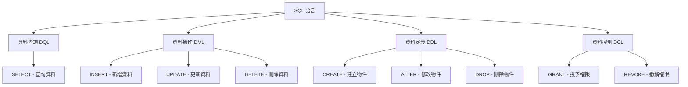
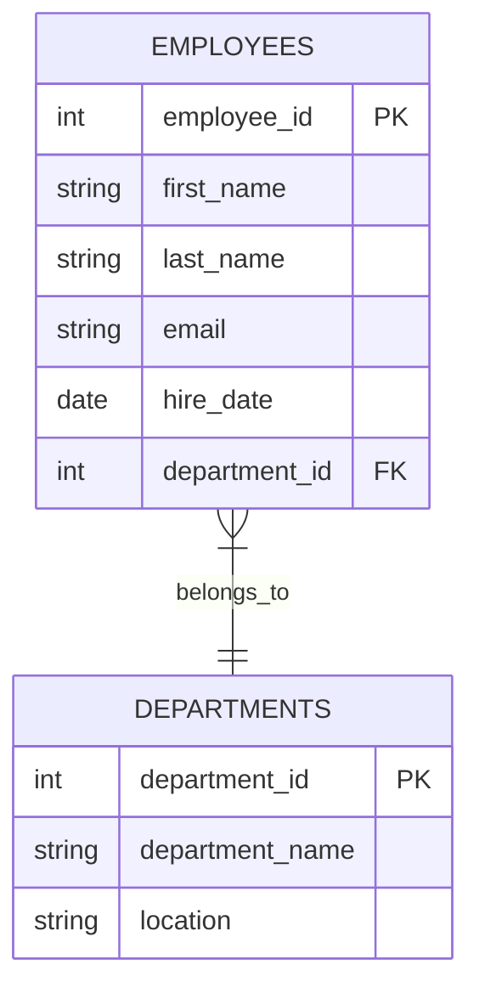
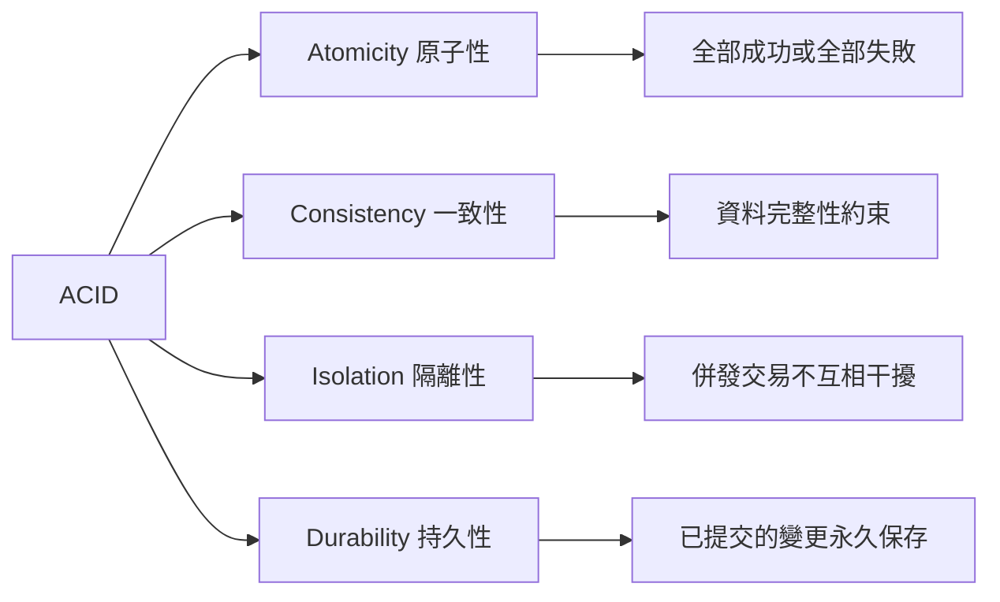
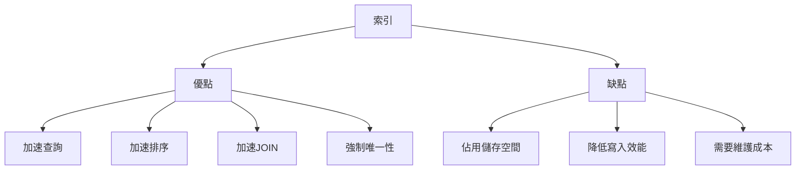
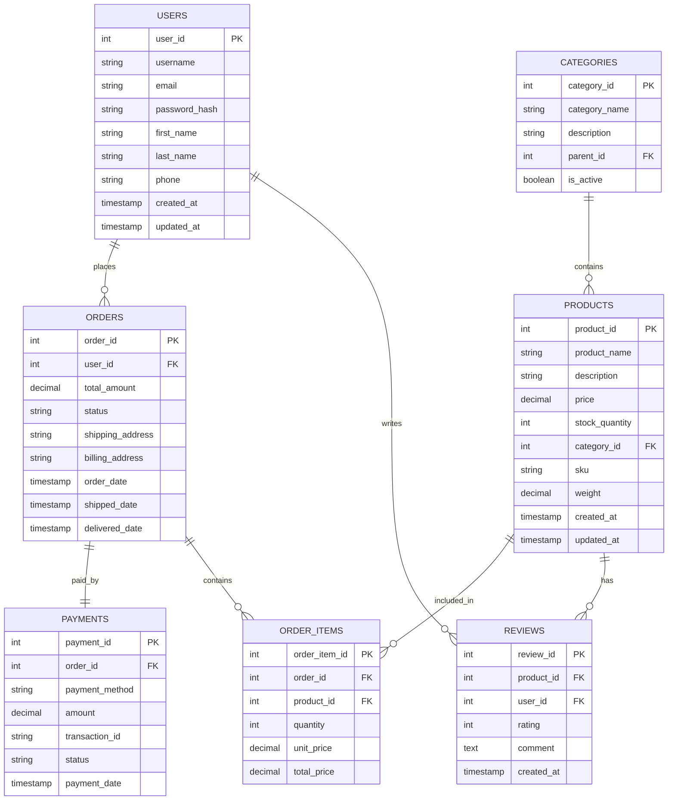

# SQL 使用教學手冊

## 目錄

### 1. [SQL 基礎入門](#1-sql-基礎入門)
- 1.1 [什麼是 SQL？](#11-什麼是-sql)
- 1.2 [SQL 的特點](#12-sql-的特點)
- 1.3 [SQL 語句分類](#13-sql-語句分類)
- 1.4 [第一個 SQL 查詢](#14-第一個-sql-查詢)

### 2. [資料庫基本概念](#2-資料庫基本概念)
- 2.1 [關聯式資料庫模型](#21-關聯式資料庫模型)
- 2.2 [基本概念解釋](#22-基本概念解釋)
- 2.3 [資料類型](#23-資料類型)
- 2.4 [正規化（Normalization）](#24-正規化normalization)

### 3. [基本查詢語法](#3-基本查詢語法)
- 3.1 [SELECT 語句基礎](#31-select-語句基礎)
- 3.2 [查詢所有欄位](#32-查詢所有欄位)
- 3.3 [查詢特定欄位](#33-查詢特定欄位)
- 3.4 [WHERE 條件查詢](#34-where-條件查詢)
- 3.5 [排序 ORDER BY](#35-排序-order-by)
- 3.6 [限制結果筆數](#36-限制結果筆數)
- 3.7 [去除重複 DISTINCT](#37-去除重複-distinct)

### 4. [進階查詢技巧](#4-進階查詢技巧)
- 4.1 [聚合函數](#41-聚合函數)
- 4.2 [GROUP BY 分組查詢](#42-group-by-分組查詢)
- 4.3 [HAVING 分組篩選](#43-having-分組篩選)
- 4.4 [JOIN 表格連接](#44-join-表格連接)
- 4.5 [子查詢（Subquery）](#45-子查詢subquery)
- 4.6 [WITH 公用表格表達式（CTE）](#46-with-公用表格表達式cte)
- 4.7 [視窗函數（Window Functions）](#47-視窗函數window-functions)

### 5. [資料操作語言 (DML)](#5-資料操作語言-dml)
- 5.1 [INSERT - 新增資料](#51-insert---新增資料)
- 5.2 [UPDATE - 更新資料](#52-update---更新資料)
- 5.3 [DELETE - 刪除資料](#53-delete---刪除資料)
- 5.4 [UPSERT - 插入或更新](#54-upsert---插入或更新)
- 5.5 [批次處理最佳實務](#55-批次處理最佳實務)

### 6. [資料定義語言 (DDL)](#6-資料定義語言-ddl)
- 6.1 [CREATE - 建立資料庫物件](#61-create---建立資料庫物件)
- 6.2 [ALTER - 修改資料庫物件](#62-alter---修改資料庫物件)
- 6.3 [DROP - 刪除資料庫物件](#63-drop---刪除資料庫物件)
- 6.4 [TRUNCATE - 清空表格](#64-truncate---清空表格)
- 6.5 [資料類型選擇指南](#65-資料類型選擇指南)
- 6.6 [表格設計最佳實務](#66-表格設計最佳實務)
- 6.7 [效能考量](#67-效能考量)

### 7. [交易處理與併發控制](#7-交易處理與併發控制)
- 7.1 [交易基本概念](#71-交易基本概念)
- 7.2 [交易控制語句](#72-交易控制語句)
- 7.3 [交易隔離等級](#73-交易隔離等級)
- 7.4 [併發問題與解決方案](#74-併發問題與解決方案)
- 7.5 [鎖定機制](#75-鎖定機制)
- 7.6 [實務交易處理模式](#76-實務交易處理模式)

### 8. [索引與效能優化](#8-索引與效能優化)
- 8.1 [索引基本概念](#81-索引基本概念)
- 8.2 [索引類型](#82-索引類型)
- 8.3 [索引設計策略](#83-索引設計策略)
- 8.4 [查詢效能分析](#84-查詢效能分析)
- 8.5 [查詢優化技巧](#85-查詢優化技巧)
- 8.6 [分割與分片](#86-分割與分片)
- 8.7 [效能監控與維護](#87-效能監控與維護)

### 9. [儲存程序與函數](#9-儲存程序與函數)
- 9.1 [儲存程序基礎](#91-儲存程序基礎)
- 9.2 [函數](#92-函數)
- 9.3 [控制流程結構](#93-控制流程結構)
- 9.4 [例外處理](#94-例外處理)

### 10. [安全性與防護](#10-安全性與防護)
- 10.1 [SQL Injection 防護](#101-sql-injection-防護)
- 10.2 [存取控制與權限管理](#102-存取控制與權限管理)
- 10.3 [資料加密](#103-資料加密)
- 10.4 [稽核與監控](#104-稽核與監控)

### 11. [專案實務案例](#11-專案實務案例)
- 11.1 [電商系統資料庫設計](#111-電商系統資料庫設計)
- 11.2 [常用業務查詢](#112-常用業務查詢)
- 11.3 [效能優化實作](#113-效能優化實作)

### 12. [認證考試準備](#12-認證考試準備)
- 12.1 [Oracle SQL 認證要點](#121-oracle-sql-認證要點)
- 12.2 [Microsoft SQL Server 認證要點](#122-microsoft-sql-server-認證要點)
- 12.3 [PostgreSQL 認證要點](#123-postgresql-認證要點)
- 12.4 [IBM DB2 認證要點](#124-ibm-db2-認證要點)
- 12.5 [認證考試技巧](#125-認證考試技巧)

### 13. [最佳實務與故障排除](#13-最佳實務與故障排除)
- 13.1 [常見錯誤與解決方案](#131-常見錯誤與解決方案)
- 13.2 [效能優化建議](#132-效能優化建議)
- 13.3 [開發最佳實務](#133-開發最佳實務)
- 13.4 [資源推薦](#134-資源推薦)

---

## 前言

歡迎來到 SQL 的世界！SQL（Structured Query Language，結構化查詢語言）是與資料庫溝通的標準語言。無論您是新進的開發同仁，還是希望深化資料庫技能的工程師，這份教學手冊都將帶您從零開始，循序漸進地掌握 SQL 的精髓。

本教學手冊涵蓋主流資料庫系統，包括：
- **MySQL** - 最受歡迎的開源資料庫
- **PostgreSQL** - 功能強大的開源資料庫
- **Oracle Database** - 企業級商用資料庫
- **Microsoft SQL Server** - 微軟企業資料庫
- **IBM DB2** - IBM 企業級資料庫系統

### 學習目標

完成本教學後，您將能夠：
- 理解資料庫的基本概念和 SQL 語言
- 熟練撰寫各種 SQL 查詢語句
- 掌握資料庫設計和最佳化技巧
- 具備專案開發所需的 SQL 實務能力
- 準備並通過 SQL 相關認證考試

### 使用方式

- 📖 **循序漸進**：建議按章節順序學習
- 💻 **動手實作**：每個範例都要親自執行
- 📝 **練習題目**：完成每章節的練習題
- 🔍 **實務應用**：將學到的技巧應用到專案中

---

## 1. SQL 基礎入門

### 1.1 什麼是 SQL？

SQL（Structured Query Language）是一種專門用來管理關聯式資料庫的語言。它是所有主要資料庫系統（如 Oracle、MySQL、PostgreSQL、SQL Server）的標準語言。

#### SQL 的主要功能



### 1.2 SQL 的特點

- **宣告式語言**：告訴資料庫「要什麼」，而不是「怎麼做」
- **標準化**：遵循 ANSI/ISO 標準
- **簡潔明瞭**：接近自然語言的語法
- **功能強大**：支援複雜的資料操作和分析

### 1.3 SQL 語句分類

| 分類 | 全稱 | 功能 | 主要語句 |
|------|------|------|----------|
| DQL | Data Query Language | 資料查詢 | SELECT |
| DML | Data Manipulation Language | 資料操作 | INSERT, UPDATE, DELETE |
| DDL | Data Definition Language | 資料定義 | CREATE, ALTER, DROP |
| DCL | Data Control Language | 資料控制 | GRANT, REVOKE |
| TCL | Transaction Control Language | 交易控制 | COMMIT, ROLLBACK, SAVEPOINT |

### 1.4 第一個 SQL 查詢

讓我們從最簡單的查詢開始：

```sql
-- 查詢當前時間
SELECT NOW() AS 當前時間;

-- 查詢資料庫版本
SELECT VERSION() AS 版本資訊;

-- 簡單的數學運算
SELECT 2 + 3 AS 計算結果;
```

### 💡 實務提醒

- SQL 語句不區分大小寫，但建議關鍵字使用大寫
- 每個 SQL 語句以分號 (;) 結尾
- 使用雙橫線 (--) 進行單行註解
- 使用 /* */ 進行多行註解

---

## 2. 資料庫基本概念

### 2.1 關聯式資料庫模型

關聯式資料庫將資料組織成表格（Table）的形式，每個表格由列（Row）和欄（Column）組成。



### 2.2 基本概念解釋

#### 表格（Table）
- 儲存資料的基本單位
- 由列和欄組成的二維結構

#### 欄位（Column/Field）
- 表格中的垂直部分
- 定義資料的屬性和類型

#### 記錄（Row/Record）
- 表格中的水平部分
- 代表一筆完整的資料

#### 主鍵（Primary Key）
- 唯一識別表格中每一筆記錄的欄位
- 不能為空值（NULL）
- 不能重複

#### 外鍵（Foreign Key）
- 參照其他表格主鍵的欄位
- 建立表格間的關聯關係

### 2.3 資料類型

#### 數值類型
```sql
-- 整數
INT, BIGINT, SMALLINT, TINYINT

-- 小數
DECIMAL(10,2), FLOAT, DOUBLE

-- 範例
CREATE TABLE products (
    id INT PRIMARY KEY,
    price DECIMAL(10,2),
    quantity INT
);
```

#### 字串類型
```sql
-- 固定長度
CHAR(10)

-- 可變長度
VARCHAR(255)

-- 大文字
TEXT, LONGTEXT

-- 範例
CREATE TABLE users (
    username VARCHAR(50),
    description TEXT
);
```

#### 日期時間類型
```sql
-- 日期
DATE

-- 時間
TIME

-- 日期時間
DATETIME, TIMESTAMP

-- 範例
CREATE TABLE events (
    event_date DATE,
    start_time TIME,
    created_at TIMESTAMP DEFAULT CURRENT_TIMESTAMP
);
```

### 2.4 正規化（Normalization）

正規化是減少資料冗餘和確保資料一致性的過程。

#### 第一正規化（1NF）
- 每個欄位都是原子性的（不可再分割）
- 沒有重複的群組

#### 第二正規化（2NF）
- 符合 1NF
- 非主鍵欄位完全依賴於主鍵

#### 第三正規化（3NF）
- 符合 2NF
- 非主鍵欄位不依賴於其他非主鍵欄位

### 💡 實務提醒

在專案開發中，通常使用第三正規化作為標準，但有時為了效能考量，會適度進行反正規化。

---

## 3. 基本查詢語法

### 3.1 SELECT 語句基礎

SELECT 是 SQL 中最重要的語句，用於從資料庫中查詢資料。

#### 基本語法結構
```sql
SELECT 欄位清單
FROM 表格名稱
WHERE 條件
ORDER BY 排序欄位
LIMIT 筆數限制;
```

### 3.2 查詢所有欄位

```sql
-- 查詢 employees 表格的所有資料
SELECT * FROM employees;

-- 建議明確指定欄位（效能較好，可讀性高）
SELECT employee_id, first_name, last_name, email, hire_date
FROM employees;
```

### 3.3 查詢特定欄位

```sql
-- 只查詢員工姓名和信箱
SELECT first_name, last_name, email
FROM employees;

-- 使用別名讓輸出更清楚
SELECT 
    first_name AS 名字,
    last_name AS 姓氏,
    email AS 電子信箱
FROM employees;
```

### 3.4 WHERE 條件查詢

#### 比較運算子
```sql
-- 等於
SELECT * FROM employees WHERE department_id = 10;

-- 不等於
SELECT * FROM employees WHERE department_id != 10;
SELECT * FROM employees WHERE department_id <> 10;

-- 大於、小於
SELECT * FROM employees WHERE salary > 50000;
SELECT * FROM employees WHERE hire_date < '2020-01-01';

-- 大於等於、小於等於
SELECT * FROM employees WHERE salary >= 50000;
SELECT * FROM employees WHERE age <= 30;
```

#### 邏輯運算子
```sql
-- AND：所有條件都必須滿足
SELECT * FROM employees 
WHERE department_id = 10 AND salary > 50000;

-- OR：任一條件滿足即可
SELECT * FROM employees 
WHERE department_id = 10 OR department_id = 20;

-- NOT：條件相反
SELECT * FROM employees 
WHERE NOT department_id = 10;
```

#### 範圍查詢
```sql
-- BETWEEN：範圍查詢
SELECT * FROM employees 
WHERE salary BETWEEN 30000 AND 80000;

-- IN：列表查詢
SELECT * FROM employees 
WHERE department_id IN (10, 20, 30);

-- NOT IN：排除列表
SELECT * FROM employees 
WHERE department_id NOT IN (10, 20);
```

#### 模糊查詢
```sql
-- LIKE：模式匹配
-- % 代表任意字元（0個或多個）
-- _ 代表單一字元

-- 姓氏以 'S' 開頭的員工
SELECT * FROM employees 
WHERE last_name LIKE 'S%';

-- 名字包含 'an' 的員工
SELECT * FROM employees 
WHERE first_name LIKE '%an%';

-- 名字第二個字母是 'a' 的員工
SELECT * FROM employees 
WHERE first_name LIKE '_a%';
```

#### 空值查詢
```sql
-- IS NULL：查詢空值
SELECT * FROM employees 
WHERE commission_pct IS NULL;

-- IS NOT NULL：查詢非空值
SELECT * FROM employees 
WHERE commission_pct IS NOT NULL;
```

### 3.5 排序 ORDER BY

```sql
-- 升序排列（預設）
SELECT * FROM employees 
ORDER BY salary ASC;

-- 降序排列
SELECT * FROM employees 
ORDER BY salary DESC;

-- 多欄位排序
SELECT * FROM employees 
ORDER BY department_id ASC, salary DESC;

-- 使用欄位位置排序
SELECT first_name, last_name, salary 
FROM employees 
ORDER BY 3 DESC;  -- 按第3個欄位（salary）降序
```

### 3.6 限制結果筆數

```sql
-- MySQL/PostgreSQL
SELECT * FROM employees 
ORDER BY salary DESC 
LIMIT 10;

-- SQL Server
SELECT TOP 10 * FROM employees 
ORDER BY salary DESC;

-- Oracle
SELECT * FROM (
    SELECT * FROM employees 
    ORDER BY salary DESC
) WHERE ROWNUM <= 10;

-- IBM DB2
SELECT * FROM employees 
ORDER BY salary DESC 
FETCH FIRST 10 ROWS ONLY;
```

### 3.7 去除重複 DISTINCT

```sql
-- 查詢所有不重複的部門ID
SELECT DISTINCT department_id FROM employees;

-- 多欄位去重複
SELECT DISTINCT department_id, job_id FROM employees;
```

### 📝 練習題

1. 查詢所有員工的姓名和薪資，按薪資降序排列
2. 查詢部門ID為10或20的員工資訊
3. 查詢薪資在40000到80000之間的員工
4. 查詢姓氏以'A'開頭的員工
5. 查詢前5名薪資最高的員工

#### 練習答案
```sql
-- 1.
SELECT first_name, last_name, salary 
FROM employees 
ORDER BY salary DESC;

-- 2.
SELECT * FROM employees 
WHERE department_id IN (10, 20);

-- 3.
SELECT * FROM employees 
WHERE salary BETWEEN 40000 AND 80000;

-- 4.
SELECT * FROM employees 
WHERE last_name LIKE 'A%';

-- 5.
SELECT * FROM employees 
ORDER BY salary DESC 
LIMIT 5;
```

### 💡 實務提醒

- 在生產環境中避免使用 `SELECT *`，明確指定需要的欄位
- 大型表格查詢時記得使用 WHERE 條件限制結果
- 合理使用索引可以大幅提升查詢效能
- WHERE 條件的順序會影響效能，將過濾性高的條件放在前面

---

## 4. 進階查詢技巧

### 4.1 聚合函數

聚合函數對一組資料進行計算，返回單一值。

#### 常用聚合函數

```sql
-- COUNT：計算記錄數
SELECT COUNT(*) AS 總員工數 FROM employees;
SELECT COUNT(commission_pct) AS 有獎金員工數 FROM employees;

-- SUM：求和
SELECT SUM(salary) AS 薪資總和 FROM employees;

-- AVG：平均值
SELECT AVG(salary) AS 平均薪資 FROM employees;

-- MAX/MIN：最大值/最小值
SELECT MAX(salary) AS 最高薪資, MIN(salary) AS 最低薪資 FROM employees;

-- ROUND：四捨五入
SELECT ROUND(AVG(salary), 2) AS 平均薪資 FROM employees;
```

### 4.2 GROUP BY 分組查詢

GROUP BY 用於將資料分組，通常與聚合函數搭配使用。

```sql
-- 按部門分組統計員工數
SELECT department_id, COUNT(*) AS 員工數
FROM employees
GROUP BY department_id;

-- 按部門分組統計平均薪資
SELECT department_id, AVG(salary) AS 平均薪資
FROM employees
GROUP BY department_id
ORDER BY 平均薪資 DESC;

-- 多欄位分組
SELECT department_id, job_id, COUNT(*) AS 員工數, AVG(salary) AS 平均薪資
FROM employees
GROUP BY department_id, job_id
ORDER BY department_id, job_id;
```

### 4.3 HAVING 分組篩選

HAVING 用於篩選分組後的結果，類似於 WHERE，但用於聚合函數的條件。

```sql
-- 查詢員工數超過5人的部門
SELECT department_id, COUNT(*) AS 員工數
FROM employees
GROUP BY department_id
HAVING COUNT(*) > 5;

-- 查詢平均薪資超過60000的部門
SELECT department_id, AVG(salary) AS 平均薪資
FROM employees
GROUP BY department_id
HAVING AVG(salary) > 60000
ORDER BY 平均薪資 DESC;

-- WHERE 和 HAVING 的組合使用
SELECT department_id, AVG(salary) AS 平均薪資
FROM employees
WHERE hire_date >= '2020-01-01'  -- 先篩選記錄
GROUP BY department_id
HAVING AVG(salary) > 50000       -- 再篩選分組
ORDER BY 平均薪資 DESC;
```

### 4.4 JOIN 表格連接

JOIN 用於連接多個表格，是關聯式資料庫最重要的功能之一。

#### 內連接（INNER JOIN）
```sql
-- 查詢員工及其部門資訊
SELECT e.first_name, e.last_name, d.department_name
FROM employees e
INNER JOIN departments d ON e.department_id = d.department_id;

-- 三表連接：員工、部門、職位
SELECT 
    e.first_name,
    e.last_name,
    d.department_name,
    j.job_title
FROM employees e
INNER JOIN departments d ON e.department_id = d.department_id
INNER JOIN jobs j ON e.job_id = j.job_id;
```

#### 左外連接（LEFT JOIN）
```sql
-- 查詢所有部門及其員工數（包含沒有員工的部門）
SELECT 
    d.department_name,
    COUNT(e.employee_id) AS 員工數
FROM departments d
LEFT JOIN employees e ON d.department_id = e.department_id
GROUP BY d.department_id, d.department_name
ORDER BY 員工數 DESC;
```

#### 右外連接（RIGHT JOIN）
```sql
-- 查詢所有員工及其部門（包含沒有部門的員工）
SELECT 
    e.first_name,
    e.last_name,
    d.department_name
FROM departments d
RIGHT JOIN employees e ON d.department_id = e.department_id;
```

#### 全外連接（FULL OUTER JOIN）
```sql
-- 查詢所有部門和員工的對應關係
SELECT 
    e.first_name,
    e.last_name,
    d.department_name
FROM employees e
FULL OUTER JOIN departments d ON e.department_id = d.department_id;
```

#### 自連接（Self JOIN）
```sql
-- 查詢員工及其主管
SELECT 
    e.first_name AS 員工姓名,
    m.first_name AS 主管姓名
FROM employees e
LEFT JOIN employees m ON e.manager_id = m.employee_id;
```

### 4.5 子查詢（Subquery）

子查詢是嵌套在其他 SQL 語句中的查詢。

#### 單行子查詢
```sql
-- 查詢薪資高於平均薪資的員工
SELECT first_name, last_name, salary
FROM employees
WHERE salary > (SELECT AVG(salary) FROM employees);

-- 查詢與 'Steven' 同部門的員工
SELECT first_name, last_name, department_id
FROM employees
WHERE department_id = (
    SELECT department_id 
    FROM employees 
    WHERE first_name = 'Steven'
);
```

#### 多行子查詢
```sql
-- 查詢在銷售部門工作的員工
SELECT first_name, last_name
FROM employees
WHERE department_id IN (
    SELECT department_id 
    FROM departments 
    WHERE department_name LIKE '%Sales%'
);

-- ANY/ALL 操作符
-- 薪資高於任一IT部門員工的員工
SELECT first_name, last_name, salary
FROM employees
WHERE salary > ANY (
    SELECT salary 
    FROM employees 
    WHERE department_id = (
        SELECT department_id 
        FROM departments 
        WHERE department_name = 'IT'
    )
);
```

#### 相關子查詢
```sql
-- 查詢薪資高於同部門平均薪資的員工
SELECT e1.first_name, e1.last_name, e1.salary, e1.department_id
FROM employees e1
WHERE e1.salary > (
    SELECT AVG(e2.salary)
    FROM employees e2
    WHERE e2.department_id = e1.department_id
);
```

#### EXISTS 子查詢
```sql
-- 查詢有員工的部門
SELECT department_name
FROM departments d
WHERE EXISTS (
    SELECT 1 
    FROM employees e 
    WHERE e.department_id = d.department_id
);

-- 查詢沒有員工的部門
SELECT department_name
FROM departments d
WHERE NOT EXISTS (
    SELECT 1 
    FROM employees e 
    WHERE e.department_id = d.department_id
);
```

### 4.6 WITH 公用表格表達式（CTE）

CTE 提供了一種創建臨時命名結果集的方法，讓複雜查詢更易讀。

```sql
-- 簡單 CTE
WITH dept_avg AS (
    SELECT 
        department_id,
        AVG(salary) AS avg_salary
    FROM employees
    GROUP BY department_id
)
SELECT 
    e.first_name,
    e.last_name,
    e.salary,
    da.avg_salary
FROM employees e
JOIN dept_avg da ON e.department_id = da.department_id
WHERE e.salary > da.avg_salary;

-- 遞迴 CTE（組織架構）
WITH RECURSIVE org_chart AS (
    -- 基礎案例：最高主管
    SELECT employee_id, first_name, last_name, manager_id, 1 as level
    FROM employees
    WHERE manager_id IS NULL
    
    UNION ALL
    
    -- 遞迴案例：下屬
    SELECT e.employee_id, e.first_name, e.last_name, e.manager_id, oc.level + 1
    FROM employees e
    JOIN org_chart oc ON e.manager_id = oc.employee_id
)
SELECT * FROM org_chart
ORDER BY level, last_name;
```

### 4.7 視窗函數（Window Functions）

視窗函數在不改變查詢結果行數的情況下進行聚合運算。

```sql
-- ROW_NUMBER：行號
SELECT 
    first_name,
    last_name,
    salary,
    ROW_NUMBER() OVER (ORDER BY salary DESC) AS row_num
FROM employees;

-- RANK 和 DENSE_RANK：排名
SELECT 
    first_name,
    last_name,
    salary,
    RANK() OVER (ORDER BY salary DESC) AS rank_num,
    DENSE_RANK() OVER (ORDER BY salary DESC) AS dense_rank_num
FROM employees;

-- 分區視窗函數
SELECT 
    first_name,
    last_name,
    department_id,
    salary,
    AVG(salary) OVER (PARTITION BY department_id) AS dept_avg_salary,
    salary - AVG(salary) OVER (PARTITION BY department_id) AS salary_diff
FROM employees;

-- LAG 和 LEAD：前後值比較
SELECT 
    first_name,
    last_name,
    hire_date,
    salary,
    LAG(salary) OVER (ORDER BY hire_date) AS prev_salary,
    LEAD(salary) OVER (ORDER BY hire_date) AS next_salary
FROM employees;
```

### 📝 練習題

1. 計算每個部門的員工總數和平均薪資
2. 查詢員工數超過10人的部門
3. 查詢薪資前3名的員工資訊
4. 使用子查詢找出薪資最高的員工
5. 查詢每個部門薪資最高的員工

#### 練習答案
```sql
-- 1.
SELECT 
    department_id,
    COUNT(*) AS 員工總數,
    ROUND(AVG(salary), 2) AS 平均薪資
FROM employees
GROUP BY department_id;

-- 2.
SELECT department_id, COUNT(*) AS 員工數
FROM employees
GROUP BY department_id
HAVING COUNT(*) > 10;

-- 3.
SELECT first_name, last_name, salary
FROM employees
ORDER BY salary DESC
LIMIT 3;

-- 4.
SELECT first_name, last_name, salary
FROM employees
WHERE salary = (SELECT MAX(salary) FROM employees);

-- 5.
SELECT first_name, last_name, department_id, salary
FROM employees e1
WHERE salary = (
    SELECT MAX(salary)
    FROM employees e2
    WHERE e2.department_id = e1.department_id
);
```

### 💡 實務提醒

- 使用 GROUP BY 時，SELECT 中的非聚合欄位必須出現在 GROUP BY 中
- JOIN 效能通常比子查詢好，但要根據具體情況選擇
- 複雜查詢可以使用 CTE 提高可讀性
---

## 5. 資料操作語言 (DML)

### 5.1 INSERT - 新增資料

INSERT 語句用於向表格中新增新的記錄。

#### 基本語法

```sql
-- 插入所有欄位
INSERT INTO table_name (column1, column2, column3, ...)
VALUES (value1, value2, value3, ...);

-- 插入部分欄位
INSERT INTO table_name (column1, column3)
VALUES (value1, value3);
```

#### 實際範例

```sql
-- 新增單筆員工資料
INSERT INTO employees (
    employee_id, 
    first_name, 
    last_name, 
    email, 
    hire_date, 
    job_id, 
    salary, 
    department_id
)
VALUES (
    1001, 
    'John', 
    'Doe', 
    'john.doe@company.com', 
    '2024-01-15', 
    'IT_PROG', 
    65000, 
    60
);

-- 新增多筆資料
INSERT INTO employees (employee_id, first_name, last_name, email, hire_date, job_id, salary)
VALUES 
    (1002, 'Jane', 'Smith', 'jane.smith@company.com', '2024-01-16', 'IT_PROG', 68000),
    (1003, 'Bob', 'Johnson', 'bob.johnson@company.com', '2024-01-17', 'SA_REP', 55000),
    (1004, 'Alice', 'Brown', 'alice.brown@company.com', '2024-01-18', 'FI_ACCOUNT', 52000);
```

#### 從其他表格插入資料

```sql
-- 將查詢結果插入到另一個表格
INSERT INTO temp_employees (employee_id, first_name, last_name, salary)
SELECT employee_id, first_name, last_name, salary
FROM employees
WHERE department_id = 60;

-- 複製表格結構和資料
CREATE TABLE employees_backup AS
SELECT * FROM employees;
```

#### 處理預設值和自動遞增

```sql
-- 使用預設值
INSERT INTO employees (first_name, last_name, email, hire_date)
VALUES ('David', 'Wilson', 'david.wilson@company.com', DEFAULT);

-- 自動遞增主鍵（MySQL）
INSERT INTO employees (first_name, last_name, email)
VALUES ('Sarah', 'Davis', 'sarah.davis@company.com');

-- 序列（Oracle/PostgreSQL）
INSERT INTO employees (employee_id, first_name, last_name, email)
VALUES (employee_seq.NEXTVAL, 'Mike', 'Miller', 'mike.miller@company.com');
```

### 5.2 UPDATE - 更新資料

UPDATE 語句用於修改表格中現有的記錄。

#### 基本語法

```sql
UPDATE table_name
SET column1 = value1, column2 = value2, ...
WHERE condition;
```

#### 更新範例

```sql
-- 更新單筆記錄
UPDATE employees
SET salary = 70000, email = 'john.doe.new@company.com'
WHERE employee_id = 1001;

-- 更新多筆記錄
UPDATE employees
SET salary = salary * 1.1
WHERE department_id = 60;

-- 根據條件更新
UPDATE employees
SET commission_pct = 0.05
WHERE job_id = 'SA_REP' AND salary > 50000;
```

#### 使用子查詢更新

```sql
-- 將員工薪資更新為其部門的平均薪資
UPDATE employees e1
SET salary = (
    SELECT AVG(salary)
    FROM employees e2
    WHERE e2.department_id = e1.department_id
)
WHERE employee_id = 1001;

-- 根據其他表格的資料更新
UPDATE employees e
SET department_id = (
    SELECT department_id
    FROM departments d
    WHERE d.department_name = 'Information Technology'
)
WHERE e.job_id = 'IT_PROG';
```

#### 安全更新技巧

```sql
-- 使用 CASE 語句進行條件更新
UPDATE employees
SET salary = CASE 
    WHEN department_id = 10 THEN salary * 1.15
    WHEN department_id = 20 THEN salary * 1.10
    WHEN department_id = 30 THEN salary * 1.05
    ELSE salary
END
WHERE hire_date >= '2020-01-01';

-- 更新前先檢查影響的記錄數
-- 1. 先查詢會被影響的記錄
SELECT COUNT(*) FROM employees WHERE department_id = 60;

-- 2. 確認無誤後再執行更新
UPDATE employees
SET salary = salary * 1.1
WHERE department_id = 60;
```

### 5.3 DELETE - 刪除資料

DELETE 語句用於從表格中刪除記錄。

#### 基本語法

```sql
DELETE FROM table_name
WHERE condition;
```

#### 刪除範例

```sql
-- 刪除特定記錄
DELETE FROM employees
WHERE employee_id = 1001;

-- 根據條件刪除多筆記錄
DELETE FROM employees
WHERE department_id = 60 AND hire_date < '2020-01-01';

-- 刪除重複記錄（保留ID最小的）
DELETE e1 FROM employees e1
INNER JOIN employees e2
WHERE e1.email = e2.email AND e1.employee_id > e2.employee_id;
```

#### 使用子查詢刪除

```sql
-- 刪除沒有部門的員工
DELETE FROM employees
WHERE department_id NOT IN (
    SELECT department_id FROM departments
);

-- 刪除薪資低於部門平均薪資的員工
DELETE FROM employees e1
WHERE salary < (
    SELECT AVG(salary)
    FROM employees e2
    WHERE e2.department_id = e1.department_id
);
```

#### 安全刪除技巧

```sql
-- 軟刪除：使用標記代替實際刪除
ALTER TABLE employees ADD COLUMN is_deleted BOOLEAN DEFAULT FALSE;

UPDATE employees
SET is_deleted = TRUE
WHERE employee_id = 1001;

-- 查詢時排除已刪除的記錄
SELECT * FROM employees WHERE is_deleted = FALSE;

-- 使用事務確保刪除安全
BEGIN TRANSACTION;

-- 備份要刪除的資料
CREATE TABLE deleted_employees_backup AS
SELECT * FROM employees WHERE department_id = 60;

-- 執行刪除
DELETE FROM employees WHERE department_id = 60;

-- 檢查結果，如果正確就提交，否則回滾
-- COMMIT; 或 ROLLBACK;
```

### 5.4 UPSERT - 插入或更新

某些資料庫支援 UPSERT 操作，能夠在記錄存在時更新，不存在時插入。

#### MySQL - ON DUPLICATE KEY UPDATE

```sql
INSERT INTO employees (employee_id, first_name, last_name, email, salary)
VALUES (1001, 'John', 'Doe', 'john.doe@company.com', 70000)
ON DUPLICATE KEY UPDATE 
    first_name = VALUES(first_name),
    last_name = VALUES(last_name),
    email = VALUES(email),
    salary = VALUES(salary);
```

#### PostgreSQL - ON CONFLICT

```sql
INSERT INTO employees (employee_id, first_name, last_name, email, salary)
VALUES (1001, 'John', 'Doe', 'john.doe@company.com', 70000)
ON CONFLICT (employee_id)
DO UPDATE SET 
    first_name = EXCLUDED.first_name,
    last_name = EXCLUDED.last_name,
    email = EXCLUDED.email,
    salary = EXCLUDED.salary;
```

#### SQL Server - MERGE

```sql
MERGE employees AS target
USING (VALUES (1001, 'John', 'Doe', 'john.doe@company.com', 70000)) 
    AS source (employee_id, first_name, last_name, email, salary)
ON target.employee_id = source.employee_id
WHEN MATCHED THEN
    UPDATE SET 
        first_name = source.first_name,
        last_name = source.last_name,
        email = source.email,
        salary = source.salary
WHEN NOT MATCHED THEN
    INSERT (employee_id, first_name, last_name, email, salary)
    VALUES (source.employee_id, source.first_name, source.last_name, source.email, source.salary);
```

#### IBM DB2 - MERGE

```sql
MERGE INTO employees AS target
USING (VALUES (1001, 'John', 'Doe', 'john.doe@company.com', 70000)) 
    AS source (employee_id, first_name, last_name, email, salary)
ON target.employee_id = source.employee_id
WHEN MATCHED THEN
    UPDATE SET 
        first_name = source.first_name,
        last_name = source.last_name,
        email = source.email,
        salary = source.salary
WHEN NOT MATCHED THEN
    INSERT (employee_id, first_name, last_name, email, salary)
    VALUES (source.employee_id, source.first_name, source.last_name, source.email, source.salary);
```

### 5.5 批次處理最佳實務

#### 大量資料處理

```sql
-- 分批處理大量更新
DECLARE @BatchSize INT = 1000;
DECLARE @RowsAffected INT = 1;

WHILE @RowsAffected > 0
BEGIN
    UPDATE TOP (@BatchSize) employees
    SET salary = salary * 1.1
    WHERE department_id = 60 AND last_update_date < '2024-01-01';
    
    SET @RowsAffected = @@ROWCOUNT;
    
    -- 稍作延遲避免鎖定過久
    WAITFOR DELAY '00:00:01';
END
```

#### 使用臨時表格進行複雜操作

```sql
-- 建立臨時表格
CREATE TEMPORARY TABLE temp_salary_updates (
    employee_id INT,
    new_salary DECIMAL(10,2)
);

-- 計算新薪資
INSERT INTO temp_salary_updates
SELECT 
    employee_id,
    CASE 
        WHEN performance_rating = 'Excellent' THEN salary * 1.15
        WHEN performance_rating = 'Good' THEN salary * 1.10
        WHEN performance_rating = 'Average' THEN salary * 1.05
        ELSE salary
    END as new_salary
FROM employees e
JOIN performance_reviews p ON e.employee_id = p.employee_id
WHERE p.review_year = 2024;

-- 執行更新
UPDATE employees e
SET salary = t.new_salary
FROM temp_salary_updates t
WHERE e.employee_id = t.employee_id;

-- 清理臨時表格
DROP TABLE temp_salary_updates;
```

### 📝 練習題

1. 新增一筆新的部門資料：部門ID=250, 部門名稱='Data Science', 位置='New York'
2. 將所有IT部門員工的薪資提高15%
3. 刪除所有在2020年之前入職且目前沒有主管的員工
4. 使用UPSERT操作更新或插入員工資料
5. 計算並更新每個員工的年資（以年為單位）

#### 練習答案

```sql
-- 1. 新增部門
INSERT INTO departments (department_id, department_name, location)
VALUES (250, 'Data Science', 'New York');

-- 2. 更新IT部門薪資
UPDATE employees
SET salary = salary * 1.15
WHERE department_id = (
    SELECT department_id 
    FROM departments 
    WHERE department_name = 'IT'
);

-- 3. 刪除特定條件的員工
DELETE FROM employees
WHERE hire_date < '2020-01-01' 
  AND manager_id IS NULL;

-- 4. UPSERT 範例（MySQL）
INSERT INTO employees (employee_id, first_name, last_name, email, salary)
VALUES (1005, 'Tom', 'Wilson', 'tom.wilson@company.com', 75000)
ON DUPLICATE KEY UPDATE 
    salary = VALUES(salary),
    email = VALUES(email);

-- 5. 更新年資
UPDATE employees
SET years_of_service = YEAR(CURDATE()) - YEAR(hire_date)
WHERE hire_date IS NOT NULL;
```

### 💡 實務提醒

- **永遠使用 WHERE 條件**：避免意外更新或刪除所有記錄
- **先查詢再操作**：在執行 UPDATE 或 DELETE 前，先用 SELECT 確認影響範圍
- **使用事務保護**：重要操作要包裝在事務中，出錯時可以回滾
- **備份重要資料**：大量刪除前先備份相關資料
- **考慮效能影響**：大量操作時要分批處理，避免長時間鎖定
---

## 6. 資料定義語言 (DDL)

### 6.1 CREATE - 建立資料庫物件

#### 建立資料庫

```sql
-- MySQL
CREATE DATABASE company_db
CHARACTER SET utf8mb4
COLLATE utf8mb4_unicode_ci;

-- PostgreSQL
CREATE DATABASE company_db
WITH ENCODING 'UTF8'
LC_COLLATE = 'en_US.UTF-8'
LC_CTYPE = 'en_US.UTF-8';

-- SQL Server
CREATE DATABASE company_db
ON (
    NAME = 'company_db',
    FILENAME = 'C:\Data\company_db.mdf',
    SIZE = 100MB,
    MAXSIZE = 1GB,
    FILEGROWTH = 10MB
);

-- IBM DB2
CREATE DATABASE company_db
ON '/data/db2'
USING CODESET UTF-8
TERRITORY TW
COLLATE USING SYSTEM;
```

#### 建立資料表

```sql
-- 基本表格建立
CREATE TABLE employees (
    employee_id INT PRIMARY KEY,
    first_name VARCHAR(50) NOT NULL,
    last_name VARCHAR(50) NOT NULL,
    email VARCHAR(100) UNIQUE NOT NULL,
    phone_number VARCHAR(20),
    hire_date DATE NOT NULL,
    job_id VARCHAR(10) NOT NULL,
    salary DECIMAL(8,2),
    commission_pct DECIMAL(2,2),
    manager_id INT,
    department_id INT,
    created_at TIMESTAMP DEFAULT CURRENT_TIMESTAMP,
    updated_at TIMESTAMP DEFAULT CURRENT_TIMESTAMP ON UPDATE CURRENT_TIMESTAMP
);

-- 帶有外鍵約束的表格
CREATE TABLE departments (
    department_id INT PRIMARY KEY,
    department_name VARCHAR(30) NOT NULL UNIQUE,
    manager_id INT,
    location_id INT,
    FOREIGN KEY (manager_id) REFERENCES employees(employee_id),
    FOREIGN KEY (location_id) REFERENCES locations(location_id)
);
```

#### 約束條件 (Constraints)

```sql
CREATE TABLE products (
    product_id INT AUTO_INCREMENT PRIMARY KEY,
    product_name VARCHAR(100) NOT NULL,
    category_id INT NOT NULL,
    unit_price DECIMAL(10,2) NOT NULL CHECK (unit_price > 0),
    stock_quantity INT DEFAULT 0 CHECK (stock_quantity >= 0),
    supplier_id INT,
    created_date DATE DEFAULT (CURRENT_DATE),
    status ENUM('active', 'inactive', 'discontinued') DEFAULT 'active',
    
    -- 表格層級約束
    CONSTRAINT uk_product_name UNIQUE (product_name),
    CONSTRAINT fk_category FOREIGN KEY (category_id) REFERENCES categories(category_id),
    CONSTRAINT fk_supplier FOREIGN KEY (supplier_id) REFERENCES suppliers(supplier_id),
    CONSTRAINT chk_price_quantity CHECK (unit_price > 0 AND stock_quantity >= 0)
);
```

#### 建立索引

```sql
-- 建立單一欄位索引
CREATE INDEX idx_employee_last_name ON employees(last_name);

-- 建立複合索引
CREATE INDEX idx_employee_dept_salary ON employees(department_id, salary DESC);

-- 建立唯一索引
CREATE UNIQUE INDEX idx_employee_email ON employees(email);

-- 建立部分索引（PostgreSQL）
CREATE INDEX idx_active_employees ON employees(last_name) 
WHERE status = 'active';

-- 建立函數索引
CREATE INDEX idx_employee_full_name ON employees(LOWER(first_name || ' ' || last_name));

-- IBM DB2 索引語法
-- 建立基本索引
CREATE INDEX idx_employee_name ON employees(last_name, first_name);

-- 建立唯一索引
CREATE UNIQUE INDEX idx_employee_id ON employees(employee_id);

-- 建立包含索引（INCLUDE）
CREATE INDEX idx_employee_dept_include ON employees(department_id) 
INCLUDE (salary, hire_date);

-- 建立叢集索引
CREATE INDEX idx_employee_clustered ON employees(employee_id) CLUSTER;
```

#### 建立檢視表 (Views)

```sql
-- 簡單檢視表
CREATE VIEW employee_details AS
SELECT 
    e.employee_id,
    e.first_name,
    e.last_name,
    e.email,
    d.department_name,
    j.job_title,
    e.salary
FROM employees e
LEFT JOIN departments d ON e.department_id = d.department_id
LEFT JOIN jobs j ON e.job_id = j.job_id;

-- 複雜檢視表
CREATE VIEW department_summary AS
SELECT 
    d.department_name,
    COUNT(e.employee_id) as employee_count,
    AVG(e.salary) as avg_salary,
    MAX(e.salary) as max_salary,
    MIN(e.salary) as min_salary,
    SUM(e.salary) as total_salary
FROM departments d
LEFT JOIN employees e ON d.department_id = e.department_id
GROUP BY d.department_id, d.department_name;

-- 可更新檢視表
CREATE VIEW active_employees AS
SELECT 
    employee_id,
    first_name,
    last_name,
    email,
    salary,
    department_id
FROM employees 
WHERE status = 'active'
WITH CHECK OPTION;
```

### 6.2 ALTER - 修改資料庫物件

#### 修改表格結構

```sql
-- 新增欄位
ALTER TABLE employees 
ADD COLUMN middle_name VARCHAR(50);

ALTER TABLE employees 
ADD COLUMN birth_date DATE,
ADD COLUMN gender CHAR(1) CHECK (gender IN ('M', 'F'));

-- 修改欄位
ALTER TABLE employees 
MODIFY COLUMN salary DECIMAL(10,2);

-- 重新命名欄位
ALTER TABLE employees 
CHANGE COLUMN phone_number mobile_number VARCHAR(20);

-- 刪除欄位
ALTER TABLE employees 
DROP COLUMN middle_name;

-- 新增約束
ALTER TABLE employees 
ADD CONSTRAINT chk_salary CHECK (salary > 0);

ALTER TABLE employees 
ADD CONSTRAINT fk_manager 
FOREIGN KEY (manager_id) REFERENCES employees(employee_id);

-- 刪除約束
ALTER TABLE employees 
DROP CONSTRAINT chk_salary;

ALTER TABLE employees 
DROP FOREIGN KEY fk_manager;
```

#### 修改索引

```sql
-- 刪除索引
DROP INDEX idx_employee_last_name ON employees;

-- 重建索引
ALTER TABLE employees 
DROP INDEX idx_employee_dept_salary,
ADD INDEX idx_employee_dept_job (department_id, job_id);
```

### 6.3 DROP - 刪除資料庫物件

#### 刪除表格

```sql
-- 刪除表格（注意外鍵約束）
DROP TABLE IF EXISTS temp_employees;

-- 強制刪除（先移除約束）
ALTER TABLE employees DROP FOREIGN KEY fk_department;
DROP TABLE departments;

-- 刪除多個表格
DROP TABLE table1, table2, table3;
```

#### 刪除其他物件

```sql
-- 刪除檢視表
DROP VIEW IF EXISTS employee_details;

-- 刪除索引
DROP INDEX idx_employee_email ON employees;

-- 刪除資料庫
DROP DATABASE IF EXISTS test_db;
```

### 6.4 TRUNCATE - 清空表格

```sql
-- 清空表格所有資料（比 DELETE 快，但不能回滾）
TRUNCATE TABLE temp_data;

-- 重置自動遞增計數器
TRUNCATE TABLE employees;  -- AUTO_INCREMENT 會重置為1
```

### 6.5 資料類型選擇指南

#### 數值類型選擇

```sql
-- 小整數（-128 到 127）
TINYINT

-- 一般整數（-2,147,483,648 到 2,147,483,647）
INT

-- 大整數（-9,223,372,036,854,775,808 到 9,223,372,036,854,775,807）
BIGINT

-- 精確小數（適用於金錢）
DECIMAL(10,2)  -- 總共10位數，小數點後2位

-- 浮點數（適用於科學計算）
FLOAT, DOUBLE
```

#### 字串類型選擇

```sql
-- 固定長度（適用於身分證字號、郵遞區號）
CHAR(10)

-- 可變長度（適用於姓名、地址）
VARCHAR(255)

-- 大文字（適用於文章、描述）
TEXT, LONGTEXT

-- 二進位資料
BLOB, LONGBLOB
```

#### 日期時間類型選擇

```sql
-- 只有日期
DATE  -- '2024-01-15'

-- 只有時間
TIME  -- '14:30:00'

-- 日期和時間
DATETIME  -- '2024-01-15 14:30:00'

-- 時間戳（自動更新）
TIMESTAMP DEFAULT CURRENT_TIMESTAMP ON UPDATE CURRENT_TIMESTAMP
```

### 6.6 表格設計最佳實務

#### 命名慣例

```sql
-- 表格命名：複數名詞，使用底線分隔
employees, order_details, customer_addresses

-- 欄位命名：單數名詞，描述性強
employee_id, first_name, created_at, is_active

-- 索引命名：描述用途
idx_employee_last_name, uk_employee_email, fk_employee_department

-- 約束命名：描述類型和用途
chk_salary_positive, uk_email_unique, fk_employee_department
```

#### 正規化設計範例

```sql
-- 第三正規化設計
CREATE TABLE customers (
    customer_id INT PRIMARY KEY,
    first_name VARCHAR(50) NOT NULL,
    last_name VARCHAR(50) NOT NULL,
    email VARCHAR(100) UNIQUE,
    phone VARCHAR(20)
);

CREATE TABLE addresses (
    address_id INT PRIMARY KEY,
    customer_id INT NOT NULL,
    address_type ENUM('billing', 'shipping') NOT NULL,
    street_address VARCHAR(255) NOT NULL,
    city VARCHAR(100) NOT NULL,
    state VARCHAR(50),
    postal_code VARCHAR(20),
    country VARCHAR(50) NOT NULL,
    FOREIGN KEY (customer_id) REFERENCES customers(customer_id)
);

CREATE TABLE orders (
    order_id INT PRIMARY KEY,
    customer_id INT NOT NULL,
    order_date TIMESTAMP DEFAULT CURRENT_TIMESTAMP,
    total_amount DECIMAL(10,2) NOT NULL,
    status ENUM('pending', 'processing', 'shipped', 'delivered', 'cancelled') DEFAULT 'pending',
    FOREIGN KEY (customer_id) REFERENCES customers(customer_id)
);

CREATE TABLE order_items (
    order_item_id INT PRIMARY KEY,
    order_id INT NOT NULL,
    product_id INT NOT NULL,
    quantity INT NOT NULL CHECK (quantity > 0),
    unit_price DECIMAL(10,2) NOT NULL CHECK (unit_price > 0),
    FOREIGN KEY (order_id) REFERENCES orders(order_id),
    FOREIGN KEY (product_id) REFERENCES products(product_id)
);
```

### 6.7 效能考量

#### 索引策略

```sql
-- 經常查詢的欄位建立索引
CREATE INDEX idx_order_date ON orders(order_date);
CREATE INDEX idx_customer_email ON customers(email);

-- 外鍵自動建立索引（某些資料庫）
-- 複合索引順序很重要
CREATE INDEX idx_order_customer_date ON orders(customer_id, order_date);

-- 避免過多索引（影響寫入效能）
-- 定期檢查和清理未使用的索引
```

#### 分割表格 (Partitioning)

```sql
-- 按日期分割（MySQL）
CREATE TABLE sales (
    sale_id INT,
    sale_date DATE,
    amount DECIMAL(10,2),
    customer_id INT
)
PARTITION BY RANGE (YEAR(sale_date)) (
    PARTITION p2022 VALUES LESS THAN (2023),
    PARTITION p2023 VALUES LESS THAN (2024),
    PARTITION p2024 VALUES LESS THAN (2025),
    PARTITION p_future VALUES LESS THAN MAXVALUE
);
```

### 📝 DDL 練習題

1. 建立一個 `products` 表格，包含產品ID、名稱、價格、類別ID等欄位
2. 為 `products` 表格新增一個 `description` 欄位
3. 建立一個檢視表顯示產品及其類別名稱
4. 為產品名稱建立索引
5. 建立一個分類表格並建立外鍵關聯

#### DDL 練習答案

```sql
-- 1. 建立 products 表格
CREATE TABLE products (
    product_id INT AUTO_INCREMENT PRIMARY KEY,
    product_name VARCHAR(100) NOT NULL,
    unit_price DECIMAL(10,2) NOT NULL CHECK (unit_price > 0),
    category_id INT NOT NULL,
    stock_quantity INT DEFAULT 0 CHECK (stock_quantity >= 0),
    created_at TIMESTAMP DEFAULT CURRENT_TIMESTAMP,
    updated_at TIMESTAMP DEFAULT CURRENT_TIMESTAMP ON UPDATE CURRENT_TIMESTAMP
);

-- 2. 新增 description 欄位
ALTER TABLE products 
ADD COLUMN description TEXT;

-- 3. 建立檢視表
CREATE VIEW product_with_category AS
SELECT 
    p.product_id,
    p.product_name,
    p.unit_price,
    p.stock_quantity,
    c.category_name
FROM products p
LEFT JOIN categories c ON p.category_id = c.category_id;

-- 4. 建立索引
CREATE INDEX idx_product_name ON products(product_name);

-- 5. 建立分類表格和外鍵
CREATE TABLE categories (
    category_id INT AUTO_INCREMENT PRIMARY KEY,
    category_name VARCHAR(50) NOT NULL UNIQUE,
    description TEXT
);

ALTER TABLE products 
ADD CONSTRAINT fk_product_category 
FOREIGN KEY (category_id) REFERENCES categories(category_id);
```

### 💡 DDL 實務提醒

- **謹慎使用 ALTER TABLE**：在生產環境中可能造成鎖定
- **備份優先**：重要結構變更前先備份
- **漸進式變更**：大型變更分步驟執行
- **測試環境驗證**：先在測試環境驗證 DDL 語句
- **考慮停機時間**：某些操作需要規劃維護窗口
---

## 7. 交易處理與併發控制

### 7.1 交易基本概念

交易（Transaction）是資料庫操作的邏輯單位，具有 ACID 特性。

#### ACID 特性



#### 交易的生命週期

```sql
-- 開始交易
BEGIN TRANSACTION;  -- 或 START TRANSACTION;

-- 執行操作
INSERT INTO accounts (account_id, balance) VALUES (1, 1000);
UPDATE accounts SET balance = balance - 100 WHERE account_id = 1;
UPDATE accounts SET balance = balance + 100 WHERE account_id = 2;

-- 提交交易
COMMIT;

-- 或者回滾交易
-- ROLLBACK;
```

### 7.2 交易控制語句

#### 基本交易控制

```sql
-- 明確開始交易 (MySQL/PostgreSQL)
START TRANSACTION;

-- 轉帳範例
UPDATE accounts 
SET balance = balance - 500 
WHERE account_id = 'ACC001';

UPDATE accounts 
SET balance = balance + 500 
WHERE account_id = 'ACC002';

-- 檢查餘額是否足夠
SELECT balance FROM accounts WHERE account_id = 'ACC001';

-- 如果餘額充足，提交交易
COMMIT;

-- 如果餘額不足，回滾交易
-- ROLLBACK;
```

```sql
-- IBM DB2 交易控制
-- DB2 預設為自動提交，需要明確開始交易
BEGIN;

-- 轉帳範例
UPDATE accounts 
SET balance = balance - 500 
WHERE account_id = 'ACC001';

UPDATE accounts 
SET balance = balance + 500 
WHERE account_id = 'ACC002';

-- 檢查餘額
SELECT balance FROM accounts WHERE account_id = 'ACC001';

-- 提交或回滾
COMMIT;
-- ROLLBACK;
```

#### 儲存點 (Savepoints)

```sql
START TRANSACTION;

-- 第一個操作
INSERT INTO orders (order_id, customer_id, total) 
VALUES (1001, 'CUST001', 1500);

-- 設定儲存點
SAVEPOINT order_created;

-- 第二個操作
INSERT INTO order_items (order_id, product_id, quantity, price)
VALUES (1001, 'PROD001', 2, 750);

-- 如果出錯，回滾到儲存點
-- ROLLBACK TO order_created;

-- 或釋放儲存點
RELEASE SAVEPOINT order_created;

COMMIT;
```

#### 自動提交設定

```sql
-- 查看自動提交狀態
SELECT @@autocommit;

-- 關閉自動提交
SET autocommit = 0;

-- 開啟自動提交
SET autocommit = 1;
```

### 7.3 交易隔離等級

#### 四種隔離等級

| 隔離等級 | 髒讀 | 不可重複讀 | 幻讀 | 效能 |
|----------|------|------------|------|------|
| READ UNCOMMITTED | 可能 | 可能 | 可能 | 最高 |
| READ COMMITTED | 避免 | 可能 | 可能 | 高 |
| REPEATABLE READ | 避免 | 避免 | 可能 | 中 |
| SERIALIZABLE | 避免 | 避免 | 避免 | 最低 |

#### 設定隔離等級

```sql
-- 查看當前隔離等級
SELECT @@transaction_isolation;

-- 設定會話隔離等級
SET SESSION TRANSACTION ISOLATION LEVEL READ COMMITTED;

-- 設定全域隔離等級
SET GLOBAL TRANSACTION ISOLATION LEVEL REPEATABLE READ;

-- 設定單一交易隔離等級
SET TRANSACTION ISOLATION LEVEL SERIALIZABLE;
START TRANSACTION;
-- 執行查詢...
COMMIT;
```

### 7.4 併發問題與解決方案

#### 死鎖 (Deadlock)

```sql
-- 交易 A
START TRANSACTION;
UPDATE accounts SET balance = balance - 100 WHERE account_id = 'ACC001';
-- 等待獲取 ACC002 的鎖
UPDATE accounts SET balance = balance + 100 WHERE account_id = 'ACC002';
COMMIT;

-- 交易 B（同時執行）
START TRANSACTION;
UPDATE accounts SET balance = balance - 50 WHERE account_id = 'ACC002';
-- 等待獲取 ACC001 的鎖
UPDATE accounts SET balance = balance + 50 WHERE account_id = 'ACC001';
COMMIT;
```

#### 死鎖預防策略

```sql
-- 1. 統一資源獲取順序
START TRANSACTION;
-- 總是先鎖定ID較小的帳戶
UPDATE accounts SET balance = balance - 100 
WHERE account_id = LEAST('ACC001', 'ACC002');

UPDATE accounts SET balance = balance + 100 
WHERE account_id = GREATEST('ACC001', 'ACC002');
COMMIT;

-- 2. 使用鎖定提示（SQL Server）
START TRANSACTION;
SELECT * FROM accounts WITH (UPDLOCK, READPAST) 
WHERE account_id IN ('ACC001', 'ACC002')
ORDER BY account_id;
-- 繼續操作...
COMMIT;

-- 3. 設定鎖定超時
SET LOCK_TIMEOUT 5000;  -- 5秒超時
```

### 7.5 鎖定機制

#### 明確鎖定

```sql
-- 共享鎖（讀鎖）
START TRANSACTION;
SELECT * FROM products WHERE product_id = 1 LOCK IN SHARE MODE;
-- 其他交易可以讀取，但不能修改
COMMIT;

-- 排他鎖（寫鎖）
START TRANSACTION;
SELECT * FROM products WHERE product_id = 1 FOR UPDATE;
-- 其他交易不能讀取或修改
UPDATE products SET stock_quantity = stock_quantity - 1 WHERE product_id = 1;
COMMIT;

-- 避免等待鎖定
START TRANSACTION;
SELECT * FROM products WHERE product_id = 1 FOR UPDATE NOWAIT;
-- 如果無法立即獲得鎖定，立即失敗
COMMIT;
```

#### 鎖定範圍控制

```sql
-- 行級鎖定
START TRANSACTION;
SELECT * FROM orders WHERE order_id = 1001 FOR UPDATE;
COMMIT;

-- 範圍鎖定（避免幻讀）
START TRANSACTION;
SELECT * FROM orders 
WHERE order_date >= '2024-01-01' 
FOR UPDATE;
-- 防止其他交易插入符合條件的新記錄
COMMIT;
```

### 7.6 實務交易處理模式

#### 轉帳操作範例

```sql
DELIMITER //

CREATE PROCEDURE transfer_money(
    IN from_account VARCHAR(20),
    IN to_account VARCHAR(20),
    IN amount DECIMAL(10,2)
)
BEGIN
    DECLARE current_balance DECIMAL(10,2);
    DECLARE EXIT HANDLER FOR SQLEXCEPTION
    BEGIN
        ROLLBACK;
        RESIGNAL;
    END;

    START TRANSACTION;
    
    -- 檢查來源帳戶餘額
    SELECT balance INTO current_balance 
    FROM accounts 
    WHERE account_id = from_account
    FOR UPDATE;
    
    IF current_balance < amount THEN
        SIGNAL SQLSTATE '45000' SET MESSAGE_TEXT = '餘額不足';
    END IF;
    
    -- 扣款
    UPDATE accounts 
    SET balance = balance - amount,
        updated_at = NOW()
    WHERE account_id = from_account;
    
    -- 入款
    UPDATE accounts 
    SET balance = balance + amount,
        updated_at = NOW()
    WHERE account_id = to_account;
    
    -- 記錄交易
    INSERT INTO transactions (from_account, to_account, amount, transaction_date)
    VALUES (from_account, to_account, amount, NOW());
    
    COMMIT;
END //

DELIMITER ;
```

#### 庫存管理範例

```sql
DELIMITER //

CREATE PROCEDURE purchase_product(
    IN p_product_id INT,
    IN p_quantity INT,
    IN p_customer_id INT
)
BEGIN
    DECLARE current_stock INT;
    DECLARE EXIT HANDLER FOR SQLEXCEPTION
    BEGIN
        ROLLBACK;
        RESIGNAL;
    END;

    START TRANSACTION;
    
    -- 鎖定並檢查庫存
    SELECT stock_quantity INTO current_stock
    FROM products
    WHERE product_id = p_product_id
    FOR UPDATE;
    
    IF current_stock < p_quantity THEN
        SIGNAL SQLSTATE '45000' SET MESSAGE_TEXT = '庫存不足';
    END IF;
    
    -- 扣除庫存
    UPDATE products
    SET stock_quantity = stock_quantity - p_quantity,
        updated_at = NOW()
    WHERE product_id = p_product_id;
    
    -- 建立訂單
    INSERT INTO orders (customer_id, order_date, status)
    VALUES (p_customer_id, NOW(), 'pending');
    
    SET @order_id = LAST_INSERT_ID();
    
    -- 建立訂單明細
    INSERT INTO order_items (order_id, product_id, quantity)
    VALUES (@order_id, p_product_id, p_quantity);
    
    COMMIT;
END //

DELIMITER ;
```

---

## 8. 索引與效能優化

### 8.1 索引基本概念

索引是提高查詢效能的關鍵技術，類似於書籍的目錄。

#### 索引的優缺點



### 8.2 索引類型

#### B-Tree 索引（最常見）

```sql
-- 單欄索引
CREATE INDEX idx_employee_last_name ON employees(last_name);

-- 複合索引
CREATE INDEX idx_employee_dept_salary ON employees(department_id, salary);

-- 唯一索引
CREATE UNIQUE INDEX idx_employee_email ON employees(email);

-- 降序索引
CREATE INDEX idx_employee_salary_desc ON employees(salary DESC);
```

#### 部分索引

```sql
-- PostgreSQL 部分索引
CREATE INDEX idx_active_employees 
ON employees(last_name) 
WHERE status = 'active';

-- 函數索引
CREATE INDEX idx_employee_upper_name 
ON employees(UPPER(last_name));

-- 表達式索引
CREATE INDEX idx_employee_full_name 
ON employees((first_name || ' ' || last_name));
```

#### 特殊索引類型

```sql
-- 全文檢索索引（MySQL）
CREATE FULLTEXT INDEX idx_product_description 
ON products(description);

-- 查詢全文檢索
SELECT * FROM products 
WHERE MATCH(description) AGAINST('database programming');

-- 空間索引（MySQL）
CREATE SPATIAL INDEX idx_location 
ON stores(coordinates);

-- Hash 索引（記憶體引擎）
CREATE INDEX idx_employee_id USING HASH 
ON employees(employee_id);
```

### 8.3 索引設計策略

#### 選擇性原則

```sql
-- 檢查欄位選擇性
SELECT 
    COUNT(DISTINCT last_name) / COUNT(*) as selectivity_last_name,
    COUNT(DISTINCT first_name) / COUNT(*) as selectivity_first_name,
    COUNT(DISTINCT gender) / COUNT(*) as selectivity_gender
FROM employees;

-- 選擇性高的欄位適合建立索引
-- last_name: 0.85 (好)
-- first_name: 0.60 (普通)  
-- gender: 0.5 (不適合)
```

#### 複合索引順序

```sql
-- 錯誤的索引順序
CREATE INDEX idx_bad ON employees(gender, department_id, salary);

-- 正確的索引順序（選擇性從高到低）
CREATE INDEX idx_good ON employees(department_id, salary, gender);

-- 查詢示例
SELECT * FROM employees 
WHERE department_id = 10 
  AND salary > 50000 
  AND gender = 'M';
```

#### 覆蓋索引

```sql
-- 建立覆蓋索引
CREATE INDEX idx_employee_covering 
ON employees(department_id, last_name, first_name, salary);

-- 這個查詢可以完全從索引獲得資料，不需要存取表格
SELECT last_name, first_name, salary 
FROM employees 
WHERE department_id = 10;
```

### 8.4 查詢效能分析

#### 執行計畫分析

```sql
-- MySQL 執行計畫
EXPLAIN SELECT * FROM employees WHERE last_name = 'Smith';
EXPLAIN FORMAT=JSON SELECT * FROM employees WHERE last_name = 'Smith';

-- PostgreSQL 執行計畫
EXPLAIN ANALYZE SELECT * FROM employees WHERE last_name = 'Smith';

-- SQL Server 執行計畫
SET SHOWPLAN_ALL ON;
SELECT * FROM employees WHERE last_name = 'Smith';
SET SHOWPLAN_ALL OFF;

-- Oracle 執行計畫
EXPLAIN PLAN FOR SELECT * FROM employees WHERE last_name = 'Smith';
SELECT * FROM TABLE(DBMS_XPLAN.DISPLAY);
```

#### 效能監控查詢

```sql
-- MySQL 慢查詢分析
-- 啟用慢查詢日誌
SET GLOBAL slow_query_log = 1;
SET GLOBAL long_query_time = 2;

-- 查看慢查詢
SELECT * FROM mysql.slow_log ORDER BY start_time DESC LIMIT 10;

-- 查看索引使用率
SELECT 
    OBJECT_SCHEMA,
    OBJECT_NAME,
    INDEX_NAME,
    COUNT_FETCH,
    COUNT_INSERT,
    COUNT_UPDATE,
    COUNT_DELETE
FROM performance_schema.table_io_waits_summary_by_index_usage
WHERE OBJECT_SCHEMA = 'company_db'
ORDER BY COUNT_FETCH DESC;
```

### 8.5 查詢優化技巧

#### WHERE 條件優化

```sql
-- 避免在 WHERE 中使用函數
-- 錯誤寫法
SELECT * FROM employees WHERE YEAR(hire_date) = 2023;

-- 正確寫法
SELECT * FROM employees 
WHERE hire_date >= '2023-01-01' AND hire_date < '2024-01-01';

-- 避免前導萬用字元
-- 錯誤寫法
SELECT * FROM employees WHERE last_name LIKE '%son';

-- 正確寫法
SELECT * FROM employees WHERE last_name LIKE 'John%';
```

#### JOIN 優化

```sql
-- 確保 JOIN 條件有索引
CREATE INDEX idx_employee_dept ON employees(department_id);
CREATE INDEX idx_department_id ON departments(department_id);

-- 使用適當的 JOIN 類型
-- INNER JOIN 通常比 LEFT JOIN 快
SELECT e.first_name, d.department_name
FROM employees e
INNER JOIN departments d ON e.department_id = d.department_id;

-- 小表驅動大表
SELECT * FROM small_table s
INNER JOIN large_table l ON s.id = l.small_id;
```

#### 子查詢優化

```sql
-- 將相關子查詢改寫為 JOIN
-- 較慢的相關子查詢
SELECT * FROM employees e
WHERE salary > (
    SELECT AVG(salary) 
    FROM employees e2 
    WHERE e2.department_id = e.department_id
);

-- 改寫為 JOIN
SELECT e.* FROM employees e
INNER JOIN (
    SELECT department_id, AVG(salary) as avg_salary
    FROM employees
    GROUP BY department_id
) d ON e.department_id = d.department_id
WHERE e.salary > d.avg_salary;
```

### 8.6 分割與分片

#### 垂直分割

```sql
-- 將大表格分割成多個小表格
-- 基本員工資訊
CREATE TABLE employees_basic (
    employee_id INT PRIMARY KEY,
    first_name VARCHAR(50),
    last_name VARCHAR(50),
    email VARCHAR(100)
);

-- 薪資相關資訊
CREATE TABLE employees_salary (
    employee_id INT PRIMARY KEY,
    salary DECIMAL(10,2),
    commission_pct DECIMAL(2,2),
    FOREIGN KEY (employee_id) REFERENCES employees_basic(employee_id)
);
```

#### 水平分割

```sql
-- 按年份分割交易記錄
CREATE TABLE transactions_2023 (
    transaction_id INT PRIMARY KEY,
    transaction_date DATE CHECK (YEAR(transaction_date) = 2023),
    amount DECIMAL(10,2)
);

CREATE TABLE transactions_2024 (
    transaction_id INT PRIMARY KEY,
    transaction_date DATE CHECK (YEAR(transaction_date) = 2024),
    amount DECIMAL(10,2)
);

-- 使用 UNION 查詢
CREATE VIEW all_transactions AS
SELECT * FROM transactions_2023
UNION ALL
SELECT * FROM transactions_2024;
```

### 8.7 效能監控與維護

#### 索引維護

```sql
-- 重建索引（MySQL）
ALTER TABLE employees DROP INDEX idx_employee_name;
CREATE INDEX idx_employee_name ON employees(last_name, first_name);

-- 分析表格統計資訊
ANALYZE TABLE employees;

-- 檢查索引片段化
SELECT 
    table_name,
    index_name,
    non_unique,
    cardinality,
    collation
FROM information_schema.statistics 
WHERE table_schema = 'company_db';
```

#### 效能基準測試

```sql
-- 建立測試資料
INSERT INTO employees_test (first_name, last_name, salary)
SELECT 
    CONCAT('Name', ROW_NUMBER() OVER()),
    CONCAT('Surname', ROW_NUMBER() OVER()),
    RAND() * 100000
FROM information_schema.columns
LIMIT 100000;

-- 測試查詢效能
SET profiling = 1;
SELECT * FROM employees_test WHERE salary > 50000;
SHOW PROFILES;
SHOW PROFILE FOR QUERY 1;
```

### 📝 效能優化練習題

1. 為常用的查詢建立適當的索引
2. 分析並優化慢查詢
3. 設計覆蓋索引減少資料存取
4. 優化複雜的 JOIN 查詢
5. 實作查詢效能監控

#### 效能優化練習答案

```sql
-- 1. 建立索引
CREATE INDEX idx_order_date_status ON orders(order_date, status);
CREATE INDEX idx_customer_email ON customers(email);
CREATE INDEX idx_product_category_price ON products(category_id, unit_price);

-- 2. 查詢優化
-- 原始慢查詢
SELECT * FROM orders o
JOIN customers c ON o.customer_id = c.customer_id
WHERE o.order_date >= '2024-01-01'
AND c.city = 'Taipei';

-- 優化後
SELECT o.order_id, o.total_amount, c.customer_name
FROM orders o
INNER JOIN customers c ON o.customer_id = c.customer_id
WHERE o.order_date >= '2024-01-01'
AND c.city = 'Taipei'
AND o.status = 'completed';

-- 3. 覆蓋索引
CREATE INDEX idx_order_covering 
ON orders(customer_id, order_date, status, total_amount);

-- 4. JOIN 優化
-- 確保所有 JOIN 條件都有索引
CREATE INDEX idx_order_customer ON orders(customer_id);
CREATE INDEX idx_customer_id ON customers(customer_id);

-- 5. 效能監控
CREATE TABLE query_performance_log (
    query_id INT AUTO_INCREMENT PRIMARY KEY,
    query_text TEXT,
    execution_time DECIMAL(10,4),
    rows_examined INT,
    rows_returned INT,
    created_at TIMESTAMP DEFAULT CURRENT_TIMESTAMP
);
```

### 💡 效能優化實務提醒

- **監控優先**：定期監控慢查詢和索引使用率
- **測試驗證**：所有優化都要在測試環境驗證
- **適度索引**：不要過度建立索引，會影響寫入效能
- **統計更新**：定期更新資料庫統計資訊
- **硬體考量**：SSD、記憶體、CPU 都會影響效能
---

## 9. 儲存程序與函數

### 9.1 儲存程序基礎

儲存程序是預先編譯的 SQL 程式碼集合，可以接受參數並執行複雜的業務邏輯。

#### 基本語法 (MySQL)

```sql
DELIMITER //

CREATE PROCEDURE procedure_name(
    IN parameter1 datatype,
    OUT parameter2 datatype,
    INOUT parameter3 datatype
)
BEGIN
    -- 程序內容
    DECLARE variable_name datatype DEFAULT value;
    
    -- 業務邏輯
    SELECT ...;
    INSERT ...;
    UPDATE ...;
    
END //

DELIMITER ;
```

#### 基本語法 (IBM DB2)

```sql
CREATE PROCEDURE procedure_name(
    IN parameter1 datatype,
    OUT parameter2 datatype,
    INOUT parameter3 datatype
)
LANGUAGE SQL
BEGIN
    -- 宣告變數
    DECLARE variable_name datatype DEFAULT value;
    
    -- 業務邏輯
    SELECT ... INTO variable_name FROM ...;
    INSERT INTO ...;
    UPDATE ...;
    
END;

#### 實際範例

```sql
DELIMITER //

CREATE PROCEDURE GetEmployeeInfo(
    IN emp_id INT,
    OUT emp_name VARCHAR(100),
    OUT emp_salary DECIMAL(10,2)
)
BEGIN
    DECLARE EXIT HANDLER FOR NOT FOUND
    BEGIN
        SET emp_name = 'Employee not found';
        SET emp_salary = 0;
    END;
    
    SELECT 
        CONCAT(first_name, ' ', last_name),
        salary
    INTO emp_name, emp_salary
    FROM employees
    WHERE employee_id = emp_id;
END //

DELIMITER ;

-- 呼叫儲存程序
CALL GetEmployeeInfo(101, @name, @salary);
SELECT @name, @salary;
```

### 9.2 函數

#### 建立函數

```sql
DELIMITER //

CREATE FUNCTION CalculateAge(birth_date DATE)
RETURNS INT
READS SQL DATA
DETERMINISTIC
BEGIN
    DECLARE age INT;
    SET age = YEAR(CURDATE()) - YEAR(birth_date);
    
    IF DATE_FORMAT(CURDATE(), '%m%d') < DATE_FORMAT(birth_date, '%m%d') THEN
        SET age = age - 1;
    END IF;
    
    RETURN age;
END //

DELIMITER ;

-- 使用函數
SELECT 
    first_name,
    last_name,
    birth_date,
    CalculateAge(birth_date) AS age
FROM employees;
```

### 9.3 控制流程結構

#### 條件判斷

```sql
DELIMITER //

CREATE PROCEDURE UpdateSalaryByPerformance(
    IN emp_id INT,
    IN performance_rating VARCHAR(10)
)
BEGIN
    DECLARE current_salary DECIMAL(10,2);
    DECLARE new_salary DECIMAL(10,2);
    
    SELECT salary INTO current_salary 
    FROM employees 
    WHERE employee_id = emp_id;
    
    IF performance_rating = 'Excellent' THEN
        SET new_salary = current_salary * 1.15;
    ELSEIF performance_rating = 'Good' THEN
        SET new_salary = current_salary * 1.10;
    ELSEIF performance_rating = 'Average' THEN
        SET new_salary = current_salary * 1.05;
    ELSE
        SET new_salary = current_salary;
    END IF;
    
    UPDATE employees 
    SET salary = new_salary 
    WHERE employee_id = emp_id;
END //

DELIMITER ;
```

#### 迴圈結構

```sql
DELIMITER //

CREATE PROCEDURE GenerateSequence(IN max_num INT)
BEGIN
    DECLARE counter INT DEFAULT 1;
    
    DROP TABLE IF EXISTS temp_sequence;
    CREATE TEMPORARY TABLE temp_sequence (
        seq_num INT PRIMARY KEY
    );
    
    WHILE counter <= max_num DO
        INSERT INTO temp_sequence VALUES (counter);
        SET counter = counter + 1;
    END WHILE;
    
    SELECT * FROM temp_sequence;
END //

DELIMITER ;
```

### 9.4 例外處理

```sql
DELIMITER //

CREATE PROCEDURE SafeTransfer(
    IN from_account VARCHAR(20),
    IN to_account VARCHAR(20),
    IN amount DECIMAL(10,2)
)
BEGIN
    DECLARE current_balance DECIMAL(10,2);
    DECLARE done INT DEFAULT FALSE;
    
    -- 宣告例外處理器
    DECLARE EXIT HANDLER FOR SQLEXCEPTION
    BEGIN
        ROLLBACK;
        SELECT 'Transaction failed' AS result;
    END;
    
    DECLARE EXIT HANDLER FOR NOT FOUND
    BEGIN
        ROLLBACK;
        SELECT 'Account not found' AS result;
    END;
    
    START TRANSACTION;
    
    -- 檢查來源帳戶
    SELECT balance INTO current_balance
    FROM accounts
    WHERE account_id = from_account
    FOR UPDATE;
    
    IF current_balance < amount THEN
        SIGNAL SQLSTATE '45000' SET MESSAGE_TEXT = 'Insufficient balance';
    END IF;
    
    -- 執行轉帳
    UPDATE accounts SET balance = balance - amount WHERE account_id = from_account;
    UPDATE accounts SET balance = balance + amount WHERE account_id = to_account;
    
    COMMIT;
    SELECT 'Transfer successful' AS result;
END //

DELIMITER ;
```

---

## 10. 安全性與防護

### 10.1 SQL Injection 防護

SQL Injection 是最常見的資料庫安全威脅。

#### 危險的動態 SQL

```sql
-- 危險範例：直接拼接 SQL
-- 用戶輸入：'; DROP TABLE employees; --
SET @user_input = "'; DROP TABLE employees; --";
SET @sql = CONCAT('SELECT * FROM employees WHERE name = ''', @user_input, '''');
-- 結果：SELECT * FROM employees WHERE name = ''; DROP TABLE employees; --'
```

#### 安全的參數化查詢

```sql
-- 使用預備語句
PREPARE stmt FROM 'SELECT * FROM employees WHERE last_name = ? AND department_id = ?';
SET @lastname = 'Smith';
SET @deptid = 10;
EXECUTE stmt USING @lastname, @deptid;
DEALLOCATE PREPARE stmt;

-- 儲存程序中的安全實作
DELIMITER //

CREATE PROCEDURE GetEmployeesByDept(
    IN dept_name VARCHAR(50)
)
BEGIN
    SELECT e.employee_id, e.first_name, e.last_name
    FROM employees e
    INNER JOIN departments d ON e.department_id = d.department_id
    WHERE d.department_name = dept_name;  -- 參數綁定，自動跳脫
END //

DELIMITER ;
```

#### 輸入驗證與清理

```sql
DELIMITER //

CREATE FUNCTION ValidateEmail(email_input VARCHAR(255))
RETURNS BOOLEAN
READS SQL DATA
DETERMINISTIC
BEGIN
    DECLARE is_valid BOOLEAN DEFAULT FALSE;
    
    -- 基本格式檢查
    IF email_input REGEXP '^[A-Za-z0-9._%+-]+@[A-Za-z0-9.-]+\.[A-Za-z]{2,}$' THEN
        SET is_valid = TRUE;
    END IF;
    
    RETURN is_valid;
END //

CREATE PROCEDURE CreateUser(
    IN user_email VARCHAR(255),
    IN user_name VARCHAR(100)
)
BEGIN
    DECLARE clean_email VARCHAR(255);
    DECLARE clean_name VARCHAR(100);
    
    -- 輸入驗證
    IF NOT ValidateEmail(user_email) THEN
        SIGNAL SQLSTATE '45000' SET MESSAGE_TEXT = 'Invalid email format';
    END IF;
    
    IF LENGTH(TRIM(user_name)) < 2 THEN
        SIGNAL SQLSTATE '45000' SET MESSAGE_TEXT = 'Name too short';
    END IF;
    
    -- 清理輸入
    SET clean_email = LOWER(TRIM(user_email));
    SET clean_name = TRIM(user_name);
    
    INSERT INTO users (email, name, created_at)
    VALUES (clean_email, clean_name, NOW());
END //

DELIMITER ;
```

### 10.2 存取控制與權限管理

#### 建立使用者和角色

```sql
-- 建立使用者
CREATE USER 'app_user'@'localhost' IDENTIFIED BY 'strong_password_123!';
CREATE USER 'read_only_user'@'%' IDENTIFIED BY 'read_password_456!';

-- 建立角色（MySQL 8.0+）
CREATE ROLE 'app_developer', 'app_reader', 'app_admin';

-- 授予基本權限
GRANT SELECT, INSERT, UPDATE ON company_db.* TO 'app_developer';
GRANT SELECT ON company_db.* TO 'app_reader';
GRANT ALL PRIVILEGES ON company_db.* TO 'app_admin';

-- 授予角色給使用者
GRANT 'app_developer' TO 'app_user'@'localhost';
GRANT 'app_reader' TO 'read_only_user'@'%';

-- 設定預設角色
SET DEFAULT ROLE 'app_developer' TO 'app_user'@'localhost';
```

#### 細粒度權限控制

```sql
-- 欄位層級權限
GRANT SELECT (employee_id, first_name, last_name) ON employees TO 'hr_user'@'localhost';
GRANT UPDATE (salary) ON employees TO 'payroll_user'@'localhost';

-- 檢視表權限控制
CREATE VIEW employee_public_info AS
SELECT employee_id, first_name, last_name, department_id
FROM employees;

GRANT SELECT ON employee_public_info TO 'public_user'@'%';

-- 基於條件的權限（使用檢視表）
CREATE VIEW my_department_employees AS
SELECT * FROM employees 
WHERE department_id = (
    SELECT department_id 
    FROM employees 
    WHERE employee_id = CONNECTION_ID()
);
```

### 10.3 資料加密

#### 欄位層級加密

```sql
-- 建立加密表格
CREATE TABLE user_sensitive_data (
    user_id INT PRIMARY KEY,
    username VARCHAR(50),
    encrypted_ssn VARBINARY(255),
    encrypted_credit_card VARBINARY(255),
    created_at TIMESTAMP DEFAULT CURRENT_TIMESTAMP
);

-- 插入加密資料
INSERT INTO user_sensitive_data (user_id, username, encrypted_ssn, encrypted_credit_card)
VALUES (
    1, 
    'john_doe',
    AES_ENCRYPT('123-45-6789', 'encryption_key_123'),
    AES_ENCRYPT('1234-5678-9012-3456', 'encryption_key_123')
);

-- 查詢解密資料
SELECT 
    user_id,
    username,
    AES_DECRYPT(encrypted_ssn, 'encryption_key_123') AS ssn,
    AES_DECRYPT(encrypted_credit_card, 'encryption_key_123') AS credit_card
FROM user_sensitive_data
WHERE user_id = 1;
```

#### 密碼哈希

```sql
DELIMITER //

CREATE FUNCTION HashPassword(plain_password VARCHAR(255))
RETURNS VARCHAR(255)
READS SQL DATA
DETERMINISTIC
BEGIN
    RETURN SHA2(CONCAT(plain_password, 'salt_string_here'), 256);
END //

CREATE PROCEDURE CreateUserWithPassword(
    IN username VARCHAR(50),
    IN plain_password VARCHAR(255)
)
BEGIN
    DECLARE hashed_password VARCHAR(255);
    
    -- 驗證密碼強度
    IF LENGTH(plain_password) < 8 THEN
        SIGNAL SQLSTATE '45000' SET MESSAGE_TEXT = 'Password too short';
    END IF;
    
    SET hashed_password = HashPassword(plain_password);
    
    INSERT INTO users (username, password_hash, created_at)
    VALUES (username, hashed_password, NOW());
END //

DELIMITER ;
```

### 10.4 稽核與監控

#### 稽核表格設計

```sql
CREATE TABLE audit_log (
    audit_id BIGINT AUTO_INCREMENT PRIMARY KEY,
    table_name VARCHAR(50) NOT NULL,
    operation_type ENUM('INSERT', 'UPDATE', 'DELETE') NOT NULL,
    user_name VARCHAR(50) NOT NULL,
    operation_time TIMESTAMP DEFAULT CURRENT_TIMESTAMP,
    old_values JSON,
    new_values JSON,
    client_ip VARCHAR(45),
    session_id VARCHAR(100)
);

-- 建立稽核觸發器
DELIMITER //

CREATE TRIGGER employees_audit_update
AFTER UPDATE ON employees
FOR EACH ROW
BEGIN
    INSERT INTO audit_log (
        table_name, 
        operation_type, 
        user_name, 
        old_values, 
        new_values,
        client_ip
    )
    VALUES (
        'employees',
        'UPDATE',
        USER(),
        JSON_OBJECT(
            'employee_id', OLD.employee_id,
            'salary', OLD.salary,
            'department_id', OLD.department_id
        ),
        JSON_OBJECT(
            'employee_id', NEW.employee_id,
            'salary', NEW.salary,
            'department_id', NEW.department_id
        ),
        CONNECTION_ID()
    );
END //

DELIMITER ;
```

#### 安全監控查詢

```sql
-- 監控異常登入活動
SELECT 
    user_name,
    client_ip,
    COUNT(*) as login_attempts,
    MIN(operation_time) as first_attempt,
    MAX(operation_time) as last_attempt
FROM audit_log
WHERE operation_time >= DATE_SUB(NOW(), INTERVAL 1 HOUR)
AND table_name = 'user_sessions'
GROUP BY user_name, client_ip
HAVING COUNT(*) > 5;

-- 監控敏感資料存取
SELECT 
    user_name,
    table_name,
    operation_type,
    COUNT(*) as access_count,
    DATE(operation_time) as access_date
FROM audit_log
WHERE table_name IN ('employees', 'salaries', 'user_sensitive_data')
AND operation_time >= DATE_SUB(NOW(), INTERVAL 7 DAY)
GROUP BY user_name, table_name, operation_type, DATE(operation_time)
ORDER BY access_count DESC;

-- 監控大量資料變更
SELECT 
    user_name,
    table_name,
    operation_type,
    COUNT(*) as change_count,
    HOUR(operation_time) as hour_of_day
FROM audit_log
WHERE operation_type IN ('UPDATE', 'DELETE')
AND operation_time >= DATE_SUB(NOW(), INTERVAL 24 HOUR)
GROUP BY user_name, table_name, operation_type, HOUR(operation_time)
HAVING COUNT(*) > 100
ORDER BY change_count DESC;
```

### 📝 安全性練習題

1. 建立一個安全的使用者登入系統
2. 設計資料庫權限控制架構
3. 實作敏感資料加密儲存
4. 建立完整的稽核機制
5. 撰寫安全監控查詢

#### 安全性練習答案

```sql
-- 1. 安全的使用者登入系統
CREATE TABLE secure_users (
    user_id INT AUTO_INCREMENT PRIMARY KEY,
    username VARCHAR(50) UNIQUE NOT NULL,
    email VARCHAR(100) UNIQUE NOT NULL,
    password_hash VARCHAR(255) NOT NULL,
    salt VARCHAR(50) NOT NULL,
    failed_login_attempts INT DEFAULT 0,
    locked_until TIMESTAMP NULL,
    last_login TIMESTAMP NULL,
    created_at TIMESTAMP DEFAULT CURRENT_TIMESTAMP,
    updated_at TIMESTAMP DEFAULT CURRENT_TIMESTAMP ON UPDATE CURRENT_TIMESTAMP
);

DELIMITER //

CREATE PROCEDURE SecureLogin(
    IN input_username VARCHAR(50),
    IN input_password VARCHAR(255),
    OUT login_result VARCHAR(100)
)
BEGIN
    DECLARE stored_hash VARCHAR(255);
    DECLARE stored_salt VARCHAR(50);
    DECLARE failed_attempts INT;
    DECLARE locked_until TIMESTAMP;
    DECLARE user_exists INT DEFAULT 0;
    
    -- 檢查使用者是否存在
    SELECT COUNT(*), password_hash, salt, failed_login_attempts, locked_until
    INTO user_exists, stored_hash, stored_salt, failed_attempts, locked_until
    FROM secure_users
    WHERE username = input_username;
    
    IF user_exists = 0 THEN
        SET login_result = 'User not found';
    ELSEIF locked_until IS NOT NULL AND locked_until > NOW() THEN
        SET login_result = 'Account locked';
    ELSEIF SHA2(CONCAT(input_password, stored_salt), 256) = stored_hash THEN
        -- 登入成功
        UPDATE secure_users
        SET failed_login_attempts = 0,
            locked_until = NULL,
            last_login = NOW()
        WHERE username = input_username;
        SET login_result = 'Login successful';
    ELSE
        -- 登入失敗
        UPDATE secure_users
        SET failed_login_attempts = failed_login_attempts + 1,
            locked_until = CASE 
                WHEN failed_login_attempts >= 4 THEN DATE_ADD(NOW(), INTERVAL 30 MINUTE)
                ELSE NULL
            END
        WHERE username = input_username;
        SET login_result = 'Invalid password';
    END IF;
END //

DELIMITER ;

-- 2. 權限控制架構
CREATE TABLE user_roles (
    role_id INT AUTO_INCREMENT PRIMARY KEY,
    role_name VARCHAR(50) UNIQUE NOT NULL,
    description TEXT
);

CREATE TABLE user_role_assignments (
    user_id INT,
    role_id INT,
    assigned_at TIMESTAMP DEFAULT CURRENT_TIMESTAMP,
    assigned_by INT,
    PRIMARY KEY (user_id, role_id),
    FOREIGN KEY (user_id) REFERENCES secure_users(user_id),
    FOREIGN KEY (role_id) REFERENCES user_roles(role_id)
);

-- 3. 敏感資料加密
CREATE TABLE encrypted_data (
    id INT AUTO_INCREMENT PRIMARY KEY,
    user_id INT NOT NULL,
    encrypted_data VARBINARY(500),
    data_type ENUM('ssn', 'credit_card', 'bank_account') NOT NULL,
    created_at TIMESTAMP DEFAULT CURRENT_TIMESTAMP,
    FOREIGN KEY (user_id) REFERENCES secure_users(user_id)
);

-- 4. 完整稽核機制
CREATE TABLE security_audit (
    audit_id BIGINT AUTO_INCREMENT PRIMARY KEY,
    user_id INT,
    action_type ENUM('LOGIN', 'LOGOUT', 'DATA_ACCESS', 'DATA_MODIFY', 'PERMISSION_CHANGE') NOT NULL,
    resource_type VARCHAR(50),
    resource_id VARCHAR(100),
    ip_address VARCHAR(45),
    user_agent TEXT,
    success BOOLEAN NOT NULL,
    details JSON,
    timestamp TIMESTAMP DEFAULT CURRENT_TIMESTAMP,
    INDEX idx_user_timestamp (user_id, timestamp),
    INDEX idx_action_timestamp (action_type, timestamp)
);

-- 5. 安全監控查詢
-- 檢測可疑登入活動
SELECT 
    u.username,
    sa.ip_address,
    COUNT(*) as failed_attempts,
    MIN(sa.timestamp) as first_attempt,
    MAX(sa.timestamp) as last_attempt
FROM security_audit sa
JOIN secure_users u ON sa.user_id = u.user_id
WHERE sa.action_type = 'LOGIN'
AND sa.success = FALSE
AND sa.timestamp >= DATE_SUB(NOW(), INTERVAL 1 HOUR)
GROUP BY u.username, sa.ip_address
HAVING failed_attempts >= 3;
```

### 💡 安全性實務提醒

- **最小權限原則**：只授予必要的最小權限
- **定期權限審查**：定期檢查和清理過期權限
- **強密碼政策**：實施密碼複雜度要求和定期更換
- **多層防護**：結合應用層和資料庫層安全措施
- **監控告警**：建立實時安全監控和告警機制

---

## 11. 專案實務案例

### 11.1 電商系統資料庫設計

#### 需求分析

電商系統是一個綜合性的業務系統，包含以下主要功能模組：
- 使用者管理（客戶、管理員）
- 商品管理（分類、庫存）
- 訂單處理（購物車、結帳、配送）
- 支付系統（多種付款方式）
- 評價系統（商品評論、評分）

#### 資料庫架構設計



#### 表格創建語句

```sql
-- 使用者表
CREATE TABLE users (
    user_id INT AUTO_INCREMENT PRIMARY KEY,
    username VARCHAR(50) UNIQUE NOT NULL,
    email VARCHAR(100) UNIQUE NOT NULL,
    password_hash VARCHAR(255) NOT NULL,
    first_name VARCHAR(50) NOT NULL,
    last_name VARCHAR(50) NOT NULL,
    phone VARCHAR(20),
    date_of_birth DATE,
    gender ENUM('M', 'F', 'Other'),
    is_active BOOLEAN DEFAULT TRUE,
    email_verified BOOLEAN DEFAULT FALSE,
    created_at TIMESTAMP DEFAULT CURRENT_TIMESTAMP,
    updated_at TIMESTAMP DEFAULT CURRENT_TIMESTAMP ON UPDATE CURRENT_TIMESTAMP,
    
    INDEX idx_username (username),
    INDEX idx_email (email),
    INDEX idx_created_at (created_at)
);

-- 地址表
CREATE TABLE addresses (
    address_id INT AUTO_INCREMENT PRIMARY KEY,
    user_id INT NOT NULL,
    address_type ENUM('billing', 'shipping') NOT NULL,
    first_name VARCHAR(50) NOT NULL,
    last_name VARCHAR(50) NOT NULL,
    company VARCHAR(100),
    address_line1 VARCHAR(255) NOT NULL,
    address_line2 VARCHAR(255),
    city VARCHAR(100) NOT NULL,
    state VARCHAR(100),
    postal_code VARCHAR(20) NOT NULL,
    country VARCHAR(100) NOT NULL,
    phone VARCHAR(20),
    is_default BOOLEAN DEFAULT FALSE,
    created_at TIMESTAMP DEFAULT CURRENT_TIMESTAMP,
    
    FOREIGN KEY (user_id) REFERENCES users(user_id) ON DELETE CASCADE,
    INDEX idx_user_type (user_id, address_type)
);

-- 分類表
CREATE TABLE categories (
    category_id INT AUTO_INCREMENT PRIMARY KEY,
    category_name VARCHAR(100) NOT NULL,
    description TEXT,
    parent_id INT NULL,
    sort_order INT DEFAULT 0,
    is_active BOOLEAN DEFAULT TRUE,
    created_at TIMESTAMP DEFAULT CURRENT_TIMESTAMP,
    updated_at TIMESTAMP DEFAULT CURRENT_TIMESTAMP ON UPDATE CURRENT_TIMESTAMP,
    
    FOREIGN KEY (parent_id) REFERENCES categories(category_id) ON DELETE SET NULL,
    INDEX idx_parent (parent_id),
    INDEX idx_active_sort (is_active, sort_order)
);

-- 商品表
CREATE TABLE products (
    product_id INT AUTO_INCREMENT PRIMARY KEY,
    product_name VARCHAR(255) NOT NULL,
    description TEXT,
    short_description VARCHAR(500),
    sku VARCHAR(100) UNIQUE NOT NULL,
    price DECIMAL(10,2) NOT NULL CHECK (price >= 0),
    cost_price DECIMAL(10,2) CHECK (cost_price >= 0),
    stock_quantity INT NOT NULL DEFAULT 0 CHECK (stock_quantity >= 0),
    low_stock_threshold INT DEFAULT 10,
    category_id INT NOT NULL,
    brand VARCHAR(100),
    weight DECIMAL(8,2),
    dimensions VARCHAR(50),
    is_active BOOLEAN DEFAULT TRUE,
    is_featured BOOLEAN DEFAULT FALSE,
    meta_title VARCHAR(255),
    meta_description TEXT,
    created_at TIMESTAMP DEFAULT CURRENT_TIMESTAMP,
    updated_at TIMESTAMP DEFAULT CURRENT_TIMESTAMP ON UPDATE CURRENT_TIMESTAMP,
    
    FOREIGN KEY (category_id) REFERENCES categories(category_id),
    INDEX idx_category (category_id),
    INDEX idx_sku (sku),
    INDEX idx_active_featured (is_active, is_featured),
    INDEX idx_price (price),
    INDEX idx_stock (stock_quantity),
    FULLTEXT KEY idx_search (product_name, description, short_description)
);

-- 商品圖片表
CREATE TABLE product_images (
    image_id INT AUTO_INCREMENT PRIMARY KEY,
    product_id INT NOT NULL,
    image_url VARCHAR(500) NOT NULL,
    alt_text VARCHAR(255),
    sort_order INT DEFAULT 0,
    is_primary BOOLEAN DEFAULT FALSE,
    
    FOREIGN KEY (product_id) REFERENCES products(product_id) ON DELETE CASCADE,
    INDEX idx_product_order (product_id, sort_order)
);

-- 訂單表
CREATE TABLE orders (
    order_id INT AUTO_INCREMENT PRIMARY KEY,
    user_id INT NOT NULL,
    order_number VARCHAR(50) UNIQUE NOT NULL,
    status ENUM('pending', 'processing', 'shipped', 'delivered', 'cancelled', 'refunded') DEFAULT 'pending',
    subtotal DECIMAL(10,2) NOT NULL CHECK (subtotal >= 0),
    tax_amount DECIMAL(10,2) DEFAULT 0 CHECK (tax_amount >= 0),
    shipping_amount DECIMAL(10,2) DEFAULT 0 CHECK (shipping_amount >= 0),
    discount_amount DECIMAL(10,2) DEFAULT 0 CHECK (discount_amount >= 0),
    total_amount DECIMAL(10,2) NOT NULL CHECK (total_amount >= 0),
    currency VARCHAR(3) DEFAULT 'TWD',
    
    -- 地址資訊
    billing_first_name VARCHAR(50) NOT NULL,
    billing_last_name VARCHAR(50) NOT NULL,
    billing_address_line1 VARCHAR(255) NOT NULL,
    billing_address_line2 VARCHAR(255),
    billing_city VARCHAR(100) NOT NULL,
    billing_state VARCHAR(100),
    billing_postal_code VARCHAR(20) NOT NULL,
    billing_country VARCHAR(100) NOT NULL,
    billing_phone VARCHAR(20),
    
    shipping_first_name VARCHAR(50) NOT NULL,
    shipping_last_name VARCHAR(50) NOT NULL,
    shipping_address_line1 VARCHAR(255) NOT NULL,
    shipping_address_line2 VARCHAR(255),
    shipping_city VARCHAR(100) NOT NULL,
    shipping_state VARCHAR(100),
    shipping_postal_code VARCHAR(20) NOT NULL,
    shipping_country VARCHAR(100) NOT NULL,
    shipping_phone VARCHAR(20),
    
    notes TEXT,
    order_date TIMESTAMP DEFAULT CURRENT_TIMESTAMP,
    shipped_date TIMESTAMP NULL,
    delivered_date TIMESTAMP NULL,
    
    FOREIGN KEY (user_id) REFERENCES users(user_id),
    INDEX idx_user_date (user_id, order_date),
    INDEX idx_status (status),
    INDEX idx_order_date (order_date),
    INDEX idx_order_number (order_number)
);

-- 訂單明細表
CREATE TABLE order_items (
    order_item_id INT AUTO_INCREMENT PRIMARY KEY,
    order_id INT NOT NULL,
    product_id INT NOT NULL,
    product_name VARCHAR(255) NOT NULL, -- 冗餘儲存，防止商品刪除後訂單資料遺失
    product_sku VARCHAR(100) NOT NULL,
    quantity INT NOT NULL CHECK (quantity > 0),
    unit_price DECIMAL(10,2) NOT NULL CHECK (unit_price >= 0),
    total_price DECIMAL(10,2) NOT NULL CHECK (total_price >= 0),
    
    FOREIGN KEY (order_id) REFERENCES orders(order_id) ON DELETE CASCADE,
    FOREIGN KEY (product_id) REFERENCES products(product_id),
    INDEX idx_order (order_id),
    INDEX idx_product (product_id)
);

-- 支付表
CREATE TABLE payments (
    payment_id INT AUTO_INCREMENT PRIMARY KEY,
    order_id INT NOT NULL,
    payment_method ENUM('credit_card', 'debit_card', 'paypal', 'bank_transfer', 'cash_on_delivery') NOT NULL,
    amount DECIMAL(10,2) NOT NULL CHECK (amount > 0),
    currency VARCHAR(3) DEFAULT 'TWD',
    transaction_id VARCHAR(255),
    gateway_response TEXT,
    status ENUM('pending', 'completed', 'failed', 'refunded') DEFAULT 'pending',
    processed_at TIMESTAMP DEFAULT CURRENT_TIMESTAMP,
    
    FOREIGN KEY (order_id) REFERENCES orders(order_id),
    INDEX idx_order (order_id),
    INDEX idx_status (status),
    INDEX idx_transaction (transaction_id)
);

-- 商品評價表
CREATE TABLE reviews (
    review_id INT AUTO_INCREMENT PRIMARY KEY,
    product_id INT NOT NULL,
    user_id INT NOT NULL,
    order_id INT NULL, -- 關聯到購買訂單
    rating INT NOT NULL CHECK (rating BETWEEN 1 AND 5),
    title VARCHAR(255),
    comment TEXT,
    is_verified_purchase BOOLEAN DEFAULT FALSE,
    is_approved BOOLEAN DEFAULT FALSE,
    helpful_count INT DEFAULT 0,
    created_at TIMESTAMP DEFAULT CURRENT_TIMESTAMP,
    updated_at TIMESTAMP DEFAULT CURRENT_TIMESTAMP ON UPDATE CURRENT_TIMESTAMP,
    
    FOREIGN KEY (product_id) REFERENCES products(product_id) ON DELETE CASCADE,
    FOREIGN KEY (user_id) REFERENCES users(user_id) ON DELETE CASCADE,
    FOREIGN KEY (order_id) REFERENCES orders(order_id) ON DELETE SET NULL,
    UNIQUE KEY unique_user_product_order (user_id, product_id, order_id),
    INDEX idx_product_rating (product_id, rating),
    INDEX idx_user (user_id),
    INDEX idx_approved (is_approved)
);

-- 購物車表
CREATE TABLE shopping_cart (
    cart_id INT AUTO_INCREMENT PRIMARY KEY,
    user_id INT NOT NULL,
    product_id INT NOT NULL,
    quantity INT NOT NULL CHECK (quantity > 0),
    added_at TIMESTAMP DEFAULT CURRENT_TIMESTAMP,
    updated_at TIMESTAMP DEFAULT CURRENT_TIMESTAMP ON UPDATE CURRENT_TIMESTAMP,
    
    FOREIGN KEY (user_id) REFERENCES users(user_id) ON DELETE CASCADE,
    FOREIGN KEY (product_id) REFERENCES products(product_id) ON DELETE CASCADE,
    UNIQUE KEY unique_user_product (user_id, product_id),
    INDEX idx_user (user_id),
    INDEX idx_added_at (added_at)
);
```

### 11.2 常用業務查詢

#### 客戶分析查詢

```sql
-- 1. 客戶購買行為分析
WITH customer_stats AS (
    SELECT 
        u.user_id,
        u.username,
        u.email,
        COUNT(DISTINCT o.order_id) as total_orders,
        SUM(o.total_amount) as total_spent,
        AVG(o.total_amount) as avg_order_value,
        MAX(o.order_date) as last_order_date,
        MIN(o.order_date) as first_order_date,
        DATEDIFF(MAX(o.order_date), MIN(o.order_date)) as customer_lifetime_days
    FROM users u
    LEFT JOIN orders o ON u.user_id = o.user_id AND o.status = 'delivered'
    WHERE u.is_active = TRUE
    GROUP BY u.user_id, u.username, u.email
)
SELECT 
    *,
    CASE 
        WHEN total_orders = 0 THEN 'New Customer'
        WHEN total_orders = 1 THEN 'One-time Buyer'
        WHEN total_orders BETWEEN 2 AND 5 THEN 'Regular Customer'
        WHEN total_orders > 5 THEN 'VIP Customer'
    END as customer_segment,
    CASE 
        WHEN last_order_date IS NULL THEN 'Never Purchased'
        WHEN last_order_date >= DATE_SUB(NOW(), INTERVAL 30 DAY) THEN 'Active'
        WHEN last_order_date >= DATE_SUB(NOW(), INTERVAL 90 DAY) THEN 'At Risk'
        ELSE 'Churned'
    END as customer_status
FROM customer_stats
ORDER BY total_spent DESC;

-- 2. 產品銷售排行榜
SELECT 
    p.product_id,
    p.product_name,
    p.sku,
    c.category_name,
    COUNT(DISTINCT oi.order_id) as order_count,
    SUM(oi.quantity) as total_quantity_sold,
    SUM(oi.total_price) as total_revenue,
    AVG(oi.unit_price) as avg_selling_price,
    p.stock_quantity as current_stock,
    ROUND(AVG(r.rating), 2) as avg_rating,
    COUNT(r.review_id) as review_count
FROM products p
LEFT JOIN categories c ON p.category_id = c.category_id
LEFT JOIN order_items oi ON p.product_id = oi.product_id
LEFT JOIN orders o ON oi.order_id = o.order_id AND o.status = 'delivered'
LEFT JOIN reviews r ON p.product_id = r.product_id AND r.is_approved = TRUE
WHERE p.is_active = TRUE
GROUP BY p.product_id, p.product_name, p.sku, c.category_name, p.stock_quantity
ORDER BY total_revenue DESC
LIMIT 20;

-- 3. 月度銷售趨勢分析
SELECT 
    DATE_FORMAT(o.order_date, '%Y-%m') as month,
    COUNT(DISTINCT o.order_id) as order_count,
    COUNT(DISTINCT o.user_id) as unique_customers,
    SUM(o.total_amount) as total_revenue,
    AVG(o.total_amount) as avg_order_value,
    SUM(oi.quantity) as total_items_sold
FROM orders o
JOIN order_items oi ON o.order_id = oi.order_id
WHERE o.status = 'delivered'
AND o.order_date >= DATE_SUB(NOW(), INTERVAL 12 MONTH)
GROUP BY DATE_FORMAT(o.order_date, '%Y-%m')
ORDER BY month;

-- 4. 庫存警報查詢
SELECT 
    p.product_id,
    p.product_name,
    p.sku,
    c.category_name,
    p.stock_quantity,
    p.low_stock_threshold,
    p.stock_quantity - p.low_stock_threshold as stock_difference,
    COALESCE(recent_sales.avg_monthly_sales, 0) as avg_monthly_sales,
    CASE 
        WHEN p.stock_quantity = 0 THEN 'Out of Stock'
        WHEN p.stock_quantity <= p.low_stock_threshold THEN 'Low Stock'
        WHEN COALESCE(recent_sales.avg_monthly_sales, 0) > 0 
             AND p.stock_quantity / recent_sales.avg_monthly_sales < 1 THEN 'Less than 1 month inventory'
        ELSE 'Adequate Stock'
    END as stock_status
FROM products p
LEFT JOIN categories c ON p.category_id = c.category_id
LEFT JOIN (
    SELECT 
        oi.product_id,
        AVG(monthly_sales.total_sold) as avg_monthly_sales
    FROM order_items oi
    JOIN orders o ON oi.order_id = o.order_id
    JOIN (
        SELECT 
            oi2.product_id,
            DATE_FORMAT(o2.order_date, '%Y-%m') as month,
            SUM(oi2.quantity) as total_sold
        FROM order_items oi2
        JOIN orders o2 ON oi2.order_id = o2.order_id
        WHERE o2.status = 'delivered'
        AND o2.order_date >= DATE_SUB(NOW(), INTERVAL 3 MONTH)
        GROUP BY oi2.product_id, DATE_FORMAT(o2.order_date, '%Y-%m')
    ) monthly_sales ON oi.product_id = monthly_sales.product_id
    GROUP BY oi.product_id
) recent_sales ON p.product_id = recent_sales.product_id
WHERE p.is_active = TRUE
AND (p.stock_quantity <= p.low_stock_threshold 
     OR p.stock_quantity = 0)
ORDER BY 
    CASE 
        WHEN p.stock_quantity = 0 THEN 1
        WHEN p.stock_quantity <= p.low_stock_threshold THEN 2
        ELSE 3
    END,
    p.stock_quantity ASC;
```

#### 財務分析查詢

```sql
-- 5. 每日營收報表
SELECT 
    DATE(o.order_date) as order_date,
    COUNT(DISTINCT o.order_id) as order_count,
    COUNT(DISTINCT o.user_id) as unique_customers,
    SUM(o.subtotal) as gross_sales,
    SUM(o.discount_amount) as total_discounts,
    SUM(o.tax_amount) as total_tax,
    SUM(o.shipping_amount) as total_shipping,
    SUM(o.total_amount) as net_sales,
    AVG(o.total_amount) as avg_order_value
FROM orders o
WHERE o.status IN ('delivered', 'shipped')
AND o.order_date >= DATE_SUB(NOW(), INTERVAL 30 DAY)
GROUP BY DATE(o.order_date)
ORDER BY order_date DESC;

-- 6. 支付方式分析
SELECT 
    p.payment_method,
    COUNT(*) as transaction_count,
    SUM(p.amount) as total_amount,
    AVG(p.amount) as avg_transaction_amount,
    COUNT(CASE WHEN p.status = 'completed' THEN 1 END) as successful_transactions,
    COUNT(CASE WHEN p.status = 'failed' THEN 1 END) as failed_transactions,
    ROUND(COUNT(CASE WHEN p.status = 'completed' THEN 1 END) * 100.0 / COUNT(*), 2) as success_rate
FROM payments p
WHERE p.processed_at >= DATE_SUB(NOW(), INTERVAL 30 DAY)
GROUP BY p.payment_method
ORDER BY total_amount DESC;
```

### 11.3 效能優化實作

#### 查詢優化範例

```sql
-- 優化前：慢查詢範例
-- 問題：沒有適當的索引，使用了函數在WHERE條件中
SELECT 
    o.order_id,
    u.username,
    o.total_amount,
    o.order_date
FROM orders o
JOIN users u ON o.user_id = u.user_id
WHERE YEAR(o.order_date) = 2024
AND MONTH(o.order_date) = 3
AND o.status = 'delivered';

-- 優化後：改寫查詢條件
SELECT 
    o.order_id,
    u.username,
    o.total_amount,
    o.order_date
FROM orders o
JOIN users u ON o.user_id = u.user_id
WHERE o.order_date >= '2024-03-01'
AND o.order_date < '2024-04-01'
AND o.status = 'delivered';

-- 建立對應的索引
CREATE INDEX idx_orders_date_status ON orders(order_date, status);
CREATE INDEX idx_orders_user_date ON orders(user_id, order_date);
```

#### 資料庫分割策略

```sql
-- 訂單歷史資料分割（按年份）
CREATE TABLE orders_2024 (
    CHECK (order_date >= '2024-01-01' AND order_date < '2025-01-01')
) INHERITS (orders);

CREATE TABLE orders_2023 (
    CHECK (order_date >= '2023-01-01' AND order_date < '2024-01-01')
) INHERITS (orders);

-- 建立觸發器自動分割
DELIMITER //

CREATE TRIGGER orders_partition_trigger
BEFORE INSERT ON orders
FOR EACH ROW
BEGIN
    DECLARE target_year INT;
    SET target_year = YEAR(NEW.order_date);
    
    CASE target_year
        WHEN 2024 THEN
            INSERT INTO orders_2024 VALUES (NEW.*);
        WHEN 2023 THEN
            INSERT INTO orders_2023 VALUES (NEW.*);
        ELSE
            SIGNAL SQLSTATE '45000' SET MESSAGE_TEXT = 'No partition available for this year';
    END CASE;
END //

DELIMITER ;
```

#### 快取策略實作

```sql
-- 建立商品統計快取表
CREATE TABLE product_stats_cache (
    product_id INT PRIMARY KEY,
    total_sales_quantity INT DEFAULT 0,
    total_sales_amount DECIMAL(10,2) DEFAULT 0,
    avg_rating DECIMAL(3,2) DEFAULT 0,
    review_count INT DEFAULT 0,
    last_updated TIMESTAMP DEFAULT CURRENT_TIMESTAMP ON UPDATE CURRENT_TIMESTAMP,
    
    FOREIGN KEY (product_id) REFERENCES products(product_id) ON DELETE CASCADE
);

-- 建立更新統計的儲存程序
DELIMITER //

CREATE PROCEDURE UpdateProductStats(IN p_product_id INT)
BEGIN
    DECLARE v_total_quantity INT DEFAULT 0;
    DECLARE v_total_amount DECIMAL(10,2) DEFAULT 0;
    DECLARE v_avg_rating DECIMAL(3,2) DEFAULT 0;
    DECLARE v_review_count INT DEFAULT 0;
    
    -- 計算銷售統計
    SELECT 
        COALESCE(SUM(oi.quantity), 0),
        COALESCE(SUM(oi.total_price), 0)
    INTO v_total_quantity, v_total_amount
    FROM order_items oi
    JOIN orders o ON oi.order_id = o.order_id
    WHERE oi.product_id = p_product_id
    AND o.status = 'delivered';
    
    -- 計算評價統計
    SELECT 
        COALESCE(AVG(rating), 0),
        COUNT(*)
    INTO v_avg_rating, v_review_count
    FROM reviews
    WHERE product_id = p_product_id
    AND is_approved = TRUE;
    
    -- 更新或插入快取
    INSERT INTO product_stats_cache (
        product_id, 
        total_sales_quantity, 
        total_sales_amount, 
        avg_rating, 
        review_count
    )
    VALUES (
        p_product_id, 
        v_total_quantity, 
        v_total_amount, 
        v_avg_rating, 
        v_review_count
    )
    ON DUPLICATE KEY UPDATE
        total_sales_quantity = v_total_quantity,
        total_sales_amount = v_total_amount,
        avg_rating = v_avg_rating,
        review_count = v_review_count;
END //

DELIMITER ;
```

### 📝 專案實務練習題

1. 設計一個完整的會員等級系統
2. 實作促銷折扣功能的資料表結構
3. 建立商品推薦系統的基礎查詢
4. 設計訂單狀態追蹤系統
5. 實作庫存預警和自動補貨機制

#### 專案實務練習答案

```sql
-- 1. 會員等級系統
CREATE TABLE membership_levels (
    level_id INT AUTO_INCREMENT PRIMARY KEY,
    level_name VARCHAR(50) NOT NULL,
    min_points INT NOT NULL DEFAULT 0,
    discount_percentage DECIMAL(5,2) DEFAULT 0,
    free_shipping_threshold DECIMAL(10,2),
    level_color VARCHAR(7), -- HEX color code
    benefits TEXT,
    created_at TIMESTAMP DEFAULT CURRENT_TIMESTAMP
);

CREATE TABLE user_points (
    user_id INT PRIMARY KEY,
    total_points INT DEFAULT 0,
    available_points INT DEFAULT 0,
    level_id INT,
    level_updated_at TIMESTAMP DEFAULT CURRENT_TIMESTAMP,
    
    FOREIGN KEY (user_id) REFERENCES users(user_id) ON DELETE CASCADE,
    FOREIGN KEY (level_id) REFERENCES membership_levels(level_id)
);

-- 2. 促銷折扣系統
CREATE TABLE promotions (
    promotion_id INT AUTO_INCREMENT PRIMARY KEY,
    promotion_name VARCHAR(100) NOT NULL,
    promotion_type ENUM('percentage', 'fixed_amount', 'buy_x_get_y') NOT NULL,
    discount_value DECIMAL(10,2) NOT NULL,
    min_order_amount DECIMAL(10,2) DEFAULT 0,
    max_discount_amount DECIMAL(10,2),
    promotion_code VARCHAR(50) UNIQUE,
    start_date TIMESTAMP NOT NULL,
    end_date TIMESTAMP NOT NULL,
    usage_limit INT DEFAULT NULL,
    usage_count INT DEFAULT 0,
    is_active BOOLEAN DEFAULT TRUE,
    applicable_categories TEXT, -- JSON array of category IDs
    applicable_products TEXT,   -- JSON array of product IDs
    created_at TIMESTAMP DEFAULT CURRENT_TIMESTAMP
);

-- 3. 商品推薦查詢
-- 基於購買歷史的協同過濾推薦
WITH user_purchase_products AS (
    SELECT DISTINCT
        o.user_id,
        oi.product_id
    FROM orders o
    JOIN order_items oi ON o.order_id = oi.order_id
    WHERE o.status = 'delivered'
    AND o.user_id = ? -- 目標用戶ID
),
similar_users AS (
    SELECT 
        o2.user_id,
        COUNT(*) as common_products
    FROM orders o2
    JOIN order_items oi2 ON o2.order_id = oi2.order_id
    WHERE oi2.product_id IN (SELECT product_id FROM user_purchase_products)
    AND o2.user_id != ? -- 排除目標用戶
    AND o2.status = 'delivered'
    GROUP BY o2.user_id
    HAVING common_products >= 2
    ORDER BY common_products DESC
    LIMIT 20
)
SELECT 
    p.product_id,
    p.product_name,
    p.price,
    COUNT(*) as recommended_by_users,
    AVG(psc.avg_rating) as avg_rating
FROM products p
JOIN order_items oi ON p.product_id = oi.product_id
JOIN orders o ON oi.order_id = o.order_id
JOIN similar_users su ON o.user_id = su.user_id
LEFT JOIN product_stats_cache psc ON p.product_id = psc.product_id
WHERE p.product_id NOT IN (SELECT product_id FROM user_purchase_products)
AND p.is_active = TRUE
AND o.status = 'delivered'
GROUP BY p.product_id, p.product_name, p.price, psc.avg_rating
ORDER BY recommended_by_users DESC, avg_rating DESC
LIMIT 10;

-- 4. 訂單狀態追蹤
CREATE TABLE order_status_history (
    history_id INT AUTO_INCREMENT PRIMARY KEY,
    order_id INT NOT NULL,
    status ENUM('pending', 'processing', 'shipped', 'delivered', 'cancelled', 'refunded') NOT NULL,
    notes TEXT,
    updated_by INT, -- 操作人員ID
    updated_at TIMESTAMP DEFAULT CURRENT_TIMESTAMP,
    
    FOREIGN KEY (order_id) REFERENCES orders(order_id) ON DELETE CASCADE,
    INDEX idx_order_date (order_id, updated_at)
);

-- 5. 庫存預警觸發器
DELIMITER //

CREATE TRIGGER check_stock_level
AFTER UPDATE ON products
FOR EACH ROW
BEGIN
    IF NEW.stock_quantity <= NEW.low_stock_threshold AND OLD.stock_quantity > NEW.low_stock_threshold THEN
        INSERT INTO inventory_alerts (
            product_id,
            alert_type,
            current_stock,
            threshold_stock,
            message,
            created_at
        )
        VALUES (
            NEW.product_id,
            'low_stock',
            NEW.stock_quantity,
            NEW.low_stock_threshold,
            CONCAT('Product ', NEW.product_name, ' is running low on stock'),
            NOW()
        );
    END IF;
    
    IF NEW.stock_quantity = 0 AND OLD.stock_quantity > 0 THEN
        INSERT INTO inventory_alerts (
            product_id,
            alert_type,
            current_stock,
            threshold_stock,
            message,
            created_at
        )
        VALUES (
            NEW.product_id,
            'out_of_stock',
            NEW.stock_quantity,
            NEW.low_stock_threshold,
            CONCAT('Product ', NEW.product_name, ' is out of stock'),
            NOW()
        );
    END IF;
END //

DELIMITER ;
```

### 💡 專案實務提醒

- **需求分析優先**：深入理解業務需求再設計資料庫
- **擴展性考量**：設計時考慮未來的功能擴展
- **效能監控**：建立完善的效能監控機制
- **資料一致性**：確保跨表資料的一致性
- **災難復原**：建立完整的備份和復原策略

---

## 12. 認證考試準備

### 12.1 Oracle SQL 認證要點

#### Oracle Database SQL (1Z0-071)

**考試範圍：**

- SQL 基礎語法和概念
- 單表和多表查詢
- 資料過濾和排序
- 內建函數使用
- GROUP BY 和聚合函數
- 子查詢和連接查詢
- DML 操作 (INSERT, UPDATE, DELETE)
- DDL 操作 (CREATE, ALTER, DROP)
- 約束條件管理
- 檢視表操作

**Oracle Database Administration (1Z0-082)**

**考試範圍：**

- 資料庫安裝和配置
- 實例和資料庫管理
- 儲存結構管理
- 使用者和安全管理
- 備份和復原策略
- 效能監控和調優
- 資料庫維護作業

#### 重點 SQL 語法和函數

```sql
-- Oracle 特有的語法
-- ROWNUM 分頁
SELECT * FROM (
    SELECT employee_id, first_name, last_name, ROWNUM as rn
    FROM employees
    WHERE ROWNUM <= 20
) WHERE rn > 10;

-- CONNECT BY 階層查詢
SELECT employee_id, first_name, last_name, LEVEL, 
       LPAD(' ', (LEVEL-1)*4) || first_name as hierarchy
FROM employees
START WITH manager_id IS NULL
CONNECT BY PRIOR employee_id = manager_id
ORDER SIBLINGS BY last_name;

-- MERGE 語句
MERGE INTO employees_backup eb
USING employees e ON (eb.employee_id = e.employee_id)
WHEN MATCHED THEN
    UPDATE SET 
        eb.salary = e.salary,
        eb.last_update = SYSDATE
WHEN NOT MATCHED THEN
    INSERT VALUES (e.employee_id, e.first_name, e.last_name, e.salary, SYSDATE);

-- Oracle 分析函數
SELECT 
    employee_id,
    first_name,
    last_name,
    department_id,
    salary,
    ROW_NUMBER() OVER (PARTITION BY department_id ORDER BY salary DESC) as dept_rank,
    RANK() OVER (ORDER BY salary DESC) as overall_rank,
    LAG(salary) OVER (PARTITION BY department_id ORDER BY salary) as prev_salary,
    LEAD(salary) OVER (PARTITION BY department_id ORDER BY salary) as next_salary
FROM employees;

-- Oracle 日期函數
SELECT 
    SYSDATE as current_date,
    ADD_MONTHS(SYSDATE, 3) as three_months_later,
    MONTHS_BETWEEN(SYSDATE, hire_date) as months_employed,
    NEXT_DAY(SYSDATE, 'FRIDAY') as next_friday,
    LAST_DAY(SYSDATE) as month_end,
    EXTRACT(YEAR FROM hire_date) as hire_year
FROM employees;
```

#### 常見考試題型

```sql
-- 1. 複雜子查詢
-- 找出薪資高於部門平均薪資的員工
SELECT e.employee_id, e.first_name, e.last_name, e.salary
FROM employees e
WHERE e.salary > (
    SELECT AVG(salary)
    FROM employees e2
    WHERE e2.department_id = e.department_id
);

-- 2. 多表連接
-- 顯示員工、部門、地點和國家資訊
SELECT 
    e.first_name,
    e.last_name,
    d.department_name,
    l.city,
    c.country_name
FROM employees e
JOIN departments d ON e.department_id = d.department_id
JOIN locations l ON d.location_id = l.location_id
JOIN countries c ON l.country_id = c.country_id;

-- 3. 分組和聚合
-- 各部門的薪資統計
SELECT 
    d.department_name,
    COUNT(e.employee_id) as employee_count,
    ROUND(AVG(e.salary), 2) as avg_salary,
    MAX(e.salary) as max_salary,
    MIN(e.salary) as min_salary
FROM departments d
LEFT JOIN employees e ON d.department_id = e.department_id
GROUP BY d.department_id, d.department_name
HAVING COUNT(e.employee_id) > 0
ORDER BY avg_salary DESC;
```

### 12.2 Microsoft SQL Server 認證要點

#### Microsoft SQL Server Database Development (70-762)

**考試範圍：**

- 設計和實作資料庫物件
- 實作可程式化物件
- 管理資料庫並發性
- 優化資料庫物件和效能

#### SQL Server 特有語法

```sql
-- TOP 和 OFFSET/FETCH
SELECT TOP 10 * FROM employees ORDER BY salary DESC;

-- SQL Server 2012+ 分頁
SELECT employee_id, first_name, last_name, salary
FROM employees
ORDER BY salary DESC
OFFSET 10 ROWS FETCH NEXT 10 ROWS ONLY;

-- PIVOT 和 UNPIVOT
SELECT *
FROM (
    SELECT department_id, job_id, salary
    FROM employees
) AS SourceTable
PIVOT (
    AVG(salary)
    FOR job_id IN ([IT_PROG], [SA_REP], [FI_ACCOUNT])
) AS PivotTable;

-- CTE 和遞迴查詢
WITH EmployeeHierarchy AS (
    -- 錨點成員
    SELECT employee_id, first_name, last_name, manager_id, 0 as Level
    FROM employees
    WHERE manager_id IS NULL
    
    UNION ALL
    
    -- 遞迴成員
    SELECT e.employee_id, e.first_name, e.last_name, e.manager_id, eh.Level + 1
    FROM employees e
    INNER JOIN EmployeeHierarchy eh ON e.manager_id = eh.employee_id
)
SELECT * FROM EmployeeHierarchy;

-- 視窗函數
SELECT 
    employee_id,
    first_name,
    last_name,
    salary,
    NTILE(4) OVER (ORDER BY salary) as salary_quartile,
    PERCENT_RANK() OVER (ORDER BY salary) as salary_percentile,
    CUME_DIST() OVER (ORDER BY salary) as cumulative_distribution
FROM employees;
```

### 12.3 PostgreSQL 認證要點

#### PostgreSQL 特色功能

```sql
-- ARRAY 資料類型
CREATE TABLE employees_skills (
    employee_id INT,
    skills TEXT[],
    scores INTEGER[]
);

INSERT INTO employees_skills VALUES 
(1, ARRAY['SQL', 'Python', 'Java'], ARRAY[9, 8, 7]);

-- JSON 操作
CREATE TABLE employee_data (
    id SERIAL PRIMARY KEY,
    info JSONB
);

INSERT INTO employee_data (info) VALUES 
('{"name": "John Doe", "age": 30, "skills": ["SQL", "Python"]}');

SELECT info->>'name' as name, info->'skills' as skills
FROM employee_data
WHERE info->>'age' = '30';

-- 全文檢索
CREATE INDEX idx_fulltext ON documents 
USING gin(to_tsvector('english', content));

SELECT title, content
FROM documents
WHERE to_tsvector('english', content) @@ to_tsquery('english', 'database & performance');

-- 視窗函數擴展
SELECT 
    employee_id,
    salary,
    department_id,
    FIRST_VALUE(salary) OVER (PARTITION BY department_id ORDER BY salary DESC) as highest_salary,
    LAST_VALUE(salary) OVER (PARTITION BY department_id ORDER BY salary DESC 
                            RANGE BETWEEN UNBOUNDED PRECEDING AND UNBOUNDED FOLLOWING) as lowest_salary
FROM employees;
```

### 12.4 IBM DB2 認證要點

#### IBM DB2 Database Administration (C2090-311)

**考試範圍：**

- DB2 伺服器管理
- 資料放置
- 資料庫存取
- 監控 DB2 活動
- DB2 公用程式

#### DB2 特有語法

```sql
-- DB2 特有的語法
-- FETCH FIRST
SELECT employee_id, first_name, last_name, salary
FROM employees
ORDER BY salary DESC
FETCH FIRST 10 ROWS ONLY;

-- WITH 語句 (類似 CTE)
WITH dept_avg AS (
    SELECT department_id, AVG(salary) as avg_salary
    FROM employees
    GROUP BY department_id
)
SELECT e.employee_id, e.first_name, e.salary, da.avg_salary
FROM employees e
JOIN dept_avg da ON e.department_id = da.department_id
WHERE e.salary > da.avg_salary;

-- CASE 表達式
SELECT 
    employee_id,
    first_name,
    last_name,
    salary,
    CASE 
        WHEN salary >= 80000 THEN 'High'
        WHEN salary >= 50000 THEN 'Medium'
        ELSE 'Low'
    END as salary_level
FROM employees;

-- DB2 時間函數
SELECT 
    CURRENT DATE as today,
    CURRENT TIME as now,
    CURRENT TIMESTAMP as current_ts,
    DATE(hire_date) as hire_date_only,
    YEAR(hire_date) as hire_year,
    MONTH(hire_date) as hire_month,
    DAY(hire_date) as hire_day
FROM employees;

-- OLAP 函數
SELECT 
    department_id,
    employee_id,
    salary,
    ROW_NUMBER() OVER (PARTITION BY department_id ORDER BY salary DESC) as dept_rank,
    DENSE_RANK() OVER (ORDER BY salary DESC) as overall_dense_rank,
    SUM(salary) OVER (PARTITION BY department_id) as dept_total_salary
FROM employees;
```

### 12.5 認證考試技巧

#### 考試準備策略

**學習計畫：**

1. **基礎鞏固階段（4-6週）**
   - 複習 SQL 基礎語法
   - 練習基本的 CRUD 操作
   - 熟悉資料類型和函數

2. **進階技能階段（4-6週）**
   - 掌握複雜查詢技巧
   - 學習特定資料庫的進階功能
   - 練習效能優化

3. **實戰練習階段（2-4週）**
   - 做模擬試題
   - 參與線上練習平台
   - 複習易錯知識點

#### 考試技巧

```sql
-- 1. 仔細閱讀題目要求
-- 注意關鍵字：ALL, DISTINCT, NULL, 排序要求等

-- 2. 先寫簡單查詢，再增加複雜性
-- 基礎查詢
SELECT employee_id, first_name, last_name FROM employees;

-- 加入條件
SELECT employee_id, first_name, last_name 
FROM employees 
WHERE department_id = 10;

-- 加入排序
SELECT employee_id, first_name, last_name 
FROM employees 
WHERE department_id = 10
ORDER BY last_name;

-- 3. 檢查語法細節
-- 注意括號配對
-- 檢查逗號和分號
-- 確認關鍵字拼寫

-- 4. 驗證結果邏輯
-- 檢查 JOIN 條件是否正確
-- 確認聚合函數的使用
-- 驗證分組條件
```

#### 常見考試陷阱

```sql
-- 1. NULL 值處理
-- 錯誤：忽略 NULL 值的影響
SELECT COUNT(commission_pct) FROM employees; -- 只計算非 NULL 值

-- 正確：明確處理 NULL
SELECT COUNT(*) as total_employees,
       COUNT(commission_pct) as employees_with_commission
FROM employees;

-- 2. GROUP BY 規則
-- 錯誤：SELECT 中包含非聚合欄位但未在 GROUP BY 中
SELECT department_id, first_name, COUNT(*)
FROM employees
GROUP BY department_id; -- first_name 應該在 GROUP BY 中或使用聚合函數

-- 正確
SELECT department_id, COUNT(*)
FROM employees
GROUP BY department_id;

-- 3. 子查詢返回多值
-- 錯誤：使用 = 比較子查詢返回多個值
SELECT * FROM employees
WHERE department_id = (SELECT department_id FROM departments WHERE location_id = 1700);

-- 正確：使用 IN
SELECT * FROM employees
WHERE department_id IN (SELECT department_id FROM departments WHERE location_id = 1700);
```

#### 推薦學習資源

**官方文檔：**
- Oracle Database Documentation
- Microsoft SQL Server Documentation
- PostgreSQL Documentation
- IBM DB2 Knowledge Center

**線上練習平台：**
- HackerRank SQL
- LeetCode Database
- SQLBolt
- W3Schools SQL Tutorial

**認證考試模擬：**
- MeasureUp (Microsoft)
- Kaplan IT Training (Oracle)
- Transcender (各廠商)

### 📝 認證考試練習題

1. 撰寫階層查詢顯示組織架構
2. 使用視窗函數計算累計銷售額
3. 實作複雜的資料透視查詢
4. 處理 NULL 值和資料類型轉換
5. 優化慢查詢並分析執行計畫

#### 認證考試練習答案

```sql
-- 1. 階層查詢（Oracle 語法）
SELECT 
    LEVEL,
    employee_id,
    LPAD(' ', (LEVEL-1)*2) || first_name || ' ' || last_name as employee_hierarchy,
    manager_id
FROM employees
START WITH manager_id IS NULL
CONNECT BY PRIOR employee_id = manager_id
ORDER SIBLINGS BY last_name;

-- SQL Server/PostgreSQL 遞迴 CTE 版本
WITH EmployeeHierarchy AS (
    SELECT 
        employee_id, 
        first_name, 
        last_name, 
        manager_id, 
        1 as level,
        CAST(first_name + ' ' + last_name AS VARCHAR(1000)) as path
    FROM employees 
    WHERE manager_id IS NULL
    
    UNION ALL
    
    SELECT 
        e.employee_id, 
        e.first_name, 
        e.last_name, 
        e.manager_id, 
        eh.level + 1,
        eh.path + ' -> ' + e.first_name + ' ' + e.last_name
    FROM employees e
    JOIN EmployeeHierarchy eh ON e.manager_id = eh.employee_id
)
SELECT level, employee_id, path FROM EmployeeHierarchy;

-- 2. 累計銷售額視窗函數
SELECT 
    order_date,
    order_id,
    total_amount,
    SUM(total_amount) OVER (ORDER BY order_date ROWS UNBOUNDED PRECEDING) as cumulative_sales,
    AVG(total_amount) OVER (ORDER BY order_date ROWS BETWEEN 6 PRECEDING AND CURRENT ROW) as moving_avg_7days
FROM orders
WHERE order_date >= '2024-01-01'
ORDER BY order_date;

-- 3. 資料透視查詢
-- SQL Server PIVOT
SELECT *
FROM (
    SELECT 
        YEAR(order_date) as order_year,
        MONTH(order_date) as order_month,
        total_amount
    FROM orders
) AS SourceTable
PIVOT (
    SUM(total_amount)
    FOR order_month IN ([1],[2],[3],[4],[5],[6],[7],[8],[9],[10],[11],[12])
) AS PivotTable;

-- 通用語法（使用 CASE）
SELECT 
    YEAR(order_date) as order_year,
    SUM(CASE WHEN MONTH(order_date) = 1 THEN total_amount END) as Jan,
    SUM(CASE WHEN MONTH(order_date) = 2 THEN total_amount END) as Feb,
    SUM(CASE WHEN MONTH(order_date) = 3 THEN total_amount END) as Mar,
    SUM(CASE WHEN MONTH(order_date) = 4 THEN total_amount END) as Apr,
    SUM(total_amount) as Total
FROM orders
GROUP BY YEAR(order_date);

-- 4. NULL 值處理和類型轉換
SELECT 
    employee_id,
    first_name,
    last_name,
    COALESCE(commission_pct, 0) as commission_pct_safe,
    CASE 
        WHEN commission_pct IS NULL THEN 'No Commission'
        ELSE CAST(commission_pct * 100 AS VARCHAR(10)) + '%'
    END as commission_display,
    ISNULL(phone, 'N/A') as phone_display
FROM employees;

-- 5. 查詢優化範例
-- 優化前：使用函數在 WHERE 條件
SELECT * FROM orders 
WHERE YEAR(order_date) = 2024 AND MONTH(order_date) = 3;

-- 優化後：使用範圍條件
SELECT * FROM orders 
WHERE order_date >= '2024-03-01' AND order_date < '2024-04-01';

-- 建立對應索引
CREATE INDEX idx_orders_date ON orders(order_date);
```

### 💡 認證考試實務提醒

- **充分準備**：投入足夠時間學習和練習
- **實際操作**：不只是理論學習，要動手練習
- **錯誤總結**：記錄和分析練習中的錯誤
- **時間管理**：考試時合理分配答題時間
- **持續學習**：通過認證後繼續深化技能

---

## 13. 最佳實務與故障排除

### 13.1 常見錯誤與解決方案

#### 語法錯誤

**1. 括號不匹配**

```sql
-- 錯誤範例
SELECT first_name, last_name
FROM employees
WHERE (department_id = 10 OR department_id = 20
AND salary > 50000;

-- 正確寫法
SELECT first_name, last_name
FROM employees
WHERE (department_id = 10 OR department_id = 20)
AND salary > 50000;
```

**2. 資料類型不匹配**

```sql
-- 錯誤：字串和數字比較
SELECT * FROM employees WHERE employee_id = '100ABC';

-- 正確：確保資料類型一致
SELECT * FROM employees WHERE employee_id = 100;
-- 或者進行適當的轉換
SELECT * FROM employees WHERE CAST(employee_id AS VARCHAR(10)) = '100';
```

**3. NULL 值處理錯誤**

```sql
-- 錯誤：忽略 NULL 值的邏輯
SELECT * FROM employees WHERE commission_pct = NULL;

-- 正確：使用 IS NULL 或 IS NOT NULL
SELECT * FROM employees WHERE commission_pct IS NULL;

-- 錯誤：聚合函數中的 NULL 值
SELECT AVG(commission_pct) FROM employees; -- 自動忽略 NULL

-- 正確：明確處理 NULL
SELECT AVG(COALESCE(commission_pct, 0)) FROM employees;
```

**4. JOIN 錯誤**

```sql
-- 錯誤：笛卡爾積
SELECT e.first_name, d.department_name
FROM employees e, departments d;

-- 正確：明確 JOIN 條件
SELECT e.first_name, d.department_name
FROM employees e
JOIN departments d ON e.department_id = d.department_id;

-- 錯誤：遺漏的 JOIN 條件導致數據不正確
SELECT e.first_name, d.department_name, l.city
FROM employees e
JOIN departments d ON e.department_id = d.department_id
JOIN locations l; -- 缺少 ON 條件

-- 正確
SELECT e.first_name, d.department_name, l.city
FROM employees e
JOIN departments d ON e.department_id = d.department_id
JOIN locations l ON d.location_id = l.location_id;
```

#### 邏輯錯誤

**1. GROUP BY 使用錯誤**

```sql
-- 錯誤：SELECT 中包含非聚合欄位但未在 GROUP BY 中
SELECT department_id, first_name, COUNT(*)
FROM employees
GROUP BY department_id;

-- 正確：所有非聚合欄位都要在 GROUP BY 中
SELECT department_id, COUNT(*) as employee_count
FROM employees
GROUP BY department_id;
```

**2. 子查詢返回多個值**

```sql
-- 錯誤：子查詢返回多個值但使用單值比較
SELECT * FROM employees
WHERE salary > (SELECT salary FROM employees WHERE department_id = 10);

-- 正確：使用 ALL、ANY 或者重寫查詢
SELECT * FROM employees
WHERE salary > ALL (SELECT salary FROM employees WHERE department_id = 10);
```

### 13.2 效能優化建議

#### 查詢優化

**1. 慢查詢識別**

```sql
-- 啟用慢查詢日誌 (MySQL)
SET GLOBAL slow_query_log = 1;
SET GLOBAL long_query_time = 2;

-- 查看慢查詢
SELECT 
    sql_text,
    exec_count,
    avg_timer_wait/1000000000 as avg_duration_seconds,
    sum_timer_wait/1000000000 as total_duration_seconds
FROM performance_schema.events_statements_summary_by_digest
WHERE avg_timer_wait/1000000000 > 1
ORDER BY sum_timer_wait DESC
LIMIT 10;

-- 分析執行計畫
EXPLAIN ANALYZE 
SELECT e.first_name, e.last_name, d.department_name
FROM employees e
JOIN departments d ON e.department_id = d.department_id
WHERE e.salary > 60000;
```

**2. 索引問題診斷**

```sql
-- 檢查未使用的索引
SELECT 
    s.table_name,
    s.index_name,
    s.non_unique,
    s.cardinality
FROM information_schema.statistics s
LEFT JOIN information_schema.index_statistics i 
    ON s.table_schema = i.table_schema 
    AND s.table_name = i.table_name 
    AND s.index_name = i.index_name
WHERE s.table_schema = 'your_database'
AND i.index_name IS NULL
AND s.index_name != 'PRIMARY';

-- 檢查重複索引
SELECT 
    table_name,
    GROUP_CONCAT(index_name) as duplicate_indexes,
    GROUP_CONCAT(column_name) as columns
FROM information_schema.statistics
WHERE table_schema = 'your_database'
GROUP BY table_name, column_name
HAVING COUNT(*) > 1;
```

#### 效能最佳化技巧

**1. 索引優化**

```sql
-- 建立複合索引時考慮查詢模式
-- 如果經常執行以下查詢：
SELECT * FROM orders 
WHERE customer_id = 123 AND order_date >= '2024-01-01' AND status = 'completed';

-- 建立對應的複合索引
CREATE INDEX idx_orders_customer_date_status 
ON orders(customer_id, order_date, status);

-- 對於範圍查詢，將範圍條件放在索引的最後
CREATE INDEX idx_orders_customer_status_date 
ON orders(customer_id, status, order_date);
```

**2. 查詢重寫**

```sql
-- 避免在 WHERE 條件中使用函數
-- 慢查詢
SELECT * FROM orders WHERE YEAR(order_date) = 2024;

-- 優化後
SELECT * FROM orders 
WHERE order_date >= '2024-01-01' AND order_date < '2025-01-01';

-- 避免前導萬用字元
-- 慢查詢
SELECT * FROM customers WHERE customer_name LIKE '%John%';

-- 如果可能，優化為
SELECT * FROM customers WHERE customer_name LIKE 'John%';

-- 或使用全文檢索
SELECT * FROM customers 
WHERE MATCH(customer_name) AGAINST('John' IN NATURAL LANGUAGE MODE);
```

**3. 分頁優化**

```sql
-- 傳統分頁（在大偏移量時較慢）
SELECT * FROM products 
ORDER BY product_id 
LIMIT 100000, 20;

-- 優化的遊標分頁
SELECT * FROM products 
WHERE product_id > 100000 
ORDER BY product_id 
LIMIT 20;

-- 或使用窗函數進行分頁
SELECT * FROM (
    SELECT *, ROW_NUMBER() OVER (ORDER BY product_id) as rn
    FROM products
) ranked_products
WHERE rn BETWEEN 100001 AND 100020;
```

### 13.3 開發最佳實務

#### 程式碼品質

**1. 命名規範**

```sql
-- 良好的命名規範
CREATE TABLE customer_orders (
    order_id INT AUTO_INCREMENT PRIMARY KEY,
    customer_id INT NOT NULL,
    order_date TIMESTAMP DEFAULT CURRENT_TIMESTAMP,
    total_amount DECIMAL(10,2) NOT NULL,
    order_status ENUM('pending', 'processing', 'shipped', 'delivered') DEFAULT 'pending',
    
    -- 索引命名規範
    INDEX idx_customer_date (customer_id, order_date),
    INDEX idx_status_date (order_status, order_date),
    
    -- 外鍵命名規範
    CONSTRAINT fk_order_customer 
        FOREIGN KEY (customer_id) REFERENCES customers(customer_id)
);
```

**2. 程式碼結構**

```sql
-- 複雜查詢使用 CTE 提高可讀性
WITH monthly_sales AS (
    SELECT 
        DATE_FORMAT(order_date, '%Y-%m') as month,
        SUM(total_amount) as monthly_total
    FROM orders
    WHERE order_date >= DATE_SUB(NOW(), INTERVAL 12 MONTH)
    GROUP BY DATE_FORMAT(order_date, '%Y-%m')
),
sales_growth AS (
    SELECT 
        month,
        monthly_total,
        LAG(monthly_total) OVER (ORDER BY month) as prev_month_total,
        (monthly_total - LAG(monthly_total) OVER (ORDER BY month)) / 
        LAG(monthly_total) OVER (ORDER BY month) * 100 as growth_rate
    FROM monthly_sales
)
SELECT 
    month,
    monthly_total,
    ROUND(growth_rate, 2) as growth_percentage
FROM sales_growth
WHERE growth_rate IS NOT NULL
ORDER BY month;
```

**3. 錯誤處理**

```sql
-- 在儲存程序中實作完整的錯誤處理
DELIMITER //

CREATE PROCEDURE ProcessOrder(
    IN p_customer_id INT,
    IN p_product_id INT,
    IN p_quantity INT,
    OUT p_result VARCHAR(100),
    OUT p_order_id INT
)
BEGIN
    DECLARE v_stock_quantity INT;
    DECLARE v_unit_price DECIMAL(10,2);
    DECLARE v_total_amount DECIMAL(10,2);
    
    -- 錯誤處理器
    DECLARE EXIT HANDLER FOR SQLEXCEPTION
    BEGIN
        ROLLBACK;
        GET DIAGNOSTICS CONDITION 1
            @sqlstate = RETURNED_SQLSTATE,
            @errno = MYSQL_ERRNO,
            @text = MESSAGE_TEXT;
        SET p_result = CONCAT('Error: ', @errno, ' - ', @text);
        SET p_order_id = NULL;
    END;
    
    -- 參數驗證
    IF p_customer_id <= 0 OR p_product_id <= 0 OR p_quantity <= 0 THEN
        SET p_result = 'Invalid parameters';
        SET p_order_id = NULL;
        LEAVE ProcessOrder;
    END IF;
    
    START TRANSACTION;
    
    -- 檢查庫存
    SELECT stock_quantity, price 
    INTO v_stock_quantity, v_unit_price
    FROM products 
    WHERE product_id = p_product_id AND is_active = TRUE
    FOR UPDATE;
    
    IF v_stock_quantity < p_quantity THEN
        SET p_result = 'Insufficient stock';
        SET p_order_id = NULL;
        ROLLBACK;
        LEAVE ProcessOrder;
    END IF;
    
    -- 計算總金額
    SET v_total_amount = v_unit_price * p_quantity;
    
    -- 建立訂單
    INSERT INTO orders (customer_id, total_amount, order_status)
    VALUES (p_customer_id, v_total_amount, 'pending');
    
    SET p_order_id = LAST_INSERT_ID();
    
    -- 建立訂單明細
    INSERT INTO order_items (order_id, product_id, quantity, unit_price, total_price)
    VALUES (p_order_id, p_product_id, p_quantity, v_unit_price, v_total_amount);
    
    -- 更新庫存
    UPDATE products 
    SET stock_quantity = stock_quantity - p_quantity 
    WHERE product_id = p_product_id;
    
    COMMIT;
    SET p_result = 'Order created successfully';
    
END //

DELIMITER ;
```

#### 安全最佳實務

**1. 參數化查詢**

```sql
-- 應用程式中使用參數化查詢（範例為 Java）
/*
// 錯誤：SQL 注入風險
String sql = "SELECT * FROM users WHERE username = '" + username + "'";

// 正確：使用預備語句
String sql = "SELECT * FROM users WHERE username = ? AND password_hash = ?";
PreparedStatement stmt = connection.prepareStatement(sql);
stmt.setString(1, username);
stmt.setString(2, passwordHash);
*/
```

**2. 最小權限原則**

```sql
-- 為應用程式建立專用資料庫使用者
CREATE USER 'app_readonly'@'%' IDENTIFIED BY 'strong_password';
GRANT SELECT ON ecommerce.products TO 'app_readonly'@'%';
GRANT SELECT ON ecommerce.categories TO 'app_readonly'@'%';

CREATE USER 'app_readwrite'@'%' IDENTIFIED BY 'strong_password';
GRANT SELECT, INSERT, UPDATE ON ecommerce.orders TO 'app_readwrite'@'%';
GRANT SELECT, INSERT, UPDATE ON ecommerce.order_items TO 'app_readwrite'@'%';
GRANT UPDATE (stock_quantity) ON ecommerce.products TO 'app_readwrite'@'%';
```

### 13.4 資源推薦

#### 學習資源

**官方文檔**
- [MySQL Official Documentation](https://dev.mysql.com/doc/)
- [PostgreSQL Documentation](https://www.postgresql.org/docs/)
- [Oracle Database Documentation](https://docs.oracle.com/en/database/)
- [Microsoft SQL Server Documentation](https://docs.microsoft.com/en-us/sql/)
- [IBM DB2 Knowledge Center](https://www.ibm.com/docs/en/db2)

**線上學習平台**
- [Coursera - Database Courses](https://www.coursera.org/)
- [edX - Introduction to Databases](https://www.edx.org/)
- [Udemy - SQL and Database Courses](https://www.udemy.com/)
- [Pluralsight - SQL Server Path](https://www.pluralsight.com/)

**實作練習**
- [HackerRank - SQL Domain](https://www.hackerrank.com/domains/sql)
- [LeetCode - Database Problems](https://leetcode.com/problemset/database/)
- [SQLBolt - Interactive SQL Tutorial](https://sqlbolt.com/)
- [W3Schools SQL Tutorial](https://www.w3schools.com/sql/)
- [SQL Zoo](https://sqlzoo.net/)

**工具推薦**
- **資料庫管理**：phpMyAdmin, pgAdmin, SQL Server Management Studio
- **查詢工具**：DBeaver, DataGrip, MySQL Workbench
- **效能監控**：Percona Monitoring, New Relic, DataDog
- **版本控制**：Liquibase, Flyway, git-based schema migration

#### 進階學習方向

**資料庫專精**
- 資料庫管理員 (DBA) 技能
- 資料庫架構設計
- 高可用性和災難復原
- 資料庫效能調優

**大數據技術**
- Apache Spark SQL
- Hadoop ecosystem
- NoSQL 資料庫
- 資料倉儲和 ETL

**雲端資料庫**
- Amazon RDS, Aurora
- Google Cloud SQL, BigQuery
- Microsoft Azure SQL Database
- 雲端原生資料庫服務

### 📝 綜合練習

**專案實作建議：**

1. **建立完整的電商系統**
   - 設計正規化的資料庫架構
   - 實作所有 CRUD 操作
   - 建立效能監控機制

2. **資料分析專案**
   - 匯入真實資料集
   - 撰寫複雜的分析查詢
   - 建立資料視覺化報表

3. **效能優化挑戰**
   - 識別慢查詢並優化
   - 設計索引策略
   - 實作查詢快取機制

### 💡 學習建議

- **理論與實作並重**：不只學習語法，更要理解背後的原理
- **多資料庫比較**：了解不同資料庫系統的特色和差異
- **持續關注新技術**：資料庫技術持續演進，保持學習熱忱
- **參與社群交流**：加入 SQL 和資料庫相關的技術社群
- **建立作品集**：將學習成果整理成作品集，展示專業能力

---

## 結語

恭喜您完成了這份 SQL 使用教學手冊的學習！透過這 13 個章節的深入學習，您已經具備了：

### 🎯 已掌握的技能

- **基礎 SQL 語法**：SELECT、INSERT、UPDATE、DELETE 等基本操作
- **進階查詢技巧**：JOIN、子查詢、視窗函數、CTE 等複雜查詢
- **資料庫設計**：正規化、索引設計、約束條件管理
- **效能優化**：查詢最佳化、索引策略、效能監控
- **安全防護**：SQL 注入防護、權限管理、資料加密
- **實務應用**：專案開發、故障排除、最佳實務

### 🚀 後續發展方向

- **深化專精**：選擇特定資料庫系統深入研究
- **認證考試**：考取相關資料庫認證，提升專業認可度
- **擴展技能**：學習 NoSQL、大數據、雲端資料庫等新技術
- **實際專案**：參與實際專案，累積實戰經驗

### 📚 持續學習

SQL 和資料庫技術日新月異，建議您：
- 定期閱讀官方文檔和技術部落格
- 參與開源專案和技術社群
- 實作個人專案，持續練習和精進
- 關注新技術趨勢，如 AI/ML 整合、雲端原生等

記住，成為 SQL 專家不是一蹴可幾的，需要持續的學習和實作。希望這份教學手冊能成為您學習路上的良好起點，祝您在資料庫的世界中探索愉快，技能日益精進！

**最後提醒：實作是最好的老師。請多動手練習，將知識轉化為技能，讓理論與實務完美結合！**
HAVING COUNT(*) > 5;

-- 監控敏感資料存取
SELECT 
    user_name,
    operation_type,
    operation_time,
    new_values
FROM audit_log
WHERE table_name IN ('employees', 'salary_history')
AND JSON_EXTRACT(new_values, '$.salary') IS NOT NULL
ORDER BY operation_time DESC;
```

---

## 11. 專案實務案例

### 11.1 電商系統資料庫設計

#### 表格結構設計

```sql
-- 使用者表格
CREATE TABLE users (
    user_id INT AUTO_INCREMENT PRIMARY KEY,
    username VARCHAR(50) UNIQUE NOT NULL,
    email VARCHAR(100) UNIQUE NOT NULL,
    password_hash VARCHAR(255) NOT NULL,
    first_name VARCHAR(50),
    last_name VARCHAR(50),
    phone VARCHAR(20),
    status ENUM('active', 'inactive', 'suspended') DEFAULT 'active',
    created_at TIMESTAMP DEFAULT CURRENT_TIMESTAMP,
    updated_at TIMESTAMP DEFAULT CURRENT_TIMESTAMP ON UPDATE CURRENT_TIMESTAMP,
    
    INDEX idx_email (email),
    INDEX idx_username (username),
    INDEX idx_status_created (status, created_at)
);

-- 產品分類
CREATE TABLE categories (
    category_id INT AUTO_INCREMENT PRIMARY KEY,
    category_name VARCHAR(100) NOT NULL,
    parent_category_id INT,
    description TEXT,
    is_active BOOLEAN DEFAULT TRUE,
    created_at TIMESTAMP DEFAULT CURRENT_TIMESTAMP,
    
    FOREIGN KEY (parent_category_id) REFERENCES categories(category_id),
    INDEX idx_parent (parent_category_id),
    INDEX idx_active (is_active)
);

-- 產品表格
CREATE TABLE products (
    product_id INT AUTO_INCREMENT PRIMARY KEY,
    product_name VARCHAR(200) NOT NULL,
    sku VARCHAR(50) UNIQUE NOT NULL,
    category_id INT NOT NULL,
    description TEXT,
    unit_price DECIMAL(10,2) NOT NULL CHECK (unit_price > 0),
    stock_quantity INT DEFAULT 0 CHECK (stock_quantity >= 0),
    min_stock_level INT DEFAULT 10,
    weight DECIMAL(8,2),
    dimensions VARCHAR(50),
    status ENUM('active', 'inactive', 'discontinued') DEFAULT 'active',
    created_at TIMESTAMP DEFAULT CURRENT_TIMESTAMP,
    updated_at TIMESTAMP DEFAULT CURRENT_TIMESTAMP ON UPDATE CURRENT_TIMESTAMP,
    
    FOREIGN KEY (category_id) REFERENCES categories(category_id),
    INDEX idx_category_status (category_id, status),
    INDEX idx_sku (sku),
    INDEX idx_price (unit_price),
    FULLTEXT idx_search (product_name, description)
);

-- 購物車
CREATE TABLE shopping_cart (
    cart_id INT AUTO_INCREMENT PRIMARY KEY,
    user_id INT NOT NULL,
    product_id INT NOT NULL,
    quantity INT NOT NULL CHECK (quantity > 0),
    added_at TIMESTAMP DEFAULT CURRENT_TIMESTAMP,
    
    FOREIGN KEY (user_id) REFERENCES users(user_id) ON DELETE CASCADE,
    FOREIGN KEY (product_id) REFERENCES products(product_id),
    UNIQUE KEY uk_user_product (user_id, product_id),
    INDEX idx_user (user_id),
    INDEX idx_added_at (added_at)
);

-- 訂單主檔
CREATE TABLE orders (
    order_id INT AUTO_INCREMENT PRIMARY KEY,
    user_id INT NOT NULL,
    order_number VARCHAR(50) UNIQUE NOT NULL,
    order_status ENUM('pending', 'confirmed', 'processing', 'shipped', 'delivered', 'cancelled') DEFAULT 'pending',
    subtotal DECIMAL(12,2) NOT NULL,
    tax_amount DECIMAL(10,2) NOT NULL DEFAULT 0,
    shipping_cost DECIMAL(8,2) NOT NULL DEFAULT 0,
    total_amount DECIMAL(12,2) NOT NULL,
    shipping_address_id INT,
    billing_address_id INT,
    payment_method ENUM('credit_card', 'paypal', 'bank_transfer') NOT NULL,
    order_date TIMESTAMP DEFAULT CURRENT_TIMESTAMP,
    shipped_date TIMESTAMP NULL,
    delivered_date TIMESTAMP NULL,
    
    FOREIGN KEY (user_id) REFERENCES users(user_id),
    INDEX idx_user_date (user_id, order_date),
    INDEX idx_status (order_status),
    INDEX idx_order_number (order_number)
);

-- 訂單明細
CREATE TABLE order_items (
    order_item_id INT AUTO_INCREMENT PRIMARY KEY,
    order_id INT NOT NULL,
    product_id INT NOT NULL,
    quantity INT NOT NULL CHECK (quantity > 0),
    unit_price DECIMAL(10,2) NOT NULL,
    total_price DECIMAL(12,2) NOT NULL,
    
    FOREIGN KEY (order_id) REFERENCES orders(order_id) ON DELETE CASCADE,
    FOREIGN KEY (product_id) REFERENCES products(product_id),
    INDEX idx_order (order_id),
    INDEX idx_product (product_id)
);
```

### 11.2 常用業務查詢

#### 銷售報表查詢

```sql
-- 月銷售報表
SELECT 
    DATE_FORMAT(order_date, '%Y-%m') AS sales_month,
    COUNT(DISTINCT order_id) AS total_orders,
    COUNT(DISTINCT user_id) AS unique_customers,
    SUM(total_amount) AS total_revenue,
    AVG(total_amount) AS avg_order_value,
    SUM(CASE WHEN order_status = 'delivered' THEN total_amount ELSE 0 END) AS delivered_revenue
FROM orders
WHERE order_date >= DATE_SUB(NOW(), INTERVAL 12 MONTH)
GROUP BY DATE_FORMAT(order_date, '%Y-%m')
ORDER BY sales_month DESC;

-- 產品銷售排行
SELECT 
    p.product_name,
    p.sku,
    c.category_name,
    SUM(oi.quantity) AS total_sold,
    SUM(oi.total_price) AS total_revenue,
    AVG(oi.unit_price) AS avg_selling_price
FROM order_items oi
JOIN products p ON oi.product_id = p.product_id
JOIN categories c ON p.category_id = c.category_id
JOIN orders o ON oi.order_id = o.order_id
WHERE o.order_status IN ('delivered', 'shipped')
AND o.order_date >= DATE_SUB(NOW(), INTERVAL 3 MONTH)
GROUP BY p.product_id, p.product_name, p.sku, c.category_name
ORDER BY total_revenue DESC
LIMIT 20;
```

#### 庫存管理查詢

```sql
-- 低庫存警報
SELECT 
    p.product_id,
    p.product_name,
    p.sku,
    p.stock_quantity,
    p.min_stock_level,
    (p.min_stock_level - p.stock_quantity) AS shortage,
    c.category_name
FROM products p
JOIN categories c ON p.category_id = c.category_id
WHERE p.stock_quantity <= p.min_stock_level
AND p.status = 'active'
ORDER BY shortage DESC;

-- 滯銷產品分析
SELECT 
    p.product_id,
    p.product_name,
    p.stock_quantity,
    p.created_at,
    COALESCE(sales.total_sold, 0) AS total_sold_30days,
    DATEDIFF(NOW(), p.created_at) AS days_since_created
FROM products p
LEFT JOIN (
    SELECT 
        oi.product_id,
        SUM(oi.quantity) AS total_sold
    FROM order_items oi
    JOIN orders o ON oi.order_id = o.order_id
    WHERE o.order_date >= DATE_SUB(NOW(), INTERVAL 30 DAY)
    AND o.order_status IN ('delivered', 'shipped')
    GROUP BY oi.product_id
) sales ON p.product_id = sales.product_id
WHERE p.status = 'active'
AND (sales.total_sold IS NULL OR sales.total_sold < 5)
AND p.created_at <= DATE_SUB(NOW(), INTERVAL 30 DAY)
ORDER BY p.stock_quantity DESC;
```

### 11.3 效能優化實作

#### 分頁查詢優化

```sql
-- 傳統分頁（效能較差）
SELECT * FROM products 
ORDER BY created_at DESC 
LIMIT 1000, 20;

-- 使用游標分頁（效能較好）
SELECT * FROM products 
WHERE created_at < '2024-01-15 10:30:00'
ORDER BY created_at DESC 
LIMIT 20;

-- 分頁函數
DELIMITER //

CREATE PROCEDURE GetProductsPaginated(
    IN page_size INT,
    IN last_created_at TIMESTAMP,
    IN category_filter INT
)
BEGIN
    SELECT 
        product_id,
        product_name,
        sku,
        unit_price,
        stock_quantity,
        created_at
    FROM products
    WHERE (last_created_at IS NULL OR created_at < last_created_at)
    AND (category_filter IS NULL OR category_id = category_filter)
    AND status = 'active'
    ORDER BY created_at DESC
    LIMIT page_size;
END //

DELIMITER ;
```

#### 快取策略

```sql
-- 建立快取表格
CREATE TABLE cache_popular_products (
    cache_key VARCHAR(100) PRIMARY KEY,
    product_data JSON NOT NULL,
    expires_at TIMESTAMP NOT NULL,
    created_at TIMESTAMP DEFAULT CURRENT_TIMESTAMP,
    
    INDEX idx_expires (expires_at)
);

-- 快取管理程序
DELIMITER //

CREATE PROCEDURE GetPopularProducts(
    IN category_id_param INT,
    IN force_refresh BOOLEAN
)
BEGIN
    DECLARE cache_key_val VARCHAR(100);
    DECLARE cached_data JSON;
    DECLARE cache_expired BOOLEAN DEFAULT TRUE;
    
    SET cache_key_val = CONCAT('popular_products_', IFNULL(category_id_param, 'all'));
    
    -- 檢查快取
    IF NOT force_refresh THEN
        SELECT product_data INTO cached_data
        FROM cache_popular_products
        WHERE cache_key = cache_key_val
        AND expires_at > NOW();
        
        IF cached_data IS NOT NULL THEN
            SELECT cached_data AS result;
            LEAVE procedure_label;
        END IF;
    END IF;
    
    -- 重新查詢並更新快取
    SET @query_result = (
        SELECT JSON_ARRAYAGG(
            JSON_OBJECT(
                'product_id', p.product_id,
                'product_name', p.product_name,
                'unit_price', p.unit_price,
                'total_sold', sales.total_sold
            )
        )
        FROM products p
        JOIN (
            SELECT 
                oi.product_id,
                SUM(oi.quantity) AS total_sold
            FROM order_items oi
            JOIN orders o ON oi.order_id = o.order_id
            WHERE o.order_date >= DATE_SUB(NOW(), INTERVAL 30 DAY)
            AND (category_id_param IS NULL OR p.category_id = category_id_param)
            GROUP BY oi.product_id
            ORDER BY total_sold DESC
            LIMIT 10
        ) sales ON p.product_id = sales.product_id
    );
    
    -- 更新快取
    REPLACE INTO cache_popular_products (cache_key, product_data, expires_at)
    VALUES (cache_key_val, @query_result, DATE_ADD(NOW(), INTERVAL 1 HOUR));
    
    SELECT @query_result AS result;
END //

DELIMITER ;
```

---

## 12. 認證考試準備

### 12.1 Oracle SQL 認證要點

#### 常考題型

```sql
-- 1. 複雜 JOIN 查詢
SELECT 
    e.employee_id,
    e.first_name || ' ' || e.last_name AS full_name,
    d.department_name,
    j.job_title,
    NVL(m.first_name || ' ' || m.last_name, 'No Manager') AS manager_name
FROM employees e
LEFT JOIN departments d ON e.department_id = d.department_id
LEFT JOIN jobs j ON e.job_id = j.job_id
LEFT JOIN employees m ON e.manager_id = m.employee_id
ORDER BY d.department_name, e.last_name;

-- 2. 階層查詢（CONNECT BY）
SELECT 
    LEVEL,
    LPAD(' ', (LEVEL-1)*2) || first_name || ' ' || last_name AS employee_hierarchy,
    job_id,
    manager_id
FROM employees
START WITH manager_id IS NULL
CONNECT BY PRIOR employee_id = manager_id
ORDER SIBLINGS BY last_name;

-- 3. 分析函數
SELECT 
    employee_id,
    first_name,
    last_name,
    salary,
    department_id,
    RANK() OVER (PARTITION BY department_id ORDER BY salary DESC) AS dept_salary_rank,
    LAG(salary) OVER (PARTITION BY department_id ORDER BY hire_date) AS prev_salary,
    RATIO_TO_REPORT(salary) OVER (PARTITION BY department_id) AS salary_ratio
FROM employees;
```

### 12.2 Microsoft SQL Server 認證要點

#### T-SQL 特殊語法

```sql
-- 1. CTE 和遞迴查詢
WITH EmployeeHierarchy AS (
    -- 錨點查詢
    SELECT employee_id, first_name, last_name, manager_id, 1 as level
    FROM employees
    WHERE manager_id IS NULL
    
    UNION ALL
    
    -- 遞迴查詢
    SELECT e.employee_id, e.first_name, e.last_name, e.manager_id, eh.level + 1
    FROM employees e
    INNER JOIN EmployeeHierarchy eh ON e.manager_id = eh.employee_id
)
SELECT * FROM EmployeeHierarchy
ORDER BY level, last_name;

-- 2. PIVOT 和 UNPIVOT
SELECT *
FROM (
    SELECT department_id, job_id, salary
    FROM employees
) AS source_table
PIVOT (
    AVG(salary)
    FOR job_id IN ([IT_PROG], [SA_REP], [FI_ACCOUNT])
) AS pivot_table;

-- 3. MERGE 語句
MERGE target_employees AS target
USING source_employees AS source
ON target.employee_id = source.employee_id
WHEN MATCHED THEN
    UPDATE SET 
        salary = source.salary,
        department_id = source.department_id
WHEN NOT MATCHED BY TARGET THEN
    INSERT (employee_id, first_name, last_name, salary, department_id)
    VALUES (source.employee_id, source.first_name, source.last_name, source.salary, source.department_id)
WHEN NOT MATCHED BY SOURCE THEN
    DELETE;
```

### 12.3 PostgreSQL 認證要點

#### PostgreSQL 特殊功能

```sql
-- 1. JSON 操作
CREATE TABLE products_json (
    id SERIAL PRIMARY KEY,
    name VARCHAR(100),
    attributes JSONB
);

INSERT INTO products_json (name, attributes) VALUES
('Laptop', '{"brand": "Dell", "specs": {"cpu": "Intel i7", "ram": "16GB"}}'),
('Phone', '{"brand": "Apple", "specs": {"storage": "256GB", "color": "Black"}}');

-- JSON 查詢
SELECT name, attributes->'brand' AS brand
FROM products_json
WHERE attributes @> '{"brand": "Dell"}';

-- 2. 陣列操作
CREATE TABLE tags_example (
    id SERIAL PRIMARY KEY,
    title VARCHAR(100),
    tags TEXT[]
);

INSERT INTO tags_example (title, tags) VALUES
('Article 1', ARRAY['tech', 'programming', 'sql']),
('Article 2', ARRAY['business', 'strategy']);

SELECT title FROM tags_example
WHERE 'programming' = ANY(tags);

-- 3. 視窗函數進階用法
SELECT 
    employee_id,
    salary,
    NTILE(4) OVER (ORDER BY salary) AS salary_quartile,
    PERCENT_RANK() OVER (ORDER BY salary) AS salary_percentile,
    CUME_DIST() OVER (ORDER BY salary) AS cumulative_distribution
FROM employees;
```

### 12.4 IBM DB2 認證要點

#### DB2 特殊功能

```sql
-- 1. Common Table Expressions (CTE) 進階用法
WITH RECURSIVE employee_hierarchy (employee_id, manager_id, level, path) AS (
    -- 根節點
    SELECT employee_id, manager_id, 1, CAST(employee_id AS VARCHAR(1000))
    FROM employees 
    WHERE manager_id IS NULL
    
    UNION ALL
    
    -- 遞迴部分
    SELECT e.employee_id, e.manager_id, eh.level + 1, 
           eh.path || '->' || CAST(e.employee_id AS VARCHAR(10))
    FROM employees e, employee_hierarchy eh
    WHERE e.manager_id = eh.employee_id AND eh.level < 10
)
SELECT * FROM employee_hierarchy ORDER BY level, employee_id;

-- 2. 表格函數 (Table Functions)
CREATE FUNCTION get_employees_by_dept(dept_id INT)
RETURNS TABLE (
    employee_id INT,
    first_name VARCHAR(50),
    last_name VARCHAR(50),
    salary DECIMAL(10,2)
)
LANGUAGE SQL
READS SQL DATA
RETURN
    SELECT employee_id, first_name, last_name, salary
    FROM employees
    WHERE department_id = dept_id;

-- 使用表格函數
SELECT * FROM TABLE(get_employees_by_dept(10));

-- 3. OLAP 函數
SELECT 
    department_id,
    employee_id,
    salary,
    -- 排名函數
    RANK() OVER (PARTITION BY department_id ORDER BY salary DESC) AS dept_rank,
    DENSE_RANK() OVER (PARTITION BY department_id ORDER BY salary DESC) AS dense_rank,
    -- 累計函數
    SUM(salary) OVER (PARTITION BY department_id ORDER BY salary DESC 
                      ROWS BETWEEN UNBOUNDED PRECEDING AND CURRENT ROW) AS running_total,
    -- 移動平均
    AVG(salary) OVER (PARTITION BY department_id ORDER BY salary DESC 
                      ROWS BETWEEN 2 PRECEDING AND CURRENT ROW) AS moving_avg
FROM employees;

-- 4. MERGE 語句進階用法
MERGE INTO target_table AS T
USING source_table AS S
ON T.id = S.id
WHEN MATCHED AND S.status = 'ACTIVE' THEN
    UPDATE SET name = S.name, updated_date = CURRENT_TIMESTAMP
WHEN MATCHED AND S.status = 'INACTIVE' THEN
    DELETE
WHEN NOT MATCHED AND S.status = 'ACTIVE' THEN
    INSERT (id, name, status, created_date)
    VALUES (S.id, S.name, S.status, CURRENT_TIMESTAMP);

-- 5. XML 資料處理
CREATE TABLE xml_data (
    id INT,
    data XML
);

INSERT INTO xml_data VALUES 
(1, '<employee><name>John</name><dept>IT</dept></employee>');

-- 查詢 XML 資料
SELECT id, XMLQUERY('$d/employee/name/text()' PASSING data AS "d") AS employee_name
FROM xml_data;
```

#### DB2 效能調校

```sql
-- 執行計畫分析
EXPLAIN PLAN FOR 
SELECT * FROM employees WHERE department_id = 10;

-- 查看執行計畫
SELECT * FROM EXPLAIN_STATEMENT;

-- 統計資訊更新
RUNSTATS ON TABLE employees;

-- 重組表格
REORG TABLE employees;

-- 建立 MQT (Materialized Query Table)
CREATE TABLE dept_summary AS (
    SELECT department_id, COUNT(*) as emp_count, AVG(salary) as avg_salary
    FROM employees
    GROUP BY department_id
) DATA INITIALLY DEFERRED REFRESH DEFERRED;

REFRESH TABLE dept_summary;
```

### 12.3 Oracle 認證要點

#### Oracle 認證路徑

**Oracle Database SQL (1Z0-071)**
- SQL 基礎語法和概念
- DDL 和 DML 操作
- 約束和索引管理
- 視窗函數和分析函數
- 子查詢和 JOIN 操作

**Oracle Database Administration (1Z0-082)**
- 資料庫安裝和配置
- 使用者和權限管理
- 備份和恢復策略
- 效能監控和調校

#### Oracle 特殊語法重點

```sql
-- DUAL 表格使用
SELECT SYSDATE FROM DUAL;
SELECT USER FROM DUAL;

-- 階層查詢
SELECT employee_id, first_name, manager_id, LEVEL
FROM employees
START WITH manager_id IS NULL
CONNECT BY PRIOR employee_id = manager_id
ORDER SIBLINGS BY first_name;

-- MERGE 語句
MERGE INTO employees e
USING (SELECT 100 AS emp_id, 'John' AS name FROM DUAL) s
ON (e.employee_id = s.emp_id)
WHEN MATCHED THEN
    UPDATE SET first_name = s.name
WHEN NOT MATCHED THEN
    INSERT (employee_id, first_name) VALUES (s.emp_id, s.name);

-- 分析函數
SELECT 
    employee_id,
    salary,
    RANK() OVER (ORDER BY salary DESC) as salary_rank,
    DENSE_RANK() OVER (ORDER BY salary DESC) as dense_rank,
    ROW_NUMBER() OVER (ORDER BY salary DESC) as row_num
FROM employees;

-- 正規表達式
SELECT first_name
FROM employees
WHERE REGEXP_LIKE(first_name, '^[A-Z][a-z]+$');
```

#### Oracle 考試準備技巧

1. **熟悉 Oracle 特有函數**
   - TO_DATE, TO_CHAR, TO_NUMBER
   - NVL, NVL2, NULLIF, COALESCE
   - DECODE 函數

2. **掌握 PL/SQL 基礎**
   - 變數宣告和使用
   - 條件和迴圈控制
   - 例外處理

3. **理解 Oracle 架構**
   - 實例和資料庫關係
   - 記憶體結構（SGA, PGA）
   - 背景程序

### 12.5 認證考試技巧

#### 時間管理策略

1. **快速瀏覽**：先快速瀏覽所有題目，識別簡單題目
2. **分配時間**：複雜查詢題目分配更多時間
3. **檢查語法**：注意括號配對、逗號位置、關鍵字拼寫

#### 常見錯誤避免

```sql
-- 錯誤：GROUP BY 中遺漏欄位
SELECT department_id, job_id, COUNT(*)
FROM employees
GROUP BY department_id;  -- 錯誤：job_id 沒有在 GROUP BY 中

-- 正確：
SELECT department_id, job_id, COUNT(*)
FROM employees
GROUP BY department_id, job_id;

-- 錯誤：聚合函數嵌套
SELECT department_id, MAX(COUNT(*))  -- 錯誤
FROM employees
GROUP BY department_id;

-- 正確：使用子查詢
SELECT MAX(emp_count)
FROM (
    SELECT department_id, COUNT(*) AS emp_count
    FROM employees
    GROUP BY department_id
) AS dept_counts;
```

---

## 13. 最佳實務與故障排除

### 13.1 常見錯誤與解決方案

#### 語法錯誤類型

**1. 括號不匹配**
```sql
-- 錯誤示例
SELECT name FROM users WHERE (age > 18 AND status = 'active';
-- 解決方案：確保括號配對
SELECT name FROM users WHERE (age > 18 AND status = 'active');

-- 錯誤示例：子查詢括號遺漏
SELECT * FROM products WHERE price > SELECT AVG(price) FROM products;
-- 解決方案：子查詢加上括號
SELECT * FROM products WHERE price > (SELECT AVG(price) FROM products);
```

**2. 資料類型不匹配**
```sql
-- 錯誤示例：字串與數字比較
SELECT * FROM products WHERE price = '100.50';
-- 建議：明確指定資料類型
SELECT * FROM products WHERE price = 100.50;

-- 錯誤示例：日期格式錯誤
SELECT * FROM orders WHERE order_date = '2024-13-01';  -- 無效月份
-- 解決方案：使用正確日期格式
SELECT * FROM orders WHERE order_date = '2024-01-13';
```

**3. NULL 值處理錯誤**
```sql
-- 錯誤示例：使用 = NULL
SELECT * FROM customers WHERE phone = NULL;
-- 解決方案：使用 IS NULL
SELECT * FROM customers WHERE phone IS NULL;

-- 錯誤示例：聚合函數忽略 NULL
SELECT COUNT(phone) FROM customers;  -- 不包含 NULL 值
-- 更清楚的寫法
SELECT COUNT(*) AS total_customers,
       COUNT(phone) AS customers_with_phone,
       COUNT(*) - COUNT(phone) AS customers_without_phone
FROM customers;
```

**4. JOIN 錯誤**
```sql
-- 錯誤示例：笛卡爾積
SELECT * FROM customers, orders;
-- 解決方案：明確指定 JOIN 條件
SELECT * FROM customers c
JOIN orders o ON c.customer_id = o.customer_id;

-- 錯誤示例：重複欄位名稱
SELECT customer_id, customer_id FROM customers c
JOIN orders o ON c.customer_id = o.customer_id;
-- 解決方案：使用表格別名
SELECT c.customer_id, o.order_id FROM customers c
JOIN orders o ON c.customer_id = o.customer_id;
```

#### 效能問題診斷

**1. 慢查詢識別**
```sql
-- MySQL：啟用慢查詢日誌
SET GLOBAL slow_query_log = 'ON';
SET GLOBAL long_query_time = 2;  -- 超過2秒的查詢

-- PostgreSQL：檢查慢查詢
SELECT query, mean_time, calls, total_time
FROM pg_stat_statements
ORDER BY mean_time DESC
LIMIT 10;

-- SQL Server：查詢執行統計
SELECT TOP 10 
    st.text,
    qs.total_elapsed_time/qs.execution_count AS avg_time
FROM sys.dm_exec_query_stats qs
CROSS APPLY sys.dm_exec_sql_text(qs.sql_handle) st
ORDER BY avg_time DESC;
```

**2. 索引問題診斷**
```sql
-- 找出未使用的索引
SELECT 
    i.name AS index_name,
    t.name AS table_name,
    i.is_disabled
FROM sys.indexes i
JOIN sys.tables t ON i.object_id = t.object_id
LEFT JOIN sys.dm_db_index_usage_stats s ON i.object_id = s.object_id 
    AND i.index_id = s.index_id
WHERE s.index_id IS NULL
  AND i.type > 0;  -- 排除堆積

-- 找出重複的索引
SELECT 
    t.name AS table_name,
    i1.name AS index1,
    i2.name AS index2
FROM sys.tables t
JOIN sys.indexes i1 ON t.object_id = i1.object_id
JOIN sys.indexes i2 ON t.object_id = i2.object_id
WHERE i1.index_id < i2.index_id
  AND i1.type = i2.type;
```

### 13.2 效能優化建議

#### 查詢優化策略

**1. 索引優化**
```sql
-- 建立複合索引（順序很重要）
CREATE INDEX idx_customer_search 
ON customers (status, created_date, city);

-- 針對此查詢優化
SELECT * FROM customers 
WHERE status = 'active' 
  AND created_date >= '2024-01-01'
  AND city = 'Taipei';

-- 包含索引（覆蓋索引）
CREATE INDEX idx_order_summary 
ON orders (customer_id, order_date) 
INCLUDE (total_amount, status);
```

**2. 查詢重寫技巧**
```sql
-- 原始查詢（效能較差）
SELECT * FROM products 
WHERE category_id IN (
    SELECT category_id FROM categories 
    WHERE category_name LIKE '%electronics%'
);

-- 優化後查詢
SELECT p.* FROM products p
JOIN categories c ON p.category_id = c.category_id
WHERE c.category_name LIKE '%electronics%';

-- 使用 EXISTS 取代 IN（大表時效能更好）
SELECT * FROM customers c
WHERE EXISTS (
    SELECT 1 FROM orders o 
    WHERE o.customer_id = c.customer_id 
      AND o.order_date >= '2024-01-01'
);
```

**3. 分頁優化**
```sql
-- 傳統分頁（OFFSET 效能差）
SELECT * FROM products 
ORDER BY product_id 
LIMIT 20 OFFSET 10000;

-- 游標分頁（效能較好）
SELECT * FROM products 
WHERE product_id > 10020  -- 上一頁最後一個 ID
ORDER BY product_id 
LIMIT 20;

-- 使用 ROW_NUMBER()（適用於複雜排序）
WITH paginated AS (
    SELECT *, ROW_NUMBER() OVER (ORDER BY created_date DESC) as rn
    FROM products
)
SELECT * FROM paginated 
WHERE rn BETWEEN 10001 AND 10020;
```

#### 資料庫設計優化

**1. 正規化與反正規化平衡**
```sql
-- 適度反正規化：儲存計算結果
ALTER TABLE customers ADD COLUMN total_orders INTEGER DEFAULT 0;
ALTER TABLE customers ADD COLUMN total_spent DECIMAL(10,2) DEFAULT 0;

-- 使用觸發器維護反正規化資料
CREATE TRIGGER update_customer_stats
AFTER INSERT ON orders
FOR EACH ROW
BEGIN
    UPDATE customers 
    SET total_orders = total_orders + 1,
        total_spent = total_spent + NEW.total_amount
    WHERE customer_id = NEW.customer_id;
END;
```

**2. 資料分割策略**
```sql
-- 時間分割（MySQL 8.0+）
CREATE TABLE orders (
    order_id INT PRIMARY KEY,
    customer_id INT,
    order_date DATE,
    total_amount DECIMAL(10,2)
)
PARTITION BY RANGE (YEAR(order_date)) (
    PARTITION p2022 VALUES LESS THAN (2023),
    PARTITION p2023 VALUES LESS THAN (2024),
    PARTITION p2024 VALUES LESS THAN (2025),
    PARTITION p_future VALUES LESS THAN MAXVALUE
);

-- 哈希分割
CREATE TABLE customers (
    customer_id INT PRIMARY KEY,
    name VARCHAR(100),
    email VARCHAR(100)
)
PARTITION BY HASH(customer_id)
PARTITIONS 4;
```

### 13.3 開發最佳實務

#### 程式碼品質

**1. SQL 程式碼風格**
```sql
-- 良好的格式化範例
SELECT 
    c.customer_id,
    c.first_name,
    c.last_name,
    c.email,
    COUNT(o.order_id) AS total_orders,
    SUM(o.total_amount) AS total_spent,
    MAX(o.order_date) AS last_order_date
FROM customers c
LEFT JOIN orders o ON c.customer_id = o.customer_id
    AND o.status = 'completed'
WHERE c.status = 'active'
  AND c.registration_date >= '2023-01-01'
GROUP BY 
    c.customer_id,
    c.first_name,
    c.last_name,
    c.email
HAVING COUNT(o.order_id) > 0
ORDER BY total_spent DESC, last_order_date DESC
LIMIT 100;
```

**2. 參數化查詢（防止 SQL Injection）**
```sql
-- Java 範例
String sql = "SELECT * FROM users WHERE username = ? AND password = ?";
PreparedStatement stmt = connection.prepareStatement(sql);
stmt.setString(1, username);
stmt.setString(2, hashedPassword);

-- C# 範例
string sql = "SELECT * FROM users WHERE username = @username AND password = @password";
SqlCommand cmd = new SqlCommand(sql, connection);
cmd.Parameters.AddWithValue("@username", username);
cmd.Parameters.AddWithValue("@password", hashedPassword);

-- Python 範例
cursor.execute(
    "SELECT * FROM users WHERE username = %s AND password = %s",
    (username, hashed_password)
)
```

#### 交易管理最佳實務

**1. 交易範圍控制**
```sql
-- 好的實務：小交易範圍
BEGIN TRANSACTION;
    UPDATE inventory SET quantity = quantity - 1 WHERE product_id = 123;
    INSERT INTO order_items (order_id, product_id, quantity) VALUES (456, 123, 1);
COMMIT;

-- 避免：長時間交易
BEGIN TRANSACTION;
    -- 大量資料處理（可能鎖定資源很久）
    UPDATE products SET price = price * 1.1;  -- 更新所有產品
    -- 其他複雜操作...
COMMIT;
```

**2. 死鎖預防**
```sql
-- 建議：按固定順序存取資源
-- 程序 A 和 B 都按相同順序更新表格
BEGIN TRANSACTION;
    UPDATE customers SET ... WHERE customer_id = 1;
    UPDATE orders SET ... WHERE order_id = 100;
COMMIT;

-- 使用 NOWAIT 避免長時間等待
UPDATE accounts SET balance = balance - 100 
WHERE account_id = 1 
FOR UPDATE NOWAIT;  -- Oracle
```

### 13.4 資源推薦

#### 官方文件

**資料庫官方文件**

1. **MySQL**
   - 官方文件：https://dev.mysql.com/doc/
   - 效能調校：https://dev.mysql.com/doc/refman/8.0/en/optimization.html

2. **PostgreSQL**
   - 官方文件：https://www.postgresql.org/docs/
   - 效能提示：https://wiki.postgresql.org/wiki/Performance_Optimization

3. **SQL Server**
   - 官方文件：https://docs.microsoft.com/sql/
   - 效能中心：https://docs.microsoft.com/sql/relational-databases/performance/

4. **Oracle Database**
   - 官方文件：https://docs.oracle.com/database/
   - 效能調校指南：https://docs.oracle.com/database/121/TGDBA/

5. **IBM DB2**
   - 官方文件：https://www.ibm.com/docs/db2
   - 效能最佳實務：https://www.ibm.com/docs/db2/11.5

#### 認證資源

**認證考試準備**

1. **MySQL 認證**
   - MySQL 5.7 Database Administrator: 1Z0-888
   - MySQL 8.0 Database Developer: 1Z0-909

2. **PostgreSQL 認證**
   - PostgreSQL CE (Certified Engineer)
   - 準備資源：https://www.postgresql.org/about/training/

3. **Microsoft SQL Server 認證**
   - MCSA: SQL 2016 Database Development
   - MCSE: Data Platform
   - 學習路徑：https://docs.microsoft.com/learn/

4. **Oracle 認證**
   - Oracle Database SQL (1Z0-071)
   - Oracle Database Administration (1Z0-082)
   - 練習測驗：https://education.oracle.com/

#### 工具推薦

**開發工具**

1. **通用 SQL 工具**
   - DBeaver (免費、跨平台)
   - DataGrip (JetBrains)
   - SQL Server Management Studio (SSMS)
   - MySQL Workbench
   - pgAdmin (PostgreSQL)

2. **效能監控工具**
   - SolarWinds Database Performance Analyzer
   - Quest Spotlight
   - Redgate SQL Monitor
   - Percona Monitoring and Management

3. **資料建模工具**
   - ER/Studio
   - MySQL Workbench
   - Lucidchart
   - Draw.io (免費)

#### 學習資源

**線上課程**

1. **綜合學習平台**
   - Coursera: Database Systems courses
   - edX: Introduction to Databases
   - Udemy: SQL courses
   - Pluralsight: Database tracks

2. **實作練習**
   - LeetCode Database problems
   - HackerRank SQL challenges
   - SQLBolt interactive tutorials
   - W3Schools SQL exercises

3. **書籍推薦**
   - "Learning SQL" by Alan Beaulieu
   - "SQL Performance Explained" by Markus Winand
   - "High Performance MySQL" by Baron Schwartz
   - "PostgreSQL: Up and Running" by Regina Obe

**社群資源**

1. **技術社群**
   - Stack Overflow (SQL tag)
   - Reddit: r/SQL, r/database
   - DBA Stack Exchange
   - 各資料庫官方論壇

2. **技術部落格**
   - Use The Index, Luke! (SQL 效能)
   - Planet PostgreSQL
   - MySQL Server Blog
   - SQL Server Central

---

## 專案實作檢查清單

### 設計階段

- [ ] 完成資料庫 ERD 設計
- [ ] 定義所有實體和關係
- [ ] 確定正規化程度
- [ ] 規劃索引策略

### 開發階段

- [ ] 建立表格和約束
- [ ] 實作基本 CRUD 操作
- [ ] 撰寫複雜查詢和報表
- [ ] 建立預存程序和函數
- [ ] 實作交易處理

### 測試階段

- [ ] 效能測試
- [ ] 資料完整性測試
- [ ] 安全性測試
- [ ] 備份恢復測試

### 部署階段

- [ ] 設定監控
- [ ] 設定備份策略
- [ ] 設定使用者權限
- [ ] 文件整理

### 維護階段

- [ ] 定期效能檢查
- [ ] 索引維護
- [ ] 統計資訊更新
- [ ] 安全性稽核

---

## 結語

這份 SQL 使用教學手冊涵蓋了從基礎到進階的所有重要概念，包括多種主流資料庫系統的語法差異。透過系統性的學習和實作練習，你將能夠：

1. 掌握 SQL 核心概念和語法
2. 熟練使用各種查詢技巧
3. 設計高效的資料庫結構
4. 優化查詢效能
5. 確保資料安全性
6. 準備相關認證考試

記住，SQL 技能需要持續練習才能精進。建議：

- 多做實際專案練習
- 關注資料庫新功能和最佳實務
- 參與技術社群討論
- 定期檢視和優化現有程式碼

祝你在 SQL 學習之路上成功！

---

**文件資訊**

- 版本：1.0
- 最後更新：2024年1月
- 作者：開發團隊
- 涵蓋資料庫：MySQL, PostgreSQL, SQL Server, Oracle, IBM DB2
COMMIT; -- 或 ROLLBACK;
```

#### 效能診斷快速指令

```sql
-- MySQL
EXPLAIN SELECT ...;
SHOW PROCESSLIST;
SHOW STATUS LIKE 'Slow_queries';

-- PostgreSQL
EXPLAIN ANALYZE SELECT ...;
SELECT * FROM pg_stat_activity;

-- SQL Server
SET STATISTICS IO ON;
SELECT ...;

-- IBM DB2
EXPLAIN PLAN FOR SELECT ...;
SELECT * FROM EXPLAIN_STATEMENT;
SELECT * FROM SYSIBMADM.SNAPAPPL;
SELECT * FROM SYSIBMADM.MON_CURRENT_SQL;
```

### 📋 最終檢查清單

#### 新專案 SQL 開發檢查清單

**設計階段：**
- [ ] 完成資料庫 ERD 設計
- [ ] 定義命名慣例
- [ ] 規劃索引策略
- [ ] 設計權限架構

**開發階段：**
- [ ] 建立表格和約束
- [ ] 建立必要索引
- [ ] 撰寫業務查詢
- [ ] 實作安全措施

**測試階段：**
- [ ] 效能測試
- [ ] 安全測試
- [ ] 備份還原測試
- [ ] 負載測試

**部署階段：**
- [ ] 設定監控
- [ ] 建立維護計畫
- [ ] 文件化
- [ ] 團隊培訓

---

## 結語

恭喜您完成了這份完整的 SQL 教學手冊！從基礎語法到進階應用，從效能優化到安全防護，這份手冊涵蓋了現代 SQL 開發所需的各個面向。

記住，SQL 學習是一個持續的過程：

1. **實作練習**：理論結合實務，多寫多練
2. **持續學習**：關注新版本特性和最佳實務
3. **效能意識**：始終考慮查詢效能和可擴展性
4. **安全第一**：將安全性視為首要考量
5. **團隊協作**：與團隊分享知識，建立統一規範

希望這份教學手冊能成為您 SQL 學習和開發路上的可靠夥伴。祝您在資料庫的世界中探索順利，開發愉快！

---

**文件資訊**
- 版本：1.0
- 最後更新：2024年9月1日
- 適用對象：新進開發同仁、SQL 初學者
- 維護單位：技術發展部

如有任何問題或建議，歡迎隨時聯繫技術團隊。
