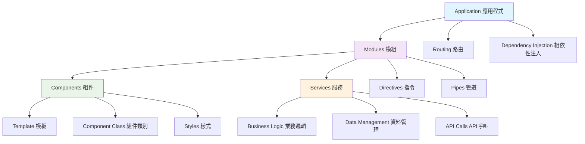
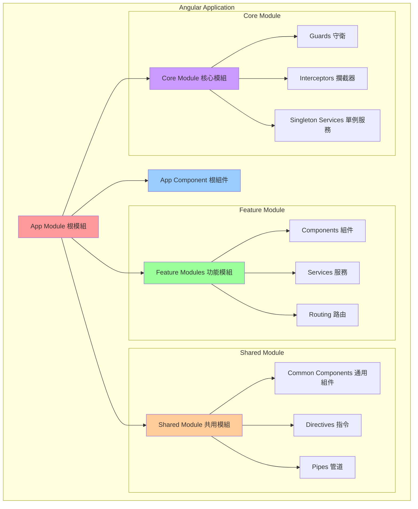
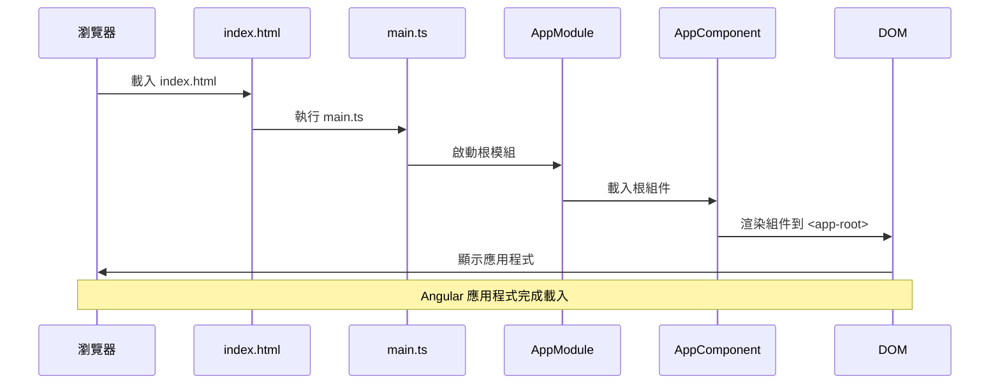
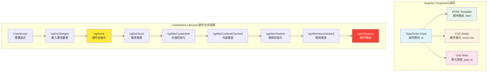
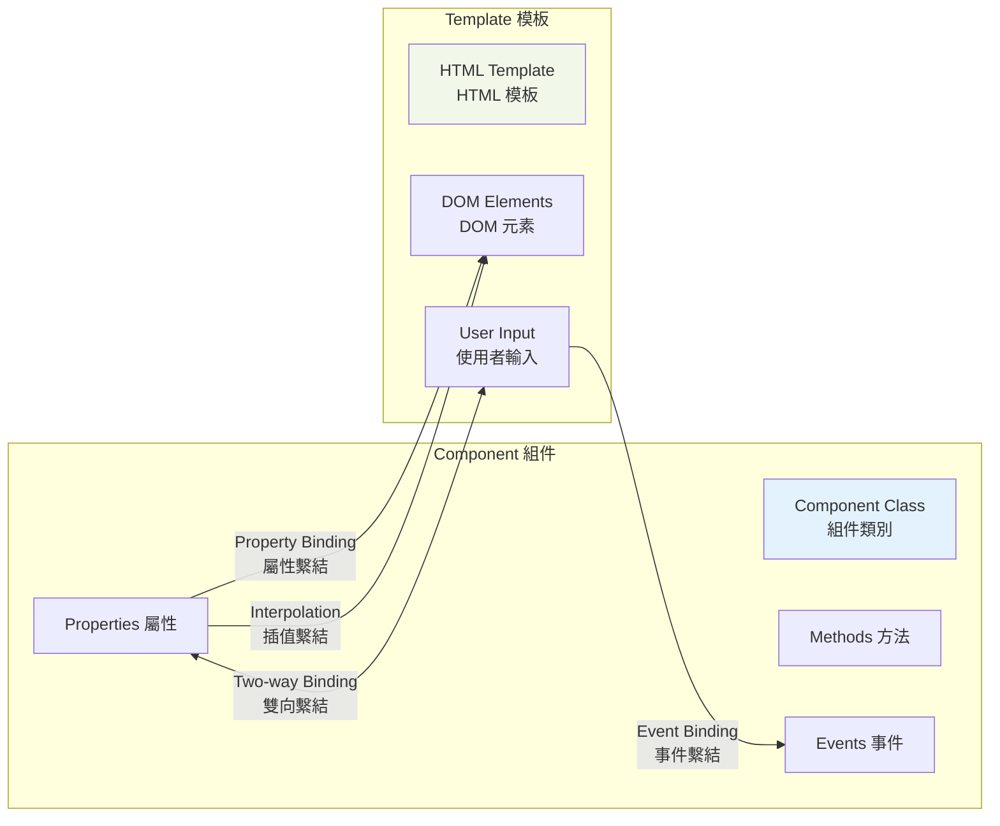
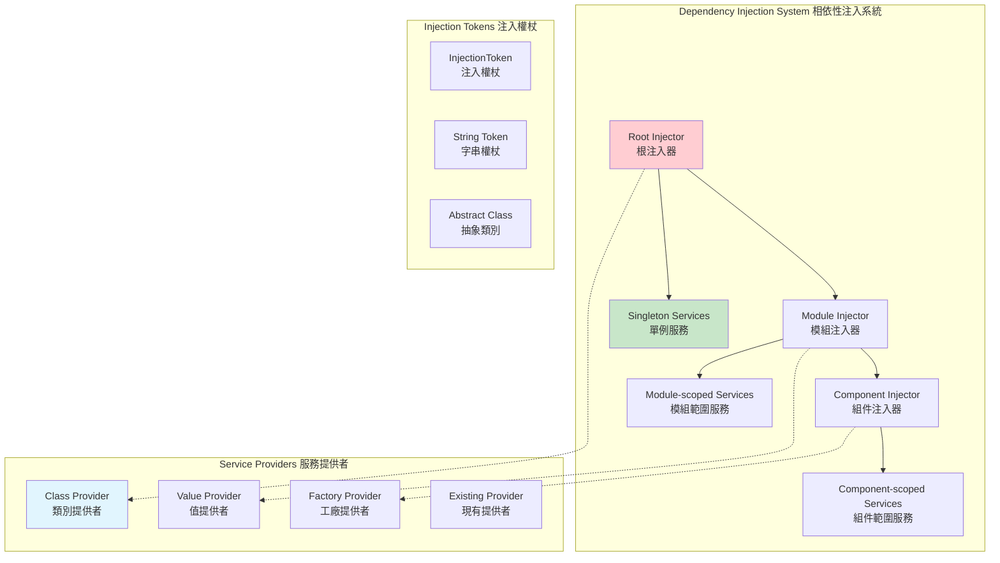
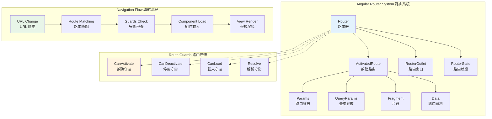
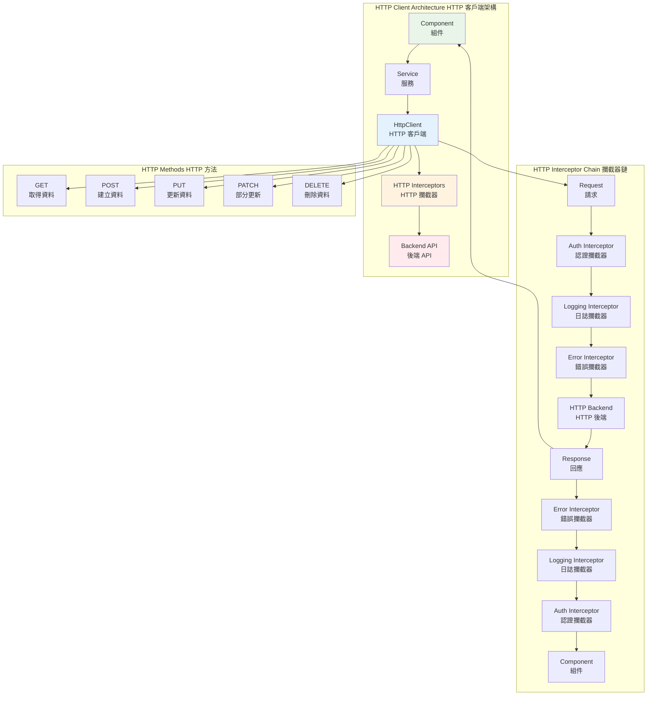
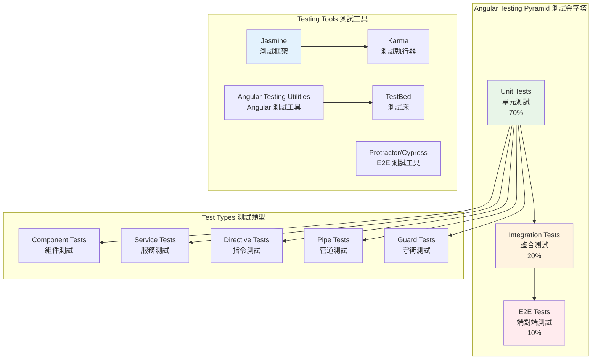

+++
date = '2025-10-21T17:02:14+08:00'
draft = false
title = 'Angular前端framework教學'
tags = ['教學','framework' ,'Angular']
categories = ['技術']
author = 'Eric Cheng'
summary = '提供完整Angular前端framework教學'
+++

# Angular 前端Framework教學手冊

## 目錄

### 1. [前言](#前言)
- [為什麼要學習 Angular？](#為什麼要學習-angular)
- [專案背景](#專案背景)
- [學習目標](#學習目標)

### 2. [基礎篇](#基礎篇)
- [1. Angular 架構概念](#1-angular-架構概念)
  - [1.1 核心概念](#11-核心概念)
  - [1.2 應用程式架構圖](#12-應用程式架構圖)
- [2. 環境建置](#2-環境建置)
  - [2.1 必要軟體安裝](#21-必要軟體安裝)
  - [2.2 建立新專案](#22-建立新專案)
  - [2.3 專案結構](#23-專案結構)
- [3. 組件 (Components)](#3-組件-components)
  - [3.1 組件基本概念](#31-組件基本概念)
  - [3.2 建立組件](#32-建立組件)
  - [3.3 組件範例](#33-組件範例)
- [4. 資料繫結 (Data Binding)](#4-資料繫結-data-binding)
  - [4.1 插值繫結 (Interpolation)](#41-插值繫結-interpolation)
  - [4.2 屬性繫結 (Property Binding)](#42-屬性繫結-property-binding)
  - [4.3 事件繫結 (Event Binding)](#43-事件繫結-event-binding)
  - [4.4 雙向資料繫結 (Two-way Binding)](#44-雙向資料繫結-two-way-binding)

### 3. [進階篇](#進階篇)
- [5. 模組 (Modules)](#5-模組-modules)
  - [5.1 模組基本概念](#51-模組基本概念)
  - [5.2 根模組範例](#52-根模組範例)
  - [5.3 功能模組建立](#53-功能模組建立)
  - [5.4 共用模組](#54-共用模組)
- [6. 服務與相依性注入 (Services & Dependency Injection)](#6-服務與相依性注入-services--dependency-injection)
  - [6.1 建立服務](#61-建立服務)
  - [6.2 基本服務範例](#62-基本服務範例)
  - [6.3 在組件中使用服務](#63-在組件中使用服務)
  - [6.4 服務注入層級](#64-服務注入層級)
- [7. 路由 (Routing)](#7-路由-routing)
  - [7.1 基本路由設定](#71-基本路由設定)
  - [7.2 子路由設定](#72-子路由設定)
  - [7.3 路由導航](#73-路由導航)
  - [7.4 路由參數處理](#74-路由參數處理)
  - [7.5 路由守衛](#75-路由守衛)

### 4. [專案實務篇](#專案實務篇)
- [8. 表單處理](#8-表單處理)
  - [8.1 範本驅動表單 (Template-driven Forms)](#81-範本驅動表單-template-driven-forms)
  - [8.2 反應式表單 (Reactive Forms)](#82-反應式表單-reactive-forms)
  - [8.3 表單驗證最佳實務](#83-表單驗證最佳實務)
- [9. HTTP 客戶端與 API 整合](#9-http-客戶端與-api-整合)
  - [9.1 HTTP 攔截器](#91-http-攔截器)
  - [9.2 API 服務封裝](#92-api-服務封裝)
- [10. RxJS 最佳實務](#10-rxjs-最佳實務)
  - [10.1 常用操作符](#101-常用操作符)
  - [10.2 記憶體管理](#102-記憶體管理)
- [11. 測試 (Testing)](#11-測試-testing)
  - [11.1 單元測試範例](#111-單元測試範例)
  - [11.2 整合測試範例](#112-整合測試範例)
  - [11.3 指令測試範例](#113-指令測試範例)
  - [11.4 管道測試範例](#114-管道測試範例)
  - [11.5 路由測試範例](#115-路由測試範例)
  - [11.6 測試工具與最佳實務](#116-測試工具與最佳實務)

### 5. [認證準備篇](#認證準備篇)
- [12. Angular 官方認證考試重點](#12-angular-官方認證考試重點)
  - [12.1 考試概要](#121-考試概要)
  - [12.2 重點知識領域](#122-重點知識領域)
  - [12.3 模擬考試題目](#123-模擬考試題目)
  - [12.4 考前準備清單](#124-考前準備清單)
- [13. 實戰模擬測驗](#13-實戰模擬測驗)
  - [13.1 綜合練習題](#131-綜合練習題)
  - [13.2 進階練習題](#132-進階練習題)

### 6. [附錄](#附錄)
- [14. 常見問題 (FAQ)](#14-常見問題-faq)
  - [14.1 開發環境問題](#141-開發環境問題)
  - [14.2 開發常見問題](#142-開發常見問題)
  - [14.3 效能問題](#143-效能問題)
- [15. 有用的資源連結](#15-有用的資源連結)
  - [15.1 官方資源](#151-官方資源)
  - [15.2 學習資源](#152-學習資源)
  - [15.3 工具與庫](#153-工具與庫)
  - [15.4 社群資源](#154-社群資源)
- [16. 快速參考檢查清單](#16-快速參考檢查清單)
  - [16.1 新專案設置檢查清單](#161-新專案設置檢查清單)
  - [16.2 開發檢查清單](#162-開發檢查清單)
  - [16.3 部署前檢查清單](#163-部署前檢查清單)
  - [16.4 程式碼審查檢查清單](#164-程式碼審查檢查清單)
- [17. 團隊開發規範](#17-團隊開發規範)
  - [17.1 Git 工作流程](#171-git-工作流程)
  - [17.2 程式碼規範](#172-程式碼規範)
  - [17.3 程式碼審查標準](#173-程式碼審查標準)

---

## 前言

### 為什麼要學習 Angular？

Angular 是由 Google 開發維護的前端框架，具有以下優勢：

- **企業級框架**：適合大型專案開發，提供完整的開發生態系統
- **TypeScript 原生支持**：強型別語言，提升程式碼品質與開發效率
- **模組化設計**：易於維護和測試的架構設計
- **豐富的生態系統**：官方提供完整的工具鏈與函式庫
- **活躍的社群**：持續更新與技術支援

### 專案背景

在我們的專案中，Angular 被用於：
- 企業級 Web 應用程式開發
- 複雜的表單處理與資料視覺化
- 與後端 API 的整合
- 響應式設計與多平台支援

### 學習目標

完成本教學手冊後，您將能夠：
- 理解 Angular 的核心概念與架構
- 獨立開發中小型 Angular 應用程式
- 遵循專案開發規範與最佳實務
- 通過 Angular 官方認證考試

---

## 基礎篇

### 1. Angular 架構概念

#### 1.1 核心概念

Angular 採用 **組件化架構**，主要包含以下核心概念：

**組件化開發的優勢：**
- **可重用性**：組件可以在不同地方重複使用
- **可維護性**：每個組件專注於單一功能，易於維護
- **可測試性**：組件可以獨立進行單元測試
- **可擴展性**：新功能可以通過添加新組件來實現



**Angular 核心概念詳細說明：**

1. **Application (應用程式)**：
   - 整個 Angular 應用的頂層容器
   - 由多個模組組成的完整系統
   - 具有統一的啟動流程和生命週期管理

2. **Modules (模組)**：
   - 組織相關功能的邏輯單元
   - 使用 `@NgModule` 裝飾器定義
   - 可以延遲載入以提升效能
   - 提供封裝和代碼組織的機制

3. **Components (組件)**：
   - 控制畫面的可重用程式碼單元
   - 包含模板 (Template)、組件類別 (Class) 和樣式 (Styles)
   - 使用 `@Component` 裝飾器定義
   - 支援資料繫結和事件處理

4. **Services (服務)**：
   - 提供特定功能的可注入類別
   - 處理業務邏輯、資料管理和 API 呼叫
   - 使用 `@Injectable` 裝飾器定義
   - 支援相依性注入機制

5. **Directives (指令)**：
   - 擴展 HTML 功能的類別
   - 分為結構型指令 (`*ngIf`, `*ngFor`) 和屬性型指令 (`ngClass`, `ngStyle`)
   - 可以自定義指令來封裝 DOM 操作

6. **Pipes (管道)**：
   - 轉換顯示資料的純函式
   - 用於格式化文字、日期、貨幣等
   - 可以鏈式使用多個管道

7. **Routing (路由)**：
   - 處理導航和 URL 管理
   - 支援巢狀路由和路由守衛
   - 實現單頁應用 (SPA) 的導航功能

8. **Dependency Injection (相依性注入)**：
   - 管理物件相依性的設計模式
   - 提升程式碼的可測試性和可維護性
   - Angular 提供層級化的注入器系統

#### 1.2 應用程式架構圖

Angular 應用程式採用模組化架構，以下是典型的 Angular 應用程式結構：



**架構層級說明：**

1. **App Module (根模組)**：
   - 應用程式的入口點，負責啟動整個應用
   - 匯入所有必要的功能模組
   - 定義根組件和啟動組件
   - 配置應用程式級的設定

2. **Feature Modules (功能模組)**：
   - 實現特定業務功能的模組
   - 包含相關的組件、服務和路由
   - 支援延遲載入以提升效能
   - 例如：UserModule、ProductModule、OrderModule

3. **Shared Module (共用模組)**：
   - 包含可在多個功能模組中重用的元件
   - 匯出通用組件、指令和管道
   - 避免程式碼重複，提高維護性
   - 例如：LoadingComponent、ConfirmDialogComponent

4. **Core Module (核心模組)**：
   - 包含單例服務和應用程式級功能
   - 提供全域性的服務，如驗證、HTTP攔截器
   - 只應該被根模組匯入一次
   - 確保服務的單例模式

**模組設計原則：**
- **單一職責**：每個模組只負責一個特定功能
- **高內聚性**：模組內部元素緊密相關
- **低耦合性**：模組間依賴性最小化
- **可重用性**：設計可在不同場景中重用的組件

#### 1.3 Angular 應用程式啟動流程



**啟動流程說明：**

1. **瀏覽器載入 index.html**：包含 `<app-root>` 標籤
2. **執行 main.ts**：應用程式的進入點
3. **啟動 AppModule**：根模組初始化
4. **載入 AppComponent**：根組件準備渲染
5. **渲染到 DOM**：組件內容顯示在瀏覽器中

### 2. 環境建置

#### 2.1 必要軟體安裝

**Node.js 安裝**
```bash
# 檢查 Node.js 版本 (建議 16.x 以上)
node --version
npm --version
```

**Angular CLI 安裝**
```bash
# 全域安裝 Angular CLI
npm install -g @angular/cli

# 檢查版本
ng version
```

#### 2.2 建立新專案

```bash
# 建立新的 Angular 專案
ng new my-angular-app

# 選項說明：
# - Would you like to add Angular routing? (y/N) → 選擇 y
# - Which stylesheet format would you like to use? → 選擇 SCSS

# 進入專案目錄
cd my-angular-app

# 啟動開發伺服器
ng serve
```

#### 2.3 專案結構

```
my-angular-app/
├── src/
│   ├── app/
│   │   ├── app.component.ts      # 根組件
│   │   ├── app.component.html    # 根組件模板
│   │   ├── app.component.scss    # 根組件樣式
│   │   ├── app.module.ts         # 根模組
│   │   └── app-routing.module.ts # 路由模組
│   ├── assets/                   # 靜態資源
│   ├── environments/             # 環境設定
│   ├── index.html               # 主頁面
│   ├── main.ts                  # 應用程式進入點
│   └── styles.scss              # 全域樣式
├── angular.json                 # Angular 專案設定
├── package.json                 # 專案相依性
└── tsconfig.json               # TypeScript 設定
```

### 3. 組件 (Components)

#### 3.1 組件基本概念

組件是 Angular 應用程式的基本建構單元，由四個部分組成：



**組件生命週期說明：**

1. **Constructor**：組件類別建構，進行基本初始化
2. **ngOnChanges**：輸入屬性 (@Input) 發生變更時觸發
3. **ngOnInit**：組件初始化完成，最常用的初始化鉤子
4. **ngDoCheck**：自定義變更檢測邏輯
5. **ngAfterContentInit**：內容投影完成後觸發
6. **ngAfterContentChecked**：內容檢查完成後觸發
7. **ngAfterViewInit**：組件檢視初始化完成
8. **ngAfterViewChecked**：組件檢視檢查完成
9. **ngOnDestroy**：組件銷毀前清理工作

#### 3.2 建立組件

```bash
# 使用 Angular CLI 建立組件
ng generate component user-profile

# 簡寫形式
ng g c user-profile
```

#### 3.3 組件範例

**user-profile.component.ts**
```typescript
import { Component, OnInit } from '@angular/core';

@Component({
  selector: 'app-user-profile',
  templateUrl: './user-profile.component.html',
  styleUrls: ['./user-profile.component.scss']
})
export class UserProfileComponent implements OnInit {
  // 組件屬性
  userName: string = '張三';
  userAge: number = 25;
  isActive: boolean = true;

  // 建構函式
  constructor() { }

  // 組件初始化
  ngOnInit(): void {
    console.log('UserProfileComponent 已初始化');
  }

  // 組件方法
  updateUserName(newName: string): void {
    this.userName = newName;
  }

  toggleStatus(): void {
    this.isActive = !this.isActive;
  }
}
```

**user-profile.component.html**
```html
<div class="user-profile">
  <h2>使用者資料</h2>
  
  <div class="user-info">
    <p><strong>姓名：</strong>{{ userName }}</p>
    <p><strong>年齡：</strong>{{ userAge }}</p>
    <p><strong>狀態：</strong>
      <span [class]="isActive ? 'active' : 'inactive'">
        {{ isActive ? '啟用' : '停用' }}
      </span>
    </p>
  </div>

  <div class="actions">
    <button (click)="updateUserName('李四')" class="btn btn-primary">
      更新姓名
    </button>
    <button (click)="toggleStatus()" class="btn btn-secondary">
      切換狀態
    </button>
  </div>
</div>
```

**user-profile.component.scss**
```scss
.user-profile {
  padding: 20px;
  border: 1px solid #ddd;
  border-radius: 8px;
  max-width: 400px;

  h2 {
    color: #333;
    margin-bottom: 20px;
  }

  .user-info {
    margin-bottom: 20px;

    p {
      margin: 8px 0;
    }

    .active {
      color: green;
      font-weight: bold;
    }

    .inactive {
      color: red;
      font-style: italic;
    }
  }

  .actions {
    display: flex;
    gap: 10px;

    .btn {
      padding: 8px 16px;
      border: none;
      border-radius: 4px;
      cursor: pointer;

      &.btn-primary {
        background-color: #007bff;
        color: white;
      }

      &.btn-secondary {
        background-color: #6c757d;
        color: white;
      }

      &:hover {
        opacity: 0.8;
      }
    }
  }
}
```

### 4. 資料繫結 (Data Binding)

Angular 提供四種資料繫結方式，讓組件與模板之間能夠雙向溝通：



**資料繫結類型說明：**

1. **插值繫結 (Interpolation)**：`{{ }}`，將組件資料顯示到模板
2. **屬性繫結 (Property Binding)**：`[property]`，設定元素屬性值
3. **事件繫結 (Event Binding)**：`(event)`，處理使用者操作事件
4. **雙向繫結 (Two-way Binding)**：`[(ngModel)]`，同步組件與表單資料

#### 4.1 插值繫結 (Interpolation)

```html
<!-- 顯示組件屬性值 -->
<h1>{{ title }}</h1>
<p>使用者年齡：{{ userAge }} 歲</p>

<!-- 執行表達式 -->
<p>明年年齡：{{ userAge + 1 }} 歲</p>

<!-- 呼叫方法 -->
<p>格式化日期：{{ formatDate() }}</p>
```

#### 4.2 屬性繫結 (Property Binding)

```html
<!-- 繫結到 HTML 屬性 -->


<!-- 繫結到 CSS 類別 -->
<div [class]="cssClass">內容</div>
<div [class.active]="isActive">條件式類別</div>

<!-- 繫結到元素屬性 -->
<button [disabled]="isDisabled">按鈕</button>

<!-- 繫結到樣式 -->
<div [style.color]="textColor">彩色文字</div>
<div [style.font-size.px]="fontSize">不同字體大小</div>
```

#### 4.3 事件繫結 (Event Binding)

```html
<!-- 基本事件繫結 -->
<button (click)="onClick()">點擊我</button>

<!-- 傳遞事件物件 -->
<input (keyup)="onKeyUp($event)" placeholder="輸入文字">

<!-- 傳遞自定義參數 -->
<button (click)="selectItem(item.id)">選擇項目</button>

<!-- 多個事件 -->
<input (focus)="onFocus()" (blur)="onBlur()" (keyup.enter)="onEnter()">
```

#### 4.4 雙向資料繫結 (Two-way Binding)

```html
<!-- 使用 ngModel -->
<input [(ngModel)]="userName" placeholder="請輸入姓名">
<p>您的姓名：{{ userName }}</p>

<!-- 自定義雙向繫結 -->
<app-custom-input [(value)]="inputValue"></app-custom-input>
```

**使用 ngModel 需要匯入 FormsModule：**

```typescript
// app.module.ts
import { FormsModule } from '@angular/forms';

@NgModule({
  imports: [
    BrowserModule,
    FormsModule  // 加入這行
  ],
  // ...
})
export class AppModule { }
```

### 實務案例

建立一個簡單的計算器組件，展示各種資料繫結的使用：

```typescript
// calculator.component.ts
export class CalculatorComponent {
  num1: number = 0;
  num2: number = 0;
  result: number = 0;
  operation: string = '+';

  calculate(): void {
    switch (this.operation) {
      case '+':
        this.result = this.num1 + this.num2;
        break;
      case '-':
        this.result = this.num1 - this.num2;
        break;
      case '*':
        this.result = this.num1 * this.num2;
        break;
      case '/':
        this.result = this.num2 !== 0 ? this.num1 / this.num2 : 0;
        break;
    }
  }
}
```

```html
<!-- calculator.component.html -->
<div class="calculator">
  <h3>簡易計算器</h3>
  
  <div class="inputs">
    <input type="number" [(ngModel)]="num1" placeholder="第一個數字">
    
    <select [(ngModel)]="operation">
      <option value="+">加</option>
      <option value="-">減</option>
      <option value="*">乘</option>
      <option value="/">除</option>
    </select>
    
    <input type="number" [(ngModel)]="num2" placeholder="第二個數字">
    
    <button (click)="calculate()" [disabled]="!num1 && !num2">
      計算
    </button>
  </div>
  
  <div class="result">
    <p>結果：{{ num1 }} {{ operation }} {{ num2 }} = {{ result }}</p>
  </div>
</div>
```

### 注意事項

1. **效能考量**：避免在模板中使用複雜的方法呼叫
2. **安全性**：使用屬性繫結而非字串串接來避免 XSS 攻擊
3. **可讀性**：保持模板簡潔，複雜邏輯放在組件類別中
4. **類型安全**：善用 TypeScript 的型別檢查功能

---

---

## 進階篇

### 5. 模組 (Modules)

#### 5.1 模組基本概念

Angular 模組是一個用 `@NgModule` 裝飾器標記的類別，用於組織應用程式的相關功能。

**模組的核心屬性：**

```typescript
@NgModule({
  declarations: [],    // 宣告的組件、指令、管道
  imports: [],        // 匯入的其他模組
  exports: [],        // 匯出給其他模組使用的元素
  providers: [],      // 服務提供者
  bootstrap: []       // 根組件 (僅限根模組)
})
```

#### 5.2 根模組範例

```typescript
// app.module.ts
import { NgModule } from '@angular/core';
import { BrowserModule } from '@angular/platform-browser';
import { FormsModule } from '@angular/forms';
import { HttpClientModule } from '@angular/common/http';

import { AppRoutingModule } from './app-routing.module';
import { AppComponent } from './app.component';
import { UserProfileComponent } from './user-profile/user-profile.component';

@NgModule({
  declarations: [
    AppComponent,           // 根組件
    UserProfileComponent    // 自定義組件
  ],
  imports: [
    BrowserModule,          // 瀏覽器相關功能
    AppRoutingModule,       // 路由模組
    FormsModule,           // 表單功能
    HttpClientModule       // HTTP 客戶端
  ],
  providers: [],
  bootstrap: [AppComponent]  // 啟動組件
})
export class AppModule { }
```

#### 5.3 功能模組建立

```bash
# 建立功能模組
ng generate module user --routing
ng generate module product --routing

# 簡寫形式
ng g m user --routing
ng g m product --routing
```

**功能模組範例：**

```typescript
// user.module.ts
import { NgModule } from '@angular/core';
import { CommonModule } from '@angular/common';
import { FormsModule, ReactiveFormsModule } from '@angular/forms';

import { UserRoutingModule } from './user-routing.module';
import { UserListComponent } from './user-list/user-list.component';
import { UserDetailComponent } from './user-detail/user-detail.component';
import { UserService } from './services/user.service';

@NgModule({
  declarations: [
    UserListComponent,
    UserDetailComponent
  ],
  imports: [
    CommonModule,          // 基本 Angular 指令
    UserRoutingModule,     // 使用者路由
    FormsModule,           // 範本驅動表單
    ReactiveFormsModule    // 反應式表單
  ],
  providers: [
    UserService            // 使用者服務
  ],
  exports: [
    UserListComponent      // 匯出供其他模組使用
  ]
})
export class UserModule { }
```

#### 5.4 共用模組

```typescript
// shared.module.ts
import { NgModule } from '@angular/core';
import { CommonModule } from '@angular/common';
import { FormsModule, ReactiveFormsModule } from '@angular/forms';

import { LoadingSpinnerComponent } from './components/loading-spinner/loading-spinner.component';
import { ConfirmDialogComponent } from './components/confirm-dialog/confirm-dialog.component';
import { DateFormatPipe } from './pipes/date-format.pipe';

@NgModule({
  declarations: [
    LoadingSpinnerComponent,
    ConfirmDialogComponent,
    DateFormatPipe
  ],
  imports: [
    CommonModule,
    FormsModule,
    ReactiveFormsModule
  ],
  exports: [
    // 匯出所有可重用的元素
    CommonModule,
    FormsModule,
    ReactiveFormsModule,
    LoadingSpinnerComponent,
    ConfirmDialogComponent,
    DateFormatPipe
  ]
})
export class SharedModule { }
```

### 6. 服務與相依性注入 (Services & Dependency Injection)

Angular 的相依性注入 (DI) 系統是一個強大的設計模式，讓您可以有效管理組件之間的相依性。



**相依性注入層級說明：**

1. **Root Injector (根注入器)**：應用程式級別，通常用於全域服務
2. **Module Injector (模組注入器)**：模組級別，在該模組內共享
3. **Component Injector (組件注入器)**：組件級別，每個組件實例獨立

**服務提供者類型：**

- **Class Provider**：提供類別實例
- **Value Provider**：提供預定義的值
- **Factory Provider**：使用工廠函式建立實例
- **Existing Provider**：使用現有的服務實例

#### 6.1 建立服務

```bash
# 建立服務
ng generate service services/user
ng generate service services/api

# 簡寫形式
ng g s services/user
ng g s services/api
```

#### 6.2 基本服務範例

```typescript
// user.service.ts
import { Injectable } from '@angular/core';
import { HttpClient, HttpHeaders } from '@angular/common/http';
import { Observable, BehaviorSubject } from 'rxjs';
import { map, catchError } from 'rxjs/operators';

export interface User {
  id: number;
  name: string;
  email: string;
  age: number;
  isActive: boolean;
}

@Injectable({
  providedIn: 'root'  // 在根注入器中提供
})
export class UserService {
  private apiUrl = 'https://api.example.com/users';
  private usersSubject = new BehaviorSubject<User[]>([]);
  
  public users$ = this.usersSubject.asObservable();

  constructor(private http: HttpClient) {
    this.loadUsers();
  }

  // 取得所有使用者
  getUsers(): Observable<User[]> {
    return this.http.get<User[]>(this.apiUrl).pipe(
      map(users => {
        this.usersSubject.next(users);
        return users;
      }),
      catchError(this.handleError)
    );
  }

  // 取得單一使用者
  getUserById(id: number): Observable<User> {
    return this.http.get<User>(`${this.apiUrl}/${id}`).pipe(
      catchError(this.handleError)
    );
  }

  // 建立使用者
  createUser(user: Omit<User, 'id'>): Observable<User> {
    const headers = new HttpHeaders({ 'Content-Type': 'application/json' });
    
    return this.http.post<User>(this.apiUrl, user, { headers }).pipe(
      map(newUser => {
        const currentUsers = this.usersSubject.value;
        this.usersSubject.next([...currentUsers, newUser]);
        return newUser;
      }),
      catchError(this.handleError)
    );
  }

  // 更新使用者
  updateUser(id: number, user: Partial<User>): Observable<User> {
    const headers = new HttpHeaders({ 'Content-Type': 'application/json' });
    
    return this.http.put<User>(`${this.apiUrl}/${id}`, user, { headers }).pipe(
      map(updatedUser => {
        const currentUsers = this.usersSubject.value;
        const index = currentUsers.findIndex(u => u.id === id);
        if (index !== -1) {
          currentUsers[index] = updatedUser;
          this.usersSubject.next([...currentUsers]);
        }
        return updatedUser;
      }),
      catchError(this.handleError)
    );
  }

  // 刪除使用者
  deleteUser(id: number): Observable<void> {
    return this.http.delete<void>(`${this.apiUrl}/${id}`).pipe(
      map(() => {
        const currentUsers = this.usersSubject.value;
        const filteredUsers = currentUsers.filter(u => u.id !== id);
        this.usersSubject.next(filteredUsers);
      }),
      catchError(this.handleError)
    );
  }

  // 私有方法：載入使用者資料
  private loadUsers(): void {
    this.getUsers().subscribe();
  }

  // 私有方法：錯誤處理
  private handleError(error: any): Observable<never> {
    console.error('API 錯誤:', error);
    throw error;
  }
}
```

#### 6.3 在組件中使用服務

```typescript
// user-list.component.ts
import { Component, OnInit, OnDestroy } from '@angular/core';
import { Subject } from 'rxjs';
import { takeUntil } from 'rxjs/operators';

import { UserService, User } from '../services/user.service';

@Component({
  selector: 'app-user-list',
  templateUrl: './user-list.component.html',
  styleUrls: ['./user-list.component.scss']
})
export class UserListComponent implements OnInit, OnDestroy {
  users: User[] = [];
  loading = false;
  error: string | null = null;
  
  private destroy$ = new Subject<void>();

  constructor(private userService: UserService) {}

  ngOnInit(): void {
    this.loadUsers();
  }

  ngOnDestroy(): void {
    this.destroy$.next();
    this.destroy$.complete();
  }

  loadUsers(): void {
    this.loading = true;
    this.error = null;

    this.userService.users$
      .pipe(takeUntil(this.destroy$))
      .subscribe({
        next: (users) => {
          this.users = users;
          this.loading = false;
        },
        error: (error) => {
          this.error = '載入使用者資料失敗';
          this.loading = false;
          console.error(error);
        }
      });
  }

  deleteUser(id: number): void {
    if (confirm('確定要刪除此使用者嗎？')) {
      this.userService.deleteUser(id)
        .pipe(takeUntil(this.destroy$))
        .subscribe({
          next: () => {
            console.log('使用者已刪除');
          },
          error: (error) => {
            this.error = '刪除使用者失敗';
            console.error(error);
          }
        });
    }
  }

  refreshUsers(): void {
    this.userService.getUsers()
      .pipe(takeUntil(this.destroy$))
      .subscribe();
  }
}
```

#### 6.4 服務注入層級

```typescript
// 1. 根層級注入 (推薦)
@Injectable({
  providedIn: 'root'
})
export class GlobalService { }

// 2. 模組層級注入
@NgModule({
  providers: [ModuleService]
})
export class FeatureModule { }

// 3. 組件層級注入
@Component({
  providers: [ComponentService]
})
export class MyComponent { }
```

### 7. 路由 (Routing)

Angular 路由系統負責管理應用程式的導航，提供單頁應用程式 (SPA) 的多檢視體驗。



**路由系統核心概念：**

1. **Router**：路由服務，管理導航邏輯
2. **ActivatedRoute**：當前啟動的路由資訊
3. **RouterOutlet**：在模板中顯示路由組件的位置
4. **Route Guards**：控制路由存取權限的機制

**路由守衛類型：**

- **CanActivate**：控制是否可以啟動路由
- **CanDeactivate**：控制是否可以離開當前路由
- **CanLoad**：控制是否可以載入延遲模組
- **Resolve**：在路由啟動前預載入資料

#### 7.1 基本路由設定

```typescript
// app-routing.module.ts
import { NgModule } from '@angular/core';
import { RouterModule, Routes } from '@angular/router';

import { HomeComponent } from './home/home.component';
import { AboutComponent } from './about/about.component';
import { NotFoundComponent } from './not-found/not-found.component';

const routes: Routes = [
  { path: '', redirectTo: '/home', pathMatch: 'full' },  // 預設路由
  { path: 'home', component: HomeComponent },
  { path: 'about', component: AboutComponent },
  { path: 'users', loadChildren: () => import('./user/user.module').then(m => m.UserModule) },  // 延遲載入
  { path: '**', component: NotFoundComponent }  // 萬用路由
];

@NgModule({
  imports: [RouterModule.forRoot(routes, {
    enableTracing: false,  // 開發時可設為 true 來除錯路由
    preloadingStrategy: PreloadAllModules  // 預載入策略
  })],
  exports: [RouterModule]
})
export class AppRoutingModule { }
```

#### 7.2 子路由設定

```typescript
// user-routing.module.ts
import { NgModule } from '@angular/core';
import { RouterModule, Routes } from '@angular/router';

import { UserListComponent } from './user-list/user-list.component';
import { UserDetailComponent } from './user-detail/user-detail.component';
import { UserEditComponent } from './user-edit/user-edit.component';
import { AuthGuard } from '../guards/auth.guard';

const routes: Routes = [
  {
    path: '',
    children: [
      { path: '', component: UserListComponent },
      { path: 'new', component: UserEditComponent, canActivate: [AuthGuard] },
      { path: ':id', component: UserDetailComponent },
      { path: ':id/edit', component: UserEditComponent, canActivate: [AuthGuard] }
    ]
  }
];

@NgModule({
  imports: [RouterModule.forChild(routes)],
  exports: [RouterModule]
})
export class UserRoutingModule { }
```

#### 7.3 路由導航

```typescript
// navigation.component.ts
import { Component } from '@angular/core';
import { Router, ActivatedRoute } from '@angular/router';

@Component({
  selector: 'app-navigation',
  template: `
    <nav>
      <a routerLink="/home" routerLinkActive="active">首頁</a>
      <a routerLink="/about" routerLinkActive="active">關於我們</a>
      <a routerLink="/users" routerLinkActive="active">使用者管理</a>
      <button (click)="goToUser(123)">查看使用者 123</button>
    </nav>
    <router-outlet></router-outlet>
  `
})
export class NavigationComponent {
  constructor(
    private router: Router,
    private route: ActivatedRoute
  ) {}

  goToUser(userId: number): void {
    this.router.navigate(['/users', userId]);
  }

  goToUserWithQuery(): void {
    this.router.navigate(['/users'], {
      queryParams: { page: 1, size: 10 },
      fragment: 'top'
    });
  }

  goBack(): void {
    window.history.back();
  }
}
```

#### 7.4 路由參數處理

```typescript
// user-detail.component.ts
import { Component, OnInit } from '@angular/core';
import { ActivatedRoute, ParamMap } from '@angular/router';
import { switchMap } from 'rxjs/operators';

import { UserService, User } from '../services/user.service';

@Component({
  selector: 'app-user-detail',
  template: `
    <div *ngIf="user">
      <h2>{{ user.name }}</h2>
      <p>Email: {{ user.email }}</p>
      <p>年齡: {{ user.age }}</p>
      <button [routerLink]="['/users', user.id, 'edit']">編輯</button>
    </div>
    <div *ngIf="!user">載入中...</div>
  `
})
export class UserDetailComponent implements OnInit {
  user: User | null = null;

  constructor(
    private route: ActivatedRoute,
    private userService: UserService
  ) {}

  ngOnInit(): void {
    // 方法 1: 使用 paramMap
    this.route.paramMap.pipe(
      switchMap((params: ParamMap) => {
        const id = Number(params.get('id'));
        return this.userService.getUserById(id);
      })
    ).subscribe(user => {
      this.user = user;
    });

    // 方法 2: 使用 snapshot (適用於參數不會變化的情況)
    // const id = Number(this.route.snapshot.paramMap.get('id'));
    // this.userService.getUserById(id).subscribe(user => {
    //   this.user = user;
    // });

    // 方法 3: 處理查詢參數
    this.route.queryParams.subscribe(params => {
      console.log('查詢參數:', params);
    });
  }
}
```

#### 7.5 路由守衛

```typescript
// auth.guard.ts
import { Injectable } from '@angular/core';
import { CanActivate, CanLoad, Router } from '@angular/router';
import { Observable } from 'rxjs';
import { map, take } from 'rxjs/operators';

import { AuthService } from '../services/auth.service';

@Injectable({
  providedIn: 'root'
})
export class AuthGuard implements CanActivate, CanLoad {
  constructor(
    private authService: AuthService,
    private router: Router
  ) {}

  canActivate(): Observable<boolean> {
    return this.checkAuth();
  }

  canLoad(): Observable<boolean> {
    return this.checkAuth();
  }

  private checkAuth(): Observable<boolean> {
    return this.authService.isAuthenticated$.pipe(
      take(1),
      map(isAuth => {
        if (isAuth) {
          return true;
        } else {
          this.router.navigate(['/login']);
          return false;
        }
      })
    );
  }
}
```

### 實務案例

建立一個完整的使用者管理模組，展示模組、服務、路由的整合使用：

```typescript
// user.module.ts - 完整的功能模組
import { NgModule } from '@angular/core';
import { CommonModule } from '@angular/common';
import { ReactiveFormsModule } from '@angular/forms';

import { UserRoutingModule } from './user-routing.module';
import { SharedModule } from '../shared/shared.module';

import { UserListComponent } from './user-list/user-list.component';
import { UserDetailComponent } from './user-detail/user-detail.component';
import { UserEditComponent } from './user-edit/user-edit.component';

import { UserService } from './services/user.service';
import { UserResolver } from './resolvers/user.resolver';

@NgModule({
  declarations: [
    UserListComponent,
    UserDetailComponent,
    UserEditComponent
  ],
  imports: [
    CommonModule,
    ReactiveFormsModule,
    UserRoutingModule,
    SharedModule
  ],
  providers: [
    UserService,
    UserResolver
  ]
})
export class UserModule { }
```

---

## 專案實務篇

### 8. 表單處理

Angular 提供兩種表單處理方式：範本驅動表單和反應式表單，各有不同的適用場景。

```mermaid
graph TB
    subgraph "Angular Forms 表單系統"
        A[Angular Forms<br/>表單系統] --> B[Template-driven Forms<br/>範本驅動表單]
        A --> C[Reactive Forms<br/>反應式表單]
    end
    
    subgraph "Template-driven Forms"
        B --> D[ngModel<br/>雙向繫結]
        B --> E[Template Reference Variables<br/>範本參考變數]
        B --> F[Built-in Validators<br/>內建驗證器]
        
        D --> D1[FormsModule]
        E --> E1[#templateVar]
        F --> F1[required, email, pattern]
    end
    
    subgraph "Reactive Forms"
        C --> G[FormControl<br/>表單控制項]
        C --> H[FormGroup<br/>表單群組]
        C --> I[FormArray<br/>表單陣列]
        C --> J[FormBuilder<br/>表單建構器]
        
        G --> G1[value, status, errors]
        H --> H1[controls, valid, invalid]
        I --> I1[Dynamic Form Fields]
        J --> J1[group(), control(), array()]
    end
    
    subgraph "Form Validation 表單驗證"
        K[Validators<br/>驗證器] --> L[Sync Validators<br/>同步驗證器]
        K --> M[Async Validators<br/>異步驗證器]
        K --> N[Custom Validators<br/>自定義驗證器]
        
        L --> L1[required, min, max]
        M --> M1[HTTP validation]
        N --> N1[Business logic]
    end
    
    B --> K
    C --> K
    
    style B fill:#e8f5e8
    style C fill:#e3f2fd
    style K fill:#fff3e0
```

**表單類型比較：**

| 特性 | 範本驅動表單 | 反應式表單 |
|------|-------------|------------|
| **設定方式** | 在模板中設定 | 在組件中設定 |
| **資料模型** | 非結構化、可變 | 結構化、不可變 |
| **可預測性** | 異步 | 同步 |
| **表單驗證** | 指令 | 函式 |
| **適用場景** | 簡單表單 | 複雜表單 |

#### 8.1 範本驅動表單 (Template-driven Forms)

**基本範例：**

```typescript
// contact-form.component.ts
import { Component } from '@angular/core';

interface ContactForm {
  name: string;
  email: string;
  message: string;
  subscribe: boolean;
}

@Component({
  selector: 'app-contact-form',
  templateUrl: './contact-form.component.html'
})
export class ContactFormComponent {
  model: ContactForm = {
    name: '',
    email: '',
    message: '',
    subscribe: false
  };

  submitted = false;

  onSubmit(form: any): void {
    this.submitted = true;
    if (form.valid) {
      console.log('表單資料：', this.model);
      // 處理表單提交邏輯
    }
  }

  resetForm(form: any): void {
    form.reset();
    this.submitted = false;
    this.model = {
      name: '',
      email: '',
      message: '',
      subscribe: false
    };
  }
}
```

```html
<!-- contact-form.component.html -->
<form #contactForm="ngForm" (ngSubmit)="onSubmit(contactForm)" novalidate>
  <div class="form-group">
    <label for="name">姓名 *</label>
    <input
      type="text"
      id="name"
      name="name"
      [(ngModel)]="model.name"
      #name="ngModel"
      required
      minlength="2"
      maxlength="50"
      class="form-control"
      [class.is-invalid]="name.invalid && (name.dirty || name.touched || submitted)">
    
    <div *ngIf="name.invalid && (name.dirty || name.touched || submitted)" class="invalid-feedback">
      <div *ngIf="name.errors?.['required']">姓名為必填欄位</div>
      <div *ngIf="name.errors?.['minlength']">姓名至少需要 2 個字元</div>
      <div *ngIf="name.errors?.['maxlength']">姓名不可超過 50 個字元</div>
    </div>
  </div>

  <div class="form-group">
    <label for="email">電子信箱 *</label>
    <input
      type="email"
      id="email"
      name="email"
      [(ngModel)]="model.email"
      #email="ngModel"
      required
      email
      class="form-control"
      [class.is-invalid]="email.invalid && (email.dirty || email.touched || submitted)">
    
    <div *ngIf="email.invalid && (email.dirty || email.touched || submitted)" class="invalid-feedback">
      <div *ngIf="email.errors?.['required']">電子信箱為必填欄位</div>
      <div *ngIf="email.errors?.['email']">請輸入有效的電子信箱格式</div>
    </div>
  </div>

  <div class="form-group">
    <label for="message">訊息</label>
    <textarea
      id="message"
      name="message"
      [(ngModel)]="model.message"
      rows="4"
      class="form-control"
      maxlength="500"
      placeholder="請輸入您的訊息...">
    </textarea>
  </div>

  <div class="form-check">
    <input
      type="checkbox"
      id="subscribe"
      name="subscribe"
      [(ngModel)]="model.subscribe"
      class="form-check-input">
    <label for="subscribe" class="form-check-label">
      訂閱電子報
    </label>
  </div>

  <div class="form-actions">
    <button type="submit" [disabled]="contactForm.invalid" class="btn btn-primary">
      送出
    </button>
    <button type="button" (click)="resetForm(contactForm)" class="btn btn-secondary">
      重設
    </button>
  </div>

  <!-- 表單狀態偵錯資訊 (開發時使用) -->
  <div class="debug-info" *ngIf="false">
    <p>表單狀態：{{ contactForm.valid ? '有效' : '無效' }}</p>
    <p>表單值：{{ contactForm.value | json }}</p>
  </div>
</form>
```

#### 8.2 反應式表單 (Reactive Forms)

**基本範例：**

```typescript
// user-form.component.ts
import { Component, OnInit } from '@angular/core';
import { FormBuilder, FormGroup, FormArray, Validators, AbstractControl } from '@angular/forms';

@Component({
  selector: 'app-user-form',
  templateUrl: './user-form.component.html'
})
export class UserFormComponent implements OnInit {
  userForm!: FormGroup;
  submitted = false;

  constructor(private fb: FormBuilder) {}

  ngOnInit(): void {
    this.createForm();
  }

  createForm(): void {
    this.userForm = this.fb.group({
      personalInfo: this.fb.group({
        firstName: ['', [Validators.required, Validators.minLength(2)]],
        lastName: ['', [Validators.required, Validators.minLength(2)]],
        email: ['', [Validators.required, Validators.email]],
        phone: ['', [Validators.pattern(/^[0-9]{10}$/)]]
      }),
      address: this.fb.group({
        street: ['', Validators.required],
        city: ['', Validators.required],
        zipCode: ['', [Validators.required, Validators.pattern(/^[0-9]{5}$/)]]
      }),
      skills: this.fb.array([
        this.createSkillFormGroup()
      ]),
      preferences: this.fb.group({
        newsletter: [false],
        notifications: [true],
        theme: ['light', Validators.required]
      })
    });
  }

  createSkillFormGroup(): FormGroup {
    return this.fb.group({
      name: ['', Validators.required],
      level: ['beginner', Validators.required],
      yearsOfExperience: [0, [Validators.min(0), Validators.max(50)]]
    });
  }

  // Getter 方法，方便在模板中存取
  get personalInfo(): FormGroup {
    return this.userForm.get('personalInfo') as FormGroup;
  }

  get address(): FormGroup {
    return this.userForm.get('address') as FormGroup;
  }

  get skills(): FormArray {
    return this.userForm.get('skills') as FormArray;
  }

  get preferences(): FormGroup {
    return this.userForm.get('preferences') as FormGroup;
  }

  // 動態新增技能
  addSkill(): void {
    this.skills.push(this.createSkillFormGroup());
  }

  // 移除技能
  removeSkill(index: number): void {
    this.skills.removeAt(index);
  }

  // 自定義驗證器
  static emailDomainValidator(control: AbstractControl): {[key: string]: any} | null {
    const email = control.value;
    if (email && email.indexOf('@') !== -1) {
      const domain = email.split('@')[1];
      if (domain !== 'company.com') {
        return { emailDomain: true };
      }
    }
    return null;
  }

  // 表單提交
  onSubmit(): void {
    this.submitted = true;
    
    if (this.userForm.valid) {
      console.log('表單資料：', this.userForm.value);
      // 處理表單提交邏輯
      this.submitForm(this.userForm.value);
    } else {
      this.markFormGroupTouched(this.userForm);
    }
  }

  // 標記所有欄位為已觸碰，以顯示驗證錯誤
  private markFormGroupTouched(formGroup: FormGroup): void {
    Object.keys(formGroup.controls).forEach(field => {
      const control = formGroup.get(field);
      control?.markAsTouched({ onlySelf: true });

      if (control instanceof FormGroup) {
        this.markFormGroupTouched(control);
      } else if (control instanceof FormArray) {
        control.controls.forEach(arrayControl => {
          if (arrayControl instanceof FormGroup) {
            this.markFormGroupTouched(arrayControl);
          }
        });
      }
    });
  }

  // 提交表單資料
  private submitForm(formData: any): void {
    // 這裡實作實際的提交邏輯
    console.log('提交表單資料:', formData);
  }

  // 重設表單
  resetForm(): void {
    this.submitted = false;
    this.userForm.reset();
    this.createForm(); // 重新建立表單以清除動態欄位
  }

  // 檢查欄位是否有錯誤並已被觸碰
  isFieldInvalid(fieldName: string, formGroup?: FormGroup): boolean {
    const form = formGroup || this.userForm;
    const field = form.get(fieldName);
    return !!(field && field.invalid && (field.dirty || field.touched || this.submitted));
  }

  // 取得欄位錯誤訊息
  getFieldErrorMessage(fieldName: string, formGroup?: FormGroup): string {
    const form = formGroup || this.userForm;
    const field = form.get(fieldName);
    
    if (field && field.errors && (field.dirty || field.touched || this.submitted)) {
      const errors = field.errors;
      
      if (errors['required']) return '此欄位為必填';
      if (errors['email']) return '請輸入有效的電子信箱格式';
      if (errors['minlength']) return `最少需要 ${errors['minlength'].requiredLength} 個字元`;
      if (errors['maxlength']) return `最多只能 ${errors['maxlength'].requiredLength} 個字元`;
      if (errors['pattern']) return '格式不正確';
      if (errors['min']) return `最小值為 ${errors['min'].min}`;
      if (errors['max']) return `最大值為 ${errors['max'].max}`;
      if (errors['emailDomain']) return '請使用公司信箱 (@company.com)';
    }
    
    return '';
  }
}
```

#### 8.3 表單驗證最佳實務

```typescript
// form-validators.ts - 自定義驗證器
import { AbstractControl, ValidationErrors, ValidatorFn } from '@angular/forms';

export class CustomValidators {
  
  // 確認密碼驗證器
  static confirmPassword(passwordField: string): ValidatorFn {
    return (control: AbstractControl): ValidationErrors | null => {
      const password = control.parent?.get(passwordField);
      const confirmPassword = control.value;
      
      if (password && confirmPassword && password.value !== confirmPassword) {
        return { confirmPassword: true };
      }
      return null;
    };
  }

  // 日期範圍驗證器
  static dateRange(startDateField: string, endDateField: string): ValidatorFn {
    return (control: AbstractControl): ValidationErrors | null => {
      const startDate = control.get(startDateField)?.value;
      const endDate = control.get(endDateField)?.value;
      
      if (startDate && endDate && new Date(startDate) >= new Date(endDate)) {
        return { dateRange: true };
      }
      return null;
    };
  }

  // 檔案大小驗證器
  static fileSize(maxSizeInMB: number): ValidatorFn {
    return (control: AbstractControl): ValidationErrors | null => {
      const file = control.value;
      if (file && file.size > maxSizeInMB * 1024 * 1024) {
        return { fileSize: { maxSize: maxSizeInMB, actualSize: Math.round(file.size / 1024 / 1024) } };
      }
      return null;
    };
  }

  // 檔案類型驗證器
  static fileType(allowedTypes: string[]): ValidatorFn {
    return (control: AbstractControl): ValidationErrors | null => {
      const file = control.value;
      if (file && !allowedTypes.includes(file.type)) {
        return { fileType: { allowedTypes, actualType: file.type } };
      }
      return null;
    };
  }
}
```

### 9. HTTP 客戶端與 API 整合

Angular 的 HttpClient 提供了強大的 HTTP 通訊功能，支援攔截器、錯誤處理、請求快取等進階功能。



**HTTP 攔截器的作用：**

1. **認證攔截器**：自動添加認證 Token
2. **日誌攔截器**：記錄請求和回應資訊
3. **錯誤攔截器**：統一處理 HTTP 錯誤
4. **快取攔截器**：實作請求快取機制
5. **重試攔截器**：自動重試失敗的請求

**HTTP 請求流程：**

1. 組件呼叫服務方法
2. 服務使用 HttpClient 發送請求
3. 請求經過攔截器鏈處理
4. 請求發送到後端 API
5. 回應經過攔截器鏈處理
6. 處理後的資料回傳給組件

#### 9.1 HTTP 攔截器

```typescript
// auth.interceptor.ts
import { Injectable } from '@angular/core';
import { HttpInterceptor, HttpRequest, HttpHandler, HttpEvent, HttpErrorResponse } from '@angular/common/http';
import { Observable, throwError } from 'rxjs';
import { catchError, retry } from 'rxjs/operators';

import { AuthService } from '../services/auth.service';

@Injectable()
export class AuthInterceptor implements HttpInterceptor {
  
  constructor(private authService: AuthService) {}

  intercept(req: HttpRequest<any>, next: HttpHandler): Observable<HttpEvent<any>> {
    // 添加認證 token
    const authToken = this.authService.getToken();
    const authReq = authToken ? req.clone({
      headers: req.headers.set('Authorization', `Bearer ${authToken}`)
    }) : req;

    // 添加其他通用 headers
    const finalReq = authReq.clone({
      headers: authReq.headers
        .set('Content-Type', 'application/json')
        .set('Accept', 'application/json')
    });

    return next.handle(finalReq).pipe(
      retry(1), // 失敗時重試一次
      catchError((error: HttpErrorResponse) => {
        // 統一錯誤處理
        if (error.status === 401) {
          // 未授權，導向登入頁面
          this.authService.logout();
        } else if (error.status === 403) {
          // 權限不足
          console.error('權限不足');
        } else if (error.status >= 500) {
          // 伺服器錯誤
          console.error('伺服器錯誤');
        }
        
        return throwError(() => error);
      })
    );
  }
}
```

#### 9.2 API 服務封裝

```typescript
// api.service.ts
import { Injectable } from '@angular/core';
import { HttpClient, HttpParams, HttpHeaders } from '@angular/common/http';
import { Observable, throwError } from 'rxjs';
import { map, catchError } from 'rxjs/operators';

import { environment } from '../../environments/environment';

interface ApiResponse<T> {
  data: T;
  message: string;
  success: boolean;
  total?: number;
}

interface PaginationParams {
  page: number;
  size: number;
  sort?: string;
  direction?: 'asc' | 'desc';
}

@Injectable({
  providedIn: 'root'
})
export class ApiService {
  private baseUrl = environment.apiUrl;

  constructor(private http: HttpClient) {}

  // GET 請求
  get<T>(endpoint: string, params?: any): Observable<T> {
    let httpParams = new HttpParams();
    
    if (params) {
      Object.keys(params).forEach(key => {
        if (params[key] !== null && params[key] !== undefined) {
          httpParams = httpParams.set(key, params[key].toString());
        }
      });
    }

    return this.http.get<ApiResponse<T>>(`${this.baseUrl}/${endpoint}`, { params: httpParams })
      .pipe(
        map(response => response.data),
        catchError(this.handleError)
      );
  }

  // POST 請求
  post<T>(endpoint: string, data: any): Observable<T> {
    return this.http.post<ApiResponse<T>>(`${this.baseUrl}/${endpoint}`, data)
      .pipe(
        map(response => response.data),
        catchError(this.handleError)
      );
  }

  // PUT 請求
  put<T>(endpoint: string, data: any): Observable<T> {
    return this.http.put<ApiResponse<T>>(`${this.baseUrl}/${endpoint}`, data)
      .pipe(
        map(response => response.data),
        catchError(this.handleError)
      );
  }

  // PATCH 請求
  patch<T>(endpoint: string, data: any): Observable<T> {
    return this.http.patch<ApiResponse<T>>(`${this.baseUrl}/${endpoint}`, data)
      .pipe(
        map(response => response.data),
        catchError(this.handleError)
      );
  }

  // DELETE 請求
  delete<T>(endpoint: string): Observable<T> {
    return this.http.delete<ApiResponse<T>>(`${this.baseUrl}/${endpoint}`)
      .pipe(
        map(response => response.data),
        catchError(this.handleError)
      );
  }

  // 分頁查詢
  getWithPagination<T>(endpoint: string, paginationParams: PaginationParams, filters?: any): Observable<{data: T[], total: number}> {
    let params = new HttpParams()
      .set('page', paginationParams.page.toString())
      .set('size', paginationParams.size.toString());

    if (paginationParams.sort) {
      params = params.set('sort', paginationParams.sort);
    }
    if (paginationParams.direction) {
      params = params.set('direction', paginationParams.direction);
    }

    if (filters) {
      Object.keys(filters).forEach(key => {
        if (filters[key] !== null && filters[key] !== undefined && filters[key] !== '') {
          params = params.set(key, filters[key].toString());
        }
      });
    }

    return this.http.get<ApiResponse<T[]>>(`${this.baseUrl}/${endpoint}`, { params })
      .pipe(
        map(response => ({
          data: response.data,
          total: response.total || 0
        })),
        catchError(this.handleError)
      );
  }

  // 檔案上傳
  uploadFile(endpoint: string, file: File, additionalData?: any): Observable<any> {
    const formData = new FormData();
    formData.append('file', file);

    if (additionalData) {
      Object.keys(additionalData).forEach(key => {
        formData.append(key, additionalData[key]);
      });
    }

    // 檔案上傳不設定 Content-Type，讓瀏覽器自動設定
    const headers = new HttpHeaders();
    headers.delete('Content-Type');

    return this.http.post(`${this.baseUrl}/${endpoint}`, formData, { headers })
      .pipe(catchError(this.handleError));
  }

  // 檔案下載
  downloadFile(endpoint: string, filename?: string): Observable<Blob> {
    return this.http.get(`${this.baseUrl}/${endpoint}`, { 
      responseType: 'blob',
      observe: 'response'
    }).pipe(
      map(response => {
        // 如果需要處理檔案名稱
        if (filename) {
          const blob = new Blob([response.body!], { type: response.body!.type });
          return blob;
        }
        return response.body!;
      }),
      catchError(this.handleError)
    );
  }

  // 私有方法：錯誤處理
  private handleError(error: any): Observable<never> {
    let errorMessage = '發生未知錯誤';
    
    if (error.error instanceof ErrorEvent) {
      // 客戶端錯誤
      errorMessage = `錯誤: ${error.error.message}`;
    } else {
      // 伺服器錯誤
      switch (error.status) {
        case 400:
          errorMessage = '請求格式錯誤';
          break;
        case 401:
          errorMessage = '未授權的存取';
          break;
        case 403:
          errorMessage = '權限不足';
          break;
        case 404:
          errorMessage = '找不到請求的資源';
          break;
        case 500:
          errorMessage = '伺服器內部錯誤';
          break;
        default:
          errorMessage = `錯誤代碼: ${error.status}\n錯誤訊息: ${error.message}`;
      }
    }

    console.error('API 錯誤:', errorMessage);
    return throwError(() => new Error(errorMessage));
  }
}
```

### 10. RxJS 最佳實務

RxJS (Reactive Extensions for JavaScript) 是 Angular 的核心函式庫，提供響應式程式設計的能力。

```mermaid
graph TB
    subgraph "RxJS Observable Stream 可觀察流"
        A[Observable<br/>可觀察物件] --> B[Operators<br/>操作符]
        B --> C[Observer<br/>觀察者]
        
        A1[Source<br/>資料源] --> A
        C --> C1[Subscribe<br/>訂閱]
        C1 --> C2[Next<br/>下一個值]
        C1 --> C3[Error<br/>錯誤]
        C1 --> C4[Complete<br/>完成]
    end
    
    subgraph "Common Operators 常用操作符"
        D[Creation<br/>建立類]
        E[Transformation<br/>轉換類]
        F[Filtering<br/>過濾類]
        G[Combination<br/>合併類]
        H[Error Handling<br/>錯誤處理]
        
        D --> D1[of, from, interval]
        E --> E1[map, switchMap, mergeMap]
        F --> F1[filter, take, debounceTime]
        G --> G1[combineLatest, merge, zip]
        H --> H1[catchError, retry, finalize]
    end
    
    subgraph "Memory Management 記憶體管理"
        I[Subscription<br/>訂閱] --> J[Unsubscribe<br/>取消訂閱]
        J --> K[takeUntil<br/>直到]
        J --> L[async pipe<br/>異步管道]
        J --> M[take(1)<br/>取一次]
    end
    
    A --> D
    B --> E
    B --> F
    B --> G
    B --> H
    C1 --> I
    
    style A fill:#e3f2fd
    style B fill:#f3e5f5
    style I fill:#fff3e0
```

**RxJS 核心概念：**

1. **Observable**：可觀察的資料流，可以發出多個值
2. **Observer**：觀察者，定義如何處理資料流的值
3. **Subscription**：訂閱，代表 Observable 的執行
4. **Operators**：操作符，用於轉換和處理資料流

**常用操作符分類：**

- **建立類**：建立新的 Observable
- **轉換類**：轉換資料流中的值
- **過濾類**：過濾資料流中的值
- **合併類**：合併多個資料流
- **錯誤處理**：處理資料流中的錯誤

#### 10.1 常用操作符

```typescript
// rxjs-examples.service.ts
import { Injectable } from '@angular/core';
import { HttpClient } from '@angular/common/http';
import { BehaviorSubject, Observable, combineLatest, merge, forkJoin } from 'rxjs';
import { 
  map, 
  filter, 
  debounceTime, 
  distinctUntilChanged, 
  switchMap, 
  mergeMap, 
  concatMap, 
  exhaustMap,
  catchError,
  retry,
  shareReplay,
  startWith,
  tap,
  takeUntil,
  finalize
} from 'rxjs/operators';

@Injectable({
  providedIn: 'root'
})
export class RxjsExamplesService {
  
  constructor(private http: HttpClient) {}

  // 1. 搜尋功能 - 防抖動與重複值過濾
  searchUsers(searchTerm$: Observable<string>): Observable<any[]> {
    return searchTerm$.pipe(
      debounceTime(300),           // 延遲 300ms
      distinctUntilChanged(),      // 過濾重複值
      filter(term => term.length >= 2), // 至少 2 個字元才搜尋
      switchMap(term => 
        this.http.get<any[]>(`/api/users/search?q=${term}`).pipe(
          catchError(() => [])     // 錯誤時回傳空陣列
        )
      )
    );
  }

  // 2. 自動完成功能
  autoComplete(input$: Observable<string>): Observable<string[]> {
    return input$.pipe(
      debounceTime(200),
      distinctUntilChanged(),
      filter(text => text.length >= 1),
      switchMap(text => 
        this.http.get<string[]>(`/api/autocomplete?q=${text}`).pipe(
          startWith([]),           // 初始值
          catchError(() => [])
        )
      ),
      shareReplay(1)              // 快取最後一個結果
    );
  }

  // 3. 平行請求處理
  getUserDetails(userId: number): Observable<any> {
    const user$ = this.http.get(`/api/users/${userId}`);
    const permissions$ = this.http.get(`/api/users/${userId}/permissions`);
    const preferences$ = this.http.get(`/api/users/${userId}/preferences`);

    return forkJoin({
      user: user$,
      permissions: permissions$,
      preferences: preferences$
    }).pipe(
      map(result => ({
        ...result.user,
        permissions: result.permissions,
        preferences: result.preferences
      }))
    );
  }

  // 4. 序列請求處理
  createUserWorkflow(userData: any): Observable<any> {
    return this.http.post('/api/users', userData).pipe(
      concatMap(user => 
        this.http.post('/api/users/setup-profile', { userId: user.id })
      ),
      concatMap(profile => 
        this.http.post('/api/users/send-welcome-email', { profileId: profile.id })
      )
    );
  }

  // 5. 即時資料更新
  getRealTimeUpdates(): Observable<any> {
    const polling$ = interval(5000).pipe(
      switchMap(() => this.http.get('/api/updates'))
    );

    const websocket$ = new WebSocketSubject('ws://localhost:8080/updates');

    return merge(polling$, websocket$).pipe(
      distinctUntilChanged(),
      shareReplay(1)
    );
  }

  // 6. 錯誤處理與重試
  resilientApiCall(url: string): Observable<any> {
    return this.http.get(url).pipe(
      retry(3),                   // 重試 3 次
      catchError(error => {
        console.error('API 呼叫失敗:', error);
        return throwError(() => error);
      }),
      finalize(() => {
        console.log('API 呼叫完成');
      })
    );
  }

  // 7. 載入狀態管理
  loadDataWithStatus(): Observable<{data: any, loading: boolean, error: string | null}> {
    const loading$ = new BehaviorSubject(true);
    const error$ = new BehaviorSubject<string | null>(null);
    
    const data$ = this.http.get('/api/data').pipe(
      tap(() => {
        loading$.next(false);
        error$.next(null);
      }),
      catchError(error => {
        loading$.next(false);
        error$.next('載入資料失敗');
        return throwError(() => error);
      })
    );

    return combineLatest([data$, loading$, error$]).pipe(
      map(([data, loading, error]) => ({ data, loading, error }))
    );
  }
}
```

#### 10.2 記憶體管理

```typescript
// memory-management.component.ts
import { Component, OnInit, OnDestroy } from '@angular/core';
import { Subject, Subscription, Observable } from 'rxjs';
import { takeUntil, take } from 'rxjs/operators';

import { DataService } from '../services/data.service';

@Component({
  selector: 'app-memory-management',
  template: `
    <div>
      <h3>記憶體管理範例</h3>
      <p>資料: {{ data | json }}</p>
    </div>
  `
})
export class MemoryManagementComponent implements OnInit, OnDestroy {
  data: any;
  
  // 方法 1: 使用 Subject 管理訂閱
  private destroy$ = new Subject<void>();
  
  // 方法 2: 手動管理訂閱
  private subscriptions = new Subscription();

  constructor(private dataService: DataService) {}

  ngOnInit(): void {
    // 推薦方法 1: 使用 takeUntil
    this.dataService.getData()
      .pipe(takeUntil(this.destroy$))
      .subscribe(data => {
        this.data = data;
      });

    // 方法 2: 手動管理訂閱
    const subscription = this.dataService.getMoreData()
      .subscribe(data => {
        console.log('更多資料:', data);
      });
    this.subscriptions.add(subscription);

    // 方法 3: 只取一次值
    this.dataService.getConfig()
      .pipe(take(1))
      .subscribe(config => {
        console.log('設定:', config);
      });
  }

  ngOnDestroy(): void {
    // 方法 1: 清理 Subject
    this.destroy$.next();
    this.destroy$.complete();

    // 方法 2: 取消所有訂閱
    this.subscriptions.unsubscribe();
  }
}
```

### 專案實務重點

#### 1. 專案結構規範

```
src/app/
├── core/                    # 核心模組 (單例服務、攔截器)
│   ├── services/
│   ├── interceptors/
│   ├── guards/
│   └── core.module.ts
├── shared/                  # 共用模組 (組件、指令、管道)
│   ├── components/
│   ├── directives/
│   ├── pipes/
│   └── shared.module.ts
├── features/                # 功能模組
│   ├── user/
│   ├── product/
│   └── order/
├── layout/                  # 版面組件
│   ├── header/
│   ├── sidebar/
│   └── footer/
└── app-routing.module.ts
```

#### 2. 程式碼規範

- 使用 TypeScript 嚴格模式
- 遵循 Angular Style Guide
- 使用 ESLint 和 Prettier
- 組件命名使用 kebab-case
- 服務命名使用 PascalCase + Service 後綴

#### 3. 效能最佳化

- 使用 OnPush 變更檢測策略
- 適當使用 TrackBy 函式
- 延遲載入功能模組
- 預載入策略配置
- 圖片和資源最佳化

### 11. 測試 (Testing)

Angular 提供完整的測試框架，支援單元測試、整合測試和端對端測試。



**測試最佳實務：**

1. **遵循測試金字塔**：大量單元測試，少量整合測試，極少數 E2E 測試
2. **測試隔離**：每個測試應該獨立，不依賴其他測試
3. **快速執行**：測試應該快速執行，避免外部相依性
4. **有意義的測試**：測試應該驗證重要的業務邏輯
5. **可維護性**：測試程式碼應該易於理解和維護

#### 11.1 單元測試範例

**組件測試：**

```typescript
// user-profile.component.spec.ts
import { ComponentFixture, TestBed } from '@angular/core/testing';
import { By } from '@angular/platform-browser';
import { DebugElement } from '@angular/core';
import { FormsModule } from '@angular/forms';

import { UserProfileComponent } from './user-profile.component';

describe('UserProfileComponent', () => {
  let component: UserProfileComponent;
  let fixture: ComponentFixture<UserProfileComponent>;
  let compiled: HTMLElement;

  beforeEach(async () => {
    await TestBed.configureTestingModule({
      declarations: [UserProfileComponent],
      imports: [FormsModule]
    }).compileComponents();

    fixture = TestBed.createComponent(UserProfileComponent);
    component = fixture.componentInstance;
    compiled = fixture.nativeElement;
  });

  it('should create', () => {
    expect(component).toBeTruthy();
  });

  it('should display user name', () => {
    // Arrange
    component.userName = 'John Doe';
    
    // Act
    fixture.detectChanges();

    // Assert
    const nameElement = fixture.debugElement.query(By.css('.user-name'));
    expect(nameElement.nativeElement.textContent).toContain('John Doe');
  });

  it('should toggle user status', () => {
    // Arrange
    component.isActive = true;
    
    // Act
    component.toggleStatus();
    
    // Assert
    expect(component.isActive).toBeFalsy();
  });

  it('should emit event when update button clicked', () => {
    // Arrange
    spyOn(component.userUpdated, 'emit');
    
    // Act
    const button = compiled.querySelector('.update-btn') as HTMLButtonElement;
    button.click();
    
    // Assert
    expect(component.userUpdated.emit).toHaveBeenCalled();
  });

  it('should disable button when form is invalid', () => {
    // Arrange
    component.userName = '';
    fixture.detectChanges();
    
    // Act & Assert
    const button = compiled.querySelector('.submit-btn') as HTMLButtonElement;
    expect(button.disabled).toBeTruthy();
  });
});
```

**服務測試：**

```typescript
// user.service.spec.ts
import { TestBed } from '@angular/core/testing';
import { HttpClientTestingModule, HttpTestingController } from '@angular/common/http/testing';
import { of, throwError } from 'rxjs';

import { UserService, User } from './user.service';

describe('UserService', () => {
  let service: UserService;
  let httpMock: HttpTestingController;

  const mockUsers: User[] = [
    { id: 1, name: 'John Doe', email: 'john@example.com', age: 30, isActive: true },
    { id: 2, name: 'Jane Smith', email: 'jane@example.com', age: 25, isActive: false }
  ];

  beforeEach(() => {
    TestBed.configureTestingModule({
      imports: [HttpClientTestingModule],
      providers: [UserService]
    });
    service = TestBed.inject(UserService);
    httpMock = TestBed.inject(HttpTestingController);
  });

  afterEach(() => {
    httpMock.verify();
  });

  it('should be created', () => {
    expect(service).toBeTruthy();
  });

  it('should fetch users', () => {
    // Act
    service.getUsers().subscribe(users => {
      // Assert
      expect(users.length).toBe(2);
      expect(users).toEqual(mockUsers);
    });

    // Assert HTTP request
    const req = httpMock.expectOne('https://api.example.com/users');
    expect(req.request.method).toBe('GET');
    req.flush(mockUsers);
  });

  it('should handle error when fetching users', () => {
    // Arrange
    const errorMessage = 'Server error';
    
    // Act
    service.getUsers().subscribe({
      next: () => fail('Should have failed'),
      error: (error) => {
        // Assert
        expect(error).toBeTruthy();
      }
    });

    // Assert HTTP request
    const req = httpMock.expectOne('https://api.example.com/users');
    req.flush(errorMessage, { status: 500, statusText: 'Server Error' });
  });

  it('should create user', () => {
    // Arrange
    const newUser: Omit<User, 'id'> = { 
      name: 'New User', 
      email: 'new@example.com', 
      age: 28, 
      isActive: true 
    };
    const createdUser: User = { id: 3, ...newUser };

    // Act
    service.createUser(newUser).subscribe(user => {
      // Assert
      expect(user).toEqual(createdUser);
    });

    // Assert HTTP request
    const req = httpMock.expectOne('https://api.example.com/users');
    expect(req.request.method).toBe('POST');
    expect(req.request.body).toEqual(newUser);
    req.flush(createdUser);
  });

  it('should update user', () => {
    // Arrange
    const userId = 1;
    const updatedUser: User = { 
      id: userId, 
      name: 'Updated Name', 
      email: 'updated@example.com', 
      age: 31, 
      isActive: true 
    };

    // Act
    service.updateUser(userId, updatedUser).subscribe(user => {
      // Assert
      expect(user).toEqual(updatedUser);
    });

    // Assert HTTP request
    const req = httpMock.expectOne(`https://api.example.com/users/${userId}`);
    expect(req.request.method).toBe('PUT');
    req.flush(updatedUser);
  });
});
```

#### 11.2 整合測試範例

**表單組件整合測試：**

```typescript
// user-form.component.spec.ts
import { ComponentFixture, TestBed } from '@angular/core/testing';
import { ReactiveFormsModule } from '@angular/forms';
import { of } from 'rxjs';

import { UserFormComponent } from './user-form.component';
import { UserService } from '../services/user.service';

describe('UserFormComponent Integration Test', () => {
  let component: UserFormComponent;
  let fixture: ComponentFixture<UserFormComponent>;
  let userService: jasmine.SpyObj<UserService>;

  beforeEach(async () => {
    const userServiceSpy = jasmine.createSpyObj('UserService', ['createUser', 'updateUser']);

    await TestBed.configureTestingModule({
      declarations: [UserFormComponent],
      imports: [ReactiveFormsModule],
      providers: [
        { provide: UserService, useValue: userServiceSpy }
      ]
    }).compileComponents();

    fixture = TestBed.createComponent(UserFormComponent);
    component = fixture.componentInstance;
    userService = TestBed.inject(UserService) as jasmine.SpyObj<UserService>;
  });

  it('should submit valid form', async () => {
    // Arrange
    userService.createUser.and.returnValue(of({ id: 1, name: 'Test User', email: 'test@example.com' }));
    
    // Act
    component.userForm.patchValue({
      name: 'Test User',
      email: 'test@example.com'
    });
    
    await component.onSubmit();
    
    // Assert
    expect(userService.createUser).toHaveBeenCalledWith({
      name: 'Test User',
      email: 'test@example.com'
    });
  });

  it('should not submit invalid form', async () => {
    // Arrange
    component.userForm.patchValue({
      name: '',
      email: 'invalid-email'
    });
    
    // Act
    await component.onSubmit();
    
    // Assert
    expect(userService.createUser).not.toHaveBeenCalled();
    expect(component.userForm.invalid).toBeTruthy();
  });
});
```

#### 11.3 指令測試範例

```typescript
// highlight.directive.spec.ts
import { Component, DebugElement } from '@angular/core';
import { ComponentFixture, TestBed } from '@angular/core/testing';
import { By } from '@angular/platform-browser';

import { HighlightDirective } from './highlight.directive';

@Component({
  template: `
    <div appHighlight>Test Element</div>
    <div appHighlight [highlightColor]="'blue'">Blue Element</div>
  `
})
class TestComponent {}

describe('HighlightDirective', () => {
  let component: TestComponent;
  let fixture: ComponentFixture<TestComponent>;
  let elements: DebugElement[];

  beforeEach(async () => {
    await TestBed.configureTestingModule({
      declarations: [HighlightDirective, TestComponent]
    }).compileComponents();

    fixture = TestBed.createComponent(TestComponent);
    component = fixture.componentInstance;
    elements = fixture.debugElement.queryAll(By.directive(HighlightDirective));
  });

  it('should create directive instances', () => {
    expect(elements).toHaveSize(2);
  });

  it('should highlight element on mouse enter', () => {
    // Arrange
    const firstElement = elements[0];
    
    // Act
    firstElement.triggerEventHandler('mouseenter', null);
    fixture.detectChanges();
    
    // Assert
    expect(firstElement.nativeElement.style.backgroundColor).toBe('yellow');
  });

  it('should remove highlight on mouse leave', () => {
    // Arrange
    const firstElement = elements[0];
    firstElement.triggerEventHandler('mouseenter', null);
    fixture.detectChanges();
    
    // Act
    firstElement.triggerEventHandler('mouseleave', null);
    fixture.detectChanges();
    
    // Assert
    expect(firstElement.nativeElement.style.backgroundColor).toBe('');
  });
});
```

#### 11.4 管道測試範例

```typescript
// date-format.pipe.spec.ts
import { DateFormatPipe } from './date-format.pipe';

describe('DateFormatPipe', () => {
  let pipe: DateFormatPipe;

  beforeEach(() => {
    pipe = new DateFormatPipe();
  });

  it('should create an instance', () => {
    expect(pipe).toBeTruthy();
  });

  it('should format date correctly', () => {
    // Arrange
    const testDate = new Date('2023-12-25');
    
    // Act
    const result = pipe.transform(testDate, 'yyyy/MM/dd');
    
    // Assert
    expect(result).toBe('2023/12/25');
  });

  it('should handle null input', () => {
    // Act
    const result = pipe.transform(null);
    
    // Assert
    expect(result).toBe('');
  });

  it('should handle invalid date', () => {
    // Arrange
    const invalidDate = 'invalid-date';
    
    // Act
    const result = pipe.transform(invalidDate);
    
    // Assert
    expect(result).toBe('Invalid Date');
  });
});
```

#### 11.5 路由測試範例

```typescript
// app-routing.module.spec.ts
import { TestBed } from '@angular/core/testing';
import { Router } from '@angular/router';
import { Location } from '@angular/common';
import { Component } from '@angular/core';
import { RouterTestingModule } from '@angular/router/testing';

@Component({ template: '' })
class MockComponent { }

describe('AppRoutingModule', () => {
  let router: Router;
  let fixture: any;
  let location: Location;

  beforeEach(async () => {
    await TestBed.configureTestingModule({
      imports: [RouterTestingModule.withRoutes([
        { path: 'home', component: MockComponent },
        { path: 'users', component: MockComponent },
        { path: 'users/:id', component: MockComponent },
        { path: '', redirectTo: '/home', pathMatch: 'full' }
      ])],
      declarations: [MockComponent]
    }).compileComponents();

    router = TestBed.inject(Router);
    location = TestBed.inject(Location);
    fixture = TestBed.createComponent(MockComponent);
  });

  it('should navigate to home', async () => {
    // Act
    await router.navigate(['/home']);
    
    // Assert
    expect(location.path()).toBe('/home');
  });

  it('should navigate to user detail', async () => {
    // Act
    await router.navigate(['/users', '123']);
    
    // Assert
    expect(location.path()).toBe('/users/123');
  });

  it('should redirect empty path to home', async () => {
    // Act
    await router.navigate(['']);
    
    // Assert
    expect(location.path()).toBe('/home');
  });
});
```

#### 11.6 測試工具與最佳實務

**測試設定檔：**

```typescript
// test-setup.ts
import 'zone.js/testing';
import { getTestBed } from '@angular/core/testing';
import { BrowserDynamicTestingModule, platformBrowserDynamicTesting } from '@angular/platform-browser-dynamic/testing';

getTestBed().initTestEnvironment(
  BrowserDynamicTestingModule,
  platformBrowserDynamicTesting()
);

// Mock global objects
Object.defineProperty(window, 'CSS', { value: null });
Object.defineProperty(window, 'getComputedStyle', {
  value: () => {
    return {
      display: 'none',
      appearance: ['-webkit-appearance']
    };
  }
});
```

**測試輔助工具：**

```typescript
// test-helpers.ts
import { ComponentFixture } from '@angular/core/testing';
import { DebugElement } from '@angular/core';
import { By } from '@angular/platform-browser';

export class TestHelpers {
  
  static clickElement<T>(fixture: ComponentFixture<T>, selector: string): void {
    const element = fixture.debugElement.query(By.css(selector));
    if (element) {
      element.nativeElement.click();
      fixture.detectChanges();
    }
  }

  static getElementText<T>(fixture: ComponentFixture<T>, selector: string): string {
    const element = fixture.debugElement.query(By.css(selector));
    return element ? element.nativeElement.textContent.trim() : '';
  }

  static setInputValue<T>(fixture: ComponentFixture<T>, selector: string, value: string): void {
    const element = fixture.debugElement.query(By.css(selector));
    if (element) {
      element.nativeElement.value = value;
      element.nativeElement.dispatchEvent(new Event('input'));
      fixture.detectChanges();
    }
  }

  static expectElementToExist<T>(fixture: ComponentFixture<T>, selector: string): void {
    const element = fixture.debugElement.query(By.css(selector));
    expect(element).toBeTruthy();
  }

  static expectElementNotToExist<T>(fixture: ComponentFixture<T>, selector: string): void {
    const element = fixture.debugElement.query(By.css(selector));
    expect(element).toBeFalsy();
  }
}
```

**測試涵蓋率設定：**

```json
// karma.conf.js 片段
module.exports = function (config) {
  config.set({
    // ... 其他配置
    coverageReporter: {
      dir: require('path').join(__dirname, './coverage'),
      subdir: '.',
      reporters: [
        { type: 'html' },
        { type: 'text-summary' },
        { type: 'lcov' }
      ],
      check: {
        global: {
          statements: 80,
          branches: 80,
          functions: 80,
          lines: 80
        }
      }
    }
  });
};
```

**端對端測試範例 (Cypress)：**

```typescript
// cypress/integration/user-management.spec.ts
describe('User Management', () => {
  beforeEach(() => {
    cy.visit('/users');
  });

  it('should display user list', () => {
    cy.get('[data-cy=user-list]').should('be.visible');
    cy.get('[data-cy=user-item]').should('have.length.greaterThan', 0);
  });

  it('should create new user', () => {
    cy.get('[data-cy=add-user-btn]').click();
    cy.get('[data-cy=user-name-input]').type('Test User');
    cy.get('[data-cy=user-email-input]').type('test@example.com');
    cy.get('[data-cy=save-btn]').click();
    
    cy.get('[data-cy=user-list]').should('contain', 'Test User');
  });

  it('should edit user', () => {
    cy.get('[data-cy=user-item]').first().find('[data-cy=edit-btn]').click();
    cy.get('[data-cy=user-name-input]').clear().type('Updated User');
    cy.get('[data-cy=save-btn]').click();
    
    cy.get('[data-cy=user-list]').should('contain', 'Updated User');
  });
});
```

---

## 認證準備篇

### 12. Angular 官方認證考試重點

#### 12.1 考試概要

**Angular 認證考試資訊：**
- 考試時間：180 分鐘
- 題目數量：約 60-70 題
- 考試形式：線上監考
- 通過標準：70% 以上
- 有效期限：2 年

**主要考試主題：**
1. Angular 基礎與架構 (20%)
2. 組件與模板 (25%)
3. 服務與相依性注入 (15%)
4. 路由與導航 (15%)
5. 表單與驗證 (10%)
6. HTTP 與 RxJS (10%)
7. 測試 (5%)

#### 12.2 重點知識領域

##### 12.2.1 Angular 架構 (20%)

**必考重點：**

```typescript
// 1. NgModule 的基本結構
@NgModule({
  declarations: [MyComponent],     // 組件、指令、管道
  imports: [CommonModule],         // 匯入的模組
  exports: [MyComponent],          // 匯出的宣告
  providers: [MyService],          // 服務提供者
  bootstrap: [AppComponent]        // 引導組件
})
export class MyModule { }

// 2. 組件生命週期鉤子
export class MyComponent implements OnInit, OnDestroy {
  ngOnInit(): void {
    // 組件初始化
  }
  
  ngOnDestroy(): void {
    // 組件銷毀
  }
}

// 3. 相依性注入
@Injectable({ providedIn: 'root' })
export class MyService {
  constructor(private http: HttpClient) {}
}
```

**考試重點問題：**
- NgModule 各屬性的作用
- 組件生命週期的執行順序
- 相依性注入的層級與作用域
- Angular 應用程式的啟動流程

##### 12.2.2 組件與模板 (25%)

**資料繫結：**

```html
<!-- 插值繫結 -->
{{ expression }}

<!-- 屬性繫結 -->


<!-- 事件繫結 -->
<button (click)="onClick()">Click</button>

<!-- 雙向繫結 -->
<input [(ngModel)]="value">

<!-- 結構型指令 -->
<div *ngIf="condition">Content</div>
<div *ngFor="let item of items; trackBy: trackByFn">{{ item }}</div>

<!-- 屬性型指令 -->
<div [ngClass]="{ active: isActive }">
<div [ngStyle]="{ color: textColor }">
```

**組件通訊：**

```typescript
// 父傳子 - @Input
@Component({
  selector: 'child',
  template: '<p>{{ message }}</p>'
})
export class ChildComponent {
  @Input() message: string;
}

// 子傳父 - @Output
@Component({
  selector: 'child',
  template: '<button (click)="sendData()">Send</button>'
})
export class ChildComponent {
  @Output() dataEvent = new EventEmitter<string>();
  
  sendData() {
    this.dataEvent.emit('Hello Parent');
  }
}

// ViewChild
@Component({
  template: '<child #childRef></child>'
})
export class ParentComponent {
  @ViewChild('childRef') child: ChildComponent;
}
```

##### 12.2.3 路由與導航 (15%)

```typescript
// 路由配置
const routes: Routes = [
  { path: '', redirectTo: '/dashboard', pathMatch: 'full' },
  { path: 'dashboard', component: DashboardComponent },
  { path: 'hero/:id', component: HeroDetailComponent },
  { 
    path: 'heroes', 
    component: HeroListComponent,
    canActivate: [AuthGuard],
    children: [
      { path: 'new', component: HeroFormComponent }
    ]
  },
  { 
    path: 'admin', 
    loadChildren: () => import('./admin/admin.module').then(m => m.AdminModule) 
  },
  { path: '**', component: PageNotFoundComponent }
];

// 程式化導航
constructor(private router: Router, private route: ActivatedRoute) {}

navigateToHero(id: number) {
  this.router.navigate(['/hero', id]);
}

// 取得路由參數
ngOnInit() {
  const id = this.route.snapshot.paramMap.get('id');
  
  // 或使用 Observable
  this.route.paramMap.subscribe(params => {
    const id = params.get('id');
  });
}
```

##### 12.2.4 表單與驗證 (10%)

```typescript
// 反應式表單
this.myForm = this.fb.group({
  name: ['', [Validators.required, Validators.minLength(3)]],
  email: ['', [Validators.required, Validators.email]],
  age: ['', [Validators.required, Validators.min(18)]]
});

// 自定義驗證器
static ageValidator(control: AbstractControl): ValidationErrors | null {
  const age = control.value;
  if (age && (age < 18 || age > 100)) {
    return { invalidAge: true };
  }
  return null;
}

// 範本驅動表單
<form #myForm="ngForm" (ngSubmit)="onSubmit(myForm)">
  <input name="email" 
         [(ngModel)]="user.email" 
         required 
         email 
         #email="ngModel">
  <div *ngIf="email.invalid && email.touched">
    Email is required
  </div>
</form>
```

##### 12.2.5 HTTP 與 RxJS (10%)

```typescript
// HTTP 客戶端
@Injectable()
export class DataService {
  constructor(private http: HttpClient) {}
  
  getData(): Observable<any[]> {
    return this.http.get<any[]>('/api/data');
  }
  
  updateData(data: any): Observable<any> {
    return this.http.put<any>('/api/data', data);
  }
}

// RxJS 操作符
// map - 轉換資料
this.http.get('/api/users').pipe(
  map(users => users.filter(user => user.active))
);

// switchMap - 切換 Observable
this.searchTerm$.pipe(
  debounceTime(300),
  switchMap(term => this.searchService.search(term))
);

// combineLatest - 合併多個 Observable
combineLatest([source1$, source2$]).pipe(
  map(([data1, data2]) => ({ data1, data2 }))
);
```

#### 12.3 模擬考試題目

##### 題目 1：組件通訊

**問題：** 以下哪種方式可以讓子組件向父組件傳遞資料？

A) @Input() decorator  
B) @Output() decorator with EventEmitter  
C) @ViewChild() decorator  
D) Service injection  

**答案：** B, D

**解析：** @Output() 搭配 EventEmitter 是標準的子傳父方式，而透過共用服務也可以實現組件間通訊。

##### 題目 2：生命週期鉤子

**問題：** 在 Angular 組件生命週期中，以下哪個鉤子會在組件初始化完成後立即執行？

A) ngOnChanges  
B) ngOnInit  
C) ngAfterViewInit  
D) ngAfterContentInit  

**答案：** B

**解析：** ngOnInit 在組件初始化完成後執行，是最常用的初始化鉤子。

##### 題目 3：指令

**問題：** 以下程式碼的輸出結果是什麼？

```html
<div *ngFor="let item of [1,2,3]; let i = index">
  <span>{{ i }}: {{ item }}</span>
</div>
```

A) 1: 1, 2: 2, 3: 3  
B) 0: 1, 1: 2, 2: 3  
C) 1, 2, 3  
D) 錯誤  

**答案：** B

**解析：** index 變數從 0 開始計算，所以輸出是 0: 1, 1: 2, 2: 3。

##### 題目 4：服務

**問題：** @Injectable({ providedIn: 'root' }) 的作用是什麼？

A) 讓服務只能在根組件中使用  
B) 在根注入器中註冊服務，建立單例  
C) 讓服務可以注入其他服務  
D) 讓服務可以被測試  

**答案：** B

**解析：** providedIn: 'root' 會在應用程式的根注入器中註冊服務，確保整個應用程式共用同一個實例。

##### 題目 5：路由

**問題：** 以下哪個路由配置會匹配 URL "/products/123/details"？

A) `{ path: 'products/:id/details', component: ProductDetailsComponent }`  
B) `{ path: 'products/*/details', component: ProductDetailsComponent }`  
C) `{ path: 'products/:id/:action', component: ProductDetailsComponent }`  
D) A 和 C 都正確  

**答案：** A

**解析：** :id 是路由參數，可以匹配任何值，所以 products/:id/details 可以匹配 products/123/details。

#### 12.4 考前準備清單

**技術準備：**

- [ ] 熟悉 Angular CLI 指令
- [ ] 了解組件生命週期順序
- [ ] 掌握各種資料繫結語法
- [ ] 理解服務注入層級
- [ ] 熟練路由配置與導航
- [ ] 掌握表單驗證機制
- [ ] 了解 HTTP 攔截器使用
- [ ] 熟悉常用 RxJS 操作符

**實務練習：**

- [ ] 建立完整的 CRUD 應用程式
- [ ] 實作路由守衛
- [ ] 撰寫自定義指令和管道
- [ ] 建立響應式表單
- [ ] 整合 HTTP 服務
- [ ] 實作錯誤處理機制

**考試技巧：**

1. **時間管理**：平均每題 2-3 分鐘
2. **先易後難**：跳過不確定的題目，先完成會的
3. **仔細閱讀**：注意題目的關鍵字和要求
4. **排除法**：刪除明顯錯誤的選項
5. **程式碼理解**：仔細分析程式碼片段的邏輯

### 13. 實戰模擬測驗

#### 13.1 綜合練習題

**情境：** 你需要建立一個使用者管理系統，包含使用者列表、詳情檢視和編輯功能。

**要求實作：**

1. **使用者服務 (UserService)**

```typescript
// 請完成以下服務的實作
@Injectable({ providedIn: 'root' })
export class UserService {
  private apiUrl = 'https://api.example.com/users';
  
  constructor(private http: HttpClient) {}
  
  // TODO: 實作取得所有使用者的方法
  getUsers(): Observable<User[]> {
    // 你的實作
  }
  
  // TODO: 實作取得單一使用者的方法
  getUserById(id: number): Observable<User> {
    // 你的實作
  }
  
  // TODO: 實作更新使用者的方法
  updateUser(id: number, user: User): Observable<User> {
    // 你的實作
  }
}
```

**參考答案：**

```typescript
@Injectable({ providedIn: 'root' })
export class UserService {
  private apiUrl = 'https://api.example.com/users';
  
  constructor(private http: HttpClient) {}
  
  getUsers(): Observable<User[]> {
    return this.http.get<User[]>(this.apiUrl);
  }
  
  getUserById(id: number): Observable<User> {
    return this.http.get<User>(`${this.apiUrl}/${id}`);
  }
  
  updateUser(id: number, user: User): Observable<User> {
    return this.http.put<User>(`${this.apiUrl}/${id}`, user);
  }
}
```

2. **路由配置**

```typescript
// 請設計適當的路由配置
const routes: Routes = [
  // TODO: 設計路由配置
];
```

**參考答案：**

```typescript
const routes: Routes = [
  { path: '', redirectTo: '/users', pathMatch: 'full' },
  { path: 'users', component: UserListComponent },
  { path: 'users/:id', component: UserDetailComponent },
  { path: 'users/:id/edit', component: UserEditComponent },
  { path: '**', component: NotFoundComponent }
];
```

3. **組件實作**

```typescript
// 完成使用者列表組件
export class UserListComponent implements OnInit {
  users: User[] = [];
  
  constructor(private userService: UserService) {}
  
  ngOnInit(): void {
    // TODO: 載入使用者資料
  }
}
```

**參考答案：**

```typescript
export class UserListComponent implements OnInit, OnDestroy {
  users: User[] = [];
  loading = false;
  private destroy$ = new Subject<void>();
  
  constructor(private userService: UserService) {}
  
  ngOnInit(): void {
    this.loadUsers();
  }
  
  ngOnDestroy(): void {
    this.destroy$.next();
    this.destroy$.complete();
  }
  
  loadUsers(): void {
    this.loading = true;
    this.userService.getUsers()
      .pipe(takeUntil(this.destroy$))
      .subscribe({
        next: (users) => {
          this.users = users;
          this.loading = false;
        },
        error: (error) => {
          console.error('載入使用者失敗:', error);
          this.loading = false;
        }
      });
  }
}
```

#### 13.2 進階練習題

**問題：** 實作一個自定義指令，當滑鼠懸停時改變元素的背景顏色。

**你的實作：**

```typescript
// TODO: 完成指令實作
@Directive({
  selector: '[appHighlight]'
})
export class HighlightDirective {
  
}
```

**參考答案：**

```typescript
@Directive({
  selector: '[appHighlight]'
})
export class HighlightDirective {
  
  constructor(private el: ElementRef, private renderer: Renderer2) {}
  
  @HostListener('mouseenter') onMouseEnter() {
    this.highlight('yellow');
  }
  
  @HostListener('mouseleave') onMouseLeave() {
    this.highlight('');
  }
  
  private highlight(color: string) {
    this.renderer.setStyle(this.el.nativeElement, 'backgroundColor', color);
  }
}
```

---

## 附錄

### 14. 常見問題 (FAQ)

#### 14.1 開發環境問題

**Q1: Angular CLI 安裝失敗怎麼辦？**

A: 常見解決方案：

```bash
# 清除 npm 快取
npm cache clean --force

# 使用最新版本 Node.js
node --version  # 確保 16.x 以上

# 使用管理員權限安裝
npm install -g @angular/cli --force

# 如果仍然失敗，嘗試使用 yarn
npm install -g yarn
yarn global add @angular/cli
```

**Q2: ng serve 執行時出現記憶體不足錯誤？**

A: 增加 Node.js 記憶體限制：

```bash
# 在 package.json 中修改 scripts
{
  "scripts": {
    "start": "node --max-old-space-size=8192 node_modules/@angular/cli/bin/ng serve"
  }
}

# 或設定環境變數
export NODE_OPTIONS="--max-old-space-size=8192"
```

**Q3: VSCode 中 Angular 語法沒有語法提示？**

A: 安裝必要的擴充套件：

- Angular Language Service
- Angular Snippets
- Angular Console
- TypeScript Hero
- Prettier - Code formatter

#### 14.2 開發常見問題

**Q4: 為什麼我的組件沒有顯示？**

A: 檢查以下項目：

1. 確保組件已在模組中宣告：

```typescript
@NgModule({
  declarations: [MyComponent],  // 確保組件在這裡
  // ...
})
```

2. 確保使用正確的選擇器：

```html
<!-- 使用組件選擇器 -->
<app-my-component></app-my-component>
```

3. 檢查是否有錯誤訊息在瀏覽器控制台

**Q5: ngModel 不能使用？**

A: 確保匯入 FormsModule：

```typescript
import { FormsModule } from '@angular/forms';

@NgModule({
  imports: [FormsModule],
  // ...
})
```

**Q6: HTTP 請求沒有發送？**

A: 確保匯入 HttpClientModule：

```typescript
import { HttpClientModule } from '@angular/common/http';

@NgModule({
  imports: [HttpClientModule],
  // ...
})
```

**Q7: 路由不工作？**

A: 檢查以下設定：

```typescript
// 1. 確保匯入路由模組
@NgModule({
  imports: [RouterModule.forRoot(routes)],
})

// 2. 確保有 <router-outlet>
// app.component.html
<router-outlet></router-outlet>

// 3. 確保 base href 設定正確
// index.html
<base href="/">
```

#### 14.3 效能問題

**Q8: 應用程式載入緩慢？**

A: 效能最佳化建議：

```typescript
// 1. 使用延遲載入
{
  path: 'feature',
  loadChildren: () => import('./feature/feature.module').then(m => m.FeatureModule)
}

// 2. 使用 OnPush 策略
@Component({
  changeDetection: ChangeDetectionStrategy.OnPush
})

// 3. 使用 TrackBy 函式
trackByFn(index: number, item: any): any {
  return item.id;
}
```

**Q9: 記憶體洩漏問題？**

A: 正確管理訂閱：

```typescript
// 使用 takeUntil 模式
export class MyComponent implements OnInit, OnDestroy {
  private destroy$ = new Subject<void>();

  ngOnInit() {
    this.dataService.getData()
      .pipe(takeUntil(this.destroy$))
      .subscribe(data => {
        // 處理資料
      });
  }

  ngOnDestroy() {
    this.destroy$.next();
    this.destroy$.complete();
  }
}
```

### 15. 有用的資源連結

#### 15.1 官方資源

- **Angular 官方網站**: https://angular.io/
- **Angular 官方文檔**: https://angular.io/docs
- **Angular CLI 文檔**: https://angular.io/cli
- **Angular 更新指南**: https://update.angular.io/
- **Angular 部落格**: https://blog.angular.io/

#### 15.2 學習資源

- **Angular Tour of Heroes 教學**: https://angular.io/tutorial
- **Angular University**: https://angular-university.io/
- **Angular 權威指南**: https://www.ng-book.com/
- **RxJS 官方文檔**: https://rxjs.dev/
- **TypeScript 官方文檔**: https://www.typescriptlang.org/

#### 15.3 工具與庫

**UI 元件庫：**
- Angular Material: https://material.angular.io/
- NgZorro (Ant Design): https://ng.ant.design/
- PrimeNG: https://primeng.org/
- Clarity Design: https://clarity.design/

**狀態管理：**
- NgRx: https://ngrx.io/
- Akita: https://datorama.github.io/akita/
- NGXS: https://www.ngxs.io/

**測試工具：**
- Jasmine: https://jasmine.github.io/
- Karma: https://karma-runner.github.io/
- Protractor: https://www.protractortest.org/
- Cypress: https://www.cypress.io/

#### 15.4 社群資源

- **Angular 中文社群**: https://angular.cn/
- **Angular 台灣**: https://www.facebook.com/groups/angulartw/
- **Stack Overflow Angular 標籤**: https://stackoverflow.com/questions/tagged/angular
- **Reddit Angular 討論區**: https://www.reddit.com/r/Angular2/
- **Angular 官方 Twitter**: https://twitter.com/angular

### 16. 快速參考檢查清單

#### 16.1 新專案設置檢查清單

**環境準備：**
- [ ] Node.js 16.x 以上已安裝
- [ ] Angular CLI 最新版已安裝
- [ ] VSCode 及相關擴充套件已安裝
- [ ] Git 已設定完成

**專案建立：**
- [ ] 使用 `ng new` 建立專案
- [ ] 選擇適當的樣式語言 (SCSS 推薦)
- [ ] 啟用路由功能
- [ ] 設定 ESLint 和 Prettier
- [ ] 建立 Git 儲存庫

**基本配置：**
- [ ] 設定環境變數檔案
- [ ] 配置 proxy.conf.json (如需要)
- [ ] 設定 assets 目錄
- [ ] 配置 angular.json 建置選項

#### 16.2 開發檢查清單

**程式碼品質：**
- [ ] 遵循 Angular Style Guide
- [ ] 使用 TypeScript 嚴格模式
- [ ] 組件命名使用 kebab-case
- [ ] 服務命名使用 PascalCase + Service
- [ ] 適當的檔案與資料夾結構

**效能最佳化：**
- [ ] 使用 OnPush 變更檢測策略
- [ ] 實作 TrackBy 函式
- [ ] 使用延遲載入模組
- [ ] 最佳化圖片和資源
- [ ] 避免在模板中呼叫方法

**安全性：**
- [ ] 使用屬性繫結避免 XSS
- [ ] 實作適當的路由守衛
- [ ] 驗證使用者輸入
- [ ] 使用 HTTPS
- [ ] 實作 CSP (Content Security Policy)

#### 16.3 部署前檢查清單

**建置最佳化：**
- [ ] 執行 `ng build --prod`
- [ ] 檢查 bundle 大小
- [ ] 啟用程式碼分割
- [ ] 壓縮資源檔案
- [ ] 設定適當的快取策略

**測試：**
- [ ] 單元測試通過
- [ ] 端對端測試通過
- [ ] 跨瀏覽器測試
- [ ] 行動裝置測試
- [ ] 效能測試

**部署配置：**
- [ ] 設定正確的 base href
- [ ] 配置伺服器重寫規則
- [ ] 設定環境變數
- [ ] 配置 SSL 憑證
- [ ] 設定監控和日誌

#### 16.4 程式碼審查檢查清單

**組件設計：**
- [ ] 單一職責原則
- [ ] 適當的組件大小
- [ ] 正確的生命週期鉤子使用
- [ ] 適當的錯誤處理
- [ ] 良好的註解和文檔

**服務設計：**
- [ ] 適當的注入層級
- [ ] 錯誤處理機制
- [ ] 記憶體洩漏預防
- [ ] API 封裝完整性
- [ ] 可測試性

**模板品質：**
- [ ] 語義化 HTML
- [ ] 無障礙設計 (a11y)
- [ ] 適當的事件處理
- [ ] 良好的使用者體驗
- [ ] 響應式設計

### 17. 團隊開發規範

#### 17.1 Git 工作流程

**分支策略：**

```bash
# 主分支
main/master     # 生產環境代碼
develop         # 開發主分支
feature/*       # 功能分支
hotfix/*        # 緊急修復分支
release/*       # 發版分支
```

**提交訊息規範：**

```bash
# 格式：<type>(<scope>): <subject>
feat(user): 新增使用者管理功能
fix(auth): 修復登入驗證問題
docs(readme): 更新安裝說明
style(form): 調整表單樣式
refactor(service): 重構 API 服務
test(user): 新增使用者測試案例
chore(deps): 更新依賴套件
```

#### 17.2 程式碼規範

**命名規範：**

```typescript
// 組件檔案：kebab-case
user-profile.component.ts
product-list.component.ts

// 類別名稱：PascalCase
export class UserProfileComponent { }
export class ProductListComponent { }

// 方法和變數：camelCase
getUserData() { }
const isAuthenticated = true;

// 常數：UPPER_SNAKE_CASE
const API_BASE_URL = 'https://api.example.com';
const MAX_RETRY_COUNT = 3;
```

**檔案結構規範：**

```text
src/app/
├── core/                   # 核心功能 (單例)
│   ├── guards/
│   ├── interceptors/
│   ├── services/
│   └── core.module.ts
├── shared/                 # 共用元件
│   ├── components/
│   ├── directives/
│   ├── pipes/
│   └── shared.module.ts
├── features/               # 功能模組
│   ├── user/
│   │   ├── components/
│   │   ├── services/
│   │   ├── user-routing.module.ts
│   │   └── user.module.ts
│   └── product/
└── layout/                 # 版面組件
    ├── header/
    ├── footer/
    └── sidebar/
```

#### 17.3 程式碼審查標準

**必檢項目：**

1. **功能正確性**
   - [ ] 功能符合需求規格
   - [ ] 錯誤處理完整
   - [ ] 邊界條件考慮

2. **程式碼品質**
   - [ ] 遵循編碼規範
   - [ ] 無重複程式碼
   - [ ] 適當的抽象層級

3. **效能考量**
   - [ ] 無不必要的計算
   - [ ] 適當的資料結構
   - [ ] 記憶體使用最佳化

4. **可維護性**
   - [ ] 清晰的命名
   - [ ] 適當的註解
   - [ ] 模組化設計

5. **安全性**
   - [ ] 輸入驗證
   - [ ] 權限檢查
   - [ ] 敏感資料保護

### 結語

本教學手冊涵蓋了 Angular 開發的核心概念和實務技巧，從基礎語法到進階應用，從開發技巧到認證準備。建議您：

1. **循序漸進學習**：按照章節順序學習，確保每個概念都完全理解
2. **實際動手練習**：理論結合實作，建立完整的專案
3. **持續關注更新**：Angular 持續演進，保持學習最新功能
4. **參與社群討論**：加入 Angular 社群，與其他開發者交流經驗

希望這份教學手冊能幫助您快速掌握 Angular 開發技能，在專案中發揮出色的表現！

---

**文件版本：** v1.0  
**最後更新：** 2025年8月31日  
**維護者：** 前端開發團隊  


