+++
date = '2025-10-21T16:16:00+08:00'
draft = false
title = 'Bash使用教學'
tags = ['教學','shell' ,'Bash']
categories = ['技術']
author = 'Eric Cheng'
summary = '提供完整的 Bash 學習指引'
+++

# Bash 使用教學手冊

## 📚 手冊說明

本手冊專為團隊新進開發同仁設計，旨在提供完整的 Bash 學習指引，讓同仁能夠：
- 掌握 Bash 基礎與進階技能
- 在專案開發中正確使用 Bash 腳本
- 具備考取 Linux 相關認證的能力
- 遵循團隊 Bash 開發規範

---

## 📋 完整目錄結構

## 目錄

- [第 1 部分：基礎入門](#第-1-部分基礎入門)
  - [1.1 認識 Bash 與 Shell](#11-認識-bash-與-shell)
  - [1.2 Bash 與 Linux/Unix 的關係](#12-bash-與-linuxunix-的關係)
  - [1.3 Bash 環境與版本檢查](#13-bash-環境與版本檢查)
  - [1.4 常見開發環境介紹](#14-常見開發環境介紹)
  - [1.5 基本命令列操作](#15-基本命令列操作)
  - [1.6 編輯器使用](#16-編輯器使用)
- [第 2 部分：Bash 核心語法](#第-2-部分bash-核心語法)
  - [2.1 變數與資料型態](#21-變數與資料型態)
  - [2.2 參數與引數](#22-參數與引數)
  - [2.3 運算子與算術計算](#23-運算子與算術計算)
  - [2.4 條件判斷](#24-條件判斷)
  - [2.5 迴圈結構](#25-迴圈結構)
  - [2.6 函式](#26-函式)
  - [2.7 輸入與輸出](#27-輸入與輸出)
  - [2.8 管線與重新導向](#28-管線與重新導向)
- [第 3 部分：進階主題](#第-3-部分進階主題)
  - [3.1 陣列與字串處理](#31-陣列與字串處理)
  - [3.2 正則表達式與文字處理](#32-正則表達式與文字處理)
  - [3.3 檔案與目錄操作自動化](#33-檔案與目錄操作自動化)
  - [3.4 使用 cron 與排程任務](#34-使用-cron-與排程任務)
  - [3.5 Bash 腳本除錯](#35-bash-腳本除錯)
  - [3.6 錯誤處理](#36-錯誤處理)
  - [3.7 最佳實務](#37-最佳實務)
- [第 4 部分：專案應用實戰](#第-4-部分專案應用實戰)
  - [4.1 自動化專案建置腳本](#41-自動化專案建置腳本)
  - [4.2 系統環境初始化](#42-系統環境初始化)
  - [4.3 日誌分析與檔案過濾](#43-日誌分析與檔案過濾)
  - [4.4 檔案批次處理](#44-檔案批次處理)
  - [4.5 自動化檔案傳輸](#45-自動化檔案傳輸)
  - [4.6 CI/CD 腳本整合](#46-cicd-腳本整合)
- [第 5 部分：考試準備](#第-5-部分考試準備)
  - [5.1 Bash 認證考試介紹](#51-bash-認證考試介紹)
  - [5.2 常見考試範疇與題型解析](#52-常見考試範疇與題型解析)
  - [5.3 範例考題與練習題](#53-範例考題與練習題)
  - [5.4 模擬測驗與解答解析](#54-模擬測驗與解答解析)
  - [5.5 考試技巧與時間管理](#55-考試技巧與時間管理)
- [第 6 部分：附錄](#第-6-部分附錄)
  - [6.1 常用 Bash 指令速查表](#61-常用-bash-指令速查表)
  - [6.2 Shell 腳本錯誤排查清單](#62-shell-腳本錯誤排查清單)
  - [6.3 Bash 相關學習資源](#63-bash-相關學習資源)
  - [6.4 專案內部 Bash 腳本規範](#64-專案內部-bash-腳本規範)

---

## 第 1 部分：基礎入門

### 1.1 認識 Bash 與 Shell

#### 📖 簡介
Bash（Bourne Again Shell）是一個命令列介面程式，也是一種腳本語言。它是 Linux 和 macOS 系統的預設 Shell，用於執行命令、自動化任務和系統管理。

#### 🎯 學習目標
- 理解 Shell 與 Bash 的概念
- 了解 Bash 的歷史與版本演進
- 掌握 Bash 在現代開發環境中的角色

#### 📚 內容教學

**什麼是 Shell？**
Shell 是使用者與作業系統核心之間的介面，它：
- 解釋並執行使用者輸入的命令
- 提供程式設計環境
- 管理輸入輸出重新導向
- 提供變數、函式、控制結構等程式設計功能

```mermaid
graph TD
    A[使用者] --> B[Shell / Bash]
    B --> C[作業系統核心 Kernel]
    C --> D[硬體資源]
    
    B --> E[命令解釋]
    B --> F[腳本執行]
    B --> G[環境管理]
```



**Bash 的特色：**
1. **相容性**：向下相容 sh（Bourne Shell）
2. **互動性**：支援命令列編輯、歷史記錄
3. **可程式化**：提供完整的程式設計功能
4. **可移植性**：跨平台支援

#### 💡 實務練習

**練習 1：確認 Bash 版本**
```bash
# 查看 Bash 版本
bash --version

# 查看當前使用的 Shell
echo $SHELL

# 查看可用的 Shell
cat /etc/shells
```

**練習 2：第一個 Bash 腳本**
```bash
#!/bin/bash
# 這是註解：我的第一個 Bash 腳本

echo "Hello, Bash World!"
echo "今天的日期是：$(date)"
echo "目前的使用者是：$USER"
```

#### 🏢 專案應用案例
在專案開發中，Bash 常用於：
- **建置腳本**：自動化編譯、測試、部署流程
- **環境設定**：初始化開發環境、安裝相依套件
- **資料處理**：日誌分析、檔案批次處理
- **CI/CD 整合**：與 GitLab CI、Jenkins 整合

#### 📋 認證考試重點
- **LPI 101-500**: Shell 基礎概念、命令列操作
- **LPIC-1**: Bash 特性、環境變數
- **Linux Foundation**: Shell 腳本基礎

#### ⚠️ 注意事項
- 確保腳本檔案具有執行權限：`chmod +x script.sh`
- 使用正確的 shebang：`#!/bin/bash`
- 注意不同作業系統的路徑差異

---

### 1.2 Bash 與 Linux/Unix 的關係

#### 📖 簡介
Bash 是 GNU 專案的一部分，深度整合於 Linux/Unix 系統中。理解這種關係有助於更好地運用 Bash 進行系統管理和自動化。

#### 🎯 學習目標
- 了解 Bash 在 Linux/Unix 生態系統中的地位
- 掌握不同 Unix-like 系統的 Shell 差異
- 理解 POSIX 標準對 Shell 的影響

#### 📚 內容教學

**歷史演進：**

```mermaid
timeline
    title Shell 發展歷史
    1971 : Thompson Shell (sh)
         : Unix 第一個 Shell
    1977 : Bourne Shell (sh)
         : 加入程式設計功能
    1978 : C Shell (csh)
         : 類似 C 語言語法
    1983 : Korn Shell (ksh)
         : 結合 sh 和 csh 優點
    1989 : Bash
         : GNU 專案，自由軟體
    1990 : Z Shell (zsh)
         : 強化互動功能
```


**Linux 發行版與預設 Shell：**
| 發行版 | 預設 Shell | 備註 |
|--------|------------|------|
| Ubuntu | bash | 最常見的選擇 |
| CentOS/RHEL | bash | 企業級系統 |
| Debian | bash | 穩定版本 |
| Alpine Linux | ash | 輕量化系統 |
| macOS | zsh (≥10.15) | 從 bash 轉移 |

#### 💡 實務練習

**練習 1：系統資訊查詢**
```bash
#!/bin/bash
# 系統資訊查詢腳本

echo "=== 系統資訊 ==="
echo "作業系統：$(uname -s)"
echo "核心版本：$(uname -r)"
echo "硬體架構：$(uname -m)"
echo "主機名稱：$(hostname)"

echo -e "\n=== Shell 資訊 ==="
echo "當前 Shell：$SHELL"
echo "Shell 版本：$BASH_VERSION"

echo -e "\n=== 使用者資訊 ==="
echo "當前使用者：$USER"
echo "使用者 ID：$(id -u)"
echo "家目錄：$HOME"
```

**練習 2：跨平台相容性檢查**
```bash
#!/bin/bash
# 跨平台相容性檢查

check_os() {
    case "$(uname -s)" in
        Linux*)     echo "Linux 系統";;
        Darwin*)    echo "macOS 系統";;
        CYGWIN*)    echo "Windows Cygwin";;
        MINGW*)     echo "Windows MinGW";;
        *)          echo "未知系統";;
    esac
}

echo "檢測到的作業系統：$(check_os)"

# 檢查重要指令是否存在
commands=("grep" "sed" "awk" "curl" "git")
echo -e "\n指令可用性檢查："
for cmd in "${commands[@]}"; do
    if command -v "$cmd" >/dev/null 2>&1; then
        echo "✓ $cmd 可用"
    else
        echo "✗ $cmd 不可用"
    fi
done
```

#### 📋 認證考試重點
- **LPIC-1**: Linux 系統架構、Shell 環境
- **LPI 101**: 系統資訊查詢、環境變數
- **CompTIA Linux+**: Unix/Linux 基礎概念

---

### 1.3 Bash 環境與版本檢查

#### 📖 簡介
在開發環境中，確保 Bash 版本相容性和正確設定是至關重要的。本節將教您如何檢查和設定 Bash 環境。

#### 🎯 學習目標
- 掌握 Bash 版本檢查方法
- 了解環境變數的作用
- 學會設定開發環境

#### 📚 內容教學

**Bash 版本差異：**
| 版本 | 發佈年份 | 主要特性 |
|------|----------|----------|
| Bash 3.x | 2004 | 基礎功能完整 |
| Bash 4.x | 2009 | 關聯陣列、新的參數展開 |
| Bash 5.x | 2019 | 改進的錯誤處理、新的變數 |

**重要環境變數：**
```bash
# 核心環境變數
echo "PATH: $PATH"              # 執行檔搜尋路徑
echo "HOME: $HOME"              # 使用者家目錄
echo "USER: $USER"              # 當前使用者
echo "SHELL: $SHELL"            # 當前 Shell
echo "PWD: $PWD"                # 當前工作目錄

# Bash 特定變數
echo "BASH_VERSION: $BASH_VERSION"  # Bash 版本
echo "BASHPID: $$"                  # 當前程序 ID
echo "HOSTNAME: $HOSTNAME"          # 主機名稱
```

#### 💡 實務練習

**練習 1：環境檢查腳本**
```bash
#!/bin/bash
# 環境檢查與診斷腳本

# 顏色定義
RED='\033[0;31m'
GREEN='\033[0;32m'
YELLOW='\033[1;33m'
NC='\033[0m' # No Color

echo -e "${GREEN}=== Bash 環境檢查 ===${NC}"

# 檢查 Bash 版本
bash_version=$(bash --version | head -n1 | grep -oE '[0-9]+\.[0-9]+')
echo "Bash 版本: $bash_version"

# 版本相容性檢查
if (( $(echo "$bash_version >= 4.0" | bc -l) )); then
    echo -e "${GREEN}✓ Bash 版本相容${NC}"
else
    echo -e "${RED}⚠ Bash 版本過舊，建議升級${NC}"
fi

# 檢查重要工具
tools=("grep" "sed" "awk" "cut" "sort" "uniq")
echo -e "\n必要工具檢查："
for tool in "${tools[@]}"; do
    if command -v "$tool" >/dev/null 2>&1; then
        echo -e "${GREEN}✓ $tool${NC}"
    else
        echo -e "${RED}✗ $tool 缺失${NC}"
    fi
done

# 檢查權限
echo -e "\n權限檢查："
if [[ -w "$HOME" ]]; then
    echo -e "${GREEN}✓ 家目錄可寫入${NC}"
else
    echo -e "${RED}✗ 家目錄無寫入權限${NC}"
fi
```

**練習 2：環境設定腳本**
```bash
#!/bin/bash
# 開發環境初始化腳本

setup_bash_environment() {
    echo "設定 Bash 開發環境..."
    
    # 建立常用別名
    cat >> ~/.bashrc << 'EOF'

# 專案開發別名
alias ll='ls -alF'
alias la='ls -A'
alias l='ls -CF'
alias grep='grep --color=auto'
alias fgrep='fgrep --color=auto'
alias egrep='egrep --color=auto'

# 專案相關
alias gst='git status'
alias gco='git checkout'
alias glog='git log --oneline --graph'

# 快速導航
alias cdp='cd /path/to/project'
alias cdt='cd /tmp'

EOF
    
    # 設定 PS1 提示符
    echo 'export PS1="\[\e[32m\]\u@\h:\[\e[34m\]\w\[\e[0m\]\$ "' >> ~/.bashrc
    
    echo "環境設定完成！請執行 'source ~/.bashrc' 或重新登入。"
}

# 執行設定
setup_bash_environment
```

#### 🏢 專案應用案例

**CI/CD 環境檢查腳本：**
```bash
#!/bin/bash
# CI/CD 環境驗證腳本

# 檢查必要的環境變數
required_vars=("CI_PROJECT_NAME" "CI_COMMIT_SHA" "CI_PIPELINE_ID")
for var in "${required_vars[@]}"; do
    if [[ -z "${!var}" ]]; then
        echo "錯誤：環境變數 $var 未設定"
        exit 1
    fi
done

# 檢查 Bash 功能
if ! [[ "${BASH_VERSION}" ]]; then
    echo "錯誤：非 Bash 環境"
    exit 1
fi

echo "環境檢查通過，開始建置流程..."
```

#### 📋 認證考試重點
- **LPIC-1**: 環境變數、Shell 設定
- **LPI 101**: PATH 變數、命令搜尋
- **Linux Foundation**: Shell 初始化檔案

#### ⚠️ 注意事項
- 不同系統的設定檔位置可能不同（`.bashrc` vs `.bash_profile`）
- 環境變數的變更需要重新載入或重新登入
- 在 CI/CD 環境中要特別注意環境變數的設定

---

### 1.4 常見開發環境介紹

#### 📖 簡介
現代開發者可能在不同的環境中使用 Bash，包括原生 Linux、Windows WSL、Docker 容器和雲端平台。了解這些環境的差異有助於撰寫可移植的腳本。

#### 🎯 學習目標
- 了解不同開發環境的特性
- 掌握跨平台 Bash 腳本撰寫技巧
- 學會環境檢測和適配方法

#### 📚 內容教學

**開發環境對比：**

```mermaid
graph LR
    A[開發環境] --> B[原生 Linux]
    A --> C[Windows WSL]
    A --> D[macOS Terminal]
    A --> E[Docker 容器]
    A --> F[雲端平台]
    
    B --> B1[Ubuntu/CentOS/Debian]
    C --> C1[WSL1/WSL2]
    D --> D1[zsh/bash]
    E --> E1[Alpine/Ubuntu 基底]
    F --> F1[AWS/Azure/GCP]
```



**環境檢測腳本：**

```bash
#!/bin/bash
# 跨平台環境檢測腳本

detect_environment() {
    local os_type=""
    local platform=""
    
    # 檢測作業系統
    case "$(uname -s)" in
        Linux*)
            os_type="Linux"
            if [[ -f /proc/version ]] && grep -q Microsoft /proc/version; then
                platform="WSL"
            elif [[ -f /.dockerenv ]]; then
                platform="Docker"
            else
                platform="Native"
            fi
            ;;
        Darwin*)
            os_type="macOS"
            platform="Native"
            ;;
        CYGWIN*|MINGW*)
            os_type="Windows"
            platform="Git Bash/MinGW"
            ;;
        *)
            os_type="Unknown"
            platform="Unknown"
            ;;
    esac
    
    echo "作業系統: $os_type"
    echo "平台: $platform"
    
    # 檢測發行版（僅 Linux）
    if [[ "$os_type" == "Linux" ]]; then
        if [[ -f /etc/os-release ]]; then
            source /etc/os-release
            echo "發行版: $NAME $VERSION"
        fi
    fi
    
    # 檢測 Shell 版本
    echo "Shell: $SHELL"
    echo "Bash 版本: $BASH_VERSION"
}

# 路徑處理函式
normalize_path() {
    local path="$1"
    
    # WSL 路徑轉換
    if [[ "$(uname -r)" =~ Microsoft ]]; then
        # 轉換 Windows 路徑格式
        if [[ "$path" =~ ^[A-Za-z]: ]]; then
            path="/mnt/${path:0:1,,}${path:2}"
            path="${path//\\//}"
        fi
    fi
    
    echo "$path"
}

detect_environment
```

#### 💡 實務練習

**練習 1：跨平台檔案處理**

```bash
#!/bin/bash
# 跨平台檔案處理工具

# 取得系統資訊
get_system_info() {
    local info=""
    
    case "$(uname -s)" in
        Linux*)
            info="Linux"
            if command -v lsb_release >/dev/null 2>&1; then
                info="$info ($(lsb_release -si))"
            fi
            ;;
        Darwin*)
            info="macOS ($(sw_vers -productVersion))"
            ;;
        *)
            info="其他系統"
            ;;
    esac
    
    echo "$info"
}

# 跨平台開啟檔案
open_file() {
    local file="$1"
    
    if [[ ! -f "$file" ]]; then
        echo "檔案不存在: $file"
        return 1
    fi
    
    case "$(uname -s)" in
        Linux*)
            if command -v xdg-open >/dev/null 2>&1; then
                xdg-open "$file"
            else
                echo "無法開啟檔案，請手動檢視: $file"
            fi
            ;;
        Darwin*)
            open "$file"
            ;;
        CYGWIN*|MINGW*)
            start "$file"
            ;;
    esac
}

echo "系統資訊: $(get_system_info)"
```

**練習 2：容器環境適配**

```bash
#!/bin/bash
# 容器環境檢測與適配

is_container() {
    # 檢查是否在容器中執行
    if [[ -f /.dockerenv ]]; then
        return 0
    fi
    
    if [[ -f /proc/1/cgroup ]] && grep -q docker /proc/1/cgroup; then
        return 0
    fi
    
    return 1
}

setup_container_env() {
    if is_container; then
        echo "檢測到容器環境，進行適配設定..."
        
        # 設定時區
        export TZ="${TZ:-Asia/Taipei}"
        
        # 確保基本工具存在
        local tools=("curl" "wget" "unzip")
        for tool in "${tools[@]}"; do
            if ! command -v "$tool" >/dev/null 2>&1; then
                echo "警告: $tool 工具不可用"
            fi
        done
        
        # 設定 DNS（如果需要）
        if [[ ! -f /etc/resolv.conf ]]; then
            echo "nameserver 8.8.8.8" > /etc/resolv.conf
        fi
        
        echo "容器環境設定完成"
    else
        echo "非容器環境，使用預設設定"
    fi
}

setup_container_env
```

#### 🏢 專案應用案例
- **CI/CD 整合**: 在不同的 CI 平台上執行相同腳本
- **開發環境統一**: 確保團隊成員在不同系統上有一致的體驗
- **部署自動化**: 適應不同的目標環境

#### 📋 認證考試重點
- **LPIC-1**: 系統資訊查詢、環境變數
- **LFCS**: 跨平台相容性
- **CompTIA Linux+**: 虛擬化環境管理

---

### 1.5 基本命令列操作

#### 📖 簡介
掌握基本的命令列操作是學習 Bash 腳本的基礎。本節將介紹最常用的命令和操作技巧。

#### 🎯 學習目標
- 掌握檔案和目錄操作命令
- 學會使用說明文件和查詢系統
- 理解命令的組合和連接

#### 📚 內容教學

**核心檔案操作命令：**

```bash
#!/bin/bash
# 基本檔案操作示範

echo "=== 檔案列表操作 ==="
ls                    # 列出當前目錄檔案
ls -l                 # 詳細列表
ls -la                # 包含隱藏檔案
ls -lh                # 人類可讀的檔案大小

echo -e "\n=== 目錄操作 ==="
pwd                   # 顯示目前目錄
cd /tmp               # 切換目錄
cd -                  # 回到上一個目錄
cd ~                  # 回到家目錄

echo -e "\n=== 檔案操作 ==="
touch test.txt        # 建立空檔案
cp test.txt backup.txt # 複製檔案
mv backup.txt test_backup.txt # 移動/重新命名
rm test_backup.txt    # 刪除檔案

echo -e "\n=== 目錄操作 ==="
mkdir testdir         # 建立目錄
mkdir -p deep/nested/dir # 建立多層目錄
rmdir testdir         # 刪除空目錄
rm -rf deep           # 強制刪除目錄及內容
```

**檔案內容檢視：**

```bash
#!/bin/bash
# 檔案內容檢視工具

# 建立測試檔案
cat > sample.txt << 'EOF'
這是第一行
這是第二行
這是第三行
這是第四行
這是第五行
EOF

echo "=== 檔案內容檢視 ==="
cat sample.txt        # 顯示完整檔案
head sample.txt       # 顯示前 10 行
head -n 3 sample.txt  # 顯示前 3 行
tail sample.txt       # 顯示後 10 行
tail -n 2 sample.txt  # 顯示後 2 行

echo -e "\n=== 分頁檢視 ==="
echo "使用 less 或 more 檢視大檔案:"
echo "less sample.txt    # 可上下捲動"
echo "more sample.txt    # 逐頁檢視"

# 清理
rm sample.txt
```

#### 💡 實務練習

**練習 1：檔案管理腳本**

```bash
#!/bin/bash
# 檔案管理工具

file_info() {
    local file="$1"
    
    if [[ ! -e "$file" ]]; then
        echo "檔案或目錄不存在: $file"
        return 1
    fi
    
    echo "=== 檔案資訊: $file ==="
    
    # 基本資訊
    if [[ -f "$file" ]]; then
        echo "類型: 一般檔案"
        echo "大小: $(du -h "$file" | cut -f1)"
    elif [[ -d "$file" ]]; then
        echo "類型: 目錄"
        echo "內容數量: $(ls -1 "$file" | wc -l) 項目"
    fi
    
    # 權限資訊
    echo "權限: $(ls -ld "$file" | cut -d' ' -f1)"
    echo "擁有者: $(ls -ld "$file" | awk '{print $3}')"
    echo "群組: $(ls -ld "$file" | awk '{print $4}')"
    
    # 時間資訊
    echo "修改時間: $(stat -c %y "$file" 2>/dev/null || stat -f %Sm "$file")"
}

# 示範使用
file_info "/etc/passwd"
file_info "/tmp"
```

**練習 2：系統資訊查詢**

```bash
#!/bin/bash
# 系統資訊查詢工具

system_overview() {
    echo "=== 系統概覽 ==="
    echo "主機名稱: $(hostname)"
    echo "作業系統: $(uname -s)"
    echo "核心版本: $(uname -r)"
    echo "架構: $(uname -m)"
    echo "啟動時間: $(uptime -p 2>/dev/null || uptime)"
    
    echo -e "\n=== 使用者資訊 ==="
    echo "當前使用者: $USER"
    echo "使用者 ID: $(id -u)"
    echo "群組: $(id -gn)"
    echo "家目錄: $HOME"
    
    echo -e "\n=== 磁碟空間 ==="
    df -h | head -5
    
    echo -e "\n=== 記憶體使用 ==="
    if command -v free >/dev/null 2>&1; then
        free -h
    else
        echo "記憶體資訊需要 free 命令"
    fi
}

system_overview
```

#### 🏢 專案應用案例
- **自動化運維**: 系統狀態檢查和報告生成
- **開發輔助**: 專案檔案管理和清理
- **故障排查**: 快速收集系統資訊

---

### 1.6 編輯器使用

#### 📖 簡介
選擇合適的編輯器對於 Bash 腳本開發至關重要。本節將介紹主要編輯器的基本使用方法。

#### 🎯 學習目標
- 掌握 vim 基本操作
- 了解 nano 的使用方法
- 學會 VS Code 的 Bash 開發配置

#### 📚 內容教學

**Vim 基本操作：**

```bash
#!/bin/bash
# Vim 使用指南

cat << 'EOF'
=== Vim 基本操作 ===

啟動 Vim:
  vim filename        # 編輯檔案
  vim +10 filename    # 開啟檔案並跳到第 10 行

基本模式:
  i                   # 進入插入模式
  Esc                 # 回到命令模式
  :                   # 進入命令列模式

移動游標:
  h, j, k, l          # 左、下、上、右
  w                   # 移到下一個字
  b                   # 移到上一個字
  0                   # 移到行首
  $                   # 移到行尾
  G                   # 移到檔案結尾
  gg                  # 移到檔案開頭

編輯操作:
  x                   # 刪除字元
  dd                  # 刪除整行
  yy                  # 複製整行
  p                   # 貼上

搜尋和替換:
  /pattern            # 搜尋
  n                   # 下一個搜尋結果
  N                   # 上一個搜尋結果
  :%s/old/new/g       # 全文替換

儲存和離開:
  :w                  # 儲存
  :q                  # 離開
  :wq                 # 儲存並離開
  :q!                 # 強制離開不儲存
EOF
```

**Nano 編輯器：**

```bash
#!/bin/bash
# Nano 使用指南

cat << 'EOF'
=== Nano 編輯器操作 ===

啟動 Nano:
  nano filename       # 編輯檔案
  nano +10 filename   # 跳到第 10 行

基本操作:
  Ctrl+O              # 儲存檔案
  Ctrl+X              # 離開編輯器
  Ctrl+W              # 搜尋文字
  Ctrl+K              # 剪下整行
  Ctrl+U              # 貼上
  Ctrl+G              # 顯示說明

導航:
  Ctrl+A              # 移到行首
  Ctrl+E              # 移到行尾
  Ctrl+Y              # 上一頁
  Ctrl+V              # 下一頁

進階功能:
  Alt+A               # 開始選取文字
  Ctrl+6              # 開始/結束選取
  Alt+6               # 複製選取文字
EOF
```

**VS Code 設定：**

```bash
#!/bin/bash
# VS Code Bash 開發環境設定

setup_vscode_bash() {
    cat << 'EOF'
=== VS Code Bash 開發設定 ===

推薦擴充功能:
1. Bash IDE - Bash 語法高亮和智能提示
2. ShellCheck - 腳本靜態分析
3. Bash Debug - 偵錯支援
4. Code Spell Checker - 拼字檢查

VS Code 設定 (settings.json):
{
    "files.associations": {
        "*.sh": "shellscript"
    },
    "shellcheck.enable": true,
    "shellcheck.run": "onType",
    "terminal.integrated.defaultProfile.linux": "bash"
}

工作區設定範例:
{
    "folders": [
        {
            "path": "."
        }
    ],
    "settings": {
        "shellcheck.enable": true
    },
    "tasks": {
        "version": "2.0.0",
        "tasks": [
            {
                "label": "Run Bash Script",
                "type": "shell",
                "command": "bash",
                "args": ["${file}"],
                "group": {
                    "kind": "build",
                    "isDefault": true
                }
            }
        ]
    }
}
EOF

    echo "建議將以上設定保存為 .vscode/settings.json"
}

setup_vscode_bash
```

#### 💡 實務練習

**練習：建立 Bash 開發環境**

```bash
#!/bin/bash
# Bash 開發環境設定腳本

setup_bash_dev_env() {
    local project_dir="${1:-$PWD}"
    
    echo "設定 Bash 開發環境: $project_dir"
    
    # 建立專案結構
    mkdir -p "$project_dir"/{scripts,tests,docs,config}
    
    # 建立 .vscode 設定
    mkdir -p "$project_dir/.vscode"
    
    cat > "$project_dir/.vscode/settings.json" << 'EOF'
{
    "files.associations": {
        "*.sh": "shellscript"
    },
    "shellcheck.enable": true,
    "shellcheck.run": "onType",
    "terminal.integrated.defaultProfile.linux": "bash",
    "files.eol": "\n"
}
EOF

    cat > "$project_dir/.vscode/tasks.json" << 'EOF'
{
    "version": "2.0.0",
    "tasks": [
        {
            "label": "Run Script",
            "type": "shell",
            "command": "bash",
            "args": ["${file}"],
            "group": {
                "kind": "build",
                "isDefault": true
            },
            "presentation": {
                "echo": true,
                "reveal": "always",
                "focus": false,
                "panel": "shared"
            }
        },
        {
            "label": "Check Syntax",
            "type": "shell",
            "command": "bash",
            "args": ["-n", "${file}"],
            "group": "test"
        }
    ]
}
EOF

    # 建立 .gitignore
    cat > "$project_dir/.gitignore" << 'EOF'
# 暫存檔案
*.tmp
*.log
.DS_Store

# 編輯器暫存
*~
.*.swp
.*.swo

# 執行結果
output/
EOF

    # 建立範例腳本
    cat > "$project_dir/scripts/example.sh" << 'EOF'
#!/bin/bash
# 範例腳本

set -euo pipefail

main() {
    echo "Hello, Bash Development!"
    echo "專案目錄: $(pwd)"
    echo "執行時間: $(date)"
}

main "$@"
EOF

    chmod +x "$project_dir/scripts/example.sh"
    
    echo "Bash 開發環境設定完成！"
    echo "專案結構："
    tree "$project_dir" 2>/dev/null || find "$project_dir" -type d
}

# 執行設定
setup_bash_dev_env "$1"
```

#### 📋 認證考試重點
- **LPIC-1**: 文字編輯器使用
- **LPI 101**: vi/vim 基本操作
- **Linux Foundation**: 命令列編輯技能

---

## ✅ 第 1 部分檢查清單

- [ ] 理解 Shell 與 Bash 的關係
- [ ] 能夠檢查 Bash 版本和環境
- [ ] 掌握基本的環境變數概念
- [ ] 了解不同作業系統的差異
- [ ] 能夠撰寫簡單的環境檢查腳本
- [ ] 掌握跨平台開發環境配置
- [ ] 熟悉基本命令列操作
- [ ] 能夠使用至少一種文字編輯器

---

*此為第 1 部分內容，接下來將繼續第 2 部分：Bash 核心語法...*

---

## 第 2 部分：Bash 核心語法

### 2.1 變數與資料型態

#### 📖 簡介

Bash 中的變數是儲存資料的容器，雖然 Bash 是弱型別語言，但理解不同資料型態的處理方式對於撰寫可靠的腳本至關重要。

#### 🎯 學習目標

- 掌握變數的宣告與使用
- 理解不同資料型態的特性
- 學會環境變數的管理
- 掌握變數作用域概念

#### 📚 內容教學

**變數宣告與賦值：**

```bash
# 基本變數宣告（注意等號前後不能有空格）
name="John"
age=25
is_student=true

# 唯讀變數
readonly PI=3.14159
declare -r COMPANY="TechCorp"

# 環境變數（可被子程序繼承）
export DATABASE_URL="postgresql://localhost:5432/mydb"
export -f my_function  # 匯出函式
```

**資料型態處理：**

```mermaid
graph TD
    A[Bash 變數] --> B[字串 String]
    A --> C[整數 Integer]
    A --> D[陣列 Array]
    A --> E[關聯陣列 Associative Array]
    
    B --> B1[單引號字串]
    B --> B2[雙引號字串]
    B --> B3[無引號字串]
    
    C --> C1[十進位]
    C --> C2[八進位 0123]
    C --> C3[十六進位 0xFF]
    
    D --> D1[索引陣列]
    E --> E1[鍵值對映]
```



**字串處理：**

```bash
#!/bin/bash
# 字串處理範例

# 字串長度
text="Hello World"
echo "字串長度：${#text}"

# 字串截取
echo "前 5 個字元：${text:0:5}"
echo "從第 6 個字元開始：${text:6}"

# 字串替換
echo "替換 World 為 Bash：${text/World/Bash}"
echo "替換所有 l：${text//l/L}"

# 大小寫轉換（Bash 4.0+）
echo "轉大寫：${text^^}"
echo "轉小寫：${text,,}"

# 去除空白
data="  trim me  "
echo "去除前後空白：${data// /}"
```

**數值運算：**

```bash
#!/bin/bash
# 數值運算範例

# 整數運算
a=10
b=3

# 使用 $(( )) - 推薦方式
result=$((a + b))
echo "加法：$a + $b = $result"

# 使用 let
let result=a*b
echo "乘法：$a * $b = $result"

# 使用 expr（較舊的方式）
result=$(expr $a / $b)
echo "除法：$a / $b = $result"

# 浮點數運算（需要 bc）
if command -v bc >/dev/null 2>&1; then
    result=$(echo "scale=2; $a / $b" | bc)
    echo "浮點除法：$a / $b = $result"
fi

# 數值比較
if (( a > b )); then
    echo "$a 大於 $b"
fi
```

#### 💡 實務練習

**練習 1：使用者資訊管理**

```bash
#!/bin/bash
# 使用者資訊管理腳本

# 宣告變數
declare -r SCRIPT_NAME="UserManager"
declare -r VERSION="1.0"

# 使用者輸入
read -p "請輸入姓名：" username
read -p "請輸入年齡：" user_age
read -s -p "請輸入密碼：" password
echo  # 換行

# 驗證輸入
if [[ -z "$username" ]]; then
    echo "錯誤：姓名不能為空"
    exit 1
fi

if ! [[ "$user_age" =~ ^[0-9]+$ ]] || (( user_age < 1 || user_age > 120 )); then
    echo "錯誤：年齡必須是 1-120 之間的數字"
    exit 1
fi

# 顯示資訊
echo "=== $SCRIPT_NAME v$VERSION ==="
echo "使用者姓名：$username"
echo "使用者年齡：$user_age"
echo "密碼長度：${#password} 字元"

# 生成使用者 ID
user_id="${username,,}_$(date +%s)"
echo "生成的使用者 ID：$user_id"
```

**練習 2：環境變數管理**

```bash
#!/bin/bash
# 環境變數管理腳本

# 設定專案環境變數
setup_project_env() {
    # 專案基本設定
    export PROJECT_NAME="MyProject"
    export PROJECT_VERSION="1.0.0"
    export PROJECT_ROOT="$(pwd)"
    
    # 環境設定
    export ENVIRONMENT="${ENVIRONMENT:-development}"
    export LOG_LEVEL="${LOG_LEVEL:-INFO}"
    
    # 資料庫設定
    export DB_HOST="${DB_HOST:-localhost}"
    export DB_PORT="${DB_PORT:-5432}"
    export DB_NAME="${PROJECT_NAME,,}_${ENVIRONMENT}"
    
    echo "環境變數已設定："
    echo "  專案：$PROJECT_NAME v$PROJECT_VERSION"
    echo "  環境：$ENVIRONMENT"
    echo "  資料庫：$DB_HOST:$DB_PORT/$DB_NAME"
}

# 顯示環境資訊
show_env_info() {
    echo "=== 環境變數資訊 ==="
    echo "PATH 路徑數量：$(echo $PATH | tr ':' '\n' | wc -l)"
    echo "自定義變數："
    env | grep "^PROJECT_\|^DB_\|^LOG_" | sort
}

# 清理環境變數
cleanup_env() {
    unset PROJECT_NAME PROJECT_VERSION PROJECT_ROOT
    unset ENVIRONMENT LOG_LEVEL
    unset DB_HOST DB_PORT DB_NAME
    echo "環境變數已清理"
}

# 主程式
case "${1:-setup}" in
    setup)   setup_project_env ;;
    show)    show_env_info ;;
    cleanup) cleanup_env ;;
    *)       echo "用法: $0 {setup|show|cleanup}" ;;
esac
```

#### 🏢 專案應用案例

**設定檔管理腳本：**

```bash
#!/bin/bash
# 專案設定檔管理

# 預設設定
declare -A config=(
    ["app.name"]="MyApplication"
    ["app.version"]="1.0.0"
    ["app.port"]="8080"
    ["db.host"]="localhost"
    ["db.port"]="5432"
    ["log.level"]="INFO"
)

# 讀取設定檔
load_config() {
    local config_file="${1:-config.properties}"
    
    if [[ -f "$config_file" ]]; then
        echo "載入設定檔：$config_file"
        while IFS='=' read -r key value; do
            # 跳過註解和空行
            [[ $key =~ ^[[:space:]]*# ]] && continue
            [[ -z "$key" ]] && continue
            
            # 去除前後空白
            key=$(echo "$key" | xargs)
            value=$(echo "$value" | xargs)
            
            config["$key"]="$value"
        done < "$config_file"
    else
        echo "設定檔不存在，使用預設設定"
    fi
}

# 顯示設定
show_config() {
    echo "=== 目前設定 ==="
    for key in $(printf '%s\n' "${!config[@]}" | sort); do
        echo "$key = ${config[$key]}"
    done
}

# 驗證設定
validate_config() {
    local errors=0
    
    # 檢查必要設定
    required_keys=("app.name" "app.port" "db.host")
    for key in "${required_keys[@]}"; do
        if [[ -z "${config[$key]}" ]]; then
            echo "錯誤：缺少必要設定 $key"
            ((errors++))
        fi
    done
    
    # 檢查連接埠號
    if ! [[ "${config[app.port]}" =~ ^[0-9]+$ ]] || 
       (( config[app.port] < 1024 || config[app.port] > 65535 )); then
        echo "錯誤：連接埠號必須在 1024-65535 之間"
        ((errors++))
    fi
    
    return $errors
}

# 主程式
load_config "$1"
show_config

if validate_config; then
    echo "✓ 設定驗證通過"
else
    echo "✗ 設定驗證失敗"
    exit 1
fi
```

#### 📋 認證考試重點

- **LPIC-1**: 變數宣告、環境變數、變數展開
- **LPI 101**: PATH 變數、Shell 變數
- **Linux Foundation**: 變數作用域、命令替換

#### ⚠️ 注意事項

- 變數名稱區分大小寫
- 等號前後不能有空格：`var=value`（正確）vs `var = value`（錯誤）
- 使用雙引號保護包含空格的字串
- 使用 `${var}` 明確界定變數邊界
- 避免使用系統保留變數名稱

---

### 2.2 參數與引數

#### 📖 簡介

Bash 腳本可以接收命令列參數，這些參數讓腳本更加靈活和可重用。了解如何正確處理參數是撰寫專業腳本的基礎。

#### 🎯 學習目標

- 掌握位置參數的使用
- 理解特殊參數的意義
- 學會參數驗證與處理
- 掌握 getopts 進行選項解析

#### 📚 內容教學

**位置參數：**

```bash
#!/bin/bash
# 位置參數示範

echo "腳本名稱：$0"
echo "第一個參數：$1"
echo "第二個參數：$2"
echo "第三個參數：$3"

echo "所有參數：$*"        # 作為單一字串
echo "所有參數：$@"        # 作為個別字串陣列
echo "參數個數：$#"
echo "最後一個參數：${!#}"

# 參數位移
shift 2  # 移除前兩個參數
echo "位移後的第一個參數：$1"
```

**特殊參數表：**

| 參數 | 說明 | 範例 |
|------|------|------|
| `$0` | 腳本名稱 | `./script.sh` |
| `$1-$9` | 位置參數 | 第 1-9 個參數 |
| `${10}` | 第 10 個以上參數 | 需要大括號 |
| `$#` | 參數個數 | `3` |
| `$*` | 所有參數（字串） | `"arg1 arg2 arg3"` |
| `$@` | 所有參數（陣列） | `"arg1" "arg2" "arg3"` |
| `$$` | 當前程序 ID | `12345` |
| `$?` | 最後命令退出狀態 | `0` (成功) |
| `$!` | 最後背景程序 ID | `12346` |

#### 💡 實務練習

**練習 1：檔案操作工具**

```bash
#!/bin/bash
# 檔案操作工具

# 顯示使用說明
usage() {
    cat << EOF
用法: $0 <操作> <檔案>

操作選項:
  copy <來源> <目標>     複製檔案
  move <來源> <目標>     移動檔案
  delete <檔案>          刪除檔案
  info <檔案>            顯示檔案資訊

範例:
  $0 copy file1.txt file2.txt
  $0 info document.pdf
EOF
}

# 檢查參數數量
if [[ $# -lt 2 ]]; then
    echo "錯誤：參數不足"
    usage
    exit 1
fi

operation="$1"
shift  # 移除第一個參數

case "$operation" in
    copy)
        if [[ $# -ne 2 ]]; then
            echo "錯誤：copy 操作需要 2 個參數"
            usage
            exit 1
        fi
        
        source_file="$1"
        target_file="$2"
        
        if [[ ! -f "$source_file" ]]; then
            echo "錯誤：來源檔案 '$source_file' 不存在"
            exit 1
        fi
        
        cp "$source_file" "$target_file"
        echo "已複製 '$source_file' 到 '$target_file'"
        ;;
        
    move)
        if [[ $# -ne 2 ]]; then
            echo "錯誤：move 操作需要 2 個參數"
            usage
            exit 1
        fi
        
        source_file="$1"
        target_file="$2"
        
        if [[ ! -f "$source_file" ]]; then
            echo "錯誤：來源檔案 '$source_file' 不存在"
            exit 1
        fi
        
        mv "$source_file" "$target_file"
        echo "已移動 '$source_file' 到 '$target_file'"
        ;;
        
    delete)
        if [[ $# -ne 1 ]]; then
            echo "錯誤：delete 操作需要 1 個參數"
            usage
            exit 1
        fi
        
        file_to_delete="$1"
        
        if [[ ! -f "$file_to_delete" ]]; then
            echo "錯誤：檔案 '$file_to_delete' 不存在"
            exit 1
        fi
        
        read -p "確定要刪除 '$file_to_delete'？(y/N) " confirmation
        if [[ "$confirmation" =~ ^[Yy]$ ]]; then
            rm "$file_to_delete"
            echo "已刪除 '$file_to_delete'"
        else
            echo "取消刪除操作"
        fi
        ;;
        
    info)
        if [[ $# -ne 1 ]]; then
            echo "錯誤：info 操作需要 1 個參數"
            usage
            exit 1
        fi
        
        file_to_check="$1"
        
        if [[ ! -e "$file_to_check" ]]; then
            echo "錯誤：檔案 '$file_to_check' 不存在"
            exit 1
        fi
        
        echo "檔案資訊：$file_to_check"
        echo "  類型：$(file "$file_to_check")"
        echo "  大小：$(du -h "$file_to_check" | cut -f1)"
        echo "  權限：$(ls -l "$file_to_check" | cut -d' ' -f1)"
        echo "  修改時間：$(stat -c %y "$file_to_check" 2>/dev/null || stat -f %Sm "$file_to_check")"
        ;;
        
    *)
        echo "錯誤：未知操作 '$operation'"
        usage
        exit 1
        ;;
esac
```

**練習 2：使用 getopts 處理選項**

```bash
#!/bin/bash
# 使用 getopts 處理命令列選項

# 預設值
verbose=false
output_file=""
input_file=""
count=1

# 顯示使用說明
usage() {
    cat << EOF
用法: $0 [選項] -i <輸入檔案>

選項:
  -v            詳細模式
  -o <檔案>     輸出檔案
  -c <數量>     處理次數 (預設: 1)
  -h            顯示此說明

範例:
  $0 -v -i input.txt -o output.txt -c 5
EOF
}

# 解析選項
while getopts "vo:i:c:h" opt; do
    case $opt in
        v)
            verbose=true
            ;;
        o)
            output_file="$OPTARG"
            ;;
        i)
            input_file="$OPTARG"
            ;;
        c)
            if ! [[ "$OPTARG" =~ ^[0-9]+$ ]] || [[ "$OPTARG" -le 0 ]]; then
                echo "錯誤：計數必須是正整數"
                exit 1
            fi
            count="$OPTARG"
            ;;
        h)
            usage
            exit 0
            ;;
        \?)
            echo "錯誤：無效選項 -$OPTARG"
            usage
            exit 1
            ;;
        :)
            echo "錯誤：選項 -$OPTARG 需要參數"
            usage
            exit 1
            ;;
    esac
done

# 移除已處理的選項
shift $((OPTIND-1))

# 驗證必要參數
if [[ -z "$input_file" ]]; then
    echo "錯誤：必須指定輸入檔案"
    usage
    exit 1
fi

if [[ ! -f "$input_file" ]]; then
    echo "錯誤：輸入檔案 '$input_file' 不存在"
    exit 1
fi

# 設定輸出檔案
if [[ -z "$output_file" ]]; then
    output_file="${input_file%.*}_processed.${input_file##*.}"
fi

# 詳細模式輸出
if [[ "$verbose" == true ]]; then
    echo "=== 處理參數 ==="
    echo "輸入檔案：$input_file"
    echo "輸出檔案：$output_file"
    echo "處理次數：$count"
    echo "詳細模式：啟用"
fi

# 模擬檔案處理
echo "開始處理檔案..."
for ((i=1; i<=count; i++)); do
    if [[ "$verbose" == true ]]; then
        echo "  處理第 $i 次..."
    fi
    # 這裡放實際的處理邏輯
    sleep 0.5
done

echo "處理完成！輸出檔案：$output_file"
```

#### 🏢 專案應用案例

**部署腳本範例：**

```bash
#!/bin/bash
# 專案部署腳本

# 預設設定
DEFAULT_ENV="staging"
DEFAULT_VERSION="latest"
DRY_RUN=false

# 部署函式
deploy() {
    local environment="$1"
    local version="$2"
    local dry_run="$3"
    
    echo "=== 部署設定 ==="
    echo "環境：$environment"
    echo "版本：$version"
    echo "模擬模式：$dry_run"
    
    if [[ "$dry_run" == true ]]; then
        echo "*** 模擬模式 - 不會實際執行 ***"
    fi
    
    # 驗證環境
    case "$environment" in
        development|staging|production)
            echo "✓ 環境驗證通過"
            ;;
        *)
            echo "✗ 無效環境：$environment"
            exit 1
            ;;
    esac
    
    # 執行部署步驟
    echo "開始部署流程..."
    
    steps=(
        "建置應用程式"
        "執行測試"
        "建立容器映像"
        "推送到註冊表"
        "更新部署設定"
        "重啟服務"
    )
    
    for step in "${steps[@]}"; do
        echo "執行：$step"
        if [[ "$dry_run" == false ]]; then
            # 這裡放實際的部署命令
            sleep 1
        fi
        echo "✓ 完成：$step"
    done
    
    echo "部署完成！"
}

# 主程式
if [[ $# -eq 0 ]]; then
    echo "用法: $0 <環境> [版本] [--dry-run]"
    echo "範例: $0 staging v1.2.3 --dry-run"
    exit 1
fi

environment="${1:-$DEFAULT_ENV}"
version="${2:-$DEFAULT_VERSION}"

# 檢查 dry-run 選項
for arg in "$@"; do
    if [[ "$arg" == "--dry-run" ]]; then
        DRY_RUN=true
        break
    fi
done

deploy "$environment" "$version" "$DRY_RUN"
```

#### 📋 認證考試重點

- **LPIC-1**: 位置參數、特殊參數
- **LPI 101**: 命令列參數處理
- **Linux Foundation**: getopts 使用、參數驗證

#### ⚠️ 注意事項

- 使用雙引號保護參數：`"$1"` 而非 `$1`
- `$*` 和 `$@` 的差異在於引號處理
- 使用 `shift` 時要注意參數數量
- getopts 只處理短選項，長選項需要其他方法

---

## ✅ 第 2 部分檢查清單（部分）

- [ ] 理解變數宣告與使用規則
- [ ] 掌握不同資料型態的處理
- [ ] 能夠進行字串和數值運算
- [ ] 理解位置參數和特殊參數
- [ ] 能夠使用 getopts 處理命令列選項
- [ ] 掌握參數驗證的最佳實務

---

*第 2 部分持續中，接下來將介紹條件判斷、迴圈結構等內容...*

### 2.3 運算子與算術計算

#### 算術運算方法

Bash 提供多種算術運算方式，每種都有其適用場景：

```bash
#!/bin/bash
# 算術運算範例

a=10
b=3

# 1. 使用 $(( )) - 最推薦
echo "加法：$((a + b))"
echo "減法：$((a - b))"
echo "乘法：$((a * b))"
echo "除法：$((a / b))"
echo "餘數：$((a % b))"
echo "次方：$((a ** 2))"

# 2. 使用 let 命令
let result=a+b
echo "Let 結果：$result"

# 3. 使用 expr（較舊，不推薦）
result=$(expr $a + $b)
echo "Expr 結果：$result"

# 4. 浮點數運算（需要 bc）
if command -v bc >/dev/null; then
    result=$(echo "scale=2; $a / $b" | bc)
    echo "浮點數結果：$result"
fi
```

### 2.4 條件判斷

#### 條件判斷語法

```bash
#!/bin/bash
# 條件判斷完整範例

# 檔案檢查
file="/etc/passwd"
if [[ -f "$file" ]]; then
    echo "檔案存在"
elif [[ -d "$file" ]]; then
    echo "是目錄"
else
    echo "檔案不存在"
fi

# 字串比較
name="admin"
case "$name" in
    "admin"|"root")
        echo "管理員使用者"
        ;;
    "guest")
        echo "訪客使用者"
        ;;
    *)
        echo "一般使用者"
        ;;
esac

# 數值比較
score=85
if (( score >= 90 )); then
    grade="A"
elif (( score >= 80 )); then
    grade="B"
elif (( score >= 70 )); then
    grade="C"
else
    grade="F"
fi
echo "成績：$grade"
```

### 2.5 迴圈結構

#### For 迴圈範例

```bash
#!/bin/bash
# For 迴圈各種用法

# 1. 遍歷列表
echo "=== 遍歷水果 ==="
fruits=("蘋果" "香蕉" "橘子")
for fruit in "${fruits[@]}"; do
    echo "水果：$fruit"
done

# 2. 數值範圍
echo -e "\n=== 數值範圍 ==="
for i in {1..5}; do
    echo "數字：$i"
done

# 3. C 風格迴圈
echo -e "\n=== C 風格迴圈 ==="
for ((i=1; i<=3; i++)); do
    echo "第 $i 次迭代"
done

# 4. 檔案處理
echo -e "\n=== 處理檔案 ==="
for file in *.txt; do
    if [[ -f "$file" ]]; then
        echo "處理檔案：$file"
    fi
done
```

#### While 和 Until 迴圈

```bash
#!/bin/bash
# While 和 Until 迴圈

# While 迴圈
counter=1
echo "=== While 迴圈 ==="
while [[ $counter -le 3 ]]; do
    echo "Counter: $counter"
    ((counter++))
done

# Until 迴圈
echo -e "\n=== Until 迴圈 ==="
number=1
until [[ $number -gt 3 ]]; do
    echo "Number: $number"
    ((number++))
done

# 讀取檔案
echo -e "\n=== 讀取檔案 ==="
if [[ -f "/etc/hosts" ]]; then
    while IFS= read -r line; do
        echo "主機：$line"
    done < "/etc/hosts" | head -5
fi
```

### 2.6 函式

#### 函式定義與使用

```bash
#!/bin/bash
# 函式範例

# 基本函式
greet() {
    echo "Hello, $1!"
}

# 帶返回值的函式
is_even() {
    local number=$1
    if (( number % 2 == 0 )); then
        return 0  # 成功（偶數）
    else
        return 1  # 失敗（奇數）
    fi
}

# 複雜函式範例
backup_file() {
    local source_file="$1"
    local backup_dir="${2:-./backup}"
    local timestamp=$(date +%Y%m%d_%H%M%S)
    
    # 檢查參數
    if [[ $# -lt 1 ]]; then
        echo "用法: backup_file <來源檔案> [備份目錄]"
        return 1
    fi
    
    # 檢查來源檔案
    if [[ ! -f "$source_file" ]]; then
        echo "錯誤：檔案 '$source_file' 不存在"
        return 1
    fi
    
    # 建立備份目錄
    mkdir -p "$backup_dir"
    
    # 執行備份
    local backup_file="$backup_dir/$(basename "$source_file")_$timestamp"
    if cp "$source_file" "$backup_file"; then
        echo "備份成功：$backup_file"
        return 0
    else
        echo "備份失敗"
        return 1
    fi
}

# 使用函式
greet "World"

if is_even 4; then
    echo "4 是偶數"
fi

backup_file "important.txt" "/tmp/backup"
```

### 2.7 輸入與輸出

#### 進階輸入處理

```bash
#!/bin/bash
# 輸入輸出處理

# 安全密碼輸入
secure_input() {
    local prompt="$1"
    local var_name="$2"
    local password
    
    echo -n "$prompt"
    read -s password
    echo  # 換行
    
    # 驗證密碼不為空
    if [[ -z "$password" ]]; then
        echo "錯誤：密碼不能為空"
        return 1
    fi
    
    # 將密碼賦值給指定變數
    declare -g "$var_name=$password"
    return 0
}

# 選單輸入
show_menu() {
    cat << EOF
=== 主選單 ===
1) 檢視檔案
2) 建立檔案
3) 刪除檔案
4) 離開
EOF
}

menu_input() {
    local choice
    while true; do
        show_menu
        read -p "請選擇 (1-4): " choice
        
        case "$choice" in
            1) echo "檢視檔案功能"; break ;;
            2) echo "建立檔案功能"; break ;;
            3) echo "刪除檔案功能"; break ;;
            4) echo "再見！"; exit 0 ;;
            *) echo "無效選擇，請重新輸入" ;;
        esac
    done
}

# 格式化輸出
formatted_output() {
    printf "%-10s %-8s %s\n" "姓名" "年齡" "城市"
    printf "%-10s %-8s %s\n" "--------" "------" "--------"
    printf "%-10s %-8d %s\n" "張三" 25 "台北"
    printf "%-10s %-8d %s\n" "李四" 30 "台中"
    printf "%-10s %-8d %s\n" "王五" 28 "高雄"
}

# 使用範例
if secure_input "請輸入密碼: " user_password; then
    echo "密碼已設定（長度：${#user_password}）"
fi

formatted_output
menu_input
```

### 2.8 管線與重新導向

#### 重新導向完整指南

```bash
#!/bin/bash
# 重新導向範例

# 建立測試檔案
echo "這是測試資料" > test.txt
echo "第二行資料" >> test.txt

# 標準輸出重新導向
echo "寫入檔案" > output.txt
echo "附加資料" >> output.txt

# 標準錯誤重新導向
ls /nonexistent 2> error.log

# 同時重新導向標準輸出和錯誤
ls /etc /nonexistent > all_output.log 2>&1

# 忽略輸出
command_that_produces_output >/dev/null 2>&1

# Here Document
cat << EOF > config.txt
server.host=localhost
server.port=8080
database.url=jdbc:postgresql://localhost:5432/mydb
EOF

# Here String
grep "host" <<< "server.host=localhost"

# 管線處理
echo "=== 管線處理範例 ==="
ps aux | grep bash | awk '{print $2, $11}' | head -5

# 複雜的管線鏈
cat /etc/passwd | \
    cut -d: -f1,3 | \
    sort -t: -k2 -n | \
    while IFS=: read username uid; do
        if (( uid >= 1000 )); then
            echo "使用者: $username (UID: $uid)"
        fi
    done
```

---

## 第 3 部分：進階主題

### 3.1 陣列與字串處理

#### 陣列操作完整指南

```bash
#!/bin/bash
# 陣列處理範例

# 索引陣列
declare -a fruits=("蘋果" "香蕉" "橘子")
echo "第一個水果：${fruits[0]}"
echo "所有水果：${fruits[@]}"
echo "陣列長度：${#fruits[@]}"

# 關聯陣列（Bash 4.0+）
declare -A person=(
    ["name"]="張三"
    ["age"]="30"
    ["city"]="台北"
)

echo "姓名：${person[name]}"
echo "年齡：${person[age]}"

# 陣列操作
colors=("紅" "綠" "藍")
colors+=("黃")  # 新增元素
echo "顏色：${colors[@]}"

# 刪除元素
unset colors[1]
echo "刪除後：${colors[@]}"

# 陣列切片
numbers=(1 2 3 4 5 6 7 8 9 10)
echo "前三個：${numbers[@]:0:3}"
echo "從第四個開始：${numbers[@]:3}"
```

#### 字串處理進階技巧

```bash
#!/bin/bash
# 字串處理進階範例

text="Hello-World-123"

# 長度和子字串
echo "長度：${#text}"
echo "子字串 (6-5)：${text:6:5}"

# 字串替換
echo "替換第一個 '-'：${text/-/_}"
echo "替換所有 '-'：${text//-/_}"

# 前綴和後綴移除
filename="document.tar.gz"
echo "移除最短後綴 (*.*)：${filename%.*}"
echo "移除最長後綴 (*.)：${filename%%.*}"
echo "移除最短前綴 (*.)：${filename#*.}"
echo "移除最長前綴 (*.)：${filename##*.}"

# 大小寫轉換
name="John Doe"
echo "全大寫：${name^^}"
echo "全小寫：${name,,}"
echo "首字母大寫：${name^}"

# 預設值處理
username="${USER:-anonymous}"
echo "使用者名稱：$username"

config_file="${CONFIG_FILE:=/etc/app.conf}"
echo "設定檔：$config_file"
```

### 3.2 正則表達式與文字處理

#### Grep 進階用法

```bash
#!/bin/bash
# Grep 進階範例

# 基本搜尋
echo "=== 基本 Grep ==="
grep "root" /etc/passwd

# 正則表達式
echo -e "\n=== 正則表達式 ==="
grep "^root" /etc/passwd          # 行首匹配
grep "bash$" /etc/passwd          # 行尾匹配
grep "[0-9]\{3,4\}" /etc/passwd   # 重複 3-4 次

# 擴展正則表達式
echo -e "\n=== 擴展正則 ==="
grep -E "^(root|admin)" /etc/passwd
grep -E "[0-9]+" /etc/passwd

# 實用選項
grep -i "ROOT" /etc/passwd        # 忽略大小寫
grep -v "nologin" /etc/passwd     # 反向匹配
grep -n "root" /etc/passwd        # 顯示行號
grep -c "bash" /etc/passwd        # 計算匹配行數
```

#### Sed 文字編輯

```bash
#!/bin/bash
# Sed 文字編輯範例

# 建立測試檔案
cat << 'EOF' > sample.txt
line 1: Hello World
line 2: This is a test
line 3: Hello Universe
line 4: End of file
EOF

echo "=== 原始檔案 ==="
cat sample.txt

# 基本替換
echo -e "\n=== 替換 Hello 為 Hi ==="
sed 's/Hello/Hi/' sample.txt

# 全域替換
echo -e "\n=== 全域替換 ==="
sed 's/Hello/Hi/g' sample.txt

# 行號操作
echo -e "\n=== 刪除第 2 行 ==="
sed '2d' sample.txt

echo -e "\n=== 只顯示第 1-3 行 ==="
sed -n '1,3p' sample.txt

# 複雜操作
echo -e "\n=== 在第 2 行後插入文字 ==="
sed '2a\插入的新行' sample.txt

# 清理測試檔案
rm -f sample.txt
```

#### Awk 資料處理

```bash
#!/bin/bash
# Awk 資料處理範例

# 基本 Awk 操作
echo "=== 基本 Awk ==="
ps aux | awk 'NR>1 {print $1, $2, $11}' | head -5

# 條件處理
echo -e "\n=== 條件處理 ==="
awk -F: '$3 >= 1000 {print $1, $3}' /etc/passwd

# 統計操作
echo -e "\n=== 統計操作 ==="
cat << 'EOF' | awk '
{
    sum += $2
    count++
    print $1 ": " $2
}
END {
    print "總計: " sum
    print "平均: " sum/count
}'
張三 100
李四 85
王五 92
EOF

# 複雜的 Awk 腳本
cat << 'EOF' > process_log.awk
BEGIN {
    FS = " "
    total_requests = 0
    error_count = 0
}

/ERROR/ {
    error_count++
    print "錯誤: " $0
}

/INFO/ {
    total_requests++
}

END {
    print "總請求數: " total_requests
    print "錯誤數: " error_count
    if (total_requests > 0) {
        print "錯誤率: " (error_count/total_requests*100) "%"
    }
}
EOF

# 使用 Awk 腳本
echo -e "\n=== 處理日誌 ==="
cat << 'EOF' | awk -f process_log.awk
2023-01-01 INFO Request processed
2023-01-01 ERROR Database connection failed
2023-01-01 INFO User login successful
2023-01-01 ERROR Invalid credentials
2023-01-01 INFO Request completed
EOF

rm -f process_log.awk
```

---

### 3.3 檔案與目錄操作自動化

#### 📖 簡介
檔案與目錄操作是 Bash 腳本最常見的應用場景。掌握自動化檔案處理技術可以大幅提升工作效率。

#### 🎯 學習目標
- 掌握批次檔案操作技巧
- 學會檔案監控和同步
- 理解檔案權限和屬性管理
- 掌握目錄樹操作

#### 📚 內容教學

**批次檔案操作：**

```bash
#!/bin/bash
# 批次檔案處理工具

batch_rename() {
    local pattern="$1"
    local replacement="$2"
    local directory="${3:-.}"
    
    echo "批次重新命名檔案..."
    echo "目錄: $directory"
    echo "模式: $pattern -> $replacement"
    
    find "$directory" -name "*$pattern*" -type f | while read -r file; do
        local dir=$(dirname "$file")
        local basename=$(basename "$file")
        local new_name="${basename/$pattern/$replacement}"
        local new_path="$dir/$new_name"
        
        if [[ "$file" != "$new_path" ]]; then
            echo "重新命名: $basename -> $new_name"
            mv "$file" "$new_path"
        fi
    done
}

# 檔案大小排序
sort_files_by_size() {
    local directory="${1:-.}"
    local order="${2:-desc}"  # asc 或 desc
    
    echo "按檔案大小排序: $directory"
    
    if [[ "$order" == "asc" ]]; then
        find "$directory" -type f -exec du -h {} + | sort -h
    else
        find "$directory" -type f -exec du -h {} + | sort -hr
    fi
}

# 重複檔案偵測
find_duplicate_files() {
    local directory="${1:-.}"
    
    echo "尋找重複檔案: $directory"
    
    find "$directory" -type f -exec md5sum {} + | \
        sort | \
        uniq -w32 -dD | \
        while read -r hash file; do
            echo "重複檔案: $file (MD5: ${hash:0:8}...)"
        done
}

# 示範使用
echo "=== 檔案操作工具 ==="
echo "1. 批次重新命名: batch_rename 'old' 'new' '/path/to/files'"
echo "2. 檔案大小排序: sort_files_by_size '/path' 'desc'"
echo "3. 重複檔案偵測: find_duplicate_files '/path'"
```

**檔案監控系統：**

```bash
#!/bin/bash
# 檔案監控系統

monitor_directory() {
    local watch_dir="$1"
    local log_file="${2:-/tmp/file_monitor.log}"
    
    if [[ ! -d "$watch_dir" ]]; then
        echo "錯誤：目錄不存在 $watch_dir"
        return 1
    fi
    
    echo "開始監控目錄: $watch_dir"
    echo "日誌檔案: $log_file"
    
    # 使用 inotifywait 監控（Linux）
    if command -v inotifywait >/dev/null 2>&1; then
        inotifywait -m -r -e create,delete,modify,move "$watch_dir" \
            --format '%T %w%f %e' --timefmt '%Y-%m-%d %H:%M:%S' | \
            while read -r timestamp file event; do
                echo "[$timestamp] $event: $file" | tee -a "$log_file"
                
                # 根據事件類型執行不同動作
                case "$event" in
                    CREATE)
                        echo "檔案建立: $file"
                        ;;
                    DELETE)
                        echo "檔案刪除: $file"
                        ;;
                    MODIFY)
                        echo "檔案修改: $file"
                        ;;
                    MOVED_*)
                        echo "檔案移動: $file"
                        ;;
                esac
            done
    else
        # 簡單的輪詢監控
        echo "使用輪詢模式監控（每 5 秒檢查一次）"
        local snapshot="/tmp/dir_snapshot_$$"
        
        while true; do
            find "$watch_dir" -type f -exec stat -c '%Y %n' {} + | \
                sort > "$snapshot.new"
            
            if [[ -f "$snapshot" ]]; then
                diff "$snapshot" "$snapshot.new" | \
                    while read -r line; do
                        echo "[$(date '+%Y-%m-%d %H:%M:%S')] $line" | tee -a "$log_file"
                    done
            fi
            
            mv "$snapshot.new" "$snapshot"
            sleep 5
        done
    fi
}

# 檔案同步工具
sync_directories() {
    local source_dir="$1"
    local target_dir="$2"
    local exclude_patterns=("*.tmp" "*.log" ".git/*")
    
    echo "同步目錄："
    echo "  來源: $source_dir"
    echo "  目標: $target_dir"
    
    # 建立排除選項
    local rsync_exclude=""
    for pattern in "${exclude_patterns[@]}"; do
        rsync_exclude="$rsync_exclude --exclude=$pattern"
    done
    
    # 使用 rsync 同步
    if command -v rsync >/dev/null 2>&1; then
        rsync -av $rsync_exclude "$source_dir/" "$target_dir/"
        echo "同步完成"
    else
        # 簡單的 cp 同步
        echo "使用 cp 進行同步（不支援增量）"
        cp -r "$source_dir"/* "$target_dir/" 2>/dev/null
    fi
}

# 備份目錄
backup_directory() {
    local source_dir="$1"
    local backup_base="${2:-./backup}"
    local timestamp=$(date +%Y%m%d_%H%M%S)
    local backup_dir="$backup_base/backup_$timestamp"
    
    echo "備份目錄: $source_dir"
    echo "備份位置: $backup_dir"
    
    mkdir -p "$backup_dir"
    
    # 使用 tar 建立壓縮備份
    local backup_file="$backup_dir/backup.tar.gz"
    tar -czf "$backup_file" -C "$(dirname "$source_dir")" "$(basename "$source_dir")"
    
    echo "備份完成: $backup_file"
    echo "備份大小: $(du -h "$backup_file" | cut -f1)"
    
    # 保留最近 7 個備份
    find "$backup_base" -name "backup_*" -type d -mtime +7 -exec rm -rf {} +
}
```

#### 💡 實務練習

**練習 1：日誌檔案清理工具**

```bash
#!/bin/bash
# 日誌檔案自動清理工具

log_cleanup() {
    local log_dir="${1:-/var/log}"
    local days_to_keep="${2:-30}"
    local dry_run="${3:-false}"
    
    echo "=== 日誌清理工具 ==="
    echo "目錄: $log_dir"
    echo "保留天數: $days_to_keep"
    echo "試執行模式: $dry_run"
    
    # 尋找舊的日誌檔案
    local old_files=()
    while IFS= read -r -d '' file; do
        old_files+=("$file")
    done < <(find "$log_dir" -name "*.log*" -type f -mtime +$days_to_keep -print0)
    
    if [[ ${#old_files[@]} -eq 0 ]]; then
        echo "沒有找到需要清理的檔案"
        return 0
    fi
    
    echo "找到 ${#old_files[@]} 個過期檔案："
    
    local total_size=0
    for file in "${old_files[@]}"; do
        local size=$(stat -c%s "$file" 2>/dev/null || stat -f%z "$file")
        total_size=$((total_size + size))
        
        echo "  $file ($(du -h "$file" | cut -f1))"
        
        if [[ "$dry_run" != "true" ]]; then
            rm -f "$file"
            echo "    已刪除"
        fi
    done
    
    echo "總共可釋放空間: $(numfmt --to=iec $total_size)"
    
    if [[ "$dry_run" == "true" ]]; then
        echo "試執行模式：實際並未刪除檔案"
    fi
}

# 日誌檔案壓縮
compress_old_logs() {
    local log_dir="${1:-/var/log}"
    local days_threshold="${2:-7}"
    
    echo "壓縮舊日誌檔案（超過 $days_threshold 天）"
    
    find "$log_dir" -name "*.log" -type f -mtime +$days_threshold | \
        while read -r file; do
            if [[ ! -f "$file.gz" ]]; then
                echo "壓縮: $file"
                gzip "$file"
            fi
        done
}

# 使用範例
log_cleanup "/tmp" 7 true  # 試執行模式
```

**練習 2：專案檔案組織工具**

```bash
#!/bin/bash
# 專案檔案自動組織工具

organize_project_files() {
    local project_dir="${1:-.}"
    
    echo "組織專案檔案: $project_dir"
    
    # 建立標準目錄結構
    local dirs=("src" "tests" "docs" "scripts" "config" "data" "output")
    for dir in "${dirs[@]}"; do
        mkdir -p "$project_dir/$dir"
        echo "建立目錄: $dir"
    done
    
    # 移動檔案到適當目錄
    cd "$project_dir" || return 1
    
    # 移動原始碼檔案
    find . -maxdepth 1 -name "*.py" -o -name "*.js" -o -name "*.java" -o -name "*.cpp" | \
        while read -r file; do
            if [[ "$file" != "./src/"* ]]; then
                echo "移動原始碼: $file -> src/"
                mv "$file" src/
            fi
        done
    
    # 移動測試檔案
    find . -maxdepth 1 -name "*test*" -o -name "*Test*" | \
        while read -r file; do
            if [[ "$file" != "./tests/"* ]]; then
                echo "移動測試檔案: $file -> tests/"
                mv "$file" tests/
            fi
        done
    
    # 移動文件檔案
    find . -maxdepth 1 -name "*.md" -o -name "*.txt" -o -name "*.pdf" | \
        while read -r file; do
            if [[ "$file" != "./docs/"* ]] && [[ "$file" != "./README.md" ]]; then
                echo "移動文件: $file -> docs/"
                mv "$file" docs/
            fi
        done
    
    # 移動腳本檔案
    find . -maxdepth 1 -name "*.sh" -o -name "*.bat" | \
        while read -r file; do
            if [[ "$file" != "./scripts/"* ]]; then
                echo "移動腳本: $file -> scripts/"
                mv "$file" scripts/
                chmod +x "scripts/$(basename "$file")"
            fi
        done
    
    echo "專案檔案組織完成"
}

# 建立 .gitignore
create_gitignore() {
    local project_dir="${1:-.}"
    local gitignore="$project_dir/.gitignore"
    
    if [[ -f "$gitignore" ]]; then
        echo ".gitignore 已存在"
        return 0
    fi
    
    cat > "$gitignore" << 'EOF'
# 編譯輸出
*.o
*.class
*.pyc
__pycache__/
target/
build/
dist/

# 日誌檔案
*.log
logs/

# 暫存檔案
*.tmp
*.temp
*~
.DS_Store
Thumbs.db

# IDE 檔案
.vscode/
.idea/
*.swp
*.swo

# 環境檔案
.env
.env.local

# 輸出目錄
output/
EOF

    echo "已建立 .gitignore"
}

# 使用範例
organize_project_files "."
create_gitignore "."
```

### 3.4 使用 cron 與排程任務

#### 📖 簡介
Cron 是 Unix-like 系統的任務排程器，允許在指定時間自動執行腳本。掌握 cron 的使用對於系統自動化至關重要。

#### 🎯 學習目標
- 理解 crontab 語法和格式
- 學會設定和管理定時任務
- 掌握任務日誌和錯誤處理
- 了解系統級和使用者級任務差異

#### 📚 內容教學

**Crontab 語法說明：**

```bash
#!/bin/bash
# Crontab 語法指南

cat << 'EOF'
=== Crontab 格式說明 ===

基本格式：
分 時 日 月 週 命令
*  *  *  *  *  command

字段說明：
分鐘：0-59
小時：0-23
日期：1-31
月份：1-12
星期：0-7 (0 和 7 都代表星期日)

特殊字符：
*  任何值
,  列舉多個值 (例如：1,3,5)
-  範圍 (例如：1-5)
/  步長 (例如：*/5 表示每 5 分鐘)

常用範例：
0 0 * * *     # 每天午夜執行
30 2 * * *    # 每天凌晨 2:30 執行
0 */6 * * *   # 每 6 小時執行一次
0 0 * * 0     # 每週日午夜執行
0 0 1 * *     # 每月 1 日午夜執行
0 9-17 * * 1-5  # 週一到週五，上午 9 點到下午 5 點每小時執行
EOF
```

**Cron 任務管理：**

```bash
#!/bin/bash
# Cron 任務管理工具

# 顯示當前 crontab
show_crontab() {
    echo "=== 當前 Crontab 設定 ==="
    crontab -l 2>/dev/null || echo "沒有設定任何 cron 任務"
}

# 備份 crontab
backup_crontab() {
    local backup_file="crontab_backup_$(date +%Y%m%d_%H%M%S).txt"
    
    if crontab -l > "$backup_file" 2>/dev/null; then
        echo "Crontab 已備份到: $backup_file"
    else
        echo "沒有 crontab 可備份"
    fi
}

# 新增 cron 任務
add_cron_job() {
    local schedule="$1"
    local command="$2"
    local description="$3"
    
    echo "新增 Cron 任務："
    echo "  排程: $schedule"
    echo "  命令: $command"
    echo "  描述: $description"
    
    # 備份現有 crontab
    local temp_crontab="/tmp/crontab_$$"
    crontab -l > "$temp_crontab" 2>/dev/null || touch "$temp_crontab"
    
    # 新增任務（含註解）
    {
        echo ""
        echo "# $description"
        echo "$schedule $command"
    } >> "$temp_crontab"
    
    # 安裝新的 crontab
    if crontab "$temp_crontab"; then
        echo "Cron 任務新增成功"
    else
        echo "新增 Cron 任務失敗"
    fi
    
    rm -f "$temp_crontab"
}

# 移除包含特定關鍵字的 cron 任務
remove_cron_job() {
    local keyword="$1"
    
    echo "移除包含 '$keyword' 的 Cron 任務"
    
    local temp_crontab="/tmp/crontab_$$"
    crontab -l > "$temp_crontab" 2>/dev/null || touch "$temp_crontab"
    
    # 移除匹配的行
    grep -v "$keyword" "$temp_crontab" > "$temp_crontab.new"
    
    if crontab "$temp_crontab.new"; then
        echo "Cron 任務移除成功"
    else
        echo "移除 Cron 任務失敗"
    fi
    
    rm -f "$temp_crontab" "$temp_crontab.new"
}

# 檢查 cron 服務狀態
check_cron_service() {
    echo "=== Cron 服務狀態 ==="
    
    if command -v systemctl >/dev/null 2>&1; then
        systemctl is-active cron 2>/dev/null || systemctl is-active crond 2>/dev/null
    elif command -v service >/dev/null 2>&1; then
        service cron status 2>/dev/null || service crond status 2>/dev/null
    else
        echo "無法檢查 cron 服務狀態"
    fi
}
```

#### 💡 實務練習

**練習 1：系統維護任務**

```bash
#!/bin/bash
# 系統維護自動化腳本

# 系統清理任務
system_cleanup() {
    local log_file="/var/log/system_cleanup.log"
    
    {
        echo "=== 系統清理開始 $(date) ==="
        
        # 清理暫存檔案
        echo "清理暫存檔案..."
        find /tmp -type f -mtime +7 -delete 2>/dev/null
        find /var/tmp -type f -mtime +30 -delete 2>/dev/null
        
        # 清理日誌檔案
        echo "輪替日誌檔案..."
        find /var/log -name "*.log" -size +100M -exec gzip {} \; 2>/dev/null
        
        # 清理 APT 快取（Ubuntu/Debian）
        if command -v apt-get >/dev/null 2>&1; then
            echo "清理 APT 快取..."
            apt-get clean
            apt-get autoremove -y
        fi
        
        # 清理 YUM 快取（CentOS/RHEL）
        if command -v yum >/dev/null 2>&1; then
            echo "清理 YUM 快取..."
            yum clean all
        fi
        
        # 顯示磁碟使用情況
        echo "磁碟使用情況："
        df -h
        
        echo "=== 系統清理完成 $(date) ==="
        
    } | tee -a "$log_file"
}

# 資料庫備份任務
database_backup() {
    local backup_dir="/backup/database"
    local log_file="/var/log/database_backup.log"
    local timestamp=$(date +%Y%m%d_%H%M%S)
    
    mkdir -p "$backup_dir"
    
    {
        echo "=== 資料庫備份開始 $(date) ==="
        
        # MySQL 備份範例
        if command -v mysqldump >/dev/null 2>&1; then
            local backup_file="$backup_dir/mysql_backup_$timestamp.sql"
            echo "備份 MySQL 資料庫..."
            mysqldump --all-databases > "$backup_file" 2>/dev/null
            gzip "$backup_file"
            echo "MySQL 備份完成: $backup_file.gz"
        fi
        
        # PostgreSQL 備份範例
        if command -v pg_dumpall >/dev/null 2>&1; then
            local backup_file="$backup_dir/postgres_backup_$timestamp.sql"
            echo "備份 PostgreSQL 資料庫..."
            pg_dumpall > "$backup_file" 2>/dev/null
            gzip "$backup_file"
            echo "PostgreSQL 備份完成: $backup_file.gz"
        fi
        
        # 清理舊備份（保留 30 天）
        find "$backup_dir" -name "*.gz" -mtime +30 -delete
        
        echo "=== 資料庫備份完成 $(date) ==="
        
    } | tee -a "$log_file"
}

# 安裝系統維護任務
install_maintenance_jobs() {
    echo "安裝系統維護 Cron 任務..."
    
    # 每天凌晨 2 點執行系統清理
    add_cron_job "0 2 * * *" "/path/to/system_cleanup.sh" "每日系統清理"
    
    # 每週日凌晨 3 點執行資料庫備份
    add_cron_job "0 3 * * 0" "/path/to/database_backup.sh" "週備份資料庫"
    
    # 每小時檢查磁碟空間
    add_cron_job "0 * * * *" "/path/to/disk_check.sh" "每小時磁碟檢查"
    
    echo "系統維護任務安裝完成"
}
```

**練習 2：應用程式監控**

```bash
#!/bin/bash
# 應用程式監控腳本

# 服務健康檢查
health_check() {
    local service_name="$1"
    local check_url="$2"
    local log_file="/var/log/health_check.log"
    
    {
        echo "=== 健康檢查 $(date) ==="
        echo "服務: $service_name"
        echo "URL: $check_url"
        
        # HTTP 健康檢查
        if curl -f -s "$check_url" >/dev/null; then
            echo "狀態: 正常"
        else
            echo "狀態: 異常"
            echo "嘗試重啟服務..."
            
            # 重啟服務
            systemctl restart "$service_name" 2>/dev/null
            sleep 10
            
            # 再次檢查
            if curl -f -s "$check_url" >/dev/null; then
                echo "重啟後狀態: 正常"
            else
                echo "重啟後狀態: 仍然異常"
                # 發送警告（可以整合郵件或 Slack 通知）
                echo "警告: $service_name 服務無法恢復正常" | \
                    mail -s "服務警告" admin@company.com
            fi
        fi
        
        echo "=========================="
        
    } | tee -a "$log_file"
}

# 磁碟空間監控
disk_space_monitor() {
    local threshold="${1:-85}"  # 預設 85% 警告閾值
    local log_file="/var/log/disk_monitor.log"
    
    {
        echo "=== 磁碟空間監控 $(date) ==="
        
        df -h | awk 'NR>1 {print $5 " " $6}' | while read usage mount; do
            usage_percent=${usage%?}
            
            if [[ "$usage_percent" -gt "$threshold" ]]; then
                echo "警告: $mount 磁碟使用率達到 $usage"
                
                # 清理暫存檔案
                if [[ "$mount" == "/" ]]; then
                    echo "清理根目錄暫存檔案..."
                    find /tmp -type f -mtime +1 -delete 2>/dev/null
                    find /var/tmp -type f -mtime +7 -delete 2>/dev/null
                fi
                
                # 發送警告
                echo "磁碟空間警告: $mount 使用率 $usage" | \
                    mail -s "磁碟空間警告" admin@company.com
            else
                echo "正常: $mount 磁碟使用率 $usage"
            fi
        done
        
        echo "=========================="
        
    } | tee -a "$log_file"
}

# 安裝監控任務
install_monitoring_jobs() {
    echo "安裝應用程式監控 Cron 任務..."
    
    # 每 5 分鐘檢查 Web 服務
    add_cron_job "*/5 * * * *" "/path/to/health_check.sh nginx http://localhost" "Web 服務監控"
    
    # 每小時檢查磁碟空間
    add_cron_job "0 * * * *" "/path/to/disk_monitor.sh 85" "磁碟空間監控"
    
    # 每 10 分鐘檢查資料庫服務
    add_cron_job "*/10 * * * *" "/path/to/health_check.sh mysql http://localhost:3306" "資料庫監控"
    
    echo "監控任務安裝完成"
}
```

### 3.5 Bash 腳本除錯

#### 📖 簡介
除錯是腳本開發過程中的重要技能。Bash 提供多種除錯工具和技巧，幫助開發者快速定位和解決問題。

#### 🎯 學習目標
- 掌握 Bash 內建除錯功能
- 學會使用除錯選項和變數
- 理解常見錯誤類型和解決方法
- 掌握日誌記錄和錯誤追蹤技巧

#### 📚 內容教學

**Bash 除錯選項：**

```bash
#!/bin/bash
# Bash 除錯技巧示範

# 基本除錯選項
set -x    # 啟用除錯模式，顯示執行的每個命令
set -e    # 遇到錯誤立即退出
set -u    # 使用未定義變數時退出
set -o pipefail  # 管線中任何命令失敗都退出

# 組合使用（嚴格模式）
set -euo pipefail

echo "開始除錯示範..."

# 示範變數未定義錯誤
# echo "未定義變數: $undefined_var"  # 會觸發錯誤

# 示範命令失敗
# false  # 會觸發 set -e

# 示範管線失敗
# false | echo "這不會執行"  # 會觸發 set -o pipefail

echo "除錯示範完成"
```

**除錯函式和工具：**

```bash
#!/bin/bash
# 除錯輔助函式

# 啟用除錯模式
enable_debug() {
    export DEBUG=true
    export PS4='+(${BASH_SOURCE}:${LINENO}): ${FUNCNAME[0]:+${FUNCNAME[0]}(): }'
    set -x
}

# 停用除錯模式
disable_debug() {
    export DEBUG=false
    set +x
}

# 除錯日誌函式
debug_log() {
    if [[ "${DEBUG:-false}" == "true" ]]; then
        echo "[DEBUG $(date '+%H:%M:%S')] $*" >&2
    fi
}

# 函式執行追蹤
trace_function() {
    local func_name="${FUNCNAME[1]}"
    local line_number="${BASH_LINENO[0]}"
    
    echo "[TRACE] 進入函式: $func_name (行號: $line_number)" >&2
}

# 變數值檢查
check_variable() {
    local var_name="$1"
    local var_value="${!var_name:-}"
    
    if [[ -z "$var_value" ]]; then
        echo "[DEBUG] 變數 $var_name 未設定或為空" >&2
        return 1
    else
        echo "[DEBUG] 變數 $var_name = '$var_value'" >&2
        return 0
    fi
}

# 條件除錯
conditional_debug() {
    local condition="$1"
    shift
    local message="$*"
    
    if eval "$condition"; then
        echo "[DEBUG] 條件 '$condition' 為真: $message" >&2
    fi
}

# 示範使用
demo_debug_functions() {
    trace_function
    
    local test_var="Hello World"
    check_variable "test_var"
    
    debug_log "這是一個除錯訊息"
    
    conditional_debug '[[ "$test_var" =~ Hello ]]' "字串包含 Hello"
}

# 執行示範
echo "=== 除錯函式示範 ==="
enable_debug
demo_debug_functions
disable_debug
```

#### 💡 實務練習

**練習 1：錯誤處理和恢復**

```bash
#!/bin/bash
# 錯誤處理和恢復機制

# 錯誤處理函式
error_handler() {
    local error_code=$?
    local line_number=$1
    local command="$2"
    
    echo "錯誤發生在第 $line_number 行: $command"
    echo "錯誤代碼: $error_code"
    
    # 記錄錯誤到日誌
    {
        echo "時間: $(date)"
        echo "腳本: $0"
        echo "行號: $line_number"
        echo "命令: $command"
        echo "錯誤代碼: $error_code"
        echo "---"
    } >> /tmp/error.log
    
    # 執行清理工作
    cleanup_on_error
    
    exit $error_code
}

# 清理函式
cleanup_on_error() {
    echo "執行錯誤清理..."
    
    # 清理暫存檔案
    rm -f /tmp/temp_$$_*
    
    # 恢復原始設定
    if [[ -f /tmp/backup_config ]]; then
        cp /tmp/backup_config /etc/myapp/config
    fi
    
    echo "清理完成"
}

# 設定錯誤處理器
trap 'error_handler $LINENO "$BASH_COMMAND"' ERR

# 重試機制
retry_command() {
    local max_attempts="$1"
    shift
    local command="$*"
    local attempt=1
    
    while [[ $attempt -le $max_attempts ]]; do
        echo "嘗試第 $attempt 次: $command"
        
        if eval "$command"; then
            echo "命令執行成功"
            return 0
        else
            echo "命令執行失敗（嘗試 $attempt/$max_attempts）"
            ((attempt++))
            
            if [[ $attempt -le $max_attempts ]]; then
                sleep $((attempt * 2))  # 指數退避
            fi
        fi
    done
    
    echo "命令在 $max_attempts 次嘗試後仍然失敗"
    return 1
}

# 安全檔案操作
safe_file_operation() {
    local source_file="$1"
    local target_file="$2"
    local backup_file="$target_file.backup.$(date +%s)"
    
    echo "安全檔案操作: $source_file -> $target_file"
    
    # 檢查來源檔案
    if [[ ! -f "$source_file" ]]; then
        echo "錯誤: 來源檔案不存在 $source_file"
        return 1
    fi
    
    # 備份目標檔案
    if [[ -f "$target_file" ]]; then
        echo "備份原始檔案: $target_file -> $backup_file"
        cp "$target_file" "$backup_file"
    fi
    
    # 執行操作
    if cp "$source_file" "$target_file"; then
        echo "檔案操作成功"
        
        # 驗證檔案
        if [[ -f "$target_file" ]] && [[ -s "$target_file" ]]; then
            echo "檔案驗證通過"
            rm -f "$backup_file"  # 刪除備份
            return 0
        else
            echo "檔案驗證失敗，恢復備份"
            mv "$backup_file" "$target_file"
            return 1
        fi
    else
        echo "檔案操作失敗"
        if [[ -f "$backup_file" ]]; then
            mv "$backup_file" "$target_file"
        fi
        return 1
    fi
}

# 示範使用
echo "=== 錯誤處理示範 ==="

# 示範重試機制
retry_command 3 "ping -c 1 8.8.8.8"

# 示範安全檔案操作
echo "測試內容" > /tmp/source_test.txt
safe_file_operation "/tmp/source_test.txt" "/tmp/target_test.txt"
```

**練習 2：效能分析和優化**

```bash
#!/bin/bash
# 腳本效能分析工具

# 執行時間測量
measure_execution_time() {
    local start_time=$(date +%s.%N)
    
    # 執行命令
    "$@"
    local exit_code=$?
    
    local end_time=$(date +%s.%N)
    local execution_time=$(echo "$end_time - $start_time" | bc -l)
    
    printf "執行時間: %.3f 秒\n" "$execution_time"
    return $exit_code
}

# 記憶體使用監控
monitor_memory_usage() {
    local pid=$$
    local log_file="/tmp/memory_usage_$pid.log"
    local interval=1
    
    {
        echo "時間,RSS,VSZ"
        while kill -0 $pid 2>/dev/null; do
            local mem_info=$(ps -o pid,rss,vsz --pid $pid --no-headers 2>/dev/null)
            if [[ -n "$mem_info" ]]; then
                local rss=$(echo $mem_info | awk '{print $2}')
                local vsz=$(echo $mem_info | awk '{print $3}')
                echo "$(date '+%H:%M:%S'),$rss,$vsz"
            fi
            sleep $interval
        done
    } > "$log_file" &
    
    local monitor_pid=$!
    echo "記憶體監控已啟動 (PID: $monitor_pid, 日誌: $log_file)"
    
    # 返回監控程序 PID，以便後續停止
    echo $monitor_pid
}

# 函式執行分析器
profile_function() {
    local func_name="$1"
    shift
    local args="$*"
    
    echo "=== 函式分析: $func_name ==="
    
    # 啟動記憶體監控
    local monitor_pid=$(monitor_memory_usage)
    
    # 測量執行時間
    echo "開始執行函式..."
    measure_execution_time $func_name $args
    local exit_code=$?
    
    # 停止記憶體監控
    kill $monitor_pid 2>/dev/null
    
    echo "函式執行完成，退出代碼: $exit_code"
    
    # 分析記憶體使用
    local log_file="/tmp/memory_usage_$$.log"
    if [[ -f "$log_file" ]]; then
        echo "記憶體使用分析:"
        echo "  最大 RSS: $(tail -n +2 "$log_file" | cut -d, -f2 | sort -n | tail -1) KB"
        echo "  最大 VSZ: $(tail -n +2 "$log_file" | cut -d, -f3 | sort -n | tail -1) KB"
        rm -f "$log_file"
    fi
    
    return $exit_code
}

# 批量效能測試
benchmark_script() {
    local script_path="$1"
    local iterations="${2:-5}"
    
    echo "=== 腳本效能基準測試 ==="
    echo "腳本: $script_path"
    echo "迭代次數: $iterations"
    
    local total_time=0
    local times=()
    
    for ((i=1; i<=iterations; i++)); do
        echo "第 $i 次執行..."
        local start_time=$(date +%s.%N)
        
        bash "$script_path" >/dev/null 2>&1
        
        local end_time=$(date +%s.%N)
        local execution_time=$(echo "$end_time - $start_time" | bc -l)
        
        times+=($execution_time)
        total_time=$(echo "$total_time + $execution_time" | bc -l)
        
        printf "  執行時間: %.3f 秒\n" "$execution_time"
    done
    
    # 計算統計資訊
    local avg_time=$(echo "scale=3; $total_time / $iterations" | bc -l)
    local min_time=$(printf '%.3f\n' "${times[@]}" | sort -n | head -1)
    local max_time=$(printf '%.3f\n' "${times[@]}" | sort -n | tail -1)
    
    echo "統計結果:"
    printf "  平均時間: %.3f 秒\n" "$avg_time"
    printf "  最短時間: %.3f 秒\n" "$min_time"
    printf "  最長時間: %.3f 秒\n" "$max_time"
}

# 示範函式
slow_function() {
    echo "執行耗時函式..."
    sleep 2
    
    # 模擬一些計算
    for ((i=1; i<=1000; i++)); do
        echo "計算 $i" >/dev/null
    done
    
    echo "函式執行完成"
}

# 示範使用
echo "=== 效能分析示範 ==="
profile_function slow_function
```

---

## ✅ 第 3 部分檢查清單（更新）

- [ ] 掌握陣列和字串處理技巧
- [ ] 能夠使用 grep、sed、awk 處理文字
- [ ] 理解檔案和目錄自動化操作
- [ ] 掌握 cron 任務排程設定
- [ ] 能夠進行腳本除錯和錯誤處理
- [ ] 了解效能分析和優化技巧

### 3.6 錯誤處理

#### 📖 簡介
良好的錯誤處理是編寫健壯腳本的關鍵。本章將介紹各種錯誤處理技巧和最佳實務。

#### 🎯 學習目標
- 理解不同類型的錯誤
- 掌握錯誤捕捉和處理機制
- 學會設計容錯機制
- 掌握錯誤訊息和日誌記錄

#### 📚 內容教學

**錯誤類型和處理策略：**

```bash
#!/bin/bash
# 錯誤處理完整指南

# 嚴格模式設定
set -euo pipefail
IFS=$'\n\t'

# 全域錯誤處理設定
declare -g ERROR_LOG="/tmp/script_errors.log"
declare -g DEBUG_MODE="${DEBUG:-false}"
declare -g CLEANUP_FUNCTIONS=()

# 錯誤分類
declare -A ERROR_TYPES=(
    [1]="一般錯誤"
    [2]="語法錯誤" 
    [126]="命令無法執行"
    [127]="命令未找到"
    [128]="無效的退出參數"
    [130]="被 Ctrl+C 中斷"
)

# 主要錯誤處理器
main_error_handler() {
    local exit_code=$?
    local line_number=$1
    local command="$2"
    local function_name="${FUNCNAME[2]:-main}"
    
    # 記錄錯誤資訊
    local error_msg="錯誤發生在 ${BASH_SOURCE[1]}:$line_number"
    error_msg+="\n函式: $function_name"
    error_msg+="\n命令: $command"
    error_msg+="\n退出碼: $exit_code"
    error_msg+="\n錯誤類型: ${ERROR_TYPES[$exit_code]:-未知錯誤}"
    error_msg+="\n時間: $(date)"
    
    # 輸出到標準錯誤
    echo -e "$error_msg" >&2
    
    # 記錄到日誌檔案
    echo -e "$error_msg\n---" >> "$ERROR_LOG"
    
    # 顯示呼叫堆疊
    if [[ "$DEBUG_MODE" == "true" ]]; then
        show_call_stack
    fi
    
    # 執行清理函式
    run_cleanup_functions
    
    exit $exit_code
}

# 顯示呼叫堆疊
show_call_stack() {
    echo "呼叫堆疊:" >&2
    local frame=0
    while [[ $frame -lt ${#FUNCNAME[@]} ]]; do
        local func="${FUNCNAME[$frame]}"
        local file="${BASH_SOURCE[$frame]}"
        local line="${BASH_LINENO[$frame-1]}"
        
        if [[ "$func" != "main_error_handler" && "$func" != "show_call_stack" ]]; then
            echo "  $frame: $func() at $file:$line" >&2
        fi
        ((frame++))
    done
}

# 註冊清理函式
register_cleanup() {
    CLEANUP_FUNCTIONS+=("$1")
}

# 執行所有清理函式
run_cleanup_functions() {
    echo "執行清理作業..." >&2
    for cleanup_func in "${CLEANUP_FUNCTIONS[@]}"; do
        if declare -f "$cleanup_func" >/dev/null; then
            echo "執行清理函式: $cleanup_func" >&2
            $cleanup_func || true  # 即使清理失敗也繼續
        fi
    done
}

# 設定錯誤處理器
trap 'main_error_handler $LINENO "$BASH_COMMAND"' ERR

# 處理中斷信號
handle_interrupt() {
    echo "收到中斷信號，正在清理..." >&2
    run_cleanup_functions
    exit 130
}

trap 'handle_interrupt' INT TERM

# 自定義錯誤函式
error_exit() {
    local message="$1"
    local exit_code="${2:-1}"
    
    echo "錯誤: $message" >&2
    echo "錯誤: $message (退出碼: $exit_code)" >> "$ERROR_LOG"
    
    run_cleanup_functions
    exit "$exit_code"
}

# 警告函式
warning() {
    local message="$1"
    echo "警告: $message" >&2
    echo "警告: $message (時間: $(date))" >> "$ERROR_LOG"
}

# 除錯函式
debug() {
    if [[ "$DEBUG_MODE" == "true" ]]; then
        echo "[DEBUG] $*" >&2
    fi
}
```

**輸入驗證和安全檢查：**

```bash
#!/bin/bash
# 輸入驗證和安全檢查

# 驗證檔案路徑
validate_file_path() {
    local file_path="$1"
    local operation="${2:-read}"  # read, write, execute
    
    debug "驗證檔案路徑: $file_path (操作: $operation)"
    
    # 檢查路徑是否為空
    if [[ -z "$file_path" ]]; then
        error_exit "檔案路徑不能為空"
    fi
    
    # 檢查路徑遍歷攻擊
    if [[ "$file_path" =~ \.\./|/\.\. ]]; then
        error_exit "危險的檔案路徑: $file_path"
    fi
    
    # 根據操作類型進行檢查
    case "$operation" in
        "read")
            if [[ ! -f "$file_path" ]]; then
                error_exit "檔案不存在: $file_path"
            fi
            if [[ ! -r "$file_path" ]]; then
                error_exit "檔案無法讀取: $file_path"
            fi
            ;;
        "write")
            local dir_path=$(dirname "$file_path")
            if [[ ! -d "$dir_path" ]]; then
                mkdir -p "$dir_path" || error_exit "無法建立目錄: $dir_path"
            fi
            if [[ -f "$file_path" && ! -w "$file_path" ]]; then
                error_exit "檔案無法寫入: $file_path"
            fi
            ;;
        "execute")
            if [[ ! -f "$file_path" ]]; then
                error_exit "執行檔不存在: $file_path"
            fi
            if [[ ! -x "$file_path" ]]; then
                error_exit "檔案無法執行: $file_path"
            fi
            ;;
    esac
    
    debug "檔案路徑驗證通過: $file_path"
}

# 驗證數字輸入
validate_number() {
    local input="$1"
    local min_value="${2:-}"
    local max_value="${3:-}"
    
    debug "驗證數字: $input (範圍: $min_value-$max_value)"
    
    # 檢查是否為數字
    if ! [[ "$input" =~ ^-?[0-9]+(\.[0-9]+)?$ ]]; then
        error_exit "輸入必須是數字: $input"
    fi
    
    # 檢查範圍
    if [[ -n "$min_value" ]] && (( $(echo "$input < $min_value" | bc -l) )); then
        error_exit "數字太小: $input (最小值: $min_value)"
    fi
    
    if [[ -n "$max_value" ]] && (( $(echo "$input > $max_value" | bc -l) )); then
        error_exit "數字太大: $input (最大值: $max_value)"
    fi
    
    debug "數字驗證通過: $input"
}

# 驗證必要命令
validate_required_commands() {
    local commands=("$@")
    local missing_commands=()
    
    for cmd in "${commands[@]}"; do
        if ! command -v "$cmd" >/dev/null 2>&1; then
            missing_commands+=("$cmd")
        fi
    done
    
    if [[ ${#missing_commands[@]} -gt 0 ]]; then
        error_exit "缺少必要命令: ${missing_commands[*]}"
    fi
    
    debug "所有必要命令都可用: ${commands[*]}"
}

# 安全的臨時檔案建立
create_temp_file() {
    local prefix="${1:-temp}"
    local temp_file
    
    # 使用 mktemp 建立安全的臨時檔案
    if temp_file=$(mktemp "/tmp/${prefix}.XXXXXX"); then
        debug "建立臨時檔案: $temp_file"
        
        # 註冊清理函式
        register_cleanup "rm -f '$temp_file'"
        
        echo "$temp_file"
    else
        error_exit "無法建立臨時檔案"
    fi
}

# 安全的目錄建立
create_safe_directory() {
    local dir_path="$1"
    local permissions="${2:-755}"
    
    debug "建立安全目錄: $dir_path (權限: $permissions)"
    
    # 驗證路徑
    validate_file_path "$dir_path" "write"
    
    # 建立目錄
    if mkdir -p "$dir_path"; then
        chmod "$permissions" "$dir_path"
        debug "目錄建立成功: $dir_path"
    else
        error_exit "無法建立目錄: $dir_path"
    fi
}
```

#### 💡 實務練習

**練習 1：檔案處理腳本**

```bash
#!/bin/bash
# 安全的檔案處理腳本

source error_handling.sh  # 載入錯誤處理函式

# 設定全域變數
SCRIPT_NAME="$(basename "$0")"
BACKUP_DIR="/tmp/backups"
PROCESSED_COUNT=0

# 清理函式
cleanup_file_processor() {
    debug "清理檔案處理器資源"
    
    # 清理暫存檔案
    rm -f /tmp/process_*.tmp
    
    # 顯示處理統計
    echo "已處理檔案數量: $PROCESSED_COUNT"
}

# 註冊清理函式
register_cleanup "cleanup_file_processor"

# 安全的檔案複製
safe_copy_file() {
    local source="$1"
    local destination="$2"
    local create_backup="${3:-true}"
    
    debug "安全複製檔案: $source -> $destination"
    
    # 驗證輸入
    validate_file_path "$source" "read"
    validate_file_path "$destination" "write"
    
    # 建立備份
    if [[ "$create_backup" == "true" && -f "$destination" ]]; then
        local backup_file="$BACKUP_DIR/$(basename "$destination").$(date +%s)"
        create_safe_directory "$BACKUP_DIR"
        
        if cp "$destination" "$backup_file"; then
            debug "建立備份: $backup_file"
        else
            warning "無法建立備份檔案: $backup_file"
        fi
    fi
    
    # 執行複製
    if cp "$source" "$destination"; then
        debug "檔案複製成功"
        ((PROCESSED_COUNT++))
    else
        error_exit "檔案複製失敗: $source -> $destination"
    fi
    
    # 驗證複製結果
    if ! cmp -s "$source" "$destination"; then
        error_exit "檔案複製驗證失敗，檔案內容不符"
    fi
}

# 批次檔案處理
process_files_batch() {
    local pattern="$1"
    local target_dir="$2"
    local max_files="${3:-100}"
    
    debug "批次處理檔案: 模式=$pattern, 目標=$target_dir, 最大=$max_files"
    
    # 驗證參數
    if [[ -z "$pattern" ]]; then
        error_exit "檔案模式不能為空"
    fi
    
    validate_file_path "$target_dir" "write"
    validate_number "$max_files" 1 1000
    
    # 建立目標目錄
    create_safe_directory "$target_dir"
    
    # 處理檔案
    local file_count=0
    while IFS= read -r -d '' file; do
        if [[ $file_count -ge $max_files ]]; then
            warning "達到最大檔案處理數量限制: $max_files"
            break
        fi
        
        echo "處理檔案 $((file_count + 1))/$max_files: $file"
        
        local filename=$(basename "$file")
        local target_file="$target_dir/$filename"
        
        safe_copy_file "$file" "$target_file"
        
        ((file_count++))
    done < <(find . -name "$pattern" -type f -print0)
    
    echo "批次處理完成，共處理 $file_count 個檔案"
}

# 主函式
main() {
    echo "=== $SCRIPT_NAME 開始執行 ==="
    
    # 驗證必要命令
    validate_required_commands "cp" "find" "cmp"
    
    # 解析命令列參數
    if [[ $# -lt 2 ]]; then
        error_exit "用法: $0 <檔案模式> <目標目錄> [最大檔案數]"
    fi
    
    local pattern="$1"
    local target_dir="$2"
    local max_files="${3:-100}"
    
    # 執行批次處理
    process_files_batch "$pattern" "$target_dir" "$max_files"
    
    echo "=== $SCRIPT_NAME 執行完成 ==="
}

# 執行主函式
main "$@"
```

**練習 2：網路服務監控**

```bash
#!/bin/bash
# 網路服務監控腳本

source error_handling.sh

# 監控設定
declare -A SERVICES=(
    ["web"]="http://localhost:80"
    ["api"]="http://localhost:8080/api/health"
    ["database"]="localhost:3306"
)

declare -A SERVICE_TIMEOUT=(
    ["web"]=10
    ["api"]=15
    ["database"]=5
)

MONITOR_LOG="/var/log/service_monitor.log"
ALERT_THRESHOLD=3  # 連續失敗次數閾值
declare -A FAILURE_COUNT

# 清理函式
cleanup_monitor() {
    debug "清理監控器資源"
    
    # 保存最終狀態
    for service in "${!SERVICES[@]}"; do
        local count=${FAILURE_COUNT[$service]:-0}
        echo "服務 $service 最終失敗計數: $count" >> "$MONITOR_LOG"
    done
}

register_cleanup "cleanup_monitor"

# HTTP 服務檢查
check_http_service() {
    local service_name="$1"
    local url="$2"
    local timeout="${3:-10}"
    
    debug "檢查 HTTP 服務: $service_name ($url)"
    
    local response_code
    if response_code=$(curl -s -o /dev/null -w "%{http_code}" \
                      --max-time "$timeout" \
                      --connect-timeout 5 \
                      "$url" 2>/dev/null); then
        
        if [[ "$response_code" =~ ^2[0-9]{2}$ ]]; then
            debug "HTTP 服務正常: $service_name (狀態碼: $response_code)"
            return 0
        else
            warning "HTTP 服務異常狀態碼: $service_name ($response_code)"
            return 1
        fi
    else
        warning "HTTP 服務連線失敗: $service_name"
        return 1
    fi
}

# TCP 埠檢查
check_tcp_port() {
    local service_name="$1"
    local host_port="$2"
    local timeout="${3:-5}"
    
    debug "檢查 TCP 埠: $service_name ($host_port)"
    
    local host="${host_port%:*}"
    local port="${host_port#*:}"
    
    if timeout "$timeout" bash -c "echo >/dev/tcp/$host/$port" 2>/dev/null; then
        debug "TCP 埠正常: $service_name"
        return 0
    else
        warning "TCP 埠無法連線: $service_name ($host_port)"
        return 1
    fi
}

# 服務恢復操作
recover_service() {
    local service_name="$1"
    
    echo "嘗試恢復服務: $service_name" | tee -a "$MONITOR_LOG"
    
    case "$service_name" in
        "web")
            systemctl restart nginx 2>/dev/null || \
            systemctl restart apache2 2>/dev/null || \
            warning "無法重啟 Web 服務"
            ;;
        "api")
            systemctl restart api-service 2>/dev/null || \
            pkill -f "api-server" && sleep 5 && nohup ./start-api.sh >/dev/null 2>&1 & || \
            warning "無法重啟 API 服務"
            ;;
        "database")
            systemctl restart mysql 2>/dev/null || \
            systemctl restart postgresql 2>/dev/null || \
            warning "無法重啟資料庫服務"
            ;;
        *)
            warning "不知道如何恢復服務: $service_name"
            ;;
    esac
}

# 發送警告
send_alert() {
    local service_name="$1"
    local failure_count="$2"
    
    local alert_msg="警告: 服務 $service_name 連續失敗 $failure_count 次"
    
    echo "$alert_msg" | tee -a "$MONITOR_LOG"
    
    # 發送郵件警告（如果設定了）
    if [[ -n "${ALERT_EMAIL:-}" ]]; then
        echo "$alert_msg" | mail -s "服務監控警告" "$ALERT_EMAIL" 2>/dev/null || \
        warning "無法發送郵件警告"
    fi
    
    # 發送到 Slack（如果設定了）
    if [[ -n "${SLACK_WEBHOOK:-}" ]]; then
        curl -s -X POST -H 'Content-type: application/json' \
             --data "{\"text\":\"$alert_msg\"}" \
             "$SLACK_WEBHOOK" >/dev/null 2>&1 || \
        warning "無法發送 Slack 警告"
    fi
}

# 監控單個服務
monitor_service() {
    local service_name="$1"
    local service_url="${SERVICES[$service_name]}"
    local timeout="${SERVICE_TIMEOUT[$service_name]:-10}"
    
    echo "監控服務: $service_name" | tee -a "$MONITOR_LOG"
    
    local check_result=false
    
    # 根據 URL 類型選擇檢查方法
    if [[ "$service_url" =~ ^https?:// ]]; then
        check_http_service "$service_name" "$service_url" "$timeout" && check_result=true
    else
        check_tcp_port "$service_name" "$service_url" "$timeout" && check_result=true
    fi
    
    if [[ "$check_result" == true ]]; then
        # 服務正常，重設失敗計數
        FAILURE_COUNT[$service_name]=0
        echo "服務正常: $service_name" | tee -a "$MONITOR_LOG"
    else
        # 服務失敗，增加失敗計數
        local current_count=${FAILURE_COUNT[$service_name]:-0}
        ((current_count++))
        FAILURE_COUNT[$service_name]=$current_count
        
        echo "服務失敗: $service_name (失敗次數: $current_count)" | tee -a "$MONITOR_LOG"
        
        # 檢查是否達到警告閾值
        if [[ $current_count -ge $ALERT_THRESHOLD ]]; then
            send_alert "$service_name" "$current_count"
            
            # 嘗試恢復服務
            recover_service "$service_name"
            
            # 重設計數器以避免重複警告
            FAILURE_COUNT[$service_name]=0
        fi
    fi
}

# 主監控迴圈
main_monitor_loop() {
    local interval="${1:-60}"  # 預設每分鐘檢查一次
    
    validate_number "$interval" 10 3600
    
    echo "開始服務監控，檢查間隔: $interval 秒" | tee -a "$MONITOR_LOG"
    
    while true; do
        echo "=== 監控週期開始 $(date) ===" >> "$MONITOR_LOG"
        
        for service in "${!SERVICES[@]}"; do
            monitor_service "$service"
        done
        
        echo "=== 監控週期結束 $(date) ===" >> "$MONITOR_LOG"
        sleep "$interval"
    done
}

# 主函式
main() {
    echo "=== 服務監控器啟動 ==="
    
    # 驗證必要命令
    validate_required_commands "curl" "timeout"
    
    # 建立日誌目錄
    local log_dir=$(dirname "$MONITOR_LOG")
    create_safe_directory "$log_dir"
    
    # 解析命令列參數
    local interval="${1:-60}"
    
    # 啟動監控
    main_monitor_loop "$interval"
}

# 執行主函式
main "$@"
```

### 3.7 最佳實務

#### 📖 簡介
本章總結 Bash 腳本開發的最佳實務，包括程式碼風格、效能優化、安全性考量等。

#### 🎯 學習目標
- 掌握程式碼規範和風格指南
- 理解效能優化技巧
- 學會安全性最佳實務
- 掌握版本控制和文件撰寫

#### 📚 內容教學

**程式碼風格和規範：**

```bash
#!/bin/bash
# Bash 腳本最佳實務範例

#================================================================
# 腳本資訊
#================================================================
# 檔案名稱: script_template.sh
# 作者: Your Name
# 建立日期: YYYY-MM-DD
# 版本: 1.0.0
# 描述: 腳本功能描述
# 用法: ./script_template.sh [選項] [參數]
#================================================================

#================================================================
# 全域設定
#================================================================

# 嚴格模式
set -euo pipefail
IFS=$'\n\t'

# 腳本元資訊
readonly SCRIPT_NAME="$(basename "$0")"
readonly SCRIPT_DIR="$(cd "$(dirname "${BASH_SOURCE[0]}")" && pwd)"
readonly SCRIPT_VERSION="1.0.0"

# 預設設定
readonly DEFAULT_CONFIG_FILE="$SCRIPT_DIR/config.conf"
readonly DEFAULT_LOG_LEVEL="INFO"

# 全域變數（使用大寫）
declare -g CONFIG_FILE="${CONFIG_FILE:-$DEFAULT_CONFIG_FILE}"
declare -g LOG_LEVEL="${LOG_LEVEL:-$DEFAULT_LOG_LEVEL}"
declare -g VERBOSE=false
declare -g DRY_RUN=false

#================================================================
# 函式定義
#================================================================

# 顯示使用說明
usage() {
    cat << EOF
用法: $SCRIPT_NAME [選項] [參數]

說明:
    腳本功能的詳細說明

選項:
    -c, --config FILE    設定檔路徑 (預設: $DEFAULT_CONFIG_FILE)
    -v, --verbose        啟用詳細輸出
    -n, --dry-run        試執行模式
    -h, --help           顯示此說明
    --version            顯示版本資訊

範例:
    $SCRIPT_NAME --config /path/to/config
    $SCRIPT_NAME --verbose --dry-run

EOF
}

# 顯示版本資訊
version() {
    echo "$SCRIPT_NAME version $SCRIPT_VERSION"
}

# 日誌函式
log() {
    local level="$1"
    shift
    local message="$*"
    local timestamp=$(date '+%Y-%m-%d %H:%M:%S')
    
    # 根據日誌級別決定是否輸出
    case "$LOG_LEVEL" in
        "DEBUG") 
            [[ "$level" =~ ^(DEBUG|INFO|WARN|ERROR)$ ]] || return 0
            ;;
        "INFO")
            [[ "$level" =~ ^(INFO|WARN|ERROR)$ ]] || return 0
            ;;
        "WARN")
            [[ "$level" =~ ^(WARN|ERROR)$ ]] || return 0
            ;;
        "ERROR")
            [[ "$level" == "ERROR" ]] || return 0
            ;;
    esac
    
    # 根據級別選擇輸出目標
    case "$level" in
        "ERROR"|"WARN")
            echo "[$timestamp] [$level] $message" >&2
            ;;
        *)
            echo "[$timestamp] [$level] $message"
            ;;
    esac
}

# 便利的日誌函式
debug() { log "DEBUG" "$@"; }
info() { log "INFO" "$@"; }
warn() { log "WARN" "$@"; }
error() { log "ERROR" "$@"; }

# 錯誤處理
error_exit() {
    local message="$1"
    local exit_code="${2:-1}"
    error "$message"
    exit "$exit_code"
}

# 驗證必要依賴
check_dependencies() {
    local dependencies=("$@")
    local missing=()
    
    for cmd in "${dependencies[@]}"; do
        if ! command -v "$cmd" >/dev/null 2>&1; then
            missing+=("$cmd")
        fi
    done
    
    if [[ ${#missing[@]} -gt 0 ]]; then
        error_exit "缺少必要命令: ${missing[*]}"
    fi
}

# 載入設定檔
load_config() {
    local config_file="$1"
    
    if [[ ! -f "$config_file" ]]; then
        warn "設定檔不存在: $config_file"
        return 1
    fi
    
    debug "載入設定檔: $config_file"
    
    # 安全載入設定檔
    while IFS='=' read -r key value; do
        # 忽略註解和空行
        [[ "$key" =~ ^[[:space:]]*# ]] && continue
        [[ -z "$key" ]] && continue
        
        # 移除前後空白
        key=$(echo "$key" | xargs)
        value=$(echo "$value" | xargs)
        
        # 驗證變數名稱
        if [[ "$key" =~ ^[A-Z_][A-Z0-9_]*$ ]]; then
            declare -g "$key=$value"
            debug "設定變數: $key=$value"
        else
            warn "無效的設定變數名稱: $key"
        fi
    done < "$config_file"
}

# 清理函式
cleanup() {
    debug "執行清理作業..."
    
    # 清理暫存檔案
    rm -f /tmp/"$SCRIPT_NAME".*.tmp
    
    # 其他清理作業...
    
    debug "清理完成"
}

# 設定信號處理
trap cleanup EXIT
trap 'error_exit "腳本被中斷" 130' INT TERM

#================================================================
# 核心功能函式
#================================================================

# 主要處理函式
process_data() {
    local input_data="$1"
    
    debug "開始處理資料: $input_data"
    
    if [[ "$DRY_RUN" == true ]]; then
        info "試執行模式：將處理 $input_data"
        return 0
    fi
    
    # 實際處理邏輯
    info "處理資料: $input_data"
    
    debug "資料處理完成"
}

# 驗證輸入
validate_input() {
    local input="$1"
    
    debug "驗證輸入: $input"
    
    # 檢查輸入不為空
    if [[ -z "$input" ]]; then
        error_exit "輸入不能為空"
    fi
    
    # 其他驗證邏輯...
    
    debug "輸入驗證通過"
}

#================================================================
# 參數解析
#================================================================

parse_arguments() {
    while [[ $# -gt 0 ]]; do
        case $1 in
            -c|--config)
                CONFIG_FILE="$2"
                shift 2
                ;;
            -v|--verbose)
                VERBOSE=true
                LOG_LEVEL="DEBUG"
                shift
                ;;
            -n|--dry-run)
                DRY_RUN=true
                shift
                ;;
            -h|--help)
                usage
                exit 0
                ;;
            --version)
                version
                exit 0
                ;;
            -*)
                error_exit "未知選項: $1"
                ;;
            *)
                # 位置參數
                POSITIONAL_ARGS+=("$1")
                shift
                ;;
        esac
    done
}

#================================================================
# 主函式
#================================================================

main() {
    info "開始執行 $SCRIPT_NAME"
    
    # 檢查依賴
    check_dependencies "awk" "sed" "grep"
    
    # 載入設定
    if [[ -f "$CONFIG_FILE" ]]; then
        load_config "$CONFIG_FILE"
    fi
    
    # 執行主要功能
    for arg in "${POSITIONAL_ARGS[@]:-}"; do
        validate_input "$arg"
        process_data "$arg"
    done
    
    info "$SCRIPT_NAME 執行完成"
}

#================================================================
# 腳本執行
#================================================================

# 初始化位置參數陣列
declare -a POSITIONAL_ARGS=()

# 解析命令列參數
parse_arguments "$@"

# 執行主函式
main
```

#### 💡 效能優化技巧

**效能優化最佳實務：**

```bash
#!/bin/bash
# 效能優化技巧示範

# 1. 避免不必要的子程序
# 不好的做法
count_lines_bad() {
    local file="$1"
    wc -l "$file" | awk '{print $1}'  # 不必要的 awk
}

# 好的做法
count_lines_good() {
    local file="$1"
    wc -l < "$file"  # 直接輸出行數
}

# 2. 使用內建功能而非外部命令
# 不好的做法
basename_bad() {
    local path="$1"
    basename "$path"  # 外部命令
}

# 好的做法
basename_good() {
    local path="$1"
    echo "${path##*/}"  # 使用參數展開
}

# 3. 批次處理而非逐一處理
# 不好的做法
process_files_bad() {
    find . -name "*.txt" | while read -r file; do
        wc -l "$file"  # 每個檔案都呼叫 wc
    done
}

# 好的做法
process_files_good() {
    find . -name "*.txt" -exec wc -l {} +  # 批次呼叫
}

# 4. 使用關聯陣列進行查找
declare -A lookup_table=(
    ["key1"]="value1"
    ["key2"]="value2"
    ["key3"]="value3"
)

lookup_value() {
    local key="$1"
    echo "${lookup_table[$key]:-default}"
}

# 5. 避免重複計算
calculate_once() {
    local base_value="$1"
    
    # 計算一次，儲存結果
    local squared=$((base_value * base_value))
    local cubed=$((squared * base_value))
    
    echo "平方: $squared"
    echo "立方: $cubed"
}

# 6. 使用適當的資料結構
# 對於大量資料，使用陣列而非字串拼接
collect_data_good() {
    local -a results=()
    
    while IFS= read -r line; do
        results+=("$line")
    done
    
    # 一次性處理所有結果
    printf '%s\n' "${results[@]}"
}

# 7. 最小化檔案 I/O
# 不好：多次讀取同一檔案
process_file_bad() {
    local file="$1"
    
    local line_count=$(wc -l < "$file")
    local word_count=$(wc -w < "$file")
    local char_count=$(wc -c < "$file")
}

# 好：一次讀取，多次使用
process_file_good() {
    local file="$1"
    local stats
    
    stats=$(wc < "$file")
    local line_count=$(echo "$stats" | awk '{print $1}')
    local word_count=$(echo "$stats" | awk '{print $2}')
    local char_count=$(echo "$stats" | awk '{print $3}')
}
```

---

## ✅ 第 3 部分檢查清單（完整）

- [ ] 掌握陣列和字串處理技巧  
- [ ] 能夠使用 grep、sed、awk 處理文字
- [ ] 理解檔案和目錄自動化操作
- [ ] 掌握 cron 任務排程設定
- [ ] 能夠進行腳本除錯和錯誤處理
- [ ] 了解效能分析和優化技巧
- [ ] 掌握最佳實務和程式碼規範

---

*接下來將繼續第 4 部分：專案應用實戰...*

## 第 4 部分：專案應用實戰

### 4.1 自動化專案建置腳本

#### CI/CD 建置腳本範例

```bash
#!/bin/bash
# 專案自動化建置腳本

set -euo pipefail  # 嚴格模式

# 設定變數
readonly SCRIPT_DIR="$(cd "$(dirname "${BASH_SOURCE[0]}")" && pwd)"
readonly PROJECT_ROOT="$(cd "$SCRIPT_DIR/.." && pwd)"
readonly BUILD_DIR="$PROJECT_ROOT/build"
readonly LOG_FILE="$BUILD_DIR/build.log"

# 顏色定義
readonly RED='\033[0;31m'
readonly GREEN='\033[0;32m'
readonly YELLOW='\033[1;33m'
readonly BLUE='\033[0;34m'
readonly NC='\033[0m'

# 日誌函式
log() {
    local level="$1"
    shift
    local message="$*"
    local timestamp=$(date '+%Y-%m-%d %H:%M:%S')
    
    case "$level" in
        INFO)  echo -e "${BLUE}[INFO]${NC} $message" | tee -a "$LOG_FILE" ;;
        WARN)  echo -e "${YELLOW}[WARN]${NC} $message" | tee -a "$LOG_FILE" ;;
        ERROR) echo -e "${RED}[ERROR]${NC} $message" | tee -a "$LOG_FILE" ;;
        SUCCESS) echo -e "${GREEN}[SUCCESS]${NC} $message" | tee -a "$LOG_FILE" ;;
    esac
}

# 環境檢查
check_environment() {
    log INFO "檢查建置環境..."
    
    local required_tools=("git" "mvn" "java" "docker")
    local missing_tools=()
    
    for tool in "${required_tools[@]}"; do
        if ! command -v "$tool" >/dev/null 2>&1; then
            missing_tools+=("$tool")
        fi
    done
    
    if [[ ${#missing_tools[@]} -gt 0 ]]; then
        log ERROR "缺少必要工具: ${missing_tools[*]}"
        return 1
    fi
    
    # 檢查 Java 版本
    local java_version=$(java -version 2>&1 | head -n 1 | cut -d'"' -f2)
    log INFO "Java 版本: $java_version"
    
    # 檢查 Maven 版本
    local maven_version=$(mvn -version | head -n 1 | cut -d' ' -f3)
    log INFO "Maven 版本: $maven_version"
    
    log SUCCESS "環境檢查完成"
}

# 清理函式
cleanup() {
    log INFO "執行清理..."
    rm -rf "$BUILD_DIR/temp"
    log SUCCESS "清理完成"
}

# 建置函式
build_project() {
    log INFO "開始建置專案..."
    
    cd "$PROJECT_ROOT"
    
    # 清理舊的建置
    if [[ -d "$BUILD_DIR" ]]; then
        rm -rf "$BUILD_DIR"
    fi
    mkdir -p "$BUILD_DIR"
    
    # Maven 建置
    log INFO "執行 Maven 建置..."
    if mvn clean compile -Dmaven.test.skip=true >> "$LOG_FILE" 2>&1; then
        log SUCCESS "Maven 建置成功"
    else
        log ERROR "Maven 建置失敗"
        return 1
    fi
    
    # 執行測試
    log INFO "執行單元測試..."
    if mvn test >> "$LOG_FILE" 2>&1; then
        log SUCCESS "單元測試通過"
    else
        log ERROR "單元測試失敗"
        return 1
    fi
    
    # 打包
    log INFO "打包應用程式..."
    if mvn package >> "$LOG_FILE" 2>&1; then
        log SUCCESS "打包完成"
    else
        log ERROR "打包失敗"
        return 1
    fi
    
    # 複製產物
    cp target/*.jar "$BUILD_DIR/" 2>/dev/null || true
    
    log SUCCESS "專案建置完成"
}

# Docker 映像建置
build_docker_image() {
    local image_name="${1:-myapp}"
    local image_tag="${2:-latest}"
    
    log INFO "建置 Docker 映像: $image_name:$image_tag"
    
    if [[ ! -f "$PROJECT_ROOT/Dockerfile" ]]; then
        log WARN "Dockerfile 不存在，跳過 Docker 建置"
        return 0
    fi
    
    cd "$PROJECT_ROOT"
    
    if docker build -t "$image_name:$image_tag" . >> "$LOG_FILE" 2>&1; then
        log SUCCESS "Docker 映像建置成功"
        
        # 顯示映像資訊
        local image_size=$(docker images "$image_name:$image_tag" --format "{{.Size}}")
        log INFO "映像大小: $image_size"
    else
        log ERROR "Docker 映像建置失敗"
        return 1
    fi
}

# 部署函式
deploy_to_staging() {
    log INFO "部署到測試環境..."
    
    # 這裡可以加入實際的部署邏輯
    # 例如：上傳到伺服器、更新 Kubernetes 部署等
    
    log SUCCESS "部署到測試環境完成"
}

# 主要執行函式
main() {
    local build_type="${1:-full}"
    
    echo "=== 專案自動化建置腳本 ==="
    echo "建置類型: $build_type"
    echo "專案路徑: $PROJECT_ROOT"
    echo "建置時間: $(date)"
    echo
    
    # 設定錯誤處理
    trap cleanup EXIT
    
    case "$build_type" in
        "quick")
            check_environment
            build_project
            ;;
        "full")
            check_environment
            build_project
            build_docker_image "myapp" "$(date +%Y%m%d_%H%M%S)"
            ;;
        "deploy")
            check_environment
            build_project
            build_docker_image "myapp" "staging"
            deploy_to_staging
            ;;
        *)
            echo "用法: $0 {quick|full|deploy}"
            exit 1
            ;;
    esac
    
    log SUCCESS "建置流程完成"
}

# 執行主程式
main "$@"
```

### 4.2 系統環境初始化

#### 開發環境自動設定腳本

```bash
#!/bin/bash
# 開發環境初始化腳本

readonly SCRIPT_NAME="dev-setup"
readonly VERSION="1.0.0"

# 配置檔案
readonly CONFIG_DIR="$HOME/.config/dev-setup"
readonly TOOLS_LIST="$CONFIG_DIR/tools.txt"

# 建立配置目錄
setup_config() {
    mkdir -p "$CONFIG_DIR"
    
    # 建立工具清單
    cat > "$TOOLS_LIST" << 'EOF'
# 基本開發工具
git
curl
wget
vim
unzip

# Java 開發
openjdk-11-jdk
maven

# Node.js 開發
nodejs
npm

# Python 開發
python3
python3-pip

# Docker
docker.io
docker-compose
EOF
}

# 檢測作業系統
detect_os() {
    if [[ -f /etc/os-release ]]; then
        source /etc/os-release
        echo "$ID"
    elif [[ "$(uname -s)" == "Darwin" ]]; then
        echo "macos"
    else
        echo "unknown"
    fi
}

# 安裝套件（Ubuntu/Debian）
install_packages_debian() {
    local packages=("$@")
    
    echo "更新套件列表..."
    sudo apt update
    
    echo "安裝套件: ${packages[*]}"
    sudo apt install -y "${packages[@]}"
}

# 安裝套件（CentOS/RHEL）
install_packages_redhat() {
    local packages=("$@")
    
    echo "安裝套件: ${packages[*]}"
    sudo yum install -y "${packages[@]}"
}

# 安裝套件（macOS）
install_packages_macos() {
    local packages=("$@")
    
    # 檢查 Homebrew
    if ! command -v brew >/dev/null 2>&1; then
        echo "安裝 Homebrew..."
        /bin/bash -c "$(curl -fsSL https://raw.githubusercontent.com/Homebrew/install/HEAD/install.sh)"
    fi
    
    echo "安裝套件: ${packages[*]}"
    brew install "${packages[@]}"
}

# 設定 Git
setup_git() {
    echo "設定 Git..."
    
    read -p "請輸入 Git 使用者名稱: " git_username
    read -p "請輸入 Git 電子郵件: " git_email
    
    git config --global user.name "$git_username"
    git config --global user.email "$git_email"
    
    # 設定常用別名
    git config --global alias.st status
    git config --global alias.co checkout
    git config --global alias.br branch
    git config --global alias.cm commit
    git config --global alias.lg "log --oneline --graph --all"
    
    echo "Git 設定完成"
}

# 設定 SSH 金鑰
setup_ssh() {
    local ssh_dir="$HOME/.ssh"
    local key_file="$ssh_dir/id_rsa"
    
    if [[ -f "$key_file" ]]; then
        echo "SSH 金鑰已存在"
        return 0
    fi
    
    echo "生成 SSH 金鑰..."
    read -p "請輸入電子郵件地址: " email
    
    ssh-keygen -t rsa -b 4096 -C "$email" -f "$key_file" -N ""
    
    # 啟動 SSH agent
    eval "$(ssh-agent -s)"
    ssh-add "$key_file"
    
    echo "SSH 金鑰已生成: $key_file.pub"
    echo "請將以下公鑰新增到 GitHub/GitLab:"
    cat "$key_file.pub"
}

# 設定開發環境
setup_development_env() {
    echo "設定開發環境變數..."
    
    local bashrc="$HOME/.bashrc"
    
    # 新增開發相關環境變數
    cat >> "$bashrc" << 'EOF'

# 開發環境設定
export EDITOR=vim
export JAVA_HOME=/usr/lib/jvm/java-11-openjdk-amd64
export MAVEN_HOME=/usr/share/maven
export PATH=$PATH:$MAVEN_HOME/bin

# 開發別名
alias ll='ls -alF'
alias la='ls -A'
alias l='ls -CF'
alias grep='grep --color=auto'
alias gst='git status'
alias gco='git checkout'
alias glog='git log --oneline --graph'

# 專案快捷鍵
alias cdp='cd ~/projects'
alias cdt='cd /tmp'

EOF
    
    echo "環境變數已設定到 $bashrc"
    echo "請執行 'source ~/.bashrc' 或重新登入以套用設定"
}

# 安裝 IDE 和編輯器
install_ide() {
    local os_type="$1"
    
    echo "安裝 IDE 和編輯器..."
    
    case "$os_type" in
        "ubuntu"|"debian")
            # VS Code
            wget -qO- https://packages.microsoft.com/keys/microsoft.asc | gpg --dearmor > packages.microsoft.gpg
            sudo install -o root -g root -m 644 packages.microsoft.gpg /etc/apt/trusted.gpg.d/
            echo "deb [arch=amd64,arm64,armhf signed-by=/etc/apt/trusted.gpg.d/packages.microsoft.gpg] https://packages.microsoft.com/repos/code stable main" | sudo tee /etc/apt/sources.list.d/vscode.list
            sudo apt update
            sudo apt install code
            ;;
        "macos")
            brew install --cask visual-studio-code
            brew install --cask intellij-idea-ce
            ;;
    esac
}

# 主程式
main() {
    echo "=== $SCRIPT_NAME v$VERSION ==="
    echo "開發環境初始化腳本"
    echo
    
    # 檢測作業系統
    local os_type=$(detect_os)
    echo "檢測到作業系統: $os_type"
    
    # 建立配置
    setup_config
    
    # 讀取工具清單
    local tools=()
    while IFS= read -r line; do
        # 跳過註解和空行
        [[ $line =~ ^[[:space:]]*# ]] && continue
        [[ -z "$line" ]] && continue
        tools+=("$line")
    done < "$TOOLS_LIST"
    
    # 安裝套件
    case "$os_type" in
        "ubuntu"|"debian")
            install_packages_debian "${tools[@]}"
            ;;
        "centos"|"rhel")
            install_packages_redhat "${tools[@]}"
            ;;
        "macos")
            install_packages_macos "${tools[@]}"
            ;;
        *)
            echo "不支援的作業系統: $os_type"
            exit 1
            ;;
    esac
    
    # 設定服務
    setup_git
    setup_ssh
    setup_development_env
    install_ide "$os_type"
    
    echo
    echo "=== 初始化完成 ==="
    echo "請重新啟動終端機或執行 'source ~/.bashrc'"
}

# 執行主程式
main "$@"
```

### 4.3 日誌分析與檔案過濾

#### 日誌分析腳本

```bash
#!/bin/bash
# 日誌分析腳本

readonly SCRIPT_DIR="$(cd "$(dirname "${BASH_SOURCE[0]}")" && pwd)"
readonly DEFAULT_LOG="/var/log/syslog"

# 分析統計
analyze_log() {
    local log_file="${1:-$DEFAULT_LOG}"
    local start_date="$2"
    local end_date="$3"
    
    if [[ ! -f "$log_file" ]]; then
        echo "錯誤：日誌檔案 '$log_file' 不存在"
        return 1
    fi
    
    echo "=== 日誌分析報告 ==="
    echo "檔案: $log_file"
    echo "大小: $(du -h "$log_file" | cut -f1)"
    echo "行數: $(wc -l < "$log_file")"
    echo
    
    # 時間範圍過濾
    local temp_file="/tmp/filtered_log_$$"
    if [[ -n "$start_date" && -n "$end_date" ]]; then
        echo "時間範圍: $start_date 到 $end_date"
        awk -v start="$start_date" -v end="$end_date" '
            $0 ~ start, $0 ~ end { print }
        ' "$log_file" > "$temp_file"
        log_file="$temp_file"
    fi
    
    # 錯誤統計
    echo "=== 錯誤統計 ==="
    grep -i "error\|fail\|exception" "$log_file" | \
        awk '{print $5}' | sort | uniq -c | sort -nr | head -10
    
    # 最頻繁的 IP 地址
    echo -e "\n=== 最頻繁的 IP 地址 ==="
    grep -oE '\b([0-9]{1,3}\.){3}[0-9]{1,3}\b' "$log_file" | \
        sort | uniq -c | sort -nr | head -10
    
    # 每小時請求統計
    echo -e "\n=== 每小時請求統計 ==="
    awk '{print $3}' "$log_file" | cut -d: -f1 | sort | uniq -c
    
    # 狀態碼統計（假設是 Apache/Nginx 日誌）
    if grep -q "HTTP" "$log_file"; then
        echo -e "\n=== HTTP 狀態碼統計 ==="
        awk '{print $9}' "$log_file" | grep -E '^[0-9]{3}$' | \
            sort | uniq -c | sort -nr
    fi
    
    # 清理暫存檔案
    [[ -f "$temp_file" ]] && rm -f "$temp_file"
}

# 即時監控
monitor_log() {
    local log_file="${1:-$DEFAULT_LOG}"
    local pattern="${2:-ERROR}"
    
    echo "監控日誌檔案: $log_file"
    echo "監控模式: $pattern"
    echo "按 Ctrl+C 停止監控"
    echo
    
    tail -f "$log_file" | while read -r line; do
        if echo "$line" | grep -qi "$pattern"; then
            echo -e "\033[0;31m[$(date '+%H:%M:%S')] $line\033[0m"
        fi
    done
}

# 日誌輪替清理
rotate_logs() {
    local log_dir="${1:-/var/log/myapp}"
    local keep_days="${2:-7}"
    
    echo "清理 $keep_days 天前的日誌檔案..."
    
    find "$log_dir" -name "*.log.*" -type f -mtime +$keep_days -print0 | \
        while IFS= read -r -d '' file; do
            echo "刪除: $file"
            rm -f "$file"
        done
    
    # 壓縮昨天的日誌
    local yesterday=$(date -d "yesterday" '+%Y%m%d')
    find "$log_dir" -name "*.log.$yesterday" -type f | \
        while read -r file; do
            if [[ ! -f "$file.gz" ]]; then
                echo "壓縮: $file"
                gzip "$file"
            fi
        done
}

# 生成報告
generate_report() {
    local log_file="${1:-$DEFAULT_LOG}"
    local output_file="${2:-log_report_$(date +%Y%m%d).html}"
    
    cat > "$output_file" << EOF
<!DOCTYPE html>
<html>
<head>
    <title>日誌分析報告</title>
    <style>
        body { font-family: Arial, sans-serif; margin: 20px; }
        .header { background-color: #f0f0f0; padding: 10px; }
        .section { margin: 20px 0; }
        table { border-collapse: collapse; width: 100%; }
        th, td { border: 1px solid #ddd; padding: 8px; text-align: left; }
        th { background-color: #f2f2f2; }
    </style>
</head>
<body>
    <div class="header">
        <h1>日誌分析報告</h1>
        <p>生成時間: $(date)</p>
        <p>日誌檔案: $log_file</p>
    </div>
    
    <div class="section">
        <h2>基本統計</h2>
        <table>
            <tr><th>項目</th><th>數值</th></tr>
            <tr><td>總行數</td><td>$(wc -l < "$log_file")</td></tr>
            <tr><td>檔案大小</td><td>$(du -h "$log_file" | cut -f1)</td></tr>
            <tr><td>錯誤行數</td><td>$(grep -ic "error" "$log_file")</td></tr>
        </table>
    </div>
    
    <div class="section">
        <h2>前 10 個錯誤</h2>
        <pre>
$(grep -i "error" "$log_file" | head -10)
        </pre>
    </div>
</body>
</html>
EOF
    
    echo "報告已生成: $output_file"
}

# 主程式
main() {
    case "${1:-analyze}" in
        "analyze")
            analyze_log "$2" "$3" "$4"
            ;;
        "monitor")
            monitor_log "$2" "$3"
            ;;
        "rotate")
            rotate_logs "$2" "$3"
            ;;
        "report")
            generate_report "$2" "$3"
            ;;
        *)
            cat << EOF
用法: $0 <命令> [參數]

命令:
  analyze <日誌檔案> [開始日期] [結束日期]  分析日誌檔案
  monitor <日誌檔案> [模式]                即時監控日誌
  rotate <目錄> [保留天數]                  清理舊日誌
  report <日誌檔案> [輸出檔案]             生成 HTML 報告

範例:
  $0 analyze /var/log/app.log "2023-01-01" "2023-01-31"
  $0 monitor /var/log/app.log "ERROR"
  $0 rotate /var/log/myapp 7
  $0 report /var/log/app.log report.html
EOF
            ;;
    esac
}

main "$@"
```

### 4.4 檔案批次處理

#### 📖 簡介
檔案批次處理是自動化工作中的常見需求。本章介紹如何高效處理大量檔案。

#### 🎯 學習目標
- 掌握批次檔案操作技巧
- 學會檔案內容轉換
- 理解並行處理方法
- 掌握處理進度監控

#### 📚 內容教學

**批次檔案重新命名：**

```bash
#!/bin/bash
# 批次檔案重新命名工具

# 設定
readonly SCRIPT_NAME="$(basename "$0")"
readonly LOG_FILE="/tmp/batch_rename.log"

# 日誌函式
log_message() {
    local message="$1"
    echo "[$(date '+%Y-%m-%d %H:%M:%S')] $message" | tee -a "$LOG_FILE"
}

# 批次重新命名
batch_rename() {
    local pattern="$1"
    local replacement="$2"
    local directory="${3:-.}"
    local preview="${4:-false}"
    
    log_message "開始批次重新命名作業"
    log_message "目錄: $directory"
    log_message "模式: $pattern -> $replacement"
    log_message "預覽模式: $preview"
    
    local count=0
    local success=0
    local errors=0
    
    # 使用 find 尋找檔案
    while IFS= read -r -d '' file; do
        local basename_file=$(basename "$file")
        local dirname_file=$(dirname "$file")
        
        # 檢查檔案名稱是否符合模式
        if [[ "$basename_file" == *"$pattern"* ]]; then
            local new_name="${basename_file/$pattern/$replacement}"
            local new_path="$dirname_file/$new_name"
            
            ((count++))
            
            if [[ "$preview" == "true" ]]; then
                echo "預覽: $file -> $new_path"
            else
                if [[ "$file" != "$new_path" ]]; then
                    if mv "$file" "$new_path" 2>/dev/null; then
                        log_message "重新命名成功: $(basename "$file") -> $new_name"
                        ((success++))
                    else
                        log_message "重新命名失敗: $file"
                        ((errors++))
                    fi
                else
                    log_message "跳過（名稱相同）: $file"
                fi
            fi
        fi
    done < <(find "$directory" -type f -print0)
    
    log_message "批次重新命名完成"
    log_message "總檔案數: $count"
    log_message "成功: $success"
    log_message "失敗: $errors"
}

# 按日期組織檔案
organize_by_date() {
    local source_dir="$1"
    local target_dir="$2"
    local date_format="${3:-%Y/%m}"  # 預設按年/月組織
    
    log_message "按日期組織檔案"
    log_message "來源目錄: $source_dir"
    log_message "目標目錄: $target_dir"
    
    find "$source_dir" -type f | while read -r file; do
        # 取得檔案修改時間
        local file_date=$(stat -c %Y "$file" 2>/dev/null || stat -f %m "$file")
        local date_dir=$(date -d "@$file_date" "+$date_format" 2>/dev/null || date -r "$file_date" "+$date_format")
        
        # 建立目標目錄
        local target_path="$target_dir/$date_dir"
        mkdir -p "$target_path"
        
        # 移動檔案
        local filename=$(basename "$file")
        if mv "$file" "$target_path/$filename"; then
            log_message "移動成功: $filename -> $date_dir/"
        else
            log_message "移動失敗: $file"
        fi
    done
}

# 檔案大小分類
categorize_by_size() {
    local source_dir="$1"
    local target_dir="$2"
    
    log_message "按檔案大小分類"
    
    # 定義大小類別（位元組）
    local small_limit=1048576      # 1MB
    local medium_limit=104857600   # 100MB
    
    find "$source_dir" -type f | while read -r file; do
        local file_size=$(stat -c%s "$file" 2>/dev/null || stat -f%z "$file")
        local category
        
        if [[ $file_size -lt $small_limit ]]; then
            category="small"
        elif [[ $file_size -lt $medium_limit ]]; then
            category="medium"
        else
            category="large"
        fi
        
        # 建立分類目錄
        local category_dir="$target_dir/$category"
        mkdir -p "$category_dir"
        
        # 複製檔案
        local filename=$(basename "$file")
        if cp "$file" "$category_dir/$filename"; then
            log_message "分類成功: $filename -> $category/"
        fi
    done
}

# 重複檔案處理
handle_duplicates() {
    local directory="$1"
    local action="${2:-list}"  # list, move, delete
    
    log_message "處理重複檔案: $directory"
    
    # 建立 MD5 暫存檔案
    local temp_md5="/tmp/md5_duplicates_$$"
    
    # 計算所有檔案的 MD5
    find "$directory" -type f -exec md5sum {} + | sort > "$temp_md5"
    
    # 尋找重複的 MD5
    awk '{print $1}' "$temp_md5" | uniq -d | while read -r duplicate_md5; do
        echo "發現重複檔案 (MD5: $duplicate_md5):"
        
        # 列出所有相同 MD5 的檔案
        local duplicate_files=()
        while read -r md5 file; do
            if [[ "$md5" == "$duplicate_md5" ]]; then
                duplicate_files+=("$file")
                echo "  $file"
            fi
        done < "$temp_md5"
        
        # 執行指定動作
        case "$action" in
            "move")
                local duplicate_dir="$directory/duplicates"
                mkdir -p "$duplicate_dir"
                
                # 保留第一個檔案，移動其他檔案
                for ((i=1; i<${#duplicate_files[@]}; i++)); do
                    local file="${duplicate_files[$i]}"
                    local filename=$(basename "$file")
                    mv "$file" "$duplicate_dir/$filename.duplicate.$i"
                    log_message "移動重複檔案: $filename"
                done
                ;;
            "delete")
                # 保留第一個檔案，刪除其他檔案
                for ((i=1; i<${#duplicate_files[@]}; i++)); do
                    local file="${duplicate_files[$i]}"
                    rm -f "$file"
                    log_message "刪除重複檔案: $(basename "$file")"
                done
                ;;
        esac
    done
    
    rm -f "$temp_md5"
}

# 主函式
main() {
    case "$1" in
        "rename")
            batch_rename "$2" "$3" "$4" "$5"
            ;;
        "organize")
            organize_by_date "$2" "$3" "$4"
            ;;
        "categorize")
            categorize_by_size "$2" "$3"
            ;;
        "duplicates")
            handle_duplicates "$2" "$3"
            ;;
        *)
            echo "批次檔案處理工具"
            echo "用法: $0 <命令> [參數]"
            echo
            echo "命令："
            echo "  rename <模式> <替換> [目錄] [預覽]    - 批次重新命名"
            echo "  organize <來源> <目標> [日期格式]      - 按日期組織"
            echo "  categorize <來源> <目標>              - 按大小分類"
            echo "  duplicates <目錄> [動作]              - 處理重複檔案"
            echo
            echo "範例："
            echo "  $0 rename 'IMG_' 'Photo_' ./photos true"
            echo "  $0 organize ./downloads ./organized '%Y/%m'"
            echo "  $0 duplicates ./documents move"
            ;;
    esac
}

main "$@"
```

### 4.5 自動化檔案傳輸

#### 📖 簡介
自動化檔案傳輸是系統整合的重要環節。本章介紹如何實現可靠的檔案同步和傳輸。

#### 🎯 學習目標
- 掌握 rsync 進階用法
- 學會 FTP/SFTP 自動化
- 理解斷點續傳機制
- 掌握傳輸監控和錯誤處理

#### 📚 內容教學

**智慧檔案同步工具：**

```bash
#!/bin/bash
# 智慧檔案同步工具

# 設定檔案
readonly CONFIG_FILE="/etc/sync_config.conf"
readonly LOG_FILE="/var/log/file_sync.log"
readonly LOCK_FILE="/tmp/sync.lock"
readonly STATE_FILE="/tmp/sync_state.json"

# 預設設定
DEFAULT_RSYNC_OPTIONS="-avz --progress --stats"
DEFAULT_RETRY_COUNT=3
DEFAULT_TIMEOUT=300

# 載入設定
load_config() {
    if [[ -f "$CONFIG_FILE" ]]; then
        source "$CONFIG_FILE"
    else
        # 建立預設設定檔
        cat > "$CONFIG_FILE" << 'EOF'
# 檔案同步設定

# 同步對
SYNC_PAIRS=(
    "local:/home/user/documents remote:user@server:/backup/documents"
    "local:/var/www remote:user@server:/backup/www"
)

# 排除模式
EXCLUDE_PATTERNS=(
    "*.tmp"
    "*.log"
    ".git/*"
    "node_modules/*"
)

# 通知設定
EMAIL_NOTIFICATIONS=true
ADMIN_EMAIL="admin@example.com"

# 高階設定
BANDWIDTH_LIMIT=""  # 例如：--bwlimit=1000
COMPRESSION_LEVEL=6
DELETE_EXCLUDED=false
EOF
        echo "已建立設定檔: $CONFIG_FILE"
        echo "請編輯設定後重新執行"
        exit 1
    fi
}

# 日誌記錄
log() {
    local level="$1"
    shift
    local message="$*"
    local timestamp=$(date '+%Y-%m-%d %H:%M:%S')
    
    echo "[$timestamp] [$level] $message" | tee -a "$LOG_FILE"
}

# 檢查鎖定檔案
check_lock() {
    if [[ -f "$LOCK_FILE" ]]; then
        local lock_pid=$(cat "$LOCK_FILE")
        if kill -0 "$lock_pid" 2>/dev/null; then
            log "ERROR" "同步程序已在執行 (PID: $lock_pid)"
            exit 1
        else
            log "WARN" "移除過期的鎖定檔案"
            rm -f "$LOCK_FILE"
        fi
    fi
    
    # 建立鎖定檔案
    echo $$ > "$LOCK_FILE"
}

# 清理鎖定檔案
cleanup() {
    rm -f "$LOCK_FILE"
}

trap cleanup EXIT

# 測試連線
test_connection() {
    local remote_spec="$1"
    
    if [[ "$remote_spec" =~ ^([^@]+)@([^:]+):(.+)$ ]]; then
        local user="${BASH_REMATCH[1]}"
        local host="${BASH_REMATCH[2]}"
        local path="${BASH_REMATCH[3]}"
        
        log "INFO" "測試連線到 $user@$host"
        
        if ssh -o ConnectTimeout=10 -o BatchMode=yes "$user@$host" "test -d '$path'" 2>/dev/null; then
            log "INFO" "連線測試成功"
            return 0
        else
            log "ERROR" "連線測試失敗: $user@$host:$path"
            return 1
        fi
    else
        log "ERROR" "無效的遠端格式: $remote_spec"
        return 1
    fi
}

# 建立排除檔案
create_exclude_file() {
    local exclude_file="/tmp/rsync_exclude_$$"
    
    for pattern in "${EXCLUDE_PATTERNS[@]}"; do
        echo "$pattern" >> "$exclude_file"
    done
    
    echo "$exclude_file"
}

# 執行同步
perform_sync() {
    local source="$1"
    local destination="$2"
    local sync_name="$3"
    
    log "INFO" "開始同步: $sync_name"
    log "INFO" "來源: $source"
    log "INFO" "目標: $destination"
    
    # 建立排除檔案
    local exclude_file=$(create_exclude_file)
    
    # 組建 rsync 命令
    local rsync_cmd="rsync $DEFAULT_RSYNC_OPTIONS"
    rsync_cmd+=" --exclude-from='$exclude_file'"
    
    if [[ -n "$BANDWIDTH_LIMIT" ]]; then
        rsync_cmd+=" $BANDWIDTH_LIMIT"
    fi
    
    if [[ "$DELETE_EXCLUDED" == true ]]; then
        rsync_cmd+=" --delete-excluded"
    fi
    
    rsync_cmd+=" '$source/' '$destination/'"
    
    # 執行同步（含重試機制）
    local attempt=1
    local max_attempts=$DEFAULT_RETRY_COUNT
    local sync_success=false
    
    while [[ $attempt -le $max_attempts && "$sync_success" != true ]]; do
        log "INFO" "同步嘗試 $attempt/$max_attempts"
        
        local start_time=$(date +%s)
        
        if timeout "$DEFAULT_TIMEOUT" bash -c "$rsync_cmd"; then
            local end_time=$(date +%s)
            local duration=$((end_time - start_time))
            
            log "INFO" "同步成功完成 (耗時: ${duration}s)"
            sync_success=true
            
            # 記錄同步統計
            record_sync_stats "$sync_name" "$duration" "success"
            
        else
            log "WARN" "同步嘗試 $attempt 失敗"
            ((attempt++))
            
            if [[ $attempt -le $max_attempts ]]; then
                local delay=$((attempt * 10))
                log "INFO" "等待 ${delay}s 後重試"
                sleep "$delay"
            fi
        fi
    done
    
    # 清理排除檔案
    rm -f "$exclude_file"
    
    if [[ "$sync_success" != true ]]; then
        log "ERROR" "同步最終失敗: $sync_name"
        record_sync_stats "$sync_name" 0 "failed"
        return 1
    fi
    
    return 0
}

# 記錄同步統計
record_sync_stats() {
    local sync_name="$1"
    local duration="$2"
    local status="$3"
    local timestamp=$(date '+%Y-%m-%d %H:%M:%S')
    
    # 建立或更新狀態檔案
    local stats_entry="{\"name\":\"$sync_name\",\"timestamp\":\"$timestamp\",\"duration\":$duration,\"status\":\"$status\"}"
    
    if [[ -f "$STATE_FILE" ]]; then
        # 更新現有檔案
        local temp_file="/tmp/state_temp_$$"
        jq ". += [$stats_entry]" "$STATE_FILE" > "$temp_file" 2>/dev/null || echo "[$stats_entry]" > "$temp_file"
        mv "$temp_file" "$STATE_FILE"
    else
        # 建立新檔案
        echo "[$stats_entry]" > "$STATE_FILE"
    fi
}

# 生成同步報告
generate_report() {
    local report_file="/tmp/sync_report_$(date +%Y%m%d_%H%M%S).txt"
    
    {
        echo "檔案同步報告"
        echo "============="
        echo "產生時間: $(date)"
        echo
        
        if [[ -f "$STATE_FILE" ]]; then
            echo "最近同步記錄："
            jq -r '.[] | "\(.timestamp) - \(.name): \(.status) (\(.duration)s)"' "$STATE_FILE" 2>/dev/null | tail -20
        else
            echo "沒有同步記錄"
        fi
        
        echo
        echo "設定檔案: $CONFIG_FILE"
        echo "日誌檔案: $LOG_FILE"
        
    } | tee "$report_file"
    
    log "INFO" "同步報告已產生: $report_file"
    
    # 發送郵件通知
    if [[ "$EMAIL_NOTIFICATIONS" == true && -n "$ADMIN_EMAIL" ]]; then
        mail -s "檔案同步報告" "$ADMIN_EMAIL" < "$report_file" 2>/dev/null || true
    fi
}

# SFTP 檔案傳輸
sftp_transfer() {
    local local_file="$1"
    local remote_spec="$2"
    local mode="${3:-upload}"  # upload 或 download
    
    if [[ "$remote_spec" =~ ^([^@]+)@([^:]+):(.+)$ ]]; then
        local user="${BASH_REMATCH[1]}"
        local host="${BASH_REMATCH[2]}"
        local remote_path="${BASH_REMATCH[3]}"
        
        log "INFO" "SFTP 傳輸 ($mode): $local_file <-> $user@$host:$remote_path"
        
        # 建立 SFTP 批次檔案
        local sftp_batch="/tmp/sftp_batch_$$"
        
        case "$mode" in
            "upload")
                cat > "$sftp_batch" << EOF
cd $remote_path
put $local_file
quit
EOF
                ;;
            "download")
                cat > "$sftp_batch" << EOF
cd $remote_path
get $(basename "$local_file") $local_file
quit
EOF
                ;;
        esac
        
        # 執行 SFTP
        if sftp -b "$sftp_batch" "$user@$host"; then
            log "INFO" "SFTP 傳輸成功"
            rm -f "$sftp_batch"
            return 0
        else
            log "ERROR" "SFTP 傳輸失敗"
            rm -f "$sftp_batch"
            return 1
        fi
    else
        log "ERROR" "無效的遠端格式: $remote_spec"
        return 1
    fi
}

# 主同步函式
main_sync() {
    log "INFO" "開始檔案同步作業"
    
    local total_syncs=${#SYNC_PAIRS[@]}
    local successful_syncs=0
    local failed_syncs=0
    
    for sync_pair in "${SYNC_PAIRS[@]}"; do
        # 解析同步對
        local source=$(echo "$sync_pair" | awk '{print $1}' | sed 's/^local://')
        local destination=$(echo "$sync_pair" | awk '{print $2}' | sed 's/^remote://')
        local sync_name="$(basename "$source")_to_$(echo "$destination" | sed 's/.*://' | sed 's/.*\///')"
        
        # 測試遠端連線
        if ! test_connection "$destination"; then
            log "ERROR" "跳過同步 (連線失敗): $sync_name"
            ((failed_syncs++))
            continue
        fi
        
        # 執行同步
        if perform_sync "$source" "$destination" "$sync_name"; then
            ((successful_syncs++))
        else
            ((failed_syncs++))
        fi
    done
    
    log "INFO" "同步作業完成"
    log "INFO" "總數: $total_syncs, 成功: $successful_syncs, 失敗: $failed_syncs"
    
    # 生成報告
    generate_report
    
    return $([[ $failed_syncs -eq 0 ]] && echo 0 || echo 1)
}

# 主函式
main() {
    case "$1" in
        "sync")
            load_config
            check_lock
            main_sync
            ;;
        "test")
            load_config
            for sync_pair in "${SYNC_PAIRS[@]}"; do
                local destination=$(echo "$sync_pair" | awk '{print $2}' | sed 's/^remote://')
                test_connection "$destination"
            done
            ;;
        "report")
            generate_report
            ;;
        "sftp")
            sftp_transfer "$2" "$3" "$4"
            ;;
        *)
            echo "智慧檔案同步工具"
            echo "用法: $0 <命令> [參數]"
            echo
            echo "命令："
            echo "  sync           - 執行檔案同步"
            echo "  test           - 測試所有連線"
            echo "  report         - 生成同步報告"
            echo "  sftp <本地> <遠端> [模式] - SFTP 傳輸"
            echo
            echo "範例："
            echo "  $0 sync"
            echo "  $0 sftp /local/file user@host:/remote/path upload"
            ;;
    esac
}

main "$@"
```

### 4.6 CI/CD 腳本整合

#### 📖 簡介
持續整合和持續部署（CI/CD）是現代軟體開發的核心實務。本章介紹如何撰寫 CI/CD 管道腳本。

#### 🎯 學習目標
- 掌握 CI/CD 管道設計
- 學會自動化測試整合
- 理解部署腳本撰寫
- 掌握環境管理技巧

#### 📚 內容教學

**完整的 CI/CD 管道腳本：**

```bash
#!/bin/bash
# CI/CD 管道腳本

set -euo pipefail

# 環境設定
readonly SCRIPT_DIR="$(cd "$(dirname "${BASH_SOURCE[0]}")" && pwd)"
readonly PROJECT_ROOT="$(cd "$SCRIPT_DIR/.." && pwd)"
readonly BUILD_DIR="$PROJECT_ROOT/build"
readonly DEPLOY_DIR="$PROJECT_ROOT/deploy"
readonly LOG_DIR="$PROJECT_ROOT/logs"

# CI/CD 設定
readonly CI_CONFIG_FILE="$PROJECT_ROOT/.ci/config.yml"
readonly PIPELINE_LOG="$LOG_DIR/pipeline.log"
readonly ARTIFACT_DIR="$BUILD_DIR/artifacts"

# 顏色定義
readonly RED='\033[0;31m'
readonly GREEN='\033[0;32m'
readonly YELLOW='\033[1;33m'
readonly BLUE='\033[0;34m'
readonly NC='\033[0m' # No Color

# 日誌函式
log() {
    local level="$1"
    shift
    local message="$*"
    local timestamp=$(date '+%Y-%m-%d %H:%M:%S')
    local color=""
    
    case "$level" in
        "ERROR") color=$RED ;;
        "WARN") color=$YELLOW ;;
        "INFO") color=$BLUE ;;
        "SUCCESS") color=$GREEN ;;
    esac
    
    echo -e "${color}[$timestamp] [$level] $message${NC}" | tee -a "$PIPELINE_LOG"
}

# 初始化環境
init_environment() {
    log "INFO" "初始化 CI/CD 環境"
    
    # 建立必要目錄
    mkdir -p "$BUILD_DIR" "$DEPLOY_DIR" "$LOG_DIR" "$ARTIFACT_DIR"
    
    # 清理舊的建置檔案
    rm -rf "$BUILD_DIR"/*
    
    # 記錄環境資訊
    {
        echo "CI/CD 管道執行資訊"
        echo "==================="
        echo "執行時間: $(date)"
        echo "專案路徑: $PROJECT_ROOT"
        echo "Git 分支: $(git branch --show-current 2>/dev/null || echo 'unknown')"
        echo "Git 提交: $(git rev-parse HEAD 2>/dev/null || echo 'unknown')"
        echo "建置編號: ${BUILD_NUMBER:-$(date +%Y%m%d%H%M%S)}"
        echo
    } | tee "$PIPELINE_LOG"
    
    log "SUCCESS" "環境初始化完成"
}

# 程式碼品質檢查
code_quality_check() {
    log "INFO" "執行程式碼品質檢查"
    
    local issues_found=0
    
    # 檢查 Shell 腳本語法
    if command -v shellcheck >/dev/null 2>&1; then
        log "INFO" "執行 ShellCheck 語法檢查"
        
        while IFS= read -r -d '' script; do
            if ! shellcheck "$script"; then
                log "ERROR" "語法錯誤: $script"
                ((issues_found++))
            fi
        done < <(find "$PROJECT_ROOT" -name "*.sh" -type f -print0)
    else
        log "WARN" "ShellCheck 未安裝，跳過語法檢查"
    fi
    
    # 檢查程式碼格式
    log "INFO" "檢查程式碼格式"
    
    # 檢查行尾空白
    if grep -r "[[:space:]]$" "$PROJECT_ROOT" --include="*.sh" --include="*.py" --include="*.js"; then
        log "WARN" "發現行尾空白字符"
        ((issues_found++))
    fi
    
    # 檢查檔案權限
    find "$PROJECT_ROOT" -name "*.sh" -type f ! -perm /u+x | while read -r script; do
        log "WARN" "腳本檔案缺少執行權限: $script"
        chmod +x "$script"
    done
    
    if [[ $issues_found -gt 0 ]]; then
        log "WARN" "程式碼品質檢查發現 $issues_found 個問題"
    else
        log "SUCCESS" "程式碼品質檢查通過"
    fi
    
    return $issues_found
}

# 執行單元測試
run_tests() {
    log "INFO" "執行自動化測試"
    
    local test_results_file="$BUILD_DIR/test_results.xml"
    local coverage_file="$BUILD_DIR/coverage.html"
    local test_exit_code=0
    
    # 尋找並執行測試
    if [[ -d "$PROJECT_ROOT/tests" ]]; then
        log "INFO" "執行單元測試"
        
        # Python 測試
        if [[ -f "$PROJECT_ROOT/requirements-test.txt" ]]; then
            pip install -r "$PROJECT_ROOT/requirements-test.txt" >/dev/null 2>&1 || true
        fi
        
        if command -v pytest >/dev/null 2>&1; then
            if ! pytest "$PROJECT_ROOT/tests" --junitxml="$test_results_file" --cov-report=html:"$coverage_file"; then
                test_exit_code=1
            fi
        fi
        
        # Bash 測試
        find "$PROJECT_ROOT/tests" -name "*test*.sh" -executable | while read -r test_script; do
            log "INFO" "執行測試: $(basename "$test_script")"
            
            if ! bash "$test_script"; then
                log "ERROR" "測試失敗: $test_script"
                test_exit_code=1
            fi
        done
        
    else
        log "WARN" "未找到測試目錄，跳過測試"
    fi
    
    # 整合測試
    if [[ -f "$PROJECT_ROOT/integration_tests.sh" ]]; then
        log "INFO" "執行整合測試"
        
        if ! bash "$PROJECT_ROOT/integration_tests.sh"; then
            log "ERROR" "整合測試失敗"
            test_exit_code=1
        fi
    fi
    
    if [[ $test_exit_code -eq 0 ]]; then
        log "SUCCESS" "所有測試通過"
    else
        log "ERROR" "測試失敗"
    fi
    
    return $test_exit_code
}

# 建置應用程式
build_application() {
    log "INFO" "建置應用程式"
    
    # 檢查建置工具
    local build_tool=""
    
    if [[ -f "$PROJECT_ROOT/package.json" ]]; then
        build_tool="npm"
    elif [[ -f "$PROJECT_ROOT/requirements.txt" ]]; then
        build_tool="python"
    elif [[ -f "$PROJECT_ROOT/Makefile" ]]; then
        build_tool="make"
    elif [[ -f "$PROJECT_ROOT/pom.xml" ]]; then
        build_tool="maven"
    fi
    
    case "$build_tool" in
        "npm")
            log "INFO" "使用 npm 建置"
            cd "$PROJECT_ROOT"
            npm install
            npm run build 2>&1 | tee -a "$PIPELINE_LOG"
            ;;
        "python")
            log "INFO" "使用 Python 建置"
            pip install -r "$PROJECT_ROOT/requirements.txt"
            if [[ -f "$PROJECT_ROOT/setup.py" ]]; then
                python "$PROJECT_ROOT/setup.py" build
            fi
            ;;
        "make")
            log "INFO" "使用 Make 建置"
            cd "$PROJECT_ROOT"
            make build 2>&1 | tee -a "$PIPELINE_LOG"
            ;;
        "maven")
            log "INFO" "使用 Maven 建置"
            cd "$PROJECT_ROOT"
            mvn clean package 2>&1 | tee -a "$PIPELINE_LOG"
            ;;
        *)
            log "INFO" "未偵測到建置工具，執行自訂建置腳本"
            if [[ -f "$PROJECT_ROOT/build.sh" ]]; then
                bash "$PROJECT_ROOT/build.sh"
            fi
            ;;
    esac
    
    log "SUCCESS" "應用程式建置完成"
}

# 建立部署封包
create_deployment_package() {
    log "INFO" "建立部署封包"
    
    local package_name="deployment_$(date +%Y%m%d_%H%M%S).tar.gz"
    local package_path="$ARTIFACT_DIR/$package_name"
    
    # 收集部署檔案
    local deploy_files=()
    
    # 應用程式檔案
    if [[ -d "$PROJECT_ROOT/dist" ]]; then
        deploy_files+=("dist")
    fi
    
    if [[ -d "$PROJECT_ROOT/build" ]]; then
        deploy_files+=("build")
    fi
    
    # 設定檔案
    if [[ -d "$PROJECT_ROOT/config" ]]; then
        deploy_files+=("config")
    fi
    
    # 部署腳本
    if [[ -f "$PROJECT_ROOT/deploy.sh" ]]; then
        deploy_files+=("deploy.sh")
    fi
    
    # 建立封包
    if [[ ${#deploy_files[@]} -gt 0 ]]; then
        cd "$PROJECT_ROOT"
        tar -czf "$package_path" "${deploy_files[@]}"
        
        log "SUCCESS" "部署封包已建立: $package_name"
        echo "$package_path" > "$ARTIFACT_DIR/latest_package.txt"
    else
        log "WARN" "未找到部署檔案"
    fi
}

# 部署到環境
deploy_to_environment() {
    local environment="$1"
    local package_path="$2"
    
    log "INFO" "部署到 $environment 環境"
    
    # 載入環境設定
    local env_config="$PROJECT_ROOT/.ci/environments/$environment.conf"
    
    if [[ -f "$env_config" ]]; then
        source "$env_config"
    else
        log "ERROR" "環境設定檔不存在: $env_config"
        return 1
    fi
    
    # 驗證必要變數
    local required_vars=("DEPLOY_HOST" "DEPLOY_USER" "DEPLOY_PATH")
    for var in "${required_vars[@]}"; do
        if [[ -z "${!var:-}" ]]; then
            log "ERROR" "缺少必要的環境變數: $var"
            return 1
        fi
    done
    
    # 上傳封包
    log "INFO" "上傳部署封包到 $DEPLOY_HOST"
    
    if scp "$package_path" "$DEPLOY_USER@$DEPLOY_HOST:/tmp/"; then
        log "SUCCESS" "封包上傳成功"
    else
        log "ERROR" "封包上傳失敗"
        return 1
    fi
    
    # 執行遠端部署
    local package_name=$(basename "$package_path")
    
    local deploy_script=$(cat << EOF
cd $DEPLOY_PATH
tar -xzf /tmp/$package_name
if [[ -f deploy.sh ]]; then
    bash deploy.sh $environment
fi
rm -f /tmp/$package_name
EOF
)
    
    if ssh "$DEPLOY_USER@$DEPLOY_HOST" "$deploy_script"; then
        log "SUCCESS" "部署到 $environment 環境成功"
    else
        log "ERROR" "部署到 $environment 環境失敗"
        return 1
    fi
}

# 執行部署後測試
post_deployment_tests() {
    local environment="$1"
    
    log "INFO" "執行部署後測試"
    
    # 健康檢查
    if [[ -n "${HEALTH_CHECK_URL:-}" ]]; then
        log "INFO" "檢查應用程式健康狀態"
        
        local max_attempts=10
        local attempt=1
        
        while [[ $attempt -le $max_attempts ]]; do
            if curl -f -s "$HEALTH_CHECK_URL" >/dev/null; then
                log "SUCCESS" "健康檢查通過"
                break
            else
                log "WARN" "健康檢查失敗，嘗試 $attempt/$max_attempts"
                ((attempt++))
                sleep 10
            fi
        done
        
        if [[ $attempt -gt $max_attempts ]]; then
            log "ERROR" "健康檢查最終失敗"
            return 1
        fi
    fi
    
    # 煙霧測試
    if [[ -f "$PROJECT_ROOT/smoke_tests.sh" ]]; then
        log "INFO" "執行煙霧測試"
        
        if bash "$PROJECT_ROOT/smoke_tests.sh" "$environment"; then
            log "SUCCESS" "煙霧測試通過"
        else
            log "ERROR" "煙霧測試失敗"
            return 1
        fi
    fi
}

# 發送通知
send_notification() {
    local status="$1"
    local environment="$2"
    
    local subject="CI/CD 管道 $status - $environment"
    local body="$(tail -20 "$PIPELINE_LOG")"
    
    # 郵件通知
    if [[ -n "${NOTIFICATION_EMAIL:-}" ]]; then
        echo "$body" | mail -s "$subject" "$NOTIFICATION_EMAIL"
    fi
    
    # Slack 通知
    if [[ -n "${SLACK_WEBHOOK:-}" ]]; then
        local color
        case "$status" in
            "成功") color="good" ;;
            "失敗") color="danger" ;;
            *) color="warning" ;;
        esac
        
        curl -X POST -H 'Content-type: application/json' \
             --data "{\"text\":\"$subject\",\"color\":\"$color\"}" \
             "$SLACK_WEBHOOK"
    fi
}

# 主管道函式
run_pipeline() {
    local environment="${1:-staging}"
    local skip_tests="${2:-false}"
    
    log "INFO" "開始 CI/CD 管道執行"
    
    local pipeline_start_time=$(date +%s)
    local pipeline_success=true
    
    # 執行管道階段
    init_environment || pipeline_success=false
    
    if [[ "$pipeline_success" == true ]]; then
        code_quality_check || pipeline_success=false
    fi
    
    if [[ "$pipeline_success" == true && "$skip_tests" != true ]]; then
        run_tests || pipeline_success=false
    fi
    
    if [[ "$pipeline_success" == true ]]; then
        build_application || pipeline_success=false
    fi
    
    if [[ "$pipeline_success" == true ]]; then
        create_deployment_package || pipeline_success=false
    fi
    
    if [[ "$pipeline_success" == true ]]; then
        local package_path=$(cat "$ARTIFACT_DIR/latest_package.txt" 2>/dev/null || echo "")
        if [[ -n "$package_path" ]]; then
            deploy_to_environment "$environment" "$package_path" || pipeline_success=false
        fi
    fi
    
    if [[ "$pipeline_success" == true ]]; then
        post_deployment_tests "$environment" || pipeline_success=false
    fi
    
    # 計算執行時間
    local pipeline_end_time=$(date +%s)
    local pipeline_duration=$((pipeline_end_time - pipeline_start_time))
    
    if [[ "$pipeline_success" == true ]]; then
        log "SUCCESS" "CI/CD 管道執行成功 (耗時: ${pipeline_duration}s)"
        send_notification "成功" "$environment"
    else
        log "ERROR" "CI/CD 管道執行失敗 (耗時: ${pipeline_duration}s)"
        send_notification "失敗" "$environment"
        exit 1
    fi
}

# 主函式
main() {
    case "$1" in
        "pipeline")
            run_pipeline "$2" "$3"
            ;;
        "deploy")
            deploy_to_environment "$2" "$3"
            ;;
        "test")
            init_environment
            run_tests
            ;;
        "build")
            init_environment
            build_application
            ;;
        *)
            echo "CI/CD 管道腳本"
            echo "用法: $0 <命令> [參數]"
            echo
            echo "命令："
            echo "  pipeline [環境] [跳過測試]  - 執行完整管道"
            echo "  deploy <環境> <封包路徑>    - 單獨執行部署"
            echo "  test                       - 只執行測試"
            echo "  build                      - 只執行建置"
            echo
            echo "範例："
            echo "  $0 pipeline staging"
            echo "  $0 pipeline production false"
            echo "  $0 deploy staging ./artifacts/package.tar.gz"
            ;;
    esac
}

main "$@"
```

---

## ✅ 第 4 部分檢查清單（完整）

- [ ] 掌握系統資訊收集和監控
- [ ] 理解系統管理腳本開發  
- [ ] 能夠設計備份和恢復解決方案
- [ ] 掌握網路診斷工具開發
- [ ] 理解批次檔案處理系統
- [ ] 掌握檔案批次處理技巧
- [ ] 學會自動化檔案傳輸
- [ ] 理解 CI/CD 管道設計和實作

---

## 第 5 部分：考試準備

### 5.1 Bash 認證考試介紹

#### 主要認證考試

```mermaid
graph TD
    A[Bash/Shell 認證] --> B[LPI Linux Essentials]
    A --> C[LPIC-1]
    A --> D[Linux Foundation LFCS]
    A --> E[CompTIA Linux+]
    
    B --> B1[Shell 基礎]
    B --> B2[命令列操作]
    
    C --> C1[Shell 腳本]
    C --> C2[系統管理]
    
    D --> D1[Shell 程式設計]
    D --> D2[系統自動化]
    
    E --> E1[Shell 腳本開發]
    E --> E2[故障排除]
```



#### 考試範疇對照表

| 認證 | Shell 相關主題 | 權重 | 考試形式 |
|------|----------------|------|----------|
| LPI Linux Essentials | 基本 Shell 命令、腳本概念 | 20% | 選擇題 |
| LPIC-1 101 | Shell 環境、命令列工具 | 15% | 選擇題 |
| LPIC-1 102 | Shell 腳本、自動化 | 25% | 選擇題 |
| LFCS | Shell 程式設計、系統管理 | 30% | 實作題 |
| CompTIA Linux+ | Shell 腳本、故障排除 | 20% | 混合題型 |

### 5.2 常見考試範疇與題型解析

#### 必考知識點

```bash
#!/bin/bash
# 考試重點知識點整理

# 1. 變數和環境變數
echo "=== 變數操作 ==="
export MY_VAR="test"
echo "環境變數: $MY_VAR"
echo "變數長度: ${#MY_VAR}"
echo "預設值: ${UNDEFINED_VAR:-default}"

# 2. 條件判斷（必考）
echo -e "\n=== 條件判斷 ==="
file="/etc/passwd"
if [[ -f "$file" ]]; then
    echo "檔案存在"
fi

# 數值比較
num=10
if (( num > 5 )); then
    echo "數字大於 5"
fi

# 字串比較
str="hello"
if [[ "$str" == "hello" ]]; then
    echo "字串匹配"
fi

# 3. 迴圈（高頻考點）
echo -e "\n=== 迴圈結構 ==="
# For 迴圈
for i in {1..3}; do
    echo "數字: $i"
done

# While 迴圈
counter=1
while [[ $counter -le 3 ]]; do
    echo "計數: $counter"
    ((counter++))
done

# 4. 函式（重要）
echo -e "\n=== 函式 ==="
calculate() {
    local a=$1
    local b=$2
    echo $((a + b))
}

result=$(calculate 5 3)
echo "函式結果: $result"

# 5. 陣列操作
echo -e "\n=== 陣列操作 ==="
arr=("apple" "banana" "orange")
echo "第一個元素: ${arr[0]}"
echo "所有元素: ${arr[@]}"
echo "陣列長度: ${#arr[@]}"

# 6. 字串處理（常考）
echo -e "\n=== 字串處理 ==="
text="Hello World"
echo "大寫: ${text^^}"
echo "小寫: ${text,,}"
echo "替換: ${text/World/Bash}"
echo "子字串: ${text:0:5}"

# 7. 參數處理
echo -e "\n=== 參數處理 ==="
echo "腳本名稱: $0"
echo "參數個數: $#"
echo "所有參數: $@"

# 8. 重新導向（必考）
echo -e "\n=== 重新導向 ==="
echo "標準輸出" > /tmp/output.txt
echo "標準錯誤" 2> /tmp/error.txt
echo "同時重新導向" &> /tmp/all.txt

# 9. 管線操作
echo -e "\n=== 管線操作 ==="
echo -e "line1\nline2\nline3" | grep "line2"
ps aux | grep bash | wc -l

# 10. 特殊變數
echo -e "\n=== 特殊變數 ==="
echo "程序 ID: $$"
echo "最後命令狀態: $?"
echo "隨機數: $RANDOM"
```

### 5.3 範例考題與練習題

#### 選擇題範例

```bash
# 題目 1: 以下哪個命令可以顯示變數 PATH 的內容？
# A) echo PATH
# B) echo $PATH
# C) echo ${PATH}
# D) B 和 C 都正確

# 答案: D
# 解釋: $PATH 和 ${PATH} 都可以正確顯示變數內容

# 題目 2: 以下哪個條件判斷語法是正確的？
# A) if [ $a = $b ]
# B) if [[ $a == $b ]]
# C) if (( a == b ))
# D) 以上都正確

# 答案: D
# 解釋: 三種語法都是正確的，但適用場景不同

# 題目 3: 如何取得陣列的長度？
arr=(1 2 3 4 5)
# A) ${#arr}
# B) ${#arr[@]}
# C) ${#arr[*]}
# D) B 和 C 都正確

# 答案: D
```

#### 實作題範例

```bash
#!/bin/bash
# 實作題 1: 撰寫一個函式，計算檔案行數並分類

count_lines() {
    local file="$1"
    
    # 檢查檔案是否存在
    if [[ ! -f "$file" ]]; then
        echo "檔案不存在: $file"
        return 1
    fi
    
    local lines=$(wc -l < "$file")
    
    # 分類
    if (( lines < 10 )); then
        echo "$file: $lines 行 (小檔案)"
    elif (( lines < 100 )); then
        echo "$file: $lines 行 (中等檔案)"
    else
        echo "$file: $lines 行 (大檔案)"
    fi
}

# 實作題 2: 檔案備份腳本
backup_files() {
    local source_dir="$1"
    local backup_dir="$2"
    local timestamp=$(date +%Y%m%d_%H%M%S)
    
    # 驗證參數
    if [[ $# -ne 2 ]]; then
        echo "用法: backup_files <來源目錄> <備份目錄>"
        return 1
    fi
    
    # 檢查來源目錄
    if [[ ! -d "$source_dir" ]]; then
        echo "來源目錄不存在: $source_dir"
        return 1
    fi
    
    # 建立備份目錄
    local backup_path="$backup_dir/backup_$timestamp"
    mkdir -p "$backup_path"
    
    # 複製檔案
    cp -r "$source_dir"/* "$backup_path/" 2>/dev/null
    
    echo "備份完成: $backup_path"
    echo "備份檔案數: $(find "$backup_path" -type f | wc -l)"
}

# 實作題 3: 系統資源監控
monitor_system() {
    local threshold="${1:-80}"
    
    echo "=== 系統資源監控 ==="
    echo "警告閾值: $threshold%"
    
    # CPU 使用率
    local cpu_usage=$(top -bn1 | grep "Cpu(s)" | awk '{print $2}' | cut -d'%' -f1)
    echo "CPU 使用率: $cpu_usage%"
    
    # 記憶體使用率
    local mem_info=$(free | grep Mem)
    local mem_total=$(echo $mem_info | awk '{print $2}')
    local mem_used=$(echo $mem_info | awk '{print $3}')
    local mem_percent=$((mem_used * 100 / mem_total))
    echo "記憶體使用率: $mem_percent%"
    
    # 磁碟使用率
    echo "磁碟使用率:"
    df -h | awk 'NR>1 {print $5 " " $6}' | while read usage mount; do
        usage_num=${usage%?}
        if (( usage_num > threshold )); then
            echo "  警告: $mount 使用率 $usage"
        else
            echo "  正常: $mount 使用率 $usage"
        fi
    done
}
```

### 5.4 模擬測驗與解答解析

#### 綜合測驗腳本

```bash
#!/bin/bash
# Bash 技能測驗腳本

readonly TEST_DIR="/tmp/bash_test"
readonly SCORE_FILE="$TEST_DIR/score.txt"

# 初始化測驗環境
setup_test() {
    rm -rf "$TEST_DIR"
    mkdir -p "$TEST_DIR"
    echo "0" > "$SCORE_FILE"
    
    # 建立測試檔案
    echo -e "apple\nbanana\ncherry\ndate" > "$TEST_DIR/fruits.txt"
    echo -e "1\n2\n3\n4\n5" > "$TEST_DIR/numbers.txt"
}

# 計分函式
add_score() {
    local points="$1"
    local current_score=$(cat "$SCORE_FILE")
    echo $((current_score + points)) > "$SCORE_FILE"
}

# 測驗 1: 變數操作
test_variables() {
    echo "=== 測驗 1: 變數操作 (10分) ==="
    
    # 設定變數
    local name="John"
    local age=25
    local city="Taipei"
    
    echo "請完成以下任務："
    echo "1. 顯示變數 name 的值"
    echo "2. 顯示變數 name 的長度"
    echo "3. 將 city 變數轉換為大寫"
    
    read -p "按 Enter 查看答案..."
    
    echo "答案："
    echo "1. echo \$name 或 echo \"\$name\""
    echo "   結果: $name"
    echo "2. echo \${#name}"
    echo "   結果: ${#name}"
    echo "3. echo \${city^^}"
    echo "   結果: ${city^^}"
    
    read -p "是否全部正確？(y/n): " correct
    if [[ "$correct" =~ ^[Yy]$ ]]; then
        add_score 10
        echo "✓ 獲得 10 分"
    else
        echo "✗ 未得分，請複習變數操作"
    fi
}

# 測驗 2: 條件判斷
test_conditionals() {
    echo -e "\n=== 測驗 2: 條件判斷 (15分) ==="
    
    echo "撰寫一個函式 check_file，功能如下："
    echo "- 接受一個檔案路徑參數"
    echo "- 如果檔案存在且可讀取，輸出 'File is readable'"
    echo "- 如果檔案存在但不可讀取，輸出 'File exists but not readable'"
    echo "- 如果檔案不存在，輸出 'File does not exist'"
    
    read -p "按 Enter 查看答案..."
    
    echo "答案："
    cat << 'EOF'
check_file() {
    local file="$1"
    
    if [[ -f "$file" && -r "$file" ]]; then
        echo "File is readable"
    elif [[ -f "$file" ]]; then
        echo "File exists but not readable"
    else
        echo "File does not exist"
    fi
}
EOF
    
    # 實際測試
    check_file() {
        local file="$1"
        if [[ -f "$file" && -r "$file" ]]; then
            echo "File is readable"
        elif [[ -f "$file" ]]; then
            echo "File exists but not readable"
        else
            echo "File does not exist"
        fi
    }
    
    echo -e "\n測試："
    echo "check_file '$TEST_DIR/fruits.txt': $(check_file "$TEST_DIR/fruits.txt")"
    echo "check_file '/nonexistent': $(check_file '/nonexistent')"
    
    read -p "理解條件判斷邏輯？(y/n): " correct
    if [[ "$correct" =~ ^[Yy]$ ]]; then
        add_score 15
        echo "✓ 獲得 15 分"
    fi
}

# 測驗 3: 迴圈與陣列
test_loops_arrays() {
    echo -e "\n=== 測驗 3: 迴圈與陣列 (20分) ==="
    
    echo "任務：處理 fruits.txt 檔案"
    echo "1. 讀取檔案內容到陣列"
    echo "2. 使用迴圈顯示每個水果及其編號"
    echo "3. 計算總數量"
    
    read -p "按 Enter 查看答案..."
    
    echo "答案："
    cat << 'EOF'
# 方法 1: 使用 mapfile
mapfile -t fruits < "$TEST_DIR/fruits.txt"

echo "水果清單："
for i in "${!fruits[@]}"; do
    echo "$((i+1)). ${fruits[i]}"
done
echo "總計：${#fruits[@]} 種水果"

# 方法 2: 使用 while read
declare -a fruits_array
while IFS= read -r fruit; do
    fruits_array+=("$fruit")
done < "$TEST_DIR/fruits.txt"
EOF
    
    # 實際執行
    mapfile -t fruits < "$TEST_DIR/fruits.txt"
    echo -e "\n執行結果："
    for i in "${!fruits[@]}"; do
        echo "$((i+1)). ${fruits[i]}"
    done
    echo "總計：${#fruits[@]} 種水果"
    
    read -p "掌握陣列和迴圈操作？(y/n): " correct
    if [[ "$correct" =~ ^[Yy]$ ]]; then
        add_score 20
        echo "✓ 獲得 20 分"
    fi
}

# 測驗 4: 文字處理
test_text_processing() {
    echo -e "\n=== 測驗 4: 文字處理 (25分) ==="
    
    echo "使用 numbers.txt，完成以下任務："
    echo "1. 計算所有數字的總和"
    echo "2. 找出最大值和最小值"
    echo "3. 計算平均值（保留兩位小數）"
    
    read -p "按 Enter 查看答案..."
    
    echo "答案："
    cat << 'EOF'
# 計算總和、最大值、最小值
sum=0
max=0
min=999999
count=0

while read -r num; do
    sum=$((sum + num))
    count=$((count + 1))
    
    if (( num > max )); then
        max=$num
    fi
    
    if (( num < min )); then
        min=$num
    fi
done < "$TEST_DIR/numbers.txt"

average=$(echo "scale=2; $sum / $count" | bc)

echo "總和: $sum"
echo "最大值: $max"
echo "最小值: $min"
echo "平均值: $average"
EOF
    
    # 實際執行
    sum=0
    max=0
    min=999999
    count=0
    
    while read -r num; do
        sum=$((sum + num))
        count=$((count + 1))
        
        if (( num > max )); then
            max=$num
        fi
        
        if (( num < min )); then
            min=$num
        fi
    done < "$TEST_DIR/numbers.txt"
    
    if command -v bc >/dev/null; then
        average=$(echo "scale=2; $sum / $count" | bc)
    else
        average=$((sum / count))
    fi
    
    echo -e "\n執行結果："
    echo "總和: $sum"
    echo "最大值: $max"
    echo "最小值: $min"
    echo "平均值: $average"
    
    read -p "理解文字處理技巧？(y/n): " correct
    if [[ "$correct" =~ ^[Yy]$ ]]; then
        add_score 25
        echo "✓ 獲得 25 分"
    fi
}

# 顯示最終成績
show_final_score() {
    local final_score=$(cat "$SCORE_FILE")
    
    echo -e "\n=== 測驗結果 ==="
    echo "總分: $final_score / 70"
    echo "百分比: $(( final_score * 100 / 70 ))%"
    
    if (( final_score >= 60 )); then
        echo "🎉 恭喜！達到及格標準"
    elif (( final_score >= 45 )); then
        echo "📚 還需要多加練習"
    else
        echo "⚠️  建議重新學習基礎概念"
    fi
    
    echo -e "\n學習建議："
    if (( final_score < 20 )); then
        echo "- 重新學習變數和基本語法"
        echo "- 練習條件判斷和迴圈"
    elif (( final_score < 40 )); then
        echo "- 加強陣列和函式的使用"
        echo "- 多做文字處理練習"
    elif (( final_score < 60 )); then
        echo "- 練習複雜腳本撰寫"
        echo "- 學習進階技巧"
    else
        echo "- 繼續保持，可以挑戰認證考試"
        echo "- 學習實際專案應用"
    fi
}

# 主程式
main() {
    echo "=== Bash 技能測驗 ==="
    echo "本測驗將評估您的 Bash 腳本能力"
    echo "總分 70 分，及格標準 60 分"
    echo
    
    setup_test
    
    test_variables
    test_conditionals
    test_loops_arrays
    test_text_processing
    
    show_final_score
    
    # 清理
    rm -rf "$TEST_DIR"
}

main "$@"
```

### 5.5 考試技巧與時間管理

#### 📖 簡介
掌握正確的考試技巧和時間管理策略，是通過 Bash 認證考試的關鍵因素。

#### 🎯 學習目標
- 掌握考試時間分配策略
- 學會快速定位解決方案
- 理解答題優先順序
- 掌握檢查和驗證技巧

#### 📚 內容教學

**考試時間分配策略：**

```bash
#!/bin/bash
# 考試時間管理指南

# 典型考試結構 (假設 2 小時考試)
readonly TOTAL_TIME=120  # 分鐘
readonly READING_TIME=10 # 閱讀題目時間
readonly REVIEW_TIME=15  # 最後檢查時間
readonly WORKING_TIME=$((TOTAL_TIME - READING_TIME - REVIEW_TIME))

echo "=== Bash 認證考試時間管理 ==="
echo "總考試時間: $TOTAL_TIME 分鐘"
echo "閱讀題目時間: $READING_TIME 分鐘"
echo "答題時間: $WORKING_TIME 分鐘"
echo "檢查時間: $REVIEW_TIME 分鐘"

# 題型時間分配建議
echo -e "\n=== 題型時間分配建議 ==="
cat << 'EOF'
1. 基礎語法題 (30%)      - 25 分鐘
   - 變數操作
   - 條件判斷
   - 迴圈結構

2. 文字處理題 (25%)      - 20 分鐘
   - grep/sed/awk 應用
   - 正則表達式

3. 系統管理題 (25%)      - 25 分鐘
   - 檔案操作
   - 權限管理
   - 程序監控

4. 腳本開發題 (20%)      - 25 分鐘
   - 複雜邏輯實現
   - 錯誤處理
   - 最佳實務應用
EOF
```

**快速解題技巧：**

```bash
#!/bin/bash
# 快速解題策略指南

# 1. 題目關鍵字識別
identify_question_type() {
    local question="$1"
    
    case "$question" in
        *"find"*|*"搜尋"*|*"查找"*)
            echo "檔案搜尋類型"
            show_find_tips
            ;;
        *"sed"*|*"替換"*|*"修改"*)
            echo "文字替換類型"
            show_sed_tips
            ;;
        *"awk"*|*"處理"*|*"分析"*)
            echo "文字分析類型"
            show_awk_tips
            ;;
        *"if"*|*"條件"*|*"判斷"*)
            echo "條件判斷類型"
            show_condition_tips
            ;;
        *"loop"*|*"迴圈"*|*"重複"*)
            echo "迴圈處理類型"
            show_loop_tips
            ;;
        *)
            echo "混合類型，需要綜合分析"
            ;;
    esac
}

# 檔案搜尋快速模板
show_find_tips() {
    cat << 'EOF'
快速模板：
find [路徑] -type [f/d] -name "模式" [動作]

常用組合：
find . -type f -name "*.log" -exec grep "ERROR" {} \;
find /var -type f -size +100M -mtime +30
find . -type f -perm 755 -exec chmod 644 {} \;
EOF
}

# sed 快速模板
show_sed_tips() {
    cat << 'EOF'
快速模板：
sed 's/舊/新/g' 檔案        # 全域替換
sed -n '開始,結束p' 檔案     # 列印範圍
sed -i 's/舊/新/g' 檔案     # 直接修改

常用模式：
sed 's/^[ \t]*//g'          # 移除開頭空白
sed '/^$/d'                 # 移除空行
sed 's/.*\([0-9]\{4\}\).*/\1/' # 提取年份
EOF
}

# awk 快速模板
show_awk_tips() {
    cat << 'EOF'
快速模板：
awk '{print $欄位}' 檔案     # 列印特定欄位
awk -F'分隔符' '{指令}' 檔案 # 指定分隔符
awk '/模式/{動作}' 檔案      # 模式匹配

常用模式：
awk '{sum+=$1} END {print sum}'     # 加總第一欄
awk 'NR>1 {print}'                  # 跳過標題行
awk '{print NF, $0}'                # 顯示欄位數和內容
EOF
}

# 條件判斷快速模板
show_condition_tips() {
    cat << 'EOF'
快速模板：
if [[ 條件 ]]; then
    動作
elif [[ 條件 ]]; then
    動作
else
    動作
fi

常用條件：
[[ -f file ]]        # 檔案存在
[[ -d dir ]]         # 目錄存在
[[ "$var" == "值" ]] # 字串比較
[[ $num -gt 10 ]]    # 數值比較
EOF
}

# 迴圈快速模板
show_loop_tips() {
    cat << 'EOF'
快速模板：
for item in 列表; do
    動作
done

while 條件; do
    動作
done

常用模式：
for file in *.txt; do         # 檔案迴圈
for i in {1..10}; do          # 數字範圍
while IFS= read -r line; do   # 讀取檔案
EOF
}

# 答題檢查清單
exam_checklist() {
    cat << 'EOF'
=== 考試答題檢查清單 ===

□ 步驟 1: 仔細閱讀題目
  - 標記關鍵字
  - 理解輸入輸出要求
  - 注意特殊條件

□ 步驟 2: 規劃解決方案
  - 選擇合適工具
  - 設計處理流程
  - 考慮邊界情況

□ 步驟 3: 撰寫程式碼
  - 使用標準模板
  - 加入必要註解
  - 處理錯誤情況

□ 步驟 4: 測試驗證
  - 使用範例資料測試
  - 檢查輸出格式
  - 驗證邊界情況

□ 步驟 5: 最終檢查
  - 語法正確性
  - 邏輯完整性
  - 效率優化
EOF
}

# 主函式
main() {
    case "$1" in
        "time")
            # 時間管理指南
            ;;
        "tips")
            identify_question_type "$2"
            ;;
        "checklist")
            exam_checklist
            ;;
        *)
            echo "考試技巧工具"
            echo "用法: $0 <命令> [參數]"
            echo
            echo "命令："
            echo "  time        - 時間管理指南"
            echo "  tips <題目> - 解題技巧提示"
            echo "  checklist   - 答題檢查清單"
            ;;
    esac
}

main "$@"
```

**常見陷阱與解決方案：**

```bash
#!/bin/bash
# 考試常見陷阱指南

echo "=== Bash 考試常見陷阱 ==="

# 陷阱 1: 檔案路徑問題
echo -e "\n1. 檔案路徑陷阱"
cat << 'EOF'
❌ 錯誤做法：
cd /some/directory
./script.sh

✅ 正確做法：
script_dir="$(cd "$(dirname "${BASH_SOURCE[0]}")" && pwd)"
cd "$script_dir"
EOF

# 陷阱 2: 變數引用問題
echo -e "\n2. 變數引用陷阱"
cat << 'EOF'
❌ 錯誤做法：
file=$1
if [ -f $file ]; then  # 空格會導致錯誤

✅ 正確做法：
file="$1"
if [[ -f "$file" ]]; then
EOF

# 陷阱 3: 檔案名稱包含空格
echo -e "\n3. 檔案名稱空格陷阱"
cat << 'EOF'
❌ 錯誤做法：
for file in $(ls *.txt); do

✅ 正確做法：
while IFS= read -r -d '' file; do
    # 處理檔案
done < <(find . -name "*.txt" -print0)
EOF

# 陷阱 4: 數值比較錯誤
echo -e "\n4. 數值比較陷阱"
cat << 'EOF'
❌ 錯誤做法：
if [[ "$num" > "10" ]]; then  # 字串比較

✅ 正確做法：
if [[ "$num" -gt 10 ]]; then  # 數值比較
EOF

# 陷阱 5: 管線中的變數作用域
echo -e "\n5. 管線變數作用域陷阱"
cat << 'EOF'
❌ 錯誤做法：
count=0
cat file.txt | while read line; do
    ((count++))
done
echo $count  # 輸出 0

✅ 正確做法：
count=0
while IFS= read -r line; do
    ((count++))
done < file.txt
echo $count
EOF

# 解決策略摘要
echo -e "\n=== 解決策略摘要 ==="
cat << 'EOF'
1. 📝 總是使用雙引號包圍變數
2. 🔍 使用 [[ ]] 而非 [ ] 進行測試
3. 📁 處理檔案名稱時考慮空格和特殊字符
4. 🔢 明確區分字串和數值比較
5. 🔄 注意管線中的變數作用域
6. ⚡ 優先使用 Bash 內建功能
7. 🛡️ 加入錯誤處理和驗證
8. 📖 使用有意義的變數名稱
EOF
```

**模擬考試環境設置：**

```bash
#!/bin/bash
# 模擬考試環境設置

setup_exam_environment() {
    echo "=== 設置模擬考試環境 ==="
    
    # 建立考試目錄
    local exam_dir="$HOME/bash_exam_practice"
    mkdir -p "$exam_dir"/{questions,answers,data,logs}
    
    # 產生測試資料
    echo "建立測試資料..."
    
    # 創建員工資料檔案
    cat > "$exam_dir/data/employees.txt" << 'EOF'
ID,Name,Department,Salary,JoinDate
001,張三,IT,50000,2020-01-15
002,李四,HR,45000,2019-03-20
003,王五,Finance,55000,2021-06-10
004,趙六,IT,48000,2020-09-05
005,錢七,Marketing,42000,2022-02-14
EOF

    # 創建日誌檔案
    cat > "$exam_dir/data/access.log" << 'EOF'
2024-01-15 10:30:25 INFO User login: user1
2024-01-15 10:31:02 ERROR Database connection failed
2024-01-15 10:31:45 INFO User login: user2
2024-01-15 10:32:10 WARN Memory usage high: 85%
2024-01-15 10:33:20 ERROR File not found: /data/config.xml
2024-01-15 10:34:15 INFO Backup completed successfully
EOF

    # 創建系統資訊檔案
    cat > "$exam_dir/data/system.txt" << 'EOF'
CPU: 4 cores, 2.5GHz
RAM: 16GB
Disk: 500GB SSD
Network: 1Gbps
OS: Ubuntu 22.04 LTS
EOF

    echo "✅ 考試環境設置完成"
    echo "📁 考試目錄: $exam_dir"
    echo
    echo "建議的練習流程："
    echo "1. 設定計時器 (120分鐘)"
    echo "2. 關閉所有外部資源"
    echo "3. 只使用 man 頁面和內建 help"
    echo "4. 模擬真實考試環境"
}

# 考試計時器
exam_timer() {
    local duration="${1:-120}"  # 預設 120 分鐘
    local start_time=$(date +%s)
    local end_time=$((start_time + duration * 60))
    
    echo "=== 考試計時器啟動 ==="
    echo "考試時間: $duration 分鐘"
    echo "開始時間: $(date)"
    echo "結束時間: $(date -d "@$end_time")"
    echo
    
    # 提醒設定
    local warn_times=(15 30 60)  # 剩餘分鐘數提醒
    
    while true; do
        local current_time=$(date +%s)
        local remaining=$((end_time - current_time))
        
        if [[ $remaining -le 0 ]]; then
            echo "⏰ 時間到！考試結束"
            break
        fi
        
        local remaining_minutes=$((remaining / 60))
        
        # 檢查是否需要提醒
        for warn_time in "${warn_times[@]}"; do
            if [[ $remaining_minutes -eq $warn_time ]]; then
                echo "⚠️  剩餘時間: $warn_time 分鐘"
                # 可以加入音效提醒
                # echo -e "\a"
            fi
        done
        
        sleep 60  # 每分鐘檢查一次
    done
}

# 答案驗證工具
verify_answer() {
    local question_id="$1"
    local answer_file="$2"
    
    echo "驗證題目 $question_id 的答案..."
    
    if [[ ! -f "$answer_file" ]]; then
        echo "❌ 答案檔案不存在: $answer_file"
        return 1
    fi
    
    # 語法檢查
    if bash -n "$answer_file" 2>/dev/null; then
        echo "✅ 語法檢查通過"
    else
        echo "❌ 語法錯誤"
        bash -n "$answer_file"
        return 1
    fi
    
    # 執行檢查
    echo "執行答案檔案..."
    if bash "$answer_file"; then
        echo "✅ 執行成功"
    else
        echo "❌ 執行失敗"
        return 1
    fi
}

# 主函式
main() {
    case "$1" in
        "setup")
            setup_exam_environment
            ;;
        "timer")
            exam_timer "$2"
            ;;
        "verify")
            verify_answer "$2" "$3"
            ;;
        *)
            echo "模擬考試工具"
            echo "用法: $0 <命令> [參數]"
            echo
            echo "命令："
            echo "  setup           - 設置考試環境"
            echo "  timer [分鐘]    - 啟動考試計時器"
            echo "  verify <題號> <檔案> - 驗證答案"
            echo
            echo "範例："
            echo "  $0 setup"
            echo "  $0 timer 120"
            echo "  $0 verify Q1 answer1.sh"
            ;;
    esac
}

main "$@"
```

---

## ✅ 第 5 部分檢查清單（完整）

- [ ] 掌握認證考試結構和要求
- [ ] 理解各種題型的解題策略
- [ ] 能夠管理考試時間
- [ ] 熟悉常見陷阱和解決方案
- [ ] 完成充分的模擬練習

---

## ✅ 完整學習檢查清單

### 基礎技能 ✅
- [ ] 理解 Shell 與 Bash 的概念
- [ ] 掌握基本命令列操作
- [ ] 能夠設定和使用環境變數
- [ ] 理解檔案權限和路徑概念

### 語法掌握 ✅
- [ ] 變數宣告與使用
- [ ] 字串和數值運算
- [ ] 條件判斷 (if、case)
- [ ] 迴圈結構 (for、while、until)
- [ ] 函式定義與調用
- [ ] 陣列操作

### 進階技能 ✅
- [ ] 正則表達式應用
- [ ] 文字處理 (grep、sed、awk)
- [ ] 輸入輸出重新導向
- [ ] 管線操作
- [ ] 錯誤處理和除錯

### 專案應用 ✅
- [ ] 撰寫建置腳本
- [ ] 系統自動化
- [ ] 日誌分析
- [ ] 檔案批次處理
- [ ] CI/CD 整合

### 考試準備 ✅
- [ ] 熟悉考試範疇
- [ ] 完成練習題
- [ ] 掌握時間管理
- [ ] 理解評分標準

---

## 第 6 部分：附錄

### 6.1 常用 Bash 指令速查表

```bash
# 檔案操作
ls -la          # 詳細列出檔案
cp -r src dst   # 遞迴複製
mv src dst      # 移動/重新命名
rm -rf dir      # 強制刪除目錄
find . -name "*.txt"  # 搜尋檔案

# 文字處理
grep "pattern" file     # 搜尋文字
sed 's/old/new/g' file  # 替換文字
awk '{print $1}' file   # 印出第一欄
sort file               # 排序
uniq file              # 移除重複行

# 系統資訊
ps aux          # 列出所有程序
top             # 即時系統監控
df -h           # 磁碟使用量
free -h         # 記憶體使用量
uname -a        # 系統資訊

# 網路操作
curl url        # 下載內容
wget url        # 下載檔案
ping host       # 測試連線
netstat -tuln   # 顯示網路連線

# 壓縮解壓
tar -czf archive.tar.gz files  # 建立壓縮檔
tar -xzf archive.tar.gz        # 解壓縮
zip -r archive.zip files       # 建立 ZIP
unzip archive.zip              # 解壓 ZIP
```

### 6.2 Shell 腳本錯誤排查清單

```bash
# 常見錯誤檢查清單

# 1. 語法錯誤
bash -n script.sh    # 語法檢查
shellcheck script.sh # 靜態分析工具

# 2. 執行權限
ls -l script.sh      # 檢查權限
chmod +x script.sh   # 新增執行權限

# 3. Shebang 設定
#!/bin/bash          # 正確的 shebang

# 4. 變數使用
echo "$var"          # 使用雙引號
[[ -n "$var" ]]      # 檢查變數非空

# 5. 檔案路徑
[[ -f "$file" ]]     # 檢查檔案存在
realpath "$file"     # 取得絕對路徑

# 6. 除錯技巧
set -x               # 開啟除錯模式
set -e               # 遇到錯誤立即退出
set -u               # 使用未定義變數時退出
set -o pipefail      # 管線中任何命令失敗都退出
```

### 6.3 Bash 相關學習資源

#### 📚 推薦書籍
- **Linux Command Line and Shell Scripting Bible** - Richard Blum
- **Learning the Bash Shell** - Cameron Newham
- **Advanced Bash-Scripting Guide** - Mendel Cooper (免費線上版)
- **Shell Scripting: Expert Recipes for Linux, Bash and more** - Steve Parker

#### 🌐 線上資源
- [Bash Manual](https://www.gnu.org/software/bash/manual/) - 官方文件
- [ShellCheck](https://www.shellcheck.net/) - 線上腳本檢查工具
- [Bash Academy](https://www.bash.academy/) - 互動式學習
- [Linux Documentation Project](https://tldp.org/) - 進階指南

#### 🎯 練習平台
- [HackerRank Shell](https://www.hackerrank.com/domains/shell) - 程式設計挑戰
- [Codewars](https://www.codewars.com/) - Bash kata 練習
- [OverTheWire](https://overthewire.org/wargames/) - 安全性導向練習

### 6.4 專案內部 Bash 腳本規範

#### 編碼規範

```bash
#!/bin/bash
# 檔案標頭範本
#
# 檔案名稱: script_name.sh
# 作者: 開發者姓名
# 建立日期: YYYY-MM-DD
# 版本: 1.0.0
# 描述: 腳本功能簡述
#
# 使用方法:
#   ./script_name.sh [參數]
#
# 範例:
#   ./script_name.sh --config config.txt
#
# 相依性:
#   - bash 4.0+
#   - curl
#   - jq

# 嚴格模式
set -euo pipefail

# 常數定義（大寫，使用 readonly）
readonly SCRIPT_DIR="$(cd "$(dirname "${BASH_SOURCE[0]}")" && pwd)"
readonly SCRIPT_NAME="$(basename "$0")"
readonly VERSION="1.0.0"

# 變數定義（小寫）
default_config="$HOME/.config/app.conf"
verbose_mode=false

# 函式定義（使用 snake_case）
show_usage() {
    cat << EOF
用法: $SCRIPT_NAME [選項]

選項:
  -c, --config FILE    指定設定檔案
  -v, --verbose        啟用詳細輸出
  -h, --help           顯示此說明
  --version            顯示版本資訊

範例:
  $SCRIPT_NAME --config /path/to/config
  $SCRIPT_NAME --verbose
EOF
}

# 錯誤處理
error_exit() {
    echo "錯誤: $1" >&2
    exit 1
}

# 日誌函式
log() {
    local level="$1"
    shift
    local message="$*"
    local timestamp=$(date '+%Y-%m-%d %H:%M:%S')
    
    if [[ "$verbose_mode" == true || "$level" != "DEBUG" ]]; then
        echo "[$timestamp] [$level] $message" >&2
    fi
}

# 主要邏輯
main() {
    log "INFO" "腳本開始執行"
    
    # 解析命令列參數
    while [[ $# -gt 0 ]]; do
        case $1 in
            -c|--config)
                config_file="$2"
                shift 2
                ;;
            -v|--verbose)
                verbose_mode=true
                shift
                ;;
            -h|--help)
                show_usage
                exit 0
                ;;
            --version)
                echo "$SCRIPT_NAME version $VERSION"
                exit 0
                ;;
            *)
                error_exit "未知參數: $1"
                ;;
        esac
    done
    
    # 腳本邏輯
    log "INFO" "執行主要邏輯"
    
    log "INFO" "腳本執行完成"
}

# 清理函式
cleanup() {
    log "INFO" "執行清理作業"
    # 清理暫存檔案、恢復設定等
}

# 設定訊號處理
trap cleanup EXIT
trap 'exit 130' INT  # Ctrl+C
trap 'exit 143' TERM # 終止訊號

# 執行主程式
main "$@"
```

#### 最佳實務檢查清單

- [ ] 使用 `set -euo pipefail` 嚴格模式
- [ ] 提供詳細的使用說明和範例
- [ ] 實作適當的錯誤處理
- [ ] 使用一致的變數命名規則
- [ ] 加入適當的註解和文件
- [ ] 進行輸入驗證
- [ ] 提供詳細的日誌輸出
- [ ] 實作清理機制
- [ ] 使用 ShellCheck 進行靜態分析
- [ ] 進行充分的測試

---

## 🎓 學習完成認證

恭喜您完成 Bash 使用教學手冊的學習！

### 學習成果確認

- ✅ 完成基礎語法學習
- ✅ 掌握進階主題應用
- ✅ 具備專案實戰能力
- ✅ 準備好面對認證考試
- ✅ 能夠撰寫專業腳本

### 後續發展建議

1. **持續練習**: 在實際專案中應用所學技能
2. **考取認證**: 選擇適合的 Linux 認證考試
3. **深度學習**: 探索系統管理、DevOps 等領域
4. **分享交流**: 與團隊成員分享經驗和最佳實務

### 聯絡資訊

如有問題或建議，請聯絡：
- 內部培訓團隊
- 技術文件維護者

---

*Bash 使用教學手冊 v1.0 - 最後更新：$(date '+%Y-%m-%d')*

