+++
date = '2025-10-15T21:03:11+08:00'
draft = false
title = 'GitHub使用Hugo建立個人網頁教學'
tags = ['教學', '部落格']
categories = ['技術']
author = 'Eric Cheng'
summary = '詳細說明如何使用 Hugo 和 GitHub Pages 建立個人部落格的完整流程'
+++

# GitHub使用Hugo建立個人網頁教學

> **文件版本**: 1.0  
> **最後更新**: 2025年10月15日  
> **適用環境**: Windows 10/11  
> **難度等級**: ⭐⭐ (初級-中級)

---

## 📋 教學大綱

1. [前置條件與工具安裝](#1-前置條件與工具安裝)
2. [建立 Hugo 專案](#2-建立-hugo-專案)
3. [本機預覽網站](#3-本機預覽網站)
4. [選擇與設定 Hugo Theme](#4-選擇與設定-hugo-theme)
5. [部署到 GitHub Pages](#5-部署到-github-pages)
6. [維護與更新內容的流程](#6-維護與更新內容的流程)
7. [設定自訂網域（選用）](#7-設定自訂網域選用)
8. [檢查清單（Checklist）](#8-檢查清單checklist)

---

## 🎯 學習目標

完成本教學後，您將能夠：

- ✅ 在 Windows 環境安裝與設定 Hugo 開發環境
- ✅ 建立並預覽 Hugo 靜態網站
- ✅ 選擇與客製化 Hugo 主題
- ✅ 使用 GitHub Actions 自動部署網站到 GitHub Pages
- ✅ 維護與更新網站內容
- ✅ （選用）設定自訂網域名稱

---

## 1. 前置條件與工具安裝

### 1.1 環境需求

在開始之前，請確認您的環境符合以下需求：

- **作業系統**: Windows 10 或更新版本
- **網路連線**: 穩定的網際網路連線
- **磁碟空間**: 至少 500MB 可用空間
- **系統權限**: 能夠安裝應用程式的權限

### 1.2 安裝 Git

Git 是版本控制工具，用於管理專案程式碼與部署到 GitHub。

#### 安裝步驟

1. **下載 Git for Windows**
   - 前往官方網站: https://git-scm.com/download/win
   - 下載最新版本的 Git for Windows 安裝程式

2. **執行安裝程式**
   - 雙擊下載的 `.exe` 檔案
   - 建議使用預設設定，一路點選「Next」
   - 重要選項：
     - 編輯器選擇：建議選擇 "Use Visual Studio Code as Git's default editor"
     - PATH 環境變數：選擇 "Git from the command line and also from 3rd-party software"
     - 換行字元轉換：選擇 "Checkout Windows-style, commit Unix-style line endings"

3. **驗證安裝**
   
   開啟 PowerShell，執行以下指令：

   ```powershell
   git --version
   ```

   預期輸出類似：
   ```
   git version 2.43.0.windows.1
   ```

4. **設定 Git 使用者資訊**

   ```powershell
   git config --global user.name "您的名字"
   git config --global user.email "your.email@example.com"
   ```

#### 流程圖

```mermaid
graph TD
    A[下載 Git 安裝程式] --> B[執行安裝程式]
    B --> C[選擇安裝選項]
    C --> D[完成安裝]
    D --> E[開啟 PowerShell]
    E --> F[驗證 git --version]
    F --> G{版本顯示正確?}
    G -->|是| H[設定使用者資訊]
    G -->|否| I[重新安裝]
    I --> B
    H --> J[Git 安裝完成]
```

#### ⚠️ 注意事項

- 安裝後需要重新開啟 PowerShell 才能使用 `git` 指令
- 使用者名稱與 Email 會顯示在您的 Git 提交記錄中
- 建議使用與 GitHub 帳號相同的 Email

---

### 1.3 安裝 Hugo

Hugo 是一個快速的靜態網站產生器，使用 Go 語言開發。

#### 安裝方式（使用 Chocolatey）

**方法一：使用 Chocolatey（推薦）**

1. **安裝 Chocolatey 套件管理器**

   以**系統管理員權限**開啟 PowerShell，執行：

   ```powershell
   Set-ExecutionPolicy Bypass -Scope Process -Force; [System.Net.ServicePointManager]::SecurityProtocol = [System.Net.ServicePointManager]::SecurityProtocol -bor 3072; iex ((New-Object System.Net.WebClient).DownloadString('https://community.chocolatey.org/install.ps1'))
   ```

2. **安裝 Hugo Extended 版本**

   ```powershell
   choco install hugo-extended -y
   ```

   > 💡 **為什麼選擇 Extended 版本？**  
   > Extended 版本支援 SCSS/SASS 處理，許多現代主題需要此功能。

3. **驗證安裝**

   關閉並重新開啟 PowerShell（一般權限即可），執行：

   ```powershell
   hugo version
   ```

   預期輸出類似：
   ```
   hugo v0.121.1-00b46fed8e47f7bb0a85d7cfc2d9f1356379dca7+extended windows/amd64 BuildDate=2023-12-08T08:47:45Z VendorInfo=gohugoio
   ```

**方法二：手動下載安裝**

1. 前往 Hugo GitHub Releases: https://github.com/gohugoio/hugo/releases
2. 下載 `hugo_extended_x.xx.x_windows-amd64.zip`
3. 解壓縮到 `C:\Hugo\bin`
4. 將 `C:\Hugo\bin` 加入系統 PATH 環境變數

#### 設定流程圖

```mermaid
graph LR
    A[選擇安裝方式] --> B{Chocolatey 或 手動?}
    B -->|Chocolatey| C[安裝 Chocolatey]
    B -->|手動| D[下載 Hugo ZIP]
    C --> E[choco install hugo-extended]
    D --> F[解壓縮到 C:\Hugo\bin]
    F --> G[設定 PATH 環境變數]
    E --> H[驗證: hugo version]
    G --> H
    H --> I{安裝成功?}
    I -->|是| J[完成]
    I -->|否| K[檢查 PATH 設定]
```

#### ⚠️ 注意事項

- 務必安裝 **Extended** 版本，而非標準版本
- 手動安裝時，確認 PATH 環境變數設定正確
- 某些防毒軟體可能會阻擋 Chocolatey 安裝，需暫時停用

---

### 1.4 安裝 VS Code

Visual Studio Code 是微軟開發的輕量級程式碼編輯器。

#### 安裝步驟

1. **下載 VS Code**
   - 前往官方網站: https://code.visualstudio.com/
   - 點選 "Download for Windows"

2. **執行安裝程式**
   - 雙擊下載的 `.exe` 檔案
   - 建議勾選的選項：
     - ☑️ 將「透過 Code 開啟」加入 Windows 檔案總管目錄內容功能表
     - ☑️ 將「透過 Code 開啟」加入 Windows 檔案總管檔案內容功能表
     - ☑️ 將 Code 註冊為支援的檔案類型編輯器
     - ☑️ 將 Code 加入 PATH

3. **安裝推薦的擴充套件**

   開啟 VS Code 後，安裝以下擴充套件（Extensions）：

   - **Hugo Language and Syntax Support** (作者: budparr)
   - **Markdown All in One** (作者: Yu Zhang)
   - **Git Graph** (作者: mhutchie)

   安裝方式：按 `Ctrl+Shift+X` 開啟擴充套件面板，搜尋並安裝。

#### ⚠️ 注意事項

- VS Code 會自動偵測系統已安裝的 Git
- 建議啟用自動儲存功能：File > Auto Save

---

### 1.5 申請 GitHub 帳號

如果您還沒有 GitHub 帳號，請依照以下步驟申請。

#### 申請步驟

1. **前往 GitHub 官網**
   - 網址: https://github.com/

2. **註冊帳號**
   - 點選右上角的 "Sign up"
   - 輸入 Email、密碼、使用者名稱
   - 完成驗證（Captcha）
   - 選擇免費方案（Free）

3. **驗證 Email**
   - 登入您的 Email 信箱
   - 點選 GitHub 寄送的驗證連結

4. **完成個人資料設定**
   - 建議上傳大頭照
   - 填寫簡介（Bio）

#### ⚠️ 注意事項

- GitHub 使用者名稱將成為您的網站網址的一部分：`https://username.github.io`
- 使用者名稱一旦設定後更改較為繁瑣，請謹慎選擇
- 建議使用與工作相關的專業名稱

---

### 1.6 環境檢查總覽

完成所有安裝後，請執行以下指令檢查環境：

```powershell
# 檢查 Git
git --version

# 檢查 Hugo
hugo version

# 檢查 VS Code（開啟 VS Code）
code --version
```

**預期輸出範例：**

```
PS C:\Users\YourName> git --version
git version 2.43.0.windows.1

PS C:\Users\YourName> hugo version
hugo v0.121.1-00b46fed8e47f7bb0a85d7cfc2d9f1356379dca7+extended windows/amd64 BuildDate=2023-12-08T08:47:45Z VendorInfo=gohugoio

PS C:\Users\YourName> code --version
1.85.0
0ee08df0cf4527e40edc9aa28f4b5bd38bbff2b2
x64
```

#### 系統架構圖

```mermaid
graph TB
    subgraph "開發環境"
        A[Windows 10/11]
        B[Git]
        C[Hugo Extended]
        D[VS Code]
    end
    
    subgraph "雲端服務"
        E[GitHub Account]
        F[GitHub Repository]
        G[GitHub Pages]
    end
    
    A --> B
    A --> C
    A --> D
    B --> F
    C --> H[本地網站]
    H --> F
    F --> G
    E --> F
    
    style A fill:#e1f5ff
    style E fill:#fff4e1
    style G fill:#e8f5e9
```

---

## 2. 建立 Hugo 專案

### 2.1 建立專案資料夾

首先，選擇一個適當的位置建立您的 Hugo 專案。

#### 操作步驟

1. **開啟 PowerShell**

2. **導航到適當的目錄**

   ```powershell
   # 例如：在 D 槽建立專案
   cd D:\developer\repos
   ```

3. **使用 Hugo 建立新專案**

   ```powershell
   hugo new site my-website
   ```

   其中 `my-website` 是您的專案名稱，可自行更改。

4. **進入專案資料夾**

   ```powershell
   cd my-website
   ```

#### 預期輸出

```
Congratulations! Your new Hugo site is created in D:\developer\repos\my-website.

Just a few more steps and you're ready to go:

1. Download a theme into the same-named folder.
   Choose a theme from https://themes.gohugo.io/ or
   create your own with the "hugo new theme <THEMENAME>" command.
2. Perhaps you want to add some content. You can add single files
   with "hugo new <SECTIONNAME>\<FILENAME>.<FORMAT>".
3. Start the built-in live server via "hugo server".

Visit https://gohugo.io/ for quickstart guide and full documentation.
```

### 2.2 專案結構說明

Hugo 專案建立後，會產生以下目錄結構：

```
my-website/
├── archetypes/          # 內容範本
│   └── default.md
├── assets/              # 需要處理的資源（SCSS、JS 等）
├── content/             # 網站內容（Markdown 文件）
├── data/                # 資料檔案（JSON、YAML、TOML）
├── layouts/             # 自訂版面配置
├── static/              # 靜態檔案（圖片、CSS、JS）
├── themes/              # 主題資料夾
└── hugo.toml           # 網站設定檔（或 config.toml）
```

#### 各目錄功能說明

| 目錄/檔案 | 用途 | 是否必要 |
|-----------|------|----------|
| `archetypes/` | 定義新內容的預設前置資料（Front Matter） | ⭐⭐⭐ |
| `content/` | 存放網站的所有內容文章（Markdown） | ⭐⭐⭐⭐⭐ |
| `data/` | 存放結構化資料供模板使用 | ⭐⭐ |
| `layouts/` | 自訂 HTML 模板覆寫主題 | ⭐⭐⭐ |
| `static/` | 直接複製到網站根目錄的靜態檔案 | ⭐⭐⭐⭐ |
| `themes/` | 安裝的主題 | ⭐⭐⭐⭐⭐ |
| `hugo.toml` | 網站主要設定檔 | ⭐⭐⭐⭐⭐ |

### 2.3 初始化 Git 儲存庫

將專案加入版本控制管理。

```powershell
# 初始化 Git
git init

# 建立 .gitignore 檔案
@"
# Hugo 產生的檔案
/public/
/resources/_gen/
/.hugo_build.lock

# 作業系統檔案
.DS_Store
Thumbs.db

# 編輯器檔案
.vscode/
.idea/
*.swp
*.swo
*~
"@ | Out-File -FilePath .gitignore -Encoding utf8

# 加入所有檔案
git add .

# 第一次提交
git commit -m "Initial commit: Hugo site created"
```

#### 流程圖

```mermaid
graph LR
    A[hugo new site my-website] --> B[建立專案結構]
    B --> C[cd my-website]
    C --> D[git init]
    D --> E[建立 .gitignore]
    E --> F[git add .]
    F --> G[git commit]
    G --> H[專案建立完成]
    
    style H fill:#c8e6c9
```

### 2.4 設定基本網站資訊

編輯 `hugo.toml`（或 `config.toml`）設定檔。

#### 使用 VS Code 開啟專案

```powershell
code .
```

#### 編輯 hugo.toml

找到並編輯 `hugo.toml` 檔案：

```toml
baseURL = 'https://yourusername.github.io/'
languageCode = 'zh-tw'
title = '我的個人網站'
theme = ''  # 稍後設定

[params]
  description = "這是我的個人網站，分享技術文章與生活點滴"
  author = "您的名字"

[menu]
  [[menu.main]]
    name = "首頁"
    url = "/"
    weight = 1
  [[menu.main]]
    name = "文章"
    url = "/posts/"
    weight = 2
  [[menu.main]]
    name = "關於"
    url = "/about/"
    weight = 3
```

#### ⚠️ 注意事項

- `baseURL` 需要改成您的 GitHub Pages 網址：`https://您的GitHub使用者名稱.github.io/`
- `languageCode` 設定為 `zh-tw` 可支援繁體中文
- `theme` 欄位在安裝主題後填入

#### 實務建議

- **安全性**: 不要在設定檔中儲存敏感資訊（API Keys、密碼等）
- **效能**: 保持設定檔簡潔，避免過多不必要的參數
- **可維護性**: 為每個設定項目加上註解說明用途

---

## 3. 本機預覽網站

### 3.1 啟動 Hugo 開發伺服器

Hugo 內建開發伺服器，支援即時預覽（Live Reload）。

#### 啟動指令

```powershell
hugo server -D
```

參數說明：
- `server`: 啟動開發伺服器
- `-D`: 顯示草稿（Draft）狀態的文章

#### 預期輸出

```
Start building sites …
hugo v0.121.1-00b46fed8e47f7bb0a85d7cfc2d9f1356379dca7+extended windows/amd64 BuildDate=2023-12-08T08:47:45Z VendorInfo=gohugoio

                   | ZH-TW
-------------------+--------
  Pages            |     3
  Paginator pages  |     0
  Non-page files   |     0
  Static files     |     0
  Processed images |     0
  Aliases          |     0
  Sitemaps         |     1
  Cleaned          |     0

Built in 45 ms
Environment: "development"
Serving pages from memory
Running in Fast Render Mode. For full rebuilds on change: hugo server --disableFastRender
Web Server is available at http://localhost:1313/ (bind address 127.0.0.1)
Press Ctrl+C to stop
```

### 3.2 在瀏覽器中預覽

1. 開啟瀏覽器
2. 前往 `http://localhost:1313/`
3. 您應該會看到一個空白或基本的網站（尚未安裝主題）

#### 常用的開發伺服器參數

```powershell
# 顯示草稿文章
hugo server -D

# 指定埠號
hugo server --port 8080

# 允許外部存取（區域網路）
hugo server --bind 0.0.0.0 --baseURL http://你的IP:1313

# 停用 Fast Render（完整重建）
hugo server --disableFastRender

# 開啟詳細日誌
hugo server --verbose
```

### 3.3 建立第一篇文章

#### 使用指令建立文章

```powershell
hugo new posts/my-first-post.md
```

這會在 `content/posts/` 目錄下建立 `my-first-post.md` 檔案。

#### 編輯文章內容

使用 VS Code 開啟 `content/posts/my-first-post.md`：

```markdown
---
title: "我的第一篇文章"
date: 2025-10-15T10:00:00+08:00
draft: false
tags: ["Hugo", "部落格"]
categories: ["教學"]
---

## 歡迎來到我的部落格！

這是我使用 Hugo 建立的第一篇文章。

### Hugo 的優點

- 🚀 建置速度極快
- 📝 使用 Markdown 撰寫
- 🎨 豐富的主題選擇
- 🔧 高度可客製化

### 程式碼範例

```python
def hello_hugo():
    print("Hello, Hugo!")
    
hello_hugo()
```

祝大家使用愉快！
```

#### Front Matter 說明

Front Matter 是文章開頭的 YAML/TOML 區塊，定義文章的詮釋資料：

| 欄位 | 說明 | 範例 |
|------|------|------|
| `title` | 文章標題 | "我的第一篇文章" |
| `date` | 發布日期 | 2025-10-15T10:00:00+08:00 |
| `draft` | 是否為草稿 | true / false |
| `tags` | 標籤 | ["Hugo", "部落格"] |
| `categories` | 分類 | ["教學"] |
| `author` | 作者 | "Your Name" |
| `description` | 摘要 | "本文介紹..." |

### 3.4 即時預覽更新

儲存文章後，Hugo 會自動重建網站，瀏覽器會自動重新整理顯示最新內容。

#### 開發流程圖

```mermaid
sequenceDiagram
    participant Dev as 開發者
    participant VSCode as VS Code
    participant Hugo as Hugo Server
    participant Browser as 瀏覽器
    
    Dev->>VSCode: 編輯 .md 檔案
    VSCode->>VSCode: 自動儲存
    VSCode->>Hugo: 檔案變更通知
    Hugo->>Hugo: 重新建置網站
    Hugo->>Browser: WebSocket 推送更新
    Browser->>Browser: 自動重新整理
    Browser-->>Dev: 顯示最新內容
```

### 3.5 停止開發伺服器

在 PowerShell 中按下 `Ctrl + C` 即可停止伺服器。

#### ⚠️ 注意事項

- 開發伺服器僅供本地開發使用，不適合正式部署
- 預設僅監聽 `localhost`，外部無法存取
- 修改 `hugo.toml` 後需要重新啟動伺服器

#### 實務建議

- **開發習慣**: 保持開發伺服器運行,善用即時預覽功能
- **效能**: 大型網站可使用 `--disableFastRender` 確保完整重建
- **安全性**: 不要在開發伺服器上使用正式環境的 API Key

---

## 4. 選擇與設定 Hugo Theme

### 4.1 選擇適合的主題

Hugo 擁有豐富的主題生態系統，您可以從官方主題庫選擇。

#### 主題推薦

| 主題名稱 | 特色 | 適用情境 | 難度 |
|---------|------|----------|------|
| **PaperMod** | 極簡、快速、SEO 友善 | 個人部落格 | ⭐⭐ |
| **Hugo-Theme-Stack** | 現代化、多功能 | 技術部落格 | ⭐⭐⭐ |
| **Ananke** | 官方推薦、簡潔 | 初學者 | ⭐ |
| **LoveIt** | 功能豐富、中文支援佳 | 個人網站 | ⭐⭐⭐ |
| **Academic/Wowchemy** | 學術型網站 | 研究人員、教師 | ⭐⭐⭐⭐ |

#### 瀏覽主題

前往 Hugo 官方主題庫：<https://themes.gohugo.io/>

#### 選擇考量因素

```mermaid
mindmap
  root((Hugo 主題選擇))
    設計風格
      極簡主義
      多彩豐富
      專業商務
      個人創意
    功能需求
      部落格
      作品集
      文件網站
      電商展示
    技術要求
      是否需要 Extended 版本
      相依套件複雜度
      客製化難易度
    維護狀態
      最後更新時間
      Star 數量
      Issue 處理速度
      文件完整性
```

### 4.2 安裝主題（以 PaperMod 為例）

#### 方法一：使用 Git Submodule（推薦）

使用 Git Submodule 可以方便地更新主題。

```powershell
# 確認在專案根目錄
cd D:\developer\repos\my-website

# 加入主題作為 Submodule
git submodule add --depth=1 https://github.com/adityatelange/hugo-PaperMod.git themes/PaperMod

# 更新 Submodule
git submodule update --init --recursive
```

#### 方法二：直接下載主題

```powershell
# 下載並解壓縮到 themes 資料夾
# 手動從 GitHub 下載 ZIP 並解壓縮到 themes/PaperMod/
```

#### 方法三：使用 Hugo Modules（進階）

```powershell
# 初始化 Hugo Module
hugo mod init github.com/yourusername/my-website

# 在 hugo.toml 中加入
# [module]
#   [[module.imports]]
#     path = "github.com/adityatelange/hugo-PaperMod"
```

#### 安裝流程圖

```mermaid
graph TD
    A[選擇安裝方式] --> B{Git Submodule?}
    B -->|是| C[git submodule add]
    B -->|否| D{Hugo Modules?}
    D -->|是| E[hugo mod init + 設定]
    D -->|否| F[手動下載 ZIP]
    C --> G[更新 hugo.toml]
    E --> G
    F --> G
    G --> H[設定 theme = 'PaperMod']
    H --> I[重啟 hugo server]
    I --> J[檢查網站外觀]
    
    style J fill:#c8e6c9
```

### 4.3 設定主題

#### 編輯 hugo.toml

```toml
baseURL = 'https://yourusername.github.io/'
languageCode = 'zh-tw'
title = '我的技術部落格'
theme = 'PaperMod'

# 啟用 emoji 支援
enableEmoji = true

# 設定摘要長度
summaryLength = 70

# 設定分頁
paginate = 10

[params]
  # 網站描述
  description = "分享程式開發、技術學習與生活心得"
  
  # 作者資訊
  author = "Your Name"
  
  # 顯示閱讀時間
  ShowReadingTime = true
  
  # 顯示分享按鈕
  ShowShareButtons = true
  
  # 顯示文章目錄
  ShowToc = true
  TocOpen = false
  
  # 顯示程式碼複製按鈕
  ShowCodeCopyButtons = true
  
  # 首頁資訊
  [params.homeInfoParams]
    Title = "歡迎來到我的部落格 👋"
    Content = """
    這裡分享我的技術學習筆記、專案經驗與生活點滴。
    
    - 🔧 主要技術: Java, Python, Go
    - 📚 專注領域: 後端開發、DevOps
    - 💡 持續學習中...
    """

  # 社群媒體連結
  [[params.socialIcons]]
    name = "github"
    url = "https://github.com/yourusername"
  
  [[params.socialIcons]]
    name = "linkedin"
    url = "https://linkedin.com/in/yourprofile"
  
  [[params.socialIcons]]
    name = "email"
    url = "mailto:your.email@example.com"

# 選單設定
[menu]
  [[menu.main]]
    identifier = "home"
    name = "首頁"
    url = "/"
    weight = 10
  
  [[menu.main]]
    identifier = "posts"
    name = "文章"
    url = "/posts/"
    weight = 20
  
  [[menu.main]]
    identifier = "archives"
    name = "歸檔"
    url = "/archives/"
    weight = 30
  
  [[menu.main]]
    identifier = "tags"
    name = "標籤"
    url = "/tags/"
    weight = 40
  
  [[menu.main]]
    identifier = "about"
    name = "關於"
    url = "/about/"
    weight = 50

# 語法高亮設定
[markup]
  [markup.highlight]
    style = "monokai"
    lineNos = true
    lineNumbersInTable = true
    noClasses = false
```

### 4.4 建立必要頁面

#### 建立關於頁面

```powershell
hugo new about.md
```

編輯 `content/about.md`：

```markdown
---
title: "關於我"
date: 2025-10-15
draft: false
ShowToc: false
---

## 👨‍💻 自我介紹

哈囉！我是 [Your Name]，是一位熱愛技術的軟體工程師。

### 技能

- **程式語言**: Java, Python, JavaScript
- **框架**: Spring Boot, Django, React
- **工具**: Git, Docker, Jenkins

### 興趣

- 📖 閱讀技術書籍
- 🏃‍♂️ 慢跑
- 📷 攝影

### 聯絡方式

- Email: your.email@example.com
- GitHub: [@yourusername](https://github.com/yourusername)
```

#### 建立歸檔頁面

```powershell
hugo new archives.md
```

編輯 `content/archives.md`：

```markdown
---
title: "文章歸檔"
layout: "archives"
url: "/archives/"
summary: archives
---
```

### 4.5 客製化主題樣式（選用）

#### 覆寫 CSS

建立 `assets/css/extended/custom.css`：

```css
/* 自訂顏色 */
:root {
    --primary: #1e88e5;
    --secondary: #424242;
}

/* 自訂標題樣式 */
.post-title {
    font-size: 2rem;
    font-weight: 700;
}

/* 自訂程式碼區塊 */
.highlight {
    border-radius: 8px;
    padding: 1rem;
}

/* 響應式調整 */
@media (max-width: 768px) {
    .post-title {
        font-size: 1.5rem;
    }
}
```

#### 覆寫部分模板

如需客製化 HTML 結構，可在 `layouts/` 資料夾中覆寫主題檔案：

```
layouts/
├── _default/
│   └── single.html    # 覆寫單篇文章版面
├── partials/
│   └── footer.html    # 覆寫頁尾
└── shortcodes/
    └── youtube.html   # 自訂 shortcode
```

### 4.6 驗證主題設定

#### 重啟開發伺服器

```powershell
# 停止目前的 server (Ctrl+C)
# 重新啟動
hugo server -D
```

#### 檢查項目

- ✅ 網站外觀符合主題風格
- ✅ 選單項目正確顯示
- ✅ 社群媒體圖示正常
- ✅ 文章列表正確顯示
- ✅ 語法高亮運作正常
- ✅ 響應式設計在手機上正常

#### 主題設定流程總覽

```mermaid
graph TB
    A[瀏覽主題庫] --> B[選擇適合主題]
    B --> C[使用 Git Submodule 安裝]
    C --> D[編輯 hugo.toml 設定]
    D --> E[建立必要頁面]
    E --> F{需要客製化?}
    F -->|是| G[建立自訂 CSS/Template]
    F -->|否| H[完成主題設定]
    G --> H
    H --> I[重啟 hugo server 驗證]
    
    style H fill:#c8e6c9
```

#### ⚠️ 注意事項

- 不同主題的設定參數可能不同，請參考主題的官方文件
- 使用 Git Submodule 時，更新主題需使用 `git submodule update --remote`
- 客製化前建議先備份原始主題檔案
- 過度客製化可能導致主題更新困難

#### 實務建議

- **選擇策略**: 優先選擇維護活躍、文件完整的主題
- **效能考量**: 避免選擇過於臃腫、載入緩慢的主題
- **SEO 優化**: 確認主題支援 Open Graph、Twitter Cards 等 meta 標籤
- **可維護性**: 使用覆寫（override）方式客製化，而非直接修改主題檔案

---

## 5. 部署到 GitHub Pages

### 5.1 建立 GitHub Repository

#### 步驟說明

1. **登入 GitHub**
   - 前往 <https://github.com> 並登入

2. **建立新的 Repository**
   - 點選右上角的 `+` 號
   - 選擇 "New repository"
   
3. **Repository 設定**
   - **Repository name**: `yourusername.github.io`
     - ⚠️ 必須使用 `使用者名稱.github.io` 格式
   - **Description**: "My personal website built with Hugo"
   - **Public**: 選擇 Public（免費用戶只能使用 Public repo 的 GitHub Pages）
   - **不要勾選**: Initialize this repository with a README
   
4. **建立 Repository**
   - 點選 "Create repository"

#### Repository 命名規則

```mermaid
graph LR
    A[GitHub 使用者名稱] --> B[yourusername]
    B --> C[Repository 名稱]
    C --> D[yourusername.github.io]
    D --> E[網站網址]
    E --> F[https://yourusername.github.io]
    
    style F fill:#e1f5ff
```

### 5.2 連結本地專案與遠端 Repository

在專案目錄中執行以下指令：

```powershell
# 設定遠端 Repository
git remote add origin https://github.com/yourusername/yourusername.github.io.git

# 檢查遠端設定
git remote -v

# 建立主分支（如果尚未建立）
git branch -M main

# 第一次推送
git push -u origin main
```

#### 預期輸出

```
Enumerating objects: 15, done.
Counting objects: 100% (15/15), done.
Delta compression using up to 8 threads
Compressing objects: 100% (10/10), done.
Writing objects: 100% (15/15), 2.50 KiB | 2.50 MiB/s, done.
Total 15 (delta 0), reused 0 (delta 0), pack-reused 0
To https://github.com/yourusername/yourusername.github.io.git
 * [new branch]      main -> main
Branch 'main' set up to track remote branch 'main' from 'origin'.
```

### 5.3 設定 GitHub Actions 自動部署

GitHub Actions 可以自動建置並部署 Hugo 網站。

#### 建立 Workflow 檔案

建立 `.github/workflows/hugo.yml` 檔案：

```powershell
# 建立目錄
New-Item -ItemType Directory -Force -Path .github\workflows

# 建立 workflow 檔案
New-Item -ItemType File -Path .github\workflows\hugo.yml
```

#### 編輯 hugo.yml

使用 VS Code 開啟 `.github/workflows/hugo.yml` 並貼上以下內容：

```yaml
name: Deploy Hugo site to Pages

on:
  # 當推送到 main 分支時觸發
  push:
    branches:
      - main

  # 允許手動觸發
  workflow_dispatch:

# 設定 GitHub Pages 的權限
permissions:
  contents: read
  pages: write
  id-token: write

# 避免同時執行多個部署
concurrency:
  group: "pages"
  cancel-in-progress: false

# 預設使用 bash
defaults:
  run:
    shell: bash

jobs:
  # 建置工作
  build:
    runs-on: ubuntu-latest
    env:
      HUGO_VERSION: 0.121.1
    steps:
      - name: Install Hugo CLI
        run: |
          wget -O ${{ runner.temp }}/hugo.deb https://github.com/gohugoio/hugo/releases/download/v${HUGO_VERSION}/hugo_extended_${HUGO_VERSION}_linux-amd64.deb \
          && sudo dpkg -i ${{ runner.temp }}/hugo.deb          
      
      - name: Install Dart Sass
        run: sudo snap install dart-sass
      
      - name: Checkout
        uses: actions/checkout@v4
        with:
          submodules: recursive
          fetch-depth: 0
      
      - name: Setup Pages
        id: pages
        uses: actions/configure-pages@v4
      
      - name: Install Node.js dependencies
        run: "[[ -f package-lock.json || -f npm-shrinkwrap.json ]] && npm ci || true"
      
      - name: Build with Hugo
        env:
          # For maximum backward compatibility with Hugo modules
          HUGO_ENVIRONMENT: production
          HUGO_ENV: production
        run: |
          hugo \
            --gc \
            --minify \
            --baseURL "${{ steps.pages.outputs.base_url }}/"          
      
      - name: Upload artifact
        uses: actions/upload-pages-artifact@v2
        with:
          path: ./public

  # 部署工作
  deploy:
    environment:
      name: github-pages
      url: ${{ steps.deployment.outputs.page_url }}
    runs-on: ubuntu-latest
    needs: build
    steps:
      - name: Deploy to GitHub Pages
        id: deployment
        uses: actions/deploy-pages@v3
```

#### Workflow 檔案說明

| 區段 | 說明 |
|------|------|
| `on.push.branches` | 觸發條件：推送到 main 分支 |
| `permissions` | 授予 workflow 必要的權限 |
| `jobs.build` | 建置工作：安裝 Hugo、建置網站 |
| `jobs.deploy` | 部署工作：將產生的檔案部署到 GitHub Pages |
| `HUGO_VERSION` | 指定 Hugo 版本（建議與本地相同） |

### 5.4 設定 GitHub Pages

#### 在 GitHub 網站上設定

1. 前往您的 Repository 頁面
2. 點選 **Settings**
3. 在左側選單選擇 **Pages**
4. 在 "Build and deployment" 區段：
   - **Source**: 選擇 "GitHub Actions"
5. 儲存設定

#### 設定流程圖

```mermaid
graph TD
    A[進入 Repository Settings] --> B[選擇 Pages]
    B --> C[Source 選擇 GitHub Actions]
    C --> D[儲存設定]
    D --> E[等待 Workflow 執行]
    E --> F{部署成功?}
    F -->|是| G[訪問 username.github.io]
    F -->|否| H[檢查 Actions 錯誤訊息]
    H --> I[修正問題]
    I --> J[重新推送]
    J --> E
    
    style G fill:#c8e6c9
```

### 5.5 推送並觸發部署

```powershell
# 加入 GitHub Actions workflow
git add .github/workflows/hugo.yml

# 提交變更
git commit -m "Add GitHub Actions workflow for Hugo deployment"

# 推送到 GitHub
git push origin main
```

### 5.6 監控部署狀態

#### 查看 Actions 執行狀態

1. 前往 Repository 頁面
2. 點選 **Actions** 標籤
3. 查看最新的 workflow 執行狀態

#### 部署成功標誌

- ✅ build 工作完成
- ✅ deploy 工作完成
- ✅ 顯示綠色勾勾

#### 訪問您的網站

部署成功後，前往 `https://yourusername.github.io/` 查看您的網站！

### 5.7 部署流程完整視圖

```mermaid
sequenceDiagram
    participant Dev as 開發者
    participant Local as 本地 Git
    participant GitHub as GitHub Repo
    participant Actions as GitHub Actions
    participant Pages as GitHub Pages
    participant User as 訪客
    
    Dev->>Local: git commit & push
    Local->>GitHub: 推送程式碼
    GitHub->>Actions: 觸發 Workflow
    Actions->>Actions: 安裝 Hugo
    Actions->>Actions: 建置網站 (hugo build)
    Actions->>Actions: 產生 public/ 目錄
    Actions->>Pages: 部署靜態檔案
    Pages->>Pages: 網站上線
    User->>Pages: 訪問網站
    Pages->>User: 回傳網頁內容
```

### 5.8 常見部署問題與解決方案

#### 問題 1: Workflow 執行失敗

**原因**: Hugo 版本不匹配或主題問題

**解決方案**:
```yaml
# 檢查本地 Hugo 版本
hugo version

# 在 hugo.yml 中設定相同版本
env:
  HUGO_VERSION: 0.121.1  # 與本地版本一致
```

#### 問題 2: 主題無法載入

**原因**: Git Submodule 未正確同步

**解決方案**:
```yaml
# 在 Checkout 步驟中確保包含
- name: Checkout
  uses: actions/checkout@v4
  with:
    submodules: recursive  # 重要！
    fetch-depth: 0
```

#### 問題 3: baseURL 設定錯誤

**原因**: hugo.toml 中的 baseURL 不正確

**解決方案**:
```toml
# hugo.toml
baseURL = 'https://yourusername.github.io/'  # 結尾要有斜線
```

#### 問題 4: CSS/JS 無法載入

**原因**: 相對路徑問題

**解決方案**:
```yaml
# 在 Build with Hugo 步驟中使用正確的 baseURL
run: |
  hugo \
    --gc \
    --minify \
    --baseURL "${{ steps.pages.outputs.base_url }}/"
```

### 5.9 效能優化建議

#### 啟用快取

在 workflow 中加入快取步驟：

```yaml
- name: Cache Hugo resources
  uses: actions/cache@v3
  with:
    path: resources
    key: ${{ runner.os }}-hugo-resources-${{ hashFiles('content/**') }}
```

#### 圖片優化

```powershell
# 使用 Hugo 的圖片處理功能
# 在文章中使用 Hugo 的 image processing
```

在 Markdown 中：

```markdown

```

#### 啟用 CDN（選用）

考慮使用 Cloudflare Pages 或其他 CDN 服務提升全球存取速度。

#### ⚠️ 注意事項

- GitHub Pages 有 1GB 儲存空間限制
- 每月頻寬限制 100GB
- 部署次數建議不要過於頻繁（每小時不超過 10 次）
- 私有 Repository 需要 GitHub Pro 方案才能使用 Pages

#### 實務建議

- **安全性**: 不要在 Repository 中儲存敏感資訊（API Keys、密碼）
- **效能**: 使用圖片壓縮工具減少檔案大小
- **SEO**: 確保 sitemap.xml 和 robots.txt 正確設定
- **可維護性**: 定期更新 Hugo 版本和主題

---

## 6. 維護與更新內容的流程

### 6.1 日常更新工作流程

建立文章並部署的標準流程如下：

#### 標準工作流程

```mermaid
graph TD
    A[開啟 VS Code] --> B[啟動 hugo server -D]
    B --> C[建立新文章]
    C --> D[撰寫內容]
    D --> E[本機預覽]
    E --> F{內容滿意?}
    F -->|否| D
    F -->|是| G[設定 draft: false]
    G --> H[git add .]
    H --> I[git commit -m 訊息]
    I --> J[git push origin main]
    J --> K[GitHub Actions 自動部署]
    K --> L[網站更新完成]
    
    style L fill:#c8e6c9
```

#### 詳細步驟

**步驟 1: 建立新文章**

```powershell
# 建立新文章
hugo new posts/2025/my-new-post.md

# 或使用日期目錄結構
hugo new posts/2025-10-15-my-new-post.md
```

**步驟 2: 編輯文章內容**

```markdown
---
title: "深入理解 Java Stream API"
date: 2025-10-15T14:30:00+08:00
draft: false
tags: ["Java", "Stream API", "函數式編程"]
categories: ["程式設計"]
author: "Your Name"
description: "本文詳細介紹 Java 8 引入的 Stream API，包含常用操作與最佳實踐"
cover:
    image: "images/java-stream.png"
    alt: "Java Stream API"
    caption: "Stream API 讓集合操作更優雅"
---

## 前言

Java 8 引入的 Stream API 徹底改變了集合處理的方式...

<!--more-->

## 基本概念

Stream 是一個資料序列，支援各種操作來處理資料...

### 建立 Stream

\`\`\`java
// 從集合建立
List<String> list = Arrays.asList("a", "b", "c");
Stream<String> stream = list.stream();

// 從陣列建立
String[] array = {"a", "b", "c"};
Stream<String> stream2 = Arrays.stream(array);
\`\`\`

## 常用操作

### Filter（過濾）

\`\`\`java
list.stream()
    .filter(s -> s.startsWith("a"))
    .collect(Collectors.toList());
\`\`\`

## 總結

Stream API 提供了簡潔且高效的集合處理方式...
```

**步驟 3: 本機預覽**

```powershell
# 如果 server 未啟動，執行
hugo server -D

# 在瀏覽器開啟 http://localhost:1313/
```

**步驟 4: 提交並部署**

```powershell
# 檢查變更
git status

# 加入所有變更
git add .

# 提交（使用有意義的訊息）
git commit -m "新增文章: 深入理解 Java Stream API"

# 推送到 GitHub
git push origin main
```

**步驟 5: 等待部署完成**

- 前往 GitHub Repository 的 Actions 頁面
- 確認 workflow 執行成功
- 訪問網站確認更新

### 6.2 Git 提交訊息最佳實踐

#### 提交訊息格式

```
<類型>: <簡短描述>

<詳細描述（選用）>

<相關 Issue（選用）>
```

#### 常用類型

| 類型 | 說明 | 範例 |
|------|------|------|
| `feat` | 新功能 | `feat: 新增留言功能` |
| `post` | 新文章 | `post: 新增 Java Stream API 教學` |
| `fix` | 修正錯誤 | `fix: 修正文章日期顯示問題` |
| `style` | 樣式調整 | `style: 更新首頁配色` |
| `docs` | 文件更新 | `docs: 更新 README` |
| `refactor` | 重構 | `refactor: 重新組織文章分類` |
| `config` | 設定變更 | `config: 更新 hugo.toml 設定` |

#### 範例

```powershell
# 好的提交訊息
git commit -m "post: 新增 Docker 容器化部署教學"
git commit -m "fix: 修正文章中程式碼區塊的語法高亮"
git commit -m "style: 調整文章標題字體大小"

# 不好的提交訊息（避免）
git commit -m "update"
git commit -m "fix bug"
git commit -m "change"
```

### 6.3 管理草稿文章

#### 草稿工作流程

```mermaid
stateDiagram-v2
    [*] --> 草稿: hugo new post.md
    草稿 --> 預覽: hugo server -D
    預覽 --> 草稿: 繼續編輯
    預覽 --> 發布: draft: false
    發布 --> 線上: git push
    線上 --> [*]
```

#### 草稿文章不會被部署

```yaml
---
title: "我的草稿文章"
date: 2025-10-15
draft: true  # 設為 true，不會出現在正式網站
---
```

#### 本機預覽草稿

```powershell
# 包含草稿的預覽
hugo server -D

# 不包含草稿的預覽（模擬正式環境）
hugo server
```

#### 將草稿變為正式文章

只需將 `draft: true` 改為 `draft: false`：

```yaml
---
title: "我的草稿文章"
date: 2025-10-15
draft: false  # 改為 false
---
```

### 6.4 管理圖片與靜態資源

#### 圖片存放位置

**方法一：使用 static 資料夾（簡單）**

```
static/
└── images/
    └── 2025/
        └── java-stream.png
```

在 Markdown 中引用：

```markdown

```

**方法二：使用 Page Bundle（推薦）**

```
content/
└── posts/
    └── my-post/
        ├── index.md
        ├── featured.png
        └── diagram.png
```

在 Markdown 中引用：

```markdown

```

#### 圖片優化建議

```powershell
# 使用 Hugo 的圖片處理（需要 Extended 版本）
```

在 Markdown 中使用 Hugo 的 figure shortcode：

```markdown

```

或在模板中使用 Image Processing：

```html
{{ $image := resources.Get "images/photo.jpg" }}
{{ $resized := $image.Resize "800x" }}

```

#### 資源管理最佳實踐

| 資源類型 | 建議大小 | 格式 | 存放位置 |
|---------|---------|------|---------|
| 文章特色圖 | < 200KB | JPG/WebP | Page Bundle |
| 內文圖片 | < 100KB | PNG/JPG | Page Bundle |
| 圖示 | < 10KB | SVG/PNG | static/icons/ |
| 下載檔案 | - | PDF/ZIP | static/files/ |

### 6.5 更新主題

#### 更新 Git Submodule 主題

```powershell
# 更新到最新版本
git submodule update --remote --merge

# 檢查更新
cd themes/PaperMod
git log --oneline -5

# 返回專案根目錄
cd ../..

# 提交主題更新
git add themes/PaperMod
git commit -m "chore: 更新 PaperMod 主題到最新版本"
git push origin main
```

#### 更新注意事項

- ⚠️ 更新前先在本機測試
- ⚠️ 檢查主題的 CHANGELOG 是否有重大變更
- ⚠️ 備份自訂的樣式和模板

### 6.6 定期維護檢查清單

#### 每週維護

- [ ] 檢查是否有待發布的草稿
- [ ] 回覆讀者留言（如有）
- [ ] 檢查網站載入速度

#### 每月維護

- [ ] 更新 Hugo 版本
- [ ] 更新主題版本
- [ ] 檢查並修正失效連結
- [ ] 檢視 Google Analytics（如有設定）
- [ ] 備份 Repository

#### 每季維護

- [ ] 檢視並優化 SEO
- [ ] 更新關於頁面
- [ ] 檢視並更新過時內容
- [ ] 檢查圖片是否需要優化

### 6.7 備份策略

#### Git 作為主要備份

GitHub 本身就是備份機制，但建議：

```powershell
# 建立本地備份
git clone https://github.com/yourusername/yourusername.github.io.git backup-$(Get-Date -Format "yyyy-MM-dd")

# 或定期下載整個 Repository
```

#### 額外備份重要資料

```powershell
# 備份 content 資料夾
Copy-Item -Path "content" -Destination "D:\Backups\hugo-content-$(Get-Date -Format 'yyyy-MM-dd')" -Recurse

# 備份 static 資料夾
Copy-Item -Path "static" -Destination "D:\Backups\hugo-static-$(Get-Date -Format 'yyyy-MM-dd')" -Recurse
```

### 6.8 協作工作流程（多人維護）

#### 使用分支策略


#### 建立功能分支

```powershell
# 建立新分支
git checkout -b post/new-article

# 進行變更
# ... 編輯檔案 ...

# 提交變更
git add .
git commit -m "post: 新增文章草稿"

# 推送分支
git push -u origin post/new-article

# 在 GitHub 建立 Pull Request
# 審核後合併到 main 分支
```

#### Pull Request 工作流程

1. 建立分支並進行變更
2. 推送到 GitHub
3. 建立 Pull Request
4. 團隊成員審核
5. 合併到 main 分支
6. 自動觸發部署

#### 協作注意事項

- **溝通**: 使用 Pull Request 描述清楚變更內容
- **審核**: 至少一位成員審核後才合併
- **測試**: 在分支上充分測試後才合併
- **文件**: 重要變更記錄在 CHANGELOG.md

---

## 7. 設定自訂網域（選用）

### 7.1 選擇網域名稱

您可以將 GitHub Pages 網站綁定到自訂網域。

#### 網域類型

| 類型 | 範例 | 說明 |
|------|------|------|
| Apex Domain | `example.com` | 根網域 |
| Subdomain | `blog.example.com` | 子網域（推薦） |
| www Subdomain | `www.example.com` | 常見用法 |

#### 推薦使用子網域的原因

- ✅ 設定較簡單
- ✅ 不影響主網域的其他服務
- ✅ 可以使用 CNAME 記錄
- ✅ 支援 HTTPS

### 7.2 購買網域

#### 推薦的網域註冊商

- **Namecheap**: 價格合理，介面友善
- **Google Domains**: Google 官方服務
- **GoDaddy**: 全球最大網域註冊商
- **Cloudflare Registrar**: 無加價，整合 CDN

### 7.3 設定 DNS 記錄

#### 設定子網域（推薦方式）

在網域註冊商的 DNS 管理介面，新增 CNAME 記錄：

| 類型 | 主機名稱 | 指向 | TTL |
|------|---------|------|-----|
| CNAME | blog | yourusername.github.io | 3600 |

#### 設定 Apex Domain（進階）

新增 A 記錄指向 GitHub Pages 的 IP：

| 類型 | 主機名稱 | IP 位址 | TTL |
|------|---------|---------|-----|
| A | @ | 185.199.108.153 | 3600 |
| A | @ | 185.199.109.153 | 3600 |
| A | @ | 185.199.110.153 | 3600 |
| A | @ | 185.199.111.153 | 3600 |

以及 AAAA 記錄（IPv6）：

| 類型 | 主機名稱 | IP 位址 | TTL |
|------|---------|---------|-----|
| AAAA | @ | 2606:50c0:8000::153 | 3600 |
| AAAA | @ | 2606:50c0:8001::153 | 3600 |
| AAAA | @ | 2606:50c0:8002::153 | 3600 |
| AAAA | @ | 2606:50c0:8003::153 | 3600 |

#### DNS 設定流程圖

```mermaid
graph LR
    A[購買網域] --> B[登入 DNS 管理介面]
    B --> C{選擇類型}
    C -->|子網域| D[新增 CNAME 記錄]
    C -->|Apex Domain| E[新增 A/AAAA 記錄]
    D --> F[等待 DNS 生效]
    E --> F
    F --> G[設定 GitHub Pages]
    G --> H[完成]
    
    style H fill:#c8e6c9
```

### 7.4 在 GitHub 設定自訂網域

#### 步驟說明

1. **前往 Repository Settings**
   - 進入您的 `yourusername.github.io` repository
   - 點選 **Settings**

2. **設定 Custom Domain**
   - 在左側選單選擇 **Pages**
   - 在 "Custom domain" 欄位輸入您的網域
   - 例如: `blog.example.com` 或 `www.example.com`
   - 點選 **Save**

3. **等待 DNS 檢查**
   - GitHub 會檢查 DNS 設定
   - 通常需要 5-30 分鐘

4. **啟用 HTTPS**
   - DNS 驗證成功後，勾選 "Enforce HTTPS"
   - Let's Encrypt 會自動簽發 SSL 憑證

#### 建立 CNAME 檔案

在專案的 `static/` 目錄下建立 `CNAME` 檔案：

```powershell
# 建立 CNAME 檔案
echo "blog.example.com" | Out-File -FilePath static/CNAME -Encoding ascii -NoNewline

# 提交變更
git add static/CNAME
git commit -m "config: 新增自訂網域設定"
git push origin main
```

> ⚠️ **重要**: CNAME 檔案內容只能有一行，就是您的網域名稱，不要有其他內容或空白行。

### 7.5 更新 Hugo 設定

編輯 `hugo.toml`，更新 baseURL：

```toml
baseURL = 'https://blog.example.com/'
```

```powershell
# 提交變更
git add hugo.toml
git commit -m "config: 更新 baseURL 為自訂網域"
git push origin main
```

### 7.6 驗證設定

#### 使用命令列工具檢查

```powershell
# 檢查 DNS 記錄
nslookup blog.example.com

# 檢查 CNAME 記錄
nslookup -type=CNAME blog.example.com

# 測試網站連線
curl -I https://blog.example.com
```

#### 預期輸出

```text
PS> nslookup blog.example.com
Server:  dns.google
Address:  8.8.8.8

Non-authoritative answer:
Name:    yourusername.github.io
Address:  185.199.108.153
Aliases:  blog.example.com
```

#### 使用線上工具檢查

- **DNS Checker**: <https://dnschecker.org/>
- **What's My DNS**: <https://whatsmydns.net/>
- **SSL Labs**: <https://www.ssllabs.com/ssltest/>

### 7.7 常見問題排除

#### 問題 1: DNS 未生效

**症狀**: 無法訪問自訂網域

**解決方案**:
- 等待 DNS 傳播（可能需要 24-48 小時）
- 清除瀏覽器快取和 DNS 快取
  ```powershell
  ipconfig /flushdns
  ```
- 使用不同的 DNS 伺服器測試

#### 問題 2: HTTPS 憑證錯誤

**症狀**: 瀏覽器顯示「不安全」警告

**解決方案**:
- 確認 DNS 設定正確
- 等待 Let's Encrypt 簽發憑證（可能需要 24 小時）
- 在 GitHub Pages 設定中重新勾選 "Enforce HTTPS"

#### 問題 3: 404 錯誤

**症狀**: 訪問頁面顯示 404

**解決方案**:
- 確認 CNAME 檔案位於 `static/` 目錄
- 確認 `hugo.toml` 的 baseURL 正確
- 重新部署網站

#### 問題 4: 子路徑無法訪問

**症狀**: 首頁正常但其他頁面 404

**解決方案**:
- 檢查 baseURL 結尾是否有斜線
- 確認相對路徑設定正確

### 7.8 使用 Cloudflare CDN（選用）

#### 為什麼使用 Cloudflare？

- 🚀 全球 CDN 加速
- 🛡️ DDoS 防護
- 📊 流量分析
- 🔒 額外的 SSL/TLS 選項
- 💰 免費方案功能豐富

#### 設定步驟

1. **註冊 Cloudflare 帳號**
   - 前往 <https://www.cloudflare.com/>
   - 免費註冊帳號

2. **新增網站**
   - 點選 "Add a Site"
   - 輸入您的網域名稱

3. **更改 Nameserver**
   - Cloudflare 會提供兩個 Nameserver
   - 到網域註冊商處更改 Nameserver

4. **設定 DNS 記錄**
   - 在 Cloudflare DNS 面板設定 CNAME 記錄
   - 確保橘色雲朵圖示啟用（Proxied）

5. **設定 SSL/TLS**
   - 選擇 SSL/TLS 模式: "Full (strict)"
   - 啟用 "Always Use HTTPS"

#### Cloudflare 設定建議

```mermaid
graph TD
    A[新增網站到 Cloudflare] --> B[更改 Nameserver]
    B --> C[等待 DNS 生效]
    C --> D[設定 CNAME 記錄]
    D --> E[啟用 Proxy 橘色雲朵]
    E --> F[設定 SSL/TLS Full]
    F --> G[啟用 Always Use HTTPS]
    G --> H[設定快取規則]
    H --> I[完成]
    
    style I fill:#c8e6c9
```

#### 快取規則建議

| 路徑模式 | 快取層級 | 瀏覽器 TTL |
|---------|---------|-----------|
| `*.jpg` | Standard | 1 month |
| `*.css` | Standard | 1 week |
| `*.js` | Standard | 1 week |
| `/posts/*` | Standard | 1 day |
| `/` | Standard | 4 hours |

#### 安全性與效能注意事項

- **安全性**: 啟用 WAF（Web Application Firewall）免費規則
- **效能**: 啟用 Auto Minify（HTML、CSS、JS）
- **快取**: 設定合理的 Page Rules
- **可維護性**: 定期檢查 Cloudflare Analytics

---

## 8. 檢查清單（Checklist）

### 8.1 環境安裝檢查清單

- [ ] 已安裝 Git 並設定使用者資訊
- [ ] 已安裝 Hugo Extended 版本
- [ ] 已安裝 VS Code 及推薦擴充套件
- [ ] 已註冊 GitHub 帳號
- [ ] 所有工具版本確認正常（`git --version`, `hugo version`, `code --version`）

### 8.2 專案建立檢查清單

- [ ] 使用 `hugo new site` 建立專案
- [ ] 執行 `git init` 初始化版本控制
- [ ] 建立並設定 `.gitignore` 檔案
- [ ] 編輯 `hugo.toml` 基本設定
- [ ] 本機測試 `hugo server` 正常運作

### 8.3 主題設定檢查清單

- [ ] 從主題庫選擇合適主題
- [ ] 使用 Git Submodule 安裝主題
- [ ] 在 `hugo.toml` 中設定 `theme` 參數
- [ ] 根據主題文件調整設定
- [ ] 建立必要頁面（about, archives 等）
- [ ] 本機預覽確認主題正常顯示
- [ ] 測試響應式設計（手機、平板、桌面）

### 8.4 內容建立檢查清單

- [ ] 建立第一篇測試文章
- [ ] 設定正確的 Front Matter
- [ ] 文章內容包含標題、段落、程式碼範例
- [ ] 圖片正確放置並可顯示
- [ ] 設定 `draft: false` 使文章公開
- [ ] 本機預覽確認文章顯示正確

### 8.5 GitHub 部署檢查清單

- [ ] 在 GitHub 建立 `username.github.io` repository
- [ ] 設定 Git remote 並推送程式碼
- [ ] 建立 `.github/workflows/hugo.yml` 檔案
- [ ] GitHub Actions workflow 設定正確
- [ ] 在 Repository Settings > Pages 選擇 "GitHub Actions"
- [ ] 首次推送觸發 workflow 成功執行
- [ ] 訪問 `https://username.github.io/` 確認網站上線
- [ ] 檢查 HTTPS 是否正常運作

### 8.6 自訂網域檢查清單（選用）

- [ ] 購買網域名稱
- [ ] 在 DNS 管理介面設定 CNAME 或 A 記錄
- [ ] 在 GitHub Pages 設定 Custom domain
- [ ] 建立 `static/CNAME` 檔案
- [ ] 更新 `hugo.toml` 的 baseURL
- [ ] 等待 DNS 生效（使用線上工具檢查）
- [ ] 啟用 "Enforce HTTPS"
- [ ] 確認 SSL 憑證正確簽發
- [ ] 測試所有頁面可正常訪問

### 8.7 維護檢查清單

#### 每次發布文章

- [ ] 建立新文章 `hugo new posts/xxx.md`
- [ ] 撰寫完整內容
- [ ] 本機預覽確認無誤
- [ ] 設定 `draft: false`
- [ ] Git commit 使用有意義的訊息
- [ ] Git push 觸發自動部署
- [ ] 確認 GitHub Actions 執行成功
- [ ] 訪問網站確認文章上線

#### 每週維護

- [ ] 檢查草稿文章進度
- [ ] 回覆讀者留言（如有）
- [ ] 檢查網站載入速度
- [ ] 檢視錯誤日誌（如有設定）

#### 每月維護

- [ ] 更新 Hugo 到最新版本
- [ ] 更新主題到最新版本
- [ ] 檢查並修正失效連結
- [ ] 檢視網站分析數據
- [ ] 備份 repository

#### 每季維護

- [ ] SEO 優化檢查
- [ ] 更新關於頁面內容
- [ ] 審視並更新過時文章
- [ ] 優化圖片大小
- [ ] 檢查並更新相依套件

### 8.8 故障排除檢查清單

#### 本機開發問題

- [ ] Hugo server 無法啟動
  - 檢查 Hugo 版本
  - 檢查 `hugo.toml` 語法
  - 檢查主題是否正確安裝
- [ ] 主題無法顯示
  - 確認主題資料夾存在
  - 確認 `theme` 設定正確
  - 檢查主題相容性
- [ ] 文章無法顯示
  - 確認 `draft` 設定
  - 檢查 Front Matter 格式
  - 確認檔案位置正確

#### GitHub Actions 問題

- [ ] Workflow 執行失敗
  - 檢查 `hugo.yml` 語法
  - 確認 Hugo 版本一致
  - 檢查 Git Submodule 設定
  - 查看詳細錯誤日誌
- [ ] 部署後網站未更新
  - 確認 workflow 執行完成
  - 清除瀏覽器快取
  - 檢查 GitHub Pages 設定
- [ ] 圖片或 CSS 無法載入
  - 檢查 baseURL 設定
  - 確認檔案路徑正確
  - 檢查 CORS 設定

#### 自訂網域問題

- [ ] 網域無法訪問
  - 檢查 DNS 記錄
  - 等待 DNS 傳播
  - 清除 DNS 快取
- [ ] HTTPS 警告
  - 等待 SSL 憑證簽發
  - 檢查 DNS 設定
  - 確認 "Enforce HTTPS" 已啟用

### 8.9 安全性檢查清單

- [ ] 不在 repository 中儲存敏感資訊
- [ ] 使用 `.gitignore` 排除不必要的檔案
- [ ] 定期更新 Hugo 和主題
- [ ] 啟用 GitHub 兩步驟驗證
- [ ] 使用 HTTPS 傳輸
- [ ] 定期備份內容
- [ ] 檢查第三方腳本安全性

### 8.10 效能優化檢查清單

- [ ] 圖片已壓縮優化
- [ ] 啟用圖片延遲載入（Lazy Loading）
- [ ] 使用 WebP 格式圖片
- [ ] 啟用 Hugo 的 minify 功能
- [ ] 設定適當的快取策略
- [ ] 使用 CDN 加速（Cloudflare）
- [ ] 減少不必要的 JavaScript
- [ ] 優化 CSS 載入順序

### 8.11 SEO 優化檢查清單

- [ ] 每篇文章都有 `title` 和 `description`
- [ ] 設定適當的 `tags` 和 `categories`
- [ ] 圖片都有 `alt` 屬性
- [ ] URL 結構清晰簡潔
- [ ] 建立 `sitemap.xml`（Hugo 自動產生）
- [ ] 建立 `robots.txt`
- [ ] 設定 Open Graph 標籤
- [ ] 設定 Twitter Card 標籤
- [ ] 提交 sitemap 到 Google Search Console
- [ ] 設定 Google Analytics（選用）

### 8.12 快速參考指令

```powershell
# 建立新專案
hugo new site my-website

# 建立新文章
hugo new posts/my-post.md

# 本機預覽（含草稿）
hugo server -D

# 本機預覽（正式環境模擬）
hugo server

# 建置網站
hugo

# Git 操作
git add .
git commit -m "訊息"
git push origin main

# 更新主題（Git Submodule）
git submodule update --remote --merge

# 檢查 Hugo 版本
hugo version

# 檢查網站設定
hugo config
```

---

## 🎉 結語

恭喜您！您已經完成了使用 Hugo 在 GitHub 上建立個人網頁的完整教學。

### 您學到了什麼

✅ 安裝並設定 Hugo 開發環境  
✅ 建立並客製化 Hugo 網站  
✅ 使用 Markdown 撰寫文章  
✅ 使用 GitHub Actions 自動部署  
✅ 設定自訂網域（選用）  
✅ 維護與更新網站內容的最佳實踐  

### 下一步建議

1. **豐富內容**: 持續撰寫高品質的文章
2. **學習 SEO**: 提升網站在搜尋引擎的排名
3. **分析數據**: 設定 Google Analytics 了解訪客行為
4. **社群互動**: 加入留言功能（Disqus、Utterances）
5. **效能優化**: 使用 CDN、圖片優化等技術
6. **探索主題**: 嘗試不同的 Hugo 主題或自行開發
7. **學習 Hugo**: 深入了解 Hugo 的進階功能（Shortcodes、Taxonomies、Pipelines）

### 實用資源

- **Hugo 官方文件**: <https://gohugo.io/documentation/>
- **Hugo 主題庫**: <https://themes.gohugo.io/>
- **Hugo 論壇**: <https://discourse.gohugo.io/>
- **GitHub Pages 文件**: <https://docs.github.com/pages>
- **Markdown 語法**: <https://www.markdownguide.org/>

### 社群與支援

- **Hugo Discord**: 加入 Hugo 社群討論
- **GitHub Issues**: 遇到問題可在主題的 GitHub 提問
- **Stack Overflow**: 搜尋或提問 Hugo 相關問題

### 持續學習

網站建立只是開始，持續學習和改進才是關鍵。祝您的部落格越來越精彩！🚀

---

**文件作者**: GitHub Copilot  
**最後更新**: 2025年10月15日  
**授權**: 本文件採用 [CC BY-SA 4.0](https://creativecommons.org/licenses/by-sa/4.0/) 授權  
**版本**: 1.0  

---


