+++
date = '2025-10-21T17:48:30+08:00'
draft = false

title = 'Linux使用教學'
tags = ['教學','OS' ,'Linux']
categories = ['技術']
author = 'Eric Cheng'
summary = 'Linux使用教學，作為新進開發人員OS的基本原理的學習指引'
+++

# Linux 使用教學

> **專案開發環境導向 + 認證準備指南**
>
> 適用於 Java 開發專案團隊的 Linux 學習手冊

---

## 📋 目錄

### [1. 前言](#1-前言)

- [1.1 本手冊目的](#11-本手冊目的)
- [1.2 適用對象](#12-適用對象)
- [1.3 專案環境說明](#13-專案環境說明)
- [1.4 學習方法與建議](#14-學習方法與建議)

### [2. Linux 基礎概念](#2-linux-基礎概念)

- [2.1 Linux 與開源精神簡介](#21-linux-與開源精神簡介)
- [2.2 Linux 系統架構](#22-linux-系統架構)
- [2.3 檔案系統階層結構](#23-檔案系統階層結構)
- [2.4 使用者與群組管理](#24-使用者與群組管理)
- [2.5 檔案與目錄權限](#25-檔案與目錄權限)

### [3. Linux 常用指令](#3-linux-常用指令)

- [3.1 檔案與目錄操作](#31-檔案與目錄操作)
- [3.2 檔案檢視與搜尋](#32-檔案檢視與搜尋)
- [3.3 檔案壓縮與解壓縮](#33-檔案壓縮與解壓縮)
- [3.4 權限管理](#34-權限管理)
- [3.5 程序管理](#35-程序管理)
- [3.6 網路工具](#36-網路工具)
- [3.7 軟體管理](#37-軟體管理)

### [4. 開發環境操作](#4-開發環境操作)

- [4.1 安裝與設定 JDK](#41-安裝與設定-jdk)
- [4.2 安裝與設定 Python](#42-安裝與設定-python)
- [4.3 安裝與設定 Node.js](#43-安裝與設定-nodejs)
- [4.4 資料庫客戶端](#44-資料庫客戶端)
- [4.5 使用 Git 與 GitLab/GitHub](#45-使用-git-與-gitlabgithub)
- [4.6 容器化開發工具](#46-容器化開發工具)
- [4.7 Maven/Gradle 編譯與部署](#47-mavengradle-編譯與部署)

### [5. 專案日常任務](#5-專案日常任務)

- [5.1 SSH 遠端登入](#51-ssh-遠端登入)
- [5.2 檔案傳輸](#52-檔案傳輸)
- [5.3 Log 查詢與分析](#53-log-查詢與分析)
- [5.4 錯誤排查技巧](#54-錯誤排查技巧)
- [5.5 排程任務](#55-排程任務)

### [6. Linux 系統安全與最佳實務](#6-linux-系統安全與最佳實務)

- [6.1 sudo 與使用者權限控管](#61-sudo-與使用者權限控管)
- [6.2 SSH 安全性](#62-ssh-安全性)
- [6.3 防火牆設定](#63-防火牆設定)
- [6.4 SELinux / AppArmor 基本操作](#64-selinux--apparmor-基本操作)

### [7. CI/CD 與 Linux 整合](#7-cicd-與-linux-整合)

- [7.1 Jenkins 於 Linux 的安裝與設定](#71-jenkins-於-linux-的安裝與設定)
- [7.2 Jenkins Pipeline 與 Shell Script](#72-jenkins-pipeline-與-shell-script)
- [7.3 Linux 與容器整合](#73-linux-與容器整合)
- [7.4 自動化部署流程範例](#74-自動化部署流程範例)

### [8. Linux 認證導向補充](#8-linux-認證導向補充)

- [8.1 認證體系概覽](#81-認證體系概覽)
- [8.2 LFCS (Linux Foundation Certified System Administrator)](#82-lfcs-linux-foundation-certified-system-administrator)
- [8.3 RHCSA (Red Hat Certified System Administrator)](#83-rhcsa-red-hat-certified-system-administrator)
- [8.4 LPI (Linux Professional Institute) 認證](#84-lpi-linux-professional-institute-認證)
- [8.5 認證準備策略](#85-認證準備策略)

### [9. 附錄與總結](#9-附錄與總結)

- [9.1 學習路徑總結](#91-學習路徑總結)
- [9.2 常見問題與解答 (FAQ)](#92-常見問題與解答-faq)
- [9.3 實務檢查清單](#93-實務檢查清單)
- [9.4 進階學習資源](#94-進階學習資源)
- [9.5 職涯發展指南](#95-職涯發展指南)
- [9.6 結語與展望](#96-結語與展望)

---

## 1. 前言

### 1.1 本手冊目的

📖 **為什麼需要這份手冊？**

在現代軟體開發環境中，Linux 已成為不可或缺的核心技術。無論是開發環境、測試環境或生產環境，Linux 系統都扮演著重要角色。本手冊專為 Java 開發專案團隊設計，旨在：

- ✅ **快速上手**：協助新進成員快速熟悉 Linux 操作環境
- ✅ **專案導向**：結合實際開發場景，提供實用的操作技巧
- ✅ **認證準備**：整合 Linux 認證考試重點，兼顧學習與證照取得
- ✅ **最佳實務**：建立團隊統一的 Linux 操作規範與安全準則

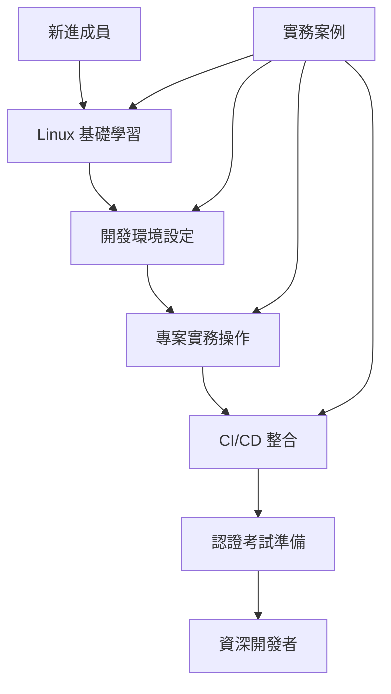

### 1.2 適用對象

🎯 **主要讀者群**

| 對象 | 背景 | 學習目標 |
|------|------|----------|
| **新進工程師** | 無 Linux 經驗 | 快速上手基本操作 |
| **Windows 開發者** | 熟悉 Windows 環境 | 轉換到 Linux 開發環境 |
| **實習生/Junior** | 學校理論基礎 | 實務操作技能培養 |
| **專案成員** | 需要團隊協作 | 統一操作規範 |
| **想考證照的同仁** | 有基礎經驗 | 系統性整理認證要點 |

**前置需求**：

- 基本電腦操作能力
- 對程式開發有基本認知
- 具備學習新技術的積極態度

### 1.3 專案環境說明

🖥️ **開發環境配置**

我們的專案開發環境採用以下配置：

#### 主要 Linux 發行版

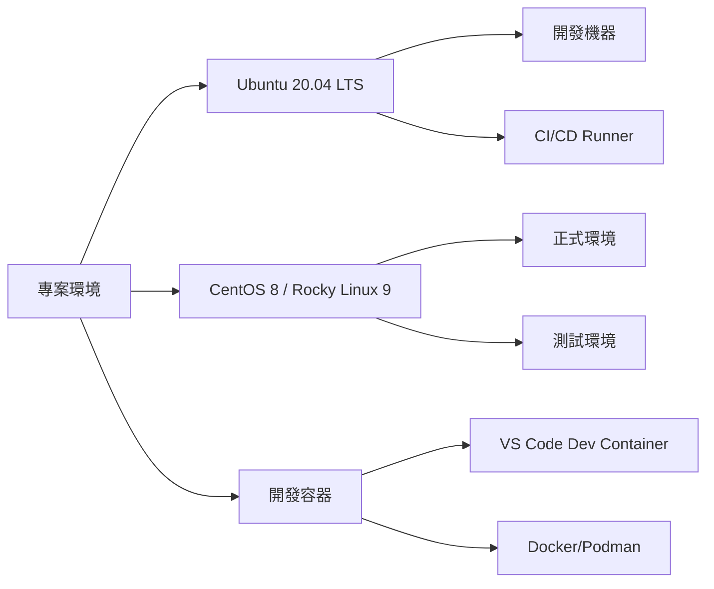

#### 技術堆疊

| 類別 | 工具/技術 | 版本 | 用途 |
|------|-----------|------|------|
| **開發語言** | Java | 11/17 | 主要開發語言 |
| | Python | 3.8+ | 腳本自動化 |
| | Node.js | 16+ | 前端工具鏈 |
| **建置工具** | Maven | 3.8+ | Java 專案管理 |
| | Gradle | 7+ | 替代建置工具 |
| **版本控制** | Git | 2.30+ | 原始碼管理 |
| **容器化** | Podman | 3+ | 無 daemon 容器 |
| | Docker | 20+ | 容器化開發 |
| **CI/CD** | Jenkins | 2.400+ | 持續整合 |
| **編輯器** | VS Code | 最新版 | Remote SSH 開發 |

#### 網路與安全設定

- SSH 金鑰認證（禁用密碼登入）
- 防火牆：firewalld（CentOS/Rocky）/ ufw（Ubuntu）
- SELinux：Enforcing 模式（正式環境）
- 非 root 使用者 + sudo 權限管理

### 1.4 學習方法與建議

📚 **高效學習策略**

#### 分階段學習路徑

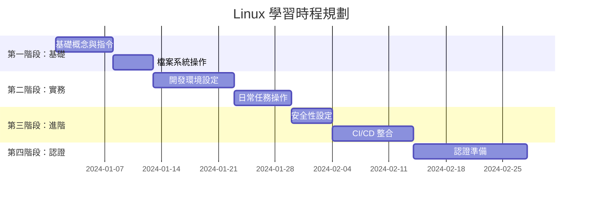

#### 實作導向學習法

**🔄 邊學邊做循環**

1. **理論學習**（20%）：理解概念與原理
2. **實際操作**（60%）：在實際環境中練習
3. **問題解決**（15%）：處理真實問題場景
4. **經驗分享**（5%）：與團隊成員討論交流

#### 學習建議與注意事項

**✅ DO（建議做法）**

- 在安全的測試環境中練習，避免影響正式系統
- 養成查閱 man page 的習慣：`man 指令名稱`
- 建立個人學習筆記，記錄常用指令與參數
- 多使用 Tab 鍵自動補全，提高操作效率
- 定期備份重要設定檔案

**❌ DON'T（避免做法）**

- 不要在正式環境中測試未經驗證的指令
- 不要直接複製貼上網路上的指令，要先理解功能
- 不要忽略錯誤訊息，學會解讀系統回饋
- 不要使用 root 帳號進行日常開發工作

#### 學習資源與工具

**📖 推薦學習資源**

- **官方文件**：各 Linux 發行版的官方文件
- **線上練習**：Linux Academy、KodeKloud
- **書籍推薦**：《鳥哥的 Linux 私房菜》、《Linux Command Line》
- **認證官網**：LPI、Red Hat、Linux Foundation

**🔧 實用工具**

- **終端機模擬器**：Windows Terminal（Windows）、iTerm2（macOS）
- **SSH 客戶端**：OpenSSH、PuTTY
- **檔案傳輸**：FileZilla、WinSCP
- **文字編輯器**：vim、nano、VS Code Remote

---

> **💡 學習小提示**  
> Linux 學習沒有捷徑，只有透過不斷的實作練習才能真正掌握。建議每天至少花 30 分鐘進行實際操作，一個月後你就會發現顯著的進步！

---

## 2. Linux 基礎概念

> **🎯 學習目標**  
>
> - 理解 Linux 系統的核心概念與架構
> - 掌握檔案系統的階層結構
> - 學會使用者與群組的管理概念
> - 熟悉檔案權限的運作機制

**🏆 認證對應**：LFCS Domain 1, RHCSA Chapter 1, LPI Essential

### 2.1 Linux 與開源精神簡介

#### 什麼是 Linux？

Linux 是一個**免費**且**開源**的類 Unix 作業系統核心，由 Linus Torvalds 於 1991 年首次發布。它已成為現代軟體開發的基石。

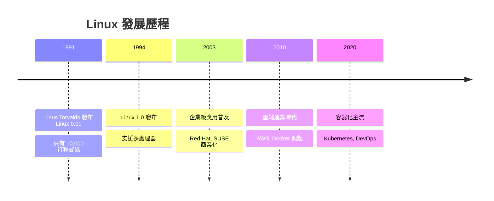

#### 為什麼選擇 Linux？

| 優勢 | 說明 | 開發應用 |
|------|------|----------|
| **開源免費** | 無授權費用，原始碼可查看 | 降低開發成本 |
| **穩定性高** | 可持續運行數月不重開機 | 適合正式環境 |
| **安全性佳** | 權限控制完善，漏洞修復快速 | 企業級安全需求 |
| **效能優異** | 資源使用效率高 | 伺服器與容器環境 |
| **客製化強** | 可依需求調整系統 | 嵌入式與專用系統 |

#### 開源精神與社群文化

**核心價值觀**：

- **自由**（Freedom）：使用、研究、修改、分享的自由
- **協作**（Collaboration）：全球開發者共同貢獻
- **透明**（Transparency）：原始碼公開，問題可追蹤
- **創新**（Innovation）：快速迭代，持續改進

### 2.2 Linux 系統架構

#### 系統分層架構

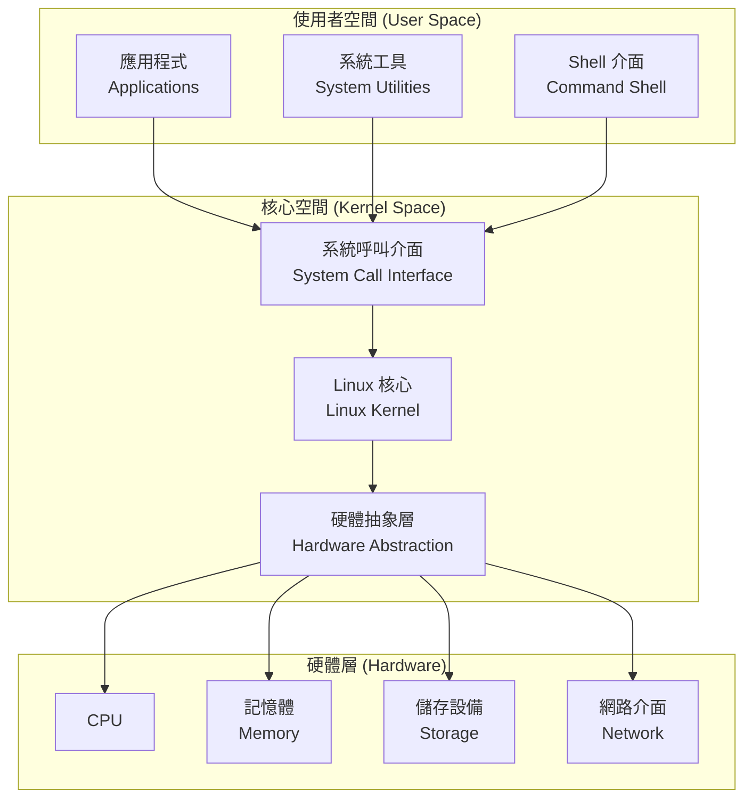

#### 各層組件說明

**1. 硬體層（Hardware Layer）**

- CPU、記憶體、硬碟、網路卡等實體硬體
- 提供運算與儲存的基礎資源

**2. Linux 核心（Kernel）**

- **程序管理**：排程、創建、終止程序
- **記憶體管理**：虛擬記憶體、分頁機制
- **檔案系統**：ext4、xfs、btrfs 等
- **網路堆疊**：TCP/IP 協定實作
- **設備驅動**：硬體裝置的控制介面

**3. Shell 與系統工具**

- **Shell**：命令列解釋器（bash, zsh, fish）
- **系統工具**：ls, ps, top, grep 等基本指令
- **系統程式**：init, systemd, cron 等背景服務

**4. 應用程式**

- 使用者安裝的軟體（Java, Python, 瀏覽器等）
- 透過系統呼叫與核心互動

### 2.3 檔案系統階層結構

#### Linux 檔案系統樹狀結構

```mermaid
graph TD
    A[/ 根目錄<br/>Root Directory] --> B[/bin<br/>基本指令]
    A --> C[/etc<br/>設定檔]
    A --> D[/home<br/>使用者目錄]
    A --> E[/var<br/>變動資料]
    A --> F[/usr<br/>使用者程式]
    A --> G[/opt<br/>第三方軟體]
    A --> H[/tmp<br/>暫存檔案]
    A --> I[/dev<br/>裝置檔案]
    
    D --> D1[/home/user1]
    D --> D2[/home/user2]
    
    F --> F1[/usr/bin<br/>使用者指令]
    F --> F2[/usr/lib<br/>程式庫]
    F --> F3[/usr/share<br/>共用資料]
    
    E --> E1[/var/log<br/>系統日誌]
    E --> E2[/var/www<br/>網站檔案]
```

#### 重要目錄詳解

| 目錄 | 用途 | 開發相關說明 | 範例 |
|------|------|--------------|------|
| **`/`** | 根目錄 | 所有目錄的起點 | 所有路徑都從 / 開始 |
| **`/bin`** | 基本執行檔 | 系統必要指令 | ls, cp, mv, bash |
| **`/etc`** | 設定檔案 | 系統與軟體設定 | /etc/passwd, /etc/hosts |
| **`/home`** | 使用者家目錄 | 個人檔案與設定 | /home/developer |
| **`/usr`** | 使用者程式 | 應用軟體安裝位置 | /usr/bin/java |
| **`/var`** | 變動資料 | 日誌、暫存、資料庫 | /var/log/application.log |
| **`/opt`** | 第三方軟體 | 自訂軟體安裝 | /opt/maven, /opt/tomcat |
| **`/tmp`** | 暫存目錄 | 臨時檔案 | 編譯暫存、下載檔案 |

#### 專案開發常用目錄配置

```bash
# 開發環境典型目錄結構
/home/developer/              # 開發者家目錄
├── projects/                 # 專案根目錄
│   ├── java_tutorial/        # Java 專案
│   ├── python_scripts/       # Python 腳本
│   └── config/               # 個人設定檔
├── tools/                    # 開發工具
│   ├── maven/                # Maven 安裝
│   ├── gradle/               # Gradle 安裝
│   └── scripts/              # 個人腳本
└── .bashrc                   # Shell 設定檔
```

### 2.4 使用者與群組管理

#### 使用者類型與特性

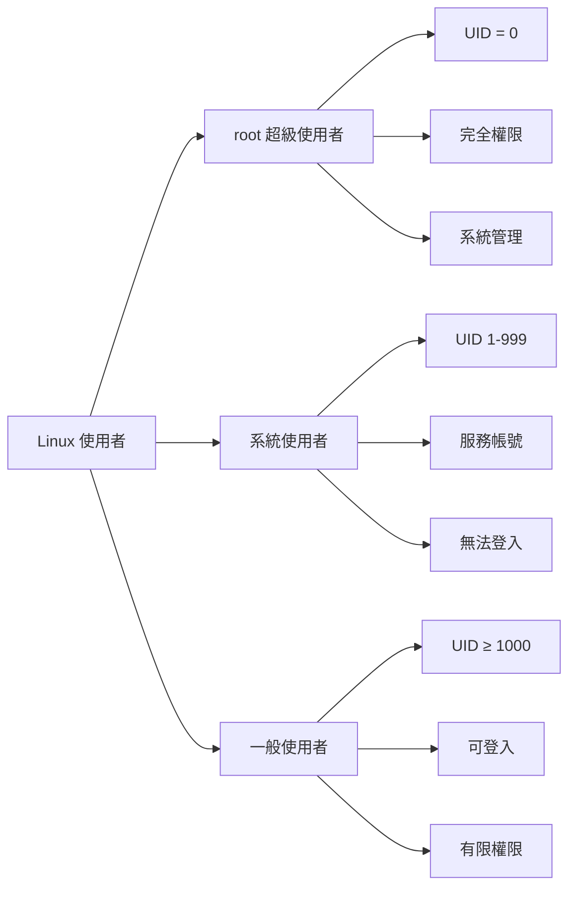

#### 重要概念說明

**使用者識別碼（UID）**

- **root**：UID = 0，系統最高權限
- **系統使用者**：UID 1-999，執行系統服務
- **一般使用者**：UID ≥ 1000，日常使用帳號

**群組概念**

- **主要群組**：使用者的預設群組
- **次要群組**：使用者可加入的其他群組
- **群組權限**：透過群組共享檔案存取權限

#### 使用者資訊檔案

**`/etc/passwd`** - 使用者帳號資訊

```bash
# 格式：使用者名稱:密碼:UID:GID:描述:家目錄:預設Shell
developer:x:1001:1001:Java Developer:/home/developer:/bin/bash
```

**`/etc/group`** - 群組資訊

```bash
# 格式：群組名稱:密碼:GID:成員列表
developers:x:1001:developer,intern
docker:x:999:developer
```

**`/etc/shadow`** - 密碼相關資訊（加密存放）

```bash
# 格式：使用者名稱:加密密碼:其他安全資訊
developer:$6$rounds=656000$...:19000:0:99999:7:::
```

### 2.5 檔案與目錄權限

#### 權限基本概念

Linux 使用 **rwx** 權限模型：

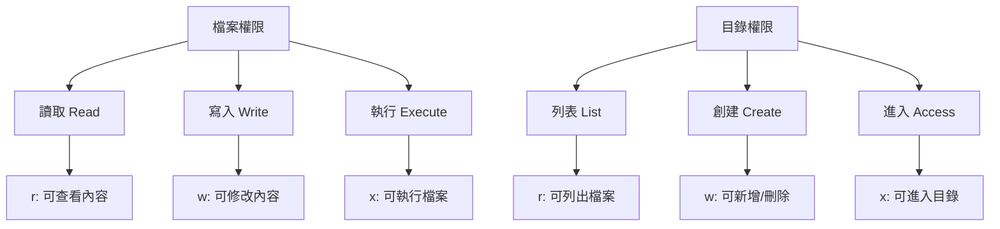

#### 權限表示法

**符號表示法**

```bash
# drwxr-xr-x  2 developer developers 4096 Jan 15 10:30 project/
# ↑ ↑↑↑ ↑↑↑ ↑↑↑
# │ │  │  └── 其他人權限 (r-x)
# │ │  └───── 群組權限 (r-x)  
# │ └──────── 擁有者權限 (rwx)
# └─────────── 檔案類型 (d=目錄)
```

**數字表示法**

| 權限 | 符號 | 數值 | 意義 |
|------|------|------|------|
| 讀取 | r | 4 | 可讀取檔案內容 |
| 寫入 | w | 2 | 可修改檔案內容 |
| 執行 | x | 1 | 可執行檔案 |

```bash
# 常見權限組合
755 = rwxr-xr-x  # 擁有者全權限，其他人可讀可執行
644 = rw-r--r--  # 擁有者可讀寫，其他人唯讀
600 = rw-------  # 只有擁有者可讀寫
```

#### 特殊權限

**Sticky Bit (t)**

```bash
drwxrwxrwt  10 root root 4096 Jan 15 10:30 /tmp/
# 最後一位 t 表示 sticky bit
# 在 /tmp 目錄中，只有檔案擁有者可以刪除自己的檔案
```

**SUID (s)**

```bash
-rwsr-xr-x  1 root root 54256 Jan 15 10:30 /usr/bin/passwd
# 使用者執行時會獲得檔案擁有者的權限
```

#### 實務應用範例

**開發專案權限設定**

```bash
# 專案目錄權限設定
chmod 755 /home/developer/projects/          # 目錄可進入
chmod 644 /home/developer/projects/*.java    # 原始碼可讀寫
chmod 755 /home/developer/projects/scripts/  # 腳本可執行

# 群組協作設定
chgrp developers /home/developer/projects/   # 設定群組
chmod g+w /home/developer/projects/          # 群組可寫入
```

---

> **🔍 實務檢查點**
>
> **基礎概念掌握檢查**：
>
> - [ ] 能說出 Linux 四層架構
> - [ ] 知道重要目錄的用途
> - [ ] 理解使用者與群組的關係
> - [ ] 會解讀檔案權限表示法
> - [ ] 能使用基本權限管理指令
>
> **認證重點**：
>
> - LFCS：檔案權限與使用者管理
> - RHCSA：檔案系統結構與權限
> - LPI：Linux 基礎概念

---

## 3. Linux 常用指令

> **🎯 學習目標**  
>
> - 熟練掌握檔案與目錄操作指令
> - 學會使用檔案搜尋與內容查看工具
> - 理解程序管理與系統監控指令
> - 掌握網路工具與軟體管理指令

**🏆 認證對應**：LPI Essential, RHCSA 基礎操作, LFCS Domain 2

### 3.1 檔案與目錄操作

#### 導航與瀏覽指令

**基本導航**

```bash
# 顯示目前目錄
pwd                          # Print Working Directory

# 列出檔案與目錄
ls                          # 基本列表
ls -l                       # 詳細資訊（權限、大小、時間）
ls -la                      # 包含隱藏檔案
ls -lh                      # 人類可讀的檔案大小
ls -lt                      # 按修改時間排序
ls -lS                      # 按檔案大小排序

# 切換目錄
cd /path/to/directory       # 切換到指定目錄
cd ~                        # 回到家目錄
cd -                        # 回到上一個目錄
cd ..                       # 上一層目錄
cd ../..                    # 上兩層目錄
```

**實用參數組合**

```bash
# 開發常用的 ls 組合
alias ll='ls -alF'          # 詳細列表，標示檔案類型
alias la='ls -A'            # 顯示所有檔案（除了 . 和 ..）
alias l='ls -CF'            # 分欄顯示，標示檔案類型

# 查看目錄結構
tree                        # 樹狀顯示目錄結構
tree -d                     # 只顯示目錄
tree -L 2                   # 限制顯示層數
```

#### 檔案與目錄建立、複製、移動

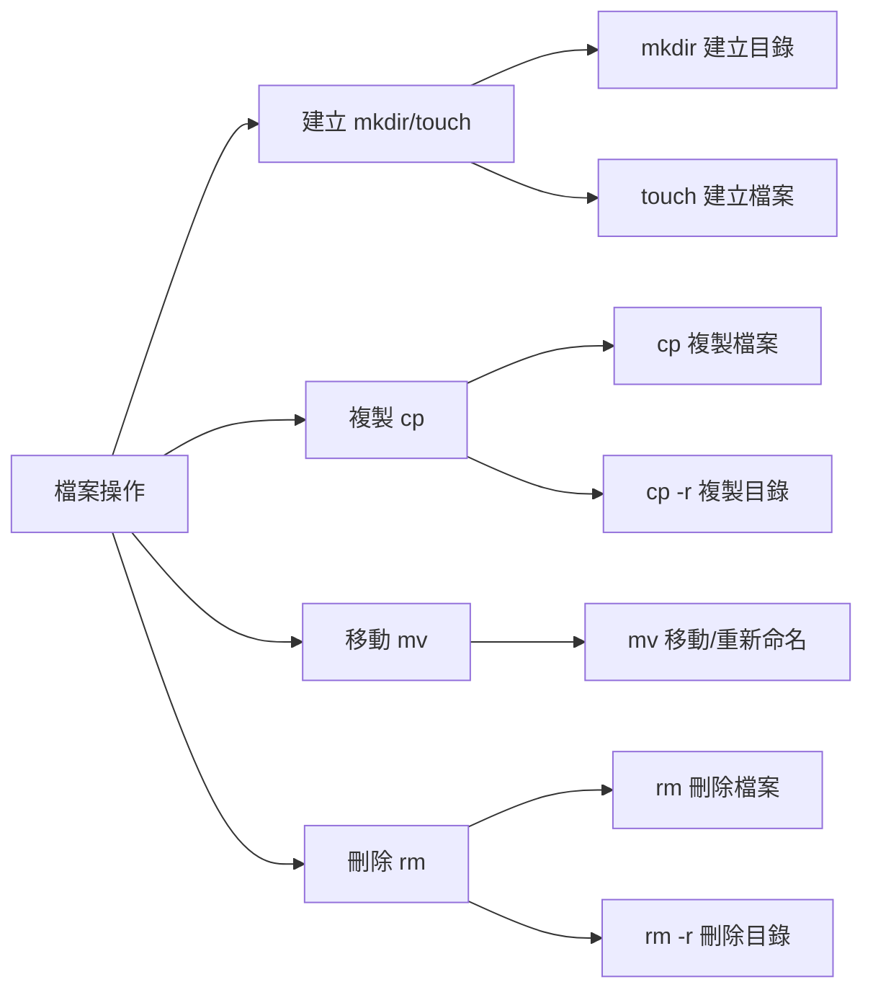

**檔案與目錄建立**

```bash
# 建立目錄
mkdir project                # 建立單一目錄
mkdir -p project/src/main/java  # 遞迴建立目錄結構
mkdir -m 755 public_folder   # 建立時設定權限

# 建立檔案
touch file.txt               # 建立空檔案或更新時間戳記
touch file1.txt file2.txt file3.txt  # 一次建立多個檔案

# 實務範例：建立 Java 專案結構
mkdir -p java_project/{src/{main,test}/{java,resources},target,docs}
```

**複製操作**

```bash
# 檔案複製
cp source.txt destination.txt        # 複製檔案
cp source.txt /path/to/destination/   # 複製到指定目錄
cp -i source.txt dest.txt            # 互動模式（覆蓋前詢問）
cp -v source.txt dest.txt            # 顯示詳細過程
cp -p source.txt dest.txt            # 保留檔案屬性

# 目錄複製
cp -r source_dir/ destination_dir/   # 遞迴複製目錄
cp -r src/ backup/                   # 備份原始碼目錄

# 進階複製技巧
cp *.java backup/                    # 複製所有 Java 檔案
cp -u newer/* older/                 # 只複製較新的檔案
```

**移動與重新命名**

```bash
# 移動檔案
mv file.txt /path/to/destination/    # 移動檔案
mv old_name.txt new_name.txt         # 重新命名
mv *.log logs/                       # 移動所有 log 檔案

# 移動目錄
mv old_directory/ new_location/      # 移動整個目錄
mv project/ ~/workspace/             # 移動到家目錄的 workspace

# 批次重新命名（使用 rename 指令）
rename 's/\.jpeg$/.jpg/' *.jpeg      # 將 .jpeg 副檔名改為 .jpg
```

**刪除操作**

```bash
# 檔案刪除
rm file.txt                         # 刪除檔案
rm -i file.txt                      # 互動模式
rm -f file.txt                      # 強制刪除（不詢問）
rm *.tmp                            # 刪除所有暫存檔

# 目錄刪除
rmdir empty_directory/              # 刪除空目錄
rm -r directory/                    # 遞迴刪除目錄
rm -rf directory/                   # 強制遞迴刪除

# 安全刪除技巧
trash file.txt                     # 使用 trash-cli（可復原）
rm -i *.important                  # 重要檔案使用互動模式
```

### 3.2 檔案檢視與搜尋

#### 檔案內容查看

```bash
# 基本檢視指令
cat file.txt                       # 顯示完整檔案內容
less file.txt                      # 分頁檢視（推薦大檔案）
more file.txt                      # 分頁檢視（基本版）
head file.txt                      # 顯示檔案前 10 行
head -n 20 file.txt                # 顯示前 20 行
tail file.txt                      # 顯示檔案後 10 行
tail -n 50 file.txt                # 顯示後 50 行
tail -f application.log             # 即時追蹤檔案更新（監控日誌）
```

**less 指令操作技巧**

```bash
# 在 less 中的操作
空白鍵          # 下一頁
b              # 上一頁
/search_term   # 向下搜尋
?search_term   # 向上搜尋
n              # 下一個搜尋結果
N              # 上一個搜尋結果
G              # 跳到檔案結尾
gg             # 跳到檔案開頭
q              # 離開
```

#### 檔案搜尋工具

**grep - 文字搜尋神器**

```bash
# 基本搜尋
grep "error" application.log        # 搜尋包含 "error" 的行
grep -i "ERROR" application.log     # 忽略大小寫
grep -n "exception" *.java          # 顯示行號
grep -r "TODO" src/                 # 遞迴搜尋目錄
grep -v "debug" application.log     # 顯示不包含 "debug" 的行

# 進階搜尋
grep -E "error|exception|fail" logs/    # 多關鍵字搜尋（正規表達式）
grep -l "main" *.java                   # 只顯示檔案名稱
grep -c "test" TestRunner.java          # 計算匹配行數
grep -A 3 -B 3 "error" application.log  # 顯示前後 3 行上下文

# 實務範例
grep -r "SQLException" src/ --include="*.java"  # 只搜尋 Java 檔案
grep -E "^[0-9]{4}-[0-9]{2}-[0-9]{2}" access.log  # 搜尋日期格式
```

**find - 檔案搜尋工具**

```bash
# 基本搜尋
find . -name "*.java"               # 搜尋 Java 檔案
find /home -name "config.properties"  # 搜尋設定檔
find . -type d -name "test*"        # 搜尋以 test 開頭的目錄
find . -type f -size +100M          # 搜尋大於 100MB 的檔案

# 按時間搜尋
find . -mtime -7                    # 7 天內修改的檔案
find . -mtime +30                   # 30 天前修改的檔案
find . -newer reference_file.txt    # 比參考檔案新的檔案

# 按權限搜尋
find . -perm 644                    # 搜尋特定權限的檔案
find . -perm /u+x                   # 搜尋使用者可執行的檔案

# 執行動作
find . -name "*.tmp" -delete        # 刪除所有暫存檔
find . -name "*.java" -exec wc -l {} \;  # 計算 Java 檔案行數
```

**locate - 快速檔案搜尋**

```bash
# 更新資料庫（通常需要 root 權限）
sudo updatedb                      # 更新檔案資料庫

# 快速搜尋
locate config.properties            # 快速搜尋檔案
locate -i "*.JAVA"                 # 忽略大小寫搜尋
locate --regex ".*\.log$"          # 使用正規表達式
```

### 3.3 檔案壓縮與解壓縮

#### tar 歸檔工具

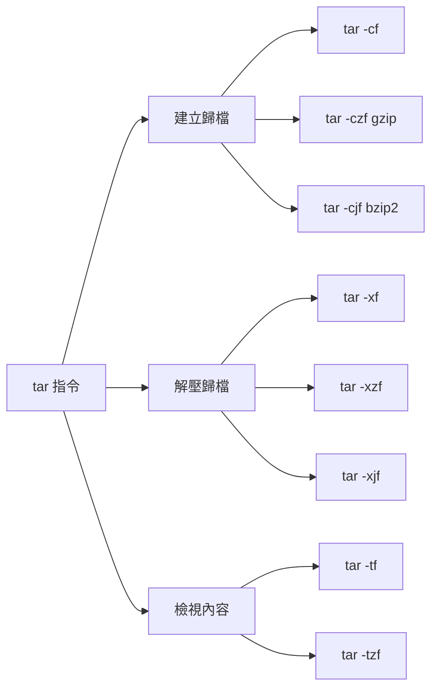

**tar 基本操作**

```bash
# 建立歸檔
tar -cf archive.tar directory/           # 建立 tar 歸檔
tar -czf archive.tar.gz directory/       # 建立 gzip 壓縮歸檔
tar -cjf archive.tar.bz2 directory/      # 建立 bzip2 壓縮歸檔
tar -cJf archive.tar.xz directory/       # 建立 xz 壓縮歸檔

# 解壓歸檔
tar -xf archive.tar                      # 解壓 tar 歸檔
tar -xzf archive.tar.gz                  # 解壓 gzip 歸檔
tar -xjf archive.tar.bz2                 # 解壓 bzip2 歸檔
tar -xf archive.tar -C /path/to/dest/    # 解壓到指定目錄

# 檢視歸檔內容
tar -tf archive.tar                      # 列出歸檔內容
tar -tzf archive.tar.gz                  # 列出 gzip 歸檔內容
tar -tv archive.tar                      # 詳細列出歸檔內容

# 實務範例
tar -czf backup_$(date +%Y%m%d).tar.gz src/  # 以日期命名的備份
tar -czf project.tar.gz --exclude=target --exclude=.git project/  # 排除特定目錄
```

**記憶口訣**

- **c**reate（建立）
- **x**tract（解壓）
- **f**ile（檔案）
- **z**ip（gzip 壓縮）
- **j**（bzip2 壓縮）
- **v**erbose（詳細輸出）
- **t**est（檢視內容）

#### 其他壓縮工具

```bash
# gzip/gunzip
gzip file.txt                           # 壓縮成 file.txt.gz
gunzip file.txt.gz                      # 解壓縮

# zip/unzip
zip -r archive.zip directory/           # 建立 zip 壓縮檔
unzip archive.zip                       # 解壓 zip 檔案
unzip -l archive.zip                    # 列出 zip 檔案內容
unzip archive.zip -d destination/       # 解壓到指定目錄

# 7zip
7z a archive.7z directory/              # 建立 7z 壓縮檔
7z x archive.7z                         # 解壓 7z 檔案
```

### 3.4 權限管理

#### chmod - 修改檔案權限

```bash
# 符號模式
chmod u+x script.sh                     # 給擁有者執行權限
chmod g+w file.txt                      # 給群組寫入權限
chmod o-r file.txt                      # 移除其他人讀取權限
chmod a+x script.sh                     # 給所有人執行權限

# 數字模式
chmod 755 script.sh                     # rwxr-xr-x
chmod 644 file.txt                      # rw-r--r--
chmod 600 private.key                   # rw-------
chmod 777 shared_folder/                # rwxrwxrwx（不建議）

# 遞迴設定
chmod -R 755 project/                   # 遞迴設定目錄權限
chmod -R u+w,go-w documents/            # 複雜權限設定
```

#### chown - 修改檔案擁有者

```bash
# 修改擁有者
chown developer file.txt                # 改變檔案擁有者
chown developer:developers file.txt     # 同時改變擁有者和群組
chown :developers file.txt              # 只改變群組

# 遞迴修改
chown -R developer:developers project/  # 遞迴改變目錄擁有權
```

#### umask - 預設權限

```bash
# 查看目前 umask
umask                                   # 顯示 umask 值

# 設定 umask
umask 022                               # 新檔案權限 644，新目錄權限 755
umask 077                               # 新檔案權限 600，新目錄權限 700

# 計算方式
# 檔案最大權限 666 - umask 022 = 644
# 目錄最大權限 777 - umask 022 = 755
```

### 3.5 程序管理

#### 程序查看與監控

```bash
# 基本程序查看
ps                                      # 顯示目前 shell 的程序
ps aux                                  # 顯示所有程序詳細資訊
ps aux | grep java                      # 搜尋 Java 程序
ps -ef                                  # 另一種詳細格式

# 即時監控
top                                     # 即時系統監控
htop                                    # 增強版 top（需安裝）
atop                                    # 進階系統監控

# 程序樹狀顯示
pstree                                  # 顯示程序樹
pstree -p                               # 顯示程序 ID
```

**top 指令操作**

```bash
# 在 top 中的操作
h          # 顯示說明
q          # 離開
k          # 殺死程序（輸入 PID）
M          # 按記憶體使用量排序
P          # 按 CPU 使用量排序
1          # 顯示每個 CPU 核心
```

#### 程序控制

```bash
# 終止程序
kill PID                               # 發送 TERM 信號（優雅終止）
kill -9 PID                            # 發送 KILL 信號（強制終止）
kill -15 PID                           # 發送 TERM 信號（同 kill）
killall process_name                   # 終止所有同名程序
pkill -f "java.*Application"           # 用模式殺死程序

# 背景程序管理
command &                              # 在背景執行指令
nohup command &                        # 不受 hangup 信號影響的背景執行
jobs                                   # 顯示背景工作
fg %1                                  # 將背景工作帶到前景
bg %1                                  # 將工作移到背景
Ctrl+Z                                 # 暫停前景程序
```

#### 系統監控

```bash
# 系統負載
uptime                                 # 系統運行時間與負載
w                                      # 誰在線上及其活動
who                                    # 誰在線上（簡單版）

# 記憶體使用
free -h                                # 顯示記憶體使用情況
free -h -s 5                          # 每 5 秒更新一次

# 磁碟使用
df -h                                  # 顯示磁碟空間使用情況
du -h directory/                       # 顯示目錄大小
du -sh *                               # 顯示每個項目的大小總計
```

### 3.6 網路工具

#### 網路連線測試

```bash
# 連線測試
ping google.com                        # 測試網路連線
ping -c 4 8.8.8.8                     # 只發送 4 個封包
ping -i 0.5 localhost                 # 每 0.5 秒發送一次

# 路由追蹤
traceroute google.com                  # 追蹤網路路由
tracepath google.com                   # 替代工具

# DNS 查詢
nslookup google.com                    # DNS 查詢
dig google.com                         # 進階 DNS 查詢
host google.com                        # 簡單 DNS 查詢
```

#### 網路狀態查看

```bash
# 網路連線狀態
netstat -tuln                          # 顯示所有監聽的埠
netstat -an | grep :8080              # 查看特定埠狀態
ss -tuln                               # 現代版 netstat
ss -tulnp                              # 顯示程序資訊

# 網路介面
ip addr show                           # 顯示網路介面資訊
ip route show                          # 顯示路由表
ifconfig                               # 傳統網路介面查看（可能需安裝）
```

#### 檔案下載

```bash
# wget 下載
wget https://example.com/file.zip      # 下載檔案
wget -O custom_name.zip https://...    # 指定檔案名稱
wget -c https://...                    # 續傳下載
wget -r -np -k https://example.com/    # 遞迴下載網站

# curl 工具
curl -O https://example.com/file.zip   # 下載檔案
curl -L https://bit.ly/shorturl        # 跟隨重新導向
curl -H "Authorization: Bearer token" https://api.example.com/data  # 帶標頭的請求
```

### 3.7 軟體管理

#### 套件管理系統

**Ubuntu/Debian (apt)**

```bash
# 更新套件清單
sudo apt update                        # 更新套件資料庫
sudo apt upgrade                       # 升級已安裝套件
sudo apt full-upgrade                  # 完整升級

# 安裝與移除
sudo apt install package_name          # 安裝套件
sudo apt install package1 package2     # 安裝多個套件
sudo apt remove package_name           # 移除套件
sudo apt purge package_name            # 完全移除套件及設定
sudo apt autoremove                    # 移除不需要的相依套件

# 搜尋與資訊
apt search keyword                     # 搜尋套件
apt show package_name                  # 顯示套件資訊
apt list --installed                  # 列出已安裝套件
```

**CentOS/RHEL/Rocky (dnf/yum)**

```bash
# 更新系統
sudo dnf update                        # 更新所有套件
sudo dnf upgrade                       # 升級系統

# 安裝與移除
sudo dnf install package_name          # 安裝套件
sudo dnf remove package_name           # 移除套件
sudo dnf autoremove                    # 移除孤立套件

# 搜尋與資訊
dnf search keyword                     # 搜尋套件
dnf info package_name                  # 顯示套件資訊
dnf list installed                    # 列出已安裝套件

# group 安裝
dnf grouplist                          # 列出套件群組
sudo dnf groupinstall "Development Tools"  # 安裝開發工具群組
```

#### 開發工具安裝範例

```bash
# Java 開發環境
sudo apt install openjdk-11-jdk maven gradle  # Ubuntu
sudo dnf install java-11-openjdk-devel maven  # CentOS/Rocky

# Python 開發環境
sudo apt install python3 python3-pip python3-venv  # Ubuntu
sudo dnf install python3 python3-pip             # CentOS/Rocky

# Node.js 開發環境
curl -fsSL https://deb.nodesource.com/setup_lts.x | sudo -E bash -
sudo apt install nodejs                       # Ubuntu

# 容器工具
sudo apt install podman buildah               # Ubuntu
sudo dnf install podman buildah               # CentOS/Rocky

# 開發工具
sudo apt install git vim curl wget tree htop  # 基本工具
```

---

> **🔍 實務檢查點**
>
> **指令熟練度檢查**：
>
> - [ ] 能熟練使用檔案操作指令（ls, cp, mv, rm）
> - [ ] 會使用搜尋工具（grep, find）
> - [ ] 掌握檔案權限管理（chmod, chown）
> - [ ] 能監控與管理程序（ps, top, kill）
> - [ ] 了解基本網路工具（ping, netstat）
> - [ ] 會使用套件管理工具
>
> **認證重點**：
>
> - LPI Essential：基本指令操作
> - RHCSA：檔案管理與程序控制
> - LFCS：系統管理指令

---

## 4. 開發環境操作

> **🎯 學習目標**  
>
> - 掌握 JDK、Python、Node.js 等開發工具安裝與設定
> - 學會配置開發工具的環境變數
> - 熟悉 Git 版本控制系統操作
> - 了解容器化開發工具的使用
> - 學會 Maven/Gradle 建置工具操作

**🏆 認證對應**：專案應用導向，RHCSA 軟體管理章節

### 4.1 安裝與設定 JDK

#### Java 開發環境概覽

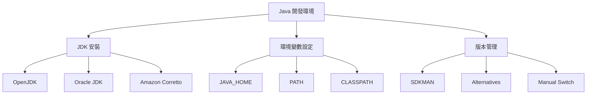

#### JDK 安裝方法

**方法1：套件管理器安裝（推薦）**

*Ubuntu/Debian:*

```bash
# 更新套件清單
sudo apt update

# 安裝 OpenJDK 11
sudo apt install openjdk-11-jdk

# 安裝 OpenJDK 17 (LTS)
sudo apt install openjdk-17-jdk

# 安裝 OpenJDK 21 (最新 LTS)
sudo apt install openjdk-21-jdk

# 查看可用的 Java 版本
apt search openjdk | grep jdk

# 驗證安裝
java -version
javac -version
```

*CentOS/RHEL/Rocky Linux:*

```bash
# 安裝 OpenJDK 11
sudo dnf install java-11-openjdk-devel

# 安裝 OpenJDK 17
sudo dnf install java-17-openjdk-devel

# 安裝 OpenJDK 21
sudo dnf install java-21-openjdk-devel

# 查看已安裝的 Java 版本
sudo dnf list installed | grep openjdk

# 驗證安裝
java -version
javac -version
```

**方法2：SDKMAN 安裝（版本管理）**

```bash
# 安裝 SDKMAN
curl -s "https://get.sdkman.io" | bash
source "$HOME/.sdkman/bin/sdkman-init.sh"

# 查看可用的 Java 版本
sdk list java

# 安裝特定版本
sdk install java 11.0.21-tem        # Eclipse Temurin JDK 11
sdk install java 17.0.9-tem         # Eclipse Temurin JDK 17
sdk install java 21.0.1-oracle      # Oracle JDK 21

# 切換 Java 版本
sdk use java 17.0.9-tem             # 臨時切換
sdk default java 17.0.9-tem         # 設為預設版本

# 查看目前版本
sdk current java
```

#### 環境變數設定

**設定 JAVA_HOME 和 PATH**

```bash
# 找到 Java 安裝路徑
sudo update-alternatives --config java  # Ubuntu
sudo alternatives --config java         # CentOS/Rocky

# 編輯環境變數檔案
vim ~/.bashrc                           # 個人設定
# 或
sudo vim /etc/environment               # 系統全域設定

# 在 ~/.bashrc 中添加（以 JDK 17 為例）
export JAVA_HOME=/usr/lib/jvm/java-17-openjdk-amd64
export PATH=$JAVA_HOME/bin:$PATH
export CLASSPATH=.:$JAVA_HOME/lib/tools.jar

# 重新載入設定
source ~/.bashrc

# 驗證環境變數
echo $JAVA_HOME
echo $PATH | grep java
```

**建立 Java 版本切換腳本**

```bash
# 建立 Java 版本切換腳本
cat > ~/scripts/java-switch.sh << 'EOF'
#!/bin/bash

case "$1" in
    "11")
        export JAVA_HOME=/usr/lib/jvm/java-11-openjdk-amd64
        ;;
    "17")
        export JAVA_HOME=/usr/lib/jvm/java-17-openjdk-amd64
        ;;
    "21")
        export JAVA_HOME=/usr/lib/jvm/java-21-openjdk-amd64
        ;;
    *)
        echo "Usage: source java-switch.sh [11|17|21]"
        return 1
        ;;
esac

export PATH=$JAVA_HOME/bin:$PATH
echo "Switched to Java $1"
java -version
EOF

chmod +x ~/scripts/java-switch.sh

# 使用方式
source ~/scripts/java-switch.sh 17
```

#### Java 專案測試

```bash
# 建立測試專案
mkdir -p ~/workspace/java-test/src
cd ~/workspace/java-test

# 建立 Hello World 程式
cat > src/HelloWorld.java << 'EOF'
public class HelloWorld {
    public static void main(String[] args) {
        System.out.println("Hello, Linux Java Development!");
        System.out.println("Java Version: " + System.getProperty("java.version"));
        System.out.println("Java Home: " + System.getProperty("java.home"));
    }
}
EOF

# 編譯與執行
javac src/HelloWorld.java -d .
java HelloWorld
```

### 4.2 安裝與設定 Python

#### Python 環境管理策略

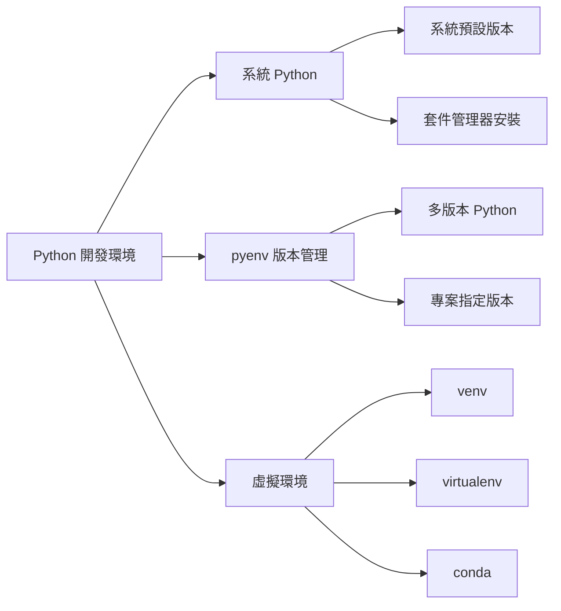

#### Python 安裝

**Ubuntu/Debian:**

```bash
# Python 3 (通常已預裝)
sudo apt update
sudo apt install python3 python3-pip python3-venv python3-dev

# 額外開發工具
sudo apt install python3-setuptools python3-wheel build-essential

# 驗證安裝
python3 --version
pip3 --version
```

**CentOS/RHEL/Rocky Linux:**

```bash
# Python 3
sudo dnf install python3 python3-pip python3-devel

# 開發工具
sudo dnf groupinstall "Development Tools"
sudo dnf install python3-setuptools python3-wheel

# 驗證安裝
python3 --version
pip3 --version
```

#### pyenv 版本管理（推薦）

```bash
# 安裝 pyenv 相依套件 (Ubuntu)
sudo apt install make build-essential libssl-dev zlib1g-dev \
    libbz2-dev libreadline-dev libsqlite3-dev wget curl llvm \
    libncursesw5-dev xz-utils tk-dev libxml2-dev libxmlsec1-dev \
    libffi-dev liblzma-dev

# 安裝 pyenv
curl https://pyenv.run | bash

# 設定環境變數（添加到 ~/.bashrc）
cat >> ~/.bashrc << 'EOF'
# pyenv
export PYENV_ROOT="$HOME/.pyenv"
command -v pyenv >/dev/null || export PATH="$PYENV_ROOT/bin:$PATH"
eval "$(pyenv init -)"
eval "$(pyenv virtualenv-init -)"
EOF

# 重新載入
source ~/.bashrc

# 安裝 Python 版本
pyenv install 3.9.18
pyenv install 3.10.13
pyenv install 3.11.7
pyenv install 3.12.1

# 設定全域版本
pyenv global 3.11.7

# 設定專案版本
cd ~/workspace/python-project
pyenv local 3.10.13

# 查看版本
pyenv versions
python --version
```

#### 虛擬環境管理

**使用 venv（Python 內建）**

```bash
# 建立虛擬環境
python3 -m venv ~/workspace/myproject/venv

# 啟動虛擬環境
source ~/workspace/myproject/venv/bin/activate

# 查看環境資訊
which python
python --version
pip list

# 安裝套件
pip install requests numpy pandas flask

# 產生需求檔案
pip freeze > requirements.txt

# 安裝需求檔案
pip install -r requirements.txt

# 離開虛擬環境
deactivate
```

**虛擬環境管理腳本**

```bash
# 建立專案初始化腳本
cat > ~/scripts/init-python-project.sh << 'EOF'
#!/bin/bash

if [ $# -eq 0 ]; then
    echo "Usage: $0 <project_name> [python_version]"
    exit 1
fi

PROJECT_NAME=$1
PYTHON_VERSION=${2:-3.11.7}

# 建立專案目錄
mkdir -p ~/workspace/$PROJECT_NAME
cd ~/workspace/$PROJECT_NAME

# 設定 Python 版本
if command -v pyenv >/dev/null; then
    pyenv local $PYTHON_VERSION
fi

# 建立虛擬環境
python -m venv venv

# 啟動虛擬環境
source venv/bin/activate

# 升級 pip
pip install --upgrade pip

# 建立基本專案結構
mkdir -p {src,tests,docs}
touch src/__init__.py
touch tests/__init__.py
touch README.md
touch requirements.txt

echo "# $PROJECT_NAME" > README.md
echo "# Development dependencies" > requirements-dev.txt
echo "pytest" >> requirements-dev.txt
echo "black" >> requirements-dev.txt
echo "flake8" >> requirements-dev.txt

echo "Project $PROJECT_NAME initialized successfully!"
echo "To activate virtual environment: source ~/workspace/$PROJECT_NAME/venv/bin/activate"
EOF

chmod +x ~/scripts/init-python-project.sh

# 使用範例
~/scripts/init-python-project.sh my-python-app 3.11.7
```

### 4.3 安裝與設定 Node.js

#### Node.js 版本管理

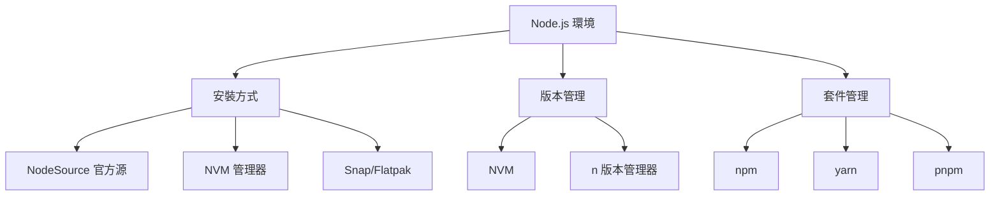

#### NVM 安裝 Node.js（推薦）

```bash
# 安裝 NVM
curl -o- https://raw.githubusercontent.com/nvm-sh/nvm/v0.39.0/install.sh | bash

# 重新載入 shell 或重新開啟終端
source ~/.bashrc

# 驗證 NVM 安裝
nvm --version

# 查看可用的 Node.js 版本
nvm list-remote

# 安裝最新 LTS 版本
nvm install --lts

# 安裝特定版本
nvm install 18.19.0
nvm install 20.10.0

# 切換版本
nvm use 18.19.0

# 設定預設版本
nvm alias default 18.19.0

# 查看已安裝版本
nvm list

# 查看目前使用版本
node --version
npm --version
```

#### 套件管理器安裝

**Ubuntu/Debian:**

```bash
# 官方 NodeSource 源
curl -fsSL https://deb.nodesource.com/setup_lts.x | sudo -E bash -
sudo apt-get install -y nodejs

# 驗證安裝
node --version
npm --version

# 安裝建置工具（可選）
sudo apt-get install -y build-essential
```

**CentOS/RHEL/Rocky Linux:**

```bash
# 安裝 NodeSource 源
curl -fsSL https://rpm.nodesource.com/setup_lts.x | sudo bash -
sudo dnf install -y nodejs npm

# 驗證安裝
node --version
npm --version
```

#### Node.js 開發環境設定

**全域工具安裝**

```bash
# 常用全域工具
npm install -g yarn                    # 替代套件管理器
npm install -g pnpm                    # 高效能套件管理器
npm install -g typescript              # TypeScript 編譯器
npm install -g ts-node                 # TypeScript 執行器
npm install -g nodemon                 # 開發伺服器自動重啟
npm install -g pm2                     # 程序管理器
npm install -g create-react-app        # React 專案建立工具
npm install -g @vue/cli                # Vue.js CLI

# 查看全域套件
npm list -g --depth=0
```

**專案初始化範例**

```bash
# 建立 Node.js 專案
mkdir ~/workspace/node-app
cd ~/workspace/node-app

# 初始化專案
npm init -y

# 安裝相依套件
npm install express
npm install --save-dev nodemon jest

# 建立基本結構
mkdir -p {src,tests,public}

# 建立簡單的 Express 應用
cat > src/app.js << 'EOF'
const express = require('express');
const app = express();
const port = process.env.PORT || 3000;

app.get('/', (req, res) => {
    res.json({ 
        message: 'Hello from Linux Node.js!',
        nodeVersion: process.version,
        platform: process.platform 
    });
});

app.listen(port, () => {
    console.log(`Server running on port ${port}`);
});

module.exports = app;
EOF

# 更新 package.json scripts
npm pkg set scripts.start="node src/app.js"
npm pkg set scripts.dev="nodemon src/app.js"
npm pkg set scripts.test="jest"

# 執行應用
npm run dev
```

### 4.4 資料庫客戶端

#### PostgreSQL 客戶端

```bash
# 安裝 PostgreSQL 客戶端
sudo apt install postgresql-client      # Ubuntu
sudo dnf install postgresql             # CentOS/Rocky

# 連線到資料庫
psql -h hostname -U username -d database_name

# 環境變數設定
export PGHOST=localhost
export PGPORT=5432
export PGUSER=developer
export PGDATABASE=myapp

# 連線範例
psql myapp

# 常用 psql 指令
\l                    # 列出所有資料庫
\dt                   # 列出資料表
\d table_name         # 顯示資料表結構
\q                    # 離開
```

#### MySQL/MariaDB 客戶端

```bash
# 安裝 MySQL 客戶端
sudo apt install mysql-client          # Ubuntu
sudo dnf install mysql                 # CentOS/Rocky

# 連線到資料庫
mysql -h hostname -u username -p database_name

# 設定連線參數檔案
cat > ~/.my.cnf << 'EOF'
[client]
host=localhost
user=developer
password=yourpassword
database=myapp
EOF

chmod 600 ~/.my.cnf

# 連線範例
mysql myapp

# 常用 MySQL 指令
SHOW DATABASES;
USE database_name;
SHOW TABLES;
DESCRIBE table_name;
EXIT;
```

#### Oracle SQL*Plus 客戶端

```bash
# 下載 Oracle Instant Client
wget https://download.oracle.com/otn_software/linux/instantclient/1923000/instantclient-basic-linux.x64-19.23.0.0.0dbru.zip
wget https://download.oracle.com/otn_software/linux/instantclient/1923000/instantclient-sqlplus-linux.x64-19.23.0.0.0dbru.zip

# 解壓縮
unzip instantclient-basic-linux.x64-19.23.0.0.0dbru.zip
unzip instantclient-sqlplus-linux.x64-19.23.0.0.0dbru.zip

# 移動到系統目錄
sudo mv instantclient_19_23 /opt/oracle/

# 設定環境變數
cat >> ~/.bashrc << 'EOF'
# Oracle Instant Client
export ORACLE_HOME=/opt/oracle/instantclient_19_23
export LD_LIBRARY_PATH=$ORACLE_HOME:$LD_LIBRARY_PATH
export PATH=$ORACLE_HOME:$PATH
EOF

source ~/.bashrc

# 連線範例
sqlplus username/password@hostname:port/service_name
```

### 4.5 使用 Git 與 GitLab/GitHub

#### Git 安裝與基本設定

```bash
# 安裝 Git
sudo apt install git                   # Ubuntu
sudo dnf install git                   # CentOS/Rocky

# 基本設定
git config --global user.name "Your Name"
git config --global user.email "your.email@company.com"
git config --global init.defaultBranch main

# 進階設定
git config --global core.editor vim
git config --global core.autocrlf input
git config --global pull.rebase false
git config --global push.default simple

# 查看設定
git config --list
```

#### SSH 金鑰設定

```bash
# 生成 SSH 金鑰
ssh-keygen -t ed25519 -C "your.email@company.com"

# 啟動 SSH agent
eval "$(ssh-agent -s)"

# 添加私鑰到 SSH agent
ssh-add ~/.ssh/id_ed25519

# 查看公鑰（複製到 GitLab/GitHub）
cat ~/.ssh/id_ed25519.pub

# 測試連線
ssh -T git@github.com
ssh -T git@gitlab.company.com
```

#### Git 工作流程

**基本工作流程**

```bash
# 複製專案
git clone git@github.com:company/project.git
cd project

# 建立功能分支
git checkout -b feature/new-functionality

# 查看狀態
git status

# 添加檔案到暫存區
git add .
git add specific_file.java

# 提交變更
git commit -m "Add new functionality for user authentication"

# 推送到遠端
git push origin feature/new-functionality

# 合併主分支最新變更
git checkout main
git pull origin main
git checkout feature/new-functionality
git merge main

# 或使用 rebase（保持線性歷史）
git rebase main
```

**進階 Git 操作**

```bash
# 查看變更歷史
git log --oneline --graph --all
git log --since="2 weeks ago" --author="developer"

# 比較變更
git diff                              # 工作目錄 vs 暫存區
git diff --staged                     # 暫存區 vs 最後一次提交
git diff HEAD~1                       # 與上一次提交比較

# 撤銷操作
git reset HEAD file.txt               # 從暫存區移除檔案
git checkout -- file.txt              # 撤銷工作目錄變更
git reset --hard HEAD~1               # 撤銷最後一次提交

# 儲存臨時變更
git stash                             # 儲存目前變更
git stash pop                         # 恢復最後一次儲存
git stash list                        # 查看儲存清單

# 標籤管理
git tag v1.0.0                        # 建立標籤
git tag -a v1.0.0 -m "Release version 1.0.0"  # 建立註解標籤
git push origin v1.0.0                # 推送標籤
```

#### Git 別名設定

```bash
# 設定常用別名
git config --global alias.st status
git config --global alias.co checkout
git config --global alias.br branch
git config --global alias.ci commit
git config --global alias.unstage 'reset HEAD --'
git config --global alias.last 'log -1 HEAD'
git config --global alias.visual '!gitk'
git config --global alias.lg "log --color --graph --pretty=format:'%Cred%h%Creset -%C(yellow)%d%Creset %s %Cgreen(%cr) %C(bold blue)<%an>%Creset' --abbrev-commit"

# 使用別名
git st                                # git status
git lg                                # 美化的 git log
```

### 4.6 容器化開發工具

#### Podman 安裝與設定

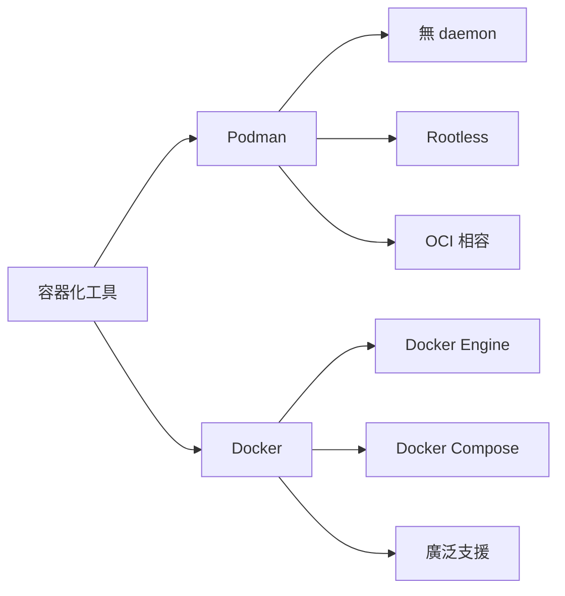

**Podman 安裝**

```bash
# Ubuntu 20.04+
sudo apt update
sudo apt install podman

# CentOS/RHEL/Rocky Linux
sudo dnf install podman

# 驗證安裝
podman --version
podman info
```

**Podman 基本操作**

```bash
# 搜尋映像檔
podman search openjdk

# 下載映像檔
podman pull registry.access.redhat.com/ubi8/openjdk-11

# 查看本地映像檔
podman images

# 執行容器
podman run -it --rm openjdk:11 java -version

# 在背景執行容器
podman run -d --name my-app -p 8080:8080 my-java-app

# 查看執行中的容器
podman ps

# 進入容器
podman exec -it my-app bash

# 停止與移除容器
podman stop my-app
podman rm my-app
```

**建立 Java 應用容器**

```bash
# 建立 Dockerfile
cat > Dockerfile << 'EOF'
FROM registry.access.redhat.com/ubi8/openjdk-11

# 設定工作目錄
WORKDIR /app

# 複製 JAR 檔案
COPY target/my-app.jar app.jar

# 設定執行命令
CMD ["java", "-jar", "app.jar"]

# 暴露埠號
EXPOSE 8080
EOF

# 建置映像檔
podman build -t my-java-app .

# 執行容器
podman run -d --name my-app -p 8080:8080 my-java-app
```

#### Docker 安裝與設定

**Docker 安裝**

```bash
# Ubuntu
sudo apt update
sudo apt install apt-transport-https ca-certificates curl software-properties-common
curl -fsSL https://download.docker.com/linux/ubuntu/gpg | sudo apt-key add -
sudo add-apt-repository "deb [arch=amd64] https://download.docker.com/linux/ubuntu $(lsb_release -cs) stable"
sudo apt update
sudo apt install docker-ce

# 將使用者加入 docker 群組
sudo usermod -aG docker $USER
newgrp docker

# 驗證安裝
docker --version
docker run hello-world
```

**Docker Compose 安裝**

```bash
# 安裝 Docker Compose
sudo curl -L "https://github.com/docker/compose/releases/latest/download/docker-compose-$(uname -s)-$(uname -m)" -o /usr/local/bin/docker-compose
sudo chmod +x /usr/local/bin/docker-compose

# 驗證安裝
docker-compose --version
```

### 4.7 Maven/Gradle 編譯與部署

#### Maven 安裝與設定

**安裝 Maven**

```bash
# 套件管理器安裝
sudo apt install maven                # Ubuntu
sudo dnf install maven                # CentOS/Rocky

# 或使用 SDKMAN
sdk install maven 3.9.6

# 驗證安裝
mvn --version
```

**Maven 設定檔案**

```bash
# 編輯全域設定檔
sudo vim /usr/share/maven/conf/settings.xml

# 或建立使用者設定檔
mkdir -p ~/.m2
cp /usr/share/maven/conf/settings.xml ~/.m2/settings.xml
vim ~/.m2/settings.xml
```

**Maven 基本操作**

```bash
# 建立新專案
mvn archetype:generate \
    -DgroupId=com.company.project \
    -DartifactId=my-java-app \
    -DarchetypeArtifactId=maven-archetype-quickstart \
    -DinteractiveMode=false

cd my-java-app

# Maven 生命週期
mvn clean                             # 清理
mvn compile                           # 編譯
mvn test                              # 執行測試
mvn package                           # 打包
mvn install                           # 安裝到本地倉庫
mvn deploy                            # 部署到遠端倉庫

# 常用組合指令
mvn clean compile                     # 清理並編譯
mvn clean package                     # 清理並打包
mvn clean install                     # 清理、編譯、測試、打包、安裝

# 執行應用程式
mvn exec:java -Dexec.mainClass="com.company.project.App"

# 產生 IDE 專案檔案
mvn eclipse:eclipse                   # Eclipse
mvn idea:idea                         # IntelliJ IDEA
```

#### Gradle 安裝與設定

**安裝 Gradle**

```bash
# 使用 SDKMAN（推薦）
sdk install gradle 8.5

# 或手動下載安裝
wget https://services.gradle.org/distributions/gradle-8.5-bin.zip
sudo unzip gradle-8.5-bin.zip -d /opt/
sudo ln -s /opt/gradle-8.5/bin/gradle /usr/local/bin/gradle

# 驗證安裝
gradle --version
```

**Gradle 基本操作**

```bash
# 初始化新專案
gradle init --type java-application

# Gradle 任務
./gradlew clean                       # 清理
./gradlew compileJava                 # 編譯
./gradlew test                        # 執行測試
./gradlew build                       # 建置
./gradlew run                         # 執行應用程式

# 查看可用任務
./gradlew tasks

# 產生 IDE 專案檔案
./gradlew eclipse                     # Eclipse
./gradlew idea                        # IntelliJ IDEA

# 相依性相關
./gradlew dependencies                # 查看相依性
./gradlew dependencyInsight --dependency commons-lang3  # 分析特定相依性
```

#### 建置工具比較與選擇

| 特性 | Maven | Gradle |
|------|-------|--------|
| **設定檔案** | XML (pom.xml) | Groovy/Kotlin DSL |
| **學習曲線** | 較平緩 | 較陡峭 |
| **效能** | 中等 | 較快（增量建置） |
| **彈性** | 約定勝於設定 | 高度可客製化 |
| **生態系統** | 成熟穩定 | 快速發展 |
| **Android 支援** | 有限 | 官方支援 |

---

> **🔍 實務檢查點**
>
> **開發環境設定檢查**：
>
> - [ ] 成功安裝並設定 JDK 環境變數
> - [ ] 能夠切換不同 Java 版本
> - [ ] 建立 Python 虛擬環境並管理套件
> - [ ] 使用 NVM 管理 Node.js 版本
> - [ ] 設定 Git 並生成 SSH 金鑰
> - [ ] 會使用基本容器化工具操作
> - [ ] 能執行 Maven/Gradle 基本建置任務
>
> **專案應用**：
>
> - 開發環境標準化設定
> - 多版本開發工具管理
> - 容器化開發流程

---

## 5. 專案日常任務

> **🎯 學習目標**  
>
> - 熟練掌握 SSH 遠端登入與金鑰管理
> - 學會高效的檔案傳輸方法
> - 掌握 Log 查詢與分析技巧
> - 培養系統錯誤排查能力
> - 了解排程任務的建立與管理

**🏆 認證對應**：LFCS Domain 2, RHCSA 排程管理

### 5.1 SSH 遠端登入

#### SSH 基礎概念

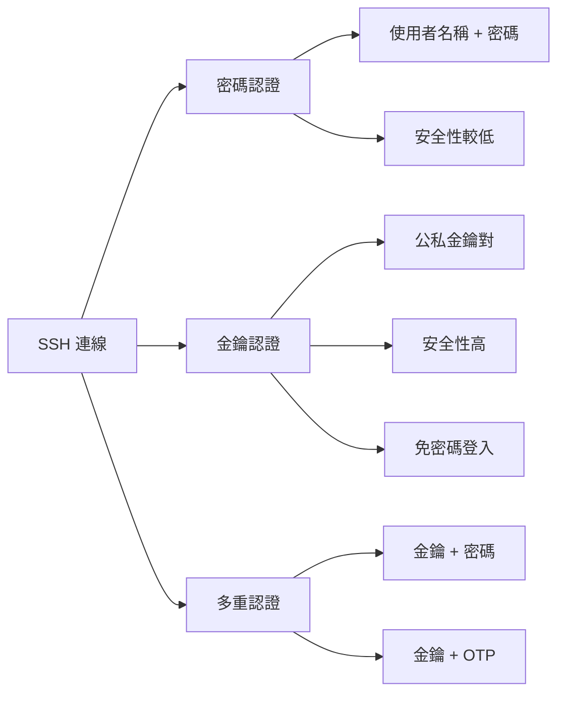

#### SSH 基本連線

**基本 SSH 連線語法**

```bash
# 基本連線格式
ssh [options] [user@]hostname [command]

# 連線範例
ssh developer@192.168.1.100          # 使用密碼登入
ssh -p 2222 developer@server.com     # 指定埠號
ssh -l developer server.com          # 指定使用者名稱

# 執行遠端指令
ssh developer@server.com "ls -la"    # 執行單一指令
ssh developer@server.com "cd /opt && ls"  # 執行多個指令

# 互動式登入
ssh -t developer@server.com "top"    # 強制配置 pseudo-terminal
```

#### SSH 金鑰認證設定

**1. 產生 SSH 金鑰對**

```bash
# 產生 Ed25519 金鑰（推薦）
ssh-keygen -t ed25519 -C "developer@company.com"

# 產生 RSA 金鑰（相容性較好）
ssh-keygen -t rsa -b 4096 -C "developer@company.com"

# 指定金鑰檔案名稱
ssh-keygen -t ed25519 -f ~/.ssh/id_ed25519_company -C "company-server-key"

# 查看公鑰
cat ~/.ssh/id_ed25519.pub
```

**2. 複製公鑰到遠端伺服器**

```bash
# 使用 ssh-copy-id（推薦）
ssh-copy-id developer@server.com

# 指定金鑰檔案
ssh-copy-id -i ~/.ssh/id_ed25519.pub developer@server.com

# 手動複製（如果沒有 ssh-copy-id）
cat ~/.ssh/id_ed25519.pub | ssh developer@server.com "mkdir -p ~/.ssh && cat >> ~/.ssh/authorized_keys"

# 設定正確權限
ssh developer@server.com "chmod 700 ~/.ssh && chmod 600 ~/.ssh/authorized_keys"
```

**3. SSH Agent 管理**

```bash
# 啟動 SSH Agent
eval "$(ssh-agent -s)"

# 添加私鑰到 Agent
ssh-add ~/.ssh/id_ed25519
ssh-add ~/.ssh/id_rsa_company

# 查看已載入的金鑰
ssh-add -l

# 移除所有金鑰
ssh-add -D

# 設定金鑰存活時間（秒）
ssh-add -t 3600 ~/.ssh/id_ed25519    # 1小時後過期
```

#### SSH 設定檔案

**個人 SSH 設定（~/.ssh/config）**

```bash
# 建立 SSH 設定檔
cat > ~/.ssh/config << 'EOF'
# 預設設定
Host *
    ServerAliveInterval 60
    ServerAliveCountMax 3
    TCPKeepAlive yes
    
# 開發伺服器
Host dev-server
    HostName 192.168.1.100
    User developer
    Port 22
    IdentityFile ~/.ssh/id_ed25519
    ForwardAgent yes
    
# 正式伺服器
Host prod-server
    HostName prod.company.com
    User developer
    Port 2222
    IdentityFile ~/.ssh/id_rsa_company
    StrictHostKeyChecking yes
    
# 跳板機設定
Host jump-server
    HostName jump.company.com
    User developer
    IdentityFile ~/.ssh/id_company_jump
    
Host internal-server
    HostName 10.0.1.50
    User developer
    ProxyJump jump-server
    IdentityFile ~/.ssh/id_ed25519

# VS Code Remote 開發
Host vscode-dev
    HostName dev.company.com
    User developer
    IdentityFile ~/.ssh/id_ed25519
    ForwardAgent yes
    RemoteForward 52698 localhost:52698
EOF

# 設定正確權限
chmod 600 ~/.ssh/config

# 使用設定檔連線
ssh dev-server                       # 直接使用別名
ssh internal-server                  # 自動透過跳板機
```

#### SSH 進階功能

**埠轉發（Port Forwarding）**

```bash
# 本地埠轉發（Local Port Forwarding）
ssh -L 8080:localhost:80 developer@server.com    # 將本地 8080 轉發到遠端 80
ssh -L 3306:database.internal:3306 developer@jump-server  # 透過跳板機存取資料庫

# 遠端埠轉發（Remote Port Forwarding）
ssh -R 9000:localhost:3000 developer@server.com  # 將遠端 9000 轉發到本地 3000

# 動態埠轉發（SOCKS Proxy）
ssh -D 1080 developer@server.com     # 建立 SOCKS proxy

# 在背景執行埠轉發
ssh -f -N -L 8080:localhost:80 developer@server.com
```

**X11 轉發（圖形介面）**

```bash
# 啟用 X11 轉發
ssh -X developer@server.com          # 基本 X11 轉發
ssh -Y developer@server.com          # 受信任的 X11 轉發

# 執行圖形程式
ssh -X developer@server.com "firefox &"
ssh -X developer@server.com "gedit"
```

**SSH 隧道管理**

```bash
# 建立持久性隧道
autossh -M 20000 -f -N -L 8080:localhost:80 developer@server.com

# 使用 systemd 管理 SSH 隧道
sudo cat > /etc/systemd/system/ssh-tunnel.service << 'EOF'
[Unit]
Description=SSH Tunnel to Development Server
After=network.target

[Service]
Type=simple
User=developer
ExecStart=/usr/bin/ssh -N -L 8080:localhost:80 dev-server
Restart=always
RestartSec=5

[Install]
WantedBy=multi-user.target
EOF

sudo systemctl enable ssh-tunnel
sudo systemctl start ssh-tunnel
```

### 5.2 檔案傳輸

#### 檔案傳輸工具比較

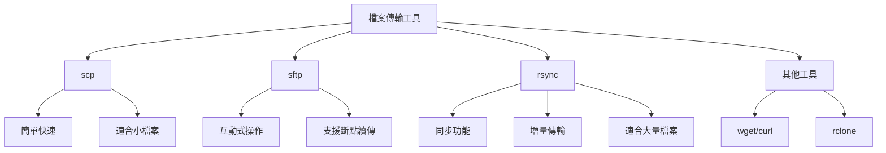

#### SCP 檔案複製

**基本 SCP 操作**

```bash
# 上傳檔案到遠端
scp file.txt developer@server.com:/remote/path/
scp -r directory/ developer@server.com:/remote/path/    # 遞迴複製目錄

# 從遠端下載檔案
scp developer@server.com:/remote/file.txt ./
scp -r developer@server.com:/remote/directory/ ./       # 下載整個目錄

# 指定埠號
scp -P 2222 file.txt developer@server.com:/remote/path/

# 使用特定金鑰
scp -i ~/.ssh/id_ed25519 file.txt developer@server.com:/remote/path/

# 保留檔案屬性
scp -p file.txt developer@server.com:/remote/path/      # 保留時間戳記和權限

# 顯示進度
scp -v file.txt developer@server.com:/remote/path/      # 詳細輸出
```

**批次檔案傳輸**

```bash
# 傳輸多個檔案
scp file1.txt file2.txt file3.txt developer@server.com:/remote/path/

# 使用萬用字元
scp *.java developer@server.com:/remote/src/
scp logs/*.log developer@server.com:/remote/logs/

# 壓縮傳輸（適合慢速網路）
scp -C large_file.tar.gz developer@server.com:/remote/path/
```

#### SFTP 互動式傳輸

**SFTP 基本操作**

```bash
# 連線到 SFTP 伺服器
sftp developer@server.com

# SFTP 內部指令
sftp> pwd                    # 顯示遠端目前目錄
sftp> lpwd                   # 顯示本地目前目錄
sftp> ls                     # 列出遠端檔案
sftp> lls                    # 列出本地檔案
sftp> cd /remote/directory   # 切換遠端目錄
sftp> lcd /local/directory   # 切換本地目錄

# 檔案操作
sftp> put local_file.txt                    # 上傳檔案
sftp> put -r local_directory/               # 上傳目錄
sftp> get remote_file.txt                   # 下載檔案
sftp> get -r remote_directory/              # 下載目錄
sftp> mput *.txt                            # 批次上傳
sftp> mget *.log                            # 批次下載

# 檔案管理
sftp> mkdir remote_directory                # 建立遠端目錄
sftp> rmdir remote_directory                # 刪除遠端空目錄
sftp> rm remote_file.txt                    # 刪除遠端檔案
sftp> rename old_name.txt new_name.txt      # 重新命名遠端檔案

# 權限管理
sftp> chmod 644 remote_file.txt             # 修改遠端檔案權限
sftp> chown user:group remote_file.txt      # 修改遠端檔案擁有者

sftp> quit                                  # 離開 SFTP
```

**SFTP 批次腳本**

```bash
# 建立 SFTP 批次腳本
cat > upload_script.sftp << 'EOF'
cd /remote/deployment
lcd /local/build
put -r target/
put config.properties
chmod 755 target/*.jar
quit
EOF

# 執行批次腳本
sftp -b upload_script.sftp developer@server.com
```

#### rsync 同步工具

**rsync 基本語法**

```bash
# 基本同步語法
rsync [options] source destination

# 本地同步
rsync -av source_directory/ destination_directory/

# 遠端同步
rsync -av source_directory/ developer@server.com:/remote/path/
rsync -av developer@server.com:/remote/path/ local_directory/

# 常用選項組合
rsync -avz source/ dest/          # 歸檔模式 + 詳細輸出 + 壓縮
rsync -avz --delete source/ dest/ # 刪除目標端多餘檔案
rsync -avz --dry-run source/ dest/  # 預覽模式，不實際執行
```

**rsync 進階功能**

```bash
# 排除檔案和目錄
rsync -av --exclude='*.tmp' --exclude='logs/' source/ dest/
rsync -av --exclude-from=exclude.txt source/ dest/

# exclude.txt 內容範例
*.log
*.tmp
.git/
node_modules/
target/
build/

# 包含特定檔案
rsync -av --include='*.java' --exclude='*' source/ dest/

# 限制頻寬
rsync -av --bwlimit=1000 source/ dest/    # 限制 1000 KB/s

# 顯示進度
rsync -av --progress source/ dest/

# 斷點續傳
rsync -av --partial --progress large_file.tar.gz developer@server.com:/remote/
```

**rsync 自動化部署腳本**

```bash
# 建立部署腳本
cat > deploy.sh << 'EOF'
#!/bin/bash

# 設定變數
LOCAL_BUILD_DIR="./target"
REMOTE_HOST="developer@prod-server.com"
REMOTE_DEPLOY_DIR="/opt/applications/myapp"
BACKUP_DIR="/opt/backups/myapp"

echo "開始部署..."

# 建立備份
echo "建立備份..."
ssh $REMOTE_HOST "mkdir -p $BACKUP_DIR/$(date +%Y%m%d_%H%M%S) && \
                  cp -r $REMOTE_DEPLOY_DIR/* $BACKUP_DIR/$(date +%Y%m%d_%H%M%S)/"

# 同步檔案
echo "同步檔案..."
rsync -avz --delete \
      --exclude='logs/' \
      --exclude='temp/' \
      $LOCAL_BUILD_DIR/ $REMOTE_HOST:$REMOTE_DEPLOY_DIR/

# 重啟服務
echo "重啟應用服務..."
ssh $REMOTE_HOST "sudo systemctl restart myapp"

# 檢查服務狀態
echo "檢查服務狀態..."
ssh $REMOTE_HOST "sudo systemctl status myapp"

echo "部署完成！"
EOF

chmod +x deploy.sh
./deploy.sh
```

### 5.3 Log 查詢與分析

#### 系統日誌管理

**傳統日誌檔案位置**

```bash
# 重要系統日誌位置
/var/log/messages          # 一般系統訊息
/var/log/syslog           # 系統日誌（Ubuntu）
/var/log/auth.log         # 認證日誌（Ubuntu）
/var/log/secure           # 認證日誌（CentOS/RHEL）
/var/log/kern.log         # 核心日誌
/var/log/boot.log         # 開機日誌
/var/log/cron             # 排程任務日誌
/var/log/maillog          # 郵件服務日誌
```

**journalctl 系統日誌**

```bash
# 基本查詢
journalctl                           # 查看所有日誌
journalctl -f                        # 即時追蹤日誌
journalctl -n 50                     # 顯示最後 50 行
journalctl --since "2024-01-01"     # 指定日期後的日誌
journalctl --since "1 hour ago"     # 1小時前的日誌
journalctl --until "2024-01-01 12:00:00"  # 指定時間前的日誌

# 按服務查詢
journalctl -u ssh                    # SSH 服務日誌
journalctl -u apache2                # Apache 服務日誌
journalctl -u myapp.service          # 自訂服務日誌

# 按優先級查詢
journalctl -p err                    # 只顯示錯誤
journalctl -p warning                # 警告以上級別
journalctl -p debug                  # 所有級別（包含除錯）

# 按程序查詢
journalctl _PID=1234                 # 特定程序 ID
journalctl _COMM=nginx               # 特定程式名稱
journalctl _UID=1000                 # 特定使用者 ID

# 格式化輸出
journalctl -o json                   # JSON 格式
journalctl -o json-pretty            # 格式化 JSON
journalctl -o short-iso              # ISO 時間格式
```

#### 應用程式日誌分析

**Apache/Nginx 日誌分析**

```bash
# Apache 訪問日誌分析
tail -f /var/log/apache2/access.log

# 統計 IP 訪問次數
awk '{print $1}' /var/log/apache2/access.log | sort | uniq -c | sort -nr | head -10

# 統計狀態碼分布
awk '{print $9}' /var/log/apache2/access.log | sort | uniq -c | sort -nr

# 分析錯誤日誌
grep "ERROR" /var/log/apache2/error.log | tail -20

# Nginx 日誌分析
# 統計每小時訪問量
awk '{print $4}' /var/log/nginx/access.log | cut -d: -f1-2 | sort | uniq -c

# 分析慢請求
awk '$10 > 5 {print $0}' /var/log/nginx/access.log    # 回應時間超過 5 秒
```

**Java 應用程式日誌**

```bash
# 即時監控應用日誌
tail -f /var/log/myapp/application.log

# 搜尋錯誤資訊
grep -i "error\|exception\|failed" /var/log/myapp/application.log

# 分析特定時間範圍的錯誤
grep "2024-01-15" /var/log/myapp/application.log | grep -i "error"

# 統計錯誤類型
grep -i "exception" /var/log/myapp/application.log | awk '{print $5}' | sort | uniq -c

# 監控記憶體相關錯誤
grep -i "outofmemory\|gc\|heap" /var/log/myapp/application.log

# 分析 SQL 慢查詢日誌
grep "slow query" /var/log/mysql/mysql-slow.log | tail -20
```

#### 日誌分析工具與技巧

**高效日誌分析命令組合**

```bash
# 多檔案同時監控
multitail /var/log/syslog /var/log/auth.log /var/log/myapp/application.log

# 使用 zcat 分析壓縮日誌
zcat /var/log/syslog.*.gz | grep "ERROR"

# 日誌輪轉檔案分析
for log in /var/log/myapp/application.log*; do
    echo "=== $log ==="
    zcat "$log" 2>/dev/null || cat "$log" | grep "ERROR" | wc -l
done

# 即時過濾多個關鍵字
tail -f /var/log/myapp/application.log | grep --line-buffered -E "ERROR|WARN|FATAL"

# 彩色顯示日誌
tail -f /var/log/myapp/application.log | ccze -A    # 需安裝 ccze
```

**日誌分析腳本範例**

```bash
# 建立日誌分析腳本
cat > log_analyzer.sh << 'EOF'
#!/bin/bash

LOG_FILE=${1:-/var/log/myapp/application.log}
DATE=${2:-$(date +%Y-%m-%d)}

echo "=== 日誌分析報告 - $DATE ==="
echo "檔案: $LOG_FILE"
echo

# 基本統計
echo "=== 基本統計 ==="
echo "總行數: $(grep "$DATE" "$LOG_FILE" | wc -l)"
echo "錯誤數: $(grep "$DATE" "$LOG_FILE" | grep -i error | wc -l)"
echo "警告數: $(grep "$DATE" "$LOG_FILE" | grep -i warn | wc -l)"
echo

# 錯誤分析
echo "=== 錯誤分析 ==="
echo "前 10 個最常見的錯誤:"
grep "$DATE" "$LOG_FILE" | grep -i error | \
    awk '{for(i=6;i<=NF;i++) printf "%s ", $i; print ""}' | \
    sort | uniq -c | sort -nr | head -10
echo

# 時間分布
echo "=== 每小時錯誤分布 ==="
grep "$DATE" "$LOG_FILE" | grep -i error | \
    awk '{print substr($2,1,2)}' | sort | uniq -c
echo

# 最近錯誤
echo "=== 最近 5 個錯誤 ==="
grep "$DATE" "$LOG_FILE" | grep -i error | tail -5
EOF

chmod +x log_analyzer.sh

# 使用範例
./log_analyzer.sh /var/log/myapp/application.log 2024-01-15
```

### 5.4 錯誤排查技巧

#### 系統效能監控

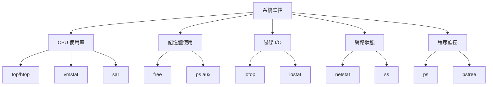

**CPU 與記憶體監控**

```bash
# CPU 使用率監控
top                              # 即時系統監控
htop                             # 增強版 top
vmstat 1                         # 每秒顯示系統統計
sar -u 1 10                      # CPU 使用率統計

# 找出 CPU 使用率最高的程序
ps aux --sort=-%cpu | head -10

# 記憶體使用分析
free -h                          # 人類可讀的記憶體資訊
free -h -s 5                     # 每 5 秒更新一次
ps aux --sort=-%mem | head -10   # 記憶體使用最多的程序

# 記憶體詳細分析
cat /proc/meminfo               # 詳細記憶體資訊
pmap -x PID                     # 特定程序記憶體映射
```

**磁碟使用與 I/O 監控**

```bash
# 磁碟空間檢查
df -h                           # 磁碟空間使用情況
du -h /path/to/directory        # 目錄大小
du -sh /var/log/*               # 各日誌檔案大小

# 找出大檔案
find /var -type f -size +100M -exec ls -lh {} \;    # 找出大於 100MB 的檔案
find /home -type f -size +1G 2>/dev/null | head -10  # 找出大於 1GB 的檔案

# I/O 監控
iotop                           # 即時 I/O 監控
iostat -x 1                     # I/O 統計
sar -d 1 10                     # 磁碟 I/O 統計

# 磁碟健康檢查
sudo smartctl -a /dev/sda       # 硬碟健康狀態
sudo fdisk -l                   # 磁碟分割區資訊
```

**網路連線診斷**

```bash
# 網路介面狀態
ip addr show                    # 網路介面資訊
ip route show                   # 路由表
netstat -tuln                   # 監聽埠
ss -tuln                        # 現代版 netstat

# 連線測試
ping -c 4 google.com            # 基本連線測試
traceroute google.com           # 路由追蹤
mtr google.com                  # 結合 ping 和 traceroute

# 埠連線測試
telnet server.com 80            # 測試 TCP 埠
nc -zv server.com 80            # 使用 netcat 測試埠
nmap -p 80,443,22 server.com    # 埠掃描

# 網路流量監控
iftop                           # 即時網路流量
nethogs                         # 按程序顯示網路使用
vnstat                          # 網路統計歷史
```

#### 常見問題排查流程

**服務無法啟動問題**

```bash
# 1. 檢查服務狀態
sudo systemctl status myapp.service

# 2. 查看詳細錯誤訊息
sudo journalctl -u myapp.service -n 50

# 3. 檢查設定檔語法
sudo myapp --config-test        # 如果支援語法檢查

# 4. 檢查檔案權限
ls -la /path/to/config/file
ls -la /path/to/log/directory

# 5. 檢查埠佔用
sudo ss -tulpn | grep :8080

# 6. 檢查資源使用
df -h                           # 磁碟空間
free -h                         # 記憶體
```

**效能問題排查**

```bash
# 1. 系統負載檢查
uptime                          # 系統負載
top                             # 即時監控

# 2. CPU 瓶頸分析
# 高 CPU 使用率
ps aux --sort=-%cpu | head -5
# CPU 等待 I/O 時間過長
vmstat 1

# 3. 記憶體問題分析
# 記憶體不足
free -h
# 記憶體洩漏
ps aux --sort=-%mem | head -5

# 4. 磁碟 I/O 瓶頸
iostat -x 1
iotop

# 5. 網路瓶頸
iftop
ss -i                           # 檢查網路 buffer
```

**應用程式除錯**

```bash
# Java 應用程式除錯
# 1. JVM 記憶體使用
jps                             # 列出 Java 程序
jstat -gc PID                   # GC 統計
jmap -histo PID                 # 記憶體使用直方圖

# 2. 執行緒分析
jstack PID                      # 執行緒 dump
kill -3 PID                     # 發送 SIGQUIT 信號

# 3. 堆積 dump 分析
jmap -dump:format=b,file=heap.hprof PID

# Python 應用程式除錯
# 1. 程序追蹤
strace -p PID                   # 系統呼叫追蹤
ltrace -p PID                   # 函式庫呼叫追蹤

# 2. 效能分析
py-spy top -p PID               # Python 程序監控
```

### 5.5 排程任務

#### cron 排程系統

**cron 時間格式**

```bash
# cron 時間格式：分 時 日 月 星期
# ┌───────────── 分鐘 (0 - 59)
# │ ┌─────────── 小時 (0 - 23)
# │ │ ┌───────── 日期 (1 - 31)
# │ │ │ ┌─────── 月份 (1 - 12)
# │ │ │ │ ┌───── 星期 (0 - 7，0 和 7 都是星期日)
# │ │ │ │ │
# * * * * * 指令

# 常用時間設定範例
0 2 * * *           # 每天凌晨 2:00
30 14 * * 1-5       # 週一到週五下午 2:30
0 0 1 * *           # 每月 1 號午夜
0 */6 * * *         # 每 6 小時執行一次
*/15 * * * *        # 每 15 分鐘執行一次
```

**cron 任務管理**

```bash
# 編輯個人 crontab
crontab -e                      # 編輯目前使用者的 crontab
crontab -l                      # 列出目前使用者的 crontab
crontab -r                      # 刪除目前使用者的 crontab

# 管理其他使用者的 crontab（需要 root 權限）
sudo crontab -u username -e     # 編輯指定使用者的 crontab
sudo crontab -u username -l     # 列出指定使用者的 crontab

# 系統 crontab
sudo vim /etc/crontab           # 系統 crontab
ls /etc/cron.d/                 # 系統 cron 任務目錄
ls /etc/cron.{hourly,daily,weekly,monthly}/  # 預定週期任務
```

**實用 cron 任務範例**

```bash
# 編輯 crontab
crontab -e

# 添加以下任務
# 每日備份資料庫
0 2 * * * /home/developer/scripts/backup_database.sh >> /var/log/backup.log 2>&1

# 每週清理暫存檔案
0 3 * * 0 find /tmp -type f -atime +7 -delete

# 每 5 分鐘檢查服務狀態
*/5 * * * * /home/developer/scripts/check_service.sh

# 每月 1 號產生報告
0 1 1 * * /home/developer/scripts/monthly_report.sh

# 工作日每小時同步檔案
0 * * * 1-5 rsync -av /local/data/ backup-server:/remote/data/

# 設定環境變數（在 crontab 開頭）
PATH=/usr/local/bin:/usr/bin:/bin
MAILTO=admin@company.com
```

#### systemd timer（現代替代方案）

**建立 systemd timer**

```bash
# 1. 建立服務檔案
sudo cat > /etc/systemd/system/backup.service << 'EOF'
[Unit]
Description=Database Backup Service
Wants=backup.timer

[Service]
Type=oneshot
User=developer
ExecStart=/home/developer/scripts/backup_database.sh

[Install]
WantedBy=multi-user.target
EOF

# 2. 建立 timer 檔案
sudo cat > /etc/systemd/system/backup.timer << 'EOF'
[Unit]
Description=Run backup service daily
Requires=backup.service

[Timer]
OnCalendar=daily
Persistent=true
RandomizedDelaySec=300

[Install]
WantedBy=timers.target
EOF

# 3. 啟用和啟動 timer
sudo systemctl daemon-reload
sudo systemctl enable backup.timer
sudo systemctl start backup.timer

# 4. 查看 timer 狀態
sudo systemctl list-timers
sudo systemctl status backup.timer
```

**systemd timer 時間格式**

```bash
# OnCalendar 時間格式範例
OnCalendar=hourly               # 每小時
OnCalendar=daily                # 每天
OnCalendar=weekly               # 每週
OnCalendar=monthly              # 每月
OnCalendar=*-*-01 02:00:00     # 每月 1 號凌晨 2:00
OnCalendar=Mon..Fri 09:00      # 週一到週五早上 9:00
OnCalendar=*:0/15              # 每 15 分鐘
```

#### 任務監控與除錯

**cron 任務除錯**

```bash
# 1. 檢查 cron 服務狀態
sudo systemctl status cron     # Ubuntu
sudo systemctl status crond    # CentOS/RHEL

# 2. 查看 cron 日誌
sudo journalctl -u cron
tail -f /var/log/cron          # CentOS/RHEL
tail -f /var/log/syslog | grep CRON  # Ubuntu

# 3. 測試 cron 任務
# 將任務改為每分鐘執行進行測試
* * * * * /path/to/script.sh >> /tmp/cron_test.log 2>&1

# 4. 常見問題檢查
# 檢查腳本權限
ls -la /path/to/script.sh
# 檢查腳本路徑
which command_name
# 檢查環境變數
env | grep PATH
```

**任務監控腳本**

```bash
# 建立任務監控腳本
cat > ~/scripts/monitor_jobs.sh << 'EOF'
#!/bin/bash

LOG_FILE="/var/log/job_monitor.log"
DATE=$(date '+%Y-%m-%d %H:%M:%S')

# 檢查重要服務
services=("nginx" "mysql" "myapp")
for service in "${services[@]}"; do
    if ! systemctl is-active --quiet $service; then
        echo "[$DATE] ERROR: $service is not running" >> $LOG_FILE
        # 發送告警通知
        mail -s "Service Alert: $service down" admin@company.com < /dev/null
    fi
done

# 檢查磁碟使用率
disk_usage=$(df / | awk 'NR==2 {print $5}' | sed 's/%//')
if [ $disk_usage -gt 80 ]; then
    echo "[$DATE] WARNING: Disk usage is ${disk_usage}%" >> $LOG_FILE
fi

# 檢查記憶體使用率
mem_usage=$(free | awk 'NR==2{printf "%.2f", $3*100/$2}')
if (( $(echo "$mem_usage > 90" | bc -l) )); then
    echo "[$DATE] WARNING: Memory usage is ${mem_usage}%" >> $LOG_FILE
fi

echo "[$DATE] Health check completed" >> $LOG_FILE
EOF

chmod +x ~/scripts/monitor_jobs.sh

# 加入 crontab（每 5 分鐘檢查一次）
echo "*/5 * * * * /home/developer/scripts/monitor_jobs.sh" | crontab -
```

---

> **🔍 實務檢查點**
>
> **日常任務熟練度檢查**：
>
> - [ ] 能設定 SSH 金鑰認證並管理多個金鑰
> - [ ] 熟練使用 scp、sftp、rsync 進行檔案傳輸
> - [ ] 會查詢和分析系統與應用程式日誌
> - [ ] 具備基本的系統效能監控能力
> - [ ] 能夠建立和管理 cron 排程任務
> - [ ] 會使用基本的錯誤排查技巧
>
> **認證重點**：
>
> - LFCS：系統監控與排程任務
> - RHCSA：日誌管理與系統維護

---

## 6. Linux 系統安全與最佳實務

> **🎯 學習目標**  
>
> - 掌握 sudo 權限管理與安全設定
> - 強化 SSH 服務安全性配置
> - 學會防火牆設定與網路安全
> - 了解 SELinux/AppArmor 基本操作
> - 建立企業級安全最佳實務

**🏆 認證對應**：RHCSA 安全管理章節、LFCS 安全與權限

### 6.1 sudo 與使用者權限控管

#### sudo 基本概念

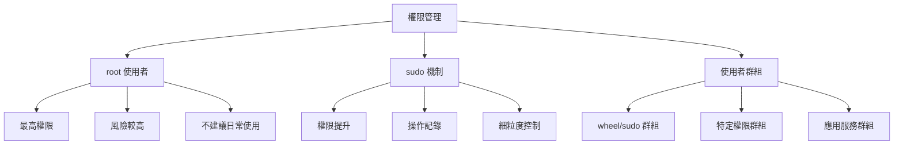

#### sudo 設定與管理

**編輯 sudoers 檔案**

```bash
# 安全編輯 sudoers 檔案（使用 visudo）
sudo visudo

# 或編輯特定檔案
sudo visudo -f /etc/sudoers.d/developers

# sudoers 基本語法
# 使用者 主機=(執行身分) 指令
# user    host=(runas) commands
```

**常用 sudoers 設定範例**

```bash
# 1. 基本設定
# 允許 wheel 群組成員使用 sudo
%wheel ALL=(ALL) ALL

# 允許 sudo 群組成員使用 sudo（Ubuntu 預設）
%sudo ALL=(ALL:ALL) ALL

# 2. 免密碼設定
# 允許特定使用者免密碼執行所有指令（不建議）
developer ALL=(ALL) NOPASSWD: ALL

# 允許特定群組免密碼執行特定指令
%developers ALL=(ALL) NOPASSWD: /bin/systemctl restart myapp, /bin/systemctl status myapp

# 3. 限制特定指令
# 只允許重啟特定服務
developer ALL=(ALL) /bin/systemctl restart apache2, /bin/systemctl reload apache2

# 允許管理特定目錄的檔案
developer ALL=(ALL) /bin/chown developer\:developers /opt/myapp/*

# 4. 別名設定
# 指令別名
Cmnd_Alias SERVICE_CMDS = /bin/systemctl start, /bin/systemctl stop, /bin/systemctl restart, /bin/systemctl status
Cmnd_Alias LOG_CMDS = /bin/tail, /bin/less, /usr/bin/grep

# 使用者別名
User_Alias DEVELOPERS = developer1, developer2, developer3

# 主機別名
Host_Alias WEBSERVERS = web1, web2, web3

# 使用別名
DEVELOPERS WEBSERVERS=(ALL) SERVICE_CMDS, LOG_CMDS

# 5. 時間限制
# 設定 sudo 密碼快取時間（預設 15 分鐘）
Defaults timestamp_timeout=30

# 每次都要求密碼
Defaults timestamp_timeout=0

# 6. 日誌設定
# 記錄所有 sudo 操作
Defaults logfile=/var/log/sudo.log
Defaults log_input, log_output
```

**實務 sudo 設定範例**

```bash
# 建立開發團隊的 sudo 設定
sudo cat > /etc/sudoers.d/developers << 'EOF'
# 開發團隊 sudo 設定
# 指令別名
Cmnd_Alias SERVICES = /bin/systemctl start, /bin/systemctl stop, /bin/systemctl restart, /bin/systemctl reload, /bin/systemctl status
Cmnd_Alias LOGS = /bin/tail, /bin/less, /usr/bin/grep, /bin/journalctl
Cmnd_Alias NETWORK = /bin/netstat, /bin/ss, /usr/bin/lsof
Cmnd_Alias PROCESS = /bin/ps, /usr/bin/top, /usr/bin/htop, /bin/kill

# 使用者群組設定
%developers ALL=(ALL) SERVICES, LOGS, NETWORK, PROCESS
%developers ALL=(ALL) /usr/bin/docker, /usr/bin/podman
%developers ALL=(ALL) /bin/mount, /bin/umount

# 日誌設定
Defaults:%developers logfile=/var/log/sudo_developers.log
Defaults:%developers log_input, log_output

# 安全設定
Defaults:%developers timestamp_timeout=15
Defaults:%developers passwd_tries=3
EOF

# 檢查語法
sudo visudo -c -f /etc/sudoers.d/developers
```

#### 使用者與群組管理

**使用者管理指令**

```bash
# 建立使用者
sudo useradd -m -s /bin/bash -G developers,docker developer1
sudo passwd developer1

# 修改使用者
sudo usermod -aG sudo developer1          # 加入 sudo 群組
sudo usermod -aG wheel developer1         # 加入 wheel 群組（CentOS/RHEL）
sudo usermod -s /bin/zsh developer1       # 修改預設 shell

# 建立系統帳號（用於服務）
sudo useradd -r -s /bin/false -M appuser  # 系統帳號，無家目錄，不能登入

# 刪除使用者
sudo userdel -r developer1                # 刪除使用者及家目錄

# 鎖定/解鎖使用者
sudo usermod -L developer1                # 鎖定帳號
sudo usermod -U developer1                # 解鎖帳號

# 設定密碼過期
sudo chage -M 90 developer1               # 密碼 90 天過期
sudo chage -l developer1                  # 查看密碼資訊
```

**群組管理指令**

```bash
# 建立群組
sudo groupadd developers
sudo groupadd -g 1500 appgroup            # 指定 GID

# 修改群組
sudo groupmod -n newname oldname          # 重新命名群組

# 刪除群組
sudo groupdel developers

# 查看群組成員
getent group developers
groups developer1                         # 查看使用者所屬群組

# 將使用者加入群組
sudo usermod -aG developers developer1   # 追加群組
sudo gpasswd -a developer1 developers     # 另一種方法

# 從群組移除使用者
sudo gpasswd -d developer1 developers
```

**權限委派範例**

```bash
# 建立應用程式部署權限
sudo cat > /etc/sudoers.d/deployment << 'EOF'
# 部署權限設定
Cmnd_Alias DEPLOY_CMDS = /bin/systemctl restart myapp, \
                        /bin/systemctl start myapp, \
                        /bin/systemctl stop myapp, \
                        /bin/chown -R appuser\:appgroup /opt/myapp/*, \
                        /bin/chmod -R 755 /opt/myapp/bin/*, \
                        /usr/bin/rsync * /opt/myapp/

# 允許開發者執行部署相關指令
%developers ALL=(ALL) NOPASSWD: DEPLOY_CMDS

# 部署腳本使用者
deployuser ALL=(ALL) NOPASSWD: DEPLOY_CMDS
EOF
```

### 6.2 SSH 安全性

#### SSH 服務強化設定

**編輯 SSH 設定檔**

```bash
# 備份原始設定檔
sudo cp /etc/ssh/sshd_config /etc/ssh/sshd_config.backup

# 編輯 SSH 設定
sudo vim /etc/ssh/sshd_config
```

**安全的 SSH 設定範例**

```bash
# SSH 安全設定
sudo cat > /etc/ssh/sshd_config.d/security.conf << 'EOF'
# 基本安全設定
Port 2222                              # 改變預設埠號
Protocol 2                             # 只使用 SSH 協定版本 2

# 認證設定
PermitRootLogin no                     # 禁止 root 直接登入
PasswordAuthentication no              # 禁用密碼認證
PubkeyAuthentication yes               # 啟用公鑰認證
AuthorizedKeysFile .ssh/authorized_keys

# 限制使用者登入
AllowUsers developer1 developer2       # 只允許特定使用者
AllowGroups developers                 # 或只允許特定群組
DenyUsers baduser                      # 拒絕特定使用者

# 連線限制
MaxAuthTries 3                         # 最大認證嘗試次數
MaxSessions 2                          # 最大同時連線數
LoginGraceTime 30                      # 登入寬限時間（秒）
ClientAliveInterval 300                # 客戶端保活間隔
ClientAliveCountMax 2                  # 最大保活檢查次數

# 安全選項
X11Forwarding no                       # 禁用 X11 轉發（除非需要）
AllowTcpForwarding no                  # 禁用 TCP 轉發（除非需要）
GatewayPorts no                        # 禁用閘道埠
PermitTunnel no                        # 禁用隧道

# 加密設定
Ciphers chacha20-poly1305@openssh.com,aes256-gcm@openssh.com,aes128-gcm@openssh.com,aes256-ctr,aes192-ctr,aes128-ctr
MACs hmac-sha2-256-etm@openssh.com,hmac-sha2-512-etm@openssh.com,hmac-sha2-256,hmac-sha2-512
KexAlgorithms curve25519-sha256@libssh.org,diffie-hellman-group16-sha512,diffie-hellman-group18-sha512

# 日誌設定
SyslogFacility AUTH
LogLevel VERBOSE                       # 詳細日誌以便審計
EOF

# 檢查設定語法
sudo sshd -t

# 重啟 SSH 服務
sudo systemctl restart sshd
```

#### SSH 金鑰管理最佳實務

**強化金鑰安全性**

```bash
# 1. 使用強密碼保護私鑰
ssh-keygen -t ed25519 -a 100 -C "developer@company.com"
# -a 100: 增加 KDF 輪數以提高安全性

# 2. 設定金鑰權限
chmod 700 ~/.ssh
chmod 600 ~/.ssh/id_ed25519
chmod 644 ~/.ssh/id_ed25519.pub
chmod 600 ~/.ssh/authorized_keys
chmod 600 ~/.ssh/config

# 3. 定期輪換金鑰
# 建立金鑰輪換腳本
cat > ~/scripts/rotate_ssh_keys.sh << 'EOF'
#!/bin/bash

KEY_NAME="id_ed25519_$(date +%Y%m%d)"
BACKUP_DIR="$HOME/.ssh/backup"

# 建立備份目錄
mkdir -p "$BACKUP_DIR"

# 備份現有金鑰
if [ -f "$HOME/.ssh/id_ed25519" ]; then
    cp "$HOME/.ssh/id_ed25519" "$BACKUP_DIR/"
    cp "$HOME/.ssh/id_ed25519.pub" "$BACKUP_DIR/"
fi

# 產生新金鑰
ssh-keygen -t ed25519 -a 100 -f "$HOME/.ssh/$KEY_NAME" -C "$(whoami)@$(hostname)-$(date +%Y%m%d)"

# 更新符號連結
ln -sf "$KEY_NAME" "$HOME/.ssh/id_ed25519"
ln -sf "$KEY_NAME.pub" "$HOME/.ssh/id_ed25519.pub"

echo "新 SSH 金鑰已產生: $KEY_NAME"
echo "請記得將新的公鑰部署到所有伺服器"
EOF

chmod +x ~/scripts/rotate_ssh_keys.sh
```

**authorized_keys 安全設定**

```bash
# 限制金鑰使用範圍
cat >> ~/.ssh/authorized_keys << 'EOF'
# 限制來源 IP
from="192.168.1.0/24" ssh-ed25519 AAAAC3NzaC1lZDI1NTE5... developer@workstation

# 限制執行指令
command="/home/developer/scripts/backup.sh" ssh-ed25519 AAAAC3NzaC1lZDI1NTE5... backup-script

# 禁用埠轉發
no-port-forwarding,no-X11-forwarding,no-agent-forwarding ssh-ed25519 AAAAC3NzaC1lZDI1NTE5... restricted-key

# 組合使用
from="10.0.1.0/24",no-port-forwarding,command="/usr/bin/rsync --server" ssh-ed25519 AAAAC3NzaC1lZDI1NTE5... rsync-only
EOF
```

#### SSH 連線監控與日誌

**SSH 日誌分析**

```bash
# 查看 SSH 登入日誌
sudo journalctl -u ssh -f              # Ubuntu systemd
sudo tail -f /var/log/auth.log         # Ubuntu 傳統日誌
sudo tail -f /var/log/secure           # CentOS/RHEL

# 分析登入嘗試
sudo grep "Failed password" /var/log/auth.log | tail -10
sudo grep "Accepted publickey" /var/log/auth.log | tail -10

# 統計失敗登入
sudo grep "Failed password" /var/log/auth.log | awk '{print $11}' | sort | uniq -c | sort -nr

# 監控異常 IP
sudo grep "Invalid user" /var/log/auth.log | awk '{print $10}' | sort | uniq -c | sort -nr
```

**自動封鎖惡意 IP（fail2ban）**

```bash
# 安裝 fail2ban
sudo apt install fail2ban              # Ubuntu
sudo dnf install fail2ban              # CentOS/Rocky

# 設定 fail2ban
sudo cat > /etc/fail2ban/jail.local << 'EOF'
[DEFAULT]
# 全域設定
bantime = 3600                          # 封鎖時間（秒）
findtime = 600                          # 時間窗口（秒）
maxretry = 3                            # 最大嘗試次數
backend = systemd                       # 使用 systemd 日誌

# 白名單 IP
ignoreip = 127.0.0.1/8 192.168.1.0/24 10.0.0.0/8

[sshd]
enabled = true
port = 2222                             # SSH 服務埠
logpath = %(sshd_log)s
maxretry = 3
bantime = 7200                          # SSH 封鎖 2 小時

[apache-auth]
enabled = true
port = http,https
logpath = %(apache_error_log)s
maxretry = 5

[nginx-auth]
enabled = true
port = http,https
logpath = %(nginx_error_log)s
maxretry = 5
EOF

# 啟動並啟用 fail2ban
sudo systemctl enable fail2ban
sudo systemctl start fail2ban

# 查看封鎖狀態
sudo fail2ban-client status
sudo fail2ban-client status sshd

# 手動解除封鎖
sudo fail2ban-client set sshd unbanip 192.168.1.100
```

### 6.3 防火牆設定

#### firewalld 防火牆管理（CentOS/RHEL/Rocky）

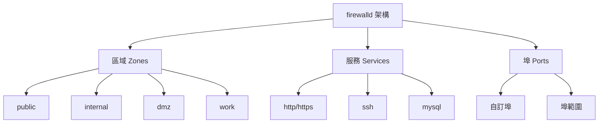

**firewalld 基本操作**

```bash
# 檢查 firewalld 狀態
sudo systemctl status firewalld
sudo firewall-cmd --state

# 查看目前設定
sudo firewall-cmd --get-default-zone     # 預設區域
sudo firewall-cmd --get-active-zones     # 活躍區域
sudo firewall-cmd --list-all             # 目前區域的所有規則

# 服務管理
sudo firewall-cmd --list-services        # 列出允許的服務
sudo firewall-cmd --add-service=http     # 臨時允許 HTTP
sudo firewall-cmd --add-service=http --permanent  # 永久允許 HTTP
sudo firewall-cmd --remove-service=http --permanent  # 移除 HTTP

# 埠管理
sudo firewall-cmd --add-port=8080/tcp    # 臨時開放埠
sudo firewall-cmd --add-port=8080/tcp --permanent  # 永久開放埠
sudo firewall-cmd --add-port=3000-3010/tcp --permanent  # 開放埠範圍
sudo firewall-cmd --remove-port=8080/tcp --permanent  # 關閉埠

# 重新載入設定
sudo firewall-cmd --reload
```

**實用 firewalld 設定範例**

```bash
# Web 伺服器設定
sudo firewall-cmd --permanent --add-service=http
sudo firewall-cmd --permanent --add-service=https
sudo firewall-cmd --permanent --add-port=8080/tcp    # Tomcat

# 資料庫伺服器設定（限制來源）
sudo firewall-cmd --permanent --add-rich-rule='rule family="ipv4" source address="192.168.1.0/24" port protocol="tcp" port="3306" accept'

# SSH 設定（自訂埠）
sudo firewall-cmd --permanent --remove-service=ssh
sudo firewall-cmd --permanent --add-port=2222/tcp

# 開發環境設定
sudo firewall-cmd --permanent --add-port=3000/tcp    # React 開發伺服器
sudo firewall-cmd --permanent --add-port=8000/tcp    # Django 開發伺服器
sudo firewall-cmd --permanent --add-port=4200/tcp    # Angular 開發伺服器

# 容器相關埠
sudo firewall-cmd --permanent --add-port=2375-2376/tcp  # Docker API
sudo firewall-cmd --permanent --add-port=6443/tcp       # Kubernetes API

# 套用設定
sudo firewall-cmd --reload

# 驗證設定
sudo firewall-cmd --list-all
```

#### ufw 防火牆管理（Ubuntu）

**ufw 基本操作**

```bash
# 啟用/停用 ufw
sudo ufw enable
sudo ufw disable

# 檢查狀態
sudo ufw status verbose

# 預設政策
sudo ufw default deny incoming      # 預設拒絕進入連線
sudo ufw default allow outgoing     # 預設允許外出連線

# 服務規則
sudo ufw allow ssh                  # 允許 SSH
sudo ufw allow 'Apache Full'        # 允許 Apache（HTTP + HTTPS）
sudo ufw allow 'Nginx Full'         # 允許 Nginx

# 埠規則
sudo ufw allow 22                   # 允許埠 22
sudo ufw allow 22/tcp               # 指定協定
sudo ufw allow 8080:8090/tcp        # 埠範圍

# 來源限制
sudo ufw allow from 192.168.1.0/24  # 允許特定網段
sudo ufw allow from 192.168.1.100 to any port 22  # 特定 IP 的 SSH

# 刪除規則
sudo ufw delete allow 22
sudo ufw delete 1                   # 按編號刪除

# 重置防火牆
sudo ufw --force reset
```

**Web 開發環境 ufw 設定**

```bash
# 基本 Web 開發環境設定
sudo ufw enable

# SSH（自訂埠）
sudo ufw allow 2222/tcp

# Web 服務
sudo ufw allow 80/tcp               # HTTP
sudo ufw allow 443/tcp              # HTTPS

# 開發用埠
sudo ufw allow 3000/tcp             # React/Node.js
sudo ufw allow 8080/tcp             # Java 應用
sudo ufw allow 5432/tcp             # PostgreSQL
sudo ufw allow from 192.168.1.0/24 to any port 5432  # 限制資料庫存取

# 檢查設定
sudo ufw status numbered
```

### 6.4 SELinux / AppArmor 基本操作

#### SELinux 管理（CentOS/RHEL/Rocky）

**SELinux 基本概念**

```bash
# 檢查 SELinux 狀態
getenforce                          # 目前模式
sestatus                            # 詳細狀態
cat /etc/selinux/config             # 設定檔

# SELinux 模式
# Enforcing: 強制執行安全政策
# Permissive: 記錄違規但不阻止
# Disabled: 停用 SELinux
```

**SELinux 基本操作**

```bash
# 暫時改變模式
sudo setenforce 0                   # 設為 Permissive
sudo setenforce 1                   # 設為 Enforcing

# 永久改變模式（需重開機）
sudo vim /etc/selinux/config
# SELINUX=enforcing|permissive|disabled

# 查看檔案的 SELinux 標籤
ls -Z /var/www/html/
ps auxZ                             # 查看程序的 SELinux 標籤

# 設定檔案標籤
sudo chcon -t httpd_exec_t /opt/myapp/bin/myapp
sudo restorecon -Rv /var/www/html/  # 恢復預設標籤

# 設定永久標籤
sudo semanage fcontext -a -t httpd_exec_t "/opt/myapp/bin/myapp"
sudo restorecon /opt/myapp/bin/myapp
```

**SELinux 疑難排解**

```bash
# 查看 SELinux 日誌
sudo ausearch -m avc -ts recent     # 最近的存取控制違規
sudo grep "SELinux is preventing" /var/log/messages

# 使用 sealert 分析違規
sudo sealert -a /var/log/audit/audit.log

# 產生自訂政策模組
sudo audit2allow -a                 # 根據日誌產生政策
sudo audit2allow -a -M mypolicy     # 產生政策模組

# 安裝自訂政策
sudo semodule -i mypolicy.pp

# 查看已安裝的政策模組
sudo semodule -l
```

**實用 SELinux 設定**

```bash
# Web 應用程式設定
# 允許 Apache 連線到網路
sudo setsebool -P httpd_can_network_connect on

# 允許 Apache 讀寫使用者家目錄
sudo setsebool -P httpd_enable_homedirs on

# 允許 Apache 執行 CGI
sudo setsebool -P httpd_enable_cgi on

# 資料庫設定
# 允許應用程式連線到資料庫
sudo setsebool -P allow_httpd_anon_write on

# 自訂應用程式目錄設定
sudo semanage fcontext -a -t httpd_exec_t "/opt/myapp/bin/.*"
sudo semanage fcontext -a -t httpd_config_t "/opt/myapp/config/.*"
sudo semanage fcontext -a -t httpd_log_t "/opt/myapp/logs/.*"
sudo restorecon -Rv /opt/myapp/
```

#### AppArmor 管理（Ubuntu）

**AppArmor 基本操作**

```bash
# 檢查 AppArmor 狀態
sudo aa-status                      # 系統狀態
sudo aa-enabled                     # 是否啟用

# 查看配置檔案
sudo aa-complain /etc/apparmor.d/usr.bin.firefox  # 設為 complain 模式
sudo aa-enforce /etc/apparmor.d/usr.bin.firefox   # 設為 enforce 模式
sudo aa-disable /etc/apparmor.d/usr.bin.firefox   # 停用配置檔案

# 重新載入配置檔案
sudo apparmor_parser -r /etc/apparmor.d/usr.bin.firefox

# 查看日誌
sudo dmesg | grep -i apparmor
sudo journalctl | grep -i apparmor
```

**建立自訂 AppArmor 配置檔案**

```bash
# 為自訂應用程式建立配置檔案
sudo cat > /etc/apparmor.d/opt.myapp.bin.myapp << 'EOF'
#include <tunables/global>

/opt/myapp/bin/myapp {
  #include <abstractions/base>
  #include <abstractions/nameservice>
  
  # 可執行檔案
  /opt/myapp/bin/myapp mr,
  
  # 設定檔案
  /opt/myapp/config/** r,
  
  # 日誌檔案
  /opt/myapp/logs/** rw,
  
  # 暫存檔案
  /tmp/** rw,
  
  # 網路存取
  network inet stream,
  network inet dgram,
  
  # 系統程式庫
  /lib/x86_64-linux-gnu/** mr,
  /usr/lib/x86_64-linux-gnu/** mr,
  
  # 拒絕存取敏感檔案
  deny /etc/shadow r,
  deny /etc/passwd w,
}
EOF

# 載入配置檔案
sudo apparmor_parser -r /etc/apparmor.d/opt.myapp.bin.myapp

# 檢查狀態
sudo aa-status | grep myapp
```

#### 安全監控腳本

**建立安全監控腳本**

```bash
cat > ~/scripts/security_monitor.sh << 'EOF'
#!/bin/bash

LOG_FILE="/var/log/security_monitor.log"
DATE=$(date '+%Y-%m-%d %H:%M:%S')

echo "[$DATE] 開始安全檢查" >> $LOG_FILE

# 1. 檢查失敗的 SSH 登入
failed_ssh=$(grep "Failed password" /var/log/auth.log 2>/dev/null | grep "$(date '+%b %d')" | wc -l)
if [ $failed_ssh -gt 10 ]; then
    echo "[$DATE] 警告: 今日 SSH 登入失敗次數過多 ($failed_ssh)" >> $LOG_FILE
fi

# 2. 檢查 sudo 使用情況
sudo_usage=$(grep "sudo:" /var/log/auth.log 2>/dev/null | grep "$(date '+%b %d')" | wc -l)
echo "[$DATE] 今日 sudo 使用次數: $sudo_usage" >> $LOG_FILE

# 3. 檢查不尋常的程序
unusual_procs=$(ps aux | awk '$3 > 80.0 || $4 > 80.0' | wc -l)
if [ $unusual_procs -gt 0 ]; then
    echo "[$DATE] 警告: 發現高 CPU/記憶體使用率程序" >> $LOG_FILE
    ps aux | awk '$3 > 80.0 || $4 > 80.0' >> $LOG_FILE
fi

# 4. 檢查網路連線
open_ports=$(ss -tuln | grep LISTEN | wc -l)
echo "[$DATE] 開放埠數量: $open_ports" >> $LOG_FILE

# 5. 檢查檔案權限異常
world_writable=$(find /etc /usr/bin /usr/sbin -type f -perm -002 2>/dev/null | wc -l)
if [ $world_writable -gt 0 ]; then
    echo "[$DATE] 警告: 發現 $world_writable 個全域可寫檔案" >> $LOG_FILE
fi

# 6. 檢查 SUID/SGID 檔案變化
current_suid=$(find / -type f \( -perm -4000 -o -perm -2000 \) 2>/dev/null | sort)
if [ -f /tmp/suid_baseline ]; then
    diff /tmp/suid_baseline <(echo "$current_suid") > /dev/null
    if [ $? -ne 0 ]; then
        echo "[$DATE] 警告: SUID/SGID 檔案發生變化" >> $LOG_FILE
    fi
else
    echo "$current_suid" > /tmp/suid_baseline
fi

echo "[$DATE] 安全檢查完成" >> $LOG_FILE
EOF

chmod +x ~/scripts/security_monitor.sh

# 加入 crontab（每小時執行）
echo "0 * * * * /home/developer/scripts/security_monitor.sh" | crontab -
```

---

> **🔍 實務檢查點**
>
> **系統安全設定檢查**：
>
> - [ ] 正確設定 sudo 權限並避免不必要的特權
> - [ ] SSH 服務已強化（金鑰認證、非標準埠、連線限制）
> - [ ] 防火牆已正確設定並只開放必要埠
> - [ ] 了解 SELinux/AppArmor 基本操作
> - [ ] 建立基本的安全監控機制
> - [ ] 定期更新系統與檢查安全日誌
>
> **認證重點**：
>
> - RHCSA：使用者管理、sudo 設定、SELinux 基礎
> - LFCS：權限管理、系統安全

---

## 7. CI/CD 與 Linux 整合

> **🎯 學習目標**  
>
> - 學會在 Linux 環境中安裝與設定 Jenkins
> - 掌握 Jenkins Pipeline 與 Shell Script 整合
> - 了解容器化在 CI/CD 流程中的應用
> - 建立完整的自動化部署流程
> - 實作 DevOps 最佳實務

**🏆 認證對應**：專案應用案例、實際 CI/CD pipeline 設定

### 7.1 Jenkins 於 Linux 的安裝與設定

#### CI/CD 概念與架構

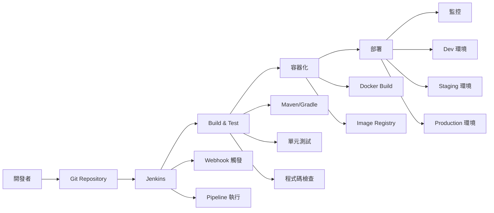

#### Jenkins 安裝

**Ubuntu/Debian 安裝**

```bash
# 1. 安裝 Java（Jenkins 需要）
sudo apt update
sudo apt install openjdk-17-jdk

# 2. 添加 Jenkins 官方源
wget -q -O - https://pkg.jenkins.io/debian-stable/jenkins.io.key | sudo apt-key add -
sudo sh -c 'echo deb https://pkg.jenkins.io/debian-stable binary/ > /etc/apt/sources.list.d/jenkins.list'

# 3. 安裝 Jenkins
sudo apt update
sudo apt install jenkins

# 4. 啟動並啟用 Jenkins 服務
sudo systemctl start jenkins
sudo systemctl enable jenkins

# 5. 檢查服務狀態
sudo systemctl status jenkins
```

**CentOS/RHEL/Rocky Linux 安裝**

```bash
# 1. 安裝 Java
sudo dnf install java-17-openjdk-devel

# 2. 添加 Jenkins 官方源
sudo wget -O /etc/yum.repos.d/jenkins.repo https://pkg.jenkins.io/redhat-stable/jenkins.repo
sudo rpm --import https://pkg.jenkins.io/redhat-stable/jenkins.io.key

# 3. 安裝 Jenkins
sudo dnf install jenkins

# 4. 啟動並啟用 Jenkins 服務
sudo systemctl start jenkins
sudo systemctl enable jenkins

# 5. 開放防火牆埠
sudo firewall-cmd --permanent --add-port=8080/tcp
sudo firewall-cmd --reload
```

#### Jenkins 初始設定

**基本設定**

```bash
# 1. 取得初始管理員密碼
sudo cat /var/lib/jenkins/secrets/initialAdminPassword

# 2. 設定 Jenkins 使用者權限
sudo usermod -aG docker jenkins     # 如果使用 Docker
sudo usermod -aG sudo jenkins       # 給予 sudo 權限（謹慎使用）

# 3. 重新啟動 Jenkins 服務
sudo systemctl restart jenkins

# 4. 檢查 Jenkins 工作目錄
ls -la /var/lib/jenkins/

# 5. 查看 Jenkins 日誌
sudo journalctl -u jenkins -f
```

**Jenkins 設定檔案**

```bash
# Jenkins 主要設定檔
sudo vim /etc/default/jenkins        # Ubuntu/Debian
sudo vim /etc/sysconfig/jenkins      # CentOS/RHEL

# 常用設定選項
# 變更埠號
HTTP_PORT=8080

# 設定 JVM 參數
JAVA_ARGS="-Djava.awt.headless=true -Xmx2048m -Xms1024m"

# 設定 Jenkins 家目錄
JENKINS_HOME="/var/lib/jenkins"

# 設定執行使用者
JENKINS_USER="jenkins"
```

#### Jenkins 工具設定

**全域工具設定**

```bash
# 在 Jenkins Web 介面設定工具路徑
# 管理 Jenkins > 全域工具設定

# JDK 設定
JAVA_HOME=/usr/lib/jvm/java-17-openjdk-amd64

# Maven 設定
M2_HOME=/opt/maven

# Git 設定
Git executable: /usr/bin/git

# Docker 設定
Docker executable: /usr/bin/docker
```

**必要插件安裝**

```bash
# 透過 Jenkins CLI 安裝插件
# 先下載 Jenkins CLI
wget http://localhost:8080/jnlpJars/jenkins-cli.jar

# 安裝常用插件
java -jar jenkins-cli.jar -s http://localhost:8080/ install-plugin \
    pipeline-stage-view \
    docker-workflow \
    git \
    github \
    maven-plugin \
    gradle \
    junit \
    jacoco \
    sonarqube-scanner \
    slack \
    email-ext

# 或透過 Web 介面安裝
# 管理 Jenkins > 管理插件 > 可用插件
```

### 7.2 Jenkins Pipeline 與 Shell Script

#### Pipeline 基本語法

**聲明式 Pipeline 範例**

```groovy
// Jenkinsfile
pipeline {
    agent any
    
    environment {
        MAVEN_HOME = '/opt/maven'
        PATH = "${MAVEN_HOME}/bin:${PATH}"
        DOCKER_REGISTRY = 'registry.company.com'
        APP_NAME = 'my-java-app'
    }
    
    stages {
        stage('Checkout') {
            steps {
                git branch: 'main', 
                    url: 'https://github.com/company/my-java-app.git'
            }
        }
        
        stage('Build') {
            steps {
                sh 'mvn clean compile'
            }
        }
        
        stage('Test') {
            steps {
                sh 'mvn test'
            }
            post {
                always {
                    junit 'target/surefire-reports/*.xml'
                    publishHTML([
                        allowMissing: false,
                        alwaysLinkToLastBuild: true,
                        keepAll: true,
                        reportDir: 'target/site/jacoco',
                        reportFiles: 'index.html',
                        reportName: 'Code Coverage Report'
                    ])
                }
            }
        }
        
        stage('Package') {
            steps {
                sh 'mvn package -DskipTests'
                archiveArtifacts artifacts: 'target/*.jar', fingerprint: true
            }
        }
        
        stage('Docker Build') {
            steps {
                script {
                    def image = docker.build("${DOCKER_REGISTRY}/${APP_NAME}:${BUILD_NUMBER}")
                    docker.withRegistry("https://${DOCKER_REGISTRY}", 'docker-registry-credentials') {
                        image.push()
                        image.push('latest')
                    }
                }
            }
        }
        
        stage('Deploy to Staging') {
            steps {
                sh """
                    ssh -o StrictHostKeyChecking=no jenkins@staging-server '
                        docker pull ${DOCKER_REGISTRY}/${APP_NAME}:${BUILD_NUMBER}
                        docker stop ${APP_NAME} || true
                        docker rm ${APP_NAME} || true
                        docker run -d --name ${APP_NAME} -p 8080:8080 ${DOCKER_REGISTRY}/${APP_NAME}:${BUILD_NUMBER}
                    '
                """
            }
        }
        
        stage('Integration Tests') {
            steps {
                sh 'mvn verify -Dtest.environment=staging'
            }
        }
        
        stage('Deploy to Production') {
            when {
                branch 'main'
            }
            input {
                message "Deploy to production?"
                ok "Deploy"
                parameters {
                    choice(name: 'DEPLOY_STRATEGY', choices: ['rolling', 'blue-green'], description: 'Deployment strategy')
                }
            }
            steps {
                sh """
                    ./scripts/deploy-production.sh ${BUILD_NUMBER} ${DEPLOY_STRATEGY}
                """
            }
        }
    }
    
    post {
        always {
            cleanWs()
        }
        success {
            slackSend channel: '#ci-cd', 
                     color: 'good', 
                     message: "✅ Build succeeded: ${env.JOB_NAME} #${env.BUILD_NUMBER}"
        }
        failure {
            slackSend channel: '#ci-cd', 
                     color: 'danger', 
                     message: "❌ Build failed: ${env.JOB_NAME} #${env.BUILD_NUMBER}"
            emailext subject: "Build Failed: ${env.JOB_NAME} #${env.BUILD_NUMBER}",
                     body: "Build failed. Check console output at ${env.BUILD_URL}",
                     recipientProviders: [developers(), requestor()]
        }
    }
}
```

#### 實用 Shell Script 整合

**建置腳本範例**

```bash
# scripts/build.sh
#!/bin/bash

set -e  # 遇到錯誤立即退出

# 設定變數
APP_NAME="my-java-app"
BUILD_DIR="target"
DOCKER_REGISTRY="registry.company.com"
BUILD_NUMBER=${BUILD_NUMBER:-"local"}

echo "=== 開始建置 $APP_NAME ==="

# 1. 清理舊的建置結果
echo "清理舊的建置結果..."
mvn clean

# 2. 編譯程式碼
echo "編譯程式碼..."
mvn compile

# 3. 執行單元測試
echo "執行單元測試..."
mvn test

# 4. 程式碼品質檢查
echo "執行程式碼品質檢查..."
mvn sonar:sonar -Dsonar.projectKey=$APP_NAME

# 5. 打包應用程式
echo "打包應用程式..."
mvn package -DskipTests

# 6. 建立 Docker 映像檔
echo "建立 Docker 映像檔..."
docker build -t $DOCKER_REGISTRY/$APP_NAME:$BUILD_NUMBER .
docker tag $DOCKER_REGISTRY/$APP_NAME:$BUILD_NUMBER $DOCKER_REGISTRY/$APP_NAME:latest

# 7. 推送到 Registry
echo "推送映像檔到 Registry..."
docker push $DOCKER_REGISTRY/$APP_NAME:$BUILD_NUMBER
docker push $DOCKER_REGISTRY/$APP_NAME:latest

echo "=== 建置完成 ==="
```

**部署腳本範例**

```bash
# scripts/deploy.sh
#!/bin/bash

set -e

# 參數檢查
if [ $# -ne 3 ]; then
    echo "Usage: $0 <environment> <version> <strategy>"
    echo "environment: dev|staging|prod"
    echo "strategy: rolling|blue-green"
    exit 1
fi

ENVIRONMENT=$1
VERSION=$2
STRATEGY=$3
APP_NAME="my-java-app"
DOCKER_REGISTRY="registry.company.com"

# 環境設定
case $ENVIRONMENT in
    "dev")
        SERVER_HOST="dev-server.company.com"
        SERVER_PORT="8080"
        ;;
    "staging")
        SERVER_HOST="staging-server.company.com"
        SERVER_PORT="8080"
        ;;
    "prod")
        SERVER_HOST="prod-server.company.com"
        SERVER_PORT="80"
        ;;
    *)
        echo "Unknown environment: $ENVIRONMENT"
        exit 1
        ;;
esac

echo "=== 部署 $APP_NAME 到 $ENVIRONMENT 環境 ==="
echo "版本: $VERSION"
echo "策略: $STRATEGY"

# 部署函數
deploy_rolling() {
    echo "執行滾動部署..."
    ssh jenkins@$SERVER_HOST "
        # 拉取新映像檔
        docker pull $DOCKER_REGISTRY/$APP_NAME:$VERSION
        
        # 停止舊容器
        docker stop $APP_NAME || true
        docker rm $APP_NAME || true
        
        # 啟動新容器
        docker run -d --name $APP_NAME \
            -p $SERVER_PORT:8080 \
            --restart unless-stopped \
            -e SPRING_PROFILES_ACTIVE=$ENVIRONMENT \
            $DOCKER_REGISTRY/$APP_NAME:$VERSION
        
        # 等待服務啟動
        sleep 30
        
        # 健康檢查
        curl -f http://localhost:$SERVER_PORT/actuator/health || exit 1
    "
}

deploy_blue_green() {
    echo "執行藍綠部署..."
    ssh jenkins@$SERVER_HOST "
        # 檢查目前運行的容器
        CURRENT_COLOR=\$(docker ps --filter name=$APP_NAME --format '{{.Names}}' | grep -o 'blue\|green' || echo 'blue')
        NEW_COLOR=\$([ \"\$CURRENT_COLOR\" = \"blue\" ] && echo \"green\" || echo \"blue\")
        
        echo \"目前顏色: \$CURRENT_COLOR\"
        echo \"新顏色: \$NEW_COLOR\"
        
        # 拉取新映像檔
        docker pull $DOCKER_REGISTRY/$APP_NAME:$VERSION
        
        # 啟動新顏色的容器
        docker run -d --name $APP_NAME-\$NEW_COLOR \
            -p \$([ \"\$NEW_COLOR\" = \"blue\" ] && echo \"8081\" || echo \"8082\"):8080 \
            -e SPRING_PROFILES_ACTIVE=$ENVIRONMENT \
            $DOCKER_REGISTRY/$APP_NAME:$VERSION
        
        # 等待新服務啟動
        sleep 30
        
        # 健康檢查
        NEW_PORT=\$([ \"\$NEW_COLOR\" = \"blue\" ] && echo \"8081\" || echo \"8082\")
        curl -f http://localhost:\$NEW_PORT/actuator/health || exit 1
        
        # 切換流量（更新 nginx 設定或負載平衡器）
        ./switch-traffic.sh \$NEW_COLOR
        
        # 等待一段時間確保穩定
        sleep 60
        
        # 停止舊容器
        docker stop $APP_NAME-\$CURRENT_COLOR || true
        docker rm $APP_NAME-\$CURRENT_COLOR || true
    "
}

# 執行部署
case $STRATEGY in
    "rolling")
        deploy_rolling
        ;;
    "blue-green")
        deploy_blue_green
        ;;
    *)
        echo "Unknown strategy: $STRATEGY"
        exit 1
        ;;
esac

# 部署後驗證
echo "執行部署後驗證..."
sleep 10
curl -f http://$SERVER_HOST:$SERVER_PORT/actuator/health
curl -f http://$SERVER_HOST:$SERVER_PORT/api/version

echo "=== 部署完成 ==="
```

#### Pipeline 進階功能

**並行執行**

```groovy
pipeline {
    agent none
    
    stages {
        stage('Parallel Tests') {
            parallel {
                stage('Unit Tests') {
                    agent { label 'test-runner' }
                    steps {
                        sh 'mvn test'
                    }
                }
                stage('Integration Tests') {
                    agent { label 'integration-test' }
                    steps {
                        sh 'mvn verify -Pintegration-test'
                    }
                }
                stage('Security Tests') {
                    agent { label 'security-scanner' }
                    steps {
                        sh 'mvn dependency-check:check'
                    }
                }
            }
        }
    }
}
```

**條件執行**

```groovy
pipeline {
    agent any
    
    stages {
        stage('Deploy') {
            when {
                anyOf {
                    branch 'main'
                    branch 'release/*'
                }
            }
            steps {
                sh './deploy.sh'
            }
        }
        
        stage('Notify Slack') {
            when {
                not { changeRequest() }
            }
            steps {
                slackSend message: "Deployment completed"
            }
        }
    }
}
```

### 7.3 Linux 與容器整合

#### Docker 在 CI/CD 中的應用

**多階段建置 Dockerfile**

```dockerfile
# Multi-stage Dockerfile for Java application
FROM maven:3.9-openjdk-17 AS builder

WORKDIR /app
COPY pom.xml .
COPY src ./src

# 建置應用程式
RUN mvn clean package -DskipTests

# 生產階段
FROM openjdk:17-jre-slim

# 建立應用程式使用者
RUN groupadd -r appuser && useradd -r -g appuser appuser

# 安裝必要工具
RUN apt-get update && \
    apt-get install -y curl && \
    rm -rf /var/lib/apt/lists/*

# 設定工作目錄
WORKDIR /app

# 複製建置結果
COPY --from=builder /app/target/*.jar app.jar

# 設定擁有者
RUN chown -R appuser:appuser /app

# 切換到非 root 使用者
USER appuser

# 健康檢查
HEALTHCHECK --interval=30s --timeout=3s --start-period=5s --retries=3 \
    CMD curl -f http://localhost:8080/actuator/health || exit 1

# 暴露埠
EXPOSE 8080

# 設定 JVM 參數
ENV JAVA_OPTS="-Xmx512m -Xms256m"

# 啟動應用程式
ENTRYPOINT ["sh", "-c", "java $JAVA_OPTS -jar app.jar"]
```

**容器化建置腳本**

```bash
# scripts/docker-build.sh
#!/bin/bash

set -e

APP_NAME="my-java-app"
REGISTRY="registry.company.com"
VERSION=${1:-"latest"}
BUILD_ARGS=${2:-""}

echo "=== 建置 Docker 映像檔 ==="
echo "應用程式: $APP_NAME"
echo "版本: $VERSION"
echo "Registry: $REGISTRY"

# 建置映像檔
docker build \
    --build-arg BUILD_VERSION=$VERSION \
    --build-arg BUILD_DATE=$(date -u +'%Y-%m-%dT%H:%M:%SZ') \
    --build-arg VCS_REF=$(git rev-parse --short HEAD) \
    $BUILD_ARGS \
    -t $REGISTRY/$APP_NAME:$VERSION \
    -t $REGISTRY/$APP_NAME:latest \
    .

# 檢查映像檔大小
echo "映像檔大小:"
docker images $REGISTRY/$APP_NAME:$VERSION

# 安全掃描
echo "執行安全掃描..."
docker run --rm -v /var/run/docker.sock:/var/run/docker.sock \
    -v $(pwd):/root/.cache/ \
    aquasec/trivy image $REGISTRY/$APP_NAME:$VERSION

# 推送到 Registry
echo "推送映像檔到 Registry..."
docker push $REGISTRY/$APP_NAME:$VERSION
docker push $REGISTRY/$APP_NAME:latest

echo "=== 建置完成 ==="
```

#### Podman 在 CI/CD 中的應用

**Podman 建置腳本**

```bash
# scripts/podman-build.sh
#!/bin/bash

set -e

APP_NAME="my-java-app"
REGISTRY="registry.company.com"
VERSION=${1:-"latest"}

echo "=== 使用 Podman 建置映像檔 ==="

# 建置映像檔
podman build \
    --tag $REGISTRY/$APP_NAME:$VERSION \
    --tag $REGISTRY/$APP_NAME:latest \
    --format oci \
    .

# 檢查映像檔
podman images $REGISTRY/$APP_NAME

# 推送到 Registry
podman push $REGISTRY/$APP_NAME:$VERSION
podman push $REGISTRY/$APP_NAME:latest

echo "=== Podman 建置完成 ==="
```

**無 root 容器執行**

```bash
# 設定使用者命名空間
echo "jenkins:100000:65536" | sudo tee /etc/subuid
echo "jenkins:100000:65536" | sudo tee /etc/subgid

# Jenkins 使用者執行 Podman
sudo -u jenkins podman run --rm $REGISTRY/$APP_NAME:$VERSION
```

### 7.4 自動化部署流程範例

#### 完整的 GitOps 工作流程

```mermaid
graph TD
    A[Developer Push] --> B[Git Webhook]
    B --> C[Jenkins Pipeline]
    C --> D[Build & Test]
    D --> E[Security Scan]
    E --> F[Build Container]
    F --> G[Push to Registry]
    G --> H[Deploy to Dev]
    H --> I[Integration Tests]
    I --> J{Tests Pass?}
    J -->|Yes| K[Deploy to Staging]
    J -->|No| L[Notify Team]
    K --> M[User Acceptance Tests]
    M --> N{Approve for Prod?}
    N -->|Yes| O[Deploy to Production]
    N -->|No| P[Stay in Staging]
    O --> Q[Monitor & Alert]
```

#### 環境配置管理

**環境設定檔案結構**

```bash
# 建立環境設定目錄結構
mkdir -p deployment/{dev,staging,prod}/{configs,secrets,scripts}

# 開發環境設定
cat > deployment/dev/configs/application.properties << 'EOF'
server.port=8080
spring.profiles.active=dev
database.url=jdbc:postgresql://dev-db:5432/myapp
database.username=devuser
logging.level.com.company=DEBUG
EOF

# 正式環境設定
cat > deployment/prod/configs/application.properties << 'EOF'
server.port=8080
spring.profiles.active=prod
database.url=jdbc:postgresql://prod-db:5432/myapp
database.username=produser
logging.level.root=WARN
EOF
```

**部署配置腳本**

```bash
# scripts/deploy-with-config.sh
#!/bin/bash

set -e

ENVIRONMENT=$1
VERSION=$2
APP_NAME="my-java-app"
REGISTRY="registry.company.com"

if [ -z "$ENVIRONMENT" ] || [ -z "$VERSION" ]; then
    echo "Usage: $0 <environment> <version>"
    exit 1
fi

CONFIG_DIR="deployment/$ENVIRONMENT"
SERVER_CONFIG=""

# 根據環境設定伺服器
case $ENVIRONMENT in
    "dev")
        SERVER_CONFIG="dev-servers.txt"
        ;;
    "staging")
        SERVER_CONFIG="staging-servers.txt"
        ;;
    "prod")
        SERVER_CONFIG="prod-servers.txt"
        ;;
    *)
        echo "Unknown environment: $ENVIRONMENT"
        exit 1
        ;;
esac

echo "=== 部署到 $ENVIRONMENT 環境 ==="

# 讀取伺服器清單
while IFS= read -r server; do
    echo "部署到伺服器: $server"
    
    # 上傳設定檔案
    scp -r $CONFIG_DIR/configs/ jenkins@$server:/tmp/app-configs/
    
    # 執行部署
    ssh jenkins@$server "
        # 拉取新映像檔
        docker pull $REGISTRY/$APP_NAME:$VERSION
        
        # 停止舊容器
        docker stop $APP_NAME || true
        docker rm $APP_NAME || true
        
        # 啟動新容器
        docker run -d --name $APP_NAME \
            -p 8080:8080 \
            -v /tmp/app-configs:/app/config:ro \
            --env-file /tmp/app-configs/application.properties \
            --restart unless-stopped \
            $REGISTRY/$APP_NAME:$VERSION
        
        # 等待服務啟動
        sleep 30
        
        # 健康檢查
        for i in {1..10}; do
            if curl -f http://localhost:8080/actuator/health; then
                echo \"服務啟動成功\"
                break
            fi
            echo \"等待服務啟動... \$i/10\"
            sleep 10
        done
    "
    
    echo "伺服器 $server 部署完成"
done < "deployment/$ENVIRONMENT/$SERVER_CONFIG"

echo "=== 所有伺服器部署完成 ==="
```

#### 監控與告警整合

**部署監控腳本**

```bash
# scripts/monitor-deployment.sh
#!/bin/bash

APP_NAME="my-java-app"
ENVIRONMENT=$1
HEALTH_ENDPOINT="/actuator/health"
METRICS_ENDPOINT="/actuator/metrics"

check_health() {
    local server=$1
    local response=$(curl -s -o /dev/null -w "%{http_code}" http://$server:8080$HEALTH_ENDPOINT)
    
    if [ "$response" = "200" ]; then
        echo "✅ $server: 健康狀態正常"
        return 0
    else
        echo "❌ $server: 健康檢查失敗 (HTTP $response)"
        return 1
    fi
}

check_metrics() {
    local server=$1
    local cpu_usage=$(curl -s http://$server:8080$METRICS_ENDPOINT/system.cpu.usage | jq '.measurements[0].value')
    local memory_usage=$(curl -s http://$server:8080$METRICS_ENDPOINT/jvm.memory.used | jq '.measurements[0].value')
    
    echo "📊 $server: CPU使用率: ${cpu_usage}%, 記憶體使用: ${memory_usage}MB"
}

# 讀取伺服器清單並檢查
while IFS= read -r server; do
    echo "檢查伺服器: $server"
    
    if check_health $server; then
        check_metrics $server
    else
        # 發送告警
        curl -X POST -H 'Content-type: application/json' \
            --data "{\"text\":\"🚨 部署警告: $server 健康檢查失敗\"}" \
            $SLACK_WEBHOOK_URL
    fi
    
    echo "---"
done < "deployment/$ENVIRONMENT/${ENVIRONMENT}-servers.txt"
```

**自動回滾機制**

```bash
# scripts/auto-rollback.sh
#!/bin/bash

set -e

APP_NAME="my-java-app"
ENVIRONMENT=$1
CURRENT_VERSION=$2
PREVIOUS_VERSION=$3
REGISTRY="registry.company.com"

rollback() {
    local server=$1
    
    echo "回滾伺服器 $server 到版本 $PREVIOUS_VERSION"
    
    ssh jenkins@$server "
        # 停止目前版本
        docker stop $APP_NAME || true
        docker rm $APP_NAME || true
        
        # 啟動前一版本
        docker run -d --name $APP_NAME \
            -p 8080:8080 \
            --restart unless-stopped \
            $REGISTRY/$APP_NAME:$PREVIOUS_VERSION
        
        # 健康檢查
        sleep 30
        curl -f http://localhost:8080/actuator/health || exit 1
    "
}

# 檢查部署是否成功
deployment_healthy=true

while IFS= read -r server; do
    response=$(curl -s -o /dev/null -w "%{http_code}" http://$server:8080/actuator/health || echo "000")
    
    if [ "$response" != "200" ]; then
        echo "❌ 伺服器 $server 健康檢查失敗"
        deployment_healthy=false
    fi
done < "deployment/$ENVIRONMENT/${ENVIRONMENT}-servers.txt"

# 如果部署失敗，執行回滾
if [ "$deployment_healthy" = false ]; then
    echo "🔄 執行自動回滾..."
    
    while IFS= read -r server; do
        rollback $server
    done < "deployment/$ENVIRONMENT/${ENVIRONMENT}-servers.txt"
    
    # 發送回滾通知
    curl -X POST -H 'Content-type: application/json' \
        --data "{\"text\":\"🔄 自動回滾完成: $APP_NAME 從 $CURRENT_VERSION 回滾到 $PREVIOUS_VERSION\"}" \
        $SLACK_WEBHOOK_URL
    
    exit 1
else
    echo "✅ 部署成功，所有伺服器健康狀態正常"
fi
```

---

> **🔍 實務檢查點**
>
> **CI/CD 流程設定檢查**：
>
> - [ ] 成功安裝並設定 Jenkins 服務
> - [ ] 建立基本的 Pipeline 流程
> - [ ] 整合 Shell Script 自動化任務
> - [ ] 設定容器化建置與部署
> - [ ] 實作環境間的部署流程
> - [ ] 建立監控與告警機制
> - [ ] 設定自動回滾機制
>
> **專案應用**：
>
> - 完整的 CI/CD pipeline 設定
> - 自動化測試與部署流程
> - DevOps 最佳實務應用

---

## 8. Linux 認證導向補充

> **🎯 學習目標**  
>
> - 了解主要 Linux 認證的考試範圍與要求
> - 掌握 LFCS、RHCSA、LPI 認證的核心技能
> - 學會實務導向的考試準備策略
> - 建立系統化的技能驗證方法
> - 提升在企業環境中的專業競爭力

**🏆 認證目標**：LFCS、RHCSA、LPI Linux Essentials、LPIC-1

### 8.1 認證體系概覽

#### Linux 認證比較表

| 認證 | 發證機構 | 難度 | 考試時間 | 考試形式 | 主要用途 |
|------|----------|------|----------|----------|----------|
| LPI Linux Essentials | LPI | 入門 | 60分鐘 | 選擇題 | Linux 基礎認證 |
| LPIC-1 | LPI | 初級 | 90分鐘 × 2 | 選擇題 | 系統管理員入門 |
| LPIC-2 | LPI | 中級 | 90分鐘 × 2 | 選擇題 | 進階系統管理 |
| LFCS | Linux Foundation | 中級 | 180分鐘 | 實作操作 | 雲端/DevOps 環境 |
| RHCSA | Red Hat | 中級 | 180分鐘 | 實作操作 | 企業級 RHEL 環境 |
| RHCE | Red Hat | 高級 | 240分鐘 | 實作操作 | 自動化與進階管理 |

#### 認證學習路徑

```mermaid
graph TD
    A[Linux 新手] --> B[LPI Linux Essentials]
    B --> C{選擇方向}
    C -->|理論基礎| D[LPIC-1]
    C -->|實作導向| E[LFCS]
    C -->|Red Hat 生態| F[RHCSA]
    
    D --> G[LPIC-2]
    E --> H[CKA/CKS]
    F --> I[RHCE]
    
    G --> J[LPIC-3]
    H --> K[DevOps 專業]
    I --> L[Red Hat 架構師]
    
    style B fill:#e1f5fe
    style E fill:#f3e5f5
    style F fill:#fff3e0
```

### 8.2 LFCS (Linux Foundation Certified System Administrator)

#### 考試範圍與權重

**Essential Commands (25%)**

- 檔案系統導航與操作
- 文字檔案處理與編輯
- 命令列工具與管道
- 檔案權限與屬性管理

**Operation of Running Systems (20%)**

- 啟動、重新啟動、關機程序
- 開機程序問題診斷
- 系統服務管理
- 網路設定與故障排除

**User and Group Management (10%)**

- 使用者帳戶管理
- 群組管理與權限設定
- sudo 設定與安全

**Networking (12%)**

- 網路介面設定
- 防火牆規則管理
- 網路服務設定

**Service Configuration (20%)**

- HTTP 服務設定
- SSH 服務設定與安全
- 資料庫服務管理
- 容器服務操作

**Storage Management (13%)**

- 磁碟分割與檔案系統
- LVM 邏輯磁碟管理
- 備份與還原策略

#### LFCS 實務練習題

**檔案系統與權限管理**

```bash
# 練習題 1：建立使用者與群組
# 1. 建立群組 "developers" 和 "testers"
sudo groupadd developers
sudo groupadd testers

# 2. 建立使用者 john (主群組 developers)，設定密碼
sudo useradd -g developers -m -s /bin/bash john
sudo passwd john

# 3. 建立共享目錄 /shared/projects，權限設定為群組可寫
sudo mkdir -p /shared/projects
sudo chown root:developers /shared/projects
sudo chmod 2775 /shared/projects

# 4. 設定 umask 使新建檔案預設群組可讀寫
echo "umask 002" >> /home/john/.bashrc

# 驗證設定
ls -ld /shared/projects
getent group developers
id john
```

**系統服務管理**

```bash
# 練習題 2：設定 nginx 服務
# 1. 安裝 nginx
sudo apt update && sudo apt install nginx

# 2. 建立自訂首頁
sudo tee /var/www/html/index.html << 'EOF'
<!DOCTYPE html>
<html>
<head><title>LFCS Test Server</title></head>
<body>
    <h1>Welcome to LFCS Test Server</h1>
    <p>Server Time: $(date)</p>
    <p>Hostname: $(hostname)</p>
</body>
</html>
EOF

# 3. 設定虛擬主機
sudo tee /etc/nginx/sites-available/testsite << 'EOF'
server {
    listen 8080;
    server_name localhost;
    root /var/www/html;
    index index.html;
    
    location / {
        try_files $uri $uri/ =404;
    }
    
    location /api/ {
        return 200 "API endpoint working\n";
        add_header Content-Type text/plain;
    }
}
EOF

# 4. 啟用站台並重新載入設定
sudo ln -s /etc/nginx/sites-available/testsite /etc/nginx/sites-enabled/
sudo nginx -t
sudo systemctl reload nginx

# 5. 設定防火牆允許 8080 埠
sudo ufw allow 8080/tcp

# 驗證設定
curl http://localhost:8080
curl http://localhost:8080/api/
systemctl status nginx
```

**LVM 存儲管理**

```bash
# 練習題 3：設定 LVM
# 1. 建立實體磁碟區（假設使用 /dev/sdb）
sudo pvcreate /dev/sdb

# 2. 建立磁碟區群組
sudo vgcreate vg_data /dev/sdb

# 3. 建立邏輯磁碟區
sudo lvcreate -L 5G -n lv_app vg_data
sudo lvcreate -L 3G -n lv_log vg_data

# 4. 格式化並掛載
sudo mkfs.ext4 /dev/vg_data/lv_app
sudo mkfs.ext4 /dev/vg_data/lv_log

sudo mkdir -p /app /app/logs
sudo mount /dev/vg_data/lv_app /app
sudo mount /dev/vg_data/lv_log /app/logs

# 5. 設定開機自動掛載
echo "/dev/vg_data/lv_app /app ext4 defaults 0 2" | sudo tee -a /etc/fstab
echo "/dev/vg_data/lv_log /app/logs ext4 defaults 0 2" | sudo tee -a /etc/fstab

# 6. 擴展邏輯磁碟區
sudo lvextend -L +2G /dev/vg_data/lv_app
sudo resize2fs /dev/vg_data/lv_app

# 驗證設定
df -h /app /app/logs
pvdisplay
vgdisplay
lvdisplay
```

**容器管理**

```bash
# 練習題 4：Docker 容器管理
# 1. 安裝 Docker
curl -fsSL https://get.docker.com -o get-docker.sh
sudo sh get-docker.sh
sudo usermod -aG docker $USER

# 2. 建立 Dockerfile
mkdir -p ~/lfcs-container && cd ~/lfcs-container
tee Dockerfile << 'EOF'
FROM nginx:alpine
COPY index.html /usr/share/nginx/html/
EXPOSE 80
CMD ["nginx", "-g", "daemon off;"]
EOF

tee index.html << 'EOF'
<h1>LFCS Container Test</h1>
<p>Container is running successfully!</p>
EOF

# 3. 建置映像檔
docker build -t lfcs-web:1.0 .

# 4. 執行容器
docker run -d --name lfcs-web-container -p 9090:80 lfcs-web:1.0

# 5. 建立 systemd 服務管理容器
sudo tee /etc/systemd/system/lfcs-web.service << 'EOF'
[Unit]
Description=LFCS Web Container
After=docker.service
Requires=docker.service

[Service]
TimeoutStartSec=0
Restart=always
ExecStartPre=-/usr/bin/docker stop lfcs-web-container
ExecStartPre=-/usr/bin/docker rm lfcs-web-container
ExecStart=/usr/bin/docker run --rm --name lfcs-web-container -p 9090:80 lfcs-web:1.0
ExecStop=/usr/bin/docker stop lfcs-web-container

[Install]
WantedBy=multi-user.target
EOF

sudo systemctl daemon-reload
sudo systemctl enable lfcs-web.service
sudo systemctl start lfcs-web.service

# 驗證設定
curl http://localhost:9090
docker ps
systemctl status lfcs-web.service
```

### 8.3 RHCSA (Red Hat Certified System Administrator)

#### 考試範圍與技能要求

**核心技能領域**

1. **理解和使用基本工具**
   - 存取 shell 提示字元並發出命令
   - 使用輸入輸出重導向與管道
   - 使用 grep 和正規表達式分析文字
   - 存取遠端系統並通過 SSH 傳輸檔案

2. **操作執行中的系統**
   - 正常啟動、重新開機和關閉系統
   - 手動啟動和停止 VirtualBox 虛擬機器
   - 控制服務和精靈程式
   - 識別 CPU/記憶體密集程序

3. **設定本機儲存裝置**
   - 列出、建立、刪除和修改實體儲存裝置的分割區
   - 建立和移除實體磁碟區、指派實體磁碟區給磁碟區群組
   - 建立和刪除邏輯磁碟區

4. **建立和設定檔案系統**
   - 建立、掛載、卸載和使用 vfat、ext4 和 xfs 檔案系統
   - 掛載和卸載網路檔案系統 (NFS)

#### RHCSA 實務練習

**系統安裝與基本設定**

```bash
# 練習題 1：系統初始設定
# 1. 設定主機名稱
sudo hostnamectl set-hostname rhcsa-test.example.com

# 2. 設定時區
sudo timedatectl set-timezone Asia/Taipei

# 3. 設定網路（NetworkManager）
sudo nmcli connection modify "System eth0" \
    ipv4.addresses 192.168.1.100/24 \
    ipv4.gateway 192.168.1.1 \
    ipv4.dns 8.8.8.8,8.8.4.4 \
    ipv4.method manual

sudo nmcli connection up "System eth0"

# 4. 註冊系統（模擬環境可跳過）
# sudo subscription-manager register --username your_username

# 驗證設定
hostnamectl
timedatectl
nmcli connection show
ip addr show
```

**使用者與群組管理**

```bash
# 練習題 2：進階使用者管理
# 1. 建立群組並設定 GID
sudo groupadd -g 5000 dbadmin
sudo groupadd -g 5001 webadmin

# 2. 建立使用者並設定屬性
sudo useradd -u 6000 -g dbadmin -G webadmin -s /bin/bash \
    -c "Database Administrator" -d /home/dbuser dbuser

# 3. 設定密碼策略
sudo chage -M 90 -m 7 -W 7 dbuser

# 4. 建立 sudo 規則
echo "dbuser ALL=(ALL) /usr/bin/systemctl restart postgresql, /usr/bin/systemctl status postgresql" | \
    sudo tee /etc/sudoers.d/dbuser

# 5. 設定 umask
echo "umask 027" | sudo tee -a /home/dbuser/.bashrc

# 驗證設定
id dbuser
chage -l dbuser
sudo -l -U dbuser
```

**檔案系統與 LVM**

```bash
# 練習題 3：進階存儲管理
# 1. 建立 LVM 配置
sudo pvcreate /dev/sdb /dev/sdc
sudo vgcreate rhcsa_vg /dev/sdb /dev/sdc

# 2. 建立邏輯磁碟區
sudo lvcreate -L 8G -n home_lv rhcsa_vg
sudo lvcreate -L 4G -n var_lv rhcsa_vg
sudo lvcreate -L 2G -n swap_lv rhcsa_vg

# 3. 建立檔案系統
sudo mkfs.xfs /dev/rhcsa_vg/home_lv
sudo mkfs.ext4 /dev/rhcsa_vg/var_lv
sudo mkswap /dev/rhcsa_vg/swap_lv

# 4. 設定掛載點
sudo mkdir -p /mnt/newhome /mnt/newvar

# 5. 設定 fstab
cat << 'EOF' | sudo tee -a /etc/fstab
/dev/rhcsa_vg/home_lv /mnt/newhome xfs defaults 0 2
/dev/rhcsa_vg/var_lv /mnt/newvar ext4 defaults 0 2
/dev/rhcsa_vg/swap_lv none swap defaults 0 0
EOF

# 6. 測試掛載
sudo mount -a
sudo swapon -a

# 7. 擴展檔案系統
sudo lvextend -L +2G /dev/rhcsa_vg/home_lv
sudo xfs_growfs /mnt/newhome

# 驗證設定
df -h
lsblk
free -h
```

**SELinux 管理**

```bash
# 練習題 4：SELinux 設定與故障排除
# 1. 檢查 SELinux 狀態
getenforce
sestatus

# 2. 設定 SELinux 模式
sudo setenforce 1  # Enforcing
echo "SELINUX=enforcing" | sudo tee /etc/selinux/config

# 3. 管理 SELinux 布林值
sudo setsebool -P httpd_can_network_connect on
sudo setsebool -P httpd_read_user_content on

# 4. 設定檔案上下文
sudo mkdir -p /custom/web
sudo semanage fcontext -a -t httpd_exec_t "/custom/web(/.*)?"
sudo restorecon -Rv /custom/web

# 5. 建立自訂 SELinux 模組
# 如果有 AVC 拒絕訊息
sudo grep denied /var/log/audit/audit.log | audit2allow -M mycustom
sudo semodule -i mycustom.pp

# 6. 埠號標籤管理
sudo semanage port -a -t http_port_t -p tcp 8888

# 驗證設定
getsebool -a | grep httpd
ls -Z /custom/web
semanage port -l | grep http_port_t
```

### 8.4 LPI (Linux Professional Institute) 認證

#### LPIC-1 考試目標

**101-500 考試主題**

1. **系統架構** (重要性: 8)
   - 硬體設定確定與設定
   - 系統啟動
   - 執行級別變更與系統關機

2. **Linux 安裝與套件管理** (重要性: 10)
   - 硬碟配置設計
   - 安裝開機管理程式
   - 共享程式庫管理
   - Debian 套件管理

3. **GNU 和 Unix 命令** (重要性: 26)
   - 命令列操作
   - 文字檔案處理
   - 檔案管理

4. **裝置、Linux 檔案系統、檔案系統階層標準** (重要性: 6)
   - 分割區與檔案系統建立
   - 檔案系統完整性維護
   - 檔案系統的掛載與卸載

**102-500 考試主題**

1. **Shell、Shell Script 和資料管理** (重要性: 11)
   - Shell 環境自訂與使用
   - 簡單 Script 自訂或修改

2. **使用者介面和桌面** (重要性: 5)
   - X11 安裝與設定
   - 桌面環境設定

3. **管理工作** (重要性: 13)
   - 使用者帳戶、群組帳戶及相關系統檔案管理
   - 工作排程

4. **基本系統服務** (重要性: 8)
   - 系統時間維護
   - 系統日誌記錄
   - Mail Transfer Agent (MTA) 基礎

5. **網路基礎** (重要性: 12)
   - 網際網路協定基礎
   - 網路設定

6. **安全** (重要性: 11)
   - 安全管理工作執行

#### LPI 實務練習

**套件管理**

```bash
# 練習題 1：Debian/Ubuntu 套件管理
# 1. 更新套件清單
sudo apt update

# 2. 搜尋套件
apt search web.*server
apt show apache2

# 3. 安裝套件
sudo apt install apache2 mysql-server php

# 4. 查詢套件資訊
dpkg -l | grep apache
dpkg -L apache2 | head -20
apt-cache depends apache2

# 5. 移除套件
sudo apt remove --purge apache2-doc
sudo apt autoremove

# 6. 保留套件版本
sudo apt-mark hold mysql-server

# 7. 從 deb 檔案安裝
wget http://example.com/package.deb
sudo dpkg -i package.deb
sudo apt-get install -f  # 修復相依性

# 驗證操作
apt list --installed | grep apache
dpkg -s apache2
```

**Shell Scripting**

```bash
# 練習題 2：Shell Script 程式設計
# 1. 建立系統監控腳本
tee ~/monitor.sh << 'EOF'
#!/bin/bash

# 系統監控腳本
LOG_FILE="/var/log/system-monitor.log"
DATE=$(date '+%Y-%m-%d %H:%M:%S')

# 函數：記錄訊息
log_message() {
    echo "[$DATE] $1" | sudo tee -a "$LOG_FILE"
}

# 檢查磁碟使用率
check_disk_usage() {
    local threshold=80
    df -h | awk 'NR>1 {print $5 " " $6}' | while read usage mountpoint; do
        usage_num=${usage%?}
        if [ "$usage_num" -gt "$threshold" ]; then
            log_message "WARNING: Disk usage on $mountpoint is $usage"
        fi
    done
}

# 檢查記憶體使用率
check_memory() {
    local mem_usage=$(free | awk 'FNR==2{printf "%.0f", $3/($3+$4)*100}')
    if [ "$mem_usage" -gt 85 ]; then
        log_message "WARNING: Memory usage is ${mem_usage}%"
    fi
}

# 檢查 CPU 負載
check_load() {
    local load=$(uptime | awk -F'load average:' '{print $2}' | awk '{print $1}' | sed 's/,//')
    local load_int=$(echo "$load" | cut -d. -f1)
    local cpu_cores=$(nproc)
    
    if [ "$load_int" -gt "$cpu_cores" ]; then
        log_message "WARNING: High CPU load: $load (CPUs: $cpu_cores)"
    fi
}

# 檢查重要服務
check_services() {
    local services=("ssh" "networking" "cron")
    for service in "${services[@]}"; do
        if ! systemctl is-active --quiet "$service"; then
            log_message "ERROR: Service $service is not running"
        fi
    done
}

# 主程式
main() {
    log_message "Starting system monitoring"
    check_disk_usage
    check_memory
    check_load
    check_services
    log_message "System monitoring completed"
}

# 執行主程式
main
EOF

chmod +x ~/monitor.sh

# 2. 建立使用者管理腳本
tee ~/user_management.sh << 'EOF'
#!/bin/bash

# 使用者管理腳本

usage() {
    echo "Usage: $0 {add|del|list|info} [username]"
    echo "  add username  - 新增使用者"
    echo "  del username  - 刪除使用者"
    echo "  list          - 列出所有使用者"
    echo "  info username - 顯示使用者資訊"
    exit 1
}

add_user() {
    local username=$1
    if [ -z "$username" ]; then
        echo "錯誤：請提供使用者名稱"
        usage
    fi
    
    # 檢查使用者是否已存在
    if id "$username" &>/dev/null; then
        echo "錯誤：使用者 $username 已存在"
        exit 1
    fi
    
    # 建立使用者
    sudo useradd -m -s /bin/bash "$username"
    echo "使用者 $username 建立成功"
    
    # 設定密碼
    echo "請設定使用者 $username 的密碼："
    sudo passwd "$username"
}

delete_user() {
    local username=$1
    if [ -z "$username" ]; then
        echo "錯誤：請提供使用者名稱"
        usage
    fi
    
    # 檢查使用者是否存在
    if ! id "$username" &>/dev/null; then
        echo "錯誤：使用者 $username 不存在"
        exit 1
    fi
    
    # 確認刪除
    read -p "確定要刪除使用者 $username 嗎？ (y/N): " confirm
    if [[ $confirm =~ ^[Yy]$ ]]; then
        sudo userdel -r "$username"
        echo "使用者 $username 已刪除"
    else
        echo "取消刪除操作"
    fi
}

list_users() {
    echo "系統使用者清單："
    echo "===================="
    getent passwd | awk -F: '$3>=1000 && $3<65534 {print $1, $3, $5}' | \
    while read user uid name; do
        printf "%-15s UID: %-6s %s\n" "$user" "$uid" "$name"
    done
}

user_info() {
    local username=$1
    if [ -z "$username" ]; then
        echo "錯誤：請提供使用者名稱"
        usage
    fi
    
    if ! id "$username" &>/dev/null; then
        echo "錯誤：使用者 $username 不存在"
        exit 1
    fi
    
    echo "使用者 $username 詳細資訊："
    echo "=========================="
    id "$username"
    echo "家目錄：$(getent passwd "$username" | cut -d: -f6)"
    echo "Shell：$(getent passwd "$username" | cut -d: -f7)"
    echo "群組：$(groups "$username")"
    echo "最後登入："
    last -n 5 "$username"
}

# 主程式
case $1 in
    add)
        add_user $2
        ;;
    del)
        delete_user $2
        ;;
    list)
        list_users
        ;;
    info)
        user_info $2
        ;;
    *)
        usage
        ;;
esac
EOF

chmod +x ~/user_management.sh

# 3. 設定 cron 工作
# 每 5 分鐘執行監控腳本
echo "*/5 * * * * /home/$(whoami)/monitor.sh" | crontab -

# 驗證腳本
./monitor.sh
./user_management.sh list
crontab -l
```

**網路設定與服務**

```bash
# 練習題 3：網路服務設定
# 1. 設定 SSH 服務
sudo cp /etc/ssh/sshd_config /etc/ssh/sshd_config.backup

sudo tee /etc/ssh/sshd_config.d/custom.conf << 'EOF'
# 自訂 SSH 設定
Port 2222
PermitRootLogin no
PasswordAuthentication yes
PubkeyAuthentication yes
MaxAuthTries 3
ClientAliveInterval 300
ClientAliveCountMax 2
EOF

sudo systemctl restart sshd
sudo systemctl enable sshd

# 2. 設定基本防火牆
sudo ufw enable
sudo ufw default deny incoming
sudo ufw default allow outgoing
sudo ufw allow 2222/tcp
sudo ufw allow 80/tcp
sudo ufw allow 443/tcp

# 3. 設定 NTP 時間同步
sudo apt install chrony
sudo systemctl enable chrony
sudo systemctl start chrony

# 檢查時間同步狀態
chrony sources -v

# 4. 設定系統日誌
sudo tee /etc/rsyslog.d/custom.conf << 'EOF'
# 自訂日誌規則
auth,authpriv.*                 /var/log/auth.log
*.*;auth,authpriv.none          /var/log/syslog
daemon.*                        /var/log/daemon.log
kern.*                          /var/log/kern.log
mail.*                          /var/log/mail.log
user.*                          /var/log/user.log

# 遠端日誌
*.* @@192.168.1.100:514
EOF

sudo systemctl restart rsyslog

# 驗證設定
sudo netstat -tulpn | grep :2222
sudo ufw status
timedatectl status
sudo tail /var/log/auth.log
```

### 8.5 認證準備策略

#### 學習時程規劃

**3個月認證準備計畫**

```mermaid
gantt
    title Linux 認證準備時程
    dateFormat YYYY-MM-DD
    section 第一個月
    基礎理論學習     :a1, 2024-01-01, 2024-01-15
    實作環境建置     :a2, 2024-01-10, 2024-01-20
    每日練習開始     :a3, 2024-01-15, 2024-01-31
    
    section 第二個月
    進階主題學習     :b1, 2024-02-01, 2024-02-20
    模擬考試練習     :b2, 2024-02-15, 2024-02-28
    弱點補強         :b3, 2024-02-20, 2024-02-28
    
    section 第三個月
    綜合複習         :c1, 2024-03-01, 2024-03-15
    模擬考試         :c2, 2024-03-10, 2024-03-20
    正式考試         :crit, c3, 2024-03-25, 2024-03-25
```

#### 實作環境準備

**虛擬實驗室設定**

```bash
# 建立多節點實驗環境
# 1. 使用 Vagrant 建立測試環境
mkdir ~/linux-cert-lab && cd ~/linux-cert-lab

tee Vagrantfile << 'EOF'
Vagrant.configure("2") do |config|
  # 主要練習機器
  config.vm.define "main" do |main|
    main.vm.box = "ubuntu/focal64"
    main.vm.hostname = "linux-cert-main"
    main.vm.network "private_network", ip: "192.168.56.10"
    main.vm.provider "virtualbox" do |vb|
      vb.memory = "2048"
      vb.cpus = 2
      # 添加額外磁碟用於 LVM 練習
      vb.customize ['createhd', '--filename', './disk2.vdi', '--size', 8192]
      vb.customize ['storageattach', :id, '--storagectl', 'SCSI', '--port', 2, '--device', 0, '--type', 'hdd', '--medium', './disk2.vdi']
    end
  end
  
  # 第二台機器用於網路練習
  config.vm.define "node2" do |node2|
    node2.vm.box = "centos/8"
    node2.vm.hostname = "linux-cert-node2"
    node2.vm.network "private_network", ip: "192.168.56.11"
    node2.vm.provider "virtualbox" do |vb|
      vb.memory = "1024"
      vb.cpus = 1
    end
  end
  
  # 佈建腳本
  config.vm.provision "shell", inline: <<-SHELL
    # 基本套件安裝
    if [ -f /etc/redhat-release ]; then
      yum update -y
      yum install -y vim curl wget git
    else
      apt update
      apt install -y vim curl wget git
    fi
    
    # 建立練習使用者
    useradd -m -s /bin/bash student
    echo "student:password" | chpasswd
    usermod -aG sudo student
  SHELL
end
EOF

vagrant up

# 2. 建立練習腳本
tee ~/setup-practice-env.sh << 'EOF'
#!/bin/bash

# 認證練習環境設定腳本

echo "設定 Linux 認證練習環境..."

# 建立練習目錄
mkdir -p ~/cert-practice/{lfcs,rhcsa,lpi}/{scripts,configs,logs}

# 建立練習題目追蹤
tee ~/cert-practice/progress.md << 'END'
# Linux 認證練習進度

## LFCS 練習項目
- [ ] 檔案系統與權限管理
- [ ] 系統服務管理  
- [ ] LVM 存儲管理
- [ ] 容器管理
- [ ] 網路設定
- [ ] 使用者管理

## RHCSA 練習項目
- [ ] 系統安裝與設定
- [ ] 使用者與群組管理
- [ ] 檔案系統與 LVM
- [ ] SELinux 管理
- [ ] 系統服務
- [ ] 網路設定

## LPI 練習項目
- [ ] 套件管理
- [ ] Shell Scripting
- [ ] 網路服務
- [ ] 系統管理
END

# 下載練習資源
cd ~/cert-practice
git clone https://github.com/linuxacademy/practice-labs.git
wget https://example.com/certification-practice-files.tar.gz

echo "練習環境設定完成！"
echo "進入目錄：cd ~/cert-practice"
echo "查看進度：cat ~/cert-practice/progress.md"
EOF

chmod +x ~/setup-practice-env.sh
./setup-practice-env.sh
```

#### 考試應試技巧

**實作考試策略**

```bash
# 考試前檢查清單
tee ~/exam-checklist.sh << 'EOF'
#!/bin/bash

echo "=== Linux 認證考試前檢查 ==="

# 1. 系統資訊確認
echo "1. 系統資訊："
hostnamectl
uname -a
cat /etc/os-release

# 2. 網路連線確認
echo "2. 網路狀態："
ip addr show
ping -c 3 8.8.8.8

# 3. 可用工具確認
echo "3. 重要工具檢查："
which vim nano grep awk sed
which systemctl service
which docker podman

# 4. 權限確認
echo "4. 權限檢查："
sudo -l
id

# 5. 磁碟空間確認
echo "5. 磁碟空間："
df -h
lsblk

# 6. 時間同步確認
echo "6. 時間同步："
timedatectl status

echo "=== 檢查完成 ==="
EOF

# 時間管理策略
tee ~/time-management.md << 'EOF'
# 認證考試時間管理策略

## LFCS (180分鐘)
- 快速瀏覽所有題目 (10分鐘)
- 簡單題目優先 (60分鐘)
- 中等難度題目 (80分鐘)
- 困難題目與檢查 (30分鐘)

## RHCSA (180分鐘)  
- 系統基本設定 (30分鐘)
- 使用者與權限 (30分鐘)
- 檔案系統與存儲 (45分鐘)
- 服務與網路 (45分鐘)
- 檢查與修正 (30分鐘)

## 通用技巧
1. 先做會的，不要在難題上糾結
2. 每完成一題立即驗證結果
3. 預留時間檢查所有設定
4. 記住重啟測試的重要性
EOF
```

---

> **🔍 實務檢查點**
>
> **認證準備檢查**：
>
> - [ ] 了解目標認證的考試範圍與要求
> - [ ] 建立完整的實作練習環境
> - [ ] 完成各項核心技能的實務練習
> - [ ] 掌握考試時間管理與應試技巧
> - [ ] 進行模擬考試並分析弱點
> - [ ] 建立系統化的複習計畫
> - [ ] 熟悉考試環境與操作流程
>
> **認證目標**：
>
> - LFCS：雲端與 DevOps 環境系統管理
> - RHCSA：企業級 Red Hat 系統管理
> - LPI：跨發行版 Linux 專業技能
> - 持續學習與技能更新

---

## 9. 附錄與總結

> **🎯 學習總結**  
>
> - 回顧完整學習歷程與核心概念
> - 整理常見問題與解決方案
> - 提供實務檢查清單與最佳實務
> - 推薦進階學習資源與發展方向
> - 建立持續學習與技能更新機制

**🏆 最終目標**：成為專業的 Linux 系統管理員與 DevOps 工程師

### 9.1 學習路徑總結

#### 技能發展地圖

```mermaid
mindmap
  root((Linux 專業技能))
    基礎技能
      命令列操作
      檔案系統管理
      權限控制
      文字處理
    系統管理
      服務管理
      使用者管理
      網路設定
      存儲管理
    安全管理
      SSH 設定
      防火牆
      SELinux/AppArmor
      安全監控
    開發整合
      開發環境建置
      版本控制
      容器技術
      CI/CD 流程
    進階應用
      雲端平台
      自動化運維
      監控告警
      效能調優
```

#### 學習階段回顾

**階段一：基礎建立**

- ✅ Linux 歷史與發行版認識
- ✅ 虛擬環境安裝與設定
- ✅ 檔案系統架構理解
- ✅ 基本命令列操作

**階段二：系統操作**

- ✅ 檔案與目錄管理
- ✅ 文字處理與編輯
- ✅ 程序與服務管理
- ✅ 網路基礎配置

**階段三：開發整合**

- ✅ 多語言開發環境（Java、Python、Node.js）
- ✅ 版本控制系統（Git）
- ✅ 容器化技術（Docker、Podman）
- ✅ IDE 與開發工具整合

**階段四：運維實務**

- ✅ 系統監控與日誌管理
- ✅ 備份與災難復原
- ✅ 自動化腳本開發
- ✅ 故障排除方法

**階段五：安全與權限**

- ✅ 使用者與群組管理
- ✅ SSH 安全強化
- ✅ 防火牆設定
- ✅ SELinux/AppArmor 應用

**階段六：CI/CD 自動化**

- ✅ Jenkins 平台建置
- ✅ Pipeline 流程設計
- ✅ 自動化部署實作
- ✅ DevOps 最佳實務

**階段七：專業認證**

- ✅ LFCS、RHCSA、LPI 準備
- ✅ 實務技能驗證
- ✅ 職涯發展規劃

### 9.2 常見問題與解答 (FAQ)

#### 系統安裝與設定

**Q1: 選擇哪個 Linux 發行版最適合開發？**

```bash
# 答案：依據專案需求選擇

# Web 開發與通用開發
# 推薦：Ubuntu LTS（長期支援版）
# 原因：社群支援完善、套件豐富、文件齊全

# 企業環境開發
# 推薦：RHEL、CentOS Stream、Rocky Linux
# 原因：穩定性高、企業級支援、安全性佳

# 容器與雲端開發
# 推薦：Ubuntu、Debian、Alpine
# 原因：映像檔小、更新頻繁、容器生態完整

# 檢查目前系統資訊
cat /etc/os-release
lsb_release -a
uname -a
```

**Q2: 如何處理磁碟空間不足問題？**

```bash
# 1. 檢查磁碟使用情況
df -h
du -sh /* | sort -h

# 2. 清理系統快取
sudo apt autoremove && sudo apt autoclean  # Ubuntu/Debian
sudo dnf autoremove && sudo dnf clean all  # Fedora/RHEL

# 3. 清理日誌檔案
sudo journalctl --vacuum-time=7d
sudo find /var/log -name "*.log" -mtime +30 -delete

# 4. 清理暫存檔案
sudo rm -rf /tmp/*
sudo rm -rf /var/tmp/*

# 5. 檢查大檔案
sudo find / -type f -size +100M -exec ls -lh {} \; 2>/dev/null

# 6. Docker 清理（如果使用）
docker system prune -af
docker volume prune -f
```

**Q3: 網路連線問題如何診斷？**

```bash
# 網路故障排除步驟

# 1. 檢查網路介面
ip addr show
nmcli device status

# 2. 檢查路由表
ip route show
route -n

# 3. 測試連線能力
ping -c 4 8.8.8.8           # 測試外網
ping -c 4 google.com        # 測試 DNS 解析
traceroute google.com       # 追蹤路由

# 4. 檢查 DNS 設定
cat /etc/resolv.conf
nslookup google.com

# 5. 檢查防火牆狀態
sudo ufw status              # Ubuntu
sudo firewall-cmd --list-all # CentOS/RHEL

# 6. 檢查網路服務
sudo systemctl status NetworkManager
sudo systemctl status networking
```

#### 開發環境問題

**Q4: Java 版本管理問題？**

```bash
# 多版本 Java 管理

# 1. 安裝多個 Java 版本
sudo apt install openjdk-8-jdk openjdk-11-jdk openjdk-17-jdk

# 2. 使用 update-alternatives 管理
sudo update-alternatives --install /usr/bin/java java /usr/lib/jvm/java-8-openjdk-amd64/bin/java 1
sudo update-alternatives --install /usr/bin/java java /usr/lib/jvm/java-11-openjdk-amd64/bin/java 2
sudo update-alternatives --install /usr/bin/java java /usr/lib/jvm/java-17-openjdk-amd64/bin/java 3

# 3. 切換 Java 版本
sudo update-alternatives --config java

# 4. 設定 JAVA_HOME
echo 'export JAVA_HOME=/usr/lib/jvm/java-17-openjdk-amd64' >> ~/.bashrc
source ~/.bashrc

# 5. 驗證設定
java -version
echo $JAVA_HOME

# 使用 SDKMAN 管理（推薦）
curl -s "https://get.sdkman.io" | bash
source ~/.sdkman/bin/sdkman-init.sh
sdk install java 17.0.2-open
sdk use java 17.0.2-open
```

**Q5: Docker 權限問題？**

```bash
# Docker 權限設定

# 1. 將使用者加入 docker 群組
sudo usermod -aG docker $USER

# 2. 重新登入或重新載入群組
newgrp docker

# 3. 驗證權限
docker run hello-world

# 4. 如果仍有問題，檢查 Docker 服務
sudo systemctl status docker
sudo systemctl start docker

# 5. 檢查 Docker 設定
sudo cat /etc/docker/daemon.json

# 6. 無 root 容器（Podman）
# 安裝 Podman
sudo apt install podman

# 設定使用者命名空間
echo "$(whoami):100000:65536" | sudo tee /etc/subuid
echo "$(whoami):100000:65536" | sudo tee /etc/subgid

# 使用 Podman（不需 sudo）
podman run hello-world
```

#### 系統效能問題

**Q6: 系統效能緩慢如何診斷？**

```bash
# 系統效能診斷工具

# 1. 檢查 CPU 使用率
top
htop
mpstat 1 5

# 2. 檢查記憶體使用
free -h
vmstat 1 5
cat /proc/meminfo

# 3. 檢查磁碟 I/O
iostat -x 1 5
iotop

# 4. 檢查網路使用
iftop
nethogs
ss -tulpn

# 5. 檢查程序資源使用
ps aux --sort=-%cpu | head -10
ps aux --sort=-%mem | head -10

# 6. 系統負載檢查
uptime
cat /proc/loadavg

# 7. 建立效能監控腳本
tee ~/performance-check.sh << 'EOF'
#!/bin/bash
echo "=== 系統效能檢查 $(date) ==="
echo "CPU 使用率："
mpstat | grep -A 1 "Average"
echo "記憶體使用："
free -h
echo "磁碟使用："
df -h | grep -E '^/dev'
echo "系統負載："
uptime
echo "前 5 個 CPU 使用程序："
ps aux --sort=-%cpu | head -6
EOF

chmod +x ~/performance-check.sh
```

### 9.3 實務檢查清單

#### 系統安全檢查清單

```bash
# 建立安全檢查腳本
tee ~/security-checklist.sh << 'EOF'
#!/bin/bash

echo "=== Linux 安全檢查清單 ==="

# 1. 系統更新狀態
echo "1. 檢查系統更新："
if command -v apt &> /dev/null; then
    apt list --upgradable 2>/dev/null | wc -l
elif command -v dnf &> /dev/null; then
    dnf check-update --quiet &> /dev/null; echo $?
fi

# 2. SSH 設定檢查
echo "2. SSH 安全設定："
echo "  PermitRootLogin: $(grep PermitRootLogin /etc/ssh/sshd_config | grep -v '^#')"
echo "  PasswordAuthentication: $(grep PasswordAuthentication /etc/ssh/sshd_config | grep -v '^#')"
echo "  Port: $(grep Port /etc/ssh/sshd_config | grep -v '^#')"

# 3. 防火牆狀態
echo "3. 防火牆狀態："
if command -v ufw &> /dev/null; then
    sudo ufw status
elif command -v firewall-cmd &> /dev/null; then
    sudo firewall-cmd --state
fi

# 4. 使用者帳戶檢查
echo "4. 具有 sudo 權限的使用者："
grep -E '^sudo|^wheel' /etc/group

# 5. 異常登入檢查
echo "5. 最近登入記錄："
last -n 10

# 6. 檔案權限檢查
echo "6. 重要檔案權限："
ls -l /etc/passwd /etc/shadow /etc/sudoers

# 7. 開放埠檢查
echo "7. 開放的網路埠："
sudo netstat -tulpn | grep LISTEN

# 8. SELinux/AppArmor 狀態
echo "8. 安全模組狀態："
if command -v getenforce &> /dev/null; then
    echo "SELinux: $(getenforce)"
elif command -v aa-status &> /dev/null; then
    echo "AppArmor: $(sudo aa-status --enabled && echo "enabled" || echo "disabled")"
fi

echo "=== 檢查完成 ==="
EOF

chmod +x ~/security-checklist.sh
```

#### 開發環境檢查清單

```bash
# 建立開發環境檢查腳本
tee ~/dev-environment-check.sh << 'EOF'
#!/bin/bash

echo "=== 開發環境檢查清單 ==="

# 1. Java 環境
echo "1. Java 開發環境："
if command -v java &> /dev/null; then
    echo "  Java 版本: $(java -version 2>&1 | head -1)"
    echo "  JAVA_HOME: $JAVA_HOME"
    echo "  Maven: $(mvn -version 2>/dev/null | head -1 || echo "未安裝")"
    echo "  Gradle: $(gradle -version 2>/dev/null | head -1 || echo "未安裝")"
else
    echo "  Java 未安裝"
fi

# 2. Python 環境
echo "2. Python 開發環境："
if command -v python3 &> /dev/null; then
    echo "  Python 版本: $(python3 --version)"
    echo "  pip 版本: $(pip3 --version 2>/dev/null || echo "未安裝")"
    echo "  虛擬環境: $(python3 -m venv --help &>/dev/null && echo "支援" || echo "不支援")"
else
    echo "  Python 未安裝"
fi

# 3. Node.js 環境
echo "3. Node.js 開發環境："
if command -v node &> /dev/null; then
    echo "  Node.js 版本: $(node --version)"
    echo "  npm 版本: $(npm --version)"
    echo "  yarn: $(yarn --version 2>/dev/null || echo "未安裝")"
else
    echo "  Node.js 未安裝"
fi

# 4. 版本控制
echo "4. 版本控制系統："
if command -v git &> /dev/null; then
    echo "  Git 版本: $(git --version)"
    echo "  Git 設定: $(git config --global user.name 2>/dev/null || echo "未設定使用者")"
else
    echo "  Git 未安裝"
fi

# 5. 容器技術
echo "5. 容器化平台："
if command -v docker &> /dev/null; then
    echo "  Docker 版本: $(docker --version)"
    echo "  Docker Compose: $(docker-compose --version 2>/dev/null || echo "未安裝")"
    echo "  Docker 權限: $(docker ps &>/dev/null && echo "正常" || echo "需要 sudo")"
else
    echo "  Docker 未安裝"
fi

if command -v podman &> /dev/null; then
    echo "  Podman 版本: $(podman --version)"
else
    echo "  Podman 未安裝"
fi

# 6. 開發工具
echo "6. 編輯器與 IDE："
echo "  VS Code: $(code --version 2>/dev/null | head -1 || echo "未安裝")"
echo "  vim/neovim: $(vim --version 2>/dev/null | head -1 || echo "未安裝")"

# 7. 資料庫
echo "7. 資料庫系統："
echo "  MySQL: $(mysql --version 2>/dev/null || echo "未安裝")"
echo "  PostgreSQL: $(psql --version 2>/dev/null || echo "未安裝")"
echo "  Redis: $(redis-cli --version 2>/dev/null || echo "未安裝")"

echo "=== 檢查完成 ==="
EOF

chmod +x ~/dev-environment-check.sh
```

#### 系統維護檢查清單

```bash
# 建立維護檢查腳本
tee ~/maintenance-checklist.sh << 'EOF'
#!/bin/bash

echo "=== 系統維護檢查清單 ==="
LOG_FILE="/var/log/maintenance-check.log"

# 記錄函數
log_message() {
    echo "$(date '+%Y-%m-%d %H:%M:%S') - $1" | sudo tee -a "$LOG_FILE"
}

# 1. 磁碟空間檢查
echo "1. 磁碟空間檢查："
df -h | awk 'NR>1 {print $5 " " $6}' | while read usage mountpoint; do
    usage_num=${usage%?}
    if [ "$usage_num" -gt 80 ]; then
        echo "  ⚠️  警告: $mountpoint 使用率 $usage"
        log_message "WARNING: High disk usage on $mountpoint: $usage"
    else
        echo "  ✅ $mountpoint: $usage"
    fi
done

# 2. 記憶體檢查
echo "2. 記憶體使用檢查："
free -h
mem_usage=$(free | awk 'FNR==2{printf "%.0f", $3/($3+$4)*100}')
if [ "$mem_usage" -gt 80 ]; then
    echo "  ⚠️  警告: 記憶體使用率過高 ${mem_usage}%"
    log_message "WARNING: High memory usage: ${mem_usage}%"
fi

# 3. 系統負載檢查
echo "3. 系統負載檢查："
uptime
load_avg=$(uptime | awk -F'load average:' '{print $2}' | awk '{print $1}' | sed 's/,//')
cpu_cores=$(nproc)
if (( $(echo "$load_avg > $cpu_cores" | bc -l) )); then
    echo "  ⚠️  警告: 系統負載過高 $load_avg (CPU 核心數: $cpu_cores)"
    log_message "WARNING: High system load: $load_avg (CPU cores: $cpu_cores)"
fi

# 4. 服務狀態檢查
echo "4. 重要服務狀態："
services=("ssh" "cron" "rsyslog")
for service in "${services[@]}"; do
    if systemctl is-active --quiet "$service"; then
        echo "  ✅ $service: 運行中"
    else
        echo "  ❌ $service: 未運行"
        log_message "ERROR: Service $service is not running"
    fi
done

# 5. 日誌檢查
echo "5. 系統日誌檢查："
error_count=$(journalctl --since "1 hour ago" --priority=err | wc -l)
if [ "$error_count" -gt 0 ]; then
    echo "  ⚠️  過去 1 小時內有 $error_count 個錯誤日誌"
    log_message "WARNING: $error_count error logs in the last hour"
else
    echo "  ✅ 過去 1 小時內無錯誤日誌"
fi

# 6. 網路連線檢查
echo "6. 網路連線檢查："
if ping -c 1 8.8.8.8 &> /dev/null; then
    echo "  ✅ 網路連線正常"
else
    echo "  ❌ 網路連線異常"
    log_message "ERROR: Network connectivity issue"
fi

# 7. 備份狀態檢查
echo "7. 備份狀態檢查："
if [ -d "/backup" ]; then
    last_backup=$(find /backup -type f -name "*.tar.gz" -printf '%T@ %p\n' | sort -n | tail -1 | cut -d' ' -f2-)
    if [ -n "$last_backup" ]; then
        backup_date=$(stat -c %y "$last_backup" | cut -d' ' -f1)
        echo "  ✅ 最新備份: $backup_date"
    else
        echo "  ⚠️  備份目錄中無備份檔案"
    fi
else
    echo "  ⚠️  備份目錄不存在"
fi

echo "=== 維護檢查完成 ==="
echo "詳細日誌請查看: $LOG_FILE"
EOF

chmod +x ~/maintenance-checklist.sh
```

### 9.4 進階學習資源

#### 官方文件與指南

**Linux 核心文件**

```bash
# 線上文件資源清單

# 1. 官方文件
echo "Linux 核心官方文件："
echo "  - Linux Kernel Documentation: https://www.kernel.org/doc/"
echo "  - The Linux Documentation Project: https://tldp.org/"

# 2. 發行版文件
echo "發行版官方文件："
echo "  - Ubuntu: https://help.ubuntu.com/"
echo "  - Red Hat: https://access.redhat.com/documentation/"
echo "  - SUSE: https://documentation.suse.com/"
echo "  - Debian: https://www.debian.org/doc/"

# 3. 工具文件
echo "重要工具文件："
echo "  - systemd: https://systemd.io/"
echo "  - Docker: https://docs.docker.com/"
echo "  - Kubernetes: https://kubernetes.io/docs/"
echo "  - Ansible: https://docs.ansible.com/"
```

**線上學習平台**

```bash
# 推薦的線上學習資源

tee ~/learning-resources.md << 'EOF'
# Linux 進階學習資源

## 免費資源
- **Linux Academy**: 全面的 Linux 培訓課程
- **edX MIT**: 免費的系統程式設計課程
- **Coursera**: IBM 和 Google 的 Linux 課程
- **FreeCodeCamp**: Linux 命令列教學
- **YouTube**: 
  - NetworkChuck (Linux 基礎)
  - TechWorld with Nana (DevOps 導向)
  - Learn Linux TV (深度教學)

## 付費平台
- **Pluralsight**: 專業 IT 技能培訓
- **Udemy**: 實務導向課程
- **A Cloud Guru**: 雲端與 DevOps 專精
- **Linux Foundation Training**: 官方認證培訓

## 書籍推薦
### 中文書籍
- 《鳥哥的 Linux 私房菜》- 基礎學習經典
- 《Linux 系統管理技術手冊》- 進階管理
- 《Docker 容器技術與微服務實戰》- 容器化

### 英文書籍
- "Linux Bible" by Christopher Negus
- "UNIX and Linux System Administration Handbook"
- "Linux Command Line and Shell Scripting Bible"
- "Docker Deep Dive" by Nigel Poulton

## 實作練習
- **LeetCode Shell**: Shell 程式設計題目
- **HackerRank Linux Shell**: 命令列練習
- **OverTheWire**: 安全導向 Linux 挑戰
- **PentesterLab**: 安全測試實驗室

## 社群與論壇
- **r/linux**: Reddit Linux 社群
- **Unix & Linux Stack Exchange**: 技術問答
- **Linux.org**: 官方社群論壇
- **LinuxQuestions.org**: 問題解答平台
EOF
```

#### 實驗環境與工具

**進階實驗環境建置**

```bash
# 建立進階學習實驗環境
tee ~/advanced-lab-setup.sh << 'EOF'
#!/bin/bash

echo "=== 建立進階 Linux 學習實驗環境 ==="

# 1. 建立實驗目錄結構
mkdir -p ~/linux-advanced-lab/{
    networking/{tutorials,configs,scripts},
    security/{penetration,hardening,monitoring},
    automation/{ansible,terraform,scripts},
    containers/{docker,kubernetes,compose},
    monitoring/{prometheus,grafana,elk},
    storage/{lvm,raid,backup},
    performance/{tuning,benchmarks,profiling}
}

# 2. 下載實用工具
cd ~/linux-advanced-lab

# 網路工具
git clone https://github.com/rapid7/ssh-badkeys.git security/
wget -O networking/network-tests.sh https://raw.githubusercontent.com/mludvig/aws-cli/master/tests/network-test.sh

# 效能測試工具
wget -O performance/system-benchmark.sh https://github.com/akopytov/sysbench/raw/master/scripts/oltp_common.lua

# 3. 建立學習進度追蹤
tee progress-tracker.md << 'END'
# 進階 Linux 學習進度追蹤

## 網路管理 (Advanced Networking)
- [ ] VLAN 設定與管理
- [ ] iptables/nftables 進階規則
- [ ] OpenVPN/WireGuard VPN 設定
- [ ] 負載平衡器設定 (HAProxy/nginx)
- [ ] DNS 伺服器架設 (BIND)

## 系統效能調優 (Performance Tuning)
- [ ] 核心參數調整
- [ ] I/O 效能最佳化
- [ ] 記憶體管理調優
- [ ] CPU 排程最佳化
- [ ] 檔案系統調優

## 高可用性與叢集 (High Availability)
- [ ] Pacemaker/Corosync 叢集
- [ ] DRBD 資料複製
- [ ] GFS2/OCFS2 叢集檔案系統
- [ ] 故障轉移測試
- [ ] 災難復原規劃

## 容器編排 (Container Orchestration)
- [ ] Kubernetes 叢集建置
- [ ] Helm 套件管理
- [ ] Istio 服務網格
- [ ] Container 安全掃描
- [ ] CI/CD 管道整合

## 雲端整合 (Cloud Integration)
- [ ] AWS EC2/S3 整合
- [ ] Azure VM/Storage 管理
- [ ] GCP Compute/Storage 操作
- [ ] 雲端監控設定
- [ ] 成本最佳化策略
END

# 4. 安裝進階工具
echo "安裝進階系統工具..."

# 效能監控工具
if command -v apt &> /dev/null; then
    sudo apt update
    sudo apt install -y htop iotop iftop ncdu tree
    sudo apt install -y sysbench stress-ng fio
    sudo apt install -y wireshark-cli tcpdump nmap
elif command -v dnf &> /dev/null; then
    sudo dnf install -y htop iotop iftop ncdu tree
    sudo dnf install -y sysbench stress-ng fio
    sudo dnf install -y wireshark-cli tcpdump nmap
fi

# 5. 建立快速參考指南
tee quick-reference.md << 'END'
# Linux 進階管理快速參考

## 效能分析
```bash
# CPU 分析
top, htop, mpstat, pidstat
sar -u 1 10                    # CPU 使用率
perf top                       # CPU 效能分析

# 記憶體分析  
free -h, vmstat, pmap
slabtop                        # 核心記憶體使用
sar -r 1 10                    # 記憶體統計

# 磁碟 I/O 分析
iotop, iostat -x 1 5
fio --name=random-rw --ioengine=libaio --rw=randrw --bs=4k --size=1g

# 網路分析
iftop, nethogs, ss -tulpn
tcpdump -i eth0 port 80
```

## 系統調優

```bash
# 檢視目前設定
sysctl -a | grep vm
cat /proc/sys/vm/swappiness

# 調整核心參數
echo 'vm.swappiness=10' >> /etc/sysctl.conf
echo 'net.core.rmem_max=16777216' >> /etc/sysctl.conf
sysctl -p

# I/O 排程器調整
echo mq-deadline > /sys/block/sda/queue/scheduler
```

## 容器最佳實務

```bash
# 多階段建置
FROM node:16 AS builder
WORKDIR /app
COPY package*.json ./
RUN npm ci --only=production

FROM node:16-alpine
RUN addgroup -g 1001 -S nodejs
RUN adduser -S nextjs -u 1001
COPY --from=builder --chown=nextjs:nodejs /app ./
USER nextjs
```

END

echo "=== 進階實驗環境建置完成 ==="
echo "進入目錄：cd ~/linux-advanced-lab"
echo "查看進度：cat ~/linux-advanced-lab/progress-tracker.md"
EOF

chmod +x ~/advanced-lab-setup.sh

```

### 9.5 職涯發展指南

#### Linux 專業職涯路徑

```mermaid
graph TD
    A[Linux 初學者] --> B[系統管理員]
    A --> C[DevOps 工程師]
    A --> D[雲端工程師]
    
    B --> E[資深系統管理員]
    C --> F[DevOps 架構師]
    D --> G[雲端架構師]
    
    E --> H[IT 基礎建設經理]
    F --> I[DevOps 團隊領導]
    G --> J[雲端解決方案架構師]
    
    H --> K[技術總監]
    I --> K
    J --> K
    
    B --> L[網路安全專家]
    L --> M[資安架構師]
    M --> K
    
    style A fill:#e1f5fe
    style K fill:#f3e5f5
```

**技能發展建議**

```bash
# 建立職涯發展追蹤
tee ~/career-development.md << 'EOF'
# Linux 專業職涯發展指南

## 入門級 (Junior Level)
### 核心技能
- [ ] Linux 基礎操作與命令列
- [ ] 檔案系統與權限管理
- [ ] 基本網路設定
- [ ] Shell Script 基礎
- [ ] 版本控制 (Git)

### 建議認證
- [ ] LPI Linux Essentials
- [ ] CompTIA Linux+

### 薪資範圍：30,000 - 50,000 TWD/月

## 中級 (Mid Level)
### 核心技能
- [ ] 系統效能調優
- [ ] 自動化腳本開發
- [ ] 容器技術 (Docker/Podman)
- [ ] CI/CD 管道建置
- [ ] 雲端平台基礎

### 建議認證
- [ ] LFCS (Linux Foundation)
- [ ] RHCSA (Red Hat)
- [ ] LPIC-1 (LPI)

### 薪資範圍：50,000 - 80,000 TWD/月

## 資深級 (Senior Level)
### 核心技能
- [ ] 大規模系統架構設計
- [ ] Kubernetes 容器編排
- [ ] 基礎建設即程式碼 (IaC)
- [ ] 監控與可觀察性
- [ ] 安全強化與合規

### 建議認證
- [ ] RHCE (Red Hat)
- [ ] CKA (Kubernetes)
- [ ] AWS/Azure/GCP 雲端認證

### 薪資範圍：80,000 - 120,000 TWD/月

## 專家級 (Expert Level)
### 核心技能
- [ ] 企業級架構設計
- [ ] 多雲策略與實施
- [ ] 團隊領導與技術指導
- [ ] 成本最佳化策略
- [ ] 業務需求理解

### 建議認證
- [ ] RHCA (Red Hat)
- [ ] CKS (Kubernetes Security)
- [ ] 雲端架構師認證

### 薪資範圍：120,000+ TWD/月
EOF
```

#### 持續學習計畫

```bash
# 建立年度學習計畫範本
tee ~/annual-learning-plan.md << 'EOF'
# 2024 年度 Linux 技能提升計畫

## Q1 目標：基礎鞏固與自動化
### 學習重點
- [ ] Bash/Shell Script 進階程式設計
- [ ] Ansible 自動化工具掌握
- [ ] Git 工作流程最佳化
- [ ] Linux 效能監控與調優

### 實作專案
- [ ] 建立個人化系統監控儀表板
- [ ] 開發自動化部署腳本
- [ ] 建置個人 Git 伺服器

### 目標認證
- [ ] LFCS 認證考試

## Q2 目標：容器化與編排
### 學習重點
- [ ] Docker 進階應用與最佳實務
- [ ] Kubernetes 基礎至中級
- [ ] Helm 套件管理
- [ ] Container 安全掃描

### 實作專案
- [ ] 建置 Kubernetes 叢集
- [ ] 實作微服務部署
- [ ] 建立 CI/CD 管道

### 目標認證
- [ ] CKA (Certified Kubernetes Administrator)

## Q3 目標：雲端整合與 DevOps
### 學習重點
- [ ] AWS/Azure/GCP 雲端服務
- [ ] Terraform 基礎建設即程式碼
- [ ] Prometheus & Grafana 監控
- [ ] ELK Stack 日誌管理

### 實作專案
- [ ] 雲端基礎建設自動化
- [ ] 完整監控告警系統
- [ ] 多環境 DevOps 管道

### 目標認證
- [ ] AWS Solutions Architect Associate

## Q4 目標：安全與進階主題
### 學習重點
- [ ] Linux 安全強化
- [ ] 容器安全最佳實務
- [ ] 網路安全與滲透測試
- [ ] 合規性與稽核

### 實作專案
- [ ] 安全掃描自動化
- [ ] 零信任網路架構
- [ ] 災難復原計畫

### 目標認證
- [ ] CKS (Certified Kubernetes Security Specialist)

## 學習方法
1. **每日練習** (1-2 小時)
   - 命令列操作練習
   - 閱讀官方文件
   - 實驗室環境測試

2. **週末專案** (4-6 小時)
   - 完整功能實作
   - 開源專案貢獻
   - 技術部落格撰寫

3. **月度檢討**
   - 學習進度評估
   - 技能差距分析
   - 計畫調整修正

4. **季度評估**
   - 認證考試準備
   - 專案作品集整理
   - 職涯目標檢視
EOF
```

### 9.6 結語與展望

#### 學習成果總結

經過完整的 Linux 學習歷程，你現在應該具備了：

**✅ 核心能力**

- 熟練的命令列操作技能
- 完整的系統管理知識
- 開發環境建置與整合能力
- CI/CD 自動化實務經驗
- 安全管理與最佳實務認知

**✅ 實務技能**

- 多種程式語言環境管理（Java、Python、Node.js）
- 容器化技術應用（Docker、Podman）
- 版本控制與協作（Git、GitHub）
- 自動化腳本開發（Bash、Python）
- 系統監控與故障排除

**✅ 專業素養**

- 問題分析與解決能力
- 文件閱讀與學習能力
- 最佳實務與安全意識
- 持續學習與技能更新
- 團隊協作與知識分享

#### 後續發展建議

```bash
# 建立個人發展路線圖
tee ~/personal-roadmap.md << 'EOF'
# 個人 Linux 技能發展路線圖

## 短期目標 (3-6 個月)
1. **強化核心技能**
   - 每日命令列練習
   - 實作自動化腳本
   - 建立個人實驗環境

2. **認證準備**
   - 選擇適合的認證考試
   - 制定學習計畫
   - 模擬考試練習

3. **實務專案**
   - 建立個人 GitHub 作品集
   - 參與開源專案
   - 分享學習心得

## 中期目標 (6-12 個月)
1. **進階技能發展**
   - 雲端平台整合
   - 容器編排掌握
   - DevOps 工具鏈建立

2. **專業認證取得**
   - 完成目標認證考試
   - 持續技能驗證
   - 建立專業聲譽

3. **職涯發展**
   - 技能與市場需求對接
   - 網路建立與維護
   - 技術領導能力培養

## 長期目標 (1-3 年)
1. **專家級技能**
   - 架構設計能力
   - 技術創新與研究
   - 知識傳承與分享

2. **職涯進階**
   - 技術領導角色
   - 跨領域整合能力
   - 業務理解與價值創造

3. **持續學習**
   - 新技術追蹤與學習
   - 行業趨勢掌握
   - 終身學習習慣建立
EOF

# 建立學習提醒機制
echo "# 每日學習提醒" > ~/daily-reminder.txt
echo "1. 練習至少 3 個新的 Linux 指令" >> ~/daily-reminder.txt
echo "2. 閱讀一篇技術文章或文件" >> ~/daily-reminder.txt
echo "3. 實作一個小功能或腳本" >> ~/daily-reminder.txt
echo "4. 記錄學習心得與問題" >> ~/daily-reminder.txt
echo "5. 檢視並更新學習進度" >> ~/daily-reminder.txt
```

#### 技術趨勢展望

**未來 Linux 技術發展方向：**

1. **雲原生技術**
   - Kubernetes 生態持續擴展
   - 服務網格（Service Mesh）普及
   - 無伺服器（Serverless）架構發展

2. **邊緣計算**
   - IoT 設備 Linux 系統最佳化
   - 邊緣節點管理技術
   - 分散式系統架構

3. **安全強化**
   - 零信任網路架構
   - 容器安全技術進化
   - 自動化安全掃描與修復

4. **人工智慧整合**
   - AIOps 智慧運維
   - 機器學習模型部署
   - 自動化問題診斷

**持續學習的重要性**

Linux 作為開源技術的基石，持續快速發展。成功的 Linux 專業人員需要：

- **保持好奇心**：對新技術保持開放態度
- **實務導向**：理論學習結合實際操作
- **社群參與**：積極參與開源社群貢獻
- **知識分享**：透過教學鞏固自己的學習
- **終身學習**：建立持續學習的習慣

---

> **🎉 恭喜完成 Linux 使用教學！**
>
> **學習成就**：
>
> - ✅ 掌握 Linux 核心概念與操作技能
> - ✅ 建立完整的開發環境與工具鏈
> - ✅ 具備系統管理與安全防護能力
> - ✅ 理解 CI/CD 與 DevOps 實務
> - ✅ 了解認證體系與職涯發展方向
> - ✅ 建立持續學習與成長機制
>
> **下一步行動**：
>
> - 🚀 開始實作個人專案並建立作品集
> - 📚 選擇適合的認證考試開始準備
> - 🌍 參與開源社群分享學習心得
> - 💡 將所學技能應用到工作專案中
> - 🎯 制定個人化的技能發展計畫

**記住：Linux 的學習永無止境，但每一步的進步都將為你的職涯帶來巨大價值！**

---

## 📞 技術支援與聯絡

如有任何技術問題或建議，歡迎透過以下方式聯絡：

- **GitHub Issues**: [提交問題或建議](https://github.com/your-repo/linux-tutorial/issues)
- **Email**: <technical-support@company.com>
- **內部論壇**: 公司內部技術討論區
- **學習社群**: 加入內部 Linux 學習群組

**文件版本**: v1.0  
**最後更新**: 2024年1月  
**作者**: IT 教育訓練部門  
**審核**: 技術架構團隊

---

*此教學文件將持續更新，以反映最新的技術發展與最佳實務。感謝您的學習與使用！*
