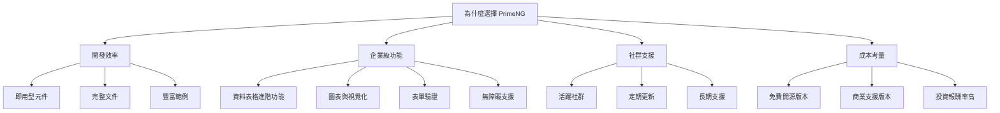
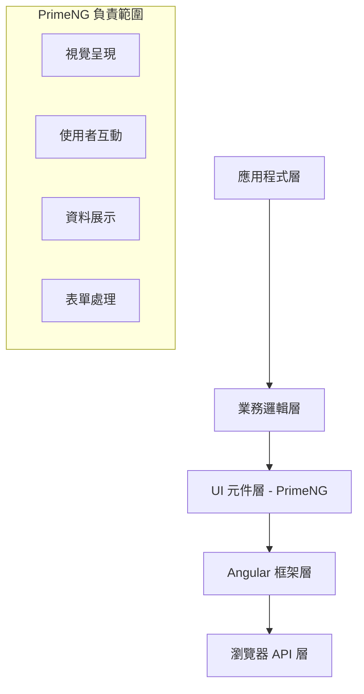
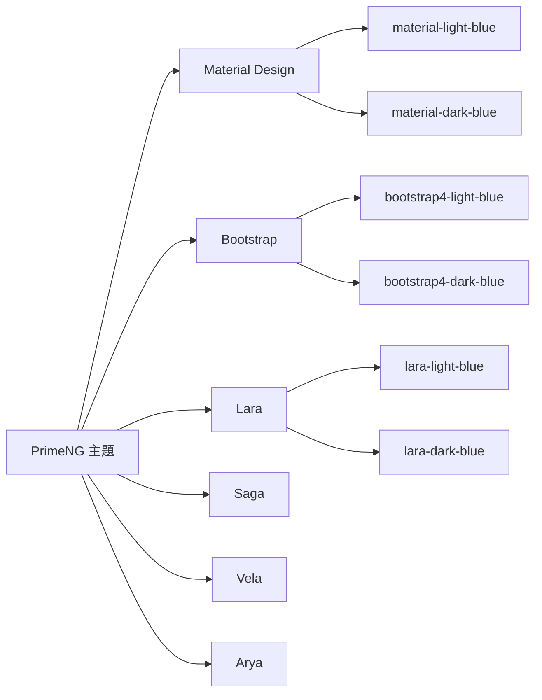
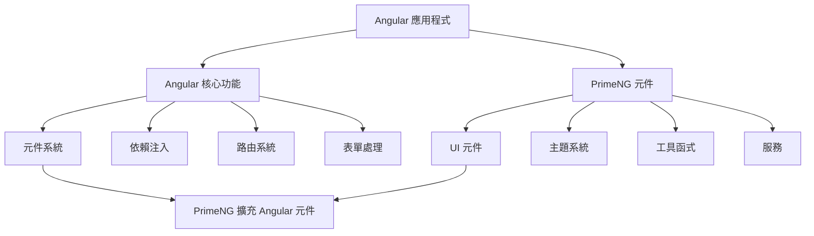
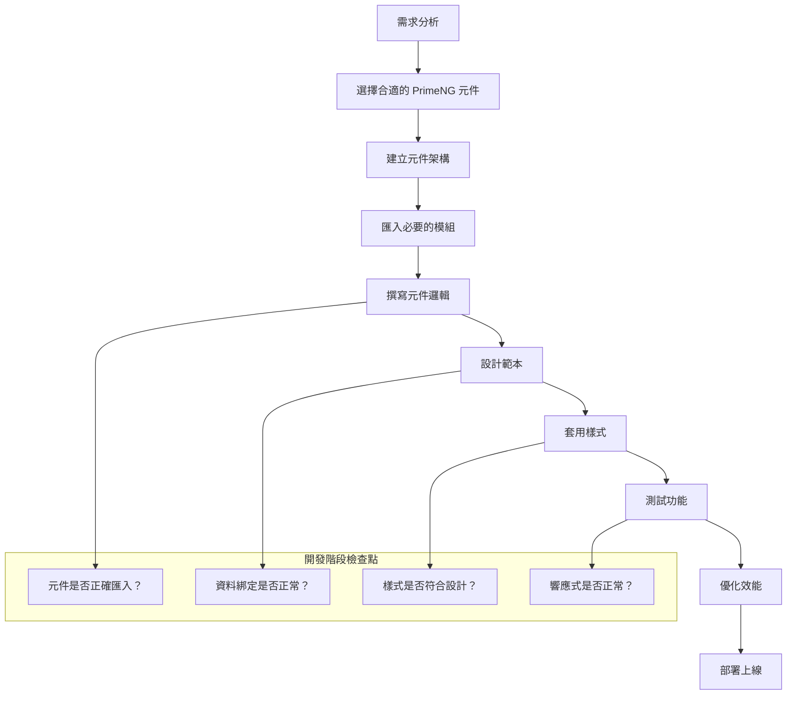
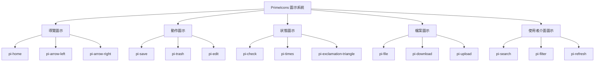
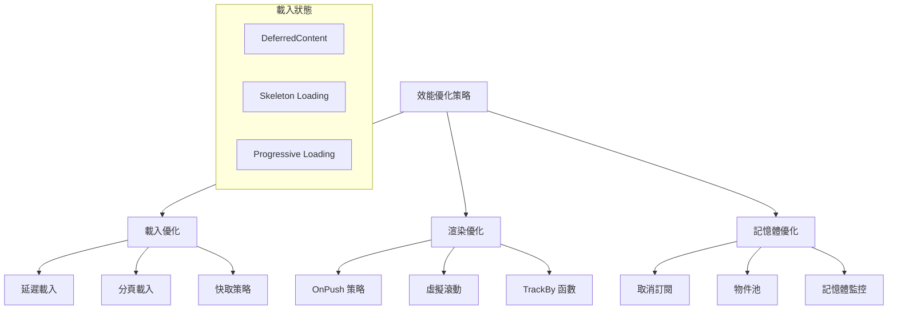
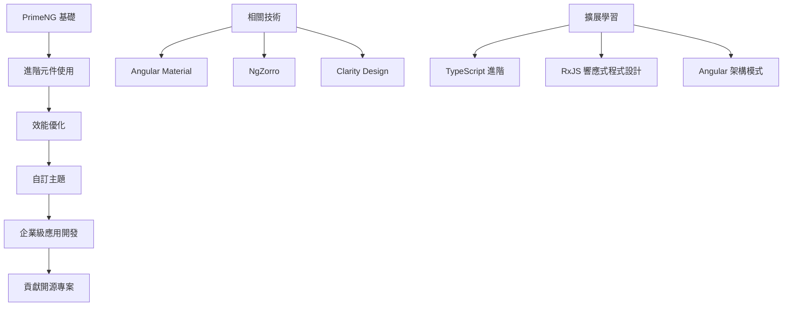

+++
date = '2025-10-21T17:02:38+08:00'
draft = false
title = 'PrimeNG使用教學'
tags = ['教學','前端元件' ,'PrimeNG']
categories = ['技術']
author = 'Eric Cheng'
summary = '提供完整PrimeNG前端元件教學'
+++

# PrimeNG 使用教學手冊

## 文件資訊
- **版本**: 1.0.0
- **更新日期**: 2025年9月5日
- **目標對象**: 從未學過 PrimeNG 的新進開發同仁
- **適用 PrimeNG 版本**: 17.x+
- **適用 Angular 版本**: 17.x+

## 目錄

### 第 1 部分：基礎入門
1. [PrimeNG 簡介](#1-primeng-簡介)
   - [1.1 什麼是 PrimeNG](#11-什麼是-primeng)
   - [1.2 為什麼選擇 PrimeNG](#12-為什麼選擇-primeng)
   - [1.3 在企業專案中的角色](#13-在企業專案中的角色)
   - [1.4 實務案例](#14-實務案例)
   - [1.5 注意事項與最佳實務](#15-注意事項與最佳實務)

2. [環境安裝與設定](#2-環境安裝與設定)
   - [2.1 前置需求](#21-前置需求)
   - [2.2 建立 Angular 專案](#22-建立-angular-專案)
   - [2.3 安裝 PrimeNG 與相關套件](#23-安裝-primeng-與相關套件)
   - [2.4 基礎設定](#24-基礎設定)
   - [2.5 主題選擇與設定](#25-主題選擇與設定)
   - [2.6 設定 PrimeFlex（CSS 工具庫）](#26-設定-primeflexcss-工具庫)
   - [2.7 開發工具設定](#27-開發工具設定)
   - [2.8 實務案例：企業專案設定](#28-實務案例企業專案設定)
   - [2.9 注意事項與疑難排解](#29-注意事項與疑難排解)
   - [2.10 環境設定檢查清單](#210-環境設定檢查清單)

3. [PrimeNG 基本使用流程](#3-primeng-基本使用流程)
   - [3.1 理解 Angular 與 PrimeNG 的關係](#31-理解-angular-與-primeng-的關係)
   - [3.2 模組匯入策略](#32-模組匯入策略)
   - [3.3 建立第一個 PrimeNG 頁面](#33-建立第一個-primeng-頁面)
   - [3.4 PrimeNG 服務的使用](#34-primeng-服務的使用)
   - [3.5 響應式設計與 PrimeFlex](#35-響應式設計與-primeflex)
   - [3.6 實務開發流程](#36-實務開發流程)
   - [3.7 注意事項與最佳實務](#37-注意事項與最佳實務)
   - [3.8 第一個專案檢查清單](#38-第一個專案檢查清單)

### 第 2 部分：核心元件應用
4. [按鈕與圖示](#4-按鈕與圖示)
   - [4.1 Button 元件基礎](#41-button-元件基礎)
   - [4.2 SplitButton 元件](#42-splitbutton-元件)
   - [4.3 PrimeIcons 圖示系統](#43-primeicons-圖示系統)
   - [4.4 實務應用案例](#44-實務應用案例)
   - [4.5 無障礙支援](#45-無障礙支援)
   - [4.6 注意事項與最佳實務](#46-注意事項與最佳實務)

5. [表單元件](#5-表單元件)
   - [5.1 基本輸入元件](#51-基本輸入元件)
   - [5.2 選擇型元件](#52-選擇型元件)
   - [5.3 選擇器元件](#53-選擇器元件)
   - [5.4 高級表單功能](#54-高級表單功能)
   - [5.5 檔案上傳](#55-檔案上傳)
   - [5.6 實務案例：完整註冊表單](#56-實務案例完整註冊表單)
   - [5.7 注意事項與最佳實務](#57-注意事項與最佳實務)

6. [表格 (DataTable)](#6-表格-datatable)
   - [6.1 DataTable 基礎](#61-datatable-基礎)
   - [6.2 分頁功能](#62-分頁功能)
   - [6.3 排序功能](#63-排序功能)
   - [6.4 篩選功能](#64-篩選功能)
   - [6.5 可編輯表格](#65-可編輯表格)
   - [6.6 選擇功能](#66-選擇功能)
   - [6.7 欄位操作](#67-欄位操作)
   - [6.8 Lazy Loading 與 API 整合](#68-lazy-loading-與-api-整合)
   - [6.9 匯出功能](#69-匯出功能)
   - [6.10 效能優化](#610-效能優化)
   - [6.11 實務案例：完整的資料管理系統](#611-實務案例完整的資料管理系統)
   - [6.12 注意事項與最佳實務](#612-注意事項與最佳實務)

7. [對話框與訊息元件](#7-對話框與訊息元件)
   - [7.1 Dialog 對話框](#71-dialog-對話框)
   - [7.2 ConfirmDialog 確認對話框](#72-confirmdialog-確認對話框)
   - [7.3 Sidebar 側邊欄](#73-sidebar-側邊欄)
   - [7.4 Toast 訊息通知](#74-toast-訊息通知)
   - [7.5 Messages 訊息元件](#75-messages-訊息元件)
   - [7.6 實務案例：通知系統](#76-實務案例通知系統)
   - [7.7 注意事項與最佳實務](#77-注意事項與最佳實務)

### 第 3 部分：進階元件與功能
8. [Menu 選單元件](#第8章menu-選單元件)
   - [8.1 基本選單元件](#81-基本選單元件)
   - [8.2 進階選單功能](#82-進階選單功能)

9. [Layout 版面配置元件](#第9章layout-版面配置元件)
   - [9.1 基本佈局元件](#91-基本佈局元件)
   - [9.2 進階佈局功能](#92-進階佈局功能)

10. [進階配置與優化](#第10章進階配置與優化)
    - [10.1 效能優化策略](#101-效能優化策略)
    - [10.2 記憶體管理](#102-記憶體管理)
    - [10.3 延遲載入](#103-延遲載入)

11. [Overlay 覆蓋層元件](#第11章overlay-覆蓋層元件)
    - [11.1 基本覆蓋層元件](#111-基本覆蓋層元件)
    - [11.2 進階覆蓋層功能](#112-進階覆蓋層功能)

12. [Chart 圖表元件](#第12章chart-圖表元件)
    - [12.1 基本圖表類型](#121-基本圖表類型)
    - [12.2 進階圖表功能](#122-進階圖表功能)

13. [File Upload 檔案上傳元件](#第13章file-upload-檔案上傳元件)
    - [13.1 基本檔案上傳](#131-基本檔案上傳)
    - [13.2 進階上傳功能](#132-進階上傳功能)

14. [Progress 進度指示元件](#第14章progress-進度指示元件)
    - [14.1 ProgressBar 進度條](#141-progressbar-進度條)
    - [14.2 ProgressSpinner 載入動畫](#142-progressspinner-載入動畫)
    - [14.3 Skeleton 骨架屏](#143-skeleton-骨架屏)

15. [Calendar 日曆元件](#第15章calendar-日曆元件)
    - [15.1 基本日曆功能](#151-基本日曆功能)
    - [15.2 進階日曆應用](#152-進階日曆應用)

### 第 4 部分：專業元件應用
16. [Tree 樹狀元件](#第16章tree-樹狀元件)
    - [16.1 基本樹狀結構](#161-基本樹狀結構)
    - [16.2 進階樹狀功能](#162-進階樹狀功能)

17. [Image 和 Galleria 圖片元件](#第17章image-和-galleria-圖片元件)
    - [17.1 Image 圖片元件](#171-image-圖片元件)
    - [17.2 Galleria 圖片畫廊](#172-galleria-圖片畫廊)

18. [Timeline 時間軸元件](#第18章timeline-時間軸元件)
    - [18.1 基本時間軸](#181-基本時間軸)

19. [表單驗證與訊息處理](#第19章表單驗證與訊息處理)
    - [19.1 表單驗證基礎](#191-表單驗證基礎)

### 第 5 部分：企業級開發與最佳實務
20. [最佳實務與進階主題](#第20章最佳實務與進階主題)
    - [20.1 專案架構與模組化](#201-專案架構與模組化)
    - [20.2 效能優化策略](#202-效能優化策略)
    - [20.3 測試策略](#203-測試策略)
    - [20.4 部署與發佈](#204-部署與發佈)
    - [20.5 總結與未來發展](#205-總結與未來發展)

---

## 1. PrimeNG 簡介

### 1.1 什麼是 PrimeNG

PrimeNG 是一套基於 Angular 的豐富 UI 元件庫，提供超過 90 個高品質的元件，包括表格、圖表、表單元件等。它是由 PrimeTek 公司開發，專為企業級應用程式設計。

#### 核心特色：
- **豐富的元件集**: 90+ 個即用型 UI 元件
- **主題支援**: 提供多種預建主題與自訂主題功能
- **無障礙支援**: 符合 WCAG 2.1 標準
- **TypeScript 支援**: 完整的型別定義
- **回應式設計**: 支援行動裝置與桌面裝置
- **多瀏覽器支援**: 支援所有現代瀏覽器

### 1.2 為什麼選擇 PrimeNG



#### 相較於其他 UI 框架的優勢：

| 特性 | PrimeNG | Angular Material | Ng-Bootstrap |
|------|---------|------------------|--------------|
| 元件數量 | 90+ | 40+ | 15+ |
| 進階表格功能 | ✅ 完整 | ❌ 基礎 | ❌ 無 |
| 圖表支援 | ✅ 內建 | ❌ 需第三方 | ❌ 需第三方 |
| 主題客製化 | ✅ 完整 | ✅ 有限 | ❌ 基礎 |
| 商業授權 | ✅ 免費版 + 商業版 | ✅ 免費 | ✅ 免費 |

### 1.3 在企業專案中的角色

PrimeNG 在企業專案中扮演重要角色：

#### 1.3.1 前端架構層級


#### 1.3.2 開發團隊分工
- **前端開發者**: 使用 PrimeNG 元件建立使用者介面
- **UI/UX 設計師**: 設計符合 PrimeNG 設計語言的介面
- **後端開發者**: 提供符合 PrimeNG 資料格式的 API
- **測試工程師**: 測試 PrimeNG 元件的功能與相容性

### 1.4 實務案例

#### 案例 1：企業資料管理系統
- **使用元件**: DataTable, Dialog, Form Controls
- **解決問題**: 大量資料展示、即時編輯、複雜篩選
- **效益**: 開發時間縮短 40%，使用者體驗提升

#### 案例 2：商業智慧儀表板
- **使用元件**: Charts, Cards, Panels
- **解決問題**: 資料視覺化、回應式布局
- **效益**: 無需額外圖表庫，維護成本降低

### 1.5 注意事項與最佳實務

#### ⚠️ 注意事項
1. **版本相容性**: 確保 PrimeNG 版本與 Angular 版本相容
2. **授權考量**: 商業專案建議購買 PRO 版本獲得技術支援
3. **效能考量**: 大型專案需注意 bundle size
4. **客製化限制**: 深度客製化可能需要覆寫大量 CSS

#### ✅ 最佳實務
1. **模組化匯入**: 只匯入需要的元件模組
2. **主題統一**: 在專案初期決定主題設計
3. **元件封裝**: 建立共用元件庫
4. **文件維護**: 記錄客製化設定與最佳實務

---

## 2. 環境安裝與設定

### 2.1 前置需求

在開始安裝 PrimeNG 之前，請確保您的開發環境符合以下需求：

#### 系統需求
- **Node.js**: 18.x 或以上版本
- **npm**: 9.x 或以上版本
- **Angular CLI**: 17.x 或以上版本

#### 檢查現有環境
```bash
# 檢查 Node.js 版本
node --version

# 檢查 npm 版本
npm --version

# 檢查 Angular CLI 版本
ng version
```

### 2.2 建立 Angular 專案

#### 2.2.1 建立新專案
```bash
# 安裝最新版 Angular CLI（如果尚未安裝）
npm install -g @angular/cli

# 建立新的 Angular 專案
ng new primeng-demo --routing --style=scss

# 進入專案目錄
cd primeng-demo
```

#### 2.2.2 專案結構
```
primeng-demo/
├── src/
│   ├── app/
│   │   ├── app.component.ts
│   │   ├── app.component.html
│   │   ├── app.component.scss
│   │   └── app.module.ts
│   ├── styles.scss
│   └── index.html
├── package.json
└── angular.json
```

### 2.3 安裝 PrimeNG 與相關套件

#### 2.3.1 核心套件安裝
```bash
# 安裝 PrimeNG 核心
npm install primeng

# 安裝 PrimeIcons（圖示庫）
npm install primeicons

# 安裝 PrimeFlex（CSS 工具庫）
npm install primeflex

# 安裝動畫支援（可選）
npm install @angular/animations
```

#### 2.3.2 確認安裝
檢查 `package.json` 檔案，確認以下套件已正確安裝：

```json
{
  "dependencies": {
    "@angular/animations": "^17.0.0",
    "primeng": "^17.0.0",
    "primeicons": "^7.0.0",
    "primeflex": "^3.3.0"
  }
}
```

### 2.4 基礎設定

#### 2.4.1 導入樣式
在 `src/styles.scss` 中加入 PrimeNG 樣式：

```scss
/* 導入 PrimeNG 主題 */
@import "primeng/resources/themes/lara-light-blue/theme.css";

/* 導入 PrimeNG 核心樣式 */
@import "primeng/resources/primeng.min.css";

/* 導入 PrimeIcons */
@import "primeicons/primeicons.css";

/* 導入 PrimeFlex（可選）*/
@import "primeflex/primeflex.css";

/* 自訂全域樣式 */
body {
  font-family: "Roboto", sans-serif;
  margin: 0;
  padding: 0;
}
```

#### 2.4.2 啟用動畫支援
在 `src/app/app.module.ts` 中加入動畫模組：

```typescript
import { NgModule } from '@angular/core';
import { BrowserModule } from '@angular/platform-browser';
import { BrowserAnimationsModule } from '@angular/platform-browser/animations';

import { AppRoutingModule } from './app-routing.module';
import { AppComponent } from './app.component';

@NgModule({
  declarations: [
    AppComponent
  ],
  imports: [
    BrowserModule,
    AppRoutingModule,
    BrowserAnimationsModule // 啟用動畫支援
  ],
  providers: [],
  bootstrap: [AppComponent]
})
export class AppModule { }
```

### 2.5 主題選擇與設定

PrimeNG 提供多種預建主題，您可以根據專案需求選擇適合的主題。

#### 2.5.1 可用主題列表



#### 2.5.2 切換主題
修改 `src/styles.scss` 中的主題導入：

```scss
/* 選擇其中一個主題 */

/* Material Design 主題 */
/* @import "primeng/resources/themes/material-light-blue/theme.css"; */

/* Bootstrap 主題 */
/* @import "primeng/resources/themes/bootstrap4-light-blue/theme.css"; */

/* Lara 主題（推薦用於企業專案）*/
@import "primeng/resources/themes/lara-light-blue/theme.css";

/* Saga 主題 */
/* @import "primeng/resources/themes/saga-blue/theme.css"; */
```

### 2.6 設定 PrimeFlex（CSS 工具庫）

PrimeFlex 是 PrimeNG 團隊開發的 CSS 工具庫，類似於 Tailwind CSS。

#### 2.6.1 基本配置
在 `src/styles.scss` 中加入：

```scss
/* PrimeFlex 設定 */
@import "primeflex/primeflex.css";

/* 自訂響應式斷點（可選）*/
:root {
  --surface-a: #ffffff;
  --surface-b: #f8f9fa;
  --surface-c: #e9ecef;
  --surface-d: #dee2e6;
  --surface-e: #ffffff;
  --surface-f: #ffffff;
  --text-color: #495057;
  --text-color-secondary: #6c757d;
  --primary-color: #007bff;
  --primary-color-text: #ffffff;
}
```

#### 2.6.2 常用 PrimeFlex 類別
```html
<!-- 布局 -->
<div class="flex justify-content-center align-items-center">
  <p class="text-center">置中內容</p>
</div>

<!-- 間距 -->
<div class="p-3 m-2"><!-- padding: 1rem, margin: 0.5rem --></div>

<!-- 響應式 -->
<div class="col-12 md:col-6 lg:col-4">響應式欄位</div>
```

### 2.7 開發工具設定

#### 2.7.1 VS Code 擴充功能推薦
建議安裝以下 VS Code 擴充功能以提升開發體驗：

```json
{
  "recommendations": [
    "angular.ng-template",
    "ms-vscode.vscode-typescript-next",
    "esbenp.prettier-vscode",
    "bradlc.vscode-tailwindcss",
    "formulahendry.auto-rename-tag"
  ]
}
```

#### 2.7.2 TypeScript 設定
在 `tsconfig.json` 中加入 PrimeNG 型別支援：

```json
{
  "compilerOptions": {
    "types": ["node"],
    "lib": ["es2022", "dom"],
    "strict": true,
    "strictPropertyInitialization": false
  }
}
```

### 2.8 實務案例：企業專案設定

#### 案例：大型企業專案設定
```typescript
// src/app/shared/primeng.module.ts
import { NgModule } from '@angular/core';

// 匯入常用 PrimeNG 模組
import { ButtonModule } from 'primeng/button';
import { TableModule } from 'primeng/table';
import { DialogModule } from 'primeng/dialog';
import { InputTextModule } from 'primeng/inputtext';
import { DropdownModule } from 'primeng/dropdown';
import { CalendarModule } from 'primeng/calendar';
import { ToastModule } from 'primeng/toast';
import { ConfirmDialogModule } from 'primeng/confirmdialog';

const PRIMENG_MODULES = [
  ButtonModule,
  TableModule,
  DialogModule,
  InputTextModule,
  DropdownModule,
  CalendarModule,
  ToastModule,
  ConfirmDialogModule
];

@NgModule({
  imports: PRIMENG_MODULES,
  exports: PRIMENG_MODULES
})
export class PrimeNGModule { }
```

### 2.9 注意事項與疑難排解

#### ⚠️ 常見問題

**問題 1**: 主題樣式沒有正確載入
```scss
/* 解決方案：確保樣式導入順序正確 */
@import "primeng/resources/themes/lara-light-blue/theme.css"; /* 主題必須第一個 */
@import "primeng/resources/primeng.min.css"; /* 核心樣式第二個 */
@import "primeicons/primeicons.css"; /* 圖示樣式第三個 */
```

**問題 2**: 動畫效果無法正常運作
```typescript
// 解決方案：確保已導入 BrowserAnimationsModule
import { BrowserAnimationsModule } from '@angular/platform-browser/animations';

@NgModule({
  imports: [
    BrowserAnimationsModule // 必須加入此模組
  ]
})
```

**問題 3**: PrimeFlex 類別無效
```html
<!-- 錯誤寫法 -->
<div class="p-grid p-col-12">

<!-- 正確寫法（PrimeFlex 3.x）-->
<div class="grid col-12">
```

#### ✅ 最佳實務

1. **模組化匯入**: 建立共用的 PrimeNG 模組
2. **主題管理**: 使用 CSS 變數管理主題色彩
3. **效能優化**: 只匯入需要的元件模組
4. **版本鎖定**: 使用固定版本避免相容性問題

### 2.10 環境設定檢查清單

- [ ] Node.js 18.x+ 已安裝
- [ ] Angular CLI 17.x+ 已安裝
- [ ] PrimeNG 核心套件已安裝
- [ ] PrimeIcons 已安裝
- [ ] PrimeFlex 已安裝（可選）
- [ ] 動畫模組已啟用
- [ ] 主題樣式已正確導入
- [ ] 開發工具已設定
- [ ] 測試頁面可正常顯示

---

## 3. PrimeNG 基本使用流程

### 3.1 理解 Angular 與 PrimeNG 的關係

PrimeNG 是建立在 Angular 框架之上的 UI 元件庫，兩者的關係如下：



#### 3.1.1 元件生命週期整合
PrimeNG 元件完全遵循 Angular 的元件生命週期：

```typescript
import { Component, OnInit, OnDestroy } from '@angular/core';

@Component({
  selector: 'app-demo',
  template: `
    <p-table [value]="products">
      <ng-template pTemplate="header">
        <tr>
          <th>名稱</th>
          <th>價格</th>
        </tr>
      </ng-template>
      <ng-template pTemplate="body" let-product>
        <tr>
          <td>{{product.name}}</td>
          <td>{{product.price}}</td>
        </tr>
      </ng-template>
    </p-table>
  `
})
export class DemoComponent implements OnInit, OnDestroy {
  products: any[] = [];

  ngOnInit() {
    // 元件初始化時載入資料
    this.loadProducts();
  }

  ngOnDestroy() {
    // 元件銷毀時清理資源
  }

  loadProducts() {
    // 載入產品資料
  }
}
```

### 3.2 模組匯入策略

#### 3.2.1 按需匯入（推薦）
只匯入需要的元件模組，減少 bundle size：

```typescript
// app.module.ts
import { NgModule } from '@angular/core';
import { BrowserModule } from '@angular/platform-browser';
import { BrowserAnimationsModule } from '@angular/platform-browser/animations';

// 只匯入需要的 PrimeNG 模組
import { ButtonModule } from 'primeng/button';
import { TableModule } from 'primeng/table';
import { DialogModule } from 'primeng/dialog';

import { AppComponent } from './app.component';

@NgModule({
  declarations: [AppComponent],
  imports: [
    BrowserModule,
    BrowserAnimationsModule,
    // PrimeNG 模組
    ButtonModule,
    TableModule,
    DialogModule
  ],
  providers: [],
  bootstrap: [AppComponent]
})
export class AppModule { }
```

#### 3.2.2 共用模組封裝
建立共用的 PrimeNG 模組以便重複使用：

```typescript
// shared/primeng-shared.module.ts
import { NgModule } from '@angular/core';

// 匯入常用的 PrimeNG 模組
import { ButtonModule } from 'primeng/button';
import { TableModule } from 'primeng/table';
import { DialogModule } from 'primeng/dialog';
import { InputTextModule } from 'primeng/inputtext';
import { DropdownModule } from 'primeng/dropdown';
import { CalendarModule } from 'primeng/calendar';
import { ToastModule } from 'primeng/toast';
import { ConfirmDialogModule } from 'primeng/confirmdialog';

const PRIMENG_MODULES = [
  ButtonModule,
  TableModule,
  DialogModule,
  InputTextModule,
  DropdownModule,
  CalendarModule,
  ToastModule,
  ConfirmDialogModule
];

@NgModule({
  imports: PRIMENG_MODULES,
  exports: PRIMENG_MODULES
})
export class PrimeNGSharedModule { }
```

使用共用模組：

```typescript
// feature.module.ts
import { NgModule } from '@angular/core';
import { CommonModule } from '@angular/common';
import { PrimeNGSharedModule } from '../shared/primeng-shared.module';

import { FeatureComponent } from './feature.component';

@NgModule({
  declarations: [FeatureComponent],
  imports: [
    CommonModule,
    PrimeNGSharedModule // 匯入共用的 PrimeNG 模組
  ]
})
export class FeatureModule { }
```

### 3.3 建立第一個 PrimeNG 頁面

#### 3.3.1 簡單的產品列表頁面
讓我們建立一個包含表格、按鈕和對話框的完整範例：

```typescript
// product-list.component.ts
import { Component, OnInit } from '@angular/core';

interface Product {
  id: number;
  name: string;
  price: number;
  category: string;
  inventoryStatus: string;
}

@Component({
  selector: 'app-product-list',
  templateUrl: './product-list.component.html',
  styleUrls: ['./product-list.component.scss']
})
export class ProductListComponent implements OnInit {
  products: Product[] = [];
  selectedProduct: Product | null = null;
  displayDialog: boolean = false;

  ngOnInit() {
    this.loadProducts();
  }

  loadProducts() {
    this.products = [
      {
        id: 1,
        name: '筆記型電腦',
        price: 25000,
        category: '電子產品',
        inventoryStatus: '庫存充足'
      },
      {
        id: 2,
        name: '滑鼠',
        price: 800,
        category: '電子產品',
        inventoryStatus: '庫存不足'
      },
      {
        id: 3,
        name: '鍵盤',
        price: 1500,
        category: '電子產品',
        inventoryStatus: '缺貨'
      }
    ];
  }

  showProductDialog(product: Product) {
    this.selectedProduct = { ...product };
    this.displayDialog = true;
  }

  hideDialog() {
    this.displayDialog = false;
    this.selectedProduct = null;
  }

  saveProduct() {
    if (this.selectedProduct) {
      // 實際專案中這裡會呼叫 API 保存資料
      console.log('保存產品:', this.selectedProduct);
      this.hideDialog();
    }
  }
}
```

```html
<!-- product-list.component.html -->
<div class="product-list-container">
  <h2>產品管理</h2>
  
  <!-- 工具列 -->
  <div class="toolbar mb-3">
    <p-button 
      label="新增產品" 
      icon="pi pi-plus" 
      class="p-button-success"
      (onClick)="showProductDialog({} as Product)">
    </p-button>
  </div>

  <!-- 產品表格 -->
  <p-table 
    [value]="products" 
    [paginator]="true" 
    [rows]="10"
    [showCurrentPageReport]="true"
    currentPageReportTemplate="顯示 {first} 到 {last} 共 {totalRecords} 筆資料"
    responsiveLayout="scroll">
    
    <ng-template pTemplate="header">
      <tr>
        <th>ID</th>
        <th>產品名稱</th>
        <th>價格</th>
        <th>類別</th>
        <th>庫存狀態</th>
        <th>操作</th>
      </tr>
    </ng-template>
    
    <ng-template pTemplate="body" let-product>
      <tr>
        <td>{{product.id}}</td>
        <td>{{product.name}}</td>
        <td>{{product.price | currency:'TWD':'symbol':'1.0-0'}}</td>
        <td>{{product.category}}</td>
        <td>
          <span 
            class="status-badge" 
            [ngClass]="'status-' + getInventoryStatus(product.inventoryStatus)">
            {{product.inventoryStatus}}
          </span>
        </td>
        <td>
          <p-button 
            icon="pi pi-pencil" 
            class="p-button-rounded p-button-text"
            (onClick)="showProductDialog(product)"
            pTooltip="編輯">
          </p-button>
        </td>
      </tr>
    </ng-template>
  </p-table>

  <!-- 產品編輯對話框 -->
  <p-dialog 
    header="產品資訊" 
    [(visible)]="displayDialog" 
    [style]="{width: '450px'}"
    [modal]="true">
    
    <div class="field">
      <label for="name">產品名稱</label>
      <input 
        type="text" 
        id="name"
        pInputText 
        [(ngModel)]="selectedProduct.name" 
        class="w-full">
    </div>
    
    <div class="field">
      <label for="price">價格</label>
      <input 
        type="number" 
        id="price"
        pInputText 
        [(ngModel)]="selectedProduct.price" 
        class="w-full">
    </div>
    
    <div class="field">
      <label for="category">類別</label>
      <p-dropdown 
        [(ngModel)]="selectedProduct.category"
        [options]="[
          {label: '電子產品', value: '電子產品'},
          {label: '服飾', value: '服飾'},
          {label: '書籍', value: '書籍'}
        ]"
        placeholder="選擇類別"
        class="w-full">
      </p-dropdown>
    </div>

    <ng-template pTemplate="footer">
      <p-button 
        label="取消" 
        icon="pi pi-times" 
        class="p-button-text"
        (onClick)="hideDialog()">
      </p-button>
      <p-button 
        label="保存" 
        icon="pi pi-check" 
        class="p-button-text"
        (onClick)="saveProduct()">
      </p-button>
    </ng-template>
  </p-dialog>
</div>
```

```scss
/* product-list.component.scss */
.product-list-container {
  padding: 1rem;
}

.toolbar {
  display: flex;
  justify-content: space-between;
  align-items: center;
}

.field {
  margin-bottom: 1rem;
  
  label {
    display: block;
    margin-bottom: 0.5rem;
    font-weight: 600;
  }
}

.status-badge {
  padding: 0.25rem 0.5rem;
  border-radius: 0.25rem;
  font-size: 0.75rem;
  font-weight: 700;
  text-transform: uppercase;
  
  &.status-庫存充足 {
    background: #c8e6c9;
    color: #2e7d32;
  }
  
  &.status-庫存不足 {
    background: #ffecb3;
    color: #f57f17;
  }
  
  &.status-缺貨 {
    background: #ffcdd2;
    color: #c62828;
  }
}

.w-full {
  width: 100%;
}

.mb-3 {
  margin-bottom: 1rem;
}
```

#### 3.3.2 元件模組設定
確保在元件模組中匯入必要的 PrimeNG 模組：

```typescript
// product-list.module.ts
import { NgModule } from '@angular/core';
import { CommonModule } from '@angular/common';
import { FormsModule } from '@angular/forms';

// PrimeNG 模組
import { TableModule } from 'primeng/table';
import { ButtonModule } from 'primeng/button';
import { DialogModule } from 'primeng/dialog';
import { InputTextModule } from 'primeng/inputtext';
import { DropdownModule } from 'primeng/dropdown';
import { TooltipModule } from 'primeng/tooltip';

import { ProductListComponent } from './product-list.component';

@NgModule({
  declarations: [ProductListComponent],
  imports: [
    CommonModule,
    FormsModule,
    // PrimeNG 模組
    TableModule,
    ButtonModule,
    DialogModule,
    InputTextModule,
    DropdownModule,
    TooltipModule
  ]
})
export class ProductListModule { }
```

### 3.4 PrimeNG 服務的使用

PrimeNG 提供一些有用的服務來處理全域功能：

#### 3.4.1 MessageService（訊息服務）
用於顯示 Toast 通知訊息：

```typescript
// app.module.ts
import { MessageService } from 'primeng/api';

@NgModule({
  providers: [MessageService]
})
export class AppModule { }
```

```typescript
// product-list.component.ts
import { MessageService } from 'primeng/api';

@Component({
  selector: 'app-product-list',
  templateUrl: './product-list.component.html'
})
export class ProductListComponent {
  constructor(private messageService: MessageService) {}

  saveProduct() {
    if (this.selectedProduct) {
      // 保存成功後顯示訊息
      this.messageService.add({
        severity: 'success',
        summary: '成功',
        detail: '產品已成功保存'
      });
      this.hideDialog();
    }
  }

  showError(message: string) {
    this.messageService.add({
      severity: 'error',
      summary: '錯誤',
      detail: message
    });
  }
}
```

在範本中加入 Toast 元件：

```html
<!-- app.component.html -->
<router-outlet></router-outlet>
<p-toast></p-toast>
```

#### 3.4.2 ConfirmationService（確認對話框服務）
用於顯示確認對話框：

```typescript
// app.module.ts
import { ConfirmationService } from 'primeng/api';

@NgModule({
  providers: [ConfirmationService]
})
export class AppModule { }
```

```typescript
// product-list.component.ts
import { ConfirmationService } from 'primeng/api';

@Component({
  selector: 'app-product-list',
  templateUrl: './product-list.component.html'
})
export class ProductListComponent {
  constructor(private confirmationService: ConfirmationService) {}

  deleteProduct(product: Product) {
    this.confirmationService.confirm({
      message: `確定要刪除 ${product.name} 嗎？`,
      header: '確認刪除',
      icon: 'pi pi-exclamation-triangle',
      accept: () => {
        // 執行刪除邏輯
        this.products = this.products.filter(p => p.id !== product.id);
        this.messageService.add({
          severity: 'success',
          summary: '成功',
          detail: '產品已刪除'
        });
      }
    });
  }
}
```

在範本中加入確認對話框元件：

```html
<!-- app.component.html -->
<router-outlet></router-outlet>
<p-toast></p-toast>
<p-confirmDialog></p-confirmDialog>
```

### 3.5 響應式設計與 PrimeFlex

#### 3.5.1 使用 PrimeFlex 進行響應式布局
```html
<!-- 響應式格線系統 -->
<div class="grid">
  <div class="col-12 md:col-6 lg:col-4">
    <p-card header="卡片 1">
      <p>內容...</p>
    </p-card>
  </div>
  <div class="col-12 md:col-6 lg:col-4">
    <p-card header="卡片 2">
      <p>內容...</p>
    </p-card>
  </div>
  <div class="col-12 md:col-6 lg:col-4">
    <p-card header="卡片 3">
      <p>內容...</p>
    </p-card>
  </div>
</div>
```

#### 3.5.2 響應式斷點
```scss
/* 自訂響應式斷點 */
@media screen and (max-width: 768px) {
  .product-list-container {
    padding: 0.5rem;
  }
  
  .toolbar {
    flex-direction: column;
    gap: 1rem;
  }
}
```

### 3.6 實務開發流程

#### 3.6.1 開發步驟流程圖


#### 3.6.2 專案結構建議
```
src/
├── app/
│   ├── core/                 # 核心模組
│   │   ├── services/         # 全域服務
│   │   └── guards/           # 路由守衛
│   ├── shared/              # 共用模組
│   │   ├── components/      # 共用元件
│   │   ├── primeng.module.ts # PrimeNG 模組封裝
│   │   └── pipes/           # 自訂管道
│   ├── features/            # 功能模組
│   │   ├── products/        # 產品管理
│   │   ├── orders/          # 訂單管理
│   │   └── users/           # 使用者管理
│   └── layouts/             # 布局元件
├── assets/                  # 靜態資源
└── styles/                  # 全域樣式
    ├── themes/              # 主題檔案
    └── variables.scss       # SCSS 變數
```

### 3.7 注意事項與最佳實務

#### ⚠️ 常見錯誤

**錯誤 1**: 忘記匯入 FormsModule
```typescript
// 錯誤：使用 [(ngModel)] 但沒有匯入 FormsModule
@NgModule({
  imports: [CommonModule] // 缺少 FormsModule
})

// 正確：
@NgModule({
  imports: [CommonModule, FormsModule]
})
```

**錯誤 2**: 服務沒有正確注入
```typescript
// 錯誤：沒有在模組中提供服務
@Component({})
export class MyComponent {
  constructor(private messageService: MessageService) {} // 會出錯
}

// 正確：在模組中提供服務
@NgModule({
  providers: [MessageService]
})
```

**錯誤 3**: 範本語法錯誤
```html
<!-- 錯誤：pTemplate 拼寫錯誤 -->
<ng-template pTemplete="header">

<!-- 正確：-->
<ng-template pTemplate="header">
```

#### ✅ 最佳實務

1. **模組化設計**: 將 PrimeNG 元件封裝成共用模組
2. **型別安全**: 定義介面來確保資料型別正確
3. **效能優化**: 使用 OnPush 變更檢測策略
4. **無障礙支援**: 確保元件支援鍵盤操作和螢幕閱讀器
5. **錯誤處理**: 適當處理 API 錯誤和使用者輸入驗證

### 3.8 第一個專案檢查清單

- [ ] PrimeNG 模組已正確匯入
- [ ] 服務已在適當層級注入
- [ ] 資料綁定正常運作
- [ ] 事件處理正確實作
- [ ] 樣式符合設計規範
- [ ] 響應式布局測試通過
- [ ] 錯誤處理機制完善
- [ ] 無障礙功能正常
- [ ] 效能表現符合要求

---

## 4. 按鈕與圖示

### 4.1 Button 元件基礎

Button 是最常用的 PrimeNG 元件之一，提供多種樣式和功能選項。

#### 4.1.1 基本按鈕
```typescript
// button-demo.component.ts
import { Component } from '@angular/core';

@Component({
  selector: 'app-button-demo',
  template: `
    <div class="button-demo">
      <h3>基本按鈕</h3>
      <div class="flex flex-wrap gap-2">
        <!-- 基本按鈕 -->
        <p-button label="基本按鈕" (onClick)="handleClick()"></p-button>
        
        <!-- 帶圖示的按鈕 -->
        <p-button 
          label="儲存" 
          icon="pi pi-save" 
          (onClick)="save()">
        </p-button>
        
        <!-- 只有圖示的按鈕 -->
        <p-button 
          icon="pi pi-search" 
          class="p-button-rounded"
          pTooltip="搜尋">
        </p-button>
      </div>
    </div>
  `
})
export class ButtonDemoComponent {
  handleClick() {
    console.log('按鈕被點擊');
  }

  save() {
    console.log('執行儲存');
  }
}
```

#### 4.1.2 按鈕樣式變體
```html
<!-- 不同嚴重性等級 -->
<div class="flex flex-wrap gap-2 mb-3">
  <p-button label="主要" class="p-button-primary"></p-button>
  <p-button label="次要" class="p-button-secondary"></p-button>
  <p-button label="成功" class="p-button-success"></p-button>
  <p-button label="資訊" class="p-button-info"></p-button>
  <p-button label="警告" class="p-button-warning"></p-button>
  <p-button label="危險" class="p-button-danger"></p-button>
  <p-button label="說明" class="p-button-help"></p-button>
</div>

<!-- 不同大小 -->
<div class="flex flex-wrap gap-2 mb-3">
  <p-button label="小型" class="p-button-sm"></p-button>
  <p-button label="標準" class=""></p-button>
  <p-button label="大型" class="p-button-lg"></p-button>
</div>

<!-- 不同樣式 -->
<div class="flex flex-wrap gap-2 mb-3">
  <p-button label="填滿"></p-button>
  <p-button label="外框" class="p-button-outlined"></p-button>
  <p-button label="文字" class="p-button-text"></p-button>
  <p-button label="連結" class="p-button-link"></p-button>
</div>

<!-- 圓形和圓角 -->
<div class="flex flex-wrap gap-2 mb-3">
  <p-button icon="pi pi-plus" class="p-button-rounded"></p-button>
  <p-button icon="pi pi-minus" class="p-button-rounded p-button-outlined"></p-button>
  <p-button label="圓角" class="p-button-rounded" style="border-radius: 12px;"></p-button>
</div>
```

#### 4.1.3 載入狀態和禁用狀態
```typescript
// loading-button.component.ts
export class LoadingButtonComponent {
  loading = false;
  disabled = false;

  async performAction() {
    this.loading = true;
    try {
      // 模擬 API 呼叫
      await new Promise(resolve => setTimeout(resolve, 2000));
      console.log('操作完成');
    } finally {
      this.loading = false;
    }
  }

  toggleDisabled() {
    this.disabled = !this.disabled;
  }
}
```

```html
<!-- 載入和禁用狀態 -->
<div class="flex flex-wrap gap-2 mb-3">
  <p-button 
    label="執行操作" 
    [loading]="loading"
    loadingIcon="pi pi-spinner"
    (onClick)="performAction()">
  </p-button>
  
  <p-button 
    label="禁用按鈕" 
    [disabled]="disabled">
  </p-button>
  
  <p-button 
    label="切換禁用狀態" 
    (onClick)="toggleDisabled()">
  </p-button>
</div>
```

### 4.2 SplitButton 元件

SplitButton 提供主要動作和下拉選單的組合功能。

```typescript
// split-button-demo.component.ts
import { MenuItem } from 'primeng/api';

export class SplitButtonDemoComponent implements OnInit {
  items: MenuItem[] = [];

  ngOnInit() {
    this.items = [
      {
        label: '更新',
        icon: 'pi pi-refresh',
        command: () => this.update()
      },
      {
        label: '刪除',
        icon: 'pi pi-times',
        command: () => this.delete()
      },
      { separator: true },
      {
        label: '首頁',
        icon: 'pi pi-home',
        url: 'http://www.primefaces.org/primeng'
      }
    ];
  }

  save() {
    console.log('儲存操作');
  }

  update() {
    console.log('更新操作');
  }

  delete() {
    console.log('刪除操作');
  }
}
```

```html
<!-- SplitButton 範例 -->
<div class="split-button-demo">
  <h3>分割按鈕</h3>
  
  <p-splitButton 
    label="儲存" 
    icon="pi pi-save"
    [model]="items"
    (onClick)="save()"
    class="mb-3">
  </p-splitButton>
  
  <!-- 不同樣式的分割按鈕 -->
  <p-splitButton 
    label="選項" 
    icon="pi pi-cog"
    [model]="items"
    class="p-button-secondary mb-3">
  </p-splitButton>
</div>
```

### 4.3 PrimeIcons 圖示系統

#### 4.3.1 常用圖示分類


#### 4.3.2 圖示使用範例
```html
<!-- 基本圖示使用 -->
<div class="icon-demo">
  <h3>常用圖示</h3>
  
  <!-- 內聯圖示 -->
  <div class="flex flex-wrap gap-3 mb-3">
    <i class="pi pi-home" style="font-size: 1.5rem;"></i>
    <i class="pi pi-user" style="font-size: 1.5rem; color: #007bff;"></i>
    <i class="pi pi-cog" style="font-size: 1.5rem; color: #28a745;"></i>
  </div>
  
  <!-- 搭配文字 -->
  <div class="flex flex-column gap-2 mb-3">
    <span><i class="pi pi-info-circle"></i> 資訊訊息</span>
    <span><i class="pi pi-exclamation-triangle" style="color: #ffc107;"></i> 警告訊息</span>
    <span><i class="pi pi-times-circle" style="color: #dc3545;"></i> 錯誤訊息</span>
    <span><i class="pi pi-check-circle" style="color: #28a745;"></i> 成功訊息</span>
  </div>
</div>
```

#### 4.3.3 圖示工具元件
```typescript
// icon-picker.component.ts
@Component({
  selector: 'app-icon-picker',
  template: `
    <div class="icon-picker">
      <h4>圖示選擇器</h4>
      
      <!-- 搜尋框 -->
      <div class="field">
        <span class="p-input-icon-left">
          <i class="pi pi-search"></i>
          <input 
            type="text" 
            pInputText 
            placeholder="搜尋圖示"
            [(ngModel)]="searchTerm"
            (input)="filterIcons()">
        </span>
      </div>
      
      <!-- 圖示格線 -->
      <div class="icon-grid">
        <div 
          *ngFor="let icon of filteredIcons" 
          class="icon-item"
          (click)="selectIcon(icon)"
          [class.selected]="selectedIcon === icon">
          <i [class]="'pi ' + icon"></i>
          <small>{{icon}}</small>
        </div>
      </div>
    </div>
  `,
  styles: [`
    .icon-grid {
      display: grid;
      grid-template-columns: repeat(auto-fill, minmax(100px, 1fr));
      gap: 1rem;
      margin-top: 1rem;
    }
    
    .icon-item {
      display: flex;
      flex-direction: column;
      align-items: center;
      padding: 0.5rem;
      border: 1px solid #dee2e6;
      border-radius: 4px;
      cursor: pointer;
      transition: all 0.2s;
    }
    
    .icon-item:hover {
      background-color: #f8f9fa;
      border-color: #007bff;
    }
    
    .icon-item.selected {
      background-color: #007bff;
      color: white;
      border-color: #007bff;
    }
    
    .icon-item i {
      font-size: 1.5rem;
      margin-bottom: 0.5rem;
    }
  `]
})
export class IconPickerComponent {
  searchTerm = '';
  selectedIcon = '';
  
  allIcons = [
    'pi-home', 'pi-user', 'pi-cog', 'pi-search', 'pi-filter',
    'pi-save', 'pi-trash', 'pi-edit', 'pi-plus', 'pi-minus',
    'pi-check', 'pi-times', 'pi-info-circle', 'pi-exclamation-triangle',
    'pi-download', 'pi-upload', 'pi-file', 'pi-folder',
    'pi-calendar', 'pi-clock', 'pi-envelope', 'pi-phone'
  ];
  
  filteredIcons = [...this.allIcons];

  filterIcons() {
    this.filteredIcons = this.allIcons.filter(icon =>
      icon.toLowerCase().includes(this.searchTerm.toLowerCase())
    );
  }

  selectIcon(icon: string) {
    this.selectedIcon = icon;
  }
}
```

### 4.4 實務應用案例

#### 4.4.1 工具列元件
```typescript
// toolbar.component.ts
@Component({
  selector: 'app-toolbar',
  template: `
    <div class="toolbar">
      <!-- 左側按鈕群組 -->
      <div class="toolbar-left">
        <p-button 
          icon="pi pi-plus" 
          label="新增"
          class="p-button-success mr-2"
          (onClick)="create()">
        </p-button>
        
        <p-button 
          icon="pi pi-pencil" 
          label="編輯"
          [disabled]="!hasSelection"
          class="mr-2"
          (onClick)="edit()">
        </p-button>
        
        <p-button 
          icon="pi pi-trash" 
          label="刪除"
          class="p-button-danger mr-2"
          [disabled]="!hasSelection"
          (onClick)="confirmDelete()">
        </p-button>
      </div>
      
      <!-- 右側按鈕群組 -->
      <div class="toolbar-right">
        <p-button 
          icon="pi pi-refresh" 
          class="p-button-outlined mr-2"
          pTooltip="重新整理"
          (onClick)="refresh()">
        </p-button>
        
        <p-splitButton 
          label="匯出" 
          icon="pi pi-download"
          [model]="exportItems"
          class="p-button-outlined">
        </p-splitButton>
      </div>
    </div>
  `,
  styles: [`
    .toolbar {
      display: flex;
      justify-content: space-between;
      align-items: center;
      padding: 1rem;
      background: #f8f9fa;
      border-bottom: 1px solid #dee2e6;
    }
    
    .toolbar-left,
    .toolbar-right {
      display: flex;
      align-items: center;
    }
    
    @media (max-width: 768px) {
      .toolbar {
        flex-direction: column;
        gap: 1rem;
      }
      
      .toolbar-left,
      .toolbar-right {
        width: 100%;
        justify-content: center;
      }
    }
  `]
})
export class ToolbarComponent {
  @Input() hasSelection = false;
  @Output() createClick = new EventEmitter<void>();
  @Output() editClick = new EventEmitter<void>();
  @Output() deleteClick = new EventEmitter<void>();
  @Output() refreshClick = new EventEmitter<void>();

  exportItems: MenuItem[] = [
    {
      label: '匯出 Excel',
      icon: 'pi pi-file-excel',
      command: () => this.exportToExcel()
    },
    {
      label: '匯出 PDF',
      icon: 'pi pi-file-pdf',
      command: () => this.exportToPdf()
    },
    {
      label: '匯出 CSV',
      icon: 'pi pi-file',
      command: () => this.exportToCsv()
    }
  ];

  create() {
    this.createClick.emit();
  }

  edit() {
    this.editClick.emit();
  }

  confirmDelete() {
    this.deleteClick.emit();
  }

  refresh() {
    this.refreshClick.emit();
  }

  exportToExcel() {
    console.log('匯出 Excel');
  }

  exportToPdf() {
    console.log('匯出 PDF');
  }

  exportToCsv() {
    console.log('匯出 CSV');
  }
}
```

#### 4.4.2 浮動動作按鈕
```typescript
// floating-action-button.component.ts
@Component({
  selector: 'app-fab',
  template: `
    <div class="fab-container">
      <!-- 主要 FAB -->
      <p-button 
        icon="pi pi-plus"
        class="fab-main p-button-rounded p-button-help"
        [class.fab-open]="isOpen"
        (onClick)="toggle()"
        pTooltip="快速動作">
      </p-button>
      
      <!-- 子選單 -->
      <div class="fab-menu" [class.fab-menu-open]="isOpen">
        <p-button 
          icon="pi pi-user"
          class="fab-item p-button-rounded p-button-success"
          pTooltip="新增使用者"
          (onClick)="addUser()">
        </p-button>
        
        <p-button 
          icon="pi pi-file"
          class="fab-item p-button-rounded p-button-info"
          pTooltip="新增檔案"
          (onClick)="addFile()">
        </p-button>
        
        <p-button 
          icon="pi pi-calendar"
          class="fab-item p-button-rounded p-button-warning"
          pTooltip="新增事件"
          (onClick)="addEvent()">
        </p-button>
      </div>
    </div>
  `,
  styles: [`
    .fab-container {
      position: fixed;
      bottom: 2rem;
      right: 2rem;
      z-index: 1000;
    }
    
    .fab-main {
      width: 56px;
      height: 56px;
      transition: transform 0.3s ease;
    }
    
    .fab-main.fab-open {
      transform: rotate(45deg);
    }
    
    .fab-menu {
      position: absolute;
      bottom: 70px;
      right: 0;
      display: flex;
      flex-direction: column;
      gap: 0.5rem;
      opacity: 0;
      visibility: hidden;
      transform: translateY(20px);
      transition: all 0.3s ease;
    }
    
    .fab-menu.fab-menu-open {
      opacity: 1;
      visibility: visible;
      transform: translateY(0);
    }
    
    .fab-item {
      width: 48px;
      height: 48px;
      animation: slideUp 0.3s ease;
    }
    
    @keyframes slideUp {
      from {
        transform: translateY(20px);
        opacity: 0;
      }
      to {
        transform: translateY(0);
        opacity: 1;
      }
    }
  `]
})
export class FloatingActionButtonComponent {
  isOpen = false;

  toggle() {
    this.isOpen = !this.isOpen;
  }

  addUser() {
    console.log('新增使用者');
    this.isOpen = false;
  }

  addFile() {
    console.log('新增檔案');
    this.isOpen = false;
  }

  addEvent() {
    console.log('新增事件');
    this.isOpen = false;
  }
}
```

### 4.5 無障礙支援

#### 4.5.1 鍵盤導覽
```html
<!-- 支援鍵盤導覽的按鈕群組 -->
<div class="button-group" role="group" aria-label="操作按鈕">
  <p-button 
    label="上一個"
    icon="pi pi-arrow-left"
    [tabindex]="0"
    (onFocus)="onButtonFocus('prev')"
    (onBlur)="onButtonBlur('prev')">
  </p-button>
  
  <p-button 
    label="下一個"
    icon="pi pi-arrow-right" 
    iconPos="right"
    [tabindex]="0"
    (onFocus)="onButtonFocus('next')"
    (onBlur)="onButtonBlur('next')">
  </p-button>
</div>
```

#### 4.5.2 ARIA 屬性
```typescript
// accessible-button.component.ts
@Component({
  template: `
    <p-button 
      [label]="buttonLabel"
      [icon]="buttonIcon"
      [loading]="isLoading"
      [attr.aria-label]="ariaLabel"
      [attr.aria-describedby]="ariaDescribedBy"
      [attr.aria-pressed]="isPressed"
      (onClick)="handleClick()">
    </p-button>
    
    <div [id]="ariaDescribedBy" class="sr-only">
      {{description}}
    </div>
  `,
  styles: [`
    .sr-only {
      position: absolute;
      width: 1px;
      height: 1px;
      padding: 0;
      margin: -1px;
      overflow: hidden;
      clip: rect(0, 0, 0, 0);
      white-space: nowrap;
      border: 0;
    }
  `]
})
export class AccessibleButtonComponent {
  buttonLabel = '切換';
  buttonIcon = 'pi pi-toggle-on';
  isLoading = false;
  isPressed = false;
  ariaLabel = '切換開關狀態';
  ariaDescribedBy = 'toggle-description';
  description = '點擊以切換開關狀態，目前為關閉';

  handleClick() {
    this.isPressed = !this.isPressed;
    this.buttonIcon = this.isPressed ? 'pi pi-toggle-on' : 'pi pi-toggle-off';
    this.description = `點擊以切換開關狀態，目前為${this.isPressed ? '開啟' : '關閉'}`;
  }
}
```

### 4.6 注意事項與最佳實務

#### ⚠️ 常見問題

1. **圖示不顯示**: 確保已正確導入 PrimeIcons CSS
2. **按鈕樣式衝突**: 避免自訂 CSS 覆蓋 PrimeNG 預設樣式
3. **載入狀態處理**: 正確管理非同步操作的載入狀態

#### ✅ 最佳實務

1. **語意化**: 使用適當的按鈕文字和圖示
2. **一致性**: 在整個應用程式中保持按鈕樣式一致
3. **回饋**: 提供明確的使用者操作回饋
4. **無障礙**: 確保按鈕支援鍵盤操作和螢幕閱讀器

---

## 5. 表單元件

### 5.1 基本輸入元件

#### 5.1.1 InputText 和 Textarea
```typescript
// form-demo.component.ts
import { Component } from '@angular/core';
import { FormBuilder, FormGroup, Validators } from '@angular/forms';

@Component({
  selector: 'app-form-demo',
  templateUrl: './form-demo.component.html'
})
export class FormDemoComponent implements OnInit {
  userForm: FormGroup;
  
  constructor(private fb: FormBuilder) {}

  ngOnInit() {
    this.userForm = this.fb.group({
      firstName: ['', [Validators.required, Validators.minLength(2)]],
      lastName: ['', [Validators.required]],
      email: ['', [Validators.required, Validators.email]],
      bio: ['', [Validators.maxLength(500)]],
      website: ['']
    });
  }

  onSubmit() {
    if (this.userForm.valid) {
      console.log(this.userForm.value);
    } else {
      this.markFormGroupTouched();
    }
  }

  markFormGroupTouched() {
    Object.keys(this.userForm.controls).forEach(key => {
      this.userForm.get(key)?.markAsTouched();
    });
  }

  isFieldInvalid(fieldName: string): boolean {
    const field = this.userForm.get(fieldName);
    return !!(field && field.invalid && field.touched);
  }

  getFieldError(fieldName: string): string {
    const field = this.userForm.get(fieldName);
    if (field?.errors) {
      if (field.errors['required']) return `${fieldName} 為必填欄位`;
      if (field.errors['email']) return '請輸入有效的電子郵件';
      if (field.errors['minlength']) return `最少需要 ${field.errors['minlength'].requiredLength} 個字元`;
      if (field.errors['maxlength']) return `最多 ${field.errors['maxlength'].requiredLength} 個字元`;
    }
    return '';
  }
}
```

```html
<!-- form-demo.component.html -->
<div class="form-demo">
  <h3>基本表單元件</h3>
  
  <form [formGroup]="userForm" (ngSubmit)="onSubmit()" class="p-fluid">
    <!-- 姓名欄位 -->
    <div class="formgrid grid">
      <div class="field col-12 md:col-6">
        <label for="firstName">名字 *</label>
        <input 
          type="text" 
          id="firstName"
          pInputText 
          formControlName="firstName"
          [class.ng-invalid]="isFieldInvalid('firstName')"
          placeholder="請輸入名字">
        <small 
          class="p-error" 
          *ngIf="isFieldInvalid('firstName')">
          {{getFieldError('firstName')}}
        </small>
      </div>
      
      <div class="field col-12 md:col-6">
        <label for="lastName">姓氏 *</label>
        <input 
          type="text" 
          id="lastName"
          pInputText 
          formControlName="lastName"
          [class.ng-invalid]="isFieldInvalid('lastName')"
          placeholder="請輸入姓氏">
        <small 
          class="p-error" 
          *ngIf="isFieldInvalid('lastName')">
          {{getFieldError('lastName')}}
        </small>
      </div>
    </div>

    <!-- 電子郵件 -->
    <div class="field">
      <label for="email">電子郵件 *</label>
      <span class="p-input-icon-left">
        <i class="pi pi-envelope"></i>
        <input 
          type="email" 
          id="email"
          pInputText 
          formControlName="email"
          [class.ng-invalid]="isFieldInvalid('email')"
          placeholder="example@email.com">
      </span>
      <small 
        class="p-error" 
        *ngIf="isFieldInvalid('email')">
        {{getFieldError('email')}}
      </small>
    </div>

    <!-- 網站 -->
    <div class="field">
      <label for="website">個人網站</label>
      <span class="p-input-icon-left">
        <i class="pi pi-globe"></i>
        <input 
          type="url" 
          id="website"
          pInputText 
          formControlName="website"
          placeholder="https://www.example.com">
      </span>
    </div>

    <!-- 個人簡介 -->
    <div class="field">
      <label for="bio">個人簡介</label>
      <textarea 
        id="bio"
        pInputTextarea 
        formControlName="bio"
        [rows]="4"
        [autoResize]="true"
        placeholder="請輸入個人簡介...">
      </textarea>
      <small class="p-help">
        剩餘字數: {{500 - (userForm.get('bio')?.value?.length || 0)}}
      </small>
    </div>

    <!-- 提交按鈕 -->
    <div class="field">
      <p-button 
        type="submit"
        label="提交表單"
        icon="pi pi-check"
        [disabled]="userForm.invalid">
      </p-button>
    </div>
  </form>
</div>
```

#### 5.1.2 Password 元件
```html
<!-- 密碼輸入 -->
<div class="field">
  <label for="password">密碼 *</label>
  <p-password 
    id="password"
    formControlName="password"
    [toggleMask]="true"
    [feedback]="true"
    promptLabel="請輸入密碼"
    weakLabel="弱"
    mediumLabel="中等"
    strongLabel="強"
    placeholder="輸入密碼">
  </p-password>
</div>

<!-- 確認密碼 -->
<div class="field">
  <label for="confirmPassword">確認密碼 *</label>
  <p-password 
    id="confirmPassword"
    formControlName="confirmPassword"
    [toggleMask]="true"
    [feedback]="false"
    placeholder="再次輸入密碼">
  </p-password>
  <small 
    class="p-error" 
    *ngIf="userForm.hasError('passwordMismatch') && userForm.get('confirmPassword')?.touched">
    密碼不一致
  </small>
</div>
```

### 5.2 選擇型元件

#### 5.2.1 Dropdown 下拉選單
```typescript
// dropdown-demo.component.ts
export class DropdownDemoComponent implements OnInit {
  countries: any[] = [];
  cities: any[] = [];
  selectedCountry: any;
  selectedCity: any;
  
  ngOnInit() {
    this.countries = [
      { name: '台灣', code: 'TW' },
      { name: '美國', code: 'US' },
      { name: '日本', code: 'JP' },
      { name: '韓國', code: 'KR' }
    ];
  }

  onCountryChange(event: any) {
    if (event.value.code === 'TW') {
      this.cities = [
        { name: '台北', code: 'TPE' },
        { name: '台中', code: 'TXG' },
        { name: '高雄', code: 'KHH' }
      ];
    } else {
      this.cities = [];
    }
    this.selectedCity = null;
  }
}
```

```html
<!-- 基本下拉選單 -->
<div class="field">
  <label for="country">國家</label>
  <p-dropdown 
    id="country"
    [options]="countries"
    [(ngModel)]="selectedCountry"
    optionLabel="name"
    placeholder="選擇國家"
    [showClear]="true"
    (onChange)="onCountryChange($event)">
    
    <!-- 自訂選項範本 -->
    <ng-template pTemplate="selectedItem" let-country>
      <div class="flex align-items-center" *ngIf="country">
        <span class="fi fi-{{country.code.toLowerCase()}} mr-2"></span>
        <span>{{country.name}}</span>
      </div>
    </ng-template>
    
    <ng-template pTemplate="item" let-country>
      <div class="flex align-items-center">
        <span class="fi fi-{{country.code.toLowerCase()}} mr-2"></span>
        <span>{{country.name}}</span>
      </div>
    </ng-template>
  </p-dropdown>
</div>

<!-- 串聯下拉選單 -->
<div class="field">
  <label for="city">城市</label>
  <p-dropdown 
    id="city"
    [options]="cities"
    [(ngModel)]="selectedCity"
    optionLabel="name"
    placeholder="選擇城市"
    [disabled]="!selectedCountry"
    [showClear]="true">
  </p-dropdown>
</div>
```

#### 5.2.2 MultiSelect 多選下拉
```typescript
// multiselect-demo.component.ts
export class MultiSelectDemoComponent {
  technologies: any[] = [
    { name: 'Angular', value: 'angular' },
    { name: 'React', value: 'react' },
    { name: 'Vue.js', value: 'vue' },
    { name: 'Node.js', value: 'node' },
    { name: 'TypeScript', value: 'typescript' },
    { name: 'JavaScript', value: 'javascript' }
  ];
  
  selectedTechnologies: any[] = [];
}
```

```html
<!-- 多選下拉選單 -->
<div class="field">
  <label for="technologies">專精技術</label>
  <p-multiSelect 
    id="technologies"
    [options]="technologies"
    [(ngModel)]="selectedTechnologies"
    optionLabel="name"
    placeholder="選擇技術"
    [showClear]="true"
    [filter]="true"
    filterPlaceholder="搜尋技術"
    [showToggleAll]="true"
    [maxSelectedLabels]="3"
    selectedItemsLabel="{0} 項技術已選擇">
    
    <!-- 自訂標題 -->
    <ng-template pTemplate="header">
      <div class="flex align-items-center justify-content-between">
        <span>技術選擇</span>
        <p-button 
          icon="pi pi-times" 
          class="p-button-text p-button-sm"
          (onClick)="selectedTechnologies = []">
        </p-button>
      </div>
    </ng-template>
  </p-multiSelect>
</div>
```

#### 5.2.3 Listbox 清單選擇
```html
<!-- 清單選擇框 -->
<div class="field">
  <label>偏好的工作方式</label>
  <p-listbox 
    [options]="workModes"
    [(ngModel)]="selectedWorkModes"
    optionLabel="name"
    [multiple]="true"
    [filter]="true"
    filterPlaceholder="搜尋工作方式"
    listStyle="max-height:250px">
    
    <ng-template pTemplate="item" let-workMode>
      <div class="flex align-items-center">
        <i [class]="workMode.icon" class="mr-2"></i>
        <div>
          <div>{{workMode.name}}</div>
          <small class="text-secondary">{{workMode.description}}</small>
        </div>
      </div>
    </ng-template>
  </p-listbox>
</div>
```

### 5.3 選擇器元件

#### 5.3.1 Checkbox 和 RadioButton
```html
<!-- 複選框群組 -->
<div class="field">
  <label>興趣愛好</label>
  <div class="formgrid grid">
    <div class="field-checkbox col-12 md:col-4" *ngFor="let hobby of hobbies">
      <p-checkbox 
        name="hobbies"
        [value]="hobby.value"
        [(ngModel)]="selectedHobbies"
        [inputId]="hobby.value">
      </p-checkbox>
      <label [for]="hobby.value" class="ml-2">{{hobby.name}}</label>
    </div>
  </div>
</div>

<!-- 單選按鈕群組 -->
<div class="field">
  <label>性別</label>
  <div class="formgrid grid">
    <div class="field-radiobutton col-12 md:col-4" *ngFor="let gender of genders">
      <p-radioButton 
        name="gender"
        [value]="gender.value"
        [(ngModel)]="selectedGender"
        [inputId]="gender.value">
      </p-radioButton>
      <label [for]="gender.value" class="ml-2">{{gender.name}}</label>
    </div>
  </div>
</div>

<!-- 切換按鈕 -->
<div class="field">
  <label for="newsletter">訂閱電子報</label>
  <div class="flex align-items-center">
    <p-toggleButton 
      id="newsletter"
      [(ngModel)]="subscribeNewsletter"
      onLabel="已訂閱" 
      offLabel="未訂閱"
      onIcon="pi pi-check" 
      offIcon="pi pi-times">
    </p-toggleButton>
  </div>
</div>
```

#### 5.3.2 Calendar 日期選擇器
```typescript
// calendar-demo.component.ts
export class CalendarDemoComponent {
  birthDate: Date | null = null;
  eventDates: Date[] = [];
  dateRange: Date[] = [];
  
  // 中文本地化設定
  zh_TW = {
    firstDayOfWeek: 1,
    dayNames: ['星期日', '星期一', '星期二', '星期三', '星期四', '星期五', '星期六'],
    dayNamesShort: ['日', '一', '二', '三', '四', '五', '六'],
    dayNamesMin: ['日', '一', '二', '三', '四', '五', '六'],
    monthNames: ['一月', '二月', '三月', '四月', '五月', '六月', '七月', '八月', '九月', '十月', '十一月', '十二月'],
    monthNamesShort: ['1月', '2月', '3月', '4月', '5月', '6月', '7月', '8月', '9月', '10月', '11月', '12月'],
    today: '今天',
    clear: '清除'
  };

  // 禁用特定日期
  isDateDisabled = (date: Date): boolean => {
    const day = date.getDay();
    return day === 0 || day === 6; // 禁用週末
  };
}
```

```html
<!-- 基本日期選擇 -->
<div class="field">
  <label for="birthDate">出生日期</label>
  <p-calendar 
    id="birthDate"
    [(ngModel)]="birthDate"
    [locale]="zh_TW"
    dateFormat="yy/mm/dd"
    [showIcon]="true"
    [maxDate]="today"
    placeholder="選擇出生日期">
  </p-calendar>
</div>

<!-- 多日期選擇 -->
<div class="field">
  <label for="eventDates">活動日期</label>
  <p-calendar 
    id="eventDates"
    [(ngModel)]="eventDates"
    [locale]="zh_TW"
    [selectionMode]="'multiple'"
    [inline]="false"
    [showIcon]="true"
    placeholder="選擇多個日期">
  </p-calendar>
</div>

<!-- 日期範圍選擇 -->
<div class="field">
  <label for="dateRange">請假期間</label>
  <p-calendar 
    id="dateRange"
    [(ngModel)]="dateRange"
    [locale]="zh_TW"
    [selectionMode]="'range'"
    [showIcon]="true"
    [disabledDates]="isDateDisabled"
    placeholder="選擇開始和結束日期">
  </p-calendar>
</div>

<!-- 時間選擇 -->
<div class="field">
  <label for="appointment">預約時間</label>
  <p-calendar 
    id="appointment"
    [(ngModel)]="appointmentTime"
    [locale]="zh_TW"
    [showTime]="true"
    [hourFormat]="'24'"
    [showIcon]="true"
    placeholder="選擇日期和時間">
  </p-calendar>
</div>
```

#### 5.3.3 Slider 滑動選擇器
```html
<!-- 基本滑動條 -->
<div class="field">
  <label for="experience">工作經驗 (年): {{experienceYears}}</label>
  <p-slider 
    id="experience"
    [(ngModel)]="experienceYears"
    [min]="0"
    [max]="30"
    [step]="1">
  </p-slider>
</div>

<!-- 範圍滑動條 -->
<div class="field">
  <label for="salaryRange">薪資範圍: {{salaryRange[0]}}k - {{salaryRange[1]}}k</label>
  <p-slider 
    id="salaryRange"
    [(ngModel)]="salaryRange"
    [range]="true"
    [min]="30"
    [max]="200"
    [step]="5">
  </p-slider>
</div>

<!-- 垂直滑動條 -->
<div class="field">
  <label>滿意度評分</label>
  <div class="flex justify-content-center">
    <p-slider 
      [(ngModel)]="satisfaction"
      [orientation]="'vertical'"
      [min]="0"
      [max]="10"
      [step]="1"
      style="height: 200px;">
    </p-slider>
  </div>
  <div class="text-center mt-2">分數: {{satisfaction}}</div>
</div>
```

### 5.4 高級表單功能

#### 5.4.1 表單驗證整合
```typescript
// advanced-form.component.ts
import { Component, OnInit } from '@angular/core';
import { FormBuilder, FormGroup, Validators, AbstractControl } from '@angular/forms';

// 自訂驗證器
export function passwordMatchValidator(control: AbstractControl) {
  const password = control.get('password');
  const confirmPassword = control.get('confirmPassword');
  
  if (password && confirmPassword && password.value !== confirmPassword.value) {
    return { passwordMismatch: true };
  }
  return null;
}

@Component({
  selector: 'app-advanced-form',
  templateUrl: './advanced-form.component.html'
})
export class AdvancedFormComponent implements OnInit {
  registrationForm: FormGroup;
  
  constructor(private fb: FormBuilder) {}

  ngOnInit() {
    this.registrationForm = this.fb.group({
      personalInfo: this.fb.group({
        firstName: ['', [Validators.required, Validators.minLength(2)]],
        lastName: ['', [Validators.required]],
        email: ['', [Validators.required, Validators.email]],
        phone: ['', [Validators.pattern(/^09\d{8}$/)]],
        birthDate: [null, [Validators.required]]
      }),
      account: this.fb.group({
        username: ['', [Validators.required, Validators.minLength(4)]],
        password: ['', [Validators.required, Validators.minLength(8)]],
        confirmPassword: ['', [Validators.required]]
      }, { validators: passwordMatchValidator }),
      preferences: this.fb.group({
        newsletter: [false],
        notifications: [true],
        theme: ['light']
      })
    });
  }

  onSubmit() {
    if (this.registrationForm.valid) {
      console.log('表單資料:', this.registrationForm.value);
    } else {
      this.markAllFieldsAsTouched();
    }
  }

  markAllFieldsAsTouched() {
    this.markGroupTouched(this.registrationForm);
  }

  private markGroupTouched(formGroup: FormGroup) {
    Object.keys(formGroup.controls).forEach(key => {
      const control = formGroup.get(key);
      if (control instanceof FormGroup) {
        this.markGroupTouched(control);
      } else {
        control?.markAsTouched();
      }
    });
  }
}
```

#### 5.4.2 動態表單
```typescript
// dynamic-form.component.ts
interface FormField {
  key: string;
  type: 'text' | 'email' | 'password' | 'dropdown' | 'checkbox' | 'date';
  label: string;
  required?: boolean;
  options?: any[];
  validators?: any[];
}

@Component({
  selector: 'app-dynamic-form',
  template: `
    <form [formGroup]="dynamicForm" (ngSubmit)="onSubmit()">
      <div *ngFor="let field of formFields" class="field">
        <!-- 文字輸入 -->
        <div *ngIf="field.type === 'text' || field.type === 'email'">
          <label [for]="field.key">
            {{field.label}}
            <span *ngIf="field.required" class="p-error">*</span>
          </label>
          <input 
            [type]="field.type"
            [id]="field.key"
            pInputText 
            [formControlName]="field.key"
            [placeholder]="field.label">
        </div>
        
        <!-- 下拉選單 -->
        <div *ngIf="field.type === 'dropdown'">
          <label [for]="field.key">
            {{field.label}}
            <span *ngIf="field.required" class="p-error">*</span>
          </label>
          <p-dropdown 
            [id]="field.key"
            [options]="field.options"
            [formControlName]="field.key"
            optionLabel="label"
            optionValue="value"
            [placeholder]="'選擇' + field.label">
          </p-dropdown>
        </div>
        
        <!-- 複選框 -->
        <div *ngIf="field.type === 'checkbox'" class="field-checkbox">
          <p-checkbox 
            [formControlName]="field.key"
            [inputId]="field.key">
          </p-checkbox>
          <label [for]="field.key" class="ml-2">{{field.label}}</label>
        </div>
        
        <!-- 日期 -->
        <div *ngIf="field.type === 'date'">
          <label [for]="field.key">
            {{field.label}}
            <span *ngIf="field.required" class="p-error">*</span>
          </label>
          <p-calendar 
            [id]="field.key"
            [formControlName]="field.key"
            [showIcon]="true"
            dateFormat="yy/mm/dd">
          </p-calendar>
        </div>
        
        <!-- 錯誤訊息 -->
        <small 
          class="p-error" 
          *ngIf="dynamicForm.get(field.key)?.invalid && dynamicForm.get(field.key)?.touched">
          {{field.label}} 格式不正確
        </small>
      </div>
      
      <div class="field">
        <p-button 
          type="submit"
          label="提交"
          [disabled]="dynamicForm.invalid">
        </p-button>
      </div>
    </form>
  `
})
export class DynamicFormComponent implements OnInit {
  dynamicForm: FormGroup = new FormGroup({});
  
  formFields: FormField[] = [
    { key: 'name', type: 'text', label: '姓名', required: true },
    { key: 'email', type: 'email', label: '電子郵件', required: true },
    { 
      key: 'department', 
      type: 'dropdown', 
      label: '部門',
      required: true,
      options: [
        { label: '技術部', value: 'tech' },
        { label: '業務部', value: 'sales' },
        { label: '人資部', value: 'hr' }
      ]
    },
    { key: 'startDate', type: 'date', label: '到職日期', required: true },
    { key: 'agreement', type: 'checkbox', label: '我同意服務條款', required: true }
  ];

  constructor(private fb: FormBuilder) {}

  ngOnInit() {
    this.buildForm();
  }

  buildForm() {
    const group: any = {};
    
    this.formFields.forEach(field => {
      const validators = [];
      if (field.required) {
        validators.push(Validators.required);
      }
      if (field.type === 'email') {
        validators.push(Validators.email);
      }
      
      group[field.key] = ['', validators];
    });
    
    this.dynamicForm = this.fb.group(group);
  }

  onSubmit() {
    if (this.dynamicForm.valid) {
      console.log('表單資料:', this.dynamicForm.value);
    }
  }
}
```

### 5.5 檔案上傳

#### 5.5.1 FileUpload 元件
```typescript
// file-upload-demo.component.ts
@Component({
  selector: 'app-file-upload-demo',
  templateUrl: './file-upload-demo.component.html'
})
export class FileUploadDemoComponent {
  uploadedFiles: any[] = [];
  maxFileSize = 5000000; // 5MB

  onUpload(event: any) {
    for(let file of event.files) {
      this.uploadedFiles.push(file);
    }
    console.log('檔案上傳完成:', this.uploadedFiles);
  }

  onSelect(event: any) {
    console.log('檔案已選擇:', event.files);
  }

  onRemove(event: any) {
    console.log('檔案已移除:', event.file);
  }

  onError(event: any) {
    console.error('上傳錯誤:', event.error);
  }

  // 自訂上傳處理
  customUploader(event: any) {
    const formData = new FormData();
    for(let file of event.files) {
      formData.append('files', file);
    }
    
    // 這裡應該呼叫您的上傳 API
    console.log('自訂上傳處理:', formData);
  }
}
```

```html
<!-- file-upload-demo.component.html -->
<div class="file-upload-demo">
  <h3>檔案上傳</h3>
  
  <!-- 基本檔案上傳 -->
  <div class="card">
    <h4>基本上傳</h4>
    <p-fileUpload 
      name="demo[]"
      url="./upload.php"
      [multiple]="true"
      accept="image/*"
      [maxFileSize]="maxFileSize"
      (onUpload)="onUpload($event)"
      (onSelect)="onSelect($event)"
      (onRemove)="onRemove($event)"
      (onError)="onError($event)"
      uploadLabel="上傳"
      cancelLabel="取消"
      chooseLabel="選擇檔案">
      
      <!-- 自訂內容 -->
      <ng-template pTemplate="content">
        <ul *ngIf="uploadedFiles.length">
          <li *ngFor="let file of uploadedFiles">
            {{file.name}} - {{file.size}} bytes
          </li>
        </ul>
      </ng-template>
    </p-fileUpload>
  </div>
  
  <!-- 拖放上傳 -->
  <div class="card">
    <h4>拖放上傳</h4>
    <p-fileUpload 
      mode="basic" 
      name="demo[]"
      url="./upload.php"
      accept="image/*"
      [maxFileSize]="maxFileSize"
      [auto]="true"
      chooseLabel="拖放檔案或點擊選擇">
    </p-fileUpload>
  </div>
  
  <!-- 自訂上傳 -->
  <div class="card">
    <h4>自訂上傳</h4>
    <p-fileUpload 
      name="demo[]"
      [customUpload]="true"
      [multiple]="true"
      accept="image/*,application/pdf"
      [maxFileSize]="maxFileSize"
      (uploadHandler)="customUploader($event)"
      uploadLabel="開始上傳"
      cancelLabel="取消"
      chooseLabel="選擇檔案">
      
      <!-- 自訂工具列 -->
      <ng-template pTemplate="toolbar">
        <div class="flex align-items-center justify-content-between">
          <span>支援格式: JPG, PNG, PDF</span>
          <span>最大檔案大小: 5MB</span>
        </div>
      </ng-template>
    </p-fileUpload>
  </div>
</div>
```

### 5.6 實務案例：完整註冊表單

```typescript
// registration-form.component.ts
@Component({
  selector: 'app-registration-form',
  templateUrl: './registration-form.component.html',
  styleUrls: ['./registration-form.component.scss']
})
export class RegistrationFormComponent implements OnInit {
  registrationForm: FormGroup;
  currentStep = 1;
  totalSteps = 3;
  
  // 下拉選項資料
  countries = [
    { name: '台灣', code: 'TW' },
    { name: '美國', code: 'US' },
    { name: '日本', code: 'JP' }
  ];
  
  interests = [
    { name: '程式設計', value: 'programming' },
    { name: '設計', value: 'design' },
    { name: '行銷', value: 'marketing' },
    { name: '管理', value: 'management' }
  ];

  constructor(
    private fb: FormBuilder,
    private messageService: MessageService
  ) {}

  ngOnInit() {
    this.buildForm();
  }

  buildForm() {
    this.registrationForm = this.fb.group({
      // 步驟 1: 基本資訊
      personalInfo: this.fb.group({
        firstName: ['', [Validators.required, Validators.minLength(2)]],
        lastName: ['', [Validators.required]],
        email: ['', [Validators.required, Validators.email]],
        phone: ['', [Validators.pattern(/^09\d{8}$/)]],
        birthDate: [null, [Validators.required]],
        gender: ['', [Validators.required]],
        country: [null, [Validators.required]]
      }),
      
      // 步驟 2: 帳戶設定
      accountInfo: this.fb.group({
        username: ['', [Validators.required, Validators.minLength(4)]],
        password: ['', [Validators.required, Validators.minLength(8)]],
        confirmPassword: ['', [Validators.required]]
      }, { validators: passwordMatchValidator }),
      
      // 步驟 3: 個人偏好
      preferences: this.fb.group({
        interests: [[], [Validators.required]],
        newsletter: [false],
        notifications: [true],
        bio: ['', [Validators.maxLength(500)]],
        avatar: [null]
      })
    });
  }

  nextStep() {
    const currentStepForm = this.getCurrentStepForm();
    
    if (currentStepForm.valid) {
      this.currentStep++;
    } else {
      this.markGroupTouched(currentStepForm);
      this.messageService.add({
        severity: 'warn',
        summary: '請檢查輸入',
        detail: '請完成所有必填欄位'
      });
    }
  }

  prevStep() {
    this.currentStep--;
  }

  getCurrentStepForm(): FormGroup {
    switch (this.currentStep) {
      case 1: return this.registrationForm.get('personalInfo') as FormGroup;
      case 2: return this.registrationForm.get('accountInfo') as FormGroup;
      case 3: return this.registrationForm.get('preferences') as FormGroup;
      default: return this.registrationForm;
    }
  }

  onSubmit() {
    if (this.registrationForm.valid) {
      console.log('註冊資料:', this.registrationForm.value);
      this.messageService.add({
        severity: 'success',
        summary: '註冊成功',
        detail: '歡迎加入我們！'
      });
    } else {
      this.markFormGroupTouched(this.registrationForm);
    }
  }

  private markGroupTouched(formGroup: FormGroup) {
    Object.keys(formGroup.controls).forEach(key => {
      const control = formGroup.get(key);
      if (control instanceof FormGroup) {
        this.markGroupTouched(control);
      } else {
        control?.markAsTouched();
      }
    });
  }

  private markFormGroupTouched(formGroup: FormGroup) {
    Object.keys(formGroup.controls).forEach(key => {
      const control = formGroup.get(key);
      if (control instanceof FormGroup) {
        this.markFormGroupTouched(control);
      } else {
        control?.markAsTouched();
      }
    });
  }
}
```

```html
<!-- registration-form.component.html -->
<div class="registration-form">
  <div class="card">
    <h2 class="text-center mb-4">會員註冊</h2>
    
    <!-- 步驟指示器 -->
    <p-steps 
      [model]="[
        {label: '基本資訊'},
        {label: '帳戶設定'},
        {label: '個人偏好'}
      ]"
      [activeIndex]="currentStep - 1"
      [readonly]="true">
    </p-steps>
    
    <form [formGroup]="registrationForm" (ngSubmit)="onSubmit()" class="p-fluid mt-4">
      <!-- 步驟 1: 基本資訊 -->
      <div *ngIf="currentStep === 1" formGroupName="personalInfo">
        <h3>基本資訊</h3>
        
        <div class="formgrid grid">
          <div class="field col-12 md:col-6">
            <label for="firstName">名字 *</label>
            <input 
              type="text" 
              id="firstName"
              pInputText 
              formControlName="firstName"
              placeholder="請輸入名字">
          </div>
          
          <div class="field col-12 md:col-6">
            <label for="lastName">姓氏 *</label>
            <input 
              type="text" 
              id="lastName"
              pInputText 
              formControlName="lastName"
              placeholder="請輸入姓氏">
          </div>
        </div>
        
        <div class="field">
          <label for="email">電子郵件 *</label>
          <span class="p-input-icon-left">
            <i class="pi pi-envelope"></i>
            <input 
              type="email" 
              id="email"
              pInputText 
              formControlName="email"
              placeholder="example@email.com">
          </span>
        </div>
        
        <div class="formgrid grid">
          <div class="field col-12 md:col-6">
            <label for="phone">手機號碼</label>
            <input 
              type="tel" 
              id="phone"
              pInputText 
              formControlName="phone"
              placeholder="09xxxxxxxx">
          </div>
          
          <div class="field col-12 md:col-6">
            <label for="birthDate">出生日期 *</label>
            <p-calendar 
              id="birthDate"
              formControlName="birthDate"
              [showIcon]="true"
              dateFormat="yy/mm/dd"
              placeholder="選擇出生日期">
            </p-calendar>
          </div>
        </div>
        
        <div class="formgrid grid">
          <div class="field col-12 md:col-6">
            <label>性別 *</label>
            <div class="formgrid grid">
              <div class="field-radiobutton col-6">
                <p-radioButton 
                  name="gender"
                  value="male"
                  formControlName="gender"
                  inputId="male">
                </p-radioButton>
                <label for="male">男性</label>
              </div>
              <div class="field-radiobutton col-6">
                <p-radioButton 
                  name="gender"
                  value="female"
                  formControlName="gender"
                  inputId="female">
                </p-radioButton>
                <label for="female">女性</label>
              </div>
            </div>
          </div>
          
          <div class="field col-12 md:col-6">
            <label for="country">國家 *</label>
            <p-dropdown 
              id="country"
              [options]="countries"
              formControlName="country"
              optionLabel="name"
              placeholder="選擇國家">
            </p-dropdown>
          </div>
        </div>
      </div>
      
      <!-- 步驟 2: 帳戶設定 -->
      <div *ngIf="currentStep === 2" formGroupName="accountInfo">
        <h3>帳戶設定</h3>
        
        <div class="field">
          <label for="username">使用者名稱 *</label>
          <input 
            type="text" 
            id="username"
            pInputText 
            formControlName="username"
            placeholder="至少 4 個字元">
        </div>
        
        <div class="field">
          <label for="password">密碼 *</label>
          <p-password 
            id="password"
            formControlName="password"
            [toggleMask]="true"
            [feedback]="true"
            placeholder="至少 8 個字元">
          </p-password>
        </div>
        
        <div class="field">
          <label for="confirmPassword">確認密碼 *</label>
          <p-password 
            id="confirmPassword"
            formControlName="confirmPassword"
            [toggleMask]="true"
            [feedback]="false"
            placeholder="再次輸入密碼">
          </p-password>
        </div>
      </div>
      
      <!-- 步驟 3: 個人偏好 -->
      <div *ngIf="currentStep === 3" formGroupName="preferences">
        <h3>個人偏好</h3>
        
        <div class="field">
          <label for="interests">興趣領域 *</label>
          <p-multiSelect 
            id="interests"
            [options]="interests"
            formControlName="interests"
            optionLabel="name"
            optionValue="value"
            placeholder="選擇興趣領域"
            [showToggleAll]="true">
          </p-multiSelect>
        </div>
        
        <div class="field">
          <label for="bio">個人簡介</label>
          <textarea 
            id="bio"
            pInputTextarea 
            formControlName="bio"
            [rows]="4"
            placeholder="簡短介紹自己...">
          </textarea>
        </div>
        
        <div class="field-checkbox">
          <p-checkbox 
            formControlName="newsletter"
            inputId="newsletter">
          </p-checkbox>
          <label for="newsletter">訂閱電子報</label>
        </div>
        
        <div class="field-checkbox">
          <p-checkbox 
            formControlName="notifications"
            inputId="notifications">
          </p-checkbox>
          <label for="notifications">接收系統通知</label>
        </div>
      </div>
      
      <!-- 按鈕組 -->
      <div class="flex justify-content-between mt-4">
        <p-button 
          type="button"
          label="上一步"
          icon="pi pi-arrow-left"
          class="p-button-secondary"
          [disabled]="currentStep === 1"
          (onClick)="prevStep()">
        </p-button>
        
        <p-button 
          *ngIf="currentStep < totalSteps"
          type="button"
          label="下一步"
          icon="pi pi-arrow-right"
          iconPos="right"
          (onClick)="nextStep()">
        </p-button>
        
        <p-button 
          *ngIf="currentStep === totalSteps"
          type="submit"
          label="完成註冊"
          icon="pi pi-check"
          class="p-button-success"
          [disabled]="registrationForm.invalid">
        </p-button>
      </div>
    </form>
  </div>
</div>
```

### 5.7 注意事項與最佳實務

#### ⚠️ 常見問題

1. **表單驗證時機**: 過早顯示錯誤訊息會影響使用者體驗
2. **資料綁定問題**: 確保雙向綁定正確設定
3. **記憶體洩漏**: 大型表單未正確銷毀可能造成記憶體問題

#### ✅ 最佳實務

1. **分步驟表單**: 複雜表單應分成多個步驟
2. **即時驗證**: 提供即時的輸入驗證回饋
3. **無障礙支援**: 確保表單元件支援螢幕閱讀器
4. **行動裝置優化**: 確保表單在行動裝置上易於使用
5. **資料持久化**: 考慮在用戶離開前自動儲存表單資料

---

## 6. 表格 (DataTable)

### 6.1 DataTable 基礎

DataTable 是 PrimeNG 最強大的元件之一，提供完整的資料表格功能，包括排序、篩選、分頁、編輯等。

#### 6.1.1 基本表格
```typescript
// data-table-demo.component.ts
import { Component, OnInit } from '@angular/core';

interface Product {
  id: number;
  name: string;
  category: string;
  price: number;
  inventoryStatus: 'INSTOCK' | 'LOWSTOCK' | 'OUTOFSTOCK';
  rating: number;
  date: Date;
}

@Component({
  selector: 'app-data-table-demo',
  templateUrl: './data-table-demo.component.html',
  styleUrls: ['./data-table-demo.component.scss']
})
export class DataTableDemoComponent implements OnInit {
  products: Product[] = [];
  loading = false;

  ngOnInit() {
    this.loadProducts();
  }

  loadProducts() {
    this.loading = true;
    
    // 模擬 API 資料載入
    setTimeout(() => {
      this.products = [
        {
          id: 1,
          name: 'MacBook Pro',
          category: '筆記型電腦',
          price: 89900,
          inventoryStatus: 'INSTOCK',
          rating: 5,
          date: new Date('2024-01-15')
        },
        {
          id: 2,
          name: 'iPhone 15',
          category: '智慧型手機',
          price: 32900,
          inventoryStatus: 'LOWSTOCK',
          rating: 4,
          date: new Date('2024-02-20')
        },
        {
          id: 3,
          name: 'iPad Air',
          category: '平板電腦',
          price: 18900,
          inventoryStatus: 'OUTOFSTOCK',
          rating: 4,
          date: new Date('2024-03-10')
        }
        // 更多產品資料...
      ];
      this.loading = false;
    }, 1000);
  }

  getStatusSeverity(status: string): string {
    switch (status) {
      case 'INSTOCK':
        return 'success';
      case 'LOWSTOCK':
        return 'warning';
      case 'OUTOFSTOCK':
        return 'danger';
      default:
        return 'info';
    }
  }

  getStatusText(status: string): string {
    switch (status) {
      case 'INSTOCK':
        return '有庫存';
      case 'LOWSTOCK':
        return '庫存不足';
      case 'OUTOFSTOCK':
        return '缺貨';
      default:
        return '未知';
    }
  }
}
```

```html
<!-- data-table-demo.component.html -->
<div class="data-table-demo">
  <h3>基本表格</h3>
  
  <p-table 
    [value]="products" 
    [loading]="loading"
    styleClass="p-datatable-gridlines"
    [tableStyle]="{'min-width': '50rem'}">
    
    <ng-template pTemplate="header">
      <tr>
        <th>ID</th>
        <th>產品名稱</th>
        <th>類別</th>
        <th>價格</th>
        <th>庫存狀態</th>
        <th>評分</th>
        <th>日期</th>
      </tr>
    </ng-template>
    
    <ng-template pTemplate="body" let-product>
      <tr>
        <td>{{product.id}}</td>
        <td>{{product.name}}</td>
        <td>{{product.category}}</td>
        <td>{{product.price | currency:'TWD':'symbol':'1.0-0'}}</td>
        <td>
          <p-tag 
            [value]="getStatusText(product.inventoryStatus)"
            [severity]="getStatusSeverity(product.inventoryStatus)">
          </p-tag>
        </td>
        <td>
          <p-rating 
            [(ngModel)]="product.rating"
            [readonly]="true"
            [cancel]="false">
          </p-rating>
        </td>
        <td>{{product.date | date:'yyyy/MM/dd'}}</td>
      </tr>
    </ng-template>
    
    <!-- 空資料範本 -->
    <ng-template pTemplate="emptymessage">
      <tr>
        <td colspan="7" class="text-center">
          <div class="flex flex-column align-items-center justify-content-center py-5">
            <i class="pi pi-inbox" style="font-size: 3rem; color: #dee2e6;"></i>
            <p class="mt-3 mb-0">沒有找到產品資料</p>
          </div>
        </td>
      </tr>
    </ng-template>
  </p-table>
</div>
```

### 6.2 分頁功能

#### 6.2.1 基本分頁
```html
<!-- 啟用分頁功能 -->
<p-table 
  [value]="products"
  [paginator]="true"
  [rows]="10"
  [rowsPerPageOptions]="[5, 10, 20, 50]"
  [showCurrentPageReport]="true"
  currentPageReportTemplate="顯示第 {first} 到 {last} 筆，共 {totalRecords} 筆資料"
  [totalRecords]="totalRecords"
  responsiveLayout="scroll">
  
  <!-- 表格內容 -->
</p-table>
```

#### 6.2.2 伺服器端分頁
```typescript
// server-side-pagination.component.ts
export class ServerSidePaginationComponent implements OnInit {
  products: Product[] = [];
  totalRecords = 0;
  loading = false;
  first = 0;
  rows = 10;

  ngOnInit() {
    this.loadProducts();
  }

  loadProducts(event?: any) {
    this.loading = true;
    
    if (event) {
      this.first = event.first;
      this.rows = event.rows;
    }

    // 計算頁碼和排序參數
    const page = Math.floor(this.first / this.rows) + 1;
    const sortField = event?.sortField || 'id';
    const sortOrder = event?.sortOrder === 1 ? 'asc' : 'desc';

    // 呼叫 API
    this.productService.getProducts({
      page: page,
      size: this.rows,
      sortField: sortField,
      sortOrder: sortOrder,
      filters: event?.filters
    }).subscribe({
      next: (response) => {
        this.products = response.data;
        this.totalRecords = response.totalRecords;
        this.loading = false;
      },
      error: (error) => {
        console.error('載入產品失敗:', error);
        this.loading = false;
      }
    });
  }
}
```

```html
<!-- 伺服器端分頁 -->
<p-table 
  [value]="products"
  [lazy]="true"
  [paginator]="true"
  [rows]="rows"
  [totalRecords]="totalRecords"
  [loading]="loading"
  (onLazyLoad)="loadProducts($event)"
  [rowsPerPageOptions]="[10, 20, 50]"
  [showCurrentPageReport]="true"
  currentPageReportTemplate="顯示第 {first} 到 {last} 筆，共 {totalRecords} 筆資料">
  
  <!-- 表格內容 -->
</p-table>
```

### 6.3 排序功能

#### 6.3.1 單欄排序
```html
<!-- 啟用排序功能 -->
<p-table [value]="products" [sortMode]="'single'">
  <ng-template pTemplate="header">
    <tr>
      <th pSortableColumn="id">
        ID 
        <p-sortIcon field="id"></p-sortIcon>
      </th>
      <th pSortableColumn="name">
        產品名稱 
        <p-sortIcon field="name"></p-sortIcon>
      </th>
      <th pSortableColumn="price">
        價格 
        <p-sortIcon field="price"></p-sortIcon>
      </th>
      <th pSortableColumn="date">
        日期 
        <p-sortIcon field="date"></p-sortIcon>
      </th>
    </tr>
  </ng-template>
  
  <!-- 表格內容 -->
</p-table>
```

#### 6.3.2 多欄排序
```html
<!-- 多欄排序 -->
<p-table 
  [value]="products" 
  [sortMode]="'multiple'"
  [multiSortMeta]="multiSortMeta">
  
  <ng-template pTemplate="header">
    <tr>
      <th pSortableColumn="category">
        類別 
        <p-sortIcon field="category"></p-sortIcon>
      </th>
      <th pSortableColumn="name">
        產品名稱 
        <p-sortIcon field="name"></p-sortIcon>
      </th>
      <th pSortableColumn="price">
        價格 
        <p-sortIcon field="price"></p-sortIcon>
      </th>
    </tr>
  </ng-template>
  
  <!-- 表格內容 -->
</p-table>
```

```typescript
// 預設多欄排序
export class MultiSortComponent {
  multiSortMeta = [
    { field: 'category', order: 1 },
    { field: 'price', order: -1 }
  ];
}
```

### 6.4 篩選功能

#### 6.4.1 基本篩選
```html
<!-- 全域篩選 -->
<div class="flex justify-content-end mb-3">
  <span class="p-input-icon-left">
    <i class="pi pi-search"></i>
    <input 
      type="text" 
      pInputText 
      placeholder="搜尋產品..."
      (input)="table.filterGlobal($any($event.target).value, 'contains')"
      #table>
  </span>
</div>

<p-table 
  #table
  [value]="products"
  [globalFilterFields]="['name', 'category', 'inventoryStatus']">
  
  <!-- 表格內容 -->
</p-table>
```

#### 6.4.2 欄位篩選
```html
<!-- 進階篩選 -->
<p-table [value]="products" [filterDelay]="0" [globalFilterFields]="['name','category']">
  <ng-template pTemplate="header">
    <tr>
      <th>
        <div class="flex flex-column gap-2">
          <span>產品名稱</span>
          <input 
            pInputText 
            type="text" 
            (input)="table.filter($any($event.target).value, 'name', 'contains')"
            placeholder="搜尋名稱..." 
            class="p-column-filter">
        </div>
      </th>
      <th>
        <div class="flex flex-column gap-2">
          <span>類別</span>
          <p-dropdown 
            [options]="categories"
            (onChange)="table.filter($event.value, 'category', 'equals')"
            placeholder="選擇類別"
            [showClear]="true"
            class="p-column-filter">
          </p-dropdown>
        </div>
      </th>
      <th>
        <div class="flex flex-column gap-2">
          <span>價格</span>
          <p-inputNumber
            mode="currency" 
            currency="TWD"
            (onInput)="table.filter($event.value, 'price', 'gte')"
            placeholder="最低價格"
            class="p-column-filter">
          </p-inputNumber>
        </div>
      </th>
      <th>
        <div class="flex flex-column gap-2">
          <span>庫存狀態</span>
          <p-multiSelect 
            [options]="statuses"
            (onChange)="table.filter($event.value, 'inventoryStatus', 'in')"
            optionLabel="label"
            optionValue="value"
            placeholder="選擇狀態"
            class="p-column-filter">
          </p-multiSelect>
        </div>
      </th>
    </tr>
  </ng-template>
  
  <!-- 表格內容 -->
</p-table>
```

#### 6.4.3 自訂篩選器
```typescript
// custom-filter.component.ts
export class CustomFilterComponent {
  // 自訂日期範圍篩選器
  dateFilter(value: any, filter: any): boolean {
    if (!filter) return true;
    if (!value) return false;
    
    const date = new Date(value);
    const filterDate = new Date(filter);
    
    return date.getTime() >= filterDate.getTime();
  }

  // 自訂評分篩選器
  ratingFilter(value: any, filter: any): boolean {
    if (!filter) return true;
    return value >= filter;
  }
}
```

```html
<!-- 使用自訂篩選器 -->
<p-table [value]="products">
  <ng-template pTemplate="header">
    <tr>
      <th>
        <div class="flex flex-column gap-2">
          <span>日期</span>
          <p-calendar 
            (onSelect)="table.filter($event, 'date', 'custom')"
            [filterFunction]="dateFilter"
            placeholder="選擇最早日期">
          </p-calendar>
        </div>
      </th>
      <th>
        <div class="flex flex-column gap-2">
          <span>評分</span>
          <p-slider 
            [min]="1" 
            [max]="5"
            (onChange)="table.filter($event.value, 'rating', 'custom')"
            [filterFunction]="ratingFilter">
          </p-slider>
        </div>
      </th>
    </tr>
  </ng-template>
  
  <!-- 表格內容 -->
</p-table>
```

### 6.5 可編輯表格

#### 6.5.1 行內編輯
```typescript
// editable-table.component.ts
export class EditableTableComponent {
  products: Product[] = [];
  clonedProducts: { [s: string]: Product } = {};

  onRowEditInit(product: Product) {
    this.clonedProducts[product.id] = { ...product };
  }

  onRowEditSave(product: Product) {
    if (product.price > 0) {
      delete this.clonedProducts[product.id];
      this.messageService.add({
        severity: 'success',
        summary: '成功',
        detail: '產品已更新'
      });
    } else {
      this.messageService.add({
        severity: 'error',
        summary: '錯誤',
        detail: '價格必須大於 0'
      });
    }
  }

  onRowEditCancel(product: Product, index: number) {
    this.products[index] = this.clonedProducts[product.id];
    delete this.clonedProducts[product.id];
  }
}
```

```html
<!-- 行內編輯表格 -->
<p-table 
  [value]="products" 
  editMode="row" 
  dataKey="id"
  [tableStyle]="{'min-width': '50rem'}">
  
  <ng-template pTemplate="header">
    <tr>
      <th style="width:20%">產品名稱</th>
      <th style="width:20%">類別</th>
      <th style="width:20%">價格</th>
      <th style="width:20%">庫存狀態</th>
      <th style="width:20%">操作</th>
    </tr>
  </ng-template>
  
  <ng-template pTemplate="body" let-product let-editing="editing" let-ri="rowIndex">
    <tr [pEditableRow]="product">
      <td>
        <p-cellEditor>
          <ng-template pTemplate="input">
            <input 
              pInputText 
              type="text" 
              [(ngModel)]="product.name"
              required>
          </ng-template>
          <ng-template pTemplate="output">
            {{product.name}}
          </ng-template>
        </p-cellEditor>
      </td>
      
      <td>
        <p-cellEditor>
          <ng-template pTemplate="input">
            <input 
              pInputText 
              type="text" 
              [(ngModel)]="product.category"
              required>
          </ng-template>
          <ng-template pTemplate="output">
            {{product.category}}
          </ng-template>
        </p-cellEditor>
      </td>
      
      <td>
        <p-cellEditor>
          <ng-template pTemplate="input">
            <p-inputNumber 
              [(ngModel)]="product.price"
              mode="currency"
              currency="TWD"
              [min]="0">
            </p-inputNumber>
          </ng-template>
          <ng-template pTemplate="output">
            {{product.price | currency:'TWD':'symbol':'1.0-0'}}
          </ng-template>
        </p-cellEditor>
      </td>
      
      <td>
        <p-cellEditor>
          <ng-template pTemplate="input">
            <p-dropdown 
              [(ngModel)]="product.inventoryStatus"
              [options]="statuses"
              optionLabel="label"
              optionValue="value">
            </p-dropdown>
          </ng-template>
          <ng-template pTemplate="output">
            <p-tag 
              [value]="getStatusText(product.inventoryStatus)"
              [severity]="getStatusSeverity(product.inventoryStatus)">
            </p-tag>
          </ng-template>
        </p-cellEditor>
      </td>
      
      <td>
        <div class="flex align-items-center justify-content-center gap-2">
          <p-button 
            *ngIf="!editing" 
            icon="pi pi-pencil" 
            class="p-button-rounded p-button-text p-button-success"
            (onClick)="onRowEditInit(product)"
            pTooltip="編輯">
          </p-button>
          
          <p-button 
            *ngIf="editing" 
            icon="pi pi-check" 
            class="p-button-rounded p-button-text p-button-success"
            (onClick)="onRowEditSave(product)"
            pTooltip="儲存">
          </p-button>
          
          <p-button 
            *ngIf="editing" 
            icon="pi pi-times" 
            class="p-button-rounded p-button-text p-button-danger"
            (onClick)="onRowEditCancel(product, ri)"
            pTooltip="取消">
          </p-button>
        </div>
      </td>
    </tr>
  </ng-template>
</p-table>
```

#### 6.5.2 儲存格編輯
```html
<!-- 儲存格編輯 -->
<p-table [value]="products" editMode="cell" [tableStyle]="{'min-width': '50rem'}">
  <ng-template pTemplate="header">
    <tr>
      <th>產品名稱</th>
      <th>價格</th>
      <th>數量</th>
    </tr>
  </ng-template>
  
  <ng-template pTemplate="body" let-product let-ri="rowIndex">
    <tr>
      <td pEditableColumn>
        <p-cellEditor>
          <ng-template pTemplate="input">
            <input 
              pInputText 
              type="text" 
              [(ngModel)]="product.name"
              (keydown.enter)="onCellEditComplete($event)">
          </ng-template>
          <ng-template pTemplate="output">
            {{product.name}}
          </ng-template>
        </p-cellEditor>
      </td>
      
      <td pEditableColumn>
        <p-cellEditor>
          <ng-template pTemplate="input">
            <p-inputNumber 
              [(ngModel)]="product.price"
              mode="currency"
              currency="TWD"
              (onKeyDown)="onCellEditComplete($event)">
            </p-inputNumber>
          </ng-template>
          <ng-template pTemplate="output">
            {{product.price | currency:'TWD':'symbol':'1.0-0'}}
          </ng-template>
        </p-cellEditor>
      </td>
      
      <td pEditableColumn>
        <p-cellEditor>
          <ng-template pTemplate="input">
            <p-inputNumber 
              [(ngModel)]="product.quantity"
              [showButtons]="true"
              [min]="0"
              (onKeyDown)="onCellEditComplete($event)">
            </p-inputNumber>
          </ng-template>
          <ng-template pTemplate="output">
            {{product.quantity}}
          </ng-template>
        </p-cellEditor>
      </td>
    </tr>
  </ng-template>
</p-table>
```

### 6.6 選擇功能

#### 6.6.1 單選和多選
```typescript
// selection-table.component.ts
export class SelectionTableComponent {
  products: Product[] = [];
  selectedProduct: Product | null = null;
  selectedProducts: Product[] = [];

  onSelectionChange(event: any) {
    console.log('選擇變更:', event);
  }

  selectAll() {
    this.selectedProducts = [...this.products];
  }

  unselectAll() {
    this.selectedProducts = [];
  }
}
```

```html
<!-- 選擇功能 -->
<div class="selection-demo">
  <!-- 工具列 -->
  <div class="toolbar mb-3">
    <p-button 
      label="全選"
      icon="pi pi-check"
      class="p-button-outlined mr-2"
      (onClick)="selectAll()">
    </p-button>
    
    <p-button 
      label="清除選擇"
      icon="pi pi-times"
      class="p-button-outlined"
      (onClick)="unselectAll()">
    </p-button>
    
    <span class="ml-3">
      已選擇 {{selectedProducts.length}} 項產品
    </span>
  </div>

  <!-- 表格 -->
  <p-table 
    [value]="products"
    [(selection)]="selectedProducts"
    selectionMode="multiple"
    (selectionChange)="onSelectionChange($event)"
    [metaKeySelection]="false"
    dataKey="id">
    
    <ng-template pTemplate="header">
      <tr>
        <th style="width: 4rem">
          <p-tableHeaderCheckbox></p-tableHeaderCheckbox>
        </th>
        <th>產品名稱</th>
        <th>類別</th>
        <th>價格</th>
        <th>庫存狀態</th>
      </tr>
    </ng-template>
    
    <ng-template pTemplate="body" let-product>
      <tr>
        <td>
          <p-tableCheckbox [value]="product"></p-tableCheckbox>
        </td>
        <td>{{product.name}}</td>
        <td>{{product.category}}</td>
        <td>{{product.price | currency:'TWD':'symbol':'1.0-0'}}</td>
        <td>
          <p-tag 
            [value]="getStatusText(product.inventoryStatus)"
            [severity]="getStatusSeverity(product.inventoryStatus)">
          </p-tag>
        </td>
      </tr>
    </ng-template>
  </p-table>
</div>
```

#### 6.6.2 單選（Radio Button）
```html
<!-- 單選模式 -->
<p-table 
  [value]="products"
  [(selection)]="selectedProduct"
  selectionMode="single"
  dataKey="id">
  
  <ng-template pTemplate="header">
    <tr>
      <th style="width: 4rem">選擇</th>
      <th>產品名稱</th>
      <th>價格</th>
    </tr>
  </ng-template>
  
  <ng-template pTemplate="body" let-product>
    <tr [pSelectableRow]="product">
      <td>
        <p-tableRadioButton [value]="product"></p-tableRadioButton>
      </td>
      <td>{{product.name}}</td>
      <td>{{product.price | currency:'TWD':'symbol':'1.0-0'}}</td>
    </tr>
  </ng-template>
</p-table>
```

### 6.7 欄位操作

#### 6.7.1 可調整大小的欄位
```html
<!-- 可調整欄位寬度 -->
<p-table 
  [value]="products" 
  [resizableColumns]="true" 
  styleClass="p-datatable-resizable-columns">
  
  <ng-template pTemplate="header">
    <tr>
      <th pResizableColumn>ID</th>
      <th pResizableColumn>產品名稱</th>
      <th pResizableColumn>類別</th>
      <th pResizableColumn>價格</th>
    </tr>
  </ng-template>
  
  <!-- 表格內容 -->
</p-table>
```

#### 6.7.2 可重新排序的欄位
```html
<!-- 可拖拉重新排序欄位 -->
<p-table 
  [value]="products" 
  [reorderableColumns]="true"
  styleClass="p-datatable-reorder-columns">
  
  <ng-template pTemplate="header">
    <tr>
      <th pReorderableColumn>ID</th>
      <th pReorderableColumn>產品名稱</th>
      <th pReorderableColumn>類別</th>
      <th pReorderableColumn>價格</th>
    </tr>
  </ng-template>
  
  <!-- 表格內容 -->
</p-table>
```

#### 6.7.3 欄位顯示/隱藏
```typescript
// column-toggle.component.ts
export class ColumnToggleComponent {
  products: Product[] = [];
  
  cols = [
    { field: 'id', header: 'ID', display: true },
    { field: 'name', header: '產品名稱', display: true },
    { field: 'category', header: '類別', display: true },
    { field: 'price', header: '價格', display: true },
    { field: 'inventoryStatus', header: '庫存狀態', display: false },
    { field: 'rating', header: '評分', display: false }
  ];

  get visibleColumns() {
    return this.cols.filter(col => col.display);
  }
}
```

```html
<!-- 欄位顯示控制 -->
<div class="column-toggle-demo">
  <!-- 欄位控制面板 -->
  <p-panel header="顯示欄位" [toggleable]="true" class="mb-3">
    <div class="formgrid grid">
      <div class="field-checkbox col-12 md:col-4" *ngFor="let col of cols">
        <p-checkbox 
          [(ngModel)]="col.display"
          [inputId]="col.field">
        </p-checkbox>
        <label [for]="col.field" class="ml-2">{{col.header}}</label>
      </div>
    </div>
  </p-panel>

  <!-- 表格 -->
  <p-table [value]="products">
    <ng-template pTemplate="header">
      <tr>
        <th *ngFor="let col of visibleColumns">
          {{col.header}}
        </th>
      </tr>
    </ng-template>
    
    <ng-template pTemplate="body" let-product>
      <tr>
        <td *ngFor="let col of visibleColumns">
          <ng-container [ngSwitch]="col.field">
            <span *ngSwitchCase="'price'">
              {{product[col.field] | currency:'TWD':'symbol':'1.0-0'}}
            </span>
            <p-tag 
              *ngSwitchCase="'inventoryStatus'"
              [value]="getStatusText(product[col.field])"
              [severity]="getStatusSeverity(product[col.field])">
            </p-tag>
            <p-rating 
              *ngSwitchCase="'rating'"
              [(ngModel)]="product[col.field]"
              [readonly]="true"
              [cancel]="false">
            </p-rating>
            <span *ngSwitchDefault>{{product[col.field]}}</span>
          </ng-container>
        </td>
      </tr>
    </ng-template>
  </p-table>
</div>
```

### 6.8 Lazy Loading 與 API 整合

#### 6.8.1 完整的 Lazy Loading 實作
```typescript
// lazy-loading-table.component.ts
import { Component, OnInit } from '@angular/core';
import { LazyLoadEvent } from 'primeng/api';

interface TableLazyLoadEvent extends LazyLoadEvent {
  first?: number;
  rows?: number;
  sortField?: string;
  sortOrder?: number;
  filters?: any;
  globalFilter?: any;
}

@Component({
  selector: 'app-lazy-loading-table',
  templateUrl: './lazy-loading-table.component.html'
})
export class LazyLoadingTableComponent implements OnInit {
  products: Product[] = [];
  totalRecords = 0;
  loading = false;
  
  // 篩選選項
  categories: any[] = [];
  statuses: any[] = [];

  constructor(private productService: ProductService) {}

  ngOnInit() {
    this.loadCategories();
    this.loadStatuses();
  }

  loadProducts(event: TableLazyLoadEvent) {
    this.loading = true;

    // 建立查詢參數
    const params = {
      page: Math.floor((event.first || 0) / (event.rows || 10)) + 1,
      size: event.rows || 10,
      sortField: event.sortField || 'id',
      sortOrder: event.sortOrder === 1 ? 'asc' : 'desc',
      filters: this.buildFilters(event.filters),
      globalFilter: event.globalFilter
    };

    this.productService.getProducts(params).subscribe({
      next: (response) => {
        this.products = response.data;
        this.totalRecords = response.totalRecords;
        this.loading = false;
      },
      error: (error) => {
        console.error('載入產品失敗:', error);
        this.loading = false;
        this.messageService.add({
          severity: 'error',
          summary: '錯誤',
          detail: '載入產品資料失敗'
        });
      }
    });
  }

  private buildFilters(filters: any): any {
    const apiFilters: any = {};
    
    if (filters) {
      Object.keys(filters).forEach(key => {
        const filter = filters[key];
        if (filter.value !== null && filter.value !== undefined) {
          apiFilters[key] = {
            value: filter.value,
            matchMode: filter.matchMode
          };
        }
      });
    }
    
    return apiFilters;
  }

  loadCategories() {
    this.productService.getCategories().subscribe(categories => {
      this.categories = categories.map(cat => ({ label: cat, value: cat }));
    });
  }

  loadStatuses() {
    this.statuses = [
      { label: '有庫存', value: 'INSTOCK' },
      { label: '庫存不足', value: 'LOWSTOCK' },
      { label: '缺貨', value: 'OUTOFSTOCK' }
    ];
  }
}
```

#### 6.8.2 服務層實作
```typescript
// product.service.ts
import { Injectable } from '@angular/core';
import { HttpClient, HttpParams } from '@angular/common/http';
import { Observable } from 'rxjs';

interface ProductQueryParams {
  page: number;
  size: number;
  sortField: string;
  sortOrder: 'asc' | 'desc';
  filters?: any;
  globalFilter?: string;
}

interface ProductResponse {
  data: Product[];
  totalRecords: number;
  page: number;
  size: number;
}

@Injectable({
  providedIn: 'root'
})
export class ProductService {
  private apiUrl = '/api/products';

  constructor(private http: HttpClient) {}

  getProducts(params: ProductQueryParams): Observable<ProductResponse> {
    let httpParams = new HttpParams()
      .set('page', params.page.toString())
      .set('size', params.size.toString())
      .set('sortField', params.sortField)
      .set('sortOrder', params.sortOrder);

    if (params.globalFilter) {
      httpParams = httpParams.set('globalFilter', params.globalFilter);
    }

    if (params.filters) {
      httpParams = httpParams.set('filters', JSON.stringify(params.filters));
    }

    return this.http.get<ProductResponse>(this.apiUrl, { params: httpParams });
  }

  getCategories(): Observable<string[]> {
    return this.http.get<string[]>(`${this.apiUrl}/categories`);
  }

  updateProduct(product: Product): Observable<Product> {
    return this.http.put<Product>(`${this.apiUrl}/${product.id}`, product);
  }

  deleteProduct(id: number): Observable<void> {
    return this.http.delete<void>(`${this.apiUrl}/${id}`);
  }
}
```

### 6.9 匯出功能

#### 6.9.1 CSV 匯出
```typescript
// export-table.component.ts
export class ExportTableComponent {
  products: Product[] = [];
  selectedProducts: Product[] = [];

  exportCSV() {
    // 匯出所有資料
    this.table.exportCSV();
  }

  exportSelectedCSV() {
    // 匯出選中的資料
    this.table.exportCSV({ selectionOnly: true });
  }

  exportCustomCSV() {
    // 自訂匯出資料
    const exportData = this.products.map(product => ({
      '產品ID': product.id,
      '產品名稱': product.name,
      '類別': product.category,
      '價格': product.price,
      '庫存狀態': this.getStatusText(product.inventoryStatus)
    }));

    // 轉換為 CSV 格式
    const csvContent = this.convertToCSV(exportData);
    this.downloadCSV(csvContent, 'products.csv');
  }

  private convertToCSV(data: any[]): string {
    if (!data.length) return '';

    const headers = Object.keys(data[0]);
    const csvArray = [headers.join(',')];

    data.forEach(row => {
      const values = headers.map(header => {
        const value = row[header];
        // 處理包含逗號或引號的值
        if (typeof value === 'string' && (value.includes(',') || value.includes('"'))) {
          return `"${value.replace(/"/g, '""')}"`;
        }
        return value;
      });
      csvArray.push(values.join(','));
    });

    return csvArray.join('\n');
  }

  private downloadCSV(csvContent: string, filename: string) {
    const blob = new Blob(['\ufeff' + csvContent], { type: 'text/csv;charset=utf-8;' });
    const link = document.createElement('a');
    
    if (link.download !== undefined) {
      const url = URL.createObjectURL(blob);
      link.setAttribute('href', url);
      link.setAttribute('download', filename);
      link.style.visibility = 'hidden';
      document.body.appendChild(link);
      link.click();
      document.body.removeChild(link);
    }
  }
}
```

#### 6.9.2 Excel 匯出
```typescript
// 安裝 xlsx 套件: npm install xlsx
import * as XLSX from 'xlsx';

export class ExcelExportComponent {
  exportExcel() {
    // 準備資料
    const exportData = this.products.map(product => ({
      'ID': product.id,
      '產品名稱': product.name,
      '類別': product.category,
      '價格': product.price,
      '庫存狀態': this.getStatusText(product.inventoryStatus),
      '評分': product.rating,
      '日期': product.date
    }));

    // 建立工作簿
    const ws: XLSX.WorkSheet = XLSX.utils.json_to_sheet(exportData);
    const wb: XLSX.WorkBook = XLSX.utils.book_new();
    XLSX.utils.book_append_sheet(wb, ws, '產品列表');

    // 設定欄寬
    ws['!cols'] = [
      { wch: 10 }, // ID
      { wch: 30 }, // 產品名稱
      { wch: 15 }, // 類別
      { wch: 15 }, // 價格
      { wch: 15 }, // 庫存狀態
      { wch: 10 }, // 評分
      { wch: 15 }  // 日期
    ];

    // 下載檔案
    XLSX.writeFile(wb, 'products.xlsx');
  }
}
```

### 6.10 效能優化

#### 6.10.1 虛擬捲動
```html
<!-- 虛擬捲動處理大量資料 -->
<p-table 
  [value]="products"
  [scrollable]="true"
  [virtualScroll]="true"
  [virtualScrollItemSize]="46"
  scrollHeight="400px"
  [loading]="loading">
  
  <ng-template pTemplate="header">
    <tr>
      <th>ID</th>
      <th>產品名稱</th>
      <th>價格</th>
    </tr>
  </ng-template>
  
  <ng-template pTemplate="body" let-product>
    <tr>
      <td>{{product.id}}</td>
      <td>{{product.name}}</td>
      <td>{{product.price | currency:'TWD':'symbol':'1.0-0'}}</td>
    </tr>
  </ng-template>
</p-table>
```

#### 6.10.2 TrackBy 函式
```typescript
// 使用 trackBy 提升效能
export class PerformanceTableComponent {
  products: Product[] = [];

  trackByProductId(index: number, product: Product): number {
    return product.id;
  }
}
```

```html
<!-- 使用 trackBy -->
<p-table [value]="products">
  <ng-template pTemplate="body" let-product let-i="index">
    <tr [attr.data-index]="i">
      <!-- 表格內容 -->
    </tr>
  </ng-template>
</p-table>
```

### 6.11 實務案例：完整的資料管理系統

```typescript
// product-management.component.ts
@Component({
  selector: 'app-product-management',
  templateUrl: './product-management.component.html',
  styleUrls: ['./product-management.component.scss']
})
export class ProductManagementComponent implements OnInit {
  products: Product[] = [];
  selectedProducts: Product[] = [];
  totalRecords = 0;
  loading = false;
  
  // 對話框
  productDialog = false;
  deleteProductDialog = false;
  deleteProductsDialog = false;
  
  // 表單
  product: Product = {};
  submitted = false;
  
  // 篩選選項
  statuses: any[] = [];
  categories: any[] = [];

  constructor(
    private productService: ProductService,
    private messageService: MessageService,
    private confirmationService: ConfirmationService
  ) {}

  ngOnInit() {
    this.loadStatuses();
    this.loadCategories();
  }

  loadProducts(event: any) {
    this.loading = true;
    this.productService.getProducts(event).subscribe({
      next: (response) => {
        this.products = response.data;
        this.totalRecords = response.totalRecords;
        this.loading = false;
      },
      error: () => {
        this.loading = false;
      }
    });
  }

  openNew() {
    this.product = {};
    this.submitted = false;
    this.productDialog = true;
  }

  editProduct(product: Product) {
    this.product = { ...product };
    this.productDialog = true;
  }

  deleteProduct(product: Product) {
    this.deleteProductDialog = true;
    this.product = { ...product };
  }

  deleteSelectedProducts() {
    this.deleteProductsDialog = true;
  }

  confirmDelete() {
    this.deleteProductDialog = false;
    this.productService.deleteProduct(this.product.id!).subscribe({
      next: () => {
        this.products = this.products.filter(p => p.id !== this.product.id);
        this.messageService.add({
          severity: 'success',
          summary: '成功',
          detail: '產品已刪除'
        });
        this.product = {};
      }
    });
  }

  confirmDeleteSelected() {
    this.deleteProductsDialog = false;
    const ids = this.selectedProducts.map(p => p.id!);
    
    this.productService.deleteProducts(ids).subscribe({
      next: () => {
        this.products = this.products.filter(p => !ids.includes(p.id!));
        this.selectedProducts = [];
        this.messageService.add({
          severity: 'success',
          summary: '成功',
          detail: '選中的產品已刪除'
        });
      }
    });
  }

  saveProduct() {
    this.submitted = true;

    if (this.product.name?.trim()) {
      if (this.product.id) {
        // 更新產品
        this.productService.updateProduct(this.product).subscribe({
          next: (updatedProduct) => {
            const index = this.products.findIndex(p => p.id === this.product.id);
            this.products[index] = updatedProduct;
            this.messageService.add({
              severity: 'success',
              summary: '成功',
              detail: '產品已更新'
            });
            this.hideDialog();
          }
        });
      } else {
        // 新增產品
        this.productService.createProduct(this.product).subscribe({
          next: (newProduct) => {
            this.products.push(newProduct);
            this.messageService.add({
              severity: 'success',
              summary: '成功',
              detail: '產品已建立'
            });
            this.hideDialog();
          }
        });
      }
    }
  }

  hideDialog() {
    this.productDialog = false;
    this.submitted = false;
  }

  exportExcel() {
    // 匯出 Excel 邏輯
  }

  private loadStatuses() {
    this.statuses = [
      { label: '有庫存', value: 'INSTOCK' },
      { label: '庫存不足', value: 'LOWSTOCK' },
      { label: '缺貨', value: 'OUTOFSTOCK' }
    ];
  }

  private loadCategories() {
    this.productService.getCategories().subscribe(categories => {
      this.categories = categories.map(cat => ({ label: cat, value: cat }));
    });
  }
}
```

```html
<!-- product-management.component.html -->
<div class="product-management">
  <!-- 工具列 -->
  <p-toolbar styleClass="mb-4">
    <ng-template pTemplate="left">
      <p-button 
        label="新增"
        icon="pi pi-plus"
        class="p-button-success mr-2"
        (onClick)="openNew()">
      </p-button>
      
      <p-button 
        label="刪除"
        icon="pi pi-trash"
        class="p-button-danger"
        [disabled]="!selectedProducts || !selectedProducts.length"
        (onClick)="deleteSelectedProducts()">
      </p-button>
    </ng-template>

    <ng-template pTemplate="right">
      <p-button 
        label="匯出"
        icon="pi pi-download"
        class="p-button-help"
        (onClick)="exportExcel()">
      </p-button>
    </ng-template>
  </p-toolbar>

  <!-- 產品表格 -->
  <p-table 
    #dt
    [value]="products"
    [lazy]="true"
    [paginator]="true"
    [rows]="10"
    [totalRecords]="totalRecords"
    [loading]="loading"
    (onLazyLoad)="loadProducts($event)"
    [(selection)]="selectedProducts"
    selectionMode="multiple"
    [rowsPerPageOptions]="[10, 25, 50]"
    [showCurrentPageReport]="true"
    currentPageReportTemplate="顯示第 {first} 到 {last} 筆，共 {totalRecords} 筆資料"
    [globalFilterFields]="['name','category','inventoryStatus']"
    responsiveLayout="scroll">
    
    <ng-template pTemplate="caption">
      <div class="flex flex-column md:flex-row md:justify-content-between md:align-items-center">
        <h5 class="m-0">產品管理</h5>
        <span class="block mt-2 md:mt-0 p-input-icon-left">
          <i class="pi pi-search"></i>
          <input 
            pInputText 
            type="text" 
            (input)="dt.filterGlobal($any($event.target).value, 'contains')" 
            placeholder="搜尋產品..." />
        </span>
      </div>
    </ng-template>
    
    <ng-template pTemplate="header">
      <tr>
        <th style="width: 3rem">
          <p-tableHeaderCheckbox></p-tableHeaderCheckbox>
        </th>
        <th pSortableColumn="name">
          產品名稱 <p-sortIcon field="name"></p-sortIcon>
        </th>
        <th pSortableColumn="category">
          類別 <p-sortIcon field="category"></p-sortIcon>
        </th>
        <th pSortableColumn="price">
          價格 <p-sortIcon field="price"></p-sortIcon>
        </th>
        <th pSortableColumn="inventoryStatus">
          庫存狀態 <p-sortIcon field="inventoryStatus"></p-sortIcon>
        </th>
        <th>操作</th>
      </tr>
    </ng-template>
    
    <ng-template pTemplate="body" let-product>
      <tr>
        <td>
          <p-tableCheckbox [value]="product"></p-tableCheckbox>
        </td>
        <td>{{product.name}}</td>
        <td>{{product.category}}</td>
        <td>{{product.price | currency:'TWD':'symbol':'1.0-0'}}</td>
        <td>
          <p-tag 
            [value]="getStatusText(product.inventoryStatus)"
            [severity]="getStatusSeverity(product.inventoryStatus)">
          </p-tag>
        </td>
        <td>
          <div class="flex">
            <p-button 
              icon="pi pi-pencil"
              class="p-button-rounded p-button-success mr-2"
              (onClick)="editProduct(product)"
              pTooltip="編輯">
            </p-button>
            <p-button 
              icon="pi pi-trash"
              class="p-button-rounded p-button-warning"
              (onClick)="deleteProduct(product)"
              pTooltip="刪除">
            </p-button>
          </div>
        </td>
      </tr>
    </ng-template>
  </p-table>

  <!-- 產品編輯對話框 -->
  <p-dialog 
    [(visible)]="productDialog"
    [style]="{width: '450px'}"
    header="產品詳細資訊"
    [modal]="true"
    class="p-fluid">
    
    <ng-template pTemplate="content">
      <div class="field">
        <label for="name">產品名稱</label>
        <input 
          type="text"
          pInputText
          id="name"
          [(ngModel)]="product.name"
          required
          autofocus
          [class.ng-invalid]="submitted && !product.name">
        <small class="ng-dirty ng-invalid" *ngIf="submitted && !product.name">
          產品名稱為必填欄位
        </small>
      </div>
      
      <div class="field">
        <label for="category">類別</label>
        <p-dropdown 
          id="category"
          [options]="categories"
          [(ngModel)]="product.category"
          optionLabel="label"
          optionValue="value"
          placeholder="選擇類別">
        </p-dropdown>
      </div>
      
      <div class="field">
        <label for="price">價格</label>
        <p-inputNumber 
          id="price"
          [(ngModel)]="product.price"
          mode="currency"
          currency="TWD"
          [min]="0">
        </p-inputNumber>
      </div>
      
      <div class="field">
        <label for="inventoryStatus">庫存狀態</label>
        <p-dropdown 
          id="inventoryStatus"
          [options]="statuses"
          [(ngModel)]="product.inventoryStatus"
          optionLabel="label"
          optionValue="value"
          placeholder="選擇庫存狀態">
        </p-dropdown>
      </div>
    </ng-template>

    <ng-template pTemplate="footer">
      <p-button 
        label="取消"
        icon="pi pi-times"
        class="p-button-text"
        (onClick)="hideDialog()">
      </p-button>
      <p-button 
        label="儲存"
        icon="pi pi-check"
        class="p-button-text"
        (onClick)="saveProduct()">
      </p-button>
    </ng-template>
  </p-dialog>

  <!-- 刪除確認對話框 -->
  <p-dialog 
    [(visible)]="deleteProductDialog"
    header="確認"
    [modal]="true"
    [style]="{width:'450px'}">
    
    <div class="flex align-items-center justify-content-center">
      <i class="pi pi-exclamation-triangle mr-3" style="font-size: 2rem"></i>
      <span *ngIf="product">確定要刪除 <b>{{product.name}}</b> 嗎？</span>
    </div>
    
    <ng-template pTemplate="footer">
      <p-button 
        label="否"
        icon="pi pi-times"
        class="p-button-text"
        (onClick)="deleteProductDialog = false">
      </p-button>
      <p-button 
        label="是"
        icon="pi pi-check"
        class="p-button-text"
        (onClick)="confirmDelete()">
      </p-button>
    </ng-template>
  </p-dialog>

  <!-- 批量刪除確認對話框 -->
  <p-dialog 
    [(visible)]="deleteProductsDialog"
    header="確認"
    [modal]="true"
    [style]="{width:'450px'}">
    
    <div class="flex align-items-center justify-content-center">
      <i class="pi pi-exclamation-triangle mr-3" style="font-size: 2rem"></i>
      <span>確定要刪除選中的產品嗎？</span>
    </div>
    
    <ng-template pTemplate="footer">
      <p-button 
        label="否"
        icon="pi pi-times"
        class="p-button-text"
        (onClick)="deleteProductsDialog = false">
      </p-button>
      <p-button 
        label="是"
        icon="pi pi-check"
        class="p-button-text"
        (onClick)="confirmDeleteSelected()">
      </p-button>
    </ng-template>
  </p-dialog>
</div>
```

### 6.12 注意事項與最佳實務

#### ⚠️ 常見問題

1. **效能問題**: 大量資料渲染導致頁面卡頓
2. **記憶體洩漏**: 未正確處理訂閱和事件監聽器
3. **資料同步**: 前端資料與後端不一致

#### ✅ 最佳實務

1. **分頁載入**: 使用伺服器端分頁處理大量資料
2. **虛擬捲動**: 超大資料集使用虛擬捲動
3. **狀態管理**: 使用適當的狀態管理方案
4. **錯誤處理**: 完善的錯誤處理和使用者回饋
5. **無障礙支援**: 確保表格支援鍵盤操作和螢幕閱讀器

---

## 7. 對話框與訊息元件

### 7.1 Dialog 對話框

Dialog 元件用於顯示覆蓋層內容，適合展示詳細資訊、表單或確認訊息。

#### 7.1.1 基本對話框
```typescript
// dialog-demo.component.ts
@Component({
  selector: 'app-dialog-demo',
  templateUrl: './dialog-demo.component.html'
})
export class DialogDemoComponent {
  display = false;
  
  showDialog() {
    this.display = true;
  }
  
  hideDialog() {
    this.display = false;
  }
}
```

```html
<!-- 基本對話框 -->
<div class="dialog-demo">
  <p-button 
    label="開啟對話框"
    icon="pi pi-external-link"
    (onClick)="showDialog()">
  </p-button>

  <p-dialog 
    header="基本對話框"
    [(visible)]="display"
    [modal]="true"
    [style]="{width: '50vw'}"
    [draggable]="false"
    [resizable]="false">
    
    <p>這是一個基本的對話框範例。</p>
    <p>您可以在此放置任何內容，包括表單、圖片或其他元件。</p>
    
    <ng-template pTemplate="footer">
      <p-button 
        label="取消"
        icon="pi pi-times"
        class="p-button-text"
        (onClick)="hideDialog()">
      </p-button>
      <p-button 
        label="確定"
        icon="pi pi-check"
        class="p-button-text"
        (onClick)="hideDialog()">
      </p-button>
    </ng-template>
  </p-dialog>
</div>
```

#### 7.1.2 動態對話框
```typescript
// dynamic-dialog.component.ts
import { DialogService, DynamicDialogRef } from 'primeng/dynamicdialog';

@Component({
  template: `
    <div class="dynamic-dialog-demo">
      <p-button 
        label="開啟動態對話框"
        (onClick)="showDialog()">
      </p-button>
    </div>
  `,
  providers: [DialogService]
})
export class DynamicDialogComponent {
  ref: DynamicDialogRef | undefined;

  constructor(private dialogService: DialogService) {}

  showDialog() {
    this.ref = this.dialogService.open(ProductFormComponent, {
      header: '產品表單',
      width: '70%',
      contentStyle: { overflow: 'auto' },
      baseZIndex: 10000,
      maximizable: true,
      data: {
        product: { id: 1, name: '範例產品' }
      }
    });

    this.ref.onClose.subscribe((result) => {
      if (result) {
        console.log('對話框回傳結果:', result);
      }
    });
  }

  ngOnDestroy() {
    if (this.ref) {
      this.ref.close();
    }
  }
}

// 對話框內容元件
@Component({
  template: `
    <div class="product-form">
      <div class="field">
        <label for="name">產品名稱</label>
        <input 
          type="text" 
          id="name"
          pInputText 
          [(ngModel)]="product.name">
      </div>
      
      <div class="field">
        <label for="price">價格</label>
        <p-inputNumber 
          id="price"
          [(ngModel)]="product.price"
          mode="currency"
          currency="TWD">
        </p-inputNumber>
      </div>
      
      <div class="flex justify-content-end">
        <p-button 
          label="取消"
          icon="pi pi-times"
          class="p-button-text mr-2"
          (onClick)="cancel()">
        </p-button>
        <p-button 
          label="儲存"
          icon="pi pi-check"
          (onClick)="save()">
        </p-button>
      </div>
    </div>
  `
})
export class ProductFormComponent implements OnInit {
  product: any = {};

  constructor(
    public ref: DynamicDialogRef,
    public config: DynamicDialogConfig
  ) {}

  ngOnInit() {
    this.product = this.config.data?.product || {};
  }

  save() {
    this.ref.close(this.product);
  }

  cancel() {
    this.ref.close();
  }
}
```

### 7.2 ConfirmDialog 確認對話框

ConfirmDialog 用於顯示確認訊息，通常用於刪除操作或重要決策。

#### 7.2.1 基本確認對話框
```typescript
// confirm-dialog-demo.component.ts
import { ConfirmationService, MessageService } from 'primeng/api';

@Component({
  selector: 'app-confirm-dialog-demo',
  templateUrl: './confirm-dialog-demo.component.html',
  providers: [ConfirmationService, MessageService]
})
export class ConfirmDialogDemoComponent {
  
  constructor(
    private confirmationService: ConfirmationService,
    private messageService: MessageService
  ) {}

  confirm1() {
    this.confirmationService.confirm({
      message: '確定要執行此操作嗎？',
      header: '確認',
      icon: 'pi pi-exclamation-triangle',
      accept: () => {
        this.messageService.add({
          severity: 'info',
          summary: '已確認',
          detail: '您已確認執行操作'
        });
      },
      reject: (type: any) => {
        switch(type) {
          case 'cancel':
            this.messageService.add({
              severity: 'warn',
              summary: '已取消',
              detail: '您已取消操作'
            });
            break;
          case 'close':
            this.messageService.add({
              severity: 'warn',
              summary: '已關閉',
              detail: '對話框已關閉'
            });
            break;
        }
      }
    });
  }

  confirm2() {
    this.confirmationService.confirm({
      message: '確定要刪除此記錄嗎？此操作無法復原。',
      header: '刪除確認',
      icon: 'pi pi-info-circle',
      acceptButtonStyleClass: 'p-button-danger p-button-text',
      rejectButtonStyleClass: 'p-button-text p-button-text',
      acceptIcon: 'none',
      rejectIcon: 'none',
      acceptLabel: '刪除',
      rejectLabel: '取消',
      accept: () => {
        this.messageService.add({
          severity: 'success',
          summary: '已刪除',
          detail: '記錄已成功刪除'
        });
      }
    });
  }

  confirmPosition(position: string) {
    this.confirmationService.confirm({
      message: `您想在${position}位置顯示確認對話框嗎？`,
      header: '位置確認',
      icon: 'pi pi-question-circle',
      position: position,
      accept: () => {
        this.messageService.add({
          severity: 'info',
          summary: '已確認',
          detail: `在${position}位置確認`
        });
      }
    });
  }
}
```

```html
<!-- confirm-dialog-demo.component.html -->
<div class="confirm-dialog-demo">
  <h3>確認對話框</h3>
  
  <div class="card">
    <h4>基本確認</h4>
    <p-button 
      label="基本確認"
      icon="pi pi-question"
      (onClick)="confirm1()"
      class="mr-2">
    </p-button>
    
    <p-button 
      label="刪除確認"
      icon="pi pi-trash"
      class="p-button-danger"
      (onClick)="confirm2()">
    </p-button>
  </div>
  
  <div class="card">
    <h4>位置選項</h4>
    <div class="flex flex-wrap gap-2">
      <p-button 
        label="頂部"
        (onClick)="confirmPosition('top')"
        class="p-button-outlined">
      </p-button>
      <p-button 
        label="底部"
        (onClick)="confirmPosition('bottom')"
        class="p-button-outlined">
      </p-button>
      <p-button 
        label="左側"
        (onClick)="confirmPosition('left')"
        class="p-button-outlined">
      </p-button>
      <p-button 
        label="右側"
        (onClick)="confirmPosition('right')"
        class="p-button-outlined">
      </p-button>
    </div>
  </div>
  
  <!-- 確認對話框元件 -->
  <p-confirmDialog></p-confirmDialog>
  
  <!-- Toast 訊息 -->
  <p-toast></p-toast>
</div>
```

#### 7.2.2 自訂確認對話框
```typescript
// custom-confirm.component.ts
@Component({
  selector: 'app-custom-confirm',
  template: `
    <div class="custom-confirm-demo">
      <p-button 
        label="自訂確認對話框"
        (onClick)="showCustomConfirm()">
      </p-button>
      
      <p-confirmDialog 
        #confirmDialog
        [style]="{width: '50vw'}"
        [baseZIndex]="10000"
        rejectButtonStyleClass="p-button-outlined">
        
        <ng-template pTemplate="header">
          <div class="flex align-items-center">
            <i class="pi pi-exclamation-triangle mr-2" style="color: #ff6b6b;"></i>
            <span>重要操作確認</span>
          </div>
        </ng-template>
        
        <ng-template pTemplate="message" let-message>
          <div class="flex flex-column align-items-center w-full gap-3 border-bottom-1 surface-border pb-3 mb-3">
            <i [class]="message.icon" style="font-size: 5rem; color: #ff6b6b;"></i>
            <p class="font-bold text-2xl">{{message.header}}</p>
            <p>{{message.message}}</p>
          </div>
        </ng-template>
        
        <ng-template pTemplate="footer">
          <div class="flex justify-content-center gap-2">
            <p-button 
              label="我了解風險，繼續執行"
              class="p-button-danger"
              (onClick)="confirmDialog.accept()">
            </p-button>
            <p-button 
              label="取消操作"
              class="p-button-outlined"
              (onClick)="confirmDialog.reject()">
            </p-button>
          </div>
        </ng-template>
      </p-confirmDialog>
    </div>
  `
})
export class CustomConfirmComponent {
  constructor(private confirmationService: ConfirmationService) {}

  showCustomConfirm() {
    this.confirmationService.confirm({
      header: '危險操作警告',
      message: '此操作將永久刪除所有資料，且無法復原。請確認您了解此操作的後果。',
      icon: 'pi pi-exclamation-triangle',
      accept: () => {
        console.log('用戶確認執行危險操作');
      }
    });
  }
}
```

### 7.3 Sidebar 側邊欄

Sidebar 提供側邊滑出式面板，適合導覽選單或額外資訊顯示。

#### 7.3.1 基本側邊欄
```typescript
// sidebar-demo.component.ts
@Component({
  selector: 'app-sidebar-demo',
  templateUrl: './sidebar-demo.component.html'
})
export class SidebarDemoComponent {
  visibleSidebar1 = false;
  visibleSidebar2 = false;
  visibleSidebar3 = false;
  visibleSidebar4 = false;
  visibleSidebar5 = false;
}
```

```html
<!-- sidebar-demo.component.html -->
<div class="sidebar-demo">
  <h3>側邊欄</h3>
  
  <div class="card">
    <h4>基本側邊欄</h4>
    <div class="flex gap-2 flex-wrap">
      <p-button 
        icon="pi pi-arrow-right"
        (onClick)="visibleSidebar1 = true"
        label="左側">
      </p-button>
      
      <p-button 
        icon="pi pi-arrow-left"
        (onClick)="visibleSidebar2 = true"
        label="右側">
      </p-button>
      
      <p-button 
        icon="pi pi-arrow-down"
        (onClick)="visibleSidebar3 = true"
        label="頂部">
      </p-button>
      
      <p-button 
        icon="pi pi-arrow-up"
        (onClick)="visibleSidebar4 = true"
        label="底部">
      </p-button>
      
      <p-button 
        icon="pi pi-window-maximize"
        (onClick)="visibleSidebar5 = true"
        label="全螢幕">
      </p-button>
    </div>
  </div>

  <!-- 左側邊欄 -->
  <p-sidebar 
    [(visible)]="visibleSidebar1"
    position="left"
    [style]="{width: '300px'}">
    
    <ng-template pTemplate="header">
      <span class="font-semibold text-xl">左側選單</span>
    </ng-template>
    
    <div class="sidebar-content">
      <p-menu [model]="[
        {
          label: '首頁',
          icon: 'pi pi-home',
          command: () => console.log('首頁')
        },
        {
          label: '產品',
          icon: 'pi pi-box',
          items: [
            {label: '產品列表', icon: 'pi pi-list'},
            {label: '新增產品', icon: 'pi pi-plus'}
          ]
        },
        {
          label: '設定',
          icon: 'pi pi-cog',
          command: () => console.log('設定')
        }
      ]">
      </p-menu>
    </div>
  </p-sidebar>

  <!-- 右側邊欄 -->
  <p-sidebar 
    [(visible)]="visibleSidebar2"
    position="right"
    [style]="{width: '400px'}">
    
    <ng-template pTemplate="header">
      <span class="font-semibold text-xl">通知中心</span>
    </ng-template>
    
    <div class="sidebar-content">
      <div class="notification-item p-3 border-bottom-1 surface-border">
        <div class="flex align-items-start">
          <i class="pi pi-info-circle text-blue-500 mr-2 mt-1"></i>
          <div>
            <h6 class="m-0 mb-1">系統更新</h6>
            <p class="m-0 text-sm text-color-secondary">系統將於今晚進行例行維護</p>
            <small class="text-color-secondary">2 小時前</small>
          </div>
        </div>
      </div>
      
      <div class="notification-item p-3 border-bottom-1 surface-border">
        <div class="flex align-items-start">
          <i class="pi pi-check-circle text-green-500 mr-2 mt-1"></i>
          <div>
            <h6 class="m-0 mb-1">訂單已完成</h6>
            <p class="m-0 text-sm text-color-secondary">訂單 #12345 已成功處理</p>
            <small class="text-color-secondary">1 天前</small>
          </div>
        </div>
      </div>
      
      <div class="notification-item p-3">
        <div class="flex align-items-start">
          <i class="pi pi-exclamation-triangle text-orange-500 mr-2 mt-1"></i>
          <div>
            <h6 class="m-0 mb-1">庫存警告</h6>
            <p class="m-0 text-sm text-color-secondary">產品 A 庫存不足</p>
            <small class="text-color-secondary">3 天前</small>
          </div>
        </div>
      </div>
    </div>
  </p-sidebar>

  <!-- 頂部側邊欄 -->
  <p-sidebar 
    [(visible)]="visibleSidebar3"
    position="top"
    [style]="{height: '200px'}">
    
    <h4>頂部面板</h4>
    <p>這是從頂部滑出的面板內容。</p>
  </p-sidebar>

  <!-- 底部側邊欄 -->
  <p-sidebar 
    [(visible)]="visibleSidebar4"
    position="bottom"
    [style]="{height: '200px'}">
    
    <h4>底部面板</h4>
    <p>這是從底部滑出的面板內容。</p>
  </p-sidebar>

  <!-- 全螢幕側邊欄 -->
  <p-sidebar 
    [(visible)]="visibleSidebar5"
    [fullScreen]="true">
    
    <ng-template pTemplate="header">
      <span class="font-semibold text-xl">全螢幕模式</span>
    </ng-template>
    
    <div class="sidebar-content">
      <h4>全螢幕內容</h4>
      <p>這是全螢幕模式的側邊欄，通常用於展示詳細資訊或複雜的表單。</p>
      
      <div class="grid">
        <div class="col-12 md:col-6">
          <div class="field">
            <label for="name">姓名</label>
            <input id="name" type="text" pInputText class="w-full">
          </div>
        </div>
        
        <div class="col-12 md:col-6">
          <div class="field">
            <label for="email">電子郵件</label>
            <input id="email" type="email" pInputText class="w-full">
          </div>
        </div>
        
        <div class="col-12">
          <div class="field">
            <label for="message">訊息</label>
            <textarea id="message" pInputTextarea [rows]="4" class="w-full"></textarea>
          </div>
        </div>
      </div>
    </div>
  </p-sidebar>
</div>
```

### 7.4 Toast 訊息通知

Toast 元件用於顯示非侵入式的通知訊息。

#### 7.4.1 基本 Toast
```typescript
// toast-demo.component.ts
import { MessageService } from 'primeng/api';

@Component({
  selector: 'app-toast-demo',
  templateUrl: './toast-demo.component.html',
  providers: [MessageService]
})
export class ToastDemoComponent {
  
  constructor(private messageService: MessageService) {}

  showSuccess() {
    this.messageService.add({
      severity: 'success',
      summary: '成功',
      detail: '操作已成功完成'
    });
  }

  showInfo() {
    this.messageService.add({
      severity: 'info',
      summary: '資訊',
      detail: '這是一條資訊訊息'
    });
  }

  showWarn() {
    this.messageService.add({
      severity: 'warn',
      summary: '警告',
      detail: '請注意此操作的風險'
    });
  }

  showError() {
    this.messageService.add({
      severity: 'error',
      summary: '錯誤',
      detail: '操作執行失敗'
    });
  }

  showCustom() {
    this.messageService.add({
      severity: 'custom',
      summary: '自訂訊息',
      detail: '這是自訂樣式的訊息',
      icon: 'pi pi-star'
    });
  }

  showMultiple() {
    this.messageService.addAll([
      {
        severity: 'success',
        summary: '成功',
        detail: '第一個成功訊息'
      },
      {
        severity: 'info',
        summary: '資訊',
        detail: '第二個資訊訊息'
      },
      {
        severity: 'warn',
        summary: '警告',
        detail: '第三個警告訊息'
      }
    ]);
  }

  showSticky() {
    this.messageService.add({
      severity: 'info',
      summary: '置頂訊息',
      detail: '此訊息不會自動消失',
      sticky: true
    });
  }

  showTopLeft() {
    this.messageService.add({
      key: 'tl',
      severity: 'success',
      summary: '左上角',
      detail: '這個訊息顯示在左上角'
    });
  }

  showTopRight() {
    this.messageService.add({
      key: 'tr',
      severity: 'warn',
      summary: '右上角',
      detail: '這個訊息顯示在右上角'
    });
  }

  showBottomLeft() {
    this.messageService.add({
      key: 'bl',
      severity: 'error',
      summary: '左下角',
      detail: '這個訊息顯示在左下角'
    });
  }

  showBottomRight() {
    this.messageService.add({
      key: 'br',
      severity: 'info',
      summary: '右下角',
      detail: '這個訊息顯示在右下角'
    });
  }

  clear() {
    this.messageService.clear();
  }
}
```

```html
<!-- toast-demo.component.html -->
<div class="toast-demo">
  <h3>Toast 訊息通知</h3>
  
  <div class="card">
    <h4>基本 Toast</h4>
    <div class="flex flex-wrap gap-2">
      <p-button 
        label="成功"
        class="p-button-success"
        (onClick)="showSuccess()">
      </p-button>
      
      <p-button 
        label="資訊"
        class="p-button-info"
        (onClick)="showInfo()">
      </p-button>
      
      <p-button 
        label="警告"
        class="p-button-warning"
        (onClick)="showWarn()">
      </p-button>
      
      <p-button 
        label="錯誤"
        class="p-button-danger"
        (onClick)="showError()">
      </p-button>
      
      <p-button 
        label="自訂"
        class="p-button-help"
        (onClick)="showCustom()">
      </p-button>
    </div>
  </div>
  
  <div class="card">
    <h4>進階功能</h4>
    <div class="flex flex-wrap gap-2">
      <p-button 
        label="多個訊息"
        (onClick)="showMultiple()">
      </p-button>
      
      <p-button 
        label="置頂訊息"
        (onClick)="showSticky()">
      </p-button>
      
      <p-button 
        label="清除全部"
        class="p-button-secondary"
        (onClick)="clear()">
      </p-button>
    </div>
  </div>
  
  <div class="card">
    <h4>位置選項</h4>
    <div class="grid">
      <div class="col-6">
        <p-button 
          label="左上角"
          class="w-full"
          (onClick)="showTopLeft()">
        </p-button>
      </div>
      <div class="col-6">
        <p-button 
          label="右上角"
          class="w-full"
          (onClick)="showTopRight()">
        </p-button>
      </div>
      <div class="col-6">
        <p-button 
          label="左下角"
          class="w-full"
          (onClick)="showBottomLeft()">
        </p-button>
      </div>
      <div class="col-6">
        <p-button 
          label="右下角"
          class="w-full"
          (onClick)="showBottomRight()">
        </p-button>
      </div>
    </div>
  </div>

  <!-- Toast 元件 -->
  <p-toast></p-toast>
  <p-toast key="tl" position="top-left"></p-toast>
  <p-toast key="tr" position="top-right"></p-toast>
  <p-toast key="bl" position="bottom-left"></p-toast>
  <p-toast key="br" position="bottom-right"></p-toast>
</div>
```

#### 7.4.2 自訂 Toast 模板
```html
<!-- 自訂 Toast 模板 -->
<p-toast position="top-center" key="confirm" [preventOpenDuplicates]="true">
  <ng-template let-message pTemplate="message">
    <div class="flex flex-column align-items-center" style="flex: 1">
      <div class="text-center">
        <i class="pi pi-exclamation-triangle" style="font-size: 3rem"></i>
        <h4>{{message.summary}}</h4>
        <p>{{message.detail}}</p>
      </div>
      <div class="flex gap-2">
        <p-button 
          label="是的"
          class="p-button-success"
          (onClick)="onConfirm()">
        </p-button>
        <p-button 
          label="不，謝謝"
          class="p-button-secondary"
          (onClick)="onReject()">
        </p-button>
      </div>
    </div>
  </ng-template>
</p-toast>
```

### 7.5 Messages 訊息元件

Messages 元件用於顯示內聯訊息，通常用於表單驗證或狀態顯示。

#### 7.5.1 基本 Messages
```typescript
// messages-demo.component.ts
import { Message } from 'primeng/api';

@Component({
  selector: 'app-messages-demo',
  templateUrl: './messages-demo.component.html'
})
export class MessagesDemoComponent implements OnInit {
  messages: Message[] = [];

  ngOnInit() {
    this.messages = [
      {
        severity: 'success',
        summary: '成功',
        detail: '資料已成功保存'
      },
      {
        severity: 'info',
        summary: '資訊',
        detail: '請檢查您的電子郵件'
      },
      {
        severity: 'warn',
        summary: '警告',
        detail: '密碼將在 7 天後過期'
      },
      {
        severity: 'error',
        summary: '錯誤',
        detail: '無法連接到伺服器'
      }
    ];
  }

  addMessage() {
    this.messages = [
      ...this.messages,
      {
        severity: 'info',
        summary: '新訊息',
        detail: `動態新增的訊息 ${Date.now()}`
      }
    ];
  }

  clearMessages() {
    this.messages = [];
  }
}
```

```html
<!-- messages-demo.component.html -->
<div class="messages-demo">
  <h3>Messages 訊息元件</h3>
  
  <div class="card">
    <h4>基本 Messages</h4>
    
    <p-messages [(value)]="messages" [enableService]="false"></p-messages>
    
    <div class="flex gap-2 mt-3">
      <p-button 
        label="新增訊息"
        (onClick)="addMessage()">
      </p-button>
      
      <p-button 
        label="清除訊息"
        class="p-button-secondary"
        (onClick)="clearMessages()">
      </p-button>
    </div>
  </div>
  
  <div class="card">
    <h4>內聯訊息範例</h4>
    
    <!-- 成功訊息 -->
    <p-message 
      severity="success"
      text="操作已成功完成">
    </p-message>
    
    <!-- 資訊訊息 -->
    <p-message 
      severity="info"
      text="請注意此重要資訊">
    </p-message>
    
    <!-- 警告訊息 -->
    <p-message 
      severity="warn"
      text="此操作可能有風險">
    </p-message>
    
    <!-- 錯誤訊息 -->
    <p-message 
      severity="error"
      text="發生錯誤，請重試">
    </p-message>
  </div>
  
  <div class="card">
    <h4>表單驗證範例</h4>
    
    <form>
      <div class="field">
        <label for="username">使用者名稱</label>
        <input 
          type="text" 
          id="username"
          pInputText 
          class="w-full ng-invalid ng-dirty">
        <p-message 
          severity="error"
          text="使用者名稱為必填欄位">
        </p-message>
      </div>
      
      <div class="field">
        <label for="email">電子郵件</label>
        <input 
          type="email" 
          id="email"
          pInputText 
          class="w-full ng-invalid ng-dirty">
        <p-message 
          severity="error"
          text="請輸入有效的電子郵件地址">
        </p-message>
      </div>
      
      <div class="field">
        <label for="password">密碼</label>
        <input 
          type="password" 
          id="password"
          pInputText 
          class="w-full">
        <p-message 
          severity="success"
          text="密碼強度良好">
        </p-message>
      </div>
    </form>
  </div>
</div>
```

### 7.6 實務案例：通知系統

#### 7.6.1 統一通知服務
```typescript
// notification.service.ts
import { Injectable } from '@angular/core';
import { MessageService } from 'primeng/api';

export interface NotificationOptions {
  title?: string;
  message: string;
  type?: 'success' | 'info' | 'warn' | 'error';
  sticky?: boolean;
  life?: number;
  showToast?: boolean;
  showInline?: boolean;
}

@Injectable({
  providedIn: 'root'
})
export class NotificationService {
  
  constructor(private messageService: MessageService) {}

  show(options: NotificationOptions) {
    const {
      title = '',
      message,
      type = 'info',
      sticky = false,
      life = 3000,
      showToast = true
    } = options;

    if (showToast) {
      this.messageService.add({
        severity: type,
        summary: title,
        detail: message,
        sticky: sticky,
        life: life
      });
    }
  }

  success(message: string, title: string = '成功') {
    this.show({
      message,
      title,
      type: 'success'
    });
  }

  error(message: string, title: string = '錯誤') {
    this.show({
      message,
      title,
      type: 'error',
      sticky: true
    });
  }

  warning(message: string, title: string = '警告') {
    this.show({
      message,
      title,
      type: 'warn'
    });
  }

  info(message: string, title: string = '資訊') {
    this.show({
      message,
      title,
      type: 'info'
    });
  }

  clear() {
    this.messageService.clear();
  }
}
```

#### 7.6.2 API 錯誤處理整合
```typescript
// api-error.interceptor.ts
import { Injectable } from '@angular/core';
import { HttpInterceptor, HttpRequest, HttpHandler, HttpErrorResponse } from '@angular/common/http';
import { catchError } from 'rxjs/operators';
import { throwError } from 'rxjs';
import { NotificationService } from './notification.service';

@Injectable()
export class ApiErrorInterceptor implements HttpInterceptor {
  
  constructor(private notificationService: NotificationService) {}

  intercept(req: HttpRequest<any>, next: HttpHandler) {
    return next.handle(req).pipe(
      catchError((error: HttpErrorResponse) => {
        let errorMessage = '發生未知錯誤';
        
        switch (error.status) {
          case 400:
            errorMessage = '請求參數錯誤';
            break;
          case 401:
            errorMessage = '未授權，請重新登入';
            break;
          case 403:
            errorMessage = '權限不足';
            break;
          case 404:
            errorMessage = '請求的資源不存在';
            break;
          case 500:
            errorMessage = '伺服器內部錯誤';
            break;
          default:
            errorMessage = error.error?.message || '網路連線錯誤';
        }

        this.notificationService.error(errorMessage);
        return throwError(() => error);
      })
    );
  }
}
```

#### 7.6.3 表單提交通知
```typescript
// form-submission.component.ts
@Component({
  selector: 'app-form-submission',
  template: `
    <div class="form-submission">
      <form [formGroup]="userForm" (ngSubmit)="onSubmit()">
        <div class="field">
          <label for="name">姓名</label>
          <input 
            type="text" 
            id="name"
            pInputText 
            formControlName="name"
            [class.ng-invalid]="isFieldInvalid('name')">
        </div>
        
        <div class="field">
          <label for="email">電子郵件</label>
          <input 
            type="email" 
            id="email"
            pInputText 
            formControlName="email"
            [class.ng-invalid]="isFieldInvalid('email')">
        </div>
        
        <p-button 
          type="submit"
          label="提交"
          [loading]="submitting"
          [disabled]="userForm.invalid">
        </p-button>
      </form>
      
      <p-toast></p-toast>
    </div>
  `
})
export class FormSubmissionComponent {
  userForm: FormGroup;
  submitting = false;

  constructor(
    private fb: FormBuilder,
    private notificationService: NotificationService,
    private userService: UserService
  ) {
    this.userForm = this.fb.group({
      name: ['', [Validators.required]],
      email: ['', [Validators.required, Validators.email]]
    });
  }

  async onSubmit() {
    if (this.userForm.invalid) {
      this.notificationService.warning('請檢查表單輸入');
      return;
    }

    this.submitting = true;
    
    try {
      await this.userService.createUser(this.userForm.value).toPromise();
      this.notificationService.success('使用者已成功建立');
      this.userForm.reset();
    } catch (error) {
      // 錯誤已由 interceptor 處理
    } finally {
      this.submitting = false;
    }
  }

  isFieldInvalid(fieldName: string): boolean {
    const field = this.userForm.get(fieldName);
    return !!(field && field.invalid && field.touched);
  }
}
```

### 7.7 注意事項與最佳實務

#### ⚠️ 常見問題

1. **Toast 堆疊**: 過多的 Toast 訊息會影響使用者體驗
2. **記憶體洩漏**: 未正確清理 MessageService 訂閱
3. **無障礙問題**: 螢幕閱讀器可能無法正確讀取動態訊息

#### ✅ 最佳實務

1. **適當的訊息類型**: 根據情境選擇正確的嚴重性等級
2. **簡潔明確**: 訊息內容應該簡潔且易於理解
3. **自動消失**: 非錯誤訊息應該設定自動消失時間
4. **位置一致**: 在整個應用程式中保持訊息位置一致
5. **無障礙支援**: 確保訊息對輔助技術友善

```mermaid
graph TD
    A[使用者操作] --> B[判斷操作結果]
    B --> C{操作成功?}
    C -->|是| D[顯示成功訊息]
    C -->|否| E[顯示錯誤訊息]
    
    D --> F[Toast 通知]
    E --> G[Toast/Dialog 通知]
    
    F --> H[自動消失]
    G --> I[使用者確認]
    
    subgraph "通知類型選擇"
        J[一般操作 → Toast]
        K[重要錯誤 → Dialog]
        L[表單驗證 → Inline Messages]
        M[確認操作 → ConfirmDialog]
```

---

## 第8章：Menu 選單元件

選單是應用程式導覽的核心元件，PrimeNG 提供多種選單元件來滿足不同的使用情境。

### 8.1 Menu 基本選單

Menu 元件提供簡單的下拉式選單功能。

#### 8.1.1 基本選單

```typescript
// menu-demo.component.ts
import { Component } from '@angular/core';
import { MenuItem } from 'primeng/api';

@Component({
  selector: 'app-menu-demo',
  templateUrl: './menu-demo.component.html'
})
export class MenuDemoComponent implements OnInit {
  items: MenuItem[] = [];

  ngOnInit() {
    this.items = [
      {
        label: '檔案',
        icon: 'pi pi-file',
        items: [
          {
            label: '新建',
            icon: 'pi pi-plus',
            command: () => {
              console.log('新建檔案');
            }
          },
          {
            label: '開啟',
            icon: 'pi pi-folder-open',
            command: () => {
              console.log('開啟檔案');
            }
          },
          { separator: true },
          {
            label: '儲存',
            icon: 'pi pi-save',
            shortcut: 'Ctrl+S',
            command: () => {
              console.log('儲存檔案');
            }
          },
          {
            label: '另存為',
            icon: 'pi pi-save',
            command: () => {
              console.log('另存檔案');
            }
          }
        ]
      },
      {
        label: '編輯',
        icon: 'pi pi-pencil',
        items: [
          {
            label: '復原',
            icon: 'pi pi-undo',
            shortcut: 'Ctrl+Z',
            disabled: true
          },
          {
            label: '重做',
            icon: 'pi pi-redo',
            shortcut: 'Ctrl+Y'
          },
          { separator: true },
          {
            label: '剪下',
            icon: 'pi pi-times',
            shortcut: 'Ctrl+X'
          },
          {
            label: '複製',
            icon: 'pi pi-copy',
            shortcut: 'Ctrl+C'
          },
          {
            label: '貼上',
            icon: 'pi pi-paste',
            shortcut: 'Ctrl+V'
          }
        ]
      },
      {
        label: '檢視',
        icon: 'pi pi-eye',
        items: [
          {
            label: '縮放',
            icon: 'pi pi-search-plus',
            items: [
              {
                label: '放大',
                icon: 'pi pi-plus',
                shortcut: 'Ctrl++'
              },
              {
                label: '縮小',
                icon: 'pi pi-minus',
                shortcut: 'Ctrl+-'
              },
              {
                label: '重設',
                icon: 'pi pi-refresh',
                shortcut: 'Ctrl+0'
              }
            ]
          },
          { separator: true },
          {
            label: '全螢幕',
            icon: 'pi pi-window-maximize',
            shortcut: 'F11'
          }
        ]
      },
      {
        label: '說明',
        icon: 'pi pi-question-circle',
        items: [
          {
            label: '關於',
            icon: 'pi pi-info-circle',
            command: () => {
              console.log('關於應用程式');
            }
          },
          {
            label: '說明文件',
            icon: 'pi pi-book',
            url: 'https://primeng.org/',
            target: '_blank'
          }
        ]
      }
    ];
  }
}
```

```html
<!-- menu-demo.component.html -->
<div class="menu-demo">
  <h3>基本選單</h3>
  
  <div class="card">
    <h4>彈出式選單</h4>
    <p-button 
      label="顯示選單"
      icon="pi pi-bars"
      (onClick)="menu.toggle($event)">
    </p-button>
    
    <p-menu #menu [model]="items" [popup]="true"></p-menu>
  </div>
  
  <div class="card">
    <h4>內嵌選單</h4>
    <p-menu [model]="items"></p-menu>
  </div>
</div>
```

#### 8.1.2 動態選單項目

```typescript
// dynamic-menu.component.ts
@Component({
  selector: 'app-dynamic-menu',
  template: `
    <div class="dynamic-menu">
      <div class="card">
        <div class="flex align-items-center gap-2 mb-3">
          <p-button 
            label="新增項目"
            icon="pi pi-plus"
            (onClick)="addMenuItem()">
          </p-button>
          
          <p-button 
            label="清除全部"
            icon="pi pi-trash"
            class="p-button-secondary"
            (onClick)="clearMenu()">
          </p-button>
        </div>
        
        <p-menu [model]="dynamicItems"></p-menu>
      </div>
    </div>
  `
})
export class DynamicMenuComponent {
  dynamicItems: MenuItem[] = [];
  private itemCounter = 1;

  addMenuItem() {
    const newItem: MenuItem = {
      label: `項目 ${this.itemCounter}`,
      icon: 'pi pi-star',
      command: () => {
        console.log(`點擊了項目 ${this.itemCounter}`);
      }
    };

    this.dynamicItems = [...this.dynamicItems, newItem];
    this.itemCounter++;
  }

  clearMenu() {
    this.dynamicItems = [];
    this.itemCounter = 1;
  }
}
```

### 8.2 MenuBar 選單欄

MenuBar 提供水平選單欄，適合作為應用程式的主選單。

```typescript
// menubar-demo.component.ts
@Component({
  selector: 'app-menubar-demo',
  templateUrl: './menubar-demo.component.html'
})
export class MenuBarDemoComponent implements OnInit {
  items: MenuItem[] = [];

  ngOnInit() {
    this.items = [
      {
        label: '首頁',
        icon: 'pi pi-home',
        routerLink: ['/']
      },
      {
        label: '產品',
        icon: 'pi pi-box',
        items: [
          {
            label: '所有產品',
            icon: 'pi pi-list',
            routerLink: ['/products']
          },
          {
            label: '分類',
            icon: 'pi pi-tags',
            items: [
              {
                label: '電子產品',
                icon: 'pi pi-mobile'
              },
              {
                label: '服飾',
                icon: 'pi pi-shopping-bag'
              },
              {
                label: '書籍',
                icon: 'pi pi-book'
              }
            ]
          },
          { separator: true },
          {
            label: '新品上市',
            icon: 'pi pi-star',
            badge: 'NEW'
          },
          {
            label: '特價商品',
            icon: 'pi pi-dollar',
            badge: '3',
            badgeStyleClass: 'p-badge-danger'
          }
        ]
      },
      {
        label: '服務',
        icon: 'pi pi-cog',
        items: [
          {
            label: '客戶支援',
            icon: 'pi pi-headphones',
            items: [
              {
                label: '常見問題',
                icon: 'pi pi-question-circle'
              },
              {
                label: '聯絡我們',
                icon: 'pi pi-envelope'
              },
              {
                label: '線上客服',
                icon: 'pi pi-comments'
              }
            ]
          },
          {
            label: '技術支援',
            icon: 'pi pi-wrench',
            items: [
              {
                label: '文件下載',
                icon: 'pi pi-download'
              },
              {
                label: '教學影片',
                icon: 'pi pi-video'
              }
            ]
          }
        ]
      },
      {
        label: '關於我們',
        icon: 'pi pi-info-circle',
        items: [
          {
            label: '公司簡介',
            icon: 'pi pi-building'
          },
          {
            label: '團隊成員',
            icon: 'pi pi-users'
          },
          {
            label: '聯絡資訊',
            icon: 'pi pi-map-marker'
          }
        ]
      }
    ];
  }
}
```

```html
<!-- menubar-demo.component.html -->
<div class="menubar-demo">
  <h3>選單欄</h3>
  
  <div class="card">
    <p-menubar [model]="items">
      <ng-template pTemplate="start">
        
      </ng-template>
      
      <ng-template pTemplate="end">
        <div class="flex align-items-center gap-2">
          <p-inputText 
            placeholder="搜尋..."
            type="text"
            class="w-8rem sm:w-auto">
          </p-inputText>
          
          <p-button 
            icon="pi pi-search"
            class="p-button-text">
          </p-button>
          
          <p-button 
            icon="pi pi-user"
            class="p-button-text">
          </p-button>
        </div>
      </ng-template>
    </p-menubar>
  </div>
</div>
```

### 8.3 TieredMenu 階層選單

TieredMenu 提供多層級的選單結構。

```typescript
// tiered-menu-demo.component.ts
@Component({
  selector: 'app-tiered-menu-demo',
  templateUrl: './tiered-menu-demo.component.html'
})
export class TieredMenuDemoComponent implements OnInit {
  items: MenuItem[] = [];

  ngOnInit() {
    this.items = [
      {
        label: '檔案管理',
        icon: 'pi pi-folder',
        items: [
          {
            label: '我的文件',
            icon: 'pi pi-file',
            items: [
              {
                label: '工作文件',
                icon: 'pi pi-briefcase',
                items: [
                  { label: '報告.docx', icon: 'pi pi-file-word' },
                  { label: '試算表.xlsx', icon: 'pi pi-file-excel' },
                  { label: '簡報.pptx', icon: 'pi pi-file-pdf' }
                ]
              },
              {
                label: '個人文件',
                icon: 'pi pi-user',
                items: [
                  { label: '照片', icon: 'pi pi-image' },
                  { label: '影片', icon: 'pi pi-video' },
                  { label: '音樂', icon: 'pi pi-volume-up' }
                ]
              }
            ]
          },
          {
            label: '共享文件',
            icon: 'pi pi-share-alt',
            items: [
              {
                label: '團隊資料夾',
                icon: 'pi pi-users',
                items: [
                  { label: '專案 A', icon: 'pi pi-folder' },
                  { label: '專案 B', icon: 'pi pi-folder' },
                  { label: '專案 C', icon: 'pi pi-folder' }
                ]
              },
              {
                label: '公共資源',
                icon: 'pi pi-globe',
                items: [
                  { label: '範本', icon: 'pi pi-clone' },
                  { label: '圖庫', icon: 'pi pi-images' }
                ]
              }
            ]
          }
        ]
      },
      {
        label: '系統設定',
        icon: 'pi pi-cog',
        items: [
          {
            label: '使用者管理',
            icon: 'pi pi-users',
            items: [
              { label: '新增使用者', icon: 'pi pi-user-plus' },
              { label: '編輯使用者', icon: 'pi pi-user-edit' },
              { label: '權限設定', icon: 'pi pi-key' }
            ]
          },
          {
            label: '系統維護',
            icon: 'pi pi-wrench',
            items: [
              { label: '備份資料', icon: 'pi pi-download' },
              { label: '清理暫存', icon: 'pi pi-trash' },
              { label: '系統更新', icon: 'pi pi-refresh' }
            ]
          }
        ]
      }
    ];
  }
}
```

```html
<!-- tiered-menu-demo.component.html -->
<div class="tiered-menu-demo">
  <h3>階層選單</h3>
  
  <div class="card">
    <h4>彈出式階層選單</h4>
    <p-button 
      label="顯示選單"
      icon="pi pi-th-large"
      (onClick)="tieredMenu.toggle($event)">
    </p-button>
    
    <p-tieredMenu 
      #tieredMenu
      [model]="items"
      [popup]="true">
    </p-tieredMenu>
  </div>
  
  <div class="card">
    <h4>內嵌階層選單</h4>
    <p-tieredMenu [model]="items"></p-tieredMenu>
  </div>
</div>
```

### 8.4 ContextMenu 右鍵選單

ContextMenu 提供滑鼠右鍵觸發的選單功能。

```typescript
// context-menu-demo.component.ts
@Component({
  selector: 'app-context-menu-demo',
  templateUrl: './context-menu-demo.component.html'
})
export class ContextMenuDemoComponent implements OnInit {
  items: MenuItem[] = [];
  selectedFile: any = null;

  files = [
    { name: '文件.txt', type: 'text', size: '2KB' },
    { name: '圖片.jpg', type: 'image', size: '1.5MB' },
    { name: '影片.mp4', type: 'video', size: '125MB' },
    { name: '試算表.xlsx', type: 'excel', size: '45KB' }
  ];

  ngOnInit() {
    this.items = [
      {
        label: '開啟',
        icon: 'pi pi-folder-open',
        command: () => this.openFile()
      },
      {
        label: '編輯',
        icon: 'pi pi-pencil',
        command: () => this.editFile()
      },
      { separator: true },
      {
        label: '複製',
        icon: 'pi pi-copy',
        command: () => this.copyFile()
      },
      {
        label: '剪下',
        icon: 'pi pi-times',
        command: () => this.cutFile()
      },
      {
        label: '貼上',
        icon: 'pi pi-paste',
        disabled: true
      },
      { separator: true },
      {
        label: '重新命名',
        icon: 'pi pi-file-edit',
        command: () => this.renameFile()
      },
      {
        label: '刪除',
        icon: 'pi pi-trash',
        command: () => this.deleteFile()
      },
      { separator: true },
      {
        label: '內容',
        icon: 'pi pi-info-circle',
        command: () => this.showProperties()
      }
    ];
  }

  onFileSelect(file: any) {
    this.selectedFile = file;
  }

  openFile() {
    if (this.selectedFile) {
      console.log('開啟檔案:', this.selectedFile.name);
    }
  }

  editFile() {
    if (this.selectedFile) {
      console.log('編輯檔案:', this.selectedFile.name);
    }
  }

  copyFile() {
    if (this.selectedFile) {
      console.log('複製檔案:', this.selectedFile.name);
    }
  }

  cutFile() {
    if (this.selectedFile) {
      console.log('剪下檔案:', this.selectedFile.name);
    }
  }

  renameFile() {
    if (this.selectedFile) {
      console.log('重新命名檔案:', this.selectedFile.name);
    }
  }

  deleteFile() {
    if (this.selectedFile) {
      console.log('刪除檔案:', this.selectedFile.name);
    }
  }

  showProperties() {
    if (this.selectedFile) {
      console.log('檔案內容:', this.selectedFile);
    }
  }

  getFileIcon(type: string): string {
    switch (type) {
      case 'text': return 'pi pi-file';
      case 'image': return 'pi pi-image';
      case 'video': return 'pi pi-video';
      case 'excel': return 'pi pi-file-excel';
      default: return 'pi pi-file';
    }
  }
}
```

```html
<!-- context-menu-demo.component.html -->
<div class="context-menu-demo">
  <h3>右鍵選單</h3>
  
  <div class="card">
    <h4>檔案管理器範例</h4>
    <p class="text-color-secondary mb-3">
      在檔案上點擊滑鼠右鍵可開啟選單
    </p>
    
    <div class="file-grid">
      <div 
        *ngFor="let file of files"
        class="file-item p-3 border-1 surface-border border-round cursor-pointer hover:surface-hover"
        (contextmenu)="cm.show($event); onFileSelect(file)"
        [class.selected]="selectedFile === file">
        
        <div class="text-center">
          <i [class]="getFileIcon(file.type)" style="font-size: 2rem;"></i>
          <div class="font-semibold mt-2">{{ file.name }}</div>
          <div class="text-sm text-color-secondary">{{ file.size }}</div>
        </div>
      </div>
    </div>
    
    <p-contextMenu #cm [model]="items"></p-contextMenu>
  </div>
  
  <div class="card">
    <h4>表格右鍵選單</h4>
    
    <p-table 
      [value]="files"
      [contextMenu]="tableContextMenu"
      [(contextMenuSelection)]="selectedFile">
      
      <ng-template pTemplate="header">
        <tr>
          <th>檔案名稱</th>
          <th>類型</th>
          <th>大小</th>
        </tr>
      </ng-template>
      
      <ng-template pTemplate="body" let-file>
        <tr [pContextMenuRow]="file">
          <td>
            <i [class]="getFileIcon(file.type)" class="mr-2"></i>
            {{ file.name }}
          </td>
          <td>{{ file.type }}</td>
          <td>{{ file.size }}</td>
        </tr>
      </ng-template>
    </p-table>
    
    <p-contextMenu #tableContextMenu [model]="items"></p-contextMenu>
  </div>
</div>
```

```scss
// context-menu-demo.component.scss
.file-grid {
  display: grid;
  grid-template-columns: repeat(auto-fill, minmax(120px, 1fr));
  gap: 1rem;
}

.file-item {
  transition: all 0.2s;
  
  &.selected {
    background: var(--primary-50);
    border-color: var(--primary-200);
  }
}
```

### 8.5 MegaMenu 大型選單

MegaMenu 適合顯示大量選單項目和複雜的選單結構。

```typescript
// mega-menu-demo.component.ts
@Component({
  selector: 'app-mega-menu-demo',
  templateUrl: './mega-menu-demo.component.html'
})
export class MegaMenuDemoComponent implements OnInit {
  items: MegaMenuItem[] = [];

  ngOnInit() {
    this.items = [
      {
        label: '產品',
        icon: 'pi pi-box',
        items: [
          [
            {
              label: '電子產品',
              items: [
                { label: '智慧型手機', icon: 'pi pi-mobile' },
                { label: '平板電腦', icon: 'pi pi-tablet' },
                { label: '筆記型電腦', icon: 'pi pi-desktop' },
                { label: '智慧手錶', icon: 'pi pi-clock' }
              ]
            }
          ],
          [
            {
              label: '家電用品',
              items: [
                { label: '電視', icon: 'pi pi-tv' },
                { label: '冰箱', icon: 'pi pi-home' },
                { label: '洗衣機', icon: 'pi pi-spin' },
                { label: '空調', icon: 'pi pi-cloud' }
              ]
            }
          ],
          [
            {
              label: '運動用品',
              items: [
                { label: '健身器材', icon: 'pi pi-heart' },
                { label: '球類運動', icon: 'pi pi-circle' },
                { label: '戶外用品', icon: 'pi pi-map' },
                { label: '運動服飾', icon: 'pi pi-user' }
              ]
            }
          ],
          [
            {
              label: '特色推薦',
              items: [
                { 
                  label: '新品上市',
                  icon: 'pi pi-star',
                  badge: 'NEW',
                  badgeStyleClass: 'p-badge-success'
                },
                { 
                  label: '限時特價',
                  icon: 'pi pi-dollar',
                  badge: 'SALE',
                  badgeStyleClass: 'p-badge-danger'
                },
                { label: '熱門商品', icon: 'pi pi-thumbs-up' },
                { label: '客戶推薦', icon: 'pi pi-heart-fill' }
              ]
            }
          ]
        ]
      },
      {
        label: '服務',
        icon: 'pi pi-cog',
        items: [
          [
            {
              label: '客戶服務',
              items: [
                { label: '常見問題', icon: 'pi pi-question-circle' },
                { label: '聯絡我們', icon: 'pi pi-envelope' },
                { label: '線上客服', icon: 'pi pi-comments' },
                { label: '服務據點', icon: 'pi pi-map-marker' }
              ]
            }
          ],
          [
            {
              label: '售後服務',
              items: [
                { label: '保固服務', icon: 'pi pi-shield' },
                { label: '維修服務', icon: 'pi pi-wrench' },
                { label: '退換貨', icon: 'pi pi-refresh' },
                { label: '技術支援', icon: 'pi pi-cog' }
              ]
            }
          ],
          [
            {
              label: '會員服務',
              items: [
                { label: '會員註冊', icon: 'pi pi-user-plus' },
                { label: '會員權益', icon: 'pi pi-star' },
                { label: '積分兌換', icon: 'pi pi-gift' },
                { label: '專屬優惠', icon: 'pi pi-percentage' }
              ]
            }
          ]
        ]
      },
      {
        label: '關於我們',
        icon: 'pi pi-info-circle',
        items: [
          [
            {
              label: '公司資訊',
              items: [
                { label: '公司簡介', icon: 'pi pi-building' },
                { label: '發展歷程', icon: 'pi pi-calendar' },
                { label: '企業文化', icon: 'pi pi-heart' },
                { label: '社會責任', icon: 'pi pi-globe' }
              ]
            }
          ],
          [
            {
              label: '團隊介紹',
              items: [
                { label: '管理團隊', icon: 'pi pi-users' },
                { label: '技術團隊', icon: 'pi pi-code' },
                { label: '銷售團隊', icon: 'pi pi-chart-line' },
                { label: '客服團隊', icon: 'pi pi-headphones' }
              ]
            }
          ],
          [
            {
              label: '聯絡資訊',
              items: [
                { label: '總公司', icon: 'pi pi-home' },
                { label: '分公司', icon: 'pi pi-map' },
                { label: '聯絡電話', icon: 'pi pi-phone' },
                { label: '電子郵件', icon: 'pi pi-envelope' }
              ]
            }
          ]
        ]
      }
    ];
  }
}
```

```html
<!-- mega-menu-demo.component.html -->
<div class="mega-menu-demo">
  <h3>大型選單</h3>
  
  <div class="card">
    <p-megaMenu 
      [model]="items"
      [style]="{'width':'100%'}">
      
      <ng-template pTemplate="start">
        <div class="flex align-items-center">
          
          <span class="font-bold text-xl">商城</span>
        </div>
      </ng-template>
      
      <ng-template pTemplate="end">
        <div class="flex align-items-center gap-2">
          <p-inputText 
            placeholder="搜尋商品..."
            class="w-12rem">
          </p-inputText>
          
          <p-button 
            icon="pi pi-search"
            class="p-button-rounded p-button-text">
          </p-button>
          
          <p-button 
            icon="pi pi-shopping-cart"
            class="p-button-rounded p-button-text"
            badge="3"
            badgeClass="p-badge-danger">
          </p-button>
          
          <p-button 
            icon="pi pi-user"
            class="p-button-rounded p-button-text">
          </p-button>
        </div>
      </ng-template>
    </p-megaMenu>
  </div>
</div>
```

### 8.6 SlideMenu 滑動選單

SlideMenu 提供滑動式的階層選單體驗。

```typescript
// slide-menu-demo.component.ts
@Component({
  selector: 'app-slide-menu-demo',
  templateUrl: './slide-menu-demo.component.html'
})
export class SlideMenuDemoComponent implements OnInit {
  items: MenuItem[] = [];

  ngOnInit() {
    this.items = [
      {
        label: '多媒體',
        icon: 'pi pi-video',
        items: [
          {
            label: '圖片',
            icon: 'pi pi-image',
            items: [
              { label: '查看圖片', icon: 'pi pi-eye' },
              { label: '編輯圖片', icon: 'pi pi-pencil' },
              { label: '分享圖片', icon: 'pi pi-share-alt' }
            ]
          },
          {
            label: '影片',
            icon: 'pi pi-video',
            items: [
              { label: '播放影片', icon: 'pi pi-play' },
              { label: '編輯影片', icon: 'pi pi-video' },
              { label: '上傳影片', icon: 'pi pi-upload' }
            ]
          },
          {
            label: '音樂',
            icon: 'pi pi-volume-up',
            items: [
              { label: '播放清單', icon: 'pi pi-list' },
              { label: '我的最愛', icon: 'pi pi-heart' },
              { label: '最近播放', icon: 'pi pi-clock' }
            ]
          }
        ]
      },
      {
        label: '文件',
        icon: 'pi pi-file',
        items: [
          {
            label: 'Word 文件',
            icon: 'pi pi-file-word',
            items: [
              { label: '新建文件', icon: 'pi pi-plus' },
              { label: '開啟文件', icon: 'pi pi-folder-open' },
              { label: '最近文件', icon: 'pi pi-clock' }
            ]
          },
          {
            label: 'Excel 試算表',
            icon: 'pi pi-file-excel',
            items: [
              { label: '新建試算表', icon: 'pi pi-plus' },
              { label: '開啟試算表', icon: 'pi pi-folder-open' },
              { label: '範本', icon: 'pi pi-clone' }
            ]
          },
          {
            label: 'PDF 文件',
            icon: 'pi pi-file-pdf',
            items: [
              { label: '檢視 PDF', icon: 'pi pi-eye' },
              { label: '編輯 PDF', icon: 'pi pi-pencil' },
              { label: '轉換格式', icon: 'pi pi-refresh' }
            ]
          }
        ]
      },
      {
        label: '工具',
        icon: 'pi pi-wrench',
        items: [
          {
            label: '系統工具',
            icon: 'pi pi-cog',
            items: [
              { label: '系統資訊', icon: 'pi pi-info-circle' },
              { label: '效能監控', icon: 'pi pi-chart-line' },
              { label: '清理工具', icon: 'pi pi-trash' }
            ]
          },
          {
            label: '網路工具',
            icon: 'pi pi-wifi',
            items: [
              { label: '網路診斷', icon: 'pi pi-search' },
              { label: '速度測試', icon: 'pi pi-stopwatch' },
              { label: '連線設定', icon: 'pi pi-cog' }
            ]
          }
        ]
      }
    ];
  }
}
```

```html
<!-- slide-menu-demo.component.html -->
<div class="slide-menu-demo">
  <h3>滑動選單</h3>
  
  <div class="card">
    <div class="flex gap-3">
      <div>
        <h4>彈出式滑動選單</h4>
        <p-button 
          label="顯示選單"
          icon="pi pi-bars"
          (onClick)="slideMenu.toggle($event)">
        </p-button>
        
        <p-slideMenu 
          #slideMenu
          [model]="items"
          [popup]="true"
          [style]="{'width':'250px'}">
        </p-slideMenu>
      </div>
      
      <div>
        <h4>內嵌滑動選單</h4>
        <p-slideMenu 
          [model]="items"
          [style]="{'width':'250px', 'height':'400px'}">
        </p-slideMenu>
      </div>
    </div>
  </div>
</div>
```

### 8.7 實務案例：響應式導覽系統

```typescript
// navigation.component.ts
@Component({
  selector: 'app-navigation',
  templateUrl: './navigation.component.html',
  styleUrls: ['./navigation.component.scss']
})
export class NavigationComponent implements OnInit {
  @HostListener('window:resize', ['$event'])
  onResize(event: any) {
    this.checkScreenSize();
  }

  isMobile = false;
  menuItems: MenuItem[] = [];
  mobileMenuItems: MenuItem[] = [];
  userMenuItems: MenuItem[] = [];

  ngOnInit() {
    this.checkScreenSize();
    this.initializeMenus();
  }

  checkScreenSize() {
    this.isMobile = window.innerWidth < 768;
  }

  initializeMenus() {
    // 主選單項目
    this.menuItems = [
      {
        label: '首頁',
        icon: 'pi pi-home',
        routerLink: ['/']
      },
      {
        label: '產品',
        icon: 'pi pi-box',
        items: [
          {
            label: '所有產品',
            routerLink: ['/products']
          },
          {
            label: '分類瀏覽',
            items: [
              { label: '電子產品', routerLink: ['/products/electronics'] },
              { label: '服飾配件', routerLink: ['/products/fashion'] },
              { label: '居家生活', routerLink: ['/products/home'] }
            ]
          },
          { separator: true },
          {
            label: '新品上市',
            routerLink: ['/products/new'],
            badge: 'NEW'
          }
        ]
      },
      {
        label: '服務',
        icon: 'pi pi-cog',
        items: [
          { label: '客戶服務', routerLink: ['/service/support'] },
          { label: '技術支援', routerLink: ['/service/tech'] },
          { label: '保固查詢', routerLink: ['/service/warranty'] }
        ]
      },
      {
        label: '關於我們',
        icon: 'pi pi-info-circle',
        routerLink: ['/about']
      }
    ];

    // 行動版選單
    this.mobileMenuItems = [
      ...this.menuItems,
      { separator: true },
      {
        label: '會員中心',
        icon: 'pi pi-user',
        routerLink: ['/profile']
      },
      {
        label: '購物車',
        icon: 'pi pi-shopping-cart',
        routerLink: ['/cart']
      },
      {
        label: '登出',
        icon: 'pi pi-sign-out',
        command: () => this.logout()
      }
    ];

    // 使用者選單
    this.userMenuItems = [
      {
        label: '個人資料',
        icon: 'pi pi-user',
        routerLink: ['/profile']
      },
      {
        label: '訂單記錄',
        icon: 'pi pi-list',
        routerLink: ['/orders']
      },
      {
        label: '我的最愛',
        icon: 'pi pi-heart',
        routerLink: ['/favorites']
      },
      { separator: true },
      {
        label: '設定',
        icon: 'pi pi-cog',
        routerLink: ['/settings']
      },
      {
        label: '登出',
        icon: 'pi pi-sign-out',
        command: () => this.logout()
      }
    ];
  }

  logout() {
    // 實作登出邏輯
    console.log('使用者登出');
  }
}
```

```html
<!-- navigation.component.html -->
<nav class="navigation">
  <!-- 桌面版導覽 -->
  <div *ngIf="!isMobile" class="desktop-nav">
    <p-menubar [model]="menuItems">
      <ng-template pTemplate="start">
        <div class="flex align-items-center">
          
          <span class="brand-name">我的商城</span>
        </div>
      </ng-template>
      
      <ng-template pTemplate="end">
        <div class="flex align-items-center gap-2">
          <!-- 搜尋框 -->
          <div class="p-input-icon-left">
            <i class="pi pi-search"></i>
            <input 
              type="text" 
              pInputText 
              placeholder="搜尋商品..."
              class="search-input">
          </div>
          
          <!-- 購物車 -->
          <p-button 
            icon="pi pi-shopping-cart"
            class="p-button-rounded p-button-text cart-button"
            badge="3"
            badgeClass="p-badge-danger">
          </p-button>
          
          <!-- 使用者選單 -->
          <p-button 
            icon="pi pi-user"
            class="p-button-rounded p-button-text"
            (onClick)="userMenu.toggle($event)">
          </p-button>
          
          <p-menu 
            #userMenu
            [model]="userMenuItems"
            [popup]="true">
          </p-menu>
        </div>
      </ng-template>
    </p-menubar>
  </div>
  
  <!-- 行動版導覽 -->
  <div *ngIf="isMobile" class="mobile-nav">
    <div class="mobile-header">
      <!-- Logo -->
      <div class="logo-section">
        
        <span class="brand-name">我的商城</span>
      </div>
      
      <!-- 選單按鈕 -->
      <p-button 
        icon="pi pi-bars"
        class="p-button-rounded p-button-text menu-toggle"
        (onClick)="mobileMenu.toggle($event)">
      </p-button>
    </div>
    
    <!-- 搜尋列 -->
    <div class="mobile-search">
      <div class="p-input-icon-left w-full">
        <i class="pi pi-search"></i>
        <input 
          type="text" 
          pInputText 
          placeholder="搜尋商品..."
          class="w-full">
      </div>
    </div>
    
    <!-- 行動版選單 -->
    <p-slideMenu 
      #mobileMenu
      [model]="mobileMenuItems"
      [popup]="true"
      [style]="{'width':'280px'}">
    </p-slideMenu>
  </div>
</nav>
```

```scss
// navigation.component.scss
.navigation {
  .desktop-nav {
    .brand-name {
      font-size: 1.5rem;
      font-weight: bold;
      color: var(--primary-color);
    }
    
    .search-input {
      width: 250px;
    }
    
    .cart-button {
      position: relative;
    }
  }
  
  .mobile-nav {
    .mobile-header {
      display: flex;
      justify-content: space-between;
      align-items: center;
      padding: 1rem;
      background: var(--surface-0);
      border-bottom: 1px solid var(--surface-border);
      
      .logo-section {
        display: flex;
        align-items: center;
        gap: 0.5rem;
        
        .brand-name {
          font-size: 1.25rem;
          font-weight: bold;
          color: var(--primary-color);
        }
      }
    }
    
    .mobile-search {
      padding: 1rem;
      background: var(--surface-0);
      border-bottom: 1px solid var(--surface-border);
    }
  }
}

@media (max-width: 768px) {
  .navigation .desktop-nav {
    display: none;
  }
}

@media (min-width: 769px) {
  .navigation .mobile-nav {
    display: none;
  }
}
```

### 8.8 選單最佳實務

#### ✅ 設計原則

1. **層級清晰**: 選單層級不宜過深，建議最多 3-4 層
2. **標籤明確**: 使用清晰、簡潔的標籤文字
3. **圖示一致**: 統一圖示風格，增強視覺識別
4. **響應式設計**: 在不同螢幕尺寸下提供適當的選單體驗

#### ⚠️ 注意事項

1. **效能考量**: 大型選單應考慮延遲載入
2. **無障礙性**: 確保鍵盤導覽和螢幕閱讀器支援
3. **觸控友善**: 行動裝置上確保觸控目標足夠大
4. **記憶體管理**: 適當清理選單事件監聽器

```mermaid
graph TD
    A[選單設計決策] --> B{螢幕尺寸}
    B -->|桌面版| C[MenuBar/MegaMenu]
    B -->|行動版| D[SlideMenu/Sidebar]
    
    C --> E[考慮內容量]
    E -->|簡單| F[Menu/MenuBar]
    E -->|複雜| G[MegaMenu]
    
    D --> H[考慮操作方式]
    H -->|滑動| I[SlideMenu]
    H -->|側邊欄| J[Sidebar]
    
    subgraph "選單類型對照"
        K[簡單列表 → Menu]
        L[多層結構 → TieredMenu]
        M[右鍵操作 → ContextMenu]
        N[複雜內容 → MegaMenu]
---

## 第9章：Layout 版面配置元件

版面配置是建立專業應用程式的基礎，PrimeNG 提供多種配置元件來協助開發者建立結構化的使用者介面。

### 9.1 Card 卡片

Card 元件提供一個乾淨的容器來組織內容。

#### 9.1.1 基本卡片

```typescript
// card-demo.component.ts
@Component({
  selector: 'app-card-demo',
  templateUrl: './card-demo.component.html'
})
export class CardDemoComponent {
  products = [
    {
      id: 1,
      name: 'iPhone 15 Pro',
      price: 35900,
      image: 'assets/iphone.jpg',
      description: '最新的 iPhone，配備強大的 A17 Pro 晶片'
    },
    {
      id: 2,
      name: 'MacBook Pro',
      price: 65900,
      image: 'assets/macbook.jpg',
      description: '專業級筆記型電腦，適合開發者和創作者'
    },
    {
      id: 3,
      name: 'iPad Air',
      price: 19900,
      image: 'assets/ipad.jpg',
      description: '輕薄強大的平板電腦，支援 Apple Pencil'
    }
  ];
}
```

```html
<!-- card-demo.component.html -->
<div class="card-demo">
  <h3>卡片元件</h3>
  
  <!-- 基本卡片 -->
  <div class="card">
    <h4>基本卡片</h4>
    
    <p-card 
      header="簡單卡片"
      subheader="這是卡片的副標題"
      [style]="{width: '300px'}">
      
      <ng-template pTemplate="header">
        
      </ng-template>
      
      <p>
        這是卡片的內容區域。你可以在這裡放置任何內容，
        包括文字、圖片、按鈕等元素。
      </p>
      
      <ng-template pTemplate="footer">
        <div class="flex gap-2 justify-content-end">
          <p-button 
            label="取消"
            icon="pi pi-times"
            class="p-button-text">
          </p-button>
          <p-button 
            label="確定"
            icon="pi pi-check">
          </p-button>
        </div>
      </ng-template>
    </p-card>
  </div>
  
  <!-- 產品卡片網格 -->
  <div class="card">
    <h4>產品卡片</h4>
    
    <div class="grid">
      <div class="col-12 md:col-6 lg:col-4" *ngFor="let product of products">
        <p-card [style]="{height: '100%'}">
          <ng-template pTemplate="header">
            <div class="card-image">
              
            </div>
          </ng-template>
          
          <div class="product-info">
            <h5 class="product-name">{{ product.name }}</h5>
            <p class="product-description">{{ product.description }}</p>
            <div class="product-price">
              NT$ {{ product.price | number }}
            </div>
          </div>
          
          <ng-template pTemplate="footer">
            <div class="flex gap-2">
              <p-button 
                icon="pi pi-heart"
                class="p-button-outlined flex-1">
              </p-button>
              <p-button 
                label="加入購物車"
                icon="pi pi-shopping-cart"
                class="flex-1">
              </p-button>
            </div>
          </ng-template>
        </p-card>
      </div>
    </div>
  </div>
  
  <!-- 資訊卡片 -->
  <div class="card">
    <h4>資訊卡片</h4>
    
    <div class="grid">
      <div class="col-12 md:col-6 lg:col-3">
        <p-card class="info-card">
          <div class="flex align-items-center">
            <div class="card-icon bg-blue-100 text-blue-600">
              <i class="pi pi-users" style="font-size: 2rem;"></i>
            </div>
            <div class="card-content">
              <div class="card-value">1,234</div>
              <div class="card-label">總使用者</div>
            </div>
          </div>
        </p-card>
      </div>
      
      <div class="col-12 md:col-6 lg:col-3">
        <p-card class="info-card">
          <div class="flex align-items-center">
            <div class="card-icon bg-green-100 text-green-600">
              <i class="pi pi-shopping-cart" style="font-size: 2rem;"></i>
            </div>
            <div class="card-content">
              <div class="card-value">5,678</div>
              <div class="card-label">總訂單</div>
            </div>
          </div>
        </p-card>
      </div>
      
      <div class="col-12 md:col-6 lg:col-3">
        <p-card class="info-card">
          <div class="flex align-items-center">
            <div class="card-icon bg-orange-100 text-orange-600">
              <i class="pi pi-dollar" style="font-size: 2rem;"></i>
            </div>
            <div class="card-content">
              <div class="card-value">NT$ 987,654</div>
              <div class="card-label">總收入</div>
            </div>
          </div>
        </p-card>
      </div>
      
      <div class="col-12 md:col-6 lg:col-3">
        <p-card class="info-card">
          <div class="flex align-items-center">
            <div class="card-icon bg-purple-100 text-purple-600">
              <i class="pi pi-chart-line" style="font-size: 2rem;"></i>
            </div>
            <div class="card-content">
              <div class="card-value">+15.3%</div>
              <div class="card-label">成長率</div>
            </div>
          </div>
        </p-card>
      </div>
    </div>
  </div>
</div>
```

```scss
// card-demo.component.scss
.card-demo {
  .product-info {
    .product-name {
      margin: 0 0 0.5rem 0;
      font-weight: 600;
      color: var(--text-color);
    }
    
    .product-description {
      margin: 0 0 1rem 0;
      color: var(--text-color-secondary);
      line-height: 1.5;
    }
    
    .product-price {
      font-size: 1.25rem;
      font-weight: 700;
      color: var(--primary-color);
    }
  }
  
  .info-card {
    .card-icon {
      width: 4rem;
      height: 4rem;
      border-radius: 50%;
      display: flex;
      align-items: center;
      justify-content: center;
      margin-right: 1rem;
    }
    
    .card-content {
      .card-value {
        font-size: 1.5rem;
        font-weight: 700;
        color: var(--text-color);
        margin-bottom: 0.25rem;
      }
      
      .card-label {
        color: var(--text-color-secondary);
        font-weight: 500;
      }
    }
  }
}
```

### 9.2 Panel 面板

Panel 元件提供可摺疊的內容容器。

#### 9.2.1 基本面板

```typescript
// panel-demo.component.ts
@Component({
  selector: 'app-panel-demo',
  templateUrl: './panel-demo.component.html'
})
export class PanelDemoComponent {
  panelCollapsed = false;
  
  faqs = [
    {
      question: '如何建立新帳號？',
      answer: '點擊註冊按鈕，填寫必要資訊即可完成註冊。',
      expanded: false
    },
    {
      question: '忘記密碼怎麼辦？',
      answer: '點擊忘記密碼連結，輸入註冊的電子郵件地址，我們會發送重設連結給您。',
      expanded: false
    },
    {
      question: '如何聯絡客服？',
      answer: '您可以透過線上客服、電話或電子郵件聯絡我們的客服團隊。',
      expanded: false
    }
  ];
}
```

```html
<!-- panel-demo.component.html -->
<div class="panel-demo">
  <h3>面板元件</h3>
  
  <!-- 基本面板 -->
  <div class="card">
    <h4>基本面板</h4>
    
    <p-panel 
      header="使用者資訊"
      [toggleable]="true"
      [(collapsed)]="panelCollapsed">
      
      <ng-template pTemplate="icons">
        <button 
          pButton 
          type="button" 
          icon="pi pi-cog" 
          class="p-button-text p-button-rounded"
          (click)="editUser()">
        </button>
      </ng-template>
      
      <div class="user-info">
        <div class="field">
          <label>姓名:</label>
          <span>張三</span>
        </div>
        <div class="field">
          <label>電子郵件:</label>
          <span>zhang.san@example.com</span>
        </div>
        <div class="field">
          <label>電話:</label>
          <span>0912-345-678</span>
        </div>
        <div class="field">
          <label>地址:</label>
          <span>台北市信義區信義路五段7號</span>
        </div>
      </div>
    </p-panel>
  </div>
  
  <!-- 自訂樣式面板 -->
  <div class="card">
    <h4>自訂樣式面板</h4>
    
    <p-panel class="custom-panel">
      <ng-template pTemplate="header">
        <div class="flex align-items-center">
          <i class="pi pi-chart-line mr-2"></i>
          <span class="font-bold">銷售統計</span>
        </div>
      </ng-template>
      
      <div class="statistics-content">
        <div class="stat-item">
          <div class="stat-value">1,234</div>
          <div class="stat-label">今日銷售</div>
        </div>
        <div class="stat-item">
          <div class="stat-value">45,678</div>
          <div class="stat-label">本月銷售</div>
        </div>
        <div class="stat-item">
          <div class="stat-value">234,567</div>
          <div class="stat-label">年度銷售</div>
        </div>
      </div>
    </p-panel>
  </div>
  
  <!-- FAQ 手風琴式面板 -->
  <div class="card">
    <h4>常見問題</h4>
    
    <div class="faq-container">
      <p-panel 
        *ngFor="let faq of faqs; let i = index"
        [header]="faq.question"
        [toggleable]="true"
        [(collapsed)]="!faq.expanded"
        class="faq-panel mb-2">
        
        <p>{{ faq.answer }}</p>
      </p-panel>
    </div>
  </div>
  
  <!-- 巢狀面板 -->
  <div class="card">
    <h4>巢狀面板</h4>
    
    <p-panel header="主面板" [toggleable]="true">
      <p>這是主面板的內容。</p>
      
      <p-panel header="子面板 1" [toggleable]="true" class="mt-3">
        <p>這是第一個子面板的內容。</p>
        
        <p-panel header="孫面板" [toggleable]="true" class="mt-2">
          <p>這是孫面板的內容，展示了多層巢狀的可能性。</p>
        </p-panel>
      </p-panel>
      
      <p-panel header="子面板 2" [toggleable]="true" class="mt-3">
        <p>這是第二個子面板的內容。</p>
        
        <div class="grid">
          <div class="col-6">
            <p-inputText placeholder="輸入文字" class="w-full"></p-inputText>
          </div>
          <div class="col-6">
            <p-button label="送出" class="w-full"></p-button>
          </div>
        </div>
      </p-panel>
    </p-panel>
  </div>
</div>
```

```scss
// panel-demo.component.scss
.panel-demo {
  .user-info {
    .field {
      display: flex;
      margin-bottom: 0.75rem;
      
      label {
        font-weight: 600;
        width: 6rem;
        color: var(--text-color);
      }
      
      span {
        color: var(--text-color-secondary);
      }
    }
  }
  
  .custom-panel {
    .statistics-content {
      display: grid;
      grid-template-columns: repeat(auto-fit, minmax(150px, 1fr));
      gap: 1rem;
      
      .stat-item {
        text-align: center;
        
        .stat-value {
          font-size: 2rem;
          font-weight: 700;
          color: var(--primary-color);
        }
        
        .stat-label {
          color: var(--text-color-secondary);
          margin-top: 0.25rem;
        }
      }
    }
  }
  
  .faq-container {
    .faq-panel {
      border: 1px solid var(--surface-border);
      border-radius: var(--border-radius);
      
      &:not(:last-child) {
        margin-bottom: 0.5rem;
      }
    }
  }
}
```

### 9.3 Accordion 手風琴

Accordion 元件提供摺疊式的內容組織方式。

#### 9.3.1 基本手風琴

```typescript
// accordion-demo.component.ts
@Component({
  selector: 'app-accordion-demo',
  templateUrl: './accordion-demo.component.html'
})
export class AccordionDemoComponent {
  activeIndex = 0;
  
  products = [
    {
      category: '電子產品',
      items: [
        { name: '智慧型手機', count: 25 },
        { name: '平板電腦', count: 15 },
        { name: '筆記型電腦', count: 12 }
      ]
    },
    {
      category: '服飾配件',
      items: [
        { name: '上衣', count: 45 },
        { name: '褲子', count: 32 },
        { name: '鞋子', count: 28 }
      ]
    },
    {
      category: '居家生活',
      items: [
        { name: '家具', count: 18 },
        { name: '裝飾品', count: 22 },
        { name: '廚具', count: 15 }
      ]
    }
  ];
}
```

```html
<!-- accordion-demo.component.html -->
<div class="accordion-demo">
  <h3>手風琴元件</h3>
  
  <!-- 基本手風琴 -->
  <div class="card">
    <h4>基本手風琴</h4>
    
    <p-accordion [(activeIndex)]="activeIndex">
      <p-accordionTab header="個人資訊" leftIcon="pi pi-user">
        <div class="personal-info">
          <div class="field">
            <label for="firstName">名字</label>
            <input id="firstName" type="text" pInputText value="張三">
          </div>
          <div class="field">
            <label for="lastName">姓氏</label>
            <input id="lastName" type="text" pInputText value="張">
          </div>
          <div class="field">
            <label for="email">電子郵件</label>
            <input id="email" type="email" pInputText value="zhang.san@example.com">
          </div>
        </div>
      </p-accordionTab>
      
      <p-accordionTab header="聯絡資訊" leftIcon="pi pi-phone">
        <div class="contact-info">
          <div class="field">
            <label for="phone">電話</label>
            <input id="phone" type="tel" pInputText value="0912-345-678">
          </div>
          <div class="field">
            <label for="address">地址</label>
            <textarea id="address" pInputTextarea rows="3">台北市信義區信義路五段7號</textarea>
          </div>
        </div>
      </p-accordionTab>
      
      <p-accordionTab header="偏好設定" leftIcon="pi pi-cog">
        <div class="preferences">
          <div class="field-checkbox">
            <p-checkbox id="notifications" binary="true" checked="true"></p-checkbox>
            <label for="notifications">接收通知</label>
          </div>
          <div class="field-checkbox">
            <p-checkbox id="newsletter" binary="true"></p-checkbox>
            <label for="newsletter">訂閱電子報</label>
          </div>
          <div class="field-checkbox">
            <p-checkbox id="marketing" binary="true"></p-checkbox>
            <label for="marketing">接收行銷資訊</label>
          </div>
        </div>
      </p-accordionTab>
    </p-accordion>
  </div>
  
  <!-- 產品分類手風琴 -->
  <div class="card">
    <h4>產品分類</h4>
    
    <p-accordion [multiple]="true">
      <p-accordionTab 
        *ngFor="let category of products"
        [header]="category.category + ' (' + category.items.length + ')'"
        leftIcon="pi pi-box">
        
        <div class="product-category">
          <div 
            *ngFor="let item of category.items"
            class="product-item flex justify-content-between align-items-center py-2 border-bottom-1 surface-border">
            
            <span class="product-name">{{ item.name }}</span>
            <p-badge [value]="item.count" severity="info"></p-badge>
          </div>
        </div>
      </p-accordionTab>
    </p-accordion>
  </div>
  
  <!-- 自訂樣式手風琴 -->
  <div class="card">
    <h4>自訂樣式手風琴</h4>
    
    <p-accordion class="custom-accordion">
      <p-accordionTab>
        <ng-template pTemplate="header">
          <div class="flex align-items-center custom-header">
            <div class="status-indicator bg-green-500"></div>
            <i class="pi pi-check-circle text-green-500 mr-2"></i>
            <span class="font-semibold">已完成的任務</span>
            <p-badge value="5" class="ml-auto"></p-badge>
          </div>
        </ng-template>
        
        <div class="task-list">
          <div class="task-item">
            <i class="pi pi-check text-green-500 mr-2"></i>
            完成使用者介面設計
          </div>
          <div class="task-item">
            <i class="pi pi-check text-green-500 mr-2"></i>
            實作登入功能
          </div>
          <div class="task-item">
            <i class="pi pi-check text-green-500 mr-2"></i>
            編寫 API 文件
          </div>
        </div>
      </p-accordionTab>
      
      <p-accordionTab>
        <ng-template pTemplate="header">
          <div class="flex align-items-center custom-header">
            <div class="status-indicator bg-orange-500"></div>
            <i class="pi pi-clock text-orange-500 mr-2"></i>
            <span class="font-semibold">進行中的任務</span>
            <p-badge value="3" severity="warning" class="ml-auto"></p-badge>
          </div>
        </ng-template>
        
        <div class="task-list">
          <div class="task-item">
            <i class="pi pi-spin pi-spinner text-orange-500 mr-2"></i>
            資料庫優化
          </div>
          <div class="task-item">
            <i class="pi pi-spin pi-spinner text-orange-500 mr-2"></i>
            效能測試
          </div>
          <div class="task-item">
            <i class="pi pi-spin pi-spinner text-orange-500 mr-2"></i>
            使用者體驗改善
          </div>
        </div>
      </p-accordionTab>
      
      <p-accordionTab>
        <ng-template pTemplate="header">
          <div class="flex align-items-center custom-header">
            <div class="status-indicator bg-gray-400"></div>
            <i class="pi pi-calendar text-gray-400 mr-2"></i>
            <span class="font-semibold">待辦任務</span>
            <p-badge value="7" severity="secondary" class="ml-auto"></p-badge>
          </div>
        </ng-template>
        
        <div class="task-list">
          <div class="task-item">
            <i class="pi pi-circle text-gray-400 mr-2"></i>
            多語系支援
          </div>
          <div class="task-item">
            <i class="pi pi-circle text-gray-400 mr-2"></i>
            行動版優化
          </div>
          <div class="task-item">
            <i class="pi pi-circle text-gray-400 mr-2"></i>
            安全性檢查
          </div>
        </div>
      </p-accordionTab>
    </p-accordion>
  </div>
</div>
```

```scss
// accordion-demo.component.scss
.accordion-demo {
  .field {
    margin-bottom: 1rem;
    
    label {
      display: block;
      margin-bottom: 0.25rem;
      font-weight: 600;
    }
  }
  
  .field-checkbox {
    display: flex;
    align-items: center;
    margin-bottom: 0.75rem;
    
    label {
      margin-left: 0.5rem;
      margin-bottom: 0;
    }
  }
  
  .product-item {
    .product-name {
      font-weight: 500;
    }
  }
  
  .custom-accordion {
    .custom-header {
      width: 100%;
      
      .status-indicator {
        width: 8px;
        height: 8px;
        border-radius: 50%;
        margin-right: 0.5rem;
      }
    }
    
    .task-list {
      .task-item {
        display: flex;
        align-items: center;
        padding: 0.5rem 0;
        border-bottom: 1px solid var(--surface-border);
        
        &:last-child {
          border-bottom: none;
        }
      }
    }
  }
}
```

### 9.4 TabView 標籤檢視

TabView 元件提供標籤式的內容切換功能。

#### 9.4.1 基本標籤檢視

```typescript
// tabview-demo.component.ts
@Component({
  selector: 'app-tabview-demo',
  templateUrl: './tabview-demo.component.html'
})
export class TabViewDemoComponent {
  activeIndex = 0;
  
  tabs = [
    { title: '概覽', icon: 'pi pi-chart-line' },
    { title: '銷售', icon: 'pi pi-shopping-cart' },
    { title: '客戶', icon: 'pi pi-users' },
    { title: '設定', icon: 'pi pi-cog' }
  ];
  
  dynamicTabs = [
    { title: '標籤 1', content: '這是第一個動態標籤的內容' },
    { title: '標籤 2', content: '這是第二個動態標籤的內容' }
  ];
  
  addTab() {
    const newTabNumber = this.dynamicTabs.length + 1;
    this.dynamicTabs.push({
      title: `標籤 ${newTabNumber}`,
      content: `這是第${newTabNumber}個動態標籤的內容`
    });
  }
  
  closeTab(index: number) {
    this.dynamicTabs.splice(index, 1);
  }
}
```

```html
<!-- tabview-demo.component.html -->
<div class="tabview-demo">
  <h3>標籤檢視元件</h3>
  
  <!-- 基本標籤檢視 -->
  <div class="card">
    <h4>基本標籤檢視</h4>
    
    <p-tabView [(activeIndex)]="activeIndex">
      <p-tabPanel header="概覽" leftIcon="pi pi-chart-line">
        <div class="dashboard-overview">
          <div class="grid">
            <div class="col-12 md:col-6 lg:col-3">
              <div class="metric-card">
                <div class="metric-value">1,234</div>
                <div class="metric-label">總使用者</div>
              </div>
            </div>
            <div class="col-12 md:col-6 lg:col-3">
              <div class="metric-card">
                <div class="metric-value">5,678</div>
                <div class="metric-label">今日訪問</div>
              </div>
            </div>
            <div class="col-12 md:col-6 lg:col-3">
              <div class="metric-card">
                <div class="metric-value">98.5%</div>
                <div class="metric-label">系統正常時間</div>
              </div>
            </div>
            <div class="col-12 md:col-6 lg:col-3">
              <div class="metric-card">
                <div class="metric-value">NT$ 87,654</div>
                <div class="metric-label">今日收入</div>
              </div>
            </div>
          </div>
        </div>
      </p-tabPanel>
      
      <p-tabPanel header="銷售" leftIcon="pi pi-shopping-cart">
        <div class="sales-content">
          <h5>銷售報告</h5>
          <p-table 
            [value]="[
              {product: 'iPhone 15', sales: 150, revenue: 5370000},
              {product: 'MacBook Pro', sales: 85, revenue: 5601500},
              {product: 'iPad Air', sales: 120, revenue: 2388000}
            ]"
            responsiveLayout="scroll">
            
            <ng-template pTemplate="header">
              <tr>
                <th>產品</th>
                <th>銷售數量</th>
                <th>營收</th>
              </tr>
            </ng-template>
            
            <ng-template pTemplate="body" let-item>
              <tr>
                <td>{{ item.product }}</td>
                <td>{{ item.sales }}</td>
                <td>NT$ {{ item.revenue | number }}</td>
              </tr>
            </ng-template>
          </p-table>
        </div>
      </p-tabPanel>
      
      <p-tabPanel header="客戶" leftIcon="pi pi-users">
        <div class="customers-content">
          <h5>客戶列表</h5>
          <div class="customer-list">
            <div class="customer-item" *ngFor="let customer of [
              {name: '張三', email: 'zhang.san@example.com', orders: 15},
              {name: '李四', email: 'li.si@example.com', orders: 8},
              {name: '王五', email: 'wang.wu@example.com', orders: 23}
            ]">
              <div class="customer-info">
                <div class="customer-name">{{ customer.name }}</div>
                <div class="customer-email">{{ customer.email }}</div>
              </div>
              <div class="customer-orders">
                <span>{{ customer.orders }} 筆訂單</span>
              </div>
            </div>
          </div>
        </div>
      </p-tabPanel>
      
      <p-tabPanel header="設定" leftIcon="pi pi-cog">
        <div class="settings-content">
          <h5>系統設定</h5>
          <div class="settings-form">
            <div class="field">
              <label for="siteName">網站名稱</label>
              <input id="siteName" type="text" pInputText value="我的商城">
            </div>
            <div class="field">
              <label for="adminEmail">管理員電子郵件</label>
              <input id="adminEmail" type="email" pInputText value="admin@example.com">
            </div>
            <div class="field-checkbox">
              <p-checkbox id="maintenance" binary="true"></p-checkbox>
              <label for="maintenance">維護模式</label>
            </div>
            <div class="field-checkbox">
              <p-checkbox id="notifications" binary="true" checked="true"></p-checkbox>
              <label for="notifications">啟用通知</label>
            </div>
          </div>
        </div>
      </p-tabPanel>
    </p-tabView>
  </div>
  
  <!-- 可關閉的標籤 -->
  <div class="card">
    <h4>動態標籤</h4>
    
    <div class="mb-3">
      <p-button 
        label="新增標籤"
        icon="pi pi-plus"
        (onClick)="addTab()">
      </p-button>
    </div>
    
    <p-tabView>
      <p-tabPanel 
        *ngFor="let tab of dynamicTabs; let i = index"
        [header]="tab.title"
        [closable]="true"
        (onClose)="closeTab(i)">
        
        <p>{{ tab.content }}</p>
        
        <div class="tab-actions mt-3">
          <p-button 
            label="編輯內容"
            icon="pi pi-pencil"
            class="p-button-outlined mr-2">
          </p-button>
          <p-button 
            label="儲存"
            icon="pi pi-save"
            class="p-button-success">
          </p-button>
        </div>
      </p-tabPanel>
    </p-tabView>
  </div>
  
  <!-- 垂直標籤 -->
  <div class="card">
    <h4>垂直標籤</h4>
    
    <p-tabView orientation="left" [style]="{'height': '300px'}">
      <p-tabPanel header="帳戶資訊" leftIcon="pi pi-user">
        <div class="account-info">
          <h6>帳戶詳情</h6>
          <p>使用者名稱: john.doe</p>
          <p>註冊日期: 2023-01-15</p>
          <p>最後登入: 2024-03-15 14:30</p>
        </div>
      </p-tabPanel>
      
      <p-tabPanel header="安全設定" leftIcon="pi pi-shield">
        <div class="security-settings">
          <h6>密碼與安全</h6>
          <div class="security-option">
            <p-checkbox id="twoFactor" binary="true"></p-checkbox>
            <label for="twoFactor">啟用雙重驗證</label>
          </div>
          <div class="security-option">
            <p-checkbox id="loginAlerts" binary="true" checked="true"></p-checkbox>
            <label for="loginAlerts">登入通知</label>
          </div>
        </div>
      </p-tabPanel>
      
      <p-tabPanel header="隱私設定" leftIcon="pi pi-eye-slash">
        <div class="privacy-settings">
          <h6>隱私與資料</h6>
          <div class="privacy-option">
            <p-checkbox id="dataSharing" binary="true"></p-checkbox>
            <label for="dataSharing">允許資料分享</label>
          </div>
          <div class="privacy-option">
            <p-checkbox id="analytics" binary="true" checked="true"></p-checkbox>
            <label for="analytics">使用統計分析</label>
          </div>
        </div>
      </p-tabPanel>
    </p-tabView>
  </div>
</div>
```

```scss
// tabview-demo.component.scss
.tabview-demo {
  .metric-card {
    background: var(--surface-0);
    border: 1px solid var(--surface-border);
    border-radius: var(--border-radius);
    padding: 1.5rem;
    text-align: center;
    
    .metric-value {
      font-size: 2rem;
      font-weight: 700;
      color: var(--primary-color);
      margin-bottom: 0.5rem;
    }
    
    .metric-label {
      color: var(--text-color-secondary);
      font-weight: 500;
    }
  }
  
  .customer-list {
    .customer-item {
      display: flex;
      justify-content: space-between;
      align-items: center;
      padding: 1rem;
      border: 1px solid var(--surface-border);
      border-radius: var(--border-radius);
      margin-bottom: 0.5rem;
      
      .customer-info {
        .customer-name {
          font-weight: 600;
          margin-bottom: 0.25rem;
        }
        
        .customer-email {
          color: var(--text-color-secondary);
          font-size: 0.875rem;
        }
      }
      
      .customer-orders {
        color: var(--primary-color);
        font-weight: 500;
      }
    }
  }
  
  .field {
    margin-bottom: 1rem;
    
    label {
      display: block;
      margin-bottom: 0.25rem;
      font-weight: 600;
    }
  }
  
  .field-checkbox {
    display: flex;
    align-items: center;
    margin-bottom: 0.75rem;
    
    label {
      margin-left: 0.5rem;
      margin-bottom: 0;
    }
  }
  
  .security-option,
  .privacy-option {
    display: flex;
    align-items: center;
    margin-bottom: 0.75rem;
    
    label {
      margin-left: 0.5rem;
    }
  }
}
```

### 9.5 Splitter 分割器

Splitter 元件允許使用者調整面板大小。

#### 9.5.1 基本分割器

```typescript
// splitter-demo.component.ts
@Component({
  selector: 'app-splitter-demo',
  templateUrl: './splitter-demo.component.html'
})
export class SplitterDemoComponent {
  files = [
    { name: 'package.json', type: 'file', icon: 'pi pi-file' },
    { name: 'src', type: 'folder', icon: 'pi pi-folder', expanded: true },
    { name: 'components', type: 'folder', icon: 'pi pi-folder', expanded: false },
    { name: 'app.component.ts', type: 'file', icon: 'pi pi-file' },
    { name: 'app.component.html', type: 'file', icon: 'pi pi-file' },
    { name: 'styles.scss', type: 'file', icon: 'pi pi-file' }
  ];
  
  selectedFile: any = null;
  
  codeContent = `
import { Component } from '@angular/core';

@Component({
  selector: 'app-root',
  templateUrl: './app.component.html',
  styleUrls: ['./app.component.scss']
})
export class AppComponent {
  title = 'my-app';
  
  constructor() {
    console.log('App component initialized');
  }
}
  `.trim();
}
```

```html
<!-- splitter-demo.component.html -->
<div class="splitter-demo">
  <h3>分割器元件</h3>
  
  <!-- 水平分割 -->
  <div class="card">
    <h4>水平分割</h4>
    
    <p-splitter [style]="{'height': '300px'}" [panelSizes]="[30, 70]">
      <ng-template pTemplate>
        <div class="panel-content">
          <h5>左側面板</h5>
          <p>這是左側面板的內容。您可以拖曳中間的分割線來調整面板大小。</p>
          <ul>
            <li>項目 1</li>
            <li>項目 2</li>
            <li>項目 3</li>
          </ul>
        </div>
      </ng-template>
      
      <ng-template pTemplate>
        <div class="panel-content">
          <h5>右側面板</h5>
          <p>這是右側面板的內容。分割器讓您可以靈活地調整版面配置。</p>
          <div class="content-example">
            <p-button label="按鈕 1" class="mr-2"></p-button>
            <p-button label="按鈕 2" class="p-button-secondary"></p-button>
          </div>
        </div>
      </ng-template>
    </p-splitter>
  </div>
  
  <!-- 垂直分割 -->
  <div class="card">
    <h4>垂直分割</h4>
    
    <p-splitter 
      [style]="{'height': '400px'}" 
      layout="vertical"
      [panelSizes]="[50, 50]">
      
      <ng-template pTemplate>
        <div class="panel-content">
          <h5>上方面板</h5>
          <p>這是上方面板的內容。</p>
          <div class="chart-placeholder">
            <div class="chart-mock">
              <i class="pi pi-chart-line" style="font-size: 3rem; color: var(--primary-color);"></i>
              <p>圖表區域</p>
            </div>
          </div>
        </div>
      </ng-template>
      
      <ng-template pTemplate>
        <div class="panel-content">
          <h5>下方面板</h5>
          <p>這是下方面板的內容。</p>
          <p-table 
            [value]="[
              {name: '項目 1', value: 100},
              {name: '項目 2', value: 200},
              {name: '項目 3', value: 150}
            ]">
            
            <ng-template pTemplate="header">
              <tr>
                <th>名稱</th>
                <th>數值</th>
              </tr>
            </ng-template>
            
            <ng-template pTemplate="body" let-item>
              <tr>
                <td>{{ item.name }}</td>
                <td>{{ item.value }}</td>
              </tr>
            </ng-template>
          </p-table>
        </div>
      </ng-template>
    </p-splitter>
  </div>
  
  <!-- 巢狀分割 -->
  <div class="card">
    <h4>巢狀分割器</h4>
    
    <p-splitter [style]="{'height': '500px'}" [panelSizes]="[25, 75]">
      <!-- 左側：檔案瀏覽器 -->
      <ng-template pTemplate>
        <div class="file-explorer">
          <h6 class="explorer-title">
            <i class="pi pi-folder-open mr-2"></i>
            檔案瀏覽器
          </h6>
          
          <div class="file-list">
            <div 
              *ngFor="let file of files"
              class="file-item"
              [class.selected]="selectedFile === file"
              (click)="selectedFile = file">
              
              <i [class]="file.icon" class="mr-2"></i>
              <span>{{ file.name }}</span>
            </div>
          </div>
        </div>
      </ng-template>
      
      <!-- 右側：編輯器區域 -->
      <ng-template pTemplate>
        <p-splitter layout="vertical" [panelSizes]="[70, 30]">
          <!-- 上方：程式碼編輯器 -->
          <ng-template pTemplate>
            <div class="code-editor">
              <div class="editor-header">
                <div class="editor-tabs">
                  <div class="editor-tab active">
                    <i class="pi pi-file mr-1"></i>
                    {{ selectedFile?.name || 'app.component.ts' }}
                  </div>
                </div>
              </div>
              
              <div class="editor-content">
                <pre><code>{{ codeContent }}</code></pre>
              </div>
            </div>
          </ng-template>
          
          <!-- 下方：終端機 -->
          <ng-template pTemplate>
            <div class="terminal">
              <div class="terminal-header">
                <i class="pi pi-desktop mr-2"></i>
                終端機
              </div>
              
              <div class="terminal-content">
                <div class="terminal-line">$ npm start</div>
                <div class="terminal-line">> my-app@0.0.0 start</div>
                <div class="terminal-line">✓ Compiled successfully.</div>
                <div class="terminal-line">Local: http://localhost:4200</div>
                <div class="terminal-line terminal-cursor">$</div>
              </div>
            </div>
          </ng-template>
        </p-splitter>
      </ng-template>
    </p-splitter>
  </div>
</div>
```

```scss
// splitter-demo.component.scss
.splitter-demo {
  .panel-content {
    padding: 1rem;
    height: 100%;
    overflow-y: auto;
    
    h5 {
      margin-top: 0;
      color: var(--primary-color);
    }
    
    .content-example {
      margin-top: 1rem;
    }
    
    .chart-placeholder {
      .chart-mock {
        display: flex;
        flex-direction: column;
        align-items: center;
        justify-content: center;
        height: 150px;
        border: 2px dashed var(--surface-border);
        border-radius: var(--border-radius);
        background: var(--surface-50);
      }
    }
  }
  
  .file-explorer {
    padding: 0.5rem;
    height: 100%;
    background: var(--surface-50);
    
    .explorer-title {
      margin: 0 0 1rem 0;
      padding-bottom: 0.5rem;
      border-bottom: 1px solid var(--surface-border);
      color: var(--text-color);
    }
    
    .file-list {
      .file-item {
        padding: 0.5rem;
        cursor: pointer;
        border-radius: var(--border-radius);
        transition: background-color 0.2s;
        
        &:hover {
          background: var(--surface-100);
        }
        
        &.selected {
          background: var(--primary-color);
          color: var(--primary-color-text);
        }
      }
    }
  }
  
  .code-editor {
    height: 100%;
    display: flex;
    flex-direction: column;
    
    .editor-header {
      background: var(--surface-100);
      border-bottom: 1px solid var(--surface-border);
      
      .editor-tabs {
        display: flex;
        
        .editor-tab {
          padding: 0.75rem 1rem;
          background: var(--surface-0);
          border-right: 1px solid var(--surface-border);
          cursor: pointer;
          
          &.active {
            background: var(--surface-0);
            border-bottom: 2px solid var(--primary-color);
          }
        }
      }
    }
    
    .editor-content {
      flex: 1;
      padding: 1rem;
      background: var(--surface-0);
      overflow: auto;
      
      pre {
        margin: 0;
        font-family: 'Courier New', monospace;
        font-size: 0.875rem;
        line-height: 1.5;
        
        code {
          color: var(--text-color);
        }
      }
    }
  }
  
  .terminal {
    height: 100%;
    background: #1e1e1e;
    color: #ffffff;
    font-family: 'Courier New', monospace;
    display: flex;
    flex-direction: column;
    
    .terminal-header {
      padding: 0.5rem 1rem;
      background: #2d2d2d;
      border-bottom: 1px solid #404040;
      font-weight: 500;
    }
    
    .terminal-content {
      flex: 1;
      padding: 1rem;
      overflow-y: auto;
      
      .terminal-line {
        margin-bottom: 0.25rem;
        
        &.terminal-cursor::after {
          content: '_';
          animation: blink 1s infinite;
        }
      }
    }
  }
}

@keyframes blink {
  0%, 50% { opacity: 1; }
  51%, 100% { opacity: 0; }
---

## 第10章：進階配置與優化

本章介紹 PrimeNG 的進階配置功能，包括延遲載入、虛擬滾動和效能優化技巧。

### 10.1 DeferredContent 延遲內容載入

DeferredContent 元件用於延遲載入內容，提升頁面初始載入效能。

#### 10.1.1 基本延遲載入

```typescript
// deferred-content-demo.component.ts
@Component({
  selector: 'app-deferred-content-demo',
  templateUrl: './deferred-content-demo.component.html'
})
export class DeferredContentDemoComponent {
  chartData: any;
  largeDataset: any[] = [];
  loadingChart = false;
  loadingData = false;
  
  initChart() {
    this.loadingChart = true;
    
    // 模擬 API 呼叫
    setTimeout(() => {
      this.chartData = {
        labels: ['一月', '二月', '三月', '四月', '五月', '六月'],
        datasets: [
          {
            label: '銷售額',
            data: [65, 59, 80, 81, 56, 55],
            backgroundColor: 'rgba(54, 162, 235, 0.2)',
            borderColor: 'rgba(54, 162, 235, 1)',
            borderWidth: 1
          }
        ]
      };
      this.loadingChart = false;
    }, 2000);
  }
  
  loadLargeDataset() {
    this.loadingData = true;
    
    // 模擬載入大量資料
    setTimeout(() => {
      this.largeDataset = Array.from({ length: 1000 }, (_, i) => ({
        id: i + 1,
        name: `項目 ${i + 1}`,
        value: Math.floor(Math.random() * 1000),
        category: `分類 ${Math.floor(i / 100) + 1}`
      }));
      this.loadingData = false;
    }, 1500);
  }
}
```

```html
<!-- deferred-content-demo.component.html -->
<div class="deferred-content-demo">
  <h3>延遲內容載入</h3>
  
  <!-- 基本延遲載入 -->
  <div class="card">
    <h4>圖表延遲載入</h4>
    
    <p-accordion>
      <p-accordionTab header="銷售圖表">
        <p-deferredContent (onLoad)="initChart()">
          <div class="chart-container">
            <div *ngIf="loadingChart" class="loading-state">
              <p-progressSpinner></p-progressSpinner>
              <p>載入圖表中...</p>
            </div>
            
            <div *ngIf="!loadingChart && chartData" class="chart-content">
              <!-- 這裡可以放入真實的圖表元件 -->
              <div class="mock-chart">
                <h6>{{ chartData.datasets[0].label }}</h6>
                <div class="chart-bars">
                  <div 
                    *ngFor="let value of chartData.datasets[0].data; let i = index"
                    class="chart-bar"
                    [style.height.px]="value">
                    <span class="bar-label">{{ chartData.labels[i] }}</span>
                    <span class="bar-value">{{ value }}</span>
                  </div>
                </div>
              </div>
            </div>
          </div>
        </p-deferredContent>
      </p-accordionTab>
      
      <p-accordionTab header="資料表格">
        <p-deferredContent (onLoad)="loadLargeDataset()">
          <div class="data-container">
            <div *ngIf="loadingData" class="loading-state">
              <p-progressSpinner></p-progressSpinner>
              <p>載入資料中...</p>
            </div>
            
            <div *ngIf="!loadingData && largeDataset.length > 0">
              <p-table 
                [value]="largeDataset" 
                [rows]="10" 
                [paginator]="true"
                [virtualScroll]="true"
                [virtualScrollItemSize]="46">
                
                <ng-template pTemplate="header">
                  <tr>
                    <th>ID</th>
                    <th>名稱</th>
                    <th>數值</th>
                    <th>分類</th>
                  </tr>
                </ng-template>
                
                <ng-template pTemplate="body" let-item>
                  <tr>
                    <td>{{ item.id }}</td>
                    <td>{{ item.name }}</td>
                    <td>{{ item.value }}</td>
                    <td>{{ item.category }}</td>
                  </tr>
                </ng-template>
              </p-table>
            </div>
          </div>
        </p-deferredContent>
      </p-accordionTab>
    </p-accordion>
  </div>
  
  <!-- 滾動觸發延遲載入 -->
  <div class="card">
    <h4>滾動觸發載入</h4>
    
    <div class="scroll-container">
      <div class="initial-content">
        <h5>初始內容</h5>
        <p>這是頁面初始載入的內容。向下滾動查看延遲載入的內容。</p>
        
        <div *ngFor="let i of [1,2,3,4,5]" class="content-block">
          <h6>內容區塊 {{ i }}</h6>
          <p>這是第 {{ i }} 個內容區塊。每個區塊都包含一些示例文字。</p>
        </div>
      </div>
      
      <p-deferredContent>
        <div class="deferred-section">
          <h5>延遲載入的內容</h5>
          <p>這個內容只有在滾動到此區域時才會載入。</p>
          
          <div class="grid">
            <div class="col-12 md:col-6 lg:col-4" *ngFor="let item of [1,2,3,4,5,6]">
              <p-card>
                <ng-template pTemplate="header">
                  <div class="card-image-placeholder">
                    <i class="pi pi-image" style="font-size: 2rem;"></i>
                  </div>
                </ng-template>
                
                <h6>延遲載入卡片 {{ item }}</h6>
                <p>這張卡片是在滾動到視窗範圍內時才載入的。</p>
              </p-card>
            </div>
          </div>
        </div>
      </p-deferredContent>
    </div>
  </div>
</div>
```

```scss
// deferred-content-demo.component.scss
.deferred-content-demo {
  .loading-state {
    display: flex;
    flex-direction: column;
    align-items: center;
    justify-content: center;
    padding: 2rem;
    
    p {
      margin-top: 1rem;
      color: var(--text-color-secondary);
    }
  }
  
  .chart-container {
    min-height: 300px;
    
    .mock-chart {
      .chart-bars {
        display: flex;
        align-items: end;
        gap: 0.5rem;
        height: 200px;
        padding: 1rem;
        background: var(--surface-50);
        border-radius: var(--border-radius);
        
        .chart-bar {
          flex: 1;
          background: var(--primary-color);
          border-radius: 4px 4px 0 0;
          position: relative;
          min-height: 20px;
          display: flex;
          flex-direction: column;
          justify-content: space-between;
          align-items: center;
          color: white;
          font-size: 0.75rem;
          
          .bar-label {
            position: absolute;
            bottom: -1.5rem;
            color: var(--text-color);
            transform: rotate(-45deg);
            white-space: nowrap;
          }
          
          .bar-value {
            padding: 0.25rem;
            font-weight: bold;
          }
        }
      }
    }
  }
  
  .scroll-container {
    max-height: 600px;
    overflow-y: auto;
    border: 1px solid var(--surface-border);
    border-radius: var(--border-radius);
    
    .content-block {
      padding: 1rem;
      border-bottom: 1px solid var(--surface-border);
      
      &:last-child {
        border-bottom: none;
      }
    }
    
    .deferred-section {
      background: var(--surface-50);
      padding: 1rem;
      
      .card-image-placeholder {
        height: 150px;
        display: flex;
        align-items: center;
        justify-content: center;
        background: var(--surface-100);
        color: var(--text-color-secondary);
      }
    }
  }
}
```

### 10.2 VirtualScroller 虛擬滾動

VirtualScroller 用於處理大量資料的效能優化。

#### 10.2.1 基本虛擬滾動

```typescript
// virtual-scroller-demo.component.ts
@Component({
  selector: 'app-virtual-scroller-demo',
  templateUrl: './virtual-scroller-demo.component.html'
})
export class VirtualScrollerDemoComponent implements OnInit {
  basicItems: any[] = [];
  lazyItems: any[] = [];
  loading = false;
  
  ngOnInit() {
    // 產生大量測試資料
    this.basicItems = Array.from({ length: 10000 }, (_, i) => ({
      id: i + 1,
      name: `項目 ${i + 1}`,
      description: `這是第 ${i + 1} 個項目的描述`,
      value: Math.floor(Math.random() * 1000),
      category: `分類 ${Math.floor(i / 100) + 1}`,
      color: this.getRandomColor()
    }));
    
    // 初始載入部分資料
    this.lazyItems = this.basicItems.slice(0, 100);
  }
  
  getRandomColor(): string {
    const colors = ['primary', 'secondary', 'success', 'info', 'warning', 'help', 'danger'];
    return colors[Math.floor(Math.random() * colors.length)];
  }
  
  onLazyLoad(event: any) {
    this.loading = true;
    
    // 模擬 API 延遲
    setTimeout(() => {
      const start = event.first;
      const end = Math.min(start + event.rows, this.basicItems.length);
      const newItems = this.basicItems.slice(start, end);
      
      // 合併新資料
      this.lazyItems = [...this.lazyItems, ...newItems];
      this.loading = false;
    }, 1000);
  }
}
```

```html
<!-- virtual-scroller-demo.component.html -->
<div class="virtual-scroller-demo">
  <h3>虛擬滾動</h3>
  
  <!-- 基本虛擬滾動 -->
  <div class="card">
    <h4>基本虛擬滾動 (10,000 項目)</h4>
    
    <p-virtualScroller 
      [value]="basicItems" 
      [itemSize]="80"
      [style]="{'height': '400px'}"
      scrollHeight="400px">
      
      <ng-template pTemplate="item" let-item let-index="index">
        <div class="virtual-item">
          <div class="item-content">
            <div class="item-header">
              <span class="item-name">{{ item.name }}</span>
              <p-badge 
                [value]="item.value" 
                [severity]="item.color"
                class="ml-2">
              </p-badge>
            </div>
            <div class="item-description">{{ item.description }}</div>
            <div class="item-meta">
              <span class="item-id">ID: {{ item.id }}</span>
              <span class="item-category">{{ item.category }}</span>
            </div>
          </div>
        </div>
      </ng-template>
    </p-virtualScroller>
  </div>
  
  <!-- 延遲載入虛擬滾動 -->
  <div class="card">
    <h4>延遲載入虛擬滾動</h4>
    
    <p-virtualScroller 
      [value]="lazyItems"
      [itemSize]="100"
      [style]="{'height': '400px'}"
      [lazy]="true"
      (onLazyLoad)="onLazyLoad($event)"
      scrollHeight="400px"
      [showLoader]="loading">
      
      <ng-template pTemplate="item" let-item>
        <div class="lazy-item">
          <div class="item-avatar">
            <i class="pi pi-user" style="font-size: 1.5rem;"></i>
          </div>
          <div class="item-info">
            <div class="item-title">{{ item.name }}</div>
            <div class="item-subtitle">{{ item.description }}</div>
            <div class="item-details">
              <span class="detail-badge">{{ item.category }}</span>
              <span class="detail-value">值: {{ item.value }}</span>
            </div>
          </div>
          <div class="item-actions">
            <p-button 
              icon="pi pi-eye"
              class="p-button-rounded p-button-text"
              size="small">
            </p-button>
            <p-button 
              icon="pi pi-pencil"
              class="p-button-rounded p-button-text"
              size="small">
            </p-button>
          </div>
        </div>
      </ng-template>
      
      <ng-template pTemplate="loader">
        <div class="loader-item">
          <p-skeleton width="100%" height="80px"></p-skeleton>
        </div>
      </ng-template>
    </p-virtualScroller>
  </div>
  
  <!-- 網格虛擬滾動 -->
  <div class="card">
    <h4>網格虛擬滾動</h4>
    
    <p-virtualScroller 
      [value]="basicItems"
      [itemSize]="[200, 250]"
      [style]="{'height': '500px'}"
      orientation="both"
      [numToleratedItems]="10">
      
      <ng-template pTemplate="item" let-item let-index="index">
        <div class="grid-item">
          <p-card>
            <ng-template pTemplate="header">
              <div class="card-header-image">
                <i class="pi pi-box" style="font-size: 2rem; color: var(--primary-color);"></i>
              </div>
            </ng-template>
            
            <div class="card-content">
              <h6>{{ item.name }}</h6>
              <p>{{ item.description }}</p>
            </div>
            
            <ng-template pTemplate="footer">
              <div class="flex justify-content-between align-items-center">
                <p-badge [value]="item.value" [severity]="item.color"></p-badge>
                <p-button 
                  icon="pi pi-shopping-cart"
                  class="p-button-rounded"
                  size="small">
                </p-button>
              </div>
            </ng-template>
          </p-card>
        </div>
      </ng-template>
    </p-virtualScroller>
  </div>
</div>
```

```scss
// virtual-scroller-demo.component.scss
.virtual-scroller-demo {
  .virtual-item {
    padding: 0.75rem;
    border-bottom: 1px solid var(--surface-border);
    
    .item-content {
      .item-header {
        display: flex;
        align-items: center;
        margin-bottom: 0.5rem;
        
        .item-name {
          font-weight: 600;
          color: var(--text-color);
        }
      }
      
      .item-description {
        color: var(--text-color-secondary);
        margin-bottom: 0.5rem;
        font-size: 0.875rem;
      }
      
      .item-meta {
        display: flex;
        gap: 1rem;
        font-size: 0.75rem;
        color: var(--text-color-secondary);
      }
    }
  }
  
  .lazy-item {
    display: flex;
    align-items: center;
    padding: 0.75rem;
    border-bottom: 1px solid var(--surface-border);
    gap: 1rem;
    
    .item-avatar {
      width: 3rem;
      height: 3rem;
      border-radius: 50%;
      background: var(--primary-color);
      color: white;
      display: flex;
      align-items: center;
      justify-content: center;
    }
    
    .item-info {
      flex: 1;
      
      .item-title {
        font-weight: 600;
        margin-bottom: 0.25rem;
      }
      
      .item-subtitle {
        color: var(--text-color-secondary);
        font-size: 0.875rem;
        margin-bottom: 0.25rem;
      }
      
      .item-details {
        display: flex;
        gap: 0.5rem;
        font-size: 0.75rem;
        
        .detail-badge {
          background: var(--surface-100);
          padding: 0.125rem 0.5rem;
          border-radius: 1rem;
          color: var(--text-color-secondary);
        }
        
        .detail-value {
          color: var(--primary-color);
          font-weight: 500;
        }
      }
    }
    
    .item-actions {
      display: flex;
      gap: 0.25rem;
    }
  }
  
  .loader-item {
    padding: 0.75rem;
    border-bottom: 1px solid var(--surface-border);
  }
  
  .grid-item {
    width: 200px;
    height: 250px;
    padding: 0.5rem;
    
    .card-header-image {
      height: 100px;
      display: flex;
      align-items: center;
      justify-content: center;
      background: var(--surface-50);
    }
    
    .card-content {
      h6 {
        margin: 0 0 0.5rem 0;
        font-size: 0.875rem;
      }
      
      p {
        margin: 0;
        font-size: 0.75rem;
        color: var(--text-color-secondary);
        line-height: 1.3;
      }
    }
  }
}
```

### 10.3 效能優化策略

#### 10.3.1 OnPush 變更檢測策略

```typescript
// optimized-component.component.ts
import { ChangeDetectionStrategy, ChangeDetectorRef } from '@angular/core';

@Component({
  selector: 'app-optimized-component',
  templateUrl: './optimized-component.component.html',
  changeDetection: ChangeDetectionStrategy.OnPush
})
export class OptimizedComponentComponent {
  private _data: any[] = [];
  
  @Input() 
  set data(value: any[]) {
    this._data = value;
    this.cdr.markForCheck();
  }
  
  get data(): any[] {
    return this._data;
  }
  
  constructor(private cdr: ChangeDetectorRef) {}
  
  onItemUpdate(updatedItem: any) {
    // 只更新特定項目，觸發最小化重新渲染
    const index = this._data.findIndex(item => item.id === updatedItem.id);
    if (index !== -1) {
      this._data[index] = { ...this._data[index], ...updatedItem };
      this.cdr.markForCheck();
    }
  }
  
  trackByFn(index: number, item: any): any {
    return item.id; // 使用唯一識別碼
  }
}
```

#### 10.3.2 記憶化管道

```typescript
// memoized.pipe.ts
import { Pipe, PipeTransform } from '@angular/core';

@Pipe({
  name: 'memoized',
  pure: true // 確保管道是純淨的
})
export class MemoizedPipe implements PipeTransform {
  private cache = new Map<string, any>();
  
  transform(value: any, ...args: any[]): any {
    const key = this.generateKey(value, args);
    
    if (this.cache.has(key)) {
      return this.cache.get(key);
    }
    
    const result = this.computeExpensiveOperation(value, args);
    this.cache.set(key, result);
    
    // 限制快取大小
    if (this.cache.size > 100) {
      const firstKey = this.cache.keys().next().value;
      this.cache.delete(firstKey);
    }
    
    return result;
  }
  
  private generateKey(value: any, args: any[]): string {
    return JSON.stringify([value, ...args]);
  }
  
  private computeExpensiveOperation(value: any, args: any[]): any {
    // 執行複雜計算
    return value; // 簡化示例
  }
}
```

#### 10.3.3 資料分頁服務

```typescript
// pagination.service.ts
import { Injectable } from '@angular/core';
import { BehaviorSubject, Observable } from 'rxjs';
import { map } from 'rxjs/operators';

export interface PaginationConfig {
  page: number;
  size: number;
  total: number;
}

export interface PaginatedData<T> {
  data: T[];
  pagination: PaginationConfig;
}

@Injectable({
  providedIn: 'root'
})
export class PaginationService {
  private cache = new Map<string, any[]>();
  
  getPaginatedData<T>(
    dataSource: T[], 
    page: number, 
    size: number,
    cacheKey?: string
  ): Observable<PaginatedData<T>> {
    
    return new Observable(observer => {
      // 檢查快取
      if (cacheKey && this.cache.has(cacheKey)) {
        const cachedData = this.cache.get(cacheKey);
        const result = this.paginateData(cachedData, page, size);
        observer.next(result);
        observer.complete();
        return;
      }
      
      // 模擬 API 呼叫延遲
      setTimeout(() => {
        if (cacheKey) {
          this.cache.set(cacheKey, dataSource);
        }
        
        const result = this.paginateData(dataSource, page, size);
        observer.next(result);
        observer.complete();
      }, 100);
    });
  }
  
  private paginateData<T>(data: T[], page: number, size: number): PaginatedData<T> {
    const startIndex = (page - 1) * size;
    const endIndex = startIndex + size;
    const paginatedData = data.slice(startIndex, endIndex);
    
    return {
      data: paginatedData,
      pagination: {
        page,
        size,
        total: data.length
      }
    };
  }
  
  clearCache() {
    this.cache.clear();
  }
}
```

#### 10.3.4 載入狀態管理

```typescript
// loading-state.service.ts
import { Injectable } from '@angular/core';
import { BehaviorSubject } from 'rxjs';

@Injectable({
  providedIn: 'root'
})
export class LoadingStateService {
  private loadingStates = new Map<string, BehaviorSubject<boolean>>();
  
  setLoading(key: string, loading: boolean) {
    if (!this.loadingStates.has(key)) {
      this.loadingStates.set(key, new BehaviorSubject<boolean>(false));
    }
    
    this.loadingStates.get(key)!.next(loading);
  }
  
  getLoading(key: string) {
    if (!this.loadingStates.has(key)) {
      this.loadingStates.set(key, new BehaviorSubject<boolean>(false));
    }
    
    return this.loadingStates.get(key)!.asObservable();
  }
  
  isLoading(key: string): boolean {
    return this.loadingStates.get(key)?.value || false;
  }
}
```

### 10.4 最佳實務總結

#### ✅ 效能優化檢查清單

1. **使用 OnPush 策略**: 減少不必要的變更檢測
2. **實作 TrackBy 函數**: 優化 *ngFor 迴圈效能
3. **延遲載入內容**: 使用 DeferredContent 延遲非關鍵內容
4. **虛擬滾動**: 處理大量資料時使用 VirtualScroller
5. **資料快取**: 適當快取 API 回應減少重複請求
6. **分頁載入**: 分批載入大量資料
7. **記憶化計算**: 快取複雜計算結果

#### ⚠️ 效能陷阱

1. **過度使用變更檢測**: 避免在模板中呼叫函數
2. **記憶體洩漏**: 確實取消訂閱 Observable
3. **DOM 操作**: 減少直接 DOM 操作
4. **大型物件**: 避免在模板中傳遞大型物件



---

## 第11章：Overlay 覆蓋層元件

覆蓋層元件提供彈出式內容顯示，是現代網頁應用程式中重要的使用者介面元素。

### 11.1 Tooltip 工具提示

Tooltip 提供滑鼠懸停時的額外資訊顯示。

#### 11.1.1 基本工具提示

```typescript
// tooltip-demo.component.ts
@Component({
  selector: 'app-tooltip-demo',
  templateUrl: './tooltip-demo.component.html'
})
export class TooltipDemoComponent {
  products = [
    {
      id: 1,
      name: 'iPhone 15 Pro',
      price: 35900,
      description: '最新的 iPhone，配備強大的 A17 Pro 晶片，支援 4K 錄影和先進的攝影功能。',
      features: ['A17 Pro 晶片', 'Pro 相機系統', '120Hz 螢幕', '1TB 儲存空間']
    },
    {
      id: 2,
      name: 'MacBook Pro',
      price: 65900,
      description: '專業級筆記型電腦，搭載 M3 晶片，適合開發者和創作者使用。',
      features: ['M3 晶片', '16GB 統一記憶體', '512GB SSD', 'Liquid Retina XDR 顯示器']
    },
    {
      id: 3,
      name: 'iPad Air',
      price: 19900,
      description: '輕薄強大的平板電腦，支援 Apple Pencil 和巧控鍵盤。',
      features: ['M2 晶片', '10.9 吋顯示器', 'Apple Pencil 支援', '全天候電池續航力']
    }
  ];
  
  getTooltipContent(product: any): string {
    return `
      <div class="product-tooltip">
        <h6>${product.name}</h6>
        <p>${product.description}</p>
        <ul>
          ${product.features.map((feature: string) => `<li>${feature}</li>`).join('')}
        </ul>
        <div class="price">NT$ ${product.price.toLocaleString()}</div>
      </div>
    `;
  }
}
```

```html
<!-- tooltip-demo.component.html -->
<div class="tooltip-demo">
  <h3>工具提示元件</h3>
  
  <!-- 基本工具提示 -->
  <div class="card">
    <h4>基本工具提示</h4>
    
    <div class="tooltip-examples">
      <p-button 
        label="預設位置"
        pTooltip="這是一個基本的工具提示"
        class="mr-2">
      </p-button>
      
      <p-button 
        label="右側顯示"
        pTooltip="工具提示顯示在右側"
        tooltipPosition="right"
        class="mr-2">
      </p-button>
      
      <p-button 
        label="上方顯示"
        pTooltip="工具提示顯示在上方"
        tooltipPosition="top"
        class="mr-2">
      </p-button>
      
      <p-button 
        label="左側顯示"
        pTooltip="工具提示顯示在左側"
        tooltipPosition="left">
      </p-button>
    </div>
  </div>
  
  <!-- 自訂樣式工具提示 -->
  <div class="card">
    <h4>自訂樣式工具提示</h4>
    
    <div class="custom-tooltips">
      <p-button 
        label="成功訊息"
        pTooltip="操作已成功完成！"
        tooltipStyleClass="success-tooltip"
        class="p-button-success mr-2">
      </p-button>
      
      <p-button 
        label="警告訊息"
        pTooltip="請注意此操作的風險"
        tooltipStyleClass="warning-tooltip"
        class="p-button-warning mr-2">
      </p-button>
      
      <p-button 
        label="錯誤訊息"
        pTooltip="發生錯誤，請重試"
        tooltipStyleClass="error-tooltip"
        class="p-button-danger">
      </p-button>
    </div>
  </div>
  
  <!-- HTML 內容工具提示 -->
  <div class="card">
    <h4>HTML 內容工具提示</h4>
    
    <div class="product-grid grid">
      <div class="col-12 md:col-6 lg:col-4" *ngFor="let product of products">
        <p-card 
          [pTooltip]="getTooltipContent(product)"
          [escape]="false"
          tooltipPosition="top"
          class="product-card">
          
          <ng-template pTemplate="header">
            <div class="product-image">
              <i class="pi pi-mobile" style="font-size: 3rem; color: var(--primary-color);"></i>
            </div>
          </ng-template>
          
          <div class="product-info">
            <h5>{{ product.name }}</h5>
            <p class="product-price">NT$ {{ product.price | number }}</p>
          </div>
          
          <ng-template pTemplate="footer">
            <p-button 
              label="查看詳情"
              icon="pi pi-info-circle"
              class="w-full">
            </p-button>
          </ng-template>
        </p-card>
      </div>
    </div>
  </div>
  
  <!-- 表格工具提示 -->
  <div class="card">
    <h4>表格工具提示</h4>
    
    <p-table [value]="products">
      <ng-template pTemplate="header">
        <tr>
          <th 
            pTooltip="產品的唯一識別碼"
            tooltipPosition="top">
            ID
          </th>
          <th 
            pTooltip="產品名稱和型號"
            tooltipPosition="top">
            產品名稱
          </th>
          <th 
            pTooltip="新台幣售價"
            tooltipPosition="top">
            價格
          </th>
          <th 
            pTooltip="可執行的操作"
            tooltipPosition="top">
            操作
          </th>
        </tr>
      </ng-template>
      
      <ng-template pTemplate="body" let-product>
        <tr>
          <td>{{ product.id }}</td>
          <td 
            [pTooltip]="product.description"
            tooltipPosition="right">
            {{ product.name }}
          </td>
          <td>NT$ {{ product.price | number }}</td>
          <td>
            <p-button 
              icon="pi pi-eye"
              class="p-button-rounded p-button-text mr-1"
              pTooltip="查看詳情"
              tooltipPosition="top">
            </p-button>
            
            <p-button 
              icon="pi pi-pencil"
              class="p-button-rounded p-button-text mr-1"
              pTooltip="編輯產品"
              tooltipPosition="top">
            </p-button>
            
            <p-button 
              icon="pi pi-trash"
              class="p-button-rounded p-button-text p-button-danger"
              pTooltip="刪除產品"
              tooltipPosition="top">
            </p-button>
          </td>
        </tr>
      </ng-template>
    </p-table>
  </div>
  
  <!-- 表單工具提示 -->
  <div class="card">
    <h4>表單工具提示</h4>
    
    <form class="form-with-tooltips">
      <div class="field">
        <label for="username">
          使用者名稱
          <i 
            class="pi pi-question-circle ml-1"
            pTooltip="使用者名稱必須為 3-20 個字元，只能包含英文字母、數字和底線"
            tooltipPosition="right">
          </i>
        </label>
        <input 
          id="username"
          type="text" 
          pInputText 
          class="w-full"
          pTooltip="請輸入您的使用者名稱"
          tooltipEvent="focus">
      </div>
      
      <div class="field">
        <label for="email">
          電子郵件
          <i 
            class="pi pi-question-circle ml-1"
            pTooltip="請輸入有效的電子郵件地址，用於帳戶驗證和通知"
            tooltipPosition="right">
          </i>
        </label>
        <input 
          id="email"
          type="email" 
          pInputText 
          class="w-full"
          pTooltip="例如: user@example.com"
          tooltipEvent="focus">
      </div>
      
      <div class="field">
        <label for="password">
          密碼
          <i 
            class="pi pi-question-circle ml-1"
            pTooltip="密碼至少需要 8 個字元，包含大小寫字母、數字和特殊字元"
            tooltipPosition="right">
          </i>
        </label>
        <input 
          id="password"
          type="password" 
          pInputText 
          class="w-full"
          pTooltip="請輸入安全的密碼"
          tooltipEvent="focus">
      </div>
      
      <div class="field">
        <p-button 
          label="註冊"
          icon="pi pi-user-plus"
          class="w-full"
          pTooltip="點擊完成註冊程序"
          tooltipPosition="top">
        </p-button>
      </div>
    </form>
  </div>
</div>
```

```scss
// tooltip-demo.component.scss
.tooltip-demo {
  .tooltip-examples {
    display: flex;
    flex-wrap: wrap;
    gap: 0.5rem;
  }
  
  .custom-tooltips {
    display: flex;
    flex-wrap: wrap;
    gap: 0.5rem;
  }
  
  .product-card {
    cursor: pointer;
    transition: transform 0.2s, box-shadow 0.2s;
    
    &:hover {
      transform: translateY(-2px);
      box-shadow: 0 4px 20px rgba(0, 0, 0, 0.1);
    }
    
    .product-image {
      height: 150px;
      display: flex;
      align-items: center;
      justify-content: center;
      background: var(--surface-50);
    }
    
    .product-info {
      h5 {
        margin: 0 0 0.5rem 0;
        color: var(--text-color);
      }
      
      .product-price {
        font-size: 1.25rem;
        font-weight: 700;
        color: var(--primary-color);
        margin: 0;
      }
    }
  }
  
  .form-with-tooltips {
    max-width: 400px;
    
    .field {
      margin-bottom: 1.5rem;
      
      label {
        display: flex;
        align-items: center;
        margin-bottom: 0.5rem;
        font-weight: 600;
        
        i {
          color: var(--text-color-secondary);
          cursor: help;
        }
      }
    }
  }
}

// 全域工具提示樣式
:host ::ng-deep {
  .success-tooltip {
    background: var(--green-500) !important;
    
    .p-tooltip-arrow {
      border-top-color: var(--green-500) !important;
    }
  }
  
  .warning-tooltip {
    background: var(--orange-500) !important;
    
    .p-tooltip-arrow {
      border-top-color: var(--orange-500) !important;
    }
  }
  
  .error-tooltip {
    background: var(--red-500) !important;
    
    .p-tooltip-arrow {
      border-top-color: var(--red-500) !important;
    }
  }
  
  .product-tooltip {
    max-width: 300px;
    
    h6 {
      margin: 0 0 0.5rem 0;
      color: white;
      font-weight: 600;
    }
    
    p {
      margin: 0 0 0.75rem 0;
      line-height: 1.4;
      color: rgba(255, 255, 255, 0.9);
    }
    
    ul {
      margin: 0 0 0.75rem 0;
      padding-left: 1rem;
      
      li {
        color: rgba(255, 255, 255, 0.8);
        margin-bottom: 0.25rem;
      }
    }
    
    .price {
      font-size: 1.1rem;
      font-weight: 700;
      color: #ffd700;
    }
  }
}
```

### 11.2 OverlayPanel 覆蓋面板

OverlayPanel 提供可定位的彈出面板。

```typescript
// overlay-panel-demo.component.ts
@Component({
  selector: 'app-overlay-panel-demo',
  templateUrl: './overlay-panel-demo.component.html'
})
export class OverlayPanelDemoComponent {
  selectedProduct: any = null;
  
  products = [
    {
      id: 1,
      name: 'iPhone 15 Pro',
      price: 35900,
      image: 'assets/iphone.jpg',
      rating: 4.8,
      reviews: 1234,
      inStock: true,
      description: '最新的 iPhone，配備強大的 A17 Pro 晶片'
    },
    {
      id: 2,
      name: 'MacBook Pro',
      price: 65900,
      image: 'assets/macbook.jpg',
      rating: 4.9,
      reviews: 856,
      inStock: true,
      description: '專業級筆記型電腦，適合開發者和創作者'
    },
    {
      id: 3,
      name: 'iPad Air',
      price: 19900,
      image: 'assets/ipad.jpg',
      rating: 4.7,
      reviews: 642,
      inStock: false,
      description: '輕薄強大的平板電腦，支援 Apple Pencil'
    }
  ];
  
  notifications = [
    {
      id: 1,
      type: 'info',
      title: '系統更新',
      message: '系統將於今晚進行例行維護',
      time: '2 小時前',
      read: false
    },
    {
      id: 2,
      type: 'success',
      title: '訂單已完成',
      message: '訂單 #12345 已成功處理',
      time: '1 天前',
      read: false
    },
    {
      id: 3,
      type: 'warning',
      title: '庫存警告',
      message: '產品 A 庫存不足',
      time: '3 天前',
      read: true
    }
  ];
  
  showProductDetails(event: Event, product: any, overlayPanel: any) {
    this.selectedProduct = product;
    overlayPanel.toggle(event);
  }
  
  markAsRead(notification: any) {
    notification.read = true;
  }
  
  getNotificationIcon(type: string): string {
    switch (type) {
      case 'info': return 'pi pi-info-circle';
      case 'success': return 'pi pi-check-circle';
      case 'warning': return 'pi pi-exclamation-triangle';
      default: return 'pi pi-bell';
    }
  }
  
  getNotificationClass(type: string): string {
    return `notification-${type}`;
  }
}
```

```html
<!-- overlay-panel-demo.component.html -->
<div class="overlay-panel-demo">
  <h3>覆蓋面板元件</h3>
  
  <!-- 產品詳情覆蓋面板 -->
  <div class="card">
    <h4>產品詳情面板</h4>
    
    <div class="product-list">
      <div 
        *ngFor="let product of products"
        class="product-item"
        (click)="showProductDetails($event, product, productPanel)">
        
        <div class="product-basic-info">
          <div class="product-image">
            <i class="pi pi-mobile" style="font-size: 2rem;"></i>
          </div>
          <div class="product-details">
            <h6>{{ product.name }}</h6>
            <div class="product-price">NT$ {{ product.price | number }}</div>
          </div>
        </div>
        
        <div class="product-actions">
          <p-button 
            icon="pi pi-info-circle"
            class="p-button-rounded p-button-text"
            (click)="showProductDetails($event, product, productPanel)">
          </p-button>
        </div>
      </div>
    </div>
    
    <!-- 產品詳情覆蓋面板 -->
    <p-overlayPanel #productPanel [style]="{'width': '400px'}">
      <div class="product-detail-panel" *ngIf="selectedProduct">
        <div class="detail-header">
          <div class="detail-image">
            <i class="pi pi-mobile" style="font-size: 3rem; color: var(--primary-color);"></i>
          </div>
          <div class="detail-info">
            <h5>{{ selectedProduct.name }}</h5>
            <div class="detail-price">NT$ {{ selectedProduct.price | number }}</div>
            <div class="detail-rating">
              <p-rating 
                [ngModel]="selectedProduct.rating" 
                [readonly]="true" 
                [cancel]="false">
              </p-rating>
              <span class="rating-text">({{ selectedProduct.reviews }} 評論)</span>
            </div>
          </div>
        </div>
        
        <div class="detail-description">
          <p>{{ selectedProduct.description }}</p>
        </div>
        
        <div class="detail-status">
          <div class="stock-status" [class.in-stock]="selectedProduct.inStock" [class.out-of-stock]="!selectedProduct.inStock">
            <i [class]="selectedProduct.inStock ? 'pi pi-check-circle' : 'pi pi-times-circle'"></i>
            {{ selectedProduct.inStock ? '有庫存' : '缺貨中' }}
          </div>
        </div>
        
        <div class="detail-actions">
          <p-button 
            label="加入購物車"
            icon="pi pi-shopping-cart"
            class="w-full"
            [disabled]="!selectedProduct.inStock">
          </p-button>
          
          <div class="action-buttons mt-2">
            <p-button 
              label="加入最愛"
              icon="pi pi-heart"
              class="p-button-outlined flex-1 mr-1">
            </p-button>
            <p-button 
              label="比較"
              icon="pi pi-chart-line"
              class="p-button-outlined flex-1">
            </p-button>
          </div>
        </div>
      </div>
    </p-overlayPanel>
  </div>
  
  <!-- 通知中心覆蓋面板 -->
  <div class="card">
    <h4>通知中心</h4>
    
    <div class="notification-trigger">
      <p-button 
        icon="pi pi-bell"
        class="p-button-rounded"
        [badge]="notifications.filter(n => !n.read).length.toString()"
        badgeClass="p-badge-danger"
        (click)="notificationPanel.toggle($event)">
      </p-button>
      
      <span class="ml-2">點擊查看通知</span>
    </div>
    
    <!-- 通知覆蓋面板 -->
    <p-overlayPanel #notificationPanel [style]="{'width': '350px', 'max-height': '400px'}">
      <div class="notification-panel">
        <div class="notification-header">
          <h6>通知中心</h6>
          <p-button 
            label="全部標記為已讀"
            class="p-button-text p-button-sm"
            (click)="notifications.forEach(n => n.read = true)">
          </p-button>
        </div>
        
        <div class="notification-list">
          <div 
            *ngFor="let notification of notifications"
            class="notification-item"
            [class.unread]="!notification.read"
            [class]="getNotificationClass(notification.type)">
            
            <div class="notification-icon">
              <i [class]="getNotificationIcon(notification.type)"></i>
            </div>
            
            <div class="notification-content">
              <div class="notification-title">{{ notification.title }}</div>
              <div class="notification-message">{{ notification.message }}</div>
              <div class="notification-time">{{ notification.time }}</div>
            </div>
            
            <div class="notification-actions">
              <p-button 
                *ngIf="!notification.read"
                icon="pi pi-check"
                class="p-button-rounded p-button-text p-button-sm"
                (click)="markAsRead(notification)">
              </p-button>
            </div>
          </div>
        </div>
        
        <div class="notification-footer">
          <p-button 
            label="查看全部"
            icon="pi pi-external-link"
            class="p-button-link w-full">
          </p-button>
        </div>
      </div>
    </p-overlayPanel>
  </div>
  
  <!-- 使用者設定覆蓋面板 -->
  <div class="card">
    <h4>使用者設定</h4>
    
    <div class="user-profile">
      <div class="user-avatar" (click)="userPanel.toggle($event)">
        <i class="pi pi-user" style="font-size: 1.5rem;"></i>
      </div>
      <div class="user-info">
        <div class="user-name">張三</div>
        <div class="user-email">zhang.san@example.com</div>
      </div>
      <p-button 
        icon="pi pi-cog"
        class="p-button-rounded p-button-text"
        (click)="userPanel.toggle($event)">
      </p-button>
    </div>
    
    <!-- 使用者設定覆蓋面板 -->
    <p-overlayPanel #userPanel [style]="{'width': '300px'}">
      <div class="user-settings-panel">
        <div class="settings-header">
          <div class="user-avatar-large">
            <i class="pi pi-user" style="font-size: 2rem;"></i>
          </div>
          <div class="user-details">
            <h6>張三</h6>
            <p>zhang.san@example.com</p>
          </div>
        </div>
        
        <div class="settings-menu">
          <div class="settings-item">
            <i class="pi pi-user"></i>
            <span>個人資料</span>
          </div>
          <div class="settings-item">
            <i class="pi pi-cog"></i>
            <span>帳戶設定</span>
          </div>
          <div class="settings-item">
            <i class="pi pi-bell"></i>
            <span>通知設定</span>
          </div>
          <div class="settings-item">
            <i class="pi pi-shield"></i>
            <span>隱私與安全</span>
          </div>
          <div class="settings-separator"></div>
          <div class="settings-item">
            <i class="pi pi-question-circle"></i>
            <span>說明與支援</span>
          </div>
          <div class="settings-item logout">
            <i class="pi pi-sign-out"></i>
            <span>登出</span>
          </div>
        </div>
      </div>
    </p-overlayPanel>
  </div>
</div>
```

```scss
// overlay-panel-demo.component.scss
.overlay-panel-demo {
  .product-list {
    .product-item {
      display: flex;
      justify-content: space-between;
      align-items: center;
      padding: 1rem;
      border: 1px solid var(--surface-border);
      border-radius: var(--border-radius);
      margin-bottom: 0.5rem;
      cursor: pointer;
      transition: all 0.2s;
      
      &:hover {
        background: var(--surface-hover);
        border-color: var(--primary-color);
      }
      
      .product-basic-info {
        display: flex;
        align-items: center;
        gap: 1rem;
        
        .product-image {
          width: 3rem;
          height: 3rem;
          border-radius: 50%;
          background: var(--primary-color);
          color: white;
          display: flex;
          align-items: center;
          justify-content: center;
        }
        
        .product-details {
          h6 {
            margin: 0 0 0.25rem 0;
            font-weight: 600;
          }
          
          .product-price {
            color: var(--primary-color);
            font-weight: 700;
          }
        }
      }
    }
  }
  
  .notification-trigger {
    display: flex;
    align-items: center;
  }
  
  .user-profile {
    display: flex;
    align-items: center;
    gap: 1rem;
    padding: 1rem;
    border: 1px solid var(--surface-border);
    border-radius: var(--border-radius);
    
    .user-avatar {
      width: 3rem;
      height: 3rem;
      border-radius: 50%;
      background: var(--primary-color);
      color: white;
      display: flex;
      align-items: center;
      justify-content: center;
      cursor: pointer;
    }
    
    .user-info {
      flex: 1;
      
      .user-name {
        font-weight: 600;
        margin-bottom: 0.25rem;
      }
      
      .user-email {
        color: var(--text-color-secondary);
        font-size: 0.875rem;
      }
    }
  }
}

// 覆蓋面板樣式
:host ::ng-deep {
  .product-detail-panel {
    .detail-header {
      display: flex;
      gap: 1rem;
      margin-bottom: 1rem;
      
      .detail-image {
        width: 4rem;
        height: 4rem;
        border-radius: var(--border-radius);
        background: var(--surface-50);
        display: flex;
        align-items: center;
        justify-content: center;
      }
      
      .detail-info {
        flex: 1;
        
        h5 {
          margin: 0 0 0.5rem 0;
          color: var(--text-color);
        }
        
        .detail-price {
          font-size: 1.25rem;
          font-weight: 700;
          color: var(--primary-color);
          margin-bottom: 0.5rem;
        }
        
        .detail-rating {
          display: flex;
          align-items: center;
          gap: 0.5rem;
          
          .rating-text {
            color: var(--text-color-secondary);
            font-size: 0.875rem;
          }
        }
      }
    }
    
    .detail-description {
      margin-bottom: 1rem;
      color: var(--text-color-secondary);
      line-height: 1.5;
    }
    
    .detail-status {
      margin-bottom: 1rem;
      
      .stock-status {
        display: flex;
        align-items: center;
        gap: 0.5rem;
        font-weight: 500;
        
        &.in-stock {
          color: var(--green-500);
        }
        
        &.out-of-stock {
          color: var(--red-500);
        }
      }
    }
    
    .detail-actions {
      .action-buttons {
        display: flex;
        gap: 0.5rem;
      }
    }
  }
  
  .notification-panel {
    .notification-header {
      display: flex;
      justify-content: space-between;
      align-items: center;
      padding-bottom: 0.75rem;
      border-bottom: 1px solid var(--surface-border);
      margin-bottom: 0.75rem;
      
      h6 {
        margin: 0;
      }
    }
    
    .notification-list {
      max-height: 250px;
      overflow-y: auto;
      
      .notification-item {
        display: flex;
        gap: 0.75rem;
        padding: 0.75rem;
        border-radius: var(--border-radius);
        margin-bottom: 0.5rem;
        transition: background-color 0.2s;
        
        &.unread {
          background: var(--surface-50);
          border-left: 3px solid var(--primary-color);
        }
        
        &.notification-info .notification-icon {
          color: var(--blue-500);
        }
        
        &.notification-success .notification-icon {
          color: var(--green-500);
        }
        
        &.notification-warning .notification-icon {
          color: var(--orange-500);
        }
        
        .notification-icon {
          width: 2rem;
          height: 2rem;
          display: flex;
          align-items: center;
          justify-content: center;
        }
        
        .notification-content {
          flex: 1;
          
          .notification-title {
            font-weight: 600;
            margin-bottom: 0.25rem;
          }
          
          .notification-message {
            color: var(--text-color-secondary);
            font-size: 0.875rem;
            margin-bottom: 0.25rem;
          }
          
          .notification-time {
            color: var(--text-color-secondary);
            font-size: 0.75rem;
          }
        }
      }
    }
    
    .notification-footer {
      border-top: 1px solid var(--surface-border);
      padding-top: 0.75rem;
      margin-top: 0.75rem;
    }
  }
  
  .user-settings-panel {
    .settings-header {
      display: flex;
      gap: 1rem;
      padding-bottom: 1rem;
      border-bottom: 1px solid var(--surface-border);
      margin-bottom: 1rem;
      
      .user-avatar-large {
        width: 3rem;
        height: 3rem;
        border-radius: 50%;
        background: var(--primary-color);
        color: white;
        display: flex;
        align-items: center;
        justify-content: center;
      }
      
      .user-details {
        h6 {
          margin: 0 0 0.25rem 0;
        }
        
        p {
          margin: 0;
          color: var(--text-color-secondary);
          font-size: 0.875rem;
        }
      }
    }
    
    .settings-menu {
      .settings-item {
        display: flex;
        align-items: center;
        gap: 0.75rem;
        padding: 0.75rem 0.5rem;
        border-radius: var(--border-radius);
        cursor: pointer;
        transition: background-color 0.2s;
        
        &:hover {
          background: var(--surface-hover);
        }
        
        &.logout {
          color: var(--red-500);
        }
        
        i {
          width: 1.25rem;
        }
      }
      
      .settings-separator {
        height: 1px;
        background: var(--surface-border);
        margin: 0.5rem 0;
      }
    }
  }
}
```

---

### 11.3 ConfirmPopup 確認彈出框

ConfirmPopup 提供就地確認對話框。

```typescript
// confirm-popup-demo.component.ts
@Component({
  selector: 'app-confirm-popup-demo',
  templateUrl: './confirm-popup-demo.component.html'
})
export class ConfirmPopupDemoComponent {
  selectedItems: any[] = [];
  
  products = [
    { id: 1, name: '產品 A', status: 'active' },
    { id: 2, name: '產品 B', status: 'inactive' },
    { id: 3, name: '產品 C', status: 'active' }
  ];
  
  constructor(private confirmationService: ConfirmationService) {}
  
  confirmDelete(event: Event, productId: number) {
    this.confirmationService.confirm({
      target: event.target as EventTarget,
      message: '您確定要刪除此產品嗎？',
      header: '確認刪除',
      icon: 'pi pi-exclamation-triangle',
      acceptIcon: 'pi pi-check',
      rejectIcon: 'pi pi-times',
      acceptLabel: '確定',
      rejectLabel: '取消',
      accept: () => {
        this.deleteProduct(productId);
      },
      reject: () => {
        // 使用者取消操作
      }
    });
  }
  
  confirmBatchDelete(event: Event) {
    if (this.selectedItems.length === 0) {
      return;
    }
    
    this.confirmationService.confirm({
      target: event.target as EventTarget,
      message: `您確定要刪除選中的 ${this.selectedItems.length} 個項目嗎？`,
      header: '批量刪除確認',
      icon: 'pi pi-exclamation-triangle',
      acceptIcon: 'pi pi-check',
      rejectIcon: 'pi pi-times',
      acceptLabel: '確定刪除',
      rejectLabel: '取消',
      acceptButtonStyleClass: 'p-button-danger',
      accept: () => {
        this.batchDeleteProducts();
      }
    });
  }
  
  confirmStatusChange(event: Event, product: any) {
    const newStatus = product.status === 'active' ? 'inactive' : 'active';
    const action = newStatus === 'active' ? '啟用' : '停用';
    
    this.confirmationService.confirm({
      target: event.target as EventTarget,
      message: `您確定要${action}產品「${product.name}」嗎？`,
      header: `確認${action}`,
      icon: 'pi pi-question-circle',
      acceptIcon: 'pi pi-check',
      rejectIcon: 'pi pi-times',
      acceptLabel: `確定${action}`,
      rejectLabel: '取消',
      accept: () => {
        this.toggleProductStatus(product, newStatus);
      }
    });
  }
  
  private deleteProduct(productId: number) {
    this.products = this.products.filter(p => p.id !== productId);
    // 這裡可以加入 API 呼叫
  }
  
  private batchDeleteProducts() {
    const selectedIds = this.selectedItems.map(item => item.id);
    this.products = this.products.filter(p => !selectedIds.includes(p.id));
    this.selectedItems = [];
    // 這裡可以加入 API 呼叫
  }
  
  private toggleProductStatus(product: any, newStatus: string) {
    product.status = newStatus;
    // 這裡可以加入 API 呼叫
  }
}
```

```html
<!-- confirm-popup-demo.component.html -->
<div class="confirm-popup-demo">
  <h3>確認彈出框元件</h3>
  
  <!-- 基本確認彈出框 -->
  <div class="card">
    <h4>基本確認對話框</h4>
    
    <div class="demo-section">
      <p-button 
        label="刪除項目"
        icon="pi pi-trash"
        class="p-button-danger mr-2"
        (click)="confirmDelete($event, 1)">
      </p-button>
      
      <p-button 
        label="批量操作"
        icon="pi pi-times"
        class="p-button-warning"
        (click)="confirmBatchDelete($event)">
      </p-button>
    </div>
  </div>
  
  <!-- 產品管理表格 -->
  <div class="card">
    <h4>產品管理</h4>
    
    <div class="table-toolbar">
      <p-button 
        label="批量刪除"
        icon="pi pi-trash"
        class="p-button-danger"
        [disabled]="selectedItems.length === 0"
        (click)="confirmBatchDelete($event)">
      </p-button>
    </div>
    
    <p-table 
      [value]="products" 
      [(selection)]="selectedItems"
      [paginator]="false">
      
      <ng-template pTemplate="header">
        <tr>
          <th style="width: 3rem">
            <p-tableHeaderCheckbox></p-tableHeaderCheckbox>
          </th>
          <th>產品名稱</th>
          <th>狀態</th>
          <th>操作</th>
        </tr>
      </ng-template>
      
      <ng-template pTemplate="body" let-product>
        <tr>
          <td>
            <p-tableCheckbox [value]="product"></p-tableCheckbox>
          </td>
          <td>{{ product.name }}</td>
          <td>
            <p-tag 
              [value]="product.status === 'active' ? '啟用' : '停用'"
              [severity]="product.status === 'active' ? 'success' : 'danger'">
            </p-tag>
          </td>
          <td>
            <p-button 
              icon="pi pi-pencil"
              class="p-button-rounded p-button-text mr-1"
              pTooltip="編輯">
            </p-button>
            
            <p-button 
              [icon]="product.status === 'active' ? 'pi pi-eye-slash' : 'pi pi-eye'"
              class="p-button-rounded p-button-text mr-1"
              [class]="product.status === 'active' ? 'p-button-warning' : 'p-button-success'"
              [pTooltip]="product.status === 'active' ? '停用' : '啟用'"
              (click)="confirmStatusChange($event, product)">
            </p-button>
            
            <p-button 
              icon="pi pi-trash"
              class="p-button-rounded p-button-text p-button-danger"
              pTooltip="刪除"
              (click)="confirmDelete($event, product.id)">
            </p-button>
          </td>
        </tr>
      </ng-template>
    </p-table>
  </div>
  
  <!-- 自訂樣式確認框 -->
  <div class="card">
    <h4>自訂樣式確認框</h4>
    
    <div class="custom-confirm-examples">
      <p-button 
        label="危險操作"
        icon="pi pi-exclamation-triangle"
        class="p-button-danger mr-2"
        (click)="dangerConfirm($event)">
      </p-button>
      
      <p-button 
        label="重要操作"
        icon="pi pi-info-circle"
        class="p-button-info mr-2"
        (click)="infoConfirm($event)">
      </p-button>
      
      <p-button 
        label="成功操作"
        icon="pi pi-check-circle"
        class="p-button-success"
        (click)="successConfirm($event)">
      </p-button>
    </div>
  </div>
</div>

<!-- 確認彈出框元件 -->
<p-confirmPopup></p-confirmPopup>
```

### 11.4 使用技巧與最佳實踐

#### 11.4.1 Tooltip 最佳實踐

```typescript
// tooltip-service.ts
@Injectable({
  providedIn: 'root'
})
export class TooltipService {
  private readonly DELAY_CONFIG = {
    showDelay: 500,
    hideDelay: 200
  };
  
  createFormFieldTooltip(fieldName: string, validationRules: any[]): string {
    const rules = validationRules.map(rule => {
      switch (rule.type) {
        case 'required':
          return '• 此欄位為必填';
        case 'minLength':
          return `• 最少需要 ${rule.value} 個字元`;
        case 'maxLength':
          return `• 最多不能超過 ${rule.value} 個字元`;
        case 'email':
          return '• 請輸入有效的電子郵件格式';
        case 'pattern':
          return `• ${rule.message || '格式不正確'}`;
        default:
          return `• ${rule.message}`;
      }
    }).join('<br>');
    
    return `
      <div class="field-tooltip">
        <h6>${fieldName} 輸入說明</h6>
        ${rules}
      </div>
    `;
  }
  
  createProductTooltip(product: any): string {
    return `
      <div class="product-tooltip-enhanced">
        <div class="tooltip-header">
          <h6>${product.name}</h6>
          ${product.badge ? `<span class="product-badge">${product.badge}</span>` : ''}
        </div>
        
        <div class="tooltip-content">
          <p>${product.description}</p>
          
          ${product.features ? `
            <div class="features">
              <strong>主要特色：</strong>
              <ul>${product.features.map((f: string) => `<li>${f}</li>`).join('')}</ul>
            </div>
          ` : ''}
          
          <div class="tooltip-footer">
            <div class="price">NT$ ${product.price?.toLocaleString()}</div>
            ${product.originalPrice ? `
              <div class="original-price">原價 NT$ ${product.originalPrice.toLocaleString()}</div>
            ` : ''}
          </div>
        </div>
      </div>
    `;
  }
}
```

Overlay 覆蓋層元件提供了豐富的使用者互動功能，適當使用這些元件可以大幅提升應用程式的使用者體驗。記住要考慮效能、響應式設計和可訪問性，確保覆蓋層在各種情況下都能正常工作。

---

## 第12章：Chart 圖表元件

PrimeNG 提供強大的圖表元件，基於 Chart.js 構建，支援多種圖表類型和豐富的自訂選項。

### 12.1 圖表基礎設定

#### 12.1.1 安裝與設定

```bash
# 安裝 Chart.js
npm install chart.js
```

```typescript
// app.module.ts
import { ChartModule } from 'primeng/chart';

@NgModule({
  imports: [
    ChartModule,
    // 其他模組
  ],
  // ...
})
export class AppModule { }
```

#### 12.1.2 基本圖表元件

```typescript
// chart-demo.component.ts
@Component({
  selector: 'app-chart-demo',
  templateUrl: './chart-demo.component.html'
})
export class ChartDemoComponent implements OnInit {
  // 長條圖資料
  barData: any;
  barOptions: any;
  
  // 圓餅圖資料
  pieData: any;
  pieOptions: any;
  
  // 折線圖資料
  lineData: any;
  lineOptions: any;
  
  // 甜甜圈圖資料
  doughnutData: any;
  doughnutOptions: any;
  
  // 雷達圖資料
  radarData: any;
  radarOptions: any;
  
  ngOnInit() {
    this.initializeCharts();
  }
  
  private initializeCharts() {
    this.setupBarChart();
    this.setupPieChart();
    this.setupLineChart();
    this.setupDoughnutChart();
    this.setupRadarChart();
  }
  
  private setupBarChart() {
    this.barData = {
      labels: ['一月', '二月', '三月', '四月', '五月', '六月'],
      datasets: [
        {
          label: '銷售額',
          data: [65, 59, 80, 81, 56, 55],
          backgroundColor: [
            'rgba(255, 99, 132, 0.2)',
            'rgba(255, 159, 64, 0.2)',
            'rgba(255, 205, 86, 0.2)',
            'rgba(75, 192, 192, 0.2)',
            'rgba(54, 162, 235, 0.2)',
            'rgba(153, 102, 255, 0.2)'
          ],
          borderColor: [
            'rgb(255, 99, 132)',
            'rgb(255, 159, 64)',
            'rgb(255, 205, 86)',
            'rgb(75, 192, 192)',
            'rgb(54, 162, 235)',
            'rgb(153, 102, 255)'
          ],
          borderWidth: 1
        }
      ]
    };
    
    this.barOptions = {
      responsive: true,
      plugins: {
        legend: {
          position: 'top',
        },
        title: {
          display: true,
          text: '月度銷售統計'
        }
      },
      scales: {
        y: {
          beginAtZero: true,
          ticks: {
            callback: function(value: any) {
              return 'NT$ ' + value.toLocaleString();
            }
          }
        }
      }
    };
  }
  
  private setupPieChart() {
    this.pieData = {
      labels: ['桌上型電腦', '筆記型電腦', '平板電腦', '手機', '其他'],
      datasets: [
        {
          data: [540, 325, 702, 421, 167],
          backgroundColor: [
            '#FF6384',
            '#36A2EB',
            '#FFCE56',
            '#4BC0C0',
            '#9966FF'
          ],
          hoverBackgroundColor: [
            '#FF6384',
            '#36A2EB',
            '#FFCE56',
            '#4BC0C0',
            '#9966FF'
          ]
        }
      ]
    };
    
    this.pieOptions = {
      responsive: true,
      plugins: {
        legend: {
          position: 'bottom',
        },
        title: {
          display: true,
          text: '產品銷售分布'
        }
      }
    };
  }
  
  private setupLineChart() {
    this.lineData = {
      labels: ['一月', '二月', '三月', '四月', '五月', '六月', '七月'],
      datasets: [
        {
          label: '2023年',
          data: [65, 59, 80, 81, 56, 55, 40],
          fill: false,
          borderColor: '#42A5F5',
          backgroundColor: 'rgba(66, 165, 245, 0.1)',
          tension: 0.4
        },
        {
          label: '2024年',
          data: [28, 48, 40, 19, 86, 27, 90],
          fill: false,
          borderColor: '#FFA726',
          backgroundColor: 'rgba(255, 167, 38, 0.1)',
          tension: 0.4
        }
      ]
    };
    
    this.lineOptions = {
      responsive: true,
      plugins: {
        legend: {
          position: 'top',
        },
        title: {
          display: true,
          text: '年度業績比較'
        }
      },
      scales: {
        x: {
          display: true,
          title: {
            display: true,
            text: '月份'
          }
        },
        y: {
          display: true,
          title: {
            display: true,
            text: '銷售額 (萬元)'
          }
        }
      }
    };
  }
  
  private setupDoughnutChart() {
    this.doughnutData = {
      labels: ['線上銷售', '實體店面', '批發', '代理商'],
      datasets: [
        {
          data: [350, 450, 100, 200],
          backgroundColor: [
            '#FF6384',
            '#36A2EB',
            '#FFCE56',
            '#4BC0C0'
          ],
          hoverBackgroundColor: [
            '#FF6384',
            '#36A2EB',
            '#FFCE56',
            '#4BC0C0'
          ]
        }
      ]
    };
    
    this.doughnutOptions = {
      responsive: true,
      cutout: 60,
      plugins: {
        legend: {
          position: 'right',
        },
        title: {
          display: true,
          text: '銷售通路分析'
        }
      }
    };
  }
  
  private setupRadarChart() {
    this.radarData = {
      labels: ['性能', '價格', '設計', '品質', '服務', '創新'],
      datasets: [
        {
          label: '我們的產品',
          backgroundColor: 'rgba(54, 162, 235, 0.2)',
          borderColor: 'rgba(54, 162, 235, 1)',
          pointBackgroundColor: 'rgba(54, 162, 235, 1)',
          pointBorderColor: '#fff',
          pointHoverBackgroundColor: '#fff',
          pointHoverBorderColor: 'rgba(54, 162, 235, 1)',
          data: [85, 75, 90, 88, 82, 78]
        },
        {
          label: '競爭對手',
          backgroundColor: 'rgba(255, 99, 132, 0.2)',
          borderColor: 'rgba(255, 99, 132, 1)',
          pointBackgroundColor: 'rgba(255, 99, 132, 1)',
          pointBorderColor: '#fff',
          pointHoverBackgroundColor: '#fff',
          pointHoverBorderColor: 'rgba(255, 99, 132, 1)',
          data: [70, 85, 75, 80, 75, 85]
        }
      ]
    };
    
    this.radarOptions = {
      responsive: true,
      plugins: {
        legend: {
          position: 'top',
        },
        title: {
          display: true,
          text: '產品競爭力分析'
        }
      },
      scales: {
        r: {
          angleLines: {
            display: true
          },
          suggestedMin: 0,
          suggestedMax: 100
        }
      }
    };
  }
}
```

```html
<!-- chart-demo.component.html -->
<div class="chart-demo">
  <h3>圖表元件</h3>
  
  <!-- 長條圖 -->
  <div class="card">
    <h4>長條圖 (Bar Chart)</h4>
    <p-chart 
      type="bar" 
      [data]="barData" 
      [options]="barOptions"
      [width]="'100%'"
      [height]="'400px'">
    </p-chart>
  </div>
  
  <!-- 圓餅圖與甜甜圈圖 -->
  <div class="grid">
    <div class="col-12 md:col-6">
      <div class="card">
        <h4>圓餅圖 (Pie Chart)</h4>
        <p-chart 
          type="pie" 
          [data]="pieData" 
          [options]="pieOptions"
          [width]="'100%'"
          [height]="'400px'">
        </p-chart>
      </div>
    </div>
    
    <div class="col-12 md:col-6">
      <div class="card">
        <h4>甜甜圈圖 (Doughnut Chart)</h4>
        <p-chart 
          type="doughnut" 
          [data]="doughnutData" 
          [options]="doughnutOptions"
          [width]="'100%'"
          [height]="'400px'">
        </p-chart>
      </div>
    </div>
  </div>
  
  <!-- 折線圖 -->
  <div class="card">
    <h4>折線圖 (Line Chart)</h4>
    <p-chart 
      type="line" 
      [data]="lineData" 
      [options]="lineOptions"
      [width]="'100%'"
      [height]="'400px'">
    </p-chart>
  </div>
  
  <!-- 雷達圖 -->
  <div class="card">
    <h4>雷達圖 (Radar Chart)</h4>
    <p-chart 
      type="radar" 
      [data]="radarData" 
      [options]="radarOptions"
      [width]="'100%'"
      [height]="'400px'">
    </p-chart>
  </div>
</div>
```

### 12.2 進階圖表應用

#### 12.2.1 儀表板圖表

```typescript
// dashboard-charts.component.ts
@Component({
  selector: 'app-dashboard-charts',
  templateUrl: './dashboard-charts.component.html'
})
export class DashboardChartsComponent implements OnInit {
  // 銷售趨勢
  salesTrendData: any;
  salesTrendOptions: any;
  
  // 地區分布
  regionData: any;
  regionOptions: any;
  
  // 產品表現
  productPerformanceData: any;
  productPerformanceOptions: any;
  
  // KPI 指標
  kpiData: any;
  kpiOptions: any;
  
  // 統計數據
  totalSales = 0;
  totalOrders = 0;
  averageOrderValue = 0;
  growthRate = 0;
  
  ngOnInit() {
    this.initializeDashboard();
    this.calculateKPIs();
  }
  
  private initializeDashboard() {
    this.setupSalesTrend();
    this.setupRegionDistribution();
    this.setupProductPerformance();
    this.setupKPIChart();
  }
  
  private setupSalesTrend() {
    const months = this.getLast12Months();
    const salesData = this.generateSalesData(12);
    
    this.salesTrendData = {
      labels: months,
      datasets: [
        {
          label: '銷售額',
          data: salesData,
          borderColor: '#42A5F5',
          backgroundColor: 'rgba(66, 165, 245, 0.1)',
          fill: true,
          tension: 0.4
        },
        {
          label: '目標',
          data: salesData.map(value => value * 1.2),
          borderColor: '#FFA726',
          backgroundColor: 'rgba(255, 167, 38, 0.1)',
          borderDash: [5, 5],
          fill: false
        }
      ]
    };
    
    this.salesTrendOptions = {
      responsive: true,
      maintainAspectRatio: false,
      plugins: {
        legend: {
          display: true,
          position: 'top'
        },
        title: {
          display: true,
          text: '銷售趨勢分析',
          font: {
            size: 16,
            weight: 'bold'
          }
        }
      },
      scales: {
        x: {
          grid: {
            display: false
          }
        },
        y: {
          beginAtZero: true,
          ticks: {
            callback: function(value: any) {
              return 'NT$ ' + (value / 1000) + 'K';
            }
          }
        }
      },
      interaction: {
        intersect: false,
        mode: 'index'
      }
    };
  }
  
  private setupRegionDistribution() {
    this.regionData = {
      labels: ['台北', '新北', '桃園', '台中', '台南', '高雄', '其他'],
      datasets: [
        {
          data: [2543, 1876, 1234, 987, 765, 543, 321],
          backgroundColor: [
            '#FF6384',
            '#36A2EB',
            '#FFCE56',
            '#4BC0C0',
            '#9966FF',
            '#FF9F40',
            '#C9CBCF'
          ]
        }
      ]
    };
    
    this.regionOptions = {
      responsive: true,
      maintainAspectRatio: false,
      plugins: {
        legend: {
          position: 'bottom',
          labels: {
            padding: 20,
            usePointStyle: true
          }
        },
        title: {
          display: true,
          text: '地區銷售分布',
          font: {
            size: 16,
            weight: 'bold'
          }
        },
        tooltip: {
          callbacks: {
            label: function(context: any) {
              const total = context.dataset.data.reduce((a: number, b: number) => a + b, 0);
              const percentage = ((context.parsed * 100) / total).toFixed(1);
              return `${context.label}: ${context.parsed} (${percentage}%)`;
            }
          }
        }
      }
    };
  }
  
  private setupProductPerformance() {
    this.productPerformanceData = {
      labels: ['智慧型手機', '筆記型電腦', '平板電腦', '智慧手錶', '耳機'],
      datasets: [
        {
          label: '銷售數量',
          type: 'bar',
          data: [1200, 800, 600, 400, 300],
          backgroundColor: 'rgba(54, 162, 235, 0.6)',
          borderColor: 'rgba(54, 162, 235, 1)',
          borderWidth: 1,
          yAxisID: 'y'
        },
        {
          label: '利潤率 (%)',
          type: 'line',
          data: [25, 35, 30, 40, 45],
          borderColor: 'rgba(255, 99, 132, 1)',
          backgroundColor: 'rgba(255, 99, 132, 0.2)',
          fill: false,
          tension: 0.4,
          yAxisID: 'y1'
        }
      ]
    };
    
    this.productPerformanceOptions = {
      responsive: true,
      maintainAspectRatio: false,
      plugins: {
        legend: {
          display: true,
          position: 'top'
        },
        title: {
          display: true,
          text: '產品銷售表現',
          font: {
            size: 16,
            weight: 'bold'
          }
        }
      },
      scales: {
        x: {
          grid: {
            display: false
          }
        },
        y: {
          type: 'linear',
          display: true,
          position: 'left',
          title: {
            display: true,
            text: '銷售數量'
          }
        },
        y1: {
          type: 'linear',
          display: true,
          position: 'right',
          title: {
            display: true,
            text: '利潤率 (%)'
          },
          grid: {
            drawOnChartArea: false,
          },
          ticks: {
            callback: function(value: any) {
              return value + '%';
            }
          }
        }
      }
    };
  }
  
  private setupKPIChart() {
    const currentMonth = new Date().getMonth();
    const kpiData = this.generateKPIData(currentMonth);
    
    this.kpiData = {
      labels: ['週一', '週二', '週三', '週四', '週五', '週六', '週日'],
      datasets: [
        {
          label: '本週',
          data: kpiData.thisWeek,
          backgroundColor: 'rgba(75, 192, 192, 0.6)',
          borderColor: 'rgba(75, 192, 192, 1)',
          borderWidth: 2
        },
        {
          label: '上週',
          data: kpiData.lastWeek,
          backgroundColor: 'rgba(153, 102, 255, 0.6)',
          borderColor: 'rgba(153, 102, 255, 1)',
          borderWidth: 2
        }
      ]
    };
    
    this.kpiOptions = {
      responsive: true,
      maintainAspectRatio: false,
      plugins: {
        legend: {
          display: true,
          position: 'top'
        },
        title: {
          display: true,
          text: '每日訂單量比較',
          font: {
            size: 16,
            weight: 'bold'
          }
        }
      },
      scales: {
        y: {
          beginAtZero: true,
          ticks: {
            stepSize: 10
          }
        }
      }
    };
  }
  
  private getLast12Months(): string[] {
    const months = ['一月', '二月', '三月', '四月', '五月', '六月',
                   '七月', '八月', '九月', '十月', '十一月', '十二月'];
    const currentMonth = new Date().getMonth();
    const result = [];
    
    for (let i = 11; i >= 0; i--) {
      const monthIndex = (currentMonth - i + 12) % 12;
      result.push(months[monthIndex]);
    }
    
    return result;
  }
  
  private generateSalesData(months: number): number[] {
    return Array.from({ length: months }, () => 
      Math.floor(Math.random() * 500000) + 200000
    );
  }
  
  private generateKPIData(month: number) {
    return {
      thisWeek: Array.from({ length: 7 }, () => Math.floor(Math.random() * 100) + 50),
      lastWeek: Array.from({ length: 7 }, () => Math.floor(Math.random() * 80) + 40)
    };
  }
  
  private calculateKPIs() {
    // 模擬 KPI 計算
    this.totalSales = 12845690;
    this.totalOrders = 5432;
    this.averageOrderValue = this.totalSales / this.totalOrders;
    this.growthRate = 15.6;
  }
}
```

```html
<!-- dashboard-charts.component.html -->
<div class="dashboard-charts">
  <h3>儀表板圖表</h3>
  
  <!-- KPI 卡片 -->
  <div class="kpi-cards grid">
    <div class="col-12 md:col-6 lg:col-3">
      <div class="card kpi-card sales">
        <div class="kpi-content">
          <div class="kpi-icon">
            <i class="pi pi-dollar"></i>
          </div>
          <div class="kpi-details">
            <div class="kpi-title">總銷售額</div>
            <div class="kpi-value">NT$ {{ totalSales | number }}</div>
            <div class="kpi-change positive">
              <i class="pi pi-arrow-up"></i>
              +{{ growthRate }}%
            </div>
          </div>
        </div>
      </div>
    </div>
    
    <div class="col-12 md:col-6 lg:col-3">
      <div class="card kpi-card orders">
        <div class="kpi-content">
          <div class="kpi-icon">
            <i class="pi pi-shopping-cart"></i>
          </div>
          <div class="kpi-details">
            <div class="kpi-title">總訂單數</div>
            <div class="kpi-value">{{ totalOrders | number }}</div>
            <div class="kpi-change positive">
              <i class="pi pi-arrow-up"></i>
              +8.2%
            </div>
          </div>
        </div>
      </div>
    </div>
    
    <div class="col-12 md:col-6 lg:col-3">
      <div class="card kpi-card average">
        <div class="kpi-content">
          <div class="kpi-icon">
            <i class="pi pi-chart-line"></i>
          </div>
          <div class="kpi-details">
            <div class="kpi-title">平均訂單金額</div>
            <div class="kpi-value">NT$ {{ averageOrderValue | number:'1.0-0' }}</div>
            <div class="kpi-change negative">
              <i class="pi pi-arrow-down"></i>
              -2.1%
            </div>
          </div>
        </div>
      </div>
    </div>
    
    <div class="col-12 md:col-6 lg:col-3">
      <div class="card kpi-card growth">
        <div class="kpi-content">
          <div class="kpi-icon">
            <i class="pi pi-trending-up"></i>
          </div>
          <div class="kpi-details">
            <div class="kpi-title">成長率</div>
            <div class="kpi-value">{{ growthRate }}%</div>
            <div class="kpi-change positive">
              <i class="pi pi-arrow-up"></i>
              +3.4%
            </div>
          </div>
        </div>
      </div>
    </div>
  </div>
  
  <!-- 主要圖表 -->
  <div class="main-charts grid">
    <!-- 銷售趨勢 -->
    <div class="col-12 lg:col-8">
      <div class="card">
        <div class="chart-container">
          <p-chart 
            type="line" 
            [data]="salesTrendData" 
            [options]="salesTrendOptions"
            [height]="'350px'">
          </p-chart>
        </div>
      </div>
    </div>
    
    <!-- 地區分布 -->
    <div class="col-12 lg:col-4">
      <div class="card">
        <div class="chart-container">
          <p-chart 
            type="pie" 
            [data]="regionData" 
            [options]="regionOptions"
            [height]="'350px'">
          </p-chart>
        </div>
      </div>
    </div>
  </div>
  
  <!-- 次要圖表 -->
  <div class="secondary-charts grid">
    <!-- 產品表現 -->
    <div class="col-12 lg:col-8">
      <div class="card">
        <div class="chart-container">
          <p-chart 
            type="bar" 
            [data]="productPerformanceData" 
            [options]="productPerformanceOptions"
            [height]="'300px'">
          </p-chart>
        </div>
      </div>
    </div>
    
    <!-- KPI 比較 -->
    <div class="col-12 lg:col-4">
      <div class="card">
        <div class="chart-container">
          <p-chart 
            type="bar" 
            [data]="kpiData" 
            [options]="kpiOptions"
            [height]="'300px'">
          </p-chart>
        </div>
      </div>
    </div>
  </div>
</div>
```

```scss
// dashboard-charts.component.scss
.dashboard-charts {
  .kpi-cards {
    margin-bottom: 2rem;
    
    .kpi-card {
      border-left: 4px solid transparent;
      transition: all 0.3s ease;
      
      &:hover {
        transform: translateY(-2px);
        box-shadow: 0 4px 20px rgba(0, 0, 0, 0.1);
      }
      
      &.sales {
        border-left-color: #4CAF50;
        
        .kpi-icon {
          background: linear-gradient(135deg, #4CAF50, #45a049);
        }
      }
      
      &.orders {
        border-left-color: #2196F3;
        
        .kpi-icon {
          background: linear-gradient(135deg, #2196F3, #1976D2);
        }
      }
      
      &.average {
        border-left-color: #FF9800;
        
        .kpi-icon {
          background: linear-gradient(135deg, #FF9800, #F57C00);
        }
      }
      
      &.growth {
        border-left-color: #9C27B0;
        
        .kpi-icon {
          background: linear-gradient(135deg, #9C27B0, #7B1FA2);
        }
      }
      
      .kpi-content {
        display: flex;
        align-items: center;
        gap: 1rem;
        
        .kpi-icon {
          width: 3.5rem;
          height: 3.5rem;
          border-radius: 12px;
          display: flex;
          align-items: center;
          justify-content: center;
          color: white;
          font-size: 1.5rem;
        }
        
        .kpi-details {
          flex: 1;
          
          .kpi-title {
            color: var(--text-color-secondary);
            font-size: 0.875rem;
            margin-bottom: 0.25rem;
          }
          
          .kpi-value {
            font-size: 1.75rem;
            font-weight: 700;
            color: var(--text-color);
            margin-bottom: 0.25rem;
          }
          
          .kpi-change {
            display: flex;
            align-items: center;
            gap: 0.25rem;
            font-size: 0.875rem;
            font-weight: 600;
            
            &.positive {
              color: #4CAF50;
            }
            
            &.negative {
              color: #f44336;
            }
          }
        }
      }
    }
  }
  
  .chart-container {
    position: relative;
    height: 100%;
  }
  
  .main-charts,
  .secondary-charts {
    margin-bottom: 1rem;
  }
}

// 響應式設計
@media (max-width: 768px) {
  .dashboard-charts {
    .kpi-cards {
      .kpi-card {
        .kpi-content {
          .kpi-icon {
            width: 3rem;
            height: 3rem;
            font-size: 1.25rem;
          }
          
          .kpi-details {
            .kpi-value {
              font-size: 1.5rem;
            }
          }
        }
      }
    }
  }
}
```

### 12.3 動態圖表與即時更新

```typescript
// real-time-chart.component.ts
@Component({
  selector: 'app-real-time-chart',
  templateUrl: './real-time-chart.component.html'
})
export class RealTimeChartComponent implements OnInit, OnDestroy {
  realTimeData: any;
  realTimeOptions: any;
  
  private updateInterval: any;
  private maxDataPoints = 20;
  
  // 控制項
  isRunning = false;
  updateFrequency = 1000; // 毫秒
  
  ngOnInit() {
    this.initializeRealTimeChart();
  }
  
  ngOnDestroy() {
    this.stopUpdates();
  }
  
  private initializeRealTimeChart() {
    const now = new Date();
    const initialLabels = Array.from({ length: this.maxDataPoints }, (_, i) => {
      const time = new Date(now.getTime() - (this.maxDataPoints - 1 - i) * 1000);
      return time.toLocaleTimeString();
    });
    
    const initialData = Array.from({ length: this.maxDataPoints }, () => 
      Math.floor(Math.random() * 100) + 50
    );
    
    this.realTimeData = {
      labels: initialLabels,
      datasets: [
        {
          label: 'CPU 使用率 (%)',
          data: initialData,
          borderColor: '#42A5F5',
          backgroundColor: 'rgba(66, 165, 245, 0.1)',
          fill: true,
          tension: 0.4
        },
        {
          label: '記憶體使用率 (%)',
          data: Array.from({ length: this.maxDataPoints }, () => 
            Math.floor(Math.random() * 80) + 20
          ),
          borderColor: '#FFA726',
          backgroundColor: 'rgba(255, 167, 38, 0.1)',
          fill: true,
          tension: 0.4
        }
      ]
    };
    
    this.realTimeOptions = {
      responsive: true,
      maintainAspectRatio: false,
      animation: {
        duration: 0 // 關閉動畫以提高效能
      },
      plugins: {
        legend: {
          display: true,
          position: 'top'
        },
        title: {
          display: true,
          text: '系統監控 - 即時資料'
        }
      },
      scales: {
        x: {
          display: true,
          title: {
            display: true,
            text: '時間'
          }
        },
        y: {
          display: true,
          title: {
            display: true,
            text: '使用率 (%)'
          },
          min: 0,
          max: 100
        }
      },
      interaction: {
        intersect: false,
        mode: 'index'
      }
    };
  }
  
  startUpdates() {
    if (this.isRunning) return;
    
    this.isRunning = true;
    this.updateInterval = setInterval(() => {
      this.updateChartData();
    }, this.updateFrequency);
  }
  
  stopUpdates() {
    if (this.updateInterval) {
      clearInterval(this.updateInterval);
      this.updateInterval = null;
    }
    this.isRunning = false;
  }
  
  private updateChartData() {
    const now = new Date();
    const newLabel = now.toLocaleTimeString();
    const newCpuValue = Math.floor(Math.random() * 100) + 50;
    const newMemoryValue = Math.floor(Math.random() * 80) + 20;
    
    // 更新標籤
    this.realTimeData.labels.push(newLabel);
    if (this.realTimeData.labels.length > this.maxDataPoints) {
      this.realTimeData.labels.shift();
    }
    
    // 更新 CPU 資料
    this.realTimeData.datasets[0].data.push(newCpuValue);
    if (this.realTimeData.datasets[0].data.length > this.maxDataPoints) {
      this.realTimeData.datasets[0].data.shift();
    }
    
    // 更新記憶體資料
    this.realTimeData.datasets[1].data.push(newMemoryValue);
    if (this.realTimeData.datasets[1].data.length > this.maxDataPoints) {
      this.realTimeData.datasets[1].data.shift();
    }
    
    // 觸發圖表更新
    this.realTimeData = { ...this.realTimeData };
  }
  
  onFrequencyChange(frequency: number) {
    this.updateFrequency = frequency;
    if (this.isRunning) {
      this.stopUpdates();
      this.startUpdates();
    }
  }
}
```

圖表元件為資料視覺化提供了強大的功能，通過合理的設計和配置，可以創建出專業且美觀的資料展示介面。

---

## 第13章：File Upload 檔案上傳元件

檔案上傳是現代網頁應用程式的重要功能，PrimeNG 提供了功能豐富的檔案上傳元件。

### 13.1 基本檔案上傳

#### 13.1.1 基礎設定

```typescript
// file-upload-demo.component.ts
@Component({
  selector: 'app-file-upload-demo',
  templateUrl: './file-upload-demo.component.html'
})
export class FileUploadDemoComponent {
  uploadedFiles: any[] = [];
  
  constructor(private messageService: MessageService) {}
  
  onUpload(event: any) {
    for (let file of event.files) {
      this.uploadedFiles.push(file);
    }
    
    this.messageService.add({
      severity: 'info', 
      summary: '檔案上傳成功', 
      detail: `已上傳 ${event.files.length} 個檔案`
    });
  }
  
  onSelect(event: any) {
    this.messageService.add({
      severity: 'info', 
      summary: '檔案已選擇', 
      detail: `選擇了 ${event.files.length} 個檔案`
    });
  }
  
  onError(event: any) {
    this.messageService.add({
      severity: 'error', 
      summary: '上傳失敗', 
      detail: '檔案上傳時發生錯誤'
    });
  }
  
  onClear() {
    this.uploadedFiles = [];
    this.messageService.add({
      severity: 'info', 
      summary: '已清除', 
      detail: '所有檔案已被清除'
    });
  }
  
  onRemove(event: any) {
    this.messageService.add({
      severity: 'info', 
      summary: '檔案已移除', 
      detail: event.file.name
    });
  }
}
```

```html
<!-- file-upload-demo.component.html -->
<div class="file-upload-demo">
  <h3>檔案上傳元件</h3>
  
  <!-- 基本檔案上傳 -->
  <div class="card">
    <h4>基本檔案上傳</h4>
    
    <p-fileUpload 
      name="demo[]" 
      url="./upload.php"
      (onUpload)="onUpload($event)"
      (onSelect)="onSelect($event)"
      (onError)="onError($event)"
      (onClear)="onClear()"
      (onRemove)="onRemove($event)"
      multiple="true" 
      accept="image/*"
      maxFileSize="1000000">
      
      <ng-template pTemplate="content">
        <ul *ngIf="uploadedFiles.length">
          <li *ngFor="let file of uploadedFiles">
            {{ file.name }} - {{ file.size }} bytes
          </li>
        </ul>
      </ng-template>
    </p-fileUpload>
  </div>
  
  <!-- 自訂檔案上傳 -->
  <div class="card">
    <h4>自訂檔案上傳</h4>
    
    <p-fileUpload 
      name="demo[]" 
      url="./upload.php"
      (onUpload)="onUpload($event)"
      multiple="true" 
      accept="image/*"
      maxFileSize="1000000"
      [customUpload]="true"
      (uploadHandler)="customUploader($event)">
      
      <ng-template pTemplate="toolbar">
        <div class="upload-toolbar">
          <p-button 
            label="選擇檔案" 
            icon="pi pi-plus" 
            class="p-button-success">
          </p-button>
          <p-button 
            label="上傳" 
            icon="pi pi-upload" 
            class="p-button-warning ml-2"
            [disabled]="!uploadedFiles || uploadedFiles.length === 0">
          </p-button>
          <p-button 
            label="取消" 
            icon="pi pi-times" 
            class="p-button-danger ml-2">
          </p-button>
        </div>
      </ng-template>
      
      <ng-template pTemplate="content">
        <div class="upload-content">
          <p *ngIf="!uploadedFiles || uploadedFiles.length === 0">
            拖放檔案到此處或點擊選擇檔案
          </p>
          <div *ngIf="uploadedFiles && uploadedFiles.length > 0" class="file-preview">
            <div *ngFor="let file of uploadedFiles" class="file-item">
              
              <div class="file-details">
                <div class="file-name">{{ file.name }}</div>
                <div class="file-size">{{ formatSize(file.size) }}</div>
              </div>
              <p-button 
                icon="pi pi-times" 
                class="p-button-rounded p-button-danger p-button-outlined"
                (click)="removeFile(file)">
              </p-button>
            </div>
          </div>
        </div>
      </ng-template>
    </p-fileUpload>
  </div>
</div>

<p-toast></p-toast>
```

#### 13.1.2 進階檔案上傳功能

```typescript
// advanced-file-upload.component.ts
@Component({
  selector: 'app-advanced-file-upload',
  templateUrl: './advanced-file-upload.component.html'
})
export class AdvancedFileUploadComponent implements OnInit {
  // 檔案類型配置
  fileTypes = {
    images: {
      accept: 'image/*',
      maxSize: 5 * 1024 * 1024, // 5MB
      allowedTypes: ['image/jpeg', 'image/png', 'image/gif', 'image/webp']
    },
    documents: {
      accept: '.pdf,.doc,.docx,.xls,.xlsx,.ppt,.pptx',
      maxSize: 10 * 1024 * 1024, // 10MB
      allowedTypes: [
        'application/pdf',
        'application/msword',
        'application/vnd.openxmlformats-officedocument.wordprocessingml.document',
        'application/vnd.ms-excel',
        'application/vnd.openxmlformats-officedocument.spreadsheetml.sheet',
        'application/vnd.ms-powerpoint',
        'application/vnd.openxmlformats-officedocument.presentationml.presentation'
      ]
    },
    videos: {
      accept: 'video/*',
      maxSize: 100 * 1024 * 1024, // 100MB
      allowedTypes: ['video/mp4', 'video/avi', 'video/mov', 'video/wmv']
    }
  };
  
  selectedFileType = 'images';
  uploadedFiles: any[] = [];
  uploadProgress: { [key: string]: number } = {};
  
  constructor(
    private messageService: MessageService,
    private http: HttpClient
  ) {}
  
  ngOnInit() {
    // 初始化
  }
  
  get currentFileConfig() {
    return this.fileTypes[this.selectedFileType as keyof typeof this.fileTypes];
  }
  
  onFileSelect(event: any) {
    const files = event.files || event.currentFiles;
    
    for (let file of files) {
      if (this.validateFile(file)) {
        const fileInfo = {
          file: file,
          name: file.name,
          size: file.size,
          type: file.type,
          preview: null,
          uploadProgress: 0,
          uploaded: false,
          error: null
        };
        
        // 為圖片創建預覽
        if (file.type.startsWith('image/')) {
          this.createImagePreview(fileInfo);
        }
        
        this.uploadedFiles.push(fileInfo);
      }
    }
  }
  
  private validateFile(file: File): boolean {
    const config = this.currentFileConfig;
    
    // 檢查檔案大小
    if (file.size > config.maxSize) {
      this.messageService.add({
        severity: 'error',
        summary: '檔案過大',
        detail: `檔案 ${file.name} 超過大小限制 ${this.formatSize(config.maxSize)}`
      });
      return false;
    }
    
    // 檢查檔案類型
    if (!config.allowedTypes.includes(file.type)) {
      this.messageService.add({
        severity: 'error',
        summary: '檔案類型不支援',
        detail: `檔案 ${file.name} 的類型不被支援`
      });
      return false;
    }
    
    return true;
  }
  
  private createImagePreview(fileInfo: any) {
    const reader = new FileReader();
    reader.onload = (e: any) => {
      fileInfo.preview = e.target.result;
    };
    reader.readAsDataURL(fileInfo.file);
  }
  
  async uploadFile(fileInfo: any) {
    const formData = new FormData();
    formData.append('file', fileInfo.file);
    formData.append('type', this.selectedFileType);
    
    try {
      fileInfo.uploadProgress = 0;
      
      // 模擬上傳進度
      const uploadSimulation = setInterval(() => {
        fileInfo.uploadProgress += Math.random() * 30;
        if (fileInfo.uploadProgress >= 100) {
          fileInfo.uploadProgress = 100;
          fileInfo.uploaded = true;
          clearInterval(uploadSimulation);
          
          this.messageService.add({
            severity: 'success',
            summary: '上傳成功',
            detail: `檔案 ${fileInfo.name} 已成功上傳`
          });
        }
      }, 200);
      
      // 實際的 HTTP 上傳請求
      /*
      const response = await this.http.post('/api/upload', formData, {
        reportProgress: true,
        observe: 'events'
      }).toPromise();
      */
      
    } catch (error) {
      fileInfo.error = '上傳失敗';
      this.messageService.add({
        severity: 'error',
        summary: '上傳失敗',
        detail: `檔案 ${fileInfo.name} 上傳失敗`
      });
    }
  }
  
  async uploadAllFiles() {
    const pendingFiles = this.uploadedFiles.filter(f => !f.uploaded && !f.error);
    
    for (let fileInfo of pendingFiles) {
      await this.uploadFile(fileInfo);
    }
  }
  
  removeFile(fileInfo: any) {
    const index = this.uploadedFiles.indexOf(fileInfo);
    if (index > -1) {
      this.uploadedFiles.splice(index, 1);
    }
  }
  
  clearAllFiles() {
    this.uploadedFiles = [];
    this.uploadProgress = {};
  }
  
  formatSize(bytes: number): string {
    if (bytes === 0) return '0 Bytes';
    
    const k = 1024;
    const sizes = ['Bytes', 'KB', 'MB', 'GB'];
    const i = Math.floor(Math.log(bytes) / Math.log(k));
    
    return parseFloat((bytes / Math.pow(k, i)).toFixed(2)) + ' ' + sizes[i];
  }
  
  getFileIcon(fileType: string): string {
    if (fileType.startsWith('image/')) return 'pi pi-image';
    if (fileType.includes('pdf')) return 'pi pi-file-pdf';
    if (fileType.includes('word')) return 'pi pi-file-word';
    if (fileType.includes('excel') || fileType.includes('sheet')) return 'pi pi-file-excel';
    if (fileType.includes('powerpoint') || fileType.includes('presentation')) return 'pi pi-file';
    if (fileType.startsWith('video/')) return 'pi pi-video';
    return 'pi pi-file';
  }
}
```

```html
<!-- advanced-file-upload.component.html -->
<div class="advanced-file-upload">
  <h3>進階檔案上傳</h3>
  
  <!-- 檔案類型選擇 -->
  <div class="card">
    <h4>檔案類型設定</h4>
    
    <div class="file-type-selector">
      <p-selectButton 
        [options]="[
          { label: '圖片', value: 'images', icon: 'pi pi-image' },
          { label: '文件', value: 'documents', icon: 'pi pi-file' },
          { label: '影片', value: 'videos', icon: 'pi pi-video' }
        ]"
        [(ngModel)]="selectedFileType"
        optionLabel="label"
        optionValue="value">
        
        <ng-template let-option pTemplate="item">
          <div class="file-type-option">
            <i [class]="option.icon"></i>
            <span>{{ option.label }}</span>
          </div>
        </ng-template>
      </p-selectButton>
    </div>
    
    <div class="file-config-info">
      <p><strong>接受的檔案類型：</strong> {{ currentFileConfig.accept }}</p>
      <p><strong>最大檔案大小：</strong> {{ formatSize(currentFileConfig.maxSize) }}</p>
    </div>
  </div>
  
  <!-- 檔案上傳區域 -->
  <div class="card">
    <h4>檔案上傳</h4>
    
    <p-fileUpload
      name="files[]"
      [accept]="currentFileConfig.accept"
      [maxFileSize]="currentFileConfig.maxSize"
      [multiple]="true"
      [customUpload]="true"
      (onSelect)="onFileSelect($event)"
      [auto]="false"
      chooseLabel="選擇檔案"
      uploadLabel="上傳全部"
      cancelLabel="清除全部">
      
      <ng-template pTemplate="toolbar">
        <div class="upload-toolbar">
          <p-button 
            label="選擇檔案" 
            icon="pi pi-plus" 
            class="p-button-success mr-2">
          </p-button>
          <p-button 
            label="上傳全部" 
            icon="pi pi-upload" 
            class="p-button-primary mr-2"
            [disabled]="uploadedFiles.length === 0"
            (click)="uploadAllFiles()">
          </p-button>
          <p-button 
            label="清除全部" 
            icon="pi pi-times" 
            class="p-button-danger"
            [disabled]="uploadedFiles.length === 0"
            (click)="clearAllFiles()">
          </p-button>
        </div>
      </ng-template>
      
      <ng-template pTemplate="content">
        <div class="upload-content">
          <div *ngIf="uploadedFiles.length === 0" class="empty-state">
            <i class="pi pi-cloud-upload" style="font-size: 3rem; color: var(--text-color-secondary);"></i>
            <h6>拖放檔案到此處</h6>
            <p>或點擊上方按鈕選擇檔案</p>
          </div>
          
          <div *ngIf="uploadedFiles.length > 0" class="file-list">
            <div *ngFor="let fileInfo of uploadedFiles" class="file-item">
              <!-- 檔案預覽 -->
              <div class="file-preview">
                
                <i 
                  *ngIf="!fileInfo.preview" 
                  [class]="getFileIcon(fileInfo.type)"
                  class="file-icon">
                </i>
              </div>
              
              <!-- 檔案資訊 -->
              <div class="file-info">
                <div class="file-name">{{ fileInfo.name }}</div>
                <div class="file-details">
                  <span class="file-size">{{ formatSize(fileInfo.size) }}</span>
                  <span class="file-type">{{ fileInfo.type }}</span>
                </div>
                
                <!-- 上傳進度 -->
                <div *ngIf="fileInfo.uploadProgress > 0 && !fileInfo.uploaded" class="upload-progress">
                  <p-progressBar 
                    [value]="fileInfo.uploadProgress"
                    [showValue]="true">
                  </p-progressBar>
                </div>
                
                <!-- 狀態指示 -->
                <div class="file-status">
                  <p-tag 
                    *ngIf="fileInfo.uploaded" 
                    value="已上傳" 
                    severity="success" 
                    icon="pi pi-check">
                  </p-tag>
                  <p-tag 
                    *ngIf="fileInfo.error" 
                    [value]="fileInfo.error" 
                    severity="danger" 
                    icon="pi pi-times">
                  </p-tag>
                  <p-tag 
                    *ngIf="!fileInfo.uploaded && !fileInfo.error && fileInfo.uploadProgress === 0" 
                    value="等待上傳" 
                    severity="warning" 
                    icon="pi pi-clock">
                  </p-tag>
                </div>
              </div>
              
              <!-- 操作按鈕 -->
              <div class="file-actions">
                <p-button 
                  *ngIf="!fileInfo.uploaded && !fileInfo.error"
                  icon="pi pi-upload" 
                  class="p-button-rounded p-button-success p-button-outlined mr-1"
                  pTooltip="上傳檔案"
                  (click)="uploadFile(fileInfo)">
                </p-button>
                <p-button 
                  icon="pi pi-times" 
                  class="p-button-rounded p-button-danger p-button-outlined"
                  pTooltip="移除檔案"
                  (click)="removeFile(fileInfo)">
                </p-button>
              </div>
            </div>
          </div>
        </div>
      </ng-template>
    </p-fileUpload>
  </div>
  
  <!-- 上傳統計 -->
  <div class="card" *ngIf="uploadedFiles.length > 0">
    <h4>上傳統計</h4>
    
    <div class="upload-stats grid">
      <div class="col-12 md:col-3">
        <div class="stat-card total">
          <div class="stat-value">{{ uploadedFiles.length }}</div>
          <div class="stat-label">總檔案數</div>
        </div>
      </div>
      
      <div class="col-12 md:col-3">
        <div class="stat-card uploaded">
          <div class="stat-value">{{ uploadedFiles.filter(f => f.uploaded).length }}</div>
          <div class="stat-label">已上傳</div>
        </div>
      </div>
      
      <div class="col-12 md:col-3">
        <div class="stat-card pending">
          <div class="stat-value">{{ uploadedFiles.filter(f => !f.uploaded && !f.error).length }}</div>
          <div class="stat-label">等待中</div>
        </div>
      </div>
      
      <div class="col-12 md:col-3">
        <div class="stat-card error">
          <div class="stat-value">{{ uploadedFiles.filter(f => f.error).length }}</div>
          <div class="stat-label">失敗</div>
        </div>
      </div>
    </div>
  </div>
</div>

<p-toast></p-toast>
```

```scss
// advanced-file-upload.component.scss
.advanced-file-upload {
  .file-type-selector {
    margin-bottom: 1rem;
    
    .file-type-option {
      display: flex;
      align-items: center;
      gap: 0.5rem;
    }
  }
  
  .file-config-info {
    background: var(--surface-50);
    padding: 1rem;
    border-radius: var(--border-radius);
    
    p {
      margin: 0.5rem 0;
      color: var(--text-color-secondary);
    }
  }
  
  .upload-toolbar {
    display: flex;
    align-items: center;
    gap: 0.5rem;
    flex-wrap: wrap;
  }
  
  .upload-content {
    min-height: 200px;
    
    .empty-state {
      display: flex;
      flex-direction: column;
      align-items: center;
      justify-content: center;
      height: 200px;
      text-align: center;
      
      h6 {
        margin: 1rem 0 0.5rem 0;
        color: var(--text-color);
      }
      
      p {
        margin: 0;
        color: var(--text-color-secondary);
      }
    }
    
    .file-list {
      display: flex;
      flex-direction: column;
      gap: 1rem;
      
      .file-item {
        display: flex;
        align-items: center;
        gap: 1rem;
        padding: 1rem;
        border: 1px solid var(--surface-border);
        border-radius: var(--border-radius);
        background: var(--surface-0);
        transition: all 0.2s;
        
        &:hover {
          background: var(--surface-50);
        }
        
        .file-preview {
          flex-shrink: 0;
          width: 60px;
          height: 60px;
          display: flex;
          align-items: center;
          justify-content: center;
          border-radius: var(--border-radius);
          background: var(--surface-100);
          
          .image-preview {
            width: 100%;
            height: 100%;
            object-fit: cover;
            border-radius: var(--border-radius);
          }
          
          .file-icon {
            font-size: 2rem;
            color: var(--primary-color);
          }
        }
        
        .file-info {
          flex: 1;
          min-width: 0;
          
          .file-name {
            font-weight: 600;
            margin-bottom: 0.25rem;
            overflow: hidden;
            text-overflow: ellipsis;
            white-space: nowrap;
          }
          
          .file-details {
            display: flex;
            gap: 1rem;
            margin-bottom: 0.5rem;
            
            .file-size,
            .file-type {
              font-size: 0.875rem;
              color: var(--text-color-secondary);
            }
          }
          
          .upload-progress {
            margin-bottom: 0.5rem;
          }
          
          .file-status {
            display: flex;
            gap: 0.5rem;
          }
        }
        
        .file-actions {
          display: flex;
          gap: 0.5rem;
          flex-shrink: 0;
        }
      }
    }
  }
  
  .upload-stats {
    .stat-card {
      text-align: center;
      padding: 1.5rem;
      border-radius: var(--border-radius);
      border-left: 4px solid transparent;
      
      &.total {
        background: var(--blue-50);
        border-left-color: var(--blue-500);
        
        .stat-value {
          color: var(--blue-600);
        }
      }
      
      &.uploaded {
        background: var(--green-50);
        border-left-color: var(--green-500);
        
        .stat-value {
          color: var(--green-600);
        }
      }
      
      &.pending {
        background: var(--orange-50);
        border-left-color: var(--orange-500);
        
        .stat-value {
          color: var(--orange-600);
        }
      }
      
      &.error {
        background: var(--red-50);
        border-left-color: var(--red-500);
        
        .stat-value {
          color: var(--red-600);
        }
      }
      
      .stat-value {
        font-size: 2rem;
        font-weight: 700;
        margin-bottom: 0.5rem;
      }
      
      .stat-label {
        color: var(--text-color-secondary);
        font-weight: 600;
      }
    }
  }
}

// 響應式設計
@media (max-width: 768px) {
  .advanced-file-upload {
    .upload-content {
      .file-list {
        .file-item {
          flex-direction: column;
          align-items: flex-start;
          
          .file-preview {
            align-self: center;
          }
          
          .file-info {
            width: 100%;
            text-align: center;
          }
          
          .file-actions {
            align-self: center;
          }
        }
      }
    }
  }
}
```

### 13.2 拖拽上傳功能

```typescript
// drag-drop-upload.component.ts
@Component({
  selector: 'app-drag-drop-upload',
  templateUrl: './drag-drop-upload.component.html'
})
export class DragDropUploadComponent {
  isDragOver = false;
  uploadQueue: any[] = [];
  
  constructor(private messageService: MessageService) {}
  
  @HostListener('dragover', ['$event'])
  onDragOver(event: DragEvent) {
    event.preventDefault();
    event.stopPropagation();
    this.isDragOver = true;
  }
  
  @HostListener('dragleave', ['$event'])
  onDragLeave(event: DragEvent) {
    event.preventDefault();
    event.stopPropagation();
    this.isDragOver = false;
  }
  
  @HostListener('drop', ['$event'])
  onDrop(event: DragEvent) {
    event.preventDefault();
    event.stopPropagation();
    this.isDragOver = false;
    
    const files = event.dataTransfer?.files;
    if (files) {
      this.handleFiles(Array.from(files));
    }
  }
  
  onFileSelect(event: any) {
    const files = event.target.files;
    if (files) {
      this.handleFiles(Array.from(files));
    }
  }
  
  private handleFiles(files: File[]) {
    for (let file of files) {
      const fileItem = {
        id: Date.now() + Math.random(),
        file: file,
        name: file.name,
        size: file.size,
        type: file.type,
        progress: 0,
        status: 'pending', // pending, uploading, completed, error
        preview: null
      };
      
      // 為圖片創建預覽
      if (file.type.startsWith('image/')) {
        this.createPreview(fileItem);
      }
      
      this.uploadQueue.push(fileItem);
    }
    
    this.messageService.add({
      severity: 'info',
      summary: '檔案已添加',
      detail: `已添加 ${files.length} 個檔案到上傳佇列`
    });
  }
  
  private createPreview(fileItem: any) {
    const reader = new FileReader();
    reader.onload = (e: any) => {
      fileItem.preview = e.target.result;
    };
    reader.readAsDataURL(fileItem.file);
  }
  
  async uploadFile(fileItem: any) {
    fileItem.status = 'uploading';
    fileItem.progress = 0;
    
    // 模擬上傳進度
    const interval = setInterval(() => {
      fileItem.progress += Math.random() * 20;
      if (fileItem.progress >= 100) {
        fileItem.progress = 100;
        fileItem.status = 'completed';
        clearInterval(interval);
        
        this.messageService.add({
          severity: 'success',
          summary: '上傳完成',
          detail: `檔案 ${fileItem.name} 已成功上傳`
        });
      }
    }, 300);
  }
  
  removeFile(fileItem: any) {
    const index = this.uploadQueue.indexOf(fileItem);
    if (index > -1) {
      this.uploadQueue.splice(index, 1);
    }
  }
  
  clearQueue() {
    this.uploadQueue = [];
  }
  
  uploadAll() {
    const pendingFiles = this.uploadQueue.filter(f => f.status === 'pending');
    pendingFiles.forEach(file => this.uploadFile(file));
  }
}
```

檔案上傳元件提供了完整的檔案管理功能，支援多種檔案類型、拖拽上傳、進度追蹤等進階功能，是現代網頁應用程式的重要組成部分。

---

## 第14章：Progress 進度指示元件

進度指示元件用於顯示任務完成狀態，提供視覺化的進度回饋。

### 14.1 ProgressBar 進度條

#### 14.1.1 基本進度條

```typescript
// progress-demo.component.ts
@Component({
  selector: 'app-progress-demo',
  templateUrl: './progress-demo.component.html'
})
export class ProgressDemoComponent implements OnInit, OnDestroy {
  value = 0;
  interval: any;
  
  // 多個進度條
  uploadProgress = 25;
  downloadProgress = 60;
  processingProgress = 85;
  
  // 動態進度
  dynamicValue = 0;
  
  // 任務進度
  tasks = [
    { name: '資料庫備份', progress: 0, status: 'pending', color: 'blue' },
    { name: '檔案壓縮', progress: 0, status: 'pending', color: 'green' },
    { name: '上傳到雲端', progress: 0, status: 'pending', color: 'orange' },
    { name: '清理暫存檔', progress: 0, status: 'pending', color: 'purple' }
  ];
  
  ngOnInit() {
    this.startProgress();
  }
  
  ngOnDestroy() {
    if (this.interval) {
      clearInterval(this.interval);
    }
  }
  
  startProgress() {
    this.interval = setInterval(() => {
      this.value = this.value + Math.floor(Math.random() * 10) + 1;
      if (this.value >= 100) {
        this.value = 100;
        clearInterval(this.interval);
      }
    }, 2000);
  }
  
  startDynamicProgress() {
    this.dynamicValue = 0;
    const dynamicInterval = setInterval(() => {
      this.dynamicValue += Math.random() * 15;
      if (this.dynamicValue >= 100) {
        this.dynamicValue = 100;
        clearInterval(dynamicInterval);
      }
    }, 500);
  }
  
  startTaskSequence() {
    this.resetTasks();
    this.executeTasksSequentially(0);
  }
  
  private resetTasks() {
    this.tasks.forEach(task => {
      task.progress = 0;
      task.status = 'pending';
    });
  }
  
  private executeTasksSequentially(taskIndex: number) {
    if (taskIndex >= this.tasks.length) {
      return;
    }
    
    const task = this.tasks[taskIndex];
    task.status = 'running';
    
    const taskInterval = setInterval(() => {
      task.progress += Math.random() * 20;
      if (task.progress >= 100) {
        task.progress = 100;
        task.status = 'completed';
        clearInterval(taskInterval);
        
        // 開始下一個任務
        setTimeout(() => {
          this.executeTasksSequentially(taskIndex + 1);
        }, 500);
      }
    }, 200);
  }
  
  getTaskStatusColor(status: string): string {
    switch (status) {
      case 'pending': return 'var(--gray-400)';
      case 'running': return 'var(--blue-500)';
      case 'completed': return 'var(--green-500)';
      default: return 'var(--gray-400)';
    }
  }
  
  getTaskStatusIcon(status: string): string {
    switch (status) {
      case 'pending': return 'pi pi-clock';
      case 'running': return 'pi pi-spin pi-spinner';
      case 'completed': return 'pi pi-check-circle';
      default: return 'pi pi-circle';
    }
  }
}
```

```html
<!-- progress-demo.component.html -->
<div class="progress-demo">
  <h3>進度指示元件</h3>
  
  <!-- 基本進度條 -->
  <div class="card">
    <h4>基本進度條</h4>
    
    <div class="progress-examples">
      <div class="progress-item">
        <label>自動進度</label>
        <p-progressBar [value]="value"></p-progressBar>
        <div class="progress-info">
          <span>{{ value }}% 完成</span>
          <span *ngIf="value === 100" class="completion-text">✓ 已完成</span>
        </div>
      </div>
      
      <div class="progress-item">
        <label>上傳進度</label>
        <p-progressBar 
          [value]="uploadProgress" 
          styleClass="upload-progress">
        </p-progressBar>
        <div class="progress-info">
          <span>上傳中... {{ uploadProgress }}%</span>
        </div>
      </div>
      
      <div class="progress-item">
        <label>下載進度</label>
        <p-progressBar 
          [value]="downloadProgress" 
          styleClass="download-progress">
        </p-progressBar>
        <div class="progress-info">
          <span>下載中... {{ downloadProgress }}%</span>
        </div>
      </div>
      
      <div class="progress-item">
        <label>處理進度</label>
        <p-progressBar 
          [value]="processingProgress" 
          styleClass="processing-progress">
        </p-progressBar>
        <div class="progress-info">
          <span>處理中... {{ processingProgress }}%</span>
        </div>
      </div>
    </div>
  </div>
  
  <!-- 動態進度控制 -->
  <div class="card">
    <h4>動態進度控制</h4>
    
    <div class="dynamic-progress">
      <p-progressBar [value]="dynamicValue" [showValue]="true"></p-progressBar>
      
      <div class="progress-controls">
        <p-button 
          label="開始" 
          icon="pi pi-play"
          class="p-button-success mr-2"
          (click)="startDynamicProgress()">
        </p-button>
        <p-button 
          label="重設" 
          icon="pi pi-refresh"
          class="p-button-secondary"
          (click)="dynamicValue = 0">
        </p-button>
      </div>
    </div>
  </div>
  
  <!-- 不確定進度 -->
  <div class="card">
    <h4>不確定進度</h4>
    
    <div class="indeterminate-examples">
      <div class="progress-item">
        <label>載入中...</label>
        <p-progressBar mode="indeterminate"></p-progressBar>
      </div>
      
      <div class="progress-item">
        <label>正在處理請求</label>
        <p-progressBar 
          mode="indeterminate" 
          styleClass="custom-indeterminate">
        </p-progressBar>
      </div>
    </div>
  </div>
  
  <!-- 任務序列進度 -->
  <div class="card">
    <h4>任務序列進度</h4>
    
    <div class="task-sequence">
      <div class="sequence-controls">
        <p-button 
          label="開始任務序列" 
          icon="pi pi-play"
          class="p-button-primary"
          (click)="startTaskSequence()">
        </p-button>
      </div>
      
      <div class="task-list">
        <div *ngFor="let task of tasks; let i = index" class="task-item">
          <div class="task-header">
            <div class="task-info">
              <i [class]="getTaskStatusIcon(task.status)" 
                 [style.color]="getTaskStatusColor(task.status)"></i>
              <span class="task-name">{{ task.name }}</span>
            </div>
            <div class="task-progress-text">{{ task.progress | number:'1.0-0' }}%</div>
          </div>
          
          <p-progressBar 
            [value]="task.progress"
            [styleClass]="'task-progress-' + task.color">
          </p-progressBar>
        </div>
      </div>
    </div>
  </div>
  
  <!-- 圓形進度 -->
  <div class="card">
    <h4>圓形進度指示器</h4>
    
    <div class="circular-progress-examples">
      <div class="circular-item">
        <div class="circular-progress" data-progress="75">
          <svg class="progress-ring" width="120" height="120">
            <circle class="progress-ring-circle" stroke="var(--surface-border)" 
                    stroke-width="8" fill="transparent" r="50" cx="60" cy="60"/>
            <circle class="progress-ring-progress" stroke="var(--primary-color)" 
                    stroke-width="8" fill="transparent" r="50" cx="60" cy="60"
                    [style.stroke-dasharray]="2 * Math.PI * 50"
                    [style.stroke-dashoffset]="2 * Math.PI * 50 * (1 - 75/100)"/>
          </svg>
          <div class="progress-text">75%</div>
        </div>
        <div class="progress-label">CPU 使用率</div>
      </div>
      
      <div class="circular-item">
        <div class="circular-progress" data-progress="60">
          <svg class="progress-ring" width="120" height="120">
            <circle class="progress-ring-circle" stroke="var(--surface-border)" 
                    stroke-width="8" fill="transparent" r="50" cx="60" cy="60"/>
            <circle class="progress-ring-progress" stroke="var(--green-500)" 
                    stroke-width="8" fill="transparent" r="50" cx="60" cy="60"
                    [style.stroke-dasharray]="2 * Math.PI * 50"
                    [style.stroke-dashoffset]="2 * Math.PI * 50 * (1 - 60/100)"/>
          </svg>
          <div class="progress-text">60%</div>
        </div>
        <div class="progress-label">記憶體</div>
      </div>
      
      <div class="circular-item">
        <div class="circular-progress" data-progress="90">
          <svg class="progress-ring" width="120" height="120">
            <circle class="progress-ring-circle" stroke="var(--surface-border)" 
                    stroke-width="8" fill="transparent" r="50" cx="60" cy="60"/>
            <circle class="progress-ring-progress" stroke="var(--orange-500)" 
                    stroke-width="8" fill="transparent" r="50" cx="60" cy="60"
                    [style.stroke-dasharray]="2 * Math.PI * 50"
                    [style.stroke-dashoffset]="2 * Math.PI * 50 * (1 - 90/100)"/>
          </svg>
          <div class="progress-text">90%</div>
        </div>
        <div class="progress-label">硬碟空間</div>
      </div>
    </div>
  </div>
</div>
```

```scss
// progress-demo.component.scss
.progress-demo {
  .progress-examples {
    display: flex;
    flex-direction: column;
    gap: 1.5rem;
  }
  
  .progress-item {
    label {
      display: block;
      margin-bottom: 0.5rem;
      font-weight: 600;
      color: var(--text-color);
    }
    
    .progress-info {
      display: flex;
      justify-content: space-between;
      align-items: center;
      margin-top: 0.5rem;
      font-size: 0.875rem;
      color: var(--text-color-secondary);
      
      .completion-text {
        color: var(--green-500);
        font-weight: 600;
      }
    }
  }
  
  .dynamic-progress {
    .progress-controls {
      margin-top: 1rem;
      display: flex;
      gap: 0.5rem;
    }
  }
  
  .indeterminate-examples {
    display: flex;
    flex-direction: column;
    gap: 1.5rem;
  }
  
  .task-sequence {
    .sequence-controls {
      margin-bottom: 1.5rem;
    }
    
    .task-list {
      display: flex;
      flex-direction: column;
      gap: 1rem;
      
      .task-item {
        .task-header {
          display: flex;
          justify-content: space-between;
          align-items: center;
          margin-bottom: 0.5rem;
          
          .task-info {
            display: flex;
            align-items: center;
            gap: 0.5rem;
            
            i {
              width: 1.25rem;
            }
            
            .task-name {
              font-weight: 600;
            }
          }
          
          .task-progress-text {
            font-size: 0.875rem;
            color: var(--text-color-secondary);
            font-weight: 600;
          }
        }
      }
    }
  }
  
  .circular-progress-examples {
    display: flex;
    justify-content: space-around;
    flex-wrap: wrap;
    gap: 2rem;
    
    .circular-item {
      text-align: center;
      
      .circular-progress {
        position: relative;
        display: inline-block;
        
        .progress-ring {
          transform: rotate(-90deg);
          
          .progress-ring-circle {
            transition: stroke-dashoffset 0.35s;
          }
          
          .progress-ring-progress {
            transition: stroke-dashoffset 0.35s;
            stroke-linecap: round;
          }
        }
        
        .progress-text {
          position: absolute;
          top: 50%;
          left: 50%;
          transform: translate(-50%, -50%);
          font-size: 1.25rem;
          font-weight: 700;
          color: var(--text-color);
        }
      }
      
      .progress-label {
        margin-top: 0.5rem;
        font-weight: 600;
        color: var(--text-color-secondary);
      }
    }
  }
}

// 自訂進度條樣式
:host ::ng-deep {
  .upload-progress {
    .p-progressbar-value {
      background: linear-gradient(90deg, var(--blue-500), var(--blue-400));
    }
  }
  
  .download-progress {
    .p-progressbar-value {
      background: linear-gradient(90deg, var(--green-500), var(--green-400));
    }
  }
  
  .processing-progress {
    .p-progressbar-value {
      background: linear-gradient(90deg, var(--orange-500), var(--orange-400));
    }
  }
  
  .custom-indeterminate {
    .p-progressbar-indeterminate-container {
      background: linear-gradient(90deg, 
        var(--primary-color), 
        var(--primary-color-text), 
        var(--primary-color));
    }
  }
  
  .task-progress-blue {
    .p-progressbar-value {
      background: var(--blue-500);
    }
  }
  
  .task-progress-green {
    .p-progressbar-value {
      background: var(--green-500);
    }
  }
  
  .task-progress-orange {
    .p-progressbar-value {
      background: var(--orange-500);
    }
  }
  
  .task-progress-purple {
    .p-progressbar-value {
      background: var(--purple-500);
    }
  }
}
```

### 14.2 ProgressSpinner 載入旋轉器

```typescript
// progress-spinner-demo.component.ts
@Component({
  selector: 'app-progress-spinner-demo',
  templateUrl: './progress-spinner-demo.component.html'
})
export class ProgressSpinnerDemoComponent {
  isLoading = false;
  loadingStates = {
    data: false,
    upload: false,
    process: false
  };
  
  // 模擬載入過程
  simulateLoading(type: string, duration: number = 3000) {
    this.loadingStates[type as keyof typeof this.loadingStates] = true;
    
    setTimeout(() => {
      this.loadingStates[type as keyof typeof this.loadingStates] = false;
    }, duration);
  }
  
  toggleGlobalLoading() {
    this.isLoading = !this.isLoading;
    
    if (this.isLoading) {
      setTimeout(() => {
        this.isLoading = false;
      }, 5000);
    }
  }
}
```

```html
<!-- progress-spinner-demo.component.html -->
<div class="progress-spinner-demo">
  <h3>載入旋轉器</h3>
  
  <!-- 基本旋轉器 -->
  <div class="card">
    <h4>基本載入旋轉器</h4>
    
    <div class="spinner-examples">
      <div class="spinner-item">
        <label>預設旋轉器</label>
        <p-progressSpinner></p-progressSpinner>
      </div>
      
      <div class="spinner-item">
        <label>自訂大小</label>
        <p-progressSpinner [style]="{'width': '50px', 'height': '50px'}"></p-progressSpinner>
      </div>
      
      <div class="spinner-item">
        <label>自訂顏色</label>
        <p-progressSpinner 
          [style]="{'width': '40px', 'height': '40px'}"
          styleClass="custom-spinner">
        </p-progressSpinner>
      </div>
      
      <div class="spinner-item">
        <label>快速旋轉</label>
        <p-progressSpinner 
          [style]="{'width': '40px', 'height': '40px'}"
          styleClass="fast-spinner">
        </p-progressSpinner>
      </div>
    </div>
  </div>
  
  <!-- 載入狀態示範 -->
  <div class="card">
    <h4>載入狀態控制</h4>
    
    <div class="loading-controls">
      <div class="control-item">
        <p-button 
          label="載入資料" 
          icon="pi pi-download"
          [loading]="loadingStates.data"
          (click)="simulateLoading('data', 3000)">
        </p-button>
        <span *ngIf="loadingStates.data" class="loading-text">
          <p-progressSpinner [style]="{'width': '20px', 'height': '20px'}"></p-progressSpinner>
          正在載入資料...
        </span>
      </div>
      
      <div class="control-item">
        <p-button 
          label="上傳檔案" 
          icon="pi pi-upload"
          [loading]="loadingStates.upload"
          (click)="simulateLoading('upload', 4000)">
        </p-button>
        <span *ngIf="loadingStates.upload" class="loading-text">
          <p-progressSpinner [style]="{'width': '20px', 'height': '20px'}"></p-progressSpinner>
          正在上傳檔案...
        </span>
      </div>
      
      <div class="control-item">
        <p-button 
          label="處理請求" 
          icon="pi pi-cog"
          [loading]="loadingStates.process"
          (click)="simulateLoading('process', 5000)">
        </p-button>
        <span *ngIf="loadingStates.process" class="loading-text">
          <p-progressSpinner [style]="{'width': '20px', 'height': '20px'}"></p-progressSpinner>
          正在處理請求...
        </span>
      </div>
    </div>
  </div>
  
  <!-- 全局載入遮罩 -->
  <div class="card">
    <h4>全局載入遮罩</h4>
    
    <div class="global-loading-demo">
      <p-button 
        label="顯示全局載入"
        icon="pi pi-spin pi-spinner"
        [loading]="isLoading"
        (click)="toggleGlobalLoading()">
      </p-button>
      
      <p class="demo-description">
        點擊按鈕會顯示全局載入遮罩，5秒後自動關閉
      </p>
    </div>
  </div>
  
  <!-- 內容載入狀態 -->
  <div class="card">
    <h4>內容載入狀態</h4>
    
    <div class="content-loading-demo">
      <div class="mock-content" [class.loading]="loadingStates.data">
        <div *ngIf="!loadingStates.data" class="content">
          <h5>載入的內容</h5>
          <p>這裡是動態載入的內容。當載入狀態為真時，會顯示載入旋轉器覆蓋此內容區域。</p>
          <div class="content-items">
            <div class="content-item" *ngFor="let item of [1,2,3,4,5]">
              項目 {{ item }}
            </div>
          </div>
        </div>
        
        <div *ngIf="loadingStates.data" class="loading-overlay">
          <p-progressSpinner [style]="{'width': '50px', 'height': '50px'}"></p-progressSpinner>
          <div class="loading-message">載入中，請稍候...</div>
        </div>
      </div>
      
      <div class="loading-trigger">
        <p-button 
          label="重新載入內容"
          icon="pi pi-refresh"
          (click)="simulateLoading('data', 2000)">
        </p-button>
      </div>
    </div>
  </div>
</div>

<!-- 全局載入遮罩 -->
<div *ngIf="isLoading" class="global-loading-overlay">
  <div class="global-loading-content">
    <p-progressSpinner [style]="{'width': '60px', 'height': '60px'}"></p-progressSpinner>
    <div class="global-loading-text">載入中，請稍候...</div>
  </div>
</div>
```

```scss
// progress-spinner-demo.component.scss
.progress-spinner-demo {
  .spinner-examples {
    display: grid;
    grid-template-columns: repeat(auto-fit, minmax(200px, 1fr));
    gap: 2rem;
    
    .spinner-item {
      text-align: center;
      padding: 1.5rem;
      border: 1px solid var(--surface-border);
      border-radius: var(--border-radius);
      
      label {
        display: block;
        margin-bottom: 1rem;
        font-weight: 600;
        color: var(--text-color);
      }
    }
  }
  
  .loading-controls {
    display: flex;
    flex-direction: column;
    gap: 1.5rem;
    
    .control-item {
      display: flex;
      align-items: center;
      gap: 1rem;
      
      .loading-text {
        display: flex;
        align-items: center;
        gap: 0.5rem;
        color: var(--text-color-secondary);
        font-style: italic;
      }
    }
  }
  
  .global-loading-demo {
    text-align: center;
    
    .demo-description {
      margin-top: 1rem;
      color: var(--text-color-secondary);
      font-style: italic;
    }
  }
  
  .content-loading-demo {
    .mock-content {
      position: relative;
      min-height: 200px;
      border: 1px solid var(--surface-border);
      border-radius: var(--border-radius);
      padding: 1.5rem;
      margin-bottom: 1rem;
      
      &.loading {
        pointer-events: none;
      }
      
      .content {
        h5 {
          margin: 0 0 1rem 0;
          color: var(--text-color);
        }
        
        p {
          margin: 0 0 1rem 0;
          color: var(--text-color-secondary);
          line-height: 1.6;
        }
        
        .content-items {
          display: grid;
          grid-template-columns: repeat(auto-fit, minmax(150px, 1fr));
          gap: 0.5rem;
          
          .content-item {
            padding: 0.75rem;
            background: var(--surface-50);
            border-radius: var(--border-radius);
            text-align: center;
            font-weight: 500;
          }
        }
      }
      
      .loading-overlay {
        position: absolute;
        top: 0;
        left: 0;
        right: 0;
        bottom: 0;
        background: rgba(255, 255, 255, 0.8);
        display: flex;
        flex-direction: column;
        align-items: center;
        justify-content: center;
        border-radius: var(--border-radius);
        
        .loading-message {
          margin-top: 1rem;
          color: var(--text-color-secondary);
          font-weight: 500;
        }
      }
    }
    
    .loading-trigger {
      text-align: center;
    }
  }
}

.global-loading-overlay {
  position: fixed;
  top: 0;
  left: 0;
  right: 0;
  bottom: 0;
  background: rgba(0, 0, 0, 0.5);
  display: flex;
  align-items: center;
  justify-content: center;
  z-index: 9999;
  
  .global-loading-content {
    background: white;
    padding: 2rem;
    border-radius: var(--border-radius);
    text-align: center;
    box-shadow: 0 10px 30px rgba(0, 0, 0, 0.3);
    
    .global-loading-text {
      margin-top: 1rem;
      color: var(--text-color);
      font-weight: 500;
      font-size: 1.1rem;
    }
  }
}

// 自訂旋轉器樣式
:host ::ng-deep {
  .custom-spinner {
    .p-progress-spinner-circle {
      stroke: var(--green-500);
    }
  }
  
  .fast-spinner {
    .p-progress-spinner-circle {
      stroke: var(--orange-500);
      animation-duration: 0.5s;
    }
  }
}

// 響應式設計
@media (max-width: 768px) {
  .progress-spinner-demo {
    .spinner-examples {
      grid-template-columns: repeat(auto-fit, minmax(150px, 1fr));
      gap: 1rem;
      
      .spinner-item {
        padding: 1rem;
      }
    }
    
    .loading-controls {
      .control-item {
        flex-direction: column;
        align-items: flex-start;
        gap: 0.5rem;
      }
    }
  }
}
```

### 14.3 Skeleton 骨架屏

```typescript
// skeleton-demo.component.ts
@Component({
  selector: 'app-skeleton-demo',
  templateUrl: './skeleton-demo.component.html'
})
export class SkeletonDemoComponent {
  isDataLoaded = false;
  isUserListLoaded = false;
  isProductGridLoaded = false;
  
  users = [
    { id: 1, name: '張三', email: 'zhang@example.com', avatar: 'assets/avatar1.jpg' },
    { id: 2, name: '李四', email: 'li@example.com', avatar: 'assets/avatar2.jpg' },
    { id: 3, name: '王五', email: 'wang@example.com', avatar: 'assets/avatar3.jpg' }
  ];
  
  products = [
    { id: 1, name: 'iPhone 15', price: 35900, image: 'assets/iphone.jpg' },
    { id: 2, name: 'MacBook Pro', price: 65900, image: 'assets/macbook.jpg' },
    { id: 3, name: 'iPad Air', price: 19900, image: 'assets/ipad.jpg' }
  ];
  
  loadData() {
    this.isDataLoaded = false;
    setTimeout(() => {
      this.isDataLoaded = true;
    }, 2000);
  }
  
  loadUserList() {
    this.isUserListLoaded = false;
    setTimeout(() => {
      this.isUserListLoaded = true;
    }, 3000);
  }
  
  loadProductGrid() {
    this.isProductGridLoaded = false;
    setTimeout(() => {
      this.isProductGridLoaded = true;
    }, 2500);
  }
}
```

進度指示元件為使用者提供了清晰的載入狀態回饋，有效提升使用者體驗並減少等待時的焦慮感。

---

## 第15章：Calendar 日曆元件

日曆元件提供直觀的日期選擇和時間管理功能，是表單和資料輸入的重要組成部分。

### 15.1 基本日曆功能

#### 15.1.1 基礎日期選擇器

```typescript
// calendar-demo.component.ts
@Component({
  selector: 'app-calendar-demo',
  templateUrl: './calendar-demo.component.html'
})
export class CalendarDemoComponent implements OnInit {
  // 基本日期
  basicDate: Date | null = null;
  
  // 日期範圍
  dateRange: Date[] = [];
  
  // 多選日期
  multipleDates: Date[] = [];
  
  // 時間選擇
  dateTime: Date | null = null;
  timeOnly: Date | null = null;
  
  // 本地化設定
  zhTW: any;
  
  // 限制日期
  minDate: Date = new Date();
  maxDate: Date = new Date();
  
  // 禁用日期
  invalidDates: Date[] = [];
  
  // 事件日期
  eventDates: Date[] = [];
  
  constructor() {
    // 設定最小最大日期
    this.minDate.setDate(this.minDate.getDate() - 30);
    this.maxDate.setDate(this.maxDate.getDate() + 30);
    
    // 設定禁用日期（週末）
    this.setupInvalidDates();
    
    // 設定事件日期
    this.setupEventDates();
  }
  
  ngOnInit() {
    this.setupLocalization();
  }
  
  private setupLocalization() {
    this.zhTW = {
      firstDayOfWeek: 1,
      dayNames: ['星期日', '星期一', '星期二', '星期三', '星期四', '星期五', '星期六'],
      dayNamesShort: ['日', '一', '二', '三', '四', '五', '六'],
      dayNamesMin: ['日', '一', '二', '三', '四', '五', '六'],
      monthNames: [
        '一月', '二月', '三月', '四月', '五月', '六月',
        '七月', '八月', '九月', '十月', '十一月', '十二月'
      ],
      monthNamesShort: [
        '1月', '2月', '3月', '4月', '5月', '6月',
        '7月', '8月', '9月', '10月', '11月', '12月'
      ],
      today: '今天',
      clear: '清除',
      dateFormat: 'yy/mm/dd',
      weekHeader: '週'
    };
  }
  
  private setupInvalidDates() {
    const today = new Date();
    for (let i = 0; i < 30; i++) {
      const date = new Date(today);
      date.setDate(today.getDate() + i);
      
      // 禁用週末
      if (date.getDay() === 0 || date.getDay() === 6) {
        this.invalidDates.push(date);
      }
    }
  }
  
  private setupEventDates() {
    const today = new Date();
    
    // 添加一些事件日期
    const eventDays = [5, 12, 18, 25];
    eventDays.forEach(day => {
      const eventDate = new Date(today);
      eventDate.setDate(day);
      this.eventDates.push(eventDate);
    });
  }
  
  onDateSelect(event: any) {
    console.log('選擇的日期:', event);
  }
  
  isEventDate(date: Date): boolean {
    return this.eventDates.some(eventDate => 
      eventDate.toDateString() === date.toDateString()
    );
  }
  
  // 自訂日期樣式
  getDateClass = (date: Date): string => {
    if (this.isEventDate(date)) {
      return 'event-date';
    }
    
    if (date.getDay() === 0 || date.getDay() === 6) {
      return 'weekend-date';
    }
    
    return '';
  };
}
```

```html
<!-- calendar-demo.component.html -->
<div class="calendar-demo">
  <h3>日曆元件</h3>
  
  <!-- 基本日期選擇 -->
  <div class="card">
    <h4>基本日期選擇</h4>
    
    <div class="calendar-examples grid">
      <div class="col-12 md:col-6">
        <div class="field">
          <label for="basic-date">基本日期選擇器</label>
          <p-calendar 
            id="basic-date"
            [(ngModel)]="basicDate"
            [locale]="zhTW"
            dateFormat="yy/mm/dd"
            [showIcon]="true"
            inputId="basic-date-input"
            placeholder="選擇日期"
            class="w-full">
          </p-calendar>
          <small *ngIf="basicDate">選擇的日期: {{ basicDate | date:'yyyy/MM/dd' }}</small>
        </div>
        
        <div class="field">
          <label for="inline-calendar">內嵌日曆</label>
          <p-calendar 
            id="inline-calendar"
            [(ngModel)]="basicDate"
            [locale]="zhTW"
            [inline]="true">
          </p-calendar>
        </div>
      </div>
      
      <div class="col-12 md:col-6">
        <div class="field">
          <label for="date-range">日期範圍選擇</label>
          <p-calendar 
            id="date-range"
            [(ngModel)]="dateRange"
            [locale]="zhTW"
            selectionMode="range"
            [showIcon]="true"
            placeholder="選擇日期範圍"
            class="w-full">
          </p-calendar>
          <small *ngIf="dateRange && dateRange.length === 2">
            範圍: {{ dateRange[0] | date:'yyyy/MM/dd' }} - {{ dateRange[1] | date:'yyyy/MM/dd' }}
          </small>
        </div>
        
        <div class="field">
          <label for="multiple-dates">多選日期</label>
          <p-calendar 
            id="multiple-dates"
            [(ngModel)]="multipleDates"
            [locale]="zhTW"
            selectionMode="multiple"
            [showIcon]="true"
            placeholder="選擇多個日期"
            class="w-full">
          </p-calendar>
          <small *ngIf="multipleDates && multipleDates.length > 0">
            已選擇 {{ multipleDates.length }} 個日期
          </small>
        </div>
      </div>
    </div>
  </div>
  
  <!-- 時間選擇 -->
  <div class="card">
    <h4>時間選擇</h4>
    
    <div class="time-examples grid">
      <div class="col-12 md:col-4">
        <div class="field">
          <label for="date-time">日期時間選擇</label>
          <p-calendar 
            id="date-time"
            [(ngModel)]="dateTime"
            [locale]="zhTW"
            [showTime]="true"
            [showSeconds]="true"
            dateFormat="yy/mm/dd"
            [showIcon]="true"
            placeholder="選擇日期和時間"
            class="w-full">
          </p-calendar>
          <small *ngIf="dateTime">{{ dateTime | date:'yyyy/MM/dd HH:mm:ss' }}</small>
        </div>
      </div>
      
      <div class="col-12 md:col-4">
        <div class="field">
          <label for="time-only">僅時間選擇</label>
          <p-calendar 
            id="time-only"
            [(ngModel)]="timeOnly"
            [timeOnly]="true"
            [showTime]="true"
            [showIcon]="true"
            placeholder="選擇時間"
            class="w-full">
          </p-calendar>
          <small *ngIf="timeOnly">{{ timeOnly | date:'HH:mm' }}</small>
        </div>
      </div>
      
      <div class="col-12 md:col-4">
        <div class="field">
          <label for="hour-format">24小時制</label>
          <p-calendar 
            id="hour-format"
            [(ngModel)]="dateTime"
            [locale]="zhTW"
            [showTime]="true"
            [hourFormat]="'24'"
            dateFormat="yy/mm/dd"
            [showIcon]="true"
            placeholder="24小時制"
            class="w-full">
          </p-calendar>
        </div>
      </div>
    </div>
  </div>
  
  <!-- 日期限制 -->
  <div class="card">
    <h4>日期限制與驗證</h4>
    
    <div class="restriction-examples grid">
      <div class="col-12 md:col-6">
        <div class="field">
          <label for="min-max-date">最小最大日期</label>
          <p-calendar 
            id="min-max-date"
            [(ngModel)]="basicDate"
            [locale]="zhTW"
            [minDate]="minDate"
            [maxDate]="maxDate"
            [showIcon]="true"
            placeholder="限制日期範圍"
            class="w-full">
          </p-calendar>
          <small>
            可選範圍: {{ minDate | date:'yyyy/MM/dd' }} - {{ maxDate | date:'yyyy/MM/dd' }}
          </small>
        </div>
      </div>
      
      <div class="col-12 md:col-6">
        <div class="field">
          <label for="disabled-dates">禁用特定日期</label>
          <p-calendar 
            id="disabled-dates"
            [(ngModel)]="basicDate"
            [locale]="zhTW"
            [disabledDates]="invalidDates"
            [showIcon]="true"
            placeholder="週末已禁用"
            class="w-full">
          </p-calendar>
          <small>週末日期已被禁用</small>
        </div>
      </div>
    </div>
  </div>
  
  <!-- 自訂樣式日曆 -->
  <div class="card">
    <h4>自訂樣式日曆</h4>
    
    <div class="custom-calendar-demo">
      <p-calendar 
        [(ngModel)]="basicDate"
        [locale]="zhTW"
        [inline]="true"
        [dateTemplate]="dateTemplate">
        
        <ng-template #dateTemplate let-date>
          <div 
            [class]="getDateClass(date.day)"
            class="custom-date">
            {{ date.day }}
            <span *ngIf="isEventDate(new Date(date.year, date.month, date.day))" 
                  class="event-indicator">
            </span>
          </div>
        </ng-template>
      </p-calendar>
      
      <div class="calendar-legend">
        <div class="legend-item">
          <div class="legend-color event-color"></div>
          <span>事件日期</span>
        </div>
        <div class="legend-item">
          <div class="legend-color weekend-color"></div>
          <span>週末</span>
        </div>
      </div>
    </div>
  </div>
</div>
```

```scss
// calendar-demo.component.scss
.calendar-demo {
  .calendar-examples {
    .field {
      margin-bottom: 1.5rem;
      
      label {
        display: block;
        margin-bottom: 0.5rem;
        font-weight: 600;
        color: var(--text-color);
      }
      
      small {
        display: block;
        margin-top: 0.5rem;
        color: var(--text-color-secondary);
        font-style: italic;
      }
    }
  }
  
  .time-examples {
    .field {
      margin-bottom: 1.5rem;
      
      label {
        display: block;
        margin-bottom: 0.5rem;
        font-weight: 600;
        color: var(--text-color);
      }
      
      small {
        display: block;
        margin-top: 0.5rem;
        color: var(--text-color-secondary);
        font-weight: 600;
      }
    }
  }
  
  .restriction-examples {
    .field {
      margin-bottom: 1.5rem;
      
      label {
        display: block;
        margin-bottom: 0.5rem;
        font-weight: 600;
        color: var(--text-color);
      }
      
      small {
        display: block;
        margin-top: 0.5rem;
        color: var(--text-color-secondary);
        font-size: 0.875rem;
      }
    }
  }
  
  .custom-calendar-demo {
    display: flex;
    gap: 2rem;
    align-items: flex-start;
    
    .calendar-legend {
      display: flex;
      flex-direction: column;
      gap: 0.75rem;
      
      .legend-item {
        display: flex;
        align-items: center;
        gap: 0.5rem;
        
        .legend-color {
          width: 16px;
          height: 16px;
          border-radius: 50%;
          
          &.event-color {
            background: var(--orange-500);
          }
          
          &.weekend-color {
            background: var(--red-300);
          }
        }
        
        span {
          font-size: 0.875rem;
          color: var(--text-color-secondary);
        }
      }
    }
  }
}

// 自訂日曆樣式
:host ::ng-deep {
  .custom-date {
    position: relative;
    width: 100%;
    height: 100%;
    display: flex;
    align-items: center;
    justify-content: center;
    
    .event-indicator {
      position: absolute;
      top: 2px;
      right: 2px;
      width: 6px;
      height: 6px;
      background: var(--orange-500);
      border-radius: 50%;
    }
  }
  
  .event-date {
    background: var(--orange-50) !important;
    color: var(--orange-700) !important;
    font-weight: 600;
  }
  
  .weekend-date {
    background: var(--red-50) !important;
    color: var(--red-500) !important;
  }
  
  // 自訂日曆主題
  .p-datepicker {
    .p-datepicker-header {
      background: var(--primary-color);
      color: white;
      
      .p-datepicker-prev,
      .p-datepicker-next {
        color: white;
        
        &:hover {
          background: rgba(255, 255, 255, 0.1);
        }
      }
      
      .p-datepicker-title {
        color: white;
        
        .p-datepicker-month,
        .p-datepicker-year {
          color: white;
          
          &:hover {
            background: rgba(255, 255, 255, 0.1);
          }
        }
      }
    }
    
    .p-datepicker-calendar {
      .p-datepicker-weekheader {
        background: var(--surface-100);
        font-weight: 600;
      }
      
      .p-datepicker-weeknumber {
        background: var(--surface-50);
        color: var(--text-color-secondary);
      }
    }
  }
  
  // 範圍選擇樣式
  .p-datepicker-calendar .p-datepicker-other-month {
    opacity: 0.3;
  }
  
  .p-datepicker-calendar .p-highlight {
    background: var(--primary-color);
    color: white;
  }
  
  .p-datepicker-calendar .p-highlight.p-datepicker-range {
    background: var(--primary-100);
    color: var(--primary-700);
  }
}

// 響應式設計
@media (max-width: 768px) {
  .calendar-demo {
    .custom-calendar-demo {
      flex-direction: column;
      
      .calendar-legend {
        align-self: center;
        flex-direction: row;
        gap: 1rem;
      }
    }
  }
}
```

### 15.2 進階日曆功能

#### 15.2.1 事件日曆

```typescript
// event-calendar.component.ts
interface CalendarEvent {
  id: number;
  title: string;
  date: Date;
  type: 'meeting' | 'deadline' | 'holiday' | 'personal';
  description?: string;
  time?: string;
}

@Component({
  selector: 'app-event-calendar',
  templateUrl: './event-calendar.component.html'
})
export class EventCalendarComponent implements OnInit {
  selectedDate: Date = new Date();
  events: CalendarEvent[] = [];
  zhTW: any;
  
  // 顯示模式
  viewMode: 'month' | 'year' = 'month';
  
  // 事件類型配置
  eventTypes = {
    meeting: { label: '會議', color: '#2196F3', icon: 'pi pi-users' },
    deadline: { label: '截止日期', color: '#f44336', icon: 'pi pi-exclamation-triangle' },
    holiday: { label: '假期', color: '#4CAF50', icon: 'pi pi-calendar' },
    personal: { label: '個人事項', color: '#FF9800', icon: 'pi pi-user' }
  };
  
  ngOnInit() {
    this.setupLocalization();
    this.setupEvents();
  }
  
  private setupLocalization() {
    this.zhTW = {
      firstDayOfWeek: 1,
      dayNames: ['星期日', '星期一', '星期二', '星期三', '星期四', '星期五', '星期六'],
      dayNamesShort: ['日', '一', '二', '三', '四', '五', '六'],
      dayNamesMin: ['日', '一', '二', '三', '四', '五', '六'],
      monthNames: [
        '一月', '二月', '三月', '四月', '五月', '六月',
        '七月', '八月', '九月', '十月', '十一月', '十二月'
      ],
      monthNamesShort: [
        '1月', '2月', '3月', '4月', '5月', '6月',
        '7月', '8月', '9月', '10月', '11月', '12月'
      ],
      today: '今天',
      clear: '清除'
    };
  }
  
  private setupEvents() {
    const today = new Date();
    
    this.events = [
      {
        id: 1,
        title: '團隊會議',
        date: new Date(today.getFullYear(), today.getMonth(), 5),
        type: 'meeting',
        description: '討論季度計劃',
        time: '14:00'
      },
      {
        id: 2,
        title: '專案截止',
        date: new Date(today.getFullYear(), today.getMonth(), 15),
        type: 'deadline',
        description: '網站重構專案',
        time: '18:00'
      },
      {
        id: 3,
        title: '國定假日',
        date: new Date(today.getFullYear(), today.getMonth(), 10),
        type: 'holiday',
        description: '雙十節'
      },
      {
        id: 4,
        title: '醫生預約',
        date: new Date(today.getFullYear(), today.getMonth(), 20),
        type: 'personal',
        description: '健康檢查',
        time: '10:30'
      }
    ];
  }
  
  getEventsForDate(date: Date): CalendarEvent[] {
    return this.events.filter(event => 
      event.date.toDateString() === date.toDateString()
    );
  }
  
  hasEvents(date: Date): boolean {
    return this.getEventsForDate(date).length > 0;
  }
  
  onDateSelect(date: Date) {
    this.selectedDate = date;
  }
  
  getSelectedDateEvents(): CalendarEvent[] {
    return this.getEventsForDate(this.selectedDate);
  }
  
  // 自訂日期模板
  getDateTemplate = (date: any): string => {
    const currentDate = new Date(date.year, date.month, date.day);
    const dayEvents = this.getEventsForDate(currentDate);
    
    if (dayEvents.length > 0) {
      return 'has-events';
    }
    
    return '';
  };
}
```

```html
<!-- event-calendar.component.html -->
<div class="event-calendar">
  <h3>事件日曆</h3>
  
  <div class="calendar-container grid">
    <!-- 日曆主體 -->
    <div class="col-12 lg:col-8">
      <div class="card">
        <div class="calendar-header">
          <h4>{{ selectedDate | date:'yyyy年 MM月' }}</h4>
          <div class="view-toggle">
            <p-selectButton 
              [(ngModel)]="viewMode"
              [options]="[
                { label: '月檢視', value: 'month' },
                { label: '年檢視', value: 'year' }
              ]"
              optionLabel="label"
              optionValue="value">
            </p-selectButton>
          </div>
        </div>
        
        <p-calendar 
          [(ngModel)]="selectedDate"
          [locale]="zhTW"
          [inline]="true"
          [view]="viewMode"
          [dateTemplate]="dateTemplate"
          (onSelect)="onDateSelect($event)">
          
          <ng-template #dateTemplate let-date>
            <div class="calendar-date" [class.has-events]="hasEvents(new Date(date.year, date.month, date.day))">
              <span class="date-number">{{ date.day }}</span>
              <div class="event-indicators" *ngIf="hasEvents(new Date(date.year, date.month, date.day))">
                <span 
                  *ngFor="let event of getEventsForDate(new Date(date.year, date.month, date.day)).slice(0, 3)"
                  class="event-dot"
                  [style.background-color]="eventTypes[event.type].color"
                  [title]="event.title">
                </span>
                <span 
                  *ngIf="getEventsForDate(new Date(date.year, date.month, date.day)).length > 3"
                  class="more-events">
                  +{{ getEventsForDate(new Date(date.year, date.month, date.day)).length - 3 }}
                </span>
              </div>
            </div>
          </ng-template>
        </p-calendar>
      </div>
    </div>
    
    <!-- 事件詳情 -->
    <div class="col-12 lg:col-4">
      <div class="card">
        <h4>{{ selectedDate | date:'MM月 dd日 EEEE' }}</h4>
        
        <div class="selected-date-events">
          <div *ngIf="getSelectedDateEvents().length === 0" class="no-events">
            <i class="pi pi-calendar" style="font-size: 2rem; color: var(--text-color-secondary);"></i>
            <p>此日期沒有事件</p>
          </div>
          
          <div *ngFor="let event of getSelectedDateEvents()" class="event-item">
            <div class="event-header">
              <div class="event-type">
                <i [class]="eventTypes[event.type].icon" 
                   [style.color]="eventTypes[event.type].color"></i>
                <span class="event-type-label">{{ eventTypes[event.type].label }}</span>
              </div>
              <span *ngIf="event.time" class="event-time">{{ event.time }}</span>
            </div>
            
            <div class="event-content">
              <h6 class="event-title">{{ event.title }}</h6>
              <p *ngIf="event.description" class="event-description">{{ event.description }}</p>
            </div>
          </div>
        </div>
      </div>
      
      <!-- 事件類型圖例 -->
      <div class="card">
        <h5>事件類型</h5>
        
        <div class="event-legend">
          <div *ngFor="let type of Object.keys(eventTypes)" class="legend-item">
            <div class="legend-indicator">
              <i [class]="eventTypes[type].icon" [style.color]="eventTypes[type].color"></i>
              <span class="legend-dot" [style.background-color]="eventTypes[type].color"></span>
            </div>
            <span class="legend-label">{{ eventTypes[type].label }}</span>
          </div>
        </div>
      </div>
    </div>
  </div>
</div>
```

```scss
// event-calendar.component.scss
.event-calendar {
  .calendar-container {
    .calendar-header {
      display: flex;
      justify-content: space-between;
      align-items: center;
      margin-bottom: 1rem;
      
      h4 {
        margin: 0;
        color: var(--text-color);
      }
    }
    
    .selected-date-events {
      .no-events {
        text-align: center;
        padding: 2rem;
        color: var(--text-color-secondary);
        
        p {
          margin: 0.5rem 0 0 0;
        }
      }
      
      .event-item {
        padding: 1rem;
        border: 1px solid var(--surface-border);
        border-radius: var(--border-radius);
        margin-bottom: 0.75rem;
        transition: all 0.2s;
        
        &:hover {
          background: var(--surface-50);
        }
        
        .event-header {
          display: flex;
          justify-content: space-between;
          align-items: center;
          margin-bottom: 0.5rem;
          
          .event-type {
            display: flex;
            align-items: center;
            gap: 0.5rem;
            
            .event-type-label {
              font-size: 0.875rem;
              color: var(--text-color-secondary);
              font-weight: 500;
            }
          }
          
          .event-time {
            font-size: 0.875rem;
            color: var(--text-color-secondary);
            font-weight: 600;
          }
        }
        
        .event-content {
          .event-title {
            margin: 0 0 0.25rem 0;
            color: var(--text-color);
            font-size: 1rem;
          }
          
          .event-description {
            margin: 0;
            color: var(--text-color-secondary);
            font-size: 0.875rem;
            line-height: 1.4;
          }
        }
      }
    }
    
    .event-legend {
      display: flex;
      flex-direction: column;
      gap: 0.75rem;
      
      .legend-item {
        display: flex;
        align-items: center;
        gap: 0.75rem;
        
        .legend-indicator {
          display: flex;
          align-items: center;
          gap: 0.5rem;
          
          .legend-dot {
            width: 12px;
            height: 12px;
            border-radius: 50%;
          }
        }
        
        .legend-label {
          font-size: 0.875rem;
          color: var(--text-color-secondary);
        }
      }
    }
  }
}

// 自訂日曆樣式
:host ::ng-deep {
  .calendar-date {
    position: relative;
    width: 100%;
    height: 100%;
    display: flex;
    flex-direction: column;
    align-items: center;
    justify-content: center;
    padding: 0.25rem;
    
    &.has-events {
      background: var(--primary-50) !important;
      
      .date-number {
        font-weight: 600;
        color: var(--primary-700);
      }
    }
    
    .date-number {
      margin-bottom: 0.25rem;
    }
    
    .event-indicators {
      display: flex;
      gap: 2px;
      flex-wrap: wrap;
      justify-content: center;
      align-items: center;
      
      .event-dot {
        width: 6px;
        height: 6px;
        border-radius: 50%;
        display: inline-block;
      }
      
      .more-events {
        font-size: 0.6rem;
        color: var(--text-color-secondary);
        font-weight: 600;
      }
    }
  }
  
  // 自訂選中日期樣式
  .p-datepicker-calendar .p-highlight {
    background: var(--primary-color) !important;
    color: white !important;
    
    .calendar-date {
      background: transparent !important;
      
      .date-number {
        color: white !important;
      }
      
      .event-indicators .event-dot {
        border: 1px solid white;
      }
    }
  }
}

// 響應式設計
@media (max-width: 1024px) {
  .event-calendar {
    .calendar-container {
      .calendar-header {
        flex-direction: column;
        gap: 1rem;
        align-items: stretch;
        
        h4 {
          text-align: center;
        }
      }
    }
  }
}
```

日曆元件提供了豐富的日期和時間選擇功能，支援本地化、事件管理和自訂樣式，是表單輸入和時間管理應用的核心元件。

---

## 第16章：Tree 樹狀元件

樹狀元件用於顯示階層式資料結構，支援節點展開/摺疊、選擇、拖放等功能。

### 16.1 基本樹狀結構

#### 16.1.1 樹狀元件基礎

```typescript
// tree-demo.component.ts
import { TreeNode } from 'primeng/api';

@Component({
  selector: 'app-tree-demo',
  templateUrl: './tree-demo.component.html'
})
export class TreeDemoComponent implements OnInit {
  // 基本樹狀資料
  files: TreeNode[] = [];
  
  // 選擇的節點
  selectedNode: TreeNode | null = null;
  selectedNodes: TreeNode[] = [];
  
  // 組織架構樹
  organizationTree: TreeNode[] = [];
  
  // 檔案系統樹
  fileSystemTree: TreeNode[] = [];
  
  // 產品分類樹
  productCategories: TreeNode[] = [];
  
  ngOnInit() {
    this.initializeBasicTree();
    this.initializeOrganizationTree();
    this.initializeFileSystemTree();
    this.initializeProductCategories();
  }
  
  private initializeBasicTree() {
    this.files = [
      {
        label: '文件',
        data: 'Documents Folder',
        expandedIcon: 'pi pi-folder-open',
        collapsedIcon: 'pi pi-folder',
        children: [
          {
            label: '工作',
            data: 'Work Folder',
            expandedIcon: 'pi pi-folder-open',
            collapsedIcon: 'pi pi-folder',
            children: [
              { label: '報告.pdf', icon: 'pi pi-file-pdf', data: 'Report Document' },
              { label: '簡報.pptx', icon: 'pi pi-file', data: 'Presentation Document' }
            ]
          },
          {
            label: '個人',
            data: 'Personal Folder',
            expandedIcon: 'pi pi-folder-open',
            collapsedIcon: 'pi pi-folder',
            children: [
              { label: '照片.jpg', icon: 'pi pi-image', data: 'Photo' },
              { label: '筆記.txt', icon: 'pi pi-file', data: 'Note' }
            ]
          }
        ]
      },
      {
        label: '圖片',
        data: 'Pictures Folder',
        expandedIcon: 'pi pi-folder-open',
        collapsedIcon: 'pi pi-folder',
        children: [
          { label: '風景.jpg', icon: 'pi pi-image', data: 'Landscape Photo' },
          { label: '人物.png', icon: 'pi pi-image', data: 'Portrait Photo' }
        ]
      }
    ];
  }
  
  private initializeOrganizationTree() {
    this.organizationTree = [
      {
        label: '執行長',
        data: { name: '王總', position: 'CEO', department: '經營管理' },
        expandedIcon: 'pi pi-user',
        collapsedIcon: 'pi pi-user',
        styleClass: 'ceo-node',
        children: [
          {
            label: '技術長',
            data: { name: '李技術長', position: 'CTO', department: '技術部' },
            expandedIcon: 'pi pi-cog',
            collapsedIcon: 'pi pi-cog',
            styleClass: 'cto-node',
            children: [
              {
                label: '前端開發組',
                data: { name: '張組長', position: '組長', department: '前端開發' },
                expandedIcon: 'pi pi-users',
                collapsedIcon: 'pi pi-users',
                children: [
                  { 
                    label: '資深前端工程師', 
                    data: { name: '陳工程師', position: '資深工程師', department: '前端開發' },
                    icon: 'pi pi-user'
                  },
                  { 
                    label: '前端工程師', 
                    data: { name: '林工程師', position: '工程師', department: '前端開發' },
                    icon: 'pi pi-user'
                  }
                ]
              },
              {
                label: '後端開發組',
                data: { name: '吳組長', position: '組長', department: '後端開發' },
                expandedIcon: 'pi pi-users',
                collapsedIcon: 'pi pi-users',
                children: [
                  { 
                    label: 'Java 工程師', 
                    data: { name: '許工程師', position: '工程師', department: '後端開發' },
                    icon: 'pi pi-user'
                  },
                  { 
                    label: 'Python 工程師', 
                    data: { name: '黃工程師', position: '工程師', department: '後端開發' },
                    icon: 'pi pi-user'
                  }
                ]
              }
            ]
          },
          {
            label: '營運長',
            data: { name: '劉營運長', position: 'COO', department: '營運部' },
            expandedIcon: 'pi pi-briefcase',
            collapsedIcon: 'pi pi-briefcase',
            styleClass: 'coo-node',
            children: [
              {
                label: '行銷部',
                data: { name: '楊經理', position: '經理', department: '行銷部' },
                expandedIcon: 'pi pi-users',
                collapsedIcon: 'pi pi-users',
                children: [
                  { 
                    label: '數位行銷專員', 
                    data: { name: '趙專員', position: '專員', department: '行銷部' },
                    icon: 'pi pi-user'
                  }
                ]
              },
              {
                label: '業務部',
                data: { name: '周經理', position: '經理', department: '業務部' },
                expandedIcon: 'pi pi-users',
                collapsedIcon: 'pi pi-users',
                children: [
                  { 
                    label: '資深業務', 
                    data: { name: '鄭業務', position: '資深業務', department: '業務部' },
                    icon: 'pi pi-user'
                  }
                ]
              }
            ]
          }
        ]
      }
    ];
  }
  
  private initializeFileSystemTree() {
    this.fileSystemTree = [
      {
        label: 'src',
        data: 'Source Folder',
        expandedIcon: 'pi pi-folder-open',
        collapsedIcon: 'pi pi-folder',
        children: [
          {
            label: 'app',
            data: 'Application Folder',
            expandedIcon: 'pi pi-folder-open',
            collapsedIcon: 'pi pi-folder',
            children: [
              {
                label: 'components',
                data: 'Components Folder',
                expandedIcon: 'pi pi-folder-open',
                collapsedIcon: 'pi pi-folder',
                children: [
                  { label: 'header.component.ts', icon: 'pi pi-file', data: 'TypeScript File' },
                  { label: 'header.component.html', icon: 'pi pi-file', data: 'HTML File' },
                  { label: 'header.component.scss', icon: 'pi pi-file', data: 'SCSS File' }
                ]
              },
              {
                label: 'services',
                data: 'Services Folder',
                expandedIcon: 'pi pi-folder-open',
                collapsedIcon: 'pi pi-folder',
                children: [
                  { label: 'user.service.ts', icon: 'pi pi-file', data: 'Service File' },
                  { label: 'api.service.ts', icon: 'pi pi-file', data: 'Service File' }
                ]
              },
              { label: 'app.module.ts', icon: 'pi pi-file', data: 'Module File' },
              { label: 'app.component.ts', icon: 'pi pi-file', data: 'Component File' }
            ]
          },
          {
            label: 'assets',
            data: 'Assets Folder',
            expandedIcon: 'pi pi-folder-open',
            collapsedIcon: 'pi pi-folder',
            children: [
              {
                label: 'images',
                data: 'Images Folder',
                expandedIcon: 'pi pi-folder-open',
                collapsedIcon: 'pi pi-folder',
                children: [
                  { label: 'logo.png', icon: 'pi pi-image', data: 'Image File' },
                  { label: 'banner.jpg', icon: 'pi pi-image', data: 'Image File' }
                ]
              },
              {
                label: 'styles',
                data: 'Styles Folder',
                expandedIcon: 'pi pi-folder-open',
                collapsedIcon: 'pi pi-folder',
                children: [
                  { label: 'global.scss', icon: 'pi pi-file', data: 'Style File' },
                  { label: 'variables.scss', icon: 'pi pi-file', data: 'Style File' }
                ]
              }
            ]
          }
        ]
      },
      {
        label: 'package.json',
        icon: 'pi pi-file',
        data: 'Package Configuration'
      },
      {
        label: 'angular.json',
        icon: 'pi pi-file',
        data: 'Angular Configuration'
      }
    ];
  }
  
  private initializeProductCategories() {
    this.productCategories = [
      {
        label: '電子產品',
        data: { category: '電子產品', count: 156 },
        expandedIcon: 'pi pi-mobile',
        collapsedIcon: 'pi pi-mobile',
        children: [
          {
            label: '手機',
            data: { category: '手機', count: 45 },
            expandedIcon: 'pi pi-mobile',
            collapsedIcon: 'pi pi-mobile',
            children: [
              { label: 'iPhone', data: { category: 'iPhone', count: 15 }, icon: 'pi pi-mobile' },
              { label: 'Samsung', data: { category: 'Samsung', count: 20 }, icon: 'pi pi-mobile' },
              { label: 'Google', data: { category: 'Google', count: 10 }, icon: 'pi pi-mobile' }
            ]
          },
          {
            label: '筆記型電腦',
            data: { category: '筆記型電腦', count: 67 },
            expandedIcon: 'pi pi-desktop',
            collapsedIcon: 'pi pi-desktop',
            children: [
              { label: 'MacBook', data: { category: 'MacBook', count: 25 }, icon: 'pi pi-desktop' },
              { label: 'ThinkPad', data: { category: 'ThinkPad', count: 22 }, icon: 'pi pi-desktop' },
              { label: 'Surface', data: { category: 'Surface', count: 20 }, icon: 'pi pi-desktop' }
            ]
          },
          {
            label: '平板電腦',
            data: { category: '平板電腦', count: 44 },
            expandedIcon: 'pi pi-tablet',
            collapsedIcon: 'pi pi-tablet',
            children: [
              { label: 'iPad', data: { category: 'iPad', count: 30 }, icon: 'pi pi-tablet' },
              { label: 'Galaxy Tab', data: { category: 'Galaxy Tab', count: 14 }, icon: 'pi pi-tablet' }
            ]
          }
        ]
      },
      {
        label: '家電用品',
        data: { category: '家電用品', count: 89 },
        expandedIcon: 'pi pi-home',
        collapsedIcon: 'pi pi-home',
        children: [
          {
            label: '廚房家電',
            data: { category: '廚房家電', count: 34 },
            expandedIcon: 'pi pi-home',
            collapsedIcon: 'pi pi-home',
            children: [
              { label: '冰箱', data: { category: '冰箱', count: 12 }, icon: 'pi pi-home' },
              { label: '洗衣機', data: { category: '洗衣機', count: 10 }, icon: 'pi pi-home' },
              { label: '微波爐', data: { category: '微波爐', count: 12 }, icon: 'pi pi-home' }
            ]
          },
          {
            label: '清潔家電',
            data: { category: '清潔家電', count: 55 },
            expandedIcon: 'pi pi-home',
            collapsedIcon: 'pi pi-home',
            children: [
              { label: '吸塵器', data: { category: '吸塵器', count: 25 }, icon: 'pi pi-home' },
              { label: '掃地機器人', data: { category: '掃地機器人', count: 30 }, icon: 'pi pi-home' }
            ]
          }
        ]
      }
    ];
  }
  
  onNodeSelect(event: any) {
    console.log('選擇節點:', event.node);
  }
  
  onNodeUnselect(event: any) {
    console.log('取消選擇節點:', event.node);
  }
  
  onNodeExpand(event: any) {
    console.log('展開節點:', event.node);
  }
  
  onNodeCollapse(event: any) {
    console.log('摺疊節點:', event.node);
  }
}
```

```html
<!-- tree-demo.component.html -->
<div class="tree-demo">
  <h3>樹狀元件</h3>
  
  <!-- 基本樹狀結構 -->
  <div class="card">
    <h4>基本樹狀結構</h4>
    
    <div class="tree-examples grid">
      <div class="col-12 md:col-6">
        <h5>檔案瀏覽器</h5>
        <p-tree 
          [value]="files"
          [(selection)]="selectedNode"
          selectionMode="single"
          (onNodeSelect)="onNodeSelect($event)"
          (onNodeUnselect)="onNodeUnselect($event)"
          (onNodeExpand)="onNodeExpand($event)"
          (onNodeCollapse)="onNodeCollapse($event)"
          class="file-tree">
        </p-tree>
        
        <div *ngIf="selectedNode" class="selection-info">
          <h6>選擇的項目:</h6>
          <p><strong>名稱:</strong> {{ selectedNode.label }}</p>
          <p><strong>資料:</strong> {{ selectedNode.data }}</p>
        </div>
      </div>
      
      <div class="col-12 md:col-6">
        <h5>多選模式</h5>
        <p-tree 
          [value]="files"
          [(selection)]="selectedNodes"
          selectionMode="multiple"
          [metaKeySelection]="false"
          class="multi-select-tree">
        </p-tree>
        
        <div *ngIf="selectedNodes.length > 0" class="selection-info">
          <h6>已選擇 {{ selectedNodes.length }} 個項目:</h6>
          <ul>
            <li *ngFor="let node of selectedNodes">{{ node.label }}</li>
          </ul>
        </div>
      </div>
    </div>
  </div>
  
  <!-- 組織架構樹 -->
  <div class="card">
    <h4>組織架構樹</h4>
    
    <p-tree 
      [value]="organizationTree"
      class="organization-tree"
      [nodeTemplate]="organizationTemplate">
      
      <ng-template #organizationTemplate let-node>
        <div class="org-node">
          <div class="org-avatar">
            <i [class]="node.expandedIcon || 'pi pi-user'"></i>
          </div>
          <div class="org-info">
            <div class="org-name">{{ node.data?.name || node.label }}</div>
            <div class="org-position">{{ node.data?.position }}</div>
            <div class="org-department">{{ node.data?.department }}</div>
          </div>
        </div>
      </ng-template>
    </p-tree>
  </div>
  
  <!-- 專案檔案結構 -->
  <div class="card">
    <h4>專案檔案結構</h4>
    
    <div class="file-system-demo">
      <p-tree 
        [value]="fileSystemTree"
        class="file-system-tree"
        [nodeTemplate]="fileTemplate">
        
        <ng-template #fileTemplate let-node>
          <div class="file-node">
            <i [class]="node.icon || node.expandedIcon || node.collapsedIcon || 'pi pi-file'"></i>
            <span class="file-name">{{ node.label }}</span>
            <span *ngIf="node.data" class="file-type">{{ node.data }}</span>
          </div>
        </ng-template>
      </p-tree>
    </div>
  </div>
  
  <!-- 產品分類樹 -->
  <div class="card">
    <h4>產品分類樹</h4>
    
    <p-tree 
      [value]="productCategories"
      class="product-tree"
      [nodeTemplate]="productTemplate">
      
      <ng-template #productTemplate let-node>
        <div class="product-node">
          <div class="product-icon">
            <i [class]="node.icon || node.expandedIcon || node.collapsedIcon || 'pi pi-tag'"></i>
          </div>
          <div class="product-info">
            <span class="product-name">{{ node.label }}</span>
            <span class="product-count" *ngIf="node.data?.count">
              ({{ node.data.count }})
            </span>
          </div>
        </div>
      </ng-template>
    </p-tree>
  </div>
</div>
```

```scss
// tree-demo.component.scss
.tree-demo {
  .tree-examples {
    .selection-info {
      margin-top: 1rem;
      padding: 1rem;
      background: var(--surface-50);
      border-radius: var(--border-radius);
      border-left: 4px solid var(--primary-color);
      
      h6 {
        margin: 0 0 0.5rem 0;
        color: var(--primary-color);
      }
      
      p, ul {
        margin: 0.25rem 0;
        color: var(--text-color-secondary);
      }
      
      ul {
        padding-left: 1.5rem;
      }
    }
  }
}

// 樹狀元件自訂樣式
:host ::ng-deep {
  // 檔案樹樣式
  .file-tree {
    .p-tree-container {
      max-height: 400px;
      overflow: auto;
    }
    
    .p-treenode-icon {
      color: var(--primary-color);
    }
  }
  
  // 多選樹樣式
  .multi-select-tree {
    .p-tree-container {
      max-height: 400px;
      overflow: auto;
    }
    
    .p-treenode-content.p-highlight {
      background: var(--primary-100);
      color: var(--primary-700);
    }
  }
  
  // 組織架構樹樣式
  .organization-tree {
    .org-node {
      display: flex;
      align-items: center;
      gap: 0.75rem;
      padding: 0.5rem;
      
      .org-avatar {
        width: 2.5rem;
        height: 2.5rem;
        border-radius: 50%;
        background: var(--primary-color);
        color: white;
        display: flex;
        align-items: center;
        justify-content: center;
        font-size: 1.25rem;
      }
      
      .org-info {
        .org-name {
          font-weight: 600;
          color: var(--text-color);
          margin-bottom: 0.25rem;
        }
        
        .org-position {
          font-size: 0.875rem;
          color: var(--primary-color);
          font-weight: 500;
          margin-bottom: 0.125rem;
        }
        
        .org-department {
          font-size: 0.75rem;
          color: var(--text-color-secondary);
        }
      }
    }
    
    // 不同層級的樣式
    .ceo-node .org-avatar {
      background: var(--red-500);
    }
    
    .cto-node .org-avatar {
      background: var(--blue-500);
    }
    
    .coo-node .org-avatar {
      background: var(--green-500);
    }
  }
  
  // 檔案系統樹樣式
  .file-system-tree {
    .file-node {
      display: flex;
      align-items: center;
      gap: 0.5rem;
      
      i {
        color: var(--orange-500);
        
        &.pi-folder,
        &.pi-folder-open {
          color: var(--blue-500);
        }
        
        &.pi-file {
          color: var(--gray-500);
        }
        
        &.pi-image {
          color: var(--green-500);
        }
      }
      
      .file-name {
        font-weight: 500;
        color: var(--text-color);
      }
      
      .file-type {
        font-size: 0.75rem;
        color: var(--text-color-secondary);
        font-style: italic;
        margin-left: auto;
      }
    }
  }
  
  // 產品分類樹樣式
  .product-tree {
    .product-node {
      display: flex;
      align-items: center;
      gap: 0.75rem;
      padding: 0.25rem;
      
      .product-icon {
        width: 2rem;
        height: 2rem;
        border-radius: var(--border-radius);
        background: var(--surface-100);
        display: flex;
        align-items: center;
        justify-content: center;
        
        i {
          color: var(--primary-color);
          font-size: 1.125rem;
        }
      }
      
      .product-info {
        display: flex;
        align-items: center;
        gap: 0.5rem;
        
        .product-name {
          font-weight: 500;
          color: var(--text-color);
        }
        
        .product-count {
          font-size: 0.875rem;
          color: var(--text-color-secondary);
          background: var(--surface-100);
          padding: 0.125rem 0.5rem;
          border-radius: 12px;
        }
      }
    }
  }
  
  // 通用樹狀元件樣式增強
  .p-tree {
    .p-treenode {
      padding: 0.125rem 0;
      
      .p-treenode-content {
        border-radius: var(--border-radius);
        transition: all 0.2s;
        
        &:hover {
          background: var(--surface-hover);
        }
        
        &.p-highlight {
          background: var(--primary-color);
          color: white;
        }
      }
      
      .p-treenode-toggler {
        border-radius: 50%;
        transition: all 0.2s;
        
        &:hover {
          background: var(--surface-hover);
        }
      }
    }
  }
}

// 響應式設計
@media (max-width: 768px) {
  .tree-demo {
    .tree-examples {
      .col-12 {
        margin-bottom: 2rem;
      }
    }
  }
  
  :host ::ng-deep {
    .organization-tree {
      .org-node {
        .org-avatar {
          width: 2rem;
          height: 2rem;
          font-size: 1rem;
        }
        
        .org-info {
          .org-name {
            font-size: 0.9rem;
          }
          
          .org-position {
            font-size: 0.8rem;
          }
          
          .org-department {
            font-size: 0.7rem;
          }
        }
      }
    }
  }
}
```

### 16.2 進階樹狀功能

#### 16.2.1 拖放樹狀元件

```typescript
// drag-drop-tree.component.ts
@Component({
  selector: 'app-drag-drop-tree',
  templateUrl: './drag-drop-tree.component.html'
})
export class DragDropTreeComponent implements OnInit {
  tasks: TreeNode[] = [];
  draggedNode: TreeNode | null = null;
  
  ngOnInit() {
    this.initializeTasks();
  }
  
  private initializeTasks() {
    this.tasks = [
      {
        label: '專案規劃',
        data: { id: 1, status: 'in-progress', priority: 'high' },
        expandedIcon: 'pi pi-folder-open',
        collapsedIcon: 'pi pi-folder',
        draggable: true,
        droppable: true,
        children: [
          {
            label: '需求分析',
            data: { id: 2, status: 'completed', priority: 'high' },
            icon: 'pi pi-check-circle',
            draggable: true,
            droppable: false
          },
          {
            label: '技術選型',
            data: { id: 3, status: 'in-progress', priority: 'medium' },
            icon: 'pi pi-cog',
            draggable: true,
            droppable: false
          },
          {
            label: '架構設計',
            data: { id: 4, status: 'pending', priority: 'high' },
            icon: 'pi pi-sitemap',
            draggable: true,
            droppable: false
          }
        ]
      },
      {
        label: '開發階段',
        data: { id: 5, status: 'pending', priority: 'medium' },
        expandedIcon: 'pi pi-folder-open',
        collapsedIcon: 'pi pi-folder',
        draggable: true,
        droppable: true,
        children: [
          {
            label: '前端開發',
            data: { id: 6, status: 'pending', priority: 'high' },
            expandedIcon: 'pi pi-folder-open',
            collapsedIcon: 'pi pi-folder',
            draggable: true,
            droppable: true,
            children: [
              {
                label: 'UI 元件開發',
                data: { id: 7, status: 'pending', priority: 'medium' },
                icon: 'pi pi-palette',
                draggable: true,
                droppable: false
              },
              {
                label: 'API 整合',
                data: { id: 8, status: 'pending', priority: 'high' },
                icon: 'pi pi-link',
                draggable: true,
                droppable: false
              }
            ]
          },
          {
            label: '後端開發',
            data: { id: 9, status: 'pending', priority: 'high' },
            expandedIcon: 'pi pi-folder-open',
            collapsedIcon: 'pi pi-folder',
            draggable: true,
            droppable: true,
            children: [
              {
                label: '資料庫設計',
                data: { id: 10, status: 'pending', priority: 'high' },
                icon: 'pi pi-database',
                draggable: true,
                droppable: false
              },
              {
                label: 'API 開發',
                data: { id: 11, status: 'pending', priority: 'medium' },
                icon: 'pi pi-server',
                draggable: true,
                droppable: false
              }
            ]
          }
        ]
      },
      {
        label: '測試階段',
        data: { id: 12, status: 'pending', priority: 'low' },
        expandedIcon: 'pi pi-folder-open',
        collapsedIcon: 'pi pi-folder',
        draggable: true,
        droppable: true,
        children: [
          {
            label: '單元測試',
            data: { id: 13, status: 'pending', priority: 'medium' },
            icon: 'pi pi-verified',
            draggable: true,
            droppable: false
          },
          {
            label: '整合測試',
            data: { id: 14, status: 'pending', priority: 'medium' },
            icon: 'pi pi-check-square',
            draggable: true,
            droppable: false
          }
        ]
      }
    ];
  }
  
  onNodeDragStart(event: any) {
    this.draggedNode = event.node;
    console.log('開始拖拽:', event.node.label);
  }
  
  onNodeDragEnd(event: any) {
    this.draggedNode = null;
    console.log('結束拖拽:', event.node.label);
  }
  
  onNodeDrop(event: any) {
    if (this.draggedNode && event.dropNode) {
      console.log(`拖拽 "${this.draggedNode.label}" 到 "${event.dropNode.label}"`);
      
      // 這裡可以實作實際的拖放邏輯
      // 例如：重新排序、移動節點等
    }
  }
  
  getStatusIcon(status: string): string {
    switch (status) {
      case 'completed': return 'pi pi-check-circle';
      case 'in-progress': return 'pi pi-spin pi-spinner';
      case 'pending': return 'pi pi-clock';
      default: return 'pi pi-circle';
    }
  }
  
  getStatusColor(status: string): string {
    switch (status) {
      case 'completed': return 'var(--green-500)';
      case 'in-progress': return 'var(--blue-500)';
      case 'pending': return 'var(--orange-500)';
      default: return 'var(--gray-500)';
    }
  }
  
  getPriorityColor(priority: string): string {
    switch (priority) {
      case 'high': return 'var(--red-500)';
      case 'medium': return 'var(--orange-500)';
      case 'low': return 'var(--green-500)';
      default: return 'var(--gray-500)';
    }
  }
}
```

```html
<!-- drag-drop-tree.component.html -->
<div class="drag-drop-tree">
  <h3>拖放樹狀元件</h3>
  
  <div class="card">
    <h4>專案任務管理</h4>
    
    <div class="task-tree-container">
      <div class="tree-legend">
        <div class="legend-group">
          <h6>狀態</h6>
          <div class="legend-items">
            <div class="legend-item">
              <i class="pi pi-check-circle" style="color: var(--green-500);"></i>
              <span>已完成</span>
            </div>
            <div class="legend-item">
              <i class="pi pi-spin pi-spinner" style="color: var(--blue-500);"></i>
              <span>進行中</span>
            </div>
            <div class="legend-item">
              <i class="pi pi-clock" style="color: var(--orange-500);"></i>
              <span>待處理</span>
            </div>
          </div>
        </div>
        
        <div class="legend-group">
          <h6>優先權</h6>
          <div class="legend-items">
            <div class="legend-item">
              <div class="priority-dot high"></div>
              <span>高</span>
            </div>
            <div class="legend-item">
              <div class="priority-dot medium"></div>
              <span>中</span>
            </div>
            <div class="legend-item">
              <div class="priority-dot low"></div>
              <span>低</span>
            </div>
          </div>
        </div>
      </div>
      
      <p-tree 
        [value]="tasks"
        class="task-tree"
        [draggableNodes]="true"
        [droppableNodes]="true"
        (onNodeDragStart)="onNodeDragStart($event)"
        (onNodeDragEnd)="onNodeDragEnd($event)"
        (onNodeDrop)="onNodeDrop($event)"
        [nodeTemplate]="taskTemplate">
        
        <ng-template #taskTemplate let-node>
          <div class="task-node">
            <div class="task-status">
              <i [class]="getStatusIcon(node.data?.status)" 
                 [style.color]="getStatusColor(node.data?.status)"></i>
            </div>
            
            <div class="task-content">
              <span class="task-name">{{ node.label }}</span>
              <div class="task-meta">
                <span class="task-id">#{{ node.data?.id }}</span>
                <div class="task-priority" 
                     [style.background-color]="getPriorityColor(node.data?.priority)"
                     [title]="node.data?.priority + '優先權'">
                </div>
              </div>
            </div>
            
            <div class="task-actions">
              <p-button 
                icon="pi pi-pencil"
                class="p-button-rounded p-button-text p-button-sm"
                pTooltip="編輯任務">
              </p-button>
            </div>
          </div>
        </ng-template>
      </p-tree>
    </div>
  </div>
</div>
```

```scss
// drag-drop-tree.component.scss
.drag-drop-tree {
  .task-tree-container {
    .tree-legend {
      display: flex;
      gap: 2rem;
      margin-bottom: 1.5rem;
      padding: 1rem;
      background: var(--surface-50);
      border-radius: var(--border-radius);
      
      .legend-group {
        h6 {
          margin: 0 0 0.5rem 0;
          color: var(--text-color);
          font-size: 0.875rem;
          font-weight: 600;
        }
        
        .legend-items {
          display: flex;
          flex-direction: column;
          gap: 0.5rem;
          
          .legend-item {
            display: flex;
            align-items: center;
            gap: 0.5rem;
            font-size: 0.875rem;
            color: var(--text-color-secondary);
            
            .priority-dot {
              width: 12px;
              height: 12px;
              border-radius: 50%;
              
              &.high {
                background: var(--red-500);
              }
              
              &.medium {
                background: var(--orange-500);
              }
              
              &.low {
                background: var(--green-500);
              }
            }
          }
        }
      }
    }
  }
}

// 任務樹自訂樣式
:host ::ng-deep {
  .task-tree {
    .task-node {
      display: flex;
      align-items: center;
      gap: 0.75rem;
      padding: 0.5rem;
      border-radius: var(--border-radius);
      transition: all 0.2s;
      
      &:hover {
        background: var(--surface-hover);
      }
      
      .task-status {
        width: 1.5rem;
        display: flex;
        align-items: center;
        justify-content: center;
      }
      
      .task-content {
        flex: 1;
        
        .task-name {
          font-weight: 500;
          color: var(--text-color);
          margin-bottom: 0.25rem;
        }
        
        .task-meta {
          display: flex;
          align-items: center;
          gap: 0.5rem;
          
          .task-id {
            font-size: 0.75rem;
            color: var(--text-color-secondary);
            background: var(--surface-100);
            padding: 0.125rem 0.375rem;
            border-radius: 4px;
          }
          
          .task-priority {
            width: 8px;
            height: 8px;
            border-radius: 50%;
          }
        }
      }
      
      .task-actions {
        opacity: 0;
        transition: opacity 0.2s;
      }
      
      &:hover .task-actions {
        opacity: 1;
      }
    }
    
    // 拖拽狀態樣式
    .p-treenode-dragover {
      background: var(--primary-50) !important;
      border: 2px dashed var(--primary-color) !important;
    }
    
    .p-treenode-content.p-treenode-dragover {
      background: var(--primary-100) !important;
    }
  }
}

// 響應式設計
@media (max-width: 768px) {
  .drag-drop-tree {
    .task-tree-container {
      .tree-legend {
        flex-direction: column;
        gap: 1rem;
        
        .legend-group {
          .legend-items {
            flex-direction: row;
            flex-wrap: wrap;
          }
        }
      }
    }
  }
  
  :host ::ng-deep {
    .task-tree {
      .task-node {
        .task-actions {
          opacity: 1; // 在行動裝置上始終顯示操作按鈕
        }
      }
    }
  }
}
```

樹狀元件提供了強大的階層式資料展示功能，支援選擇、拖放、自訂模板等進階功能，適用於檔案管理、組織架構、分類導航等多種應用場景。

---

## 第17章：Image 和 Galleria 圖片元件

圖片元件用於展示和管理圖像內容，提供預覽、縮放、輪播等功能。

### 17.1 Image 圖片元件

#### 17.1.1 基本圖片顯示

```typescript
// image-demo.component.ts
@Component({
  selector: 'app-image-demo',
  templateUrl: './image-demo.component.html'
})
export class ImageDemoComponent implements OnInit {
  // 基本圖片
  basicImages = [
    {
      src: 'assets/images/nature1.jpg',
      alt: '自然風景 1',
      title: '美麗的山景'
    },
    {
      src: 'assets/images/nature2.jpg',
      alt: '自然風景 2',
      title: '寧靜的湖泊'
    },
    {
      src: 'assets/images/nature3.jpg',
      alt: '自然風景 3',
      title: '壯觀的瀑布'
    }
  ];
  
  // 產品圖片
  productImages = [
    {
      id: 1,
      name: 'iPhone 15 Pro',
      thumbnail: 'assets/images/products/iphone-thumb.jpg',
      fullsize: 'assets/images/products/iphone-full.jpg',
      description: '最新的 iPhone 15 Pro 系列'
    },
    {
      id: 2,
      name: 'MacBook Pro',
      thumbnail: 'assets/images/products/macbook-thumb.jpg',
      fullsize: 'assets/images/products/macbook-full.jpg',
      description: '強大的 MacBook Pro'
    },
    {
      id: 3,
      name: 'AirPods Pro',
      thumbnail: 'assets/images/products/airpods-thumb.jpg',
      fullsize: 'assets/images/products/airpods-full.jpg',
      description: '高品質無線耳機'
    }
  ];
  
  // 團隊成員照片
  teamMembers = [
    {
      id: 1,
      name: '張經理',
      position: '專案經理',
      avatar: 'assets/images/team/member1.jpg',
      bio: '擁有10年以上的專案管理經驗'
    },
    {
      id: 2,
      name: '李工程師',
      position: '前端工程師',
      avatar: 'assets/images/team/member2.jpg',
      bio: '專精於 Angular 和 React 開發'
    },
    {
      id: 3,
      name: '王設計師',
      position: 'UI/UX 設計師',
      avatar: 'assets/images/team/member3.jpg',
      bio: '創意十足的使用者介面設計專家'
    }
  ];
  
  // 圖片載入狀態
  imageLoadStates: { [key: string]: boolean } = {};
  
  ngOnInit() {
    this.initializeLoadStates();
  }
  
  private initializeLoadStates() {
    // 初始化所有圖片的載入狀態
    this.basicImages.forEach((img, index) => {
      this.imageLoadStates[`basic-${index}`] = false;
    });
    
    this.productImages.forEach(img => {
      this.imageLoadStates[`product-${img.id}`] = false;
    });
    
    this.teamMembers.forEach(member => {
      this.imageLoadStates[`team-${member.id}`] = false;
    });
  }
  
  onImageLoad(key: string) {
    this.imageLoadStates[key] = true;
    console.log(`圖片載入完成: ${key}`);
  }
  
  onImageError(event: any, imageName: string) {
    console.error(`圖片載入失敗: ${imageName}`, event);
    // 可以設定預設圖片
    event.target.src = 'assets/images/placeholder.jpg';
  }
  
  onImageClick(image: any) {
    console.log('點擊圖片:', image);
  }
}
```

```html
<!-- image-demo.component.html -->
<div class="image-demo">
  <h3>Image 圖片元件</h3>
  
  <!-- 基本圖片展示 -->
  <div class="card">
    <h4>基本圖片展示</h4>
    
    <div class="basic-images grid">
      <div class="col-12 md:col-4" *ngFor="let image of basicImages; let i = index">
        <div class="image-container">
          <p-image 
            [src]="image.src"
            [alt]="image.alt"
            [preview]="true"
            width="300"
            [imageStyle]="{'border-radius': '8px'}"
            (onImageLoad)="onImageLoad('basic-' + i)"
            (onImageError)="onImageError($event, image.title)">
          </p-image>
          
          <div class="image-info">
            <h6>{{ image.title }}</h6>
            <p>{{ image.alt }}</p>
          </div>
        </div>
      </div>
    </div>
  </div>
  
  <!-- 產品圖片展示 -->
  <div class="card">
    <h4>產品圖片展示</h4>
    
    <div class="product-images grid">
      <div class="col-12 md:col-6 lg:col-4" *ngFor="let product of productImages">
        <div class="product-card">
          <div class="product-image-wrapper">
            <p-image 
              [src]="product.thumbnail"
              [alt]="product.name"
              [preview]="true"
              [previewImageSrc]="product.fullsize"
              width="100%"
              height="200"
              [imageStyle]="{'object-fit': 'cover'}"
              class="product-image"
              (onImageLoad)="onImageLoad('product-' + product.id)">
            </p-image>
            
            <!-- 載入指示器 -->
            <div class="loading-overlay" *ngIf="!imageLoadStates['product-' + product.id]">
              <p-progressSpinner [style]="{'width': '50px', 'height': '50px'}"></p-progressSpinner>
            </div>
          </div>
          
          <div class="product-content">
            <h5>{{ product.name }}</h5>
            <p>{{ product.description }}</p>
            
            <div class="product-actions">
              <p-button 
                label="查看詳情"
                icon="pi pi-eye"
                class="p-button-sm"
                (onClick)="onImageClick(product)">
              </p-button>
            </div>
          </div>
        </div>
      </div>
    </div>
  </div>
  
  <!-- 團隊成員頭像 -->
  <div class="card">
    <h4>團隊成員</h4>
    
    <div class="team-members grid">
      <div class="col-12 md:col-6 lg:col-4" *ngFor="let member of teamMembers">
        <div class="member-card">
          <div class="member-avatar">
            <p-image 
              [src]="member.avatar"
              [alt]="member.name"
              [preview]="true"
              width="100"
              height="100"
              [imageStyle]="{'border-radius': '50%', 'object-fit': 'cover'}"
              (onImageLoad)="onImageLoad('team-' + member.id)">
            </p-image>
          </div>
          
          <div class="member-info">
            <h5>{{ member.name }}</h5>
            <p class="member-position">{{ member.position }}</p>
            <p class="member-bio">{{ member.bio }}</p>
          </div>
        </div>
      </div>
    </div>
  </div>
  
  <!-- 圖片操作功能 -->
  <div class="card">
    <h4>圖片操作功能</h4>
    
    <div class="image-operations grid">
      <div class="col-12 md:col-6">
        <h5>自動預覽</h5>
        <p-image 
          src="assets/images/demo-large.jpg"
          alt="示範圖片"
          [preview]="true"
          width="300"
          [imageStyle]="{'border-radius': '8px', 'box-shadow': '0 4px 6px rgba(0, 0, 0, 0.1)'}">
        </p-image>
      </div>
      
      <div class="col-12 md:col-6">
        <h5>自訂預覽</h5>
        <p-image 
          src="assets/images/demo-thumb.jpg"
          [previewImageSrc]="'assets/images/demo-large.jpg'"
          alt="自訂預覽圖片"
          [preview]="true"
          width="300"
          [imageStyle]="{'border-radius': '8px', 'box-shadow': '0 4px 6px rgba(0, 0, 0, 0.1)'}">
        </p-image>
      </div>
    </div>
  </div>
</div>
```

### 17.2 Galleria 圖片畫廊

#### 17.2.1 基本圖片畫廊

```typescript
// galleria-demo.component.ts
@Component({
  selector: 'app-galleria-demo',
  templateUrl: './galleria-demo.component.html'
})
export class GalleriaDemoComponent implements OnInit {
  // 畫廊圖片
  galleryImages: any[] = [];
  
  // 產品圖片畫廊
  productGallery: any[] = [];
  
  // 旅遊相片
  travelPhotos: any[] = [];
  
  // 畫廊選項
  galleriaOptions = {
    responsiveOptions: [
      {
        breakpoint: '1024px',
        numVisible: 5
      },
      {
        breakpoint: '768px',
        numVisible: 3
      },
      {
        breakpoint: '560px',
        numVisible: 1
      }
    ]
  };
  
  // 縮圖位置選項
  thumbnailPositions = [
    { label: '底部', value: 'bottom' },
    { label: '頂部', value: 'top' },
    { label: '左側', value: 'left' },
    { label: '右側', value: 'right' }
  ];
  
  selectedThumbnailPosition = 'bottom';
  
  // 當前顯示的圖片索引
  activeIndex = 0;
  
  // 全螢幕模式
  displayFullscreen = false;
  fullscreenImages: any[] = [];
  
  ngOnInit() {
    this.initializeGalleryImages();
    this.initializeProductGallery();
    this.initializeTravelPhotos();
  }
  
  private initializeGalleryImages() {
    this.galleryImages = [
      {
        itemImageSrc: 'assets/images/gallery/full/image1.jpg',
        thumbnailImageSrc: 'assets/images/gallery/thumb/image1.jpg',
        alt: '自然風景 1',
        title: '山脈日出'
      },
      {
        itemImageSrc: 'assets/images/gallery/full/image2.jpg',
        thumbnailImageSrc: 'assets/images/gallery/thumb/image2.jpg',
        alt: '自然風景 2',
        title: '森林小徑'
      },
      {
        itemImageSrc: 'assets/images/gallery/full/image3.jpg',
        thumbnailImageSrc: 'assets/images/gallery/thumb/image3.jpg',
        alt: '自然風景 3',
        title: '海邊夕陽'
      },
      {
        itemImageSrc: 'assets/images/gallery/full/image4.jpg',
        thumbnailImageSrc: 'assets/images/gallery/thumb/image4.jpg',
        alt: '自然風景 4',
        title: '雪山景色'
      },
      {
        itemImageSrc: 'assets/images/gallery/full/image5.jpg',
        thumbnailImageSrc: 'assets/images/gallery/thumb/image5.jpg',
        alt: '自然風景 5',
        title: '湖光山色'
      }
    ];
  }
  
  private initializeProductGallery() {
    this.productGallery = [
      {
        itemImageSrc: 'assets/images/products/laptop-1-full.jpg',
        thumbnailImageSrc: 'assets/images/products/laptop-1-thumb.jpg',
        alt: '筆記型電腦正面',
        title: '筆記型電腦 - 正面視角'
      },
      {
        itemImageSrc: 'assets/images/products/laptop-2-full.jpg',
        thumbnailImageSrc: 'assets/images/products/laptop-2-thumb.jpg',
        alt: '筆記型電腦側面',
        title: '筆記型電腦 - 側面視角'
      },
      {
        itemImageSrc: 'assets/images/products/laptop-3-full.jpg',
        thumbnailImageSrc: 'assets/images/products/laptop-3-thumb.jpg',
        alt: '筆記型電腦背面',
        title: '筆記型電腦 - 背面視角'
      },
      {
        itemImageSrc: 'assets/images/products/laptop-4-full.jpg',
        thumbnailImageSrc: 'assets/images/products/laptop-4-thumb.jpg',
        alt: '筆記型電腦細節',
        title: '筆記型電腦 - 細節特寫'
      }
    ];
  }
  
  private initializeTravelPhotos() {
    this.travelPhotos = [
      {
        itemImageSrc: 'assets/images/travel/paris-full.jpg',
        thumbnailImageSrc: 'assets/images/travel/paris-thumb.jpg',
        alt: '巴黎鐵塔',
        title: '巴黎鐵塔',
        description: '法國巴黎的標誌性建築',
        location: '法國巴黎',
        date: '2023-06-15'
      },
      {
        itemImageSrc: 'assets/images/travel/tokyo-full.jpg',
        thumbnailImageSrc: 'assets/images/travel/tokyo-thumb.jpg',
        alt: '東京塔',
        title: '東京塔夜景',
        description: '東京塔的美麗夜景',
        location: '日本東京',
        date: '2023-08-22'
      },
      {
        itemImageSrc: 'assets/images/travel/newyork-full.jpg',
        thumbnailImageSrc: 'assets/images/travel/newyork-thumb.jpg',
        alt: '紐約天際線',
        title: '紐約天際線',
        description: '曼哈頓的壯觀天際線',
        location: '美國紐約',
        date: '2023-09-10'
      }
    ];
  }
  
  onActiveIndexChange(index: number) {
    this.activeIndex = index;
    console.log('當前圖片索引:', index);
  }
  
  openFullscreen() {
    this.fullscreenImages = [...this.galleryImages];
    this.displayFullscreen = true;
  }
  
  onFullScreenChange(isFullscreen: boolean) {
    this.displayFullscreen = isFullscreen;
  }
}
```

```html
<!-- galleria-demo.component.html -->
<div class="galleria-demo">
  <h3>Galleria 圖片畫廊</h3>
  
  <!-- 基本畫廊 -->
  <div class="card">
    <h4>基本圖片畫廊</h4>
    
    <p-galleria 
      [value]="galleryImages"
      [numVisible]="5"
      [circular]="true"
      [showItemNavigators]="true"
      [showThumbnails]="true"
      [showItemNavigatorsOnHover]="true"
      [showIndicators]="true"
      [changeItemOnIndicatorHover]="true"
      [(activeIndex)]="activeIndex"
      (onActiveIndexChange)="onActiveIndexChange($event)">
      
      <ng-template pTemplate="item" let-item>
        <div class="gallery-item">
          
          <div class="gallery-caption">
            <h5>{{ item.title }}</h5>
          </div>
        </div>
      </ng-template>
      
      <ng-template pTemplate="thumbnail" let-item>
        <div class="gallery-thumbnail">
          
        </div>
      </ng-template>
    </p-galleria>
  </div>
  
  <!-- 可自訂縮圖位置的畫廊 -->
  <div class="card">
    <h4>自訂縮圖位置</h4>
    
    <div class="thumbnail-position-selector">
      <label>縮圖位置:</label>
      <p-dropdown 
        [options]="thumbnailPositions"
        [(ngModel)]="selectedThumbnailPosition"
        optionLabel="label"
        optionValue="value">
      </p-dropdown>
    </div>
    
    <p-galleria 
      [value]="productGallery"
      [numVisible]="4"
      [circular]="true"
      [showItemNavigators]="true"
      [showThumbnails]="true"
      [thumbnailsPosition]="selectedThumbnailPosition"
      [responsiveOptions]="galleriaOptions.responsiveOptions"
      containerStyle="max-width: 800px">
      
      <ng-template pTemplate="item" let-item>
        
      </ng-template>
      
      <ng-template pTemplate="thumbnail" let-item>
        
      </ng-template>
    </p-galleria>
  </div>
  
  <!-- 全螢幕畫廊 -->
  <div class="card">
    <h4>全螢幕畫廊</h4>
    
    <div class="fullscreen-demo">
      <p-button 
        label="開啟全螢幕畫廊"
        icon="pi pi-external-link"
        (onClick)="openFullscreen()"
        class="p-button-outlined">
      </p-button>
      
      <p-galleria 
        [value]="fullscreenImages"
        [(visible)]="displayFullscreen"
        [numVisible]="7"
        [circular]="true"
        [fullScreen]="true"
        [showItemNavigators]="true"
        [showThumbnails]="true"
        [showItemNavigatorsOnHover]="true"
        [showIndicators]="true">
        
        <ng-template pTemplate="item" let-item>
          
        </ng-template>
        
        <ng-template pTemplate="thumbnail" let-item>
          
        </ng-template>
      </p-galleria>
    </div>
  </div>
  
  <!-- 旅遊相片畫廊（含資訊） -->
  <div class="card">
    <h4>旅遊相片畫廊</h4>
    
    <p-galleria 
      [value]="travelPhotos"
      [numVisible]="3"
      [circular]="true"
      [showItemNavigators]="true"
      [showThumbnails]="true"
      [showIndicators]="true"
      [indicatorsPosition]="'bottom'"
      containerStyle="max-width: 900px">
      
      <ng-template pTemplate="item" let-photo>
        <div class="travel-photo-item">
          
          
          <div class="travel-photo-overlay">
            <div class="travel-info">
              <h4>{{ photo.title }}</h4>
              <p class="description">{{ photo.description }}</p>
              <div class="travel-meta">
                <span class="location">
                  <i class="pi pi-map-marker"></i>
                  {{ photo.location }}
                </span>
                <span class="date">
                  <i class="pi pi-calendar"></i>
                  {{ photo.date }}
                </span>
              </div>
            </div>
          </div>
        </div>
      </ng-template>
      
      <ng-template pTemplate="thumbnail" let-photo>
        <div class="travel-thumbnail">
          
          <div class="thumbnail-label">{{ photo.title }}</div>
        </div>
      </ng-template>
    </p-galleria>
  </div>
  
  <!-- 畫廊指示器 -->
  <div class="card">
    <h4>畫廊狀態</h4>
    
    <div class="gallery-status">
      <div class="status-item">
        <span class="status-label">當前圖片:</span>
        <span class="status-value">{{ activeIndex + 1 }} / {{ galleryImages.length }}</span>
      </div>
      
      <div class="status-item">
        <span class="status-label">圖片標題:</span>
        <span class="status-value">{{ galleryImages[activeIndex]?.title }}</span>
      </div>
    </div>
  </div>
</div>
```

```scss
// image-demo.component.scss 和 galleria-demo.component.scss
.image-demo, .galleria-demo {
  .basic-images, .product-images, .team-members {
    .image-container, .product-card, .member-card {
      background: white;
      border-radius: var(--border-radius);
      box-shadow: 0 2px 4px rgba(0, 0, 0, 0.1);
      padding: 1rem;
      transition: transform 0.2s, box-shadow 0.2s;
      
      &:hover {
        transform: translateY(-2px);
        box-shadow: 0 4px 8px rgba(0, 0, 0, 0.15);
      }
    }
    
    .image-info, .product-content, .member-info {
      margin-top: 1rem;
      
      h5, h6 {
        margin: 0 0 0.5rem 0;
        color: var(--text-color);
      }
      
      p {
        margin: 0;
        color: var(--text-color-secondary);
        font-size: 0.9rem;
      }
    }
  }
  
  .product-card {
    .product-image-wrapper {
      position: relative;
      border-radius: var(--border-radius);
      overflow: hidden;
      
      .loading-overlay {
        position: absolute;
        top: 0;
        left: 0;
        right: 0;
        bottom: 0;
        background: rgba(255, 255, 255, 0.9);
        display: flex;
        align-items: center;
        justify-content: center;
      }
    }
    
    .product-actions {
      margin-top: 1rem;
    }
  }
  
  .member-card {
    text-align: center;
    
    .member-avatar {
      margin-bottom: 1rem;
    }
    
    .member-position {
      color: var(--primary-color);
      font-weight: 500;
    }
    
    .member-bio {
      font-style: italic;
    }
  }
}

.galleria-demo {
  .thumbnail-position-selector {
    display: flex;
    align-items: center;
    gap: 1rem;
    margin-bottom: 1.5rem;
    
    label {
      font-weight: 500;
      color: var(--text-color);
    }
  }
  
  .fullscreen-demo {
    text-align: center;
    padding: 2rem;
  }
  
  .gallery-status {
    display: flex;
    gap: 2rem;
    
    .status-item {
      display: flex;
      flex-direction: column;
      gap: 0.25rem;
      
      .status-label {
        font-size: 0.875rem;
        color: var(--text-color-secondary);
      }
      
      .status-value {
        font-weight: 500;
        color: var(--text-color);
      }
    }
  }
}

// Galleria 自訂樣式
:host ::ng-deep {
  .p-galleria {
    .gallery-item {
      position: relative;
      
      .gallery-caption {
        position: absolute;
        bottom: 0;
        left: 0;
        right: 0;
        background: linear-gradient(transparent, rgba(0, 0, 0, 0.7));
        color: white;
        padding: 2rem 1rem 1rem;
        
        h5 {
          margin: 0;
          font-size: 1.25rem;
        }
      }
    }
    
    .gallery-thumbnail {
      border-radius: var(--border-radius);
      overflow: hidden;
      border: 2px solid transparent;
      transition: border-color 0.2s;
      
      &:hover {
        border-color: var(--primary-color);
      }
    }
    
    .p-galleria-thumbnail-item.p-galleria-thumbnail-item-current .gallery-thumbnail {
      border-color: var(--primary-color);
    }
  }
  
  // 旅遊相片樣式
  .travel-photo-item {
    position: relative;
    
    .travel-photo-overlay {
      position: absolute;
      bottom: 0;
      left: 0;
      right: 0;
      background: linear-gradient(transparent, rgba(0, 0, 0, 0.8));
      color: white;
      padding: 3rem 1.5rem 1.5rem;
      
      .travel-info {
        h4 {
          margin: 0 0 0.5rem 0;
          font-size: 1.5rem;
        }
        
        .description {
          margin: 0 0 1rem 0;
          font-size: 1rem;
          opacity: 0.9;
        }
        
        .travel-meta {
          display: flex;
          gap: 1.5rem;
          
          .location, .date {
            display: flex;
            align-items: center;
            gap: 0.5rem;
            font-size: 0.875rem;
            
            i {
              opacity: 0.8;
            }
          }
        }
      }
    }
  }
  
  .travel-thumbnail {
    position: relative;
    border-radius: var(--border-radius);
    overflow: hidden;
    
    .thumbnail-label {
      position: absolute;
      bottom: 0;
      left: 0;
      right: 0;
      background: rgba(0, 0, 0, 0.7);
      color: white;
      padding: 0.25rem 0.5rem;
      font-size: 0.75rem;
      text-align: center;
    }
  }
}

// 響應式設計
@media (max-width: 768px) {
  .image-demo, .galleria-demo {
    .basic-images, .product-images, .team-members {
      .col-12 {
        margin-bottom: 1.5rem;
      }
    }
  }
  
  .galleria-demo {
    .thumbnail-position-selector {
      flex-direction: column;
      align-items: flex-start;
    }
    
    .gallery-status {
      flex-direction: column;
      gap: 1rem;
    }
  }
  
  :host ::ng-deep {
    .travel-photo-overlay {
      .travel-info {
        .travel-meta {
          flex-direction: column;
          gap: 0.75rem;
        }
      }
    }
  }
}
```

Image 和 Galleria 元件提供了完整的圖片展示解決方案，支援預覽、縮放、輪播和全螢幕等功能，適用於產品展示、相片畫廊、團隊介紹等多種應用場景。

---

## 第18章：Timeline 時間軸元件

Timeline 元件用於以時間順序顯示事件序列，支援垂直和水平佈局，適用於歷程展示、流程追蹤等場景。

### 18.1 基本時間軸

#### 18.1.1 垂直時間軸

```typescript
// timeline-demo.component.ts
@Component({
  selector: 'app-timeline-demo',
  templateUrl: './timeline-demo.component.html'
})
export class TimelineDemoComponent implements OnInit {
  // 基本事件列表
  events: any[] = [];
  
  // 專案歷程
  projectMilestones: any[] = [];
  
  // 訂單狀態
  orderStatus: any[] = [];
  
  // 公司發展歷程
  companyHistory: any[] = [];
  
  // 學習路徑
  learningPath: any[] = [];
  
  // 產品發布歷程
  productReleases: any[] = [];
  
  ngOnInit() {
    this.initializeEvents();
    this.initializeProjectMilestones();
    this.initializeOrderStatus();
    this.initializeCompanyHistory();
    this.initializeLearningPath();
    this.initializeProductReleases();
  }
  
  private initializeEvents() {
    this.events = [
      {
        status: '訂單建立',
        date: '2024/01/15',
        time: '09:30',
        icon: 'pi pi-shopping-cart',
        color: '#9C27B0',
        description: '客戶成功下單，訂單編號 #12345'
      },
      {
        status: '付款確認',
        date: '2024/01/15',
        time: '10:15',
        icon: 'pi pi-credit-card',
        color: '#673AB7',
        description: '付款已確認，金額 NT$ 1,500'
      },
      {
        status: '商品出貨',
        date: '2024/01/16',
        time: '14:20',
        icon: 'pi pi-send',
        color: '#FF9800',
        description: '商品已從倉庫出貨，快遞單號 ABC123456'
      },
      {
        status: '運送中',
        date: '2024/01/17',
        time: '08:45',
        icon: 'pi pi-truck',
        color: '#2196F3',
        description: '商品運送中，預計明日送達'
      },
      {
        status: '已送達',
        date: '2024/01/18',
        time: '16:30',
        icon: 'pi pi-check-circle',
        color: '#4CAF50',
        description: '商品已成功送達客戶手中'
      }
    ];
  }
  
  private initializeProjectMilestones() {
    this.projectMilestones = [
      {
        title: '專案啟動',
        date: '2024/01/01',
        status: 'completed',
        icon: 'pi pi-flag',
        color: '#4CAF50',
        description: '專案正式啟動，團隊成員到位',
        details: [
          '確定專案範圍',
          '分配團隊角色',
          '制定專案計畫'
        ]
      },
      {
        title: '需求分析',
        date: '2024/01/15',
        status: 'completed',
        icon: 'pi pi-search',
        color: '#4CAF50',
        description: '完成詳細需求分析',
        details: [
          '用戶需求調研',
          '功能需求定義',
          '技術需求評估'
        ]
      },
      {
        title: '系統設計',
        date: '2024/02/01',
        status: 'in-progress',
        icon: 'pi pi-sitemap',
        color: '#FF9800',
        description: '進行系統架構設計',
        details: [
          '資料庫設計',
          'API 設計',
          'UI/UX 設計'
        ]
      },
      {
        title: '開發實作',
        date: '2024/03/01',
        status: 'pending',
        icon: 'pi pi-code',
        color: '#9E9E9E',
        description: '系統開發與實作',
        details: [
          '前端開發',
          '後端開發',
          '整合測試'
        ]
      },
      {
        title: '系統上線',
        date: '2024/05/01',
        status: 'pending',
        icon: 'pi pi-globe',
        color: '#9E9E9E',
        description: '系統正式上線',
        details: [
          '生產環境部署',
          '用戶培訓',
          '維護支援'
        ]
      }
    ];
  }
  
  private initializeOrderStatus() {
    this.orderStatus = [
      {
        step: 1,
        title: '下單',
        icon: 'pi pi-shopping-cart',
        color: '#4CAF50',
        completed: true,
        timestamp: '2024/01/15 09:30:00'
      },
      {
        step: 2,
        title: '付款',
        icon: 'pi pi-credit-card',
        color: '#4CAF50',
        completed: true,
        timestamp: '2024/01/15 10:15:00'
      },
      {
        step: 3,
        title: '準備出貨',
        icon: 'pi pi-box',
        color: '#4CAF50',
        completed: true,
        timestamp: '2024/01/16 08:00:00'
      },
      {
        step: 4,
        title: '已出貨',
        icon: 'pi pi-send',
        color: '#FF9800',
        completed: true,
        timestamp: '2024/01/16 14:20:00'
      },
      {
        step: 5,
        title: '運送中',
        icon: 'pi pi-truck',
        color: '#2196F3',
        completed: false,
        timestamp: null
      },
      {
        step: 6,
        title: '已送達',
        icon: 'pi pi-check-circle',
        color: '#9E9E9E',
        completed: false,
        timestamp: null
      }
    ];
  }
  
  private initializeCompanyHistory() {
    this.companyHistory = [
      {
        year: '2015',
        title: '公司成立',
        icon: 'pi pi-building',
        color: '#E91E63',
        description: '在台北成立，專注於軟體開發服務',
        achievements: [
          '獲得初始資金',
          '組建核心團隊',
          '確立業務方向'
        ]
      },
      {
        year: '2017',
        title: '業務擴展',
        icon: 'pi pi-chart-line',
        color: '#9C27B0',
        description: '業務快速成長，客戶數量翻倍',
        achievements: [
          '員工增加至 50 人',
          '營收成長 200%',
          '開拓企業客戶'
        ]
      },
      {
        year: '2019',
        title: '技術創新',
        icon: 'pi pi-cog',
        color: '#673AB7',
        description: '投入 AI 與雲端技術研發',
        achievements: [
          '成立研發中心',
          '發布創新產品',
          '獲得技術專利'
        ]
      },
      {
        year: '2021',
        title: '國際化',
        icon: 'pi pi-globe',
        color: '#3F51B5',
        description: '拓展海外市場，設立分公司',
        achievements: [
          '進軍東南亞市場',
          '設立新加坡分公司',
          '獲得國際認證'
        ]
      },
      {
        year: '2024',
        title: '數位轉型',
        icon: 'pi pi-mobile',
        color: '#2196F3',
        description: '全面數位轉型，建立生態系統',
        achievements: [
          '推出 SaaS 平台',
          '建立合作夥伴網絡',
          '上市準備'
        ]
      }
    ];
  }
  
  private initializeLearningPath() {
    this.learningPath = [
      {
        stage: 'HTML/CSS 基礎',
        duration: '4 週',
        status: 'completed',
        icon: 'pi pi-code',
        color: '#4CAF50',
        skills: ['HTML5', 'CSS3', 'Responsive Design'],
        progress: 100
      },
      {
        stage: 'JavaScript 程式設計',
        duration: '6 週',
        status: 'completed',
        icon: 'pi pi-bolt',
        color: '#4CAF50',
        skills: ['ES6+', 'DOM 操作', '非同步程式設計'],
        progress: 100
      },
      {
        stage: 'Angular 框架',
        duration: '8 週',
        status: 'in-progress',
        icon: 'pi pi-shield',
        color: '#FF9800',
        skills: ['Components', 'Services', 'Routing'],
        progress: 65
      },
      {
        stage: 'Node.js 後端',
        duration: '6 週',
        status: 'pending',
        icon: 'pi pi-server',
        color: '#9E9E9E',
        skills: ['Express.js', 'MongoDB', 'API 開發'],
        progress: 0
      },
      {
        stage: '專案實作',
        duration: '4 週',
        status: 'pending',
        icon: 'pi pi-briefcase',
        color: '#9E9E9E',
        skills: ['全端開發', '部署', '維護'],
        progress: 0
      }
    ];
  }
  
  private initializeProductReleases() {
    this.productReleases = [
      {
        version: 'v1.0',
        date: '2023/03/15',
        title: '初始版本',
        type: 'major',
        icon: 'pi pi-star',
        color: '#4CAF50',
        features: [
          '基本功能實作',
          '用戶註冊登入',
          '數據管理'
        ]
      },
      {
        version: 'v1.1',
        date: '2023/05/20',
        title: '功能增強',
        type: 'minor',
        icon: 'pi pi-plus',
        color: '#2196F3',
        features: [
          '報表功能',
          '數據匯出',
          '效能優化'
        ]
      },
      {
        version: 'v1.2',
        date: '2023/07/10',
        title: '安全更新',
        type: 'patch',
        icon: 'pi pi-shield',
        color: '#FF9800',
        features: [
          '安全性修復',
          'Bug 修正',
          '穩定性提升'
        ]
      },
      {
        version: 'v2.0',
        date: '2024/01/01',
        title: '重大更新',
        type: 'major',
        icon: 'pi pi-star-fill',
        color: '#E91E63',
        features: [
          '全新介面設計',
          'AI 功能整合',
          '行動版支援'
        ]
      }
    ];
  }
  
  getStatusBadgeClass(status: string): string {
    switch (status) {
      case 'completed': return 'badge-success';
      case 'in-progress': return 'badge-warning';
      case 'pending': return 'badge-secondary';
      default: return 'badge-secondary';
    }
  }
  
  getVersionBadgeClass(type: string): string {
    switch (type) {
      case 'major': return 'version-major';
      case 'minor': return 'version-minor';
      case 'patch': return 'version-patch';
      default: return 'version-minor';
    }
  }
}
```

```html
<!-- timeline-demo.component.html -->
<div class="timeline-demo">
  <h3>Timeline 時間軸元件</h3>
  
  <!-- 基本垂直時間軸 -->
  <div class="card">
    <h4>訂單處理流程</h4>
    
    <p-timeline 
      [value]="events"
      align="left"
      class="order-timeline">
      
      <ng-template pTemplate="marker" let-event>
        <div class="timeline-marker" [style.background-color]="event.color">
          <i [class]="event.icon"></i>
        </div>
      </ng-template>
      
      <ng-template pTemplate="content" let-event>
        <div class="timeline-content">
          <div class="timeline-header">
            <h5>{{ event.status }}</h5>
            <div class="timeline-date">
              <i class="pi pi-calendar"></i>
              {{ event.date }} {{ event.time }}
            </div>
          </div>
          <p>{{ event.description }}</p>
        </div>
      </ng-template>
    </p-timeline>
  </div>
  
  <!-- 專案里程碑 -->
  <div class="card">
    <h4>專案里程碑</h4>
    
    <p-timeline 
      [value]="projectMilestones"
      align="alternate"
      class="project-timeline">
      
      <ng-template pTemplate="marker" let-milestone>
        <div class="milestone-marker" [style.background-color]="milestone.color">
          <i [class]="milestone.icon"></i>
        </div>
      </ng-template>
      
      <ng-template pTemplate="content" let-milestone>
        <div class="milestone-content">
          <div class="milestone-header">
            <h5>{{ milestone.title }}</h5>
            <span class="milestone-badge" [class]="getStatusBadgeClass(milestone.status)">
              {{ milestone.status === 'completed' ? '已完成' : 
                 milestone.status === 'in-progress' ? '進行中' : '待開始' }}
            </span>
          </div>
          
          <div class="milestone-date">
            <i class="pi pi-calendar"></i>
            {{ milestone.date }}
          </div>
          
          <p>{{ milestone.description }}</p>
          
          <div class="milestone-details" *ngIf="milestone.details">
            <h6>主要工作項目:</h6>
            <ul>
              <li *ngFor="let detail of milestone.details">{{ detail }}</li>
            </ul>
          </div>
        </div>
      </ng-template>
    </p-timeline>
  </div>
  
  <!-- 水平時間軸 -->
  <div class="card">
    <h4>訂單狀態追踪</h4>
    
    <p-timeline 
      [value]="orderStatus"
      layout="horizontal"
      align="top"
      class="horizontal-timeline">
      
      <ng-template pTemplate="marker" let-status>
        <div class="status-marker" 
             [class.completed]="status.completed"
             [style.background-color]="status.completed ? status.color : '#e0e0e0'">
          <i [class]="status.icon"></i>
        </div>
      </ng-template>
      
      <ng-template pTemplate="content" let-status>
        <div class="status-content">
          <div class="status-step">步驟 {{ status.step }}</div>
          <h6>{{ status.title }}</h6>
          <div class="status-timestamp" *ngIf="status.timestamp">
            {{ status.timestamp }}
          </div>
        </div>
      </ng-template>
    </p-timeline>
  </div>
  
  <!-- 公司發展歷程 -->
  <div class="card">
    <h4>公司發展歷程</h4>
    
    <p-timeline 
      [value]="companyHistory"
      align="left"
      class="company-timeline">
      
      <ng-template pTemplate="marker" let-history>
        <div class="history-marker" [style.background-color]="history.color">
          <i [class]="history.icon"></i>
        </div>
      </ng-template>
      
      <ng-template pTemplate="content" let-history>
        <div class="history-content">
          <div class="history-header">
            <div class="history-year">{{ history.year }}</div>
            <h5>{{ history.title }}</h5>
          </div>
          
          <p>{{ history.description }}</p>
          
          <div class="history-achievements">
            <h6>主要成就:</h6>
            <div class="achievement-list">
              <div class="achievement-item" *ngFor="let achievement of history.achievements">
                <i class="pi pi-check"></i>
                <span>{{ achievement }}</span>
              </div>
            </div>
          </div>
        </div>
      </ng-template>
    </p-timeline>
  </div>
  
  <!-- 學習路徑 -->
  <div class="card">
    <h4>學習路徑</h4>
    
    <p-timeline 
      [value]="learningPath"
      align="right"
      class="learning-timeline">
      
      <ng-template pTemplate="marker" let-stage>
        <div class="learning-marker" [style.background-color]="stage.color">
          <i [class]="stage.icon"></i>
        </div>
      </ng-template>
      
      <ng-template pTemplate="content" let-stage>
        <div class="learning-content">
          <div class="learning-header">
            <h5>{{ stage.stage }}</h5>
            <span class="learning-duration">{{ stage.duration }}</span>
          </div>
          
          <div class="learning-progress">
            <div class="progress-info">
              <span>進度: {{ stage.progress }}%</span>
              <span class="learning-badge" [class]="getStatusBadgeClass(stage.status)">
                {{ stage.status === 'completed' ? '已完成' : 
                   stage.status === 'in-progress' ? '學習中' : '未開始' }}
              </span>
            </div>
            <p-progressBar [value]="stage.progress" [showValue]="false"></p-progressBar>
          </div>
          
          <div class="learning-skills">
            <h6>技能要點:</h6>
            <div class="skill-tags">
              <span class="skill-tag" *ngFor="let skill of stage.skills">{{ skill }}</span>
            </div>
          </div>
        </div>
      </ng-template>
    </p-timeline>
  </div>
  
  <!-- 產品版本發布 -->
  <div class="card">
    <h4>產品版本發布</h4>
    
    <p-timeline 
      [value]="productReleases"
      align="alternate"
      class="release-timeline">
      
      <ng-template pTemplate="marker" let-release>
        <div class="release-marker" [style.background-color]="release.color">
          <i [class]="release.icon"></i>
        </div>
      </ng-template>
      
      <ng-template pTemplate="content" let-release>
        <div class="release-content">
          <div class="release-header">
            <div class="release-version" [class]="getVersionBadgeClass(release.type)">
              {{ release.version }}
            </div>
            <h5>{{ release.title }}</h5>
            <div class="release-date">{{ release.date }}</div>
          </div>
          
          <div class="release-features">
            <h6>主要功能:</h6>
            <ul>
              <li *ngFor="let feature of release.features">{{ feature }}</li>
            </ul>
          </div>
        </div>
      </ng-template>
    </p-timeline>
  </div>
</div>
```

```scss
// timeline-demo.component.scss
.timeline-demo {
  .card {
    margin-bottom: 2rem;
  }
}

// Timeline 自訂樣式
:host ::ng-deep {
  // 基本時間軸樣式
  .p-timeline {
    .timeline-marker, .milestone-marker, .status-marker, 
    .history-marker, .learning-marker, .release-marker {
      width: 2.5rem;
      height: 2.5rem;
      border-radius: 50%;
      display: flex;
      align-items: center;
      justify-content: center;
      color: white;
      font-size: 1.125rem;
      box-shadow: 0 2px 4px rgba(0, 0, 0, 0.2);
      transition: transform 0.2s;
      
      &:hover {
        transform: scale(1.1);
      }
    }
    
    .timeline-content, .milestone-content, .status-content,
    .history-content, .learning-content, .release-content {
      background: white;
      border-radius: var(--border-radius);
      padding: 1.5rem;
      box-shadow: 0 2px 8px rgba(0, 0, 0, 0.1);
      border-left: 4px solid var(--primary-color);
      
      .timeline-header, .milestone-header, .history-header, .learning-header, .release-header {
        display: flex;
        justify-content: space-between;
        align-items: center;
        margin-bottom: 1rem;
        
        h5 {
          margin: 0;
          color: var(--text-color);
          font-weight: 600;
        }
      }
      
      .timeline-date, .milestone-date, .release-date {
        display: flex;
        align-items: center;
        gap: 0.5rem;
        color: var(--text-color-secondary);
        font-size: 0.875rem;
        
        i {
          color: var(--primary-color);
        }
      }
      
      p {
        margin: 0.5rem 0;
        color: var(--text-color-secondary);
        line-height: 1.6;
      }
    }
  }
  
  // 訂單時間軸
  .order-timeline {
    .p-timeline-event-content {
      margin-left: 1rem;
    }
  }
  
  // 專案時間軸
  .project-timeline {
    .milestone-badge {
      padding: 0.25rem 0.75rem;
      border-radius: 12px;
      font-size: 0.75rem;
      font-weight: 500;
      
      &.badge-success {
        background: var(--green-100);
        color: var(--green-700);
      }
      
      &.badge-warning {
        background: var(--orange-100);
        color: var(--orange-700);
      }
      
      &.badge-secondary {
        background: var(--gray-100);
        color: var(--gray-700);
      }
    }
    
    .milestone-details {
      margin-top: 1rem;
      
      h6 {
        margin: 0 0 0.5rem 0;
        color: var(--text-color);
        font-size: 0.875rem;
        font-weight: 600;
      }
      
      ul {
        margin: 0;
        padding-left: 1.5rem;
        
        li {
          margin-bottom: 0.25rem;
          color: var(--text-color-secondary);
          font-size: 0.875rem;
        }
      }
    }
  }
  
  // 水平時間軸
  .horizontal-timeline {
    .status-marker {
      border: 3px solid white;
      box-shadow: 0 2px 4px rgba(0, 0, 0, 0.2);
      
      &.completed {
        transform: scale(1.1);
      }
    }
    
    .status-content {
      text-align: center;
      min-width: 120px;
      
      .status-step {
        font-size: 0.75rem;
        color: var(--text-color-secondary);
        margin-bottom: 0.25rem;
      }
      
      h6 {
        margin: 0 0 0.5rem 0;
        color: var(--text-color);
        font-weight: 600;
      }
      
      .status-timestamp {
        font-size: 0.75rem;
        color: var(--text-color-secondary);
      }
    }
  }
  
  // 公司歷程
  .company-timeline {
    .history-year {
      background: var(--primary-color);
      color: white;
      padding: 0.375rem 0.75rem;
      border-radius: 16px;
      font-size: 0.875rem;
      font-weight: 600;
    }
    
    .history-achievements {
      margin-top: 1rem;
      
      h6 {
        margin: 0 0 0.75rem 0;
        color: var(--text-color);
        font-size: 0.875rem;
        font-weight: 600;
      }
      
      .achievement-list {
        display: flex;
        flex-direction: column;
        gap: 0.5rem;
        
        .achievement-item {
          display: flex;
          align-items: center;
          gap: 0.5rem;
          
          i {
            color: var(--green-500);
            font-size: 0.875rem;
          }
          
          span {
            color: var(--text-color-secondary);
            font-size: 0.875rem;
          }
        }
      }
    }
  }
  
  // 學習路徑
  .learning-timeline {
    .learning-duration {
      background: var(--surface-100);
      color: var(--text-color-secondary);
      padding: 0.25rem 0.5rem;
      border-radius: 8px;
      font-size: 0.75rem;
    }
    
    .learning-progress {
      margin: 1rem 0;
      
      .progress-info {
        display: flex;
        justify-content: space-between;
        align-items: center;
        margin-bottom: 0.5rem;
        
        span {
          font-size: 0.875rem;
          color: var(--text-color-secondary);
        }
      }
      
      .learning-badge {
        padding: 0.125rem 0.5rem;
        border-radius: 8px;
        font-size: 0.75rem;
        font-weight: 500;
        
        &.badge-success {
          background: var(--green-100);
          color: var(--green-700);
        }
        
        &.badge-warning {
          background: var(--orange-100);
          color: var(--orange-700);
        }
        
        &.badge-secondary {
          background: var(--gray-100);
          color: var(--gray-700);
        }
      }
    }
    
    .learning-skills {
      h6 {
        margin: 0 0 0.5rem 0;
        color: var(--text-color);
        font-size: 0.875rem;
        font-weight: 600;
      }
      
      .skill-tags {
        display: flex;
        flex-wrap: wrap;
        gap: 0.5rem;
        
        .skill-tag {
          background: var(--primary-50);
          color: var(--primary-700);
          padding: 0.25rem 0.5rem;
          border-radius: 8px;
          font-size: 0.75rem;
          font-weight: 500;
        }
      }
    }
  }
  
  // 產品發布
  .release-timeline {
    .release-version {
      padding: 0.375rem 0.75rem;
      border-radius: 16px;
      font-size: 0.875rem;
      font-weight: 600;
      
      &.version-major {
        background: var(--red-100);
        color: var(--red-700);
      }
      
      &.version-minor {
        background: var(--blue-100);
        color: var(--blue-700);
      }
      
      &.version-patch {
        background: var(--orange-100);
        color: var(--orange-700);
      }
    }
    
    .release-features {
      margin-top: 1rem;
      
      h6 {
        margin: 0 0 0.5rem 0;
        color: var(--text-color);
        font-size: 0.875rem;
        font-weight: 600;
      }
      
      ul {
        margin: 0;
        padding-left: 1.5rem;
        
        li {
          margin-bottom: 0.25rem;
          color: var(--text-color-secondary);
          font-size: 0.875rem;
        }
      }
    }
  }
}

// 響應式設計
@media (max-width: 768px) {
  :host ::ng-deep {
    .project-timeline, .release-timeline {
      .p-timeline-event:nth-child(even) .p-timeline-event-content {
        text-align: left;
      }
    }
    
    .horizontal-timeline {
      .p-timeline {
        .p-timeline-event-content {
          min-width: 100px;
        }
      }
    }
    
    .learning-timeline {
      .learning-skills {
        .skill-tags {
          .skill-tag {
            font-size: 0.7rem;
            padding: 0.2rem 0.4rem;
          }
        }
      }
    }
  }
}
```

Timeline 元件提供了靈活的時間軸展示功能，支援垂直和水平佈局，適用於流程追蹤、歷程展示、狀態更新等多種時間序列展示需求。

---

## 第19章：表單驗證與訊息處理

表單驗證是確保資料品質的重要機制，結合 PrimeNG 的訊息元件可以提供完整的用戶反饋體驗。

### 19.1 表單驗證基礎

#### 19.1.1 響應式表單驗證

```typescript
// form-validation.component.ts
import { Component, OnInit } from '@angular/core';
import { FormBuilder, FormGroup, Validators, AbstractControl } from '@angular/forms';
import { MessageService } from 'primeng/api';

@Component({
  selector: 'app-form-validation',
  templateUrl: './form-validation.component.html',
  providers: [MessageService]
})
export class FormValidationComponent implements OnInit {
  userForm: FormGroup;
  addressForm: FormGroup;
  paymentForm: FormGroup;
  
  // 表單提交狀態
  isSubmitting = false;
  formSubmitted = false;
  
  // 國家和城市選項
  countries = [
    { name: '台灣', code: 'TW', cities: ['台北市', '新北市', '桃園市', '台中市', '台南市', '高雄市'] },
    { name: '美國', code: 'US', cities: ['紐約', '洛杉磯', '芝加哥', '休士頓', '費城'] },
    { name: '日本', code: 'JP', cities: ['東京', '大阪', '名古屋', '京都', '福岡'] }
  ];
  
  cities: string[] = [];
  
  // 密碼強度指示器
  passwordStrength = {
    score: 0,
    label: '',
    color: ''
  };
  
  constructor(
    private fb: FormBuilder,
    private messageService: MessageService
  ) {
    this.initializeForms();
  }
  
  ngOnInit() {}
  
  private initializeForms() {
    // 用戶註冊表單
    this.userForm = this.fb.group({
      username: ['', [
        Validators.required,
        Validators.minLength(3),
        Validators.maxLength(20),
        this.usernameValidator
      ]],
      email: ['', [
        Validators.required,
        Validators.email
      ]],
      password: ['', [
        Validators.required,
        Validators.minLength(8),
        this.passwordStrengthValidator
      ]],
      confirmPassword: ['', [Validators.required]],
      phone: ['', [
        Validators.required,
        this.phoneValidator
      ]],
      birthDate: ['', [
        Validators.required,
        this.ageValidator
      ]],
      gender: ['', Validators.required],
      terms: [false, [this.mustBeTrueValidator]]
    }, { validators: this.passwordMatchValidator });
    
    // 地址表單
    this.addressForm = this.fb.group({
      country: ['', Validators.required],
      city: ['', Validators.required],
      address: ['', [Validators.required, Validators.minLength(10)]],
      postalCode: ['', [
        Validators.required,
        this.postalCodeValidator
      ]]
    });
    
    // 付款表單
    this.paymentForm = this.fb.group({
      cardNumber: ['', [
        Validators.required,
        this.creditCardValidator
      ]],
      expiryDate: ['', [
        Validators.required,
        this.expiryDateValidator
      ]],
      cvv: ['', [
        Validators.required,
        Validators.pattern(/^\d{3,4}$/)
      ]],
      cardholderName: ['', [
        Validators.required,
        Validators.pattern(/^[a-zA-Z\s]+$/)
      ]]
    });
    
    // 監聽表單變化
    this.setupFormListeners();
  }
  
  private setupFormListeners() {
    // 監聽密碼變化以計算強度
    this.userForm.get('password')?.valueChanges.subscribe(password => {
      this.calculatePasswordStrength(password);
    });
    
    // 監聽國家變化以更新城市選項
    this.addressForm.get('country')?.valueChanges.subscribe(country => {
      const selectedCountry = this.countries.find(c => c.code === country);
      this.cities = selectedCountry ? selectedCountry.cities : [];
      this.addressForm.get('city')?.setValue('');
    });
  }
  
  // 自訂驗證器
  usernameValidator(control: AbstractControl) {
    const value = control.value;
    if (!value) return null;
    
    const hasNumber = /[0-9]/.test(value);
    const hasLetter = /[a-zA-Z]/.test(value);
    const hasSpecialChar = /[!@#$%^&*(),.?":{}|<>]/.test(value);
    
    if (hasSpecialChar) {
      return { invalidUsername: { message: '用戶名不能包含特殊字符' } };
    }
    
    if (!hasNumber || !hasLetter) {
      return { invalidUsername: { message: '用戶名必須包含字母和數字' } };
    }
    
    return null;
  }
  
  passwordStrengthValidator(control: AbstractControl) {
    const value = control.value;
    if (!value) return null;
    
    const hasLower = /[a-z]/.test(value);
    const hasUpper = /[A-Z]/.test(value);
    const hasNumber = /\d/.test(value);
    const hasSpecial = /[!@#$%^&*(),.?":{}|<>]/.test(value);
    
    const strengthScore = [hasLower, hasUpper, hasNumber, hasSpecial].filter(Boolean).length;
    
    if (strengthScore < 3) {
      return { weakPassword: { message: '密碼強度太弱，至少需要包含大小寫字母、數字和特殊字符中的三種' } };
    }
    
    return null;
  }
  
  passwordMatchValidator(group: AbstractControl) {
    const password = group.get('password')?.value;
    const confirmPassword = group.get('confirmPassword')?.value;
    
    if (password !== confirmPassword) {
      group.get('confirmPassword')?.setErrors({ passwordMismatch: true });
      return { passwordMismatch: true };
    }
    
    return null;
  }
  
  phoneValidator(control: AbstractControl) {
    const value = control.value;
    if (!value) return null;
    
    const phoneRegex = /^(\+886|0)?[2-9]\d{8}$/;
    
    if (!phoneRegex.test(value)) {
      return { invalidPhone: { message: '請輸入有效的台灣手機號碼' } };
    }
    
    return null;
  }
  
  ageValidator(control: AbstractControl) {
    const value = control.value;
    if (!value) return null;
    
    const birthDate = new Date(value);
    const today = new Date();
    const age = today.getFullYear() - birthDate.getFullYear();
    
    if (age < 18) {
      return { underage: { message: '必須年滿18歲' } };
    }
    
    if (age > 120) {
      return { invalidAge: { message: '請輸入有效的出生日期' } };
    }
    
    return null;
  }
  
  mustBeTrueValidator(control: AbstractControl) {
    return control.value === true ? null : { required: true };
  }
  
  postalCodeValidator(control: AbstractControl) {
    const value = control.value;
    if (!value) return null;
    
    // 台灣郵遞區號格式
    const postalCodeRegex = /^\d{3}(\d{2})?$/;
    
    if (!postalCodeRegex.test(value)) {
      return { invalidPostalCode: { message: '請輸入有效的郵遞區號' } };
    }
    
    return null;
  }
  
  creditCardValidator(control: AbstractControl) {
    const value = control.value?.replace(/\s/g, '');
    if (!value) return null;
    
    // Luhn 算法驗證信用卡號
    let sum = 0;
    let alternate = false;
    
    for (let i = value.length - 1; i >= 0; i--) {
      let n = parseInt(value.charAt(i), 10);
      
      if (alternate) {
        n *= 2;
        if (n > 9) {
          n = (n % 10) + 1;
        }
      }
      
      sum += n;
      alternate = !alternate;
    }
    
    if (sum % 10 !== 0) {
      return { invalidCreditCard: { message: '無效的信用卡號碼' } };
    }
    
    return null;
  }
  
  expiryDateValidator(control: AbstractControl) {
    const value = control.value;
    if (!value) return null;
    
    const expiryDate = new Date(value);
    const today = new Date();
    
    if (expiryDate <= today) {
      return { expiredCard: { message: '信用卡已過期' } };
    }
    
    return null;
  }
  
  calculatePasswordStrength(password: string) {
    if (!password) {
      this.passwordStrength = { score: 0, label: '', color: '' };
      return;
    }
    
    let score = 0;
    
    // 長度檢查
    if (password.length >= 8) score++;
    if (password.length >= 12) score++;
    
    // 字符類型檢查
    if (/[a-z]/.test(password)) score++;
    if (/[A-Z]/.test(password)) score++;
    if (/\d/.test(password)) score++;
    if (/[!@#$%^&*(),.?":{}|<>]/.test(password)) score++;
    
    // 設定強度標籤和顏色
    if (score <= 2) {
      this.passwordStrength = { score, label: '弱', color: '#f44336' };
    } else if (score <= 4) {
      this.passwordStrength = { score, label: '中等', color: '#ff9800' };
    } else {
      this.passwordStrength = { score, label: '強', color: '#4caf50' };
    }
  }
  
  // 表單提交處理
  onSubmitUserForm() {
    this.formSubmitted = true;
    
    if (this.userForm.valid) {
      this.isSubmitting = true;
      
      // 模擬API調用
      setTimeout(() => {
        this.messageService.add({
          severity: 'success',
          summary: '註冊成功',
          detail: '用戶帳號已成功建立'
        });
        this.isSubmitting = false;
        this.resetForm();
      }, 2000);
    } else {
      this.messageService.add({
        severity: 'error',
        summary: '表單驗證失敗',
        detail: '請檢查並修正表單中的錯誤'
      });
      this.markFormGroupTouched(this.userForm);
    }
  }
  
  onSubmitAddressForm() {
    if (this.addressForm.valid) {
      this.messageService.add({
        severity: 'success',
        summary: '地址保存成功',
        detail: '您的地址資訊已成功保存'
      });
    } else {
      this.markFormGroupTouched(this.addressForm);
    }
  }
  
  onSubmitPaymentForm() {
    if (this.paymentForm.valid) {
      this.messageService.add({
        severity: 'success',
        summary: '付款資訊保存成功',
        detail: '您的付款資訊已安全保存'
      });
    } else {
      this.markFormGroupTouched(this.paymentForm);
    }
  }
  
  private markFormGroupTouched(formGroup: FormGroup) {
    Object.keys(formGroup.controls).forEach(field => {
      const control = formGroup.get(field);
      control?.markAsTouched({ onlySelf: true });
      
      if (control instanceof FormGroup) {
        this.markFormGroupTouched(control);
      }
    });
  }
  
  private resetForm() {
    this.userForm.reset();
    this.formSubmitted = false;
    this.passwordStrength = { score: 0, label: '', color: '' };
  }
  
  // 獲取字段錯誤訊息
  getFieldError(form: FormGroup, fieldName: string): string {
    const field = form.get(fieldName);
    
    if (field?.errors && (field.touched || this.formSubmitted)) {
      const errors = field.errors;
      
      if (errors['required']) return `${this.getFieldLabel(fieldName)}為必填項目`;
      if (errors['email']) return '請輸入有效的電子郵件地址';
      if (errors['minlength']) return `${this.getFieldLabel(fieldName)}至少需要 ${errors['minlength'].requiredLength} 個字符`;
      if (errors['maxlength']) return `${this.getFieldLabel(fieldName)}不能超過 ${errors['maxlength'].requiredLength} 個字符`;
      if (errors['pattern']) return '格式不正確';
      if (errors['invalidUsername']) return errors['invalidUsername'].message;
      if (errors['weakPassword']) return errors['weakPassword'].message;
      if (errors['passwordMismatch']) return '密碼確認不匹配';
      if (errors['invalidPhone']) return errors['invalidPhone'].message;
      if (errors['underage']) return errors['underage'].message;
      if (errors['invalidAge']) return errors['invalidAge'].message;
      if (errors['invalidPostalCode']) return errors['invalidPostalCode'].message;
      if (errors['invalidCreditCard']) return errors['invalidCreditCard'].message;
      if (errors['expiredCard']) return errors['expiredCard'].message;
    }
    
    return '';
  }
  
  private getFieldLabel(fieldName: string): string {
    const labels: { [key: string]: string } = {
      username: '用戶名',
      email: '電子郵件',
      password: '密碼',
      confirmPassword: '確認密碼',
      phone: '手機號碼',
      birthDate: '出生日期',
      gender: '性別',
      terms: '服務條款',
      country: '國家',
      city: '城市',
      address: '地址',
      postalCode: '郵遞區號',
      cardNumber: '信用卡號',
      expiryDate: '有效期限',
      cvv: '安全碼',
      cardholderName: '持卡人姓名'
    };
    
    return labels[fieldName] || fieldName;
  }
  
  isFieldInvalid(form: FormGroup, fieldName: string): boolean {
    const field = form.get(fieldName);
    return !!(field?.invalid && (field.touched || this.formSubmitted));
  }
}
```

```html
<!-- form-validation.component.html -->
<div class="form-validation">
  <h3>表單驗證與訊息處理</h3>
  
  <!-- 用戶註冊表單 -->
  <div class="card">
    <h4>用戶註冊表單</h4>
    
    <form [formGroup]="userForm" (ngSubmit)="onSubmitUserForm()" class="registration-form">
      <div class="grid">
        <!-- 用戶名 -->
        <div class="col-12 md:col-6">
          <div class="field">
            <label for="username">用戶名 *</label>
            <p-inputText 
              id="username"
              formControlName="username"
              [class.ng-invalid]="isFieldInvalid(userForm, 'username')"
              placeholder="請輸入用戶名">
            </p-inputText>
            <small class="p-error" *ngIf="isFieldInvalid(userForm, 'username')">
              {{ getFieldError(userForm, 'username') }}
            </small>
          </div>
        </div>
        
        <!-- 電子郵件 -->
        <div class="col-12 md:col-6">
          <div class="field">
            <label for="email">電子郵件 *</label>
            <p-inputText 
              id="email"
              formControlName="email"
              [class.ng-invalid]="isFieldInvalid(userForm, 'email')"
              placeholder="example@email.com">
            </p-inputText>
            <small class="p-error" *ngIf="isFieldInvalid(userForm, 'email')">
              {{ getFieldError(userForm, 'email') }}
            </small>
          </div>
        </div>
        
        <!-- 密碼 -->
        <div class="col-12 md:col-6">
          <div class="field">
            <label for="password">密碼 *</label>
            <p-password 
              id="password"
              formControlName="password"
              [class.ng-invalid]="isFieldInvalid(userForm, 'password')"
              placeholder="請輸入密碼"
              [feedback]="false"
              [toggleMask]="true">
            </p-password>
            
            <!-- 密碼強度指示器 -->
            <div class="password-strength" *ngIf="passwordStrength.score > 0">
              <div class="strength-bar">
                <div class="strength-fill" 
                     [style.width.%]="(passwordStrength.score / 6) * 100"
                     [style.background-color]="passwordStrength.color">
                </div>
              </div>
              <span class="strength-label" [style.color]="passwordStrength.color">
                密碼強度: {{ passwordStrength.label }}
              </span>
            </div>
            
            <small class="p-error" *ngIf="isFieldInvalid(userForm, 'password')">
              {{ getFieldError(userForm, 'password') }}
            </small>
          </div>
        </div>
        
        <!-- 確認密碼 -->
        <div class="col-12 md:col-6">
          <div class="field">
            <label for="confirmPassword">確認密碼 *</label>
            <p-password 
              id="confirmPassword"
              formControlName="confirmPassword"
              [class.ng-invalid]="isFieldInvalid(userForm, 'confirmPassword')"
              placeholder="請再次輸入密碼"
              [feedback]="false"
              [toggleMask]="true">
            </p-password>
            <small class="p-error" *ngIf="isFieldInvalid(userForm, 'confirmPassword')">
              {{ getFieldError(userForm, 'confirmPassword') }}
            </small>
          </div>
        </div>
        
        <!-- 手機號碼 -->
        <div class="col-12 md:col-6">
          <div class="field">
            <label for="phone">手機號碼 *</label>
            <p-inputText 
              id="phone"
              formControlName="phone"
              [class.ng-invalid]="isFieldInvalid(userForm, 'phone')"
              placeholder="09XXXXXXXX">
            </p-inputText>
            <small class="p-error" *ngIf="isFieldInvalid(userForm, 'phone')">
              {{ getFieldError(userForm, 'phone') }}
            </small>
          </div>
        </div>
        
        <!-- 出生日期 -->
        <div class="col-12 md:col-6">
          <div class="field">
            <label for="birthDate">出生日期 *</label>
            <p-calendar 
              id="birthDate"
              formControlName="birthDate"
              [class.ng-invalid]="isFieldInvalid(userForm, 'birthDate')"
              placeholder="選擇日期"
              [showIcon]="true"
              dateFormat="yy/mm/dd"
              [maxDate]="new Date()">
            </p-calendar>
            <small class="p-error" *ngIf="isFieldInvalid(userForm, 'birthDate')">
              {{ getFieldError(userForm, 'birthDate') }}
            </small>
          </div>
        </div>
        
        <!-- 性別 -->
        <div class="col-12">
          <div class="field">
            <label>性別 *</label>
            <div class="gender-options">
              <p-radioButton 
                name="gender" 
                value="male" 
                formControlName="gender"
                inputId="male">
              </p-radioButton>
              <label for="male" class="gender-label">男性</label>
              
              <p-radioButton 
                name="gender" 
                value="female" 
                formControlName="gender"
                inputId="female">
              </p-radioButton>
              <label for="female" class="gender-label">女性</label>
              
              <p-radioButton 
                name="gender" 
                value="other" 
                formControlName="gender"
                inputId="other">
              </p-radioButton>
              <label for="other" class="gender-label">其他</label>
            </div>
            <small class="p-error" *ngIf="isFieldInvalid(userForm, 'gender')">
              {{ getFieldError(userForm, 'gender') }}
            </small>
          </div>
        </div>
        
        <!-- 服務條款 -->
        <div class="col-12">
          <div class="field">
            <p-checkbox 
              formControlName="terms"
              [binary]="true"
              inputId="terms"
              [class.ng-invalid]="isFieldInvalid(userForm, 'terms')">
            </p-checkbox>
            <label for="terms" class="terms-label">
              我同意 <a href="#" class="terms-link">服務條款</a> 和 <a href="#" class="terms-link">隱私政策</a> *
            </label>
            <small class="p-error" *ngIf="isFieldInvalid(userForm, 'terms')">
              {{ getFieldError(userForm, 'terms') }}
            </small>
          </div>
        </div>
      </div>
      
      <div class="form-actions">
        <p-button 
          type="submit"
          label="註冊"
          icon="pi pi-user-plus"
          [loading]="isSubmitting"
          [disabled]="userForm.invalid">
        </p-button>
      </div>
    </form>
  </div>
  
  <!-- 地址表單 -->
  <div class="card">
    <h4>地址資訊</h4>
    
    <form [formGroup]="addressForm" (ngSubmit)="onSubmitAddressForm()" class="address-form">
      <div class="grid">
        <!-- 國家 -->
        <div class="col-12 md:col-6">
          <div class="field">
            <label for="country">國家 *</label>
            <p-dropdown 
              id="country"
              formControlName="country"
              [options]="countries"
              optionLabel="name"
              optionValue="code"
              placeholder="選擇國家"
              [class.ng-invalid]="isFieldInvalid(addressForm, 'country')">
            </p-dropdown>
            <small class="p-error" *ngIf="isFieldInvalid(addressForm, 'country')">
              {{ getFieldError(addressForm, 'country') }}
            </small>
          </div>
        </div>
        
        <!-- 城市 -->
        <div class="col-12 md:col-6">
          <div class="field">
            <label for="city">城市 *</label>
            <p-dropdown 
              id="city"
              formControlName="city"
              [options]="cities"
              placeholder="選擇城市"
              [disabled]="!addressForm.get('country')?.value"
              [class.ng-invalid]="isFieldInvalid(addressForm, 'city')">
            </p-dropdown>
            <small class="p-error" *ngIf="isFieldInvalid(addressForm, 'city')">
              {{ getFieldError(addressForm, 'city') }}
            </small>
          </div>
        </div>
        
        <!-- 地址 -->
        <div class="col-12">
          <div class="field">
            <label for="address">詳細地址 *</label>
            <p-inputTextarea 
              id="address"
              formControlName="address"
              [class.ng-invalid]="isFieldInvalid(addressForm, 'address')"
              placeholder="請輸入詳細地址"
              [rows]="3">
            </p-inputTextarea>
            <small class="p-error" *ngIf="isFieldInvalid(addressForm, 'address')">
              {{ getFieldError(addressForm, 'address') }}
            </small>
          </div>
        </div>
        
        <!-- 郵遞區號 -->
        <div class="col-12 md:col-6">
          <div class="field">
            <label for="postalCode">郵遞區號 *</label>
            <p-inputText 
              id="postalCode"
              formControlName="postalCode"
              [class.ng-invalid]="isFieldInvalid(addressForm, 'postalCode')"
              placeholder="請輸入郵遞區號">
            </p-inputText>
            <small class="p-error" *ngIf="isFieldInvalid(addressForm, 'postalCode')">
              {{ getFieldError(addressForm, 'postalCode') }}
            </small>
          </div>
        </div>
      </div>
      
      <div class="form-actions">
        <p-button 
          type="submit"
          label="保存地址"
          icon="pi pi-save"
          [disabled]="addressForm.invalid">
        </p-button>
      </div>
    </form>
  </div>
  
  <!-- 付款表單 -->
  <div class="card">
    <h4>付款資訊</h4>
    
    <form [formGroup]="paymentForm" (ngSubmit)="onSubmitPaymentForm()" class="payment-form">
      <div class="grid">
        <!-- 信用卡號 -->
        <div class="col-12">
          <div class="field">
            <label for="cardNumber">信用卡號 *</label>
            <p-inputText 
              id="cardNumber"
              formControlName="cardNumber"
              [class.ng-invalid]="isFieldInvalid(paymentForm, 'cardNumber')"
              placeholder="1234 5678 9012 3456">
            </p-inputText>
            <small class="p-error" *ngIf="isFieldInvalid(paymentForm, 'cardNumber')">
              {{ getFieldError(paymentForm, 'cardNumber') }}
            </small>
          </div>
        </div>
        
        <!-- 有效期限 -->
        <div class="col-12 md:col-6">
          <div class="field">
            <label for="expiryDate">有效期限 *</label>
            <p-calendar 
              id="expiryDate"
              formControlName="expiryDate"
              [class.ng-invalid]="isFieldInvalid(paymentForm, 'expiryDate')"
              placeholder="MM/YY"
              view="month"
              dateFormat="mm/yy"
              [minDate]="new Date()">
            </p-calendar>
            <small class="p-error" *ngIf="isFieldInvalid(paymentForm, 'expiryDate')">
              {{ getFieldError(paymentForm, 'expiryDate') }}
            </small>
          </div>
        </div>
        
        <!-- 安全碼 -->
        <div class="col-12 md:col-6">
          <div class="field">
            <label for="cvv">安全碼 *</label>
            <p-inputText 
              id="cvv"
              formControlName="cvv"
              [class.ng-invalid]="isFieldInvalid(paymentForm, 'cvv')"
              placeholder="123"
              maxlength="4">
            </p-inputText>
            <small class="p-error" *ngIf="isFieldInvalid(paymentForm, 'cvv')">
              {{ getFieldError(paymentForm, 'cvv') }}
            </small>
          </div>
        </div>
        
        <!-- 持卡人姓名 -->
        <div class="col-12">
          <div class="field">
            <label for="cardholderName">持卡人姓名 *</label>
            <p-inputText 
              id="cardholderName"
              formControlName="cardholderName"
              [class.ng-invalid]="isFieldInvalid(paymentForm, 'cardholderName')"
              placeholder="請輸入持卡人姓名">
            </p-inputText>
            <small class="p-error" *ngIf="isFieldInvalid(paymentForm, 'cardholderName')">
              {{ getFieldError(paymentForm, 'cardholderName') }}
            </small>
          </div>
        </div>
      </div>
      
      <div class="form-actions">
        <p-button 
          type="submit"
          label="保存付款資訊"
          icon="pi pi-credit-card"
          [disabled]="paymentForm.invalid">
        </p-button>
      </div>
    </form>
  </div>
  
  <!-- 訊息顯示 -->
  <p-toast></p-toast>
</div>
```

```scss
// form-validation.component.scss
.form-validation {
  .card {
    margin-bottom: 2rem;
  }
  
  .field {
    margin-bottom: 1.5rem;
    
    label {
      display: block;
      margin-bottom: 0.5rem;
      font-weight: 500;
      color: var(--text-color);
      
      &.terms-label, &.gender-label {
        display: inline;
        margin-left: 0.5rem;
        font-weight: 400;
      }
    }
    
    .p-error {
      display: block;
      margin-top: 0.25rem;
      color: var(--red-500);
      font-size: 0.875rem;
    }
  }
  
  // 密碼強度指示器
  .password-strength {
    margin-top: 0.5rem;
    
    .strength-bar {
      height: 4px;
      background: var(--surface-200);
      border-radius: 2px;
      overflow: hidden;
      margin-bottom: 0.25rem;
      
      .strength-fill {
        height: 100%;
        border-radius: 2px;
        transition: all 0.3s ease;
      }
    }
    
    .strength-label {
      font-size: 0.75rem;
      font-weight: 500;
    }
  }
  
  // 性別選項
  .gender-options {
    display: flex;
    gap: 1.5rem;
    align-items: center;
    
    .gender-label {
      margin-bottom: 0 !important;
      cursor: pointer;
    }
  }
  
  // 服務條款
  .terms-label {
    .terms-link {
      color: var(--primary-color);
      text-decoration: none;
      
      &:hover {
        text-decoration: underline;
      }
    }
  }
  
  // 表單操作按鈕
  .form-actions {
    margin-top: 2rem;
    padding-top: 1rem;
    border-top: 1px solid var(--surface-border);
    text-align: right;
  }
}

// 表單驗證狀態樣式
:host ::ng-deep {
  .ng-invalid.ng-touched {
    border-color: var(--red-500) !important;
    box-shadow: 0 0 0 0.2rem rgba(244, 67, 54, 0.25) !important;
  }
  
  .p-inputtext.ng-invalid,
  .p-calendar.ng-invalid .p-inputtext,
  .p-dropdown.ng-invalid,
  .p-checkbox.ng-invalid .p-checkbox-box {
    border-color: var(--red-500);
  }
  
  .p-password.ng-invalid .p-inputtext {
    border-color: var(--red-500);
  }
  
  // Toast 訊息樣式
  .p-toast {
    .p-toast-message {
      .p-toast-message-content {
        border-radius: var(--border-radius);
        
        .p-toast-message-text {
          .p-toast-summary {
            font-weight: 600;
          }
          
          .p-toast-detail {
            margin-top: 0.25rem;
          }
        }
      }
    }
  }
}

// 響應式設計
@media (max-width: 768px) {
  .form-validation {
    .gender-options {
      flex-direction: column;
      align-items: flex-start;
      gap: 1rem;
    }
    
    .form-actions {
      text-align: center;
    }
  }
}
```

表單驗證系統提供了完整的客戶端驗證功能，包括內建驗證器、自訂驗證器、密碼強度檢測和即時錯誤回饋，確保資料品質和用戶體驗。

---

## 第20章：最佳實務與進階主題

本章將介紹 PrimeNG 開發的最佳實務、效能優化技巧和進階開發模式。

### 20.1 專案架構與模組化

#### 20.1.1 模組化設計

```typescript
// shared/primeng-shared.module.ts
import { NgModule } from '@angular/core';
import { CommonModule } from '@angular/common';

// PrimeNG 元件
import { ButtonModule } from 'primeng/button';
import { InputTextModule } from 'primeng/inputtext';
import { DropdownModule } from 'primeng/dropdown';
import { TableModule } from 'primeng/table';
import { DialogModule } from 'primeng/dialog';
import { ToastModule } from 'primeng/toast';
import { MenubarModule } from 'primeng/menubar';
import { CardModule } from 'primeng/card';
import { PanelModule } from 'primeng/panel';
import { TabViewModule } from 'primeng/tabview';
import { CalendarModule } from 'primeng/calendar';
import { ChartModule } from 'primeng/chart';
import { FileUploadModule } from 'primeng/fileupload';
import { ProgressBarModule } from 'primeng/progressbar';
import { TreeModule } from 'primeng/tree';
import { ImageModule } from 'primeng/image';
import { GalleriaModule } from 'primeng/galleria';
import { TimelineModule } from 'primeng/timeline';

// PrimeNG 服務
import { MessageService } from 'primeng/api';
import { ConfirmationService } from 'primeng/api';

@NgModule({
  imports: [
    CommonModule
  ],
  exports: [
    // 常用的 PrimeNG 元件
    ButtonModule,
    InputTextModule,
    DropdownModule,
    TableModule,
    DialogModule,
    ToastModule,
    MenubarModule,
    CardModule,
    PanelModule,
    TabViewModule,
    CalendarModule,
    ChartModule,
    FileUploadModule,
    ProgressBarModule,
    TreeModule,
    ImageModule,
    GalleriaModule,
    TimelineModule
  ],
  providers: [
    MessageService,
    ConfirmationService
  ]
})
export class PrimeNGSharedModule {}

// core/theme.service.ts
@Injectable({
  providedIn: 'root'
})
export class ThemeService {
  private currentTheme = 'lara-light-blue';
  private readonly THEME_KEY = 'primeng-theme';
  
  constructor(@Inject(DOCUMENT) private document: Document) {
    this.loadSavedTheme();
  }
  
  private loadSavedTheme() {
    const savedTheme = localStorage.getItem(this.THEME_KEY);
    if (savedTheme) {
      this.switchTheme(savedTheme);
    }
  }
  
  switchTheme(theme: string) {
    const themeLink = this.document.getElementById('app-theme') as HTMLLinkElement;
    
    if (themeLink) {
      themeLink.href = `assets/themes/${theme}/theme.css`;
      this.currentTheme = theme;
      localStorage.setItem(this.THEME_KEY, theme);
    }
  }
  
  getCurrentTheme(): string {
    return this.currentTheme;
  }
  
  getAvailableThemes() {
    return [
      { name: 'Lara Light Blue', value: 'lara-light-blue' },
      { name: 'Lara Dark Blue', value: 'lara-dark-blue' },
      { name: 'Bootstrap Light Blue', value: 'bootstrap4-light-blue' },
      { name: 'Bootstrap Dark Blue', value: 'bootstrap4-dark-blue' },
      { name: 'Material Design Light', value: 'md-light-indigo' },
      { name: 'Material Design Dark', value: 'md-dark-indigo' }
    ];
  }
}

// core/loading.service.ts
@Injectable({
  providedIn: 'root'
})
export class LoadingService {
  private loadingSubject = new BehaviorSubject<boolean>(false);
  public loading$ = this.loadingSubject.asObservable();
  
  private loadingCount = 0;
  
  show() {
    this.loadingCount++;
    this.loadingSubject.next(true);
  }
  
  hide() {
    this.loadingCount--;
    if (this.loadingCount <= 0) {
      this.loadingCount = 0;
      this.loadingSubject.next(false);
    }
  }
  
  reset() {
    this.loadingCount = 0;
    this.loadingSubject.next(false);
  }
}

// core/notification.service.ts
@Injectable({
  providedIn: 'root'
})
export class NotificationService {
  constructor(private messageService: MessageService) {}
  
  showSuccess(summary: string, detail?: string, life: number = 3000) {
    this.messageService.add({
      severity: 'success',
      summary,
      detail,
      life
    });
  }
  
  showError(summary: string, detail?: string, life: number = 5000) {
    this.messageService.add({
      severity: 'error',
      summary,
      detail,
      life
    });
  }
  
  showWarn(summary: string, detail?: string, life: number = 4000) {
    this.messageService.add({
      severity: 'warn',
      summary,
      detail,
      life
    });
  }
  
  showInfo(summary: string, detail?: string, life: number = 3000) {
    this.messageService.add({
      severity: 'info',
      summary,
      detail,
      life
    });
  }
  
  clear() {
    this.messageService.clear();
  }
}
```

#### 20.1.2 可重複使用元件

```typescript
// shared/components/data-table-wrapper.component.ts
@Component({
  selector: 'app-data-table-wrapper',
  template: `
    <div class="data-table-wrapper">
      <div class="table-header" *ngIf="showHeader">
        <div class="table-title">
          <h4>{{ title }}</h4>
          <p *ngIf="subtitle">{{ subtitle }}</p>
        </div>
        
        <div class="table-actions">
          <p-button 
            *ngFor="let action of headerActions"
            [label]="action.label"
            [icon]="action.icon"
            [class]="action.class"
            (onClick)="action.command()">
          </p-button>
        </div>
      </div>
      
      <div class="table-toolbar" *ngIf="showToolbar">
        <div class="toolbar-left">
          <!-- 全域篩選 -->
          <span class="p-input-icon-left" *ngIf="globalFilter">
            <i class="pi pi-search"></i>
            <input 
              pInputText 
              type="text" 
              [placeholder]="searchPlaceholder"
              (input)="onGlobalFilter($event)">
          </span>
          
          <!-- 自訂工具 -->
          <ng-content select="[slot=toolbar-left]"></ng-content>
        </div>
        
        <div class="toolbar-right">
          <!-- 欄位切換 -->
          <p-multiSelect 
            *ngIf="columnToggle"
            [options]="columns"
            [(ngModel)]="selectedColumns"
            optionLabel="header"
            placeholder="選擇欄位"
            [style]="{'min-width': '200px'}"
            selectedItemsLabel="{0} 個欄位已選擇">
          </p-multiSelect>
          
          <!-- 匯出按鈕 -->
          <p-button 
            *ngIf="exportEnabled"
            icon="pi pi-external-link"
            label="匯出"
            (onClick)="exportCSV()">
          </p-button>
          
          <!-- 自訂工具 -->
          <ng-content select="[slot=toolbar-right]"></ng-content>
        </div>
      </div>
      
      <p-table 
        #dt
        [value]="data"
        [columns]="selectedColumns"
        [paginator]="paginator"
        [rows]="rows"
        [rowsPerPageOptions]="rowsPerPageOptions"
        [loading]="loading"
        [totalRecords]="totalRecords"
        [lazy]="lazy"
        [sortMode]="sortMode"
        [selectionMode]="selectionMode"
        [(selection)]="selection"
        [globalFilterFields]="globalFilterFields"
        [responsiveLayout]="responsiveLayout"
        [scrollable]="scrollable"
        [scrollHeight]="scrollHeight"
        [virtualScroll]="virtualScroll"
        [virtualScrollItemSize]="virtualScrollItemSize"
        (onLazyLoad)="onLazyLoad.emit($event)"
        (onSelectionChange)="onSelectionChange.emit($event)"
        (onRowSelect)="onRowSelect.emit($event)"
        (onRowUnselect)="onRowUnselect.emit($event)"
        styleClass="p-datatable-gridlines p-datatable-striped">
        
        <!-- 自訂欄位內容 -->
        <ng-content></ng-content>
        
        <!-- 預設欄位渲染 -->
        <ng-container *ngFor="let col of selectedColumns">
          <p-column 
            *ngIf="!hasCustomColumn(col.field)"
            [field]="col.field"
            [header]="col.header"
            [sortable]="col.sortable"
            [style]="col.style">
            
            <ng-template pTemplate="body" let-rowData>
              <span [innerHTML]="getCellValue(rowData, col)"></span>
            </ng-template>
          </p-column>
        </ng-container>
        
        <!-- 操作欄 -->
        <p-column *ngIf="rowActions.length > 0" header="操作" [style]="{'width': '120px'}">
          <ng-template pTemplate="body" let-rowData let-rowIndex="rowIndex">
            <div class="row-actions">
              <p-button 
                *ngFor="let action of rowActions"
                [icon]="action.icon"
                [class]="action.class || 'p-button-rounded p-button-text p-button-sm'"
                [pTooltip]="action.tooltip"
                (onClick)="action.command(rowData, rowIndex)">
              </p-button>
            </div>
          </ng-template>
        </p-column>
      </p-table>
    </div>
  `
})
export class DataTableWrapperComponent implements OnInit {
  @Input() title: string = '';
  @Input() subtitle: string = '';
  @Input() data: any[] = [];
  @Input() columns: any[] = [];
  @Input() loading: boolean = false;
  @Input() totalRecords: number = 0;
  @Input() lazy: boolean = false;
  @Input() paginator: boolean = true;
  @Input() rows: number = 10;
  @Input() rowsPerPageOptions: number[] = [10, 25, 50];
  @Input() sortMode: string = 'multiple';
  @Input() selectionMode: string = 'single';
  @Input() globalFilter: boolean = true;
  @Input() globalFilterFields: string[] = [];
  @Input() searchPlaceholder: string = '搜尋...';
  @Input() responsiveLayout: string = 'scroll';
  @Input() scrollable: boolean = false;
  @Input() scrollHeight: string = '400px';
  @Input() virtualScroll: boolean = false;
  @Input() virtualScrollItemSize: number = 46;
  @Input() showHeader: boolean = true;
  @Input() showToolbar: boolean = true;
  @Input() columnToggle: boolean = true;
  @Input() exportEnabled: boolean = true;
  @Input() headerActions: any[] = [];
  @Input() rowActions: any[] = [];
  
  @Input() selection: any;
  @Output() selectionChange = new EventEmitter<any>();
  @Output() onLazyLoad = new EventEmitter<any>();
  @Output() onSelectionChange = new EventEmitter<any>();
  @Output() onRowSelect = new EventEmitter<any>();
  @Output() onRowUnselect = new EventEmitter<any>();
  
  @ViewChild('dt') table!: Table;
  @ContentChildren(Column) customColumns!: QueryList<Column>;
  
  selectedColumns: any[] = [];
  
  ngOnInit() {
    this.selectedColumns = [...this.columns];
    
    if (this.globalFilter && this.globalFilterFields.length === 0) {
      this.globalFilterFields = this.columns.map(col => col.field);
    }
  }
  
  onGlobalFilter(event: any) {
    this.table.filterGlobal(event.target.value, 'contains');
  }
  
  exportCSV() {
    this.table.exportCSV();
  }
  
  hasCustomColumn(field: string): boolean {
    return this.customColumns.some(col => col.field === field);
  }
  
  getCellValue(rowData: any, col: any): any {
    const value = rowData[col.field];
    
    if (col.pipe) {
      // 可以在這裡加入管道處理邏輯
      return value;
    }
    
    return value;
  }
}

// shared/components/form-wrapper.component.ts
@Component({
  selector: 'app-form-wrapper',
  template: `
    <div class="form-wrapper">
      <div class="form-header" *ngIf="showHeader">
        <h4>{{ title }}</h4>
        <p *ngIf="subtitle">{{ subtitle }}</p>
      </div>
      
      <form [formGroup]="form" (ngSubmit)="onSubmit()" [noValidate]="true">
        <ng-content></ng-content>
        
        <div class="form-actions" *ngIf="showActions">
          <p-button 
            *ngIf="showCancel"
            label="取消"
            icon="pi pi-times"
            class="p-button-outlined"
            type="button"
            (onClick)="onCancel()">
          </p-button>
          
          <p-button 
            *ngIf="showSave"
            [label]="saveLabel"
            [icon]="saveIcon"
            type="submit"
            [loading]="loading"
            [disabled]="form.invalid && strictValidation">
          </p-button>
        </div>
      </form>
    </div>
  `
})
export class FormWrapperComponent {
  @Input() title: string = '';
  @Input() subtitle: string = '';
  @Input() form!: FormGroup;
  @Input() loading: boolean = false;
  @Input() showHeader: boolean = true;
  @Input() showActions: boolean = true;
  @Input() showCancel: boolean = true;
  @Input() showSave: boolean = true;
  @Input() saveLabel: string = '保存';
  @Input() saveIcon: string = 'pi pi-check';
  @Input() strictValidation: boolean = true;
  
  @Output() onFormSubmit = new EventEmitter<any>();
  @Output() onFormCancel = new EventEmitter<void>();
  
  onSubmit() {
    if (this.form.valid || !this.strictValidation) {
      this.onFormSubmit.emit(this.form.value);
    } else {
      this.markFormGroupTouched(this.form);
    }
  }
  
  onCancel() {
    this.onFormCancel.emit();
  }
  
  private markFormGroupTouched(formGroup: FormGroup) {
    Object.keys(formGroup.controls).forEach(field => {
      const control = formGroup.get(field);
      control?.markAsTouched({ onlySelf: true });
      
      if (control instanceof FormGroup) {
        this.markFormGroupTouched(control);
      }
    });
  }
}
```

### 20.2 效能優化策略

#### 20.2.1 延遲載入與虛擬滾動

```typescript
// performance/lazy-loading.service.ts
@Injectable({
  providedIn: 'root'
})
export class LazyLoadingService {
  private cache = new Map<string, any>();
  
  constructor(private http: HttpClient) {}
  
  loadData<T>(
    url: string, 
    params: any = {}, 
    useCache: boolean = true
  ): Observable<T> {
    const cacheKey = this.generateCacheKey(url, params);
    
    if (useCache && this.cache.has(cacheKey)) {
      return of(this.cache.get(cacheKey));
    }
    
    return this.http.get<T>(url, { params }).pipe(
      tap(data => {
        if (useCache) {
          this.cache.set(cacheKey, data);
        }
      }),
      catchError(error => {
        console.error('延遲載入錯誤:', error);
        return throwError(error);
      })
    );
  }
  
  private generateCacheKey(url: string, params: any): string {
    const sortedParams = Object.keys(params)
      .sort()
      .map(key => `${key}=${params[key]}`)
      .join('&');
    return `${url}?${sortedParams}`;
  }
  
  clearCache(pattern?: string) {
    if (pattern) {
      for (const key of this.cache.keys()) {
        if (key.includes(pattern)) {
          this.cache.delete(key);
        }
      }
    } else {
      this.cache.clear();
    }
  }
}

// performance/virtual-scroll-table.component.ts
@Component({
  selector: 'app-virtual-scroll-table',
  template: `
    <div class="virtual-scroll-table">
      <p-table 
        [value]="data"
        [scrollable]="true"
        [scrollHeight]="scrollHeight"
        [virtualScroll]="true"
        [virtualScrollItemSize]="itemSize"
        [virtualScrollOptions]="virtualScrollOptions"
        [lazy]="true"
        [loading]="loading"
        [totalRecords]="totalRecords"
        (onLazyLoad)="loadData($event)"
        [trackByFn]="trackByFn">
        
        <ng-container *ngFor="let col of columns">
          <p-column 
            [field]="col.field"
            [header]="col.header"
            [style]="col.style">
            
            <ng-template pTemplate="body" let-rowData>
              <div [style.height.px]="itemSize" class="virtual-row">
                {{ rowData[col.field] }}
              </div>
            </ng-template>
          </p-column>
        </ng-container>
      </p-table>
    </div>
  `
})
export class VirtualScrollTableComponent implements OnInit {
  @Input() columns: any[] = [];
  @Input() scrollHeight: string = '400px';
  @Input() itemSize: number = 46;
  @Input() bufferSize: number = 10;
  @Input() dataService!: any;
  
  data: any[] = [];
  loading = false;
  totalRecords = 0;
  
  virtualScrollOptions = {
    lazy: true,
    onLazyLoad: this.loadData.bind(this)
  };
  
  ngOnInit() {
    this.loadInitialData();
  }
  
  loadInitialData() {
    this.loadData({
      first: 0,
      rows: 50
    });
  }
  
  loadData(event: any) {
    this.loading = true;
    
    const params = {
      page: Math.floor(event.first / event.rows) + 1,
      size: event.rows,
      sort: event.sortField,
      order: event.sortOrder === 1 ? 'asc' : 'desc'
    };
    
    this.dataService.getData(params).subscribe({
      next: (response: any) => {
        // 虛擬滾動需要累積資料
        if (event.first === 0) {
          this.data = response.data;
        } else {
          this.data = [...this.data, ...response.data];
        }
        
        this.totalRecords = response.total;
        this.loading = false;
      },
      error: (error: any) => {
        console.error('載入資料錯誤:', error);
        this.loading = false;
      }
    });
  }
  
  trackByFn(index: number, item: any): any {
    return item.id || index;
  }
}
```

#### 20.2.2 變更檢測優化

```typescript
// performance/optimized.component.ts
@Component({
  selector: 'app-optimized',
  template: `
    <div class="optimized-component">
      <p-table 
        [value]="data$ | async"
        [loading]="loading$ | async">
        <!-- 表格內容 -->
      </p-table>
    </div>
  `,
  changeDetection: ChangeDetectionStrategy.OnPush
})
export class OptimizedComponent implements OnInit {
  data$ = new BehaviorSubject<any[]>([]);
  loading$ = new BehaviorSubject<boolean>(false);
  
  private readonly destroy$ = new Subject<void>();
  
  constructor(
    private dataService: DataService,
    private cdr: ChangeDetectorRef
  ) {}
  
  ngOnInit() {
    this.setupDataSubscription();
  }
  
  ngOnDestroy() {
    this.destroy$.next();
    this.destroy$.complete();
  }
  
  private setupDataSubscription() {
    this.dataService.getData()
      .pipe(
        debounceTime(300),
        distinctUntilChanged(),
        takeUntil(this.destroy$)
      )
      .subscribe(data => {
        this.data$.next(data);
        this.cdr.markForCheck();
      });
  }
}

// performance/memoization.service.ts
@Injectable({
  providedIn: 'root'
})
export class MemoizationService {
  private cache = new Map<string, { value: any; timestamp: number }>();
  private readonly TTL = 5 * 60 * 1000; // 5 分鐘
  
  memoize<T>(key: string, fn: () => T): T {
    const cached = this.cache.get(key);
    
    if (cached && Date.now() - cached.timestamp < this.TTL) {
      return cached.value;
    }
    
    const value = fn();
    this.cache.set(key, {
      value,
      timestamp: Date.now()
    });
    
    return value;
  }
  
  invalidate(key: string) {
    this.cache.delete(key);
  }
  
  clear() {
    this.cache.clear();
  }
}
```

### 20.3 測試策略

#### 20.3.1 單元測試

```typescript
// testing/component.spec.ts
describe('DataTableWrapperComponent', () => {
  let component: DataTableWrapperComponent;
  let fixture: ComponentFixture<DataTableWrapperComponent>;
  
  beforeEach(async () => {
    await TestBed.configureTestingModule({
      declarations: [DataTableWrapperComponent],
      imports: [
        PrimeNGSharedModule,
        ReactiveFormsModule,
        NoopAnimationsModule
      ],
      providers: [
        MessageService,
        ConfirmationService
      ]
    }).compileComponents();
    
    fixture = TestBed.createComponent(DataTableWrapperComponent);
    component = fixture.componentInstance;
  });
  
  it('should create', () => {
    expect(component).toBeTruthy();
  });
  
  it('should emit onLazyLoad event', () => {
    spyOn(component.onLazyLoad, 'emit');
    
    const event = { first: 0, rows: 10 };
    component.loadData(event);
    
    expect(component.onLazyLoad.emit).toHaveBeenCalledWith(event);
  });
  
  it('should filter data globally', () => {
    component.globalFilterFields = ['name', 'email'];
    component.data = [
      { name: 'John', email: 'john@example.com' },
      { name: 'Jane', email: 'jane@example.com' }
    ];
    
    fixture.detectChanges();
    
    const event = { target: { value: 'John' } };
    component.onGlobalFilter(event);
    
    // 驗證篩選邏輯
  });
});
```

### 20.4 部署與發佈

#### 20.4.1 建置優化

```typescript
// angular.json 建置配置
{
  "projects": {
    "your-app": {
      "architect": {
        "build": {
          "builder": "@angular-devkit/build-angular:browser",
          "options": {
            "budgets": [
              {
                "type": "initial",
                "maximumWarning": "2mb",
                "maximumError": "5mb"
              },
              {
                "type": "anyComponentStyle",
                "maximumWarning": "6kb",
                "maximumError": "10kb"
              }
            ],
            "optimization": true,
            "outputHashing": "all",
            "sourceMap": false,
            "namedChunks": false,
            "extractLicenses": true,
            "vendorChunk": false,
            "buildOptimizer": true
          }
        }
      }
    }
  }
}

// webpack.config.js 自訂配置
const { BundleAnalyzerPlugin } = require('webpack-bundle-analyzer');

module.exports = {
  plugins: [
    new BundleAnalyzerPlugin({
      analyzerMode: 'static',
      openAnalyzer: false,
      reportFilename: 'bundle-report.html'
    })
  ],
  optimization: {
    splitChunks: {
      chunks: 'all',
      cacheGroups: {
        primeng: {
          name: 'primeng',
          test: /[\\/]node_modules[\\/]primeng[\\/]/,
          priority: 20
        },
        vendor: {
          name: 'vendor',
          test: /[\\/]node_modules[\\/]/,
          priority: 10
        }
      }
    }
  }
};
```

### 20.5 總結與未來發展

PrimeNG 作為 Angular 生態系統中最成熟的 UI 元件庫之一，提供了豐富的元件和強大的功能。通過本教學的學習，您應該能夠：

1. **掌握核心概念**：理解 PrimeNG 的設計理念和架構模式
2. **熟練使用元件**：能夠靈活運用各種元件建立現代化 Web 應用
3. **優化應用效能**：應用最佳實務提升應用程式效能
4. **建立可維護的程式碼**：遵循良好的程式設計模式和架構原則

#### 20.5.1 持續學習建議



#### 20.5.2 資源推薦

- **官方文件**：[PrimeNG 官方網站](https://primeng.org/)
- **社群支援**：PrimeNG GitHub 討論區
- **學習資源**：Angular 官方文件、TypeScript 手冊
- **工具推薦**：Angular CLI、PrimeNG CLI、Storybook

透過不斷實踐和學習，您將能夠建立出優秀的 Angular 應用程式，為用戶提供卓越的使用體驗。

---

## 結語

恭喜您完成了 PrimeNG 使用教學！本教學涵蓋了從基礎安裝到進階開發的完整知識體系。希望這份教學能夠幫助您在 Angular 開發路上更進一步，建立出專業、美觀且功能豐富的 Web 應用程式。

記住，優秀的開發者不僅要掌握技術，更要關注用戶體驗、程式碼品質和團隊協作。持續學習、實踐和分享，是成長的最佳途徑。

