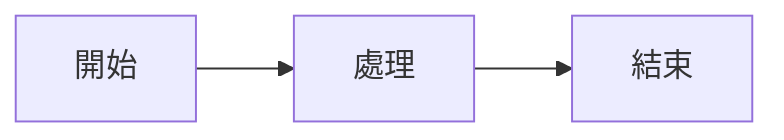
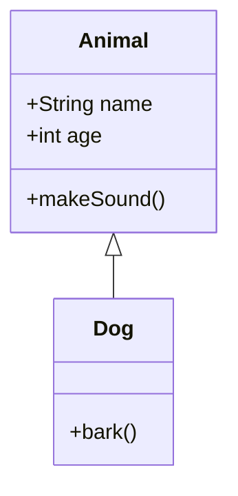
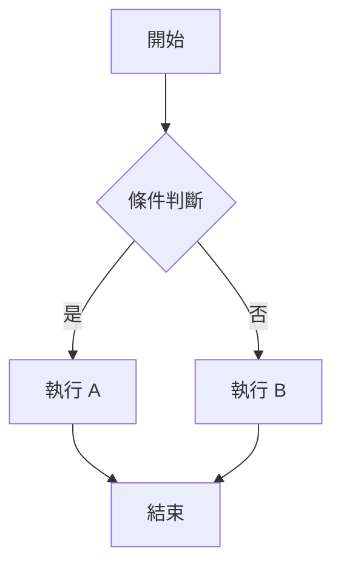

+++
date = '2025-11-12T22:00:00+08:00'
draft = false
title = 'Mermaid 測試'
+++

## 測試 Mermaid 圖表

### Graph 測試

```mermaid
graph LR
    A[開始] --> B[處理]
    B --> C[結束]
```

### Class Diagram 測試

```mermaid
classDiagram
    class Animal {
        +String name
        +int age
        +makeSound()
    }
    class Dog {
        +bark()
    }
    Animal <|-- Dog
```

### Flowchart 測試

```mermaid
flowchart TD
    A[開始] --> B{條件判斷}
    B -->|是| C[執行 A]
    B -->|否| D[執行 B]
    C --> E[結束]
    D --> E
```
