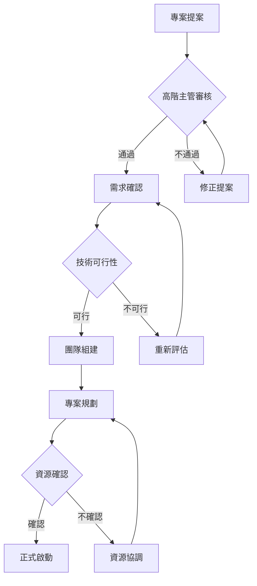

+++
date = '2025-10-31T00:00:00+08:00'
draft = false
title = '專案啟動流程指引'
tags = ['指引', '專案管理']
categories = ['指引']
+++
# 專案啟動流程指引

## 文件資訊
- **版本**：1.1
- **建立日期**：2025年8月13日
- **最後更新**：2025年8月29日
- **適用對象**：新進專案經理（0-2年經驗）
- **專案類型**：系統開發、基礎架構升級、法遵專案

## 目錄

1. [專案啟動流程概述](#1-專案啟動流程概述)
   - 1.1 [定義與目標](#11-定義與目標)
   - 1.2 [專案啟動的重要性](#12-專案啟動的重要性)
   - 1.3 [專案啟動五大階段](#13-專案啟動五大階段)

2. [專案啟動流程詳細說明](#2-專案啟動流程詳細說明)
   - 2.1 [階段一：專案立案](#21-階段一專案立案)
   - 2.2 [階段二：需求初步確認](#22-階段二需求初步確認)
   - 2.3 [階段三：組建核心團隊](#23-階段三組建核心團隊)
   - 2.4 [階段四：專案規劃啟動](#24-階段四專案規劃啟動)
   - 2.5 [階段五：正式啟動會議](#25-階段五正式啟動會議)

3. [專案啟動流程總覽表](#3-專案啟動流程總覽表)
   - 3.1 [流程階段彙整表](#31-流程階段彙整表)
   - 3.2 [關鍵決策點與升級機制](#32-關鍵決策點與升級機制)

4. [專案啟動文件範本結構](#4-專案啟動文件範本結構)
   - 4.1 [專案授權書（Project Charter）範本](#41-專案授權書project-charter範本)
   - 4.2 [專案啟動會議議程範本](#42-專案啟動會議議程範本)
   - 4.3 [專案啟動會議議程範例](#43-專案啟動會議議程範例)

5. [成功專案啟動的五大關鍵建議](#5-成功專案啟動的五大關鍵建議)

6. [專案啟動常見問題與解決方案](#6-專案啟動常見問題與解決方案)

7. [專案啟動成功指標與評估標準](#7-專案啟動成功指標與評估標準)

8. [數位化工具與技術應用](#8-數位化工具與技術應用)

9. [法規遵循與資安要求](#9-法規遵循與資安要求)

10. [參考資料與延伸學習](#10-參考資料與延伸學習)

11. [附錄：版本更新記錄](#附錄版本更新記錄)

---

## 1. 專案啟動流程概述

### 1.1 定義與目標
專案啟動階段是專案生命週期的第一個階段，目標是正式授權專案開始並為專案成功奠定基礎。這個階段將確定專案範圍、目標、利害關係人，並獲得必要的資源承諾。

### 1.2 專案啟動的重要性
- **建立共識**：確保所有利害關係人對專案目標有一致理解
- **設定期望**：明確定義專案成功標準與交付物
- **風險預防**：及早識別潛在風險與限制條件
- **資源確保**：獲得必要的人力、時間與預算承諾

### 1.3 專案啟動五大階段


---

## 2. 專案啟動流程詳細說明

### 2.1 階段一：專案立案

#### 工作內容
- 撰寫或審核專案提案書
- 進行初步可行性評估
- 確認專案商業價值與對齊策略
- 申請專案預算與資源

#### 負責角色
- **主要負責**：專案發起人（Project Sponsor）
- **協助角色**：業務單位主管、IT部門主管
- **支援角色**：財務部門、法務部門

#### 輸出成果（Deliverables）
- 專案提案書（Project Proposal）
- 商業案例文件（Business Case）
- 初步預算評估報告
- 專案授權書（Project Charter）草案

#### 關鍵檢核點
- [ ] 專案與企業策略目標一致
- [ ] 商業效益清楚量化
- [ ] 預算範圍獲得初步認可
- [ ] 高階主管支持確認

#### 常見風險與應對
| 風險項目 | 風險等級 | 應對措施 |
|---------|---------|---------|
| 商業案例不夠明確 | 高 | 重新檢視需求與效益，補強分析 |
| 預算評估過於樂觀 | 中 | 加入10-20%風險緩衝 |
| 利害關係人支持不足 | 高 | 加強溝通，重新爭取支持 |

#### 實務案例

> **情境說明**：某銀行要開發新的數位帳戶開戶系統
>
> **立案重點**：
>
> - 明確定義監管合規要求（如KYC、AML）
> - 量化預期客戶增長與營收貢獻
> - 評估現有系統整合複雜度
> - 確認資安與個資保護規範

---

### 2.2 階段二：需求初步確認

#### 工作內容

- 收集業務需求與功能規格
- 識別技術限制與相依性
- 評估法規合規要求
- 進行初步時程與資源評估

#### 負責角色

- **主要負責**：業務分析師（Business Analyst）
- **協助角色**：系統架構師、合規專員
- **支援角色**：使用者代表、IT技術團隊

#### 輸出成果（Deliverables）

- 業務需求文件（Business Requirements Document, BRD）
- 功能需求清單
- 非功能需求規格（效能、安全、擴充性）
- 法規合規檢核清單

#### 關鍵檢核點

- [ ] 需求完整性與可追溯性確認
- [ ] 利害關係人需求衝突已解決
- [ ] 法規合規要求已識別
- [ ] 技術可行性初步確認

#### 常見風險與應對

| 風險項目 | 風險等級 | 應對措施 |
|---------|---------|---------|
| 需求模糊或變動頻繁 | 高 | 建立需求凍結機制，設定變更控制流程 |
| 法規要求理解不足 | 中 | 邀請法遵專家參與需求討論 |
| 技術可行性評估過於樂觀 | 中 | 進行概念驗證（Proof of Concept） |

#### 實務案例

> **情境說明**：法遵專案 - 反洗錢系統升級
>
> **需求確認重點**：
>
> - 明確法規變更的具體要求與時程
> - 識別現有系統需要修改的功能模組
> - 評估資料遷移與歷史資料處理需求
> - 確認使用者教育訓練範圍

---

### 2.3 階段三：組建核心團隊

#### 工作內容

- 識別專案所需技能與角色
- 招募或指派核心團隊成員
- 建立團隊溝通機制
- 設定團隊運作規範

#### 負責角色

- **主要負責**：專案經理（Project Manager）
- **協助角色**：人力資源部門、部門主管
- **支援角色**：專案發起人

#### 輸出成果（Deliverables）

- 專案組織架構圖
- 角色與職責矩陣（RACI Matrix）
- 團隊成員技能矩陣
- 專案溝通計劃

#### 關鍵檢核點

- [ ] 核心角色已確認並獲得承諾
- [ ] 團隊技能足以支撐專案需求
- [ ] 溝通機制與工具已建立
- [ ] 團隊成員工作負荷合理

#### 常見風險與應對

| 風險項目 | 風險等級 | 應對措施 |
|---------|---------|---------|
| 關鍵人員無法投入 | 高 | 提前與主管協商資源分配，準備替代方案 |
| 團隊技能缺口 | 中 | 安排教育訓練或外部顧問支援 |
| 跨部門協調困難 | 中 | 建立升級機制，定期主管層會議 |

#### 實務案例

> **情境說明**：大型核心系統升級專案
>
> **團隊組建重點**：
>
> - 確保業務、技術、測試各領域專家參與
> - 建立 24/7 輪班制度因應上線需求
> - 設定專案戰情室進行集中辦公
> - 建立與外部廠商的協作機制

---

### 2.4 階段四：專案規劃啟動

#### 工作內容

- 制定詳細專案計劃
- 建立工作分解結構（WBS）
- 進行時程排程與資源規劃
- 制定風險管理與溝通計劃

#### 負責角色

- **主要負責**：專案經理
- **協助角色**：核心團隊成員、主題專家
- **支援角色**：PMO辦公室

#### 輸出成果（Deliverables）

- 專案管理計劃書
- 工作分解結構（WBS）
- 專案時程表（甘特圖）
- 風險管理計劃書
- 溝通管理計劃書
- 品質管理計劃書

#### 關鍵檢核點

- [ ] 專案範圍明確定義且獲得確認
- [ ] 時程安排合理且考慮相依性
- [ ] 資源需求明確且已獲得承諾
- [ ] 風險識別完整且應對策略明確

#### 常見風險與應對

| 風險項目 | 風險等級 | 應對措施 |
|---------|---------|---------|
| 時程估算過於樂觀 | 高 | 使用歷史資料校正，加入緩衝時間 |
| 相依性管理複雜 | 中 | 建立相依性追蹤機制，定期檢討 |
| 品質標準不明確 | 中 | 建立明確的驗收標準與測試計劃 |

#### 實務案例

> **情境說明**：基礎架構升級專案
>
> **規劃重點**：
>
> - 分階段上線降低風險，確保業務持續運作
> - 建立完整的回退機制與應變計劃
> - 協調多個廠商的時程與相依性
> - 安排充分的測試時間與使用者訓練

---

### 2.5 階段五：正式啟動會議

#### 工作內容

- 舉辦專案啟動會議（Project Kick-off Meeting）
- 向全體團隊宣達專案目標與期望
- 確認專案基準線（Baseline）
- 啟動專案執行與監控機制

#### 負責角色

- **主要負責**：專案經理
- **協助角色**：專案發起人
- **參與人員**：全體專案團隊、主要利害關係人

#### 輸出成果（Deliverables）

- 專案啟動會議記錄
- 專案基準線文件
- 專案執行授權確認
- 專案儀表板與報告機制

#### 關鍵檢核點

- [ ] 全體團隊對專案目標有一致認知
- [ ] 角色職責清楚且獲得確認
- [ ] 專案基準線已設定並鎖定
- [ ] 後續執行機制已建立

#### 常見風險與應對

| 風險項目 | 風險等級 | 應對措施 |
|---------|---------|---------|
| 團隊成員理解不一致 | 中 | 會後進行個別確認，提供書面資料 |
| 期望管理不當 | 高 | 明確溝通限制條件與假設前提 |
| 執行機制不完善 | 中 | 建立試運行期，逐步調整機制 |

#### 實務案例

> **情境說明**：數位轉型專案啟動
>
> **啟動會議重點**：
>
> - 由高階主管親自出席展現支持
> - 清楚說明專案對組織的策略重要性
> - 建立跨部門協作的共識與承諾
> - 設定初期里程碑慶祝機制提升士氣

---

## 3. 專案啟動流程總覽表

### 3.1 流程階段彙整表

| 階段 | 主要工作 | 負責角色 | 關鍵產出 | 預估時間 |
|------|---------|---------|---------|---------|
| 專案立案 | 撰寫提案書、可行性評估 | 專案發起人 | 專案授權書 | 1-2週 |
| 需求初步確認 | 收集需求、合規檢討 | 業務分析師 | 需求文件 | 2-4週 |
| 組建核心團隊 | 人員招募、角色定義 | 專案經理 | 團隊架構 | 1-2週 |
| 專案規劃啟動 | 詳細規劃、風險評估 | 專案經理 | 專案計劃書 | 2-3週 |
| 正式啟動會議 | 團隊動員、基準設定 | 專案經理 | 啟動確認 | 1週 |

### 3.2 關鍵決策點與升級機制



---

## 4. 專案啟動文件範本結構

### 4.1 專案授權書（Project Charter）範本

```markdown
# 專案授權書

## 基本資訊
- **專案名稱**：[專案名稱]
- **專案編號**：[專案編號]
- **專案經理**：[姓名]
- **專案發起人**：[姓名]
- **建立日期**：[日期]

## 專案概述
### 專案目標
- [具體、可衡量的目標 1]
- [具體、可衡量的目標 2]

### 專案範圍
- **包含範圍**：
  - [明確列出專案包含的工作]
- **排除範圍**：
  - [明確列出專案不包含的工作]

### 專案效益
- **量化效益**：
  - [可量化的商業價值]
- **質化效益**：
  - [無法量化但重要的效益]

## 專案限制與假設
### 限制條件
- **時間限制**：[完成期限]
- **預算限制**：[預算上限]
- **資源限制**：[人力、技術限制]

### 假設前提
- [重要假設 1]
- [重要假設 2]

## 高階風險
- **風險項目**：[描述]
  - **影響**：[高/中/低]
  - **機率**：[高/中/低]
  - **應對策略**：[描述]

## 利害關係人
| 姓名/角色 | 組織單位 | 期望與需求 | 影響力 |
|-----------|----------|------------|--------|
| [姓名] | [單位] | [需求] | [高/中/低] |

## 授權聲明
本專案經 [授權層級] 核准，授權專案經理執行專案相關活動。

**授權人簽名**：_________________ **日期**：_________
```

### 4.2 專案啟動會議議程範本

```markdown
# 專案啟動會議議程

## 會議資訊
- **會議時間**：[日期時間]
- **會議地點**：[地點/線上連結]
- **會議主席**：[專案經理姓名]
- **預估時間**：2小時

## 議程安排

### 1. 開場與介紹 (15分鐘)
- 與會人員自我介紹
- 會議目標說明

### 2. 專案概述簡報 (30分鐘)
- 專案背景與目標
- 專案範圍與交付物
- 專案時程概覽
- **簡報者**：專案經理

### 3. 團隊角色與職責 (20分鐘)
- 組織架構說明
- 角色職責矩陣
- 報告關係確認
- **簡報者**：專案經理

### 4. 專案執行機制 (25分鐘)
- 溝通機制與會議安排
- 專案監控與報告方式
- 變更管理流程
- 問題升級機制
- **簡報者**：專案經理

### 5. 風險與假設討論 (20分鐘)
- 主要風險項目說明
- 風險應對策略
- 關鍵假設確認
- **簡報者**：專案經理

### 6. Q&A 與討論 (25分鐘)
- 開放問題討論
- 疑慮澄清
- 共識確認

### 7. 後續行動事項 (5分鐘)
- 行動事項確認
- 下次會議安排
- 會議結束

## 會前準備事項
- [ ] 專案授權書已完成
- [ ] 簡報資料已準備
- [ ] 會議室/設備已預約
- [ ] 與會人員已通知

## 會後行動事項
- [ ] 會議記錄發送
- [ ] 行動事項追蹤
- [ ] 專案基準線確認
```

### 4.3 專案啟動會議議程範例

```markdown
# 數位銀行客戶開戶系統升級專案 - 啟動會議

## 會議資訊
- **會議時間**：2025年8月20日（星期三）上午9:00-11:00
- **會議地點**：總部12樓大會議室 / Teams 線上會議
- **會議主席**：王小明（專案經理）
- **會議記錄**：李小華（專案助理）

## 與會人員
| 姓名 | 職稱 | 單位 | 角色 |
|------|------|------|------|
| 張總經理 | 總經理 | 數位金融事業部 | 專案發起人 |
| 王小明 | 資深專案經理 | IT部門 | 專案經理 |
| 陳架構師 | 系統架構師 | IT部門 | 技術負責人 |
| 林經理 | 業務經理 | 數位金融事業部 | 業務負責人 |
| 黃顧問 | 資深顧問 | 法遵部 | 法規合規專家 |
| 劉測試經理 | 測試經理 | 品質保證部 | 測試負責人 |

## 詳細議程

### 1. 開場與介紹 (9:00-9:15)
- **主持人**：王小明
- 與會人員自我介紹與角色說明
- 會議目標：確保全體團隊對專案有一致認知，建立執行基礎

### 2. 專案發起人致詞 (9:15-9:25)
- **簡報者**：張總經理
- 專案策略重要性說明
- 對團隊的期許與支持承諾
- 成功標準與期望設定

### 3. 專案概述簡報 (9:25-9:55)
- **簡報者**：王小明
- **專案背景**：
  - 現有系統痛點：開戶流程冗長，客戶體驗不佳
  - 市場競爭壓力：同業數位化程度領先
  - 法規更新：金管會數位身分驗證新規範
- **專案目標**：
  - 縮短開戶時間從30分鐘至5分鐘
  - 提升客戶滿意度至90%以上
  - 100%符合新版KYC法規要求
- **專案範圍**：
  - 包含：前端APP介面改版、後端核心系統API、身分驗證整合
  - 排除：既有客戶資料遷移、其他產品申請流程
- **關鍵里程碑**：
  - 2025/9/30：需求確認完成
  - 2025/11/30：系統開發完成
  - 2025/12/31：UAT測試完成
  - 2026/1/31：正式上線

### 4. 團隊組織與職責 (9:55-10:15)
- **簡報者**：王小明
- **組織架構圖展示**
- **RACI矩陣說明**：
  - 需求分析：業務負責人(R)、專案經理(A)、法遵專家(C)、技術團隊(I)
  - 系統設計：技術負責人(R)、專案經理(A)、業務負責人(C)
  - 測試執行：測試負責人(R)、專案經理(A)、全體團隊(C)
- **溝通報告線確認**

### 5. 專案執行機制說明 (10:15-10:35)
- **簡報者**：王小明
- **會議節奏**：
  - 每週一上午10:00：專案狀態會議（1小時）
  - 每週五下午4:00：技術討論會議（依需要召開）
  - 每月最後一個週三：專案指導委員會報告
- **溝通工具**：
  - 主要協作平台：Microsoft Teams
  - 專案管理工具：Azure DevOps
  - 文件共享：SharePoint
- **報告機制**：
  - 週報：每週五下午5:00前提交
  - 月報：每月第一個工作日提交
  - 例外報告：重大問題24小時內通報

### 6. 風險與假設討論 (10:35-10:50)
- **簡報者**：王小明
- **主要風險項目**：
  - 高風險：第三方身分驗證API整合延遲
    - 應對：提前進行技術驗證，準備備用方案
  - 中風險：法規解釋變更
    - 應對：與金管會保持密切溝通，法遵專家全程參與
  - 中風險：核心團隊成員異動
    - 應對：關鍵知識文件化，培養第二專長人員
- **關鍵假設**：
  - 現有系統API可支援新功能擴充
  - 客戶接受度高，願意使用新的數位開戶流程
  - 測試環境可於9月底前就緒

### 7. 開放討論與Q&A (10:50-11:00)
- **主持人**：王小明
- 開放問題討論
- 疑慮澄清與解答
- 共識確認

## 會前準備完成事項
- [x] 專案授權書已簽核
- [x] 專案計劃書初稿已完成
- [x] 會議室已預約，設備測試完成
- [x] 簡報資料已發送給與會人員
- [x] Teams會議連結已建立並測試

## 會議決議事項
1. **專案目標確認**：與會人員一致同意專案目標與成功標準
2. **團隊組織確認**：各角色職責分工明確，無異議
3. **溝通機制啟動**：即日起啟動週會機制，Teams群組已建立
4. **風險應對**：針對高風險項目，技術負責人將於下週完成技術驗證

## 後續行動事項
| 行動事項 | 負責人 | 完成期限 | 狀態 |
|----------|--------|----------|------|
| 發送會議記錄給全體與會人員 | 李小華 | 2025/8/21 | 待執行 |
| 建立專案 SharePoint 工作區 | 王小明 | 2025/8/22 | 待執行 |
| 完成第三方API技術驗證 | 陳架構師 | 2025/8/27 | 待執行 |
| 安排法規解釋會議 | 黃顧問 | 2025/8/25 | 待執行 |
| 建立專案風險登錄表 | 王小明 | 2025/8/23 | 待執行 |

## 下次會議預告
- **會議名稱**：第一次專案狀態會議
- **時間**：2025年8月26日（星期一）上午10:00-11:00
- **地點**：Teams 線上會議
- **主要議程**：專案進度報告、風險狀態更新、問題討論

---
**會議記錄確認**
- 記錄者：李小華
- 確認者：王小明（專案經理）
- 發送日期：2025年8月21日
```

---

## 5. 成功專案啟動的五大關鍵建議

### 🎯 建議一：確保高階主管的明確支持與承諾

**重要性**：高階主管的支持是專案成功的最重要因素

- 爭取專案發起人在啟動會議親自出席
- 明確獲得資源承諾的書面確認
- 建立直接的升級管道處理跨部門問題
- 定期向高階主管報告專案進度

**實務做法**：

- 安排專案發起人在啟動會議開場致詞
- 將高階主管納入關鍵決策點的審核流程
- 每月提供簡潔的執行摘要報告

### 📋 建議二：投資時間進行完整的需求確認

**重要性**：需求不清是專案失敗的主要原因之一

- 寧可多花時間在前期需求澄清，勿急於進入開發
- 建立需求追溯矩陣確保完整性
- 設定需求凍結期避免無止境的變更
- 與使用者進行需求確認簽核

**實務做法**：

- 使用使用者故事或用例描述功能需求
- 進行需求審查會議獲得利害關係人確認
- 建立需求變更控制流程

### 👥 建議三：建立有效的團隊溝通與協作機制

**重要性**：良好的溝通是團隊效能的基礎

- 建立定期會議節奏（如每日站會、週報、月報）
- 使用協作工具提升透明度
- 建立問題升級機制快速解決阻礙
- 營造開放溝通的團隊文化

**實務做法**：

- 使用專案管理工具（如 Jira、Trello）追蹤進度
- 建立專案 Slack 頻道或 Teams 群組
- 每週舉辦專案狀態會議

### ⚠️ 建議四：及早識別並主動管理專案風險

**重要性**：預防勝於治療，風險管理是專案成功的保險

- 建立風險登錄表並定期更新
- 設定風險監控指標與預警機制
- 為高風險項目準備應變計劃
- 分配風險負責人確保追蹤執行

**實務做法**：

- 每週檢討風險狀態並更新應對措施
- 將風險討論納入例行會議議程
- 建立風險升級觸發條件

### 📊 建議五：建立明確的成功標準與監控機制

**重要性**：沒有衡量就沒有管理

- 設定可量化的成功指標（KPI）
- 建立專案儀表板進行視覺化監控
- 定期檢視專案績效並調整策略
- 建立里程碑慶祝機制維持團隊士氣

**實務做法**：

- 使用甘特圖追蹤時程進度
- 建立燃盡圖監控工作完成狀況
- 設定每月專案健康檢查會議

---

## 6. 專案啟動常見問題與解決方案

### 6.1 利害關係人管理問題

#### 問題：利害關係人期望不一致或衝突

**常見情況**：
- 業務部門希望功能豐富，IT部門強調技術限制
- 高階主管期望快速交付，執行團隊需要充足時間
- 使用者要求與法規要求存在衝突

**解決方案**：
1. **建立利害關係人分析矩陣**
   - 識別所有利害關係人的影響力與關注程度
   - 針對不同群體制定差異化溝通策略
   
2. **舉辦利害關係人對齊會議**
   - 讓各方當面討論並達成共識
   - 記錄決議並要求簽核確認
   
3. **建立變更控制機制**
   - 明確定義變更申請流程
   - 設定變更影響評估標準

#### 問題：關鍵利害關係人缺席或參與度不足

**解決方案**：
- 提前與利害關係人主管協調時間
- 提供會議錄影或詳細會議記錄
- 安排一對一訪談收集意見
- 建立代理人機制確保決策連續性

### 6.2 資源配置問題

#### 問題：關鍵團隊成員無法全職投入

**解決方案**：
1. **資源共享協議**
   - 與相關部門主管協商資源分配比例
   - 建立明確的工作優先順序機制
   
2. **技能替代方案**
   - 培養第二專長人員
   - 考慮外部顧問或承包商支援
   
3. **工作重新分配**
   - 將關鍵工作分解為可並行執行的小任務
   - 建立知識轉移機制

#### 問題：預算限制影響專案範圍

**解決方案**：
- 進行功能優先級排序，實施分階段交付
- 尋找成本效益更高的技術方案
- 考慮內部開發與外包的混合模式

### 6.3 技術可行性問題

#### 問題：技術複雜度超出預期

**解決方案**：
1. **技術風險評估**
   - 進行概念驗證（Proof of Concept）
   - 邀請外部技術專家評估
   
2. **技術方案調整**
   - 採用較成熟的技術棧
   - 考慮分階段實施降低複雜度
   
3. **團隊技能提升**
   - 安排相關技術培訓
   - 引入有經驗的技術顧問

### 6.4 時程壓力問題

#### 問題：業務急需但開發時間不足

**解決方案**：
1. **範圍談判**
   - 識別必要功能與次要功能
   - 實施最小可行產品（MVP）策略
   
2. **資源加強**
   - 臨時增加開發人力
   - 考慮外包部分非核心功能
   
3. **流程優化**
   - 並行進行可平行的工作
   - 簡化審核與批准流程

---

## 7. 專案啟動成功指標與評估標準

### 7.1 量化成功指標

#### 時程指標
- **專案啟動週期**：從立案到正式啟動的總時間
  - 優秀：≤ 4週
  - 良好：5-6週
  - 需改善：> 6週

- **文件完成度**：啟動階段必要文件的完備程度
  - 專案授權書：100%完成
  - 需求文件：≥ 80%完成
  - 專案計劃：≥ 85%完成

#### 團隊指標
- **核心團隊到位率**：關鍵角色人員的確認比例
  - 目標：≥ 90%
  
- **利害關係人參與度**：啟動會議出席率
  - 目標：≥ 85%

#### 品質指標
- **需求確認度**：需求文件經利害關係人確認的比例
  - 目標：≥ 95%
  
- **風險識別完整度**：已識別風險占潛在風險的比例
  - 目標：≥ 80%

### 7.2 質化成功指標

#### 團隊準備度評估

**評估面向**：
1. **目標理解**：團隊成員對專案目標的理解一致性
2. **角色清晰**：每個成員對自己職責的認知程度
3. **溝通效能**：團隊內部溝通機制的有效性
4. **工具熟悉**：對專案管理工具的掌握程度

**評估方法**：
- 進行團隊成員訪談或問卷調查
- 觀察啟動會議中的互動品質
- 檢視首週工作執行狀況

#### 利害關係人滿意度

**評估標準**：
- 對專案目標設定的認同程度
- 對執行計劃的信心水準
- 對團隊能力的信任度
- 對溝通機制的滿意度

### 7.3 啟動階段檢核表

#### 專案管理準備度檢核

- [ ] **文件完備性**
  - [ ] 專案授權書已簽核
  - [ ] 專案計劃書已完成並獲得確認
  - [ ] 風險管理計劃已建立
  - [ ] 溝通管理計劃已制定

- [ ] **團隊準備度**
  - [ ] 核心團隊成員已確認並承諾
  - [ ] 角色職責矩陣已建立並獲得確認
  - [ ] 團隊溝通機制已建立
  - [ ] 專案管理工具已設定並測試

- [ ] **利害關係人管理**
  - [ ] 利害關係人分析已完成
  - [ ] 主要利害關係人已參與啟動會議
  - [ ] 專案目標與期望已獲得確認
  - [ ] 升級機制已建立

- [ ] **風險與品質管理**
  - [ ] 主要風險已識別並制定應對策略
  - [ ] 品質標準與驗收標準已定義
  - [ ] 變更管理流程已建立
  - [ ] 問題升級機制已設定

### 7.4 啟動成功度評分表

| 評估面向 | 權重 | 評分標準 | 得分 |
|----------|------|----------|------|
| 專案目標明確度 | 20% | 1-5分（1=模糊，5=非常清楚） | ___ |
| 團隊組建完整度 | 15% | 1-5分（1=嚴重缺員，5=團隊齊備） | ___ |
| 利害關係人參與 | 20% | 1-5分（1=參與度低，5=高度參與） | ___ |
| 計劃完整度 | 15% | 1-5分（1=計劃粗略，5=計劃詳細） | ___ |
| 風險管理準備 | 10% | 1-5分（1=風險未識別，5=風險管理完善） | ___ |
| 溝通機制建立 | 10% | 1-5分（1=溝通不順，5=溝通機制完善） | ___ |
| 資源承諾確認 | 10% | 1-5分（1=資源不足，5=資源充足） | ___ |

**總分計算**：加權平均分數
- **優秀**：≥ 4.5分
- **良好**：3.5-4.4分
- **及格**：2.5-3.4分
- **需改善**：< 2.5分

---

## 8. 數位化工具與技術應用

### 8.1 專案管理工具選擇指南

#### 大型複雜專案推薦工具

**Microsoft Project**
- **適用情境**：大型、複雜的專案，需要詳細的資源管理
- **主要功能**：甘特圖、資源分配、關鍵路徑分析
- **優勢**：功能完整、企業級支援
- **學習曲線**：中等

**Jira + Confluence**
- **適用情境**：軟體開發專案、敏捷專案管理
- **主要功能**：需求管理、缺陷追蹤、看板管理
- **優勢**：與開發流程整合良好
- **學習曲線**：中等

#### 中小型專案推薦工具

**Azure DevOps**
- **適用情境**：軟體開發、DevOps整合
- **主要功能**：需求管理、版本控制、CI/CD
- **優勢**：微軟生態系整合
- **學習曲線**：中等

**Trello**
- **適用情境**：簡單專案、團隊協作
- **主要功能**：看板管理、任務追蹤
- **優勢**：介面簡潔、易於上手
- **學習曲線**：低

**Notion**
- **適用情境**：文件密集型專案、知識管理
- **主要功能**：文件協作、專案追蹤、知識庫
- **優勢**：多功能整合、自訂性高
- **學習曲線**：中等

### 8.2 協作與溝通工具

#### 即時通訊工具

**Microsoft Teams**
- **整合能力**：與Office 365深度整合
- **主要功能**：視訊會議、檔案共享、即時訊息
- **適用**：企業環境、正式專案

**Slack**
- **整合能力**：第三方應用程式整合豐富
- **主要功能**：頻道管理、機器人自動化
- **適用**：技術團隊、新創公司

#### 文件協作工具

**SharePoint**
- **功能**：文件版本控制、權限管理、工作流程
- **優勢**：企業級安全、審計追蹤
- **適用**：大型企業、合規要求高的專案

**Google Workspace**
- **功能**：即時協作編輯、雲端存儲
- **優勢**：操作簡便、協作效率高
- **適用**：中小型團隊、快速迭代專案

### 8.3 自動化與AI應用

#### 專案進度自動化

**Power Automate**
- 自動生成專案狀態報告
- 里程碑達成自動通知
- 風險預警自動觸發

**GitHub Actions**
- 程式碼品質自動檢查
- 測試自動執行
- 部署自動化

#### AI輔助專案管理

**Microsoft Copilot for Project**
- 專案計劃自動生成建議
- 風險預測與分析
- 資源優化建議

**ChatGPT/Claude 輔助**
- 會議記錄整理
- 風險分析報告撰寫
- 專案文件範本生成

### 8.4 監控與報告工具

#### 儀表板工具

**Power BI**
- 專案進度視覺化
- 資源使用率分析
- 成本追蹤報告

**Tableau**
- 複雜資料視覺化
- 互動式報告
- 預測分析

#### 時間追蹤工具

**Toggl**
- 個人時間追蹤
- 專案工時統計
- 效率分析

**Harvest**
- 團隊時間管理
- 專案成本計算
- 客戶計費整合

---

## 9. 法規遵循與資安要求

### 9.1 金融業法規遵循要求

#### 個人資料保護

**GDPR (General Data Protection Regulation)**
- **適用範圍**：處理歐盟居民個人資料的專案
- **關鍵要求**：
  - 資料處理的合法基礎
  - 資料主體權利保障
  - 資料保護影響評估（DPIA）
  - 72小時內通報資料外洩

**我國個人資料保護法**
- **適用範圍**：所有處理個人資料的專案
- **關鍵要求**：
  - 資料蒐集告知義務
  - 資料處理利用限制
  - 資料安全維護措施
  - 資料外洩通報機制

#### 金融監理法規

**銀行法與相關子法**
- 資訊系統管理辦法
- 內部控制制度
- 作業風險管理

**保險法規**
- 保險業資訊安全管理辦法
- 保險業公司治理實務守則

**證券法規**
- 證券商內部控制制度標準規範
- 證券商資訊系統標準規範

### 9.2 資訊安全管理要求

#### ISO 27001 資訊安全管理系統

**專案啟動階段資安檢核**
- [ ] **資訊資產識別**
  - 識別專案涉及的所有資訊資產
  - 進行資產分級與風險評估
  - 建立資產清單並指定負責人

- [ ] **存取控制**
  - 定義使用者存取權限
  - 建立身分驗證機制
  - 設定特權帳號管理流程

- [ ] **資料保護**
  - 資料分類與標示
  - 加密傳輸與儲存要求
  - 資料備份與復原計劃

#### 網路安全框架

**NIST Cybersecurity Framework**
- **識別 (Identify)**：資產管理、風險評估
- **保護 (Protect)**：存取控制、資料安全
- **偵測 (Detect)**：異常監控、事件偵測
- **回應 (Respond)**：事故回應計劃
- **復原 (Recover)**：復原計劃、改善措施

### 9.3 法遵專案啟動特殊考量

#### 法規影響評估

**評估架構**
1. **法規適用性分析**
   - 識別適用的法規條文
   - 分析法規要求與現狀差距
   - 評估合規成本與時程

2. **合規風險評估**
   - 不合規可能面臨的處罰
   - 聲譽風險評估
   - 業務中斷風險

3. **合規策略制定**
   - 優先處理高風險項目
   - 分階段實施計劃
   - 持續監控機制

#### 稽核與驗證機制

**內部稽核配合**
- 邀請內稽人員參與專案規劃
- 建立稽核查核點
- 設定稽核文件要求

**外部驗證**
- 法律顧問意見書
- 會計師查核報告
- 第三方合規認證

### 9.4 資安事件應變機制

#### 專案期間資安事件處理

**事件分級**
- **第一級**：一般資安事件，內部處理
- **第二級**：重大資安事件，主管層介入
- **第三級**：嚴重資安事件，外部通報

**通報流程**
1. **發現階段**：立即通知專案經理與資安負責人
2. **評估階段**：1小時內完成初步影響評估
3. **通報階段**：依法規要求進行內外部通報
4. **處理階段**：啟動應變計劃，記錄處理過程
5. **檢討階段**：事後檢討改善，更新防護機制

#### 業務持續性計劃

**關鍵系統識別**
- 核心業務系統清單
- 系統相依性分析
- 復原時間目標（RTO）設定

**備援機制**
- 系統備援架構
- 資料備份策略
- 人員備援計劃

---

---

## 10. 參考資料與延伸學習

### 10.1 相關標準與框架

- **PMI PMBOK Guide**：[https://www.pmi.org/pmbok-guide-standards](https://www.pmi.org/pmbok-guide-standards)
- **PRINCE2 專案管理方法論**：[https://www.axelos.com/best-practice-solutions/prince2](https://www.axelos.com/best-practice-solutions/prince2)
- **Agile 實務指南**：[https://www.agilealliance.org/agile101/](https://www.agilealliance.org/agile101/)
- **ITIL 4 服務管理框架**：[https://www.axelos.com/best-practice-solutions/itil](https://www.axelos.com/best-practice-solutions/itil)
- **COBIT 2019 治理框架**：[https://www.isaca.org/resources/cobit](https://www.isaca.org/resources/cobit)

### 10.2 專案管理工具

#### 企業級工具
- **Microsoft Project**：專案規劃與排程
- **Jira**：敏捷專案管理與議題追蹤
- **Azure DevOps**：開發專案整合管理
- **Monday.com**：團隊協作與專案追蹤

#### 協作通訊工具
- **Microsoft Teams**：企業級協作平台
- **Slack**：團隊即時通訊
- **Zoom**：視訊會議與協作
- **Miro**：線上白板與腦力激盪

#### 文件管理工具
- **SharePoint**：企業文件管理
- **Confluence**：知識管理與協作
- **Notion**：多功能工作區
- **Google Workspace**：雲端辦公套件

### 10.3 金融業專案管理參考

#### 法規框架
- **ISO 27001 資安管理**：[https://www.iso.org/isoiec-27001-information-security.html](https://www.iso.org/isoiec-27001-information-security.html)
- **Basel III 法規遵循**：銀行業風險管理框架
- **SSDLC 安全開發生命週期**：軟體安全開發最佳實務
- **GDPR 個人資料保護**：歐盟一般資料保護規範
- **NIST 網路安全框架**：[https://www.nist.gov/cyberframework](https://www.nist.gov/cyberframework)

#### 產業標準
- **PCI DSS**：支付卡產業資料安全標準
- **SOX 法案**：沙賓法案合規要求
- **FFIEC 指引**：美國聯邦金融機構檢查委員會指引
- **EBA 指引**：歐洲銀行管理局技術指引

### 10.4 推薦書籍

#### 專案管理基礎
- 《專案管理知識體系指南》（PMBOK Guide）- PMI
- 《敏捷專案管理》- Jim Highsmith
- 《專案管理修煉之道》- Andrew Hunt, David Thomas
- 《專案管理：計劃、進度與控制的系統化做法》- Harold Kerzner

#### 金融業專案管理
- 《銀行業數位轉型專案管理》- 金融研訓院
- 《金融科技專案實務指南》- 台灣金融科技協會
- 《法遵專案管理實務》- 台灣風險管理學會

#### 領導力與溝通
- 《專案經理的人際技巧》- Steven Flannes
- 《專案溝通管理》- Bob Kaplan
- 《跨部門協作的藝術》- Russell Eisenstat

### 10.5 線上學習資源

#### 認證課程
- **PMP 認證**：專案管理專業認證
- **PRINCE2 認證**：結構化專案管理方法
- **Agile/Scrum 認證**：敏捷專案管理認證
- **PMI-ACP**：敏捷認證從業人員

#### 線上平台
- **Coursera**：專案管理專業課程
- **edX**：MIT、哈佛專案管理課程
- **LinkedIn Learning**：專案管理技能學習
- **Udemy**：專案管理工具操作課程

### 10.6 專業社群與組織

#### 國際組織
- **PMI (Project Management Institute)**：全球專案管理協會
- **IPMA (International Project Management Association)**：國際專案管理協會
- **APM (Association for Project Management)**：英國專案管理協會

#### 台灣在地組織
- **中華專案管理學會**：[http://www.npma.org.tw/](http://www.npma.org.tw/)
- **台灣敏捷協會**：[https://agile.org.tw/](https://agile.org.tw/)
- **台灣風險管理學會**：[http://www.rmst.org.tw/](http://www.rmst.org.tw/)

### 10.7 定期追蹤的資源

#### 部落格與網站
- **PMI Blog**：[https://www.pmi.org/learning/library](https://www.pmi.org/learning/library)
- **Project Management.com**：專案管理新聞與文章
- **Atlassian Blog**：敏捷與協作最佳實務
- **Microsoft Project Blog**：專案管理工具使用技巧

#### 播客 (Podcast)
- **The Project Management Podcast**
- **PM Point of View**
- **The Lazy Project Manager**
- **PMI Taiwan Podcast**（中文）

#### 期刊與雜誌
- **PM Network Magazine** - PMI
- **Project Manager Today** - APM
- **專案管理生活誌**（中文）

---

## 附錄：版本更新記錄

| 版本 | 日期 | 更新內容 | 更新者 |
|------|------|----------|--------|
| 1.0 | 2025/08/13 | 初版發布 | 專案管理辦公室 |
| 1.1 | 2025/08/29 | 新增常見問題、成功指標、數位化工具、法規遵循章節；更新目錄結構 | 專案管理辦公室 |

---

**文件結束**

> 💡 **提醒**：此指引為活文件，將根據實務經驗持續更新。如有任何建議或疑問，請聯繫專案管理辦公室。
> 
> 📧 **聯絡資訊**：pmo@company.com | 分機：2345
> 
> 🔄 **下次檢視**：2025年11月底進行季度檢視更新
