+++
date = '2026-02-12T23:03:51+08:00'
draft = false
title = '軟體開發平行測試（Parallel Run／Parallel Testing）標準程序與計劃書教學手冊'
+++

# 軟體開發平行測試（Parallel Run / Parallel Testing）標準程序與計劃書教學手冊

> **版本**：1.1  
> **最後更新**：2026-02-13  
> **適用對象**：專案經理、系統架構師、開發工程師、測試工程師、品質保證人員  
> **文件等級**：內部標準作業文件

## 目錄

- [第一章　平行測試概論](#第一章平行測試概論)
  - [1.1 什麼是平行測試](#11-什麼是平行測試)
  - [1.2 與其他測試類型的差異](#12-與其他測試類型的差異)
  - [1.3 適用場景](#13-適用場景)
  - [1.4 平行測試的目標](#14-平行測試的目標)
  - [1.5 平行測試成功的關鍵因素](#15-平行測試成功的關鍵因素)
- [第二章　平行測試標準作業流程（SOP）](#第二章平行測試標準作業流程sop)
  - [2.1 流程總覽](#21-流程總覽)
  - [2.2 各階段詳細說明](#22-各階段詳細說明)
  - [2.3 RACI 責任矩陣](#23-raci-責任矩陣)
- [第三章　平行測試計劃書範本](#第三章平行測試計劃書範本)
  - [3.1 專案基本資訊](#31-專案基本資訊)
  - [3.2 測試範圍](#32-測試範圍)
  - [3.3 測試策略](#33-測試策略)
  - [3.4 測試資料設計](#34-測試資料設計)
  - [3.5 差異判定標準](#35-差異判定標準)
  - [3.6 風險評估](#36-風險評估)
  - [3.7 成功標準（Exit Criteria）](#37-成功標準exit-criteria)
  - [3.8 溝通計畫](#38-溝通計畫)
- [第四章　差異比對設計](#第四章差異比對設計)
  - [4.1 比對策略總覽](#41-比對策略總覽)
  - [4.2 數值容差與精度處理](#42-數值容差與精度處理)
  - [4.3 SQL 比對範例](#43-sql-比對範例)
  - [4.4 批次比對邏輯範例](#44-批次比對邏輯範例)
  - [4.5 API 回傳比對範例](#45-api-回傳比對範例)
- [第五章　自動化平行測試設計](#第五章自動化平行測試設計)
  - [5.1 自動化架構](#51-自動化架構)
  - [5.2 CI/CD 整合](#52-cicd-整合)
  - [5.3 測試報表與差異分類](#53-測試報表與差異分類)
- [第六章　金融系統平行測試實務案例](#第六章金融系統平行測試實務案例)
  - [6.1 測試週期規劃](#61-測試週期規劃)
  - [6.2 批次日結流程比對](#62-批次日結流程比對)
  - [6.3 差異處理流程](#63-差異處理流程)
  - [6.4 高風險交易監控](#64-高風險交易監控)
  - [6.5 上線決策會議](#65-上線決策會議)
- [第七章　風險管理與內控設計](#第七章風險管理與內控設計)
  - [7.1 分權機制](#71-分權機制)
  - [7.2 雙人覆核（Four-Eyes Principle）](#72-雙人覆核four-eyes-principle)
  - [7.3 日誌保存](#73-日誌保存)
  - [7.4 稽核需求](#74-稽核需求)
  - [7.5 法遵要求](#75-法遵要求)
- [第八章　常見錯誤與失敗案例分析](#第八章常見錯誤與失敗案例分析)
  - [8.1 常見錯誤總覽](#81-常見錯誤總覽)
  - [8.2 失敗案例分析](#82-失敗案例分析)
  - [8.3 預防機制](#83-預防機制)
- [第九章　標準表單範本](#第九章標準表單範本)
  - [9.1 差異記錄表](#91-差異記錄表)
  - [9.2 風險評估表](#92-風險評估表)
  - [9.3 上線核准單](#93-上線核准單)
  - [9.4 測試每日報表](#94-測試每日報表)
  - [9.5 問題追蹤清單](#95-問題追蹤清單)
  - [9.6 回滾計畫範本](#96-回滾計畫範本)
- [第十章　企業級最佳實踐](#第十章企業級最佳實踐)
  - [10.1 核心最佳實踐](#101-核心最佳實踐)
  - [10.2 組織級最佳實踐](#102-組織級最佳實踐)
  - [10.3 技術最佳實踐](#103-技術最佳實踐)
- [附錄　檢查清單（Checklist）](#附錄檢查清單checklist)
  - [A. 平行測試啟動前檢查清單](#a-平行測試啟動前檢查清單)
  - [B. 每日執行檢查清單](#b-每日執行檢查清單)
  - [C. 結案前檢查清單](#c-結案前檢查清單)
  - [D. 上線前檢查清單](#d-上線前檢查清單)
  - [E. 上線後監控檢查清單](#e-上線後監控檢查清單)
- [重點摘要](#重點摘要)

---

# 第一章　平行測試概論

## 學習目標

- 理解平行測試的定義、目的與價值
- 區分平行測試與其他測試階段的差異
- 掌握適用場景與成功關鍵因素

---

## 1.1 什麼是平行測試

**平行測試（Parallel Run / Parallel Testing）** 是指在系統轉換、升級或重寫過程中，**同時運行新舊兩套系統**，以相同的輸入資料執行相同的業務流程，再將兩套系統的產出進行**逐項比對**，以驗證新系統的正確性與一致性。

### 核心概念

```
┌─────────────┐     相同輸入資料     ┌─────────────┐
│   舊系統      │ ◄──────────────► │   新系統      │
│  (Baseline)  │                    │  (Target)    │
└──────┬───────┘                    └──────┬───────┘
       │                                    │
       ▼                                    ▼
  舊系統產出                           新系統產出
       │                                    │
       └──────────► 差異比對 ◄──────────────┘
                       │
                       ▼
                  差異報告與分析
```

### 平行測試的本質

| 面向 | 說明 |
|------|------|
| **What** | 新舊系統同步運行，比對結果一致性 |
| **Why** | 確保新系統在正式上線前，業務邏輯與資料處理結果與舊系統完全一致 |
| **When** | 系統轉換 / 升級 / 重寫的驗證階段 |
| **Who** | 開發團隊、測試團隊、業務單位、風控單位 |
| **How** | 使用相同輸入，比對輸出差異，分析並修正 |

> **實務提醒**：平行測試不是「跑一次就好」，而是需要**多個完整業務週期**（如日結、月結、季結）的反覆驗證。

---

## 1.2 與其他測試類型的差異

| 測試類型 | 目的 | 比對對象 | 執行時機 | 資料來源 |
|----------|------|----------|----------|----------|
| **SIT（系統整合測試）** | 驗證系統內部模組整合 | 規格文件 vs 系統行為 | 開發完成後 | 測試資料 |
| **UAT（使用者驗收測試）** | 驗證業務需求滿足度 | 業務需求 vs 系統行為 | SIT 通過後 | 模擬真實資料 |
| **Regression Test（回歸測試）** | 確保修改未影響既有功能 | 修改前 vs 修改後 | 每次變更後 | 自動化測試資料 |
| **Parallel Run（平行測試）** | 驗證新舊系統一致性 | **舊系統產出 vs 新系統產出** | UAT 通過後、上線前 | **真實營運資料** |

### 關鍵差異


> **注意事項**：平行測試是上線前的「最後防線」，其重要性高於其他測試階段。若平行測試未通過，**嚴禁上線**。

---

## 1.3 適用場景

### 必須執行平行測試的場景

| 場景 | 說明 | 風險等級 |
|------|------|----------|
| **核心系統轉換** | 如銀行帳務系統、保險理賠系統遷移 | 🔴 極高 |
| **舊系統下線** | 以新系統取代舊系統的完整功能 | 🔴 極高 |
| **批次系統重寫** | 如日結、月結報表、利息計算批次改寫 | 🟠 高 |
| **金融交易系統** | 涉及金額計算、帳務處理的系統變更 | 🔴 極高 |
| **法規驅動變更** | 因法規要求修改計算邏輯（如稅率、費率） | 🟠 高 |
| **平台遷移** | 從大型主機遷移至開放平台 | 🔴 極高 |
| **資料庫遷移** | 更換資料庫引擎（如 DB2 → PostgreSQL） | 🟠 高 |

### 可選擇性執行的場景

| 場景 | 說明 | 建議 |
|------|------|------|
| 前端改版 | 純 UI 變更，後端邏輯不變 | 可用回歸測試替代 |
| 非核心系統 | 內部管理工具等低風險系統 | 依風險評估決定 |
| 新功能開發 | 無舊系統可比對 | 不適用平行測試 |

---

## 1.4 平行測試的目標

### 主要目標

1. **正確性驗證**：確認新系統的業務邏輯計算結果與舊系統一致
2. **完整性驗證**：確認所有業務場景都已覆蓋，無遺漏
3. **效能驗證**：確認新系統的處理效能符合上線要求
4. **穩定性驗證**：確認新系統在持續運行多個週期後仍保持穩定
5. **資料一致性**：確認資料遷移與轉換的正確性

### 次要目標

- 發現潛在的設計缺陷
- 驗證異常處理機制
- 建立運維團隊對新系統的信心
- 為上線決策提供客觀數據依據

---

## 1.5 平行測試成功的關鍵因素

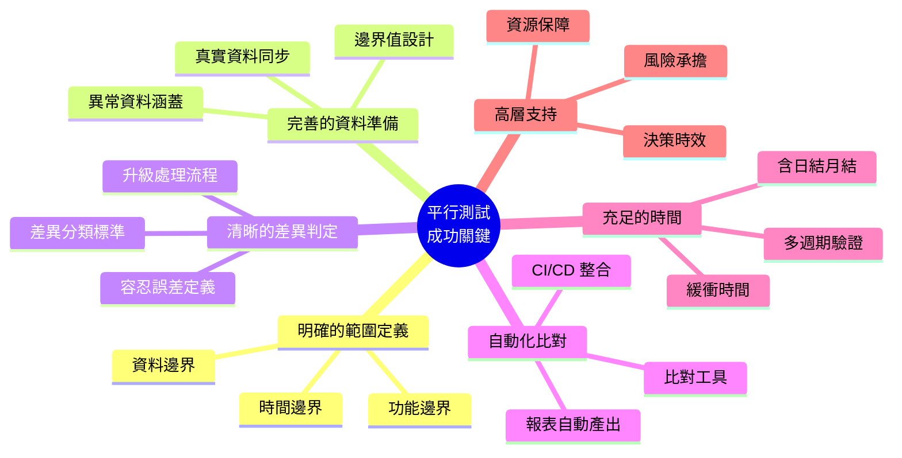

### 十大關鍵成功因素

| # | 因素 | 說明 |
|---|------|------|
| 1 | **明確定義成功標準** | 不能含糊——「零差異」或「容差範圍內」都要事先定義 |
| 2 | **使用真實營運資料** | 模擬資料無法覆蓋所有業務場景 |
| 3 | **自動化差異比對** | 人工比對效率低、易遺漏 |
| 4 | **足夠的測試週期** | 至少涵蓋日結、月結、季結完整週期 |
| 5 | **明確的 RACI 矩陣** | 每個角色的責任清楚定義 |
| 6 | **差異即時處理機制** | 發現差異後的升級與修正流程 |
| 7 | **完整的稽核軌跡** | 所有比對結果、修正紀錄都需留存 |
| 8 | **高層管理支持** | 資源調配、決策時效的保障 |
| 9 | **回滾計畫** | 新系統出問題時的退路 |
| 10 | **充分的溝通** | 開發、測試、業務、風控各方對齊 |

> **最佳實務**：在專案啟動時就規劃平行測試，而非在 UAT 完成後才臨時安排。平行測試的準備時間通常占整體測試時程的 30% 以上。

---

# 第二章　平行測試標準作業流程（SOP）

## 學習目標

- 掌握平行測試的完整作業流程
- 理解每個階段的產出物與控制點
- 明確角色責任分配

---

## 2.1 流程總覽

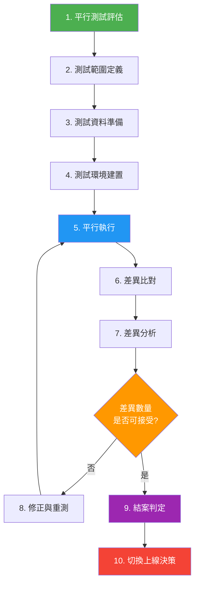

### 流程時間估算（大型專案參考）

| 階段 | 建議時間 | 佔比 |
|------|---------|------|
| 1-2. 評估與範圍定義 | 2-4 週 | 10% |
| 3. 資料準備 | 2-3 週 | 10% |
| 4. 環境建置 | 1-2 週 | 5% |
| 5-8. 執行與修正（多輪） | 8-16 週 | 60% |
| 9-10. 結案與上線決策 | 2-3 週 | 15% |

---

## 2.2 各階段詳細說明

### 階段 1：平行測試評估

**目的**：評估是否需要執行平行測試、規模與資源需求

**輸入**：
- 專案計畫書
- 系統變更影響分析
- 風險評估報告

**活動**：
1. 評估系統變更的風險等級
2. 決定是否需要平行測試
3. 估算所需資源（人力、環境、時間）
4. 取得管理層核准

**產出**：
- 平行測試可行性評估報告
- 資源需求清單
- 管理層核准文件

**控制點**：
- ✅ 風險等級為「高」或以上，必須執行平行測試
- ✅ 管理層書面核准

---

### 階段 2：測試範圍定義

**目的**：明確定義平行測試的功能範圍、資料範圍與時間範圍

**活動**：
1. 列出所有受影響的業務功能
2. 識別需要比對的資料欄位
3. 定義測試週期與時間窗口
4. 確認不納入範圍的項目及其原因

**產出**：
- 測試範圍說明書（含 In-Scope / Out-of-Scope）
- 比對項目清單
- 測試時程表

**控制點**：
- ✅ 業務單位簽核確認範圍
- ✅ 風控單位審核範圍的完整性

---

### 階段 3：測試資料準備

**目的**：準備可用於平行測試的真實或仿真資料

**活動**：
1. 確認資料來源（Production 複製 / 數據脫敏）
2. 設計資料同步機制
3. 準備邊界值與異常測試資料
4. 執行資料驗證（完整性、一致性）

**產出**：
- 資料準備計畫
- 資料脫敏規則（如適用）
- 資料驗證報告

**控制點**：
- ✅ 資料脫敏符合個資法規
- ✅ 資料完整性驗證通過
- ⚠️ **嚴禁使用正式環境資料直接作為測試資料而不脫敏**

---

### 階段 4：測試環境建置

**目的**：建立獨立、隔離的平行測試環境

**活動**：
1. 建置新系統測試環境
2. 確保舊系統可正常運行（或使用 Production 資料快照）
3. 設置資料同步管道
4. 部署比對工具與報表系統
5. 執行環境驗證測試

**產出**：
- 環境建置檢查表
- 環境驗證報告

**控制點**：
- ✅ 環境與 Production 隔離
- ✅ 環境驗證測試通過
- ✅ 資料同步管道正常運作

---

### 階段 5：平行執行

**目的**：同時運行新舊系統，產出比對所需的結果資料

**活動**：
1. 將相同輸入資料饋入新舊系統
2. 同步觸發批次任務
3. 記錄執行日誌
4. 監控系統效能與穩定性
5. 每日匯報執行狀況

**產出**：
- 執行日誌
- 效能監控報告
- 每日狀況報告

**控制點**：
- ✅ 輸入資料完全一致
- ✅ 執行時序同步
- ⚠️ 任何系統異常需立即通報

---

### 階段 6：差異比對

**目的**：比對新舊系統的輸出結果，產出差異報告

**活動**：
1. 執行自動化比對工具
2. 彙整差異報告
3. 標記差異嚴重等級
4. 初步分類差異類型

**產出**：
- 差異比對報告
- 差異統計摘要

---

### 階段 7：差異分析

**目的**：深入分析每筆差異的根因，判定是否為問題

**差異分類**：

| 分類 | 說明 | 處理方式 |
|------|------|----------|
| **A：程式缺陷** | 新系統邏輯錯誤 | 必須修正 |
| **B：設計差異** | 新系統改進設計，結果正確但不同 | 評估後決定 |
| **C：資料差異** | 輸入資料不一致造成 | 修正資料同步 |
| **D：時序差異** | 執行時間差異導致 | 調整同步機制 |
| **E：容差內差異** | 在預設容忍誤差範圍內 | 記錄但不修正 |
| **F：已知差異** | 預期內的變更 | 記錄，標註為已知 |

**產出**：
- 差異分析報告（含根因分析）
- 修正清單

---

### 階段 8：修正與重測

**目的**：修正已確認的問題，並重新執行驗證

**活動**：
1. 開發團隊修正程式
2. 經過 Code Review 與 SIT
3. 部署至平行測試環境
4. 重新執行受影響範圍的平行測試
5. 驗證修正結果

**控制點**：
- ✅ 修正程式碼經過 Code Review
- ✅ 修正不引入新問題（回歸驗證）

---

### 階段 9：結案判定

**目的**：依據成功標準判定平行測試是否通過

**判定條件**：
1. 所有 A 類（程式缺陷）差異已修正並驗證
2. 所有 B 類差異已評估並取得業務簽核
3. 連續 N 個完整業務週期無新增 A 類差異
4. 效能指標符合上線標準
5. 各單位簽署結案確認

**產出**：
- 平行測試結案報告
- 各單位簽核紀錄

---

### 階段 10：切換上線決策

**目的**：依據平行測試結論，做出上線 / 延後上線的決策

**決策會議參與者**：
- 專案負責人
- 系統架構師
- 品質保證負責人
- 業務代表
- 風控 / 法遵代表
- 高階管理者

**決策依據**：
- 平行測試結案報告
- 殘留風險清單
- 回滾計畫可行性
- 上線時間窗口

**產出**：
- 上線決策會議紀錄
- 上線 / 延後上線通知

---

## 2.3 RACI 責任矩陣

| 階段 | PM | 架構師 | 開發 | 測試 | 業務 | 風控 | 高管 |
|------|:--:|:------:|:----:|:----:|:----:|:----:|:----:|
| 1. 評估 | **A** | **R** | C | C | C | **R** | I |
| 2. 範圍定義 | **A** | **R** | C | **R** | **R** | C | I |
| 3. 資料準備 | A | C | **R** | **R** | C | C | I |
| 4. 環境建置 | A | **R** | **R** | C | I | I | I |
| 5. 平行執行 | A | C | **R** | **R** | C | I | I |
| 6. 差異比對 | A | C | C | **R** | I | I | I |
| 7. 差異分析 | A | **R** | **R** | **R** | C | C | I |
| 8. 修正重測 | A | C | **R** | **R** | C | I | I |
| 9. 結案判定 | **A** | **R** | C | **R** | **R** | **R** | I |
| 10. 上線決策 | **R** | C | I | C | **R** | **R** | **A** |

> **R** = Responsible（執行者）、**A** = Accountable（當責者）、**C** = Consulted（諮詢者）、**I** = Informed（知會者）

> **實務提醒**：RACI 矩陣必須在專案啟動時確認，並經各單位主管簽核。若角色模糊，平行測試必然失敗。

---

# 第三章　平行測試計劃書範本

## 學習目標

- 能獨立撰寫完整的平行測試計劃書
- 了解每個章節的內容要求與撰寫技巧

> 以下為計劃書範本，**粗體字** 為需填入的項目。

---

## 3.1 專案基本資訊

| 項目 | 內容 |
|------|------|
| 文件編號 | **PT-YYYY-NNN** |
| 專案名稱 | **例：核心帳務系統升級專案** |
| 系統名稱 | **例：核心帳務處理系統（Core Banking System）** |
| 平行測試期間 | **YYYY/MM/DD ～ YYYY/MM/DD** |
| 預計測試週期數 | **例：3 個完整月結週期** |
| 專案負責人 | **姓名 / 職稱** |
| 測試負責人 | **姓名 / 職稱** |
| 文件版本 | **v1.0** |
| 核准日期 | **YYYY/MM/DD** |

### 文件審核紀錄

| 版本 | 日期 | 修改說明 | 作者 | 審核者 |
|------|------|----------|------|--------|
| v1.0 | YYYY/MM/DD | 初版 | — | — |
| v1.1 | YYYY/MM/DD | — | — | — |

---

## 3.2 測試範圍

### 3.2.1 功能範圍（In-Scope）

| 序號 | 功能模組 | 說明 | 優先等級 |
|------|----------|------|----------|
| 1 | **例：存款利息計算** | **包含活存、定存利息日計與月計** | P0 |
| 2 | **例：匯款交易處理** | **國內匯款、跨行轉帳** | P0 |
| 3 | **例：日結批次** | **日終帳務結算** | P0 |
| 4 | **例：報表產出** | **資產負債表、損益表** | P1 |

### 3.2.2 批次範圍

| 序號 | 批次名稱 | 執行頻率 | 說明 |
|------|----------|----------|------|
| 1 | **例：BATCH-001 日結** | 每日 | **日終帳務處理** |
| 2 | **例：BATCH-002 利息計算** | 每月 | **活存利息計算** |
| 3 | **例：BATCH-003 報表** | 每日 | **監理報表產製** |

### 3.2.3 不納入範圍（Out-of-Scope）

| 序號 | 項目 | 排除原因 |
|------|------|----------|
| 1 | **例：信用卡系統** | 不在本次遷移範圍 |
| 2 | **例：電子銀行界面** | 前端無變更 |

---

## 3.3 測試策略

### 3.3.1 同步方式

| 類型 | 說明 | 適用場景 |
|------|------|----------|
| **Real-time 即時同步** | 新舊系統同時處理每筆交易 | 線上交易系統 |
| **Batch 批次同步** | 以批次方式將資料同步處理 | 批次處理系統 |
| **Replay 重播模式** | 錄製舊系統交易，在新系統重播 | 高流量線上系統 |

### 3.3.2 比對方式

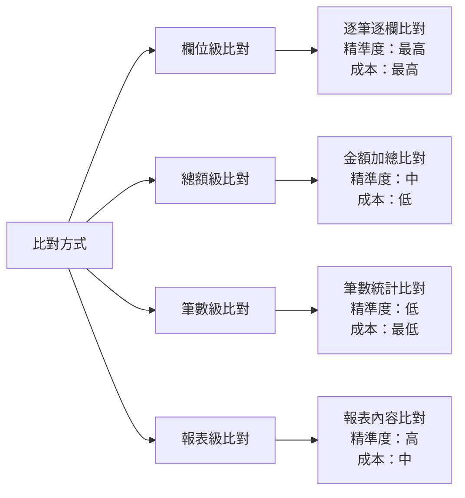

| 比對層級 | 精準度 | 適用場景 | 說明 |
|----------|--------|----------|------|
| **欄位級** | ★★★★★ | 核心交易、金額計算 | 逐筆逐欄位比對 |
| **總額級** | ★★★☆☆ | 初步驗證、快速檢核 | 比對加總金額 |
| **筆數級** | ★★☆☆☆ | 資料完整性檢查 | 確認筆數一致 |
| **報表級** | ★★★★☆ | 報表產出驗證 | 比對報表內容 |

### 3.3.3 自動化工具規劃

| 工具類型 | 建議工具 | 用途 |
|----------|----------|------|
| 資料比對 | 自建比對程式 / Beyond Compare | 逐欄位差異比對 |
| SQL 比對 | DBeaver / 自建 SQL Script | 資料庫層級比對 |
| API 比對 | Postman / RestAssured | API 回應比對 |
| 報表比對 | 自建工具 / diff 工具 | 產出報表比對 |
| 效能監控 | Grafana / Prometheus | 系統效能指標 |

---

## 3.4 測試資料設計

### 3.4.1 資料策略

| 策略 | 說明 | 適用場景 |
|------|------|----------|
| **全量測試** | 使用完整 Production 資料 | 核心系統、高風險系統 |
| **抽樣測試** | 選取代表性樣本 | 資料量過大時 |
| **組合測試** | 全量 + 特殊設計資料 | 建議的最佳方式 |

### 3.4.2 特殊測試資料設計

| 資料類型 | 範例 | 目的 |
|----------|------|------|
| **邊界值** | 金額 = 0、最大金額、最小金額 | 驗證邊界條件 |
| **異常資料** | 不合法的帳號、超額交易 | 驗證錯誤處理 |
| **高風險交易** | 大額匯款、跨幣種交易 | 驗證高風險場景 |
| **歷史資料** | 跨年度、跨季度的資料 | 驗證歷史資料相容 |
| **併發資料** | 同帳號同時多筆交易 | 驗證並發處理 |

---

## 3.5 差異判定標準

### 3.5.1 容忍誤差（Tolerance）定義

| 資料類型 | 容忍誤差 | 說明 |
|----------|----------|------|
| **金額（整數）** | 0（零容差） | 金額不允許任何差異 |
| **金額（含小數）** | ±0.01 元 | 因四捨五入可能產生 1 分差異 |
| **利率計算** | ±0.0001% | 浮點數計算容差 |
| **筆數** | 0（零容差） | 筆數必須完全一致 |
| **日期** | 0（零容差） | 日期不允許差異 |
| **文字欄位** | 完全一致 | 不允許差異（含空白） |
| **時間戳記** | ±5 秒 | 系統處理時間差異 |

### 3.5.2 差異嚴重等級

| 等級 | 名稱 | 定義 | 處理時限 | 範例 |
|------|------|------|----------|------|
| **S1** | 致命 | 金額計算錯誤、資料遺失 | 4 小時 | 利息少算 100 元 |
| **S2** | 嚴重 | 功能異常但不影響金額 | 1 工作天 | 交易狀態碼不一致 |
| **S3** | 一般 | 非核心欄位差異 | 3 工作天 | 摘要文字不同 |
| **S4** | 輕微 | 格式差異、排序不同 | 下次修正 | 日期格式差異 |

---

## 3.6 風險評估

### 3.6.1 風險評估矩陣

| 風險項目 | 類別 | 可能性 | 影響度 | 風險值 | 因應措施 |
|----------|------|--------|--------|--------|----------|
| 資料同步失敗 | 技術 | 中 | 高 | 🟠 | 建立資料同步監控與自動重試 |
| 測試時間不足 | 專案 | 高 | 高 | 🔴 | 預留 20% 緩衝時間 |
| 人力不足 | 資源 | 中 | 中 | 🟡 | 提前確認人力配置 |
| 環境不穩定 | 技術 | 中 | 高 | 🟠 | 環境日常健檢 |
| 法規變更影響 | 法規 | 低 | 高 | 🟡 | 持續追蹤法規動態 |
| 資料外洩風險 | 資安 | 低 | 極高 | 🟠 | 資料脫敏、存取控制 |

### 3.6.2 風險處理策略

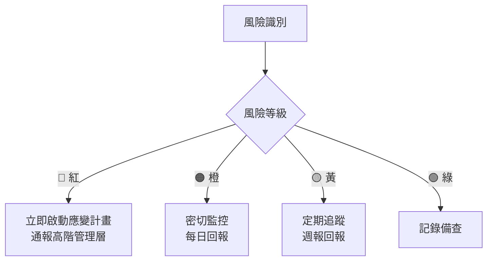

---

## 3.7 成功標準（Exit Criteria）

### 必要條件（Must Have）

- [ ] 所有 S1（致命）差異歸零
- [ ] 所有 S2（嚴重）差異歸零
- [ ] 連續 **3 個完整業務日** 無新增 S1/S2 差異
- [ ] 批次處理 100% 成功完成
- [ ] 效能指標 ≤ 舊系統的 110%（或符合 SLA）
- [ ] 筆數比對 100% 一致
- [ ] 金額比對在容差範圍內

### 建議條件（Should Have）

- [ ] S3（一般）差異 ≤ 5 筆
- [ ] 自動化比對覆蓋率 ≥ 90%
- [ ] 所有測試場景已執行並通過
- [ ] 運維團隊完成培訓
- [ ] 回滾演練至少執行 1 次

### 文件條件

- [ ] 平行測試結案報告完成
- [ ] 差異清單已全數處理（修正或標註已知）
- [ ] 各單位簽核完成
- [ ] 上線檢核清單填寫完成

> **實務提醒**：Exit Criteria 必須在平行測試開始前由各單位共同確認，**不得在測試過程中隨意調降標準**。

---

## 3.8 溝通計畫

平行測試期間的溝通計畫是確保各利害關係人對齊資訊、及時處理差異的關鍵。

### 3.8.1 溝通矩陣

| 溝通事項 | 頻率 | 方式 | 發送者 | 接收者 | 內容 |
|----------|------|------|--------|--------|------|
| 每日摘要報告 | 每日 | Email + 系統 | 測試 Lead | 全體成員 | 比對結果摘要、差異趨勢 |
| S1 差異通報 | 即時 | 電話 + 簡訊 + Email | 測試工程師 | 開發 Lead、PM、風控 | 差異詳情、初步影響評估 |
| S2 差異通報 | 4 小時內 | Email + IM | 測試工程師 | 開發 Lead、PM | 差異詳情、建議處理方式 |
| 週報 | 每週 | 會議 + 書面 | PM | 管理層、業務代表 | 進度摘要、風險更新、決策需求 |
| 里程碑報告 | 每輪結束 | 正式會議 | PM | 全部利害關係人 | 測試結果、修正摘要、下一步計畫 |
| 升級通報 | 視需求 | 會議 | PM | 高階主管 | 重大風險、延遲預警、決策請求 |

### 3.8.2 會議機制

| 會議名稱 | 頻率 | 時長 | 必要參與者 | 議程 |
|----------|------|------|-----------|------|
| **每日站會** | 每日 | 15 min | 測試 Lead、開發 Lead | 昨日差異處理、今日計畫、阻礙 |
| **差異分析會** | 視需求 | 30-60 min | 開發、測試、業務 | S1/S2 差異根因分析與對策 |
| **週檢視會** | 每週 | 60 min | PM、測試、開發、業務 | 週進度回顧、風險評估、決策 |
| **管理層簡報** | 每 2 週 | 30 min | PM、高階主管 | 整體進度、關鍵指標、風險 |

### 3.8.3 通報升級機制

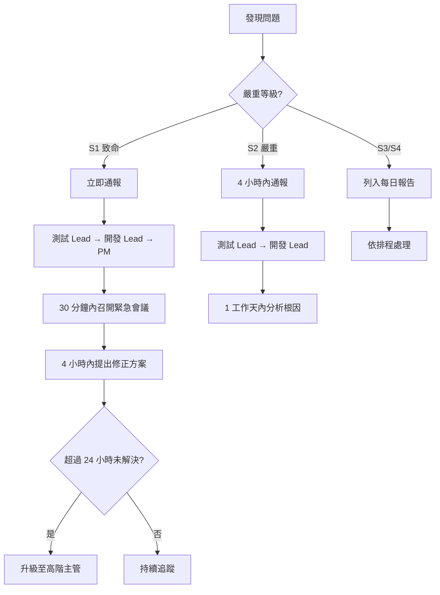

> **實務提醒**：
> 1. 溝通計畫應在平行測試啟動前經各方確認
> 2. 所有重要溝通需留下書面紀錄（會議紀錄、Email 存檔）
> 3. 測試期間建議建立專屬的即時通訊群組（如 Teams/Slack 頻道）
> 4. S1 差異的通報不可僅依賴 Email，必須搭配電話或即時通訊確認收到

---

# 第四章　差異比對設計

## 學習目標

- 掌握各種比對策略的設計原則
- 理解數值容差與精度處理的技巧
- 能設計 SQL、批次、API 層級的比對邏輯

---

## 4.1 比對策略總覽

### 比對架構設計

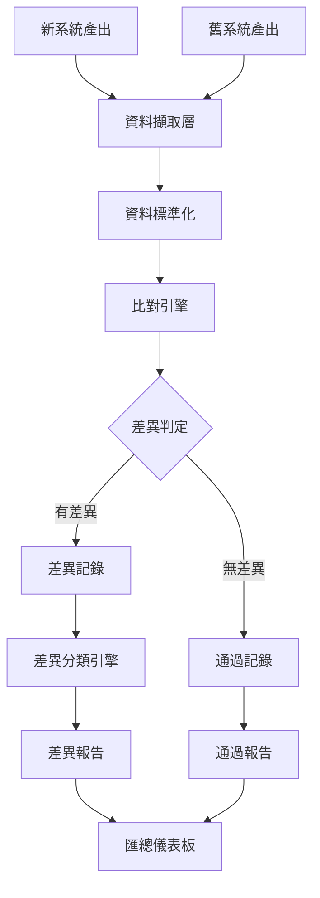

### 比對層級與策略

| 層級 | 比對方式 | 工具 | 適用場景 |
|------|----------|------|----------|
| **資料庫層** | SQL 查詢比對 | 自建 SQL Script | 結構化資料、批次結果 |
| **檔案層** | 逐行/逐欄比對 | diff、自建工具 | 報表、輸出檔案 |
| **API 層** | Request/Response 比對 | Postman、自建框架 | 線上交易、API 服務 |
| **訊息層** | MQ 訊息比對 | MQ 監控工具 | 訊息佇列系統 |
| **報表層** | 報表內容比對 | PDF/Excel diff 工具 | 監理報表、對帳單 |

---

## 4.2 數值容差與精度處理

### 4.2.1 浮點數誤差處理

浮點數（float/double）在二進位表示時會有精度損失，這是平行測試中**最常見的差異來源**之一。

```java
/**
 * 錯誤示範：使用 double 計算金額
 */
public class BadExample {
    public static void main(String[] args) {
        double amount1 = 0.1 + 0.2;
        System.out.println(amount1); // 輸出：0.30000000000000004 ❌
    }
}

/**
 * 正確做法：使用 BigDecimal 計算金額
 */
import java.math.BigDecimal;
import java.math.RoundingMode;

public class GoodExample {
    public static void main(String[] args) {
        BigDecimal amount1 = new BigDecimal("0.1");
        BigDecimal amount2 = new BigDecimal("0.2");
        BigDecimal result = amount1.add(amount2);
        System.out.println(result); // 輸出：0.3 ✅
        
        // 利息計算範例：本金 × 年利率 ÷ 365
        BigDecimal principal = new BigDecimal("1000000");
        BigDecimal rate = new BigDecimal("0.025");
        BigDecimal dailyInterest = principal.multiply(rate)
            .divide(new BigDecimal("365"), 2, RoundingMode.HALF_UP);
        System.out.println("日利息：" + dailyInterest); // 68.49
    }
}
```

### 4.2.2 四捨五入差異

新舊系統可能使用不同的捨入方式，導致結果差異：

| 捨入方式 | Java 對應 | 說明 | 範例（2.5） |
|----------|-----------|------|------------|
| 四捨五入 | `HALF_UP` | 最常見 | 3 |
| 銀行家捨入 | `HALF_EVEN` | 金融系統常用 | 2 |
| 無條件進位 | `CEILING` | 向上取整 | 3 |
| 無條件捨去 | `FLOOR` | 向下取整 | 2 |

> **實務提醒**：在比對前，必須確認新舊系統使用的捨入方式是否一致。若不一致，需在比對工具中設定對應的容差規則。

### 4.2.3 日期與時區差異

| 差異類型 | 原因 | 處理方式 |
|----------|------|----------|
| 時區差異 | 新舊系統使用不同時區 | 統一轉換為 UTC |
| 格式差異 | `YYYY/MM/DD` vs `YYYY-MM-DD` | 標準化格式後比對 |
| 精度差異 | 毫秒 vs 秒 | 截斷至相同精度 |
| 營業日差異 | 新舊系統營業日定義不同 | 統一營業日設定 |

### 4.2.4 BigDecimal 精度問題

```java
import java.math.BigDecimal;
import java.math.RoundingMode;

/**
 * 平行測試比對工具 - 金額比對邏輯
 */
public class AmountComparator {
    
    /** 容忍誤差：0.01 元 */
    private static final BigDecimal TOLERANCE = new BigDecimal("0.01");
    
    /**
     * 比對兩筆金額是否在容忍範圍內
     * @param oldAmount 舊系統金額
     * @param newAmount 新系統金額
     * @return 比對結果
     */
    public static CompareResult compareAmount(BigDecimal oldAmount, BigDecimal newAmount) {
        BigDecimal diff = oldAmount.subtract(newAmount).abs();
        
        if (diff.compareTo(BigDecimal.ZERO) == 0) {
            return new CompareResult("EXACT_MATCH", diff);
        } else if (diff.compareTo(TOLERANCE) <= 0) {
            return new CompareResult("WITHIN_TOLERANCE", diff);
        } else {
            return new CompareResult("MISMATCH", diff);
        }
    }
    
    /**
     * 比對結果紀錄
     */
    public record CompareResult(String status, BigDecimal difference) {}
}
```

---

## 4.3 SQL 比對範例

### 4.3.1 筆數比對

```sql
-- ============================================
-- 筆數比對：確認新舊系統交易筆數一致
-- ============================================

-- 舊系統交易筆數
SELECT 
    TXN_DATE,
    TXN_TYPE,
    COUNT(*) AS OLD_COUNT
FROM OLD_SYSTEM.TRANSACTION_LOG
WHERE TXN_DATE = '2026-02-12'
GROUP BY TXN_DATE, TXN_TYPE
ORDER BY TXN_TYPE;

-- 新系統交易筆數
SELECT 
    TXN_DATE,
    TXN_TYPE,
    COUNT(*) AS NEW_COUNT
FROM NEW_SYSTEM.TRANSACTION_LOG
WHERE TXN_DATE = '2026-02-12'
GROUP BY TXN_DATE, TXN_TYPE
ORDER BY TXN_TYPE;

-- 差異比對（JOIN 查詢）
SELECT 
    COALESCE(o.TXN_TYPE, n.TXN_TYPE) AS TXN_TYPE,
    COALESCE(o.OLD_COUNT, 0) AS OLD_COUNT,
    COALESCE(n.NEW_COUNT, 0) AS NEW_COUNT,
    COALESCE(n.NEW_COUNT, 0) - COALESCE(o.OLD_COUNT, 0) AS DIFF
FROM (
    SELECT TXN_TYPE, COUNT(*) AS OLD_COUNT
    FROM OLD_SYSTEM.TRANSACTION_LOG
    WHERE TXN_DATE = '2026-02-12'
    GROUP BY TXN_TYPE
) o
FULL OUTER JOIN (
    SELECT TXN_TYPE, COUNT(*) AS NEW_COUNT
    FROM NEW_SYSTEM.TRANSACTION_LOG
    WHERE TXN_DATE = '2026-02-12'
    GROUP BY TXN_TYPE
) n ON o.TXN_TYPE = n.TXN_TYPE
WHERE COALESCE(o.OLD_COUNT, 0) <> COALESCE(n.NEW_COUNT, 0);
```

### 4.3.2 金額比對

```sql
-- ============================================
-- 金額比對：逐筆比對交易金額
-- ============================================
SELECT 
    o.TXN_ID,
    o.ACCOUNT_NO,
    o.TXN_TYPE,
    o.AMOUNT AS OLD_AMOUNT,
    n.AMOUNT AS NEW_AMOUNT,
    ABS(o.AMOUNT - n.AMOUNT) AS DIFF_AMOUNT,
    CASE 
        WHEN o.AMOUNT = n.AMOUNT THEN 'MATCH'
        WHEN ABS(o.AMOUNT - n.AMOUNT) <= 0.01 THEN 'WITHIN_TOLERANCE'
        ELSE 'MISMATCH'
    END AS COMPARE_RESULT
FROM OLD_SYSTEM.TRANSACTION_LOG o
JOIN NEW_SYSTEM.TRANSACTION_LOG n 
    ON o.TXN_ID = n.TXN_ID 
    AND o.TXN_DATE = n.TXN_DATE
WHERE o.TXN_DATE = '2026-02-12'
    AND o.AMOUNT <> n.AMOUNT
ORDER BY ABS(o.AMOUNT - n.AMOUNT) DESC;
```

### 4.3.3 總額比對

```sql
-- ============================================
-- 總額比對：比對每日交易總額
-- ============================================
SELECT 
    'OLD_SYSTEM' AS SYSTEM_NAME,
    TXN_DATE,
    TXN_TYPE,
    COUNT(*) AS TXN_COUNT,
    SUM(AMOUNT) AS TOTAL_AMOUNT,
    MIN(AMOUNT) AS MIN_AMOUNT,
    MAX(AMOUNT) AS MAX_AMOUNT,
    AVG(AMOUNT) AS AVG_AMOUNT
FROM OLD_SYSTEM.TRANSACTION_LOG
WHERE TXN_DATE = '2026-02-12'
GROUP BY TXN_DATE, TXN_TYPE

UNION ALL

SELECT 
    'NEW_SYSTEM' AS SYSTEM_NAME,
    TXN_DATE,
    TXN_TYPE,
    COUNT(*) AS TXN_COUNT,
    SUM(AMOUNT) AS TOTAL_AMOUNT,
    MIN(AMOUNT) AS MIN_AMOUNT,
    MAX(AMOUNT) AS MAX_AMOUNT,
    AVG(AMOUNT) AS AVG_AMOUNT
FROM NEW_SYSTEM.TRANSACTION_LOG
WHERE TXN_DATE = '2026-02-12'
GROUP BY TXN_DATE, TXN_TYPE
ORDER BY TXN_TYPE, SYSTEM_NAME;
```

### 4.3.4 舊系統有但新系統沒有的資料

```sql
-- ============================================
-- 找出舊系統有但新系統缺少的交易
-- ============================================
SELECT 
    o.TXN_ID,
    o.ACCOUNT_NO,
    o.TXN_TYPE,
    o.AMOUNT,
    o.TXN_DATETIME,
    'MISSING_IN_NEW' AS ISSUE_TYPE
FROM OLD_SYSTEM.TRANSACTION_LOG o
LEFT JOIN NEW_SYSTEM.TRANSACTION_LOG n 
    ON o.TXN_ID = n.TXN_ID
WHERE n.TXN_ID IS NULL
    AND o.TXN_DATE = '2026-02-12';

-- ============================================
-- 找出新系統有但舊系統沒有的交易（可能是多產出的資料）
-- ============================================
SELECT 
    n.TXN_ID,
    n.ACCOUNT_NO,
    n.TXN_TYPE,
    n.AMOUNT,
    n.TXN_DATETIME,
    'EXTRA_IN_NEW' AS ISSUE_TYPE
FROM NEW_SYSTEM.TRANSACTION_LOG n
LEFT JOIN OLD_SYSTEM.TRANSACTION_LOG o 
    ON n.TXN_ID = o.TXN_ID
WHERE o.TXN_ID IS NULL
    AND n.TXN_DATE = '2026-02-12';
```

---

## 4.4 批次比對邏輯範例

### 4.4.1 Java 批次比對框架

```java
import java.math.BigDecimal;
import java.util.*;
import java.util.stream.Collectors;

/**
 * 平行測試批次比對引擎
 * 
 * <p>用於比對新舊系統批次產出的結果檔案</p>
 */
public class BatchCompareEngine {

    /** 比對設定 */
    private final CompareConfig config;
    
    /** 差異記錄清單 */
    private final List<DiffRecord> diffRecords = new ArrayList<>();

    public BatchCompareEngine(CompareConfig config) {
        this.config = config;
    }

    /**
     * 執行批次比對
     * 
     * @param oldRecords 舊系統記錄
     * @param newRecords 新系統記錄
     * @return 比對結果報告
     */
    public CompareReport execute(
            List<Map<String, Object>> oldRecords,
            List<Map<String, Object>> newRecords) {

        // 1. 以主鍵建立索引
        Map<String, Map<String, Object>> oldIndex = buildIndex(oldRecords);
        Map<String, Map<String, Object>> newIndex = buildIndex(newRecords);

        // 2. 檢查舊系統有但新系統沒有的記錄
        for (String key : oldIndex.keySet()) {
            if (!newIndex.containsKey(key)) {
                diffRecords.add(new DiffRecord(
                    key, "MISSING_IN_NEW", "整筆記錄",
                    oldIndex.get(key).toString(), "N/A", "S1"
                ));
            }
        }

        // 3. 檢查新系統有但舊系統沒有的記錄
        for (String key : newIndex.keySet()) {
            if (!oldIndex.containsKey(key)) {
                diffRecords.add(new DiffRecord(
                    key, "EXTRA_IN_NEW", "整筆記錄",
                    "N/A", newIndex.get(key).toString(), "S2"
                ));
            }
        }

        // 4. 逐欄比對共同存在的記錄
        for (String key : oldIndex.keySet()) {
            if (newIndex.containsKey(key)) {
                compareFields(key, oldIndex.get(key), newIndex.get(key));
            }
        }

        // 5. 產出報告
        return generateReport(oldRecords.size(), newRecords.size());
    }

    /**
     * 逐欄位比對
     */
    private void compareFields(
            String key,
            Map<String, Object> oldRecord,
            Map<String, Object> newRecord) {

        for (String field : config.getCompareFields()) {
            Object oldVal = oldRecord.get(field);
            Object newVal = newRecord.get(field);
            
            // 取得該欄位的容差設定
            BigDecimal tolerance = config.getTolerance(field);
            
            if (!isEqual(oldVal, newVal, tolerance)) {
                String severity = config.getSeverity(field);
                diffRecords.add(new DiffRecord(
                    key, "FIELD_MISMATCH", field,
                    String.valueOf(oldVal),
                    String.valueOf(newVal),
                    severity
                ));
            }
        }
    }

    /**
     * 判斷兩個值是否相等（含容差判斷）
     */
    private boolean isEqual(Object oldVal, Object newVal, BigDecimal tolerance) {
        if (oldVal == null && newVal == null) return true;
        if (oldVal == null || newVal == null) return false;
        
        // 數值型別：使用容差比對
        if (oldVal instanceof Number && newVal instanceof Number) {
            BigDecimal oldNum = new BigDecimal(oldVal.toString());
            BigDecimal newNum = new BigDecimal(newVal.toString());
            return oldNum.subtract(newNum).abs().compareTo(tolerance) <= 0;
        }
        
        // 其他型別：字串比對
        return oldVal.toString().trim().equals(newVal.toString().trim());
    }

    /**
     * 以主鍵建立索引
     */
    private Map<String, Map<String, Object>> buildIndex(
            List<Map<String, Object>> records) {
        return records.stream().collect(Collectors.toMap(
            r -> config.getPrimaryKeyFields().stream()
                    .map(f -> String.valueOf(r.get(f)))
                    .collect(Collectors.joining("|")),
            r -> r,
            (r1, r2) -> r1 // 重複 key 取第一筆
        ));
    }

    /**
     * 產出比對報告
     */
    private CompareReport generateReport(int oldCount, int newCount) {
        long s1Count = diffRecords.stream()
            .filter(d -> "S1".equals(d.severity())).count();
        long s2Count = diffRecords.stream()
            .filter(d -> "S2".equals(d.severity())).count();

        return new CompareReport(
            oldCount, newCount, diffRecords.size(),
            s1Count, s2Count, diffRecords
        );
    }

    // ===== 內部資料結構 =====

    /** 差異記錄 */
    public record DiffRecord(
        String primaryKey,
        String diffType,
        String fieldName,
        String oldValue,
        String newValue,
        String severity
    ) {}

    /** 比對報告 */
    public record CompareReport(
        int oldSystemCount,
        int newSystemCount,
        int totalDiffs,
        long s1Count,
        long s2Count,
        List<DiffRecord> details
    ) {}
}
```

### 4.4.2 比對設定範例

```java
/**
 * 比對設定類別
 */
public class CompareConfig {
    
    /** 主鍵欄位 */
    private List<String> primaryKeyFields = List.of("TXN_ID");
    
    /** 需比對的欄位 */
    private List<String> compareFields = List.of(
        "ACCOUNT_NO", "TXN_TYPE", "AMOUNT", 
        "BALANCE", "TXN_DATE", "STATUS"
    );
    
    /** 欄位容差設定 */
    private Map<String, BigDecimal> toleranceMap = Map.of(
        "AMOUNT", new BigDecimal("0.01"),
        "BALANCE", new BigDecimal("0.01"),
        "INTEREST", new BigDecimal("0.001")
    );
    
    /** 欄位嚴重等級 */
    private Map<String, String> severityMap = Map.of(
        "AMOUNT", "S1",    // 金額差異 → 致命
        "BALANCE", "S1",   // 餘額差異 → 致命
        "STATUS", "S2",    // 狀態差異 → 嚴重
        "TXN_DATE", "S2",  // 日期差異 → 嚴重
        "ACCOUNT_NO", "S1" // 帳號差異 → 致命
    );

    // ... getters ...
    
    public BigDecimal getTolerance(String field) {
        return toleranceMap.getOrDefault(field, BigDecimal.ZERO);
    }
    
    public String getSeverity(String field) {
        return severityMap.getOrDefault(field, "S3");
    }
    
    public List<String> getPrimaryKeyFields() { return primaryKeyFields; }
    public List<String> getCompareFields() { return compareFields; }
}
```

---

## 4.5 API 回傳比對範例

### 4.5.1 API 比對架構

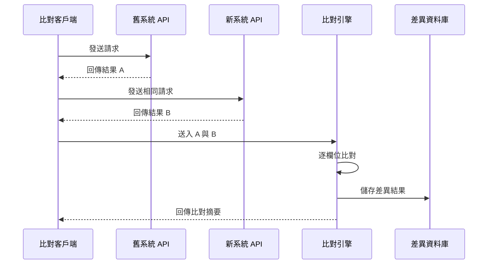

### 4.5.2 API 比對工具範例

```java
import com.fasterxml.jackson.databind.JsonNode;
import com.fasterxml.jackson.databind.ObjectMapper;
import java.net.http.*;
import java.net.URI;
import java.util.*;

/**
 * API 回傳比對工具
 * 
 * <p>同時呼叫新舊系統 API，比對回傳結果</p>
 */
public class ApiCompareClient {

    private final HttpClient httpClient = HttpClient.newHttpClient();
    private final ObjectMapper mapper = new ObjectMapper();
    
    private final String oldSystemBaseUrl;
    private final String newSystemBaseUrl;

    public ApiCompareClient(String oldSystemBaseUrl, String newSystemBaseUrl) {
        this.oldSystemBaseUrl = oldSystemBaseUrl;
        this.newSystemBaseUrl = newSystemBaseUrl;
    }

    /**
     * 比對 API 回傳結果
     * 
     * @param endpoint API 路徑
     * @param requestBody 請求內容
     * @return 比對結果
     */
    public ApiCompareResult compare(String endpoint, String requestBody) 
            throws Exception {
        
        // 1. 呼叫舊系統
        String oldResponse = callApi(oldSystemBaseUrl + endpoint, requestBody);
        
        // 2. 呼叫新系統
        String newResponse = callApi(newSystemBaseUrl + endpoint, requestBody);
        
        // 3. 解析 JSON
        JsonNode oldJson = mapper.readTree(oldResponse);
        JsonNode newJson = mapper.readTree(newResponse);
        
        // 4. 比對
        List<String> diffs = new ArrayList<>();
        compareJsonNodes("", oldJson, newJson, diffs);
        
        return new ApiCompareResult(
            endpoint, oldResponse, newResponse, 
            diffs, diffs.isEmpty()
        );
    }

    /**
     * 遞迴比對 JSON 節點
     */
    private void compareJsonNodes(
            String path, JsonNode oldNode, JsonNode newNode, 
            List<String> diffs) {
        
        if (oldNode == null && newNode == null) return;
        
        if (oldNode == null) {
            diffs.add(String.format("[%s] 舊系統無此欄位, 新系統=%s", 
                path, newNode));
            return;
        }
        if (newNode == null) {
            diffs.add(String.format("[%s] 舊系統=%s, 新系統無此欄位", 
                path, oldNode));
            return;
        }
        
        if (oldNode.isObject()) {
            Iterator<String> fields = oldNode.fieldNames();
            while (fields.hasNext()) {
                String field = fields.next();
                compareJsonNodes(
                    path + "." + field,
                    oldNode.get(field), 
                    newNode.get(field), 
                    diffs
                );
            }
            // 檢查新系統多出的欄位
            Iterator<String> newFields = newNode.fieldNames();
            while (newFields.hasNext()) {
                String field = newFields.next();
                if (!oldNode.has(field)) {
                    diffs.add(String.format(
                        "[%s.%s] 新系統多出欄位=%s", 
                        path, field, newNode.get(field)));
                }
            }
        } else if (!oldNode.equals(newNode)) {
            diffs.add(String.format(
                "[%s] 舊系統=%s, 新系統=%s", 
                path, oldNode, newNode));
        }
    }

    private String callApi(String url, String body) throws Exception {
        HttpRequest request = HttpRequest.newBuilder()
            .uri(URI.create(url))
            .header("Content-Type", "application/json")
            .POST(HttpRequest.BodyPublishers.ofString(body))
            .build();
        
        HttpResponse<String> response = httpClient.send(
            request, HttpResponse.BodyHandlers.ofString());
        return response.body();
    }

    /** API 比對結果 */
    public record ApiCompareResult(
        String endpoint,
        String oldResponse,
        String newResponse,
        List<String> differences,
        boolean isMatch
    ) {}
}
```

> **實務提醒**：API 比對時需注意以下事項：
> 1. 排除動態欄位（如 timestamp、requestId）
> 2. 處理 JSON 欄位順序差異
> 3. 注意回傳 null 與空字串的差異
> 4. 記錄 API 回應時間差異作為效能參考

---

# 第五章　自動化平行測試設計

## 學習目標

- 設計自動化比對架構
- 將平行測試整合至 CI/CD 流程
- 建立自動化報表與差異分類機制

---

## 5.1 自動化架構

### 5.1.1 整體架構圖

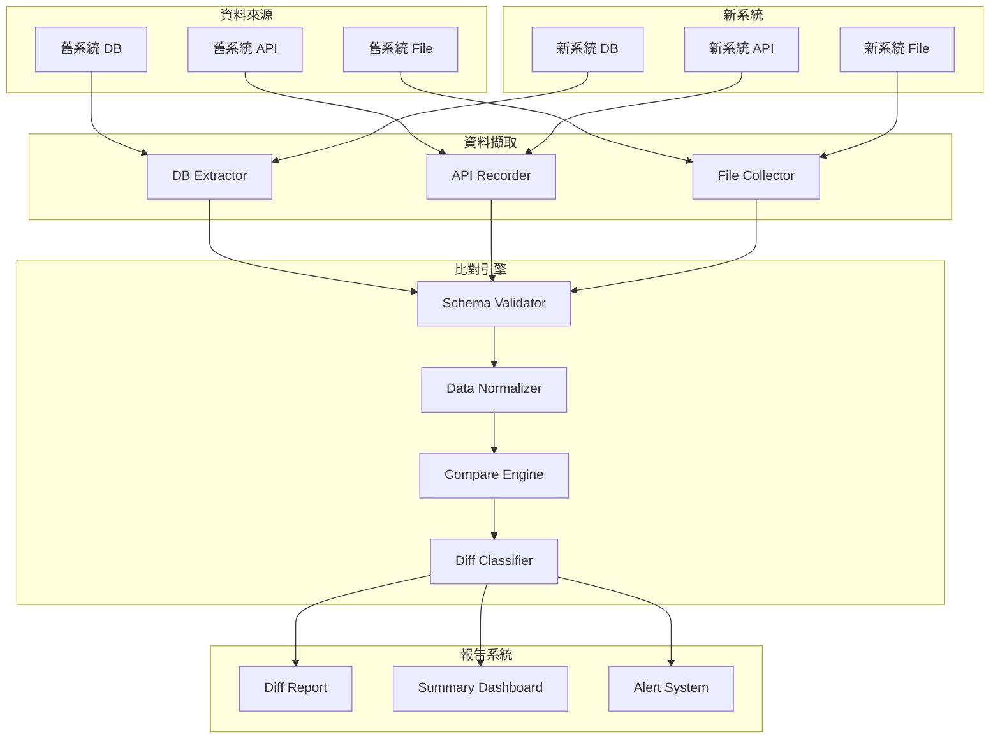

### 5.1.2 自動化比對設計原則

| 原則 | 說明 |
|------|------|
| **可配置** | 比對規則透過設定檔管理，不寫死在程式中 |
| **可擴充** | 支援新增比對類型（DB、API、File 等） |
| **冪等性** | 相同輸入重複執行產出相同結果 |
| **可追溯** | 每次執行保留完整日誌與差異記錄 |
| **漸進式** | 支援增量比對，不需每次全量 |

### 5.1.3 比對設定檔範例（YAML）

```yaml
# parallel-test-config.yaml
# 平行測試比對設定檔

compare-jobs:
  - name: "daily-transaction-compare"
    description: "每日交易比對"
    schedule: "0 2 * * *"  # 每日凌晨 2 點執行
    source:
      old-system:
        type: database
        connection: "jdbc:oracle:thin:@old-host:1521:OLDDB"
        query: "SELECT * FROM TRANSACTION_LOG WHERE TXN_DATE = :date"
      new-system:
        type: database
        connection: "jdbc:postgresql://new-host:5432/newdb"
        query: "SELECT * FROM transaction_log WHERE txn_date = :date"
    
    primary-key: ["txn_id"]
    
    compare-fields:
      - field: "account_no"
        type: string
        severity: S1
      - field: "amount"
        type: decimal
        severity: S1
        tolerance: 0.01
      - field: "balance"
        type: decimal
        severity: S1
        tolerance: 0.01
      - field: "txn_type"
        type: string
        severity: S2
      - field: "status"
        type: string
        severity: S2
    
    exclude-fields: ["created_at", "updated_at", "system_id"]
    
    report:
      format: ["html", "csv", "json"]
      output-dir: "/reports/parallel-test/"
      notify:
        - type: email
          recipients: ["team@company.com"]
          condition: "has_s1_diff"
        - type: slack
          channel: "#parallel-test"
          condition: "always"
```

---

## 5.2 CI/CD 整合

### 5.2.1 Jenkins Pipeline 範例

```groovy
// Jenkinsfile - 平行測試 Pipeline
pipeline {
    agent any
    
    parameters {
        string(name: 'TEST_DATE', defaultValue: '', 
               description: '測試日期 (YYYY-MM-DD)')
        choice(name: 'TEST_SCOPE', choices: ['DAILY', 'MONTHLY', 'FULL'],
               description: '測試範圍')
    }
    
    environment {
        OLD_SYSTEM_URL = credentials('old-system-url')
        NEW_SYSTEM_URL = credentials('new-system-url')
    }
    
    stages {
        stage('環境檢查') {
            steps {
                script {
                    echo "檢查新舊系統連線狀態..."
                    sh './scripts/check-connectivity.sh'
                }
            }
        }
        
        stage('資料擷取') {
            parallel {
                stage('擷取舊系統資料') {
                    steps {
                        sh """
                            java -jar parallel-test-tool.jar extract \
                                --system old \
                                --date ${params.TEST_DATE} \
                                --scope ${params.TEST_SCOPE}
                        """
                    }
                }
                stage('擷取新系統資料') {
                    steps {
                        sh """
                            java -jar parallel-test-tool.jar extract \
                                --system new \
                                --date ${params.TEST_DATE} \
                                --scope ${params.TEST_SCOPE}
                        """
                    }
                }
            }
        }
        
        stage('執行比對') {
            steps {
                sh """
                    java -jar parallel-test-tool.jar compare \
                        --date ${params.TEST_DATE} \
                        --config parallel-test-config.yaml
                """
            }
        }
        
        stage('產出報告') {
            steps {
                sh """
                    java -jar parallel-test-tool.jar report \
                        --date ${params.TEST_DATE} \
                        --format html,csv
                """
                publishHTML(target: [
                    reportDir: 'reports',
                    reportFiles: 'parallel-test-report.html',
                    reportName: '平行測試報告'
                ])
            }
        }
        
        stage('差異檢查') {
            steps {
                script {
                    def result = readJSON file: 'reports/summary.json'
                    if (result.s1_count > 0) {
                        currentBuild.result = 'FAILURE'
                        error "發現 ${result.s1_count} 筆 S1 差異！"
                    }
                    if (result.s2_count > 0) {
                        currentBuild.result = 'UNSTABLE'
                        echo "警告：發現 ${result.s2_count} 筆 S2 差異"
                    }
                }
            }
        }
    }
    
    post {
        failure {
            emailext(
                subject: "⚠️ 平行測試失敗 - ${params.TEST_DATE}",
                body: '${FILE,path="reports/parallel-test-report.html"}',
                to: 'team@company.com'
            )
        }
        always {
            archiveArtifacts artifacts: 'reports/**', fingerprint: true
        }
    }
}
```

### 5.2.2 GitHub Actions 範例

```yaml
# .github/workflows/parallel-test.yml
name: Parallel Test

on:
  schedule:
    - cron: '0 18 * * 1-5'  # UTC 18:00 = 台灣凌晨 2:00
  workflow_dispatch:
    inputs:
      test_date:
        description: '測試日期'
        required: true
        type: string

jobs:
  parallel-test:
    runs-on: ubuntu-latest
    
    steps:
      - uses: actions/checkout@v4
      
      - name: Set up JDK 21
        uses: actions/setup-java@v4
        with:
          java-version: '21'
          distribution: 'temurin'
      
      - name: Run Compare
        run: |
          java -jar tools/parallel-test-tool.jar compare \
            --date ${{ github.event.inputs.test_date || 'today' }} \
            --config config/parallel-test-config.yaml
      
      - name: Upload Report
        uses: actions/upload-artifact@v4
        with:
          name: parallel-test-report
          path: reports/
      
      - name: Check Results
        run: |
          S1_COUNT=$(jq '.s1_count' reports/summary.json)
          if [ "$S1_COUNT" -gt 0 ]; then
            echo "::error::發現 $S1_COUNT 筆 S1 致命差異！"
            exit 1
          fi
```

---

## 5.3 測試報表與差異分類

### 5.3.1 報表格式範本

#### 每日摘要報表

```
╔══════════════════════════════════════════════════════╗
║     平行測試每日摘要報表                               ║
║     日期：2026-02-12                                  ║
╠══════════════════════════════════════════════════════╣
║                                                      ║
║  📊 比對統計                                          ║
║  ├─ 舊系統筆數：125,430                               ║
║  ├─ 新系統筆數：125,430                               ║
║  ├─ 比對筆數　：125,430                               ║
║  └─ 差異筆數　：3                                     ║
║                                                      ║
║  🔍 差異分布                                          ║
║  ├─ S1 致命：0                                       ║
║  ├─ S2 嚴重：1                                       ║
║  ├─ S3 一般：1                                       ║
║  └─ S4 輕微：1                                       ║
║                                                      ║
║  📈 趨勢                                             ║
║  ├─ 較昨日差異：減少 2 筆 ✅                           ║
║  └─ 連續零 S1 天數：5 天                              ║
║                                                      ║
║  ⚡ 效能指標                                          ║
║  ├─ 批次執行時間（舊）：45 min                         ║
║  ├─ 批次執行時間（新）：38 min                         ║
║  └─ 效能改善：15.6% ✅                                ║
║                                                      ║
╚══════════════════════════════════════════════════════╝
```

### 5.3.2 差異自動分類規則

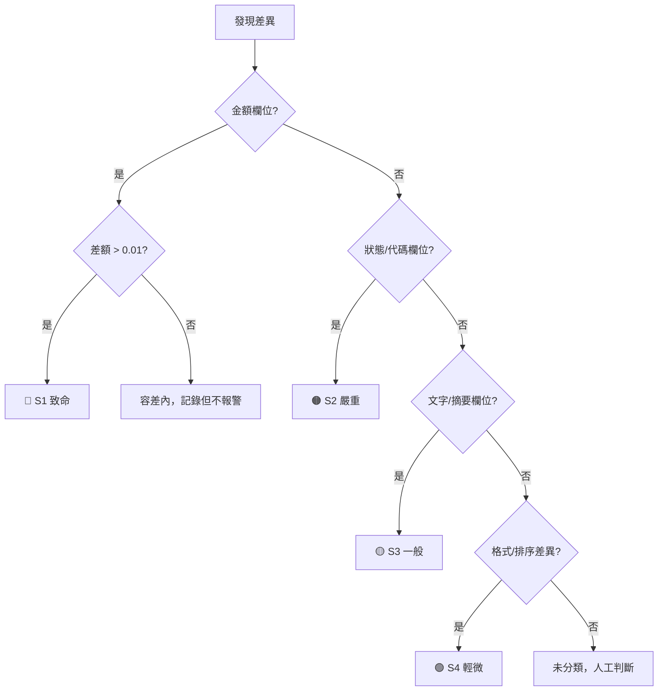

### 5.3.3 日誌與追蹤機制

| 日誌類型 | 內容 | 保存期限 | 儲存位置 |
|----------|------|----------|----------|
| **執行日誌** | 每次比對的開始/結束時間、筆數 | 1 年 | Log Server |
| **差異明細** | 每筆差異的新舊值、欄位、時間 | 2 年 | 差異資料庫 |
| **修正記錄** | 差異修正的人員、時間、修正內容 | 永久 | 版本控制系統 |
| **決策記錄** | 結案/上線決策的會議紀錄 | 永久 | 文件管理系統 |

> **實務提醒**：
> 1. 自動化比對覆蓋率目標 ≥ 90%，剩餘 10% 由人工抽驗
> 2. 每日自動執行比對，異常即時通知
> 3. 報表需同時提供摘要版（給管理層）與明細版（給技術團隊）
> 4. 所有比對結果需保留至少至上線後 6 個月，供稽核查核

---

# 第六章　金融系統平行測試實務案例

## 學習目標

- 透過實際案例了解金融系統平行測試的執行方式
- 掌握銀行核心系統升級的平行測試關鍵要點

---

> **案例：銀行核心帳務系統升級平行測試**

### 案例背景

| 項目 | 說明 |
|------|------|
| 專案名稱 | 核心帳務系統現代化專案 |
| 遷移方向 | IBM 大型主機 COBOL → Java / PostgreSQL |
| 影響範圍 | 存款、放款、匯款、外匯等核心模組 |
| 帳戶數量 | 約 300 萬戶 |
| 日交易量 | 約 50 萬筆 |
| 風險等級 | 🔴 極高 |

---

## 6.1 測試週期規劃

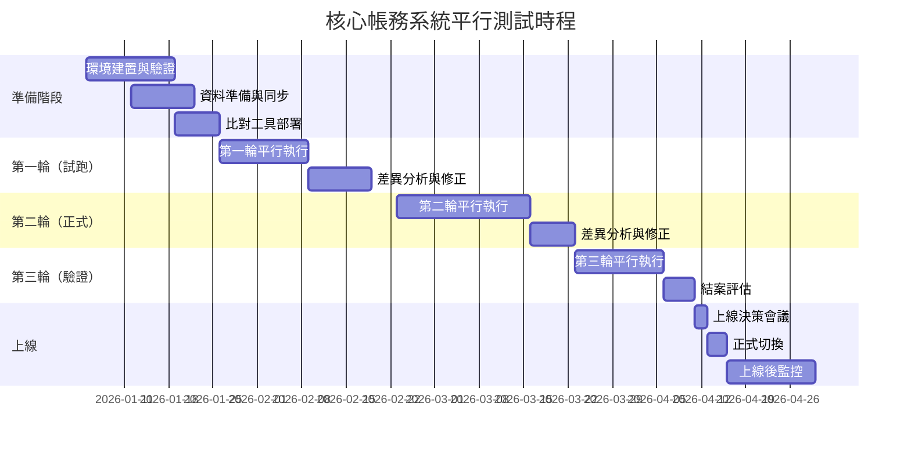

## 6.2 批次日結流程比對

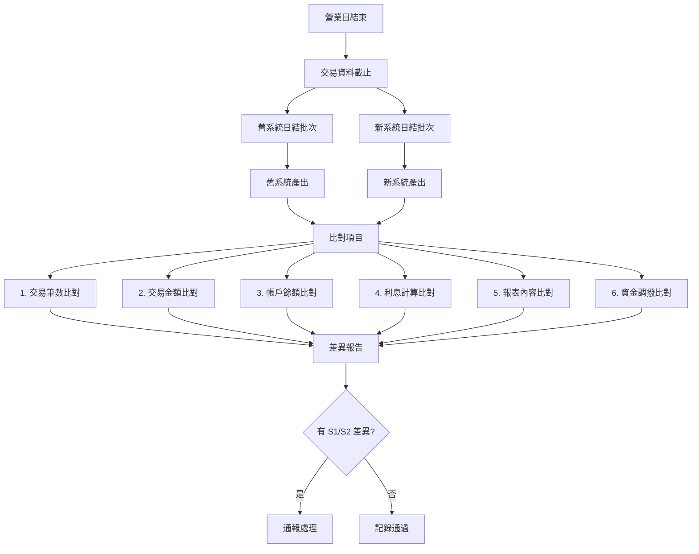

### 日結比對檢核項目

| 序號 | 比對項目 | 比對層級 | 容差 | 嚴重等級 |
|------|----------|----------|------|----------|
| 1 | 存款交易筆數 | 筆數級 | 0 | S1 |
| 2 | 存款交易總額 | 總額級 | 0 | S1 |
| 3 | 放款交易筆數 | 筆數級 | 0 | S1 |
| 4 | 放款交易總額 | 總額級 | 0 | S1 |
| 5 | 各帳戶餘額 | 欄位級 | ±0.01 | S1 |
| 6 | 活存利息計算 | 欄位級 | ±0.01 | S1 |
| 7 | 定存利息計算 | 欄位級 | ±0.01 | S1 |
| 8 | 逾期放款利息 | 欄位級 | ±0.01 | S1 |
| 9 | 資產負債表 | 報表級 | 0 | S1 |
| 10 | 監理報表 | 報表級 | 0 | S1 |

## 6.3 差異處理流程

```mermaid
flowchart TD
    A[發現差異] --> B[自動分類]
    B --> C{差異等級}
    
    C -->|S1 致命| D[立即通知]
    D --> D1[開發 Lead]
    D --> D2[測試 Lead]
    D --> D3[PM]
    D1 --> E[4 小時內分析根因]
    E --> F[修正程式]
    F --> G[Code Review]
    G --> H[部署重測]
    
    C -->|S2 嚴重| I[當日通知]
    I --> J[1 工作天內分析]
    J --> F
    
    C -->|S3 一般| K[列入追蹤清單]
    K --> L[排程處理]
    
    C -->|S4 輕微| M[記錄備查]
    
    H --> N{重測通過?}
    N -->|是| O[標記已解決]
    N -->|否| P[升級處理]
    P --> D
```

## 6.4 高風險交易監控

| 監控項目 | 門檻值 | 監控頻率 | 通知方式 |
|----------|--------|----------|----------|
| 大額交易差異 | 金額 ≥ 100 萬 | 即時 | 簡訊 + Email |
| 跨幣種交易 | 任何差異 | 即時 | Email |
| 聯行交易 | 金額差異 > 0 | 每小時 | Email |
| 利息計算 | 差異 > ±0.01 | 每日 | 系統告警 |
| 帳戶開銷戶 | 筆數不一致 | 每日 | 系統告警 |

## 6.5 上線決策會議

### 決策會議議程

| 議程 | 時間 | 報告人 |
|------|------|--------|
| 1. 平行測試結案報告 | 30 min | 測試負責人 |
| 2. 殘留問題清單 | 15 min | 開發負責人 |
| 3. 效能評估報告 | 15 min | 架構師 |
| 4. 回滾計畫確認 | 15 min | PM |
| 5. 風險評估報告 | 15 min | 風控代表 |
| 6. 法遵確認 | 10 min | 法遵代表 |
| 7. 上線 / 延後決策 | 20 min | 高階主管 |

### 上線決策判定表

| 條件 | 狀態 | 判定 |
|------|------|------|
| S1 差異歸零 | ✅ / ❌ | 必要 |
| S2 差異歸零 | ✅ / ❌ | 必要 |
| 連續 3 天零 S1 差異 | ✅ / ❌ | 必要 |
| 效能符合 SLA | ✅ / ❌ | 必要 |
| 回滾計畫經過演練 | ✅ / ❌ | 必要 |
| 運維團隊準備就緒 | ✅ / ❌ | 必要 |
| 法遵審核通過 | ✅ / ❌ | 必要 |
| 所有單位簽核 | ✅ / ❌ | 必要 |

> **以上條件全部為 ✅ 方可決議上線。任一項為 ❌，必須延後上線。**

> **實務提醒**：
> 1. 金融系統平行測試建議至少跨越 **一個完整月結週期**
> 2. 若涉及利息計算，建議包含 **季結或年結** 的驗證
> 3. 上線時間建議選在 **長假前的非月底時段**，預留問題處理時間
> 4. 上線後至少 **30 天** 持續比對，確認新系統穩定

---

# 第七章　風險管理與內控設計

## 學習目標

- 理解平行測試中的風險管理框架
- 掌握內控機制的設計要點
- 了解 ISO 27001 與法遵要求如何落實

---

## 7.1 分權機制

### 7.1.1 職責分離原則（Segregation of Duties）

**核心原則**：開發者不得自行執行比對、簽核結案。

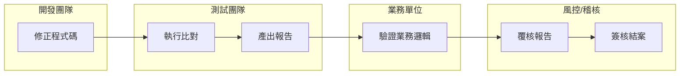

### 7.1.2 權限矩陣

| 權限項目 | 開發 | 測試 | PM | 業務 | 風控 | 稽核 |
|----------|:----:|:----:|:--:|:----:|:----:|:----:|
| 修改程式碼 | ✅ | ❌ | ❌ | ❌ | ❌ | ❌ |
| 部署至測試環境 | ✅ | ❌ | ❌ | ❌ | ❌ | ❌ |
| 執行比對工具 | ❌ | ✅ | ❌ | ❌ | ❌ | ❌ |
| 檢視差異報告 | ✅ | ✅ | ✅ | ✅ | ✅ | ✅ |
| 標記差異為「已知」 | ❌ | ✅ | ❌ | ✅ | ❌ | ❌ |
| 修改容差設定 | ❌ | ❌ | ❌ | ❌ | ✅ | ❌ |
| 簽核結案報告 | ❌ | ❌ | ✅ | ✅ | ✅ | ✅ |
| 決議上線 | ❌ | ❌ | ❌ | ❌ | ❌ | ✅ |

---

## 7.2 雙人覆核（Four-Eyes Principle）

### 需要雙人覆核的作業

| 作業項目 | 第一覆核人 | 第二覆核人 | 說明 |
|----------|-----------|-----------|------|
| 容差標準修改 | PM | 風控主管 | 容差不得未經審核調寬 |
| 差異標記為「已知」 | 測試 Lead | 業務負責人 | 需業務確認為已知變更 |
| 結案判定 | 測試 Lead | PM + 風控 | 至少三方確認 |
| 上線決策 | PM | 高階主管 | 書面核准 |
| 回滾執行 | 運維工程師 | 架構師 | 雙人在場執行 |

### 覆核紀錄格式

| 欄位 | 說明 |
|------|------|
| 作業編號 | 系統自動產生 |
| 作業類型 | 結案判定 / 容差修改 / … |
| 申請人 | 提出申請的人員 |
| 申請時間 | 時間戳記 |
| 第一覆核人 | 姓名與時間戳記 |
| 第二覆核人 | 姓名與時間戳記 |
| 覆核結果 | 核准 / 退回 |
| 備註 | 覆核意見 |

---

## 7.3 日誌保存

### 7.3.1 日誌保存規範

| 日誌類型 | 內容 | 最短保存期限 | 格式 |
|----------|------|-------------|------|
| **操作日誌** | 人員操作紀錄（登入、執行、核准） | 3 年 | Structured Log（JSON） |
| **比對日誌** | 每次比對的輸入/輸出/結果 | 2 年 | JSON + CSV |
| **差異明細** | 差異欄位、原值、新值 | 2 年 | 資料庫 + CSV |
| **修正記錄** | 程式修正的 Commit、CR 編號 | 永久 | Git + 變更管理系統 |
| **決策紀錄** | 會議紀錄、核准文件 | 永久 | PDF（含簽章） |
| **效能日誌** | 系統效能指標 | 1 年 | 監控系統 |

### 7.3.2 日誌防竄改設計

```
日誌寫入 → 即時雜湊（SHA-256） → 寫入區塊鏈或 WORM 儲存 → 定期驗證完整性
```

| 防竄改措施 | 說明 |
|-----------|------|
| **寫入即鎖定** | 日誌寫入後不可修改、刪除 |
| **雜湊校驗** | 每筆日誌計算 SHA-256，鏈式串接 |
| **異地備份** | 日誌同步備份至獨立儲存 |
| **存取控制** | 僅稽核人員有權查閱日誌 |

---

## 7.4 稽核需求

### 7.4.1 稽核查核項目

| 查核項目 | 查核內容 | 頻率 |
|----------|----------|------|
| 比對完整性 | 是否所有範圍內項目都已比對 | 每輪結束 |
| 差異處理 | 所有差異是否都有處理紀錄 | 每日 |
| 權限合規 | 操作是否符合權限矩陣 | 抽查 |
| 覆核落實 | 雙人覆核是否確實執行 | 每輪結束 |
| 日誌完整 | 日誌是否完整且未被竄改 | 每週 |
| 時效性 | S1/S2 差異是否在時限內處理 | 每日 |

### 7.4.2 稽核報告範本結構

```
1. 稽核範圍與期間
2. 稽核方法
3. 查核發現
   3.1 合規事項
   3.2 不合規事項（含嚴重等級）
4. 改善建議
5. 管理層回應
6. 後續追蹤計畫
```

---

## 7.5 法遵要求

### 7.5.1 適用法規對應

| 法規 / 規範 | 相關要求 | 平行測試對應措施 |
|-------------|----------|-----------------|
| **個資法** | 個人資料保護 | 測試資料脫敏、存取控制 |
| **銀行法** | 資訊系統安全管理 | 完整變更管理、回滾計畫 |
| **金管會資安規範** | 系統變更管理 | SOP 文件化、稽核軌跡 |
| **ISO 27001** | 資訊安全管理 | 分權、日誌、變更控管 |
| **ISO 22301** | 營運持續管理 | 回滾計畫、緊急應變 |
| **Basel III** | 作業風險管理 | 風險識別、控制點設計 |

### 7.5.2 ISO 27001 控制項對應

| ISO 27001 控制項 | 說明 | 平行測試對應 |
|------------------|------|-------------|
| **A.8.1** 資產管理 | 測試環境與資料分類管理 | 環境清單、資料分類標記 |
| **A.9.2** 使用者存取管理 | 測試系統存取控制 | 權限矩陣、帳號管理 |
| **A.12.1** 作業程序與責任 | 標準作業流程 | SOP 文件化 |
| **A.12.4** 日誌記錄與監控 | 操作日誌保存 | 日誌保存規範 |
| **A.14.2** 開發與支援過程安全 | 安全開發流程 | Code Review、分權機制 |
| **A.16.1** 資安事件管理 | 差異通報流程 | S1 差異即時通報 |

> **實務提醒**：
> 1. 金融機構平行測試**全程須留存稽核軌跡**，不可事後補建
> 2. 每一筆差異的處理都必須可追溯到**具體的人、時間、決策理由**
> 3. 測試資料若包含真實客戶資料，**必須脫敏處理**
> 4. 風控與法遵代表需**全程參與**，不可僅在結案時簽核

---

# 第八章　常見錯誤與失敗案例分析

## 學習目標

- 從失敗案例中學習，避免重複犯錯
- 建立風險意識與預防措施

---

## 8.1 常見錯誤總覽

| # | 常見錯誤 | 發生頻率 | 影響嚴重度 | 預防措施 |
|---|----------|----------|-----------|----------|
| 1 | 平行時間太短 | 🔴 高 | 🔴 極高 | 至少 3 個完整業務週期 |
| 2 | 測試資料不完整 | 🔴 高 | 🟠 高 | 使用全量 Production 資料 |
| 3 | 忽略例外交易 | 🟠 中 | 🔴 極高 | 設計邊界值與異常資料 |
| 4 | 沒有定義容忍誤差 | 🔴 高 | 🟠 高 | 事前定義並經各方確認 |
| 5 | 沒有設計回滾計畫 | 🟠 中 | 🔴 極高 | 上線前必須演練回滾 |
| 6 | 人工比對為主 | 🟠 中 | 🟠 高 | 自動化比對 ≥ 90% |
| 7 | 範圍定義不清 | 🟠 中 | 🟠 高 | 明確的 In/Out Scope |
| 8 | 跳過月結/季結 | 🟠 中 | 🔴 極高 | 必須涵蓋完整週期 |
| 9 | 缺乏管理層關注 | 🟡 低 | 🟠 高 | 定期管理層簡報 |
| 10 | 修正後忘記回歸 | 🔴 高 | 🔴 極高 | 自動化回歸驗證 |

---

## 8.2 失敗案例分析

### 案例一：平行時間太短

> **情境**：某銀行進行核心系統升級，因專案時程壓力，平行測試僅執行 5 個營業日。 
> **結果**：上線第一個月結，利息計算出現大量差異。  
> **根因**：5 天內未涵蓋月結、跳息等特殊場景。  
> **教訓**：平行測試必須至少涵蓋一個完整月結週期，高風險系統建議包含季結。

### 案例二：測試資料不完整

> **情境**：使用抽樣的 10% 客戶資料做平行測試。  
> **結果**：上線後發現特定帳戶類型（如外幣帳戶、信託帳戶）計算邏輯錯誤。  
> **根因**：抽樣資料未涵蓋所有帳戶類型。  
> **教訓**：核心系統應使用全量資料，至少確保每種帳戶類型都有代表性樣本。

### 案例三：忽略例外交易

> **情境**：平行測試只比對正常交易，未測試沖正、退匯、凍結等例外流程。  
> **結果**：上線後沖正交易導致帳務不平。  
> **根因**：例外交易佔比低但影響重大，被忽略。  
> **教訓**：必須設計包含所有交易類型的測試案例，特別是例外流程。

### 案例四：沒有定義容忍誤差

> **情境**：新舊系統因浮點數計算方式不同，利息計算差 0.01 元。  
> **結果**：比對報告出現數十萬筆「差異」，團隊花費大量時間逐筆分析。  
> **根因**：未預先定義容忍誤差標準。  
> **教訓**：在開始比對前，必須定義每個欄位的容差，並經業務與風控確認。

### 案例五：沒有設計回滾計畫

> **情境**：新系統上線後第 3 天發現嚴重問題，需要切回舊系統。  
> **結果**：因未設計回滾流程，花費 72 小時才恢復，造成嚴重營運損失。  
> **根因**：只規劃「上線」流程，未規劃「失敗回退」流程。  
> **教訓**：回滾計畫必須詳細到每個步驟，且至少演練一次。

---

## 8.3 預防機制

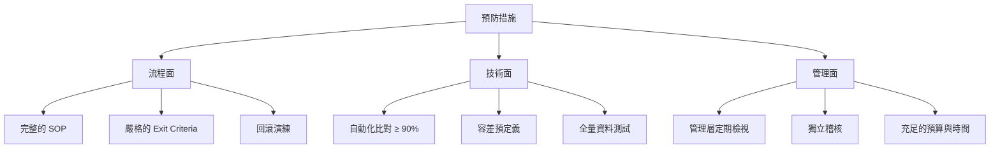

> **實務提醒**：失敗的平行測試通常不是技術問題，而是**時間不足**和**範圍定義不清**。務必在專案初期就爭取足夠的平行測試時間。

---

# 第九章　標準表單範本

## 學習目標

- 熟悉各類標準表單的結構與用途
- 能依實際需求調整表單內容

---

## 9.1 差異記錄表

| 欄位 | 說明 | 範例 |
|------|------|------|
| 差異編號 | 系統自動產生 | DIFF-2026-0001 |
| 發現日期 | 發現差異的日期 | 2026-02-12 |
| 比對批次 | 哪一輪哪一日 | R2-D05 |
| 交易日期 | 交易發生日期 | 2026-02-11 |
| 主鍵值 | 識別紀錄的唯一鍵 | TXN-20260211-12345 |
| 差異欄位 | 哪個欄位不同 | AMOUNT |
| 舊系統值 | 舊系統的值 | 1,000.00 |
| 新系統值 | 新系統的值 | 999.99 |
| 差異量 | 差異的絕對值 | 0.01 |
| 嚴重等級 | S1 / S2 / S3 / S4 | S1 |
| 差異類型 | A-程式缺陷 / B-設計差異 / ... | A |
| 根因分析 | 差異原因說明 | 四捨五入方式不同 |
| 處理狀態 | 待分析 / 修正中 / 已修正 / 已知 | 修正中 |
| 負責人 | 負責修正的人員 | 王大明 |
| 修正日期 | 完成修正的日期 | 2026-02-13 |
| 驗證結果 | 修正後是否通過驗證 | ✅ 通過 |

### 差異記錄表範例

| 差異編號 | 發現日期 | 差異欄位 | 舊系統值 | 新系統值 | 等級 | 類型 | 狀態 | 負責人 |
|----------|----------|----------|----------|----------|------|------|------|--------|
| DIFF-0001 | 02-10 | AMOUNT | 50,000.00 | 49,999.99 | S1 | A | ✅ 已修正 | 王大明 |
| DIFF-0002 | 02-10 | STATUS | 01 | 1 | S3 | B | 📝 已知 | 李小華 |
| DIFF-0003 | 02-11 | BALANCE | 1,234,567.89 | 1,234,567.90 | S1 | A | 🔧 修正中 | 王大明 |
| DIFF-0004 | 02-12 | MEMO | 轉帳 | 轉帳交易 | S4 | B | 📝 已知 | — |

---

## 9.2 風險評估表

| 風險編號 | 風險描述 | 類別 | 可能性 | 影響度 | 風險值 | 因應措施 | 負責人 | 狀態 |
|----------|----------|------|--------|--------|--------|----------|--------|------|
| RISK-001 | 測試資料同步失敗 | 技術 | 中 | 高 | 🟠 | 建立同步監控與重試機制 | 張工程師 | 監控中 |
| RISK-002 | 平行測試時間不足 | 專案 | 高 | 高 | 🔴 | 預留 20% 緩衝、每日報告進度 | PM | 監控中 |
| RISK-003 | 關鍵人員異動 | 人力 | 低 | 高 | 🟡 | 知識轉移、文件化 | PM | 備查 |
| RISK-004 | 舊系統異常影響比對 | 技術 | 中 | 中 | 🟡 | 設立舊系統異常排除規則 | 架構師 | 備查 |
| RISK-005 | 個資外洩風險 | 資安 | 低 | 極高 | 🟠 | 資料脫敏、存取控管 | 資安主管 | 監控中 |

### 風險評估矩陣

|  | **影響：低** | **影響：中** | **影響：高** | **影響：極高** |
|---|:---:|:---:|:---:|:---:|
| **可能性：高** | 🟡 | 🟠 | 🔴 | 🔴 |
| **可能性：中** | 🟢 | 🟡 | 🟠 | 🔴 |
| **可能性：低** | 🟢 | 🟢 | 🟡 | 🟠 |

---

## 9.3 上線核准單

```
╔══════════════════════════════════════════════════════╗
║               上  線  核  准  單                      ║
╠══════════════════════════════════════════════════════╣
║                                                      ║
║  專案名稱：____________________                       ║
║  系統名稱：____________________                       ║
║  預定上線日期：____/__/__                             ║
║  申請人：__________  日期：____/__/__                  ║
║                                                      ║
╠══════════════════════════════════════════════════════╣
║  一、平行測試結果摘要                                  ║
║                                                      ║
║  測試期間：____/__/__ ～ ____/__/__                    ║
║  測試輪次：共 __ 輪                                   ║
║  最終差異數：S1=__ S2=__ S3=__ S4=__                  ║
║  連續零 S1 天數：____ 天                              ║
║                                                      ║
╠══════════════════════════════════════════════════════╣
║  二、核准條件確認                                      ║
║                                                      ║
║  □ S1 差異歸零                                       ║
║  □ S2 差異歸零                                       ║
║  □ 連續 3 天無新增 S1/S2 差異                         ║
║  □ 效能符合 SLA                                      ║
║  □ 回滾計畫已演練                                     ║
║  □ 運維團隊準備就緒                                   ║
║  □ 法遵審核通過                                      ║
║                                                      ║
╠══════════════════════════════════════════════════════╣
║  三、核准簽章                                         ║
║                                                      ║
║  PM：__________ 簽章：________ 日期：____/__/__        ║
║  測試Lead：_____ 簽章：________ 日期：____/__/__       ║
║  業務代表：_____ 簽章：________ 日期：____/__/__       ║
║  風控主管：_____ 簽章：________ 日期：____/__/__       ║
║  法遵代表：_____ 簽章：________ 日期：____/__/__       ║
║  高階主管：_____ 簽章：________ 日期：____/__/__       ║
║                                                      ║
╠══════════════════════════════════════════════════════╣
║  四、核准結果                                         ║
║                                                      ║
║  □ 核准上線    □ 延後上線    □ 退回補件              ║
║                                                      ║
║  備註：                                               ║
║  ________________________________________________    ║
║  ________________________________________________    ║
║                                                      ║
╚══════════════════════════════════════════════════════╝
```

---

## 9.4 測試每日報表

| 項目 | 內容 |
|------|------|
| **報表日期** | YYYY/MM/DD |
| **測試輪次** | 第 __ 輪，第 __ 天 |

### 比對統計

| 比對項目 | 舊系統筆數 | 新系統筆數 | 差異筆數 | 較昨日 |
|----------|-----------|-----------|---------|--------|
| 存款交易 | 85,230 | 85,230 | 0 | — |
| 放款交易 | 12,450 | 12,450 | 1 | ↓1 |
| 匯款交易 | 28,750 | 28,750 | 0 | ↓2 |
| **合計** | **126,430** | **126,430** | **1** | **↓3** |

### 差異分布

| 等級 | 今日新增 | 今日修正 | 累計未解 | 趨勢 |
|------|---------|---------|---------|------|
| S1 | 0 | 0 | 0 | ✅ |
| S2 | 0 | 1 | 1 | ↓ |
| S3 | 0 | 0 | 2 | — |
| S4 | 1 | 0 | 3 | ↑ |

### 效能指標

| 指標 | 舊系統 | 新系統 | 差異 | 狀態 |
|------|--------|--------|------|------|
| 日結批次時間 | 45 min | 38 min | -15.6% | ✅ |
| API 平均回應 | 120 ms | 85 ms | -29.2% | ✅ |
| CPU 使用率（峰值） | 85% | 65% | -23.5% | ✅ |

### 今日重點事項

| 事項 | 說明 | 處理狀態 |
|------|------|----------|
| — | — | — |

---

## 9.5 問題追蹤清單

| 問題編號 | 發現日期 | 描述 | 等級 | 狀態 | 負責人 | 預計解決 | 實際解決 | 備註 |
|----------|----------|------|------|------|--------|----------|----------|------|
| ISS-001 | 02-10 | 利息計算四捨五入差異 | S1 | ✅ 已關閉 | 王大明 | 02-12 | 02-11 | 修改為 HALF_UP |
| ISS-002 | 02-11 | 交易狀態碼格式不一致 | S3 | 📝 已知 | 李小華 | — | — | 列為已知差異 |
| ISS-003 | 02-12 | 餘額計算差 0.01 | S1 | 🔧 處理中 | 王大明 | 02-14 | — | 分析中 |

> **實務提醒**：所有表單應存放於**統一的文件管理系統**（如 SharePoint、Confluence），並設定適當的存取權限。紙本文件需掃描歸檔。

---

## 9.6 回滾計畫範本

回滾計畫是平行測試與上線規劃中**不可或缺**的一環，確保新系統出現重大問題時能安全地切回舊系統。

### 9.6.1 回滾計畫基本資訊

| 項目 | 內容 |
|------|------|
| 專案名稱 | _____________________ |
| 系統名稱 | _____________________ |
| 回滾計畫版本 | v1.0 |
| 編制人 | _____________________ |
| 審核人 | _____________________ |
| 最後更新 | ____/__/__ |

### 9.6.2 回滾觸發條件

| # | 觸發條件 | 說明 | 決策權責 |
|---|----------|------|----------|
| 1 | 上線後 S1 差異累計 ≥ 3 筆 | 核心邏輯出現多處錯誤 | 高階主管 |
| 2 | 帳務不平 | 新系統日結帳務不平衡 | PM + 風控主管 |
| 3 | 資料遺失 | 交易資料出現遺失或損壞 | 架構師 + PM |
| 4 | 效能嚴重劣化 | 回應時間超過 SLA 200% | 架構師 |
| 5 | 外部系統連線中斷 | 與聯行/央行系統無法正常通訊 | PM + 運維主管 |

### 9.6.3 回滾步驟

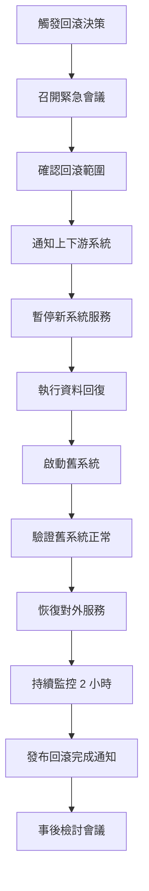

### 9.6.4 回滾操作檢核表

| 步驟 | 操作內容 | 預估時間 | 負責人 | 確認人 | 完成 |
|------|----------|----------|--------|--------|:----:|
| 1 | 宣布進入回滾程序 | 5 min | PM | 高階主管 | ☐ |
| 2 | 暫停新系統所有服務入口 | 10 min | 運維 | 架構師 | ☐ |
| 3 | 執行資料庫回復至切換前快照 | 30-60 min | DBA | 架構師 | ☐ |
| 4 | 驗證資料庫回復一致性 | 15 min | DBA | 測試 Lead | ☐ |
| 5 | 啟動舊系統應用服務 | 10 min | 運維 | 架構師 | ☐ |
| 6 | 切換 DNS/負載平衡器至舊系統 | 5 min | 運維 | 架構師 | ☐ |
| 7 | 執行舊系統健康檢查 | 10 min | 測試 Lead | PM | ☐ |
| 8 | 執行樣本交易驗證 | 15 min | 測試工程師 | 業務代表 | ☐ |
| 9 | 通知上下游系統恢復連線 | 10 min | PM | 運維 | ☐ |
| 10 | 恢復對外服務 | 5 min | 運維 | PM | ☐ |
| 11 | 持續監控系統指標 | 120 min | 運維 | 架構師 | ☐ |
| 12 | 發送回滾完成通知 | 5 min | PM | — | ☐ |

### 9.6.5 回滾後處理

| 項目 | 時限 | 負責人 | 說明 |
|------|------|--------|------|
| 事件報告 | 24 小時內 | PM | 記錄回滾原因、時間線、影響範圍 |
| 根因分析（RCA） | 3 工作天內 | 開發 Lead | 深入分析導致回滾的技術原因 |
| 改善方案 | 5 工作天內 | 架構師 | 制定修正方案與驗證計畫 |
| 重新排程 | 1 週內 | PM | 更新專案時程，安排重新上線 |
| 檢討會議 | 回滾後 2 天內 | PM | 全體參與，萃取教訓 |

> **實務提醒**：
> 1. 回滾計畫**必須在上線前至少演練一次**（Dry Run）
> 2. 回滾操作應有**雙人到場**執行（Four-Eyes Principle）
> 3. 預估回滾總時間應控制在 **2 小時以內**（金融系統建議 1 小時內）
> 4. 回滾期間的資料處理策略（回滾窗口內的新交易如何處理）必須事先定義

---

# 第十章　企業級最佳實踐（Best Practice）

## 學習目標

- 掌握平行測試的企業級最佳實踐
- 建立組織級的平行測試成熟度

---

## 10.1 核心最佳實踐

### 實踐 1：充足的測試週期

| 系統風險等級 | 最少週期 | 建議週期 | 必須涵蓋 |
|-------------|---------|---------|---------|
| 🔴 極高 | 2 個月結週期 | 3 個月結 + 1 季結 | 日結、月結、季結、年結（如跨年） |
| 🟠 高 | 1 個月結週期 | 2 個月結週期 | 日結、月結 |
| 🟡 中 | 2 週 | 1 個月 | 日結 |
| 🟢 低 | 1 週 | 2 週 | 關鍵功能 |

### 實踐 2：全量比對為原則

```
全量比對（推薦）  ────────────────────────  抽樣比對（退而求其次）
   │                                              │
   ├─ 核心系統必須全量                                ├─ 非核心系統可抽樣
   ├─ 金融數據必須全量                                ├─ 抽樣率 ≥ 30%
   └─ 監理報表必須全量                                └─ 必須覆蓋所有類型
```

### 實踐 3：自動化比對比例 ≥ 90%

| 自動化等級 | 自動化比例 | 評估 |
|-----------|-----------|------|
| Level 1 | < 30% | ❌ 不合格，風險極高 |
| Level 2 | 30% - 60% | ⚠️ 勉強可用，建議改善 |
| Level 3 | 60% - 80% | 🟡 尚可 |
| Level 4 | 80% - 90% | ✅ 良好 |
| Level 5 | ≥ 90% | ✅✅ 優秀（目標） |

### 實踐 4：完整稽核軌跡

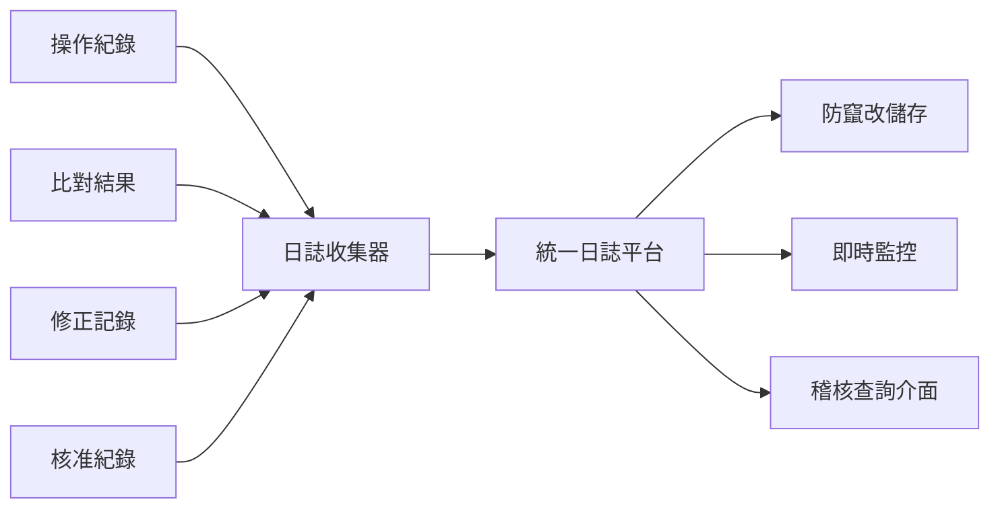

---

## 10.2 組織級最佳實踐

### 10.2.1 建立組織標準

| 標準項目 | 說明 |
|----------|------|
| **平行測試 SOP** | 組織統一的標準作業程序 |
| **計劃書範本** | 統一的計劃書格式 |
| **差異分類標準** | 統一的差異嚴重等級定義 |
| **退場標準** | 統一的 Exit Criteria 框架 |
| **報表格式** | 統一的每日報表、結案報表格式 |
| **工具套件** | 共用的比對工具與報表平台 |

### 10.2.2 知識管理

| 活動 | 說明 | 頻率 |
|------|------|------|
| **案例庫建立** | 收集歷次平行測試的經驗與教訓 | 每次結案後 |
| **範本更新** | 依據經驗持續改善範本 | 每年 |
| **培訓課程** | 新人平行測試培訓 | 每季 |
| **經驗分享** | 跨專案經驗交流 | 每月 |

### 10.2.3 成熟度模型

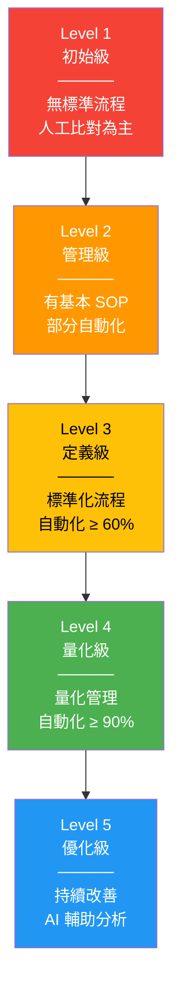

---

## 10.3 技術最佳實踐

### 10.3.1 比對工具設計原則

| 原則 | 說明 |
|------|------|
| **外部化設定** | 比對規則放在 YAML/JSON 設定檔 |
| **插件式架構** | 支援擴充新的比對類型 |
| **增量比對** | 支援只比對變更部分 |
| **平行處理** | 大量資料使用多執行緒比對 |
| **結果可視化** | 差異報告支援圖表展示 |

### 10.3.2 資料處理最佳實踐

```java
/**
 * 資料標準化處理 - 在比對前統一資料格式
 * 
 * <p>避免因格式差異產生假性差異</p>
 */
public class DataNormalizer {

    /**
     * 標準化金額欄位
     * - 統一使用 BigDecimal
     * - 統一小數位數
     * - 去除千分位符號
     */
    public BigDecimal normalizeAmount(String value, int scale) {
        if (value == null || value.isBlank()) {
            return BigDecimal.ZERO;
        }
        String cleaned = value.replaceAll("[,$\\s]", "");
        return new BigDecimal(cleaned)
            .setScale(scale, RoundingMode.HALF_UP);
    }

    /**
     * 標準化日期欄位
     * - 統一為 ISO 格式 (yyyy-MM-dd)
     * - 處理不同分隔符號
     */
    public String normalizeDate(String value) {
        if (value == null || value.isBlank()) return "";
        // 處理常見格式：2026/02/12、20260212、2026-02-12
        String cleaned = value.replaceAll("[/\\-.]", "");
        if (cleaned.length() == 8) {
            return cleaned.substring(0, 4) + "-" 
                 + cleaned.substring(4, 6) + "-" 
                 + cleaned.substring(6, 8);
        }
        return value;
    }

    /**
     * 標準化文字欄位
     * - 去除前後空白
     * - 統一全形/半形
     * - 統一大小寫（依設定）
     */
    public String normalizeText(String value, boolean caseInsensitive) {
        if (value == null) return "";
        String result = value.trim();
        if (caseInsensitive) {
            result = result.toUpperCase();
        }
        return result;
    }
}
```

> **實務提醒**：
> 1. 平行測試是投資，不是成本——它避免的損失遠大於投入
> 2. 寧可延後上線，也不要帶著 S1 差異硬上
> 3. 自動化是長期投資，第一次建立的工具可以在日後的專案重複使用
> 4. 每次平行測試結束後都要做 **Post-mortem**，持續改善流程

---

# 附錄　檢查清單（Checklist）

## A. 平行測試啟動前檢查清單

| # | 檢查項目 | 確認 | 備註 |
|---|----------|:----:|------|
| 1 | 平行測試計劃書已經各方簽核 | ☐ | |
| 2 | 測試範圍（In-Scope / Out-of-Scope）已明確定義 | ☐ | |
| 3 | 成功標準（Exit Criteria）已各方確認 | ☐ | |
| 4 | 容忍誤差標準已定義並經風控確認 | ☐ | |
| 5 | RACI 矩陣已確認，角色責任已分配 | ☐ | |
| 6 | 測試環境已建置並通過驗證 | ☐ | |
| 7 | 資料同步機制已測試成功 | ☐ | |
| 8 | 比對工具已部署並經過測試 | ☐ | |
| 9 | 測試資料已準備完成（含脫敏處理） | ☐ | |
| 10 | 回滾計畫已撰寫 | ☐ | |
| 11 | 通報機制已建立（S1 差異即時通知） | ☐ | |
| 12 | 日誌記錄機制已建立 | ☐ | |

---

## B. 每日執行檢查清單

| # | 檢查項目 | 確認 | 備註 |
|---|----------|:----:|------|
| 1 | 新舊系統都正常運行 | ☐ | |
| 2 | 輸入資料已同步完成 | ☐ | |
| 3 | 批次任務已全數執行完成 | ☐ | |
| 4 | 自動化比對已執行 | ☐ | |
| 5 | 差異報告已產出並檢視 | ☐ | |
| 6 | 新增 S1/S2 差異已即時通報 | ☐ | |
| 7 | 每日報表已發送 | ☐ | |
| 8 | 執行日誌已保存 | ☐ | |

---

## C. 結案前檢查清單

| # | 檢查項目 | 確認 | 備註 |
|---|----------|:----:|------|
| 1 | 所有 S1 差異已歸零 | ☐ | |
| 2 | 所有 S2 差異已歸零 | ☐ | |
| 3 | 連續 N 天無新增 S1/S2 差異（N ≥ 3） | ☐ | |
| 4 | 所有差異都有處理紀錄（修正或標註已知） | ☐ | |
| 5 | 效能指標符合 SLA | ☐ | |
| 6 | 結案報告已完成 | ☐ | |
| 7 | 稽核軌跡完整 | ☐ | |
| 8 | 各單位已簽核 | ☐ | |

---

## D. 上線前檢查清單

| # | 檢查項目 | 確認 | 備註 |
|---|----------|:----:|------|
| 1 | 平行測試已通過結案判定 | ☐ | |
| 2 | 上線核准單已經全員簽核 | ☐ | |
| 3 | 回滾計畫已至少演練 1 次 | ☐ | |
| 4 | 運維團隊已完成培訓 | ☐ | |
| 5 | 監控告警機制已設定 | ☐ | |
| 6 | 值班人員已安排 | ☐ | |
| 7 | 緊急聯絡人清單已更新 | ☐ | |
| 8 | 上線步驟已經 Dry Run | ☐ | |
| 9 | 舊系統保留可回切狀態 | ☐ | |
| 10 | 通知相關上下游系統 | ☐ | |

---

## E. 上線後監控檢查清單

| # | 檢查項目 | 確認 | 備註 |
|---|----------|:----:|------|
| 1 | 新系統第一筆交易成功 | ☐ | |
| 2 | 批次日結正常完成 | ☐ | |
| 3 | 上線後仍持續執行比對（至少 30 天） | ☐ | |
| 4 | 效能指標在預期範圍內 | ☐ | |
| 5 | 異常通報機制正常運作 | ☐ | |
| 6 | 使用者回饋已收集並追蹤 | ☐ | |
| 7 | 上線後問題已記錄並處理 | ☐ | |

---

## 重點摘要

| 章節 | 核心要點 |
|------|---------|
| 第一章 | 平行測試是上線前的「最後防線」，必須使用**真實資料**、涵蓋**完整業務週期** |
| 第二章 | 10 個階段標準流程，RACI 矩陣明確分工 |
| 第三章 | 計劃書範本必須包含範圍、策略、容差、風險、Exit Criteria、**溝通計畫** |
| 第四章 | 數值比對需注意浮點精度、四捨五入方式、BigDecimal 使用 |
| 第五章 | 自動化比對 ≥ 90%，整合 CI/CD，報表自動產出 |
| 第六章 | 金融系統需跨月結/季結驗證，回滾計畫不可缺 |
| 第七章 | 分權、雙人覆核、日誌防竄改、ISO 27001 對應 |
| 第八章 | 最常見失敗原因：時間不足、資料不完整、容差未定義 |
| 第九章 | 標準表單確保流程一致性與可追溯性，含**回滾計畫範本** |
| 第十章 | 組織級標準化、成熟度提升、知識管理 |

---

> **本文件為內部標準作業文件。**  
> **最後更新：2026-02-13**
