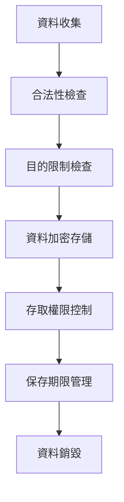
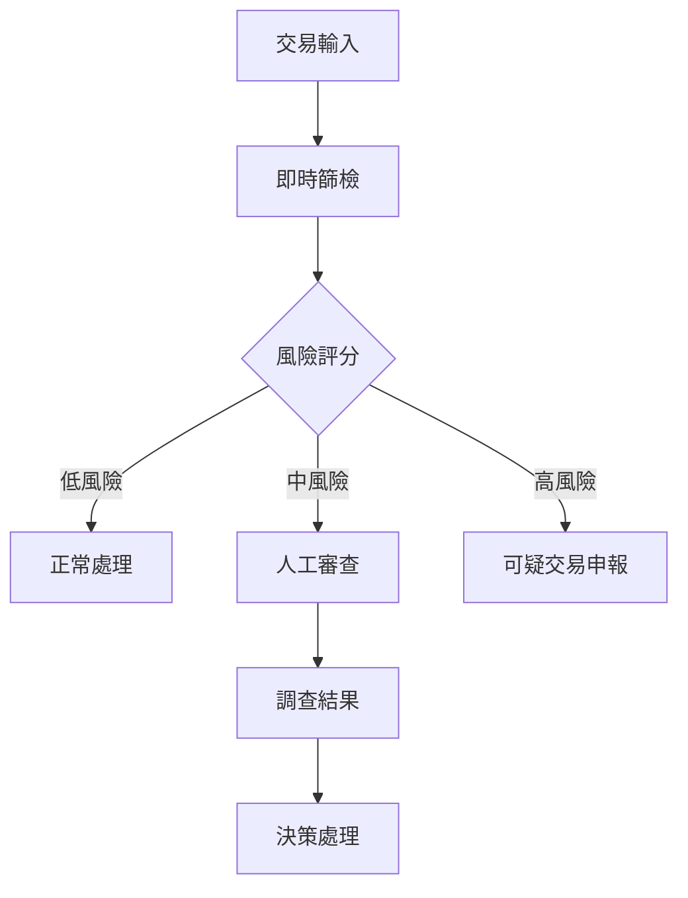
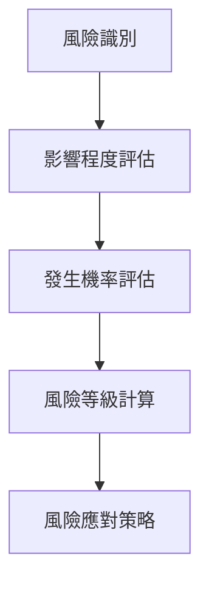
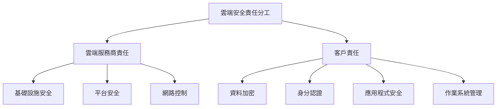
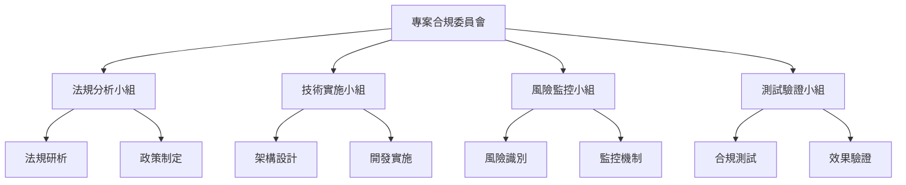
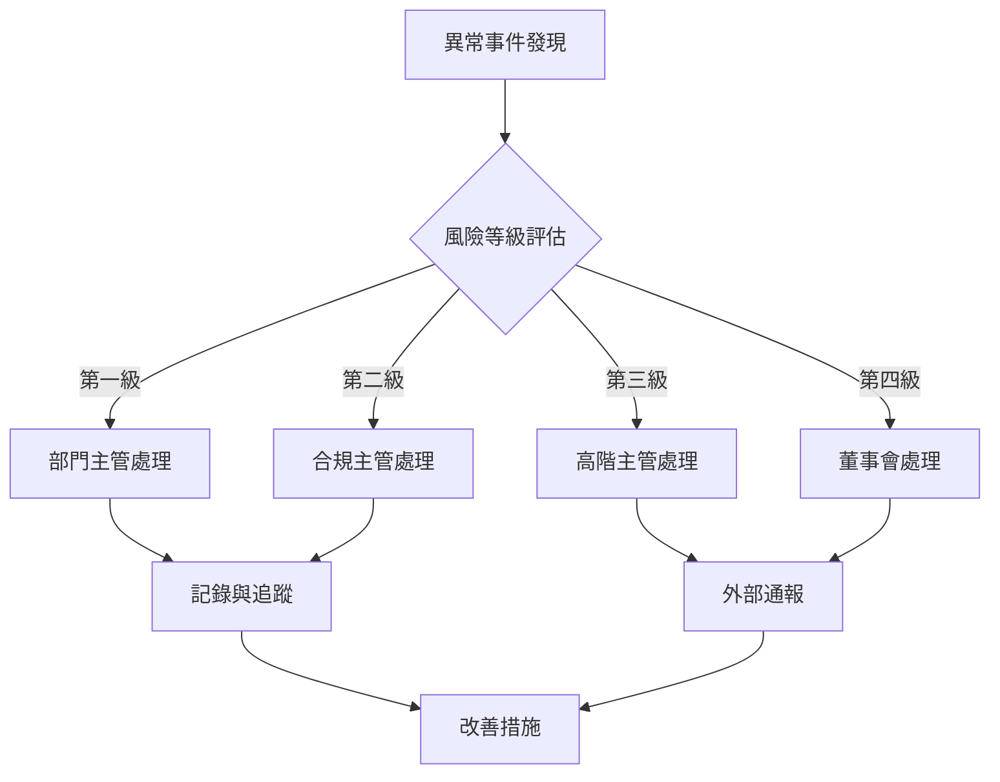
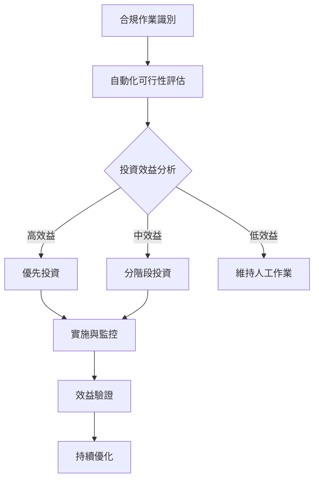
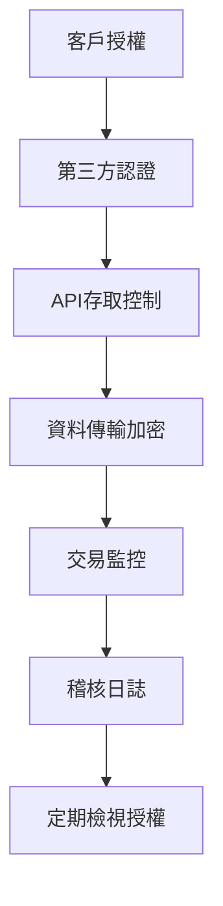

+++
date = '2025-10-31T00:00:00+08:00'
draft = false
title = '金融專案合規要求手冊'
tags = ['指引', '專案管理']
categories = ['指引']
+++
# 金融專案合規要求手冊

## 版本資訊
- **版本**: 1.1
- **發布日期**: 2025年8月29日
- **適用對象**: 新進專案經理、資深專案經理、系統開發團隊
- **審核狀態**: 更新版

---

## 目錄
1. [金融專案中常見的合規要求概述](#1-金融專案中常見的合規要求概述)
2. [主要法規與標準（國內/國際）](#2-主要法規與標準國內國際)
3. [專案生命周期各階段的合規檢查清單](#3-專案生命周期各階段的合規檢查清單)
4. [專案文件與紀錄保存要求](#4-專案文件與紀錄保存要求)
5. [風險管理與稽核應對](#5-風險管理與稽核應對)
6. [案例示例與常見錯誤](#6-案例示例與常見錯誤)
7. [新興技術與合規挑戰](#7-新興技術與合規挑戰)
8. [跨部門協作與溝通機制](#8-跨部門協作與溝通機制)
9. [合規成本管理與效益分析](#9-合規成本管理與效益分析)
10. [數位轉型專案特殊考量](#10-數位轉型專案特殊考量)
11. [附錄：合規檢查清單](#11-附錄合規檢查清單)
12. [附錄：合規工具與模板](#12-附錄合規工具與模板)

---

## 1. 金融專案中常見的合規要求概述

### 1.1 合規的重要性

金融專案合規不僅是法律要求，更是維護機構聲譽、降低營運風險的核心要素。在當今嚴格的監管環境下，任何合規疏失都可能導致：

- **法律責任**：罰款、制裁、執照撤銷
- **聲譽損失**：客戶信任度下降、市場競爭力削弱
- **財務損失**：營運中斷、客戶流失、投資人信心下滑
- **營運影響**：系統重建、流程重新設計

### 1.2 金融專案特有的合規挑戰

#### 1.2.1 資料敏感性
- **個人資料保護**：客戶身分資料、財務資訊
- **交易資料**：金流記錄、投資組合資訊
- **內部資料**：風險模型、定價策略

#### 1.2.2 跨境監管
- **多國法規**：GDPR（歐盟）、CCPA（加州）、個資法（台灣）
- **國際標準**：Basel III、FATF建議、ISO 27001
- **監管機構**：金管會、央行、銀行局

#### 1.2.3 技術複雜性
- **系統整合**：核心銀行系統、風控系統、報表系統
- **資料治理**：資料品質、資料血緣、資料安全
- **技術債務**：舊系統維護、新舊系統共存

### 1.3 合規框架概念

#### 1.3.1 三道防線模型 (Three Lines of Defense)
1. **第一道防線**：業務單位與營運管理
   - 日常風險管理
   - 內控制度執行
   - 前線合規檢查

2. **第二道防線**：風險管理與合規單位
   - 政策制定
   - 風險監控
   - 合規查核

3. **第三道防線**：內部稽核
   - 獨立驗證
   - 有效性評估
   - 改善建議

#### 1.3.2 專案合規責任分工

| 角色 | 主要責任 | 合規職責 |
|------|----------|----------|
| **專案經理** | 專案整體管控 | 確保合規要求納入專案範圍 |
| **業務分析師** | 需求分析 | 識別業務流程中的合規點 |
| **系統架構師** | 技術架構設計 | 確保技術方案符合合規要求 |
| **開發團隊** | 系統開發 | 落實合規控制點的程式實作 |
| **測試團隊** | 系統測試 | 執行合規功能測試與驗證 |
| **合規專員** | 合規諮詢 | 提供法規解釋與合規指導 |

### 1.4 大型專案 vs 中小型專案差異

#### 1.4.1 大型專案特點
- **專案規模**：預算超過1億台幣、團隊超過50人、開發期程超過2年
- **合規複雜度**：涉及多項法規、跨國營運、多系統整合
- **管理要求**：
  - 設立專門的合規委員會
  - 聘請外部合規顧問
  - 建立完整的合規治理架構
  - 定期向董事會報告

#### 1.4.2 中小型專案特點
- **專案規模**：預算5千萬台幣以下、團隊20人以下、開發期程1年以內
- **合規複雜度**：主要聚焦核心法規、單一系統或功能
- **管理要求**：
  - 指派合規聯絡人
  - 使用標準化合規檢查清單
  - 定期合規狀態報告
  - 重點關注關鍵合規節點

### 1.5 常見合規領域

#### 1.5.1 資料保護與隱私
- **適用法規**：GDPR、個資法、銀行法
- **關鍵要求**：
  - 資料收集同意機制
  - 資料處理目的限制
  - 資料保存期限管理
  - 資料跨境傳輸控制

#### 1.5.2 反洗錢與打擊資恐 (AML/CFT)
- **適用法規**：洗錢防制法、資恐防制法、FATF建議
- **關鍵要求**：
  - 客戶盡職調查 (CDD)
  - 加強客戶盡職調查 (EDD)
  - 疑似洗錢交易申報 (STR)
  - 制裁名單篩檢

#### 1.5.3 網路安全
- **適用法規**：資通安全管理法、個資法、銀行法
- **關鍵要求**：
  - 資訊安全管理制度
  - 事件應變機制
  - 定期安全評估
  - 員工安全教育訓練

---

## 2. 主要法規與標準（國內/國際）

### 2.1 台灣金融法規 🇹🇼

#### 2.1.1 核心法規

##### 銀行法
- **主管機關**：金融監督管理委員會
- **適用對象**：銀行業、信用合作社
- **關鍵條文**：
  - 第33條：銀行業務限制
  - 第45條：資本適足性要求
  - 第48條：業務查核與申報
- **專案影響**：系統功能設計須符合業務範圍限制

##### 個人資料保護法
- **施行日期**：2012年10月1日
- **適用範圍**：所有處理個人資料的公務機關及非公務機關
- **關鍵要求**：
  - 告知義務（第8條）
  - 資料正確性維護（第11條）
  - 安全維護措施（第27條）
- **罰則**：新台幣2萬元以上20萬元以下罰鍰

##### 洗錢防制法
- **最新修正**：2018年11月7日
- **主要內容**：
  - 金融機構防制洗錢辦法
  - 客戶盡職調查程序
  - 疑似洗錢交易申報
- **系統要求**：
  - 即時篩檢功能
  - 交易監控系統
  - 報告產製機制

#### 2.1.2 監管指引

##### 金管會相關函令
- **銀行業內部控制及稽核制度實施辦法**
- **金融機構防制洗錢辦法**
- **銀行業公司治理實務守則**

##### 中央銀行規定
- **外匯收支或交易申報辦法**
- **銀行業辦理外匯業務管理辦法**

### 2.2 國際法規與標準

#### 2.2.1 歐盟法規

##### GDPR (General Data Protection Regulation)
- **生效日期**：2018年5月25日
- **適用範圍**：
  - 歐盟境內的資料處理
  - 向歐盟提供商品或服務
  - 監控歐盟境內個人行為
- **關鍵原則**：
  - 合法性、公平性、透明性
  - 目的限制
  - 資料最小化
  - 正確性
  - 保存期限限制
  - 完整性與機密性
- **個人權利**：
  - 存取權 (Right of Access)
  - 更正權 (Right to Rectification)
  - 刪除權 (Right to Erasure)
  - 資料可攜權 (Right to Data Portability)
- **罰款**：營業額4%或2,000萬歐元，取較高者

##### PSD2 (Payment Services Directive 2)
- **目的**：促進歐盟支付服務創新與競爭
- **關鍵要求**：
  - 強客戶驗證 (SCA)
  - 開放銀行 API
  - 第三方支付服務提供者 (TPP) 規範

#### 2.2.2 美國法規

##### SOX Act (Sarbanes-Oxley Act)
- **適用對象**：美國上市公司
- **關鍵要求**：
  - 財務報告內控制度
  - 管理層證明責任
  - 外部稽核獨立性

##### CCPA (California Consumer Privacy Act)
- **生效日期**：2020年1月1日
- **適用範圍**：處理加州居民個人資訊的企業
- **消費者權利**：
  - 知情權
  - 刪除權
  - 選擇退出權
  - 不歧視權

#### 2.2.3 國際標準

##### Basel III
- **發布機構**：巴塞爾銀行監理委員會 (BCBS)
- **主要內容**：
  - 資本適足性要求
  - 流動性覆蓋率 (LCR)
  - 淨穩定資金比率 (NSFR)
  - 槓桿比率
- **實施時程**：2019-2027年分階段實施

##### ISO 27001
- **標準名稱**：資訊安全管理系統要求事項
- **認證效益**：
  - 提升客戶信任
  - 符合法規要求
  - 降低安全風險
- **關鍵流程**：
  - PDCA循環
  - 風險評估
  - 控制措施選擇
  - 持續改善

##### FATF 40項建議
- **發布機構**：金融行動工作組織
- **涵蓋範圍**：
  - AML/CFT政策與協調
  - 洗錢與資恐犯罪化
  - 預防措施
  - 透明度與實質受益人
  - 權責機關權力
  - 國際合作

### 2.3 新興法規趨勢

#### 2.3.1 數位資產相關
- **歐盟 MiCA** (Markets in Crypto-Assets Regulation)
- **美國數位資產框架**
- **台灣虛擬通貨管理規範**

#### 2.3.2 人工智慧與演算法
- **歐盟 AI Act**
- **演算法透明度要求**
- **AI偏見防制**

#### 2.3.3 ESG與永續金融
- **歐盟永續金融披露規則 (SFDR)**
- **氣候相關財務揭露 (TCFD)**
- **台灣永續分類標準**

---

## 3. 專案生命周期各階段的合規檢查清單

### 3.1 專案啟動階段 (Project Initiation)

#### 3.1.1 合規評估要點

##### 法規適用性分析
- [ ] **識別適用法規**：依據專案性質、地理範圍、客戶類型確認適用法規清單
- [ ] **法規影響評估**：評估各項法規對專案範圍、時程、成本的影響
- [ ] **合規成本估算**：預估合規相關的人力、系統、流程成本

##### 利害關係人識別
- [ ] **監管機構**：金管會、央行、銀行局等主管機關
- [ ] **內部合規單位**：法令遵循處、風險管理處、稽核處
- [ ] **外部顧問**：法律事務所、會計師事務所、合規顧問
- [ ] **業務單位**：相關業務部門、營運單位

#### 3.1.2 必要文件準備

##### 專案章程 (Project Charter)
```markdown
# 專案合規聲明範例

## 合規目標
本專案承諾遵循以下法規要求：
- 個人資料保護法
- 洗錢防制法
- 銀行法相關規定
- ISO 27001 資訊安全標準

## 合規責任
- 專案經理：整體合規監督
- 合規專員：專業合規指導
- 開發團隊：落實合規控制點

## 合規里程碑
- 需求分析階段：完成合規需求識別
- 設計階段：完成合規控制點設計
- 開發階段：完成合規功能開發
- 測試階段：完成合規測試驗證
```

##### 初步風險評估
- [ ] **合規風險清單**：識別潛在的合規風險點
- [ ] **風險等級評估**：高/中/低風險分級
- [ ] **初步應對策略**：風險規避、降低、轉移、接受

### 3.2 需求分析階段 (Requirements Analysis)

#### 3.2.1 合規需求收集

##### 功能性合規需求
- [ ] **資料保護功能**
  - 個人資料加密存儲
  - 資料存取權限控制
  - 資料保存期限管理
  - 資料刪除與匿名化

- [ ] **AML/CFT功能**
  - 客戶身分驗證 (KYC)
  - 即時交易監控
  - 制裁名單篩檢
  - 疑似洗錢案件申報

- [ ] **稽核追蹤功能**
  - 操作日誌記錄
  - 資料異動軌跡
  - 使用者行為監控
  - 系統存取記錄

##### 非功能性合規需求
- [ ] **效能要求**：符合監管機構規定的回應時間
- [ ] **可用性要求**：系統可用率須達99.9%以上
- [ ] **安全性要求**：符合ISO 27001、PCI DSS標準
- [ ] **災難復原**：RTO ≤ 4小時，RPO ≤ 1小時

#### 3.2.2 合規需求驗證

##### 需求追蹤矩陣
| 法規要求 | 系統需求 | 測試案例 | 驗收標準 | 負責人 |
|----------|----------|----------|----------|--------|
| 個資法第27條 | 資料加密功能 | TC001-加密測試 | AES-256加密 | 開發組長 |
| 洗錢防制法第7條 | KYC驗證流程 | TC002-KYC測試 | 身分證件OCR驗證 | 業務分析師 |

##### 需求審查會議
- [ ] **參與者**：業務單位、IT單位、合規單位、法務單位
- [ ] **審查重點**：需求完整性、可行性、合規性
- [ ] **輸出文件**：需求規格書、合規需求矩陣

### 3.3 系統設計階段 (System Design)

#### 3.3.1 架構設計合規檢查

##### 安全架構設計
- [ ] **網路安全**
  - DMZ區域劃分
  - 防火牆規則設定
  - 入侵偵測系統 (IDS)
  - 網路流量監控

- [ ] **應用程式安全**
  - 身分認證機制
  - 授權控制模型
  - 資料加密傳輸
  - 安全編碼規範

- [ ] **資料庫安全**
  - 資料庫存取控制
  - 敏感資料遮罩
  - 資料庫稽核日誌
  - 備份加密保護

##### 合規控制點設計
- [ ] **輸入驗證**：防止SQL注入、XSS攻擊
- [ ] **輸出編碼**：防止資料洩露
- [ ] **錯誤處理**：避免敏感資訊暴露
- [ ] **日誌記錄**：完整記錄合規相關操作

#### 3.3.2 資料流程設計

##### 個人資料處理流程


##### AML交易監控流程


### 3.4 開發階段 (Development)

#### 3.4.1 安全編碼實務

##### OWASP Top 10 防護檢查
- [ ] **A01 - 權限控制失效**
  - 實施最小權限原則
  - 定期權限審查
  - 多層次授權驗證

- [ ] **A02 - 加密機制失效**
  - 使用強加密演算法
  - 安全金鑰管理
  - 傳輸層加密

- [ ] **A03 - 注入攻擊**
  - 參數化查詢
  - 輸入驗證
  - 輸出編碼

##### 程式碼審查檢查清單
- [ ] **安全性審查**
  - 敏感資料處理
  - 錯誤處理機制
  - 日誌記錄規範
  - 加密實作檢查

- [ ] **合規性審查**
  - 個資處理邏輯
  - AML規則實作
  - 稽核軌跡記錄
  - 法規報表產製

#### 3.4.2 測試資料管理

##### 生產資料保護
- [ ] **資料遮罩**：敏感欄位以星號或假資料取代
- [ ] **資料匿名化**：移除可識別個人身分的資訊
- [ ] **存取控制**：限制測試資料存取權限
- [ ] **資料銷毀**：測試完成後安全刪除資料

### 3.5 測試階段 (Testing)

#### 3.5.1 合規功能測試

##### 個資保護測試
- [ ] **資料收集測試**
  - 同意機制驗證
  - 告知事項完整性
  - 資料收集範圍限制

- [ ] **資料處理測試**
  - 目的限制檢查
  - 處理合法性驗證
  - 資料品質確保

- [ ] **資料存取測試**
  - 權限控制驗證
  - 存取日誌記錄
  - 個人權利行使

##### AML功能測試
- [ ] **KYC流程測試**
  - 身分驗證機制
  - 客戶風險評等
  - 定期審查流程

- [ ] **交易監控測試**
  - 即時篩檢功能
  - 風險規則觸發
  - 案件產製機制

#### 3.5.2 安全性測試

##### 滲透測試
- [ ] **網路安全測試**
  - 埠掃描
  - 漏洞掃描
  - 入侵測試

- [ ] **應用程式安全測試**
  - SQL注入測試
  - XSS攻擊測試
  - 權限提升測試

##### 合規稽核測試
- [ ] **日誌完整性**：確保所有合規相關操作都有記錄
- [ ] **資料完整性**：驗證資料處理的正確性與一致性
- [ ] **控制有效性**：測試內控制度的執行效果

### 3.6 部署階段 (Deployment)

#### 3.6.1 上線前檢查

##### 合規證明文件
- [ ] **合規聲明書**：系統符合相關法規要求的正式聲明
- [ ] **測試報告**：合規功能測試、安全性測試結果
- [ ] **風險評估報告**：最終風險評估與應對措施
- [ ] **操作手冊**：包含合規操作程序的使用手冊

##### 監管機構報備
- [ ] **系統變更通知**：向主管機關報告重大系統變更
- [ ] **合規影響說明**：說明系統變更對合規的影響
- [ ] **風險控制措施**：提交風險控制與監控計畫

#### 3.6.2 上線後監控

##### 合規監控機制
- [ ] **即時監控**：關鍵合規指標的即時監控
- [ ] **定期檢查**：合規控制點的定期檢查
- [ ] **異常警示**：合規異常事件的自動警示
- [ ] **報告機制**：定期合規狀態報告

### 3.7 維運階段 (Operations)

#### 3.7.1 持續合規管理

##### 法規變更管理
- [ ] **法規監控**：定期關注法規變更動態
- [ ] **影響評估**：評估法規變更對系統的影響
- [ ] **系統調整**：依據法規變更調整系統功能
- [ ] **重新驗證**：確認調整後的系統仍符合要求

##### 合規教育訓練
- [ ] **新進人員訓練**：合規基礎知識與操作規範
- [ ] **定期複訓**：法規更新與案例分享
- [ ] **專業認證**：鼓勵取得相關專業證照
- [ ] **知識管理**：建立合規知識庫與常見問題集

---

## 4. 專案文件與紀錄保存要求

### 4.1 文件分類與保存原則

#### 4.1.1 文件分類架構

##### 法規文件 (Regulatory Documents)
- **適用法規清單**：專案涉及的所有法規條文
- **法規解釋函令**：主管機關的解釋與指導
- **合規政策文件**：機構內部的合規政策與程序

##### 專案管理文件 (Project Management Documents)
- **專案章程**：包含合規目標與責任分工
- **專案計畫**：包含合規里程碑與檢查點
- **風險管理計畫**：合規風險的識別與應對

##### 技術文件 (Technical Documents)
- **系統架構文件**：含安全架構與合規控制點
- **程式設計文件**：安全編碼與合規功能說明
- **測試文件**：合規功能測試與安全性測試

##### 營運文件 (Operational Documents)
- **操作手冊**：含合規操作程序
- **監控報告**：合規指標監控與異常處理
- **稽核文件**：內外部稽核報告與改善計畫

#### 4.1.2 保存期限規定

| 文件類型 | 保存期限 | 法規依據 | 備註 |
|----------|----------|----------|------|
| **個資處理記錄** | 業務關係終止後5年 | 個資法施行細則第12條 | 包含處理軌跡與同意紀錄 |
| **AML相關文件** | 交易完成後5年 | 洗錢防制法第8條 | 包含KYC文件與交易記錄 |
| **稽核軌跡** | 3年 | 銀行業內控制度實施辦法 | 系統操作與異動記錄 |
| **風險評估報告** | 3年 | 內部管理制度 | 定期更新與歷史版本 |
| **合規測試報告** | 系統生命週期 | 內部管理制度 | 證明系統合規性 |

### 4.2 文件管理系統要求

#### 4.2.1 電子文件管理

##### 文件版本控制
- [ ] **版本編號規則**：採用語意化版本編號 (如：v1.2.3)
- [ ] **變更追蹤**：記錄文件修改者、時間、原因
- [ ] **核准流程**：重要文件須經主管核准
- [ ] **發布管制**：確保使用最新版本文件

##### 存取權限管理
- [ ] **分級存取**：依據文件機敏性設定存取權限
- [ ] **身分認證**：強制使用雙因子認證
- [ ] **存取記錄**：完整記錄文件存取軌跡
- [ ] **定期審查**：定期檢視與調整存取權限

#### 4.2.2 實體文件管理

##### 保管環境要求
- [ ] **防火防水**：文件保存環境須具備防火防水設施
- [ ] **溫濕度控制**：維持適當的溫濕度環境
- [ ] **存取管制**：實體文件庫房門禁管制
- [ ] **監控錄影**：24小時監控錄影系統

##### 借閱管理制度
- [ ] **借閱登記**：完整記錄借閱者、時間、用途
- [ ] **歸還期限**：設定合理的歸還期限
- [ ] **影印管制**：管制文件影印與攜出
- [ ] **銷毀程序**：到期文件安全銷毀程序

### 4.3 關鍵文件範本

#### 4.3.1 合規聲明書範本

```markdown
# 專案合規聲明書

## 基本資訊
- **專案名稱**：[專案名稱]
- **專案經理**：[姓名]
- **合規負責人**：[姓名]
- **聲明日期**：[日期]

## 適用法規
本專案確認遵循以下法規要求：
- [ ] 個人資料保護法
- [ ] 洗錢防制法
- [ ] 銀行法相關規定
- [ ] 其他相關法規：[列舉]

## 合規措施
### 資料保護措施
- 個人資料加密存儲：[說明加密方式]
- 存取權限控制：[說明權限管理機制]
- 資料保存期限：[說明保存期限政策]

### 交易監控措施
- KYC驗證機制：[說明驗證流程]
- 即時交易監控：[說明監控規則]
- 疑似案件申報：[說明申報程序]

## 責任聲明
本人確認上述資訊正確無誤，並承諾確實執行各項合規措施。

專案經理簽章：_____________ 日期：_____________
合規負責人簽章：___________ 日期：_____________
```

#### 4.3.2 風險評估報告範本

```markdown
# 合規風險評估報告

## 評估概要
- **評估範圍**：[說明評估範圍]
- **評估方法**：[說明評估方法]
- **評估人員**：[列舉評估人員]
- **評估日期**：[評估執行日期]

## 風險識別
| 風險項目 | 風險描述 | 可能影響 | 風險等級 |
|----------|----------|----------|----------|
| 個資洩露 | 客戶個人資料遭未授權存取 | 法律責任、聲譽損失 | 高 |
| 洗錢風險 | 未能有效識別可疑交易 | 監管處罰、營運中斷 | 中 |

## 風險評估矩陣


## 應對措施
### 高風險項目
1. **個資洩露風險**
   - 強化存取控制機制
   - 實施資料加密保護
   - 定期安全性測試

### 中風險項目
1. **洗錢風險**
   - 加強交易監控規則
   - 提升人員專業能力
   - 定期檢視風險參數

## 持續監控
- **監控頻率**：每月檢視風險狀態
- **指標設定**：[列舉關鍵風險指標]
- **報告機制**：發現重大風險立即報告
```

## 5. 風險管理與稽核應對

### 5.1 合規風險管理框架

#### 5.1.1 風險識別方法

##### 法規風險掃描
- **法規變更監控**：建立法規變更通知機制
- **同業案例分析**：研析同業合規事件與教訓
- **專家諮詢**：定期諮詢法律與合規專家意見
- **內部評估**：定期進行內部合規風險評估

##### 技術風險評估
- **系統安全掃描**：定期執行弱點掃描與滲透測試
- **資料流分析**：檢視個人資料處理流程
- **存取權限審查**：定期檢視系統存取權限
- **第三方風險評估**：評估外包廠商合規能力

#### 5.1.2 風險量化與評級

##### 風險評估矩陣

| 影響程度 | 機率很低(1) | 機率低(2) | 機率中(3) | 機率高(4) | 機率很高(5) |
|----------|-------------|-----------|-----------|-----------|-------------|
| **影響很高(5)** | 中風險(5) | 高風險(10) | 高風險(15) | 極高風險(20) | 極高風險(25) |
| **影響高(4)** | 低風險(4) | 中風險(8) | 高風險(12) | 高風險(16) | 極高風險(20) |
| **影響中(3)** | 低風險(3) | 中風險(6) | 中風險(9) | 高風險(12) | 高風險(15) |
| **影響低(2)** | 極低風險(2) | 低風險(4) | 中風險(6) | 中風險(8) | 高風險(10) |
| **影響很低(1)** | 極低風險(1) | 極低風險(2) | 低風險(3) | 低風險(4) | 中風險(5) |

##### 風險評級定義
- **極高風險 (20-25分)**：可能導致重大法律後果或營運中斷
- **高風險 (12-19分)**：可能導致監管處罰或聲譽損失
- **中風險 (6-11分)**：可能導致小額罰款或客戶抱怨
- **低風險 (3-5分)**：影響輕微，可接受範圍
- **極低風險 (1-2分)**：幾乎無影響，例行監控即可

### 5.2 稽核準備與應對

#### 5.2.1 內部稽核準備

##### 稽核前準備工作
- [ ] **文件整理**：整理所有合規相關文件
- [ ] **人員訓練**：培訓受查人員稽核應對技巧
- [ ] **系統檢查**：確保系統功能正常運作
- [ ] **資料準備**：準備稽核所需的報表與資料

##### 稽核過程配合
- [ ] **指派聯絡人**：指定專人協助稽核作業
- [ ] **提供資料**：及時提供稽核人員所需資料
- [ ] **解釋說明**：針對稽核發現提供合理解釋
- [ ] **記錄追蹤**：記錄稽核過程與發現事項

#### 5.2.2 外部稽核應對

##### 監管檢查準備
- [ ] **通知機制**：建立監管檢查通知流程
- [ ] **應變小組**：成立跨部門應變小組
- [ ] **資料清單**：準備監管機構要求的資料清單
- [ ] **場地準備**：準備適當的檢查場地與設備

##### 檢查過程管理
- [ ] **權責劃分**：明確各部門回應責任
- [ ] **即時溝通**：維持與監管人員良好溝通
- [ ] **問題澄清**：針對檢查發現及時澄清與改善
- [ ] **後續追蹤**：追蹤改善措施執行進度

### 5.3 改善措施與持續監控

#### 5.3.1 缺失改善管理

##### 改善計畫制定
```markdown
# 合規缺失改善計畫範本

## 基本資訊
- **缺失項目**：[缺失描述]
- **發現日期**：[日期]
- **改善負責人**：[姓名與職稱]
- **預定完成日**：[日期]

## 缺失分析
### 根本原因分析
- **直接原因**：[說明直接導致缺失的原因]
- **根本原因**：[說明深層次的根本原因]
- **影響範圍**：[說明缺失可能影響的範圍]

### 風險評估
- **風險等級**：[高/中/低]
- **潛在影響**：[說明可能產生的後果]
- **緊急程度**：[立即/短期/中期/長期]

## 改善措施
### 短期措施（立即執行）
1. [措施描述]
   - 執行人員：[姓名]
   - 完成期限：[日期]
   - 預期效果：[說明]

### 中期措施（1-3個月）
1. [措施描述]
   - 執行人員：[姓名]
   - 完成期限：[日期]
   - 所需資源：[說明]

### 長期措施（3個月以上）
1. [措施描述]
   - 執行人員：[姓名]
   - 完成期限：[日期]
   - 投資預算：[金額]

## 追蹤機制
- **追蹤頻率**：[每週/每月/每季]
- **追蹤方式**：[會議/報告/系統]
- **完成驗證**：[驗證方法與標準]
```

#### 5.3.2 持續改善機制

##### PDCA循環應用
- **Plan (計畫)**：制定合規改善計畫
- **Do (執行)**：落實改善措施
- **Check (檢查)**：驗證改善成效
- **Act (行動)**：標準化成功做法

##### 知識管理
- [ ] **案例資料庫**：建立合規案例知識庫
- [ ] **最佳實務**：整理合規最佳實務手冊
- [ ] **經驗分享**：定期舉辦合規經驗分享會
- [ ] **教育訓練**：持續更新合規教育訓練內容

---

## 6. 案例示例與常見錯誤

### 6.1 成功案例分析

#### 6.1.1 大型銀行數位轉型專案

##### 專案背景
某大型商業銀行推動全面數位化轉型，涉及網路銀行、行動銀行、開放銀行等多個子系統，專案預算達15億台幣，開發期程3年。

##### 合規挑戰
- **多重法規適用**：個資法、洗錢防制法、電子支付機構管理條例
- **跨境資料傳輸**：與海外金融機構資料交換
- **開放銀行**：第三方業者資料存取與API安全

##### 解決方案
1. **建立合規治理架構**
   - 成立專案合規委員會
   - 聘請外部法律顧問
   - 指派專職合規經理

2. **分階段合規驗證**
   - 每個里程碑進行合規檢查
   - 外部顧問定期審查
   - 主管機關預先溝通

3. **技術解決方案**
   - 實施零信任架構
   - 建置API管理平台
   - 導入資料防洩技術

##### 成功關鍵因素
- **高階支持**：董事會全力支持合規投資
- **專業團隊**：組建跨領域專業團隊
- **提前準備**：提前與監管機構溝通
- **持續監控**：建立完善的監控機制

#### 6.1.2 中型保險公司核心系統更新

##### 專案背景
某中型人壽保險公司更新30年老舊核心系統，專案預算8千萬台幣，開發期程18個月。

##### 合規重點
- **保險法規**：保險業務規範、準備金計算
- **個資保護**：大量保戶個人資料處理
- **財務報告**：符合IFRS 17會計準則

##### 實施策略
1. **簡化合規流程**
   - 採用標準化合規模板
   - 聚焦核心法規要求
   - 委外專業合規諮詢

2. **風險控制措施**
   - 平行上線降低風險
   - 資料遷移分批進行
   - 建立緊急應變機制

##### 學習要點
- **資源有限**：中小型專案需善用外部資源
- **重點聚焦**：聚焦最重要的合規要求
- **分階段執行**：降低一次性風險

### 6.2 常見錯誤與教訓

#### 6.2.1 個資保護常見錯誤

##### 錯誤一：忽略資料跨境傳輸規定
**案例描述**：某銀行將客戶資料傳送至海外資料中心進行分析，未遵循GDPR適足性決定要求。

**錯誤後果**：
- 面臨GDPR巨額罰款
- 客戶信任度下降
- 業務營運受限

**正確做法**：
- [ ] 評估目的地國家的資料保護法規
- [ ] 簽署標準契約條款 (SCC)
- [ ] 實施額外的技術與組織措施
- [ ] 取得主管機關事前許可

##### 錯誤二：個人資料保存期限過長
**案例描述**：某金融機構無限期保存已結清客戶的個人資料，違反資料最小化原則。

**改善措施**：
- [ ] 建立資料保存期限政策
- [ ] 實施自動化資料銷毀機制
- [ ] 定期檢視與清理過期資料
- [ ] 記錄資料銷毀軌跡

#### 6.2.2 AML合規常見錯誤

##### 錯誤三：KYC文件驗證不完整
**案例描述**：某銀行對高風險客戶的KYC審查不夠嚴謹，導致協助洗錢案件發生。

**風險影響**：
- 監管機構重罰
- 營業執照限制
- 聲譽嚴重受損

**預防措施**：
- [ ] 建立完整的客戶風險評等機制
- [ ] 加強高風險客戶審查程序
- [ ] 定期更新客戶資料
- [ ] 提升員工專業訓練

#### 6.2.3 系統安全常見錯誤

##### 錯誤四：權限控制設計不當
**案例描述**：某金融系統採用過度寬鬆的權限設計，導致內部人員可存取不當資料。

**改善策略**：
- [ ] 實施最小權限原則
- [ ] 建立角色基礎存取控制 (RBAC)
- [ ] 定期權限審查與回收
- [ ] 實施職責分離原則

### 6.3 案例學習框架

#### 6.3.1 案例分析方法

##### 事前分析 (Pre-mortem Analysis)
在專案開始前，想像專案失敗的可能原因：
1. **情境設定**：假設專案合規失敗
2. **原因分析**：分析可能導致失敗的因素
3. **預防措施**：制定預防措施
4. **監控指標**：設定早期預警指標

##### 事後檢討 (Post-mortem Analysis)
專案完成後，檢討合規執行成效：
1. **成效評估**：評估合規目標達成度
2. **問題分析**：分析執行過程中的問題
3. **改善建議**：提出未來改善建議
4. **知識保存**：將經驗納入知識庫

#### 6.3.2 最佳實務總結

##### 專案管理層面
- **早期介入**：合規考量應在專案規劃階段就介入
- **持續監控**：建立持續的合規監控機制
- **專業支援**：適時尋求外部專業支援
- **文件管理**：建立完整的合規文件管理制度

##### 技術實施層面
- **安全設計**：從設計階段就考慮安全與合規要求
- **測試驗證**：充分測試合規功能的有效性
- **監控機制**：建立即時的合規監控與警示機制
- **持續改善**：建立持續改善的回饋機制

---

## 7. 新興技術與合規挑戰

### 7.1 雲端運算合規考量

#### 7.1.1 雲端部署模式合規要求

##### 公有雲合規挑戰
- **資料主權**：確保資料存儲符合當地法規要求
- **資料隔離**：實施多租戶環境的資料隔離措施
- **服務等級協議**：確保雲端服務商提供符合金融業要求的SLA
- **稽核權利**：保留對雲端環境的稽核與檢查權利

##### 私有雲與混合雲策略
- **敏感資料本地化**：高敏感資料保留在私有雲環境
- **災難復原規劃**：跨雲環境的災難復原與備份策略
- **網路安全**：雲間連接的安全通道建立
- **成本控制**：平衡合規要求與雲端使用成本

#### 7.1.2 雲端安全框架

##### 共同責任模型


##### 雲端合規檢查清單
- [ ] **資料分類與標記**：依據敏感程度分類雲端資料
- [ ] **加密策略**：實施傳輸中與靜態資料加密
- [ ] **存取控制**：實施基於角色的雲端資源存取控制
- [ ] **監控與日誌**：建立雲端資源使用監控機制
- [ ] **合規報告**：定期產製雲端合規狀態報告

### 7.2 人工智慧與機器學習合規

#### 7.2.1 AI/ML模型合規要求

##### 演算法透明度
- **可解釋性要求**：確保AI決策過程可被解釋與理解
- **偏見檢測**：定期檢測模型是否存在不當偏見
- **模型驗證**：建立獨立的模型驗證機制
- **版本控制**：實施AI模型的版本管理與追蹤

##### 資料治理
- **訓練資料品質**：確保用於訓練的資料品質與代表性
- **個人資料保護**：AI模型訓練中的個人資料匿名化處理
- **資料血緣**：建立從原始資料到模型輸出的完整血緣追蹤
- **模型風險管理**：評估AI模型可能產生的風險

#### 7.2.2 自動化決策合規

##### GDPR自動化決策規範
- **個人權利保護**：提供個人對自動化決策的申訴機制
- **人工介入權**：確保重要決策有人工介入的可能
- **決策透明度**：向當事人說明自動化決策的邏輯
- **定期檢討**：定期檢討自動化決策的公平性與準確性

### 7.3 區塊鏈與分散式帳本技術

#### 7.3.1 區塊鏈合規框架

##### 資料保護挑戰
- **不可變性vs個人權利**：平衡區塊鏈不可變特性與GDPR刪除權
- **去中心化責任**：在分散式環境中確立資料控制者責任
- **跨境資料流動**：區塊鏈網路中的跨境資料傳輸合規
- **身分識別**：在匿名/假名環境中實施KYC要求

##### 技術解決方案
- **鏈下儲存**：敏感資料儲存於鏈下，鏈上僅存儲雜湊值
- **零知識證明**：在不洩露資料的情況下證明資料有效性
- **許可鏈設計**：採用許可區塊鏈控制參與者身分
- **智慧合約稽核**：對智慧合約進行安全與合規稽核

### 7.4 開放銀行與API經濟

#### 7.4.1 API安全與合規

##### API治理框架
- **API分類管理**：依據資料敏感度分類管理API
- **版本控制**：實施API版本管理與向下相容性
- **速率限制**：實施API調用頻率與額度限制
- **監控分析**：建立API使用行為分析與異常偵測

##### 第三方整合合規
- **供應商盡職調查**：評估第三方服務商的合規能力
- **資料分享協議**：建立明確的資料分享責任與義務
- **安全評估**：定期評估第三方整合的安全風險
- **事件應變**：建立第三方安全事件的應變機制

---

## 8. 跨部門協作與溝通機制

### 8.1 合規治理組織架構

#### 8.1.1 治理委員會結構

##### 專案合規委員會
- **委員會主席**：專案發起人或高階主管
- **常設委員**：
  - 專案經理
  - 合規長或合規主管
  - 風險管理主管
  - 資訊安全主管
  - 法務主管
- **顧問委員**：外部合規顧問、法律顧問

##### 工作小組分工


#### 8.1.2 責任分工與權責劃分

##### RACI矩陣範例
| 活動/角色 | 專案經理 | 合規主管 | 技術架構師 | 開發團隊 | 測試團隊 |
|-----------|----------|----------|------------|----------|----------|
| **合規需求識別** | A | R | C | I | I |
| **技術方案設計** | A | C | R | C | I |
| **程式開發** | A | C | C | R | I |
| **合規測試** | A | C | I | C | R |
| **上線部署** | R | A | C | C | C |

**圖例說明**：
- **R (Responsible)**：執行責任者
- **A (Accountable)**：當責者
- **C (Consulted)**：諮詢對象
- **I (Informed)**：告知對象

### 8.2 溝通機制與報告體系

#### 8.2.1 定期溝通機制

##### 合規狀態會議
- **會議頻率**：每週或雙週
- **參與對象**：專案核心團隊與合規代表
- **議程內容**：
  - 合規里程碑進度檢討
  - 新識別風險討論
  - 法規變更影響評估
  - 改善措施執行狀況

##### 高階管理報告
- **報告頻率**：每月
- **報告對象**：專案指導委員會、董事會
- **報告內容**：
  - 合規整體狀態摘要
  - 重大風險與應對措施
  - 法規變更影響分析
  - 資源需求與預算狀況

#### 8.2.2 異常事件處理流程

##### 合規異常分級
- **第一級（輕微）**：可能導致小額罰款或客戶抱怨
- **第二級（中等）**：可能導致監管關注或業務限制
- **第三級（嚴重）**：可能導致重大罰款或聲譽損失
- **第四級（重大）**：可能導致執照撤銷或營運中斷

##### 升級處理機制


### 8.3 知識管理與持續改善

#### 8.3.1 合規知識庫建置

##### 知識分類架構
- **法規資訊**：最新法規條文、解釋函令、案例判決
- **最佳實務**：成功專案經驗、標準作業程序
- **工具模板**：檢查清單、評估表格、報告範本
- **常見問題**：FAQ集、疑難解答、聯絡資訊

##### 知識更新機制
- **責任分工**：指派專人負責各領域知識更新
- **定期檢視**：每季檢視知識庫內容的時效性
- **版本控制**：建立知識文件的版本管理機制
- **使用回饋**：收集使用者回饋持續改善內容

#### 8.3.2 經驗學習機制

##### 專案結案檢討
- **成功因素分析**：識別促成合規成功的關鍵因素
- **改善機會識別**：找出可以改善的流程或方法
- **知識萃取**：將專案經驗轉化為可重複使用的知識
- **經驗分享**：透過內部訓練或研習會分享經驗

---

## 9. 合規成本管理與效益分析

### 9.1 合規成本分析框架

#### 9.1.1 成本分類與估算

##### 直接合規成本
- **人力成本**：
  - 專職合規人員薪資
  - 外部顧問費用
  - 教育訓練費用
  - 額外加班成本

- **系統成本**：
  - 合規功能開發費用
  - 安全系統建置成本
  - 第三方合規工具授權費
  - 系統維護與升級費用

- **流程成本**：
  - 額外作業程序成本
  - 文件管理成本
  - 稽核與檢查成本
  - 報告產製成本

##### 間接合規成本
- **機會成本**：因合規要求延遲上線造成的機會損失
- **效率影響**：合規檢查對開發效率的影響
- **資源排擠**：合規資源需求對其他專案的影響

#### 9.1.2 成本效益分析方法

##### 量化分析指標
```markdown
# 合規投資回報分析

## 成本分析
### 一次性成本
- 系統建置：$X 萬元
- 顧問費用：$Y 萬元
- 教育訓練：$Z 萬元

### 年度營運成本
- 人力成本：$A 萬元/年
- 系統維護：$B 萬元/年
- 持續改善：$C 萬元/年

## 效益分析
### 風險降低效益
- 避免潛在罰款：$P 萬元
- 聲譽保護價值：$Q 萬元
- 客戶信任提升：$R 萬元

### 營運效率提升
- 自動化節省人力：$S 萬元/年
- 流程優化效益：$T 萬元/年
- 決策品質改善：$U 萬元/年

## ROI計算
ROI = (總效益 - 總成本) / 總成本 × 100%
```

### 9.2 合規投資優化策略

#### 9.2.1 風險基礎資源配置

##### 風險熱點分析
- **高風險領域**：投入80%合規資源
  - 個人資料處理
  - 反洗錢監控
  - 跨境資料傳輸

- **中風險領域**：投入15%合規資源
  - 系統存取控制
  - 第三方整合
  - 資料品質管理

- **低風險領域**：投入5%合規資源
  - 一般營運流程
  - 非敏感資料處理
  - 內部管理制度

#### 9.2.2 合規自動化投資

##### 自動化優先順序
1. **高頻重複作業**：交易監控、報告產製
2. **錯誤率高的作業**：資料驗證、規則檢查
3. **人力密集作業**：文件管理、追蹤稽核

##### 自動化投資評估


### 9.3 合規績效指標 (KPI)

#### 9.3.1 過程指標

##### 合規覆蓋度指標
- **法規覆蓋率**：已識別法規數 / 適用法規總數 × 100%
- **控制點實施率**：已實施控制點數 / 規劃控制點總數 × 100%
- **測試完成率**：已完成測試項目數 / 規劃測試項目總數 × 100%

##### 合規效率指標
- **平均處理時間**：合規檢查的平均處理時間
- **一次通過率**：合規檢查一次通過的比例
- **重工率**：因合規問題需要重新開發的比例

#### 9.3.2 結果指標

##### 合規有效性指標
- **違規事件數**：每年發生的合規違規事件數量
- **罰款金額**：因合規違規導致的罰款總額
- **客戶投訴數**：與合規相關的客戶投訴數量

##### 風險管理指標
- **風險識別率**：及時識別合規風險的比例
- **風險處理時效**：合規風險的平均處理時間
- **預防有效性**：預防措施阻止違規事件的比例

---

## 10. 數位轉型專案特殊考量

### 10.1 數位銀行合規要求

#### 10.1.1 純網銀特殊規範

##### 客戶識別與驗證
- **數位身分驗證**：
  - 生物識別技術應用
  - 多因子認證機制
  - 身分證件OCR與真偽辨識
  - 活體檢測技術

- **遠距開戶程序**：
  - 視訊通話身分確認
  - 數位簽章法律效力
  - 客戶風險評等機制
  - 開戶後持續監控

##### 數位客戶體驗合規
- **無障礙設計**：符合身心障礙者權益保障法要求
- **資訊透明度**：清楚揭露費用、條款、風險
- **客戶權益保護**：提供有效的申訴管道
- **資料可攜權**：支援客戶資料匯出功能

#### 10.1.2 金融科技整合合規

##### Open Banking API合規


##### 第三方服務整合
- **供應商管理**：
  - 盡職調查程序
  - 合規能力評估
  - 定期績效檢視
  - 合約管理機制

- **資料分享治理**：
  - 資料分享協議
  - 最小權限原則
  - 用途限制條款
  - 安全技術措施

### 10.2 雲端優先策略合規

#### 10.2.1 雲端遷移合規規劃

##### 雲端適用性評估
- **資料分類評估**：
  - 公開資料：可使用公有雲
  - 內部資料：建議使用私有雲
  - 敏感資料：必須使用私有雲
  - 機密資料：禁止使用雲端

##### 分階段遷移策略
1. **第一階段**：非核心系統遷移
2. **第二階段**：周邊業務系統遷移
3. **第三階段**：核心業務系統遷移
4. **第四階段**：高敏感系統評估遷移

#### 10.2.2 雲端治理機制

##### 雲端安全監控
- **持續監控**：24×7雲端資源監控
- **自動化回應**：異常事件自動化處理
- **威脅情報**：整合外部威脅情報
- **事件調查**：建立雲端事件調查能力

### 10.3 敏捷開發與DevOps合規

#### 10.3.1 敏捷合規實務

##### Shift-Left Security
- **設計階段安全**：威脅建模與安全設計
- **開發階段安全**：安全編碼與自動化檢測
- **測試階段安全**：安全測試與弱點掃描
- **部署階段安全**：配置安全與執行環境保護

##### 持續合規監控


#### 10.3.2 DevSecOps整合

##### 工具鏈整合
- **程式碼分析**：SAST、DAST、IAST工具整合
- **容器安全**：容器映像檢測與執行時保護
- **基礎設施即程式碼**：Infrastructure as Code安全掃描
- **秘密管理**：API金鑰、憑證的安全管理

---

## 11. 附錄：合規檢查清單

### 7.1 專案啟動階段檢查清單

#### 7.1.1 法規評估
- [ ] 完成適用法規清單識別
- [ ] 完成法規影響評估
- [ ] 完成合規成本估算
- [ ] 獲得管理層合規承諾

#### 7.1.2 組織準備
- [ ] 指派專職合規負責人
- [ ] 建立合規諮詢管道
- [ ] 組建合規審查小組
- [ ] 制定合規溝通計畫

### 7.2 需求分析階段檢查清單

#### 7.2.1 需求識別
- [ ] 完成功能性合規需求清單
- [ ] 完成非功能性合規需求清單
- [ ] 建立需求追蹤矩陣
- [ ] 完成需求合規審查

#### 7.2.2 風險評估
- [ ] 完成初步風險識別
- [ ] 完成風險等級評估
- [ ] 制定風險應對策略
- [ ] 建立風險監控機制

### 7.3 設計開發階段檢查清單

#### 7.3.1 安全設計
- [ ] 完成安全架構設計
- [ ] 完成資料流程設計
- [ ] 完成存取控制設計
- [ ] 完成稽核軌跡設計

#### 7.3.2 合規控制點
- [ ] 實施輸入驗證機制
- [ ] 實施輸出編碼機制
- [ ] 實施錯誤處理機制
- [ ] 實施日誌記錄機制

### 7.4 測試階段檢查清單

#### 7.4.1 功能測試
- [ ] 完成個資保護功能測試
- [ ] 完成AML功能測試
- [ ] 完成權限控制測試
- [ ] 完成稽核軌跡測試

#### 7.4.2 安全測試
- [ ] 完成弱點掃描測試
- [ ] 完成滲透測試
- [ ] 完成程式碼安全審查
- [ ] 完成資料加密測試

### 7.5 上線部署階段檢查清單

#### 7.5.1 上線準備
- [ ] 完成合規證明文件
- [ ] 完成監管機構報備
- [ ] 完成人員教育訓練
- [ ] 完成應變計畫準備

#### 7.5.2 上線後監控
- [ ] 建立即時監控機制
- [ ] 建立定期檢查機制
- [ ] 建立異常警示機制
- [ ] 建立報告機制

---

## 12. 附錄：合規工具與模板

### 12.1 評估工具

#### 12.1.1 合規成熟度評估表

```markdown
# 金融專案合規成熟度評估

## 評估說明
- 評分標準：1-5分（1分最低，5分最高）
- 總分計算：各項目加權平均
- 成熟度等級：1-2分(初始)、3分(基本)、4分(進階)、5分(最佳)

## 評估項目

### 1. 治理架構 (權重: 25%)
| 評估項目 | 評分 | 說明 |
|----------|------|------|
| 合規委員會建立 | ___/5 | 是否建立專案合規委員會 |
| 責任分工明確 | ___/5 | 合規責任是否明確分工 |
| 政策制度完善 | ___/5 | 合規政策制度是否完善 |
| 高階管理支持 | ___/5 | 高階管理層支持程度 |

### 2. 風險管理 (權重: 30%)
| 評估項目 | 評分 | 說明 |
|----------|------|------|
| 風險識別完整性 | ___/5 | 合規風險識別的完整程度 |
| 風險評估方法 | ___/5 | 風險評估方法的科學性 |
| 風險應對措施 | ___/5 | 風險應對措施的有效性 |
| 持續監控機制 | ___/5 | 風險監控機制的建立程度 |

### 3. 流程管理 (權重: 25%)
| 評估項目 | 評分 | 說明 |
|----------|------|------|
| 流程標準化程度 | ___/5 | 合規流程的標準化程度 |
| 流程執行效率 | ___/5 | 合規流程執行效率 |
| 流程持續改善 | ___/5 | 流程改善機制的建立 |
| 自動化程度 | ___/5 | 合規流程自動化程度 |

### 4. 技術能力 (權重: 20%)
| 評估項目 | 評分 | 說明 |
|----------|------|------|
| 系統功能完整性 | ___/5 | 合規系統功能的完整程度 |
| 技術架構先進性 | ___/5 | 技術架構的先進性 |
| 資料品質管理 | ___/5 | 資料品質管理能力 |
| 監控報告能力 | ___/5 | 監控與報告系統能力 |

## 評估結果
- 治理架構得分：___/20 (權重25%)
- 風險管理得分：___/20 (權重30%)
- 流程管理得分：___/20 (權重25%)
- 技術能力得分：___/20 (權重20%)

**總分：___/20**

## 成熟度等級判定
- [ ] 初始級 (1-2分)：基本合規要求尚未建立
- [ ] 基本級 (2-3分)：基本合規框架已建立
- [ ] 進階級 (3-4分)：合規管理趨於成熟
- [ ] 最佳級 (4-5分)：合規管理達到業界最佳實務

## 改善建議
（針對評分較低的項目提出具體改善建議）
```

#### 12.1.2 法規影響評估矩陣

```markdown
# 法規影響評估矩陣

## 評估方法說明
- 影響程度：高(3)、中(2)、低(1)
- 複雜度：高(3)、中(2)、低(1)
- 成本影響：高(3)、中(2)、低(1)
- 總分=影響程度×複雜度×成本影響

| 法規名稱 | 影響程度 | 複雜度 | 成本影響 | 總分 | 優先級 | 負責部門 |
|----------|----------|---------|----------|------|--------|----------|
| 個人資料保護法 | 3 | 2 | 2 | 12 | 高 | 資訊部/法務部 |
| 洗錢防制法 | 3 | 3 | 2 | 18 | 高 | 法遵部/業務部 |
| 銀行法 | 2 | 2 | 1 | 4 | 中 | 法務部 |
| 資通安全管理法 | 2 | 3 | 2 | 12 | 高 | 資訊部 |
| GDPR | 2 | 3 | 3 | 18 | 高 | 法務部/資訊部 |

## 優先級處理建議
- **高優先級 (≥12分)**：立即處理，指派專責人員
- **中優先級 (6-11分)**：計畫性處理，定期檢視
- **低優先級 (≤5分)**：例行監控，視情況處理
```

### 12.2 檢查清單模板

#### 12.2.1 個人資料保護檢查清單

```markdown
# 個人資料保護合規檢查清單

## 資料收集階段
- [ ] **收集目的明確性**
  - [ ] 已明確告知資料收集目的
  - [ ] 收集目的符合法律規定
  - [ ] 收集範圍符合目的限制原則

- [ ] **同意機制**
  - [ ] 已取得當事人明確同意
  - [ ] 同意內容具體明確
  - [ ] 提供拒絕或撤回同意機制

- [ ] **告知義務**
  - [ ] 已告知當事人身分
  - [ ] 已說明資料利用期間、地區、對象及方式
  - [ ] 已告知當事人權利行使方式

## 資料處理階段
- [ ] **處理合法性**
  - [ ] 處理活動符合收集目的
  - [ ] 具有法律依據支持處理活動
  - [ ] 遵循資料最小化原則

- [ ] **安全保護措施**
  - [ ] 實施適當的技術保護措施
  - [ ] 建立管理性保護措施
  - [ ] 定期檢討安全措施有效性

- [ ] **委外處理管理**
  - [ ] 與受託者簽署適當合約
  - [ ] 監督受託者處理情形
  - [ ] 受託者具備適當保護能力

## 資料利用階段
- [ ] **利用範圍限制**
  - [ ] 利用範圍符合收集目的
  - [ ] 未將資料用於其他目的
  - [ ] 特定目的外利用已取得同意

- [ ] **第三方提供**
  - [ ] 第三方提供符合法定要件
  - [ ] 已告知或通知當事人
  - [ ] 與第三方簽署適當協議

## 當事人權利保障
- [ ] **權利行使機制**
  - [ ] 提供查詢或請求閱覽機制
  - [ ] 提供補充或更正機制
  - [ ] 提供停止處理或刪除機制

- [ ] **申訴處理**
  - [ ] 建立申訴受理機制
  - [ ] 指定申訴處理專責人員
  - [ ] 建立申訴處理程序

## 資料保存與銷毀
- [ ] **保存期限管理**
  - [ ] 建立資料保存期限政策
  - [ ] 定期檢視保存必要性
  - [ ] 到期資料自動提醒機制

- [ ] **安全銷毀**
  - [ ] 建立安全銷毀程序
  - [ ] 確保銷毀後無法復原
  - [ ] 記錄銷毀執行軌跡
```

#### 12.2.2 系統安全檢查清單

```markdown
# 系統安全合規檢查清單

## 身分認證與授權
- [ ] **身分認證機制**
  - [ ] 實施強密碼政策
  - [ ] 啟用多因子認證
  - [ ] 定期密碼更新機制
  - [ ] 帳號鎖定保護機制

- [ ] **授權控制**
  - [ ] 實施最小權限原則
  - [ ] 建立角色基礎存取控制
  - [ ] 定期權限審查機制
  - [ ] 職責分離原則實施

## 資料保護
- [ ] **傳輸加密**
  - [ ] 所有敏感資料傳輸加密
  - [ ] 使用安全傳輸協定 (TLS 1.2+)
  - [ ] 憑證管理機制完善
  - [ ] 定期更新加密演算法

- [ ] **儲存加密**
  - [ ] 敏感資料靜態加密
  - [ ] 加密金鑰安全管理
  - [ ] 定期金鑰輪替機制
  - [ ] 備份資料加密保護

## 系統監控
- [ ] **日誌記錄**
  - [ ] 完整記錄系統存取日誌
  - [ ] 記錄敏感操作軌跡
  - [ ] 日誌防篡改保護
  - [ ] 定期日誌分析檢視

- [ ] **異常監控**
  - [ ] 建立即時監控機制
  - [ ] 設置異常警示機制
  - [ ] 自動化事件回應
  - [ ] 定期安全事件演練

## 系統維護
- [ ] **修補程式管理**
  - [ ] 定期安全修補程式更新
  - [ ] 建立緊急修補程序
  - [ ] 測試環境驗證機制
  - [ ] 修補程式套用記錄

- [ ] **配置管理**
  - [ ] 建立安全配置基線
  - [ ] 定期配置檢查機制
  - [ ] 配置變更管制程序
  - [ ] 配置偏移監控機制
```

### 12.3 報告模板

#### 12.3.1 月度合規狀態報告模板

```markdown
# 月度合規狀態報告

## 報告基本資訊
- **報告期間**：YYYY年MM月
- **專案名稱**：[專案名稱]
- **專案經理**：[姓名]
- **合規負責人**：[姓名]
- **報告日期**：[日期]

## 執行摘要
### 整體合規狀態
- [ ] 🟢 良好：所有合規要求按計畫執行
- [ ] 🟡 注意：部分項目需要關注
- [ ] 🔴 警示：存在重大合規風險

### 關鍵合規指標
| 指標項目 | 目標值 | 實際值 | 達成率 | 趨勢 |
|----------|--------|--------|--------|------|
| 合規檢查完成率 | 100% | 95% | 95% | ↗️ |
| 風險項目關閉率 | 90% | 85% | 94% | ↘️ |
| 測試案例通過率 | 98% | 99% | 101% | ↗️ |

## 本月重點工作
### 已完成工作
1. **個資保護功能開發**
   - 完成資料加密模組開發
   - 通過安全性測試驗證
   - 狀態：✅ 已完成

2. **AML監控系統整合**
   - 完成風險規則配置
   - 進行功能測試
   - 狀態：✅ 已完成

### 進行中工作
1. **合規文件更新**
   - 更新操作手冊
   - 進度：80%
   - 預計完成：下月15日

2. **員工教育訓練**
   - 進行合規培訓
   - 進度：60%
   - 預計完成：下月底

## 風險與議題
### 新識別風險
1. **法規變更影響**
   - 風險描述：新版個資法施行細則可能影響系統設計
   - 風險等級：中
   - 應對措施：評估影響範圍並調整設計

### 持續追蹤議題
1. **第三方整合安全**
   - 議題描述：外部API安全性需要加強
   - 處理狀態：進行中
   - 預計解決：下月底

## 下月計畫
### 重點工作項目
1. 完成系統安全滲透測試
2. 進行合規功能使用者驗收測試
3. 準備監管機構報備文件

### 資源需求
- 人力：需要1名資安專家支援測試
- 預算：外部滲透測試費用50萬元
- 時程：無特殊時程壓力

## 建議與需求
### 管理層決策需求
1. 批准外部安全測試預算
2. 確認第三方整合安全標準

### 跨部門協作需求
1. 業務部門協助進行使用者驗收測試
2. 法務部門協助檢視合規文件

---
**報告人**：[合規負責人姓名]
**核准**：[專案經理姓名]
**日期**：[報告日期]
```

#### 12.3.2 合規風險評估報告模板

```markdown
# 合規風險評估報告

## 評估基本資訊
- **專案名稱**：[專案名稱]
- **評估範圍**：[評估範圍說明]
- **評估期間**：[開始日期] 至 [結束日期]
- **評估團隊**：[評估人員名單]
- **報告日期**：[報告完成日期]

## 評估方法與依據
### 評估方法
- **訪談調查**：與專案關鍵人員進行深度訪談
- **文件審查**：檢視專案相關合規文件
- **系統檢查**：實地檢查系統安全設定
- **同業比較**：參考同業最佳實務

### 評估依據
- 個人資料保護法及相關法規
- 洗錢防制法及實施細則
- 金管會相關函令與指導原則
- 國際最佳實務標準

## 風險識別結果
### 高風險項目 (風險評分 ≥ 15)
#### 風險項目1：跨境資料傳輸合規
- **風險描述**：系統涉及將客戶資料傳輸至海外進行處理
- **影響程度**：高 (5)
- **發生機率**：中 (3)
- **風險評分**：15
- **潛在影響**：
  - 違反GDPR規定面臨巨額罰款
  - 客戶信任度下降
  - 業務營運限制

### 中風險項目 (風險評分 9-14)
#### 風險項目2：第三方API安全
- **風險描述**：與第三方系統整合存在資料洩露風險
- **影響程度**：中 (3)
- **發生機率**：中 (3)
- **風險評分**：9
- **潛在影響**：
  - 客戶資料外洩
  - 監管機構關切
  - 聲譽損失

### 低風險項目 (風險評分 ≤ 8)
#### 風險項目3：員工權限管理
- **風險描述**：員工權限設定可能過於寬鬆
- **影響程度**：低 (2)
- **發生機率**：中 (3)
- **風險評分**：6
- **潛在影響**：
  - 內部資料誤用
  - 稽核發現缺失

## 風險應對建議
### 高風險項目應對措施
#### 跨境資料傳輸合規
**短期措施 (1個月內)**
1. 暫停跨境資料傳輸功能
2. 諮詢法律專家意見
3. 評估技術替代方案

**中期措施 (3個月內)**
1. 簽署標準契約條款 (SCC)
2. 實施額外技術保護措施
3. 取得主管機關事前許可

**長期措施 (6個月內)**
1. 建立本地資料處理能力
2. 制定跨境傳輸政策
3. 建立持續監控機制

### 中風險項目應對措施
#### 第三方API安全
1. 強化API安全認證機制
2. 實施API流量監控
3. 定期進行安全評估
4. 建立事件應變程序

## 實施計畫與時程
| 風險項目 | 應對措施 | 負責人 | 完成期限 | 資源需求 |
|----------|----------|--------|----------|----------|
| 跨境資料傳輸 | 簽署SCC | 法務經理 | 2週內 | 法律顧問費 |
| 第三方API安全 | 強化認證 | 技術經理 | 1個月內 | 開發人力 |

## 監控與追蹤
### 風險監控指標
- 跨境傳輸異常事件數
- API安全事件發生次數
- 權限違規操作次數

### 追蹤機制
- 每週風險狀態檢視
- 月度風險評估更新
- 季度整體風險報告

## 結論與建議
### 整體風險評估
目前專案存在1項高風險、2項中風險項目，建議立即啟動高風險項目的應對措施。

### 管理層建議
1. 批准跨境資料傳輸合規方案預算
2. 加強第三方整合安全管控
3. 建立定期風險評估機制

---
**評估負責人**：[姓名與職稱]
**覆核人員**：[姓名與職稱]
**核准**：[高階主管姓名]
```

### 12.4 培訓教材

#### 12.4.1 合規基礎知識培訓大綱

```markdown
# 金融專案合規基礎培訓

## 課程目標
- 了解金融業合規的重要性與基本概念
- 掌握主要法規要求與應對方法
- 學習專案合規實務操作技能
- 培養合規風險識別與管理能力

## 課程大綱

### 第一單元：合規基礎概念 (2小時)
#### 1.1 什麼是合規？
- 合規的定義與範圍
- 金融業合規的特殊性
- 合規與風險管理的關係
- 不合規的後果與案例

#### 1.2 法規體系架構
- 國內金融法規體系
- 國際法規與標準
- 法規適用性判斷
- 法規變更影響分析

### 第二單元：主要法規要求 (3小時)
#### 2.1 個人資料保護
- 個資法核心條文解析
- GDPR重點要求
- 個資處理生命週期管理
- 實務操作注意事項

#### 2.2 反洗錢與打擊資恐
- 洗錢防制法要求
- KYC與CDD程序
- 交易監控與申報
- 制裁名單管理

#### 2.3 資訊安全
- 資通安全管理法
- ISO 27001標準
- 網路安全實務
- 事件應變處理

### 第三單元：專案合規實務 (3小時)
#### 3.1 專案生命週期合規
- 啟動階段合規準備
- 開發階段合規控制
- 測試階段合規驗證
- 上線階段合規確認

#### 3.2 風險識別與管理
- 合規風險識別方法
- 風險評估與分級
- 風險應對策略
- 持續監控機制

#### 3.3 合規工具與技術
- 合規檢查清單使用
- 風險評估工具
- 監控系統應用
- 報告產製技巧

### 第四單元：案例研討 (2小時)
#### 4.1 成功案例分析
- 大型銀行數位轉型
- 保險公司系統更新
- 金融科技創新應用

#### 4.2 失敗案例檢討
- 個資外洩事件
- 洗錢風險案例
- 系統安全漏洞

#### 4.3 情境模擬演練
- 合規風險識別演練
- 應變處理模擬
- 跨部門協作演習

## 評核方式
- 課堂參與：20%
- 案例分析：30%
- 實務演練：30%
- 期末測驗：20%

## 參考資料
1. 金融法規法條條文
2. 主管機關解釋函令
3. 同業最佳實務案例
4. 國際標準文件
```

---

## 參考資料與延伸閱讀

### 法規資源
- **金融監督管理委員會**：https://www.fsc.gov.tw/
- **中央銀行**：https://www.cbc.gov.tw/
- **個人資料保護委員會**：https://www.pdpc.gov.tw/
- **洗錢防制辦公室**：https://www.amlo.moj.gov.tw/

### 國際組織
- **巴塞爾銀行監理委員會 (BCBS)**：https://www.bis.org/bcbs/
- **金融行動工作組織 (FATF)**：https://www.fatf-gafi.org/
- **國際標準化組織 (ISO)**：https://www.iso.org/

### 專業認證
- **認證反洗錢師 (CAMS)**：ACAMS協會
- **認證資訊系統稽核師 (CISA)**：ISACA協會
- **資訊安全專業人員 (CISSP)**：(ISC)²協會

### 建議書籍
1. 《金融科技法規遵循實務》- 理律法律事務所
2. 《個人資料保護法理論與實務》- 劉靜怡
3. 《洗錢防制與打擊資恐實務》- 台灣金融服務業聯合總會

---

## 版本記錄

| 版本 | 日期 | 修改內容 | 修改人 |
|------|------|----------|--------|
| 1.0 | 2025-08-13 | 初版發行 | 專案管理團隊 |
| 1.1 | 2025-08-29 | 新增新興技術與合規挑戰章節、跨部門協作機制、合規成本管理、數位轉型專案考量及合規工具模板 | 專案管理團隊 |

---

**注意事項**：
1. 本手冊僅供參考，實際執行時應依據最新法規要求辦理
2. 如有疑問請洽詢相關法務或合規部門
3. 本手冊應定期更新，以反映最新法規變化

**聯絡資訊**：
- 編輯團隊：專案管理辦公室
- 更新頻率：每半年檢視一次
- 意見回饋：請透過專案管理系統提交建議
