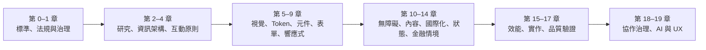
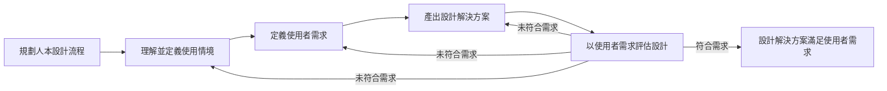
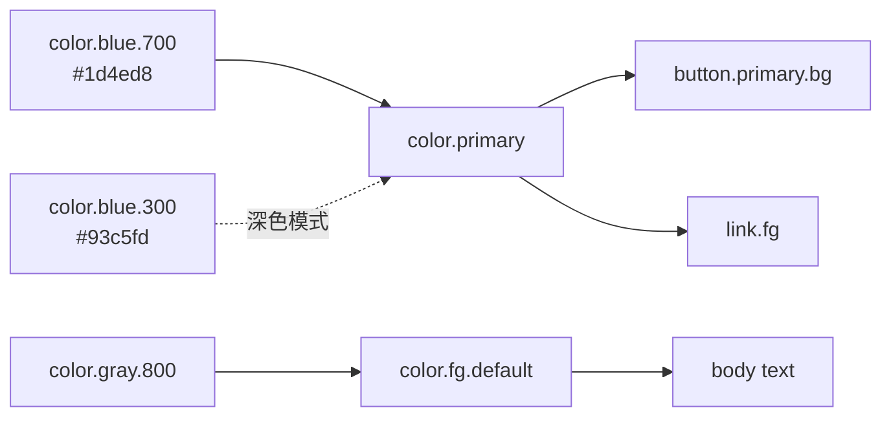
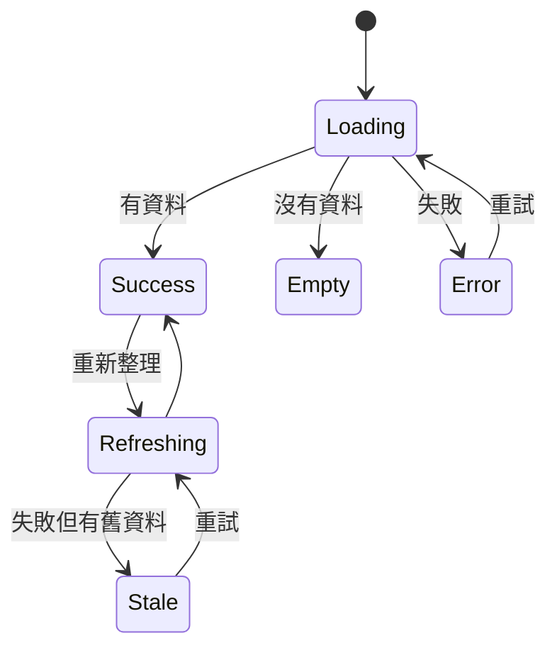
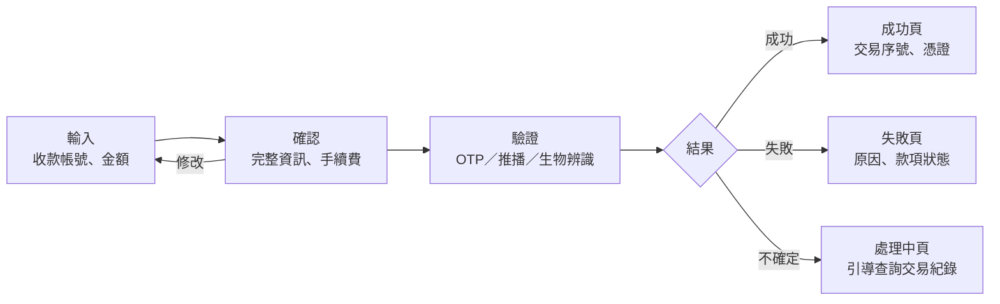
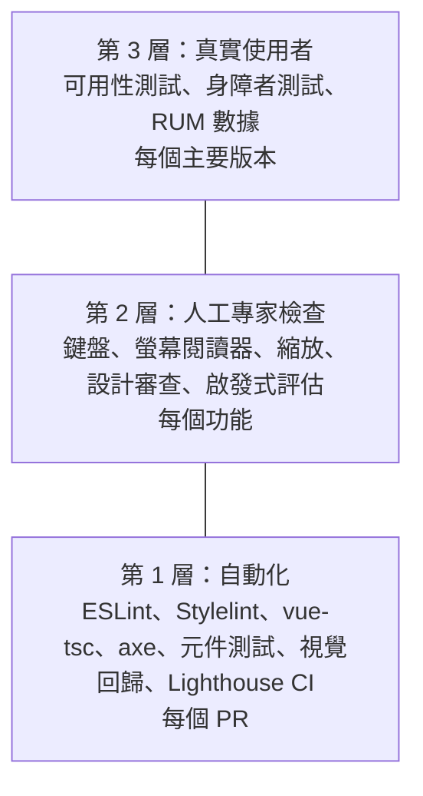
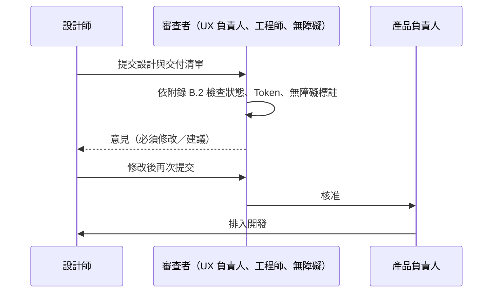

+++
date = '2025-10-31T00:00:00+08:00'
draft = false
title = 'UIUX指引'
tags = ['指引', '設計開發']
categories = ['指引']
+++

# UI/UX 開發指引

> **企業標準技術白皮書｜版本 v3.0｜2026-10-09**
>
> 適用範圍：以 Vue 3／TypeScript／Tailwind CSS 開發的企業 Web 應用，特別是網路銀行、保險、證券等金融服務，以及其他需要處理交易、個資與法規要求的系統。本指引規範從使用者研究、資訊架構、互動與視覺設計、Design Token、元件、表單、無障礙、內容、國際化、狀態設計，到效能、實作與品質驗證的 UI/UX 要求：每一條規則都說明要做到什麼、附有正確與錯誤的範例，並說明要用什麼工具或方法確認。
>
> v3.0 全面改寫 v2.1：依 ISO 9241-210／-110／-11、ISO/IEC 25010:2023、WCAG 2.2（ISO/IEC 40500:2025）、WAI-ARIA 與 APG、EN 301 549 V4.1.1、European Accessibility Act、數位發展部「網站無障礙規範」115.11 版、金管會「數位金融服務包容性指引」、Design Tokens Format Module 2025.10 與 Core Web Vitals 重新組織內容。所有規則都有編號（`UX-*`）、等級與驗證方式，每節結尾都有「🔍 審查與驗證」，讓審查者能判斷 AI 或同事產出的介面是否正確。範例均以工具實際執行驗證（見 [附錄 F](#附錄-f-修訂紀錄與查證紀錄)）。框架工程細節見 [前端開發指引]()，審查流程見 [code review 指引]()。

## 目錄

<!-- TOC-AUTO-BEGIN -->

- [0. 文件資訊](#0-文件資訊)
  - [0.1 文件目的與讀者](#01-文件目的與讀者)
  - [0.2 技術與標準基準版本](#02-技術與標準基準版本)
  - [0.3 規範等級與規則格式](#03-規範等級與規則格式)
  - [0.4 與其他指引的關係](#04-與其他指引的關係)
  - [0.5 如何閱讀與使用本指引](#05-如何閱讀與使用本指引)
  - [0.6 例外與豁免流程](#06-例外與豁免流程)
- [1. UX 治理與國際標準](#1-ux-治理與國際標準)
  - [1.1 為什麼企業需要 UI/UX 指引](#11-為什麼企業需要-uiux-指引)
  - [1.2 國際標準與法規對照](#12-國際標準與法規對照)
  - [1.3 無障礙法規與合規義務](#13-無障礙法規與合規義務)
  - [1.4 UX 治理組織與責任](#14-ux-治理組織與責任)
- [2. 以使用者為中心的設計流程](#2-以使用者為中心的設計流程)
  - [2.1 人本設計流程（ISO 9241-210）](#21-人本設計流程iso-9241-210)
  - [2.2 使用者研究方法](#22-使用者研究方法)
  - [2.3 人物誌、旅程地圖與使用情境](#23-人物誌旅程地圖與使用情境)
  - [2.4 可用性需求與驗收條件](#24-可用性需求與驗收條件)
- [3. 資訊架構與導覽](#3-資訊架構與導覽)
  - [3.1 資訊架構](#31-資訊架構)
  - [3.2 導覽模式](#32-導覽模式)
  - [3.3 頁面結構與地標](#33-頁面結構與地標)
  - [3.4 麵包屑、頁籤標題與網址](#34-麵包屑頁籤標題與網址)
- [4. 互動設計原則](#4-互動設計原則)
  - [4.1 ISO 9241-110 互動原則與尼爾森啟發式](#41-iso-9241-110-互動原則與尼爾森啟發式)
  - [4.2 系統狀態與回饋](#42-系統狀態與回饋)
  - [4.3 防錯、確認與復原](#43-防錯確認與復原)
  - [4.4 一致性與慣例](#44-一致性與慣例)
  - [4.5 鍵盤與指標操作](#45-鍵盤與指標操作)
- [5. 視覺設計](#5-視覺設計)
  - [5.1 排版與字型](#51-排版與字型)
  - [5.2 色彩與對比](#52-色彩與對比)
  - [5.3 間距、格線與版面](#53-間距格線與版面)
  - [5.4 圖示與圖片](#54-圖示與圖片)
  - [5.5 動態與動畫](#55-動態與動畫)
  - [5.6 資料視覺化](#56-資料視覺化)
- [6. Design Token 與設計系統](#6-design-token-與設計系統)
  - [6.1 Design Token 的分層](#61-design-token-的分層)
  - [6.2 DTCG 格式與 Style Dictionary](#62-dtcg-格式與-style-dictionary)
  - [6.3 Tailwind CSS 4 整合](#63-tailwind-css-4-整合)
  - [6.4 主題與深色模式](#64-主題與深色模式)
- [7. 元件設計規範](#7-元件設計規範)
  - [7.1 元件的通用要求](#71-元件的通用要求)
  - [7.2 按鈕與連結](#72-按鈕與連結)
  - [7.3 對話框](#73-對話框)
  - [7.4 選單、頁籤與手風琴](#74-選單頁籤與手風琴)
  - [7.5 資料表格](#75-資料表格)
  - [7.6 通知訊息與 Toast](#76-通知訊息與-toast)
  - [7.7 分頁與無限捲動](#77-分頁與無限捲動)
- [8. 表單設計與驗證](#8-表單設計與驗證)
  - [8.1 欄位標籤與說明](#81-欄位標籤與說明)
  - [8.2 輸入類型與自動完成](#82-輸入類型與自動完成)
  - [8.3 驗證時機](#83-驗證時機)
  - [8.4 錯誤訊息與錯誤摘要](#84-錯誤訊息與錯誤摘要)
  - [8.5 多步驟表單](#85-多步驟表單)
- [9. 響應式與多裝置設計](#9-響應式與多裝置設計)
  - [9.1 斷點與行動優先](#91-斷點與行動優先)
  - [9.2 重排與文字縮放](#92-重排與文字縮放)
  - [9.3 觸控目標與手勢](#93-觸控目標與手勢)
  - [9.4 螢幕方向與容器查詢](#94-螢幕方向與容器查詢)
- [10. 無障礙設計](#10-無障礙設計)
  - [10.1 WCAG 2.2 AA 符合策略](#101-wcag-22-aa-符合策略)
  - [10.2 語意化 HTML 與 ARIA 使用原則](#102-語意化-html-與-aria-使用原則)
  - [10.3 鍵盤操作與焦點管理](#103-鍵盤操作與焦點管理)
  - [10.4 螢幕閱讀器與動態內容](#104-螢幕閱讀器與動態內容)
  - [10.5 WCAG 2.2 新增成功準則](#105-wcag-22-新增成功準則)
  - [10.6 認知無障礙](#106-認知無障礙)
  - [10.7 無障礙聲明與回饋管道](#107-無障礙聲明與回饋管道)
- [11. 內容設計與 UX 寫作](#11-內容設計與-ux-寫作)
  - [11.1 語氣與用語](#111-語氣與用語)
  - [11.2 微文案](#112-微文案)
  - [11.3 易讀性與白話文](#113-易讀性與白話文)
- [12. 國際化與在地化](#12-國際化與在地化)
  - [12.1 語系與語言標示](#121-語系與語言標示)
  - [12.2 數字、金額與日期格式](#122-數字金額與日期格式)
  - [12.3 文字長度與雙向文字](#123-文字長度與雙向文字)
- [13. 狀態設計](#13-狀態設計)
  - [13.1 載入狀態](#131-載入狀態)
  - [13.2 空狀態](#132-空狀態)
  - [13.3 錯誤狀態](#133-錯誤狀態)
  - [13.4 離線與逾時](#134-離線與逾時)
- [14. 金融情境 UX](#14-金融情境-ux)
  - [14.1 金額、帳號與數值顯示](#141-金額帳號與數值顯示)
  - [14.2 交易流程與確認](#142-交易流程與確認)
  - [14.3 敏感資料遮罩與隱私](#143-敏感資料遮罩與隱私)
  - [14.4 身分驗證與工作階段逾時](#144-身分驗證與工作階段逾時)
  - [14.5 詐騙防範與風險提示](#145-詐騙防範與風險提示)
  - [14.6 包容性金融服務](#146-包容性金融服務)
- [15. 效能與使用者體驗](#15-效能與使用者體驗)
  - [15.1 Core Web Vitals](#151-core-web-vitals)
  - [15.2 感知效能](#152-感知效能)
  - [15.3 效能預算](#153-效能預算)
- [16. Vue 3 與 Tailwind CSS 實作落地](#16-vue-3-與-tailwind-css-實作落地)
  - [16.1 元件 API 設計](#161-元件-api-設計)
  - [16.2 無障礙元件實作模式](#162-無障礙元件實作模式)
  - [16.3 樣式撰寫規範](#163-樣式撰寫規範)
  - [16.4 元件文件與 Storybook](#164-元件文件與-storybook)
- [17. UX 品質驗證](#17-ux-品質驗證)
  - [17.1 驗證策略與金字塔](#171-驗證策略與金字塔)
  - [17.2 自動化無障礙檢測](#172-自動化無障礙檢測)
  - [17.3 手動與輔助科技測試](#173-手動與輔助科技測試)
  - [17.4 視覺回歸測試](#174-視覺回歸測試)
  - [17.5 可用性測試與 UX 指標](#175-可用性測試與-ux-指標)
- [18. 設計與開發協作](#18-設計與開發協作)
  - [18.1 設計交付](#181-設計交付)
  - [18.2 設計審查](#182-設計審查)
  - [18.3 設計系統治理與版本](#183-設計系統治理與版本)
- [19. AI 與 UX](#19-ai-與-ux)
  - [19.1 審查 AI 產出的介面](#191-審查-ai-產出的介面)
  - [19.2 設計 AI 功能的使用體驗](#192-設計-ai-功能的使用體驗)
  - [19.3 以 AI 輔助 UX 工作](#193-以-ai-輔助-ux-工作)
- [附錄 A 規則總表](#附錄-a-規則總表)
- [附錄 B 檢查清單與範本](#附錄-b-檢查清單與範本)
  - [B.1 UI 變更的 PR／MR 審查清單](#b1-ui-變更的-prmr-審查清單)
  - [B.2 設計交付與設計審查清單](#b2-設計交付與設計審查清單)
  - [B.3 螢幕閱讀器測試紀錄範本](#b3-螢幕閱讀器測試紀錄範本)
  - [B.4 使用者研究同意書範本](#b4-使用者研究同意書範本)
  - [B.5 第三方 UI 元件評估清單](#b5-第三方-ui-元件評估清單)
- [附錄 C 工具設定與腳本](#附錄-c-工具設定與腳本)
  - [C.1 驗證專案的結構與指令](#c1-驗證專案的結構與指令)
  - [C.2 按鈕樣式](#c2-按鈕樣式)
  - [C.3 Stylelint 規則說明](#c3-stylelint-規則說明)
  - [C.4 axe 設定](#c4-axe-設定)
  - [C.5 Playwright 設定](#c5-playwright-設定)
  - [C.6 Lighthouse CI](#c6-lighthouse-ci)
  - [C.7 GitHub Actions 工作流程](#c7-github-actions-工作流程)
  - [C.8 GitLab CI 對應設定](#c8-gitlab-ci-對應設定)
- [附錄 D 術語表](#附錄-d-術語表)
  - [D.1 UI/UX 與無障礙術語](#d1-uiux-與無障礙術語)
  - [D.2 產品詞彙表格式](#d2-產品詞彙表格式)
  - [D.3 台灣用語對照（節錄）](#d3-台灣用語對照節錄)
- [附錄 E 參考資料](#附錄-e-參考資料)
  - [E.1 國際標準與規範](#e1-國際標準與規範)
  - [E.2 法規](#e2-法規)
  - [E.3 設計方法與業界實務](#e3-設計方法與業界實務)
  - [E.4 工具文件](#e4-工具文件)
- [附錄 F 修訂紀錄與查證紀錄](#附錄-f-修訂紀錄與查證紀錄)
  - [F.1 v2.1 與 v3.0 章節對照](#f1-v21-與-v30-章節對照)
  - [F.2 v2.1 的錯誤與修正](#f2-v21-的錯誤與修正)
  - [F.3 查證紀錄](#f3-查證紀錄)
  - [F.4 待確認項目](#f4-待確認項目)
  - [F.5 版本紀錄](#f5-版本紀錄)

<!-- TOC-AUTO-END -->

## 0. 文件資訊

### 0.1 文件目的與讀者

使用者對一套系統的評價，幾乎都來自介面：按鈕按下去有沒有反應、錯誤訊息看不看得懂、轉帳前能不能確認金額、用鍵盤或螢幕閱讀器能不能完成操作。這些問題很少在需求文件中被寫清楚，卻在上線後以客訴、客服電話、交易錯誤與法規風險的形式出現。

AI 程式碼與設計助理讓產出介面的速度大幅提高，同時也讓問題更隱蔽：AI 產生的頁面通常「看起來很完整」，卻常見以 `<div>` 模擬按鈕、只靠顏色表示錯誤、對話框無法用鍵盤關閉、色彩對比不足、金額以浮點數計算等錯誤。這些錯誤在截圖上看不出來，必須知道要檢查什麼、用什麼工具檢查。

本指引有三個目的：

1. **定義標準**：把「好的 UI/UX」拆成可以檢查的規則，讓設計、開發、測試與審查對「完成」有相同的定義。
2. **教會做法**：每條規則都說明理由，並附有正確與錯誤的範例，讓第一次接觸 UI/UX 的工程師也能照著做。
3. **讓人能驗證 AI 產出**：無論介面是設計師、工程師或 AI 產生的，審查者都能依本指引判斷是否正確，並知道要用哪個工具或哪種測試方法確認。

| 讀者 | 主要用途 | 建議閱讀章節 |
| --- | --- | --- |
| 前端工程師 | 實作元件、表單、狀態、無障礙與效能 | 第 4–10、13、15、16 章、附錄 C |
| UI／UX 設計師 | 研究方法、資訊架構、視覺規範、設計交付 | 第 2–9、11、18 章 |
| 產品負責人、業務分析師 | 撰寫可驗收的 UX 需求、金融情境要求 | 第 1、2、14 章 |
| 測試工程師 | 無障礙檢測、視覺回歸、可用性測試 | 第 10、17 章、附錄 B |
| 程式碼審查者、技術主管 | 審查 UI 相關的 PR／MR，包括 AI 產出 | 每節的「🔍 審查與驗證」、第 19 章 |
| 資安與法遵人員 | 無障礙法規、敏感資料顯示、詐騙防範 | 第 1.3、14 章 |

### 0.2 技術與標準基準版本

本指引的範例與規則以下列版本為準（查證日期 2026-10-09）。前端套件的版本以 npm registry 查詢結果為準，所有範例都在這組版本上實際執行過（見 [附錄 F.3](#f3-查證紀錄)）。

| 類別 | 項目 | 基準版本 | 說明 |
| --- | --- | --- | --- |
| 框架 | Vue／Vue Router | 3.5.43／5.4.0 | Composition API、`<script setup>`、`useId()`（3.5 起） |
| 語言 | TypeScript | 6.0.3 | TypeScript 7.0 已發布，但 typescript-eslint 8.71 要求 `< 6.1`，本指引以 6.0 執行型別檢查與 lint |
| 建置 | Vite／`@vitejs/plugin-vue` | 8.3.4／6.0.9 | |
| 樣式 | Tailwind CSS（含 `@tailwindcss/vite`） | 4.3.3 | v4 以 CSS 的 `@theme` 設定，不再使用 `tailwind.config.js` |
| Design Token | Style Dictionary | 5.6.0 | 讀取 DTCG 格式（`$value`、`$type`） |
| 靜態檢查 | ESLint／eslint-plugin-vue／eslint-plugin-vuejs-accessibility | 10.12.0／10.11.1／2.6.2 | ESLint 10 只支援 flat config |
| 靜態檢查 | Stylelint／stylelint-config-standard | 17.16.0／40.0.0 | |
| 型別檢查 | vue-tsc | 3.3.12 | |
| 無障礙檢測 | axe-core／`@axe-core/playwright` | 4.14.0／4.13.0 | `@axe-core/playwright` 4.13.0 相依 `axe-core ~4.13.0`，E2E 中實際執行的是 axe-core 4.13.0（實測 `testEngine.version`） |
| 端對端測試 | Playwright | 1.64.0 | 含 `toHaveScreenshot()` 視覺回歸 |
| 單元測試 | Vitest／`@vue/test-utils`／jsdom | 5.0.3／2.5.1／30.1.2 | |
| 效能 | Lighthouse／`@lhci/cli`／web-vitals | 13.5.0／0.15.1／6.2.3 | Core Web Vitals：LCP、INP、CLS |
| 元件文件 | Storybook（`@storybook/vue3-vite`） | 10.6.1 | |

| 類別 | 標準或文件 | 版本 | 本指引對應章節 |
| --- | --- | --- | --- |
| 網頁無障礙 | W3C WCAG | 2.2（2023-10 成為 W3C 建議，2024-12 更新） | 10 |
| 網頁無障礙（國際標準） | ISO/IEC 40500 | 2025（內容即 WCAG 2.2） | 1.2、10 |
| 網頁無障礙（下一代） | W3C WCAG 3.0 | 工作草案 2026-03-03，非正式標準 | 1.2 |
| 無障礙技術規格 | WAI-ARIA／ARIA in HTML／ARIA Authoring Practices Guide（APG） | 1.2（1.3 為工作草案）／2026-04 建議／現行版 | 7、10、16 |
| 歐盟 ICT 無障礙 | EN 301 549 | V4.1.1（2026-09 發布，對應 WCAG 2.2；V3.2.1 對應 WCAG 2.1） | 1.3 |
| 歐盟法規 | European Accessibility Act（Directive (EU) 2019/882） | 2025-06-28 起適用 | 1.3、14.6 |
| 台灣規範 | 數位發展部「網站無障礙規範」 | 115.11 版（2026-11-30 起用於標章檢測，對應 WCAG 2.2）；現行 110.07 版對應 WCAG 2.1 | 1.3、10 |
| 台灣金融監理 | 金管會「數位金融服務包容性指引」 | 2025-11 | 1.3、14.6 |
| 人本設計 | ISO 9241-210 | 2019 | 2 |
| 互動原則 | ISO 9241-110 | 2020 | 4 |
| 可用性定義 | ISO 9241-11 | 2018 | 2.4、17.5 |
| 資訊呈現 | ISO 9241-112 | 2017 | 5 |
| 產品品質模型 | ISO/IEC 25010 | 2023（「可用性」更名為「互動能力」） | 1.2 |
| 可用性測試報告 | ISO/IEC 25066 | 2016 | 17.5 |
| Design Token | Design Tokens Format Module（W3C Design Tokens Community Group） | 2025.10（第一個穩定版，非 W3C 標準） | 6 |
| 網頁效能 | Core Web Vitals | 2026（門檻自 2024-03 INP 取代 FID 後未變） | 15 |
| 啟發式評估 | Nielsen 十大可用性啟發式 | 1994 年版（項目未變，說明文字其後修訂） | 4.1、17.5 |
| 人機互動中的 AI | Microsoft Guidelines for Human-AI Interaction／Google PAIR Guidebook | 2019（18 條）／第 2 版 | 19.2 |

### 0.3 規範等級與規則格式

本文規則採用 [RFC 2119](https://www.rfc-editor.org/rfc/rfc2119) 與 [RFC 8174](https://www.rfc-editor.org/rfc/rfc8174) 的語意：

| 等級 | 英文 | 意義 | 不遵守時的處理 |
| --- | --- | --- | --- |
| **必須** | MUST | 不遵守會造成使用者無法完成任務、違反法規或直接造成缺陷 | 不得合併或上線；如需例外必須走 0.6 豁免流程 |
| **應該** | SHOULD | 業界共識的最佳實務，除非有充分理由 | 不遵守時必須在設計稿或 PR／MR 說明理由 |
| **可以** | MAY | 建議做法，依產品類型與風險選用 | 不阻擋 |
| **不應該** | SHOULD NOT | 通常是錯誤的做法，除非有充分理由 | 採用時必須說明理由與替代措施 |

每條規則都有編號，格式為 `UX-<領域>-<三位數序號>`。開頭的 `UX` 用來和其他指引的規則區分，例如 code review 指引的 `CR-FE-001`、安全程式碼指引的 `SCG-XSS-001`。編號一經發布不會重編，新增規則使用該領域尚未使用的號碼。

| 前綴 | 領域 | 章 | 前綴 | 領域 | 章 |
| --- | --- | --- | --- | --- | --- |
| `UX-GOV` | 治理、標準與法規 | 1 | `UX-A11Y` | 無障礙設計 | 10 |
| `UX-RES` | 以使用者為中心的設計流程 | 2 | `UX-CNT` | 內容設計與 UX 寫作 | 11 |
| `UX-IA` | 資訊架構與導覽 | 3 | `UX-I18N` | 國際化與在地化 | 12 |
| `UX-INT` | 互動設計原則 | 4 | `UX-STA` | 狀態設計 | 13 |
| `UX-VIS` | 視覺設計 | 5 | `UX-FIN` | 金融情境 UX | 14 |
| `UX-TOK` | Design Token 與設計系統 | 6 | `UX-PRF` | 效能與使用者體驗 | 15 |
| `UX-CMP` | 元件設計規範 | 7 | `UX-VUE` | Vue 3 與 Tailwind CSS 實作 | 16 |
| `UX-FRM` | 表單設計與驗證 | 8 | `UX-QA` | UX 品質驗證 | 17 |
| `UX-RSP` | 響應式與多裝置設計 | 9 | `UX-COL`／`UX-AI` | 設計與開發協作／AI 與 UX | 18／19 |

**驗證方式欄位：** 每張規則表的最後一欄說明「怎麼確認有遵守這條規則」。審查者應先看這一欄，再決定要花多少心力人工檢查。

| 圖示 | 意義 | 範例 | 審查者該做什麼 |
| --- | --- | --- | --- |
| 🤖 | 工具可自動檢查 | 🤖 axe `color-contrast`、🤖 ESLint `vuejs-accessibility/alt-text`、🤖 `vue-tsc` | 確認 CI 有執行該工具與規則，且沒有被停用或略過 |
| 🧪 | 需要以測試、量測或實際操作證明 | 🧪 Playwright 鍵盤操作測試、🧪 200% 縮放檢查、🧪 可用性測試 | 確認有測試或紀錄，且違反規則時測試會失敗 |
| 👁 | 只能由人判斷 | 👁 設計審查、👁 文案審查 | 依該節「🔍 審查與驗證」的問題逐項確認 |

**範例標記：** 範例中以 `✅ <規則編號>` 標示符合規則的寫法，以 `❌ <規則編號>` 標示違規寫法。所有規則都至少出現在一個範例中（統計見 [附錄 A](#附錄-a-規則總表)）。標示「（片段：…）」的範例只截取重點，不是完整可執行的程式。**❌ 範例只供教學，請勿複製到正式程式碼或設計稿。**

**WCAG 對照：** 與無障礙有關的規則會標註對應的 WCAG 2.2 成功準則編號，例如「WCAG 1.4.3」。成功準則的完整說明見 [Understanding WCAG 2.2](https://www.w3.org/WAI/WCAG22/Understanding/)。

### 0.4 與其他指引的關係

本指引涵蓋「從使用者研究到介面上線」的設計與前端實作落地。框架工程細節、測試基礎設施與安全控制，以專門指引為準：

| 主題 | 指引 | 本文的分工 |
| --- | --- | --- |
| Vue 專案結構、狀態管理、API 串接、i18n 實作框架、建置與部署 | [前端開發指引]() | 第 16 章只規範與 UI/UX 品質直接相關的實作模式 |
| 命名、格式、TypeScript 一般寫作規範 | [程式寫作指引]() | 範例遵守該指引；本文不重複一般規則 |
| XSS、CSP、敏感資料保護、身分驗證 | [安全程式碼指引]() | 第 14 章只規範「使用者看得到的」安全設計 |
| 測試策略、測試金字塔、CI 品質閘門 | [測試與品質保證指引]() | 第 17 章只規範 UX 專屬的驗證方法 |
| 審查 UI 變更的流程 | [code review 指引]() | 該指引第 14 章是 UI 審查重點；本文提供審查依據 |
| 需求、系統分析與設計文件 | [系統設計指引]()、[軟體開發標準程序教學手冊]() | 第 2、18 章說明 UX 產出物在流程中的位置 |

### 0.5 如何閱讀與使用本指引

每一節都依相同的結構撰寫：

1. **概念說明**：為什麼需要這些規則、背後的研究或標準。
2. **規則表**：編號、等級、規則內容、驗證方式。
3. **範例**：❌ 常見錯誤與 ✅ 正確做法，範例中標註規則編號。
4. **🔍 審查與驗證**：自動檢查方式、人工審查問題、AI 常見錯誤。

依角色建議的閱讀與導入順序：



**使用 AI 產生介面時的建議流程：** 先把相關章節的規則表與範例提供給 AI 作為產出依據，再依該節的「🔍 審查與驗證」逐項檢查 AI 的產出；能自動化的檢查（標示 🤖）一律放進 CI，人工檢查（標示 👁）列入 PR／MR 範本（附錄 B）。

### 0.6 例外與豁免流程

規則不可能涵蓋所有情境。產品無法遵守某條「必須」規則時，依下列流程申請豁免，**不得**以關閉 lint 規則、在 axe 掃描中排除規則或直接忽略的方式處理：

1. 在專案的例外清單（建議放在程式庫的 `docs/ux-exceptions.md`）寫明豁免的規則編號、適用範圍（頁面或元件）、原因、替代措施與到期日。
2. 由產品負責人與 UX 負責人核准；涉及 `UX-A11Y-*`、`UX-FIN-*` 的豁免還需法遵或無障礙負責人核准。
3. 無障礙相關的豁免必須同步揭露在「無障礙聲明」的「已知限制」段落（見 `UX-A11Y-027`）。
4. 到期前重新評估；到期未處理的例外視為缺陷，列入下一個迭代處理。

```markdown
<!-- docs/ux-exceptions.md -->
# UX-EX-2026-007 豁免 UX-CMP-018：舊版報表 PDF 的表格標頭

- 狀態：approved（有效至 2027-03-31）
- 豁免規則：UX-CMP-018（資料表必須以 th 與 scope 標示標頭）
- 適用範圍：/reports/legacy/* 下載的 2019 年以前月報表 PDF
- 原因：舊報表由已停用的批次系統產生，無原始資料可重新產製。
- 替代措施：同一頁面提供 CSV 下載；客服專線可提供語音或點字版本。
- 揭露：無障礙聲明「已知限制」第 2 點。
- 核准：產品負責人 林小華、無障礙負責人 張小芳，2026-10-09
```

#### 🔍 0.6 審查與驗證

- **自動檢查：** 在 CI 中搜尋 `eslint-disable`、`axe` 的 `disableRules`／`exclude` 設定，每一筆都必須能對應到例外清單的編號。
- **人工審查問題：**
  1. 例外的「替代措施」是否真的讓受影響的使用者能完成同樣的任務？
  2. 例外的範圍是否最小（單一頁面或元件），而不是整個產品？
  3. 無障礙相關的例外是否已揭露在無障礙聲明中？
- **AI 常見錯誤：** AI 助理遇到 axe 或 lint 錯誤時，常直接加上 `// eslint-disable-next-line` 或在 axe 設定中排除該規則，讓 CI 通過。這種修改必須視為「申請豁免」，不能當成修正。

## 1. UX 治理與國際標準

### 1.1 為什麼企業需要 UI/UX 指引

UI/UX 品質不是「好不好看」的主觀問題，而是可以量測、可以驗收的工程品質。ISO 9241-11:2018 把可用性（usability）定義為：**特定使用者在特定使用情境中，使用系統達成特定目標時的有效性（effectiveness）、效率（efficiency）與滿意度（satisfaction）**。這個定義有兩個重點：

- 可用性一定要對應到「誰、在什麼情境、做什麼事」。「這個頁面很好用」不是可驗收的陳述；「首次使用的客戶能在 3 分鐘內、不求助客服完成約定轉入帳號」才是。
- 三個面向都可以量測：任務成功率（有效性）、完成時間與操作步驟（效率）、問卷分數如 SUS（滿意度）。第 17.5 節說明量測方法。

在金融與其他受監理的產業，UI/UX 問題還會直接轉成營運與法規風險：

| 介面問題 | 實際後果 |
| --- | --- |
| 轉帳確認頁沒有清楚顯示收款帳號與金額 | 轉錯帳、爭議款與賠償 |
| 錯誤訊息只寫「系統錯誤」 | 客服來電量增加，使用者重複送出造成重複交易 |
| 網路銀行無法用鍵盤或螢幕閱讀器操作 | 違反無障礙法規（1.3），影響永續金融評鑑 |
| 詐騙警示用小字放在頁尾 | 使用者被誘導轉帳時沒有機會停下來 |
| 頁面載入慢、操作卡頓 | 交易放棄率上升 |

本指引把這些經驗轉成規則，讓團隊在設計與開發階段就能預防，而不是上線後才修補。

| 編號 | 等級 | 規則 | 驗證方式 |
| --- | --- | --- | --- |
| `UX-GOV-001` | 必須 | 每個產品必須指定 UX 負責人，負責設計品質、無障礙符合度與本指引的導入；負責人與聯絡方式記錄在產品文件中 | 👁 產品文件與組織表 |
| `UX-GOV-002` | 必須 | 使用者介面的品質要求（可用性、無障礙等級、效能門檻）必須寫成可驗收的非功能需求，並列入「完成的定義」（Definition of Done） | 👁 需求文件與 DoD 審查 |
| `UX-GOV-003` | 應該 | 應以本指引為基礎，訂定產品層級的補充規範（例如品牌色彩、特定業務流程），補充規範不得低於本指引的「必須」規則 | 👁 補充規範審查 |

✅ `UX-GOV-002`：把 UX 要求寫進完成的定義，讓每個使用者故事都依同一標準驗收。

```markdown
<!-- docs/definition-of-done.md（片段：UI 相關項目） -->
## 完成的定義：使用者介面

- [ ] 設計稿已通過設計審查（UX-COL-004），所有狀態（載入、空、錯誤、成功）都有設計
- [ ] axe 自動檢測 0 個違規（UX-QA-002），鍵盤操作測試通過（UX-QA-004）
- [ ] 符合 WCAG 2.2 AA：對比、焦點可見、目標尺寸 24×24 CSS px 以上
- [ ] 200% 縮放與 320 CSS px 寬度下沒有內容遺失或水平捲動（UX-RSP-004）
- [ ] 新頁面的 LCP ≤ 2.5 秒、INP ≤ 200 毫秒（以效能預算檢查，UX-PRF-006）
- [ ] 文案已依 UX 寫作規範審查，錯誤訊息說明原因與解決方法（UX-CNT-004）
```

❌ `UX-GOV-002`：只寫「介面友善、操作直覺」。這種需求無法驗收，最後只能依個人感覺判斷是否完成。

```markdown
<!-- ❌ 無法驗收的 UX 需求 -->
- 系統介面需友善、美觀、操作直覺
- 需符合無障礙規範
```

✅ `UX-GOV-001`、`UX-GOV-003`：產品文件的 UX 治理段落。

```markdown
<!-- docs/product/README.md（片段） -->
## UX 治理
- UX 負責人：林小華（ux-lead@example-bank.com.tw）
- 依循：《UI/UX 開發指引》v3.0；產品補充規範 docs/ux/product-addendum.md
- 補充規範只能加嚴：例如本產品的主要按鈕目標尺寸一律 48×48 CSS px（指引為 44×44 應該）
```

❌ `UX-GOV-003`：產品補充規範寫「本產品為內部系統，對比可放寬為 3:1」。補充規範不得低於指引的「必須」規則（`UX-VIS-006`）；內部系統的使用者同樣可能有視覺障礙。

#### 🔍 1.1 審查與驗證

- **自動檢查：** 無。本節的規則屬於治理層面。
- **人工審查問題：**
  1. 需求文件中的 UX 要求，是否每一條都能回答「誰、在什麼情境、用什麼方法、達到什麼數字」？
  2. 「需符合無障礙規範」是否寫明了版本與等級（例如 WCAG 2.2 AA、網站無障礙規範 115.11 版 AA 等級）？
- **AI 常見錯誤：** 請 AI 撰寫需求時，AI 常產出「介面應簡潔直覺」「提升使用者體驗」等無法驗收的形容詞。審查時把每一句都改寫成可量測的條件。

### 1.2 國際標準與法規對照

UI/UX 相關的標準很多，彼此的定位不同。下表說明每份標準「規範什麼」，以及本指引在哪裡落實它：

| 標準 | 性質 | 規範什麼 | 本指引對應 |
| --- | --- | --- | --- |
| ISO 9241-210:2019 | 國際標準（流程） | 人本設計（human-centred design）的 6 項原則與 4 個設計活動 | 第 2 章 |
| ISO 9241-110:2020 | 國際標準（原則） | 7 項互動原則：任務適切性、自我描述性、符合使用者期待、易學性、可控性、使用錯誤的容錯性、使用者投入 | 第 4 章 |
| ISO 9241-11:2018 | 國際標準（定義） | 可用性的定義與量測架構 | 2.4、17.5 |
| ISO 9241-112:2017 | 國際標準（原則） | 資訊呈現原則：可察覺、可理解、一致、簡潔等 | 第 5 章 |
| ISO/IEC 25010:2023 | 國際標準（品質模型） | 產品品質特性；2023 版把「可用性」改稱「互動能力」（interaction capability），並新增「包容性」「使用者投入」「自我描述性」子特性 | 1.1、17 |
| ISO/IEC 25066:2016 | 國際標準（報告格式） | 可用性評估報告的內容要求 | 17.5 |
| WCAG 2.2／ISO/IEC 40500:2025 | W3C 建議／國際標準 | 網頁內容無障礙的 4 大原則、13 項指引、86 個有效成功準則（4.1.1 已廢止） | 第 10 章 |
| WCAG 3.0 | W3C 工作草案 | 下一代無障礙指引，採結果導向與評分制；預計 2028 年以後才定案 | 本指引不採用為依據，僅在 10.1 說明 |
| WAI-ARIA 1.2／ARIA APG | W3C 建議／實作指南 | ARIA 角色、狀態與屬性；常見元件的鍵盤互動模式 | 7、10、16 |
| EN 301 549 | 歐洲標準 | ICT 產品與服務的無障礙要求，網頁部分引用 WCAG；V4.1.1 改為引用 WCAG 2.2 | 1.3 |
| Design Tokens Format Module 2025.10 | W3C 社群群組報告 | 設計 Token 的 JSON 交換格式 | 第 6 章 |
| Core Web Vitals | 業界指標（Google） | 載入（LCP）、互動（INP）、版面穩定（CLS）的量測與門檻 | 第 15 章 |

| 編號 | 等級 | 規則 | 驗證方式 |
| --- | --- | --- | --- |
| `UX-GOV-004` | 必須 | 產品文件必須寫明採用的無障礙標準「版本」與「等級」（本指引預設 WCAG 2.2 AA）；不得只寫「符合無障礙」 | 👁 需求與無障礙聲明審查 |
| `UX-GOV-005` | 不應該 | 不應以 WCAG 3.0 草案或 APCA 對比演算法取代 WCAG 2.2 的對比要求作為合規依據；可以作為額外的設計參考 | 👁 設計規範審查 |

✅ `UX-GOV-004`：需求文件寫明標準與等級，並說明台灣標章檢測的版本。

```markdown
<!-- docs/nfr.md（片段） -->
### NFR-A11Y-01 無障礙
- 網頁與行動網頁必須符合 WCAG 2.2 Level AA（ISO/IEC 40500:2025）。
- 對外公開資訊頁面須取得數位發展部「網站無障礙規範」AA 等級標章；
  2026-11-30 以後申請或續檢的標章，以 115.11 版規範檢測。
- 歐盟市場的服務另依 EN 301 549 V4.1.1 第 9 章（網頁）與第 11 章（軟體）評估。
```

❌ `UX-GOV-005`：以 APCA 的 Lc 值作為唯一的對比驗收標準。APCA 目前只出現在 WCAG 3.0 草案的研究方向中，法規與標章檢測仍以 WCAG 2.x 的對比值（4.5:1／3:1）判定。

```markdown
<!-- ❌ 以草案演算法作為合規依據 -->
- 文字對比以 APCA Lc 60 以上即視為通過
```

#### 🔍 1.2 審查與驗證

- **自動檢查：** 無。
- **人工審查問題：**
  1. 文件引用的標準版本是否為現行版（WCAG 2.2，而不是 2.0 或 2.1）？
  2. 文件是否把 W3C「工作草案」當成正式標準引用？
- **AI 常見錯誤：** AI 的訓練資料中 WCAG 2.1 的內容遠多於 2.2，常產出「依 WCAG 2.1 AA」或宣稱 WCAG 2.2 有「4.1.1 語法分析」準則（2.2 已廢止此準則）。也常把 WCAG 3.0 說成已發布的標準。

### 1.3 無障礙法規與合規義務

無障礙不只是「做好事」，在許多市場已是法律義務，且適用對象涵蓋金融業：

| 地區 | 法規或規範 | 適用對象 | 技術標準 | 重點 |
| --- | --- | --- | --- | --- |
| 台灣 | 身心障礙者權益保障法第 52-2 條；「各級機關機構學校網站無障礙檢測及認證標章核發辦法」 | 政府機關、公營事業、公立學校、受政府補助的機構 | 數位發展部「網站無障礙規範」（110.07 版對應 WCAG 2.1；115.11 版對應 WCAG 2.2，2026-11-30 起實施） | 標章效期 3 年；續檢時適用當時的版本 |
| 台灣（金融業） | 金管會「數位金融服務包容性指引」（2025-11） | 銀行、保險、證券等金融業 | 鼓勵導入無障礙網頁設計，長期目標為官網取得全網站無障礙標章 | 納入 2026 年永續金融評鑑 |
| 歐盟 | European Accessibility Act（Directive (EU) 2019/882） | 提供消費者銀行服務、電子商務、電子書、運輸票務等的業者（微型企業服務提供者除外） | EN 301 549（調和標準；V4.1.1 預計 2026-12 在歐盟公報引用） | 2025-06-28 起適用；需提供無障礙資訊與聲明 |
| 美國 | ADA Title II 網頁無障礙規則（2024） | 州與地方政府 | WCAG 2.1 AA | 人口 5 萬以上的政府期限延至 2027-04-26 |
| 美國 | ADA Title III（判例） | 提供公眾服務的企業 | 法院通常以 WCAG 2.x AA 判斷 | 網站無障礙訴訟以金融、零售為大宗 |

| 編號 | 等級 | 規則 | 驗證方式 |
| --- | --- | --- | --- |
| `UX-GOV-006` | 必須 | 產品上線前必須確認適用的無障礙法規與標章要求（依服務地區、客群與機構性質），並記錄在產品文件 | 👁 法遵審查紀錄 |
| `UX-GOV-007` | 必須 | 已取得無障礙標章的網站，任何改版都必須維持標章等級；改版後由 UX 負責人確認標章檢測項目仍通過 | 🤖 axe 掃描；🧪 標章檢測工具或人工檢測 |
| `UX-GOV-008` | 應該 | 應追蹤法規與標準版本的變動（例如台灣 115.11 版、EN 301 549 V4.1.1），在生效前至少 6 個月完成差異評估 | 👁 法規追蹤紀錄 |

✅ `UX-GOV-008`：以表格追蹤法規變動與差異評估，讓團隊提早排入計畫。

```markdown
<!-- docs/a11y-regulation-tracker.md（片段） -->
| 規範 | 新版 | 生效 | 差異 | 影響頁面 | 負責人 | 狀態 |
| --- | --- | --- | --- | --- | --- | --- |
| 網站無障礙規範 | 115.11 | 2026-11-30 | 新增 2.4.11 焦點不被遮蔽、2.5.7 拖曳替代、2.5.8 目標尺寸、3.3.8 無障礙驗證；刪除 4.1.1 | 公開資訊網、網路銀行登入 | 張小芳 | 差異評估完成 |
| EN 301 549 | V4.1.1 | 2026-12（預計公報引用） | 網頁改依 WCAG 2.2 | 歐洲分行網站 | 林小華 | 追蹤中 |
```

❌ `UX-GOV-007`：改版時把網站換成新的元件庫，沒有重新檢測。新元件庫的下拉選單無法以鍵盤操作，標章檢測（或民眾檢舉）時才發現。

✅ `UX-GOV-006`：上線檢查表中的法規確認項目。

```markdown
- [x] 服務地區：台灣、新加坡；不含歐盟消費者 → EAA 不適用（2026-10-09 法遵 王○○ 確認）
- [x] 金管會「數位金融服務包容性指引」適用 → 公開網頁維持 AA 標章
```

#### 🔍 1.3 審查與驗證

- **自動檢查：** 已有標章的網站，把 axe 掃描列入 CI（見 17.2），任何新增違規都會阻擋合併。
- **人工審查問題：**
  1. 產品服務的地區與客群是否包含需遵守 EAA 的歐盟消費者？
  2. 標章到期日是多少？續檢時會適用哪一版規範？
- **AI 常見錯誤：** AI 常把「網站無障礙規範」的版本與 WCAG 版本對錯（例如說 110.07 版對應 WCAG 2.2），或宣稱民間企業「依法必須」取得標章。台灣民間企業目前沒有一般性的法定義務，金融業則由金管會以指引與評鑑推動；回答法規問題時必須附上條文出處。

### 1.4 UX 治理組織與責任

規則要有人負責才會被執行。下表是建議的角色分工，可依組織規模合併：

| 角色 | 責任 |
| --- | --- |
| UX 負責人 | 維護產品層級的 UX 規範、主持設計審查、核准 UX 豁免、追蹤 UX 指標 |
| 設計系統團隊 | 維護 Design Token、元件庫與文件，發布版本與變更紀錄（第 18.3 節） |
| 無障礙負責人 | 維護無障礙聲明、規劃檢測、處理使用者無障礙回饋 |
| 前端工程師 | 依規範實作，撰寫無障礙與視覺回歸測試 |
| 測試工程師 | 執行鍵盤、螢幕閱讀器與跨裝置測試 |
| 產品負責人 | 把 UX 要求寫入需求與驗收條件，排定優先順序 |

| 編號 | 等級 | 規則 | 驗證方式 |
| --- | --- | --- | --- |
| `UX-GOV-009` | 應該 | 應以 RACI 矩陣定義 UX 相關活動（研究、設計審查、無障礙檢測、設計系統發布）的負責人，並每年檢討 | 👁 RACI 文件 |
| `UX-GOV-010` | 應該 | 應每季檢視 UX 指標（任務成功率、無障礙違規數、Core Web Vitals、客服與介面相關的客訴），並把改善項目排入待辦清單 | 👁 季度檢討紀錄 |

✅ `UX-GOV-009`：以 RACI 表定義責任（R 執行、A 當責、C 諮詢、I 告知）。

```markdown
| 活動 | UX 負責人 | 設計師 | 前端工程師 | 測試工程師 | 產品負責人 |
| --- | --- | --- | --- | --- | --- |
| 使用者研究 | A | R | I | I | C |
| 設計審查 | A | R | C | C | C |
| 無障礙檢測 | A | C | R | R | I |
| 設計系統發布 | A | R | R | C | I |
```

❌ `UX-GOV-010`：只看「頁面瀏覽量」與「上線功能數」。這兩個數字無法反映使用者是否順利完成任務，介面問題會一直累積到客訴爆發。

#### 🔍 1.4 審查與驗證

- **自動檢查：** 無。
- **人工審查問題：**
  1. 每項活動是否只有一個「A」（當責者）？
  2. 季度 UX 指標是否有趨勢資料，而不是單次數字？
- **AI 常見錯誤：** AI 產生的 RACI 表常讓多個角色同時擔任「A」，或把所有角色都標成「R」。當責者必須唯一。

## 2. 以使用者為中心的設計流程

### 2.1 人本設計流程（ISO 9241-210）

ISO 9241-210:2019 把「人本設計」（human-centred design，HCD）定義為：以使用者、使用者的需求與使用情境為中心，應用人因與可用性知識來開發互動系統的方法。標準列出 6 項原則：

1. 設計建立在對使用者、任務與環境的明確理解上。
2. 使用者參與整個設計與開發過程。
3. 設計由以使用者為中心的評估來驅動與修正。
4. 流程是反覆（iterative）的。
5. 設計處理的是完整的使用者體驗，而不只是畫面。
6. 設計團隊具備多元的技能與觀點。

標準定義的 4 個設計活動會反覆進行，直到評估結果符合使用者需求：



在敏捷團隊中，這 4 個活動不是一次性的「設計階段」，而是每個迭代都會發生：研究在開發前 1–2 個迭代進行（所謂的「雙軌敏捷」，dual-track agile），設計在進入開發前完成驗證，開發完成後再以可用性測試或數據回饋修正。

| 編號 | 等級 | 規則 | 驗證方式 |
| --- | --- | --- | --- |
| `UX-RES-001` | 必須 | 新產品或主要流程改版，必須在設計前完成使用情境分析：使用者是誰、要完成什麼任務、在什麼環境與裝置下使用、有哪些限制（包括身心障礙與年齡） | 👁 使用情境文件審查 |
| `UX-RES-002` | 應該 | 應採用反覆的「研究 → 設計 → 評估」循環；主要流程在開發前至少經過一次原型可用性測試 | 🧪 可用性測試紀錄 |
| `UX-RES-003` | 應該 | 研究參與者應包含身心障礙者、高齡者與數位能力較低的使用者，比例依產品客群決定 | 👁 研究計畫審查 |

✅ `UX-RES-001`：使用情境文件描述使用者、任務、環境與限制，並列出設計上的意義。

```markdown
<!-- docs/ux/context-of-use-transfer.md（片段） -->
## 使用情境：手機網路銀行約定轉帳

| 面向 | 描述 | 設計上的意義 |
| --- | --- | --- |
| 使用者 | 25–75 歲個人戶；約 18% 為 65 歲以上；含視障客戶（使用 VoiceOver／TalkBack） | 字級可放大至 200%；所有操作可用螢幕閱讀器完成 |
| 任務 | 轉帳給已約定的帳號，平均每月 4 次 | 常用帳號置頂；減少輸入 |
| 環境 | 通勤、單手操作、戶外強光、網路不穩 | 觸控目標夠大；高對比；斷線時保留輸入內容 |
| 限制 | 單筆限額、營業日、OTP 有效期 5 分鐘 | 事先顯示限額；OTP 倒數提示並可延長 |
```

❌ `UX-RES-002`：直接依業務單位的需求清單畫畫面、開發、上線，上線後才收到「找不到轉帳按鈕」的客訴。沒有任何一個環節讓真實使用者看過設計。

#### 🔍 2.1 審查與驗證

- **自動檢查：** 無。
- **人工審查問題：**
  1. 使用情境是否以實際資料（客群統計、客服紀錄、數據分析）為依據，而不是團隊的想像？
  2. 情境中是否考慮了身心障礙、高齡、網路不穩、單手操作等限制？
  3. 設計是否有經過真實使用者評估的紀錄？
- **AI 常見錯誤：** AI 能快速產生「看起來很完整」的使用情境與人物誌，但內容是根據一般常識推測，不是研究結果。AI 產出的情境只能作為訪談前的假設，不能當成研究結論。

### 2.2 使用者研究方法

研究方法依「想知道什麼」選擇。生成式研究（generative）幫助理解問題，評估式研究（evaluative）檢查設計是否解決問題；質性方法回答「為什麼」，量化方法回答「多少」：

| 方法 | 類型 | 適合回答的問題 | 樣本數參考 | 產出 |
| --- | --- | --- | --- | --- |
| 使用者訪談 | 生成、質性 | 使用者的目標、痛點、現有做法 | 每個客群 5–8 人 | 訪談摘要、親和圖 |
| 情境訪查（contextual inquiry） | 生成、質性 | 實際工作環境中的流程與干擾 | 4–6 人 | 流程圖、觀察紀錄 |
| 問卷 | 生成或評估、量化 | 態度、偏好的分布 | 依信賴區間計算，通常 100 人以上 | 統計結果 |
| 卡片分類 | 生成、質性＋量化 | 使用者如何分類資訊 | 開放式 15 人以上 | 分類建議（第 3 章） |
| 樹狀測試（tree testing） | 評估、量化 | 選單結構能否找到目標 | 50 人以上 | 成功率、路徑 |
| 可用性測試 | 評估、質性 | 使用者在哪裡卡住、為什麼 | 每輪 5 人，多輪反覆 | 問題清單與嚴重度 |
| A/B 測試 | 評估、量化 | 兩個方案哪個轉換率較高 | 依統計檢定力計算 | 轉換率差異 |
| 數據分析 | 評估、量化 | 使用者在哪個步驟流失 | 全部流量 | 漏斗、熱點 |
| 啟發式評估 | 評估、專家 | 違反哪些已知的設計原則 | 3–5 位評估者 | 問題清單（第 4.1 節） |

研究資料常含有個人資料，研究前必須取得同意並依個資法處理。

| 編號 | 等級 | 規則 | 驗證方式 |
| --- | --- | --- | --- |
| `UX-RES-004` | 必須 | 研究涉及個人資料（錄影、錄音、帳戶畫面）時，必須事先取得參與者書面同意，告知用途、保存期限與退出方式；研究資料必須去識別化後才分享給團隊 | 👁 同意書與資料處理紀錄 |
| `UX-RES-005` | 應該 | 研究計畫應寫明研究問題、方法、參與者條件、樣本數與成功判準，並在研究前由 UX 負責人審查 | 👁 研究計畫審查 |
| `UX-RES-006` | 不應該 | 不應以「問使用者想要什麼功能」取代觀察使用者實際怎麼做；使用者的自述偏好不能當成設計決策的唯一依據 | 👁 研究方法審查 |

✅ `UX-RES-005`：研究計畫寫明要回答的問題與判準。

```markdown
<!-- docs/ux/research-plan-2026Q4-transfer.md（片段） -->
## 研究問題
1. 65 歲以上客戶在新版轉帳流程中，哪一步最常停頓或出錯？
2. 收款人確認頁的資訊是否足以讓使用者發現帳號輸入錯誤？

## 方法與參與者
- 方法：中度引導的可用性測試（遠端 + 1 場實體），每場 45 分鐘
- 參與者：8 位（65 歲以上 4 位、螢幕閱讀器使用者 2 位、一般 2 位）
- 招募條件：過去 3 個月至少使用網路銀行轉帳 1 次

## 成功判準
- 任務 1「轉帳給已約定帳號」：成功率 ≥ 90%，不需協助
- 任務 2「發現並更正錯誤的帳號」：至少 6/8 位在確認頁發現錯誤

## 個資
- 測試使用測試帳戶；錄影只保留 90 天；同意書範本見附錄 B.4
```

❌ `UX-RES-006`：以問卷問「您希望轉帳頁面增加哪些功能？」，再把票數最高的 10 項全部做進頁面。使用者描述的需求常與實際行為不同，結果頁面越來越複雜。

✅ `UX-RES-003`、`UX-RES-004`：招募條件與同意書要點（完整範本見附錄 B.4）。

```text
招募：8 位，其中 65 歲以上 3 位、螢幕閱讀器使用者 2 位、數位能力自評「不熟練」2 位
同意書：錄影僅供本研究、保存 90 天、可隨時退出且不影響報酬；分享前移除姓名與帳號
```

❌ `UX-RES-004`：把含受測者臉部與真實帳戶餘額的錄影直接上傳到團隊共用資料夾。

#### 🔍 2.2 審查與驗證

- **自動檢查：** 無。
- **人工審查問題：**
  1. 研究方法是否能回答研究問題？例如「為什麼流失」需要質性方法，只看數據分析無法回答。
  2. 樣本是否涵蓋主要客群與弱勢使用者？
  3. 研究資料的保存與分享是否符合個資規定？
- **AI 常見錯誤：** 請 AI 分析訪談逐字稿時，AI 可能編造逐字稿中沒有的引述，或把少數人的意見誇大成「多數使用者」。AI 整理的結論必須能追溯到原始資料的段落。

### 2.3 人物誌、旅程地圖與使用情境

研究結果要轉成團隊共同使用的「設計工具」，最常用的是人物誌（persona）與使用者旅程地圖（journey map）：

- **人物誌**：以研究資料歸納出的代表性使用者，描述目標、行為與限制。好的人物誌讓團隊在討論時能問「陳奶奶會怎麼做？」，而不是「我覺得使用者會……」。
- **旅程地圖**：描述使用者為了達成目標，跨越多個接觸點（網站、App、客服、分行）的完整過程，以及每個階段的行為、想法、情緒與痛點。
- **服務藍圖**（service blueprint）：在旅程地圖下方加上前台、後台與支援系統，找出造成痛點的內部原因。

| 編號 | 等級 | 規則 | 驗證方式 |
| --- | --- | --- | --- |
| `UX-RES-007` | 應該 | 人物誌應以研究資料為基礎，並註明資料來源與建立日期；沒有研究依據的人物誌必須標示為「假設」 | 👁 人物誌審查 |
| `UX-RES-008` | 應該 | 主要客群中應至少有一個人物誌具有身心障礙、高齡或數位能力較低的特徵，讓無障礙需求在設計討論中被看見 | 👁 人物誌審查 |
| `UX-RES-009` | 可以 | 跨通路的流程（例如線上申辦後臨櫃取件）可以使用旅程地圖或服務藍圖，找出跨部門的痛點 | 👁 旅程地圖審查 |

✅ `UX-RES-007`、`UX-RES-008`：人物誌註明來源，並包含輔助科技使用情境。

```markdown
<!-- docs/ux/persona-chen.md -->
## 人物誌：陳美玲（72 歲，退休教師）

- 來源：2026-08 訪談 6 位 65 歲以上客戶、客服紀錄抽樣 200 筆；建立 2026-09-02
- 目標：每月轉帳給孫子學費、查詢退休金入帳
- 行為：使用 6.7 吋手機，系統字級設為最大；不熟悉手勢操作
- 限制：輕度白內障，對低對比文字辨識困難；對「驗證碼」等術語不確定意思
- 擔憂：怕被詐騙，看到「異常」字樣會立即停止操作並打電話到分行
- 設計意義：文字可放大 200% 不破版；按鈕以文字標示而非只用圖示；
  詐騙提示用白話說明下一步該做什麼
```

❌ `UX-RES-007`：人物誌只有姓名、照片、「喜歡喝咖啡、熱愛旅行」等與產品無關的描述，沒有任何研究來源。這種人物誌無法幫助設計決策。

✅ `UX-RES-009`：線上申辦、臨櫃取卡的服務藍圖（片段）。

```text
階段　　 │ 線上申辦　　　　│ 等待審核　　　　　 │ 臨櫃取卡
使用者　 │ 填表、上傳證件　│ 不知道進度（痛點）│ 被要求再填一次資料（痛點）
前台　　 │ 網站　　　　　　│ 無通知　　　　　　 │ 櫃員系統查不到線上資料
後台　　 │ 申辦系統　　　　│ 人工審核　　　　　 │ 分行系統（未串接）→ 改善：串接並推播進度
```

#### 🔍 2.3 審查與驗證

- **自動檢查：** 無。
- **人工審查問題：**
  1. 人物誌的每一項特徵，是否能在研究資料中找到依據？
  2. 人物誌的內容是否與產品決策有關（目標、行為、限制），而不是無關的個人喜好？
- **AI 常見錯誤：** AI 產生的人物誌常充滿刻板印象（例如「年長者不會用手機」），或只描述一般使用者而缺少身心障礙者。由研究資料出發修正後才能使用。

### 2.4 可用性需求與驗收條件

ISO 9241-11 把可用性拆成有效性、效率與滿意度，因此可用性需求也應該用這三個面向寫成可以量測的條件。驗收條件以「Given／When／Then」或量化門檻表示，並對應到第 17.5 節的量測方法。

| 面向 | 指標 | 範例門檻 |
| --- | --- | --- |
| 有效性 | 任務成功率、錯誤率 | 首次使用者完成「轉帳」的成功率 ≥ 90% |
| 效率 | 完成時間、步驟數 | 已約定帳號轉帳中位數 ≤ 60 秒 |
| 滿意度 | SUS、單題易用性（SEQ） | SUS ≥ 72（約為 B 級以上） |
| 無障礙 | 輔助科技使用者成功率 | 螢幕閱讀器使用者可在無協助下完成所有核心任務 |

| 編號 | 等級 | 規則 | 驗證方式 |
| --- | --- | --- | --- |
| `UX-RES-010` | 必須 | 核心任務（例如登入、轉帳、繳費、申辦）的可用性需求必須以可量測的指標與門檻撰寫，並註明量測方法 | 👁 需求審查；🧪 可用性測試 |
| `UX-RES-011` | 應該 | 使用者故事的驗收條件應包含錯誤情境、空狀態、載入狀態與無障礙操作，而不只是成功路徑 | 👁 使用者故事審查 |

✅ `UX-RES-010`、`UX-RES-011`：驗收條件涵蓋成功路徑、錯誤情境與鍵盤操作。

```gherkin
# features/transfer-confirm.feature（片段）
Feature: 轉帳確認頁

  Scenario: 使用者在確認頁看到完整的轉帳資訊
    Given 使用者已輸入轉帳金額 12,500 元與收款帳號
    When 使用者進入確認頁
    Then 頁面顯示收款銀行、收款帳號（完整）、收款人戶名（部分遮罩）、金額與手續費
    And 「確認轉帳」按鈕是頁面上唯一的主要按鈕

  Scenario: 餘額不足
    Given 可用餘額為 8,000 元
    When 使用者輸入 12,500 元並按「下一步」
    Then 金額欄位下方顯示「可用餘額 8,000 元，請降低金額」
    And 焦點移到金額欄位，螢幕閱讀器朗讀錯誤訊息

  Scenario: 只用鍵盤完成轉帳
    Given 使用者只使用鍵盤
    When 使用者以 Tab 與 Enter 操作整個流程
    Then 使用者能完成轉帳，且每一步都能看到焦點位置
```

❌ `UX-RES-011`：驗收條件只有「使用者可以轉帳成功」。餘額不足、網路中斷、OTP 逾時等情境都沒有定義，開發時各自發揮，導致錯誤訊息不一致。

#### 🔍 2.4 審查與驗證

- **自動檢查：** 以 Gherkin 撰寫的驗收條件可由 Playwright 等工具自動執行（見 17.1）。
- **人工審查問題：**
  1. 每個核心任務是否都有有效性、效率、滿意度中至少一項的量化門檻？
  2. 驗收條件是否涵蓋錯誤、空狀態、載入與鍵盤操作？
- **AI 常見錯誤：** AI 撰寫的驗收條件幾乎只有成功路徑。審查時要求 AI「列出所有可能的錯誤與邊界情境」，再逐一判斷是否需要。

## 3. 資訊架構與導覽

### 3.1 資訊架構

資訊架構（Information Architecture，IA）決定內容如何分類、命名與組織，讓使用者「找得到」。IA 錯了，再漂亮的畫面也救不回來：使用者找不到「約定帳號」在哪，是因為它被放在「設定」而不是「轉帳」底下，不是因為按鈕不夠顯眼。

IA 的四個組成：

| 組成 | 說明 | 範例 |
| --- | --- | --- |
| 組織系統 | 內容如何分類（依任務、對象、產品、時間） | 「我要轉帳」「我要繳費」依任務分類 |
| 標示系統 | 分類與連結的名稱 | 「約定帳號管理」比「受款人維護」好懂 |
| 導覽系統 | 使用者如何移動 | 主選單、麵包屑、頁籤 |
| 搜尋系統 | 使用者如何直接找到內容 | 全站搜尋、功能搜尋 |

分類方式應以使用者的心智模型為準，而不是組織架構。銀行內部分為「存匯部」「消金部」，使用者想的是「轉帳」「貸款」。

| 編號 | 等級 | 規則 | 驗證方式 |
| --- | --- | --- | --- |
| `UX-IA-001` | 必須 | 選單與內容分類必須依使用者的任務或心智模型命名與分組，不得直接沿用內部組織、系統或產品代號 | 👁 IA 審查；🧪 卡片分類或樹狀測試 |
| `UX-IA-002` | 應該 | 主要選單結構改版前，應以樹狀測試驗證核心任務的找到率；核心任務的直接成功率目標 ≥ 70% | 🧪 樹狀測試結果 |
| `UX-IA-003` | 應該 | 選單的層級應控制在 3 層以內；同一層的項目應少於 9 個，超過時應重新分組 | 👁 網站地圖審查 |

✅ `UX-IA-001`：依任務分組並使用使用者的語言。

```text
✅ UX-IA-001 依任務分組
帳戶總覽
轉帳
  ├─ 約定帳號轉帳
  ├─ 非約定帳號轉帳
  └─ 預約轉帳查詢
繳費
  ├─ 信用卡費
  └─ 水電瓦斯費
設定
  └─ 約定帳號管理
```

❌ `UX-IA-001`：依內部單位與系統代號分組，使用者必須知道銀行的組織架構才能找到功能。

```text
❌ UX-IA-001 依組織與系統分組
存匯業務
  ├─ TXN-01 台幣轉帳
  └─ 受款人維護作業
消金業務
  └─ 卡務服務
電子金融部
  └─ 代收代付
```

✅ `UX-IA-002`：樹狀測試結果。

```text
任務：「設定一個每月 5 日自動轉帳給房東的約定」（n=62）
直接成功 74%（≥ 70% 通過）；最常見的錯誤路徑：設定 → 約定帳號管理（15%）
→ 在「設定 > 約定帳號管理」頁加入「設定預約轉帳」的連結
```

❌ `UX-IA-003`：主選單 4 層、第一層 14 個項目。使用者必須逐一展開才找得到功能。

#### 🔍 3.1 審查與驗證

- **自動檢查：** 無。樹狀測試工具（例如 Optimal Workshop Treejack）可自動計算成功率與路徑。
- **人工審查問題：**
  1. 選單名稱是否出現內部術語、縮寫或系統代號？
  2. 核心任務是否能在 3 次點擊內找到？是否有樹狀測試的數據支持？
- **AI 常見錯誤：** AI 產生網站地圖時，常依「功能模組」或資料表分類（例如「客戶管理」「交易管理」），這是開發者的視角而非使用者的視角。

### 3.2 導覽模式

不同層級的內容需要不同的導覽元件。原則是：**使用者隨時知道自己在哪、能去哪、怎麼回去**。

| 導覽元件 | 適用情境 | 注意事項 |
| --- | --- | --- |
| 頂部或側邊主選單 | 全站一級分類 | 目前所在項目要有視覺標示與 `aria-current="page"` |
| 底部頁籤列（行動裝置） | 3–5 個最常用的一級功能 | 項目必須有文字標籤，不能只有圖示 |
| 麵包屑 | 階層 3 層以上的內容 | 見 3.4 節 |
| 頁籤（tabs） | 同一頁面內切換同層內容 | 不要用來切換不同頁面，見 7.4 節 |
| 步驟指示器 | 多步驟流程 | 標示目前步驟與總步驟數，見 8.5 節 |

| 編號 | 等級 | 規則 | 驗證方式 |
| --- | --- | --- | --- |
| `UX-IA-004` | 必須 | 主選單中代表目前頁面的項目必須同時以視覺（不只顏色）與 `aria-current="page"` 標示 | 🧪 Playwright 檢查屬性；👁 視覺審查 |
| `UX-IA-005` | 必須 | 在多個頁面重複出現的導覽，項目與順序必須一致（WCAG 3.2.3 一致的導覽） | 👁 跨頁比對；🧪 視覺回歸 |
| `UX-IA-006` | 必須 | 網站必須提供兩種以上找到頁面的方式（例如選單＋搜尋，或選單＋網站地圖），流程中的步驟頁除外（WCAG 2.4.5） | 👁 IA 審查 |
| `UX-IA-007` | 應該 | 行動裝置的底部頁籤列應有 3–5 個項目，每個項目都有文字標籤 | 👁 設計審查 |

✅ `UX-IA-004`：以 `<nav>` 包住導覽，目前頁面同時有底線（非顏色的視覺標示）與 `aria-current`。

```vue
<!-- ✅ UX-IA-004 目前頁面以 aria-current 與底線標示 -->
<script setup lang="ts">
defineProps<{
  items: { href: string; label: string }[]
  currentPath: string
}>()
</script>

<template>
  <nav aria-label="主要">
    <ul class="flex gap-6">
      <li v-for="item in items" :key="item.href">
        <a
          :href="item.href"
          :aria-current="item.href === currentPath ? 'page' : undefined"
          class="inline-block py-3 text-fg-default underline-offset-8 hover:underline aria-[current=page]:font-semibold aria-[current=page]:underline aria-[current=page]:decoration-2"
        >
          {{ item.label }}
        </a>
      </li>
    </ul>
  </nav>
</template>
```

❌ `UX-IA-004`：只用顏色標示目前頁面，色覺障礙者與螢幕閱讀器使用者都無法得知目前位置。

```vue
<!-- ❌ UX-IA-004 只以顏色標示、沒有 aria-current -->
<a :href="item.href" :class="{ 'text-blue-600': item.href === currentPath }">
  {{ item.label }}
</a>
```

✅ `UX-IA-005`、`UX-IA-006`：所有頁面使用同一個 `MainNav` 元件與同一份選單資料，另提供站內搜尋與網站地圖頁。

```ts
// src/navigation/items.ts：全站唯一的選單來源（UX-IA-005）
export const MAIN_NAV = [
  { href: '/accounts', label: '帳戶' },
  { href: '/transfer', label: '轉帳' },
  { href: '/payments', label: '繳費' },
  { href: '/settings', label: '設定' },
] as const
// 頁尾另有「網站地圖」連結與頁首的站內搜尋（UX-IA-006）
```

❌ `UX-IA-007`：行動版底部頁籤列有 7 個只有圖示的項目。

#### 🔍 3.2 審查與驗證

- **自動檢查：** Playwright 測試斷言目前頁面的連結具有 `aria-current="page"`（範例見 17.2）。
- **人工審查問題：**
  1. 把畫面轉成灰階後，還能看出目前所在的選單項目嗎？
  2. 不同頁面的主選單順序是否完全相同？
- **AI 常見錯誤：** AI 產生的導覽常以 `<div>` 包住連結而沒有 `<nav>`，或以 `aria-selected` 取代 `aria-current`（`aria-selected` 用於 tab、option 等元件，不用於導覽連結）。

### 3.3 頁面結構與地標

輔助科技使用者靠「地標」（landmarks）與標題（headings）快速瀏覽頁面：螢幕閱讀器可以列出所有地標或標題，直接跳到想要的區塊。這和視覺使用者「掃視」頁面的方式相同。

| HTML 元素 | 對應地標角色 | 規則 |
| --- | --- | --- |
| `<header>`（頁面層級） | `banner` | 每頁一個 |
| `<nav>` | `navigation` | 多個時以 `aria-label` 區分（例如「主要」「頁尾」） |
| `<main>` | `main` | 每頁一個，包住主要內容 |
| `<aside>` | `complementary` | 輔助內容 |
| `<footer>`（頁面層級） | `contentinfo` | 每頁一個 |
| `<form>`（有名稱時） | `form` | 有 `aria-label` 或 `aria-labelledby` 時才成為地標 |
| `<section>`（有名稱時） | `region` | 有名稱時才成為地標 |

| 編號 | 等級 | 規則 | 驗證方式 |
| --- | --- | --- | --- |
| `UX-IA-008` | 必須 | 每頁必須有且只有一個 `<main>`，所有內容都必須在地標之內 | 🤖 axe `landmark-one-main`、`region` |
| `UX-IA-009` | 必須 | 頁面必須有一個描述頁面主題的 `<h1>`，標題層級依內容結構遞減，不得為了字體大小而跳級或用標題標籤裝飾文字（WCAG 1.3.1、2.4.6） | 🤖 axe `page-has-heading-one`、`heading-order` |
| `UX-IA-010` | 必須 | 頁面最前面必須有「跳到主要內容」連結，取得焦點時必須可見（WCAG 2.4.1） | 🧪 Playwright 鍵盤測試；🤖 axe `skip-link` |

✅ `UX-IA-008`、`UX-IA-009`、`UX-IA-010`：完整的頁面骨架。跳過連結平時隱藏，取得焦點時出現。

```vue
<!-- ✅ UX-IA-008 UX-IA-009 UX-IA-010 頁面骨架 -->
<script setup lang="ts">
defineProps<{ title: string }>()
</script>

<template>
  <a
    href="#main"
    class="sr-only focus:not-sr-only focus:fixed focus:top-2 focus:left-2 focus:z-50 focus:rounded focus:bg-surface-default focus:p-3"
  >
    跳到主要內容
  </a>
  <header class="border-b border-border-default">
    <slot name="header" />
  </header>
  <main id="main" tabindex="-1" class="mx-auto max-w-5xl p-4 focus:outline-none">
    <h1 class="text-2xl font-semibold">{{ title }}</h1>
    <slot />
  </main>
  <footer class="border-t border-border-default">
    <slot name="footer" />
  </footer>
</template>
```

`<main>` 加上 `tabindex="-1"` 是為了讓單頁應用切換路由後，可以用程式把焦點移到主要內容（見 10.3 節）；它不會出現在 Tab 鍵的順序中。

❌ `UX-IA-009`：用 `<h4>` 只因為字比較小，造成標題從 `<h1>` 直接跳到 `<h4>`；又用 `<div>` 加大字體當標題，螢幕閱讀器的標題清單中看不到它。

```html
<!-- ❌ UX-IA-009 依字體大小選擇標題層級 -->
<h1>帳戶總覽</h1>
<h4>台幣帳戶</h4>
<div class="text-2xl font-bold">外幣帳戶</div>
```

#### 🔍 3.3 審查與驗證

- **自動檢查：** axe 的 `landmark-one-main`、`region`、`page-has-heading-one`、`heading-order`、`landmark-unique` 規則。
- **人工審查問題：**
  1. 只看標題清單（螢幕閱讀器的標題選單或瀏覽器擴充套件），能否理解頁面的結構？
  2. 第一次按 Tab 時，是否出現「跳到主要內容」？按下後焦點是否到達主要內容？
- **AI 常見錯誤：** AI 常產生多個 `<main>`（每個元件都包一個），或在每個卡片元件裡寫死 `<h2>`，元件放到不同層級時標題順序就錯了。元件的標題層級應由使用者傳入（見 16.1 節）。

### 3.4 麵包屑、頁籤標題與網址

| 編號 | 等級 | 規則 | 驗證方式 |
| --- | --- | --- | --- |
| `UX-IA-011` | 必須 | 每個頁面（包括單頁應用的每個路由）的 `<title>` 必須唯一且描述頁面主題，格式為「頁面名稱 - 網站名稱」（WCAG 2.4.2） | 🧪 Playwright `toHaveTitle`；🤖 axe `document-title` |
| `UX-IA-012` | 應該 | 階層 3 層以上的內容應提供麵包屑，以 `<nav aria-label="麵包屑">` 與有序清單呈現，最後一項標示 `aria-current="page"` | 🧪 Playwright；👁 設計審查 |
| `UX-IA-013` | 應該 | 網址應可讀、可分享、可加入書籤；篩選、排序、分頁等狀態應反映在網址的查詢參數中，重新整理後保持相同結果 | 🧪 Playwright 重新整理後比對 |

✅ `UX-IA-011`：單頁應用在路由切換後更新頁面標題。

```ts
// ✅ UX-IA-011 每個路由都有唯一且有意義的標題
const SITE_NAME = '範例銀行網路銀行'

export function buildDocumentTitle(pageTitle: string, step?: { current: number; total: number }): string {
  const stepText = step ? `（步驟 ${step.current}/${step.total}）` : ''
  return `${pageTitle}${stepText} - ${SITE_NAME}`
}

// 在 router.afterEach 中呼叫：
// document.title = buildDocumentTitle(to.meta.title as string)
```

✅ `UX-IA-012`：麵包屑的標準結構。

```vue
<!-- ✅ UX-IA-012 麵包屑 -->
<script setup lang="ts">
defineProps<{ trail: { href: string; label: string }[] }>()
</script>

<template>
  <nav aria-label="麵包屑">
    <ol class="flex flex-wrap gap-2 text-sm">
      <li v-for="(crumb, i) in trail" :key="crumb.href" class="flex items-center gap-2">
        <a
          :href="crumb.href"
          :aria-current="i === trail.length - 1 ? 'page' : undefined"
          class="underline aria-[current=page]:no-underline"
        >{{ crumb.label }}</a>
        <span v-if="i < trail.length - 1" aria-hidden="true">/</span>
      </li>
    </ol>
  </nav>
</template>
```

❌ `UX-IA-013`：篩選條件只存在元件狀態中。使用者篩選出「近 3 個月的轉出交易」後重新整理或分享連結，條件全部消失。

```ts
// ❌ UX-IA-013 篩選狀態只在記憶體中
const filters = ref({ range: '3m', direction: 'out' })
// 正確做法：以 router.replace({ query: { range, direction } }) 同步到網址，進入頁面時從 route.query 還原
```

#### 🔍 3.4 審查與驗證

- **自動檢查：** Playwright 測試每個路由的 `toHaveTitle()`；axe `document-title`。
- **人工審查問題：**
  1. 開啟多個分頁時，能否只看分頁標題分辨每一頁？
  2. 複製目前的網址到新視窗，是否看到相同的篩選結果？
- **AI 常見錯誤：** AI 產生的單頁應用常讓所有路由共用 `index.html` 的標題，或把標題設成「Vite App」。

## 4. 互動設計原則

### 4.1 ISO 9241-110 互動原則與尼爾森啟發式

ISO 9241-110:2020 列出 7 項互動原則，Jakob Nielsen 的 10 項可用性啟發式（1994 年提出，項目至今未變）則是業界最常用的評估清單。兩者的關係如下，本指引的規則以它們為基礎：

| ISO 9241-110:2020 原則 | 意思 | 對應的 Nielsen 啟發式 | 本指引 |
| --- | --- | --- | --- |
| 任務適切性（suitability for the user's tasks） | 介面支援使用者有效完成任務，不多也不少 | #8 美觀與極簡設計 | 2、3 章 |
| 自我描述性（self-descriptiveness） | 使用者隨時知道自己在哪、能做什麼、系統在做什麼 | #1 系統狀態可見、#6 辨識而非回憶 | 4.2 |
| 符合使用者期待（conformity with user expectations） | 行為符合使用者的經驗與慣例 | #2 系統與真實世界一致、#4 一致性與標準 | 4.4 |
| 易學性（learnability） | 容易學會、容易想起 | #6 辨識而非回憶、#10 說明與文件 | 11 |
| 可控性（controllability） | 使用者能控制節奏、方向與結果，包括中斷與回復 | #3 使用者控制與自由、#7 彈性與效率 | 4.3 |
| 使用錯誤的容錯性（use error robustness） | 防止錯誤；發生錯誤時容易察覺與修正 | #5 防錯、#9 協助使用者辨識、診斷與修正錯誤 | 4.3、8.4 |
| 使用者投入（user engagement） | 介面吸引人、讓使用者願意持續使用，同時值得信任 | #8 美觀與極簡設計 | 5、11 |

**啟發式評估**（heuristic evaluation）是最便宜的評估方法：由 3–5 位評估者各自依啟發式檢查介面，再合併結果並評定嚴重度。Nielsen 的研究顯示，單一評估者平均只能找出約 35% 的問題，5 位評估者可找出約 75%。

| 嚴重度 | 定義 | 處理 |
| --- | --- | --- |
| 4 災難 | 使用者無法完成任務，或造成金錢損失 | 上線前必須修正 |
| 3 重大 | 使用者會卡住或出錯，但能自行恢復 | 應在本次版本修正 |
| 2 輕微 | 造成困擾或延遲 | 排入待辦 |
| 1 外觀 | 不影響任務 | 有時間再處理 |

| 編號 | 等級 | 規則 | 驗證方式 |
| --- | --- | --- | --- |
| `UX-INT-001` | 應該 | 主要流程上線前，應由至少 3 位評估者依 Nielsen 十大啟發式進行啟發式評估，問題以 1–4 級評定嚴重度 | 👁 啟發式評估報告 |
| `UX-INT-002` | 必須 | 嚴重度 4（災難）的可用性問題必須在上線前修正；嚴重度 3 的問題若延後，必須記錄原因並經產品負責人核准 | 👁 問題追蹤紀錄 |

✅ `UX-INT-001`、`UX-INT-002`：啟發式評估的問題紀錄格式。每個問題都對應啟發式、位置、嚴重度與建議。

```markdown
<!-- docs/ux/heuristic-eval-2026-10-transfer.md（片段） -->
| # | 啟發式 | 位置 | 問題 | 嚴重度 | 評估者 | 建議 |
| --- | --- | --- | --- | --- | --- | --- |
| H-03 | #5 防錯 | 轉帳金額 | 可輸入超過單筆限額的金額，到最後一步才失敗 | 3 | A、C | 在輸入時即顯示限額並即時驗證 |
| H-07 | #1 系統狀態可見 | 送出轉帳 | 按下後 3–8 秒無任何回饋，使用者重複點擊 | 4 | A、B、C | 按鈕進入處理中狀態並防止重複送出（UX-INT-004） |
| H-11 | #9 錯誤修正 | OTP 驗證 | 錯誤訊息「E2041」 | 3 | B | 改為「驗證碼已過期，請重新取得」 |
```

❌ `UX-INT-002`：H-07（重複送出造成重複轉帳）被標成「已知問題，下版處理」就上線。嚴重度 4 的問題不能延後。

#### 🔍 4.1 審查與驗證

- **自動檢查：** 無。
- **人工審查問題：**
  1. 評估者是否各自獨立評估後才合併？（一起評估會互相影響，找到的問題較少。）
  2. 嚴重度 3、4 的問題是否都有對應的修正工單？
- **AI 常見錯誤：** 請 AI 對截圖做啟發式評估時，AI 會產出很多「看起來合理」的問題，但無法發現需要實際操作才會出現的問題（例如延遲、焦點遺失、重複送出）。AI 評估只能輔助，不能取代人工評估與可用性測試。

### 4.2 系統狀態與回饋

使用者每一個操作都需要回饋。依回應時間，回饋的方式不同（Nielsen 的回應時間門檻）：

| 回應時間 | 使用者感受 | 回饋方式 |
| --- | --- | --- |
| < 0.1 秒 | 立即反應 | 按鈕按下的視覺狀態即可 |
| 0.1–1 秒 | 注意到延遲，但思緒不中斷 | 按鈕顯示處理中；不需要進度指示 |
| 1–10 秒 | 注意力開始分散 | 顯示處理中指示（spinner）與說明文字 |
| > 10 秒 | 會離開或以為當機 | 顯示進度百分比或剩餘步驟，並允許取消或背景執行 |

| 編號 | 等級 | 規則 | 驗證方式 |
| --- | --- | --- | --- |
| `UX-INT-003` | 必須 | 每個使用者操作都必須在 0.1 秒內有視覺回饋；超過 1 秒的處理必須顯示處理中狀態與說明文字 | 🧪 Playwright 以網路延遲模擬；👁 設計審查 |
| `UX-INT-004` | 必須 | 會產生交易或資料變更的按鈕，送出後必須立即進入處理中狀態並防止重複送出；後端也必須以冪等鍵防止重複處理 | 🧪 元件測試：連點兩次只送出一次；👁 API 審查 |
| `UX-INT-005` | 必須 | 處理中狀態必須能被輔助科技得知：按鈕設定 `aria-busy` 或以 live region 宣告狀態，不得只靠動畫 | 🧪 元件測試檢查屬性 |

✅ `UX-INT-003`、`UX-INT-004`、`UX-INT-005`：送出中的按鈕保留可見文字、設定 `aria-disabled` 與 `aria-busy`，並防止重複觸發。使用 `aria-disabled` 而不是 `disabled`，是為了讓焦點留在按鈕上，螢幕閱讀器使用者不會失去位置。

```vue
<!-- ✅ UX-INT-003 UX-INT-004 UX-INT-005 防止重複送出的按鈕 -->
<script setup lang="ts">
const props = defineProps<{ pending: boolean; pendingLabel?: string }>()
const emit = defineEmits<{ submit: [] }>()

function onClick(event: MouseEvent) {
  if (props.pending) {
    event.preventDefault()
    return
  }
  emit('submit')
}
</script>

<template>
  <button
    type="submit"
    class="inline-flex min-h-11 items-center gap-2 rounded-md bg-primary px-4 font-medium text-fg-on-primary aria-disabled:cursor-not-allowed aria-disabled:opacity-70"
    :aria-disabled="pending || undefined"
    :aria-busy="pending || undefined"
    @click="onClick"
  >
    <svg v-if="pending" class="size-4 motion-safe:animate-spin" viewBox="0 0 24 24" aria-hidden="true">
      <circle cx="12" cy="12" r="10" fill="none" stroke="currentColor" stroke-width="4" stroke-dasharray="40 20" />
    </svg>
    <span>{{ pending ? (pendingLabel ?? '處理中…') : '確認轉帳' }}</span>
  </button>
</template>
```

```ts
// ✅ UX-INT-004 測試：處理中時再點擊不會再次送出
import { mount } from '@vue/test-utils'
import { describe, expect, it } from 'vitest'
import SubmitButton from './SubmitButton.vue'

describe('SubmitButton', () => {
  it('處理中時不重複送出，並對輔助科技標示忙碌', async () => {
    const wrapper = mount(SubmitButton, { props: { pending: false } })
    await wrapper.trigger('click')
    await wrapper.setProps({ pending: true })
    await wrapper.trigger('click')
    await wrapper.trigger('click')

    expect(wrapper.emitted('submit')).toHaveLength(1)
    expect(wrapper.attributes('aria-busy')).toBe('true')
    expect(wrapper.attributes('aria-disabled')).toBe('true')
    expect(wrapper.text()).toContain('處理中')
  })
})
```

❌ `UX-INT-004`、`UX-INT-005`：按鈕送出後沒有任何狀態變化。網路慢時使用者會再按一次，造成重複轉帳；只用旋轉圖示表示處理中，螢幕閱讀器使用者完全不知道發生什麼事。

```vue
<!-- ❌ UX-INT-004 UX-INT-005 沒有防止重複送出，也沒有可被朗讀的狀態 -->
<button @click="submitTransfer">確認轉帳</button>
<div v-if="loading" class="spinner"></div>
```

#### 🔍 4.2 審查與驗證

- **自動檢查：** 元件測試模擬連續點擊；Playwright 以 `page.route()` 延遲 API 回應 3 秒，確認處理中狀態出現且只送出一次請求。
- **人工審查問題：**
  1. 把網路限速為「Slow 4G」操作一次，每個操作是否都有回饋？
  2. 後端 API 是否有冪等鍵（Idempotency-Key）？前端防止重複送出只是第一道防線。
- **AI 常見錯誤：** AI 常以 `disabled` 屬性防止重複送出，這會讓按鈕失去焦點、螢幕閱讀器無法朗讀「處理中」；也常只在前端防重複而忽略後端冪等。

### 4.3 防錯、確認與復原

**防止錯誤比處理錯誤好。** 錯誤分為兩類，對策不同：

- **疏忽（slip）**：使用者知道要做什麼，但手滑或看錯，例如點錯帳號。對策是限制輸入、提供預設值、在高風險操作前確認。
- **錯誤（mistake）**：使用者對系統的理解錯誤，例如以為「預約轉帳」會立即扣款。對策是清楚的說明與即時回饋。

確認對話框不是萬靈丹：每個操作都要確認，使用者會養成「不看就按確定」的習慣。**可復原的操作用「復原」，不可復原的高風險操作才用確認**。

| 操作類型 | 範例 | 建議做法 |
| --- | --- | --- |
| 可復原、低風險 | 封存通知、移除常用功能 | 直接執行並提供「復原」（Toast 中的按鈕，至少保留 10 秒） |
| 不可復原、中風險 | 刪除約定帳號 | 確認對話框，按鈕文字寫明動作（「刪除帳號」而非「確定」） |
| 不可復原、高風險、涉及金錢 | 轉帳、解約定存 | 獨立的確認頁顯示所有關鍵資訊，並以第二因素驗證 |

| 編號 | 等級 | 規則 | 驗證方式 |
| --- | --- | --- | --- |
| `UX-INT-006` | 必須 | 涉及金錢、法律效力或不可復原的資料刪除的操作，送出前必須讓使用者檢視並確認所有關鍵資訊，或提供撤銷機制（WCAG 3.3.4 錯誤預防） | 👁 流程審查；🧪 E2E 測試 |
| `UX-INT-007` | 必須 | 確認對話框的按鈕文字必須描述動作（例如「刪除帳號」「取消」），不得只寫「確定」「是」 | 👁 文案審查 |
| `UX-INT-008` | 應該 | 可復原的低風險操作應直接執行並提供「復原」，不應每次都跳出確認對話框 | 👁 設計審查 |
| `UX-INT-009` | 應該 | 應以輸入限制與預設值預防錯誤：例如以選擇取代輸入、即時顯示限額與格式、預先帶入常用值 | 👁 設計審查 |

✅ `UX-INT-007`：確認對話框的按鈕寫明動作，並說明後果。

```text
✅ UX-INT-007
┌──────────────────────────────────────────┐
│ 刪除約定帳號「王小明 012-****-5678」？       │
│                                          │
│ 刪除後，需要重新臨櫃或以自然人憑證申請約定。  │
│                                          │
│              [ 取消 ]  [ 刪除帳號 ]         │
└──────────────────────────────────────────┘
```

❌ `UX-INT-007`：「您確定嗎？」加上「確定／取消」。使用者必須回頭看前一個畫面才知道要確認什麼；「取消」可能被誤解為「取消約定」。

```text
❌ UX-INT-007
┌──────────────────────┐
│ 您確定嗎？             │
│        [ 確定 ] [ 取消 ] │
└──────────────────────┘
```

✅ `UX-INT-008`：封存通知直接執行，Toast 提供「復原」。

```ts
// ✅ UX-INT-008 可復原的操作：先在畫面上移除，延遲到逾時才真正送出
import { onBeforeUnmount, ref } from 'vue'

export function useUndoableAction(commit: () => Promise<void>, delayMs = 10_000) {
  const pending = ref(false)
  let timer: ReturnType<typeof setTimeout> | undefined

  function run() {
    pending.value = true
    timer = setTimeout(async () => {
      pending.value = false
      await commit()
    }, delayMs)
  }

  function undo() {
    clearTimeout(timer)
    pending.value = false
  }

  onBeforeUnmount(() => {
    // 離開頁面時立即送出，避免使用者以為已封存但實際沒有
    if (pending.value) {
      clearTimeout(timer)
      void commit()
    }
  })

  return { pending, run, undo }
}
```

✅ `UX-INT-009`：轉帳金額欄位即時顯示可用餘額與單筆限額，而不是送出後才失敗（完整表單範例見第 8 章）。

```text
✅ UX-INT-009
轉帳金額（新臺幣）
[        12,500 ]
可用餘額 85,320 元；非約定帳號單筆上限 50,000 元
```

❌ `UX-INT-006`：按下「轉帳」後直接扣款，沒有確認頁，也無法撤銷。使用者輸入錯誤的帳號時，錢已經轉出。

#### 🔍 4.3 審查與驗證

- **自動檢查：** E2E 測試確認轉帳流程包含確認頁，且確認頁顯示收款帳號、戶名、金額與手續費。
- **人工審查問題：**
  1. 哪些操作不可復原？每一個是否都有確認或撤銷？
  2. 確認對話框的按鈕只看文字（不看標題）是否能知道會發生什麼？
  3. 是否有任何操作每次都要確認，造成使用者習慣性點擊？
- **AI 常見錯誤：** AI 產生的確認對話框幾乎都是「確定／取消」；也常把「刪除」按鈕和「取消」按鈕做成相同樣式。高風險動作的按鈕應使用危險樣式（第 7.2 節），但不應是預設焦點（第 7.3 節）。

### 4.4 一致性與慣例

使用者把在其他網站與 App 學到的經驗帶到你的產品（Jakob's Law：使用者大部分時間花在別的網站上）。違反慣例的設計會增加學習成本，除非有明確的理由。

| 一致性類型 | 範例 |
| --- | --- |
| 內部一致 | 同一個產品中，「主要按鈕」永遠在同一側、長得一樣 |
| 外部一致 | 連結有底線、Logo 回首頁、購物車在右上角 |
| 平台一致 | iOS 的返回在左上；Android 有系統返回鍵 |
| 用語一致 | 同一個概念只用一個名稱（「約定帳號」不要同時出現「常用帳號」「受款人」） |

| 編號 | 等級 | 規則 | 驗證方式 |
| --- | --- | --- | --- |
| `UX-INT-010` | 必須 | 在多個頁面出現、功能相同的元件，必須使用一致的名稱、圖示與替代文字（WCAG 3.2.4 一致的識別） | 👁 跨頁審查；🧪 Storybook 元件清單 |
| `UX-INT-011` | 應該 | 應使用設計系統的現有元件與模式；新增模式或偏離慣例時，必須在設計審查中說明理由 | 👁 設計審查 |
| `UX-INT-012` | 應該 | 同一概念在產品中應只使用一個名稱，並收錄在產品詞彙表（附錄 D 的格式） | 👁 文案審查；🤖 詞彙表檢查腳本 |

✅ `UX-INT-012`：以腳本檢查文案檔中是否出現詞彙表標示為「不使用」的同義詞。

```js
// ✅ UX-INT-012 檢查 i18n 文案中是否出現被淘汰的同義詞
// 用法：node scripts/check-glossary.mjs src/locales/zh-TW.json
import { readFileSync } from 'node:fs'

const banned = new Map([
  ['常用帳號', '約定帳號'],
  ['受款人', '收款人'],
  ['密碼函', '密碼通知函'],
])

const file = process.argv[2]
const messages = JSON.parse(readFileSync(file, 'utf8'))
const problems = []

function walk(node, path) {
  if (typeof node === 'string') {
    for (const [bad, good] of banned) {
      if (node.includes(bad)) problems.push(`${path}: 「${bad}」請改為「${good}」`)
    }
    return
  }
  for (const [key, value] of Object.entries(node)) walk(value, path ? `${path}.${key}` : key)
}

walk(messages, '')
if (problems.length > 0) {
  console.error(problems.join('\n'))
  process.exit(1)
}
console.log(`${file}: OK`)
```

❌ `UX-INT-010`：首頁的搜尋圖示替代文字是「搜尋」，帳戶頁的是「查詢」，交易頁的是「放大鏡」。螢幕閱讀器使用者會以為這是三個不同的功能。

✅ `UX-INT-011`：設計審查中記錄偏離設計系統的理由。

```text
偏離：轉帳金額輸入框使用 28px 大字（設計系統輸入框為 16px）
理由：可用性測試中 3/8 位高齡受測者多打一個 0；放大後 0/8
處理：提案納入設計系統，新增 UxAmountField 元件（UX-COL-008）
```

#### 🔍 4.4 審查與驗證

- **自動檢查：** 詞彙表檢查腳本；Storybook 中每個元件只有一個版本。
- **人工審查問題：**
  1. 新設計是否使用了設計系統以外的元件？理由是什麼？
  2. 同一個功能在不同頁面的名稱、圖示是否相同？
- **AI 常見錯誤：** AI 每次產生的元件都略有不同（按鈕圓角、顏色、文字），同一個產品裡出現多種「主要按鈕」。要求 AI 只使用設計系統的元件，並在 PR 審查時比對。

### 4.5 鍵盤與指標操作

所有功能都必須能只用鍵盤操作（WCAG 2.1.1），這不只是為了視障者：手部障礙者使用開關裝置或語音控制，進階使用者偏好快捷鍵，這些都依賴鍵盤介面。

標準的鍵盤操作慣例：

| 按鍵 | 慣例行為 |
| --- | --- |
| `Tab`／`Shift+Tab` | 在可操作元件之間移動 |
| `Enter` | 啟動連結與按鈕、送出表單 |
| `Space` | 啟動按鈕、切換核取方塊 |
| 方向鍵 | 在複合元件內移動（選單、頁籤、單選按鈕群組、日期選擇器） |
| `Esc` | 關閉對話框、選單、提示 |
| `Home`／`End` | 移到清單或頁籤的第一個／最後一個 |

指標操作（滑鼠、觸控、觸控筆）方面，WCAG 2.5 系列要求：

| 編號 | 等級 | 規則 | 驗證方式 |
| --- | --- | --- | --- |
| `UX-INT-013` | 必須 | 所有功能必須能只用鍵盤操作，且不得有鍵盤陷阱（焦點進得去出不來）（WCAG 2.1.1、2.1.2） | 🧪 Playwright 鍵盤測試；👁 手動鍵盤測試 |
| `UX-INT-014` | 必須 | 以單一字元（字母、數字、標點）觸發的快捷鍵，必須可以關閉或重新設定，或只在元件取得焦點時有效（WCAG 2.1.4） | 👁 程式碼審查 |
| `UX-INT-015` | 必須 | 指標操作必須在「放開」時才觸發，或提供中止與復原的方式；不得在 `pointerdown`／`mousedown` 時執行不可復原的動作（WCAG 2.5.2） | 👁 程式碼審查 |
| `UX-INT-016` | 必須 | 多點觸控或路徑手勢（例如雙指縮放、滑動）的功能，必須另有單點操作的方式（WCAG 2.5.1） | 👁 設計審查 |

✅ `UX-INT-014`：單鍵快捷鍵只在使用者開啟時有效，並避開輸入欄位。

```ts
// ✅ UX-INT-014 單鍵快捷鍵可由使用者關閉，且輸入時不觸發
import { onBeforeUnmount, onMounted, type Ref } from 'vue'

export function useSingleKeyShortcut(key: string, handler: () => void, enabled: Ref<boolean>) {
  function onKeydown(event: KeyboardEvent) {
    if (!enabled.value) return
    if (event.ctrlKey || event.metaKey || event.altKey) return
    const target = event.target as HTMLElement | null
    if (target?.closest('input, textarea, select, [contenteditable="true"]')) return
    if (event.key === key) {
      event.preventDefault()
      handler()
    }
  }

  onMounted(() => window.addEventListener('keydown', onKeydown))
  onBeforeUnmount(() => window.removeEventListener('keydown', onKeydown))
}
```

❌ `UX-INT-015`：在 `mousedown` 時就刪除。使用者按下後發現點錯，把滑鼠移開再放開也來不及。

```vue
<!-- ❌ UX-INT-015 按下就執行，無法中止 -->
<button @mousedown="deletePayee(payee.id)">刪除</button>
```

✅ `UX-INT-016`：圖表支援雙指縮放，同時提供「放大」「縮小」按鈕與時間區間選單。

```text
✅ UX-INT-016
[ 1 個月 | 3 個月 | 1 年 ]          [ − 縮小 ] [ ＋ 放大 ]
（圖表區：支援雙指縮放與拖曳，但所有功能都能用上方按鈕完成）
```

✅ `UX-INT-013`：以 Playwright 測試鍵盤可以完成整個流程（完整範例見 17.3）。

```ts
// ✅ UX-INT-013（片段：鍵盤完成刪除約定帳號）
await page.keyboard.press('Tab') // 跳到主要內容連結
await page.getByRole('button', { name: '刪除 王小明 的約定帳號' }).focus()
await page.keyboard.press('Enter')
await expect(page.getByRole('dialog', { name: '刪除約定帳號' })).toBeVisible()
await page.keyboard.press('Escape')
await expect(page.getByRole('button', { name: '刪除 王小明 的約定帳號' })).toBeFocused()
```

#### 🔍 4.5 審查與驗證

- **自動檢查：** Playwright 的鍵盤測試；ESLint `vuejs-accessibility/click-events-have-key-events`、`no-static-element-interactions` 可找出只綁定滑鼠事件的元素。
- **人工審查問題：**
  1. 拔掉滑鼠，只用鍵盤能完成所有任務嗎？任何時候都能看到焦點在哪嗎？
  2. 開啟的對話框、選單，按 `Esc` 能關閉嗎？關閉後焦點回到哪裡？
  3. 有沒有單鍵快捷鍵？語音控制使用者說話時會不會誤觸？
- **AI 常見錯誤：** AI 常以 `<div @click>` 實作可點擊的卡片或列，沒有鍵盤支援；也常實作拖曳排序卻沒有替代的「上移／下移」按鈕（WCAG 2.5.7，見 10.5 節）。

## 5. 視覺設計

### 5.1 排版與字型

文字是介面中最主要的資訊載體。排版的目標是**易讀**（能輕鬆辨識字形）與**易理解**（能快速掌握結構）。ISO 9241-112 的資訊呈現原則中，「可察覺性」「可區別性」「簡潔性」都與排版直接相關。

繁體中文介面的排版有幾個與英文不同的地方：

- **字型堆疊**：優先使用作業系統內建的中文字型，避免下載數 MB 的中文網頁字型拖慢載入。Windows 為「微軟正黑體」（Microsoft JhengHei），macOS／iOS 為「蘋方-繁」（PingFang TC），Android 為 Noto Sans CJK TC。
- **行高**：中文字形方正、筆畫密集，內文行高 1.5–1.75 較易讀；WCAG 1.4.12 要求使用者把行高調到 1.5 倍時內容不能被截斷。
- **字距**：中文內文不需要額外字距；標題可以微調。不要對中文使用 `text-transform` 或 `letter-spacing` 負值。
- **數字**：金額與表格中的數字使用等寬數字（`font-variant-numeric: tabular-nums`），讓位數對齊。

建議的字級階層（以 16px 為基準，比例約 1.2）：

| Token | 大小 | 行高 | 用途 |
| --- | --- | --- | --- |
| `text-xs` | 12px（0.75rem） | 1.5 | 僅限輔助標示（例如圖表座標）；不得用於內文或說明 |
| `text-sm` | 14px（0.875rem） | 1.5 | 次要說明、表格密集模式 |
| `text-base` | 16px（1rem） | 1.75 | 內文、表單輸入（行動裝置的輸入欄位低於 16px，iOS Safari 會自動放大頁面） |
| `text-lg` | 18px（1.125rem） | 1.6 | 強調內文、卡片標題 |
| `text-xl` | 20px（1.25rem） | 1.5 | 區塊標題（h3） |
| `text-2xl` | 24px（1.5rem） | 1.4 | 頁面區段標題（h2） |
| `text-3xl` | 30px（1.875rem） | 1.3 | 頁面標題（h1） |

| 編號 | 等級 | 規則 | 驗證方式 |
| --- | --- | --- | --- |
| `UX-VIS-001` | 必須 | 字級、行高、間距必須使用相對單位（`rem`、`em`、無單位行高），讓使用者放大文字到 200% 時內容與功能不遺失（WCAG 1.4.4） | 🤖 Stylelint `declaration-property-unit-disallowed-list`；🧪 200% 縮放檢查 |
| `UX-VIS-002` | 必須 | 使用者把行高設為 1.5 倍、段落間距 2 倍、字距 0.12 倍、詞距 0.16 倍時，內容不得被截斷或重疊（WCAG 1.4.12）；容器不得以固定高度加 `overflow: hidden` 截斷文字 | 🧪 文字間距書籤小程式或 Playwright 注入樣式後截圖比對 |
| `UX-VIS-003` | 應該 | 內文字級應至少 16px，行寬應控制在每行約 25–40 個中文字（英文 45–75 個字元） | 👁 設計審查 |
| `UX-VIS-004` | 必須 | 文字必須以真正的文字呈現，不得以圖片呈現文字（Logo 除外）（WCAG 1.4.5） | 🤖 axe `image-alt` 只能檢查替代文字；👁 審查圖片內容 |
| `UX-VIS-005` | 應該 | 金額、數量等需要比較的數字應使用等寬數字（`tabular-nums`）並靠右對齊 | 👁 設計審查 |

✅ `UX-VIS-001`、`UX-VIS-005`：以 Tailwind 4 的 `@theme` 定義字型堆疊與字級（rem）。Tailwind 預設的字級本來就是 rem，這裡只覆寫字型堆疊與行高。

```css
/* ✅ UX-VIS-001 UX-VIS-005 字型與字級使用相對單位 */
@theme {
  --font-sans:
    "PingFang TC", "Microsoft JhengHei", "Noto Sans CJK TC", "Noto Sans TC",
    system-ui, sans-serif;
  --text-base: 1rem;
  --text-base--line-height: 1.75;
}

.amount {
  font-variant-numeric: tabular-nums;
  text-align: end;
}
```

❌ `UX-VIS-001`、`UX-VIS-002`：以 `px` 固定字級並以固定高度截斷。使用者放大字級或調整間距時，文字被切掉。

```css
/* ❌ UX-VIS-001 UX-VIS-002 固定字級與固定高度 */
.notice {
  font-size: 13px;
  line-height: 18px;
  height: 36px;
  overflow: hidden;
}
```

✅ `UX-VIS-002`：以 Playwright 注入 WCAG 1.4.12 規定的間距，檢查文字容器沒有被截斷。

```ts
// ✅ UX-VIS-002 注入 WCAG 1.4.12 文字間距後，檢查沒有文字被裁切
import { expect, test } from '@playwright/test'

const TEXT_SPACING_CSS = `
  * {
    line-height: 1.5 !important;
    letter-spacing: 0.12em !important;
    word-spacing: 0.16em !important;
  }
  p { margin-bottom: 2em !important; }
`

test('文字間距調整後內容不被截斷', async ({ page }) => {
  await page.goto('/fixtures/text-spacing.html')
  await page.addStyleTag({ content: TEXT_SPACING_CSS })
  const clipped = await page.evaluate(() =>
    [...document.querySelectorAll<HTMLElement>('main *')]
      .filter((el) => {
        const style = getComputedStyle(el)
        const hidesOverflow = style.overflow === 'hidden' || style.overflowY === 'hidden'
        return hidesOverflow && el.scrollHeight > el.clientHeight + 1
      })
      .map((el) => el.className),
  )
  expect(clipped).toEqual([])
})
```

✅ `UX-VIS-003`：內文以 16px 起跳，並以 `max-w-prose`（約 65ch）或自訂寬度限制行寬。

```html
<!-- ✅ UX-VIS-003 -->
<article class="max-w-[36em] text-base leading-relaxed">…</article>
```

❌ `UX-VIS-004`：把優惠利率說明做成一張圖片。螢幕閱讀器無法朗讀，放大後模糊，也無法翻譯。

```html
<!-- ❌ UX-VIS-004 以圖片呈現文字 -->

```

#### 🔍 5.1 審查與驗證

- **自動檢查：** Stylelint 禁止 `font-size` 使用 `px`（設定見附錄 C.3）；Playwright 文字間距測試。
- **人工審查問題：**
  1. 瀏覽器縮放到 200%、或把系統字級調到最大時，有沒有文字被切掉、重疊或需要水平捲動？
  2. 有沒有以圖片呈現的文字？
- **AI 常見錯誤：** AI 常在元件中寫死 `font-size: 14px`、`height: 40px`，或把 `line-clamp` 用在重要內容（例如錯誤訊息、交易說明）上導致資訊被截斷。

### 5.2 色彩與對比

色彩用於品牌識別、建立層次與傳達狀態，但**色彩不能是傳達資訊的唯一方式**：約 8% 的男性有某種色覺辨識障礙，陽光下的手機螢幕、黑白列印也會讓顏色失效。

WCAG 2.2 的對比要求（AA 等級）：

| 對象 | 最低對比 | WCAG 準則 |
| --- | --- | --- |
| 一般文字 | 4.5:1 | 1.4.3 |
| 大文字（≥ 24px，或 ≥ 18.66px 且粗體） | 3:1 | 1.4.3 |
| 介面元件的邊界與狀態（輸入框外框、核取方塊、焦點指示） | 3:1（與相鄰顏色） | 1.4.11 |
| 理解內容所需的圖形（圖表線條、資訊圖示） | 3:1 | 1.4.11 |
| 停用的元件、純裝飾、Logo | 無要求 | — |

對比值以 WCAG 的相對亮度公式計算，**不得四捨五入到門檻**：4.49:1 不符合 4.5:1。本指引的色彩 Token（第 6 章）都已實際計算：

| 前景 | 背景 | 對比 | 用途 | 結果 |
| --- | --- | --- | --- | --- |
| `#1f2937`（fg-default） | `#ffffff` | 14.67:1 | 內文 | ✅ |
| `#4b5563`（fg-muted） | `#ffffff` | 7.55:1 | 次要文字 | ✅ |
| `#4b5563`（fg-muted） | `#f3f4f6`（surface-subtle） | 6.86:1 | 灰底上的次要文字 | ✅ |
| `#ffffff` | `#1d4ed8`（primary） | 6.70:1 | 主要按鈕文字 | ✅ |
| `#b91c1c`（danger） | `#ffffff` | 6.47:1 | 錯誤訊息 | ✅ |
| `#15803d`（success） | `#ffffff` | 5.01:1 | 成功訊息 | ✅ |
| `#6b7280`（border-strong） | `#ffffff` | 4.83:1 | 輸入框外框 | ✅（≥ 3:1） |
| `#9ca3af` | `#ffffff` | 2.53:1 | 常被拿來當提示文字（placeholder） | ❌ |
| `#d97706` | `#ffffff` | 3.18:1 | 常被拿來當警告文字 | ❌（文字需 4.5:1） |
| `#d1d5db`（border-default） | `#ffffff` | 1.47:1 | 卡片分隔線（裝飾） | 可用於裝飾；不可用於輸入框外框 |

| 編號 | 等級 | 規則 | 驗證方式 |
| --- | --- | --- | --- |
| `UX-VIS-006` | 必須 | 文字對比必須至少 4.5:1，大文字至少 3:1；包括提示文字（placeholder）、表格次要欄位、按鈕文字（WCAG 1.4.3） | 🤖 axe `color-contrast`；🤖 Token 對比檢查腳本 |
| `UX-VIS-007` | 必須 | 輸入框外框、核取方塊、圖表線條等理解或操作所需的非文字元素，與相鄰顏色的對比必須至少 3:1（WCAG 1.4.11） | 🤖 Token 對比檢查腳本；👁 設計審查 |
| `UX-VIS-008` | 必須 | 不得只以顏色傳達資訊（例如錯誤欄位、漲跌、必填、圖表系列），必須另有文字、圖示或圖樣（WCAG 1.4.1） | 👁 灰階檢查 |
| `UX-VIS-009` | 必須 | 設計系統的所有前景／背景色彩組合必須在 Token 層級計算對比並記錄，新增色彩時以腳本在 CI 驗證 | 🤖 對比檢查腳本 |
| `UX-VIS-010` | 應該 | 狀態色（成功、警告、錯誤、資訊）應固定語意，不得在其他情境挪用（例如以紅色表示「熱門」） | 👁 設計審查 |

✅ `UX-VIS-009`：在 CI 中以腳本驗證 Token 的色彩組合。WCAG 的公式很簡單，不需要外部套件。

```js
// ✅ UX-VIS-009 Token 色彩組合的對比檢查
// 用法：node scripts/check-contrast.mjs dist/tokens/flat.json（深色主題再以 flat.dark.json 執行一次）
import { readFileSync } from 'node:fs'

function luminance(hex) {
  const [r, g, b] = [1, 3, 5].map((i) => parseInt(hex.slice(i, i + 2), 16) / 255)
  const lin = (c) => (c <= 0.04045 ? c / 12.92 : ((c + 0.055) / 1.055) ** 2.4)
  return 0.2126 * lin(r) + 0.7152 * lin(g) + 0.0722 * lin(b)
}

function ratio(fg, bg) {
  const [hi, lo] = [luminance(fg), luminance(bg)].sort((a, b) => b - a)
  return (hi + 0.05) / (lo + 0.05)
}

// 色彩 Token 由 Style Dictionary 輸出（見 6.2）；pairs 定義哪些組合會一起出現
const tokens = JSON.parse(readFileSync(process.argv[2] ?? 'dist/tokens/flat.json', 'utf8'))
const pairs = JSON.parse(readFileSync('tokens/contrast-pairs.json', 'utf8'))

let failed = 0
for (const { fg, bg, min } of pairs) {
  const value = ratio(tokens[fg], tokens[bg])
  const ok = value >= min // 不四捨五入
  if (!ok) failed++
  const shown = (Math.floor(value * 100) / 100).toFixed(2) // 顯示也無條件捨去，避免 4.496 顯示成 4.50
  console.log(`${ok ? 'PASS' : 'FAIL'} ${fg} on ${bg}: ${shown}:1 (min ${min}:1)`)
}
process.exit(failed > 0 ? 1 : 0)
```

```json
[
  { "fg": "color-fg-default", "bg": "color-surface-default", "min": 4.5 },
  { "fg": "color-fg-muted", "bg": "color-surface-default", "min": 4.5 },
  { "fg": "color-fg-muted", "bg": "color-surface-subtle", "min": 4.5 },
  { "fg": "color-fg-on-primary", "bg": "color-primary-default", "min": 4.5 },
  { "fg": "color-fg-danger", "bg": "color-surface-default", "min": 4.5 },
  { "fg": "color-fg-success", "bg": "color-surface-default", "min": 4.5 },
  { "fg": "color-border-strong", "bg": "color-surface-default", "min": 3 },
  { "fg": "color-focus-ring", "bg": "color-surface-default", "min": 3 }
]
```

✅ `UX-VIS-008`：錯誤欄位同時以紅色外框、圖示與文字訊息標示；漲跌以箭頭與正負號標示。

```html
<!-- ✅ UX-VIS-008 不只靠顏色 -->
<span class="text-fg-success">▲ +1.25%</span>
<span class="text-fg-danger">▼ −0.80%</span>
```

❌ `UX-VIS-006`、`UX-VIS-008`：提示文字用淺灰（2.53:1），漲跌只用紅綠色。

```html
<!-- ❌ UX-VIS-006 UX-VIS-008 對比不足、只用顏色表示漲跌 -->
<p style="color:#9ca3af;background:#ffffff">請輸入 8–12 位數字帳號</p>
<span style="color:#16a34a">1.25%</span>
<span style="color:#dc2626">0.80%</span>
```

❌ `UX-VIS-010`：用紅色徽章標示「熱門商品」。使用者已學會紅色代表錯誤或危險，看到紅色會以為有問題。

✅ `UX-VIS-007`：輸入框外框使用 `border-strong`（白底 4.83:1），而不是裝飾用的 `border-default`（1.47:1）。

```html
<!-- ✅ UX-VIS-007 -->
<input class="border border-border-strong">
<!-- ❌ UX-VIS-007 外框對比 1.47:1，低視能使用者看不到欄位範圍 -->
<input class="border border-border-default">
```

#### 🔍 5.2 審查與驗證

- **自動檢查：** axe `color-contrast`（只能檢查文字，無法檢查圖片上的文字與非文字元素）；Token 對比腳本（`check-contrast.mjs`）。
- **人工審查問題：**
  1. 把畫面轉成灰階（Chrome DevTools → Rendering → Emulate vision deficiencies → Achromatopsia），所有資訊還能分辨嗎？
  2. 圖片或漸層背景上的文字，對比是否以「最淺的區域」計算？
  3. 輸入框的外框與背景對比是否 ≥ 3:1？
- **AI 常見錯誤：** AI 偏好低對比的「現代感」配色：淺灰提示文字、淺灰外框、白底上的淺色主色按鈕。AI 也常宣稱「已符合 WCAG 對比」但沒有計算；所有色彩組合都要用工具計算，不能相信 AI 的陳述。

### 5.3 間距、格線與版面

一致的間距系統讓版面有節奏，並減少設計與開發之間的溝通成本。建議以 4px 為基本單位（Tailwind 的 `--spacing` 預設即為 0.25rem）：

| Token | 值 | 常見用途 |
| --- | --- | --- |
| `1` | 4px（0.25rem） | 圖示與文字間距 |
| `2` | 8px（0.5rem） | 相關元素間距（標籤與輸入框） |
| `4` | 16px（1rem） | 元件內距、表單欄位之間 |
| `6` | 24px（1.5rem） | 卡片內距、區塊間距 |
| `8` | 32px（2rem） | 區段之間 |
| `12` | 48px（3rem） | 頁面大區塊之間 |

**近似原則（proximity）**：相關的元素靠近，不相關的分開。標籤與它的輸入框之間的距離，必須明顯小於和上一個欄位之間的距離，否則使用者會把標籤看成上一個欄位的。

| 編號 | 等級 | 規則 | 驗證方式 |
| --- | --- | --- | --- |
| `UX-VIS-011` | 應該 | 間距應使用設計系統的間距 Token，不得使用任意值（例如 `mt-[13px]`）；確有必要時須在 PR 說明 | 🤖 ESLint 或 grep 檢查 Tailwind 任意值 |
| `UX-VIS-012` | 應該 | 標籤與其欄位的間距應小於欄位與欄位之間的間距（近似原則） | 👁 設計審查 |
| `UX-VIS-013` | 應該 | 頁面內容區應有最大寬度，避免在大螢幕上行寬過長；主要內容在 1440px 寬的螢幕上應置中或以格線配置 | 👁 設計審查 |

✅ `UX-VIS-011`、`UX-VIS-012`：標籤與欄位間距 8px（`gap-2`），欄位之間 24px（`space-y-6`）。

```html
<!-- ✅ UX-VIS-011 UX-VIS-012 -->
<form class="space-y-6">
  <div class="flex flex-col gap-2">
    <label for="payee">收款帳號</label>
    <input id="payee" class="…">
  </div>
  <div class="flex flex-col gap-2">
    <label for="amount">轉帳金額</label>
    <input id="amount" class="…">
  </div>
</form>
```

❌ `UX-VIS-011`、`UX-VIS-012`：任意間距值，且標籤離下一個欄位比離自己的欄位還近。

```html
<!-- ❌ UX-VIS-011 UX-VIS-012 -->
<label class="mb-[22px] block">收款帳號</label>
<input class="mb-[9px]">
<label class="block">轉帳金額</label>
```

✅ `UX-VIS-013`：內容區以 `max-w-5xl mx-auto` 限制寬度（見 3.3 節的版面骨架）。

✅ `UX-VIS-011`：以腳本找出 Tailwind 任意值，列入 PR 審查。

```js
// ✅ UX-VIS-011 列出 .vue 檔中的 Tailwind 任意間距值，例如 mt-[13px]
import { readFileSync, readdirSync, statSync } from 'node:fs'
import { join } from 'node:path'

const pattern = /\b-?(?:m|p|gap|space-[xy]|inset|top|left|right|bottom)[trblxy]?-\[[^\]]+\]/g

function* files(dir) {
  for (const name of readdirSync(dir)) {
    const path = join(dir, name)
    if (statSync(path).isDirectory()) yield* files(path)
    else if (path.endsWith('.vue')) yield path
  }
}

let count = 0
for (const file of files(process.argv[2] ?? 'src')) {
  readFileSync(file, 'utf8').split('\n').forEach((line, i) => {
    for (const match of line.matchAll(pattern)) {
      count++
      console.log(`${file}:${i + 1}: ${match[0]}`)
    }
  })
}
process.exit(count > 0 ? 1 : 0)
```

#### 🔍 5.3 審查與驗證

- **自動檢查：** `find-arbitrary-values.mjs`；Figma 的 Dev Mode 可檢查設計稿是否使用變數（Variables）。
- **人工審查問題：**
  1. 遮住標籤文字，看間距能否判斷每個標籤屬於哪個欄位？
  2. 在 1920px 寬的螢幕上，內文是否一行超過 40 個中文字？
- **AI 常見錯誤：** AI 從截圖還原設計時，常以 `mt-[13px]`、`w-[347px]` 等任意值逐像素複製，造成無法維護、也無法響應式調整的版面。

### 5.4 圖示與圖片

| 編號 | 等級 | 規則 | 驗證方式 |
| --- | --- | --- | --- |
| `UX-VIS-014` | 必須 | 有意義的圖片必須有描述其內容或功能的替代文字；純裝飾的圖片必須以 `alt=""` 或 `aria-hidden="true"` 讓輔助科技忽略（WCAG 1.1.1） | 🤖 axe `image-alt`、`svg-img-alt`；🤖 ESLint `vuejs-accessibility/alt-text` |
| `UX-VIS-015` | 必須 | 只有圖示、沒有可見文字的按鈕，必須有可存取名稱（`aria-label` 或視覺隱藏文字），並應提供可見的提示（tooltip） | 🤖 axe `button-name`；🤖 ESLint |
| `UX-VIS-016` | 應該 | 圖示應搭配文字標籤，只有在全球通用的圖示（關閉 ×、搜尋 🔍、選單 ☰）才可單獨使用 | 👁 設計審查 |
| `UX-VIS-017` | 應該 | 圖片應提供適合裝置的尺寸與現代格式（AVIF／WebP），並指定 `width`、`height` 避免版面位移 | 🤖 Lighthouse；🤖 CLS 量測 |

替代文字的寫法取決於圖片的「功能」，而不是外觀：

| 圖片 | ❌ 不好的替代文字 | ✅ 好的替代文字 |
| --- | --- | --- |
| 連結到首頁的 Logo | 「logo.png」「範例銀行 Logo」 | 「範例銀行首頁」 |
| 信用卡卡面 | 「圖片」 | 「鈦金商務卡，卡號末四碼 1234」 |
| 說明「掃描 QR Code」步驟的插圖 | 「手機圖片」 | （內文已說明時）`alt=""` |
| 收益走勢圖 | 「圖表」 | 「近 12 個月報酬率，從 −2.1% 上升到 6.8%」，並提供資料表 |

✅ `UX-VIS-014`、`UX-VIS-015`、`UX-VIS-017`：

```vue
<!-- ✅ UX-VIS-014 UX-VIS-015 UX-VIS-017 -->
<script setup lang="ts">
defineProps<{ cardName: string; last4: string; imageUrl: string }>()
defineEmits<{ copy: [] }>()
</script>

<template>
  <figure class="flex items-center gap-4">
    
    <figcaption class="flex items-center gap-2">
      <span>{{ cardName }}</span>
      <button type="button" class="inline-flex size-11 items-center justify-center rounded-md" title="複製卡號末四碼" @click="$emit('copy')">
        <svg class="size-5" viewBox="0 0 24 24" aria-hidden="true">
          <rect x="8" y="8" width="12" height="12" rx="2" fill="none" stroke="currentColor" stroke-width="2" />
          <path d="M4 16V6a2 2 0 0 1 2-2h10" fill="none" stroke="currentColor" stroke-width="2" />
        </svg>
        <span class="sr-only">複製卡號末四碼</span>
      </button>
    </figcaption>
  </figure>
</template>
```

❌ `UX-VIS-014`、`UX-VIS-015`：圖片沒有替代文字，圖示按鈕沒有名稱。螢幕閱讀器只會唸出「按鈕」或圖檔名稱。

```vue
<!-- ❌ UX-VIS-014 UX-VIS-015 -->
<template>
  
  <button type="button" @click="copy">
    <svg viewBox="0 0 24 24"><rect x="8" y="8" width="12" height="12" /></svg>
  </button>
</template>
```

❌ `UX-VIS-016`：底部頁籤列只有圖示，使用者不知道「⇄」代表轉帳還是匯率。

#### 🔍 5.4 審查與驗證

- **自動檢查：** ESLint `vuejs-accessibility/alt-text`；axe `image-alt`、`button-name`、`svg-img-alt`。工具只能檢查「有沒有」替代文字，無法判斷「寫得對不對」。
- **人工審查問題：**
  1. 遮住圖片，只看替代文字，能得到相同的資訊或完成相同的操作嗎？
  2. 替代文字是否以「圖片」「圖示」開頭？（螢幕閱讀器已經會說「圖片」，不需重複。）
- **AI 常見錯誤：** AI 常以檔名或「image」「icon」作為替代文字，或在裝飾性 SVG 上加 `aria-label` 造成重複朗讀。

### 5.5 動態與動畫

動畫可以說明狀態變化（例如面板從哪裡展開），但也可能造成前庭障礙者（vestibular disorders）頭暈、噁心，或讓注意力不足的使用者分心。

| 編號 | 等級 | 規則 | 驗證方式 |
| --- | --- | --- | --- |
| `UX-VIS-018` | 必須 | 自動開始、持續超過 5 秒的移動、閃爍或捲動內容（例如輪播、跑馬燈），必須提供暫停、停止或隱藏的方式（WCAG 2.2.2） | 🧪 Playwright；👁 設計審查 |
| `UX-VIS-019` | 必須 | 任何內容每秒閃爍不得超過 3 次（WCAG 2.3.1） | 👁 設計審查 |
| `UX-VIS-020` | 必須 | 非必要的動畫（視差、縮放、大範圍移動）必須在使用者設定「減少動態」（`prefers-reduced-motion: reduce`）時停用或改為淡入淡出 | 🧪 Playwright `emulateMedia({ reducedMotion: 'reduce' })` |
| `UX-VIS-021` | 應該 | 介面轉場動畫應在 100–300 毫秒之間，並使用減速曲線（ease-out）；不得以動畫延遲使用者操作 | 👁 設計審查 |

✅ `UX-VIS-020`：Tailwind 的 `motion-safe:` 變體只在使用者「沒有」要求減少動態時套用動畫。

```html
<!-- ✅ UX-VIS-020 只在 motion-safe 時使用移動動畫 -->
<div class="motion-safe:transition-transform motion-safe:duration-200 motion-safe:ease-out">…</div>
```

```css
/* ✅ UX-VIS-020 全域：使用者要求減少動態時，關閉轉場與捲動動畫 */
@media (prefers-reduced-motion: reduce) {
  *,
  *::before,
  *::after {
    animation-duration: 0.01ms !important;
    animation-iteration-count: 1 !important;
    transition-duration: 0.01ms !important;
    scroll-behavior: auto !important;
  }
}
```

✅ `UX-VIS-018`：輪播預設不自動播放；若自動播放，必須有可見的暫停按鈕，且滑鼠移入或取得焦點時暫停。

```text
✅ UX-VIS-018
[ ‖ 暫停輪播 ]   ‹ 上一則   1 / 4   下一則 ›
```

❌ `UX-VIS-018`、`UX-VIS-019`：首頁的優惠跑馬燈不斷捲動、無法停止，「限時」字樣每秒閃爍 4 次。

```html
<!-- ❌ UX-VIS-018 UX-VIS-019 -->
<marquee>限時優惠！定存利率 2.1%！</marquee>
<span class="animate-[blink_0.25s_infinite]">限時</span>
```

✅ `UX-VIS-021`：抽屜面板 200ms 展開，ease-out。

#### 🔍 5.5 審查與驗證

- **自動檢查：** Playwright 以 `page.emulateMedia({ reducedMotion: 'reduce' })` 截圖比對；axe `marquee`、`blink` 規則。
- **人工審查問題：**
  1. 在作業系統開啟「減少動態」後，頁面是否仍有大範圍移動？
  2. 所有自動播放的內容，是否有看得到的暫停按鈕？
- **AI 常見錯誤：** AI 產生的著陸頁常加入大量捲動觸發動畫與自動輪播，且幾乎都不處理 `prefers-reduced-motion`。

### 5.6 資料視覺化

金融產品大量使用圖表（資產配置、報酬走勢、支出分析）。圖表的無障礙與正確性同樣重要。

| 編號 | 等級 | 規則 | 驗證方式 |
| --- | --- | --- | --- |
| `UX-VIS-022` | 必須 | 圖表必須提供文字摘要與可存取的資料表（或可下載的資料），讓無法看圖的使用者取得相同資訊（WCAG 1.1.1、1.3.1） | 👁 設計審查；🧪 螢幕閱讀器測試 |
| `UX-VIS-023` | 必須 | 圖表的資料系列不得只以顏色區分，必須搭配直接標示、圖樣或形狀（WCAG 1.4.1） | 👁 灰階檢查 |
| `UX-VIS-024` | 必須 | 數值軸必須從合理的基準開始；長條圖的數值軸必須從 0 開始，避免誇大差異 | 👁 設計審查 |
| `UX-VIS-025` | 應該 | 圖表類型應依資料關係選擇：趨勢用折線、比較用長條、組成用堆疊長條或甜甜圈（5 類以內）；避免 3D 與雙 Y 軸 | 👁 設計審查 |

✅ `UX-VIS-022`、`UX-VIS-023`：圖表以 `<figure>` 包住，`<figcaption>` 寫摘要，資料表可展開；每條線末端直接標示名稱。

```html
<!-- ✅ UX-VIS-022 UX-VIS-023 -->
<figure aria-labelledby="chart-title">
  <h3 id="chart-title">近 12 個月投資組合報酬率</h3>
  <svg role="img" aria-labelledby="chart-title chart-summary">…</svg>
  <figcaption id="chart-summary">
    報酬率由 2025 年 11 月的 −2.1% 上升到 2026 年 10 月的 6.8%，最低點在 2026 年 2 月（−3.4%）。
  </figcaption>
  <details>
    <summary>以表格檢視資料</summary>
    <table>…</table>
  </details>
</figure>
```

❌ `UX-VIS-024`：長條圖的 Y 軸從 95% 開始，讓 96% 與 98% 的差異看起來像三倍。

✅ `UX-VIS-025`：資產配置（組成，4 類）用甜甜圈圖並直接標示百分比；12 個月報酬（趨勢）用折線圖。

❌ `UX-VIS-025`：以 3D 圓餅圖呈現 9 類資產，前景的切片看起來比實際大。

#### 🔍 5.6 審查與驗證

- **自動檢查：** axe `svg-img-alt` 可檢查有 `role="img"` 的 SVG 是否有名稱。
- **人工審查問題：**
  1. 不看圖，只讀摘要與資料表，能得到同樣的結論嗎？
  2. 灰階下能分辨每一條線嗎？
  3. 數值軸的起點是否誤導？
- **AI 常見錯誤：** AI 產生的圖表常使用圖表庫預設的配色（相鄰系列對比不足）、不加摘要，並以 `<canvas>` 繪製卻沒有任何替代內容。資料視覺化的配色與設計原則可參考團隊的資料視覺化規範。

## 6. Design Token 與設計系統

### 6.1 Design Token 的分層

**Design Token** 是以名稱表示的設計決策，例如「主要按鈕的背景色是 `#1d4ed8`」。Token 讓設計工具（Figma）、程式碼（CSS、iOS、Android）使用同一份來源，改一個值就能更新所有平台。

Token 通常分為三層，每一層只能參照上一層：

| 層級 | 名稱範例 | 回答的問題 | 誰可以使用 |
| --- | --- | --- | --- |
| 原始（primitive） | `color.blue.700` = `#1d4ed8` | 我們有哪些顏色、尺寸？ | 只有語意 Token 可以參照 |
| 語意（semantic） | `color.primary` → `{color.blue.700}` | 這個顏色用在什麼目的？ | 元件與頁面 |
| 元件（component） | `button.primary.bg` → `{color.primary}` | 這個元件的這個部位用什麼？ | 該元件 |

分層的價值在於**改變時的影響範圍可控**：品牌主色從藍改綠，只要改語意層 `color.primary` 的參照；深色模式只要替換語意層的對應，元件程式碼完全不用動。



| 編號 | 等級 | 規則 | 驗證方式 |
| --- | --- | --- | --- |
| `UX-TOK-001` | 必須 | 元件與頁面只能使用語意或元件 Token，不得直接使用原始 Token 或寫死色碼（例如 `#1d4ed8`、`bg-blue-700`） | 🤖 Stylelint `color-no-hex`；🤖 grep 檢查 Tailwind 原始色彩類別 |
| `UX-TOK-002` | 必須 | Token 必須以單一來源（版本控制中的 JSON 檔）管理，設計工具與程式碼都從這份來源產生或同步，不得各自維護 | 👁 流程審查；🤖 CI 比對產出檔 |
| `UX-TOK-003` | 應該 | 語意 Token 的名稱應描述用途而非外觀（`color.fg.danger`，而不是 `color.red-text`） | 👁 Token 審查 |

✅ `UX-TOK-001`、`UX-TOK-003`：元件使用語意 Token 產生的類別。

```html
<!-- ✅ UX-TOK-001 UX-TOK-003 -->
<p class="text-fg-danger">可用餘額不足</p>
<button class="bg-primary text-fg-on-primary hover:bg-primary-hover">確認</button>
```

❌ `UX-TOK-001`、`UX-TOK-003`：直接寫色碼或原始色彩類別。改版或切換深色模式時，必須逐一搜尋取代。

```css
/* ❌ UX-TOK-001 寫死色碼 */
.error-text {
  color: #b91c1c;
}
```

```html
<!-- ❌ UX-TOK-001 UX-TOK-003 使用原始色彩類別與外觀命名 -->
<p class="text-red-700">可用餘額不足</p>
<button class="bg-blue-700 text-white">確認</button>
```

✅ `UX-TOK-002`：Token 來源在程式庫的 `tokens/` 目錄，CI 重新產生輸出檔並確認沒有差異，避免有人直接修改產出的 CSS。

```yaml
# .github/workflows/tokens.yml（片段）
- run: npm run tokens
- run: git diff --exit-code -- src/styles/tokens.css dist/tokens
```

#### 🔍 6.1 審查與驗證

- **自動檢查：** Stylelint `color-no-hex`（只在 Token 產出檔之外啟用）；以 `grep -rnE "(bg|text|border)-(red|blue|green|gray|amber)-[0-9]{2,3}" src/` 找出原始色彩類別。
- **人工審查問題：**
  1. 新增的 Token 是否真的是新的設計決策？還是已有的 Token 換個名字？
  2. 語意 Token 的名稱，換成深色模式後是否仍然正確？（`color.white-bg` 在深色模式就錯了。）
- **AI 常見錯誤：** AI 產生的 Tailwind 程式碼幾乎都使用 `bg-blue-600`、`text-gray-500` 等原始色彩類別，因為訓練資料中大多如此。要求 AI 只使用專案的語意類別，並以 grep 檢查。

### 6.2 DTCG 格式與 Style Dictionary

W3C Design Tokens Community Group 在 2025-10-28 發布 **Design Tokens Format Module 2025.10**，是第一個穩定版的 Token 交換格式（屬於社群群組報告，不是 W3C 標準）。重點：

| 項目 | 規定 |
| --- | --- |
| 檔案 | 副檔名 `.tokens` 或 `.tokens.json`；媒體類型 `application/design-tokens+json` |
| 屬性 | 以 `$` 開頭的保留屬性：`$value`、`$type`、`$description`、`$extensions`、`$deprecated` |
| 型別 | `color`、`dimension`、`fontFamily`、`fontWeight`、`duration`、`cubicBezier`、`number`，以及複合型別 `strokeStyle`、`border`、`transition`、`shadow`、`gradient`、`typography` |
| 色彩 | `$value` 是物件：`colorSpace`、`components`，可選 `alpha`、`hex`；支援 sRGB、Display P3、OKLCH 等色彩空間 |
| 尺寸 | `$value` 是物件：`{ "value": 1, "unit": "rem" }`，單位只能是 `px` 或 `rem` |
| 時間 | `$value` 是物件：`{ "value": 200, "unit": "ms" }`，單位是 `ms` 或 `s` |
| 參照 | `"{color.blue.700}"`；也可用 JSON Pointer `"$ref"` |
| 群組 | `$type` 可以寫在群組上由子 Token 繼承；`$extends` 繼承另一群組；`$root` 表示群組本身的值（Style Dictionary 5.6 會把 `$root` 輸出成 `-root` 後綴，例如 `--ds-color-primary-root`，本指引因此改用 `default`） |

**Style Dictionary** 是最常用的 Token 轉換工具，把 Token 檔轉成 CSS 變數、JavaScript、iOS、Android 等格式。本指引以 Style Dictionary 5.6.0 實測：DTCG 物件格式的 `color`（有 `hex` 時）與 `dimension` 可直接轉成 CSS；`$root` 不會被視為群組本身，而是輸出成名稱後綴 `-root`；`duration` 物件**不會**被內建的 `css` 轉換群組處理（輸出為 `[object Object]`），需要自訂轉換（見下方範例）。

| 編號 | 等級 | 規則 | 驗證方式 |
| --- | --- | --- | --- |
| `UX-TOK-004` | 應該 | Token 檔應採用 DTCG 2025.10 格式（`$value`、`$type`），以便在設計工具與轉換工具之間交換 | 🤖 以 JSON Schema 或轉換工具建置驗證 |
| `UX-TOK-005` | 必須 | 每個語意 Token 必須有 `$description`，說明用途與適用情境；淘汰的 Token 以 `$deprecated` 標示並說明替代 Token | 🤖 建置腳本檢查缺少描述的 Token |
| `UX-TOK-006` | 必須 | Token 轉換的輸出不得出現 `[object Object]`、`undefined` 或未解析的參照；CI 建置時必須檢查 | 🤖 建置後 grep 檢查 |

✅ `UX-TOK-004`：原始 Token（DTCG 2025.10 色彩物件，含 `hex` 方便閱讀與工具相容）。

```json
{
  "color": {
    "$type": "color",
    "white": { "$value": { "colorSpace": "srgb", "components": [1, 1, 1], "hex": "#ffffff" } },
    "gray": {
      "50": { "$value": { "colorSpace": "srgb", "components": [0.9765, 0.9804, 0.9843], "hex": "#f9fafb" } },
      "100": { "$value": { "colorSpace": "srgb", "components": [0.9529, 0.9569, 0.9647], "hex": "#f3f4f6" } },
      "300": { "$value": { "colorSpace": "srgb", "components": [0.8196, 0.8353, 0.8588], "hex": "#d1d5db" } },
      "400": { "$value": { "colorSpace": "srgb", "components": [0.6118, 0.6392, 0.6863], "hex": "#9ca3af" } },
      "500": { "$value": { "colorSpace": "srgb", "components": [0.4196, 0.4471, 0.502], "hex": "#6b7280" } },
      "600": { "$value": { "colorSpace": "srgb", "components": [0.2941, 0.3333, 0.3882], "hex": "#4b5563" } },
      "700": { "$value": { "colorSpace": "srgb", "components": [0.2157, 0.2549, 0.3176], "hex": "#374151" } },
      "800": { "$value": { "colorSpace": "srgb", "components": [0.1216, 0.1608, 0.2157], "hex": "#1f2937" } },
      "900": { "$value": { "colorSpace": "srgb", "components": [0.0667, 0.0941, 0.1529], "hex": "#111827" } }
    },
    "blue": {
      "300": { "$value": { "colorSpace": "srgb", "components": [0.5765, 0.7725, 0.9922], "hex": "#93c5fd" } },
      "700": { "$value": { "colorSpace": "srgb", "components": [0.1137, 0.3059, 0.8471], "hex": "#1d4ed8" } },
      "800": { "$value": { "colorSpace": "srgb", "components": [0.1176, 0.251, 0.6863], "hex": "#1e40af" } }
    },
    "red": {
      "300": { "$value": { "colorSpace": "srgb", "components": [0.9882, 0.6471, 0.6471], "hex": "#fca5a5" } },
      "700": { "$value": { "colorSpace": "srgb", "components": [0.7255, 0.1098, 0.1098], "hex": "#b91c1c" } }
    },
    "green": {
      "300": { "$value": { "colorSpace": "srgb", "components": [0.5255, 0.9373, 0.6745], "hex": "#86efac" } },
      "700": { "$value": { "colorSpace": "srgb", "components": [0.0824, 0.502, 0.2392], "hex": "#15803d" } }
    },
    "amber": {
      "300": { "$value": { "colorSpace": "srgb", "components": [0.9882, 0.8275, 0.302], "hex": "#fcd34d" } },
      "800": { "$value": { "colorSpace": "srgb", "components": [0.5725, 0.251, 0.0549], "hex": "#92400e" } }
    }
  },
  "duration": {
    "$type": "duration",
    "fast": { "$value": { "value": 150, "unit": "ms" } },
    "normal": { "$value": { "value": 200, "unit": "ms" } }
  },
  "radius": {
    "$type": "dimension",
    "md": { "$value": { "value": 0.375, "unit": "rem" } }
  }
}
```

✅ `UX-TOK-005`：語意 Token（淺色），每個 Token 都有用途說明。

```json
{
  "color": {
    "$type": "color",
    "fg": {
      "default": { "$value": "{color.gray.800}", "$description": "內文與標題。白底 14.67:1" },
      "muted": { "$value": "{color.gray.600}", "$description": "次要說明文字。白底 7.55:1、surface-subtle 6.86:1" },
      "on-primary": { "$value": "{color.white}", "$description": "主要按鈕上的文字。primary 底 6.70:1" },
      "danger": { "$value": "{color.red.700}", "$description": "錯誤訊息與危險操作文字。白底 6.47:1" },
      "success": { "$value": "{color.green.700}", "$description": "成功訊息文字。白底 5.01:1" },
      "warning": { "$value": "{color.amber.800}", "$description": "警告訊息文字。白底 7.09:1" }
    },
    "surface": {
      "default": { "$value": "{color.white}", "$description": "頁面與卡片背景" },
      "subtle": { "$value": "{color.gray.100}", "$description": "次要區塊背景，例如表格條紋列" }
    },
    "border": {
      "default": { "$value": "{color.gray.300}", "$description": "裝飾性分隔線；不得用於輸入框外框（對比 1.47:1）" },
      "strong": { "$value": "{color.gray.500}", "$description": "輸入框與核取方塊外框。白底 4.83:1，符合 WCAG 1.4.11" }
    },
    "primary": {
      "default": { "$value": "{color.blue.700}", "$description": "主要按鈕與連結" },
      "hover": { "$value": "{color.blue.800}", "$description": "主要按鈕滑鼠移入" }
    },
    "focus-ring": { "$value": "{color.blue.700}", "$description": "焦點指示外框。白底 6.70:1" }
  }
}
```

```json
{
  "color": {
    "$type": "color",
    "fg": {
      "default": { "$value": "{color.gray.50}", "$description": "內文與標題。gray-900 底 16.97:1" },
      "muted": { "$value": "{color.gray.300}", "$description": "次要說明文字。gray-900 底 12.03:1" },
      "on-primary": { "$value": "{color.gray.900}", "$description": "主要按鈕上的文字。primary 底 9.83:1" },
      "danger": { "$value": "{color.red.300}", "$description": "錯誤訊息。gray-900 底 9.34:1" },
      "success": { "$value": "{color.green.300}", "$description": "成功訊息。gray-900 底 12.63:1" },
      "warning": { "$value": "{color.amber.300}", "$description": "警告訊息。gray-900 底 12.30:1" }
    },
    "surface": {
      "default": { "$value": "{color.gray.900}", "$description": "頁面與卡片背景" },
      "subtle": { "$value": "{color.gray.800}", "$description": "次要區塊背景" }
    },
    "border": {
      "default": { "$value": "{color.gray.700}", "$description": "裝飾性分隔線" },
      "strong": { "$value": "{color.gray.400}", "$description": "輸入框外框。gray-900 底 6.98:1" }
    },
    "primary": {
      "default": { "$value": "{color.blue.300}", "$description": "主要按鈕與連結" },
      "hover": { "$value": "{color.gray.50}", "$description": "主要按鈕滑鼠移入" }
    },
    "focus-ring": { "$value": "{color.blue.300}", "$description": "焦點指示外框。gray-900 底 9.83:1" }
  }
}
```

✅ `UX-TOK-006`：Style Dictionary 設定。自訂 `duration` 轉換、為淺色與深色各產生一組 CSS 變數，並在建置後檢查輸出中沒有 `[object Object]` 或未解析的參照。

```js
// ✅ UX-TOK-006 sd.config.mjs：node sd.config.mjs
import { readFileSync } from 'node:fs'
import StyleDictionary from 'style-dictionary'

// DTCG 2025.10 的 duration 是 { value, unit } 物件，內建 css 轉換群組不處理
StyleDictionary.registerTransform({
  name: 'dtcg/duration/css',
  type: 'value',
  filter: (token) => (token.$type ?? token.type) === 'duration',
  transform: (token) => {
    const v = token.$value ?? token.value
    return `${v.value}${v.unit}`
  },
})

const transforms = [...StyleDictionary.hooks.transformGroups.css, 'dtcg/duration/css']

const themes = [
  { name: 'light', selector: ':root' },
  { name: 'dark', selector: ':root[data-theme="dark"]' },
]

for (const theme of themes) {
  const sd = new StyleDictionary({
    source: ['tokens/primitive.tokens.json', `tokens/semantic.${theme.name}.tokens.json`],
    log: { verbosity: 'verbose', errors: { brokenReferences: 'throw' } },
    platforms: {
      css: {
        transforms,
        prefix: 'ds',
        buildPath: 'dist/tokens/',
        files: [
          {
            destination: `${theme.name}.css`,
            format: 'css/variables',
            // 只輸出語意 Token；原始 Token 不給元件使用（UX-TOK-001）
            filter: (token) => token.filePath.includes('semantic') || token.path[0] !== 'color',
            options: { selector: theme.selector, outputReferences: false },
          },
        ],
      },
      json: {
        transforms,
        buildPath: 'dist/tokens/',
        files: [{ destination: theme.name === 'light' ? 'flat.json' : 'flat.dark.json', format: 'json/flat' }],
      },
    },
  })
  await sd.buildAllPlatforms()
}

// 檢查輸出
for (const file of ['dist/tokens/light.css', 'dist/tokens/dark.css']) {
  const css = readFileSync(file, 'utf8')
  if (/\[object Object\]|undefined|\{[a-z]+\.[a-z.0-9-]+\}/.test(css)) {
    console.error(`${file}: 有未轉換的值或未解析的參照`)
    process.exit(1)
  }
}
```

建置後的 `dist/tokens/light.css`（節錄）：

```css
:root {
  --ds-duration-fast: 150ms;
  --ds-duration-normal: 200ms;
  --ds-radius-md: 0.375rem;
  --ds-color-fg-default: #1f2937;
  --ds-color-fg-muted: #4b5563;
  --ds-color-primary-default: #1d4ed8;
  --ds-color-primary-hover: #1e40af;
  --ds-color-focus-ring: #1d4ed8;
}
```

❌ `UX-TOK-006`：沿用 Style Dictionary 舊範例的設定，`duration` 物件直接輸出成 `--duration-normal: [object Object];`。瀏覽器會把這個值視為無效，所有轉場動畫的時間變成 0，但不會有任何錯誤訊息。

```css
/* ❌ UX-TOK-006 未處理的 DTCG 物件值 */
:root {
  --ds-duration-normal: [object Object];
}
```

❌ `UX-TOK-005`：Token 沒有描述，使用者只能猜 `color.fg.muted` 與 `color.fg.subtle` 的差別，最後兩個混用。

#### 🔍 6.2 審查與驗證

- **自動檢查：** `node sd.config.mjs` 會在參照錯誤時失敗（`brokenReferences: 'throw'`），並檢查輸出中的 `[object Object]`；`check-contrast.mjs`（5.2 節）以 `dist/tokens/flat.json` 驗證對比。
- **人工審查問題：**
  1. 新增的色彩 Token 是否已加入 `contrast-pairs.json`？
  2. 淘汰的 Token 是否有 `$deprecated` 與替代說明？
- **AI 常見錯誤：** AI 熟悉的是舊版 Style Dictionary 格式（`value`、`type`，沒有 `$`）與 DTCG 早期草案（色彩為十六進位字串）。2025.10 版的色彩與尺寸都是物件；AI 也常產生舊版 Style Dictionary 3 的 `StyleDictionary.extend()` 寫法，在 v4 以後已不適用。

### 6.3 Tailwind CSS 4 整合

Tailwind CSS 4 改以 CSS 設定：在 `@theme` 中宣告的變數會產生對應的工具類別（`--color-primary` → `bg-primary`、`text-primary`），並同時輸出成 `:root` 的 CSS 變數。整合 Token 的方式：

1. Style Dictionary 產生 `light.css`、`dark.css`（語意 Token 的 CSS 變數）。
2. Token 的 CSS 變數加上前綴 `--ds-`（Style Dictionary 的 `prefix` 選項），避免和 Tailwind 的變數同名。如果 Token 也叫 `--color-primary`，`@theme` 中的 `--color-primary: var(--color-primary)` 會變成自我參照，值失效。
3. 在 Tailwind 的入口 CSS 以 `@theme` 把語意 Token 對應到 Tailwind 的命名空間（`--color-*`、`--radius-*`）。
4. 對應時使用 `var()` 參照，**不可使用 `@theme inline`**：inline 會把值直接寫進工具類別，深色模式替換變數時不會生效。

| 編號 | 等級 | 規則 | 驗證方式 |
| --- | --- | --- | --- |
| `UX-TOK-007` | 必須 | Tailwind 的色彩、圓角等設計值必須由 Token 產生的 CSS 變數對應而來，不得在 `@theme` 中重新寫一份數值 | 👁 程式碼審查；🤖 Stylelint `color-no-hex` |
| `UX-TOK-008` | 應該 | 應以 `--color-*: initial` 清除 Tailwind 預設色盤，讓 `bg-blue-600` 等原始類別無法使用，強制使用語意類別 | 🧪 建置後確認原始類別不產生 CSS |

✅ `UX-TOK-007`、`UX-TOK-008`：Tailwind 入口 CSS。

```css
/* ✅ UX-TOK-007 UX-TOK-008 src/styles/main.css */
@import "tailwindcss";
@import "../../dist/tokens/light.css";
@import "../../dist/tokens/dark.css";
@import "./typography.css";
@import "./motion.css";

/* 深色模式：跟隨 data-theme 屬性（見 6.4） */
@custom-variant dark (&:where([data-theme="dark"], [data-theme="dark"] *));

@theme {
  /* 清除預設色盤，只保留語意色彩 */
  --color-*: initial;
  --color-fg-default: var(--ds-color-fg-default);
  --color-fg-muted: var(--ds-color-fg-muted);
  --color-fg-on-primary: var(--ds-color-fg-on-primary);
  --color-fg-danger: var(--ds-color-fg-danger);
  --color-fg-success: var(--ds-color-fg-success);
  --color-fg-warning: var(--ds-color-fg-warning);
  --color-surface-default: var(--ds-color-surface-default);
  --color-surface-subtle: var(--ds-color-surface-subtle);
  --color-border-default: var(--ds-color-border-default);
  --color-border-strong: var(--ds-color-border-strong);
  --color-primary: var(--ds-color-primary-default);
  --color-primary-hover: var(--ds-color-primary-hover);
  --color-focus-ring: var(--ds-color-focus-ring);
  --radius-md: var(--ds-radius-md);
}

@layer base {
  body {
    background-color: var(--ds-color-surface-default);
    color: var(--ds-color-fg-default);
  }
}
```

❌ `UX-TOK-007`：在 `@theme` 中重新寫一份色碼。Token 改了，Tailwind 的類別不會跟著改，兩份來源逐漸不一致。

```css
/* ❌ UX-TOK-007 重複定義數值 */
@theme {
  --color-primary: #1d4ed8;
  --color-danger: #b91c1c;
}
```

#### 🔍 6.3 審查與驗證

- **自動檢查：** 建置後在產出的 CSS 中搜尋 `bg-blue-`：若 `--color-*: initial` 生效，原始色彩類別不會產生任何樣式。
- **人工審查問題：**
  1. `@theme` 中是否出現任何寫死的色碼？
  2. 是否誤用 `@theme inline` 對應需要隨主題切換的色彩？
- **AI 常見錯誤：** AI 仍大量產生 Tailwind 3 的 `tailwind.config.js` 與 `theme.extend.colors` 設定。Tailwind 4 不會自動讀取這個檔案（需要 `@config` 指令才會載入），設定看起來存在卻沒有效果。

### 6.4 主題與深色模式

深色模式不只是把顏色反轉。深色背景上的飽和色會「發光」、陰影看不到，因此深色主題需要一組獨立調整過的語意 Token，並**重新計算所有對比**。

| 編號 | 等級 | 規則 | 驗證方式 |
| --- | --- | --- | --- |
| `UX-TOK-009` | 必須 | 每個主題（淺色、深色、高對比）的所有語意色彩組合都必須符合 5.2 節的對比要求，並在 CI 中各自驗證 | 🤖 對比檢查腳本（每個主題執行一次） |
| `UX-TOK-010` | 應該 | 主題預設應跟隨作業系統設定（`prefers-color-scheme`），並讓使用者可以手動切換；手動選擇應被記住 | 🧪 Playwright `emulateMedia({ colorScheme: 'dark' })` |
| `UX-TOK-011` | 應該 | 應在 `<html>` 設定 `color-scheme`，讓瀏覽器內建的捲軸、表單控制項與自動填入樣式配合主題 | 👁 程式碼審查 |
| `UX-TOK-012` | 應該 | 應支援 Windows 高對比模式（`forced-colors: active`）：不得以背景色作為唯一的邊界或狀態表示，必要時以 `outline` 或 `border` 補上 | 🧪 Playwright `emulateMedia({ forcedColors: 'active' })` 截圖 |

✅ `UX-TOK-010`、`UX-TOK-011`：主題切換。使用者未選擇時跟隨系統；選擇後寫入 `localStorage`，並在 `<html>` 設定 `data-theme` 與 `color-scheme`。

```ts
// ✅ UX-TOK-010 UX-TOK-011 主題切換
import { ref, watchEffect } from 'vue'

type ThemePreference = 'system' | 'light' | 'dark'
const STORAGE_KEY = 'theme-preference'

function readPreference(): ThemePreference {
  try {
    const saved = localStorage.getItem(STORAGE_KEY)
    return saved === 'light' || saved === 'dark' ? saved : 'system'
  } catch {
    return 'system' // 私密瀏覽或停用儲存時不應出錯
  }
}

export function useTheme() {
  const preference = ref<ThemePreference>(readPreference())
  const media = window.matchMedia('(prefers-color-scheme: dark)')
  const systemDark = ref(media.matches)
  media.addEventListener('change', (e) => (systemDark.value = e.matches))

  watchEffect(() => {
    const dark = preference.value === 'dark' || (preference.value === 'system' && systemDark.value)
    const root = document.documentElement
    root.dataset.theme = dark ? 'dark' : 'light'
    root.style.colorScheme = dark ? 'dark' : 'light'
    try {
      if (preference.value === 'system') localStorage.removeItem(STORAGE_KEY)
      else localStorage.setItem(STORAGE_KEY, preference.value)
    } catch {
      /* 無法儲存時只影響本次瀏覽 */
    }
  })

  return { preference }
}
```

✅ `UX-TOK-012`：強制色彩模式下，背景色會被系統色取代，只靠背景色區分的「選中」狀態會消失。加上邊框讓狀態仍可辨識。

```css
/* ✅ UX-TOK-012 強制色彩模式下保留選中狀態 */
@media (forced-colors: active) {
  [aria-selected="true"],
  [aria-current="page"] {
    outline: 2px solid CanvasText;
    outline-offset: -2px;
  }

  .btn-primary {
    border: 1px solid ButtonText;
  }
}
```

❌ `UX-TOK-009`：深色模式直接沿用淺色的 `danger`（`#b91c1c`）。在 `#111827` 背景上對比只有 2.74:1，錯誤訊息幾乎看不見。

```css
/* ❌ UX-TOK-009 深色背景沿用淺色模式的錯誤色 */
:root[data-theme="dark"] {
  --ds-color-surface-default: #111827;
  /* 沒有覆寫 --ds-color-fg-danger，仍是 #b91c1c */
}
```

#### 🔍 6.4 審查與驗證

- **自動檢查：** `check-contrast.mjs` 對 `flat.json` 與 `flat.dark.json` 各執行一次；Playwright 在 `colorScheme: 'dark'` 與 `forcedColors: 'active'` 下執行 axe 與截圖。
- **人工審查問題：**
  1. 深色模式下，陰影、分隔線、停用狀態是否仍可辨識？
  2. 開啟 Windows 對比佈景主題時，按鈕、選中狀態與焦點是否仍可見？
- **AI 常見錯誤：** AI 實作深色模式時常只加 `dark:bg-gray-900 dark:text-white`，漏掉邊框、錯誤色、圖表色與圖片；也常把使用者的主題選擇存在 Cookie 或伺服器卻沒有處理「跟隨系統」。

## 7. 元件設計規範

### 7.1 元件的通用要求

元件是設計系統的基本單位。每個元件除了「預設」外觀，還必須定義所有**狀態**，否則開發時只能各自猜測：

| 狀態 | 說明 | 常見遺漏 |
| --- | --- | --- |
| 預設（default） | 初始外觀 | — |
| 滑鼠移入（hover） | 滑鼠指標在上方 | 觸控裝置沒有 hover，不能只靠 hover 顯示資訊 |
| 焦點（focus-visible） | 鍵盤取得焦點 | 最常被遺漏或被 `outline: none` 移除 |
| 按下（active） | 按住時 | — |
| 停用（disabled） | 無法操作 | 未說明為何停用 |
| 處理中（loading／busy） | 等待回應 | 未防止重複操作（4.2 節） |
| 錯誤（invalid） | 驗證失敗 | 只用紅色表示 |
| 選中（selected／checked／current） | 被選擇 | 只用背景色表示 |

ARIA Authoring Practices Guide（APG）為常見的複合元件（對話框、頁籤、選單、組合方塊、樹狀結構等）定義了角色、屬性與鍵盤互動模式。**先找原生 HTML 元素，沒有適合的原生元素時才依 APG 實作**；APG 的範例是示範用，正式使用前仍須以實際的輔助科技測試。

| 編號 | 等級 | 規則 | 驗證方式 |
| --- | --- | --- | --- |
| `UX-CMP-001` | 必須 | 每個元件的設計規格必須定義 8 種狀態中適用的每一種，並在 Storybook 中各有一個故事（story） | 👁 設計審查；🧪 Storybook 故事清單 |
| `UX-CMP-002` | 必須 | 互動元件必須優先使用原生 HTML 元素（`<button>`、`<a>`、`<input>`、`<select>`、`<dialog>`、`<details>`）；沒有原生元素時，必須依 ARIA APG 的模式實作角色、狀態與鍵盤互動 | 🤖 ESLint `vuejs-accessibility/no-static-element-interactions`；👁 程式碼審查 |
| `UX-CMP-003` | 必須 | 所有可取得焦點的元件都必須有明顯的焦點指示：外框至少 2 CSS px 粗、與相鄰顏色對比至少 3:1；不得以 `outline: none` 移除焦點而不提供替代（WCAG 2.4.7、1.4.11） | 🤖 Stylelint 禁止 `outline: none`／`outline: 0`；🧪 鍵盤截圖 |
| `UX-CMP-004` | 不應該 | 不應只以 hover 顯示必要資訊或操作（例如滑鼠移入才出現的「刪除」按鈕）；觸控與鍵盤使用者無法觸發 hover | 👁 設計審查 |

✅ `UX-CMP-003`：全域焦點樣式。使用 `:focus-visible`，只在鍵盤操作時顯示，滑鼠點擊不會出現外框。

```css
/* ✅ UX-CMP-003 全域焦點指示：2px 外框 + 2px 間隔，對比 6.70:1 */
:where(a, button, input, select, textarea, summary, [tabindex]):focus-visible {
  outline: 2px solid var(--ds-color-focus-ring);
  outline-offset: 2px;
}
```

❌ `UX-CMP-003`：為了「美觀」移除所有焦點外框，鍵盤使用者完全不知道焦點在哪。

```css
/* ❌ UX-CMP-003 移除焦點指示 */
*:focus {
  outline: none;
}
```

✅ `UX-CMP-001`：Storybook 為每個狀態寫一個故事，視覺回歸測試（17.4 節）會逐一截圖比對。

```ts
// ✅ UX-CMP-001 每個狀態一個故事
import type { Meta, StoryObj } from '@storybook/vue3-vite'
import SubmitButton from './SubmitButton.vue'

const meta = {
  title: 'Form/SubmitButton',
  component: SubmitButton,
  args: { pending: false },
} satisfies Meta<typeof SubmitButton>

export default meta
type Story = StoryObj<typeof meta>

export const Default: Story = {}
export const Pending: Story = { args: { pending: true, pendingLabel: '轉帳處理中…' } }
export const FocusVisible: Story = {
  play: async ({ canvasElement }) => {
    canvasElement.querySelector('button')?.focus()
  },
}
```

❌ `UX-CMP-002`、`UX-CMP-004`：以 `<div>` 模擬按鈕，且「刪除」只在滑鼠移入時出現。鍵盤無法操作，觸控裝置看不到刪除功能。

```vue
<!-- ❌ UX-CMP-002 UX-CMP-004 -->
<template>
  <div class="group flex justify-between">
    <span>王小明 012-****-5678</span>
    <div class="hidden cursor-pointer group-hover:block" @click="remove">刪除</div>
  </div>
</template>
```

#### 🔍 7.1 審查與驗證

- **自動檢查：** ESLint `vuejs-accessibility` 規則集；Stylelint 禁止移除 outline（附錄 C.3）；axe `nested-interactive`、`aria-allowed-role`。
- **人工審查問題：**
  1. Storybook 是否有每一種狀態的故事？
  2. 以 Tab 走過每個元件，焦點外框是否清楚、未被其他元素遮住或裁切（例如 `overflow: hidden` 的容器）？
  3. 有沒有任何操作只能透過 hover 觸發？
- **AI 常見錯誤：** AI 產生的元件常在全域樣式加入 `*:focus { outline: none }`，或以 `<div role="button">` 取代 `<button>` 卻沒有處理 `Enter`／`Space` 與 `tabindex`。只加 `role` 不會讓元素獲得任何行為。

### 7.2 按鈕與連結

按鈕與連結看起來可以互換，但語意不同：

| | 連結 `<a href>` | 按鈕 `<button>` |
| --- | --- | --- |
| 用途 | **導覽**：前往另一個頁面或位置 | **動作**：送出、開啟、切換、刪除 |
| 鍵盤 | `Enter` | `Enter` 與 `Space` |
| 螢幕閱讀器 | 唸「連結」 | 唸「按鈕」 |
| 右鍵／中鍵 | 可另開分頁、複製網址 | 無 |

按鈕的視覺層級：每個畫面區塊只有**一個**主要按鈕（primary），其餘為次要（secondary）或文字按鈕（tertiary）；危險操作使用危險樣式（danger）。

| 編號 | 等級 | 規則 | 驗證方式 |
| --- | --- | --- | --- |
| `UX-CMP-005` | 必須 | 導覽使用 `<a href>`，動作使用 `<button>`；不得以 `<a href="#">` 或 `<a @click>` 執行動作，也不得以 `<button>` 加 `router.push` 取代連結 | 🤖 ESLint `vuejs-accessibility/anchor-has-content`；👁 程式碼審查 |
| `UX-CMP-006` | 必須 | 按鈕與連結的可見文字必須描述動作或目的地；同一頁面中目的不同的連結不得使用相同文字（例如多個「了解更多」），必要時以 `aria-label` 或視覺隱藏文字補充（WCAG 2.4.4） | 🤖 axe `identical-links-same-purpose`；👁 文案審查 |
| `UX-CMP-007` | 必須 | 有可見文字標籤的元件，其可存取名稱必須包含可見文字（WCAG 2.5.3），讓語音控制使用者說出看到的文字就能操作 | 🤖 axe `label-content-name-mismatch` |
| `UX-CMP-008` | 應該 | 每個畫面區塊應只有一個主要按鈕；表單的主要按鈕應位於流程前進的方向（桌面版右側或欄位下方） | 👁 設計審查 |
| `UX-CMP-009` | 應該 | 停用的按鈕應說明停用的原因（例如在旁邊顯示「請先勾選同意條款」），或改為可點擊並在點擊時顯示需要完成的項目 | 👁 設計審查 |
| `UX-CMP-010` | 應該 | 開啟新視窗的連結應在文字中說明（例如「（另開新視窗）」）並加上 `rel="noopener"`；下載連結應註明檔案格式與大小 | 👁 程式碼審查 |

✅ `UX-CMP-006`、`UX-CMP-007`、`UX-CMP-010`：

```html
<!-- ✅ UX-CMP-006 每個連結都有唯一且可理解的名稱 -->
<a href="/deposit/twd">台幣定存利率<span class="sr-only">，了解更多</span></a>
<!-- ✅ UX-CMP-007 可存取名稱以可見文字開頭 -->
<button aria-label="刪除 王小明 的約定帳號">刪除</button>
<!-- ✅ UX-CMP-010 -->
<a href="/forms/transfer-agreement.pdf">約定轉帳申請書（PDF，320 KB）</a>
<a href="https://www.fsc.gov.tw/" target="_blank" rel="noopener">金管會網站（另開新視窗）</a>
```

上例「刪除 王小明 的約定帳號」以可見文字「刪除」**開頭**；WCAG 2.5.3 要求可存取名稱「包含」可見文字，最佳實務是讓可見文字出現在名稱的開頭。

❌ `UX-CMP-007`：可見文字是「刪除」，可存取名稱卻是「移除收款人」；語音控制使用者說「按刪除」會失敗。

```html
<!-- ❌ UX-CMP-007 -->
<button type="button" aria-label="移除收款人">刪除</button>
```

❌ `UX-CMP-005`：以連結執行刪除。螢幕閱讀器使用者會以為這是導覽，在新分頁開啟時什麼都不會發生。

```vue
<!-- ❌ UX-CMP-005 以連結執行動作 -->
<template>
  <a href="#" @click.prevent="remove"></a>
</template>
```

✅ `UX-CMP-008`、`UX-CMP-009`：一個主要按鈕；停用時說明原因。

```html
<!-- ✅ UX-CMP-008 UX-CMP-009 -->
<p id="agree-hint" class="text-sm text-fg-muted">請先閱讀並勾選同意條款，才能送出申請。</p>
<div class="flex justify-end gap-3">
  <button type="button" class="btn-secondary">上一步</button>
  <button type="submit" class="btn-primary" aria-disabled="true" aria-describedby="agree-hint">送出申請</button>
</div>
```

#### 🔍 7.2 審查與驗證

- **自動檢查：** axe `link-name`、`button-name`。`label-content-name-mismatch`（WCAG 2.5.3）在 axe-core 4.14 起預設啟用，但 `@axe-core/playwright` 4.13.0 內建的 axe-core 4.13 仍標示為 `experimental`、**預設停用**，以標籤執行也不會跑，必須明確啟用（17.2 節的範例已啟用；實測）；`identical-links-same-purpose`（WCAG 2.4.9，AAA）同樣預設停用（見附錄 C.4）。
- **人工審查問題：**
  1. 使用螢幕閱讀器的「連結清單」功能，每個連結文字單獨看是否有意義？
  2. 同一區塊是否有兩個以上的主要按鈕？
- **AI 常見錯誤：** AI 常產生多個「了解更多」「點此」連結；也常用 `<a @click>` 或 `<span @click>` 處理動作，或在每個按鈕都加上與可見文字不一致的 `aria-label`。

### 7.3 對話框

對話框（dialog）會打斷使用者，只在需要使用者立即回應時使用（確認高風險操作、必要的短表單）。HTML 原生的 `<dialog>` 元素以 `showModal()` 開啟時，瀏覽器會自動：

- 把對話框以外的內容設為 inert（無法聚焦與操作，也不會被螢幕閱讀器讀到）；
- 按 `Esc` 關閉對話框（觸發 `cancel` 事件）；
- 把焦點移到對話框內第一個可聚焦的元素，或有 `autofocus` 的元素；
- 顯示在最上層（top layer），不受 `z-index` 影響。

因此**新開發的對話框應以 `<dialog>` + `showModal()` 實作**，不需要自己寫焦點陷阱。仍需自行處理的是：關閉後把焦點還給開啟它的元素（部分瀏覽器會自動處理，但行為不一致，建議明確處理）。

| 編號 | 等級 | 規則 | 驗證方式 |
| --- | --- | --- | --- |
| `UX-CMP-011` | 必須 | 強制回應對話框必須以 `<dialog>` 的 `showModal()` 開啟（或完整依 APG Dialog 模式實作）；開啟時焦點移入對話框，對話框外的內容不可聚焦 | 🧪 Playwright 鍵盤測試 |
| `UX-CMP-012` | 必須 | 對話框必須有可存取名稱（`aria-labelledby` 指向標題），必須能以 `Esc` 與可見的關閉按鈕關閉，關閉後焦點必須回到開啟它的元素 | 🧪 Playwright；🤖 axe `aria-dialog-name` |
| `UX-CMP-013` | 必須 | 確認高風險操作的對話框，預設焦點必須在「取消」或較安全的選項，而不是危險動作按鈕 | 🧪 Playwright 檢查 `toBeFocused()` |
| `UX-CMP-014` | 不應該 | 不應在對話框中再開啟對話框，也不應以對話框呈現長篇內容或多步驟流程；這些情況改用獨立頁面 | 👁 設計審查 |

✅ `UX-CMP-011`、`UX-CMP-012`、`UX-CMP-013`：以原生 `<dialog>` 實作的確認對話框。

```vue
<!-- ✅ UX-CMP-011 UX-CMP-012 UX-CMP-013 原生 dialog 的確認對話框 -->
<script setup lang="ts">
import { nextTick, ref, useId, watch } from 'vue'

const props = defineProps<{ open: boolean; title: string; confirmLabel: string; danger?: boolean }>()
const emit = defineEmits<{ confirm: []; close: [] }>()

const dialog = ref<HTMLDialogElement>()
const cancelButton = ref<HTMLButtonElement>()
const titleId = useId()
let opener: HTMLElement | null = null

watch(
  () => props.open,
  async (open) => {
    if (open) {
      opener = document.activeElement as HTMLElement | null
      dialog.value?.showModal()
      await nextTick()
      cancelButton.value?.focus() // 預設焦點在較安全的「取消」
    } else if (dialog.value?.open) {
      dialog.value.close()
    }
  },
)

function onClose() {
  emit('close')
  opener?.focus() // 焦點回到開啟它的元素
}
</script>

<template>
  <dialog
    ref="dialog"
    :aria-labelledby="titleId"
    class="w-[min(32rem,calc(100%-2rem))] rounded-md p-6 backdrop:bg-black/50"
    @close="onClose"
  >
    <h2 :id="titleId" class="text-xl font-semibold">{{ title }}</h2>
    <div class="mt-4"><slot /></div>
    <div class="mt-6 flex justify-end gap-3">
      <button ref="cancelButton" type="button" class="btn-secondary" @click="dialog?.close()">取消</button>
      <button
        type="button"
        :class="danger ? 'btn-danger' : 'btn-primary'"
        @click="emit('confirm'); dialog?.close()"
      >
        {{ confirmLabel }}
      </button>
    </div>
  </dialog>
</template>
```

```ts
// ✅ UX-CMP-012 UX-CMP-013 對話框的鍵盤行為測試
import { expect, test } from '@playwright/test'

test('刪除約定帳號對話框：預設焦點在取消，Esc 關閉後焦點回到觸發按鈕', async ({ page }) => {
  await page.goto('/fixtures/confirm-dialog.html')
  const trigger = page.getByRole('button', { name: '刪除 王小明 的約定帳號' })
  await trigger.click()

  const dialog = page.getByRole('dialog', { name: '刪除約定帳號？' })
  await expect(dialog).toBeVisible()
  await expect(dialog.getByRole('button', { name: '取消' })).toBeFocused()

  await page.keyboard.press('Escape')
  await expect(dialog).toBeHidden()
  await expect(trigger).toBeFocused()
})
```

❌ `UX-CMP-011`、`UX-CMP-012`：以 `<div>` 加遮罩模擬對話框。Tab 鍵會跑到背後的頁面，`Esc` 無效，螢幕閱讀器不知道對話框出現了。

```html
<!-- ❌ UX-CMP-011 UX-CMP-012 -->
<div class="fixed inset-0 bg-black/50">
  <div class="modal" role="dialog">
    <div class="title">刪除約定帳號？</div>
    <span class="close" onclick="closeModal()">×</span>
  </div>
</div>
```

❌ `UX-CMP-014`：在「轉帳」對話框中再開「選擇收款人」對話框，再開「新增收款人」對話框。三層對話框讓焦點管理與返回路徑都變得混亂；應改為獨立頁面或步驟流程。

#### 🔍 7.3 審查與驗證

- **自動檢查：** Playwright 測試開啟、`Esc` 關閉、焦點返回；axe `aria-dialog-name`。
- **人工審查問題：**
  1. 開啟對話框後連按 Tab，焦點是否一直留在對話框內？
  2. 螢幕閱讀器是否在開啟時唸出對話框的標題？
  3. 危險操作的對話框，按 Enter 是否會直接執行危險動作？（不應該。）
- **AI 常見錯誤：** AI 產生的對話框大多是 `<div>` 加 `z-50` 遮罩，沒有焦點管理；或引入大型 UI 套件只為了一個對話框。也常把「刪除」按鈕設為 `autofocus`。

### 7.4 選單、頁籤與手風琴

這三種元件常被混用，判斷方式如下：

| 元件 | 用途 | 原生元素 | ARIA 模式 |
| --- | --- | --- | --- |
| 揭露（disclosure）／手風琴 | 展開或收合一段內容 | `<details>`／`<summary>` | `button` + `aria-expanded` |
| 頁籤（tabs） | 在同一位置切換同層的內容面板 | 無 | `tablist`／`tab`／`tabpanel`，方向鍵切換 |
| 導覽選單 | 網站導覽連結（可含子選單） | `<nav>` + 清單 + 揭露按鈕 | **不要**使用 `role="menu"` |
| 動作選單（menu button） | 類似桌面應用的指令選單（例如「更多動作」） | 無 | `menu`／`menuitem`，方向鍵移動 |

最常見的錯誤是把網站導覽做成 `role="menu"`：這會讓螢幕閱讀器進入「應用程式模式」，使用者預期用方向鍵操作，但導覽連結通常只支援 Tab。**網站導覽用連結清單加揭露按鈕即可**。

| 編號 | 等級 | 規則 | 驗證方式 |
| --- | --- | --- | --- |
| `UX-CMP-015` | 必須 | 可展開的內容必須以 `<details>` 或帶有 `aria-expanded` 的 `<button>` 實作，展開狀態必須能被輔助科技得知 | 🧪 元件測試檢查 `aria-expanded` |
| `UX-CMP-016` | 必須 | 頁籤必須依 APG Tabs 模式實作：`role="tablist"`／`tab`／`tabpanel`，以 `aria-selected` 標示目前頁籤，左右方向鍵在頁籤間移動，只有目前頁籤在 Tab 順序中（roving tabindex） | 🧪 元件測試；🤖 axe `aria-required-children` |
| `UX-CMP-017` | 不應該 | 網站導覽不應使用 `role="menu"`／`menubar`；`menu` 角色只用於應用程式式的動作選單 | 👁 程式碼審查 |

✅ `UX-CMP-016`：依 APG 實作的頁籤（自動啟用：方向鍵移動時立即切換面板）。

```vue
<!-- ✅ UX-CMP-016 APG Tabs：roving tabindex + 方向鍵 -->
<script setup lang="ts">
import { nextTick, ref, useId } from 'vue'

const props = defineProps<{ label: string; tabs: { key: string; title: string }[] }>()
const active = defineModel<string>({ required: true })
const baseId = useId()
const tabRefs = ref<HTMLButtonElement[]>([])

async function select(index: number) {
  const count = props.tabs.length
  const next = (index + count) % count
  active.value = props.tabs[next]!.key
  await nextTick()
  tabRefs.value[next]?.focus()
}

function onKeydown(event: KeyboardEvent, index: number) {
  const keys: Record<string, number> = {
    ArrowRight: index + 1,
    ArrowLeft: index - 1,
    Home: 0,
    End: props.tabs.length - 1,
  }
  const target = keys[event.key]
  if (target === undefined) return
  event.preventDefault()
  void select(target)
}
</script>

<template>
  <div>
    <div role="tablist" :aria-label="label" class="flex gap-1 border-b border-border-default">
      <button
        v-for="(tab, i) in tabs"
        :id="`${baseId}-tab-${tab.key}`"
        :key="tab.key"
        ref="tabRefs"
        type="button"
        role="tab"
        :aria-selected="tab.key === active"
        :aria-controls="`${baseId}-panel-${tab.key}`"
        :tabindex="tab.key === active ? 0 : -1"
        class="min-h-11 px-4 aria-selected:border-b-2 aria-selected:border-primary aria-selected:font-semibold"
        @click="select(i)"
        @keydown="onKeydown($event, i)"
      >
        {{ tab.title }}
      </button>
    </div>
    <div
      v-for="tab in tabs"
      v-show="tab.key === active"
      :id="`${baseId}-panel-${tab.key}`"
      :key="tab.key"
      role="tabpanel"
      :aria-labelledby="`${baseId}-tab-${tab.key}`"
      tabindex="0"
      class="py-4"
    >
      <slot :name="tab.key" />
    </div>
  </div>
</template>
```

```ts
// ✅ UX-CMP-016 頁籤的鍵盤行為測試
import { mount } from '@vue/test-utils'
import { describe, expect, it } from 'vitest'
import UxTabs from './UxTabs.vue'

const tabs = [
  { key: 'twd', title: '台幣' },
  { key: 'fx', title: '外幣' },
  { key: 'fund', title: '基金' },
]

describe('UxTabs', () => {
  it('方向鍵切換頁籤，只有目前頁籤可被 Tab 聚焦', async () => {
    const wrapper = mount(UxTabs, {
      props: { label: '帳戶類型', tabs, modelValue: 'twd', 'onUpdate:modelValue': (v: string) => wrapper.setProps({ modelValue: v }) },
      attachTo: document.body,
    })
    const tabEls = () => wrapper.findAll('[role="tab"]')

    await tabEls()[0]!.trigger('keydown', { key: 'ArrowLeft' })
    expect(wrapper.props('modelValue')).toBe('fund') // 從第一個往左循環到最後一個
    expect(tabEls()[2]!.attributes('aria-selected')).toBe('true')
    expect(tabEls()[2]!.attributes('tabindex')).toBe('0')
    expect(tabEls()[0]!.attributes('tabindex')).toBe('-1')
    expect(document.activeElement).toBe(tabEls()[2]!.element)

    await tabEls()[2]!.trigger('keydown', { key: 'Home' })
    expect(wrapper.props('modelValue')).toBe('twd')
    wrapper.unmount()
  })
})
```

✅ `UX-CMP-015`：常見問題以 `<details>` 實作，不需要任何 JavaScript。

```html
<!-- ✅ UX-CMP-015 -->
<details>
  <summary>約定轉帳與非約定轉帳有什麼不同？</summary>
  <p>約定轉帳需事先臨櫃或以憑證設定收款帳號，單日限額較高……</p>
</details>
```

❌ `UX-CMP-017`：網站主選單使用 `role="menubar"`，卻沒有實作方向鍵；螢幕閱讀器使用者按方向鍵毫無反應，又不知道要改用 Tab。

```html
<!-- ❌ UX-CMP-017 -->
<nav>
  <ul role="menubar">
    <li role="menuitem"><a href="/accounts">帳戶</a></li>
    <li role="menuitem"><a href="/transfer">轉帳</a></li>
  </ul>
</nav>
```

#### 🔍 7.4 審查與驗證

- **自動檢查：** 元件測試驗證 `aria-selected`、`tabindex`、方向鍵；axe `aria-required-children`、`aria-required-parent`。
- **人工審查問題：**
  1. 頁籤是否真的在「同一位置切換內容」？如果每個頁籤是不同網址，應該用導覽連結而非 tabs。
  2. 手風琴的按鈕是否在 `<h*>` 標題內，讓標題清單也能找到它？
- **AI 常見錯誤：** AI 實作的頁籤常讓每個 tab 都在 Tab 順序中、沒有方向鍵、沒有 `aria-controls`；也常把導覽做成 `role="menu"`。

### 7.5 資料表格

金融系統大量使用表格（交易明細、持有部位、帳單）。表格要能被「掃描」與「比較」，並讓螢幕閱讀器使用者知道每個儲存格屬於哪一欄、哪一列。

| 編號 | 等級 | 規則 | 驗證方式 |
| --- | --- | --- | --- |
| `UX-CMP-018` | 必須 | 呈現資料的表格必須使用 `<table>`，以 `<caption>` 說明表格內容，以 `<th scope="col">`／`scope="row"` 標示標頭（WCAG 1.3.1）；不得以 `<div>` 格線模擬資料表 | 🤖 axe `th-has-data-cells`、`td-headers-attr`；👁 程式碼審查 |
| `UX-CMP-019` | 必須 | 可排序的欄位，標頭內必須是 `<button>`，目前排序欄位的 `<th>` 必須設定 `aria-sort`（`ascending`／`descending`） | 🧪 元件測試 |
| `UX-CMP-020` | 應該 | 數字欄位應靠右對齊並使用等寬數字；文字欄位靠左；欄位標頭的對齊方式應與資料相同 | 👁 設計審查 |
| `UX-CMP-021` | 應該 | 在窄螢幕上，表格應包在可水平捲動且可聚焦的容器中（`tabindex="0"`、`role="region"`、`aria-label`），或改以卡片清單呈現；不得讓整個頁面水平捲動 | 🧪 320px 寬度截圖 |

✅ `UX-CMP-018`、`UX-CMP-019`、`UX-CMP-020`、`UX-CMP-021`：

```vue
<!-- ✅ UX-CMP-018 UX-CMP-019 UX-CMP-020 UX-CMP-021 交易明細表 -->
<script setup lang="ts">
import { computed, ref } from 'vue'

interface Txn { id: string; date: string; memo: string; amountMinor: number }
const props = defineProps<{ rows: Txn[]; formatAmount: (minor: number) => string }>()

type SortKey = 'date' | 'amountMinor'
const sortKey = ref<SortKey>('date')
const direction = ref<'ascending' | 'descending'>('descending')

const sorted = computed(() =>
  [...props.rows].sort((a, b) => {
    const diff = a[sortKey.value] < b[sortKey.value] ? -1 : a[sortKey.value] > b[sortKey.value] ? 1 : 0
    return direction.value === 'ascending' ? diff : -diff
  }),
)

function sortBy(key: SortKey) {
  direction.value = sortKey.value === key && direction.value === 'descending' ? 'ascending' : 'descending'
  sortKey.value = key
}

const ariaSort = (key: SortKey) => (sortKey.value === key ? direction.value : undefined)
</script>

<template>
  <div role="region" aria-label="交易明細" tabindex="0" class="overflow-x-auto">
    <table class="w-full border-collapse">
      <caption class="text-left font-semibold">近 30 天交易明細（共 {{ rows.length }} 筆）</caption>
      <thead>
        <tr>
          <th scope="col" :aria-sort="ariaSort('date')" class="text-left">
            <button type="button" @click="sortBy('date')">交易日期</button>
          </th>
          <th scope="col" class="text-left">摘要</th>
          <th scope="col" :aria-sort="ariaSort('amountMinor')" class="text-right">
            <button type="button" @click="sortBy('amountMinor')">金額（元）</button>
          </th>
        </tr>
      </thead>
      <tbody>
        <tr v-for="row in sorted" :key="row.id" class="even:bg-surface-subtle">
          <th scope="row" class="text-left font-normal">{{ row.date }}</th>
          <td>{{ row.memo }}</td>
          <td class="text-right tabular-nums">{{ formatAmount(row.amountMinor) }}</td>
        </tr>
      </tbody>
    </table>
  </div>
</template>
```

❌ `UX-CMP-018`：以 `<div>` 的 CSS Grid 模擬表格。視覺上一樣，但螢幕閱讀器只會逐一唸出所有文字，使用者無法知道「−12,500」是哪一天、哪一筆。

```html
<!-- ❌ UX-CMP-018 -->
<div class="grid grid-cols-3">
  <div class="font-bold">日期</div><div class="font-bold">摘要</div><div class="font-bold">金額</div>
  <div>2026-10-08</div><div>轉帳 王小明</div><div>−12,500</div>
</div>
```

#### 🔍 7.5 審查與驗證

- **自動檢查：** axe `th-has-data-cells`、`td-has-header`、`scope-attr-valid`、`table-duplicate-name`；元件測試檢查 `aria-sort`。
- **人工審查問題：**
  1. 用螢幕閱讀器的表格導覽（NVDA／JAWS 的 Ctrl+Alt+方向鍵）移動時，是否會唸出對應的欄位標頭？
  2. 在 320px 寬度下，表格是否造成整頁水平捲動？
- **AI 常見錯誤：** AI 常以 `<div>` 格線產生「看起來像表格」的版面，或在 `<th>` 上直接綁 `@click` 排序而沒有按鈕與 `aria-sort`。

### 7.6 通知訊息與 Toast

| 類型 | 用途 | 實作 | 是否自動消失 |
| --- | --- | --- | --- |
| 內嵌訊息（inline alert） | 與頁面某區塊相關的重要訊息（例如「此帳戶已凍結」） | 頁面內容的一部分 | 否 |
| 狀態訊息（status） | 操作結果（「已儲存」「已複製」） | `role="status"`（polite） | 可以，但至少 5 秒且可暫停 |
| 警示訊息（alert） | 需立即注意的時間敏感訊息（「工作階段將在 2 分鐘後逾時」） | `role="alert"`（assertive） | 否 |

**live region 必須在內容出現之前就已存在於 DOM 中**，之後再更新它的文字；同時插入容器與文字，許多螢幕閱讀器不會朗讀。

| 編號 | 等級 | 規則 | 驗證方式 |
| --- | --- | --- | --- |
| `UX-CMP-022` | 必須 | 不移動焦點的狀態訊息（儲存成功、搜尋結果數量、加入購物車）必須以 `role="status"` 或 `role="alert"` 的 live region 宣告（WCAG 4.1.3） | 🧪 元件測試；🧪 螢幕閱讀器測試 |
| `UX-CMP-023` | 必須 | 自動消失的訊息必須至少顯示 5 秒；訊息中的按鈕（例如「復原」）取得焦點時必須暫停計時，不得在使用者有機會操作前消失（WCAG 2.2.1） | 🧪 元件測試 |
| `UX-CMP-024` | 必須 | 錯誤訊息、需要使用者採取行動的訊息不得以會自動消失的 Toast 呈現 | 👁 設計審查 |
| `UX-CMP-025` | 不應該 | 不應以 `role="alert"` 宣告一般性的成功訊息；assertive 會打斷使用者正在聽的內容 | 👁 程式碼審查 |

✅ `UX-CMP-022`、`UX-CMP-023`：全站一個常駐的 live region，訊息更新文字；焦點進入訊息（例如移到「復原」按鈕）時暫停計時。

這裡刻意不在 live region 上綁定 `@mouseenter`：eslint-plugin-vuejs-accessibility 會以 `mouse-events-have-key-events` 與 `no-static-element-interactions` 回報（實測），因為滑鼠事件綁在非互動元素上，鍵盤使用者無法觸發。以 `@focusin`／`@focusout` 暫停，鍵盤與螢幕閱讀器使用者都能受益；需要更長閱讀時間的使用者，可由「通知顯示時間」設定延長 `MIN_VISIBLE_MS`。

```vue
<!-- ✅ UX-CMP-022 UX-CMP-023 常駐 live region 的 Toast -->
<script setup lang="ts">
import { onBeforeUnmount, ref } from 'vue'

const message = ref('')
const MIN_VISIBLE_MS = 6000
let timer: ReturnType<typeof setTimeout> | undefined

function show(text: string) {
  message.value = text
  restart()
}

function restart() {
  clearTimeout(timer)
  timer = setTimeout(() => (message.value = ''), MIN_VISIBLE_MS)
}

function pause() {
  clearTimeout(timer)
}

onBeforeUnmount(pause)
defineExpose({ show })
</script>

<template>
  <!-- 容器在頁面載入時就存在，之後只更新文字 -->
  <div
    role="status"
    aria-live="polite"
    class="fixed bottom-4 left-1/2 -translate-x-1/2"
    @focusin="pause"
    @focusout="message && restart()"
  >
    <p v-if="message" class="rounded-md bg-surface-subtle px-4 py-3 shadow">{{ message }}</p>
  </div>
</template>
```

❌ `UX-CMP-022`、`UX-CMP-024`：錯誤以 2 秒後消失的 Toast 呈現，而且 Toast 是在要顯示時才插入 DOM，螢幕閱讀器不會朗讀。

```vue
<!-- ❌ UX-CMP-022 UX-CMP-024 -->
<div v-if="error" class="toast toast-error">{{ error }}</div>
<!-- setTimeout(() => (error.value = ''), 2000) -->
```

❌ `UX-CMP-025`：「已複製帳號」使用 `role="alert"`，打斷螢幕閱讀器正在朗讀的內容。

#### 🔍 7.6 審查與驗證

- **自動檢查：** 元件測試確認 live region 在訊息出現前已存在、計時器在 hover／focus 時暫停。
- **人工審查問題：**
  1. 用 NVDA 或 VoiceOver 實際操作，成功訊息是否被朗讀？是否被朗讀兩次？
  2. 錯誤訊息是否會自動消失？
- **AI 常見錯誤：** AI 常以 `v-if` 同時建立 live region 與內容（不會被朗讀），或在每個 Toast 都加上 `role="alert"`。

### 7.7 分頁與無限捲動

| 方式 | 適合 | 不適合 |
| --- | --- | --- |
| 分頁（pagination） | 需要回到特定位置、比較、查找特定項目（交易明細、搜尋結果） | — |
| 「載入更多」按鈕 | 瀏覽型內容，需要保留頁尾 | 需要分享特定位置 |
| 無限捲動 | 社群動態等純瀏覽內容 | 有頁尾資訊、需要鍵盤導覽、需要找回位置的內容 |

| 編號 | 等級 | 規則 | 驗證方式 |
| --- | --- | --- | --- |
| `UX-CMP-026` | 必須 | 分頁元件必須以 `<nav aria-label="分頁">` 包住，目前頁以 `aria-current="page"` 標示，上一頁／下一頁有可理解的名稱 | 🧪 Playwright；🤖 axe `link-name` |
| `UX-CMP-027` | 應該 | 交易明細等需要查找的清單應使用分頁或「載入更多」，不應使用無限捲動；目前頁碼應反映在網址中（UX-IA-013） | 👁 設計審查 |
| `UX-CMP-028` | 必須 | 「載入更多」之後，焦點必須移到新載入的第一個項目或保持在按鈕上，並以 live region 宣告載入的數量 | 🧪 Playwright |

✅ `UX-CMP-026`、`UX-CMP-027`：

```html
<!-- ✅ UX-CMP-026 UX-CMP-027 -->
<nav aria-label="分頁">
  <ul class="flex gap-2">
    <li><a href="?page=2" rel="prev">上一頁<span class="sr-only">（第 2 頁）</span></a></li>
    <li><a href="?page=1">1</a></li>
    <li><a href="?page=2">2</a></li>
    <li><a href="?page=3" aria-current="page">3</a></li>
    <li><a href="?page=4">4</a></li>
    <li><a href="?page=4" rel="next">下一頁<span class="sr-only">（第 4 頁）</span></a></li>
  </ul>
</nav>
```

✅ `UX-CMP-028`：載入後宣告數量並把焦點移到第一筆新項目。

```ts
// ✅ UX-CMP-028（片段）
async function loadMore() {
  const before = items.value.length
  items.value.push(...(await fetchPage(nextPage.value++)))
  status.value = `已載入 ${items.value.length - before} 筆，共 ${items.value.length} 筆`
  await nextTick()
  listEl.value?.querySelectorAll<HTMLElement>('li')[before]?.focus() // li 設有 tabindex="-1"
}
```

❌ `UX-CMP-027`：交易明細使用無限捲動。使用者找到上個月的一筆交易、點進明細後按返回，又回到最上面，必須重新捲動；鍵盤使用者永遠到不了頁尾的客服電話。

#### 🔍 7.7 審查與驗證

- **自動檢查：** Playwright 確認目前頁的 `aria-current` 與網址參數一致。
- **人工審查問題：**
  1. 從明細頁返回清單時，是否回到原本的位置？
  2. 鍵盤使用者能否到達頁尾？
- **AI 常見錯誤：** AI 常以 `<button>` 與 `@click` 實作分頁數字（無法另開分頁、無法分享網址），並以 `IntersectionObserver` 實作無限捲動而忽略焦點與宣告。

## 8. 表單設計與驗證

表單是使用者與系統之間最主要的「交易」介面：開戶、轉帳、申辦、變更資料都是表單。表單的錯誤直接造成交易失敗或資料錯誤，也是無障礙問題最集中的地方。

### 8.1 欄位標籤與說明

| 編號 | 等級 | 規則 | 驗證方式 |
| --- | --- | --- | --- |
| `UX-FRM-001` | 必須 | 每個輸入欄位都必須有可見的標籤，並以 `<label for>`（或包住欄位）與欄位建立關聯（WCAG 1.3.1、3.3.2、4.1.2） | 🤖 axe `label`；🤖 ESLint `vuejs-accessibility/form-control-has-label`（有盲點，見下方說明）；🧪 Playwright 檢查每個欄位的 `labels` |
| `UX-FRM-002` | 必須 | 不得以提示文字（`placeholder`）取代標籤；提示文字在輸入後會消失，且通常對比不足 | 🧪 Playwright 檢查每個欄位的 `labels`；👁 設計審查（axe 與 ESLint 都抓不到，見下方說明） |
| `UX-FRM-003` | 必須 | 格式要求、限制與範例（例如「8–12 位數字」「單筆上限 50,000 元」）必須以可見文字放在欄位附近，並以 `aria-describedby` 與欄位關聯 | 🧪 元件測試；👁 設計審查 |
| `UX-FRM-004` | 必須 | 必填與選填必須以文字標示（例如「（必填）」或在表單開頭說明「除特別標示外皆為必填」），不得只用星號或顏色；必填欄位同時設定 `required` 或 `aria-required="true"` | 👁 設計審查；🧪 元件測試 |
| `UX-FRM-005` | 應該 | 相關的選項群組（單選按鈕、核取方塊）應以 `<fieldset>` 與 `<legend>` 包住，讓群組的問題被朗讀 | 🤖 axe；👁 程式碼審查 |
| `UX-FRM-006` | 應該 | 表單應以單欄排列，標籤放在欄位上方；只有在高度相關的短欄位（例如郵遞區號與縣市）才並排 | 👁 設計審查 |

✅ `UX-FRM-001`、`UX-FRM-003`、`UX-FRM-004`：可重用的文字欄位元件。標籤、說明與錯誤訊息都以 `id` 關聯到輸入框。

```vue
<!-- ✅ UX-FRM-001 UX-FRM-003 UX-FRM-004 UX-FRM-011 文字欄位 -->
<script setup lang="ts">
import { computed, useId } from 'vue'

const props = withDefaults(
  defineProps<{
    label: string
    id?: string
    hint?: string
    error?: string
    required?: boolean
    type?: 'text' | 'email' | 'tel' | 'password'
    inputmode?: 'text' | 'numeric' | 'decimal' | 'tel' | 'email'
    autocomplete?: string
  }>(),
  { id: undefined, type: 'text', required: false, hint: undefined, error: undefined, inputmode: undefined, autocomplete: undefined },
)
const model = defineModel<string>({ default: '' })
const emit = defineEmits<{ blur: [] }>()

// 錯誤摘要需要連結到欄位時，由使用者傳入 id；否則自動產生
const autoId = useId()
const id = props.id ?? autoId
const hintId = `${id}-hint`
const errorId = `${id}-error`
const describedBy = computed(() =>
  [props.hint ? hintId : null, props.error ? errorId : null].filter(Boolean).join(' ') || undefined,
)
</script>

<template>
  <div class="flex flex-col gap-2">
    <label :for="id" class="font-medium">
      {{ label }}<span v-if="!required" class="font-normal text-fg-muted">（選填）</span>
    </label>
    <p v-if="hint" :id="hintId" class="text-sm text-fg-muted">{{ hint }}</p>
    <input
      :id="id"
      v-model="model"
      :type="type"
      :inputmode="inputmode"
      :autocomplete="autocomplete"
      :required="required"
      :aria-invalid="error ? 'true' : undefined"
      :aria-describedby="describedBy"
      class="min-h-11 rounded-md border border-border-strong px-3 text-base aria-invalid:border-2 aria-invalid:border-fg-danger"
      @blur="emit('blur')"
    >
    <p v-if="error" :id="errorId" class="flex items-start gap-1 text-sm text-fg-danger">
      <span aria-hidden="true">⚠</span>
      <span><span class="sr-only">錯誤：</span>{{ error }}</span>
    </p>
  </div>
</template>
```

這個元件採用「標示選填」的做法：表單開頭說明「除標示（選填）外皆為必填」，比在每個必填欄位加星號更清楚，也減少視覺干擾。

❌ `UX-FRM-001`、`UX-FRM-002`：以提示文字取代標籤，以紅色星號表示必填。

```vue
<!-- ❌ UX-FRM-001 UX-FRM-002 -->
<template>
  <div>
    <span class="text-red-600">*</span>
    <input v-model="account" placeholder="請輸入收款帳號">
  </div>
</template>
```

**工具的盲點（實測）：** 上面這個 ❌ 範例，axe 4.14 與 eslint-plugin-vuejs-accessibility 2.6.2 **都不會**回報：

- axe 把 `placeholder` 視為輸入框的可存取名稱，`label` 規則判定通過；
- ESLint 的 `form-control-has-label` 會略過**沒有寫 `type` 屬性**的 `<input>`（雖然它預設就是文字輸入框），而且只要元素有 `id` 就視為「可能有 label」而通過。

因此「每個欄位都有可見標籤」必須以執行期的 DOM 檢查補足：瀏覽器的 `labels` 屬性會列出真正關聯到該欄位的 `<label>`。

```ts
// ✅ UX-FRM-001 UX-FRM-002 每個欄位都必須有關聯的 <label>（不接受只有 placeholder、title 或 aria-label）
import { expect, test } from '@playwright/test'

test('轉帳表單的每個欄位都有可見的 label', async ({ page }) => {
  await page.goto('/fixtures/transfer-form.html')
  const unlabeled = await page.evaluate(() =>
    [...document.querySelectorAll<HTMLInputElement | HTMLSelectElement | HTMLTextAreaElement>(
      'input:not([type="hidden"]):not([type="submit"]):not([type="button"]), select, textarea',
    )]
      .filter((el) => !el.labels || el.labels.length === 0 || [...el.labels].every((l) => l.textContent?.trim() === ''))
      .map((el) => el.outerHTML.slice(0, 80)),
  )
  expect(unlabeled).toEqual([])
})
```

✅ `UX-FRM-005`、`UX-FRM-006`：

```html
<!-- ✅ UX-FRM-005 UX-FRM-006 -->
<fieldset class="space-y-2">
  <legend class="font-medium">對帳單寄送方式</legend>
  <label class="flex items-center gap-2"><input type="radio" name="stmt" value="email" checked> 電子郵件</label>
  <label class="flex items-center gap-2"><input type="radio" name="stmt" value="app"> App 推播</label>
  <label class="flex items-center gap-2"><input type="radio" name="stmt" value="paper"> 紙本郵寄</label>
</fieldset>
```

#### 🔍 8.1 審查與驗證

- **自動檢查：** Playwright 的 `labels` 檢查（上例）；axe `label`、`label-title-only`、`form-field-multiple-labels`；ESLint `vuejs-accessibility/form-control-has-label`。後兩者都不會抓到「只有 placeholder」的欄位。
- **人工審查問題：**
  1. 欄位輸入內容後，還看得到它是什麼欄位、格式要求是什麼嗎？
  2. 用螢幕閱讀器聚焦欄位時，是否依序朗讀：標籤、必填、說明、錯誤？
- **AI 常見錯誤：** AI 產生的「簡潔」表單常只用 placeholder，或以 `aria-label` 取代可見標籤；也常用 `<div>` 包單選按鈕而沒有 `<fieldset>`。

### 8.2 輸入類型與自動完成

選對輸入類型能大幅減少輸入錯誤，特別是在行動裝置上：

| 資料 | 建議 | 說明 |
| --- | --- | --- |
| 帳號、身分證後四碼、OTP | `type="text"` + `inputmode="numeric"` + `pattern="[0-9]*"` | 不要用 `type="number"`：它會移除開頭的 0、接受 `e`、滾輪會改變值 |
| 金額 | `type="text"` + `inputmode="decimal"` | 自行格式化千分位；送出前轉成整數最小單位（14.1 節） |
| 電子郵件 | `type="email"` + `autocomplete="email"` | |
| 手機號碼 | `type="tel"` + `autocomplete="tel"` | |
| 一次性驗證碼 | `inputmode="numeric"` + `autocomplete="one-time-code"` | iOS／Android 可自動帶入簡訊驗證碼 |
| 姓名 | `autocomplete="name"` | |
| 地址 | `autocomplete="street-address"`、`postal-code` | |
| 新密碼／目前密碼 | `autocomplete="new-password"`／`current-password` | 讓密碼管理工具運作（WCAG 3.3.8） |
| 日期 | 原生 `type="date"` 或三個欄位（年／月／日） | 日期選擇器必須能以鍵盤操作並可直接輸入 |

| 編號 | 等級 | 規則 | 驗證方式 |
| --- | --- | --- | --- |
| `UX-FRM-007` | 必須 | 收集使用者本人資料的欄位，必須設定正確的 `autocomplete` 值（WCAG 1.3.5） | 🤖 axe `autocomplete-valid`；👁 程式碼審查 |
| `UX-FRM-008` | 必須 | 數字代碼（帳號、證號、驗證碼）不得使用 `type="number"`，應使用 `inputmode="numeric"` | 🤖 grep；👁 程式碼審查 |
| `UX-FRM-009` | 必須 | 不得阻止貼上（`onpaste` 回傳 false）或停用密碼欄位的自動填入；這會妨礙密碼管理工具與認知障礙使用者（WCAG 3.3.8） | 👁 程式碼審查 |
| `UX-FRM-010` | 應該 | 同一流程中已提供過的資訊，不應要求使用者再次輸入；應自動帶入或讓使用者選擇（WCAG 3.3.7 重複輸入） | 👁 流程審查 |

✅ `UX-FRM-007`、`UX-FRM-008`：

```vue
<!-- ✅ UX-FRM-007 UX-FRM-008 -->
<UxTextField v-model="otp" label="簡訊驗證碼" hint="6 位數字，5 分鐘內有效" inputmode="numeric" autocomplete="one-time-code" required />
<UxTextField v-model="email" label="電子郵件" type="email" autocomplete="email" required />
```

❌ `UX-FRM-008`、`UX-FRM-009`：帳號用 `type="number"`（開頭的 0 被移除），並禁止貼上「為了安全」。實際上禁止貼上只會讓使用者手動輸入更容易出錯，對安全沒有幫助。

```html
<!-- ❌ UX-FRM-008 UX-FRM-009 -->
<input type="number" name="account">
<input type="password" autocomplete="off" onpaste="return false">
```

✅ `UX-FRM-010`：申辦流程的「通訊地址」提供「同戶籍地址」選項，而不是要求重新輸入。

```html
<!-- ✅ UX-FRM-010 -->
<label class="flex items-center gap-2"><input type="checkbox" checked> 通訊地址同戶籍地址（台北市信義區……）</label>
```

#### 🔍 8.2 審查與驗證

- **自動檢查：** axe `autocomplete-valid`；以 `grep -rn 'type="number"' src/` 檢查。
- **人工審查問題：**
  1. 在 iPhone 與 Android 上點擊每個欄位，跳出的是正確的鍵盤嗎？
  2. 密碼管理工具能否正確填入帳號與密碼？
- **AI 常見錯誤：** AI 對任何「數字」都使用 `type="number"`；也常為了「安全」加上 `autocomplete="off"` 與禁止貼上。

### 8.3 驗證時機

驗證時機影響使用者的挫折感。研究與業界設計系統（例如 GOV.UK Design System）的共識是：

| 時機 | 適合 | 不適合 |
| --- | --- | --- |
| 輸入中即時驗證（每次按鍵） | 密碼強度、剩餘字數等「進度」型回饋 | 格式錯誤：使用者還沒輸入完就看到錯誤 |
| 離開欄位時（blur） | 格式驗證（電子郵件、帳號長度） | 空白必填：使用者只是用 Tab 經過 |
| 送出時 | 所有驗證，必須再做一次 | — |
| 修正中 | 已出現錯誤的欄位，在輸入變正確時即時移除錯誤 | — |

**前端驗證是為了使用者體驗，後端驗證是為了正確與安全。** 所有驗證都必須在後端再做一次，後端錯誤也必須以相同方式呈現在對應的欄位上。

| 編號 | 等級 | 規則 | 驗證方式 |
| --- | --- | --- | --- |
| `UX-FRM-011` | 必須 | 驗證錯誤必須以文字描述並顯示在欄位附近，欄位設定 `aria-invalid="true"`，錯誤訊息以 `aria-describedby` 關聯（WCAG 3.3.1） | 🧪 元件測試；🤖 axe `aria-valid-attr-value` |
| `UX-FRM-012` | 應該 | 格式驗證應在離開欄位時執行，不應在使用者輸入過程中顯示錯誤；已顯示錯誤的欄位，在修正後應即時移除錯誤 | 🧪 元件測試 |
| `UX-FRM-013` | 必須 | 後端回傳的欄位錯誤必須對應到相同的欄位與呈現方式，不得只顯示「資料有誤」 | 🧪 E2E 測試 |
| `UX-FRM-014` | 不應該 | 不應在使用者尚未輸入任何內容前停用送出按鈕來代替驗證；停用的按鈕不會告訴使用者缺了什麼 | 👁 設計審查 |

✅ `UX-FRM-011`、`UX-FRM-012`：以組合函式實作「離開欄位時驗證、已有錯誤時即時重新驗證」。

```ts
// ✅ UX-FRM-011 UX-FRM-012 離開欄位時驗證；已有錯誤時隨輸入即時更新
import { ref, watch, type Ref } from 'vue'

export type Validator = (value: string) => string | undefined

export function useFieldValidation(value: Ref<string>, validators: Validator[]) {
  const error = ref<string>()
  const touched = ref(false)

  function validate(): boolean {
    error.value = validators.map((v) => v(value.value)).find(Boolean)
    return !error.value
  }

  function onBlur() {
    touched.value = true
    if (value.value !== '') validate() // 只用 Tab 經過空白欄位時不顯示錯誤
  }

  watch(value, () => {
    if (error.value) validate() // 修正中：錯誤一旦消失就移除
  })

  return { error, touched, validate, onBlur }
}

export const required =
  (label: string): Validator =>
  (v) => (v.trim() === '' ? `請輸入${label}` : undefined)

export const digits =
  (label: string, min: number, max: number): Validator =>
  (v) => (/^\d*$/.test(v) && v.length >= min && v.length <= max ? undefined : `${label}應為 ${min}–${max} 位數字`)
```

```ts
// ✅ UX-FRM-012 測試：輸入中不顯示錯誤；離開欄位才驗證；修正後錯誤立即消失
import { describe, expect, it } from 'vitest'
import { nextTick, ref } from 'vue'
import { digits, useFieldValidation } from './useFieldValidation'

describe('useFieldValidation', () => {
  it('依時機顯示與移除錯誤', async () => {
    const value = ref('')
    const field = useFieldValidation(value, [digits('收款帳號', 8, 12)])

    value.value = '0123'
    await nextTick()
    expect(field.error.value).toBeUndefined() // 輸入中不打擾

    field.onBlur()
    expect(field.error.value).toBe('收款帳號應為 8–12 位數字')

    value.value = '01234567'
    await nextTick()
    expect(field.error.value).toBeUndefined() // 修正後立即移除
  })
})
```

❌ `UX-FRM-012`、`UX-FRM-014`：每按一個鍵就驗證，使用者輸入第一個數字就看到紅字；並在所有欄位都正確前停用送出按鈕，使用者不知道哪裡有問題。

```vue
<!-- ❌ UX-FRM-012 UX-FRM-014 -->
<input v-model="account" @input="validateAccount">
<button :disabled="!formValid">下一步</button>
```

✅ `UX-FRM-013`：後端錯誤回應（RFC 9457 Problem Details）帶有欄位名稱，前端對應到同一個欄位。

```ts
// ✅ UX-FRM-013（片段）
// 後端：{ "type": ".../validation", "errors": [{ "field": "account", "detail": "收款帳號不存在，請確認後再輸入" }] }
for (const e of problem.errors ?? []) {
  fieldErrors[e.field] = e.detail // 與前端驗證共用同一個呈現方式（UxTextField 的 error）
}
```

#### 🔍 8.3 審查與驗證

- **自動檢查：** 元件測試覆蓋三個時機（輸入中、離開、修正中）；E2E 以 `page.route()` 模擬後端回傳欄位錯誤。
- **人工審查問題：**
  1. 只用 Tab 經過每個欄位（不輸入），是否出現一整排錯誤？
  2. 後端驗證失敗時，錯誤是否出現在正確的欄位旁？
- **AI 常見錯誤：** AI 常以 `@input` 即時驗證所有欄位，並以停用按鈕取代錯誤訊息；也常只做前端驗證。

### 8.4 錯誤訊息與錯誤摘要

送出時有多個錯誤，使用者需要知道「有幾個錯誤、在哪裡」。GOV.UK Design System 的錯誤摘要（error summary）模式是業界標準：

1. 頁面頂端顯示錯誤摘要，標題為「有 N 個問題需要修正」；
2. 每個錯誤是一個連結，點擊後聚焦到對應的欄位；
3. 送出失敗時焦點移到錯誤摘要；
4. 頁面標題（`<title>`）前加上「錯誤：」，讓螢幕閱讀器使用者在頁面重新載入時就知道。

錯誤訊息的寫法見 11.2 節：說明發生什麼、怎麼修正，不要責怪使用者。

| 編號 | 等級 | 規則 | 驗證方式 |
| --- | --- | --- | --- |
| `UX-FRM-015` | 必須 | 送出後有錯誤時，必須在表單上方顯示錯誤摘要（列出所有錯誤並連結到欄位），並把焦點移到錯誤摘要 | 🧪 Playwright |
| `UX-FRM-016` | 必須 | 錯誤訊息必須說明如何修正（WCAG 3.3.3），例如「請輸入 8–12 位數字的帳號」，而不是「格式錯誤」 | 👁 文案審查 |
| `UX-FRM-017` | 必須 | 驗證失敗時必須保留使用者已輸入的內容（密碼與驗證碼除外） | 🧪 E2E 測試 |
| `UX-FRM-018` | 應該 | 有錯誤時，頁面標題應加上「錯誤：」前綴 | 🧪 Playwright `toHaveTitle` |

✅ `UX-FRM-015`：錯誤摘要元件。

```vue
<!-- ✅ UX-FRM-015 錯誤摘要：出現時取得焦點，連結到對應欄位 -->
<script setup lang="ts">
import { nextTick, ref, watch } from 'vue'

const props = defineProps<{ errors: { fieldId: string; message: string }[] }>()
const box = ref<HTMLElement>()

watch(
  () => props.errors.length,
  async (count) => {
    if (count > 0) {
      await nextTick()
      box.value?.focus()
    }
  },
)

function focusField(fieldId: string) {
  document.getElementById(fieldId)?.focus()
}
</script>

<template>
  <div
    v-if="errors.length > 0"
    ref="box"
    tabindex="-1"
    aria-labelledby="error-summary-title"
    class="rounded-md border-2 border-fg-danger p-4"
  >
    <h2 id="error-summary-title" class="font-semibold text-fg-danger">有 {{ errors.length }} 個問題需要修正</h2>
    <ul class="mt-2 list-disc pl-5">
      <li v-for="e in errors" :key="e.fieldId">
        <a :href="`#${e.fieldId}`" class="underline" @click.prevent="focusField(e.fieldId)">{{ e.message }}</a>
      </li>
    </ul>
  </div>
</template>
```

✅ `UX-FRM-016`：

| ❌ 不好的錯誤訊息 | ✅ 好的錯誤訊息 |
| --- | --- |
| 格式錯誤 | 請輸入 8–12 位數字的帳號，不含「-」 |
| 金額無效 | 轉帳金額需介於 1 元到 50,000 元之間 |
| 您輸入的日期不正確！ | 預約日期需為明天以後的營業日 |
| E2041 | 驗證碼已過期，請按「重新傳送」取得新的驗證碼 |

❌ `UX-FRM-017`：送出失敗後整個表單被清空，使用者必須重新輸入所有資料。

✅ `UX-FRM-018`：

```ts
// ✅ UX-FRM-018（片段）
document.title = errors.length > 0 ? `錯誤：${buildDocumentTitle('轉帳')}` : buildDocumentTitle('轉帳')
```

#### 🔍 8.4 審查與驗證

- **自動檢查：** Playwright 送出空白表單，斷言錯誤摘要取得焦點、連結數量等於錯誤數、點擊連結後對應欄位取得焦點。
- **人工審查問題：**
  1. 每一則錯誤訊息是否告訴使用者「怎麼修正」？
  2. 錯誤發生後，使用者已輸入的資料是否保留？
- **AI 常見錯誤：** AI 產生的錯誤訊息常是「欄位格式錯誤」「請輸入有效值」這類無法行動的文字，或以 `alert()` 彈出所有錯誤。

### 8.5 多步驟表單

申辦、開戶、貸款申請等長表單應拆成多個步驟，每步只問一類問題（「一頁一件事」）。

| 編號 | 等級 | 規則 | 驗證方式 |
| --- | --- | --- | --- |
| `UX-FRM-019` | 必須 | 多步驟流程必須顯示目前步驟與總步驟數（例如「步驟 2／4：收款資訊」），並反映在頁面標題中 | 🧪 Playwright；👁 設計審查 |
| `UX-FRM-020` | 必須 | 使用者回到上一步時，已輸入的資料必須保留；流程中斷（逾時、離開）後再回來，應能從中斷處繼續或明確告知資料已清除 | 🧪 E2E 測試 |
| `UX-FRM-021` | 應該 | 最後一步送出前應提供檢視頁，列出所有輸入內容，每個項目旁有「修改」連結回到對應步驟 | 👁 設計審查 |
| `UX-FRM-022` | 應該 | 進入流程前應告知所需時間與需要準備的資料（例如「約 10 分鐘，需準備身分證與第二證件」） | 👁 設計審查 |

✅ `UX-FRM-019`：步驟指示器以有序清單呈現，目前步驟以 `aria-current="step"` 標示。

```vue
<!-- ✅ UX-FRM-019 步驟指示器 -->
<script setup lang="ts">
defineProps<{ steps: string[]; current: number }>()
</script>

<template>
  <nav aria-label="申辦進度">
    <p class="font-semibold">步驟 {{ current + 1 }}／{{ steps.length }}：{{ steps[current] }}</p>
    <ol class="mt-2 flex gap-2 text-sm">
      <li
        v-for="(step, i) in steps"
        :key="step"
        :aria-current="i === current ? 'step' : undefined"
        class="rounded px-2 py-1 aria-[current=step]:font-semibold aria-[current=step]:outline aria-[current=step]:outline-2"
      >
        <span class="sr-only">{{ i < current ? '已完成：' : i === current ? '目前：' : '未完成：' }}</span>{{ step }}
      </li>
    </ol>
  </nav>
</template>
```

✅ `UX-FRM-021`、`UX-FRM-022`：

```text
✅ UX-FRM-022 進入流程前
線上申辦信用卡｜約 10 分鐘
需準備：身分證、第二證件（健保卡或駕照）、最近 3 個月薪資證明（PDF 或照片）
[ 開始申辦 ]

✅ UX-FRM-021 送出前檢視
收款資訊                           [ 修改 ]
  收款帳號：012-1234-5678-90
  收款人戶名：王○明
轉帳內容                           [ 修改 ]
  金額：12,500 元　手續費：15 元
```

❌ `UX-FRM-020`：使用者在第 3 步按瀏覽器的「上一頁」，第 2 步填過的資料全部消失。

#### 🔍 8.5 審查與驗證

- **自動檢查：** E2E 測試在每一步之間前進、後退，斷言欄位值保留。
- **人工審查問題：**
  1. 瀏覽器的「上一頁」按鈕在流程中是否正常運作？
  2. 檢視頁是否列出所有會送出的資料？
- **AI 常見錯誤：** AI 產生的多步驟表單常把資料只存在各步驟元件的區域狀態中，切換步驟就遺失；也常沒有處理瀏覽器的上一頁。

## 9. 響應式與多裝置設計

### 9.1 斷點與行動優先

**行動優先**（mobile first）是指先為最小的螢幕設計，再逐步為較大的螢幕增加版面。這樣做能迫使團隊決定什麼內容最重要，也符合多數金融 App 與網路銀行「行動流量過半」的現況。

Tailwind CSS 的斷點是 `min-width` 媒體查詢，沒有前綴的類別套用在所有寬度，`md:` 以上才覆寫：

| 前綴 | 最小寬度 | 典型裝置 |
| --- | --- | --- |
| （無） | 0 | 手機直向 |
| `sm:` | 40rem（640px） | 手機橫向、小平板 |
| `md:` | 48rem（768px） | 平板直向 |
| `lg:` | 64rem（1024px） | 平板橫向、小筆電 |
| `xl:` | 80rem（1280px） | 桌機 |
| `2xl:` | 96rem（1536px） | 大螢幕 |

斷點應依「內容在哪裡開始變得不好用」決定，而不是依特定裝置型號。Tailwind 4 的斷點以 `rem` 定義，使用者放大預設字級時，版面會較早切換到窄版，這是正確的行為。

| 編號 | 等級 | 規則 | 驗證方式 |
| --- | --- | --- | --- |
| `UX-RSP-001` | 必須 | 頁面必須設定 `<meta name="viewport" content="width=device-width, initial-scale=1">`，且不得以 `maximum-scale=1` 或 `user-scalable=no` 禁止縮放（WCAG 1.4.4） | 🤖 axe `meta-viewport` |
| `UX-RSP-002` | 應該 | 樣式應以行動優先撰寫：基礎樣式針對窄螢幕，以 `min-width` 斷點擴充 | 👁 程式碼審查 |
| `UX-RSP-003` | 必須 | 同一功能在不同裝置上必須都能完成；不得在行動版隱藏桌面版才有的必要功能，除非提供其他完成方式並告知使用者 | 🧪 行動與桌面 E2E 各執行一次 |

✅ `UX-RSP-001`：

```html
<!-- ✅ UX-RSP-001 -->
<meta name="viewport" content="width=device-width, initial-scale=1">
```

❌ `UX-RSP-001`：為了避免 iOS 在輸入時自動放大而禁止縮放。正確的做法是讓輸入框字級 ≥ 16px（5.1 節）。

```html
<!-- ❌ UX-RSP-001 禁止縮放 -->
<!doctype html>
<html lang="zh-Hant-TW">
<head>
  <meta name="viewport" content="width=device-width, initial-scale=1, maximum-scale=1, user-scalable=no">
  <title>轉帳 - 範例銀行</title>
</head>
<body><main><h1>轉帳</h1></main></body>
</html>
```

✅ `UX-RSP-002`：

```html
<!-- ✅ UX-RSP-002 窄螢幕單欄、md 以上雙欄 -->
<div class="grid grid-cols-1 gap-6 md:grid-cols-2">…</div>
```

❌ `UX-RSP-003`：行動版隱藏了「下載對帳單」按鈕（`hidden md:block`），手機使用者完全無法下載。

#### 🔍 9.1 審查與驗證

- **自動檢查：** axe `meta-viewport`；Playwright 以 `projects` 設定行動裝置與桌面兩組裝置執行相同的 E2E（附錄 C.5）。
- **人工審查問題：**
  1. 有沒有任何元素在小螢幕被 `hidden` 隱藏？它是必要功能嗎？
  2. 在 375px 與 1440px 寬度下，主要任務都能完成嗎？
- **AI 常見錯誤：** AI 為了「行動版簡潔」常大量使用 `hidden md:block` 隱藏內容；也常在 viewport 加上 `maximum-scale=1`。

### 9.2 重排與文字縮放

WCAG 1.4.10「重排」（Reflow）要求：內容在 **320 CSS px 寬**（相當於 1280px 寬的螢幕放大到 400%）時，不需要兩個方向捲動就能閱讀與操作。例外是本質上需要二維版面的內容，例如資料表、地圖、圖表。

| 編號 | 等級 | 規則 | 驗證方式 |
| --- | --- | --- | --- |
| `UX-RSP-004` | 必須 | 頁面在 320 CSS px 寬度（或 1280px 放大 400%）時不得出現整頁水平捲動，所有內容與功能必須可用（WCAG 1.4.10）；資料表可在自己的捲動容器中水平捲動 | 🧪 Playwright 320px 寬度檢查 `scrollWidth` |
| `UX-RSP-005` | 必須 | 瀏覽器放大到 200% 時，文字不得被截斷、重疊或隱藏（WCAG 1.4.4） | 🧪 200% 縮放截圖 |
| `UX-RSP-006` | 應該 | 長字串（帳號、電子郵件、網址）應以 `overflow-wrap: anywhere` 或 `break-all` 處理，避免撐破版面 | 🧪 以長字串測試資料截圖 |

✅ `UX-RSP-004`：以 Playwright 在 320px 寬度檢查整頁不會水平捲動。

```ts
// ✅ UX-RSP-004 320 CSS px 寬度下沒有整頁水平捲動
import { expect, test } from '@playwright/test'

const pages = ['/fixtures/reflow.html']

for (const path of pages) {
  test(`${path} 在 320px 寬度不需水平捲動`, async ({ page }) => {
    await page.setViewportSize({ width: 320, height: 640 })
    await page.goto(path)
    const overflow = await page.evaluate(() => document.documentElement.scrollWidth - document.documentElement.clientWidth)
    expect(overflow).toBeLessThanOrEqual(0)
  })
}
```

✅ `UX-RSP-006`：

```html
<!-- ✅ UX-RSP-006 長字串可換行 -->
<p class="[overflow-wrap:anywhere]">wang.xiaoming.longname@example-company-domain.com.tw</p>
```

❌ `UX-RSP-004`：固定寬度的容器。

```html
<!-- ❌ UX-RSP-004 固定寬度造成 320px 時整頁水平捲動 -->
<div style="width: 960px">…</div>
```

✅ `UX-RSP-005`：以 Playwright 模擬 200% 縮放（把根字級放大一倍）後截圖，人工檢查是否有截斷。

```ts
// ✅ UX-RSP-005（片段）
await page.addStyleTag({ content: 'html { font-size: 200% !important; }' })
await expect(page).toHaveScreenshot('transfer-zoom200.png', { fullPage: true })
```

#### 🔍 9.2 審查與驗證

- **自動檢查：** Playwright 320px 寬度的 `scrollWidth` 檢查；文字間距測試（5.1 節）。
- **人工審查問題：**
  1. 桌面瀏覽器放大到 400%，頁面是否變成單欄、可以只用垂直捲動閱讀？
  2. 固定在畫面上的元素（頁首、底部按鈕列）在放大時是否佔掉大部分畫面？
- **AI 常見錯誤：** AI 常寫死 `w-[960px]`、`min-w-[1200px]`，或以 `position: fixed` 的頁首加上大量內容，在放大時遮住整個畫面。

### 9.3 觸控目標與手勢

| 標準 | 最小目標尺寸 | 性質 |
| --- | --- | --- |
| WCAG 2.5.8（AA，2.2 新增） | 24×24 CSS px，或與相鄰目標保持足夠間距 | 必須 |
| WCAG 2.5.5（AAA） | 44×44 CSS px | 加強 |
| Apple Human Interface Guidelines | 44×44 pt | 平台建議 |
| Material Design 3 | 48×48 dp | 平台建議 |

本指引的要求是：**必須**符合 24×24（AA），主要操作**應該**達到 44×44。WCAG 2.5.8 的例外包括：行內文字中的連結、尺寸由瀏覽器決定的原生控制項、以及以 24px 直徑圓形量測時不與其他目標重疊的小目標。

| 編號 | 等級 | 規則 | 驗證方式 |
| --- | --- | --- | --- |
| `UX-RSP-007` | 必須 | 指標操作的目標至少 24×24 CSS px，或以目標中心為圓心、24px 直徑的圓不與其他目標或其圓重疊（WCAG 2.5.8） | 🤖 axe `target-size`；🧪 截圖量測 |
| `UX-RSP-008` | 應該 | 主要操作（送出、下一步、底部頁籤、圖示按鈕）的目標應至少 44×44 CSS px（Tailwind `min-h-11`、`size-11`） | 👁 設計審查 |
| `UX-RSP-009` | 必須 | 拖曳操作必須提供單點操作的替代方式（WCAG 2.5.7，見 10.5 節） | 👁 設計審查 |

✅ `UX-RSP-007`、`UX-RSP-008`：圖示按鈕本身只有 20px 的圖示，但點擊區域是 44×44。

```html
<!-- ✅ UX-RSP-007 UX-RSP-008 -->
<button type="button" class="inline-flex size-11 items-center justify-center" aria-label="關閉">
  <svg class="size-5" aria-hidden="true">…</svg>
</button>
```

❌ `UX-RSP-007`：16×16 的關閉按鈕緊貼著「刪除」按鈕。

```html
<!-- ❌ UX-RSP-007 目標過小且相鄰 -->
<!doctype html>
<html lang="zh-Hant-TW">
<head><meta name="viewport" content="width=device-width, initial-scale=1"><title>目標尺寸</title></head>
<body><main><h1>約定帳號</h1>
  <div style="display:flex">
    <button style="width:16px;height:16px;padding:0;border:0" aria-label="編輯">✎</button>
    <button style="width:16px;height:16px;padding:0;border:0" aria-label="刪除">×</button>
  </div>
</main></body>
</html>
```

✅ `UX-RSP-009`：常用帳號排序提供「上移／下移」按鈕，拖曳只是捷徑（實作見 10.5 節的 `ReorderList`）。

#### 🔍 9.3 審查與驗證

- **自動檢查：** axe `target-size`（對應 WCAG 2.5.8）。**注意：axe-core 4.14 預設停用此規則**，只有以 `withTags(['wcag22aa', …])` 或 `withRules(['target-size'])` 執行時才會檢查（實測：以預設設定掃描上面的 ❌ 範例，結果為 0 個違規）。17.2 節的設定已包含 `wcag22aa`。
- **人工審查問題：**
  1. 在手機上用拇指點擊圖示按鈕、表格中的動作連結，是否容易誤觸旁邊的按鈕？
  2. 有任何只能拖曳完成的操作嗎？
- **AI 常見錯誤：** AI 產生的圖示按鈕常是 `w-4 h-4` 直接加在 SVG 上，點擊區域只有 16px；表格中的「編輯」「刪除」也常緊鄰而沒有間距。

### 9.4 螢幕方向與容器查詢

| 編號 | 等級 | 規則 | 驗證方式 |
| --- | --- | --- | --- |
| `UX-RSP-010` | 必須 | 不得把內容鎖定在單一螢幕方向（直向或橫向），除非該方向是必要的（例如支票拍照）（WCAG 1.3.4） | 🧪 Playwright 切換寬高；👁 程式碼審查 |
| `UX-RSP-011` | 應該 | 可重用的元件應依「容器」寬度而不是「視窗」寬度調整版面（CSS 容器查詢，Tailwind 4 的 `@container` 與 `@md:` 等變體） | 👁 程式碼審查 |

✅ `UX-RSP-011`：帳戶卡片放在側欄時是單欄，放在主內容區時自動變成雙欄；同一個元件不需要知道自己被放在哪裡。

```html
<!-- ✅ UX-RSP-011 容器查詢 -->
<section class="@container">
  <div class="grid grid-cols-1 gap-4 @md:grid-cols-2">
    <div>台幣活存　85,320 元</div>
    <div>外幣活存　USD 1,250.00</div>
  </div>
</section>
```

❌ `UX-RSP-010`：以 CSS 在直向時顯示「請將手機轉為橫向」並隱藏內容。固定在輪椅上的平板使用者無法旋轉裝置。

```css
/* ❌ UX-RSP-010 */
@media (orientation: portrait) {
  main { display: none; }
  .rotate-hint { display: block; }
}
```

#### 🔍 9.4 審查與驗證

- **自動檢查：** Playwright 以寬 > 高、高 > 寬兩種視窗各截圖一次。
- **人工審查問題：**
  1. 元件放在窄側欄與寬主欄時，版面是否都合理？
  2. 是否有任何頁面要求特定的螢幕方向？
- **AI 常見錯誤：** AI 仍以視窗斷點處理所有元件版面，導致同一個卡片元件放在側欄時版面錯亂。

## 10. 無障礙設計

### 10.1 WCAG 2.2 AA 符合策略

WCAG 2.2 以 4 大原則（POUR）組織 13 項指引與 86 個有效的成功準則（4.1.1「語法分析」在 2.2 中已廢止）：

| 原則 | 意思 | 指引 | 本指引的主要落實位置 |
| --- | --- | --- | --- |
| 可感知（Perceivable） | 資訊必須能以使用者感知得到的方式呈現 | 1.1 替代文字、1.2 時序媒體、1.3 可調適、1.4 可辨識 | 5.1、5.2、5.4、5.6、7.5、8.1、9.2 |
| 可操作（Operable） | 介面元件與導覽必須可操作 | 2.1 鍵盤、2.2 足夠時間、2.3 癲癇與身體反應、2.4 可導覽、2.5 輸入方式 | 3.3、4.5、5.5、7.1、9.3、10.3、10.5、14.4 |
| 可理解（Understandable） | 資訊與操作必須可理解 | 3.1 可讀、3.2 可預期、3.3 輸入協助 | 8、11、12.1 |
| 穩健（Robust） | 內容必須能被各種使用者代理（包括輔助科技）可靠地解讀 | 4.1 相容 | 7、10.2、10.4 |

**符合（conformance）** 的五項要求：(1) 符合等級（A、AA、AAA）；(2) 以「整頁」為單位；(3) 流程中的每一頁都必須符合；(4) 只使用「無障礙支援」的技術；(5) 不符合的內容不得干擾其他內容（例如自動播放的聲音）。換句話說，**轉帳流程的 5 個步驟只要有一頁不符合，整個流程就不符合**。

自動化工具（axe、Lighthouse）大約只能發現 30%–40% 的 WCAG 問題，其餘需要人工判斷（例如替代文字是否正確、焦點順序是否合理、錯誤訊息是否有幫助）。因此本指引的無障礙驗證分為三層，見 17.1 節。

WCAG 3.0 目前（2026-03）仍是工作草案，引入結果導向的評分制與新的對比演算法研究，預計 2028 年以後才可能定案。在此之前，**所有法規與標章都以 WCAG 2.x 為依據**（UX-GOV-005）。

| 編號 | 等級 | 規則 | 驗證方式 |
| --- | --- | --- | --- |
| `UX-A11Y-001` | 必須 | 所有面向使用者的網頁與網頁應用程式，必須符合 WCAG 2.2 Level A 與 AA 的所有成功準則；行動 App 依 WCAG2ICT 與 EN 301 549 第 11 章對應 | 🤖 axe；🧪 鍵盤與螢幕閱讀器測試；👁 專家檢測 |
| `UX-A11Y-002` | 必須 | 無障礙必須在設計階段就納入：設計稿必須標註標題層級、地標、焦點順序、替代文字與元件的可存取名稱 | 👁 設計審查（附錄 B.2 設計交付清單） |
| `UX-A11Y-003` | 應該 | 應以「自動化檢測 + 手動鍵盤測試 + 螢幕閱讀器測試」三層方式驗證，不應只依賴自動化工具的分數 | 👁 測試計畫審查 |

✅ `UX-A11Y-002`：設計稿的無障礙標註（以 Figma 標註圖層或交付文件呈現）。

```text
✅ UX-A11Y-002 設計稿標註（轉帳確認頁）
① <h1> 確認轉帳內容
② landmark: main
③ 焦點順序：返回 → 收款資訊「修改」→ 金額「修改」→ 取消 → 確認轉帳
④ 銀行 Logo：alt="臺灣銀行"（資訊性圖片）
⑤ 「修改」連結的可存取名稱：「修改收款資訊」「修改轉帳金額」
⑥ 送出後：焦點移到結果頁的 <h1>，live region 宣告「轉帳成功」
```

❌ `UX-A11Y-003`：以 Lighthouse 無障礙分數 100 分宣稱「已符合 WCAG」。Lighthouse 只執行 axe 規則的子集，100 分只代表「沒有被自動找到的問題」。

✅ `UX-A11Y-001`：無障礙符合範圍的紀錄。

```text
範圍：網路銀行（Web）全部 46 頁，含錯誤頁、逾時頁、結果頁；行動 App 依 EN 301 549 第 11 章另行評估
方法：axe（CI，每個 PR）＋鍵盤（每個功能）＋NVDA／VoiceOver（核心任務，每個版本）
```

#### 🔍 10.1 審查與驗證

- **自動檢查：** axe 以 `wcag2a`、`wcag2aa`、`wcag21a`、`wcag21aa`、`wcag22aa` 標籤執行（附錄 C.4）。
- **人工審查問題：**
  1. 驗證範圍是否涵蓋整個流程的每一頁，包括錯誤頁、逾時頁、結果頁？
  2. 是否有人實際使用螢幕閱讀器完成過核心任務？
- **AI 常見錯誤：** AI 常宣稱產出的頁面「符合 WCAG 2.2 AA」，但這個宣稱沒有任何依據；必須以工具與人工測試驗證。AI 也常以 axe 的「0 violations」當作完成，忽略 `incomplete`（需人工確認）的項目。

### 10.2 語意化 HTML 與 ARIA 使用原則

W3C「Using ARIA」文件提出 5 條 ARIA 使用規則，是審查 ARIA 用法最好的依據：

1. **能用原生 HTML 元素或屬性，就不要用 ARIA。** `<button>` 優於 `<div role="button">`。
2. **不要改變原生元素的語意**，除非真的必要。不要寫 `<h2 role="tab">`，改寫 `<div role="tab"><h2>…</h2></div>`。
3. **所有互動的 ARIA 控制項都必須能以鍵盤操作。** 加了 `role="button"` 就必須處理 `Enter`、`Space` 與 `tabindex="0"`。
4. **不要在可聚焦的元素上使用 `role="presentation"` 或 `aria-hidden="true"`**，否則使用者會聚焦到一個「不存在」的東西。
5. **所有互動元素都必須有可存取名稱。**

另一句常被引用的話是：**沒有 ARIA 比錯誤的 ARIA 好**。WebAIM 每年對前一百萬個網站首頁的調查（WebAIM Million）持續發現：使用 ARIA 的頁面，平均偵測到的錯誤反而比不使用的頁面多。

| 編號 | 等級 | 規則 | 驗證方式 |
| --- | --- | --- | --- |
| `UX-A11Y-004` | 必須 | 必須遵守 ARIA 使用 5 條規則；ARIA 角色、狀態與屬性必須合法且與元素相容 | 🤖 axe `aria-allowed-role`、`aria-valid-attr`、`aria-valid-attr-value`、`aria-hidden-focus` |
| `UX-A11Y-005` | 必須 | 所有互動元素必須有可存取名稱；名稱的計算以 `aria-labelledby` > `aria-label` > 原生標籤（`<label>`、內容文字、`alt`）> `title` 的順序決定 | 🤖 axe `button-name`、`link-name`、`label`；🧪 瀏覽器開發者工具的 Accessibility 面板 |
| `UX-A11Y-006` | 必須 | 頁面的 `<html>` 必須有正確的 `lang`（繁體中文為 `zh-Hant-TW` 或 `zh-TW`）；內容中的其他語言片段以 `lang` 標示（WCAG 3.1.1、3.1.2） | 🤖 axe `html-has-lang`、`html-lang-valid` |
| `UX-A11Y-007` | 必須 | 視覺上隱藏但需被朗讀的文字使用 `sr-only` 類別；需對所有人隱藏的內容使用 `hidden` 或 `display: none`；只對輔助科技隱藏的裝飾使用 `aria-hidden="true"` | 👁 程式碼審查 |

隱藏內容的三種方式比較：

| 方式 | 畫面上 | 螢幕閱讀器 | 用途 |
| --- | --- | --- | --- |
| `hidden` 屬性、`display: none`、`v-if="false"` | 不顯示 | 不朗讀 | 收合的內容、未啟用的頁籤面板 |
| `.sr-only`（視覺隱藏） | 不顯示 | 朗讀 | 圖示按鈕的名稱、表格補充說明 |
| `aria-hidden="true"` | 顯示 | 不朗讀 | 裝飾圖示、重複資訊 |

✅ `UX-A11Y-004`、`UX-A11Y-005`：

```html
<!-- ✅ UX-A11Y-004 規則 1：使用原生元素 -->
<button type="button">顯示完整帳號</button>
<!-- ✅ UX-A11Y-005 aria-labelledby 組合多個可見文字作為名稱 -->
<h2 id="acct-title">台幣活存</h2>
<button id="acct-detail" aria-labelledby="acct-detail acct-title">明細</button>
<!-- 名稱：「明細 台幣活存」 -->
```

❌ `UX-A11Y-004`：規則 3、4 的違反。

```html
<!-- ❌ UX-A11Y-004 -->
<!doctype html>
<html lang="zh-Hant-TW">
<head><meta name="viewport" content="width=device-width, initial-scale=1"><title>ARIA 錯誤</title></head>
<body><main><h1>帳戶</h1>
  <!-- 規則 4：可聚焦的元素被 aria-hidden 隱藏 -->
  <div aria-hidden="true"><a href="/accounts/123">台幣活存</a></div>
  <!-- aria-checked 不能用在 button 角色上（應用 aria-pressed） -->
  <button type="button" aria-checked="true">顯示餘額</button>
</main></body>
</html>
```

✅ `UX-A11Y-006`：

```html
<!-- ✅ UX-A11Y-006 -->
<html lang="zh-Hant-TW">
…
<p>本服務支援 <span lang="en">Apple Pay</span> 與 <span lang="ja">楽天ペイ</span>。</p>
```

✅ `UX-A11Y-007`：

```html
<!-- ✅ UX-A11Y-007 -->
<span class="text-fg-success">
  <svg aria-hidden="true" class="inline size-4">…</svg>
  <span class="sr-only">上漲</span> 1.25%
</span>
```

#### 🔍 10.2 審查與驗證

- **自動檢查：** axe 的 ARIA 規則群（`aria-*`）；ESLint `vuejs-accessibility/aria-props`、`aria-role`、`role-has-required-aria-props`。
- **人工審查問題：**
  1. 每一個 `role` 屬性，是否有對應的原生元素可以取代？
  2. 每一個 `aria-*` 屬性，是否會隨狀態更新（例如 `aria-expanded` 在展開與收合時切換）？
  3. 在瀏覽器開發者工具的 Accessibility 面板中，元件的「Name」與「Role」是否正確？
- **AI 常見錯誤：** AI 喜歡「加很多 ARIA 讓它更無障礙」：在 `<button>` 上加 `role="button"`、在 `<nav>` 上加 `role="navigation"`（多餘但無害）、在一般文字上加 `aria-label`（多數螢幕閱讀器會忽略）、以 `aria-hidden` 隱藏仍可聚焦的內容（有害）。

### 10.3 鍵盤操作與焦點管理

鍵盤操作的基本要求見 4.5 節。本節處理單頁應用（SPA）特有的焦點問題：在傳統網頁中，點擊連結會載入新頁面，瀏覽器會把焦點重設到頁面開頭，螢幕閱讀器會朗讀新頁面的標題；在 SPA 中，路由切換只更新部分 DOM，**焦點停留在已經消失的連結上，螢幕閱讀器什麼都不說**。

| 編號 | 等級 | 規則 | 驗證方式 |
| --- | --- | --- | --- |
| `UX-A11Y-008` | 必須 | SPA 路由切換後，必須把焦點移到新頁面的主要內容（`<main>` 或 `<h1>`），並更新 `document.title`；或以 live region 宣告新頁面的標題 | 🧪 Playwright 檢查 `toBeFocused()` |
| `UX-A11Y-009` | 必須 | 焦點順序必須符合視覺與邏輯順序（WCAG 2.4.3）；不得使用正值的 `tabindex`（`tabindex="1"` 以上） | 🤖 axe `tabindex`；🧪 Tab 順序測試 |
| `UX-A11Y-010` | 必須 | 刪除、隱藏或替換目前取得焦點的元素時，必須把焦點移到合理的位置（例如刪除清單項目後移到下一個項目或清單標題），不得讓焦點掉回 `<body>` | 🧪 Playwright |
| `UX-A11Y-011` | 必須 | 取得焦點的元素不得被固定的頁首、頁尾、Cookie 橫幅等完全遮住（WCAG 2.4.11，見 10.5 節） | 🧪 Playwright；👁 鍵盤測試 |

✅ `UX-A11Y-008`：在 Vue Router 的 `afterEach` 中處理焦點與標題。

```ts
// ✅ UX-A11Y-008 路由切換後移動焦點並更新標題
import { nextTick } from 'vue'
import type { Router } from 'vue-router'
import { buildDocumentTitle } from './title'

export function installRouteFocus(router: Router) {
  router.afterEach(async (to, from) => {
    document.title = buildDocumentTitle(String(to.meta.title ?? ''))
    // 首次載入不移動焦點；只改變查詢參數（篩選、分頁）時也不移動
    if (from.matched.length === 0 || to.path === from.path) return
    await nextTick()
    const main = document.getElementById('main')
    main?.focus({ preventScroll: false }) // <main tabindex="-1">，見 3.3 節
  })
}
```

✅ `UX-A11Y-010`：刪除約定帳號後，焦點移到下一個項目；刪除最後一個時移到清單標題。

```ts
// ✅ UX-A11Y-010（片段）
async function removePayee(index: number) {
  await api.deletePayee(payees.value[index]!.id)
  payees.value.splice(index, 1)
  await nextTick()
  const items = listEl.value?.querySelectorAll<HTMLElement>('[data-payee-item]') ?? []
  const next = items[Math.min(index, items.length - 1)]
  ;(next ?? listHeading.value)?.focus() // 項目與標題都設有 tabindex="-1"
  toast.value?.show('已刪除約定帳號')
}
```

❌ `UX-A11Y-009`：以正值 `tabindex` 強制排序。頁面上任何其他元素都會排在這些元素之後，順序完全混亂。

```vue
<!-- ❌ UX-A11Y-009 -->
<template>
  <form>
    <input aria-label="帳號" tabindex="2">
    <input aria-label="密碼" type="password" tabindex="1">
  </form>
</template>
```

✅ `UX-A11Y-011`：固定頁首時，以 `scroll-padding-top` 讓瀏覽器捲動時預留空間，焦點元素不會被頁首遮住。

```css
/* ✅ UX-A11Y-011 */
html {
  scroll-padding-top: 5rem; /* 等於固定頁首的高度 */
}
```

#### 🔍 10.3 審查與驗證

- **自動檢查：** axe `tabindex`；Playwright 在路由切換後斷言 `#main` 取得焦點（17.3 節）。
- **人工審查問題：**
  1. 在 SPA 中點擊導覽連結後再按 Tab，焦點是從新頁面開頭開始，還是從原本的位置繼續？
  2. 刪除清單中的項目後，焦點在哪裡？
- **AI 常見錯誤：** AI 產生的 Vue Router 設定幾乎都沒有處理焦點；刪除或關閉元素後也很少處理焦點去向。

### 10.4 螢幕閱讀器與動態內容

主要的螢幕閱讀器與瀏覽器組合（依 WebAIM 螢幕閱讀器使用者調查的使用率）：

| 平台 | 螢幕閱讀器 | 建議瀏覽器 | 說明 |
| --- | --- | --- | --- |
| Windows | NVDA（免費） | Chrome、Firefox | 測試首選 |
| Windows | JAWS | Chrome | 企業與政府常見 |
| macOS／iOS | VoiceOver（內建） | Safari | iOS 是行動裝置的主要測試平台 |
| Android | TalkBack（內建） | Chrome | |

| 編號 | 等級 | 規則 | 驗證方式 |
| --- | --- | --- | --- |
| `UX-A11Y-012` | 必須 | 核心任務必須在發布前以至少兩組螢幕閱讀器組合（桌面 NVDA + Chrome、行動 VoiceOver + Safari 或 TalkBack + Chrome）實際完成 | 🧪 螢幕閱讀器測試紀錄（附錄 B.3） |
| `UX-A11Y-013` | 必須 | 動態更新的內容（搜尋結果數、購物車數量、驗證結果、倒數計時）必須以 live region 宣告，或把焦點移到更新的內容（WCAG 4.1.3） | 🧪 螢幕閱讀器測試 |
| `UX-A11Y-014` | 應該 | 倒數計時等頻繁更新的內容，不應每秒朗讀；應只在關鍵時點（例如剩 2 分鐘、30 秒）宣告 | 👁 程式碼審查 |

✅ `UX-A11Y-013`、`UX-A11Y-014`：OTP 倒數的畫面每秒更新，但 live region 只在剩 60 秒與 0 秒時宣告。

```ts
// ✅ UX-A11Y-013 UX-A11Y-014 倒數計時只在關鍵時點宣告
import { computed, onBeforeUnmount, ref } from 'vue'

export function useCountdownAnnouncer(totalSeconds: number, announceAt = [60, 0]) {
  const remaining = ref(totalSeconds)
  const announcement = ref('') // 綁定到常駐的 <p role="status">
  const display = computed(() => {
    const m = Math.floor(remaining.value / 60)
    const s = String(remaining.value % 60).padStart(2, '0')
    return `${m}:${s}`
  })

  const timer = setInterval(() => {
    remaining.value = Math.max(0, remaining.value - 1)
    if (announceAt.includes(remaining.value)) {
      announcement.value =
        remaining.value === 0 ? '驗證碼已過期，請重新取得' : `驗證碼剩下 ${remaining.value} 秒`
    }
    if (remaining.value === 0) clearInterval(timer)
  }, 1000)

  onBeforeUnmount(() => clearInterval(timer))
  return { remaining, display, announcement }
}
```

```html
<!-- 畫面上的倒數 aria-hidden，避免每秒被朗讀；宣告交給常駐的 status -->
<p aria-hidden="true">剩餘時間 {{ display }}</p>
<p role="status" class="sr-only">{{ announcement }}</p>
```

❌ `UX-A11Y-014`：把倒數計時本身放在 `aria-live="assertive"` 中，螢幕閱讀器每秒打斷使用者朗讀「4 分 59 秒」「4 分 58 秒」……使用者根本無法聽到其他內容。

```html
<!-- ❌ UX-A11Y-014 -->
<p aria-live="assertive">剩餘時間 {{ display }}</p>
```

❌ `UX-A11Y-012`：只用 Chrome 的 Lighthouse 檢測就上線，從未有人用螢幕閱讀器操作過轉帳流程。

#### 🔍 10.4 審查與驗證

- **自動檢查：** 無法完全自動化。axe 可檢查 live region 的屬性是否合法，但無法判斷朗讀是否合理。
- **人工審查問題：**
  1. 用 NVDA 操作時，每個動態更新是否被朗讀一次、而且只朗讀一次？
  2. 有沒有內容每秒被朗讀？
- **AI 常見錯誤：** AI 常在大範圍容器上加 `aria-live`，導致任何變動都被朗讀；或把 `aria-live` 與 `role="alert"` 重複使用造成朗讀兩次。

### 10.5 WCAG 2.2 新增成功準則

WCAG 2.2（2023-10）新增 9 個成功準則，其中 6 個是 A 或 AA 等級，必須符合；同時廢止 4.1.1 語法分析。台灣「網站無障礙規範」115.11 版同步納入。

| 準則 | 等級 | 要求 | 本指引的規則 |
| --- | --- | --- | --- |
| 2.4.11 焦點不被遮蔽（最低） | AA | 取得焦點的元件不得被作者建立的內容（固定頁首、Cookie 橫幅、聊天按鈕）**完全**遮住 | `UX-A11Y-011` |
| 2.4.12 焦點不被遮蔽（加強） | AAA | 不得被遮住任何部分 | 建議 |
| 2.4.13 焦點外觀 | AAA | 焦點指示至少為元件周長 2px 的面積，與未聚焦狀態對比 3:1 | `UX-CMP-003` 已達到 |
| 2.5.7 拖曳動作 | AA | 拖曳完成的功能必須有單點操作的替代方式 | `UX-A11Y-015` |
| 2.5.8 目標尺寸（最低） | AA | 指標目標至少 24×24 CSS px（有例外） | `UX-RSP-007` |
| 3.2.6 一致的說明 | A | 說明機制（客服電話、線上客服、FAQ 連結）在多個頁面出現時，相對順序必須一致 | `UX-A11Y-016` |
| 3.3.7 重複輸入 | A | 同一流程中已提供的資訊，再次需要時必須自動帶入或可選擇（安全或資料已失效等情況例外） | `UX-FRM-010` |
| 3.3.8 無障礙驗證（最低） | AA | 驗證流程不得要求「認知功能測驗」（記憶密碼、解謎、辨識扭曲文字），除非提供替代方式、輔助機制（允許貼上、密碼管理工具），或測驗是辨識物件或使用者提供的內容 | `UX-A11Y-017` |
| 3.3.9 無障礙驗證（加強） | AAA | 連辨識物件的測驗也不使用 | 建議 |

| 編號 | 等級 | 規則 | 驗證方式 |
| --- | --- | --- | --- |
| `UX-A11Y-015` | 必須 | 以拖曳完成的功能（排序、滑桿、地圖移動、上傳區）必須提供單點操作的替代方式，例如「上移／下移」按鈕、數值輸入框、「選擇檔案」按鈕（WCAG 2.5.7） | 👁 設計審查；🧪 E2E 不使用拖曳完成任務 |
| `UX-A11Y-016` | 必須 | 客服電話、線上客服、常見問題等說明機制在多個頁面出現時，必須位於相同的相對位置（WCAG 3.2.6） | 👁 跨頁比對 |
| `UX-A11Y-017` | 必須 | 登入與交易驗證不得要求使用者記憶、轉錄或解謎；必須允許貼上與密碼管理工具，圖形驗證碼必須提供替代方式（例如語音、簡訊連結、通行金鑰）（WCAG 3.3.8） | 👁 流程審查；🧪 以密碼管理工具登入 |

✅ `UX-A11Y-015`：常用帳號的排序同時支援拖曳與「上移／下移」按鈕。

```vue
<!-- ✅ UX-A11Y-015 拖曳排序的單點替代方式 -->
<script setup lang="ts">
import { nextTick, ref } from 'vue'

const items = defineModel<{ id: string; label: string }[]>({ required: true })
const status = ref('')
const buttons = ref<Record<string, HTMLButtonElement>>({})

async function move(index: number, delta: -1 | 1) {
  const target = index + delta
  if (target < 0 || target >= items.value.length) return
  const next = [...items.value]
  const [moved] = next.splice(index, 1)
  next.splice(target, 0, moved!)
  items.value = next
  status.value = `「${moved!.label}」已移到第 ${target + 1} 位，共 ${next.length} 位`
  await nextTick()
  buttons.value[`${moved!.id}:${delta}`]?.focus() // 焦點跟著項目移動
}
</script>

<template>
  <ol class="space-y-2">
    <li v-for="(item, i) in items" :key="item.id" class="flex items-center justify-between gap-2">
      <span>{{ item.label }}</span>
      <span class="flex gap-1">
        <button
          :ref="(el) => { if (el) buttons[`${item.id}:-1`] = el as HTMLButtonElement }"
          type="button"
          class="size-11"
          :aria-label="`上移 ${item.label}`"
          :aria-disabled="i === 0 || undefined"
          @click="move(i, -1)"
        >↑</button>
        <button
          :ref="(el) => { if (el) buttons[`${item.id}:1`] = el as HTMLButtonElement }"
          type="button"
          class="size-11"
          :aria-label="`下移 ${item.label}`"
          :aria-disabled="i === items.length - 1 || undefined"
          @click="move(i, 1)"
        >↓</button>
      </span>
    </li>
  </ol>
  <p role="status" class="sr-only">{{ status }}</p>
</template>
```

✅ `UX-A11Y-016`：所有頁面的頁尾，說明機制依相同順序排列。

```html
<!-- ✅ UX-A11Y-016 每頁相同順序 -->
<footer>
  <ul>
    <li><a href="/help">常見問題</a></li>
    <li><a href="/chat">線上客服</a></li>
    <li>客服專線 <a href="tel:+886-2-1234-5678">(02) 1234-5678</a></li>
  </ul>
</footer>
```

❌ `UX-A11Y-017`：登入頁要求輸入扭曲的圖形驗證碼，且沒有其他選項；密碼欄位禁止貼上。視障者、讀寫障礙者與使用密碼管理工具的使用者都無法登入。

```html
<!-- ❌ UX-A11Y-017 -->

<input name="captcha" aria-label="請輸入圖中文字">
<input type="password" onpaste="return false">
```

✅ `UX-A11Y-017`：以通行金鑰（passkey）或推播確認作為主要驗證方式；保留密碼時允許密碼管理工具。

```html
<!-- ✅ UX-A11Y-017 -->
<button type="button">使用通行金鑰登入</button>
<label for="pwd">密碼</label>
<input id="pwd" type="password" autocomplete="current-password">
```

#### 🔍 10.5 審查與驗證

- **自動檢查：** axe `target-size`（2.5.8）；其他新準則大多需要人工判斷。
- **人工審查問題：**
  1. 固定的頁首、底部按鈕列或聊天按鈕，會不會在 Tab 時把焦點完全遮住？
  2. 頁面上有任何拖曳操作嗎？有沒有替代方式？
  3. 登入與交易驗證流程是否需要記憶或轉錄任何東西？
- **AI 常見錯誤：** AI 對 WCAG 2.2 新準則的知識有限，常完全忽略 2.4.11、2.5.7、3.3.8；也常把 3.3.8 誤解為「禁止所有驗證碼」，實際上允許貼上的 OTP 欄位與物件辨識是可接受的。

### 10.6 認知無障礙

認知與學習障礙（注意力、記憶、閱讀、理解）的人數遠多於視障與肢障，但 WCAG 2.x 對這方面的要求較少。W3C 的「Making Content Usable for People with Cognitive and Learning Disabilities」（COGA）提出 8 個目標，以下規則落實其中與金融服務最相關的部分：

| 編號 | 等級 | 規則 | 驗證方式 |
| --- | --- | --- | --- |
| `UX-A11Y-018` | 必須 | 有時間限制的操作（工作階段逾時、OTP 有效期），必須在到期前至少 20 秒提醒使用者，並允許以簡單操作延長（至少 10 次）（WCAG 2.2.1）；涉及金融交易的安全逾時見 14.4 節 | 🧪 E2E 測試 |
| `UX-A11Y-019` | 應該 | 每個頁面應只有一個主要目的；複雜的任務應拆成步驟（8.5 節） | 👁 設計審查 |
| `UX-A11Y-020` | 應該 | 應避免要求使用者記住前一個畫面的資訊（例如「請輸入上一頁顯示的參考編號」）；必要資訊應在需要時顯示 | 👁 流程審查 |
| `UX-A11Y-021` | 應該 | 專有名詞、縮寫與金融術語應在首次出現時提供白話說明（WCAG 3.1.3、3.1.4 為 AAA，本指引建議採用） | 👁 文案審查 |

✅ `UX-A11Y-018`：逾時提醒對話框（完整範例見 14.4 節）。

```text
✅ UX-A11Y-018
┌─────────────────────────────────────────┐
│ 您的登入狀態將在 2 分鐘後結束                │
│ 為保護帳戶安全，閒置 10 分鐘會自動登出。      │
│                                         │
│           [ 登出 ]  [ 繼續使用 ]           │
└─────────────────────────────────────────┘
```

✅ `UX-A11Y-021`：

```html
<!-- ✅ UX-A11Y-021 首次出現時說明術語 -->
<p>
  <dfn>SWIFT 代碼</dfn>（國際銀行識別碼，8 或 11 碼英數字，例如 BKTWTWTP）
</p>
```

❌ `UX-A11Y-020`：結果頁顯示「請記下交易序號 A8F3-22K9，並於下一步輸入」，下一頁卻不再顯示序號。

✅ `UX-A11Y-019`：「申請貸款」拆成 4 個步驟，每頁只問一類問題（8.5 節）。

❌ `UX-A11Y-019`：同一頁同時放申請表、試算器、3 個優惠橫幅與聊天機器人。

#### 🔍 10.6 審查與驗證

- **自動檢查：** 逾時提醒可用 Playwright 的 `page.clock` 快轉時間測試（14.4 節）。
- **人工審查問題：**
  1. 流程中是否有任何步驟需要使用者記住或抄寫資訊？
  2. 頁面上的金融術語，第一次接觸的使用者看得懂嗎？
- **AI 常見錯誤：** AI 產生的文案常充滿術語與縮寫（「請完成 KYC 及 OTP 驗證以啟用 SCA」）。

### 10.7 無障礙聲明與回饋管道

無障礙聲明告訴使用者「這個網站符合什麼標準、有哪些已知限制、遇到問題時怎麼辦」。歐盟 EAA 與公部門指令要求提供無障礙資訊；台灣取得標章的網站則須在網站上放置標章與說明。

| 編號 | 等級 | 規則 | 驗證方式 |
| --- | --- | --- | --- |
| `UX-A11Y-022` | 必須 | 網站必須提供可從每一頁到達的「無障礙聲明」頁面（通常放在頁尾） | 👁 網站審查 |
| `UX-A11Y-023` | 必須 | 無障礙聲明必須包含：採用的標準與等級、符合程度（完全／部分符合）、已知限制與替代方式、評估方法與日期、回饋管道與預計回覆時間 | 👁 聲明審查 |
| `UX-A11Y-024` | 必須 | 必須提供使用者回報無障礙問題的管道（電子郵件或表單，表單本身必須無障礙），並在承諾時間內回覆 | 👁 回覆紀錄 |
| `UX-A11Y-025` | 應該 | 無障礙聲明應至少每年更新一次，或在重大改版後更新 | 👁 聲明的更新日期 |
| `UX-A11Y-026` | 應該 | 應保留無障礙檢測報告與修正紀錄，作為合規證據 | 👁 文件審查 |
| `UX-A11Y-027` | 必須 | 經核准豁免的無障礙規則（0.6 節），必須揭露在無障礙聲明的「已知限制」並說明替代方式 | 👁 比對例外清單與聲明 |

✅ `UX-A11Y-022`～`UX-A11Y-027`：無障礙聲明範本（節錄）。

```markdown
<!-- docs/accessibility-statement.md（節錄） -->
# 無障礙聲明

範例銀行致力於讓所有人都能使用網路銀行服務。

## 符合程度
本網站（www.example-bank.com.tw）**部分符合** WCAG 2.2 Level AA（ISO/IEC 40500:2025），
公開資訊頁面已取得數位發展部網站無障礙規範 AA 等級標章（標章效期至 2028-05-31）。

## 已知限制
1. 2019 年以前的月報表 PDF 未標示表格標頭。替代方式：同頁提供 CSV 下載，
   或來電客服專線索取語音或點字版本（例外編號 UX-EX-2026-007）。
2. 外匯即時走勢圖的資料表每 5 分鐘更新一次，與圖表即時資料可能有差異。

## 評估方式
- 2026-09：axe-core 4.14 自動檢測（全站 312 頁）
- 2026-09：委外專家以 NVDA 2026.3、VoiceOver（iOS 26）人工檢測核心任務

## 回饋
遇到無法使用的內容，請寫信至 a11y@example-bank.com.tw 或撥打 (02) 1234-5678，
我們會在 5 個工作天內回覆。

最後更新：2026-10-09
```

❌ `UX-A11Y-023`：「本網站符合無障礙規範」一句話，沒有版本、等級、限制與聯絡方式；或使用宣稱能「自動修正所有無障礙問題」的覆蓋層外掛（overlay）。覆蓋層無法修正網站本身的結構問題，國際無障礙社群普遍反對，美國也已有使用覆蓋層的網站仍被起訴的案例。

#### 🔍 10.7 審查與驗證

- **自動檢查：** 無。
- **人工審查問題：**
  1. 聲明中的已知限制，是否與例外清單（0.6 節）一致？
  2. 回饋管道的表單本身是否能用鍵盤與螢幕閱讀器操作？
  3. 承諾的回覆時間是否有被遵守？
- **AI 常見錯誤：** AI 撰寫的無障礙聲明常宣稱「完全符合 WCAG 2.2 AAA」等無法證實的內容，或推薦安裝無障礙覆蓋層外掛。

## 11. 內容設計與 UX 寫作

### 11.1 語氣與用語

介面文字（UX writing）是介面的一部分，不是上線前才補上的「文案」。好的介面文字讓使用者不需要思考就知道要做什麼；不好的文字會讓設計再好的介面也無法使用。

語氣（voice）是產品一致的個性，例如「專業、清楚、有溫度」；口吻（tone）則依情境調整：成功時可以輕鬆，錯誤與詐騙警示時必須嚴肅直接。

| 原則 | ❌ 避免 | ✅ 建議 |
| --- | --- | --- |
| 以使用者的語言說話 | 「受款人維護作業」 | 「管理約定帳號」 |
| 主動語態、直接說明 | 「您的申請已被系統受理」 | 「我們已收到您的申請」 |
| 一句話一個重點 | 長達 80 字、包含三個條件的句子 | 拆成條列 |
| 不責怪使用者 | 「您輸入錯誤」 | 「帳號需為 8–12 位數字」 |
| 用詞一致 | 同一頁出現「確認」「確定」「送出」三種說法 | 同一動作只用一個詞 |
| 台灣用語 | 「信息」「賬戶」「登錄」「默認」 | 「訊息」「帳戶」「登入」「預設」 |

| 編號 | 等級 | 規則 | 驗證方式 |
| --- | --- | --- | --- |
| `UX-CNT-001` | 必須 | 產品必須有書面的語氣與用語規範，包括產品詞彙表（附錄 D 格式）與台灣用語對照 | 👁 文件審查 |
| `UX-CNT-002` | 必須 | 繁體中文介面不得出現簡體字或中國大陸用語（例如「賬戶」「信息」「視頻」「默認」），也不得混用全形與半形標點 | 🤖 文案檢查腳本 |
| `UX-CNT-003` | 應該 | 介面文字應使用主動語態、第二人稱（「您」）或省略主詞，句子應簡短；一句不超過約 35 個字 | 👁 文案審查 |

✅ `UX-CNT-002`：以腳本檢查文案檔中的大陸用語與簡體字。用語清單由團隊維護，以下只是範例。

```js
// ✅ UX-CNT-002 檢查繁體中文文案中的大陸用語與常見簡體字
// 用法：node scripts/check-zh-tw.mjs src/locales/zh-TW.json
import { readFileSync } from 'node:fs'

const terms = new Map([
  ['賬', '帳'], ['信息', '訊息'], ['視頻', '影片'], ['默認', '預設'], ['登錄', '登入'],
  ['用戶', '使用者'], ['設置', '設定'], ['菜單', '選單'], ['軟件', '軟體'], ['鏈接', '連結'],
  ['账', '帳'], ['户', '戶'], ['务', '務'], ['码', '碼'], ['确', '確'], ['认', '認'],
])

const text = readFileSync(process.argv[2], 'utf8')
const problems = []
text.split('\n').forEach((line, i) => {
  for (const [bad, good] of terms) {
    if (line.includes(bad)) problems.push(`${i + 1}: 「${bad}」→「${good}」  ${line.trim()}`)
  }
  // 中文句子中的半形逗號、問號、驚嘆號
  if (/[一-鿿][,?!:;][一-鿿]/.test(line)) problems.push(`${i + 1}: 中文句子使用半形標點  ${line.trim()}`)
})

if (problems.length > 0) {
  console.error(problems.join('\n'))
  process.exit(1)
}
console.log('OK')
```

```json
{
  "account": { "title": "我的賬戶", "empty": "暫無信息,請稍後再試" }
}
```

上面的 ❌ `UX-CNT-002` 範例同時有大陸用語「賬戶」「信息」與中文句子中的半形逗號，腳本會回報 3 個問題並以失敗結束。

✅ `UX-CNT-001`、`UX-CNT-003`：

```markdown
<!-- docs/content/voice-and-tone.md（節錄） -->
## 語氣：專業、清楚、有溫度
- 稱呼使用者為「您」；可省略主詞時省略
- 動作按鈕以動詞開頭：「轉帳」「下載對帳單」「重新傳送驗證碼」
- 成功訊息簡短：「已完成轉帳」；不使用驚嘆號
- 錯誤訊息說明原因與下一步（見 11.2）
- 詐騙與安全警示：直接、具體，不使用委婉語
```

❌ `UX-CNT-003`：「為確保您的帳戶安全並符合主管機關相關規範之要求，本行將於您完成身分驗證程序後始得提供本項服務，敬請見諒。」——一句 55 字、被動、官腔，使用者讀完仍不知道要做什麼。改寫：「請先完成身分驗證，才能使用這項服務。」

#### 🔍 11.1 審查與驗證

- **自動檢查：** `check-zh-tw.mjs`、`check-glossary.mjs`（4.4 節）在 CI 中檢查所有語系檔。
- **人工審查問題：**
  1. 把頁面上的文字唸給不熟悉業務的同事聽，對方能說出要做什麼嗎？
  2. 同一個動作在不同頁面的按鈕文字是否一致？
- **AI 常見錯誤：** AI 產生的繁體中文常夾雜大陸用語（「信息」「默認」「用戶」「設置」）與半形標點，或直接以簡轉繁工具轉換，產生「賬」「云端」等字。也常寫出冗長的官腔句子。

### 11.2 微文案

微文案（microcopy）是按鈕、標籤、提示、錯誤訊息、空狀態等短文字。它們很短，但決定使用者能否順利完成任務。

**錯誤訊息的三要素：** (1) 發生了什麼；(2) 為什麼（必要時）；(3) 使用者可以怎麼做。

| 情境 | ❌ 不好的寫法 | ✅ 好的寫法 |
| --- | --- | --- |
| 網路中斷 | 「Network Error」 | 「網路連線中斷，您輸入的資料已保留。請確認網路後按『重試』。」 |
| 系統錯誤 | 「系統發生錯誤（500）」 | 「暫時無法完成轉帳，款項未扣除。請稍後再試，或撥打客服 (02) 1234-5678，並提供查詢代碼 TX-8F3A。」 |
| 權限不足 | 「403 Forbidden」 | 「此功能需要先開通網路銀行轉帳。前往開通」 |
| 空狀態 | 「查無資料」 | 「近 30 天沒有交易。調整查詢期間」 |
| 確認按鈕 | 「確定」 | 「轉帳 12,500 元」 |

| 編號 | 等級 | 規則 | 驗證方式 |
| --- | --- | --- | --- |
| `UX-CNT-004` | 必須 | 錯誤訊息必須以使用者能理解的語言說明發生什麼與怎麼處理；不得直接顯示錯誤代碼、例外訊息、堆疊追蹤或 HTTP 狀態碼 | 👁 文案審查；🧪 E2E 模擬錯誤回應 |
| `UX-CNT-005` | 必須 | 涉及金錢的錯誤訊息必須說明款項狀態（「款項未扣除」「款項已扣除，將於 3 個工作天內退回」），讓使用者知道是否需要重試 | 👁 文案審查 |
| `UX-CNT-006` | 應該 | 系統錯誤應提供可以告訴客服的查詢代碼（對應後端的追蹤 ID），而不是內部錯誤代碼 | 🧪 E2E；👁 API 審查 |
| `UX-CNT-007` | 應該 | 按鈕文字應以動詞開頭並說明結果（「下載對帳單」）；高風險動作的按鈕可包含關鍵數值（「轉帳 12,500 元」） | 👁 文案審查 |

✅ `UX-CNT-004`、`UX-CNT-005`、`UX-CNT-006`：把後端錯誤轉成使用者訊息的對照函式。內部錯誤代碼只用於記錄，不顯示給使用者。

```ts
// ✅ UX-CNT-004 UX-CNT-005 UX-CNT-006 後端錯誤 → 使用者訊息
export interface ApiError {
  code: string // 內部代碼，例如 TXN_INSUFFICIENT_FUNDS
  traceId: string // 對應後端的追蹤 ID
  debited?: boolean // 款項是否已扣除（由後端明確回報）
}

const MESSAGES: Record<string, string> = {
  TXN_INSUFFICIENT_FUNDS: '可用餘額不足，請降低轉帳金額。',
  TXN_LIMIT_EXCEEDED: '超過今日轉帳限額，請明天再試，或改用約定帳號轉帳。',
  OTP_EXPIRED: '驗證碼已過期，請按「重新傳送」取得新的驗證碼。',
}

export function toUserMessage(error: ApiError): string {
  const known = MESSAGES[error.code]
  if (known) return known
  const moneyState =
    error.debited === true
      ? '款項已扣除，若交易未完成將於 3 個工作天內退回。'
      : error.debited === false
        ? '款項未扣除。'
        : '請先到「交易紀錄」確認交易是否完成，再決定是否重試。'
  // 查詢代碼取追蹤 ID 的前 8 碼，方便口述給客服
  return `暫時無法完成交易。${moneyState}如需協助，請撥打客服並提供查詢代碼 ${error.traceId.slice(0, 8).toUpperCase()}。`
}
```

```ts
// ✅ UX-CNT-004 UX-CNT-005 測試：未知錯誤不洩漏內部代碼，且說明款項狀態
import { describe, expect, it } from 'vitest'
import { toUserMessage } from './userMessage'

describe('toUserMessage', () => {
  it('未知錯誤顯示款項狀態與查詢代碼，不顯示內部代碼', () => {
    const msg = toUserMessage({ code: 'CORE_TIMEOUT_9001', traceId: '4f3a9c1e7b2d', debited: false })
    expect(msg).toContain('款項未扣除')
    expect(msg).toContain('4F3A9C1E')
    expect(msg).not.toContain('CORE_TIMEOUT')
  })

  it('不確定款項狀態時引導使用者先查詢，避免重複轉帳', () => {
    const msg = toUserMessage({ code: 'UNKNOWN', traceId: 'abcdef123456' })
    expect(msg).toContain('交易紀錄')
  })
})
```

❌ `UX-CNT-004`、`UX-CNT-005`：直接顯示例外訊息。使用者看不懂，也不知道錢有沒有被扣，可能再轉一次。

```ts
// ❌ UX-CNT-004 UX-CNT-005
catch (e) {
  toast.show((e as Error).message) // 「java.net.SocketTimeoutException: Read timed out」
}
```

✅ `UX-CNT-007`：確認頁的主要按鈕「轉帳 12,500 元」；結果頁的按鈕「下載交易憑證（PDF）」。

#### 🔍 11.2 審查與驗證

- **自動檢查：** 單元測試確認每個已知錯誤代碼都有對應訊息，未知錯誤不洩漏內部資訊。
- **人工審查問題：**
  1. 每一則錯誤訊息，是否回答了「發生什麼」與「我該怎麼做」？
  2. 金錢相關的錯誤，是否說明款項狀態？
- **AI 常見錯誤：** AI 處理錯誤時常直接顯示 `error.message` 或 `error.response.data.message`；也常寫出「發生未知錯誤，請稍後再試」這種無法行動、也不說明款項狀態的訊息。

### 11.3 易讀性與白話文

金融產品的條款、費用說明、風險揭露常常難以理解。白話文（plain language）不是把內容簡化到不精確，而是讓目標讀者**第一次讀就能找到、理解並使用**資訊（ISO 24495-1:2023 白話文標準的定義）。

| 技巧 | 說明 |
| --- | --- |
| 重點先講 | 先說結論與使用者要做的事，再說明細節 |
| 分層揭露 | 摘要放在頁面上，完整條款以連結或展開提供 |
| 具體數字 | 「手續費 15 元」比「依本行收費標準收取」好 |
| 以例子說明 | 「例如：每月 5 日扣款 3,000 元，共 12 期」 |
| 條列 | 3 個以上的條件或步驟用清單 |
| 表格比較 | 方案比較用表格，而不是段落 |

| 編號 | 等級 | 規則 | 驗證方式 |
| --- | --- | --- | --- |
| `UX-CNT-008` | 應該 | 費用、利率、風險等重要資訊應在使用者做決定的頁面上以白話摘要呈現，完整條款另以連結提供；摘要必須與條款一致並經法遵審查 | 👁 文案與法遵審查 |
| `UX-CNT-009` | 應該 | 長篇說明應以標題、條列與表格分段；段落應少於 5 行 | 👁 文案審查 |
| `UX-CNT-010` | 可以 | 可以使用可讀性測試（請目標讀者以自己的話複述重點）驗證重要說明是否被正確理解 | 🧪 理解度測試 |

✅ `UX-CNT-008`、`UX-CNT-009`：

```markdown
✅ UX-CNT-008 UX-CNT-009 跨行轉帳費用摘要
**跨行轉帳手續費**
- 每月前 5 次：免費
- 第 6 次起：每次 15 元
- 從帳戶直接扣除，不另外通知

完整收費標準（PDF）
```

❌ `UX-CNT-008`：「跨行轉帳手續費依本行網路銀行收費標準辦理，惟依本行各項優惠方案規定得享有減免，詳細內容依本行公告為準。」使用者讀完仍不知道要付多少錢。

✅ `UX-CNT-010`：理解度測試紀錄。

```text
✅ UX-CNT-010 理解度測試（基金風險說明，8 位受測者）
問題：「如果基金淨值下跌，您可能損失多少？」
正確理解（可能損失全部本金）：7/8　→ 通過（門檻 6/8）
誤解：1 位認為「保本」　→ 在摘要第一行加上「本基金不保本」
```

#### 🔍 11.3 審查與驗證

- **自動檢查：** 無。
- **人工審查問題：**
  1. 使用者做決定（申購、轉帳、申辦）的頁面上，是否看得到費用與風險的白話摘要？
  2. 摘要與完整條款是否一致？
- **AI 常見錯誤：** AI 擅長把條款「改寫成白話」，但可能遺漏條件或改變意思（例如把「得」改成「會」）。AI 改寫的白話摘要必須經法遵逐句比對原文。

## 12. 國際化與在地化

**國際化**（internationalization，i18n）是讓產品「能夠」支援多種語言與地區的工程設計；**在地化**（localization，l10n）是為特定語言與地區實際翻譯與調整內容。i18n 框架（vue-i18n）的專案設定見 [前端開發指引]() 第 13 章；本章規範使用者看得到的部分。

### 12.1 語系與語言標示

| 編號 | 等級 | 規則 | 驗證方式 |
| --- | --- | --- | --- |
| `UX-I18N-001` | 必須 | 切換語系後，`<html lang>` 必須同步更新為對應的 BCP 47 語言標籤（例如 `zh-Hant-TW`、`en`、`ja`），讓螢幕閱讀器以正確的語音朗讀（WCAG 3.1.1） | 🧪 Playwright 切換語系後檢查屬性 |
| `UX-I18N-002` | 必須 | 語言切換選單中，每個語言必須以該語言自己的名稱顯示（「English」「日本語」「繁體中文」），並以 `lang` 屬性標示 | 👁 程式碼審查 |
| `UX-I18N-003` | 不應該 | 不應以國旗代表語言（國旗代表國家，不代表語言；例如英文不屬於單一國家）；不應只依 IP 位置自動切換語言而不讓使用者更改 | 👁 設計審查 |
| `UX-I18N-004` | 必須 | 介面文字不得寫死在元件中，必須放在語系檔；文字不得以字串拼接組成句子（不同語言語序不同），必須使用具名參數 | 🤖 ESLint `@intlify/vue-i18n/no-raw-text`；👁 程式碼審查 |

✅ `UX-I18N-001`、`UX-I18N-002`：

```vue
<!-- ✅ UX-I18N-001 UX-I18N-002 語言切換 -->
<script setup lang="ts">
import { watchEffect } from 'vue'

const locales = [
  { code: 'zh-Hant-TW', name: '繁體中文' },
  { code: 'en', name: 'English' },
  { code: 'ja', name: '日本語' },
] as const

const current = defineModel<string>({ required: true })

watchEffect(() => {
  document.documentElement.lang = current.value
})
</script>

<template>
  <label class="flex items-center gap-2">
    <span>語言 / Language</span>
    <select v-model="current" class="min-h-11 rounded-md border border-border-strong px-2">
      <option v-for="l in locales" :key="l.code" :value="l.code" :lang="l.code">{{ l.name }}</option>
    </select>
  </label>
</template>
```

✅ `UX-I18N-004`：以具名參數組句。中文是「已轉帳 12,500 元給王小明」，英文是「Transferred NT$12,500 to Wang Xiao-Ming」，語序不同，必須整句翻譯。

```json
{
  "zh-Hant-TW": { "transfer.done": "已轉帳 {amount} 給 {payee}" },
  "en": { "transfer.done": "Transferred {amount} to {payee}" }
}
```

❌ `UX-I18N-004`：

```ts
// ❌ UX-I18N-004 拼接字串，無法翻譯成語序不同的語言
const msg = t('transfer.done1') + amount + t('transfer.done2') + payee
```

❌ `UX-I18N-003`：以 🇺🇸 代表英文、🇨🇳 代表中文的語言選單。

#### 🔍 12.1 審查與驗證

- **自動檢查：** `eslint-plugin-vue-i18n`（`@intlify/eslint-plugin-vue-i18n`）的 `no-raw-text`、`no-missing-keys`；Playwright 切換語系後檢查 `html[lang]`。
- **人工審查問題：**
  1. 切換成英文後，螢幕閱讀器是否以英文語音朗讀？
  2. 有沒有以 `+` 或樣板字串拼接翻譯片段的程式碼？
- **AI 常見錯誤：** AI 產生的語言切換常用國旗、只更新文字而不更新 `lang`，也常在模板中直接寫中文。

### 12.2 數字、金額與日期格式

數字與日期的格式因地區而異，**一律使用 `Intl` API 依語系格式化**，不要自己寫千分位或日期格式。

| 項目 | zh-Hant-TW | en-US | ja-JP | de-DE |
| --- | --- | --- | --- | --- |
| 數字 | 1,234,567.89 | 1,234,567.89 | 1,234,567.89 | 1.234.567,89 |
| 新臺幣 | $12,500.00 | NT$12,500.00 | NT$12,500.00 | 12.500,00 NT$ |
| 日期（`dateStyle: 'short'`） | 2026/10/9 | 10/9/26 | 2026/10/09 | 09.10.26 |
| 民國年 | 民國115/10/9 | — | — | — |

（上表以 Node.js 24.16（ICU 78.3）實測；新臺幣在 zh-Hant-TW 預設只顯示「$」，多幣別頁面應改用 `currencyDisplay: 'code'`，輸出「TWD 12,500.00」。不同瀏覽器與 ICU 版本的細節可能略有差異，因此**測試不應寫死完整的格式化結果**，而應比對同一環境下 `Intl` 的輸出，或只比對數字部分。）

| 編號 | 等級 | 規則 | 驗證方式 |
| --- | --- | --- | --- |
| `UX-I18N-005` | 必須 | 數字、金額、百分比、日期與時間必須以 `Intl.NumberFormat`、`Intl.DateTimeFormat` 依使用者語系格式化，不得自行以字串處理千分位或日期 | 👁 程式碼審查；🧪 單元測試 |
| `UX-I18N-006` | 必須 | 金額必須同時顯示幣別（新臺幣、USD），多幣別頁面必須使用 ISO 4217 代碼或明確的幣別名稱，避免「$」造成混淆 | 👁 設計審查 |
| `UX-I18N-007` | 必須 | 時間必須明確時區；跨時區的交易（外匯、海外刷卡）必須標示時區（例如「2026/10/09 14:30（台北時間）」） | 👁 設計審查 |
| `UX-I18N-008` | 應該 | 提供民國年的服務，應讓使用者選擇或清楚標示年制，避免「115/10/09」被誤讀；輸入欄位應註明年制 | 👁 設計審查 |

✅ `UX-I18N-005`、`UX-I18N-006`、`UX-I18N-008`：

```ts
// ✅ UX-I18N-005 UX-I18N-006 UX-I18N-008 以 Intl 格式化
export function formatCurrency(amount: number, currency: string, locale = 'zh-Hant-TW'): string {
  return new Intl.NumberFormat(locale, {
    style: 'currency',
    currency,
    currencyDisplay: 'code', // 多幣別頁面顯示 TWD、USD，避免「$」混淆
  }).format(amount)
}

export function formatDate(date: Date, locale = 'zh-Hant-TW', timeZone = 'Asia/Taipei'): string {
  return new Intl.DateTimeFormat(locale, { dateStyle: 'medium', timeZone }).format(date)
}

export function formatRocDate(date: Date, timeZone = 'Asia/Taipei'): string {
  // 民國年：使用 ICU 的 roc 曆法，結果如「民國115年10月9日」
  return new Intl.DateTimeFormat('zh-Hant-TW-u-ca-roc', { dateStyle: 'long', timeZone }).format(date)
}

export function formatPercent(ratio: number, locale = 'zh-Hant-TW'): string {
  return new Intl.NumberFormat(locale, { style: 'percent', minimumFractionDigits: 2, signDisplay: 'exceptZero' }).format(ratio)
}
```

```ts
// ✅ UX-I18N-005 測試：以 Intl 的輸出結構驗證，不寫死整個字串
import { describe, expect, it } from 'vitest'
import { formatCurrency, formatPercent, formatRocDate } from './intl'

describe('Intl 格式化', () => {
  it('新臺幣顯示幣別代碼與千分位', () => {
    const s = formatCurrency(12500, 'TWD')
    expect(s).toContain('TWD')
    expect(s).toContain('12,500')
  })

  it('民國年', () => {
    expect(formatRocDate(new Date('2026-10-09T04:00:00Z'))).toContain('115')
  })

  it('百分比顯示正負號', () => {
    expect(formatPercent(0.0125)).toBe('+1.25%')
    expect(formatPercent(-0.008)).toBe('-0.80%')
  })
})
```

❌ `UX-I18N-005`：以正規表示式加千分位、以字串組日期。在德文介面會顯示錯誤的分隔符號，在時區不同的伺服器上日期會差一天。

```ts
// ❌ UX-I18N-005
const text = amount.toString().replace(/\B(?=(\d{3})+(?!\d))/g, ',')
const day = `${d.getFullYear() - 1911}/${d.getMonth() + 1}/${d.getDate()}` // 使用執行環境的時區
```

✅ `UX-I18N-007`：「交易時間 2026/10/09 14:30（台北時間）」。

#### 🔍 12.2 審查與驗證

- **自動檢查：** 單元測試；以 grep 找出 `toLocaleString()` 未傳語系參數、或自行處理千分位的正規表示式。
- **人工審查問題：**
  1. 頁面上的每一個金額是否都有幣別？
  2. 日期是否可能因時區不同而差一天？
- **AI 常見錯誤：** AI 常自行撰寫千分位函式、以 `getFullYear() - 1911` 計算民國年，或使用 `new Date().toLocaleDateString()` 而不指定語系與時區。

### 12.3 文字長度與雙向文字

翻譯後的文字長度變化很大：中文翻成英文通常變長 1.5–3 倍，翻成德文更長。阿拉伯文、希伯來文等從右到左（RTL）的語言，版面整個需要鏡像。

| 編號 | 等級 | 規則 | 驗證方式 |
| --- | --- | --- | --- |
| `UX-I18N-009` | 必須 | 元件不得以固定寬度容納文字（按鈕、頁籤、表格標頭）；必須在最長的語系下測試，文字不得被截斷 | 🧪 以虛擬語系（pseudo-localization）截圖 |
| `UX-I18N-010` | 應該 | 樣式應使用邏輯屬性（`margin-inline-start`、`padding-inline`；Tailwind 的 `ms-*`、`pe-*`、`text-start`），讓 RTL 語系自動鏡像 | 🤖 Stylelint `liberty/use-logical-spec` 或 grep；👁 程式碼審查 |
| `UX-I18N-011` | 可以 | 可以使用虛擬語系（把每個字串加長 40% 並加上特殊字元）在開發階段找出寫死的文字與截斷問題 | 🧪 虛擬語系截圖 |

✅ `UX-I18N-011`：虛擬語系產生器。把「確認轉帳」變成「［確認轉帳～～］」：加長、加上邊界符號，截斷或沒被翻譯的文字一眼就能看出。

```js
// ✅ UX-I18N-011 由 zh-TW.json 產生虛擬語系 pseudo.json
// 用法：node scripts/pseudo-locale.mjs src/locales/zh-TW.json src/locales/pseudo.json
import { readFileSync, writeFileSync } from 'node:fs'

function pseudo(text) {
  // 保留 {param} 不變，其餘文字加長約 40% 並加上邊界
  const padding = '～'.repeat(Math.max(1, Math.ceil(text.length * 0.4)))
  return `［${text}${padding}］`
}

function walk(node) {
  if (typeof node === 'string') return pseudo(node)
  return Object.fromEntries(Object.entries(node).map(([k, v]) => [k, walk(v)]))
}

const [src, dest] = process.argv.slice(2)
writeFileSync(dest, JSON.stringify(walk(JSON.parse(readFileSync(src, 'utf8'))), null, 2))
console.log(`wrote ${dest}`)
```

✅ `UX-I18N-010`：

```html
<!-- ✅ UX-I18N-010 邏輯屬性：LTR 時在左，RTL 時自動在右 -->
<span class="ms-2 text-start">…</span>
<!-- ❌ UX-I18N-010 物理屬性，RTL 時位置錯誤 -->
<span class="ml-2 text-left">…</span>
```

❌ `UX-I18N-009`：按鈕寫死 `w-24`，英文「Confirm transfer」被截成「Confirm tra…」。

#### 🔍 12.3 審查與驗證

- **自動檢查：** 以虛擬語系執行視覺回歸測試（17.4 節）。
- **人工審查問題：**
  1. 切換到英文後，按鈕、頁籤、表格標頭是否有文字被截斷？
  2. 有沒有出現沒有被「［ ］」包住的文字（代表寫死在程式中）？
- **AI 常見錯誤：** AI 產生的元件幾乎都使用 `ml-`、`pl-`、`text-left` 等物理屬性，也常以固定寬度做按鈕。

## 13. 狀態設計

設計稿通常只畫「資料都正常」的畫面，但使用者實際看到的常常是載入中、沒有資料、部分失敗或網路中斷。**每個顯示資料的區塊都必須設計這些狀態**，否則開發時會出現空白畫面、無限轉圈或沒有說明的錯誤。



### 13.1 載入狀態

| 形式 | 適用 | 說明 |
| --- | --- | --- |
| 骨架畫面（skeleton） | 版面已知的內容（帳戶卡片、清單） | 降低感知等待時間，並避免載入後版面跳動（CLS） |
| 處理中指示（spinner） | 短暫、範圍小的等待（按鈕送出） | 1 秒以上時加上說明文字 |
| 進度條 | 可預估進度的長時間處理（上傳、批次匯出） | 顯示百分比或剩餘項目 |

| 編號 | 等級 | 規則 | 驗證方式 |
| --- | --- | --- | --- |
| `UX-STA-001` | 必須 | 每個非同步載入的區塊都必須有載入狀態；載入中的區塊必須標示 `aria-busy="true"`，載入完成後移除 | 🧪 元件測試 |
| `UX-STA-002` | 應該 | 版面已知的內容應使用骨架畫面，骨架的尺寸應與實際內容相近，避免載入後版面位移 | 🧪 CLS 量測；👁 設計審查 |
| `UX-STA-003` | 應該 | 載入在 300 毫秒內完成時不應顯示處理中指示（避免閃爍）；超過 300 毫秒才顯示 | 👁 程式碼審查 |
| `UX-STA-004` | 必須 | 載入不得無限期進行：請求必須有逾時（建議 15–30 秒），逾時後轉為錯誤狀態並提供重試 | 🧪 E2E 以 `page.route()` 模擬不回應 |

✅ `UX-STA-001`～`UX-STA-004`：一個處理四種狀態的非同步資料組合函式與對應的區塊元件。

```ts
// ✅ UX-STA-001 UX-STA-003 UX-STA-004 UX-STA-007 非同步資料的狀態管理
import { computed, ref, shallowRef } from 'vue'

export type AsyncState = 'idle' | 'loading' | 'success' | 'empty' | 'error' | 'stale'

export function useAsyncData<T>(
  fetcher: (signal: AbortSignal) => Promise<T>,
  options: { isEmpty?: (data: T) => boolean; timeoutMs?: number; spinnerDelayMs?: number } = {},
) {
  const { isEmpty = (d) => Array.isArray(d) && d.length === 0, timeoutMs = 20_000, spinnerDelayMs = 300 } = options
  const data = shallowRef<T>()
  const state = ref<AsyncState>('idle')
  const showSpinner = ref(false)
  const error = ref<unknown>()

  async function load() {
    const hadData = data.value !== undefined
    state.value = 'loading'
    const spinnerTimer = setTimeout(() => (showSpinner.value = true), spinnerDelayMs)
    try {
      const result = await fetcher(AbortSignal.timeout(timeoutMs))
      data.value = result
      state.value = isEmpty(result) ? 'empty' : 'success'
    } catch (e) {
      error.value = e
      state.value = hadData ? 'stale' : 'error' // 有舊資料時保留並標示「可能不是最新」
    } finally {
      clearTimeout(spinnerTimer)
      showSpinner.value = false
    }
  }

  const busy = computed(() => state.value === 'loading')
  return { data, state, busy, showSpinner, error, load }
}
```

```ts
// ✅ UX-STA-003 UX-STA-004 UX-STA-007 測試
import { afterEach, describe, expect, it, vi } from 'vitest'
import { useAsyncData } from './useAsyncData'

afterEach(() => vi.useRealTimers())

describe('useAsyncData', () => {
  it('300ms 內完成不顯示 spinner；空陣列為 empty', async () => {
    vi.useFakeTimers()
    const { state, showSpinner, load } = useAsyncData(async () => [])
    const p = load()
    await vi.advanceTimersByTimeAsync(100)
    await p
    expect(showSpinner.value).toBe(false)
    expect(state.value).toBe('empty')
  })

  it('重新整理失敗時保留舊資料並轉為 stale', async () => {
    let call = 0
    const { state, data, load } = useAsyncData(async () => {
      call++
      if (call > 1) throw new Error('network')
      return [1, 2, 3]
    })
    await load()
    await load()
    expect(state.value).toBe('stale')
    expect(data.value).toEqual([1, 2, 3])
  })

  it('逾時後轉為 error', async () => {
    const { state, load } = useAsyncData(
      (signal) => new Promise((_, reject) => signal.addEventListener('abort', () => reject(signal.reason))),
      { timeoutMs: 50 },
    )
    await load()
    expect(state.value).toBe('error')
  })
})
```

✅ `UX-STA-001`、`UX-STA-002`：區塊在載入中設定 `aria-busy`，以與實際卡片相同高度的骨架呈現。

```html
<!-- ✅ UX-STA-001 UX-STA-002 -->
<section aria-labelledby="acct-h" :aria-busy="busy || undefined">
  <h2 id="acct-h">我的帳戶</h2>
  <div v-if="state === 'loading'" class="h-24 rounded-md bg-surface-subtle motion-safe:animate-pulse" aria-hidden="true"></div>
  <p v-if="showSpinner" class="sr-only" role="status">帳戶資料載入中</p>
  …
</section>
```

❌ `UX-STA-004`：請求沒有逾時，伺服器不回應時畫面永遠在轉圈，使用者不知道該等還是該離開。

```ts
// ❌ UX-STA-004 沒有逾時
const res = await fetch('/api/accounts')
```

#### 🔍 13.1 審查與驗證

- **自動檢查：** 單元測試以假計時器驗證 spinner 延遲與逾時；Playwright 以 `page.route()` 延遲 25 秒，斷言出現錯誤狀態與重試按鈕。
- **人工審查問題：**
  1. 把網路限速為 Slow 4G，每個區塊的載入狀態是否合理？載入完成後版面是否跳動？
  2. 伺服器不回應時，畫面最後會停在哪裡？
- **AI 常見錯誤：** AI 通常只寫 `loading` 與 `data` 兩種狀態，沒有空狀態、錯誤狀態與逾時；也常在載入時把整個頁面換成全螢幕 spinner。

### 13.2 空狀態

空狀態有三種，處理方式不同：

| 類型 | 範例 | 應該說明 |
| --- | --- | --- |
| 首次使用 | 尚未設定任何約定帳號 | 這裡會出現什麼、如何開始（提供主要操作按鈕） |
| 使用者造成 | 篩選條件太嚴格，沒有結果 | 目前的條件、如何放寬（提供「清除篩選」） |
| 確實沒有 | 近 30 天沒有交易 | 確認結果正常，並提供延伸操作（調整期間） |

| 編號 | 等級 | 規則 | 驗證方式 |
| --- | --- | --- | --- |
| `UX-STA-005` | 必須 | 空狀態必須說明「為什麼是空的」與「可以做什麼」，不得只顯示「查無資料」或空白 | 👁 設計與文案審查 |
| `UX-STA-006` | 應該 | 篩選或搜尋造成的空結果，應顯示目前的條件並提供一鍵清除；結果數量應以 live region 宣告 | 🧪 Playwright |

✅ `UX-STA-005`、`UX-STA-006`：

```text
✅ UX-STA-005（首次使用）
還沒有約定帳號
設定後，轉帳給常用的對象時就不需要每次輸入帳號，單日限額也較高。
[ 新增約定帳號 ]

✅ UX-STA-006（篩選造成的空結果）
在「2026/09/01–2026/09/30、轉出、金額 100,000 元以上」的條件下沒有交易。
[ 清除篩選 ]   [ 調整金額條件 ]
```

❌ `UX-STA-005`：「查無資料」。使用者不知道是真的沒有、條件錯了，還是系統壞了。

#### 🔍 13.2 審查與驗證

- **自動檢查：** E2E 以空陣列回應模擬每一個清單，截圖檢查。
- **人工審查問題：**
  1. 每一個清單、表格、圖表的空狀態是否都有設計？
  2. 空狀態是否提供下一步的操作？
- **AI 常見錯誤：** AI 產生的清單在 `v-for` 沒有資料時直接什麼都不顯示，或一律顯示「暫無數據」（大陸用語）。

### 13.3 錯誤狀態

| 編號 | 等級 | 規則 | 驗證方式 |
| --- | --- | --- | --- |
| `UX-STA-007` | 必須 | 資料載入失敗時必須顯示錯誤狀態與「重試」操作；重新整理失敗但有舊資料時，應保留舊資料並標示資料時間（例如「資料更新於 14:30，目前無法更新」） | 🧪 單元與 E2E 測試 |
| `UX-STA-008` | 必須 | 單一區塊失敗不得讓整頁無法使用；頁面應以區塊為單位隔離錯誤（Vue 的 `onErrorCaptured` 或錯誤邊界元件） | 🧪 E2E 讓單一 API 失敗 |
| `UX-STA-009` | 必須 | 404、500、維護中等錯誤頁必須保留網站導覽、說明發生什麼與下一步，並有正確的 HTTP 狀態碼與頁面標題 | 🧪 Playwright；👁 設計審查 |

✅ `UX-STA-008`：以錯誤邊界元件隔離區塊。外幣匯率區塊失敗時，帳戶與轉帳功能仍可使用。

```vue
<!-- ✅ UX-STA-008 區塊層級的錯誤邊界 -->
<script setup lang="ts">
import { onErrorCaptured, ref } from 'vue'

const props = defineProps<{ title: string }>()
const failed = ref(false)
const renderKey = ref(0)

onErrorCaptured((err) => {
  failed.value = true
  console.error(`[${props.title}]`, err) // 實務上送到前端監控
  return false // 不再往上傳遞，避免整頁失敗
})

function retry() {
  failed.value = false
  renderKey.value++ // 重新建立子元件
}
</script>

<template>
  <section :aria-label="title">
    <div v-if="failed" class="rounded-md border border-border-strong p-4">
      <p>暫時無法顯示「{{ title }}」，其他功能不受影響。</p>
      <button type="button" class="mt-2 underline" @click="retry">重試</button>
    </div>
    <div v-else :key="renderKey"><slot /></div>
  </section>
</template>
```

✅ `UX-STA-009`：

```text
✅ UX-STA-009 404 頁面
（保留頁首與導覽）
找不到這個頁面
網址可能已變更，或頁面已移除。
• 回到首頁
• 前往「常見問題」搜尋
• 客服專線 (02) 1234-5678
```

❌ `UX-STA-008`：首頁的匯率小工具拋出例外，整個 SPA 變成白畫面，使用者無法轉帳也無法登出。

#### 🔍 13.3 審查與驗證

- **自動檢查：** E2E 以 `page.route('**/api/fx-rates', r => r.abort())` 讓單一 API 失敗，斷言其他區塊仍可操作。
- **人工審查問題：**
  1. 頁面上每一個 API 失敗時，使用者看到什麼？
  2. 錯誤頁的 HTTP 狀態碼是否正確（不是 200）？
- **AI 常見錯誤：** AI 常只在最外層 `try/catch` 顯示一個全頁錯誤，或把錯誤吞掉（`catch {}`）讓區塊保持空白。

### 13.4 離線與逾時

| 編號 | 等級 | 規則 | 驗證方式 |
| --- | --- | --- | --- |
| `UX-STA-010` | 必須 | 網路中斷時必須告知使用者（`navigator.onLine` 與 `online`／`offline` 事件，加上請求失敗的判斷），並保留已輸入的表單資料 | 🧪 Playwright `context.setOffline(true)` |
| `UX-STA-011` | 必須 | 網路恢復後不得自動重送會產生交易的請求；必須讓使用者確認交易狀態後再決定（見 11.2 節的款項狀態說明） | 👁 程式碼審查；🧪 E2E |
| `UX-STA-012` | 應該 | 可以安全重試的讀取請求（GET），在網路恢復後應自動重新載入 | 🧪 E2E |

✅ `UX-STA-010`：

```ts
// ✅ UX-STA-010 網路狀態
import { onBeforeUnmount, onMounted, ref } from 'vue'

export function useOnlineStatus(onReconnect?: () => void) {
  const online = ref(navigator.onLine)
  const set = (value: boolean) => () => {
    const wasOffline = !online.value
    online.value = value
    if (value && wasOffline) onReconnect?.() // 只用於 GET 的重新載入（UX-STA-012）
  }
  const goOnline = set(true)
  const goOffline = set(false)
  onMounted(() => {
    window.addEventListener('online', goOnline)
    window.addEventListener('offline', goOffline)
  })
  onBeforeUnmount(() => {
    window.removeEventListener('online', goOnline)
    window.removeEventListener('offline', goOffline)
  })
  return { online }
}
```

```html
<!-- 常駐的 status 區域：離線時宣告 -->
<p role="status" class="…">{{ online ? '' : '網路連線中斷，您輸入的資料已保留。連線恢復後請再按一次「確認轉帳」。' }}</p>
```

❌ `UX-STA-011`：連線恢復後自動重送「轉帳」請求。如果第一次請求其實已經在伺服器完成，使用者會被扣款兩次。

```ts
// ❌ UX-STA-011
window.addEventListener('online', () => submitTransfer(pendingTransfer))
```

✅ `UX-STA-012`：網路恢復時只重新載入讀取類資料。

```ts
// ✅ UX-STA-012（片段）
const { online } = useOnlineStatus(() => accounts.load()) // GET，可安全重試
```

#### 🔍 13.4 審查與驗證

- **自動檢查：** Playwright `context.setOffline(true)` 後操作表單，斷言出現離線訊息且輸入值保留。
- **人工審查問題：**
  1. 離線時送出轉帳，恢復連線後畫面如何引導使用者？
  2. 有沒有任何自動重試的程式會重送 POST？
- **AI 常見錯誤：** AI 常為所有請求加上「自動重試 3 次」的攔截器，沒有區分讀取與交易請求。

## 14. 金融情境 UX

金融服務的介面錯誤會直接造成金錢損失、爭議與法規風險。本章把前面各章的原則套用到金融業最常見的情境；非金融的企業應用（例如 ERP 的付款、保險理賠、電商結帳）同樣適用。

### 14.1 金額、帳號與數值顯示

**金額不得以浮點數計算。** JavaScript 的 `number` 是 IEEE 754 雙精度浮點數，`0.1 + 0.2` 等於 `0.30000000000000004`。金額在前端應以「最小貨幣單位的整數」（新臺幣元、美元的分）或字串傳遞與計算，只在顯示時格式化。超過 `Number.MAX_SAFE_INTEGER`（約 9 千兆）的金額使用 `BigInt` 或後端計算。

| 編號 | 等級 | 規則 | 驗證方式 |
| --- | --- | --- | --- |
| `UX-FIN-001` | 必須 | 前端的金額必須以最小貨幣單位的整數（或後端提供的字串）處理，不得以浮點數做加總、乘除或比較；匯率、利息等計算以後端結果為準 | 🧪 單元測試；👁 程式碼審查 |
| `UX-FIN-002` | 必須 | 金額顯示必須包含幣別、千分位，小數位數依幣別（新臺幣 0 位或依業務規定、美元 2 位、日圓 0 位）；負數以「−」或「支出」等文字標示，不得只用紅色 | 🧪 單元測試；👁 設計審查 |
| `UX-FIN-003` | 必須 | 帳號、卡號等長數字應分段顯示（例如 `012-1234-5678-90`）以便核對；複製時必須複製不含分隔符號的原始值 | 🧪 元件測試 |
| `UX-FIN-004` | 應該 | 金額輸入欄位應在使用者離開欄位時格式化千分位，並在欄位下方以文字顯示金額的中文大寫或「萬」單位（例如「1 萬 2,500 元」），降低多打或少打一個 0 的風險 | 👁 設計審查 |

✅ `UX-FIN-001`、`UX-FIN-002`：以整數（最小單位）處理的金額工具。

```ts
// ✅ UX-FIN-001 UX-FIN-002 金額以最小貨幣單位的整數處理
export interface Money {
  minor: bigint // 最小單位，例如 TWD 的「元」、USD 的「分」
  currency: string // ISO 4217
}

// ISO 4217 的小數位數（只列本系統用到的幣別）
const MINOR_DIGITS: Record<string, number> = { TWD: 0, USD: 2, JPY: 0, EUR: 2 }

export function digitsOf(currency: string): number {
  const d = MINOR_DIGITS[currency]
  if (d === undefined) throw new Error(`unsupported currency ${currency}`)
  return d
}

/** 解析使用者輸入（可含千分位），回傳最小單位；格式錯誤或小數位數超過幣別允許時回傳 undefined */
export function parseAmount(input: string, currency: string): Money | undefined {
  const digits = digitsOf(currency)
  const normalized = input.replaceAll(',', '').trim()
  const pattern = digits === 0 ? /^\d+$/ : new RegExp(`^\\d+(\\.\\d{1,${digits}})?$`)
  if (!pattern.test(normalized)) return undefined
  const [whole, fraction = ''] = normalized.split('.')
  return { minor: BigInt(whole! + fraction.padEnd(digits, '0')), currency }
}

export function add(a: Money, b: Money): Money {
  if (a.currency !== b.currency) throw new Error('currency mismatch')
  return { minor: a.minor + b.minor, currency: a.currency }
}

export function formatMoney(m: Money, locale = 'zh-Hant-TW'): string {
  const digits = digitsOf(m.currency)
  const negative = m.minor < 0n
  const abs = negative ? -m.minor : m.minor
  const scale = 10n ** BigInt(digits)
  const whole = abs / scale
  const fraction = (abs % scale).toString().padStart(digits, '0')
  // 整數部分以 Intl 加千分位（BigInt 可精確格式化），小數部分直接接上
  const wholeText = new Intl.NumberFormat(locale).format(whole)
  const body = digits > 0 ? `${wholeText}.${fraction}` : wholeText
  return `${negative ? '−' : ''}${m.currency} ${body}`
}
```

```ts
// ✅ UX-FIN-001 UX-FIN-002 測試：浮點誤差不會出現
import { describe, expect, it } from 'vitest'
import { add, formatMoney, parseAmount } from './money'

describe('money', () => {
  it('0.10 + 0.20 USD 精確等於 0.30', () => {
    const sum = add(parseAmount('0.10', 'USD')!, parseAmount('0.20', 'USD')!)
    expect(sum.minor).toBe(30n)
    expect(formatMoney(sum)).toBe('USD 0.30')
  })

  it('新臺幣不接受小數；千分位可輸入', () => {
    expect(parseAmount('12.5', 'TWD')).toBeUndefined()
    expect(parseAmount('12,500', 'TWD')!.minor).toBe(12500n)
  })

  it('負數以減號（U+2212）標示，不只靠顏色', () => {
    expect(formatMoney({ minor: -1250n, currency: 'TWD' })).toBe('−TWD 1,250')
  })

  it('超過 Number.MAX_SAFE_INTEGER 仍精確', () => {
    expect(formatMoney({ minor: 9007199254740993n, currency: 'TWD' })).toBe('TWD 9,007,199,254,740,993')
  })
})
```

❌ `UX-FIN-001`：以浮點數加總外幣金額，畫面顯示「USD 0.30000000000000004」，或在比較「是否超過限額」時出錯。

```ts
// ❌ UX-FIN-001
const total = items.reduce((sum, i) => sum + parseFloat(i.amount), 0)
if (total > 0.3) showLimitError() // 0.1 + 0.2 > 0.3 為 true
```

✅ `UX-FIN-003`：分段顯示、複製原始值。

```ts
// ✅ UX-FIN-003 帳號分段顯示；複製時使用原始值
export function groupAccount(raw: string, groups = [3, 4, 4, 3]): string {
  const parts: string[] = []
  let i = 0
  for (const size of groups) {
    if (i >= raw.length) break
    parts.push(raw.slice(i, i + size))
    i += size
  }
  if (i < raw.length) parts.push(raw.slice(i))
  return parts.join('-')
}

export async function copyAccount(raw: string): Promise<void> {
  await navigator.clipboard.writeText(raw.replace(/\D/g, ''))
}
```

✅ `UX-FIN-004`：

```text
✅ UX-FIN-004
轉帳金額（新臺幣）
[        125,000 ]
12 萬 5,000 元
```

#### 🔍 14.1 審查與驗證

- **自動檢查：** 以 grep 找出金額相關變數使用 `parseFloat`、`Number(`、`toFixed(` 的地方；單元測試涵蓋浮點陷阱與大數。
- **人工審查問題：**
  1. 前端是否有任何金額計算？能否改由後端計算？
  2. 每個顯示金額的地方是否都有幣別與正確的小數位數？
- **AI 常見錯誤：** AI 處理金額幾乎都用 `number` 與 `toFixed(2)`；`toFixed` 本身也有捨入誤差（`(1.005).toFixed(2)` 是 `"1.00"`）。

### 14.2 交易流程與確認

一個標準的資金移轉流程包含：**輸入 → 確認 → 驗證 → 結果**。確認頁是使用者發現錯誤的最後機會。



| 編號 | 等級 | 規則 | 驗證方式 |
| --- | --- | --- | --- |
| `UX-FIN-005` | 必須 | 資金移轉在送出前必須有確認步驟，完整顯示：轉出帳號、收款銀行、收款帳號（完整，不遮罩）、收款人戶名（依個資規定部分遮罩）、金額、手續費、預計入帳時間 | 🧪 E2E；👁 設計審查 |
| `UX-FIN-006` | 必須 | 交易結果頁必須清楚區分「成功」「失敗」「處理中（狀態未確定）」三種結果，並顯示交易序號與時間；狀態未確定時必須引導使用者查詢交易紀錄，不得讓使用者直接重試 | 🧪 E2E 模擬三種結果 |
| `UX-FIN-007` | 必須 | 交易結果頁不得因重新整理或返回而重新送出交易（使用 POST → 重新導向 → GET 模式，或 SPA 中以交易序號查詢結果） | 🧪 E2E 在結果頁重新整理 |
| `UX-FIN-008` | 應該 | 成功頁應提供下載或分享交易憑證，以及「再轉一筆」「回到帳戶總覽」等下一步；不應自動跳轉離開結果頁 | 👁 設計審查 |

✅ `UX-FIN-005`：確認頁。收款帳號完整顯示（讓使用者核對），戶名部分遮罩（保護第三人個資）。

```text
✅ UX-FIN-005 確認轉帳內容
轉出帳戶　　台幣活存 012-****-****-34（可用餘額 85,320 元）
收款銀行　　004 臺灣銀行
收款帳號　　0123-4567-8901
收款人戶名　王○明　　（由收款銀行回傳，請核對）
轉帳金額　　12,500 元（1 萬 2,500 元）
手續費　　　15 元
預計入帳　　即時

[ 修改 ]                              [ 轉帳 12,500 元 ]
```

❌ `UX-FIN-006`：核心系統逾時，前端顯示「轉帳失敗，請重試」。實際上交易已在核心系統完成，使用者重試後轉了兩次。

✅ `UX-FIN-006`：狀態未確定時的處理中頁。

```text
✅ UX-FIN-006 處理中（狀態未確定）
交易處理中，結果尚未確定
請勿重新轉帳。我們會在完成後以推播通知您。
您也可以在 1 分鐘後到「交易紀錄」查詢（交易序號 TX20261009-000187）。
[ 查看交易紀錄 ]
```

✅ `UX-FIN-007`：SPA 送出後以交易序號導向結果頁，結果頁只「查詢」不「送出」。

```ts
// ✅ UX-FIN-007（片段）
const { transactionId } = await api.submitTransfer(draft, { idempotencyKey })
await router.replace({ name: 'transfer-result', params: { transactionId } }) // replace：返回鍵不會回到送出頁
// 結果頁：onMounted(() => api.getTransaction(route.params.transactionId))
```

✅ `UX-FIN-008`：成功頁提供「下載交易憑證（PDF）」「再轉一筆」「回到帳戶總覽」。

#### 🔍 14.2 審查與驗證

- **自動檢查：** E2E 模擬成功、失敗、逾時三種回應；在結果頁重新整理與按返回，斷言沒有新的轉帳請求（`page.on('request')` 計數）。
- **人工審查問題：**
  1. 確認頁的資訊是否足以讓使用者發現「帳號打錯一碼」？
  2. 逾時或網路中斷時，畫面顯示的是「失敗」還是「未確定」？
- **AI 常見錯誤：** AI 產生的交易流程常只有成功與失敗兩種結果，把逾時當成失敗；也常在結果頁的 `onMounted` 中呼叫送出 API。

### 14.3 敏感資料遮罩與隱私

個人資料保護法與金融業的資安規範要求「最小揭露」。遮罩規則必須**在後端執行**：前端遮罩只是顯示效果，完整資料仍在 API 回應與瀏覽器記憶體中。

| 資料 | 常見遮罩方式 | 說明 |
| --- | --- | --- |
| 姓名 | 王○明、歐陽○○ | 保留姓與最後一字 |
| 身分證字號 | A12****789 | 保留前 3 碼與後 3 碼 |
| 帳號（自己的） | 012-****-****-34 | 清單中遮罩；明細頁可提供「顯示完整帳號」 |
| 卡號 | **** **** **** 1234 | PCI DSS 允許最多顯示前 6 後 4 碼 |
| 手機 | 0912-***-678 | |
| 電子郵件 | w***@example.com | |

| 編號 | 等級 | 規則 | 驗證方式 |
| --- | --- | --- | --- |
| `UX-FIN-009` | 必須 | 敏感資料的遮罩必須由後端完成，API 不得回傳畫面不需要的完整敏感資料；前端不得以 CSS 或 JavaScript 遮罩完整資料 | 🧪 API 合約測試；👁 API 審查 |
| `UX-FIN-010` | 必須 | 「顯示完整資料」的操作必須是使用者主動觸發（按鈕），且應重新向後端取得；顯示後應在一段時間或離開頁面後自動恢復遮罩 | 🧪 E2E；👁 程式碼審查 |
| `UX-FIN-011` | 必須 | 密碼、OTP、完整卡號等欄位不得被瀏覽器自動完成記錄（OTP 使用 `autocomplete="one-time-code"`，卡號依情境）；不得出現在網址、前端日誌或分析工具的事件中 | 🤖 grep 前端日誌與分析事件；👁 程式碼審查 |
| `UX-FIN-012` | 應該 | App 切換到背景時（多工畫面截圖）應遮蔽餘額與帳號；網頁應提供「隱藏餘額」切換 | 🧪 行動裝置測試 |

✅ `UX-FIN-010`：「顯示完整帳號」向後端取得，30 秒後自動恢復遮罩。

```vue
<!-- ✅ UX-FIN-010 使用者主動顯示，並自動恢復遮罩 -->
<script setup lang="ts">
import { onBeforeUnmount, ref } from 'vue'

const props = defineProps<{ masked: string; fetchFull: () => Promise<string> }>()
const full = ref<string>()
let timer: ReturnType<typeof setTimeout> | undefined

async function toggle() {
  if (full.value) {
    hide()
    return
  }
  full.value = await props.fetchFull() // 每次都向後端取得，並由後端記錄查詢
  timer = setTimeout(hide, 30_000)
}

function hide() {
  clearTimeout(timer)
  full.value = undefined
}

onBeforeUnmount(hide)
</script>

<template>
  <span class="tabular-nums">{{ full ?? masked }}</span>
  <button type="button" class="ms-2 underline" :aria-pressed="Boolean(full)" @click="toggle">
    {{ full ? '隱藏完整帳號' : '顯示完整帳號' }}
  </button>
</template>
```

❌ `UX-FIN-009`：API 回傳完整身分證字號，前端以 `slice` 遮罩後顯示。任何人打開開發者工具的 Network 面板都能看到完整資料。

```ts
// ❌ UX-FIN-009 前端遮罩
const masked = user.idNumber.slice(0, 3) + '****' + user.idNumber.slice(-3)
```

❌ `UX-FIN-011`：把 OTP 放在網址查詢參數，或在分析事件中記錄整個表單內容。

```ts
// ❌ UX-FIN-011
router.push({ name: 'verify', query: { otp: code } })
analytics.track('form_submit', { ...formValues })
```

✅ `UX-FIN-012`：帳戶總覽提供「隱藏餘額」切換，狀態記在本機。

#### 🔍 14.3 審查與驗證

- **自動檢查：** API 合約測試斷言回應中的敏感欄位已遮罩；以 grep 檢查 `console.log`、分析工具呼叫中是否包含表單值。
- **人工審查問題：**
  1. 打開 Network 面板，每個 API 回應中是否有畫面沒用到的完整敏感資料？
  2. 網址、頁面標題、分析事件中是否出現個資？
- **AI 常見錯誤：** AI 幾乎都在前端做遮罩，並常把整個表單物件送進 `console.log` 或分析事件。安全細節見 [安全程式碼指引]()。

### 14.4 身分驗證與工作階段逾時

| 編號 | 等級 | 規則 | 驗證方式 |
| --- | --- | --- | --- |
| `UX-FIN-013` | 必須 | 閒置逾時前必須以對話框提醒（至少提前 20 秒，建議 2 分鐘），提供「繼續使用」與「登出」；使用者選擇繼續時延長工作階段（WCAG 2.2.1）。基於安全理由不得延長的絕對時限，必須在登入時告知 | 🧪 Playwright `page.clock` 快轉 |
| `UX-FIN-014` | 必須 | 逾時登出後再次登入，應回到原本的頁面；未送出的表單資料若基於安全理由必須清除，必須在逾時提醒中告知 | 🧪 E2E |
| `UX-FIN-015` | 必須 | 驗證失敗訊息不得洩漏帳號是否存在（統一為「身分證字號、使用者代號或密碼錯誤」）；帳號鎖定時必須說明解鎖方式 | 🧪 E2E；👁 文案審查 |
| `UX-FIN-016` | 應該 | 應提供通行金鑰（passkey）、生物辨識或推播確認等不需記憶與轉錄的驗證方式（WCAG 3.3.8），並保留替代方式 | 👁 流程審查 |

✅ `UX-FIN-013`：閒置逾時提醒元件。閒置 8 分鐘時以原生 `<dialog>` 提醒，焦點放在「繼續使用」；使用者選擇繼續時重新計時，並通知後端延長工作階段。

```vue
<!-- ✅ UX-FIN-013 閒置逾時提醒 -->
<script setup lang="ts">
import { nextTick, onBeforeUnmount, onMounted, ref } from 'vue'

const props = withDefaults(defineProps<{ idleMs?: number; warnBeforeMs?: number }>(), {
  idleMs: 10 * 60_000,
  warnBeforeMs: 2 * 60_000,
})
const emit = defineEmits<{ extend: []; logout: [] }>()

const dialog = ref<HTMLDialogElement>()
const continueButton = ref<HTMLButtonElement>()
let warnTimer: ReturnType<typeof setTimeout> | undefined
let logoutTimer: ReturnType<typeof setTimeout> | undefined

function schedule() {
  clearTimeout(warnTimer)
  clearTimeout(logoutTimer)
  warnTimer = setTimeout(showWarning, props.idleMs - props.warnBeforeMs)
  logoutTimer = setTimeout(() => {
    dialog.value?.close()
    emit('logout')
  }, props.idleMs)
}

async function showWarning() {
  dialog.value?.showModal()
  await nextTick()
  continueButton.value?.focus() // 保留工作的選項是安全選項
}

function extend() {
  dialog.value?.close()
  emit('extend') // 呼叫後端延長工作階段
  schedule()
}

function onActivity() {
  if (!dialog.value?.open) schedule() // 提醒出現後，只有明確選擇才延長
}

onMounted(() => {
  schedule()
  for (const e of ['keydown', 'pointerdown'] as const) window.addEventListener(e, onActivity)
})
onBeforeUnmount(() => {
  clearTimeout(warnTimer)
  clearTimeout(logoutTimer)
  for (const e of ['keydown', 'pointerdown'] as const) window.removeEventListener(e, onActivity)
})
</script>

<template>
  <dialog ref="dialog" aria-labelledby="session-title" aria-describedby="session-desc" class="rounded-md p-6" @cancel.prevent="extend">
    <h2 id="session-title" class="text-xl font-semibold">您的登入狀態將在 2 分鐘後結束</h2>
    <p id="session-desc" class="mt-2">為保護帳戶安全，閒置 10 分鐘會自動登出。未送出的資料將不會保留。</p>
    <div class="mt-6 flex justify-end gap-3">
      <button type="button" class="btn-secondary" @click="emit('logout')">登出</button>
      <button ref="continueButton" type="button" class="btn-primary" @click="extend">繼續使用</button>
    </div>
  </dialog>
</template>
```

在提醒對話框中按 `Esc`（`cancel` 事件）視為「繼續使用」，避免使用者以為關閉提醒就沒事，結果仍被登出。

使用 Playwright 的 `page.clock` 快轉時間測試，不需要真的等 10 分鐘。

```ts
// ✅ UX-FIN-013 逾時前提醒並可延長
import { expect, test } from '@playwright/test'

test('閒置 8 分鐘出現提醒，選擇繼續後不會被登出', async ({ page }) => {
  await page.clock.install()
  await page.goto('/fixtures/session-timeout.html') // 閒置 10 分鐘登出，剩 2 分鐘時提醒

  await page.clock.fastForward('08:00')
  const dialog = page.getByRole('dialog', { name: '您的登入狀態將在 2 分鐘後結束' })
  await expect(dialog).toBeVisible()
  await expect(dialog.getByRole('button', { name: '繼續使用' })).toBeFocused()

  await dialog.getByRole('button', { name: '繼續使用' }).click()
  await expect(dialog).toBeHidden()

  await page.clock.fastForward('03:00') // 延長後原本的登出時間點已過
  await expect(page.getByRole('heading', { name: '帳戶總覽' })).toBeVisible()
})
```

逾時提醒的預設焦點放在「繼續使用」，與 `UX-CMP-013`（危險操作預設焦點在取消）並不衝突：這裡「繼續使用」才是保留使用者工作的安全選項。

❌ `UX-FIN-013`：沒有任何提醒，使用者填了 10 分鐘的貸款申請，按送出時才被導到登入頁，資料全部遺失。

✅ `UX-FIN-015`：

| ❌ 洩漏資訊 | ✅ 統一訊息 |
| --- | --- |
| 「查無此使用者代號」 | 「身分證字號、使用者代號或密碼錯誤，還可以嘗試 2 次。」 |
| 「密碼錯誤」 | 同上 |
| 「帳號已鎖定」 | 「為保護帳戶安全，已暫停網路銀行登入。請以自然人憑證線上解鎖，或攜帶身分證至分行辦理。」 |

✅ `UX-FIN-014`：登入頁網址帶有 `?returnTo=/loans/apply/step-3`（只允許站內相對路徑，防止開放式重新導向）。

✅ `UX-FIN-016`：登入頁的主要選項為「使用通行金鑰登入」，次要選項為「使用代號與密碼登入」。

#### 🔍 14.4 審查與驗證

- **自動檢查：** Playwright `page.clock` 測試逾時提醒、延長與登出；E2E 測試錯誤訊息不因帳號是否存在而不同。
- **人工審查問題：**
  1. 螢幕閱讀器使用者是否能在提醒出現後及時得知並延長？
  2. `returnTo` 參數是否只接受站內路徑？
- **AI 常見錯誤：** AI 實作的逾時常以 `setTimeout` 直接登出而沒有提醒；錯誤訊息常區分「帳號不存在」與「密碼錯誤」；`returnTo` 常直接使用網址參數造成開放式重新導向。

### 14.5 詐騙防範與風險提示

金融詐騙（假投資、假客服、解除分期付款）的共同點是：詐騙者在電話中一步步指示受害者操作網路銀行或 ATM。介面設計能在關鍵時刻讓使用者停下來想一想。英國的「確認收款人」（Confirmation of Payee）、許多銀行的大額轉帳警示與冷靜期，都是以 UX 降低詐騙損失的做法。

| 編號 | 等級 | 規則 | 驗證方式 |
| --- | --- | --- | --- |
| `UX-FIN-017` | 必須 | 高風險交易（首次轉帳給新的收款人、大額、深夜、短時間多筆、新設定的約定帳號）必須顯示**情境化**的風險提示，說明常見詐騙手法並提供停止與求助的方式（165 反詐騙專線、銀行客服） | 🧪 E2E 觸發各風險條件；👁 文案審查 |
| `UX-FIN-018` | 必須 | 詐騙警示必須以內嵌的醒目區塊呈現，主要按鈕應是「取消交易」等安全選項；不得以可直接略過的小字、Toast 或預設勾選的「我已了解」呈現 | 👁 設計審查 |
| `UX-FIN-019` | 應該 | 應以「確認收款人」機制顯示收款人戶名（部分遮罩）讓使用者核對；戶名與使用者輸入不符時應明確警示 | 👁 流程審查 |
| `UX-FIN-020` | 應該 | 警示文字應具體、直接，以問題引導使用者自我檢查（「是否有人在電話中指示您操作？」），而不是一般性的「請注意交易安全」 | 👁 文案審查；🧪 可用性測試 |

✅ `UX-FIN-017`、`UX-FIN-018`、`UX-FIN-020`：

```text
✅ UX-FIN-017 UX-FIN-018 UX-FIN-020 首次轉帳給新收款人
┌─────────────────────────────────────────────────┐
│ ⚠ 請先停下來確認                                   │
│ 這是您第一次轉帳給「李○華」。                        │
│ • 是否有人在電話、LINE 中指示您操作網路銀行？           │
│ • 對方是否自稱銀行、檢警、電商客服，要求您「解除設定」？   │
│ • 對方是否保證投資獲利，要求您先匯款？                  │
│ 只要有一項是，這很可能是詐騙。銀行與檢警不會要求您轉帳。  │
│                                                 │
│ 撥打 165 反詐騙專線　或　客服 (02) 1234-5678          │
│                                                 │
│ [ 取消這筆轉帳 ]          以上都不是，繼續轉帳          │
└─────────────────────────────────────────────────┘
```

「取消這筆轉帳」是主要按鈕；「繼續轉帳」以文字連結樣式呈現，需要使用者刻意選擇。

❌ `UX-FIN-018`：

```html
<!-- ❌ UX-FIN-018 可輕易忽略的警示 -->
<label><input type="checkbox" checked> 我已了解詐騙風險</label>
<p class="text-xs text-fg-muted">請注意交易安全，謹防詐騙。</p>
<button class="btn-primary">確認轉帳</button>
```

✅ `UX-FIN-019`：輸入收款帳號後，畫面顯示「收款人戶名：李○華（由收款銀行回傳）」；使用者在「收款人名稱」欄填寫「王小明」時，提示「您輸入的收款人與帳戶戶名不符，請再次確認」。

#### 🔍 14.5 審查與驗證

- **自動檢查：** E2E 測試每一個風險條件都會出現對應的警示，且警示中的主要按鈕是取消。
- **人工審查問題：**
  1. 警示文字是否描述了「目前最常見」的詐騙手法？多久更新一次？
  2. 警示是否會出現得太頻繁，讓使用者習慣性略過？
- **AI 常見錯誤：** AI 寫的詐騙警示多半是「請注意交易安全」這類一般性文字，並把「繼續」設為主要按鈕。

### 14.6 包容性金融服務

金管會「數位金融服務包容性指引」（2025-11）與歐盟 EAA 都要求金融服務讓高齡者、身心障礙者與數位能力較低的民眾能夠使用。除了第 10 章的無障礙要求，以下規則處理金融服務特有的包容性議題：

| 編號 | 等級 | 規則 | 驗證方式 |
| --- | --- | --- | --- |
| `UX-FIN-021` | 必須 | 數位服務無法完成的任務，必須清楚告知替代管道（客服、臨櫃、視訊客服），並說明需要準備的資料 | 👁 流程審查 |
| `UX-FIN-022` | 應該 | 應提供簡易模式或大字模式（例如只保留查詢餘額、轉帳給約定帳號、繳費等常用功能），並可隨時切回一般模式 | 🧪 可用性測試（高齡者） |
| `UX-FIN-023` | 應該 | 核心任務的可用性測試應包含 65 歲以上與身心障礙的參與者（UX-RES-003），並把結果納入包容性指標的監測 | 👁 研究紀錄 |
| `UX-FIN-024` | 應該 | 合約、申請書、對帳單等文件應提供無障礙格式（標記過的 PDF、HTML 版本），或可依申請提供點字、大字、語音版本 | 🧪 PDF 無障礙檢查（PAC 等工具） |

✅ `UX-FIN-021`：

```text
✅ UX-FIN-021
線上無法變更您的通訊地址
因為您的帳戶設有「指定聯絡地址」保護。您可以：
• 視訊客服（週一至週五 9:00–17:00）：需準備身分證
• 任一分行臨櫃辦理：需攜帶身分證與原留印鑑
```

✅ `UX-FIN-022`：設定頁提供「簡易模式」開關，開啟後首頁只顯示 4 個大按鈕：「查餘額」「轉帳」「繳費」「打電話給客服」。

✅ `UX-FIN-023`、`UX-FIN-024`：每季包容性報告列出高齡與身障參與者的任務成功率，以及無障礙格式文件的申請與提供數量。

❌ `UX-FIN-021`：「此功能無法使用（錯誤代碼 P403）」，沒有告訴使用者能去哪裡辦。

#### 🔍 14.6 審查與驗證

- **自動檢查：** PDF 文件以 PAC（PDF Accessibility Checker）或 veraPDF 的 PDF/UA 驗證。
- **人工審查問題：**
  1. 每個「無法線上辦理」的情境是否都指引了替代管道？
  2. 可用性測試是否有高齡者與身障者參與？
- **AI 常見錯誤：** AI 設計的「簡易模式」常只是把字放大，沒有減少選項與步驟；也常忽略文件（PDF）的無障礙。

## 15. 效能與使用者體驗

效能是使用者體驗的一部分：頁面慢 1 秒，使用者就可能放棄。本章規範「使用者感受得到」的效能指標與設計手法；建置、打包與快取的工程細節見 [前端開發指引]() 第 16、19 章。

### 15.1 Core Web Vitals

Core Web Vitals 是 Google 定義、以真實使用者資料量測的三個指標。門檻以**第 75 百分位數**（p75）判定：75% 的造訪必須達到「良好」。

| 指標 | 量測什麼 | 良好 | 需要改善 | 不佳 |
| --- | --- | --- | --- | --- |
| LCP（Largest Contentful Paint） | 主要內容出現的時間 | ≤ 2.5 秒 | 2.5–4.0 秒 | > 4.0 秒 |
| INP（Interaction to Next Paint） | 從互動到畫面更新的延遲（整個造訪期間最慢的互動之一） | ≤ 200 毫秒 | 200–500 毫秒 | > 500 毫秒 |
| CLS（Cumulative Layout Shift） | 版面非預期位移的累計分數 | ≤ 0.1 | 0.1–0.25 | > 0.25 |

INP 在 2024-03-12 取代 FID 成為 Core Web Vitals。FID 只量測「第一次互動」的輸入延遲，INP 量測整個造訪期間的互動，包括事件處理與畫面更新的時間，更能反映 SPA 的實際體驗。

**實驗室資料**（Lighthouse、DevTools）在固定環境下量測，適合開發時找問題；**實地資料**（真實使用者的 RUM 資料，例如 `web-vitals` 函式庫回報的數值、Chrome UX Report）才是判定是否達標的依據。INP 只能在實地或模擬互動時量測，Lighthouse 的單次載入無法量測 INP（以 TBT 作為代理指標）。

| 編號 | 等級 | 規則 | 驗證方式 |
| --- | --- | --- | --- |
| `UX-PRF-001` | 必須 | 面向使用者的主要頁面，Core Web Vitals 的 p75 必須達到「良好」：LCP ≤ 2.5 秒、INP ≤ 200 毫秒、CLS ≤ 0.1 | 🧪 RUM 資料（`web-vitals`）；🤖 Lighthouse CI（實驗室參考） |
| `UX-PRF-002` | 必須 | 產品必須以 `web-vitals` 函式庫或同等工具蒐集真實使用者的 LCP、INP、CLS，並依頁面類型與裝置類型分別檢視 | 👁 監控儀表板 |
| `UX-PRF-003` | 必須 | 圖片、廣告、嵌入內容與非同步載入的區塊必須預留空間（`width`／`height`、`aspect-ratio`、骨架），不得在載入後推擠既有內容 | 🤖 Lighthouse CLS；🧪 Playwright 量測 layout-shift |

✅ `UX-PRF-002`：以 `web-vitals` 蒐集實地資料。`navigator.sendBeacon` 在頁面關閉時也能送出。

```ts
// ✅ UX-PRF-002 蒐集 Core Web Vitals 實地資料
import { onCLS, onINP, onLCP, type Metric } from 'web-vitals'

function send(metric: Metric) {
  const body = JSON.stringify({
    name: metric.name, // 'LCP' | 'INP' | 'CLS'
    value: metric.value,
    rating: metric.rating, // 'good' | 'needs-improvement' | 'poor'
    id: metric.id,
    page: location.pathname.replace(/\d{6,}/g, ':id'), // 去除帳號、交易序號等識別資料
  })
  if (!navigator.sendBeacon?.('/rum/vitals', body)) {
    void fetch('/rum/vitals', { method: 'POST', body, keepalive: true })
  }
}

export function reportWebVitals() {
  onLCP(send)
  onINP(send)
  onCLS(send)
}
```

✅ `UX-PRF-003`：

```html
<!-- ✅ UX-PRF-003 預留空間 -->

<div class="aspect-video">…嵌入影片…</div>
```

❌ `UX-PRF-003`：公告橫幅在 API 回應後才插入頁面頂端，使用者正要按「轉帳」時整頁往下移，按到了「登出」。

```html
<!-- ❌ UX-PRF-003 非同步內容插入在既有內容上方且未預留空間 -->
<div v-if="announcement" class="p-4">{{ announcement }}</div>
<nav>…</nav>
```

❌ `UX-PRF-001`：只看開發者電腦上的 Lighthouse 分數 95 分就宣稱效能合格；實際上行動裝置使用者的 LCP p75 是 4.8 秒。

#### 🔍 15.1 審查與驗證

- **自動檢查：** Lighthouse CI（附錄 C.6）在 PR 中量測實驗室指標；RUM 儀表板監控 p75。
- **人工審查問題：**
  1. 效能數據是否以行動裝置、中低階機型為主要觀察對象？
  2. 新增的非同步內容是否預留了空間？
- **AI 常見錯誤：** AI 仍常提到 FID（已在 2024 年被 INP 取代），或以 Lighthouse 分數取代實地資料；也常在圖片上省略 `width`／`height`。

### 15.2 感知效能

使用者感受到的速度不只取決於實際時間。設計手法可以讓等待「感覺」更短：

| 手法 | 說明 | 範例 |
| --- | --- | --- |
| 骨架畫面 | 先顯示版面結構 | 13.1 節 |
| 樂觀更新（optimistic UI） | 先更新畫面，失敗再還原 | 標記通知為已讀 |
| 漸進載入 | 先顯示最重要的內容 | 先顯示餘額，再載入交易明細 |
| 預先載入 | 預測下一步並先載入 | 滑鼠移到「轉帳」時預先載入轉帳頁的程式碼 |
| 回饋 | 立即的視覺回饋 | 4.2 節 |

| 編號 | 等級 | 規則 | 驗證方式 |
| --- | --- | --- | --- |
| `UX-PRF-004` | 必須 | 樂觀更新只能用於可以安全還原、不涉及金錢與法律效力的操作；交易類操作必須等待伺服器確認後才顯示成功 | 👁 程式碼審查 |
| `UX-PRF-005` | 應該 | 長時間的事件處理（> 50 毫秒）應拆分或移到 Web Worker，讓瀏覽器能及時更新畫面；需要立即回饋的狀態應在耗時工作之前先更新並讓出主執行緒 | 🧪 DevTools Performance；🧪 INP 實地資料 |

✅ `UX-PRF-005`：先更新「篩選中」狀態並讓出主執行緒，再執行耗時的篩選。`scheduler.yield()` 在支援的瀏覽器中讓出主執行緒，不支援時退回 `setTimeout`。

```ts
// ✅ UX-PRF-005 讓出主執行緒，讓回饋先顯示
type SchedulerWithYield = { yield?: () => Promise<void> }

export function yieldToMain(): Promise<void> {
  const scheduler = (globalThis as { scheduler?: SchedulerWithYield }).scheduler
  if (scheduler?.yield) return scheduler.yield()
  return new Promise((resolve) => setTimeout(resolve, 0))
}

// 使用方式：
// filtering.value = true          // 1. 立即更新 UI
// await yieldToMain()             // 2. 讓瀏覽器先繪製
// rows.value = heavyFilter(all)   // 3. 執行耗時工作
// filtering.value = false
```

✅ `UX-PRF-004`：「標記全部通知為已讀」使用樂觀更新；失敗時還原並以 status 宣告。

❌ `UX-PRF-004`：轉帳送出後立即顯示「轉帳成功」，背景才呼叫 API；API 失敗時使用者早已離開頁面。

#### 🔍 15.2 審查與驗證

- **自動檢查：** RUM 的 INP 資料可依互動目標（`attribution` 版本的 `web-vitals`）找出最慢的元件。
- **人工審查問題：**
  1. 哪些操作使用了樂觀更新？其中有沒有涉及金錢的？
  2. 在中低階手機上點擊篩選、排序，畫面是否立即有反應？
- **AI 常見錯誤：** AI 常為了「體驗流暢」對所有操作套用樂觀更新，包括付款與轉帳。

### 15.3 效能預算

效能預算是團隊同意的上限，在 CI 中自動檢查，超過就不得合併。預算應依目標裝置與網路訂定。

| 項目 | 建議預算（行動裝置、首次載入） |
| --- | --- |
| 初始 JavaScript（壓縮後） | ≤ 170 KB |
| 初始 CSS（壓縮後） | ≤ 50 KB |
| 主要頁面 LCP（實驗室，模擬 Slow 4G） | ≤ 2.5 秒 |
| TBT（Total Blocking Time，實驗室） | ≤ 200 毫秒 |
| CLS（實驗室） | ≤ 0.1 |
| 網頁字型 | 不下載完整中文字型；必要時以 `unicode-range` 子集化 |

| 編號 | 等級 | 規則 | 驗證方式 |
| --- | --- | --- | --- |
| `UX-PRF-006` | 必須 | 產品必須訂定效能預算並在 CI 中以 Lighthouse CI 或打包分析工具檢查；超過預算的 PR 必須說明理由並經技術主管核准 | 🤖 Lighthouse CI assertions |
| `UX-PRF-007` | 不應該 | 不應為中文介面下載完整的中文網頁字型（數 MB）；應使用系統字型（5.1 節），品牌字型限用於標題並子集化 | 🤖 Lighthouse；👁 程式碼審查 |

✅ `UX-PRF-006`：Lighthouse CI 的斷言設定。

```json
{
  "ci": {
    "collect": {
      "url": ["http://localhost:4173/", "http://localhost:4173/transfer"],
      "numberOfRuns": 3,
      "settings": { "preset": "perf" }
    },
    "assert": {
      "assertions": {
        "largest-contentful-paint": ["error", { "maxNumericValue": 2500 }],
        "cumulative-layout-shift": ["error", { "maxNumericValue": 0.1 }],
        "total-blocking-time": ["error", { "maxNumericValue": 200 }],
        "resource-summary:script:size": ["error", { "maxNumericValue": 174080 }]
      }
    }
  }
}
```

`"preset": "perf"` 只執行效能類別的稽核，執行時間較短；無障礙檢測改由 axe 在 E2E 中執行（17.2 節），不要在這組設定中斷言 `categories:accessibility`，否則會因為沒有該類別的資料而無法判定。

❌ `UX-PRF-007`：在 `<head>` 載入 Noto Sans TC 的完整字重（每個字重數 MB），行動網路下 LCP 增加數秒，且載入期間文字不可見。

```html
<!-- ❌ UX-PRF-007 -->
<link rel="stylesheet" href="https://fonts.googleapis.com/css2?family=Noto+Sans+TC:wght@100;300;400;500;700;900">
```

#### 🔍 15.3 審查與驗證

- **自動檢查：** Lighthouse CI 斷言；`vite build` 的輸出大小報告。
- **人工審查問題：**
  1. 新增的相依套件增加了多少初始 JavaScript？有沒有更輕量的替代方案？
  2. 預算是否依實際使用者的裝置訂定？
- **AI 常見錯誤：** AI 常為了一個小功能引入大型套件（例如為了格式化日期引入 moment.js），或直接載入完整的 Google Fonts 中文字型。

## 16. Vue 3 與 Tailwind CSS 實作落地

本章把前面的設計規則落實到 Vue 3 與 Tailwind CSS 4 的程式碼。專案結構、命名、狀態管理等一般規範以 [前端開發指引]() 為準；本章只規範影響 UI/UX 品質的實作模式。

### 16.1 元件 API 設計

元件的 API（props、事件、插槽）決定了使用者能不能「正確地」使用它。好的元件 API 讓錯誤的用法難以寫出來：例如標籤是必填的 prop，就不會有沒有標籤的輸入框。

| 編號 | 等級 | 規則 | 驗證方式 |
| --- | --- | --- | --- |
| `UX-VUE-001` | 必須 | 無障礙所需的資訊必須是元件的必填 prop：輸入框的 `label`、圖示按鈕的 `label`、對話框的 `title`、頁籤的 `label`；不得讓使用者可以省略 | 🤖 `vue-tsc` 型別檢查 |
| `UX-VUE-002` | 必須 | 元件產生的 `id`（標籤、說明、錯誤訊息的關聯）必須以 `useId()` 產生，不得寫死或以 `Math.random()` 產生（SSR 時伺服器與用戶端不一致） | 👁 程式碼審查；🤖 grep `Math.random` |
| `UX-VUE-003` | 應該 | 包含標題的元件，標題層級應由使用者以 prop 指定（例如 `headingLevel: 2 | 3 | 4`），不得寫死 `<h2>` | 👁 程式碼審查 |
| `UX-VUE-004` | 應該 | 包裝原生元素的元件應以 `v-bind="$attrs"` 把屬性（`aria-*`、`autocomplete`、`data-*`）傳給內部的原生元素，而不是根容器（`inheritAttrs: false`） | 🧪 元件測試 |

✅ `UX-VUE-001`、`UX-VUE-003`：卡片元件的標題層級由使用者指定，圖示按鈕的 `label` 為必填。

```vue
<!-- ✅ UX-VUE-001 UX-VUE-003 標題層級由使用者指定 -->
<script setup lang="ts">
withDefaults(defineProps<{ title: string; headingLevel?: 2 | 3 | 4 }>(), { headingLevel: 2 })
</script>

<template>
  <section class="rounded-md border border-border-default p-6">
    <component :is="`h${headingLevel}`" class="text-lg font-semibold">{{ title }}</component>
    <div class="mt-4"><slot /></div>
  </section>
</template>
```

```vue
<!-- ✅ UX-VUE-001 圖示按鈕的 label 是必填 prop -->
<script setup lang="ts">
defineProps<{ label: string }>()
</script>

<template>
  <button type="button" class="inline-flex size-11 items-center justify-center rounded-md" :title="label">
    <slot />
    <span class="sr-only">{{ label }}</span>
  </button>
</template>
```

```vue
<!-- 使用時省略 label 會在 vue-tsc 型別檢查中失敗 -->
<script setup lang="ts">
import IconButton from '../components/IconButton.vue'
</script>

<template>
  <IconButton label="關閉">×</IconButton>
</template>
```

```vue
<!-- ❌ UX-VUE-001 省略必填的 label：vue-tsc 會回報缺少必要屬性 -->
<script setup lang="ts">
import IconButton from '../components/IconButton.vue'
</script>

<template>
  <IconButton>×</IconButton>
</template>
```

✅ `UX-VUE-004`：

```vue
<!-- ✅ UX-VUE-004 屬性傳給原生 input，而不是外層 div -->
<script setup lang="ts">
import { useId } from 'vue'

defineOptions({ inheritAttrs: false })
defineProps<{ label: string }>()
const model = defineModel<string>({ default: '' })
const id = useId()
</script>

<template>
  <div class="flex flex-col gap-2">
    <label :for="id">{{ label }}</label>
    <input :id="id" v-model="model" v-bind="$attrs" class="min-h-11 rounded-md border border-border-strong px-3">
  </div>
</template>
```

```ts
// ✅ UX-VUE-004 測試：autocomplete 與 aria-describedby 落在 input 上
import { mount } from '@vue/test-utils'
import { expect, it } from 'vitest'
import UxInput from './UxInput.vue'

it('屬性傳到原生 input', () => {
  const wrapper = mount(UxInput, { props: { label: '電子郵件' }, attrs: { autocomplete: 'email', 'aria-describedby': 'h1' } })
  const input = wrapper.get('input')
  expect(input.attributes('autocomplete')).toBe('email')
  expect(input.attributes('aria-describedby')).toBe('h1')
  expect(wrapper.get('div').attributes('autocomplete')).toBeUndefined()
  expect(wrapper.get('label').attributes('for')).toBe(input.attributes('id'))
})
```

❌ `UX-VUE-002`：

```ts
// ❌ UX-VUE-002 SSR 時伺服器與用戶端產生不同的 id，label 與 input 失去關聯
const id = `field-${Math.random().toString(36).slice(2)}`
```

#### 🔍 16.1 審查與驗證

- **自動檢查：** `vue-tsc --noEmit` 確保必填 prop；以 grep 找出 `Math.random()` 產生的 id。
- **人工審查問題：**
  1. 有沒有可能用這個元件寫出沒有標籤、沒有名稱的介面？
  2. 元件被放在不同層級時，標題層級是否正確？
- **AI 常見錯誤：** AI 產生的元件常把 `label` 設為可選、`id` 以亂數產生，並讓 `$attrs` 落在外層 `<div>` 上，導致使用者傳入的 `aria-describedby` 無效。

### 16.2 無障礙元件實作模式

自行實作複雜元件（組合方塊、日期選擇器、樹狀選單）的成本很高，且容易出錯。建議的優先順序：

1. **原生 HTML 元素**：`<select>`、`<input type="date">`、`<dialog>`、`<details>`。
2. **無頭（headless）元件庫**：只提供行為與無障礙、不提供樣式，例如 Reka UI（前身為 Radix Vue）、Headless UI。樣式完全由 Tailwind 控制。
3. **自行實作**：依 APG 模式，並經過螢幕閱讀器測試。

| 編號 | 等級 | 規則 | 驗證方式 |
| --- | --- | --- | --- |
| `UX-VUE-005` | 必須 | 專案必須啟用 `eslint-plugin-vuejs-accessibility` 的建議規則集，並在 CI 中以錯誤（error）等級執行 | 🤖 ESLint |
| `UX-VUE-006` | 應該 | 組合方塊、日期選擇器、選單等複雜互動元件應使用經過驗證的無頭元件庫，或使用原生元素；自行實作前應在設計審查中說明理由 | 👁 設計審查 |
| `UX-VUE-007` | 必須 | 引入第三方 UI 元件前，必須以鍵盤、螢幕閱讀器與 axe 驗證其無障礙，並記錄在元件評估紀錄中 | 🧪 評估紀錄（附錄 B.5） |

✅ `UX-VUE-005`：ESLint flat config（ESLint 10）。

```js
// ✅ UX-VUE-005 eslint.config.js
import pluginVue from 'eslint-plugin-vue'
import vueA11y from 'eslint-plugin-vuejs-accessibility'
import tseslint from 'typescript-eslint'

export default tseslint.config(
  { ignores: ['dist/**', 'src/neg/**', 'src/neg-ts/**'] },
  ...tseslint.configs.recommended,
  // 格式交給 Prettier；essential 只包含會造成錯誤的規則
  ...pluginVue.configs['flat/essential'],
  ...vueA11y.configs['flat/recommended'],
  {
    files: ['**/*.vue'],
    languageOptions: { parserOptions: { parser: tseslint.parser } },
  },
  {
    rules: {
      // 以 nesting 或 id 任一方式關聯 label 即可（預設要求兩者同時成立）
      'vuejs-accessibility/label-has-for': ['error', { required: { some: ['nesting', 'id'] } }],
      'vue/multi-word-component-names': 'off',
    },
  },
)
```

`label-has-for` 的預設設定要求 `<label>` **同時**包住輸入框且以 `for` 指向它；本指引的元件以 `for` 關聯（8.1 節），因此設定為「任一方式即可」。這是 eslint-plugin-vuejs-accessibility 2.x 的實測行為。

✅ `UX-VUE-007`：第三方元件評估紀錄。

```markdown
<!-- docs/ux/component-evaluation/date-picker.md（節錄） -->
| 項目 | 候選 A（原生 input type=date） | 候選 B（某日期選擇器套件 v5） |
| --- | --- | --- |
| 鍵盤：方向鍵移動日期、Esc 關閉 | ✅ 瀏覽器內建 | ❌ 方向鍵無作用 |
| NVDA + Chrome 朗讀日期 | ✅ | ⚠ 只唸數字，不唸星期 |
| VoiceOver + iOS Safari | ✅ 系統滾輪 | ❌ 無法選擇日期 |
| 可直接輸入日期 | ✅ | ❌ 只能點選 |
| axe 違規 | 0 | 3（button-name ×2、aria-required-children） |
| 結論 | 採用；民國年顯示另以說明文字輔助 | 不採用 |
```

❌ `UX-VUE-006`：AI 依需求「做一個漂亮的下拉選單」，產生以 `<div>` 與 `v-show` 組成的自製選單，沒有鍵盤操作與 ARIA，且不在任何元件庫中。

#### 🔍 16.2 審查與驗證

- **自動檢查：** ESLint `vuejs-accessibility` 規則集；axe 在元件的 Storybook 故事上執行（17.2 節）。
- **人工審查問題：**
  1. 新的複雜元件是自行實作的嗎？為什麼不用原生元素或元件庫？
  2. 第三方元件是否有評估紀錄？
- **AI 常見錯誤：** AI 會說它產生的自製元件「符合 WAI-ARIA」，但通常只加了 `role` 而沒有完整的鍵盤互動。

### 16.3 樣式撰寫規範

| 編號 | 等級 | 規則 | 驗證方式 |
| --- | --- | --- | --- |
| `UX-VUE-008` | 必須 | 樣式必須使用設計 Token 產生的 Tailwind 類別（6.3 節）；不得在元件中使用行內 `style` 設定色彩、間距與字級 | 🤖 ESLint／grep；🤖 Stylelint |
| `UX-VUE-009` | 應該 | 重複出現的類別組合應抽成 Vue 元件，而不是以 `@apply` 建立大量自訂類別；`@apply` 只用於無法以元件處理的情境（例如第三方產生的 HTML） | 👁 程式碼審查 |
| `UX-VUE-010` | 應該 | 依狀態變化的樣式應優先使用狀態變體（`aria-invalid:`、`aria-selected:`、`aria-disabled:`、`data-*:`），讓樣式與無障礙屬性綁在一起，避免兩者不同步 | 👁 程式碼審查 |
| `UX-VUE-011` | 必須 | 專案的 Stylelint 必須禁止移除焦點外框、禁止以 `px` 設定字級、禁止寫死色碼（Token 產出檔除外） | 🤖 Stylelint（附錄 C.3） |

✅ `UX-VUE-010`：以 `aria-invalid` 驅動錯誤樣式。只要屬性正確，樣式就正確；不會出現「看起來是錯誤、但螢幕閱讀器不知道」的情況。

```html
<!-- ✅ UX-VUE-010 樣式跟著 ARIA 狀態 -->
<input :aria-invalid="error ? 'true' : undefined" class="border-border-strong aria-invalid:border-fg-danger">
<!-- ❌ UX-VUE-010 樣式與 ARIA 各自維護，容易不同步 -->
<input :class="{ 'border-red-700': error }">
```

✅ `UX-VUE-011`：Stylelint 設定（完整內容見附錄 C.3）。

```js
// ✅ UX-VUE-011 stylelint.config.mjs
export default {
  extends: ['stylelint-config-standard'],
  ignoreFiles: ['dist/**', 'src/neg/**'],
  rules: {
    // Tailwind 4 的 at-rule
    'at-rule-no-unknown': [true, { ignoreAtRules: ['theme', 'custom-variant', 'utility', 'variant', 'apply', 'source', 'reference', 'config', 'plugin'] }],
    'import-notation': 'string',
    // stylelint-config-standard 40 不認得 @apply 的 Tailwind 類別與 Tailwind 的命名空間變數（--color-*、--text-base--line-height）
    'at-rule-prelude-no-invalid': [true, { ignoreAtRules: ['apply'] }],
    'custom-property-pattern': null,
    // UX-CMP-003：不得移除焦點外框
    'declaration-property-value-disallowed-list': { outline: ['none', '0'], 'outline-width': ['0'] },
    // UX-VIS-001：字級與行高不得用 px
    'declaration-property-unit-disallowed-list': { 'font-size': ['px'], 'line-height': ['px'] },
    // UX-TOK-001：不得寫死色碼
    'color-no-hex': true,
    'color-named': 'never',
  },
  overrides: [
    // 強制色彩模式使用系統色關鍵字（CanvasText、ButtonText），不受 color-named 限制
    { files: ['src/styles/forced-colors.css'], rules: { 'color-named': null } },
  ],
}
```

❌ `UX-VUE-008`、`UX-VUE-009`：

```vue
<!-- ❌ UX-VUE-008 行內樣式 -->
<p style="color: #b91c1c; margin-top: 13px; font-size: 13px">餘額不足</p>
```

```css
/* ❌ UX-VUE-009 以 @apply 重新發明元件，類別名稱與 Tailwind 類別混雜 */
.card-header-title-primary-large { @apply text-lg font-semibold text-fg-default mt-2 mb-4 px-6; }
```

#### 🔍 16.3 審查與驗證

- **自動檢查：** Stylelint（附錄 C.3）；以 grep 搜尋 `.vue` 中的 `style="`。
- **人工審查問題：**
  1. 錯誤、選中、停用等狀態的樣式，是由 ARIA 屬性還是另一個布林值控制？
  2. 新增的 `@apply` 類別是否應該是元件？
- **AI 常見錯誤：** AI 常在 Vue 範本中混用行內 `style` 與 Tailwind 類別，並大量使用 `@apply` 建立如 `.btn-primary-lg-rounded` 的類別。

### 16.4 元件文件與 Storybook

| 編號 | 等級 | 規則 | 驗證方式 |
| --- | --- | --- | --- |
| `UX-VUE-012` | 應該 | 設計系統的每個元件應有 Storybook 文件，包含：用途與不適用的情境、所有狀態的故事、鍵盤操作說明、無障礙注意事項 | 👁 文件審查 |
| `UX-VUE-013` | 應該 | Storybook 應啟用無障礙附加元件（`@storybook/addon-a11y`），並在 CI 中對所有故事執行 axe 檢測 | 🤖 Storybook test runner／Vitest addon |

✅ `UX-VUE-012`：元件文件的「鍵盤操作」與「無障礙」段落（MDX 片段）。

```markdown
## 鍵盤操作
| 按鍵 | 動作 |
| --- | --- |
| Tab | 移到目前選取的頁籤；再按一次移到頁籤面板 |
| ← → | 在頁籤之間移動並切換面板（自動啟用） |
| Home／End | 移到第一個／最後一個頁籤 |

## 無障礙
- 必填 `label`：tablist 的可存取名稱，例如「帳戶類型」
- 不要用於切換「不同網址」的內容，那是導覽，請用 MainNav
```

✅ `UX-VUE-013`：Storybook 設定（片段）。

```ts
// .storybook/main.ts（片段）
const config = {
  framework: '@storybook/vue3-vite',
  addons: ['@storybook/addon-a11y', '@storybook/addon-vitest'],
}
export default config
// .storybook/preview.ts：parameters.a11y.test = 'error' 讓 axe 違規使測試失敗
```

❌ `UX-VUE-012`：Storybook 只有一個「Default」故事，沒有說明何時使用、何時不使用，各團隊各自猜測用法。

#### 🔍 16.4 審查與驗證

- **自動檢查：** Storybook 的 a11y 測試（`a11y.test: 'error'`）在 CI 中執行。
- **人工審查問題：**
  1. 新元件的文件是否說明了「不適用的情境」？
  2. 每個狀態是否都有故事？
- **AI 常見錯誤：** AI 產生的 Storybook 故事常使用舊版 CSF 2 寫法或舊的 `@storybook/vue3` 套件名稱；Storybook 9 以後的 Vue + Vite 框架套件是 `@storybook/vue3-vite`。

## 17. UX 品質驗證

本章是讓人「能驗證」UI/UX 品質的核心：不論介面是誰（或哪個 AI）產生的，都依同一套方法檢查。測試策略與 CI 品質閘門的一般規範見 [測試與品質保證指引]()。

### 17.1 驗證策略與金字塔

UX 品質的驗證分為三層。越下層越便宜、越頻繁；越上層越能發現真實問題：



| 層級 | 能發現 | 不能發現 |
| --- | --- | --- |
| 自動化 | 缺少替代文字與標籤、對比不足、ARIA 語法錯誤、版面改變、效能退步 | 替代文字是否正確、焦點順序是否合理、流程是否容易理解 |
| 人工專家 | 鍵盤陷阱、朗讀順序、錯誤訊息品質、設計不一致 | 真實使用者的心智模型與實際行為 |
| 真實使用者 | 找不到功能、誤解文字、流程中斷 | （需要足夠的樣本與良好的研究設計） |

| 編號 | 等級 | 規則 | 驗證方式 |
| --- | --- | --- | --- |
| `UX-QA-001` | 必須 | 每個 PR 都必須在 CI 中執行第 1 層的自動化檢查（ESLint、Stylelint、vue-tsc、元件測試、axe E2E），任一失敗不得合併 | 🤖 CI 必要檢查（required checks） |

✅ `UX-QA-001`：GitHub Actions 工作流程（片段，完整版見附錄 C.7）。

```yaml
# .github/workflows/ux-quality.yml（片段）
jobs:
  ux-quality:
    runs-on: ubuntu-latest
    steps:
      - uses: actions/checkout@v7
      - uses: actions/setup-node@v7
        with: { node-version: 24, cache: npm }
      - run: npm ci
      - run: npm run tokens && node scripts/check-contrast.mjs dist/tokens/flat.json && node scripts/check-contrast.mjs dist/tokens/flat.dark.json
      - run: npm run lint && npm run stylelint && npm run typecheck
      - run: npm run test:unit
      - run: npx playwright install --with-deps chromium
      - run: npx playwright test
```

❌ `UX-QA-001`：axe 只在發布前由測試人員手動執行一次。開發期間累積的數十個問題在上線前一週才被發現，最後以豁免處理。

#### 🔍 17.1 審查與驗證

- **自動檢查：** 確認分支保護規則把 UX 品質工作流程設為必要檢查。
- **人工審查問題：**
  1. 三層驗證是否都有負責人與頻率？
  2. 自動化檢查的結果是否真的會阻擋合併？
- **AI 常見錯誤：** AI 產生的 CI 設定常把無障礙檢查設為 `continue-on-error: true`，或只執行 Lighthouse 而不執行 axe。

### 17.2 自動化無障礙檢測

axe-core 是最廣泛使用的無障礙規則引擎（Lighthouse、Storybook a11y、多數商用工具都以它為核心）。axe 的設計原則是「零誤報」：它回報的違規（violations）幾乎都是真的問題；它無法確定的項目列在 `incomplete`，需要人工確認。

| 結果 | 意義 | 處理 |
| --- | --- | --- |
| `violations` | 確定違規 | 必須修正 |
| `incomplete` | 無法自動判定（例如背景是圖片時的對比） | 必須人工確認 |
| `passes` | 通過 | — |
| `inapplicable` | 頁面上沒有適用的元素 | — |

| 編號 | 等級 | 規則 | 驗證方式 |
| --- | --- | --- | --- |
| `UX-QA-002` | 必須 | 每個頁面與主要狀態（開啟對話框、顯示錯誤、深色模式）都必須以 axe 檢測，標籤包含 `wcag2a`、`wcag2aa`、`wcag21a`、`wcag21aa`、`wcag22aa`；違規數必須為 0 | 🤖 `@axe-core/playwright` |
| `UX-QA-003` | 必須 | axe 的 `incomplete` 項目必須在功能完成前人工確認，並記錄結果 | 👁 檢測紀錄 |

✅ `UX-QA-002`：Playwright + axe。除了初始狀態，也檢測開啟對話框與顯示錯誤後的狀態。

```ts
// ✅ UX-QA-002 以 axe 檢測頁面的多個狀態
import AxeBuilder from '@axe-core/playwright'
import { expect, test } from '@playwright/test'

const TAGS = ['wcag2a', 'wcag2aa', 'wcag21a', 'wcag21aa', 'wcag22aa']

async function scan(page: import('@playwright/test').Page) {
  const results = await new AxeBuilder({ page })
    // 實驗性規則預設停用；options() 必須在 withTags() 之前呼叫，否則會覆蓋 runOnly 設定
    .options({ rules: { 'label-content-name-mismatch': { enabled: true } } })
    .withTags(TAGS)
    .analyze()
  // 失敗時輸出規則與元素，方便定位
  const summary = results.violations.map((v) => `${v.id}: ${v.nodes.map((n) => n.target.join(' ')).join(', ')}`)
  expect(summary).toEqual([])
  return results
}

test('約定帳號頁：初始、開啟對話框、深色模式都沒有違規', async ({ page }) => {
  await page.goto('/fixtures/confirm-dialog.html')
  await scan(page)

  await page.getByRole('button', { name: '刪除 王小明 的約定帳號' }).click()
  await expect(page.getByRole('dialog')).toBeVisible()
  await scan(page)

  await page.keyboard.press('Escape')
  await page.emulateMedia({ colorScheme: 'dark' })
  await page.evaluate(() => (document.documentElement.dataset.theme = 'dark'))
  await scan(page)
})
```

**設定順序的陷阱（實測）：** `AxeBuilder` 的 `options()` 會整個取代先前的設定。若寫成 `.withTags(TAGS).options({ rules: … })`，`withTags` 設定的 `runOnly` 會被清掉，axe 改以預設規則執行，`target-size` 等預設停用的規則就不會執行，測試看起來仍然通過。`options()` 必須寫在 `withTags()` 之前。

❌ `UX-QA-002`：在 axe 設定中停用失敗的規則讓測試通過。這等於不修正問題而宣告完成（見 0.6 節）。

```ts
// ❌ UX-QA-002
await new AxeBuilder({ page }).disableRules(['color-contrast', 'label']).analyze()
```

✅ `UX-QA-003`：

```text
✅ UX-QA-003 incomplete 確認紀錄（2026-10-09，/accounts）
- color-contrast：.promo-banner h2（背景圖片）→ 以最淺區域量測 5.2:1，通過
- aria-valid-attr-value：#acct-list aria-controls 指向 v-if 未渲染的元素 → 修正為 v-show
```

#### 🔍 17.2 審查與驗證

- **自動檢查：** axe E2E 測試本身。
- **人工審查問題：**
  1. axe 檢測了哪些狀態？有沒有只檢測頁面初始狀態？
  2. 是否有 `disableRules`、`exclude`？每一個是否對應到豁免清單？
- **AI 常見錯誤：** AI 遇到 axe 失敗時，最常見的「修正」是停用規則或排除元素；也常只檢測初始頁面。

### 17.3 手動與輔助科技測試

自動化工具找不到的問題，必須以人工測試發現。手動測試以「任務」為單位，而不是逐頁檢查。

| 測試 | 方法 | 每次發布 | 主要找出 |
| --- | --- | --- | --- |
| 鍵盤測試 | 拔掉滑鼠，以 Tab、Shift+Tab、Enter、Space、Esc、方向鍵完成任務 | 必須 | 無法操作、鍵盤陷阱、焦點不可見、焦點順序錯誤 |
| 螢幕閱讀器測試 | NVDA + Chrome、VoiceOver + Safari（iOS）完成核心任務 | 核心任務必須 | 朗讀內容錯誤、狀態未宣告、名稱不正確 |
| 縮放測試 | 瀏覽器縮放 200%、400%；系統字級最大 | 必須 | 文字截斷、水平捲動 |
| 減少動態／高對比 | 開啟作業系統設定 | 應該 | 動畫未停用、強制色彩下狀態消失 |
| 語音控制 | Windows 語音存取、iOS 語音控制 | 可以 | 可見文字與可存取名稱不一致 |

| 編號 | 等級 | 規則 | 驗證方式 |
| --- | --- | --- | --- |
| `UX-QA-004` | 必須 | 每個新功能或改版的核心任務，必須以 Playwright 撰寫只用鍵盤完成的 E2E 測試，並人工執行一次鍵盤測試 | 🧪 Playwright；🧪 測試紀錄 |
| `UX-QA-005` | 必須 | 核心任務每次主要版本發布前，必須以螢幕閱讀器完成測試並記錄（附錄 B.3 的格式） | 🧪 測試紀錄 |
| `UX-QA-006` | 應該 | E2E 測試應優先以角色與可存取名稱定位元素（`getByRole`、`getByLabel`），讓測試本身也驗證無障礙語意 | 👁 測試程式碼審查 |

✅ `UX-QA-004`、`UX-QA-006`：以 `getByRole` 定位，測試失敗通常代表元素的角色或名稱有問題。

```ts
// ✅ UX-QA-004 UX-QA-006 只用鍵盤完成轉帳表單
import { expect, test } from '@playwright/test'

test('只用鍵盤完成轉帳表單並看到錯誤摘要', async ({ page }) => {
  await page.goto('/fixtures/transfer-form.html')

  await page.keyboard.press('Tab')
  await expect(page.getByRole('link', { name: '跳到主要內容' })).toBeFocused()
  await page.keyboard.press('Enter')

  await page.getByLabel('收款帳號').focus()
  await page.keyboard.type('0123')
  await page.keyboard.press('Tab') // 離開欄位
  await expect(page.getByLabel('轉帳金額')).toBeFocused()
  await page.keyboard.press('Enter') // 送出

  const summary = page.getByRole('heading', { name: /有 \d+ 個問題需要修正/ })
  await expect(summary).toBeVisible()
  await page.getByRole('link', { name: '收款帳號應為 8–12 位數字' }).press('Enter')
  await expect(page.getByLabel('收款帳號')).toBeFocused()
})
```

❌ `UX-QA-006`：以 CSS 類別與 `nth-child` 定位，按鈕改成 `<div>` 測試仍然通過，無法發現無障礙退步。

```ts
// ❌ UX-QA-006
await page.locator('.form > div:nth-child(3) .btn').click()
```

✅ `UX-QA-005`：螢幕閱讀器測試紀錄（格式見附錄 B.3）。

#### 🔍 17.3 審查與驗證

- **自動檢查：** Playwright 鍵盤測試。
- **人工審查問題：**
  1. 測試紀錄中的螢幕閱讀器與瀏覽器版本是什麼？是否為使用者常用的組合？
  2. E2E 測試是否大量使用 CSS 選擇器而不是 `getByRole`？
- **AI 常見錯誤：** AI 產生的 E2E 測試常以 `page.click('.btn-primary')` 或 `data-testid` 定位；`data-testid` 適合沒有語意的元素，但互動元素應以角色定位。

### 17.4 視覺回歸測試

視覺回歸測試以截圖比對發現非預期的版面變化。Playwright 的 `toHaveScreenshot()` 會在第一次執行時建立基準圖，之後的執行與基準比較。

| 編號 | 等級 | 規則 | 驗證方式 |
| --- | --- | --- | --- |
| `UX-QA-007` | 應該 | 設計系統元件的每個狀態（7.1 節）與主要頁面，應有視覺回歸測試，涵蓋淺色、深色與至少一個窄螢幕寬度 | 🤖 Playwright `toHaveScreenshot()` |
| `UX-QA-008` | 必須 | 視覺回歸的基準圖必須在固定的環境（同一個容器映像、字型、瀏覽器版本）產生與比對；基準圖的更新必須經過審查，不得在 CI 失敗時自動更新 | 👁 PR 審查基準圖差異 |

✅ `UX-QA-007`：

```ts
// ✅ UX-QA-007 淺色／深色 × 寬／窄的截圖比對
import { expect, test } from '@playwright/test'

for (const scheme of ['light', 'dark'] as const) {
  for (const width of [375, 1280]) {
    test(`轉帳表單 ${scheme} ${width}px`, async ({ page }) => {
      await page.setViewportSize({ width, height: 900 })
      await page.emulateMedia({ colorScheme: scheme, reducedMotion: 'reduce' })
      await page.goto('/fixtures/transfer-form.html')
      await page.evaluate((s) => (document.documentElement.dataset.theme = s), scheme)
      await expect(page).toHaveScreenshot(`transfer-${scheme}-${width}.png`, { fullPage: true, maxDiffPixelRatio: 0.01 })
    })
  }
}
```

❌ `UX-QA-008`：CI 失敗時以 `--update-snapshots` 自動更新基準圖並提交。任何版面錯誤都會被當成「新的基準」。

```yaml
# ❌ UX-QA-008
- run: npx playwright test || npx playwright test --update-snapshots
```

#### 🔍 17.4 審查與驗證

- **自動檢查：** `toHaveScreenshot()`；PR 中附上差異圖。
- **人工審查問題：**
  1. 基準圖更新的 PR，差異是否都符合預期？
  2. 截圖是否在固定的容器環境產生（避免字型差異造成誤報）？
- **AI 常見錯誤：** AI 遇到截圖測試失敗時，常建議直接執行 `--update-snapshots`。

### 17.5 可用性測試與 UX 指標

| 指標 | 定義 | 量測方式 |
| --- | --- | --- |
| 任務成功率 | 不需協助完成任務的比例 | 可用性測試；分析工具的漏斗 |
| 任務時間 | 完成任務的時間（取中位數或幾何平均數） | 可用性測試 |
| 錯誤率 | 每個任務發生的錯誤次數 | 可用性測試；前端錯誤與驗證失敗紀錄 |
| SUS（System Usability Scale） | 10 題、5 點量表，換算為 0–100 分；業界平均約 68 分 | 問卷 |
| SEQ（Single Ease Question） | 「這個任務有多容易？」1–7 分，在每個任務後詢問 | 問卷 |
| 客服聯絡率 | 每千次交易中，因介面問題聯絡客服的次數 | 客服系統分類 |

SUS 計分：奇數題（正向）得分 = 回答 − 1；偶數題（負向）得分 = 5 − 回答；10 題得分總和 × 2.5。

| 編號 | 等級 | 規則 | 驗證方式 |
| --- | --- | --- | --- |
| `UX-QA-009` | 應該 | 主要流程的改版應進行可用性測試，每輪約 5 位參與者、反覆多輪；測試報告應包含 ISO/IEC 25066 要求的使用情境、參與者、任務、量測結果與問題清單 | 👁 測試報告審查 |
| `UX-QA-010` | 應該 | 應持續追蹤 UX 指標（任務成功率、SUS、客服聯絡率、Core Web Vitals），並在季度檢討中比較趨勢（UX-GOV-010） | 👁 儀表板 |

✅ `UX-QA-010`：SUS 計分函式與測試，避免手工計算錯誤。

```ts
// ✅ UX-QA-010 SUS 計分（answers：10 題，每題 1–5）
export function susScore(answers: readonly number[]): number {
  if (answers.length !== 10 || answers.some((a) => !Number.isInteger(a) || a < 1 || a > 5)) {
    throw new Error('SUS 需要 10 題、每題 1–5 的整數')
  }
  const sum = answers.reduce((total, answer, i) => total + (i % 2 === 0 ? answer - 1 : 5 - answer), 0)
  return sum * 2.5
}
```

```ts
import { expect, it } from 'vitest'
import { susScore } from './sus'

it('SUS 計分', () => {
  expect(susScore([5, 1, 5, 1, 5, 1, 5, 1, 5, 1])).toBe(100)
  expect(susScore([3, 3, 3, 3, 3, 3, 3, 3, 3, 3])).toBe(50)
  expect(susScore([4, 2, 4, 2, 4, 2, 4, 2, 4, 2])).toBe(75)
})
```

✅ `UX-QA-009`：可用性測試報告的結構。

```markdown
<!-- docs/ux/usability-report-2026Q4-transfer.md（目錄） -->
1. 摘要：3 個嚴重度 4 的問題、整體任務成功率 81%
2. 使用情境與產品版本（ISO/IEC 25066：context of use）
3. 參與者：8 位（65 歲以上 4、螢幕閱讀器使用者 2、一般 2）
4. 任務與成功判準
5. 結果：每個任務的成功率、時間、SEQ；整體 SUS 71.3
6. 問題清單：位置、描述、嚴重度、受影響人數、建議
7. 附錄：同意書、任務腳本
```

❌ `UX-QA-009`：只找 2 位同部門同事試用 10 分鐘，就宣稱「已完成可用性測試，使用者都覺得很好用」。

#### 🔍 17.5 審查與驗證

- **自動檢查：** SUS 計分以函式與單元測試確保正確。
- **人工審查問題：**
  1. 參與者是否代表真實使用者，而不是團隊成員？
  2. 報告的結論是否能追溯到量測資料？
- **AI 常見錯誤：** AI 計算 SUS 時常忘記奇數題與偶數題的計分方向相反，或忘記乘以 2.5。

## 18. 設計與開發協作

### 18.1 設計交付

設計交付（design handoff）是設計稿轉成程式碼的交接點，也是資訊最容易遺失的地方。好的交付讓工程師不需要猜測：狀態、互動、響應式行為、無障礙標註與文案都寫清楚。

| 交付項目 | 內容 |
| --- | --- |
| 畫面 | 所有斷點（至少 375、768、1280）的版面 |
| 狀態 | 載入、空、錯誤、成功、停用、焦點等（7.1、13 章） |
| 互動 | 轉場、動畫時間與曲線、手勢與其鍵盤替代 |
| 無障礙標註 | 標題層級、地標、焦點順序、替代文字、可存取名稱（UX-A11Y-002） |
| 文案 | 所有文字（含錯誤訊息、空狀態），以語系檔的鍵值對照 |
| Token | 使用的語意 Token；不得出現 Token 以外的色彩與間距 |
| 邊界案例 | 長文字、長數字、大量資料、零筆資料 |

| 編號 | 等級 | 規則 | 驗證方式 |
| --- | --- | --- | --- |
| `UX-COL-001` | 必須 | 設計稿必須使用設計系統的元件與 Token（Figma 的元件與變數），進入開發前以設計交付清單（附錄 B.2）檢查 | 👁 設計交付審查 |
| `UX-COL-002` | 必須 | 設計稿與 Token 來源必須同步：Figma 變數由 Token 檔匯入或匯出（例如 Tokens Studio 或 Figma 原生的變數匯出），不得各自手動維護 | 👁 流程審查；🤖 CI 比對 |
| `UX-COL-003` | 應該 | 設計稿應以邊界案例資料呈現（最長的姓名、最大的金額、0 筆與 1,000 筆資料），而不是只用「王小明」「1,000 元」 | 👁 設計審查 |

✅ `UX-COL-003`：設計稿的測試資料。

```text
✅ UX-COL-003 設計稿使用的邊界資料
姓名：歐陽○○○○（複姓、4 字名）／ Christopher Alexander Montgomery-Smith
金額：NT$ 0 ／ NT$ 1 ／ NT$ 99,999,999 ／ −NT$ 1,250
帳號：012-1234-5678-9012-34（16 碼）
清單：0 筆、1 筆、1,000 筆（分頁）
錯誤：所有欄位同時錯誤時的錯誤摘要
```

❌ `UX-COL-001`、`UX-COL-002`：設計師在 Figma 中挑了一個「看起來差不多」的藍色 `#2563eb`，工程師照著寫死色碼；設計系統的主色 Token 改版後，這個畫面仍然是舊的顏色。

#### 🔍 18.1 審查與驗證

- **自動檢查：** Figma 外掛或 Dev Mode 檢查未使用變數的圖層；CI 比對 Token 檔與 Figma 匯出的差異。
- **人工審查問題：**
  1. 設計稿是否涵蓋所有狀態與斷點？
  2. 有沒有任何顏色、間距不是 Token？
- **AI 常見錯誤：** 以 AI 從截圖或設計稿產生程式碼時，AI 會以「看到的」顏色與像素寫死值，而不是使用 Token。必須要求 AI 對應到既有 Token，並以 grep 檢查。

### 18.2 設計審查

設計審查是讓設計在進入開發前被檢查的關卡，相當於設計的 code review。



| 編號 | 等級 | 規則 | 驗證方式 |
| --- | --- | --- | --- |
| `UX-COL-004` | 必須 | 新功能與改版的設計，進入開發前必須經過設計審查，審查者至少包含一位前端工程師；審查意見與結論必須記錄 | 👁 審查紀錄 |
| `UX-COL-005` | 應該 | 前端實作完成後，設計師應在合併前以預覽環境（Storybook 或 PR 預覽部署）檢查實作與設計的一致性 | 👁 PR 中的設計師核准 |

✅ `UX-COL-004`：設計審查紀錄。

```markdown
<!-- docs/ux/design-review/2026-10-09-transfer-v3.md -->
# 設計審查：轉帳流程 v3
- 審查者：UX 負責人 林小華、前端 陳大文、無障礙 張小芳
- 結論：有條件通過（2 項必須修改）

| # | 位置 | 意見 | 等級 | 依據 |
| --- | --- | --- | --- | --- |
| 1 | 確認頁 | 「確認」按鈕改為「轉帳 12,500 元」 | 建議 | UX-CNT-007 |
| 2 | 金額欄位 | 提示文字 #9ca3af 對比 2.53:1，改用 fg-muted | 必須 | UX-VIS-006 |
| 3 | 詐騙警示 | 主要按鈕應為「取消這筆轉帳」 | 必須 | UX-FIN-018 |
```

✅ `UX-COL-005`：PR 範本中的設計核准項目。

```markdown
- [ ] 設計師已在預覽環境確認（連結：…）
```

❌ `UX-COL-004`：設計稿直接從 Figma 連結貼到開發工單，沒有審查；開發到一半才發現錯誤狀態沒有設計、文案沒有定稿。

#### 🔍 18.2 審查與驗證

- **自動檢查：** 無。
- **人工審查問題：**
  1. 審查意見是否引用規則編號，讓設計師知道依據？
  2. 「必須修改」的項目是否在開發前修正？
- **AI 常見錯誤：** 以 AI 審查設計稿時，AI 可以找出部分對比與一致性問題，但無法判斷流程是否符合業務規則與使用者需求；AI 的意見必須由審查者確認後才記錄。

### 18.3 設計系統治理與版本

設計系統是一個「產品」，有使用者（設計師與工程師）、版本與發布流程。

| 版本號 | 何時遞增 | 範例 |
| --- | --- | --- |
| 主版本（MAJOR） | 不相容的變更：移除元件、移除或重新命名 Token、改變元件 API | 移除 `color.brand.*`，改用 `color.primary` |
| 次版本（MINOR） | 向下相容的新增：新元件、新 Token、新的可選 prop | 新增 `UxTabs` |
| 修訂版本（PATCH） | 向下相容的修正：錯誤修正、無障礙修正、文件 | 修正 `ConfirmDialog` 關閉後焦點未返回 |

| 編號 | 等級 | 規則 | 驗證方式 |
| --- | --- | --- | --- |
| `UX-COL-006` | 必須 | 設計系統必須依語意化版本發布，每個版本附變更紀錄（新增、變更、淘汰、移除、修正、無障礙） | 👁 CHANGELOG 審查 |
| `UX-COL-007` | 必須 | 淘汰元件或 Token 時，必須先標示淘汰（Token 的 `$deprecated`、元件的開發時警告）並提供替代方案與移除時程，至少保留一個次版本週期後才在主版本移除 | 🤖 建置時的淘汰警告；👁 CHANGELOG |
| `UX-COL-008` | 應該 | 應以「貢獻流程」讓產品團隊提出新元件需求：先確認現有元件無法滿足、再提案、設計審查、實作、文件，最後納入設計系統 | 👁 流程審查 |

✅ `UX-COL-006`、`UX-COL-007`：

```markdown
<!-- packages/design-system/CHANGELOG.md -->
## 4.0.0 — 2026-10-09
### 移除（不相容）
- Token `color.brand.primary`（3.6.0 起淘汰）→ 改用 `color.primary.default`
### 無障礙
- `ConfirmDialog`：關閉後焦點回到開啟它的元素（UX-CMP-012）

## 3.6.0 — 2026-07-01
### 淘汰
- Token `color.brand.primary` 標示 `$deprecated`，將於 4.0.0 移除
```

✅ `UX-COL-007`：Token 的淘汰標示。

```json
{
  "color": {
    "brand": {
      "primary": {
        "$type": "color",
        "$value": "{color.primary.default}",
        "$deprecated": "3.6.0 起淘汰，4.0.0 移除。請改用 color.primary.default"
      }
    }
  }
}
```

✅ `UX-COL-008`：新元件提案範本包含「現有元件為何不適用」「使用情境」「無障礙模式（APG）」「預計使用的產品」。

❌ `UX-COL-007`：在修訂版本中直接刪除 Token，所有使用該 Token 的產品在更新後樣式消失。

#### 🔍 18.3 審查與驗證

- **自動檢查：** 建置腳本在使用到 `$deprecated` Token 時輸出警告；semantic-release 或 Changesets 依提交訊息決定版本號。
- **人工審查問題：**
  1. 變更是否被歸到正確的版本類型？移除 Token 是主版本變更。
  2. 淘汰項目是否有替代方案與移除時程？
- **AI 常見錯誤：** AI 修改設計系統時常直接重新命名 Token 或 prop 並宣稱是「小修正」，忽略下游產品的相容性。

## 19. AI 與 UX

AI 對 UI/UX 工作的影響有兩個方向：一是用 AI 產生介面與設計（需要審查）；二是產品本身加入 AI 功能（需要設計）。本章分別規範。

### 19.1 審查 AI 產出的介面

AI 程式碼助理產生的 UI 程式碼，有一組**可預期的系統性錯誤**。本指引每一節的「AI 常見錯誤」都已列出；下表彙整最常見、影響最大的項目，作為審查 AI 產出時的優先檢查清單：

| # | AI 常見錯誤 | 後果 | 檢查方式 | 依據 |
| --- | --- | --- | --- | --- |
| 1 | 以 `<div @click>` 取代 `<button>`、`<a>` | 無法用鍵盤操作 | 🤖 ESLint `vuejs-accessibility` | UX-CMP-002、UX-CMP-005 |
| 2 | 只用 placeholder、沒有 `<label>` | 欄位無名稱、輸入後看不到用途 | 🤖 axe `label` | UX-FRM-001、UX-FRM-002 |
| 3 | 移除焦點外框 | 鍵盤使用者看不到位置 | 🤖 Stylelint | UX-CMP-003 |
| 4 | 低對比的淺灰文字 | 看不清楚 | 🤖 axe `color-contrast` | UX-VIS-006 |
| 5 | 使用 `bg-blue-600` 等原始色彩、任意值 | 無法維護、深色模式錯誤 | 🤖 grep | UX-TOK-001、UX-VIS-011 |
| 6 | `<div>` 對話框，沒有焦點管理 | 焦點跑到背景、Esc 無效 | 🧪 Playwright | UX-CMP-011 |
| 7 | 只有成功路徑，沒有載入、空、錯誤狀態 | 空白畫面、無限轉圈 | 👁 審查 | UX-STA-001～UX-STA-007 |
| 8 | 以浮點數處理金額 | 金額錯誤 | 🧪 單元測試 | UX-FIN-001 |
| 9 | 直接顯示 `error.message` | 洩漏內部資訊、使用者看不懂 | 👁 審查 | UX-CNT-004 |
| 10 | 前端遮罩敏感資料 | 個資外洩 | 👁 API 審查 | UX-FIN-009 |
| 11 | 簡體字與大陸用語 | 不專業、誤解 | 🤖 文案腳本 | UX-CNT-002 |
| 12 | 停用 lint／axe 規則讓 CI 通過 | 問題被隱藏 | 🤖 grep `eslint-disable`、`disableRules` | 0.6、UX-QA-002 |
| 13 | 使用過時的 API（Tailwind 3 設定、FID、WCAG 2.1） | 設定無效、標準過時 | 👁 審查 | UX-TOK-007、UX-PRF-001 |

| 編號 | 等級 | 規則 | 驗證方式 |
| --- | --- | --- | --- |
| `UX-AI-001` | 必須 | AI 產生的 UI 程式碼必須通過與人工撰寫相同的所有自動化檢查（第 17.1 節的第 1 層），並由人依本節的檢查清單審查後才能合併 | 🤖 CI；👁 PR 審查 |
| `UX-AI-002` | 必須 | 以 AI 產生 UI 時，必須提供專案的設計系統元件、Token 與本指引的相關規則作為上下文（例如在 `CLAUDE.md`、`.github/copilot-instructions.md` 或提示中），不得讓 AI 自由選擇樣式與元件 | 👁 專案設定審查 |
| `UX-AI-003` | 必須 | AI 對其產出所做的品質宣稱（「已符合 WCAG」「對比已達 4.5:1」「已通過測試」）不得作為驗收依據；必須以工具或測試的實際結果為準 | 👁 PR 審查 |

✅ `UX-AI-002`：專案層級的 AI 指示檔，讓 AI 產出一開始就符合規範。

```markdown
<!-- .github/copilot-instructions.md 或 CLAUDE.md（節錄） -->
## UI 開發規則
- 只使用 src/components 的元件；需要新元件時先詢問，不要自行建立
- 只使用語意色彩類別（text-fg-default、bg-primary 等）；不得使用 bg-blue-600 或 #hex
- 互動元素使用 <button>／<a>；不得使用 <div @click>
- 每個輸入欄位使用 UxTextField（必填 label）；不得只用 placeholder
- 對話框使用 ConfirmDialog（原生 <dialog>）
- 金額使用 src/money/money.ts（整數最小單位），不得使用 parseFloat
- 每個資料區塊處理 loading／empty／error 狀態（useAsyncData）
- 使用台灣繁體中文用語；錯誤訊息說明原因與解決方法
- 完成後執行：npm run lint && npm run stylelint && npm run typecheck && npx playwright test
- 不得新增 eslint-disable 或 axe disableRules；遇到違規請修正，無法修正時說明原因
```

❌ `UX-AI-003`：PR 描述寫著「AI 已確認此頁面符合 WCAG 2.2 AA」，但 CI 中沒有 axe 測試，也沒有任何人工測試紀錄。

✅ `UX-AI-001`：PR 範本要求附上自動化檢查結果與人工檢查項目（附錄 B.1）。

#### 🔍 19.1 審查與驗證

- **自動檢查：** 第 17.1 節的所有自動化檢查；以 `git diff` 搜尋新增的 `eslint-disable`、`disableRules`、`@ts-ignore`、`style="`。
- **人工審查問題：**
  1. 本節表格的 13 項，逐一檢查了嗎？
  2. AI 產出是否使用了設計系統以外的元件或樣式？
- **AI 常見錯誤：** 本節本身就是 AI 常見錯誤的彙整。另外，AI 修正問題時常「修正一個、引入另一個」，因此每次修改後都要重新執行全部檢查。

### 19.2 設計 AI 功能的使用體驗

產品加入 AI 功能（智慧客服、消費分析、文件摘要、理財建議）時，使用者需要知道「這是 AI」「它可能出錯」「我能控制它」。Microsoft 的 18 條人機互動指引（Guidelines for Human-AI Interaction，2019）依互動時機分為四組；Google PAIR Guidebook 則從使用者需求、資料、心智模型、信任、回饋與錯誤處理等面向提供方法：

| 時機 | Microsoft 指引（節錄） | 本指引的規則 |
| --- | --- | --- |
| 一開始 | G1 說明系統能做什麼；G2 說明系統能做得多好 | UX-AI-004 |
| 互動中 | G4 顯示相關的情境資訊；G6 避免社會偏見 | UX-AI-005 |
| 出錯時 | G8 支援有效率的放棄；G9 支援有效率的修正；G10 不確定時釐清範圍；G11 說明系統為什麼這樣做 | UX-AI-005、UX-AI-006 |
| 隨時間 | G13 從使用者行為學習；G15 鼓勵細緻的回饋；G17 提供全域控制 | UX-AI-007 |

| 編號 | 等級 | 規則 | 驗證方式 |
| --- | --- | --- | --- |
| `UX-AI-004` | 必須 | 介面必須清楚標示 AI 產生的內容與 AI 互動對象（「AI 助理」），並說明 AI 能做與不能做的事；不得讓使用者誤以為是真人 | 👁 設計審查 |
| `UX-AI-005` | 必須 | AI 提供的金融相關資訊（費率、額度、建議）必須附上來源或依據，並提醒使用者以正式文件或真人確認；AI 不得代替使用者送出交易或變更設定，必須由使用者確認 | 👁 設計與法遵審查 |
| `UX-AI-006` | 必須 | 使用者必須能隨時轉接真人客服、修正或放棄 AI 的建議；AI 無法回答時必須明確說明，而不是猜測 | 🧪 可用性測試；👁 設計審查 |
| `UX-AI-007` | 應該 | 應提供對 AI 回應的回饋機制（有幫助／沒幫助、回報錯誤），以及關閉個人化或 AI 功能的設定 | 👁 設計審查 |
| `UX-AI-008` | 必須 | AI 產生的串流回應必須無障礙：以 live region 在回應完成時宣告（而不是每個字都朗讀），並提供「停止產生」按鈕 | 🧪 螢幕閱讀器測試 |

✅ `UX-AI-004`～`UX-AI-006`：智慧客服的對話介面。

```text
✅ UX-AI-004 UX-AI-005 UX-AI-006
┌───────────────────────────────────────────────┐
│ 🤖 AI 助理（可能出錯，重要事項請以官網公告為準）      │
│ 我可以：查詢一般問題、說明操作步驟                     │
│ 我不能：代您轉帳、變更設定、查詢個人帳戶資料            │
├───────────────────────────────────────────────┤
│ 您：跨行轉帳手續費多少？                             │
│ AI：每月前 5 次免費，第 6 次起每次 15 元。             │
│     來源：網路銀行收費標準（2026-07-01 版）            │
│     [ 有幫助 ] [ 沒幫助 ] [ 轉接真人客服 ]            │
└───────────────────────────────────────────────┘
```

✅ `UX-AI-008`：串流回應的無障礙處理。畫面逐字顯示，live region 只在完成時宣告完整回應。

```vue
<!-- ✅ UX-AI-008 串流回應：完成時才宣告；可停止 -->
<script setup lang="ts">
import { ref } from 'vue'

const props = defineProps<{ stream: (signal: AbortSignal) => AsyncIterable<string> }>()
const text = ref('')
const announcement = ref('')
const streaming = ref(false)
let controller: AbortController | undefined

async function start() {
  controller = new AbortController()
  text.value = ''
  announcement.value = ''
  streaming.value = true
  try {
    for await (const chunk of props.stream(controller.signal)) text.value += chunk
    announcement.value = `AI 回應：${text.value}`
  } catch {
    announcement.value = text.value ? `回應已停止：${text.value}` : '回應已停止'
  } finally {
    streaming.value = false
  }
}

function stop() {
  controller?.abort()
}

defineExpose({ start })
</script>

<template>
  <div>
    <p aria-hidden="true" class="whitespace-pre-wrap">{{ text }}</p>
    <p role="status" class="sr-only">{{ announcement }}</p>
    <button v-if="streaming" type="button" class="mt-2 underline" @click="stop">停止產生</button>
  </div>
</template>
```

畫面上的串流文字加上 `aria-hidden="true"`，是為了避免螢幕閱讀器在串流過程中反覆朗讀；完成後由 `role="status"` 宣告完整內容。使用者仍可在回應完成後以閱讀模式瀏覽 `status` 中的文字，因此資訊不會遺失。

❌ `UX-AI-005`：AI 助理回答「您的信用卡額度可以調高到 30 萬，我已幫您送出申請」。AI 不得代替使用者送出申請，也不應在沒有依據的情況下承諾額度。

❌ `UX-AI-008`：把整個對話區設為 `aria-live="assertive"`，串流時每個字都打斷朗讀。

✅ `UX-AI-007`：設定頁提供「AI 助理」開關與「使用我的交易資料提供個人化建議」開關，預設關閉個人化。

#### 🔍 19.2 審查與驗證

- **自動檢查：** 無法完全自動化；可以 E2E 測試確認 AI 回應中包含來源、有轉接真人的按鈕。
- **人工審查問題：**
  1. 使用者是否隨時知道自己在跟 AI 互動？
  2. AI 回答錯誤時，使用者能否發現並修正？
  3. 是否有任何 AI 能直接執行的交易或設定變更？
- **AI 常見錯誤：** 請 AI 設計 AI 功能時，AI 常把介面設計得「像真人」（擬人化名稱、頭像、不揭露是 AI），並讓 AI 能直接執行動作。

### 19.3 以 AI 輔助 UX 工作

AI 可以加速許多 UX 工作，但每一項都有限制：

| 工作 | AI 能幫忙 | 必須由人確認 |
| --- | --- | --- |
| 訪談逐字稿整理 | 摘要、初步分類 | 引述是否真實存在於逐字稿、分類是否誤導（UX-RES-005 的研究問題） |
| 產生人物誌與情境 | 研究前的假設 | 不能當作研究結果（UX-RES-007） |
| 文案撰寫 | 初稿、多種版本 | 用語、法遵、台灣用語（UX-CNT-002） |
| 介面程式碼 | 初稿 | 19.1 節的全部檢查 |
| 無障礙檢查 | 解釋 axe 結果、建議修正 | 修正後重新以工具與螢幕閱讀器驗證 |
| 啟發式評估 | 找出表面的問題 | 需實際操作才能發現的問題（UX-INT-001） |

| 編號 | 等級 | 規則 | 驗證方式 |
| --- | --- | --- | --- |
| `UX-AI-009` | 必須 | 提供給 AI 工具的研究資料、截圖與程式碼不得包含未去識別化的個人資料或客戶資料；必須使用組織核准的 AI 工具 | 👁 資料處理紀錄 |
| `UX-AI-010` | 應該 | AI 產生的研究摘要應保留對原始資料的引用（例如逐字稿段落編號），讓審查者可以追溯 | 👁 研究產出審查 |

✅ `UX-AI-010`：AI 摘要的每個發現都附上原始資料位置。

```text
✅ UX-AI-010
發現 1：高齡受訪者不確定「約定帳號」的意思（P2 #14、P5 #8、P6 #22）
發現 2：多數受訪者在確認頁不會核對戶名（P1 #31、P3 #17、P4 #19、P7 #12）
```

❌ `UX-AI-009`：把可用性測試的錄影（含受測者的臉與真實帳戶畫面）上傳到個人帳號的公開 AI 服務做摘要。

#### 🔍 19.3 審查與驗證

- **自動檢查：** 資料外洩防護（DLP）工具可阻擋含個資的上傳。
- **人工審查問題：**
  1. AI 摘要中的每個結論，能否在原始資料中找到？
  2. 使用的 AI 工具是否經組織核准？資料是否已去識別化？
- **AI 常見錯誤：** AI 在摘要中可能編造不存在的引述或把少數意見說成多數；提示時要求 AI「每個結論都附上段落編號」，再抽查。

## 附錄 A 規則總表

本指引共 280 條規則：必須 171 條、應該 97 條、可以 3 條、不應該 9 條。每條規則都至少有一個 ✅ 或 ❌ 範例（由建置腳本檢查）。

| 領域 | 規則數 | 領域 | 規則數 |
| --- | --- | --- | --- |
| `UX-GOV` | 10 | `UX-RES` | 11 |
| `UX-IA` | 13 | `UX-INT` | 16 |
| `UX-VIS` | 25 | `UX-TOK` | 12 |
| `UX-CMP` | 28 | `UX-FRM` | 22 |
| `UX-RSP` | 11 | `UX-A11Y` | 27 |
| `UX-CNT` | 10 | `UX-I18N` | 11 |
| `UX-STA` | 12 | `UX-FIN` | 24 |
| `UX-PRF` | 7 | `UX-VUE` | 13 |
| `UX-QA` | 10 | `UX-COL` | 8 |
| `UX-AI` | 10 |  |  |

| 編號 | 等級 | 規則 | 驗證方式 | 節 |
| --- | --- | --- | --- | --- |
| `UX-GOV-001` | 必須 | 每個產品必須指定 UX 負責人，負責設計品質、無障礙符合度與本指引的導入；負責人與聯絡方式記錄在產品文件中 | 👁 產品文件與組織表 | 1.1 |
| `UX-GOV-002` | 必須 | 使用者介面的品質要求（可用性、無障礙等級、效能門檻）必須寫成可驗收的非功能需求，並列入「完成的定義」（Definition of Done） | 👁 需求文件與 DoD 審查 | 1.1 |
| `UX-GOV-003` | 應該 | 應以本指引為基礎，訂定產品層級的補充規範（例如品牌色彩、特定業務流程），補充規範不得低於本指引的「必須」規則 | 👁 補充規範審查 | 1.1 |
| `UX-GOV-004` | 必須 | 產品文件必須寫明採用的無障礙標準「版本」與「等級」（本指引預設 WCAG 2.2 AA）；不得只寫「符合無障礙」 | 👁 需求與無障礙聲明審查 | 1.2 |
| `UX-GOV-005` | 不應該 | 不應以 WCAG 3.0 草案或 APCA 對比演算法取代 WCAG 2.2 的對比要求作為合規依據；可以作為額外的設計參考 | 👁 設計規範審查 | 1.2 |
| `UX-GOV-006` | 必須 | 產品上線前必須確認適用的無障礙法規與標章要求（依服務地區、客群與機構性質），並記錄在產品文件 | 👁 法遵審查紀錄 | 1.3 |
| `UX-GOV-007` | 必須 | 已取得無障礙標章的網站，任何改版都必須維持標章等級；改版後由 UX 負責人確認標章檢測項目仍通過 | 🤖 axe 掃描；🧪 標章檢測工具或人工檢測 | 1.3 |
| `UX-GOV-008` | 應該 | 應追蹤法規與標準版本的變動（例如台灣 115.11 版、EN 301 549 V4.1.1），在生效前至少 6 個月完成差異評估 | 👁 法規追蹤紀錄 | 1.3 |
| `UX-GOV-009` | 應該 | 應以 RACI 矩陣定義 UX 相關活動（研究、設計審查、無障礙檢測、設計系統發布）的負責人，並每年檢討 | 👁 RACI 文件 | 1.4 |
| `UX-GOV-010` | 應該 | 應每季檢視 UX 指標（任務成功率、無障礙違規數、Core Web Vitals、客服與介面相關的客訴），並把改善項目排入待辦清單 | 👁 季度檢討紀錄 | 1.4 |
| `UX-RES-001` | 必須 | 新產品或主要流程改版，必須在設計前完成使用情境分析：使用者是誰、要完成什麼任務、在什麼環境與裝置下使用、有哪些限制（包括身心障礙與年齡） | 👁 使用情境文件審查 | 2.1 |
| `UX-RES-002` | 應該 | 應採用反覆的「研究 → 設計 → 評估」循環；主要流程在開發前至少經過一次原型可用性測試 | 🧪 可用性測試紀錄 | 2.1 |
| `UX-RES-003` | 應該 | 研究參與者應包含身心障礙者、高齡者與數位能力較低的使用者，比例依產品客群決定 | 👁 研究計畫審查 | 2.1 |
| `UX-RES-004` | 必須 | 研究涉及個人資料（錄影、錄音、帳戶畫面）時，必須事先取得參與者書面同意，告知用途、保存期限與退出方式；研究資料必須去識別化後才分享給團隊 | 👁 同意書與資料處理紀錄 | 2.2 |
| `UX-RES-005` | 應該 | 研究計畫應寫明研究問題、方法、參與者條件、樣本數與成功判準，並在研究前由 UX 負責人審查 | 👁 研究計畫審查 | 2.2 |
| `UX-RES-006` | 不應該 | 不應以「問使用者想要什麼功能」取代觀察使用者實際怎麼做；使用者的自述偏好不能當成設計決策的唯一依據 | 👁 研究方法審查 | 2.2 |
| `UX-RES-007` | 應該 | 人物誌應以研究資料為基礎，並註明資料來源與建立日期；沒有研究依據的人物誌必須標示為「假設」 | 👁 人物誌審查 | 2.3 |
| `UX-RES-008` | 應該 | 主要客群中應至少有一個人物誌具有身心障礙、高齡或數位能力較低的特徵，讓無障礙需求在設計討論中被看見 | 👁 人物誌審查 | 2.3 |
| `UX-RES-009` | 可以 | 跨通路的流程（例如線上申辦後臨櫃取件）可以使用旅程地圖或服務藍圖，找出跨部門的痛點 | 👁 旅程地圖審查 | 2.3 |
| `UX-RES-010` | 必須 | 核心任務（例如登入、轉帳、繳費、申辦）的可用性需求必須以可量測的指標與門檻撰寫，並註明量測方法 | 👁 需求審查；🧪 可用性測試 | 2.4 |
| `UX-RES-011` | 應該 | 使用者故事的驗收條件應包含錯誤情境、空狀態、載入狀態與無障礙操作，而不只是成功路徑 | 👁 使用者故事審查 | 2.4 |
| `UX-IA-001` | 必須 | 選單與內容分類必須依使用者的任務或心智模型命名與分組，不得直接沿用內部組織、系統或產品代號 | 👁 IA 審查；🧪 卡片分類或樹狀測試 | 3.1 |
| `UX-IA-002` | 應該 | 主要選單結構改版前，應以樹狀測試驗證核心任務的找到率；核心任務的直接成功率目標 ≥ 70% | 🧪 樹狀測試結果 | 3.1 |
| `UX-IA-003` | 應該 | 選單的層級應控制在 3 層以內；同一層的項目應少於 9 個，超過時應重新分組 | 👁 網站地圖審查 | 3.1 |
| `UX-IA-004` | 必須 | 主選單中代表目前頁面的項目必須同時以視覺（不只顏色）與 `aria-current="page"` 標示 | 🧪 Playwright 檢查屬性；👁 視覺審查 | 3.2 |
| `UX-IA-005` | 必須 | 在多個頁面重複出現的導覽，項目與順序必須一致（WCAG 3.2.3 一致的導覽） | 👁 跨頁比對；🧪 視覺回歸 | 3.2 |
| `UX-IA-006` | 必須 | 網站必須提供兩種以上找到頁面的方式（例如選單＋搜尋，或選單＋網站地圖），流程中的步驟頁除外（WCAG 2.4.5） | 👁 IA 審查 | 3.2 |
| `UX-IA-007` | 應該 | 行動裝置的底部頁籤列應有 3–5 個項目，每個項目都有文字標籤 | 👁 設計審查 | 3.2 |
| `UX-IA-008` | 必須 | 每頁必須有且只有一個 `<main>`，所有內容都必須在地標之內 | 🤖 axe `landmark-one-main`、`region` | 3.3 |
| `UX-IA-009` | 必須 | 頁面必須有一個描述頁面主題的 `<h1>`，標題層級依內容結構遞減，不得為了字體大小而跳級或用標題標籤裝飾文字（WCAG 1.3.1、2.4.6） | 🤖 axe `page-has-heading-one`、`heading-order` | 3.3 |
| `UX-IA-010` | 必須 | 頁面最前面必須有「跳到主要內容」連結，取得焦點時必須可見（WCAG 2.4.1） | 🧪 Playwright 鍵盤測試；🤖 axe `skip-link` | 3.3 |
| `UX-IA-011` | 必須 | 每個頁面（包括單頁應用的每個路由）的 `<title>` 必須唯一且描述頁面主題，格式為「頁面名稱 - 網站名稱」（WCAG 2.4.2） | 🧪 Playwright `toHaveTitle`；🤖 axe `document-title` | 3.4 |
| `UX-IA-012` | 應該 | 階層 3 層以上的內容應提供麵包屑，以 `<nav aria-label="麵包屑">` 與有序清單呈現，最後一項標示 `aria-current="page"` | 🧪 Playwright；👁 設計審查 | 3.4 |
| `UX-IA-013` | 應該 | 網址應可讀、可分享、可加入書籤；篩選、排序、分頁等狀態應反映在網址的查詢參數中，重新整理後保持相同結果 | 🧪 Playwright 重新整理後比對 | 3.4 |
| `UX-INT-001` | 應該 | 主要流程上線前，應由至少 3 位評估者依 Nielsen 十大啟發式進行啟發式評估，問題以 1–4 級評定嚴重度 | 👁 啟發式評估報告 | 4.1 |
| `UX-INT-002` | 必須 | 嚴重度 4（災難）的可用性問題必須在上線前修正；嚴重度 3 的問題若延後，必須記錄原因並經產品負責人核准 | 👁 問題追蹤紀錄 | 4.1 |
| `UX-INT-003` | 必須 | 每個使用者操作都必須在 0.1 秒內有視覺回饋；超過 1 秒的處理必須顯示處理中狀態與說明文字 | 🧪 Playwright 以網路延遲模擬；👁 設計審查 | 4.2 |
| `UX-INT-004` | 必須 | 會產生交易或資料變更的按鈕，送出後必須立即進入處理中狀態並防止重複送出；後端也必須以冪等鍵防止重複處理 | 🧪 元件測試：連點兩次只送出一次；👁 API 審查 | 4.2 |
| `UX-INT-005` | 必須 | 處理中狀態必須能被輔助科技得知：按鈕設定 `aria-busy` 或以 live region 宣告狀態，不得只靠動畫 | 🧪 元件測試檢查屬性 | 4.2 |
| `UX-INT-006` | 必須 | 涉及金錢、法律效力或不可復原的資料刪除的操作，送出前必須讓使用者檢視並確認所有關鍵資訊，或提供撤銷機制（WCAG 3.3.4 錯誤預防） | 👁 流程審查；🧪 E2E 測試 | 4.3 |
| `UX-INT-007` | 必須 | 確認對話框的按鈕文字必須描述動作（例如「刪除帳號」「取消」），不得只寫「確定」「是」 | 👁 文案審查 | 4.3 |
| `UX-INT-008` | 應該 | 可復原的低風險操作應直接執行並提供「復原」，不應每次都跳出確認對話框 | 👁 設計審查 | 4.3 |
| `UX-INT-009` | 應該 | 應以輸入限制與預設值預防錯誤：例如以選擇取代輸入、即時顯示限額與格式、預先帶入常用值 | 👁 設計審查 | 4.3 |
| `UX-INT-010` | 必須 | 在多個頁面出現、功能相同的元件，必須使用一致的名稱、圖示與替代文字（WCAG 3.2.4 一致的識別） | 👁 跨頁審查；🧪 Storybook 元件清單 | 4.4 |
| `UX-INT-011` | 應該 | 應使用設計系統的現有元件與模式；新增模式或偏離慣例時，必須在設計審查中說明理由 | 👁 設計審查 | 4.4 |
| `UX-INT-012` | 應該 | 同一概念在產品中應只使用一個名稱，並收錄在產品詞彙表（附錄 D 的格式） | 👁 文案審查；🤖 詞彙表檢查腳本 | 4.4 |
| `UX-INT-013` | 必須 | 所有功能必須能只用鍵盤操作，且不得有鍵盤陷阱（焦點進得去出不來）（WCAG 2.1.1、2.1.2） | 🧪 Playwright 鍵盤測試；👁 手動鍵盤測試 | 4.5 |
| `UX-INT-014` | 必須 | 以單一字元（字母、數字、標點）觸發的快捷鍵，必須可以關閉或重新設定，或只在元件取得焦點時有效（WCAG 2.1.4） | 👁 程式碼審查 | 4.5 |
| `UX-INT-015` | 必須 | 指標操作必須在「放開」時才觸發，或提供中止與復原的方式；不得在 `pointerdown`／`mousedown` 時執行不可復原的動作（WCAG 2.5.2） | 👁 程式碼審查 | 4.5 |
| `UX-INT-016` | 必須 | 多點觸控或路徑手勢（例如雙指縮放、滑動）的功能，必須另有單點操作的方式（WCAG 2.5.1） | 👁 設計審查 | 4.5 |
| `UX-VIS-001` | 必須 | 字級、行高、間距必須使用相對單位（`rem`、`em`、無單位行高），讓使用者放大文字到 200% 時內容與功能不遺失（WCAG 1.4.4） | 🤖 Stylelint `declaration-property-unit-disallowed-list`；🧪 200% 縮放檢查 | 5.1 |
| `UX-VIS-002` | 必須 | 使用者把行高設為 1.5 倍、段落間距 2 倍、字距 0.12 倍、詞距 0.16 倍時，內容不得被截斷或重疊（WCAG 1.4.12）；容器不得以固定高度加 `overflow: hidden` 截斷文字 | 🧪 文字間距書籤小程式或 Playwright 注入樣式後截圖比對 | 5.1 |
| `UX-VIS-003` | 應該 | 內文字級應至少 16px，行寬應控制在每行約 25–40 個中文字（英文 45–75 個字元） | 👁 設計審查 | 5.1 |
| `UX-VIS-004` | 必須 | 文字必須以真正的文字呈現，不得以圖片呈現文字（Logo 除外）（WCAG 1.4.5） | 🤖 axe `image-alt` 只能檢查替代文字；👁 審查圖片內容 | 5.1 |
| `UX-VIS-005` | 應該 | 金額、數量等需要比較的數字應使用等寬數字（`tabular-nums`）並靠右對齊 | 👁 設計審查 | 5.1 |
| `UX-VIS-006` | 必須 | 文字對比必須至少 4.5:1，大文字至少 3:1；包括提示文字（placeholder）、表格次要欄位、按鈕文字（WCAG 1.4.3） | 🤖 axe `color-contrast`；🤖 Token 對比檢查腳本 | 5.2 |
| `UX-VIS-007` | 必須 | 輸入框外框、核取方塊、圖表線條等理解或操作所需的非文字元素，與相鄰顏色的對比必須至少 3:1（WCAG 1.4.11） | 🤖 Token 對比檢查腳本；👁 設計審查 | 5.2 |
| `UX-VIS-008` | 必須 | 不得只以顏色傳達資訊（例如錯誤欄位、漲跌、必填、圖表系列），必須另有文字、圖示或圖樣（WCAG 1.4.1） | 👁 灰階檢查 | 5.2 |
| `UX-VIS-009` | 必須 | 設計系統的所有前景／背景色彩組合必須在 Token 層級計算對比並記錄，新增色彩時以腳本在 CI 驗證 | 🤖 對比檢查腳本 | 5.2 |
| `UX-VIS-010` | 應該 | 狀態色（成功、警告、錯誤、資訊）應固定語意，不得在其他情境挪用（例如以紅色表示「熱門」） | 👁 設計審查 | 5.2 |
| `UX-VIS-011` | 應該 | 間距應使用設計系統的間距 Token，不得使用任意值（例如 `mt-[13px]`）；確有必要時須在 PR 說明 | 🤖 ESLint 或 grep 檢查 Tailwind 任意值 | 5.3 |
| `UX-VIS-012` | 應該 | 標籤與其欄位的間距應小於欄位與欄位之間的間距（近似原則） | 👁 設計審查 | 5.3 |
| `UX-VIS-013` | 應該 | 頁面內容區應有最大寬度，避免在大螢幕上行寬過長；主要內容在 1440px 寬的螢幕上應置中或以格線配置 | 👁 設計審查 | 5.3 |
| `UX-VIS-014` | 必須 | 有意義的圖片必須有描述其內容或功能的替代文字；純裝飾的圖片必須以 `alt=""` 或 `aria-hidden="true"` 讓輔助科技忽略（WCAG 1.1.1） | 🤖 axe `image-alt`、`svg-img-alt`；🤖 ESLint `vuejs-accessibility/alt-text` | 5.4 |
| `UX-VIS-015` | 必須 | 只有圖示、沒有可見文字的按鈕，必須有可存取名稱（`aria-label` 或視覺隱藏文字），並應提供可見的提示（tooltip） | 🤖 axe `button-name`；🤖 ESLint | 5.4 |
| `UX-VIS-016` | 應該 | 圖示應搭配文字標籤，只有在全球通用的圖示（關閉 ×、搜尋 🔍、選單 ☰）才可單獨使用 | 👁 設計審查 | 5.4 |
| `UX-VIS-017` | 應該 | 圖片應提供適合裝置的尺寸與現代格式（AVIF／WebP），並指定 `width`、`height` 避免版面位移 | 🤖 Lighthouse；🤖 CLS 量測 | 5.4 |
| `UX-VIS-018` | 必須 | 自動開始、持續超過 5 秒的移動、閃爍或捲動內容（例如輪播、跑馬燈），必須提供暫停、停止或隱藏的方式（WCAG 2.2.2） | 🧪 Playwright；👁 設計審查 | 5.5 |
| `UX-VIS-019` | 必須 | 任何內容每秒閃爍不得超過 3 次（WCAG 2.3.1） | 👁 設計審查 | 5.5 |
| `UX-VIS-020` | 必須 | 非必要的動畫（視差、縮放、大範圍移動）必須在使用者設定「減少動態」（`prefers-reduced-motion: reduce`）時停用或改為淡入淡出 | 🧪 Playwright `emulateMedia({ reducedMotion: 'reduce' })` | 5.5 |
| `UX-VIS-021` | 應該 | 介面轉場動畫應在 100–300 毫秒之間，並使用減速曲線（ease-out）；不得以動畫延遲使用者操作 | 👁 設計審查 | 5.5 |
| `UX-VIS-022` | 必須 | 圖表必須提供文字摘要與可存取的資料表（或可下載的資料），讓無法看圖的使用者取得相同資訊（WCAG 1.1.1、1.3.1） | 👁 設計審查；🧪 螢幕閱讀器測試 | 5.6 |
| `UX-VIS-023` | 必須 | 圖表的資料系列不得只以顏色區分，必須搭配直接標示、圖樣或形狀（WCAG 1.4.1） | 👁 灰階檢查 | 5.6 |
| `UX-VIS-024` | 必須 | 數值軸必須從合理的基準開始；長條圖的數值軸必須從 0 開始，避免誇大差異 | 👁 設計審查 | 5.6 |
| `UX-VIS-025` | 應該 | 圖表類型應依資料關係選擇：趨勢用折線、比較用長條、組成用堆疊長條或甜甜圈（5 類以內）；避免 3D 與雙 Y 軸 | 👁 設計審查 | 5.6 |
| `UX-TOK-001` | 必須 | 元件與頁面只能使用語意或元件 Token，不得直接使用原始 Token 或寫死色碼（例如 `#1d4ed8`、`bg-blue-700`） | 🤖 Stylelint `color-no-hex`；🤖 grep 檢查 Tailwind 原始色彩類別 | 6.1 |
| `UX-TOK-002` | 必須 | Token 必須以單一來源（版本控制中的 JSON 檔）管理，設計工具與程式碼都從這份來源產生或同步，不得各自維護 | 👁 流程審查；🤖 CI 比對產出檔 | 6.1 |
| `UX-TOK-003` | 應該 | 語意 Token 的名稱應描述用途而非外觀（`color.fg.danger`，而不是 `color.red-text`） | 👁 Token 審查 | 6.1 |
| `UX-TOK-004` | 應該 | Token 檔應採用 DTCG 2025.10 格式（`$value`、`$type`），以便在設計工具與轉換工具之間交換 | 🤖 以 JSON Schema 或轉換工具建置驗證 | 6.2 |
| `UX-TOK-005` | 必須 | 每個語意 Token 必須有 `$description`，說明用途與適用情境；淘汰的 Token 以 `$deprecated` 標示並說明替代 Token | 🤖 建置腳本檢查缺少描述的 Token | 6.2 |
| `UX-TOK-006` | 必須 | Token 轉換的輸出不得出現 `[object Object]`、`undefined` 或未解析的參照；CI 建置時必須檢查 | 🤖 建置後 grep 檢查 | 6.2 |
| `UX-TOK-007` | 必須 | Tailwind 的色彩、圓角等設計值必須由 Token 產生的 CSS 變數對應而來，不得在 `@theme` 中重新寫一份數值 | 👁 程式碼審查；🤖 Stylelint `color-no-hex` | 6.3 |
| `UX-TOK-008` | 應該 | 應以 `--color-*: initial` 清除 Tailwind 預設色盤，讓 `bg-blue-600` 等原始類別無法使用，強制使用語意類別 | 🧪 建置後確認原始類別不產生 CSS | 6.3 |
| `UX-TOK-009` | 必須 | 每個主題（淺色、深色、高對比）的所有語意色彩組合都必須符合 5.2 節的對比要求，並在 CI 中各自驗證 | 🤖 對比檢查腳本（每個主題執行一次） | 6.4 |
| `UX-TOK-010` | 應該 | 主題預設應跟隨作業系統設定（`prefers-color-scheme`），並讓使用者可以手動切換；手動選擇應被記住 | 🧪 Playwright `emulateMedia({ colorScheme: 'dark' })` | 6.4 |
| `UX-TOK-011` | 應該 | 應在 `<html>` 設定 `color-scheme`，讓瀏覽器內建的捲軸、表單控制項與自動填入樣式配合主題 | 👁 程式碼審查 | 6.4 |
| `UX-TOK-012` | 應該 | 應支援 Windows 高對比模式（`forced-colors: active`）：不得以背景色作為唯一的邊界或狀態表示，必要時以 `outline` 或 `border` 補上 | 🧪 Playwright `emulateMedia({ forcedColors: 'active' })` 截圖 | 6.4 |
| `UX-CMP-001` | 必須 | 每個元件的設計規格必須定義 8 種狀態中適用的每一種，並在 Storybook 中各有一個故事（story） | 👁 設計審查；🧪 Storybook 故事清單 | 7.1 |
| `UX-CMP-002` | 必須 | 互動元件必須優先使用原生 HTML 元素（`<button>`、`<a>`、`<input>`、`<select>`、`<dialog>`、`<details>`）；沒有原生元素時，必須依 ARIA APG 的模式實作角色、狀態與鍵盤互動 | 🤖 ESLint `vuejs-accessibility/no-static-element-interactions`；👁 程式碼審查 | 7.1 |
| `UX-CMP-003` | 必須 | 所有可取得焦點的元件都必須有明顯的焦點指示：外框至少 2 CSS px 粗、與相鄰顏色對比至少 3:1；不得以 `outline: none` 移除焦點而不提供替代（WCAG 2.4.7、1.4.11） | 🤖 Stylelint 禁止 `outline: none`／`outline: 0`；🧪 鍵盤截圖 | 7.1 |
| `UX-CMP-004` | 不應該 | 不應只以 hover 顯示必要資訊或操作（例如滑鼠移入才出現的「刪除」按鈕）；觸控與鍵盤使用者無法觸發 hover | 👁 設計審查 | 7.1 |
| `UX-CMP-005` | 必須 | 導覽使用 `<a href>`，動作使用 `<button>`；不得以 `<a href="#">` 或 `<a @click>` 執行動作，也不得以 `<button>` 加 `router.push` 取代連結 | 🤖 ESLint `vuejs-accessibility/anchor-has-content`；👁 程式碼審查 | 7.2 |
| `UX-CMP-006` | 必須 | 按鈕與連結的可見文字必須描述動作或目的地；同一頁面中目的不同的連結不得使用相同文字（例如多個「了解更多」），必要時以 `aria-label` 或視覺隱藏文字補充（WCAG 2.4.4） | 🤖 axe `identical-links-same-purpose`；👁 文案審查 | 7.2 |
| `UX-CMP-007` | 必須 | 有可見文字標籤的元件，其可存取名稱必須包含可見文字（WCAG 2.5.3），讓語音控制使用者說出看到的文字就能操作 | 🤖 axe `label-content-name-mismatch` | 7.2 |
| `UX-CMP-008` | 應該 | 每個畫面區塊應只有一個主要按鈕；表單的主要按鈕應位於流程前進的方向（桌面版右側或欄位下方） | 👁 設計審查 | 7.2 |
| `UX-CMP-009` | 應該 | 停用的按鈕應說明停用的原因（例如在旁邊顯示「請先勾選同意條款」），或改為可點擊並在點擊時顯示需要完成的項目 | 👁 設計審查 | 7.2 |
| `UX-CMP-010` | 應該 | 開啟新視窗的連結應在文字中說明（例如「（另開新視窗）」）並加上 `rel="noopener"`；下載連結應註明檔案格式與大小 | 👁 程式碼審查 | 7.2 |
| `UX-CMP-011` | 必須 | 強制回應對話框必須以 `<dialog>` 的 `showModal()` 開啟（或完整依 APG Dialog 模式實作）；開啟時焦點移入對話框，對話框外的內容不可聚焦 | 🧪 Playwright 鍵盤測試 | 7.3 |
| `UX-CMP-012` | 必須 | 對話框必須有可存取名稱（`aria-labelledby` 指向標題），必須能以 `Esc` 與可見的關閉按鈕關閉，關閉後焦點必須回到開啟它的元素 | 🧪 Playwright；🤖 axe `aria-dialog-name` | 7.3 |
| `UX-CMP-013` | 必須 | 確認高風險操作的對話框，預設焦點必須在「取消」或較安全的選項，而不是危險動作按鈕 | 🧪 Playwright 檢查 `toBeFocused()` | 7.3 |
| `UX-CMP-014` | 不應該 | 不應在對話框中再開啟對話框，也不應以對話框呈現長篇內容或多步驟流程；這些情況改用獨立頁面 | 👁 設計審查 | 7.3 |
| `UX-CMP-015` | 必須 | 可展開的內容必須以 `<details>` 或帶有 `aria-expanded` 的 `<button>` 實作，展開狀態必須能被輔助科技得知 | 🧪 元件測試檢查 `aria-expanded` | 7.4 |
| `UX-CMP-016` | 必須 | 頁籤必須依 APG Tabs 模式實作：`role="tablist"`／`tab`／`tabpanel`，以 `aria-selected` 標示目前頁籤，左右方向鍵在頁籤間移動，只有目前頁籤在 Tab 順序中（roving tabindex） | 🧪 元件測試；🤖 axe `aria-required-children` | 7.4 |
| `UX-CMP-017` | 不應該 | 網站導覽不應使用 `role="menu"`／`menubar`；`menu` 角色只用於應用程式式的動作選單 | 👁 程式碼審查 | 7.4 |
| `UX-CMP-018` | 必須 | 呈現資料的表格必須使用 `<table>`，以 `<caption>` 說明表格內容，以 `<th scope="col">`／`scope="row"` 標示標頭（WCAG 1.3.1）；不得以 `<div>` 格線模擬資料表 | 🤖 axe `th-has-data-cells`、`td-headers-attr`；👁 程式碼審查 | 7.5 |
| `UX-CMP-019` | 必須 | 可排序的欄位，標頭內必須是 `<button>`，目前排序欄位的 `<th>` 必須設定 `aria-sort`（`ascending`／`descending`） | 🧪 元件測試 | 7.5 |
| `UX-CMP-020` | 應該 | 數字欄位應靠右對齊並使用等寬數字；文字欄位靠左；欄位標頭的對齊方式應與資料相同 | 👁 設計審查 | 7.5 |
| `UX-CMP-021` | 應該 | 在窄螢幕上，表格應包在可水平捲動且可聚焦的容器中（`tabindex="0"`、`role="region"`、`aria-label`），或改以卡片清單呈現；不得讓整個頁面水平捲動 | 🧪 320px 寬度截圖 | 7.5 |
| `UX-CMP-022` | 必須 | 不移動焦點的狀態訊息（儲存成功、搜尋結果數量、加入購物車）必須以 `role="status"` 或 `role="alert"` 的 live region 宣告（WCAG 4.1.3） | 🧪 元件測試；🧪 螢幕閱讀器測試 | 7.6 |
| `UX-CMP-023` | 必須 | 自動消失的訊息必須至少顯示 5 秒；訊息中的按鈕（例如「復原」）取得焦點時必須暫停計時，不得在使用者有機會操作前消失（WCAG 2.2.1） | 🧪 元件測試 | 7.6 |
| `UX-CMP-024` | 必須 | 錯誤訊息、需要使用者採取行動的訊息不得以會自動消失的 Toast 呈現 | 👁 設計審查 | 7.6 |
| `UX-CMP-025` | 不應該 | 不應以 `role="alert"` 宣告一般性的成功訊息；assertive 會打斷使用者正在聽的內容 | 👁 程式碼審查 | 7.6 |
| `UX-CMP-026` | 必須 | 分頁元件必須以 `<nav aria-label="分頁">` 包住，目前頁以 `aria-current="page"` 標示，上一頁／下一頁有可理解的名稱 | 🧪 Playwright；🤖 axe `link-name` | 7.7 |
| `UX-CMP-027` | 應該 | 交易明細等需要查找的清單應使用分頁或「載入更多」，不應使用無限捲動；目前頁碼應反映在網址中（UX-IA-013） | 👁 設計審查 | 7.7 |
| `UX-CMP-028` | 必須 | 「載入更多」之後，焦點必須移到新載入的第一個項目或保持在按鈕上，並以 live region 宣告載入的數量 | 🧪 Playwright | 7.7 |
| `UX-FRM-001` | 必須 | 每個輸入欄位都必須有可見的標籤，並以 `<label for>`（或包住欄位）與欄位建立關聯（WCAG 1.3.1、3.3.2、4.1.2） | 🤖 axe `label`；🤖 ESLint `vuejs-accessibility/form-control-has-label`（有盲點，見下方說明）；🧪 Playwright 檢查每個欄位的 `labels` | 8.1 |
| `UX-FRM-002` | 必須 | 不得以提示文字（`placeholder`）取代標籤；提示文字在輸入後會消失，且通常對比不足 | 🧪 Playwright 檢查每個欄位的 `labels`；👁 設計審查（axe 與 ESLint 都抓不到，見下方說明） | 8.1 |
| `UX-FRM-003` | 必須 | 格式要求、限制與範例（例如「8–12 位數字」「單筆上限 50,000 元」）必須以可見文字放在欄位附近，並以 `aria-describedby` 與欄位關聯 | 🧪 元件測試；👁 設計審查 | 8.1 |
| `UX-FRM-004` | 必須 | 必填與選填必須以文字標示（例如「（必填）」或在表單開頭說明「除特別標示外皆為必填」），不得只用星號或顏色；必填欄位同時設定 `required` 或 `aria-required="true"` | 👁 設計審查；🧪 元件測試 | 8.1 |
| `UX-FRM-005` | 應該 | 相關的選項群組（單選按鈕、核取方塊）應以 `<fieldset>` 與 `<legend>` 包住，讓群組的問題被朗讀 | 🤖 axe；👁 程式碼審查 | 8.1 |
| `UX-FRM-006` | 應該 | 表單應以單欄排列，標籤放在欄位上方；只有在高度相關的短欄位（例如郵遞區號與縣市）才並排 | 👁 設計審查 | 8.1 |
| `UX-FRM-007` | 必須 | 收集使用者本人資料的欄位，必須設定正確的 `autocomplete` 值（WCAG 1.3.5） | 🤖 axe `autocomplete-valid`；👁 程式碼審查 | 8.2 |
| `UX-FRM-008` | 必須 | 數字代碼（帳號、證號、驗證碼）不得使用 `type="number"`，應使用 `inputmode="numeric"` | 🤖 grep；👁 程式碼審查 | 8.2 |
| `UX-FRM-009` | 必須 | 不得阻止貼上（`onpaste` 回傳 false）或停用密碼欄位的自動填入；這會妨礙密碼管理工具與認知障礙使用者（WCAG 3.3.8） | 👁 程式碼審查 | 8.2 |
| `UX-FRM-010` | 應該 | 同一流程中已提供過的資訊，不應要求使用者再次輸入；應自動帶入或讓使用者選擇（WCAG 3.3.7 重複輸入） | 👁 流程審查 | 8.2 |
| `UX-FRM-011` | 必須 | 驗證錯誤必須以文字描述並顯示在欄位附近，欄位設定 `aria-invalid="true"`，錯誤訊息以 `aria-describedby` 關聯（WCAG 3.3.1） | 🧪 元件測試；🤖 axe `aria-valid-attr-value` | 8.3 |
| `UX-FRM-012` | 應該 | 格式驗證應在離開欄位時執行，不應在使用者輸入過程中顯示錯誤；已顯示錯誤的欄位，在修正後應即時移除錯誤 | 🧪 元件測試 | 8.3 |
| `UX-FRM-013` | 必須 | 後端回傳的欄位錯誤必須對應到相同的欄位與呈現方式，不得只顯示「資料有誤」 | 🧪 E2E 測試 | 8.3 |
| `UX-FRM-014` | 不應該 | 不應在使用者尚未輸入任何內容前停用送出按鈕來代替驗證；停用的按鈕不會告訴使用者缺了什麼 | 👁 設計審查 | 8.3 |
| `UX-FRM-015` | 必須 | 送出後有錯誤時，必須在表單上方顯示錯誤摘要（列出所有錯誤並連結到欄位），並把焦點移到錯誤摘要 | 🧪 Playwright | 8.4 |
| `UX-FRM-016` | 必須 | 錯誤訊息必須說明如何修正（WCAG 3.3.3），例如「請輸入 8–12 位數字的帳號」，而不是「格式錯誤」 | 👁 文案審查 | 8.4 |
| `UX-FRM-017` | 必須 | 驗證失敗時必須保留使用者已輸入的內容（密碼與驗證碼除外） | 🧪 E2E 測試 | 8.4 |
| `UX-FRM-018` | 應該 | 有錯誤時，頁面標題應加上「錯誤：」前綴 | 🧪 Playwright `toHaveTitle` | 8.4 |
| `UX-FRM-019` | 必須 | 多步驟流程必須顯示目前步驟與總步驟數（例如「步驟 2／4：收款資訊」），並反映在頁面標題中 | 🧪 Playwright；👁 設計審查 | 8.5 |
| `UX-FRM-020` | 必須 | 使用者回到上一步時，已輸入的資料必須保留；流程中斷（逾時、離開）後再回來，應能從中斷處繼續或明確告知資料已清除 | 🧪 E2E 測試 | 8.5 |
| `UX-FRM-021` | 應該 | 最後一步送出前應提供檢視頁，列出所有輸入內容，每個項目旁有「修改」連結回到對應步驟 | 👁 設計審查 | 8.5 |
| `UX-FRM-022` | 應該 | 進入流程前應告知所需時間與需要準備的資料（例如「約 10 分鐘，需準備身分證與第二證件」） | 👁 設計審查 | 8.5 |
| `UX-RSP-001` | 必須 | 頁面必須設定 `<meta name="viewport" content="width=device-width, initial-scale=1">`，且不得以 `maximum-scale=1` 或 `user-scalable=no` 禁止縮放（WCAG 1.4.4） | 🤖 axe `meta-viewport` | 9.1 |
| `UX-RSP-002` | 應該 | 樣式應以行動優先撰寫：基礎樣式針對窄螢幕，以 `min-width` 斷點擴充 | 👁 程式碼審查 | 9.1 |
| `UX-RSP-003` | 必須 | 同一功能在不同裝置上必須都能完成；不得在行動版隱藏桌面版才有的必要功能，除非提供其他完成方式並告知使用者 | 🧪 行動與桌面 E2E 各執行一次 | 9.1 |
| `UX-RSP-004` | 必須 | 頁面在 320 CSS px 寬度（或 1280px 放大 400%）時不得出現整頁水平捲動，所有內容與功能必須可用（WCAG 1.4.10）；資料表可在自己的捲動容器中水平捲動 | 🧪 Playwright 320px 寬度檢查 `scrollWidth` | 9.2 |
| `UX-RSP-005` | 必須 | 瀏覽器放大到 200% 時，文字不得被截斷、重疊或隱藏（WCAG 1.4.4） | 🧪 200% 縮放截圖 | 9.2 |
| `UX-RSP-006` | 應該 | 長字串（帳號、電子郵件、網址）應以 `overflow-wrap: anywhere` 或 `break-all` 處理，避免撐破版面 | 🧪 以長字串測試資料截圖 | 9.2 |
| `UX-RSP-007` | 必須 | 指標操作的目標至少 24×24 CSS px，或以目標中心為圓心、24px 直徑的圓不與其他目標或其圓重疊（WCAG 2.5.8） | 🤖 axe `target-size`；🧪 截圖量測 | 9.3 |
| `UX-RSP-008` | 應該 | 主要操作（送出、下一步、底部頁籤、圖示按鈕）的目標應至少 44×44 CSS px（Tailwind `min-h-11`、`size-11`） | 👁 設計審查 | 9.3 |
| `UX-RSP-009` | 必須 | 拖曳操作必須提供單點操作的替代方式（WCAG 2.5.7，見 10.5 節） | 👁 設計審查 | 9.3 |
| `UX-RSP-010` | 必須 | 不得把內容鎖定在單一螢幕方向（直向或橫向），除非該方向是必要的（例如支票拍照）（WCAG 1.3.4） | 🧪 Playwright 切換寬高；👁 程式碼審查 | 9.4 |
| `UX-RSP-011` | 應該 | 可重用的元件應依「容器」寬度而不是「視窗」寬度調整版面（CSS 容器查詢，Tailwind 4 的 `@container` 與 `@md:` 等變體） | 👁 程式碼審查 | 9.4 |
| `UX-A11Y-001` | 必須 | 所有面向使用者的網頁與網頁應用程式，必須符合 WCAG 2.2 Level A 與 AA 的所有成功準則；行動 App 依 WCAG2ICT 與 EN 301 549 第 11 章對應 | 🤖 axe；🧪 鍵盤與螢幕閱讀器測試；👁 專家檢測 | 10.1 |
| `UX-A11Y-002` | 必須 | 無障礙必須在設計階段就納入：設計稿必須標註標題層級、地標、焦點順序、替代文字與元件的可存取名稱 | 👁 設計審查（附錄 B.2 設計交付清單） | 10.1 |
| `UX-A11Y-003` | 應該 | 應以「自動化檢測 + 手動鍵盤測試 + 螢幕閱讀器測試」三層方式驗證，不應只依賴自動化工具的分數 | 👁 測試計畫審查 | 10.1 |
| `UX-A11Y-004` | 必須 | 必須遵守 ARIA 使用 5 條規則；ARIA 角色、狀態與屬性必須合法且與元素相容 | 🤖 axe `aria-allowed-role`、`aria-valid-attr`、`aria-valid-attr-value`、`aria-hidden-focus` | 10.2 |
| `UX-A11Y-005` | 必須 | 所有互動元素必須有可存取名稱；名稱的計算以 `aria-labelledby` > `aria-label` > 原生標籤（`<label>`、內容文字、`alt`）> `title` 的順序決定 | 🤖 axe `button-name`、`link-name`、`label`；🧪 瀏覽器開發者工具的 Accessibility 面板 | 10.2 |
| `UX-A11Y-006` | 必須 | 頁面的 `<html>` 必須有正確的 `lang`（繁體中文為 `zh-Hant-TW` 或 `zh-TW`）；內容中的其他語言片段以 `lang` 標示（WCAG 3.1.1、3.1.2） | 🤖 axe `html-has-lang`、`html-lang-valid` | 10.2 |
| `UX-A11Y-007` | 必須 | 視覺上隱藏但需被朗讀的文字使用 `sr-only` 類別；需對所有人隱藏的內容使用 `hidden` 或 `display: none`；只對輔助科技隱藏的裝飾使用 `aria-hidden="true"` | 👁 程式碼審查 | 10.2 |
| `UX-A11Y-008` | 必須 | SPA 路由切換後，必須把焦點移到新頁面的主要內容（`<main>` 或 `<h1>`），並更新 `document.title`；或以 live region 宣告新頁面的標題 | 🧪 Playwright 檢查 `toBeFocused()` | 10.3 |
| `UX-A11Y-009` | 必須 | 焦點順序必須符合視覺與邏輯順序（WCAG 2.4.3）；不得使用正值的 `tabindex`（`tabindex="1"` 以上） | 🤖 axe `tabindex`；🧪 Tab 順序測試 | 10.3 |
| `UX-A11Y-010` | 必須 | 刪除、隱藏或替換目前取得焦點的元素時，必須把焦點移到合理的位置（例如刪除清單項目後移到下一個項目或清單標題），不得讓焦點掉回 `<body>` | 🧪 Playwright | 10.3 |
| `UX-A11Y-011` | 必須 | 取得焦點的元素不得被固定的頁首、頁尾、Cookie 橫幅等完全遮住（WCAG 2.4.11，見 10.5 節） | 🧪 Playwright；👁 鍵盤測試 | 10.3 |
| `UX-A11Y-012` | 必須 | 核心任務必須在發布前以至少兩組螢幕閱讀器組合（桌面 NVDA + Chrome、行動 VoiceOver + Safari 或 TalkBack + Chrome）實際完成 | 🧪 螢幕閱讀器測試紀錄（附錄 B.3） | 10.4 |
| `UX-A11Y-013` | 必須 | 動態更新的內容（搜尋結果數、購物車數量、驗證結果、倒數計時）必須以 live region 宣告，或把焦點移到更新的內容（WCAG 4.1.3） | 🧪 螢幕閱讀器測試 | 10.4 |
| `UX-A11Y-014` | 應該 | 倒數計時等頻繁更新的內容，不應每秒朗讀；應只在關鍵時點（例如剩 2 分鐘、30 秒）宣告 | 👁 程式碼審查 | 10.4 |
| `UX-A11Y-015` | 必須 | 以拖曳完成的功能（排序、滑桿、地圖移動、上傳區）必須提供單點操作的替代方式，例如「上移／下移」按鈕、數值輸入框、「選擇檔案」按鈕（WCAG 2.5.7） | 👁 設計審查；🧪 E2E 不使用拖曳完成任務 | 10.5 |
| `UX-A11Y-016` | 必須 | 客服電話、線上客服、常見問題等說明機制在多個頁面出現時，必須位於相同的相對位置（WCAG 3.2.6） | 👁 跨頁比對 | 10.5 |
| `UX-A11Y-017` | 必須 | 登入與交易驗證不得要求使用者記憶、轉錄或解謎；必須允許貼上與密碼管理工具，圖形驗證碼必須提供替代方式（例如語音、簡訊連結、通行金鑰）（WCAG 3.3.8） | 👁 流程審查；🧪 以密碼管理工具登入 | 10.5 |
| `UX-A11Y-018` | 必須 | 有時間限制的操作（工作階段逾時、OTP 有效期），必須在到期前至少 20 秒提醒使用者，並允許以簡單操作延長（至少 10 次）（WCAG 2.2.1）；涉及金融交易的安全逾時見 14.4 節 | 🧪 E2E 測試 | 10.6 |
| `UX-A11Y-019` | 應該 | 每個頁面應只有一個主要目的；複雜的任務應拆成步驟（8.5 節） | 👁 設計審查 | 10.6 |
| `UX-A11Y-020` | 應該 | 應避免要求使用者記住前一個畫面的資訊（例如「請輸入上一頁顯示的參考編號」）；必要資訊應在需要時顯示 | 👁 流程審查 | 10.6 |
| `UX-A11Y-021` | 應該 | 專有名詞、縮寫與金融術語應在首次出現時提供白話說明（WCAG 3.1.3、3.1.4 為 AAA，本指引建議採用） | 👁 文案審查 | 10.6 |
| `UX-A11Y-022` | 必須 | 網站必須提供可從每一頁到達的「無障礙聲明」頁面（通常放在頁尾） | 👁 網站審查 | 10.7 |
| `UX-A11Y-023` | 必須 | 無障礙聲明必須包含：採用的標準與等級、符合程度（完全／部分符合）、已知限制與替代方式、評估方法與日期、回饋管道與預計回覆時間 | 👁 聲明審查 | 10.7 |
| `UX-A11Y-024` | 必須 | 必須提供使用者回報無障礙問題的管道（電子郵件或表單，表單本身必須無障礙），並在承諾時間內回覆 | 👁 回覆紀錄 | 10.7 |
| `UX-A11Y-025` | 應該 | 無障礙聲明應至少每年更新一次，或在重大改版後更新 | 👁 聲明的更新日期 | 10.7 |
| `UX-A11Y-026` | 應該 | 應保留無障礙檢測報告與修正紀錄，作為合規證據 | 👁 文件審查 | 10.7 |
| `UX-A11Y-027` | 必須 | 經核准豁免的無障礙規則（0.6 節），必須揭露在無障礙聲明的「已知限制」並說明替代方式 | 👁 比對例外清單與聲明 | 10.7 |
| `UX-CNT-001` | 必須 | 產品必須有書面的語氣與用語規範，包括產品詞彙表（附錄 D 格式）與台灣用語對照 | 👁 文件審查 | 11.1 |
| `UX-CNT-002` | 必須 | 繁體中文介面不得出現簡體字或中國大陸用語（例如「賬戶」「信息」「視頻」「默認」），也不得混用全形與半形標點 | 🤖 文案檢查腳本 | 11.1 |
| `UX-CNT-003` | 應該 | 介面文字應使用主動語態、第二人稱（「您」）或省略主詞，句子應簡短；一句不超過約 35 個字 | 👁 文案審查 | 11.1 |
| `UX-CNT-004` | 必須 | 錯誤訊息必須以使用者能理解的語言說明發生什麼與怎麼處理；不得直接顯示錯誤代碼、例外訊息、堆疊追蹤或 HTTP 狀態碼 | 👁 文案審查；🧪 E2E 模擬錯誤回應 | 11.2 |
| `UX-CNT-005` | 必須 | 涉及金錢的錯誤訊息必須說明款項狀態（「款項未扣除」「款項已扣除，將於 3 個工作天內退回」），讓使用者知道是否需要重試 | 👁 文案審查 | 11.2 |
| `UX-CNT-006` | 應該 | 系統錯誤應提供可以告訴客服的查詢代碼（對應後端的追蹤 ID），而不是內部錯誤代碼 | 🧪 E2E；👁 API 審查 | 11.2 |
| `UX-CNT-007` | 應該 | 按鈕文字應以動詞開頭並說明結果（「下載對帳單」）；高風險動作的按鈕可包含關鍵數值（「轉帳 12,500 元」） | 👁 文案審查 | 11.2 |
| `UX-CNT-008` | 應該 | 費用、利率、風險等重要資訊應在使用者做決定的頁面上以白話摘要呈現，完整條款另以連結提供；摘要必須與條款一致並經法遵審查 | 👁 文案與法遵審查 | 11.3 |
| `UX-CNT-009` | 應該 | 長篇說明應以標題、條列與表格分段；段落應少於 5 行 | 👁 文案審查 | 11.3 |
| `UX-CNT-010` | 可以 | 可以使用可讀性測試（請目標讀者以自己的話複述重點）驗證重要說明是否被正確理解 | 🧪 理解度測試 | 11.3 |
| `UX-I18N-001` | 必須 | 切換語系後，`<html lang>` 必須同步更新為對應的 BCP 47 語言標籤（例如 `zh-Hant-TW`、`en`、`ja`），讓螢幕閱讀器以正確的語音朗讀（WCAG 3.1.1） | 🧪 Playwright 切換語系後檢查屬性 | 12.1 |
| `UX-I18N-002` | 必須 | 語言切換選單中，每個語言必須以該語言自己的名稱顯示（「English」「日本語」「繁體中文」），並以 `lang` 屬性標示 | 👁 程式碼審查 | 12.1 |
| `UX-I18N-003` | 不應該 | 不應以國旗代表語言（國旗代表國家，不代表語言；例如英文不屬於單一國家）；不應只依 IP 位置自動切換語言而不讓使用者更改 | 👁 設計審查 | 12.1 |
| `UX-I18N-004` | 必須 | 介面文字不得寫死在元件中，必須放在語系檔；文字不得以字串拼接組成句子（不同語言語序不同），必須使用具名參數 | 🤖 ESLint `@intlify/vue-i18n/no-raw-text`；👁 程式碼審查 | 12.1 |
| `UX-I18N-005` | 必須 | 數字、金額、百分比、日期與時間必須以 `Intl.NumberFormat`、`Intl.DateTimeFormat` 依使用者語系格式化，不得自行以字串處理千分位或日期 | 👁 程式碼審查；🧪 單元測試 | 12.2 |
| `UX-I18N-006` | 必須 | 金額必須同時顯示幣別（新臺幣、USD），多幣別頁面必須使用 ISO 4217 代碼或明確的幣別名稱，避免「$」造成混淆 | 👁 設計審查 | 12.2 |
| `UX-I18N-007` | 必須 | 時間必須明確時區；跨時區的交易（外匯、海外刷卡）必須標示時區（例如「2026/10/09 14:30（台北時間）」） | 👁 設計審查 | 12.2 |
| `UX-I18N-008` | 應該 | 提供民國年的服務，應讓使用者選擇或清楚標示年制，避免「115/10/09」被誤讀；輸入欄位應註明年制 | 👁 設計審查 | 12.2 |
| `UX-I18N-009` | 必須 | 元件不得以固定寬度容納文字（按鈕、頁籤、表格標頭）；必須在最長的語系下測試，文字不得被截斷 | 🧪 以虛擬語系（pseudo-localization）截圖 | 12.3 |
| `UX-I18N-010` | 應該 | 樣式應使用邏輯屬性（`margin-inline-start`、`padding-inline`；Tailwind 的 `ms-*`、`pe-*`、`text-start`），讓 RTL 語系自動鏡像 | 🤖 Stylelint `liberty/use-logical-spec` 或 grep；👁 程式碼審查 | 12.3 |
| `UX-I18N-011` | 可以 | 可以使用虛擬語系（把每個字串加長 40% 並加上特殊字元）在開發階段找出寫死的文字與截斷問題 | 🧪 虛擬語系截圖 | 12.3 |
| `UX-STA-001` | 必須 | 每個非同步載入的區塊都必須有載入狀態；載入中的區塊必須標示 `aria-busy="true"`，載入完成後移除 | 🧪 元件測試 | 13.1 |
| `UX-STA-002` | 應該 | 版面已知的內容應使用骨架畫面，骨架的尺寸應與實際內容相近，避免載入後版面位移 | 🧪 CLS 量測；👁 設計審查 | 13.1 |
| `UX-STA-003` | 應該 | 載入在 300 毫秒內完成時不應顯示處理中指示（避免閃爍）；超過 300 毫秒才顯示 | 👁 程式碼審查 | 13.1 |
| `UX-STA-004` | 必須 | 載入不得無限期進行：請求必須有逾時（建議 15–30 秒），逾時後轉為錯誤狀態並提供重試 | 🧪 E2E 以 `page.route()` 模擬不回應 | 13.1 |
| `UX-STA-005` | 必須 | 空狀態必須說明「為什麼是空的」與「可以做什麼」，不得只顯示「查無資料」或空白 | 👁 設計與文案審查 | 13.2 |
| `UX-STA-006` | 應該 | 篩選或搜尋造成的空結果，應顯示目前的條件並提供一鍵清除；結果數量應以 live region 宣告 | 🧪 Playwright | 13.2 |
| `UX-STA-007` | 必須 | 資料載入失敗時必須顯示錯誤狀態與「重試」操作；重新整理失敗但有舊資料時，應保留舊資料並標示資料時間（例如「資料更新於 14:30，目前無法更新」） | 🧪 單元與 E2E 測試 | 13.3 |
| `UX-STA-008` | 必須 | 單一區塊失敗不得讓整頁無法使用；頁面應以區塊為單位隔離錯誤（Vue 的 `onErrorCaptured` 或錯誤邊界元件） | 🧪 E2E 讓單一 API 失敗 | 13.3 |
| `UX-STA-009` | 必須 | 404、500、維護中等錯誤頁必須保留網站導覽、說明發生什麼與下一步，並有正確的 HTTP 狀態碼與頁面標題 | 🧪 Playwright；👁 設計審查 | 13.3 |
| `UX-STA-010` | 必須 | 網路中斷時必須告知使用者（`navigator.onLine` 與 `online`／`offline` 事件，加上請求失敗的判斷），並保留已輸入的表單資料 | 🧪 Playwright `context.setOffline(true)` | 13.4 |
| `UX-STA-011` | 必須 | 網路恢復後不得自動重送會產生交易的請求；必須讓使用者確認交易狀態後再決定（見 11.2 節的款項狀態說明） | 👁 程式碼審查；🧪 E2E | 13.4 |
| `UX-STA-012` | 應該 | 可以安全重試的讀取請求（GET），在網路恢復後應自動重新載入 | 🧪 E2E | 13.4 |
| `UX-FIN-001` | 必須 | 前端的金額必須以最小貨幣單位的整數（或後端提供的字串）處理，不得以浮點數做加總、乘除或比較；匯率、利息等計算以後端結果為準 | 🧪 單元測試；👁 程式碼審查 | 14.1 |
| `UX-FIN-002` | 必須 | 金額顯示必須包含幣別、千分位，小數位數依幣別（新臺幣 0 位或依業務規定、美元 2 位、日圓 0 位）；負數以「−」或「支出」等文字標示，不得只用紅色 | 🧪 單元測試；👁 設計審查 | 14.1 |
| `UX-FIN-003` | 必須 | 帳號、卡號等長數字應分段顯示（例如 `012-1234-5678-90`）以便核對；複製時必須複製不含分隔符號的原始值 | 🧪 元件測試 | 14.1 |
| `UX-FIN-004` | 應該 | 金額輸入欄位應在使用者離開欄位時格式化千分位，並在欄位下方以文字顯示金額的中文大寫或「萬」單位（例如「1 萬 2,500 元」），降低多打或少打一個 0 的風險 | 👁 設計審查 | 14.1 |
| `UX-FIN-005` | 必須 | 資金移轉在送出前必須有確認步驟，完整顯示：轉出帳號、收款銀行、收款帳號（完整，不遮罩）、收款人戶名（依個資規定部分遮罩）、金額、手續費、預計入帳時間 | 🧪 E2E；👁 設計審查 | 14.2 |
| `UX-FIN-006` | 必須 | 交易結果頁必須清楚區分「成功」「失敗」「處理中（狀態未確定）」三種結果，並顯示交易序號與時間；狀態未確定時必須引導使用者查詢交易紀錄，不得讓使用者直接重試 | 🧪 E2E 模擬三種結果 | 14.2 |
| `UX-FIN-007` | 必須 | 交易結果頁不得因重新整理或返回而重新送出交易（使用 POST → 重新導向 → GET 模式，或 SPA 中以交易序號查詢結果） | 🧪 E2E 在結果頁重新整理 | 14.2 |
| `UX-FIN-008` | 應該 | 成功頁應提供下載或分享交易憑證，以及「再轉一筆」「回到帳戶總覽」等下一步；不應自動跳轉離開結果頁 | 👁 設計審查 | 14.2 |
| `UX-FIN-009` | 必須 | 敏感資料的遮罩必須由後端完成，API 不得回傳畫面不需要的完整敏感資料；前端不得以 CSS 或 JavaScript 遮罩完整資料 | 🧪 API 合約測試；👁 API 審查 | 14.3 |
| `UX-FIN-010` | 必須 | 「顯示完整資料」的操作必須是使用者主動觸發（按鈕），且應重新向後端取得；顯示後應在一段時間或離開頁面後自動恢復遮罩 | 🧪 E2E；👁 程式碼審查 | 14.3 |
| `UX-FIN-011` | 必須 | 密碼、OTP、完整卡號等欄位不得被瀏覽器自動完成記錄（OTP 使用 `autocomplete="one-time-code"`，卡號依情境）；不得出現在網址、前端日誌或分析工具的事件中 | 🤖 grep 前端日誌與分析事件；👁 程式碼審查 | 14.3 |
| `UX-FIN-012` | 應該 | App 切換到背景時（多工畫面截圖）應遮蔽餘額與帳號；網頁應提供「隱藏餘額」切換 | 🧪 行動裝置測試 | 14.3 |
| `UX-FIN-013` | 必須 | 閒置逾時前必須以對話框提醒（至少提前 20 秒，建議 2 分鐘），提供「繼續使用」與「登出」；使用者選擇繼續時延長工作階段（WCAG 2.2.1）。基於安全理由不得延長的絕對時限，必須在登入時告知 | 🧪 Playwright `page.clock` 快轉 | 14.4 |
| `UX-FIN-014` | 必須 | 逾時登出後再次登入，應回到原本的頁面；未送出的表單資料若基於安全理由必須清除，必須在逾時提醒中告知 | 🧪 E2E | 14.4 |
| `UX-FIN-015` | 必須 | 驗證失敗訊息不得洩漏帳號是否存在（統一為「身分證字號、使用者代號或密碼錯誤」）；帳號鎖定時必須說明解鎖方式 | 🧪 E2E；👁 文案審查 | 14.4 |
| `UX-FIN-016` | 應該 | 應提供通行金鑰（passkey）、生物辨識或推播確認等不需記憶與轉錄的驗證方式（WCAG 3.3.8），並保留替代方式 | 👁 流程審查 | 14.4 |
| `UX-FIN-017` | 必須 | 高風險交易（首次轉帳給新的收款人、大額、深夜、短時間多筆、新設定的約定帳號）必須顯示**情境化**的風險提示，說明常見詐騙手法並提供停止與求助的方式（165 反詐騙專線、銀行客服） | 🧪 E2E 觸發各風險條件；👁 文案審查 | 14.5 |
| `UX-FIN-018` | 必須 | 詐騙警示必須以內嵌的醒目區塊呈現，主要按鈕應是「取消交易」等安全選項；不得以可直接略過的小字、Toast 或預設勾選的「我已了解」呈現 | 👁 設計審查 | 14.5 |
| `UX-FIN-019` | 應該 | 應以「確認收款人」機制顯示收款人戶名（部分遮罩）讓使用者核對；戶名與使用者輸入不符時應明確警示 | 👁 流程審查 | 14.5 |
| `UX-FIN-020` | 應該 | 警示文字應具體、直接，以問題引導使用者自我檢查（「是否有人在電話中指示您操作？」），而不是一般性的「請注意交易安全」 | 👁 文案審查；🧪 可用性測試 | 14.5 |
| `UX-FIN-021` | 必須 | 數位服務無法完成的任務，必須清楚告知替代管道（客服、臨櫃、視訊客服），並說明需要準備的資料 | 👁 流程審查 | 14.6 |
| `UX-FIN-022` | 應該 | 應提供簡易模式或大字模式（例如只保留查詢餘額、轉帳給約定帳號、繳費等常用功能），並可隨時切回一般模式 | 🧪 可用性測試（高齡者） | 14.6 |
| `UX-FIN-023` | 應該 | 核心任務的可用性測試應包含 65 歲以上與身心障礙的參與者（UX-RES-003），並把結果納入包容性指標的監測 | 👁 研究紀錄 | 14.6 |
| `UX-FIN-024` | 應該 | 合約、申請書、對帳單等文件應提供無障礙格式（標記過的 PDF、HTML 版本），或可依申請提供點字、大字、語音版本 | 🧪 PDF 無障礙檢查（PAC 等工具） | 14.6 |
| `UX-PRF-001` | 必須 | 面向使用者的主要頁面，Core Web Vitals 的 p75 必須達到「良好」：LCP ≤ 2.5 秒、INP ≤ 200 毫秒、CLS ≤ 0.1 | 🧪 RUM 資料（`web-vitals`）；🤖 Lighthouse CI（實驗室參考） | 15.1 |
| `UX-PRF-002` | 必須 | 產品必須以 `web-vitals` 函式庫或同等工具蒐集真實使用者的 LCP、INP、CLS，並依頁面類型與裝置類型分別檢視 | 👁 監控儀表板 | 15.1 |
| `UX-PRF-003` | 必須 | 圖片、廣告、嵌入內容與非同步載入的區塊必須預留空間（`width`／`height`、`aspect-ratio`、骨架），不得在載入後推擠既有內容 | 🤖 Lighthouse CLS；🧪 Playwright 量測 layout-shift | 15.1 |
| `UX-PRF-004` | 必須 | 樂觀更新只能用於可以安全還原、不涉及金錢與法律效力的操作；交易類操作必須等待伺服器確認後才顯示成功 | 👁 程式碼審查 | 15.2 |
| `UX-PRF-005` | 應該 | 長時間的事件處理（> 50 毫秒）應拆分或移到 Web Worker，讓瀏覽器能及時更新畫面；需要立即回饋的狀態應在耗時工作之前先更新並讓出主執行緒 | 🧪 DevTools Performance；🧪 INP 實地資料 | 15.2 |
| `UX-PRF-006` | 必須 | 產品必須訂定效能預算並在 CI 中以 Lighthouse CI 或打包分析工具檢查；超過預算的 PR 必須說明理由並經技術主管核准 | 🤖 Lighthouse CI assertions | 15.3 |
| `UX-PRF-007` | 不應該 | 不應為中文介面下載完整的中文網頁字型（數 MB）；應使用系統字型（5.1 節），品牌字型限用於標題並子集化 | 🤖 Lighthouse；👁 程式碼審查 | 15.3 |
| `UX-VUE-001` | 必須 | 無障礙所需的資訊必須是元件的必填 prop：輸入框的 `label`、圖示按鈕的 `label`、對話框的 `title`、頁籤的 `label`；不得讓使用者可以省略 | 🤖 `vue-tsc` 型別檢查 | 16.1 |
| `UX-VUE-002` | 必須 | 元件產生的 `id`（標籤、說明、錯誤訊息的關聯）必須以 `useId()` 產生，不得寫死或以 `Math.random()` 產生（SSR 時伺服器與用戶端不一致） | 👁 程式碼審查；🤖 grep `Math.random` | 16.1 |
| `UX-VUE-003` | 應該 | 包含標題的元件，標題層級應由使用者以 prop 指定（例如 `headingLevel: 2 | 3 | 4`），不得寫死 `<h2>` | 👁 程式碼審查 | 16.1 |
| `UX-VUE-004` | 應該 | 包裝原生元素的元件應以 `v-bind="$attrs"` 把屬性（`aria-*`、`autocomplete`、`data-*`）傳給內部的原生元素，而不是根容器（`inheritAttrs: false`） | 🧪 元件測試 | 16.1 |
| `UX-VUE-005` | 必須 | 專案必須啟用 `eslint-plugin-vuejs-accessibility` 的建議規則集，並在 CI 中以錯誤（error）等級執行 | 🤖 ESLint | 16.2 |
| `UX-VUE-006` | 應該 | 組合方塊、日期選擇器、選單等複雜互動元件應使用經過驗證的無頭元件庫，或使用原生元素；自行實作前應在設計審查中說明理由 | 👁 設計審查 | 16.2 |
| `UX-VUE-007` | 必須 | 引入第三方 UI 元件前，必須以鍵盤、螢幕閱讀器與 axe 驗證其無障礙，並記錄在元件評估紀錄中 | 🧪 評估紀錄（附錄 B.5） | 16.2 |
| `UX-VUE-008` | 必須 | 樣式必須使用設計 Token 產生的 Tailwind 類別（6.3 節）；不得在元件中使用行內 `style` 設定色彩、間距與字級 | 🤖 ESLint／grep；🤖 Stylelint | 16.3 |
| `UX-VUE-009` | 應該 | 重複出現的類別組合應抽成 Vue 元件，而不是以 `@apply` 建立大量自訂類別；`@apply` 只用於無法以元件處理的情境（例如第三方產生的 HTML） | 👁 程式碼審查 | 16.3 |
| `UX-VUE-010` | 應該 | 依狀態變化的樣式應優先使用狀態變體（`aria-invalid:`、`aria-selected:`、`aria-disabled:`、`data-*:`），讓樣式與無障礙屬性綁在一起，避免兩者不同步 | 👁 程式碼審查 | 16.3 |
| `UX-VUE-011` | 必須 | 專案的 Stylelint 必須禁止移除焦點外框、禁止以 `px` 設定字級、禁止寫死色碼（Token 產出檔除外） | 🤖 Stylelint（附錄 C.3） | 16.3 |
| `UX-VUE-012` | 應該 | 設計系統的每個元件應有 Storybook 文件，包含：用途與不適用的情境、所有狀態的故事、鍵盤操作說明、無障礙注意事項 | 👁 文件審查 | 16.4 |
| `UX-VUE-013` | 應該 | Storybook 應啟用無障礙附加元件（`@storybook/addon-a11y`），並在 CI 中對所有故事執行 axe 檢測 | 🤖 Storybook test runner／Vitest addon | 16.4 |
| `UX-QA-001` | 必須 | 每個 PR 都必須在 CI 中執行第 1 層的自動化檢查（ESLint、Stylelint、vue-tsc、元件測試、axe E2E），任一失敗不得合併 | 🤖 CI 必要檢查（required checks） | 17.1 |
| `UX-QA-002` | 必須 | 每個頁面與主要狀態（開啟對話框、顯示錯誤、深色模式）都必須以 axe 檢測，標籤包含 `wcag2a`、`wcag2aa`、`wcag21a`、`wcag21aa`、`wcag22aa`；違規數必須為 0 | 🤖 `@axe-core/playwright` | 17.2 |
| `UX-QA-003` | 必須 | axe 的 `incomplete` 項目必須在功能完成前人工確認，並記錄結果 | 👁 檢測紀錄 | 17.2 |
| `UX-QA-004` | 必須 | 每個新功能或改版的核心任務，必須以 Playwright 撰寫只用鍵盤完成的 E2E 測試，並人工執行一次鍵盤測試 | 🧪 Playwright；🧪 測試紀錄 | 17.3 |
| `UX-QA-005` | 必須 | 核心任務每次主要版本發布前，必須以螢幕閱讀器完成測試並記錄（附錄 B.3 的格式） | 🧪 測試紀錄 | 17.3 |
| `UX-QA-006` | 應該 | E2E 測試應優先以角色與可存取名稱定位元素（`getByRole`、`getByLabel`），讓測試本身也驗證無障礙語意 | 👁 測試程式碼審查 | 17.3 |
| `UX-QA-007` | 應該 | 設計系統元件的每個狀態（7.1 節）與主要頁面，應有視覺回歸測試，涵蓋淺色、深色與至少一個窄螢幕寬度 | 🤖 Playwright `toHaveScreenshot()` | 17.4 |
| `UX-QA-008` | 必須 | 視覺回歸的基準圖必須在固定的環境（同一個容器映像、字型、瀏覽器版本）產生與比對；基準圖的更新必須經過審查，不得在 CI 失敗時自動更新 | 👁 PR 審查基準圖差異 | 17.4 |
| `UX-QA-009` | 應該 | 主要流程的改版應進行可用性測試，每輪約 5 位參與者、反覆多輪；測試報告應包含 ISO/IEC 25066 要求的使用情境、參與者、任務、量測結果與問題清單 | 👁 測試報告審查 | 17.5 |
| `UX-QA-010` | 應該 | 應持續追蹤 UX 指標（任務成功率、SUS、客服聯絡率、Core Web Vitals），並在季度檢討中比較趨勢（UX-GOV-010） | 👁 儀表板 | 17.5 |
| `UX-COL-001` | 必須 | 設計稿必須使用設計系統的元件與 Token（Figma 的元件與變數），進入開發前以設計交付清單（附錄 B.2）檢查 | 👁 設計交付審查 | 18.1 |
| `UX-COL-002` | 必須 | 設計稿與 Token 來源必須同步：Figma 變數由 Token 檔匯入或匯出（例如 Tokens Studio 或 Figma 原生的變數匯出），不得各自手動維護 | 👁 流程審查；🤖 CI 比對 | 18.1 |
| `UX-COL-003` | 應該 | 設計稿應以邊界案例資料呈現（最長的姓名、最大的金額、0 筆與 1,000 筆資料），而不是只用「王小明」「1,000 元」 | 👁 設計審查 | 18.1 |
| `UX-COL-004` | 必須 | 新功能與改版的設計，進入開發前必須經過設計審查，審查者至少包含一位前端工程師；審查意見與結論必須記錄 | 👁 審查紀錄 | 18.2 |
| `UX-COL-005` | 應該 | 前端實作完成後，設計師應在合併前以預覽環境（Storybook 或 PR 預覽部署）檢查實作與設計的一致性 | 👁 PR 中的設計師核准 | 18.2 |
| `UX-COL-006` | 必須 | 設計系統必須依語意化版本發布，每個版本附變更紀錄（新增、變更、淘汰、移除、修正、無障礙） | 👁 CHANGELOG 審查 | 18.3 |
| `UX-COL-007` | 必須 | 淘汰元件或 Token 時，必須先標示淘汰（Token 的 `$deprecated`、元件的開發時警告）並提供替代方案與移除時程，至少保留一個次版本週期後才在主版本移除 | 🤖 建置時的淘汰警告；👁 CHANGELOG | 18.3 |
| `UX-COL-008` | 應該 | 應以「貢獻流程」讓產品團隊提出新元件需求：先確認現有元件無法滿足、再提案、設計審查、實作、文件，最後納入設計系統 | 👁 流程審查 | 18.3 |
| `UX-AI-001` | 必須 | AI 產生的 UI 程式碼必須通過與人工撰寫相同的所有自動化檢查（第 17.1 節的第 1 層），並由人依本節的檢查清單審查後才能合併 | 🤖 CI；👁 PR 審查 | 19.1 |
| `UX-AI-002` | 必須 | 以 AI 產生 UI 時，必須提供專案的設計系統元件、Token 與本指引的相關規則作為上下文（例如在 `CLAUDE.md`、`.github/copilot-instructions.md` 或提示中），不得讓 AI 自由選擇樣式與元件 | 👁 專案設定審查 | 19.1 |
| `UX-AI-003` | 必須 | AI 對其產出所做的品質宣稱（「已符合 WCAG」「對比已達 4.5:1」「已通過測試」）不得作為驗收依據；必須以工具或測試的實際結果為準 | 👁 PR 審查 | 19.1 |
| `UX-AI-004` | 必須 | 介面必須清楚標示 AI 產生的內容與 AI 互動對象（「AI 助理」），並說明 AI 能做與不能做的事；不得讓使用者誤以為是真人 | 👁 設計審查 | 19.2 |
| `UX-AI-005` | 必須 | AI 提供的金融相關資訊（費率、額度、建議）必須附上來源或依據，並提醒使用者以正式文件或真人確認；AI 不得代替使用者送出交易或變更設定，必須由使用者確認 | 👁 設計與法遵審查 | 19.2 |
| `UX-AI-006` | 必須 | 使用者必須能隨時轉接真人客服、修正或放棄 AI 的建議；AI 無法回答時必須明確說明，而不是猜測 | 🧪 可用性測試；👁 設計審查 | 19.2 |
| `UX-AI-007` | 應該 | 應提供對 AI 回應的回饋機制（有幫助／沒幫助、回報錯誤），以及關閉個人化或 AI 功能的設定 | 👁 設計審查 | 19.2 |
| `UX-AI-008` | 必須 | AI 產生的串流回應必須無障礙：以 live region 在回應完成時宣告（而不是每個字都朗讀），並提供「停止產生」按鈕 | 🧪 螢幕閱讀器測試 | 19.2 |
| `UX-AI-009` | 必須 | 提供給 AI 工具的研究資料、截圖與程式碼不得包含未去識別化的個人資料或客戶資料；必須使用組織核准的 AI 工具 | 👁 資料處理紀錄 | 19.3 |
| `UX-AI-010` | 應該 | AI 產生的研究摘要應保留對原始資料的引用（例如逐字稿段落編號），讓審查者可以追溯 | 👁 研究產出審查 | 19.3 |

## 附錄 B 檢查清單與範本

### B.1 UI 變更的 PR／MR 審查清單

把下列清單放進 PR 範本（`.github/pull_request_template.md` 或 GitLab 的 `.gitlab/merge_request_templates/`）。標示 🤖 的項目由 CI 檢查，作者只需確認 CI 通過；其餘由作者自評、審查者確認。

```markdown
## UI/UX 檢查（UI/UX 開發指引 v3.0）
### 自動化（CI 必須全部通過）
- [ ] 🤖 ESLint（含 vuejs-accessibility）、Stylelint、vue-tsc
- [ ] 🤖 元件測試、axe E2E（wcag2a/aa、wcag21a/aa、wcag22aa）0 違規
- [ ] 🤖 Token 對比檢查（淺色、深色）
- [ ] 🤖 視覺回歸：差異已逐張檢查（附上差異圖）
- [ ] 沒有新增 eslint-disable、axe disableRules／exclude、@ts-ignore（有的話列出豁免編號）

### 人工
- [ ] 只用鍵盤完成本次變更的任務；焦點始終可見（UX-QA-004）
- [ ] 載入、空、錯誤、成功狀態都已實作（UX-STA-001～UX-STA-007）
- [ ] 每個欄位有可見標籤；錯誤訊息說明如何修正（UX-FRM-001、UX-FRM-016）
- [ ] 320px 寬度與 200% 縮放下沒有截斷或整頁水平捲動（UX-RSP-004、UX-RSP-005）
- [ ] 只使用設計系統元件與語意 Token（UX-TOK-001）
- [ ] 文案使用台灣用語，並經詞彙表檢查（UX-CNT-002）
- [ ] 涉及金額：以整數最小單位處理；有確認步驟（UX-FIN-001、UX-FIN-005）
- [ ] 設計師已在預覽環境確認（UX-COL-005）

### AI 使用
- [ ] 本 PR 有使用 AI 產生 UI 程式碼：是／否
- [ ] 若是，已依第 19.1 節的 13 項逐一檢查（UX-AI-001）
```

### B.2 設計交付與設計審查清單

```markdown
## 設計交付清單（UX-COL-001、UX-A11Y-002）
### 畫面與狀態
- [ ] 斷點：375、768、1280 px
- [ ] 狀態：預設、hover、焦點、按下、停用、處理中、錯誤、選中（適用者）
- [ ] 資料狀態：載入、空（首次／篩選／確實沒有）、錯誤、部分失敗
- [ ] 邊界資料：長姓名、最大金額、0 筆與大量資料（UX-COL-003）
### 無障礙標註
- [ ] 標題層級（h1–h4）與地標
- [ ] 焦點順序；對話框開啟與關閉後的焦點位置
- [ ] 圖片的替代文字或標示為裝飾
- [ ] 圖示按鈕與重複連結的可存取名稱
- [ ] 所有色彩組合使用語意 Token；新增組合已計算對比
- [ ] 拖曳、手勢有單點替代方式；目標至少 24×24（主要操作 44×44）
### 內容
- [ ] 所有文案已定稿，含錯誤訊息、空狀態、確認對話框按鈕
- [ ] 金額、日期、帳號的格式
### 互動
- [ ] 轉場時間與曲線；減少動態時的替代
- [ ] 高風險操作的確認或撤銷機制（UX-INT-006）
```

### B.3 螢幕閱讀器測試紀錄範本

```markdown
## 螢幕閱讀器測試紀錄（UX-QA-005、UX-A11Y-012）
- 功能／版本：轉帳流程 v3（PR #1234）
- 日期／測試者：2026-10-09／張小芳
- 環境：NVDA 2026.3 + Chrome 141（Windows 11）；VoiceOver + Safari（iOS 26）

| 步驟 | 預期朗讀 | NVDA | VoiceOver | 問題 |
| --- | --- | --- | --- | --- |
| 進入轉帳頁 | 「轉帳 - 範例銀行網路銀行」、標題「轉帳」 | ✅ | ✅ | |
| 聚焦收款帳號 | 「收款帳號，編輯，必填，8–12 位數字」 | ✅ | ⚠ 未唸「必填」 | VO 不唸 required，改加 aria-required |
| 送出空白表單 | 焦點到錯誤摘要，唸「有 2 個問題需要修正」 | ✅ | ✅ | |
| 確認頁 | 依序唸出收款帳號、戶名、金額 | ✅ | ✅ | |
| 送出 | 「處理中」→ 結果頁標題「轉帳成功」 | ✅ | ✅ | |

結論：1 個問題（嚴重度 2），已開工單 UX-567
```

### B.4 使用者研究同意書範本

```markdown
## 使用者研究參與同意書（UX-RES-004）
研究名稱：網路銀行轉帳流程可用性研究
研究單位：範例銀行 數位金融處 UX 團隊

1. 研究目的：了解您使用網路銀行轉帳的經驗，以改善操作流程。
2. 進行方式：約 45 分鐘，使用測試帳戶操作；我們會錄下螢幕畫面與聲音。
3. 資料使用：錄影只供本研究團隊分析，不會用於行銷；分享給其他同仁前會移除您的姓名與可識別資訊。
4. 保存期限：錄影保存 90 天後刪除；去識別化的分析結果保存 3 年。
5. 自願參與：您可以隨時停止或退出，不需說明理由，也不影響您應得的報酬與銀行服務。
6. 聯絡窗口：ux-research@example-bank.com.tw

□ 我同意錄影　□ 我同意錄音　□ 我同意在去識別化後引用我的意見
簽名：＿＿＿＿＿＿　日期：＿＿＿＿＿＿
```

### B.5 第三方 UI 元件評估清單

```markdown
## 第三方元件評估（UX-VUE-007）
- 元件／套件／版本：
- 授權：　　維護狀態（最近一次發布、未解決的無障礙 issue 數）：
| 檢查 | 結果 | 備註 |
| --- | --- | --- |
| 依循 ARIA APG 的哪個模式 | | |
| 只用鍵盤完成所有操作；Esc、方向鍵行為 | | |
| NVDA + Chrome 朗讀名稱、角色、狀態 | | |
| VoiceOver + iOS Safari | | |
| axe（含 wcag22aa）違規數 | | |
| 支援 Token／Tailwind 樣式覆寫 | | |
| 200% 縮放、320px 寬度 | | |
| 強制色彩模式（Windows 對比佈景主題） | | |
| 打包大小（gzip） | | |
| 結論：採用／不採用／有條件採用 | | |
```

## 附錄 C 工具設定與腳本

本附錄的設定組成一個可以直接執行的驗證專案，本指引的範例都在這個專案中實際執行過（結果見 F.3）。

### C.1 驗證專案的結構與指令

```text
uiux-val/
├─ tokens/                     # 6.2 Design Token 來源（DTCG 2025.10）
├─ sd.config.mjs               # 6.2 Style Dictionary 設定
├─ dist/tokens/                # 建置產出（light.css、dark.css、flat*.json）
├─ src/
│  ├─ styles/                  # main.css（Tailwind 入口）、focus.css、buttons.css…
│  ├─ components/              # 各章的元件與 *.spec.ts、*.stories.ts
│  ├─ composables/  money/  format/  errors/  router/  perf/  research/
├─ e2e/                        # Playwright 測試（a11y、鍵盤、對話框、視覺回歸…）
├─ fixtures/                   # E2E 用的測試頁面
├─ scripts/                    # check-contrast、check-zh-tw、check-glossary…
├─ eslint.config.js  stylelint.config.mjs  playwright.config.ts  vite.config.ts  lighthouserc.json
```

```json
{
  "scripts": {
    "tokens": "node sd.config.mjs",
    "contrast": "node scripts/check-contrast.mjs dist/tokens/flat.json && node scripts/check-contrast.mjs dist/tokens/flat.dark.json",
    "typecheck": "vue-tsc --noEmit -p tsconfig.json",
    "lint": "eslint src scripts",
    "stylelint": "stylelint \"src/**/*.css\"",
    "test:unit": "vitest run",
    "test:e2e": "playwright test",
    "copy:check": "node scripts/check-zh-tw.mjs src/locales/zh-TW.json && node scripts/check-glossary.mjs src/locales/zh-TW.json"
  }
}
```

`vite.config.ts` 同時設定 Vitest（`environment: 'jsdom'`），從 `vitest/config` 匯入 `defineConfig`：

```ts
import tailwindcss from '@tailwindcss/vite'
import vue from '@vitejs/plugin-vue'
import { defineConfig } from 'vitest/config'

export default defineConfig({
  plugins: [vue(), tailwindcss()],
  test: { environment: 'jsdom', include: ['src/**/*.spec.ts'] },
})
```

### C.2 按鈕樣式

`btn-primary` 等類別供第三方產生的 HTML 或無法以元件處理的地方使用（UX-VUE-009）。在獨立的 CSS 檔中使用 `@apply` 時，Tailwind 4 需要以 `@reference` 指向主要的 CSS，才認得專案的語意類別。

```css
/* 按鈕樣式：以 Tailwind 工具類別組合，只在無法以元件處理時使用 @apply（UX-VUE-009） */
@reference "./main.css";

.btn-primary {
  @apply inline-flex min-h-11 items-center justify-center rounded-md bg-primary px-4 font-medium text-fg-on-primary hover:bg-primary-hover;
}

.btn-secondary {
  @apply inline-flex min-h-11 items-center justify-center rounded-md border border-border-strong bg-surface-default px-4 font-medium text-fg-default;
}

.btn-danger {
  @apply inline-flex min-h-11 items-center justify-center rounded-md border-2 border-fg-danger bg-surface-default px-4 font-medium text-fg-danger;
}
```

### C.3 Stylelint 規則說明

完整設定見 16.3 節的 `stylelint.config.mjs`。各規則與本指引的對應：

| Stylelint 規則 | 設定 | 落實的規則 | 說明 |
| --- | --- | --- | --- |
| `declaration-property-value-disallowed-list` | `outline: none／0` | UX-CMP-003 | 禁止移除焦點外框 |
| `declaration-property-unit-disallowed-list` | `font-size`、`line-height` 不得用 `px` | UX-VIS-001 | 文字可隨使用者設定縮放 |
| `color-no-hex`、`color-named` | 禁止 | UX-TOK-001 | 色彩只能來自 Token；Token 產出檔與強制色彩模式的檔案除外 |
| `at-rule-no-unknown` | 忽略 Tailwind 4 的 at-rule | — | `@theme`、`@custom-variant`、`@reference` 等 |
| `at-rule-prelude-no-invalid` | 忽略 `@apply` | — | stylelint-config-standard 40 會把 `@apply` 的類別清單當成無效語法（實測） |
| `custom-property-pattern` | 關閉 | — | Tailwind 的命名空間變數如 `--color-*`、`--text-base--line-height` 不符合預設的 kebab-case 規則（實測） |

### C.4 axe 設定

| 用途 | 設定 | 說明 |
| --- | --- | --- |
| 合規檢測（CI） | `withTags(['wcag2a','wcag2aa','wcag21a','wcag21aa','wcag22aa'])` | 涵蓋 WCAG 2.2 AA；**必須包含 `wcag22aa`**，否則預設停用的 `target-size` 不會執行 |
| 最佳實務 | 另加 `'best-practice'` | `region`、`landmark-*`、`aria-dialog-name`、`skip-link` 等；違規時應修正，但不屬於 WCAG 合規判定 |
| 實驗性或預設停用的規則 | `.options({ rules: { 'label-content-name-mismatch': { enabled: true } } })` 寫在 `withTags()` 之前 | `options()` 會覆蓋先前的 `withTags()`（實測） |
| 不應使用 | `disableRules()`、`exclude()` | 只能搭配豁免編號使用（0.6 節） |

axe 預設停用的規則中，與本指引相關的有：`target-size`（2.5.8，以 `wcag22aa` 標籤執行時會啟用）、`label-content-name-mismatch`（2.5.3；axe-core 4.13 標示為 `experimental`，**以標籤執行也不會啟用**；4.14 起預設啟用）、`identical-links-same-purpose`（2.4.9，AAA）。`@axe-core/playwright` 4.13.0 內建 axe-core 4.13.0，因此 E2E 中必須明確啟用 `label-content-name-mismatch`；升級到內建 4.14 的版本後，這行設定無害，可以保留。以上行為在 axe-core 4.13.0 與 4.14.0 分別實測。

### C.5 Playwright 設定

```ts
import { defineConfig, devices } from '@playwright/test'

export default defineConfig({
  testDir: 'e2e',
  // 視覺回歸的基準圖依專案分開存放（UX-QA-008）
  snapshotPathTemplate: '{testDir}/__screenshots__/{projectName}/{arg}{ext}',
  use: { baseURL: 'http://localhost:5179' },
  webServer: {
    command: 'npx vite --port 5179 --strictPort',
    url: 'http://localhost:5179/fixtures/confirm-dialog.html',
    reuseExistingServer: true,
  },
  projects: [
    { name: 'desktop-chromium', use: { ...devices['Desktop Chrome'] } },
    { name: 'mobile-chromium', use: { ...devices['Pixel 7'] } },
  ],
})
```

### C.6 Lighthouse CI

設定見 15.3 節的 `lighthouserc.json`。在 CI 中執行：

```bash
npm run build && npx vite preview --port 4173 &
npx @lhci/cli@0.15.1 autorun
```

### C.7 GitHub Actions 工作流程

```yaml
# .github/workflows/ux-quality.yml
name: ux-quality
on:
  pull_request:
permissions:
  contents: read
jobs:
  ux-quality:
    runs-on: ubuntu-latest
    steps:
      - uses: actions/checkout@v7
      - uses: actions/setup-node@v7
        with:
          node-version: 24
          cache: npm
      - run: npm ci
      - name: Design tokens 與對比
        run: npm run tokens && npm run contrast
      - name: 靜態檢查
        run: npm run lint && npm run stylelint && npm run typecheck && npm run copy:check
      - name: 元件測試
        run: npm run test:unit
      - run: npx playwright install --with-deps chromium
      - name: E2E（axe、鍵盤、視覺回歸）
        run: npm run test:e2e
      - if: failure()
        uses: actions/upload-artifact@v7
        with:
          name: playwright-report
          path: test-results/
```

視覺回歸的基準圖必須在與 CI 相同的環境中產生（例如以 `mcr.microsoft.com/playwright` 容器映像執行 `--update-snapshots`），否則字型差異會造成誤報（UX-QA-008）。

### C.8 GitLab CI 對應設定

```yaml
# .gitlab-ci.yml（片段）
ux-quality:
  image: mcr.microsoft.com/playwright:v1.64.0-noble
  stage: test
  script:
    - npm ci
    - npm run tokens && npm run contrast
    - npm run lint && npm run stylelint && npm run typecheck && npm run copy:check
    - npm run test:unit
    - npm run test:e2e
  artifacts:
    when: on_failure
    paths: [test-results/]
  rules:
    - if: $CI_PIPELINE_SOURCE == "merge_request_event"
```

## 附錄 D 術語表

### D.1 UI/UX 與無障礙術語

| 術語 | 英文 | 說明 |
| --- | --- | --- |
| 可用性 | Usability | 特定使用者在特定情境中，達成特定目標的有效性、效率與滿意度（ISO 9241-11） |
| 互動能力 | Interaction capability | ISO/IEC 25010:2023 對原「可用性」品質特性的新名稱 |
| 人本設計 | Human-centred design（HCD） | 以使用者、需求與使用情境為中心的設計方法（ISO 9241-210） |
| 使用情境 | Context of use | 使用者、目標、任務、資源與環境的組合 |
| 資訊架構 | Information architecture（IA） | 內容的組織、標示、導覽與搜尋系統 |
| 啟發式評估 | Heuristic evaluation | 由專家依可用性原則檢查介面的方法 |
| 設計 Token | Design token | 以名稱表示的設計決策（色彩、間距、字級等） |
| 可存取名稱 | Accessible name | 輔助科技朗讀的元件名稱，由 `aria-labelledby`、`aria-label`、`<label>`、內容等計算而來 |
| 地標 | Landmark | 頁面的主要區域（banner、navigation、main 等），讓輔助科技快速跳轉 |
| live region | Live region | 內容變化時會被螢幕閱讀器朗讀的區域（`role="status"`、`role="alert"`、`aria-live`） |
| 焦點指示 | Focus indicator | 顯示鍵盤焦點位置的視覺標示 |
| 鍵盤陷阱 | Keyboard trap | 焦點進入後無法以鍵盤離開的狀態 |
| 輔助科技 | Assistive technology（AT） | 螢幕閱讀器、放大鏡、語音控制、開關裝置等 |
| 重排 | Reflow | 內容在窄寬度下改為單欄，不需二維捲動（WCAG 1.4.10） |
| 強制色彩模式 | Forced colors mode | Windows 對比佈景主題等，以系統色取代網頁色彩 |
| APG | ARIA Authoring Practices Guide | W3C 對常見元件的 ARIA 角色與鍵盤互動的實作指南 |
| 無頭元件庫 | Headless component library | 只提供行為與無障礙、不提供樣式的元件庫 |
| 骨架畫面 | Skeleton screen | 載入時先顯示的版面輪廓 |
| 樂觀更新 | Optimistic UI | 先更新畫面、失敗再還原的互動模式 |
| Core Web Vitals | — | LCP、INP、CLS 三個以實地資料量測的體驗指標 |
| RUM | Real User Monitoring | 蒐集真實使用者效能資料的監控方式 |
| SUS | System Usability Scale | 10 題的可用性問卷，0–100 分 |
| 虛擬語系 | Pseudo-localization | 把文字加長並加上標記的測試語系，用來找出截斷與寫死的文字 |
| 冪等鍵 | Idempotency key | 讓重複送出的請求只被處理一次的識別碼 |

### D.2 產品詞彙表格式

產品詞彙表（UX-CNT-001、UX-INT-012）記錄「同一個概念只用一個名稱」：

| 使用 | 不使用 | 定義 | 備註 |
| --- | --- | --- | --- |
| 約定帳號 | 常用帳號、受款人、約定轉入帳號 | 事先設定、可享較高轉帳限額的收款帳號 | 首次出現時說明 |
| 收款人 | 受款人 | 收到轉帳款項的人 | |
| 驗證碼 | OTP、動態密碼、一次性密碼 | 以簡訊或 App 傳送的一次性數字 | 技術文件可用 OTP |
| 交易序號 | 交易編號、流水號 | 每筆交易唯一的識別碼 | |
| 登入 | 登錄、登陸 | | 台灣用語 |

### D.3 台灣用語對照（節錄）

| 台灣用語 | 避免（中國大陸用語） | 台灣用語 | 避免（中國大陸用語） |
| --- | --- | --- | --- |
| 帳戶 | 賬戶 | 訊息 | 信息 |
| 預設 | 默認 | 設定 | 設置 |
| 使用者 | 用戶 | 選單 | 菜單 |
| 影片 | 視頻 | 軟體 | 軟件 |
| 連結 | 鏈接 | 網路 | 網絡 |
| 檔案 | 文件（指 file 時） | 資料 | 數據（指 data 時視情境） |
| 列印 | 打印 | 伺服器 | 服務器 |
| 登入 | 登錄 | 支援 | 支持（指 support 功能時） |

## 附錄 E 參考資料

### E.1 國際標準與規範

- [W3C WCAG 2.2](https://www.w3.org/TR/WCAG22/)、[Understanding WCAG 2.2](https://www.w3.org/WAI/WCAG22/Understanding/)、[How to Meet WCAG（Quick Reference）](https://www.w3.org/WAI/WCAG22/quickref/)
- [WCAG 2.2 Approved as an ISO Standard（ISO/IEC 40500:2025）](https://www.w3.org/WAI/news/2025-10-21/wcag22-iso)
- [W3C Accessibility Guidelines (WCAG) 3.0 Working Draft](https://www.w3.org/TR/wcag-3.0/)
- [WAI-ARIA 1.2](https://www.w3.org/TR/wai-aria-1.2/)、[ARIA in HTML](https://www.w3.org/TR/html-aria/)、[ARIA Authoring Practices Guide](https://www.w3.org/WAI/ARIA/apg/)、[Using ARIA](https://www.w3.org/TR/using-aria/)
- [Making Content Usable for People with Cognitive and Learning Disabilities](https://www.w3.org/TR/coga-usable/)
- [WCAG2ICT（將 WCAG 套用於非網頁 ICT）](https://www.w3.org/TR/wcag2ict-22/)
- [ISO 9241-210:2019 Human-centred design for interactive systems](https://www.iso.org/standard/77520.html)
- [ISO 9241-110:2020 Interaction principles](https://www.iso.org/standard/75258.html)
- [ISO 9241-11:2018 Usability: Definitions and concepts](https://www.iso.org/standard/63500.html)
- [ISO/IEC 25010:2023 Product quality model](https://www.iso.org/standard/78176.html)
- [ISO 24495-1:2023 Plain language](https://www.iso.org/standard/78907.html)
- [Design Tokens Format Module 2025.10](https://www.designtokens.org/tr/2025.10/format/)
- [RFC 9457 Problem Details for HTTP APIs](https://www.rfc-editor.org/rfc/rfc9457)

### E.2 法規

- [European Accessibility Act（Directive (EU) 2019/882）](https://eur-lex.europa.eu/eli/dir/2019/882/oj)
- [EN 301 549 V4.1.1 發布說明（Deque）](https://www.deque.com/blog/en-301-549-v4-1-1-is-final-what-changed-what-it-means-and-what-you-should-do/)
- [ADA Title II 網頁無障礙規則](https://www.ada.gov/resources/2024-03-08-web-rule/)
- [數位發展部 無障礙網路空間服務網](https://accessibility.moda.gov.tw/)
- [各級機關機構學校網站無障礙檢測及認證標章核發辦法](https://law.moj.gov.tw/LawClass/LawAll.aspx?pcode=K0060095)
- 金融監督管理委員會「數位金融服務包容性指引」（2025-11）

### E.3 設計方法與業界實務

- [Nielsen Norman Group：10 Usability Heuristics](https://www.nngroup.com/articles/ten-usability-heuristics/)、[Response Times: The 3 Important Limits](https://www.nngroup.com/articles/response-times-3-important-limits/)
- [GOV.UK Design System](https://design-system.service.gov.uk/)（錯誤摘要、表單、一頁一件事等模式）
- [U.S. Web Design System](https://designsystem.digital.gov/)
- [Material Design 3](https://m3.material.io/)、[Apple Human Interface Guidelines](https://developer.apple.com/design/human-interface-guidelines/)
- [Microsoft Guidelines for Human-AI Interaction（HAX Toolkit）](https://www.microsoft.com/en-us/haxtoolkit/)
- [Google People + AI Guidebook](https://pair.withgoogle.com/guidebook/)
- [WebAIM Million](https://webaim.org/projects/million/)、[WebAIM Screen Reader User Survey](https://webaim.org/projects/screenreadersurvey10/)
- [web.dev：Core Web Vitals](https://web.dev/articles/vitals)、[Interaction to Next Paint](https://web.dev/articles/inp)

### E.4 工具文件

- [Vue 3](https://vuejs.org/guide/)、[Vue Router](https://router.vuejs.org/)
- [Tailwind CSS 4](https://tailwindcss.com/docs)（`@theme`、`@custom-variant`、`@reference`）
- [Style Dictionary](https://styledictionary.com/)
- [axe-core 規則說明](https://github.com/dequelabs/axe-core/blob/develop/doc/rule-descriptions.md)、[@axe-core/playwright](https://github.com/dequelabs/axe-core-npm/tree/develop/packages/playwright)
- [Playwright：Accessibility testing](https://playwright.dev/docs/accessibility-testing)、[Visual comparisons](https://playwright.dev/docs/test-snapshots)、[Clock](https://playwright.dev/docs/clock)
- [eslint-plugin-vuejs-accessibility](https://vue-a11y.github.io/eslint-plugin-vuejs-accessibility/)
- [Stylelint](https://stylelint.io/)
- [Lighthouse CI](https://github.com/GoogleChrome/lighthouse-ci)、[web-vitals](https://github.com/GoogleChrome/web-vitals)
- [Storybook Accessibility testing](https://storybook.js.org/docs/writing-tests/accessibility-testing)
- [NVDA](https://www.nvaccess.org/)、[PDF Accessibility Checker（PAC）](https://pac.pdf-accessibility.org/)

## 附錄 F 修訂紀錄與查證紀錄

### F.1 v2.1 與 v3.0 章節對照

| v2.1 章節 | v3.0 對應 | 處理方式 |
| --- | --- | --- |
| 文件概述、專案技術堆疊 | 0 文件資訊 | 改寫；補上標準與套件的基準版本 |
| 1.1 銀行系統的安全性與一致性要求（目錄有、本文缺） | 4.3、4.4、14 | 新撰寫 |
| 1.2 清晰的資訊層次與導航設計（目錄有、本文缺） | 3 資訊架構與導覽 | 新撰寫 |
| 1.3 金融資料顯示與重點突顯規範（目錄有、本文缺） | 14.1、5.6 | 新撰寫 |
| 1.4 無障礙設計（WCAG 2.1 AA） | 10 無障礙設計 | 改依 WCAG 2.2；新增 2.2 新準則、認知無障礙、無障礙聲明 |
| 1.5 多語系支援 | 12 國際化與在地化 | 改寫；改以 `Intl` 實測；新增民國年、虛擬語系 |
| 2.1 樣式系統 | 5 視覺設計、6 Design Token | 改寫；Token 改依 DTCG 2025.10、Tailwind 4 |
| 2.2 響應式設計規範 | 9 響應式與多裝置設計 | 改寫；新增重排、目標尺寸、容器查詢 |
| 2.3 常用元件設計 | 7 元件設計規範 | 改寫；依 APG；新增對話框、頁籤、表格、Toast、分頁 |
| 3.1 表單驗證與錯誤回饋 | 8 表單設計與驗證 | 改寫；新增錯誤摘要、驗證時機、多步驟 |
| 3.2 使用者引導 | 2 設計流程、11 內容設計 | 併入 |
| 3.3 搜尋、篩選與排序 | 3.4、7.5、13.2 | 併入 |
| 3.4 資料載入與狀態設計 | 13 狀態設計 | 改寫；新增逾時、離線、錯誤邊界 |
| 4 設計資產與交付 | 6、18 | 改寫 |
| 5 Vue 3 + Tailwind CSS 最佳實踐 | 16 實作落地 | 改寫；Tailwind 3 設定改為 Tailwind 4 |
| 6 檢測與驗證 | 17 UX 品質驗證 | 改寫；新增驗證金字塔、axe 設定陷阱、SUS 計分 |
| 7 性能優化指引 | 15 效能與使用者體驗 | 改寫；FID 改為 INP |
| 8 設計協作流程 | 18 設計與開發協作 | 改寫 |
| 9 維護與版本控制 | 18.3 設計系統治理與版本 | 改寫 |
| 10 附錄 | 附錄 A–F | 改寫 |
| （無） | 1 治理與國際標準、2 設計流程、11 內容設計、14 金融情境、19 AI 與 UX | 新增 |

### F.2 v2.1 的錯誤與修正

| # | v2.1 內容 | 問題 | v3.0 修正 |
| --- | --- | --- | --- |
| 1 | 目錄列出 1.1–1.3，本文沒有這三節 | 目錄與內容不一致 | 改寫為第 3、4、14 章；目錄改由建置腳本產生 |
| 2 | 「專案技術堆疊」一行被截斷（「微前端 + SPA (Single-Page App---」） | 內容遺失 | 0.2 節改為完整的基準版本表 |
| 3 | 本文殘留 5 處 AI 對話文字（「第一部分完成，接下來我將繼續撰寫…」） | 產出未經審查 | 移除；第 19 章新增審查 AI 產出的規則 |
| 4 | 程式碼區塊中的 `# 使用性測試檢查清單`、`## 導航測試` 等，在舊版編排下與真正的章節標題混淆；第 6–10 章目錄錨點錯誤、編號重複（兩個「7.」） | 目錄無法連結 | 目錄由建置腳本依 Hugo 錨點規則產生，並以 Hugo 輸出逐一比對 |
| 5 | 依 WCAG 2.1 AA | 現行版為 WCAG 2.2（ISO/IEC 40500:2025）；台灣 115.11 版與 EN 301 549 V4.1.1 均改依 2.2 | 第 10 章改依 WCAG 2.2，10.5 節說明新準則 |
| 6 | 「大文字（18pt 以上）：對比 3:1」 | 漏了「14pt 粗體」也算大文字 | 5.2 節：≥ 24px，或 ≥ 18.66px 且粗體 |
| 7 | 多處 `focus:outline-none` 且未提供替代焦點樣式（例如文字連結按鈕） | 違反 WCAG 2.4.7 | `UX-CMP-003`；Stylelint 禁止移除 outline |
| 8 | 以 `Math.random()` 產生欄位與對話框的 `id` | SSR 時伺服器與用戶端不一致，label 失去關聯 | `UX-VUE-002` 改用 Vue 3.5 的 `useId()` |
| 9 | 金額欄位使用 `type="number"`；帳號欄位只有 placeholder | 開頭的 0 被移除、滾輪改值；欄位沒有標籤 | `UX-FRM-008`、`UX-FRM-002` |
| 10 | 搜尋框只有 placeholder「搜尋交易記錄、收款人...」 | 沒有可見標籤（axe 也不會抓到，見 F.3） | `UX-FRM-001`、`UX-FRM-002` 與 Playwright `labels` 檢查 |
| 11 | 大量使用 `bg-blue-600`、`text-gray-700` 等原始色彩類別 | 無法以 Token 統一管理，深色模式需逐一處理 | `UX-TOK-001`、`UX-TOK-008` 清除預設色盤 |
| 12 | Tailwind 設定使用 `tailwind.config.js` | Tailwind 4 改以 CSS 的 `@theme` 設定，`tailwind.config.js` 不會自動載入 | 6.3 節 |
| 13 | 效能監控使用 `getCLS`、`getFID`、`getFCP`（web-vitals 舊 API）並追蹤 FID | FID 已於 2024-03 被 INP 取代；web-vitals v3 起以 `on*` 取代 `get*` API，v5 起移除 FID | 15.1 節改用 `onLCP`、`onINP`、`onCLS`（web-vitals 6.2.3 實測型別） |
| 14 | 參考連結 `material.io/design`、`developers.google.com/web/tools/lighthouse`、WCAG 2.1 Quick Reference | 已搬遷或過時 | 附錄 E 更新為 m3.material.io、WCAG 2.2 等 |
| 15 | 版本記錄宣稱 v2.1.0 於 2024-08-29 發布，但 front matter 日期為 2025-10-31 | 版本資訊不一致 | 0 章與 F.5 統一記錄 |

### F.3 查證紀錄

**查證日期：2026-10-09。** 環境：Windows 11、Node.js 24.16.0（ICU 78.3）、Python 3.12、Hugo 0.151.0、Playwright Chromium。

**標準與法規（網路查證）：**

| 項目 | 結果 | 來源 |
| --- | --- | --- |
| WCAG 2.2 成為 ISO/IEC 40500:2025 | 2025-10 W3C 公告 | W3C WAI News 2025-10-21 |
| WCAG 3.0 狀態 | 工作草案 2026-03-03；預計 2028 年以後定案 | W3C TR、WAI News 2026-03-03 |
| WAI-ARIA 1.3 | 仍為工作草案（2026-06） | W3C TAG 設計審查紀錄 |
| EN 301 549 V4.1.1 | 2026-09 發布，網頁改依 WCAG 2.2；預計 2026-12 在歐盟公報引用 | Deque、愛爾蘭 NDA |
| EAA | 2025-06-28 起適用，涵蓋消費者銀行服務 | EUR-Lex、業界分析 |
| 台灣「網站無障礙規範」115.11 版 | 對應 WCAG 2.2，2026-11-30 起用於標章檢測；110.07 版對應 WCAG 2.1 | 數位發展部無障礙網路空間服務網（搜尋結果；官網對本機查證工具回應 403，條文細節列入 F.4） |
| 金管會「數位金融服務包容性指引」 | 2025-11 公布，納入 2026 年永續金融評鑑 | 工商時報、經濟日報等報導 |
| ADA Title II | 期限延至 2027-04-26（人口 5 萬以上） | ada.gov、DOJ 2026-04-20 暫行最終規則報導 |
| Design Tokens Format Module 2025.10 | 2025-10-28 第一個穩定版；色彩、尺寸、時間的 `$value` 為物件 | designtokens.org |
| Core Web Vitals 門檻 | LCP 2.5 s、INP 200 ms、CLS 0.1（p75）未變 | web.dev |
| 前端套件版本 | 以 `npm view` 查詢（0.2 節） | npm registry |
| GitHub Actions 版本 | checkout v7.0.1、setup-node v7.1.0、upload-artifact v7.0.2 | `gh api repos/actions/*/releases/latest` |

**範例執行結果：** 以抽取腳本把本文標記的 93 個範例與設定檔（含 16 個 ❌ 範例）輸出到驗證專案後執行：

| 檢查 | 工具 | 結果 |
| --- | --- | --- |
| Design Token 建置 | Style Dictionary 5.6.0 | 淺色、深色兩組 CSS 與 JSON 產出；無 `[object Object]` 或未解析參照 |
| Token 對比 | `check-contrast.mjs` | 淺色 8 組、深色 8 組全數通過（5.2 節的數值即此結果） |
| 型別檢查 | vue-tsc 3.3.12（TypeScript 6.0.3） | 0 錯誤；❌ `IconButtonMissingLabel` 如預期失敗（TS2345 缺少 `label`） |
| Lint | ESLint 10.12 + eslint-plugin-vue 10.11.1 + vuejs-accessibility 2.6.2 | 0 錯誤 |
| 樣式 | Stylelint 17.16 + stylelint-config-standard 40 | 0 錯誤 |
| 元件與單元測試 | Vitest 5.0.3 + jsdom 30.1.2 | 9 個檔案、17 個測試通過 |
| E2E | Playwright 1.64.0（desktop、mobile 兩個專案） | 22 個測試通過（axe、鍵盤、對話框、重排、文字間距、標籤、逾時、視覺回歸） |
| ❌ 範例 | ESLint／Stylelint／axe／vue-tsc／文案腳本 | 16 個 ❌ 範例全部如預期被抓到，或如預期「抓不到」（記錄工具盲點） |

**實測發現的工具行為**（已寫入對應章節）：

1. Style Dictionary 5.6.0 會把 DTCG 的 `$root` 輸出成 `-root` 後綴；`duration` 物件不會被內建 `css` 轉換群組處理，輸出 `[object Object]`（6.2 節）。
2. Tailwind 4 的 `@theme` 中，`--color-x: var(--color-x)` 會自我參照而失效；Token 變數需加前綴（6.3 節）。`--color-*: initial` 確實讓 `bg-blue-700` 不產生樣式；`aria-invalid:`、`aria-[current=page]:` 變體正常產生（以瀏覽器 `getComputedStyle` 確認）。
3. axe 把 `placeholder` 視為輸入框的名稱；eslint-plugin-vuejs-accessibility 的 `form-control-has-label` 會略過沒有 `type` 屬性的 `<input>`，且有 `id` 即通過（8.1 節）。
4. axe 的 `target-size` 預設停用，必須以 `wcag22aa` 標籤執行（9.3 節）。
5. `label-content-name-mismatch` 在 axe-core 4.13（`@axe-core/playwright` 4.13.0 內建）為 experimental、預設停用；axe-core 4.14 起預設啟用（7.2 節）。
6. `AxeBuilder.options()` 會覆蓋先前的 `withTags()`，必須先呼叫（17.2 節）。
7. 在 live region 上綁定 `@mouseenter` 會被 `mouse-events-have-key-events` 與 `no-static-element-interactions` 回報（7.6 節）。
8. stylelint-config-standard 40 會把 Tailwind 的 `@apply` 類別清單與 `--color-*` 等命名空間變數判為錯誤（附錄 C.3）。
9. `Intl.NumberFormat('zh-Hant-TW', { style: 'currency', currency: 'TWD' })` 輸出「$12,500.00」，不含「NT」；`dateStyle: 'short'` 在 en-US 為兩位數年份（12.2 節）。

**文件格式檢查：** 目錄由建置腳本依 Hugo（goldmark）的錨點規則產生；以 `hugo` 輸出頁面比對所有頁內連結與標題 id，並確認 relref 連結都能解析（結果見本次提交說明）。

### F.4 待確認項目

1. **台灣「網站無障礙規範」115.11 版條文**：數位發展部網站對本次查證工具回應 403，條文與檢測碼（C 碼、E 碼）的細節以搜尋結果為準；正式導入前請以官網公告的條文核對 1.3 與 10.5 節。
2. **金管會「數位金融服務包容性指引」原文**：本次依新聞報導整理三大面向，未取得指引全文；14.6 節的規則應以原文核對。
3. **EN 301 549 V4.1.1 的歐盟公報引用日期**：預計 2026-12，引用後才成為 EAA 的調和標準。
4. **`@axe-core/playwright` 4.14**：目前只有預發布版本；正式版發布後，E2E 的 axe 版本會變成 4.14，屆時可移除 `label-content-name-mismatch` 的明確啟用（保留無害）。
5. **TypeScript 7**：typescript-eslint 8.71 尚不支援；支援後應更新 0.2 節的基準版本並重新執行型別檢查。
6. **螢幕閱讀器實機測試**：本次的 E2E 以 Playwright 驗證 DOM 與鍵盤行為，未以 NVDA／VoiceOver 實機朗讀；附錄 B.3 的範例紀錄僅為格式示範。
7. **Storybook 測試**：`SubmitButton.stories.ts` 通過型別檢查，但未實際啟動 Storybook 與 a11y addon 執行。
8. **Lighthouse CI**：`lighthouserc.json` 的設定未在本次對建置產物實際執行。

### F.5 版本紀錄

| 版本 | 日期 | 變更內容 |
| --- | --- | --- |
| v3.0 | 2026-10-09 | 全面改寫：依 ISO 9241、ISO/IEC 25010:2023、WCAG 2.2、WAI-ARIA／APG、EN 301 549 V4.1.1、EAA、台灣網站無障礙規範 115.11 版、DTCG 2025.10、Core Web Vitals 重新組織為 20 章與 6 個附錄；280 條規則（`UX-*`）皆有等級、驗證方式與範例；每節附「🔍 審查與驗證」；新增治理、設計流程、內容設計、金融情境、AI 與 UX 等章；修正 v2.1 的 15 項錯誤（F.2）；範例以工具實測（F.3） |
| v2.1.0 | 2024-08-29 | 新增性能優化指引、設計協作流程 |
| v2.0.0 | 2024-07-15 | 重大更新：Vue 3 + Tailwind CSS 架構 |
| v1.5.0 | 2024-06-01 | 新增無障礙設計規範 |
| v1.0.0 | 2024-01-01 | 初始版本發布 |
