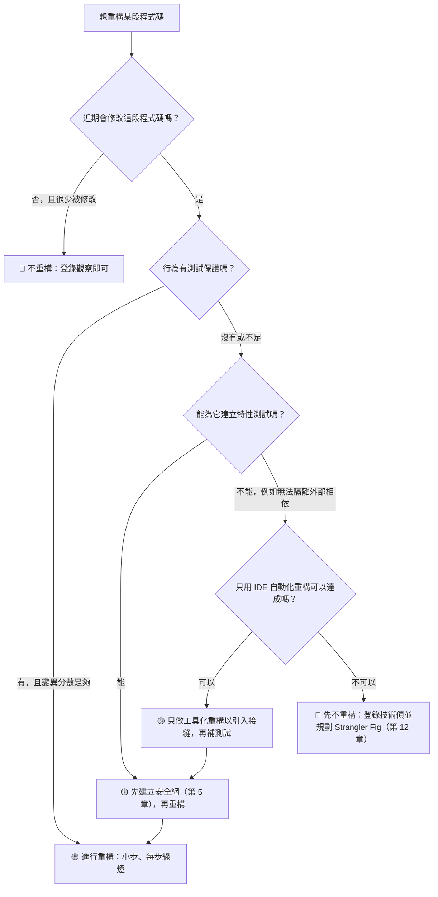
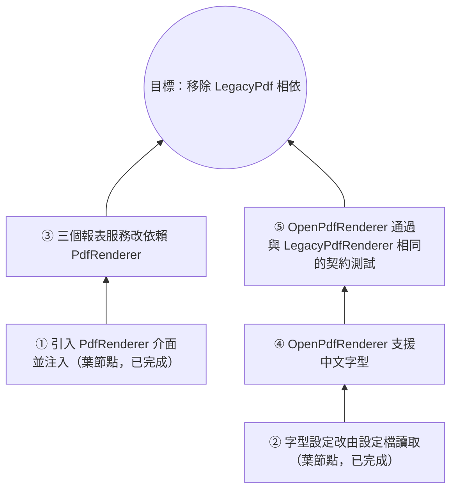
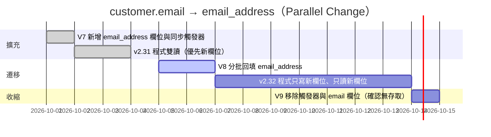

+++
date = '2025-10-31T00:00:00+08:00'
draft = false
title = 'refactor 重構指引'
tags = ['指引', '設計開發']
categories = ['指引']
+++

# 重構指引（Refactoring Guide）

> **企業標準技術白皮書｜版本 v2.0｜2026-10-08**
>
> 適用範圍：以 Java（Java 25 LTS，相容 Java 21）／Spring Boot 4 為後端、以 Vue 3／TypeScript 為前端、以關聯式資料庫為儲存，並使用 GitHub 或 GitLab 管理原始碼的企業應用系統。本指引規範「在不改變外部行為的前提下改善程式結構」的方法、時機、流程、工具與驗證方式：每一條規則都說明要做到什麼、附有正確與錯誤的範例，並說明審查者要用什麼工具或方法確認。
>
> v2.0 全面改寫 v1.0：以 Martin Fowler《Refactoring》第二版的重構目錄、Michael Feathers《Working Effectively with Legacy Code》、Kent Beck《Tidy First?》與 Fowler 的演進式設計模式（Strangler Fig、Branch by Abstraction、Parallel Change）為方法基礎；以 ISO/IEC 25010:2023、ISO/IEC/IEEE 14764:2022、ISO/IEC 5055:2021、ISO/IEC/IEEE 12207:2017 與 DORA 2025 報告為治理基礎重新組織內容。新增 Java 現代化、前端 TypeScript／Vue、架構層、資料庫與 API 演進、OpenRewrite 大規模自動化與「AI 輔助重構與審查 AI 產出」等章。每條規則都附有範例與「驗證方式」，每節結尾都有「🔍 審查與驗證」，讓審查者能判斷 AI 或同事產出的重構是否真的「沒有改變行為」。範例均經工具實測（見 [附錄 F](#附錄-f-修訂紀錄與查證紀錄)）。

## 目錄

<!-- TOC-AUTO-BEGIN -->

- [0. 文件資訊](#0-文件資訊)
  - [0.1 文件目的與讀者](#01-文件目的與讀者)
  - [0.2 技術基準版本](#02-技術基準版本)
  - [0.3 規範等級與規則格式](#03-規範等級與規則格式)
  - [0.4 與其他指引的關係](#04-與其他指引的關係)
  - [0.5 如何閱讀本指引](#05-如何閱讀本指引)
  - [0.6 例外與豁免流程](#06-例外與豁免流程)
- [1. 重構的定義、目的與國際標準](#1-重構的定義目的與國際標準)
  - [1.1 什麼是重構](#11-什麼是重構)
  - [1.2 為什麼要重構：目的與經濟效益](#12-為什麼要重構目的與經濟效益)
  - [1.3 國際標準與研究對照](#13-國際標準與研究對照)
  - [1.4 重構的範圍與限制](#14-重構的範圍與限制)
- [2. 重構原則](#2-重構原則)
  - [2.1 小步前進，每一步都保持綠燈](#21-小步前進每一步都保持綠燈)
  - [2.2 優先使用工具化的重構](#22-優先使用工具化的重構)
  - [2.3 以簡單設計為方向](#23-以簡單設計為方向)
- [3. 重構時機與決策](#3-重構時機與決策)
  - [3.1 重構的五種時機](#31-重構的五種時機)
  - [3.2 決定「要不要重構」：紅黃綠燈](#32-決定要不要重構紅黃綠燈)
  - [3.3 重構、重寫或汰換](#33-重構重寫或汰換)
- [4. 程式碼異味：找出需要重構的地方](#4-程式碼異味找出需要重構的地方)
  - [4.1 異味目錄與偵測工具對照](#41-異味目錄與偵測工具對照)
  - [4.2 門檻與「新程式碼」品質閘門](#42-門檻與新程式碼品質閘門)
- [5. 安全網：重構前的測試](#5-安全網重構前的測試)
  - [5.1 測試是重構的前提](#51-測試是重構的前提)
  - [5.2 特性測試：記錄現在的行為](#52-特性測試記錄現在的行為)
  - [5.3 黃金主檔與核准測試](#53-黃金主檔與核准測試)
  - [5.4 覆蓋率與變異測試：測試夠強嗎](#54-覆蓋率與變異測試測試夠強嗎)
  - [5.5 接縫：讓無法測試的程式碼可以被測試](#55-接縫讓無法測試的程式碼可以被測試)
- [6. 基本重構手法](#6-基本重構手法)
  - [6.1 提煉函式與內聯函式（Extract Function／Inline Function）](#61-提煉函式與內聯函式extract-functioninline-function)
  - [6.2 改名與提煉變數（Rename／Extract Variable）](#62-改名與提煉變數renameextract-variable)
  - [6.3 改變函式宣告（Change Function Declaration）](#63-改變函式宣告change-function-declaration)
  - [6.4 封裝變數與集合（Encapsulate Variable／Encapsulate Collection）](#64-封裝變數與集合encapsulate-variableencapsulate-collection)
  - [6.5 拆分階段與合併函式（Split Phase／Combine Functions into Class）](#65-拆分階段與合併函式split-phasecombine-functions-into-class)
  - [6.6 移除死程式碼（Remove Dead Code）](#66-移除死程式碼remove-dead-code)
- [7. 搬移特性與組織資料](#7-搬移特性與組織資料)
  - [7.1 搬移函式與搬移欄位（Move Function／Move Field）](#71-搬移函式與搬移欄位move-functionmove-field)
  - [7.2 提煉類別與內聯類別（Extract Class／Inline Class）](#72-提煉類別與內聯類別extract-classinline-class)
  - [7.3 以物件取代基本型別：值物件（Replace Primitive with Object）](#73-以物件取代基本型別值物件replace-primitive-with-object)
  - [7.4 隱藏委託與移除中間人（Hide Delegate／Remove Middle Man）](#74-隱藏委託與移除中間人hide-delegateremove-middle-man)
- [8. 簡化條件邏輯](#8-簡化條件邏輯)
  - [8.1 提早返回與分解條件（Guard Clauses／Decompose Conditional）](#81-提早返回與分解條件guard-clausesdecompose-conditional)
  - [8.2 以多型取代條件式（Replace Conditional with Polymorphism）](#82-以多型取代條件式replace-conditional-with-polymorphism)
  - [8.3 引入特例（Introduce Special Case）](#83-引入特例introduce-special-case)
  - [8.4 引入斷言與以預先檢查取代例外（Introduce Assertion／Replace Exception with Precheck）](#84-引入斷言與以預先檢查取代例外introduce-assertionreplace-exception-with-precheck)
- [9. API 與繼承重構](#9-api-與繼承重構)
  - [9.1 參數物件、保留完整物件與移除旗標參數](#91-參數物件保留完整物件與移除旗標參數)
  - [9.2 分離查詢與修改、移除設值方法、以工廠函式取代建構子](#92-分離查詢與修改移除設值方法以工廠函式取代建構子)
  - [9.3 處理繼承：上移、下移、提煉父類別與摺疊階層](#93-處理繼承上移下移提煉父類別與摺疊階層)
  - [9.4 以委託取代繼承（Replace Subclass／Superclass with Delegate）](#94-以委託取代繼承replace-subclasssuperclass-with-delegate)
- [10. Java 現代化重構](#10-java-現代化重構)
  - [10.1 以 record 取代資料類別](#101-以-record-取代資料類別)
  - [10.2 模式比對與 switch 運算式](#102-模式比對與-switch-運算式)
  - [10.3 Optional 與 null](#103-optional-與-null)
  - [10.4 以管線取代迴圈（Replace Loop with Pipeline）](#104-以管線取代迴圈replace-loop-with-pipeline)
  - [10.5 建構子驗證與 Java 25 語言特性](#105-建構子驗證與-java-25-語言特性)
  - [10.6 虛擬執行緒與併發程式的現代化](#106-虛擬執行緒與併發程式的現代化)
- [11. 前端 TypeScript／Vue 重構](#11-前端-typescriptvue-重構)
  - [11.1 型別強化：讓編譯器幫你重構](#111-型別強化讓編譯器幫你重構)
  - [11.2 元件重構：Options API 到 Composition API 與 composable](#112-元件重構options-api-到-composition-api-與-composable)
  - [11.3 大規模前端重構：codemod 與未使用程式碼](#113-大規模前端重構codemod-與未使用程式碼)
- [12. 遺留系統重構](#12-遺留系統重構)
  - [12.1 遺留程式碼的變更步驟](#121-遺留程式碼的變更步驟)
  - [12.2 Sprout 與 Wrap：在無法測試的程式碼旁邊加新功能](#122-sprout-與-wrap在無法測試的程式碼旁邊加新功能)
  - [12.3 Mikado 方法：處理相依關係不明的大型重構](#123-mikado-方法處理相依關係不明的大型重構)
  - [12.4 Branch by Abstraction：在主幹上替換元件](#124-branch-by-abstraction在主幹上替換元件)
  - [12.5 Strangler Fig：漸進汰換整個系統](#125-strangler-fig漸進汰換整個系統)
- [13. 架構層重構](#13-架構層重構)
  - [13.1 以架構測試守護重構](#131-以架構測試守護重構)
  - [13.2 模組化單體：Spring Modulith](#132-模組化單體spring-modulith)
  - [13.3 從模組化單體拆分服務](#133-從模組化單體拆分服務)
- [14. 資料庫與 API 的演進式重構](#14-資料庫與-api-的演進式重構)
  - [14.1 Parallel Change：擴充—遷移—收縮](#141-parallel-change擴充遷移收縮)
  - [14.2 資料庫重構](#142-資料庫重構)
  - [14.3 REST API 的演進](#143-rest-api-的演進)
  - [14.4 事件與訊息格式的演進](#144-事件與訊息格式的演進)
- [15. 大規模自動化重構](#15-大規模自動化重構)
  - [15.1 選擇自動化工具](#151-選擇自動化工具)
  - [15.2 框架升級與語法現代化](#152-框架升級與語法現代化)
- [16. 效能與重構](#16-效能與重構)
  - [16.1 重構與效能的關係](#161-重構與效能的關係)
  - [16.2 資料存取與快取：最容易「重構出」效能問題的地方](#162-資料存取與快取最容易重構出效能問題的地方)
- [17. 安全與重構](#17-安全與重構)
  - [17.1 安全控制不得在重構中消失](#171-安全控制不得在重構中消失)
  - [17.2 查詢、日誌與序列化：重構時常見的安全退化](#172-查詢日誌與序列化重構時常見的安全退化)
- [18. 流程、版本控管與審查](#18-流程版本控管與審查)
  - [18.1 重構型 PR 的組成](#181-重構型-pr-的組成)
  - [18.2 分支策略與長期重構](#182-分支策略與長期重構)
  - [18.3 守護測試：重構 PR 不得改變測試的預期值](#183-守護測試重構-pr-不得改變測試的預期值)
  - [18.4 如何審查重構型 PR](#184-如何審查重構型-pr)
- [19. AI 輔助重構與審查 AI 產出](#19-ai-輔助重構與審查-ai-產出)
  - [19.1 AI 在重構中的角色與風險](#191-ai-在重構中的角色與風險)
  - [19.2 提示範本：讓 AI 產出可審查的重構](#192-提示範本讓-ai-產出可審查的重構)
  - [19.3 等價性驗證：證明 AI 的重構沒有改變行為](#193-等價性驗證證明-ai-的重構沒有改變行為)
  - [19.4 AI 代理的重構：指示檔與防護欄](#194-ai-代理的重構指示檔與防護欄)
  - [19.5 AI 重構常見錯誤總表](#195-ai-重構常見錯誤總表)
- [20. 技術債管理與度量](#20-技術債管理與度量)
  - [20.1 技術債的分類與登錄](#201-技術債的分類與登錄)
  - [20.2 度量重構的成效](#202-度量重構的成效)
  - [20.3 重構的投資與時間配置](#203-重構的投資與時間配置)
- [21. 反模式與常見陷阱](#21-反模式與常見陷阱)
  - [21.1 流程與範圍的反模式](#211-流程與範圍的反模式)
  - [21.2 設計與實作的反模式](#212-設計與實作的反模式)
  - [21.3 v1.0 範例中的反模式更正](#213-v10-範例中的反模式更正)
- [22. 案例研究](#22-案例研究)
  - [22.1 遺留計費模組的漸進式重構（Java）](#221-遺留計費模組的漸進式重構java)
  - [22.2 前端元件現代化（Vue／TypeScript）](#222-前端元件現代化vuetypescript)
- [23. 導入與培訓](#23-導入與培訓)
  - [23.1 分階段導入](#231-分階段導入)
  - [23.2 培訓：以重構套路（kata）練習](#232-培訓以重構套路kata練習)
- [附錄 A 規則總表](#附錄-a-規則總表)
  - [A.1 依領域統計](#a1-依領域統計)
  - [A.2 驗證方式與範例覆蓋](#a2-驗證方式與範例覆蓋)
  - [A.3 規則清單](#a3-規則清單)
- [附錄 B 檢核清單與範本](#附錄-b-檢核清單與範本)
  - [B.1 重構前檢核](#b1-重構前檢核)
  - [B.2 重構中檢核](#b2-重構中檢核)
  - [B.3 合併前檢核（作者）](#b3-合併前檢核作者)
  - [B.4 審查者檢核](#b4-審查者檢核)
  - [B.5 AI 產出重構的審查檢核](#b5-ai-產出重構的審查檢核)
  - [B.6 重構提案範本](#b6-重構提案範本)
  - [B.7 重構後追蹤](#b7-重構後追蹤)
- [附錄 C 設定檔與腳本](#附錄-c-設定檔與腳本)
  - [C.1 Maven 驗證專案設定](#c1-maven-驗證專案設定)
  - [C.2 OpenRewrite 設定](#c2-openrewrite-設定)
  - [C.3 PMD 規則集](#c3-pmd-規則集)
  - [C.4 Checkstyle 設定](#c4-checkstyle-設定)
  - [C.5 架構規則（ArchUnit、Spring Modulith）](#c5-架構規則archunitspring-modulith)
  - [C.6 CI 工作流程](#c6-ci-工作流程)
  - [C.7 commitlint 設定](#c7-commitlint-設定)
  - [C.8 熱點分析腳本](#c8-熱點分析腳本)
  - [C.9 測試守護腳本](#c9-測試守護腳本)
  - [C.10 前端設定](#c10-前端設定)
  - [C.11 等價性檢查腳本](#c11-等價性檢查腳本)
- [附錄 D 名詞對照](#附錄-d-名詞對照)
- [附錄 E 參考資料](#附錄-e-參考資料)
  - [E.1 書籍](#e1-書籍)
  - [E.2 國際標準與規範](#e2-國際標準與規範)
  - [E.3 研究報告](#e3-研究報告)
  - [E.4 線上資源](#e4-線上資源)
- [附錄 F 修訂紀錄與查證紀錄](#附錄-f-修訂紀錄與查證紀錄)
  - [F.1 v1.0 章節對照](#f1-v10-章節對照)
  - [F.2 v1.0 內容更正紀錄](#f2-v10-內容更正紀錄)
  - [F.3 查證紀錄](#f3-查證紀錄)
  - [F.4 待確認事項](#f4-待確認事項)
  - [F.5 技術版本紀錄](#f5-技術版本紀錄)

<!-- TOC-AUTO-END -->

---

## 0. 文件資訊

### 0.1 文件目的與讀者

重構（refactoring）是「在不改變軟體可觀察行為的前提下，改善其內部結構」的一系列小步驟。它聽起來簡單，實務上卻最容易出錯：一次改太多、測試不足、把功能變更混在重構裡、或是把「重寫」誤稱為「重構」，都會讓原本可控的整理工作變成難以審查、難以回復的風險。生成式 AI 讓產生「看起來更乾淨」的程式碼變得非常容易，但 AI 產出的重構常常悄悄改變了邊界條件、例外型別或執行順序；**判斷一次重構有沒有改變行為，仍然是人的責任。**

本指引的目的，是讓團隊成員：

1. 知道**什麼是、什麼不是**重構，以及何時值得做、何時不該做。
2. 會用一套**可重複的步驟**安全地完成重構：先建立安全網、再小步修改、每一步都驗證。
3. 能**審查與驗證**同事或 AI 產出的重構：用測試、工具與明確的人工問題確認行為沒有改變。

| 讀者 | 建議閱讀 | 閱讀重點 |
| --- | --- | --- |
| 開發人員 | 第 1～11 章、第 18～19 章 | 每節的規則表、✅／❌ 範例、IDE 操作與測試方法 |
| 審查者、Tech Lead | 第 2、5、18、19 章與附錄 B | 「🔍 審查與驗證」、附錄 B 的審查檢核清單 |
| 架構師 | 第 12～15 章 | 遺留系統、架構層、資料庫與 API 演進、大規模自動化 |
| 專案經理、技術主管 | 第 1、3、20、23 章 | 何時投資重構、技術債度量、導入計畫 |
| 使用 AI 程式助理的所有人 | 第 19 章 | 提示範本、等價性驗證流程、AI 常見錯誤 |

### 0.2 技術基準版本

本指引的範例以下列版本撰寫與實測（2026-10-08 查證）。版本升級時，請依 [附錄 F.5](#f5-技術版本紀錄) 的紀錄重新驗證範例。

| 類別 | 項目 | 版本 | 備註 |
| --- | --- | --- | --- |
| 語言 | Java | 25 LTS（相容 21 LTS） | 第 10 章標示需要 Java 25 的語法 |
| 框架 | Spring Boot／Spring Framework | 4.1.1／7.0.9 | Jakarta EE 11、Jackson 3 |
| 建置 | Maven | 3.9.x | Gradle 使用者請對照附錄 C 的外掛名稱 |
| 測試 | JUnit Jupiter／AssertJ／Mockito | 6.0.3／3.27.7／5.23.0 | 由 Spring Boot 4.1.1 管理 |
| 測試 | ApprovalTests.Java | 31.0.0 | 黃金主檔（golden master）測試 |
| 測試 | PIT（pitest-maven） | 1.30.0 | 變異測試 |
| 架構 | ArchUnit／Spring Modulith | 1.5.1／2.1.1 | 架構規則與模組邊界驗證 |
| 靜態分析 | PMD／Checkstyle | 7.28.0／14.3.0 | 規則名稱以此版本為準 |
| 靜態分析 | SonarQube Server／Community Build | 2026.5／26.9 | 規則鍵如 `java:S3776` |
| 自動化重構 | OpenRewrite（rewrite-maven-plugin） | 6.46.1 | rewrite-spring 6.37.1、rewrite-migrate-java 3.42.1 |
| 重構偵測 | RefactoringMiner | 3.1.6 | 審查時辨識提交中的重構操作 |
| 效能 | JMH | 1.37 | 微基準測試 |
| 資料庫遷移 | Flyway | 12.4.0（Spring Boot 管理） | 最新版 13.x 見 F.5 |
| IDE | IntelliJ IDEA | 2026.2 | 快捷鍵以 Windows／Linux 預設鍵盤配置為準 |
| 前端 | Vue／TypeScript | 3.5.43／6.0.2 | TypeScript 7（原生編譯器）見 11.1 說明 |
| 前端 | ESLint／typescript-eslint／Vitest | 10.12.0／8.71.1／5.0.3 | flat config |
| 前端 | ts-morph／jscodeshift／knip | 28.0.0／17.4.0／6.40.0 | codemod 與未使用程式碼偵測 |

### 0.3 規範等級與規則格式

本文規則採用 [RFC 2119](https://www.rfc-editor.org/rfc/rfc2119) 與 [RFC 8174](https://www.rfc-editor.org/rfc/rfc8174) 的語意：

| 等級 | 英文 | 意義 | 不遵守時的處理 |
| --- | --- | --- | --- |
| **必須** | MUST | 不遵守會讓重構失去「行為不變」的保證，或直接造成缺陷 | 不得合併；如需例外必須走 0.6 豁免流程 |
| **應該** | SHOULD | 業界共識的最佳實務，除非有充分理由 | 不遵守時必須在 PR／MR 說明理由 |
| **可以** | MAY | 建議做法，依團隊規模與風險選用 | 不阻擋 |
| **不應該** | SHOULD NOT | 通常是錯誤的做法，除非有充分理由 | 採用時必須在 PR／MR 說明理由與替代控制 |

每條規則都有編號，格式為 `RF-<領域>-<三位數序號>`（RF = Refactoring）。開頭的 `RF` 用來和其他指引的規則區分，例如 code review 指引的 `CR-MNT-003`、測試指引的 `QA-UNT-001`。編號一經發布不會重編，新增規則使用該領域尚未使用的號碼。

| 前綴 | 領域 | 章 | 前綴 | 領域 | 章 |
| --- | --- | --- | --- | --- | --- |
| `RF-GOV` | 定義、目的與國際標準 | 1 | `RF-LEG` | 遺留系統重構 | 12 |
| `RF-PRN` | 重構原則 | 2 | `RF-ARC` | 架構層重構 | 13 |
| `RF-WHEN` | 時機與決策 | 3 | `RF-EVO` | 資料庫與 API 的演進式重構 | 14 |
| `RF-SML` | 程式碼異味 | 4 | `RF-AUTO` | 大規模自動化重構 | 15 |
| `RF-NET` | 安全網：測試 | 5 | `RF-PRF` | 效能與重構 | 16 |
| `RF-BAS` | 基本重構手法 | 6 | `RF-SEC` | 安全與重構 | 17 |
| `RF-MOV` | 搬移特性與組織資料 | 7 | `RF-PRC` | 流程、版本控管與審查 | 18 |
| `RF-CND` | 簡化條件邏輯 | 8 | `RF-AI` | AI 輔助重構與審查 AI 產出 | 19 |
| `RF-API` | API 與繼承重構 | 9 | `RF-DEBT` | 技術債管理與度量 | 20 |
| `RF-JAVA` | Java 現代化重構 | 10 | `RF-IMP` | 導入與培訓 | 23 |
| `RF-FE` | 前端 TypeScript／Vue 重構 | 11 | | | |

**驗證方式欄位：** 每張規則表的最後一欄說明「怎麼確認有遵守這條規則」。審查者應先看這一欄，再決定要花多少心力人工檢查。

| 圖示 | 意義 | 範例 | 審查者該做什麼 |
| --- | --- | --- | --- |
| 🤖 | 工具或平台設定可自動檢查 | 🤖 PMD `CognitiveComplexity`、🤖 ArchUnit、🤖 OpenRewrite dry-run | 確認 CI 有啟用該工具，且沒有被停用、降級或略過 |
| 🧪 | 需要以測試證明 | 🧪 特性測試、🧪 變異測試、🧪 JMH 基準 | 確認有對應的測試，而且重構前後都執行過、結果一致 |
| 👁 | 只能由人判斷 | 👁 程式碼審查、👁 提交紀錄檢查 | 依該節「🔍 審查與驗證」的問題逐項確認 |

**範例標記：** 範例中以 `✅ <規則編號>` 標示符合規則的寫法，以 `❌ <規則編號>` 標示違規寫法或「重構前」的程式。所有規則都至少出現在一個範例中（統計見 [附錄 A](#附錄-a-規則總表)）。標示「（片段：…）」的範例只截取重點，不是完整可編譯的程式。**❌ 範例只供教學，請勿複製到正式程式碼或設定。**

**重構前後的等價性驗證：** 本文許多範例以「❌ 重構前」與「✅ 重構後」成對出現，兩者使用**相同的套件與類別名稱**。實測時，❌ 版本放在一個獨立的 Maven 專案，✅ 版本放在另一個專案，**同一組測試在兩個專案都執行**：兩邊都通過，才證明這次重構沒有改變行為（做法與結果見 [附錄 F.3](#f3-查證紀錄)）。這正是本指引要教的核心技巧，讀者可以用相同方式驗證 AI 產出的重構。

### 0.4 與其他指引的關係

本指引專注在「改善既有程式結構」的方法與驗證；各技術領域的寫作規範、測試門檻與審查流程，仍以專門指引為準：

| 主題 | 指引 | 本文的分工 |
| --- | --- | --- |
| 命名、格式、例外處理、日誌等一般寫作規範 | [程式寫作指引]() | 定義「重構的目標狀態」；本文說明如何從現況安全地走到目標 |
| 程式碼審查流程與審查重點（`CR-*`） | [code review 指引]() | 第 18 章規範「重構型 PR」的特殊審查方式 |
| 測試策略、覆蓋率與變異測試門檻（`QA-*`） | [測試與品質保證指引]() | 第 5 章規範重構所需的安全網 |
| 安全寫作規則（`SCG-*`） | [安全程式碼指引]() | 第 17 章規範重構時不得削弱的安全控制 |
| 架構決策、模組邊界 | [架構設計指引]()、[系統設計指引]() | 第 13 章規範架構層重構的步驟與守護方式 |
| 資料庫結構與遷移 | [資料庫設計指引]() | 第 14 章規範資料庫的演進式重構 |
| 前端與後端框架實務 | [前端開發指引]()、[後端開發指引]() | 第 10、11 章 |
| 資料轉置、系統汰換 | [系統資料轉置教學指引]() | 第 12 章的 Strangler Fig 汰換涉及資料轉置時參照 |
| 開發流程、分支策略、版本發布 | [軟體開發標準程序教學手冊]() | 第 18 章只規範重構在流程中的位置 |

### 0.5 如何閱讀本指引

每一節都依相同的結構撰寫，閱讀與審查時可以直接跳到需要的部分：

1. **概念說明**：為什麼需要這條規則、背後的研究或標準。
2. **規則表**：編號、等級、規則內容、驗證方式。
3. **範例**：❌ 重構前或常見錯誤，✅ 重構後或正確做法，範例中標註規則編號；手法類範例另附「操作步驟」。
4. **🔍 審查與驗證**：自動檢查方式、人工審查問題、AI 常見錯誤。

第一次導入時，建議依下列順序進行（細節見第 23 章）：

1. 先讀第 1、2 章，建立「重構 = 行為不變的小步驟」的共同語言。
2. 依第 5 章在最常修改的模組建立安全網（特性測試、變異測試）。
3. 依第 18 章調整 PR 範本與提交慣例，讓重構與功能變更分開審查。
4. 依附錄 C 在 CI 啟用 PMD、Checkstyle、ArchUnit 與 PIT。
5. 依第 19 章訂定團隊的 AI 重構提示範本與驗證流程。

### 0.6 例外與豁免流程

規則無法遵守時（例如緊急修正來不及補特性測試、第三方產生的程式碼無法修改），必須在 PR／MR 描述中填寫豁免紀錄，並由 Tech Lead 核准。豁免必須有到期日與補救計畫，到期後由技術債登錄（第 20 章）追蹤。

```markdown
<!-- ✅ RF-PRC-001：PR 描述中的豁免紀錄範本 -->
### 規則豁免

| 項目 | 內容 |
| --- | --- |
| 規則 | RF-NET-001（重構前必須有涵蓋受影響行為的測試） |
| 理由 | 生產事故 INC-2026-0412 緊急修正，`LegacyInvoiceService` 目前沒有任何測試 |
| 替代控制 | 只做 IDE 自動化的 Rename 與 Extract Method（不涉及邏輯改寫）；QA 手動回歸 12 個情境 |
| 到期日 | 2026-11-15 |
| 補救計畫 | DEBT-0231：補上 `LegacyInvoiceService` 特性測試，覆蓋率達 80% 以上 |
| 核准 | @tech-lead（2026-10-08） |
```

---

## 1. 重構的定義、目的與國際標準

### 1.1 什麼是重構

Martin Fowler 在《Refactoring》第二版給的定義有兩個詞性：

- **重構（名詞）**：對軟體內部結構的一種修改，目的是讓它更容易理解、修改成本更低，**而且不改變它的可觀察行為**。
- **重構（動詞）**：套用一連串這樣的修改，在不改變可觀察行為的前提下重新組織軟體。

關鍵字是「可觀察行為」。對企業系統而言，可觀察行為不只是方法的回傳值，還包括：

| 面向 | 例子 | 重構時容易不小心改到的地方 |
| --- | --- | --- |
| 回傳值與狀態變化 | 計算結果、物件欄位 | 邊界條件（`>` 變 `>=`）、四捨五入方式、`null` 與空集合 |
| 例外 | 例外型別、訊息、何時拋出 | 把 checked exception 包成 runtime exception、提早或延後檢查 |
| 副作用的順序與次數 | 寫資料庫、送訊息、寫審計日誌 | 抽出方法後呼叫兩次、迴圈拆分後順序改變 |
| 對外契約 | REST API 欄位、JSON 格式、事件結構、資料表結構 | 改名欄位、改變序列化格式、改變 HTTP 狀態碼 |
| 交易與併發語意 | 交易邊界、鎖、執行緒安全 | 把 `@Transactional` 方法拆成同類別內部呼叫，使交易失效 |
| 效能與資源特性 | 查詢次數、記憶體、逾時 | 抽出查詢方法造成 N+1、把 `List` 改成延遲 `Stream` |

重構常被和其他活動混淆。下表是本指引採用的分類，PR／MR 的類型必須依此判斷：

| 活動 | 是否改變可觀察行為 | 本指引的稱呼 | 提交類型 |
| --- | --- | --- | --- |
| 改名、抽出方法、搬移類別、消除重複 | 否 | **重構** | `refactor:` |
| 調整格式、排序 import | 否 | 格式整理（重構的特例） | `style:` |
| 修正錯誤 | 是（修正錯誤的行為） | 修正 | `fix:` |
| 新增功能 | 是 | 功能 | `feat:` |
| 換演算法讓結果更準、改資料模型 | 是 | **重新設計**（不是重構） | `feat:`／`fix:` |
| 從頭重寫一個模組 | 通常是 | **重寫**（不是重構） | 依專案規劃 |
| 改善效能但不改結果 | 外部結果不變，效能特性改變 | 效能最佳化（第 16 章） | `perf:` |

Kent Beck 提出「兩頂帽子」（two hats）的比喻：開發者在任何時刻只戴一頂帽子——要嘛在**加功能**（可以改行為、要新增測試），要嘛在**重構**（不改行為、不新增功能、測試應該維持綠燈）。換帽子是可以的，但要意識到自己正在換，並且分開提交。

| 編號 | 等級 | 規則 | 驗證方式 |
| --- | --- | --- | --- |
| `RF-GOV-001` | 必須 | 標示為重構的變更不得改變可觀察行為（回傳值、例外、副作用的順序與次數、對外契約、交易語意）；同一組測試必須在重構前後都通過 | 🧪 重構前後執行同一組測試；👁 程式碼審查 |
| `RF-GOV-002` | 必須 | 改變需求、計算結果、資料模型或對外契約的變更不得以「重構」名義提交，必須依其性質標示為 `feat`／`fix`／`perf` 並走一般變更流程 | 🤖 commitlint 檢查提交類型；👁 程式碼審查 |

以下是一個「看起來是重構，其實改變了行為」的例子。原本的運費規則是「訂單金額**超過** 1,000 元免運」：

```java
// ✅ RF-GOV-001：重構後的運費規則；邊界條件（剛好 1,000 元仍收運費）與重構前一致
package com.example.rf.gov;

import java.math.BigDecimal;

public final class ShippingFeePolicy {

    static final BigDecimal FREE_SHIPPING_THRESHOLD = new BigDecimal("1000");
    static final BigDecimal STANDARD_FEE = new BigDecimal("80");

    /** 回傳運費：訂單金額超過門檻免運，否則收標準運費。 */
    public BigDecimal feeFor(BigDecimal orderTotal) {
        return isFreeShipping(orderTotal) ? BigDecimal.ZERO : STANDARD_FEE;
    }

    private static boolean isFreeShipping(BigDecimal orderTotal) {
        return orderTotal.compareTo(FREE_SHIPPING_THRESHOLD) > 0;
    }
}
```

```java
// ❌ RF-GOV-001：AI 產出的「重構」把 > 改成 >=，剛好 1,000 元的訂單變成免運——這是行為變更，不是重構
package com.example.rf.gov;

import java.math.BigDecimal;

public final class ShippingFeePolicy {

    static final BigDecimal FREE_SHIPPING_THRESHOLD = new BigDecimal("1000");
    static final BigDecimal STANDARD_FEE = new BigDecimal("80");

    /** 回傳運費：訂單金額達到門檻免運，否則收標準運費。 */
    public BigDecimal feeFor(BigDecimal orderTotal) {
        return orderTotal.compareTo(FREE_SHIPPING_THRESHOLD) >= 0 ? BigDecimal.ZERO : STANDARD_FEE;
    }
}
```

能抓到這個錯誤的，是一個明確測試邊界值的測試。這個測試在 ✅ 版本通過、在 ❌ 版本失敗（實測紀錄見附錄 F.3）：

```java
// ✅ RF-GOV-001：以邊界值鎖定運費規則；重構前後都必須通過
package com.example.rf.gov;

import static org.assertj.core.api.Assertions.assertThat;

import java.math.BigDecimal;
import org.junit.jupiter.params.ParameterizedTest;
import org.junit.jupiter.params.provider.CsvSource;

class ShippingFeePolicyTest {

    private final ShippingFeePolicy policy = new ShippingFeePolicy();

    @ParameterizedTest(name = "訂單 {0} 元 → 運費 {1} 元")
    @CsvSource({"999.99, 80", "1000, 80", "1000.01, 0", "0, 80"})
    void feeAtBoundaries(String total, String expectedFee) {
        assertThat(policy.feeFor(new BigDecimal(total)))
                .isEqualByComparingTo(new BigDecimal(expectedFee));
    }
}
```

提交類型必須反映變更的真實性質。下面的提交紀錄中，第一個提交把演算法換掉、改變了計算結果，卻標成 `refactor`：

```text
❌ RF-GOV-002：改變了折扣計算結果，卻宣稱是重構
refactor(pricing): 改用新的會員折扣演算法

✅ RF-GOV-002：行為變更與重構分開提交，各自標示真實的類型
refactor(pricing): 將折扣計算抽出為 DiscountPolicy（行為不變）
feat(pricing): 白金會員折扣由 15% 調整為 18%（需求 REQ-2291）
```

#### 🔍 1.1 審查與驗證

- **自動檢查：** commitlint 限制提交類型（附錄 C.7）；CI 必須在 `refactor` 類型的 PR 上執行完整測試，而且 PR 中**不應該**修改既有測試的預期值（第 18.3 節）。
- **人工審查問題：**
  1. 這個 PR 有沒有改到任何測試的預期值？如果有，它就不是純重構。
  2. 邊界值（`>`／`>=`、空集合、`null`、0、負數）在新舊版本的處理一樣嗎？
  3. 例外的型別、拋出時機、副作用（寫資料庫、送訊息、寫日誌）的順序與次數一樣嗎？
- **AI 常見錯誤：** AI 在「簡化」條件時常把 `>` 改成 `>=`、把 `if (x != null && ...)` 的短路順序對調、把多個 `if` 合併成 `switch` 時漏掉 fall-through 的情況；它也常順手「修正」它認為的錯誤，讓重構夾帶行為變更。

### 1.2 為什麼要重構：目的與經濟效益

重構不是「讓程式碼變漂亮」的美學活動，而是降低**未來修改成本**的投資。Fowler 的「設計耐力假說」（Design Stamina Hypothesis）指出：沒有持續整理的程式碼，初期開發較快，但隨著時間累積，新增功能的速度會明顯下降；持續重構的程式碼則能維持較穩定的交付速度。Kent Beck 的名言總結了最常見的重構時機：

> 「先讓改變變得容易（這可能很難），再做那個容易的改變。」（"Make the change easy (warning: this may be hard), then make the easy change."）

重構的目的可以對應到 ISO/IEC 25010:2023 的**可維護性**（maintainability）子特性。PR 描述中說明「改善了什麼」時，應該使用這套共同語言，並附上客觀證據：

| ISO/IEC 25010:2023 子特性 | 意義 | 常見重構手法 | 可量測的證據 |
| --- | --- | --- | --- |
| 模組化（Modularity） | 修改一個元件對其他元件的影響最小 | Move Function、Extract Class、模組邊界重整 | ArchUnit／Spring Modulith 違規數、套件循環數 |
| 可再利用性（Reusability） | 資產可用於建構其他資產 | Extract Function、Parameterize Function | 重複程式碼比率（CPD、SonarQube Duplications） |
| 可分析性（Analysability） | 能有效評估變更影響、診斷缺陷 | Rename、Extract Variable、Decompose Conditional | 認知複雜度、方法長度 |
| 可修改性（Modifiability） | 能有效修改而不引入缺陷或降低品質 | Replace Conditional with Polymorphism、Encapsulate | 變更失敗率、同一檔案的修正次數 |
| 可測試性（Testability） | 能有效建立測試準則並執行測試 | 引入接縫（seam）、相依注入、Split Phase | 可單元測試的類別比例、測試執行時間 |

| 編號 | 等級 | 規則 | 驗證方式 |
| --- | --- | --- | --- |
| `RF-GOV-003` | 應該 | 重構型 PR／MR 應說明改善的可維護性子特性（ISO/IEC 25010:2023），並附上重構前後的客觀指標（複雜度、重複率、架構違規數等） | 🤖 SonarQube 新程式碼指標；👁 PR 描述檢查 |

```markdown
<!-- ✅ RF-GOV-003：重構 PR 描述範本中的「改善目標」區塊 -->
### 重構目標與證據

- **改善的子特性（ISO/IEC 25010:2023）：** 可分析性、可測試性
- **動機：** REQ-2310 需要新增「企業客戶」折扣；目前 `OrderService.checkout()` 有 180 行、認知複雜度 41，無法安全加入新條件。
- **指標（重構前 → 重構後）：**

| 指標 | 重構前 | 重構後 | 工具 |
| --- | --- | --- | --- |
| `checkout()` 認知複雜度 | 41 | 6 | PMD `CognitiveComplexity` |
| `OrderService` 行數 | 612 | 214 | SonarQube |
| `com.example.order` 重複區塊 | 3 | 0 | PMD CPD |
| 特性測試數／變異分數 | 0／— | 27／86% | JUnit、PIT |
```

#### 🔍 1.2 審查與驗證

- **自動檢查：** SonarQube「新程式碼」的品質閘門與 PMD 報告可以提供前後對照；第 20 章說明如何長期追蹤。
- **人工審查問題：**
  1. 這次重構的動機是什麼？是為了接下來的功能（準備式重構），還是單純「看不順眼」？
  2. PR 描述的指標可以重現嗎？（審查者應能在本機或 CI 報告看到同樣的數字。）
- **AI 常見錯誤：** 請 AI 撰寫 PR 描述時，它常給出無法驗證的形容詞（「大幅提升可讀性」）或捏造指標數字；指標必須來自工具輸出。

### 1.3 國際標準與研究對照

重構本身沒有專屬的 ISO 標準，但它是軟體維護與品質管理的一部分。下表列出本指引引用的標準與研究，以及它們對重構的具體要求：

| 標準／研究 | 與重構的關係 | 本指引對應 |
| --- | --- | --- |
| **ISO/IEC 25010:2023** 系統與軟體品質模型 | 定義可維護性的五個子特性：模組化、可再利用性、可分析性、可修改性、可測試性 | 1.2、第 20 章 |
| **ISO/IEC/IEEE 14764:2022** 軟體維護 | 定義五種維護類型：矯正性、預防性、適應性、完善性與（2022 版新增的）附加性維護。重構屬於**預防性維護**，應納入維護計畫與資源配置 | 1.3、第 20 章 |
| **ISO/IEC 5055:2021** 自動化原始碼品質量測 | 以 CWE 弱點清單量測安全性、可靠性、效能效率與可維護性；可維護性弱點包含過高複雜度、重複程式碼、循環相依、過度耦合等 | 第 4、20 章 |
| **ISO/IEC/IEEE 12207:2017** 軟體生命週期流程 | 維護流程與組態管理流程要求變更可追蹤、可回復 | 第 18 章 |
| **NIST SP 800-218 SSDF** | PW.7（審查程式碼）、PW.8（測試）與 PO.3（工具鏈）適用於重構變更；安全控制不得因重構而削弱 | 第 17、18 章 |
| **DORA 2025 AI 輔助軟體開發報告** | AI 會放大既有的工程實務：小批次、強健的版本控管與品質平台讓 AI 帶來正面效果，缺乏時則增加交付不穩定 | 第 19 章 |
| **GitClear AI 程式碼品質研究（2025）** | 分析 2020～2024 年 2.11 億行變更：「搬移的程式碼」（重構的指標）比例由 24.1% 降到 9.5%，重複程式碼區塊大幅增加 | 第 19、20 章 |
| **Fowler《Refactoring》第二版** | 66 個重構手法的目錄與步驟（refactoring.com/catalog） | 第 6～9 章 |
| **Feathers《Working Effectively with Legacy Code》** | 接縫、特性測試、Sprout／Wrap | 第 5、12 章 |
| **Beck《Tidy First?》** | 小型整理（tidying）、結構與行為分開提交、整理的經濟學 | 第 3、18 章 |

| 編號 | 等級 | 規則 | 驗證方式 |
| --- | --- | --- | --- |
| `RF-GOV-004` | 應該 | 重構工作應依 ISO/IEC/IEEE 14764:2022 歸類為預防性維護，登錄在技術債清單並配置工時，而不是以「順便做」的隱性工作進行 | 👁 技術債登錄與迭代計畫抽查 |
| `RF-GOV-005` | 應該 | 組織應以靜態分析工具量測 ISO/IEC 5055 可維護性弱點（複雜度、重複、循環相依、過度耦合），作為選擇重構標的與驗收成效的客觀依據 | 🤖 SonarQube／PMD／ArchUnit 報告 |

```yaml
# ✅ RF-GOV-004：技術債登錄項目（第 20 章的格式），明確標示維護類型與工時
id: DEBT-0187
title: OrderService 職責過多，阻礙企業客戶折扣需求
maintenance_type: preventive        # ISO/IEC/IEEE 14764:2022：預防性維護
quality_characteristics: [analysability, testability]   # ISO/IEC 25010:2023
evidence:
  cognitive_complexity: 41          # PMD CognitiveComplexity，OrderService.checkout()
  churn_last_90_days: 23            # git log 統計的修改次數
blocks: [REQ-2310]
estimate_days: 3
planned_iteration: 2026-S21
owner: team-order
```

```xml
<!-- ✅ RF-GOV-005：以 PMD 量測 ISO/IEC 5055 常見的可維護性弱點（片段：完整規則集見附錄 C.3） -->
<rule ref="category/java/design.xml/CognitiveComplexity">
  <properties>
    <property name="reportLevel" value="15"/>
  </properties>
</rule>
<rule ref="category/java/design.xml/GodClass"/>
<rule ref="category/java/design.xml/CouplingBetweenObjects"/>
<rule ref="category/java/design.xml/ExcessiveParameterList"/>
```

（片段：需放在 `<ruleset>` 之下。）

#### 🔍 1.3 審查與驗證

- **自動檢查：** 附錄 C.3 的 PMD 規則集與附錄 C.5 的 ArchUnit 規則可在 CI 中產生報告，作為技術債登錄的「證據」欄位來源。
- **人工審查問題：**
  1. 這項重構有登錄在技術債清單嗎？工時有被計畫，還是藏在功能工作中？
  2. 選擇這個重構標的的依據是客觀數據（複雜度 × 修改頻率），還是個人偏好？
- **AI 常見錯誤：** AI 被問到「符合哪個標準」時，常虛構條文編號（例如「ISO 25010 第 7.3.2 條要求方法不得超過 20 行」）；ISO 標準不規定具體行數，門檻是組織自訂的。

### 1.4 重構的範圍與限制

重構能解決的是**結構**問題，不能解決需求錯誤、架構選型錯誤或效能瓶頸。以下情況不適合用重構處理，或需要搭配其他手段：

| 情況 | 為什麼重構不夠 | 建議做法 |
| --- | --- | --- |
| 程式邏輯本身是錯的 | 重構保留錯誤行為 | 先以特性測試記錄現況，再以 `fix` 提交修正 |
| 技術平台即將停止支援（例如 Java 8、Spring Boot 2） | 需要版本升級，屬於適應性維護 | 第 15 章的 OpenRewrite 升版食譜，與重構分開提交 |
| 整個子系統的領域模型都錯了 | 小步重構的成本可能高於重建 | 第 12 章 Strangler Fig 漸進汰換 |
| 效能未達需求 | 重構不保證效能改善 | 第 16 章：先量測，再以 `perf` 提交最佳化 |
| 沒有人理解這段程式的行為 | 無法判斷行為是否改變 | 先建立特性測試（第 5 章） |

| 編號 | 等級 | 規則 | 驗證方式 |
| --- | --- | --- | --- |
| `RF-GOV-006` | 必須 | 發現既有程式的錯誤時，重構期間必須保留原行為（以特性測試記錄並加註），錯誤修正以獨立的 `fix` 提交處理 | 🧪 特性測試中標註已知錯誤；👁 提交紀錄檢查 |

```java
// ✅ RF-GOV-006：特性測試記錄「目前的」行為，即使它是錯的；修正另開 fix 提交
package com.example.rf.gov;

import static org.assertj.core.api.Assertions.assertThat;

import org.junit.jupiter.api.Test;

class LegacyAgeCalculatorCharacterizationTest {

    @Test
    void negativeAgeIsReturnedAsIs_knownBug() {
        // 已知錯誤 BUG-1042：出生年晚於基準年時應拋出例外，目前回傳負數。
        // 重構期間保留此行為；修正將以 fix(customer) 提交，並同時修改本測試。
        assertThat(LegacyAgeCalculator.ageAt(2030, 2026)).isEqualTo(-4);
    }

    @Test
    void normalAge() {
        assertThat(LegacyAgeCalculator.ageAt(1990, 2026)).isEqualTo(36);
    }
}
```

```java
// ✅ RF-GOV-006：被記錄的遺留程式（重構後的版本仍保留同樣的行為）
package com.example.rf.gov;

public final class LegacyAgeCalculator {

    private LegacyAgeCalculator() {
    }

    /** 以年份差計算年齡（遺留行為：未檢查出生年是否晚於基準年，見 BUG-1042）。 */
    public static int ageAt(int birthYear, int referenceYear) {
        return referenceYear - birthYear;
    }
}
```

#### 🔍 1.4 審查與驗證

- **自動檢查：** 無法以工具判斷「是否偷偷修了錯誤」；但若 PR 修改了既有測試的預期值，CI 可以標記出來（第 18.3 節的 `git diff` 檢查）。
- **人工審查問題：**
  1. 重構過程中發現的錯誤，有被記錄（特性測試的註解、議題單）並以獨立提交處理嗎？
  2. 這個問題真的是結構問題嗎？還是其實需要升版、重新設計或效能最佳化？
- **AI 常見錯誤：** AI 在重構時看到「可疑」的程式碼，常主動修正它（例如加上 `null` 檢查、改變例外型別），並在說明中輕描淡寫；審查時要特別注意 AI 回覆中「另外，我也修正了…」之類的語句。

---

## 2. 重構原則

### 2.1 小步前進，每一步都保持綠燈

重構的安全性來自「步伐小」。每一步都小到即使出錯也能立即看出原因、立即回復。Fowler 的做法是：**每做一個小修改就編譯並執行測試**；只要測試失敗，就直接回到上一個綠燈狀態（`git restore` 或 IDE 的復原），而不是在紅燈狀態下繼續除錯。

| 編號 | 等級 | 規則 | 驗證方式 |
| --- | --- | --- | --- |
| `RF-PRN-001` | 必須 | 重構的每一個步驟完成後，程式都必須可以編譯，而且相關測試全部通過；測試失敗時必須先回到上一個綠燈狀態，不得在紅燈狀態下繼續疊加修改 | 🤖 CI 對每個提交執行測試；👁 提交紀錄檢查 |
| `RF-PRN-002` | 應該 | 每完成一個可獨立說明的重構手法（例如一次 Extract Function）就提交一次，提交訊息寫明手法名稱與「行為不變」 | 👁 提交紀錄檢查；🤖 commitlint |
| `RF-PRN-003` | 不應該 | 一個提交中不應同時進行多種互不相關的重構，或同時進行重構與格式化整個檔案；這會讓審查者無法辨識真正的結構變更 | 👁 提交紀錄檢查；🤖 RefactoringMiner 列出提交中的重構操作 |

```text
✅ RF-PRN-001、RF-PRN-002：一次「拆解 checkout()」重構的提交紀錄，每個提交都是綠燈
a1b2c3d refactor(order): Extract Function calculateSubtotal()（行為不變）        mvn test ✔ 412 tests
b2c3d4e refactor(order): Extract Function applyMemberDiscount()（行為不變）      mvn test ✔ 412 tests
c3d4e5f refactor(order): Replace Temp with Query：shippingFee 改為方法（行為不變） mvn test ✔ 412 tests
d4e5f6a refactor(order): Move Function applyMemberDiscount() 到 DiscountPolicy    mvn test ✔ 412 tests

❌ RF-PRN-003：一個提交混合了改名、搬移、格式化與 import 整理，diff 有 1,800 行
e5f6a7b refactor: cleanup order module
```

```text
✅ RF-PRN-001：測試失敗時的處理方式——回到綠燈，再用更小的步伐重做
$ mvn -q test
[ERROR] OrderServiceTest.checkoutAppliesVipDiscount:58 expected: 900 but was: 1000
$ git restore src/main/java/com/example/order/OrderService.java   # 回到上一個綠燈狀態
# 重新以兩個更小的步驟進行：先 Extract Variable，再 Extract Function
```

#### 🔍 2.1 審查與驗證

- **自動檢查：** CI 對 PR 中的**每個提交**執行編譯與測試（GitHub Actions 可用 `git rebase --exec` 或在 merge queue 中逐一驗證；GitLab 可用 merge train）。RefactoringMiner 可以列出每個提交包含哪些重構操作（第 18.4 節）。
- **人工審查問題：**
  1. 我能一個提交一個提交地看懂這個 PR 嗎？每個提交的標題說的手法，與 diff 內容一致嗎？
  2. 有沒有提交是「修正前一個提交」的（例如 `fix test`）？這代表前一步不是綠燈。
- **AI 常見錯誤：** AI 習慣一次重寫整個檔案，產生一個巨大的 diff；請 AI 重構時應要求「一次只做一個手法，並說明手法名稱」（第 19 章提示範本）。

### 2.2 優先使用工具化的重構

IDE 的自動化重構（IntelliJ IDEA 的 Refactor 選單、VS Code 的 Refactor 動作）會分析整個專案的符號參照，比手動搜尋取代可靠得多。例如 Rename 會同時更新呼叫端、覆寫的方法、Javadoc 的 `{@link}` 與 Spring 設定檔中的 Bean 名稱（若外掛支援）。手動修改容易漏掉反射、字串常數或其他模組中的參照。

| 編號 | 等級 | 規則 | 驗證方式 |
| --- | --- | --- | --- |
| `RF-PRN-004` | 應該 | IDE 有提供對應的自動化重構時，應該使用它而不是手動編輯；手動進行時，應先以全專案搜尋確認參照（含字串、反射、設定檔、其他模組） | 👁 程式碼審查；🧪 重構後完整測試 |
| `RF-PRN-005` | 必須 | 透過反射、字串名稱、序列化或框架慣例（例如 Spring Data 衍生查詢方法名稱、JPA 欄位名稱、JSON 欄位）被使用的名稱，改名前必須確認並同步更新所有使用處，或保留對外名稱 | 🧪 整合測試；👁 程式碼審查 |

常用的 IntelliJ IDEA 自動化重構（Windows／Linux 預設鍵盤配置；macOS 請以 IDE 的 Keymap 設定為準）：

```text
✅ RF-PRN-004：IntelliJ IDEA 2026.2 常用重構動作
Refactor This（重構選單）      Ctrl+Alt+Shift+T
Rename                         Shift+F6
Change Signature               Ctrl+F6
Extract Method                 Ctrl+Alt+M
Extract Variable               Ctrl+Alt+V
Extract Constant               Ctrl+Alt+C
Extract Field                  Ctrl+Alt+F
Extract Parameter              Ctrl+Alt+P
Inline                         Ctrl+Alt+N
Move                           F6
Safe Delete                    Alt+Delete
Pull Members Up／Push Members Down、Extract Interface、Extract Superclass、
Replace Constructor with Factory Method、Encapsulate Fields：從 Refactor This 選單選取
```

框架慣例讓「改名」不只是改名。下例中，Spring Data JPA 依方法名稱產生查詢，欄位改名後若沒有同步修改方法名稱，應用程式會在**啟動時**失敗，而不是編譯時：

```java
// ❌ RF-PRN-005：實體欄位 email 已改名為 emailAddress，但衍生查詢方法仍使用舊名稱
//    編譯會通過，Spring 啟動時才報錯：No property 'email' found for type 'Customer'
public interface CustomerRepository extends JpaRepository<Customer, Long> {
    Optional<Customer> findByEmail(String email);
}
```

（片段：只截取介面。）

```java
// ✅ RF-PRN-005：改名時同步更新衍生查詢方法，並以 @DataJpaTest 在 CI 中驗證查詢可以建立
public interface CustomerRepository extends JpaRepository<Customer, Long> {
    Optional<Customer> findByEmailAddress(String emailAddress);
}
```

（片段：只截取介面。資料庫欄位名稱若要保留，請在實體欄位加上 `@Column(name = "email")`，資料表改名屬於第 14 章的演進式重構。）

#### 🔍 2.2 審查與驗證

- **自動檢查：** `@DataJpaTest`、`@WebMvcTest` 等切片測試能在 CI 中抓到「編譯通過、啟動失敗」的改名錯誤；JSON 欄位改名要靠契約測試（第 14.3 節）。
- **人工審查問題：**
  1. 被改名的類別、方法或欄位，有沒有被反射、字串、設定檔（`application.yml`、`@Value`、`@ConditionalOnProperty`）、序列化格式或其他服務使用？
  2. 這次改名是以 IDE 的 Rename 完成的嗎？還是搜尋取代？
- **AI 常見錯誤：** AI 只看得到提供給它的檔案，改名時常漏掉其他模組、測試、設定檔與文件中的參照；它也不知道 JSON 欄位名稱是對外契約，會順手把 `customer_id` 改成 `customerId`。

### 2.3 以簡單設計為方向

重構需要方向，否則只是把程式碼從一種樣子搬到另一種樣子。本指引採用 Kent Beck 的「簡單設計四規則」作為判斷依據，依優先順序為：

1. **通過所有測試**（行為正確）。
2. **表達意圖**（讀者能看懂它在做什麼）。
3. **沒有重複**（每個知識只在一個地方表達）。
4. **元素最少**（沒有多餘的類別、方法、抽象層）。

SOLID 原則、高內聚低耦合、設計模式都是達成這四規則的工具，不是目的。**為了套用設計模式而重構**是最常見的過度設計：三個常數被包裝成一個介面、三個實作類別與一個工廠，程式碼量變成四倍，卻沒有任何讀者因此更容易理解。

| 編號 | 等級 | 規則 | 驗證方式 |
| --- | --- | --- | --- |
| `RF-PRN-006` | 應該 | 重構的方向應依「簡單設計四規則」判斷：先確保測試通過，再提升意圖表達、消除重複，最後減少不必要的元素 | 👁 程式碼審查 |
| `RF-PRN-007` | 不應該 | 不應為了套用設計模式或「未來可能的擴充」而增加抽象層（介面、工廠、策略類別）；只有在已經存在至少兩種變化，且變化會持續增加時才引入 | 👁 程式碼審查；🤖 PMD `DataClass`／SonarQube 類別數變化 |
| `RF-PRN-008` | 應該 | 消除重複應遵循「三次法則」（rule of three）：第一次照寫、第二次注意到重複、第三次才抽出共用；但同一條業務規則的重複必須立即合併 | 🤖 PMD CPD；👁 程式碼審查 |

```java
// ❌ RF-PRN-007：為三個固定比率引入策略介面、三個實作類別與一個 Map，抽象層多於需要
package com.example.rf.prn;

import java.math.BigDecimal;
import java.math.RoundingMode;
import java.util.Map;

public final class DiscountCalculator {

    public enum CustomerTier { REGULAR, VIP, PREMIUM }

    interface DiscountStrategy {
        BigDecimal rate();
    }

    static final class RegularDiscount implements DiscountStrategy {
        @Override
        public BigDecimal rate() {
            return new BigDecimal("0.05");
        }
    }

    static final class VipDiscount implements DiscountStrategy {
        @Override
        public BigDecimal rate() {
            return new BigDecimal("0.10");
        }
    }

    static final class PremiumDiscount implements DiscountStrategy {
        @Override
        public BigDecimal rate() {
            return new BigDecimal("0.15");
        }
    }

    private final Map<CustomerTier, DiscountStrategy> strategies = Map.of(
            CustomerTier.REGULAR, new RegularDiscount(),
            CustomerTier.VIP, new VipDiscount(),
            CustomerTier.PREMIUM, new PremiumDiscount());

    public BigDecimal discountFor(CustomerTier tier, BigDecimal amount) {
        return amount.multiply(strategies.get(tier).rate()).setScale(2, RoundingMode.HALF_UP);
    }
}
```

```java
// ✅ RF-PRN-006、RF-PRN-007：比率是資料，不是行為；以列舉直接表達，元素最少、意圖清楚
package com.example.rf.prn;

import java.math.BigDecimal;
import java.math.RoundingMode;

public final class DiscountCalculator {

    public enum CustomerTier {
        REGULAR("0.05"), VIP("0.10"), PREMIUM("0.15");

        private final BigDecimal rate;

        CustomerTier(String rate) {
            this.rate = new BigDecimal(rate);
        }
    }

    public BigDecimal discountFor(CustomerTier tier, BigDecimal amount) {
        return amount.multiply(tier.rate).setScale(2, RoundingMode.HALF_UP);
    }
}
```

兩個版本的對外介面相同，下列測試在兩者都通過，證明這是一次行為不變的重構（實測見附錄 F.3）：

```java
// ✅ RF-PRN-006：以同一組測試確認簡化前後行為一致
package com.example.rf.prn;

import static org.assertj.core.api.Assertions.assertThat;

import com.example.rf.prn.DiscountCalculator.CustomerTier;
import java.math.BigDecimal;
import org.junit.jupiter.params.ParameterizedTest;
import org.junit.jupiter.params.provider.CsvSource;

class DiscountCalculatorTest {

    @ParameterizedTest
    @CsvSource({"REGULAR, 1000, 50.00", "VIP, 1000, 100.00", "PREMIUM, 999.99, 150.00", "VIP, 0, 0.00"})
    void discountByTier(CustomerTier tier, String amount, String expected) {
        assertThat(new DiscountCalculator().discountFor(tier, new BigDecimal(amount)))
                .isEqualByComparingTo(new BigDecimal(expected));
    }
}
```

什麼時候策略模式才是對的？當每一種變化都有**不同的行為**（不只是不同的數字），而且新的變化會由不同團隊持續加入時。第 8.2 節的 Replace Conditional with Polymorphism 會示範這種情況。

```text
✅ RF-PRN-008：三次法則的判斷紀錄（寫在 PR 描述或審查意見）
- 第 1 次：InvoiceService 計算含稅金額（照寫）
- 第 2 次：QuotationService 需要同樣計算 → 注意到重複，暫不抽出，加上註解指向 InvoiceService
- 第 3 次：CreditNoteService 也需要 → 抽出 TaxCalculator.withTax()，三處改為呼叫
例外：三處計算的是「同一條稅務規則」，任何一處修改其他兩處都必須同步 → 第 2 次就應該合併
```

#### 🔍 2.3 審查與驗證

- **自動檢查：** PMD CPD 偵測重複（附錄 C.3）；SonarQube 可比較 PR 前後的類別數與程式碼行數，若重構後行數大幅增加，要特別檢查是否過度設計。
- **人工審查問題：**
  1. 這個新的介面目前有幾個實作？如果只有一個，它解決了什麼問題？
  2. 重構後，第一次讀這段程式的人需要跳幾個檔案才能理解一個計算？
  3. 被合併的兩段程式碼，是因為同一個理由而改變的嗎？
- **AI 常見錯誤：** AI 被要求「依 SOLID 重構」時，傾向為每個類別建立介面、為每個條件建立策略類別，產生大量只有一個實作的抽象；應要求它說明「每個新抽象目前有幾個實作、解決了什麼問題」。

---

## 3. 重構時機與決策

### 3.1 重構的五種時機

Fowler 將重構依時機分為五種工作方式；Kent Beck 在《Tidy First?》中則把小型、純結構的修改稱為「整理」（tidying），並提出「先整理、後整理、晚點整理、不整理」四種選擇。本指引整合兩者如下：

| 時機 | 說明 | 規模 | 本指引的要求 |
| --- | --- | --- | --- |
| **準備式重構**（preparatory） | 要加功能或修錯誤前，先把程式整理成容易修改的樣子 | 小～中 | 最推薦；與功能提交分開（`RF-WHEN-001`） |
| **理解式重構**（comprehension） | 讀不懂一段程式時，以改名、抽出方法把理解寫進程式碼 | 小 | 可順手做，限於正在修改的範圍 |
| **撿垃圾式重構**（litter-pickup／童子軍規則） | 看到小問題順手修 | 很小 | 限於本次修改附近，分開提交（`RF-WHEN-002`） |
| **計畫式重構**（planned） | 排入迭代的重構工作 | 中～大 | 登錄技術債、估算工時（`RF-WHEN-003`） |
| **長期重構**（long-term） | 跨數週到數月，例如替換函式庫、拆分模組 | 大 | 以 Branch by Abstraction 等方式分批完成（第 12、13 章） |

| 編號 | 等級 | 規則 | 驗證方式 |
| --- | --- | --- | --- |
| `RF-WHEN-001` | 應該 | 功能修改前若現有結構讓修改困難，應先進行準備式重構，並將重構與功能變更分成不同的提交（最好是不同的 PR） | 👁 提交紀錄檢查 |
| `RF-WHEN-002` | 應該 | 順手整理（tidying）應限於本次修改的程式碼附近，規模小到審查者可在數分鐘內確認，並以獨立提交呈現 | 👁 提交紀錄檢查 |
| `RF-WHEN-003` | 應該 | 預估超過一人日的重構應登錄在技術債清單、估算工時並排入迭代，不應藏在功能工作中 | 👁 迭代計畫與技術債登錄抽查 |

```text
✅ RF-WHEN-001：準備式重構——先讓改變變容易（兩個 refactor 提交），再做容易的改變（一個 feat 提交）
PR #1287 refactor(order): 為企業客戶折扣做準備
  3f1a2b0 refactor(order): Extract Function calculateDiscount()（行為不變）
  8c4d9e1 refactor(order): Replace Conditional with Polymorphism：會員等級折扣（行為不變）
PR #1288 feat(order): 新增企業客戶折扣（REQ-2310）
  b7e2f40 feat(order): 新增 EnterpriseDiscount 與測試
```

「整理」的規模應該小到可以一眼看懂。下面是一次典型的順手整理：加上提早返回（guard clause）與解釋變數（explaining variable），不改任何邏輯：

```java
// ❌ RF-WHEN-002：整理前——巢狀條件與魔術數字讓人難以確認規則
package com.example.rf.when;

public final class LoyaltyPoints {

    public int pointsFor(int amount, boolean member) {
        int points = 0;
        if (member) {
            if (amount > 0) {
                points = amount / 100;
                if (amount >= 10000) {
                    points = points * 2;
                }
            }
        }
        return points;
    }
}
```

```java
// ✅ RF-WHEN-002：整理後——Guard Clause 與 Explaining Constant，邏輯與整理前完全相同
package com.example.rf.when;

public final class LoyaltyPoints {

    private static final int AMOUNT_PER_POINT = 100;
    private static final int DOUBLE_POINTS_THRESHOLD = 10_000;

    public int pointsFor(int amount, boolean member) {
        if (!member || amount <= 0) {
            return 0;
        }
        int basePoints = amount / AMOUNT_PER_POINT;
        boolean qualifiesForDouble = amount >= DOUBLE_POINTS_THRESHOLD;
        return qualifiesForDouble ? basePoints * 2 : basePoints;
    }
}
```

```java
// ✅ RF-WHEN-002：整理前後都必須通過的測試，涵蓋每一個條件的兩側
package com.example.rf.when;

import static org.assertj.core.api.Assertions.assertThat;

import org.junit.jupiter.params.ParameterizedTest;
import org.junit.jupiter.params.provider.CsvSource;

class LoyaltyPointsTest {

    @ParameterizedTest(name = "金額 {0}、會員 {1} → {2} 點")
    @CsvSource({
        "500, false, 0", "0, true, 0", "-100, true, 0", "99, true, 0",
        "500, true, 5", "9999, true, 99", "10000, true, 200", "12345, true, 246"
    })
    void points(int amount, boolean member, int expected) {
        assertThat(new LoyaltyPoints().pointsFor(amount, member)).isEqualTo(expected);
    }
}
```

```markdown
<!-- ✅ RF-WHEN-003：計畫式重構的待辦項目（排入迭代，與功能並列） -->
### DEBT-0187 拆分 OrderService（計畫式重構）

- **類型：** refactor（行為不變）｜**估算：** 3 人日｜**迭代：** 2026-S21
- **動機：** REQ-2310 企業客戶折扣、REQ-2344 分期付款都需要修改 `OrderService.checkout()`
- **完成定義：**
  - [ ] `checkout()` 認知複雜度 ≤ 15
  - [ ] 特性測試 27 個全部通過，PIT 變異分數 ≥ 80%
  - [ ] 每個提交都是綠燈，PR 不修改任何既有測試的預期值
```

#### 🔍 3.1 審查與驗證

- **自動檢查：** 無直接工具；但第 18 章的 PR 範本要求勾選「本 PR 是否包含功能變更」，CI 可依提交類型決定是否允許修改測試預期值。
- **人工審查問題：**
  1. 這個 PR 中的整理，與本次功能修改的範圍有關嗎？還是順手改了不相干的檔案？
  2. 這次重構的規模，是否已經大到應該排入迭代、讓團隊知道？
- **AI 常見錯誤：** 請 AI「修這個錯誤」時，它常同時重新排版整個檔案、改名多個變數，讓真正的修正淹沒在 diff 中；要求 AI 把修正與整理分成兩次輸出。

### 3.2 決定「要不要重構」：紅黃綠燈

v1.0 的紅黃綠燈以「測試覆蓋率低於 60% 就暫停重構」為紅燈，這會讓最需要重構的遺留程式永遠無法被改善。v2.0 改為：**測試不足時不是停止，而是先建立安全網**；只有在無法建立安全網、或重構沒有價值時才停止。


```mermaid
%% ✅ RF-WHEN-004、RF-WHEN-005：是否進行重構的決策流程
flowchart TD
    A[想重構某段程式碼] --> B{近期會修改這段程式碼嗎？}
    B -- 否，且很少被修改 --> X[🔴 不重構：登錄觀察即可]
    B -- 是 --> C{行為有測試保護嗎？}
    C -- 有，且變異分數足夠 --> G[🟢 進行重構：小步、每步綠燈]
    C -- 沒有或不足 --> D{能為它建立特性測試嗎？}
    D -- 能 --> E[🟡 先建立安全網（第 5 章），再重構]
    D -- 不能，例如無法隔離外部相依 --> F{只用 IDE 自動化重構可以達成嗎？}
    F -- 可以 --> H[🟡 只做工具化重構以引入接縫，再補測試]
    F -- 不可以 --> X2[🔴 先不重構：登錄技術債並規劃 Strangler Fig（第 12 章）]
    E --> G
    H --> E
```

| 燈號 | 條件 | 做法 |
| --- | --- | --- |
| 🟢 綠燈 | 近期會修改、有測試保護（行覆蓋率與變異分數達到第 5.4 節門檻） | 直接以小步重構 |
| 🟡 黃燈 | 近期會修改、測試不足，但可以建立特性測試或以工具化重構引入接縫 | 先建立安全網，再重構 |
| 🔴 紅燈 | 很少修改、即將汰換；或完全無法建立安全網 | 不重構，或改以漸進汰換 |

| 編號 | 等級 | 規則 | 驗證方式 |
| --- | --- | --- | --- |
| `RF-WHEN-004` | 必須 | 受影響的行為沒有測試保護時，不得進行手動或 AI 產出的重構；必須先建立特性測試，或只使用 IDE 的自動化重構引入接縫後再補測試 | 🧪 PR 中的特性測試；👁 程式碼審查 |
| `RF-WHEN-005` | 不應該 | 不應對近期不會修改、即將汰換或修改頻率極低的程式碼進行大規模重構；重構標的應依「修改頻率 × 複雜度」的熱點分析排序 | 🤖 熱點分析腳本（附錄 C.8）；👁 技術債排序檢查 |

熱點分析以 Git 紀錄找出「最常被修改」的檔案，再與複雜度交叉比對（完整腳本見附錄 C.8）：

```bash
# ✅ RF-WHEN-005：列出最近 180 天修改次數最多的 15 個 Java 檔案（熱點分析的第一步）
git log --since="180 days ago" --name-only --pretty=format: -- '*.java' \
  | grep -v '^$' | sort | uniq -c | sort -rn | head -15
```

#### 🔍 3.2 審查與驗證

- **自動檢查：** 附錄 C.8 的熱點腳本可以每月產生報告，作為技術債排序依據。
- **人工審查問題：**
  1. 這段程式碼在重構前有測試嗎？如果是這個 PR 才補上的，測試是在重構**之前**的提交加入的嗎？
  2. 這個檔案過去半年被修改過幾次？重構它的投資會被回收嗎？
- **AI 常見錯誤：** AI 不知道哪些程式碼「很少被修改」或「即將汰換」，會建議重構所有它看得到的異味；應先提供熱點報告，再請它針對熱點提出建議。

### 3.3 重構、重寫或汰換

當程式碼品質差到一定程度，團隊常會想「乾脆重寫」。完全重寫（big-bang rewrite）的風險很高：舊系統累積的大量隱性需求（例外處理、特殊客戶規則、法規要求）沒有被記錄，新系統要花很長時間才能追上，期間兩邊都要維護。業界的共識是：**優先漸進式重構；必須替換時，以 Strangler Fig 漸進汰換，而非一次切換。**

| 評估面向 | 傾向重構 | 傾向漸進汰換（Strangler Fig） | 傾向重寫 |
| --- | --- | --- | --- |
| 領域模型 | 大致正確 | 部分錯誤 | 完全不符合現在的業務 |
| 技術平台 | 仍受支援 | 需要更換但可並存 | 無法執行或無法取得 |
| 隱性需求 | 多且未記錄 | 多，但可逐步以特性測試發掘 | 少且已被完整記錄 |
| 規模 | 任何規模 | 中～大 | 小（數千行以內） |
| 回復能力 | 每步可回復 | 每個切片可切回舊系統 | 切換後難以回復 |

| 編號 | 等級 | 規則 | 驗證方式 |
| --- | --- | --- | --- |
| `RF-WHEN-006` | 必須 | 以重寫或汰換取代重構的決策，必須以架構決策紀錄（ADR）書面評估三種方案的成本、風險、並行期與回復方式，並經架構審查核准 | 👁 ADR 審查 |
| `RF-WHEN-007` | 應該 | 發布凍結期（例如上線前一週）不應合併非必要的重構；必要時須經發布負責人核准 | 👁 發布檢核；🤖 分支保護規則限制合併 |

```markdown
<!-- ✅ RF-WHEN-006：重構／汰換／重寫的 ADR（摘要） -->
# ADR-042：計費模組的現代化方式

- **狀態：** 已核准（2026-09-30，架構審查委員會）
- **背景：** 計費模組 48k 行、2011 年開發，使用已停止支援的報表函式庫；過去 180 天修改 61 次，變更失敗率 23%。

| 方案 | 成本 | 主要風險 | 並行期 | 回復方式 |
| --- | --- | --- | --- | --- |
| A. 原地重構 | 6 人月 | 報表函式庫無法原地替換 | 無 | 逐提交回復 |
| B. Strangler Fig 漸進汰換 | 9 人月 | 新舊資料需同步 | 6 個月 | 路由切回舊模組 |
| C. 完全重寫 | 12 人月以上 | 隱性需求遺漏、切換風險 | 無（一次切換） | 困難 |

- **決策：** 採 B。先以特性測試記錄 214 個計費情境，依「報表 → 稅額 → 帳單產生」順序切片汰換。
- **後果：** 並行期間需維護路由設定與資料同步；每個切片完成後以影子流量比對新舊結果 7 天。
```

```yaml
# ✅ RF-WHEN-007：發布凍結期設定（團隊的發布行事曆，CI 依此決定是否要求額外核准）
release: 2026.11
code_freeze:
  start: 2026-11-09
  end: 2026-11-16
during_freeze:
  allowed_commit_types: [fix, docs, test]
  refactor_requires_approval_from: release-manager
```

#### 🔍 3.3 審查與驗證

- **自動檢查：** 凍結期可用分支保護或合併規則限制（GitHub Ruleset、GitLab Protected Branches 的 allowed to merge）。
- **人工審查問題：**
  1. 「重寫」的提案有列出舊系統的隱性需求如何被發掘嗎？有並行期與回復方式嗎？
  2. 重寫的規模估算，是否考慮了舊系統十年來累積的特殊規則？
- **AI 常見錯誤：** AI 很樂意「用現代技術重寫整個模組」，產生的程式碼看起來完整，但只實作了它從程式碼表面看得出來的行為；所有沒有被測試覆蓋的特殊情況都可能消失。

---

## 4. 程式碼異味：找出需要重構的地方

### 4.1 異味目錄與偵測工具對照

「程式碼異味」（code smell）是 Kent Beck 與 Fowler 提出的概念：某些表面徵兆**暗示**結構可能有問題，但不代表一定有問題。《Refactoring》第二版列出 24 種異味。下表整理每種異味的徵兆、可用的偵測工具與建議的重構手法；工具規則名稱以 PMD 7.28 與 SonarQube（Java）為準。

| 異味 | 徵兆 | 偵測工具 | 建議手法（本文章節） |
| --- | --- | --- | --- |
| 神秘的名稱（Mysterious Name） | 看名稱猜不出用途：`data`、`tmp`、`process2` | 👁；Checkstyle 命名規則只能檢查格式 | Rename（6.2） |
| 重複程式碼（Duplicated Code） | 相同或相似的程式碼出現多處 | PMD CPD；SonarQube Duplications | Extract Function（6.1）、Pull Up Method（9.3） |
| 過長函式（Long Function） | 方法很長、需要捲動才能看完 | PMD `NcssCount`、`CognitiveComplexity`；Sonar `java:S138`、`java:S3776` | Extract Function（6.1）、Decompose Conditional（8.1） |
| 過長參數列（Long Parameter List） | 參數超過 4～5 個 | PMD `ExcessiveParameterList`；Sonar `java:S107` | Introduce Parameter Object（9.1）、Preserve Whole Object（9.1） |
| 全域資料（Global Data） | 可被任何地方修改的靜態欄位 | PMD `MutableStaticState`、`AssignmentToNonFinalStatic` | Encapsulate Variable（6.4） |
| 可變資料（Mutable Data） | 資料在多處被修改，難以追蹤 | 👁；Sonar `java:S6206`（建議 record） | Encapsulate Record（7.3）、Change Reference to Value（7.3） |
| 發散式變化（Divergent Change） | 一個類別因多種不同原因被修改 | Git 熱點分析；PMD `GodClass` | Split Phase（6.5）、Extract Class（7.2） |
| 霰彈式修改（Shotgun Surgery） | 一個需求要改很多類別 | Git 共同修改分析（附錄 C.8） | Move Function／Move Field（7.1）、Inline Class（7.2） |
| 依戀情結（Feature Envy） | 方法大量使用別的類別的資料 | 👁；PMD `LawOfDemeter`（需調整） | Move Function（7.1） |
| 資料泥團（Data Clumps） | 幾個欄位總是一起出現 | 👁 | Introduce Parameter Object（9.1）、Extract Class（7.2） |
| 基本型別偏執（Primitive Obsession） | 以 `String` 表示電話、以 `BigDecimal` 表示金額＋幣別 | 👁 | Replace Primitive with Object（7.3） |
| 重複的 switch（Repeated Switches） | 同樣的 `switch`／`if-else` 鏈出現在多處 | PMD `SwitchDensity`；👁 | Replace Conditional with Polymorphism（8.2） |
| 迴圈（Loops） | 可用管線表達的迴圈 | Sonar `java:S6204`（`Stream.toList()`）；👁 | Replace Loop with Pipeline（10.4） |
| 冗贅的元素（Lazy Element） | 只有一行的類別或方法，沒有增加意義 | 👁 | Inline Function／Inline Class（6.1、7.2） |
| 誇誇其談通用性（Speculative Generality） | 只有一個實作的介面、沒被使用的參數 | PMD `UnusedFormalParameter`；Sonar `java:S1172` | Collapse Hierarchy（9.3）、Remove Dead Code（6.6） |
| 暫時欄位（Temporary Field） | 欄位只在某些情況下有值 | PMD `SingularField` | Extract Class（7.2）、Introduce Special Case（8.3） |
| 過長的訊息鏈（Message Chains） | `a.getB().getC().getD()` | PMD `LawOfDemeter` | Hide Delegate（7.4） |
| 中間人（Middle Man） | 類別的大部分方法只是轉呼叫 | 👁 | Remove Middle Man（7.4） |
| 內幕交易（Insider Trading） | 模組之間大量交換內部資料 | ArchUnit、Spring Modulith | Move Function（7.1）、模組邊界重整（13.2） |
| 過大的類別（Large Class） | 欄位與方法很多 | PMD `GodClass`、`TooManyMethods`、`TooManyFields`；Sonar `java:S1448` | Extract Class（7.2）、Extract Superclass（9.3） |
| 異曲同工的類別（Alternative Classes with Different Interfaces） | 兩個類別做相同的事，介面不同 | 👁 | Change Function Declaration（6.3）、Extract Superclass（9.3） |
| 資料類別（Data Class） | 只有欄位與 getter／setter，邏輯都在別處 | PMD `DataClass` | Move Function（7.1）、Encapsulate Record（7.3） |
| 被拒絕的遺贈（Refused Bequest） | 子類別不需要父類別的大部分功能 | 👁 | Replace Superclass with Delegate（9.4） |
| 註解（Comments） | 用註解解釋難懂的程式碼 | Sonar `java:S125`（被註解掉的程式碼） | Extract Function（6.1）、Rename（6.2）、Introduce Assertion（8.4） |

下面這段程式同時有好幾種異味，是重構前最常見的樣子：

```java
// ❌ RF-SML-001：同時出現過長參數列、資料泥團、基本型別偏執與依戀情結
package com.example.rf.sml;

import java.math.BigDecimal;

public final class InvoicePrinter {

    /** 參數中 street／city／zip 與 amount／currency 總是一起出現（資料泥團、基本型別偏執）。 */
    public String print(String customerName, String street, String city, String zip,
                        BigDecimal amount, String currency, boolean vip) {
        String address = street + ", " + city + " " + zip;
        BigDecimal payable = vip ? amount.multiply(new BigDecimal("0.9")) : amount;
        return customerName + " / " + address + " / " + currency + " " + payable;
    }
}
```

| 編號 | 等級 | 規則 | 驗證方式 |
| --- | --- | --- | --- |
| `RF-SML-001` | 應該 | 專案應在 CI 中以靜態分析工具偵測可自動辨識的異味（複雜度、方法長度、參數數量、類別大小、重複程式碼），作為重構標的的客觀來源 | 🤖 PMD／Checkstyle／SonarQube 報告 |
| `RF-SML-002` | 必須 | 工具標示的異味只是重構的「提示」；是否重構、用哪種手法，必須由人依情境判斷，不得為了讓工具指標歸零而進行機械式修改 | 👁 程式碼審查 |

```xml
<!-- ✅ RF-SML-001：以 PMD 偵測可自動辨識的異味（片段：完整規則集見附錄 C.3） -->
<rule ref="category/java/design.xml/NcssCount">
  <properties>
    <property name="methodReportLevel" value="40"/>
    <property name="classReportLevel" value="500"/>
  </properties>
</rule>
<rule ref="category/java/design.xml/ExcessiveParameterList">
  <properties>
    <property name="minimum" value="6"/>
  </properties>
</rule>
<rule ref="category/java/design.xml/GodClass"/>
<rule ref="category/java/design.xml/DataClass"/>
<rule ref="category/java/design.xml/SwitchDensity"/>
<rule ref="category/java/design.xml/MutableStaticState"/>
```

（片段：需放在 `<ruleset>` 之下。`ExcessiveParameterList` 的 `minimum` 是「達到此數量即報告」，設為 6 代表最多允許 5 個參數。）

工具指標會被「機械式」地滿足。下例為了讓方法長度低於門檻，把一個連貫的計算切成三個沒有意義的方法，長度指標變好了，可讀性卻更差：

```java
// ❌ RF-SML-002：為了通過 NcssCount 門檻而切出 part1／part2／part3，名稱沒有表達任何意圖
public BigDecimal total(Order order) {
    BigDecimal value = part1(order);
    value = part2(order, value);
    return part3(order, value);
}
```

（片段：只截取方法。）

```java
// ✅ RF-SML-002：依「計算階段」拆分，每個方法名稱說明一個業務步驟
public BigDecimal total(Order order) {
    BigDecimal subtotal = subtotalOf(order.lines());
    BigDecimal discounted = applyMemberDiscount(subtotal, order.customer());
    return addShippingFee(discounted, order.shippingAddress());
}
```

（片段：只截取方法。）

#### 🔍 4.1 審查與驗證

- **自動檢查：** 附錄 C.3 的 PMD 規則集、附錄 C.4 的 Checkstyle 設定；SonarQube 的「新程式碼」品質閘門。
- **人工審查問題：**
  1. 這次重構處理的是哪一種異味？選擇的手法是該異味的建議手法嗎？
  2. 抽出的方法名稱說得出它「做什麼」嗎？還是只是 `helper`、`process2`、`part1`？
  3. 有哪些異味是工具抓不到的（神秘的名稱、依戀情結、資料泥團），審查時有特別看嗎？
- **AI 常見錯誤：** AI 被要求「讓 SonarQube 不再報錯」時，會以最小代價滿足規則：切出無意義的方法、加上 `@SuppressWarnings`、把參數包成 `Map<String, Object>`；這些都讓工具安靜，但結構沒有變好。

### 4.2 門檻與「新程式碼」品質閘門

對既有的大型程式庫，一次要求所有異味歸零並不實際。SonarQube 的「Clean as You Code」做法是：**品質閘門只檢查新程式碼**（新增與修改的程式碼），既有程式碼在被修改時逐步改善。這與重構的「童子軍規則」一致。

| 編號 | 等級 | 規則 | 驗證方式 |
| --- | --- | --- | --- |
| `RF-SML-003` | 應該 | 品質閘門應只對新程式碼設定嚴格門檻（例如不得有新的 Code Smell、重複率 ≤ 3%、認知複雜度 ≤ 15），既有程式碼以趨勢追蹤，不應要求一次清零 | 🤖 SonarQube 品質閘門 |
| `RF-SML-004` | 必須 | 以 `@SuppressWarnings`、`// NOSONAR`、PMD `// NOPMD` 抑制靜態分析警告時，必須寫明規則名稱與理由；不得以抑制警告取代重構 | 🤖 PMD 規則 `UnnecessaryWarningSuppression`；🤖 Sonar `java:S1309`；👁 程式碼審查 |

```text
✅ RF-SML-003：SonarQube 品質閘門「企業預設」的新程式碼條件
On New Code:
  Issues                               is greater than   0      → FAILED
  Duplicated Lines (%)                 is greater than   3.0    → FAILED
  Coverage                             is less than      80.0   → FAILED
  Security Hotspots Reviewed           is less than      100    → FAILED
On Overall Code（只追蹤趨勢，不作為閘門）:
  Technical Debt Ratio、Cognitive Complexity
```

```java
// ❌ RF-SML-004：沒有說明理由的抑制，等於把異味藏起來
@SuppressWarnings("PMD")
public void processAll() { /* 200 行 */ }

// ✅ RF-SML-004：只抑制特定規則，寫明理由與追蹤編號
@SuppressWarnings("PMD.ExcessiveParameterList") // 對應外部 SOAP 介面的 8 個參數，無法變更；DEBT-0203 追蹤包裝層
public Receipt submit(String a, String b, String c, String d, String e, String f, String g, String h) { /* ... */ }
```

（片段：只截取方法宣告。）

#### 🔍 4.2 審查與驗證

- **自動檢查：** SonarQube 品質閘門；PMD 7 的 `UnnecessaryWarningSuppression`（偵測沒有作用的抑制）可在 CI 中啟用。
- **人工審查問題：**
  1. 這個 PR 新增了哪些 `@SuppressWarnings`、`NOSONAR`、`NOPMD`？每一個都有理由嗎？
  2. 品質閘門是否被調降過？調降有經過核准嗎？
- **AI 常見錯誤：** AI 遇到 CI 的靜態分析失敗，最常見的「修正」就是加上抑制註解或調高門檻；審查時要特別檢查設定檔的變更。

---

## 5. 安全網：重構前的測試

### 5.1 測試是重構的前提

「行為不變」必須被證明，而唯一可重複的證明方式是自動化測試。沒有測試的重構只是「希望沒改壞」。本章規範重構所需的安全網：在什麼條件下才算「有測試保護」、如何為沒有測試的程式碼建立測試，以及如何確認測試真的能抓到錯誤。測試的一般規範（命名、結構、層級）請見 [測試與品質保證指引]()。

| 編號 | 等級 | 規則 | 驗證方式 |
| --- | --- | --- | --- |
| `RF-NET-001` | 必須 | 重構前，受影響的行為必須有自動化測試保護；測試必須在重構**之前**的提交中加入並通過，以證明它測試的是原本的行為 | 🧪 測試在重構前的提交中存在且通過；👁 提交順序檢查 |
| `RF-NET-002` | 必須 | 重構型 PR 不得修改既有測試的斷言與預期值；只允許因方法改名、搬移而產生的機械式修改（呼叫的名稱、import） | 🤖 CI 比對測試檔的斷言變更（附錄 C.9）；👁 程式碼審查 |
| `RF-NET-003` | 應該 | 測試應透過公開介面驗證行為，不應驗證私有方法、內部呼叫次數或實作細節；否則每次重構都會打破測試，測試就失去安全網的作用 | 👁 程式碼審查 |

```text
✅ RF-NET-001：測試先於重構提交；第一個提交只加測試，證明測試描述的是「原本」的行為
PR #1301 refactor(fee): 拆解 LegacyFeeCalculator
  1a2b3c4 test(fee): 新增 LegacyFeeCalculator 特性測試（11 個情境，全部通過）
  2b3c4d5 refactor(fee): Replace Conditional with Polymorphism（行為不變，11 個測試通過）
  3c4d5e6 refactor(fee): Replace Magic Literal（行為不變，11 個測試通過）
```

```diff
// ❌ RF-NET-002：重構 PR 中修改了測試的預期值——重構改變了行為，然後「修正」測試讓它通過
     @Test
     void feeForTypeAAtThreshold() {
-        assertThat(calculator.fee("A", 1000)).isEqualTo(10.0);
+        assertThat(calculator.fee("A", 1000)).isEqualTo(10.01);
     }
```

測試越依賴實作細節，就越無法支撐重構：

```java
// ❌ RF-NET-003：驗證內部協作者的呼叫次數與私有方法；把計算抽到另一個類別（行為不變）就會讓測試失敗
@Test
void checkoutCallsHelpers() {
    orderService.checkout(order);
    verify(priceHelper, times(3)).lineTotal(any());          // 實作細節：呼叫幾次
    Method m = OrderService.class.getDeclaredMethod("applyDiscount", Order.class);
    m.setAccessible(true);                                   // 以反射測試私有方法
    assertThat(m.invoke(orderService, order)).isNotNull();
}

// ✅ RF-NET-003：只驗證可觀察的結果；內部怎麼拆分都不影響測試
@Test
void checkoutAppliesVipDiscountToTotal() {
    Receipt receipt = orderService.checkout(vipOrderWithTotal("1000"));
    assertThat(receipt.payable()).isEqualByComparingTo("900");
}
```

（片段：只截取測試方法。對外部系統的互動，例如「必須送出一則付款訊息」，則是可觀察行為，可以驗證。）

#### 🔍 5.1 審查與驗證

- **自動檢查：** 附錄 C.9 的腳本會列出 PR 中被修改的 `assertThat`／`assertEquals` 行；`refactor` 類型的 PR 出現這類修改時，CI 會要求額外核准。
- **人工審查問題：**
  1. 這次重構涉及的類別，在重構前有測試嗎？測試是在第一個提交加入的嗎？
  2. PR 中有修改任何測試的預期值嗎？如果有，為什麼？
  3. 測試是否依賴私有方法、呼叫次數或內部結構？
- **AI 常見錯誤：** AI 重構後若測試失敗，它最常做的「修正」是修改測試的預期值，讓測試配合新程式；這會把行為變更偽裝成重構。要求 AI 時應明確說明「不得修改任何測試」。

### 5.2 特性測試：記錄現在的行為

Michael Feathers 將「描述程式**實際上**做了什麼（而不是**應該**做什麼）」的測試稱為**特性測試**（characterization test）。對沒有規格、沒有測試的遺留程式，特性測試是重構前唯一可行的安全網。它的建立步驟是：

1. 在測試中呼叫要保護的程式碼。
2. 寫一個你知道會失敗的斷言（例如預期值填 `0`）。
3. 執行測試，讓失敗訊息告訴你**實際**的結果。
4. 把預期值改成實際結果，測試轉為綠燈。
5. 對每一個條件分支、邊界值與奇怪的輸入重複以上步驟；發現疑似錯誤時記錄下來，但**不要修正**（`RF-GOV-006`）。

以下是一段沒有測試的遺留程式：

```java
// 被測的遺留程式（重構前；金額使用 double 是遺留設計，改善屬於另一次重構，見 7.3）
package com.example.rf.net;

public class LegacyFeeCalculator {

    public double fee(String type, double amount) {
        if (type == null) {
            return 0;
        }
        if (type.equals("A")) {
            if (amount > 1000) {
                return amount * 0.01;
            } else {
                return 10;
            }
        } else if (type.equals("B")) {
            return Math.max(5, amount * 0.02);
        }
        return amount * 0.03;
    }
}
```

```text
✅ RF-NET-004：以「故意失敗的斷言」探測實際行為（步驟 2～3 的輸出）
[ERROR] LegacyFeeCalculatorCharacterizationTest.typeIsCaseSensitive
  expected: 0.0
   but was: 3.0       ← 小寫 "a" 不是 A 類，被當成「其他類型」收 3%
[ERROR] LegacyFeeCalculatorCharacterizationTest.negativeAmountOfUnknownType
  expected: 0.0
   but was: -3.0      ← 負數金額產生負手續費（疑似錯誤，記錄為 BUG-1107，不修正）
```

| 編號 | 等級 | 規則 | 驗證方式 |
| --- | --- | --- | --- |
| `RF-NET-004` | 必須 | 沒有規格或測試的程式碼，重構前必須以特性測試記錄目前的行為，包含每個條件分支的兩側、邊界值、`null`／空值與異常輸入；發現的疑似錯誤必須記錄在測試註解與議題單中 | 🧪 特性測試；🧪 分支覆蓋率報告 |

```java
// ✅ RF-NET-004：特性測試記錄「實際」行為，涵蓋每個分支、邊界值與奇怪的輸入
package com.example.rf.net;

import static org.assertj.core.api.Assertions.assertThat;
import static org.assertj.core.api.Assertions.within;

import org.junit.jupiter.api.Test;

class LegacyFeeCalculatorCharacterizationTest {

    private final LegacyFeeCalculator calculator = new LegacyFeeCalculator();

    @Test
    void nullTypeHasNoFee() {
        assertThat(calculator.fee(null, 100)).isEqualTo(0.0);
    }

    @Test
    void typeAAtOrBelowThresholdHasFlatFee() {
        assertThat(calculator.fee("A", 1000)).isEqualTo(10.0);
        assertThat(calculator.fee("A", 0)).isEqualTo(10.0);
    }

    @Test
    void typeAAboveThresholdIsOnePercent() {
        assertThat(calculator.fee("A", 1000.01)).isCloseTo(10.0001, within(1e-9));
    }

    @Test
    void typeBHasMinimumFeeOfFive() {
        assertThat(calculator.fee("B", 100)).isEqualTo(5.0);
        assertThat(calculator.fee("B", 1000)).isEqualTo(20.0);
    }

    @Test
    void typeIsCaseSensitive() {
        assertThat(calculator.fee("a", 100)).isEqualTo(3.0);
    }

    @Test
    void negativeAmountOfUnknownType() {
        // 疑似錯誤 BUG-1107：負數金額產生負手續費。重構期間保留此行為。
        assertThat(calculator.fee("C", -100)).isEqualTo(-3.0);
    }
}
```

#### 🔍 5.2 審查與驗證

- **自動檢查：** JaCoCo 分支覆蓋率報告可以確認特性測試是否走過每個分支；PIT（5.4）可以確認斷言是否夠強。
- **人工審查問題：**
  1. 特性測試涵蓋了每個 `if` 的兩側嗎？邊界值（`1000` 與 `1000.01`）都有嗎？
  2. 測試中的預期值，是「實際執行得到的」，還是作者「以為」的？（特性測試的預期值不應該是推論出來的。）
  3. 發現的疑似錯誤，有被記錄而沒有被修正嗎？
- **AI 常見錯誤：** 請 AI 產生特性測試時，它會依「程式應該怎麼做」推論預期值，而不是實際執行；結果測試一執行就失敗，或更糟的是 AI 會為了讓測試通過去修改被測程式。特性測試必須實際執行後確認預期值。

### 5.3 黃金主檔與核准測試

當輸出很複雜（報表、JSON、HTML、批次檔案），逐欄寫斷言既耗時又容易遺漏。**黃金主檔測試**（golden master）的做法是：把現在的完整輸出存成檔案（「核准」的版本），之後每次測試都把新的輸出與檔案比對，任何差異都會讓測試失敗。ApprovalTests 是實作這種做法的函式庫：第一次執行時產生 `*.received.txt`，人工確認無誤後改名為 `*.approved.txt` 並提交。

| 編號 | 等級 | 規則 | 驗證方式 |
| --- | --- | --- | --- |
| `RF-NET-005` | 應該 | 輸出複雜（報表、檔案、序列化結果）的程式碼，重構前應以黃金主檔或核准測試鎖定完整輸出；核准檔必須納入版本控管，且在重構 PR 中不得變更 | 🧪 ApprovalTests；🤖 CI 檢查 `*.approved.*` 未被修改 |

```java
// ✅ RF-NET-005：以 ApprovalTests 鎖定報表的完整輸出；核准檔 StatementPrinterTest.printsStatement.approved.txt 已提交
package com.example.rf.net;

import java.math.BigDecimal;
import java.util.List;
import org.approvaltests.Approvals;
import org.junit.jupiter.api.Test;

class StatementPrinterTest {

    @Test
    void printsStatement() {
        var lines = List.of(
                new StatementPrinter.Line("Hamlet", new BigDecimal("650.00")),
                new StatementPrinter.Line("As You Like It", new BigDecimal("580.00")));
        Approvals.verify(new StatementPrinter().print("BigCo", lines));
    }
}
```

```java
// 被鎖定輸出的程式（報表格式就是對外行為，重構時不得改變任何字元）
package com.example.rf.net;

import java.math.BigDecimal;
import java.util.List;

public final class StatementPrinter {

    public record Line(String item, BigDecimal amount) {
    }

    public String print(String customer, List<Line> lines) {
        StringBuilder out = new StringBuilder("Statement for " + customer + "\n");
        BigDecimal total = BigDecimal.ZERO;
        for (Line line : lines) {
            out.append(String.format("  %-20s %10s\n", line.item(), line.amount()));
            total = total.add(line.amount());
        }
        out.append(String.format("Amount owed is %s\n", total));
        return out.toString();
    }
}
```

```text
Statement for BigCo
  Hamlet                   650.00
  As You Like It           580.00
Amount owed is 1230.00
```

（上方為核准檔 `StatementPrinterTest.printsStatement.approved.txt` 的內容，與測試類別放在同一目錄。）

#### 🔍 5.3 審查與驗證

- **自動檢查：** CI 可在 `refactor` 類型的 PR 中檢查 `*.approved.*` 是否被修改（附錄 C.9）；`*.received.*` 應列入 `.gitignore`。
- **人工審查問題：**
  1. 核准檔的內容是人工確認過的「正確」輸出嗎？還是第一次執行就直接改名？
  2. 輸出中有沒有會變動的內容（時間戳記、亂數、雜湊順序）讓測試不穩定？應先以接縫固定它們（5.5）。
- **AI 常見錯誤：** AI 看到核准測試失敗時，會建議「把 received 檔改名為 approved」——這等於接受了行為變更。

### 5.4 覆蓋率與變異測試：測試夠強嗎

行覆蓋率只證明程式碼「被執行過」，不證明「被驗證過」。一個沒有任何斷言的測試也能讓覆蓋率達到 100%。**變異測試**（mutation testing）會自動在程式中植入小錯誤（把 `>` 改成 `>=`、把回傳值改成 `null`、刪除方法呼叫），再執行測試：測試失敗代表變異被「殺死」，測試仍然通過代表變異「存活」——也就是測試抓不到這種錯誤。變異分數（被殺死的比例）是衡量安全網強度最直接的指標。

| 編號 | 等級 | 規則 | 驗證方式 |
| --- | --- | --- | --- |
| `RF-NET-006` | 應該 | 重構標的類別在重構前，行覆蓋率應達 80% 以上，且 PIT 變異分數應達 70% 以上（核心業務邏輯 80% 以上）；未達標時先補測試 | 🤖 JaCoCo；🤖 PIT `mutationThreshold` |
| `RF-NET-007` | 應該 | 變異測試應限定在本次重構涉及的類別（`targetClasses`）或使用增量分析（`withHistory`），讓它可以在 PR 的 CI 時間內完成 | 🤖 PIT 設定檢查 |

```xml
<!-- ✅ RF-NET-006、RF-NET-007：只對重構標的執行變異測試，分數低於 70% 時建置失敗（片段：只截取 plugin） -->
<plugin>
  <groupId>org.pitest</groupId>
  <artifactId>pitest-maven</artifactId>
  <version>1.30.0</version>
  <dependencies>
    <dependency>
      <groupId>org.pitest</groupId>
      <artifactId>pitest-junit5-plugin</artifactId>
      <version>1.2.3</version>
    </dependency>
  </dependencies>
  <configuration>
    <targetClasses>
      <param>com.example.rf.net.LegacyFeeCalculator</param>
    </targetClasses>
    <targetTests>
      <param>com.example.rf.net.*</param>
    </targetTests>
    <mutationThreshold>70</mutationThreshold>
    <withHistory>true</withHistory>
  </configuration>
</plugin>
```

```text
✅ RF-NET-006：對 LegacyFeeCalculator 執行 PIT 1.30.0 的結果（附錄 F.3 實測，預設變異器）
Line Coverage 10/10 (100%)   Mutation Coverage 11/12 (92%)   Test Strength 92%
> ConditionalsBoundaryMutator   Generated 1 Killed 0 (0%)     ← 存活：第 11 行 amount > 1000 改成 >=
> PrimitiveReturnsMutator       Generated 4 Killed 4 (100%)
> MathMutator                   Generated 3 Killed 3 (100%)
> NegateConditionalsMutator     Generated 4 Killed 4 (100%)
```

存活的變異要逐一檢視。本例中把 `amount > 1000` 改成 `amount >= 1000`，只有在金額**剛好** 1,000 時走不同分支，而那時兩個分支的結果都是 10（固定手續費 10 與 1000 × 1%）——這是**等價變異**：改了也不會改變任何輸出，任何測試都殺不死它，可以在報告中註記後接受。若存活的變異不是等價變異，就代表測試有漏洞，必須先補測試再重構。

#### 🔍 5.4 審查與驗證

- **自動檢查：** `mvn org.pitest:pitest-maven:mutationCoverage`；報告在 `target/pit-reports/index.html`，可逐行看到存活的變異。
- **人工審查問題：**
  1. 存活的變異中，有沒有落在這次要重構的程式碼上？如果有，先補測試。
  2. 測試中有沒有「沒有斷言」或只斷言 `isNotNull()` 的情況？
- **AI 常見錯誤：** AI 產生的測試常常覆蓋率很高、斷言很弱（只檢查不拋例外或不為 `null`）；變異測試是檢驗 AI 測試品質最有效的工具。

### 5.5 接縫：讓無法測試的程式碼可以被測試

很多遺留程式無法測試，原因是它直接相依於難以控制的東西：系統時間、亂數、資料庫、外部 API、靜態方法。Feathers 把「不修改程式碼本身，就能改變其行為的位置」稱為**接縫**（seam）。在 Java 中最常用的是**物件接縫**：把相依項目改為透過建構子傳入，測試時就能換成可控制的版本。

引入接縫本身也是一種重構，但此時還沒有測試保護。因此要用**最小、最機械化**的修改，優先使用 IDE 的自動化重構（Extract Interface、Introduce Parameter、Extract Method 後覆寫）。

| 編號 | 等級 | 規則 | 驗證方式 |
| --- | --- | --- | --- |
| `RF-NET-008` | 應該 | 程式碼因直接相依系統時間、亂數、靜態方法或外部資源而無法測試時，應先以最小的工具化修改引入接縫（例如注入 `java.time.Clock`、抽出介面、參數化建構子），再補測試 | 🧪 單元測試；👁 程式碼審查 |
| `RF-NET-009` | 必須 | 重構前，相關的不穩定測試（flaky test）必須先修正或隔離；在測試結果本身不可靠時，無法判斷重構是否改變行為 | 🤖 CI 重跑統計；👁 程式碼審查 |

```java
// ❌ RF-NET-008：直接呼叫 LocalDate.now()，無法測試「試用期最後一天」的行為
public boolean isTrialActive(LocalDate trialStart) {
    return !LocalDate.now().isAfter(trialStart.plusDays(30));
}
```

（片段：只截取方法。）

```java
// ✅ RF-NET-008：注入 Clock 作為接縫；正式環境傳入 Clock.systemDefaultZone()，測試傳入固定時間
package com.example.rf.net;

import java.time.Clock;
import java.time.LocalDate;

public final class TrialPolicy {

    static final int TRIAL_DAYS = 30;

    private final Clock clock;

    public TrialPolicy(Clock clock) {
        this.clock = clock;
    }

    public boolean isTrialActive(LocalDate trialStart) {
        return !LocalDate.now(clock).isAfter(trialStart.plusDays(TRIAL_DAYS));
    }
}
```

```java
// ✅ RF-NET-008：有了接縫，就能精確測試邊界日
package com.example.rf.net;

import static org.assertj.core.api.Assertions.assertThat;

import java.time.Clock;
import java.time.LocalDate;
import java.time.ZoneId;
import org.junit.jupiter.api.Test;

class TrialPolicyTest {

    private static final ZoneId TAIPEI = ZoneId.of("Asia/Taipei");

    private static TrialPolicy at(String date) {
        return new TrialPolicy(Clock.fixed(LocalDate.parse(date).atStartOfDay(TAIPEI).toInstant(), TAIPEI));
    }

    @Test
    void activeOnLastDay() {
        assertThat(at("2026-01-31").isTrialActive(LocalDate.parse("2026-01-01"))).isTrue();
    }

    @Test
    void expiredTheDayAfter() {
        assertThat(at("2026-02-01").isTrialActive(LocalDate.parse("2026-01-01"))).isFalse();
    }
}
```

```text
✅ RF-NET-009：重構前先確認相關測試穩定——連續執行 20 次都必須通過
$ mvn -q test -Dtest='com.example.rf.net.*Test' -Dsurefire.rerunFailingTestsCount=0 -Dsurefire.runOrder=random
（以 for 迴圈重複 20 次；任何一次失敗就先修正該測試，再開始重構）
```

#### 🔍 5.5 審查與驗證

- **自動檢查：** CI 的測試重跑統計（GitHub Actions、GitLab 的 test report）可找出不穩定的測試；Surefire 的 `runOrder=random` 可以暴露測試之間的順序相依。
- **人工審查問題：**
  1. 引入接縫的修改是否最小？有沒有趁機做了其他修改？
  2. 正式環境的組態（Spring Bean 設定）有傳入正確的 `Clock` 或實作嗎？
- **AI 常見錯誤：** AI 為了讓程式可測試，常一次引入整套相依注入框架設定、介面與工廠，修改範圍遠超過需要；也常在測試中使用 `Thread.sleep()` 或真實時間，製造新的不穩定測試。

---

## 6. 基本重構手法

本章到第 9 章依 Fowler《Refactoring》第二版的線上目錄（refactoring.com/catalog，共 66 個手法）整理企業 Java 專案最常用的手法。每個手法都包含：**目的**、**適用情境**、**操作步驟**（Fowler 稱為 mechanics）與**重構前後的範例**。重構前後的範例使用相同的類別名稱，並以同一組測試驗證行為不變（0.3 節）。

### 6.1 提煉函式與內聯函式（Extract Function／Inline Function）

**目的：** 把「做什麼」與「怎麼做」分開。當你需要花時間理解一段程式碼在做什麼時，就把它抽成一個以「做什麼」命名的函式。反向操作 Inline Function 用在函式本體已經和名稱一樣清楚、或抽象層多餘時。

**適用情境：** 方法過長；一段程式碼前面有註解解釋它在做什麼；同一段邏輯出現在多處。

```text
✅ RF-BAS-001：Extract Function 操作步驟（IntelliJ：選取程式碼 → Ctrl+Alt+M）
1. 建立新函式，以「意圖」命名（做什麼，而不是怎麼做）。想不出好名字，代表還不該抽。
2. 把要抽出的程式碼複製到新函式。
3. 檢查被抽出的程式碼使用了哪些區域變數：
   - 只讀取的 → 成為參數。
   - 在片段內被修改、片段外還會用到的 → 成為回傳值（若有兩個以上，先用 Split Variable 或 Replace Temp with Query 拆開）。
4. 編譯。
5. 把原本的程式碼替換為呼叫新函式。編譯、測試。
6. 搜尋其他相同的程式碼，考慮是否也改為呼叫新函式（Replace Inline Code with Function Call）。
```

| 編號 | 等級 | 規則 | 驗證方式 |
| --- | --- | --- | --- |
| `RF-BAS-001` | 應該 | 抽出的函式應以「意圖」命名，讓呼叫端讀起來像在描述業務步驟；不應使用 `doWork`、`helper`、`process2`、`extracted` 等無意義名稱（IDE 預設名稱必須改掉） | 👁 程式碼審查 |
| `RF-BAS-002` | 應該 | 方法超過 40 行、認知複雜度超過 15，或內含以註解區隔的多個段落時，應評估以 Extract Function 拆分 | 🤖 PMD `NcssCount`、`CognitiveComplexity`；🤖 Checkstyle `MethodLength` |
| `RF-BAS-003` | 必須 | 抽出或內聯函式時，必須保持副作用的順序、次數與例外行為；被抽出的程式碼若修改了外部可見的狀態，必須確認呼叫端在新舊版本中看到相同的狀態 | 🧪 重構前後執行同一組測試；👁 程式碼審查 |

```java
// ❌ RF-BAS-002：一個方法用註解分成三段，讀者必須讀完全部才知道它在做什麼
package com.example.rf.bas;

import java.math.BigDecimal;
import java.time.LocalDate;
import java.util.List;

public final class OwingStatement {

    public String print(String customer, List<BigDecimal> outstandingAmounts, LocalDate today) {
        StringBuilder out = new StringBuilder();
        // 印出標題
        out.append("***********************\n");
        out.append("**** Customer Owes ****\n");
        out.append("***********************\n");
        // 計算未付金額
        BigDecimal outstanding = BigDecimal.ZERO;
        for (BigDecimal amount : outstandingAmounts) {
            outstanding = outstanding.add(amount);
        }
        // 計算到期日並印出明細
        LocalDate dueDate = today.plusDays(30);
        out.append("name: ").append(customer).append('\n');
        out.append("amount: ").append(outstanding).append('\n');
        out.append("due: ").append(dueDate).append('\n');
        return out.toString();
    }
}
```

```java
// ✅ RF-BAS-001、RF-BAS-002、RF-BAS-003：每段抽成以意圖命名的函式；print() 讀起來就是三個步驟
package com.example.rf.bas;

import java.math.BigDecimal;
import java.time.LocalDate;
import java.util.List;

public final class OwingStatement {

    private static final int PAYMENT_TERM_DAYS = 30;

    public String print(String customer, List<BigDecimal> outstandingAmounts, LocalDate today) {
        StringBuilder out = new StringBuilder();
        appendBanner(out);
        appendDetails(out, customer, totalOutstanding(outstandingAmounts), dueDateFrom(today));
        return out.toString();
    }

    private static void appendBanner(StringBuilder out) {
        out.append("***********************\n");
        out.append("**** Customer Owes ****\n");
        out.append("***********************\n");
    }

    private static BigDecimal totalOutstanding(List<BigDecimal> amounts) {
        return amounts.stream().reduce(BigDecimal.ZERO, BigDecimal::add);
    }

    private static LocalDate dueDateFrom(LocalDate today) {
        return today.plusDays(PAYMENT_TERM_DAYS);
    }

    private static void appendDetails(StringBuilder out, String customer, BigDecimal outstanding, LocalDate dueDate) {
        out.append("name: ").append(customer).append('\n');
        out.append("amount: ").append(outstanding).append('\n');
        out.append("due: ").append(dueDate).append('\n');
    }
}
```

```java
// ✅ RF-BAS-003：重構前後都必須通過；輸出的每個字元都是可觀察行為
package com.example.rf.bas;

import static org.assertj.core.api.Assertions.assertThat;

import java.math.BigDecimal;
import java.time.LocalDate;
import java.util.List;
import org.junit.jupiter.api.Test;

class OwingStatementTest {

    private final OwingStatement statement = new OwingStatement();

    @Test
    void printsBannerTotalAndDueDate() {
        String out = statement.print("BigCo",
                List.of(new BigDecimal("100.50"), new BigDecimal("20.25")), LocalDate.of(2026, 1, 15));
        assertThat(out).isEqualTo("""
                ***********************
                **** Customer Owes ****
                ***********************
                name: BigCo
                amount: 120.75
                due: 2026-02-14
                """);
    }

    @Test
    void noOutstandingAmounts() {
        assertThat(statement.print("Nobody", List.of(), LocalDate.of(2026, 12, 15)))
                .endsWith("amount: 0\ndue: 2027-01-14\n");
    }
}
```

Inline Function 是反向操作：當函式本體和名稱一樣清楚，或函式只是單純轉呼叫時，把它內聯回呼叫端。

```java
// ❌ RF-BAS-001：只是轉呼叫、沒有增加任何意義的函式（冗贅的元素）
private boolean moreThanFiveLateDeliveries(Driver driver) {
    return driver.lateDeliveries() > 5;
}
public int rating(Driver driver) {
    return moreThanFiveLateDeliveries(driver) ? 2 : 1;
}

// ✅ RF-BAS-001：Inline Function（IntelliJ：Ctrl+Alt+N）後，以具名常數保留意圖
private static final int MAX_LATE_DELIVERIES = 5;
public int rating(Driver driver) {
    return driver.lateDeliveries() > MAX_LATE_DELIVERIES ? 2 : 1;
}
```

（片段：只截取方法。）

#### 🔍 6.1 審查與驗證

- **自動檢查：** PMD `NcssCount`、`CognitiveComplexity`（附錄 C.3）；Checkstyle `MethodLength`（附錄 C.4）。
- **人工審查問題：**
  1. 只讀呼叫端（不看被抽出的函式本體），能理解它在做什麼嗎？
  2. 被抽出的程式碼原本有修改區域變數嗎？新函式的回傳值是否正確地取代了那些修改？
  3. 抽出後，有沒有任何呼叫被執行了兩次（例如在條件判斷與回傳值各呼叫一次有副作用的方法）？
- **AI 常見錯誤：** AI 抽出函式時，常把有副作用的運算（讀取並移除佇列元素、遞增計數器）放進一個會被呼叫兩次的查詢函式；也常保留 IDE 式的預設名稱或給出過長的名稱（`calculateTheTotalOutstandingAmountForCustomer`）。

### 6.2 改名與提煉變數（Rename／Extract Variable）

**目的：** 名稱是程式碼中最重要的文件。好的名稱讓讀者不需要讀實作就知道用途；提煉變數則為複雜運算式中的片段命名。

**適用情境：** 名稱無法說明用途（神秘的名稱）、名稱與領域用語不一致、運算式太長看不懂。

| 編號 | 等級 | 規則 | 驗證方式 |
| --- | --- | --- | --- |
| `RF-BAS-004` | 應該 | 名稱應使用團隊的領域用語（與需求文件、資料庫、使用者介面一致），並說明用途而非型別或實作；改名應使用 IDE 的 Rename 以更新所有參照 | 👁 程式碼審查；🤖 Checkstyle 命名格式 |
| `RF-BAS-005` | 應該 | 包含三個以上運算元或多個條件的運算式，應以 Extract Variable 為各個部分命名；若該值在多處使用，改用 Replace Temp with Query 抽成方法 | 🤖 Checkstyle `BooleanExpressionComplexity`；👁 程式碼審查 |

```java
// ❌ RF-BAS-004、RF-BAS-005：名稱無意義，運算式必須逐段推敲才知道規則
package com.example.rf.bas;

import java.math.BigDecimal;

public final class OrderPricing {

    public BigDecimal calc(int q, BigDecimal p) {
        return p.multiply(BigDecimal.valueOf(q))
                .subtract(p.multiply(BigDecimal.valueOf(Math.max(0, q - 500))).multiply(new BigDecimal("0.05")))
                .add(p.multiply(BigDecimal.valueOf(q)).multiply(new BigDecimal("0.1")).min(new BigDecimal("100")));
    }
}
```

```java
// ✅ RF-BAS-004、RF-BAS-005：Rename（Shift+F6）與 Extract Variable（Ctrl+Alt+V）後，規則一目瞭然
package com.example.rf.bas;

import java.math.BigDecimal;

public final class OrderPricing {

    private static final int BULK_DISCOUNT_THRESHOLD = 500;
    private static final BigDecimal BULK_DISCOUNT_RATE = new BigDecimal("0.05");
    private static final BigDecimal SHIPPING_RATE = new BigDecimal("0.1");
    private static final BigDecimal SHIPPING_CAP = new BigDecimal("100");

    public BigDecimal price(int quantity, BigDecimal itemPrice) {
        BigDecimal basePrice = itemPrice.multiply(BigDecimal.valueOf(quantity));
        int discountedUnits = Math.max(0, quantity - BULK_DISCOUNT_THRESHOLD);
        BigDecimal bulkDiscount = itemPrice.multiply(BigDecimal.valueOf(discountedUnits)).multiply(BULK_DISCOUNT_RATE);
        BigDecimal shipping = basePrice.multiply(SHIPPING_RATE).min(SHIPPING_CAP);
        return basePrice.subtract(bulkDiscount).add(shipping);
    }
}
```

改名會改變公開方法的名稱（`calc` → `price`），因此兩個版本的測試不同；以下測試在改名後執行，預期值與改名前以 `calc` 執行的結果相同（附錄 F.3）：

```java
// ✅ RF-BAS-004：改名前後的預期值相同（改名前的版本以 calc 呼叫）
package com.example.rf.bas;

import static org.assertj.core.api.Assertions.assertThat;

import java.math.BigDecimal;
import org.junit.jupiter.params.ParameterizedTest;
import org.junit.jupiter.params.provider.CsvSource;

class OrderPricingTest {

    @ParameterizedTest(name = "{0} 件 × {1} 元 = {2}")
    @CsvSource({"10, 50, 550.0", "500, 10, 5100.0", "600, 10, 6050.00", "0, 99, 0.0"})
    void price(int quantity, String itemPrice, String expected) {
        assertThat(new OrderPricing().price(quantity, new BigDecimal(itemPrice)))
                .isEqualByComparingTo(expected);
    }
}
```

#### 🔍 6.2 審查與驗證

- **自動檢查：** Checkstyle 的命名規則只能檢查格式（例如駝峰式），無法判斷名稱是否有意義；`BooleanExpressionComplexity` 可找出過長的條件。
- **人工審查問題：**
  1. 新名稱與需求文件、資料庫欄位、畫面上的用語一致嗎？
  2. 被改名的是公開 API 嗎？如果是，有依 6.3 的遷移步驟處理嗎？
- **AI 常見錯誤：** AI 取的名稱常是英文直譯而非團隊的領域用語（例如把「保單」譯成 `insuranceDocument` 而團隊用 `policy`）；改名時也常只改宣告處，漏改測試或其他模組。

### 6.3 改變函式宣告（Change Function Declaration）

**目的：** 函式的名稱與參數是它的介面。當介面不能清楚表達用途，或參數不再合適時就修改它。

**兩種操作方式：**

- **簡單做法：** 所有呼叫端都在同一個程式庫、可以一次修改時，直接用 IDE 的 Change Signature（Ctrl+F6）。
- **遷移做法：** 函式被其他模組、其他團隊或外部系統使用時，先新增新介面、讓舊介面委派給新介面並標示 `@Deprecated`，等所有呼叫端遷移後再刪除舊介面。這是第 14 章 Parallel Change（擴充—遷移—收縮）的函式層級版本。

| 編號 | 等級 | 規則 | 驗證方式 |
| --- | --- | --- | --- |
| `RF-BAS-006` | 必須 | 被其他模組、其他團隊或外部系統使用的公開方法，變更簽章時必須採遷移做法：保留舊方法並委派給新方法、加上 `@Deprecated(since = ..., forRemoval = true)` 與 Javadoc `@deprecated` 說明替代方法，並記錄預計移除的版本 | 🤖 編譯器 `-Xlint:deprecation`／`removal` 警告；🤖 japicmp；👁 程式碼審查 |

```java
// ✅ RF-BAS-006：遷移做法——新方法提供更清楚的介面，舊方法委派並標示即將移除
package com.example.rf.bas;

import java.math.BigDecimal;
import java.math.RoundingMode;

public final class TaxCalculator {

    private static final BigDecimal DEFAULT_VAT_RATE = new BigDecimal("0.05");

    /**
     * 計算含稅金額。
     *
     * @deprecated 自 2.4 起改用 {@link #grossAmount(BigDecimal, BigDecimal)}，可明確指定稅率；預計於 3.0 移除。
     */
    @Deprecated(since = "2.4", forRemoval = true)
    public BigDecimal calc(BigDecimal net) {
        return grossAmount(net, DEFAULT_VAT_RATE);
    }

    /** 以指定稅率計算含稅金額，四捨五入到元。 */
    public BigDecimal grossAmount(BigDecimal netAmount, BigDecimal vatRate) {
        return netAmount.add(netAmount.multiply(vatRate)).setScale(0, RoundingMode.HALF_UP);
    }
}
```

```java
// ✅ RF-BAS-006：遷移期間，新舊方法必須產生相同結果
package com.example.rf.bas;

import static org.assertj.core.api.Assertions.assertThat;

import java.math.BigDecimal;
import org.junit.jupiter.api.Test;

class TaxCalculatorTest {

    private final TaxCalculator calculator = new TaxCalculator();

    @Test
    @SuppressWarnings("removal") // 刻意驗證即將移除的舊方法，確保遷移期間行為一致
    void oldAndNewMethodsAgree() {
        BigDecimal net = new BigDecimal("1234");
        assertThat(calculator.calc(net)).isEqualByComparingTo(calculator.grossAmount(net, new BigDecimal("0.05")));
        assertThat(calculator.grossAmount(net, new BigDecimal("0.05"))).isEqualByComparingTo("1296");
    }
}
```

#### 🔍 6.3 審查與驗證

- **自動檢查：** 編譯時加上 `-Xlint:deprecation,removal` 可列出仍在使用舊方法的地方；函式庫專案可用 japicmp 或 Revapi 比對前後版本的二進位相容性。
- **人工審查問題：**
  1. 被修改的方法有被其他模組或外部系統使用嗎？有沒有直接刪除舊方法？
  2. 舊方法是「委派」給新方法，還是複製了一份邏輯？（複製會讓兩者在遷移期間分歧。）
- **AI 常見錯誤：** AI 修改方法簽章時會直接改掉舊方法，沒有考慮其他模組；或是保留舊方法但複製了邏輯而非委派。

### 6.4 封裝變數與集合（Encapsulate Variable／Encapsulate Collection）

**目的：** 可變資料的影響範圍越大，越難追蹤誰在什麼時候改了它。把對資料的存取集中到少數方法，就能控制修改、加上驗證，並在需要時改變資料結構。

**特別注意：** Encapsulate Collection 讓 getter 回傳不可修改的集合。如果現有呼叫端透過 getter 修改了集合，這次封裝就**會**改變行為（呼叫端會收到 `UnsupportedOperationException`）。因此必須先找出所有呼叫端，確認沒有人修改回傳的集合，或先把那些呼叫端改為使用新的 `add`／`remove` 方法。

| 編號 | 等級 | 規則 | 驗證方式 |
| --- | --- | --- | --- |
| `RF-BAS-007` | 應該 | 可被多處修改的靜態欄位或公開欄位應封裝為方法存取，並優先改為不可變；新程式碼不應新增可變的靜態狀態 | 🤖 PMD `MutableStaticState`、`AssignmentToNonFinalStatic` |
| `RF-BAS-008` | 必須 | 回傳內部集合的方法，重構後必須回傳不可修改的檢視或複本；封裝前必須確認沒有呼叫端修改回傳的集合，有的話先改用新增的修改方法 | 🧪 單元測試；👁 呼叫端搜尋（IntelliJ Find Usages：Alt+F7） |

```java
// ❌ RF-BAS-007、RF-BAS-008：回傳內部的可變清單，任何呼叫端都能繞過驗證直接修改
package com.example.rf.bas;

import java.util.ArrayList;
import java.util.List;

public class Team {

    private final List<String> members = new ArrayList<>();

    public List<String> getMembers() {
        return members;
    }

    public void addMember(String name) {
        if (name == null || name.isBlank()) {
            throw new IllegalArgumentException("member name is required");
        }
        members.add(name);
    }

    public int size() {
        return members.size();
    }
}
```

```java
// ✅ RF-BAS-008：getter 回傳不可修改的複本；修改只能透過有驗證的方法
package com.example.rf.bas;

import java.util.ArrayList;
import java.util.List;

public class Team {

    private final List<String> members = new ArrayList<>();

    public List<String> getMembers() {
        return List.copyOf(members);
    }

    public void addMember(String name) {
        if (name == null || name.isBlank()) {
            throw new IllegalArgumentException("member name is required");
        }
        members.add(name);
    }

    public int size() {
        return members.size();
    }
}
```

```java
// ✅ RF-BAS-008：只透過公開方法讀寫的測試，在封裝前後都通過；修改回傳集合的情境另以測試鎖定新行為
package com.example.rf.bas;

import static org.assertj.core.api.Assertions.assertThat;
import static org.assertj.core.api.Assertions.assertThatThrownBy;

import org.junit.jupiter.api.Test;

class TeamTest {

    @Test
    void addAndReadMembers() {
        Team team = new Team();
        team.addMember("Ann");
        team.addMember("Bob");
        assertThat(team.getMembers()).containsExactly("Ann", "Bob");
        assertThat(team.size()).isEqualTo(2);
    }

    @Test
    void rejectsBlankName() {
        assertThatThrownBy(() -> new Team().addMember(" ")).isInstanceOf(IllegalArgumentException.class);
    }
}
```

#### 🔍 6.4 審查與驗證

- **自動檢查：** PMD `MutableStaticState`；SonarQube `java:S2384`（可變成員直接被儲存或回傳）。
- **人工審查問題：**
  1. 有任何呼叫端修改 getter 回傳的集合嗎？（Find Usages 搜尋 `getMembers().add`、`.remove`、`.clear`。）
  2. 回傳複本會不會在大集合或頻繁呼叫時造成效能問題？如果會，改回傳 `Collections.unmodifiableList` 檢視。
- **AI 常見錯誤：** AI 常把 getter 改成 `List.copyOf` 後宣稱「行為不變」，但沒有檢查呼叫端是否修改集合；`List.copyOf` 也會拒絕 `null` 元素，原本允許 `null` 的集合會開始拋出 `NullPointerException`。

### 6.5 拆分階段與合併函式（Split Phase／Combine Functions into Class）

**目的：** 一段程式碼同時處理兩件不同的事（例如「解析輸入」與「計算結果」）時，把它拆成兩個依序執行的階段，中間以一個明確的資料結構傳遞。之後修改其中一個階段時，不需要理解另一個。若多個函式總是操作同一組資料，則以 Combine Functions into Class 把它們合併成一個類別。

| 編號 | 等級 | 規則 | 驗證方式 |
| --- | --- | --- | --- |
| `RF-BAS-009` | 應該 | 同時處理解析、計算與格式化的程式碼，應以 Split Phase 拆成獨立階段，階段之間以不可變的資料結構（Java `record`）傳遞 | 👁 程式碼審查；🧪 各階段的單元測試 |

```java
// ❌ RF-BAS-009：解析字串、計算運費與格式化輸出混在一起
package com.example.rf.bas;

import java.math.BigDecimal;

public final class ShippingQuote {

    /** 輸入格式：「重量公斤;區域」，例如「2.5;ASIA」。 */
    public String quote(String request) {
        String[] parts = request.split(";");
        BigDecimal weight = new BigDecimal(parts[0].trim());
        String zone = parts[1].trim();
        BigDecimal perKg = zone.equals("ASIA") ? new BigDecimal("120") : new BigDecimal("300");
        BigDecimal fee = weight.multiply(perKg).max(new BigDecimal("150"));
        return zone + " " + weight + "kg: NT$" + fee.setScale(0, java.math.RoundingMode.CEILING);
    }
}
```

```java
// ✅ RF-BAS-009：拆成「解析 → 計算 → 格式化」三個階段，以 record 傳遞中間結果
package com.example.rf.bas;

import java.math.BigDecimal;
import java.math.RoundingMode;

public final class ShippingQuote {

    private static final BigDecimal ASIA_RATE_PER_KG = new BigDecimal("120");
    private static final BigDecimal OTHER_RATE_PER_KG = new BigDecimal("300");
    private static final BigDecimal MINIMUM_FEE = new BigDecimal("150");

    record ShipmentRequest(BigDecimal weightKg, String zone) {
    }

    /** 輸入格式：「重量公斤;區域」，例如「2.5;ASIA」。 */
    public String quote(String request) {
        ShipmentRequest shipment = parse(request);
        BigDecimal fee = feeFor(shipment);
        return format(shipment, fee);
    }

    static ShipmentRequest parse(String request) {
        String[] parts = request.split(";");
        return new ShipmentRequest(new BigDecimal(parts[0].trim()), parts[1].trim());
    }

    static BigDecimal feeFor(ShipmentRequest shipment) {
        BigDecimal perKg = shipment.zone().equals("ASIA") ? ASIA_RATE_PER_KG : OTHER_RATE_PER_KG;
        return shipment.weightKg().multiply(perKg).max(MINIMUM_FEE);
    }

    static String format(ShipmentRequest shipment, BigDecimal fee) {
        return shipment.zone() + " " + shipment.weightKg() + "kg: NT$" + fee.setScale(0, RoundingMode.CEILING);
    }
}
```

```java
// ✅ RF-BAS-009：只透過 quote() 驗證，拆分前後都通過（含例外行為）
package com.example.rf.bas;

import static org.assertj.core.api.Assertions.assertThat;
import static org.assertj.core.api.Assertions.assertThatThrownBy;

import org.junit.jupiter.params.ParameterizedTest;
import org.junit.jupiter.params.provider.CsvSource;
import org.junit.jupiter.api.Test;

class ShippingQuoteTest {

    @ParameterizedTest
    @CsvSource(delimiter = '|', value = {
        "2.5;ASIA | ASIA 2.5kg: NT$300",
        "0.5;ASIA | ASIA 0.5kg: NT$150",
        " 1.01 ; EU | EU 1.01kg: NT$303"
    })
    void quotes(String request, String expected) {
        assertThat(new ShippingQuote().quote(request)).isEqualTo(expected);
    }

    @Test
    void missingZoneIsRejected() {
        assertThatThrownBy(() -> new ShippingQuote().quote("2.5")).isInstanceOf(ArrayIndexOutOfBoundsException.class);
    }
}
```

#### 🔍 6.5 審查與驗證

- **自動檢查：** 拆分後各階段可以獨立測試；PIT 可確認各階段的測試強度。
- **人工審查問題：**
  1. 階段之間傳遞的資料結構是否不可變？下一個階段是否只依賴這個資料結構，而不再回頭讀原始輸入？
  2. 例外的型別與時機（例如格式錯誤時拋出的例外）在拆分前後一致嗎？
- **AI 常見錯誤：** AI 在拆分解析階段時常「順便」加上輸入驗證，把原本的 `ArrayIndexOutOfBoundsException` 改成自訂例外——這是行為變更，應該另以 `fix` 或 `feat` 提交。

### 6.6 移除死程式碼（Remove Dead Code）

**目的：** 沒有被使用的程式碼仍然需要被閱讀、編譯、升級與審查。版本控制已經保存了歷史，不需要以註解或「以防萬一」保留。

| 編號 | 等級 | 規則 | 驗證方式 |
| --- | --- | --- | --- |
| `RF-BAS-010` | 必須 | 不再使用的程式碼必須刪除，不得以註解方式保留；刪除前必須確認沒有透過反射、設定檔、排程、外部呼叫或其他模組使用 | 🤖 PMD `UnusedPrivateMethod`；🤖 Sonar `java:S125`、`java:S1144`；👁 呼叫端搜尋 |
| `RF-BAS-011` | 應該 | 功能旗標在功能全面上線（或確定放棄）後，應在約定期限內移除旗標與舊分支的程式碼，並登錄在技術債清單追蹤 | 👁 旗標清單檢查；🤖 旗標過期檢查腳本 |

```java
// ❌ RF-BAS-010：以註解保留舊程式碼，以及沒有被呼叫的私有方法
public BigDecimal total(Order order) {
    // BigDecimal old = legacyTotal(order);   // 2023 舊算法，先留著
    // if (old.compareTo(BigDecimal.ZERO) < 0) { ... }
    return calculator.total(order);
}

private BigDecimal legacyTotal(Order order) { /* 沒有任何呼叫端 */ return BigDecimal.ZERO; }
```

（片段：只截取方法。）

```text
✅ RF-BAS-010：刪除前的確認紀錄（寫在提交訊息中）
refactor(order): 移除未使用的 legacyTotal() 與註解掉的舊算法（行為不變）

確認方式：
- IntelliJ Find Usages：0 個呼叫端（含測試）
- 全專案搜尋字串 "legacyTotal"：只有宣告處（沒有反射或設定檔使用）
- PMD UnusedPrivateMethod 回報此方法
- 舊算法可從提交 7c1e2a9 取回
```

```yaml
# ✅ RF-BAS-011：功能旗標清單，每個旗標都有負責人與移除期限
flags:
  - key: new-checkout-flow
    owner: team-order
    created: 2026-06-01
    fully_enabled: 2026-08-15
    remove_by: 2026-09-30      # 全面上線後 6 週內移除旗標與舊流程
    debt_id: DEBT-0219
```

#### 🔍 6.6 審查與驗證

- **自動檢查：** PMD 的 `Unused*` 規則（附錄 C.3）；SonarQube `java:S125`（被註解掉的程式碼）；前端用 knip（第 11 章）。
- **人工審查問題：**
  1. 被刪除的公開方法或類別，有沒有被其他服務、排程、反射、Spring 設定或 JSP／模板使用？
  2. 功能旗標移除時，是否刪除了「關閉」那一側的程式碼與測試？
- **AI 常見錯誤：** AI 只能看到提供給它的檔案，會把「這個檔案中沒有呼叫端」誤判為「沒有被使用」；Spring 的 `@EventListener`、`@Scheduled`、以名稱注入的 Bean 都可能被誤刪。

---

## 7. 搬移特性與組織資料

### 7.1 搬移函式與搬移欄位（Move Function／Move Field）

**目的：** 好的模組化讓相關的資料與行為放在一起。當一個函式使用另一個類別的資料多於自己的資料（依戀情結），或一個欄位總是和另一個類別一起被修改時，就把它搬過去。

```text
✅ RF-MOV-001：Move Function 操作步驟（IntelliJ：游標放在方法上 → F6；實例方法會詢問要搬到哪個參數或欄位的類別）
1. 檢查函式使用了來源類別的哪些元素，決定要一起搬，還是改成參數傳入。
2. 在目標類別建立函式，調整成使用目標類別的資料。編譯。
3. 讓來源函式改為委派給目標函式。測試。
4. 決定是否內聯來源函式（呼叫端直接呼叫目標函式）。若來源函式是公開 API，依 6.3 遷移做法處理。
```

| 編號 | 等級 | 規則 | 驗證方式 |
| --- | --- | --- | --- |
| `RF-MOV-001` | 應該 | 主要使用另一個類別資料的函式，應搬移到該類別（Move Function）；搬移後原位置若仍需要，以委派保留 | 👁 程式碼審查 |
| `RF-MOV-002` | 必須 | 跨套件或跨模組搬移函式與欄位時，不得產生循環相依或違反既定的分層方向；搬移後必須通過架構規則測試 | 🤖 ArchUnit `slices().should().beFreeOfCycles()`；🤖 Spring Modulith `verify()` |

以銀行帳戶的透支費為例。透支費的計算規則依「帳戶類型」而不同，但計算邏輯寫在 `Account` 中，並大量讀取類型的資料：

```java
// ❌ RF-MOV-001：overdraftCharge() 依戀 Type 的資料；新增帳戶類型時要改的是 Account
package com.example.rf.mov;

import java.math.BigDecimal;

public final class Account {

    public record Type(boolean premium) {
    }

    private final Type type;
    private final int daysOverdrawn;

    public Account(Type type, int daysOverdrawn) {
        this.type = type;
        this.daysOverdrawn = daysOverdrawn;
    }

    public BigDecimal bankCharge() {
        BigDecimal result = new BigDecimal("4.5");
        if (daysOverdrawn > 0) {
            result = result.add(overdraftCharge());
        }
        return result;
    }

    private BigDecimal overdraftCharge() {
        if (type.premium()) {
            BigDecimal baseCharge = BigDecimal.TEN;
            return daysOverdrawn <= 7
                    ? baseCharge
                    : baseCharge.add(new BigDecimal("0.85").multiply(BigDecimal.valueOf(daysOverdrawn - 7)));
        }
        return new BigDecimal("1.75").multiply(BigDecimal.valueOf(daysOverdrawn));
    }
}
```

```java
// ✅ RF-MOV-001：透支費搬到 Type；Account 只傳入自己擁有的資料（透支天數）
package com.example.rf.mov;

import java.math.BigDecimal;

public final class Account {

    public record Type(boolean premium) {

        private static final BigDecimal PREMIUM_BASE_CHARGE = BigDecimal.TEN;
        private static final BigDecimal PREMIUM_DAILY_CHARGE = new BigDecimal("0.85");
        private static final BigDecimal STANDARD_DAILY_CHARGE = new BigDecimal("1.75");
        private static final int PREMIUM_GRACE_DAYS = 7;

        BigDecimal overdraftCharge(int daysOverdrawn) {
            if (!premium) {
                return STANDARD_DAILY_CHARGE.multiply(BigDecimal.valueOf(daysOverdrawn));
            }
            if (daysOverdrawn <= PREMIUM_GRACE_DAYS) {
                return PREMIUM_BASE_CHARGE;
            }
            return PREMIUM_BASE_CHARGE.add(
                    PREMIUM_DAILY_CHARGE.multiply(BigDecimal.valueOf(daysOverdrawn - PREMIUM_GRACE_DAYS)));
        }
    }

    private static final BigDecimal MONTHLY_FEE = new BigDecimal("4.5");

    private final Type type;
    private final int daysOverdrawn;

    public Account(Type type, int daysOverdrawn) {
        this.type = type;
        this.daysOverdrawn = daysOverdrawn;
    }

    public BigDecimal bankCharge() {
        if (daysOverdrawn <= 0) {
            return MONTHLY_FEE;
        }
        return MONTHLY_FEE.add(type.overdraftCharge(daysOverdrawn));
    }
}
```

```java
// ✅ RF-MOV-001：搬移前後都必須通過，涵蓋兩種類型與寬限期邊界
package com.example.rf.mov;

import static org.assertj.core.api.Assertions.assertThat;

import org.junit.jupiter.params.ParameterizedTest;
import org.junit.jupiter.params.provider.CsvSource;

class AccountTest {

    @ParameterizedTest(name = "premium={0}，透支 {1} 天 → {2}")
    @CsvSource({
        "false, 0, 4.5", "false, 3, 9.75", "true, 0, 4.5", "true, -2, 4.5",
        "true, 7, 14.5", "true, 8, 15.35", "true, 10, 17.05"
    })
    void bankCharge(boolean premium, int daysOverdrawn, String expected) {
        assertThat(new Account(new Account.Type(premium), daysOverdrawn).bankCharge())
                .isEqualByComparingTo(expected);
    }
}
```

搬移到其他套件時，必須確認沒有造成循環相依（完整的架構規則見第 13 章與附錄 C.5）：

```java
// ✅ RF-MOV-002：搬移後套件之間不得出現循環相依
package com.example.rf.mov;

import static com.tngtech.archunit.library.dependencies.SlicesRuleDefinition.slices;

import com.tngtech.archunit.core.importer.ImportOption;
import com.tngtech.archunit.junit.AnalyzeClasses;
import com.tngtech.archunit.junit.ArchTest;
import com.tngtech.archunit.lang.ArchRule;

@AnalyzeClasses(packages = "com.example.rf", importOptions = ImportOption.DoNotIncludeTests.class)
class PackageCycleTest {

    @ArchTest
    static final ArchRule noCyclesBetweenPackages =
            slices().matching("com.example.rf.(*)..").should().beFreeOfCycles();
}
```

#### 🔍 7.1 審查與驗證

- **自動檢查：** ArchUnit 的循環相依規則與分層規則（附錄 C.5）；Spring Modulith 的 `ApplicationModules.verify()`（第 13 章）。
- **人工審查問題：**
  1. 被搬移的函式在新位置是否只使用新類別的資料與傳入的參數？還有沒有回頭讀取來源類別的狀態？
  2. 搬移後，原類別的公開方法是否保留（委派）？其他模組的呼叫端有沒有被破壞？
- **AI 常見錯誤：** AI 搬移方法時常把整個來源物件當參數傳入（`type.overdraftCharge(this)`），讓兩個類別互相依賴；也常忽略邊界條件的順序（例如把 `daysOverdrawn > 0` 的判斷搬進去後改變了 0 天的結果）。

### 7.2 提煉類別與內聯類別（Extract Class／Inline Class）

**目的：** 類別會隨著時間長大，逐漸承擔多個職責。當一部分欄位與方法總是一起變化、一起被使用時，把它們提煉成新類別。反向操作 Inline Class 用在類別已經縮小到不值得獨立存在時。

| 編號 | 等級 | 規則 | 驗證方式 |
| --- | --- | --- | --- |
| `RF-MOV-003` | 應該 | 一部分欄位與方法總是一起被使用或一起被修改時，應提煉成新類別；提煉時原類別的公開方法以委派保留，避免一次修改所有呼叫端 | 🤖 PMD `GodClass`、`TooManyFields`；👁 程式碼審查 |
| `RF-MOV-004` | 不應該 | 不應保留只做極少事情、只是轉呼叫的類別；若類別已不再承擔獨立職責，應以 Inline Class 併回使用它的類別 | 👁 程式碼審查 |

```java
// ❌ RF-MOV-003：電話號碼的欄位與格式化邏輯散落在 Person 中
package com.example.rf.mov;

public final class Person {

    private final String name;
    private final String officeAreaCode;
    private final String officeNumber;

    public Person(String name, String officeAreaCode, String officeNumber) {
        this.name = name;
        this.officeAreaCode = officeAreaCode;
        this.officeNumber = officeNumber;
    }

    public String name() {
        return name;
    }

    public String officeAreaCode() {
        return officeAreaCode;
    }

    public String telephoneNumber() {
        return "(" + officeAreaCode + ") " + officeNumber;
    }
}
```

```java
// ✅ RF-MOV-003：提煉出 TelephoneNumber；Person 的公開方法以委派保留，呼叫端不需修改
package com.example.rf.mov;

public final class Person {

    private final String name;
    private final TelephoneNumber officeTelephone;

    public Person(String name, String officeAreaCode, String officeNumber) {
        this.name = name;
        this.officeTelephone = new TelephoneNumber(officeAreaCode, officeNumber);
    }

    public String name() {
        return name;
    }

    public String officeAreaCode() {
        return officeTelephone.areaCode();
    }

    public String telephoneNumber() {
        return officeTelephone.toString();
    }
}
```

```java
// ✅ RF-MOV-003：被提煉出來的值物件，格式化規則集中在這裡
package com.example.rf.mov;

public record TelephoneNumber(String areaCode, String number) {

    @Override
    public String toString() {
        return "(" + areaCode + ") " + number;
    }
}
```

```java
// ✅ RF-MOV-003：提煉前後都必須通過
package com.example.rf.mov;

import static org.assertj.core.api.Assertions.assertThat;

import org.junit.jupiter.api.Test;

class PersonTest {

    @Test
    void formatsOfficeTelephone() {
        Person person = new Person("Ann", "02", "2345-6789");
        assertThat(person.telephoneNumber()).isEqualTo("(02) 2345-6789");
        assertThat(person.officeAreaCode()).isEqualTo("02");
        assertThat(person.name()).isEqualTo("Ann");
    }
}
```

```java
// ❌ RF-MOV-004：TrackingInformation 已經縮小到只剩一個欄位與轉呼叫，獨立存在只增加跳轉
public class Shipment {
    private final TrackingInformation trackingInformation = new TrackingInformation();
    public String trackingInfo() { return trackingInformation.display(); }
}
class TrackingInformation {
    private String trackingNumber = "";
    String display() { return trackingNumber; }
}

// ✅ RF-MOV-004：Inline Class 後，欄位直接放在 Shipment
public class Shipment {
    private String trackingNumber = "";
    public String trackingInfo() { return trackingNumber; }
}
```

（片段：只截取類別骨架。）

#### 🔍 7.2 審查與驗證

- **自動檢查：** PMD `GodClass`、`TooManyFields`、`TooManyMethods`；SonarQube `java:S1448`。
- **人工審查問題：**
  1. 新類別的名稱代表一個清楚的概念嗎？它的欄位是否總是一起被使用？
  2. 原類別的公開介面是否不變？序列化（JSON、JPA）的結構是否不變？（把欄位搬進新類別，會改變 Jackson 輸出的巢狀結構與 JPA 的欄位對應。）
- **AI 常見錯誤：** AI 提煉類別時常同時把原類別的 getter 刪掉、改成 `person.getOfficeTelephone().getAreaCode()`，讓所有呼叫端都要修改；對 JPA 實體提煉類別時，常忘記加上 `@Embeddable`／`@Embedded`，或改變了資料表欄位名稱。

### 7.3 以物件取代基本型別：值物件（Replace Primitive with Object）

**目的：** 以 `String` 表示電話、以 `BigDecimal` 表示金額但另外用 `String` 表示幣別，會讓驗證與運算規則散落在各處（基本型別偏執）。把它們改成**值物件**（value object）：不可變、以值判斷相等、建立時就驗證。Java 的 `record` 是撰寫值物件最簡潔的方式。

**特別注意：** 以 `BigDecimal` 取代 `double` 表示金額，**一定會**改變某些計算結果（浮點誤差消失、四捨五入方式改變）。這是修正錯誤，不是重構，必須以 `fix` 提交，並以測試記錄差異（`RF-GOV-002`、`RF-GOV-006`）。

| 編號 | 等級 | 規則 | 驗證方式 |
| --- | --- | --- | --- |
| `RF-MOV-005` | 應該 | 帶有驗證或運算規則的領域概念（金額與幣別、電話、Email、統一編號、期間）應以不可變的值物件表示，驗證寫在建構時（`record` 的精簡建構子） | 👁 程式碼審查；🧪 值物件單元測試 |
| `RF-MOV-006` | 必須 | 把 `double`／`float` 金額改為 `BigDecimal` 或金額值物件時，必須以 `fix` 類型獨立提交，並以測試列出計算結果改變的情境；不得與其他重構混在同一提交 | 🧪 差異測試；👁 提交紀錄檢查 |
| `RF-MOV-007` | 必須 | 值物件必須不可變，並以值實作 `equals`／`hashCode`（使用 `record` 即自動滿足）；以 `BigDecimal` 為欄位時，必須先正規化小數位數，避免 `1.0` 與 `1.00` 被視為不相等 | 🧪 等價性測試；🤖 Sonar `java:S6206` |

```java
// ❌ RF-MOV-005、RF-MOV-006：金額以 double 表示、幣別以字串另外傳遞，加總時可能混用幣別
public double total(double[] amounts, String[] currencies) {
    double sum = 0;
    for (int i = 0; i < amounts.length; i++) {
        sum += amounts[i];   // 0.1 + 0.2 = 0.30000000000000004；也沒有檢查幣別是否相同
    }
    return sum;
}
```

（片段：只截取方法。）

```java
// ✅ RF-MOV-005、RF-MOV-007：金額值物件——不可變、建立時驗證、正規化小數位數、禁止混用幣別
package com.example.rf.mov;

import java.math.BigDecimal;
import java.math.RoundingMode;
import java.util.Currency;
import java.util.Objects;

public record Money(BigDecimal amount, Currency currency) {

    public Money {
        Objects.requireNonNull(amount, "amount");
        Objects.requireNonNull(currency, "currency");
        amount = amount.setScale(currency.getDefaultFractionDigits(), RoundingMode.HALF_UP);
    }

    public static Money of(String amount, String currencyCode) {
        return new Money(new BigDecimal(amount), Currency.getInstance(currencyCode));
    }

    public Money plus(Money other) {
        if (!currency.equals(other.currency)) {
            throw new IllegalArgumentException("currency mismatch: " + currency + " vs " + other.currency);
        }
        return new Money(amount.add(other.amount), currency);
    }
}
```

```java
// ✅ RF-MOV-006、RF-MOV-007：值物件的測試，含 double 版本會算錯的情境與等價性
package com.example.rf.mov;

import static org.assertj.core.api.Assertions.assertThat;
import static org.assertj.core.api.Assertions.assertThatThrownBy;

import org.junit.jupiter.api.Test;

class MoneyTest {

    @Test
    void addsWithoutFloatingPointError() {
        assertThat(0.1 + 0.2).isNotEqualTo(0.3);   // 舊的 double 寫法的結果（記錄差異）
        assertThat(Money.of("0.1", "USD").plus(Money.of("0.2", "USD"))).isEqualTo(Money.of("0.30", "USD"));
    }

    @Test
    void equalityIgnoresTrailingZeros() {
        assertThat(Money.of("1.0", "TWD")).isEqualTo(Money.of("1", "TWD"));
        assertThat(Money.of("1.0", "TWD").hashCode()).isEqualTo(Money.of("1", "TWD").hashCode());
    }

    @Test
    void rejectsMixedCurrencies() {
        assertThatThrownBy(() -> Money.of("1", "TWD").plus(Money.of("1", "USD")))
                .isInstanceOf(IllegalArgumentException.class)
                .hasMessageContaining("currency mismatch");
    }
}
```

#### 🔍 7.3 審查與驗證

- **自動檢查：** SonarQube `java:S6206`（可改用 record 的類別）；`MoneyTest` 這類值物件測試應包含相等性與雜湊值。
- **人工審查問題：**
  1. 值物件是否真的不可變？有沒有 setter，或欄位是可變的集合、`Date`？
  2. `BigDecimal` 的相等性：`new BigDecimal("1.0").equals(new BigDecimal("1"))` 是 `false`；值物件是否已正規化小數位數？
  3. 金額型別的變更是否被標示為 `fix`，並列出結果改變的情境？
- **AI 常見錯誤：** AI 把 `double` 改成 `BigDecimal` 時常使用 `new BigDecimal(0.1)`（會得到 `0.1000000000000000055…`），或用 `equals` 比較 `BigDecimal`；並且常宣稱這是「不改變行為的重構」。

### 7.4 隱藏委託與移除中間人（Hide Delegate／Remove Middle Man）

**目的：** 呼叫端寫出 `order.getCustomer().getAddress().getCity()` 時，它依賴了整條物件鏈的結構，任何一環改變都會影響呼叫端（過長的訊息鏈）。Hide Delegate 在第一個物件上提供直接的方法。但如果一個類別的大部分方法都只是轉呼叫，它就變成了「中間人」，此時反向操作 Remove Middle Man 讓呼叫端直接使用被委託的物件。兩者需要取得平衡。

| 編號 | 等級 | 規則 | 驗證方式 |
| --- | --- | --- | --- |
| `RF-MOV-008` | 應該 | 呼叫端跨越三層以上的物件鏈取得資料時，應以 Hide Delegate 提供意圖明確的方法；但類別有超過一半的公開方法只是轉呼叫時，應評估 Remove Middle Man | 🤖 PMD `LawOfDemeter`（僅供參考，誤報多）；👁 程式碼審查 |

```java
// ❌ RF-MOV-008：呼叫端知道 Order → Customer → Address 的結構
String city = order.getCustomer().getAddress().getCity();
boolean remote = REMOTE_CITIES.contains(order.getCustomer().getAddress().getCity());

// ✅ RF-MOV-008：Hide Delegate——由 Order 提供意圖明確的方法，呼叫端不再依賴物件鏈
public String shippingCity() {
    return customer.getAddress().getCity();
}
boolean remote = REMOTE_CITIES.contains(order.shippingCity());
```

（片段：只截取呼叫端與新增的方法。）

#### 🔍 7.4 審查與驗證

- **自動檢查：** PMD `LawOfDemeter` 會對流暢介面（builder、Stream）大量誤報，建議只在審查時參考，不作為閘門。
- **人工審查問題：**
  1. 新增的委派方法名稱表達的是呼叫端的意圖（`shippingCity`），還是只是把鏈結壓平（`getCustomerAddressCity`）？
  2. 這個類別是否已經變成中間人？
- **AI 常見錯誤：** AI 為了消除鏈式呼叫，會為每一個深層欄位新增轉呼叫方法，把類別變成中間人；或反過來把流暢 API（Stream、Builder）也當成訊息鏈拆開。

---

## 8. 簡化條件邏輯

### 8.1 提早返回與分解條件（Guard Clauses／Decompose Conditional）

**目的：** 條件邏輯是程式中最難讀、也最容易藏錯誤的部分。三個常用手法：

- **Replace Nested Conditional with Guard Clauses：** 特殊情況先處理並立即返回，主要流程留在最外層。
- **Decompose Conditional：** 把複雜的條件與各分支抽成以意圖命名的函式。
- **Consolidate Conditional Expression：** 多個條件產生相同結果時，合併成一個並命名。

**特別注意：** 合併或重排條件時，`&&`／`||` 的**短路求值順序**是行為的一部分。`customer != null && customer.isVip()` 對調順序就會在 `customer` 為 `null` 時拋出例外；條件中若呼叫有副作用或成本很高的方法，順序改變也會改變行為或效能。

| 編號 | 等級 | 規則 | 驗證方式 |
| --- | --- | --- | --- |
| `RF-CND-001` | 應該 | 巢狀超過三層的條件應以 Guard Clause 改寫：先處理特殊情況並返回，讓主要流程不需縮排 | 🤖 Checkstyle `NestedIfDepth`；🤖 PMD `AvoidDeeplyNestedIfStmts` |
| `RF-CND-002` | 應該 | 包含多個子條件的判斷，應以 Decompose Conditional 或 Consolidate Conditional Expression 抽成以業務意圖命名的函式 | 🤖 Checkstyle `BooleanExpressionComplexity`；👁 程式碼審查 |
| `RF-CND-003` | 必須 | 重排、合併或拆分條件時，必須保持短路求值的順序；`null` 檢查、有副作用或高成本的呼叫不得移到依賴它的條件之後 | 🧪 含 `null` 與邊界值的測試；👁 程式碼審查 |

```java
// ❌ RF-CND-001：三層巢狀，主要的計算被埋在最深處
package com.example.rf.cnd;

import java.math.BigDecimal;

public final class PayAmount {

    public record Employee(boolean dead, boolean separated, boolean retired, BigDecimal normalPay) {
    }

    public BigDecimal payAmount(Employee employee) {
        BigDecimal result;
        if (employee.dead()) {
            result = deadAmount();
        } else {
            if (employee.separated()) {
                result = separatedAmount();
            } else {
                if (employee.retired()) {
                    result = retiredAmount();
                } else {
                    result = employee.normalPay();
                }
            }
        }
        return result;
    }

    private static BigDecimal deadAmount() {
        return BigDecimal.ZERO;
    }

    private static BigDecimal separatedAmount() {
        return new BigDecimal("1000");
    }

    private static BigDecimal retiredAmount() {
        return new BigDecimal("2000");
    }
}
```

```java
// ✅ RF-CND-001：Guard Clause——特殊情況依原本的優先順序逐一返回，主要流程在最後
package com.example.rf.cnd;

import java.math.BigDecimal;

public final class PayAmount {

    public record Employee(boolean dead, boolean separated, boolean retired, BigDecimal normalPay) {
    }

    public BigDecimal payAmount(Employee employee) {
        if (employee.dead()) {
            return deadAmount();
        }
        if (employee.separated()) {
            return separatedAmount();
        }
        if (employee.retired()) {
            return retiredAmount();
        }
        return employee.normalPay();
    }

    private static BigDecimal deadAmount() {
        return BigDecimal.ZERO;
    }

    private static BigDecimal separatedAmount() {
        return new BigDecimal("1000");
    }

    private static BigDecimal retiredAmount() {
        return new BigDecimal("2000");
    }
}
```

```java
// ✅ RF-CND-001、RF-CND-003：窮舉三個旗標的 8 種組合，確認優先順序在改寫前後一致
package com.example.rf.cnd;

import static org.assertj.core.api.Assertions.assertThat;

import com.example.rf.cnd.PayAmount.Employee;
import java.math.BigDecimal;
import org.junit.jupiter.params.ParameterizedTest;
import org.junit.jupiter.params.provider.CsvSource;

class PayAmountTest {

    @ParameterizedTest(name = "dead={0} separated={1} retired={2} → {3}")
    @CsvSource({
        "false, false, false, 3000", "false, false, true, 2000", "false, true, false, 1000",
        "false, true, true, 1000", "true, false, false, 0", "true, false, true, 0",
        "true, true, false, 0", "true, true, true, 0"
    })
    void payAmountFollowsPriority(boolean dead, boolean separated, boolean retired, String expected) {
        Employee employee = new Employee(dead, separated, retired, new BigDecimal("3000"));
        assertThat(new PayAmount().payAmount(employee)).isEqualByComparingTo(expected);
    }
}
```

```java
// ❌ RF-CND-002、RF-CND-003：條件意圖不明；「合併」時把 null 檢查移到後面，customer 為 null 時拋出 NullPointerException
if (customer.isVip() && customer != null || order.total().compareTo(FREE_THRESHOLD) > 0 && !order.isOversized()) {
    fee = BigDecimal.ZERO;
}

// ✅ RF-CND-002、RF-CND-003：Consolidate Conditional Expression——以意圖命名，並保持 null 檢查在前
if (qualifiesForFreeShipping(customer, order)) {
    fee = BigDecimal.ZERO;
}

private boolean qualifiesForFreeShipping(Customer customer, Order order) {
    boolean vipCustomer = customer != null && customer.isVip();
    boolean largeRegularOrder = order.total().compareTo(FREE_THRESHOLD) > 0 && !order.isOversized();
    return vipCustomer || largeRegularOrder;
}
```

（片段：只截取條件與抽出的方法。）

#### 🔍 8.1 審查與驗證

- **自動檢查：** Checkstyle `NestedIfDepth`（附錄 C.4 設定最多 3 層）、`BooleanExpressionComplexity`；PMD `CollapsibleIfStatements`、`SimplifyBooleanReturns`。
- **人工審查問題：**
  1. 改寫後各分支的**優先順序**與原本相同嗎？（例如「死亡」優先於「離職」。）測試有窮舉旗標組合嗎？
  2. 短路求值的順序有沒有改變？`null` 檢查是否仍在使用該物件之前？
  3. 原本「沒有 else」的情況（隱含的預設值），改寫後是否仍得到相同結果？
- **AI 常見錯誤：** AI 把巢狀條件改成 Guard Clause 時，常把判斷順序依「看起來比較自然」重新排列，改變了優先順序；也常把 `if (a) { x(); } if (b) { y(); }`（兩者都可能執行）誤改成 `if-else`。

### 8.2 以多型取代條件式（Replace Conditional with Polymorphism）

**目的：** 同一個型別代碼（type code）的 `switch` 出現在多處時，每新增一種型別都要修改所有 `switch`（重複的 switch、霰彈式修改）。兩種改善方式：

- **傳統多型：** 每種型別一個子類別，覆寫各自的行為。
- **Java 21 以後的資料導向寫法：** 以 `sealed interface` 加 `record` 表示所有型別，再以 `switch` 模式比對處理。編譯器會檢查 `switch` 是否**窮舉**所有子型別：新增型別時，所有沒處理的 `switch` 都會編譯失敗——這比執行期才發現漏掉安全得多。

選擇原則：行為主要屬於型別本身時用傳統多型；有許多不同的「操作」要套用到一組固定的型別上時，用 sealed 加 `switch`。

| 編號 | 等級 | 規則 | 驗證方式 |
| --- | --- | --- | --- |
| `RF-CND-004` | 應該 | 依同一型別代碼分支的 `switch`／`if-else` 鏈出現在兩處以上時，應以多型或 sealed 型別加模式比對取代 | 🤖 PMD `SwitchDensity`；👁 程式碼審查 |
| `RF-CND-005` | 必須 | 對 `enum` 或 sealed 型別的 `switch` 必須寫成窮舉的 `switch` 運算式且不加 `default`，讓新增型別時編譯器指出所有需要修改的地方；原本 `default` 分支的行為必須保留在明確的型別中 | 🤖 編譯器（不窮舉即編譯失敗）；👁 程式碼審查 |

```java
// ❌ RF-CND-004：以字串型別代碼分支；同樣的 switch 也出現在 airSpeed() 中
package com.example.rf.cnd;

public final class BirdReport {

    public static String plumage(String type, int numberOfCoconuts, boolean nailed) {
        switch (type) {
            case "EuropeanSwallow":
                return "average";
            case "AfricanSwallow":
                return numberOfCoconuts > 2 ? "tired" : "average";
            case "NorwegianBlueParrot":
                return nailed ? "beautiful" : "scorched";
            default:
                return "unknown";
        }
    }
}
```

```java
// ✅ RF-CND-004、RF-CND-005：sealed 介面＋record＋窮舉 switch；未知型別成為明確的 Unknown 型別
package com.example.rf.cnd;

public final class BirdReport {

    sealed interface Bird permits EuropeanSwallow, AfricanSwallow, NorwegianBlueParrot, UnknownBird {
    }

    record EuropeanSwallow() implements Bird {
    }

    record AfricanSwallow(int numberOfCoconuts) implements Bird {
    }

    record NorwegianBlueParrot(boolean nailed) implements Bird {
    }

    record UnknownBird() implements Bird {
    }

    public static String plumage(String type, int numberOfCoconuts, boolean nailed) {
        return plumage(birdOf(type, numberOfCoconuts, nailed));
    }

    static Bird birdOf(String type, int numberOfCoconuts, boolean nailed) {
        return switch (type) {
            case "EuropeanSwallow" -> new EuropeanSwallow();
            case "AfricanSwallow" -> new AfricanSwallow(numberOfCoconuts);
            case "NorwegianBlueParrot" -> new NorwegianBlueParrot(nailed);
            default -> new UnknownBird();
        };
    }

    static String plumage(Bird bird) {
        return switch (bird) {
            case EuropeanSwallow _ -> "average";
            case AfricanSwallow a -> a.numberOfCoconuts() > 2 ? "tired" : "average";
            case NorwegianBlueParrot p -> p.nailed() ? "beautiful" : "scorched";
            case UnknownBird _ -> "unknown";
        };
    }
}
```

（`birdOf` 中的 `default` 處理的是外部輸入的字串，無法窮舉；對 sealed 型別的 `plumage(Bird)` 則不加 `default`。不需要使用的模式變數以無名變數 `_`（Java 22 起正式）表示。）

```java
// ✅ RF-CND-004、RF-CND-005：改寫前後都必須通過，包含 null 以外的未知型別與每個分支的邊界
package com.example.rf.cnd;

import static org.assertj.core.api.Assertions.assertThat;
import static org.assertj.core.api.Assertions.assertThatThrownBy;

import org.junit.jupiter.api.Test;
import org.junit.jupiter.params.ParameterizedTest;
import org.junit.jupiter.params.provider.CsvSource;

class BirdReportTest {

    @ParameterizedTest
    @CsvSource({
        "EuropeanSwallow, 9, true, average", "AfricanSwallow, 2, false, average",
        "AfricanSwallow, 3, false, tired", "NorwegianBlueParrot, 0, true, beautiful",
        "NorwegianBlueParrot, 0, false, scorched", "Dodo, 0, false, unknown", "africanswallow, 5, false, unknown"
    })
    void plumage(String type, int coconuts, boolean nailed, String expected) {
        assertThat(BirdReport.plumage(type, coconuts, nailed)).isEqualTo(expected);
    }

    @Test
    void nullTypeThrows() {
        assertThatThrownBy(() -> BirdReport.plumage(null, 0, false)).isInstanceOf(NullPointerException.class);
    }
}
```

#### 🔍 8.2 審查與驗證

- **自動檢查：** 編譯器對窮舉 `switch` 的檢查是最強的守護；SonarQube `java:S6208`（合併相同的 case）、`java:S1479`（case 過多）。
- **人工審查問題：**
  1. 原本 `default` 分支的行為（例如回傳 `"unknown"`、`switch` 對 `null` 拋出 `NullPointerException`）在新版本中還在嗎？
  2. 對 sealed 型別或 enum 的 `switch` 有沒有加上 `default`？加了就失去「新增型別時編譯失敗」的保護。
  3. 字串比對的大小寫敏感性是否與原本一致？
- **AI 常見錯誤：** AI 改寫成多型時，常把原本的 `default` 改成拋出例外（「不支援的型別」），或在 sealed `switch` 中加上 `default` 以「保險」；也常為每個型別建立一個檔案與介面，即使只有一個操作。

### 8.3 引入特例（Introduce Special Case）

**目的：** 程式中到處檢查同一個特殊值（`null`、「未知客戶」、空清單）並給出相同的預設行為時，建立一個代表該特例的物件，把預設行為集中在一處（Null Object 模式是它的一種）。在 Java 中，查詢結果「可能沒有值」時，也可以回傳 `Optional`，讓呼叫端在型別上就看到需要處理的情況。

| 編號 | 等級 | 規則 | 驗證方式 |
| --- | --- | --- | --- |
| `RF-CND-006` | 應該 | 同一個特殊值的檢查與預設行為重複出現在三處以上時，應以特例物件（Special Case）或 `Optional` 集中處理；特例物件的每個方法必須回傳與原本各處預設值相同的結果 | 🧪 特例的單元測試；👁 程式碼審查 |

```java
// ❌ RF-CND-006：三個呼叫端各自檢查「未知客戶」，預設值散落各處而且不一致的風險很高
String name = (customer == null) ? "顧客" : customer.name();
String plan = (customer == null) ? "basic" : customer.billingPlan();
int weeksDelinquent = (customer == null) ? 0 : customer.paymentHistory().weeksDelinquentInLastYear();

// ✅ RF-CND-006：以特例物件集中預設行為；儲存庫在找不到時回傳 UNKNOWN 而不是 null
public sealed interface Customer permits RegisteredCustomer, UnknownCustomer {
    String name();
    String billingPlan();
    int weeksDelinquentInLastYear();
}

public record UnknownCustomer() implements Customer {
    public static final UnknownCustomer UNKNOWN = new UnknownCustomer();
    @Override public String name() { return "顧客"; }
    @Override public String billingPlan() { return "basic"; }
    @Override public int weeksDelinquentInLastYear() { return 0; }
}

String name = customer.name();
```

（片段：只截取型別宣告與呼叫端。`RegisteredCustomer` 的宣告省略。）

#### 🔍 8.3 審查與驗證

- **自動檢查：** SonarQube `java:S2789`（`Optional` 本身為 `null`）、`java:S3655`（未檢查就呼叫 `Optional.get()`）。
- **人工審查問題：**
  1. 特例物件的每個方法回傳值，是否與原本各呼叫端的預設值一致？有沒有某個呼叫端原本的預設值不同？
  2. 原本拋出 `NullPointerException` 的路徑，現在變成回傳預設值了嗎？那是行為變更。
- **AI 常見錯誤：** AI 引入 Null Object 時，會順手讓所有「找不到」的情況都回傳預設值，把原本應該拋出例外的錯誤情況（例如付款時找不到客戶）也吞掉。

### 8.4 引入斷言與以預先檢查取代例外（Introduce Assertion／Replace Exception with Precheck）

**目的：** 程式中隱含的假設（「折扣率一定介於 0 與 1 之間」）寫成明確的檢查，讓讀者看到它，也讓違反假設的錯誤在發生處就被發現。依 Fowler 的定義，斷言只能表達「**本來就一定成立**」的條件；如果它在正常執行中可能失敗，加上它就是行為變更。

Java 的 `assert` 預設是**關閉**的（需要 `-ea` 參數），不適合用來保護正式環境的假設；應使用 `Objects.requireNonNull`、`IllegalArgumentException` 或 `IllegalStateException`。另一方面，用例外處理「可預期的情況」（例如以捕捉 `NumberFormatException` 判斷字串是不是數字）會讓控制流程難以追蹤，應改為先檢查。

| 編號 | 等級 | 規則 | 驗證方式 |
| --- | --- | --- | --- |
| `RF-CND-007` | 應該 | 程式依賴的隱含假設應以明確的檢查表達（`Objects.requireNonNull`、`IllegalArgumentException`）；新增的檢查必須只針對「原本就一定成立」的條件，若可能在正常流程中觸發，必須以 `fix`／`feat` 提交 | 🧪 單元測試；👁 程式碼審查 |
| `RF-CND-008` | 不應該 | 不應以捕捉例外處理可預期的情況（例如判斷輸入格式、集合是否為空）；應以 Replace Exception with Precheck 改為事先檢查 | 🤖 Sonar `java:S1166`；👁 程式碼審查 |

```java
// ❌ RF-CND-008：以例外判斷可預期的情況，例外成為控制流程
public int quantityOrDefault(String input) {
    try {
        return Integer.parseInt(input);
    } catch (NumberFormatException e) {
        return 1;
    }
}

// ✅ RF-CND-008：Replace Exception with Precheck——事先檢查格式（null 與超出 int 範圍仍回傳預設值，與原本一致）
private static final Pattern INTEGER = Pattern.compile("[+-]?\\d{1,9}");
public int quantityOrDefault(String input) {
    return input != null && INTEGER.matcher(input).matches() ? Integer.parseInt(input) : 1;
}
```

（片段：只截取方法。改寫時要特別確認邊界：`null`、空字串、`"+5"`、超過 int 範圍的數字，原本都回傳 1 或正確解析；這裡以最多 9 位數避免溢位，但會讓 10 位數且仍在範圍內的值（如 `"1000000000"`）改回傳 1——這種差異必須以測試確認是否可以接受，若不可接受，維持原本的寫法。）

```java
// ✅ RF-CND-007：明確寫出原本就一定成立的假設（呼叫端都傳入 0～1 之間的折扣率）
public BigDecimal applyDiscount(BigDecimal price, BigDecimal discountRate) {
    Objects.requireNonNull(price, "price");
    if (discountRate.signum() < 0 || discountRate.compareTo(BigDecimal.ONE) > 0) {
        throw new IllegalArgumentException("discountRate must be between 0 and 1: " + discountRate);
    }
    return price.subtract(price.multiply(discountRate));
}
```

（片段：只截取方法。提交前以 Find Usages 確認所有呼叫端傳入的折扣率都來自已驗證的設定。）

#### 🔍 8.4 審查與驗證

- **自動檢查：** SonarQube `java:S1166`（例外處理器應保留或記錄原例外）；PMD `AvoidCatchingGenericException`。
- **人工審查問題：**
  1. 新增的檢查在正式環境中可能被觸發嗎？如果可能，這是重構還是行為變更？
  2. 以預先檢查取代例外時，所有原本會進入 `catch` 的輸入（`null`、空字串、溢位）結果都相同嗎？
- **AI 常見錯誤：** AI 很喜歡「加上防禦性檢查」，在重構中新增大量 `requireNonNull` 與參數驗證，讓原本可以處理 `null` 的方法開始拋出例外；以預先檢查取代例外時，也常寫出比原本更嚴格或更寬鬆的正規表示式。

---

## 9. API 與繼承重構

### 9.1 參數物件、保留完整物件與移除旗標參數

**目的：** 函式的參數列是它最顯眼的介面。三個常用手法：

- **Introduce Parameter Object：** 總是一起出現的參數（資料泥團）合併成一個物件，例如「起日＋迄日」成為 `DateRange`。新物件常會吸引相關行為（`contains()`、`overlaps()`），成為真正的領域概念。
- **Preserve Whole Object：** 從一個物件取出多個值再分別傳入時，直接傳入整個物件。
- **Remove Flag Argument：** 以 `boolean` 參數切換行為（`book(customer, true)`）時，呼叫端看不出 `true` 的意義；改為兩個意圖明確的函式。

| 編號 | 等級 | 規則 | 驗證方式 |
| --- | --- | --- | --- |
| `RF-API-001` | 應該 | 參數超過 5 個，或有兩個以上的參數總是一起出現時，應以 Introduce Parameter Object 合併成不可變的 `record`，並把相關的驗證與行為移入該物件 | 🤖 PMD `ExcessiveParameterList`；🤖 Checkstyle `ParameterNumber`；👁 程式碼審查 |
| `RF-API-002` | 應該 | 以 `boolean`／列舉參數切換兩段明顯不同行為的公開方法，應以 Remove Flag Argument 拆成意圖明確的方法；舊方法依 6.3 遷移做法處理 | 👁 程式碼審查；🤖 Sonar `java:S2301` |

```java
// ❌ RF-API-001、RF-API-002：起迄日總是成對出現；呼叫端的 true 看不出意義
public List<Reading> readingsOutsideRange(Station station, int min, int max, LocalDate from, LocalDate to, boolean inclusive) { ... }
bookings.book(customer, concert, true);
```

（片段：只截取宣告與呼叫端。）

```java
// ✅ RF-API-001：參數物件——起迄日成為 DateRange，驗證與「是否包含」的規則放進它
package com.example.rf.api;

import java.time.LocalDate;
import java.util.Objects;

public record DateRange(LocalDate start, LocalDate end) {

    public DateRange {
        Objects.requireNonNull(start, "start");
        Objects.requireNonNull(end, "end");
        if (end.isBefore(start)) {
            throw new IllegalArgumentException("end " + end + " is before start " + start);
        }
    }

    /** 起迄日皆包含在內。 */
    public boolean contains(LocalDate date) {
        return !date.isBefore(start) && !date.isAfter(end);
    }
}
```

```java
// ✅ RF-API-001：參數物件的規則有自己的測試，呼叫端不再各自判斷邊界
package com.example.rf.api;

import static org.assertj.core.api.Assertions.assertThat;
import static org.assertj.core.api.Assertions.assertThatThrownBy;

import java.time.LocalDate;
import org.junit.jupiter.api.Test;

class DateRangeTest {

    private final DateRange january = new DateRange(LocalDate.of(2026, 1, 1), LocalDate.of(2026, 1, 31));

    @Test
    void includesBothEnds() {
        assertThat(january.contains(LocalDate.of(2026, 1, 1))).isTrue();
        assertThat(january.contains(LocalDate.of(2026, 1, 31))).isTrue();
        assertThat(january.contains(LocalDate.of(2026, 2, 1))).isFalse();
    }

    @Test
    void rejectsReversedRange() {
        assertThatThrownBy(() -> new DateRange(LocalDate.of(2026, 2, 1), LocalDate.of(2026, 1, 1)))
                .isInstanceOf(IllegalArgumentException.class);
    }
}
```

```java
// ✅ RF-API-002：Remove Flag Argument——兩個意圖明確的方法；舊方法標示即將移除並委派
public void bookPremium(Customer customer, Concert concert) { ... }
public void bookRegular(Customer customer, Concert concert) { ... }

/** @deprecated 改用 {@link #bookPremium} 或 {@link #bookRegular}；預計於 3.0 移除。 */
@Deprecated(since = "2.5", forRemoval = true)
public void book(Customer customer, Concert concert, boolean premium) {
    if (premium) {
        bookPremium(customer, concert);
    } else {
        bookRegular(customer, concert);
    }
}
```

（片段：只截取方法宣告。）

#### 🔍 9.1 審查與驗證

- **自動檢查：** PMD `ExcessiveParameterList`、Checkstyle `ParameterNumber`（附錄 C.3、C.4）。
- **人工審查問題：**
  1. 新的參數物件是否不可變？驗證是否寫在建構時？
  2. 以參數物件取代個別參數後，原本允許的值（例如起日等於迄日、`null` 表示「不限」）是否仍被允許？
- **AI 常見錯誤：** AI 引入參數物件時，常在建構子加上比原本更嚴格的驗證（例如拒絕起迄日相同），或把參數改成 `Map<String, Object>`，失去型別安全。

### 9.2 分離查詢與修改、移除設值方法、以工廠函式取代建構子

**目的：** 讓函式的副作用一目瞭然、讓物件的狀態變化可以控制：

- **Separate Query from Modifier：** 一個會回傳值的函式最好不要有可觀察的副作用（命令查詢分離，CQS）。同時做兩件事的函式拆成「查詢」與「修改」兩個。
- **Remove Setting Method：** 建立後不應改變的欄位，移除 setter，改由建構子設定。
- **Replace Constructor with Factory Function：** 建構子的名稱固定是類別名稱，無法表達「從什麼建立」；以具名的靜態工廠（`Money.of`、`Order.fromCart`）取代。

| 編號 | 等級 | 規則 | 驗證方式 |
| --- | --- | --- | --- |
| `RF-API-003` | 應該 | 回傳值的方法不應同時產生可觀察的副作用；兼具兩者的方法應以 Separate Query from Modifier 拆分，拆分時必須確認呼叫端原本依賴的執行順序不變 | 👁 程式碼審查；🧪 單元測試 |
| `RF-API-004` | 應該 | 建立後不應改變的欄位應移除 setter 並宣告為 `final`；需要多種建立方式時，以具名的靜態工廠函式表達建立的來源 | 🤖 ArchUnit 規則：領域套件不得有公開 setter（附錄 C.5）；👁 程式碼審查 |

```java
// ❌ RF-API-003：查詢「有沒有入侵者」的方法，同時發出警報（副作用）
public String alertForMiscreant(List<String> people) {
    for (String p : people) {
        if (p.equals("Don") || p.equals("John")) {
            setOffAlarms();
            return p;
        }
    }
    return "";
}

// ✅ RF-API-003：拆成查詢與修改；呼叫端明確地「先查、再發警報」，順序與原本一致
public String findMiscreant(List<String> people) {
    return people.stream().filter(p -> p.equals("Don") || p.equals("John")).findFirst().orElse("");
}
public void alertForMiscreant(List<String> people) {
    if (!findMiscreant(people).isEmpty()) {
        setOffAlarms();
    }
}
```

（片段：只截取方法。）

```java
// ❌ RF-API-004：id 建立後不應被修改，卻有公開的 setter
public class Order {
    private Long id;
    public void setId(Long id) { this.id = id; }
}

// ✅ RF-API-004：移除 setter、欄位 final，以具名工廠表達建立來源
public final class Order {
    private final OrderId id;
    private Order(OrderId id) { this.id = id; }
    public static Order fromCart(Cart cart, OrderIdGenerator ids) { return new Order(ids.next()); }
}
```

（片段：只截取類別骨架。JPA 實體需要無參數建構子時，可保留 `protected` 的無參數建構子供框架使用。）

#### 🔍 9.2 審查與驗證

- **自動檢查：** SonarQube 的不可變性相關規則；ArchUnit 可以規定特定套件的類別不得有公開 setter（附錄 C.5）。
- **人工審查問題：**
  1. 拆分查詢與修改後，呼叫端是否仍然只呼叫一次有副作用的方法？
  2. 被移除的 setter 有沒有被框架使用（JPA、Jackson、MapStruct）？
- **AI 常見錯誤：** AI 移除 setter 時常忽略 Jackson 反序列化與 JPA 的需求，造成執行期錯誤；拆分查詢與修改時，常讓呼叫端重複呼叫查詢（效能問題），或遺漏「找到第一個就停止」的語意。

### 9.3 處理繼承：上移、下移、提煉父類別與摺疊階層

**目的：** 繼承階層會隨著需求改變而不再合適：

- **Pull Up Method／Field：** 子類別有相同的方法或欄位，上移到父類別，消除重複。
- **Push Down Method／Field：** 父類別的方法只與部分子類別有關，下移到那些子類別。
- **Extract Superclass：** 兩個類別有相似的特性，提煉出共同的父類別（或優先考慮以組合提煉共同元件，見 9.4）。
- **Collapse Hierarchy：** 父類別與子類別已經沒有差別，合併它們。

| 編號 | 等級 | 規則 | 驗證方式 |
| --- | --- | --- | --- |
| `RF-API-005` | 應該 | 兩個以上子類別有相同的方法或欄位時，應以 Pull Up 上移到父類別；父類別中只與部分子類別有關的方法，應以 Push Down 下移 | 🤖 PMD CPD；👁 程式碼審查 |
| `RF-API-006` | 不應該 | 不應保留只有一個子類別且兩者沒有實質差異的抽象父類別或介面，或深度超過三層的繼承階層；應以 Collapse Hierarchy 摺疊 | 🤖 Sonar `java:S110`（繼承深度）；👁 程式碼審查 |

```java
// ❌ RF-API-005：兩個子類別有完全相同的 annualCost() 實作
abstract class Party { abstract BigDecimal monthlyCost(); }
class Employee extends Party {
    BigDecimal monthlyCost() { return monthlySalary; }
    BigDecimal annualCost() { return monthlyCost().multiply(BigDecimal.valueOf(12)); }
}
class Department extends Party {
    BigDecimal monthlyCost() { return staff.stream().map(Employee::monthlyCost).reduce(BigDecimal.ZERO, BigDecimal::add); }
    BigDecimal annualCost() { return monthlyCost().multiply(BigDecimal.valueOf(12)); }
}

// ✅ RF-API-005：Pull Up Method（IntelliJ：Refactor This → Pull Members Up）
abstract class Party {
    abstract BigDecimal monthlyCost();
    BigDecimal annualCost() { return monthlyCost().multiply(BigDecimal.valueOf(12)); }
}
```

（片段：只截取類別骨架。）

```java
// ❌ RF-API-006：只有一個實作、沒有任何差異的介面與抽象類別，讀者要跳三個檔案才找到邏輯
public interface ReportGenerator { String generate(Report r); }
public abstract class AbstractReportGenerator implements ReportGenerator { }
public class DefaultReportGenerator extends AbstractReportGenerator { public String generate(Report r) { ... } }

// ✅ RF-API-006：Collapse Hierarchy 後只剩一個類別；真的出現第二種實作時再提煉介面
public class ReportGenerator { public String generate(Report r) { ... } }
```

（片段：只截取型別宣告。若介面是為了測試替身或 Spring 代理而存在，請先確認測試與 AOP 設定不依賴它。）

#### 🔍 9.3 審查與驗證

- **自動檢查：** PMD CPD 可找出子類別間的重複；SonarQube `java:S110` 檢查繼承深度。
- **人工審查問題：**
  1. 上移的方法在所有子類別的行為都相同嗎？有沒有某個子類別其實覆寫了不同的版本？
  2. 被摺疊的介面有沒有被 Spring 代理（`@Transactional` 預設 CGLIB 代理不需要介面，但有些設定需要）、測試替身或其他模組使用？
- **AI 常見錯誤：** AI 上移方法時常忽略某個子類別的細微差異，把它也覆蓋成共同版本；也常為了「可擴充」而新增抽象層，而不是移除多餘的抽象層。

### 9.4 以委託取代繼承（Replace Subclass／Superclass with Delegate）

**目的：** 繼承是最緊密的耦合：子類別會繼承父類別的**所有**公開方法，包括它不需要、甚至不應該提供的方法（被拒絕的遺贈）。經典的反例是 `java.util.Stack extends Vector`：堆疊因此可以在任何位置插入元素。繼承集合類別或框架類別來「重用」功能時，應改用委託（組合）：在內部持有一個物件，只公開需要的方法。

**特別注意：** 改用委託後，例外的型別可能改變。例如 `ArrayList.remove(index)` 在空清單時拋出 `IndexOutOfBoundsException`，而 `ArrayDeque.pop()` 拋出 `NoSuchElementException`；重構必須保留原本的例外型別，或把變更另外以 `fix` 提交。

| 編號 | 等級 | 規則 | 驗證方式 |
| --- | --- | --- | --- |
| `RF-API-007` | 應該 | 為了重用實作而繼承集合類別、框架類別，或子類別只使用父類別一小部分功能時，應以 Replace Superclass with Delegate 改為組合，只公開需要的方法；改寫時必須保留原本的例外型別 | 🧪 單元測試（含例外情境）；👁 程式碼審查 |

```java
// ❌ RF-API-007：繼承 ArrayList，使用者可以呼叫 add(0, x)、clear() 等破壞堆疊語意的方法
package com.example.rf.api;

import java.util.ArrayList;

public class HistoryStack extends ArrayList<String> {

    public void push(String entry) {
        add(entry);
    }

    public String pop() {
        return remove(size() - 1);
    }

    public String peek() {
        return get(size() - 1);
    }
}
```

```java
// ✅ RF-API-007：以 ArrayDeque 委託，只公開堆疊需要的方法；空堆疊時保留原本的 IndexOutOfBoundsException
package com.example.rf.api;

import java.util.ArrayDeque;
import java.util.Deque;

public class HistoryStack {

    private final Deque<String> entries = new ArrayDeque<>();

    public void push(String entry) {
        entries.push(entry);
    }

    public String pop() {
        requireNotEmpty();
        return entries.pop();
    }

    public String peek() {
        requireNotEmpty();
        return entries.peek();
    }

    public int size() {
        return entries.size();
    }

    public boolean isEmpty() {
        return entries.isEmpty();
    }

    private void requireNotEmpty() {
        if (entries.isEmpty()) {
            throw new IndexOutOfBoundsException("history is empty");
        }
    }
}
```

```java
// ✅ RF-API-007：改用委託前後都必須通過，包含空堆疊的例外型別
package com.example.rf.api;

import static org.assertj.core.api.Assertions.assertThat;
import static org.assertj.core.api.Assertions.assertThatThrownBy;

import org.junit.jupiter.api.Test;

class HistoryStackTest {

    @Test
    void lastInFirstOut() {
        HistoryStack stack = new HistoryStack();
        stack.push("a");
        stack.push("b");
        assertThat(stack.peek()).isEqualTo("b");
        assertThat(stack.pop()).isEqualTo("b");
        assertThat(stack.pop()).isEqualTo("a");
        assertThat(stack.isEmpty()).isTrue();
        assertThat(stack.size()).isZero();
    }

    @Test
    void popOnEmptyThrowsIndexOutOfBounds() {
        assertThatThrownBy(() -> new HistoryStack().pop()).isInstanceOf(IndexOutOfBoundsException.class);
        assertThatThrownBy(() -> new HistoryStack().peek()).isInstanceOf(IndexOutOfBoundsException.class);
    }
}
```

（`ArrayDeque` 不允許 `null` 元素，原本的 `ArrayList` 允許；若有呼叫端會 `push(null)`，改用 `ArrayList` 作為內部委託，或另以 `fix` 提交這個限制。）

#### 🔍 9.4 審查與驗證

- **自動檢查：** 改用委託後，任何呼叫被移除的父類別方法（例如 `stack.add(0, x)`）的程式碼都會編譯失敗——這正是我們要的，所有失敗處都要人工確認如何處理。
- **人工審查問題：**
  1. 原本透過繼承得到、而且有被呼叫端使用的方法（`size()`、`isEmpty()`、`iterator()`），有沒有在新類別中保留？
  2. 例外型別、`null` 元素的處理、迭代順序（`ArrayDeque` 的迭代順序與 `ArrayList` 相反）是否與原本一致？
- **AI 常見錯誤：** AI 改用委託時最常改變的是例外型別與迭代順序，並宣稱「行為不變」；這正是以同一組測試驗證重構前後版本的價值。

---

## 10. Java 現代化重構

Java 從 16 到 25 加入了許多讓程式碼更簡潔、更安全的語言特性。把舊寫法改成新寫法看似純粹的語法替換，但其中不少替換會**悄悄改變行為**：`record` 的 `toString()` 格式不同、`Stream.toList()` 回傳不可修改的清單、`Optional` 改變了方法簽章。本章列出每種現代化替換的行為差異，以及如何安全地進行。大規模的語法現代化應交給 OpenRewrite 自動完成（第 15 章），並與其他重構分開提交。

### 10.1 以 record 取代資料類別

**目的：** 只用來攜帶資料的類別（欄位、建構子、getter、`equals`／`hashCode`／`toString`）可以用一行 `record` 宣告取代，並自動成為不可變。

**行為差異：**

| 面向 | 傳統類別（常見寫法） | `record` |
| --- | --- | --- |
| 存取方法名稱 | `getX()` | `x()`（呼叫端、Jackson、EL 運算式、MapStruct 都要調整） |
| `toString()` | 自訂或 `Object` 預設的 `Point@1b6d3586` | `Point[x=1, y=2]` |
| 可變性 | 可能有 setter | 欄位一律 `final` |
| 繼承 | 可以繼承 | 不能繼承其他類別，隱含 `final` |
| JPA 實體 | 可以 | **不可以**（JPA 需要無參數建構子與可變欄位）；`@Embeddable` 在 Hibernate 6.2 以上可以是 record |

| 編號 | 等級 | 規則 | 驗證方式 |
| --- | --- | --- | --- |
| `RF-JAVA-001` | 應該 | 不可變的資料載體（DTO、值物件、查詢結果、事件）應以 `record` 宣告；轉換時必須確認存取方法改名（`getX()` → `x()`）與 `toString()` 格式的改變不影響序列化、日誌解析與呼叫端 | 🤖 Sonar `java:S6206`；🧪 序列化測試；👁 程式碼審查 |
| `RF-JAVA-002` | 必須 | JPA 實體、需要可變狀態或代理的類別不得改為 `record`；以 `record` 作為 JSON 載體時，必須以測試確認 Jackson 的序列化與反序列化結果與原本相同 | 🧪 `@JsonTest` 或 `ObjectMapper` 序列化測試；👁 程式碼審查 |

```java
// ❌ RF-JAVA-001：40 行的資料類別，只為了攜帶兩個欄位
package com.example.rf.java;

import java.util.Objects;

public final class GeoPoint {

    private final double latitude;
    private final double longitude;

    public GeoPoint(double latitude, double longitude) {
        this.latitude = latitude;
        this.longitude = longitude;
    }

    public double getLatitude() {
        return latitude;
    }

    public double getLongitude() {
        return longitude;
    }

    @Override
    public boolean equals(Object o) {
        return o instanceof GeoPoint other
                && Double.compare(latitude, other.latitude) == 0
                && Double.compare(longitude, other.longitude) == 0;
    }

    @Override
    public int hashCode() {
        return Objects.hash(latitude, longitude);
    }

    @Override
    public String toString() {
        return "GeoPoint[latitude=" + latitude + ", longitude=" + longitude + "]";
    }
}
```

```java
// ✅ RF-JAVA-001：record 自動提供相同語意的 equals、hashCode 與 toString（格式也刻意保持相同）
package com.example.rf.java;

public record GeoPoint(double latitude, double longitude) {
}
```

```java
// ✅ RF-JAVA-001、RF-JAVA-002：轉換前後都必須通過——相等性、toString 格式與 JSON 欄位都是可觀察行為
package com.example.rf.java;

import static org.assertj.core.api.Assertions.assertThat;

import org.junit.jupiter.api.Test;
import tools.jackson.databind.json.JsonMapper;

class GeoPointTest {

    @Test
    void valueEquality() {
        assertThat(new GeoPoint(25.03, 121.56)).isEqualTo(new GeoPoint(25.03, 121.56))
                .hasSameHashCodeAs(new GeoPoint(25.03, 121.56));
        assertThat(new GeoPoint(0.0, 0.0)).isNotEqualTo(new GeoPoint(-0.0, 0.0));
    }

    @Test
    void toStringFormatIsUnchanged() {
        assertThat(new GeoPoint(25.03, 121.56)).hasToString("GeoPoint[latitude=25.03, longitude=121.56]");
    }

    @Test
    void jsonShapeIsUnchanged() {
        String json = JsonMapper.builder().build().writeValueAsString(new GeoPoint(25.03, 121.56));
        assertThat(json).isEqualTo("{\"latitude\":25.03,\"longitude\":121.56}");
    }
}
```

（原本的類別使用 `getLatitude()` 命名，改為 `record` 後存取元變成 `latitude()`：Jackson 輸出的欄位名稱不變（上方測試在兩個版本都通過），但所有 Java 呼叫端都要改名，應以 IDE 的 Rename 或 OpenRewrite 一次完成。注意：若舊類別的存取元原本就叫 `latitude()` 而不是 JavaBeans 的 `getLatitude()`，Jackson 不會自動偵測它，舊版本的 JSON 會是空的——兩者的 JSON 輸出就不同。Spring Boot 4 使用 Jackson 3，套件名稱為 `tools.jackson`。）

#### 🔍 10.1 審查與驗證

- **自動檢查：** SonarQube `java:S6206`；OpenRewrite 的 `org.openrewrite.java.migrate.lombok.LombokValueToRecord` 可自動轉換 Lombok `@Value` 類別（第 15 章）。
- **人工審查問題：**
  1. 被轉換的類別有沒有被 JPA、Jackson（以 setter 反序列化）、Bean Validation 或模板引擎（`${point.latitude}`）使用？
  2. `toString()` 的輸出有沒有被寫進日誌並被日誌平台解析？
- **AI 常見錯誤：** AI 會把 JPA `@Entity` 也改成 `record`，或在轉換時保留 `getX()` 方法而不是改用存取元；也常忽略 `double` 欄位的 `-0.0`／`NaN` 相等性在手寫 `equals` 與 `record` 之間的差異（本例因手寫版本使用 `Double.compare` 而一致）。

### 10.2 模式比對與 switch 運算式

**目的：** `instanceof` 後再強制轉型、以及多分支的 `switch` 陳述式，可以改寫成更短、更安全的模式比對與 `switch` 運算式。`switch` 運算式不會 fall-through，對 `enum`／sealed 型別還能檢查是否窮舉（8.2）。

| 編號 | 等級 | 規則 | 驗證方式 |
| --- | --- | --- | --- |
| `RF-JAVA-003` | 應該 | `instanceof` 檢查後立即轉型的寫法應改為模式比對；每個分支只指派或回傳一個值的 `switch` 陳述式應改為 `switch` 運算式。改寫時必須確認原本 `case` 之間的 fall-through 行為 | 🤖 Sonar `java:S6201`、`java:S1301`；🧪 單元測試 |

```java
// ❌ RF-JAVA-003：instanceof 後強制轉型；switch 陳述式中有刻意的 fall-through
if (shape instanceof Circle) {
    Circle c = (Circle) shape;
    return Math.PI * c.radius() * c.radius();
}
switch (day) {
    case SATURDAY:
    case SUNDAY:
        rate = WEEKEND_RATE;
        break;
    default:
        rate = WEEKDAY_RATE;
}

// ✅ RF-JAVA-003：模式比對；fall-through 改寫成一個 case 列出多個常數，語意相同
if (shape instanceof Circle c) {
    return Math.PI * c.radius() * c.radius();
}
BigDecimal rate = switch (day) {
    case SATURDAY, SUNDAY -> WEEKEND_RATE;
    default -> WEEKDAY_RATE;
};
```

（片段：只截取陳述式。）

#### 🔍 10.2 審查與驗證

- **自動檢查：** SonarQube `java:S6201`（模式比對）、`java:S1301`；OpenRewrite `org.openrewrite.staticanalysis.InstanceOfPatternMatch`。
- **人工審查問題：**
  1. 原本的 `switch` 有沒有不帶 `break` 的 `case`？改寫後是否保留相同的分支合併？
  2. 原本 `switch` 陳述式對 `null` 會拋出 `NullPointerException`；新寫法是否加了 `case null`，改變了行為？
- **AI 常見錯誤：** AI 改寫 `switch` 時常把刻意的 fall-through 當成錯誤而拆開，或順手加上 `case null -> ...`，把原本的例外變成預設值。

### 10.3 Optional 與 null

**目的：** `Optional` 讓「可能沒有值」出現在型別上，呼叫端無法忽略。它的設計用途是**回傳值**；把它用在欄位、參數或集合元素上，反而增加複雜度。把回傳 `null` 的方法改成回傳 `Optional` 會改變方法簽章，所有呼叫端都要修改，因此對公開 API 必須採遷移做法（6.3）。

| 編號 | 等級 | 規則 | 驗證方式 |
| --- | --- | --- | --- |
| `RF-JAVA-004` | 不應該 | 不應把 `Optional` 用於欄位、方法參數或集合元素；它只應作為「查詢可能沒有結果」的回傳型別 | 🤖 Sonar `java:S3553`；👁 程式碼審查 |
| `RF-JAVA-005` | 必須 | 把回傳 `null` 的公開方法改為回傳 `Optional` 時，必須依 6.3 遷移做法新增方法並保留舊方法，或在同一個提交中修改所有呼叫端並以測試確認「找不到」的處理不變 | 🤖 編譯器；🧪 「找不到」情境的測試 |

```java
// ❌ RF-JAVA-004：Optional 作為參數，呼叫端必須包裝；而 null 仍然可以被傳入
public List<Order> search(Optional<String> customerId, Optional<LocalDate> since) { ... }

// ✅ RF-JAVA-004、RF-JAVA-005：Optional 只作為「可能找不到」的回傳值；參數用多載或查詢物件表達
public Optional<Customer> findByEmail(String email) { ... }
public List<Order> search(OrderQuery query) { ... }
```

（片段：只截取方法宣告。）

#### 🔍 10.3 審查與驗證

- **自動檢查：** SonarQube `java:S3553`（`Optional` 作為參數）、`java:S3655`（未檢查即 `get()`）、`java:S2789`。
- **人工審查問題：**
  1. 改為回傳 `Optional` 後，原本對 `null` 的處理（例如顯示「查無資料」）在每個呼叫端都還在嗎？
  2. 有沒有呼叫端直接 `.get()` 或 `.orElseThrow()`，把原本的「查無資料」變成例外？
- **AI 常見錯誤：** AI 常把 `if (x == null)` 機械式地改成 `Optional.ofNullable(x).ifPresent(...)`，程式更難讀；或在呼叫端一律 `.orElseThrow()`，改變了找不到時的行為。

### 10.4 以管線取代迴圈（Replace Loop with Pipeline）

**目的：** 「篩選 → 轉換 → 收集」的迴圈改寫成 Stream 管線後，每個步驟的意圖更清楚。但包含多個副作用、提早中斷或複雜狀態的迴圈，改成 Stream 反而更難讀。

**行為差異：** `Collectors.toList()` 目前回傳可修改的 `ArrayList`，而 Java 16 起的 `Stream.toList()` 回傳**不可修改**的清單；若呼叫端會修改回傳的清單，改用 `Stream.toList()` 就是行為變更。平行串流（`parallelStream()`）會改變執行順序與執行緒，不得在重構中引入。

| 編號 | 等級 | 規則 | 驗證方式 |
| --- | --- | --- | --- |
| `RF-JAVA-006` | 應該 | 只做篩選、轉換、收集的迴圈應以 Replace Loop with Pipeline 改寫；含多個副作用、提早中斷以外的複雜控制流程或需要例外處理的迴圈，應維持迴圈或先拆分（Split Loop） | 🤖 Sonar `java:S6204`；👁 程式碼審查 |
| `RF-JAVA-007` | 必須 | 以 Stream 改寫時，必須保持結果清單的可修改性、元素順序與 `null` 元素的處理；重構中不得引入 `parallelStream()` | 🧪 單元測試；👁 程式碼審查 |

```java
// ❌ RF-JAVA-006：解析 CSV 的迴圈混合了略過標題、略過空行、篩選與轉換
package com.example.rf.java;

import java.util.ArrayList;
import java.util.List;

public final class OfficeDirectory {

    public record Office(String city, String phone) {
    }

    public static List<Office> indiaOffices(String csv) {
        String[] lines = csv.split("\n");
        boolean firstLine = true;
        List<Office> result = new ArrayList<>();
        for (String line : lines) {
            if (firstLine) {
                firstLine = false;
                continue;
            }
            if (line.trim().isEmpty()) {
                continue;
            }
            String[] record = line.split(",");
            if (record[1].trim().equals("India")) {
                result.add(new Office(record[0].trim(), record[2].trim()));
            }
        }
        return result;
    }
}
```

```java
// ✅ RF-JAVA-006、RF-JAVA-007：管線讓每個步驟一目瞭然；以 Collectors.toList() 保持回傳可修改清單的行為
package com.example.rf.java;

import java.util.Arrays;
import java.util.List;
import java.util.stream.Collectors;

public final class OfficeDirectory {

    public record Office(String city, String phone) {
    }

    public static List<Office> indiaOffices(String csv) {
        return Arrays.stream(csv.split("\n"))
                .skip(1)
                .filter(line -> !line.trim().isEmpty())
                .map(line -> line.split(","))
                .filter(fields -> fields[1].trim().equals("India"))
                .map(fields -> new Office(fields[0].trim(), fields[2].trim()))
                .collect(Collectors.toList());
    }
}
```

```java
// ✅ RF-JAVA-007：改寫前後都必須通過——順序、略過規則與「回傳的清單可以修改」
package com.example.rf.java;

import static org.assertj.core.api.Assertions.assertThat;

import com.example.rf.java.OfficeDirectory.Office;
import java.util.List;
import org.junit.jupiter.api.Test;

class OfficeDirectoryTest {

    private static final String CSV = """
            office, country, telephone
            Chicago, USA, +1 312 373 1000

            Bangalore, India, +91 80 4064 9570
            Porto Alegre, Brazil, +55 51 3079 3550
            Chennai, India, +91 44 660 44766
            """;

    @Test
    void keepsIndiaOfficesInOrder() {
        assertThat(OfficeDirectory.indiaOffices(CSV)).containsExactly(
                new Office("Bangalore", "+91 80 4064 9570"),
                new Office("Chennai", "+91 44 660 44766"));
    }

    @Test
    void resultIsModifiable() {
        List<Office> offices = OfficeDirectory.indiaOffices(CSV);
        offices.add(new Office("Pune", "+91 20 0000 0000"));
        assertThat(offices).hasSize(3);
    }
}
```

（若改用 `.toList()`，`resultIsModifiable` 會失敗——這正是要讓測試抓到的行為差異。確認沒有呼叫端修改清單後，才能以獨立提交改用 `.toList()`。）

#### 🔍 10.4 審查與驗證

- **自動檢查：** SonarQube `java:S6204` 會建議改用 `Stream.toList()`——套用這個建議前，必須先確認呼叫端不修改清單。
- **人工審查問題：**
  1. 原本迴圈中有沒有 `break`、`continue`、`return` 或例外處理？Stream 版本如何表達？
  2. 回傳清單在呼叫端有沒有被 `add`、`remove`、`sort`？
- **AI 常見錯誤：** AI 幾乎總是使用 `.toList()`，並在長管線中加入有副作用的 `peek()` 或 `forEach()` 修改外部集合；也常把「略過第一行」寫錯成 `filter(line -> !line.startsWith("office"))`，改變了規則。

### 10.5 建構子驗證與 Java 25 語言特性

Java 25（LTS）正式納入「彈性建構子主體」（JEP 513）：在呼叫 `super(...)` 或 `this(...)` 之前，可以先執行不存取 `this` 的陳述式，例如驗證參數。以前只能把驗證包在靜態輔助方法中傳給 `super(...)`，現在可以直接寫在前面。其他 Java 25 正式特性（模組匯入宣告 JEP 511、精簡原始檔 JEP 512、Scoped Values JEP 506）多半用於新程式碼，不建議為了使用它們而大規模改寫既有程式。

| 編號 | 等級 | 規則 | 驗證方式 |
| --- | --- | --- | --- |
| `RF-JAVA-008` | 可以 | 專案的最低版本為 Java 25 時，可以把「為了在 `super(...)` 前驗證而建立的靜態輔助方法」改寫為彈性建構子主體；專案仍需支援 Java 21 時不得使用 | 🤖 編譯器（`--release`）；🧪 建構子驗證測試 |

```java
// ✅ RF-JAVA-008：Java 25 彈性建構子主體——在 super(...) 之前驗證參數
package com.example.rf.java;

import java.math.BigDecimal;

public class PositiveAmount extends Number {

    private final BigDecimal value;

    public PositiveAmount(BigDecimal value) {
        if (value == null || value.signum() <= 0) {
            throw new IllegalArgumentException("amount must be positive: " + value);
        }
        super();
        this.value = value;
    }

    @Override
    public int intValue() {
        return value.intValue();
    }

    @Override
    public long longValue() {
        return value.longValue();
    }

    @Override
    public float floatValue() {
        return value.floatValue();
    }

    @Override
    public double doubleValue() {
        return value.doubleValue();
    }
}
```

```java
// ✅ RF-JAVA-008：建構子驗證的測試
package com.example.rf.java;

import static org.assertj.core.api.Assertions.assertThat;
import static org.assertj.core.api.Assertions.assertThatThrownBy;

import java.math.BigDecimal;
import org.junit.jupiter.api.Test;

class PositiveAmountTest {

    @Test
    void acceptsPositive() {
        assertThat(new PositiveAmount(new BigDecimal("12.5")).doubleValue()).isEqualTo(12.5);
    }

    @Test
    void rejectsZeroAndNull() {
        assertThatThrownBy(() -> new PositiveAmount(BigDecimal.ZERO)).isInstanceOf(IllegalArgumentException.class);
        assertThatThrownBy(() -> new PositiveAmount(null)).isInstanceOf(IllegalArgumentException.class);
    }
}
```

#### 🔍 10.5 審查與驗證

- **自動檢查：** Maven 的 `maven.compiler.release` 決定可用的語言特性；在 Java 21 專案中使用 JEP 513 會編譯失敗。
- **人工審查問題：**
  1. 專案的最低支援版本是什麼？部署環境的 JDK 版本是否一致？
  2. 改寫後，驗證失敗時拋出的例外型別與訊息是否與原本的靜態輔助方法一致？
- **AI 常見錯誤：** AI 對新語言特性的掌握常落後或混淆預覽版與正式版，例如使用仍是預覽的「基本型別模式比對」（JEP 507，Java 25 仍為預覽）而沒有加上 `--enable-preview`。

### 10.6 虛擬執行緒與併發程式的現代化

把平台執行緒池改為虛擬執行緒（Java 21 正式，Spring Boot 以 `spring.threads.virtual.enabled=true` 啟用）不是重構：它改變了執行緒的數量、排程方式與資源使用特性，可能讓原本被執行緒池「意外限流」的下游資料庫連線池被擊穿。Java 24 起（JEP 491）`synchronized` 區塊已不再把虛擬執行緒釘在載體執行緒上，但大量使用 `ThreadLocal` 快取的程式仍需要檢視。

| 編號 | 等級 | 規則 | 驗證方式 |
| --- | --- | --- | --- |
| `RF-JAVA-009` | 必須 | 改用虛擬執行緒、改變執行緒池大小或交易／鎖的範圍屬於效能或架構變更，必須以 `perf` 類型獨立提交，並附上負載測試結果；不得與重構混在同一個 PR | 🧪 負載測試（k6、Gatling）；👁 PR 類型檢查 |

```yaml
# ✅ RF-JAVA-009：啟用虛擬執行緒是 perf 變更（獨立 PR，附負載測試報告），同時限制下游資源
# PR #1342 perf(app): 啟用虛擬執行緒（k6 報告：p95 由 420ms 降至 180ms，DB 連線池最大使用 38/40）
spring:
  threads:
    virtual:
      enabled: true
  datasource:
    hikari:
      maximum-pool-size: 40      # 虛擬執行緒不再受 Tomcat 執行緒數限制，連線池成為新的限流點
      connection-timeout: 2000
```

#### 🔍 10.6 審查與驗證

- **自動檢查：** JFR 事件 `jdk.VirtualThreadPinned` 可找出仍被釘住的虛擬執行緒；負載測試報告應附在 PR。
- **人工審查問題：**
  1. 這個 PR 是否把執行緒模型的變更標示為重構？
  2. 下游資源（資料庫連線池、外部 API 配額）是否有明確的限流？
- **AI 常見錯誤：** AI 會把「改用虛擬執行緒」描述成簡單的現代化重構，只修改一行設定，而沒有提到連線池、`ThreadLocal` 與負載測試。

---

## 11. 前端 TypeScript／Vue 重構

前端程式碼的重構原則與後端相同，但有三個特別的地方：第一，**元件的 props、emits、slots 與畫面輸出就是它的對外契約**；第二，TypeScript 的型別只在編譯時存在，型別重構通常不改變執行結果，但改錯了會讓錯誤在執行時才出現；第三，前端相依套件更新頻繁，大規模的機械式修改應交給 codemod。前端框架的一般規範請見 [前端開發指引]()。

> **TypeScript 版本說明：** TypeScript 7.0 以 Go 重寫的原生編譯器已發布（npm 套件 `typescript@7`），編譯速度大幅提升；但截至 2026-10，`typescript-eslint` 等仍依賴 TypeScript 6 的 JavaScript API。本指引的範例以 TypeScript 6.0（`@typescript/typescript6`）驗證，升級到 7 前請先確認工具鏈相容。

### 11.1 型別強化：讓編譯器幫你重構

**目的：** 嚴格的型別讓重構更安全——改名、搬移、改變資料結構時，編譯器會列出所有需要修改的地方。對既有專案一次開啟 `strict` 會產生成百上千個錯誤，應**逐步**開啟：先對新檔案與正在修改的目錄啟用，再逐步擴大。

以「可辨識聯集」（discriminated union）取代一組可選旗標，是前端最有價值的型別重構：不可能的狀態組合（例如「已付款但沒有付款時間」）在型別上就無法表達。

| 編號 | 等級 | 規則 | 驗證方式 |
| --- | --- | --- | --- |
| `RF-FE-001` | 應該 | 既有專案應逐步開啟 TypeScript `strict`（可依目錄以多個 tsconfig 或專案參照分批進行）；重構中不得新增 `any`、`@ts-ignore`，必要的例外使用 `@ts-expect-error` 並寫明理由 | 🤖 `tsc --noEmit`；🤖 ESLint `@typescript-eslint/no-explicit-any`、`ban-ts-comment` |
| `RF-FE-002` | 應該 | 以多個可選欄位或布林旗標表示互斥狀態的型別，應重構為可辨識聯集，並以窮舉檢查（`never`）確保新增狀態時編譯器指出所有需要處理的地方 | 🤖 `tsc --noEmit`；🧪 Vitest |

```json
// ✅ RF-FE-001：tsconfig.strict.json——先對已整理的目錄開啟 strict，CI 同時執行兩份設定
{
  "extends": "./tsconfig.json",
  "compilerOptions": {
    "strict": true,
    "noUncheckedIndexedAccess": true,
    "exactOptionalPropertyTypes": true
  },
  "include": ["src/good/**/*.ts", "src/good/**/*.vue"]
}
```

```typescript
// ❌ RF-FE-002：src/bad/payment/paymentStatus.ts——以可選欄位表示狀態，「paid 但沒有 paidAt」在型別上是合法的
export interface Payment {
  paid?: boolean;
  failed?: boolean;
  paidAt?: Date;
  errorCode?: string;
}

export function describePayment(p: Payment): string {
  if (p.paid) return `已付款（${p.paidAt?.toISOString().slice(0, 10)}）`;
  if (p.failed) return `付款失敗：${p.errorCode}`;
  return '待付款';
}
```

```typescript
// ✅ RF-FE-002：src/good/payment/paymentStatus.ts——可辨識聯集，每個狀態只帶它需要的資料
export type Payment =
  | { status: 'pending' }
  | { status: 'paid'; paidAt: Date }
  | { status: 'failed'; errorCode: string };

export function describePayment(p: Payment): string {
  switch (p.status) {
    case 'pending':
      return '待付款';
    case 'paid':
      return `已付款（${p.paidAt.toISOString().slice(0, 10)}）`;
    case 'failed':
      return `付款失敗：${p.errorCode}`;
    default:
      return assertNever(p);
  }
}

function assertNever(value: never): never {
  throw new Error(`unhandled payment: ${JSON.stringify(value)}`);
}
```

```typescript
// ✅ RF-FE-002：src/good/payment/paymentStatus.test.ts——每個狀態一個案例
import { describe, expect, it } from 'vitest';
import { describePayment } from './paymentStatus';

describe('describePayment', () => {
  it('pending', () => expect(describePayment({ status: 'pending' })).toBe('待付款'));
  it('paid', () =>
    expect(describePayment({ status: 'paid', paidAt: new Date('2026-10-08T00:00:00Z') })).toBe('已付款（2026-10-08）'));
  it('failed', () => expect(describePayment({ status: 'failed', errorCode: 'E51' })).toBe('付款失敗：E51'));
});
```

（型別結構改變後，所有建立 `Payment` 的程式碼都要調整——這是編譯器會列出的「需要修改的地方」。API 回應的 JSON 結構若是舊格式，應在資料進入前端時轉換一次，而不是讓舊格式散布在元件中。）

#### 🔍 11.1 審查與驗證

- **自動檢查：** CI 執行 `tsc --noEmit -p tsconfig.strict.json`；ESLint `@typescript-eslint/no-explicit-any`、`@typescript-eslint/ban-ts-comment`（附錄 C.10）。
- **人工審查問題：**
  1. 重構中有沒有新增 `any`、`as unknown as X`、`!`（非 null 斷言）來讓編譯通過？
  2. 可辨識聯集的 `switch` 有窮舉檢查嗎？新增狀態時編譯器會報錯嗎？
- **AI 常見錯誤：** AI 遇到型別錯誤時，最常的「修正」是加上 `as any` 或 `// @ts-ignore`；也常把型別寫成 `Record<string, unknown>` 失去所有檢查。

### 11.2 元件重構：Options API 到 Composition API 與 composable

**目的：** Vue 3 的 Composition API 讓相關的狀態與邏輯放在一起，並能抽成可重用的 composable（`useXxx` 函式）。把 Options API 元件改寫成 `<script setup>` 是常見的現代化重構。

**元件的對外契約：** props 的名稱與型別、emits 的事件名稱與參數、slots、以及呈現給使用者的畫面與互動。這些在重構前後必須相同；元件內部的資料結構、計算屬性與方法則可以自由調整。

| 編號 | 等級 | 規則 | 驗證方式 |
| --- | --- | --- | --- |
| `RF-FE-003` | 應該 | 多個元件重複的狀態與邏輯，應抽成 composable（`useXxx`），回傳 `ref`／`computed` 與操作函式；composable 不應直接操作 DOM 或依賴特定元件 | 👁 程式碼審查；🧪 composable 單元測試 |
| `RF-FE-004` | 必須 | 元件重構（含 Options API 改為 `<script setup>`）必須保持 props、emits、slots 與畫面輸出不變，並以元件測試在重構前後驗證 | 🧪 Vitest＋@vue/test-utils 元件測試；🤖 `vue-tsc --noEmit` |

```vue
<!-- ❌ RF-FE-004：src/bad/cart/CartBadge.vue——重構前的 Options API 元件 -->
<template>
  <button type="button" :aria-label="label" @click="clear">
    🛒 {{ count }}
  </button>
</template>

<script lang="ts">
import { defineComponent } from 'vue';

export default defineComponent({
  props: { initialCount: { type: Number, required: true } },
  emits: ['cleared'],
  data() {
    return { count: this.initialCount };
  },
  computed: {
    label(): string {
      return this.count === 0 ? '購物車是空的' : `購物車有 ${this.count} 件商品`;
    },
  },
  methods: {
    clear() {
      const removed = this.count;
      this.count = 0;
      this.$emit('cleared', removed);
    },
  },
});
</script>
```

```typescript
// ✅ RF-FE-003：src/good/cart/useCartCount.ts——抽出的 composable，可被其他元件重用
import { computed, ref } from 'vue';

export function useCartCount(initialCount: number) {
  const count = ref(initialCount);
  const label = computed(() => (count.value === 0 ? '購物車是空的' : `購物車有 ${count.value} 件商品`));

  function clear(): number {
    const removed = count.value;
    count.value = 0;
    return removed;
  }

  return { count, label, clear };
}
```

```vue
<!-- ✅ RF-FE-003、RF-FE-004：src/good/cart/CartBadge.vue——<script setup>，props／emits／畫面與重構前相同 -->
<template>
  <button type="button" :aria-label="label" @click="onClick">
    🛒 {{ count }}
  </button>
</template>

<script setup lang="ts">
import { useCartCount } from './useCartCount';

const props = defineProps<{ initialCount: number }>();
const emit = defineEmits<{ cleared: [removed: number] }>();

const { count, label, clear } = useCartCount(props.initialCount);

function onClick() {
  emit('cleared', clear());
}
</script>
```

```typescript
// ✅ RF-FE-004：src/good/cart/CartBadge.test.ts——只透過畫面與事件驗證；重構前後的元件都必須通過
import { mount } from '@vue/test-utils';
import { describe, expect, it } from 'vitest';
import CartBadge from './CartBadge.vue';

describe('CartBadge', () => {
  it('shows count and accessible label', () => {
    const wrapper = mount(CartBadge, { props: { initialCount: 3 } });
    const button = wrapper.get('button');
    expect(button.text()).toBe('🛒 3');
    expect(button.attributes('aria-label')).toBe('購物車有 3 件商品');
  });

  it('clears and emits the removed count', async () => {
    const wrapper = mount(CartBadge, { props: { initialCount: 2 } });
    await wrapper.get('button').trigger('click');
    expect(wrapper.get('button').text()).toBe('🛒 0');
    expect(wrapper.get('button').attributes('aria-label')).toBe('購物車是空的');
    expect(wrapper.emitted('cleared')).toEqual([[2]]);
  });
});
```

#### 🔍 11.2 審查與驗證

- **自動檢查：** `vue-tsc --noEmit` 檢查範本與 props 型別；元件測試在重構前的版本先執行一次，確認測試描述的是原本的行為（本例的實測方式見附錄 F.3）。
- **人工審查問題：**
  1. props、emits 的名稱與參數是否完全相同？父元件有沒有使用 `v-model`、`$refs` 或 `expose` 依賴元件內部？
  2. Options API 的 `this.$emit` 改為 `defineEmits` 後，事件參數是否相同？
  3. 原本在 `data()` 中以 props 初始化的狀態，改寫後是否仍只在建立時讀取一次（而不是變成響應 props 的變化）？
- **AI 常見錯誤：** AI 改寫元件時常把 `initialCount` 變成 `computed(() => props.initialCount)`，讓狀態跟著 props 變化——行為改變了；也常改掉事件名稱的大小寫（`cleared` → `onCleared`）或移除 `aria-label`。

### 11.3 大規模前端重構：codemod 與未使用程式碼

**目的：** 在數百個檔案中改名一個匯出函式、替換已棄用的 API，手動修改既慢又容易漏。**codemod** 是以程式修改程式的腳本：解析原始碼為語法樹（AST），找到目標節點並修改，再輸出。ts-morph 建立在 TypeScript 編譯器 API 之上，改名時能正確處理所有參照；jscodeshift 適合 JavaScript 與簡單的語法轉換。重構前後，knip 可以找出沒有被使用的檔案、匯出與相依套件。

| 編號 | 等級 | 規則 | 驗證方式 |
| --- | --- | --- | --- |
| `RF-FE-005` | 應該 | 影響超過 10 個檔案的機械式修改（改名、替換 API、調整 import）應以 codemod 完成；codemod 腳本必須納入版本控管，並與它產生的修改分開提交，讓審查者審查腳本而不是逐行審查結果 | 👁 程式碼審查（審查腳本）；🤖 `tsc --noEmit`；🧪 完整測試 |
| `RF-FE-006` | 應該 | 前端專案應定期以 knip 偵測未使用的檔案、匯出與相依套件，並在重構後確認沒有留下孤立的程式碼 | 🤖 knip |

```javascript
// ✅ RF-FE-005：codemods/rename-export.mjs——以 ts-morph 改名匯出函式，自動更新所有 import 與呼叫端
// 用法：node codemods/rename-export.mjs src/good/user/userApi.ts fetchUser loadUser
import { Project } from 'ts-morph';

const [file, from, to] = process.argv.slice(2);
if (!file || !from || !to) {
  console.error('usage: rename-export.mjs <file> <from> <to>');
  process.exit(2);
}

const project = new Project({ tsConfigFilePath: 'tsconfig.json' });
const source = project.getSourceFileOrThrow(file);
const fn = source.getFunctionOrThrow(from);
if (!fn.isExported()) {
  console.error(`${from} is not exported`);
  process.exit(1);
}
fn.rename(to);   // 透過 TypeScript 語言服務改名，會更新所有參照
const changed = project.getSourceFiles().filter((f) => !f.isSaved()).map((f) => f.getFilePath());
await project.save();
console.log(`renamed ${from} -> ${to}; ${changed.length} files changed`);
changed.forEach((p) => console.log(`  ${p}`));
```

```text
✅ RF-FE-005：codemod 的 PR 結構——腳本與結果分開提交，審查重點放在腳本
PR #1410 refactor(fe): fetchUser 改名為 loadUser
  a1f0c2e chore(codemod): 新增 codemods/rename-export.mjs
  b7d3e9a refactor(fe): 執行 rename-export.mjs userApi.ts fetchUser loadUser（自動產生，37 個檔案）
審查方式：審查 a1f0c2e 的腳本；b7d3e9a 以 tsc、ESLint、Vitest 全數通過為準，抽查 3 個檔案
```

```json
// ✅ RF-FE-006：knip.json——偵測未使用的檔案、匯出與相依套件
{
  "$schema": "https://unpkg.com/knip@6/schema.json",
  "entry": ["src/main.ts"],
  "project": ["src/**/*.{ts,vue}"],
  "ignoreDependencies": ["@commitlint/cli"]
}
```

#### 🔍 11.3 審查與驗證

- **自動檢查：** codemod 執行後必須通過 `tsc --noEmit`、ESLint 與全部測試；knip 在 CI 中執行，新的未使用匯出會被報告。
- **人工審查問題：**
  1. codemod 腳本能處理動態 import、字串中的名稱、`.vue` 檔中的使用嗎？（ts-morph 只看得到 TypeScript 專案中的檔案，`.vue` 檔需要額外處理或以 `vue-tsc` 確認。）
  2. 自動產生的提交中，有沒有混入手動修改？
- **AI 常見錯誤：** AI 常以正規表示式搜尋取代代替 AST 修改，誤改字串、註解或同名的其他符號；請 AI 寫 codemod 時，要求它使用 ts-morph／jscodeshift，並說明如何驗證。

---

## 12. 遺留系統重構

Feathers 把「遺留程式碼」定義為**沒有測試的程式碼**——不論它是十年前還是上週寫的。遺留程式碼的困境是：要安全地修改需要測試，要加上測試又常常需要先修改程式碼。本章提供打破這個循環的方法，從單一方法到整個系統。

### 12.1 遺留程式碼的變更步驟

Feathers 提出的「遺留程式碼變更演算法」：

1. **找出變更點**：需求要修改哪些地方？
2. **找出測試點**：要在哪裡觀察行為，才能確認修改是否正確？（通常在變更點的上游，例如公開方法或 API。）
3. **打破相依**：以最小的工具化修改引入接縫（5.5），讓測試點可以被測試。
4. **撰寫測試**：以特性測試記錄目前的行為（5.2）。
5. **修改與重構**：在測試保護下進行修改，再重構。

| 編號 | 等級 | 規則 | 驗證方式 |
| --- | --- | --- | --- |
| `RF-LEG-001` | 應該 | 修改沒有測試的程式碼時，應依「找出變更點 → 找出測試點 → 打破相依 → 撰寫特性測試 → 修改與重構」的順序進行，並在 PR 描述記錄每一步的結果 | 👁 PR 描述與提交順序檢查 |

```markdown
<!-- ✅ RF-LEG-001：遺留程式碼修改的 PR 描述範本 -->
### 遺留程式碼變更紀錄

| 步驟 | 結果 |
| --- | --- |
| 1. 變更點 | `InvoiceService.issue()` 第 212～260 行（稅額計算） |
| 2. 測試點 | `InvoiceService.issue(Order)` 的回傳值 `Invoice.taxAmount()` |
| 3. 打破相依 | `TaxRateDao` 原本在方法內 `new`，改為建構子注入（IDE：Introduce Field → Initialize in Constructor）；提交 4c2a1f0 |
| 4. 特性測試 | `InvoiceServiceCharacterizationTest` 18 個情境，分支覆蓋 94%、PIT 87%；提交 9e1b7d3 |
| 5. 修改與重構 | 稅率改為依發票日期查詢（feat，提交 a3d5c80）；抽出 `TaxCalculator`（refactor，提交 f7e2b19） |
```

#### 🔍 12.1 審查與驗證

- **自動檢查：** 提交順序可從 Git 紀錄確認：打破相依與特性測試的提交應早於功能修改。
- **人工審查問題：**
  1. 打破相依的修改是否最小、是否以 IDE 自動化完成？
  2. 特性測試的測試點是否位在變更點的上游，能觀察到修改的影響？
- **AI 常見錯誤：** AI 面對遺留程式碼時，傾向「先全部重寫成可測試的樣子」，在沒有測試的情況下做大量修改；要求它依上述步驟、一次只做一步。

### 12.2 Sprout 與 Wrap：在無法測試的程式碼旁邊加新功能

當變更點所在的方法太大、太糾結，無法在合理時間內為它建立測試時，Feathers 提供兩種「不碰舊程式碼」的做法：

- **Sprout Method／Sprout Class（萌芽）**：新功能寫在一個全新的、有測試的方法或類別中，舊程式碼只增加一行呼叫。
- **Wrap Method／Wrap Class（包裝）**：新行為需要在舊行為之前或之後執行時，把舊方法改名，以原本的名稱建立新方法，在新方法中呼叫舊方法並加入新行為（或以裝飾者模式包裝整個類別）。

| 編號 | 等級 | 規則 | 驗證方式 |
| --- | --- | --- | --- |
| `RF-LEG-002` | 應該 | 需要在無法建立測試的遺留方法中加入新功能時，應以 Sprout 或 Wrap 把新邏輯寫在獨立、有測試的方法或類別中，舊方法只增加最少的呼叫；並將「為舊方法補測試」登錄為技術債 | 🧪 新類別的單元測試；👁 程式碼審查 |

```java
// ❌ RF-LEG-002：在 300 行、沒有測試的 postEntries() 中直接加入「過濾重複項目」的新邏輯
public void postEntries(List<Entry> entries) {
    // ...前面 150 行...
    for (Iterator<Entry> it = entries.iterator(); it.hasNext();) {      // 新增：過濾已過帳的項目
        Entry e = it.next();
        if (transactionBundle.getListManager().hasEntry(e)) { it.remove(); }
    }
    // ...後面 150 行...
}
```

（片段：只截取新增的部分。）

```java
// ✅ RF-LEG-002：Sprout Class——新邏輯寫在獨立、可測試的類別中，舊方法只增加一行呼叫
package com.example.rf.leg;

import java.util.List;
import java.util.Set;

public final class DuplicateEntryFilter {

    private final Set<String> postedEntryIds;

    public DuplicateEntryFilter(Set<String> postedEntryIds) {
        this.postedEntryIds = Set.copyOf(postedEntryIds);
    }

    /** 回傳尚未過帳的項目，保持原本的順序；不修改傳入的清單。 */
    public List<String> unposted(List<String> entryIds) {
        return entryIds.stream().filter(id -> !postedEntryIds.contains(id)).toList();
    }
}
```

```java
// ✅ RF-LEG-002：新類別有完整的測試；舊的 postEntries() 中只加入：entries = filter.unposted(entries);
package com.example.rf.leg;

import static org.assertj.core.api.Assertions.assertThat;

import java.util.List;
import java.util.Set;
import org.junit.jupiter.api.Test;

class DuplicateEntryFilterTest {

    @Test
    void removesPostedEntriesAndKeepsOrder() {
        DuplicateEntryFilter filter = new DuplicateEntryFilter(Set.of("E2", "E4"));
        assertThat(filter.unposted(List.of("E1", "E2", "E3", "E4", "E1"))).containsExactly("E1", "E3", "E1");
    }

    @Test
    void emptyInput() {
        assertThat(new DuplicateEntryFilter(Set.of("E1")).unposted(List.of())).isEmpty();
    }
}
```

#### 🔍 12.2 審查與驗證

- **自動檢查：** 新類別的測試與變異分數（PIT）。
- **人工審查問題：**
  1. 舊方法的修改是否只有一兩行呼叫？新邏輯是否完全在新類別中？
  2. 新邏輯插入的位置（在舊方法的哪一步之前或之後）是否正確？這一點新類別的測試無法驗證，必須以整合測試或人工驗證。
- **AI 常見錯誤：** AI 加功能時會直接修改大方法的內部，並順手重新排版整個方法，讓審查者無法辨識真正的變更。

### 12.3 Mikado 方法：處理相依關係不明的大型重構

大型重構（例如替換一個被到處使用的函式庫）常在動手後才發現一連串的前置條件。**Mikado 方法**以「嘗試—記錄—回復」的循環處理：

1. 寫下目標（Mikado 圖的根節點）。
2. **直接嘗試**完成目標。
3. 若出現錯誤（編譯失敗、測試失敗），把讓它成功所需的前置條件記為子節點。
4. **回復所有修改**（`git restore .`），回到綠燈。
5. 對每個子節點重複 2～4；直到找到沒有前置條件的葉節點，完成它並提交。
6. 由葉節點往根節點逐一完成，每一步都是綠燈、都可以提交。

| 編號 | 等級 | 規則 | 驗證方式 |
| --- | --- | --- | --- |
| `RF-LEG-003` | 應該 | 前置條件不明的大型重構應以 Mikado 方法進行：嘗試失敗時記錄前置條件並回復修改，從葉節點開始逐一完成；Mikado 圖應隨 PR 或技術債項目保存 | 👁 Mikado 圖與提交紀錄檢查 |


```mermaid
%% ✅ RF-LEG-003：以 Mikado 圖記錄「把報表函式庫由 LegacyPdf 換成 OpenPdf」的前置條件；由葉節點往上完成
flowchart BT
    A["① 引入 PdfRenderer 介面並注入（葉節點，已完成）"] --> C
    B["② 字型設定改由設定檔讀取（葉節點，已完成）"] --> D
    C["③ 三個報表服務改依賴 PdfRenderer"] --> G
    D["④ OpenPdfRenderer 支援中文字型"] --> E
    E["⑤ OpenPdfRenderer 通過與 LegacyPdfRenderer 相同的契約測試"] --> G
    G(("目標：移除 LegacyPdf 相依"))
```

#### 🔍 12.3 審查與驗證

- **自動檢查：** 每個葉節點的提交都必須是綠燈（CI）。
- **人工審查問題：**
  1. 嘗試失敗後，修改有被回復嗎？還是在紅燈狀態下一路修補（這正是 Mikado 要避免的）？
  2. 各節點的提交順序是否由葉往根？
- **AI 常見錯誤：** AI 遇到編譯錯誤時會持續修補，越修越多，最後產生一個橫跨數十個檔案、難以審查的巨大變更；Mikado 的「回復」步驟是人必須堅持的紀律。

### 12.4 Branch by Abstraction：在主幹上替換元件

需要替換一個被廣泛使用的元件（函式庫、資料存取層、外部服務客戶端），但又不想開一個長期分支時，可以在主幹上進行 **Branch by Abstraction**：

1. 為要替換的元件建立抽象層（介面），讓所有使用端改為依賴抽象。
2. 讓舊實作實作這個介面。每一步都可以發布。
3. 建立新實作，以功能旗標或設定選擇使用哪一個。
4. 以**同一組契約測試**驗證兩個實作的行為相同。
5. 逐步把使用端切換到新實作；全部切換後刪除舊實作與旗標。

| 編號 | 等級 | 規則 | 驗證方式 |
| --- | --- | --- | --- |
| `RF-LEG-004` | 應該 | 替換廣泛使用的元件時，應以 Branch by Abstraction 在主幹上分步進行，不應建立存活超過數天的長期分支；新舊實作必須以同一組契約測試驗證行為一致 | 🧪 參數化的契約測試；👁 分支存活時間檢查 |

```java
// ✅ RF-LEG-004：抽象層——所有使用端只依賴這個介面
package com.example.rf.leg.report;

import java.math.BigDecimal;
import java.util.List;

public interface ReportRenderer {

    record Row(String label, BigDecimal amount) {
    }

    String render(String title, List<Row> rows);
}
```

```java
// ✅ RF-LEG-004：舊實作（以字串串接）
package com.example.rf.leg.report;

import java.math.BigDecimal;
import java.util.List;

public final class LegacyReportRenderer implements ReportRenderer {

    @Override
    public String render(String title, List<Row> rows) {
        String out = "== " + title + " ==\n";
        BigDecimal total = BigDecimal.ZERO;
        for (Row row : rows) {
            out = out + row.label() + ": " + row.amount() + "\n";
            total = total.add(row.amount());
        }
        return out + "TOTAL: " + total + "\n";
    }
}
```

```java
// ✅ RF-LEG-004：新實作（以 StringBuilder 與 Stream），必須產生完全相同的輸出
package com.example.rf.leg.report;

import java.math.BigDecimal;
import java.util.List;

public final class ModernReportRenderer implements ReportRenderer {

    @Override
    public String render(String title, List<Row> rows) {
        StringBuilder out = new StringBuilder("== ").append(title).append(" ==\n");
        rows.forEach(row -> out.append(row.label()).append(": ").append(row.amount()).append('\n'));
        BigDecimal total = rows.stream().map(Row::amount).reduce(BigDecimal.ZERO, BigDecimal::add);
        return out.append("TOTAL: ").append(total).append('\n').toString();
    }
}
```

```java
// ✅ RF-LEG-004：契約測試——同一組案例跑在每一個實作上，任何差異都會讓測試失敗
package com.example.rf.leg.report;

import static org.assertj.core.api.Assertions.assertThat;

import com.example.rf.leg.report.ReportRenderer.Row;
import java.math.BigDecimal;
import java.util.List;
import java.util.stream.Stream;
import org.junit.jupiter.params.ParameterizedTest;
import org.junit.jupiter.params.provider.MethodSource;

class ReportRendererContractTest {

    static Stream<ReportRenderer> renderers() {
        return Stream.of(new LegacyReportRenderer(), new ModernReportRenderer());
    }

    @ParameterizedTest
    @MethodSource("renderers")
    void rendersRowsAndTotal(ReportRenderer renderer) {
        String out = renderer.render("Q3", List.of(new Row("A", new BigDecimal("1.50")), new Row("B", new BigDecimal("2"))));
        assertThat(out).isEqualTo("== Q3 ==\nA: 1.50\nB: 2\nTOTAL: 3.50\n");
    }

    @ParameterizedTest
    @MethodSource("renderers")
    void rendersEmptyReport(ReportRenderer renderer) {
        assertThat(renderer.render("Empty", List.of())).isEqualTo("== Empty ==\nTOTAL: 0\n");
    }
}
```

#### 🔍 12.4 審查與驗證

- **自動檢查：** 契約測試（以 `@MethodSource` 對所有實作執行同一組案例）是 Branch by Abstraction 的核心；新實作加入時，必須加入 `renderers()`。
- **人工審查問題：**
  1. 所有使用端都已改為依賴介面了嗎？還有沒有直接 `new LegacyReportRenderer()` 的地方？（可用 ArchUnit 規則禁止。）
  2. 切換完成後，舊實作與旗標有排定刪除日期嗎（`RF-BAS-011`）？
- **AI 常見錯誤：** AI 寫新實作時，常「改善」輸出格式（例如金額補到兩位小數），讓兩個實作的結果不同；沒有契約測試就很難發現。

### 12.5 Strangler Fig：漸進汰換整個系統

Fowler 以絞殺榕（strangler fig）比喻系統汰換：新系統圍繞著舊系統逐步生長，一次接手一部分功能，直到舊系統可以被移除。他在 2024 年的更新中強調四個活動：**理解想達成的成果**、**決定如何把問題切成小塊**、**成功交付每一小塊**、**改變組織讓這件事能持續進行**。常見的技術手段包括：

| 手段 | 說明 |
| --- | --- |
| 攔截點（interception） | 在舊系統前方加入路由層（API Gateway、反向代理、門面類別），決定每個請求由新或舊系統處理 |
| 事件攔截（event interception） | 擷取舊系統的事件或資料變更（例如 CDC），讓新系統建立自己的資料 |
| 平行執行（parallel run） | 同一請求由新舊系統都處理，比較結果但只回傳舊系統的結果，確認一致後才切換 |
| 過渡架構（transitional architecture） | 為了新舊並存而暫時存在的程式碼（同步、轉換、路由），汰換完成後刪除 |

| 編號 | 等級 | 規則 | 驗證方式 |
| --- | --- | --- | --- |
| `RF-LEG-005` | 必須 | 以 Strangler Fig 汰換系統時，每個切片都必須能透過路由設定切回舊系統，而不需要重新部署程式碼；切換必須可依範圍（租戶、功能、比例）逐步擴大 | 🧪 路由切換測試；👁 回復演練紀錄 |
| `RF-LEG-006` | 應該 | 切換讀取或計算類功能前，應以平行執行比對新舊系統的結果一段時間（例如 7 天），不一致率達到約定門檻以下才切換；比對只回傳舊系統的結果，不影響使用者 | 🧪 平行執行比對報告；🤖 不一致率監控 |

```java
// ✅ RF-LEG-005、RF-LEG-006：門面類別——依設定決定由新或舊系統處理，並可平行執行比對
package com.example.rf.leg;

import java.util.Objects;
import java.util.Set;
import java.util.function.Function;

public final class StranglerRouter<I, O> {

    public enum Mode { LEGACY, SHADOW, MODERN }

    public interface MismatchListener<I, O> {
        void onMismatch(I input, O legacyResult, O modernResult);
    }

    private final Function<I, O> legacy;
    private final Function<I, O> modern;
    private final MismatchListener<I, O> listener;

    public StranglerRouter(Function<I, O> legacy, Function<I, O> modern, MismatchListener<I, O> listener) {
        this.legacy = legacy;
        this.modern = modern;
        this.listener = listener;
    }

    /** 依租戶所屬的模式處理；未列入任何清單的租戶一律走舊系統（可隨時切回）。 */
    public O handle(String tenant, I input, Set<String> shadowTenants, Set<String> modernTenants) {
        Mode mode = modernTenants.contains(tenant) ? Mode.MODERN
                : shadowTenants.contains(tenant) ? Mode.SHADOW : Mode.LEGACY;
        return switch (mode) {
            case LEGACY -> legacy.apply(input);
            case MODERN -> modern.apply(input);
            case SHADOW -> shadow(input);
        };
    }

    private O shadow(I input) {
        O legacyResult = legacy.apply(input);
        try {
            O modernResult = modern.apply(input);
            if (!Objects.equals(legacyResult, modernResult)) {
                listener.onMismatch(input, legacyResult, modernResult);
            }
        } catch (RuntimeException e) {
            listener.onMismatch(input, legacyResult, null);   // 新系統失敗不影響使用者
        }
        return legacyResult;
    }
}
```

```java
// ✅ RF-LEG-005、RF-LEG-006：路由與平行執行的行為測試
package com.example.rf.leg;

import static org.assertj.core.api.Assertions.assertThat;

import java.util.ArrayList;
import java.util.List;
import java.util.Set;
import org.junit.jupiter.api.Test;

class StranglerRouterTest {

    private final List<String> mismatches = new ArrayList<>();
    private final StranglerRouter<Integer, Integer> router = new StranglerRouter<>(
            x -> x * 2,
            x -> {
                if (x < 0) {
                    throw new IllegalStateException("not supported yet");
                }
                return x == 7 ? 15 : x * 2;
            },
            (in, oldResult, newResult) -> mismatches.add(in + ":" + oldResult + "/" + newResult));

    @Test
    void unknownTenantUsesLegacy() {
        assertThat(router.handle("t9", 7, Set.of(), Set.of())).isEqualTo(14);
        assertThat(mismatches).isEmpty();
    }

    @Test
    void shadowReturnsLegacyAndReportsMismatchAndFailure() {
        assertThat(router.handle("t1", 7, Set.of("t1"), Set.of())).isEqualTo(14);
        assertThat(router.handle("t1", -1, Set.of("t1"), Set.of())).isEqualTo(-2);
        assertThat(router.handle("t1", 3, Set.of("t1"), Set.of())).isEqualTo(6);
        assertThat(mismatches).containsExactly("7:14/15", "-1:-2/null");
    }

    @Test
    void modernTenantUsesModernAndCanBeSwitchedBack() {
        assertThat(router.handle("t2", 7, Set.of(), Set.of("t2"))).isEqualTo(15);
        assertThat(router.handle("t2", 7, Set.of(), Set.of())).isEqualTo(14);   // 從清單移除即切回
    }
}
```

（範例以 `Set` 參數表示路由設定以便測試；正式環境應從設定中心或功能旗標服務讀取，讓切換不需要重新部署。資料寫入類功能的切換涉及資料同步，請參照 [系統資料轉置教學指引]() 與第 14 章。）

#### 🔍 12.5 審查與驗證

- **自動檢查：** 不一致率應有監控與告警；路由設定的變更應有稽核紀錄。
- **人工審查問題：**
  1. 平行執行時，新系統是否有任何副作用（寫資料庫、送通知）？讀取類功能才適合直接平行執行；寫入類功能必須讓新系統寫到隔離的儲存。
  2. 切回舊系統的步驟有演練過嗎？需要多久？
  3. 過渡架構（路由、同步、比對）有排定刪除的時間嗎？
- **AI 常見錯誤：** AI 設計 Strangler Fig 時，常讓平行執行的新系統也寫入正式資料庫，造成重複寫入；或把路由寫死在程式碼中，切回需要重新部署。

---

## 13. 架構層重構

程式碼層級的重構改善一個類別或方法；架構層重構改善**模組之間的關係**：分層是否被遵守、模組邊界是否清楚、相依方向是否正確。架構層重構的風險在於影響範圍大、問題浮現得慢——一個違反分層的 `import` 不會讓任何測試失敗，但累積起來就是無法拆分的「大泥球」。因此架構層重構的第一步，永遠是**把架構規則寫成可執行的測試**（架構適應度函數，architecture fitness function），再開始搬動程式碼。架構決策本身請見 [架構設計指引]()。

### 13.1 以架構測試守護重構

| 編號 | 等級 | 規則 | 驗證方式 |
| --- | --- | --- | --- |
| `RF-ARC-001` | 必須 | 進行架構層重構前，必須先把目標架構規則（分層方向、禁止的相依、命名慣例）寫成 ArchUnit 等可執行的測試並納入 CI；既有違規以「凍結」方式記錄，只允許減少、不允許增加 | 🤖 ArchUnit（含 `FreezingArchRule`） |
| `RF-ARC-002` | 應該 | 領域層不應相依框架的 Web、持久化實作或外部服務客戶端，也不應提供公開 setter；違反時以 Move Function／Extract Interface 把相依移到外層 | 🤖 ArchUnit 規則 |

```java
// ✅ RF-ARC-001、RF-ARC-002：分層架構規則與領域層規則（完整規則集見附錄 C.5）
package com.example.rf.arc;

import static com.tngtech.archunit.lang.syntax.ArchRuleDefinition.methods;
import static com.tngtech.archunit.lang.syntax.ArchRuleDefinition.noClasses;
import static com.tngtech.archunit.library.Architectures.layeredArchitecture;

import com.tngtech.archunit.core.importer.ImportOption;
import com.tngtech.archunit.junit.AnalyzeClasses;
import com.tngtech.archunit.junit.ArchTest;
import com.tngtech.archunit.lang.ArchRule;
import com.tngtech.archunit.library.freeze.FreezingArchRule;

@AnalyzeClasses(packages = "com.example.rf.arc", importOptions = ImportOption.DoNotIncludeTests.class)
class LayeringTest {

    @ArchTest
    static final ArchRule layers = FreezingArchRule.freeze(layeredArchitecture().consideringOnlyDependenciesInLayers()
            .layer("Web").definedBy("..web..")
            .layer("Application").definedBy("..application..")
            .layer("Domain").definedBy("..domain..")
            .layer("Infrastructure").definedBy("..infrastructure..")
            .whereLayer("Web").mayNotBeAccessedByAnyLayer()
            .whereLayer("Application").mayOnlyBeAccessedByLayers("Web")
            .whereLayer("Domain").mayOnlyBeAccessedByLayers("Application", "Infrastructure")
            .whereLayer("Infrastructure").mayNotBeAccessedByAnyLayer()
            .withOptionalLayers(true));

    @ArchTest
    static final ArchRule domainIsFrameworkFree = noClasses().that().resideInAPackage("..domain..")
            .should().dependOnClassesThat().resideInAnyPackage("org.springframework.web..", "jakarta.persistence..",
                    "org.springframework.jdbc..");

    @ArchTest
    static final ArchRule domainHasNoPublicSetters = methods().that().areDeclaredInClassesThat()
            .resideInAPackage("..domain..").and().haveNameStartingWith("set")
            .should().notBePublic().allowEmptyShould(true);
}
```

```java
// ✅ RF-ARC-002：領域層只有業務規則，沒有框架相依與 setter
package com.example.rf.arc.order.domain;

import java.math.BigDecimal;

public record OrderLine(String sku, int quantity, BigDecimal unitPrice) {

    public OrderLine {
        if (quantity <= 0) {
            throw new IllegalArgumentException("quantity must be positive");
        }
    }

    public BigDecimal total() {
        return unitPrice.multiply(BigDecimal.valueOf(quantity));
    }
}
```

```java
// ✅ RF-ARC-002：應用層協調領域物件，透過領域定義的介面存取資料
package com.example.rf.arc.order.application;

import com.example.rf.arc.order.domain.OrderLine;
import java.math.BigDecimal;
import java.util.List;

public final class QuoteService {

    public BigDecimal quote(List<OrderLine> lines) {
        return lines.stream().map(OrderLine::total).reduce(BigDecimal.ZERO, BigDecimal::add);
    }
}
```

```java
// ❌ RF-ARC-002：領域物件相依 Web 層的 ResponseStatusException——錯誤處理方式應由外層決定
package com.example.rf.arc.order.domain;

import org.springframework.http.HttpStatus;
import org.springframework.web.server.ResponseStatusException;

public final class OrderPolicy {

    public void requireOpen(boolean open) {
        if (!open) {
            throw new ResponseStatusException(HttpStatus.CONFLICT, "order closed");
        }
    }
}
```

（上方 ❌ 範例放進專案時，`domainIsFrameworkFree` 規則會失敗並指出違規的類別與相依，實測輸出見附錄 F.3。）

`FreezingArchRule` 第一次執行時把現有違規記錄在 `archunit_store` 目錄中；之後只有**新的**違規會讓測試失敗，已記錄的違規被修正後會自動從記錄中移除。這讓團隊可以在不中斷開發的情況下，逐步把既有程式碼重構到目標架構。

```properties
# ✅ RF-ARC-001：src/test/resources/archunit.properties——凍結既有違規的儲存設定
freeze.store.default.path=src/test/resources/archunit_store
freeze.store.default.allowStoreCreation=true
freeze.refreeze=false
```

#### 🔍 13.1 審查與驗證

- **自動檢查：** ArchUnit 測試在 CI 中執行；`archunit_store` 中的違規記錄應只減不增，審查時檢查這個目錄的 diff。
- **人工審查問題：**
  1. 這個 PR 有沒有修改 `archunit_store` 而增加違規記錄？有沒有調寬 ArchUnit 規則？
  2. 新增的相依方向是否符合目標架構？
- **AI 常見錯誤：** AI 遇到 ArchUnit 失敗時，常以修改規則或在凍結檔加入新違規來「解決」；也常在領域層直接使用 `@Entity`、`ResponseStatusException`、`RestTemplate`。

### 13.2 模組化單體：Spring Modulith

在把單體拆成微服務之前，應該先把單體**模組化**：讓每個業務能力成為一個邊界清楚的模組，模組之間只透過公開的 API 或事件溝通。這一步本身就是大規模的重構，而且是可以回復的；如果模組邊界劃錯，在單體中調整的成本遠低於在分散式系統中調整。

Spring Modulith 以套件結構定義模組：`@SpringBootApplication` 類別所在套件的每個直接子套件是一個「應用模組」，模組的根套件是它的公開 API，子套件（例如 `internal`）是內部實作。`ApplicationModules.verify()` 會檢查：模組之間沒有循環相依、模組只存取其他模組的公開 API、以及 `@ApplicationModule(allowedDependencies = ...)` 宣告的相依限制。

| 編號 | 等級 | 規則 | 驗證方式 |
| --- | --- | --- | --- |
| `RF-ARC-003` | 應該 | 拆分服務前，應先在單體內以模組化重構建立清楚的模組邊界，並以 Spring Modulith `ApplicationModules.verify()`（或等效的 ArchUnit 規則）在 CI 中驗證 | 🤖 Spring Modulith `verify()` |
| `RF-ARC-004` | 必須 | 模組之間只能透過對方根套件中的公開型別或領域事件互動，不得存取對方的內部套件；模組之間不得有循環相依 | 🤖 Spring Modulith `verify()`；🤖 ArchUnit |

```java
// ✅ RF-ARC-003：應用程式根類別；com.example.rf.modulith 之下的 order、inventory 各是一個模組
package com.example.rf.modulith;

import org.springframework.boot.autoconfigure.SpringBootApplication;

@SpringBootApplication
public class ShopApplication {
}
```

```java
// ✅ RF-ARC-004：inventory 模組的公開 API（位於模組根套件）
package com.example.rf.modulith.inventory;

import com.example.rf.modulith.inventory.internal.StockLedger;
import org.springframework.stereotype.Service;

@Service
public class InventoryApi {

    private final StockLedger ledger = new StockLedger();

    public boolean reserve(String sku, int quantity) {
        return ledger.tryTake(sku, quantity);
    }
}
```

```java
// ✅ RF-ARC-004：inventory 模組的內部實作，其他模組不得直接使用
package com.example.rf.modulith.inventory.internal;

import java.util.concurrent.ConcurrentHashMap;
import java.util.concurrent.ConcurrentMap;

public class StockLedger {

    private final ConcurrentMap<String, Integer> stock = new ConcurrentHashMap<>();

    public boolean tryTake(String sku, int quantity) {
        Integer remaining = stock.computeIfPresent(sku, (k, v) -> v >= quantity ? v - quantity : v);
        return remaining != null && remaining >= 0 && quantity > 0;
    }
}
```

```java
// ✅ RF-ARC-004：order 模組只使用 inventory 的公開 API
package com.example.rf.modulith.order;

import com.example.rf.modulith.inventory.InventoryApi;
import org.springframework.stereotype.Service;

@Service
public class OrderPlacement {

    private final InventoryApi inventory;

    public OrderPlacement(InventoryApi inventory) {
        this.inventory = inventory;
    }

    public boolean place(String sku, int quantity) {
        return inventory.reserve(sku, quantity);
    }
}
```

```java
// ✅ RF-ARC-003、RF-ARC-004：模組結構驗證——違反邊界或出現循環相依時測試失敗
package com.example.rf.modulith;

import org.junit.jupiter.api.Test;
import org.springframework.modulith.core.ApplicationModules;

class ModularityTest {

    @Test
    void verifiesModuleStructure() {
        ApplicationModules.of(ShopApplication.class).verify();
    }
}
```

```java
// ❌ RF-ARC-004：order 模組直接使用 inventory 的內部類別；verify() 會回報 "depends on non-exposed type"
import com.example.rf.modulith.inventory.internal.StockLedger;

public class OrderPlacement {
    private final StockLedger ledger = new StockLedger();
}
```

（片段：只截取違規的 import 與欄位。實測時把它放進 order 模組，`ModularityTest` 失敗的訊息見附錄 F.3。）

#### 🔍 13.2 審查與驗證

- **自動檢查：** `ApplicationModules.verify()`；Spring Modulith 也可以用 `Documenter` 產生模組關係圖（PlantUML／C4），作為審查時的視覺化參考。
- **人工審查問題：**
  1. 新的模組邊界與業務能力（訂單、庫存、計費）一致嗎？還是依技術層（controller、service）切分？
  2. 跨模組的同步呼叫是否應改為事件（`@ApplicationModuleListener`），以降低耦合？
- **AI 常見錯誤：** AI 不知道套件的「內部」約定，會直接 import 其他模組 `internal` 中的類別；也常把共用的 DTO 放到一個所有模組都依賴的 `common` 套件，讓它變成新的耦合中心。

### 13.3 從模組化單體拆分服務

把一個模組拆成獨立服務，是一連串的演進式重構，不是一次切換：

| 階段 | 做法 | 驗證 |
| --- | --- | --- |
| 1. 模組化 | 13.2 的模組邊界，`verify()` 通過 | Spring Modulith |
| 2. 非同步化 | 跨模組的同步呼叫改為事件 | 模組整合測試（`@ApplicationModuleTest`） |
| 3. 資料分離 | 模組擁有自己的資料表，其他模組不得直接查詢（第 14 章 Parallel Change） | 資料庫權限、查詢稽核 |
| 4. 以門面隔離 | 模組 API 改為以 HTTP／訊息呼叫的介面，仍在同一程序中執行 | 契約測試 |
| 5. 抽出服務 | 部署為獨立服務，以 Strangler Fig 路由逐步切換（12.5） | 平行執行比對、回復演練 |

| 編號 | 等級 | 規則 | 驗證方式 |
| --- | --- | --- | --- |
| `RF-ARC-005` | 必須 | 只有在模組邊界已驗證（無循環相依、只透過 API 或事件互動）且資料所有權已分離後，才能把模組抽出為獨立服務；抽出的決策必須以 ADR 記錄理由（獨立擴展、獨立部署、團隊自主），不得只為了「微服務化」而拆分 | 👁 ADR 審查；🤖 Spring Modulith `verify()` |

```markdown
<!-- ✅ RF-ARC-005：抽出服務前的檢核（附在 ADR 中） -->
### 抽出 inventory 服務前的檢核

- [x] `ApplicationModules.verify()` 通過，inventory 沒有被任何模組存取內部套件
- [x] order → inventory 的呼叫已改為 `OrderPlaced` 事件，同步呼叫只剩 `InventoryApi.reserve()`
- [x] inventory 的資料表只被 inventory 模組讀寫（資料庫帳號權限已分離，稽核 30 天無跨模組查詢）
- [x] 抽出理由：庫存查詢流量是訂單的 40 倍，需要獨立擴展（ADR-051）
- [ ] 契約測試涵蓋 `reserve` 的 HTTP 介面（進行中）
```

#### 🔍 13.3 審查與驗證

- **自動檢查：** 抽出前，模組結構驗證與契約測試必須通過；抽出後，以平行執行比對結果。
- **人工審查問題：**
  1. 拆分的理由是業務或擴展需求，還是技術偏好？
  2. 拆分後的分散式交易、資料一致性與網路失敗如何處理？
- **AI 常見錯誤：** AI 很容易建議「把每個模組拆成微服務」，並產生大量服務骨架，而沒有處理資料所有權、交易一致性與運維成本。

---

## 14. 資料庫與 API 的演進式重構

程式碼可以在一次提交中改名所有參照，但**資料庫結構、REST API 與事件格式**有一個根本的不同：它們的使用者（其他服務、舊版本的應用程式、外部系統、已儲存的資料）不會跟著你的提交一起更新。滾動部署時，新舊兩個版本的應用程式會同時存在並存取同一個資料庫。因此這些介面的「改名」「拆分」「移除」都必須以**演進式**的方式進行。資料庫設計規範請見 [資料庫設計指引]()。

### 14.1 Parallel Change：擴充—遷移—收縮

Fowler 稱這個模式為 **Parallel Change**（也常稱為 expand–contract）。任何會破壞相容性的介面變更，都拆成三個階段，每個階段都可以獨立部署、獨立回復：

| 階段 | 做法 | 此時新舊版本程式都能運作嗎 |
| --- | --- | --- |
| 1. 擴充（expand） | 加入新的結構（新欄位、新 API 欄位、新方法），舊結構保留 | 是 |
| 2. 遷移（migrate） | 讓所有使用端改用新結構；資料回填；雙寫或同步 | 是 |
| 3. 收縮（contract） | 確認沒有使用端後，移除舊結構 | 是（舊版本程式已全部下線） |

| 編號 | 等級 | 規則 | 驗證方式 |
| --- | --- | --- | --- |
| `RF-EVO-001` | 必須 | 改名、拆分或移除共用介面（資料表欄位、REST API 欄位、事件欄位、公開方法）時，必須採擴充—遷移—收縮三階段，至少分成兩次部署；每個階段都必須能在不回復資料的情況下回復程式版本 | 👁 變更計畫審查；🧪 新舊版本程式並存的整合測試 |


```mermaid
%% ✅ RF-EVO-001：將 customer.email 改名為 email_address 的三階段部署時程
gantt
    dateFormat  YYYY-MM-DD
    title customer.email → email_address（Parallel Change）
    section 擴充
    V7 新增 email_address 欄位與同步觸發器 :done, e1, 2026-10-01, 1d
    v2.31 程式雙讀（優先新欄位）           :done, e2, after e1, 2d
    section 遷移
    V8 分批回填 email_address               :active, m1, 2026-10-05, 2d
    v2.32 程式只寫新欄位、只讀新欄位        :m2, after m1, 7d
    section 收縮
    V9 移除觸發器與 email 欄位（確認無存取）  :c1, after m2, 1d
```

#### 🔍 14.1 審查與驗證

- **自動檢查：** 每個階段的遷移腳本由 Flyway 版本控管；收縮前以資料庫稽核或查詢紀錄確認舊欄位已無存取。
- **人工審查問題：**
  1. 這個變更在滾動部署期間，舊版本的程式還能正常讀寫嗎？
  2. 回復程式版本時，資料是否仍與舊版本相容？
- **AI 常見錯誤：** AI 處理「欄位改名」時幾乎總是產生單一的 `ALTER TABLE ... RENAME COLUMN` 加上程式修改，在滾動部署期間會讓舊版本程式全部失敗。

### 14.2 資料庫重構

Scott Ambler 與 Pramod Sadalage 在《Refactoring Databases》中把資料庫重構定義為「對資料庫結構的小幅修改，在保持行為與資訊語意的前提下改善設計」，並為每種重構（改名欄位、拆分資料表、引入預設值、取代型別代碼等）定義了**過渡期**：新舊結構並存、以觸發器或程式同步的期間。

| 編號 | 等級 | 規則 | 驗證方式 |
| --- | --- | --- | --- |
| `RF-EVO-002` | 必須 | 資料庫結構變更必須以版本化的遷移腳本（Flyway／Liquibase）管理並納入版本控管；已在任何共用環境執行過的遷移腳本不得修改，修正必須以新的版本進行 | 🤖 Flyway `validate`（檢查碼）；👁 程式碼審查 |
| `RF-EVO-003` | 必須 | 正式環境的欄位或資料表改名、拆分，不得以單一 `RENAME`／`DROP` 完成，必須採 14.1 的三階段：新增結構並同步、回填與切換、確認無存取後移除 | 🧪 遷移腳本在資料庫上實際執行；👁 變更計畫審查 |
| `RF-EVO-004` | 應該 | 大量資料的回填應分批執行（每批有上限、可重複執行、可中斷後續跑），避免長時間鎖表與大型交易 | 🧪 在正式資料量的副本上演練；👁 程式碼審查 |

```sql
-- ❌ RF-EVO-003：單一步驟改名；部署期間仍在執行的舊版本程式會立即出錯（column "email" does not exist）
ALTER TABLE customer RENAME COLUMN email TO email_address;
```

```sql
-- ✅ RF-EVO-002、RF-EVO-003：V7__expand_customer_email_address.sql（PostgreSQL；擴充階段）
-- 新增欄位，並以觸發器讓仍寫入舊欄位的舊版程式與新欄位保持同步
ALTER TABLE customer ADD COLUMN email_address VARCHAR(254);

CREATE OR REPLACE FUNCTION customer_sync_email() RETURNS trigger AS $$
BEGIN
  IF TG_OP = 'INSERT' THEN
    NEW.email_address := COALESCE(NEW.email_address, NEW.email);
    NEW.email := COALESCE(NEW.email, NEW.email_address);
  ELSIF NEW.email_address IS DISTINCT FROM OLD.email_address THEN
    NEW.email := NEW.email_address;          -- 新版程式寫入新欄位
  ELSIF NEW.email IS DISTINCT FROM OLD.email THEN
    NEW.email_address := NEW.email;          -- 舊版程式寫入舊欄位
  END IF;
  RETURN NEW;
END;
$$ LANGUAGE plpgsql;

CREATE TRIGGER trg_customer_sync_email
  BEFORE INSERT OR UPDATE ON customer
  FOR EACH ROW EXECUTE FUNCTION customer_sync_email();
```

```sql
-- ✅ RF-EVO-003、RF-EVO-004：V8__migrate_backfill_email_address.sql（遷移階段；分批回填，可重複執行）
DO $$
DECLARE
  updated INTEGER;
BEGIN
  LOOP
    UPDATE customer SET email_address = email
     WHERE id IN (SELECT id FROM customer
                   WHERE email_address IS NULL AND email IS NOT NULL
                   ORDER BY id LIMIT 1000);
    GET DIAGNOSTICS updated = ROW_COUNT;
    EXIT WHEN updated = 0;
    COMMIT;   -- 每批提交，縮短鎖定時間（PostgreSQL 11 以上可在 DO 區塊中 COMMIT，須在交易外執行）
  END LOOP;
END $$;
```

```sql
-- ✅ RF-EVO-003：V9__contract_drop_customer_email.sql（收縮階段；確認舊版程式已全部下線、稽核無存取後才執行）
DROP TRIGGER trg_customer_sync_email ON customer;
DROP FUNCTION customer_sync_email();
ALTER TABLE customer DROP COLUMN email;
```

（V8 含 `COMMIT`，在 Flyway 中須設定該遷移不包在交易中執行：在腳本旁放置 `V8__migrate_backfill_email_address.sql.conf`，內容為 `executeInTransaction=false`。三個腳本在 PostgreSQL 18 的實測紀錄見附錄 F.3，包含「舊版程式只寫 `email`、新版程式只寫 `email_address`」兩種情況下資料都保持一致。）

#### 🔍 14.2 審查與驗證

- **自動檢查：** `flyway validate` 會在已執行的腳本被修改時失敗；遷移腳本應在 CI 中對真實的資料庫引擎（容器或測試資料庫）執行，而不只是 H2。
- **人工審查問題：**
  1. 這個 PR 是否修改了已發布的遷移腳本？
  2. 擴充階段的同步機制（觸發器或程式雙寫），在「舊版只寫舊欄位」「新版只寫新欄位」兩種情況下都正確嗎？
  3. 回填在正式資料量下要跑多久？會不會鎖住資料表？
- **AI 常見錯誤：** AI 產生的遷移常把 `ADD COLUMN ... NOT NULL` 與回填寫在同一個交易、對大表加上預設值造成重寫，或直接修改舊的 `V3__*.sql`；也常忽略滾動部署期間新舊版本並存。

### 14.3 REST API 的演進

REST API 的欄位名稱、型別、必填性、狀態碼與錯誤格式，都是對外契約。修改它們的方式與資料庫相同：先擴充、再遷移、最後收縮。HTTP 已有標準化的欄位通知使用端：`Deprecation`（RFC 9745，2025 年發布）表示資源已被棄用，`Sunset`（RFC 8594）表示預計停止服務的時間，搭配 `Link` 指向說明文件。

| 編號 | 等級 | 規則 | 驗證方式 |
| --- | --- | --- | --- |
| `RF-EVO-005` | 必須 | 公開 API 的欄位改名或移除必須先同時提供新舊欄位，並以 OpenAPI `deprecated: true`、`Deprecation`／`Sunset` 回應標頭與變更紀錄通知使用端；確認使用端已遷移後才移除舊欄位 | 🧪 JSON 序列化測試；🤖 oasdiff 破壞性變更檢查 |
| `RF-EVO-006` | 應該 | API 專案應在 CI 中以 oasdiff 比對 OpenAPI 文件，標示為破壞性變更（breaking change）的 PR 必須經 API 負責人核准；有多個消費端時應採用消費者驅動契約測試 | 🤖 oasdiff `breaking --fail-on ERR`；🧪 契約測試 |

```java
// ✅ RF-EVO-005：擴充階段的回應 DTO——同時提供新欄位 emailAddress 與即將移除的舊欄位 email
package com.example.rf.evo;

import com.fasterxml.jackson.annotation.JsonProperty;

public record CustomerResponse(
        long id,
        String emailAddress,
        @Deprecated(since = "2.31", forRemoval = true) @JsonProperty("email") String email) {

    public static CustomerResponse of(long id, String emailAddress) {
        return new CustomerResponse(id, emailAddress, emailAddress);
    }
}
```

```java
// ✅ RF-EVO-005：遷移期間新舊欄位都必須出現且值相同
package com.example.rf.evo;

import static org.assertj.core.api.Assertions.assertThat;

import org.junit.jupiter.api.Test;
import tools.jackson.databind.json.JsonMapper;

class CustomerResponseTest {

    @Test
    void exposesBothFieldsDuringMigration() {
        String json = JsonMapper.builder().build().writeValueAsString(CustomerResponse.of(7, "ann@example.com"));
        assertThat(json).isEqualTo("{\"id\":7,\"emailAddress\":\"ann@example.com\",\"email\":\"ann@example.com\"}");
    }
}
```

（Jackson 3 仍使用 `com.fasterxml.jackson.annotation` 套件中的註解，資料綁定類別則移到 `tools.jackson`。）

```http
# ✅ RF-EVO-005：擴充階段的回應標頭——標示舊欄位所屬的版本已棄用、預計停止時間與說明文件
HTTP/1.1 200 OK
Content-Type: application/json
Deprecation: @1790812800
Sunset: Wed, 31 Mar 2027 00:00:00 GMT
Link: <https://api.example.com/docs/migrations/customer-email>; rel="deprecation"; type="text/html"
```

```bash
# ✅ RF-EVO-006：在 CI 中比對主幹與 PR 的 OpenAPI 文件，有破壞性變更時失敗
oasdiff breaking --fail-on ERR \
  https://raw.githubusercontent.com/example/shop/main/api/openapi.yaml \
  api/openapi.yaml
```

#### 🔍 14.3 審查與驗證

- **自動檢查：** oasdiff 會把「移除欄位」「必填欄位新增」「型別改變」列為 `ERR` 等級的破壞性變更；JSON 序列化測試確認實際輸出與文件一致。
- **人工審查問題：**
  1. 被移除或改名的欄位，所有消費端都已遷移了嗎？有沒有存取紀錄可以證明？
  2. `Sunset` 的日期有正式通知消費端嗎？
- **AI 常見錯誤：** AI 重構 DTO 時常把欄位名稱「統一」成 camelCase、把 `Long` 改成 `long`（`null` 變成 `0`）、或改變列舉值的大小寫——全部都是對外契約的破壞性變更。

### 14.4 事件與訊息格式的演進

事件被發布後可能被多個消費者在不同時間讀取，甚至被重播。事件結構只能以**相容**的方式演進：新增有預設值的選填欄位是安全的；改名、移除、改變型別或語意則必須以新的事件版本進行。使用 Schema Registry（Confluent、Apicurio）時，應設定相容性模式（例如 `BACKWARD`），讓不相容的結構在註冊時就被拒絕。

| 編號 | 等級 | 規則 | 驗證方式 |
| --- | --- | --- | --- |
| `RF-EVO-007` | 必須 | 已發布的事件結構只能新增具預設值的選填欄位；改名、移除欄位或改變型別與語意時，必須發布新版本的事件並在過渡期同時發布新舊版本 | 🤖 Schema Registry 相容性檢查；🧪 消費者契約測試 |

```json
// ✅ RF-EVO-007：Avro 結構的相容演進——新增的 channel 欄位有預設值，舊消費者與舊資料都能處理
{
  "type": "record",
  "name": "OrderPlaced",
  "namespace": "com.example.order.events",
  "fields": [
    { "name": "orderId", "type": "string" },
    { "name": "totalCents", "type": "long" },
    { "name": "channel", "type": "string", "default": "WEB" }
  ]
}
```

#### 🔍 14.4 審查與驗證

- **自動檢查：** Schema Registry 的相容性模式（`BACKWARD`、`FULL`）；沒有 Registry 時，以消費者的契約測試讀取舊版本的事件樣本。
- **人工審查問題：**
  1. 新增的欄位有預設值嗎？既有的事件重播時會發生什麼事？
  2. 欄位的「語意」有沒有改變（例如金額由「元」改為「分」）？語意改變即使型別相同也是破壞性變更。
- **AI 常見錯誤：** AI 修改事件類別時，會把它當成一般 DTO 自由改名或調整型別，不會意識到已儲存與已發布的事件無法跟著修改。

---

## 15. 大規模自動化重構

### 15.1 選擇自動化工具

當同一種機械式修改要套用在數十到數千個檔案、甚至多個程式庫時，手動或 AI 逐檔修改都既慢又不可靠。適合的工具依規模而定：

| 規模 | 工具 | 特性 |
| --- | --- | --- |
| 單一專案、互動式 | IDE 重構（IntelliJ IDEA、VS Code） | 最精確，需要人操作 |
| 單一專案、可重複的批次修改 | IntelliJ Structural Search & Replace；前端 ts-morph／jscodeshift（11.3） | 以語法結構比對，可存成範本 |
| 多模組、多程式庫、框架升級 | **OpenRewrite** | 以無損語意樹（Lossless Semantic Tree, LST）理解型別，保留原始格式；有大量現成食譜（recipe） |
| 跨數百個程式庫的組織級修改 | OpenRewrite＋Moderne 平台 | 預先建立 LST，集中執行並產生 PR |

OpenRewrite 的「食譜」是可重複、可審查的修改程式：例如 `org.openrewrite.java.ChangeMethodName` 會依型別資訊找出真正的呼叫端（不會誤改同名的其他方法），`org.openrewrite.java.spring.boot4.UpgradeSpringBoot_4_0` 則組合了數百個步驟完成框架升級。食譜可以先以 `dryRun` 產生修補檔（patch）供審查，再以 `run` 實際修改。

| 編號 | 等級 | 規則 | 驗證方式 |
| --- | --- | --- | --- |
| `RF-AUTO-001` | 應該 | 影響範圍超過單一模組的機械式修改（型別或方法改名、API 替換、語法現代化、框架升級），應以 OpenRewrite 食譜或等效的語法樹工具完成，不應以文字搜尋取代或 AI 逐檔修改 | 👁 程式碼審查（審查食譜） |
| `RF-AUTO-002` | 必須 | 執行自動化重構前必須先以 `rewrite:dryRun` 產生修補檔並審查；食譜、外掛與食譜模組的版本必須固定並納入版本控管 | 🤖 `rewrite:dryRun`（CI 中可設 `failOnDryRunResults`）；👁 修補檔審查 |
| `RF-AUTO-003` | 必須 | 自動化重構產生的修改必須獨立提交（提交訊息記錄食譜名稱與版本），不得混入手動修改；提交後必須通過完整建置、測試與靜態分析 | 🤖 CI 完整建置；👁 提交紀錄檢查 |

```xml
<!-- ✅ RF-AUTO-002：pom.xml 中固定版本的 OpenRewrite 設定（片段：只截取 plugin） -->
<plugin>
  <groupId>org.openrewrite.maven</groupId>
  <artifactId>rewrite-maven-plugin</artifactId>
  <version>6.46.1</version>
  <configuration>
    <configLocation>${project.basedir}/rewrite.yml</configLocation>
    <activeRecipes>
      <recipe>com.example.RefactoringCleanup</recipe>
    </activeRecipes>
    <failOnDryRunResults>true</failOnDryRunResults>
  </configuration>
  <dependencies>
    <dependency>
      <groupId>org.openrewrite.recipe</groupId>
      <artifactId>rewrite-static-analysis</artifactId>
      <version>2.41.1</version>
    </dependency>
    <dependency>
      <groupId>org.openrewrite.recipe</groupId>
      <artifactId>rewrite-migrate-java</artifactId>
      <version>3.42.1</version>
    </dependency>
  </dependencies>
</plugin>
```

```yaml
# ✅ RF-AUTO-001、RF-AUTO-002：rewrite.yml——團隊自訂的宣告式食譜，組合現成食譜並納入版本控管
type: specs.openrewrite.org/v1beta/recipe
name: com.example.RefactoringCleanup
displayName: 重構：語法現代化與 API 改名
description: 以 instanceof 模式比對取代強制轉型，並將 PriceUtil.calc 改名為 grossAmount、CustDto 改名為 CustomerDto。
recipeList:
  - org.openrewrite.staticanalysis.InstanceOfPatternMatch
  - org.openrewrite.java.ChangeMethodName:
      methodPattern: com.example.legacy.PriceUtil calc(java.math.BigDecimal)
      newMethodName: grossAmount
  - org.openrewrite.java.ChangeType:
      oldFullyQualifiedTypeName: com.example.legacy.CustDto
      newFullyQualifiedTypeName: com.example.legacy.CustomerDto
```

```bash
# ✅ RF-AUTO-002、RF-AUTO-003：先產生修補檔審查，確認後再執行並獨立提交
mvn rewrite:dryRun                       # 產生 target/rewrite/rewrite.patch，不修改原始碼
git apply --stat target/rewrite/rewrite.patch
mvn rewrite:run                          # 實際修改
mvn verify                               # 完整建置、測試、靜態分析
git commit -am "refactor: 執行 OpenRewrite com.example.RefactoringCleanup（rewrite-maven-plugin 6.46.1，自動產生）"
```

以下是對範例專案執行 `rewrite:dryRun` 的實際輸出（節錄）。注意 `ChangeType` 同時改了檔名與所有參照，`InstanceOfPatternMatch` 移除了強制轉型的區域變數，而 `ChangeMethodName` 只改了 `PriceUtil.calc`——沒有誤改其他類別中同名的方法：

```diff
// ✅ RF-AUTO-002：rewrite.patch 節錄（附錄 F.3 實測輸出）
diff --git a/src/main/java/com/example/legacy/Checkout.java b/src/main/java/com/example/legacy/Checkout.java
--- a/src/main/java/com/example/legacy/Checkout.java
+++ b/src/main/java/com/example/legacy/Checkout.java
@@ -4,10 +4,9 @@ com.example.RefactoringCleanup
 
 public class Checkout {
 
-    public String describe(Object item, CustDto customer) {
-        if (item instanceof BigDecimal) {
-            BigDecimal amount = (BigDecimal) item;
-            return customer.name + " pays " + PriceUtil.calc(amount);
+    public String describe(Object item, CustomerDto customer) {
+        if (item instanceof BigDecimal amount) {
+            return customer.name + " pays " + PriceUtil.grossAmount(amount);
         }
         return customer.name + " pays nothing";
     }
```

```text
❌ RF-AUTO-003：自動產生的修改與手動修改混在同一個提交，審查者無法區分哪些需要逐行檢查
7f3a9c1 refactor: upgrade to Spring Boot 4 and fix order discount bug
  （OpenRewrite 修改 214 個檔案＋手動修改 OrderService 折扣邏輯 12 行）
```

#### 🔍 15.1 審查與驗證

- **自動檢查：** CI 可在主幹上執行 `rewrite:dryRun` 並設定 `failOnDryRunResults`，確保團隊約定的食譜（例如語法現代化）已經套用，新程式碼不會再引入舊寫法。
- **人工審查問題：**
  1. 審查的對象是食譜（`rewrite.yml`）與修補檔摘要，還是 2,000 個檔案的 diff？前者才是可行的審查方式。
  2. 食譜與外掛版本是否固定？換版本可能產生不同的結果。
  3. 自動產生的提交中有沒有手動修改？
- **AI 常見錯誤：** AI 會捏造不存在的食譜名稱或參數（例如 `org.openrewrite.java.RenameMethod`）；食譜名稱必須以 `mvn rewrite:discover` 或 OpenRewrite 官方文件確認。

### 15.2 框架升級與語法現代化

框架與語言版本升級（Java 21 → 25、Spring Boot 3 → 4、JUnit 4 → 5）屬於 ISO/IEC/IEEE 14764 的**適應性維護**，不是重構——它們會改變相依套件與執行時行為。但升級過程中大量的「機械式程式碼修改」可以由 OpenRewrite 的升級食譜完成。正確的做法是把升級拆成可以審查的步驟：

| 步驟 | 內容 | 提交類型 |
| --- | --- | --- |
| 1 | 執行升級食譜（例如 `org.openrewrite.java.spring.boot4.UpgradeSpringBoot_4_0`），只包含自動產生的修改 | `build:` 或 `chore(deps):` |
| 2 | 修正食譜無法處理的編譯錯誤與測試失敗（手動） | `fix:` |
| 3 | 以食譜進行語法現代化（例如 `org.openrewrite.java.migrate.UpgradeToJava25`） | `refactor:` |
| 4 | 視需要調整設定（例如虛擬執行緒）並附負載測試 | `perf:` |

| 編號 | 等級 | 規則 | 驗證方式 |
| --- | --- | --- | --- |
| `RF-AUTO-004` | 必須 | 框架或語言版本升級必須與重構分開提交與審查；升級食譜的自動修改、手動修正與後續的語法現代化應分別提交，並在升級後執行完整的回歸測試 | 👁 提交紀錄檢查；🧪 完整回歸測試 |

```bash
# ✅ RF-AUTO-004：不修改 pom.xml 也能執行官方升級食譜（指定食譜模組座標）；先 dryRun 審查
mvn -U org.openrewrite.maven:rewrite-maven-plugin:6.46.1:dryRun \
  -Drewrite.recipeArtifactCoordinates=org.openrewrite.recipe:rewrite-spring:6.37.1 \
  -Drewrite.activeRecipes=org.openrewrite.java.spring.boot4.UpgradeSpringBoot_4_0
```

#### 🔍 15.2 審查與驗證

- **自動檢查：** 升級後的完整建置、測試、靜態分析與相依套件弱點掃描。
- **人工審查問題：**
  1. 升級 PR 中，哪些是食譜產生的、哪些是手動修正的？手動修正的部分是否逐行審查？
  2. 升級的版本說明（release notes）中有沒有行為變更（預設值、棄用、移除），需要額外測試？
- **AI 常見錯誤：** AI 協助升級時，常同時升級所有相依套件到「最新版」並順手重構程式碼，產生無法審查的巨大變更；也常不知道框架新版的預設值改變（例如 Spring Boot 4 改用 Jackson 3）。

---

## 16. 效能與重構

### 16.1 重構與效能的關係

重構常讓程式多出一些小函式、多一層委派、把一個迴圈拆成兩個，因此常有人擔心重構會降低效能。Fowler 的看法是：絕大多數的程式碼對效能沒有影響，效能瓶頸通常集中在少數熱點；**結構清楚的程式碼更容易找到並最佳化熱點**。因此建議的順序是：

1. 先重構，讓程式碼清楚。
2. 以剖析工具（profiler，如 JDK Flight Recorder、async-profiler）與量測找出真正的熱點。
3. 只對熱點進行最佳化，並以 `perf` 提交、附上量測結果。

JIT 編譯器會內聯小方法，Extract Function 在熱點以外幾乎沒有成本；真正會影響效能的重構，通常與**資料存取**（查詢次數、載入範圍）、**集合的建立與複製**、**同步與交易範圍**有關。

| 編號 | 等級 | 規則 | 驗證方式 |
| --- | --- | --- | --- |
| `RF-PRF-001` | 必須 | 重構熱點路徑（剖析結果中的前段、批次作業、高流量 API）時，必須以 JMH 微基準或負載測試比較重構前後的效能，並在 PR 中附上結果；退化超過約定門檻（例如 10%）時必須說明或修正 | 🧪 JMH；🧪 負載測試（k6、Gatling） |
| `RF-PRF-002` | 不應該 | 不應為了「可能」的效能問題而犧牲可讀性（手動內聯、合併迴圈、快取區域變數）；最佳化必須有剖析或量測證據，並以 `perf` 類型獨立提交 | 👁 程式碼審查；🧪 剖析報告 |

```java
// ✅ RF-PRF-001：以 JMH 比較 12.4 的兩個實作（Branch by Abstraction 切換前的效能證據）
package com.example.rf.prf;

import com.example.rf.leg.report.LegacyReportRenderer;
import com.example.rf.leg.report.ModernReportRenderer;
import com.example.rf.leg.report.ReportRenderer.Row;
import java.math.BigDecimal;
import java.util.List;
import java.util.concurrent.TimeUnit;
import java.util.stream.IntStream;
import org.openjdk.jmh.annotations.Benchmark;
import org.openjdk.jmh.annotations.BenchmarkMode;
import org.openjdk.jmh.annotations.Fork;
import org.openjdk.jmh.annotations.Measurement;
import org.openjdk.jmh.annotations.Mode;
import org.openjdk.jmh.annotations.OutputTimeUnit;
import org.openjdk.jmh.annotations.Param;
import org.openjdk.jmh.annotations.Scope;
import org.openjdk.jmh.annotations.Setup;
import org.openjdk.jmh.annotations.State;
import org.openjdk.jmh.annotations.Warmup;

@BenchmarkMode(Mode.AverageTime)
@OutputTimeUnit(TimeUnit.MICROSECONDS)
@State(Scope.Benchmark)
@Warmup(iterations = 3, time = 1)
@Measurement(iterations = 5, time = 1)
@Fork(1)
public class ReportRendererBenchmark {

    @Param({"10", "1000"})
    private int rows;

    private List<Row> data;

    @Setup
    public void setUp() {
        data = IntStream.range(0, rows).mapToObj(i -> new Row("item-" + i, new BigDecimal(i + ".25"))).toList();
    }

    @Benchmark
    public String legacy() {
        return new LegacyReportRenderer().render("bench", data);
    }

    @Benchmark
    public String modern() {
        return new ModernReportRenderer().render("bench", data);
    }
}
```

```text
✅ RF-PRF-001：JMH 結果（JDK 25、Windows 11、單一 fork；附錄 F.3 實測，數字會因機器而異，請比較相對差異）
Benchmark                       (rows)  Mode  Cnt    Score    Error  Units
ReportRendererBenchmark.legacy      10  avgt    5    0.316 ±  0.054  us/op
ReportRendererBenchmark.legacy    1000  avgt    5  737.820 ± 38.406  us/op
ReportRendererBenchmark.modern      10  avgt    5    0.363 ±  0.031  us/op
ReportRendererBenchmark.modern    1000  avgt    5   30.265 ±  5.638  us/op
```

（舊實作在迴圈中以 `String` 串接，時間複雜度是 O(n²)：1,000 列時新實作快約 24 倍；但 10 列時新實作反而慢了約 15%（Stream 與 `StringBuilder` 的固定成本）。這正是要量測的原因——「新寫法比較快」並非在所有資料量下都成立。若這個報表在正式環境只會有十幾列，效能就不是切換的理由。JMH 的結果必須在同一台機器、同一個 JDK 上比較。）

```java
// ❌ RF-PRF-002：沒有剖析證據的「最佳化」——手動合併兩個迴圈、以位移取代乘法，可讀性變差，效能差異在 JIT 之後可忽略
int total = 0, count = 0;
for (int i = 0, n = items.size(); i < n; i++) {
    Item it = items.get(i);
    if (it.active()) { total += it.price() << 1; count++; }
}

// ✅ RF-PRF-002：先寫清楚；剖析證明這裡是熱點時，再以 perf 提交最佳化並附上 JMH 結果
int total = items.stream().filter(Item::active).mapToInt(it -> it.price() * 2).sum();
long count = items.stream().filter(Item::active).count();
```

（片段：只截取區塊。）

#### 🔍 16.1 審查與驗證

- **自動檢查：** 效能敏感的模組可在 CI 夜間建置中執行 JMH，與基準值比較；一般 PR 不需要。
- **人工審查問題：**
  1. 這個 PR 宣稱的效能改善或「沒有影響」，有量測數據嗎？量測方式（暖機、迭代次數、資料量）合理嗎？
  2. 為了效能而犧牲可讀性的修改，有剖析報告證明它在熱點上嗎？
- **AI 常見錯誤：** AI 常以 `System.currentTimeMillis()` 包住一次呼叫來「證明」效能（沒有暖機、受 JIT 與 GC 影響），或宣稱「Stream 比迴圈慢」「StringBuilder 永遠比較快」這類不分情境的結論。

### 16.2 資料存取與快取：最容易「重構出」效能問題的地方

在 JPA 程式中進行 Extract Function 或 Move Function 時，很容易把一個原本在單一查詢中完成的動作，變成在迴圈中逐筆存取延遲載入的關聯（N+1 查詢）。這類退化在小量測試資料上看不出來，到了正式環境才爆發。對策是以**查詢次數測試**鎖定資料存取行為。

另一方面，「加上快取」常被當作重構的一部分，但它**一定會改變行為**：資料可能過期、記憶體使用增加、多個執行個體之間不一致。v1.0 把加入 `@Cacheable` 列在「重構」中，v2.0 更正為獨立的 `perf` 變更。

| 編號 | 等級 | 規則 | 驗證方式 |
| --- | --- | --- | --- |
| `RF-PRF-003` | 必須 | 重構資料存取相關程式碼（Repository、含延遲載入關聯的實體、在迴圈中呼叫的方法）時，必須以查詢次數測試鎖定重構前的查詢次數，重構後不得增加 | 🧪 Hibernate 統計或 datasource-proxy 查詢次數測試 |
| `RF-PRF-004` | 不應該 | 不應在重構中加入快取、改變載入策略（`FetchType`）或交易範圍；這些變更會改變資料的新鮮度或一致性，必須以 `perf`／`fix` 獨立提交並說明失效策略 | 👁 程式碼審查；👁 提交類型檢查 |

```java
// ✅ RF-PRF-003：被測的實體——訂單延遲載入買方
package com.example.rf.prf;

import jakarta.persistence.Entity;
import jakarta.persistence.FetchType;
import jakarta.persistence.GeneratedValue;
import jakarta.persistence.Id;
import jakarta.persistence.ManyToOne;

@Entity
public class PurchaseOrder {

    @Id
    @GeneratedValue
    private Long id;

    @ManyToOne(fetch = FetchType.LAZY, optional = false)
    private Buyer buyer;

    protected PurchaseOrder() {
        // JPA
    }

    public PurchaseOrder(Buyer buyer) {
        this.buyer = buyer;
    }

    public Buyer getBuyer() {
        return buyer;
    }
}
```

```java
// ✅ RF-PRF-003：買方實體
package com.example.rf.prf;

import jakarta.persistence.Entity;
import jakarta.persistence.GeneratedValue;
import jakarta.persistence.Id;

@Entity
public class Buyer {

    @Id
    @GeneratedValue
    private Long id;

    private String name;

    protected Buyer() {
        // JPA
    }

    public Buyer(String name) {
        this.name = name;
    }

    public String getName() {
        return name;
    }
}
```

```java
// ✅ RF-PRF-003：以 JOIN FETCH 一次取得訂單與買方
package com.example.rf.prf;

import java.util.List;
import org.springframework.data.jpa.repository.JpaRepository;
import org.springframework.data.jpa.repository.Query;

public interface PurchaseOrderRepository extends JpaRepository<PurchaseOrder, Long> {

    @Query("select o from PurchaseOrder o join fetch o.buyer")
    List<PurchaseOrder> findAllWithBuyer();
}
```

```java
// ✅ RF-PRF-003：查詢次數測試——有人把 findAllWithBuyer() 「重構」成 findAll() 時，第一個測試會失敗
package com.example.rf.prf;

import static org.assertj.core.api.Assertions.assertThat;

import jakarta.persistence.EntityManager;
import jakarta.persistence.EntityManagerFactory;
import java.util.List;
import org.hibernate.SessionFactory;
import org.hibernate.stat.Statistics;
import org.junit.jupiter.api.BeforeEach;
import org.junit.jupiter.api.Test;
import org.springframework.beans.factory.annotation.Autowired;
import org.springframework.boot.data.jpa.test.autoconfigure.DataJpaTest;

@DataJpaTest(properties = {
    "spring.jpa.properties.hibernate.generate_statistics=true",
    "spring.flyway.enabled=false",                 // 專案使用 Flyway 時，Hibernate 預設不建表；本測試改由實體自動建表
    "spring.jpa.hibernate.ddl-auto=create-drop"
})
class PurchaseOrderQueryCountTest {

    @Autowired
    private PurchaseOrderRepository orders;

    @Autowired
    private EntityManager em;

    @Autowired
    private EntityManagerFactory emf;

    private Statistics stats;

    @BeforeEach
    void setUp() {
        for (int i = 0; i < 3; i++) {
            Buyer buyer = new Buyer("buyer-" + i);
            em.persist(buyer);
            em.persist(new PurchaseOrder(buyer));
        }
        em.flush();
        em.clear();
        stats = emf.unwrap(SessionFactory.class).getStatistics();
        stats.clear();
    }

    @Test
    void buyerNamesWithOneQuery() {
        List<String> names = orders.findAllWithBuyer().stream().map(o -> o.getBuyer().getName()).toList();
        assertThat(names).hasSize(3);
        assertThat(stats.getPrepareStatementCount()).isEqualTo(1);
    }

    @Test
    void findAllThenLazyLoadIsNPlusOne() {
        List<String> names = orders.findAll().stream().map(o -> o.getBuyer().getName()).toList();
        assertThat(names).hasSize(3);
        assertThat(stats.getPrepareStatementCount()).isEqualTo(1 + 3);   // 對照組：證明測試抓得到 N+1
    }
}
```

```java
// ❌ RF-PRF-004：在「重構」PR 中加入快取——更新後的資料最長 10 分鐘內不會被看到，屬於行為變更
@Cacheable(cacheNames = "products", key = "#id")
public Product getProduct(long id) {
    return productRepository.findById(id).orElseThrow();
}
```

（片段：只截取方法。加入快取應以 `perf` 提交，並說明快取失效策略、存活時間、多個執行個體的一致性，以及更新路徑上的 `@CacheEvict`。）

#### 🔍 16.2 審查與驗證

- **自動檢查：** 查詢次數測試（本節範例）；開發環境可開啟 Hibernate 統計或 datasource-proxy，記錄每個請求的 SQL 數量。
- **人工審查問題：**
  1. 重構後，有沒有在迴圈或 Stream 中存取延遲載入的關聯？
  2. 這個 PR 有沒有新增 `@Cacheable`、改變 `FetchType` 或 `@Transactional` 的範圍？如果有，它就不是純重構。
- **AI 常見錯誤：** AI 抽出「取得買方名稱」的方法時，常在方法中呼叫 `repository.findById()`，然後在迴圈中呼叫它，形成 N+1；它也很喜歡在「優化」時順手加上 `@Cacheable`。

---

## 17. 安全與重構

重構不應該改變安全性——但實務上，安全控制是重構中最容易「不小心」消失的東西：授權檢查在合併重複程式碼時只留在其中一條路徑、參數化查詢在「簡化」動態查詢時被改成字串串接、遮罩過的 `toString()` 在改成 `record` 時被自動產生的版本取代。這些錯誤不會讓功能測試失敗，因為功能測試通常只測「允許的路徑」。本章規範重構時必須保留的安全控制與對應的測試。安全寫作規則請見 [安全程式碼指引]()。

### 17.1 安全控制不得在重構中消失

| 編號 | 等級 | 規則 | 驗證方式 |
| --- | --- | --- | --- |
| `RF-SEC-001` | 必須 | 重構不得移除、繞過或弱化安全控制（輸入驗證、授權檢查、輸出編碼、稽核日誌、速率限制）；搬移或合併程式碼時，安全控制必須隨之搬移，並以「拒絕路徑」的測試證明仍然有效 | 🧪 拒絕路徑測試（未授權、越權、惡意輸入）；👁 程式碼審查 |
| `RF-SEC-002` | 必須 | 涉及授權邏輯的重構（合併方法、抽出共用流程、改用宣告式授權如 `@PreAuthorize`），重構前必須已有每個受保護操作的越權測試，重構前後都必須通過 | 🧪 越權測試；👁 程式碼審查 |

以下例子中，`read` 與 `delete` 都需要檢查文件擁有者。AI 在「消除重複」時把兩個方法的共同部分抽成 `load()`，卻把擁有者檢查只留在 `read` 中：

```java
// ✅ RF-SEC-001、RF-SEC-002：每個受保護的操作都經過同一個擁有者檢查
package com.example.rf.sec;

import java.util.HashMap;
import java.util.Map;
import org.springframework.security.access.AccessDeniedException;

public class DocumentService {

    public record Document(String id, String owner, String content) {
    }

    private final Map<String, Document> store = new HashMap<>();

    public void save(Document document) {
        store.put(document.id(), document);
    }

    public String read(String user, String id) {
        return ownedBy(user, id).content();
    }

    public void delete(String user, String id) {
        store.remove(ownedBy(user, id).id());
    }

    private Document ownedBy(String user, String id) {
        Document document = store.get(id);
        if (document == null || !document.owner().equals(user)) {
            throw new AccessDeniedException("not allowed");   // 不存在與無權限回應相同，避免洩漏文件是否存在
        }
        return document;
    }
}
```

```java
// ❌ RF-SEC-001：AI「消除重複」後，delete 改呼叫不做檢查的 load()——任何人都能刪除別人的文件
package com.example.rf.sec;

import java.util.HashMap;
import java.util.Map;
import org.springframework.security.access.AccessDeniedException;

public class DocumentService {

    public record Document(String id, String owner, String content) {
    }

    private final Map<String, Document> store = new HashMap<>();

    public void save(Document document) {
        store.put(document.id(), document);
    }

    public String read(String user, String id) {
        Document document = load(id);
        if (!document.owner().equals(user)) {
            throw new AccessDeniedException("not allowed");
        }
        return document.content();
    }

    public void delete(String user, String id) {
        store.remove(load(id).id());
    }

    private Document load(String id) {
        Document document = store.get(id);
        if (document == null) {
            throw new AccessDeniedException("not allowed");
        }
        return document;
    }
}
```

```java
// ✅ RF-SEC-002：拒絕路徑測試——每個受保護的操作都要有越權案例；這組測試在 ❌ 版本會失敗
package com.example.rf.sec;

import static org.assertj.core.api.Assertions.assertThat;
import static org.assertj.core.api.Assertions.assertThatThrownBy;

import com.example.rf.sec.DocumentService.Document;
import org.junit.jupiter.api.BeforeEach;
import org.junit.jupiter.api.Test;
import org.springframework.security.access.AccessDeniedException;

class DocumentServiceTest {

    private final DocumentService service = new DocumentService();

    @BeforeEach
    void setUp() {
        service.save(new Document("d1", "ann", "secret plan"));
    }

    @Test
    void ownerCanReadAndDelete() {
        assertThat(service.read("ann", "d1")).isEqualTo("secret plan");
        service.delete("ann", "d1");
        assertThatThrownBy(() -> service.read("ann", "d1")).isInstanceOf(AccessDeniedException.class);
    }

    @Test
    void otherUserCannotRead() {
        assertThatThrownBy(() -> service.read("bob", "d1")).isInstanceOf(AccessDeniedException.class);
    }

    @Test
    void otherUserCannotDelete() {
        assertThatThrownBy(() -> service.delete("bob", "d1")).isInstanceOf(AccessDeniedException.class);
        assertThat(service.read("ann", "d1")).isEqualTo("secret plan");
    }
}
```

#### 🔍 17.1 審查與驗證

- **自動檢查：** 拒絕路徑測試；Spring Security 專案可用 `@WithMockUser` 搭配 MockMvc 測試每個端點的 401／403。
- **人工審查問題：**
  1. 重構前每個受保護的操作，重構後是否仍然經過授權檢查？（逐一列出公開方法與端點對照。）
  2. 合併的程式碼中，有沒有原本只存在於某一條路徑的驗證或檢查？
- **AI 常見錯誤：** AI 合併相似的方法時，會以「看起來最完整」的那一個為基礎，忽略只出現在另一個方法中的檢查；也常把「不存在」與「無權限」拆成不同的回應（404 與 403），洩漏資源是否存在。

### 17.2 查詢、日誌與序列化：重構時常見的安全退化

| 編號 | 等級 | 規則 | 驗證方式 |
| --- | --- | --- | --- |
| `RF-SEC-003` | 必須 | 重構 SQL 或其他查詢語言的程式碼時，必須保持參數綁定；不得為了「簡化」動態查詢而改用字串串接使用者輸入，動態排序或欄位名稱必須以允許清單對應 | 🤖 SpotBugs＋Find Security Bugs `SQL_INJECTION_*`；🤖 Sonar `java:S2077`；👁 程式碼審查 |
| `RF-SEC-004` | 必須 | 重構含敏感資料的類別（密碼、權杖、身分證號、卡號）時，必須確認 `toString()`、日誌與序列化輸出仍然遮罩敏感欄位；改為 `record` 時必須覆寫自動產生的 `toString()` | 🧪 `toString()`／序列化測試；👁 程式碼審查 |

```java
// ❌ RF-SEC-003：把兩個查詢「合併成一個動態查詢」時改用字串串接，產生 SQL 注入
public List<Order> search(String status, String sortBy) {
    return jdbc.sql("select * from orders where status = '" + status + "' order by " + sortBy)
            .query(Order.class).list();
}

// ✅ RF-SEC-003：值以參數綁定；排序欄位以允許清單對應，不直接使用輸入
private static final Map<String, String> SORT_COLUMNS = Map.of("date", "created_at", "total", "total_amount");
public List<Order> search(String status, String sortBy) {
    String column = SORT_COLUMNS.getOrDefault(sortBy, "created_at");
    return jdbc.sql("select * from orders where status = :status order by " + column)
            .param("status", status)
            .query(Order.class).list();
}
```

（片段：只截取方法，`jdbc` 為 Spring Framework 的 `JdbcClient`。）

`record` 會自動產生包含**所有欄位**的 `toString()`。把一個手寫了遮罩 `toString()` 的類別改成 `record`（10.1）時，如果沒有覆寫 `toString()`，密碼就會出現在每一行記錄這個物件的日誌中：

```java
// ❌ RF-SEC-004：改成 record 後，自動產生的 toString() 會輸出 password
package com.example.rf.sec;

public record LoginRequest(String username, String password) {
}
```

```java
// ✅ RF-SEC-004：覆寫 toString()，遮罩敏感欄位
package com.example.rf.sec;

public record LoginRequest(String username, String password) {

    @Override
    public String toString() {
        return "LoginRequest[username=" + username + ", password=***]";
    }
}
```

```java
// ✅ RF-SEC-004：敏感資料遮罩的測試；在 ❌ 版本會失敗
package com.example.rf.sec;

import static org.assertj.core.api.Assertions.assertThat;

import org.junit.jupiter.api.Test;

class LoginRequestTest {

    @Test
    void toStringMasksPassword() {
        assertThat(new LoginRequest("ann", "s3cr3t!").toString())
                .contains("ann")
                .doesNotContain("s3cr3t!");
    }
}
```

#### 🔍 17.2 審查與驗證

- **自動檢查：** SpotBugs＋Find Security Bugs、SonarQube 的注入規則；敏感資料遮罩測試。
- **人工審查問題：**
  1. 重構後的查詢中，有沒有任何使用者輸入以字串串接進 SQL、JPQL、LDAP 或 OS 指令？
  2. 被改成 `record` 或被 Lombok `@Data` 取代的類別，有沒有敏感欄位？
- **AI 常見錯誤：** AI 為了「讓程式更簡潔」常把參數化查詢改成字串樣板（`"... where id = %s".formatted(id)`），也常建議把 DTO 改成 `record` 或加上 Lombok `@Data`，而沒有注意 `toString()` 的洩漏。

---

## 18. 流程、版本控管與審查

重構的價值必須能被審查者確認。一個混合了重構、格式調整與功能變更的 2,000 行 PR，即使每一行都正確，審查者也無法有效確認「行為沒有改變」。本章規範重構在開發流程中的位置：如何組織提交與 PR、如何設定分支策略，以及如何審查重構型 PR。一般的審查流程請見 [code review 指引]()。

### 18.1 重構型 PR 的組成

| 編號 | 等級 | 規則 | 驗證方式 |
| --- | --- | --- | --- |
| `RF-PRC-001` | 應該 | 重構型 PR／MR 應使用專用範本，說明重構動機、使用的手法、行為不變的證據（測試、等價性驗證）、改善指標，以及是否有規則豁免 | 👁 PR 描述檢查；🤖 PR 範本 |
| `RF-PRC-002` | 應該 | 重構型 PR 的人工撰寫變更應控制在約 400 行以內（不含自動產生的修改與測試）；超過時應拆分為多個依序合併的 PR | 🤖 PR 大小檢查（GitHub Actions／GitLab CI）；👁 程式碼審查 |
| `RF-PRC-003` | 必須 | 提交訊息必須遵循 Conventional Commits，純結構變更使用 `refactor` 類型，並在標題或內文寫明使用的手法 | 🤖 commitlint |

```markdown
<!-- ✅ RF-PRC-001：.github/pull_request_template.md（或 .gitlab/merge_request_templates/Refactoring.md）中的重構區塊 -->
## 變更類型

- [x] refactor：不改變可觀察行為
- [ ] feat／fix／perf：改變行為（請另開 PR，或在下方說明分開的提交）

## 重構內容

- **動機：** （準備哪個需求？處理哪個技術債？例如 DEBT-0187）
- **手法：** （例如 Extract Function ×3、Move Function ×1，依提交順序列出）
- **行為不變的證據：**
  - [ ] 受影響行為在重構前已有測試（提交：____）
  - [ ] 本 PR 未修改任何既有測試的預期值（CI 檢查：refactor-guard）
  - [ ] 每個提交都通過 CI
- **指標（前 → 後）：** 認知複雜度 __ → __；變異分數 __ → __
- **規則豁免：** 無／見下方豁免紀錄（0.6 節）
```

```javascript
// ✅ RF-PRC-003：commitlint.config.mjs——限制提交類型，refactor 提交必須有範圍
export default {
  extends: ['@commitlint/config-conventional'],
  rules: {
    'type-enum': [2, 'always', ['feat', 'fix', 'perf', 'refactor', 'test', 'docs', 'build', 'ci', 'chore', 'style', 'revert']],
    'scope-empty': [1, 'never'],
    'subject-max-length': [2, 'always', 100],
    'subject-case': [0],   // 主旨以手法名稱開頭（Extract Function…），也常是中文，不限制大小寫
  },
};
```

```bash
# ✅ RF-PRC-002：計算 PR 中人工撰寫的變更行數（排除測試、自動產生與核准檔），超過 400 行時提醒拆分
changed=$(git diff --numstat "origin/${BASE_BRANCH:-main}...HEAD" -- . \
  ':(exclude)src/test/*' ':(exclude)*.approved.*' ':(exclude)*/generated/*' ':(exclude)package-lock.json' \
  | awk '{ added += $1; deleted += $2 } END { print added + deleted }')
echo "hand-written lines changed: ${changed:-0}"
if [ "${changed:-0}" -gt 400 ]; then echo "::warning::PR 超過 400 行，請考慮拆分（RF-PRC-002）"; fi
```

```text
✅ RF-PRC-003：符合規則的提交訊息
refactor(order): Extract Function calculateSubtotal()，行為不變

❌ RF-PRC-003：類型與內容不符，也看不出做了什麼
update: cleanup and fix
```

#### 🔍 18.1 審查與驗證

- **自動檢查：** commitlint（附錄 C.7）；PR 大小可用 GitHub Actions 或 GitLab CI 計算 `git diff --shortstat`，排除自動產生的路徑。
- **人工審查問題：**
  1. PR 描述中的「手法」清單與提交紀錄一致嗎？
  2. 這個 PR 是否大到應該拆分？
- **AI 常見錯誤：** AI 產生的 PR 描述常把行為變更寫成「小幅調整」、「順便修正」，或宣稱「所有測試通過」卻沒有說明測試是否涵蓋被修改的程式碼。

### 18.2 分支策略與長期重構

長時間存在的重構分支是重構的大敵：主幹持續變化，分支合併時的衝突會讓重構的成果在合併中被破壞，或讓團隊不得不凍結開發。DORA 的研究一再顯示，**主幹開發（trunk-based development）與小批次**和更好的交付績效相關；DORA 2025 也把「小批次工作」與「強健的版本控制實務」列為放大 AI 效益的七項能力中的兩項。大型重構應以 Branch by Abstraction（12.4）、Parallel Change（14.1）與功能旗標在主幹上分步完成。

| 編號 | 等級 | 規則 | 驗證方式 |
| --- | --- | --- | --- |
| `RF-PRC-004` | 不應該 | 重構分支的存活時間不應超過約定期限（建議 2 個工作天）；需要更長時間的重構應拆成多個可以獨立合併的步驟，以 Branch by Abstraction 或功能旗標在主幹上進行 | 🤖 分支存活時間報告；👁 程式碼審查 |
| `RF-PRC-005` | 應該 | 大量的格式化、改名或 OpenRewrite 自動修改合併後，應把該提交加入 `.git-blame-ignore-revs`，讓 `git blame` 仍能找到真正修改邏輯的提交 | 👁 檔案內容檢查 |

```bash
# ✅ RF-PRC-004：列出存活超過 2 天、尚未合併的 refactor/ 分支
git for-each-ref --format='%(refname:short) %(committerdate:unix)' 'refs/remotes/origin/refactor/*' \
  | awk -v now="$(date +%s)" '{ days = (now - $2) / 86400; if (days > 2) printf "%s %.1f days\n", $1, days }'
```

```text
# ✅ RF-PRC-005：.git-blame-ignore-revs（GitHub 網頁的 blame 會自動讀取；本機執行 git config blame.ignoreRevsFile .git-blame-ignore-revs）
# refactor: 執行 OpenRewrite com.example.RefactoringCleanup（2026-10-02）
b7d3e9a2c41f0e8d9a6b5c4d3e2f1a0b9c8d7e6f
# style: 套用 google-java-format 1.28（2026-09-15）
4e1f2a3b5c6d7e8f9a0b1c2d3e4f5a6b7c8d9e0f
```

（上方的提交雜湊值為示意，請填入實際提交的完整 40 字元雜湊值。）

#### 🔍 18.2 審查與驗證

- **自動檢查：** 分支存活時間報告可以每日執行；GitHub Ruleset 或 GitLab 的推送規則可以限制分支命名。
- **人工審查問題：**
  1. 這個重構分支已經存在多久？主幹在這段時間有多少衝突的修改？
  2. 大型自動修改的提交有加入 `.git-blame-ignore-revs` 嗎？
- **AI 常見錯誤：** AI 代理（agent）在長時間任務中會持續在同一個分支累積修改，最後產生數十個檔案、數千行的變更；應要求它每完成一個可獨立合併的步驟就停下來提交。

### 18.3 守護測試：重構 PR 不得改變測試的預期值

`RF-NET-002` 要求重構 PR 不得修改既有測試的預期值。這條規則可以部分自動化：在 CI 中比對 PR 對既有測試檔的修改，若 `refactor` 類型的 PR 修改或刪除了測試中的程式行，就讓檢查失敗、交由指定審查者確認。

只比對「斷言行」是不夠的。本指引實測時發現，參數化測試的預期值寫在 `@CsvSource` 的資料列中：把 `"10000, true, 200"` 改成 `"10000, true, 100"` 時，`assertThat` 那一行完全沒有變動，只檢查斷言行的版本因此漏報。附錄 C.9 的腳本改為列出既有測試檔中所有被修改或刪除的程式行（排除空白、`import`、註解）。

| 編號 | 等級 | 規則 | 驗證方式 |
| --- | --- | --- | --- |
| `RF-PRC-006` | 應該 | CI 應對重構型 PR 執行「測試守護」檢查：列出既有測試檔中被修改或刪除的程式行（含斷言與參數化測試的資料列）、被刪除的測試檔與被修改的核准檔（`*.approved.*`），有任何一項時讓檢查失敗或要求指定審查者核准 | 🤖 附錄 C.9 的 `refactor-guard.sh` |

```bash
# ✅ RF-PRC-006：refactor-guard.sh 的核心邏輯（完整腳本見附錄 C.9）
# 列出既有測試檔（--diff-filter=M）中被修改或刪除的程式行；新增的測試不算
git diff --unified=0 --diff-filter=M "origin/${BASE_BRANCH:-main}...HEAD" -- 'src/test/*' '*.test.ts' '*.spec.ts' \
  | grep -E '^-[^-]' | grep -vE '^-[[:space:]]*(import |package |//|/?\*|$)' || true
```

```text
✅ RF-PRC-006：refactor-guard.sh 的實際輸出（附錄 F.3 實測：PR 修改了參數化測試的預期值）
[refactor-guard] 既有測試中被修改或刪除的程式行（含斷言與測試資料）：
+++ b/src/test/java/com/example/rf/when/LoyaltyPointsTest.java
-        "500, true, 5", "9999, true, 99", "10000, true, 200", "12345, true, 246"
[refactor-guard] FAILED：重構型 PR 不得改變測試的預期值；若只是改名或搬移造成的機械式修改，請由指定審查者核准
```

#### 🔍 18.3 審查與驗證

- **自動檢查：** `refactor-guard.sh`（附錄 C.9）在 `refactor` 類型的 PR 上執行。
- **人工審查問題：**
  1. 守護檢查列出的每一行修改，都是改名或搬移造成的機械式修改嗎？
  2. 有沒有測試被整個刪除？（刪除測試同樣會讓斷言消失。）
- **AI 常見錯誤：** AI 在測試失敗時最常的反應就是修改斷言或刪除測試；守護檢查讓這種行為在 CI 中可見。

### 18.4 如何審查重構型 PR

審查重構型 PR 的重點不是「新的程式碼好不好」，而是「**每一步是否真的沒有改變行為**」。建議的步驟：

1. **先看 PR 描述與提交清單：** 確認每個提交只做一種手法，且順序合理（測試在前）。
2. **逐個提交審查：** 而不是只看最終的 diff。
3. **使用能辨識搬移的 diff：** `git diff --color-moved=dimmed-zebra -M` 會把「只是搬移、內容沒變」的程式碼以不同顏色顯示，讓你專注在真正被修改的部分；GitHub 與 GitLab 的 diff 介面也會標示被搬移的區塊。
4. **以 RefactoringMiner 列出重構操作：** 它會分析提交，列出偵測到的重構（Extract Method、Move Method、Rename 等）；**沒有被列出的修改**，就是審查者需要逐行確認的地方。
5. **確認安全網：** 守護檢查、變異測試、查詢次數測試的結果。

| 編號 | 等級 | 規則 | 驗證方式 |
| --- | --- | --- | --- |
| `RF-PRC-007` | 應該 | 審查重構型 PR 時應逐個提交審查，並使用能辨識搬移的 diff（`--color-moved`、`-M`）；規模較大時應以 RefactoringMiner 列出重構操作，對「未被辨識為重構」的修改逐行確認行為 | 👁 審查紀錄；🤖 RefactoringMiner |

```bash
# ✅ RF-PRC-007：逐個提交、以搬移辨識檢視 diff；再以 RefactoringMiner 列出重構操作
git log --oneline origin/main..HEAD
git show --color-moved=dimmed-zebra --color-moved-ws=ignore-all-space -M <commit>
java -cp "RefactoringMiner-3.1.6/lib/*" org.refactoringminer.RefactoringMiner -c . <commit> -json rm.json
```

以下是對本指引 6.1 與 7.1 的重構（`OwingStatement`、`Account` 的 ❌ → ✅ 版本）執行 RefactoringMiner 3.1.6 的實際結果：

```text
✅ RF-PRC-007：RefactoringMiner 偵測到的重構（附錄 F.3 實測輸出，類別名稱已縮短）
Extract Method   appendBanner(out) extracted from print(customer, outstandingAmounts, today) in OwingStatement
Extract Method   dueDateFrom(today) extracted from print(...) in OwingStatement
Extract Method   appendDetails(out, customer, outstanding, dueDate) extracted from print(...) in OwingStatement
Extract Attribute  PAYMENT_TERM_DAYS in OwingStatement
Invert Condition   if(daysOverdrawn > 0) to if(daysOverdrawn <= 0) in Account.bankCharge()
Replace Variable With Attribute  result to MONTHLY_FEE in Account.bankCharge()
```

這份清單本身就是審查線索：

| 實際的修改 | RefactoringMiner 是否列出 | 審查者要做什麼 |
| --- | --- | --- |
| 抽出 `appendBanner`、`dueDateFrom`、`appendDetails` | 是 | 抽查即可 |
| `totalOutstanding()`：迴圈改為 Stream `reduce` | **否**（演算法替換不在偵測範圍） | 逐行確認：空清單時結果是否仍為 `0`？ |
| `overdraftCharge` 由 `Account` 搬到巢狀 `record Type` 並改寫 | **否**（搬移時同時改寫，未被辨識為 Move Method） | 逐行確認：寬限期邊界與 0 天的處理 |
| `if (daysOverdrawn > 0)` 反轉為提早返回 | 是（Invert Condition） | 確認 0 與負數的處理 |

#### 🔍 18.4 審查與驗證

- **自動檢查：** RefactoringMiner 可整合到 CI，把偵測結果以留言貼在 PR 上；`--color-moved` 是 Git 內建功能。
- **人工審查問題：**
  1. 哪些修改沒有被工具辨識為重構？那些地方的行為我確認過了嗎？
  2. 搬移的程式碼在搬移過程中有沒有被修改？
- **AI 常見錯誤：** AI 產出的重構常把「搬移」與「改寫」合在一起，讓工具無法辨識、審查者也難以比對；要求 AI 先純搬移、提交，再改寫、再提交。

---

## 19. AI 輔助重構與審查 AI 產出

### 19.1 AI 在重構中的角色與風險

生成式 AI 程式助理（GitHub Copilot、Claude Code、Cursor、Gemini Code Assist 等）非常擅長產生「看起來更乾淨」的程式碼，這讓它成為重構的有力工具，也讓它成為重構風險的新來源。兩份研究值得所有使用 AI 的團隊了解：

- **GitClear 2025 AI 程式碼品質研究** 分析 2020～2024 年間 2.11 億行的程式碼變更：代表重構的「搬移程式碼」比例由 24.1% 降到 9.5%，而與相鄰程式碼重複的五行以上區塊在 2024 年大幅增加。AI 容易「新增」程式碼，卻較少「重用與整理」既有程式碼。
- **DORA 2025 AI 輔助軟體開發報告** 指出 AI 是「放大器」：在具備小批次、強健版本控制、高品質內部平台等能力的組織中，AI 帶來正面效果；缺乏這些能力時，AI 的採用與交付不穩定性增加相關。

本指引對 AI 的立場是：**AI 可以產生重構，但「行為不變」的證明責任不會轉移給 AI。** 本文每一節的「🔍 審查與驗證」都列出了該主題的 AI 常見錯誤；本章說明如何系統化地使用與驗證 AI 產出的重構。

| 編號 | 等級 | 規則 | 驗證方式 |
| --- | --- | --- | --- |
| `RF-AI-001` | 必須 | AI 產出的重構與人工重構適用相同的規則；提交者必須理解每一處修改，並以重構前後執行同一組測試證明行為不變，不得以「AI 說沒有改變行為」作為依據 | 🧪 等價性檢查（19.3）；👁 程式碼審查 |
| `RF-AI-002` | 必須 | 只能使用組織核准的 AI 工具與設定處理原始碼；提供給 AI 的內容不得包含秘密、個人資料或客戶資料，並遵守組織的 AI 使用政策 | 🤖 秘密掃描（gitleaks 等）；👁 工具設定抽查 |

```text
❌ RF-AI-001：PR 描述以 AI 的說法作為行為不變的證據
「已請 Copilot 重構 OrderService，Copilot 確認行為與原本一致。」

✅ RF-AI-001：以可重現的證據說明
「OrderService 以 AI 協助重構（提示見 PR 附件）。證據：
 - 特性測試 27 個於重構前的提交 9e1b7d3 加入並通過；
 - equivalence-check.sh：同一組測試在 main 與本分支皆通過（CI 連結）；
 - PIT 變異分數 86%；refactor-guard：無斷言被修改。」
```

```json
// ✅ RF-AI-002：Claude Code 專案設定 .claude/settings.json——禁止 AI 代理讀取秘密與個資檔案
{
  "permissions": {
    "deny": [
      "Read(./.env)",
      "Read(./.env.*)",
      "Read(./secrets/**)",
      "Read(./src/test/resources/production-dump/**)"
    ]
  }
}
```

（GitHub Copilot 以組織或儲存庫設定中的「內容排除」（content exclusion）達成類似效果；無論使用哪種工具，秘密都不應存放在原始碼中，並應以 gitleaks 等工具在提交前掃描。）

#### 🔍 19.1 審查與驗證

- **自動檢查：** 等價性檢查（19.3）、守護檢查（18.3）、秘密掃描。
- **人工審查問題：**
  1. 提交者能解釋每一處修改的理由嗎？如果不能，這個 PR 不應該被核准。
  2. 這次重構使用了哪個 AI 工具？是否為組織核准的工具與設定？
- **AI 常見錯誤：** AI 在說明自己的修改時，常宣稱「行為完全不變」「已確認所有邊界情況」，但它並沒有執行測試；這些說明不能作為證據。

### 19.2 提示範本：讓 AI 產出可審查的重構

AI 的輸出品質很大程度取決於指示。好的重構提示應該限定範圍、要求小步驟、明確禁止會破壞安全網的行為，並要求 AI 標示行為敏感的地方。

| 編號 | 等級 | 規則 | 驗證方式 |
| --- | --- | --- | --- |
| `RF-AI-003` | 應該 | 請 AI 進行重構時，應使用團隊的提示範本：一次只套用一個指定的手法、不得修改測試與遷移腳本、保留公開介面與例外行為、列出每一處修改與行為敏感點，並以 `refactor` 提交 | 👁 提示範本與 PR 附件檢查 |

```markdown
<!-- ✅ RF-AI-003：團隊的 AI 重構提示範本 -->
你是本專案的重構助理。請只對下列程式碼套用「{手法名稱，例如 Extract Function}」，目標是 {具體目標}。

限制：
1. 不得改變可觀察行為：回傳值、例外型別與時機、副作用的順序與次數、日誌與序列化輸出。
2. 不得修改任何測試、核准檔（*.approved.*）、遷移腳本與 CI 設定。
3. 不得改變公開類別與方法的名稱、參數與回傳型別（除非手法本身就是改名，且我已指定新名稱）。
4. 不得新增相依套件、快取、執行緒或交易設定。
5. 一次只做一個手法；完成後停止，不要「順便」修正或改善其他地方。

輸出：
- 修改後的程式碼（只包含有修改的方法或類別）。
- 修改清單：每一處修改對應的手法名稱。
- 行為敏感點：你認為可能影響行為的地方（邊界條件、null、例外、順序），以及原因。
- 如果你認為原本的程式有錯誤，請「列出」但不要修正。
```

#### 🔍 19.2 審查與驗證

- **自動檢查：** 提示範本可以放在專案的 AI 指示檔中（19.4），讓每次對話自動套用。
- **人工審查問題：**
  1. AI 列出的「行為敏感點」都有測試涵蓋嗎？
  2. AI 的輸出是否超出了指定的手法範圍？
- **AI 常見錯誤：** 即使提示中明確禁止，AI 仍可能修改測試或「順便」修正它認為的錯誤；提示能降低機率，但不能取代 19.3 的驗證。

### 19.3 等價性驗證：證明 AI 的重構沒有改變行為

本指引所有「❌ 重構前／✅ 重構後」範例都以同一個方法驗證（附錄 F.3）：**把同一組測試分別在重構前與重構後的程式碼上執行，兩邊都必須通過。** 對 AI 產出的重構，這個方法可以自動化：

1. 若重構前沒有足夠的測試，先產生特性測試，並在**原始程式碼**上執行、確認預期值是實際行為（5.2）。
2. 在 PR 分支上執行測試（重構後）。
3. 把 PR 分支的測試複製到目標分支（重構前）的工作目錄執行。測試在重構前也通過，才證明測試描述的是「原本的行為」，而重構保留了它。
4. 以變異測試確認測試足以抓到錯誤（5.4）。

| 編號 | 等級 | 規則 | 驗證方式 |
| --- | --- | --- | --- |
| `RF-AI-004` | 必須 | AI 產出的重構必須通過等價性檢查：PR 分支的測試在重構前（目標分支）與重構後的程式碼上都必須通過；重構前測試不足時，必須先在原始程式碼上建立特性測試 | 🧪 `equivalence-check.sh`（附錄 C.11） |
| `RF-AI-005` | 應該 | AI 產生的測試（含特性測試）應以變異測試確認強度，被重構的類別變異分數應達 `RF-NET-006` 的門檻 | 🤖 PIT |
| `RF-AI-006` | 不應該 | 不應在同一個 PR 中同時接受 AI 產生的重構與 AI 對既有測試的修改；需要修改測試時，必須先以獨立的 PR 說明並核准測試的變更 | 🤖 `refactor-guard.sh`；👁 程式碼審查 |

```bash
# ✅ RF-AI-004：equivalence-check.sh 的核心步驟（完整腳本見附錄 C.11）
# 在目標分支的獨立工作目錄中，放入 PR 分支的測試後執行；兩邊都通過才算等價
git worktree add --detach -q "$TMP/base" "origin/${BASE_BRANCH:-main}"
rm -rf "$TMP/base/src/test" && cp -r src/test "$TMP/base/src/test"   # 重構前的程式＋PR 的全部測試
mvn -q -B -f "$TMP/base/pom.xml" test   # 重構前：PR 的測試必須通過
mvn -q -B test                          # 重構後：同一組測試必須通過
```

以下是本指引實測時，一次 AI 產出的錯誤重構（1.1 的運費邊界）被等價性檢查抓到的輸出，以及一次正確重構（3.1 的 `LoyaltyPoints`）的輸出：

```text
✅ RF-AI-004：等價性檢查的輸出（附錄 F.3 實測）——重構前通過、重構後失敗，代表重構改變了行為
[equivalence] tests changed in PR: src/test/java/com/example/rf/gov/ShippingFeePolicyTest.java
[equivalence] running PR tests against BASE ... PASSED
[equivalence] running PR tests against HEAD ... FAILED
  [ERROR] Tests run: 4, Failures: 1, Errors: 0, Skipped: 0, Time elapsed: 0.292 s <<< FAILURE! -- in com.example.rf.gov.ShippingFeePolicyTest
  [ERROR] com.example.rf.gov.ShippingFeePolicyTest.feeAtBoundaries(String, String)[2] -- Time elapsed: 0.016 s <<< FAILURE!
  expected: 80
   but was: 0
[equivalence] RESULT: NOT EQUIVALENT（重構前通過、重構後失敗：重構改變了行為）

✅ RF-AI-004：正確的重構——同一組特性測試在重構前後都通過
[equivalence] tests changed in PR: src/test/java/com/example/rf/when/LoyaltyPointsTest.java
[equivalence] running PR tests against BASE ... PASSED
[equivalence] running PR tests against HEAD ... PASSED
[equivalence] RESULT: EQUIVALENT
```

AI 產生的測試常常「覆蓋率很高、斷言很弱」。下例中，❌ 的測試讓 `ShippingFeePolicy` 達到 100% 行覆蓋率，卻抓不到 1.1 的邊界錯誤；變異測試會把它標示出來：

```java
// ❌ RF-AI-005：AI 產生的弱測試——每一行都被執行，但沒有驗證邊界；把 > 改成 >= 的變異會存活
@Test
void feeIsCalculated() {
    assertThat(policy.feeFor(new BigDecimal("500"))).isNotNull();
    assertThat(policy.feeFor(new BigDecimal("2000"))).isNotNull();
}

// ✅ RF-AI-005：以邊界值斷言具體結果（1.1 的 ShippingFeePolicyTest），PIT 的邊界變異會被殺死
@ParameterizedTest
@CsvSource({"999.99, 80", "1000, 80", "1000.01, 0"})
void feeAtBoundaries(String total, String expectedFee) {
    assertThat(policy.feeFor(new BigDecimal(total))).isEqualByComparingTo(new BigDecimal(expectedFee));
}
```

（片段：只截取測試方法。）

```text
❌ RF-AI-006：同一個 PR 中，AI 修改了程式，也修改了測試的預期值讓測試通過
PR #1455 refactor(shipping): simplify fee policy（AI 產生）
  M src/main/java/.../ShippingFeePolicy.java
  M src/test/java/.../ShippingFeePolicyTest.java   ← "1000, 80" 被改成 "1000, 0"

✅ RF-AI-006：測試的變更先以獨立 PR 說明並核准（例如需求真的改成「滿 1,000 免運」），重構 PR 不碰測試
PR #1456 feat(shipping): 免運門檻改為「達到」1,000 元（REQ-2417，修改測試與程式）
PR #1457 refactor(shipping): Extract Function isFreeShipping()（不修改測試；refactor-guard OK）
```

#### 🔍 19.3 審查與驗證

- **自動檢查：** `equivalence-check.sh` 與 `refactor-guard.sh` 在 `refactor` 類型的 PR 上執行；PIT 變異分數。
- **人工審查問題：**
  1. PR 的測試在重構前的程式碼上執行過嗎？結果是否附在 PR？
  2. AI 產生的特性測試，預期值是實際執行得到的嗎？
- **AI 常見錯誤：** AI 寫的特性測試常常只在「重構後」的程式碼上執行過——如果重構改變了行為，測試也跟著描述了新的行為，就無法發現問題。等價性檢查的「重構前也要通過」正是為了防止這種情況。

### 19.4 AI 代理的重構：指示檔與防護欄

AI 代理（agent，例如 Claude Code、GitHub Copilot coding agent）可以自主地讀取程式碼、修改檔案、執行測試與提交。這讓大型重構可以由 AI 分步完成，但也讓錯誤可以在無人監看時累積。專案應以**指示檔**（例如 `AGENTS.md`、`CLAUDE.md`、`.github/copilot-instructions.md`）告訴代理重構的規則，並以 CI 與分支保護作為不依賴代理自律的防護欄。

| 編號 | 等級 | 規則 | 驗證方式 |
| --- | --- | --- | --- |
| `RF-AI-007` | 應該 | 允許 AI 代理進行重構的專案，應在指示檔中寫明重構規則（小步驟、每步執行測試並提交、不得修改測試與守護設定），並以 CI 守護檢查、分支保護與必要審查者作為防護欄；代理的 PR 必須由人審查後合併 | 🤖 分支保護與必要檢查；👁 指示檔檢查 |

```markdown
<!-- ✅ RF-AI-007：AGENTS.md 中的重構規則（Claude Code 讀取 CLAUDE.md，可在其中引用本檔） -->
## 重構規則（適用於所有 AI 代理）

- 重構＝不改變可觀察行為。發現疑似錯誤時記錄在 PR 描述的「疑似錯誤」清單，不要修正。
- 每次只套用一個重構手法。每完成一步：執行 `mvn -q test`，全部通過才以
  `refactor(<scope>): <手法名稱>，行為不變` 提交；失敗時以 `git restore` 回到上一個提交，改用更小的步驟。
- 不得修改：`src/test/**` 中既有的斷言、`*.approved.*`、`src/main/resources/db/migration/**`、
  `.github/**`、`.gitlab-ci.yml`、`archunit_store/**`、`rewrite.yml`、品質閘門設定。
- 不得新增相依套件、`@Cacheable`、`@Async`、執行緒池或交易設定。
- 單一 PR 的人工撰寫變更不超過 400 行；超過時停止並回報建議的拆分方式。
- 完成後在 PR 描述附上：手法清單、`equivalence-check.sh` 與 `refactor-guard.sh` 的結果。
```

#### 🔍 19.4 審查與驗證

- **自動檢查：** 分支保護要求 `equivalence-check`、`refactor-guard`、建置與測試全部通過；代理不得擁有略過檢查或直接推送主幹的權限。
- **人工審查問題：**
  1. 代理的提交是否每一步都是綠燈？有沒有「修正上一個提交」的提交？
  2. 代理有沒有修改指示檔中禁止修改的路徑？
- **AI 常見錯誤：** 代理在測試持續失敗時，可能修改測試、跳過測試（`@Disabled`）、調低門檻或修改 CI 設定以「完成任務」；防護欄必須由平台強制，而不是只寫在指示檔中。

### 19.5 AI 重構常見錯誤總表

以下彙整本文各節的「AI 常見錯誤」，可作為審查 AI 產出重構時的快速檢核表：

| 類別 | AI 常見錯誤 | 對應規則 | 偵測方式 |
| --- | --- | --- | --- |
| 邊界條件 | `>` 改成 `>=`、改變短路順序、調換條件優先順序 | `RF-GOV-001`、`RF-CND-003` | 邊界值測試、等價性檢查 |
| 例外 | 改變例外型別、加上防禦性檢查、把例外改成預設值 | `RF-API-007`、`RF-CND-007` | 例外情境測試 |
| 集合與 null | `List.copyOf` 拒絕 `null`、`.toList()` 不可修改、迭代順序改變 | `RF-BAS-008`、`RF-JAVA-007` | 單元測試 |
| 對外契約 | JSON 欄位改名、`record` 的 `toString()`／存取元、事件結構 | `RF-JAVA-001`、`RF-EVO-005`、`RF-EVO-007` | 序列化測試、oasdiff |
| 安全 | 合併時遺失授權檢查、SQL 改字串串接、`toString()` 洩漏 | `RF-SEC-001`、`RF-SEC-003`、`RF-SEC-004` | 拒絕路徑測試、SAST |
| 效能與資料 | 迴圈中查詢（N+1）、順手加快取 | `RF-PRF-003`、`RF-PRF-004` | 查詢次數測試 |
| 範圍 | 一次重寫整個檔案、順手修正錯誤、混入格式化 | `RF-PRN-003`、`RF-GOV-006` | 提交紀錄、RefactoringMiner |
| 安全網 | 修改測試預期值、刪除或停用測試、調低門檻 | `RF-NET-002`、`RF-AI-006` | `refactor-guard.sh` |
| 設計 | 為每個類別加介面、過度使用設計模式 | `RF-PRN-007` | 程式碼審查 |
| 工具 | 捏造 OpenRewrite 食譜、標準條文、規則名稱 | `RF-AUTO-002`、`RF-GOV-005` | 以官方文件或工具確認 |

---

## 20. 技術債管理與度量

### 20.1 技術債的分類與登錄

「技術債」是 Ward Cunningham 提出的比喻：為了更快交付而採取的權宜做法，會像債務一樣產生「利息」——之後每次修改這段程式碼都要多付出成本。重構是「還本金」的主要方式。Fowler 的**技術債象限**把技術債依「有意或無意」與「魯莽或審慎」分成四類，對應不同的處理方式：

| | 魯莽（reckless） | 審慎（prudent） |
| --- | --- | --- |
| **有意（deliberate）** | 「沒時間做設計」——應避免，若發生須立即登錄 | 「先上線，之後必須處理」——登錄並排入計畫 |
| **無意（inadvertent）** | 「什麼是分層？」——以培訓與審查預防（第 23 章） | 「現在才知道應該怎麼做」——正常的學習結果，以重構改善 |

技術債只有被看見才能被管理。沒有登錄的技術債，只會以「這個模組改不動」「這裡又出錯了」的形式出現。

| 編號 | 等級 | 規則 | 驗證方式 |
| --- | --- | --- | --- |
| `RF-DEBT-001` | 必須 | 已知的技術債（含豁免、`TODO` 註解、凍結的架構違規、延後的重構）必須登錄在團隊的技術債清單，記錄編號、負責人、證據、影響與預計處理時間；程式碼中的 `TODO` 必須引用登錄編號 | 🤖 Checkstyle `TodoComment`（要求引用編號）；👁 技術債清單抽查 |
| `RF-DEBT-002` | 應該 | 技術債的處理順序應依「修改頻率 × 複雜度」的熱點分析與業務影響（阻礙的需求、事故次數）排序，而不是依發現順序或個人偏好 | 🤖 熱點分析腳本（附錄 C.8）；👁 排序依據檢查 |

```yaml
# ✅ RF-DEBT-001：技術債清單中的一筆紀錄（存放於版本控管中的 tech-debt.yml，或議題系統的固定欄位）
- id: DEBT-0203
  title: 外部 SOAP 介面包裝層缺失，8 個參數直接暴露在 ReceiptService
  quadrant: prudent-deliberate          # 技術債象限
  maintenance_type: preventive          # ISO/IEC/IEEE 14764:2022
  owner: team-billing
  evidence:
    - "PMD ExcessiveParameterList 抑制於 ReceiptService.submit()（RF-SML-004）"
    - "hotspot.py：score 4120（churn 14 × complexity 294），排名第 3"
  impact: "每次修改電子發票欄位需改 6 個呼叫端；近 90 天 2 次事故（INC-0388、INC-0401）"
  blocks: [REQ-2402]
  due: 2026-12-31
  status: planned
```

```java
// ❌ RF-DEBT-001：沒有登錄編號的 TODO，不會被任何人追蹤
// TODO 之後要改成非同步

// ✅ RF-DEBT-001：TODO 引用技術債編號（Checkstyle TodoComment 只允許 TODO(#編號) 的格式）
// TODO(#DEBT-0219) 新結帳流程全面上線後移除舊流程分支
```

（片段：只截取註解。）

```text
✅ RF-DEBT-002：熱點分析的輸出（附錄 C.8 的 hotspot.py；以本部落格儲存庫的 Markdown 檔案實測，示範輸出格式）
  score churn complexity  file
 113311    11      10301  content/posts/教學/AI開發/OpenClaw生態系教學手冊.md
  79134     2      39567  content/doc/教學/工具/Jenkins CI_CD 教學手冊.md
  49881     3      16627  content/posts/教學/AI開發/Anthropic Model Context Protocol (MCP) 教學手冊.md
```

（「複雜度」使用縮排層數總和作為與語言無關的近似值；Java 專案可改用 PMD 或 SonarQube 的認知複雜度。分數高、而且業務上會持續修改的檔案，是最值得投資重構的標的。）

#### 🔍 20.1 審查與驗證

- **自動檢查：** Checkstyle `TodoComment` 可以要求 `TODO` 必須帶有編號；熱點分析每月執行並附在技術債審查會議中。
- **人工審查問題：**
  1. 這個 PR 新增的 `TODO`、豁免或抑制，都有對應的技術債編號嗎？
  2. 技術債清單中的項目有負責人與預計處理時間嗎？過期的項目有被檢視嗎？
- **AI 常見錯誤：** AI 產生程式碼時常留下沒有編號的 `TODO: implement` 或 `// FIXME`，以及「之後可以重構」的註解；這些都會變成沒有人追蹤的技術債。

### 20.2 度量重構的成效

| 指標 | 來源 | 用途 | 注意事項 |
| --- | --- | --- | --- |
| 技術債比率（Technical Debt Ratio，SQALE 方法） | SonarQube | 估算修復所有異味的時間占開發成本的比例 | 估算值，適合看趨勢，不適合跨專案比較 |
| 認知複雜度、重複率 | SonarQube、PMD | 熱點與新程式碼的品質 | 以「新程式碼」與熱點檔案為主 |
| 架構違規數 | ArchUnit 凍結檔、Spring Modulith | 架構重構的進度 | 應只減不增 |
| 變異分數 | PIT | 安全網的強度 | 只針對核心模組 |
| 變更失敗率、變更前置時間、部署頻率、復原時間 | DORA 指標 | 重構是否真的讓交付更快、更穩定 | 是重構的「最終成果」指標 |
| 熱點檔案的修改成本 | Git 紀錄（每次修改的行數、修正次數） | 重構後同一檔案的修改是否變容易 | 需要數個月的資料 |

| 編號 | 等級 | 規則 | 驗證方式 |
| --- | --- | --- | --- |
| `RF-DEBT-003` | 應該 | 團隊應每月追蹤技術債比率、熱點檔案的複雜度、架構違規數與 DORA 指標的趨勢，並在回顧會議中檢視重構投資的成效 | 🤖 SonarQube 與 CI 報表；👁 回顧紀錄 |
| `RF-DEBT-004` | 不應該 | 程式碼品質指標不應被用來評比個人績效，也不應設定為必須達成的數字目標；否則會產生為指標而重構（`RF-SML-002`）的行為 | 👁 管理實務檢查 |

```text
✅ RF-DEBT-003：每月重構成效報告（範本）
期間：2026-09
- 技術債比率：4.8% → 4.1%（SonarQube，整體）
- 熱點前 10 名的認知複雜度總和：612 → 488
- ArchUnit 凍結違規：143 → 121（只減不增 ✔）
- 核心模組變異分數：order 82%、billing 74%（目標 80%，billing 未達標 → DEBT-0233）
- DORA：變更失敗率 18% → 12%；變更前置時間中位數 3.2 天 → 2.6 天
- 本月重構投入：迭代容量的 17%（目標 15～20%）
```

```text
❌ RF-DEBT-004：把品質指標變成個人 KPI——工程師會為了數字而修改程式碼
個人年度目標：「負責模組的 SonarQube Code Smell ≤ 10」「個人提交的測試覆蓋率 ≥ 90%」

✅ RF-DEBT-004：以團隊為單位觀察趨勢，作為投資決策與回顧的依據，而不是評比個人
團隊季度回顧：熱點前 10 名的認知複雜度是否下降？變更失敗率是否改善？下一季的技術債容量要放在哪些熱點？
```

#### 🔍 20.2 審查與驗證

- **自動檢查：** SonarQube 的專案活動與 CI 報表。
- **人工審查問題：**
  1. 指標的改善，是因為程式碼真的變好，還是因為規則被停用、門檻被調低、檔案被排除？
  2. 有沒有人被以個人的程式碼品質分數評比？
- **AI 常見錯誤：** 請 AI「降低技術債比率」時，它會優先處理工具最容易計分的問題（大量的小型格式與命名修正），而不是熱點中真正阻礙修改的結構問題。

### 20.3 重構的投資與時間配置

重構需要固定的時間預算，才不會被功能需求無限期擠壓。常見的做法：

- **持續配置：** 每個迭代保留固定比例的容量（常見 15～20%）給技術債與重構。
- **準備式重構內含於需求估算：** 估算功能時，把「先讓改變變容易」的重構一併估算（`RF-WHEN-001`）。
- **專案式投資：** 大型的架構重構或汰換，以獨立的專案與 ADR 規劃（`RF-WHEN-006`）。

| 編號 | 等級 | 規則 | 驗證方式 |
| --- | --- | --- | --- |
| `RF-DEBT-005` | 應該 | 團隊應在每個迭代保留固定比例的容量（建議 15～20%）處理技術債與計畫式重構，並在迭代回顧中檢視實際投入 | 👁 迭代計畫與回顧紀錄 |

```yaml
# ✅ RF-DEBT-005：迭代計畫中的容量配置
iteration: 2026-S21
capacity_points: 60
allocation:
  features: 45        # 75%
  tech_debt: 10       # 17%：DEBT-0187（3 點）、DEBT-0203（5 點）、DEBT-0219（2 點）
  buffer: 5           # 8%：事故與緊急修正
```

#### 🔍 20.3 審查與驗證

- **自動檢查：** 議題系統可依標籤統計每個迭代的技術債工作量。
- **人工審查問題：**
  1. 過去三個迭代，技術債容量實際被使用了嗎？還是被功能需求挪用？
  2. 技術債的處理是否集中在熱點？
- **AI 常見錯誤：** AI 協助規劃時常給出「先完成所有功能，最後一個迭代再統一重構」的建議——這正是技術債持續累積的原因。

---

## 21. 反模式與常見陷阱

本章彙整重構最常見的失敗模式。每一種都對應到前面章節的規則；審查時若看到下表的「徵兆」，請回到對應的規則確認。

### 21.1 流程與範圍的反模式

| 反模式 | 徵兆 | 為什麼有害 | 對應規則 | 改善做法 |
| --- | --- | --- | --- | --- |
| 大爆炸式重寫 | 「這個模組太爛了，我們重寫吧」；一次切換 | 隱性需求遺失、長期並行維護、切換風險高 | `RF-WHEN-006` | 漸進式重構或 Strangler Fig（12.5） |
| 混合變更 | `refactor:` 提交中有功能修改或錯誤修正 | 審查者無法判斷行為是否改變 | `RF-GOV-002`、`RF-GOV-006` | 兩頂帽子：分開提交 |
| 沒有安全網的重構 | 「這段沒有測試，但我很小心」 | 無法證明行為不變 | `RF-NET-001`、`RF-WHEN-004` | 先建立特性測試（5.2） |
| 紅燈中前進 | 測試失敗後繼續疊加修改 | 錯誤原因無法定位，最後只能整批放棄 | `RF-PRN-001` | 回到上一個綠燈，用更小的步驟 |
| 長期重構分支 | 存活數週的 `refactor/` 分支，合併衝突數百處 | 合併時破壞重構成果或主幹的修改 | `RF-PRC-004` | Branch by Abstraction、功能旗標 |
| 「重構」作為延期藉口 | 「這個需求要等重構完才能做」，重構卻沒有範圍與完成定義 | 重構失去業務信任 | `RF-WHEN-003` | 準備式重構、明確的完成定義 |
| 永不重構 | 「能動就不要碰」 | 修改成本持續上升，最後只能重寫 | `RF-DEBT-005` | 固定容量、熱點優先 |

### 21.2 設計與實作的反模式

| 反模式 | 徵兆 | 為什麼有害 | 對應規則 | 改善做法 |
| --- | --- | --- | --- | --- |
| 過度重構／過度設計 | 每個類別都有介面、三個常數變成策略模式 | 元素增加、理解成本上升 | `RF-PRN-007` | 簡單設計四規則（2.3） |
| 為指標而重構 | `part1()`、`part2()`；大量 `@SuppressWarnings` | 工具指標變好，結構沒有變好 | `RF-SML-002`、`RF-SML-004`、`RF-DEBT-004` | 以意圖命名，抑制必須有理由 |
| 偽裝的效能最佳化 | 「重構」PR 中加入快取、改變 `FetchType` | 改變資料新鮮度與一致性 | `RF-PRF-004` | 以 `perf` 獨立提交 |
| 一次性改名公開介面 | 直接刪除舊方法、直接 `RENAME COLUMN` | 其他模組、舊版本程式、外部使用者中斷 | `RF-BAS-006`、`RF-EVO-001` | 遷移做法、Parallel Change |
| 修改測試配合重構 | 重構 PR 中斷言的預期值被修改 | 把行為變更偽裝成重構 | `RF-NET-002`、`RF-PRC-006` | 守護檢查 |
| 遺失安全控制 | 合併方法後只剩一條路徑有授權檢查 | 越權漏洞 | `RF-SEC-001` | 拒絕路徑測試 |
| 搬移同時改寫 | Move Function 與演算法替換在同一個提交 | 工具與審查者都無法比對 | `RF-PRC-007` | 先純搬移提交，再改寫 |

### 21.3 v1.0 範例中的反模式更正

v1.0 的部分範例本身就示範了上述反模式，v2.0 已改寫，完整清單見 [附錄 F.2](#f2-v10-內容更正紀錄)。以下列出最具代表性的幾項，作為審查時的對照：

| v1.0 的內容 | 問題 | v2.0 的處理 |
| --- | --- | --- |
| 「重構後」加入 `@Cacheable` 快取機制 | 快取改變資料新鮮度，不是重構 | 16.2，`RF-PRF-004` |
| 「重構改善」步驟中新增輸入驗證並拋出例外 | 新增的檢查改變行為 | 8.4，`RF-CND-007` |
| 紅燈：「測試覆蓋率 <60% 暫停重構」 | 讓最需要重構的程式永遠無法改善 | 3.2，改為先建立安全網 |
| 金額以 `double` 計算的折扣與手續費範例 | 浮點誤差；改為 `BigDecimal` 是行為變更 | 7.3，`RF-MOV-006` |
| 以 `System.currentTimeMillis()` 斷言執行時間的效能測試 | 不穩定，結果受機器與 JIT 影響 | 16.1，JMH |
| 把 `List` 回傳改成延遲求值的 `Stream` 並稱為重構 | 改變回傳型別與求值時機 | 10.4，`RF-JAVA-007` |

---

## 22. 案例研究

以下兩個案例把前面各章的規則串成完整的流程。案例中的數字是說明用的情境，各步驟使用的程式碼與工具則都可以在本文對應章節中找到實測過的範例。

### 22.1 遺留計費模組的漸進式重構（Java）

**背景：** 計費模組 2011 年開發，48k 行，沒有自動化測試；過去 180 天修改 61 次，變更失敗率 23%。業務即將要求支援「依發票日期適用稅率」（REQ-2402），團隊評估現有結構無法安全修改。

| 階段 | 做法 | 使用的規則與章節 | 驗證證據 |
| --- | --- | --- | --- |
| 0. 決策 | 熱點分析顯示 `InvoiceService`、`TaxRateDao`、`ReceiptPrinter` 為前三名；以 ADR 比較重構／汰換／重寫，決定「先原地重構計算核心，報表部分以 Strangler Fig 汰換」 | `RF-WHEN-005`、`RF-WHEN-006`、`RF-DEBT-002` | 熱點報告、ADR-042 |
| 1. 打破相依 | `TaxRateDao` 由方法內 `new` 改為建構子注入；系統時間改為注入 `Clock` | `RF-LEG-001`、`RF-NET-008` | 只用 IDE 自動化重構，提交 4c2a1f0 |
| 2. 建立安全網 | 18 個特性測試（含 3 個已知錯誤）、發票輸出以核准測試鎖定 | `RF-NET-004`、`RF-NET-005`、`RF-GOV-006` | 分支覆蓋 94%、PIT 87% |
| 3. 準備式重構 | Extract Function 拆解 `issue()`；Replace Conditional with Polymorphism 處理三種發票類型；稅額計算 Move Function 到 `TaxCalculator` | `RF-WHEN-001`、`RF-BAS-001`、`RF-CND-004`、`RF-MOV-001` | 每個提交綠燈；RefactoringMiner 清單附在 PR |
| 4. 功能修改 | 新增「依發票日期適用稅率」，只修改 `TaxCalculator` | `RF-GOV-002` | `feat` 提交，新增 9 個測試 |
| 5. 錯誤修正 | 修正特性測試記錄的 3 個已知錯誤 | `RF-GOV-006` | 3 個 `fix` 提交，各自修改對應的測試 |
| 6. 報表汰換 | 以 Branch by Abstraction 引入 `ReportRenderer`，新舊實作以契約測試比對；以 JMH 證明新實作在大量資料下較快 | `RF-LEG-004`、`RF-PRF-001` | 契約測試、JMH 結果 |
| 7. 收尾 | 移除舊報表實作與功能旗標；`TODO` 全部對應技術債編號 | `RF-BAS-010`、`RF-BAS-011`、`RF-DEBT-001` | knip／PMD 無未使用程式碼 |

**結果（重構後 6 個月）：** 計費模組的變更失敗率由 23% 降到 7%，熱點前三名的認知複雜度總和下降 58%，REQ-2402 之後的兩個稅務需求都在一個迭代內完成。

**學到的事：**

1. 第 1 階段「打破相依」只用了 IDE 的自動化重構，沒有任何手動邏輯修改——這讓在沒有測試的情況下修改程式成為可接受的風險。
2. 特性測試發現了 3 個已知錯誤，業務單位確認其中 1 個其實是「特殊客戶的約定」，不是錯誤。如果重構時順手「修正」，就會造成事故。
3. RefactoringMiner 沒有辨識出的修改（演算法替換）正是審查時發現問題最多的地方。

### 22.2 前端元件現代化（Vue／TypeScript）

**背景：** 訂單管理前端有 140 個 Options API 元件，`any` 型別 1,200 處；Vue 2 遷移到 Vue 3 時只做了最低限度的相容修改。新功能需要在多個元件中共用「購物車數量」與「付款狀態」邏輯。

| 階段 | 做法 | 使用的規則與章節 | 驗證證據 |
| --- | --- | --- | --- |
| 1. 型別安全網 | 新增 `tsconfig.strict.json`，先只涵蓋 `src/cart/` 與 `src/payment/`；禁止新增 `any` | `RF-FE-001` | CI 同時執行兩份 tsconfig |
| 2. 型別重構 | 付款狀態改為可辨識聯集，編譯器列出 37 處需要修改的地方 | `RF-FE-002` | `tsc --noEmit` 通過 |
| 3. 元件測試 | 為 12 個目標元件撰寫只透過畫面與事件驗證的元件測試，先在舊元件上執行 | `RF-FE-004`、`RF-NET-001` | Vitest 全數通過 |
| 4. 元件現代化 | Options API 改為 `<script setup>`；共用邏輯抽成 `useCartCount`、`usePaymentStatus` | `RF-FE-003`、`RF-FE-004` | 同一組元件測試在新元件上通過 |
| 5. 大規模改名 | 以 ts-morph codemod 把 `fetchXxx` 系列 API 改名為 `loadXxx`（214 個檔案） | `RF-FE-005`、`RF-AUTO-003` | 腳本與結果分開提交 |
| 6. 清理 | knip 找出 31 個未使用的匯出與 4 個未使用的相依套件 | `RF-FE-006`、`RF-BAS-010` | knip 報告 |

**學到的事：**

1. 在第 4 階段，AI 協助改寫的 3 個元件把以 props 初始化的狀態改成了 `computed`，導致父元件重新渲染時狀態被重設；元件測試在重構前的版本先執行過，因此立即發現。
2. codemod 無法處理 `.vue` 檔中範本裡的字串參照，最後以 `vue-tsc` 的錯誤清單人工修正了 6 處。

---

## 23. 導入與培訓

### 23.1 分階段導入

一次導入本指引的所有規則並不實際。建議依下列階段進行，每個階段都有明確的完成條件：

| 階段 | 期間 | 內容 | 完成條件 |
| --- | --- | --- | --- |
| 1. 共同語言 | 第 1～2 週 | 全員閱讀第 1、2 章；PR 範本加入重構區塊；commitlint 上線 | 所有 PR 使用新範本；提交類型正確率 > 90% |
| 2. 安全網 | 第 3～8 週 | 熱點前 10 名建立特性測試；核心模組啟用 PIT | 熱點前 10 名分支覆蓋 > 80%、變異分數 > 70% |
| 3. 自動化守護 | 第 9～12 週 | CI 啟用 PMD、Checkstyle、ArchUnit（凍結既有違規）、`refactor-guard`、`equivalence-check` | 守護檢查成為必要檢查 |
| 4. AI 與規模化 | 第 13 週起 | AI 提示範本與 `AGENTS.md`；OpenRewrite 自訂食譜；每月技術債報告 | 每月報告持續產出；AI 重構 PR 全部附等價性檢查結果 |

| 編號 | 等級 | 規則 | 驗證方式 |
| --- | --- | --- | --- |
| `RF-IMP-001` | 應該 | 組織應以分階段計畫導入本指引，每個階段訂定可驗證的完成條件，並由 Tech Lead 在階段結束時檢視 | 👁 導入計畫與檢視紀錄 |

```yaml
# ✅ RF-IMP-001：導入計畫的追蹤檔（放在團隊的工程手冊儲存庫）
rollout: refactoring-guide-v2
phases:
  - name: 共同語言
    weeks: 1-2
    exit_criteria:
      - "PR 範本含重構區塊（RF-PRC-001）"
      - "commitlint 為必要檢查（RF-PRC-003）"
    status: done
  - name: 安全網
    weeks: 3-8
    exit_criteria:
      - "熱點前 10 名分支覆蓋 > 80%（RF-NET-006）"
      - "核心模組 PIT 變異分數 > 70%"
    status: in-progress
  - name: 自動化守護
    weeks: 9-12
    exit_criteria:
      - "refactor-guard 與 equivalence-check 為必要檢查（RF-PRC-006、RF-AI-004）"
      - "ArchUnit 凍結既有違規（RF-ARC-001）"
    status: planned
```

#### 🔍 23.1 審查與驗證

- **自動檢查：** 各階段的完成條件多數可由 CI 設定與報表確認。
- **人工審查問題：**
  1. 目前在哪個階段？完成條件是否真的達成，還是只有「工具裝了」？
  2. 守護檢查是「必要檢查」，還是可以被略過的建議？
- **AI 常見錯誤：** AI 協助制定導入計畫時，常一次列出所有工具與規則，沒有階段與完成條件。

### 23.2 培訓：以重構套路（kata）練習

重構是一種技能，需要刻意練習。**套路**（kata）是設計來練習特定技巧的小型程式題目，可以在 1～2 小時內完成，並反覆練習。下列套路都有公開的多語言版本（Gilded Rose、Tennis、Theatrical Players、Parrot 由 Emily Bache 在 GitHub 維護；Trip Service 由 Sandro Mancuso 維護），適合作為團隊培訓教材：

| 套路 | 練習重點 | 對應章節 |
| --- | --- | --- |
| Gilded Rose | 特性測試（核准測試）、Decompose Conditional、Replace Conditional with Polymorphism | 5.2、5.3、8.1、8.2 |
| Tennis | Rename、Extract Function、Replace Magic Literal | 6.1、6.2 |
| Theatrical Players（Fowler《Refactoring》第一章） | Split Phase、Replace Temp with Query、多型 | 6.5、8.2 |
| Trip Service | 接縫、打破相依、特性測試 | 5.5、12.1 |
| Parrot | Replace Conditional with Polymorphism、Replace Type Code with Subclasses | 8.2 |
| Mikado 練習（任選一個需要替換函式庫的小專案） | 嘗試—記錄—回復 | 12.3 |

| 編號 | 等級 | 規則 | 驗證方式 |
| --- | --- | --- | --- |
| `RF-IMP-002` | 應該 | 新進人員與審查者應完成重構培訓：至少完成 Gilded Rose 與 Trip Service 兩個套路，並以「每一步都綠燈、每一步都提交」的方式提交練習成果，由資深成員以本指引的規則審查 | 👁 培訓紀錄與提交紀錄審查 |
| `RF-IMP-003` | 應該 | 審查 AI 產出重構的能力應納入培訓：以本指引中「❌ AI 產出」的範例（如 1.1、17.1）練習找出行為變更，並練習使用等價性檢查與變異測試 | 👁 培訓評量 |

```markdown
<!-- ✅ RF-IMP-002、RF-IMP-003：重構培訓的評量表 -->
### 重構培訓評量（Gilded Rose）

| 項目 | 標準 | 結果 |
| --- | --- | --- |
| 安全網 | 第一個提交只包含核准測試，且在原始程式上通過 | ☐ |
| 小步前進 | 每個提交只有一個手法，所有提交都是綠燈 | ☐ |
| 提交訊息 | `refactor(<scope>): <手法>，行為不變` | ☐ |
| 不改測試 | 核准檔在重構過程中沒有被修改 | ☐ |
| 新功能 | 「Conjured」物品的需求以獨立的 `feat` 提交完成 | ☐ |
| AI 審查練習 | 找出 1.1 與 17.1 中 AI 產出的行為變更，並以等價性檢查證明 | ☐ |
```

#### 🔍 23.2 審查與驗證

- **自動檢查：** 培訓練習的提交可以用與正式專案相同的 CI（commitlint、測試、守護檢查）檢查。
- **人工審查問題：**
  1. 學員能說出每一步使用的手法名稱，以及為什麼它不改變行為嗎？
  2. 學員能在 AI 產出的重構中找出行為變更嗎？
- **AI 常見錯誤：** 學員以 AI 一次完成整個套路，得到「看起來正確」的結果卻沒有學到小步驟的紀律；培訓時應要求以提交紀錄呈現過程，而不只是結果。

---

## 附錄 A 規則總表

本附錄由各章的規則表自動彙整，共 **135** 條規則，可作為重構審查與 AI 重構產出審查的檢核清單。

### A.1 依領域統計

| 前綴 | 領域 | 章 | 規則數 | 必須 | 應該 | 可以 | 不應該 |
| --- | --- | --- | --- | --- | --- | --- | --- |
| `RF-GOV` | 定義、目的與國際標準 | 1 | 6 | 3 | 3 | 0 | 0 |
| `RF-PRN` | 重構原則 | 2 | 8 | 2 | 4 | 0 | 2 |
| `RF-WHEN` | 時機與決策 | 3 | 7 | 2 | 4 | 0 | 1 |
| `RF-SML` | 程式碼異味 | 4 | 4 | 2 | 2 | 0 | 0 |
| `RF-NET` | 安全網：測試 | 5 | 9 | 4 | 5 | 0 | 0 |
| `RF-BAS` | 基本重構手法 | 6 | 11 | 4 | 7 | 0 | 0 |
| `RF-MOV` | 搬移特性與組織資料 | 7 | 8 | 3 | 4 | 0 | 1 |
| `RF-CND` | 簡化條件邏輯 | 8 | 8 | 2 | 5 | 0 | 1 |
| `RF-API` | API 與繼承重構 | 9 | 7 | 0 | 6 | 0 | 1 |
| `RF-JAVA` | Java 現代化重構 | 10 | 9 | 4 | 3 | 1 | 1 |
| `RF-FE` | 前端 TypeScript／Vue 重構 | 11 | 6 | 1 | 5 | 0 | 0 |
| `RF-LEG` | 遺留系統重構 | 12 | 6 | 1 | 5 | 0 | 0 |
| `RF-ARC` | 架構層重構 | 13 | 5 | 3 | 2 | 0 | 0 |
| `RF-EVO` | 資料庫與 API 的演進式重構 | 14 | 7 | 5 | 2 | 0 | 0 |
| `RF-AUTO` | 大規模自動化重構 | 15 | 4 | 3 | 1 | 0 | 0 |
| `RF-PRF` | 效能與重構 | 16 | 4 | 2 | 0 | 0 | 2 |
| `RF-SEC` | 安全與重構 | 17 | 4 | 4 | 0 | 0 | 0 |
| `RF-PRC` | 流程、版本控管與審查 | 18 | 7 | 1 | 5 | 0 | 1 |
| `RF-AI` | AI 輔助重構與審查 AI 產出 | 19 | 7 | 3 | 3 | 0 | 1 |
| `RF-DEBT` | 技術債管理與度量 | 20 | 5 | 1 | 3 | 0 | 1 |
| `RF-IMP` | 導入與培訓 | 23 | 3 | 0 | 3 | 0 | 0 |
| **合計** | | | **135** | **50** | **72** | **1** | **12** |

### A.2 驗證方式與範例覆蓋

依各規則表的「驗證方式」欄統計（圖示定義見 [0.3](#03-規範等級與規則格式)）。一條規則可同時有多種驗證方式；「僅人工」表示沒有工具或測試可以替代人工判斷，審查時請特別依照各節「🔍 審查與驗證」的問題確認。

| 前綴 | 規則數 | 🤖 工具檢查 | 🧪 測試或演練 | 👁 僅人工 | 有範例 |
| --- | --- | --- | --- | --- | --- |
| `RF-GOV` | 6 | 3 | 2 | 1 | 6 |
| `RF-PRN` | 8 | 5 | 2 | 1 | 8 |
| `RF-WHEN` | 7 | 2 | 1 | 4 | 7 |
| `RF-SML` | 4 | 3 | 0 | 1 | 4 |
| `RF-NET` | 9 | 5 | 4 | 1 | 9 |
| `RF-BAS` | 11 | 7 | 3 | 1 | 11 |
| `RF-MOV` | 8 | 4 | 3 | 2 | 8 |
| `RF-CND` | 8 | 5 | 3 | 0 | 8 |
| `RF-API` | 7 | 5 | 2 | 0 | 7 |
| `RF-JAVA` | 9 | 6 | 7 | 0 | 9 |
| `RF-FE` | 6 | 5 | 4 | 0 | 6 |
| `RF-LEG` | 6 | 1 | 4 | 2 | 6 |
| `RF-ARC` | 5 | 5 | 0 | 0 | 5 |
| `RF-EVO` | 7 | 4 | 6 | 0 | 7 |
| `RF-AUTO` | 4 | 2 | 1 | 1 | 4 |
| `RF-PRF` | 4 | 0 | 3 | 1 | 4 |
| `RF-SEC` | 4 | 1 | 3 | 0 | 4 |
| `RF-PRC` | 7 | 6 | 0 | 1 | 7 |
| `RF-AI` | 7 | 4 | 2 | 1 | 7 |
| `RF-DEBT` | 5 | 3 | 0 | 2 | 5 |
| `RF-IMP` | 3 | 0 | 0 | 3 | 3 |
| **合計** | **135** | **76** | **50** | **22** | **135** |

> 「有範例」指規則編號出現在至少一個範例（程式碼區塊）的 ✅／❌ 標記中，由建置腳本自動檢查。

### A.3 規則清單

| 編號 | 等級 | 規則 | 所在章節 |
| --- | --- | --- | --- |
| `RF-GOV-001` | 必須 | 標示為重構的變更不得改變可觀察行為（回傳值、例外、副作用的順序與次數、對外契約、交易語意）；同一組測試必須在重構前後都通過 | [1.1](#11-什麼是重構) |
| `RF-GOV-002` | 必須 | 改變需求、計算結果、資料模型或對外契約的變更不得以「重構」名義提交，必須依其性質標示為 `feat`／`fix`／`perf` 並走一般變更流程 | [1.1](#11-什麼是重構) |
| `RF-GOV-003` | 應該 | 重構型 PR／MR 應說明改善的可維護性子特性（ISO/IEC 25010:2023），並附上重構前後的客觀指標（複雜度、重複率、架構違規數等） | [1.2](#12-為什麼要重構目的與經濟效益) |
| `RF-GOV-004` | 應該 | 重構工作應依 ISO/IEC/IEEE 14764:2022 歸類為預防性維護，登錄在技術債清單並配置工時，而不是以「順便做」的隱性工作進行 | [1.3](#13-國際標準與研究對照) |
| `RF-GOV-005` | 應該 | 組織應以靜態分析工具量測 ISO/IEC 5055 可維護性弱點（複雜度、重複、循環相依、過度耦合），作為選擇重構標的與驗收成效的客觀依據 | [1.3](#13-國際標準與研究對照) |
| `RF-GOV-006` | 必須 | 發現既有程式的錯誤時，重構期間必須保留原行為（以特性測試記錄並加註），錯誤修正以獨立的 `fix` 提交處理 | [1.4](#14-重構的範圍與限制) |
| `RF-PRN-001` | 必須 | 重構的每一個步驟完成後，程式都必須可以編譯，而且相關測試全部通過；測試失敗時必須先回到上一個綠燈狀態，不得在紅燈狀態下繼續疊加修改 | [2.1](#21-小步前進每一步都保持綠燈) |
| `RF-PRN-002` | 應該 | 每完成一個可獨立說明的重構手法（例如一次 Extract Function）就提交一次，提交訊息寫明手法名稱與「行為不變」 | [2.1](#21-小步前進每一步都保持綠燈) |
| `RF-PRN-003` | 不應該 | 一個提交中不應同時進行多種互不相關的重構，或同時進行重構與格式化整個檔案；這會讓審查者無法辨識真正的結構變更 | [2.1](#21-小步前進每一步都保持綠燈) |
| `RF-PRN-004` | 應該 | IDE 有提供對應的自動化重構時，應該使用它而不是手動編輯；手動進行時，應先以全專案搜尋確認參照（含字串、反射、設定檔、其他模組） | [2.2](#22-優先使用工具化的重構) |
| `RF-PRN-005` | 必須 | 透過反射、字串名稱、序列化或框架慣例（例如 Spring Data 衍生查詢方法名稱、JPA 欄位名稱、JSON 欄位）被使用的名稱，改名前必須確認並同步更新所有使用處，或保留對外名稱 | [2.2](#22-優先使用工具化的重構) |
| `RF-PRN-006` | 應該 | 重構的方向應依「簡單設計四規則」判斷：先確保測試通過，再提升意圖表達、消除重複，最後減少不必要的元素 | [2.3](#23-以簡單設計為方向) |
| `RF-PRN-007` | 不應該 | 不應為了套用設計模式或「未來可能的擴充」而增加抽象層（介面、工廠、策略類別）；只有在已經存在至少兩種變化，且變化會持續增加時才引入 | [2.3](#23-以簡單設計為方向) |
| `RF-PRN-008` | 應該 | 消除重複應遵循「三次法則」（rule of three）：第一次照寫、第二次注意到重複、第三次才抽出共用；但同一條業務規則的重複必須立即合併 | [2.3](#23-以簡單設計為方向) |
| `RF-WHEN-001` | 應該 | 功能修改前若現有結構讓修改困難，應先進行準備式重構，並將重構與功能變更分成不同的提交（最好是不同的 PR） | [3.1](#31-重構的五種時機) |
| `RF-WHEN-002` | 應該 | 順手整理（tidying）應限於本次修改的程式碼附近，規模小到審查者可在數分鐘內確認，並以獨立提交呈現 | [3.1](#31-重構的五種時機) |
| `RF-WHEN-003` | 應該 | 預估超過一人日的重構應登錄在技術債清單、估算工時並排入迭代，不應藏在功能工作中 | [3.1](#31-重構的五種時機) |
| `RF-WHEN-004` | 必須 | 受影響的行為沒有測試保護時，不得進行手動或 AI 產出的重構；必須先建立特性測試，或只使用 IDE 的自動化重構引入接縫後再補測試 | [3.2](#32-決定要不要重構紅黃綠燈) |
| `RF-WHEN-005` | 不應該 | 不應對近期不會修改、即將汰換或修改頻率極低的程式碼進行大規模重構；重構標的應依「修改頻率 × 複雜度」的熱點分析排序 | [3.2](#32-決定要不要重構紅黃綠燈) |
| `RF-WHEN-006` | 必須 | 以重寫或汰換取代重構的決策，必須以架構決策紀錄（ADR）書面評估三種方案的成本、風險、並行期與回復方式，並經架構審查核准 | [3.3](#33-重構重寫或汰換) |
| `RF-WHEN-007` | 應該 | 發布凍結期（例如上線前一週）不應合併非必要的重構；必要時須經發布負責人核准 | [3.3](#33-重構重寫或汰換) |
| `RF-SML-001` | 應該 | 專案應在 CI 中以靜態分析工具偵測可自動辨識的異味（複雜度、方法長度、參數數量、類別大小、重複程式碼），作為重構標的的客觀來源 | [4.1](#41-異味目錄與偵測工具對照) |
| `RF-SML-002` | 必須 | 工具標示的異味只是重構的「提示」；是否重構、用哪種手法，必須由人依情境判斷，不得為了讓工具指標歸零而進行機械式修改 | [4.1](#41-異味目錄與偵測工具對照) |
| `RF-SML-003` | 應該 | 品質閘門應只對新程式碼設定嚴格門檻（例如不得有新的 Code Smell、重複率 ≤ 3%、認知複雜度 ≤ 15），既有程式碼以趨勢追蹤，不應要求一次清零 | [4.2](#42-門檻與新程式碼品質閘門) |
| `RF-SML-004` | 必須 | 以 `@SuppressWarnings`、`// NOSONAR`、PMD `// NOPMD` 抑制靜態分析警告時，必須寫明規則名稱與理由；不得以抑制警告取代重構 | [4.2](#42-門檻與新程式碼品質閘門) |
| `RF-NET-001` | 必須 | 重構前，受影響的行為必須有自動化測試保護；測試必須在重構**之前**的提交中加入並通過，以證明它測試的是原本的行為 | [5.1](#51-測試是重構的前提) |
| `RF-NET-002` | 必須 | 重構型 PR 不得修改既有測試的斷言與預期值；只允許因方法改名、搬移而產生的機械式修改（呼叫的名稱、import） | [5.1](#51-測試是重構的前提) |
| `RF-NET-003` | 應該 | 測試應透過公開介面驗證行為，不應驗證私有方法、內部呼叫次數或實作細節；否則每次重構都會打破測試，測試就失去安全網的作用 | [5.1](#51-測試是重構的前提) |
| `RF-NET-004` | 必須 | 沒有規格或測試的程式碼，重構前必須以特性測試記錄目前的行為，包含每個條件分支的兩側、邊界值、`null`／空值與異常輸入；發現的疑似錯誤必須記錄在測試註解與議題單中 | [5.2](#52-特性測試記錄現在的行為) |
| `RF-NET-005` | 應該 | 輸出複雜（報表、檔案、序列化結果）的程式碼，重構前應以黃金主檔或核准測試鎖定完整輸出；核准檔必須納入版本控管，且在重構 PR 中不得變更 | [5.3](#53-黃金主檔與核准測試) |
| `RF-NET-006` | 應該 | 重構標的類別在重構前，行覆蓋率應達 80% 以上，且 PIT 變異分數應達 70% 以上（核心業務邏輯 80% 以上）；未達標時先補測試 | [5.4](#54-覆蓋率與變異測試測試夠強嗎) |
| `RF-NET-007` | 應該 | 變異測試應限定在本次重構涉及的類別（`targetClasses`）或使用增量分析（`withHistory`），讓它可以在 PR 的 CI 時間內完成 | [5.4](#54-覆蓋率與變異測試測試夠強嗎) |
| `RF-NET-008` | 應該 | 程式碼因直接相依系統時間、亂數、靜態方法或外部資源而無法測試時，應先以最小的工具化修改引入接縫（例如注入 `java.time.Clock`、抽出介面、參數化建構子），再補測試 | [5.5](#55-接縫讓無法測試的程式碼可以被測試) |
| `RF-NET-009` | 必須 | 重構前，相關的不穩定測試（flaky test）必須先修正或隔離；在測試結果本身不可靠時，無法判斷重構是否改變行為 | [5.5](#55-接縫讓無法測試的程式碼可以被測試) |
| `RF-BAS-001` | 應該 | 抽出的函式應以「意圖」命名，讓呼叫端讀起來像在描述業務步驟；不應使用 `doWork`、`helper`、`process2`、`extracted` 等無意義名稱（IDE 預設名稱必須改掉） | [6.1](#61-提煉函式與內聯函式extract-functioninline-function) |
| `RF-BAS-002` | 應該 | 方法超過 40 行、認知複雜度超過 15，或內含以註解區隔的多個段落時，應評估以 Extract Function 拆分 | [6.1](#61-提煉函式與內聯函式extract-functioninline-function) |
| `RF-BAS-003` | 必須 | 抽出或內聯函式時，必須保持副作用的順序、次數與例外行為；被抽出的程式碼若修改了外部可見的狀態，必須確認呼叫端在新舊版本中看到相同的狀態 | [6.1](#61-提煉函式與內聯函式extract-functioninline-function) |
| `RF-BAS-004` | 應該 | 名稱應使用團隊的領域用語（與需求文件、資料庫、使用者介面一致），並說明用途而非型別或實作；改名應使用 IDE 的 Rename 以更新所有參照 | [6.2](#62-改名與提煉變數renameextract-variable) |
| `RF-BAS-005` | 應該 | 包含三個以上運算元或多個條件的運算式，應以 Extract Variable 為各個部分命名；若該值在多處使用，改用 Replace Temp with Query 抽成方法 | [6.2](#62-改名與提煉變數renameextract-variable) |
| `RF-BAS-006` | 必須 | 被其他模組、其他團隊或外部系統使用的公開方法，變更簽章時必須採遷移做法：保留舊方法並委派給新方法、加上 `@Deprecated(since = ..., forRemoval = true)` 與 Javadoc `@deprecated` 說明替代方法，並記錄預計移除的版本 | [6.3](#63-改變函式宣告change-function-declaration) |
| `RF-BAS-007` | 應該 | 可被多處修改的靜態欄位或公開欄位應封裝為方法存取，並優先改為不可變；新程式碼不應新增可變的靜態狀態 | [6.4](#64-封裝變數與集合encapsulate-variableencapsulate-collection) |
| `RF-BAS-008` | 必須 | 回傳內部集合的方法，重構後必須回傳不可修改的檢視或複本；封裝前必須確認沒有呼叫端修改回傳的集合，有的話先改用新增的修改方法 | [6.4](#64-封裝變數與集合encapsulate-variableencapsulate-collection) |
| `RF-BAS-009` | 應該 | 同時處理解析、計算與格式化的程式碼，應以 Split Phase 拆成獨立階段，階段之間以不可變的資料結構（Java `record`）傳遞 | [6.5](#65-拆分階段與合併函式split-phasecombine-functions-into-class) |
| `RF-BAS-010` | 必須 | 不再使用的程式碼必須刪除，不得以註解方式保留；刪除前必須確認沒有透過反射、設定檔、排程、外部呼叫或其他模組使用 | [6.6](#66-移除死程式碼remove-dead-code) |
| `RF-BAS-011` | 應該 | 功能旗標在功能全面上線（或確定放棄）後，應在約定期限內移除旗標與舊分支的程式碼，並登錄在技術債清單追蹤 | [6.6](#66-移除死程式碼remove-dead-code) |
| `RF-MOV-001` | 應該 | 主要使用另一個類別資料的函式，應搬移到該類別（Move Function）；搬移後原位置若仍需要，以委派保留 | [7.1](#71-搬移函式與搬移欄位move-functionmove-field) |
| `RF-MOV-002` | 必須 | 跨套件或跨模組搬移函式與欄位時，不得產生循環相依或違反既定的分層方向；搬移後必須通過架構規則測試 | [7.1](#71-搬移函式與搬移欄位move-functionmove-field) |
| `RF-MOV-003` | 應該 | 一部分欄位與方法總是一起被使用或一起被修改時，應提煉成新類別；提煉時原類別的公開方法以委派保留，避免一次修改所有呼叫端 | [7.2](#72-提煉類別與內聯類別extract-classinline-class) |
| `RF-MOV-004` | 不應該 | 不應保留只做極少事情、只是轉呼叫的類別；若類別已不再承擔獨立職責，應以 Inline Class 併回使用它的類別 | [7.2](#72-提煉類別與內聯類別extract-classinline-class) |
| `RF-MOV-005` | 應該 | 帶有驗證或運算規則的領域概念（金額與幣別、電話、Email、統一編號、期間）應以不可變的值物件表示，驗證寫在建構時（`record` 的精簡建構子） | [7.3](#73-以物件取代基本型別值物件replace-primitive-with-object) |
| `RF-MOV-006` | 必須 | 把 `double`／`float` 金額改為 `BigDecimal` 或金額值物件時，必須以 `fix` 類型獨立提交，並以測試列出計算結果改變的情境；不得與其他重構混在同一提交 | [7.3](#73-以物件取代基本型別值物件replace-primitive-with-object) |
| `RF-MOV-007` | 必須 | 值物件必須不可變，並以值實作 `equals`／`hashCode`（使用 `record` 即自動滿足）；以 `BigDecimal` 為欄位時，必須先正規化小數位數，避免 `1.0` 與 `1.00` 被視為不相等 | [7.3](#73-以物件取代基本型別值物件replace-primitive-with-object) |
| `RF-MOV-008` | 應該 | 呼叫端跨越三層以上的物件鏈取得資料時，應以 Hide Delegate 提供意圖明確的方法；但類別有超過一半的公開方法只是轉呼叫時，應評估 Remove Middle Man | [7.4](#74-隱藏委託與移除中間人hide-delegateremove-middle-man) |
| `RF-CND-001` | 應該 | 巢狀超過三層的條件應以 Guard Clause 改寫：先處理特殊情況並返回，讓主要流程不需縮排 | [8.1](#81-提早返回與分解條件guard-clausesdecompose-conditional) |
| `RF-CND-002` | 應該 | 包含多個子條件的判斷，應以 Decompose Conditional 或 Consolidate Conditional Expression 抽成以業務意圖命名的函式 | [8.1](#81-提早返回與分解條件guard-clausesdecompose-conditional) |
| `RF-CND-003` | 必須 | 重排、合併或拆分條件時，必須保持短路求值的順序；`null` 檢查、有副作用或高成本的呼叫不得移到依賴它的條件之後 | [8.1](#81-提早返回與分解條件guard-clausesdecompose-conditional) |
| `RF-CND-004` | 應該 | 依同一型別代碼分支的 `switch`／`if-else` 鏈出現在兩處以上時，應以多型或 sealed 型別加模式比對取代 | [8.2](#82-以多型取代條件式replace-conditional-with-polymorphism) |
| `RF-CND-005` | 必須 | 對 `enum` 或 sealed 型別的 `switch` 必須寫成窮舉的 `switch` 運算式且不加 `default`，讓新增型別時編譯器指出所有需要修改的地方；原本 `default` 分支的行為必須保留在明確的型別中 | [8.2](#82-以多型取代條件式replace-conditional-with-polymorphism) |
| `RF-CND-006` | 應該 | 同一個特殊值的檢查與預設行為重複出現在三處以上時，應以特例物件（Special Case）或 `Optional` 集中處理；特例物件的每個方法必須回傳與原本各處預設值相同的結果 | [8.3](#83-引入特例introduce-special-case) |
| `RF-CND-007` | 應該 | 程式依賴的隱含假設應以明確的檢查表達（`Objects.requireNonNull`、`IllegalArgumentException`）；新增的檢查必須只針對「原本就一定成立」的條件，若可能在正常流程中觸發，必須以 `fix`／`feat` 提交 | [8.4](#84-引入斷言與以預先檢查取代例外introduce-assertionreplace-exception-with-precheck) |
| `RF-CND-008` | 不應該 | 不應以捕捉例外處理可預期的情況（例如判斷輸入格式、集合是否為空）；應以 Replace Exception with Precheck 改為事先檢查 | [8.4](#84-引入斷言與以預先檢查取代例外introduce-assertionreplace-exception-with-precheck) |
| `RF-API-001` | 應該 | 參數超過 5 個，或有兩個以上的參數總是一起出現時，應以 Introduce Parameter Object 合併成不可變的 `record`，並把相關的驗證與行為移入該物件 | [9.1](#91-參數物件保留完整物件與移除旗標參數) |
| `RF-API-002` | 應該 | 以 `boolean`／列舉參數切換兩段明顯不同行為的公開方法，應以 Remove Flag Argument 拆成意圖明確的方法；舊方法依 6.3 遷移做法處理 | [9.1](#91-參數物件保留完整物件與移除旗標參數) |
| `RF-API-003` | 應該 | 回傳值的方法不應同時產生可觀察的副作用；兼具兩者的方法應以 Separate Query from Modifier 拆分，拆分時必須確認呼叫端原本依賴的執行順序不變 | [9.2](#92-分離查詢與修改移除設值方法以工廠函式取代建構子) |
| `RF-API-004` | 應該 | 建立後不應改變的欄位應移除 setter 並宣告為 `final`；需要多種建立方式時，以具名的靜態工廠函式表達建立的來源 | [9.2](#92-分離查詢與修改移除設值方法以工廠函式取代建構子) |
| `RF-API-005` | 應該 | 兩個以上子類別有相同的方法或欄位時，應以 Pull Up 上移到父類別；父類別中只與部分子類別有關的方法，應以 Push Down 下移 | [9.3](#93-處理繼承上移下移提煉父類別與摺疊階層) |
| `RF-API-006` | 不應該 | 不應保留只有一個子類別且兩者沒有實質差異的抽象父類別或介面，或深度超過三層的繼承階層；應以 Collapse Hierarchy 摺疊 | [9.3](#93-處理繼承上移下移提煉父類別與摺疊階層) |
| `RF-API-007` | 應該 | 為了重用實作而繼承集合類別、框架類別，或子類別只使用父類別一小部分功能時，應以 Replace Superclass with Delegate 改為組合，只公開需要的方法；改寫時必須保留原本的例外型別 | [9.4](#94-以委託取代繼承replace-subclasssuperclass-with-delegate) |
| `RF-JAVA-001` | 應該 | 不可變的資料載體（DTO、值物件、查詢結果、事件）應以 `record` 宣告；轉換時必須確認存取方法改名（`getX()` → `x()`）與 `toString()` 格式的改變不影響序列化、日誌解析與呼叫端 | [10.1](#101-以-record-取代資料類別) |
| `RF-JAVA-002` | 必須 | JPA 實體、需要可變狀態或代理的類別不得改為 `record`；以 `record` 作為 JSON 載體時，必須以測試確認 Jackson 的序列化與反序列化結果與原本相同 | [10.1](#101-以-record-取代資料類別) |
| `RF-JAVA-003` | 應該 | `instanceof` 檢查後立即轉型的寫法應改為模式比對；每個分支只指派或回傳一個值的 `switch` 陳述式應改為 `switch` 運算式。改寫時必須確認原本 `case` 之間的 fall-through 行為 | [10.2](#102-模式比對與-switch-運算式) |
| `RF-JAVA-004` | 不應該 | 不應把 `Optional` 用於欄位、方法參數或集合元素；它只應作為「查詢可能沒有結果」的回傳型別 | [10.3](#103-optional-與-null) |
| `RF-JAVA-005` | 必須 | 把回傳 `null` 的公開方法改為回傳 `Optional` 時，必須依 6.3 遷移做法新增方法並保留舊方法，或在同一個提交中修改所有呼叫端並以測試確認「找不到」的處理不變 | [10.3](#103-optional-與-null) |
| `RF-JAVA-006` | 應該 | 只做篩選、轉換、收集的迴圈應以 Replace Loop with Pipeline 改寫；含多個副作用、提早中斷以外的複雜控制流程或需要例外處理的迴圈，應維持迴圈或先拆分（Split Loop） | [10.4](#104-以管線取代迴圈replace-loop-with-pipeline) |
| `RF-JAVA-007` | 必須 | 以 Stream 改寫時，必須保持結果清單的可修改性、元素順序與 `null` 元素的處理；重構中不得引入 `parallelStream()` | [10.4](#104-以管線取代迴圈replace-loop-with-pipeline) |
| `RF-JAVA-008` | 可以 | 專案的最低版本為 Java 25 時，可以把「為了在 `super(...)` 前驗證而建立的靜態輔助方法」改寫為彈性建構子主體；專案仍需支援 Java 21 時不得使用 | [10.5](#105-建構子驗證與-java-25-語言特性) |
| `RF-JAVA-009` | 必須 | 改用虛擬執行緒、改變執行緒池大小或交易／鎖的範圍屬於效能或架構變更，必須以 `perf` 類型獨立提交，並附上負載測試結果；不得與重構混在同一個 PR | [10.6](#106-虛擬執行緒與併發程式的現代化) |
| `RF-FE-001` | 應該 | 既有專案應逐步開啟 TypeScript `strict`（可依目錄以多個 tsconfig 或專案參照分批進行）；重構中不得新增 `any`、`@ts-ignore`，必要的例外使用 `@ts-expect-error` 並寫明理由 | [11.1](#111-型別強化讓編譯器幫你重構) |
| `RF-FE-002` | 應該 | 以多個可選欄位或布林旗標表示互斥狀態的型別，應重構為可辨識聯集，並以窮舉檢查（`never`）確保新增狀態時編譯器指出所有需要處理的地方 | [11.1](#111-型別強化讓編譯器幫你重構) |
| `RF-FE-003` | 應該 | 多個元件重複的狀態與邏輯，應抽成 composable（`useXxx`），回傳 `ref`／`computed` 與操作函式；composable 不應直接操作 DOM 或依賴特定元件 | [11.2](#112-元件重構options-api-到-composition-api-與-composable) |
| `RF-FE-004` | 必須 | 元件重構（含 Options API 改為 `<script setup>`）必須保持 props、emits、slots 與畫面輸出不變，並以元件測試在重構前後驗證 | [11.2](#112-元件重構options-api-到-composition-api-與-composable) |
| `RF-FE-005` | 應該 | 影響超過 10 個檔案的機械式修改（改名、替換 API、調整 import）應以 codemod 完成；codemod 腳本必須納入版本控管，並與它產生的修改分開提交，讓審查者審查腳本而不是逐行審查結果 | [11.3](#113-大規模前端重構codemod-與未使用程式碼) |
| `RF-FE-006` | 應該 | 前端專案應定期以 knip 偵測未使用的檔案、匯出與相依套件，並在重構後確認沒有留下孤立的程式碼 | [11.3](#113-大規模前端重構codemod-與未使用程式碼) |
| `RF-LEG-001` | 應該 | 修改沒有測試的程式碼時，應依「找出變更點 → 找出測試點 → 打破相依 → 撰寫特性測試 → 修改與重構」的順序進行，並在 PR 描述記錄每一步的結果 | [12.1](#121-遺留程式碼的變更步驟) |
| `RF-LEG-002` | 應該 | 需要在無法建立測試的遺留方法中加入新功能時，應以 Sprout 或 Wrap 把新邏輯寫在獨立、有測試的方法或類別中，舊方法只增加最少的呼叫；並將「為舊方法補測試」登錄為技術債 | [12.2](#122-sprout-與-wrap在無法測試的程式碼旁邊加新功能) |
| `RF-LEG-003` | 應該 | 前置條件不明的大型重構應以 Mikado 方法進行：嘗試失敗時記錄前置條件並回復修改，從葉節點開始逐一完成；Mikado 圖應隨 PR 或技術債項目保存 | [12.3](#123-mikado-方法處理相依關係不明的大型重構) |
| `RF-LEG-004` | 應該 | 替換廣泛使用的元件時，應以 Branch by Abstraction 在主幹上分步進行，不應建立存活超過數天的長期分支；新舊實作必須以同一組契約測試驗證行為一致 | [12.4](#124-branch-by-abstraction在主幹上替換元件) |
| `RF-LEG-005` | 必須 | 以 Strangler Fig 汰換系統時，每個切片都必須能透過路由設定切回舊系統，而不需要重新部署程式碼；切換必須可依範圍（租戶、功能、比例）逐步擴大 | [12.5](#125-strangler-fig漸進汰換整個系統) |
| `RF-LEG-006` | 應該 | 切換讀取或計算類功能前，應以平行執行比對新舊系統的結果一段時間（例如 7 天），不一致率達到約定門檻以下才切換；比對只回傳舊系統的結果，不影響使用者 | [12.5](#125-strangler-fig漸進汰換整個系統) |
| `RF-ARC-001` | 必須 | 進行架構層重構前，必須先把目標架構規則（分層方向、禁止的相依、命名慣例）寫成 ArchUnit 等可執行的測試並納入 CI；既有違規以「凍結」方式記錄，只允許減少、不允許增加 | [13.1](#131-以架構測試守護重構) |
| `RF-ARC-002` | 應該 | 領域層不應相依框架的 Web、持久化實作或外部服務客戶端，也不應提供公開 setter；違反時以 Move Function／Extract Interface 把相依移到外層 | [13.1](#131-以架構測試守護重構) |
| `RF-ARC-003` | 應該 | 拆分服務前，應先在單體內以模組化重構建立清楚的模組邊界，並以 Spring Modulith `ApplicationModules.verify()`（或等效的 ArchUnit 規則）在 CI 中驗證 | [13.2](#132-模組化單體spring-modulith) |
| `RF-ARC-004` | 必須 | 模組之間只能透過對方根套件中的公開型別或領域事件互動，不得存取對方的內部套件；模組之間不得有循環相依 | [13.2](#132-模組化單體spring-modulith) |
| `RF-ARC-005` | 必須 | 只有在模組邊界已驗證（無循環相依、只透過 API 或事件互動）且資料所有權已分離後，才能把模組抽出為獨立服務；抽出的決策必須以 ADR 記錄理由（獨立擴展、獨立部署、團隊自主），不得只為了「微服務化」而拆分 | [13.3](#133-從模組化單體拆分服務) |
| `RF-EVO-001` | 必須 | 改名、拆分或移除共用介面（資料表欄位、REST API 欄位、事件欄位、公開方法）時，必須採擴充—遷移—收縮三階段，至少分成兩次部署；每個階段都必須能在不回復資料的情況下回復程式版本 | [14.1](#141-parallel-change擴充遷移收縮) |
| `RF-EVO-002` | 必須 | 資料庫結構變更必須以版本化的遷移腳本（Flyway／Liquibase）管理並納入版本控管；已在任何共用環境執行過的遷移腳本不得修改，修正必須以新的版本進行 | [14.2](#142-資料庫重構) |
| `RF-EVO-003` | 必須 | 正式環境的欄位或資料表改名、拆分，不得以單一 `RENAME`／`DROP` 完成，必須採 14.1 的三階段：新增結構並同步、回填與切換、確認無存取後移除 | [14.2](#142-資料庫重構) |
| `RF-EVO-004` | 應該 | 大量資料的回填應分批執行（每批有上限、可重複執行、可中斷後續跑），避免長時間鎖表與大型交易 | [14.2](#142-資料庫重構) |
| `RF-EVO-005` | 必須 | 公開 API 的欄位改名或移除必須先同時提供新舊欄位，並以 OpenAPI `deprecated: true`、`Deprecation`／`Sunset` 回應標頭與變更紀錄通知使用端；確認使用端已遷移後才移除舊欄位 | [14.3](#143-rest-api-的演進) |
| `RF-EVO-006` | 應該 | API 專案應在 CI 中以 oasdiff 比對 OpenAPI 文件，標示為破壞性變更（breaking change）的 PR 必須經 API 負責人核准；有多個消費端時應採用消費者驅動契約測試 | [14.3](#143-rest-api-的演進) |
| `RF-EVO-007` | 必須 | 已發布的事件結構只能新增具預設值的選填欄位；改名、移除欄位或改變型別與語意時，必須發布新版本的事件並在過渡期同時發布新舊版本 | [14.4](#144-事件與訊息格式的演進) |
| `RF-AUTO-001` | 應該 | 影響範圍超過單一模組的機械式修改（型別或方法改名、API 替換、語法現代化、框架升級），應以 OpenRewrite 食譜或等效的語法樹工具完成，不應以文字搜尋取代或 AI 逐檔修改 | [15.1](#151-選擇自動化工具) |
| `RF-AUTO-002` | 必須 | 執行自動化重構前必須先以 `rewrite:dryRun` 產生修補檔並審查；食譜、外掛與食譜模組的版本必須固定並納入版本控管 | [15.1](#151-選擇自動化工具) |
| `RF-AUTO-003` | 必須 | 自動化重構產生的修改必須獨立提交（提交訊息記錄食譜名稱與版本），不得混入手動修改；提交後必須通過完整建置、測試與靜態分析 | [15.1](#151-選擇自動化工具) |
| `RF-AUTO-004` | 必須 | 框架或語言版本升級必須與重構分開提交與審查；升級食譜的自動修改、手動修正與後續的語法現代化應分別提交，並在升級後執行完整的回歸測試 | [15.2](#152-框架升級與語法現代化) |
| `RF-PRF-001` | 必須 | 重構熱點路徑（剖析結果中的前段、批次作業、高流量 API）時，必須以 JMH 微基準或負載測試比較重構前後的效能，並在 PR 中附上結果；退化超過約定門檻（例如 10%）時必須說明或修正 | [16.1](#161-重構與效能的關係) |
| `RF-PRF-002` | 不應該 | 不應為了「可能」的效能問題而犧牲可讀性（手動內聯、合併迴圈、快取區域變數）；最佳化必須有剖析或量測證據，並以 `perf` 類型獨立提交 | [16.1](#161-重構與效能的關係) |
| `RF-PRF-003` | 必須 | 重構資料存取相關程式碼（Repository、含延遲載入關聯的實體、在迴圈中呼叫的方法）時，必須以查詢次數測試鎖定重構前的查詢次數，重構後不得增加 | [16.2](#162-資料存取與快取最容易重構出效能問題的地方) |
| `RF-PRF-004` | 不應該 | 不應在重構中加入快取、改變載入策略（`FetchType`）或交易範圍；這些變更會改變資料的新鮮度或一致性，必須以 `perf`／`fix` 獨立提交並說明失效策略 | [16.2](#162-資料存取與快取最容易重構出效能問題的地方) |
| `RF-SEC-001` | 必須 | 重構不得移除、繞過或弱化安全控制（輸入驗證、授權檢查、輸出編碼、稽核日誌、速率限制）；搬移或合併程式碼時，安全控制必須隨之搬移，並以「拒絕路徑」的測試證明仍然有效 | [17.1](#171-安全控制不得在重構中消失) |
| `RF-SEC-002` | 必須 | 涉及授權邏輯的重構（合併方法、抽出共用流程、改用宣告式授權如 `@PreAuthorize`），重構前必須已有每個受保護操作的越權測試，重構前後都必須通過 | [17.1](#171-安全控制不得在重構中消失) |
| `RF-SEC-003` | 必須 | 重構 SQL 或其他查詢語言的程式碼時，必須保持參數綁定；不得為了「簡化」動態查詢而改用字串串接使用者輸入，動態排序或欄位名稱必須以允許清單對應 | [17.2](#172-查詢日誌與序列化重構時常見的安全退化) |
| `RF-SEC-004` | 必須 | 重構含敏感資料的類別（密碼、權杖、身分證號、卡號）時，必須確認 `toString()`、日誌與序列化輸出仍然遮罩敏感欄位；改為 `record` 時必須覆寫自動產生的 `toString()` | [17.2](#172-查詢日誌與序列化重構時常見的安全退化) |
| `RF-PRC-001` | 應該 | 重構型 PR／MR 應使用專用範本，說明重構動機、使用的手法、行為不變的證據（測試、等價性驗證）、改善指標，以及是否有規則豁免 | [18.1](#181-重構型-pr-的組成) |
| `RF-PRC-002` | 應該 | 重構型 PR 的人工撰寫變更應控制在約 400 行以內（不含自動產生的修改與測試）；超過時應拆分為多個依序合併的 PR | [18.1](#181-重構型-pr-的組成) |
| `RF-PRC-003` | 必須 | 提交訊息必須遵循 Conventional Commits，純結構變更使用 `refactor` 類型，並在標題或內文寫明使用的手法 | [18.1](#181-重構型-pr-的組成) |
| `RF-PRC-004` | 不應該 | 重構分支的存活時間不應超過約定期限（建議 2 個工作天）；需要更長時間的重構應拆成多個可以獨立合併的步驟，以 Branch by Abstraction 或功能旗標在主幹上進行 | [18.2](#182-分支策略與長期重構) |
| `RF-PRC-005` | 應該 | 大量的格式化、改名或 OpenRewrite 自動修改合併後，應把該提交加入 `.git-blame-ignore-revs`，讓 `git blame` 仍能找到真正修改邏輯的提交 | [18.2](#182-分支策略與長期重構) |
| `RF-PRC-006` | 應該 | CI 應對重構型 PR 執行「測試守護」檢查：列出既有測試檔中被修改或刪除的程式行（含斷言與參數化測試的資料列）、被刪除的測試檔與被修改的核准檔（`*.approved.*`），有任何一項時讓檢查失敗或要求指定審查者核准 | [18.3](#183-守護測試重構-pr-不得改變測試的預期值) |
| `RF-PRC-007` | 應該 | 審查重構型 PR 時應逐個提交審查，並使用能辨識搬移的 diff（`--color-moved`、`-M`）；規模較大時應以 RefactoringMiner 列出重構操作，對「未被辨識為重構」的修改逐行確認行為 | [18.4](#184-如何審查重構型-pr) |
| `RF-AI-001` | 必須 | AI 產出的重構與人工重構適用相同的規則；提交者必須理解每一處修改，並以重構前後執行同一組測試證明行為不變，不得以「AI 說沒有改變行為」作為依據 | [19.1](#191-ai-在重構中的角色與風險) |
| `RF-AI-002` | 必須 | 只能使用組織核准的 AI 工具與設定處理原始碼；提供給 AI 的內容不得包含秘密、個人資料或客戶資料，並遵守組織的 AI 使用政策 | [19.1](#191-ai-在重構中的角色與風險) |
| `RF-AI-003` | 應該 | 請 AI 進行重構時，應使用團隊的提示範本：一次只套用一個指定的手法、不得修改測試與遷移腳本、保留公開介面與例外行為、列出每一處修改與行為敏感點，並以 `refactor` 提交 | [19.2](#192-提示範本讓-ai-產出可審查的重構) |
| `RF-AI-004` | 必須 | AI 產出的重構必須通過等價性檢查：PR 分支的測試在重構前（目標分支）與重構後的程式碼上都必須通過；重構前測試不足時，必須先在原始程式碼上建立特性測試 | [19.3](#193-等價性驗證證明-ai-的重構沒有改變行為) |
| `RF-AI-005` | 應該 | AI 產生的測試（含特性測試）應以變異測試確認強度，被重構的類別變異分數應達 `RF-NET-006` 的門檻 | [19.3](#193-等價性驗證證明-ai-的重構沒有改變行為) |
| `RF-AI-006` | 不應該 | 不應在同一個 PR 中同時接受 AI 產生的重構與 AI 對既有測試的修改；需要修改測試時，必須先以獨立的 PR 說明並核准測試的變更 | [19.3](#193-等價性驗證證明-ai-的重構沒有改變行為) |
| `RF-AI-007` | 應該 | 允許 AI 代理進行重構的專案，應在指示檔中寫明重構規則（小步驟、每步執行測試並提交、不得修改測試與守護設定），並以 CI 守護檢查、分支保護與必要審查者作為防護欄；代理的 PR 必須由人審查後合併 | [19.4](#194-ai-代理的重構指示檔與防護欄) |
| `RF-DEBT-001` | 必須 | 已知的技術債（含豁免、`TODO` 註解、凍結的架構違規、延後的重構）必須登錄在團隊的技術債清單，記錄編號、負責人、證據、影響與預計處理時間；程式碼中的 `TODO` 必須引用登錄編號 | [20.1](#201-技術債的分類與登錄) |
| `RF-DEBT-002` | 應該 | 技術債的處理順序應依「修改頻率 × 複雜度」的熱點分析與業務影響（阻礙的需求、事故次數）排序，而不是依發現順序或個人偏好 | [20.1](#201-技術債的分類與登錄) |
| `RF-DEBT-003` | 應該 | 團隊應每月追蹤技術債比率、熱點檔案的複雜度、架構違規數與 DORA 指標的趨勢，並在回顧會議中檢視重構投資的成效 | [20.2](#202-度量重構的成效) |
| `RF-DEBT-004` | 不應該 | 程式碼品質指標不應被用來評比個人績效，也不應設定為必須達成的數字目標；否則會產生為指標而重構（`RF-SML-002`）的行為 | [20.2](#202-度量重構的成效) |
| `RF-DEBT-005` | 應該 | 團隊應在每個迭代保留固定比例的容量（建議 15～20%）處理技術債與計畫式重構，並在迭代回顧中檢視實際投入 | [20.3](#203-重構的投資與時間配置) |
| `RF-IMP-001` | 應該 | 組織應以分階段計畫導入本指引，每個階段訂定可驗證的完成條件，並由 Tech Lead 在階段結束時檢視 | [23.1](#231-分階段導入) |
| `RF-IMP-002` | 應該 | 新進人員與審查者應完成重構培訓：至少完成 Gilded Rose 與 Trip Service 兩個套路，並以「每一步都綠燈、每一步都提交」的方式提交練習成果，由資深成員以本指引的規則審查 | [23.2](#232-培訓以重構套路kata練習) |
| `RF-IMP-003` | 應該 | 審查 AI 產出重構的能力應納入培訓：以本指引中「❌ AI 產出」的範例（如 1.1、17.1）練習找出行為變更，並練習使用等價性檢查與變異測試 | [23.2](#232-培訓以重構套路kata練習) |

---

## 附錄 B 檢核清單與範本

本附錄把各章規則整理成可直接複製到 PR 範本、審查工具或培訓教材的檢核清單。每一項都標示對應的規則編號，規則的完整內容與範例請見附錄 A 與各章。

### B.1 重構前檢核

- [ ] 這次修改是重構（不改變可觀察行為），還是需要分開的 `feat`／`fix`／`perf`？（`RF-GOV-001`、`RF-GOV-002`）
- [ ] 重構的動機與目標是什麼？屬於準備式、順手整理還是計畫式重構？（`RF-WHEN-001`～`RF-WHEN-003`）
- [ ] 重構標的是熱點嗎？近期會被修改嗎？（`RF-WHEN-005`、`RF-DEBT-002`）
- [ ] 受影響的行為有測試保護嗎？沒有的話，先建立特性測試或核准測試（`RF-NET-001`、`RF-NET-004`、`RF-NET-005`）
- [ ] 測試夠強嗎？行覆蓋率 80%、變異分數 70% 以上？（`RF-NET-006`）
- [ ] 相關測試穩定嗎？（`RF-NET-009`）
- [ ] 是否涉及公開 API、資料庫結構或事件格式？需要 Parallel Change 嗎？（`RF-BAS-006`、`RF-EVO-001`）
- [ ] 是否涉及授權、輸入驗證、查詢或敏感資料？拒絕路徑有測試嗎？（`RF-SEC-001`～`RF-SEC-004`）
- [ ] 是否涉及熱點路徑或資料存取？有效能基準或查詢次數測試嗎？（`RF-PRF-001`、`RF-PRF-003`）
- [ ] 規模超過一人日嗎？是否已登錄技術債並排入迭代？（`RF-WHEN-003`、`RF-DEBT-001`）

### B.2 重構中檢核

- [ ] 一次只做一個手法，每一步之後都編譯並執行測試（`RF-PRN-001`）
- [ ] 測試失敗時回到上一個綠燈狀態，而不是繼續修補（`RF-PRN-001`、`RF-LEG-003`）
- [ ] 每完成一個手法就提交，提交訊息寫明手法名稱（`RF-PRN-002`、`RF-PRC-003`）
- [ ] 優先使用 IDE 或 OpenRewrite 的自動化重構（`RF-PRN-004`、`RF-AUTO-001`）
- [ ] 沒有修改任何既有測試的預期值、核准檔（`RF-NET-002`、`RF-NET-005`）
- [ ] 沒有「順便」修正錯誤；發現的疑似錯誤已記錄（`RF-GOV-006`）
- [ ] 搬移與改寫分開提交（`RF-PRC-007`）
- [ ] 沒有加入快取、改變載入策略或交易範圍（`RF-PRF-004`）
- [ ] 沒有新增 `any`、`@ts-ignore`、`@SuppressWarnings` 而未說明理由（`RF-FE-001`、`RF-SML-004`）

### B.3 合併前檢核（作者）

- [ ] PR 使用重構範本，說明動機、手法、證據與指標（`RF-PRC-001`、`RF-GOV-003`）
- [ ] 人工撰寫變更在 400 行以內，否則已拆分（`RF-PRC-002`）
- [ ] `refactor-guard.sh` 通過（`RF-PRC-006`）
- [ ] `equivalence-check.sh` 通過（`RF-AI-004`）
- [ ] 靜態分析、ArchUnit、Spring Modulith 驗證通過，沒有新增凍結違規（`RF-SML-001`、`RF-ARC-001`）
- [ ] 公開方法改名採遷移做法，舊方法標示 `@Deprecated(forRemoval = true)`（`RF-BAS-006`）
- [ ] 刪除的程式碼已確認沒有反射、設定檔或其他模組使用（`RF-BAS-010`）
- [ ] 大型自動修改已加入 `.git-blame-ignore-revs`（`RF-PRC-005`）

### B.4 審查者檢核

- [ ] 逐個提交審查；每個提交只有一種手法，且順序合理（測試在前）（`RF-PRC-007`）
- [ ] 以 `--color-moved` 檢視搬移；以 RefactoringMiner 列出重構操作，未被辨識的修改逐行確認（`RF-PRC-007`）
- [ ] 邊界條件、短路順序、例外型別、`null` 處理在重構前後一致（`RF-GOV-001`、`RF-CND-003`）
- [ ] 副作用的順序與次數一致（`RF-BAS-003`、`RF-API-003`）
- [ ] 序列化輸出（JSON、`toString()`、事件）與對外契約不變（`RF-JAVA-001`、`RF-EVO-005`）
- [ ] 沒有過度設計：新增的抽象都有至少兩個實作或明確需要（`RF-PRN-007`）
- [ ] 名稱使用領域用語、以意圖命名（`RF-BAS-001`、`RF-BAS-004`）
- [ ] 安全控制都還在，拒絕路徑測試通過（`RF-SEC-001`、`RF-SEC-002`）

### B.5 AI 產出重構的審查檢核

- [ ] 使用組織核准的 AI 工具，沒有提供秘密或個資（`RF-AI-002`）
- [ ] 使用團隊的提示範本，AI 的輸出只包含指定的手法（`RF-AI-003`）
- [ ] 提交者能解釋每一處修改（`RF-AI-001`）
- [ ] 等價性檢查通過：PR 的測試在重構前後都通過（`RF-AI-004`）
- [ ] AI 產生的測試有通過變異測試的檢驗（`RF-AI-005`）
- [ ] 同一個 PR 中沒有 AI 對既有測試的修改（`RF-AI-006`）
- [ ] 逐項對照 19.5「AI 重構常見錯誤總表」
- [ ] AI 代理的提交每一步都是綠燈，沒有修改禁止的路徑（`RF-AI-007`）

### B.6 重構提案範本

計畫式重構與架構層重構應以提案說明，並由 Tech Lead 或架構審查核准（`RF-WHEN-003`、`RF-WHEN-006`）。

```markdown
# 重構提案：<標題>（DEBT-xxxx）

## 背景與動機
- 阻礙的需求：REQ-xxxx
- 證據：熱點分數、複雜度、近期事故、修改成本

## 目標狀態與 ISO/IEC 25010 子特性
- 例：可分析性（認知複雜度 41 → ≤ 15）、可測試性（特性測試 0 → 27）

## 做法
| 階段 | 手法 | 預估 | 驗證 |
| --- | --- | --- | --- |
| 1 | 打破相依（引入接縫） | 0.5 天 | 只用 IDE 自動化重構 |
| 2 | 建立特性測試 | 1 天 | 分支覆蓋 ≥ 80%、PIT ≥ 70% |
| 3 | Extract Function／Move Function | 1.5 天 | 每步綠燈、equivalence-check |

## 風險與回復方式
- 每個提交可獨立回復；涉及 API 時採 Parallel Change

## 完成定義
- [ ] 指標達標  - [ ] 守護檢查通過  - [ ] 技術債項目關閉
```

### B.7 重構後追蹤

| 時間 | 追蹤項目 | 對應規則 |
| --- | --- | --- |
| 合併後 1～2 週 | 正式環境的錯誤率、延遲與資源使用沒有退化；沒有因重構產生的事故 | `RF-PRF-001` |
| 合併後 1～2 週 | 功能旗標、過渡架構、`@Deprecated` 舊方法的移除日期已登錄 | `RF-BAS-011`、`RF-BAS-006` |
| 1～3 個月 | 重構區域的後續需求是否更容易完成（修改行數、修正次數） | `RF-DEBT-003` |
| 1～3 個月 | 熱點排名是否改變；架構凍結違規只減不增 | `RF-DEBT-002`、`RF-ARC-001` |
| 3～12 個月 | DORA 指標（變更失敗率、前置時間）的趨勢；技術債比率的趨勢 | `RF-DEBT-003` |

---

## 附錄 C 設定檔與腳本

本附錄收錄本指引實測時使用的設定檔與腳本，內容由建置腳本直接從驗證專案嵌入，與 [附錄 F.3](#f3-查證紀錄) 的實測結果一致。使用時請依專案調整路徑、套件名稱與門檻。

### C.1 Maven 驗證專案設定

驗證所有 Java 範例的 `pom.xml`。`rf.config` 指向放置 PMD 與 Checkstyle 設定的目錄；PIT 的 `targetClasses` 應改為本次重構的標的（`RF-NET-007`）。

```xml
<?xml version="1.0" encoding="UTF-8"?>
<project xmlns="http://maven.apache.org/POM/4.0.0"
         xmlns:xsi="http://www.w3.org/2001/XMLSchema-instance"
         xsi:schemaLocation="http://maven.apache.org/POM/4.0.0 https://maven.apache.org/xsd/maven-4.0.0.xsd">
  <modelVersion>4.0.0</modelVersion>
  <parent>
    <groupId>org.springframework.boot</groupId>
    <artifactId>spring-boot-starter-parent</artifactId>
    <version>4.1.1</version>
    <relativePath/>
  </parent>
  <groupId>com.example</groupId>
  <artifactId>rf-samples</artifactId>
  <version>0.0.1</version>
  <properties>
    <java.version>25</java.version>
    <rf.config>${project.basedir}/../config</rf.config>
    <project.build.sourceEncoding>UTF-8</project.build.sourceEncoding>
  </properties>
  <dependencies>
    <dependency><groupId>org.springframework.boot</groupId><artifactId>spring-boot-starter-webmvc</artifactId></dependency>
    <dependency><groupId>org.springframework.boot</groupId><artifactId>spring-boot-starter-validation</artifactId></dependency>
    <dependency><groupId>org.springframework.boot</groupId><artifactId>spring-boot-starter-jdbc</artifactId></dependency>
    <dependency><groupId>org.springframework.boot</groupId><artifactId>spring-boot-starter-data-jpa</artifactId></dependency>
    <dependency><groupId>org.springframework.boot</groupId><artifactId>spring-boot-starter-security</artifactId></dependency>
    <dependency><groupId>org.springframework.boot</groupId><artifactId>spring-boot-starter-flyway</artifactId></dependency>
    <dependency><groupId>org.springframework.modulith</groupId><artifactId>spring-modulith-starter-core</artifactId></dependency>
    <dependency><groupId>com.h2database</groupId><artifactId>h2</artifactId><scope>test</scope></dependency>
    <dependency><groupId>org.springframework.boot</groupId><artifactId>spring-boot-starter-test</artifactId><scope>test</scope></dependency>
    <dependency><groupId>org.springframework.boot</groupId><artifactId>spring-boot-starter-webmvc-test</artifactId><scope>test</scope></dependency>
    <dependency><groupId>org.springframework.boot</groupId><artifactId>spring-boot-starter-data-jpa-test</artifactId><scope>test</scope></dependency>
    <dependency><groupId>org.springframework.modulith</groupId><artifactId>spring-modulith-starter-test</artifactId><scope>test</scope></dependency>
    <dependency><groupId>com.tngtech.archunit</groupId><artifactId>archunit-junit5</artifactId><version>1.5.1</version><scope>test</scope></dependency>
    <dependency><groupId>com.approvaltests</groupId><artifactId>approvaltests</artifactId><version>31.0.0</version><scope>test</scope></dependency>
    <dependency><groupId>org.openjdk.jmh</groupId><artifactId>jmh-core</artifactId><version>1.37</version></dependency>
    <dependency><groupId>org.openjdk.jmh</groupId><artifactId>jmh-generator-annprocess</artifactId><version>1.37</version><scope>provided</scope></dependency>
  </dependencies>
  <dependencyManagement>
    <dependencies>
      <dependency>
        <groupId>org.springframework.modulith</groupId>
        <artifactId>spring-modulith-bom</artifactId>
        <version>2.1.1</version>
        <type>pom</type>
        <scope>import</scope>
      </dependency>
    </dependencies>
  </dependencyManagement>
  <build>
    <plugins>
      <plugin>
        <groupId>org.apache.maven.plugins</groupId>
        <artifactId>maven-compiler-plugin</artifactId>
        <configuration>
          <annotationProcessorPaths>
            <path><groupId>org.openjdk.jmh</groupId><artifactId>jmh-generator-annprocess</artifactId><version>1.37</version></path>
          </annotationProcessorPaths>
        </configuration>
      </plugin>
      <plugin>
        <groupId>org.apache.maven.plugins</groupId>
        <artifactId>maven-checkstyle-plugin</artifactId>
        <version>3.6.0</version>
        <dependencies>
          <dependency><groupId>com.puppycrawl.tools</groupId><artifactId>checkstyle</artifactId><version>14.3.0</version></dependency>
        </dependencies>
        <configuration>
          <configLocation>${rf.config}/checkstyle/checkstyle.xml</configLocation>
          <consoleOutput>true</consoleOutput>
          <failOnViolation>false</failOnViolation>
          <includeTestSourceDirectory>false</includeTestSourceDirectory>
          <excludeGeneratedSources>true</excludeGeneratedSources>
        </configuration>
      </plugin>
      <plugin>
        <groupId>org.apache.maven.plugins</groupId>
        <artifactId>maven-pmd-plugin</artifactId>
        <version>3.28.0</version>
        <dependencies>
          <dependency><groupId>net.sourceforge.pmd</groupId><artifactId>pmd-java</artifactId><version>7.28.0</version></dependency>
          <dependency><groupId>net.sourceforge.pmd</groupId><artifactId>pmd-core</artifactId><version>7.28.0</version></dependency>
        </dependencies>
        <configuration>
          <rulesets><ruleset>${rf.config}/pmd/ruleset.xml</ruleset></rulesets>
          <includeTests>false</includeTests>
          <failOnViolation>false</failOnViolation>
          <printFailingErrors>true</printFailingErrors>
          <minimumTokens>100</minimumTokens>
          <excludeRoots><excludeRoot>target/generated-sources</excludeRoot></excludeRoots>
        </configuration>
      </plugin>
      <plugin>
        <groupId>org.pitest</groupId>
        <artifactId>pitest-maven</artifactId>
        <version>1.30.0</version>
        <dependencies>
          <dependency><groupId>org.pitest</groupId><artifactId>pitest-junit5-plugin</artifactId><version>1.2.3</version></dependency>
        </dependencies>
        <configuration>
          <targetClasses><param>com.example.rf.net.LegacyFeeCalculator</param></targetClasses>
          <targetTests><param>com.example.rf.net.*</param></targetTests>
          <mutationThreshold>70</mutationThreshold>
          <timestampedReports>false</timestampedReports>
        </configuration>
      </plugin>
    </plugins>
  </build>
</project>
```

### C.2 OpenRewrite 設定

`pom.xml`（`RF-AUTO-002`）：

```xml
<?xml version="1.0" encoding="UTF-8"?>
<project xmlns="http://maven.apache.org/POM/4.0.0"
         xmlns:xsi="http://www.w3.org/2001/XMLSchema-instance"
         xsi:schemaLocation="http://maven.apache.org/POM/4.0.0 https://maven.apache.org/xsd/maven-4.0.0.xsd">
  <modelVersion>4.0.0</modelVersion>
  <groupId>com.example</groupId>
  <artifactId>rewrite-demo</artifactId>
  <version>0.0.1</version>
  <properties>
    <maven.compiler.release>25</maven.compiler.release>
    <project.build.sourceEncoding>UTF-8</project.build.sourceEncoding>
  </properties>
  <build>
    <plugins>
      <plugin>
        <groupId>org.openrewrite.maven</groupId>
        <artifactId>rewrite-maven-plugin</artifactId>
        <version>6.46.1</version>
        <configuration>
          <configLocation>${project.basedir}/rewrite.yml</configLocation>
          <activeRecipes>
            <recipe>com.example.RefactoringCleanup</recipe>
          </activeRecipes>
          <failOnDryRunResults>true</failOnDryRunResults>
        </configuration>
        <dependencies>
          <dependency>
            <groupId>org.openrewrite.recipe</groupId>
            <artifactId>rewrite-static-analysis</artifactId>
            <version>2.41.1</version>
          </dependency>
          <dependency>
            <groupId>org.openrewrite.recipe</groupId>
            <artifactId>rewrite-migrate-java</artifactId>
            <version>3.42.1</version>
          </dependency>
        </dependencies>
      </plugin>
    </plugins>
  </build>
</project>
```

`rewrite.yml`（`RF-AUTO-001`）：

```yaml
type: specs.openrewrite.org/v1beta/recipe
name: com.example.RefactoringCleanup
displayName: 重構：語法現代化與 API 改名
description: 以 instanceof 模式比對取代強制轉型，並將 PriceUtil.calc 改名為 grossAmount、CustDto 改名為 CustomerDto。
recipeList:
  - org.openrewrite.staticanalysis.InstanceOfPatternMatch
  - org.openrewrite.java.ChangeMethodName:
      methodPattern: com.example.legacy.PriceUtil calc(java.math.BigDecimal)
      newMethodName: grossAmount
  - org.openrewrite.java.ChangeType:
      oldFullyQualifiedTypeName: com.example.legacy.CustDto
      newFullyQualifiedTypeName: com.example.legacy.CustomerDto
```

### C.3 PMD 規則集

```xml
<?xml version="1.0" encoding="UTF-8"?>
<ruleset name="refactoring"
         xmlns="http://pmd.sourceforge.net/ruleset/2.0.0"
         xmlns:xsi="http://www.w3.org/2001/XMLSchema-instance"
         xsi:schemaLocation="http://pmd.sourceforge.net/ruleset/2.0.0 https://pmd.sourceforge.io/ruleset_2_0_0.xsd">
  <description>重構指引引用的 PMD 7 規則：偵測程式碼異味與 ISO/IEC 5055 可維護性弱點（RF-GOV-005、RF-SML-001、RF-SML-004）</description>

  <!-- 過長函式、過大的類別、複雜度 -->
  <rule ref="category/java/design.xml/CognitiveComplexity">
    <properties>
      <property name="reportLevel" value="15"/>
    </properties>
  </rule>
  <rule ref="category/java/design.xml/NcssCount">
    <properties>
      <property name="methodReportLevel" value="40"/>
      <property name="classReportLevel" value="500"/>
    </properties>
  </rule>
  <rule ref="category/java/design.xml/GodClass"/>
  <rule ref="category/java/design.xml/TooManyMethods"/>
  <rule ref="category/java/design.xml/TooManyFields"/>
  <rule ref="category/java/design.xml/AvoidDeeplyNestedIfStmts"/>

  <!-- 過長參數列、耦合、資料類別、重複的 switch -->
  <rule ref="category/java/design.xml/ExcessiveParameterList">
    <properties>
      <property name="minimum" value="6"/>
    </properties>
  </rule>
  <rule ref="category/java/design.xml/CouplingBetweenObjects"/>
  <rule ref="category/java/design.xml/DataClass"/>
  <rule ref="category/java/design.xml/SwitchDensity"/>
  <rule ref="category/java/design.xml/SimplifyBooleanReturns"/>
  <rule ref="category/java/design.xml/CollapsibleIfStatements"/>
  <rule ref="category/java/design.xml/SingularField"/>
  <rule ref="category/java/design.xml/MutableStaticState"/>
  <rule ref="category/java/errorprone.xml/AssignmentToNonFinalStatic"/>

  <!-- 死程式碼與誇誇其談通用性 -->
  <rule ref="category/java/bestpractices.xml/UnusedPrivateMethod"/>
  <rule ref="category/java/bestpractices.xml/UnusedPrivateField"/>
  <rule ref="category/java/bestpractices.xml/UnusedLocalVariable"/>
  <rule ref="category/java/bestpractices.xml/UnusedFormalParameter"/>
  <rule ref="category/java/bestpractices.xml/UnusedAssignment"/>

  <!-- 抑制警告必須有作用 -->
  <rule ref="category/java/bestpractices.xml/UnnecessaryWarningSuppression"/>

  <!-- 重構時不得引入的錯誤 -->
  <rule ref="category/java/errorprone.xml/EmptyCatchBlock"/>
  <rule ref="category/java/bestpractices.xml/PreserveStackTrace"/>
  <rule ref="category/java/errorprone.xml/AvoidDecimalLiteralsInBigDecimalConstructor"/>
</ruleset>
```

### C.4 Checkstyle 設定

```xml
<?xml version="1.0"?>
<!DOCTYPE module PUBLIC
    "-//Checkstyle//DTD Checkstyle Configuration 1.3//EN"
    "https://checkstyle.org/dtds/configuration_1_3.dtd">
<!-- 重構指引引用的 Checkstyle 規則（RF-SML-001、RF-BAS-002、RF-CND-001、RF-DEBT-001）。
     完整的團隊規則見程式寫作指引；此處只列出偵測重構標的最常用的部分。 -->
<module name="Checker">
  <property name="charset" value="UTF-8"/>
  <property name="severity" value="error"/>
  <module name="TreeWalker">
    <module name="MethodLength">
      <property name="max" value="60"/>
      <property name="countEmpty" value="false"/>
    </module>
    <module name="ParameterNumber">
      <property name="max" value="5"/>
      <property name="ignoreOverriddenMethods" value="true"/>
    </module>
    <module name="NestedIfDepth">
      <property name="max" value="2"/>
    </module>
    <module name="CyclomaticComplexity">
      <property name="max" value="10"/>
      <property name="switchBlockAsSingleDecisionPoint" value="true"/>
    </module>
    <module name="BooleanExpressionComplexity">
      <property name="max" value="3"/>
    </module>
    <module name="MagicNumber">
      <property name="ignoreHashCodeMethod" value="true"/>
      <property name="ignoreAnnotation" value="true"/>
      <property name="ignoreFieldDeclaration" value="true"/>
    </module>
    <!-- RF-DEBT-001：TODO／FIXME 必須引用技術債編號，例如 TODO(#DEBT-0219) -->
    <module name="TodoComment">
      <property name="format" value="(TODO|FIXME)(?!\(#DEBT-\d+\))"/>
    </module>
    <module name="LocalVariableName"/>
    <module name="MethodName"/>
    <module name="AbbreviationAsWordInName">
      <property name="allowedAbbreviationLength" value="3"/>
    </module>
  </module>
</module>
```

### C.5 架構規則（ArchUnit、Spring Modulith）

分層與領域層規則（`RF-ARC-001`、`RF-ARC-002`、`RF-API-004`）：

```java
// ✅ RF-ARC-001、RF-ARC-002：分層架構規則與領域層規則（完整規則集見附錄 C.5）
package com.example.rf.arc;

import static com.tngtech.archunit.lang.syntax.ArchRuleDefinition.methods;
import static com.tngtech.archunit.lang.syntax.ArchRuleDefinition.noClasses;
import static com.tngtech.archunit.library.Architectures.layeredArchitecture;

import com.tngtech.archunit.core.importer.ImportOption;
import com.tngtech.archunit.junit.AnalyzeClasses;
import com.tngtech.archunit.junit.ArchTest;
import com.tngtech.archunit.lang.ArchRule;
import com.tngtech.archunit.library.freeze.FreezingArchRule;

@AnalyzeClasses(packages = "com.example.rf.arc", importOptions = ImportOption.DoNotIncludeTests.class)
class LayeringTest {

    @ArchTest
    static final ArchRule layers = FreezingArchRule.freeze(layeredArchitecture().consideringOnlyDependenciesInLayers()
            .layer("Web").definedBy("..web..")
            .layer("Application").definedBy("..application..")
            .layer("Domain").definedBy("..domain..")
            .layer("Infrastructure").definedBy("..infrastructure..")
            .whereLayer("Web").mayNotBeAccessedByAnyLayer()
            .whereLayer("Application").mayOnlyBeAccessedByLayers("Web")
            .whereLayer("Domain").mayOnlyBeAccessedByLayers("Application", "Infrastructure")
            .whereLayer("Infrastructure").mayNotBeAccessedByAnyLayer()
            .withOptionalLayers(true));

    @ArchTest
    static final ArchRule domainIsFrameworkFree = noClasses().that().resideInAPackage("..domain..")
            .should().dependOnClassesThat().resideInAnyPackage("org.springframework.web..", "jakarta.persistence..",
                    "org.springframework.jdbc..");

    @ArchTest
    static final ArchRule domainHasNoPublicSetters = methods().that().areDeclaredInClassesThat()
            .resideInAPackage("..domain..").and().haveNameStartingWith("set")
            .should().notBePublic().allowEmptyShould(true);
}
```

套件循環相依（`RF-MOV-002`）：

```java
// ✅ RF-MOV-002：搬移後套件之間不得出現循環相依
package com.example.rf.mov;

import static com.tngtech.archunit.library.dependencies.SlicesRuleDefinition.slices;

import com.tngtech.archunit.core.importer.ImportOption;
import com.tngtech.archunit.junit.AnalyzeClasses;
import com.tngtech.archunit.junit.ArchTest;
import com.tngtech.archunit.lang.ArchRule;

@AnalyzeClasses(packages = "com.example.rf", importOptions = ImportOption.DoNotIncludeTests.class)
class PackageCycleTest {

    @ArchTest
    static final ArchRule noCyclesBetweenPackages =
            slices().matching("com.example.rf.(*)..").should().beFreeOfCycles();
}
```

模組結構（`RF-ARC-003`、`RF-ARC-004`）：

```java
// ✅ RF-ARC-003、RF-ARC-004：模組結構驗證——違反邊界或出現循環相依時測試失敗
package com.example.rf.modulith;

import org.junit.jupiter.api.Test;
import org.springframework.modulith.core.ApplicationModules;

class ModularityTest {

    @Test
    void verifiesModuleStructure() {
        ApplicationModules.of(ShopApplication.class).verify();
    }
}
```

`src/test/resources/archunit.properties`（凍結既有違規）：

```properties
freeze.store.default.path=src/test/resources/archunit_store
freeze.store.default.allowStoreCreation=true
freeze.refreeze=false
```

### C.6 CI 工作流程

GitHub Actions：`.github/workflows/refactoring-guard.yml`（以 actionlint 1.7.12 與 zizmor 1.30.1 檢查；動作以完整 SHA 固定版本）：

```yaml
# 重構型 PR 的守護檢查（RF-PRC-006、RF-AI-004、RF-NET-006）
# 觸發：PR 標題以 refactor 開頭（Conventional Commits），或 PR 帶有 refactoring 標籤
name: refactoring-guard

on:
  pull_request:
    types: [opened, synchronize, reopened, edited, labeled]

permissions:
  contents: read

jobs:
  guard:
    if: startsWith(github.event.pull_request.title, 'refactor') || contains(github.event.pull_request.labels.*.name, 'refactoring')
    runs-on: ubuntu-24.04
    timeout-minutes: 30
    steps:
      - uses: actions/checkout@3d3c42e5aac5ba805825da76410c181273ba90b1 # v7.0.1
        with:
          fetch-depth: 0
          persist-credentials: false
      - uses: actions/setup-java@de7274f081f381c8f8158605e0321c36c376e2e6 # v6.0.1
        with:
          distribution: temurin
          java-version: '25'
          cache: maven
      - name: 測試守護（既有測試與核准檔不得被修改）
        env:
          BASE_REF: origin/${{ github.base_ref }}
        run: ./scripts/refactor-guard.sh
      - name: 等價性檢查（PR 的測試在重構前後都必須通過）
        env:
          BASE_REF: origin/${{ github.base_ref }}
        run: ./scripts/equivalence-check.sh
      - name: 建置、靜態分析與架構測試
        run: mvn -B -ntp verify pmd:check checkstyle:check
```

GitLab CI：`.gitlab-ci.yml`（以 GitLab CI JSON Schema 驗證）：

```yaml
# 重構型 MR 的守護檢查（RF-PRC-006、RF-AI-004）：MR 標題以 refactor 開頭或帶有 refactoring 標籤時執行
stages:
  - guard

refactoring-guard:
  stage: guard
  image: maven:3.9-eclipse-temurin-25
  rules:
    - if: '$CI_PIPELINE_SOURCE == "merge_request_event" && ($CI_MERGE_REQUEST_TITLE =~ /^refactor/ || $CI_MERGE_REQUEST_LABELS =~ /refactoring/)'
  variables:
    GIT_DEPTH: "0"
    BASE_REF: "origin/$CI_MERGE_REQUEST_TARGET_BRANCH_NAME"
  before_script:
    - git fetch origin "$CI_MERGE_REQUEST_TARGET_BRANCH_NAME"
  script:
    - ./scripts/refactor-guard.sh
    - ./scripts/equivalence-check.sh
    - mvn -B -ntp verify pmd:check checkstyle:check
```

### C.7 commitlint 設定

```javascript
// ✅ RF-PRC-003：commitlint.config.mjs——限制提交類型，refactor 提交必須有範圍
export default {
  extends: ['@commitlint/config-conventional'],
  rules: {
    'type-enum': [2, 'always', ['feat', 'fix', 'perf', 'refactor', 'test', 'docs', 'build', 'ci', 'chore', 'style', 'revert']],
    'scope-empty': [1, 'never'],
    'subject-max-length': [2, 'always', 100],
    'subject-case': [0],   // 主旨以手法名稱開頭（Extract Function…），也常是中文，不限制大小寫
  },
};
```

### C.8 熱點分析腳本

`hotspot.py`（`RF-WHEN-005`、`RF-DEBT-002`；Python 3.10 以上，只使用標準函式庫）：

```python
"""熱點分析：修改頻率 × 縮排複雜度（RF-WHEN-005、RF-DEBT-002）。

用法：python hotspot.py [--since "180 days ago"] [--ext .java] [--top 15] [repo路徑]
- 修改頻率（churn）：指定期間內修改該檔案的提交數（git log --numstat）。
- 縮排複雜度：非空白行的縮排層數總和（4 個空白或 1 個 Tab 為一層），
  是 Adam Tornhill《Your Code as a Crime Scene》建議的、與語言無關的複雜度近似值。
- 分數 = 修改頻率 × 縮排複雜度；分數高的檔案是最值得優先重構的標的。
"""
import argparse
import subprocess
from collections import Counter
from pathlib import Path


def churn(repo: Path, since: str, ext: str) -> Counter:
    out = subprocess.run(
        ["git", "-C", str(repo), "-c", "core.quotePath=false", "log", f"--since={since}", "--numstat", "--format=%H"],
        capture_output=True, text=True, encoding="utf-8", check=True).stdout
    counts = Counter()
    for line in out.splitlines():
        parts = line.split("\t")
        if len(parts) == 3 and parts[2].endswith(ext):
            counts[parts[2]] += 1
    return counts


def indentation_complexity(path: Path) -> int:
    total = 0
    for line in path.read_text(encoding="utf-8", errors="replace").splitlines():
        if not line.strip():
            continue
        expanded = line.replace("\t", "    ")
        total += (len(expanded) - len(expanded.lstrip(" "))) // 4
    return total


def main() -> None:
    ap = argparse.ArgumentParser()
    ap.add_argument("repo", nargs="?", default=".")
    ap.add_argument("--since", default="180 days ago")
    ap.add_argument("--ext", default=".java")
    ap.add_argument("--top", type=int, default=15)
    args = ap.parse_args()
    repo = Path(args.repo)
    rows = []
    for file, changes in churn(repo, args.since, args.ext).items():
        path = repo / file
        if path.exists():   # 已刪除或搬走的檔案不列入
            complexity = indentation_complexity(path)
            rows.append((changes * complexity, changes, complexity, file))
    rows.sort(reverse=True)
    print(f"{'score':>7} {'churn':>5} {'complexity':>10}  file")
    for score, changes, complexity, file in rows[: args.top]:
        print(f"{score:>7} {changes:>5} {complexity:>10}  {file}")


if __name__ == "__main__":
    main()
```

### C.9 測試守護腳本

`refactor-guard.sh`（`RF-NET-002`、`RF-PRC-006`、`RF-AI-006`；以 shellcheck 檢查）：

```bash
#!/usr/bin/env bash
# refactor-guard.sh：重構型 PR 的測試守護檢查（RF-NET-002、RF-NET-005、RF-PRC-006、RF-AI-006）
# 列出相對於目標分支，既有測試檔中「被修改或刪除的程式行」（不含空白、import、package 與註解）、
# 被刪除的測試檔與被修改的核准檔；有任何一項就以結束碼 1 結束，交由指定審查者確認。
# 只檢查斷言行是不夠的：參數化測試的預期值寫在 @CsvSource 等資料列中，不在 assertThat 那一行。
# 用法：BASE_REF=origin/main ./refactor-guard.sh
set -euo pipefail

BASE="${BASE_REF:-origin/${BASE_BRANCH:-main}}"
TESTS=('src/test/*' '*.test.ts' '*.spec.ts')

removed_lines=$(git diff --unified=0 --diff-filter=M "$BASE...HEAD" -- "${TESTS[@]}" \
  | grep -E '^(\+\+\+ |-[^-])' \
  | grep -vE '^-[[:space:]]*(import |package |//|/?\*|$)' \
  | grep -B1 -E '^-' | grep -vE '^--$' || true)
deleted_tests=$(git diff --name-only --diff-filter=D "$BASE...HEAD" -- "${TESTS[@]}" || true)
approved_files=$(git diff --name-only "$BASE...HEAD" -- '*.approved.*' || true)

status=0
if [ -n "$removed_lines" ]; then
  echo "[refactor-guard] 既有測試中被修改或刪除的程式行（含斷言與測試資料）："
  echo "$removed_lines"
  status=1
fi
if [ -n "$deleted_tests" ]; then
  echo "[refactor-guard] 被刪除的測試檔："
  echo "$deleted_tests"
  status=1
fi
if [ -n "$approved_files" ]; then
  echo "[refactor-guard] 被修改的核准檔："
  echo "$approved_files"
  status=1
fi
if [ "$status" -eq 0 ]; then
  echo "[refactor-guard] OK：既有測試、核准檔都沒有被修改或刪除"
else
  echo "[refactor-guard] FAILED：重構型 PR 不得改變測試的預期值；若只是改名或搬移造成的機械式修改，請由指定審查者核准"
fi
exit "$status"
```

### C.10 前端設定

`tsconfig.strict.json`（`RF-FE-001`）：

```json
{
  "extends": "./tsconfig.json",
  "compilerOptions": {
    "strict": true,
    "noUncheckedIndexedAccess": true,
    "exactOptionalPropertyTypes": true
  },
  "include": ["src/good/**/*.ts", "src/good/**/*.vue"]
}
```

`eslint.config.mjs`（`RF-FE-001`、`RF-FE-005`）：

```javascript
// eslint.config.mjs（ESLint 10 flat config）：重構指引引用的前端規則（RF-FE-001、RF-FE-005）
import js from '@eslint/js';
import { defineConfig } from 'eslint/config';
import eslintConfigPrettier from 'eslint-config-prettier/flat';
import pluginVue from 'eslint-plugin-vue';
import globals from 'globals';
import tseslint from 'typescript-eslint';

export default defineConfig([
  { ignores: ['dist/**', 'coverage/**', 'src/bad/**'] },
  js.configs.recommended,
  tseslint.configs.strict,
  pluginVue.configs['flat/recommended'],
  {
    files: ['**/*.vue'],
    languageOptions: { parserOptions: { parser: tseslint.parser } },
  },
  {
    languageOptions: { globals: { ...globals.browser } },
    rules: {
      'no-console': ['error', { allow: ['warn', 'error'] }],
      // RF-FE-001：重構中不得新增 any 與 @ts-ignore；@ts-expect-error 必須寫明理由
      '@typescript-eslint/no-explicit-any': 'error',
      '@typescript-eslint/ban-ts-comment': ['error', { 'ts-expect-error': 'allow-with-description' }],
      '@typescript-eslint/no-non-null-assertion': 'error',
    },
  },
  {
    // RF-FE-005：codemod 是在 Node 執行的腳本
    files: ['codemods/**/*.mjs'],
    languageOptions: { globals: { ...globals.node } },
    rules: { 'no-console': 'off' },
  },
  eslintConfigPrettier,
]);
```

`knip.json`（`RF-FE-006`）：

```json
{
  "$schema": "https://unpkg.com/knip@6/schema.json",
  "entry": ["src/main.ts"],
  "project": ["src/**/*.{ts,vue}"],
  "ignoreDependencies": ["@commitlint/cli"]
}
```

### C.11 等價性檢查腳本

`equivalence-check.sh`（`RF-GOV-001`、`RF-AI-004`；以 shellcheck 檢查）：

```bash
#!/usr/bin/env bash
# equivalence-check.sh：重構前後的等價性檢查（RF-GOV-001、RF-AI-004）
# 把 PR 分支（HEAD）的全部測試放到目標分支（重構前）的獨立工作目錄中執行，再在 HEAD 上執行；
# 兩邊都通過才代表「這組測試描述的是原本的行為，而重構保留了它」。
# 限制：改名類重構會讓測試在重構前無法編譯，需先以遷移做法（6.3）保留舊名稱。
# 用法：BASE_REF=origin/main ./equivalence-check.sh
set -euo pipefail

BASE="${BASE_REF:-origin/${BASE_BRANCH:-main}}"
TMP="$(mktemp -d)"
# shellcheck disable=SC2329  # 由 trap 呼叫
cleanup() {
  git worktree remove --force "$TMP/base" >/dev/null 2>&1 || true
  rm -rf "$TMP"
}
trap cleanup EXIT

git diff --name-only --diff-filter=AM "$BASE...HEAD" -- 'src/test/*' | while read -r f; do
  echo "[equivalence] tests changed in PR: $f"
done

git worktree add --detach -q "$TMP/base" "$BASE"
rm -rf "$TMP/base/src/test"
cp -r src/test "$TMP/base/src/test"

run_side() {   # $1 = 標籤、$2 = 專案目錄
  echo -n "[equivalence] running PR tests against $1 ... "
  if mvn -q -B -f "$2/pom.xml" test >"$TMP/$1.log" 2>&1; then
    echo "PASSED"
    return 0
  fi
  echo "FAILED"
  grep -E '<<< FAILURE|expected:|but was:' "$TMP/$1.log" | sed 's/^/  /' | head -20
  return 1
}

base_ok=0; head_ok=0
run_side "BASE" "$TMP/base" || base_ok=1
run_side "HEAD" "." || head_ok=1

if [ "$base_ok" -eq 0 ] && [ "$head_ok" -eq 0 ]; then
  echo "[equivalence] RESULT: EQUIVALENT"
  exit 0
elif [ "$base_ok" -ne 0 ]; then
  echo "[equivalence] RESULT: TESTS DO NOT DESCRIBE THE ORIGINAL BEHAVIOUR（測試在重構前就失敗：測試是依重構後的行為寫的，或含有新功能）"
else
  echo "[equivalence] RESULT: NOT EQUIVALENT（重構前通過、重構後失敗：重構改變了行為）"
fi
exit 1
```

---

## 附錄 D 名詞對照

| 中文 | 英文 | 說明 | 章節 |
| --- | --- | --- | --- |
| 重構 | Refactoring | 在不改變可觀察行為的前提下改善內部結構 | 1.1 |
| 可觀察行為 | Observable behavior | 回傳值、例外、副作用、對外契約、交易語意等外部看得到的行為 | 1.1 |
| 兩頂帽子 | Two hats | 加功能與重構不同時進行的紀律 | 1.1 |
| 整理 | Tidying | Kent Beck 對小型、純結構修改的稱呼 | 3.1 |
| 準備式重構 | Preparatory refactoring | 為了讓即將進行的修改變容易而先做的重構 | 3.1 |
| 程式碼異味 | Code smell | 暗示結構可能有問題的表面徵兆 | 4.1 |
| 品質閘門 | Quality gate | CI 中決定能否合併的品質條件 | 4.2 |
| 特性測試 | Characterization test | 記錄程式「實際」行為的測試 | 5.2 |
| 黃金主檔／核准測試 | Golden master／Approval test | 把完整輸出存成檔案並比對的測試 | 5.3 |
| 變異測試 | Mutation testing | 植入小錯誤以檢驗測試能否發現的方法 | 5.4 |
| 等價變異 | Equivalent mutant | 改了也不影響任何輸出的變異，無法被測試殺死 | 5.4 |
| 接縫 | Seam | 不修改程式碼本身就能改變其行為的位置 | 5.5 |
| 不穩定測試 | Flaky test | 在程式碼不變時，結果時好時壞的測試 | 5.5 |
| 值物件 | Value object | 不可變、以值判斷相等的物件 | 7.3 |
| 可辨識聯集 | Discriminated union | 以共同的標籤欄位區分各種狀態的型別 | 11.1 |
| 組合式函式 | Composable | Vue 3 中封裝狀態與邏輯的 `useXxx` 函式 | 11.2 |
| 程式碼改寫腳本 | Codemod | 以程式（通常基於語法樹）修改程式碼的腳本 | 11.3 |
| 萌芽／包裝 | Sprout／Wrap | 在無法測試的舊程式旁加入有測試的新程式 | 12.2 |
| Mikado 方法 | Mikado Method | 以嘗試—記錄—回復處理前置條件不明的大型重構 | 12.3 |
| 抽象分支 | Branch by Abstraction | 在主幹上以抽象層逐步替換元件 | 12.4 |
| 契約測試 | Contract test | 對同一介面的多個實作執行同一組測試 | 12.4 |
| 絞殺榕模式 | Strangler Fig | 新系統逐步取代舊系統的漸進汰換方式 | 12.5 |
| 平行執行 | Parallel run | 新舊系統同時處理並比對結果 | 12.5 |
| 過渡架構 | Transitional architecture | 為新舊並存而暫時存在的程式碼 | 12.5 |
| 架構適應度函數 | Architecture fitness function | 以可執行的測試表達架構規則 | 13.1 |
| 模組化單體 | Modular monolith | 內部以清楚模組邊界組織的單一部署應用程式 | 13.2 |
| 擴充—遷移—收縮 | Parallel Change／Expand–contract | 以三階段修改共用介面的方式 | 14.1 |
| 無損語意樹 | Lossless Semantic Tree（LST） | OpenRewrite 保留格式與型別資訊的程式碼模型 | 15.1 |
| 食譜 | Recipe | OpenRewrite 中可重複執行的程式碼修改 | 15.1 |
| 微基準測試 | Microbenchmark | 以 JMH 量測小段程式的效能 | 16.1 |
| N+1 查詢 | N+1 query | 先查 1 次清單、再對每筆各查 1 次的資料存取問題 | 16.2 |
| 主幹開發 | Trunk-based development | 短生命週期分支、頻繁合併到主幹的分支策略 | 18.2 |
| 等價性檢查 | Equivalence check | 同一組測試在重構前後都通過的驗證 | 19.3 |
| 指示檔 | Instruction file | 給 AI 代理的專案規則（`AGENTS.md`、`CLAUDE.md` 等） | 19.4 |
| 技術債 | Technical debt | 權宜做法造成的未來額外修改成本 | 20.1 |
| 熱點 | Hotspot | 修改頻率高且複雜度高的檔案 | 20.1 |
| 套路 | Kata | 用來刻意練習的小型程式題目 | 23.2 |

---

## 附錄 E 參考資料

### E.1 書籍

| 書名 | 作者 | 本文使用的內容 |
| --- | --- | --- |
| 《Refactoring: Improving the Design of Existing Code》第二版（2018；中譯《重構：改善既有程式的設計》） | Martin Fowler（與 Kent Beck 合著部分章節） | 重構定義、手法目錄與操作步驟、程式碼異味（第 1、4、6～9 章） |
| 《Working Effectively with Legacy Code》（2004） | Michael Feathers | 遺留程式碼定義、接縫、特性測試、Sprout／Wrap（第 5、12 章） |
| 《Tidy First?: A Personal Exercise in Empirical Software Design》（2023） | Kent Beck | 整理、結構與行為分開、整理的經濟學（第 3 章） |
| 《Refactoring Databases: Evolutionary Database Design》（2006） | Scott W. Ambler、Pramod J. Sadalage | 資料庫重構與過渡期（第 14 章） |
| 《The Mikado Method》（2014） | Ola Ellnestam、Daniel Brolund | Mikado 方法（第 12 章） |
| 《Your Code as a Crime Scene》第二版（2024） | Adam Tornhill | 熱點分析、縮排複雜度（第 20 章） |
| 《Accelerate》（2018） | Nicole Forsgren、Jez Humble、Gene Kim | DORA 指標與主幹開發（第 18、20 章） |

### E.2 國際標準與規範

| 文件 | 本文使用的內容 |
| --- | --- |
| ISO/IEC 25010:2023 Systems and software Quality Requirements and Evaluation（SQuaRE）— Product quality model | 可維護性五個子特性（1.2） |
| ISO/IEC/IEEE 14764:2022 Software engineering — Software life cycle processes — Maintenance | 五種維護類型，重構屬預防性維護（1.3、15.2） |
| ISO/IEC 5055:2021 Information technology — Software measurement — Software quality measurement — Automated source code quality measures | 以 CWE 量測的可維護性弱點（1.3） |
| ISO/IEC/IEEE 12207:2017 Systems and software engineering — Software life cycle processes | 維護與組態管理流程（1.3） |
| NIST SP 800-218 Secure Software Development Framework（SSDF）v1.1 | 審查與測試實務（1.3、第 17 章） |
| RFC 2119／RFC 8174 | 規範等級用語（0.3） |
| RFC 9745 The Deprecation HTTP Response Header Field（2025） | `Deprecation` 標頭（14.3） |
| RFC 8594 The Sunset HTTP Header Field（2019） | `Sunset` 標頭（14.3） |
| Conventional Commits 1.0.0 | 提交訊息格式（18.1） |

### E.3 研究報告

| 報告 | 本文使用的內容 |
| --- | --- |
| DORA, *State of AI-assisted Software Development*（2025） | AI 是放大器、AI 能力模型的七項能力（18.2、19.1） |
| GitClear, *AI Copilot Code Quality: 2025 Research*（分析 2020～2024 年 2.11 億行變更） | 搬移程式碼比例下降、重複程式碼增加（1.3、19.1） |

### E.4 線上資源

| 資源 | 網址 | 說明 |
| --- | --- | --- |
| Refactoring 目錄 | <https://refactoring.com/catalog/> | Fowler 第二版 66 個手法的線上目錄 |
| Strangler Fig Application | <https://martinfowler.com/bliki/StranglerFigApplication.html> | 2024-08 更新版 |
| Parallel Change | <https://martinfowler.com/bliki/ParallelChange.html> | 擴充—遷移—收縮 |
| Branch By Abstraction | <https://martinfowler.com/bliki/BranchByAbstraction.html> | 抽象分支 |
| Technical Debt Quadrant | <https://martinfowler.com/bliki/TechnicalDebtQuadrant.html> | 技術債象限 |
| Design Stamina Hypothesis | <https://martinfowler.com/bliki/DesignStaminaHypothesis.html> | 設計耐力假說 |
| OpenRewrite 文件 | <https://docs.openrewrite.org/> | 食譜目錄、Maven 外掛 |
| ArchUnit 使用手冊 | <https://www.archunit.org/userguide/html/000_Index.html> | 架構規則、凍結規則 |
| Spring Modulith 參考文件 | <https://docs.spring.io/spring-modulith/reference/> | 模組驗證 |
| PIT | <https://pitest.org/> | 變異測試 |
| ApprovalTests.Java | <https://github.com/approvals/ApprovalTests.Java> | 核准測試 |
| JMH | <https://github.com/openjdk/jmh> | 微基準測試 |
| RefactoringMiner | <https://github.com/tsantalis/RefactoringMiner> | 偵測提交中的重構操作 |
| ts-morph | <https://ts-morph.com/> | TypeScript codemod |
| knip | <https://knip.dev/> | 未使用檔案、匯出與相依套件 |
| oasdiff | <https://github.com/oasdiff/oasdiff> | OpenAPI 破壞性變更比對 |
| IntelliJ IDEA 重構文件 | <https://www.jetbrains.com/help/idea/refactoring-source-code.html> | 自動化重構操作 |
| Emily Bache 的重構套路 | <https://github.com/emilybache> | Gilded Rose、Tennis、Theatrical Players、Parrot |
| Trip Service Kata | <https://github.com/sandromancuso/trip-service-kata> | 遺留程式碼與接縫練習 |

---

## 附錄 F 修訂紀錄與查證紀錄

### F.1 v1.0 章節對照

v2.0 全面改寫 v1.0。下表列出 v1.0 每一章在 v2.0 的去處，方便熟悉舊版的讀者對照。

| v1.0 章節 | v2.0 對應 | 說明 |
| --- | --- | --- |
| 前言與目標 | 第 0、1 章 | 改以 Fowler 定義、可觀察行為與 ISO/IEC 25010:2023 子特性說明目的 |
| 重構原則 | 第 2 章 | 新增小步前進、工具化重構、簡單設計四規則；SOLID 範例改寫以避免過度設計 |
| 重構時機 | 第 3 章 | 新增五種時機、Tidy First、熱點分析；紅黃綠燈改為「先建立安全網」 |
| 常見重構手法 | 第 6～9 章 | 由 5 個手法擴充為 Fowler 第二版目錄中最常用的手法，全部附重構前後與等價性測試 |
| 重構流程 | 第 2、5、18 章與附錄 B | 流程拆為安全網、小步執行、PR 與審查；檢核清單移至附錄 B |
| Java 重構最佳實務 | 第 2.2、5、10 章 | IDE 操作、測試策略、Java 25 現代化；Maven 設定更新並移至附錄 C |
| 安全性考量 | 第 17 章 | 改為「重構不得削弱安全控制」，新增拒絕路徑測試與 `toString()` 洩漏 |
| 效能考量 | 第 16 章 | 改以 JMH 與查詢次數測試量測；快取改列為 `perf` 變更 |
| 重構工具與技術 | 第 4、15、18 章與附錄 C | 新增 OpenRewrite、RefactoringMiner、守護與等價性檢查腳本 |
| 常見重構陷阱與解決方案 | 第 21 章 | 擴充為流程與設計兩類反模式，並對照規則 |
| 重構案例研究 | 第 12、13、22 章 | 遺留系統改以 Feathers 方法、Strangler Fig 與 Branch by Abstraction；微服務拆分改以模組化單體為前提 |
| 團隊協作與重構 | 第 18、23 章 | PR 範本、提交慣例、分支策略、培訓與導入 |
| 重構檢核清單 | 附錄 B | 依「前／中／合併前／審查／AI」重新整理，每項對應規則編號 |
| 結論 | 第 1.2、23 章 | 重構成功要素併入目的與導入章節 |
| 附錄 | 附錄 A～F | 原附錄的工具清單、參考資源改寫為附錄 C、E；不存在的範例庫與下載連結已移除 |

### F.2 v1.0 內容更正紀錄

| # | v1.0 的內容 | 問題 | v2.0 的更正 |
| --- | --- | --- | --- |
| 1 | 目錄列出「自動化重構工具」「持續整合中的重構」「重構效果追蹤（短期／中期／長期追蹤）」等節 | 內文沒有這些標題或名稱不同，連結失效 | 目錄由建置腳本依實際標題產生，並以 Hugo 輸出頁比對 |
| 2 | 「重構計劃範例」「重構提案：UserService 模組化」「Code Review 重構檢核清單」等範本中的 `#`／`##` | 範本未放在程式碼區塊中（或區塊未正確關閉），被 Hugo 當成真正的標題，污染目錄與錨點 | 範本改放在 `markdown` 程式碼區塊（附錄 B.6） |
| 3 | 文件最後一個程式碼區塊 | 只有開頭的 ```` ``` ````，沒有結尾，後續內容都被當成程式碼 | 全文以建置腳本檢查程式碼區塊配對 |
| 4 | 參考書目「《重構：改善既有程式的設計》- Kent Beck」 | 作者誤植，該書作者為 Martin Fowler | 附錄 E.1 |
| 5 | 紅燈：「測試覆蓋率不足（<60%）暫停重構」 | 讓最需要重構的遺留程式永遠無法改善 | 3.2：先建立特性測試，或只以工具化重構引入接縫 |
| 6 | 「測試驅動重構」步驟 3 在重構中新增 `validateItems()` 並拋出例外 | 新增的檢查改變行為，不是重構 | 1.1、8.4（`RF-GOV-001`、`RF-CND-007`） |
| 7 | 「重構後：加入快取機制」（`@Cacheable`） | 快取改變資料新鮮度與一致性 | 16.2（`RF-PRF-004`） |
| 8 | 「重構後：使用 Stream API，延遲計算」把回傳型別由 `List` 改為 `Stream` | 改變公開介面與求值時機，呼叫端可能重複走訪或在資源關閉後讀取 | 10.4（`RF-JAVA-007`） |
| 9 | 折扣、手續費、價格範例以 `double` 計算金額 | 浮點誤差；改為 `BigDecimal` 會改變結果，屬於 `fix` | 7.3（`RF-MOV-006`） |
| 10 | 效能回歸測試以 `System.currentTimeMillis()` 與固定毫秒數斷言 | 結果受機器、JIT、GC 影響，是不穩定測試 | 16.1 改用 JMH；回歸以負載測試 |
| 11 | N+1 範例的 `customerRepository.findById()` 直接指派給 `Customer` | Spring Data 的 `findById` 回傳 `Optional`，範例無法編譯；改用 JOIN FETCH 的「重構」也未鎖定查詢次數 | 16.2 以查詢次數測試鎖定 |
| 12 | OCP 範例以策略介面與三個類別取代三個固定比率 | 過度設計，元素增加而沒有行為差異 | 2.3（`RF-PRN-007`），以列舉表達並以同一組測試驗證 |
| 13 | SRP 範例中 `UserRepository.save()` 在方法內 `new DatabaseConnection()` | 沒有接縫，無法測試 | 5.5（`RF-NET-008`） |
| 14 | IntelliJ Extract Method 範例保留 IDE 預設名稱 `extractedMethod` | 名稱沒有表達意圖 | 6.1（`RF-BAS-001`） |
| 15 | `pom.xml` 範例：Java 17、maven-checkstyle-plugin 3.1.2、spotbugs-maven-plugin 4.7.3.0、jacoco 0.8.8、JMH 1.36 | 版本過舊 | 附錄 C.1：Java 25、checkstyle 14.3.0、PMD 7.28.0、PIT 1.30.0、JMH 1.37 |
| 16 | GitHub Actions 使用 `actions/checkout@v3`、`actions/setup-java@v3`、JDK 17、`master` 分支 | 版本過舊、未以 SHA 固定、權限未限縮 | 附錄 C.6：v7.0.1／v6.0.1 以完整 SHA 固定、`permissions: contents: read` |
| 17 | `.git/hooks/pre-commit` 在每次提交執行完整 `mvn test` | 讓小步提交變得昂貴，開發者會傾向累積大提交 | 18 章：完整測試在 CI 對每個提交執行；本機只執行相關測試 |
| 18 | 遺留系統案例以 `@SpringBootTest` 撰寫特性測試，且預期值以 `calculateExpectedTotal(request)` 推算 | 特性測試的預期值應來自實際執行，不應由另一段邏輯推算 | 5.2（`RF-NET-004`） |
| 19 | 微服務案例直接以命令／事件框架拆分服務 | 未先處理模組邊界與資料所有權 | 13.2、13.3（`RF-ARC-003`～`RF-ARC-005`） |
| 20 | 附錄 C「範例程式碼都在 `examples/refactoring` 目錄」、附錄 D「從專案 Wiki 下載 PDF」 | 目錄與檔案不存在 | 附錄 C 收錄實測過的設定與腳本 |
| 21 | 規則沒有編號、沒有驗證方式 | 審查者無法判斷是否遵守、無法審查 AI 產出 | 135 條 `RF-*` 規則，每條都有驗證方式與範例 |
| 22 | 沒有資料庫、API、事件格式的重構方式 | 一次性改名會讓滾動部署失敗 | 第 14 章 Parallel Change，SQL 在 PostgreSQL 18 實測 |
| 23 | 沒有 AI 輔助重構的內容 | 無法因應 AI 產出的重構 | 第 19 章與每節的「AI 常見錯誤」 |

### F.3 查證紀錄

查證日期：2026-10-08～2026-10-09。環境：Windows 11、Temurin JDK 25.0.0、Maven 3.9.9、Node.js 24.16.0、PostgreSQL 18.6。

| 項目 | 方法 | 結果 |
| --- | --- | --- |
| Java ✅ 範例 | 抽出所有完整的 ✅ Java 範例（73 個類別與測試），放入 Spring Boot 4.1.1 專案（附錄 C.1）以 JDK 25 編譯並執行 | 99 個測試全部通過（含 ArchUnit、Spring Modulith `verify()`、`@DataJpaTest` 查詢次數、ApprovalTests、Jackson 3 序列化） |
| 重構前後等價性 | 18 個完整的 ❌「重構前」類別與對應的 ✅「重構後」類別使用相同的套件與類別名稱，放入另一個專案；16 組測試（`OrderPricingTest` 依改名前的方法名稱呼叫）在兩個專案都執行 | 重構前專案 63 個測試中 60 個通過；3 個失敗正是刻意示範的錯誤：1.1 運費邊界（`expected: 80 but was: 0`）、17.1 遺失授權檢查（`otherUserCannotDelete`）、17.2 `record` 洩漏密碼（`toStringMasksPassword`）。其餘 13 組重構（含 9.4 委託、10.1 record、10.4 管線）證實行為不變 |
| PMD 7.28.0 | 附錄 C.3 規則集對兩個專案執行 | 規則集載入無錯誤；重構前版本被報告 `AvoidDeeplyNestedIfStmts`（`PayAmount`、`LoyaltyPoints`）、`ExcessiveParameterList`（`InvoicePrinter`）、`CollapsibleIfStatements`；重構後版本只有 `BirdReport` 的未使用模式變數，已改用無名變數 `_` |
| Checkstyle 14.3.0 | 附錄 C.4 設定 | `ParameterNumber`（`InvoicePrinter` 7 個參數）、重構前版本的 `MagicNumber`；JMH 產生的原始碼以 `excludeGeneratedSources` 排除 |
| ArchUnit 1.5.1／Spring Modulith 2.1.1 | 把 13.1 的 ❌ `OrderPolicy` 與一個存取 `inventory.internal` 的類別放入專案 | `domainIsFrameworkFree` 失敗並指出 `ResponseStatusException`；`verify()` 回報 `Module 'order' depends on non-exposed type ...StockLedger within module 'inventory'` |
| PIT 1.30.0 | 對 `LegacyFeeCalculator` 執行 | 行覆蓋 10/10、變異分數 11/12（92%）；唯一存活的邊界變異為等價變異（5.4） |
| JMH 1.37 | `ReportRendererBenchmark`，3 次暖機、5 次量測、1 個 fork | 1,000 列：舊 737.8 µs、新 30.3 µs；10 列：舊 0.316 µs、新 0.363 µs（16.1） |
| ApprovalTests 31.0.0 | `StatementPrinterTest` | 第一次執行產生 `received` 檔，內容與 5.3 的核准檔一致 |
| OpenRewrite | rewrite-maven-plugin 6.46.1＋rewrite-static-analysis 2.41.1＋rewrite-migrate-java 3.42.1 對示範專案執行 `rewrite:dryRun` | 產生 15.1 的修補檔；`UpgradeToJava25` 與 `UpgradeSpringBoot_4_0`（rewrite-spring 6.37.1）食譜名稱可解析並產生變更 |
| RefactoringMiner 3.1.6 | 對 6.1、7.1 的重構前後建立 Git 提交後執行 | 偵測到 3 個 Extract Method、Extract Attribute、Invert Condition、Replace Variable With Attribute；演算法替換與「搬移同時改寫」未被辨識（18.4） |
| `equivalence-check.sh` | 在 Git＋Maven 示範專案中，以 1.1 的 AI 錯誤重構與 3.1 的正確重構各建立一個分支 | 前者 `NOT EQUIVALENT`、後者 `EQUIVALENT`（19.3） |
| `refactor-guard.sh` | 同一示範專案中修改 `@CsvSource` 的預期值 | 初版只比對斷言行而漏報；改版後正確報告（18.3）。乾淨的重構分支回報 OK |
| PR 大小計算（18.1） | 在示範專案執行 | 正確排除測試檔，回報 19 行 |
| `hotspot.py` | 對本部落格儲存庫（`.md`）與示範專案（`.java`）執行 | 正確列出熱點；修正非 ASCII 路徑需 `core.quotePath=false` |
| 資料庫遷移（14.2） | PostgreSQL 18.6，2,500 筆資料，依序執行 V7、模擬新舊版程式寫入、V8（執行兩次）、V9 | 觸發器在「舊版只寫 `email`」「新版只寫 `email_address`」的新增與修改都保持同步；回填後 2,502 筆零不一致；V8 可重複執行；V9 後舊版寫入失敗（`column "email" ... does not exist`） |
| Avro 結構（14.4） | fastavro 1.13.1 以新舊結構互相讀寫 | 舊資料以新結構讀取時 `channel` 取得預設值 `WEB`；新資料以舊結構讀取時忽略新欄位 |
| 前端 | `vue-tsc --noEmit -p tsconfig.strict.json`、ESLint 10.12.0、Vitest 5.0.3 | 型別檢查與 ESLint 通過；✅ 範例 5 個測試通過；Options API 的 ❌ `CartBadge` 也通過同一組 2 個元件測試（等價）；ESLint 確實拒絕 `any` 與 `@ts-ignore` |
| codemod（11.3） | ts-morph 28.0.0，對示範的 `userApi.ts` 執行 | `fetchUser` 改名為 `loadUser`，2 個檔案的匯入與呼叫同步更新 |
| commitlint 21.2.3 | 以 18.1 的合規與不合規訊息測試 | 合規訊息通過；不合規訊息因 `type-enum` 失敗；初版因預設 `subject-case` 拒絕手法名稱而調整 |
| CI 設定 | actionlint 1.7.12（含 shellcheck）、zizmor 1.30.1、GitLab CI JSON Schema | 全部通過；動作 SHA 以 `gh api` 查得 |
| Shell 腳本 | shellcheck | `refactor-guard.sh`、`equivalence-check.sh` 通過 |
| YAML／JSON 範例 | PyYAML、`json` 解析 | 11 個 YAML、6 個 JSON 範例語法正確 |
| Mermaid 圖 | mermaid-cli 11 逐張渲染 | 3 張全部成功 |
| 參考網址 | 逐一以 HTTP GET 存取 | 附錄 E.4 與 RFC 共 21 個網址皆回應 200 |
| 目錄與錨點 | 以 Hugo 產生頁面，比對所有頁內連結與標題 id | 見下方「格式與連結檢查」 |

**格式與連結檢查：** 儲存庫的 `check-md.ps1`（0 個格式問題、0 個未標語言的程式碼區塊）、`check-toc.ps1`（目錄連結全部對應標題、無重複錨點）、`test-mermaid-syntax.ps1`（3 張圖無語法問題）全部通過；以 Hugo 產生頁面後，224 個標題 id、514 個頁內連結（225 個不重複）全部解析，只有佈景主題的「回到頂端」連結 `#top` 不在頁內標題中；11 個指向其他指引的 `relref` 連結全部解析。

### F.4 待確認事項

| # | 項目 | 原因 | 建議 |
| --- | --- | --- | --- |
| 1 | SonarQube 規則鍵（`java:S3776`、`java:S6206` 等） | 本輪未架設 SonarQube 實際執行，規則鍵依官方規則庫與既有知識撰寫 | 下一輪以 SonarQube Community Build 掃描驗證專案 |
| 2 | IntelliJ IDEA 2026.2 快捷鍵 | 未在 IDE 中逐一操作 | 以 IDE 的 Keymap 匯出確認 |
| 3 | knip 對 `.vue` 檔的分析 | 示範專案沒有應用程式入口，knip 把 `useCartCount.ts` 報告為未使用（它只被 `.vue` 檔匯入） | 在實際專案確認 knip 的 Vue 支援設定 |
| 4 | oasdiff 指令（14.3） | 本輪未執行 | 以兩份 OpenAPI 文件實測 `breaking --fail-on ERR` |
| 5 | Flyway 執行 V8 的 `executeInTransaction=false` 設定 | SQL 以 psql 執行驗證，未透過 Flyway 12.4 執行 | 以 Flyway 實際執行三個遷移 |
| 6 | GitHub Actions／GitLab CI 工作流程 | 只做靜態檢查，未在實際平台執行 | 在測試儲存庫建立 PR／MR 驗證 |
| 7 | 虛擬執行緒設定與負載測試（10.6） | 未執行負載測試 | 以 k6 或 Gatling 實測 |
| 8 | ISO／IEC 標準條文 | 未取得標準全文，內容依標準摘要與公開資料 | 取得標準全文後核對 1.2、1.3 |
| 9 | Claude Code `permissions.deny` 與 Copilot 內容排除（19.1） | 未在實際工具中驗證 | 依各工具最新文件確認 |
| 10 | TypeScript 7 相容性 | typescript-eslint 等工具鏈尚未支援 | 工具鏈支援後重新驗證第 11 章 |

### F.5 技術版本紀錄

| 項目 | 本版使用 | 查證時最新版（2026-10-08） | 備註 |
| --- | --- | --- | --- |
| Java | 25 LTS | 25（下一個 LTS 未發布） | Java 21 相容；10.5 使用 Java 25 語法 |
| Spring Boot | 4.1.1 | 4.1.1（4.2.0-M2 為里程碑版） | |
| Spring Modulith | 2.1.1 | 2.1.1（2.2.0-M2 為里程碑版） | |
| ArchUnit | 1.5.1 | 1.5.1 | |
| PIT | 1.30.0 | 1.30.0 | pitest-junit5-plugin 1.2.3 |
| ApprovalTests.Java | 31.0.0 | 31.0.0 | |
| JMH | 1.37 | 1.37 | |
| PMD／Checkstyle | 7.28.0／14.3.0 | — | 與 code review 指引一致 |
| OpenRewrite | rewrite-maven-plugin 6.46.1 | 6.46.1 | rewrite-spring 6.37.1、rewrite-migrate-java 3.42.1、rewrite-static-analysis 2.41.1 |
| RefactoringMiner | 3.1.6 | 3.1.6 | |
| Flyway | 12.4.0（Spring Boot 管理） | 13.10.0 | 升級前請確認 Spring Boot 的相容版本 |
| Vue／TypeScript | 3.5.43／6.0.2 | 3.5.43／7.0.2 | TypeScript 7 見 11.1 |
| ESLint／Vitest | 10.12.0／5.0.3 | 10.12.0／5.0.3 | |
| ts-morph／jscodeshift／knip | 28.0.0／17.4.0／6.40.0 | 同左 | |
| actions/checkout／actions/setup-java | v7.0.1／v6.0.1 | 同左 | 以完整 SHA 固定 |
| PostgreSQL | 18.6 | — | 14.2 的 SQL 驗證 |

**版本歷程：**

| 版本 | 日期 | 說明 |
| --- | --- | --- |
| v1.0 | 2025-10-31 | 初版 |
| v2.0 | 2026-10-08 | 全面改寫：135 條 `RF-*` 規則、24 章＋附錄 A～F，所有範例實測 |

---

*本指引由技術委員會維護。對規則有疑問或建議，請於工程手冊儲存庫提出議題，並引用規則編號。*
