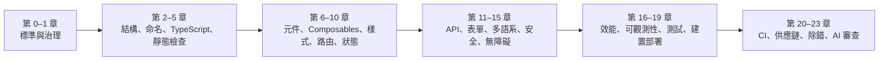
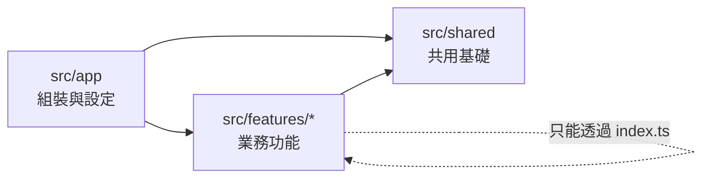
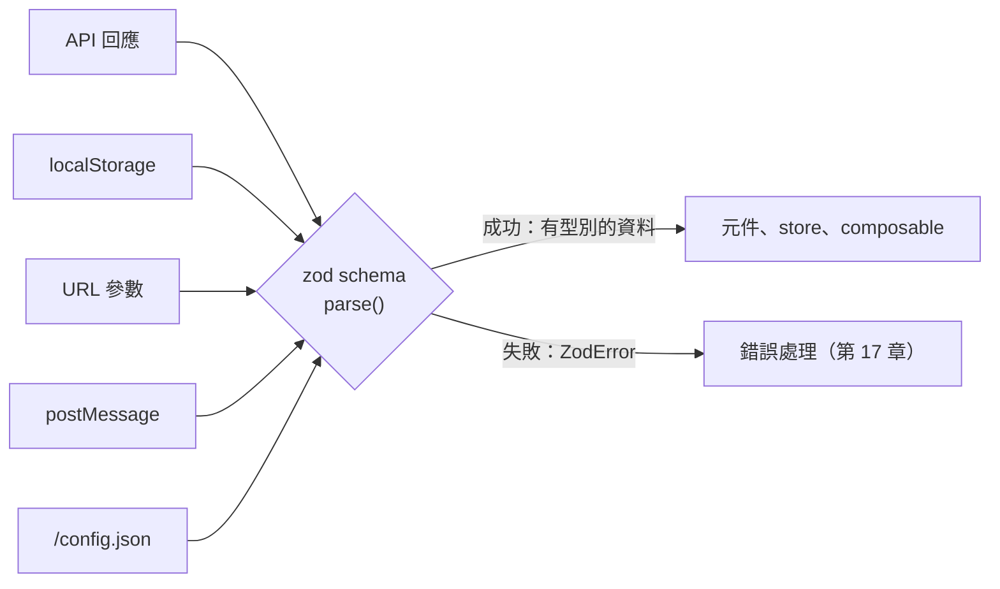
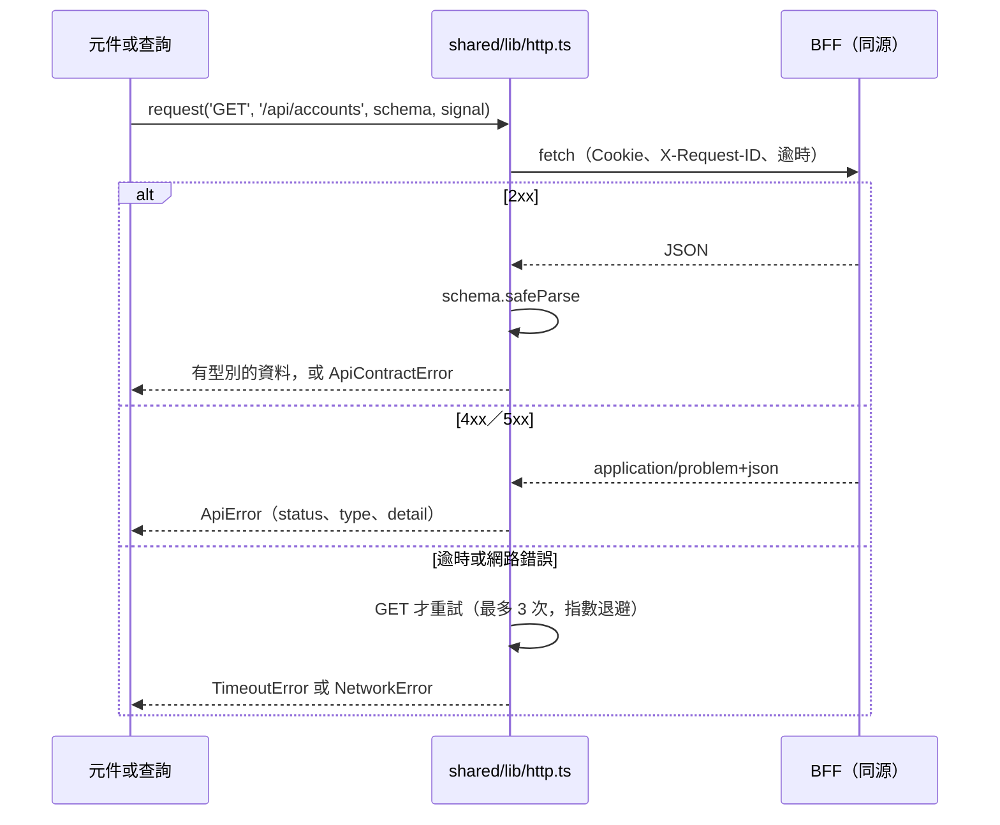
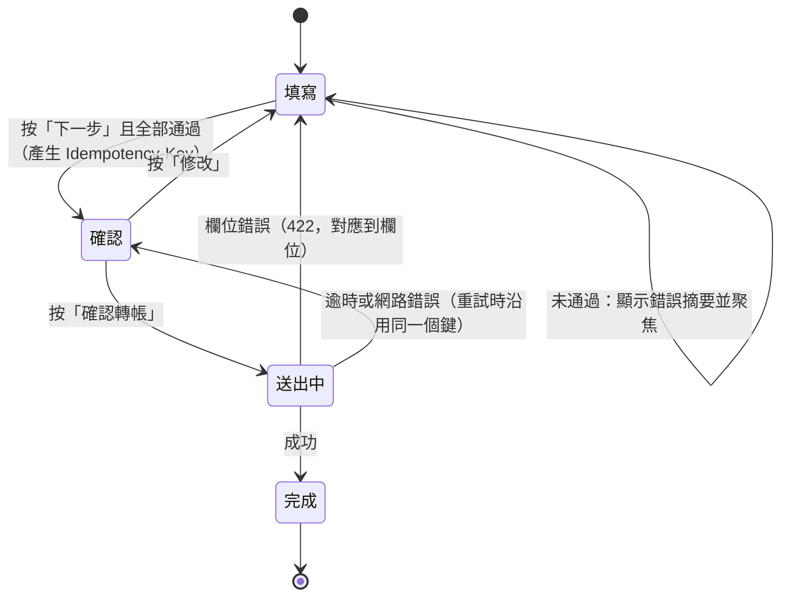
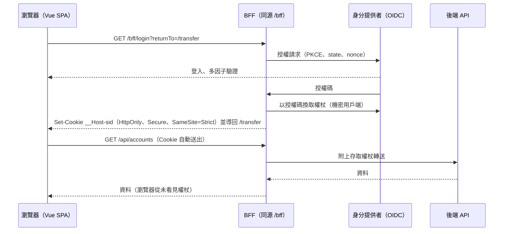
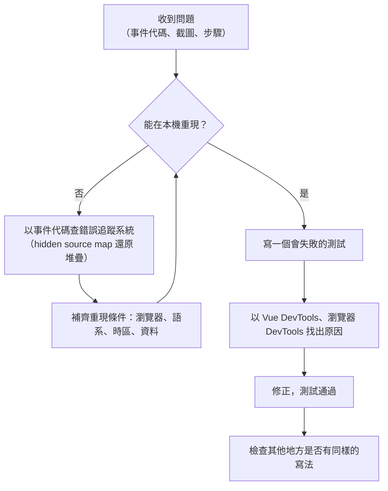
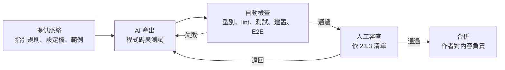

+++
date = '2025-10-31T00:00:00+08:00'
draft = false
title = '前端開發指引'
tags = ['指引', '設計開發']
categories = ['指引']
+++

# 前端開發指引

> **企業標準技術白皮書｜版本 v2.0｜2026-10-09**
>
> 適用範圍：以 Vue 3／TypeScript／Vite／Tailwind CSS 開發的企業 Web 前端，特別是網路銀行、保險、證券等需要處理交易、個資與稽核要求的系統。本指引規範專案結構、命名、TypeScript、靜態檢查、元件、Composables、樣式、路由、狀態管理、API 串接、表單、多語系、前端安全、無障礙實作、效能、錯誤處理與可觀測性、測試、建置部署、版本控制與 CI、相依套件供應鏈、除錯，以及 AI 輔助開發的審查方法。
>
> v2.0 全面改寫 v1.0.0：依 Vue 3.5／Vue Router 5／Pinia 4／Vite 8／TypeScript 6／Tailwind CSS 4／Vitest 5／Playwright 1.64 重新撰寫所有範例，並對照 OWASP ASVS 5.0、OWASP Top 10:2025、WCAG 2.2（ISO/IEC 40500:2025）、Core Web Vitals、RFC 9457、RFC 9700、OAuth 2.0 for Browser-Based Applications、CSP Level 3／Trusted Types、SLSA 1.2 與 CycloneDX 1.7（ECMA-424）。所有規則都有編號（`FE-*`）、驗證方式與範例；範例都以 vue-tsc、ESLint、Vitest、Vite 與 Playwright 實際執行過（見 [附錄 F.3](#f3-查證紀錄)）。

## 目錄

<!-- TOC-AUTO-BEGIN -->

- [0. 文件資訊](#0-文件資訊)
  - [0.1 文件目的與讀者](#01-文件目的與讀者)
  - [0.2 技術與標準基準版本](#02-技術與標準基準版本)
  - [0.3 規範等級與規則格式](#03-規範等級與規則格式)
  - [0.4 與其他指引的關係](#04-與其他指引的關係)
  - [0.5 如何閱讀與使用本指引](#05-如何閱讀與使用本指引)
  - [0.6 例外與豁免流程](#06-例外與豁免流程)
- [1. 前端治理與國際標準](#1-前端治理與國際標準)
  - [1.1 前端品質與 ISO/IEC 25010](#11-前端品質與-isoiec-25010)
  - [1.2 安全與法規基準](#12-安全與法規基準)
  - [1.3 瀏覽器支援政策](#13-瀏覽器支援政策)
  - [1.4 版本支援與升級治理](#14-版本支援與升級治理)
- [2. 專案結構與模組邊界](#2-專案結構與模組邊界)
  - [2.1 標準目錄結構](#21-標準目錄結構)
  - [2.2 路徑別名與匯入](#22-路徑別名與匯入)
  - [2.3 Monorepo 與共用套件](#23-monorepo-與共用套件)
- [3. 命名規範](#3-命名規範)
  - [3.1 檔案與資料夾](#31-檔案與資料夾)
  - [3.2 變數、函式與型別](#32-變數函式與型別)
  - [3.3 TypeScript 的列舉與常數集合](#33-typescript-的列舉與常數集合)
  - [3.4 Vue 元件、Props 與事件](#34-vue-元件props-與事件)
- [4. TypeScript 撰寫規範](#4-typescript-撰寫規範)
  - [4.1 編譯器設定](#41-編譯器設定)
  - [4.2 型別系統的逃生門](#42-型別系統的逃生門)
  - [4.3 外部資料的執行期驗證](#43-外部資料的執行期驗證)
  - [4.4 非同步與例外](#44-非同步與例外)
  - [4.5 金額、數字與日期](#45-金額數字與日期)
  - [4.6 以型別表達狀態](#46-以型別表達狀態)
- [5. 程式風格與靜態檢查](#5-程式風格與靜態檢查)
  - [5.1 工具分工](#51-工具分工)
  - [5.2 ESLint](#52-eslint)
  - [5.3 Prettier](#53-prettier)
  - [5.4 編輯器設定](#54-編輯器設定)
  - [5.5 提交前檢查](#55-提交前檢查)
  - [5.6 註解](#56-註解)
- [6. Vue 元件開發規範](#6-vue-元件開發規範)
  - [6.1 單檔元件結構](#61-單檔元件結構)
  - [6.2 Props](#62-props)
  - [6.3 `v-model` 與 `defineModel`](#63-v-model-與-definemodel)
  - [6.4 事件](#64-事件)
  - [6.5 插槽與泛型元件](#65-插槽與泛型元件)
  - [6.6 範本](#66-範本)
  - [6.7 DOM 存取與識別碼](#67-dom-存取與識別碼)
  - [6.8 響應式](#68-響應式)
  - [6.9 元件介面與實驗性功能](#69-元件介面與實驗性功能)
- [7. Composables 與邏輯重用](#7-composables-與邏輯重用)
  - [7.1 介面設計](#71-介面設計)
  - [7.2 副作用與清理](#72-副作用與清理)
  - [7.3 測試 Composables](#73-測試-composables)
  - [7.4 使用 VueUse](#74-使用-vueuse)
- [8. 樣式與 Tailwind CSS 4](#8-樣式與-tailwind-css-4)
  - [8.1 Tailwind CSS 4 設定](#81-tailwind-css-4-設定)
  - [8.2 Class 的寫法](#82-class-的寫法)
  - [8.3 元件樣式與 `@apply`](#83-元件樣式與-apply)
  - [8.4 響應式與使用者偏好](#84-響應式與使用者偏好)
- [9. 路由與導覽](#9-路由與導覽)
  - [9.1 路由表與延遲載入](#91-路由表與延遲載入)
  - [9.2 導覽守衛](#92-導覽守衛)
  - [9.3 路由參數](#93-路由參數)
  - [9.4 部署後的 chunk 載入失敗](#94-部署後的-chunk-載入失敗)
  - [9.5 檔案式路由（選用）](#95-檔案式路由選用)
- [10. 狀態管理](#10-狀態管理)
  - [10.1 狀態的分類](#101-狀態的分類)
  - [10.2 伺服器狀態：Pinia Colada](#102-伺服器狀態pinia-colada)
  - [10.3 修改資料：`useMutation`](#103-修改資料usemutation)
  - [10.4 Pinia store](#104-pinia-store)
  - [10.5 持久化與登出](#105-持久化與登出)
- [11. API 串接與資料存取](#11-api-串接與資料存取)
  - [11.1 共用的 HTTP 用戶端](#111-共用的-http-用戶端)
  - [11.2 API 契約與型別](#112-api-契約與型別)
  - [11.3 錯誤格式：RFC 9457 Problem Details](#113-錯誤格式rfc-9457-problem-details)
  - [11.4 逾時、重試與取消](#114-逾時重試與取消)
  - [11.5 重複送出與冪等性](#115-重複送出與冪等性)
- [12. 表單與輸入驗證](#12-表單與輸入驗證)
  - [12.1 驗證的分工](#121-驗證的分工)
  - [12.2 欄位的寫法](#122-欄位的寫法)
  - [12.3 後端錯誤與保留輸入](#123-後端錯誤與保留輸入)
  - [12.4 確認步驟與送出控制](#124-確認步驟與送出控制)
- [13. 多語系（i18n）](#13-多語系i18n)
  - [13.1 設定](#131-設定)
  - [13.2 翻譯鍵與訊息](#132-翻譯鍵與訊息)
  - [13.3 格式化與語系屬性](#133-格式化與語系屬性)
- [14. 前端安全](#14-前端安全)
  - [14.1 跨站腳本（XSS）](#141-跨站腳本xss)
  - [14.2 身分驗證與工作階段：BFF 模式](#142-身分驗證與工作階段bff-模式)
  - [14.3 CSP 與安全標頭](#143-csp-與安全標頭)
  - [14.4 敏感資料與瀏覽器 API](#144-敏感資料與瀏覽器-api)
  - [14.5 授權與檔案](#145-授權與檔案)
  - [14.6 閒置逾時與登出](#146-閒置逾時與登出)
- [15. 無障礙實作](#15-無障礙實作)
  - [15.1 語意與鍵盤](#151-語意與鍵盤)
  - [15.2 應用程式外殼：跳過連結與換頁](#152-應用程式外殼跳過連結與換頁)
  - [15.3 對話框](#153-對話框)
  - [15.4 自動化檢測](#154-自動化檢測)
- [16. 效能](#16-效能)
  - [16.1 量測](#161-量測)
  - [16.2 載入效能](#162-載入效能)
  - [16.3 執行期效能](#163-執行期效能)
- [17. 錯誤處理、日誌與可觀測性](#17-錯誤處理日誌與可觀測性)
  - [17.1 全域錯誤處理](#171-全域錯誤處理)
  - [17.2 使用者看到的錯誤](#172-使用者看到的錯誤)
  - [17.3 追蹤與關聯](#173-追蹤與關聯)
- [18. 測試](#18-測試)
  - [18.1 測試基礎設施](#181-測試基礎設施)
  - [18.2 撰寫測試](#182-撰寫測試)
  - [18.3 涵蓋率](#183-涵蓋率)
  - [18.4 端對端測試](#184-端對端測試)
- [19. 建置、環境設定與部署](#19-建置環境設定與部署)
  - [19.1 建置產物與環境設定](#191-建置產物與環境設定)
  - [19.2 Vite 設定](#192-vite-設定)
  - [19.3 容器化](#193-容器化)
  - [19.4 nginx 設定與快取](#194-nginx-設定與快取)
- [20. 版本控制與持續整合](#20-版本控制與持續整合)
  - [20.1 分支與提交](#201-分支與提交)
  - [20.2 CI 工作流程](#202-ci-工作流程)
  - [20.3 程式碼擁有者](#203-程式碼擁有者)
- [21. 相依套件與供應鏈安全](#21-相依套件與供應鏈安全)
  - [21.1 引入與鎖定](#211-引入與鎖定)
  - [21.2 安裝時的防護](#212-安裝時的防護)
  - [21.3 漏洞管理與更新](#213-漏洞管理與更新)
  - [21.4 軟體物料清單（SBOM）與來源證明](#214-軟體物料清單sbom與來源證明)
- [22. 除錯與疑難排解](#22-除錯與疑難排解)
  - [22.1 除錯的流程](#221-除錯的流程)
  - [22.2 常見錯誤對照表](#222-常見錯誤對照表)
  - [22.3 記憶體洩漏與效能問題](#223-記憶體洩漏與效能問題)
- [23. AI 輔助前端開發與審查](#23-ai-輔助前端開發與審查)
  - [23.1 責任與資料保護](#231-責任與資料保護)
  - [23.2 提供脈絡](#232-提供脈絡)
  - [23.3 審查 AI 產出的程式碼](#233-審查-ai-產出的程式碼)
- [附錄 A 規則總表](#附錄-a-規則總表)
- [附錄 B 檢查清單與範本](#附錄-b-檢查清單與範本)
  - [B.1 前端 PR 範本](#b1-前端-pr-範本)
  - [B.2 發布前檢查清單](#b2-發布前檢查清單)
  - [B.3 手動無障礙與跨瀏覽器測試紀錄](#b3-手動無障礙與跨瀏覽器測試紀錄)
- [附錄 C 工具設定與腳本](#附錄-c-工具設定與腳本)
  - [C.1 TypeScript 設定](#c1-typescript-設定)
  - [C.2 ESLint 設定](#c2-eslint-設定)
  - [C.3 package.json](#c3-packagejson)
  - [C.4 指令速查](#c4-指令速查)
- [附錄 D 術語表](#附錄-d-術語表)
- [附錄 E 參考資料](#附錄-e-參考資料)
  - [E.1 標準與規範](#e1-標準與規範)
  - [E.2 框架與工具文件](#e2-框架與工具文件)
  - [E.3 本公司相關指引](#e3-本公司相關指引)
- [附錄 F 修訂紀錄與查證紀錄](#附錄-f-修訂紀錄與查證紀錄)
  - [F.1 v1 與 v2 章節對照](#f1-v1-與-v2-章節對照)
  - [F.2 v1.0 的更正清單](#f2-v10-的更正清單)
  - [F.3 查證紀錄](#f3-查證紀錄)
  - [F.4 待確認與後續更新](#f4-待確認與後續更新)
  - [F.5 修訂紀錄](#f5-修訂紀錄)

<!-- TOC-AUTO-END -->

## 0. 文件資訊

### 0.1 文件目的與讀者

前端是使用者唯一直接接觸的系統元件。轉帳按鈕按兩下是否會重複扣款、登入權杖會不會被惡意腳本讀走、網路中斷時畫面會不會卡在「載入中」、螢幕閱讀器使用者能不能完成申請，這些都由前端程式碼決定。前端的缺陷因此常以客訴、交易爭議、資安事件與法規風險的形式出現，而不只是「畫面不好看」。

AI 程式碼助理讓前端的產出速度大幅提高，同時也帶來新的風險。AI 產生的元件通常可以編譯、畫面也正確，卻常見以下問題：把權杖存在 `localStorage`、以 `v-html` 顯示使用者輸入、沒有處理請求逾時與競態條件、用 `any` 繞過型別錯誤、以 `Math.random()` 產生識別碼、測試只驗證「元件有渲染」。這些問題在 demo 時看不出來，必須知道要檢查什麼、用什麼工具檢查。

本指引有三個目的：

1. **定義標準**：把「好的前端程式碼」拆成可以檢查的規則，讓開發、審查、測試與資安對「完成」有相同的定義。
2. **教會做法**：每條規則都說明理由，並附有正確與錯誤的範例。第一次接觸 Vue 3 或 TypeScript 的工程師，也能照著範例寫出合格的程式碼。
3. **讓人能驗證 AI 產出**：無論程式碼是人寫的還是 AI 產生的，審查者都能依本指引判斷是否正確，並知道要用哪個工具或哪種測試確認。

| 讀者 | 主要用途 | 建議閱讀章節 |
| --- | --- | --- |
| 前端工程師 | 撰寫元件、狀態、API 串接、表單與測試 | 第 2–19 章、附錄 C |
| 新進前端工程師 | 依序學習專案慣例與工具 | 第 0、2–7 章，再依工作內容閱讀其他章 |
| 技術主管、架構師 | 制定專案標準、導入工具與 CI 品質閘門 | 第 1、2、5、19–21 章、附錄 C |
| 程式碼審查者 | 審查前端 PR／MR，包括 AI 產出 | 每節的「🔍 審查與驗證」、第 23 章、附錄 B |
| 測試工程師 | 測試策略、E2E、無障礙與效能量測 | 第 15、16、18 章 |
| 資安與法遵人員 | 前端安全控制、個資遮罩、供應鏈管理 | 第 1.3、14、17、21 章 |

### 0.2 技術與標準基準版本

本指引的範例與規則以下列版本為準（查證日期 2026-10-09）。套件版本以 npm registry 的查詢結果為準，所有範例都在這組版本上實際執行過，查證方法見 [附錄 F.3](#f3-查證紀錄)。

| 類別 | 項目 | 基準版本 | 說明 |
| --- | --- | --- | --- |
| 執行環境 | Node.js | 24.21.0 LTS（Krypton） | Node.js 20 已於 2026-04-30 結束支援；Node.js 26 預計於 2026-10 進入 LTS，可於下一版升級 |
| 框架 | Vue | 3.5.43 | 3.5 起有 `useId()`、`useTemplateRef()`、響應式 props 解構；3.6 仍是 beta（Vapor 模式），不得用於正式環境 |
| 路由 | Vue Router | 5.4.0 | 5.0 把 unplugin-vue-router 併入核心（檔案式路由、型別化路由），無破壞性變更 |
| 狀態管理 | Pinia／`@vue/devtools-api` | 4.0.3／8.2.1 | Pinia 4 只提供 ESM，`@vue/devtools-api` 改為必須自行安裝的 peer dependency |
| 伺服器狀態 | `@pinia/colada` | 1.4.8 | 資料擷取與快取；也可改用 `@tanstack/vue-query` 5.104 |
| 多語系 | vue-i18n | 11.4.13 | v11 起 Legacy API 與 `v-t` 已棄用，v12 會移除 |
| 語言 | TypeScript | 6.0.3 | TypeScript 7.0（Go 原生編譯器）已於 2026-07-08 發布，但 7.0 沒有穩定的程式介面，typescript-eslint 8.71 要求 `< 6.1`，vue-tsc 也依賴該介面，因此型別檢查與 lint 以 6.0 執行 |
| 型別檢查 | vue-tsc | 3.3.12 | 檢查 `.vue` 檔的範本與 props 型別 |
| 建置 | Vite／`@vitejs/plugin-vue` | 8.3.4／6.0.9 | Vite 8 以 Rolldown 與 Oxc 取代 esbuild 與 Rollup |
| 樣式 | Tailwind CSS（含 `@tailwindcss/vite`） | 4.3.3 | v4 以 CSS 的 `@theme` 設定，不再使用 `tailwind.config.js` |
| 靜態檢查 | ESLint／typescript-eslint／eslint-plugin-vue | 10.12.0／8.71.1／10.11.1 | ESLint 10 只支援 flat config（`eslint.config.js`） |
| 靜態檢查 | eslint-plugin-vuejs-accessibility／eslint-plugin-no-unsanitized | 2.6.2／4.1.5 | 無障礙與 DOM 注入檢查 |
| 格式化 | Prettier／eslint-config-prettier | 3.9.9／10.1.8 | 格式交給 Prettier，ESLint 只檢查程式碼品質 |
| 單元測試 | Vitest／`@vue/test-utils`／`@testing-library/vue`／jsdom | 5.0.3／2.5.1／8.1.0／30.1.2 | Vitest 5 預設在每個測試前清除 mock |
| API 模擬 | MSW | 3.0.2 | v3 只提供 ESM，要求 Node.js 22 以上 |
| 端對端測試 | Playwright／`@axe-core/playwright` | 1.64.0／4.13.0 | |
| 執行期驗證 | zod | 4.6.5 | 驗證 API 回應、設定檔與表單 |
| HTML 淨化 | DOMPurify | 3.4.16 | 必須顯示 HTML 時使用 |
| API 型別產生 | openapi-typescript | 7.13.0 | peer dependency 是 `typescript@^5`，需在獨立的工具環境執行（見 11.2）；以產生的型別建立 HTTP 用戶端的 openapi-fetch 0.17 為選用，本指引未使用 |
| 效能量測 | web-vitals | 6.2.3 | `onLCP`、`onINP`、`onCLS`（`onFID` 已移除） |
| 套件管理 | npm／pnpm | 11.13（Node.js 24 內附）／12.10 | 範例以 npm 撰寫 |

| 類別 | 標準或文件 | 版本 | 本指引對應章節 |
| --- | --- | --- | --- |
| 應用程式安全驗證 | OWASP ASVS | 5.0.0（2025-05） | 14，V3 Web Frontend Security 為主要依據 |
| 網頁應用風險 | OWASP Top 10 | 2025 | 1.3、14、21（A03 Software Supply Chain Failures、A10 Mishandling of Exceptional Conditions 為新類別） |
| 內容安全政策 | W3C CSP Level 3／Trusted Types | 工作草案；Trusted Types 於 2026-02 成為 Baseline Newly Available | 14.4 |
| OAuth 安全 | RFC 9700（BCP 240）／OAuth 2.0 for Browser-Based Applications | 2025-01／draft-ietf-oauth-browser-based-apps-26（2025-12，草案） | 14.3 |
| HTTP API 錯誤格式 | RFC 9457 Problem Details for HTTP APIs | 2023-07 | 11.4 |
| 網頁無障礙 | W3C WCAG／ISO/IEC 40500 | 2.2／2025 | 15 |
| 網頁效能 | Core Web Vitals | LCP ≤ 2.5 秒、INP ≤ 200 毫秒、CLS ≤ 0.1（第 75 百分位） | 16 |
| 瀏覽器支援基準 | Web Platform Baseline | Widely available（Vite 8 預設建置目標：Chrome／Edge 111、Firefox 114、Safari 16.4） | 1.4、19.1 |
| 產品品質模型 | ISO/IEC 25010 | 2023 | 1.2 |
| 語言規格 | ECMAScript／ECMA-402（Intl） | 2026 | 4、13 |
| 軟體供應鏈 | SLSA／CycloneDX（ECMA-424） | 1.2（2025-11）／1.7（2025-10，ECMA-424 第 2 版） | 21 |
| 版本與提交 | Semantic Versioning／Conventional Commits | 2.0.0／1.0.0 | 20 |
| 可觀測性 | OpenTelemetry（JavaScript SDK `@opentelemetry/sdk-trace-web`） | 2.12.0 | 17.4 |

### 0.3 規範等級與規則格式

本文規則採用 [RFC 2119](https://www.rfc-editor.org/rfc/rfc2119) 與 [RFC 8174](https://www.rfc-editor.org/rfc/rfc8174) 的語意：

| 等級 | 英文 | 意義 | 不遵守時的處理 |
| --- | --- | --- | --- |
| **必須** | MUST | 不遵守會造成缺陷、資安風險或違反法規 | 不得合併；如需例外，必須走 0.6 的豁免流程 |
| **應該** | SHOULD | 業界共識的最佳實務，除非有充分理由 | 不遵守時必須在 PR／MR 說明理由 |
| **可以** | MAY | 建議做法，依專案規模與風險選用 | 不阻擋合併 |
| **不應該** | SHOULD NOT | 通常是錯誤的做法，除非有充分理由 | 採用時必須說明理由與替代措施 |

每條規則都有編號，格式為 `FE-<領域>-<三位數序號>`。開頭的 `FE` 用來和其他指引的規則區分，例如 UIUX 指引的 `UX-VUE-001`、安全程式碼指引的 `SCG-XSS-001`。編號一經發布不會重編，新增規則使用該領域尚未使用的號碼。

| 前綴 | 領域 | 章 | 前綴 | 領域 | 章 |
| --- | --- | --- | --- | --- | --- |
| `FE-GOV` | 治理與國際標準 | 1 | `FE-I18N` | 多語系 | 13 |
| `FE-STR` | 專案結構與模組邊界 | 2 | `FE-SEC` | 前端安全 | 14 |
| `FE-NAM` | 命名 | 3 | `FE-A11Y` | 無障礙實作 | 15 |
| `FE-TS` | TypeScript | 4 | `FE-PRF` | 效能 | 16 |
| `FE-LINT` | 程式風格與靜態檢查 | 5 | `FE-OBS` | 錯誤處理與可觀測性 | 17 |
| `FE-CMP` | Vue 元件 | 6 | `FE-TST` | 測試 | 18 |
| `FE-CMS` | Composables | 7 | `FE-BLD` | 建置、設定與部署 | 19 |
| `FE-CSS` | 樣式與 Tailwind CSS | 8 | `FE-CI` | 版本控制與 CI | 20 |
| `FE-RTR` | 路由 | 9 | `FE-DEP` | 相依套件與供應鏈 | 21 |
| `FE-STA` | 狀態管理 | 10 | `FE-DBG` | 除錯與疑難排解 | 22 |
| `FE-API` | API 串接 | 11 | `FE-AI` | AI 輔助開發與審查 | 23 |
| `FE-FRM` | 表單與輸入驗證 | 12 | | | |

**驗證方式欄位：** 每張規則表的最後一欄說明「怎麼確認有遵守這條規則」。審查者應先看這一欄，再決定要花多少心力人工檢查。

| 圖示 | 意義 | 範例 | 審查者該做什麼 |
| --- | --- | --- | --- |
| 🤖 | 工具可自動檢查 | 🤖 `vue-tsc`、🤖 ESLint `vue/no-v-html`、🤖 axe | 確認 CI 有執行該工具與規則，而且規則沒有被停用 |
| 🧪 | 需要以測試或量測證明 | 🧪 Vitest 元件測試、🧪 Playwright E2E、🧪 Lighthouse | 確認有測試，而且違反規則時測試會失敗 |
| 👁 | 只能由人判斷 | 👁 程式碼審查、👁 架構審查 | 依該節「🔍 審查與驗證」的問題逐項確認 |

**範例標記：** 範例以 `✅ <規則編號>` 標示符合規則的寫法，以 `❌ <規則編號>` 標示違規寫法。每條規則都至少出現在一個範例中（統計見 [附錄 A](#附錄-a-規則總表)）。標示「（片段）」的範例只截取重點；其他範例都是完整、可以直接執行的程式。**❌ 範例只供教學，請勿複製到正式程式碼。** 每個 ❌ 範例都經過實測，確認對應的工具會抓到（或確認工具抓不到、只能靠審查），結果列在附錄 F.3。

### 0.4 與其他指引的關係

本指引規範「前端程式碼怎麼寫」。介面設計、一般程式寫作原則、安全控制的完整說明與測試策略，以專門指引為準：

| 主題 | 指引 | 本文的分工 |
| --- | --- | --- |
| 使用者研究、視覺、元件設計、無障礙設計、UX 文案 | [UIUX指引]() | 第 8、15 章只規範工程實作；設計決策以 UIUX 指引為準 |
| 命名、函式、錯誤處理等跨語言寫作原則 | [程式寫作指引]() | 本文只寫前端特有的規則 |
| 渲染策略（SPA／SSR／SSG）、微前端、前後端邊界 | [架構設計指引]() | 本文以 SPA ＋ BFF 為預設架構 |
| XSS、CSRF、身分驗證、密碼學的完整控制 | [安全程式碼指引]() | 第 14 章只規範瀏覽器端的控制 |
| 測試策略、測試金字塔、CI 品質閘門 | [測試與品質保證指引]() | 第 18 章只規範前端測試的寫法 |
| PR／MR 審查流程 | [code review 指引]() | 第 20、23 章與附錄 B 提供前端審查重點 |
| 後端 API 與 BFF 實作 | [後端開發指引]() | 第 11、14 章說明前端對 API 的要求 |
| 重構手法 | [refactor 重構指引]() | 第 22 章只處理前端除錯 |

### 0.5 如何閱讀與使用本指引

每一節都依相同的結構撰寫：

1. **概念說明**：為什麼需要這些規則，背後的原理或標準。
2. **規則表**：編號、等級、規則內容、驗證方式。
3. **範例**：❌ 常見錯誤與 ✅ 正確做法，範例中標註規則編號。
4. **🔍 審查與驗證**：自動檢查方式、人工審查問題、AI 常見錯誤。

建議的閱讀與導入順序：



**以本指引作為 AI 的產出依據：** 請 AI 產生程式碼時，把相關章節的規則表與 ✅ 範例一起提供，並要求 AI 在程式碼註解或 PR 說明中列出它遵守的規則編號。審查時再依該節的「🔍 審查與驗證」逐項檢查。能自動化的檢查（🤖）一律放進 CI（附錄 C 有完整設定），人工檢查（👁）列入 PR 範本（附錄 B）。完整流程見第 23 章。

**新專案導入：** 先複製附錄 C 的設定檔（`tsconfig*.json`、`eslint.config.js`、`vite.config.ts`、`playwright.config.ts`、CI 工作流程），確認 `npm run typecheck`、`npm run lint`、`npm run test:unit`、`npm run build` 都能通過，再開始開發。**既有專案導入：** 先開啟 🤖 規則並把現有違規列成清單，新程式碼必須通過，舊程式碼依風險排程修正；不得用關閉規則的方式讓 CI 通過。

### 0.6 例外與豁免流程

規則不可能涵蓋所有情境。專案無法遵守某條「必須」規則時，依下列流程申請豁免，**不得**以關閉 lint 規則、加 `// @ts-ignore` 或直接略過的方式處理：

1. 在專案的例外清單（建議放在程式庫的 `docs/fe-exceptions.md`）寫明豁免的規則編號、適用範圍（檔案或元件）、原因、替代措施與到期日。
2. 由技術主管核准；涉及 `FE-SEC-*`、`FE-DEP-*` 的豁免還需資安負責人核准。
3. 程式碼中的停用註解必須寫上例外編號，例如 `// eslint-disable-next-line vue/no-v-html -- FE-EX-2026-003`。
4. 到期前重新評估；到期未處理的例外視為缺陷，列入下一個迭代處理。

```markdown
<!-- docs/fe-exceptions.md -->
# FE-EX-2026-003 豁免 FE-SEC-001：公告內容以 v-html 顯示

- 狀態：approved（有效至 2027-03-31）
- 豁免規則：FE-SEC-001（不得以 v-html 顯示未經淨化的內容）
- 適用範圍：src/features/notice/components/NoticeBody.vue
- 原因：公告由內容管理系統以 HTML 編輯，需保留標題、清單與連結格式。
- 替代措施：內容一律經 src/shared/lib/sanitize.ts 的 DOMPurify 設定淨化；
  CSP 啟用 Trusted Types（FE-SEC-008），未經政策的 innerHTML 會被瀏覽器拒絕。
- 核准：技術主管 王小明、資安負責人 李小華，2026-10-09
```

#### 🔍 0.6 審查與驗證

- **自動檢查：** CI 搜尋 `eslint-disable`、`@ts-ignore`、`@ts-expect-error`，每一筆都必須附上 `-- FE-EX-` 編號或說明。ESLint 的 `--report-unused-disable-directives` 會找出已經不需要的停用註解。
- **人工審查問題：**
  1. 例外的替代措施是否真的降低了同樣的風險？
  2. 例外的範圍是否最小（單一檔案或單一行），而不是整個資料夾？
  3. 到期日是否合理，是否有負責人？
- **AI 常見錯誤：** AI 助理遇到型別或 lint 錯誤時，常直接加上 `// @ts-ignore`、`as any` 或 `// eslint-disable-next-line`，讓 CI 通過。這種修改必須視為「申請豁免」，不能當成修正。

## 1. 前端治理與國際標準

前端專案的壽命通常比框架的一個主要版本還長。沒有治理的專案，常見的結局是：Node.js 版本早已結束支援、框架停在兩個主版本以前、每個人用自己的寫法、CI 只跑建置不跑測試。本章規範「誰決定、依據什麼標準、怎樣算完成」。

### 1.1 前端品質與 ISO/IEC 25010

ISO/IEC 25010:2023 把軟體產品品質分成九個特性。前端程式碼影響其中大部分，下表說明每個特性在前端的意義，以及本指引對應的章節：

| ISO/IEC 25010:2023 品質特性 | 在前端的意義 | 主要對應章節 |
| --- | --- | --- |
| 功能適合性（Functional suitability） | 計算正確（金額、日期、時區）、表單驗證與後端一致 | 4、12、13 |
| 效能效率（Performance efficiency） | 載入速度、互動回應（INP）、記憶體不洩漏 | 16 |
| 相容性（Compatibility） | 支援的瀏覽器與裝置、與後端 API 版本相容 | 1.3、11 |
| 互動能力（Interaction capability，2011 版稱「可用性」） | 無障礙、錯誤訊息、載入與空狀態 | 12、15，設計面見 UIUX 指引 |
| 可靠性（Reliability） | 網路錯誤、逾時、重試、離線時的行為 | 11、17 |
| 資訊安全（Security） | XSS、CSRF、權杖保護、供應鏈 | 14、21 |
| 維護性（Maintainability） | 結構、命名、型別、測試、模組邊界 | 2–7、18 |
| 彈性（Flexibility，2011 版稱「可攜性」） | 環境設定與建置產物分離、多語系 | 13、19 |
| 安全性（Safety，2023 版新增） | 避免使用者誤操作造成損失，例如重複送出交易 | 11.5、12 |

| 編號 | 等級 | 規則 | 驗證方式 |
| --- | --- | --- | --- |
| `FE-GOV-001` | 必須 | 專案必須有一份「前端完成的定義」（Definition of Done），至少包含：型別檢查、lint、單元測試、建置、E2E 冒煙測試全部通過，以及 PR 範本的人工檢查項目 | 🤖 CI 必要檢查（branch protection）；👁 PR 範本 |
| `FE-GOV-002` | 必須 | 合併到主幹之前，CI 必須執行 `FE-GOV-001` 的所有自動檢查，任一項失敗都不得合併 | 🤖 branch protection 設定 |
| `FE-GOV-003` | 應該 | 影響整個專案的技術選擇（框架、狀態管理、HTTP 用戶端、測試工具、CSS 方案）應以架構決策紀錄（ADR）記錄背景、選項與理由 | 👁 `docs/adr/` 審查 |

✅ `FE-GOV-001`：完成的定義放在程式庫中，與 CI 設定和 PR 範本互相對應。

```markdown
<!-- docs/definition-of-done.md -->
# 前端完成的定義（Definition of Done）

## 自動檢查（CI 必要檢查，任一失敗不得合併：FE-GOV-002）
- [ ] npm run typecheck（vue-tsc，0 錯誤）
- [ ] npm run lint（ESLint，0 錯誤、0 警告）
- [ ] npm run test:unit（Vitest，涵蓋率未低於門檻：FE-TST-008）
- [ ] npm run build（Vite，bundle 未超過預算：FE-PRF-003）
- [ ] npm run test:e2e（Playwright 冒煙測試 ＋ axe 無障礙掃描：FE-A11Y-008）
- [ ] npm audit --audit-level=high（FE-DEP-004）

## 人工檢查（PR 範本，見附錄 B.1）
- [ ] 新增或修改的畫面已用鍵盤操作一次
- [ ] 錯誤、載入中、空資料三種狀態都有處理
- [ ] 沒有新增 eslint-disable 或 @ts-ignore（或已登記例外編號）
```

✅ `FE-GOV-003`：ADR 只記錄「為什麼」，讓後來的人知道當時的限制。

```markdown
<!-- docs/adr/0007-server-state-library.md -->
# ADR-0007 伺服器狀態以 Pinia Colada 管理

- 狀態：accepted（2026-09-15）
- 背景：v1 把 API 回應存在 Pinia store，每個 store 自行處理載入中、錯誤、快取與重新整理，
  重複程式碼多，切換頁面時常顯示過期資料。
- 選項：(1) 維持 Pinia store；(2) @tanstack/vue-query 5；(3) @pinia/colada 1。
- 決定：選 (3)。與 Pinia 共用 devtools，套件小，API 與 TanStack Query 相近，日後可替換。
- 後果：伺服器狀態一律用 useQuery／useMutation；Pinia store 只放用戶端狀態（FE-STA-001）。
  團隊需要半天的教育訓練；既有 store 依功能模組逐步移轉。
```

✅ `FE-GOV-002`：以 GitHub 的 repository ruleset 保護 `main`，必要檢查與第 20.2 節的 CI job 名稱一致。

```json
{
  "name": "main-protection",
  "target": "branch",
  "enforcement": "active",
  "conditions": { "ref_name": { "include": ["refs/heads/main"], "exclude": [] } },
  "rules": [
    { "type": "deletion" },
    { "type": "non_fast_forward" },
    {
      "type": "pull_request",
      "parameters": {
        "required_approving_review_count": 1,
        "require_code_owner_review": true,
        "dismiss_stale_reviews_on_push": true,
        "require_last_push_approval": true,
        "required_review_thread_resolution": true
      }
    },
    {
      "type": "required_status_checks",
      "parameters": {
        "strict_required_status_checks_policy": true,
        "required_status_checks": [{ "context": "verify" }, { "context": "e2e" }]
      }
    }
  ]
}
```

❌ `FE-GOV-002`：CI 只是「參考」，失敗也能合併；或者管理員可以略過保護直接推送。這等於沒有完成的定義。

### 1.2 安全與法規基準

前端無法單獨保證安全，但許多攻擊（XSS、點擊劫持、權杖竊取、惡意套件）都是從瀏覽器端開始。OWASP Top 10:2025 中與前端直接相關的類別如下：

| OWASP Top 10:2025 | 前端的典型問題 | 本指引的對策 |
| --- | --- | --- |
| A01 Broken Access Control | 只在前端隱藏按鈕，後端未檢查權限；登入後的導向參數未驗證（open redirect） | `FE-SEC-015`、`FE-RTR-006` |
| A02 Security Misconfiguration | 缺少 CSP 與安全標頭；正式環境開啟 source map 或 devtools | `FE-SEC-008`、`FE-SEC-009`、`FE-BLD-006` |
| A03 Software Supply Chain Failures | 惡意或被入侵的 npm 套件、未鎖定版本、從 CDN 載入未驗證的腳本 | 第 21 章、`FE-SEC-010` |
| A04 Cryptographic Failures | 在前端「加密」敏感資料、用 `Math.random()` 產生識別碼 | `FE-SEC-011`、`FE-SEC-012` |
| A05 Injection | `v-html`、`innerHTML`、`javascript:` 連結造成的 XSS | `FE-SEC-001`～`FE-SEC-003` |
| A07 Authentication Failures | 權杖存在 `localStorage`、登出時未清除狀態 | `FE-SEC-004`～`FE-SEC-006`、`FE-SEC-016` |
| A08 Software or Data Integrity Failures | 第三方腳本沒有 SRI；信任未驗證的 API 回應 | `FE-SEC-010`、`FE-API-003` |
| A09 Security Logging and Alerting Failures | 前端錯誤沒有回報，或回報內容含個資 | 第 17 章 |
| A10 Mishandling of Exceptional Conditions | 未處理的 Promise 拒絕、錯誤後畫面停在半完成狀態 | `FE-TS-007`、第 11、17 章 |

| 編號 | 等級 | 規則 | 驗證方式 |
| --- | --- | --- | --- |
| `FE-GOV-004` | 必須 | 專案必須宣告適用的 OWASP ASVS 5.0 等級（金融與處理個資的系統至少 Level 2），並把 V3 Web Frontend Security 中適用的要求對應到本指引的規則或專案的測試 | 👁 安全需求對照表審查 |
| `FE-GOV-005` | 必須 | 前端顯示、暫存或回報的個人資料必須符合最小化原則：只取得與顯示完成任務所需的欄位，帳號、身分證字號、卡號等資料預設遮罩 | 👁 審查 API 回應欄位與畫面；🧪 E2E 檢查遮罩 |

✅ `FE-GOV-004`：安全需求對照表把 ASVS 要求連到規則與驗證方法，資安稽核時可以直接出示。

```markdown
<!-- docs/security/asvs-frontend-mapping.md（片段） -->
| ASVS 5.0 要求（V3 Web Frontend Security） | 等級 | 本專案做法 | 驗證 |
| --- | --- | --- | --- |
| 3.4.3 CSP 以回應標頭設定，至少包含 object-src 'none' 與 base-uri 'none'，並以 nonce 或 hash 限制腳本 | L2 | nginx 回應標頭（FE-SEC-008） | e2e/security-headers.spec.ts |
| 3.3.1 Cookie 設定 Secure，名稱使用 __Host- 前綴 | L1 | BFF 設定 __Host-sid（FE-SEC-006） | e2e/security-headers.spec.ts |
| 3.5.1 跨來源的狀態變更請求有 CSRF 防護 | L1 | X-CSRF-Token ＋ SameSite=Strict（FE-SEC-007） | src/shared/lib/http.spec.ts |
```

✅ `FE-GOV-005`：API 只回傳遮罩後的帳號；前端不自行從完整帳號遮罩。

```ts
// ✅ FE-GOV-005 API 回應的 schema 只有遮罩後的帳號，沒有完整帳號欄位
import { z } from '@/shared/lib/z'

export const AccountSummary = z.object({
  id: z.uuid(),
  nickname: z.string().max(20),
  maskedNumber: z.string().regex(/^\*{4,}\d{4}$/), // 例如 ********1234
  currency: z.enum(['TWD', 'USD', 'JPY']),
  balance: z.string().regex(/^-?\d+(\.\d{1,2})?$/), // 金額以字串傳遞（FE-TS-009）
})
export type AccountSummary = z.infer<typeof AccountSummary>
```

### 1.3 瀏覽器支援政策

「支援哪些瀏覽器」決定了可以使用哪些 JavaScript 與 CSS 功能、建置時要轉譯到哪個版本、要測試哪些環境。Web Platform Baseline 把功能分成「Newly available」（三大瀏覽器引擎都已支援）與「Widely available」（Newly available 滿 30 個月）。Vite 8 的預設建置目標 `'baseline-widely-available'` 對應 Chrome／Edge 111、Firefox 114、Safari 16.4。

| 編號 | 等級 | 規則 | 驗證方式 |
| --- | --- | --- | --- |
| `FE-GOV-006` | 必須 | 專案必須以文件宣告支援的瀏覽器範圍，且 Vite 的 `build.target` 必須與宣告一致；應以 Baseline Widely available 為預設 | 🤖 檢查 `vite.config.ts`；👁 文件審查 |
| `FE-GOV-007` | 應該 | 使用 Baseline Newly available 或尚未達 Baseline 的 API 時，應做功能偵測並提供替代行為，不得只在支援的瀏覽器上可用 | 👁 程式碼審查；🧪 Playwright 跨瀏覽器測試 |

✅ `FE-GOV-006`：支援範圍寫在文件中，`build.target` 不改動 Vite 8 的預設值，兩者一致。

```markdown
<!-- docs/browser-support.md -->
# 瀏覽器支援政策（2026-10 起）

- 基準：Web Platform Baseline Widely available（Vite 8 預設 build.target）
- 等同：Chrome／Edge 111+、Firefox 114+、Safari／iOS Safari 16.4+
- 不支援：Internet Explorer、舊版 Edge（EdgeHTML）
- 測試：Playwright 以 chromium、firefox、webkit 三個專案執行 E2E（FE-TST-010）
- 變更：每年 1 月隨 Baseline 更新一次，以 ADR 記錄
```

✅ `FE-GOV-007`：`Intl.DurationFormat` 在 Baseline 2025 才成為 Newly available，使用前先偵測。

```ts
// ✅ FE-GOV-007 功能偵測，不支援時改用替代格式
export function formatMinutes(minutes: number, locale: string): string {
  if ('DurationFormat' in Intl) {
    return new Intl.DurationFormat(locale, { style: 'long' }).format({ minutes })
  }
  return `${minutes} 分鐘`
}
```

### 1.4 版本支援與升級治理

| 編號 | 等級 | 規則 | 驗證方式 |
| --- | --- | --- | --- |
| `FE-GOV-008` | 必須 | 專案使用的 Node.js、框架與主要工具必須在官方支援期內；Node.js 必須使用 LTS 版本，並以 `engines` 與 `.nvmrc`（或 `.node-version`）固定 | 🤖 CI 讀取 `.nvmrc`；🤖 `npm install` 的 `engine-strict` |
| `FE-GOV-009` | 應該 | 框架與主要工具的新主版本發布後，應在 6 個月內評估、12 個月內完成升級；評估結果以 ADR 記錄 | 👁 季度技術盤點 |

✅ `FE-GOV-008`：`engines` 宣告與 `.nvmrc` 一致，`.npmrc` 開啟 `engine-strict` 讓版本不符時安裝失敗。

```json
{
  "name": "ebank-web",
  "private": true,
  "type": "module",
  "engines": { "node": ">=24.11.0 <25" },
  "packageManager": "npm@11.13.0"
}
```

```ini
# .nvmrc
24.21.0
```

```ini
# .npmrc
engine-strict=true
```

❌ `FE-GOV-008`：v1.0 的 Dockerfile 使用 `node:20-alpine`。Node.js 20 已於 2026-04-30 結束支援，不再有安全性更新。

```dockerfile
# ❌ FE-GOV-008 已結束支援的 Node.js 版本
FROM node:20-alpine AS builder
```

✅ `FE-GOV-009`：升級評估寫成 ADR，包含破壞性變更與影響範圍。

```markdown
<!-- docs/adr/0011-upgrade-pinia-4.md -->
# ADR-0011 升級 Pinia 3 → 4

- 狀態：accepted（2026-09-01）
- 破壞性變更：只提供 ESM；@vue/devtools-api 8 改為 peer dependency，必須自行安裝。
- 影響：本專案已是 ESM，無 CJS 相依；需在 package.json 加入 @vue/devtools-api。
- 驗證：typecheck、單元測試、E2E 全部通過；devtools 的 Pinia 面板正常。
- 時程：2026-09 第 2 個迭代完成。
```

#### 🔍 第 1 章審查與驗證

- **自動檢查：** CI 的必要檢查清單與 `docs/definition-of-done.md` 一致；CI 使用的 Node.js 版本來自 `.nvmrc`，不是寫死在工作流程中。
- **人工審查問題：**
  1. 新增的技術選擇（例如換 HTTP 用戶端、加入新的 UI 套件）是否有 ADR？
  2. API 回應是否包含畫面用不到的個人資料欄位？
  3. 使用的瀏覽器 API 是否在宣告的支援範圍內？不在範圍內時是否有功能偵測？
- **AI 常見錯誤：** AI 產生的 Dockerfile、CI 工作流程與 `package.json` 常使用訓練資料中的舊版本（`node:18`、`node:20`、`actions/setup-node@v3`）。審查時一律對照 0.2 的基準版本。

## 2. 專案結構與模組邊界

專案結構決定了「一個功能的程式碼散落在幾個資料夾」。v1.0 採用依技術類型分類的結構（`api/`、`components/`、`stores/`、`pages/` 各一個資料夾），修改「轉帳」功能時要同時開啟五、六個資料夾，刪除功能時也很難確定哪些檔案可以一起刪。專案變大後，任何檔案都可以匯入任何檔案，形成難以拆解的相依網。

本指引改採**依功能分類**（feature-based）的結構，並用 ESLint 強制模組之間的相依方向。

### 2.1 標準目錄結構

✅ `FE-STR-001`：標準目錄結構。

```text
ebank-web/
├── docs/                        # ADR、完成的定義、例外清單、瀏覽器支援政策
├── e2e/                         # Playwright 端對端測試
├── public/                      # 不經建置、原樣複製的檔案（favicon、robots.txt）
├── src/
│   ├── app/                     # 應用程式組裝：進入點、根元件、路由表、全域外掛
│   │   ├── main.ts
│   │   ├── App.vue
│   │   ├── router.ts
│   │   ├── i18n.ts
│   │   └── errorHandler.ts
│   ├── features/                # 功能模組：每個資料夾是一個業務功能
│   │   ├── accounts/
│   │   │   ├── index.ts         # 公開介面：其他模組只能從這裡匯入
│   │   │   ├── schemas.ts       # API 資料的 zod schema 與型別
│   │   │   ├── api.ts           # 此功能的 API 呼叫
│   │   │   ├── queries.ts       # 伺服器狀態（useQuery／useMutation）
│   │   │   ├── components/      # 只在此功能使用的元件
│   │   │   ├── pages/           # 路由頁面
│   │   │   └── *.spec.ts        # 測試與原始碼放在一起
│   │   ├── transfer/
│   │   └── auth/
│   ├── shared/                  # 與業務無關、可被任何功能使用的程式碼
│   │   ├── components/          # 基礎元件（BaseButton、BaseTextField）
│   │   ├── composables/         # 通用 composables（useEventListener）
│   │   ├── lib/                 # http、money、logger、sanitize 等工具
│   │   └── styles/              # Tailwind 進入點與 design token
│   ├── locales/                 # 翻譯檔（zh-TW.json、en-US.json）
│   ├── test/                    # 測試共用設定與 MSW handlers
│   └── shims-vue.d.ts
├── index.html
├── eslint.config.js
├── package.json
├── playwright.config.ts
├── tsconfig.json               # 只列出參照：tsconfig.app.json（src）、tsconfig.node.json（設定檔與 E2E）
├── tsconfig.base.json          # 共用的嚴格設定（FE-TS-001）
└── vite.config.ts
```

三個頂層資料夾的相依方向是單向的：



| 編號 | 等級 | 規則 | 驗證方式 |
| --- | --- | --- | --- |
| `FE-STR-001` | 必須 | 原始碼必須分成 `src/app`（組裝）、`src/features/<功能>`（業務）、`src/shared`（共用）三層；同一功能的元件、API、狀態、頁面與測試放在同一個功能資料夾 | 👁 程式碼審查 |
| `FE-STR-002` | 必須 | 相依方向必須是 `app → features → shared`：`src/shared` 不得匯入 `features` 或 `app`，`src/features` 不得匯入 `app` | 🤖 ESLint `no-restricted-imports` |
| `FE-STR-003` | 必須 | 功能模組之間只能透過對方的公開介面 `@/features/<功能>`（即 `index.ts`）匯入，不得匯入對方的內部檔案；同一功能內部以相對路徑匯入 | 🤖 ESLint `no-restricted-imports` |
| `FE-STR-004` | 應該 | 測試檔應與被測檔案放在同一資料夾（`AccountList.vue` 與 `AccountList.spec.ts`）；E2E 測試放在根目錄的 `e2e/` | 👁 程式碼審查 |
| `FE-STR-005` | 不應該 | 不應該建立沒有明確主題的「雜物」資料夾或檔案（`utils.ts`、`common/`、`helpers/`、`misc/`）；共用程式碼應依用途命名，例如 `shared/lib/money.ts` | 👁 程式碼審查 |

✅ `FE-STR-003`：功能模組的 `index.ts` 只匯出其他模組需要的東西；內部的元件與 API 細節不對外公開。

```ts
// ✅ FE-STR-003 src/features/accounts/index.ts：accounts 功能的公開介面（片段，完整內容見 10.3 節）
export { useAccountsQuery } from './queries'
export type { AccountSummary } from './schemas'
// 頁面以動態匯入函式公開：路由表可以延遲載入，又不必匯入內部路徑（FE-RTR-001）
export const loadAccountsPage = () => import('./pages/AccountsPage.vue')
```

❌ `FE-STR-003`：轉帳功能直接匯入帳戶功能的內部檔案。之後 accounts 調整內部結構時，transfer 會跟著壞掉。

```ts
// ❌ FE-STR-003 繞過公開介面，匯入其他功能的內部檔案
import { fetchAccounts } from '@/features/accounts/api'

export const loadForTransfer = () => fetchAccounts()
```

✅ `FE-STR-003`：改從公開介面匯入。

```ts
// ✅ FE-STR-003（片段）
import { useAccountsQuery } from '@/features/accounts'
```

❌ `FE-STR-002`：共用層的工具匯入了業務功能，造成「共用」程式碼依賴特定功能，無法再被其他功能安全使用。

```ts
// ❌ FE-STR-002 shared 不得匯入 features
import type { AccountSummary } from '@/features/accounts'

export const label = (a: AccountSummary) => `${a.nickname} ${a.maskedNumber}`
```

✅ `FE-STR-002`：ESLint 對 `src/shared` 與 `src/features` 分別設定禁止匯入的路徑（完整設定見附錄 C.2）。

```js
// ✅ FE-STR-002 eslint.config.js（片段）
{
  files: ['**/src/shared/**'],
  rules: {
    'no-restricted-imports': ['error', { patterns: [
      deepRelativeImport,
      { regex: '^@/(features|app)(/|$)', message: 'FE-STR-002：shared 不得匯入 features 或 app' },
    ] }],
  },
},
```

✅ `FE-STR-004`、`FE-STR-005`：測試與原始碼放在一起；共用工具依用途命名。

```text
✅ FE-STR-004 FE-STR-005
src/shared/lib/money.ts
src/shared/lib/money.spec.ts
src/features/transfer/components/TransferForm.vue
src/features/transfer/components/TransferForm.spec.ts

❌ FE-STR-005
src/utils/index.ts          # 300 行，包含金額格式化、日期、深拷貝、權限判斷
src/common/helpers.ts
```

### 2.2 路徑別名與匯入

| 編號 | 等級 | 規則 | 驗證方式 |
| --- | --- | --- | --- |
| `FE-STR-006` | 必須 | 路徑別名 `@/` 必須同時在 `tsconfig.app.json` 的 `paths` 與 `vite.config.ts` 的 `resolve.alias` 設定，兩者指向同一個資料夾；不得自訂其他別名 | 🤖 `vue-tsc` 與 `vite build` 都通過 |
| `FE-STR-007` | 應該 | 跨層匯入使用 `@/` 別名；同一功能或同一資料夾內使用相對路徑，相對路徑不應超過一層 `../` | 🤖 ESLint `no-restricted-imports`（`../../*`） |

✅ `FE-STR-006`：兩個設定檔的別名一致（完整檔案見附錄 C.1、C.3）。

```jsonc
// ✅ FE-STR-006 tsconfig.app.json（片段）
{ "compilerOptions": { "paths": { "@/*": ["./src/*"] } } }
```

```ts
// ✅ FE-STR-006 vite.config.ts（片段）
resolve: {
  alias: { '@': fileURLToPath(new URL('./src', import.meta.url)) },
},
```

✅ `FE-STR-007`：同功能內用相對路徑，跨層用別名。

```ts
// ✅ FE-STR-007 src/features/transfer/components/TransferForm.vue（片段）
import { useTransferMutation } from '../queries'          // 同一功能：相對路徑
import BaseTextField from '@/shared/components/BaseTextField.vue' // 跨層：別名
```

```ts
// ❌ FE-STR-007 相對路徑跨越多層，搬移檔案時容易出錯
import { formatMoney } from '../../../shared/lib/money'

export const show = (amount: string) => formatMoney(amount, 'TWD', 'zh-TW')
```

### 2.3 Monorepo 與共用套件

多個前端應用（例如網路銀行與後台管理）需要共用元件或工具時，可以用 npm workspaces 把共用程式碼拆成套件。只有一個應用時不需要 monorepo，用 `src/shared` 即可。

| 編號 | 等級 | 規則 | 驗證方式 |
| --- | --- | --- | --- |
| `FE-STR-008` | 可以 | 兩個以上的應用共用程式碼時，可以使用 npm workspaces；共用套件必須有自己的 `package.json`，並以 `exports` 欄位宣告公開的進入點 | 🤖 `npm ls --workspaces`；👁 審查 `exports` |

✅ `FE-STR-008`：根目錄宣告 workspaces，共用套件以 `exports` 限制可匯入的路徑，效果與 `FE-STR-003` 相同。

```json
{
  "name": "ebank-frontend",
  "private": true,
  "workspaces": ["apps/*", "packages/*"]
}
```

```json
{
  "name": "@ebank/ui",
  "version": "0.0.0",
  "private": true,
  "type": "module",
  "exports": {
    ".": "./src/index.ts",
    "./styles.css": "./src/styles.css"
  }
}
```

#### 🔍 第 2 章審查與驗證

- **自動檢查：** `npx eslint src` 會以 `no-restricted-imports` 抓出違反相依方向（`FE-STR-002`）與深層匯入（`FE-STR-003`）的程式碼。確認這兩條規則沒有被停用。
- **人工審查問題：**
  1. 新檔案是否放在正確的功能資料夾？「只有一個功能用到」的元件是否被放進了 `shared`？
  2. 功能的 `index.ts` 是否匯出了過多內部細節？
  3. 是否出現新的 `utils.ts`、`helpers/` 這類沒有主題的檔案？
- **AI 常見錯誤：** AI 產生程式碼時偏好依技術類型建立資料夾（`src/services/`、`src/types/`、`src/hooks/`），也常寫出 `../../../` 的相對路徑。請 AI 產生程式碼前，先提供本章的目錄結構。

## 3. 命名規範

命名是程式碼中最常被閱讀的部分。好的名字讓審查者不必打開檔案就知道它是什麼：`TransferConfirmDialog.vue` 是元件，`useTransferForm.ts` 是 composable，`isSubmitting` 是布林值。本章的命名規則以 [Vue 官方風格指南](https://vuejs.org/style-guide/) 與 TypeScript 社群慣例為基礎，並盡量用 ESLint 自動檢查。一般的命名原則（名稱要表達意圖、避免縮寫）見 [程式寫作指引]()。

### 3.1 檔案與資料夾

| 類型 | 命名方式 | 範例 |
| --- | --- | --- |
| 資料夾 | kebab-case | `features/transfer/`、`shared/components/` |
| Vue 元件 | PascalCase，至少兩個單字 | `TransferForm.vue`、`BaseButton.vue` |
| 路由頁面元件 | PascalCase，以 `Page` 結尾 | `TransferPage.vue`、`AccountsPage.vue` |
| Composable | camelCase，以 `use` 開頭 | `useTransferForm.ts` |
| 其他 TypeScript 模組 | camelCase | `money.ts`、`http.ts`、`queries.ts` |
| 單元與元件測試 | 與被測檔案同名，加 `.spec.ts` | `TransferForm.spec.ts` |
| E2E 測試 | kebab-case，加 `.spec.ts` | `e2e/transfer-flow.spec.ts` |
| 型別宣告檔 | kebab-case，加 `.d.ts` | `shims-vue.d.ts`、`env.d.ts` |
| 翻譯檔 | BCP 47 語言標籤 | `zh-TW.json`、`en-US.json` |

| 編號 | 等級 | 規則 | 驗證方式 |
| --- | --- | --- | --- |
| `FE-NAM-001` | 必須 | Vue 元件檔名必須是 PascalCase 且至少兩個單字（`App.vue` 除外），避免與現有或未來的 HTML 元素衝突 | 🤖 ESLint `vue/multi-word-component-names` |
| `FE-NAM-002` | 必須 | 基礎元件（只包裝 HTML 元素、不含業務邏輯）以 `Base` 開頭；與父元件緊密耦合的子元件以父元件名稱開頭（`TransferForm` → `TransferFormAmountField`） | 👁 程式碼審查 |

✅ `FE-NAM-001` `FE-NAM-002`

```text
✅ FE-NAM-001 FE-NAM-002
shared/components/BaseButton.vue
shared/components/BaseTextField.vue
features/transfer/components/TransferForm.vue
features/transfer/components/TransferFormAmountField.vue
features/transfer/pages/TransferPage.vue

❌ FE-NAM-001 FE-NAM-002
components/button.vue          # 單一單字、小寫，與 <button> 混淆
components/amountField.vue     # camelCase；看不出屬於哪個父元件
```

❌ `FE-NAM-001`：單一單字的元件名稱。

```vue
<!-- ❌ FE-NAM-001 檔名 Modal.vue 只有一個單字 -->
<script setup lang="ts">
defineProps<{ title: string }>()
</script>

<template>
  <section :aria-label="title">
    <slot />
  </section>
</template>
```

### 3.2 變數、函式與型別

| 編號 | 等級 | 規則 | 驗證方式 |
| --- | --- | --- | --- |
| `FE-NAM-003` | 必須 | 變數與函式使用 camelCase；型別、介面、類別、元件使用 PascalCase；介面名稱不加 `I` 前綴 | 🤖 ESLint `@typescript-eslint/naming-convention` |
| `FE-NAM-004` | 應該 | 布林值以 `is`、`has`、`can`、`should`、`was`、`will` 開頭（`isLoading`、`hasPermission`）；`Ref<boolean>` 與 `computed` 也適用 | 🤖 ESLint `@typescript-eslint/naming-convention`（只檢查型別為 `boolean` 的變數）；👁 `Ref<boolean>` |
| `FE-NAM-005` | 應該 | 函式以動詞開頭：取得資料用 `fetch`（呼叫 API）或 `get`（同步讀取），轉換用 `to`／`format`／`parse`，事件處理函式用 `handle` 或 `on` 開頭並全專案一致 | 👁 程式碼審查 |
| `FE-NAM-006` | 應該 | `UPPER_SNAKE_CASE` 只用於模組層級、值不會改變的原始型別常數（`MAX_TRANSFER_AMOUNT`）；物件、函式與 `ref` 一律用 camelCase | 👁 程式碼審查 |
| `FE-NAM-007` | 不應該 | 不應該以底線前綴（`_value`）表示「私有」；模組內不匯出的變數本來就是私有的，類別中使用 `#field` 私有欄位 | 🤖 ESLint `@typescript-eslint/naming-convention`（`leadingUnderscore: 'forbid'`） |

✅ `FE-NAM-003`～`FE-NAM-007`

```ts
// ✅ FE-NAM-003 FE-NAM-004 FE-NAM-005 FE-NAM-006 FE-NAM-007
import { computed, ref } from 'vue'

export const MAX_TRANSFER_AMOUNT = 2_000_000 // ✅ FE-NAM-006 模組層級的原始型別常數

export interface TransferDraft {
  // ✅ FE-NAM-003 不加 I 前綴
  fromAccountId: string
  amount: string
}

export function useTransferDraft() {
  const draft = ref<TransferDraft>({ fromAccountId: '', amount: '' })
  const isSubmitting = ref(false) // ✅ FE-NAM-004
  const hasAmount = computed(() => draft.value.amount !== '') // ✅ FE-NAM-004

  function handleReset(): void {
    // ✅ FE-NAM-005 事件處理函式
    draft.value = { fromAccountId: '', amount: '' }
  }

  return { draft, isSubmitting, hasAmount, handleReset }
}

export class RetryCounter {
  #attempts = 0 // ✅ FE-NAM-007 真正的私有欄位
  next(): number {
    this.#attempts += 1
    return this.#attempts
  }
}
```

❌ `FE-NAM-003`、`FE-NAM-004`、`FE-NAM-007`：v1.0 第 2.2 節把 `_privateVariable` 當成正確範例；ESLint 會抓出這三種錯誤。

```ts
// ❌ FE-NAM-003 FE-NAM-004 FE-NAM-007
export interface IUser {
  name: string
} // ❌ FE-NAM-003 I 前綴
export const loggedIn: boolean = true // ❌ FE-NAM-004 布林值缺少 is／has 前綴
const _cache = new Map<string, string>() // ❌ FE-NAM-007 底線前綴
export const readCache = (key: string) => _cache.get(key)
```

`FE-NAM-003`、`FE-NAM-004`、`FE-NAM-007` 的 ESLint 設定如下（完整設定見附錄 C.2）：

```js
// ✅ FE-NAM-003 FE-NAM-004 FE-NAM-007 eslint.config.js（片段）
'@typescript-eslint/naming-convention': ['error',
  { selector: 'default', format: null, leadingUnderscore: 'forbid' },
  { selector: 'parameter', format: null, leadingUnderscore: 'allow' }, // 未使用的參數可用 _
  { selector: 'typeLike', format: ['PascalCase'] },
  { selector: 'interface', format: ['PascalCase'], custom: { regex: '^I[A-Z]', match: false } },
  { selector: 'variable', types: ['boolean'], format: ['PascalCase'],
    prefix: ['is', 'has', 'can', 'should', 'was', 'will'] },
  { selector: 'variable', modifiers: ['destructured'], format: null },
  { selector: 'variable', modifiers: ['destructured'], types: ['boolean'], format: null }, // props 解構：沿用 HTML 屬性名稱（disabled、autofocus）
],
```

### 3.3 TypeScript 的列舉與常數集合

TypeScript 的 `enum` 會產生執行期程式碼，也無法被 Node.js 的型別剝除（type stripping）與只做語法轉換的工具處理。TypeScript 5.8 起提供 `erasableSyntaxOnly` 編譯選項，開啟後 `enum`、含執行期程式碼的 `namespace`、建構子參數屬性（`constructor(public status: number)`）都會成為編譯錯誤。

| 編號 | 等級 | 規則 | 驗證方式 |
| --- | --- | --- | --- |
| `FE-NAM-008` | 必須 | 不得使用 `enum`、`namespace` 與建構子參數屬性；固定值集合以字串常值聯集型別或 `as const` 物件表示。TypeScript 設定必須開啟 `erasableSyntaxOnly` | 🤖 `vue-tsc`（`erasableSyntaxOnly`） |

✅ `FE-NAM-008`：以 `as const` 物件取代 `enum`，同時得到執行期的值與型別。

```ts
// ✅ FE-NAM-008 以 as const 物件取代 enum
export const TransferStatus = {
  Pending: 'PENDING',
  Completed: 'COMPLETED',
  Rejected: 'REJECTED',
} as const
export type TransferStatus = (typeof TransferStatus)[keyof typeof TransferStatus]

export function isFinal(status: TransferStatus): boolean {
  return status !== TransferStatus.Pending
}
```

❌ `FE-NAM-008`：`enum` 與建構子參數屬性（v1.0 的 `ApiError` 使用了 `public status: number`）。

```ts
// ❌ FE-NAM-008 erasableSyntaxOnly 開啟時，這兩種寫法都會編譯失敗
export enum Status {
  Pending = 'PENDING',
  Done = 'DONE',
}

export class ApiError extends Error {
  constructor(
    message: string,
    public status: number,
  ) {
    super(message)
  }
}
```

### 3.4 Vue 元件、Props 與事件

| 編號 | 等級 | 規則 | 驗證方式 |
| --- | --- | --- | --- |
| `FE-NAM-009` | 必須 | 範本中的元件標籤使用 PascalCase（`<BaseButton>`），讓元件與原生 HTML 元素一眼可分 | 🤖 ESLint `vue/component-name-in-template-casing` |
| `FE-NAM-010` | 必須 | Props 在 `defineProps` 中使用 camelCase；範本中傳遞 props 使用 kebab-case（`:max-length`） | 🤖 ESLint `vue/prop-name-casing`、`vue/attribute-hyphenation` |
| `FE-NAM-011` | 必須 | 事件在 `defineEmits` 與 `emit()` 中使用 camelCase（`emit('transferSubmitted')`），父元件以 kebab-case 監聽（`@transfer-submitted`）；事件名稱以過去式或名詞描述「已發生的事」 | 🤖 ESLint `vue/custom-event-name-casing` |

v1.0 第 2.3 節要求事件使用 kebab-case（`emit('user-created')`），這與 Vue 官方文件及 eslint-plugin-vue 的預設不同。Vue 會自動轉換大小寫，在 `<script>` 中統一使用 camelCase 才能得到完整的型別提示。

✅ `FE-NAM-009`～`FE-NAM-011`

```vue
<!-- ✅ FE-NAM-010 FE-NAM-011 子元件：props 與事件以 camelCase 宣告 -->
<script setup lang="ts">
import { useI18n } from 'vue-i18n'

defineProps<{ amount: string; payeeName: string }>()
const emit = defineEmits<{ confirmRequested: [] }>()
const { t } = useI18n()
</script>

<template>
  <section>
    <p>{{ t('transfer.summary', { payee: payeeName, amount }) }}</p>
    <button type="button" @click="emit('confirmRequested')">{{ t('common.confirm') }}</button>
  </section>
</template>
```

```vue
<!-- ✅ FE-NAM-009 FE-NAM-010 FE-NAM-011 父元件：PascalCase 標籤，kebab-case 屬性與監聽 -->
<script setup lang="ts">
import TransferSummary from './TransferSummary.vue'

const emit = defineEmits<{ confirmed: [] }>()
</script>

<template>
  <TransferSummary amount="NT$1,000" payee-name="王小明" @confirm-requested="emit('confirmed')" />
</template>
```

❌ `FE-NAM-009`、`FE-NAM-011`：範本使用 kebab-case 標籤；事件使用 kebab-case 名稱。

```vue
<!-- ❌ FE-NAM-009 FE-NAM-011 -->
<script setup lang="ts">
import TransferSummary from './TransferSummary.vue'

const emit = defineEmits<{ 'transfer-confirmed': [] }>()
</script>

<template>
  <transfer-summary amount="1" payee-name="王" @confirm-requested="emit('transfer-confirmed')" />
</template>
```

#### 🔍 第 3 章審查與驗證

- **自動檢查：** ESLint 的 `vue/multi-word-component-names`、`vue/component-name-in-template-casing`、`vue/prop-name-casing`、`vue/attribute-hyphenation`、`vue/custom-event-name-casing`、`@typescript-eslint/naming-convention` 與 `vue-tsc` 的 `erasableSyntaxOnly` 會抓出大部分命名問題。
- **人工審查問題：**
  1. 名稱是否說明了「是什麼」或「做什麼」？`data`、`info`、`item`、`temp`、`handleClick2` 這類名稱是否有更具體的說法？
  2. `Ref<boolean>` 與 `computed<boolean>` 是否也使用了 `is`／`has` 前綴？（ESLint 只檢查型別為 `boolean` 的變數）
  3. 同一個概念在不同檔案是否使用同一個名稱（例如都叫 `payee`，而不是有時叫 `receiver`）？
- **AI 常見錯誤：** AI 常產生 `enum`、`I` 前綴的介面、`_` 前綴的「私有」變數，以及 kebab-case 的 `emit('update-value')`。這些都會被本章的 lint 設定抓到，但前提是 CI 有執行。

## 4. TypeScript 撰寫規範

TypeScript 的價值在於「在執行前抓到錯誤」。但只要一個 `any`、一個 `as`、一個 `!`，型別系統就會在那個位置失效，而且失效的範圍會沿著資料流擴散。本章規範三件事：編譯器要開到多嚴格、哪些「逃生門」不能用、外部資料怎麼在執行期驗證。

### 4.1 編譯器設定

| 編號 | 等級 | 規則 | 驗證方式 |
| --- | --- | --- | --- |
| `FE-TS-001` | 必須 | TypeScript 設定（本指引為 `tsconfig.base.json`）必須開啟 `strict`、`noUncheckedIndexedAccess`、`exactOptionalPropertyTypes`、`noImplicitOverride`、`noFallthroughCasesInSwitch`、`verbatimModuleSyntax`、`erasableSyntaxOnly`；不得為了讓既有程式碼通過而關閉 | 🤖 審查 `tsconfig.base.json`（附錄 C.1） |
| `FE-TS-002` | 必須 | CI 必須以 `vue-tsc --build` 檢查型別（`vite build` 只轉譯、不做型別檢查）；型別錯誤不得合併 | 🤖 CI `npm run typecheck` |

各選項的作用：

| 選項 | 抓到的錯誤 |
| --- | --- |
| `strict` | 隱含的 `any`、`null`／`undefined` 未處理、`this` 型別不明等 |
| `noUncheckedIndexedAccess` | `list[0]`、`record[key]` 可能是 `undefined` 卻直接使用 |
| `exactOptionalPropertyTypes` | 把 `undefined` 指定給「可省略」的屬性（`{ memo?: string }` 不等於 `{ memo: string \| undefined }`） |
| `noImplicitOverride` | 子類別覆寫方法時沒有寫 `override`，父類別改名後靜默失效 |
| `verbatimModuleSyntax` | 只用於型別的匯入沒有寫 `import type`，造成建置產物殘留無用的匯入 |
| `erasableSyntaxOnly` | `enum`、`namespace`、建構子參數屬性（見 `FE-NAM-008`） |

✅ `FE-TS-001`：`noUncheckedIndexedAccess` 讓「取陣列第一筆」必須處理空陣列。

```ts
// ✅ FE-TS-001 noUncheckedIndexedAccess：items[0] 的型別是 T | undefined
export function firstOrNull<T>(items: readonly T[]): T | null {
  const first = items[0]
  return first ?? null
}
```

❌ `FE-TS-001`：開啟 `noUncheckedIndexedAccess` 後，這段程式碼無法編譯；關閉時則會在空陣列時於執行期拋出 `TypeError`。

```ts
// ❌ FE-TS-001 未處理 accounts 為空陣列的情況
interface Account {
  id: string
  nickname: string
}

export function defaultAccountName(accounts: Account[]): string {
  return accounts[0].nickname
}
```

✅ `FE-TS-002`：`package.json` 的指令與 CI 都執行 `vue-tsc`（CI 設定見第 20.2 節）。

```json
{
  "scripts": {
    "typecheck": "vue-tsc --build",
    "build": "vite build"
  }
}
```

### 4.2 型別系統的逃生門

| 編號 | 等級 | 規則 | 驗證方式 |
| --- | --- | --- | --- |
| `FE-TS-003` | 必須 | 不得使用 `any`（包括 `as any`、`: any`、`any[]`）；型別未知時使用 `unknown` 再以型別守衛或 schema 縮小範圍 | 🤖 ESLint `@typescript-eslint/no-explicit-any`、`no-unsafe-*` |
| `FE-TS-004` | 必須 | 不得使用非空斷言 `!`；不得以 `as` 把外部資料（API 回應、`JSON.parse`、`localStorage`、URL 參數）斷言成特定型別 | 🤖 ESLint `@typescript-eslint/no-non-null-assertion`；👁 搜尋 `as` 斷言 |
| `FE-TS-005` | 必須 | 不得使用 `@ts-ignore` 與 `@ts-nocheck`；確實需要時使用 `@ts-expect-error` 並附上原因與例外編號 | 🤖 ESLint `@typescript-eslint/ban-ts-comment` |

`as` 斷言是「我比編譯器知道得多」的宣告。對於自己程式中建立的值，這個宣告通常可以驗證；但對於外部資料，沒有任何人知道它真正的形狀——API 可能改版、可能回傳錯誤格式、`localStorage` 可能被使用者或擴充套件修改。

❌ `FE-TS-003`、`FE-TS-004`：v1.0 第 6.1 節的 API 用戶端以 `as` 與 `any` 處理回應。

```ts
// ❌ FE-TS-003 FE-TS-004
interface User {
  id: number
  name: string
}

export async function fetchUser(id: number): Promise<User> {
  const res = await fetch(`/api/users/${id}`)
  const body: any = await res.json() // ❌ FE-TS-003
  return body.data as User // ❌ FE-TS-004 沒有人確認過 body.data 的形狀
}

export function currentUserName(users: Map<number, User>, id: number): string {
  return users.get(id)!.name // ❌ FE-TS-004 找不到時在執行期拋出 TypeError
}
```

✅ `FE-TS-003`、`FE-TS-004`：外部資料以 `unknown` 接收，交給 schema 驗證（4.3 節）；找不到時明確處理。

```ts
// ✅ FE-TS-003 FE-TS-004
import { z } from '@/shared/lib/z'

const User = z.object({ id: z.number().int(), name: z.string() })
type User = z.infer<typeof User>

export async function fetchUser(id: number): Promise<User> {
  const res = await fetch(`/api/users/${id}`)
  const body: unknown = await res.json()
  return User.parse(body) // 形狀不符時拋出 ZodError，而不是讓錯誤資料流進畫面
}

export function currentUserName(users: Map<number, User>, id: number): string {
  const user = users.get(id)
  if (!user) throw new Error(`找不到使用者 ${id}`)
  return user.name
}
```

❌ `FE-TS-005`：以 `@ts-ignore` 掩蓋錯誤。

```ts
// ❌ FE-TS-005
export function double(value: string): number {
  // @ts-ignore
  return value * 2
}
```

✅ `FE-TS-005`：測試中刻意傳入錯誤型別時，使用 `@ts-expect-error` 並寫明原因；如果哪天型別不再報錯，`@ts-expect-error` 本身會變成錯誤，提醒移除。

```ts
// ✅ FE-TS-005（片段，測試檔）
// @ts-expect-error -- 驗證執行期會拒絕非字串的金額
expect(() => toMinorUnits(100, 'TWD')).toThrow()
```

### 4.3 外部資料的執行期驗證

TypeScript 的型別只存在於編譯期，建置後全部消失。所有「從程式外部進來」的資料，在執行期都只是 `unknown`。本指引以 zod 4 在邊界驗證資料，並從 schema 推導型別，讓型別與驗證永遠一致。



| 編號 | 等級 | 規則 | 驗證方式 |
| --- | --- | --- | --- |
| `FE-TS-006` | 必須 | 來自程式外部的資料（API 回應、`localStorage`／`sessionStorage`、URL 參數、`postMessage`、執行期設定檔）必須以 schema 在邊界驗證後才能使用；型別應以 `z.infer` 從 schema 推導，不得另外手寫一份 | 👁 程式碼審查；🧪 以錯誤格式的回應測試 |

✅ `FE-TS-006`：從 `localStorage` 讀取使用者偏好設定。資料損毀時回到預設值，而不是讓整個應用程式崩潰。

```ts
// ✅ FE-TS-006 localStorage 的內容視為不可信，以 schema 驗證
import { z } from '@/shared/lib/z'

const Preferences = z.object({
  locale: z.enum(['zh-TW', 'en-US']),
  compactTable: z.boolean(),
})
export type Preferences = z.infer<typeof Preferences>

const KEY = 'ebank.preferences.v1'
const DEFAULTS: Preferences = { locale: 'zh-TW', compactTable: false }

export function loadPreferences(storage: Storage = localStorage): Preferences {
  try {
    const raw = storage.getItem(KEY)
    if (raw === null) return DEFAULTS
    const result = Preferences.safeParse(JSON.parse(raw))
    return result.success ? result.data : DEFAULTS
  } catch {
    return DEFAULTS // JSON.parse 失敗，或瀏覽器禁止存取 storage
  }
}

export function savePreferences(value: Preferences, storage: Storage = localStorage): void {
  storage.setItem(KEY, JSON.stringify(value))
}
```

✅ `FE-TS-006`：測試以損毀的資料確認不會崩潰。

```ts
// ✅ FE-TS-006 以錯誤格式的資料測試邊界驗證
import { beforeEach, describe, expect, it } from 'vitest'
import { loadPreferences } from './preferences'

describe('loadPreferences', () => {
  beforeEach(() => localStorage.clear())

  it('沒有資料時回傳預設值', () => {
    expect(loadPreferences()).toEqual({ locale: 'zh-TW', compactTable: false })
  })

  it('JSON 損毀時回傳預設值', () => {
    localStorage.setItem('ebank.preferences.v1', '{not json')
    expect(loadPreferences().locale).toBe('zh-TW')
  })

  it('欄位不符時回傳預設值', () => {
    localStorage.setItem('ebank.preferences.v1', JSON.stringify({ locale: 'fr-FR', compactTable: 'yes' }))
    expect(loadPreferences().locale).toBe('zh-TW')
  })
})
```

### 4.4 非同步與例外

| 編號 | 等級 | 規則 | 驗證方式 |
| --- | --- | --- | --- |
| `FE-TS-007` | 必須 | 每個 Promise 都必須被 `await`、`return` 或以 `.catch()` 處理；確實不需要等待的呼叫以 `void` 明確標示，並確認錯誤已在被呼叫的函式內處理 | 🤖 ESLint `@typescript-eslint/no-floating-promises`、`no-misused-promises` |
| `FE-TS-008` | 必須 | `catch` 取得的值型別是 `unknown`，必須先以 `instanceof` 或 schema 縮小範圍再使用；只能 `throw` `Error` 或其子類別 | 🤖 `strict`（`useUnknownInCatchVariables`）；🤖 ESLint `@typescript-eslint/only-throw-error` |

沒有被處理的 Promise 拒絕（unhandled rejection）是 OWASP Top 10:2025 A10「Mishandling of Exceptional Conditions」的典型例子：按鈕按下去沒有任何反應，畫面停在「處理中」，錯誤也沒有回報。

❌ `FE-TS-007`、`FE-TS-008`

```ts
// ❌ FE-TS-007 FE-TS-008
declare function saveDraft(): Promise<void>

export function onLeave(): void {
  saveDraft() // ❌ FE-TS-007 失敗時沒有人知道
}

export function assertPositive(n: number): void {
  if (n <= 0) throw '金額必須大於 0' // ❌ FE-TS-008 丟出字串，沒有堆疊追蹤
}
```

✅ `FE-TS-007`、`FE-TS-008`

```ts
// ✅ FE-TS-007 FE-TS-008
export class ValidationError extends Error {
  override name = 'ValidationError'
}

export function assertPositive(n: number): void {
  if (n <= 0) throw new ValidationError('金額必須大於 0')
}

export async function saveWithReport(save: () => Promise<void>, report: (error: Error) => void): Promise<boolean> {
  try {
    await save()
    return true
  } catch (error: unknown) {
    report(error instanceof Error ? error : new Error(String(error)))
    return false
  }
}

export function onLeave(save: () => Promise<void>, report: (error: Error) => void): void {
  void saveWithReport(save, report) // 錯誤已在 saveWithReport 內處理，這裡明確不等待
}
```

`FE-TS-007`、`FE-TS-008` 需要含型別資訊的 lint（typescript-eslint 的 `recommendedTypeChecked` 與 `projectService`），設定見附錄 C.2。

### 4.5 金額、數字與日期

JavaScript 的 `number` 是 IEEE 754 雙精度浮點數：`0.1 + 0.2` 等於 `0.30000000000000004`，超過 `2^53` 的整數也無法精確表示。金融系統中，金額以浮點數計算會造成對帳差異。

| 編號 | 等級 | 規則 | 驗證方式 |
| --- | --- | --- | --- |
| `FE-TS-009` | 必須 | 金額必須以十進位字串在前後端之間傳遞；需要計算時轉換成以「最小貨幣單位」表示的 `bigint`，不得以 `number` 做金額的加減乘除。顯示時把字串直接交給 `Intl.NumberFormat`（字串輸入可保留完整精度） | 🧪 單元測試（含 `0.1 + 0.2` 與超過 `2^53` 的案例）；👁 搜尋 `parseFloat`、`Number(` |
| `FE-TS-010` | 必須 | 日期時間必須以含時區偏移的 ISO 8601 字串傳遞（`2026-10-09T09:30:00+08:00`）；顯示時以 `Intl.DateTimeFormat` 指定 `timeZone`，不得依賴使用者電腦的時區，也不得以字串拼接格式化 | 🧪 在不同 `TZ` 環境執行單元測試；👁 程式碼審查 |

✅ `FE-TS-009`：金額工具模組。輸入一律是十進位字串，計算使用 `bigint`，小數位數依 ISO 4217 由 `Intl` 取得。

```ts
// ✅ FE-TS-009 金額以十進位字串傳遞、以 bigint 最小單位計算
export type Currency = 'TWD' | 'USD' | 'JPY'

const DECIMAL = /^(-)?(\d+)(?:\.(\d+))?$/

/** ISO 4217 的小數位數：TWD、USD 為 2，JPY 為 0 */
export function fractionDigits(currency: Currency): number {
  return new Intl.NumberFormat('en', { style: 'currency', currency }).resolvedOptions().maximumFractionDigits ?? 2
}

/** "1234.5" → 123450n（TWD）；小數位數超過幣別允許值時拋出錯誤，不做四捨五入 */
export function toMinorUnits(amount: string, currency: Currency): bigint {
  const match = DECIMAL.exec(amount)
  if (!match) throw new RangeError(`不是有效的金額：${amount}`)
  const [, sign = '', whole = '0', fraction = ''] = match
  const digits = fractionDigits(currency)
  if (fraction.length > digits) throw new RangeError(`${currency} 最多 ${digits} 位小數：${amount}`)
  return BigInt(`${sign}${whole}${fraction.padEnd(digits, '0')}`)
}

/** 123450n → "1234.50" */
export function fromMinorUnits(minor: bigint, currency: Currency): string {
  const digits = fractionDigits(currency)
  const isNegative = minor < 0n
  const text = (isNegative ? -minor : minor).toString().padStart(digits + 1, '0')
  const whole = text.slice(0, text.length - digits)
  const fraction = digits > 0 ? `.${text.slice(-digits)}` : ''
  return `${isNegative ? '-' : ''}${whole}${fraction}`
}

export function addMoney(a: string, b: string, currency: Currency): string {
  return fromMinorUnits(toMinorUnits(a, currency) + toMinorUnits(b, currency), currency)
}

/** 顯示用；currencyDisplay 預設 code，避免 zh-TW 下 TWD 與 USD 都顯示「$」 */
export function formatMoney(
  amount: string,
  currency: Currency,
  locale: string,
  currencyDisplay: 'code' | 'symbol' = 'code',
): string {
  toMinorUnits(amount, currency) // 先驗證：避免 Intl 對多餘小數靜默四捨五入
  return new Intl.NumberFormat(locale, { style: 'currency', currency, currencyDisplay }).format(amount as `${number}`)
}
```

✅ `FE-TS-009`：測試包含浮點誤差、超過 `2^53` 的金額與 JPY 的小數。

```ts
// ✅ FE-TS-009
import { describe, expect, it } from 'vitest'
import { addMoney, formatMoney, toMinorUnits } from './money'

describe('money', () => {
  it('0.1 + 0.2 等於 0.30，不是 0.30000000000000004', () => {
    expect(addMoney('0.1', '0.2', 'USD')).toBe('0.30')
  })

  it('超過 2^53 的金額仍然精確', () => {
    expect(addMoney('9007199254740993.01', '0.01', 'TWD')).toBe('9007199254740993.02')
    expect(formatMoney('9007199254740993.01', 'TWD', 'en-US')).toBe('TWD 9,007,199,254,740,993.01')
  })

  it('小數位數超過幣別允許值時拒絕，而不是四捨五入', () => {
    expect(() => toMinorUnits('1234567.5', 'JPY')).toThrow(RangeError)
    expect(() => formatMoney('1234567.5', 'JPY', 'ja-JP')).toThrow(RangeError)
  })

  it('負數', () => {
    expect(addMoney('-1.05', '0.05', 'TWD')).toBe('-1.00')
  })
})
```

❌ `FE-TS-009`：以 `number` 計算金額。程式可以編譯、型別也正確，只有測試或審查能發現。

```ts
// ❌ FE-TS-009 浮點數計算金額
const fee = 0.1
const amount = 0.2
const total = fee + amount // 0.30000000000000004
const big = Number('9007199254740993.01') // 9007199254740992，已經失真
```

✅ `FE-TS-010`：日期格式化一律指定時區與語系。

```ts
// ✅ FE-TS-010 顯示時指定時區，不依賴使用者電腦的設定
export const BANK_TIME_ZONE = 'Asia/Taipei'

export function formatDateTime(iso: string, locale: string, timeZone = BANK_TIME_ZONE): string {
  const date = new Date(iso)
  if (Number.isNaN(date.getTime())) throw new RangeError(`不是有效的日期：${iso}`)
  return new Intl.DateTimeFormat(locale, { dateStyle: 'medium', timeStyle: 'short', timeZone }).format(date)
}
```

```ts
// ✅ FE-TS-010 不論測試機器的時區為何，結果都相同
import { expect, it } from 'vitest'
import { formatDateTime } from './datetime'

it('UTC 01:30 以台北時間顯示為上午 9:30', () => {
  expect(formatDateTime('2026-10-09T01:30:00Z', 'zh-TW')).toBe('2026年10月9日 上午9:30')
})

it('含 +08:00 偏移的字串', () => {
  // 不同 ICU 版本在「AM」前使用一般空白或 U+202F，比較前先正規化
  const text = formatDateTime('2026-10-09T09:30:00+08:00', 'en-US').replaceAll(' ', ' ')
  expect(text).toBe('Oct 9, 2026, 9:30 AM')
})
```

Node.js 與各瀏覽器內建的 ICU 版本不同，同一個 `Intl` 呼叫的輸出可能在空白字元上有差異（例如 `9:30 AM` 的空白是 U+0020 或 U+202F）。測試應比較正規化後的字串，或只斷言關鍵部分。

❌ `FE-TS-010`：以 `getHours()` 拼接字串，結果取決於執行程式的電腦時區；在 UTC 的 CI 機器上與台北的使用者看到的時間差 8 小時。

```ts
// ❌ FE-TS-010
const d = new Date('2026-10-09T01:30:00Z')
const text = `${d.getFullYear()}/${d.getMonth() + 1}/${d.getDate()} ${d.getHours()}:${d.getMinutes()}`
```

`Temporal` API 可以更精確地處理時區與日曆，但截至 2026-10 尚未達到 Baseline（Safari 尚未支援），使用時必須依 `FE-GOV-007` 做功能偵測或載入 polyfill。

### 4.6 以型別表達狀態

| 編號 | 等級 | 規則 | 驗證方式 |
| --- | --- | --- | --- |
| `FE-TS-011` | 應該 | 互斥的狀態應以可辨識聯集（discriminated union）表示，而不是多個布林值；`switch` 必須處理所有情況 | 🤖 ESLint `@typescript-eslint/switch-exhaustiveness-check` |
| `FE-TS-012` | 應該 | 設定物件與對照表應使用 `satisfies` 檢查形狀，同時保留精確的常值型別 | 👁 程式碼審查 |

三個布林值 `isLoading`、`isError`、`isSuccess` 有 8 種組合，其中 5 種是不可能的狀態（例如同時載入中又成功），但型別允許它們存在。可辨識聯集只允許合法的狀態。

✅ `FE-TS-011`、`FE-TS-012`

```ts
// ✅ FE-TS-011 FE-TS-012
export type SubmitState =
  | { kind: 'idle' }
  | { kind: 'submitting' }
  | { kind: 'succeeded'; referenceNo: string }
  | { kind: 'failed'; message: string }

export function describe(state: SubmitState): string {
  switch (state.kind) {
    case 'idle':
      return ''
    case 'submitting':
      return '處理中'
    case 'succeeded':
      return `交易序號 ${state.referenceNo}` // 只有 succeeded 才有 referenceNo
    case 'failed':
      return state.message
  }
}

// ✅ FE-TS-012 satisfies：漏掉任何 kind 都會編譯失敗，值仍保留常值型別
export const stateTone = {
  idle: 'neutral',
  submitting: 'neutral',
  succeeded: 'success',
  failed: 'danger',
} as const satisfies Record<SubmitState['kind'], 'neutral' | 'success' | 'danger'>
```

❌ `FE-TS-011`：新增 `cancelled` 狀態後，`switch` 漏了處理。

```ts
// ❌ FE-TS-011 漏掉 cancelled
type State = { kind: 'idle' } | { kind: 'done' } | { kind: 'cancelled' }

export function label(state: State): string {
  switch (state.kind) {
    case 'idle':
      return '尚未開始'
    case 'done':
      return '完成'
  }
  return ''
}
```

#### 🔍 第 4 章審查與驗證

- **自動檢查：** `vue-tsc --noEmit` 與含型別資訊的 ESLint（`no-explicit-any`、`no-non-null-assertion`、`ban-ts-comment`、`no-floating-promises`、`only-throw-error`、`switch-exhaustiveness-check`）。
- **人工審查問題：**
  1. 搜尋本次變更中的 `as` 斷言：每一個斷言的對象是否都是程式自己建立的值？外部資料是否都經過 schema？
  2. 金額是否出現 `parseFloat`、`Number(`、`toFixed`、`Math.round`？
  3. 日期是否出現 `getHours()`、`toLocaleString()` 而沒有指定 `timeZone`？
  4. 是否有 `void` 標示的 Promise？被呼叫的函式是否真的處理了錯誤？
- **AI 常見錯誤：** AI 為了讓型別錯誤消失，最常使用 `as`、`!` 與 `any`；處理金額時常用 `parseFloat(amount).toFixed(2)`；處理 API 回應時常直接 `return res.json() as Promise<User>`。這些寫法都能編譯，必須靠 lint 與審查抓出。

## 5. 程式風格與靜態檢查

程式碼審查最浪費時間的討論是「分號要不要加」「這行太長了」。這類問題應該完全交給工具，讓人把注意力放在工具看不出來的地方：邏輯、設計與安全。本章規範四個工具的分工與設定。

### 5.1 工具分工

| 工具 | 負責 | 不負責 | 執行時機 |
| --- | --- | --- | --- |
| `vue-tsc` | 型別正確性（含 `.vue` 範本） | 程式風格 | 編輯器即時、CI |
| ESLint | 程式碼品質、可能的錯誤、安全與無障礙規則、專案慣例 | 縮排、引號、換行等格式 | 編輯器即時、提交前、CI |
| Prettier | 格式（縮排、引號、分號、換行） | 任何語意 | 存檔時、提交前、CI（`--check`） |
| EditorConfig | 編輯器的基本設定（編碼、換行字元、縮排） | — | 編輯器 |

v1.0 第 3.1 節的 ESLint 設定使用 `eslint-define-config`（已停止維護）、`.eslintrc.js`（ESLint 10 已移除）與 `eslint-plugin-prettier`（把 Prettier 當成 lint 規則執行，速度慢且錯誤訊息難讀）。本指引改用 ESLint 10 的 flat config，格式完全交給 Prettier。

### 5.2 ESLint

| 編號 | 等級 | 規則 | 驗證方式 |
| --- | --- | --- | --- |
| `FE-LINT-001` | 必須 | ESLint 必須使用 flat config（`eslint.config.js`），至少包含 typescript-eslint `recommendedTypeChecked`、eslint-plugin-vue `flat/recommended`、eslint-plugin-vuejs-accessibility `flat/recommended`、eslint-plugin-no-unsanitized，以及本指引附錄 C.2 的專案規則 | 🤖 審查 `eslint.config.js`；🤖 `npx eslint --print-config` |
| `FE-LINT-002` | 必須 | ESLint 必須以 `projectService` 啟用型別資訊，讓 `no-floating-promises`、`no-unsafe-*` 等規則生效；專案必須提供 `*.vue` 的模組宣告，讓 `.ts` 檔匯入 `.vue` 時不會變成 error type | 🤖 ESLint 對 `.ts` 匯入 `.vue` 不出現 `no-unsafe-argument` |
| `FE-LINT-003` | 必須 | CI 必須以 `--max-warnings 0` 執行 ESLint；規則只分「錯誤」與「關閉」兩種，不使用「警告」 | 🤖 CI 指令 |
| `FE-LINT-004` | 必須 | 停用 ESLint 規則的註解必須指定規則名稱並寫明原因（`-- 原因`）；不再需要的停用註解視為錯誤 | 🤖 ESLint `eslint-comments/require-description`、`reportUnusedDisableDirectives` |

v1.0 把許多規則設為 `warn`。警告在 CI 中不會失敗，久而久之累積成數百筆、沒有人看；`FE-LINT-003` 要求每條規則都明確決定「要」或「不要」。

✅ `FE-LINT-001`：ESLint 10 flat config 的結構（完整檔案見附錄 C.2）。

```js
// ✅ FE-LINT-001 eslint.config.js（結構）
export default defineConfig(
  { ignores: ['dist/**', 'coverage/**'] },
  { linterOptions: { reportUnusedDisableDirectives: 'error' } }, // FE-LINT-004
  comments.recommended,
  tseslint.configs.recommendedTypeChecked, // 含型別資訊的規則
  { languageOptions: { parserOptions: { projectService: true, extraFileExtensions: ['.vue'] } } }, // FE-LINT-002
  pluginVue.configs['flat/recommended'],
  vueA11y.configs['flat/recommended'],
  { rules: { /* 專案規則，每條對應本指引的規則編號 */ } },
  prettier, // 放在最後：關閉所有與 Prettier 衝突的格式規則
)
```

✅ `FE-LINT-002`：typescript-eslint 只認得 `.ts`，從 `.ts` 匯入 `.vue` 時會得到 error type，觸發 `no-unsafe-argument`（例如 `createApp(App)`）。加入下列宣告檔即可解決；`vue-tsc` 會優先使用真正的 `.vue` 檔，不受這個宣告影響。

```ts
// ✅ FE-LINT-002 src/shims-vue.d.ts
// 讓 typescript-eslint 能取得 .vue 匯入的型別；vue-tsc 會優先使用真正的 .vue 檔
declare module '*.vue' {
  import type { DefineComponent } from 'vue'
  const component: DefineComponent
  export default component
}
```

✅ `FE-LINT-003`：`package.json` 的 lint 指令。

```json
{
  "scripts": {
    "lint": "eslint --max-warnings 0 src e2e",
    "format": "prettier --write .",
    "format:check": "prettier --check ."
  }
}
```

❌ `FE-LINT-004`：停用規則卻沒有說明原因。

```ts
// ❌ FE-LINT-004
// eslint-disable-next-line no-console
console.log('debug')
```

✅ `FE-LINT-004`：指定單一規則、寫明原因與例外編號（0.6 節）。

```ts
// ✅ FE-LINT-004
declare global {
  interface Window {
    legacyPortal?: { notify: (event: string) => void }
  }
}

export function notifyLegacyPortal(event: string): void {
  // eslint-disable-next-line no-console -- FE-EX-2026-005 舊版入口只能讀取 console 輸出，2027-03 汰換
  console.info(`[portal] ${event}`)
  window.legacyPortal?.notify(event)
}
```

### 5.3 Prettier

| 編號 | 等級 | 規則 | 驗證方式 |
| --- | --- | --- | --- |
| `FE-LINT-005` | 必須 | 格式由 Prettier 決定，設定檔只放與預設值不同的選項；ESLint 設定的最後必須加入 `eslint-config-prettier`，不得使用 `eslint-plugin-prettier` | 🤖 CI `prettier --check .` |

✅ `FE-LINT-005`：本指引範例使用的 Prettier 設定。Prettier 3 的預設值已經是 `trailingComma: "all"`、`endOfLine: "lf"`，不需要重複設定。

```json
{
  "semi": false,
  "singleQuote": true,
  "printWidth": 120,
  "plugins": ["prettier-plugin-tailwindcss"],
  "tailwindStylesheet": "./src/shared/styles/main.css"
}
```

`prettier-plugin-tailwindcss` 依 Tailwind 官方建議的順序排列 class（`FE-CSS-007`）；Tailwind 4 必須以 `tailwindStylesheet` 指定 CSS 進入點，外掛才認得 `@theme` 定義的自訂 class。

```text
dist
coverage
package-lock.json
```

❌ `FE-LINT-005`：v1.0 的設定重複寫了大量預設值（`tabWidth: 2`、`useTabs: false`、`bracketSpacing: true`），並以 `trailingComma: "es5"` 覆寫了 Prettier 3 的預設值，也沒有說明理由。設定越多，團隊越容易以為每個值都經過討論。

### 5.4 編輯器設定

| 編號 | 等級 | 規則 | 驗證方式 |
| --- | --- | --- | --- |
| `FE-LINT-006` | 應該 | 專案應提供 `.editorconfig` 與 `.vscode/extensions.json`；推薦的 VS Code 擴充套件為 Vue - Official（`Vue.volar`）、ESLint、Prettier，並把已停止維護的 Vetur 列為不建議 | 👁 審查設定檔 |

✅ `FE-LINT-006`

```ini
# ✅ FE-LINT-006 .editorconfig
root = true

[*]
charset = utf-8
end_of_line = lf
indent_style = space
indent_size = 2
insert_final_newline = true
trim_trailing_whitespace = true

[*.md]
trim_trailing_whitespace = false
```

```json
{
  "recommendations": ["Vue.volar", "dbaeumer.vscode-eslint", "esbenp.prettier-vscode"],
  "unwantedRecommendations": ["octref.vetur"]
}
```

```json
{
  "editor.defaultFormatter": "esbenp.prettier-vscode",
  "editor.formatOnSave": true,
  "editor.codeActionsOnSave": { "source.fixAll.eslint": "explicit" },
  "eslint.validate": ["javascript", "typescript", "vue"]
}
```

上面三個檔案依序是 `.editorconfig`、`.vscode/extensions.json`、`.vscode/settings.json`。

### 5.5 提交前檢查

| 編號 | 等級 | 規則 | 驗證方式 |
| --- | --- | --- | --- |
| `FE-LINT-007` | 可以 | 可以用 Git hook（simple-git-hooks 或 husky ＋ lint-staged）在提交前對變更的檔案執行 Prettier 與 ESLint；但 CI 才是唯一的把關點，hook 可以被略過（`--no-verify`） | 🤖 CI（`FE-GOV-002`） |

✅ `FE-LINT-007`：只檢查暫存區的檔案，讓提交保持快速。

```json
{
  "simple-git-hooks": { "pre-commit": "npx lint-staged" },
  "lint-staged": {
    "*.{ts,vue}": ["prettier --write", "eslint --max-warnings 0 --fix"],
    "*.{json,md,css}": "prettier --write"
  }
}
```

### 5.6 註解

| 編號 | 等級 | 規則 | 驗證方式 |
| --- | --- | --- | --- |
| `FE-LINT-008` | 應該 | 註解說明「為什麼」而不是「做什麼」；`shared/` 匯出的函式與元件應以 TSDoc 說明用途、參數單位與例外情況 | 👁 程式碼審查 |
| `FE-LINT-009` | 必須 | `TODO`、`FIXME` 必須附上 issue 編號（`TODO(EBANK-1234): …`），沒有編號的待辦事項不得合併 | 🤖 CI `node scripts/check-todo.mjs src e2e` |

✅ `FE-LINT-008`：TSDoc 說明單位與例外；行內註解說明理由。

```ts
/**
 * ✅ FE-LINT-008 將十進位金額字串轉為最小貨幣單位。
 *
 * @param amount - 十進位字串，例如 "1234.5"；不接受 number，以免精度遺失（FE-TS-009）
 * @param currency - ISO 4217 幣別，決定小數位數
 * @returns 最小貨幣單位的 bigint，例如 TWD "1234.5" → 123450n
 * @throws RangeError 格式錯誤，或小數位數超過幣別允許值
 */
export function toMinorUnits(amount: string, currency: Currency): bigint
```

❌ `FE-LINT-008`、`FE-LINT-009`

```ts
// ❌ FE-LINT-008 註解重複程式碼的內容
// 把 count 加 1
count += 1

// ❌ FE-LINT-009 沒有 issue 編號，不會有人回來處理
// TODO: 處理網路錯誤重試
```

ESLint 內建的 `no-warning-comments` 只能「全部禁止」或「全部允許」`TODO`：它以字詞邊界比對，`TODO(EBANK-1234)` 與 `TODO:` 都會被抓到（本指引實測確認）。因此 `FE-LINT-009` 改以一支簡單的檢查腳本在 CI 執行：

```js
// ✅ FE-LINT-009 scripts/check-todo.mjs：TODO／FIXME 後面必須緊接 (專案代碼-編號)
import { existsSync, readFileSync, readdirSync, statSync } from 'node:fs'
import { join } from 'node:path'

const ALLOWED = /\b(?:TODO|FIXME)\([A-Z]+-\d+\)/
const ANY = /\b(?:TODO|FIXME)\b/

function* walk(path) {
  if (statSync(path).isFile()) return yield path
  for (const name of readdirSync(path)) yield* walk(join(path, name))
}

let failures = 0
for (const root of process.argv.slice(2).filter((p) => existsSync(p))) {
  for (const file of walk(root)) {
    if (!/\.(ts|vue|js|mjs)$/.test(file)) continue
    readFileSync(file, 'utf8')
      .split('\n')
      .forEach((line, i) => {
        if (ANY.test(line) && !ALLOWED.test(line)) {
          failures++
          console.error(`${file}:${i + 1}: FE-LINT-009 TODO／FIXME 必須附 issue 編號，例如 TODO(EBANK-1234)`)
        }
      })
  }
}
process.exit(failures ? 1 : 0)
```

```ts
// ❌ FE-LINT-009
// TODO: 處理網路錯誤重試
export const retry = 0
```

```ts
// ✅ FE-LINT-009 允許的寫法
// TODO(EBANK-1234): 網路錯誤時以指數退避重試
```

#### 🔍 第 5 章審查與驗證

- **自動檢查：** CI 依序執行 `prettier --check .`、`eslint --max-warnings 0 src e2e`、`vue-tsc --noEmit`。新增的停用註解會因為缺少原因而失敗。
- **人工審查問題：**
  1. 這次變更是否修改了 `eslint.config.js` 或 `tsconfig*.json`？是否把規則改成 `off` 或降級？理由是否充分？
  2. 停用註解的原因是否真的成立？是否有例外編號？
  3. 註解是否說明了「為什麼」？是否有已經與程式碼不一致的過時註解？
- **AI 常見錯誤：** AI 常產生 `.eslintrc.js`、`eslint-plugin-prettier`、`@typescript-eslint/parser` 與 `@typescript-eslint/eslint-plugin` 分開設定的舊式寫法，也常以 `/* eslint-disable */`（整個檔案停用）處理錯誤。

## 6. Vue 元件開發規範

元件是前端程式碼的主要組成單位。本章以 Vue 3.5 的 `<script setup>` 與 TypeScript 為準，涵蓋單檔元件（SFC）結構、Props、`v-model`、事件、插槽、範本、DOM 存取、響應式與元件大小。元件的視覺與互動設計（狀態、焦點、對話框行為）見 [UIUX指引]() 第 7、16 章；本章只規範程式寫法。

### 6.1 單檔元件結構

| 編號 | 等級 | 規則 | 驗證方式 |
| --- | --- | --- | --- |
| `FE-CMP-001` | 必須 | 元件必須使用 `<script setup lang="ts">`；不得使用 Options API 或 `defineComponent({ setup() {} })` 撰寫新元件 | 🤖 ESLint `vue/component-api-style` |
| `FE-CMP-002` | 必須 | SFC 區塊順序為 `<script>`、`<template>`、`<style>`；巨集順序為 `defineOptions`、`defineProps`、`defineEmits`、`defineModel`、`defineSlots` | 🤖 ESLint `vue/block-order`、`vue/define-macros-order` |
| `FE-CMP-003` | 應該 | `<script setup>` 內依序排列：匯入、巨集、composables、本地狀態、`computed`、`watch`、函式、生命週期；同一關注點的程式碼放在一起，超過 300 行時拆成 composable 或子元件 | 🤖 ESLint `max-lines`（300）；👁 程式碼審查 |

v1.0 第 4.1 節建議 `<template>` 放在最前面。Vue 官方的 `create-vue` 範本與 eslint-plugin-vue 的 `vue/block-order` 建議把 `<script>` 放在最前面：閱讀範本時，所有用到的變數都已經在上方宣告過。

❌ `FE-CMP-001`、`FE-CMP-002`：Options API 且範本在前。

```vue
<!-- ❌ FE-CMP-001 FE-CMP-002 -->
<template>
  <section @click="toggle">{{ title }}</section>
</template>

<script lang="ts">
import { defineComponent } from 'vue'

export default defineComponent({
  props: { title: { type: String, required: true } },
  data() {
    return { isOpen: false }
  },
  methods: {
    toggle() {
      this.isOpen = !this.isOpen
    },
  },
})
</script>
```

✅ `FE-CMP-001`～`FE-CMP-003`：見 6.2 節的 `BaseTextField.vue`。

### 6.2 Props

| 編號 | 等級 | 規則 | 驗證方式 |
| --- | --- | --- | --- |
| `FE-CMP-004` | 必須 | Props 必須以型別宣告（`defineProps<{ … }>()`）；選擇性 props 的預設值以 Vue 3.5 的解構預設值（`const { size = 'md' } = defineProps<…>()`）或 `withDefaults` 提供 | 🤖 ESLint `vue/define-props-declaration` |
| `FE-CMP-005` | 必須 | 不得修改 props（包括修改 props 物件的屬性）；需要修改時發出事件或使用 `defineModel` | 🤖 ESLint `vue/no-mutating-props` |
| `FE-CMP-006` | 必須 | 無障礙所需的資訊必須是必填 prop：輸入框的 `label`、圖示按鈕的 `label`、對話框的 `title`（與 UIUX 指引 `UX-VUE-001` 一致） | 🤖 `vue-tsc`（缺少必填 prop 時編譯失敗） |
| `FE-CMP-007` | 應該 | Props 的型別應盡量精確：以字串常值聯集表示選項（`'sm' \| 'md' \| 'lg'`），不使用 `string`；不應傳遞整個 store 或 API 回應物件，只傳元件需要的欄位 | 👁 程式碼審查 |

✅ `FE-CMP-001`～`FE-CMP-006`：基礎輸入框元件。`label` 必填；`hint` 與 `error` 以 `aria-describedby` 關聯；`id` 以 `useId()` 產生（`FE-CMP-015`）；雙向繫結使用 `defineModel`（`FE-CMP-008`）。

```vue
<!-- ✅ FE-CMP-001 FE-CMP-002 FE-CMP-004 FE-CMP-006 FE-CMP-008 FE-CMP-015 -->
<script setup lang="ts">
import { computed, useId } from 'vue'

const {
  label,
  hint = '',
  error = '',
  type = 'text',
} = defineProps<{
  label: string // ✅ FE-CMP-006 必填，沒有 label 就無法編譯
  hint?: string
  error?: string
  type?: 'text' | 'email' | 'tel' | 'password' // ✅ FE-CMP-007 精確的聯集型別
}>()
const model = defineModel<string>({ required: true })

const id = useId()
const hintId = `${id}-hint`
const errorId = `${id}-error`
const describedBy = computed(() => [hint && hintId, error && errorId].filter(Boolean).join(' ') || undefined)
</script>

<template>
  <div class="flex flex-col gap-1">
    <label :for="id" class="font-medium">{{ label }}</label>
    <p v-if="hint" :id="hintId" class="text-sm text-fg-muted">{{ hint }}</p>
    <input
      :id="id"
      v-model="model"
      :type="type"
      :aria-invalid="error ? 'true' : undefined"
      :aria-describedby="describedBy"
      class="rounded-md border border-border px-3 py-2"
    />
    <p v-if="error" :id="errorId" class="text-sm text-danger">{{ error }}</p>
  </div>
</template>
```

✅ `FE-CMP-006`：元件測試以「使用者看得到的東西」查找元素（`getByLabelText`），同時證明 label 與輸入框正確關聯。

```ts
// ✅ FE-CMP-006 FE-CMP-008 以標籤文字找到輸入框，確認關聯與雙向繫結
import { fireEvent, render, screen } from '@testing-library/vue'
import { expect, it } from 'vitest'
import BaseTextField from './BaseTextField.vue'

it('以 label 找到輸入框，錯誤訊息以 aria-describedby 關聯', async () => {
  const { emitted } = render(BaseTextField, {
    props: { label: '轉入帳號', error: '帳號格式錯誤', modelValue: '' },
  })
  const input = screen.getByLabelText('轉入帳號')
  expect(input.getAttribute('aria-invalid')).toBe('true')
  const describedBy = input.getAttribute('aria-describedby') ?? ''
  expect(document.getElementById(describedBy)?.textContent).toBe('帳號格式錯誤')

  await fireEvent.update(input, '0123456789')
  expect(emitted()['update:modelValue']).toEqual([['0123456789']])
})
```

❌ `FE-CMP-006`：使用元件時漏掉 `label`。

```vue
<!-- ❌ FE-CMP-006 缺少必填的 label，vue-tsc 會報錯 -->
<script setup lang="ts">
import { ref } from 'vue'
import BaseTextField from '@/shared/components/BaseTextField.vue'

const account = ref('')
</script>

<template>
  <BaseTextField v-model="account" />
</template>
```

❌ `FE-CMP-004`、`FE-CMP-005`：執行期宣告的 props，且直接修改 prop。

```vue
<!-- ❌ FE-CMP-004 FE-CMP-005 -->
<script setup lang="ts">
const props = defineProps({ items: { type: Array, required: true } })

function clear(): void {
  props.items.length = 0
}
</script>

<template>
  <button type="button" @click="clear">清除</button>
</template>
```

### 6.3 `v-model` 與 `defineModel`

Vue 3.4 起，`defineModel()` 會自動宣告 `modelValue` prop 與 `update:modelValue` 事件，並回傳一個可以直接讀寫的 `ref`。v1.0 以「prop ＋ emit ＋ computed get/set」手動實作 `v-model`，程式碼多且容易漏掉事件。

| 編號 | 等級 | 規則 | 驗證方式 |
| --- | --- | --- | --- |
| `FE-CMP-008` | 必須 | 元件需要雙向繫結時使用 `defineModel()`；多個 `v-model` 以具名 model（`defineModel('from')`）處理；不得手動宣告 `modelValue` prop 與 `update:modelValue` 事件 | 👁 搜尋 `update:modelValue` |

✅ `FE-CMP-008`：具名 model。父元件以 `v-model:from`、`v-model:to` 使用。

```vue
<!-- ✅ FE-CMP-008 兩個具名 model -->
<script setup lang="ts">
import { useI18n } from 'vue-i18n'

const from = defineModel<string>('from', { required: true })
const to = defineModel<string>('to', { required: true })
const { t } = useI18n()
</script>

<template>
  <fieldset class="flex gap-2">
    <legend>{{ t('accounts.dateRange') }}</legend>
    <label>{{ t('accounts.from') }} <input v-model="from" type="date" /></label>
    <label>{{ t('accounts.to') }} <input v-model="to" type="date" :min="from" /></label>
  </fieldset>
</template>
```

❌ `FE-CMP-008`：手動實作 `v-model`。

```vue
<!-- ❌ FE-CMP-008（片段）Vue 3.4 以前的寫法 -->
<script setup lang="ts">
const props = defineProps<{ modelValue: string }>()
const emit = defineEmits<{ 'update:modelValue': [value: string] }>()
const value = computed({
  get: () => props.modelValue,
  set: (v) => emit('update:modelValue', v),
})
</script>
```

### 6.4 事件

| 編號 | 等級 | 規則 | 驗證方式 |
| --- | --- | --- | --- |
| `FE-CMP-009` | 必須 | 事件必須以型別常值宣告（`defineEmits<{ submitted: [payload: TransferRequest] }>()`），每個事件的參數都有名稱與型別；不得使用陣列語法 `defineEmits(['submit'])` | 🤖 ESLint `vue/define-emits-declaration`；🤖 `vue-tsc` 檢查 `emit()` 的參數 |

✅ `FE-CMP-009`：見 3.4 節的 `TransferSummary.vue` 與 6.5 節的 `DataList.vue`。

❌ `FE-CMP-009`

```vue
<!-- ❌ FE-CMP-009 陣列語法：沒有參數型別 -->
<script setup lang="ts">
const emit = defineEmits(['selected'])
</script>

<template>
  <button type="button" @click="emit('selected', 1)">選擇</button>
</template>
```

### 6.5 插槽與泛型元件

| 編號 | 等級 | 規則 | 驗證方式 |
| --- | --- | --- | --- |
| `FE-CMP-010` | 應該 | 提供插槽的元件應以 `defineSlots` 宣告插槽與插槽參數的型別；處理任意資料型別的清單、表格、選單元件應宣告為泛型元件（`<script setup lang="ts" generic="T">`） | 🤖 `vue-tsc`；👁 程式碼審查 |

✅ `FE-CMP-009`、`FE-CMP-010`、`FE-CMP-011`：泛型清單元件。使用者傳入的 `items` 型別會傳遞到插槽參數與事件參數。

```vue
<!-- ✅ FE-CMP-009 FE-CMP-010 FE-CMP-011 泛型元件 -->
<script setup lang="ts" generic="T extends { id: string }">
defineProps<{ items: readonly T[]; emptyText: string }>()
const emit = defineEmits<{ selected: [item: T] }>()
defineSlots<{ item(props: { item: T }): unknown }>()
</script>

<template>
  <ul v-if="items.length > 0">
    <li v-for="item in items" :key="item.id">
      <button type="button" class="w-full text-left" @click="emit('selected', item)">
        <slot name="item" :item="item" />
      </button>
    </li>
  </ul>
  <p v-else>{{ emptyText }}</p>
</template>
```

```vue
<!-- ✅ FE-CMP-010 使用泛型元件：slot 參數 item 的型別自動推導為 AccountSummary -->
<script setup lang="ts">
import DataList from '@/shared/components/DataList.vue'
import type { AccountSummary } from '../schemas'

defineProps<{ accounts: readonly AccountSummary[] }>()
const emit = defineEmits<{ picked: [accountId: string] }>()
</script>

<template>
  <DataList :items="accounts" empty-text="沒有可用的帳戶" @selected="(a) => emit('picked', a.id)">
    <template #item="{ item }">{{ item.nickname }}（{{ item.maskedNumber }}）</template>
  </DataList>
</template>
```

❌ `FE-CMP-010`：使用者在插槽中存取不存在的欄位。因為 `DataList` 是泛型元件，`vue-tsc` 能抓到這個錯誤。

```vue
<!-- ❌ FE-CMP-010 AccountSummary 沒有 accountNumber 欄位 -->
<script setup lang="ts">
import DataList from '@/shared/components/DataList.vue'
import type { AccountSummary } from '@/features/accounts'

defineProps<{ accounts: AccountSummary[] }>()
</script>

<template>
  <DataList :items="accounts" empty-text="無">
    <template #item="{ item }">{{ item.accountNumber }}</template>
  </DataList>
</template>
```

### 6.6 範本

| 編號 | 等級 | 規則 | 驗證方式 |
| --- | --- | --- | --- |
| `FE-CMP-011` | 必須 | `v-for` 必須有 `:key`，且 key 必須是資料本身的穩定識別碼（`item.id`），不得使用陣列索引或 `Math.random()` | 🤖 ESLint `vue/require-v-for-key`；👁 確認 key 不是索引 |
| `FE-CMP-012` | 必須 | 不得在同一個元素上同時使用 `v-if` 與 `v-for`；先以 `computed` 過濾資料 | 🤖 ESLint `vue/no-use-v-if-with-v-for` |
| `FE-CMP-013` | 應該 | 範本中的運算式只做簡單的取值與呼叫；含條件、格式化或計算的邏輯應移到 `computed` 或函式 | 👁 程式碼審查 |

以索引當 key 時，刪除或排序清單中的項目會讓 Vue 把舊元素的狀態（輸入框的內容、焦點、動畫）套用到錯誤的項目上。

❌ `FE-CMP-011`、`FE-CMP-012`、`FE-CMP-013`

```vue
<!-- ❌ FE-CMP-011 FE-CMP-012 FE-CMP-013 -->
<script setup lang="ts">
defineProps<{ accounts: { id: string; nickname: string; balance: string; frozen: boolean }[] }>()
</script>

<template>
  <ul>
    <li v-for="(a, index) in accounts" v-if="!a.frozen" :key="index">
      {{ a.nickname }}：{{ Number(a.balance) > 0 ? Number(a.balance).toLocaleString() : '—' }}
    </li>
  </ul>
</template>
```

✅ `FE-CMP-011`、`FE-CMP-012`、`FE-CMP-013`：以 `computed` 過濾與格式化，key 使用 `id`。

```vue
<!-- ✅ FE-CMP-011 FE-CMP-012 FE-CMP-013 -->
<script setup lang="ts">
import { computed } from 'vue'
import { formatMoney } from '@/shared/lib/money'
import type { AccountSummary } from '../schemas'

const { accounts, locale } = defineProps<{ accounts: readonly AccountSummary[]; locale: string }>()

const rows = computed(() =>
  accounts.map((a) => ({ id: a.id, label: a.nickname, balance: formatMoney(a.balance, a.currency, locale) })),
)
</script>

<template>
  <ul>
    <li v-for="row in rows" :key="row.id">{{ row.label }}：{{ row.balance }}</li>
  </ul>
</template>
```

### 6.7 DOM 存取與識別碼

| 編號 | 等級 | 規則 | 驗證方式 |
| --- | --- | --- | --- |
| `FE-CMP-014` | 必須 | 存取元件內的 DOM 元素使用 `useTemplateRef('name')`（Vue 3.5）；不得以 `document.querySelector` 或 `document.getElementById` 查找自己範本中的元素 | 🤖 ESLint `vue/prefer-use-template-ref`；👁 搜尋 `document.querySelector` |
| `FE-CMP-015` | 必須 | 元件內需要的 HTML `id`（label 關聯、`aria-describedby`、`aria-controls`）必須以 `useId()` 產生，不得寫死或以 `Math.random()` 產生 | 🤖 ESLint `no-restricted-syntax`（`Math.random`）；👁 程式碼審查 |

寫死的 `id` 在元件被使用兩次時會重複，`label` 會指向錯誤的輸入框；`Math.random()` 產生的 `id` 在伺服器端渲染時與用戶端不一致，造成 hydration 錯誤。`useId()` 在同一個應用程式中保證唯一，且伺服器與用戶端一致。

✅ `FE-CMP-014`：開啟時把焦點移到搜尋框。

```vue
<!-- ✅ FE-CMP-014 FE-CMP-015 -->
<script setup lang="ts">
import { onMounted, useId, useTemplateRef } from 'vue'

const { label, autofocus = false } = defineProps<{ label: string; autofocus?: boolean }>()
const query = defineModel<string>({ required: true })
const input = useTemplateRef<HTMLInputElement>('input')
const id = useId()

onMounted(() => {
  if (autofocus) input.value?.focus()
})
</script>

<template>
  <div role="search">
    <label :for="id">{{ label }}</label>
    <input :id="id" ref="input" v-model="query" type="search" />
  </div>
</template>
```

❌ `FE-CMP-014`、`FE-CMP-015`

```vue
<!-- ❌ FE-CMP-014 FE-CMP-015 -->
<script setup lang="ts">
import { onMounted, ref } from 'vue'

const inputId = `search-${Math.random().toString(36).slice(2)}`
const input = ref<HTMLInputElement | null>(null)

onMounted(() => {
  input.value?.focus()
  document.querySelector<HTMLInputElement>('#search')?.select()
})
</script>

<template>
  <label :for="inputId">搜尋</label>
  <input :id="inputId" ref="input" type="search" />
</template>
```

### 6.8 響應式

| 編號 | 等級 | 規則 | 驗證方式 |
| --- | --- | --- | --- |
| `FE-CMP-016` | 應該 | 狀態優先使用 `ref()`；`reactive()` 只用於確定不會被整個替換或解構的物件；不得解構 `reactive` 物件或 `ref.value`，會失去響應性 | 🤖 ESLint `vue/no-ref-object-reactivity-loss` |
| `FE-CMP-017` | 必須 | `ref` 的型別無法從初始值推斷時（`null`、空陣列）必須提供泛型參數（`ref<Account \| null>(null)`） | 🤖 ESLint `vue/require-typed-ref` |
| `FE-CMP-018` | 必須 | `watch` 中啟動的非同步工作（請求、計時器）必須在下一次觸發或元件卸載時取消，使用 Vue 3.5 的 `onWatcherCleanup` 或回呼的 `onCleanup` 參數 | 👁 程式碼審查；🧪 快速切換條件的元件測試 |

`FE-CMP-018` 處理的是「競態條件」：使用者快速切換帳戶時，先發出的請求可能比後發出的請求晚回來，畫面最後顯示的是舊帳戶的交易明細。

✅ `FE-CMP-017`、`FE-CMP-018`

```vue
<!-- ✅ FE-CMP-017 FE-CMP-018 切換帳戶時取消上一個請求 -->
<script setup lang="ts">
import { onWatcherCleanup, ref, watch } from 'vue'

const { accountId, load } = defineProps<{
  accountId: string
  load: (accountId: string, signal: AbortSignal) => Promise<string[]>
}>()

const lines = ref<string[]>([]) // ✅ FE-CMP-017
const loadError = ref<string | null>(null)

watch(
  () => accountId,
  async (id) => {
    const controller = new AbortController()
    onWatcherCleanup(() => controller.abort()) // ✅ FE-CMP-018 必須在第一個 await 之前註冊
    try {
      lines.value = await load(id, controller.signal)
      loadError.value = null
    } catch (error: unknown) {
      if (error instanceof DOMException && error.name === 'AbortError') return
      loadError.value = '無法載入交易明細'
    }
  },
  { immediate: true },
)
</script>

<template>
  <p v-if="loadError" role="alert">{{ loadError }}</p>
  <ul v-else>
    <li v-for="line in lines" :key="line">{{ line }}</li>
  </ul>
</template>
```

✅ `FE-CMP-018`：測試模擬「第一個請求比第二個慢」，確認畫面顯示的是最後選擇的帳戶。

```ts
// ✅ FE-CMP-018 競態條件測試
import { flushPromises, mount } from '@vue/test-utils'
import { expect, it } from 'vitest'
import TransactionPreview from './TransactionPreview.vue'

it('快速切換帳戶時，只顯示最後一個帳戶的資料', async () => {
  const resolvers = new Map<string, (lines: string[]) => void>()
  const load = (id: string, signal: AbortSignal) =>
    new Promise<string[]>((resolve, reject) => {
      resolvers.set(id, resolve)
      signal.addEventListener('abort', () => reject(new DOMException('aborted', 'AbortError')))
    })

  const wrapper = mount(TransactionPreview, { props: { accountId: 'A', load } })
  await wrapper.setProps({ accountId: 'B' })
  resolvers.get('B')?.(['B 的交易'])
  resolvers.get('A')?.(['A 的交易']) // A 晚回來，但請求已被取消
  await flushPromises()

  expect(wrapper.text()).toBe('B 的交易')
})
```

❌ `FE-CMP-016`、`FE-CMP-017`

```vue
<!-- ❌ FE-CMP-016 FE-CMP-017 -->
<script setup lang="ts">
import { computed, ref } from 'vue'

const selected = ref(null) // ❌ FE-CMP-017 型別被推斷為 Ref<null>
const form = ref({ amount: '', memo: '' })
const { amount } = form.value // ❌ FE-CMP-016 amount 不再隨表單更新
const label = computed(() => `${amount} ${String(selected.value)}`)
</script>

<template>
  <p>{{ label }}</p>
</template>
```

### 6.9 元件介面與實驗性功能

| 編號 | 等級 | 規則 | 驗證方式 |
| --- | --- | --- | --- |
| `FE-CMP-019` | 應該 | 父子元件以 props 與事件溝通；`defineExpose` 只用於命令式操作（`focus()`、`open()`），並以型別宣告暴露的方法 | 👁 搜尋 `defineExpose` |
| `FE-CMP-020` | 不應該 | 不應該在正式環境使用 Vue 官方標示為實驗性的功能：`<Suspense>`、Vapor 模式（Vue 3.6 beta）、Vue Router 的 `vue-router/experimental` 資料載入器 | 👁 搜尋 `Suspense`、`experimental` |

✅ `FE-CMP-019`：對話框只暴露 `open()`，其他互動以事件回報。

```vue
<!-- ✅ FE-CMP-019 只暴露命令式操作 -->
<script setup lang="ts">
import { useTemplateRef } from 'vue'
import { useI18n } from 'vue-i18n'

defineProps<{ title: string }>()
const emit = defineEmits<{ closed: [returnValue: string] }>()
const { t } = useI18n()
const dialog = useTemplateRef<HTMLDialogElement>('dialog')

function open(): void {
  dialog.value?.showModal()
}
defineExpose({ open })
</script>

<template>
  <dialog ref="dialog" :aria-label="title" @close="emit('closed', dialog?.returnValue ?? '')">
    <h2>{{ title }}</h2>
    <slot />
    <form method="dialog">
      <button value="cancel">{{ t('common.cancel') }}</button>
      <button value="confirm">{{ t('common.confirm') }}</button>
    </form>
  </dialog>
</template>
```

❌ `FE-CMP-019`：v1.0 第 3.4 節的範例以 `defineExpose({ loadUser, updateUser })` 讓父元件直接呼叫子元件的資料載入函式，資料流變成雙向，父元件也必須知道子元件的內部時機。

❌ `FE-CMP-020`

```vue
<!-- ❌ FE-CMP-020（片段）<Suspense> 仍是實驗性功能，API 可能變更 -->
<template>
  <Suspense>
    <AccountsPage />
    <template #fallback>載入中…</template>
  </Suspense>
</template>
```

#### 🔍 第 6 章審查與驗證

- **自動檢查：** `vue-tsc`（props、事件、插槽、泛型的型別）與 ESLint 的 `vue/*` 規則（附錄 C.2 列出的 `vue/component-api-style`、`vue/block-order`、`vue/define-props-declaration`、`vue/define-emits-declaration`、`vue/no-mutating-props`、`vue/require-typed-ref`、`vue/prefer-use-template-ref`、`vue/no-ref-object-reactivity-loss`）。
- **人工審查問題：**
  1. `v-for` 的 key 是否為資料的穩定識別碼？
  2. `watch` 或 `onMounted` 中的非同步工作，在元件卸載或條件改變時是否會取消？
  3. 元件是否同時負責「取資料」與「顯示資料」？是否應拆成頁面元件與顯示元件？
  4. Props 是否傳入了整個 API 回應物件？
- **AI 常見錯誤：** AI 常產生 Options API 或 `defineComponent` 的舊寫法、`defineEmits(['change'])` 陣列語法、手動實作的 `v-model`、以索引當 `:key`、以 `ref(null)` 宣告 DOM 參照，以及沒有取消機制的 `watch` 非同步請求。

## 7. Composables 與邏輯重用

Composable 是「使用 Vue 響應式 API、封裝有狀態邏輯的函式」，例如 `useEventListener`、`useIdleTimer`、`useTransferForm`。它取代了 Vue 2 的 mixin：每個 composable 回傳的內容都有明確的名稱與型別，不會像 mixin 一樣悄悄注入屬性。本章規範 composable 的介面、副作用清理與測試方法。

### 7.1 介面設計

| 編號 | 等級 | 規則 | 驗證方式 |
| --- | --- | --- | --- |
| `FE-CMS-001` | 必須 | Composable 名稱以 `use` 開頭，回傳一個「由 ref 與函式組成的普通物件」（不是 `reactive` 物件），讓呼叫端可以解構而不失去響應性 | 👁 程式碼審查；🤖 `vue-tsc`（回傳型別） |
| `FE-CMS-002` | 必須 | Composable 只能在 `<script setup>`、`setup()` 或其他 composable 中**同步**呼叫，不得在 `await` 之後、事件處理函式或 `setTimeout` 中呼叫；否則生命週期與清理函式不會註冊到元件上 | 👁 程式碼審查；Vue 開發模式的警告 |
| `FE-CMS-003` | 應該 | 需要接受響應式輸入的參數，型別宣告為 `MaybeRefOrGetter<T>`，在內部以 `toValue()` 讀取，讓呼叫端可以傳入值、`ref` 或 getter | 🤖 `vue-tsc` |

✅ `FE-CMS-001`、`FE-CMS-003`：事件監聽 composable。`target` 可以是元素、`ref` 或 getter；元素改變時自動移除舊的監聽。

```ts
// ✅ FE-CMS-001 FE-CMS-003 FE-CMS-004
import { onScopeDispose, toValue, watch, type MaybeRefOrGetter } from 'vue'

export function useEventListener<K extends keyof WindowEventMap>(
  target: MaybeRefOrGetter<EventTarget | null | undefined>,
  type: K,
  listener: (event: WindowEventMap[K]) => void,
  options?: AddEventListenerOptions,
): { stop: () => void } {
  const stopWatch = watch(
    () => toValue(target),
    (el, _old, onCleanup) => {
      if (!el) return
      const handler = (event: Event) => listener(event as WindowEventMap[K])
      el.addEventListener(type, handler, options)
      onCleanup(() => el.removeEventListener(type, handler, options))
    },
    { immediate: true },
  )
  const stop = () => stopWatch() // 停止 watch 時會執行 onCleanup，移除監聽
  onScopeDispose(stop) // ✅ FE-CMS-004 元件卸載時自動清理
  return { stop }
}
```

在 `handler` 中的 `event as WindowEventMap[K]` 是少數可接受的 `as`：值來自瀏覽器、型別由 `type` 參數決定，TypeScript 無法表達這個對應關係（`FE-TS-004` 只禁止斷言外部資料）。

❌ `FE-CMS-001`、`FE-CMS-002`

```ts
// ❌ FE-CMS-001（片段）回傳 reactive 物件：呼叫端解構後失去響應性
export function useCounter() {
  return reactive({ count: 0, increment() { this.count++ } })
}
const { count } = useCounter() // count 永遠是 0
```

```ts
// ❌ FE-CMS-002（片段）在 await 之後呼叫 composable：onScopeDispose 沒有註冊到元件
onMounted(async () => {
  const config = await loadConfig()
  useEventListener(window, 'resize', () => relayout(config)) // 元件卸載後監聽仍然存在
})
```

### 7.2 副作用與清理

| 編號 | 等級 | 規則 | 驗證方式 |
| --- | --- | --- | --- |
| `FE-CMS-004` | 必須 | Composable 中註冊的所有副作用（事件監聽、計時器、`IntersectionObserver`、WebSocket、`BroadcastChannel`）都必須在 `onScopeDispose` 中清理 | 🧪 元件卸載後的測試；👁 程式碼審查 |
| `FE-CMS-005` | 必須 | Composable 不得在模組頂層宣告會被多個元件共用的狀態（`const count = ref(0)` 寫在函式外面）；需要共享的狀態放在 Pinia store（第 10 章） | 👁 程式碼審查 |

`onScopeDispose` 比 `onUnmounted` 更通用：它在元件卸載時執行，也在 composable 被用於 `effectScope()`（例如 Pinia store 或測試）時於 `scope.stop()` 執行。

未清理的副作用是前端記憶體洩漏的主要來源。單頁應用程式不會重新載入頁面，使用者在網路銀行停留一整天、切換頁面數百次時，每次切換都多出一個沒有移除的監聽器或計時器。

✅ `FE-CMS-004`：閒置計時器。使用者在指定時間內沒有任何操作時呼叫 `onIdle`；元件卸載時移除所有監聽與計時器。第 14.6 節的閒置登出使用這個 composable。

```ts
// ✅ FE-CMS-001 FE-CMS-004 FE-CMS-005 狀態在函式內建立，每次呼叫各自獨立
import { onScopeDispose, readonly, ref } from 'vue'

const ACTIVITY_EVENTS = ['pointerdown', 'keydown', 'wheel', 'touchstart'] as const

export function useIdleTimer(timeoutMs: number, onIdle: () => void) {
  const isIdle = ref(false)
  let timer: ReturnType<typeof setTimeout> | undefined

  function reset(): void {
    isIdle.value = false
    clearTimeout(timer)
    timer = setTimeout(() => {
      isIdle.value = true
      onIdle()
    }, timeoutMs)
  }

  for (const type of ACTIVITY_EVENTS) window.addEventListener(type, reset, { passive: true })
  reset()

  onScopeDispose(() => {
    clearTimeout(timer)
    for (const type of ACTIVITY_EVENTS) window.removeEventListener(type, reset)
  })

  return { isIdle: readonly(isIdle), reset }
}
```

❌ `FE-CMS-004`、`FE-CMS-005`

```ts
// ❌ FE-CMS-004 FE-CMS-005（片段）
const isIdle = ref(false) // ❌ FE-CMS-005 模組頂層的狀態，所有元件共用同一份

export function useIdleTimer(timeoutMs: number) {
  window.addEventListener('keydown', () => (isIdle.value = false)) // ❌ FE-CMS-004 從不移除
  setInterval(() => (isIdle.value = true), timeoutMs) // ❌ FE-CMS-004 從不清除
  return { isIdle }
}
```

### 7.3 測試 Composables

| 編號 | 等級 | 規則 | 驗證方式 |
| --- | --- | --- | --- |
| `FE-CMS-006` | 必須 | 含副作用的 composable 必須有測試證明「清理後副作用消失」；不依賴元件的 composable 以 `effectScope()` 執行，依賴生命週期的以一個測試用元件掛載 | 🧪 Vitest |

✅ `FE-CMS-006`：以 `effectScope` 執行 composable，以 fake timers 控制時間，確認停止後不再呼叫 `onIdle`，且監聽器已移除。

```ts
// ✅ FE-CMS-006
import { afterEach, beforeEach, expect, it, vi } from 'vitest'
import { effectScope } from 'vue'
import { useIdleTimer } from './useIdleTimer'

beforeEach(() => vi.useFakeTimers())
afterEach(() => vi.useRealTimers())

it('閒置超過時間時呼叫 onIdle，有操作時重新計時', () => {
  const onIdle = vi.fn()
  const scope = effectScope()
  const timer = scope.run(() => useIdleTimer(1000, onIdle))

  vi.advanceTimersByTime(900)
  window.dispatchEvent(new KeyboardEvent('keydown'))
  vi.advanceTimersByTime(900)
  expect(onIdle).not.toHaveBeenCalled()

  vi.advanceTimersByTime(100)
  expect(onIdle).toHaveBeenCalledOnce()
  expect(timer?.isIdle.value).toBe(true)
  scope.stop()
})

it('scope 停止後移除監聽與計時器', () => {
  const removeSpy = vi.spyOn(window, 'removeEventListener')
  const onIdle = vi.fn()
  const scope = effectScope()
  scope.run(() => useIdleTimer(1000, onIdle))

  scope.stop()
  vi.advanceTimersByTime(5000)

  expect(onIdle).not.toHaveBeenCalled()
  expect(removeSpy.mock.calls.map(([type]) => type)).toEqual(['pointerdown', 'keydown', 'wheel', 'touchstart'])
})
```

✅ `FE-CMS-006`：依賴元件生命週期的 composable，以測試用元件掛載後卸載。

```ts
// ✅ FE-CMS-006
import { mount } from '@vue/test-utils'
import { expect, it, vi } from 'vitest'
import { defineComponent, h } from 'vue'
import { useEventListener } from './useEventListener'

it('元件卸載後不再收到事件', () => {
  const listener = vi.fn()
  const Probe = defineComponent({
    setup() {
      useEventListener(window, 'resize', listener)
      return () => h('div')
    },
  })

  const wrapper = mount(Probe)
  window.dispatchEvent(new Event('resize'))
  wrapper.unmount()
  window.dispatchEvent(new Event('resize'))

  expect(listener).toHaveBeenCalledOnce()
})
```

測試中以 `defineComponent` 與 `h()` 建立的元件只用於測試，不違反 `FE-CMP-001`。

### 7.4 使用 VueUse

| 編號 | 等級 | 規則 | 驗證方式 |
| --- | --- | --- | --- |
| `FE-CMS-007` | 可以 | 通用的瀏覽器功能（事件監聽、媒體查詢、剪貼簿、`IntersectionObserver`）可以使用 `@vueuse/core`（15.x），不必自行實作；引入前依第 21 章評估，並只匯入需要的函式 | 👁 審查 `package.json` 變更 |

✅ `FE-CMS-007`（片段）

```ts
// ✅ FE-CMS-007 以具名匯入使用，建置時只打包用到的函式
import { useMediaQuery } from '@vueuse/core'

const prefersReducedMotion = useMediaQuery('(prefers-reduced-motion: reduce)')
```

本指引的範例自行實作 `useEventListener` 與 `useIdleTimer`，是為了說明清理的原理；實際專案可以直接使用 VueUse 的同名函式。

#### 🔍 第 7 章審查與驗證

- **自動檢查：** composable 的單元測試必須包含「停止或卸載後」的斷言（`FE-CMS-006`）；沒有這類斷言的測試無法證明 `FE-CMS-004`。
- **人工審查問題：**
  1. 搜尋本次變更中的 `addEventListener`、`setInterval`、`setTimeout`、`new IntersectionObserver`、`new WebSocket`：每一個都有對應的清理嗎？
  2. 是否有 `ref()` 或 `reactive()` 寫在函式外面的模組頂層？
  3. Composable 是否在 `await` 之後或事件處理函式中被呼叫？
- **AI 常見錯誤：** AI 產生的 composable 常把狀態寫在模組頂層（看起來像「共用狀態」的捷徑），也常在 `onMounted` 中加入 `window.addEventListener` 卻沒有對應的 `onUnmounted`。

## 8. 樣式與 Tailwind CSS 4

Tailwind CSS 4（2025-01 發布，本指引基準 4.3.3）改以 CSS 設定：不再需要 `tailwind.config.js`，設計 token 寫在 CSS 的 `@theme` 中，並由 `@tailwindcss/vite` 外掛自動偵測原始碼中使用的 class。v1.0 第 5 章的 `tailwind.config.js`、`content: [...]` 設定與 `darkMode` 選項都屬於 Tailwind 3 的寫法。

本章只規範樣式的**工程實作**。顏色、字級、間距等數值的設計決策與對比度要求，以 [UIUX指引]() 第 5、6 章為準。

### 8.1 Tailwind CSS 4 設定

| 編號 | 等級 | 規則 | 驗證方式 |
| --- | --- | --- | --- |
| `FE-CSS-001` | 必須 | 使用 `@tailwindcss/vite` 外掛與單一 CSS 進入點（`src/shared/styles/main.css`），以 `@import 'tailwindcss'` 載入、以 `@theme` 定義 token；不得新增 `tailwind.config.js`、`postcss.config.js` | 🤖 `vite build`；👁 審查根目錄檔案 |
| `FE-CSS-002` | 必須 | 顏色、字型、圓角、陰影等 token 以**語意名稱**定義（`--color-fg-muted`、`--color-danger`），元件只使用語意 token；原始色票（`blue-600`）只出現在 token 定義中 | 🤖 ESLint `better-tailwindcss/no-restricted-classes`；👁 審查 |
| `FE-CSS-003` | 必須 | 深色模式與主題以 CSS 變數切換：原始值放在 `--ds-*` 變數，`@theme inline` 把語意 token 指向這些變數；同時支援 `prefers-color-scheme` 與使用者手動選擇（`data-theme`） | 🧪 Playwright 以 `colorScheme: 'dark'` 截圖 |

✅ `FE-CSS-001`～`FE-CSS-003`：CSS 進入點。`@theme inline` 中的 `--color-*` 會產生 `bg-bg`、`text-fg-muted`、`border-border` 等 utility class；`inline` 讓 class 直接使用 `var(--ds-*)`，深色模式切換時不必重新計算。

```css
/* ✅ FE-CSS-001 FE-CSS-002 FE-CSS-003 src/shared/styles/main.css */
@import 'tailwindcss';

/* 手動切換：<html data-theme="dark"> */
@custom-variant dark (&:where([data-theme='dark'], [data-theme='dark'] *));

/* 原始值（只在這裡出現色票） */
:root {
  --ds-bg: oklch(100% 0 0);
  --ds-fg: oklch(21% 0.03 265);
  --ds-fg-muted: oklch(45% 0.03 265);
  --ds-border: oklch(70% 0.02 265);
  --ds-primary: oklch(45% 0.18 260);
  --ds-primary-fg: oklch(100% 0 0);
  --ds-danger: oklch(48% 0.19 27);
  --ds-success: oklch(45% 0.12 150);
}

@media (prefers-color-scheme: dark) {
  :root:not([data-theme='light']) {
    --ds-bg: oklch(18% 0.02 265);
    --ds-fg: oklch(95% 0.01 265);
    --ds-fg-muted: oklch(78% 0.02 265);
    --ds-border: oklch(55% 0.02 265);
    --ds-primary: oklch(75% 0.12 260);
    --ds-primary-fg: oklch(18% 0.02 265);
    --ds-danger: oklch(75% 0.15 27);
    --ds-success: oklch(78% 0.12 150);
  }
}

[data-theme='dark'] {
  --ds-bg: oklch(18% 0.02 265);
  --ds-fg: oklch(95% 0.01 265);
  --ds-fg-muted: oklch(78% 0.02 265);
  --ds-border: oklch(55% 0.02 265);
  --ds-primary: oklch(75% 0.12 260);
  --ds-primary-fg: oklch(18% 0.02 265);
  --ds-danger: oklch(75% 0.15 27);
  --ds-success: oklch(78% 0.12 150);
}

/* 語意 token：元件只使用這些名稱 */
@theme inline {
  --color-bg: var(--ds-bg);
  --color-fg: var(--ds-fg);
  --color-fg-muted: var(--ds-fg-muted);
  --color-border: var(--ds-border);
  --color-primary: var(--ds-primary);
  --color-primary-fg: var(--ds-primary-fg);
  --color-danger: var(--ds-danger);
  --color-success: var(--ds-success);
  --font-sans: 'Noto Sans TC', 'PingFang TC', 'Microsoft JhengHei', system-ui, sans-serif;
}

@layer base {
  body {
    @apply bg-bg font-sans text-fg;
  }
}
```

在 `@theme` 中寫 `--color-fg: var(--color-fg)` 會變成自我參照而失效，所以原始值使用不同的前綴（`--ds-`）。這是 Tailwind 4 常見的設定錯誤。

✅ `FE-CSS-001`：Vite 設定只需加入外掛（完整設定見附錄 C.3）。

```ts
// ✅ FE-CSS-001 vite.config.ts（片段）
import tailwindcss from '@tailwindcss/vite'

export default defineConfig({ plugins: [vue(), tailwindcss()] })
```

❌ `FE-CSS-001`：v1.0 的 Tailwind 3 設定。在 Tailwind 4 中，`content` 陣列不再需要，`theme.extend` 改寫為 CSS 的 `@theme`。

```js
// ❌ FE-CSS-001 tailwind.config.js（Tailwind 3 的寫法）
export default {
  content: ['./index.html', './src/**/*.{vue,js,ts}'],
  theme: { extend: { colors: { primary: { 500: '#3b82f6' } } } },
}
```

### 8.2 Class 的寫法

Tailwind 在建置時掃描原始碼中的**完整字串**來決定要產生哪些 class。以字串拼接產生的 class（`` `bg-${tone}-600` ``）在原始碼中不存在，建置後不會有對應的 CSS，畫面在開發時看起來正常（因為其他地方剛好用過），上線後卻缺樣式。

| 編號 | 等級 | 規則 | 驗證方式 |
| --- | --- | --- | --- |
| `FE-CSS-004` | 必須 | Class 名稱必須以完整字串出現在原始碼中；依狀態切換樣式時，以物件或對照表列出所有完整的 class，不得拼接 class 名稱 | 🤖 ESLint `better-tailwindcss/no-concatenated-classes` |
| `FE-CSS-005` | 必須 | 只能使用 Tailwind 內建或 `@theme` 定義的 class；拼錯或不存在的 class 視為錯誤 | 🤖 ESLint `better-tailwindcss/no-unknown-classes` |
| `FE-CSS-006` | 必須 | 不得以任意值（arbitrary value）寫入顏色（`text-[#c00]`、`bg-[rgb(…)]`）；其他任意值（`w-[317px]`）只用於無法以 token 表達的情況，並在程式碼審查中說明 | 🤖 ESLint `better-tailwindcss/no-restricted-classes`；👁 審查 |
| `FE-CSS-007` | 應該 | Class 的順序由 `prettier-plugin-tailwindcss` 自動排序；同一元素不得有互相衝突的 class（`p-2 p-4`） | 🤖 Prettier；🤖 ESLint `better-tailwindcss/no-conflicting-classes` |

✅ `FE-CSS-004`～`FE-CSS-007`：狀態標籤元件。每個狀態對應的 class 以完整字串列在對照表中，`satisfies` 確保沒有漏掉任何狀態（`FE-TS-012`）。

```vue
<!-- ✅ FE-CSS-004 FE-CSS-005 FE-CSS-006 FE-CSS-007 -->
<script setup lang="ts">
type Tone = 'neutral' | 'success' | 'danger'

const { tone = 'neutral', label } = defineProps<{ tone?: Tone; label: string }>()

const toneClass = {
  neutral: 'border-border text-fg-muted',
  success: 'border-success text-success',
  danger: 'border-danger text-danger',
} as const satisfies Record<Tone, string>
</script>

<template>
  <span class="inline-flex items-center rounded-full border px-2 py-0.5 text-sm" :class="toneClass[tone]">
    {{ label }}
  </span>
</template>
```

❌ `FE-CSS-004`、`FE-CSS-005`、`FE-CSS-006`：拼接 class、拼錯 token、寫死色碼。

```vue
<!-- ❌ FE-CSS-004 FE-CSS-005 FE-CSS-006 -->
<script setup lang="ts">
defineProps<{ tone: 'success' | 'danger'; label: string }>()
</script>

<template>
  <span :class="`border-${tone} text-${tone}`">{{ label }}</span>
  <span class="text-fg-mute">{{ label }}</span>
  <span class="text-[#c00]">{{ label }}</span>
</template>
```

### 8.3 元件樣式與 `@apply`

| 編號 | 等級 | 規則 | 驗證方式 |
| --- | --- | --- | --- |
| `FE-CSS-008` | 應該 | 樣式優先以 utility class 寫在範本中；需要 `<style>` 時必須加上 `scoped`，`:deep()` 只用於調整無法傳入 class 的第三方元件 | 👁 搜尋 `<style>` 與 `:deep(` |
| `FE-CSS-009` | 不應該 | 不應該以 `@apply` 重建 BEM 式的元件 class（`.btn-primary { @apply … }`）；重複的樣式應抽成 Vue 元件，而不是 CSS class | 👁 搜尋 `@apply` |

v1.0 第 5.4 節以 `@apply` 定義 `.btn`、`.btn-primary`、`.card` 等 class。這種寫法讓樣式同時存在於兩個地方（CSS 與範本），也失去 Tailwind 的主要優點：在範本中就能看到元素的完整樣式。重複的按鈕樣式應該抽成 `BaseButton.vue`。

✅ `FE-CSS-008`、`FE-CSS-009`：以元件封裝重複的樣式；變體以 props 選擇。

```vue
<!-- ✅ FE-CSS-008 FE-CSS-009 以元件取代 .btn-primary -->
<script setup lang="ts">
type Variant = 'primary' | 'secondary'

const {
  variant = 'primary',
  type = 'button',
  isBusy = false,
} = defineProps<{ variant?: Variant; type?: 'button' | 'submit'; isBusy?: boolean }>()

const variantClass = {
  primary: 'bg-primary text-primary-fg',
  secondary: 'border border-border bg-bg text-fg',
} as const satisfies Record<Variant, string>
</script>

<template>
  <button
    :type="type"
    :aria-busy="isBusy || undefined"
    :aria-disabled="isBusy || undefined"
    class="inline-flex min-h-11 items-center justify-center rounded-md px-4 font-medium focus-visible:outline-2 focus-visible:outline-offset-2 focus-visible:outline-primary motion-safe:transition-colors"
    :class="variantClass[variant]"
  >
    <slot />
  </button>
</template>
```

`isBusy` 時使用 `aria-disabled` 而不是 `disabled`：`disabled` 會讓按鈕失去焦點，螢幕閱讀器使用者會不知道發生了什麼事（設計說明見 UIUX 指引）。防止重複送出的邏輯在 11.5 節處理。

❌ `FE-CSS-009`（片段）

```css
/* ❌ FE-CSS-009 以 @apply 重建元件 class */
.btn-primary {
  @apply rounded-md bg-primary px-4 py-2 text-primary-fg hover:bg-primary;
}
```

### 8.4 響應式與使用者偏好

| 編號 | 等級 | 規則 | 驗證方式 |
| --- | --- | --- | --- |
| `FE-CSS-010` | 必須 | 以行動優先（mobile-first）撰寫：無前綴的 class 適用於最小螢幕，`sm:`、`md:`、`lg:` 逐步擴充；元件依自身容器寬度調整版面時使用容器查詢（`@container`、`@md:`） | 🧪 Playwright 以 320px 與 1280px 寬度截圖 |
| `FE-CSS-011` | 必須 | 字級使用 `rem`（Tailwind 預設），不得以 `px` 固定字級；`<meta name="viewport">` 不得包含 `maximum-scale=1` 或 `user-scalable=no` | 🤖 axe `meta-viewport`；👁 審查 |
| `FE-CSS-012` | 必須 | 動畫與轉場必須以 `motion-safe:` 前綴或 `prefers-reduced-motion` 媒體查詢包起來，尊重使用者「減少動態效果」的設定 | 👁 搜尋 `transition`、`animate-` |

✅ `FE-CSS-010`～`FE-CSS-012`：帳戶卡片在窄容器中垂直排列，容器夠寬時水平排列；動畫只在使用者允許時播放。

```vue
<!-- ✅ FE-CSS-010 FE-CSS-011 FE-CSS-012 -->
<script setup lang="ts">
defineProps<{ nickname: string; maskedNumber: string; balance: string }>()
</script>

<template>
  <article class="@container rounded-lg border border-border p-4">
    <div class="flex flex-col gap-2 @md:flex-row @md:items-center @md:justify-between">
      <h3 class="text-lg font-semibold">{{ nickname }}</h3>
      <p class="text-sm text-fg-muted">{{ maskedNumber }}</p>
      <p class="text-xl font-semibold tabular-nums motion-safe:animate-pulse">{{ balance }}</p>
    </div>
  </article>
</template>
```

`tabular-nums` 讓數字等寬，金額欄位上下對齊時更容易比較。

✅ `FE-CSS-011`：`index.html` 的 viewport 設定。

```html
<!-- ✅ FE-CSS-011 允許使用者縮放 -->
<meta name="viewport" content="width=device-width, initial-scale=1" />

<!-- ❌ FE-CSS-011 禁止縮放，違反 WCAG 1.4.4 -->
<meta name="viewport" content="width=device-width, initial-scale=1, maximum-scale=1, user-scalable=no" />
```

#### 🔍 第 8 章審查與驗證

- **自動檢查：** ESLint 的 `better-tailwindcss/no-unknown-classes`、`no-concatenated-classes`、`no-restricted-classes`、`no-conflicting-classes`（以 `src/shared/styles/main.css` 為進入點，設定見附錄 C.2）；Prettier 的 `prettier-plugin-tailwindcss` 排序 class。
- **人工審查問題：**
  1. 新增的顏色是否先在 `main.css` 定義為語意 token？深色模式是否也定義了？
  2. 是否出現新的 `<style>` 區塊、`@apply` 或 `:deep()`？是否能改成 utility class 或元件？
  3. 版面是否在 320px 寬度（WCAG 1.4.10 重排）下仍可使用？
- **AI 常見錯誤：** AI 常產生 Tailwind 3 的 `tailwind.config.js`、以字串拼接的動態 class（`` `text-${color}-500` ``）、寫死的色碼（`bg-[#1e40af]`），以及沒有 `motion-safe:` 的動畫。

## 9. 路由與導覽

Vue Router 5（2026 年初發布，本指引基準 5.4.0）把原本獨立的 unplugin-vue-router 併入核心套件，提供檔案式路由與型別化路由，而且沒有破壞性變更：Vue Router 4 的路由表寫法完全相容。本指引以「明確的路由表」為主要寫法，因為它最容易審查；檔案式路由見 9.5 節。

### 9.1 路由表與延遲載入

| 編號 | 等級 | 規則 | 驗證方式 |
| --- | --- | --- | --- |
| `FE-RTR-001` | 必須 | 頁面元件必須以動態匯入延遲載入（`component: loadAccountsPage`）；功能模組以 `index.ts` 匯出載入函式，路由表不得匯入功能的內部路徑 | 🤖 ESLint `no-restricted-imports`；🧪 建置產物中每個頁面是獨立的 chunk |
| `FE-RTR-002` | 必須 | 每個路由都必須有 `name`，程式中以名稱導覽（`router.push({ name: 'transfer' })`），不以字串路徑拼接；名稱格式為 `<功能>` 或 `<功能>.<頁面>` | 👁 搜尋 `push('/` 與 `` push(` `` |
| `FE-RTR-003` | 必須 | 路由表必須包含 404 路由（`/:pathMatch(.*)*`）；路由 `meta` 的型別必須以 `declare module 'vue-router'` 擴充 `RouteMeta` 宣告 | 🤖 `vue-tsc`；🧪 E2E 開啟不存在的網址 |

✅ `FE-RTR-001`～`FE-RTR-003`：路由表、全域守衛與標題設定放在 `src/app/router.ts`（守衛與標題的規則見 9.2、9.4 節）。

```ts
// ✅ FE-RTR-001 FE-RTR-002 FE-RTR-003 FE-RTR-004 FE-RTR-007
import { createRouter, createWebHistory, type RouteRecordRaw } from 'vue-router'
import { loadAccountsPage } from '@/features/accounts'
import { loadLoginPage, safeRedirect, useSessionStore } from '@/features/auth'
import { loadTransferPage } from '@/features/transfer'
import { i18n } from './i18n'

declare module 'vue-router' {
  interface RouteMeta {
    titleKey: string // ✅ FE-RTR-003 meta 有型別，漏寫 titleKey 會編譯失敗
    requiresAuth?: boolean
  }
}

export const routes: RouteRecordRaw[] = [
  { path: '/', redirect: { name: 'accounts' } },
  { path: '/login', name: 'login', component: loadLoginPage, meta: { titleKey: 'route.login' } },
  {
    path: '/accounts',
    name: 'accounts',
    component: loadAccountsPage, // ✅ FE-RTR-001 延遲載入
    meta: { titleKey: 'route.accounts', requiresAuth: true },
  },
  {
    path: '/transfer',
    name: 'transfer',
    component: loadTransferPage,
    meta: { titleKey: 'route.transfer', requiresAuth: true },
  },
  {
    path: '/:pathMatch(.*)*', // ✅ FE-RTR-003 404
    name: 'not-found',
    component: () => import('./pages/NotFoundPage.vue'),
    meta: { titleKey: 'route.notFound' },
  },
]

export const router = createRouter({
  history: createWebHistory(import.meta.env.BASE_URL),
  routes,
  scrollBehavior: (_to, _from, saved) => saved ?? { top: 0 },
})

// ✅ FE-RTR-004 守衛回傳導向目標，不使用已不建議的 next()
router.beforeEach(async (to) => {
  if (!to.meta.requiresAuth) return true
  const session = useSessionStore()
  if (await session.ensureSession()) return true
  return { name: 'login', query: { redirect: safeRedirect(to.fullPath) } }
})

// ✅ FE-RTR-007 每次導覽後更新頁面標題
router.afterEach((to) => {
  document.title = `${i18n.global.t(to.meta.titleKey)}｜${i18n.global.t('app.name')}`
})
```

✅ `FE-RTR-003`：404 頁面。

```vue
<!-- ✅ FE-RTR-003 FE-RTR-002 以路由名稱導覽 -->
<script setup lang="ts">
import { useI18n } from 'vue-i18n'

const { t } = useI18n()
</script>

<template>
  <h1>{{ t('route.notFound') }}</h1>
  <p>{{ t('notFound.description') }}</p>
  <RouterLink :to="{ name: 'accounts' }">{{ t('notFound.backHome') }}</RouterLink>
</template>
```

❌ `FE-RTR-001`、`FE-RTR-002`：路由表直接匯入頁面元件（全部打包進第一個 chunk），並以字串拼接路徑導覽。

```ts
// ❌ FE-RTR-001 FE-RTR-002（片段）
import TransferPage from '@/features/transfer/pages/TransferPage.vue' // 同時違反 FE-STR-003

const routes = [{ path: '/transfer/:id', component: TransferPage }] // 沒有 name
router.push(`/transfer/${id}?from=${from}`) // id、from 沒有經過編碼
```

### 9.2 導覽守衛

| 編號 | 等級 | 規則 | 驗證方式 |
| --- | --- | --- | --- |
| `FE-RTR-004` | 必須 | 需要登入的頁面以 `meta.requiresAuth` 標示，由**一個**全域 `beforeEach` 守衛檢查；守衛以回傳值決定導覽結果（`true`、`false` 或導向目標），不使用 `next()` | 🧪 單元測試；👁 程式碼審查 |
| `FE-RTR-005` | 必須 | 前端的路由守衛只是使用者體驗，不是存取控制：後端 API 必須自行檢查權限（見 `FE-SEC-015`） | 👁 架構審查 |
| `FE-RTR-006` | 必須 | 登入後導回原頁面的 `redirect` 參數必須驗證為**同源的站內路徑**；不得直接 `router.push(route.query.redirect)` 或 `location.href = redirect`（開放式重新導向，OWASP ASVS 5.0 3.7.2） | 🧪 單元測試 |

✅ `FE-RTR-005`：前端守衛與後端檢查各自負責。即使攻擊者修改前端程式、略過守衛直接進入 `/transfer`，`POST /api/transfers` 仍會因為沒有有效的工作階段而回傳 401。

```ts
// ✅ FE-RTR-005（片段）前端：只決定「顯示什麼」
router.beforeEach(async (to) => (to.meta.requiresAuth && !(await session.ensureSession()) ? { name: 'login' } : true))
// 後端（BFF／API）：決定「允許什麼」——每個 API 都檢查工作階段與權限，不依賴前端是否顯示了頁面
```

❌ `FE-RTR-005`（片段）

```ts
// ❌ FE-RTR-005 以前端的角色判斷代替後端授權：攻擊者只要在主控台修改 store 就能「成為」管理員
if (session.role === 'admin') await request('POST', '/api/admin/limits', { schema, body }) // 後端沒有再檢查角色
```

✅ `FE-RTR-006`：`safeRedirect` 只接受以單一 `/` 開頭、解析後與目前網站同源的路徑。

```ts
// ✅ FE-RTR-006 只允許同源的站內路徑
const FALLBACK = '/accounts'

export function safeRedirect(raw: unknown, origin: string = window.location.origin): string {
  if (typeof raw !== 'string' || !raw.startsWith('/') || raw.startsWith('//') || raw.includes('\\')) {
    return FALLBACK
  }
  try {
    const url = new URL(raw, origin)
    if (url.origin !== origin) return FALLBACK
    return `${url.pathname}${url.search}${url.hash}`
  } catch {
    return FALLBACK
  }
}
```

```ts
// ✅ FE-RTR-006 以常見的繞過手法測試
import { describe, expect, it } from 'vitest'
import { safeRedirect } from './redirect'

const origin = 'https://ebank.example.com'

describe('safeRedirect', () => {
  it.for([
    ['/transfer?from=A', '/transfer?from=A'],
    ['/accounts#list', '/accounts#list'],
  ])('允許站內路徑 %s', ([input, expected]) => {
    expect(safeRedirect(input, origin)).toBe(expected)
  })

  it.for([
    'https://evil.example.net/login',
    '//evil.example.net',
    '/\\evil.example.net',
    'javascript:alert(1)',
    ' /accounts',
    '',
  ])('拒絕 %s', (input) => {
    expect(safeRedirect(input, origin)).toBe('/accounts')
  })

  it('拒絕非字串（例如 ?redirect=a&redirect=b 解析成陣列）', () => {
    expect(safeRedirect(['/a', '/b'], origin)).toBe('/accounts')
  })
})
```

❌ `FE-RTR-004`、`FE-RTR-006`：使用 `next()`，且直接導向使用者提供的網址。

```ts
// ❌ FE-RTR-004 FE-RTR-006（片段）
router.beforeEach((to, _from, next) => {
  if (to.meta.requiresAuth && !session.isLoggedIn) next('/login')
  next() // 未登入時 next 被呼叫兩次
})

// 登入成功後
window.location.href = String(route.query.redirect) // ?redirect=https://evil.example.net
```

### 9.3 路由參數

| 編號 | 等級 | 規則 | 驗證方式 |
| --- | --- | --- | --- |
| `FE-RTR-007` | 必須 | 每次導覽後必須更新 `document.title`（WCAG 2.4.2），並把焦點或螢幕閱讀器通知移到新頁面的主要內容（設計見 UIUX 指引 `UX-IA` 章） | 🧪 E2E 檢查 `page.title()` |
| `FE-RTR-008` | 必須 | 路由參數與查詢字串（`route.params`、`route.query`）是外部輸入，必須以 schema 驗證後使用；查詢字串的值可能是字串、陣列或 `null` | 🧪 單元測試；👁 程式碼審查 |

✅ `FE-RTR-008`：交易明細頁的查詢條件來自網址，以 zod 解析，無效時使用預設值。

```ts
// ✅ FE-RTR-008 查詢字串以 schema 解析
import { z } from '@/shared/lib/z'
import type { LocationQuery } from 'vue-router'

const HistoryQuery = z.object({
  page: z.coerce.number().int().min(1).max(500).catch(1),
  type: z.enum(['all', 'in', 'out']).catch('all'),
})
export type HistoryQuery = z.infer<typeof HistoryQuery>

export function parseHistoryQuery(query: LocationQuery): HistoryQuery {
  const first = (v: LocationQuery[string] | undefined) => (Array.isArray(v) ? v[0] : v) ?? undefined
  return HistoryQuery.parse({ page: first(query['page']), type: first(query['type']) })
}
```

```ts
// ✅ FE-RTR-008
import { expect, it } from 'vitest'
import { parseHistoryQuery } from './historyQuery'

it('有效的查詢條件', () => {
  expect(parseHistoryQuery({ page: '3', type: 'in' })).toEqual({ page: 3, type: 'in' })
})

it('無效或惡意的值回到預設值', () => {
  expect(parseHistoryQuery({ page: '-1', type: '<script>' })).toEqual({ page: 1, type: 'all' })
  expect(parseHistoryQuery({ page: ['2', '9'], type: null })).toEqual({ page: 2, type: 'all' })
  expect(parseHistoryQuery({})).toEqual({ page: 1, type: 'all' })
})
```

❌ `FE-RTR-008`（片段）

```ts
// ❌ FE-RTR-008 query 的值可能是陣列或 null；Number('abc') 是 NaN
const page = Number(route.query.page as string)
```

### 9.4 部署後的 chunk 載入失敗

延遲載入的頁面在建置時會產生帶雜湊值的檔名（`TransferPage-3f9a1c.js`）。使用者開著舊版頁面時，若伺服器已部署新版本、刪除了舊檔案，下一次切換頁面時動態匯入會失敗，畫面停在原地沒有任何反應。Vite 在預載失敗時會在 `window` 觸發 `vite:preloadError` 事件。

| 編號 | 等級 | 規則 | 驗證方式 |
| --- | --- | --- | --- |
| `FE-RTR-009` | 必須 | 應用程式必須處理動態匯入失敗：監聽 `vite:preloadError` 並重新載入頁面，且以時間戳記防止無限重新載入；部署時保留前一版的靜態檔案至少 24 小時（見 `FE-BLD-007`） | 🧪 單元測試；👁 部署程序審查 |

✅ `FE-RTR-009`

```ts
// ✅ FE-RTR-009 新版部署後，舊頁面載入不到 chunk 時重新載入一次
const KEY = 'ebank.chunk-reload-at'
const MIN_INTERVAL_MS = 10_000

export function installChunkReload(
  target: Window = window,
  storage: Storage = sessionStorage,
  now: () => number = Date.now,
): void {
  target.addEventListener('vite:preloadError', (event) => {
    const last = Number(storage.getItem(KEY) ?? 0)
    if (now() - last < MIN_INTERVAL_MS) return // 剛重新載入過仍失敗：交給錯誤處理（第 17 章）
    event.preventDefault() // 阻止 Vite 拋出錯誤
    storage.setItem(KEY, String(now()))
    target.location.reload()
  })
}
```

```ts
// ✅ FE-RTR-009
import { expect, it, vi } from 'vitest'
import { installChunkReload } from './chunkReload'

function fakeWindow() {
  const target = new EventTarget() as EventTarget & { location: { reload: () => void } }
  target.location = { reload: vi.fn() }
  return target
}

it('第一次失敗時重新載入，10 秒內再次失敗則不重新載入', () => {
  const win = fakeWindow()
  let time = 1_000_000
  installChunkReload(win as unknown as Window, sessionStorage, () => time)

  win.dispatchEvent(new Event('vite:preloadError', { cancelable: true }))
  time += 5_000
  win.dispatchEvent(new Event('vite:preloadError', { cancelable: true }))

  expect(win.location.reload).toHaveBeenCalledOnce()
})
```

### 9.5 檔案式路由（選用）

| 編號 | 等級 | 規則 | 驗證方式 |
| --- | --- | --- | --- |
| `FE-RTR-010` | 可以 | 頁面數量多（數十個以上）的專案可以改用 Vue Router 5 的檔案式路由（`vue-router/vite` 外掛），由 `src/pages/` 的檔案結構產生路由並自動產生型別化的路由名稱；採用前以 ADR 記錄，且仍須遵守本章其他規則 | 👁 ADR 審查 |

✅ `FE-RTR-010`（片段）：檔案式路由產生 `typed-router.d.ts`，`router.push({ name: '/transfer/[id]', params: { id } })` 的名稱與參數都有型別檢查。

```ts
// ✅ FE-RTR-010 vite.config.ts（片段）
import VueRouter from 'vue-router/vite'

export default defineConfig({
  plugins: [VueRouter({ routesFolder: 'src/pages', dts: 'src/typed-router.d.ts' }), vue()], // VueRouter 必須在 vue() 之前
})
```

採用檔案式路由時，頁面檔案集中在 `src/pages/`，與第 2 章「頁面放在功能資料夾」的結構不同；兩者擇一，不要混用。

#### 🔍 第 9 章審查與驗證

- **自動檢查：** `vue-tsc` 檢查 `RouteMeta`；`safeRedirect`、`parseHistoryQuery`、`installChunkReload` 的單元測試；E2E 檢查未登入時被導向登入頁、404 頁面與頁面標題。
- **人工審查問題：**
  1. 新增的路由是否有 `name`、`meta.titleKey`？需要登入的頁面是否標示了 `requiresAuth`？
  2. 頁面中使用 `route.query` 或 `route.params` 的地方是否經過驗證？
  3. 新增的頁面是否只靠前端守衛保護？對應的 API 是否在後端檢查權限？
- **AI 常見錯誤：** AI 常產生使用 `next()` 的守衛、直接 `router.push(route.query.redirect as string)` 的登入流程，以及以 `import Page from './Page.vue'` 靜態匯入所有頁面的路由表。

## 10. 狀態管理

v1.0 把幾乎所有資料都放在 Pinia store：使用者資料、帳戶清單、通知、設定，每個 store 自己處理載入中、錯誤、快取與重新整理，而且把權杖與個資寫進 `localStorage`。結果是 store 越來越大、資料經常過期，也造成資安風險。本章先把狀態分類，再依類型選擇正確的工具。

### 10.1 狀態的分類

| 類型 | 說明 | 範例 | 工具 |
| --- | --- | --- | --- |
| 伺服器狀態 | 資料的「正本」在後端，前端只是暫存的副本，可能過期 | 帳戶清單、餘額、交易明細 | Pinia Colada（`useQuery`／`useMutation`） |
| 全域用戶端狀態 | 只存在於前端、多個頁面共用 | 登入的使用者摘要、介面偏好、側欄開合 | Pinia store |
| 網址狀態 | 應該可以分享、重新整理後保留 | 查詢條件、分頁、排序、目前的頁籤 | `route.query`（第 9.3 節） |
| 元件本地狀態 | 只有一個元件使用 | 輸入框內容、下拉選單是否展開 | `ref()` |

| 編號 | 等級 | 規則 | 驗證方式 |
| --- | --- | --- | --- |
| `FE-STA-001` | 必須 | 來自 API 的資料（伺服器狀態）必須以 Pinia Colada 的 `useQuery`／`useMutation` 管理，不得複製到 Pinia store 的 state 中自行維護載入、錯誤與快取 | 👁 程式碼審查（store 中出現 `isLoading`、`error` 與 API 呼叫） |
| `FE-STA-002` | 應該 | 狀態應放在需要它的最小範圍：只有一個元件用的放在元件中，應該能分享的放在網址中，只有真正跨頁共用的用戶端狀態才放進 Pinia store | 👁 程式碼審查 |

✅ `FE-STA-002`：交易明細的頁碼與篩選放在網址（第 9.3 節的 `parseHistoryQuery`），使用者重新整理或分享連結時保留；下拉選單是否展開只是元件內的 `ref`。

❌ `FE-STA-002`：把「目前頁碼」「篩選條件」「彈出視窗是否開啟」都放進全域 store。重新整理後條件消失，兩個分頁同時開啟時也會互相干擾。

### 10.2 伺服器狀態：Pinia Colada

Pinia Colada 以「查詢鍵」（key）識別每一份伺服器資料，自動處理快取、重複請求合併、過期後重新取得、元件卸載時取消請求等工作。

| 編號 | 等級 | 規則 | 驗證方式 |
| --- | --- | --- | --- |
| `FE-STA-003` | 必須 | 每個功能以 `queries.ts` 集中定義查詢（`defineQueryOptions`），查詢鍵以陣列表示、由粗到細（`['accounts']`、`['accounts', id, 'history', page]`）；元件不得自行拼寫查詢鍵 | 👁 程式碼審查 |
| `FE-STA-004` | 必須 | 查詢函式必須把 Pinia Colada 提供的 `signal` 傳給 HTTP 用戶端，讓過期或卸載的請求被取消 | 👁 程式碼審查；🧪 單元測試 |
| `FE-STA-005` | 必須 | 每個查詢必須明確設定 `staleTime`，依資料性質決定：餘額與交易明細等金融資料不超過 30 秒，參考資料（銀行代碼、幣別清單）可以較長 | 👁 程式碼審查 |
| `FE-STA-006` | 必須 | 改變伺服器資料的操作（轉帳、修改設定）以 `useMutation` 執行，成功後以 `invalidateQueries` 使相關查詢失效；不得以樂觀更新（optimistic update）顯示尚未確認的金融交易結果 | 👁 程式碼審查；🧪 元件測試 |
| `FE-STA-007` | 必須 | 頁面必須處理查詢的所有狀態：載入中（`isPending`）、錯誤（`error`）、空資料與正常資料 | 🧪 元件測試涵蓋四種狀態 |

✅ `FE-STA-003`～`FE-STA-005`：帳戶功能的查詢定義。

```ts
// ✅ FE-STA-003 FE-STA-004 FE-STA-005
import { defineQueryOptions, useQuery } from '@pinia/colada'
import { fetchAccounts, fetchHistory } from './api'
import type { HistoryQuery } from './historyQuery'

export const accountKeys = {
  all: ['accounts'] as const,
  history: (accountId: string, query: HistoryQuery) =>
    ['accounts', accountId, 'history', query.page, query.type] as const,
}

export const accountsQuery = defineQueryOptions({
  key: accountKeys.all,
  query: ({ signal }) => fetchAccounts(signal), // ✅ FE-STA-004
  staleTime: 30_000, // ✅ FE-STA-005 餘額：30 秒
})

export const historyQuery = defineQueryOptions(({ accountId, query }: { accountId: string; query: HistoryQuery }) => ({
  key: accountKeys.history(accountId, query),
  query: ({ signal }) => fetchHistory(accountId, query, signal),
  staleTime: 30_000,
}))

export function useAccountsQuery() {
  return useQuery(accountsQuery)
}
```

✅ `FE-STA-007`：帳戶總覽頁面處理四種狀態。錯誤狀態提供「重試」，空資料有說明文字。

```vue
<!-- ✅ FE-STA-007 載入中、錯誤、空資料、正常資料 -->
<script setup lang="ts">
import { useI18n } from 'vue-i18n'
import BaseButton from '@/shared/components/BaseButton.vue'
import { formatMoney } from '@/shared/lib/money'
import AccountCard from '../components/AccountCard.vue'
import { useAccountsQuery } from '../queries'

const { t, locale } = useI18n()
const { data: accounts, error, isPending, refetch } = useAccountsQuery()
</script>

<template>
  <h1 class="mb-4 text-2xl font-semibold">{{ t('route.accounts') }}</h1>

  <p v-if="isPending" role="status">{{ t('common.loading') }}</p>

  <div v-else-if="error" role="alert" class="flex flex-col items-start gap-2">
    <p>{{ t('accounts.loadFailed') }}</p>
    <BaseButton variant="secondary" @click="refetch()">{{ t('common.retry') }}</BaseButton>
  </div>

  <p v-else-if="!accounts || accounts.length === 0">{{ t('accounts.empty') }}</p>

  <ul v-else class="grid gap-4">
    <li v-for="account in accounts" :key="account.id">
      <AccountCard
        :nickname="account.nickname"
        :masked-number="account.maskedNumber"
        :balance="formatMoney(account.balance, account.currency, locale)"
      />
    </li>
  </ul>
</template>
```

✅ `FE-STA-007`：元件測試以 MSW 模擬 API（第 18 章），分別驗證錯誤與空資料狀態。

```ts
// ✅ FE-STA-007 以 MSW 模擬不同的 API 回應
import { screen } from '@testing-library/vue'
import { http, HttpResponse } from 'msw'
import { expect, it } from 'vitest'
import { renderWithPlugins } from '@/test/render'
import { server } from '@/test/server'
import AccountsPage from './AccountsPage.vue'

it('API 失敗時顯示錯誤訊息與重試按鈕', async () => {
  server.use(http.get('/api/accounts', () => HttpResponse.json({ title: 'Unavailable' }, { status: 503 })))
  renderWithPlugins(AccountsPage)
  // GET 遇到 503 會重試 2 次（300ms＋600ms，FE-API-006），因此等待時間要比預設的 1 秒長
  expect((await screen.findByRole('alert', {}, { timeout: 3000 })).textContent).toContain('無法載入帳戶資料')
  expect(screen.getByRole('button', { name: '重試' })).toBeTruthy()
})

it('沒有帳戶時顯示說明文字', async () => {
  server.use(http.get('/api/accounts', () => HttpResponse.json([])))
  renderWithPlugins(AccountsPage)
  expect(await screen.findByText('目前沒有可顯示的帳戶')).toBeTruthy()
})

it('顯示帳戶與格式化後的餘額', async () => {
  renderWithPlugins(AccountsPage)
  expect(await screen.findByRole('heading', { name: '薪轉戶' })).toBeTruthy()
  expect(screen.getByText('TWD 12,345.00')).toBeTruthy()
})
```

❌ `FE-STA-001`、`FE-STA-004`、`FE-STA-005`：v1.0 第 7 章的做法。每個 store 自行管理載入狀態與錯誤，沒有快取期限，也無法取消請求。

```ts
// ❌ FE-STA-001 FE-STA-004 FE-STA-005（片段）
export const useAccountStore = defineStore('account', () => {
  const accounts = ref<Account[]>([])
  const isLoading = ref(false)
  const error = ref<string | null>(null)

  async function load() {
    isLoading.value = true
    try {
      accounts.value = await api.get('/accounts') // 每次進入頁面都重新請求，或永遠不重新請求
    } catch (e) {
      error.value = String(e)
    } finally {
      isLoading.value = false
    }
  }
  return { accounts, isLoading, error, load }
})
```

### 10.3 修改資料：`useMutation`

✅ `FE-STA-006`：轉帳成功後使帳戶餘額的查詢失效，畫面重新取得最新餘額；在後端確認之前，不修改快取中的餘額。

```ts
// ✅ FE-STA-006
import { useMutation, useQueryCache } from '@pinia/colada'
import { accountKeys } from '@/features/accounts'
import { submitTransfer } from './api'
import type { TransferRequest } from './schemas'

export function useTransferMutation() {
  const queryCache = useQueryCache()
  return useMutation({
    // ✅ FE-API-007 冪等鍵由呼叫端在「使用者確認」時產生，重試時沿用
    mutation: (input: { request: TransferRequest; idempotencyKey: string }) =>
      submitTransfer(input.request, input.idempotencyKey),
    // 成功或失敗都重新取得餘額：失敗時伺服器端也可能已部分處理（例如逾時）
    onSettled: () => queryCache.invalidateQueries({ key: accountKeys.all }),
  })
}
```

`accountKeys` 從 accounts 的公開介面匯入，因此 `src/features/accounts/index.ts` 也要匯出它（`FE-STR-003`）：

```ts
// ✅ FE-STR-003 src/features/accounts/index.ts：accounts 功能的公開介面
export { accountKeys, useAccountsQuery } from './queries'
export type { AccountSummary } from './schemas'
// 頁面以動態匯入函式公開：路由表可以延遲載入，又不必匯入內部路徑（FE-RTR-001）
export const loadAccountsPage = () => import('./pages/AccountsPage.vue')
```

### 10.4 Pinia store

| 編號 | 等級 | 規則 | 驗證方式 |
| --- | --- | --- | --- |
| `FE-STA-008` | 必須 | Store 以 setup 語法撰寫（`defineStore('id', () => { … })`），命名為 `use<名稱>Store`，id 在專案中唯一；所有 state 都必須在回傳物件中（否則 devtools 與 SSR 看不到） | 👁 程式碼審查 |
| `FE-STA-009` | 必須 | 從 store 解構 state 與 getter 時使用 `storeToRefs()`；action 可以直接解構 | 🤖 ESLint `vue/no-ref-object-reactivity-loss`（部分）；👁 程式碼審查 |
| `FE-STA-010` | 應該 | Store 對外暴露的 state 應以 `readonly()` 包裝，只能透過 action 修改，讓狀態變更集中、可追蹤 | 👁 程式碼審查 |

Pinia 4（2026-07 發布）只提供 ESM，並要求另外安裝 `@vue/devtools-api` 8；API 與 Pinia 3 相同。

✅ `FE-STA-008`、`FE-STA-010`：介面偏好 store。資料來源是第 4.3 節以 schema 驗證的 `loadPreferences`。

```ts
// ✅ FE-STA-008 FE-STA-010 FE-STA-011
import { defineStore } from 'pinia'
import { readonly, ref } from 'vue'
import { loadPreferences, savePreferences, type Preferences } from '@/shared/lib/preferences'

export const usePreferencesStore = defineStore('preferences', () => {
  const preferences = ref<Preferences>(loadPreferences())

  function update(patch: Partial<Preferences>): void {
    preferences.value = { ...preferences.value, ...patch }
    savePreferences(preferences.value) // ✅ FE-STA-011 只保存非敏感的介面偏好
  }

  return { preferences: readonly(preferences), update }
})
```

✅ `FE-STA-009`、`FE-STA-012`：測試 store 時每個測試使用新的 Pinia 實例。

```ts
// ✅ FE-STA-009 FE-STA-012
import { createPinia, setActivePinia, storeToRefs } from 'pinia'
import { beforeEach, expect, it } from 'vitest'
import { usePreferencesStore } from './usePreferencesStore'

beforeEach(() => {
  localStorage.clear()
  setActivePinia(createPinia()) // ✅ FE-STA-012 每個測試獨立
})

it('update 會保存偏好，且 storeToRefs 解構後仍有響應性', () => {
  const store = usePreferencesStore()
  const { preferences } = storeToRefs(store) // ✅ FE-STA-009
  store.update({ compactTable: true })

  expect(preferences.value.compactTable).toBe(true)
  expect(JSON.parse(localStorage.getItem('ebank.preferences.v1') ?? '{}')).toEqual({
    locale: 'zh-TW',
    compactTable: true,
  })
})
```

❌ `FE-STA-009`、`FE-STA-010`（片段）

```ts
// ❌ FE-STA-009 直接解構：preferences 不會隨 store 更新
const { preferences } = usePreferencesStore()

// ❌ FE-STA-010 元件直接修改 store 的 state，繞過 action 與保存邏輯
store.preferences.locale = 'en-US'
```

### 10.5 持久化與登出

| 編號 | 等級 | 規則 | 驗證方式 |
| --- | --- | --- | --- |
| `FE-STA-011` | 必須 | 只有非敏感的介面偏好可以保存到 `localStorage`；權杖、工作階段識別碼、個人資料、帳號、餘額、交易資料不得寫入任何瀏覽器儲存（`localStorage`、`sessionStorage`、IndexedDB、Cache Storage）。保存的資料讀取時必須以 schema 驗證（`FE-TS-006`） | 🤖 ESLint `no-restricted-syntax`（權杖關鍵字）；👁 搜尋 `setItem` |
| `FE-STA-012` | 必須 | Store 的測試必須在每個測試前建立新的 Pinia 實例（`setActivePinia(createPinia())` 或 `createTestingPinia()`），避免測試之間共用狀態 | 👁 審查測試 |
| `FE-STA-013` | 必須 | 登出或工作階段逾期時，必須清除記憶體中的所有使用者資料：以完整的頁面導覽（`location.replace()`）離開應用程式，讓所有 store 與查詢快取隨頁面一起釋放；不得只導向 SPA 的登入路由 | 🧪 E2E：登出後按「上一頁」不會看到帳戶資料 |

只用 `router.push('/login')` 登出時，Pinia store 與查詢快取仍留在記憶體中：下一個在同一部電腦登入的使用者，可能在資料重新載入前看到前一位使用者的餘額。完整的頁面導覽是最可靠的清除方式。登出的完整流程見 14.6 節。

❌ `FE-STA-011`：v1.0 第 7.1 節的認證 store 把權杖與使用者資料存進 `localStorage`。

```ts
// ❌ FE-STA-011 權杖與個資寫入 localStorage：任何 XSS 都能讀取
export function saveLogin(accessToken: string, refreshToken: string, user: { name: string; idNo: string }): void {
  localStorage.setItem('auth_token', accessToken)
  localStorage.setItem('refresh_token', refreshToken)
  localStorage.setItem('user_data', JSON.stringify(user))
}
```

ESLint 只能以鍵名中的 `token`、`jwt`、`session` 關鍵字辨識權杖；`user_data` 這類個資無法自動判斷，必須靠審查。

#### 🔍 第 10 章審查與驗證

- **自動檢查：** ESLint 的 `no-restricted-syntax` 禁止以權杖相關的鍵名寫入 `localStorage`／`sessionStorage`；頁面元件的測試必須涵蓋錯誤與空資料狀態。
- **人工審查問題：**
  1. 新的 store 是否在保存 API 回應？是否應改成查詢？
  2. 查詢的 `staleTime` 是否符合資料的性質？轉帳後相關的查詢是否失效？
  3. 搜尋 `setItem`、`indexedDB`、`caches.open`：寫入的是什麼資料？
  4. 登出流程是否以完整的頁面導覽結束？
- **AI 常見錯誤：** AI 產生的認證 store 幾乎都把 `accessToken` 存在 `localStorage`，也常在 store 中自行實作「載入中／錯誤／快取」；轉帳功能常以樂觀更新先扣除畫面上的餘額。

## 11. API 串接與資料存取

前端與後端之間的每一次請求都可能失敗：網路中斷、逾時、伺服器過載、回應格式與文件不符、工作階段過期。v1.0 第 6 章的 Axios 範例在攔截器中以 `console.log` 記錄完整的請求與回應內容（含個資）、從 `localStorage` 讀取權杖、所有錯誤都只顯示一則通用訊息，而且沒有逾時與重試策略。本章規範一個共用的 HTTP 用戶端，以及它必須處理的情況。

本章以 `fetch` 撰寫範例，因為它是瀏覽器標準、不需額外相依。使用 Axios（1.20）也可以，但必須同樣透過單一的共用用戶端，並滿足本章所有規則。



### 11.1 共用的 HTTP 用戶端

| 編號 | 等級 | 規則 | 驗證方式 |
| --- | --- | --- | --- |
| `FE-API-001` | 必須 | 所有 HTTP 請求都必須經過 `src/shared/lib/http.ts` 的共用用戶端；`src/features` 與 `src/app` 不得直接呼叫 `fetch` 或匯入 `axios` | 🤖 ESLint `no-restricted-globals`、`no-restricted-imports` |
| `FE-API-002` | 必須 | 每個請求都必須有逾時（預設 15 秒，可依 API 調整），並接受呼叫端的 `AbortSignal`；逾時與取消要能區分 | 🧪 單元測試 |
| `FE-API-003` | 必須 | 共用用戶端必須要求呼叫端提供回應的 schema，並在回傳前驗證；驗證失敗拋出 `ApiContractError`，不得把未驗證的資料交給畫面 | 🤖 `vue-tsc`（`schema` 是必填參數）；🧪 單元測試 |
| `FE-API-004` | 必須 | 前端不得記錄請求或回應的內容（body、查詢參數中的個資）；只記錄方法、路徑樣板、狀態碼、耗時與請求識別碼（第 17 章） | 🤖 ESLint `no-console`；👁 程式碼審查 |

✅ `FE-API-001`～`FE-API-003`、`FE-API-005`～`FE-API-007`：共用的 HTTP 用戶端。

```ts
// ✅ FE-API-001 FE-API-002 FE-API-003 FE-API-005 FE-API-006 FE-API-007 FE-SEC-007
import type { ZodType } from './z'
import { ApiContractError, ApiError, NetworkError, TimeoutError, readProblem } from './problem'

export type Method = 'GET' | 'POST' | 'PUT' | 'PATCH' | 'DELETE'

export interface RequestOptions<T> {
  schema: ZodType<T> // ✅ FE-API-003 必填：沒有 schema 就無法呼叫
  body?: unknown
  signal?: AbortSignal | undefined
  timeoutMs?: number
  idempotencyKey?: string // ✅ FE-API-007
  retryDelayMs?: number
}

const SAFE_METHODS = new Set<Method>(['GET'])
const TRANSIENT_STATUS = new Set([502, 503, 504])
const MAX_ATTEMPTS = 3

let csrfToken: string | null = null
const unauthorizedListeners = new Set<() => void>()

/** BFF 在工作階段 API 回傳 CSRF token，只保存在記憶體中（FE-SEC-007） */
export function setCsrfToken(token: string | null): void {
  csrfToken = token
}

/** 收到 401 時通知（由 auth 功能註冊）；shared 不匯入 features（FE-STR-002） */
export function onUnauthorized(listener: () => void): () => void {
  unauthorizedListeners.add(listener)
  return () => unauthorizedListeners.delete(listener)
}

function isTransient(error: unknown): boolean {
  return (
    error instanceof NetworkError ||
    error instanceof TimeoutError ||
    (error instanceof ApiError && TRANSIENT_STATUS.has(error.status))
  )
}

function wait(ms: number, signal: AbortSignal | undefined): Promise<void> {
  return new Promise((resolve, reject) => {
    const timer = setTimeout(resolve, ms)
    signal?.addEventListener('abort', () => {
      clearTimeout(timer)
      reject(signal.reason instanceof Error ? signal.reason : new DOMException('Aborted', 'AbortError'))
    })
  })
}

async function send<T>(method: Method, path: string, options: RequestOptions<T>): Promise<T> {
  const { schema, body, signal, timeoutMs = 15_000, idempotencyKey } = options
  const headers = new Headers({ Accept: 'application/json', 'X-Request-ID': crypto.randomUUID() })
  if (body !== undefined) headers.set('Content-Type', 'application/json')
  if (!SAFE_METHODS.has(method) && csrfToken) headers.set('X-CSRF-Token', csrfToken) // ✅ FE-SEC-007
  if (idempotencyKey) headers.set('Idempotency-Key', idempotencyKey)

  const timeout = AbortSignal.timeout(timeoutMs) // ✅ FE-API-002
  let response: Response
  try {
    response = await fetch(path, {
      method,
      headers,
      credentials: 'same-origin', // Cookie 由 BFF 以 HttpOnly 設定（FE-SEC-004）
      signal: signal ? AbortSignal.any([signal, timeout]) : timeout,
      ...(body === undefined ? {} : { body: JSON.stringify(body) }),
    })
  } catch (error: unknown) {
    if (signal?.aborted) throw error // 呼叫端取消：原樣拋出 AbortError
    if (timeout.aborted) throw new TimeoutError(method, path, timeoutMs)
    throw new NetworkError(method, path, { cause: error })
  }

  if (response.status === 401) unauthorizedListeners.forEach((listener) => listener())
  if (!response.ok) throw new ApiError(response.status, await readProblem(response), method, path)
  const data: unknown = response.status === 204 ? undefined : await response.json()
  const parsed = schema.safeParse(data) // ✅ FE-API-003
  if (!parsed.success) throw new ApiContractError(method, path, parsed.error)
  return parsed.data
}

export async function request<T>(method: Method, path: string, options: RequestOptions<T>): Promise<T> {
  const attempts = SAFE_METHODS.has(method) ? MAX_ATTEMPTS : 1 // ✅ FE-API-006 只有 GET 自動重試
  const baseDelay = options.retryDelayMs ?? 300
  for (let attempt = 1; ; attempt++) {
    try {
      return await send(method, path, options)
    } catch (error: unknown) {
      if (attempt >= attempts || !isTransient(error)) throw error
      await wait(baseDelay * 2 ** (attempt - 1), options.signal) // 300ms、600ms
    }
  }
}
```

`signal?: AbortSignal | undefined` 寫出 `| undefined`，是因為 `exactOptionalPropertyTypes`（`FE-TS-001`）下，`{ signal }` 中值為 `undefined` 的變數不能指定給只寫 `signal?: AbortSignal` 的屬性；查詢函式取得的 `signal` 可能是 `undefined`。

❌ `FE-API-001`：功能模組直接呼叫 `fetch`，繞過逾時、錯誤格式與 schema 驗證。

```ts
// ❌ FE-API-001
export async function loadRates(): Promise<unknown> {
  const response = await fetch('/api/rates')
  return response.json()
}
```

✅ `FE-API-001`：ESLint 設定（完整設定見附錄 C.2）。

```js
// ✅ FE-API-001 eslint.config.js（片段）
{
  files: ['**/src/features/**', '**/src/app/**'],
  rules: {
    'no-restricted-globals': ['error', { name: 'fetch', message: 'FE-API-001：請使用 @/shared/lib/http 的 request()' }],
  },
},
```

❌ `FE-API-004`：v1.0 的攔截器把查詢參數與請求內容輸出到主控台。轉帳請求的帳號、金額，或登入請求的身分證字號都會出現在瀏覽器的主控台與錯誤回報工具中。

```ts
// ❌ FE-API-004（片段，v1.0 第 6.1 節）
console.log(`🚀 API Request: ${config.method?.toUpperCase()} ${config.url}`, {
  params: config.params,
  data: config.data,
})
```

### 11.2 API 契約與型別

| 編號 | 等級 | 規則 | 驗證方式 |
| --- | --- | --- | --- |
| `FE-API-005` | 必須 | 每個功能的 API 呼叫集中在該功能的 `api.ts`，回應的 schema 集中在 `schemas.ts`；元件與查詢不得自行組合網址或 schema | 👁 程式碼審查 |
| `FE-API-008` | 應該 | 後端提供 OpenAPI 文件時，應以 `openapi-typescript` 產生型別，並在 CI 比對「產生的型別」與「手寫的 zod schema」是否一致；產生的檔案不得手動修改 | 🤖 CI 重新產生後 `git diff --exit-code` |

✅ `FE-API-005`：帳戶功能的 API。每個函式只有一行：路徑、schema 與參數。

```ts
// ✅ FE-API-005 交易明細的 schema
import { z } from '@/shared/lib/z'

export const Transaction = z.object({
  id: z.string(),
  postedAt: z.iso.datetime({ offset: true }), // FE-TS-010 含時區偏移
  description: z.string().max(100),
  amount: z.string().regex(/^-?\d+(\.\d{1,2})?$/), // FE-TS-009
})

export const TransactionPage = z.object({
  items: z.array(Transaction),
  page: z.number().int().min(1),
  totalPages: z.number().int().min(0),
})
export type TransactionPage = z.infer<typeof TransactionPage>
```

```ts
// ✅ FE-API-005
import { z } from '@/shared/lib/z'
import { request } from '@/shared/lib/http'
import type { HistoryQuery } from './historyQuery'
import { AccountSummary } from './schemas'
import { TransactionPage } from './transactionSchemas'

export const fetchAccounts = (signal?: AbortSignal) =>
  request('GET', '/api/accounts', { schema: z.array(AccountSummary), signal })

export const fetchHistory = (accountId: string, query: HistoryQuery, signal?: AbortSignal) => {
  const params = new URLSearchParams({ page: String(query.page), type: query.type })
  return request('GET', `/api/accounts/${encodeURIComponent(accountId)}/transactions?${params.toString()}`, {
    schema: TransactionPage,
    signal,
  })
}
```

網址中的變數必須以 `encodeURIComponent` 或 `URLSearchParams` 編碼，否則含 `/`、`?`、`#` 的值會改變請求的路徑。

✅ `FE-API-005`：轉帳功能的 schema 與 API。`TransferStatus` 沿用第 3.3 節的 `as const` 物件，zod 4 的 `z.enum()` 可以直接接受。

```ts
// ✅ FE-API-005 FE-FRM-002 前後端共用規則的 schema（第 12 章的表單也使用它）
import { z } from '@/shared/lib/z'
import { toMinorUnits } from '@/shared/lib/money'
import { TransferStatus } from './status'

export const TransferRequest = z.object({
  fromAccountId: z.uuid({ error: 'transfer.error.fromAccount' }),
  payeeBankCode: z.string().regex(/^\d{3}$/, 'transfer.error.bankCode'),
  payeeAccountNo: z.string().regex(/^\d{10,16}$/, 'transfer.error.accountNo'),
  amount: z
    .string()
    .regex(/^\d+(\.\d{1,2})?$/, { error: 'transfer.error.amountFormat', abort: true }) // 格式錯誤時不再執行後面的 refine
    .refine((v) => toMinorUnits(v, 'TWD') > 0n, 'transfer.error.amountPositive')
    .refine((v) => toMinorUnits(v, 'TWD') <= toMinorUnits('2000000', 'TWD'), 'transfer.error.amountLimit'),
  memo: z.string().max(20, 'transfer.error.memoLength').optional(),
})
export type TransferRequest = z.infer<typeof TransferRequest>

export const TransferResult = z.object({
  referenceNo: z.string().min(1),
  status: z.enum(TransferStatus),
  acceptedAt: z.iso.datetime({ offset: true }),
})
export type TransferResult = z.infer<typeof TransferResult>
```

錯誤訊息寫成翻譯鍵（`transfer.error.amountFormat`），由畫面以 `t()` 翻譯（第 13 章）。

zod 4 的檢查預設**不會**在第一個失敗後停止：格式檢查失敗時，後面的 `refine` 仍會以空字串或錯誤格式執行，`toMinorUnits('')` 會拋出 `RangeError`，讓整個驗證中斷（本指引實測）。後面的檢查依賴前面的檢查時，在前面的檢查加上 `abort: true`。

```ts
// ✅ FE-API-005 FE-API-007
import { request } from '@/shared/lib/http'
import { TransferResult, type TransferRequest } from './schemas'

export const submitTransfer = (body: TransferRequest, idempotencyKey: string) =>
  request('POST', '/api/transfers', { schema: TransferResult, body, idempotencyKey })
```

✅ `FE-API-008`（片段）：openapi-typescript 7.13 的 peer dependency 是 `typescript@^5`，與專案的 TypeScript 6 衝突，因此在獨立的工具環境執行，只把產生的 `.d.ts` 放進專案。

```json
{
  "scripts": {
    "api:types": "npx --yes -p openapi-typescript@7.13.0 -p typescript@5.9.3 openapi-typescript ../ebank-api/openapi.yaml -o src/api/schema.d.ts",
    "api:check": "npm run api:types && git diff --exit-code src/api/schema.d.ts"
  }
}
```

本指引實測這個流程：以 openapi-typescript 7.13.0（搭配 TypeScript 5.9.3）產生型別後，下面的檢查在契約一致時通過；在 OpenAPI 的 `currency` 列舉加入 `EUR` 後，`vue-tsc` 回報 `Type 'true' is not assignable to type 'never'`。

```ts
// ✅ FE-API-008（片段）以產生的型別檢查手寫的 schema 是否與契約一致
import type { components } from '@/api/schema'
import type { AccountSummary } from './schemas'

type Contract = components['schemas']['AccountSummary']
// 兩者不一致時，型別會變成 never，下面這行就會編譯失敗
type Matches = [AccountSummary] extends [Contract] ? ([Contract] extends [AccountSummary] ? true : never) : never
export const contractMatches: Matches = true
```

### 11.3 錯誤格式：RFC 9457 Problem Details

RFC 9457（2023-07，取代 RFC 7807）定義了 HTTP API 的標準錯誤格式：`Content-Type: application/problem+json`，包含 `type`（錯誤類型的 URI）、`title`、`status`、`detail`、`instance`，以及自訂的擴充欄位。前端依 `type` 或 `status` 決定顯示的訊息，而不是依 `detail` 的文字。

| 編號 | 等級 | 規則 | 驗證方式 |
| --- | --- | --- | --- |
| `FE-API-009` | 必須 | 錯誤回應必須解析為 RFC 9457 Problem Details（不符格式時以狀態碼建立預設內容），並轉換為有型別的錯誤類別；畫面顯示的訊息由前端依 `type`／`status` 對應翻譯鍵，不直接顯示伺服器的 `detail` 或堆疊追蹤 | 🧪 單元測試；👁 程式碼審查 |

✅ `FE-API-009`：錯誤類別與 Problem Details 解析。

```ts
// ✅ FE-API-009 RFC 9457 Problem Details
import { z } from '@/shared/lib/z'

export const ProblemDetails = z
  .object({
    type: z.string().default('about:blank'),
    title: z.string().optional(),
    status: z.number().int().optional(),
    detail: z.string().optional(),
    instance: z.string().optional(),
    errors: z.array(z.object({ pointer: z.string(), detail: z.string() })).optional(), // 欄位驗證錯誤
  })
  .loose() // RFC 9457 允許擴充欄位
export type ProblemDetails = z.infer<typeof ProblemDetails>

export class ApiError extends Error {
  override name = 'ApiError'
  readonly status: number
  readonly problem: ProblemDetails

  constructor(status: number, problem: ProblemDetails, method: string, path: string) {
    super(`${method} ${path} → ${status} ${problem.type}`) // 訊息只含技術資訊，不含 detail
    this.status = status
    this.problem = problem
  }
}

export class ApiContractError extends Error {
  override name = 'ApiContractError'
  constructor(method: string, path: string, cause: z.ZodError) {
    super(`${method} ${path} 的回應不符合 schema`, { cause })
  }
}

export class TimeoutError extends Error {
  override name = 'TimeoutError'
  constructor(method: string, path: string, timeoutMs: number) {
    super(`${method} ${path} 超過 ${timeoutMs}ms 未回應`)
  }
}

export class NetworkError extends Error {
  override name = 'NetworkError'
  constructor(method: string, path: string, options?: ErrorOptions) {
    super(`${method} ${path} 網路錯誤`, options)
  }
}

export async function readProblem(response: Response): Promise<ProblemDetails> {
  const fallback: ProblemDetails = { type: 'about:blank', status: response.status }
  if (!response.headers.get('Content-Type')?.includes('json')) return fallback
  try {
    const parsed = ProblemDetails.safeParse(await response.json())
    return parsed.success ? parsed.data : fallback
  } catch {
    return fallback
  }
}
```

✅ `FE-API-009`：錯誤轉換為使用者訊息的翻譯鍵。未知的錯誤一律顯示通用訊息，並附上可提供給客服的請求識別碼（第 17 章）。

```ts
// ✅ FE-API-009 依 type／status 對應翻譯鍵，不顯示伺服器的 detail
import { ApiContractError, ApiError, NetworkError, TimeoutError } from './problem'

const BY_TYPE: Record<string, string> = {
  'https://api.ebank.example.com/problems/insufficient-funds': 'error.insufficientFunds',
  'https://api.ebank.example.com/problems/daily-limit-exceeded': 'error.dailyLimitExceeded',
}

export function errorMessageKey(error: unknown): string {
  if (error instanceof ApiError) {
    const byType = BY_TYPE[error.problem.type]
    if (byType) return byType
    if (error.status === 401) return 'error.sessionExpired'
    if (error.status === 403) return 'error.forbidden'
    if (error.status === 409) return 'error.conflict'
    if (error.status >= 500) return 'error.serverUnavailable'
    return 'error.requestFailed'
  }
  if (error instanceof TimeoutError) return 'error.timeout'
  if (error instanceof NetworkError) return 'error.network'
  if (error instanceof ApiContractError) return 'error.unexpected'
  return 'error.unexpected'
}
```

### 11.4 逾時、重試與取消

| 編號 | 等級 | 規則 | 驗證方式 |
| --- | --- | --- | --- |
| `FE-API-006` | 必須 | 只有安全的方法（`GET`）可以自動重試，且只針對暫時性錯誤（網路錯誤、逾時、502／503／504），以指數退避最多重試 2 次；`POST`、`PUT`、`PATCH`、`DELETE` 不得自動重試 | 🧪 單元測試 |

自動重試 `POST /api/transfers` 是金融系統最危險的錯誤之一：第一次請求可能已經在後端成功扣款，只是回應在網路上遺失；自動重試會造成重複轉帳。

✅ `FE-API-002`、`FE-API-003`、`FE-API-006`、`FE-API-007`、`FE-API-009`：HTTP 用戶端的單元測試以 MSW 模擬各種回應。

```ts
// ✅ FE-API-002 FE-API-003 FE-API-006 FE-API-007 FE-API-009 FE-SEC-007
import { delay, http, HttpResponse } from 'msw'
import { afterEach, describe, expect, it } from 'vitest'
import { z } from '@/shared/lib/z'
import { server } from '@/test/server'
import { request, setCsrfToken } from './http'
import { ApiContractError, ApiError, TimeoutError } from './problem'

const Rate = z.object({ currency: z.string(), rate: z.string() })

afterEach(() => setCsrfToken(null))

describe('request', () => {
  it('回應通過 schema 驗證時回傳資料', async () => {
    server.use(http.get('/api/rate', () => HttpResponse.json({ currency: 'USD', rate: '31.25' })))
    await expect(request('GET', '/api/rate', { schema: Rate })).resolves.toEqual({ currency: 'USD', rate: '31.25' })
  })

  it('回應不符 schema 時拋出 ApiContractError（FE-API-003）', async () => {
    server.use(http.get('/api/rate', () => HttpResponse.json({ currency: 'USD', rate: 31.25 })))
    await expect(request('GET', '/api/rate', { schema: Rate })).rejects.toBeInstanceOf(ApiContractError)
  })

  it('解析 RFC 9457 Problem Details（FE-API-009）', async () => {
    server.use(
      http.post('/api/transfers', () =>
        HttpResponse.json(
          { type: 'https://api.ebank.example.com/problems/insufficient-funds', title: '餘額不足', status: 422 },
          { status: 422, headers: { 'Content-Type': 'application/problem+json' } },
        ),
      ),
    )
    const error: unknown = await request('POST', '/api/transfers', { schema: z.unknown(), body: {} }).catch(
      (e: unknown) => e,
    )
    expect(error).toBeInstanceOf(ApiError)
    expect((error as ApiError).problem.type).toBe('https://api.ebank.example.com/problems/insufficient-funds')
  })

  it('逾時拋出 TimeoutError（FE-API-002）', async () => {
    server.use(
      http.get('/api/slow', async () => {
        await delay('infinite')
        return HttpResponse.json({})
      }),
    )
    await expect(
      request('GET', '/api/slow', { schema: z.object({}), timeoutMs: 50, retryDelayMs: 1 }),
    ).rejects.toBeInstanceOf(TimeoutError)
  })

  it('GET 遇到 503 會重試，第三次成功（FE-API-006）', async () => {
    let calls = 0
    server.use(
      http.get('/api/rate', () => {
        calls += 1
        return calls < 3
          ? new HttpResponse(null, { status: 503 })
          : HttpResponse.json({ currency: 'JPY', rate: '0.21' })
      }),
    )
    await expect(request('GET', '/api/rate', { schema: Rate, retryDelayMs: 1 })).resolves.toMatchObject({
      currency: 'JPY',
    })
    expect(calls).toBe(3)
  })

  it('POST 遇到 503 不重試（FE-API-006）', async () => {
    let calls = 0
    server.use(
      http.post('/api/transfers', () => {
        calls += 1
        return new HttpResponse(null, { status: 503 })
      }),
    )
    await expect(
      request('POST', '/api/transfers', { schema: z.unknown(), body: {}, retryDelayMs: 1 }),
    ).rejects.toBeInstanceOf(ApiError)
    expect(calls).toBe(1)
  })

  it('POST 帶上 Idempotency-Key 與 CSRF token（FE-API-007、FE-SEC-007）', async () => {
    setCsrfToken('csrf-123')
    let headers: Headers | undefined
    server.use(
      http.post('/api/transfers', ({ request: req }) => {
        headers = req.headers
        return HttpResponse.json({})
      }),
    )
    await request('POST', '/api/transfers', { schema: z.object({}), body: {}, idempotencyKey: 'key-1' })
    expect(headers?.get('Idempotency-Key')).toBe('key-1')
    expect(headers?.get('X-CSRF-Token')).toBe('csrf-123')
  })
})
```

### 11.5 重複送出與冪等性

| 編號 | 等級 | 規則 | 驗證方式 |
| --- | --- | --- | --- |
| `FE-API-007` | 必須 | 會產生金融交易或不可逆結果的請求（轉帳、付款、送出申請）必須帶 `Idempotency-Key` 標頭；同一個「使用者意圖」（同一次確認）重送時沿用同一個鍵，使用者修改內容後才產生新鍵。鍵以 `crypto.randomUUID()` 產生 | 🧪 單元與元件測試；👁 與後端確認會檢查此標頭 |
| `FE-API-010` | 必須 | 送出期間必須阻止重複送出：以 mutation 的 `isLoading` 狀態忽略重複的點擊與 Enter 鍵，並在按鈕上以 `aria-busy` 表示處理中（第 8.3 節 `BaseButton`） | 🧪 元件測試：連續點擊兩次只發出一個請求 |

`Idempotency-Key` 標頭由 IETF 草案「The Idempotency-Key HTTP Header Field」定義，已被許多支付 API 採用：後端看到相同的鍵時回傳第一次的處理結果，而不是再處理一次。使用者看到「逾時」後按「重試」，或網路中斷後瀏覽器重送，都不會造成重複交易。前端的責任是：同一次確認只產生一個鍵。

✅ `FE-API-007`、`FE-API-010` 的實作與測試見第 12.4 節的轉帳表單。

❌ `FE-API-007`、`FE-API-010`（片段）

```ts
// ❌ FE-API-007 每次點擊都產生新的鍵：重試時後端無法辨識是同一筆交易
async function onConfirm() {
  await submitTransfer(form, crypto.randomUUID())
}

// ❌ FE-API-010 處理中仍可再次點擊
// <button @click="onConfirm">確認轉帳</button>
```

#### 🔍 第 11 章審查與驗證

- **自動檢查：** ESLint 禁止功能模組直接呼叫 `fetch`；`http.spec.ts` 涵蓋 schema 驗證、Problem Details、逾時、GET 重試、POST 不重試、`Idempotency-Key` 與 CSRF 標頭。
- **人工審查問題：**
  1. 新的 API 函式是否提供了 schema？schema 是否與 API 文件一致？
  2. 會改變資料的請求是否帶 `Idempotency-Key`？鍵在什麼時機產生？
  3. 錯誤訊息是否來自翻譯鍵，而不是伺服器的 `detail`？
  4. 網址中的變數是否經過編碼？
- **AI 常見錯誤：** AI 產生的 API 層常把 `response.json()` 直接斷言成型別、在攔截器中記錄完整的請求內容、對所有請求套用相同的自動重試（包括 `POST`），也常忘記逾時。

## 12. 表單與輸入驗證

表單是使用者把資料交給系統的地方，也是錯誤最多的地方：格式錯誤、重複送出、送出失敗後輸入的內容消失、錯誤訊息看不懂或找不到。本章以「約定轉帳」為例，說明表單的驗證、錯誤呈現、確認步驟與送出控制。錯誤訊息的文案、位置與視覺設計見 [UIUX指引]() 第 8 章。



### 12.1 驗證的分工

| 編號 | 等級 | 規則 | 驗證方式 |
| --- | --- | --- | --- |
| `FE-FRM-001` | 必須 | 前端驗證只是使用者體驗，後端必須以相同或更嚴格的規則再驗證一次；前端不得因為「已經驗證過」而省略後端的檢查 | 👁 架構審查；🧪 API 測試直接送出不合法的資料 |
| `FE-FRM-002` | 必須 | 表單的驗證規則以 zod schema 定義一次，供表單驗證與送出前的資料轉換共用（第 11.2 節的 `TransferRequest`）；不得在範本或多個函式中各寫一份規則 | 👁 程式碼審查 |
| `FE-FRM-003` | 必須 | 欄位錯誤在欄位失焦（blur）或送出時才顯示，不在每次按鍵時顯示；送出時若有錯誤，必須顯示錯誤摘要並把焦點移到摘要 | 🧪 元件測試 |

✅ `FE-FRM-001`：後端的 API 測試直接送出前端不可能產生的資料，確認會被拒絕（以 HTTP 檔案示意，可在任何 API 測試工具執行）。

```http
### ✅ FE-FRM-001 繞過前端驗證：金額為負數、帳號含非數字
POST https://sit.ebank.example.com/api/transfers
Content-Type: application/json
X-CSRF-Token: {{csrf}}
Idempotency-Key: 6b1f3c1e-6a0e-4d0b-9a49-1f0f2d6c9a11

{ "fromAccountId": "6f1c2a54-3d7e-4b8a-9c1d-2e3f4a5b6c7d", "payeeBankCode": "812", "payeeAccountNo": "00123<script>", "amount": "-1500" }

### 預期：422 application/problem+json，errors 指出 /payeeAccountNo 與 /amount
```

❌ `FE-FRM-001`：後端以為「前端一定會送來正確格式」而略過驗證；任何人都能以 curl 送出負數金額。

✅ `FE-FRM-002`、`FE-FRM-003`、`FE-FRM-005`：轉帳表單的 composable。驗證以 `TransferRequest` schema 執行，錯誤以翻譯鍵保存；後端回傳的欄位錯誤（RFC 9457 的 `errors[].pointer`）也對應回欄位。

```ts
// ✅ FE-FRM-002 FE-FRM-003 FE-FRM-005 FE-FRM-008
import { computed, reactive, ref, type InjectionKey } from 'vue'
import type { ProblemDetails } from '@/shared/lib/problem'
import { TransferRequest } from './schemas'

export interface TransferFormValues {
  fromAccountId: string
  payeeBankCode: string
  payeeAccountNo: string
  amount: string
  memo: string
}
export type TransferField = keyof TransferFormValues
type FieldErrors = Partial<Record<TransferField, string>>

const FIELDS: readonly TransferField[] = ['fromAccountId', 'payeeBankCode', 'payeeAccountNo', 'amount', 'memo']
const isField = (value: unknown): value is TransferField => FIELDS.includes(value as TransferField)

export function useTransferForm() {
  const values = reactive<TransferFormValues>({
    fromAccountId: '',
    payeeBankCode: '',
    payeeAccountNo: '',
    amount: '',
    memo: '',
  })
  const errors = ref<FieldErrors>({})
  const hasErrors = computed(() => Object.keys(errors.value).length > 0)

  function collectErrors(): FieldErrors {
    const result = TransferRequest.safeParse({ ...values, memo: values.memo || undefined })
    if (result.success) return {}
    const found: FieldErrors = {}
    for (const issue of result.error.issues) {
      const field = issue.path[0]
      if (isField(field) && !found[field]) found[field] = issue.message // message 是翻譯鍵
    }
    return found
  }

  /** ✅ FE-FRM-003 失焦時只更新該欄位的錯誤 */
  function validateField(field: TransferField): void {
    const { [field]: message, ...others } = { ...errors.value, [field]: collectErrors()[field] }
    errors.value = message ? { ...others, [field]: message } : others
  }

  /** 全部通過時回傳可送出的資料，否則顯示所有錯誤並回傳 null */
  function toRequest(): TransferRequest | null {
    const result = TransferRequest.safeParse({ ...values, memo: values.memo || undefined })
    errors.value = result.success ? {} : collectErrors()
    return result.success ? result.data : null
  }

  /** ✅ FE-FRM-005 後端的欄位錯誤，例如 { pointer: '/payeeAccountNo', detail: 'transfer.error.payeeNotFound' } */
  function applyServerErrors(problem: ProblemDetails): boolean {
    const mapped: FieldErrors = {}
    for (const e of problem.errors ?? []) {
      const field = e.pointer.replace(/^\//, '')
      if (isField(field)) mapped[field] = e.detail
    }
    errors.value = mapped
    return Object.keys(mapped).length > 0
  }

  return { values, errors, hasErrors, validateField, toRequest, applyServerErrors, fields: FIELDS }
}

export type TransferFormState = ReturnType<typeof useTransferForm>
/** 頁面以 provide 提供表單狀態，子元件以 inject 取得（不經 props，避免修改 props：FE-CMP-005） */
export const transferFormKey: InjectionKey<TransferFormState> = Symbol('transferForm')
```

❌ `FE-FRM-002`：規則分散在範本與送出函式中，而且兩處不一致（範本允許 12 碼，送出時檢查 10 碼）。

```vue
<!-- ❌ FE-FRM-002（片段） -->
<input v-model="accountNo" maxlength="12" pattern="\d{12}" />
<script setup lang="ts">
function submit() {
  if (!/^\d{10}$/.test(accountNo.value)) alert('帳號錯誤')
}
</script>
```

### 12.2 欄位的寫法

| 編號 | 等級 | 規則 | 驗證方式 |
| --- | --- | --- | --- |
| `FE-FRM-004` | 必須 | 表單使用原生語意：`<form @submit.prevent>`、送出按鈕 `type="submit"`、每個欄位有 `<label>`、依用途設定 `autocomplete`；帳號、金額、驗證碼等「數字字串」使用 `type="text"` 搭配 `inputmode="numeric"` 或 `"decimal"`，不使用 `type="number"` | 🤖 ESLint `vuejs-accessibility/form-control-has-label`；👁 搜尋 `type="number"` |
| `FE-FRM-006` | 必須 | 密碼與驗證碼欄位不得阻擋貼上（`@paste.prevent`），必須設定正確的 `autocomplete`（`current-password`、`new-password`、`one-time-code`），讓密碼管理器與簡訊驗證碼自動填入可以運作 | 👁 搜尋 `@paste` |

`type="number"` 不適合帳號與金額：它會刪除開頭的 0（帳號 `0012345678` 變成 `12345678`）、允許輸入 `e`（科學記號）、在部分瀏覽器滾動滑鼠滾輪時改變數值，而且取得的值是浮點數（`FE-TS-009`）。

✅ `FE-FRM-003`、`FE-FRM-004`：轉帳表單元件。錯誤摘要以 `role="alert"` 與 `tabindex="-1"` 讓程式可以把焦點移到這裡；每個錯誤都是可以跳到對應欄位的連結。

```vue
<!-- ✅ FE-FRM-003 FE-FRM-004 FE-FRM-006 -->
<script setup lang="ts">
import { computed, inject, nextTick, useTemplateRef } from 'vue'
import { useI18n } from 'vue-i18n'
import type { AccountSummary } from '@/features/accounts'
import BaseButton from '@/shared/components/BaseButton.vue'
import { transferFormKey, type TransferField } from '../useTransferForm'

defineProps<{ accounts: readonly AccountSummary[] }>()
const emit = defineEmits<{ reviewRequested: [] }>()
function missingProvider(): never {
  throw new Error('TransferForm 必須放在提供 transferFormKey 的頁面中')
}
const form = inject(transferFormKey) ?? missingProvider()
const { t } = useI18n()
const summary = useTemplateRef<HTMLElement>('summary')
const invalidFields = computed(() => form.fields.filter((field) => form.errors.value[field]))

const fieldId = (field: TransferField) => `transfer-${field}`
const errorId = (field: TransferField) => `transfer-${field}-error`

async function onSubmit(): Promise<void> {
  emit('reviewRequested')
  await nextTick()
  if (form.hasErrors.value) summary.value?.focus() // ✅ FE-FRM-003 焦點移到錯誤摘要
}
</script>

<template>
  <form novalidate class="flex flex-col gap-4" @submit.prevent="onSubmit">
    <div
      v-if="form.hasErrors.value"
      ref="summary"
      role="alert"
      tabindex="-1"
      class="rounded-md border border-danger p-3"
    >
      <h2 class="font-semibold">{{ t('form.errorSummary') }}</h2>
      <ul>
        <li v-for="field in invalidFields" :key="field">
          <a :href="`#${fieldId(field)}`">{{ t(form.errors.value[field] ?? '') }}</a>
        </li>
      </ul>
    </div>

    <label :for="fieldId('fromAccountId')">{{ t('transfer.field.fromAccount') }}</label>
    <select
      :id="fieldId('fromAccountId')"
      v-model="form.values.fromAccountId"
      :aria-describedby="form.errors.value.fromAccountId ? errorId('fromAccountId') : undefined"
      @blur="form.validateField('fromAccountId')"
    >
      <option value="" disabled>{{ t('transfer.field.choose') }}</option>
      <option v-for="a in accounts" :key="a.id" :value="a.id">{{ a.nickname }} {{ a.maskedNumber }}</option>
    </select>
    <p v-if="form.errors.value.fromAccountId" :id="errorId('fromAccountId')" class="text-danger">
      {{ t(form.errors.value.fromAccountId) }}
    </p>

    <label :for="fieldId('payeeBankCode')">{{ t('transfer.field.bankCode') }}</label>
    <input
      :id="fieldId('payeeBankCode')"
      v-model.trim="form.values.payeeBankCode"
      type="text"
      inputmode="numeric"
      autocomplete="off"
      maxlength="3"
      :aria-invalid="form.errors.value.payeeBankCode ? 'true' : undefined"
      :aria-describedby="form.errors.value.payeeBankCode ? errorId('payeeBankCode') : undefined"
      @blur="form.validateField('payeeBankCode')"
    />
    <p v-if="form.errors.value.payeeBankCode" :id="errorId('payeeBankCode')" class="text-danger">
      {{ t(form.errors.value.payeeBankCode) }}
    </p>

    <label :for="fieldId('payeeAccountNo')">{{ t('transfer.field.accountNo') }}</label>
    <input
      :id="fieldId('payeeAccountNo')"
      v-model.trim="form.values.payeeAccountNo"
      type="text"
      inputmode="numeric"
      autocomplete="off"
      :aria-invalid="form.errors.value.payeeAccountNo ? 'true' : undefined"
      :aria-describedby="form.errors.value.payeeAccountNo ? errorId('payeeAccountNo') : undefined"
      @blur="form.validateField('payeeAccountNo')"
    />
    <p v-if="form.errors.value.payeeAccountNo" :id="errorId('payeeAccountNo')" class="text-danger">
      {{ t(form.errors.value.payeeAccountNo) }}
    </p>

    <label :for="fieldId('amount')">{{ t('transfer.field.amount') }}</label>
    <input
      :id="fieldId('amount')"
      v-model.trim="form.values.amount"
      type="text"
      inputmode="decimal"
      autocomplete="transaction-amount"
      :aria-invalid="form.errors.value.amount ? 'true' : undefined"
      :aria-describedby="form.errors.value.amount ? errorId('amount') : undefined"
      @blur="form.validateField('amount')"
    />
    <p v-if="form.errors.value.amount" :id="errorId('amount')" class="text-danger">
      {{ t(form.errors.value.amount) }}
    </p>

    <label :for="fieldId('memo')">{{ t('transfer.field.memo') }}</label>
    <input
      :id="fieldId('memo')"
      v-model="form.values.memo"
      type="text"
      maxlength="20"
      @blur="form.validateField('memo')"
    />

    <BaseButton type="submit">{{ t('transfer.next') }}</BaseButton>
  </form>
</template>
```

表單狀態由頁面建立，以型別化的 `provide`／`inject`（`InjectionKey`）交給表單元件。如果改以 prop 傳入，`v-model="form.values.amount"` 等於修改 props 的內容，違反 `FE-CMP-005`；如果表單元件自己建立狀態，從確認步驟回到表單時元件重新掛載，輸入內容就會消失（`FE-FRM-008`）。`form` 不是範本頂層的 ref，因此範本中要寫 `form.errors.value`：Vue 只會自動解開頂層的 ref。

❌ `FE-FRM-004`：v1.0 常見的寫法。

```vue
<!-- ❌ FE-FRM-004（片段） -->
<input v-model.number="amount" type="number" placeholder="金額" />
<!-- 沒有 label；placeholder 不是標籤；v-model.number 把金額轉成浮點數 -->
```

❌ `FE-FRM-006`（片段）

```vue
<!-- ❌ FE-FRM-006 阻擋貼上、關閉自動填入，使用者只能手動輸入簡訊驗證碼 -->
<input v-model="otp" type="text" autocomplete="off" @paste.prevent />
```

✅ `FE-FRM-006`（片段）

```vue
<!-- ✅ FE-FRM-006 -->
<input :id="otpId" v-model="otp" type="text" inputmode="numeric" autocomplete="one-time-code" maxlength="6" />
```

### 12.3 後端錯誤與保留輸入

| 編號 | 等級 | 規則 | 驗證方式 |
| --- | --- | --- | --- |
| `FE-FRM-005` | 必須 | 後端回傳的欄位驗證錯誤（HTTP 422、Problem Details 的 `errors[].pointer`）必須對應回表單欄位並以同樣方式顯示；無法對應的錯誤顯示在錯誤摘要 | 🧪 元件測試 |
| `FE-FRM-008` | 必須 | 送出失敗時必須保留使用者已輸入的內容，不得清空表單或重新載入頁面 | 🧪 元件測試 |
| `FE-FRM-009` | 應該 | 長表單或多步驟流程在使用者離開前應提示「尚未儲存」（`onBeforeRouteLeave` 與 `beforeunload`）；送出成功後不再提示 | 🧪 元件或 E2E 測試 |

✅ `FE-FRM-009`（片段）

```ts
// ✅ FE-FRM-009 有未送出的內容時，離開前確認
onBeforeRouteLeave(() => {
  if (step.value === 'done' || !isDirty.value) return true
  return window.confirm(t('form.leaveConfirm'))
})
```

### 12.4 確認步驟與送出控制

| 編號 | 等級 | 規則 | 驗證方式 |
| --- | --- | --- | --- |
| `FE-FRM-007` | 必須 | 轉帳、付款等金融交易必須有確認步驟：顯示所有交易內容（轉出帳戶、收款帳號、金額、手續費）讓使用者確認後才送出；`Idempotency-Key` 在使用者進入確認步驟時產生（`FE-API-007`） | 🧪 元件與 E2E 測試 |

✅ `FE-FRM-007`、`FE-API-007`、`FE-API-010`：轉帳頁面。逾時後重試沿用同一個 `Idempotency-Key`；回到修改步驟後，下一次確認會產生新的鍵。

```vue
<!-- ✅ FE-FRM-007 FE-FRM-008 FE-API-007 FE-API-010 -->
<script setup lang="ts">
import { provide, ref, shallowRef } from 'vue'
import { useI18n } from 'vue-i18n'
import { useAccountsQuery } from '@/features/accounts'
import BaseButton from '@/shared/components/BaseButton.vue'
import { errorMessageKey } from '@/shared/lib/errorMessage'
import { formatMoney } from '@/shared/lib/money'
import { ApiError } from '@/shared/lib/problem'
import TransferForm from '../components/TransferForm.vue'
import { useTransferMutation } from '../queries'
import type { TransferRequest } from '../schemas'
import { transferFormKey, useTransferForm } from '../useTransferForm'

const { t, locale } = useI18n()
const { data: accounts } = useAccountsQuery()
const form = useTransferForm()
provide(transferFormKey, form)
const { mutateAsync, isLoading, data: result } = useTransferMutation()

const step = ref<'edit' | 'review' | 'done'>('edit')
const pending = shallowRef<TransferRequest | null>(null)
const submitError = ref<string | null>(null)
let idempotencyKey = ''

function onReviewRequested(): void {
  const request = form.toRequest()
  if (!request) return
  pending.value = request
  idempotencyKey = crypto.randomUUID() // ✅ FE-API-007 每次進入確認步驟產生一次
  submitError.value = null
  step.value = 'review'
}

async function onConfirm(): Promise<void> {
  if (isLoading.value || !pending.value) return // ✅ FE-API-010 處理中忽略重複點擊
  try {
    await mutateAsync({ request: pending.value, idempotencyKey })
    step.value = 'done'
  } catch (error: unknown) {
    if (error instanceof ApiError && error.status === 422 && form.applyServerErrors(error.problem)) {
      step.value = 'edit' // ✅ FE-FRM-005 FE-FRM-008 回到表單，輸入內容仍在
      return
    }
    submitError.value = errorMessageKey(error) // 留在確認步驟，重試時沿用同一個鍵
  }
}
</script>

<template>
  <h1 class="mb-4 text-2xl font-semibold">{{ t('route.transfer') }}</h1>

  <TransferForm v-if="step === 'edit'" :accounts="accounts ?? []" @review-requested="onReviewRequested" />

  <section v-else-if="step === 'review' && pending" :aria-label="t('transfer.reviewTitle')">
    <h2 class="text-xl font-semibold">{{ t('transfer.reviewTitle') }}</h2>
    <dl class="my-4 grid grid-cols-[auto_1fr] gap-x-4 gap-y-2">
      <dt>{{ t('transfer.field.bankCode') }}</dt>
      <dd>{{ pending.payeeBankCode }}</dd>
      <dt>{{ t('transfer.field.accountNo') }}</dt>
      <dd>{{ pending.payeeAccountNo }}</dd>
      <dt>{{ t('transfer.field.amount') }}</dt>
      <dd>{{ formatMoney(pending.amount, 'TWD', locale) }}</dd>
    </dl>
    <p v-if="submitError" role="alert" class="mb-2 text-danger">{{ t(submitError) }}</p>
    <div class="flex gap-2">
      <BaseButton variant="secondary" @click="step = 'edit'">{{ t('transfer.edit') }}</BaseButton>
      <BaseButton :is-busy="isLoading" @click="onConfirm">{{ t('transfer.confirm') }}</BaseButton>
    </div>
  </section>

  <section v-else-if="step === 'done' && result" role="status">
    <h2 class="text-xl font-semibold">{{ t('transfer.doneTitle') }}</h2>
    <p>{{ t('transfer.referenceNo', { no: result.referenceNo }) }}</p>
  </section>
</template>
```

`grid-cols-[auto_1fr]` 是允許的任意值：版面的欄寬無法以 token 表達，也不是顏色（`FE-CSS-006`）。

✅ `FE-FRM-003`、`FE-FRM-005`、`FE-FRM-007`、`FE-FRM-008`、`FE-API-007`、`FE-API-010`：轉帳頁面的元件測試。

```ts
// ✅ FE-FRM-003 FE-FRM-005 FE-FRM-007 FE-FRM-008 FE-API-007 FE-API-010
import { fireEvent, screen, waitFor } from '@testing-library/vue'
import { delay, http, HttpResponse } from 'msw'
import { describe, expect, it } from 'vitest'
import { renderWithPlugins } from '@/test/render'
import { server } from '@/test/server'
import TransferPage from './TransferPage.vue'

async function fillValidForm() {
  await screen.findByRole('option', { name: /薪轉戶/ }) // 等帳戶清單載入，選單才有選項
  await fireEvent.update(screen.getByLabelText('轉出帳戶'), '6f1c2a54-3d7e-4b8a-9c1d-2e3f4a5b6c7d')
  await fireEvent.update(screen.getByLabelText('銀行代碼'), '812')
  await fireEvent.update(screen.getByLabelText('收款帳號'), '0012345678901')
  await fireEvent.update(screen.getByLabelText('金額'), '1500')
  await fireEvent.click(screen.getByRole('button', { name: '下一步' }))
}

describe('TransferPage', () => {
  it('送出空白表單時顯示錯誤摘要並取得焦點（FE-FRM-003）', async () => {
    renderWithPlugins(TransferPage)
    await fireEvent.click(await screen.findByRole('button', { name: '下一步' }))
    const summary = await screen.findByRole('alert')
    expect(document.activeElement).toBe(summary)
    expect(summary.textContent).toContain('請輸入 3 碼銀行代碼')
  })

  it('確認步驟連點兩次只送出一次，且帶 Idempotency-Key（FE-API-007、FE-API-010）', async () => {
    const keys: (string | null)[] = []
    server.use(
      http.post('/api/transfers', async ({ request }) => {
        keys.push(request.headers.get('Idempotency-Key'))
        await delay(50)
        return HttpResponse.json({
          referenceNo: 'T20261009001',
          status: 'PENDING',
          acceptedAt: '2026-10-09T09:30:00+08:00',
        })
      }),
    )
    renderWithPlugins(TransferPage)
    await fillValidForm()
    expect(await screen.findByText('TWD 1,500.00')).toBeTruthy() // ✅ FE-FRM-007 確認步驟顯示金額
    const confirm = screen.getByRole('button', { name: '確認轉帳' })
    await fireEvent.click(confirm)
    await fireEvent.click(confirm)
    expect(await screen.findByText('交易序號 T20261009001')).toBeTruthy()
    expect(keys).toHaveLength(1)
    expect(keys[0]).toMatch(/^[0-9a-f-]{36}$/)
  })

  it('逾時後重試沿用同一個 Idempotency-Key（FE-API-007）', async () => {
    const keys: (string | null)[] = []
    server.use(
      http.post('/api/transfers', ({ request }) => {
        keys.push(request.headers.get('Idempotency-Key'))
        return keys.length === 1
          ? new HttpResponse(null, { status: 504 })
          : HttpResponse.json({ referenceNo: 'T2', status: 'PENDING', acceptedAt: '2026-10-09T09:30:00+08:00' })
      }),
    )
    renderWithPlugins(TransferPage)
    await fillValidForm()
    await fireEvent.click(await screen.findByRole('button', { name: '確認轉帳' }))
    expect(await screen.findByText('系統暫時無法處理，請稍後再試')).toBeTruthy()
    await fireEvent.click(screen.getByRole('button', { name: '確認轉帳' }))
    await screen.findByText('交易序號 T2')
    expect(keys[0]).toBe(keys[1])
  })

  it('後端欄位錯誤對應回欄位，輸入內容保留（FE-FRM-005、FE-FRM-008）', async () => {
    server.use(
      http.post('/api/transfers', () =>
        HttpResponse.json(
          {
            type: 'about:blank',
            status: 422,
            errors: [{ pointer: '/payeeAccountNo', detail: 'transfer.error.payeeNotFound' }],
          },
          { status: 422, headers: { 'Content-Type': 'application/problem+json' } },
        ),
      ),
    )
    renderWithPlugins(TransferPage)
    await fillValidForm()
    await fireEvent.click(await screen.findByRole('button', { name: '確認轉帳' }))
    const accountNo = await screen.findByLabelText('收款帳號')
    await waitFor(() => expect(accountNo).toHaveProperty('value', '0012345678901')) // ✅ FE-FRM-008
    const errorId = accountNo.getAttribute('aria-describedby') ?? ''
    expect(document.getElementById(errorId)?.textContent?.trim()).toBe('查無此收款帳號') // ✅ FE-FRM-005
  })
})
```

✅ `FE-STR-003`：transfer 功能的公開介面。

```ts
// ✅ FE-STR-003 transfer 功能的公開介面
export { TransferStatus } from './status'
export type { TransferRequest, TransferResult } from './schemas'
export const loadTransferPage = () => import('./pages/TransferPage.vue')
```

#### 🔍 第 12 章審查與驗證

- **自動檢查：** `TransferPage.spec.ts` 涵蓋錯誤摘要的焦點、重複點擊、冪等鍵、後端欄位錯誤與保留輸入；ESLint 的 `vuejs-accessibility` 規則檢查欄位標籤。
- **人工審查問題：**
  1. 前端的驗證規則與後端是否一致？後端是否也會驗證？
  2. 搜尋 `type="number"`、`v-model.number`、`@paste.prevent`、`autocomplete="off"`（用在密碼或驗證碼欄位）。
  3. 送出失敗時，使用者的輸入是否保留？錯誤訊息是否告訴使用者下一步該做什麼？
  4. 金融交易是否有確認步驟？冪等鍵在什麼時機產生？
- **AI 常見錯誤：** AI 產生的表單常以 `placeholder` 取代 `label`、使用 `type="number"` 與 `v-model.number` 處理金額、在每次按鍵時顯示錯誤、送出時沒有防止重複點擊，也幾乎不會處理後端回傳的欄位錯誤。

## 13. 多語系（i18n）

本章規範 vue-i18n 11 的工程實作：設定、翻譯鍵、型別、格式化與檢查工具。使用者看得到的語言內容（用語、語氣、在地化）見 [UIUX指引]() 第 11、12 章。

vue-i18n 11 把 Legacy API（Vue 2 時代的 `this.$t` 寫法）與 `v-t` 指令標示為棄用，v12 會移除。v10 起訊息預設以 JIT 方式編譯成 AST，不需要 CSP 的 `'unsafe-eval'`（`FE-SEC-008`）。

### 13.1 設定

| 編號 | 等級 | 規則 | 驗證方式 |
| --- | --- | --- | --- |
| `FE-I18N-001` | 必須 | 以 Composition API 模式建立 i18n（`legacy: false`），元件中使用 `useI18n()`；不得使用 `v-t` 指令與 `$tc` | 🤖 ESLint `@intlify/vue-i18n/no-deprecated-v-t`、`no-deprecated-tc` |
| `FE-I18N-002` | 必須 | 程式中使用的翻譯鍵必須存在於語言檔；以 ESLint 檢查。另以預設語系檔的型別擴充 `DefineLocaleMessage`，讓編輯器提供鍵名的自動完成 | 🤖 ESLint `@intlify/vue-i18n/no-missing-keys` |
| `FE-I18N-003` | 應該 | 預設語系以外的語言檔應延遲載入（動態匯入），切換語系時才下載 | 👁 程式碼審查；🧪 建置產物中語言檔是獨立的 chunk |

✅ `FE-I18N-001`～`FE-I18N-003`、`FE-I18N-006`

```ts
// ✅ FE-I18N-001 FE-I18N-002 FE-I18N-003 FE-I18N-006
import { createI18n } from 'vue-i18n'
import zhTW from '@/locales/zh-TW.json'

export type MessageSchema = typeof zhTW
export const SUPPORTED_LOCALES = ['zh-TW', 'en-US'] as const
export type SupportedLocale = (typeof SUPPORTED_LOCALES)[number]
// 一開始只載入 zh-TW；宣告為 Partial 讓 i18n 的語系型別包含所有支援的語系（en-US 之後才載入）
const messages: Partial<Record<SupportedLocale, MessageSchema>> = { 'zh-TW': zhTW }

declare module 'vue-i18n' {
  // ✅ FE-I18N-002 編輯器依 zh-TW.json 提供翻譯鍵的自動完成
  export interface DefineLocaleMessage extends MessageSchema {}
}

export const i18n = createI18n({
  legacy: false, // ✅ FE-I18N-001
  locale: 'zh-TW',
  fallbackLocale: 'zh-TW',
  messages,
  missingWarn: import.meta.env.DEV,
  fallbackWarn: false,
})

/** 預設語系以外的語言檔：每個語系一個固定路徑的動態匯入，建置時各自成為獨立的 chunk */
const loaders: Record<Exclude<SupportedLocale, 'zh-TW'>, () => Promise<{ default: MessageSchema }>> = {
  'en-US': () => import('@/locales/en-US.json'),
}

/** ✅ FE-I18N-003 延遲載入語言檔；✅ FE-I18N-006 同步更新 <html lang> */
export async function setLocale(locale: SupportedLocale): Promise<void> {
  if (locale !== 'zh-TW' && !i18n.global.availableLocales.includes(locale)) {
    const loaded = await loaders[locale]()
    i18n.global.setLocaleMessage(locale, loaded.default)
  }
  i18n.global.locale.value = locale
  document.documentElement.lang = locale === 'zh-TW' ? 'zh-Hant-TW' : locale
}
```

不要寫成 ``import(`../locales/${locale}.json`)``：以變數組成的動態匯入路徑會被 `no-unsanitized/method` 視為可被操控的程式碼載入而回報（本指引實測），型別也無法推導。改用「每個語系一個固定路徑」的對照表：`en-US.json` 的型別必須與 `MessageSchema` 相容，鍵不一致時 `vue-tsc` 就會失敗。

`interface DefineLocaleMessage extends MessageSchema {}` 是 vue-i18n 官方的型別擴充寫法；typescript-eslint 的 `no-empty-object-type` 預設會回報空介面，因此設定為 `allowInterfaces: 'with-single-extends'`（附錄 C.2）。

vue-i18n 11 的 `t()` 參數型別是「任意字串或已知的鍵」，因此擴充 `DefineLocaleMessage` 只帶來自動完成，`vue-tsc` **不會**抓到拼錯的鍵（本指引實測）。鍵是否存在要靠 ESLint 的 `no-missing-keys`。

❌ `FE-I18N-002`：使用不存在的翻譯鍵。畫面上會直接顯示鍵名 `transfer.confrim`。

```vue
<!-- ❌ FE-I18N-002 鍵名拼錯 -->
<script setup lang="ts">
import { useI18n } from 'vue-i18n'

const { t } = useI18n()
</script>

<template>
  <button type="button">{{ t('transfer.confrim') }}</button>
</template>
```

### 13.2 翻譯鍵與訊息

| 編號 | 等級 | 規則 | 驗證方式 |
| --- | --- | --- | --- |
| `FE-I18N-004` | 必須 | 使用者看得到的文字（範本文字、`aria-label`、`title`、`placeholder`、`alt`）都必須來自翻譯檔，不得寫死在元件中 | 🤖 ESLint `@intlify/vue-i18n/no-raw-text` |
| `FE-I18N-005` | 必須 | 翻譯鍵以 `<功能>.<區塊>.<名稱>` 分層，每一段使用 camelCase；每個語言檔的鍵必須完全一致 | 🤖 ESLint `@intlify/vue-i18n/key-format-style`、`no-missing-keys`、`no-missing-keys-in-other-locales` |
| `FE-I18N-007` | 必須 | 含變數的訊息使用具名插值（`{no}`），不得以字串拼接組合句子；需要在翻譯中放連結或粗體時使用 `Translation` 元件（`<i18n-t>`）與插槽，不得以 `v-html` 顯示翻譯 | 🤖 ESLint `@intlify/vue-i18n/no-v-html`；👁 程式碼審查 |

字串拼接（`'交易序號' + no`）無法翻譯成語序不同的語言；把 HTML 放進翻譯再以 `v-html` 顯示，則讓翻譯檔變成 XSS 的入口。

✅ `FE-I18N-004`、`FE-I18N-005`、`FE-I18N-007`：預設語系的翻譯檔（`src/locales/zh-TW.json`）。

```json
{
  "app": { "name": "網路銀行", "skipToContent": "跳到主要內容", "logout": "登出" },
  "route": { "login": "登入", "accounts": "帳戶總覽", "transfer": "約定轉帳", "notFound": "找不到網頁" },
  "notFound": { "description": "您要找的網頁不存在或已移除。", "backHome": "回到帳戶總覽" },
  "common": {
    "loading": "載入中…",
    "retry": "重試",
    "cancel": "取消",
    "confirm": "確認",
    "close": "關閉",
    "search": "搜尋"
  },
  "accounts": {
    "loadFailed": "無法載入帳戶資料",
    "empty": "目前沒有可顯示的帳戶",
    "dateRange": "查詢期間",
    "from": "起",
    "to": "迄"
  },
  "form": { "errorSummary": "請修正以下欄位", "leaveConfirm": "尚未送出的內容將會遺失，確定要離開嗎？" },
  "transfer": {
    "field": {
      "fromAccount": "轉出帳戶",
      "choose": "請選擇",
      "bankCode": "銀行代碼",
      "accountNo": "收款帳號",
      "amount": "金額",
      "memo": "附言"
    },
    "next": "下一步",
    "edit": "修改",
    "confirm": "確認轉帳",
    "reviewTitle": "請確認轉帳內容",
    "doneTitle": "轉帳已受理",
    "referenceNo": "交易序號 {no}",
    "summary": "{payee}：{amount}",
    "termsNotice": "按下確認即表示您同意{terms}。",
    "terms": "約定轉帳條款",
    "error": {
      "fromAccount": "請選擇轉出帳戶",
      "bankCode": "請輸入 3 碼銀行代碼",
      "accountNo": "收款帳號為 10 到 16 碼數字",
      "amountFormat": "金額格式不正確，最多 2 位小數",
      "amountPositive": "金額必須大於 0",
      "amountLimit": "單筆金額不得超過 2,000,000 元",
      "memoLength": "附言最多 20 個字",
      "payeeNotFound": "查無此收款帳號"
    }
  },
  "session": {
    "expiringTitle": "即將自動登出",
    "expiringBody": "您已 {minutes} 分鐘沒有操作，為保護帳戶安全，系統將於 {seconds} 秒後自動登出。",
    "stay": "繼續使用"
  },
  "error": {
    "insufficientFunds": "餘額不足",
    "dailyLimitExceeded": "已超過今日轉帳限額",
    "sessionExpired": "登入逾時，請重新登入",
    "forbidden": "您沒有執行此操作的權限",
    "conflict": "資料已被更新，請重新整理後再試",
    "serverUnavailable": "系統暫時無法處理，請稍後再試",
    "requestFailed": "處理失敗，請確認輸入內容",
    "timeout": "系統回應逾時，請稍後再試",
    "network": "網路連線異常，請檢查網路後再試",
    "unexpected": "發生未預期的錯誤，請聯絡客服並提供代碼 {code}",
    "boundary": "此區塊暫時無法顯示"
  }
}
```

✅ `FE-I18N-005`：英文翻譯檔的鍵與預設語系完全一致（`no-missing-keys-in-other-locales` 會檢查）。

```json
{
  "app": { "name": "Online Banking", "skipToContent": "Skip to main content", "logout": "Log out" },
  "route": { "login": "Log in", "accounts": "Accounts", "transfer": "Transfer", "notFound": "Page not found" },
  "notFound": { "description": "The page you are looking for does not exist.", "backHome": "Back to accounts" },
  "common": {
    "loading": "Loading…",
    "retry": "Retry",
    "cancel": "Cancel",
    "confirm": "Confirm",
    "close": "Close",
    "search": "Search"
  },
  "accounts": {
    "loadFailed": "Unable to load accounts",
    "empty": "No accounts to show",
    "dateRange": "Period",
    "from": "From",
    "to": "To"
  },
  "form": {
    "errorSummary": "Please fix the following",
    "leaveConfirm": "Unsent changes will be lost. Leave this page?"
  },
  "transfer": {
    "field": {
      "fromAccount": "From account",
      "choose": "Choose",
      "bankCode": "Bank code",
      "accountNo": "Payee account",
      "amount": "Amount",
      "memo": "Memo"
    },
    "next": "Next",
    "edit": "Edit",
    "confirm": "Confirm transfer",
    "reviewTitle": "Review your transfer",
    "doneTitle": "Transfer accepted",
    "referenceNo": "Reference {no}",
    "summary": "{payee}: {amount}",
    "termsNotice": "By confirming you agree to the {terms}.",
    "terms": "transfer terms",
    "error": {
      "fromAccount": "Choose an account",
      "bankCode": "Enter a 3-digit bank code",
      "accountNo": "Account number must be 10 to 16 digits",
      "amountFormat": "Invalid amount (up to 2 decimals)",
      "amountPositive": "Amount must be greater than 0",
      "amountLimit": "Amount must not exceed 2,000,000",
      "memoLength": "Memo can be up to 20 characters",
      "payeeNotFound": "Payee account not found"
    }
  },
  "session": {
    "expiringTitle": "You will be logged out soon",
    "expiringBody": "You have been inactive for {minutes} minutes. For your security you will be logged out in {seconds} seconds.",
    "stay": "Stay logged in"
  },
  "error": {
    "insufficientFunds": "Insufficient funds",
    "dailyLimitExceeded": "Daily transfer limit exceeded",
    "sessionExpired": "Your session has expired. Please log in again.",
    "forbidden": "You are not allowed to do this",
    "conflict": "The data has changed. Refresh and try again.",
    "serverUnavailable": "Service temporarily unavailable. Please try again later.",
    "requestFailed": "Request failed. Please check your input.",
    "timeout": "The service did not respond in time. Please try again later.",
    "network": "Network error. Check your connection and try again.",
    "unexpected": "Something went wrong. Contact support with code {code}.",
    "boundary": "This section cannot be shown right now"
  }
}
```

✅ `FE-I18N-007`：翻譯中需要連結時，以 `Translation` 元件的插槽放入連結；連結本身仍是 Vue 元件，不經過 `v-html`。從 `vue-i18n` 明確匯入 `Translation`，而不是使用全域註冊的 `<i18n-t>`：範本的元件名稱維持 PascalCase（`FE-NAM-009`），也能得到型別檢查。

```vue
<!-- ✅ FE-I18N-007 以插槽組合翻譯與連結 -->
<script setup lang="ts">
import { Translation, useI18n } from 'vue-i18n'

const { t } = useI18n()
</script>

<template>
  <Translation keypath="transfer.termsNotice" tag="p" scope="global">
    <template #terms>
      <a href="/terms/transfer" target="_blank" rel="noopener">{{ t('transfer.terms') }}</a>
    </template>
  </Translation>
</template>
```

❌ `FE-I18N-004`、`FE-I18N-007`

```vue
<!-- ❌ FE-I18N-004 FE-I18N-007 -->
<script setup lang="ts">
import { useI18n } from 'vue-i18n'

const { t } = useI18n()
defineProps<{ no: string }>()
</script>

<template>
  <h2>轉帳已受理</h2>
  <p>{{ '交易序號 ' + no }}</p>
  <p v-html="t('transfer.termsNotice')"></p>
</template>
```

`v-html` 同時違反 `FE-SEC-001`，所以 `vue/no-v-html` 也會回報。

### 13.3 格式化與語系屬性

| 編號 | 等級 | 規則 | 驗證方式 |
| --- | --- | --- | --- |
| `FE-I18N-006` | 必須 | 切換語系時必須同步更新 `<html lang>`（中文使用 `zh-Hant-TW`）；頁面中夾雜其他語言的片段應以 `lang` 屬性標示（WCAG 3.1.1、3.1.2） | 🤖 axe `html-has-lang`、`html-lang-valid`；🧪 E2E |
| `FE-I18N-008` | 必須 | 金額、數字、日期一律以目前語系的 `Intl` 格式化（`formatMoney`、`formatDateTime`，第 4.5 節），不得寫死千分位符號、日期格式或幣別符號 | 👁 程式碼審查 |

✅ `FE-I18N-008`：見第 6.6 節的 `ActiveAccountList.vue` 與第 10.2 節的 `AccountsPage.vue`，兩者都把 `locale` 傳給 `formatMoney`。

❌ `FE-I18N-008`（片段）

```ts
// ❌ FE-I18N-008 寫死格式：英文介面仍顯示「元」，千分位以正規表達式插入
const text = `${amount.replace(/\B(?=(\d{3})+(?!\d))/g, ',')} 元`
```

#### 🔍 第 13 章審查與驗證

- **自動檢查：** ESLint 的 `@intlify/vue-i18n/*` 規則檢查翻譯鍵是否存在、寫死的文字、鍵的格式、各語言檔是否一致、`v-html` 與棄用的 API（設定見附錄 C.2）。
- **人工審查問題：**
  1. 新增的翻譯是否兩個語言都有？英文是否只是機器翻譯而沒有人確認？
  2. 以變數組成的翻譯鍵（`t(errorKey)`）是否一定是存在的鍵？（`errorMessageKey` 只回傳固定清單中的鍵）
  3. 新的文字是否會在英文或其他語言下變長而破壞版面？
- **AI 常見錯誤：** AI 產生的元件常把中文直接寫在範本中，或使用 `$t` 與 `this.$t`（Legacy API）、`v-t` 指令；需要粗體或連結時常把 HTML 放進翻譯並以 `v-html` 顯示。

## 14. 前端安全

瀏覽器是攻擊者完全控制的環境：使用者可以修改任何前端程式碼、繞過任何前端檢查。前端安全的目標因此不是「阻止使用者」，而是**保護使用者**：不讓惡意腳本在使用者的瀏覽器中執行（XSS）、不讓其他網站冒用使用者的身分送出請求（CSRF）、不讓權杖與個資外洩、不讓頁面被嵌入釣魚網站（點擊劫持）。

本章以 OWASP ASVS 5.0 的 V3 Web Frontend Security 為主要依據，規則後的「ASVS 3.x.x」表示對應的驗證要求。完整的安全控制（含後端）見 [安全程式碼指引]()。

v1.0 第 10 章有幾個需要特別更正的做法：

| v1.0 的做法 | 問題 | 本章的做法 |
| --- | --- | --- |
| 權杖存在 `localStorage`，以 `jwt-decode` 在前端解析 | 任何 XSS 都能讀取權杖；前端解析的內容無法信任 | BFF 模式，瀏覽器只有 HttpOnly Cookie（14.2） |
| `sanitizeXss()` 以正規表達式移除 `<script>` 等標籤 | 正規表達式無法正確解析 HTML，有大量已知的繞過方式 | DOMPurify ＋ Trusted Types（14.1） |
| `sanitizeSql()` 在前端移除 SQL 關鍵字 | 前端的檢查可以被繞過；SQL 注入必須在後端以參數化查詢防範 | 刪除；見安全程式碼指引 |
| 以 JavaScript 動態插入 CSP `<meta>` 標籤，包含 `'unsafe-inline' 'unsafe-eval'` | `<meta>` 不支援 `frame-ancestors` 與回報；插入時頁面已經執行過腳本；兩個 `unsafe-*` 讓 CSP 幾乎失效 | 由伺服器以回應標頭設定嚴格的 CSP（14.3） |
| nginx 設定 `X-XSS-Protection: 1; mode=block` | 此標頭已被所有主要瀏覽器移除，舊瀏覽器上甚至可能被濫用 | 不設定；以 CSP 取代 |

### 14.1 跨站腳本（XSS）

Vue 的範本插值（`{{ }}`）與屬性繫結會自動跳脫 HTML，是防範 XSS 的第一道防線。XSS 幾乎都發生在**繞過這道防線**的地方：`v-html`、`innerHTML`、`:href` 中的 `javascript:` 網址、`eval`、執行期編譯的範本。

| 編號 | 等級 | 規則 | 驗證方式 |
| --- | --- | --- | --- |
| `FE-SEC-001` | 必須 | 不得使用 `v-html`、`innerHTML`、`outerHTML`、`insertAdjacentHTML`、`document.write` 顯示任何來自外部的內容。確實需要顯示 HTML 時（例如內容管理系統的公告），必須以 DOMPurify 依白名單淨化為 DOM 片段後插入，並登記例外（0.6 節）。ASVS 3.2.2 | 🤖 ESLint `vue/no-v-html`、`no-unsanitized/property`、`no-unsanitized/method` |
| `FE-SEC-002` | 必須 | 繫結到 `href`、`src`、`action`、`formaction` 的網址若來自外部資料，必須驗證通訊協定只允許 `https:`、`http:`、`mailto:`、`tel:` 或站內相對路徑；Vue 不會檢查 `:href` 中的 `javascript:` | 🧪 單元測試；👁 搜尋 `:href=` |
| `FE-SEC-003` | 必須 | 不得使用 `eval`、`new Function`、以字串為參數的 `setTimeout`／`setInterval`；不得使用含範本編譯器的 Vue 完整版本在執行期編譯範本 | 🤖 ESLint `no-implied-eval`、`no-new-func`；🤖 CSP 不含 `'unsafe-eval'` |

✅ `FE-SEC-001`：HTML 淨化模組。只允許少數排版標籤；連結只允許 `https:`、`mailto:` 與站內路徑，並一律加上 `rel="noopener noreferrer"`。回傳的是 `DocumentFragment`，以 `replaceChildren()` 插入：這不是 Trusted Types 管制的注入點，因此在啟用 Trusted Types 的 CSP 下也能運作。

```ts
// ✅ FE-SEC-001 以白名單淨化 HTML，回傳 DOM 片段
import DOMPurify from 'dompurify'

const ALLOWED_TAGS = ['p', 'br', 'strong', 'em', 'ul', 'ol', 'li', 'a', 'h3', 'h4']
const ALLOWED_ATTR = ['href']
const ALLOWED_URI_REGEXP = /^(?:https:|mailto:|\/(?!\/))/i

DOMPurify.addHook('afterSanitizeAttributes', (node) => {
  if (node instanceof HTMLAnchorElement) {
    node.setAttribute('rel', 'noopener noreferrer')
    node.setAttribute('target', '_blank')
  }
})

export function sanitizeToFragment(dirty: string): DocumentFragment {
  return DOMPurify.sanitize(dirty, { ALLOWED_TAGS, ALLOWED_ATTR, ALLOWED_URI_REGEXP, RETURN_DOM_FRAGMENT: true })
}
```

```vue
<!-- ✅ FE-SEC-001 不使用 v-html：淨化後的 DOM 片段以 replaceChildren 插入 -->
<script setup lang="ts">
import { useTemplateRef, watchEffect } from 'vue'
import { sanitizeToFragment } from '@/shared/lib/sanitize'

const { html } = defineProps<{ html: string }>()
const container = useTemplateRef<HTMLDivElement>('container')

watchEffect(() => {
  container.value?.replaceChildren(sanitizeToFragment(html))
})
</script>

<template>
  <div ref="container"></div>
</template>
```

✅ `FE-SEC-001`：以常見的 XSS 載荷測試淨化結果。

```ts
// ✅ FE-SEC-001
import { describe, expect, it } from 'vitest'
import { sanitizeToFragment } from './sanitize'

function toHtml(dirty: string): string {
  const div = document.createElement('div')
  div.append(sanitizeToFragment(dirty))
  return div.innerHTML
}

describe('sanitizeToFragment', () => {
  it.for([
    { dirty: '', expected: '' },
    { dirty: '<script>alert(1)</script><p>公告</p>', expected: '<p>公告</p>' },
    {
      dirty: '<a href="javascript:alert(1)">按我</a>',
      expected: '<a rel="noopener noreferrer" target="_blank">按我</a>',
    },
    { dirty: '<svg><animate onbegin=alert(1) attributeName=x></svg>', expected: '' },
    { dirty: '<p style="position:fixed">釣魚</p>', expected: '<p>釣魚</p>' },
  ])('移除危險內容：$dirty', ({ dirty, expected }) => {
    expect(toHtml(dirty)).toBe(expected)
  })

  it('保留允許的標籤與安全的連結', () => {
    expect(toHtml('<p><strong>重要</strong> <a href="https://bank.example.com/notice">說明</a></p>')).toBe(
      '<p><strong>重要</strong> <a href="https://bank.example.com/notice" rel="noopener noreferrer" target="_blank">說明</a></p>',
    )
  })
})
```

❌ `FE-SEC-001`：v1.0 第 10.2 節以正規表達式「清理」HTML 後以 `v-html` 顯示。正規表達式漏掉了 ``、`<svg onload>` 等寫法，攻擊者只要在公告或附言中放入這些內容，就能在每個看到的使用者瀏覽器中執行腳本。

```vue
<!-- ❌ FE-SEC-001 -->
<script setup lang="ts">
import { computed } from 'vue'

const { html } = defineProps<{ html: string }>()
const cleaned = computed(() => html.replace(/<script\b[^<]*(?:(?!<\/script>)<[^<]*)*<\/script>/gi, ''))
</script>

<template>
  <div v-html="cleaned"></div>
</template>
```

```ts
// ❌ FE-SEC-001 在 composable 或工具函式中直接寫入 innerHTML
export function renderNotice(el: HTMLElement, html: string): void {
  el.innerHTML = html
}
```

✅ `FE-SEC-002`：外部網址的檢查函式。

```ts
// ✅ FE-SEC-002 只允許安全的通訊協定
const ALLOWED_PROTOCOLS = new Set(['https:', 'http:', 'mailto:', 'tel:'])

export function safeUrl(raw: string, base: string = window.location.origin): string {
  try {
    const url = new URL(raw.trim(), base)
    return ALLOWED_PROTOCOLS.has(url.protocol) ? url.href : 'about:blank'
  } catch {
    return 'about:blank'
  }
}
```

```ts
// ✅ FE-SEC-002
import { expect, it } from 'vitest'
import { safeUrl } from './safeUrl'

it.for(['javascript:alert(1)', ' JaVaScRiPt:alert(1)', 'data:text/html,<script>alert(1)</script>', 'vbscript:x'])(
  '拒絕 %s',
  (raw) => {
    expect(safeUrl(raw, 'https://ebank.example.com')).toBe('about:blank')
  },
)

it('允許 https 與站內路徑', () => {
  expect(safeUrl('https://bank.example.com/a', 'https://ebank.example.com')).toBe('https://bank.example.com/a')
  expect(safeUrl('/notice/1', 'https://ebank.example.com')).toBe('https://ebank.example.com/notice/1')
})
```

❌ `FE-SEC-002`（片段）

```vue
<!-- ❌ FE-SEC-002 公告的連結來自內容管理系統；值為 javascript:… 時點擊就會執行 -->
<a :href="notice.linkUrl">{{ notice.linkText }}</a>
```

❌ `FE-SEC-003`

```ts
// ❌ FE-SEC-003
export function runRule(expression: string, amount: number): boolean {
  setTimeout('console.warn("rule evaluated")', 0)
  return new Function('amount', `return ${expression}`)(amount) as boolean
}
```

### 14.2 身分驗證與工作階段：BFF 模式

單頁應用程式取得 OAuth 2.0／OpenID Connect 權杖有三種架構（IETF「OAuth 2.0 for Browser-Based Applications」草案）。瀏覽器中的 JavaScript 能讀取的權杖，任何 XSS 都能讀取；Service Worker 或記憶體中的權杖也只是提高門檻。對金融與處理個資的系統，本指引要求使用 **Backend for Frontend（BFF）** 模式：OAuth 流程在同源的 BFF 完成，存取權杖與更新權杖只存在伺服器端，瀏覽器只持有一個 HttpOnly 的工作階段 Cookie。



| 編號 | 等級 | 規則 | 驗證方式 |
| --- | --- | --- | --- |
| `FE-SEC-004` | 必須 | 金融與處理個資的前端必須採用 BFF 模式：存取權杖與更新權杖只能存在 BFF，瀏覽器中的程式碼不得接觸任何 OAuth 權杖。ASVS 10.1.1 | 👁 架構審查；🧪 E2E 檢查所有回應都沒有權杖 |
| `FE-SEC-005` | 必須 | 權杖與工作階段識別碼不得存入 `localStorage`、`sessionStorage`、IndexedDB 或 JavaScript 可讀取的 Cookie | 🤖 ESLint `no-restricted-syntax`；🧪 E2E 檢查 storage 為空 |
| `FE-SEC-006` | 必須 | 工作階段 Cookie 必須設定 `HttpOnly`、`Secure`、`SameSite=Strict`（或 `Lax`）、`Path=/`，並使用 `__Host-` 前綴（Cookie 由 BFF 設定，前端團隊必須在 E2E 中驗證）。ASVS 3.3.1、3.3.3、3.3.4 | 🧪 E2E（測試環境）檢查 `Set-Cookie` |
| `FE-SEC-007` | 必須 | 會改變狀態的請求（`POST`、`PUT`、`PATCH`、`DELETE`）必須帶 BFF 提供的 CSRF token（`X-CSRF-Token` 標頭）；自訂標頭會觸發 CORS 預檢，與 `SameSite` 一起構成雙重防護。不得以 `GET` 執行會改變狀態的操作。ASVS 3.5.1、3.5.3 | 🧪 `http.spec.ts` |

✅ `FE-SEC-006`：BFF 回應的 `Set-Cookie` 應長這樣。前端團隊在接上真實 BFF 的測試環境，以 Playwright 檢查 `context.cookies()` 取得的屬性。

```http
Set-Cookie: __Host-sid=8c1f…; Path=/; Secure; HttpOnly; SameSite=Strict
```

```ts
// ✅ FE-SEC-006（片段，在接上真實 BFF 的測試環境執行）
const sid = (await context.cookies()).find((c) => c.name === '__Host-sid')
expect(sid).toMatchObject({ httpOnly: true, secure: true, sameSite: 'Strict', path: '/' })
```

❌ `FE-SEC-006`：`Set-Cookie: sid=8c1f…; Path=/`——沒有 `HttpOnly`（XSS 可以讀取）、沒有 `Secure`（可經 HTTP 傳送）、沒有 `SameSite` 與 `__Host-` 前綴（可被子網域覆寫）。

✅ `FE-SEC-004`、`FE-SEC-007`、`FE-SEC-016`：工作階段 store。前端只知道「是否已登入」與顯示名稱；CSRF token 只保存在記憶體。

```ts
// ✅ FE-SEC-004 FE-SEC-005 FE-SEC-007 FE-SEC-016
import { defineStore } from 'pinia'
import { computed, shallowRef } from 'vue'
import { z } from '@/shared/lib/z'
import { onUnauthorized, request, setCsrfToken } from '@/shared/lib/http'

const Session = z.object({
  displayName: z.string(),
  csrfToken: z.string().min(16),
  idleTimeoutSeconds: z.number().int().min(60), // 閒置逾時由後端決定（ASVS 7.3.1）
})
export type Session = z.infer<typeof Session>
export type LeaveReason = 'user' | 'idle' | 'expired'

/** 頁面導覽集中在這裡，測試時可以替換（jsdom 的 window.location 不能被 spy） */
export const navigation = {
  replace: (url: string): void => window.location.replace(url),
}

/** ✅ FE-SEC-016 以完整頁面導覽離開，釋放記憶體中的所有資料（FE-STA-013） */
export function leaveApp(reason: LeaveReason): void {
  navigation.replace(`/login?reason=${reason}`)
}

export const useSessionStore = defineStore('session', () => {
  const session = shallowRef<Session | null>(null)
  const isLoggedIn = computed(() => session.value !== null)
  let pending: Promise<boolean> | null = null
  let stopListening: (() => void) | null = null

  function ensureSession(): Promise<boolean> {
    if (session.value) return Promise.resolve(true)
    pending ??= request('GET', '/bff/session', { schema: Session })
      .then((value) => {
        session.value = value
        setCsrfToken(value.csrfToken) // ✅ FE-SEC-007 只放在記憶體
        stopListening ??= onUnauthorized(() => leaveApp('expired'))
        return true
      })
      .catch(() => false)
      .finally(() => (pending = null))
    return pending
  }

  async function logout(reason: LeaveReason = 'user'): Promise<void> {
    try {
      await request('POST', '/bff/logout', { schema: z.unknown(), timeoutMs: 5_000 })
    } catch {
      // 登出 API 失敗也要離開：BFF 的工作階段會在逾時後失效
    } finally {
      setCsrfToken(null)
      leaveApp(reason)
    }
  }

  return { session, isLoggedIn, ensureSession, logout }
})
```

```ts
// ✅ FE-SEC-007 FE-SEC-016
import { http, HttpResponse } from 'msw'
import { createPinia, setActivePinia } from 'pinia'
import { beforeEach, expect, it, vi } from 'vitest'
import { server } from '@/test/server'
import { navigation, useSessionStore } from './useSessionStore'

beforeEach(() => setActivePinia(createPinia()))

it('取得工作階段後，POST 會帶上 CSRF token', async () => {
  let csrf: string | null = null
  server.use(
    http.post('/bff/logout', ({ request }) => {
      csrf = request.headers.get('X-CSRF-Token')
      return new HttpResponse(null, { status: 204 })
    }),
  )
  const replace = vi.spyOn(navigation, 'replace').mockImplementation(() => undefined)
  const store = useSessionStore()

  await expect(store.ensureSession()).resolves.toBe(true)
  await store.logout()

  expect(csrf).toBe('csrf-token-0123456789')
  expect(replace).toHaveBeenCalledWith('/login?reason=user') // ✅ FE-SEC-016 完整頁面導覽
})

it('未登入（401）時 ensureSession 回傳 false', async () => {
  server.use(http.get('/bff/session', () => new HttpResponse(null, { status: 401 })))
  await expect(useSessionStore().ensureSession()).resolves.toBe(false)
})
```

✅ `FE-SEC-004`：登入頁只負責把使用者送到 BFF；`returnTo` 以 `safeRedirect` 驗證（`FE-RTR-006`）。

```vue
<!-- ✅ FE-SEC-004 FE-RTR-006 -->
<script setup lang="ts">
import { useI18n } from 'vue-i18n'
import { useRoute } from 'vue-router'
import BaseButton from '@/shared/components/BaseButton.vue'
import { safeRedirect } from '../redirect'

const { t } = useI18n()
const route = useRoute()

function login(): void {
  const returnTo = safeRedirect(route.query['redirect'])
  window.location.assign(`/bff/login?returnTo=${encodeURIComponent(returnTo)}`)
}
</script>

<template>
  <h1 class="mb-4 text-2xl font-semibold">{{ t('route.login') }}</h1>
  <BaseButton @click="login">{{ t('route.login') }}</BaseButton>
</template>
```

✅ `FE-STR-003`：auth 功能的公開介面。

```ts
// ✅ FE-STR-003 auth 功能的公開介面
export { safeRedirect } from './redirect'
export { useSessionStore, type Session } from './useSessionStore'
export { default as SessionTimeoutWarning } from './components/SessionTimeoutWarning.vue'
export const loadLoginPage = () => import('./pages/LoginPage.vue')
```

❌ `FE-SEC-004`、`FE-SEC-005`：v1.0 第 10.1 節的 `TokenManager`。

```ts
// ❌ FE-SEC-004 FE-SEC-005（片段，v1.0）
import { jwtDecode } from 'jwt-decode'

class TokenManager {
  setToken(token: string) {
    localStorage.setItem(this.TOKEN_KEY, token) // 任何 XSS 都能讀取
  }
  isTokenExpired(token: string) {
    return jwtDecode<TokenPayload>(token).exp * 1000 < Date.now() // 前端解析的內容無法信任
  }
}
```

### 14.3 CSP 與安全標頭

Content Security Policy（CSP）告訴瀏覽器「這個頁面只能載入與執行哪些來源的資源」。即使攻擊者成功注入了 `<script>`，嚴格的 CSP 也會讓瀏覽器拒絕執行。Trusted Types（2026-02 成為 Baseline）更進一步：啟用 `require-trusted-types-for 'script'` 後，所有把字串寫入 `innerHTML` 等注入點的程式碼都會被瀏覽器拒絕，除非字串經過已登記的政策（policy）處理。

| 編號 | 等級 | 規則 | 驗證方式 |
| --- | --- | --- | --- |
| `FE-SEC-008` | 必須 | CSP 必須以 HTTP 回應標頭設定（不得只用 `<meta>`），至少包含 `default-src 'self'`、`script-src 'self'`（或 nonce／hash）、`object-src 'none'`、`base-uri 'none'`、`frame-ancestors 'none'`、`form-action 'self'`；不得包含 `'unsafe-inline'`（script）與 `'unsafe-eval'`。應啟用 `require-trusted-types-for 'script'` 並以 `trusted-types` 列出允許的政策名稱。ASVS 3.4.3、3.4.6 | 🧪 Playwright 在套用正式 CSP 的環境執行 E2E，並斷言沒有 CSP 違規 |
| `FE-SEC-009` | 必須 | 回應必須包含 `Strict-Transport-Security: max-age=31536000; includeSubDomains`、`X-Content-Type-Options: nosniff`、`Referrer-Policy: strict-origin-when-cross-origin`（或更嚴格）、`Cross-Origin-Opener-Policy: same-origin`、限制功能的 `Permissions-Policy`；不得設定已棄用的 `X-XSS-Protection: 1`。ASVS 3.4.1、3.4.4、3.4.5、3.4.8 | 🧪 E2E 檢查回應標頭 |
| `FE-SEC-010` | 必須 | 不得從第三方 CDN 載入腳本或樣式；確實需要的第三方資源必須固定版本並以 Subresource Integrity（`integrity`、`crossorigin`）驗證；登入後的頁面不得載入行銷與分析標籤管理工具。ASVS 3.6.1 | 👁 審查 `index.html` 與 CSP 的來源清單 |

✅ `FE-SEC-008`、`FE-SEC-009`：安全標頭集中定義，由 `vite preview`（E2E 測試）與部署設定（第 19.4 節的 nginx）使用同一份內容。`trusted-types` 只允許 `vue`（Vue 執行期處理靜態內容時使用）與 `dompurify`（DOMPurify 解析 HTML 時使用）兩個政策。

```ts
// ✅ FE-SEC-008 FE-SEC-009 安全標頭的唯一來源
const csp = [
  "default-src 'self'",
  "script-src 'self'",
  "style-src 'self'",
  "img-src 'self' data:",
  "font-src 'self'",
  "connect-src 'self'",
  "object-src 'none'",
  "base-uri 'none'",
  "frame-ancestors 'none'",
  "form-action 'self'",
  "require-trusted-types-for 'script'",
  'trusted-types vue dompurify',
  'report-to csp',
].join('; ')

export const securityHeaders: Record<string, string> = {
  'Content-Security-Policy': csp,
  'Reporting-Endpoints': 'csp="/bff/csp-report"',
  'Strict-Transport-Security': 'max-age=31536000; includeSubDomains',
  'X-Content-Type-Options': 'nosniff',
  'Referrer-Policy': 'strict-origin-when-cross-origin',
  'Cross-Origin-Opener-Policy': 'same-origin',
  'Permissions-Policy': 'camera=(), microphone=(), geolocation=(), payment=(), usb=()',
}
```

✅ `FE-SEC-008`：zod 4 預設會嘗試以 `new Function` 編譯 schema 以提高效能（JIT）。在啟用 Trusted Types 且不允許 `'unsafe-eval'` 的 CSP 下，這個嘗試會被瀏覽器拒絕並產生違規報告（本指引以 Chromium、Firefox、WebKit 實測）。zod 偵測失敗後會自動改用一般模式，功能不受影響，但每個使用者都會送出 CSP 違規報告，淹沒真正的攻擊訊號。

zod 是在**建立** schema（`z.object()`）時決定是否使用 JIT，因此 `z.config({ jitless: true })` 必須在任何 schema 建立之前執行。只在 `main.ts` 開頭呼叫並不可靠：本指引實測時，Rolldown 把 zod 與各功能的 schema 打包在共用的 chunk 中，這個 chunk 會比 `main.ts` 的程式碼先執行。可靠的做法是讓設定成為模組相依關係的一部分：所有程式都從 `@/shared/lib/z` 匯入 `z`，這個模組必定在任何 schema 之前執行。

```ts
// ✅ FE-SEC-008 src/shared/lib/z.ts：唯一可以匯入 zod 的地方；匯出之前先關閉 JIT
import { z } from 'zod'

z.config({ jitless: true })

export { z }
export type { ZodType } from 'zod'
```

```js
// ✅ FE-SEC-008 eslint.config.js（片段）：其他檔案不得直接匯入 zod
const zodImport = { name: 'zod', message: 'FE-SEC-008：請從 @/shared/lib/z 匯入（已關閉 JIT）' }
```

✅ `FE-SEC-008`：E2E 以正式的 CSP 執行應用程式，任何違規都會讓測試失敗（完整的 E2E 設定見第 18.4 節）。各瀏覽器的主控台訊息寫法不同（Chromium 的 Trusted Types 違規訊息不含「Content Security Policy」字樣），因此以 `securitypolicyviolation` 事件收集，而不是比對主控台文字。

```ts
// ✅ FE-SEC-008 FE-SEC-009 在正式的 CSP 與 Trusted Types 下操作，不得出現違規
import { expect, test } from '@playwright/test'
import { mockApi } from './mockApi'

// WebKit（Playwright 1.64 的 webkit-2370）建立原生 <select> 時，瀏覽器內部會回報 style-src-attr 違規；
// 來源不是應用程式的程式碼，只排除這一種組合（見附錄 F.4）
const isKnownWebKitSelectReport = (v: string) => v.startsWith('style-src-attr <select')

test('正式 CSP 下操作主要頁面，沒有任何 CSP 違規', async ({ page }) => {
  await page.addInitScript(() => {
    document.addEventListener(
      'securitypolicyviolation',
      (e) => {
        const w = window as unknown as { cspViolations?: string[] }
        const target = e.target instanceof Element ? `<${e.target.localName}` : ''
        ;(w.cspViolations ??= []).push(`${e.violatedDirective} ${target} ${e.sourceFile}:${e.lineNumber}`)
      },
      true,
    )
  })
  await mockApi(page)
  const response = await page.goto('/accounts')

  const headers = response?.headers() ?? {}
  expect(headers['content-security-policy']).toContain("require-trusted-types-for 'script'")
  expect(headers['x-content-type-options']).toBe('nosniff')
  expect(headers['x-xss-protection']).toBeUndefined()

  await expect(page.getByRole('heading', { name: '薪轉戶' })).toBeVisible()
  await page.getByRole('link', { name: '約定轉帳' }).click()
  await expect(page.getByRole('heading', { level: 1, name: '約定轉帳' })).toBeVisible()
  await page.getByRole('link', { name: '帳戶總覽' }).click()
  await expect(page.getByRole('heading', { level: 1, name: '帳戶總覽' })).toBeVisible()

  const violations = await page.evaluate(() => (window as unknown as { cspViolations?: string[] }).cspViolations ?? [])
  expect(violations.filter((v) => !isKnownWebKitSelectReport(v))).toEqual([])
})
```

✅ `FE-SEC-010`：確實需要從 CDN 載入的靜態資源，固定版本並加上 SRI。雜湊值以 `openssl dgst -sha384 -binary widget.min.js | openssl base64 -A` 計算。

```html
<!-- ✅ FE-SEC-010 固定版本＋integrity＋crossorigin；CSP 的 script-src 也要列出這個來源 -->
<script
  src="https://cdn.example.com/widget/3.2.1/widget.min.js"
  integrity="sha384-…"
  crossorigin="anonymous"
  defer
></script>
```

❌ `FE-SEC-010`：`<script src="https://cdn.example.com/widget/latest/widget.min.js"></script>`——未固定版本、沒有 SRI，CDN 被入侵或檔案被替換時，惡意程式會直接在網路銀行頁面中執行。

❌ `FE-SEC-008`、`FE-SEC-009`：v1.0 的 CSP 與 nginx 標頭。

```ts
// ❌ FE-SEC-008（片段，v1.0 第 10.2 節）以 JavaScript 插入 <meta>，且允許 unsafe-inline 與 unsafe-eval
const meta = document.createElement('meta')
meta.httpEquiv = 'Content-Security-Policy'
meta.content = "default-src 'self'; script-src 'self' 'unsafe-inline' 'unsafe-eval' https://cdn.jsdelivr.net"
document.head.appendChild(meta)
```

```nginx
# ❌ FE-SEC-009（片段，v1.0 第 12.1 節）
add_header X-Frame-Options DENY;              # 已由 CSP frame-ancestors 取代（ASVS 3.4.6）
add_header X-XSS-Protection "1; mode=block";  # 已棄用
```

### 14.4 敏感資料與瀏覽器 API

| 編號 | 等級 | 規則 | 驗證方式 |
| --- | --- | --- | --- |
| `FE-SEC-011` | 必須 | 前端程式碼與建置產物中不得包含任何秘密（API 金鑰、用戶端密碼、內部網址的帳號密碼）；所有 `VITE_` 開頭的環境變數都會被打包、公開給所有人。前端的「加密」不是安全控制，不得以前端加密取代 TLS 或後端保護 | 🤖 CI 以 gitleaks 掃描原始碼與 `dist/`；👁 審查 `.env*` |
| `FE-SEC-012` | 必須 | 識別碼、nonce、冪等鍵等需要不可預測的值，必須使用 `crypto.randomUUID()` 或 `crypto.getRandomValues()`，不得使用 `Math.random()` | 🤖 ESLint `no-restricted-syntax` |
| `FE-SEC-013` | 必須 | 接收 `postMessage` 時必須檢查 `event.origin` 是否在允許清單中，並以 schema 驗證 `event.data`；送出時必須指定目標來源，不得使用 `'*'`。ASVS 3.5.5 | 🧪 單元測試 |
| `FE-SEC-014` | 應該 | 畫面上的敏感資料（完整帳號、身分證字號）預設遮罩，使用者主動要求才顯示，並在一段時間後自動恢復遮罩；含個資的 API 回應應設定 `Cache-Control: no-store` | 👁 程式碼與 API 審查 |

❌ `FE-SEC-011`：把第三方服務的金鑰放在 `VITE_` 變數。建置後，任何人在瀏覽器的 DevTools 中搜尋就能找到。

```ini
# ❌ FE-SEC-011 .env.production
VITE_MAPS_API_SECRET=sk_live_REPLACE_ME
```

✅ `FE-SEC-011`：CI 以 gitleaks 掃描原始碼與建置產物；需要秘密的呼叫改由 BFF 代為處理。本指引以 gitleaks 8.30.1 掃描驗證專案的 `src/` 與 `dist/`，結果為 `no leaks found`。

```yaml
# ✅ FE-SEC-011 CI 步驟（片段）
- run: gitleaks dir src --no-banner && gitleaks dir dist --no-banner
```

❌ `FE-SEC-012`：v1.0 以 `Math.random()` 產生通知與請求的識別碼。

```ts
// ❌ FE-SEC-012
export const requestId = () => `${Date.now()}_${Math.random().toString(36).slice(2, 11)}`
```

✅ `FE-SEC-012`：見第 11.1 節 `http.ts` 的 `crypto.randomUUID()` 與第 12.4 節的冪等鍵。

✅ `FE-SEC-013`：接收付款頁框（iframe）的訊息。

```ts
// ✅ FE-SEC-013 檢查來源與資料格式
import type { ZodType } from './z'

export function onTrustedMessage<T>(
  allowedOrigins: readonly string[],
  schema: ZodType<T>,
  handler: (data: T) => void,
  target: Window = window,
): () => void {
  const listener = (event: MessageEvent<unknown>) => {
    if (!allowedOrigins.includes(event.origin)) return
    const parsed = schema.safeParse(event.data)
    if (parsed.success) handler(parsed.data)
  }
  target.addEventListener('message', listener)
  return () => target.removeEventListener('message', listener)
}
```

```ts
// ✅ FE-SEC-013
import { expect, it, vi } from 'vitest'
import { z } from '@/shared/lib/z'
import { onTrustedMessage } from './trustedMessage'

const PaymentResult = z.object({ type: z.literal('payment-result'), approved: z.boolean() })

it('只處理允許來源且格式正確的訊息', () => {
  const handler = vi.fn()
  const stop = onTrustedMessage(['https://pay.example.com'], PaymentResult, handler)

  window.dispatchEvent(
    new MessageEvent('message', {
      origin: 'https://evil.example.net',
      data: { type: 'payment-result', approved: true },
    }),
  )
  window.dispatchEvent(
    new MessageEvent('message', {
      origin: 'https://pay.example.com',
      data: { type: 'payment-result', approved: 'yes' },
    }),
  )
  window.dispatchEvent(
    new MessageEvent('message', {
      origin: 'https://pay.example.com',
      data: { type: 'payment-result', approved: true },
    }),
  )
  stop()

  expect(handler).toHaveBeenCalledExactlyOnceWith({ type: 'payment-result', approved: true })
})
```

❌ `FE-SEC-013`（片段）

```ts
// ❌ FE-SEC-013 不檢查來源；送出時使用 '*'
window.addEventListener('message', (e) => {
  if (e.data.approved) completeOrder()
})
paymentFrame.contentWindow?.postMessage({ orderId, amount }, '*')
```

✅ `FE-SEC-014`：顯示完整帳號 30 秒後自動恢復遮罩。完整帳號由使用者點擊後才向 API 取得，平時畫面上只有遮罩值（`FE-GOV-005`）。

```vue
<!-- ✅ FE-SEC-014 -->
<script setup lang="ts">
import { onScopeDispose, ref } from 'vue'

const { masked, reveal } = defineProps<{ masked: string; reveal: () => Promise<string> }>()
const full = ref<string | null>(null)
let timer: ReturnType<typeof setTimeout> | undefined

async function show(): Promise<void> {
  full.value = await reveal()
  clearTimeout(timer)
  timer = setTimeout(() => (full.value = null), 30_000)
}
onScopeDispose(() => clearTimeout(timer))
</script>

<template>
  <span class="tabular-nums">{{ full ?? masked }}</span>
  <button type="button" :aria-pressed="full !== null" @click="full ? (full = null) : show()">
    <slot name="toggle" :is-shown="full !== null" />
  </button>
</template>
```

### 14.5 授權與檔案

| 編號 | 等級 | 規則 | 驗證方式 |
| --- | --- | --- | --- |
| `FE-SEC-015` | 必須 | 依權限隱藏按鈕、選單或路由只是使用者體驗；每個 API 都必須由後端檢查授權。審查前端權限相關的變更時，必須同時確認後端的檢查。ASVS V8 | 👁 審查；🧪 API 測試以無權限的身分呼叫 |
| `FE-SEC-017` | 必須 | 使用者上傳的檔案不得以 `<iframe>`、`<object>` 或 `v-html` 直接在網站來源下顯示；下載時由後端設定 `Content-Disposition: attachment` 與正確的 `Content-Type`，或由獨立網域提供。前端的副檔名與大小檢查只是使用者體驗。ASVS 3.2.1、V5 | 👁 審查 |

✅ `FE-SEC-015`（片段）

```vue
<!-- ✅ FE-SEC-015 前端依權限隱藏按鈕只是為了介面清楚；後端的 /api/transfers 仍會檢查權限 -->
<BaseButton v-if="session?.permissions.includes('transfer:create')" @click="go">轉帳</BaseButton>
```

❌ `FE-SEC-017`（片段）

```vue
<!-- ❌ FE-SEC-017 使用者上傳的 HTML 或 SVG 在網站來源下顯示，等同於讓上傳者在本網站執行腳本 -->
<iframe :src="`/api/files/${fileId}`"></iframe>
```

### 14.6 閒置逾時與登出

| 編號 | 等級 | 規則 | 驗證方式 |
| --- | --- | --- | --- |
| `FE-SEC-016` | 必須 | 登出時必須呼叫 BFF 的登出 API（`POST`），並以完整的頁面導覽離開應用程式（`FE-STA-013`）；收到 401 時同樣處理。ASVS 7.4.1 | 🧪 單元與 E2E 測試 |
| `FE-SEC-018` | 必須 | 閒置逾時由後端決定，前端在逾時前（例如前 60 秒）顯示警告對話框，讓使用者選擇繼續使用（WCAG 2.2.1、2.2.6）；倒數結束時呼叫登出。前端的計時只是提醒，不能取代後端的逾時。ASVS 7.3.1 | 🧪 元件測試（fake timers） |

✅ `FE-SEC-018`：閒置警告元件。使用第 7.2 節的 `useIdleTimer` 與第 6.9 節的 `BaseDialog`。

```vue
<!-- ✅ FE-SEC-018 逾時前警告，倒數結束時登出 -->
<script setup lang="ts">
import { onScopeDispose, ref, useTemplateRef } from 'vue'
import { useI18n } from 'vue-i18n'
import BaseDialog from '@/shared/components/BaseDialog.vue'
import { useIdleTimer } from '@/shared/composables/useIdleTimer'

const { idleTimeoutSeconds, warningSeconds = 60 } = defineProps<{
  idleTimeoutSeconds: number
  warningSeconds?: number
}>()
const emit = defineEmits<{ expired: [] }>()
const { t } = useI18n()
const dialog = useTemplateRef<InstanceType<typeof BaseDialog>>('dialog')
const secondsLeft = ref(warningSeconds)
let countdown: ReturnType<typeof setInterval> | undefined

const { reset } = useIdleTimer((idleTimeoutSeconds - warningSeconds) * 1000, () => {
  secondsLeft.value = warningSeconds
  dialog.value?.open()
  countdown = setInterval(() => {
    secondsLeft.value -= 1
    if (secondsLeft.value <= 0) {
      clearInterval(countdown)
      emit('expired')
    }
  }, 1000)
})

function onClosed(): void {
  clearInterval(countdown)
  if (secondsLeft.value > 0) reset() // 使用者選擇繼續使用
}
onScopeDispose(() => clearInterval(countdown))
</script>

<template>
  <BaseDialog ref="dialog" :title="t('session.expiringTitle')" @closed="onClosed">
    <p>
      {{ t('session.expiringBody', { minutes: (idleTimeoutSeconds - warningSeconds) / 60, seconds: secondsLeft }) }}
    </p>
  </BaseDialog>
</template>
```

#### 🔍 第 14 章審查與驗證

- **自動檢查：** ESLint（`vue/no-v-html`、`no-unsanitized/*`、`no-implied-eval`、`no-new-func`、`no-restricted-syntax`）；`sanitize.spec.ts`、`safeUrl.spec.ts`、`trustedMessage.spec.ts`、`useSessionStore.spec.ts`；E2E 在正式 CSP 下執行並斷言沒有違規；CI 以 gitleaks 掃描 `dist/`。
- **人工審查問題：**
  1. 本次變更是否新增了 HTML 注入點、外部網址繫結、`postMessage`、第三方腳本？
  2. 是否有任何程式碼讀寫權杖？是否新增了 `VITE_` 環境變數，內容是否可以公開？
  3. 權限相關的畫面變更，後端是否有對應的檢查？
  4. CSP 是否被放寬（新增來源、`unsafe-*`）？理由是否充分、範圍是否最小？
- **AI 常見錯誤：** AI 產生的登入流程幾乎都以 `localStorage` 保存 JWT，並以 `jwt-decode` 判斷是否過期；遇到 CSP 錯誤時常建議加上 `'unsafe-inline'` 或 `'unsafe-eval'`；處理 HTML 時常寫出以正規表達式「清理」的函式。

## 15. 無障礙實作

無障礙（accessibility）讓視障、聽障、肢體障礙、認知障礙的使用者，以及年長者、暫時受傷或在強光下使用手機的人，都能使用系統。WCAG 2.2（2023-10 成為 W3C 建議，2025 年成為 ISO/IEC 40500:2025）是國際標準；歐盟 European Accessibility Act 自 2025-06-28 起適用於銀行服務，台灣數位發展部的「網站無障礙規範」也已對應 WCAG 2.2。

v1.0 的目錄列有「無障礙設計規範」一章，但內文沒有這一章，附錄只有一份 WCAG 2.1 的檢查清單。本章規範**工程實作**；設計面的要求（對比、目標尺寸、錯誤訊息的寫法、焦點順序的設計）以 [UIUX指引]() 第 10 章為準。

### 15.1 語意與鍵盤

| 編號 | 等級 | 規則 | 驗證方式 |
| --- | --- | --- | --- |
| `FE-A11Y-001` | 必須 | 互動元素必須使用原生 HTML 元素：可點擊的動作用 `<button>`，導覽用 `<a href>` 或 `<RouterLink>`；不得以 `<div>`、`<span>` 加上 `@click` 模擬（WCAG 2.1.1、4.1.2） | 🤖 ESLint `vuejs-accessibility/click-events-have-key-events`、`no-static-element-interactions` |
| `FE-A11Y-002` | 必須 | ESLint 必須啟用 eslint-plugin-vuejs-accessibility 的 `flat/recommended`；不得以停用規則的方式處理無障礙錯誤 | 🤖 審查 `eslint.config.js` |
| `FE-A11Y-003` | 必須 | 每個頁面的開頭必須有「跳到主要內容」的連結，連到 `<main id="main" tabindex="-1">`（WCAG 2.4.1） | 🧪 E2E：第一次按 Tab 聚焦到跳過連結 |
| `FE-A11Y-007` | 必須 | 不得移除焦點外框（`outline-none`）而不提供替代的焦點樣式；自訂樣式使用 `focus-visible:`（WCAG 2.4.7、2.4.11） | 🤖 ESLint `better-tailwindcss/no-restricted-classes` |

✅ `FE-A11Y-002`：無障礙規則集放在 Vue 規則之後，並只做必要的調整（完整設定見附錄 C.2）。

```js
// ✅ FE-A11Y-002 eslint.config.js（片段）
pluginVue.configs['flat/recommended'],
vueA11y.configs['flat/recommended'],
// 唯一的調整：label 以 for/id 或包覆其中一種方式關聯即可（預設要求兩者同時成立）
{ rules: { 'vuejs-accessibility/label-has-for': ['error', { required: { some: ['nesting', 'id'] } }] } },
```

❌ `FE-A11Y-002`：為了讓 CI 通過而加入 `'vuejs-accessibility/click-events-have-key-events': 'off'`。

❌ `FE-A11Y-001`、`FE-A11Y-007`：以 `<div>` 模擬按鈕，且移除焦點外框。鍵盤使用者無法聚焦或觸發，螢幕閱讀器也不知道這是按鈕。

```vue
<!-- ❌ FE-A11Y-001 FE-A11Y-007 -->
<script setup lang="ts">
const emit = defineEmits<{ pressed: [] }>()
</script>

<template>
  <div class="rounded-md bg-primary px-4 py-2 text-primary-fg outline-none" @click="emit('pressed')">
    <slot />
  </div>
</template>
```

✅ `FE-A11Y-001`、`FE-A11Y-007`：見第 8.3 節的 `BaseButton.vue`：原生 `<button>`、以 `focus-visible:outline-2` 顯示焦點。

### 15.2 應用程式外殼：跳過連結與換頁

單頁應用程式換頁時，瀏覽器不會重新載入頁面：螢幕閱讀器不會宣讀新頁面，焦點也停在剛才點擊的連結上。使用者不知道頁面已經改變。

| 編號 | 等級 | 規則 | 驗證方式 |
| --- | --- | --- | --- |
| `FE-A11Y-004` | 必須 | 路由切換後，必須把焦點移到新頁面的主要標題（`<h1 tabindex="-1">`）或 `<main>`，讓螢幕閱讀器宣讀新頁面；第一次載入時不移動焦點 | 🧪 E2E：換頁後 `document.activeElement` 是 `h1` |
| `FE-A11Y-005` | 必須 | 非同步更新的狀態訊息（載入完成、送出成功、錯誤）必須放在 `role="status"`（一般）或 `role="alert"`（錯誤）的區域中，讓輔助科技不必移動焦點也能得知（WCAG 4.1.3） | 🧪 元件測試以 `findByRole('status')`／`findByRole('alert')` 查找 |

✅ `FE-A11Y-003`、`FE-A11Y-004`：應用程式的根元件。

```vue
<!-- ✅ FE-A11Y-003 FE-A11Y-004 FE-SEC-016 FE-SEC-018 -->
<script setup lang="ts">
import { nextTick, useTemplateRef, watch } from 'vue'
import { useI18n } from 'vue-i18n'
import { useRoute } from 'vue-router'
import { SessionTimeoutWarning, useSessionStore } from '@/features/auth'

const { t } = useI18n()
const route = useRoute()
const session = useSessionStore()
const main = useTemplateRef<HTMLElement>('main')

// ✅ FE-A11Y-004 換頁後把焦點移到新頁面的 h1（第一次載入時 oldPath 是 undefined，不移動）
watch(
  () => route.path,
  async (_path, oldPath) => {
    if (oldPath === undefined) return
    await nextTick()
    const heading = main.value?.querySelector('h1')
    if (heading) {
      heading.setAttribute('tabindex', '-1')
      heading.focus()
    } else {
      main.value?.focus()
    }
  },
)
</script>

<template>
  <a href="#main" class="sr-only focus:not-sr-only focus:absolute focus:top-2 focus:left-2 focus:bg-bg focus:p-2">
    {{ t('app.skipToContent') }}
  </a>
  <header class="flex items-center justify-between border-b border-border p-4">
    <p class="font-semibold">{{ t('app.name') }}</p>
    <nav v-if="session.isLoggedIn" :aria-label="t('app.name')">
      <ul class="flex gap-4">
        <li>
          <RouterLink :to="{ name: 'accounts' }">{{ t('route.accounts') }}</RouterLink>
        </li>
        <li>
          <RouterLink :to="{ name: 'transfer' }">{{ t('route.transfer') }}</RouterLink>
        </li>
        <li>
          <button type="button" @click="session.logout()">{{ t('app.logout') }}</button>
        </li>
      </ul>
    </nav>
  </header>
  <main id="main" ref="main" tabindex="-1" class="mx-auto max-w-3xl p-4">
    <RouterView />
  </main>
  <SessionTimeoutWarning
    v-if="session.session"
    :idle-timeout-seconds="session.session.idleTimeoutSeconds"
    @expired="session.logout('idle')"
  />
</template>
```

`RouterLink` 在目前頁面會自動加上 `aria-current="page"`，螢幕閱讀器會宣讀「目前頁面」。

✅ `FE-A11Y-005`：見第 10.2 節的 `AccountsPage.vue`（`role="status"` 與 `role="alert"`）與第 12.4 節的轉帳結果（`role="status"`）。

❌ `FE-A11Y-005`（片段）

```vue
<!-- ❌ FE-A11Y-005 錯誤訊息出現時，螢幕閱讀器使用者不會知道 -->
<p v-if="error" class="text-danger">{{ t('accounts.loadFailed') }}</p>
```

### 15.3 對話框

| 編號 | 等級 | 規則 | 驗證方式 |
| --- | --- | --- | --- |
| `FE-A11Y-006` | 必須 | 對話框使用原生 `<dialog>` 並以 `showModal()` 開啟：瀏覽器會自動處理焦點移入、背景不可操作（inert）與 Esc 關閉；關閉後焦點回到開啟對話框的元素。不得自行以 `<div>` 加上遮罩實作 | 🧪 E2E：開啟後 Tab 不會離開對話框、Esc 可以關閉 |

✅ `FE-A11Y-006`：見第 6.9 節的 `BaseDialog.vue`。原生 `<dialog>` 在所有 Baseline 瀏覽器都已支援（2022 年起），`showModal()` 會讓頁面其他部分變成 inert。

❌ `FE-A11Y-006`（片段）

```vue
<!-- ❌ FE-A11Y-006 自製的對話框：焦點可以 Tab 到背景、Esc 無效、螢幕閱讀器不知道是對話框 -->
<div v-if="open" class="fixed inset-0 bg-black/50">
  <div class="rounded-lg bg-bg p-6">…</div>
</div>
```

### 15.4 自動化檢測

自動化工具大約只能找出 30%～40% 的無障礙問題（例如缺少標籤、對比不足、ARIA 屬性錯誤），其餘必須以鍵盤與螢幕閱讀器實際操作。自動化檢測是「最低門檻」，不是「已經無障礙」的證明。

| 編號 | 等級 | 規則 | 驗證方式 |
| --- | --- | --- | --- |
| `FE-A11Y-008` | 必須 | E2E 測試必須以 `@axe-core/playwright` 掃描每個主要頁面，標籤至少包含 `wcag2a`、`wcag2aa`、`wcag21a`、`wcag21aa`、`wcag22aa`；違規數必須為 0 | 🧪 Playwright ＋ axe |
| `FE-A11Y-009` | 應該 | 元件測試應以使用者看得到的方式查找元素（`getByRole`、`getByLabelText`），而不是 CSS 選擇器或 `data-testid`：找不到元素通常代表無障礙名稱有問題 | 👁 審查測試 |

✅ `FE-A11Y-003`、`FE-A11Y-004`、`FE-A11Y-008`：無障礙 E2E 測試。

```ts
// ✅ FE-A11Y-003 FE-A11Y-004 FE-A11Y-008
import AxeBuilder from '@axe-core/playwright'
import { expect, test } from '@playwright/test'
import { mockApi } from './mockApi'

const WCAG_TAGS = ['wcag2a', 'wcag2aa', 'wcag21a', 'wcag21aa', 'wcag22aa']

test.beforeEach(async ({ page }) => {
  await mockApi(page)
})

for (const path of ['/accounts', '/transfer', '/login', '/no-such-page']) {
  test(`axe：${path} 沒有 WCAG 2.2 AA 違規`, async ({ page }) => {
    await page.goto(path)
    await expect(page.locator('h1')).toBeVisible()
    const results = await new AxeBuilder({ page }).withTags(WCAG_TAGS).analyze()
    expect(results.violations.map((v) => `${v.id}: ${v.nodes.length}`)).toEqual([])
  })
}

test('第一次按 Tab 聚焦到跳過連結，換頁後焦點移到 h1', async ({ page, browserName }) => {
  // WebKit 預設不以 Tab 聚焦連結（等同 Safari 未開啟「按 Tab 鍵反白顯示每個項目」），Playwright 的 WebKit 也一樣；
  // 此項以 Chromium、Firefox 自動驗證，Safari 以手動測試確認（附錄 B.1）
  test.skip(browserName === 'webkit', 'WebKit 預設不以 Tab 聚焦連結')
  await page.goto('/accounts')
  await expect(page.getByRole('heading', { level: 1 })).toBeVisible()
  await page.keyboard.press('Tab')
  await expect(page.getByRole('link', { name: '跳到主要內容' })).toBeFocused()

  await page.getByRole('link', { name: '約定轉帳' }).click()
  await expect(page.getByRole('heading', { level: 1, name: '約定轉帳' })).toBeFocused()
})
```

本指引實測 Playwright 1.64 的 WebKit：在頁面上按 Tab 與 Option（Alt）＋Tab，焦點都只在按鈕之間移動、跳過所有連結，與 Safari 的預設設定相同。這不是應用程式的缺陷，但代表「只用 WebKit 測鍵盤操作」會漏掉連結的問題；鍵盤測試以 Chromium、Firefox 為主，Safari 由人工測試補足。

✅ `FE-A11Y-009`：見第 6.2 節的 `BaseTextField.spec.ts`（`getByLabelText`）與第 12.4 節的 `TransferPage.spec.ts`（`getByRole`）。

❌ `FE-A11Y-009`（片段）

```ts
// ❌ FE-A11Y-009 以 CSS 選擇器查找：輸入框沒有 label，測試仍然通過
await wrapper.find('input.amount').setValue('100')
```

#### 🔍 第 15 章審查與驗證

- **自動檢查：** ESLint 的 `vuejs-accessibility/*`、`better-tailwindcss/no-restricted-classes`（`outline-none`）；E2E 的 axe 掃描與鍵盤測試。
- **人工審查問題（每個 UI 變更至少做一次）：**
  1. 只用鍵盤（Tab、Shift+Tab、Enter、空白鍵、Esc）能否完成這個功能？焦點順序是否合理、看得見？
  2. 以 NVDA（Windows）或 VoiceOver（macOS／iOS）操作一次：按鈕與欄位是否唸出正確的名稱？錯誤與結果是否會被宣讀？
  3. 瀏覽器縮放到 200%、視窗寬度 320px 時，內容是否仍可使用？
- **AI 常見錯誤：** AI 常以 `<div @click>` 建立按鈕、以 `outline-none` 移除焦點外框、自行實作對話框，也常用 `aria-label` 覆蓋可見的文字（造成語音控制的使用者說出畫面上的文字卻無法觸發）。

## 16. 效能

效能是使用者體驗，也是業務指標：頁面慢一秒，放棄率就上升。Google 的 Core Web Vitals 以三個指標衡量「使用者實際感受到的效能」，並以**第 75 百分位**（p75）的真實使用者資料評估：

| 指標 | 意義 | 良好 | 需要改善 | 不佳 |
| --- | --- | --- | --- | --- |
| LCP（Largest Contentful Paint） | 主要內容出現的時間 | ≤ 2.5 秒 | ≤ 4 秒 | > 4 秒 |
| INP（Interaction to Next Paint） | 每次互動到畫面更新的延遲（取最差的一次） | ≤ 200 毫秒 | ≤ 500 毫秒 | > 500 毫秒 |
| CLS（Cumulative Layout Shift） | 版面非預期的位移 | ≤ 0.1 | ≤ 0.25 | > 0.25 |

INP 自 2024-03 起取代 FID（First Input Delay）。v1.0 第 12.3 節使用的 `getFID` 在 web-vitals 4 已移除，web-vitals 6 的 API 是 `onLCP`、`onINP`、`onCLS`。使用者感受得到的效能設計（骨架畫面、樂觀回饋的界線）見 [UIUX指引]() 第 15 章。

### 16.1 量測

| 編號 | 等級 | 規則 | 驗證方式 |
| --- | --- | --- | --- |
| `FE-PRF-001` | 必須 | 正式環境必須以 web-vitals 收集真實使用者的 LCP、INP、CLS（RUM），並以 p75 對照上表的「良好」門檻；指標由同源的端點接收，不含個資 | 🧪 監控儀表板；👁 審查回報內容 |
| `FE-PRF-002` | 應該 | CI 應以 Lighthouse CI 或 Playwright 量測主要頁面的實驗室數據，作為回歸警示；實驗室數據不能取代真實使用者資料 | 🤖 CI |

✅ `FE-PRF-001`：以 `navigator.sendBeacon` 回報指標。只送出指標名稱、數值、評等與路由名稱，不送出網址的查詢字串（可能含個資）。

```ts
// ✅ FE-PRF-001 回報 Core Web Vitals；不含個資
import { onCLS, onINP, onLCP, type Metric } from 'web-vitals'

export function reportWebVitals(routeName: () => string, endpoint = '/bff/rum'): void {
  const send = (metric: Metric) => {
    const body = JSON.stringify({
      name: metric.name,
      value: Math.round(metric.name === 'CLS' ? metric.value * 1000 : metric.value),
      rating: metric.rating,
      route: routeName(), // 路由名稱，例如 transfer；不是含參數的完整網址
      navigationType: metric.navigationType,
    })
    if (navigator.sendBeacon(endpoint, body)) return
    // eslint-disable-next-line no-restricted-globals -- FE-EX-2026-008 頁面關閉時的備援必須使用 keepalive
    void fetch(endpoint, { method: 'POST', body, keepalive: true })
  }
  onLCP(send)
  onINP(send)
  onCLS(send)
}
```

`src/app` 原則上不得直接呼叫 `fetch`（`FE-API-001`）；這裡是例外：頁面關閉時 `sendBeacon` 失敗的備援必須使用 `keepalive`，共用的 HTTP 用戶端不適合。因此以停用註解寫明原因並登記例外編號（`FE-LINT-004`、0.6 節）。

✅ `FE-PRF-002`：Lighthouse CI 的預算設定（`lighthouserc.json`）。實驗室數據只用來及早發現退步，門檻依真實使用者資料的趨勢調整。

```json
{
  "ci": {
    "collect": { "staticDistDir": "./dist", "url": ["/accounts", "/transfer"], "numberOfRuns": 3 },
    "assert": {
      "assertions": {
        "categories:performance": ["error", { "minScore": 0.9 }],
        "categories:accessibility": ["error", { "minScore": 0.95 }],
        "largest-contentful-paint": ["error", { "maxNumericValue": 2500 }],
        "cumulative-layout-shift": ["error", { "maxNumericValue": 0.1 }],
        "total-blocking-time": ["warn", { "maxNumericValue": 200 }]
      }
    }
  }
}
```

❌ `FE-PRF-002`：只在開發者的電腦上偶爾跑一次 Lighthouse，沒有保存結果，也無法比較前後版本。

❌ `FE-PRF-001`（片段，v1.0 第 12.3 節）

```ts
// ❌ FE-PRF-001 FID 已被 INP 取代；getXXX 系列 API 已於 web-vitals 4 移除
// import { getCLS, getFID, getFCP, getLCP, getTTFB } from 'web-vitals';
```

### 16.2 載入效能

| 編號 | 等級 | 規則 | 驗證方式 |
| --- | --- | --- | --- |
| `FE-PRF-003` | 必須 | 首頁載入的 JavaScript（進入點與其 `modulepreload`）壓縮後不得超過專案訂定的預算（本指引預設 150 KB gzip）；CI 在建置後檢查，超過即失敗 | 🤖 `node scripts/check-bundle.mjs` |
| `FE-PRF-004` | 必須 | 頁面以路由延遲載入（`FE-RTR-001`），只在部分頁面使用的大型元件（圖表、編輯器、PDF 檢視器）以 `defineAsyncComponent` 延遲載入 | 👁 程式碼審查；🤖 bundle 預算 |
| `FE-PRF-005` | 必須 | Vite 8 已移除 `build.rollupOptions.output.manualChunks` 的物件寫法（實測建置失敗：`TypeError: manualChunks is not a function`），函式寫法也已棄用；未經量測不得自行設定分包，確實需要時使用 Rolldown 的 `codeSplitting` 選項並記錄量測結果 | 🤖 `vite build`（物件寫法會失敗）；👁 審查 |

✅ `FE-PRF-003`：bundle 預算檢查腳本。從 `dist/index.html` 找出首頁會載入的 JavaScript，計算 gzip 後的大小。

```js
// ✅ FE-PRF-003 scripts/check-bundle.mjs：首頁載入的 JS 不得超過預算
import { readFileSync } from 'node:fs'
import { join } from 'node:path'
import { gzipSync } from 'node:zlib'

const BUDGET_KB = Number(process.env.BUNDLE_BUDGET_KB ?? 150)
const html = readFileSync('dist/index.html', 'utf8')
const files = [...html.matchAll(/(?:src|href)="\/(assets\/[^"]+\.js)"/g)].map((m) => m[1])

let total = 0
for (const file of files) {
  const size = gzipSync(readFileSync(join('dist', file))).length
  total += size
  console.log(`${file}  ${(size / 1024).toFixed(1)} KB gzip`)
}
const totalKb = total / 1024
console.log(`首頁 JS 合計 ${totalKb.toFixed(1)} KB gzip（預算 ${BUDGET_KB} KB）`)
if (totalKb > BUDGET_KB) {
  console.error(`FE-PRF-003：超過預算 ${(totalKb - BUDGET_KB).toFixed(1)} KB`)
  process.exit(1)
}
```

✅ `FE-PRF-004`：只有在「交易分析」頁籤才需要的圖表元件，以 `defineAsyncComponent` 延遲載入，並提供載入中與錯誤時的元件。

```vue
<!-- ✅ FE-PRF-004 大型元件延遲載入 -->
<script setup lang="ts">
import { defineAsyncComponent } from 'vue'
import LoadingText from '@/shared/components/LoadingText.vue'

defineProps<{ accountId: string }>()
const SpendingChart = defineAsyncComponent({
  loader: () => import('./SpendingChart.vue'),
  loadingComponent: LoadingText,
  delay: 200, // 200 毫秒內載入完成就不顯示載入中，避免閃爍
  timeout: 15_000,
})
</script>

<template>
  <SpendingChart :account-id="accountId" />
</template>
```

```vue
<!-- （示意）實際專案中這裡會匯入圖表函式庫，因此需要延遲載入 -->
<script setup lang="ts">
defineProps<{ accountId: string }>()
</script>

<template>
  <figure :data-account="accountId"></figure>
</template>
```

```vue
<!-- ✅ FE-PRF-004 FE-A11Y-005 共用的載入中提示 -->
<script setup lang="ts">
import { useI18n } from 'vue-i18n'

const { t } = useI18n()
</script>

<template>
  <p role="status">{{ t('common.loading') }}</p>
</template>
```

❌ `FE-PRF-005`：v1.0 第 12.1 節的 Vite 設定。`manualChunks` 的物件寫法在 Vite 8 已不支援；`minify: 'terser'` 需要另外安裝 terser，而 Vite 8 預設的 Oxc 壓縮更快；`target: 'es2015'` 讓所有現代語法都被轉譯，產物更大也更慢。

```ts
// ❌ FE-PRF-005（片段，v1.0）
build: {
  target: 'es2015',
  minify: 'terser',
  rollupOptions: {
    output: {
      manualChunks: { vue: ['vue', 'vue-router', 'pinia'], utils: ['axios', 'dayjs', 'lodash-es'] },
    },
  },
},
```

### 16.3 執行期效能

| 編號 | 等級 | 規則 | 驗證方式 |
| --- | --- | --- | --- |
| `FE-PRF-006` | 必須 | 圖片與嵌入內容必須保留尺寸（`width`／`height` 屬性或 `aspect-ratio`），避免載入後推擠版面；首屏以外的圖片使用 `loading="lazy"`，LCP 圖片使用 `fetchpriority="high"` 且不得延遲載入 | 🧪 Lighthouse CLS；👁 審查 |
| `FE-PRF-007` | 必須 | 超過約 200 筆的清單必須分頁或虛擬捲動，不得一次渲染全部資料 | 👁 程式碼審查；🧪 以大量資料量測 INP |
| `FE-PRF-008` | 應該 | 大型且不需要深層響應式的資料（API 回應的清單、圖表資料）應以 `shallowRef` 保存；互動處理函式中超過 50 毫秒的計算應移到 Web Worker 或分批執行 | 👁 程式碼審查；🧪 Chrome DevTools Performance |

✅ `FE-PRF-006`

```vue
<!-- ✅ FE-PRF-006 保留尺寸；首屏以外延遲載入 -->


```

✅ `FE-PRF-007`、`FE-PRF-008`：交易明細以伺服器端分頁取得（第 9.3 節的 `page` 查詢參數與第 10.2 節的 `historyQuery`），每頁的資料以 `shallowRef` 保存：整頁替換時才需要更新畫面，不需要追蹤每一筆資料內部的變化。

```ts
// ✅ FE-PRF-008（片段）
const rows = shallowRef<Transaction[]>([])
rows.value = page.items // 替換整個陣列才會觸發更新；rows.value.push() 不會
```

❌ `FE-PRF-007`（片段）

```vue
<!-- ❌ FE-PRF-007 一次渲染一年份、上萬筆的交易明細 -->
<tr v-for="tx in allTransactions" :key="tx.id">…</tr>
```

#### 🔍 第 16 章審查與驗證

- **自動檢查：** CI 在 `vite build` 後執行 `check-bundle.mjs`；Lighthouse CI（選用）；正式環境的 RUM 儀表板依 p75 設定告警。
- **人工審查問題：**
  1. 本次變更新增的相依套件有多大？是否只在部分頁面使用？是否可以延遲載入？
  2. 新的圖片是否有尺寸？清單是否可能變得很長？
  3. 互動處理函式中是否有大量計算或同步的迴圈？
- **AI 常見錯誤：** AI 產生的 Vite 設定常沿用 Vite 4～7 的 `manualChunks` 物件寫法與 `terser`；效能監控程式常使用已移除的 `getFID`；也常一次匯入整個 lodash 或 moment 這類大型函式庫。

## 17. 錯誤處理、日誌與可觀測性

前端的錯誤發生在使用者的瀏覽器裡：沒有伺服器日誌，開發團隊看不到。沒有回報機制的前端，只能等客服接到電話才知道「轉帳頁面在某些手機上按不下去」。本章規範三件事：所有錯誤都要被接住、回報的內容不得含個資、使用者看到的是可以採取行動的訊息。

v1.0 第 12.3 節的監控類別把錯誤輸出到 `console.error`，並以 `Math.random()` 產生工作階段識別碼；第 6 章的 API 攔截器把請求內容寫進主控台。這些都在本章更正。

### 17.1 全域錯誤處理

| 編號 | 等級 | 規則 | 驗證方式 |
| --- | --- | --- | --- |
| `FE-OBS-001` | 必須 | 應用程式必須註冊四個全域錯誤處理：`app.config.errorHandler`（元件錯誤）、`router.onError`（導覽與延遲載入錯誤）、`window` 的 `error` 與 `unhandledrejection` 事件；四者都交給同一個回報器 | 🧪 單元測試 |
| `FE-OBS-002` | 必須 | 錯誤回報不得包含個資：不送出請求或回應的內容；網址只保留路徑並移除查詢字串；訊息中連續 8 位以上的數字（帳號、卡號、身分證字號的數字部分）與電子郵件必須遮罩 | 🧪 單元測試 |
| `FE-OBS-003` | 必須 | 回報器必須限制頻率（例如每分鐘最多 10 筆），避免一個迴圈中的錯誤造成大量請求 | 🧪 單元測試 |
| `FE-OBS-004` | 必須 | 程式碼中不得留下 `console.log`、`console.debug`、`debugger`；需要記錄的事件交給回報器 | 🤖 ESLint `no-console`、`no-debugger` |

✅ `FE-OBS-002`：個資遮罩函式。

```ts
// ✅ FE-OBS-002 回報前遮罩個資
const LONG_DIGITS = /\d[\d -]{6,}\d/g // 8 位以上的數字（可含空白與連字號）
const EMAIL = /[\w.+-]+@[\w-]+(\.[\w-]+)+/g
const TW_ID = /\b[A-Z][12]\d{8}\b/g // 身分證字號

export function scrubText(text: string): string {
  return text.replace(TW_ID, '[ID]').replace(EMAIL, '[EMAIL]').replace(LONG_DIGITS, '[NUMBER]')
}

/** 只保留路徑；查詢字串與 hash 可能含個資 */
export function scrubUrl(url: string): string {
  try {
    return scrubText(new URL(url, 'https://placeholder.invalid').pathname)
  } catch {
    return '[URL]'
  }
}
```

```ts
// ✅ FE-OBS-002
import { expect, it } from 'vitest'
import { scrubText, scrubUrl } from './scrub'

it('遮罩帳號、卡號、身分證字號與電子郵件', () => {
  expect(scrubText('帳號 0012345678901 轉帳失敗')).toBe('帳號 [NUMBER] 轉帳失敗')
  expect(scrubText('card 4111 1111 1111 1111')).toBe('card [NUMBER]')
  expect(scrubText('A123456789 的申請')).toBe('[ID] 的申請')
  expect(scrubText('寄給 chen@example.com')).toBe('寄給 [EMAIL]')
  expect(scrubText('第 3 頁共 12 筆')).toBe('第 3 頁共 12 筆')
})

it('網址只保留路徑', () => {
  expect(scrubUrl('https://ebank.example.com/transfer?payee=0012345678901#x')).toBe('/transfer')
  expect(scrubUrl('/accounts/12345678/history?page=2')).toBe('/accounts/[NUMBER]/history')
})
```

✅ `FE-OBS-001`、`FE-OBS-003`：錯誤回報器。以 `sendBeacon` 送到同源的端點，回傳一組事件代碼，讓畫面可以顯示給使用者，作為聯絡客服時的依據。

```ts
// ✅ FE-OBS-001 FE-OBS-002 FE-OBS-003
import { scrubText, scrubUrl } from './scrub'

export type ErrorKind = 'vue' | 'router' | 'window' | 'promise' | 'boundary'
export interface ErrorContext {
  kind: ErrorKind
  route?: string
  info?: string
}
export type ReportError = (error: unknown, context: ErrorContext) => string

export function createErrorReporter(
  send: (body: string) => boolean = (body) => navigator.sendBeacon('/bff/client-errors', body),
  maxPerMinute = 10,
  now: () => number = Date.now,
): ReportError {
  let windowStart = 0
  let count = 0

  return (error, context) => {
    const incidentId = crypto.randomUUID().slice(0, 8).toUpperCase()
    if (now() - windowStart > 60_000) {
      windowStart = now()
      count = 0
    }
    if (++count > maxPerMinute) return incidentId // ✅ FE-OBS-003 超過頻率時不送出

    const err = error instanceof Error ? error : new Error(String(error))
    send(
      JSON.stringify({
        incidentId,
        kind: context.kind,
        name: err.name,
        message: scrubText(err.message), // ✅ FE-OBS-002
        stack: err.stack ? scrubText(err.stack).slice(0, 2000) : undefined,
        route: context.route,
        info: context.info,
        page: scrubUrl(window.location.href),
        release: import.meta.env.VITE_APP_VERSION,
      }),
    )
    return incidentId
  }
}
```

✅ `FE-OBS-001`：註冊全域錯誤處理。

```ts
// ✅ FE-OBS-001
import type { App } from 'vue'
import type { Router } from 'vue-router'
import { createErrorReporter, type ReportError } from '@/shared/lib/errorReporter'

export function installErrorHandling(app: App, router: Router, report: ReportError = createErrorReporter()): void {
  const route = () => String(router.currentRoute.value.name ?? '')
  app.config.errorHandler = (error, _instance, info) => {
    report(error, { kind: 'vue', route: route(), info })
  }
  router.onError((error) => {
    report(error, { kind: 'router', route: route() })
  })
  window.addEventListener('error', (event) => {
    report(event.error ?? event.message, { kind: 'window', route: route() })
  })
  window.addEventListener('unhandledrejection', (event) => {
    report(event.reason, { kind: 'promise', route: route() })
  })
  app.provide('reportError', report)
}
```

```ts
// ✅ FE-OBS-001 FE-OBS-002 FE-OBS-003
import { expect, it, vi } from 'vitest'
import { createApp, defineComponent } from 'vue'
import { createMemoryHistory, createRouter } from 'vue-router'
import { createErrorReporter } from '@/shared/lib/errorReporter'
import { installErrorHandling } from './errorHandler'

it('元件錯誤交給回報器，且訊息中的帳號已遮罩', () => {
  const send = vi.fn(() => true)
  const Broken = defineComponent({
    setup() {
      throw new Error('帳號 0012345678901 載入失敗')
    },
    render: () => null,
  })
  const router = createRouter({ history: createMemoryHistory(), routes: [] })
  const app = createApp(Broken)
  installErrorHandling(app, router, createErrorReporter(send))
  app.mount(document.createElement('div'))

  expect(send).toHaveBeenCalledOnce()
  const body = JSON.parse(String(send.mock.calls[0]?.at(0))) as { kind: string; message: string }
  expect(body.kind).toBe('vue')
  expect(body.message).toBe('帳號 [NUMBER] 載入失敗')
})

it('每分鐘最多送出 10 筆', () => {
  const send = vi.fn(() => true)
  const report = createErrorReporter(send, 10, () => 1_000_000)
  for (let i = 0; i < 50; i++) report(new Error('loop'), { kind: 'window' })
  expect(send).toHaveBeenCalledTimes(10)
})
```

❌ `FE-OBS-004`

```ts
// ❌ FE-OBS-004
export function onTransferResult(result: { referenceNo: string; payeeAccountNo: string }): void {
  console.log('transfer result', result) // 帳號出現在使用者的主控台與螢幕錄影中
  debugger
}
```

### 17.2 使用者看到的錯誤

| 編號 | 等級 | 規則 | 驗證方式 |
| --- | --- | --- | --- |
| `FE-OBS-005` | 必須 | 使用者看到的錯誤訊息必須說明發生了什麼與下一步（重試、聯絡客服），未預期的錯誤附上事件代碼；不得顯示堆疊追蹤、例外類別名稱或伺服器的原始訊息 | 🧪 元件測試；👁 審查 |
| `FE-OBS-006` | 應該 | 頁面中彼此獨立的區塊（推薦商品、匯率看板、通知）應以錯誤邊界包起來：一個區塊出錯時只有該區塊顯示錯誤訊息，頁面其他部分仍可使用 | 🧪 元件測試 |

✅ `FE-OBS-005`、`FE-OBS-006`：錯誤邊界元件。以 `onErrorCaptured` 攔截子元件的錯誤、回報後回傳 `false`，阻止錯誤繼續往上傳到全域處理器。

```vue
<!-- ✅ FE-OBS-005 FE-OBS-006 -->
<script setup lang="ts">
import { inject, onErrorCaptured, ref } from 'vue'
import { useI18n } from 'vue-i18n'
import type { ReportError } from '@/shared/lib/errorReporter'

const { t } = useI18n()
const report = inject<ReportError>('reportError', () => '', false)
const incidentId = ref<string | null>(null)

onErrorCaptured((error) => {
  incidentId.value = report(error, { kind: 'boundary' }) || '—'
  return false // 不再往上傳遞
})
</script>

<template>
  <div v-if="incidentId" role="alert" class="rounded-md border border-border p-3 text-fg-muted">
    {{ t('error.boundary') }}（{{ incidentId }}）
  </div>
  <slot v-else />
</template>
```

```ts
// ✅ FE-OBS-006 子元件錯誤只影響該區塊
import { screen } from '@testing-library/vue'
import { expect, it } from 'vitest'
import { defineComponent, h } from 'vue'
import { renderWithPlugins } from '@/test/render'
import SectionBoundary from './SectionBoundary.vue'

it('子元件出錯時顯示錯誤訊息，旁邊的內容不受影響', async () => {
  const Broken = defineComponent({
    setup() {
      throw new Error('匯率服務錯誤')
    },
    render: () => null,
  })
  const Page = defineComponent({
    render: () => [h(SectionBoundary, null, { default: () => h(Broken) }), h('p', '帳戶摘要')],
  })
  renderWithPlugins(Page, { global: { provide: { reportError: () => 'ABCD1234' } } })

  expect((await screen.findByRole('alert')).textContent).toContain('此區塊暫時無法顯示（ABCD1234）')
  expect(screen.getByText('帳戶摘要')).toBeTruthy()
})
```

❌ `FE-OBS-005`（片段）

```vue
<!-- ❌ FE-OBS-005 把例外訊息直接顯示給使用者 -->
<p class="text-danger">{{ String(error) }}</p>
<!-- 畫面上出現「TypeError: Cannot read properties of undefined (reading 'balance')」 -->
```

### 17.3 追蹤與關聯

| 編號 | 等級 | 規則 | 驗證方式 |
| --- | --- | --- | --- |
| `FE-OBS-007` | 應該 | 每個 API 請求應帶 `X-Request-ID`（第 11.1 節 `http.ts` 已實作），後端以此關聯日誌；後端已導入分散式追蹤時，可以使用 OpenTelemetry Web SDK（`@opentelemetry/sdk-trace-web` 2.x）送出 W3C `traceparent` 標頭，但不得把使用者輸入放進 span 的屬性 | 👁 審查；🧪 E2E 檢查請求標頭 |
| `FE-OBS-008` | 必須 | 正式環境的 source map 不得公開提供：以 `build.sourcemap: 'hidden'` 產生，只上傳到錯誤追蹤系統，部署前從 `dist/` 移除 `.map` 檔（`FE-BLD-006`） | 🤖 CI 檢查 `dist/` 沒有 `.map` |

✅ `FE-OBS-007`：見第 11.1 節 `http.ts` 的 `X-Request-ID`。

✅ `FE-OBS-008`：見第 19.2 節的 `vite.config.ts` 與第 20.2 節的 CI 步驟。

❌ `FE-OBS-008`（片段）

```ts
// ❌ FE-OBS-008 公開的 source map 讓任何人都能還原完整的原始碼與註解
build: { sourcemap: true }
```

#### 🔍 第 17 章審查與驗證

- **自動檢查：** `errorHandler.spec.ts`、`scrub.spec.ts`、`SectionBoundary.spec.ts`；ESLint 的 `no-console`、`no-debugger`；CI 確認 `dist/` 沒有 `.map` 檔。
- **人工審查問題：**
  1. `catch` 區塊是否把錯誤吞掉（空的 `catch`、只有註解）？使用者會看到什麼？
  2. 回報的內容是否可能含個資（請求內容、查詢字串、表單值）？
  3. 錯誤訊息是否告訴使用者下一步該做什麼？
- **AI 常見錯誤：** AI 產生的錯誤處理常是 `catch (e) { console.error(e) }`，或把 `error.message` 直接顯示在畫面上；整合 Sentry 等服務時常沒有設定 `beforeSend` 過濾個資。

## 18. 測試

測試的目的是讓團隊敢於修改程式碼。v1.0 第 9 章的測試範例大多在驗證實作細節（`wrapper.vm.isLoading`、直接呼叫元件內部方法），以 `vi.mock` 取代整個 API 模組，並以 Cypress 撰寫 E2E。這類測試在重構時大量失敗，卻抓不到真正的錯誤。本章依 [測試與品質保證指引]() 的策略，規範前端測試的寫法與工具。

| 層級 | 工具 | 測什麼 | 本指引的例子 |
| --- | --- | --- | --- |
| 單元測試 | Vitest | 純函式、composable、store | `money.spec.ts`、`useIdleTimer.spec.ts`、`redirect.spec.ts` |
| 元件測試 | Vitest ＋ Testing Library ＋ MSW | 元件在真實的 API 回應下的行為 | `AccountsPage.spec.ts`、`TransferPage.spec.ts` |
| 端對端測試（前端） | Playwright ＋ `page.route()` | 關鍵流程在真實瀏覽器中的行為、無障礙、CSP | `e2e/transfer-flow.spec.ts`、`e2e/a11y.spec.ts`、`e2e/csp.spec.ts` |
| 端對端測試（全系統） | Playwright | 前端＋BFF＋後端在測試環境中的整合 | 由測試團隊維護，不在本指引範圍 |

v1.0 使用 Cypress。本指引改用 Playwright，理由是：同一套工具可以測試 Chromium、Firefox、WebKit（`FE-GOV-006` 的支援範圍）、內建 `@axe-core/playwright` 整合，並與 code review 指引、UIUX 指引使用的工具一致。已有大量 Cypress 測試的專案可以繼續使用，但新的測試以 Playwright 撰寫。

### 18.1 測試基礎設施

| 編號 | 等級 | 規則 | 驗證方式 |
| --- | --- | --- | --- |
| `FE-TST-001` | 必須 | 元件與整合測試以 MSW 在網路層模擬 API，不得以 `vi.mock` 取代 HTTP 用戶端或 API 模組；未定義的請求必須讓測試失敗（MSW 3 的 `onUnhandledFrame: 'error'`） | 👁 搜尋 `vi.mock('@/shared/lib/http'`；🤖 MSW 設定 |
| `FE-TST-002` | 必須 | 每個測試必須獨立：每次渲染建立新的 Pinia 與查詢快取，每個測試後重設 MSW handler 並清除渲染結果；不得依賴測試的執行順序 | 🤖 `vitest --sequence.shuffle` 仍然通過 |

✅ `FE-TST-001`、`FE-TST-002`：測試用的 API 資料與 handler。這裡定義「正常情況」，個別測試以 `server.use()` 覆寫成錯誤或特殊情況。

```ts
// ✅ FE-TST-001 預設的 API 回應（正常情況）
import { http, HttpResponse } from 'msw'

export const testAccounts = [
  {
    id: '6f1c2a54-3d7e-4b8a-9c1d-2e3f4a5b6c7d',
    nickname: '薪轉戶',
    maskedNumber: '*********1234',
    currency: 'TWD',
    balance: '12345',
  },
  {
    id: '0b9e8d7c-6a5f-4e3d-8c2b-1a0f9e8d7c6b',
    nickname: '外幣戶',
    maskedNumber: '*********5678',
    currency: 'USD',
    balance: '820.5',
  },
]

export const handlers = [
  http.get('/bff/session', () =>
    HttpResponse.json({ displayName: '王小明', csrfToken: 'csrf-token-0123456789', idleTimeoutSeconds: 600 }),
  ),
  http.post('/bff/logout', () => new HttpResponse(null, { status: 204 })),
  http.get('/api/accounts', () => HttpResponse.json(testAccounts)),
  http.post('/api/transfers', () =>
    HttpResponse.json({ referenceNo: 'T20261009001', status: 'PENDING', acceptedAt: '2026-10-09T09:30:00+08:00' }),
  ),
]
```

```ts
// ✅ FE-TST-001
import { setupServer } from 'msw/node'
import { handlers } from './handlers'

export const server = setupServer(...handlers)
```

```ts
// ✅ FE-TST-001 FE-TST-002 vitest 的 setupFiles
import { cleanup } from '@testing-library/vue'
import { afterAll, afterEach, beforeAll } from 'vitest'
import { server } from './server'

beforeAll(() => server.listen({ onUnhandledFrame: 'error' })) // 未定義的請求讓測試失敗
afterEach(() => {
  server.resetHandlers() // 移除個別測試以 server.use() 加入的 handler
  cleanup() // 卸載 Testing Library 渲染的元件
})
afterAll(() => server.close())
```

```ts
// ✅ FE-TST-002 每次渲染都建立新的 Pinia、查詢快取與路由
import { PiniaColada } from '@pinia/colada'
import { render } from '@testing-library/vue'
import { createPinia } from 'pinia'
import { createMemoryHistory, createRouter } from 'vue-router'
import { i18n } from '@/app/i18n'
import { routes } from '@/app/router'

type RenderArgs = Parameters<typeof render>

export function renderWithPlugins(component: RenderArgs[0], options: RenderArgs[1] = {}) {
  const router = createRouter({ history: createMemoryHistory(), routes })
  return render(component, {
    ...options,
    global: { ...options.global, plugins: [createPinia(), PiniaColada, i18n, router] },
  })
}
```

MSW 3（2026-09）是破壞性版本：只提供 ESM、要求 Node.js 22 以上、`onUnhandledRequest` 改名為 `onUnhandledFrame`、不再修補 `setTimeout`（使用 fake timers 時必須自行推進時間）。從 MSW 2 升級時要一併修改設定。

❌ `FE-TST-001`：以 `vi.mock` 取代 API 模組。測試通過，但 schema 驗證、錯誤轉換、逾時都沒有被測到；API 模組的函式簽章改變時，mock 也不會提醒。

```ts
// ❌ FE-TST-001（片段）
vi.mock('@/features/accounts/api', () => ({
  fetchAccounts: vi.fn().mockResolvedValue([{ id: 1, name: 'x' }]), // 連 schema 都不符合
}))
```

### 18.2 撰寫測試

| 編號 | 等級 | 規則 | 驗證方式 |
| --- | --- | --- | --- |
| `FE-TST-003` | 必須 | 測試驗證使用者看得到的結果（畫面文字、可及性角色、發出的請求），不驗證實作細節（`wrapper.vm` 的內部狀態、私有函式、呼叫了哪個 composable） | 👁 搜尋 `wrapper.vm`、`.vm.` |
| `FE-TST-004` | 必須 | 每個測試至少有一個斷言；非同步的斷言必須 `await` | 🤖 ESLint `vitest/expect-expect`、`vitest/valid-expect` |
| `FE-TST-005` | 必須 | 與時間相關的邏輯以 fake timers（`vi.useFakeTimers()`）或注入的時鐘測試，不得在測試中實際等待（`setTimeout` 數秒、Playwright 的 `waitForTimeout`） | 🤖 ESLint `playwright/no-wait-for-timeout`；👁 審查 |
| `FE-TST-006` | 應該 | 修正缺陷時應先寫一個能重現缺陷、目前會失敗的測試，再修正程式 | 👁 PR 說明 |

✅ `FE-TST-003`～`FE-TST-005`：見第 7.3 節的 `useIdleTimer.spec.ts`（fake timers）、第 10.2 節的 `AccountsPage.spec.ts`（以角色與文字查找）、第 12.4 節的 `TransferPage.spec.ts`（驗證發出的請求）。

✅ `FE-TST-006`：第 4.5 節的 `datetime.spec.ts` 就是從缺陷回報寫出的回歸測試（「交易時間少了 8 小時」，見第 22.1 節）；第 12.4 節「逾時後重試沿用同一個 Idempotency-Key」則是為了防止重複扣款的缺陷再次發生。

❌ `FE-TST-003`、`FE-TST-004`：v1.0 第 9.2 節的測試寫法。

```ts
// ❌ FE-TST-003 FE-TST-004
import { mount } from '@vue/test-utils'
import { it } from 'vitest'
import AccountsPage from '@/features/accounts/pages/AccountsPage.vue'

it('renders', () => {
  const wrapper = mount(AccountsPage)
  void wrapper.vm // 只確認「有渲染」，沒有任何斷言
})
```

### 18.3 涵蓋率

| 編號 | 等級 | 規則 | 驗證方式 |
| --- | --- | --- | --- |
| `FE-TST-007` | 必須 | CI 以 V8 涵蓋率檢查門檻（建議起點：行 80%、分支 75%，範圍為 `src/shared` 與 `src/features`），低於門檻即失敗；涵蓋率是下限，不是目標，不得為了提高數字而寫沒有斷言的測試 | 🤖 `vitest run --coverage` |

✅ `FE-TST-007`：見附錄 C.3 `vite.config.ts` 的 `test.coverage`。

### 18.4 端對端測試

| 編號 | 等級 | 規則 | 驗證方式 |
| --- | --- | --- | --- |
| `FE-TST-008` | 必須 | 關鍵的使用者流程（登入、帳戶總覽、轉帳的填寫→確認→完成、登出）必須有 Playwright E2E 測試；前端 E2E 以 `page.route()` 模擬 API，在建置後的產物（`vite preview`）與正式的安全標頭下執行 | 🧪 Playwright |
| `FE-TST-009` | 必須 | E2E 以使用者看得到的方式定位元素（`getByRole`、`getByLabel`），以會自動重試的 web-first 斷言（`await expect(locator).toBeVisible()`）等待，不使用固定的等待時間 | 🤖 ESLint `playwright/prefer-web-first-assertions`、`playwright/no-wait-for-timeout` |
| `FE-TST-010` | 應該 | E2E 在 Chromium、Firefox、WebKit 三種引擎執行；CI 中可以設定重試（`retries: 2`），但重試後才通過的測試視為不穩定，必須在一個迭代內修正 | 🤖 Playwright 報告的 flaky 清單 |

✅ `FE-TST-008`：前端 E2E 的 API 模擬。與元件測試共用同一份測試資料（`src/test/handlers.ts` 的 `testAccounts`）。

```ts
// ✅ FE-TST-008 以 page.route() 模擬 BFF 與 API
import type { Page } from '@playwright/test'
import { testAccounts } from '../src/test/handlers'

export async function mockApi(page: Page): Promise<{ transferBodies: unknown[] }> {
  const transferBodies: unknown[] = []
  await page.route('**/bff/session', (route) =>
    route.fulfill({ json: { displayName: '王小明', csrfToken: 'csrf-token-0123456789', idleTimeoutSeconds: 600 } }),
  )
  await page.route('**/bff/rum', (route) => route.fulfill({ status: 204 }))
  await page.route('**/bff/client-errors', (route) => route.fulfill({ status: 204 }))
  await page.route('**/api/accounts', (route) => route.fulfill({ json: testAccounts }))
  await page.route('**/api/transfers', async (route) => {
    transferBodies.push(route.request().postDataJSON())
    await route.fulfill({
      json: { referenceNo: 'T20261009001', status: 'PENDING', acceptedAt: '2026-10-09T09:30:00+08:00' },
    })
  })
  return { transferBodies }
}
```

✅ `FE-TST-008`、`FE-TST-009`：轉帳流程的 E2E。只使用角色與標籤定位，送出的內容與金額格式都有斷言。

```ts
// ✅ FE-TST-008 FE-TST-009 FE-FRM-007
import { expect, test } from '@playwright/test'
import { mockApi } from './mockApi'

test('填寫、確認、完成轉帳', async ({ page }) => {
  const { transferBodies } = await mockApi(page)
  await page.goto('/transfer')

  await page.getByLabel('轉出帳戶').selectOption({ label: '薪轉戶 *********1234' })
  await page.getByLabel('銀行代碼').fill('812')
  await page.getByLabel('收款帳號').fill('0012345678901')
  await page.getByLabel('金額').fill('1500')
  await page.getByRole('button', { name: '下一步' }).click()

  await expect(page.getByRole('heading', { name: '請確認轉帳內容' })).toBeVisible()
  await expect(page.getByText('TWD 1,500.00')).toBeVisible()
  await page.getByRole('button', { name: '確認轉帳' }).click()

  await expect(page.getByRole('status')).toContainText('交易序號 T20261009001')
  expect(transferBodies).toEqual([
    {
      fromAccountId: '6f1c2a54-3d7e-4b8a-9c1d-2e3f4a5b6c7d',
      payeeBankCode: '812',
      payeeAccountNo: '0012345678901',
      amount: '1500',
    },
  ])
})

test('未登入時導向登入頁，並保留原本要去的頁面', async ({ page }) => {
  await page.route('**/bff/session', (route) => route.fulfill({ status: 401 }))
  await page.goto('/transfer?from=promo')
  // Vue Router 不會編碼查詢值中的「/」與「?」（URL 規格允許），所以以解析後的值比較
  await expect(page).toHaveURL(/\/login\?/)
  expect(new URL(page.url()).searchParams.get('redirect')).toBe('/transfer?from=promo')
  await expect(page.getByRole('heading', { level: 1, name: '登入' })).toBeVisible()
})
```

❌ `FE-TST-005`、`FE-TST-009`

```ts
// ❌ FE-TST-005 FE-TST-009
import { expect, test } from '@playwright/test'

test('轉帳', async ({ page }) => {
  await page.goto('/transfer')
  await page.locator('#transfer-amount').fill('100')
  await page.locator('form button[type=submit]').click()
  await page.waitForTimeout(3000) // 慢的機器上不夠，快的機器上浪費時間
  expect(await page.locator('h2').isVisible()).toBe(true)
})
```

✅ `FE-TST-008`、`FE-TST-010`：Playwright 設定。測試的對象是 `vite build` 後的產物，`vite preview` 套用與正式環境相同的安全標頭（`vite.config.ts` 的 `preview.headers`，第 19.2 節）。

```ts
// ✅ FE-TST-008 FE-TST-010
import { defineConfig, devices } from '@playwright/test'

export default defineConfig({
  testDir: 'e2e',
  forbidOnly: !!process.env['CI'],
  retries: process.env['CI'] ? 2 : 0,
  reporter: process.env['CI'] ? [['html', { open: 'never' }], ['github']] : 'list',
  use: { baseURL: 'http://localhost:4173', trace: 'on-first-retry' },
  webServer: {
    command: 'npm run build && npx vite preview --port 4173 --strictPort',
    url: 'http://localhost:4173',
    reuseExistingServer: !process.env['CI'],
    timeout: 120_000,
  },
  projects: [
    { name: 'chromium', use: { ...devices['Desktop Chrome'] } },
    { name: 'firefox', use: { ...devices['Desktop Firefox'] } },
    { name: 'webkit', use: { ...devices['Desktop Safari'] } },
    { name: 'mobile', use: { ...devices['Pixel 7'] } },
  ],
})
```

`process.env['CI']` 使用方括號：`noPropertyAccessFromIndexSignature`（附錄 C.1）要求以索引簽章宣告的屬性用方括號存取，提醒讀者這個值可能不存在。

#### 🔍 第 18 章審查與驗證

- **自動檢查：** `vitest run --coverage`（門檻）、`playwright test`（三種瀏覽器）；ESLint 的 `@vitest/eslint-plugin` 與 `eslint-plugin-playwright` 規則。
- **人工審查問題：**
  1. 新功能或缺陷修正是否有測試？測試是否在「程式錯誤時」真的會失敗？（可以暫時把程式改壞試試看）
  2. 測試是否以角色與文字查找元素？是否有 `wrapper.vm`、`data-testid`、CSS 選擇器？
  3. 測試中是否有實際等待的時間？是否依賴執行順序？
  4. 錯誤、空資料、逾時等非正常情況是否有測試？
- **AI 常見錯誤：** AI 產生的測試常只有「renders correctly」與快照測試、以 `vi.mock` 取代所有相依、斷言 `wrapper.vm` 的內部狀態，E2E 常使用 `waitForTimeout` 與 CSS 選擇器；也常產生沒有 `await` 的非同步斷言。

## 19. 建置、環境設定與部署

Vite 8（2026-03 發布）以 Rust 實作的 Rolldown 取代 esbuild 與 Rollup，開發與建置使用同一個打包器，建置速度提高許多，大部分 Vite 7 的外掛可以直接使用。本章規範建置設定、環境設定的方式，以及容器化部署與 nginx 設定。

### 19.1 建置產物與環境設定

前端的環境設定有兩種方式：

| 方式 | 做法 | 優點 | 缺點 |
| --- | --- | --- | --- |
| 建置時設定 | `VITE_API_URL` 等環境變數在 `vite build` 時寫入 JavaScript | 簡單 | 每個環境要分別建置；測試過的產物不是上線的產物；值會出現在公開的 JS 中 |
| 執行期設定 | 同一份建置產物，啟動時讀取 `/config.json` | 「一次建置，到處部署」；設定可以在部署時替換 | 多一個請求；設定要以 schema 驗證 |

| 編號 | 等級 | 規則 | 驗證方式 |
| --- | --- | --- | --- |
| `FE-BLD-001` | 必須 | 建置產物必須與環境無關：測試、驗收、正式環境部署的是**同一份** `dist/`；因環境而異的值（功能開關、外部服務網址、RUM 開關）由執行期的 `/config.json` 提供，並以 schema 驗證 | 👁 審查 CI／CD 流程；🧪 單元測試 |
| `FE-BLD-002` | 必須 | `VITE_` 環境變數只能放與環境無關、可以公開的建置資訊（版本號、commit），並在 `src/env.d.ts` 宣告型別；不得放入任何秘密（`FE-SEC-011`） | 🤖 `vue-tsc`（未宣告的變數無法存取）；🤖 gitleaks |

v1.0 第 12.2 節為每個環境準備 `.env.development`、`.env.staging`、`.env.production` 並分別建置。這代表上線的產物從未在驗收環境測試過，而且 `VITE_ENABLE_MOCK=true` 這類開關一旦設定錯誤，就會把模擬資料帶上正式環境。

✅ `FE-BLD-001`：執行期設定。

```ts
// ✅ FE-BLD-001 執行期設定以 schema 驗證；缺少或格式錯誤時無法啟動，而不是帶著錯誤設定執行
import type { InjectionKey } from 'vue'
import { z } from '@/shared/lib/z'
import { request } from '@/shared/lib/http'

const RuntimeConfig = z.object({
  environment: z.enum(['dev', 'sit', 'uat', 'prod']),
  rumEnabled: z.boolean(),
  supportPhone: z.string().regex(/^[\d-]+$/),
})
export type RuntimeConfig = z.infer<typeof RuntimeConfig>
export const runtimeConfigKey: InjectionKey<RuntimeConfig> = Symbol('runtimeConfig')

export function loadRuntimeConfig(): Promise<RuntimeConfig> {
  return request('GET', '/config.json', { schema: RuntimeConfig, timeoutMs: 5_000 })
}
```

```json
{ "environment": "dev", "rumEnabled": false, "supportPhone": "02-1234-5678" }
```

✅ `FE-BLD-002`：`VITE_` 變數的型別宣告。只有宣告過的變數可以存取（`noPropertyAccessFromIndexSignature`），拼錯名稱會在 `vue-tsc` 失敗。

```ts
// ✅ FE-BLD-002 只宣告可以公開的建置資訊
/// <reference types="vite/client" />

interface ImportMetaEnv {
  readonly VITE_APP_VERSION: string
}

interface ImportMeta {
  readonly env: ImportMetaEnv
}
```

```ini
# ✅ FE-BLD-002 .env（提交到版本控制；CI 以 VITE_APP_VERSION=$(git describe) 覆寫）
VITE_APP_VERSION=0.0.0-local
```

❌ `FE-BLD-001`、`FE-BLD-002`：v1.0 的環境設定。

```ini
# ❌ FE-BLD-001 FE-BLD-002（片段，v1.0 .env.production）
VITE_API_BASE_URL=https://api.example.com/api   # 每個環境分別建置
VITE_ENABLE_MOCK=false                           # 設定錯誤時，模擬資料會上線
VITE_ANALYTICS_KEY=sk_live_51H...                # 秘密：會被打包進公開的 JS
```

✅ `FE-BLD-001`：應用程式進入點。先載入執行期設定、等待路由就緒，再掛載。

```ts
// ✅ FE-BLD-001 FE-OBS-001 FE-RTR-009 FE-PRF-001
import { PiniaColada } from '@pinia/colada'
import { createPinia } from 'pinia'
import { createApp } from 'vue'
import '@/shared/styles/main.css'
import App from './App.vue'
import { installChunkReload } from './chunkReload'
import { installErrorHandling } from './errorHandler'
import { i18n } from './i18n'
import { router } from './router'
import { loadRuntimeConfig, runtimeConfigKey } from './runtimeConfig'
import { reportWebVitals } from './webVitals'

const config = await loadRuntimeConfig()
const app = createApp(App)

installErrorHandling(app, router)
installChunkReload()
app.use(createPinia()).use(PiniaColada).use(i18n).use(router)
app.provide(runtimeConfigKey, config)

await router.isReady() // 第一個路由解析完成後才掛載，避免 App.vue 把初次載入當成換頁（FE-A11Y-004）
app.mount('#app')

if (config.rumEnabled) reportWebVitals(() => String(router.currentRoute.value.name ?? ''))
```

```html
<!doctype html>
<html lang="zh-Hant-TW">
  <head>
    <meta charset="UTF-8" />
    <meta name="viewport" content="width=device-width, initial-scale=1" />
    <title>網路銀行</title>
  </head>
  <body>
    <div id="app"></div>
    <script type="module" src="/src/app/main.ts"></script>
  </body>
</html>
```

`index.html` 中沒有任何內嵌的 `<script>` 或 `<style>`，因此 CSP 可以使用 `script-src 'self'`、`style-src 'self'`（`FE-SEC-008`）。

### 19.2 Vite 設定

| 編號 | 等級 | 規則 | 驗證方式 |
| --- | --- | --- | --- |
| `FE-BLD-003` | 必須 | 正式建置的 source map 必須是 `'hidden'`（產生但不在 JS 中引用），只上傳到錯誤追蹤系統，部署的 `dist/` 中不得有 `.map` 檔；正式建置不得啟用 Vue devtools（`__VUE_PROD_DEVTOOLS__: false`） | 🤖 CI 檢查 `dist/` 沒有 `.map`、JS 中沒有 `sourceMappingURL` |
| `FE-BLD-004` | 應該 | 專案不使用 Options API 時，應以 `__VUE_OPTIONS_API__: false` 移除相關程式碼；`build.target` 保留 Vite 8 的預設值（`FE-GOV-006`） | 👁 審查 `vite.config.ts` |

✅ `FE-BLD-003`、`FE-BLD-004`、`FE-TST-007`：`vite.config.ts`。`preview.headers` 套用與正式環境相同的安全標頭，讓 E2E 在正式的 CSP 下執行（`FE-SEC-008`）。

```ts
// ✅ FE-BLD-003 FE-BLD-004 FE-STR-006 FE-CSS-001 FE-TST-007
import { fileURLToPath, URL } from 'node:url'
import tailwindcss from '@tailwindcss/vite'
import vue from '@vitejs/plugin-vue'
import { defineConfig } from 'vitest/config'
import { securityHeaders } from './securityHeaders.ts'

export default defineConfig({
  plugins: [vue(), tailwindcss()],
  resolve: {
    alias: { '@': fileURLToPath(new URL('./src', import.meta.url)) },
  },
  define: {
    __VUE_OPTIONS_API__: false, // ✅ FE-BLD-004
    __VUE_PROD_DEVTOOLS__: false, // ✅ FE-BLD-003
    __VUE_PROD_HYDRATION_MISMATCH_DETAILS__: false,
  },
  build: {
    sourcemap: 'hidden', // ✅ FE-BLD-003
  },
  server: {
    proxy: { '/api': 'http://localhost:8080', '/bff': 'http://localhost:8080' },
  },
  preview: {
    headers: securityHeaders, // ✅ FE-SEC-008 E2E 使用正式的安全標頭
  },
  test: {
    environment: 'jsdom',
    include: ['src/**/*.spec.ts'],
    setupFiles: ['src/test/setup.ts'],
    coverage: {
      provider: 'v8',
      include: ['src/shared/**', 'src/features/**'],
      exclude: ['**/*.spec.ts', 'src/test/**'],
      thresholds: { lines: 80, branches: 75 }, // ✅ FE-TST-007
    },
  },
})
```

❌ `FE-BLD-003`（片段）

```ts
// ❌ FE-BLD-003 正式環境公開完整的 source map
build: { sourcemap: true }
```

### 19.3 容器化

| 編號 | 等級 | 規則 | 驗證方式 |
| --- | --- | --- | --- |
| `FE-BLD-005` | 必須 | 建置使用多階段 Dockerfile：建置階段以 `npm ci` 依 lockfile 安裝（含 devDependencies）並執行 `npm run build`；執行階段使用以非 root 身分執行的 nginx 映像（`nginxinc/nginx-unprivileged`），只複製 `dist/` 與設定檔；所有映像固定版本 | 🤖 hadolint；👁 審查 |

v1.0 第 12.1 節的 Dockerfile 在建置階段執行 `npm ci --only=production`：`vite`、`vue-tsc` 等 devDependencies 不會被安裝，`npm run build` 會直接失敗。而且 `--only=production` 在 npm 7 以後已改為 `--omit=dev`。

✅ `FE-BLD-005`

```dockerfile
# ✅ FE-BLD-005 FE-GOV-008
# syntax=docker/dockerfile:1
FROM node:24.21.0-alpine3.24 AS build
WORKDIR /app
COPY package.json package-lock.json ./
RUN npm ci --ignore-scripts
COPY . .
ARG APP_VERSION=0.0.0-local
ENV VITE_APP_VERSION=${APP_VERSION}
RUN npm run build && find dist -name '*.map' -delete

FROM nginxinc/nginx-unprivileged:1.30.5-alpine
COPY --from=build /app/dist /usr/share/nginx/html
COPY deploy/nginx.conf /etc/nginx/conf.d/default.conf
COPY deploy/security-headers.conf /etc/nginx/snippets/security-headers.conf
EXPOSE 8080
```

`npm ci --ignore-scripts` 不執行相依套件的 `postinstall` 腳本，降低供應鏈攻擊的風險（`FE-DEP-005`）。`nginx-unprivileged` 映像以 UID 101 執行並監聽 8080 埠，不需要 root 權限。

❌ `FE-BLD-005`（片段，v1.0）

```dockerfile
# ❌ FE-BLD-005 FE-GOV-008
FROM node:20-alpine AS builder
COPY package*.json ./
RUN npm ci --only=production   # 沒有安裝 vite，下一步的 build 會失敗
COPY . .
RUN npm run build
FROM nginx:alpine              # 未固定版本、以 root 執行
```

### 19.4 nginx 設定與快取

| 編號 | 等級 | 規則 | 驗證方式 |
| --- | --- | --- | --- |
| `FE-BLD-006` | 必須 | 檔名含雜湊值的 `/assets/*` 設定 `Cache-Control: public, max-age=31536000, immutable`；`index.html` 設定 `no-cache`；`config.json` 設定 `no-store`；`/assets/` 中不存在的檔案回傳 404，不得回傳 `index.html` | 🧪 部署後以 `curl -I` 檢查 |
| `FE-BLD-007` | 必須 | 部署新版本時，前一版的 `/assets/*` 必須保留至少 24 小時，讓開著舊頁面的使用者還能載入延遲載入的 chunk（`FE-RTR-009`） | 👁 審查部署程序 |
| `FE-BLD-008` | 必須 | 每個 `location` 區塊都必須套用安全標頭：nginx 的 `add_header` 在子區塊中只要出現一次，就**不會繼承**上層的 `add_header`。以 `include` 共用的標頭檔，並加上 `always` 讓錯誤回應也有標頭 | 🧪 部署後檢查每種路徑的回應標頭 |

`FE-BLD-008` 是 v1.0 nginx 設定的實際缺陷：`http` 區塊設定了安全標頭，但靜態檔案的 `location` 又寫了 `add_header Cache-Control ...`，結果所有 JS、CSS 回應都沒有任何安全標頭。

✅ `FE-BLD-008`：安全標頭檔由 `securityHeaders.ts`（第 14.3 節）產生，nginx 與 `vite preview` 使用同一份內容。Node.js 24 可以直接匯入 `.ts` 檔（type stripping），這也是 `FE-NAM-008` 要求 `erasableSyntaxOnly` 的原因之一。

```js
// ✅ FE-BLD-008 scripts/gen-nginx-headers.mjs：由 securityHeaders.ts 產生 nginx 設定
import { writeFileSync } from 'node:fs'
import { securityHeaders } from '../securityHeaders.ts'

// 值本身可能含雙引號（例如 Reporting-Endpoints: csp="/bff/csp-report"），必須跳脫，否則 nginx 設定無效
const quote = (value) => `"${value.replaceAll('\\', '\\\\').replaceAll('"', '\\"')}"`
const lines = Object.entries(securityHeaders).map(([name, value]) => `add_header ${name} ${quote(value)} always;`)
writeFileSync(
  'deploy/security-headers.conf',
  `# 由 scripts/gen-nginx-headers.mjs 產生，請勿手動修改\n${lines.join('\n')}\n`,
)
console.log(`deploy/security-headers.conf：${lines.length} 個標頭`)
```

✅ `FE-BLD-006`～`FE-BLD-008`

```nginx
# ✅ FE-BLD-006 FE-BLD-008 deploy/nginx.conf
server {
    listen 8080;
    server_name _;
    root /usr/share/nginx/html;
    server_tokens off;

    # 檔名含雜湊值：快取一年；不存在就是 404（不可回傳 index.html）
    location /assets/ {
        include /etc/nginx/snippets/security-headers.conf;
        # 不加 always：只有 2xx／3xx 才可長期快取；404 若被 CDN 快取一年，部署期間的短暫缺檔會變成永久錯誤
        add_header Cache-Control "public, max-age=31536000, immutable";
        try_files $uri =404;
    }

    location = /config.json {
        include /etc/nginx/snippets/security-headers.conf;
        add_header Cache-Control "no-store" always;
    }

    location /bff/ {
        proxy_pass http://bff:8080;
        proxy_set_header Host $host;
        proxy_set_header X-Forwarded-For $proxy_add_x_forwarded_for;
        proxy_set_header X-Forwarded-Proto $scheme;
    }

    location /api/ {
        proxy_pass http://bff:8080;
        proxy_set_header Host $host;
        proxy_set_header X-Forwarded-For $proxy_add_x_forwarded_for;
        proxy_set_header X-Forwarded-Proto $scheme;
    }

    # SPA：其他路徑回傳 index.html，且每次都向伺服器確認是否有新版本
    location / {
        include /etc/nginx/snippets/security-headers.conf;
        add_header Cache-Control "no-cache" always;
        try_files $uri /index.html;
    }
}
```

本指引以 nginx 1.30.5 實際執行這份設定（`nginx -t` 通過，並以建置後的 `dist/` 逐一請求）：`/`、`/transfer` 回傳 `index.html` 與 `no-cache`；`/assets/*.js` 回傳 `immutable`；`/assets/` 下不存在的檔案回傳 404；`config.json` 回傳 `no-store`；每種回應都有完整的安全標頭。實測時也發現，若 `Cache-Control` 加上 `always`，連 404 都會帶「快取一年」，因此該行刻意不加 `always`。

`/api/` 與 `/bff/` 的安全標頭由 BFF 設定（API 回應的 `Cache-Control: no-store` 也是），nginx 只負責轉送。

#### 🔍 第 19 章審查與驗證

- **自動檢查：** CI 建置後檢查 `dist/` 沒有 `.map` 檔與 `sourceMappingURL`；hadolint 檢查 Dockerfile；`gen-nginx-headers.mjs` 產生的檔案與版本控制中的一致（`git diff --exit-code`）。
- **人工審查問題：**
  1. 新增的設定是建置時（`VITE_`）還是執行期（`config.json`）？是否因環境而異？是否可以公開？
  2. nginx 設定中新增的 `location` 是否 `include` 了安全標頭？
  3. 部署程序是否保留前一版的靜態檔案？
- **AI 常見錯誤：** AI 產生的 Dockerfile 常以 root 執行 nginx、使用 `latest` 標籤、在建置階段 `--only=production`；nginx 設定常在 `location` 中加入 `add_header` 而讓安全標頭失效，或以 `try_files $uri /index.html` 套用到所有路徑，讓缺少的 JS 檔回傳 HTML（瀏覽器會顯示 MIME 類型錯誤）。

## 20. 版本控制與持續整合

本章規範前端專案的分支、提交、PR 與 CI 流程。審查的方法與心態見 [code review 指引]()，本章只規範前端專案的設定與檢查項目。

### 20.1 分支與提交

| 編號 | 等級 | 規則 | 驗證方式 |
| --- | --- | --- | --- |
| `FE-CI-001` | 必須 | 採用以主幹為中心的流程（trunk-based 或 GitHub Flow）：從 `main` 建立短期分支（建議 3 天內合併），以 PR 合併回 `main`；`main` 必須受保護，不得直接推送；版本以 tag 標示 | 🤖 branch protection／rulesets |
| `FE-CI-002` | 應該 | 提交訊息遵循 Conventional Commits 1.0.0（`feat(transfer): …`、`fix(accounts): …`），讓變更紀錄與版本號可以自動產生 | 🤖 commitlint（選用）；👁 審查 |
| `FE-CI-003` | 應該 | 每個 PR 只處理一件事，變更行數建議 400 行以內（不含自動產生的檔案與 lockfile）；PR 說明必須包含變更原因、測試方式與畫面截圖（UI 變更） | 👁 PR 範本（附錄 B.1） |

v1.0 第 11.1 節採用 GitFlow（`develop`、`release/*`、`hotfix/*`）。GitFlow 適合需要同時維護多個已發布版本的產品；對持續部署的 Web 前端，長期存在的 `develop` 分支只會延後整合、增加合併衝突。需要同時維護多個版本時，以 `release/x.y` 分支處理即可。

✅ `FE-CI-001`、`FE-CI-002`

```text
✅ FE-CI-001 分支名稱：<類型>/<issue 編號>-<簡述>
feat/EBANK-1234-transfer-confirm
fix/EBANK-1301-history-timezone

✅ FE-CI-002 提交訊息
feat(transfer): 確認步驟顯示手續費
fix(accounts): 交易明細以台北時區顯示日期

BREAKING CHANGE: /api/transfers 改為要求 Idempotency-Key 標頭
```

❌ `FE-CI-002`

```text
❌ FE-CI-002
update
fix bug
修改一些東西
```

### 20.2 CI 工作流程

| 編號 | 等級 | 規則 | 驗證方式 |
| --- | --- | --- | --- |
| `FE-CI-004` | 必須 | CI 必須依序執行：`npm ci` → Prettier 檢查 → ESLint → 型別檢查 → 單元測試與涵蓋率 → 建置 → bundle 預算 → source map 檢查 → 秘密掃描 → E2E → 相依套件稽核；每一步都是 PR 的必要檢查 | 🤖 branch protection 的 required checks |
| `FE-CI-005` | 必須 | GitHub Actions 的第三方 action 必須以完整的 commit SHA 固定版本（註解標示版本號）；工作流程預設 `permissions: contents: read`，只在需要的 job 提高權限 | 🤖 actionlint、zizmor |
| `FE-CI-006` | 必須 | CI 使用的 Node.js 版本必須來自 `.nvmrc`（`node-version-file`），不得在工作流程中另外寫死版本 | 🤖 審查工作流程 |

✅ `FE-CI-004`～`FE-CI-006`：GitHub Actions 工作流程。版本號查證於 2026-10-09（actions/checkout v7.0.1、actions/setup-node v7.1.0、actions/upload-artifact v7.0.2）。

```yaml
# ✅ FE-CI-004 FE-CI-005 FE-CI-006 .github/workflows/frontend-ci.yml
name: frontend-ci

on:
  pull_request:
  push:
    branches: [main]

permissions:
  contents: read

concurrency:
  group: ${{ github.workflow }}-${{ github.ref }}
  cancel-in-progress: true

jobs:
  verify:
    runs-on: ubuntu-24.04
    timeout-minutes: 20
    steps:
      - uses: actions/checkout@3d3c42e5aac5ba805825da76410c181273ba90b1 # v7.0.1
        with:
          persist-credentials: false
      - uses: actions/setup-node@949feb2413d6458794dcd2491c4babbbce0c15c1 # v7.1.0
        with:
          node-version-file: .nvmrc
          cache: npm
      - run: npm ci --ignore-scripts
      - run: npx prettier --check .
      - run: npm run lint
      - run: npm run typecheck
      - run: node scripts/check-todo.mjs src e2e
      - run: npx vitest run --coverage
      - run: npm run build
        env:
          VITE_APP_VERSION: ${{ github.sha }}
      - run: node scripts/check-bundle.mjs
      - name: 上傳 source map 後從 dist 移除（FE-BLD-003、FE-OBS-008）
        run: |
          # 實際專案在這裡以錯誤追蹤系統的 CLI 上傳 dist/**/*.map（需要的權杖放在 secrets）
          find dist -name '*.map' -delete
      - name: 部署產物不得含 source map（FE-BLD-003）
        run: |
          if find dist -name '*.map' | grep -q .; then echo "dist 含 .map 檔"; exit 1; fi
          if grep -rl --include='*.js' 'sourceMappingURL' dist; then echo "JS 引用 source map"; exit 1; fi
      - run: npm audit --audit-level=high --omit=dev

  e2e:
    needs: verify
    runs-on: ubuntu-24.04
    timeout-minutes: 30
    steps:
      - uses: actions/checkout@3d3c42e5aac5ba805825da76410c181273ba90b1 # v7.0.1
        with:
          persist-credentials: false
      - uses: actions/setup-node@949feb2413d6458794dcd2491c4babbbce0c15c1 # v7.1.0
        with:
          node-version-file: .nvmrc
          cache: npm
      - run: npm ci --ignore-scripts
      - run: npx playwright install --with-deps
      - run: npx playwright test
        env:
          CI: 'true'
      - if: ${{ !cancelled() }}
        uses: actions/upload-artifact@cf430e030ddbb5b0abf93d22962f4752f3646cd9 # v7.0.2
        with:
          name: playwright-report
          path: playwright-report/
          retention-days: 14
```

秘密掃描（gitleaks）通常由組織層級的工作流程統一執行，見第 21 章。

❌ `FE-CI-005`、`FE-CI-006`：v1.0 第 11.3 節的工作流程。

```yaml
# ❌ FE-CI-005 FE-CI-006（片段，v1.0）
on:
  push:
    branches: [main, develop]
jobs:
  test:
    steps:
      - uses: actions/checkout@v3          # 以可變動的 tag 引用，且版本過舊
      - uses: actions/setup-node@v3
        with:
          node-version: '18'               # 寫死且已結束支援的版本
      - run: npm ci
      - run: npm run test:coverage         # 沒有 lint、型別檢查、建置與 E2E
```

### 20.3 程式碼擁有者

| 編號 | 等級 | 規則 | 驗證方式 |
| --- | --- | --- | --- |
| `FE-CI-007` | 應該 | 以 `CODEOWNERS` 指定共用程式碼與品質設定的負責人：`src/shared/`、`eslint.config.js`、`tsconfig*.json`、`securityHeaders.ts`、`deploy/`、`.github/workflows/` 的變更必須經負責人核准 | 🤖 branch protection「Require review from Code Owners」 |

✅ `FE-CI-007`

```text
# ✅ FE-CI-007 .github/CODEOWNERS
/src/shared/              @ebank/frontend-core
/eslint.config.js         @ebank/frontend-core
/tsconfig*.json           @ebank/frontend-core
/securityHeaders.ts       @ebank/frontend-core @ebank/appsec
/deploy/                  @ebank/frontend-core @ebank/appsec
/.github/workflows/       @ebank/frontend-core @ebank/devops
```

#### 🔍 第 20 章審查與驗證

- **自動檢查：** actionlint 與 zizmor 檢查工作流程；branch protection 列出 `verify` 與 `e2e` 為必要檢查。
- **人工審查問題：**
  1. 本次 PR 是否修改了 CI 工作流程？是否移除了檢查步驟、放寬了權限、改用 tag 而不是 SHA？
  2. PR 的範圍是否單一？說明是否足以讓審查者理解原因與測試方式？
- **AI 常見錯誤：** AI 產生的 GitHub Actions 幾乎都以 `@v3`、`@v4` 這類 tag 引用 action、寫死舊版 Node.js，且沒有 `permissions` 設定；也常把多個不相關的修改放在同一個提交中。

## 21. 相依套件與供應鏈安全

一個 Vue 專案的 `node_modules` 通常有數百到上千個套件，其中只有十幾個是自己選的，其餘都是間接相依。OWASP Top 10:2025 把「Software Supply Chain Failures」列為 A03。2025 年下半年的 Shai-Hulud 蠕蟲事件中，攻擊者竊取維護者的 npm 權杖後發布含惡意 `postinstall` 腳本的新版本，該腳本再竊取安裝者的權杖繼續擴散，波及近 800 個套件、每月合計超過 1 億次下載。這類攻擊有一個共同點：惡意版本通常在發布後數小時到數天內被發現並下架。

本章的對策分成四層：減少相依、鎖定版本、延遲採用新版本、限制安裝時能執行的程式。

### 21.1 引入與鎖定

| 編號 | 等級 | 規則 | 驗證方式 |
| --- | --- | --- | --- |
| `FE-DEP-001` | 必須 | `package-lock.json` 必須提交到版本控制；CI 與 Docker 建置一律使用 `npm ci`，不得使用 `npm install` | 🤖 CI 指令；👁 審查 |
| `FE-DEP-002` | 必須 | 新增相依套件前必須評估並記錄在 PR 中：是否真的需要（能否用瀏覽器原生 API 或既有套件）、維護狀態、授權（白名單：MIT、Apache-2.0、BSD-2/3-Clause、ISC）、套件大小、是否有 npm provenance、OpenSSF Scorecard 分數 | 👁 PR 範本；🤖 授權檢查 |
| `FE-DEP-003` | 應該 | 應用程式（不是函式庫）的 `package.json` 應以精確版本記錄相依（`.npmrc` 的 `save-exact=true`），版本升級一律經由明確的 PR | 🤖 `.npmrc` |
| `FE-DEP-004` | 必須 | 不得從 git 網址、tarball 網址或本機路徑安裝相依套件（npm workspaces 除外） | 🤖 `.npmrc` 的 `allow-git=none` |

✅ `FE-DEP-001`：第 20.2 節的 CI 與第 19.3 節的 Dockerfile 都使用 `npm ci --ignore-scripts`；`package-lock.json` 與 `package.json` 不一致時 `npm ci` 會直接失敗，而不是悄悄更新 lockfile。

❌ `FE-DEP-001`：`.gitignore` 中列了 `package-lock.json`，每次 CI 都以 `npm install` 解析出「當下最新」的版本，今天通過的建置明天可能失敗，或悄悄裝進被入侵的版本。

✅ `FE-DEP-002`：新增相依套件時，在 PR 說明中填寫評估表。

```markdown
<!-- ✅ FE-DEP-002 PR 說明中的相依套件評估 -->
## 新增相依套件：@pinia/colada 1.4.8
- 用途：伺服器狀態管理（ADR-0007）
- 替代方案：自行實作（需處理快取、去重、取消，約 500 行）；@tanstack/vue-query（較大）
- 授權：MIT ｜ 維護：最近一次發布 2026-10-08，維護者為 Pinia 作者
- 相依：nostics（1 個）；peer：vue ^3.5.41、pinia ^2.2.6 || ^3.0.0 || ^4.0.2
- 大小：建置後首頁 JS 增加量由 check-bundle.mjs 量測並附上（FE-PRF-003）
- 供應鏈：npm provenance ✅（`npm view @pinia/colada@1.4.8 dist.attestations` 顯示 SLSA provenance v1）
  ｜ OpenSSF Scorecard：scorecard.dev 無資料（記錄「無資料」，不得自行估計）
```

評估表中的每一項都必須可以用指令或網址重新查證；查不到的項目寫「無資料」，不得填寫推測值。

### 21.2 安裝時的防護

| 編號 | 等級 | 規則 | 驗證方式 |
| --- | --- | --- | --- |
| `FE-DEP-005` | 必須 | CI 與 Docker 建置必須以 `--ignore-scripts` 安裝，不執行相依套件的 `preinstall`／`postinstall` 腳本；確實需要安裝腳本的套件（例如原生模組）列入例外清單並另外執行 | 🤖 CI 與 Dockerfile 指令 |
| `FE-DEP-006` | 必須 | 專案的 `.npmrc` 必須設定 `min-release-age`（npm 11.13 起支援，單位為天；建議 3 天），讓發布未滿 3 天的版本不會被安裝；緊急的安全性修正以單次的 `--min-release-age=0` 安裝，並在 PR 中說明 | 🤖 `.npmrc`；🤖 `npm install` 遇到太新的版本時失敗 |

✅ `FE-DEP-003`～`FE-DEP-006`：專案的 `.npmrc`。

```ini
# ✅ FE-DEP-003 FE-DEP-004 FE-DEP-006 FE-GOV-008 .npmrc
engine-strict=true
save-exact=true
allow-git=none
min-release-age=3
```

本指引在 2026-10-09 實測 npm 11.13 的行為：

| 指令 | 結果 |
| --- | --- |
| `npm install vite@8.3.4 --min-release-age=3`（8.3.4 於 2026-10-08 發布） | 失敗：`ETARGET No matching version found for vite@8.3.4 with a date before 2026/10/6` |
| `npm install vite@^8.3.0 --min-release-age=3` | 成功，安裝 3 天前已存在的 8.3.3 |
| `npm install git+https://github.com/vuejs/core.git --allow-git=none` | 失敗：`Fetching packages of type "git" have been disabled` |

pnpm 的對應設定是 `minimumReleaseAge`（單位為分鐘）與預設停用的相依套件建置腳本。

❌ `FE-DEP-005`（片段）

```yaml
# ❌ FE-DEP-005 CI 以 npm install 安裝並執行所有安裝腳本；被入侵的套件可以讀取 CI 的環境變數與權杖
- run: npm install
```

### 21.3 漏洞管理與更新

| 編號 | 等級 | 規則 | 驗證方式 |
| --- | --- | --- | --- |
| `FE-DEP-007` | 必須 | CI 必須執行 `npm audit --audit-level=high --omit=dev`；正式相依的 critical 漏洞在 7 天內、high 在 30 天內修正或以例外登記（0.6 節） | 🤖 CI |
| `FE-DEP-008` | 應該 | 以 Renovate 或 Dependabot 自動建立更新 PR：設定冷卻期（與 `FE-DEP-006` 一致）、把同一組相依（例如 `vue`、`@vue/*`、`vue-router`、`pinia`）合併成一個 PR、主版本更新另外處理 | 👁 審查設定 |
| `FE-DEP-009` | 應該 | 定期以 knip 找出未使用的相依套件、檔案與匯出並移除 | 🤖 `npx knip` |

✅ `FE-DEP-007`：CI 的 `npm audit --audit-level=high --omit=dev`（第 20.2 節）只看正式相依；開發工具的漏洞另以每週排程的工作檢視，避免阻擋與正式產物無關的變更。

❌ `FE-DEP-007`：以 `npm audit fix --force`「修正」漏洞：它會跨主版本升級套件，造成不相容的變更，而且沒有經過審查。

✅ `FE-DEP-008`：Renovate 設定。

```json
{
  "$schema": "https://docs.renovatebot.com/renovate-schema.json",
  "extends": ["config:recommended"],
  "minimumReleaseAge": "3 days",
  "rangeStrategy": "pin",
  "packageRules": [
    { "groupName": "vue core", "matchPackageNames": ["vue", "vue-router", "pinia", "@pinia/colada", "vue-i18n", "/^@vue//"] },
    { "groupName": "lint", "matchPackageNames": ["eslint", "typescript-eslint", "/^eslint-plugin-/", "/^@eslint/"] },
    { "matchUpdateTypes": ["major"], "dependencyDashboardApproval": true }
  ]
}
```

✅ `FE-DEP-009`：knip 設定與本指引驗證專案的實際輸出。它找出了兩個宣告卻沒有使用的套件，本指引隨即移除。

```json
{
  "$schema": "https://unpkg.com/knip@6/schema.json",
  "entry": ["src/app/main.ts", "scripts/*.mjs"],
  "project": ["src/**/*.{ts,vue}", "e2e/**/*.ts", "scripts/*.mjs"]
}
```

```text
✅ FE-DEP-009 npx knip（knip 6.40.0，2026-10-09）
Unused dependencies (1)
openapi-fetch  package.json:20:6
Unused devDependencies (1)
@pinia/testing  package.json:32:6
```

❌ `FE-DEP-009`：套件「以後可能會用到」就先留著。每一個沒用到的套件仍會被安裝、執行安裝腳本、出現在漏洞掃描結果中。

### 21.4 軟體物料清單（SBOM）與來源證明

| 編號 | 等級 | 規則 | 驗證方式 |
| --- | --- | --- | --- |
| `FE-DEP-010` | 應該 | 每次發布應產生 CycloneDX 格式的 SBOM（`@cyclonedx/cyclonedx-npm` 6.0.1 預設輸出 CycloneDX 1.6，以 `--spec-version 1.7` 輸出 ECMA-424 第 2 版對應的 1.7），與建置產物一起保存；建置應在 CI 中進行並產生來源證明（provenance），達到 SLSA Build Level 2 以上 | 🤖 CI 產物 |

✅ `FE-DEP-010`（片段）

```yaml
# ✅ FE-DEP-010 發布工作流程中的 SBOM 步驟
- run: npx --yes @cyclonedx/cyclonedx-npm@6.0.1 --omit dev --spec-version 1.7 --output-format JSON --output-file sbom.cdx.json
- uses: actions/upload-artifact@cf430e030ddbb5b0abf93d22962f4752f3646cd9 # v7.0.2
  with:
    name: sbom
    path: sbom.cdx.json
```

#### 🔍 第 21 章審查與驗證

- **自動檢查：** CI 的 `npm ci --ignore-scripts`、`npm audit`；`.npmrc` 的 `min-release-age`、`allow-git=none`；Renovate 的冷卻期；knip。
- **人工審查問題：**
  1. `package.json` 或 `package-lock.json` 有變更嗎？新增的套件是否有評估表？lockfile 的變更是否與 `package.json` 一致（沒有夾帶無關的版本變動）？
  2. 新套件是否有安裝腳本？是否來自可信的發布者？
  3. 這個功能能否用瀏覽器原生 API 完成（`Intl`、`fetch`、`structuredClone`、`crypto.randomUUID`）？
- **AI 常見錯誤：** AI 常建議安裝已不需要的套件（`uuid`、`lodash`、`moment`、`axios` 只為了發一個請求）、不存在的套件名稱（套件幻覺，攻擊者可以搶先註冊該名稱），以及已停止維護的套件（`eslint-define-config`、`vue-i18n-extensions`）。每一個 AI 建議的新套件都必須先在 npm registry 確認存在、維護中、名稱正確。

## 22. 除錯與疑難排解

本章整理前端常見問題的診斷方法。原則只有一個：**先重現，再修正**。無法穩定重現的問題，修正後也無法證明已經解決。

### 22.1 除錯的流程



| 編號 | 等級 | 規則 | 驗證方式 |
| --- | --- | --- | --- |
| `FE-DBG-001` | 必須 | 修正缺陷前必須先能重現，並以一個「修正前會失敗」的測試記錄重現條件（單元、元件或 E2E 測試擇一）；PR 說明附上重現步驟 | 👁 PR 審查（`FE-TST-006`） |
| `FE-DBG-002` | 必須 | 正式環境的問題以事件代碼（第 17 章）與錯誤追蹤系統中的 hidden source map 診斷；不得為了除錯在正式環境開啟公開的 source map、Vue devtools 或除錯旗標 | 👁 審查；🤖 CI 的 source map 檢查 |
| `FE-DBG-003` | 應該 | 開發環境使用 Vue DevTools（瀏覽器擴充或 `vite-plugin-vue-devtools`，只在開發伺服器啟用）檢查元件樹、props、Pinia store 與查詢快取 | 👁 審查 `vite.config.ts` |

✅ `FE-DBG-001`：第 4.5 節的 `datetime.spec.ts` 就是這類測試的例子。問題回報「交易時間少了 8 小時」，重現條件是「CI 機器的時區是 UTC」；測試固定輸入 UTC 時間、斷言台北時間的輸出，在修正前會失敗。

✅ `FE-DBG-003`（片段）：`vite-plugin-vue-devtools` 只在 `vite`（開發伺服器）啟用，`vite build` 不會載入。

```ts
// ✅ FE-DBG-003 vite.config.ts（片段）
import vueDevTools from 'vite-plugin-vue-devtools'

export default defineConfig({
  plugins: [vue(), tailwindcss(), { ...vueDevTools(), apply: 'serve' }],
})
```

❌ `FE-DBG-002`（片段）

```ts
// ❌ FE-DBG-002 為了查正式環境的問題而開啟 devtools 與公開的 source map，事後忘記關閉
define: { __VUE_PROD_DEVTOOLS__: true },
build: { sourcemap: true },
```

### 22.2 常見錯誤對照表

| 編號 | 等級 | 規則 | 驗證方式 |
| --- | --- | --- | --- |
| `FE-DBG-004` | 應該 | 團隊應維護一份「錯誤訊息 → 原因 → 對策」的對照表（本節為起點），每次解決一個新的問題類型就補充一列，並連到對應的規則 | 👁 審查文件 |

✅ `FE-DBG-004`：下表的錯誤訊息都是本指引驗證範例時實際遇到，或依官方文件確認過的。

| 現象或錯誤訊息 | 原因 | 對策 |
| --- | --- | --- |
| Vite 8 建置失敗：`TypeError: manualChunks is not a function` | 沿用 Vite 7 以前 `manualChunks` 的物件寫法 | `FE-PRF-005` |
| 換頁時沒有反應；主控台出現 `Failed to fetch dynamically imported module` | 部署新版本後，舊頁面要載入的 chunk 已被刪除 | `FE-RTR-009`（`vite:preloadError`）、`FE-BLD-007` |
| `Refused to execute script … because its MIME type ('text/html') is not executable` | `/assets/` 下找不到檔案時，nginx 回傳了 `index.html` | `FE-BLD-006`（`try_files $uri =404`） |
| `This document requires 'TrustedHTML' assignment` | 程式把字串寫入 `innerHTML` 等注入點，被 Trusted Types 拒絕 | `FE-SEC-001`（DOMPurify DOM 片段 ＋ `replaceChildren`） |
| 安全標頭在部分回應中消失 | nginx 子區塊的 `add_header` 不繼承上層設定 | `FE-BLD-008`（`include` 共用標頭檔） |
| `getActivePinia() was called but there was no active Pinia` | 在 `app.use(pinia)` 之前，或在元件與 store 以外的模組頂層呼叫了 store | `FE-STA-008`；在 `setup` 或導覽守衛內取得 store |
| 解構後畫面不再更新 | 解構了 `reactive` 物件、`ref.value` 或 store 的 state | `FE-CMP-016`、`FE-STA-009`（`storeToRefs`） |
| `Maximum recursive updates exceeded` | `watch` 或 `computed` 修改了自己依賴的資料 | 把衍生資料改為 `computed`；`watch` 中只修改其他狀態 |
| 畫面顯示的時間差 8 小時 | 以 `getHours()` 等依執行環境時區的 API 格式化 | `FE-TS-010`（`Intl.DateTimeFormat` 指定 `timeZone`） |
| `ApiContractError`：回應不符合 schema | 後端 API 改版，或前端 schema 與 API 文件不一致 | `FE-API-003`、`FE-API-008`（以 OpenAPI 產生型別比對） |
| typescript-eslint 回報 `Unsafe argument of type error typed`（例如 `createApp(App)`） | typescript-eslint 無法解析從 `.ts` 匯入的 `.vue` 檔 | `FE-LINT-002`（`src/shims-vue.d.ts`） |
| `npm ci`／`npm install` 失敗：`ETARGET No matching version found … with a date before` | `.npmrc` 的 `min-release-age` 擋下了太新的版本 | `FE-DEP-006`；確認是否為緊急修正，否則等待冷卻期 |
| MSW 升級後 `vue-tsc` 回報 `'onUnhandledRequest' does not exist in type …` | MSW 3 把選項改名為 `onUnhandledFrame` | `FE-TST-001`（第 18.1 節） |
| 啟用 Trusted Types 後出現 `require-trusted-types-for` 違規，來源是 zod 所在的 chunk | zod 4 建立 schema 時以 `new Function` 偵測 JIT | `FE-SEC-008`（`@/shared/lib/z` 設定 `jitless`） |
| zod 驗證時拋出 `RangeError`（例如 `toMinorUnits('')`） | 前面的 `.regex()` 已失敗，後面的 `refine` 仍會執行 | 前面的檢查加上 `abort: true`（第 11.2 節） |
| 元件測試中 `<select>` 設值後仍顯示「請選擇」 | 選項由非同步查詢產生，設值時選項尚未載入 | 先 `findByRole('option')` 再設值（第 12.4 節） |
| 測試在本機通過、CI 失敗，差異只有空白字元 | Node.js 與瀏覽器的 ICU 版本不同，`Intl` 輸出的空白字元不同（U+0020 與 U+202F） | 正規化後再比較（第 4.5 節 `datetime.spec.ts`） |
| `'transfer.confrim'` 這類鍵名直接出現在畫面上 | 翻譯鍵拼錯或缺少翻譯；`vue-tsc` 不會檢查 | `FE-I18N-002`（ESLint `no-missing-keys`） |

### 22.3 記憶體洩漏與效能問題

| 編號 | 等級 | 規則 | 驗證方式 |
| --- | --- | --- | --- |
| `FE-DBG-005` | 應該 | 懷疑記憶體洩漏時，以 Chrome DevTools 的 Memory 面板比較「在兩個頁面之間來回切換 10 次」前後的 heap snapshot，檢查 Detached DOM 節點與持續增加的物件；找到的洩漏以 composable 的清理測試（`FE-CMS-006`）防止再發生 | 🧪 手動量測紀錄 |
| `FE-DBG-006` | 應該 | INP 不佳時，以 Performance 面板錄製互動，區分輸入延遲（主執行緒忙碌）、處理時間（事件處理函式太慢）與呈現延遲（渲染的 DOM 太多），再依 `FE-PRF-007`、`FE-PRF-008` 處理 | 🧪 量測紀錄 |

✅ `FE-DBG-005`：記憶體洩漏的檢查步驟。

```text
✅ FE-DBG-005
1. 以無痕視窗開啟正式建置（npm run build && npx vite preview），登入後停在帳戶總覽。
2. DevTools → Memory → Heap snapshot（快照 1）。
3. 在「帳戶總覽」與「約定轉帳」之間來回切換 10 次，最後回到帳戶總覽。
4. 按下垃圾回收（垃圾桶圖示），再拍快照 2。
5. 選擇快照 2，檢視方式選「Comparison」並與快照 1 比較：
   - 篩選「Detached」：有被保留的 DOM 節點，代表元件卸載後仍被參照。
   - 依「# Delta」排序：每次切換都增加的物件（例如 EventListener、Timeout）就是洩漏來源。
6. 從保留路徑（Retainers）找到參照它的程式碼，補上 onScopeDispose 清理與測試。
```

❌ `FE-DBG-005`、`FE-DBG-006`（片段）

```ts
// ❌ FE-DBG-005 以 console.log 觀察「記憶體好像變大了」；沒有量測、沒有比較，也沒有回歸測試
setInterval(() => console.log(performance.memory), 1000)
```

#### 🔍 第 22 章審查與驗證

- **自動檢查：** 缺陷修正的 PR 必須包含新的測試（`FE-DBG-001`）。
- **人工審查問題：**
  1. 這個修正處理的是原因，還是症狀（例如以 `setTimeout` 延後執行「解決」競態條件）？
  2. 同樣的錯誤寫法是否也出現在其他地方？
  3. 是否把這個問題類型補進了對照表？
- **AI 常見錯誤：** 請 AI 修正錯誤時，AI 常以 `nextTick`、`setTimeout`、`?.` 或 `try/catch` 讓錯誤「消失」，而不是找出原因；也常在沒有重現的情況下直接修改程式碼。要求 AI 先寫出能重現問題的測試，再修正。

## 23. AI 輔助前端開發與審查

AI 程式碼助理（GitHub Copilot、Claude Code、Cursor 等）已經是前端開發的日常工具。它們的產出通常「看起來正確」：可以編譯、畫面正常、測試通過。問題在於 AI 的訓練資料以舊版本與網路上的範例為主，常見的錯誤恰好是本指引前面各章的規則。本章規範如何讓 AI 依本指引產出程式碼，以及審查者如何有系統地驗證。



### 23.1 責任與資料保護

| 編號 | 等級 | 規則 | 驗證方式 |
| --- | --- | --- | --- |
| `FE-AI-001` | 必須 | AI 產生的程式碼與人寫的程式碼適用相同的規則、CI 與審查；提交 PR 的人對內容負完全責任，必須能解釋每一行程式碼的用途 | 👁 PR 審查 |
| `FE-AI-002` | 必須 | 只能使用公司核准的 AI 工具；不得把秘密、客戶資料、含個資的正式環境日誌或錯誤回報貼給 AI | 👁 稽核；🤖 DLP 工具 |
| `FE-AI-003` | 必須 | AI 為了讓 CI 通過而停用 lint 規則、加入 `@ts-ignore`／`as any`、刪除或跳過測試、放寬 CSP 的修改，一律退回；確有需要時依 0.6 節申請例外 | 🤖 ESLint `eslint-comments/require-description`、`ban-ts-comment`；👁 審查 diff |

✅ `FE-AI-001`、`FE-AI-002`：PR 說明中揭露 AI 的使用範圍，並確認沒有提供敏感資料。

```markdown
<!-- ✅ FE-AI-001 FE-AI-002 PR 說明（片段） -->
## AI 輔助
- 工具：公司核准的 Claude Code（企業版）
- 範圍：TransferPage.spec.ts 的測試案例初稿；useTransferForm.ts 的 applyServerErrors
- 人工修改：補上 Idempotency-Key 沿用的測試；移除 AI 加入的 `as TransferField` 斷言
- 未提供給 AI 的資料：正式環境日誌、客戶資料、.env 檔
```

❌ `FE-AI-003`（片段）：AI 回應「已修正 CI 錯誤」的 diff。

```diff
- const body: unknown = await res.json()
- return User.parse(body)
+ // eslint-disable-next-line @typescript-eslint/no-unsafe-return
+ return (await res.json()) as any
```

### 23.2 提供脈絡

| 編號 | 等級 | 規則 | 驗證方式 |
| --- | --- | --- | --- |
| `FE-AI-004` | 必須 | 專案根目錄必須提供 AI 助理的專案說明檔（例如 `AGENTS.md`、`CLAUDE.md`、`.github/copilot-instructions.md`），列出技術棧版本、目錄結構、必須遵守的規則編號與驗證指令；內容與本指引同步更新 | 👁 審查檔案是否存在與更新 |
| `FE-AI-005` | 應該 | 請 AI 產生程式碼時，應附上相關章節的規則表與 ✅ 範例，並要求 AI 同時產生測試、在 PR 說明列出遵守的規則編號 | 👁 PR 說明 |

✅ `FE-AI-004`：專案說明檔。只寫「AI 容易做錯的事」與「怎麼驗證」，不重複整份指引。

```markdown
<!-- ✅ FE-AI-004 AGENTS.md -->
# ebank-web 開發說明（給 AI 助理與新成員）

## 技術棧（2026-10）
Vue 3.5、Vue Router 5、Pinia 4、@pinia/colada 1.4、vue-i18n 11、TypeScript 6.0（不是 7）、
Vite 8、Tailwind CSS 4（沒有 tailwind.config.js）、Vitest 5、MSW 3、Playwright 1.64、zod 4。

## 完成前必須通過
npm run lint && npm run typecheck && npx vitest run && npm run build && npx playwright test

## 一定要遵守（前端開發指引的規則編號）
- 結構：功能放在 src/features/<名稱>，跨功能只從 index.ts 匯入（FE-STR-003）
- 不使用 any、!、as 斷言外部資料；外部資料一律用 zod 驗證（FE-TS-003、FE-TS-004、FE-TS-006）
- 金額用十進位字串＋bigint，不用 number（FE-TS-009）
- HTTP 只用 src/shared/lib/http.ts 的 request()；POST 不自動重試；交易帶 Idempotency-Key（FE-API-001、FE-API-006、FE-API-007）
- API 資料用 useQuery／useMutation，不放進 Pinia store（FE-STA-001）
- 權杖不存 localStorage；登入由 BFF 處理（FE-SEC-004、FE-SEC-005）
- 不用 v-html／innerHTML（FE-SEC-001）；文字一律用 t()（FE-I18N-004）
- 不用 enum（FE-NAM-008）；事件名稱用 camelCase（FE-NAM-011）

## 不要做
- 不要停用 lint 規則、加 @ts-ignore、刪除測試來讓 CI 通過（FE-AI-003）
- 不要新增相依套件，除非 PR 中附上評估（FE-DEP-002）
```

✅ `FE-AI-005`：請 AI 產生程式碼的提示範例。

```text
✅ FE-AI-005
請在 src/features/transfer 新增「預約轉帳」功能。遵守前端開發指引：
- 規則：FE-STR-003、FE-TS-006、FE-TS-009、FE-API-006、FE-API-007、FE-STA-006、FE-FRM-007、FE-I18N-004
- 參考範例：第 11.2 節 schemas.ts、第 12.4 節 TransferPage.vue 與 TransferPage.spec.ts
- 一併產生：zod schema、api.ts、元件測試（含重複點擊與 422 欄位錯誤）、zh-TW／en-US 翻譯
- 完成前執行：npm run lint && npm run typecheck && npx vitest run
- 在 PR 說明列出你遵守的規則編號；不要新增相依套件、不要停用任何 lint 規則
```

❌ `FE-AI-005`：只說「幫我寫一個預約轉帳頁面」。AI 會依訓練資料產生自己的資料夾結構、HTTP 用戶端與狀態管理方式。

❌ `FE-AI-004`：沒有專案說明檔，AI 依訓練資料中最常見的寫法產生 Vue 2 風格的 Options API、Vuex、Axios 攔截器與 `localStorage` 權杖。

### 23.3 審查 AI 產出的程式碼

| 編號 | 等級 | 規則 | 驗證方式 |
| --- | --- | --- | --- |
| `FE-AI-006` | 必須 | 審查 AI 產出時，除了一般的審查重點，必須依下表逐項確認 AI 常見錯誤；表中標示 🤖 的項目確認 CI 有執行，標示 👁 的項目必須人工檢查 | 👁 PR 範本（附錄 B.1） |
| `FE-AI-007` | 必須 | AI 建議的每一個新套件都必須在 npm registry 確認存在、名稱正確、仍在維護（防範套件幻覺與名稱搶註），並依 `FE-DEP-002` 評估 | 👁 審查 `package.json` 變更 |
| `FE-AI-008` | 應該 | 對 AI 產生的測試，應以「暫時把程式改壞」的方式確認測試真的會失敗；只會通過的測試沒有價值 | 🧪 手動驗證或突變測試 |

✅ `FE-AI-006`：AI 常見錯誤與偵測方式（彙整自各章「AI 常見錯誤」）。

| AI 常見錯誤 | 違反的規則 | 偵測 |
| --- | --- | --- |
| Options API、`defineComponent`、陣列語法的 `defineEmits` | `FE-CMP-001`、`FE-CMP-009` | 🤖 ESLint |
| `any`、`as`、`!` 處理 API 回應 | `FE-TS-003`、`FE-TS-004`、`FE-API-003` | 🤖 ESLint；👁 搜尋 `as` |
| `parseFloat(amount).toFixed(2)` 處理金額 | `FE-TS-009` | 👁 搜尋 `parseFloat`、`Number(` |
| 權杖存在 `localStorage`、以 `jwt-decode` 判斷登入 | `FE-SEC-004`、`FE-SEC-005` | 🤖 ESLint（鍵名）；👁 |
| `v-html` 顯示內容、以正規表達式「清理」HTML | `FE-SEC-001` | 🤖 ESLint |
| 所有請求（含 `POST`）都自動重試；沒有逾時 | `FE-API-002`、`FE-API-006` | 🧪 單元測試；👁 |
| 每次點擊產生新的冪等鍵、沒有防止重複送出 | `FE-API-007`、`FE-API-010` | 🧪 元件測試 |
| `watch` 中的非同步請求沒有取消 | `FE-CMP-018` | 👁；🧪 競態測試 |
| 寫死中文、`$t`／`v-t`、翻譯中放 HTML | `FE-I18N-001`、`FE-I18N-004`、`FE-I18N-007` | 🤖 ESLint |
| `<div @click>`、`outline-none`、自製對話框 | `FE-A11Y-001`、`FE-A11Y-006`、`FE-A11Y-007` | 🤖 ESLint；🧪 axe |
| Tailwind 3 設定檔、字串拼接的 class、寫死色碼 | `FE-CSS-001`、`FE-CSS-004`、`FE-CSS-006` | 🤖 ESLint |
| Vite 7 以前的 `manualChunks`、`terser`、`getFID` | `FE-PRF-005`、`FE-PRF-001` | 🤖 建置；👁 |
| `node:18`／`node:20` 映像、`actions/*@v3`、root 執行的 nginx | `FE-GOV-008`、`FE-CI-005`、`FE-BLD-005` | 🤖 hadolint、actionlint、zizmor |
| 只有「renders correctly」的測試、`vi.mock` 取代 API、`waitForTimeout` | `FE-TST-001`、`FE-TST-003`、`FE-TST-005` | 🤖 ESLint；👁 |
| 不存在或已停止維護的套件 | `FE-AI-007`、`FE-DEP-002` | 👁 npm registry |

✅ `FE-AI-007`：確認套件存在與維護狀態的指令。

```bash
# ✅ FE-AI-007 套件是否存在、最新版本與發布時間、是否有 provenance
npm view @pinia/colada version time.modified repository.url license
npm view @pinia/colada@1.4.8 dist.attestations
# 套件不存在時會回傳 E404：不要安裝名稱相近的其他套件
npm view vue-i18n-extension version
```

✅ `FE-AI-008`：確認測試會失敗的簡單方法。以第 11.4 節的「POST 不重試」為例：

```text
✅ FE-AI-008
1. 把 http.ts 的 SAFE_METHODS 暫時改成 new Set(['GET', 'POST'])。
2. 執行 npx vitest run src/shared/lib/http.spec.ts。
3. 「POST 遇到 503 不重試」必須失敗（本指引實測：`AssertionError: expected 3 to be 1`），「POST 帶上 CSRF token」也會一併失敗；若仍全部通過，表示測試沒有真正驗證這條規則。
4. 還原修改。
```

❌ `FE-AI-008`（片段）：AI 產生的測試只要元件能渲染就通過，把轉帳功能整個刪掉也不會失敗。

```ts
// ❌ FE-AI-008
it('renders TransferPage', () => {
  expect(mount(TransferPage).exists()).toBe(true)
})
```

#### 🔍 第 23 章審查與驗證

- **自動檢查：** 所有 🤖 規則都在 CI 中執行（第 20.2 節）；停用註解必須寫明原因（`FE-LINT-004`）。
- **人工審查問題：**
  1. PR 作者能否解釋 AI 產生的每一段程式碼？
  2. 23.3 表中的 👁 項目是否逐項確認？
  3. AI 是否修改了與任務無關的檔案（設定檔、lockfile、其他功能）？
- **AI 常見錯誤：** 本章的表格就是彙整；另外，AI 在無法讓測試通過時，常會修改測試的預期值來配合錯誤的程式碼。審查測試的 diff 與審查程式碼一樣重要。

## 附錄 A 規則總表

本指引共 230 條規則：必須 174 條、應該 48 條、可以 4 條、不應該 4 條。每條規則都至少有一個 ✅ 或 ❌ 範例（由建置腳本檢查）。

| 領域 | 規則數 | 領域 | 規則數 |
| --- | --- | --- | --- |
| `FE-GOV` | 9 | `FE-STR` | 8 |
| `FE-NAM` | 11 | `FE-TS` | 12 |
| `FE-LINT` | 9 | `FE-CMP` | 20 |
| `FE-CMS` | 7 | `FE-CSS` | 12 |
| `FE-RTR` | 10 | `FE-STA` | 13 |
| `FE-API` | 10 | `FE-FRM` | 9 |
| `FE-I18N` | 8 | `FE-SEC` | 18 |
| `FE-A11Y` | 9 | `FE-PRF` | 8 |
| `FE-OBS` | 8 | `FE-TST` | 10 |
| `FE-BLD` | 8 | `FE-CI` | 7 |
| `FE-DEP` | 10 | `FE-DBG` | 6 |
| `FE-AI` | 8 |  |  |

| 編號 | 等級 | 規則 | 驗證方式 | 節 |
| --- | --- | --- | --- | --- |
| `FE-GOV-001` | 必須 | 專案必須有一份「前端完成的定義」（Definition of Done），至少包含：型別檢查、lint、單元測試、建置、E2E 冒煙測試全部通過，以及 PR 範本的人工檢查項目 | 🤖 CI 必要檢查（branch protection）；👁 PR 範本 | 1.1 |
| `FE-GOV-002` | 必須 | 合併到主幹之前，CI 必須執行 `FE-GOV-001` 的所有自動檢查，任一項失敗都不得合併 | 🤖 branch protection 設定 | 1.1 |
| `FE-GOV-003` | 應該 | 影響整個專案的技術選擇（框架、狀態管理、HTTP 用戶端、測試工具、CSS 方案）應以架構決策紀錄（ADR）記錄背景、選項與理由 | 👁 `docs/adr/` 審查 | 1.1 |
| `FE-GOV-004` | 必須 | 專案必須宣告適用的 OWASP ASVS 5.0 等級（金融與處理個資的系統至少 Level 2），並把 V3 Web Frontend Security 中適用的要求對應到本指引的規則或專案的測試 | 👁 安全需求對照表審查 | 1.2 |
| `FE-GOV-005` | 必須 | 前端顯示、暫存或回報的個人資料必須符合最小化原則：只取得與顯示完成任務所需的欄位，帳號、身分證字號、卡號等資料預設遮罩 | 👁 審查 API 回應欄位與畫面；🧪 E2E 檢查遮罩 | 1.2 |
| `FE-GOV-006` | 必須 | 專案必須以文件宣告支援的瀏覽器範圍，且 Vite 的 `build.target` 必須與宣告一致；應以 Baseline Widely available 為預設 | 🤖 檢查 `vite.config.ts`；👁 文件審查 | 1.3 |
| `FE-GOV-007` | 應該 | 使用 Baseline Newly available 或尚未達 Baseline 的 API 時，應做功能偵測並提供替代行為，不得只在支援的瀏覽器上可用 | 👁 程式碼審查；🧪 Playwright 跨瀏覽器測試 | 1.3 |
| `FE-GOV-008` | 必須 | 專案使用的 Node.js、框架與主要工具必須在官方支援期內；Node.js 必須使用 LTS 版本，並以 `engines` 與 `.nvmrc`（或 `.node-version`）固定 | 🤖 CI 讀取 `.nvmrc`；🤖 `npm install` 的 `engine-strict` | 1.4 |
| `FE-GOV-009` | 應該 | 框架與主要工具的新主版本發布後，應在 6 個月內評估、12 個月內完成升級；評估結果以 ADR 記錄 | 👁 季度技術盤點 | 1.4 |
| `FE-STR-001` | 必須 | 原始碼必須分成 `src/app`（組裝）、`src/features/<功能>`（業務）、`src/shared`（共用）三層；同一功能的元件、API、狀態、頁面與測試放在同一個功能資料夾 | 👁 程式碼審查 | 2.1 |
| `FE-STR-002` | 必須 | 相依方向必須是 `app → features → shared`：`src/shared` 不得匯入 `features` 或 `app`，`src/features` 不得匯入 `app` | 🤖 ESLint `no-restricted-imports` | 2.1 |
| `FE-STR-003` | 必須 | 功能模組之間只能透過對方的公開介面 `@/features/<功能>`（即 `index.ts`）匯入，不得匯入對方的內部檔案；同一功能內部以相對路徑匯入 | 🤖 ESLint `no-restricted-imports` | 2.1 |
| `FE-STR-004` | 應該 | 測試檔應與被測檔案放在同一資料夾（`AccountList.vue` 與 `AccountList.spec.ts`）；E2E 測試放在根目錄的 `e2e/` | 👁 程式碼審查 | 2.1 |
| `FE-STR-005` | 不應該 | 不應該建立沒有明確主題的「雜物」資料夾或檔案（`utils.ts`、`common/`、`helpers/`、`misc/`）；共用程式碼應依用途命名，例如 `shared/lib/money.ts` | 👁 程式碼審查 | 2.1 |
| `FE-STR-006` | 必須 | 路徑別名 `@/` 必須同時在 `tsconfig.app.json` 的 `paths` 與 `vite.config.ts` 的 `resolve.alias` 設定，兩者指向同一個資料夾；不得自訂其他別名 | 🤖 `vue-tsc` 與 `vite build` 都通過 | 2.2 |
| `FE-STR-007` | 應該 | 跨層匯入使用 `@/` 別名；同一功能或同一資料夾內使用相對路徑，相對路徑不應超過一層 `../` | 🤖 ESLint `no-restricted-imports`（`../../*`） | 2.2 |
| `FE-STR-008` | 可以 | 兩個以上的應用共用程式碼時，可以使用 npm workspaces；共用套件必須有自己的 `package.json`，並以 `exports` 欄位宣告公開的進入點 | 🤖 `npm ls --workspaces`；👁 審查 `exports` | 2.3 |
| `FE-NAM-001` | 必須 | Vue 元件檔名必須是 PascalCase 且至少兩個單字（`App.vue` 除外），避免與現有或未來的 HTML 元素衝突 | 🤖 ESLint `vue/multi-word-component-names` | 3.1 |
| `FE-NAM-002` | 必須 | 基礎元件（只包裝 HTML 元素、不含業務邏輯）以 `Base` 開頭；與父元件緊密耦合的子元件以父元件名稱開頭（`TransferForm` → `TransferFormAmountField`） | 👁 程式碼審查 | 3.1 |
| `FE-NAM-003` | 必須 | 變數與函式使用 camelCase；型別、介面、類別、元件使用 PascalCase；介面名稱不加 `I` 前綴 | 🤖 ESLint `@typescript-eslint/naming-convention` | 3.2 |
| `FE-NAM-004` | 應該 | 布林值以 `is`、`has`、`can`、`should`、`was`、`will` 開頭（`isLoading`、`hasPermission`）；`Ref<boolean>` 與 `computed` 也適用 | 🤖 ESLint `@typescript-eslint/naming-convention`（只檢查型別為 `boolean` 的變數）；👁 `Ref<boolean>` | 3.2 |
| `FE-NAM-005` | 應該 | 函式以動詞開頭：取得資料用 `fetch`（呼叫 API）或 `get`（同步讀取），轉換用 `to`／`format`／`parse`，事件處理函式用 `handle` 或 `on` 開頭並全專案一致 | 👁 程式碼審查 | 3.2 |
| `FE-NAM-006` | 應該 | `UPPER_SNAKE_CASE` 只用於模組層級、值不會改變的原始型別常數（`MAX_TRANSFER_AMOUNT`）；物件、函式與 `ref` 一律用 camelCase | 👁 程式碼審查 | 3.2 |
| `FE-NAM-007` | 不應該 | 不應該以底線前綴（`_value`）表示「私有」；模組內不匯出的變數本來就是私有的，類別中使用 `#field` 私有欄位 | 🤖 ESLint `@typescript-eslint/naming-convention`（`leadingUnderscore: 'forbid'`） | 3.2 |
| `FE-NAM-008` | 必須 | 不得使用 `enum`、`namespace` 與建構子參數屬性；固定值集合以字串常值聯集型別或 `as const` 物件表示。TypeScript 設定必須開啟 `erasableSyntaxOnly` | 🤖 `vue-tsc`（`erasableSyntaxOnly`） | 3.3 |
| `FE-NAM-009` | 必須 | 範本中的元件標籤使用 PascalCase（`<BaseButton>`），讓元件與原生 HTML 元素一眼可分 | 🤖 ESLint `vue/component-name-in-template-casing` | 3.4 |
| `FE-NAM-010` | 必須 | Props 在 `defineProps` 中使用 camelCase；範本中傳遞 props 使用 kebab-case（`:max-length`） | 🤖 ESLint `vue/prop-name-casing`、`vue/attribute-hyphenation` | 3.4 |
| `FE-NAM-011` | 必須 | 事件在 `defineEmits` 與 `emit()` 中使用 camelCase（`emit('transferSubmitted')`），父元件以 kebab-case 監聽（`@transfer-submitted`）；事件名稱以過去式或名詞描述「已發生的事」 | 🤖 ESLint `vue/custom-event-name-casing` | 3.4 |
| `FE-TS-001` | 必須 | TypeScript 設定（本指引為 `tsconfig.base.json`）必須開啟 `strict`、`noUncheckedIndexedAccess`、`exactOptionalPropertyTypes`、`noImplicitOverride`、`noFallthroughCasesInSwitch`、`verbatimModuleSyntax`、`erasableSyntaxOnly`；不得為了讓既有程式碼通過而關閉 | 🤖 審查 `tsconfig.base.json`（附錄 C.1） | 4.1 |
| `FE-TS-002` | 必須 | CI 必須以 `vue-tsc --build` 檢查型別（`vite build` 只轉譯、不做型別檢查）；型別錯誤不得合併 | 🤖 CI `npm run typecheck` | 4.1 |
| `FE-TS-003` | 必須 | 不得使用 `any`（包括 `as any`、`: any`、`any[]`）；型別未知時使用 `unknown` 再以型別守衛或 schema 縮小範圍 | 🤖 ESLint `@typescript-eslint/no-explicit-any`、`no-unsafe-*` | 4.2 |
| `FE-TS-004` | 必須 | 不得使用非空斷言 `!`；不得以 `as` 把外部資料（API 回應、`JSON.parse`、`localStorage`、URL 參數）斷言成特定型別 | 🤖 ESLint `@typescript-eslint/no-non-null-assertion`；👁 搜尋 `as` 斷言 | 4.2 |
| `FE-TS-005` | 必須 | 不得使用 `@ts-ignore` 與 `@ts-nocheck`；確實需要時使用 `@ts-expect-error` 並附上原因與例外編號 | 🤖 ESLint `@typescript-eslint/ban-ts-comment` | 4.2 |
| `FE-TS-006` | 必須 | 來自程式外部的資料（API 回應、`localStorage`／`sessionStorage`、URL 參數、`postMessage`、執行期設定檔）必須以 schema 在邊界驗證後才能使用；型別應以 `z.infer` 從 schema 推導，不得另外手寫一份 | 👁 程式碼審查；🧪 以錯誤格式的回應測試 | 4.3 |
| `FE-TS-007` | 必須 | 每個 Promise 都必須被 `await`、`return` 或以 `.catch()` 處理；確實不需要等待的呼叫以 `void` 明確標示，並確認錯誤已在被呼叫的函式內處理 | 🤖 ESLint `@typescript-eslint/no-floating-promises`、`no-misused-promises` | 4.4 |
| `FE-TS-008` | 必須 | `catch` 取得的值型別是 `unknown`，必須先以 `instanceof` 或 schema 縮小範圍再使用；只能 `throw` `Error` 或其子類別 | 🤖 `strict`（`useUnknownInCatchVariables`）；🤖 ESLint `@typescript-eslint/only-throw-error` | 4.4 |
| `FE-TS-009` | 必須 | 金額必須以十進位字串在前後端之間傳遞；需要計算時轉換成以「最小貨幣單位」表示的 `bigint`，不得以 `number` 做金額的加減乘除。顯示時把字串直接交給 `Intl.NumberFormat`（字串輸入可保留完整精度） | 🧪 單元測試（含 `0.1 + 0.2` 與超過 `2^53` 的案例）；👁 搜尋 `parseFloat`、`Number(` | 4.5 |
| `FE-TS-010` | 必須 | 日期時間必須以含時區偏移的 ISO 8601 字串傳遞（`2026-10-09T09:30:00+08:00`）；顯示時以 `Intl.DateTimeFormat` 指定 `timeZone`，不得依賴使用者電腦的時區，也不得以字串拼接格式化 | 🧪 在不同 `TZ` 環境執行單元測試；👁 程式碼審查 | 4.5 |
| `FE-TS-011` | 應該 | 互斥的狀態應以可辨識聯集（discriminated union）表示，而不是多個布林值；`switch` 必須處理所有情況 | 🤖 ESLint `@typescript-eslint/switch-exhaustiveness-check` | 4.6 |
| `FE-TS-012` | 應該 | 設定物件與對照表應使用 `satisfies` 檢查形狀，同時保留精確的常值型別 | 👁 程式碼審查 | 4.6 |
| `FE-LINT-001` | 必須 | ESLint 必須使用 flat config（`eslint.config.js`），至少包含 typescript-eslint `recommendedTypeChecked`、eslint-plugin-vue `flat/recommended`、eslint-plugin-vuejs-accessibility `flat/recommended`、eslint-plugin-no-unsanitized，以及本指引附錄 C.2 的專案規則 | 🤖 審查 `eslint.config.js`；🤖 `npx eslint --print-config` | 5.2 |
| `FE-LINT-002` | 必須 | ESLint 必須以 `projectService` 啟用型別資訊，讓 `no-floating-promises`、`no-unsafe-*` 等規則生效；專案必須提供 `*.vue` 的模組宣告，讓 `.ts` 檔匯入 `.vue` 時不會變成 error type | 🤖 ESLint 對 `.ts` 匯入 `.vue` 不出現 `no-unsafe-argument` | 5.2 |
| `FE-LINT-003` | 必須 | CI 必須以 `--max-warnings 0` 執行 ESLint；規則只分「錯誤」與「關閉」兩種，不使用「警告」 | 🤖 CI 指令 | 5.2 |
| `FE-LINT-004` | 必須 | 停用 ESLint 規則的註解必須指定規則名稱並寫明原因（`-- 原因`）；不再需要的停用註解視為錯誤 | 🤖 ESLint `eslint-comments/require-description`、`reportUnusedDisableDirectives` | 5.2 |
| `FE-LINT-005` | 必須 | 格式由 Prettier 決定，設定檔只放與預設值不同的選項；ESLint 設定的最後必須加入 `eslint-config-prettier`，不得使用 `eslint-plugin-prettier` | 🤖 CI `prettier --check .` | 5.3 |
| `FE-LINT-006` | 應該 | 專案應提供 `.editorconfig` 與 `.vscode/extensions.json`；推薦的 VS Code 擴充套件為 Vue - Official（`Vue.volar`）、ESLint、Prettier，並把已停止維護的 Vetur 列為不建議 | 👁 審查設定檔 | 5.4 |
| `FE-LINT-007` | 可以 | 可以用 Git hook（simple-git-hooks 或 husky ＋ lint-staged）在提交前對變更的檔案執行 Prettier 與 ESLint；但 CI 才是唯一的把關點，hook 可以被略過（`--no-verify`） | 🤖 CI（`FE-GOV-002`） | 5.5 |
| `FE-LINT-008` | 應該 | 註解說明「為什麼」而不是「做什麼」；`shared/` 匯出的函式與元件應以 TSDoc 說明用途、參數單位與例外情況 | 👁 程式碼審查 | 5.6 |
| `FE-LINT-009` | 必須 | `TODO`、`FIXME` 必須附上 issue 編號（`TODO(EBANK-1234): …`），沒有編號的待辦事項不得合併 | 🤖 CI `node scripts/check-todo.mjs src e2e` | 5.6 |
| `FE-CMP-001` | 必須 | 元件必須使用 `<script setup lang="ts">`；不得使用 Options API 或 `defineComponent({ setup() {} })` 撰寫新元件 | 🤖 ESLint `vue/component-api-style` | 6.1 |
| `FE-CMP-002` | 必須 | SFC 區塊順序為 `<script>`、`<template>`、`<style>`；巨集順序為 `defineOptions`、`defineProps`、`defineEmits`、`defineModel`、`defineSlots` | 🤖 ESLint `vue/block-order`、`vue/define-macros-order` | 6.1 |
| `FE-CMP-003` | 應該 | `<script setup>` 內依序排列：匯入、巨集、composables、本地狀態、`computed`、`watch`、函式、生命週期；同一關注點的程式碼放在一起，超過 300 行時拆成 composable 或子元件 | 🤖 ESLint `max-lines`（300）；👁 程式碼審查 | 6.1 |
| `FE-CMP-004` | 必須 | Props 必須以型別宣告（`defineProps<{ … }>()`）；選擇性 props 的預設值以 Vue 3.5 的解構預設值（`const { size = 'md' } = defineProps<…>()`）或 `withDefaults` 提供 | 🤖 ESLint `vue/define-props-declaration` | 6.2 |
| `FE-CMP-005` | 必須 | 不得修改 props（包括修改 props 物件的屬性）；需要修改時發出事件或使用 `defineModel` | 🤖 ESLint `vue/no-mutating-props` | 6.2 |
| `FE-CMP-006` | 必須 | 無障礙所需的資訊必須是必填 prop：輸入框的 `label`、圖示按鈕的 `label`、對話框的 `title`（與 UIUX 指引 `UX-VUE-001` 一致） | 🤖 `vue-tsc`（缺少必填 prop 時編譯失敗） | 6.2 |
| `FE-CMP-007` | 應該 | Props 的型別應盡量精確：以字串常值聯集表示選項（`'sm' \| 'md' \| 'lg'`），不使用 `string`；不應傳遞整個 store 或 API 回應物件，只傳元件需要的欄位 | 👁 程式碼審查 | 6.2 |
| `FE-CMP-008` | 必須 | 元件需要雙向繫結時使用 `defineModel()`；多個 `v-model` 以具名 model（`defineModel('from')`）處理；不得手動宣告 `modelValue` prop 與 `update:modelValue` 事件 | 👁 搜尋 `update:modelValue` | 6.3 |
| `FE-CMP-009` | 必須 | 事件必須以型別常值宣告（`defineEmits<{ submitted: [payload: TransferRequest] }>()`），每個事件的參數都有名稱與型別；不得使用陣列語法 `defineEmits(['submit'])` | 🤖 ESLint `vue/define-emits-declaration`；🤖 `vue-tsc` 檢查 `emit()` 的參數 | 6.4 |
| `FE-CMP-010` | 應該 | 提供插槽的元件應以 `defineSlots` 宣告插槽與插槽參數的型別；處理任意資料型別的清單、表格、選單元件應宣告為泛型元件（`<script setup lang="ts" generic="T">`） | 🤖 `vue-tsc`；👁 程式碼審查 | 6.5 |
| `FE-CMP-011` | 必須 | `v-for` 必須有 `:key`，且 key 必須是資料本身的穩定識別碼（`item.id`），不得使用陣列索引或 `Math.random()` | 🤖 ESLint `vue/require-v-for-key`；👁 確認 key 不是索引 | 6.6 |
| `FE-CMP-012` | 必須 | 不得在同一個元素上同時使用 `v-if` 與 `v-for`；先以 `computed` 過濾資料 | 🤖 ESLint `vue/no-use-v-if-with-v-for` | 6.6 |
| `FE-CMP-013` | 應該 | 範本中的運算式只做簡單的取值與呼叫；含條件、格式化或計算的邏輯應移到 `computed` 或函式 | 👁 程式碼審查 | 6.6 |
| `FE-CMP-014` | 必須 | 存取元件內的 DOM 元素使用 `useTemplateRef('name')`（Vue 3.5）；不得以 `document.querySelector` 或 `document.getElementById` 查找自己範本中的元素 | 🤖 ESLint `vue/prefer-use-template-ref`；👁 搜尋 `document.querySelector` | 6.7 |
| `FE-CMP-015` | 必須 | 元件內需要的 HTML `id`（label 關聯、`aria-describedby`、`aria-controls`）必須以 `useId()` 產生，不得寫死或以 `Math.random()` 產生 | 🤖 ESLint `no-restricted-syntax`（`Math.random`）；👁 程式碼審查 | 6.7 |
| `FE-CMP-016` | 應該 | 狀態優先使用 `ref()`；`reactive()` 只用於確定不會被整個替換或解構的物件；不得解構 `reactive` 物件或 `ref.value`，會失去響應性 | 🤖 ESLint `vue/no-ref-object-reactivity-loss` | 6.8 |
| `FE-CMP-017` | 必須 | `ref` 的型別無法從初始值推斷時（`null`、空陣列）必須提供泛型參數（`ref<Account \| null>(null)`） | 🤖 ESLint `vue/require-typed-ref` | 6.8 |
| `FE-CMP-018` | 必須 | `watch` 中啟動的非同步工作（請求、計時器）必須在下一次觸發或元件卸載時取消，使用 Vue 3.5 的 `onWatcherCleanup` 或回呼的 `onCleanup` 參數 | 👁 程式碼審查；🧪 快速切換條件的元件測試 | 6.8 |
| `FE-CMP-019` | 應該 | 父子元件以 props 與事件溝通；`defineExpose` 只用於命令式操作（`focus()`、`open()`），並以型別宣告暴露的方法 | 👁 搜尋 `defineExpose` | 6.9 |
| `FE-CMP-020` | 不應該 | 不應該在正式環境使用 Vue 官方標示為實驗性的功能：`<Suspense>`、Vapor 模式（Vue 3.6 beta）、Vue Router 的 `vue-router/experimental` 資料載入器 | 👁 搜尋 `Suspense`、`experimental` | 6.9 |
| `FE-CMS-001` | 必須 | Composable 名稱以 `use` 開頭，回傳一個「由 ref 與函式組成的普通物件」（不是 `reactive` 物件），讓呼叫端可以解構而不失去響應性 | 👁 程式碼審查；🤖 `vue-tsc`（回傳型別） | 7.1 |
| `FE-CMS-002` | 必須 | Composable 只能在 `<script setup>`、`setup()` 或其他 composable 中**同步**呼叫，不得在 `await` 之後、事件處理函式或 `setTimeout` 中呼叫；否則生命週期與清理函式不會註冊到元件上 | 👁 程式碼審查；Vue 開發模式的警告 | 7.1 |
| `FE-CMS-003` | 應該 | 需要接受響應式輸入的參數，型別宣告為 `MaybeRefOrGetter<T>`，在內部以 `toValue()` 讀取，讓呼叫端可以傳入值、`ref` 或 getter | 🤖 `vue-tsc` | 7.1 |
| `FE-CMS-004` | 必須 | Composable 中註冊的所有副作用（事件監聽、計時器、`IntersectionObserver`、WebSocket、`BroadcastChannel`）都必須在 `onScopeDispose` 中清理 | 🧪 元件卸載後的測試；👁 程式碼審查 | 7.2 |
| `FE-CMS-005` | 必須 | Composable 不得在模組頂層宣告會被多個元件共用的狀態（`const count = ref(0)` 寫在函式外面）；需要共享的狀態放在 Pinia store（第 10 章） | 👁 程式碼審查 | 7.2 |
| `FE-CMS-006` | 必須 | 含副作用的 composable 必須有測試證明「清理後副作用消失」；不依賴元件的 composable 以 `effectScope()` 執行，依賴生命週期的以一個測試用元件掛載 | 🧪 Vitest | 7.3 |
| `FE-CMS-007` | 可以 | 通用的瀏覽器功能（事件監聽、媒體查詢、剪貼簿、`IntersectionObserver`）可以使用 `@vueuse/core`（15.x），不必自行實作；引入前依第 21 章評估，並只匯入需要的函式 | 👁 審查 `package.json` 變更 | 7.4 |
| `FE-CSS-001` | 必須 | 使用 `@tailwindcss/vite` 外掛與單一 CSS 進入點（`src/shared/styles/main.css`），以 `@import 'tailwindcss'` 載入、以 `@theme` 定義 token；不得新增 `tailwind.config.js`、`postcss.config.js` | 🤖 `vite build`；👁 審查根目錄檔案 | 8.1 |
| `FE-CSS-002` | 必須 | 顏色、字型、圓角、陰影等 token 以**語意名稱**定義（`--color-fg-muted`、`--color-danger`），元件只使用語意 token；原始色票（`blue-600`）只出現在 token 定義中 | 🤖 ESLint `better-tailwindcss/no-restricted-classes`；👁 審查 | 8.1 |
| `FE-CSS-003` | 必須 | 深色模式與主題以 CSS 變數切換：原始值放在 `--ds-*` 變數，`@theme inline` 把語意 token 指向這些變數；同時支援 `prefers-color-scheme` 與使用者手動選擇（`data-theme`） | 🧪 Playwright 以 `colorScheme: 'dark'` 截圖 | 8.1 |
| `FE-CSS-004` | 必須 | Class 名稱必須以完整字串出現在原始碼中；依狀態切換樣式時，以物件或對照表列出所有完整的 class，不得拼接 class 名稱 | 🤖 ESLint `better-tailwindcss/no-concatenated-classes` | 8.2 |
| `FE-CSS-005` | 必須 | 只能使用 Tailwind 內建或 `@theme` 定義的 class；拼錯或不存在的 class 視為錯誤 | 🤖 ESLint `better-tailwindcss/no-unknown-classes` | 8.2 |
| `FE-CSS-006` | 必須 | 不得以任意值（arbitrary value）寫入顏色（`text-[#c00]`、`bg-[rgb(…)]`）；其他任意值（`w-[317px]`）只用於無法以 token 表達的情況，並在程式碼審查中說明 | 🤖 ESLint `better-tailwindcss/no-restricted-classes`；👁 審查 | 8.2 |
| `FE-CSS-007` | 應該 | Class 的順序由 `prettier-plugin-tailwindcss` 自動排序；同一元素不得有互相衝突的 class（`p-2 p-4`） | 🤖 Prettier；🤖 ESLint `better-tailwindcss/no-conflicting-classes` | 8.2 |
| `FE-CSS-008` | 應該 | 樣式優先以 utility class 寫在範本中；需要 `<style>` 時必須加上 `scoped`，`:deep()` 只用於調整無法傳入 class 的第三方元件 | 👁 搜尋 `<style>` 與 `:deep(` | 8.3 |
| `FE-CSS-009` | 不應該 | 不應該以 `@apply` 重建 BEM 式的元件 class（`.btn-primary { @apply … }`）；重複的樣式應抽成 Vue 元件，而不是 CSS class | 👁 搜尋 `@apply` | 8.3 |
| `FE-CSS-010` | 必須 | 以行動優先（mobile-first）撰寫：無前綴的 class 適用於最小螢幕，`sm:`、`md:`、`lg:` 逐步擴充；元件依自身容器寬度調整版面時使用容器查詢（`@container`、`@md:`） | 🧪 Playwright 以 320px 與 1280px 寬度截圖 | 8.4 |
| `FE-CSS-011` | 必須 | 字級使用 `rem`（Tailwind 預設），不得以 `px` 固定字級；`<meta name="viewport">` 不得包含 `maximum-scale=1` 或 `user-scalable=no` | 🤖 axe `meta-viewport`；👁 審查 | 8.4 |
| `FE-CSS-012` | 必須 | 動畫與轉場必須以 `motion-safe:` 前綴或 `prefers-reduced-motion` 媒體查詢包起來，尊重使用者「減少動態效果」的設定 | 👁 搜尋 `transition`、`animate-` | 8.4 |
| `FE-RTR-001` | 必須 | 頁面元件必須以動態匯入延遲載入（`component: loadAccountsPage`）；功能模組以 `index.ts` 匯出載入函式，路由表不得匯入功能的內部路徑 | 🤖 ESLint `no-restricted-imports`；🧪 建置產物中每個頁面是獨立的 chunk | 9.1 |
| `FE-RTR-002` | 必須 | 每個路由都必須有 `name`，程式中以名稱導覽（`router.push({ name: 'transfer' })`），不以字串路徑拼接；名稱格式為 `<功能>` 或 `<功能>.<頁面>` | 👁 搜尋 `push('/` 與 `` push(` `` | 9.1 |
| `FE-RTR-003` | 必須 | 路由表必須包含 404 路由（`/:pathMatch(.*)*`）；路由 `meta` 的型別必須以 `declare module 'vue-router'` 擴充 `RouteMeta` 宣告 | 🤖 `vue-tsc`；🧪 E2E 開啟不存在的網址 | 9.1 |
| `FE-RTR-004` | 必須 | 需要登入的頁面以 `meta.requiresAuth` 標示，由**一個**全域 `beforeEach` 守衛檢查；守衛以回傳值決定導覽結果（`true`、`false` 或導向目標），不使用 `next()` | 🧪 單元測試；👁 程式碼審查 | 9.2 |
| `FE-RTR-005` | 必須 | 前端的路由守衛只是使用者體驗，不是存取控制：後端 API 必須自行檢查權限（見 `FE-SEC-015`） | 👁 架構審查 | 9.2 |
| `FE-RTR-006` | 必須 | 登入後導回原頁面的 `redirect` 參數必須驗證為**同源的站內路徑**；不得直接 `router.push(route.query.redirect)` 或 `location.href = redirect`（開放式重新導向，OWASP ASVS 5.0 3.7.2） | 🧪 單元測試 | 9.2 |
| `FE-RTR-007` | 必須 | 每次導覽後必須更新 `document.title`（WCAG 2.4.2），並把焦點或螢幕閱讀器通知移到新頁面的主要內容（設計見 UIUX 指引 `UX-IA` 章） | 🧪 E2E 檢查 `page.title()` | 9.3 |
| `FE-RTR-008` | 必須 | 路由參數與查詢字串（`route.params`、`route.query`）是外部輸入，必須以 schema 驗證後使用；查詢字串的值可能是字串、陣列或 `null` | 🧪 單元測試；👁 程式碼審查 | 9.3 |
| `FE-RTR-009` | 必須 | 應用程式必須處理動態匯入失敗：監聽 `vite:preloadError` 並重新載入頁面，且以時間戳記防止無限重新載入；部署時保留前一版的靜態檔案至少 24 小時（見 `FE-BLD-007`） | 🧪 單元測試；👁 部署程序審查 | 9.4 |
| `FE-RTR-010` | 可以 | 頁面數量多（數十個以上）的專案可以改用 Vue Router 5 的檔案式路由（`vue-router/vite` 外掛），由 `src/pages/` 的檔案結構產生路由並自動產生型別化的路由名稱；採用前以 ADR 記錄，且仍須遵守本章其他規則 | 👁 ADR 審查 | 9.5 |
| `FE-STA-001` | 必須 | 來自 API 的資料（伺服器狀態）必須以 Pinia Colada 的 `useQuery`／`useMutation` 管理，不得複製到 Pinia store 的 state 中自行維護載入、錯誤與快取 | 👁 程式碼審查（store 中出現 `isLoading`、`error` 與 API 呼叫） | 10.1 |
| `FE-STA-002` | 應該 | 狀態應放在需要它的最小範圍：只有一個元件用的放在元件中，應該能分享的放在網址中，只有真正跨頁共用的用戶端狀態才放進 Pinia store | 👁 程式碼審查 | 10.1 |
| `FE-STA-003` | 必須 | 每個功能以 `queries.ts` 集中定義查詢（`defineQueryOptions`），查詢鍵以陣列表示、由粗到細（`['accounts']`、`['accounts', id, 'history', page]`）；元件不得自行拼寫查詢鍵 | 👁 程式碼審查 | 10.2 |
| `FE-STA-004` | 必須 | 查詢函式必須把 Pinia Colada 提供的 `signal` 傳給 HTTP 用戶端，讓過期或卸載的請求被取消 | 👁 程式碼審查；🧪 單元測試 | 10.2 |
| `FE-STA-005` | 必須 | 每個查詢必須明確設定 `staleTime`，依資料性質決定：餘額與交易明細等金融資料不超過 30 秒，參考資料（銀行代碼、幣別清單）可以較長 | 👁 程式碼審查 | 10.2 |
| `FE-STA-006` | 必須 | 改變伺服器資料的操作（轉帳、修改設定）以 `useMutation` 執行，成功後以 `invalidateQueries` 使相關查詢失效；不得以樂觀更新（optimistic update）顯示尚未確認的金融交易結果 | 👁 程式碼審查；🧪 元件測試 | 10.2 |
| `FE-STA-007` | 必須 | 頁面必須處理查詢的所有狀態：載入中（`isPending`）、錯誤（`error`）、空資料與正常資料 | 🧪 元件測試涵蓋四種狀態 | 10.2 |
| `FE-STA-008` | 必須 | Store 以 setup 語法撰寫（`defineStore('id', () => { … })`），命名為 `use<名稱>Store`，id 在專案中唯一；所有 state 都必須在回傳物件中（否則 devtools 與 SSR 看不到） | 👁 程式碼審查 | 10.4 |
| `FE-STA-009` | 必須 | 從 store 解構 state 與 getter 時使用 `storeToRefs()`；action 可以直接解構 | 🤖 ESLint `vue/no-ref-object-reactivity-loss`（部分）；👁 程式碼審查 | 10.4 |
| `FE-STA-010` | 應該 | Store 對外暴露的 state 應以 `readonly()` 包裝，只能透過 action 修改，讓狀態變更集中、可追蹤 | 👁 程式碼審查 | 10.4 |
| `FE-STA-011` | 必須 | 只有非敏感的介面偏好可以保存到 `localStorage`；權杖、工作階段識別碼、個人資料、帳號、餘額、交易資料不得寫入任何瀏覽器儲存（`localStorage`、`sessionStorage`、IndexedDB、Cache Storage）。保存的資料讀取時必須以 schema 驗證（`FE-TS-006`） | 🤖 ESLint `no-restricted-syntax`（權杖關鍵字）；👁 搜尋 `setItem` | 10.5 |
| `FE-STA-012` | 必須 | Store 的測試必須在每個測試前建立新的 Pinia 實例（`setActivePinia(createPinia())` 或 `createTestingPinia()`），避免測試之間共用狀態 | 👁 審查測試 | 10.5 |
| `FE-STA-013` | 必須 | 登出或工作階段逾期時，必須清除記憶體中的所有使用者資料：以完整的頁面導覽（`location.replace()`）離開應用程式，讓所有 store 與查詢快取隨頁面一起釋放；不得只導向 SPA 的登入路由 | 🧪 E2E：登出後按「上一頁」不會看到帳戶資料 | 10.5 |
| `FE-API-001` | 必須 | 所有 HTTP 請求都必須經過 `src/shared/lib/http.ts` 的共用用戶端；`src/features` 與 `src/app` 不得直接呼叫 `fetch` 或匯入 `axios` | 🤖 ESLint `no-restricted-globals`、`no-restricted-imports` | 11.1 |
| `FE-API-002` | 必須 | 每個請求都必須有逾時（預設 15 秒，可依 API 調整），並接受呼叫端的 `AbortSignal`；逾時與取消要能區分 | 🧪 單元測試 | 11.1 |
| `FE-API-003` | 必須 | 共用用戶端必須要求呼叫端提供回應的 schema，並在回傳前驗證；驗證失敗拋出 `ApiContractError`，不得把未驗證的資料交給畫面 | 🤖 `vue-tsc`（`schema` 是必填參數）；🧪 單元測試 | 11.1 |
| `FE-API-004` | 必須 | 前端不得記錄請求或回應的內容（body、查詢參數中的個資）；只記錄方法、路徑樣板、狀態碼、耗時與請求識別碼（第 17 章） | 🤖 ESLint `no-console`；👁 程式碼審查 | 11.1 |
| `FE-API-005` | 必須 | 每個功能的 API 呼叫集中在該功能的 `api.ts`，回應的 schema 集中在 `schemas.ts`；元件與查詢不得自行組合網址或 schema | 👁 程式碼審查 | 11.2 |
| `FE-API-008` | 應該 | 後端提供 OpenAPI 文件時，應以 `openapi-typescript` 產生型別，並在 CI 比對「產生的型別」與「手寫的 zod schema」是否一致；產生的檔案不得手動修改 | 🤖 CI 重新產生後 `git diff --exit-code` | 11.2 |
| `FE-API-009` | 必須 | 錯誤回應必須解析為 RFC 9457 Problem Details（不符格式時以狀態碼建立預設內容），並轉換為有型別的錯誤類別；畫面顯示的訊息由前端依 `type`／`status` 對應翻譯鍵，不直接顯示伺服器的 `detail` 或堆疊追蹤 | 🧪 單元測試；👁 程式碼審查 | 11.3 |
| `FE-API-006` | 必須 | 只有安全的方法（`GET`）可以自動重試，且只針對暫時性錯誤（網路錯誤、逾時、502／503／504），以指數退避最多重試 2 次；`POST`、`PUT`、`PATCH`、`DELETE` 不得自動重試 | 🧪 單元測試 | 11.4 |
| `FE-API-007` | 必須 | 會產生金融交易或不可逆結果的請求（轉帳、付款、送出申請）必須帶 `Idempotency-Key` 標頭；同一個「使用者意圖」（同一次確認）重送時沿用同一個鍵，使用者修改內容後才產生新鍵。鍵以 `crypto.randomUUID()` 產生 | 🧪 單元與元件測試；👁 與後端確認會檢查此標頭 | 11.5 |
| `FE-API-010` | 必須 | 送出期間必須阻止重複送出：以 mutation 的 `isLoading` 狀態忽略重複的點擊與 Enter 鍵，並在按鈕上以 `aria-busy` 表示處理中（第 8.3 節 `BaseButton`） | 🧪 元件測試：連續點擊兩次只發出一個請求 | 11.5 |
| `FE-FRM-001` | 必須 | 前端驗證只是使用者體驗，後端必須以相同或更嚴格的規則再驗證一次；前端不得因為「已經驗證過」而省略後端的檢查 | 👁 架構審查；🧪 API 測試直接送出不合法的資料 | 12.1 |
| `FE-FRM-002` | 必須 | 表單的驗證規則以 zod schema 定義一次，供表單驗證與送出前的資料轉換共用（第 11.2 節的 `TransferRequest`）；不得在範本或多個函式中各寫一份規則 | 👁 程式碼審查 | 12.1 |
| `FE-FRM-003` | 必須 | 欄位錯誤在欄位失焦（blur）或送出時才顯示，不在每次按鍵時顯示；送出時若有錯誤，必須顯示錯誤摘要並把焦點移到摘要 | 🧪 元件測試 | 12.1 |
| `FE-FRM-004` | 必須 | 表單使用原生語意：`<form @submit.prevent>`、送出按鈕 `type="submit"`、每個欄位有 `<label>`、依用途設定 `autocomplete`；帳號、金額、驗證碼等「數字字串」使用 `type="text"` 搭配 `inputmode="numeric"` 或 `"decimal"`，不使用 `type="number"` | 🤖 ESLint `vuejs-accessibility/form-control-has-label`；👁 搜尋 `type="number"` | 12.2 |
| `FE-FRM-006` | 必須 | 密碼與驗證碼欄位不得阻擋貼上（`@paste.prevent`），必須設定正確的 `autocomplete`（`current-password`、`new-password`、`one-time-code`），讓密碼管理器與簡訊驗證碼自動填入可以運作 | 👁 搜尋 `@paste` | 12.2 |
| `FE-FRM-005` | 必須 | 後端回傳的欄位驗證錯誤（HTTP 422、Problem Details 的 `errors[].pointer`）必須對應回表單欄位並以同樣方式顯示；無法對應的錯誤顯示在錯誤摘要 | 🧪 元件測試 | 12.3 |
| `FE-FRM-008` | 必須 | 送出失敗時必須保留使用者已輸入的內容，不得清空表單或重新載入頁面 | 🧪 元件測試 | 12.3 |
| `FE-FRM-009` | 應該 | 長表單或多步驟流程在使用者離開前應提示「尚未儲存」（`onBeforeRouteLeave` 與 `beforeunload`）；送出成功後不再提示 | 🧪 元件或 E2E 測試 | 12.3 |
| `FE-FRM-007` | 必須 | 轉帳、付款等金融交易必須有確認步驟：顯示所有交易內容（轉出帳戶、收款帳號、金額、手續費）讓使用者確認後才送出；`Idempotency-Key` 在使用者進入確認步驟時產生（`FE-API-007`） | 🧪 元件與 E2E 測試 | 12.4 |
| `FE-I18N-001` | 必須 | 以 Composition API 模式建立 i18n（`legacy: false`），元件中使用 `useI18n()`；不得使用 `v-t` 指令與 `$tc` | 🤖 ESLint `@intlify/vue-i18n/no-deprecated-v-t`、`no-deprecated-tc` | 13.1 |
| `FE-I18N-002` | 必須 | 程式中使用的翻譯鍵必須存在於語言檔；以 ESLint 檢查。另以預設語系檔的型別擴充 `DefineLocaleMessage`，讓編輯器提供鍵名的自動完成 | 🤖 ESLint `@intlify/vue-i18n/no-missing-keys` | 13.1 |
| `FE-I18N-003` | 應該 | 預設語系以外的語言檔應延遲載入（動態匯入），切換語系時才下載 | 👁 程式碼審查；🧪 建置產物中語言檔是獨立的 chunk | 13.1 |
| `FE-I18N-004` | 必須 | 使用者看得到的文字（範本文字、`aria-label`、`title`、`placeholder`、`alt`）都必須來自翻譯檔，不得寫死在元件中 | 🤖 ESLint `@intlify/vue-i18n/no-raw-text` | 13.2 |
| `FE-I18N-005` | 必須 | 翻譯鍵以 `<功能>.<區塊>.<名稱>` 分層，每一段使用 camelCase；每個語言檔的鍵必須完全一致 | 🤖 ESLint `@intlify/vue-i18n/key-format-style`、`no-missing-keys`、`no-missing-keys-in-other-locales` | 13.2 |
| `FE-I18N-007` | 必須 | 含變數的訊息使用具名插值（`{no}`），不得以字串拼接組合句子；需要在翻譯中放連結或粗體時使用 `Translation` 元件（`<i18n-t>`）與插槽，不得以 `v-html` 顯示翻譯 | 🤖 ESLint `@intlify/vue-i18n/no-v-html`；👁 程式碼審查 | 13.2 |
| `FE-I18N-006` | 必須 | 切換語系時必須同步更新 `<html lang>`（中文使用 `zh-Hant-TW`）；頁面中夾雜其他語言的片段應以 `lang` 屬性標示（WCAG 3.1.1、3.1.2） | 🤖 axe `html-has-lang`、`html-lang-valid`；🧪 E2E | 13.3 |
| `FE-I18N-008` | 必須 | 金額、數字、日期一律以目前語系的 `Intl` 格式化（`formatMoney`、`formatDateTime`，第 4.5 節），不得寫死千分位符號、日期格式或幣別符號 | 👁 程式碼審查 | 13.3 |
| `FE-SEC-001` | 必須 | 不得使用 `v-html`、`innerHTML`、`outerHTML`、`insertAdjacentHTML`、`document.write` 顯示任何來自外部的內容。確實需要顯示 HTML 時（例如內容管理系統的公告），必須以 DOMPurify 依白名單淨化為 DOM 片段後插入，並登記例外（0.6 節）。ASVS 3.2.2 | 🤖 ESLint `vue/no-v-html`、`no-unsanitized/property`、`no-unsanitized/method` | 14.1 |
| `FE-SEC-002` | 必須 | 繫結到 `href`、`src`、`action`、`formaction` 的網址若來自外部資料，必須驗證通訊協定只允許 `https:`、`http:`、`mailto:`、`tel:` 或站內相對路徑；Vue 不會檢查 `:href` 中的 `javascript:` | 🧪 單元測試；👁 搜尋 `:href=` | 14.1 |
| `FE-SEC-003` | 必須 | 不得使用 `eval`、`new Function`、以字串為參數的 `setTimeout`／`setInterval`；不得使用含範本編譯器的 Vue 完整版本在執行期編譯範本 | 🤖 ESLint `no-implied-eval`、`no-new-func`；🤖 CSP 不含 `'unsafe-eval'` | 14.1 |
| `FE-SEC-004` | 必須 | 金融與處理個資的前端必須採用 BFF 模式：存取權杖與更新權杖只能存在 BFF，瀏覽器中的程式碼不得接觸任何 OAuth 權杖。ASVS 10.1.1 | 👁 架構審查；🧪 E2E 檢查所有回應都沒有權杖 | 14.2 |
| `FE-SEC-005` | 必須 | 權杖與工作階段識別碼不得存入 `localStorage`、`sessionStorage`、IndexedDB 或 JavaScript 可讀取的 Cookie | 🤖 ESLint `no-restricted-syntax`；🧪 E2E 檢查 storage 為空 | 14.2 |
| `FE-SEC-006` | 必須 | 工作階段 Cookie 必須設定 `HttpOnly`、`Secure`、`SameSite=Strict`（或 `Lax`）、`Path=/`，並使用 `__Host-` 前綴（Cookie 由 BFF 設定，前端團隊必須在 E2E 中驗證）。ASVS 3.3.1、3.3.3、3.3.4 | 🧪 E2E（測試環境）檢查 `Set-Cookie` | 14.2 |
| `FE-SEC-007` | 必須 | 會改變狀態的請求（`POST`、`PUT`、`PATCH`、`DELETE`）必須帶 BFF 提供的 CSRF token（`X-CSRF-Token` 標頭）；自訂標頭會觸發 CORS 預檢，與 `SameSite` 一起構成雙重防護。不得以 `GET` 執行會改變狀態的操作。ASVS 3.5.1、3.5.3 | 🧪 `http.spec.ts` | 14.2 |
| `FE-SEC-008` | 必須 | CSP 必須以 HTTP 回應標頭設定（不得只用 `<meta>`），至少包含 `default-src 'self'`、`script-src 'self'`（或 nonce／hash）、`object-src 'none'`、`base-uri 'none'`、`frame-ancestors 'none'`、`form-action 'self'`；不得包含 `'unsafe-inline'`（script）與 `'unsafe-eval'`。應啟用 `require-trusted-types-for 'script'` 並以 `trusted-types` 列出允許的政策名稱。ASVS 3.4.3、3.4.6 | 🧪 Playwright 在套用正式 CSP 的環境執行 E2E，並斷言沒有 CSP 違規 | 14.3 |
| `FE-SEC-009` | 必須 | 回應必須包含 `Strict-Transport-Security: max-age=31536000; includeSubDomains`、`X-Content-Type-Options: nosniff`、`Referrer-Policy: strict-origin-when-cross-origin`（或更嚴格）、`Cross-Origin-Opener-Policy: same-origin`、限制功能的 `Permissions-Policy`；不得設定已棄用的 `X-XSS-Protection: 1`。ASVS 3.4.1、3.4.4、3.4.5、3.4.8 | 🧪 E2E 檢查回應標頭 | 14.3 |
| `FE-SEC-010` | 必須 | 不得從第三方 CDN 載入腳本或樣式；確實需要的第三方資源必須固定版本並以 Subresource Integrity（`integrity`、`crossorigin`）驗證；登入後的頁面不得載入行銷與分析標籤管理工具。ASVS 3.6.1 | 👁 審查 `index.html` 與 CSP 的來源清單 | 14.3 |
| `FE-SEC-011` | 必須 | 前端程式碼與建置產物中不得包含任何秘密（API 金鑰、用戶端密碼、內部網址的帳號密碼）；所有 `VITE_` 開頭的環境變數都會被打包、公開給所有人。前端的「加密」不是安全控制，不得以前端加密取代 TLS 或後端保護 | 🤖 CI 以 gitleaks 掃描原始碼與 `dist/`；👁 審查 `.env*` | 14.4 |
| `FE-SEC-012` | 必須 | 識別碼、nonce、冪等鍵等需要不可預測的值，必須使用 `crypto.randomUUID()` 或 `crypto.getRandomValues()`，不得使用 `Math.random()` | 🤖 ESLint `no-restricted-syntax` | 14.4 |
| `FE-SEC-013` | 必須 | 接收 `postMessage` 時必須檢查 `event.origin` 是否在允許清單中，並以 schema 驗證 `event.data`；送出時必須指定目標來源，不得使用 `'*'`。ASVS 3.5.5 | 🧪 單元測試 | 14.4 |
| `FE-SEC-014` | 應該 | 畫面上的敏感資料（完整帳號、身分證字號）預設遮罩，使用者主動要求才顯示，並在一段時間後自動恢復遮罩；含個資的 API 回應應設定 `Cache-Control: no-store` | 👁 程式碼與 API 審查 | 14.4 |
| `FE-SEC-015` | 必須 | 依權限隱藏按鈕、選單或路由只是使用者體驗；每個 API 都必須由後端檢查授權。審查前端權限相關的變更時，必須同時確認後端的檢查。ASVS V8 | 👁 審查；🧪 API 測試以無權限的身分呼叫 | 14.5 |
| `FE-SEC-017` | 必須 | 使用者上傳的檔案不得以 `<iframe>`、`<object>` 或 `v-html` 直接在網站來源下顯示；下載時由後端設定 `Content-Disposition: attachment` 與正確的 `Content-Type`，或由獨立網域提供。前端的副檔名與大小檢查只是使用者體驗。ASVS 3.2.1、V5 | 👁 審查 | 14.5 |
| `FE-SEC-016` | 必須 | 登出時必須呼叫 BFF 的登出 API（`POST`），並以完整的頁面導覽離開應用程式（`FE-STA-013`）；收到 401 時同樣處理。ASVS 7.4.1 | 🧪 單元與 E2E 測試 | 14.6 |
| `FE-SEC-018` | 必須 | 閒置逾時由後端決定，前端在逾時前（例如前 60 秒）顯示警告對話框，讓使用者選擇繼續使用（WCAG 2.2.1、2.2.6）；倒數結束時呼叫登出。前端的計時只是提醒，不能取代後端的逾時。ASVS 7.3.1 | 🧪 元件測試（fake timers） | 14.6 |
| `FE-A11Y-001` | 必須 | 互動元素必須使用原生 HTML 元素：可點擊的動作用 `<button>`，導覽用 `<a href>` 或 `<RouterLink>`；不得以 `<div>`、`<span>` 加上 `@click` 模擬（WCAG 2.1.1、4.1.2） | 🤖 ESLint `vuejs-accessibility/click-events-have-key-events`、`no-static-element-interactions` | 15.1 |
| `FE-A11Y-002` | 必須 | ESLint 必須啟用 eslint-plugin-vuejs-accessibility 的 `flat/recommended`；不得以停用規則的方式處理無障礙錯誤 | 🤖 審查 `eslint.config.js` | 15.1 |
| `FE-A11Y-003` | 必須 | 每個頁面的開頭必須有「跳到主要內容」的連結，連到 `<main id="main" tabindex="-1">`（WCAG 2.4.1） | 🧪 E2E：第一次按 Tab 聚焦到跳過連結 | 15.1 |
| `FE-A11Y-007` | 必須 | 不得移除焦點外框（`outline-none`）而不提供替代的焦點樣式；自訂樣式使用 `focus-visible:`（WCAG 2.4.7、2.4.11） | 🤖 ESLint `better-tailwindcss/no-restricted-classes` | 15.1 |
| `FE-A11Y-004` | 必須 | 路由切換後，必須把焦點移到新頁面的主要標題（`<h1 tabindex="-1">`）或 `<main>`，讓螢幕閱讀器宣讀新頁面；第一次載入時不移動焦點 | 🧪 E2E：換頁後 `document.activeElement` 是 `h1` | 15.2 |
| `FE-A11Y-005` | 必須 | 非同步更新的狀態訊息（載入完成、送出成功、錯誤）必須放在 `role="status"`（一般）或 `role="alert"`（錯誤）的區域中，讓輔助科技不必移動焦點也能得知（WCAG 4.1.3） | 🧪 元件測試以 `findByRole('status')`／`findByRole('alert')` 查找 | 15.2 |
| `FE-A11Y-006` | 必須 | 對話框使用原生 `<dialog>` 並以 `showModal()` 開啟：瀏覽器會自動處理焦點移入、背景不可操作（inert）與 Esc 關閉；關閉後焦點回到開啟對話框的元素。不得自行以 `<div>` 加上遮罩實作 | 🧪 E2E：開啟後 Tab 不會離開對話框、Esc 可以關閉 | 15.3 |
| `FE-A11Y-008` | 必須 | E2E 測試必須以 `@axe-core/playwright` 掃描每個主要頁面，標籤至少包含 `wcag2a`、`wcag2aa`、`wcag21a`、`wcag21aa`、`wcag22aa`；違規數必須為 0 | 🧪 Playwright ＋ axe | 15.4 |
| `FE-A11Y-009` | 應該 | 元件測試應以使用者看得到的方式查找元素（`getByRole`、`getByLabelText`），而不是 CSS 選擇器或 `data-testid`：找不到元素通常代表無障礙名稱有問題 | 👁 審查測試 | 15.4 |
| `FE-PRF-001` | 必須 | 正式環境必須以 web-vitals 收集真實使用者的 LCP、INP、CLS（RUM），並以 p75 對照上表的「良好」門檻；指標由同源的端點接收，不含個資 | 🧪 監控儀表板；👁 審查回報內容 | 16.1 |
| `FE-PRF-002` | 應該 | CI 應以 Lighthouse CI 或 Playwright 量測主要頁面的實驗室數據，作為回歸警示；實驗室數據不能取代真實使用者資料 | 🤖 CI | 16.1 |
| `FE-PRF-003` | 必須 | 首頁載入的 JavaScript（進入點與其 `modulepreload`）壓縮後不得超過專案訂定的預算（本指引預設 150 KB gzip）；CI 在建置後檢查，超過即失敗 | 🤖 `node scripts/check-bundle.mjs` | 16.2 |
| `FE-PRF-004` | 必須 | 頁面以路由延遲載入（`FE-RTR-001`），只在部分頁面使用的大型元件（圖表、編輯器、PDF 檢視器）以 `defineAsyncComponent` 延遲載入 | 👁 程式碼審查；🤖 bundle 預算 | 16.2 |
| `FE-PRF-005` | 必須 | Vite 8 已移除 `build.rollupOptions.output.manualChunks` 的物件寫法（實測建置失敗：`TypeError: manualChunks is not a function`），函式寫法也已棄用；未經量測不得自行設定分包，確實需要時使用 Rolldown 的 `codeSplitting` 選項並記錄量測結果 | 🤖 `vite build`（物件寫法會失敗）；👁 審查 | 16.2 |
| `FE-PRF-006` | 必須 | 圖片與嵌入內容必須保留尺寸（`width`／`height` 屬性或 `aspect-ratio`），避免載入後推擠版面；首屏以外的圖片使用 `loading="lazy"`，LCP 圖片使用 `fetchpriority="high"` 且不得延遲載入 | 🧪 Lighthouse CLS；👁 審查 | 16.3 |
| `FE-PRF-007` | 必須 | 超過約 200 筆的清單必須分頁或虛擬捲動，不得一次渲染全部資料 | 👁 程式碼審查；🧪 以大量資料量測 INP | 16.3 |
| `FE-PRF-008` | 應該 | 大型且不需要深層響應式的資料（API 回應的清單、圖表資料）應以 `shallowRef` 保存；互動處理函式中超過 50 毫秒的計算應移到 Web Worker 或分批執行 | 👁 程式碼審查；🧪 Chrome DevTools Performance | 16.3 |
| `FE-OBS-001` | 必須 | 應用程式必須註冊四個全域錯誤處理：`app.config.errorHandler`（元件錯誤）、`router.onError`（導覽與延遲載入錯誤）、`window` 的 `error` 與 `unhandledrejection` 事件；四者都交給同一個回報器 | 🧪 單元測試 | 17.1 |
| `FE-OBS-002` | 必須 | 錯誤回報不得包含個資：不送出請求或回應的內容；網址只保留路徑並移除查詢字串；訊息中連續 8 位以上的數字（帳號、卡號、身分證字號的數字部分）與電子郵件必須遮罩 | 🧪 單元測試 | 17.1 |
| `FE-OBS-003` | 必須 | 回報器必須限制頻率（例如每分鐘最多 10 筆），避免一個迴圈中的錯誤造成大量請求 | 🧪 單元測試 | 17.1 |
| `FE-OBS-004` | 必須 | 程式碼中不得留下 `console.log`、`console.debug`、`debugger`；需要記錄的事件交給回報器 | 🤖 ESLint `no-console`、`no-debugger` | 17.1 |
| `FE-OBS-005` | 必須 | 使用者看到的錯誤訊息必須說明發生了什麼與下一步（重試、聯絡客服），未預期的錯誤附上事件代碼；不得顯示堆疊追蹤、例外類別名稱或伺服器的原始訊息 | 🧪 元件測試；👁 審查 | 17.2 |
| `FE-OBS-006` | 應該 | 頁面中彼此獨立的區塊（推薦商品、匯率看板、通知）應以錯誤邊界包起來：一個區塊出錯時只有該區塊顯示錯誤訊息，頁面其他部分仍可使用 | 🧪 元件測試 | 17.2 |
| `FE-OBS-007` | 應該 | 每個 API 請求應帶 `X-Request-ID`（第 11.1 節 `http.ts` 已實作），後端以此關聯日誌；後端已導入分散式追蹤時，可以使用 OpenTelemetry Web SDK（`@opentelemetry/sdk-trace-web` 2.x）送出 W3C `traceparent` 標頭，但不得把使用者輸入放進 span 的屬性 | 👁 審查；🧪 E2E 檢查請求標頭 | 17.3 |
| `FE-OBS-008` | 必須 | 正式環境的 source map 不得公開提供：以 `build.sourcemap: 'hidden'` 產生，只上傳到錯誤追蹤系統，部署前從 `dist/` 移除 `.map` 檔（`FE-BLD-006`） | 🤖 CI 檢查 `dist/` 沒有 `.map` | 17.3 |
| `FE-TST-001` | 必須 | 元件與整合測試以 MSW 在網路層模擬 API，不得以 `vi.mock` 取代 HTTP 用戶端或 API 模組；未定義的請求必須讓測試失敗（MSW 3 的 `onUnhandledFrame: 'error'`） | 👁 搜尋 `vi.mock('@/shared/lib/http'`；🤖 MSW 設定 | 18.1 |
| `FE-TST-002` | 必須 | 每個測試必須獨立：每次渲染建立新的 Pinia 與查詢快取，每個測試後重設 MSW handler 並清除渲染結果；不得依賴測試的執行順序 | 🤖 `vitest --sequence.shuffle` 仍然通過 | 18.1 |
| `FE-TST-003` | 必須 | 測試驗證使用者看得到的結果（畫面文字、可及性角色、發出的請求），不驗證實作細節（`wrapper.vm` 的內部狀態、私有函式、呼叫了哪個 composable） | 👁 搜尋 `wrapper.vm`、`.vm.` | 18.2 |
| `FE-TST-004` | 必須 | 每個測試至少有一個斷言；非同步的斷言必須 `await` | 🤖 ESLint `vitest/expect-expect`、`vitest/valid-expect` | 18.2 |
| `FE-TST-005` | 必須 | 與時間相關的邏輯以 fake timers（`vi.useFakeTimers()`）或注入的時鐘測試，不得在測試中實際等待（`setTimeout` 數秒、Playwright 的 `waitForTimeout`） | 🤖 ESLint `playwright/no-wait-for-timeout`；👁 審查 | 18.2 |
| `FE-TST-006` | 應該 | 修正缺陷時應先寫一個能重現缺陷、目前會失敗的測試，再修正程式 | 👁 PR 說明 | 18.2 |
| `FE-TST-007` | 必須 | CI 以 V8 涵蓋率檢查門檻（建議起點：行 80%、分支 75%，範圍為 `src/shared` 與 `src/features`），低於門檻即失敗；涵蓋率是下限，不是目標，不得為了提高數字而寫沒有斷言的測試 | 🤖 `vitest run --coverage` | 18.3 |
| `FE-TST-008` | 必須 | 關鍵的使用者流程（登入、帳戶總覽、轉帳的填寫→確認→完成、登出）必須有 Playwright E2E 測試；前端 E2E 以 `page.route()` 模擬 API，在建置後的產物（`vite preview`）與正式的安全標頭下執行 | 🧪 Playwright | 18.4 |
| `FE-TST-009` | 必須 | E2E 以使用者看得到的方式定位元素（`getByRole`、`getByLabel`），以會自動重試的 web-first 斷言（`await expect(locator).toBeVisible()`）等待，不使用固定的等待時間 | 🤖 ESLint `playwright/prefer-web-first-assertions`、`playwright/no-wait-for-timeout` | 18.4 |
| `FE-TST-010` | 應該 | E2E 在 Chromium、Firefox、WebKit 三種引擎執行；CI 中可以設定重試（`retries: 2`），但重試後才通過的測試視為不穩定，必須在一個迭代內修正 | 🤖 Playwright 報告的 flaky 清單 | 18.4 |
| `FE-BLD-001` | 必須 | 建置產物必須與環境無關：測試、驗收、正式環境部署的是**同一份** `dist/`；因環境而異的值（功能開關、外部服務網址、RUM 開關）由執行期的 `/config.json` 提供，並以 schema 驗證 | 👁 審查 CI／CD 流程；🧪 單元測試 | 19.1 |
| `FE-BLD-002` | 必須 | `VITE_` 環境變數只能放與環境無關、可以公開的建置資訊（版本號、commit），並在 `src/env.d.ts` 宣告型別；不得放入任何秘密（`FE-SEC-011`） | 🤖 `vue-tsc`（未宣告的變數無法存取）；🤖 gitleaks | 19.1 |
| `FE-BLD-003` | 必須 | 正式建置的 source map 必須是 `'hidden'`（產生但不在 JS 中引用），只上傳到錯誤追蹤系統，部署的 `dist/` 中不得有 `.map` 檔；正式建置不得啟用 Vue devtools（`__VUE_PROD_DEVTOOLS__: false`） | 🤖 CI 檢查 `dist/` 沒有 `.map`、JS 中沒有 `sourceMappingURL` | 19.2 |
| `FE-BLD-004` | 應該 | 專案不使用 Options API 時，應以 `__VUE_OPTIONS_API__: false` 移除相關程式碼；`build.target` 保留 Vite 8 的預設值（`FE-GOV-006`） | 👁 審查 `vite.config.ts` | 19.2 |
| `FE-BLD-005` | 必須 | 建置使用多階段 Dockerfile：建置階段以 `npm ci` 依 lockfile 安裝（含 devDependencies）並執行 `npm run build`；執行階段使用以非 root 身分執行的 nginx 映像（`nginxinc/nginx-unprivileged`），只複製 `dist/` 與設定檔；所有映像固定版本 | 🤖 hadolint；👁 審查 | 19.3 |
| `FE-BLD-006` | 必須 | 檔名含雜湊值的 `/assets/*` 設定 `Cache-Control: public, max-age=31536000, immutable`；`index.html` 設定 `no-cache`；`config.json` 設定 `no-store`；`/assets/` 中不存在的檔案回傳 404，不得回傳 `index.html` | 🧪 部署後以 `curl -I` 檢查 | 19.4 |
| `FE-BLD-007` | 必須 | 部署新版本時，前一版的 `/assets/*` 必須保留至少 24 小時，讓開著舊頁面的使用者還能載入延遲載入的 chunk（`FE-RTR-009`） | 👁 審查部署程序 | 19.4 |
| `FE-BLD-008` | 必須 | 每個 `location` 區塊都必須套用安全標頭：nginx 的 `add_header` 在子區塊中只要出現一次，就**不會繼承**上層的 `add_header`。以 `include` 共用的標頭檔，並加上 `always` 讓錯誤回應也有標頭 | 🧪 部署後檢查每種路徑的回應標頭 | 19.4 |
| `FE-CI-001` | 必須 | 採用以主幹為中心的流程（trunk-based 或 GitHub Flow）：從 `main` 建立短期分支（建議 3 天內合併），以 PR 合併回 `main`；`main` 必須受保護，不得直接推送；版本以 tag 標示 | 🤖 branch protection／rulesets | 20.1 |
| `FE-CI-002` | 應該 | 提交訊息遵循 Conventional Commits 1.0.0（`feat(transfer): …`、`fix(accounts): …`），讓變更紀錄與版本號可以自動產生 | 🤖 commitlint（選用）；👁 審查 | 20.1 |
| `FE-CI-003` | 應該 | 每個 PR 只處理一件事，變更行數建議 400 行以內（不含自動產生的檔案與 lockfile）；PR 說明必須包含變更原因、測試方式與畫面截圖（UI 變更） | 👁 PR 範本（附錄 B.1） | 20.1 |
| `FE-CI-004` | 必須 | CI 必須依序執行：`npm ci` → Prettier 檢查 → ESLint → 型別檢查 → 單元測試與涵蓋率 → 建置 → bundle 預算 → source map 檢查 → 秘密掃描 → E2E → 相依套件稽核；每一步都是 PR 的必要檢查 | 🤖 branch protection 的 required checks | 20.2 |
| `FE-CI-005` | 必須 | GitHub Actions 的第三方 action 必須以完整的 commit SHA 固定版本（註解標示版本號）；工作流程預設 `permissions: contents: read`，只在需要的 job 提高權限 | 🤖 actionlint、zizmor | 20.2 |
| `FE-CI-006` | 必須 | CI 使用的 Node.js 版本必須來自 `.nvmrc`（`node-version-file`），不得在工作流程中另外寫死版本 | 🤖 審查工作流程 | 20.2 |
| `FE-CI-007` | 應該 | 以 `CODEOWNERS` 指定共用程式碼與品質設定的負責人：`src/shared/`、`eslint.config.js`、`tsconfig*.json`、`securityHeaders.ts`、`deploy/`、`.github/workflows/` 的變更必須經負責人核准 | 🤖 branch protection「Require review from Code Owners」 | 20.3 |
| `FE-DEP-001` | 必須 | `package-lock.json` 必須提交到版本控制；CI 與 Docker 建置一律使用 `npm ci`，不得使用 `npm install` | 🤖 CI 指令；👁 審查 | 21.1 |
| `FE-DEP-002` | 必須 | 新增相依套件前必須評估並記錄在 PR 中：是否真的需要（能否用瀏覽器原生 API 或既有套件）、維護狀態、授權（白名單：MIT、Apache-2.0、BSD-2/3-Clause、ISC）、套件大小、是否有 npm provenance、OpenSSF Scorecard 分數 | 👁 PR 範本；🤖 授權檢查 | 21.1 |
| `FE-DEP-003` | 應該 | 應用程式（不是函式庫）的 `package.json` 應以精確版本記錄相依（`.npmrc` 的 `save-exact=true`），版本升級一律經由明確的 PR | 🤖 `.npmrc` | 21.1 |
| `FE-DEP-004` | 必須 | 不得從 git 網址、tarball 網址或本機路徑安裝相依套件（npm workspaces 除外） | 🤖 `.npmrc` 的 `allow-git=none` | 21.1 |
| `FE-DEP-005` | 必須 | CI 與 Docker 建置必須以 `--ignore-scripts` 安裝，不執行相依套件的 `preinstall`／`postinstall` 腳本；確實需要安裝腳本的套件（例如原生模組）列入例外清單並另外執行 | 🤖 CI 與 Dockerfile 指令 | 21.2 |
| `FE-DEP-006` | 必須 | 專案的 `.npmrc` 必須設定 `min-release-age`（npm 11.13 起支援，單位為天；建議 3 天），讓發布未滿 3 天的版本不會被安裝；緊急的安全性修正以單次的 `--min-release-age=0` 安裝，並在 PR 中說明 | 🤖 `.npmrc`；🤖 `npm install` 遇到太新的版本時失敗 | 21.2 |
| `FE-DEP-007` | 必須 | CI 必須執行 `npm audit --audit-level=high --omit=dev`；正式相依的 critical 漏洞在 7 天內、high 在 30 天內修正或以例外登記（0.6 節） | 🤖 CI | 21.3 |
| `FE-DEP-008` | 應該 | 以 Renovate 或 Dependabot 自動建立更新 PR：設定冷卻期（與 `FE-DEP-006` 一致）、把同一組相依（例如 `vue`、`@vue/*`、`vue-router`、`pinia`）合併成一個 PR、主版本更新另外處理 | 👁 審查設定 | 21.3 |
| `FE-DEP-009` | 應該 | 定期以 knip 找出未使用的相依套件、檔案與匯出並移除 | 🤖 `npx knip` | 21.3 |
| `FE-DEP-010` | 應該 | 每次發布應產生 CycloneDX 格式的 SBOM（`@cyclonedx/cyclonedx-npm` 6.0.1 預設輸出 CycloneDX 1.6，以 `--spec-version 1.7` 輸出 ECMA-424 第 2 版對應的 1.7），與建置產物一起保存；建置應在 CI 中進行並產生來源證明（provenance），達到 SLSA Build Level 2 以上 | 🤖 CI 產物 | 21.4 |
| `FE-DBG-001` | 必須 | 修正缺陷前必須先能重現，並以一個「修正前會失敗」的測試記錄重現條件（單元、元件或 E2E 測試擇一）；PR 說明附上重現步驟 | 👁 PR 審查（`FE-TST-006`） | 22.1 |
| `FE-DBG-002` | 必須 | 正式環境的問題以事件代碼（第 17 章）與錯誤追蹤系統中的 hidden source map 診斷；不得為了除錯在正式環境開啟公開的 source map、Vue devtools 或除錯旗標 | 👁 審查；🤖 CI 的 source map 檢查 | 22.1 |
| `FE-DBG-003` | 應該 | 開發環境使用 Vue DevTools（瀏覽器擴充或 `vite-plugin-vue-devtools`，只在開發伺服器啟用）檢查元件樹、props、Pinia store 與查詢快取 | 👁 審查 `vite.config.ts` | 22.1 |
| `FE-DBG-004` | 應該 | 團隊應維護一份「錯誤訊息 → 原因 → 對策」的對照表（本節為起點），每次解決一個新的問題類型就補充一列，並連到對應的規則 | 👁 審查文件 | 22.2 |
| `FE-DBG-005` | 應該 | 懷疑記憶體洩漏時，以 Chrome DevTools 的 Memory 面板比較「在兩個頁面之間來回切換 10 次」前後的 heap snapshot，檢查 Detached DOM 節點與持續增加的物件；找到的洩漏以 composable 的清理測試（`FE-CMS-006`）防止再發生 | 🧪 手動量測紀錄 | 22.3 |
| `FE-DBG-006` | 應該 | INP 不佳時，以 Performance 面板錄製互動，區分輸入延遲（主執行緒忙碌）、處理時間（事件處理函式太慢）與呈現延遲（渲染的 DOM 太多），再依 `FE-PRF-007`、`FE-PRF-008` 處理 | 🧪 量測紀錄 | 22.3 |
| `FE-AI-001` | 必須 | AI 產生的程式碼與人寫的程式碼適用相同的規則、CI 與審查；提交 PR 的人對內容負完全責任，必須能解釋每一行程式碼的用途 | 👁 PR 審查 | 23.1 |
| `FE-AI-002` | 必須 | 只能使用公司核准的 AI 工具；不得把秘密、客戶資料、含個資的正式環境日誌或錯誤回報貼給 AI | 👁 稽核；🤖 DLP 工具 | 23.1 |
| `FE-AI-003` | 必須 | AI 為了讓 CI 通過而停用 lint 規則、加入 `@ts-ignore`／`as any`、刪除或跳過測試、放寬 CSP 的修改，一律退回；確有需要時依 0.6 節申請例外 | 🤖 ESLint `eslint-comments/require-description`、`ban-ts-comment`；👁 審查 diff | 23.1 |
| `FE-AI-004` | 必須 | 專案根目錄必須提供 AI 助理的專案說明檔（例如 `AGENTS.md`、`CLAUDE.md`、`.github/copilot-instructions.md`），列出技術棧版本、目錄結構、必須遵守的規則編號與驗證指令；內容與本指引同步更新 | 👁 審查檔案是否存在與更新 | 23.2 |
| `FE-AI-005` | 應該 | 請 AI 產生程式碼時，應附上相關章節的規則表與 ✅ 範例，並要求 AI 同時產生測試、在 PR 說明列出遵守的規則編號 | 👁 PR 說明 | 23.2 |
| `FE-AI-006` | 必須 | 審查 AI 產出時，除了一般的審查重點，必須依下表逐項確認 AI 常見錯誤；表中標示 🤖 的項目確認 CI 有執行，標示 👁 的項目必須人工檢查 | 👁 PR 範本（附錄 B.1） | 23.3 |
| `FE-AI-007` | 必須 | AI 建議的每一個新套件都必須在 npm registry 確認存在、名稱正確、仍在維護（防範套件幻覺與名稱搶註），並依 `FE-DEP-002` 評估 | 👁 審查 `package.json` 變更 | 23.3 |
| `FE-AI-008` | 應該 | 對 AI 產生的測試，應以「暫時把程式改壞」的方式確認測試真的會失敗；只會通過的測試沒有價值 | 🧪 手動驗證或突變測試 | 23.3 |

## 附錄 B 檢查清單與範本

本附錄的清單把各章「🔍 審查與驗證」中需要人工確認的項目（👁）集中在一起。標示 🤖 的項目已由 CI 執行，清單中不再重複。

### B.1 前端 PR 範本

把下列內容放在 `.github/pull_request_template.md`。審查者依此逐項確認；不適用的項目寫「N/A」並說明。

```markdown
## 變更內容與原因
<!-- 為什麼需要這個變更？關聯的 issue：EBANK-xxxx -->

## 測試方式
- [ ] 新增或修改的單元／元件測試：
- [ ] 新增或修改的 E2E 測試：
- [ ] 缺陷修正：已有「修正前會失敗」的測試（FE-DBG-001）

## 畫面（UI 變更必填）
<!-- 修改前後的截圖；寬度 320px 與 1280px 各一張 -->

## 人工檢查（CI 無法自動確認的項目）
- [ ] 只用鍵盤可以完成操作，焦點看得見（FE-A11Y-001、FE-A11Y-004）
- [ ] 載入中、錯誤、空資料三種狀態都已處理（FE-STA-007）
- [ ] 錯誤訊息說明下一步，未顯示伺服器原始訊息（FE-OBS-005、FE-API-009）
- [ ] 外部資料都經過 schema 驗證；新增的 `as` 斷言只用於程式自己建立的值（FE-TS-004、FE-TS-006）
- [ ] 金額沒有以 number 計算；日期有指定時區（FE-TS-009、FE-TS-010）
- [ ] 會改變資料的請求帶 Idempotency-Key，且防止重複送出（FE-API-007、FE-API-010）
- [ ] 沒有新增 HTML 注入點、外部網址繫結、postMessage 或第三方腳本（FE-SEC-001、FE-SEC-002、FE-SEC-013、FE-SEC-010）
- [ ] 沒有把個資、權杖寫入瀏覽器儲存或錯誤回報（FE-STA-011、FE-OBS-002）
- [ ] 權限相關的畫面變更，後端已有對應檢查（FE-SEC-015）
- [ ] 沒有新增 eslint-disable、@ts-expect-error；若有，已登記例外編號（0.6 節、FE-LINT-004）

## 相依套件（有變更時必填，FE-DEP-002）
<!-- 套件名稱與版本、用途、替代方案、授權、維護狀態、provenance -->

## AI 輔助（有使用時必填，FE-AI-001）
<!-- 工具、範圍、人工修改的部分；確認未提供敏感資料 -->
```

✅ `FE-GOV-001`、`FE-CI-003`：PR 範本與第 1.1 節的「完成的定義」互相對應：自動檢查由 CI 執行，人工檢查列在範本中。

### B.2 發布前檢查清單

```markdown
# 前端發布檢查（版本 vX.Y.Z）
- [ ] CI 的 verify 與 e2e 全部通過，與要部署的 commit 相同（FE-GOV-002）
- [ ] 驗收環境測試的建置產物就是要上線的產物（同一個映像，FE-BLD-001）
- [ ] 各環境的 config.json 已確認（environment、rumEnabled、supportPhone）
- [ ] source map 已上傳到錯誤追蹤系統，部署的 dist 不含 .map（FE-BLD-003、FE-OBS-008）
- [ ] 部署程序會保留前一版的 /assets 至少 24 小時（FE-BLD-007）
- [ ] 部署後以 curl -I 檢查 /、/assets/*.js、/config.json 的快取與安全標頭（FE-BLD-006、FE-BLD-008）
- [ ] SBOM 已產生並保存（FE-DEP-010）
- [ ] 正式環境的 RUM 與錯誤回報已確認有資料進來（FE-PRF-001、FE-OBS-001）
```

✅ `FE-BLD-006`、`FE-BLD-007`：部署後的檢查指令（以第 19.4 節的 nginx 設定為例）。

```bash
# ✅ FE-BLD-006 FE-BLD-008 部署後檢查快取與安全標頭
curl -sI https://ebank.example.com/ | grep -iE 'cache-control|content-security-policy'
curl -sI https://ebank.example.com/assets/index-XXXX.js | grep -iE 'cache-control|x-content-type-options'
curl -sI https://ebank.example.com/assets/not-exist.js | head -1   # 必須是 404，且沒有 immutable
curl -sI https://ebank.example.com/config.json | grep -i cache-control   # no-store
```

### B.3 手動無障礙與跨瀏覽器測試紀錄

自動化工具只能找出部分問題（第 15.4 節），WebKit 的 Playwright 也不會以 Tab 聚焦連結（第 15.4 節實測）。每次發布前，針對本次變更的頁面填寫：

```markdown
# 手動測試紀錄（頁面：約定轉帳，日期：2026-10-09，測試者：）
| 項目 | Windows＋Chrome＋NVDA | macOS＋Safari＋VoiceOver | iOS Safari | Android Chrome＋TalkBack |
| --- | --- | --- | --- | --- |
| 只用鍵盤完成轉帳（Safari 需開啟「按 Tab 鍵反白顯示每個項目」） | | | — | — |
| 欄位名稱、錯誤訊息會被宣讀 | | | | |
| 換頁後宣讀新頁面標題 | | | | |
| 200% 縮放、320px 寬度可正常使用 | | | | |
| 閒置警告對話框可用鍵盤操作、Esc 可關閉 | | | | |
```

✅ `FE-A11Y-008`、`FE-TST-010`：E2E 的 axe 掃描與三種瀏覽器引擎是自動化的下限；本表補足自動化做不到的部分。

## 附錄 C 工具設定與腳本

本附錄的設定檔就是本指引驗證範例時實際使用的檔案（由腳本從本文抽出後執行），可以直接複製到新專案。各章節中標示「（片段）」的設定，完整內容都在這裡或對應章節。

| 檔案 | 位置 | 說明 |
| --- | --- | --- |
| `tsconfig*.json` | C.1 | TypeScript 專案參照與嚴格設定（`FE-TS-001`） |
| `eslint.config.js` | C.2 | ESLint 10 flat config，每條專案規則都註明對應的規則編號 |
| `package.json` | C.3 | 指令與基準版本 |
| `vite.config.ts` | 第 19.2 節 | 建置、Vitest、preview 安全標頭 |
| `securityHeaders.ts`、`deploy/nginx.conf`、`Dockerfile` | 第 14.3、19.3、19.4 節 | 安全標頭、nginx、容器 |
| `playwright.config.ts`、`e2e/*` | 第 18.4 節 | E2E |
| `.github/workflows/frontend-ci.yml` | 第 20.2 節 | CI |
| `.prettierrc.json`、`.prettierignore` | 第 5.3 節 | 格式 |
| `.npmrc` | 第 21.2 節 | 供應鏈防護 |
| `scripts/check-todo.mjs`、`scripts/check-bundle.mjs`、`scripts/gen-nginx-headers.mjs` | 第 5.6、16.2、19.4 節 | CI 檢查腳本 |

### C.1 TypeScript 設定

`tsconfig.json` 只列出兩個子專案：`tsconfig.app.json` 檢查瀏覽器端的 `src/`，`tsconfig.node.json` 檢查在 Node.js 執行的設定檔與 E2E 測試。兩者共用 `tsconfig.base.json` 的嚴格設定。`vue-tsc --build` 會依參照檢查兩個子專案；typescript-eslint 的 `projectService` 也會依這個結構找到每個檔案所屬的專案。

```json
{
  "files": [],
  "references": [{ "path": "./tsconfig.app.json" }, { "path": "./tsconfig.node.json" }]
}
```

```json
{
  "compilerOptions": {
    "target": "ES2023",
    "module": "ESNext",
    "moduleResolution": "Bundler",
    "strict": true,
    "noUncheckedIndexedAccess": true,
    "exactOptionalPropertyTypes": true,
    "noImplicitOverride": true,
    "noFallthroughCasesInSwitch": true,
    "noPropertyAccessFromIndexSignature": true,
    "verbatimModuleSyntax": true,
    "erasableSyntaxOnly": true,
    "isolatedModules": true,
    "resolveJsonModule": true,
    "skipLibCheck": true,
    "noEmit": true
  }
}
```

```json
{
  "extends": "./tsconfig.base.json",
  "compilerOptions": {
    "composite": true,
    "tsBuildInfoFile": "./node_modules/.tmp/tsconfig.app.tsbuildinfo",
    "lib": ["ES2023", "DOM", "DOM.Iterable"],
    "types": ["vite/client"],
    "paths": { "@/*": ["./src/*"] }
  },
  "include": ["src/**/*.ts", "src/**/*.vue", "src/**/*.json"]
}
```

```json
{
  "extends": "./tsconfig.base.json",
  "compilerOptions": {
    "composite": true,
    "tsBuildInfoFile": "./node_modules/.tmp/tsconfig.node.tsbuildinfo",
    "lib": ["ES2023", "DOM"],
    "types": ["node"],
    "allowImportingTsExtensions": true
  },
  "include": ["vite.config.ts", "playwright.config.ts", "securityHeaders.ts", "e2e/**/*.ts", "src/test/handlers.ts"]
}
```

`tsconfig.node.json` 的 `allowImportingTsExtensions` 讓 `vite.config.ts` 可以寫 `import … from './securityHeaders.ts'`：Vite 8 以 Node.js 原生的型別剝除載入設定檔，Node.js 要求寫出副檔名，否則 `vite preview` 會出現警告（本指引實測）。

### C.2 ESLint 設定

```js
// eslint.config.js（ESLint 10 flat config）
import comments from '@eslint-community/eslint-plugin-eslint-comments/configs'
import vitest from '@vitest/eslint-plugin'
import tailwind from 'eslint-plugin-better-tailwindcss'
import prettier from 'eslint-config-prettier/flat'
import noUnsanitized from 'eslint-plugin-no-unsanitized'
import playwright from 'eslint-plugin-playwright'
import pluginVue from 'eslint-plugin-vue'
import vueA11y from 'eslint-plugin-vuejs-accessibility'
import vueI18n from '@intlify/eslint-plugin-vue-i18n'
import { defineConfig } from 'eslint/config'
import tseslint from 'typescript-eslint'

const deepFeatureImport = {
  regex: '^@/features/[^/]+/.+',
  message: 'FE-STR-003：其他功能模組只能從 @/features/<名稱>（index.ts）匯入',
}
const deepRelativeImport = {
  group: ['../../*'],
  message: 'FE-STR-007：相對路徑不超過一層 ../，跨層請用 @/ 別名',
}

const axiosImport = { name: 'axios', message: 'FE-API-001：HTTP 請求請使用 @/shared/lib/http' }
const zodImport = { name: 'zod', message: 'FE-SEC-008：請從 @/shared/lib/z 匯入（已關閉 JIT）' }
const CODE = ['**/*.{ts,mts,vue}']

export default defineConfig(
  { ignores: ['dist/**', 'coverage/**', 'src/api/schema.d.ts'] },
  { linterOptions: { reportUnusedDisableDirectives: 'error' } },

  // 0. 停用註解必須寫明原因（FE-LINT-004）
  comments.recommended,
  { rules: { '@eslint-community/eslint-comments/require-description': 'error' } },

  // 1. TypeScript：含型別資訊的規則（no-floating-promises、no-unsafe-* 等），只套用到程式碼
  {
    files: CODE,
    extends: [tseslint.configs.recommendedTypeChecked],
    languageOptions: {
      parserOptions: {
        projectService: true,
        extraFileExtensions: ['.vue'],
        tsconfigRootDir: import.meta.dirname,
      },
    },
  },

  // 2. Vue：recommended 包含 essential 與 strongly-recommended
  pluginVue.configs['flat/recommended'],
  vueA11y.configs['flat/recommended'],
  {
    files: ['**/*.vue'],
    languageOptions: { parserOptions: { parser: tseslint.parser } },
  },

  // 3. Tailwind CSS 4：以 CSS 進入點判斷 class 是否存在（FE-CSS-004～FE-CSS-007）
  {
    files: ['**/*.vue'],
    plugins: { 'better-tailwindcss': tailwind },
    settings: { 'better-tailwindcss': { entryPoint: 'src/shared/styles/main.css' } },
    rules: {
      ...tailwind.configs['correctness-error'].rules,
      'better-tailwindcss/no-restricted-classes': [
        'error',
        {
          restrict: [
            { pattern: String.raw`^(?:focus:|focus-visible:)?outline-none$`, message: 'FE-A11Y-007：不得移除焦點外框' },
            {
              pattern: String.raw`^(?:.+:)?-?[a-z-]+-\[(?:#|rgba?\(|hsla?\(|oklch\()`,
              message: 'FE-CSS-006：顏色請使用 @theme 的語意 token',
            },
            {
              pattern: String.raw`^(?:.+:)?[a-z-]+-(?:slate|gray|zinc|neutral|stone|red|orange|amber|yellow|lime|green|emerald|teal|cyan|sky|blue|indigo|violet|purple|fuchsia|pink|rose)-\d{2,3}(?:\/\d+)?$`,
              message: 'FE-CSS-002：元件只使用語意 token，不直接使用色票',
            },
          ],
        },
      ],
    },
  },

  // 4. vue-i18n（FE-I18N-001、FE-I18N-004、FE-I18N-005、FE-I18N-007）
  ...vueI18n.configs['flat/recommended'],
  {
    settings: {
      'vue-i18n': {
        localeDir: { pattern: './src/locales/*.json', localeKey: 'file' },
        messageSyntaxVersion: '^11.0.0',
      },
    },
    rules: {
      '@intlify/vue-i18n/no-raw-text': ['error', { ignorePattern: String.raw`^[\s\p{P}\p{S}\d]+$` }],
      '@intlify/vue-i18n/no-missing-keys-in-other-locales': 'error',
      '@intlify/vue-i18n/key-format-style': ['error', 'camelCase'],
      '@intlify/vue-i18n/no-deprecated-v-t': 'error',
      '@intlify/vue-i18n/no-deprecated-tc': 'error',
    },
  },

  // 5. 專案規則（每條都對應指引的規則編號）
  {
    files: CODE,
    plugins: { 'no-unsanitized': noUnsanitized },
    rules: {
      // FE-CMP：元件寫法
      'vue/block-order': ['error', { order: ['script', 'template', 'style'] }],
      'vue/component-api-style': ['error', ['script-setup']],
      'vue/define-macros-order': [
        'error',
        { order: ['defineOptions', 'defineProps', 'defineEmits', 'defineModel', 'defineSlots'] },
      ],
      'vue/define-props-declaration': ['error', 'type-based'],
      'vue/define-emits-declaration': ['error', 'type-literal'],
      'vue/require-typed-ref': 'error',
      'vue/prefer-use-template-ref': 'error',
      'vue/no-ref-object-reactivity-loss': 'error',
      'vue/no-unused-refs': 'error',
      'vue/no-unused-properties': 'error',
      'vue/no-useless-v-bind': 'error',
      'vue/no-import-compiler-macros': 'error',
      'vue/no-use-v-if-with-v-for': 'error',
      'vue/require-v-for-key': 'error',
      'vue/no-mutating-props': 'error',
      'max-lines': ['error', { max: 300, skipBlankLines: true, skipComments: true }],
      // FE-A11Y：label 以 for/id 或包覆其中一種方式關聯即可（預設要求兩者同時成立）
      'vuejs-accessibility/label-has-for': ['error', { required: { some: ['nesting', 'id'] } }],
      // FE-NAM：命名
      'vue/component-name-in-template-casing': [
        'error',
        'PascalCase',
        { registeredComponentsOnly: false, ignores: ['/^router-/'] },
      ],
      'vue/custom-event-name-casing': ['error', 'camelCase'],
      'vue/prop-name-casing': ['error', 'camelCase'],
      // FE-SEC：危險的 DOM 寫入
      'vue/no-v-html': 'error',
      'vue/no-v-text-v-html-on-component': 'error',
      'no-unsanitized/method': 'error',
      'no-unsanitized/property': 'error',
      'no-restricted-syntax': [
        'error',
        {
          selector: "CallExpression[callee.object.name='localStorage'][arguments.0.value=/token|jwt|session/i]",
          message: 'FE-SEC-005：不得把權杖或工作階段識別碼存入 localStorage',
        },
        {
          selector: "CallExpression[callee.object.name='sessionStorage'][arguments.0.value=/token|jwt|session/i]",
          message: 'FE-SEC-005：不得把權杖或工作階段識別碼存入 sessionStorage',
        },
        {
          selector: "MemberExpression[object.name='Math'][property.name='random']",
          message: 'FE-SEC-012：識別碼與安全用途的亂數請用 crypto.randomUUID() 或 crypto.getRandomValues()',
        },
      ],
      'no-implied-eval': 'error',
      'no-new-func': 'error',
      // FE-STR：模組邊界（features、shared 另有更嚴格的設定，見第 6 段）
      'no-restricted-imports': [
        'error',
        { paths: [axiosImport, zodImport], patterns: [deepFeatureImport, deepRelativeImport] },
      ],
      // FE-NAM：TypeScript 命名
      '@typescript-eslint/naming-convention': [
        'error',
        { selector: 'default', format: null, leadingUnderscore: 'forbid' },
        { selector: 'parameter', format: null, leadingUnderscore: 'allow' },
        { selector: 'typeLike', format: ['PascalCase'] },
        { selector: 'interface', format: ['PascalCase'], custom: { regex: '^I[A-Z]', match: false } },
        {
          selector: 'variable',
          types: ['boolean'],
          format: ['PascalCase'],
          prefix: ['is', 'has', 'can', 'should', 'was', 'will'],
        },
        { selector: 'variable', modifiers: ['destructured'], format: null },
        { selector: 'variable', modifiers: ['destructured'], types: ['boolean'], format: null }, // props 解構：沿用 HTML 屬性名稱（disabled、autofocus）
      ],
      // FE-TS：型別安全
      '@typescript-eslint/no-explicit-any': 'error',
      '@typescript-eslint/no-non-null-assertion': 'error',
      '@typescript-eslint/consistent-type-imports': 'error',
      '@typescript-eslint/switch-exhaustiveness-check': 'error',
      '@typescript-eslint/no-floating-promises': 'error',
      '@typescript-eslint/no-empty-object-type': ['error', { allowInterfaces: 'with-single-extends' }],
      // FE-LINT：一般
      'no-console': ['error', { allow: ['warn', 'error'] }],
      'no-debugger': 'error',
      eqeqeq: ['error', 'always'],
    },
  },

  // 6. 相依方向：app → features → shared（FE-STR-002）
  {
    files: ['**/src/features/**'],
    rules: {
      'no-restricted-imports': [
        'error',
        {
          paths: [axiosImport, zodImport],
          patterns: [
            deepFeatureImport,
            deepRelativeImport,
            { regex: '^@/app(/|$)', message: 'FE-STR-002：features 不得匯入 app' },
          ],
        },
      ],
    },
  },
  {
    files: ['**/src/shared/**'],
    rules: {
      'no-restricted-imports': [
        'error',
        {
          paths: [axiosImport, zodImport],
          patterns: [
            deepRelativeImport,
            { regex: '^@/(features|app)(/|$)', message: 'FE-STR-002：shared 不得匯入 features 或 app' },
          ],
        },
      ],
    },
  },

  {
    files: ['**/src/shared/lib/z.ts'],
    rules: { 'no-restricted-imports': 'off' }, // 唯一可以直接匯入 zod 的檔案
  },

  // 7. HTTP 只能透過 shared/lib/http（FE-API-001）
  {
    files: ['**/src/features/**', '**/src/app/**'],
    rules: {
      'no-restricted-globals': [
        'error',
        { name: 'fetch', message: 'FE-API-001：請使用 @/shared/lib/http 的 request()' },
      ],
    },
  },

  // 8. 測試檔
  {
    files: ['**/src/**/*.spec.ts'],
    ...vitest.configs.recommended,
    rules: {
      ...vitest.configs.recommended.rules,
      '@typescript-eslint/unbound-method': 'off',
      'vue/one-component-per-file': 'off', // 測試中以 defineComponent 建立測試用元件
    },
  },
  {
    files: ['**/e2e/**/*.ts'],
    ...playwright.configs['flat/recommended'],
    rules: {
      ...playwright.configs['flat/recommended'].rules,
      // 只允許有條件、寫明原因的略過（例如特定瀏覽器的已知限制）；警告一律升級為錯誤（FE-LINT-003）
      'playwright/no-skipped-test': ['error', { allowConditional: true }],
    },
  },

  // 9. 最後關閉與 Prettier 衝突的格式規則
  prettier,
)
```

設定要點：

1. 含型別資訊的 TypeScript 規則只套用到 `.ts`／`.vue`（`CODE`）。vue-i18n 外掛會讓 ESLint 也檢查 `src/locales/*.json`，若型別規則套用到 JSON 檔，ESLint 會直接中止（本指引實測）。
2. `no-restricted-imports` 在三個區塊中分別設定（全域、`features`、`shared`）。flat config 中後面的區塊會**取代**同名規則的設定，而不是合併，所以每個區塊都要列出完整的清單。
3. `@/shared/lib/z.ts` 是唯一可以直接匯入 `zod` 的檔案（`FE-SEC-008`）。
4. 測試檔關閉 `vue/one-component-per-file`（測試中以 `defineComponent` 建立測試用元件），E2E 只允許有條件的 `test.skip()`。

### C.3 package.json

```json
{
  "name": "fe-val",
  "private": true,
  "type": "module",
  "scripts": {
    "dev": "vite",
    "build": "vite build",
    "preview": "vite preview",
    "typecheck": "vue-tsc --build",
    "lint": "eslint --max-warnings 0 src e2e",
    "format": "prettier --write .",
    "format:check": "prettier --check .",
    "test:unit": "vitest run",
    "test:e2e": "playwright test"
  },
  "dependencies": {
    "@pinia/colada": "1.4.8",
    "@vue/devtools-api": "8.2.1",
    "dompurify": "3.4.16",
    "pinia": "4.0.3",
    "vue": "3.5.43",
    "vue-i18n": "11.4.13",
    "vue-router": "5.4.0",
    "web-vitals": "6.2.3",
    "zod": "4.6.5"
  },
  "devDependencies": {
    "@axe-core/playwright": "4.13.0",
    "@eslint-community/eslint-plugin-eslint-comments": "^4.8.1",
    "@intlify/eslint-plugin-vue-i18n": "^4.5.1",
    "@playwright/test": "1.64.0",
    "@tailwindcss/vite": "4.3.3",
    "@testing-library/vue": "8.1.0",
    "@types/node": "^24.19.1",
    "@vitejs/plugin-vue": "6.0.9",
    "@vitest/coverage-v8": "5.0.3",
    "@vitest/eslint-plugin": "1.6.27",
    "@vue/test-utils": "2.5.1",
    "eslint": "10.12.0",
    "eslint-config-prettier": "^10.1.8",
    "eslint-plugin-better-tailwindcss": "^4.9.0",
    "eslint-plugin-no-unsanitized": "4.1.5",
    "eslint-plugin-playwright": "2.12.1",
    "eslint-plugin-vue": "10.11.1",
    "eslint-plugin-vuejs-accessibility": "2.6.2",
    "jsdom": "30.1.2",
    "msw": "3.0.2",
    "prettier": "3.9.9",
    "prettier-plugin-tailwindcss": "^0.8.1",
    "tailwindcss": "4.3.3",
    "typescript": "6.0.3",
    "typescript-eslint": "8.71.1",
    "vite": "8.3.4",
    "vitest": "5.0.3",
    "vue-tsc": "3.3.12"
  }
}
```

套件以精確版本記錄（`FE-DEP-003`）。`@types/node` 只供 `tsconfig.node.json` 使用；`openapi-typescript` 不在此清單中，因為它的 peer dependency 是 TypeScript 5，改以 `npx` 在獨立環境執行（第 11.2 節）。

### C.4 指令速查

| 指令 | 用途 | 對應規則 |
| --- | --- | --- |
| `npm run dev` | 開發伺服器 | — |
| `npm run typecheck` | `vue-tsc --build` | `FE-TS-002` |
| `npm run lint` | `eslint --max-warnings 0 src e2e` | `FE-LINT-001`～`FE-LINT-004` |
| `npm run format:check` | `prettier --check .` | `FE-LINT-005` |
| `npm run test:unit` | Vitest | 第 18 章 |
| `npx vitest run --coverage` | Vitest 與涵蓋率門檻 | `FE-TST-007` |
| `npm run build` | Vite 建置 | 第 19 章 |
| `node scripts/check-bundle.mjs` | 首頁 JS 預算 | `FE-PRF-003` |
| `node scripts/check-todo.mjs src e2e` | 待辦註解必須有 issue 編號 | `FE-LINT-009` |
| `node scripts/gen-nginx-headers.mjs` | 由 `securityHeaders.ts` 產生 nginx 標頭 | `FE-BLD-008` |
| `npm run test:e2e` | Playwright（建置後以 `vite preview` 與正式安全標頭執行） | `FE-TST-008`、`FE-SEC-008`、`FE-A11Y-008` |
| `npm audit --audit-level=high --omit=dev` | 相依套件漏洞 | `FE-DEP-007` |

## 附錄 D 術語表

| 術語 | 英文 | 說明 | 相關章節 |
| --- | --- | --- | --- |
| 單檔元件 | Single-File Component（SFC） | `.vue` 檔，包含 `<script>`、`<template>`、`<style>` | 6 |
| 組合式函式 | Composable | 使用 Vue 響應式 API、封裝有狀態邏輯的函式，名稱以 `use` 開頭 | 7 |
| 伺服器狀態 | Server state | 正本在後端、前端只暫存副本的資料，例如帳戶清單 | 10 |
| 查詢鍵 | Query key | Pinia Colada 識別一份伺服器資料的陣列，例如 `['accounts']` | 10.2 |
| 可辨識聯集 | Discriminated union | 以共同欄位（如 `kind`）區分的聯集型別，讓 `switch` 可以窮舉 | 4.6 |
| 型別剝除 | Type stripping | 只移除型別註記、不做其他轉換的編譯方式；Node.js 24 預設支援 | 3.3、19.4 |
| 最小貨幣單位 | Minor unit | 幣別的最小單位，例如 TWD 的「分」；ISO 4217 定義小數位數 | 4.5 |
| 冪等鍵 | Idempotency key | 讓伺服器辨識「同一個請求」的唯一值，重送時不會重複處理 | 11.5 |
| 問題詳情 | Problem Details | RFC 9457 定義的 HTTP API 錯誤格式（`application/problem+json`） | 11.3 |
| 前端專屬後端 | Backend for Frontend（BFF） | 與前端同源、代替瀏覽器處理 OAuth 權杖與 API 呼叫的伺服器端元件 | 14.2 |
| 跨站請求偽造 | Cross-Site Request Forgery（CSRF） | 其他網站冒用使用者已登入的身分送出請求 | 14.2 |
| 跨站腳本 | Cross-Site Scripting（XSS） | 攻擊者的腳本在使用者瀏覽器中、以本網站的身分執行 | 14.1 |
| 內容安全政策 | Content Security Policy（CSP） | 以回應標頭限制頁面可以載入與執行哪些資源 | 14.3 |
| 受信任型別 | Trusted Types | 要求寫入 `innerHTML` 等注入點的值必須經過登記的政策處理的瀏覽器機制 | 14.3 |
| 子資源完整性 | Subresource Integrity（SRI） | 以雜湊值驗證外部腳本或樣式內容的機制（`integrity` 屬性） | 14.3 |
| 開放式重新導向 | Open redirect | 依使用者提供的網址導向，被用於釣魚 | 9.2 |
| 核心網頁指標 | Core Web Vitals | Google 定義的 LCP、INP、CLS 三個使用者體驗指標 | 16 |
| 真實使用者監測 | Real User Monitoring（RUM） | 從真實使用者的瀏覽器收集效能資料 | 16.1 |
| 錯誤邊界 | Error boundary | 攔截子元件錯誤、只讓該區塊顯示錯誤訊息的元件 | 17.2 |
| 隱藏的 source map | Hidden source map | 產生但不在 JS 中引用的 source map，只上傳到錯誤追蹤系統 | 17.3、19.2 |
| 網路層模擬 | Network-level mocking | 以 MSW 攔截真正的 HTTP 請求來模擬 API，而不是取代程式模組 | 18.1 |
| Web 優先斷言 | Web-first assertion | Playwright 會自動重試、等待條件成立的斷言，例如 `toBeVisible()` | 18.4 |
| 軟體物料清單 | Software Bill of Materials（SBOM） | 列出軟體所有元件與版本的清單，常用格式為 CycloneDX、SPDX | 21.4 |
| 來源證明 | Provenance | 證明套件或建置產物由哪個原始碼、在哪個建置環境產生的簽章資料 | 21.4 |
| 套件幻覺 | Package hallucination | AI 建議不存在的套件名稱；攻擊者可能搶先以該名稱發布惡意套件 | 21、23.3 |
| 冷卻期 | Cooldown（`min-release-age`） | 新版本發布後等待一段時間才允許安裝，避開剛被入侵、尚未下架的版本 | 21.2 |
| 架構決策紀錄 | Architecture Decision Record（ADR） | 記錄技術決策的背景、選項、理由與後果的短文件 | 1.1 |
| Baseline | Web Platform Baseline | 標示網頁功能在主要瀏覽器的支援狀態（Newly／Widely available） | 1.3 |

## 附錄 E 參考資料

### E.1 標準與規範

| 文件 | 網址 | 本指引使用的版本 |
| --- | --- | --- |
| OWASP Application Security Verification Standard | <https://github.com/OWASP/ASVS> | 5.0.0（V3 Web Frontend Security、V7、V10） |
| OWASP Top 10 | <https://owasp.org/Top10/2025/> | 2025 |
| OWASP Cheat Sheet Series（XSS、DOM XSS、CSRF、HTML5 Security） | <https://cheatsheetseries.owasp.org/> | 現行版 |
| W3C Content Security Policy Level 3 | <https://www.w3.org/TR/CSP3/> | 工作草案 |
| W3C Trusted Types | <https://www.w3.org/TR/trusted-types/> | 工作草案；Baseline 2026-02 |
| RFC 9457 Problem Details for HTTP APIs | <https://www.rfc-editor.org/rfc/rfc9457> | 2023-07 |
| RFC 9700 OAuth 2.0 Security Best Current Practice | <https://www.rfc-editor.org/rfc/rfc9700> | 2025-01 |
| OAuth 2.0 for Browser-Based Applications | <https://datatracker.ietf.org/doc/draft-ietf-oauth-browser-based-apps/> | draft-26（2025-12） |
| The Idempotency-Key HTTP Header Field | <https://datatracker.ietf.org/doc/draft-ietf-httpapi-idempotency-key-header/> | 草案 |
| WCAG 2.2 | <https://www.w3.org/TR/WCAG22/> | 2.2（ISO/IEC 40500:2025） |
| ISO/IEC 25010 | <https://www.iso.org/standard/78176.html> | 2023 |
| Web Platform Baseline | <https://web.dev/baseline> | 2026 |
| Core Web Vitals | <https://web.dev/articles/vitals> | 2026 |
| SLSA | <https://slsa.dev/spec/> | 1.2 |
| CycloneDX（ECMA-424） | <https://cyclonedx.org/specification/overview/> | 1.7 |
| Semantic Versioning | <https://semver.org/> | 2.0.0 |
| Conventional Commits | <https://www.conventionalcommits.org/> | 1.0.0 |
| RFC 2119／RFC 8174（規範用語） | <https://www.rfc-editor.org/rfc/rfc2119> | — |

### E.2 框架與工具文件

| 工具 | 網址 | 重點章節 |
| --- | --- | --- |
| Vue 3 | <https://vuejs.org/guide/> | 風格指南、TypeScript、Composables |
| Vue Router 5 | <https://router.vuejs.org/> | 從 v4 遷移、檔案式路由 |
| Pinia | <https://pinia.vuejs.org/> | Setup stores、測試 |
| Pinia Colada | <https://pinia-colada.esm.dev/> | 查詢、mutation、查詢鍵 |
| vue-i18n | <https://vue-i18n.intlify.dev/> | Composition API、型別、延遲載入 |
| TypeScript | <https://www.typescriptlang.org/tsconfig/> | 編譯選項 |
| Vite 8 | <https://vite.dev/guide/migration> | 從 v7 遷移、Rolldown |
| Tailwind CSS 4 | <https://tailwindcss.com/docs> | `@theme`、`@custom-variant`、升級指南 |
| ESLint | <https://eslint.org/docs/latest/use/configure/> | Flat config |
| typescript-eslint | <https://typescript-eslint.io/getting-started/typed-linting> | 型別資訊的 lint |
| eslint-plugin-vue | <https://eslint.vuejs.org/rules/> | 規則清單 |
| eslint-plugin-better-tailwindcss | <https://github.com/schoero/eslint-plugin-better-tailwindcss> | `no-unknown-classes` 等 |
| @intlify/eslint-plugin-vue-i18n | <https://eslint-plugin-vue-i18n.intlify.dev/> | 規則清單 |
| Vitest | <https://vitest.dev/guide/> | v5 遷移、涵蓋率 |
| Testing Library（Vue） | <https://testing-library.com/docs/vue-testing-library/intro/> | 查詢的優先順序 |
| MSW | <https://mswjs.io/docs/> | v3 遷移 |
| Playwright | <https://playwright.dev/docs/intro> | Locators、web-first assertions |
| axe-core | <https://github.com/dequelabs/axe-core> | 規則與標籤 |
| zod 4 | <https://zod.dev/> | `z.config({ jitless })`、錯誤自訂 |
| DOMPurify | <https://github.com/cure53/DOMPurify> | 設定、`RETURN_DOM_FRAGMENT` |
| web-vitals | <https://github.com/GoogleChrome/web-vitals> | `onINP` 等 |
| npm CLI 設定 | <https://docs.npmjs.com/cli/using-npm/config> | `min-release-age`、`allow-git` |
| nginx | <https://nginx.org/en/docs/http/ngx_http_headers_module.html> | `add_header` 的繼承規則 |

### E.3 本公司相關指引

- [UIUX指引]()
- [程式寫作指引]()
- [架構設計指引]()
- [安全程式碼指引]()
- [測試與品質保證指引]()
- [code review 指引]()
- [後端開發指引]()
- [refactor 重構指引]()

## 附錄 F 修訂紀錄與查證紀錄

### F.1 v1 與 v2 章節對照

v1.0 的目錄列出 18 章，但內文只有 14 章，章名與順序也不一致：目錄的第 10～18 章共 9 個連結都指向內文中不存在的標題（例如「12 無障礙設計規範」「17 開發工具與環境設定」整章不存在），第 5 章之後還夾了一段「總結」。下表以 v1.0 **內文**的章節為準。

| v1.0 內文章節 | v2.0 對應 | 處理方式 |
| --- | --- | --- |
| 1 專案目錄與檔案結構規範 | 第 2 章 | 改為依功能分類，並以 ESLint 強制相依方向 |
| 2 命名規範 | 第 3 章 | 更正事件命名與私有變數；新增 `enum` 規則 |
| 3 程式撰寫風格與 Lint 設定 | 第 4、5 章 | 拆成 TypeScript 與靜態檢查兩章；改為 ESLint 10 flat config |
| 4 元件開發規範 | 第 6、7 章 | 改用 Vue 3.5 的 `defineModel`、`useTemplateRef`、`useId`；新增 Composables 一章 |
| 5 樣式與 Tailwind CSS 規範 | 第 8 章 | 改為 Tailwind CSS 4 |
| （第 5 章後的「總結」） | — | 刪除 |
| 6 API 串接與資料存取規範 | 第 11 章 | 改為 fetch 共用用戶端、RFC 9457、冪等鍵 |
| 7 狀態管理規範 | 第 10 章 | 伺服器狀態改用 Pinia Colada；移除權杖與個資的持久化 |
| 8 多語系處理規範 | 第 13 章 | 改為 vue-i18n 11，以 ESLint 檢查翻譯鍵 |
| 9 測試規範 | 第 18 章 | Cypress 改為 Playwright；以 MSW 取代 `vi.mock` |
| 10 安全規範 | 第 14 章 | 改為 BFF、DOMPurify、嚴格 CSP 與 Trusted Types；刪除前端 SQL「清理」 |
| 11 版本控制與協作規範 | 第 20 章 | GitFlow 改為主幹開發；CI 固定 SHA |
| 12 部署與維運規範 | 第 16、17、19 章 | 執行期設定、非 root 容器、nginx 標頭繼承、RUM |
| 13 程式碼審查規範 | 第 23 章、附錄 B | 審查流程以 code review 指引為準 |
| 14 除錯與效能優化規範 | 第 16、22 章 | 新增常見錯誤對照表與記憶體洩漏檢查步驟 |
| 總結 | 第 0 章 | 改為文件資訊、讀者與使用方式 |
| 附錄 A VSCode 擴充套件 | 第 5.4 節 | 改推薦 Vue - Official，排除 Vetur |
| 附錄 B 效能優化檢查清單 | 第 16 章、附錄 B.2 | |
| 附錄 C 安全檢查清單 | 第 14 章、附錄 B.1 | |
| 附錄 D 無障礙檢查清單（WCAG 2.1） | 第 15 章、附錄 B.3 | 改為 WCAG 2.2 |
| 附錄 E 疑難排解指南 | 第 22.2 節 | |
| — | 第 1、7、9、12、15、17、21、23 章 | v2.0 新增 |

### F.2 v1.0 的更正清單

| # | v1.0 的內容 | 問題 | v2.0 的處理 |
| --- | --- | --- | --- |
| 1 | 文件資訊寫版本 1.0.0，文末變更紀錄卻已到 1.1.1 | 版本資訊不一致 | 第 0 章、F.5 |
| 2 | 目錄 18 章、內文 14 章 | 目錄連結失效、章名不一致 | 以腳本產生目錄，並以 Hugo 輸出比對錨點 |
| 3 | 總結與附錄的檢查清單：標題後與清單前缺少空行（`check-md.ps1` 回報 MD022 28 處、MD032 27 處）；目錄 18 個連結中有 9 個（第 10～18 章）指向不存在的標題 | 部分轉換器把清單併入上一段；目錄連結失效 | 全文以腳本組裝並通過 `check-md.ps1`；目錄由腳本產生並以 Hugo 輸出比對 |
| 4 | ESLint 設定使用 `eslint-define-config`、`.eslintrc.js`、`eslint-plugin-prettier` | 前者已停止維護，`.eslintrc` 在 ESLint 10 已移除，後者造成格式與品質規則混雜 | `FE-LINT-001`、`FE-LINT-005` |
| 5 | 大量規則設為 `warn` | 警告不會讓 CI 失敗，終將被忽略 | `FE-LINT-003` |
| 6 | 事件名稱要求 kebab-case（`emit('user-created')`） | 與 Vue 官方及 eslint-plugin-vue 預設不同，失去型別提示 | `FE-NAM-011` |
| 7 | 以 `_privateVariable` 作為正確範例 | 底線前綴不提供任何保護 | `FE-NAM-007` |
| 8 | `ApiError` 使用建構子參數屬性 | `erasableSyntaxOnly` 下無法編譯 | `FE-NAM-008` |
| 9 | SFC 建議 `<template>` 在前 | 與 `vue/block-order` 及官方範本不同 | `FE-CMP-002` |
| 10 | 以 prop＋emit＋computed 手動實作 `v-model` | Vue 3.4 起有 `defineModel` | `FE-CMP-008` |
| 11 | 以 `defineExpose({ loadUser, updateUser })` 讓父元件呼叫子元件的資料載入 | 資料流變成雙向 | `FE-CMP-019` |
| 12 | `tailwind.config.js`、`content`、`darkMode` | Tailwind 3 的寫法 | `FE-CSS-001`～`FE-CSS-003` |
| 13 | 以 `@apply` 定義 `.btn-primary` 等元件 class | 樣式分散兩處 | `FE-CSS-009` |
| 14 | Axios 攔截器以 `console.log` 記錄 `params` 與 `data` | 個資外洩到主控台與錯誤回報 | `FE-API-004`、`FE-OBS-002` |
| 15 | API 回應以 `as` 斷言型別 | 回應格式錯誤時，錯誤資料直接進入畫面 | `FE-TS-004`、`FE-API-003` |
| 16 | 沒有逾時；錯誤一律顯示同一則訊息 | 畫面可能永遠停在載入中 | `FE-API-002`、`FE-API-009` |
| 17 | 權杖與使用者資料存入 `localStorage`，以 `jwt-decode` 在前端判斷是否過期 | XSS 可竊取權杖；前端解析的內容不可信 | `FE-SEC-004`、`FE-SEC-005`、`FE-STA-011` |
| 18 | 每個 store 自行管理 API 資料、載入與錯誤 | 重複程式碼、資料過期 | `FE-STA-001` |
| 19 | 以 `Math.random()` 產生通知、請求、工作階段識別碼 | 可預測 | `FE-SEC-012` |
| 20 | `sanitizeXss()` 以正規表達式移除標籤 | 有大量已知繞過方式 | `FE-SEC-001` |
| 21 | `sanitizeSql()` 在前端移除 SQL 關鍵字 | 前端檢查可被繞過；SQL 注入須以後端參數化查詢防範 | 刪除 |
| 22 | 以 JavaScript 插入 CSP `<meta>`，含 `'unsafe-inline' 'unsafe-eval'` | `<meta>` 不支援 `frame-ancestors`；兩個 `unsafe-*` 讓 CSP 失效 | `FE-SEC-008` |
| 23 | nginx 設定 `X-XSS-Protection` 與 `X-Frame-Options` | 前者已棄用；後者已被 CSP `frame-ancestors` 取代（ASVS 3.4.6） | `FE-SEC-009` |
| 24 | nginx 在 `http` 區塊設定安全標頭，靜態檔案的 `location` 又寫 `add_header` | 子區塊不繼承，靜態檔案沒有任何安全標頭 | `FE-BLD-008` |
| 25 | Dockerfile 建置階段 `npm ci --only=production` | 不安裝 devDependencies，`npm run build` 失敗 | `FE-BLD-005` |
| 26 | Dockerfile 使用 `node:20-alpine`、`nginx:alpine` | Node.js 20 已結束支援；nginx 以 root 執行且未固定版本 | `FE-GOV-008`、`FE-BLD-005` |
| 27 | Vite 設定 `manualChunks` 物件、`minify: 'terser'`、`target: 'es2015'` | Vite 8 建置失敗（實測）；terser 需另外安裝 | `FE-PRF-005` |
| 28 | `sourcemap: false`，註解「生產環境建議關閉」 | 無法還原正式環境的錯誤堆疊 | `FE-BLD-003`（hidden） |
| 29 | web-vitals 的 `getFID` | FID 已被 INP 取代，API 已移除 | `FE-PRF-001` |
| 30 | `.env.development／staging／production` 分別建置，`VITE_ENABLE_MOCK` | 上線的產物沒有測試過；設定錯誤會把模擬資料帶上線 | `FE-BLD-001`、`FE-BLD-002` |
| 31 | E2E 使用 Cypress；無障礙以 WCAG 2.1 為準 | 與其他指引不一致；WCAG 2.2 已是 ISO 標準 | 第 15、18 章 |
| 32 | 測試以 `vi.mock` 取代 API 模組、斷言 `wrapper.vm` | 測不到真正的行為 | `FE-TST-001`、`FE-TST-003` |
| 33 | GitFlow（`develop`）與 `actions/checkout@v3`、`node-version: '18'` | 延後整合；action 未固定 SHA；Node 版本過舊 | `FE-CI-001`、`FE-CI-005`、`FE-CI-006` |
| 34 | 翻譯輔助元件把狀態存在 `localStorage`，且沒有 schema 驗證 | 外部資料未驗證 | `FE-TS-006` |

### F.3 查證紀錄

**查證日期：** 2026-10-09。**方法：** 本指引的完整範例（未標示「片段」者）由腳本從本文原始檔抽出，放進一個獨立的 Vue 專案中實際執行；❌ 範例另外確認「對應的工具確實會回報對應的規則」，或確認工具抓不到而必須靠審查。版本資訊以 npm registry、GitHub Releases、Docker Hub 與官方文件查證。

**執行結果：**

| 項目 | 工具與版本 | 結果 |
| --- | --- | --- |
| 抽出的範例 | — | 158 個檔案（正向 123、負向 35） |
| 格式 | Prettier 3.9.9＋prettier-plugin-tailwindcss 0.8.1 | 所有範例符合格式（以腳本把格式化結果寫回本文） |
| 型別檢查 | vue-tsc 3.3.12／TypeScript 6.0.3（`vue-tsc --build`） | 0 錯誤 |
| 靜態檢查 | ESLint 10.12.0（附錄 C.2 的完整設定） | 0 錯誤、0 警告 |
| 單元與元件測試 | Vitest 5.0.3＋jsdom 30.1.2＋MSW 3.0.2 | 21 個測試檔、60 個測試全部通過 |
| 涵蓋率門檻 | @vitest/coverage-v8 5.0.3（行 80%、分支 75%） | 驗證專案是範例集合（許多元件只示範寫法、沒有測試），實測行 68.7%、分支 71.4%，`vitest run --coverage` 以錯誤結束：證明門檻確實生效。實際專案以此門檻為起點 |
| 建置 | Vite 8.3.4 | 成功；首頁 JS 89.8 KB gzip（預算 150 KB） |
| 負向範例 | ESLint 30 個、vue-tsc 4 個、檢查腳本 1 個 | 35 個全部被抓到 |
| E2E | Playwright 1.64.0（chromium、firefox、webkit、Pixel 7）＋@axe-core/playwright 4.13.0 | 32 個中 31 個通過、1 個依瀏覽器限制略過（見下方第 9 點）；包含正式 CSP 與 Trusted Types 下的操作 |
| CI 工作流程 | actionlint 1.7.12、zizmor 1.30.1 | 無問題 |
| Dockerfile | hadolint 2.15.1 | 無問題 |
| 秘密掃描 | gitleaks 8.30.1（`src/`、`dist/`） | no leaks found |
| nginx | nginx 1.30.5（Windows 版，`nginx -t` 與實際請求） | 設定正確；各路徑的快取與安全標頭符合第 19.4 節 |
| SBOM | @cyclonedx/cyclonedx-npm 6.0.1 | 預設輸出 CycloneDX 1.6，`--spec-version 1.7` 可輸出 1.7 |
| OpenAPI 契約 | openapi-typescript 7.13.0＋TypeScript 5.9.3 | 契約一致時通過；修改列舉後 `vue-tsc` 失敗 |
| 未使用的相依 | knip 6.40.0 | 找出 2 個未使用的套件並移除 |
| 測試有效性 | 手動突變（第 23.3 節） | 把 POST 加入自動重試後，對應測試失敗 |
| npm 供應鏈設定 | npm 11.13.0 | `min-release-age`、`allow-git=none` 行為如第 21.2 節 |

**驗證過程中發現、並已寫入本文的工具行為：**

1. zod 4 在**建立** schema 時決定是否使用 JIT；Rolldown 把 schema 與 zod 打包在比 `main.ts` 更早執行的 chunk，只在進入點呼叫 `z.config({ jitless: true })` 無效，三種瀏覽器都回報 Trusted Types 違規（第 14.3 節）。
2. zod 4 的檢查在第一個失敗後不會停止，`refine` 會以錯誤格式的值執行；需要 `abort: true`（第 11.2 節）。
3. vue-i18n 11 的 `t()` 接受任意字串，型別擴充只提供自動完成；拼錯的鍵要靠 ESLint `no-missing-keys`（第 13.1 節）。
4. 以變數組成的動態 `import()` 路徑會被 `no-unsanitized/method` 回報（第 13.1 節）。
5. ESLint 的 `no-warning-comments` 會同時比對 `TODO(EBANK-1)` 與 `TODO:`，無法只允許有編號的待辦（第 5.6 節）。
6. typescript-eslint 無法解析從 `.ts` 匯入的 `.vue`，需要 `shims-vue.d.ts`（第 5.2 節）；型別規則套用到 JSON 檔時 ESLint 會中止（附錄 C.2）。
7. `@typescript-eslint/naming-convention` 中，`types` 比 `modifiers` 優先，解構的布林 props 需要同時指定兩者才能豁免（第 3.2 節）。
8. Vue Router 不編碼查詢值中的 `/` 與 `?`（第 18.4 節）。
9. Playwright 的 WebKit 以 Tab 與 Alt＋Tab 都不會聚焦連結（第 15.4 節）；建立原生 `<select>` 時回報 `style-src-attr` 違規，來源是瀏覽器內部（第 14.3 節）。
10. Chromium 的 Trusted Types 違規訊息不含「Content Security Policy」字樣，E2E 應監聽 `securitypolicyviolation` 事件（第 14.3 節）。
11. Node.js 與瀏覽器的 ICU 在 `Intl` 輸出中使用不同的空白字元（第 4.5 節）。
12. GET 自動重試讓錯誤狀態超過 Testing Library 預設的 1 秒等待（第 10.2 節）；`<select>` 的選項由非同步查詢產生時，測試必須先等選項出現（第 12.4 節）。
13. nginx 標頭值含雙引號時必須跳脫；`Cache-Control` 加上 `always` 會讓 404 也被快取一年（第 19.4 節）。
14. Vite 8 以 Node.js 載入設定檔時，`import './securityHeaders'` 必須寫出 `.ts` 副檔名（附錄 C.1）。
15. MSW 3 的 `onUnhandledRequest` 改名為 `onUnhandledFrame`，舊名稱是型別錯誤（第 18.1 節）。
16. openapi-typescript 7.13 的 peer dependency 是 TypeScript 5，無法與 TypeScript 6 裝在同一個專案（第 11.2 節）。

### F.4 待確認與後續更新

| 項目 | 現況 | 預計處理 |
| --- | --- | --- |
| OAuth 2.0 for Browser-Based Applications | 仍是 IETF 草案（draft-26） | 發布為 RFC 後更新第 14.2 節的引用 |
| TypeScript 7 | 7.0 已 GA，但沒有穩定的程式介面，typescript-eslint 與 vue-tsc 尚不支援 | 7.1 發布、工具支援後評估升級 |
| Node.js 26 | 預計 2026-10 進入 LTS | 進入 LTS 後評估把基準從 24 升級 |
| Vue 3.6（Vapor 模式） | beta | 正式發布後評估 |
| Temporal API | 尚未達到 Baseline（Safari 未支援） | 達到 Baseline 後改寫第 4.5 節的日期處理 |
| WebKit 的 `<select>` `style-src-attr` 回報 | Playwright 1.64（webkit-2370）實測存在 | 每次升級 Playwright 時重新確認，消失後移除 E2E 的排除條件 |
| 真實 BFF 的 Cookie 屬性（`FE-SEC-006`） | 範例為片段，需接上真實 BFF | 在 SIT 環境建立 E2E |
| 容器映像實際建置 | 本次以 hadolint 靜態檢查，未在容器執行環境建置映像 | 下次在 CI 環境實際建置並以 Trivy 掃描 |
| 螢幕閱讀器實測 | 本次只執行 axe 與鍵盤 E2E | 以 NVDA、VoiceOver 依附錄 B.3 實測 |
| Lighthouse CI、OpenTelemetry Web、Renovate 設定 | 設定為範例，未在本次驗證中執行 | 導入專案時執行並記錄結果 |
| pnpm 的 `minimumReleaseAge` | 依官方文件撰寫，未實測 | 有專案採用 pnpm 時實測 |

### F.5 修訂紀錄

| 版本 | 日期 | 變更內容 |
| --- | --- | --- |
| 1.0.0 | 2025-08-11 | 初始版本 |
| 1.1.0 | 2025-08-29 | 新增安全性、效能優化、無障礙設計規範（依 v1 變更紀錄） |
| 1.1.1 | 2025-08-29 | 補充版本控制、工具設定、團隊協作規範（依 v1 變更紀錄） |
| 2.0 | 2026-10-09 | 全面改寫：24 章（0–23）＋附錄 A–F，230 條 `FE-*` 規則，每條都有驗證方式與 ✅／❌ 範例；技術棧更新為 Vue 3.5、Vue Router 5、Pinia 4、Vite 8、TypeScript 6、Tailwind CSS 4、Vitest 5、MSW 3、Playwright 1.64；對照 OWASP ASVS 5.0、OWASP Top 10:2025、WCAG 2.2；所有範例實際執行驗證（F.3）；F.2 列出 34 項更正 |
