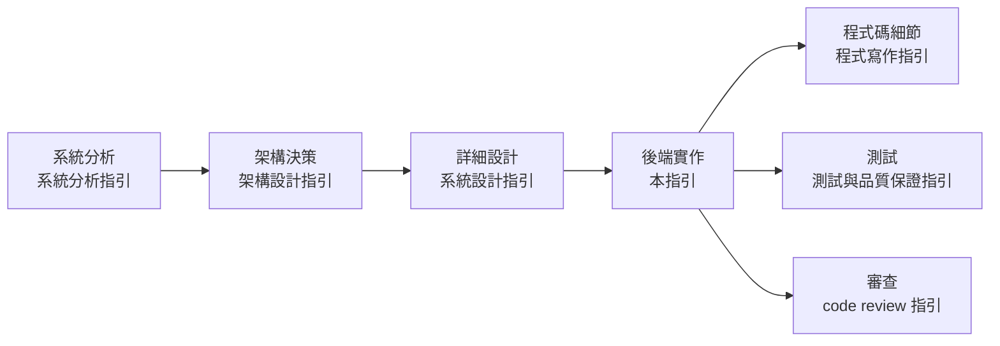
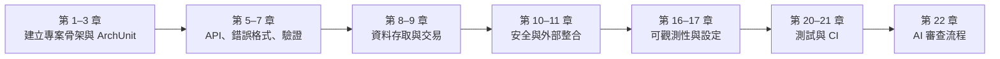
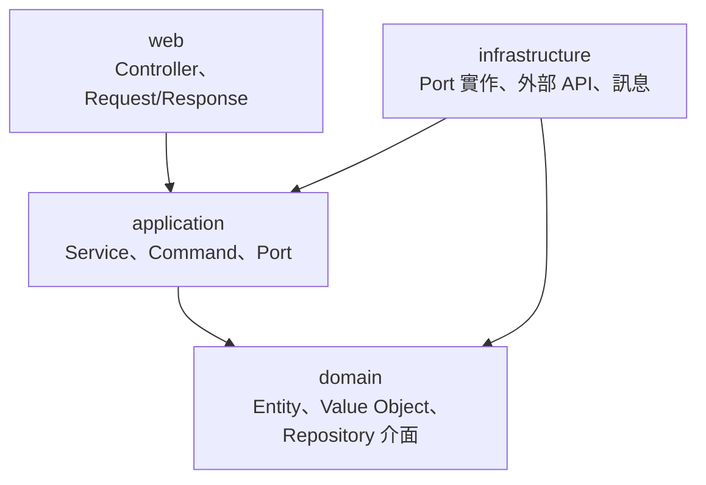
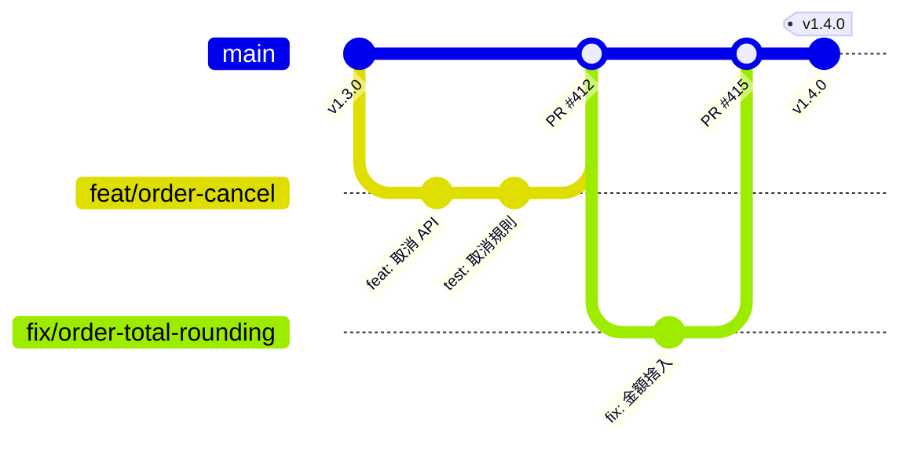
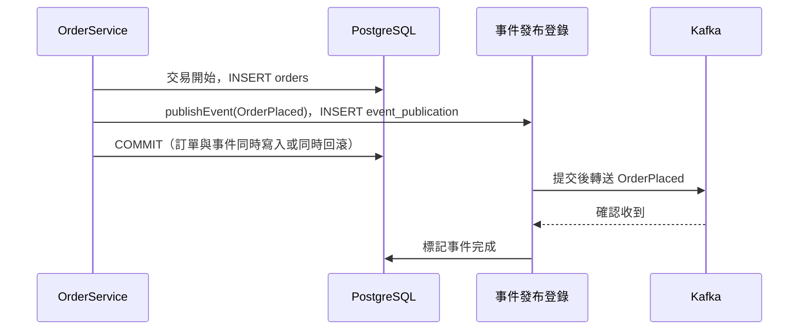
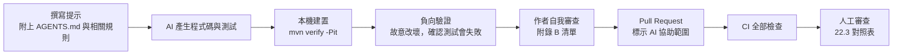

+++
date = '2025-10-31T00:00:00+08:00'
draft = false
title = '後端開發指引'
tags = ['指引', '設計開發']
categories = ['指引']
+++

# 後端開發指引

> **企業標準技術白皮書｜版本 v2.0｜2026-10-09**
>
> 適用範圍：以 Java 25 與 Spring Boot 4.1 開發的企業後端服務（REST API、批次、訊息消費者）。內容涵蓋分層與模組化、專案結構、命名、Java 語言慣例、API 設計、錯誤處理、輸入驗證、資料存取、交易、安全實作、外部整合、訊息、非同步與排程、快取、效能、可觀測性、設定、國際化、API 文件、測試、建置交付，以及如何審查 AI 產生的後端程式碼。
>
> v2.0 全面改寫 v1：技術基準由 Spring Boot 3.2／Java 17 更新為 Spring Boot 4.1.1／Java 25，移除已停止維護的 Spring Cloud Sleuth、RestTemplate 與 jjwt 自行簽發權杖等做法，並依 RFC 9457、RFC 9110、OpenAPI 3.1、OWASP ASVS 5.0、OWASP API Security Top 10 2023、NIST SP 800-218 SSDF 等國際標準重新整理。每條規則都有編號、範例與「驗證方式」，每節結尾都有「🔍 審查與驗證」，讓審查者能判斷 AI 或同事產出的程式碼是否正確。所有 Java 範例都在 JDK 25 + Spring Boot 4.1.1 實際編譯並執行測試（見 [附錄 F](#附錄-f-修訂紀錄與查證紀錄)）。

## 目錄

<!-- TOC-AUTO-BEGIN -->

- [0. 文件資訊](#0-文件資訊)
  - [0.1 文件目的與讀者](#01-文件目的與讀者)
  - [0.2 技術基準版本](#02-技術基準版本)
  - [0.3 規範等級與規則格式](#03-規範等級與規則格式)
  - [0.4 與其他指引的關係](#04-與其他指引的關係)
  - [0.5 如何閱讀本指引](#05-如何閱讀本指引)
  - [0.6 例外與豁免](#06-例外與豁免)
  - [0.7 範例專案與如何自行驗證](#07-範例專案與如何自行驗證)
- [1. 分層與模組化](#1-分層與模組化)
  - [1.1 分層架構與依賴方向](#11-分層架構與依賴方向)
  - [1.2 以功能切分模組與模組邊界](#12-以功能切分模組與模組邊界)
  - [1.3 以測試驗證架構規則](#13-以測試驗證架構規則)
  - [1.4 依賴注入與元件設計](#14-依賴注入與元件設計)
- [2. 專案結構與版本控制](#2-專案結構與版本控制)
  - [2.1 Maven 專案目錄結構](#21-maven-專案目錄結構)
  - [2.2 資源檔與設定檔配置](#22-資源檔與設定檔配置)
  - [2.3 版本控制、分支與提交訊息](#23-版本控制分支與提交訊息)
- [3. 命名規範](#3-命名規範)
  - [3.1 套件與類別命名](#31-套件與類別命名)
  - [3.2 方法與變數命名](#32-方法與變數命名)
  - [3.3 API、JSON 與資料庫命名](#33-apijson-與資料庫命名)
- [4. Java 語言慣例](#4-java-語言慣例)
  - [4.1 Record、不可變物件與值物件](#41-record不可變物件與值物件)
  - [4.2 Null 處理與 Optional](#42-null-處理與-optional)
  - [4.3 列舉、sealed 類型與 switch](#43-列舉sealed-類型與-switch)
  - [4.4 Lombok 與程式碼產生](#44-lombok-與程式碼產生)
  - [4.5 虛擬執行緒與並行](#45-虛擬執行緒與並行)
- [5. REST API 設計與實作](#5-rest-api-設計與實作)
  - [5.1 資源、URL 與 HTTP 方法](#51-資源url-與-http-方法)
  - [5.2 請求與回應格式](#52-請求與回應格式)
  - [5.3 分頁、排序與篩選](#53-分頁排序與篩選)
  - [5.4 API 版本管理與棄用](#54-api-版本管理與棄用)
  - [5.5 冪等與並行控制](#55-冪等與並行控制)
  - [5.6 Controller 的責任](#56-controller-的責任)
- [6. 錯誤處理](#6-錯誤處理)
  - [6.1 錯誤回應格式（RFC 9457 Problem Details）](#61-錯誤回應格式rfc-9457-problem-details)
  - [6.2 例外階層與錯誤碼](#62-例外階層與錯誤碼)
  - [6.3 全域例外處理器](#63-全域例外處理器)
  - [6.4 例外的捕捉、轉換與傳遞](#64-例外的捕捉轉換與傳遞)
- [7. 輸入驗證](#7-輸入驗證)
  - [7.1 Bean Validation 基本規則](#71-bean-validation-基本規則)
  - [7.2 自訂約束與跨欄位驗證](#72-自訂約束與跨欄位驗證)
  - [7.3 業務規則驗證放在領域層](#73-業務規則驗證放在領域層)
  - [7.4 輸出編碼而非輸入淨化](#74-輸出編碼而非輸入淨化)
- [8. 資料存取](#8-資料存取)
  - [8.1 實體設計](#81-實體設計)
  - [8.2 Repository 與查詢](#82-repository-與查詢)
  - [8.3 N+1 查詢與抓取策略](#83-n1-查詢與抓取策略)
  - [8.4 大量資料、鍵集分頁與批次寫入](#84-大量資料鍵集分頁與批次寫入)
  - [8.5 資料庫遷移](#85-資料庫遷移)
  - [8.6 連線池](#86-連線池)
- [9. 交易管理](#9-交易管理)
  - [9.1 交易邊界](#91-交易邊界)
  - [9.2 交易中的外部呼叫與事件](#92-交易中的外部呼叫與事件)
  - [9.3 傳播、隔離與鎖定](#93-傳播隔離與鎖定)
  - [9.4 資料庫與訊息的一致性（交易性發件匣）](#94-資料庫與訊息的一致性交易性發件匣)
- [10. 安全實作](#10-安全實作)
  - [10.1 安全過濾鏈與預設拒絕](#101-安全過濾鏈與預設拒絕)
  - [10.2 身分驗證：OAuth 2.0 資源伺服器](#102-身分驗證oauth-20-資源伺服器)
  - [10.3 授權：功能層級與物件層級](#103-授權功能層級與物件層級)
  - [10.4 密碼與敏感資料](#104-密碼與敏感資料)
  - [10.5 CORS、限流與 SSRF](#105-cors限流與-ssrf)
- [11. 外部整合與韌性](#11-外部整合與韌性)
  - [11.1 HTTP 用戶端](#111-http-用戶端)
  - [11.2 重試與逾時預算](#112-重試與逾時預算)
  - [11.3 斷路器與隔艙](#113-斷路器與隔艙)
- [12. 訊息與事件](#12-訊息與事件)
  - [12.1 事件設計](#121-事件設計)
  - [12.2 發送事件](#122-發送事件)
  - [12.3 消費事件：冪等、重試與死信](#123-消費事件冪等重試與死信)
  - [12.4 訊息的測試](#124-訊息的測試)
- [13. 非同步、批次與排程](#13-非同步批次與排程)
  - [13.1 非同步執行](#131-非同步執行)
  - [13.2 排程與分散式鎖](#132-排程與分散式鎖)
  - [13.3 批次處理與優雅關閉](#133-批次處理與優雅關閉)
- [14. 快取](#14-快取)
  - [14.1 快取的使用時機、鍵與存活時間](#141-快取的使用時機鍵與存活時間)
  - [14.2 Spring Cache 與 Redis](#142-spring-cache-與-redis)
  - [14.3 快取擊穿、穿透與雪崩](#143-快取擊穿穿透與雪崩)
- [15. 效能與擴展性](#15-效能與擴展性)
  - [15.1 效能目標與量測](#151-效能目標與量測)
  - [15.2 無狀態與水平擴展](#152-無狀態與水平擴展)
  - [15.3 大量資料的串流輸出](#153-大量資料的串流輸出)
  - [15.4 過載保護](#154-過載保護)
  - [15.5 JVM 與容器](#155-jvm-與容器)
- [16. 日誌與可觀測性](#16-日誌與可觀測性)
  - [16.1 日誌框架與結構化日誌](#161-日誌框架與結構化日誌)
  - [16.2 日誌內容：記什麼、不記什麼](#162-日誌內容記什麼不記什麼)
  - [16.3 指標](#163-指標)
  - [16.4 分散式追蹤](#164-分散式追蹤)
  - [16.5 健康檢查與 Actuator](#165-健康檢查與-actuator)
- [17. 設定與機密管理](#17-設定與機密管理)
  - [17.1 設定外部化與 Profile](#171-設定外部化與-profile)
  - [17.2 型別安全的設定類別](#172-型別安全的設定類別)
  - [17.3 機密管理](#173-機密管理)
  - [17.4 功能開關](#174-功能開關)
- [18. 國際化與時區](#18-國際化與時區)
  - [18.1 訊息國際化](#181-訊息國際化)
  - [18.2 時間與時區](#182-時間與時區)
  - [18.3 與語系有關的文字處理](#183-與語系有關的文字處理)
- [19. API 文件與契約](#19-api-文件與契約)
  - [19.1 OpenAPI 文件的產生](#191-openapi-文件的產生)
  - [19.2 契約納入版本控制與一致性檢查](#192-契約納入版本控制與一致性檢查)
  - [19.3 破壞性變更偵測](#193-破壞性變更偵測)
- [20. 後端測試](#20-後端測試)
  - [20.1 測試的層次](#201-測試的層次)
  - [20.2 Web 層測試](#202-web-層測試)
  - [20.3 整合測試與 Testcontainers](#203-整合測試與-testcontainers)
  - [20.4 穩定的測試](#204-穩定的測試)
  - [20.5 覆蓋率與變異測試](#205-覆蓋率與變異測試)
- [21. 建置、相依與交付](#21-建置相依與交付)
  - [21.1 相依管理](#211-相依管理)
  - [21.2 軟體物料清單與可重現建置](#212-軟體物料清單與可重現建置)
  - [21.3 CI 管線](#213-ci-管線)
  - [21.4 容器映像](#214-容器映像)
  - [21.5 應用程式在部署與復原中的責任](#215-應用程式在部署與復原中的責任)
  - [21.6 從 Spring Boot 3.5 遷移到 4.x](#216-從-spring-boot-35-遷移到-4x)
- [22. AI 協作與審查](#22-ai-協作與審查)
  - [22.1 AI 產出的審查流程](#221-ai-產出的審查流程)
  - [22.2 給 AI 的專案規範](#222-給-ai-的專案規範)
  - [22.3 AI 常見錯誤對照表](#223-ai-常見錯誤對照表)
  - [22.4 審查實例](#224-審查實例)
- [附錄 A 規則總表](#附錄-a-規則總表)
  - [A.1 依領域統計](#a1-依領域統計)
  - [A.2 驗證方式與範例覆蓋](#a2-驗證方式與範例覆蓋)
  - [A.3 規則清單](#a3-規則清單)
- [附錄 B 審查檢核清單](#附錄-b-審查檢核清單)
  - [B.1 後端 Pull Request 審查清單](#b1-後端-pull-request-審查清單)
  - [B.2 Pull Request 範本](#b2-pull-request-範本)
- [附錄 C 工具設定](#附錄-c-工具設定)
  - [C.1 pom.xml](#c1-pomxml)
  - [C.2 Checkstyle](#c2-checkstyle)
  - [C.3 Error Prone 在 JDK 25 的 JVM 參數](#c3-error-prone-在-jdk-25-的-jvm-參數)
  - [C.4 專案慣例的 ArchUnit 規則](#c4-專案慣例的-archunit-規則)
  - [C.5 Semgrep 自訂規則](#c5-semgrep-自訂規則)
  - [C.6 SpotBugs 排除設定](#c6-spotbugs-排除設定)
- [附錄 D 名詞解釋](#附錄-d-名詞解釋)
- [附錄 E 參考資料](#附錄-e-參考資料)
  - [E.1 國際標準與規範](#e1-國際標準與規範)
  - [E.2 框架與工具文件](#e2-框架與工具文件)
  - [E.3 本系列相關指引](#e3-本系列相關指引)
- [附錄 F 修訂紀錄與查證紀錄](#附錄-f-修訂紀錄與查證紀錄)
  - [F.1 v1 章節對照](#f1-v1-章節對照)
  - [F.2 v1 的更正紀錄](#f2-v1-的更正紀錄)
  - [F.3 查證紀錄](#f3-查證紀錄)
  - [F.4 待確認事項](#f4-待確認事項)
  - [F.5 版本歷史](#f5-版本歷史)

<!-- TOC-AUTO-END -->

---

## 0. 文件資訊

### 0.1 文件目的與讀者

本指引定義**後端程式的實作標準**：在架構與詳細設計決定之後，後端工程師要怎麼把服務寫出來，寫到什麼程度才算合格，以及審查者要怎麼驗證。它回答的問題是「這個 Controller、Service、Repository、設定檔應該長什麼樣子」。

v1 的定位是「Spring Boot 開發注意事項」，各章深淺不一：安全性只寫了 JWT，效能只有 Redis 與 `@Async`，測試只有一段設定。v2.0 改以「規則＋範例＋驗證方式」的格式重寫，目標是讓讀者讀完後能夠：

1. 依規則寫出符合企業標準的後端程式。
2. 拿到 AI 或同事產出的程式碼時，知道要用哪些工具檢查、要問哪些問題，並能判斷它是否正確。
3. 知道每條規則背後的理由，在需要例外時能做出有根據的取捨。



| 讀者 | 主要用途 | 建議閱讀章節 |
| --- | --- | --- |
| 後端工程師 | 依規則實作與自我檢查 | 全部，特別是第 1、5–9、20 章 |
| 技術負責人、架構師 | 制定專案骨架、審查設計落實情形 | 第 1–4 章、第 17、21 章、附錄 B、C |
| 資深工程師、審查者 | 審查 Pull Request 與 AI 產出 | 各節「🔍 審查與驗證」、第 22 章、附錄 A、B |
| 資安人員 | 確認安全控制有正確實作 | 第 7、10、16、17 章 |
| SRE、維運人員 | 可觀測性、設定、優雅關閉、容器化 | 第 15–17、21 章 |
| 使用 AI 產生程式碼的人 | 撰寫提示、審查 AI 產出 | 第 22 章，以及各節的「AI 常見錯誤」 |

### 0.2 技術基準版本

本指引的範例與規則以下列版本為準（查證日期 2026-10-09，版本取自 Maven Central 與 Spring Boot 4.1.1 的相依管理）。專案可以使用更新的修補版本，但不得低於「最低版本」欄。基準與 [系統設計指引]() 0.2 節、[程式寫作指引]() 一致。

| 類別 | 技術 | 基準版本 | 最低版本 | 備註 |
| --- | --- | --- | --- | --- |
| 語言 | Java（OpenJDK） | 25 LTS | 21 LTS | 範例使用 record、sealed、pattern matching、虛擬執行緒 |
| 框架 | Spring Boot | 4.1.1 | 3.5.x | 3.5 的開源支援已於 2026-06 結束；4.0 於 2026-12 結束 |
| 框架 | Spring Framework／Security | 7.0.9／7.1.1 | 6.2／6.5 | Framework 7 內建 API 版本管理與 `@Retryable` |
| Web | Tomcat（內嵌） | 11.0.24 | 10.1 | Jakarta Servlet 6.1 |
| 序列化 | Jackson | 3.1.5 | 2.19 | Jackson 3 的套件名稱為 `tools.jackson.*`，註解仍為 `com.fasterxml.jackson.annotation` |
| 驗證 | Jakarta Validation／Hibernate Validator | 3.1.1／9.1.3 | 3.0／8.0 | |
| 持久層 | Hibernate ORM／Spring Data | 7.4.5／2026.0.1 | 6.6／2025.0 | |
| 資料庫遷移 | Flyway | 12.4.0 | 10.x | Boot 4 需要另外加入 `spring-boot-starter-flyway` |
| 連線池 | HikariCP | 7.0.2 | 5.1 | |
| 資料庫 | PostgreSQL／JDBC 驅動 | 18／42.7.13 | 15／42.7 | 其他資料庫見 [資料庫設計指引]() |
| 訊息 | Spring for Apache Kafka／Kafka 用戶端 | 4.1.1／4.2.1 | 3.3／3.9 | |
| 快取 | Caffeine／Lettuce（Redis） | 3.2.4／7.5.2 | 3.1／6.4 | |
| 韌性 | Spring Framework 內建韌性註解／Resilience4j | 7.0.9／2.4.0 | —／2.3 | Resilience4j 需使用 `resilience4j-spring-boot4` |
| 可觀測性 | Micrometer／Micrometer Tracing／OpenTelemetry | 1.17.1／1.7.1／1.62.0 | 1.15／1.5／1.49 | Boot 4 提供 `spring-boot-starter-opentelemetry` |
| 日誌 | SLF4J／Logback | 2.0.18／1.5.38 | 2.0／1.5 | Boot 內建結構化日誌（ECS、Logstash、GELF） |
| API 文件 | springdoc-openapi | 3.1.1 | 3.0 | Boot 4 需要 springdoc 3.x |
| 測試 | JUnit／Mockito／AssertJ | 6.0.3／5.23.0／3.27.7 | 5.11／5.14／3.26 | |
| 測試 | Testcontainers／ArchUnit | 2.0.5／1.5.1 | 1.20／1.3 | Testcontainers 2 的模組名稱為 `testcontainers-postgresql` 等 |
| 建置 | Maven | 3.9.9 | 3.9.6 | Maven 4.0 仍為 RC，不作為基準 |
| 標準 | OpenAPI | 3.1.1（撰寫）／3.2.0（已發布） | 3.0.3 | springdoc 3.1 預設輸出 3.1 |
| 標準 | OWASP API Security Top 10／ASVS | 2023／5.0.0 | — | API Top 10 至 2026-10 仍為 2023 版 |

> **為什麼最低版本仍允許 Spring Boot 3.5？** 部分既有系統短期內無法升級，但新專案一律使用基準版本。本文標示「（Boot 4）」的寫法在 3.5 不可用，各章會說明 3.5 的替代寫法；完整的遷移步驟見 [21.6](#216-從-spring-boot-35-遷移到-4x)。

### 0.3 規範等級與規則格式

本文規則採用 [RFC 2119](https://www.rfc-editor.org/rfc/rfc2119) 與 [RFC 8174](https://www.rfc-editor.org/rfc/rfc8174) 的語意：

| 等級 | 英文 | 意義 | 審查處理 |
| --- | --- | --- | --- |
| **必須** | MUST | 不遵守會造成重大風險（資安、資料錯誤、無法維護或無法驗證） | 不通過審查；需要例外時必須走 [0.6](#06-例外與豁免) 的豁免流程 |
| **應該** | SHOULD | 業界共識的最佳實務，除非有充分理由 | 不遵守時必須在 Pull Request 說明理由 |
| **可以** | MAY | 建議做法，依系統規模與情境選用 | 不阻擋 |
| **不應該** | SHOULD NOT | 通常是錯誤的做法，除非有充分理由 | 採用時必須在 Pull Request 說明理由 |

每條規則都有編號，格式為 `BE-<領域>-<三位數序號>`。開頭的 `BE` 用來和其他指引的規則區分（系統設計指引為 `SD-`、安全程式碼指引為 `SCG-`、測試指引為 `QA-`）。編號一經發布不會重編，新增規則使用該領域尚未使用的號碼。

| 前綴 | 領域 | 章 | 前綴 | 領域 | 章 |
| --- | --- | --- | --- | --- | --- |
| `BE-PRC` | 分層與模組化 | 1 | `BE-MSG` | 訊息與事件 | 12 |
| `BE-STR` | 專案結構 | 2 | `BE-ASY` | 非同步、批次與排程 | 13 |
| `BE-NAM` | 命名 | 3 | `BE-CACHE` | 快取 | 14 |
| `BE-JAVA` | Java 語言慣例 | 4 | `BE-PERF` | 效能與擴展性 | 15 |
| `BE-API` | REST API 設計 | 5 | `BE-OBS` | 日誌與可觀測性 | 16 |
| `BE-ERR` | 錯誤處理 | 6 | `BE-CFG` | 設定與機密 | 17 |
| `BE-VAL` | 輸入驗證 | 7 | `BE-I18N` | 國際化與時區 | 18 |
| `BE-DATA` | 資料存取 | 8 | `BE-DOC` | API 文件與契約 | 19 |
| `BE-TX` | 交易管理 | 9 | `BE-TST` | 後端測試 | 20 |
| `BE-SEC` | 安全實作 | 10 | `BE-BLD` | 建置、相依與交付 | 21 |
| `BE-INT` | 外部整合與韌性 | 11 | `BE-AI` | AI 協作與審查 | 22 |

**驗證方式欄位：** 每張規則表的最後一欄說明「怎麼確認程式碼符合這條規則」。審查者應先看這一欄，再決定要花多少心力人工檢查。

| 圖示 | 意義 | 範例 | 審查者該做什麼 |
| --- | --- | --- | --- |
| 🤖 | 工具可自動檢查 | 🤖 ArchUnit、🤖 編譯器 `-Xlint`、🤖 Checkstyle | 確認 CI 有執行該工具，且規則沒有被停用或以註解略過 |
| 🧪 | 需要以測試證明 | 🧪 `@WebMvcTest`、🧪 Testcontainers 整合測試 | 確認有對應的測試，而且違反規則時測試會失敗 |
| 👁 | 只能由人判斷 | 👁 程式碼審查 | 依該節「🔍 審查與驗證」的問題逐項確認 |

**範例標記：** 範例中以 `✅ <規則編號>` 標示符合規則的寫法，以 `❌ <規則編號>` 標示違規寫法。所有規則都至少出現在一個範例中（統計見 [附錄 A](#附錄-a-規則總表)）。標示「（片段：…）」的範例只截取重點，不是完整可編譯的程式。

### 0.4 與其他指引的關係

本指引處理「後端實作層級」的標準。下列主題另有專門指引，本文只寫後端工程師必須遵守的部分，細節以連結指向該指引：

| 主題 | 指引 | 本文的分工 |
| --- | --- | --- |
| 架構風格、平台、部署環境、災難復原 | [架構設計指引]() | 本文只寫應用程式要配合的部分（健康檢查、優雅關閉、設定外部化），第 16、17、21 章 |
| 元件、介面、錯誤碼與交易的詳細設計 | [系統設計指引]() | 本文把設計落實為程式碼，第 5、6、9 章 |
| 一般程式碼寫法（命名細節、例外、集合、併發） | [程式寫作指引]() | 本文只寫後端特有的慣例，第 3、4 章 |
| 資料庫實體設計、SQL 寫法 | [資料庫設計指引]() | 本文處理 ORM 與存取層，第 8 章 |
| 安全程式碼（注入、加密、檔案、反序列化） | [安全程式碼指引]() | 本文處理 Spring Security 設定與後端常見控制，第 10 章 |
| 測試策略、覆蓋率、效能測試 | [測試與品質保證指引]()、[壓測指引]() | 本文處理後端測試的寫法，第 15、20 章 |
| 程式碼審查流程 | [code review 指引]() | 本文提供後端審查清單，第 22 章、附錄 B |
| 重構 | [refactor 重構指引]() | 本文不重複 |
| 前端 | [前端開發指引]() | 本文處理前後端契約（錯誤格式、分頁、CORS、Cookie），第 5、6、10 章 |
| 12-Factor 原則 | [12-Factor App 說明與對應解決方案]() | 第 17、21 章落實設定、相依、日誌與可拋棄性 |

### 0.5 如何閱讀本指引

每一節都依相同的結構撰寫：

1. **概念說明**：為什麼需要這條規則、有哪些選項、怎麼取捨。
2. **規則表**：編號、等級、規則內容、驗證方式。
3. **範例**：✅ 正確寫法與 ❌ 常見錯誤，範例中標註規則編號。
4. **🔍 審查與驗證**：自動檢查指令、人工審查問題、AI 常見錯誤。

新專案導入時，建議依下列順序進行：



### 0.6 例外與豁免

規則不可能涵蓋所有情境。需要違反「必須」等級的規則時，依下列流程處理：

1. 在 Pull Request 說明中寫出：違反的規則編號、原因、替代控制、預計何時解除。
2. 由技術負責人核准；涉及 `BE-SEC`、`BE-CFG`、`BE-DATA` 的規則還需要資安或 DBA 核准。
3. 程式碼中以註解標示豁免，格式為 `// 豁免 BE-XXX-nnn：<原因>（核准：<人員>，到期：<日期>）`，讓工具與審查者可以搜尋。
4. 工具的停用註解（例如 `@SuppressWarnings`、`// NOSONAR`、ArchUnit 的 `FreezingArchRule`）必須附上同樣的豁免說明。

```java
// （片段：豁免標示的寫法）
// 豁免 BE-API-008：內部對帳匯出需一次取得當日全部交易，筆數上限 5 萬並以串流輸出（核准：王大明，到期：2027-03-31）
@GetMapping(path = "/internal/reconciliation/{date}", produces = "application/x-ndjson")
StreamingResponseBody exportDay(@PathVariable LocalDate date) { ... }
```

### 0.7 範例專案與如何自行驗證

本文所有完整的 Java 範例都屬於同一個範例專案（套件 `com.example.be`），附錄 F.3 記錄了實際的驗證結果。讀者想自行驗證時：

1. 以 [附錄 C](#附錄-c-工具設定) 的 `pom.xml` 建立 Maven 專案，JDK 使用 25。
2. 把範例依其 `package` 宣告放進 `src/main/java` 或 `src/test/java`（類別名稱以 `Test`／`Tests` 結尾的放在測試目錄）。
3. 執行 `mvn -q verify`。整合測試需要 Docker 或 Podman 以啟動 Testcontainers。

```bash
# 自行驗證本指引範例的指令（Windows 使用 Podman 時，先啟動 podman machine）
podman machine start
mvn -q verify
```

範例刻意保持精簡：每個類別只放出說明規則所需的程式碼，實務專案還需要完整的錯誤處理、日誌與測試。

## 1. 分層與模組化

後端程式最常見的腐化方式不是某一行寫錯，而是依賴方向逐漸混亂：Controller 直接呼叫 Repository、領域物件引用 HTTP 類別、A 模組直接讀取 B 模組的資料表。這些問題在單一 Pull Request 中很難察覺，累積之後卻讓系統無法修改。本章規範分層、模組切分與依賴方向，並要求以 ArchUnit 與 Spring Modulith **在建置時自動驗證**，而不是只寫在文件裡。

> v1 的 1.1 節以 Clean Architecture 的四層圖說明分層，但沒有說明各層之間「誰可以呼叫誰」，也沒有驗證方式；1.2 節提到 ArchUnit，但沒有範例。本章補上可執行的規則與測試。

### 1.1 分層架構與依賴方向

每個功能模組內部分成四層。層的名稱就是套件名稱，讓工具能依套件檢查依賴方向：

| 層 | 套件 | 責任 | 可以依賴 | 不可以依賴 |
| --- | --- | --- | --- | --- |
| Web（表現層） | `..web..` | 接收 HTTP 請求、驗證輸入格式、呼叫應用服務、轉換回應 | Application | Domain 的 Repository、Infrastructure |
| Application（應用層） | `..application..` | 協調使用案例、定義交易邊界、權限檢查、發布事件 | Domain | Web、Infrastructure 的實作類別 |
| Domain（領域層） | `..domain..` | 業務規則、實體、值物件、Repository 介面 | 只有 Java 標準函式庫、Jakarta Persistence 註解、共用錯誤類別 | Web、Infrastructure、Spring Web、Jackson |
| Infrastructure（基礎設施層） | `..infrastructure..` | 實作應用層定義的埠（外部 API、訊息、檔案） | Application 的埠介面、Domain | Web |



> **為什麼領域層允許 JPA 註解？** 嚴格的 Clean Architecture 會把 JPA 實體放在基礎設施層，再與領域物件互相轉換。對大多數企業系統而言，這層轉換的成本高於它帶來的好處。本指引採取務實做法：領域實體可以使用 `jakarta.persistence` 註解，但不得依賴 Spring Web、Jackson 或任何基礎設施實作。系統設計指引第 6 章說明了何時應改用完全隔離的做法。

| 編號 | 等級 | 規則 | 驗證方式 |
| --- | --- | --- | --- |
| `BE-PRC-001` | 必須 | 每個功能模組都必須依上表分成 `web`、`application`、`domain`、`infrastructure` 四個子套件（不需要的層可以省略），依賴方向只能由外向內：web → application → domain，infrastructure → application／domain | 🤖 ArchUnit `layeredArchitecture()` |
| `BE-PRC-002` | 必須 | Controller 不得直接存取 Repository 或 `EntityManager`，也不得在 Controller 中撰寫業務規則；一律透過應用服務 | 🤖 ArchUnit；👁 程式碼審查 |
| `BE-PRC-003` | 必須 | 領域層不得依賴 Spring Web（`org.springframework.web..`）、Servlet API、Jackson 或任何 `infrastructure` 套件；領域規則必須能在不啟動 Spring 的情況下以單元測試驗證 | 🤖 ArchUnit；🧪 單元測試 |
| `BE-PRC-004` | 必須 | 應用層需要外部系統（其他服務、訊息、檔案）時，必須在應用層定義介面（埠），由基礎設施層實作；應用層不得直接使用 `RestClient`、`KafkaTemplate` 等技術類別 | 🤖 ArchUnit |

```text
✅ BE-PRC-001：order 模組的套件結構
com.example.be
├── BackendApplication.java
├── order/                         ← 模組根套件：只放其他模組可以使用的 API（事件、對外介面）
│   ├── OrderPlaced.java
│   ├── web/                       ← Controller、Request／Response DTO
│   ├── application/               ← OrderService、Command、CatalogPort（埠）
│   ├── domain/                    ← Order、OrderLine、Money、OrderRepository
│   └── infrastructure/            ← HttpCatalogClient（實作 CatalogPort）
├── notification/                  ← 另一個模組，只透過 order 根套件的事件與 order 溝通
└── shared/                        ← 共用元件（錯誤格式、分頁），標記為開放模組
```

```java
// ✅ BE-PRC-004：應用層定義埠，不依賴任何 HTTP 技術
package com.example.be.order.application;

import com.example.be.order.domain.Money;
import java.util.Currency;
import java.util.Optional;

public interface CatalogPort {

    /** 查詢商品以指定幣別計價的單價；商品不存在時回傳 empty。外部系統無法使用時丟出 ExternalServiceException。 */
    Optional<Money> unitPriceOf(String sku, Currency currency);
}
```

```java
// ❌ BE-PRC-002：Controller 直接存取 Repository，並在 Controller 中寫業務規則
package com.example.be.order.web;

import com.example.be.order.domain.Order;
import com.example.be.order.domain.OrderRepository;
import com.example.be.order.domain.OrderStatus;
import org.springframework.web.bind.annotation.PathVariable;
import org.springframework.web.bind.annotation.PostMapping;
import org.springframework.web.bind.annotation.RestController;

@RestController
class BadOrderController {

    private final OrderRepository orders;

    BadOrderController(OrderRepository orders) {
        this.orders = orders;
    }

    @PostMapping("/api/orders/{id}/cancel")
    void cancel(@PathVariable long id) {
        Order order = orders.findById(id).orElseThrow();
        if (order.status() == OrderStatus.SHIPPED) {       // 業務規則寫在 Controller，其他入口（批次、訊息）會漏掉
            throw new IllegalStateException("已出貨不可取消");
        }
        orders.save(order);                                // 沒有交易邊界，也繞過了應用服務的權限檢查
    }
}
```

#### 🔍 1.1 審查與驗證

- **自動檢查：** `mvn test -Dtest=ArchitectureTest`（見 1.3 的測試），任何違反依賴方向的類別都會讓建置失敗，失敗訊息會列出違規的類別與方法。
- **人工審查問題：**
  1. 新增的類別放在哪一層？它的責任與該層的定義一致嗎？
  2. Controller 的方法是否只有「轉換輸入 → 呼叫一個應用服務方法 → 轉換輸出」三個步驟？
  3. 應用服務是否直接 `new` 了外部用戶端，或注入了 `RestClient`、`KafkaTemplate`？
- **AI 常見錯誤：** 產生「Controller → Repository」的簡化程式；把 DTO 與實體混用（直接回傳 `@Entity`）；在領域物件上加 `@JsonProperty`；把所有類別放在同一個套件。

### 1.2 以功能切分模組與模組邊界

v1 的建議是「按功能模組劃分」，但沒有定義模組之間如何溝通。實務上，模組邊界被破壞的典型方式是：B 模組為了方便，直接注入 A 模組的 Repository 或內部服務。本指引以 [Spring Modulith](https://docs.spring.io/spring-modulith/reference/) 定義並驗證模組邊界：直接位於應用程式根套件下的每個套件就是一個模組，模組的根套件是公開 API，子套件是內部實作。

| 編號 | 等級 | 規則 | 驗證方式 |
| --- | --- | --- | --- |
| `BE-PRC-005` | 必須 | 套件必須先依功能（業務能力）切分模組，再在模組內依層切分；不得以 `controller`、`service`、`repository` 作為最上層套件 | 🤖 Spring Modulith `verify()`；👁 程式碼審查 |
| `BE-PRC-006` | 必須 | 模組之間只能使用對方根套件中的類別（公開 API）或對方發布的事件；不得存取對方子套件中的類別，也不得直接讀寫對方的資料表 | 🤖 Spring Modulith `verify()`；👁 SQL 審查 |
| `BE-PRC-007` | 必須 | 模組之間不得有循環依賴 | 🤖 Spring Modulith `verify()` |
| `BE-PRC-008` | 應該 | 跨模組的狀態變化應以領域事件通知（例如訂單成立後通知模組寄信），而不是由發起方直接呼叫接收方的服務 | 👁 程式碼審查；🧪 Modulith `Scenario` 測試 |

```java
// ✅ BE-PRC-006 BE-PRC-008 BE-MSG-001 BE-MSG-002 BE-MSG-003 BE-MSG-004：order 模組根套件中的事件，是其他模組可以使用的公開 API；同時轉送到 Kafka
package com.example.be.order;

import java.math.BigDecimal;
import java.time.Instant;
import java.util.UUID;
import org.springframework.modulith.events.Externalized;

@Externalized("orders.order-placed.v1::#{#this.orderId()}")   // 主題名稱::訊息鍵（以訂單編號為鍵，確保同一訂單的事件有序）
public record OrderPlaced(UUID eventId, UUID orderId, String customerId, BigDecimal totalAmount, String currency,
                          Instant placedAt) {
}
```

```java
// ✅ BE-PRC-008 BE-TX-006：notification 模組以事件監聽回應訂單成立，不需要注入 order 模組的任何服務
package com.example.be.notification;

import com.example.be.order.OrderPlaced;
import org.slf4j.Logger;
import org.slf4j.LoggerFactory;
import org.springframework.modulith.events.ApplicationModuleListener;
import org.springframework.stereotype.Component;

@Component
class OrderNotificationListener {

    private static final Logger log = LoggerFactory.getLogger(OrderNotificationListener.class);

    @ApplicationModuleListener
    void on(OrderPlaced event) {
        // 交易提交後才在另一個交易中執行；失敗時事件保留在事件發布登錄中，可重新發送
        log.info("寄送訂單成立通知 orderId={}", event.orderId());
    }
}
```

```java
// ✅ BE-PRC-006：shared 模組標記為開放模組，其他模組可以使用它的子套件（錯誤格式、分頁）
@org.springframework.modulith.ApplicationModule(type = org.springframework.modulith.ApplicationModule.Type.OPEN)
package com.example.be.shared;
```

```java
// ❌ BE-PRC-006：notification 模組直接注入 order 模組內部的 Repository
package com.example.be.notification;

import com.example.be.order.domain.OrderRepository;
import org.springframework.stereotype.Component;

@Component
class BadOrderMailer {

    private final OrderRepository orders;      // order.domain 是 order 模組的內部套件

    BadOrderMailer(OrderRepository orders) {
        this.orders = orders;
    }

    long pendingCount() {
        return orders.count();
    }
}
```

#### 🔍 1.2 審查與驗證

- **自動檢查：** `mvn test -Dtest=ModularityTests`。違反時的訊息類似「Module 'notification' depends on non-exposed type com.example.be.order.domain.OrderRepository within module 'order'」。
- **人工審查問題：**
  1. 新增的跨模組呼叫，能不能改成事件？如果必須同步呼叫，是否透過對方根套件中的介面？
  2. SQL 或 JPQL 是否查詢了其他模組擁有的資料表（Modulith 檢查不到這一點）？
  3. 事件的內容是否只包含識別碼與必要欄位，而不是整個實體？
- **AI 常見錯誤：** 為了「重用」直接注入其他模組的 Repository；把事件類別放在模組的 `domain` 子套件，導致其他模組無法合法引用；在事件中放入 JPA 實體。

### 1.3 以測試驗證架構規則

架構規則如果只寫在文件中，幾個月後就會被違反。本節的兩個測試是每個後端專案的**必備測試**，與單元測試一起在每次建置執行。

| 編號 | 等級 | 規則 | 驗證方式 |
| --- | --- | --- | --- |
| `BE-PRC-009` | 必須 | 專案必須包含架構測試（ArchUnit 與 Spring Modulith），並在 CI 的每次建置執行；新增的架構規則先以測試表達，再寫入文件 | 🤖 CI 建置；👁 確認測試沒有被 `@Disabled` |
| `BE-PRC-010` | 必須 | 既有系統導入架構測試時，既有的違規可以用 ArchUnit `FreezingArchRule` 凍結，但新增的違規必須讓建置失敗；凍結清單（`archunit_store`）必須納入版本控制並定期減少 | 🤖 ArchUnit；👁 審查凍結清單的變化 |

```java
// ✅ BE-PRC-001 BE-PRC-002 BE-PRC-003 BE-PRC-004 BE-PRC-009：架構測試
package com.example.be.archtest;

import static com.tngtech.archunit.lang.syntax.ArchRuleDefinition.noClasses;
import static com.tngtech.archunit.library.Architectures.layeredArchitecture;

import com.tngtech.archunit.core.importer.ImportOption;
import com.tngtech.archunit.junit.AnalyzeClasses;
import com.tngtech.archunit.junit.ArchTest;
import com.tngtech.archunit.lang.ArchRule;

@AnalyzeClasses(packages = "com.example.be", importOptions = ImportOption.DoNotIncludeTests.class)
class ArchitectureTest {

    @ArchTest
    static final ArchRule layers = layeredArchitecture()
            .consideringOnlyDependenciesInLayers()
            .layer("Web").definedBy("..web..")
            .layer("Application").definedBy("..application..")
            .layer("Domain").definedBy("..domain..")
            .layer("Infrastructure").definedBy("..infrastructure..")
            .whereLayer("Web").mayNotBeAccessedByAnyLayer()
            .whereLayer("Application").mayOnlyBeAccessedByLayers("Web", "Infrastructure")
            .whereLayer("Domain").mayOnlyBeAccessedByLayers("Application", "Infrastructure")
            .because("BE-PRC-001：依賴方向只能由外向內");

    @ArchTest
    static final ArchRule webDoesNotTouchPersistence = noClasses()
            .that().resideInAPackage("..web..")
            .should().dependOnClassesThat().areAssignableTo(org.springframework.data.repository.Repository.class)
            .orShould().dependOnClassesThat().areAssignableTo(jakarta.persistence.EntityManager.class)
            .because("BE-PRC-002：Controller 一律透過應用服務");

    @ArchTest
    static final ArchRule domainIsFrameworkFree = noClasses()
            .that().resideInAPackage("..domain..")
            .should().dependOnClassesThat().resideInAnyPackage(
                    "org.springframework.web..", "jakarta.servlet..", "tools.jackson..",
                    "com.fasterxml.jackson..", "..infrastructure..", "..web..")
            .because("BE-PRC-003：領域規則必須能在不啟動 Spring 的情況下測試");

    @ArchTest
    static final ArchRule applicationUsesPorts = noClasses()
            .that().resideInAPackage("..application..")
            .should().dependOnClassesThat().resideInAnyPackage(
                    "org.springframework.web.client..", "org.springframework.kafka..", "org.springframework.jdbc..")
            .because("BE-PRC-004：外部系統透過埠介面存取");
}
```

```java
// ✅ BE-PRC-005 BE-PRC-006 BE-PRC-007 BE-PRC-009：模組邊界測試，並產生模組關係文件
package com.example.be;

import org.junit.jupiter.api.Test;
import org.springframework.modulith.core.ApplicationModules;
import org.springframework.modulith.docs.Documenter;

class ModularityTests {

    private final ApplicationModules modules = ApplicationModules.of(BackendApplication.class);

    @Test
    void verifiesModuleBoundaries() {
        modules.verify();
    }

    @Test
    void writesModuleDocumentation() {
        new Documenter(modules).writeModulesAsPlantUml().writeIndividualModulesAsPlantUml();
    }
}
```

```java
// ✅ BE-PRC-010：凍結既有違規，只讓新的違規失敗
package com.example.be.archtest;

import static com.tngtech.archunit.lang.syntax.ArchRuleDefinition.noClasses;

import com.tngtech.archunit.core.importer.ImportOption;
import com.tngtech.archunit.junit.AnalyzeClasses;
import com.tngtech.archunit.junit.ArchTest;
import com.tngtech.archunit.lang.ArchRule;
import com.tngtech.archunit.library.freeze.FreezingArchRule;

@AnalyzeClasses(packages = "com.example.be", importOptions = ImportOption.DoNotIncludeTests.class)
class LegacyFreezeTest {

    @ArchTest
    static final ArchRule noJavaUtilLogging = FreezingArchRule.freeze(noClasses()
            .should().dependOnClassesThat().resideInAPackage("java.util.logging..")
            .because("BE-OBS-001：一律使用 SLF4J"));
}
```

```properties
# ✅ BE-PRC-010：src/test/resources/archunit.properties，凍結清單存放在版本控制內
freeze.store.default.path=src/test/archunit_store
freeze.store.default.allowStoreCreation=true
freeze.refreeze=false
```

#### 🔍 1.3 審查與驗證

- **自動檢查：** 確認 CI 日誌中出現 `ArchitectureTest` 與 `ModularityTests` 的執行結果；確認 Pull Request 沒有新增 `@Disabled`、`@ArchIgnore` 或修改 `archunit.properties`。
- **負向驗證（本指引實測）：** 把 1.1、1.2 的 ❌ 範例放入專案後，`ArchitectureTest.webDoesNotTouchPersistence` 與 `ModularityTests.verifiesModuleBoundaries` 都會失敗（見附錄 F.3）。
- **人工審查問題：**
  1. 凍結清單（`src/test/archunit_store`）的行數是增加還是減少？增加代表有人把新違規也凍結了。
  2. 新增的模組是否在 `ModularityTests` 產生的模組圖中出現，依賴關係是否符合設計？
- **AI 常見錯誤：** 產生架構測試時使用 `allowEmptyShould(true)` 讓空規則通過（套件名稱寫錯時，規則實際上沒有檢查任何類別）；把 `ImportOption.DoNotIncludeTests` 漏掉，導致測試類別的依賴也被檢查。

### 1.4 依賴注入與元件設計

| 編號 | 等級 | 規則 | 驗證方式 |
| --- | --- | --- | --- |
| `BE-PRC-011` | 必須 | 一律使用建構子注入，欄位宣告為 `final`；不得使用欄位注入（`@Autowired` 標在欄位上）或 setter 注入必要的依賴 | 🤖 ArchUnit `noFields().should().beAnnotatedWith(Autowired.class)` |
| `BE-PRC-012` | 應該 | 元件類別與其建構子應使用套件可見性（不寫 `public`），只有被其他套件使用的介面與類別才宣告為 `public` | 👁 程式碼審查 |
| `BE-PRC-013` | 應該 | 一個類別的建構子參數超過 6 個時，應檢討是否承擔了過多責任並拆分（應用服務協調多個埠，6 個是常見的上限） | 🤖 Checkstyle `ParameterNumber`（max=6，僅檢查建構子）；👁 程式碼審查 |
| `BE-PRC-014` | 不應該 | 不應該使用 `ApplicationContext.getBean()` 或靜態持有 Spring Bean 的工具類別（服務定位器模式）取得依賴 | 🤖 ArchUnit；👁 程式碼審查 |

```java
// ✅ BE-PRC-011 BE-PRC-014：禁止欄位注入與服務定位器
package com.example.be.archtest;

import static com.tngtech.archunit.lang.syntax.ArchRuleDefinition.noClasses;
import static com.tngtech.archunit.lang.syntax.ArchRuleDefinition.noFields;

import com.tngtech.archunit.core.importer.ImportOption;
import com.tngtech.archunit.junit.AnalyzeClasses;
import com.tngtech.archunit.junit.ArchTest;
import com.tngtech.archunit.lang.ArchRule;
import org.springframework.beans.factory.annotation.Autowired;
import org.springframework.context.ApplicationContext;

@AnalyzeClasses(packages = "com.example.be", importOptions = ImportOption.DoNotIncludeTests.class)
class InjectionStyleTest {

    @ArchTest
    static final ArchRule noFieldInjection = noFields()
            .should().beAnnotatedWith(Autowired.class)
            .because("BE-PRC-011：使用建構子注入，依賴明確且可測試");

    @ArchTest
    static final ArchRule noServiceLocator = noClasses()
            .that().resideOutsideOfPackage("com.example.be.config..")
            .should().callMethod(ApplicationContext.class, "getBean", Class.class)
            .because("BE-PRC-014：依賴應由容器注入，而不是自己查找");
}
```

```java
// ❌ BE-PRC-011：欄位注入；單元測試時無法不靠 Spring 建立此類別，依賴也不明確
package com.example.be.order.application;

import com.example.be.order.domain.OrderRepository;
import org.springframework.beans.factory.annotation.Autowired;
import org.springframework.stereotype.Service;

@Service
public class BadInjectionService {

    @Autowired
    private OrderRepository orders;

    public long count() {
        return orders.count();
    }
}
```

#### 🔍 1.4 審查與驗證

- **自動檢查：** `InjectionStyleTest`；Checkstyle `ParameterNumber`（設定見附錄 C）。
- **人工審查問題：**
  1. 有沒有為了解決循環依賴而改用 `@Lazy` 或 setter 注入？循環依賴通常代表責任劃分錯誤，應重新設計。
  2. 新增的 `public` 類別是否真的需要被其他套件使用？
- **AI 常見錯誤：** 大量使用 Lombok `@Autowired` 欄位注入或 `@RequiredArgsConstructor` 卻漏掉 `final`（後者會讓欄位不被注入）；在工具類別中以靜態欄位持有 `ApplicationContext`。

## 2. 專案結構與版本控制

一致的專案結構讓新成員在幾分鐘內找到程式碼，也讓工具（建置、測試、架構檢查、安全掃描）可以用相同的設定套用到所有專案。本章規範 Maven 專案的目錄配置、資源檔的位置，以及版本控制的分支與提交訊息格式。

### 2.1 Maven 專案目錄結構

v1 的 2.1 節列出了 `controller`、`service`、`repository` 等依技術分類的目錄。v2.0 改為「先依功能、再依層」（見 [1.2](#12-以功能切分模組與模組邊界)），目錄結構如下：

```text
✅ BE-STR-001 BE-STR-002：單一可部署單元的標準目錄結構
order-service/
├── pom.xml                                  ← 繼承 spring-boot-starter-parent，版本由 BOM 管理
├── mvnw、mvnw.cmd、.mvn/wrapper/            ← Maven Wrapper，鎖定 Maven 版本
├── .editorconfig、.gitignore、.gitattributes
├── README.md                                ← 如何建置、執行、測試；必要的環境變數
├── docs/
│   ├── adr/                                 ← 架構決策紀錄
│   └── openapi/order-api.yaml               ← API 契約（第 19 章）
├── src/main/java/com/example/be/
│   ├── BackendApplication.java
│   ├── config/                              ← 跨模組的技術設定（安全、Web、非同步）
│   ├── shared/                              ← 開放模組：錯誤格式、分頁
│   ├── order/{web,application,domain,infrastructure}/
│   └── notification/
├── src/main/resources/
│   ├── application.yaml                     ← 所有環境共用的預設值
│   ├── application-local.yaml               ← 本機開發覆寫（不含機密）
│   ├── db/migration/V1__create_orders.sql   ← Flyway 遷移腳本（第 8 章）
│   └── messages*.properties                 ← 國際化訊息（第 18 章）
├── src/test/java/com/example/be/
│   ├── archtest/                            ← 架構測試（第 1 章）
│   └── order/...                            ← 與正式程式碼相同的套件結構
└── src/test/resources/
    ├── application-test.yaml
    └── archunit.properties
```

| 編號 | 等級 | 規則 | 驗證方式 |
| --- | --- | --- | --- |
| `BE-STR-001` | 必須 | 專案必須使用 Maven 標準目錄結構與 Maven Wrapper（`mvnw`），並以 `spring-boot-starter-parent` 或 `spring-boot-dependencies` BOM 管理版本；不得要求開發者安裝特定版本的 Maven 才能建置 | 🤖 CI 以 `./mvnw` 建置；👁 程式碼審查 |
| `BE-STR-002` | 必須 | 專案根目錄必須有 `README.md`，至少說明：建置與測試指令、本機執行所需的服務（資料庫、訊息佇列）與啟動方式、必要的環境變數名稱（不含值） | 👁 程式碼審查 |
| `BE-STR-003` | 應該 | 一個可部署單元應是一個 Maven 模組；只有在需要獨立發布的程式庫（例如給其他服務使用的用戶端 SDK）時才拆成 Maven 多模組，不應為了「分層」而把 web、service、dao 拆成不同的 Maven 模組 | 👁 架構審查 |

```xml
<!-- ✅ BE-STR-001：pom.xml 的開頭，版本一律由 Spring Boot 的 BOM 管理（片段：完整內容見附錄 C.1） -->
<project xmlns="http://maven.apache.org/POM/4.0.0">
  <modelVersion>4.0.0</modelVersion>
  <parent>
    <groupId>org.springframework.boot</groupId>
    <artifactId>spring-boot-starter-parent</artifactId>
    <version>4.1.1</version>
    <relativePath/>
  </parent>
  <groupId>com.example</groupId>
  <artifactId>order-service</artifactId>
  <version>1.4.0-SNAPSHOT</version>
  <properties>
    <java.version>25</java.version>
  </properties>
</project>
```

```text
❌ BE-STR-003：為了分層而拆成多個 Maven 模組
order-parent/
├── order-web/          ← 依賴 order-service
├── order-service/      ← 依賴 order-dao
├── order-dao/
└── order-common/       ← 所有東西最後都被放進這裡
問題：每次修改一個功能都要改四個模組；order-common 變成沒有邊界的大雜燴；
      分層的依賴方向用 ArchUnit 就能檢查（1.3），不需要靠 Maven 模組。
```

#### 🔍 2.1 審查與驗證

- **自動檢查：** CI 只使用 `./mvnw -B verify` 建置；若專案缺少 `mvnw`，CI 會直接失敗。
- **人工審查問題：**
  1. 新成員只看 `README.md`，能不能在 30 分鐘內於本機啟動服務並執行測試？
  2. 新增的 Maven 模組是否真的需要獨立發布？
- **AI 常見錯誤：** 產生 `controller/service/repository` 的技術分類目錄；在 `pom.xml` 中為每個 Spring 相依項目寫死版本號（應由 BOM 管理）；產生已不存在的 starter 名稱（例如 Boot 4 已改名為 `spring-boot-starter-webmvc`）。

### 2.2 資源檔與設定檔配置

| 編號 | 等級 | 規則 | 驗證方式 |
| --- | --- | --- | --- |
| `BE-STR-004` | 必須 | 設定檔使用 YAML（`application.yaml`），共用預設值放在 `application.yaml`，環境差異以 profile 檔或環境變數覆寫；正式環境的設定與機密不得放在程式碼庫中（見第 17 章） | 🤖 gitleaks；👁 程式碼審查 |
| `BE-STR-005` | 必須 | 資料庫結構變更一律以 Flyway 遷移腳本管理，放在 `src/main/resources/db/migration`，檔名格式為 `V<版本>__<說明>.sql`；已發布的遷移腳本不得修改 | 🤖 Flyway `validate`（啟動時檢查 checksum）；👁 程式碼審查 |

```yaml
# ✅ BE-STR-004 BE-DATA-017：src/main/resources/application.yaml，只放所有環境共用的預設值
spring:
  application:
    name: order-service
  threads:
    virtual:
      enabled: true
  jpa:
    open-in-view: false
    hibernate:
      ddl-auto: validate
  flyway:
    locations: classpath:db/migration
  web:
    error:
      include-stacktrace: never      # Boot 4 的鍵；舊的 server.error.* 已不再被綁定
server:
  shutdown: graceful
```

```text
❌ BE-STR-005：修改已經在測試環境執行過的遷移腳本
V1__create_orders.sql   ← 為了加欄位直接修改這個檔案
結果：已執行過 V1 的環境啟動時，Flyway 因 checksum 不符而拒絕啟動；
      沒執行過的環境與已執行過的環境結構不一致。
正確：新增 V2__add_orders_channel.sql。
```

#### 🔍 2.2 審查與驗證

- **自動檢查：** `gitleaks detect --no-git -s .`；應用程式啟動時 Flyway 會驗證所有已執行腳本的 checksum。
- **人工審查問題：** Pull Request 是否修改了 `db/migration` 下既有的檔案？設定檔中是否出現密碼、金鑰、正式環境的主機名稱？
- **AI 常見錯誤：** 使用 `spring.jpa.hibernate.ddl-auto=update` 代替遷移腳本（v1 的開發環境設定就是如此）；把 `application-prod.yaml` 與真實密碼一起提交。

### 2.3 版本控制、分支與提交訊息

v1 建議 Git Flow（`develop`、`release`、`hotfix` 長期分支）。Git Flow 的原作者已於 2020 年註記：對於持續交付的網路服務，較簡單的流程（如 GitHub Flow 或 Trunk-Based Development）更合適。長期分支會延後整合、增加合併衝突，也讓「主幹隨時可部署」無法成立。本指引改以**短期分支＋主幹開發**為預設；需要同時維護多個已發布版本的產品才使用 release 分支。



| 編號 | 等級 | 規則 | 驗證方式 |
| --- | --- | --- | --- |
| `BE-STR-006` | 必須 | `main` 必須隨時可建置、可部署，並設定分支保護：禁止直接推送、合併前必須通過 CI 與至少一位審查者核准 | 🤖 Git 平台分支保護設定；👁 定期稽核 |
| `BE-STR-007` | 應該 | 功能分支應從 `main` 建立，生命週期不超過 3 個工作天；未完成的功能以功能開關隱藏，而不是延後合併 | 👁 Pull Request 統計 |
| `BE-STR-008` | 必須 | 分支名稱使用 `<類型>/<簡短說明>`（類型同提交訊息，例如 `feat/order-cancel`、`fix/order-total-rounding`）；提交訊息遵循 [Conventional Commits 1.0](https://www.conventionalcommits.org/zh-hant/v1.0.0/) | 🤖 commit-msg hook；🤖 CI 檢查 PR 標題 |
| `BE-STR-009` | 必須 | 不得提交建置產出（`target/`）、IDE 設定、本機設定與任何機密；專案必須有 `.gitignore` 與 `.gitattributes`（統一換行字元） | 🤖 gitleaks；👁 程式碼審查 |

提交訊息的類型：`feat`（新功能）、`fix`（錯誤修正）、`perf`（效能）、`refactor`（重構，不改變行為）、`test`、`docs`、`build`（建置與相依）、`ci`、`chore`。破壞性變更在類型後加 `!`，並在本文寫 `BREAKING CHANGE:`。

```text
✅ BE-STR-008：提交訊息
feat(order): 新增取消訂單 API

已出貨的訂單不可取消，回應 422 與錯誤碼 ORD-4221。
取消原因為必填，長度 1 到 200 字。

Refs: #412
```

```text
❌ BE-STR-008：無法從提交紀錄看出改了什麼、為什麼改
update
fix bug
修改 OrderService
```

```bash
# ✅ BE-STR-006：以 GitHub CLI 建立 main 的分支保護規則集（禁止強制推送與刪除、必須經 PR、需 1 位核准、CI 必須通過）
gh api repos/example/order-service/rulesets -X POST --input - <<'JSON'
{
  "name": "protect-main",
  "target": "branch",
  "enforcement": "active",
  "conditions": { "ref_name": { "include": ["~DEFAULT_BRANCH"], "exclude": [] } },
  "rules": [
    { "type": "deletion" },
    { "type": "non_fast_forward" },
    { "type": "pull_request", "parameters": {
        "required_approving_review_count": 1, "dismiss_stale_reviews_on_push": true,
        "require_code_owner_review": false, "require_last_push_approval": true,
        "required_review_thread_resolution": true } },
    { "type": "required_status_checks", "parameters": {
        "strict_required_status_checks_policy": true,
        "required_status_checks": [ { "context": "build" } ] } }
  ]
}
JSON
```

```java
// ✅ BE-STR-007：（片段：未完成的功能以功能開關隱藏，程式碼可以先合併到 main）
@RestController
@ConditionalOnBooleanProperty("app.features.order-cancellation.enabled")   // 開關關閉時，整個 Controller 不註冊
class OrderCancellationController { ... }
```

```bash
#!/usr/bin/env bash
# ✅ BE-STR-008：.githooks/commit-msg，以 git config core.hooksPath .githooks 啟用
pattern='^(feat|fix|perf|refactor|test|docs|build|ci|chore|revert)(\([a-z0-9-]+\))?!?: .{1,72}$'
first_line=$(head -n 1 "$1")
if ! printf '%s' "$first_line" | grep -Eq "$pattern"; then
  echo "提交訊息不符合 Conventional Commits：$first_line" >&2
  echo "範例：feat(order): 新增取消訂單 API" >&2
  exit 1
fi
```

```text
# ✅ BE-STR-009：.gitattributes，統一換行字元，避免 Windows 與 Linux 混用造成整檔差異
* text=auto eol=lf
*.cmd text eol=crlf
*.bat text eol=crlf
*.jar binary
```

```text
# ✅ BE-STR-009：.gitignore（Maven + 常見 IDE）
target/
.idea/
*.iml
.vscode/
.DS_Store
.env
application-local-secrets.yaml
```

#### 🔍 2.3 審查與驗證

- **自動檢查：** commit-msg hook（本機）與 CI 中的 PR 標題檢查（伺服器端，避免有人略過 hook）；gitleaks 掃描每個 PR。本指引以 7 則訊息實測上面的 hook：4 則合規訊息通過，`update`、`fix bug`、`修改 OrderService` 被拒絕（附錄 F.3）。
- **人工審查問題：**
  1. 這個分支開了多久？超過 3 天的分支，合併前要特別注意衝突與整合測試。
  2. 提交訊息中的類型是否正確？`refactor` 不應改變行為，若測試預期值有變動，應該是 `fix` 或 `feat`。
- **AI 常見錯誤：** 產生 Git Flow 的 `develop` 分支流程；提交訊息只寫「Update OrderService.java」；在範例 `.gitignore` 漏掉 `.env`。

## 3. 命名規範

命名是審查成本最低、效益最高的規範：好的名稱讓讀者不用打開類別就知道它的責任。本章只規範後端特有的命名慣例；一般的 Java 命名規則（大小寫、縮寫、布林值）見 [程式寫作指引]() 第 3 章。

### 3.1 套件與類別命名

套件名稱一律小寫、不使用底線，結構為 `<組織反向網域>.<系統>.<模組>.<層>`，例如 `com.example.be.order.web`。類別名稱以「角色後綴」表達它在架構中的位置，審查者與 ArchUnit 都依此判斷它是否放在正確的層。

| 角色 | 後綴 | 所在層 | 範例 | 說明 |
| --- | --- | --- | --- | --- |
| REST 控制器 | `Controller` | web | `OrderController` | 一個資源一個 Controller |
| 請求／回應 DTO | `Request`／`Response` | web | `CreateOrderRequest`、`OrderResponse` | 使用 record，不得與實體共用 |
| 應用服務 | `Service` | application | `OrderService` | 以使用案例為單位的方法 |
| 命令／查詢結果 | `Command`／`View` | application | `PlaceOrderCommand`、`OrderView` | 應用層的輸入與輸出 |
| 埠（對外介面） | `Port` | application | `CatalogPort` | 由 infrastructure 實作 |
| 實體／值物件 | 業務名詞，無後綴 | domain | `Order`、`Money` | 不加 `Entity`、`DO`、`VO` |
| Repository | `Repository` | domain | `OrderRepository` | Spring Data 介面 |
| 領域事件 | 過去式動詞 | 模組根套件 | `OrderPlaced`、`OrderCancelled` | 描述「已經發生的事」 |
| 例外 | `Exception` | 視用途 | `OrderNotFoundException` | |
| 埠的實作 | 技術＋業務名稱 | infrastructure | `HttpCatalogClient`、`KafkaOrderEventPublisher` | 名稱說明使用的技術 |
| 設定 | `Config`／`Properties` | config 或模組 | `SecurityConfig`、`OrderProperties` | |
| 測試 | `Test`（單元）／`IT`（整合） | test | `OrderServiceTest`、`OrderRepositoryIT` | Surefire 與 Failsafe 依此區分 |

| 編號 | 等級 | 規則 | 驗證方式 |
| --- | --- | --- | --- |
| `BE-NAM-001` | 必須 | 套件名稱必須全部小寫且不含底線或連字號，並遵循 `<組織>.<系統>.<模組>.<層>` 的結構 | 🤖 Checkstyle `PackageName` |
| `BE-NAM-002` | 必須 | 類別必須依上表使用角色後綴，且放在對應的層；標註 `@RestController` 的類別名稱必須以 `Controller` 結尾並位於 `..web..` | 🤖 ArchUnit |
| `BE-NAM-003` | 不應該 | 不應該只因為「慣例」為唯一實作建立介面與 `Impl` 類別（例如 `OrderService` 加 `OrderServiceImpl`）；只有在需要多個實作或作為埠時才建立介面 | 👁 程式碼審查 |
| `BE-NAM-004` | 不應該 | 不應該使用 `Manager`、`Helper`、`Util`、`Common`、`Processor` 等無法說明責任的名稱作為業務類別名稱；純技術的無狀態工具類別例外 | 👁 程式碼審查 |

```java
// ✅ BE-NAM-002：以 ArchUnit 檢查角色後綴與所在層
package com.example.be.archtest;

import static com.tngtech.archunit.lang.syntax.ArchRuleDefinition.classes;

import com.tngtech.archunit.core.importer.ImportOption;
import com.tngtech.archunit.junit.AnalyzeClasses;
import com.tngtech.archunit.junit.ArchTest;
import com.tngtech.archunit.lang.ArchRule;
import org.springframework.stereotype.Service;
import org.springframework.web.bind.annotation.RestController;

@AnalyzeClasses(packages = "com.example.be", importOptions = ImportOption.DoNotIncludeTests.class)
class NamingConventionTest {

    @ArchTest
    static final ArchRule controllers = classes()
            .that().areAnnotatedWith(RestController.class)
            .should().haveSimpleNameEndingWith("Controller")
            .andShould().resideInAPackage("..web..")
            .because("BE-NAM-002：Controller 只能位於 web 層");

    @ArchTest
    static final ArchRule services = classes()
            .that().areAnnotatedWith(Service.class)
            .should().haveSimpleNameEndingWith("Service")
            .andShould().resideInAPackage("..application..")
            .because("BE-NAM-002：應用服務位於 application 層");

    @ArchTest
    static final ArchRule repositories = classes()
            .that().areAssignableTo(org.springframework.data.repository.Repository.class)
            .and().areInterfaces()
            .should().haveSimpleNameEndingWith("Repository")
            .andShould().resideInAPackage("..domain..")
            .because("BE-NAM-002：Repository 介面屬於領域層");
}
```

```java
// ❌ BE-NAM-003 BE-NAM-004：沒有第二個實作的介面＋Impl，以及說不出責任的 Manager
package com.example.be.order.application;

public interface OrderManager {
    void process(Object data);
}

class OrderManagerImpl implements OrderManager {
    @Override
    public void process(Object data) {
        // 「處理」什麼？建立、取消、出貨都可能塞進這裡
    }
}
```

#### 🔍 3.1 審查與驗證

- **自動檢查：** `NamingConventionTest`；Checkstyle `PackageName`、`TypeName`。
- **人工審查問題：** 只看類別名稱，能不能說出它的責任？名稱中的業務名詞是否與需求文件、資料表、API 使用同一個詞（例如不要一處叫 `Order`、另一處叫 `Purchase`）？
- **AI 常見錯誤：** 為每個 Service 產生介面＋`Impl`；命名為 `OrderEntity`、`OrderDTO`、`OrderVO`；事件命名為命令式（`PlaceOrder`）而非過去式（`OrderPlaced`）。

### 3.2 方法與變數命名

| 編號 | 等級 | 規則 | 驗證方式 |
| --- | --- | --- | --- |
| `BE-NAM-005` | 必須 | 應用服務的公開方法以使用案例命名（`placeOrder`、`cancelOrder`），而不是以 CRUD 動詞命名（`update`、`save`）；查詢方法以 `find`（可能不存在，回傳 `Optional` 或集合）與 `get`（必定存在，不存在時丟出例外）區分 | 👁 程式碼審查 |
| `BE-NAM-006` | 必須 | 表示時間長度、大小或金額的變數與設定，必須使用能表達單位的型別（`Duration`、`DataSize`、`BigDecimal`＋幣別）；不得已使用基本型別時，名稱必須含單位（`timeoutMs`、`maxSizeBytes`） | 👁 程式碼審查；🤖 Error Prone `JavaDurationGetSecondsGetNano` 等 |
| `BE-NAM-007` | 應該 | Spring Data 衍生查詢方法名稱超過 3 個條件時，應改用 `@Query` 並取一個業務名稱（例如 `findOverdueUnpaid`），避免難以閱讀的長方法名 | 👁 程式碼審查 |

```java
// ✅ BE-NAM-005 BE-NAM-006：（片段：OrderService 的公開方法，完整程式見 9.1）
public UUID placeOrder(PlaceOrderCommand command) { ... }

public void cancelOrder(UUID orderId, String reason) { ... }

/** 必定存在；不存在時丟出 OrderNotFoundException。 */
public OrderView getOrder(UUID orderId) { ... }

/** 可能不存在，由呼叫端決定如何處理。 */
public Optional<OrderView> findByIdempotencyKey(String key) { ... }

/** 付款期限以 Duration 表達（OrderProperties.paymentTimeout()），而不是 int paymentTimeout。 */
private final Duration paymentTimeout;
```

```java
// ❌ BE-NAM-005 BE-NAM-006 BE-NAM-007：CRUD 命名、單位不明、過長的衍生查詢
package com.example.be.order.domain;

import java.time.Instant;
import java.util.List;
import org.springframework.data.repository.Repository;

interface BadOrderQueries extends Repository<Order, Long> {

    List<Order> findByStatusAndCustomerIdAndCreatedAtBetweenAndTotalAmountGreaterThanOrderByCreatedAtDesc(
            OrderStatus status, String customerId, Instant from, Instant to, java.math.BigDecimal amount);

    int timeout = 30;   // 30 秒？30 毫秒？30 分鐘？
}
```

#### 🔍 3.2 審查與驗證

- **自動檢查：** 編譯器與 Error Prone 可以抓到部分時間單位誤用；其餘依靠審查。
- **人工審查問題：** `find` 開頭的方法是否回傳 `Optional`？`get` 開頭的方法在找不到時是否丟出明確的業務例外，而不是回傳 `null`？
- **AI 常見錯誤：** 產生 `getXxx()` 卻回傳 `null`；設定類別使用 `int timeout`；為了「方便」產生十幾個條件串接的衍生查詢方法。

### 3.3 API、JSON 與資料庫命名

| 編號 | 等級 | 規則 | 驗證方式 |
| --- | --- | --- | --- |
| `BE-NAM-008` | 必須 | URL 路徑使用小寫、以連字號分隔的複數名詞（`/api/orders`、`/api/order-returns`）；JSON 欄位使用 lowerCamelCase；資料表與欄位使用 snake_case；三者的對應由程式明確定義，不依賴命名策略的隱含轉換 | 🤖 Spectral（OpenAPI 規則，第 19 章）；👁 程式碼審查 |
| `BE-NAM-009` | 必須 | 列舉值在 API 與資料庫中都以大寫英文字串表示（`PENDING`、`SHIPPED`），資料庫欄位使用 `@Enumerated(EnumType.STRING)`；不得以序數（0、1、2）儲存或傳遞 | 🧪 Repository 測試（以原生 SQL 讀回欄位值）；👁 程式碼審查 |

```java
// ✅ BE-NAM-008 BE-NAM-009：（片段：JSON、資料表、列舉的命名對應）
@Entity
@Table(name = "orders")
public class Order {
    @Column(name = "customer_id", nullable = false, length = 36)
    private String customerId;                       // JSON：customerId；資料表欄位：customer_id

    @Enumerated(EnumType.STRING)                      // 存 'PENDING'，不是 0
    @Column(name = "status", nullable = false, length = 20)
    private OrderStatus status;
}
```

#### 🔍 3.3 審查與驗證

- **自動檢查：** OpenAPI 文件以 Spectral 檢查路徑與欄位命名（第 19 章）；Repository 測試確認列舉以字串儲存。
- **人工審查問題：** 新增的列舉值是否需要資料庫的 `CHECK` 限制同步更新（見 [資料庫設計指引]()）？
- **AI 常見錯誤：** 省略 `@Enumerated` 讓 JPA 以序數儲存，日後在列舉中間插入新值時，既有資料的意義全部錯位。

## 4. Java 語言慣例

Java 21 與 25 帶來的 record、sealed 類型、pattern matching 與虛擬執行緒，改變了後端程式的許多寫法：過去要靠 Lombok 產生的 getter／equals，現在用 record 就能表達；過去要靠大型執行緒池處理阻塞 I/O，現在可以改用虛擬執行緒。本章只規範對後端程式影響最大的語言慣例，一般寫法見 [程式寫作指引]() 第 5 章。

### 4.1 Record、不可變物件與值物件

| 編號 | 等級 | 規則 | 驗證方式 |
| --- | --- | --- | --- |
| `BE-JAVA-001` | 必須 | 請求／回應 DTO、命令、查詢結果與事件必須使用 `record`（或其他不可變類別）；不得在建立後修改它們的狀態 | 🤖 ArchUnit（web 層的 `*Request`／`*Response` 必須是 record）；👁 程式碼審查 |
| `BE-JAVA-002` | 必須 | 金額必須使用 `BigDecimal` 並與幣別一起表示（值物件 `Money`）；不得使用 `double`／`float` 計算或儲存金額；`BigDecimal` 的比較必須使用 `compareTo`，不得使用 `equals`（`equals` 會比較小數位數，`1.0` 不等於 `1.00`） | 🤖 Error Prone `BigDecimalEquals`；🧪 單元測試 |
| `BE-JAVA-003` | 應該 | 有業務意義的值（金額、電子郵件、商品代碼）應建立值物件，在建構時驗證不變條件；值物件建立後不可變 | 🧪 單元測試；👁 程式碼審查 |

```java
// ✅ BE-JAVA-002 BE-JAVA-003：金額值物件，建構時驗證並統一小數位數
package com.example.be.order.domain;

import java.math.BigDecimal;
import java.math.RoundingMode;
import java.util.Currency;
import java.util.Objects;

public record Money(BigDecimal amount, Currency currency) implements Comparable<Money> {

    public Money {
        Objects.requireNonNull(amount, "amount");
        Objects.requireNonNull(currency, "currency");
        if (amount.scale() > currency.getDefaultFractionDigits()) {
            throw new IllegalArgumentException("金額小數位數超過幣別允許的位數：" + amount + " " + currency);
        }
        amount = amount.setScale(currency.getDefaultFractionDigits(), RoundingMode.UNNECESSARY);
    }

    public static Money of(String amount, String currencyCode) {
        return new Money(new BigDecimal(amount), Currency.getInstance(currencyCode));
    }

    public static Money zero(Currency currency) {
        return new Money(BigDecimal.ZERO, currency);
    }

    public Money plus(Money other) {
        requireSameCurrency(other);
        return new Money(amount.add(other.amount), currency);
    }

    public Money times(int quantity) {
        return new Money(amount.multiply(BigDecimal.valueOf(quantity)), currency);
    }

    public boolean isGreaterThan(Money other) {
        return compareTo(other) > 0;
    }

    @Override
    public int compareTo(Money other) {
        requireSameCurrency(other);
        return amount.compareTo(other.amount);
    }

    private void requireSameCurrency(Money other) {
        if (!currency.equals(other.currency)) {
            throw new IllegalArgumentException("幣別不同：" + currency + " / " + other.currency);
        }
    }
}
```

```java
// ✅ BE-JAVA-002 BE-JAVA-003：值物件的單元測試，不需要啟動 Spring
package com.example.be.order.domain;

import static org.assertj.core.api.Assertions.assertThat;
import static org.assertj.core.api.Assertions.assertThatThrownBy;

import org.junit.jupiter.api.Test;

class MoneyTest {

    @Test
    void normalizesScaleSoThatEqualAmountsAreEqual() {
        assertThat(Money.of("100", "TWD")).isEqualTo(Money.of("100.00", "TWD"));
        assertThat(Money.of("1.5", "USD").amount()).hasToString("1.50");
    }

    @Test
    void rejectsMoreFractionDigitsThanTheCurrencyAllows() {
        assertThatThrownBy(() -> Money.of("10.001", "USD"))
                .isInstanceOf(IllegalArgumentException.class);
    }

    @Test
    void doesNotMixCurrencies() {
        assertThatThrownBy(() -> Money.of("1", "USD").plus(Money.of("1", "TWD")))
                .isInstanceOf(IllegalArgumentException.class);
    }

    @Test
    void comparesWithinTheSameCurrencyOnly() {
        assertThat(Money.of("2", "TWD").isGreaterThan(Money.of("1", "TWD"))).isTrue();
        assertThat(Money.zero(java.util.Currency.getInstance("TWD")).isGreaterThan(Money.of("1", "TWD"))).isFalse();
        assertThatThrownBy(() -> Money.of("1", "USD").compareTo(Money.of("1", "TWD")))
                .isInstanceOf(IllegalArgumentException.class);
    }

    @Test
    void addsAndMultipliesExactly() {
        assertThat(Money.of("0.10", "USD").times(3)).isEqualTo(Money.of("0.30", "USD"));
        assertThat(0.1 * 3).isNotEqualTo(0.3);   // 以 double 計算的結果是 0.30000000000000004
    }
}
```

```java
// ✅ BE-JAVA-001 BE-API-014：應用層的命令與查詢結果都是 record
package com.example.be.order.application;

import java.nio.charset.StandardCharsets;
import java.security.MessageDigest;
import java.security.NoSuchAlgorithmException;
import java.util.HexFormat;
import java.util.List;
import java.util.stream.Collectors;

public record PlaceOrderCommand(String customerId, String currency, List<Line> lines, String idempotencyKey) {

    public PlaceOrderCommand {
        lines = List.copyOf(lines);   // 防禦性複製，呼叫端之後修改原清單不影響命令
    }

    /** 請求內容的指紋（BE-API-014）：相同冪等鍵但內容不同的請求，指紋會不同。 */
    public String fingerprint() {
        String canonical = customerId + "|" + currency + "|"
                + lines.stream().map(l -> l.sku() + "*" + l.quantity()).collect(Collectors.joining(","));
        try {
            byte[] digest = MessageDigest.getInstance("SHA-256").digest(canonical.getBytes(StandardCharsets.UTF_8));
            return HexFormat.of().formatHex(digest);
        } catch (NoSuchAlgorithmException e) {
            throw new IllegalStateException("JDK 必定提供 SHA-256", e);
        }
    }

    public record Line(String sku, int quantity) {
    }
}
```

```java
// ✅ BE-JAVA-001：查詢結果
package com.example.be.order.application;

import java.math.BigDecimal;
import java.time.Instant;
import java.util.List;
import java.util.UUID;

public record OrderView(UUID id, String customerId, String status, BigDecimal totalAmount, String currency,
                        Instant createdAt, long version, List<LineView> lines) {

    public OrderView {
        lines = List.copyOf(lines);
    }

    public record LineView(String sku, int quantity, BigDecimal unitPrice) {
    }
}
```

```java
// ❌ BE-JAVA-002：以 double 計算金額，並以 equals 比較 BigDecimal
package com.example.be.order.domain;

import java.math.BigDecimal;

class BadPriceCalculator {

    double total(double unitPrice, int quantity) {
        return unitPrice * quantity;                 // 0.1 * 3 = 0.30000000000000004
    }

    boolean isFree(BigDecimal amount) {
        return amount.equals(BigDecimal.ZERO);       // new BigDecimal("0.00") 會回傳 false
    }
}
```

#### 🔍 4.1 審查與驗證

- **自動檢查：** Error Prone `BigDecimalEquals`、`BigDecimalLiteralDouble`（`new BigDecimal(0.1)`）；`MoneyTest` 的最後一個斷言示範了 `double` 的誤差。
- **人工審查問題：**
  1. 金額欄位在 DTO、實體、資料表（`numeric(19,2)`）中的型別與精度是否一致？
  2. 涉及除法的地方（折扣、分攤）是否明確指定 `RoundingMode` 與捨入規則，而且規則來自業務需求？
- **AI 常見錯誤：** 以 `double price` 定義 DTO；使用 `new BigDecimal(0.1)`（應為 `new BigDecimal("0.1")` 或 `BigDecimal.valueOf(0.1)`）；以 `equals` 比較金額。

### 4.2 Null 處理與 Optional

Spring Framework 7 與 Spring Boot 4 已全面採用 [JSpecify](https://jspecify.dev/) 標註 API 的可為 null 性。專案也應採用同一套標註：在套件層級宣告 `@NullMarked`（預設不可為 null），只在可能為 null 的地方標 `@Nullable`，再以 NullAway 在編譯時檢查。

| 編號 | 等級 | 規則 | 驗證方式 |
| --- | --- | --- | --- |
| `BE-JAVA-004` | 必須 | 可能找不到結果的查詢方法回傳 `Optional<T>`；回傳集合的方法在沒有資料時回傳空集合，不得回傳 `null` | 🤖 NullAway；👁 程式碼審查 |
| `BE-JAVA-005` | 必須 | `Optional` 只用於回傳值；不得作為欄位、方法參數、DTO 屬性或集合元素的型別，也不得對 `Optional` 呼叫 `get()` 而不先確認有值 | 👁 程式碼審查 |
| `BE-JAVA-006` | 應該 | 新專案應在每個套件的 `package-info.java` 宣告 JSpecify `@NullMarked`，並以 NullAway（Error Prone 外掛）在編譯時檢查 | 🤖 NullAway |

```java
// ✅ BE-JAVA-006：領域層預設不可為 null（Spring Framework 7 已相依 JSpecify，不需另外加入）
@org.jspecify.annotations.NullMarked
package com.example.be.order.domain;
```

```java
// ❌ BE-JAVA-004 BE-JAVA-005：回傳 null、Optional 作為參數與欄位（位於已標註 @NullMarked 的套件）
package com.example.be.order.domain;

import java.util.List;
import java.util.Optional;

class BadNullHandling {

    private Optional<String> note = Optional.empty();       // Optional 不應作為欄位

    List<String> tags(boolean any) {
        return any ? List.of("vip") : null;                  // 呼叫端必須記得檢查 null
    }

    String describe(Optional<String> name) {                  // Optional 不應作為參數
        return name.get();                                    // 沒有確認就呼叫 get()
    }
}
```

#### 🔍 4.2 審查與驗證

- **自動檢查：** NullAway（設定見附錄 C.1 的 `errorprone` profile）只檢查標註了 `@NullMarked` 的套件。本指引實測：上面的 ❌ 範例放在沒有 `@NullMarked` 的套件時，NullAway 與 Error Prone 都沒有任何回報；移到 `@NullMarked` 的 `order.domain` 套件後，`return any ? List.of("vip") : null` 讓編譯失敗（附錄 F.3）。Error Prone 2.50 不會回報以 `Optional` 作為欄位或參數，這部分只能靠審查。
- **人工審查問題：** 新增的 `@Nullable` 是否真的必要？每個 `@Nullable` 都會把檢查的責任轉給呼叫端。
- **AI 常見錯誤：** 在 DTO 中使用 `Optional<String>` 欄位（Jackson 需要額外模組，而且語意混亂）；`repository.findById(id).get()`。

### 4.3 列舉、sealed 類型與 switch

| 編號 | 等級 | 規則 | 驗證方式 |
| --- | --- | --- | --- |
| `BE-JAVA-007` | 應該 | 狀態轉換規則應集中在狀態列舉或領域實體中（例如 `OrderStatus.canTransitionTo`），而不是分散在各個服務的 `if` 判斷 | 🧪 單元測試（列出所有合法與不合法的轉換）；👁 程式碼審查 |
| `BE-JAVA-008` | 應該 | 對列舉或 sealed 類型的 `switch` 應使用 switch 運算式且不寫 `default`，讓新增列舉值時編譯器能指出所有需要處理的地方 | 🤖 編譯器（switch 運算式必須窮舉）；🤖 Error Prone `UnnecessaryDefaultInEnumSwitch` |

```java
// ✅ BE-JAVA-007 BE-JAVA-008 BE-NAM-009：狀態轉換集中在列舉，switch 運算式不寫 default
package com.example.be.order.domain;

public enum OrderStatus {
    PENDING, PAID, SHIPPED, CANCELLED;

    public boolean canTransitionTo(OrderStatus target) {
        return switch (this) {
            case PENDING -> target == PAID || target == CANCELLED;
            case PAID -> target == SHIPPED || target == CANCELLED;
            case SHIPPED, CANCELLED -> false;
        };
    }
}
```

```java
// ✅ BE-JAVA-007：狀態轉換的單元測試，列出所有組合
package com.example.be.order.domain;

import static org.assertj.core.api.Assertions.assertThat;

import org.junit.jupiter.params.ParameterizedTest;
import org.junit.jupiter.params.provider.CsvSource;

class OrderStatusTest {

    @ParameterizedTest(name = "{0} → {1} = {2}")
    @CsvSource({
        "PENDING,PAID,true", "PENDING,CANCELLED,true", "PENDING,SHIPPED,false",
        "PAID,SHIPPED,true", "PAID,CANCELLED,true", "PAID,PENDING,false",
        "SHIPPED,CANCELLED,false", "SHIPPED,PAID,false", "CANCELLED,PAID,false"
    })
    void transitions(OrderStatus from, OrderStatus to, boolean allowed) {
        assertThat(from.canTransitionTo(to)).isEqualTo(allowed);
    }
}
```

#### 🔍 4.3 審查與驗證

- **自動檢查：** 在列舉新增一個值（例如 `REFUNDED`）後重新編譯，所有沒有處理它的 switch 運算式都會編譯失敗；這是本規則的目的。
- **人工審查問題：** 有沒有其他地方（服務、SQL、前端）用字串硬寫狀態判斷，而沒有使用 `canTransitionTo`？
- **AI 常見錯誤：** 使用舊式 `switch` 陳述式加 `default: break;`，新增狀態時靜默地落入 default。

### 4.4 Lombok 與程式碼產生

| 編號 | 等級 | 規則 | 驗證方式 |
| --- | --- | --- | --- |
| `BE-JAVA-009` | 不應該 | 能以 record 表達的類別不應使用 Lombok；JPA 實體不得使用 `@Data`、`@EqualsAndHashCode`、`@ToString`（會觸發延遲載入、造成無限遞迴，並以可變欄位計算 hashCode） | 🤖 ArchUnit（實體不得有 Lombok 的 `@Data`，需以 `CLASS` 保留期的註解檢查，見說明）；👁 程式碼審查 |
| `BE-JAVA-010` | 可以 | 物件對映可以使用 MapStruct（編譯期產生、可除錯）；不得使用以反射在執行期複製屬性的工具（如 `BeanUtils.copyProperties`）對映 DTO 與實體，因為欄位改名時不會有任何錯誤 | 🤖 ArchUnit；👁 程式碼審查 |

> **為什麼 v1 的 `@Data` 實體有問題？** v1 第 4.1 節的 `User` 實體同時標註 `@Data`、`@Builder`、`@AllArgsConstructor`。`@Data` 產生的 `equals`／`hashCode` 使用所有欄位，實體存入 `HashSet` 後 ID 被指派，hashCode 隨之改變，物件就「消失」在集合中；`toString` 會讀取延遲載入的關聯，在交易外造成 `LazyInitializationException`，雙向關聯則會無限遞迴。Lombok 的註解保留期是 `SOURCE`，編譯後不存在，因此 ArchUnit 無法直接檢查；實務上以 `lombok.config` 設定 `lombok.data.flagUsage = error` 禁止 `@Data`。

```properties
# ✅ BE-JAVA-009：專案根目錄的 lombok.config，禁止最容易誤用的註解
config.stopBubbling = true
lombok.data.flagUsage = error
lombok.equalsAndHashCode.flagUsage = warning
lombok.addLombokGeneratedAnnotation = true
```

```java
// ✅ BE-JAVA-010：禁止以反射複製屬性
package com.example.be.archtest;

import static com.tngtech.archunit.lang.syntax.ArchRuleDefinition.noClasses;

import com.tngtech.archunit.core.importer.ImportOption;
import com.tngtech.archunit.junit.AnalyzeClasses;
import com.tngtech.archunit.junit.ArchTest;
import com.tngtech.archunit.lang.ArchRule;

@AnalyzeClasses(packages = "com.example.be", importOptions = ImportOption.DoNotIncludeTests.class)
class MappingStyleTest {

    @ArchTest
    static final ArchRule noReflectiveCopy = noClasses()
            .should().callMethod(org.springframework.beans.BeanUtils.class, "copyProperties", Object.class, Object.class)
            .because("BE-JAVA-010：欄位改名時，反射複製不會產生任何錯誤");
}
```

#### 🔍 4.4 審查與驗證

- **自動檢查：** `lombok.config` 讓 `@Data` 編譯失敗；`MappingStyleTest`。
- **人工審查問題：** 實體的 `equals`／`hashCode` 是如何實作的（見 [8.1](#81-實體設計)）？DTO 與實體之間的對映是否有測試？
- **AI 常見錯誤：** 幾乎所有 AI 產生的 Spring 範例都會在實體上加 `@Data`，這是最需要攔截的模式之一。

### 4.5 虛擬執行緒與並行

Java 21 正式提供虛擬執行緒，Java 24（JEP 491）解決了 `synchronized` 區塊造成載體執行緒被釘住（pinning）的問題，Java 25 的 Scoped Values（JEP 506）已正式發布。Spring Boot 只要設定 `spring.threads.virtual.enabled=true`，Tomcat 的請求處理、`@Async`、排程都會改用虛擬執行緒。

虛擬執行緒讓「每個請求一個執行緒」的阻塞式程式可以承受大量並行，但它**不會讓資料庫或下游服務變快**：原本被執行緒池數量限制住的並行數，現在會直接打到連線池與下游服務上。因此限制並行要改用信號量（`Semaphore`、Spring Framework 7 的 `@ConcurrencyLimit`）或連線池大小，而不是執行緒池大小。

| 編號 | 等級 | 規則 | 驗證方式 |
| --- | --- | --- | --- |
| `BE-JAVA-011` | 應該 | 以阻塞 I/O 為主的服務應啟用虛擬執行緒（`spring.threads.virtual.enabled=true`），並以壓力測試確認連線池與下游服務能承受增加的並行數 | 🧪 壓力測試；👁 設定審查 |
| `BE-JAVA-012` | 必須 | 不得把虛擬執行緒放入固定大小的執行緒池（虛擬執行緒很便宜，用完即丟）；需要限制並行數時，使用 `Semaphore` 或 `@ConcurrencyLimit` | 👁 程式碼審查 |
| `BE-JAVA-013` | 不應該 | 正式環境不應使用預覽功能（例如 Java 25 的 Structured Concurrency 仍為第五次預覽，JEP 505）；不應在 `ThreadLocal` 中快取昂貴物件（每個虛擬執行緒都會建立一份），跨方法傳遞上下文可改用 `ScopedValue` | 🤖 編譯器（未加 `--enable-preview` 時預覽 API 無法編譯）；👁 程式碼審查 |

```java
// ✅ BE-JAVA-011 BE-JAVA-012：每個工作一個虛擬執行緒，以信號量限制同時呼叫下游的數量
package com.example.be.order.infrastructure;

import java.util.List;
import java.util.concurrent.ExecutionException;
import java.util.concurrent.ExecutorService;
import java.util.concurrent.Executors;
import java.util.concurrent.Future;
import java.util.concurrent.Semaphore;
import java.util.function.Function;

public final class BoundedFanOut {

    private final Semaphore permits;

    public BoundedFanOut(int maxConcurrentCalls) {
        this.permits = new Semaphore(maxConcurrentCalls);
    }

    public <T, R> List<R> map(List<T> inputs, Function<T, R> call) throws InterruptedException {
        try (ExecutorService executor = Executors.newVirtualThreadPerTaskExecutor()) {
            List<Future<R>> futures = inputs.stream()
                    .map(input -> executor.submit(() -> {
                        permits.acquire();
                        try {
                            return call.apply(input);
                        } finally {
                            permits.release();
                        }
                    }))
                    .toList();
            return futures.stream().map(BoundedFanOut::join).toList();
        }
    }

    private static <R> R join(Future<R> future) {
        try {
            return future.get();
        } catch (InterruptedException e) {
            Thread.currentThread().interrupt();
            throw new IllegalStateException(e);
        } catch (ExecutionException e) {
            throw new IllegalStateException(e.getCause());
        }
    }
}
```

```java
// ✅ BE-JAVA-012：BoundedFanOut 的測試，確認同時執行的呼叫不超過上限
package com.example.be.order.infrastructure;

import static org.assertj.core.api.Assertions.assertThat;

import java.util.List;
import java.util.concurrent.atomic.AtomicInteger;
import java.util.stream.IntStream;
import org.junit.jupiter.api.Test;

class BoundedFanOutTest {

    @Test
    void neverExceedsTheConcurrencyLimit() throws InterruptedException {
        AtomicInteger running = new AtomicInteger();
        AtomicInteger peak = new AtomicInteger();
        List<Integer> results = new BoundedFanOut(4).map(IntStream.range(0, 100).boxed().toList(), i -> {
            peak.accumulateAndGet(running.incrementAndGet(), Math::max);
            try {
                Thread.sleep(5);
            } catch (InterruptedException e) {
                Thread.currentThread().interrupt();
            }
            running.decrementAndGet();
            return i * 2;
        });
        assertThat(results).hasSize(100).startsWith(0, 2, 4);
        assertThat(peak.get()).isLessThanOrEqualTo(4);
    }
}
```

```java
// ❌ BE-JAVA-012：把虛擬執行緒放進固定大小的池，等同回到平台執行緒池的限制，還失去了 Semaphore 的明確語意
package com.example.be.order.infrastructure;

import java.util.concurrent.ExecutorService;
import java.util.concurrent.Executors;

final class BadVirtualThreadPool {

    static final ExecutorService POOL = Executors.newFixedThreadPool(200, Thread.ofVirtual().factory());

    private BadVirtualThreadPool() {
    }
}
```

```java
// ✅ BE-JAVA-013：以 ScopedValue（Java 25 正式功能）傳遞請求範圍的上下文，取代 ThreadLocal
package com.example.be.shared.context;

import java.util.function.Supplier;

public final class TenantContext {

    private static final ScopedValue<String> TENANT = ScopedValue.newInstance();

    private TenantContext() {
    }

    public static <T> T callAs(String tenantId, Supplier<T> work) {
        return ScopedValue.where(TENANT, tenantId).call(work::get);
    }

    public static String current() {
        return TENANT.orElseThrow(() -> new IllegalStateException("目前不在租戶範圍內"));
    }
}
```

```java
// ✅ BE-JAVA-013：ScopedValue 只在範圍內有效，離開後自動失效，不會像 ThreadLocal 一樣忘記清除
package com.example.be.shared.context;

import static org.assertj.core.api.Assertions.assertThat;
import static org.assertj.core.api.Assertions.assertThatThrownBy;

import org.junit.jupiter.api.Test;

class TenantContextTest {

    @Test
    void valueIsVisibleOnlyInsideTheScope() {
        assertThat(TenantContext.callAs("t-001", TenantContext::current)).isEqualTo("t-001");
        assertThatThrownBy(TenantContext::current).isInstanceOf(IllegalStateException.class);
    }
}
```

#### 🔍 4.5 審查與驗證

- **自動檢查：** `BoundedFanOutTest` 驗證並行上限；JDK 24 起 `synchronized` 不再造成載體執行緒被釘住，舊的 `-Djdk.tracePinnedThreads` 選項也已移除；呼叫原生方法（JNI）時仍會釘住，可用 JFR 事件 `jdk.VirtualThreadPinned` 觀察。
- **人工審查問題：**
  1. 啟用虛擬執行緒後，HikariCP 的 `maximum-pool-size` 是否仍合理？請求數暴增時，等待連線的逾時（`connection-timeout`）是否會讓請求快速失敗而不是無限等待？
  2. 程式中是否有 `ThreadLocal` 快取（例如 `SimpleDateFormat`）？
- **AI 常見錯誤：** 依舊產生 `ThreadPoolTaskExecutor` 並設定 `corePoolSize=200`；以為啟用虛擬執行緒就能讓系統「自動擴展」而忽略下游容量。

## 5. REST API 設計與實作

API 是後端與前端、其他服務之間的契約，一旦發布就很難修改。本章規範 HTTP 語意、資源命名、回應格式、分頁、版本管理、冪等與並行控制，並以 Spring MVC 實作。介面的設計決策（資源模型、錯誤碼表、版本策略）見 [系統設計指引]() 第 7、19 章，本章處理實作。

> **v1 的回應包裝格式為什麼被移除？** v1 第 3.2 節規定所有回應都包成 `{"success": true, "code": "200", "message": "...", "data": {...}}`。這種包裝重複了 HTTP 狀態碼已經表達的資訊，而且常常互相矛盾（HTTP 200 但 `success:false`），讓閘道、監控、快取與 HTTP 用戶端程式庫都無法依狀態碼正確處理。v2.0 改為：成功時直接回傳資源，失敗時回傳 [RFC 9457](https://www.rfc-editor.org/rfc/rfc9457) Problem Details（第 6 章）。

### 5.1 資源、URL 與 HTTP 方法

HTTP 方法的語意由 [RFC 9110](https://www.rfc-editor.org/rfc/rfc9110) 定義，用戶端、代理伺服器與閘道都依此決定能否重試、能否快取：

| 方法 | 用途 | 安全 | 冪等 | 成功狀態碼 | 範例 |
| --- | --- | --- | --- | --- | --- |
| GET | 讀取資源或集合 | 是 | 是 | 200 | `GET /api/orders/{id}` |
| POST | 建立資源，或執行不屬於 CRUD 的動作 | 否 | 否（可用冪等鍵達成，見 5.5） | 201＋`Location`；動作為 200／202／204 | `POST /api/orders` |
| PUT | 以完整內容取代資源 | 否 | 是 | 200／204 | `PUT /api/customers/{id}/address` |
| PATCH | 部分更新 | 否 | 否（[RFC 5789](https://www.rfc-editor.org/rfc/rfc5789)） | 200／204 | `PATCH /api/customers/{id}` |
| DELETE | 刪除資源 | 否 | 是 | 204 | `DELETE /api/carts/{id}/items/{sku}` |

> v1 的方法表把 PATCH 標為「冪等」的欄位是 ✗，這是正確的；但 v1 沒有說明 POST 要如何做到可安全重試，本章 5.5 補上。

| 編號 | 等級 | 規則 | 驗證方式 |
| --- | --- | --- | --- |
| `BE-API-001` | 必須 | URL 以名詞表示資源，集合使用複數；巢狀不超過兩層（`/api/customers/{id}/orders`）；不屬於 CRUD 的動作以子資源表示（`POST /api/orders/{id}/cancellation`），不得在路徑中使用動詞（`/api/cancelOrder`） | 🤖 Spectral（第 19 章）；👁 API 審查 |
| `BE-API-002` | 必須 | HTTP 方法必須符合 RFC 9110 的語意：GET 不得改變狀態；PUT 與 DELETE 必須冪等；建立資源回應 201 並附 `Location` 標頭；非同步受理回應 202 | 🧪 `@WebMvcTest`；👁 API 審查 |
| `BE-API-003` | 必須 | 對外 API 中的資源識別碼必須是不可猜測的值（UUID），不得暴露資料庫的遞增主鍵；即使有授權檢查，遞增主鍵仍會洩漏資料量並方便列舉攻擊 | 👁 API 審查；🧪 授權測試（見 10.3） |
| `BE-API-004` | 必須 | 時間一律以 ISO 8601 含時區偏移的格式傳遞（Java 使用 `Instant` 或 `OffsetDateTime`，JSON 如 `2026-10-09T02:30:00Z`）；只有日期的欄位使用 `LocalDate`（`2026-10-09`）；不得以 epoch 數字或不含時區的 `LocalDateTime` 傳遞時間點 | 🧪 JSON 序列化測試 |

```http
### ✅ BE-API-001 BE-API-002：資源與動作
POST /api/orders                              → 201 Created，Location: /api/orders/0199c2a4-…
GET  /api/orders/0199c2a4-7d1e-7c3a-9f1b-…    → 200 OK
GET  /api/orders?status=PENDING&page=0&size=20&sort=createdAt,desc
POST /api/orders/0199c2a4-…/cancellation      → 204 No Content
GET  /api/customers/C-1001/orders             → 200 OK（最多兩層巢狀）

### ❌ BE-API-001 BE-API-002 BE-API-003
GET  /api/getOrder?id=1024                    ← 路徑含動詞、暴露遞增主鍵
POST /api/orders/1024/delete                  ← 應為 DELETE 或以子資源表達
GET  /api/orders/1024/cancel                  ← GET 改變了狀態，爬蟲或預先載入就會取消訂單
```

#### 🔍 5.1 審查與驗證

- **自動檢查：** 以 springdoc 產生的 OpenAPI 文件執行 Spectral 規則（第 19 章），檢查路徑中的動詞與命名。
- **人工審查問題：**
  1. 這個端點被重試兩次會發生什麼事？
  2. 回應中的識別碼能不能被拿來猜出其他使用者的資料？
- **AI 常見錯誤：** 用 `@GetMapping` 實作刪除或取消；建立資源時回傳 200 而非 201、沒有 `Location`；直接以 `Long id` 作為對外識別碼。

### 5.2 請求與回應格式

| 編號 | 等級 | 規則 | 驗證方式 |
| --- | --- | --- | --- |
| `BE-API-005` | 必須 | 成功回應直接回傳資源表示（物件或分頁物件），以 HTTP 狀態碼表達結果；不得使用 `{success, code, message, data}` 之類的通用包裝，也不得在 HTTP 200 的回應中表達錯誤 | 🧪 `@WebMvcTest`；👁 API 審查 |
| `BE-API-006` | 必須 | 請求與回應一律使用專屬的 DTO（record），不得直接接收或回傳 JPA 實體；回應 DTO 只包含用戶端需要的欄位，不得包含內部欄位（版本號以外的稽核欄位、密碼雜湊、內部狀態） | 🤖 ArchUnit（web 層不得依賴 `@Entity` 類別）；👁 程式碼審查 |
| `BE-API-007` | 應該 | JSON 欄位值為 `null` 時，應在整個 API 採用一致的策略（建議省略：`spring.jackson.default-property-inclusion=non_null`），並記錄在 API 文件中 | 🧪 JSON 序列化測試 |

```java
// ✅ BE-API-004 BE-API-006：回應 DTO，只放用戶端需要的欄位；時間為 Instant
package com.example.be.order.web;

import com.example.be.order.application.OrderView;
import io.swagger.v3.oas.annotations.media.Schema;
import java.math.BigDecimal;
import java.time.Instant;
import java.util.List;
import java.util.UUID;

public record OrderResponse(UUID id, String status, BigDecimal totalAmount, String currency, Instant createdAt,
                            List<Line> lines) {

    public OrderResponse {
        lines = List.copyOf(lines);
    }

    @Schema(name = "OrderLineResponse")
    public record Line(String sku, int quantity, BigDecimal unitPrice) {
    }

    static OrderResponse from(OrderView view) {
        return new OrderResponse(view.id(), view.status(), view.totalAmount(), view.currency(), view.createdAt(),
                view.lines().stream().map(l -> new Line(l.sku(), l.quantity(), l.unitPrice())).toList());
    }
}
```

```json
{
  "id": "0199c2a4-7d1e-7c3a-9f1b-4be5a1c0d001",
  "status": "PENDING",
  "totalAmount": 1250.00,
  "currency": "TWD",
  "createdAt": "2026-10-09T02:30:00Z",
  "lines": [
    { "sku": "SKU-1001", "quantity": 2, "unitPrice": 625.00 }
  ]
}
```

（上例為 ✅ BE-API-005 的成功回應：沒有包裝層，HTTP 狀態碼 200 已表達成功。）

```java
// ✅ BE-API-006：web 層不得依賴 JPA 實體
package com.example.be.archtest;

import static com.tngtech.archunit.lang.syntax.ArchRuleDefinition.noClasses;

import com.tngtech.archunit.core.importer.ImportOption;
import com.tngtech.archunit.junit.AnalyzeClasses;
import com.tngtech.archunit.junit.ArchTest;
import com.tngtech.archunit.lang.ArchRule;
import jakarta.persistence.Entity;

@AnalyzeClasses(packages = "com.example.be", importOptions = ImportOption.DoNotIncludeTests.class)
class ApiBoundaryTest {

    @ArchTest
    static final ArchRule webDoesNotExposeEntities = noClasses()
            .that().resideInAPackage("..web..")
            .should().dependOnClassesThat().areAnnotatedWith(Entity.class)
            .because("BE-API-006：API 契約與資料表結構必須能各自演進");
}
```

#### 🔍 5.2 審查與驗證

- **自動檢查：** `ApiBoundaryTest`；`@WebMvcTest` 以 `jsonPath` 斷言回應欄位（見 20.2），新增欄位不會讓測試失敗，但移除或改名會。
- **人工審查問題：** 回應中每個欄位，用戶端真的需要嗎？有沒有欄位只是因為實體上有就被帶出來？
- **AI 常見錯誤：** 產生 `ApiResponse<T>` 包裝類別（v1 的寫法）；Controller 直接 `return orderRepository.findAll()`。

### 5.3 分頁、排序與篩選

| 編號 | 等級 | 規則 | 驗證方式 |
| --- | --- | --- | --- |
| `BE-API-008` | 必須 | 回傳集合的端點必須分頁，並設定每頁筆數上限（建議 100，`spring.data.web.pageable.max-page-size`）；不得提供一次回傳全部資料的端點 | 🧪 `@WebMvcTest`（`size=10000` 時實際只回傳上限筆數） |
| `BE-API-009` | 必須 | 排序欄位必須以白名單限制；不得把用戶端傳入的排序字串直接用於查詢（會造成以任意欄位排序的效能問題，在原生查詢中更可能成為注入點） | 🧪 `@WebMvcTest`（未允許的欄位回應 400） |
| `BE-API-010` | 應該 | 分頁回應應使用專屬的 DTO（項目、頁碼、每頁筆數、總筆數），不應直接序列化 Spring Data 的 `Page`（其 JSON 結構不保證穩定）；資料量大或需要即時捲動時應改用鍵集分頁（keyset／cursor），見 8.4 | 👁 API 審查 |

```java
// ✅ BE-API-010：分頁回應 DTO（shared 模組，所有 API 共用）
package com.example.be.shared.web;

import java.util.List;
import java.util.function.Function;
import org.springframework.data.domain.Page;

public record PageResponse<T>(List<T> items, int page, int size, long totalElements, int totalPages) {

    public PageResponse {
        items = List.copyOf(items);
    }

    public static <S, T> PageResponse<T> of(Page<S> page, Function<S, T> mapper) {
        return new PageResponse<>(page.getContent().stream().map(mapper).toList(), page.getNumber(), page.getSize(),
                page.getTotalElements(), page.getTotalPages());
    }
}
```

```java
// ✅ BE-API-009：排序欄位白名單
package com.example.be.shared.web;

import com.example.be.shared.error.BusinessException;
import com.example.be.shared.error.CommonErrorCode;
import java.util.Set;
import org.springframework.data.domain.Pageable;
import org.springframework.data.domain.Sort;

public final class SortGuard {

    private SortGuard() {
    }

    public static Pageable allowOnly(Pageable pageable, Set<String> allowed) {
        for (Sort.Order order : pageable.getSort()) {
            if (!allowed.contains(order.getProperty())) {
                throw new BusinessException(CommonErrorCode.INVALID_SORT, order.getProperty());
            }
        }
        return pageable;
    }
}
```

```yaml
# ✅ BE-API-007：src/main/resources/application.yaml，省略值為 null 的欄位，整個 API 一致
spring:
  jackson:
    default-property-inclusion: non_null
```

```yaml
# ✅ BE-API-008：src/main/resources/application.yaml，分頁預設值與上限
spring:
  data:
    web:
      pageable:
        default-page-size: 20
        max-page-size: 100
```

#### 🔍 5.3 審查與驗證

- **自動檢查：** `OrderControllerTest` 中的 `rejectsUnknownSortProperty` 與 `capsPageSize` 測試（見 20.2）。
- **人工審查問題：** 排序欄位是否都有索引？`totalElements` 需要額外的 `count` 查詢，大表上是否可接受（必要時改用 `Slice` 或鍵集分頁）？
- **AI 常見錯誤：** 產生 `List<Order> findAll()` 端點；把 `sort` 參數直接拼進原生 SQL 的 `ORDER BY`；以為 `spring.data.web.pageable.default-page-size` 會生效，卻在參數上加了 `@PageableDefault(sort = …)`。本指引從產生的 OpenAPI 文件發現：`@PageableDefault` 的 `size` 屬性預設為 10，會覆寫設定檔的 20，所以使用 `@PageableDefault` 時必須同時寫明 `size`。

### 5.4 API 版本管理與棄用

Spring Framework 7 內建 API 版本管理：可以從標頭、查詢參數、路徑或媒體類型解析版本，在 `@RequestMapping` 中以 `version` 屬性對應，並依 [RFC 9745](https://www.rfc-editor.org/rfc/rfc9745)（`Deprecation` 標頭）與 [RFC 8594](https://www.rfc-editor.org/rfc/rfc8594)（`Sunset` 標頭）通知用戶端舊版即將淘汰。

| 編號 | 等級 | 規則 | 驗證方式 |
| --- | --- | --- | --- |
| `BE-API-011` | 必須 | 破壞性變更（移除或改名欄位、改變型別或語意、新增必填欄位）必須發布新的主版本，舊版至少保留公告的過渡期；非破壞性變更（新增選填欄位、新增端點）不需要新版本 | 🤖 oasdiff breaking（第 19 章）；👁 API 審查 |
| `BE-API-012` | 必須 | 舊版本進入棄用期時，回應必須帶 `Deprecation`、`Sunset` 與指向遷移說明的 `Link` 標頭；同一時間最多維護兩個主版本 | 🧪 `@WebMvcTest`（斷言標頭）；👁 API 審查 |

```java
// ✅ BE-API-011 BE-API-012：以標頭 API-Version 選擇版本；1 已棄用，回應自動帶上 Deprecation、Sunset 與 Link
package com.example.be.config;

import java.net.URI;
import java.time.ZoneOffset;
import java.time.ZonedDateTime;
import org.springframework.context.annotation.Configuration;
import org.springframework.web.accept.StandardApiVersionDeprecationHandler;
import org.springframework.web.servlet.config.annotation.ApiVersionConfigurer;
import org.springframework.web.servlet.config.annotation.WebMvcConfigurer;

@Configuration(proxyBeanMethods = false)
class ApiVersioningConfig implements WebMvcConfigurer {

    @Override
    public void configureApiVersioning(ApiVersionConfigurer configurer) {
        StandardApiVersionDeprecationHandler deprecation = new StandardApiVersionDeprecationHandler();
        deprecation.configureVersion("1")
                .setDeprecationDate(ZonedDateTime.of(2026, 10, 1, 0, 0, 0, 0, ZoneOffset.UTC))
                .setSunsetDate(ZonedDateTime.of(2027, 3, 31, 0, 0, 0, 0, ZoneOffset.UTC))
                .setDeprecationLink(URI.create("https://developer.example.com/order-api/migration-v2"));
        configurer.useRequestHeader("API-Version")
                .addSupportedVersions("1", "2")
                .setDefaultVersion("2")
                .setDeprecationHandler(deprecation);
    }
}
```

```http
### ✅ BE-API-012：呼叫已棄用的版本 1（標頭格式為本指引的 @WebMvcTest 實測輸出）
GET /api/orders/0199c2a4-7d1e-7c3a-9f1b-4be5a1c0d001
API-Version: 1

HTTP/1.1 200
Deprecation: @1790812800
Sunset: Wed, 31 Mar 2027 00:00:00 GMT
Link: <https://developer.example.com/order-api/migration-v2>; rel="deprecation"; type="text/html"
```

> **路徑版本（`/api/v1/orders`）還能用嗎？** 可以。Spring Framework 7 以 `configurer.usePathSegment(1)` 支援路徑版本，v1 指引使用的路徑版本在既有系統中可以繼續使用。新 API 建議使用標頭版本，讓資源的 URL 在各版本間保持穩定；選定後整個系統應一致。

#### 🔍 5.4 審查與驗證

- **自動檢查：** CI 以 oasdiff 比對 Pull Request 前後的 OpenAPI 文件，偵測到破壞性變更但版本沒有提升時讓建置失敗（19.3）；`OrderControllerTest.deprecatedVersionAnnouncesSunset` 斷言棄用標頭。
- **人工審查問題：** 這次變更對既有用戶端是否為破壞性？例如把選填欄位改為必填、把錯誤狀態碼由 400 改為 422，都屬於破壞性變更。
- **AI 常見錯誤：** 為新增一個選填欄位就開新版本；在同一個 Controller 中以 `if (version == 1)` 分支處理不同版本，而不是以 `version` 屬性對應不同方法。

### 5.5 冪等與並行控制

網路逾時後，用戶端無法知道請求是否已經成功。如果用戶端重試建立訂單或付款的 POST 請求，沒有冪等保護就會重複建立。業界通行的做法是由用戶端在請求中帶上唯一的 `Idempotency-Key`，伺服器記住第一次處理的結果，重複的請求直接回傳相同結果。

> **標準狀態：** IETF 的 `Idempotency-Key` 標頭草案（draft-ietf-httpapi-idempotency-key-header-07）已於 2026-04 過期，沒有成為 RFC；但 Stripe、PayPal 等支付 API 都採用相同語意，本指引沿用該草案的行為定義。

更新既有資源時，兩個使用者可能同時修改同一筆資料，後寫入的人會無聲地覆蓋前一個人的修改（lost update）。HTTP 以 `ETag` 與 `If-Match` 條件請求（RFC 9110 第 13 節）解決這個問題，後端以資料庫的樂觀鎖（`@Version`，見 8.1）實作。

| 編號 | 等級 | 規則 | 驗證方式 |
| --- | --- | --- | --- |
| `BE-API-013` | 必須 | 建立具有財務或業務影響之資源的 POST 端點（訂單、付款、轉帳）必須要求 `Idempotency-Key` 標頭；相同鍵的重複請求回傳第一次的結果，不得重複建立 | 🧪 `@WebMvcTest`＋整合測試（同一鍵送兩次只建立一筆） |
| `BE-API-014` | 必須 | 冪等鍵必須與請求內容的指紋（雜湊）一起保存；相同鍵但內容不同的請求必須拒絕（422），冪等鍵的唯一性必須由資料庫唯一限制保證，而不是只靠「先查再寫」 | 🧪 整合測試；👁 程式碼審查 |
| `BE-API-015` | 必須 | 允許多人同時修改的資源，GET 回應必須帶 `ETag`（以版本號產生），更新請求必須帶 `If-Match`；缺少時回應 428，版本不符時回應 412 | 🧪 `@WebMvcTest` |

```java
// ✅ BE-API-002 BE-API-005 BE-API-008 BE-API-009 BE-API-013 BE-API-015 BE-API-016 BE-API-017 BE-VAL-003 BE-PRC-002 BE-PRC-012 BE-SEC-010 BE-DOC-002：訂單 Controller（套件可見；客戶身分取自 JWT）
package com.example.be.order.web;

import com.example.be.order.application.OrderService;
import com.example.be.order.application.OrderView;
import com.example.be.shared.error.BusinessException;
import com.example.be.shared.error.CommonErrorCode;
import com.example.be.shared.web.PageResponse;
import com.example.be.shared.web.SortGuard;
import io.swagger.v3.oas.annotations.Operation;
import io.swagger.v3.oas.annotations.media.Content;
import io.swagger.v3.oas.annotations.media.Schema;
import io.swagger.v3.oas.annotations.responses.ApiResponse;
import io.swagger.v3.oas.annotations.security.SecurityRequirement;
import io.swagger.v3.oas.annotations.tags.Tag;
import jakarta.validation.Valid;
import org.springdoc.core.annotations.ParameterObject;
import jakarta.validation.constraints.Pattern;
import java.net.URI;
import java.util.Set;
import java.util.UUID;
import org.springframework.data.domain.Pageable;
import org.springframework.data.domain.Sort;
import org.springframework.data.web.PageableDefault;
import org.springframework.http.MediaType;
import org.springframework.http.ProblemDetail;
import org.springframework.http.ResponseEntity;
import org.springframework.security.core.annotation.AuthenticationPrincipal;
import org.springframework.security.oauth2.jwt.Jwt;
import org.springframework.web.bind.annotation.GetMapping;
import org.springframework.web.bind.annotation.PathVariable;
import org.springframework.web.bind.annotation.PostMapping;
import org.springframework.web.bind.annotation.RequestBody;
import org.springframework.web.bind.annotation.RequestHeader;
import org.springframework.web.bind.annotation.RequestMapping;
import org.springframework.web.bind.annotation.RequestParam;
import org.springframework.web.bind.annotation.RestController;
import org.springframework.web.servlet.support.ServletUriComponentsBuilder;

@RestController
@RequestMapping(path = "/api/orders", produces = MediaType.APPLICATION_JSON_VALUE)
@Tag(name = "訂單", description = "訂單的建立、查詢與取消")
@SecurityRequirement(name = "bearer")
class OrderController {

    private static final Set<String> SORTABLE = Set.of("createdAt", "totalAmount");

    private final OrderService orders;

    OrderController(OrderService orders) {
        this.orders = orders;
    }

    @Operation(summary = "建立訂單", description = "相同的 Idempotency-Key 重送時，回傳第一次建立的訂單")
    @ApiResponse(responseCode = "201", description = "已建立")
    @ApiResponse(responseCode = "422", description = "業務規則違反，或冪等鍵已用於不同內容",
            content = @Content(mediaType = "application/problem+json", schema = @Schema(implementation = ProblemDetail.class)))
    @PostMapping
    ResponseEntity<OrderResponse> place(@AuthenticationPrincipal Jwt jwt,
            @RequestHeader("Idempotency-Key") @Pattern(regexp = "[A-Za-z0-9-]{16,64}") String idempotencyKey,
            @Valid @RequestBody CreateOrderRequest request) {
        UUID id = orders.placeOrder(request.toCommand(jwt.getSubject(), idempotencyKey));
        OrderView view = orders.getOrder(id);
        URI location = ServletUriComponentsBuilder.fromCurrentRequestUri().path("/{id}").buildAndExpand(id).toUri();
        return ResponseEntity.created(location).eTag(Long.toString(view.version())).body(OrderResponse.from(view));
    }

    @Operation(summary = "查詢訂單", description = "只能查詢自己的訂單；管理者可以查詢所有訂單")
    @ApiResponse(responseCode = "200", description = "訂單內容，ETag 為目前版本")
    @ApiResponse(responseCode = "404", description = "訂單不存在或不屬於呼叫者",
            content = @Content(mediaType = "application/problem+json", schema = @Schema(implementation = ProblemDetail.class)))
    @GetMapping("/{id}")
    ResponseEntity<OrderResponse> get(@PathVariable UUID id) {
        OrderView view = orders.getOrder(id);
        return ResponseEntity.ok().eTag(Long.toString(view.version())).body(OrderResponse.from(view));
    }

    @Operation(summary = "搜尋訂單（管理者）", description = "可排序欄位：createdAt、totalAmount；每頁最多 100 筆")
    @GetMapping
    PageResponse<OrderResponse> search(@RequestParam(required = false) String status,
            @ParameterObject @PageableDefault(size = 20, sort = "createdAt", direction = Sort.Direction.DESC) Pageable pageable) {
        return PageResponse.of(orders.searchOrders(status, SortGuard.allowOnly(pageable, SORTABLE)), OrderResponse::from);
    }

    @Operation(summary = "取消訂單", description = "必須帶 If-Match（GET 回應的 ETag）")
    @ApiResponse(responseCode = "204", description = "已取消")
    @ApiResponse(responseCode = "412", description = "版本已變更",
            content = @Content(mediaType = "application/problem+json", schema = @Schema(implementation = ProblemDetail.class)))
    @ApiResponse(responseCode = "428", description = "缺少 If-Match",
            content = @Content(mediaType = "application/problem+json", schema = @Schema(implementation = ProblemDetail.class)))
    @PostMapping("/{id}/cancellation")
    ResponseEntity<Void> cancel(@PathVariable UUID id,
            @RequestHeader(name = "If-Match", required = false) String ifMatch,
            @Valid @RequestBody CancelOrderRequest request) {
        if (ifMatch == null) {
            throw new BusinessException(CommonErrorCode.PRECONDITION_REQUIRED);
        }
        orders.cancelOrder(id, request.reason(), parseVersion(ifMatch));
        return ResponseEntity.noContent().build();
    }

    private static long parseVersion(String ifMatch) {
        String value = ifMatch.startsWith("W/") ? ifMatch.substring(2) : ifMatch;
        try {
            return Long.parseLong(value.replace("\"", ""));
        } catch (NumberFormatException e) {
            throw new BusinessException(CommonErrorCode.VERSION_MISMATCH);
        }
    }
}
```

```java
// ✅ BE-API-001：取消動作以子資源表達，請求內容為 record
package com.example.be.order.web;

import jakarta.validation.constraints.NotBlank;
import jakarta.validation.constraints.Size;

public record CancelOrderRequest(@NotBlank @Size(max = 200) String reason) {
}
```

```http
### ✅ BE-API-013 BE-API-014 BE-API-015：冪等鍵與條件請求的互動
POST /api/orders
Idempotency-Key: 3f2b9c1e-6d7a-4e10-9a55-0c1d2e3f4a5b
→ 201 Created；ETag: "0"

POST /api/orders                              ← 逾時後以相同的鍵與內容重試
Idempotency-Key: 3f2b9c1e-6d7a-4e10-9a55-0c1d2e3f4a5b
→ 201 Created，回傳同一筆訂單（不會建立第二筆）

POST /api/orders                              ← 相同的鍵，但內容不同
Idempotency-Key: 3f2b9c1e-6d7a-4e10-9a55-0c1d2e3f4a5b
→ 422，code = COM-4222

POST /api/orders/{id}/cancellation            ← 沒有 If-Match
→ 428，code = COM-4281

POST /api/orders/{id}/cancellation            ← 版本已被別人更新
If-Match: "0"
→ 412，code = COM-4121
```

#### 🔍 5.5 審查與驗證

- **自動檢查：** `OrderControllerTest`（20.2）涵蓋 428／412；`OrderServiceIT`（20.3）以真實資料庫驗證相同冪等鍵只建立一筆、內容不同時回應 422。
- **人工審查問題：**
  1. 冪等鍵的唯一限制是否包含擁有者（例如 `customer_id`＋`idempotency_key`），避免不同用戶端碰巧使用相同的鍵？
  2. 冪等紀錄保存多久？到期清除的機制是什麼？
  3. 更新的 SQL 是否真的帶上版本條件（`@Version`），還是只在應用程式中比較後再寫入（兩個請求仍可能同時通過比較）？
- **AI 常見錯誤：** 以「先查詢是否存在，不存在再新增」實作冪等，沒有唯一限制，兩個並行請求都會通過檢查；把 ETag 計算成整個回應內容的雜湊，卻沒有在更新時檢查。

### 5.6 Controller 的責任

| 編號 | 等級 | 規則 | 驗證方式 |
| --- | --- | --- | --- |
| `BE-API-016` | 必須 | Controller 的每個方法只做三件事：取得並驗證輸入（`@Valid`）、呼叫一個應用服務方法、把結果轉成回應；不得包含業務規則、交易註解或 try-catch（例外交給全域處理器，第 6 章） | 🤖 ArchUnit（web 層不得使用 `@Transactional`）；👁 程式碼審查 |
| `BE-API-017` | 應該 | 回應標頭（`Location`、`ETag`、`Cache-Control`）應在 Controller 中以 `ResponseEntity` 明確設定，不應依賴篩選器或攔截器隱式加上 | 🧪 `@WebMvcTest` |

```java
// ❌ BE-API-005 BE-API-016：Controller 中有交易、業務規則、try-catch，並以 200 回傳錯誤
package com.example.be.order.web;

import com.example.be.order.application.OrderService;
import java.util.Map;
import java.util.UUID;
import org.springframework.transaction.annotation.Transactional;
import org.springframework.web.bind.annotation.PathVariable;
import org.springframework.web.bind.annotation.PostMapping;
import org.springframework.web.bind.annotation.RestController;

@RestController
class BadCancelController {

    private final OrderService orders;

    BadCancelController(OrderService orders) {
        this.orders = orders;
    }

    @Transactional
    @PostMapping("/api/orders/{id}/cancel")
    Map<String, Object> cancel(@PathVariable UUID id) {
        try {
            if (orders.getOrder(id).status().equals("SHIPPED")) {
                return Map.of("success", false, "message", "已出貨");
            }
            orders.cancelOrder(id, "user", 0);
            return Map.of("success", true);
        } catch (Exception e) {
            return Map.of("success", false, "message", e.getMessage());   // 例外訊息直接回給用戶端
        }
    }
}
```

#### 🔍 5.6 審查與驗證

- **自動檢查：** ArchUnit 規則 `noClasses().that().resideInAPackage("..web..").should().beAnnotatedWith(Transactional.class)`（附錄 C.4）。
- **人工審查問題：** Controller 方法超過 15 行時，多出來的程式碼在做什麼？是否應移到應用服務？
- **AI 常見錯誤：** 在 Controller 中 `catch (Exception e)` 並回傳 `e.getMessage()`，把內部錯誤細節（SQL、類別名稱）暴露給用戶端。

## 6. 錯誤處理

錯誤處理決定了系統出問題時：使用者知不知道該怎麼辦、用戶端程式能不能自動處理、維運人員能不能在幾分鐘內找到原因。本章規範錯誤回應格式、例外階層與錯誤碼、全域例外處理器，以及例外的捕捉與轉換。錯誤分類與錯誤碼表的設計方法見 [系統設計指引]() 第 10 章。

> **v1 的問題：** 第 3.3 節的全域處理器以 `@ExceptionHandler(Exception.class)` 攔截所有例外並回傳 500，這會把 Spring Security 的 `AccessDeniedException`（應為 403）也轉成 500；`ApiResponse` 包裝的程式碼區塊少了結束的 ``` 標記，這個區塊一直延伸到原文第 817 行，把「4. 資料庫存取與 ORM 規範」與「4.1」的標題都包進程式碼中顯示，目錄中第 4 章的連結因此失效。v2.0 改用 Spring 內建的 `ProblemDetail` 與 `ResponseEntityExceptionHandler`，並以測試證明 401／403／404 不會被轉成 500。

### 6.1 錯誤回應格式（RFC 9457 Problem Details）

[RFC 9457](https://www.rfc-editor.org/rfc/rfc9457)（取代 RFC 7807）定義了 HTTP API 錯誤回應的標準格式，媒體類型為 `application/problem+json`。Spring Framework 以 `ProblemDetail` 類別實作此格式，`ResponseEntityExceptionHandler` 已處理所有 Spring MVC 內建的例外（400、404、405、415 等）。

| 欄位 | 來源 | 說明 | 範例 |
| --- | --- | --- | --- |
| `type` | RFC 9457 | 錯誤類型的 URI，可指向說明文件；同一類錯誤使用相同的值 | `https://errors.example.com/ORD-4221` |
| `title` | RFC 9457 | 錯誤類型的簡短描述，同一 `type` 的 `title` 不變 | `Unprocessable Content` |
| `status` | RFC 9457 | HTTP 狀態碼，必須與實際回應的狀態碼相同 | `422` |
| `detail` | RFC 9457 | 這次錯誤的說明，給人閱讀，依使用者語系翻譯 | `訂單目前狀態為 SHIPPED，無法取消` |
| `instance` | RFC 9457 | 發生錯誤的請求路徑 | `/api/orders/0199…/cancellation` |
| `code` | 擴充欄位 | 本系統的錯誤碼，給程式判斷用，一經發布不改變意義 | `ORD-4221` |
| `traceId` | 擴充欄位 | 分散式追蹤編號，使用者回報問題時提供給客服 | `4bf92f3577b34da6a3ce929d0e0e4736` |
| `errors` | 擴充欄位 | 欄位驗證錯誤清單（僅 400 驗證失敗時） | `[{"field":"lines[0].quantity","message":"必須大於 0"}]` |

| 編號 | 等級 | 規則 | 驗證方式 |
| --- | --- | --- | --- |
| `BE-ERR-001` | 必須 | 所有錯誤回應（包括框架產生的 400／404／405 與安全相關的 401／403）必須使用 RFC 9457 格式，媒體類型為 `application/problem+json` | 🧪 `@WebMvcTest`（斷言 `Content-Type` 與欄位） |
| `BE-ERR-002` | 必須 | 錯誤回應必須包含擴充欄位 `code`（本系統錯誤碼）與 `traceId`；用戶端程式依 `code` 判斷錯誤，不得依 `detail` 的文字判斷 | 🧪 `@WebMvcTest` |
| `BE-ERR-003` | 必須 | 錯誤回應不得包含堆疊追蹤、例外類別名稱、SQL、內部主機名稱或檔案路徑；`spring.web.error.include-stacktrace` 必須為 `never`，`include-message` 與 `include-exception` 不得開啟 | 🧪 `@WebMvcTest`（模擬未預期例外）；🤖 DAST 掃描 |

```json
{
  "type": "https://errors.example.com/COM-4001",
  "title": "Bad Request",
  "status": 400,
  "detail": "輸入資料驗證失敗",
  "instance": "/api/orders",
  "code": "COM-4001",
  "traceId": "4bf92f3577b34da6a3ce929d0e0e4736",
  "errors": [
    { "field": "lines[0].quantity", "message": "必須大於或等於 1" },
    { "field": "currency", "message": "必須是 3 個大寫英文字母" }
  ]
}
```

（上例為 ✅ BE-ERR-001 BE-ERR-002 的驗證失敗回應，欄位內容取自本指引 `@WebMvcTest` 的實測結果。）

```yaml
# ✅ BE-ERR-003：src/main/resources/application.yaml，Spring Boot 預設的錯誤頁面設定，不洩漏內部資訊（Boot 4 的鍵）
spring:
  web:
    error:
      include-stacktrace: never
      include-message: never
      include-exception: false
      include-binding-errors: never
```

> **注意設定鍵已改名：** Spring Boot 4.0 把 `server.error.*` 改為 `spring.web.error.*`，舊鍵的棄用等級是 `error`，代表**已不再被綁定**。本指引實測 Spring Boot 4.1.1：以 `server.error.include-stacktrace=always` 啟動時，設定被靜默忽略，沒有任何錯誤或警告；只有加入 `spring-boot-properties-migrator` 時，啟動日誌才會以 ERROR 列出「The use of configuration keys that are no longer supported was found」。升級後若沿用 v1 的設定，你以為已經關閉的選項其實沒有生效（見 21.6）。

#### 🔍 6.1 審查與驗證

- **自動檢查：** `GlobalExceptionHandlerTest`（見 6.3）對 400、403、404、409、422、500 各送一個請求，斷言媒體類型、`code`、`traceId` 都存在，且 500 的回應中沒有例外類別名稱。
- **人工審查問題：** 新增的錯誤情境，用戶端能否只看 `code` 就決定要顯示什麼、要不要重試？
- **AI 常見錯誤：** 產生自訂的 `ErrorResponse` 類別而非使用 `ProblemDetail`；`detail` 放入 `ex.getMessage()`，其中可能含有 SQL 或內部識別碼。

### 6.2 例外階層與錯誤碼

| 編號 | 等級 | 規則 | 驗證方式 |
| --- | --- | --- | --- |
| `BE-ERR-004` | 必須 | 業務錯誤必須以繼承 `BusinessException` 的例外表達，並帶有錯誤碼（實作 `ErrorCode` 介面的列舉）；不得丟出 `RuntimeException`、`IllegalStateException` 等通用例外表達業務錯誤 | 🤖 ArchUnit（領域與應用層不得直接 `new RuntimeException`）；👁 程式碼審查 |
| `BE-ERR-005` | 必須 | 錯誤碼格式為 `<模組代碼>-<HTTP 狀態碼><序號>`（例如 `ORD-4221`），每個模組以自己的列舉管理錯誤碼；錯誤碼一經發布不得改變意義或狀態碼，也不得重複使用 | 🧪 單元測試（檢查所有列舉值格式與唯一性） |
| `BE-ERR-006` | 必須 | 外部依賴失敗（逾時、對方 5xx）必須以獨立的例外型別（`ExternalServiceException`）表達，對應 502／503／504 並標示可重試；不得與業務錯誤混用 | 👁 程式碼審查；🧪 整合測試（WireMock 模擬逾時） |

```java
// ✅ BE-ERR-004 BE-ERR-005：錯誤碼介面，各模組以自己的列舉實作
package com.example.be.shared.error;

public interface ErrorCode {

    /** 對外錯誤碼，例如 ORD-4221。 */
    String code();

    /** 對應的 HTTP 狀態碼。 */
    int status();

    /** 國際化訊息鍵，訊息內容放在 messages*.properties。 */
    String messageKey();
}
```

```java
// ✅ BE-ERR-005：共用錯誤碼
package com.example.be.shared.error;

public enum CommonErrorCode implements ErrorCode {
    VALIDATION_FAILED("COM-4001", 400, "error.validation"),
    INVALID_SORT("COM-4002", 400, "error.sort.invalid"),
    UNAUTHENTICATED("COM-4011", 401, "error.unauthenticated"),
    FORBIDDEN("COM-4031", 403, "error.forbidden"),
    RESOURCE_NOT_FOUND("COM-4041", 404, "error.not-found"),
    CONCURRENT_UPDATE("COM-4091", 409, "error.concurrent-update"),
    VERSION_MISMATCH("COM-4121", 412, "error.version-mismatch"),
    IDEMPOTENCY_KEY_REUSED("COM-4222", 422, "error.idempotency-key-reused"),
    PRECONDITION_REQUIRED("COM-4281", 428, "error.precondition-required"),
    TOO_MANY_REQUESTS("COM-4291", 429, "error.too-many-requests"),
    INTERNAL_ERROR("SYS-5000", 500, "error.internal"),
    DEPENDENCY_UNAVAILABLE("SYS-5031", 503, "error.dependency-unavailable");

    private final String code;
    private final int status;
    private final String messageKey;

    CommonErrorCode(String code, int status, String messageKey) {
        this.code = code;
        this.status = status;
        this.messageKey = messageKey;
    }

    @Override
    public String code() {
        return code;
    }

    @Override
    public int status() {
        return status;
    }

    @Override
    public String messageKey() {
        return messageKey;
    }
}
```

```java
// ✅ BE-ERR-004 BE-TX-004：業務例外基底類別是非受檢例外（交易預設回滾）；訊息只供日誌使用，對外訊息由錯誤碼的 messageKey 翻譯
package com.example.be.shared.error;

import java.util.Arrays;

public class BusinessException extends RuntimeException {

    private static final long serialVersionUID = 1L;

    private final transient ErrorCode errorCode;
    private final transient Object[] args;

    public BusinessException(ErrorCode errorCode, Object... args) {
        super(errorCode.code() + " " + Arrays.toString(args));
        this.errorCode = errorCode;
        this.args = args.clone();
    }

    public ErrorCode errorCode() {
        return errorCode;
    }

    public Object[] args() {
        return args.clone();
    }
}
```

```java
// ✅ BE-ERR-005：order 模組的錯誤碼
package com.example.be.order.domain;

import com.example.be.shared.error.ErrorCode;

public enum OrderErrorCode implements ErrorCode {
    ORDER_NOT_FOUND("ORD-4041", 404, "order.not-found"),
    ORDER_STATE_INVALID("ORD-4221", 422, "order.state.invalid"),
    ORDER_LIMIT_EXCEEDED("ORD-4222", 422, "order.limit.exceeded"),
    PRODUCT_NOT_FOUND("ORD-4223", 422, "order.product.not-found");

    private final String code;
    private final int status;
    private final String messageKey;

    OrderErrorCode(String code, int status, String messageKey) {
        this.code = code;
        this.status = status;
        this.messageKey = messageKey;
    }

    @Override
    public String code() {
        return code;
    }

    @Override
    public int status() {
        return status;
    }

    @Override
    public String messageKey() {
        return messageKey;
    }
}
```

```java
// ✅ BE-ERR-004：具名的業務例外，讓呼叫端與測試可以精確地捕捉
package com.example.be.order.domain;

import com.example.be.shared.error.BusinessException;
import java.util.UUID;

public class OrderNotFoundException extends BusinessException {

    private static final long serialVersionUID = 1L;

    public OrderNotFoundException(UUID orderId) {
        super(OrderErrorCode.ORDER_NOT_FOUND, orderId);
    }
}
```

```java
// ✅ BE-ERR-006：外部依賴失敗的例外，帶有建議的重試等待時間
package com.example.be.shared.error;

import java.time.Duration;

public class ExternalServiceException extends RuntimeException {

    private static final long serialVersionUID = 1L;

    private final String service;
    private final Duration retryAfter;

    public ExternalServiceException(String service, Duration retryAfter, Throwable cause) {
        super(service + " unavailable", cause);
        this.service = service;
        this.retryAfter = retryAfter;
    }

    public String service() {
        return service;
    }

    public Duration retryAfter() {
        return retryAfter;
    }
}
```

```java
// ✅ BE-ERR-005：錯誤碼格式與唯一性測試；新增錯誤碼時自動檢查
package com.example.be.shared.error;

import static org.assertj.core.api.Assertions.assertThat;

import com.example.be.order.domain.OrderErrorCode;
import java.util.List;
import java.util.stream.Stream;
import org.junit.jupiter.api.Test;

class ErrorCodeConventionTest {

    private final List<ErrorCode> all = Stream.of(CommonErrorCode.values(), OrderErrorCode.values())
            .flatMap(Stream::of).map(ErrorCode.class::cast).toList();

    @Test
    void codesFollowTheFormatAndMatchTheirStatus() {
        assertThat(all).allSatisfy(c -> {
            assertThat(c.code()).matches("[A-Z]{3}-\\d{4}");
            assertThat(c.code().substring(4, 7)).isEqualTo(Integer.toString(c.status()));
        });
    }

    @Test
    void codesAreUnique() {
        assertThat(all.stream().map(ErrorCode::code)).doesNotHaveDuplicates();
    }
}
```

#### 🔍 6.2 審查與驗證

- **自動檢查：** `ErrorCodeConventionTest`；新增模組時記得把該模組的錯誤碼列舉加入測試的清單。
- **人工審查問題：**
  1. 新的錯誤碼是否已同步加入 API 文件的錯誤碼表與 `messages*.properties`？
  2. 是否有人修改了既有錯誤碼的狀態碼？這是破壞性變更（[5.4](#54-api-版本管理與棄用)）。
- **AI 常見錯誤：** 為每種錯誤建立一個繼承 `RuntimeException` 的例外，卻沒有錯誤碼；在例外訊息中組合使用者看得到的中文訊息，導致無法國際化。

### 6.3 全域例外處理器

| 編號 | 等級 | 規則 | 驗證方式 |
| --- | --- | --- | --- |
| `BE-ERR-007` | 必須 | 系統必須有且只有一個全域例外處理器（`@RestControllerAdvice` 繼承 `ResponseEntityExceptionHandler`），負責把所有例外轉為 Problem Details；Controller 與服務不得自行把例外轉成錯誤回應 | 🤖 ArchUnit（只允許一個 `@RestControllerAdvice`）；👁 程式碼審查 |
| `BE-ERR-008` | 必須 | 處理器攔截 `Exception` 作為最後防線時，不得改變 Spring Security 例外（`AccessDeniedException`、`AuthenticationException`）的處理，必須讓它們繼續傳遞給安全過濾器以回應 401／403 | 🧪 `@WebMvcTest`（服務丟出 `AccessDeniedException` 時回應 403 而非 500） |
| `BE-ERR-009` | 必須 | 4xx 的業務錯誤以 `INFO` 或 `WARN` 等級記錄、不印堆疊；5xx 的錯誤以 `ERROR` 等級記錄完整堆疊與 `traceId`；同一個例外只記錄一次 | 👁 程式碼審查；🧪 日誌斷言測試（`OutputCaptureExtension`） |

```java
// ✅ BE-ERR-001 BE-ERR-002 BE-ERR-003 BE-ERR-006 BE-ERR-007 BE-ERR-008 BE-ERR-009 BE-I18N-002：全域例外處理器
package com.example.be.shared.error;

import java.net.URI;
import java.util.List;
import java.util.Locale;
import java.util.Map;
import org.jspecify.annotations.Nullable;
import org.slf4j.Logger;
import org.slf4j.LoggerFactory;
import org.slf4j.MDC;
import org.springframework.context.MessageSource;
import org.springframework.dao.OptimisticLockingFailureException;
import org.springframework.http.HttpHeaders;
import org.springframework.http.HttpStatus;
import org.springframework.http.HttpStatusCode;
import org.springframework.http.ProblemDetail;
import org.springframework.http.ResponseEntity;
import org.springframework.security.access.AccessDeniedException;
import org.springframework.security.core.AuthenticationException;
import org.springframework.validation.method.ParameterErrors;
import org.springframework.web.bind.MethodArgumentNotValidException;
import org.springframework.web.bind.annotation.ExceptionHandler;
import org.springframework.web.bind.annotation.RestControllerAdvice;
import org.springframework.web.context.request.WebRequest;
import org.springframework.web.method.annotation.HandlerMethodValidationException;
import org.springframework.web.servlet.mvc.method.annotation.ResponseEntityExceptionHandler;

@RestControllerAdvice
class GlobalExceptionHandler extends ResponseEntityExceptionHandler {

    private static final Logger log = LoggerFactory.getLogger(GlobalExceptionHandler.class);
    private static final String TYPE_BASE = "https://errors.example.com/";

    private final MessageSource messages;

    GlobalExceptionHandler(MessageSource messages) {
        this.messages = messages;
    }

    @ExceptionHandler(BusinessException.class)
    ResponseEntity<Object> business(BusinessException ex, WebRequest request, Locale locale) {
        log.info("業務錯誤 code={} args={}", ex.errorCode().code(), ex.args());
        ProblemDetail body = problem(ex.errorCode(), locale, ex.args());
        return handleExceptionInternal(ex, body, new HttpHeaders(), HttpStatus.valueOf(body.getStatus()), request);
    }

    @ExceptionHandler(OptimisticLockingFailureException.class)
    ResponseEntity<Object> concurrentUpdate(OptimisticLockingFailureException ex, WebRequest request, Locale locale) {
        log.info("並行更新衝突：{}", ex.getMessage());
        ProblemDetail body = problem(CommonErrorCode.CONCURRENT_UPDATE, locale);
        return handleExceptionInternal(ex, body, new HttpHeaders(), HttpStatus.CONFLICT, request);
    }

    @ExceptionHandler(ExternalServiceException.class)
    ResponseEntity<Object> dependency(ExternalServiceException ex, WebRequest request, Locale locale) {
        log.warn("外部服務 {} 無法使用", ex.service(), ex);
        HttpHeaders headers = new HttpHeaders();
        headers.set(HttpHeaders.RETRY_AFTER, Long.toString(ex.retryAfter().toSeconds()));
        ProblemDetail body = problem(CommonErrorCode.DEPENDENCY_UNAVAILABLE, locale);
        return handleExceptionInternal(ex, body, headers, HttpStatus.SERVICE_UNAVAILABLE, request);
    }

    /** 安全例外交還給 Spring Security 的 ExceptionTranslationFilter 處理（回應 401／403）。 */
    @ExceptionHandler({AccessDeniedException.class, AuthenticationException.class})
    void securityExceptionsAreNotOurs(RuntimeException ex) {
        throw ex;
    }

    @ExceptionHandler(Exception.class)
    ResponseEntity<Object> unexpected(Exception ex, WebRequest request, Locale locale) {
        log.error("未預期的錯誤", ex);
        ProblemDetail body = problem(CommonErrorCode.INTERNAL_ERROR, locale);
        return handleExceptionInternal(ex, body, new HttpHeaders(), HttpStatus.INTERNAL_SERVER_ERROR, request);
    }

    @Override
    protected ResponseEntity<Object> handleMethodArgumentNotValid(MethodArgumentNotValidException ex,
            HttpHeaders headers, HttpStatusCode status, WebRequest request) {
        Locale locale = request.getLocale();
        ProblemDetail body = problem(CommonErrorCode.VALIDATION_FAILED, locale);
        List<Map<String, String>> errors = ex.getBindingResult().getFieldErrors().stream()
                .map(e -> Map.of("field", e.getField(), "message", messages.getMessage(e, locale)))
                .toList();
        body.setProperty("errors", errors);
        return handleExceptionInternal(ex, body, headers, status, request);
    }

    @Override
    protected ResponseEntity<Object> handleHandlerMethodValidationException(HandlerMethodValidationException ex,
            HttpHeaders headers, HttpStatusCode status, WebRequest request) {
        Locale locale = request.getLocale();
        ProblemDetail body = problem(CommonErrorCode.VALIDATION_FAILED, locale);
        List<Map<String, String>> errors = ex.getParameterValidationResults().stream()
                .flatMap(r -> r instanceof ParameterErrors bound
                        // @Valid 的請求內容：展開成 lines[0].quantity 這樣的欄位路徑
                        ? bound.getFieldErrors().stream().map(e -> Map.of(
                                "field", e.getField(), "message", messages.getMessage(e, locale)))
                        // 標頭、路徑變數等單一參數：以參數名稱表示
                        : r.getResolvableErrors().stream().map(e -> Map.of(
                                "field", String.valueOf(r.getMethodParameter().getParameterName()),
                                "message", messages.getMessage(e, locale))))
                .toList();
        body.setProperty("errors", errors);
        return handleExceptionInternal(ex, body, headers, status, request);
    }

    /** 框架處理的例外（404、405、415…）也補上 code 與 traceId，讓所有錯誤回應格式一致。 */
    @Override
    protected ResponseEntity<Object> handleExceptionInternal(Exception ex, @Nullable Object body, HttpHeaders headers,
            HttpStatusCode statusCode, WebRequest request) {
        if (body instanceof ProblemDetail problem) {
            Map<String, Object> properties = problem.getProperties();
            if (properties == null || !properties.containsKey("code")) {
                problem.setProperty("code", "HTTP-" + statusCode.value());
            }
            problem.setProperty("traceId", currentTraceId());
        }
        return super.handleExceptionInternal(ex, body, headers, statusCode, request);
    }

    private ProblemDetail problem(ErrorCode code, Locale locale, Object... args) {
        ProblemDetail body = ProblemDetail.forStatus(code.status());
        body.setType(URI.create(TYPE_BASE + code.code()));
        body.setDetail(messages.getMessage(code.messageKey(), args, /* defaultMessage= */ code.code(), locale));
        body.setProperty("code", code.code());
        return body;
    }

    private static String currentTraceId() {
        String traceId = MDC.get("traceId");
        return traceId == null ? "none" : traceId;
    }
}
```

```java
// ❌ BE-ERR-003 BE-ERR-008：攔截所有例外並回傳訊息；403 被轉成 500，例外訊息直接回給用戶端
package com.example.be.shared.error;

import java.util.Map;
import org.springframework.http.HttpStatus;
import org.springframework.web.bind.annotation.ExceptionHandler;
import org.springframework.web.bind.annotation.ResponseStatus;
import org.springframework.web.bind.annotation.RestControllerAdvice;

@RestControllerAdvice
class BadExceptionHandler {

    @ExceptionHandler(Exception.class)
    @ResponseStatus(HttpStatus.INTERNAL_SERVER_ERROR)
    Map<String, Object> handle(Exception ex) {
        return Map.of("success", false, "message", String.valueOf(ex.getMessage()), "type", ex.getClass().getName());
    }
}
```

#### 🔍 6.3 審查與驗證

- **自動檢查：** `OrderControllerTest`（20.2）中 `accessDeniedStays403`、`unexpectedErrorHidesDetails`、`validationErrorsListFields` 三個測試分別驗證 BE-ERR-008、BE-ERR-003、BE-ERR-001。本指引實測：把 ❌ 處理器放入專案後，`accessDeniedStays403` 因回應 500 而失敗。
- **人工審查問題：**
  1. 新增的 `@ExceptionHandler` 是否與既有的重複？多個 `@RestControllerAdvice` 時，哪一個生效取決於順序，很容易出錯。
  2. 5xx 的日誌是否包含 `traceId`（結構化日誌會自動帶上，見 16.1）？同一個例外是否在服務層與處理器各記錄了一次？
- **AI 常見錯誤：** 在 `@ExceptionHandler(Exception.class)` 中回傳 `ex.getMessage()`；為每個 Controller 各寫一個 `@ExceptionHandler`；忘了覆寫 `handleMethodArgumentNotValid`，導致驗證錯誤沒有欄位清單；只覆寫 `handleMethodArgumentNotValid`。本指引實測：`OrderController.place` 同時有 `@Valid` 的請求內容與加上 `@Pattern` 的 `Idempotency-Key` 標頭，此時 Spring Framework 6.1 以上改用內建的方法驗證，請求內容的錯誤會以 `HandlerMethodValidationException` 丟出，`errors` 只剩一筆欄位名稱為 `request` 的錯誤；必須如上展開 `ParameterErrors` 才能得到 `lines[0].quantity` 這樣的欄位路徑。

### 6.4 例外的捕捉、轉換與傳遞

| 編號 | 等級 | 規則 | 驗證方式 |
| --- | --- | --- | --- |
| `BE-ERR-010` | 必須 | 不得吞掉例外（空的 `catch` 區塊、只印日誌就繼續執行）；捕捉後若無法處理，必須轉換為有意義的例外並保留原因（`cause`）再丟出 | 🤖 Checkstyle `EmptyCatchBlock`；👁 程式碼審查 |
| `BE-ERR-011` | 必須 | 基礎設施層的技術例外（HTTP 用戶端、訊息、檔案）必須在基礎設施層轉換為 `ExternalServiceException` 或業務例外，不得讓 `RestClientException` 之類的技術例外穿透到應用層 | 👁 程式碼審查 |
| `BE-ERR-012` | 不應該 | 不應該以例外控制正常流程（例如以 `try { findById().get() } catch (NoSuchElementException e)` 判斷資料是否存在） | 👁 程式碼審查 |

```java
// ✅ BE-ERR-010 BE-ERR-011：（片段：基礎設施層把技術例外轉為 ExternalServiceException 並保留原因，完整程式見 11.1）
} catch (ResourceAccessException e) {                         // 連線逾時或連線失敗
    throw new ExternalServiceException("catalog", Duration.ofSeconds(5), e);
}
```

```java
// ❌ BE-ERR-010 BE-ERR-012：吞掉例外、以例外控制流程
package com.example.be.order.application;

import java.util.NoSuchElementException;
import java.util.Optional;

class BadExceptionFlow {

    boolean exists(Optional<String> found) {
        try {
            found.orElseThrow();
            return true;
        } catch (NoSuchElementException e) {
            return false;                         // 以例外判斷「不存在」
        }
    }

    void notifyCustomer(Runnable sender) {
        try {
            sender.run();
        } catch (RuntimeException e) {
            // 什麼都不做：通知失敗沒有任何人知道
        }
    }
}
```

#### 🔍 6.4 審查與驗證

- **自動檢查：** Checkstyle `EmptyCatchBlock`（設定見附錄 C.2）；本指引實測 ❌ 範例的空 `catch` 會被 Checkstyle 回報，Error Prone 另外回報了 `orElseThrow()` 的回傳值沒有被使用（`ReturnValueIgnored`）。SpotBugs 4.10 的 `DE_MIGHT_IGNORE` 沒有對這個空 `catch` 回報，只吞掉例外而不記錄的情況（`catch` 中只有註解）仍須靠審查。
- **人工審查問題：** 每個 `catch` 區塊：捕捉後系統處於什麼狀態？呼叫端知不知道發生了錯誤？
- **AI 常見錯誤：** `catch (Exception e) { e.printStackTrace(); }`；`throw new RuntimeException(e.getMessage())` 丟失原始堆疊。

## 7. 輸入驗證

所有來自系統外部的資料（HTTP 請求、訊息、檔案、外部 API 的回應）都不可信任。驗證分成兩層：**格式驗證**在邊界（web 層）以 Jakarta Bean Validation 宣告，確保資料型別、長度、格式正確；**業務規則驗證**在領域層，確保資料在業務上合理（庫存是否足夠、狀態能否轉換）。兩者混在一起時，同一條規則會在不同入口被重複實作或遺漏。

### 7.1 Bean Validation 基本規則

| 編號 | 等級 | 規則 | 驗證方式 |
| --- | --- | --- | --- |
| `BE-VAL-001` | 必須 | 所有 `@RequestBody` 參數必須標註 `@Valid`；集合中的物件必須以容器元素約束（`List<@Valid @NotNull Line>`）驗證每個元素 | 🧪 `@WebMvcTest`（送出不合法的巢狀資料，斷言 400 與欄位路徑） |
| `BE-VAL-002` | 必須 | 所有字串欄位必須有長度上限（`@Size(max=…)`），所有集合必須有數量上限，數值必須有範圍；上限應與資料庫欄位長度一致，避免以超大輸入耗盡記憶體或造成資料庫錯誤 | 👁 程式碼審查；🧪 `@WebMvcTest`（邊界值） |
| `BE-VAL-003` | 必須 | 路徑變數、查詢參數與標頭的約束直接標註在 Controller 方法參數上，使用 Spring Framework 6.1 起內建的方法驗證；Controller 類別不得再加 `@Validated`（會改用 AOP 驗證，產生不同的例外型別與錯誤格式） | 🧪 `@WebMvcTest`；👁 程式碼審查 |
| `BE-VAL-004` | 應該 | 驗證訊息應使用訊息鍵（`message = "{order.currency.format}"`），內容放在 `messages*.properties`，讓錯誤訊息可以依使用者語系翻譯（第 18 章） | 🧪 `@WebMvcTest`（以不同 `Accept-Language` 斷言訊息） |

```java
// ✅ BE-VAL-001 BE-VAL-002 BE-VAL-004 BE-SEC-010：建立訂單的請求 DTO；客戶身分不由用戶端提供，而是取自權杖（10.3）
package com.example.be.order.web;

import com.example.be.order.application.PlaceOrderCommand;
import io.swagger.v3.oas.annotations.media.Schema;
import jakarta.validation.Valid;
import jakarta.validation.constraints.Max;
import jakarta.validation.constraints.Min;
import jakarta.validation.constraints.NotBlank;
import jakarta.validation.constraints.NotEmpty;
import jakarta.validation.constraints.NotNull;
import jakarta.validation.constraints.Pattern;
import jakarta.validation.constraints.Size;
import java.util.ArrayList;
import java.util.Collections;
import java.util.List;

public record CreateOrderRequest(
        @NotNull @Pattern(regexp = "[A-Z]{3}", message = "{order.currency.format}") String currency,
        @NotEmpty @Size(max = 50) List<@Valid @NotNull Line> lines) {

    public CreateOrderRequest {
        // 防禦性複製；保留 null 與 null 元素，讓 Bean Validation 回報欄位錯誤，而不是在建構時丟出 NullPointerException
        lines = lines == null ? null : Collections.unmodifiableList(new ArrayList<>(lines));
    }

    @Schema(name = "OrderLineRequest")       // 巢狀 record 的名稱必須唯一（BE-DOC-007）
    public record Line(@NotBlank @Sku String sku, @Min(1) @Max(999) int quantity) {
    }

    PlaceOrderCommand toCommand(String customerId, String idempotencyKey) {
        return new PlaceOrderCommand(customerId, currency,
                lines.stream().map(l -> new PlaceOrderCommand.Line(l.sku(), l.quantity())).toList(), idempotencyKey);
    }
}
```

```properties
# ✅ BE-VAL-004：src/main/resources/messages.properties（預設語系，繁體中文）
order.currency.format=必須是 3 個大寫英文字母
order.sku.format=商品代碼格式必須為 SKU- 加 4 到 8 位數字
```

```java
// ❌ BE-VAL-001 BE-VAL-002：沒有 @Valid、沒有長度上限、巢狀元素不會被驗證
package com.example.be.order.web;

import jakarta.validation.constraints.Min;
import jakarta.validation.constraints.NotBlank;
import java.util.List;

public record BadCreateOrderRequest(
        String customerId,                       // 沒有任何限制；而且由用戶端決定「替誰下單」，可以冒用他人身分（10.3）
        String currency,
        List<Line> lines) {                      // 元素上的約束不會被執行，因為沒有 @Valid

    public record Line(@NotBlank String sku, @Min(1) int quantity) {
    }
}
```

#### 🔍 7.1 審查與驗證

- **自動檢查：** `OrderControllerTest.validationErrorsListFields` 送出 `quantity=0` 與 `currency="twd"`，斷言回應 400、`errors` 中有 `lines[0].quantity` 與 `currency` 兩筆。
- **人工審查問題：**
  1. 每個字串欄位的 `@Size(max)` 是否等於資料表欄位長度？
  2. 是否有欄位只在前端驗證、後端沒有驗證？（前端驗證只是使用者體驗，不是安全控制。）
- **AI 常見錯誤：** 漏掉 `@Valid` 導致整個 DTO 的約束都沒有執行；集合只寫 `@Valid List<Line>` 而沒有 `@NotNull` 元素約束；在 Controller 類別上加 `@Validated`（Spring 6.1 之前的寫法）。

### 7.2 自訂約束與跨欄位驗證

| 編號 | 等級 | 規則 | 驗證方式 |
| --- | --- | --- | --- |
| `BE-VAL-005` | 應該 | 在多個 DTO 重複出現的格式規則（商品代碼、統一編號、電話）應建立自訂約束註解，而不是在各處複製相同的 `@Pattern` | 🧪 單元測試（以 `Validator` 驗證合法與不合法的值） |
| `BE-VAL-006` | 應該 | 跨欄位的規則（起日不得晚於迄日）以類別層級的約束表達；不同使用情境的驗證規則差異很大時，應建立不同的 DTO，而不是使用驗證群組（group） | 🧪 單元測試；👁 程式碼審查 |

```java
// ✅ BE-VAL-005：自訂約束註解
package com.example.be.order.web;

import jakarta.validation.Constraint;
import jakarta.validation.Payload;
import java.lang.annotation.Documented;
import java.lang.annotation.ElementType;
import java.lang.annotation.Retention;
import java.lang.annotation.RetentionPolicy;
import java.lang.annotation.Target;

@Documented
@Constraint(validatedBy = SkuValidator.class)
@Target({ElementType.FIELD, ElementType.PARAMETER, ElementType.RECORD_COMPONENT, ElementType.TYPE_USE})
@Retention(RetentionPolicy.RUNTIME)
public @interface Sku {

    String message() default "{order.sku.format}";

    Class<?>[] groups() default {};

    Class<? extends Payload>[] payload() default {};
}
```

```java
// ✅ BE-VAL-005：自訂約束的驗證器；null 交給 @NotNull／@NotBlank 處理
package com.example.be.order.web;

import jakarta.validation.ConstraintValidator;
import jakarta.validation.ConstraintValidatorContext;
import java.util.regex.Pattern;

public class SkuValidator implements ConstraintValidator<Sku, String> {

    private static final Pattern FORMAT = Pattern.compile("SKU-\\d{4,8}");

    @Override
    public boolean isValid(String value, ConstraintValidatorContext context) {
        return value == null || FORMAT.matcher(value).matches();
    }
}
```

```java
// ✅ BE-VAL-006：跨欄位約束（類別層級）
package com.example.be.order.web;

import jakarta.validation.Constraint;
import jakarta.validation.ConstraintValidator;
import jakarta.validation.ConstraintValidatorContext;
import jakarta.validation.Payload;
import java.lang.annotation.ElementType;
import java.lang.annotation.Retention;
import java.lang.annotation.RetentionPolicy;
import java.lang.annotation.Target;
import java.time.LocalDate;

public record DateRange(LocalDate from, LocalDate to) {

    @Target(ElementType.TYPE)
    @Retention(RetentionPolicy.RUNTIME)
    @Constraint(validatedBy = OrderedValidator.class)
    public @interface Ordered {
        String message() default "起日不得晚於迄日";

        Class<?>[] groups() default {};

        Class<? extends Payload>[] payload() default {};
    }

    public static class OrderedValidator implements ConstraintValidator<Ordered, SearchPeriod> {
        @Override
        public boolean isValid(SearchPeriod value, ConstraintValidatorContext context) {
            return value == null || value.range().from() == null || value.range().to() == null
                    || !value.range().from().isAfter(value.range().to());
        }
    }

    @Ordered
    public record SearchPeriod(DateRange range) {
    }
}
```

```java
// ✅ BE-VAL-005 BE-VAL-006：約束的單元測試，不需要啟動 Spring
package com.example.be.order.web;

import static org.assertj.core.api.Assertions.assertThat;

import jakarta.validation.Validation;
import jakarta.validation.Validator;
import jakarta.validation.ValidatorFactory;
import java.time.LocalDate;
import java.util.List;
import org.junit.jupiter.api.AfterAll;
import org.junit.jupiter.api.BeforeAll;
import org.junit.jupiter.api.Test;

class ConstraintTest {

    private static ValidatorFactory factory;
    private static Validator validator;

    @BeforeAll
    static void setUp() {
        factory = Validation.buildDefaultValidatorFactory();
        validator = factory.getValidator();
    }

    @AfterAll
    static void tearDown() {
        factory.close();
    }

    @Test
    void skuFormat() {
        assertThat(validator.validate(new CreateOrderRequest.Line("SKU-1001", 1))).isEmpty();
        assertThat(validator.validate(new CreateOrderRequest.Line("sku-1", 1))).hasSize(1);
    }

    @Test
    void nestedElementsAreValidated() {
        var request = new CreateOrderRequest("TWD", List.of(new CreateOrderRequest.Line("SKU-1001", 0)));
        assertThat(validator.validate(request))
                .extracting(v -> v.getPropertyPath().toString())
                .containsExactly("lines[0].quantity");
    }

    @Test
    void fromMustNotBeAfterTo() {
        var bad = new DateRange.SearchPeriod(new DateRange(LocalDate.of(2026, 10, 9), LocalDate.of(2026, 10, 1)));
        var good = new DateRange.SearchPeriod(new DateRange(LocalDate.of(2026, 10, 1), LocalDate.of(2026, 10, 9)));
        assertThat(validator.validate(bad)).hasSize(1);
        assertThat(validator.validate(good)).isEmpty();
    }
}
```

#### 🔍 7.2 審查與驗證

- **自動檢查：** `ConstraintTest`；自訂約束的合法、不合法、`null` 三種值都要有測試。
- **人工審查問題：** 自訂驗證器是否把 `null` 視為合法（讓 `@NotNull` 負責必填）？否則同一個欄位會出現兩則錯誤訊息。
- **AI 常見錯誤：** 自訂驗證器中查詢資料庫（例如檢查帳號是否重複）：這是業務規則，應在應用層處理，而且必須以資料庫唯一限制保證，驗證器無法防止並行請求。

### 7.3 業務規則驗證放在領域層

| 編號 | 等級 | 規則 | 驗證方式 |
| --- | --- | --- | --- |
| `BE-VAL-007` | 必須 | 需要查詢資料或依賴業務狀態的規則（金額上限、狀態轉換、庫存）必須在領域物件或應用服務中檢查並丟出業務例外；不得只在 DTO 的約束中檢查，因為訊息消費者、批次等其他入口不會經過 DTO | 🧪 領域單元測試；👁 程式碼審查 |

```java
// ✅ BE-VAL-007：（片段：訂單金額上限在領域實體中檢查，完整程式見 8.1）
if (total.isGreaterThan(MAX_ORDER_TOTAL)) {
    throw new BusinessException(OrderErrorCode.ORDER_LIMIT_EXCEEDED, total.amount(), MAX_ORDER_TOTAL.amount());
}
```

#### 🔍 7.3 審查與驗證

- **自動檢查：** `OrderTest`（8.1）直接對領域實體驗證業務規則，不經過 HTTP。
- **人工審查問題：** 這條規則如果有一天由批次或訊息觸發，還會被檢查嗎？
- **AI 常見錯誤：** 把業務規則寫成自訂約束註解，再注入 Repository 查詢資料庫。

### 7.4 輸出編碼而非輸入淨化

v1 第 10.2 節以 `Jsoup.clean(html, Whitelist.none())` 在**輸入時**移除所有 HTML，並以字串取代的方式「消毒」。這個做法有三個問題：`Whitelist` 在 jsoup 1.14.1 改名為 `Safelist`、1.15.1 移除舊名，v1 的程式無法以目前版本編譯；資料在儲存前被改寫，原始內容無法還原（使用者輸入的 `<5 件` 變成 `5 件`）；而且 XSS 的風險取決於輸出的情境（HTML、屬性、JavaScript、URL），輸入時不可能知道。

正確的做法是：**儲存原始資料，在輸出時依情境編碼**。JSON API 本身不需要 HTML 編碼，由前端框架（Vue、React）在渲染時自動編碼；只有後端產生 HTML（郵件範本、伺服器端頁面）時，才由範本引擎（Thymeleaf 預設編碼）處理。只有「需要保留部分 HTML 的富文字」才在輸入時以允許清單淨化。

| 編號 | 等級 | 規則 | 驗證方式 |
| --- | --- | --- | --- |
| `BE-VAL-008` | 必須 | 不得在輸入時以字串取代或黑名單方式「消毒」資料；資料以原始形式儲存，在輸出時依情境編碼（範本引擎自動編碼、JSON 序列化） | 👁 程式碼審查；🤖 Semgrep 自訂規則 `be-blacklist-sanitizer`（附錄 C.5） |
| `BE-VAL-009` | 必須 | 需要接受富文字（部分 HTML）的欄位，必須以允許清單淨化器（OWASP Java HTML Sanitizer 或 jsoup `Safelist`）在輸入時處理，並在 API 文件中標示該欄位含 HTML | 🧪 單元測試（以 XSS 測試字串驗證） |

```java
// ✅ BE-VAL-009：（片段：富文字欄位以 jsoup 的允許清單淨化，只保留基本格式標籤）
String safe = Jsoup.clean(input, Safelist.basic());
```

```java
// ❌ BE-VAL-008：（片段：v1 的做法，以黑名單取代字元並在輸入時改寫資料）
public String sanitize(String input) {
    // 輸出在 HTML 屬性中時，" onmouseover="alert(1) 不含角括號，照樣注入；
    // 而使用者輸入的「<5 件」被永久改寫為「5 件」
    return input.replace("<", "").replace(">", "").replace("script", "");
}
```

#### 🔍 7.4 審查與驗證

- **自動檢查：** 附錄 C.5 的 Semgrep 規則 `be-blacklist-sanitizer` 會回報 `replace("<", "")` 這類黑名單淨化（本指引以 ❌ 範例實測）；DAST 掃描檢查反射型 XSS。
- **人工審查問題：** 這個欄位最終會在哪裡顯示？顯示的地方是否自動編碼？
- **AI 常見錯誤：** 產生「XSS 過濾器」篩選器，對所有請求參數做字串取代，既破壞資料又擋不住攻擊。詳細的 XSS 防護見 [安全程式碼指引]()。

## 8. 資料存取

資料存取層的錯誤通常不會在功能測試中出現，而是在正式環境的資料量下才爆發：N+1 查詢讓頁面從 50 毫秒變成 5 秒、缺少樂觀鎖讓兩個人的修改互相覆蓋、`ddl-auto=update` 在正式環境悄悄改了資料表。本章規範 JPA／Hibernate 7 的實體設計、查詢、抓取策略、大量資料處理、資料庫遷移與連線池。資料表與索引的設計見 [資料庫設計指引]()，本章處理程式端。

> **v1 的問題：** 第 4.1 節的實體使用 `@Data` 與 `GenerationType.IDENTITY`（後者會讓 Hibernate 無法批次新增）；QueryDSL 5.0 的 `com.querydsl` 版本已停止維護且不支援 Hibernate 7；開發環境設定 `ddl-auto: update`。v2.0 以 Spring Data JPA 的衍生查詢、JPQL 與 Specification 取代 QueryDSL，以 Flyway 管理結構。

### 8.1 實體設計

| 編號 | 等級 | 規則 | 驗證方式 |
| --- | --- | --- | --- |
| `BE-DATA-001` | 必須 | 實體必須有 `protected` 無參數建構子供 JPA 使用；狀態只能透過有業務意義的方法改變（`cancel(reason)`），不得提供公開的 setter；集合屬性對外只回傳不可修改的視圖 | 👁 程式碼審查；🤖 ArchUnit（`@Entity` 類別不得有 `public void set*` 方法） |
| `BE-DATA-002` | 必須 | 實體的 `equals` 只依資料庫識別碼判斷（識別碼為 `null` 時只與自己相等），`hashCode` 回傳固定值；不得以所有欄位計算（Lombok `@Data`／`@EqualsAndHashCode` 的行為） | 🧪 單元測試（存入 `HashSet` 後指派 ID 仍找得到） |
| `BE-DATA-003` | 必須 | 會被並行修改的實體必須有 `@Version` 欄位，以樂觀鎖防止遺失更新；版本衝突由全域處理器轉為 409（6.3） | 🧪 整合測試（兩個交易同時更新，第二個失敗） |
| `BE-DATA-004` | 必須 | 主鍵使用資料庫序列（`GenerationType.SEQUENCE`，`allocationSize` 與序列的 `INCREMENT BY` 一致）；不得使用 `IDENTITY`（會停用 JDBC 批次新增）或 `AUTO`；對外識別碼另以 `UUID` 欄位提供（[BE-API-003](#51-資源url-與-http-方法)） | 👁 程式碼審查；🤖 Hibernate 啟動時 `ddl-auto=validate` 檢查序列存在 |
| `BE-DATA-005` | 必須 | 所有 `@ManyToOne` 與 `@OneToOne` 必須明確設定 `fetch = FetchType.LAZY`（JPA 預設為 EAGER）；`@OneToMany`／`@ManyToMany` 不得改為 EAGER | 🤖 ArchUnit（附錄 C.4）；👁 程式碼審查 |
| `BE-DATA-006` | 必須 | 時間點欄位使用 `Instant` 對應 `timestamp with time zone`；列舉以 `@Enumerated(EnumType.STRING)` 儲存；金額使用 `BigDecimal` 對應 `numeric(19,2)` 等固定精度型別 | 🤖 `ddl-auto=validate`；🧪 Repository 測試 |

```java
// ✅ BE-DATA-001 BE-DATA-002 BE-DATA-003 BE-DATA-004 BE-DATA-005 BE-DATA-006 BE-VAL-007 BE-JAVA-007：訂單實體（聚合根）
package com.example.be.order.domain;

import com.example.be.shared.error.BusinessException;
import jakarta.persistence.CascadeType;
import jakarta.persistence.Column;
import jakarta.persistence.Entity;
import jakarta.persistence.EnumType;
import jakarta.persistence.Enumerated;
import jakarta.persistence.GeneratedValue;
import jakarta.persistence.GenerationType;
import jakarta.persistence.Id;
import jakarta.persistence.OneToMany;
import jakarta.persistence.OrderBy;
import jakarta.persistence.SequenceGenerator;
import jakarta.persistence.Table;
import jakarta.persistence.Version;
import java.math.BigDecimal;
import java.time.Instant;
import java.util.ArrayList;
import java.util.Collections;
import java.util.Currency;
import java.util.List;
import java.util.UUID;
import org.jspecify.annotations.Nullable;

@Entity
@Table(name = "orders")
public class Order {

    static final BigDecimal MAX_ORDER_TOTAL = new BigDecimal("1000000");

    @Id
    @GeneratedValue(strategy = GenerationType.SEQUENCE, generator = "orders_seq")
    @SequenceGenerator(name = "orders_seq", sequenceName = "orders_seq", allocationSize = 50)
    private @Nullable Long id;

    @Column(name = "public_id", nullable = false, unique = true, updatable = false)
    private UUID publicId;

    @Column(name = "customer_id", nullable = false, length = 36, updatable = false)
    private String customerId;

    @Enumerated(EnumType.STRING)
    @Column(name = "status", nullable = false, length = 20)
    private OrderStatus status;

    @Column(name = "total_amount", nullable = false, precision = 19, scale = 2)
    private BigDecimal totalAmount;

    @Column(name = "currency", nullable = false, length = 3, updatable = false)
    private String currency;

    @Column(name = "idempotency_key", nullable = false, length = 64, updatable = false)
    private String idempotencyKey;

    @Column(name = "request_hash", nullable = false, length = 64, updatable = false)
    private String requestHash;

    @Column(name = "cancel_reason", length = 200)
    private @Nullable String cancelReason;

    @OneToMany(mappedBy = "order", cascade = CascadeType.ALL, orphanRemoval = true)
    @OrderBy("lineNo")
    private List<OrderLine> lines = new ArrayList<>();

    @Version
    @Column(name = "version", nullable = false)
    private long version;

    @Column(name = "created_at", nullable = false, updatable = false)
    private Instant createdAt;

    @SuppressWarnings("NullAway.Init")
    protected Order() {
        // 供 JPA 使用
    }

    private Order(String customerId, Currency currency, String idempotencyKey, String requestHash, Instant now) {
        this.publicId = UUID.randomUUID();
        this.customerId = customerId;
        this.currency = currency.getCurrencyCode();
        this.idempotencyKey = idempotencyKey;
        this.requestHash = requestHash;
        this.status = OrderStatus.PENDING;
        this.totalAmount = Money.zero(currency).amount();
        this.createdAt = now;
    }

    public static Order place(String customerId, Currency currency, String idempotencyKey, String requestHash,
            Instant now) {
        return new Order(customerId, currency, idempotencyKey, requestHash, now);
    }

    public void addLine(String sku, int quantity, Money unitPrice) {
        requireStatus(OrderStatus.PENDING);
        Money lineTotal = unitPrice.times(quantity);
        Money newTotal = total().plus(lineTotal);
        if (newTotal.amount().compareTo(MAX_ORDER_TOTAL) > 0) {
            throw new BusinessException(OrderErrorCode.ORDER_LIMIT_EXCEEDED, newTotal.amount(), MAX_ORDER_TOTAL);
        }
        lines.add(new OrderLine(this, lines.size() + 1, sku, quantity, unitPrice.amount()));
        totalAmount = newTotal.amount();
    }

    /** 標記為已付款；重複收到同一個付款事件時不做任何事（冪等，見 12.3）。 */
    public boolean markPaid() {
        if (status == OrderStatus.PAID) {
            return false;
        }
        if (!status.canTransitionTo(OrderStatus.PAID)) {
            throw new BusinessException(OrderErrorCode.ORDER_STATE_INVALID, status, OrderStatus.PAID);
        }
        status = OrderStatus.PAID;
        return true;
    }

    public void cancel(String reason) {
        if (!status.canTransitionTo(OrderStatus.CANCELLED)) {
            throw new BusinessException(OrderErrorCode.ORDER_STATE_INVALID, status, OrderStatus.CANCELLED);
        }
        status = OrderStatus.CANCELLED;
        cancelReason = reason;
    }

    private void requireStatus(OrderStatus expected) {
        if (status != expected) {
            throw new BusinessException(OrderErrorCode.ORDER_STATE_INVALID, status, expected);
        }
    }

    public @Nullable Long id() {
        return id;
    }

    public UUID publicId() {
        return publicId;
    }

    public String customerId() {
        return customerId;
    }

    public OrderStatus status() {
        return status;
    }

    public Money total() {
        return new Money(totalAmount, Currency.getInstance(currency));
    }

    public List<OrderLine> lines() {
        return Collections.unmodifiableList(lines);
    }

    public long version() {
        return version;
    }

    public Instant createdAt() {
        return createdAt;
    }

    public String requestHash() {
        return requestHash;
    }

    public @Nullable String cancelReason() {
        return cancelReason;
    }

    @Override
    public boolean equals(Object o) {
        if (this == o) {
            return true;
        }
        return o instanceof Order other && id != null && id.equals(other.id);
    }

    @Override
    public int hashCode() {
        return Order.class.hashCode();
    }
}
```

```java
// ✅ BE-DATA-002 BE-DATA-004 BE-DATA-005：訂單明細，多對一關聯明確設定 LAZY
package com.example.be.order.domain;

import jakarta.persistence.Column;
import jakarta.persistence.Entity;
import jakarta.persistence.FetchType;
import jakarta.persistence.GeneratedValue;
import jakarta.persistence.GenerationType;
import jakarta.persistence.Id;
import jakarta.persistence.JoinColumn;
import jakarta.persistence.ManyToOne;
import jakarta.persistence.SequenceGenerator;
import jakarta.persistence.Table;
import java.math.BigDecimal;
import org.jspecify.annotations.Nullable;

@Entity
@Table(name = "order_lines")
public class OrderLine {

    @Id
    @GeneratedValue(strategy = GenerationType.SEQUENCE, generator = "order_lines_seq")
    @SequenceGenerator(name = "order_lines_seq", sequenceName = "order_lines_seq", allocationSize = 50)
    private @Nullable Long id;

    @SuppressWarnings("UnusedVariable")   // JPA 關聯的擁有端：Hibernate 以它寫入 order_id，程式不需要讀取
    @ManyToOne(fetch = FetchType.LAZY, optional = false)
    @JoinColumn(name = "order_id", nullable = false, updatable = false)
    private Order order;

    @Column(name = "line_no", nullable = false, updatable = false)
    private int lineNo;

    @Column(name = "sku", nullable = false, length = 20, updatable = false)
    private String sku;

    @Column(name = "quantity", nullable = false)
    private int quantity;

    @Column(name = "unit_price", nullable = false, precision = 19, scale = 2)
    private BigDecimal unitPrice;

    @SuppressWarnings("NullAway.Init")
    protected OrderLine() {
        // 供 JPA 使用
    }

    OrderLine(Order order, int lineNo, String sku, int quantity, BigDecimal unitPrice) {
        this.order = order;
        this.lineNo = lineNo;
        this.sku = sku;
        this.quantity = quantity;
        this.unitPrice = unitPrice;
    }

    public String sku() {
        return sku;
    }

    public int quantity() {
        return quantity;
    }

    public BigDecimal unitPrice() {
        return unitPrice;
    }

    @Override
    public boolean equals(Object o) {
        if (this == o) {
            return true;
        }
        return o instanceof OrderLine other && id != null && id.equals(other.id);
    }

    @Override
    public int hashCode() {
        return OrderLine.class.hashCode();
    }
}
```

```java
// ✅ BE-DATA-002 BE-VAL-007 BE-JAVA-007 BE-TST-001：領域實體的單元測試，不需要資料庫
package com.example.be.order.domain;

import static org.assertj.core.api.Assertions.assertThat;
import static org.assertj.core.api.Assertions.assertThatThrownBy;

import com.example.be.shared.error.BusinessException;
import java.time.Instant;
import java.util.Currency;
import java.util.HashSet;
import java.util.Set;
import org.junit.jupiter.api.Test;
import org.springframework.test.util.ReflectionTestUtils;

class OrderTest {

    private final Order order = Order.place("C-1", Currency.getInstance("TWD"), "k-0000000000000001", "h",
            Instant.parse("2026-10-09T02:30:00Z"));

    @Test
    void totalIsTheSumOfLines() {
        order.addLine("SKU-1001", 2, Money.of("625", "TWD"));
        order.addLine("SKU-1002", 1, Money.of("100", "TWD"));
        assertThat(order.total()).isEqualTo(Money.of("1350", "TWD"));
        assertThat(order.lines()).hasSize(2);
    }

    @Test
    void rejectsOrdersAboveTheLimit() {
        assertThatThrownBy(() -> order.addLine("SKU-1001", 2, Money.of("600000", "TWD")))
                .isInstanceOf(BusinessException.class)
                .extracting(e -> ((BusinessException) e).errorCode())
                .isEqualTo(OrderErrorCode.ORDER_LIMIT_EXCEEDED);
    }

    @Test
    void cannotCancelTwice() {
        order.cancel("客戶要求");
        assertThatThrownBy(() -> order.cancel("再次取消"))
                .extracting(e -> ((BusinessException) e).errorCode())
                .isEqualTo(OrderErrorCode.ORDER_STATE_INVALID);
    }

    @Test
    void staysInHashSetAfterIdIsAssigned() {
        Set<Order> set = new HashSet<>();
        set.add(order);
        ReflectionTestUtils.setField(order, "id", 42L);   // 模擬 persist 後指派的 ID
        assertThat(set).contains(order);
    }

    @Test
    void markPaidIsIdempotent() {
        assertThat(order.markPaid()).isTrue();
        assertThat(order.markPaid()).isFalse();            // 重複的付款事件不改變狀態（BE-MSG-007）
        assertThat(order.status()).isEqualTo(OrderStatus.PAID);
    }

    @Test
    void cancelledOrdersCannotBePaidOrChanged() {
        order.cancel("客戶要求");
        assertThatThrownBy(order::markPaid).isInstanceOf(BusinessException.class);
        assertThatThrownBy(() -> order.addLine("SKU-1001", 1, Money.of("1", "TWD")))
                .isInstanceOf(BusinessException.class);
        assertThat(order.cancelReason()).isEqualTo("客戶要求");
    }

    @Test
    void equalityIsBasedOnTheDatabaseIdOnly() {
        Order other = Order.place("C-1", Currency.getInstance("TWD"), "k-0000000000000001", "h",
                Instant.parse("2026-10-09T02:30:00Z"));
        assertThat(order).isEqualTo(order).isNotEqualTo(other).isNotEqualTo("not an order");   // 沒有 ID 時只與自己相等
        ReflectionTestUtils.setField(order, "id", 7L);
        ReflectionTestUtils.setField(other, "id", 7L);
        assertThat(order).isEqualTo(other).hasSameHashCodeAs(other);
    }

    @Test
    void orderLinesFollowTheSameEqualityRule() {
        order.addLine("SKU-1001", 1, Money.of("100", "TWD"));
        order.addLine("SKU-1002", 1, Money.of("100", "TWD"));
        OrderLine first = order.lines().get(0);
        OrderLine second = order.lines().get(1);
        assertThat(first).isEqualTo(first).isNotEqualTo(second).isNotEqualTo("not a line");
        ReflectionTestUtils.setField(first, "id", 1L);
        ReflectionTestUtils.setField(second, "id", 1L);
        assertThat(first).isEqualTo(second).hasSameHashCodeAs(second);
        assertThat(first.sku()).isEqualTo("SKU-1001");
        assertThat(first.quantity()).isEqualTo(1);
        assertThat(first.unitPrice()).isEqualByComparingTo("100");
    }
}
```

#### 🔍 8.1 審查與驗證

- **自動檢查：** `OrderTest` 的最後一個測試證明 `hashCode` 在指派 ID 後仍穩定（以 Lombok `@Data` 產生的 `hashCode` 會失敗）；Hibernate 以 `ddl-auto=validate` 啟動時會比對實體與資料表的欄位型別，型別不符時拒絕啟動。
- **人工審查問題：**
  1. 實體是否有公開的 setter？狀態轉換是否都經過檢查？
  2. `@OneToMany` 的 `cascade` 與 `orphanRemoval` 是否只用在聚合內部（訂單→明細），而沒有串接到其他聚合（訂單→客戶）？
  3. 新增欄位的長度、精度與遷移腳本一致嗎？
- **AI 常見錯誤：** `@Data`＋`@Builder`＋`@AllArgsConstructor` 的實體；`@ManyToOne` 沒有設定 LAZY；`GenerationType.IDENTITY`；以 `LocalDateTime` 儲存時間點；`@Column(columnDefinition = "...")` 寫死資料庫專屬型別。

### 8.2 Repository 與查詢

| 編號 | 等級 | 規則 | 驗證方式 |
| --- | --- | --- | --- |
| `BE-DATA-007` | 必須 | 查詢一律使用參數綁定（衍生查詢、JPQL 具名參數、Criteria／Specification）；不得以字串串接組合 JPQL 或 SQL，排序欄位見 [BE-API-009](#53-分頁排序與篩選) | 🤖 Semgrep 自訂規則 `be-jpql-string-concatenation`（附錄 C.5）；👁 程式碼審查 |
| `BE-DATA-008` | 必須 | `LIKE` 查詢的使用者輸入必須跳脫萬用字元（`%`、`_`、跳脫字元本身），並在 JPQL 中宣告 `escape` 字元；否則使用者輸入 `%` 就能查出所有資料 | 🧪 單元測試＋Repository 測試 |
| `BE-DATA-009` | 應該 | 只讀取資料用於顯示的查詢應使用投影（DTO record 或介面投影）只選取需要的欄位，不應載入完整實體再轉換 | 👁 程式碼審查；🧪 SQL 陳述式計數測試 |
| `BE-DATA-010` | 應該 | 只有 JPQL 無法表達時才使用原生 SQL（`nativeQuery = true`），並在程式中註明原因；原生 SQL 中的資料庫專屬語法應集中在少數 Repository 方法中 | 👁 程式碼審查 |

```java
// ✅ BE-DATA-007 BE-DATA-008 BE-DATA-009 BE-DATA-012 BE-DATA-014：訂單 Repository
package com.example.be.order.domain;

import jakarta.persistence.QueryHint;
import java.time.Instant;
import java.util.Optional;
import java.util.UUID;
import java.util.stream.Stream;
import org.hibernate.jpa.HibernateHints;
import org.springframework.data.domain.Page;
import org.springframework.data.domain.Pageable;
import org.springframework.data.domain.ScrollPosition;
import org.springframework.data.domain.Slice;
import org.springframework.data.domain.Window;
import org.springframework.data.jpa.repository.EntityGraph;
import org.springframework.data.jpa.repository.Query;
import org.springframework.data.jpa.repository.QueryHints;
import org.springframework.data.repository.ListCrudRepository;
import org.springframework.data.repository.query.Param;

public interface OrderRepository extends ListCrudRepository<Order, Long> {

    Optional<Order> findByPublicId(UUID publicId);

    /** 取得訂單與明細，一次查詢完成（避免 N+1）。 */
    @EntityGraph(attributePaths = "lines")
    Optional<Order> findWithLinesByPublicId(UUID publicId);

    Optional<Order> findByCustomerIdAndIdempotencyKey(String customerId, String idempotencyKey);

    @Query("select o from Order o where o.status = :status")
    Page<Order> findByStatus(@Param("status") OrderStatus status, Pageable pageable);

    Page<Order> findAllBy(Pageable pageable);

    Slice<Order> findByStatusOrderById(OrderStatus status, Pageable pageable);

    Slice<Order> findByStatusAndCreatedAtBeforeOrderById(OrderStatus status, Instant cutoff, Pageable pageable);

    /** 客戶代碼前綴搜尋；prefix 必須先經過 LikePatterns.startsWith 跳脫。 */
    @Query("select new com.example.be.order.domain.OrderSummary(o.publicId, o.customerId, o.status, o.totalAmount, o.currency) "
            + "from Order o where o.customerId like :prefix escape '\\' order by o.customerId")
    Page<OrderSummary> findSummariesByCustomerPrefix(@Param("prefix") String prefix, Pageable pageable);

    /** 鍵集（keyset）捲動：依建立時間由新到舊，每次 20 筆。 */
    Window<Order> findFirst20ByCustomerIdOrderByCreatedAtDescIdDesc(String customerId, ScrollPosition position);

    /** 串流匯出（15.3）：必須在唯讀交易中消費並關閉。 */
    @QueryHints(@QueryHint(name = HibernateHints.HINT_FETCH_SIZE, value = "500"))
    @Query("select new com.example.be.order.domain.OrderSummary(o.publicId, o.customerId, o.status, o.totalAmount, o.currency) "
            + "from Order o where o.createdAt >= :from and o.createdAt < :to order by o.id")
    Stream<OrderSummary> streamSummariesCreatedBetween(@Param("from") Instant from, @Param("to") Instant to);
}
```

```java
// ✅ BE-DATA-009：DTO 投影，只選取列表需要的欄位
package com.example.be.order.domain;

import java.math.BigDecimal;
import java.util.UUID;

public record OrderSummary(UUID id, String customerId, OrderStatus status, BigDecimal totalAmount, String currency) {
}
```

```java
// ✅ BE-DATA-008：LIKE 萬用字元跳脫
package com.example.be.shared.persistence;

public final class LikePatterns {

    private LikePatterns() {
    }

    /** 以反斜線跳脫 \、%、_，並加上結尾的 %；JPQL 需宣告 escape '\'。 */
    public static String startsWith(String userInput) {
        String escaped = userInput.replace("\\", "\\\\").replace("%", "\\%").replace("_", "\\_");
        return escaped + "%";
    }
}
```

```java
// ✅ BE-DATA-008：跳脫的單元測試
package com.example.be.shared.persistence;

import static org.assertj.core.api.Assertions.assertThat;

import org.junit.jupiter.api.Test;

class LikePatternsTest {

    @Test
    void escapesWildcards() {
        assertThat(LikePatterns.startsWith("C-1")).isEqualTo("C-1%");
        assertThat(LikePatterns.startsWith("%")).isEqualTo("\\%%");
        assertThat(LikePatterns.startsWith("a_b\\")).isEqualTo("a\\_b\\\\%");
    }
}
```

```java
// ❌ BE-DATA-007 BE-DATA-008：字串串接 JPQL；使用者輸入 "' or '1'='1" 或 "%" 都能取得所有資料
package com.example.be.order.infrastructure;

import jakarta.persistence.EntityManager;
import java.util.List;

class BadOrderSearch {

    private final EntityManager em;

    BadOrderSearch(EntityManager em) {
        this.em = em;
    }

    List<?> byCustomer(String customerPrefix) {
        return em.createQuery("select o from Order o where o.customerId like '" + customerPrefix + "%'")
                .getResultList();
    }
}
```

```java
// ✅ BE-DATA-010：（片段：原生 SQL 只在 JPQL 無法表達時使用，並註明原因）
// 原生 SQL：需要 PostgreSQL 的 percentile_cont 計算中位數，JPQL 沒有對應函數
@Query(value = "select percentile_cont(0.5) within group (order by total_amount) from orders where status = 'PAID'",
        nativeQuery = true)
BigDecimal medianPaidTotal();
```

#### 🔍 8.2 審查與驗證

- **自動檢查：** 附錄 C.5 的 Semgrep 規則回報 ❌ 範例的 `createQuery` 字串串接，✅ 專案沒有任何發現。注意：本指引實測 FindSecBugs 1.14.0 即使把門檻降到 Low，也**沒有**偵測到以 `jakarta.persistence.EntityManager` 串接 JPQL 的注入（它的規則以舊的 `javax.persistence` 為對象），不能只依賴它；`OrderRepositoryIT.prefixSearchTreatsPercentLiterally`（8.3）以真實 PostgreSQL 驗證 `%` 不會被當成萬用字元。
- **人工審查問題：**
  1. 每個新查詢的 `WHERE` 與 `ORDER BY` 欄位是否有索引？請要求提供 `EXPLAIN` 結果。
  2. `@Query` 中是否有 `+` 串接的字串？若有，串接的是常數還是使用者輸入？
- **AI 常見錯誤：** 使用 `String.format` 組 SQL；LIKE 查詢直接 `"%" + keyword + "%"`；以 `findAll()` 載入全部資料再於記憶體中篩選。

### 8.3 N+1 查詢與抓取策略

N+1 是 ORM 最常見的效能問題：查出 N 筆訂單（1 次查詢）後，逐筆讀取明細又觸發 N 次查詢。它在開發環境（10 筆資料）完全看不出來，在正式環境（每頁 100 筆）卻會讓回應時間增加數十倍。

| 編號 | 等級 | 規則 | 驗證方式 |
| --- | --- | --- | --- |
| `BE-DATA-011` | 必須 | 必須設定 `spring.jpa.open-in-view=false`；延遲載入只能發生在應用服務的交易中，不得在 Controller 或序列化 JSON 時觸發查詢 | 🤖 啟動設定檢查；🧪 `@WebMvcTest` |
| `BE-DATA-012` | 必須 | 需要一起使用的關聯，必須以 `@EntityGraph` 或 `join fetch` 一次載入；分頁查詢需要讀取集合時，以 `hibernate.default_batch_fetch_size` 讓 Hibernate 以 `IN` 批次載入 | 🧪 SQL 陳述式計數測試 |
| `BE-DATA-013` | 必須 | 重要的查詢路徑（列表、明細）必須有測試斷言執行的 SQL 陳述式數量，讓 N+1 在 CI 中就被發現 | 🧪 Repository 整合測試（Hibernate Statistics） |

```yaml
# ✅ BE-DATA-011 BE-DATA-012 BE-DATA-016：src/main/resources/application.yaml，JPA 設定
spring:
  jpa:
    open-in-view: false
    properties:
      hibernate:
        default_batch_fetch_size: 50
        jdbc:
          batch_size: 50
        order_inserts: true
        order_updates: true
```

```sql
-- ✅ BE-STR-005 BE-DATA-004 BE-DATA-006：src/main/resources/db/migration/V1__create_orders.sql（PostgreSQL 18）
create sequence orders_seq increment by 50;
create sequence order_lines_seq increment by 50;

create table orders (
    id              bigint primary key,
    public_id       uuid not null unique,
    customer_id     varchar(36) not null,
    status          varchar(20) not null check (status in ('PENDING', 'PAID', 'SHIPPED', 'CANCELLED')),
    total_amount    numeric(19, 2) not null,
    currency        varchar(3) not null,
    idempotency_key varchar(64) not null,
    request_hash    varchar(64) not null,
    cancel_reason   varchar(200),
    version         bigint not null,
    created_at      timestamp with time zone not null,
    constraint uq_orders_customer_idempotency unique (customer_id, idempotency_key)
);

create index ix_orders_customer_created on orders (customer_id, created_at desc, id desc);
create index ix_orders_status_created on orders (status, created_at desc);

create table order_lines (
    id         bigint primary key,
    order_id   bigint not null references orders (id),
    line_no    integer not null,
    sku        varchar(20) not null,
    quantity   integer not null check (quantity between 1 and 999),
    unit_price numeric(19, 2) not null,
    constraint uq_order_lines_order_line unique (order_id, line_no)
);
```

```java
// ✅ BE-DATA-003 BE-DATA-008 BE-DATA-012 BE-DATA-013 BE-TST-005：以真實 PostgreSQL 驗證 Repository 與 SQL 數量
package com.example.be.order.domain;

import static org.assertj.core.api.Assertions.assertThat;
import static org.assertj.core.api.Assertions.assertThatThrownBy;

import com.example.be.shared.persistence.LikePatterns;
import jakarta.persistence.EntityManager;
import jakarta.persistence.EntityManagerFactory;
import java.time.Instant;
import java.util.Currency;
import java.util.List;
import org.hibernate.SessionFactory;
import org.hibernate.stat.Statistics;
import org.junit.jupiter.api.BeforeEach;
import org.junit.jupiter.api.Test;
import org.springframework.beans.factory.annotation.Autowired;
import org.springframework.boot.data.jpa.test.autoconfigure.DataJpaTest;
import org.springframework.boot.jdbc.test.autoconfigure.AutoConfigureTestDatabase;
import org.springframework.boot.testcontainers.service.connection.ServiceConnection;
import org.springframework.data.domain.PageRequest;
import org.springframework.data.domain.ScrollPosition;
import org.springframework.data.domain.Sort;
import org.springframework.data.domain.Window;
import org.springframework.orm.ObjectOptimisticLockingFailureException;
import org.springframework.test.context.TestPropertySource;
import org.testcontainers.junit.jupiter.Container;
import org.testcontainers.junit.jupiter.Testcontainers;
import org.testcontainers.postgresql.PostgreSQLContainer;

@DataJpaTest
@AutoConfigureTestDatabase(replace = AutoConfigureTestDatabase.Replace.NONE)
@Testcontainers
@TestPropertySource(properties = "spring.jpa.properties.hibernate.generate_statistics=true")
class OrderRepositoryIT {

    @Container
    @ServiceConnection
    static final PostgreSQLContainer POSTGRES = new PostgreSQLContainer("postgres:18-alpine");

    @Autowired
    OrderRepository orders;

    @Autowired
    EntityManager em;

    @Autowired
    EntityManagerFactory emf;

    private Statistics statistics;

    @BeforeEach
    void setUp() {
        for (int i = 1; i <= 5; i++) {
            Order order = Order.place("C-" + i, Currency.getInstance("TWD"), "idem-key-000000000" + i, "h",
                    Instant.parse("2026-10-09T00:00:00Z").plusSeconds(i));
            order.addLine("SKU-1001", 1, Money.of("100", "TWD"));
            order.addLine("SKU-1002", 2, Money.of("50", "TWD"));
            orders.save(order);
        }
        Order odd = Order.place("C%X", Currency.getInstance("TWD"), "idem-key-0000000099", "h", Instant.now());
        orders.save(odd);
        em.flush();
        em.clear();
        statistics = emf.unwrap(SessionFactory.class).getStatistics();
        statistics.clear();
    }

    @Test
    void pageWithLinesUsesBatchFetchingInsteadOfNPlusOne() {
        List<Order> page = orders.findAllBy(PageRequest.of(0, 5, Sort.by("createdAt"))).getContent();
        int lineCount = page.stream().mapToInt(o -> o.lines().size()).sum();

        assertThat(lineCount).isEqualTo(10);
        // 1 次分頁查詢 + 1 次 count + 1 次以 IN 批次載入明細；沒有 batch fetch 時會是 2 + 5 次
        assertThat(statistics.getPrepareStatementCount()).isLessThanOrEqualTo(3);
    }

    @Test
    void entityGraphLoadsOrderAndLinesInOneStatement() {
        var publicId = orders.findAllBy(PageRequest.of(0, 1)).getContent().getFirst().publicId();
        em.clear();
        statistics.clear();

        Order order = orders.findWithLinesByPublicId(publicId).orElseThrow();
        assertThat(order.lines()).hasSize(2);
        assertThat(statistics.getPrepareStatementCount()).isEqualTo(1);
    }

    @Test
    void prefixSearchTreatsPercentLiterally() {
        var result = orders.findSummariesByCustomerPrefix(LikePatterns.startsWith("C%"), PageRequest.of(0, 10));
        assertThat(result.getContent()).extracting(OrderSummary::customerId).containsExactly("C%X");
    }

    @Test
    void keysetScrollingReturnsNewestFirst() {
        Window<Order> first = orders.findFirst20ByCustomerIdOrderByCreatedAtDescIdDesc("C-3", ScrollPosition.keyset());
        assertThat(first.getContent()).hasSize(1);
        assertThat(first.hasNext()).isFalse();
    }

    @Test
    void concurrentUpdateIsRejectedByOptimisticLock() {
        var publicId = orders.findAllBy(PageRequest.of(0, 1)).getContent().getFirst().publicId();
        em.clear();
        Order stale = orders.findByPublicId(publicId).orElseThrow();
        em.detach(stale);
        Order fresh = orders.findByPublicId(publicId).orElseThrow();
        fresh.cancel("第一個人取消");
        em.flush();

        stale.cancel("第二個人也取消");
        assertThatThrownBy(() -> {
            orders.save(stale);
            em.flush();
        }).isInstanceOf(ObjectOptimisticLockingFailureException.class);
    }
}
```

#### 🔍 8.3 審查與驗證

- **自動檢查：** `OrderRepositoryIT`（Testcontainers 啟動 PostgreSQL 18）；本指引實測：把 `default_batch_fetch_size` 移除後，`pageWithLinesUsesBatchFetchingInsteadOfNPlusOne` 因執行 7 個陳述式而失敗（附錄 F.3）。
- **人工審查問題：**
  1. 新的列表 API 會讀取哪些關聯？有沒有對應的 `@EntityGraph` 或批次載入？
  2. 是否在分頁查詢上使用 `join fetch` 集合？Hibernate 會改在記憶體中分頁（日誌出現 `HHH90003004` 警告），資料量大時會耗盡記憶體；應改用批次載入或兩段式查詢。
- **AI 常見錯誤：** 把關聯改成 `FetchType.EAGER` 來「解決」`LazyInitializationException`；開啟 `open-in-view` 讓序列化時觸發查詢。

### 8.4 大量資料、鍵集分頁與批次寫入

| 編號 | 等級 | 規則 | 驗證方式 |
| --- | --- | --- | --- |
| `BE-DATA-014` | 應該 | 資料量大（超過數十萬筆）或需要連續捲動的列表，應使用鍵集分頁（Spring Data `Window`／`ScrollPosition.keyset()` 或 `WHERE (created_at, id) < (?, ?)`），不應使用 `OFFSET`（頁數越後面越慢） | 👁 程式碼審查；🧪 效能測試 |
| `BE-DATA-015` | 必須 | 大量處理資料時不得一次把全部資料載入記憶體；以分批（每批數百到數千筆，每批一個交易並 `clear()` 持久化內容）或串流（`Stream<T>`＋唯讀交易＋fetch size）處理 | 👁 程式碼審查；🧪 以大量資料執行的整合測試 |
| `BE-DATA-016` | 應該 | 批次新增與更新應啟用 JDBC 批次（`hibernate.jdbc.batch_size`、`order_inserts`）；大量更新同一欄位時應使用 JPQL／SQL 的整批 `UPDATE`，而不是逐筆載入實體再修改（整批更新會略過樂觀鎖與實體事件，必須在程式中註明） | 🧪 SQL 陳述式計數測試；👁 程式碼審查 |

分批處理的完整程式（`OrderExpiryService`）與測試見 [13.2](#132-排程與分散式鎖)。

> **為什麼分批處理時每批都從第 0 頁開始？** 被處理的訂單狀態改為 `CANCELLED` 後就不再符合查詢條件，下一批的第 0 頁就是剩下的資料。如果處理後資料仍符合條件，必須改用鍵集（以上一批最後一筆的 `id` 作為條件），否則 `OFFSET` 會跳過資料。

#### 🔍 8.4 審查與驗證

- **自動檢查：** 以 10 萬筆以上的測試資料執行批次的整合測試，觀察記憶體（JFR `jdk.GCHeapSummary`）是否穩定。
- **人工審查問題：** 批次處理在中途失敗時，已經處理的資料會怎樣？重新執行時會不會重複處理？（見 13.3 的批次可重新執行規則。）
- **AI 常見錯誤：** `orders.findAll().forEach(...)`；在迴圈中呼叫 `save()` 卻沒有批次設定與 `clear()`；分批處理時以 `OFFSET` 遞增頁碼，同時又修改了查詢條件中的欄位，導致每次跳過一半的資料。

### 8.5 資料庫遷移

| 編號 | 等級 | 規則 | 驗證方式 |
| --- | --- | --- | --- |
| `BE-DATA-017` | 必須 | 所有環境的 `spring.jpa.hibernate.ddl-auto` 必須是 `validate` 或 `none`；結構變更只能透過 Flyway 遷移腳本（[BE-STR-005](#22-資源檔與設定檔配置)） | 🤖 設定檢查（CI 以 `grep` 檢查設定檔） |
| `BE-DATA-018` | 必須 | 遷移必須與前一版應用程式相容（滾動部署時新舊版本會同時執行）：刪除或改名欄位要分成「擴充 → 遷移資料 → 收縮」多次發布；遷移腳本必須在 CI 中以真實資料庫版本執行（Testcontainers） | 🧪 Testcontainers 整合測試；👁 DBA 審查 |

```text
✅ BE-DATA-018：把 orders.customer_id 改名為 buyer_id 的三次發布
發布 1（擴充）：V5__add_buyer_id.sql      新增 buyer_id（可為 null）；程式同時寫入兩個欄位，仍讀 customer_id
發布 2（遷移）：V6__backfill_buyer_id.sql 回填既有資料、加上 NOT NULL；程式改讀 buyer_id，仍寫兩個欄位
發布 3（收縮）：V7__drop_customer_id.sql  刪除 customer_id；程式只使用 buyer_id
每個發布都能與前一版程式同時執行，任何一步都可以回滾應用程式。
```

#### 🔍 8.5 審查與驗證

- **自動檢查：** `grep -rn "ddl-auto: *\(update\|create\)" src/main/resources` 必須沒有結果；`OrderRepositoryIT` 啟動時 Flyway 會執行所有遷移腳本，Hibernate 再以 `validate` 比對。
- **人工審查問題：** 這個遷移在資料量大的表上會鎖表多久？（例如 PostgreSQL 建立索引要用 `CREATE INDEX CONCURRENTLY`，且不能在交易中執行。）
- **AI 常見錯誤：** 在一個遷移中同時改名欄位並修改程式；建議 `ddl-auto: update` 讓 Hibernate 自動建表。

### 8.6 連線池

| 編號 | 等級 | 規則 | 驗證方式 |
| --- | --- | --- | --- |
| `BE-DATA-019` | 必須 | 必須明確設定 HikariCP 的 `maximum-pool-size`、`connection-timeout`（建議 2–5 秒，讓請求快速失敗）與 `max-lifetime`（比資料庫或防火牆的閒置斷線時間短）；所有執行個體的連線總數不得超過資料庫的上限 | 👁 設定審查；🧪 壓力測試 |
| `BE-DATA-020` | 應該 | 非正式環境應開啟連線洩漏偵測（`leak-detection-threshold`），並監控連線池指標（`hikaricp.connections.active`、`pending`） | 🤖 Micrometer 指標；👁 設定審查 |

```yaml
# ✅ BE-DATA-019 BE-DATA-020：src/main/resources/application.yaml，連線池設定（數值需依壓力測試調整）
spring:
  datasource:
    hikari:
      maximum-pool-size: 20          # 執行個體數 × 20 不得超過資料庫 max_connections 扣除管理保留
      minimum-idle: 20               # 固定大小的連線池，避免尖峰時才建立連線
      connection-timeout: 3000             # 毫秒；HikariCP 的屬性是 long，不接受 3s 這種寫法
      max-lifetime: 1500000                # 25 分鐘，短於資料庫與網路設備的閒置斷線時間
      leak-detection-threshold: 20000      # 僅在非正式環境開啟
```

#### 🔍 8.6 審查與驗證

- **自動檢查：** 啟動時以 Actuator `/actuator/metrics/hikaricp.connections.max` 確認設定生效。
- **人工審查問題：** 啟用虛擬執行緒（4.5）後，同時等待連線的請求數會大幅增加，`connection-timeout` 是否足夠短？
- **AI 常見錯誤：** 把 `maximum-pool-size` 設成 200 以「提升效能」；資料庫連線數是有限資源，連線數超過資料庫 CPU 能並行處理的數量後，效能反而下降。另一個常見錯誤是寫成 `connection-timeout: 3s`：HikariCP 的這些屬性型別是 `long`（毫秒），不是 `Duration`，本指引實測應用程式會因 `NumberFormatException` 無法啟動。

## 9. 交易管理

交易邊界決定了資料一致性：哪些修改要一起成功或一起失敗。Spring 的 `@Transactional` 看起來只是一個註解，卻有許多不直覺的行為：同一個類別內的方法互相呼叫時註解不會生效、受檢例外預設不會回滾、交易中呼叫外部 API 會讓資料庫連線被長時間占用。本章規範交易邊界、交易中的外部呼叫、傳播與隔離，以及資料庫與訊息之間的一致性。設計層級的一致性策略（Saga、最終一致性）見 [系統設計指引]() 第 10 章。

### 9.1 交易邊界

| 編號 | 等級 | 規則 | 驗證方式 |
| --- | --- | --- | --- |
| `BE-TX-001` | 必須 | 交易邊界設在應用服務的公開方法（一個使用案例一個交易）；不得在 Controller、領域實體上使用 `@Transactional` | 🤖 ArchUnit（附錄 C.4） |
| `BE-TX-002` | 必須 | 只讀取資料的方法標註 `@Transactional(readOnly = true)`，讓 Hibernate 略過髒檢查、讓讀寫分離的資料來源可以導向唯讀副本 | 👁 程式碼審查 |
| `BE-TX-003` | 必須 | 不得依賴同一個類別內部的方法呼叫來啟動交易（自我呼叫不經過 Spring 代理，`@Transactional` 不會生效）；`@Transactional` 也不得標在 `private` 方法上 | 🤖 SpotBugs／IntelliJ 檢查；🧪 整合測試 |
| `BE-TX-004` | 必須 | 業務例外必須是非受檢例外（繼承 `RuntimeException`，見 6.2），讓交易預設回滾；需要以受檢例外表達錯誤時，必須明確設定 `rollbackFor` | 👁 程式碼審查 |

```java
// ✅ BE-TX-001 BE-TX-002 BE-TX-005 BE-API-013 BE-API-014 BE-API-015 BE-NAM-005 BE-PRC-004 BE-SEC-009 BE-SEC-011：訂單應用服務
package com.example.be.order.application;

import com.example.be.order.OrderPlaced;
import com.example.be.order.domain.Money;
import com.example.be.order.domain.Order;
import com.example.be.order.domain.OrderErrorCode;
import com.example.be.order.domain.OrderNotFoundException;
import com.example.be.order.domain.OrderRepository;
import com.example.be.order.domain.OrderStatus;
import com.example.be.shared.error.BusinessException;
import com.example.be.shared.error.CommonErrorCode;
import java.time.Clock;
import java.util.Currency;
import java.util.LinkedHashMap;
import java.util.Map;
import java.util.UUID;
import org.springframework.context.ApplicationEventPublisher;
import org.springframework.dao.DataIntegrityViolationException;
import org.springframework.data.domain.Page;
import org.springframework.data.domain.Pageable;
import org.springframework.security.access.prepost.PreAuthorize;
import org.springframework.stereotype.Service;
import org.springframework.transaction.annotation.Transactional;
import org.springframework.transaction.support.TransactionTemplate;

@Service
public class OrderService {

    private final OrderRepository orders;
    private final CatalogPort catalog;
    private final ApplicationEventPublisher events;
    private final TransactionTemplate tx;
    private final OrderAccessPolicy access;
    private final Clock clock;

    OrderService(OrderRepository orders, CatalogPort catalog, ApplicationEventPublisher events,
            TransactionTemplate tx, OrderAccessPolicy access, Clock clock) {
        this.orders = orders;
        this.catalog = catalog;
        this.events = events;
        this.tx = tx;
        this.access = access;
        this.clock = clock;
    }

    /**
     * 建立訂單。外部價格查詢在交易之外完成（BE-TX-005），交易內只有資料庫操作。
     * 相同冪等鍵的重複請求回傳第一次建立的訂單；並行的重複請求由資料庫唯一限制擋下（BE-API-014）。
     */
    public UUID placeOrder(PlaceOrderCommand command) {
        String fingerprint = command.fingerprint();
        UUID replay = findReplay(command, fingerprint);
        if (replay != null) {
            return replay;
        }
        Currency currency = Currency.getInstance(command.currency());
        Map<String, Money> prices = new LinkedHashMap<>();
        for (PlaceOrderCommand.Line line : command.lines()) {
            prices.put(line.sku(), catalog.unitPriceOf(line.sku(), currency)
                    .orElseThrow(() -> new BusinessException(OrderErrorCode.PRODUCT_NOT_FOUND, line.sku())));
        }
        try {
            return tx.execute(status -> {
                Order order = Order.place(command.customerId(), currency, command.idempotencyKey(), fingerprint,
                        clock.instant());
                command.lines().forEach(l -> order.addLine(l.sku(), l.quantity(), prices.get(l.sku())));
                orders.save(order);
                events.publishEvent(new OrderPlaced(UUID.randomUUID(), order.publicId(), order.customerId(), order.total().amount(),
                        order.total().currency().getCurrencyCode(), order.createdAt()));
                return order.publicId();
            });
        } catch (DataIntegrityViolationException e) {
            UUID raced = findReplay(command, fingerprint);   // 並行的相同請求已先寫入
            if (raced != null) {
                return raced;
            }
            throw e;
        }
    }

    private UUID findReplay(PlaceOrderCommand command, String fingerprint) {
        return orders.findByCustomerIdAndIdempotencyKey(command.customerId(), command.idempotencyKey())
                .map(existing -> {
                    if (!existing.requestHash().equals(fingerprint)) {
                        throw new BusinessException(CommonErrorCode.IDEMPOTENCY_KEY_REUSED);
                    }
                    return existing.publicId();
                })
                .orElse(null);
    }

    @Transactional(readOnly = true)
    public OrderView getOrder(UUID orderId) {
        return orders.findWithLinesByPublicId(orderId)
                .filter(o -> access.isOwnerOrAdmin(o.customerId()))     // 不屬於呼叫者的訂單視同不存在（BE-SEC-011）
                .map(OrderService::toView)
                .orElseThrow(() -> new OrderNotFoundException(orderId));
    }

    @Transactional(readOnly = true)
    @PreAuthorize("hasAuthority('SCOPE_orders:admin')")                // 跨客戶查詢只限管理者（BE-SEC-009）
    public Page<OrderView> searchOrders(String status, Pageable pageable) {
        Page<Order> page = status == null ? orders.findAllBy(pageable) : orders.findByStatus(parse(status), pageable);
        return page.map(OrderService::toView);
    }

    @Transactional
    public void cancelOrder(UUID orderId, String reason, long expectedVersion) {
        Order order = orders.findByPublicId(orderId)
                .filter(o -> access.isOwnerOrAdmin(o.customerId()))
                .orElseThrow(() -> new OrderNotFoundException(orderId));
        if (order.version() != expectedVersion) {
            throw new BusinessException(CommonErrorCode.VERSION_MISMATCH);
        }
        order.cancel(reason);   // 提交時 Hibernate 以 version 條件更新，並行的修改仍會被 @Version 擋下
    }

    /** 由付款事件觸發（12.3）；重複的事件不會造成錯誤。 */
    @Transactional
    public void markPaid(UUID orderId) {
        Order order = orders.findByPublicId(orderId).orElseThrow(() -> new OrderNotFoundException(orderId));
        order.markPaid();
    }

    private static OrderStatus parse(String status) {
        try {
            return OrderStatus.valueOf(status);
        } catch (IllegalArgumentException e) {
            throw new BusinessException(CommonErrorCode.VALIDATION_FAILED, status);
        }
    }

    private static OrderView toView(Order o) {
        return new OrderView(o.publicId(), o.customerId(), o.status().name(), o.total().amount(),
                o.total().currency().getCurrencyCode(), o.createdAt(), o.version(),
                o.lines().stream().map(l -> new OrderView.LineView(l.sku(), l.quantity(), l.unitPrice())).toList());
    }
}
```

```java
// ❌ BE-TX-003 BE-TX-005：自我呼叫讓 @Transactional 失效；交易中呼叫外部系統
package com.example.be.order.application;

import com.example.be.order.domain.Order;
import com.example.be.order.domain.OrderRepository;
import java.util.List;
import org.springframework.stereotype.Service;
import org.springframework.transaction.annotation.Transactional;

@Service
public class BadBatchService {

    private final OrderRepository orders;
    private final CatalogPort catalog;

    BadBatchService(OrderRepository orders, CatalogPort catalog) {
        this.orders = orders;
        this.catalog = catalog;
    }

    public void cancelAll(List<Order> pending) {
        pending.forEach(o -> cancelOne(o));               // this.cancelOne()：不經過代理，沒有交易
    }

    @Transactional
    public void cancelOne(Order order) {
        catalog.unitPriceOf("SKU-1001", order.total().currency());   // 交易中呼叫外部系統：等待期間占用資料庫連線
        order.cancel("批次取消");
        orders.save(order);
    }
}
```

#### 🔍 9.1 審查與驗證

- **自動檢查：** `OrderServiceIT`（20.3）以真實資料庫驗證冪等與並行；ArchUnit 禁止 web 層與領域層使用 `@Transactional`（附錄 C.4）。
- **人工審查問題：**
  1. 標註 `@Transactional` 的方法是從哪裡被呼叫的？是同一個類別的其他方法嗎？
  2. 交易中有沒有任何網路呼叫（HTTP、訊息發送、寄信、呼叫其他微服務）？
  3. 方法拋出的例外是受檢例外嗎？會不會因此提交了一半的修改？
- **AI 常見錯誤：** 把 `@Transactional` 加在 Controller 或每個 Repository 方法上；在 `@Transactional` 方法中以 `try-catch` 吞掉例外，結果交易被標記為 rollback-only，提交時丟出 `UnexpectedRollbackException`。

### 9.2 交易中的外部呼叫與事件

| 編號 | 等級 | 規則 | 驗證方式 |
| --- | --- | --- | --- |
| `BE-TX-005` | 必須 | 資料庫交易中不得呼叫外部系統（HTTP、訊息代理、郵件、檔案傳輸）；需要的外部資料在交易前取得，需要通知外部的動作在交易提交後執行 | 👁 程式碼審查；🧪 整合測試 |
| `BE-TX-006` | 必須 | 交易提交後才執行的動作必須以 `@TransactionalEventListener`（或 Spring Modulith 的 `@ApplicationModuleListener`）實作，不得在交易中直接執行；若事件遺失會造成業務問題，必須使用事件發布登錄（9.4） | 👁 程式碼審查；🧪 Modulith `Scenario` 測試 |

> **為什麼交易中不能呼叫外部系統？** 外部呼叫可能需要數秒，這段時間資料庫連線與資料列鎖都被占用，連線池很快就會被耗盡（8.6）。更嚴重的是一致性：交易中先寄出「訂單成立」郵件，之後交易因為違反唯一限制而回滾，客戶收到了一封不存在的訂單通知。

#### 🔍 9.2 審查與驗證

- **自動檢查：** `OrderServiceIT.catalogIsCalledOutsideAnyTransactionAndHoldsNoConnection`（20.3）以 `@MockitoBean CatalogPort` 在外部呼叫的當下檢查：目前執行緒沒有進行中的交易（`TransactionSynchronizationManager.isActualTransactionActive()`），也沒有綁定資料庫連線（`hasResource(dataSource)`）。
- **人工審查問題：** 事件監聽器失敗時會發生什麼事？會重試嗎？會被記錄嗎？
- **AI 常見錯誤：** 在 `@Transactional` 方法的最後呼叫 `kafkaTemplate.send()` 或 `mailSender.send()`，誤以為「最後才呼叫」就安全。

### 9.3 傳播、隔離與鎖定

| 編號 | 等級 | 規則 | 驗證方式 |
| --- | --- | --- | --- |
| `BE-TX-007` | 應該 | 使用預設的傳播（`REQUIRED`）與資料庫預設的隔離等級（PostgreSQL 為 `READ COMMITTED`）；使用 `REQUIRES_NEW` 時必須說明原因（例如稽核紀錄必須在主交易失敗時仍保留），並注意它會另外占用一條連線 | 👁 程式碼審查 |
| `BE-TX-008` | 應該 | 高衝突的資源（庫存數量、序號）應以資料庫原子操作（`UPDATE … SET qty = qty - :n WHERE qty >= :n`）或悲觀鎖（`@Lock(PESSIMISTIC_WRITE)` 搭配鎖定逾時）處理，而不是讀出後在應用程式中計算再寫回 | 🧪 並行整合測試；👁 程式碼審查 |
| `BE-TX-009` | 應該 | 交易應設定逾時（`@Transactional(timeout = …)` 或 `spring.transaction.default-timeout`），避免異常的長交易無限期持有鎖 | 👁 設定審查 |

```java
// ✅ BE-TX-008：（片段：以原子更新扣庫存，回傳 0 代表庫存不足，不需要先查詢）
@Modifying
@Query("update Stock s set s.quantity = s.quantity - :qty where s.sku = :sku and s.quantity >= :qty")
int deduct(@Param("sku") String sku, @Param("qty") int qty);
```

```java
// ✅ BE-TX-007：（片段：稽核紀錄使用 REQUIRES_NEW，主交易回滾時仍保留；會另外占用一條連線）
@Transactional(propagation = Propagation.REQUIRES_NEW)
public void recordFailedAttempt(String customerId, String reason) {
    auditLog.save(AuditEntry.failure(customerId, reason, clock.instant()));
}
```

```yaml
# ✅ BE-TX-009：src/main/resources/application.yaml，預設交易逾時
spring:
  transaction:
    default-timeout: 10s
```

#### 🔍 9.3 審查與驗證

- **自動檢查：** 以並行測試（例如 10 個執行緒同時扣同一商品的庫存）驗證結果數量正確。
- **人工審查問題：** 讀出→計算→寫回的程式碼，在兩個請求同時執行時結果正確嗎？
- **AI 常見錯誤：** 以 `synchronized` 保護庫存扣減（多個執行個體時無效）；把所有方法設為 `SERIALIZABLE` 隔離等級。

### 9.4 資料庫與訊息的一致性（交易性發件匣）

訂單寫入資料庫後要發送 `OrderPlaced` 訊息到 Kafka，這兩個動作無法放在同一個交易：先發訊息再提交，提交失敗時訊息已經送出；先提交再發訊息，應用程式在兩者之間當機時訊息就遺失了。解法是**交易性發件匣（Transactional Outbox）**：把「要發送的事件」與業務資料在同一個資料庫交易中寫入，再由背景程序可靠地轉送。

Spring Modulith 的事件發布登錄（Event Publication Registry）就是這個模式的實作：交易中以 `ApplicationEventPublisher` 發布的事件，會與業務資料一起寫入 `event_publication` 資料表；交易提交後由監聽器處理，成功後才標記完成，失敗或當機的事件可以在重新啟動時重送。標註 `@Externalized` 的事件會自動轉送到 Kafka（見 12.2）。

| 編號 | 等級 | 規則 | 驗證方式 |
| --- | --- | --- | --- |
| `BE-TX-010` | 必須 | 業務資料變更與「必須送達」的事件，必須以交易性發件匣保證一致（Spring Modulith 事件發布登錄或自建 outbox 資料表）；不得在交易中直接呼叫訊息代理，也不得使用 XA／兩階段提交 | 👁 程式碼審查；🧪 整合測試 |
| `BE-TX-011` | 必須 | 發件匣中未完成的事件必須被監控（數量、最舊一筆的時間），並有重送與清除已完成紀錄的機制 | 🤖 Micrometer 指標＋告警；👁 維運審查 |

```yaml
# ✅ BE-TX-010 BE-TX-011：src/main/resources/application.yaml，Spring Modulith 事件發布登錄（JDBC）
spring:
  modulith:
    events:
      jdbc:
        schema-initialization:
          enabled: false                         # 正式環境以 Flyway 建立 event_publication 資料表
      republish-outstanding-events-on-restart: true
      completion-mode: archive                   # 完成的事件移到封存表，方便稽核與清除
```

```sql
-- ✅ BE-TX-010：src/main/resources/db/migration/V2__create_event_publication.sql（取自 Spring Modulith 2.1.1 的 v2 PostgreSQL 結構）
create table event_publication (
    id                     uuid not null primary key,
    listener_id            text not null,
    event_type             text not null,
    serialized_event       text not null,
    publication_date       timestamp with time zone not null,
    completion_date        timestamp with time zone,
    status                 text,
    completion_attempts    integer,
    last_resubmission_date timestamp with time zone
);
create index event_publication_serialized_event_hash_idx on event_publication using hash (serialized_event);
create index event_publication_by_completion_date_idx on event_publication (completion_date);

create table event_publication_archive (like event_publication including all);
```



#### 🔍 9.4 審查與驗證

- **自動檢查：** Spring Modulith 提供 `IncompleteEventPublications` 與 `CompletedEventPublications` 介面，可在維運排程中重送與清除；以 Micrometer 量測未完成數量並設定告警。
- **人工審查問題：**
  1. 事件的消費者是否能處理重複的事件（發件匣保證「至少一次」，見 12.3）？
  2. `event_publication` 資料表的清除策略是什麼？
- **AI 常見錯誤：** 建議使用 XA 分散式交易或 Seata 之類的框架串接資料庫與 Kafka；在 `@TransactionalEventListener` 中直接呼叫 `kafkaTemplate.send()` 卻沒有任何失敗重送機制。

## 10. 安全實作

本章規範後端服務在 Spring Security 7 中必須正確實作的安全控制：過濾鏈、權杖驗證、功能與物件層級授權、敏感資料、CORS、限流與 SSRF。威脅建模與安全設計見 [系統設計指引]() 第 11 章；注入、加密、檔案處理、反序列化等程式碼層級的安全規則見 [安全程式碼指引]()。本章的規則對應 [OWASP API Security Top 10 2023](https://api-security.owasp.org/editions/2023/en/0x11-t10/) 與 [OWASP ASVS 5.0](https://owasp.org/www-project-application-security-verification-standard/)。

> **v1 的問題：** 第 5.1 節以 jjwt 程式庫在應用程式中**自行簽發** JWT，使用寫在設定檔中的共用金鑰（HS512），並以 `new Date()` 計算到期時間。這代表每個需要驗證權杖的服務都必須持有同一把可以簽發權杖的金鑰，任何一個服務外洩，攻擊者就能偽造任何人的身分；而且沒有權杖撤銷、金鑰輪替、多因子驗證的機制。企業系統應由身分提供者（IdP，例如 Keycloak、Entra ID）簽發權杖，後端只以 OAuth 2.0 資源伺服器的角色**驗證**權杖。

| OWASP API Security Top 10 2023 | 本章規則 |
| --- | --- |
| API1 Broken Object Level Authorization | `BE-SEC-010`、`BE-SEC-011`、`BE-API-003` |
| API2 Broken Authentication | `BE-SEC-005`、`BE-SEC-006`、`BE-SEC-007` |
| API3 Broken Object Property Level Authorization | `BE-API-006`（DTO 白名單）、`BE-SEC-014` |
| API4 Unrestricted Resource Consumption | `BE-SEC-017`、`BE-API-008`、`BE-VAL-002` |
| API5 Broken Function Level Authorization | `BE-SEC-001`、`BE-SEC-009` |
| API7 Server Side Request Forgery | `BE-SEC-018` |
| API8 Security Misconfiguration | `BE-SEC-003`、`BE-SEC-016`、`BE-ERR-003`、`BE-OBS-010` |

### 10.1 安全過濾鏈與預設拒絕

| 編號 | 等級 | 規則 | 驗證方式 |
| --- | --- | --- | --- |
| `BE-SEC-001` | 必須 | 安全設定以 `SecurityFilterChain` Bean 宣告（`WebSecurityConfigurerAdapter` 已於 Spring Security 6 移除）；每條過濾鏈的最後一條規則必須是 `anyRequest().denyAll()` 或 `authenticated()`，新增的端點預設被拒絕，而不是預設開放 | 🧪 `@WebMvcTest` 安全測試；👁 程式碼審查 |
| `BE-SEC-002` | 必須 | 以 Bearer 權杖存取的 API 必須是無狀態的（`SessionCreationPolicy.STATELESS`），此時可以關閉 CSRF；以 Cookie 工作階段存取的端點（BFF、伺服器端頁面）不得關閉 CSRF | 👁 程式碼審查；🧪 安全測試 |
| `BE-SEC-004` | 必須 | 不符合任何 `SecurityFilterChain` 的請求完全不受 Spring Security 保護；因此必須有一條最低優先順序的備援過濾鏈，以 `anyRequest().denyAll()` 拒絕所有未明確處理的路徑 | 🧪 `@WebMvcTest`（未定義的路徑，匿名呼叫回應 401） |
| `BE-SEC-003` | 應該 | 回應應保留 Spring Security 預設的安全標頭（`X-Content-Type-Options`、`Cache-Control: no-store` 等）；直接面對瀏覽器的端點另外設定 HSTS 與 CSP | 🧪 `@WebMvcTest`（斷言標頭）；🤖 DAST |

```java
// ✅ BE-SEC-001 BE-SEC-002 BE-SEC-004 BE-SEC-008 BE-SEC-009 BE-SEC-016：API 的安全過濾鏈與備援過濾鏈
package com.example.be.config;

import java.util.List;
import org.springframework.boot.context.properties.EnableConfigurationProperties;
import org.springframework.context.annotation.Bean;
import org.springframework.context.annotation.Configuration;
import org.springframework.core.Ordered;
import org.springframework.core.annotation.Order;
import org.springframework.http.HttpMethod;
import org.springframework.security.config.Customizer;
import org.springframework.security.config.annotation.method.configuration.EnableMethodSecurity;
import org.springframework.security.config.annotation.web.builders.HttpSecurity;
import org.springframework.security.config.http.SessionCreationPolicy;
import org.springframework.security.web.SecurityFilterChain;
import org.springframework.web.cors.CorsConfiguration;
import org.springframework.web.cors.CorsConfigurationSource;
import org.springframework.web.cors.UrlBasedCorsConfigurationSource;
import tools.jackson.databind.json.JsonMapper;

@Configuration(proxyBeanMethods = false)
@EnableMethodSecurity
@EnableConfigurationProperties(CorsProperties.class)
public class SecurityConfig {

    @Bean
    @Order(1)
    SecurityFilterChain api(HttpSecurity http, ProblemDetailsSecurityHandlers problems) throws Exception {
        return http
                .securityMatcher("/api/**")
                .authorizeHttpRequests(auth -> auth
                        .requestMatchers(HttpMethod.GET, "/api/orders/**").hasAuthority("SCOPE_orders:read")
                        .requestMatchers(HttpMethod.POST, "/api/orders", "/api/orders/*/cancellation")
                                .hasAuthority("SCOPE_orders:write")
                        .anyRequest().denyAll())                       // 預設拒絕：漏寫規則的端點不會意外開放
                .oauth2ResourceServer(rs -> rs.jwt(Customizer.withDefaults())
                        .authenticationEntryPoint(problems).accessDeniedHandler(problems))
                .exceptionHandling(e -> e.authenticationEntryPoint(problems).accessDeniedHandler(problems))
                .sessionManagement(s -> s.sessionCreationPolicy(SessionCreationPolicy.STATELESS))
                .csrf(csrf -> csrf.disable())                         // 無狀態且不使用 Cookie，CSRF 不適用
                .cors(Customizer.withDefaults())
                .build();
    }

    /** 備援過濾鏈：沒有被前面任何過濾鏈處理的路徑，除了 API 文件與錯誤頁之外一律拒絕。 */
    @Bean
    @Order(Ordered.LOWEST_PRECEDENCE)
    SecurityFilterChain fallback(HttpSecurity http, ProblemDetailsSecurityHandlers problems) throws Exception {
        return http
                .authorizeHttpRequests(auth -> auth
                        .requestMatchers("/v3/api-docs", "/v3/api-docs.yaml", "/v3/api-docs/**", "/error").permitAll()
                        .anyRequest().denyAll())
                .exceptionHandling(e -> e.authenticationEntryPoint(problems).accessDeniedHandler(problems))
                .build();
    }

    @Bean
    ProblemDetailsSecurityHandlers problemDetailsSecurityHandlers(JsonMapper json) {
        return new ProblemDetailsSecurityHandlers(json);
    }

    @Bean
    CorsConfigurationSource corsConfigurationSource(CorsProperties properties) {
        CorsConfiguration cors = new CorsConfiguration();
        cors.setAllowedOrigins(properties.allowedOrigins());          // 明確列出，不使用 *
        cors.setAllowedMethods(List.of("GET", "POST"));
        cors.setAllowedHeaders(List.of("Authorization", "Content-Type", "Idempotency-Key", "If-Match", "API-Version"));
        cors.setExposedHeaders(List.of("Location", "ETag", "Deprecation", "Sunset", "Link"));
        cors.setMaxAge(3600L);
        UrlBasedCorsConfigurationSource source = new UrlBasedCorsConfigurationSource();
        source.registerCorsConfiguration("/api/**", cors);
        return source;
    }
}
```

```java
// ✅ BE-SEC-016 BE-CFG-004：允許的來源由設定提供，啟動時驗證不得為空
package com.example.be.config;

import jakarta.validation.constraints.NotEmpty;
import java.util.List;
import org.springframework.boot.context.properties.ConfigurationProperties;
import org.springframework.validation.annotation.Validated;

@ConfigurationProperties("app.cors")
@Validated
public record CorsProperties(@NotEmpty List<String> allowedOrigins) {

    public CorsProperties {
        allowedOrigins = allowedOrigins == null ? List.of() : List.copyOf(allowedOrigins);   // 防禦性複製（BE-JAVA-001）
    }
}
```

> **為什麼不用 `@Value("${app.cors.allowed-origins}")`？** 本指引最初的寫法就是如此，實際啟動時失敗：`Could not resolve placeholder 'app.cors.allowed-origins'`。YAML 清單在 Spring 的環境中會被展開成 `app.cors.allowed-origins[0]`、`[1]`…，`@Value` 讀不到整個清單；只有以逗號分隔的單一字串才能被 `@Value` 轉成 `List`。以 `@ConfigurationProperties` 綁定兩種寫法都支援，還能在啟動時驗證（[BE-CFG-004](#172-型別安全的設定類別)）。

```java
// ✅ BE-ERR-001 BE-ERR-002 BE-SEC-001：401／403 也以 Problem Details 回應，並保留 WWW-Authenticate 標頭
package com.example.be.config;

import jakarta.servlet.http.HttpServletRequest;
import jakarta.servlet.http.HttpServletResponse;
import java.io.IOException;
import java.util.LinkedHashMap;
import java.util.Map;
import org.slf4j.MDC;
import org.springframework.security.access.AccessDeniedException;
import org.springframework.security.core.AuthenticationException;
import org.springframework.security.oauth2.server.resource.web.BearerTokenAuthenticationEntryPoint;
import org.springframework.security.oauth2.server.resource.web.access.BearerTokenAccessDeniedHandler;
import org.springframework.security.web.AuthenticationEntryPoint;
import org.springframework.security.web.access.AccessDeniedHandler;
import tools.jackson.databind.json.JsonMapper;

public final class ProblemDetailsSecurityHandlers implements AuthenticationEntryPoint, AccessDeniedHandler {

    private final BearerTokenAuthenticationEntryPoint bearerEntryPoint = new BearerTokenAuthenticationEntryPoint();
    private final BearerTokenAccessDeniedHandler bearerDenied = new BearerTokenAccessDeniedHandler();
    private final JsonMapper json;

    public ProblemDetailsSecurityHandlers(JsonMapper json) {
        this.json = json;
    }

    @Override
    public void commence(HttpServletRequest request, HttpServletResponse response, AuthenticationException ex)
            throws IOException {
        bearerEntryPoint.commence(request, response, ex);          // 設定 401 與 WWW-Authenticate: Bearer
        write(request, response, "COM-4011", "Unauthorized");
    }

    @Override
    public void handle(HttpServletRequest request, HttpServletResponse response, AccessDeniedException ex)
            throws IOException {
        bearerDenied.handle(request, response, ex);                // 設定 403 與 WWW-Authenticate（insufficient_scope）
        write(request, response, "COM-4031", "Forbidden");
    }

    private void write(HttpServletRequest request, HttpServletResponse response, String code, String title)
            throws IOException {
        Map<String, Object> body = new LinkedHashMap<>();
        body.put("type", "https://errors.example.com/" + code);
        body.put("title", title);
        body.put("status", response.getStatus());
        body.put("instance", request.getRequestURI());
        body.put("code", code);
        String traceId = MDC.get("traceId");
        body.put("traceId", traceId == null ? "none" : traceId);
        response.setContentType("application/problem+json");
        json.writeValue(response.getOutputStream(), body);
    }
}
```

```java
// ❌ BE-SEC-001 BE-SEC-016：預設開放、萬用字元 CORS
package com.example.be.config;

import org.springframework.context.annotation.Bean;
import org.springframework.context.annotation.Configuration;
import org.springframework.security.config.annotation.web.builders.HttpSecurity;
import org.springframework.security.web.SecurityFilterChain;
import org.springframework.web.cors.CorsConfiguration;
import org.springframework.web.cors.CorsConfigurationSource;
import org.springframework.web.cors.UrlBasedCorsConfigurationSource;

@Configuration(proxyBeanMethods = false)
class BadSecurityConfig {

    @Bean
    SecurityFilterChain open(HttpSecurity http) throws Exception {
        return http
                .authorizeHttpRequests(auth -> auth
                        .requestMatchers("/api/admin/**").authenticated()
                        .anyRequest().permitAll())                     // 新增的端點全部預設開放
                .csrf(csrf -> csrf.disable())
                .build();
    }

    @Bean
    CorsConfigurationSource cors() {
        CorsConfiguration cors = new CorsConfiguration();
        cors.addAllowedOriginPattern("*");                             // 任何網站都能以使用者身分呼叫
        cors.setAllowCredentials(true);
        cors.addAllowedMethod("*");
        UrlBasedCorsConfigurationSource source = new UrlBasedCorsConfigurationSource();
        source.registerCorsConfiguration("/**", cors);
        return source;
    }
}
```

#### 🔍 10.1 審查與驗證

- **自動檢查：** `OrderSecurityTest`（10.3）驗證未帶權杖回應 401、權限不足回應 403、未列出的路徑一律 403，且回應都是 Problem Details。本指引實測 Spring Security 7.1 的 401 回應標頭為 `WWW-Authenticate: Bearer resource_metadata="http://localhost/.well-known/oauth-protected-resource"`，多了 [RFC 9728](https://www.rfc-editor.org/rfc/rfc9728)（OAuth 2.0 受保護資源中繼資料）的參數，因此測試只比對 `Bearer` 前綴。
- **人工審查問題：**
  1. 新增的端點是否在過濾鏈中有明確的規則？如果沒有，它會落到 `denyAll()`，這是正確的預設行為，但要確認測試涵蓋。
  2. 是否有 `permitAll()` 的路徑？每一個都要能說明為什麼不需要驗證身分。
- **AI 常見錯誤：** 產生繼承 `WebSecurityConfigurerAdapter` 的設定（Spring Security 6 起已不存在）；使用已移除的 `antMatchers()`、`authorizeRequests()`；`anyRequest().permitAll()` 結尾；只寫了 `securityMatcher("/api/**")` 的過濾鏈，以為其他路徑也受到保護。本指引實測：沒有備援過濾鏈時，`GET /internal/reconciliation/2026-10-09` 不經過任何安全檢查，直接由 Spring MVC 處理（回應 404；加上備援過濾鏈後回應 401），新增的內部端點會在沒有任何驗證的情況下對外開放。

### 10.2 身分驗證：OAuth 2.0 資源伺服器

| 編號 | 等級 | 規則 | 驗證方式 |
| --- | --- | --- | --- |
| `BE-SEC-005` | 必須 | 後端服務不得自行簽發存取權杖，也不得以寫在設定中的共用對稱金鑰簽章或驗證權杖；權杖由身分提供者簽發，服務以 OAuth 2.0 資源伺服器驗證（透過 `issuer-uri` 取得公開金鑰集 JWKS，支援金鑰輪替） | 👁 架構審查；🤖 SAST（禁止 `io.jsonwebtoken` 簽章 API） |
| `BE-SEC-006` | 必須 | 驗證 JWT 時必須檢查簽章演算法（只允許非對稱演算法，如 RS256、ES256）、簽發者（`iss`）、受眾（`aud`）與有效期限（`exp`、`nbf`）；不得接受 `alg: none` | 🧪 安全測試（以錯誤的 `aud` 權杖呼叫應回應 401）；👁 設定審查 |
| `BE-SEC-007` | 必須 | 權杖不得出現在 URL 查詢參數、日誌、錯誤訊息或回應中；記錄請求時必須遮蔽 `Authorization` 標頭 | 👁 程式碼審查；🤖 日誌掃描 |
| `BE-SEC-008` | 必須 | 權限以權杖中的範圍（scope）或角色對應為 Spring Security 的權限（`SCOPE_orders:read`），並遵循最小權限：每個端點只要求完成該操作所需的最小範圍 | 🧪 `@WebMvcTest` 安全測試 |

```yaml
# ✅ BE-SEC-005 BE-SEC-006：src/main/resources/application.yaml，資源伺服器設定（金鑰由 IdP 的 JWKS 端點取得）
spring:
  security:
    oauth2:
      resourceserver:
        jwt:
          issuer-uri: https://idp.example.com/realms/enterprise
          audiences:
            - order-service
          jws-algorithms:
            - RS256
            - ES256
app:
  cors:
    allowed-origins:
      - https://portal.example.com
```

```java
// ❌ BE-SEC-005 BE-SEC-006：（片段：v1 的做法，以共用金鑰自行簽發權杖，所有服務都持有能偽造身分的金鑰）
return Jwts.builder()
        .setSubject(userPrincipal.getId().toString())
        .setExpiration(new Date(System.currentTimeMillis() + jwtConfig.getExpirationMs()))
        .signWith(Keys.hmacShaKeyFor(jwtConfig.getSecret().getBytes()), SignatureAlgorithm.HS512)
        .compact();
```

#### 🔍 10.2 審查與驗證

- **自動檢查：** 啟動時 Spring Security 會依 `issuer-uri` 讀取 IdP 的設定並驗證 `iss`；`audiences` 讓 `aud` 不符的權杖回應 401。安全測試應包含「過期權杖」「錯誤受眾」「以 HS256 簽章的權杖」三種負向案例（以測試用 IdP，如 Keycloak Testcontainers 模組產生）。
- **人工審查問題：** 程式碼中是否出現 `Jwts.builder()`、`signWith`、`hmacShaKeyFor`？若有，這個服務是否真的是身分提供者？
- **AI 常見錯誤：** 幾乎所有「Spring Boot JWT 教學」都示範以 jjwt 自行簽發 HS256 權杖，AI 也會照抄；這只適合學習，不適合企業系統。

### 10.3 授權：功能層級與物件層級

授權有兩個層次。**功能層級**：這個使用者能不能呼叫「取消訂單」這個功能？**物件層級**：這個使用者能不能取消「這一筆」訂單？OWASP API Security Top 10 排名第一的風險（API1 BOLA）就是只做了功能層級授權：任何有 `orders:write` 權限的使用者，只要把網址中的訂單編號換掉，就能取消別人的訂單。

| 編號 | 等級 | 規則 | 驗證方式 |
| --- | --- | --- | --- |
| `BE-SEC-009` | 必須 | 功能層級授權必須在過濾鏈的 URL 規則中設定，需要更細的條件時以方法安全（`@PreAuthorize`）標在應用服務上；不得只依賴前端隱藏按鈕 | 🧪 `@WebMvcTest` 安全測試；🧪 整合測試 |
| `BE-SEC-010` | 必須 | 使用者身分（客戶代碼、員工編號、租戶）必須取自已驗證的權杖（`@AuthenticationPrincipal`），不得取自請求內容、查詢參數或標頭 | 👁 程式碼審查；🧪 安全測試 |
| `BE-SEC-011` | 必須 | 存取特定資源（以識別碼查詢、修改、刪除）時，必須在應用服務中檢查呼叫者是否有權存取該筆資源；不屬於呼叫者的資源回應 404（與不存在相同），避免洩漏資源是否存在 | 🧪 整合測試（以 A 使用者存取 B 的資源） |
| `BE-SEC-012` | 必須 | 每個端點都必須有授權測試，至少涵蓋：未驗證（401）、權限不足（403）、有權限（2xx）；有物件層級授權的端點另外涵蓋「存取他人資源」 | 🧪 `@WebMvcTest`＋整合測試 |

```java
// ✅ BE-SEC-010 BE-SEC-011：物件層級授權政策，身分取自已驗證的權杖
package com.example.be.order.application;

import org.springframework.security.core.Authentication;
import org.springframework.security.core.GrantedAuthority;
import org.springframework.security.core.context.SecurityContextHolder;
import org.springframework.stereotype.Component;

@Component
public class OrderAccessPolicy {

    static final String ADMIN = "SCOPE_orders:admin";

    public boolean isOwnerOrAdmin(String ownerCustomerId) {
        Authentication auth = SecurityContextHolder.getContext().getAuthentication();
        if (auth == null || !auth.isAuthenticated()) {
            return false;
        }
        boolean admin = auth.getAuthorities().stream().map(GrantedAuthority::getAuthority).anyMatch(ADMIN::equals);
        return admin || ownerCustomerId.equals(auth.getName());
    }
}
```

```java
// ✅ BE-SEC-001 BE-SEC-003 BE-SEC-004 BE-SEC-008 BE-SEC-012 BE-TST-003：Controller 的授權測試（401／403／200）與安全標頭
package com.example.be.order.web;

import static org.hamcrest.Matchers.startsWith;
import static org.mockito.BDDMockito.given;
import static org.springframework.security.test.web.servlet.request.SecurityMockMvcRequestPostProcessors.jwt;
import static org.springframework.test.web.servlet.request.MockMvcRequestBuilders.delete;
import static org.springframework.test.web.servlet.request.MockMvcRequestBuilders.get;
import static org.springframework.test.web.servlet.request.MockMvcRequestBuilders.options;
import static org.springframework.test.web.servlet.request.MockMvcRequestBuilders.post;
import static org.springframework.test.web.servlet.result.MockMvcResultMatchers.content;
import static org.springframework.test.web.servlet.result.MockMvcResultMatchers.header;
import static org.springframework.test.web.servlet.result.MockMvcResultMatchers.jsonPath;
import static org.springframework.test.web.servlet.result.MockMvcResultMatchers.status;

import com.example.be.config.SecurityConfig;
import com.example.be.order.application.OrderService;
import com.example.be.order.application.OrderView;
import java.math.BigDecimal;
import java.time.Instant;
import java.util.List;
import java.util.UUID;
import org.junit.jupiter.api.Test;
import org.springframework.beans.factory.annotation.Autowired;
import org.springframework.boot.webmvc.test.autoconfigure.WebMvcTest;
import org.springframework.context.annotation.Import;
import org.springframework.http.MediaType;
import org.springframework.security.core.authority.SimpleGrantedAuthority;
import org.springframework.security.oauth2.jwt.JwtDecoder;
import org.springframework.test.context.TestPropertySource;
import org.springframework.test.context.bean.override.mockito.MockitoBean;
import org.springframework.test.web.servlet.MockMvc;

@WebMvcTest(OrderController.class)
@Import(SecurityConfig.class)
@TestPropertySource(properties = "app.cors.allowed-origins=https://portal.example.com")
class OrderSecurityTest {

    private static final UUID ID = UUID.fromString("0199c2a4-7d1e-7c3a-9f1b-4be5a1c0d001");

    @Autowired
    MockMvc mvc;

    @MockitoBean
    OrderService orders;

    @MockitoBean
    JwtDecoder jwtDecoder;    // 測試以 jwt() 直接提供已驗證的權杖，不需要連線到 IdP

    @Test
    void anonymousIsRejectedWith401() throws Exception {
        mvc.perform(get("/api/orders/{id}", ID))
                .andExpect(status().isUnauthorized())
                .andExpect(header().string("WWW-Authenticate", startsWith("Bearer")))
                .andExpect(content().contentType("application/problem+json"))
                .andExpect(jsonPath("$.code").value("COM-4011"));
    }

    @Test
    void readScopeCannotPlaceOrders() throws Exception {
        mvc.perform(post("/api/orders").with(jwt().authorities(new SimpleGrantedAuthority("SCOPE_orders:read")))
                        .header("Idempotency-Key", "3f2b9c1e-6d7a-4e10")
                        .contentType(MediaType.APPLICATION_JSON)
                        .content("{\"currency\":\"TWD\",\"lines\":[{\"sku\":\"SKU-1001\",\"quantity\":1}]}"))
                .andExpect(status().isForbidden())
                .andExpect(jsonPath("$.code").value("COM-4031"));
    }

    @Test
    void readScopeCanReadOrders() throws Exception {
        given(orders.getOrder(ID)).willReturn(new OrderView(ID, "C-1", "PENDING", new BigDecimal("100.00"), "TWD",
                Instant.parse("2026-10-09T02:30:00Z"), 0, List.of()));
        mvc.perform(get("/api/orders/{id}", ID).with(jwt().authorities(new SimpleGrantedAuthority("SCOPE_orders:read"))))
                .andExpect(status().isOk())
                .andExpect(header().string("X-Content-Type-Options", "nosniff"))
                .andExpect(header().string("Cache-Control", "no-cache, no-store, max-age=0, must-revalidate"));
    }

    @Test
    void pathsOutsideEveryFilterChainAreDenied() throws Exception {
        mvc.perform(get("/internal/reconciliation/2026-10-09"))
                .andExpect(status().isUnauthorized());          // 沒有備援過濾鏈時是 404：請求根本沒有經過安全檢查
    }

    @Test
    void corsPreflightFromUnknownOriginIsRejected() throws Exception {
        mvc.perform(options("/api/orders").header("Origin", "https://evil.example")
                        .header("Access-Control-Request-Method", "POST"))
                .andExpect(status().isForbidden());
    }

    @Test
    void unlistedEndpointsAreDeniedByDefault() throws Exception {
        mvc.perform(delete("/api/orders/{id}", ID)
                        .with(jwt().authorities(new SimpleGrantedAuthority("SCOPE_orders:write"))))
                .andExpect(status().isForbidden());
    }
}
```

```java
// ❌ BE-SEC-010 BE-SEC-011：以查詢參數決定「我是誰」，且沒有檢查訂單是否屬於呼叫者
package com.example.be.order.web;

import com.example.be.order.application.OrderService;
import com.example.be.order.application.OrderView;
import java.util.UUID;
import org.springframework.web.bind.annotation.GetMapping;
import org.springframework.web.bind.annotation.PathVariable;
import org.springframework.web.bind.annotation.RequestParam;
import org.springframework.web.bind.annotation.RestController;

@RestController
class BadOrderQueryController {

    private final OrderService orders;

    BadOrderQueryController(OrderService orders) {
        this.orders = orders;
    }

    @GetMapping("/api/customers/{customerId}/orders/{id}")
    OrderView get(@PathVariable String customerId, @PathVariable UUID id, @RequestParam boolean admin) {
        // customerId 與 admin 都由用戶端決定；把網址中的客戶代碼換掉就能看別人的訂單
        return orders.getOrder(id);
    }
}
```

#### 🔍 10.3 審查與驗證

- **自動檢查：** `OrderSecurityTest`；`OrderServiceIT.otherCustomersOrderLooksNotFound`（20.3）以 A 客戶的身分查詢 B 客戶的訂單，斷言丟出 `OrderNotFoundException`。
- **人工審查問題：**
  1. 每一個以識別碼存取資源的方法，是否都經過 `OrderAccessPolicy` 之類的物件層級檢查？查詢列表時，是否以呼叫者的身分過濾條件？
  2. 請求內容中有沒有 `userId`、`customerId`、`role`、`isAdmin` 之類的欄位？
- **AI 常見錯誤：** 只產生 `@PreAuthorize("hasRole('USER')")` 就認為授權完成；從請求內容讀取 `userId`；授權失敗時回應 403 而洩漏「這筆訂單存在」。

### 10.4 密碼與敏感資料

| 編號 | 等級 | 規則 | 驗證方式 |
| --- | --- | --- | --- |
| `BE-SEC-013` | 必須 | 系統必須自行保存密碼時（例如無法使用 IdP 的舊系統），一律以 `DelegatingPasswordEncoder`（預設 bcrypt，可換 Argon2）雜湊；不得使用 MD5、SHA-1、SHA-256 等快速雜湊或可逆加密 | 🧪 單元測試；🤖 SAST |
| `BE-SEC-014` | 必須 | 含有個人資料或機密的類別（DTO、record、實體）的 `toString` 不得輸出敏感欄位；record 預設的 `toString` 會輸出所有欄位，必須覆寫 | 🧪 單元測試；👁 程式碼審查 |
| `BE-SEC-015` | 必須 | 金鑰、密碼、權杖等機密不得寫在程式碼或設定檔中，一律由外部機密管理系統注入（第 17 章） | 🤖 gitleaks；👁 程式碼審查 |

```java
// ✅ BE-SEC-014：record 覆寫 toString，避免日誌輸出個人資料
package com.example.be.order.application;

public record ContactInfo(String name, String email, String phone) {

    @Override
    public String toString() {
        return "ContactInfo[name=" + mask(name) + ", email=" + mask(email) + ", phone=" + mask(phone) + "]";
    }

    private static String mask(String value) {
        return value == null || value.length() <= 2 ? "**" : value.charAt(0) + "***" + value.charAt(value.length() - 1);
    }
}
```

```java
// ✅ BE-SEC-013 BE-SEC-014：密碼雜湊與遮蔽的單元測試
package com.example.be.order.application;

import static org.assertj.core.api.Assertions.assertThat;

import org.junit.jupiter.api.Test;
import org.springframework.security.crypto.factory.PasswordEncoderFactories;
import org.springframework.security.crypto.password.PasswordEncoder;

class SensitiveDataTest {

    @Test
    void passwordsAreHashedWithAnAdaptiveAlgorithm() {
        PasswordEncoder encoder = PasswordEncoderFactories.createDelegatingPasswordEncoder();
        String hash = encoder.encode("correct horse battery staple");
        assertThat(hash).startsWith("{bcrypt}$2a$10$");
        assertThat(encoder.matches("correct horse battery staple", hash)).isTrue();
        assertThat(encoder.encode("correct horse battery staple")).isNotEqualTo(hash);   // 每次加鹽不同
    }

    @Test
    void toStringDoesNotLeakPersonalData() {
        String text = new ContactInfo("王小明", "ming@example.com", "0912345678").toString();
        assertThat(text).doesNotContain("ming@example.com", "0912345678").contains("m***m", "0***8");
    }
}
```

#### 🔍 10.4 審查與驗證

- **自動檢查：** `SensitiveDataTest`；gitleaks 掃描機密。
- **人工審查問題：** 新增的 record 中有沒有身分證號、電話、電子郵件、帳號、卡號？它會不會被記錄到日誌（例如以 `log.info("request={}", request)` 印出）？
- **AI 常見錯誤：** 以 `DigestUtils.sha256Hex(password)` 雜湊密碼；直接 `log.info("登入請求：{}", loginRequest)`，把密碼寫進日誌。

### 10.5 CORS、限流與 SSRF

| 編號 | 等級 | 規則 | 驗證方式 |
| --- | --- | --- | --- |
| `BE-SEC-016` | 必須 | CORS 只允許明確列出的來源（由設定檔提供），不得使用 `*` 或以萬用字元搭配 `allowCredentials(true)`；只開放實際需要的方法與標頭 | 🧪 `@WebMvcTest`（以未允許的 `Origin` 發送預檢請求應回應 403） |
| `BE-SEC-017` | 必須 | 對外 API 必須有依用戶端（API 金鑰、客戶代碼、IP）計算的流量限制，通常在 API 閘道實作；超過限制時回應 429 與 `Retry-After`；應用程式內部另以 `@ConcurrencyLimit` 或隔艙保護昂貴的操作 | 👁 架構審查；🧪 壓力測試 |
| `BE-SEC-018` | 必須 | 伺服器端依使用者輸入發出的請求（下載圖片、Webhook、匯入網址）必須以允許清單限制目的地（通訊協定、主機、連接埠），並拒絕解析到內部網段的位址；不得直接以使用者提供的 URL 呼叫 | 🧪 單元測試（內部位址、`file:`、重新導向）；👁 程式碼審查 |

```java
// ✅ BE-SEC-018：外部 URL 的允許清單與內部位址檢查
package com.example.be.shared.web;

import java.net.InetAddress;
import java.net.URI;
import java.net.UnknownHostException;
import java.util.Set;

public final class OutboundUrlPolicy {

    private final Set<String> allowedHosts;

    public OutboundUrlPolicy(Set<String> allowedHosts) {
        this.allowedHosts = Set.copyOf(allowedHosts);
    }

    public URI requireAllowed(String rawUrl) {
        URI uri = URI.create(rawUrl);
        if (!"https".equals(uri.getScheme())) {
            throw new IllegalArgumentException("只允許 https：" + uri.getScheme());
        }
        String host = uri.getHost();
        if (host == null || !allowedHosts.contains(host.toLowerCase(java.util.Locale.ROOT))) {
            throw new IllegalArgumentException("目的主機不在允許清單：" + host);
        }
        try {
            for (InetAddress address : InetAddress.getAllByName(host)) {
                if (address.isLoopbackAddress() || address.isSiteLocalAddress() || address.isLinkLocalAddress()
                        || address.isAnyLocalAddress()) {
                    throw new IllegalArgumentException("目的主機解析到內部位址：" + address);
                }
            }
        } catch (UnknownHostException e) {
            throw new IllegalArgumentException("無法解析主機：" + host, e);
        }
        return uri;
    }
}
```

```java
// ✅ BE-SEC-018：SSRF 防護的單元測試
package com.example.be.shared.web;

import static org.assertj.core.api.Assertions.assertThatThrownBy;

import java.util.Set;
import org.junit.jupiter.api.Test;

class OutboundUrlPolicyTest {

    private final OutboundUrlPolicy policy = new OutboundUrlPolicy(Set.of("images.example.com", "localhost"));

    @Test
    void rejectsNonHttpsSchemes() {
        assertThatThrownBy(() -> policy.requireAllowed("file:///etc/passwd")).isInstanceOf(IllegalArgumentException.class);
        assertThatThrownBy(() -> policy.requireAllowed("http://images.example.com/a.png"))
                .isInstanceOf(IllegalArgumentException.class);
    }

    @Test
    void rejectsHostsOutsideTheAllowList() {
        assertThatThrownBy(() -> policy.requireAllowed("https://169.254.169.254/latest/meta-data/"))
                .isInstanceOf(IllegalArgumentException.class);
    }

    @Test
    void rejectsAllowedNamesThatResolveToInternalAddresses() {
        assertThatThrownBy(() -> policy.requireAllowed("https://localhost/admin"))
                .hasMessageContaining("內部位址");
    }
}
```

```yaml
# ✅ BE-SEC-017：（片段：由 API 閘道依消費者限流，以 Kong 的 rate-limiting 外掛為例，細節見 Kong 教學手冊）
plugins:
  - name: rate-limiting
    service: order-service
    config:
      minute: 600
      limit_by: consumer
      policy: redis
```

#### 🔍 10.5 審查與驗證

- **自動檢查：** `OutboundUrlPolicyTest`；CORS 以 `@WebMvcTest` 送出預檢請求（`OPTIONS`＋`Origin: https://evil.example`）斷言 403。
- **人工審查問題：**
  1. 程式中有沒有以 `RestClient`／`URL.openStream()` 呼叫來自使用者輸入的網址？
  2. HTTP 用戶端是否會自動跟隨重新導向？允許清單只檢查第一個網址時，攻擊者可以讓允許的主機重新導向到內部位址；呼叫使用者提供的網址時應關閉自動重新導向。
- **AI 常見錯誤：** `allowedOrigins("*")`；SSRF 防護只比對字串 `startsWith("https://images.example.com")`，`https://images.example.com.evil.net` 就能繞過。

## 11. 外部整合與韌性

呼叫外部系統是後端服務最常見的故障來源：對方變慢、逾時、回傳錯誤、短暫無法連線。沒有防護的外部呼叫會把對方的問題擴散成自己的問題：執行緒或連線被卡住、請求堆積，最後整個服務無法回應。本章規範 HTTP 用戶端、逾時、重試、斷路器、隔艙，以及外部整合的測試。韌性模式的架構決策見 [架構設計指引]()。

> **v1 的問題：** 第 13.1 節以 `new RestTemplate()` 建立用戶端，沒有設定任何逾時（預設會無限等待），也沒有重試與斷路器。Spring Framework 已宣布 `RestTemplate` 將於 7.1（預計 2026-11）標記為棄用、8.0 移除；v2.0 改用 `RestClient` 與 HTTP 介面用戶端。

### 11.1 HTTP 用戶端

Spring Framework 7 與 Spring Boot 4 推薦以 **HTTP 介面**（`@HttpExchange`）宣告外部 API，由框架產生實作，再以 `@ImportHttpServices` 註冊成群組。每個群組的基底網址與逾時都可以在設定檔中指定，不需要手寫 `RestClient` 的建立程式。

| 編號 | 等級 | 規則 | 驗證方式 |
| --- | --- | --- | --- |
| `BE-INT-001` | 必須 | 新程式使用 `RestClient` 或以它為基礎的 HTTP 介面用戶端；不得新增 `RestTemplate` 的使用，也不得自行以 `HttpURLConnection` 呼叫 HTTP API | 🤖 ArchUnit（禁止依賴 `RestTemplate`） |
| `BE-INT-002` | 必須 | 每個外部呼叫都必須設定連線逾時與讀取逾時，數值依對方的服務水準與本服務的回應時間預算決定；不得使用預設值（可能是無限等待） | 🧪 設定測試；👁 設定審查 |
| `BE-INT-003` | 必須 | 外部 API 的介面與回應 DTO 放在 `infrastructure` 層，由埠的實作類別把回應轉換為領域物件，並把技術例外轉為 `ExternalServiceException` 或業務結果（[BE-ERR-011](#64-例外的捕捉轉換與傳遞)） | 🤖 ArchUnit；🧪 單元測試 |
| `BE-INT-004` | 應該 | HTTP 用戶端應透過 Spring 注入的 `RestClient.Builder` 或 HTTP 服務群組建立，讓追蹤標頭（`traceparent`）、指標與共用設定自動套用；不應自行 `RestClient.create()` | 👁 程式碼審查 |

```java
// ✅ BE-INT-001 BE-INT-003：以 HTTP 介面宣告外部的商品目錄 API
package com.example.be.order.infrastructure;

import org.springframework.web.bind.annotation.PathVariable;
import org.springframework.web.bind.annotation.RequestParam;
import org.springframework.web.service.annotation.GetExchange;
import org.springframework.web.service.annotation.HttpExchange;

@HttpExchange("/prices")
public interface CatalogApi {

    @GetExchange("/{sku}")
    PriceResponse price(@PathVariable String sku, @RequestParam String currency);

    record PriceResponse(String sku, String amount, String currency) {
    }
}
```

```java
// ✅ BE-INT-002 BE-INT-004 BE-PRC-006：以 HTTP 服務群組註冊用戶端，設定放在擁有它的 order 模組內
package com.example.be.order.infrastructure;

import org.springframework.context.annotation.Configuration;
import org.springframework.web.service.registry.ImportHttpServices;

@Configuration(proxyBeanMethods = false)
@ImportHttpServices(group = "catalog", types = CatalogApi.class)
class CatalogClientConfig {
}
```

```java
// ✅ BE-INT-006：啟用 Spring Framework 7 的 @Retryable 與 @ConcurrencyLimit（整個應用程式一次）
package com.example.be.config;

import org.springframework.context.annotation.Configuration;
import org.springframework.resilience.annotation.EnableResilientMethods;

@Configuration(proxyBeanMethods = false)
@EnableResilientMethods(proxyTargetClass = true)   // 必須以類別代理，否則實作介面的類別上的 @Retryable 不會生效（見下方說明）
class ResilienceConfig {
}
```

```yaml
# ✅ BE-INT-002：src/main/resources/application.yaml，每個外部服務群組都有明確的逾時
spring:
  http:
    serviceclient:
      catalog:
        base-url: https://catalog.internal.example.com
        connect-timeout: 500ms
        read-timeout: 2s
```

```java
// ✅ BE-ERR-010 BE-ERR-011 BE-INT-003 BE-INT-005 BE-INT-006 BE-PRC-004：埠的實作，轉換回應與例外，只重試暫時性錯誤，並快取結果（第 14 章）
package com.example.be.order.infrastructure;

import com.example.be.order.application.CatalogPort;
import com.example.be.order.domain.Money;
import com.example.be.shared.error.ExternalServiceException;
import java.time.Duration;
import java.util.Currency;
import java.util.Optional;
import org.springframework.cache.annotation.Cacheable;
import org.springframework.resilience.annotation.Retryable;
import org.springframework.stereotype.Component;
import org.springframework.web.client.HttpClientErrorException;
import org.springframework.web.client.HttpServerErrorException;
import org.springframework.web.client.ResourceAccessException;

@Component
class HttpCatalogClient implements CatalogPort {

    private final CatalogApi api;

    HttpCatalogClient(CatalogApi api) {
        this.api = api;
    }

    @Override
    @Cacheable(cacheNames = CatalogCacheConfig.CATALOG_PRICES, key = "#sku + ':' + #currency.currencyCode", sync = true)
    @Retryable(includes = ExternalServiceException.class, maxRetries = 2, delay = 100, multiplier = 2, jitter = 50,
            maxDelay = 1000)
    public Optional<Money> unitPriceOf(String sku, Currency currency) {
        try {
            CatalogApi.PriceResponse body = api.price(sku, currency.getCurrencyCode());
            return Optional.of(Money.of(body.amount(), body.currency()));
        } catch (HttpClientErrorException.NotFound e) {
            return Optional.empty();                                   // 業務結果：商品不存在，不重試
        } catch (HttpServerErrorException | ResourceAccessException e) {
            throw new ExternalServiceException("catalog", Duration.ofSeconds(5), e);   // 暫時性錯誤：可重試
        }
    }
}
```

```java
// ✅ BE-INT-002：確認設定鍵確實被綁定（打錯鍵名時 Spring 不會報錯，逾時會靜默地變回預設值）
package com.example.be.order.infrastructure;

import static org.assertj.core.api.Assertions.assertThat;

import java.time.Duration;
import org.junit.jupiter.api.Test;
import org.springframework.boot.autoconfigure.AutoConfigurations;
import org.springframework.boot.http.client.autoconfigure.HttpClientAutoConfiguration;
import org.springframework.boot.http.client.autoconfigure.imperative.ImperativeHttpClientAutoConfiguration;
import org.springframework.boot.http.client.autoconfigure.service.HttpServiceClientProperties;
import org.springframework.boot.http.client.autoconfigure.service.HttpServiceClientPropertiesAutoConfiguration;
import org.springframework.boot.restclient.autoconfigure.RestClientAutoConfiguration;
import org.springframework.boot.restclient.autoconfigure.service.HttpServiceClientAutoConfiguration;
import org.springframework.boot.test.context.runner.ApplicationContextRunner;

class CatalogClientConfigTest {

    private final ApplicationContextRunner runner = new ApplicationContextRunner()
            .withConfiguration(AutoConfigurations.of(HttpClientAutoConfiguration.class,
                    ImperativeHttpClientAutoConfiguration.class, RestClientAutoConfiguration.class,
                    HttpServiceClientPropertiesAutoConfiguration.class, HttpServiceClientAutoConfiguration.class))
            .withUserConfiguration(CatalogClientConfig.class)
            .withPropertyValues(
                    "spring.http.serviceclient.catalog.base-url=https://catalog.internal.example.com",
                    "spring.http.serviceclient.catalog.connect-timeout=500ms",
                    "spring.http.serviceclient.catalog.read-timeout=2s");

    @Test
    void catalogGroupHasExplicitTimeouts() {
        runner.run(context -> {
            assertThat(context).hasSingleBean(CatalogApi.class);
            var catalog = context.getBean(HttpServiceClientProperties.class).get("catalog");
            assertThat(catalog.getBaseUrl()).isEqualTo("https://catalog.internal.example.com");
            assertThat(catalog.getConnectTimeout()).isEqualTo(Duration.ofMillis(500));
            assertThat(catalog.getReadTimeout()).isEqualTo(Duration.ofSeconds(2));
        });
    }
}
```

```java
// ❌ BE-INT-001 BE-INT-002 BE-INT-004：自行建立 RestTemplate，沒有任何逾時；對方停止回應時執行緒會無限期等待
package com.example.be.order.infrastructure;

import org.springframework.web.client.RestTemplate;

class BadCatalogClient {

    private final RestTemplate rest = new RestTemplate();

    String price(String sku) {
        return rest.getForObject("https://catalog.internal.example.com/prices/" + sku, String.class);
    }
}
```

#### 🔍 11.1 審查與驗證

- **自動檢查：** `CatalogClientConfigTest` 確認逾時設定被綁定；ArchUnit 規則 `noClasses().should().dependOnClassesThat().areAssignableTo(RestTemplate.class)`（附錄 C.4）。
- **人工審查問題：**
  1. 逾時的數值從哪裡來？讀取逾時加上重試的總時間，是否小於呼叫端（前端、閘道）的逾時？
  2. 外部 API 回傳 4xx 時，程式是否區分「業務結果」（404 商品不存在）與「呼叫錯誤」（400 參數錯誤，代表本服務有缺陷）？
- **AI 常見錯誤：** `new RestTemplate()`；把外部 API 的回應 DTO 直接傳到領域層；以 `catch (Exception e)` 包住所有錯誤並回傳 `null`；把所有外部用戶端的設定集中放在 `config` 套件，結果 `config` 模組依賴各模組的內部類別（本指引實測 Spring Modulith 會回報 `Module 'config' depends on non-exposed type ...CatalogApi within module 'order'`）。

### 11.2 重試與逾時預算

重試可以處理短暫的網路問題，但不當的重試會讓問題更嚴重：對方已經過載時，每個用戶端都重試 3 次，等於把流量放大 4 倍（重試風暴）。

| 編號 | 等級 | 規則 | 驗證方式 |
| --- | --- | --- | --- |
| `BE-INT-005` | 必須 | 只重試暫時性錯誤（連線失敗、逾時、502／503／504、429），且只重試冪等的操作（GET，或帶冪等鍵的 POST）；4xx 的業務錯誤不得重試 | 🧪 重試測試（404 只呼叫一次） |
| `BE-INT-006` | 必須 | 重試必須有次數上限（建議 2 次）、指數退避與隨機抖動（jitter），並設定最大延遲；以 Spring Framework 7 的 `@Retryable` 或 Resilience4j 實作，不得自行以迴圈加 `Thread.sleep` 實作；使用 `@Retryable` 時必須以 `@EnableResilientMethods(proxyTargetClass = true)` 啟用，並以測試證明重試確實發生 | 🧪 重試測試（失敗時呼叫次數等於 1 + 重試次數） |
| `BE-INT-007` | 應該 | 單一請求呼叫多個外部服務時，應計算逾時預算：所有外部呼叫（含重試）的最壞情況總時間，必須小於本服務對呼叫端承諾的逾時 | 👁 設計審查 |

```java
// ✅ BE-INT-005 BE-INT-006 BE-TST-008：重試行為的測試；以 MockRestServiceServer 模擬外部 API
package com.example.be.order.infrastructure;

import static org.assertj.core.api.Assertions.assertThat;
import static org.assertj.core.api.Assertions.assertThatThrownBy;
import static org.springframework.test.web.client.ExpectedCount.once;
import static org.springframework.test.web.client.ExpectedCount.times;
import static org.springframework.test.web.client.match.MockRestRequestMatchers.requestTo;
import static org.springframework.test.web.client.response.MockRestResponseCreators.withResourceNotFound;
import static org.springframework.test.web.client.response.MockRestResponseCreators.withServiceUnavailable;
import static org.springframework.test.web.client.response.MockRestResponseCreators.withSuccess;

import com.example.be.order.application.CatalogPort;
import com.example.be.order.domain.Money;
import com.example.be.shared.error.ExternalServiceException;
import java.util.Currency;
import org.junit.jupiter.api.AfterEach;
import org.junit.jupiter.api.Test;
import org.springframework.beans.factory.annotation.Autowired;
import org.springframework.context.annotation.Bean;
import org.springframework.context.annotation.Configuration;
import org.springframework.http.MediaType;
import org.springframework.resilience.annotation.EnableResilientMethods;
import org.springframework.test.context.junit.jupiter.SpringJUnitConfig;
import org.springframework.test.web.client.MockRestServiceServer;
import org.springframework.web.client.RestClient;
import org.springframework.web.client.support.RestClientAdapter;
import org.springframework.web.service.invoker.HttpServiceProxyFactory;

@SpringJUnitConfig(HttpCatalogClientTest.Config.class)
class HttpCatalogClientTest {

    private static final Currency TWD = Currency.getInstance("TWD");
    private static final String URL = "https://catalog.test/prices/SKU-1001?currency=TWD";

    @Configuration(proxyBeanMethods = false)
    @EnableResilientMethods(proxyTargetClass = true)
    static class Config {

        private final RestClient.Builder builder = RestClient.builder().baseUrl("https://catalog.test");
        private final MockRestServiceServer server = MockRestServiceServer.bindTo(builder).build();

        @Bean
        MockRestServiceServer server() {
            return server;
        }

        @Bean
        HttpCatalogClient client() {
            CatalogApi api = HttpServiceProxyFactory.builderFor(RestClientAdapter.create(builder.build())).build()
                    .createClient(CatalogApi.class);
            return new HttpCatalogClient(api);
        }
    }

    @Autowired
    CatalogPort client;

    @Autowired
    MockRestServiceServer server;

    @AfterEach
    void verifyAndReset() {
        server.verify();
        server.reset();
    }

    @Test
    void returnsThePrice() {
        server.expect(once(), requestTo(URL)).andRespond(withSuccess(
                "{\"sku\":\"SKU-1001\",\"amount\":\"625\",\"currency\":\"TWD\"}", MediaType.APPLICATION_JSON));
        assertThat(client.unitPriceOf("SKU-1001", TWD)).contains(Money.of("625", "TWD"));
    }

    @Test
    void notFoundIsABusinessResultAndIsNotRetried() {
        server.expect(once(), requestTo(URL)).andRespond(withResourceNotFound());
        assertThat(client.unitPriceOf("SKU-1001", TWD)).isEmpty();
    }

    @Test
    void transientFailuresAreRetriedTwiceThenReported() {
        server.expect(times(3), requestTo(URL)).andRespond(withServiceUnavailable());
        assertThatThrownBy(() -> client.unitPriceOf("SKU-1001", TWD)).isInstanceOf(ExternalServiceException.class);
    }
}
```

```text
✅ BE-INT-007：POST /api/orders 的逾時預算（呼叫端：API 閘道逾時 10 秒）
商品目錄（每個明細一次，最多 50 筆）
  單次：連線 0.5 秒 + 讀取 2 秒 = 2.5 秒
  重試：最多 3 次嘗試，退避 0.1 + 0.2 秒（含抖動上限 1 秒）
  最壞：(2.5 × 3 + 1) = 8.5 秒／筆  → 50 筆循序呼叫遠超過 10 秒
結論：明細的價格查詢必須改為批次 API（一次查 50 筆），或以 BoundedFanOut（4.5）並行查詢並設定整體期限；
      否則閘道先逾時，用戶端重試又會產生第二筆請求（需靠冪等鍵保護，5.5）。
```

```java
// ❌ BE-INT-005 BE-INT-006：對所有錯誤無限重試、固定間隔、沒有抖動
package com.example.be.order.infrastructure;

import java.util.function.Supplier;

final class BadRetry {

    private BadRetry() {
    }

    static <T> T forever(Supplier<T> call) throws InterruptedException {
        while (true) {
            try {
                return call.get();
            } catch (RuntimeException e) {       // 連 400、404 都重試
                Thread.sleep(1000);              // 所有用戶端在同一秒一起重試
            }
        }
    }
}
```

#### 🔍 11.2 審查與驗證

- **自動檢查：** `HttpCatalogClientTest` 以 `ExpectedCount.times(3)` 證明 503 時總共呼叫 3 次（1 次加 2 次重試），以 `once()` 證明 404 不重試。本指引實測：把 `includes` 改為 `RuntimeException.class` 後，404 的測試因呼叫 3 次而失敗。
- **人工審查問題：** 被重試的操作是冪等的嗎？POST 請求重試前，是否帶了冪等鍵（5.5）？
- **重要的實測發現：** `@EnableResilientMethods` 的預設值會以 **JDK 介面代理**包裝實作了介面的類別（例如實作 `CatalogPort` 的 `HttpCatalogClient`）。本指引實測 Spring Framework 7.0.9：此時標在實作類別方法上的 `@Retryable` **完全不會生效**，503 時只呼叫 1 次就丟出例外，沒有任何錯誤或警告；改為 `@EnableResilientMethods(proxyTargetClass = true)` 後，呼叫次數才變成 3 次。這正是「重試必須有測試證明」的原因：設定錯誤時，程式看起來完全正常。
- **AI 常見錯誤：** 以 `for` 迴圈重試並 `Thread.sleep`；對 POST 請求設定重試卻沒有冪等鍵，網路逾時後重複扣款。

### 11.3 斷路器與隔艙

**斷路器**在外部服務持續失敗時「斷開」，直接回傳失敗而不再呼叫，給對方恢復的時間，也讓本服務快速失敗而不是等待逾時。**隔艙**（bulkhead）限制同時呼叫某個外部服務的數量，避免單一緩慢的依賴耗盡所有資源。

| 編號 | 等級 | 規則 | 驗證方式 |
| --- | --- | --- | --- |
| `BE-INT-008` | 應該 | 呼叫量大或對方可能長時間故障的外部依賴，應加上斷路器（Resilience4j，使用 `resilience4j-spring-boot4`），並定義斷路時的降級行為（使用快取資料、回傳部分結果，或明確回應 503） | 🧪 斷路器測試；👁 設計審查 |
| `BE-INT-009` | 應該 | 緩慢或容量有限的外部依賴，應以隔艙限制同時呼叫數（Spring Framework 7 的 `@ConcurrencyLimit` 或 Resilience4j Bulkhead） | 🧪 並行測試 |

```yaml
# ✅ BE-INT-008：src/main/resources/application.yaml，Resilience4j 斷路器設定
resilience4j:
  circuitbreaker:
    instances:
      catalog:
        sliding-window-type: count-based
        sliding-window-size: 20
        minimum-number-of-calls: 10
        failure-rate-threshold: 50
        slow-call-duration-threshold: 2s
        slow-call-rate-threshold: 80
        wait-duration-in-open-state: 30s
        permitted-number-of-calls-in-half-open-state: 3
        record-exceptions:
          - com.example.be.shared.error.ExternalServiceException
```

```java
// ✅ BE-INT-008：斷路器在失敗率達門檻後斷開，之後的呼叫直接被拒絕
package com.example.be.order.infrastructure;

import static org.assertj.core.api.Assertions.assertThat;
import static org.assertj.core.api.Assertions.assertThatThrownBy;

import com.example.be.shared.error.ExternalServiceException;
import io.github.resilience4j.circuitbreaker.CallNotPermittedException;
import io.github.resilience4j.circuitbreaker.CircuitBreaker;
import io.github.resilience4j.circuitbreaker.CircuitBreakerConfig;
import java.time.Duration;
import org.junit.jupiter.api.Test;

class CircuitBreakerBehaviourTest {

    @Test
    void opensAfterRepeatedFailuresAndRejectsFurtherCalls() {
        CircuitBreaker breaker = CircuitBreaker.of("catalog", CircuitBreakerConfig.custom()
                .slidingWindowSize(10).minimumNumberOfCalls(5).failureRateThreshold(50)
                .waitDurationInOpenState(Duration.ofSeconds(30))
                .recordExceptions(ExternalServiceException.class).build());

        for (int i = 0; i < 5; i++) {
            assertThatThrownBy(() -> breaker.executeSupplier(() -> {
                throw new ExternalServiceException("catalog", Duration.ofSeconds(5), null);
            })).isInstanceOf(ExternalServiceException.class);
        }

        assertThat(breaker.getState()).isEqualTo(CircuitBreaker.State.OPEN);
        assertThatThrownBy(() -> breaker.executeSupplier(() -> "不會被呼叫"))
                .isInstanceOf(CallNotPermittedException.class);
    }
}
```

#### 🔍 11.3 審查與驗證

- **自動檢查：** `CircuitBreakerBehaviourTest`；Resilience4j 透過 Micrometer 提供 `resilience4j.circuitbreaker.state` 指標，斷路時應觸發告警。
- **人工審查問題：** 斷路器與重試同時使用時，順序是什麼？（重試應在斷路器內側：斷路後不應再重試。）降級行為對使用者是否可以接受？
- **AI 常見錯誤：** 使用已停止維護的 Netflix Hystrix；`resilience4j-spring-boot3` 搭配 Spring Boot 4（應使用 `resilience4j-spring-boot4`）；斷路時回傳空資料卻沒有讓使用者知道資料不完整。

## 12. 訊息與事件

訊息讓服務之間可以非同步、鬆散地溝通，但也帶來同步呼叫沒有的問題：訊息可能重複、可能亂序、可能永遠無法處理（毒訊息）、格式可能在生產者升級後改變。本章規範事件的設計、發送、消費、錯誤處理與測試，以 Apache Kafka 與 Spring for Apache Kafka 4.1 為例。事件驅動架構與 AsyncAPI 文件見 [系統設計指引]() 第 12 章，Kafka 平台本身見 Kafka 教學手冊。

> **v1 的問題：** 第 13.2 節以 RabbitMQ 為例，事件發布服務直接呼叫 `rabbitTemplate.convertAndSend()`，沒有說明如何與資料庫交易保持一致（資料庫提交失敗但訊息已送出，或反過來），也沒有重複訊息、死信與毒訊息的處理。v2.0 以交易性發件匣（9.4）發送，以冪等消費者與死信主題消費。RabbitMQ 的原則相同。

### 12.1 事件設計

| 編號 | 等級 | 規則 | 驗證方式 |
| --- | --- | --- | --- |
| `BE-MSG-001` | 必須 | 事件以過去式命名（`OrderPlaced`），內容只包含識別碼與消費者需要的欄位，不得放入 JPA 實體或內部物件；主題名稱帶版本（`orders.order-placed.v1`），破壞性變更發布新版本的主題 | 👁 程式碼審查；🤖 AsyncAPI／Schema Registry 相容性檢查 |
| `BE-MSG-002` | 必須 | 每則事件必須有全域唯一的事件識別碼與發生時間（可採用 [CloudEvents 1.0](https://cloudevents.io/) 的 `id`、`type`、`source`、`time` 屬性），讓消費者能去除重複與追蹤 | 🧪 序列化測試 |
| `BE-MSG-003` | 必須 | 需要依序處理的事件（同一筆訂單的狀態變化），必須以該實體的識別碼作為訊息鍵，讓它們落在同一個分割區；不得假設不同鍵之間有順序 | 👁 程式碼審查 |

#### 🔍 12.1 審查與驗證

- **自動檢查：** 使用 Schema Registry 時，設定相容性模式為 `BACKWARD`，不相容的結構變更會被拒絕註冊。
- **人工審查問題：** 消費者收到這個事件後，還需要回頭呼叫生產者的 API 查詢資料嗎？如果需要，事件內容是否太少？如果事件包含整個訂單，是否太多（任何欄位改變都會影響所有消費者）？
- **AI 常見錯誤：** 把整個實體序列化成事件；主題名稱沒有版本，日後無法並行發布新舊格式。

### 12.2 發送事件

| 編號 | 等級 | 規則 | 驗證方式 |
| --- | --- | --- | --- |
| `BE-MSG-004` | 必須 | 與資料庫變更相關的事件必須透過交易性發件匣發送（Spring Modulith 事件發布登錄＋`@Externalized`，見 9.4）；不得在交易中直接呼叫 `KafkaTemplate.send()` | 👁 程式碼審查；🤖 ArchUnit（application 層不得依賴 `org.springframework.kafka`） |
| `BE-MSG-005` | 必須 | 生產者必須設定 `acks=all` 並啟用冪等生產者（`enable.idempotence=true`，Kafka 3.0 起為預設），避免重試時在分割區中產生重複訊息 | 👁 設定審查 |

```yaml
# ✅ BE-MSG-005 BE-MSG-006：src/main/resources/application.yaml，Kafka 生產者與消費者設定
spring:
  kafka:
    producer:
      acks: all
      properties:
        enable.idempotence: true
    consumer:
      group-id: order-service
      auto-offset-reset: earliest
      enable-auto-commit: false
      isolation-level: read-committed
    listener:
      ack-mode: record
```

（`OrderPlaced` 事件以 `@Externalized` 標註轉送的主題與訊息鍵，程式見 [1.2](#12-以功能切分模組與模組邊界)。）

#### 🔍 12.2 審查與驗證

- **自動檢查：** `ArchitectureTest.applicationUsesPorts` 禁止應用層直接依賴 `org.springframework.kafka`。
- **人工審查問題：** 有沒有在 `@Transactional` 方法中呼叫 `KafkaTemplate`？事件發送失敗時，資料庫中是否留有可以重送的紀錄？
- **AI 常見錯誤：** `kafkaTemplate.send(...)` 後不處理回傳的 `CompletableFuture`，發送失敗沒有人知道。

### 12.3 消費事件：冪等、重試與死信

Kafka 與發件匣都只保證「至少一次」送達：消費者處理完但提交位移前當機，重新啟動後會再收到同一則訊息。因此**消費者必須是冪等的**：處理同一則訊息兩次，結果與一次相同。

無法處理的訊息（格式錯誤、引用不存在的資料）如果一直重試，會卡住整個分割區，後面的訊息全部無法處理。因此暫時性錯誤要有限次數重試，永久性錯誤要立即送到**死信主題**（Dead Letter Topic），由人工或排程處理。

| 編號 | 等級 | 規則 | 驗證方式 |
| --- | --- | --- | --- |
| `BE-MSG-006` | 必須 | 消費者必須在處理完成後才提交位移（`enable-auto-commit=false`，以容器管理提交）；不得在處理前提交 | 👁 設定審查 |
| `BE-MSG-007` | 必須 | 消費者必須冪等：以業務狀態判斷（「已付款就不再處理」），或以「已處理事件識別碼」資料表去除重複（與業務變更在同一個交易中寫入） | 🧪 整合測試（同一則訊息送兩次） |
| `BE-MSG-008` | 必須 | 必須設定錯誤處理器：暫時性錯誤以指數退避有限次數重試，永久性錯誤（格式錯誤、業務規則違反）不重試；用盡重試或永久性錯誤的訊息送到死信主題，並保留原始內容與例外資訊 | 🧪 整合測試（毒訊息出現在死信主題） |
| `BE-MSG-009` | 必須 | 訊息內容在監聽器中解析，解析失敗屬於永久性錯誤；不得讓反序列化錯誤在監聽器之外無限重試；不得使用 Java 原生序列化或允許任意型別的多型反序列化 | 🧪 整合測試；🤖 SAST |

```java
// ✅ BE-MSG-006 BE-MSG-007 BE-MSG-009：付款完成事件的消費者；在監聽器中解析訊息，業務處理本身是冪等的
package com.example.be.order.infrastructure;

import com.example.be.order.application.OrderService;
import java.time.Instant;
import java.util.UUID;
import org.apache.kafka.clients.consumer.ConsumerRecord;
import org.slf4j.Logger;
import org.slf4j.LoggerFactory;
import org.springframework.kafka.annotation.KafkaListener;
import org.springframework.stereotype.Component;
import tools.jackson.databind.json.JsonMapper;

@Component
class PaymentEventsListener {

    static final String TOPIC = "payments.payment-completed.v1";

    private static final Logger log = LoggerFactory.getLogger(PaymentEventsListener.class);

    private final OrderService orders;
    private final JsonMapper json;

    PaymentEventsListener(OrderService orders, JsonMapper json) {
        this.orders = orders;
        this.json = json;
    }

    record PaymentCompleted(UUID eventId, UUID orderId, Instant paidAt) {
    }

    @KafkaListener(topics = TOPIC, groupId = "order-service")
    void on(ConsumerRecord<String, String> record) {
        PaymentCompleted event = json.readValue(record.value(), PaymentCompleted.class);   // 格式錯誤 → 不重試，送死信
        log.info("收到付款完成事件 eventId={} orderId={} offset={}", event.eventId(), event.orderId(), record.offset());
        orders.markPaid(event.orderId());                                                  // 重複的事件不會造成錯誤
    }
}
```

```java
// ✅ BE-MSG-008：錯誤處理器：暫時性錯誤指數退避重試 3 次，永久性錯誤直接送到死信主題
package com.example.be.order.infrastructure;

import com.example.be.shared.error.BusinessException;
import org.apache.kafka.clients.admin.NewTopic;
import org.apache.kafka.common.TopicPartition;
import org.springframework.context.annotation.Bean;
import org.springframework.context.annotation.Configuration;
import org.springframework.kafka.config.TopicBuilder;
import org.springframework.kafka.core.KafkaTemplate;
import org.springframework.kafka.listener.DeadLetterPublishingRecoverer;
import org.springframework.kafka.listener.DefaultErrorHandler;
import org.springframework.kafka.support.ExponentialBackOffWithMaxRetries;
import tools.jackson.core.JacksonException;

@Configuration(proxyBeanMethods = false)
class KafkaErrorHandlingConfig {

    static final String DEAD_LETTER_SUFFIX = ".dlt";

    @Bean
    NewTopic paymentCompletedTopic() {
        return TopicBuilder.name(PaymentEventsListener.TOPIC).partitions(3).build();
    }

    @Bean
    NewTopic paymentCompletedDeadLetterTopic() {
        return TopicBuilder.name(PaymentEventsListener.TOPIC + DEAD_LETTER_SUFFIX).partitions(3).build();
    }

    @Bean
    DefaultErrorHandler kafkaErrorHandler(KafkaTemplate<Object, Object> template) {
        DeadLetterPublishingRecoverer recoverer = new DeadLetterPublishingRecoverer(template,
                (record, ex) -> new TopicPartition(record.topic() + DEAD_LETTER_SUFFIX, record.partition()));
        ExponentialBackOffWithMaxRetries backOff = new ExponentialBackOffWithMaxRetries(3);
        backOff.setInitialInterval(200);
        backOff.setMultiplier(2.0);
        backOff.setMaxInterval(2_000);
        DefaultErrorHandler handler = new DefaultErrorHandler(recoverer, backOff);
        handler.addNotRetryableExceptions(JacksonException.class, BusinessException.class);
        return handler;
    }
}
```

```java
// ✅ BE-MSG-007 BE-MSG-008 BE-MSG-009 BE-MSG-010 BE-TST-005：以真實 Kafka 驗證冪等消費與死信
package com.example.be.order.infrastructure;

import static org.assertj.core.api.Assertions.assertThat;
import static org.mockito.BDDMockito.willThrow;
import static org.mockito.Mockito.timeout;
import static org.mockito.Mockito.times;
import static org.mockito.Mockito.verify;

import com.example.be.order.application.OrderService;
import com.example.be.order.domain.OrderErrorCode;
import com.example.be.shared.error.BusinessException;
import java.nio.charset.StandardCharsets;
import java.time.Duration;
import java.util.List;
import java.util.UUID;
import org.apache.kafka.clients.consumer.Consumer;
import org.apache.kafka.clients.consumer.ConsumerRecord;
import org.junit.jupiter.api.Test;
import org.springframework.beans.factory.annotation.Autowired;
import org.springframework.boot.autoconfigure.ImportAutoConfiguration;
import org.springframework.boot.jackson.autoconfigure.JacksonAutoConfiguration;
import org.springframework.boot.kafka.autoconfigure.KafkaAutoConfiguration;
import org.springframework.boot.test.context.SpringBootTest;
import org.springframework.boot.testcontainers.service.connection.ServiceConnection;
import org.springframework.kafka.core.ConsumerFactory;
import org.springframework.kafka.core.KafkaTemplate;
import org.springframework.kafka.test.utils.KafkaTestUtils;
import org.springframework.test.context.bean.override.mockito.MockitoBean;
import org.testcontainers.junit.jupiter.Container;
import org.testcontainers.junit.jupiter.Testcontainers;
import org.testcontainers.kafka.KafkaContainer;

@SpringBootTest(classes = {PaymentEventsListener.class, KafkaErrorHandlingConfig.class},
        properties = {"spring.kafka.consumer.auto-offset-reset=earliest", "spring.kafka.consumer.group-id=order-service"})
@ImportAutoConfiguration({KafkaAutoConfiguration.class, JacksonAutoConfiguration.class})
@Testcontainers
class PaymentEventsListenerIT {

    @Container
    @ServiceConnection
    static final KafkaContainer KAFKA = new KafkaContainer("apache/kafka-native:4.2.0");

    @MockitoBean
    OrderService orders;

    @Autowired
    KafkaTemplate<Object, Object> kafka;

    @Autowired
    ConsumerFactory<Object, Object> consumers;

    @Test
    void duplicateEventsAreHandledIdempotently() {
        UUID orderId = UUID.randomUUID();
        String event = """
                {"eventId":"%s","orderId":"%s","paidAt":"2026-10-09T02:30:00Z"}""".formatted(UUID.randomUUID(), orderId);
        kafka.send(PaymentEventsListener.TOPIC, orderId.toString(), event);
        kafka.send(PaymentEventsListener.TOPIC, orderId.toString(), event);   // 模擬重送

        verify(orders, timeout(15_000).times(2)).markPaid(orderId);           // 兩次都成功；冪等由 Order.markPaid 保證
    }

    @Test
    void businessErrorsAreNotRetried() {
        UUID orderId = UUID.randomUUID();
        willThrow(new BusinessException(OrderErrorCode.ORDER_STATE_INVALID, "CANCELLED", "PAID"))
                .given(orders).markPaid(orderId);
        String event = """
                {"eventId":"%s","orderId":"%s","paidAt":"2026-10-09T02:30:00Z"}""".formatted(UUID.randomUUID(), orderId);
        kafka.send(PaymentEventsListener.TOPIC, orderId.toString(), event);

        awaitDeadLetter(event);
        verify(orders, times(1)).markPaid(orderId);                          // 只呼叫一次：業務錯誤不重試
    }

    @Test
    void poisonMessageGoesToTheDeadLetterTopic() {
        kafka.send(PaymentEventsListener.TOPIC, "bad-key", "這不是 JSON");

        ConsumerRecord<Object, Object> dead = awaitDeadLetter("這不是 JSON");
        String exception = new String(dead.headers().lastHeader("kafka_dlt-exception-fqcn").value(),
                StandardCharsets.UTF_8);
        String cause = new String(dead.headers().lastHeader("kafka_dlt-exception-cause-fqcn").value(),
                StandardCharsets.UTF_8);
        assertThat(exception).isEqualTo("org.springframework.kafka.listener.ListenerExecutionFailedException");
        assertThat(cause).startsWith("tools.jackson");
    }

    /** 死信主題由多個測試共用，依訊息內容找出這個測試送出的那一筆。 */
    private ConsumerRecord<Object, Object> awaitDeadLetter(String value) {
        String topic = PaymentEventsListener.TOPIC + KafkaErrorHandlingConfig.DEAD_LETTER_SUFFIX;
        try (Consumer<Object, Object> consumer = consumers.createConsumer("dlt-" + UUID.randomUUID(), "test")) {
            consumer.subscribe(List.of(topic));
            long deadline = System.nanoTime() + Duration.ofSeconds(30).toNanos();
            while (System.nanoTime() < deadline) {
                for (ConsumerRecord<Object, Object> r : KafkaTestUtils.getRecords(consumer, Duration.ofSeconds(2))) {
                    if (value.equals(r.value())) {
                        return r;
                    }
                }
            }
        }
        throw new AssertionError("死信主題中找不到：" + value);
    }
}
```

```java
// ❌ BE-MSG-006 BE-MSG-007 BE-MSG-008：吞掉例外（訊息被視為成功而遺失），而且重複的事件會重複出貨
package com.example.be.order.infrastructure;

import org.springframework.kafka.annotation.KafkaListener;

class BadPaymentListener {

    private int shipments;

    @KafkaListener(topics = "payments.payment-completed.v1", groupId = "bad")
    void on(String message) {
        try {
            shipments++;                         // 不檢查是否已處理過：重送一次就多出貨一次
        } catch (RuntimeException e) {
            // 吞掉例外：位移照樣提交，訊息永遠遺失
        }
    }
}
```

#### 🔍 12.3 審查與驗證

- **自動檢查：** `PaymentEventsListenerIT` 以 Testcontainers 啟動 Kafka（`apache/kafka-native:4.2.0`），驗證重複事件、毒訊息進入死信主題，並斷言死信訊息帶有例外類別標頭。
- **人工審查問題：**
  1. 同一則訊息處理兩次，結果會一樣嗎？請在 Pull Request 中說明冪等是如何保證的。
  2. 哪些例外是永久性的（不應重試）？是否已加入 `addNotRetryableExceptions`？
  3. 死信主題由誰監控？有沒有重新處理的工具或流程？
- **AI 常見錯誤：** 在監聽器中 `catch (Exception e) { log.error(...) }` 讓位移照常提交；設定 `JsonDeserializer` 並信任所有套件（`spring.json.trusted.packages=*`），等於允許任意型別的反序列化。

### 12.4 訊息的測試

| 編號 | 等級 | 規則 | 驗證方式 |
| --- | --- | --- | --- |
| `BE-MSG-010` | 必須 | 消費者與錯誤處理必須以真實的訊息代理（Testcontainers）做整合測試，至少涵蓋：正常訊息、重複訊息、格式錯誤的訊息；不得只以 Mock 的 `KafkaTemplate` 測試 | 🧪 整合測試 |

#### 🔍 12.4 審查與驗證

- **自動檢查：** CI 執行 `*IT` 測試時需要容器執行環境（Docker 或 Podman）。
- **人工審查問題：** 測試是否以 `Thread.sleep` 等待非同步結果？應改用 Mockito 的 `timeout()` 或 Awaitility，否則測試會又慢又不穩定。
- **AI 常見錯誤：** 只用 `@EmbeddedKafka` 測試正常路徑，從不測試錯誤處理器的行為。

## 13. 非同步、批次與排程

不在請求執行緒中完成的工作（寄信、產生報表、定時取消逾時訂單、每日對帳）有三個共同的風險：失敗時沒有人知道、多個執行個體同時執行、應用程式關閉時工作做到一半。本章規範 `@Async`、排程與批次處理。檔案傳輸與大型批次的設計見 [系統設計指引]() 第 12 章。

> **v1 的問題：** 第 6.2 節以 `ThreadPoolTaskExecutor` 設定核心 10、最大 20 條執行緒的池，但沒有處理 `@Async` 方法的例外（`void` 方法的例外會被靜默吞掉），也沒有傳遞日誌追蹤資訊（MDC），非同步執行緒的日誌無法與原始請求關聯。排程則完全沒有提到多個執行個體的問題。

### 13.1 非同步執行

啟用虛擬執行緒（`spring.threads.virtual.enabled=true`，見 4.5）後，Spring Boot 自動設定的 `applicationTaskExecutor` 會以虛擬執行緒執行 `@Async` 方法，不需要再自行設定執行緒池大小。

| 編號 | 等級 | 規則 | 驗證方式 |
| --- | --- | --- | --- |
| `BE-ASY-001` | 必須 | `@Async` 只能用於「遺失也可以接受」的工作（例如盡力而為的通知）；必須送達或必須完成的工作，必須透過交易性發件匣（9.4）或訊息佇列處理，因為應用程式重新啟動時，記憶體中的非同步工作會全部遺失 | 👁 設計審查 |
| `BE-ASY-002` | 必須 | 非同步執行必須傳遞日誌上下文（MDC 的 `traceId`）；以 `TaskDecorator` 實作，Spring Boot 會自動套用到自動設定的執行器 | 🧪 單元測試 |
| `BE-ASY-003` | 必須 | 回傳 `void` 的 `@Async` 方法的例外必須以 `AsyncUncaughtExceptionHandler` 記錄；呼叫端需要結果或例外時，方法回傳 `CompletableFuture` | 👁 程式碼審查；🧪 單元測試 |

```java
// ✅ BE-ASY-002：把呼叫端的 MDC（traceId 等）複製到非同步執行緒，執行完畢後還原
package com.example.be.config;

import java.util.Map;
import org.slf4j.MDC;
import org.springframework.core.task.TaskDecorator;

public final class MdcTaskDecorator implements TaskDecorator {

    @Override
    public Runnable decorate(Runnable runnable) {
        Map<String, String> captured = MDC.getCopyOfContextMap();
        return () -> {
            Map<String, String> previous = MDC.getCopyOfContextMap();
            restore(captured);
            try {
                runnable.run();
            } finally {
                restore(previous);
            }
        };
    }

    private static void restore(Map<String, String> context) {
        if (context == null) {
            MDC.clear();
        } else {
            MDC.setContextMap(context);
        }
    }
}
```

```java
// ✅ BE-ASY-002：TaskDecorator Bean；Spring Boot 會把它套用到自動設定的 applicationTaskExecutor
package com.example.be.config;

import org.springframework.context.annotation.Bean;
import org.springframework.context.annotation.Configuration;
import org.springframework.core.task.TaskDecorator;

@Configuration(proxyBeanMethods = false)
class TaskDecoratorConfig {

    @Bean
    TaskDecorator mdcTaskDecorator() {
        return new MdcTaskDecorator();
    }
}
```

```java
// ✅ BE-ASY-003：啟用 @Async 並記錄 void 方法的例外；這個類別只實作 AsyncConfigurer，不宣告其他 @Bean
package com.example.be.config;

import java.lang.reflect.Method;
import org.slf4j.Logger;
import org.slf4j.LoggerFactory;
import org.springframework.aop.interceptor.AsyncUncaughtExceptionHandler;
import org.springframework.context.annotation.Configuration;
import org.springframework.scheduling.annotation.AsyncConfigurer;
import org.springframework.scheduling.annotation.EnableAsync;

@Configuration(proxyBeanMethods = false)
@EnableAsync(proxyTargetClass = true)
class AsyncExecutionConfig implements AsyncConfigurer {

    private static final Logger log = LoggerFactory.getLogger(AsyncExecutionConfig.class);

    @Override
    public AsyncUncaughtExceptionHandler getAsyncUncaughtExceptionHandler() {
        return (Throwable ex, Method method, Object... params) ->
                log.error("非同步工作失敗 method={} paramCount={}", method.getName(), params.length, ex);
    }
}
```

```java
// ✅ BE-ASY-002：MdcTaskDecorator 的單元測試
package com.example.be.config;

import static org.assertj.core.api.Assertions.assertThat;

import java.util.concurrent.atomic.AtomicReference;
import org.junit.jupiter.api.AfterEach;
import org.junit.jupiter.api.Test;
import org.slf4j.MDC;

class MdcTaskDecoratorTest {

    @AfterEach
    void clear() {
        MDC.clear();
    }

    @Test
    void copiesTheCallersContextToTheWorkerThread() throws InterruptedException {
        MDC.put("traceId", "4bf92f3577b34da6a3ce929d0e0e4736");
        AtomicReference<String> seen = new AtomicReference<>();
        Runnable task = new MdcTaskDecorator().decorate(() -> seen.set(MDC.get("traceId")));
        MDC.clear();                                     // 模擬原始請求已結束

        Thread worker = Thread.ofVirtual().start(task);
        worker.join();

        assertThat(seen.get()).isEqualTo("4bf92f3577b34da6a3ce929d0e0e4736");
    }
}
```

```java
// ❌ BE-ASY-001 BE-ASY-003：必須完成的工作交給 @Async，而且 void 方法的例外沒有任何人知道
package com.example.be.order.application;

import org.springframework.scheduling.annotation.Async;
import org.springframework.stereotype.Service;

@Service
public class BadInvoiceService {

    @Async
    public void issueInvoice(String orderId) {
        // 開立發票是法定義務：應用程式在此時重新啟動，發票就永遠不會開立
        throw new IllegalStateException("發票系統逾時");   // 沒有設定 AsyncUncaughtExceptionHandler 時只留下一行 debug 日誌
    }
}
```

#### 🔍 13.1 審查與驗證

- **自動檢查：** `MdcTaskDecoratorTest`；在測試環境以 `traceId` 搜尋日誌，確認非同步工作的日誌與原始請求在同一個追蹤中。
- **人工審查問題：** 這個 `@Async` 工作如果在應用程式重新啟動時遺失，業務上可以接受嗎？如果不行，應改用發件匣或訊息佇列。
- **設定注意事項：** 本指引最初把 `TaskDecorator` 的 `@Bean` 方法寫在實作 `AsyncConfigurer` 的設定類別中，以 Spring Boot 4.1.1 啟動完整應用程式時失敗（`Illegal factory instance for factory method 'mdcTaskDecorator'; instance: ...ApplicationTaskExecutorAsyncConfigurer`）；拆成兩個設定類別後正常。實作 `AsyncConfigurer` 的類別只覆寫它的方法，不要再宣告其他 Bean。
- **AI 常見錯誤：** 自訂 `ThreadPoolTaskExecutor` 卻用無界佇列（`queueCapacity` 預設 `Integer.MAX_VALUE`），請求量大時記憶體耗盡；在同一個類別中呼叫 `@Async` 方法（與 `@Transactional` 相同，自我呼叫不經過代理，見 [BE-TX-003](#91-交易邊界)）。

### 13.2 排程與分散式鎖

正式環境通常有多個執行個體。`@Scheduled` 會在**每一個**執行個體上觸發，如果不加以控制，「每天取消逾時訂單」會被同時執行 3 次。常見的做法是以 [ShedLock](https://github.com/lukas-krecan/ShedLock) 在資料庫中取得鎖，只有取得鎖的執行個體執行；或把排程交給 Kubernetes CronJob，應用程式只提供執行入口。

| 編號 | 等級 | 規則 | 驗證方式 |
| --- | --- | --- | --- |
| `BE-ASY-004` | 必須 | 會部署多個執行個體的服務，`@Scheduled` 工作必須以分散式鎖（ShedLock）保證同一時間只有一個執行個體執行，並設定 `lockAtMostFor`（執行個體當機時鎖的最長保留時間） | 👁 程式碼審查；🧪 整合測試 |
| `BE-ASY-005` | 必須 | cron 排程必須明確指定時區（`zone = "Asia/Taipei"`）；程式中取得「現在時間」一律透過注入的 `Clock`，讓測試可以控制時間 | 👁 程式碼審查；🧪 單元測試 |
| `BE-ASY-006` | 必須 | 排程與批次工作必須可以安全地重複執行（冪等）：以業務狀態作為處理條件，處理過的資料不會再被處理；大量資料以分批交易處理（[BE-DATA-015](#84-大量資料鍵集分頁與批次寫入)） | 🧪 整合測試（執行兩次，結果相同） |

```java
// ✅ BE-ASY-004：ShedLock 以資料庫表保存鎖，多個執行個體中只有一個會執行排程
package com.example.be.config;

import javax.sql.DataSource;
import net.javacrumbs.shedlock.core.LockProvider;
import net.javacrumbs.shedlock.provider.jdbctemplate.JdbcTemplateLockProvider;
import net.javacrumbs.shedlock.spring.annotation.EnableSchedulerLock;
import org.springframework.context.annotation.Bean;
import org.springframework.context.annotation.Configuration;
import org.springframework.jdbc.core.JdbcTemplate;
import org.springframework.scheduling.annotation.EnableScheduling;

@Configuration(proxyBeanMethods = false)
@EnableScheduling
@EnableSchedulerLock(defaultLockAtMostFor = "PT30M")
class SchedulingConfig {

    @Bean
    LockProvider lockProvider(DataSource dataSource) {
        return new JdbcTemplateLockProvider(JdbcTemplateLockProvider.Configuration.builder()
                .withJdbcTemplate(new JdbcTemplate(dataSource))
                .usingDbTime()                                     // 以資料庫時間判斷鎖是否過期，不受各主機時鐘誤差影響
                .build());
    }
}
```

```sql
-- ✅ BE-ASY-004：src/main/resources/db/migration/V3__create_shedlock.sql
create table shedlock (
    name       varchar(64) not null primary key,
    lock_until timestamp not null,
    locked_at  timestamp not null,
    locked_by  varchar(255) not null
);
```

```java
// ✅ BE-ASY-006 BE-DATA-015：逾時未付款訂單的分批取消；每批一個交易，處理後的訂單不再符合條件，重複執行是安全的
package com.example.be.order.application;

import com.example.be.order.domain.Order;
import com.example.be.order.domain.OrderRepository;
import com.example.be.order.domain.OrderStatus;
import jakarta.persistence.EntityManager;
import java.time.Instant;
import org.springframework.data.domain.PageRequest;
import org.springframework.data.domain.Slice;
import org.springframework.stereotype.Service;
import org.springframework.transaction.support.TransactionTemplate;

@Service
public class OrderExpiryService {

    private final OrderRepository orders;
    private final TransactionTemplate tx;
    private final EntityManager em;

    OrderExpiryService(OrderRepository orders, TransactionTemplate tx, EntityManager em) {
        this.orders = orders;
        this.tx = tx;
        this.em = em;
    }

    /** 取消 cutoff 之前建立、仍未付款的訂單，回傳取消的筆數。 */
    public int cancelUnpaidBefore(Instant cutoff, int batchSize) {
        int total = 0;
        boolean more = true;
        while (more) {
            Integer done = tx.execute(status -> {
                // 每批都查第 0 頁：上一批已取消的訂單不再符合條件
                Slice<Order> batch = orders.findByStatusAndCreatedAtBeforeOrderById(
                        OrderStatus.PENDING, cutoff, PageRequest.of(0, batchSize));
                batch.forEach(order -> order.cancel("付款逾時"));
                em.flush();
                em.clear();
                return batch.getNumberOfElements();
            });
            int count = done == null ? 0 : done;
            total += count;
            more = count == batchSize;
        }
        return total;
    }
}
```

```java
// ✅ BE-ASY-004 BE-ASY-005 BE-CFG-004：排程觸發；指定時區、取得分散式鎖、時間來自注入的 Clock、逾時來自設定
package com.example.be.order.infrastructure;

import com.example.be.order.application.OrderExpiryService;
import com.example.be.order.application.OrderProperties;
import java.time.Clock;
import net.javacrumbs.shedlock.spring.annotation.SchedulerLock;
import org.slf4j.Logger;
import org.slf4j.LoggerFactory;
import org.springframework.scheduling.annotation.Scheduled;
import org.springframework.stereotype.Component;

@Component
class OrderExpiryScheduler {

    private static final Logger log = LoggerFactory.getLogger(OrderExpiryScheduler.class);

    private final OrderExpiryService expiry;
    private final OrderProperties properties;
    private final Clock clock;

    OrderExpiryScheduler(OrderExpiryService expiry, OrderProperties properties, Clock clock) {
        this.expiry = expiry;
        this.properties = properties;
        this.clock = clock;
    }

    @Scheduled(cron = "0 */5 * * * *", zone = "Asia/Taipei")
    @SchedulerLock(name = "orderExpiry", lockAtMostFor = "PT10M", lockAtLeastFor = "PT30S")
    void cancelExpiredOrders() {
        int cancelled = expiry.cancelUnpaidBefore(clock.instant().minus(properties.paymentTimeout()), 500);
        log.info("取消逾時未付款訂單 {} 筆", cancelled);
    }
}
```

```java
// ✅ BE-ASY-006 BE-DATA-015 BE-TST-006：以真實資料庫驗證分批處理與重複執行的安全性（共用整合測試的應用程式內容）
package com.example.be.order.application;

import static org.assertj.core.api.Assertions.assertThat;

import com.example.be.IntegrationTest;
import com.example.be.order.domain.Money;
import com.example.be.order.domain.Order;
import com.example.be.order.domain.OrderRepository;
import com.example.be.order.domain.OrderStatus;
import java.time.Instant;
import java.util.Currency;
import org.junit.jupiter.api.Test;
import org.springframework.beans.factory.annotation.Autowired;
import org.springframework.test.context.bean.override.mockito.MockitoBean;

@IntegrationTest
class OrderExpiryServiceIT {

    private static final Instant NOW = Instant.parse("2026-10-09T03:00:00Z");

    @Autowired
    OrderExpiryService expiry;

    @Autowired
    OrderRepository orders;

    @MockitoBean
    CatalogPort catalog;

    @Test
    void cancelsOnlyOldPendingOrdersInBatchesAndIsSafeToRerun() {
        for (int i = 0; i < 5; i++) {
            save("exp-old-" + i, NOW.minusSeconds(3600));
        }
        save("exp-recent", NOW.minusSeconds(60));

        assertThat(expiry.cancelUnpaidBefore(NOW.minusSeconds(1800), 2)).isEqualTo(5);   // 3 批：2 + 2 + 1
        assertThat(expiry.cancelUnpaidBefore(NOW.minusSeconds(1800), 2)).isZero();       // 再執行一次：沒有可處理的資料
        assertThat(status("exp-old-0")).isEqualTo(OrderStatus.CANCELLED);
        assertThat(status("exp-recent")).isEqualTo(OrderStatus.PENDING);
    }

    private void save(String customerId, Instant createdAt) {
        Order order = Order.place(customerId, Currency.getInstance("TWD"), key(customerId), "h", createdAt);
        order.addLine("SKU-1001", 1, Money.of("100", "TWD"));
        orders.save(order);
    }

    private OrderStatus status(String customerId) {
        return orders.findByCustomerIdAndIdempotencyKey(customerId, key(customerId)).orElseThrow().status();
    }

    private static String key(String customerId) {
        return "idem-key-" + customerId + "-0000000";
    }
}
```

```java
// ❌ BE-ASY-004 BE-ASY-005：沒有分散式鎖（每個執行個體都執行），沒有時區，直接讀取系統時間
package com.example.be.order.infrastructure;

import java.time.LocalDateTime;
import org.springframework.scheduling.annotation.Scheduled;

class BadExpiryScheduler {

    @Scheduled(cron = "0 0 2 * * *")                 // 主機時區是 UTC 時，實際在台灣時間上午 10 點執行
    void run() {
        LocalDateTime cutoff = LocalDateTime.now().minusMinutes(30);   // 無法在測試中控制時間
        System.out.println("cancel before " + cutoff);
    }
}
```

#### 🔍 13.2 審查與驗證

- **自動檢查：** `OrderExpiryServiceIT` 證明分批處理正確、重複執行不會重複處理；`shedlock` 資料表由 Flyway 建立，應用程式啟動時若缺少資料表，第一次排程就會失敗。
- **人工審查問題：**
  1. `lockAtMostFor` 是否大於工作的最長執行時間？太短時，工作還沒做完鎖就過期，另一個執行個體會重複執行。
  2. 排程工作執行失敗時，誰會收到通知？（以 Micrometer 的 `tasks.scheduled.execution` 指標設定告警。）
- **AI 常見錯誤：** 只加 `@Scheduled` 而沒有分散式鎖；以 `LocalDateTime.now()` 取得時間；在排程方法中一次載入所有資料。

### 13.3 批次處理與優雅關閉

| 編號 | 等級 | 規則 | 驗證方式 |
| --- | --- | --- | --- |
| `BE-ASY-007` | 應該 | 需要「中斷後從失敗處繼續」、處理檔案或百萬筆以上資料的批次，應使用 Spring Batch 6（以 `JobOperator` 啟動、以識別參數防止重複執行、以 chunk 交易處理並記錄略過的資料）；設計與範例見系統設計指引 12.3 | 👁 設計審查；🧪 批次整合測試 |
| `BE-ASY-008` | 必須 | 應用程式關閉時必須等待執行中的非同步與排程工作完成（設定 `await-termination`），等待時間必須小於平台給予的關閉寬限期（Kubernetes `terminationGracePeriodSeconds`） | 👁 設定審查；🧪 關閉測試 |

```yaml
# ✅ BE-ASY-008：src/main/resources/application.yaml，關閉時等待工作完成
spring:
  task:
    execution:
      shutdown:
        await-termination: true
        await-termination-period: 20s
    scheduling:
      shutdown:
        await-termination: true
        await-termination-period: 20s
  lifecycle:
    timeout-per-shutdown-phase: 25s
```

```java
// ✅ BE-ASY-007：（片段：Spring Batch 6 以 JobOperator 啟動；businessDate 為識別參數，同一天已成功時拒絕重複執行。完整範例見系統設計指引 12.3）
JobParameters params = new JobParametersBuilder()
        .addLocalDate("businessDate", businessDate)
        .toJobParameters();
JobExecution execution = jobOperator.start(statementImportJob, params);
```

#### 🔍 13.3 審查與驗證

- **自動檢查：** 在測試環境送出 `SIGTERM`（`kill -TERM <pid>` 或 `kubectl delete pod`），觀察日誌中執行中的工作是否完成後才結束。
- **人工審查問題：** `await-termination-period` 加上 HTTP 優雅關閉的時間（21.5），是否小於 Kubernetes 的 `terminationGracePeriodSeconds`（預設 30 秒）？
- **AI 常見錯誤：** 產生 Spring Batch 4／5 的 `JobBuilderFactory`、`StepBuilderFactory`（已移除）或 `JobLauncher`（Batch 6 由 `JobOperator` 取代）。

## 14. 快取

快取可以大幅降低回應時間與下游負載，但每加一層快取，就多一個「資料可能是舊的」的地方。快取的問題通常出現在失效的時候：資料已經改了，使用者看到的還是舊值；大量快取同時過期，所有請求同時打到資料庫。本章規範快取的使用時機、鍵與存活時間、序列化，以及常見的失效問題。

> **v1 的問題：** 第 6.1 節以 `new GenericJackson2JsonRedisSerializer()` 序列化快取值與 `RedisTemplate` 的值。這個無參數建構子預設會啟用 Jackson 的預設型別，把 Java 類別名稱（`@class`）寫入快取，任何能寫入 Redis 的人都能讓應用程式反序列化任意類別（與 Java 反序列化漏洞同類），而且類別改名或搬移套件後，舊的快取全部無法讀取。v2.0 改為每個快取使用指定型別的 JSON 序列化器。

### 14.1 快取的使用時機、鍵與存活時間

| 編號 | 等級 | 規則 | 驗證方式 |
| --- | --- | --- | --- |
| `BE-CACHE-001` | 必須 | 只快取「讀取遠多於寫入、短時間的舊資料可以接受」的資料，並在程式中記錄可接受的過期時間；涉及金額結算、庫存扣減、權限判斷的資料不得以快取值作為最終依據 | 👁 設計審查 |
| `BE-CACHE-002` | 必須 | 每個快取都必須設定存活時間（TTL），不得使用永不過期的快取；快取鍵必須包含所有影響結果的參數（含租戶、語系、幣別） | 🧪 整合測試（斷言 TTL 與鍵）；👁 程式碼審查 |
| `BE-CACHE-003` | 必須 | 快取值必須是不可變的 DTO 或值物件（record），不得快取 JPA 實體（脫離持久化內容後的延遲載入會失敗，修改快取中的物件會影響其他請求） | 👁 程式碼審查 |

#### 🔍 14.1 審查與驗證

- **自動檢查：** 14.2 的 `CatalogPriceCacheIT` 直接讀取 Redis 中的鍵與 TTL。
- **人工審查問題：** 這份資料舊了 10 分鐘，會造成什麼業務後果？例如價格快取舊了，訂單金額以舊價格計算是否可以接受？（本指引的範例只用快取價格「顯示與試算」，建立訂單時仍需要以正式價格重新確認，見第 9 章。）
- **AI 常見錯誤：** 為了效能把所有查詢加上快取，卻沒有說明資料可以舊多久。

### 14.2 Spring Cache 與 Redis

| 編號 | 等級 | 規則 | 驗證方式 |
| --- | --- | --- | --- |
| `BE-CACHE-004` | 必須 | 以 Spring Cache 抽象（`@Cacheable`、`@CacheEvict`）在應用層或埠的實作上使用快取，不得在業務程式中直接操作 `RedisTemplate` 實作快取邏輯 | 👁 程式碼審查 |
| `BE-CACHE-005` | 必須 | 分散式快取（Redis）的值必須以指定型別的 JSON 序列化器（`JacksonJsonRedisSerializer<T>`）序列化；不得使用 JDK 序列化，也不得啟用 Jackson 的預設型別（`activateDefaultTyping`） | 🧪 整合測試（讀取 Redis 中的原始值）；🤖 SAST |
| `BE-CACHE-006` | 應該 | 資料更新時應以 `@CacheEvict` 清除對應的快取；更新與清除必須在交易提交後才生效（使用 `TransactionAwareCacheManagerProxy` 或在提交後的事件中清除），避免清除後又被舊資料回填 | 🧪 整合測試；👁 程式碼審查 |

```java
// ✅ BE-CACHE-004：整個應用程式只在這裡啟用快取
package com.example.be.config;

import org.springframework.cache.annotation.EnableCaching;
import org.springframework.context.annotation.Configuration;

@Configuration(proxyBeanMethods = false)
@EnableCaching(proxyTargetClass = true)
public class CachingConfig {
}
```

```java
// ✅ BE-CACHE-001 BE-CACHE-002 BE-CACHE-005 BE-CACHE-006 BE-PRC-006：快取的 TTL、型別化 JSON 序列化器與交易感知，由擁有該快取的 order 模組定義
package com.example.be.order.infrastructure;

import com.example.be.order.domain.Money;
import java.time.Duration;
import org.springframework.boot.cache.autoconfigure.RedisCacheManagerBuilderCustomizer;
import org.springframework.context.annotation.Bean;
import org.springframework.context.annotation.Configuration;
import org.springframework.data.redis.cache.RedisCacheConfiguration;
import org.springframework.data.redis.serializer.JacksonJsonRedisSerializer;
import org.springframework.data.redis.serializer.RedisSerializationContext.SerializationPair;

@Configuration(proxyBeanMethods = false)
class CatalogCacheConfig {

    static final String CATALOG_PRICES = "catalog-prices";

    @Bean
    RedisCacheManagerBuilderCustomizer catalogPriceCache() {
        return builder -> builder.transactionAware()                              // 交易中的 put／evict 延到提交後才執行
                .withCacheConfiguration(CATALOG_PRICES, RedisCacheConfiguration.defaultCacheConfig()
                .entryTtl(Duration.ofMinutes(10))                                    // 價格最多舊 10 分鐘
                .prefixCacheNameWith("order-service:")
                .serializeValuesWith(SerializationPair.fromSerializer(new JacksonJsonRedisSerializer<>(Money.class))));
    }
}
```

```yaml
# ✅ BE-CACHE-002：src/main/resources/application.yaml，未個別設定的快取也有預設 TTL
spring:
  cache:
    type: redis
    redis:
      time-to-live: 5m
      cache-null-values: true
      enable-statistics: true
```

```java
// ✅ BE-CACHE-002 BE-CACHE-004 BE-CACHE-007：（片段：11.1 的 HttpCatalogClient 已加上快取；鍵包含商品代碼與幣別，sync = true 讓同一個鍵同時只有一個請求查詢外部系統）
@Override
@Cacheable(cacheNames = CatalogCacheConfig.CATALOG_PRICES, key = "#sku + ':' + #currency.currencyCode", sync = true)
@Retryable(includes = ExternalServiceException.class, maxRetries = 2, delay = 100, multiplier = 2, jitter = 50,
        maxDelay = 1000)
public Optional<Money> unitPriceOf(String sku, Currency currency) { ... }
```

```java
// ✅ BE-CACHE-002 BE-CACHE-003 BE-CACHE-004 BE-CACHE-005 BE-CACHE-007：以真實 Redis 驗證快取命中、鍵、TTL 與序列化格式
package com.example.be.order.infrastructure;

import static org.assertj.core.api.Assertions.assertThat;
import static org.mockito.BDDMockito.given;
import static org.mockito.Mockito.times;
import static org.mockito.Mockito.verify;

import com.example.be.config.CachingConfig;
import com.example.be.order.domain.Money;
import java.util.Currency;
import java.util.concurrent.TimeUnit;
import org.junit.jupiter.api.Test;
import org.springframework.beans.factory.annotation.Autowired;
import org.springframework.boot.autoconfigure.ImportAutoConfiguration;
import org.springframework.boot.cache.autoconfigure.CacheAutoConfiguration;
import org.springframework.boot.data.redis.autoconfigure.DataRedisAutoConfiguration;
import org.springframework.boot.test.context.SpringBootTest;
import org.springframework.boot.testcontainers.service.connection.ServiceConnection;
import org.springframework.data.redis.core.StringRedisTemplate;
import org.springframework.test.context.bean.override.mockito.MockitoBean;
import org.testcontainers.containers.GenericContainer;
import org.testcontainers.junit.jupiter.Container;
import org.testcontainers.junit.jupiter.Testcontainers;

@SpringBootTest(classes = {CachingConfig.class, CatalogCacheConfig.class, HttpCatalogClient.class},
        properties = "spring.cache.type=redis")
@ImportAutoConfiguration({DataRedisAutoConfiguration.class, CacheAutoConfiguration.class})
@Testcontainers
class CatalogPriceCacheIT {

    @Container
    @ServiceConnection(name = "redis")
    static final GenericContainer<?> REDIS = new GenericContainer<>("redis:8-alpine").withExposedPorts(6379);

    private static final Currency TWD = Currency.getInstance("TWD");

    @MockitoBean
    CatalogApi api;

    @Autowired
    HttpCatalogClient client;

    @Autowired
    StringRedisTemplate redis;

    @Test
    void secondCallIsServedFromRedisWithTtlAndPlainJson() {
        given(api.price("SKU-1001", "TWD")).willReturn(new CatalogApi.PriceResponse("SKU-1001", "625", "TWD"));

        assertThat(client.unitPriceOf("SKU-1001", TWD)).contains(Money.of("625", "TWD"));
        assertThat(client.unitPriceOf("SKU-1001", TWD)).contains(Money.of("625", "TWD"));
        verify(api, times(1)).price("SKU-1001", "TWD");

        String key = "order-service:catalog-prices::SKU-1001:TWD";
        assertThat(redis.opsForValue().get(key)).isEqualTo("{\"amount\":625.00,\"currency\":\"TWD\"}");   // 沒有類別名稱
        assertThat(redis.getExpire(key, TimeUnit.SECONDS)).isBetween(1L, 600L);
    }

    @Test
    void notFoundIsCachedToo() {
        given(api.price("SKU-9999", "TWD")).willThrow(org.springframework.web.client.HttpClientErrorException.create(
                org.springframework.http.HttpStatus.NOT_FOUND, "Not Found", null, null, null));

        assertThat(client.unitPriceOf("SKU-9999", TWD)).isEmpty();
        assertThat(client.unitPriceOf("SKU-9999", TWD)).isEmpty();
        verify(api, times(1)).price("SKU-9999", "TWD");                       // 不存在的商品不會每次都打到外部系統
    }
}
```

```java
// ✅ BE-CACHE-006：（片段：資料更新時清除對應的快取；快取管理器為 transactionAware，清除在交易提交後才生效）
@Transactional
@CacheEvict(cacheNames = CatalogCacheConfig.CATALOG_PRICES, key = "#sku + ':' + #currency.currencyCode")
public void changePrice(String sku, Currency currency, Money newPrice) { ... }
```

#### 🔍 14.2 審查與驗證

- **自動檢查：** `CatalogPriceCacheIT` 以 Testcontainers 啟動 Redis 8，直接讀取 Redis 中的原始值，證明序列化結果是純 JSON（不含類別名稱）、TTL 已設定、第二次呼叫沒有打到外部系統。
- **人工審查問題：**
  1. 這筆資料被修改時，快取會在何時失效？最壞情況下使用者會看到多舊的資料？
  2. 快取鍵是否漏了某個參數（例如語系或租戶），導致 A 使用者看到 B 使用者的資料？
- **AI 常見錯誤：** 以 `GenericJackson2JsonRedisSerializer` 搭配 `activateDefaultTyping(LaissezFaireSubTypeValidator…)`；快取 JPA 實體；`@Cacheable` 沒有指定 `key`，以所有參數的 `hashCode` 組成鍵，參數是可變物件時結果不可預測。

### 14.3 快取擊穿、穿透與雪崩

| 現象 | 原因 | 對策 |
| --- | --- | --- |
| 擊穿（stampede） | 熱門鍵過期的瞬間，大量請求同時查詢資料來源 | `@Cacheable(sync = true)`，同一個執行個體中同一個鍵只有一個請求查詢 |
| 穿透（penetration） | 查詢不存在的資料，每次都打到資料來源 | 快取「不存在」的結果（`cache-null-values`），TTL 短一些 |
| 雪崩（avalanche） | 大量鍵在同一時間過期（例如部署後一起建立） | TTL 加上隨機抖動；重要資料預先載入 |

| 編號 | 等級 | 規則 | 驗證方式 |
| --- | --- | --- | --- |
| `BE-CACHE-007` | 應該 | 熱門資料的快取應使用 `sync = true` 防止擊穿，並快取「不存在」的結果防止穿透 | 🧪 整合測試 |
| `BE-CACHE-008` | 應該 | 快取應公開命中率指標（`spring.cache.redis.enable-statistics=true`、Micrometer `cache.gets`），命中率過低的快取應移除，因為它只增加了複雜度 | 🤖 Micrometer 指標；👁 定期檢視 |

```promql
# ✅ BE-CACHE-008：各快取的命中率（Micrometer 的 cache.gets 指標，result 標籤為 hit／miss）
sum by (cache) (rate(cache_gets_total{result="hit"}[5m]))
/
sum by (cache) (rate(cache_gets_total[5m]))
```

#### 🔍 14.3 審查與驗證

- **自動檢查：** `CatalogPriceCacheIT.notFoundIsCachedToo` 驗證穿透防護；儀表板觀察命中率。
- **人工審查問題：** `sync = true` 只在單一執行個體內有效；多個執行個體同時查詢同一個熱門鍵時，外部系統能否承受？
- **AI 常見錯誤：** 為所有查詢方法都加上 `@Cacheable` 卻沒有評估一致性；以為 `sync = true` 是分散式鎖。

## 15. 效能與擴展性

效能問題的根源大多在前面幾章已經處理：N+1 查詢（8.3）、沒有分頁（5.3）、交易中呼叫外部系統（9.2）、沒有逾時（11.1）。本章補充效能目標的量測、無狀態設計、大量資料的串流輸出、過載保護與 JVM 設定。壓力測試的方法與工具見 [壓測指引]() 與 [測試與品質保證指引]()。

### 15.1 效能目標與量測

「越快越好」不是效能需求。每個重要的端點都應該有可以量測的目標，例如「`POST /api/orders` 在每秒 200 筆請求下，p95 小於 300 毫秒、錯誤率小於 0.1%」，並以指標持續觀察。

| 編號 | 等級 | 規則 | 驗證方式 |
| --- | --- | --- | --- |
| `BE-PERF-001` | 必須 | 對外 API 必須定義回應時間目標（p95／p99）與吞吐量目標，並以 Micrometer 的直方圖指標量測（`http.server.requests`）；不得只看平均值 | 🤖 Prometheus 告警規則；🧪 壓力測試 |
| `BE-PERF-002` | 必須 | 效能相關的變更（查詢、快取、執行緒、連線池設定）必須附上變更前後的量測數據（壓力測試結果或 `EXPLAIN ANALYZE`），不得只憑推測 | 👁 Pull Request 審查 |

```text
✅ BE-PERF-002：Pull Request 中的效能量測紀錄（節錄）
變更：GET /api/orders 加上 default_batch_fetch_size=50
量測：k6，100 個虛擬使用者，5 分鐘，資料量 50 萬筆訂單
            p95      p99      SQL 陳述式／請求
變更前     1,840 ms 3,210 ms 22
變更後       210 ms   390 ms  3
```

```yaml
# ✅ BE-PERF-001：src/main/resources/application.yaml，HTTP 請求的直方圖與 SLO 邊界，讓 Prometheus 計算百分位數
management:
  metrics:
    distribution:
      percentiles-histogram:
        http.server.requests: true
      slo:
        http.server.requests: 100ms,300ms,1s
```

```promql
# ✅ BE-PERF-001：各端點的 p95 回應時間（秒）
histogram_quantile(0.95,
  sum by (le, uri, method) (rate(http_server_requests_seconds_bucket{application="order-service"}[5m])))
```

#### 🔍 15.1 審查與驗證

- **自動檢查：** 以 `promtool check rules` 驗證告警規則語法（本指引的 PromQL 範例均以 promtool 檢查）；壓力測試在 CI 的效能測試階段執行並比較基準。
- **人工審查問題：** 這個效能改善宣稱的數字是怎麼量出來的？量測環境的資料量與正式環境接近嗎？
- **AI 常見錯誤：** 建議「加上快取」或「改用非同步」來解決未經量測的效能問題；在指標中使用含識別碼的 URI（`/api/orders/0199…`）造成指標基數爆炸（Spring 預設以路徑樣板 `/api/orders/{id}` 記錄，不要自行改寫）。

### 15.2 無狀態與水平擴展

| 編號 | 等級 | 規則 | 驗證方式 |
| --- | --- | --- | --- |
| `BE-PERF-003` | 必須 | 應用程式執行個體必須是無狀態的：不得把使用者工作階段、上傳檔案、快取的權威資料或排程狀態保存在單一執行個體的記憶體或本機磁碟；需要共享的狀態放在資料庫、Redis 或物件儲存 | 👁 架構審查；🧪 以兩個執行個體執行的整合測試 |
| `BE-PERF-004` | 應該 | 任何一個執行個體應可以隨時被終止或新增而不影響正確性（可拋棄性）：啟動快、關閉時完成手上的工作（21.5）、重新啟動後不需要人工介入 | 🧪 混沌測試；👁 維運審查 |

```text
✅ BE-PERF-003 BE-PERF-004：狀態放在哪裡
使用者工作階段     → 不使用（無狀態 API，Bearer 權杖）；BFF 需要時用 Spring Session＋Redis
上傳的檔案         → 物件儲存（S3 相容），資料庫只存索引
快取               → Redis（第 14 章）；本機快取只放可以重建的資料
排程是否已執行     → ShedLock 資料表（13.2）
未完成的事件       → event_publication 資料表（9.4）
任一執行個體被終止 → 其餘執行個體繼續服務；重新啟動後不需要人工介入（21.5）
```

```java
// ❌ BE-PERF-003：以 static Map 保存狀態；第二個執行個體看不到，重新啟動後全部遺失
package com.example.be.order.web;

import java.util.Map;
import java.util.concurrent.ConcurrentHashMap;

final class BadSessionStore {

    static final Map<String, String> CART_BY_USER = new ConcurrentHashMap<>();

    private BadSessionStore() {
    }
}
```

#### 🔍 15.2 審查與驗證

- **自動檢查：** 在測試環境以兩個以上的執行個體執行端對端測試，請求由負載平衡器隨機分配。
- **人工審查問題：** 程式中是否有 `static` 的可變集合（`static Map<…> cache = new HashMap<>()`）？是否寫入了本機的 `/tmp` 並期待之後的請求讀得到？
- **AI 常見錯誤：** 以 `ConcurrentHashMap` 實作「快取」或「登入狀態」，在多個執行個體時資料不一致。

### 15.3 大量資料的串流輸出

匯出大量資料時，如果先把全部資料載入 `List` 再序列化成 JSON，記憶體用量與資料量成正比，資料量一大就會 `OutOfMemoryError`。正確的做法是以資料庫游標逐筆讀取（`Stream<T>`＋fetch size），逐筆寫出（NDJSON，每行一筆 JSON）。

| 編號 | 等級 | 規則 | 驗證方式 |
| --- | --- | --- | --- |
| `BE-PERF-005` | 必須 | 匯出或回傳大量資料時，必須以串流方式讀取與輸出（Repository 回傳 `Stream<T>` 並設定 fetch size、在唯讀交易中消費、以 `try-with-resources` 關閉）；不得先載入完整清單 | 🧪 整合測試；👁 程式碼審查 |
| `BE-PERF-006` | 應該 | 文字回應應啟用壓縮（`server.compression.enabled=true`，或在閘道統一壓縮），並設定最小壓縮大小 | 👁 設定審查 |

```java
// ✅ BE-PERF-005：（片段：OrderRepository 的串流查詢，以 DTO 投影逐筆讀取，PostgreSQL 驅動依 fetch size 分批取得）
@QueryHints(@QueryHint(name = HibernateHints.HINT_FETCH_SIZE, value = "500"))
@Query("select new com.example.be.order.domain.OrderSummary(o.publicId, o.customerId, o.status, o.totalAmount, o.currency) "
        + "from Order o where o.createdAt >= :from and o.createdAt < :to order by o.id")
Stream<OrderSummary> streamSummariesCreatedBetween(@Param("from") Instant from, @Param("to") Instant to);
```

```java
// ✅ BE-PERF-005 BE-PERF-007 BE-INT-009：串流匯出；同時最多 2 個匯出在執行（昂貴的操作以 @ConcurrencyLimit 保護）
package com.example.be.order.application;

import com.example.be.order.domain.OrderRepository;
import com.example.be.order.domain.OrderSummary;
import java.time.Instant;
import java.util.function.Consumer;
import java.util.stream.Stream;
import org.springframework.resilience.annotation.ConcurrencyLimit;
import org.springframework.security.access.prepost.PreAuthorize;
import org.springframework.stereotype.Service;
import org.springframework.transaction.annotation.Transactional;

@Service
public class OrderExportService {

    private final OrderRepository orders;

    OrderExportService(OrderRepository orders) {
        this.orders = orders;
    }

    @Transactional(readOnly = true)
    @ConcurrencyLimit(2)
    @PreAuthorize("hasAuthority('SCOPE_orders:admin')")
    public long exportCreatedBetween(Instant from, Instant to, Consumer<OrderSummary> sink) {
        long count = 0;
        try (Stream<OrderSummary> rows = orders.streamSummariesCreatedBetween(from, to)) {
            for (OrderSummary row : (Iterable<OrderSummary>) rows::iterator) {
                sink.accept(row);
                count++;
            }
        }
        return count;
    }
}
```

```java
// ✅ BE-PERF-005：（片段：Controller 以 NDJSON 串流輸出；StreamingResponseBody 在另一個執行緒中寫出，不占用請求執行緒）
@GetMapping(path = "/export", produces = "application/x-ndjson")
ResponseEntity<StreamingResponseBody> export(@RequestParam Instant from, @RequestParam Instant to) {
    StreamingResponseBody body = out -> {
        try (SequenceWriter writer = json.writer().withRootValueSeparator("\n").writeValues(out)) {
            exports.exportCreatedBetween(from, to, writer::write);
        }
    };
    return ResponseEntity.ok().contentType(MediaType.parseMediaType("application/x-ndjson")).body(body);
}
```

```yaml
# ✅ BE-PERF-006：src/main/resources/application.yaml，壓縮大於 2 KB 的 JSON 回應
server:
  compression:
    enabled: true
    mime-types: application/json,application/problem+json,application/x-ndjson
    min-response-size: 2KB
```

#### 🔍 15.3 審查與驗證

- **自動檢查：** `OrderExportServiceIT`（20.3）在真實 PostgreSQL 上匯出資料並驗證筆數。PostgreSQL JDBC 驅動只有在**交易中且關閉自動提交**時才會依 fetch size 分批讀取，否則仍會一次讀入全部結果；`@Transactional(readOnly = true)` 滿足這個條件。
- **人工審查問題：** 串流在哪裡被關閉？沒有關閉的 `Stream` 會讓資料庫連線一直被占用。
- **AI 常見錯誤：** `List<Order> all = repository.findAll(); return all;`；回傳 `Stream` 卻沒有交易，執行時丟出「You're trying to execute a streaming query method without a surrounding transaction」。

### 15.4 過載保護

| 編號 | 等級 | 規則 | 驗證方式 |
| --- | --- | --- | --- |
| `BE-PERF-007` | 應該 | 昂貴的操作（報表、匯出、大型計算）應以 `@ConcurrencyLimit` 或隔艙限制同時執行數，超過時排隊或快速失敗（回應 429／503），避免少數請求耗盡資源 | 🧪 並行測試 |
| `BE-PERF-008` | 應該 | 服務過載時應快速失敗而不是排隊等待逾時：設定 Tomcat 的最大連線數與佇列、連線池的取得逾時（8.6），讓多出來的請求在閘道層被拒絕或重試其他執行個體 | 🧪 壓力測試；👁 設定審查 |

```java
// ✅ BE-PERF-007 BE-INT-009：以並行測試證明 @ConcurrencyLimit 真的限制了同時執行數
package com.example.be.order.application;

import static org.assertj.core.api.Assertions.assertThat;

import java.util.ArrayList;
import java.util.List;
import java.util.concurrent.atomic.AtomicInteger;
import org.junit.jupiter.api.Test;
import org.springframework.beans.factory.annotation.Autowired;
import org.springframework.context.annotation.Bean;
import org.springframework.context.annotation.Configuration;
import org.springframework.resilience.annotation.ConcurrencyLimit;
import org.springframework.resilience.annotation.EnableResilientMethods;
import org.springframework.test.context.junit.jupiter.SpringJUnitConfig;

@SpringJUnitConfig(ConcurrencyLimitTest.Config.class)
class ConcurrencyLimitTest {

    static class SlowReport {
        private final AtomicInteger running = new AtomicInteger();
        private final AtomicInteger peak = new AtomicInteger();

        public int peak() {            // 透過方法讀取：注入的是 CGLIB 代理，直接讀欄位會得到 null
            return peak.get();
        }

        @ConcurrencyLimit(2)
        public void render() throws InterruptedException {
            peak.accumulateAndGet(running.incrementAndGet(), Math::max);
            Thread.sleep(50);
            running.decrementAndGet();
        }
    }

    @Configuration(proxyBeanMethods = false)
    @EnableResilientMethods(proxyTargetClass = true)
    static class Config {
        @Bean
        SlowReport slowReport() {
            return new SlowReport();
        }
    }

    @Autowired
    SlowReport report;

    @Test
    void neverRunsMoreThanTwoAtOnce() throws InterruptedException {
        List<Thread> threads = new ArrayList<>();
        for (int i = 0; i < 10; i++) {
            threads.add(Thread.ofVirtual().start(() -> {
                try {
                    report.render();
                } catch (InterruptedException e) {
                    Thread.currentThread().interrupt();
                }
            }));
        }
        for (Thread t : threads) {
            t.join();
        }
        assertThat(report.peak()).isEqualTo(2);
    }
}
```

```yaml
# ✅ BE-PERF-008：src/main/resources/application.yaml，Tomcat 的連線上限與等待佇列
server:
  tomcat:
    max-connections: 2000
    accept-count: 100
    connection-timeout: 5s
```

#### 🔍 15.4 審查與驗證

- **自動檢查：** `ConcurrencyLimitTest` 以 10 個並行呼叫驗證同時執行數恰好為 2。
- **人工審查問題：** 限制的數值從哪裡來？是否與資料庫連線池大小、下游服務的容量一致？
- **AI 常見錯誤：** 以 `synchronized` 限制並行（只允許 1 個，而且只在單一執行個體有效）；啟用虛擬執行緒後仍以執行緒池大小作為並行限制（見 4.5）。

### 15.5 JVM 與容器

| 編號 | 等級 | 規則 | 驗證方式 |
| --- | --- | --- | --- |
| `BE-PERF-009` | 必須 | 容器中的 JVM 必須以相對於容器記憶體上限的比例設定堆積（`-XX:MaxRAMPercentage=75`），不得寫死 `-Xmx` 而與容器的記憶體限制不一致；容器的記憶體限制必須明確設定 | 👁 部署設定審查 |
| `BE-PERF-010` | 可以 | 需要快速啟動或擴展時，可以使用 JDK 25 的 AOT 快取（`-XX:AOTCacheOutput` 產生、`-XX:AOTCache` 使用，JEP 483／514／515）或 Spring Boot 的 CDS 支援縮短啟動時間 | 🧪 量測啟動時間 |

```dockerfile
# ✅ BE-PERF-009：（片段：完整的 Dockerfile 見 21.4）
ENV JAVA_TOOL_OPTIONS="-XX:MaxRAMPercentage=75 -XX:+ExitOnOutOfMemoryError"
```

```bash
# ✅ BE-PERF-010：以 JDK 25 產生並使用 AOT 快取（訓練執行一次，之後每次啟動載入快取）
java -XX:AOTCacheOutput=app.aot -Dspring.context.exit=onRefresh -jar order-service.jar
java -XX:AOTCache=app.aot -jar order-service.jar
```

#### 🔍 15.5 審查與驗證

- **自動檢查：** 本指引以 JDK 25.0.4 的 `java -XX:+PrintFlagsFinal -version` 確認 `AOTCache`、`AOTCacheOutput`、`MaxRAMPercentage` 選項存在。
- **人工審查問題：** 容器的記憶體上限扣除堆積後，是否還夠給 metaspace、執行緒堆疊、直接記憶體與原生程式庫使用？
- **AI 常見錯誤：** 在 Dockerfile 寫死 `-Xmx4g` 卻把容器限制設為 2 GiB，JVM 被 OOM Killer 終止而沒有任何 Java 日誌。

## 16. 日誌與可觀測性

可觀測性的目標是：正式環境出問題時，能在幾分鐘內回答「哪裡壞了、影響多少人、從什麼時候開始」。它由三種訊號組成：**日誌**（發生了什麼事）、**指標**（發生了多少、多快）、**追蹤**（一個請求經過了哪些服務、每段花了多久），三者以 `traceId` 串連。平台端的建置（OpenTelemetry Collector、Prometheus、Grafana、Elasticsearch）見各教學手冊與 [架構設計指引]()，本章規範應用程式要做的事。

> **v1 的問題：** 第 9.3 節使用 Spring Cloud Sleuth 與 Zipkin。Sleuth 已停止開發，Spring Boot 3 起不再支援，其功能由 Micrometer Tracing 取代；第 9.1 節以自訂的 Logback XML 輸出 JSON，Spring Boot 3.4 起已內建結構化日誌（ECS、Logstash、GELF 格式），不需要額外的編碼器程式庫。

### 16.1 日誌框架與結構化日誌

| 編號 | 等級 | 規則 | 驗證方式 |
| --- | --- | --- | --- |
| `BE-OBS-001` | 必須 | 程式一律透過 SLF4J 記錄日誌；不得使用 `System.out`／`System.err`、`printStackTrace()` 或 `java.util.logging` | 🤖 ArchUnit；🤖 Checkstyle `RegexpSinglelineJava`（`System.out`） |
| `BE-OBS-002` | 必須 | 非本機環境的日誌必須以結構化格式（JSON）輸出到標準輸出，由平台收集；使用 Spring Boot 內建的結構化日誌（`logging.structured.format.console`），不得寫入本機檔案後由應用程式自行輪替 | 🧪 結構化日誌測試；👁 設定審查 |
| `BE-OBS-003` | 必須 | 日誌訊息使用參數化格式（`log.info("訂單 {} 已取消", id)`）或 SLF4J 2 的鍵值 API（`addKeyValue`），不得以字串串接組合；需要的話以鍵值對附加可查詢的欄位 | 🤖 Error Prone／SpotBugs；👁 程式碼審查 |

| 等級 | 使用時機 | 例子 |
| --- | --- | --- |
| `ERROR` | 需要人處理的失敗：未預期的例外、資料不一致 | 5xx、事件發送重試用盡 |
| `WARN` | 系統自行處理了，但值得注意 | 外部服務逾時後重試成功、斷路器開啟 |
| `INFO` | 重要的業務事件與狀態變化 | 訂單建立、批次開始與結束 |
| `DEBUG` | 開發與除錯用的細節，正式環境預設關閉 | 查詢參數、分支判斷 |

```yaml
# ✅ BE-OBS-002：src/main/resources/application.yaml，主控台輸出 ECS 格式的 JSON 日誌
logging:
  structured:
    format:
      console: ecs
    ecs:
      service:
        name: order-service
        environment: ${APP_ENVIRONMENT:local}
```

```java
// ✅ BE-OBS-002 BE-OBS-003 BE-OBS-005：實際啟動 Spring Boot，驗證日誌是 JSON，且包含鍵值與 MDC 中的 traceId
package com.example.be.shared.logging;

import static org.assertj.core.api.Assertions.assertThat;

import org.junit.jupiter.api.Test;
import org.junit.jupiter.api.extension.ExtendWith;
import org.slf4j.Logger;
import org.slf4j.LoggerFactory;
import org.slf4j.MDC;
import org.springframework.boot.test.context.SpringBootTest;
import org.springframework.boot.test.system.CapturedOutput;
import org.springframework.boot.test.system.OutputCaptureExtension;
import org.springframework.context.annotation.Configuration;
import tools.jackson.databind.JsonNode;
import tools.jackson.databind.json.JsonMapper;

@SpringBootTest(classes = StructuredLoggingTest.Empty.class,
        properties = {"logging.structured.format.console=ecs", "logging.structured.ecs.service.name=order-service"})
@ExtendWith(OutputCaptureExtension.class)
class StructuredLoggingTest {

    @Configuration(proxyBeanMethods = false)
    static class Empty {
    }

    private static final Logger log = LoggerFactory.getLogger(StructuredLoggingTest.class);

    @Test
    void logLinesAreJsonWithKeyValuesAndTraceId(CapturedOutput output) {
        MDC.put("traceId", "4bf92f3577b34da6a3ce929d0e0e4736");
        try {
            log.atInfo().addKeyValue("orderId", "0199c2a4-7d1e-7c3a-9f1b-4be5a1c0d001").log("訂單已建立");
        } finally {
            MDC.remove("traceId");
        }
        String line = output.getOut().lines().filter(l -> l.contains("訂單已建立")).findFirst().orElseThrow();
        JsonNode json = JsonMapper.shared().readTree(line);

        assertThat(json.get("message").asString()).isEqualTo("訂單已建立");
        assertThat(json.get("orderId").asString()).isEqualTo("0199c2a4-7d1e-7c3a-9f1b-4be5a1c0d001");
        assertThat(json.get("traceId").asString()).isEqualTo("4bf92f3577b34da6a3ce929d0e0e4736");
        assertThat(json.toString()).contains("order-service");
    }
}
```

上面的測試實際輸出的日誌如下（Spring Boot 4.1.1，原為單行，此處排版為多行）。注意 `log`、`service` 是巢狀物件，MDC 的 `traceId` 與鍵值 `orderId` 是最上層欄位；平台端的查詢與索引設定要依此對應：

```json
{
  "@timestamp": "2026-10-09T08:44:36.021419400Z",
  "log": { "level": "INFO", "logger": "com.example.be.shared.logging.StructuredLoggingTest" },
  "process": { "pid": 28740, "thread": { "name": "main" } },
  "service": { "name": "order-service", "environment": "local", "node": {} },
  "message": "訂單已建立",
  "traceId": "4bf92f3577b34da6a3ce929d0e0e4736",
  "orderId": "0199c2a4-7d1e-7c3a-9f1b-4be5a1c0d001",
  "ecs": { "version": "8.11" }
}
```

```java
// ❌ BE-OBS-001 BE-OBS-003：System.out、字串串接、printStackTrace
package com.example.be.order.infrastructure;

class BadLogging {

    void handle(String orderId, Exception e) {
        System.out.println("處理訂單 " + orderId + " 失敗：" + e.getMessage());   // 平台收不到、沒有等級、沒有 traceId
        e.printStackTrace();                                                 // 堆疊被拆成多行，無法與請求關聯
    }
}
```

#### 🔍 16.1 審查與驗證

- **自動檢查：** `StructuredLoggingTest` 實際啟動 Spring Boot 並解析輸出的 JSON；`LegacyFreezeTest`（1.3）禁止 `java.util.logging`；Checkstyle 禁止 `System.out` 與 `printStackTrace`（附錄 C.2）。
- **人工審查問題：** 新增的 `INFO` 日誌在正式環境每天會產生多少筆？每個請求都記錄的 `INFO` 日誌，通常應改為 `DEBUG` 或改用指標。
- **AI 常見錯誤：** 產生自訂的 `logback-spring.xml` 與 `logstash-logback-encoder` 相依性（Spring Boot 4 已內建）；以 `log.info("x=" + x)` 串接字串；同一個例外在每一層都 `log.error` 一次。

### 16.2 日誌內容：記什麼、不記什麼

| 編號 | 等級 | 規則 | 驗證方式 |
| --- | --- | --- | --- |
| `BE-OBS-004` | 必須 | 日誌不得包含密碼、權杖、`Authorization` 標頭、金鑰、完整卡號、身分證號等機密或個人資料；需要識別對象時記錄內部識別碼（訂單編號、客戶代碼），必要時遮蔽 | 👁 程式碼審查；🤖 日誌掃描（在測試環境以規則搜尋特徵） |
| `BE-OBS-005` | 必須 | 重要的業務事件（建立、取消、付款、批次結束）必須以 `INFO` 記錄，包含業務識別碼與結果；所有日誌都必須帶 `traceId`（啟用追蹤後由 Micrometer Tracing 自動放入 MDC） | 🧪 結構化日誌測試 |

```java
// ❌ BE-OBS-004 BE-SEC-007：把整個請求與權杖寫入日誌
package com.example.be.order.web;

import jakarta.servlet.http.HttpServletRequest;
import org.slf4j.Logger;
import org.slf4j.LoggerFactory;

class BadRequestLogger {

    private static final Logger log = LoggerFactory.getLogger(BadRequestLogger.class);

    void logRequest(HttpServletRequest request, Object body) {
        log.info("request {} auth={} body={}", request.getRequestURI(), request.getHeader("Authorization"), body);
    }
}
```

```java
// ✅ BE-OBS-004 BE-SEC-007：只記錄識別碼與結果；請求內容中的個人資料由 record 的 toString 遮蔽（10.4）
package com.example.be.order.infrastructure;

import com.example.be.order.OrderPlaced;
import org.slf4j.Logger;
import org.slf4j.LoggerFactory;
import org.springframework.context.event.EventListener;
import org.springframework.stereotype.Component;

@Component
class OrderAuditLogger {

    private static final Logger log = LoggerFactory.getLogger(OrderAuditLogger.class);

    @EventListener
    void on(OrderPlaced event) {
        log.atInfo()
                .addKeyValue("orderId", event.orderId())
                .addKeyValue("customerId", event.customerId())
                .addKeyValue("currency", event.currency())
                .log("訂單已建立");
    }
}
```

#### 🔍 16.2 審查與驗證

- **自動檢查：** 在測試環境定期以正規表示式搜尋日誌中的 `Bearer `、`eyJ`（JWT 開頭）、身分證號與卡號格式，有結果時告警。
- **人工審查問題：** `log` 呼叫的參數中，有沒有整個 DTO、請求或實體？它們的 `toString` 會輸出什麼？
- **AI 常見錯誤：** 為了「方便除錯」記錄完整的請求與回應內容；記錄 `Authorization` 標頭。

### 16.3 指標

| 編號 | 等級 | 規則 | 驗證方式 |
| --- | --- | --- | --- |
| `BE-OBS-006` | 應該 | 重要的業務量（訂單數、付款失敗數、佇列長度）應以 Micrometer 的 `Counter`、`Timer`、`Gauge` 記錄，讓告警可以依業務指標觸發，而不只依技術指標 | 🧪 單元測試（`SimpleMeterRegistry`） |
| `BE-OBS-007` | 必須 | 指標的標籤（tag）只能使用有限且固定的值（狀態、幣別、結果）；不得以使用者、訂單編號、完整 URL 等無上限的值作為標籤，否則時間序列數量爆炸會拖垮監控系統 | 👁 程式碼審查；🤖 Prometheus 基數監控 |

```java
// ✅ BE-OBS-006 BE-OBS-007：業務指標；標籤只有幣別（有限值），不放客戶代碼
package com.example.be.order.infrastructure;

import com.example.be.order.OrderPlaced;
import io.micrometer.core.instrument.Counter;
import io.micrometer.core.instrument.MeterRegistry;
import org.springframework.context.event.EventListener;
import org.springframework.stereotype.Component;

@Component
class OrderMetrics {

    private final MeterRegistry registry;

    OrderMetrics(MeterRegistry registry) {
        this.registry = registry;
    }

    @EventListener
    void on(OrderPlaced event) {
        Counter.builder("orders.placed")
                .description("建立的訂單數")
                .tag("currency", event.currency())
                .register(registry)
                .increment();
    }
}
```

```java
// ✅ BE-OBS-006 BE-OBS-007：指標的單元測試
package com.example.be.order.infrastructure;

import static org.assertj.core.api.Assertions.assertThat;

import com.example.be.order.OrderPlaced;
import io.micrometer.core.instrument.simple.SimpleMeterRegistry;
import java.math.BigDecimal;
import java.time.Instant;
import java.util.UUID;
import org.junit.jupiter.api.Test;

class OrderMetricsTest {

    @Test
    void countsOrdersPerCurrencyOnly() {
        SimpleMeterRegistry registry = new SimpleMeterRegistry();
        OrderMetrics metrics = new OrderMetrics(registry);
        for (String customer : new String[] {"C-1", "C-2", "C-3"}) {
            metrics.on(new OrderPlaced(UUID.randomUUID(), UUID.randomUUID(), customer, BigDecimal.TEN, "TWD",
                    Instant.parse("2026-10-09T02:30:00Z")));
        }
        assertThat(registry.get("orders.placed").tag("currency", "TWD").counter().count()).isEqualTo(3.0);
        assertThat(registry.get("orders.placed").meters()).hasSize(1);   // 3 位客戶仍只有 1 條時間序列
    }
}
```

#### 🔍 16.3 審查與驗證

- **自動檢查：** `OrderMetricsTest` 證明不同客戶不會產生新的時間序列；Prometheus 以 `count by (__name__)({__name__=~".+"})` 觀察各指標的序列數。
- **人工審查問題：** 新的標籤可能有多少種值？一年後呢？
- **AI 常見錯誤：** `.tag("customerId", id)`、`.tag("uri", request.getRequestURI())`。

### 16.4 分散式追蹤

Spring Boot 4 以 Micrometer Observation 作為統一的量測 API：同一個觀測（Observation）同時產生指標與追蹤跨度（span）。`spring-boot-starter-opentelemetry` 提供 OpenTelemetry 的 SDK 與 OTLP 匯出，HTTP 伺服器、`RestClient`、JDBC、Kafka 等都會自動建立跨度並以 W3C `traceparent` 標頭傳遞。

| 編號 | 等級 | 規則 | 驗證方式 |
| --- | --- | --- | --- |
| `BE-OBS-008` | 必須 | 分散式追蹤使用 Micrometer Tracing＋OpenTelemetry（`spring-boot-starter-opentelemetry`），以 OTLP 匯出到 OpenTelemetry Collector；不得使用 Spring Cloud Sleuth，也不得自行產生與傳遞追蹤標頭 | 🤖 相依性檢查（Maven Enforcer 禁止 `spring-cloud-starter-sleuth`）；👁 設定審查 |
| `BE-OBS-009` | 應該 | 自訂的重要操作應以 Observation API 建立觀測：低基數的資訊放在 `lowCardinalityKeyValue`（同時成為指標標籤），識別碼等高基數資訊放在 `highCardinalityKeyValue`（只出現在跨度中） | 🧪 `TestObservationRegistry` 測試 |

```yaml
# ✅ BE-OBS-008：src/main/resources/application.yaml，追蹤取樣與 OTLP 匯出（Spring Boot 4.1 的設定鍵）
management:
  tracing:
    sampling:
      probability: 0.1
  opentelemetry:
    tracing:
      export:
        otlp:
          endpoint: http://otel-collector:4318/v1/traces
```

```java
// ✅ BE-OBS-009：以 Observation API 量測自訂操作；格式是低基數，訂單編號是高基數
package com.example.be.order.infrastructure;

import io.micrometer.observation.Observation;
import io.micrometer.observation.ObservationRegistry;
import java.nio.charset.StandardCharsets;
import java.util.UUID;
import org.springframework.stereotype.Component;

@Component
public class InvoiceRenderer {

    private final ObservationRegistry observations;

    InvoiceRenderer(ObservationRegistry observations) {
        this.observations = observations;
    }

    public byte[] render(UUID orderId) {
        return Observation.createNotStarted("invoice.render", observations)
                .lowCardinalityKeyValue("format", "pdf")
                .highCardinalityKeyValue("order.id", orderId.toString())
                .observe(() -> ("INVOICE " + orderId).getBytes(StandardCharsets.UTF_8));
    }
}
```

```java
// ✅ BE-OBS-009：以 TestObservationRegistry 驗證觀測的名稱與鍵值
package com.example.be.order.infrastructure;

import static io.micrometer.observation.tck.TestObservationRegistryAssert.assertThat;

import io.micrometer.observation.tck.TestObservationRegistry;
import java.util.UUID;
import org.junit.jupiter.api.Test;

class InvoiceRendererTest {

    @Test
    void recordsAnObservationWithLowAndHighCardinalityKeys() {
        TestObservationRegistry registry = TestObservationRegistry.create();
        UUID orderId = UUID.fromString("0199c2a4-7d1e-7c3a-9f1b-4be5a1c0d001");

        new InvoiceRenderer(registry).render(orderId);

        assertThat(registry).hasObservationWithNameEqualTo("invoice.render").that()
                .hasLowCardinalityKeyValue("format", "pdf")
                .hasHighCardinalityKeyValue("order.id", orderId.toString())
                .hasBeenStarted().hasBeenStopped();
    }
}
```

#### 🔍 16.4 審查與驗證

- **自動檢查：** `InvoiceRendererTest`；本指引以 Spring Boot 4.1.1 的設定中繼資料檢查所有設定鍵，發現舊的 `management.otlp.tracing.endpoint` 已被標為 error 等級的棄用：Boot 4 不再綁定這個鍵，沿用舊設定時追蹤資料會**靜默地**送不出去（應用程式照常啟動），必須改用 `management.opentelemetry.tracing.export.otlp.endpoint`。升級時可暫時加入 `spring-boot-properties-migrator` 找出這類設定（21.6）。
- **人工審查問題：** 取樣率在正式環境是多少？錯誤的請求是否一定會被保留（尾端取樣通常在 Collector 設定）？
- **AI 常見錯誤：** 加入 `spring-cloud-starter-sleuth`；使用已棄用的 `management.otlp.tracing.endpoint`；把訂單編號放進 `lowCardinalityKeyValue`。

### 16.5 健康檢查與 Actuator

| 編號 | 等級 | 規則 | 驗證方式 |
| --- | --- | --- | --- |
| `BE-OBS-010` | 必須 | Actuator 只公開需要的端點（`health`、`info`、`prometheus`），並以獨立的管理埠提供，不經由對外的閘道；`env`、`heapdump`、`threaddump`、`loggers` 等端點不得對外公開；`health` 不得對未驗證的呼叫者顯示細節 | 🧪 整合測試；🤖 DAST |
| `BE-OBS-011` | 必須 | 必須啟用存活（liveness）與就緒（readiness）探針並分開設定：存活只反映應用程式本身是否卡死，不得包含資料庫或外部服務；就緒可以包含本服務必要的資料庫 | 👁 設定審查；🧪 整合測試 |

```yaml
# ✅ BE-OBS-010 BE-OBS-011：src/main/resources/application.yaml，管理埠與探針
management:
  server:
    port: 8081
  endpoints:
    web:
      exposure:
        include: health,info,prometheus
  endpoint:
    health:
      show-details: never
      probes:
        enabled: true
      group:
        readiness:
          include: readinessState,db
```

```yaml
# ❌ BE-OBS-010 BE-OBS-011：公開所有端點、顯示所有細節、存活探針包含外部依賴
management:
  endpoints:
    web:
      exposure:
        include: "*"                     # heapdump 可以下載整個記憶體內容，包含權杖與個人資料
  endpoint:
    health:
      show-details: always
      group:
        liveness:
          include: livenessState,db,redis   # 資料庫短暫中斷時，所有 Pod 被同時重新啟動
```

#### 🔍 16.5 審查與驗證

- **自動檢查：** 整合測試以管理埠呼叫 `/actuator/heapdump`、`/actuator/env` 應回應 404；以服務埠呼叫 `/actuator/health` 應回應 404（只在管理埠提供）。
- **人工審查問題：** 存活探針失敗時 Kubernetes 會重新啟動容器；如果原因是資料庫中斷，重新啟動有用嗎？
- **AI 常見錯誤：** `management.endpoints.web.exposure.include: "*"`；把資料庫健康檢查放進存活探針。

## 17. 設定與機密管理

同一份建置產出（JAR 或容器映像）應該能部署到任何環境，環境之間的差異全部由外部設定提供（[12-Factor](https://12factor.net/zh_cn/config) 的「設定」原則）。本章規範設定的外部化、型別安全的設定類別、機密管理與功能開關。

> **v1 的問題：** 第 15.2 節把開發、測試、正式環境的設定都寫在程式碼庫的設定檔中（含正式環境的資料庫網址），開發環境使用 `${DB_PASSWORD:dev_pass}` 這類帶預設密碼的佔位符；這種寫法一旦被複製到其他環境，預設值會在環境變數漏設時被靜默使用。

### 17.1 設定外部化與 Profile

Spring Boot 的設定來源有明確的優先順序：命令列參數 > 環境變數 > 外部設定檔與 configtree > 打包在 JAR 中的 `application.yaml`。打包在 JAR 中的設定只放「所有環境共用的預設值」，環境差異由部署平台以環境變數或掛載的設定提供。

| 編號 | 等級 | 規則 | 驗證方式 |
| --- | --- | --- | --- |
| `BE-CFG-001` | 必須 | 同一個建置產出必須能部署到所有環境；不得為不同環境建置不同的 JAR，也不得在程式碼中以 `if (env == "prod")` 判斷環境 | 👁 程式碼審查；🤖 CI（只建置一次，逐環境晉升） |
| `BE-CFG-002` | 必須 | 程式碼庫中只能有共用的 `application.yaml` 與本機開發用的 profile（`local`、`test`）；正式與測試環境的設定由部署平台提供（Kubernetes ConfigMap、環境變數），不得把 `application-prod.yaml` 放在程式碼庫中 | 👁 程式碼審查 |
| `BE-CFG-003` | 必須 | 必要的設定沒有提供時，應用程式必須啟動失敗；不得以「看起來合理」的預設值掩蓋漏設（尤其是密碼、網址、金額上限） | 🧪 設定綁定測試 |

```text
✅ BE-CFG-001 BE-CFG-002：同一個映像依序部署到各環境，差異由平台提供
order-service:1.4.0@sha256:…（CI 只建置一次）
  ├─ 測試環境：ConfigMap（APP_ENVIRONMENT=test、資料庫網址）＋ Secret（密碼）
  ├─ 預備環境：ConfigMap（APP_ENVIRONMENT=staging）＋ Secret
  └─ 正式環境：ConfigMap（APP_ENVIRONMENT=prod）＋ Secret
程式碼庫中只有 application.yaml（共用預設）、application-local.yaml（本機開發）、src/test/resources/application-test.yaml
```

```java
// ❌ BE-CFG-001：在程式中判斷環境；測試環境永遠不會執行正式環境的分支
package com.example.be.config;

final class BadEnvironmentSwitch {

    private BadEnvironmentSwitch() {
    }

    static int maxLines(String environment) {
        return "prod".equals(environment) ? 50 : 999;
    }
}
```

#### 🔍 17.1 審查與驗證

- **自動檢查：** CI 只有一個建置工作；部署工作只接受映像摘要作為輸入（21.3 `BE-BLD-008`）。
- **人工審查問題：** 程式中有沒有出現 `"prod"`、`"dev"` 之類的環境名稱字串？`application-*.yaml` 有沒有新增本機與測試以外的 profile？
- **AI 常見錯誤：** 產生 `application-dev.yaml`、`application-prod.yaml` 並提交；以 `@Profile("prod")` 切換業務邏輯。

### 17.2 型別安全的設定類別

| 編號 | 等級 | 規則 | 驗證方式 |
| --- | --- | --- | --- |
| `BE-CFG-004` | 必須 | 應用程式自訂的設定必須以 `@ConfigurationProperties` 的 record 定義，加上 `@Validated` 與 Bean Validation 約束，讓不合法的設定在啟動時就失敗；不應在各處散落 `@Value("${…}")` | 🧪 設定綁定測試 |
| `BE-CFG-005` | 必須 | 時間長度與資料大小使用 `Duration`、`DataSize` 型別（設定檔中寫 `30m`、`10MB`）；自訂設定使用 `app.` 開頭的前綴，不得使用 `spring.`、`server.`、`management.` 等框架保留的前綴 | 🧪 設定綁定測試；👁 程式碼審查 |

```java
// ✅ BE-CFG-003 BE-CFG-004 BE-CFG-005 BE-NAM-006：order 模組的設定，啟動時驗證
package com.example.be.order.application;

import jakarta.validation.constraints.Max;
import jakarta.validation.constraints.Min;
import jakarta.validation.constraints.NotNull;
import java.time.Duration;
import org.springframework.boot.context.properties.ConfigurationProperties;
import org.springframework.validation.annotation.Validated;

@ConfigurationProperties("app.order")
@Validated
public record OrderProperties(@NotNull Duration paymentTimeout, @Min(1) @Max(200) int maxLinesPerOrder) {
}
```

```java
// ✅ BE-CFG-004：註冊設定類別（放在擁有它的 order 模組中）
package com.example.be.order.infrastructure;

import com.example.be.order.application.OrderProperties;
import org.springframework.boot.context.properties.EnableConfigurationProperties;
import org.springframework.context.annotation.Configuration;

@Configuration(proxyBeanMethods = false)
@EnableConfigurationProperties(OrderProperties.class)
class OrderModuleConfig {
}
```

```yaml
# ✅ BE-CFG-005：src/main/resources/application.yaml，自訂設定使用 app. 前綴與 Duration 格式
app:
  order:
    payment-timeout: 30m
    max-lines-per-order: 50
```

```java
// ✅ BE-CFG-003 BE-CFG-004：設定綁定測試；漏設或不合法時，應用程式無法啟動
package com.example.be.order.infrastructure;

import static org.assertj.core.api.Assertions.assertThat;

import com.example.be.order.application.OrderProperties;
import java.time.Duration;
import org.junit.jupiter.api.Test;
import org.springframework.boot.autoconfigure.AutoConfigurations;
import org.springframework.boot.test.context.runner.ApplicationContextRunner;
import org.springframework.boot.validation.autoconfigure.ValidationAutoConfiguration;

class OrderPropertiesTest {

    private final ApplicationContextRunner runner = new ApplicationContextRunner()
            .withConfiguration(AutoConfigurations.of(ValidationAutoConfiguration.class))
            .withUserConfiguration(OrderModuleConfig.class);

    @Test
    void bindsDurationsFromHumanReadableValues() {
        runner.withPropertyValues("app.order.payment-timeout=30m", "app.order.max-lines-per-order=50")
                .run(context -> assertThat(context.getBean(OrderProperties.class).paymentTimeout())
                        .isEqualTo(Duration.ofMinutes(30)));
    }

    @Test
    void failsFastWhenARequiredValueIsMissing() {
        runner.withPropertyValues("app.order.max-lines-per-order=50")
                .run(context -> assertThat(context).hasFailed().getFailure()
                        .hasStackTraceContaining("paymentTimeout"));
    }

    @Test
    void failsFastWhenAValueIsOutOfRange() {
        runner.withPropertyValues("app.order.payment-timeout=30m", "app.order.max-lines-per-order=0")
                .run(context -> assertThat(context).hasFailed());
    }
}
```

```java
// ❌ BE-CFG-003 BE-CFG-004 BE-CFG-005：散落的 @Value、int 表示時間、預設值掩蓋漏設
package com.example.be.order.application;

import org.springframework.beans.factory.annotation.Value;
import org.springframework.stereotype.Component;

@Component
class BadOrderSettings {

    @Value("${order.payment.timeout:30}")      // 30 秒？分鐘？漏設時也不會有人發現
    int paymentTimeout;

    @Value("${spring.order.max-lines:999}")    // 使用框架保留的前綴
    int maxLines;
}
```

#### 🔍 17.2 審查與驗證

- **自動檢查：** `OrderPropertiesTest` 證明漏設與超出範圍的設定會讓應用程式啟動失敗；Spring Boot 的設定中繼資料產生器（`spring-boot-configuration-processor`）會為 `@ConfigurationProperties` 產生 IDE 自動完成。
- **人工審查問題：** 新增的設定值在每個環境由誰提供？漏設時會發生什麼事？
- **AI 常見錯誤：** 以 `@Value("${x:default}")` 為所有設定加上預設值；把設定類別寫成可變的 JavaBean 並在執行期修改。

### 17.3 機密管理

| 編號 | 等級 | 規則 | 驗證方式 |
| --- | --- | --- | --- |
| `BE-CFG-006` | 必須 | 機密（資料庫密碼、API 金鑰、用戶端密鑰、憑證私鑰）必須由機密管理系統（HashiCorp Vault、雲端 Secret Manager、Kubernetes Secret 搭配外部機密運算子）提供，以檔案掛載（`configtree`）或環境變數注入；不得出現在程式碼庫、映像檔或建置日誌中 | 🤖 gitleaks（pre-commit 與 CI）；🤖 映像掃描 |
| `BE-CFG-007` | 必須 | 機密不得有預設值（`${DB_PASSWORD:changeme}`），不得被記錄到日誌或透過 Actuator `env`／`configprops` 端點顯示（Spring Boot 預設遮蔽，不得以 `show-values: always` 關閉） | 🧪 整合測試；👁 設定審查 |
| `BE-CFG-008` | 應該 | 機密應可在不重新建置的情況下輪替；資料庫等支援的系統應使用短效的動態憑證 | 👁 維運審查 |

```yaml
# ✅ BE-CFG-006 BE-SEC-015：src/main/resources/application.yaml，從掛載的目錄讀取機密（每個檔案一個值，檔名即設定鍵）
spring:
  config:
    import: optional:configtree:/run/secrets/
```

```text
✅ BE-CFG-006 BE-CFG-008：Kubernetes 把 Secret 掛載成檔案，檔名就是設定鍵，Spring Boot 以 configtree 讀入
/run/secrets/
├── spring.datasource.username      內容：order_app
├── spring.datasource.password      內容：（由 Vault 動態產生，定期輪替）
└── spring.security.oauth2.client.registration.catalog.client-secret
```

```yaml
# ❌ BE-CFG-002 BE-CFG-006 BE-CFG-007：application-prod.yaml 提交到程式碼庫，含真實密碼與預設值
spring:
  datasource:
    url: jdbc:postgresql://prod-db.internal:5432/orders
    username: order_app
    password: ${DB_PASSWORD:Order@Prod2026}
management:
  endpoint:
    env:
      show-values: always
```

```toml
# ✅ BE-CFG-006：.gitleaks.toml，在預設規則之外加上「設定檔中的密碼」規則
[extend]
useDefault = true

[[rules]]
id = "spring-datasource-password"
description = "設定檔中寫死的資料庫密碼（含佔位符的預設值）"
regex = '''password:\s*(?:\$\{[A-Z_]+:)?([^\s}$][^\s}]{5,})'''
secretGroup = 1
path = '''(?i)application.*\.ya?ml$'''
```

#### 🔍 17.3 審查與驗證

- **自動檢查：** gitleaks 以上面的規則掃描。本指引以 gitleaks 8.30.1 實測：把 ❌ 範例存成 `application-prod.yaml` 後，**只用預設規則時沒有任何發現**（`Order@Prod2026` 不符合任何已知金鑰格式），加上自訂規則後回報 1 筆 `spring-datasource-password`；合規的 `application.yaml`（只有 `configtree` 匯入）在兩種設定下都沒有發現。這說明掃描工具的預設規則只能抓到已知格式的金鑰，組織必須依自己的設定慣例補充規則（附錄 F.3）。
- **人工審查問題：** Pull Request 的設定檔差異中有沒有看起來像密碼、金鑰、權杖的字串？即使是「測試用」的也不可以。
- **AI 常見錯誤：** 在範例設定中寫入真實格式的金鑰；建議以 Jasypt 加密設定檔中的密碼（解密金鑰仍需另外保管，問題只是轉移）；以 `${DB_PASSWORD:password}` 提供預設密碼。

### 17.4 功能開關

| 編號 | 等級 | 規則 | 驗證方式 |
| --- | --- | --- | --- |
| `BE-CFG-009` | 應該 | 功能開關以 `app.features.<名稱>.enabled` 的設定表示，並記錄負責人與預計移除日期；功能全面上線後的下一個版本必須移除開關與舊程式碼，避免開關累積成技術債 | 👁 程式碼審查；🤖 定期報表（列出超過移除日期的開關） |

```yaml
# ✅ BE-CFG-009：（片段：功能開關，註解記錄負責人與預計移除日期）
app:
  features:
    order-cancellation:
      enabled: false   # 負責人：訂單小組；預計移除：2026-12-31
```

#### 🔍 17.4 審查與驗證

- **自動檢查：** 以腳本列出所有 `app.features.*` 設定與註解中的移除日期，超過日期者在 CI 中產生警告。
- **人工審查問題：** 開關關閉與開啟兩種狀態都有測試嗎？
- **AI 常見錯誤：** 以開關包住大量程式碼卻從不移除；在程式中多處以字串讀取同一個開關，名稱打錯時靜默地永遠為關閉。

## 18. 國際化與時區

國際化的錯誤很少在開發時出現：開發者的電腦、測試資料與測試時間通常都在同一個時區與語系。問題會在跨時區的使用者、午夜前後的交易、英文介面的錯誤訊息出現時才浮現。本章規範後端的訊息國際化、時間與時區、以及與語系有關的文字處理。前端的國際化見 [前端開發指引]() 第 13 章。

> **v1 的問題：** 第 11.2 節以 `LocalDateTime` 表示系統時間，再以寫死的 `Asia/Taipei` 常數在「系統時間」與使用者時區之間轉換。`LocalDateTime` 本身不帶時區，同一個值在不同設定的主機或資料庫連線上可能代表不同的時間點，日光節約時間的地區還會出現重複或不存在的時刻；v1 也沒有說明如何取得目前時間，程式中直接呼叫 `now()` 時就無法測試午夜跨日的邏輯。

### 18.1 訊息國際化

| 編號 | 等級 | 規則 | 驗證方式 |
| --- | --- | --- | --- |
| `BE-I18N-001` | 必須 | 所有回應給使用者的文字（錯誤訊息、驗證訊息、通知內容）必須來自訊息檔（`messages*.properties`，UTF-8 編碼），以訊息鍵引用；不得把使用者可見的文字寫死在程式中 | 🧪 訊息檔完整性測試；👁 程式碼審查 |
| `BE-I18N-002` | 必須 | 語系依請求的 `Accept-Language` 決定，只接受系統支援的語系，其他一律使用預設語系；錯誤回應的 `detail` 依語系翻譯（6.3），錯誤碼 `code` 不翻譯 | 🧪 `@WebMvcTest`（不同 `Accept-Language` 的回應） |
| `BE-I18N-003` | 必須 | 每個語系的訊息檔必須包含相同的訊息鍵；新增錯誤碼時必須同時新增所有語系的訊息，並以測試檢查 | 🧪 訊息檔完整性測試 |

```properties
# ✅ BE-I18N-001 BE-I18N-003：src/main/resources/messages.properties（預設語系：繁體中文）
# 驗證訊息 order.currency.format、order.sku.format 已於 7.1 加入同一個檔案
error.validation=輸入資料驗證失敗
error.sort.invalid=不支援的排序欄位：{0}
error.unauthenticated=需要先登入
error.forbidden=權限不足
error.not-found=查無資料
error.concurrent-update=資料已被其他人修改，請重新載入後再試
error.version-mismatch=資料版本不符，請重新載入後再試
error.idempotency-key-reused=相同的 Idempotency-Key 已用於內容不同的請求
error.precondition-required=此操作需要 If-Match 標頭
error.too-many-requests=請求過於頻繁，請稍後再試
error.internal=系統暫時無法處理您的請求，請提供追蹤編號給客服人員
error.dependency-unavailable=相依的服務暫時無法使用，請稍後再試
order.not-found=查無訂單 {0}
order.state.invalid=訂單目前狀態為 {0}，無法變更為 {1}
order.limit.exceeded=訂單金額 {0} 超過上限 {1}
order.product.not-found=商品 {0} 不存在
```

```properties
# ✅ BE-I18N-001 BE-I18N-003：src/main/resources/messages_en.properties
error.validation=Validation failed
error.sort.invalid=Unsupported sort property: {0}
error.unauthenticated=Authentication required
error.forbidden=Access denied
error.not-found=Not found
error.concurrent-update=The data was changed by someone else. Reload and try again.
error.version-mismatch=The data version does not match. Reload and try again.
error.idempotency-key-reused=The Idempotency-Key was already used for a different request
error.precondition-required=This operation requires an If-Match header
error.too-many-requests=Too many requests. Try again later.
error.internal=We cannot process your request right now. Please give the trace ID to customer support.
error.dependency-unavailable=A dependent service is temporarily unavailable. Try again later.
order.not-found=Order {0} was not found
order.state.invalid=The order is {0} and cannot become {1}
order.limit.exceeded=Order total {0} exceeds the limit {1}
order.product.not-found=Product {0} does not exist
order.currency.format=must be 3 uppercase letters
order.sku.format=SKU must be SKU- followed by 4 to 8 digits
```

```yaml
# ✅ BE-I18N-001 BE-I18N-002：src/main/resources/application.yaml，訊息檔設定
spring:
  messages:
    basename: messages
    encoding: UTF-8
    fallback-to-system-locale: false     # 找不到語系時使用 messages.properties，而不是主機的語系
```

```java
// ✅ BE-I18N-002：只接受支援的語系，其他一律使用繁體中文
package com.example.be.config;

import java.util.List;
import java.util.Locale;
import org.springframework.context.annotation.Bean;
import org.springframework.context.annotation.Configuration;
import org.springframework.web.servlet.LocaleResolver;
import org.springframework.web.servlet.config.annotation.WebMvcConfigurer;
import org.springframework.web.servlet.i18n.AcceptHeaderLocaleResolver;

@Configuration(proxyBeanMethods = false)
class LocaleConfig implements WebMvcConfigurer {

    static final Locale DEFAULT = Locale.forLanguageTag("zh-TW");

    @Bean
    LocaleResolver localeResolver() {
        AcceptHeaderLocaleResolver resolver = new AcceptHeaderLocaleResolver();
        resolver.setSupportedLocales(List.of(DEFAULT, Locale.ENGLISH));
        resolver.setDefaultLocale(DEFAULT);
        return resolver;
    }
}
```

```java
// ✅ BE-I18N-003 BE-ERR-005：訊息檔完整性測試：每個錯誤碼在每個語系都有訊息，兩個語系的鍵完全相同
package com.example.be.shared.error;

import static org.assertj.core.api.Assertions.assertThat;

import com.example.be.order.domain.OrderErrorCode;
import java.io.IOException;
import java.io.InputStream;
import java.io.InputStreamReader;
import java.nio.charset.StandardCharsets;
import java.util.Properties;
import java.util.stream.Stream;
import org.junit.jupiter.api.Test;

class MessageBundleTest {

    private static Properties load(String name) throws IOException {
        Properties p = new Properties();
        try (InputStream in = MessageBundleTest.class.getResourceAsStream("/" + name)) {
            assertThat(in).as(name).isNotNull();
            p.load(new InputStreamReader(in, StandardCharsets.UTF_8));
        }
        return p;
    }

    @Test
    void everyErrorCodeHasAMessageInEveryLocale() throws IOException {
        Properties zh = load("messages.properties");
        Properties en = load("messages_en.properties");
        Stream.of(CommonErrorCode.values(), OrderErrorCode.values()).flatMap(Stream::of)
                .map(c -> ((ErrorCode) c).messageKey())
                .forEach(key -> {
                    assertThat(zh).as("zh-TW " + key).containsKey(key);
                    assertThat(en).as("en " + key).containsKey(key);
                });
        assertThat(en.keySet()).isEqualTo(zh.keySet());
    }
}
```

#### 🔍 18.1 審查與驗證

- **自動檢查：** `MessageBundleTest`；`OrderControllerTest.errorDetailFollowsAcceptLanguage`（20.2）以 `Accept-Language: en` 斷言英文訊息、以 `fr` 斷言回到繁體中文。
- **人工審查問題：** 英文訊息中有沒有單引號（例如 `can't`）？`MessageFormat` 會把單引號視為跳脫字元，`can't {0}` 的參數不會被替換，必須寫成 `can''t` 或改寫句子。
- **AI 常見錯誤：** 在例外訊息中組合中文字串並直接回傳；以 ISO-8859-1 跳脫（`訂單`）撰寫訊息檔（Java 9 起 `.properties` 已可直接使用 UTF-8，搭配 `spring.messages.encoding=UTF-8`）。

### 18.2 時間與時區

| 編號 | 等級 | 規則 | 驗證方式 |
| --- | --- | --- | --- |
| `BE-I18N-004` | 必須 | 時間點一律以 UTC 的 `Instant` 處理與儲存（資料庫 `timestamp with time zone`），只在需要「業務日期」或顯示時，以明確的 `ZoneId` 轉換；不得依賴 JVM 或資料庫主機的預設時區 | 🧪 單元測試（以不同的預設時區執行）；👁 程式碼審查 |
| `BE-I18N-005` | 必須 | 取得目前時間一律透過注入的 `Clock`，不得直接呼叫 `Instant.now()`、`LocalDate.now()` 等無參數方法；測試以 `Clock.fixed` 控制時間 | 🤖 ArchUnit／Error Prone `JavaTimeDefaultTimeZone`；🧪 單元測試 |
| `BE-I18N-006` | 必須 | 「哪一天」的業務規則（營業日、對帳日、每日限額）必須明確指定時區計算，並以跨午夜的時間點測試 | 🧪 單元測試 |

```java
// ✅ BE-I18N-005：系統只有一個時間來源
package com.example.be.config;

import java.time.Clock;
import org.springframework.context.annotation.Bean;
import org.springframework.context.annotation.Configuration;

@Configuration(proxyBeanMethods = false)
class TimeConfig {

    @Bean
    Clock clock() {
        return Clock.systemUTC();
    }
}
```

```java
// ✅ BE-I18N-004 BE-I18N-006：業務日期以明確的時區計算
package com.example.be.shared.time;

import java.time.Clock;
import java.time.Instant;
import java.time.LocalDate;
import java.time.ZoneId;

public final class BusinessCalendar {

    public static final ZoneId TAIPEI = ZoneId.of("Asia/Taipei");

    private final Clock clock;

    public BusinessCalendar(Clock clock) {
        this.clock = clock;
    }

    public LocalDate today() {
        return LocalDate.ofInstant(clock.instant(), TAIPEI);
    }

    public static LocalDate businessDateOf(Instant instant) {
        return LocalDate.ofInstant(instant, TAIPEI);
    }
}
```

```java
// ✅ BE-I18N-004 BE-I18N-005 BE-I18N-006：以固定時間測試跨午夜的情況，並證明結果不受 JVM 預設時區影響
package com.example.be.shared.time;

import static org.assertj.core.api.Assertions.assertThat;

import java.time.Clock;
import java.time.Instant;
import java.time.LocalDate;
import java.time.ZoneOffset;
import java.util.TimeZone;
import org.junit.jupiter.api.Test;

class BusinessCalendarTest {

    @Test
    void utcEveningIsAlreadyTomorrowInTaipei() {
        Clock clock = Clock.fixed(Instant.parse("2026-10-09T16:30:00Z"), ZoneOffset.UTC);
        assertThat(new BusinessCalendar(clock).today()).isEqualTo(LocalDate.of(2026, 10, 10));
    }

    @Test
    void resultDoesNotDependOnTheJvmDefaultTimeZone() {
        TimeZone original = TimeZone.getDefault();
        try {
            TimeZone.setDefault(TimeZone.getTimeZone("America/New_York"));
            assertThat(BusinessCalendar.businessDateOf(Instant.parse("2026-10-09T15:59:59Z")))
                    .isEqualTo(LocalDate.of(2026, 10, 9));
            assertThat(BusinessCalendar.businessDateOf(Instant.parse("2026-10-09T16:00:00Z")))
                    .isEqualTo(LocalDate.of(2026, 10, 10));
        } finally {
            TimeZone.setDefault(original);
        }
    }
}
```

```yaml
# ✅ BE-I18N-004：src/main/resources/application.yaml，Hibernate 以 UTC 與資料庫交換時間，不受 JVM 預設時區影響
spring:
  jpa:
    properties:
      hibernate:
        jdbc:
          time_zone: UTC
```

```java
// ❌ BE-I18N-004 BE-I18N-005 BE-I18N-006：依賴預設時區、直接取得現在時間，午夜前後的結果取決於主機設定
package com.example.be.shared.time;

import java.time.LocalDate;
import java.time.LocalDateTime;

final class BadDailyLimit {

    private BadDailyLimit() {
    }

    static boolean isToday(LocalDateTime createdAt) {
        return createdAt.toLocalDate().equals(LocalDate.now());   // 主機在 UTC 時，台灣時間早上 8 點前都算「昨天」
    }
}
```

#### 🔍 18.2 審查與驗證

- **自動檢查：** `BusinessCalendarTest` 以 `America/New_York` 為預設時區執行，結果不變；Error Prone `JavaTimeDefaultTimeZone` 會回報 `LocalDate.now()` 這類依賴預設時區的呼叫。
- **人工審查問題：** 新的程式中有沒有 `now()`？有沒有 `LocalDateTime` 欄位代表一個時間點？
- **AI 常見錯誤：** 在 `main` 方法中呼叫 `TimeZone.setDefault(...)`；以 `LocalDateTime` 宣告實體的建立時間；以 `new Date()` 取得時間。

### 18.3 與語系有關的文字處理

| 編號 | 等級 | 規則 | 驗證方式 |
| --- | --- | --- | --- |
| `BE-I18N-007` | 必須 | 程式內部使用的大小寫轉換與格式化（代碼、鍵、檔名）必須指定 `Locale.ROOT`（`toUpperCase(Locale.ROOT)`），不得使用預設語系；給人閱讀的數字、金額與日期格式化交由前端依使用者語系處理，API 傳遞原始值 | 🤖 Error Prone `StringCaseLocaleUsage`；🧪 單元測試 |

```java
// ✅ BE-I18N-007：代碼正規化指定 Locale.ROOT；土耳其語系下 "i".toUpperCase() 會變成帶點的 İ
package com.example.be.shared.time;

import static org.assertj.core.api.Assertions.assertThat;

import java.util.Locale;
import org.junit.jupiter.api.Test;

class LocaleIndependentCaseTest {

    @Test
    void codeNormalizationMustNotDependOnTheDefaultLocale() {
        assertThat("sku-1001-vip".toUpperCase(Locale.ROOT)).isEqualTo("SKU-1001-VIP");
        assertThat("vip".toUpperCase(Locale.forLanguageTag("tr"))).isEqualTo("VİP");   // 不是 VIP
    }
}
```

#### 🔍 18.3 審查與驗證

- **自動檢查：** Error Prone `StringCaseLocaleUsage` 回報沒有指定語系的 `toUpperCase()`／`toLowerCase()`。
- **人工審查問題：** API 回應中的金額或日期是否被格式化成字串（例如 `"NT$1,250"`）？這會讓其他語系的前端無法正確顯示。
- **AI 常見錯誤：** 以 `String.format("%,.2f", amount)` 在後端格式化金額並放入 API 回應。

## 19. API 文件與契約

API 文件是前端、其他團隊與外部夥伴開發的依據。文件與實作不一致，比沒有文件更糟：使用者依文件開發，上線後才發現欄位名稱不同。本章規範以 springdoc-openapi 產生 OpenAPI 文件、把契約納入版本控制並在 CI 中檢查一致性、以 Spectral 檢查設計規範、以 oasdiff 偵測破壞性變更。API 的設計規則見第 5 章，API 治理流程見 [系統設計指引]() 第 19 章。

> **v1 的問題：** 第 12.1 節以 springdoc 2.2 的 `@OpenAPIDefinition` 與 `GroupedOpenApi` 設定文件，文件只在執行期產生，沒有納入版本控制，也就無法在 Pull Request 中看到 API 的變化，更無法自動偵測破壞性變更；也沒有說明正式環境是否開放文件端點。Spring Boot 4 需要 springdoc 3.x，v1 使用的 2.2 版無法搭配。

### 19.1 OpenAPI 文件的產生

| 編號 | 等級 | 規則 | 驗證方式 |
| --- | --- | --- | --- |
| `BE-DOC-001` | 必須 | API 文件以 springdoc-openapi 3.x 從程式碼產生（OpenAPI 3.1），並設定排序輸出（`writer-with-order-by-keys`）讓每次產生的結果一致 | 🧪 契約快照測試 |
| `BE-DOC-002` | 必須 | 每個操作必須有摘要（`@Operation(summary)`）並列出可能的錯誤回應，錯誤回應的媒體類型為 `application/problem+json`；文件必須宣告安全機制（Bearer JWT） | 🤖 Spectral 規則；👁 API 審查 |
| `BE-DOC-007` | 必須 | 文件中的結構描述名稱必須唯一（巢狀 record 以 `@Schema(name = …)` 命名，例如 `OrderLineRequest`、`OrderLineResponse`）；回應 DTO 中一定會出現的欄位必須標示為 `required`，否則移除欄位不會被視為破壞性變更 | 🧪 契約快照測試；🤖 oasdiff |
| `BE-DOC-003` | 必須 | 正式環境不得開放 Swagger UI 與執行期的文件端點（`springdoc.api-docs.enabled=false`）；文件以建置產出或開發者入口網站發布 | 👁 部署設定審查 |

```java
// ✅ BE-DOC-002 BE-DOC-007：OpenAPI 文件的基本資訊、安全機制、統一的錯誤回應與必填的回應欄位
package com.example.be.config;

import io.swagger.v3.oas.models.Components;
import java.util.ArrayList;
import io.swagger.v3.oas.models.OpenAPI;
import io.swagger.v3.oas.models.info.Contact;
import io.swagger.v3.oas.models.info.Info;
import io.swagger.v3.oas.models.media.Content;
import io.swagger.v3.oas.models.media.MediaType;
import io.swagger.v3.oas.models.media.Schema;
import io.swagger.v3.oas.models.responses.ApiResponse;
import io.swagger.v3.oas.models.security.SecurityScheme;
import org.springdoc.core.customizers.OpenApiCustomizer;
import org.springframework.context.annotation.Bean;
import org.springframework.context.annotation.Configuration;

@Configuration(proxyBeanMethods = false)
class OpenApiConfig {

    @Bean
    OpenAPI orderApi() {
        return new OpenAPI()
                .info(new Info().title("Order API").version("2")
                        .description("訂單服務。錯誤回應採用 RFC 9457 Problem Details，錯誤碼見 code 欄位。")
                        .contact(new Contact().name("訂單小組").email("order-team@example.com")))
                .components(new Components().addSecuritySchemes("bearer",
                        new SecurityScheme().type(SecurityScheme.Type.HTTP).scheme("bearer").bearerFormat("JWT")));
    }

    /** 回應 DTO 的欄位一律存在（null 會被省略的欄位除外），標示為 required，讓 oasdiff 能把「移除欄位」判定為破壞性變更。 */
    @Bean
    OpenApiCustomizer responseFieldsAreRequired() {
        return openApi -> openApi.getComponents().getSchemas().forEach((name, raw) -> {
            Schema<?> schema = raw;                    // getSchemas() 回傳原始型別，先轉成 Schema<?> 避免 unchecked 警告
            if (name.endsWith("Response") && schema.getProperties() != null) {
                schema.setRequired(new ArrayList<>(schema.getProperties().keySet()));
            }
        });
    }

    /** 每個操作都可能回應 401 與 403（由安全過濾鏈產生，Controller 上看不到），統一補進文件。 */
    @Bean
    OpenApiCustomizer standardErrorResponses() {
        return openApi -> openApi.getPaths().values().forEach(path -> path.readOperations().forEach(operation ->
                operation.getResponses()
                        .addApiResponse("401", problem("未驗證或權杖無效"))
                        .addApiResponse("403", problem("權限不足"))));
    }

    private static ApiResponse problem(String description) {
        return new ApiResponse().description(description).content(new Content().addMediaType("application/problem+json",
                new MediaType().schema(new Schema<>().$ref("#/components/schemas/ProblemDetail"))));
    }
}
```

```yaml
# ✅ BE-DOC-001 BE-DOC-003：src/main/resources/application.yaml，穩定的輸出順序；正式環境由部署設定覆寫 enabled=false
springdoc:
  api-docs:
    enabled: true
  writer-with-order-by-keys: true
  writer-with-default-pretty-printer: true
  show-actuator: false
```

```java
// ✅ BE-DOC-002：（片段：Controller 上的文件註解，完整程式見 5.5）
@Operation(summary = "建立訂單", description = "相同的 Idempotency-Key 重送時，回傳第一次建立的訂單")
@ApiResponse(responseCode = "201", description = "已建立")
@ApiResponse(responseCode = "422", description = "業務規則違反，或冪等鍵已用於不同內容",
        content = @Content(mediaType = "application/problem+json", schema = @Schema(implementation = ProblemDetail.class)))
@PostMapping
ResponseEntity<OrderResponse> place(...) { ... }
```

#### 🔍 19.1 審查與驗證

- **自動檢查：** `ApiContractIT`（19.2）與 Spectral（19.2）。
- **人工審查問題：** 新的操作文件中，有沒有列出它真正可能回傳的錯誤（401、403、404、409、412、422、428）？
- **AI 常見錯誤：** 使用 Spring Boot 2 時代的 `springfox`（已停止維護）或 springdoc 1.x／2.x 的套件名稱；在所有環境開放 `/swagger-ui.html`。

### 19.2 契約納入版本控制與一致性檢查

讓文件與實作保持一致最可靠的方法，是把產生的 OpenAPI 文件提交到程式碼庫（`docs/openapi/order-api.yaml`），並以測試比對「目前程式產生的文件」與「提交的文件」。任何改變 API 的程式修改，都必須同時更新文件，審查者在 Pull Request 中就能直接看到 API 的差異。

| 編號 | 等級 | 規則 | 驗證方式 |
| --- | --- | --- | --- |
| `BE-DOC-004` | 必須 | 產生的 OpenAPI 文件必須提交到程式碼庫，並以測試比對程式產生的文件與提交的文件；不一致時建置失敗 | 🧪 契約快照測試 |
| `BE-DOC-005` | 必須 | OpenAPI 文件必須以 Spectral 檢查組織的 API 設計規則（命名、錯誤格式、分頁、安全宣告），違規時建置失敗 | 🤖 Spectral |

```java
// ✅ BE-DOC-004 BE-TST-006：契約快照測試；程式改變了 API 而文件沒有更新時，測試失敗
package com.example.be;

import static org.assertj.core.api.Assertions.assertThat;
import static org.springframework.test.web.servlet.request.MockMvcRequestBuilders.get;
import static org.springframework.test.web.servlet.result.MockMvcResultMatchers.status;

import java.nio.charset.StandardCharsets;
import java.nio.file.Files;
import java.nio.file.Path;
import org.junit.jupiter.api.Test;
import com.example.be.order.application.CatalogPort;
import org.springframework.beans.factory.annotation.Autowired;
import org.springframework.test.context.bean.override.mockito.MockitoBean;
import org.springframework.test.web.servlet.MockMvc;

@IntegrationTest
class ApiContractIT {

    private static final Path COMMITTED = Path.of("docs/openapi/order-api.yaml");

    @Autowired
    MockMvc mvc;

    @MockitoBean
    CatalogPort catalog;     // 與 OrderServiceIT 相同的模擬對象，兩者才能共用同一個應用程式內容

    @Test
    void publishedContractMatchesTheImplementation() throws Exception {
        String actual = mvc.perform(get("/v3/api-docs.yaml"))
                .andExpect(status().isOk())
                .andReturn().getResponse().getContentAsString(StandardCharsets.UTF_8);
        Files.writeString(Path.of("target/order-api.actual.yaml"), actual);    // 不一致時，方便比對與更新

        assertThat(actual)
                .as("API 與 %s 不一致：確認變更是預期的之後，以 target/order-api.actual.yaml 覆寫它", COMMITTED)
                .isEqualTo(Files.readString(COMMITTED));
    }
}
```

```yaml
# ✅ BE-DOC-005 BE-NAM-008 BE-API-001：.spectral.yaml，組織的 API 設計規則
extends: ["spectral:oas"]
rules:
  paths-kebab-case:
    description: 路徑使用小寫與連字號（BE-NAM-008）
    severity: error
    given: $.paths[*]~
    then:
      function: pattern
      functionOptions:
        match: "^(/[a-z0-9-]+|/\\{[a-zA-Z]+\\})+$"
  no-verbs-in-paths:
    description: 路徑不得包含動詞（BE-API-001）
    severity: error
    given: $.paths[*]~
    then:
      function: pattern
      functionOptions:
        notMatch: "/(get|create|update|delete|cancel|add|remove)([A-Z][A-Za-z]*|(-[a-z0-9]+)*)(/|$)"
  error-responses-use-problem-json:
    description: 4xx／5xx 回應使用 application/problem+json（BE-ERR-001）
    severity: error
    given: $.paths[*][*].responses[?(@property >= '400')].content
    then:
      field: application/problem+json
      function: truthy
  operation-has-summary:
    description: 每個操作都要有摘要（BE-DOC-002）
    severity: error
    given: $.paths[*][get,post,put,patch,delete]
    then:
      field: summary
      function: truthy
```

```bash
# ✅ BE-DOC-005：CI 中以 Spectral 檢查提交的契約
npx --yes @stoplight/spectral-cli@6 lint docs/openapi/order-api.yaml --ruleset .spectral.yaml --fail-severity error
```

#### 🔍 19.2 審查與驗證

- **自動檢查：** `ApiContractIT` 以完整的應用程式內容（Testcontainers PostgreSQL）產生文件並比對；Spectral 在 CI 中檢查。
- **本指引的實測經過：** 第一次產生的契約揭露了三個問題，都是在審查契約差異時才看得到的：
  1. 分頁參數被描述成一個必填的 `pageable` 物件，而不是 `page`、`size`、`sort` 三個查詢參數：`Pageable` 參數必須加上 springdoc 的 `@ParameterObject`。
  2. 成功回應的媒體類型是 `*/*`：Controller 必須以 `produces` 宣告回應格式。
  3. 由安全過濾鏈產生的 401／403 沒有出現在文件中：以 `OpenApiCustomizer` 統一補上。
  4. `CreateOrderRequest.Line` 與 `OrderResponse.Line` 都被命名為 `Line`，springdoc 只保留其中一個，結果回應的明細被描述成請求的結構（有 1 到 999 的範圍限制，卻沒有 `unitPrice`）：以 `@Schema(name = …)` 給巢狀 record 唯一的名稱。
- **自訂規則也要測試：** `no-verbs-in-paths` 規則的第一版寫成 `cancel[A-Za-z-]*`，把合法的子資源 `/cancellation` 誤判為動詞。規則修正後，以一份故意違規的契約（`/api/cancelOrder`、`/api/orders/{id}/delete`、4xx 回應使用 `application/json`）驗證每條規則都會觸發（附錄 F.3）。
- **人工審查問題：** Pull Request 中 `docs/openapi/order-api.yaml` 的差異，是否與程式碼的變更一致？是否出現了沒有預期的欄位或端點？
- **AI 常見錯誤：** 程式碼改了，卻手動編輯 OpenAPI 文件「讓測試通過」，結果文件與實作再次不一致；產生 Spectral 規則時使用不存在的函數名稱。

### 19.3 破壞性變更偵測

| 編號 | 等級 | 規則 | 驗證方式 |
| --- | --- | --- | --- |
| `BE-DOC-006` | 必須 | CI 必須以 oasdiff 比較 Pull Request 與 `main` 的 OpenAPI 文件；偵測到破壞性變更且 API 主版本沒有提升（[BE-API-011](#54-api-版本管理與棄用)）時，建置失敗 | 🤖 oasdiff |

```bash
# ✅ BE-DOC-006：與 main 分支的契約比較，出現 ERR 等級的破壞性變更時失敗
git show origin/main:docs/openapi/order-api.yaml > /tmp/base.yaml
oasdiff breaking /tmp/base.yaml docs/openapi/order-api.yaml --fail-on ERR
```

#### 🔍 19.3 審查與驗證

- **自動檢查：** 本指引以 oasdiff 1.33.0 實測，從契約中移除 `OrderResponse.currency`：
  - 修正前，springdoc 把回應欄位都描述為選填，oasdiff 只回報 3 筆 INFO 等級的 `response-optional-property-removed`，`breaking --fail-on ERR` 以 0 結束，**破壞性變更沒有被擋下**。
  - 依 BE-DOC-007 把回應欄位標為必填後，同樣的變更被回報為 3 筆 ERR 等級的 `response-required-property-removed`（`GET /api/orders`、`POST /api/orders`、`GET /api/orders/{id}`），指令以 1 結束，建置被擋下。
- **人工審查問題：** oasdiff 回報的 WARN 等級變更（例如新增列舉值）是否會影響既有用戶端？列舉新增值對嚴格比對列舉的用戶端也是破壞性的。
- **AI 常見錯誤：** 為了讓 CI 通過而在 oasdiff 加上忽略清單，卻沒有發布新版本或通知用戶端。

## 20. 後端測試

前面各章的規則幾乎都以測試作為驗證方式，本章把後端測試的寫法整理成一致的規範：哪一層用哪一種測試、Web 層測試要斷言什麼、整合測試如何使用真實的資料庫與訊息代理、如何讓測試穩定。測試策略、覆蓋率門檻、效能測試與測試管理見 [測試與品質保證指引]()。

> **v1 的問題：** 第 7.1 節以 `@MockBean` 撰寫測試，此註解在 Spring Boot 3.4 棄用、Spring Boot 4 移除，應改用 Spring Framework 的 `@MockitoBean`；第 15.2 節的測試環境設定使用 H2 記憶體資料庫，H2 不支援 PostgreSQL 的部分語法與型別（例如 `timestamp with time zone` 的行為、`percentile_cont`），測試通過不代表正式環境能執行。

### 20.1 測試的層次

| 層次 | 測試對象 | 工具 | 啟動 Spring | 速度 | 本指引的例子 |
| --- | --- | --- | --- | --- | --- |
| 單元測試 | 領域物件、值物件、純函式 | JUnit 6、AssertJ | 否 | 毫秒 | `MoneyTest`、`OrderTest`、`OrderStatusTest` |
| 架構測試 | 依賴方向、命名、模組邊界 | ArchUnit、Spring Modulith | 否 | 秒 | `ArchitectureTest`、`ModularityTests` |
| Web 切片測試 | Controller、驗證、錯誤格式、安全 | `@WebMvcTest`、MockMvc | 部分 | 秒 | `OrderControllerTest`、`OrderSecurityTest` |
| 持久層切片測試 | Repository、查詢、遷移 | `@DataJpaTest`＋Testcontainers | 部分 | 數秒 | `OrderRepositoryIT` |
| 整合測試 | 交易、冪等、授權、訊息、快取 | `@SpringBootTest`＋Testcontainers | 完整 | 數秒到數十秒 | `OrderServiceIT`、`PaymentEventsListenerIT` |
| 契約測試 | OpenAPI 與實作一致 | `ApiContractIT`、Spectral、oasdiff | 完整 | 數秒 | 19.2 |

| 編號 | 等級 | 規則 | 驗證方式 |
| --- | --- | --- | --- |
| `BE-TST-001` | 必須 | 領域規則必須有不啟動 Spring 的單元測試；不得只依賴整合測試驗證業務規則 | 👁 程式碼審查；🤖 覆蓋率報告 |
| `BE-TST-002` | 必須 | 單元測試類別以 `Test` 結尾、需要容器的整合測試以 `IT` 結尾，CI 中兩者分開執行與報告，單元測試失敗時不必等待整合測試 | 🤖 CI 設定 |

#### 🔍 20.1 審查與驗證

- **自動檢查：** CI 分別執行 `mvn test`（單元與切片測試）與 `mvn verify -Pit`（整合測試，見附錄 C.1）。
- **人工審查問題：** 新的業務規則是在哪一層被測試的？如果只有 `@SpringBootTest` 的測試，能不能改寫成領域單元測試？
- **AI 常見錯誤：** 每個測試都使用 `@SpringBootTest`，測試套件執行時間以分鐘計；以 Mockito 模擬領域物件本身。

### 20.2 Web 層測試

| 編號 | 等級 | 規則 | 驗證方式 |
| --- | --- | --- | --- |
| `BE-TST-003` | 必須 | 每個 Controller 必須有 `@WebMvcTest` 切片測試，斷言完整的 HTTP 契約：狀態碼、重要的回應標頭（`Location`、`ETag`、`Deprecation`）、回應內容與錯誤格式（`code`、`errors`），並涵蓋授權（10.3） | 🧪 `@WebMvcTest` |
| `BE-TST-004` | 必須 | 以 `@MockitoBean` 取代應用服務等協作者（Spring Boot 4 已移除 `@MockBean`）；只模擬被測對象的直接協作者，不得模擬被測對象本身或值物件 | 🤖 編譯（`@MockBean` 已不存在）；👁 程式碼審查 |

```java
// ✅ BE-TST-003 BE-TST-004 BE-ERR-001 BE-ERR-003 BE-ERR-008 BE-API-008 BE-API-009 BE-API-012 BE-API-015 BE-I18N-002：訂單 Controller 的 HTTP 契約測試
package com.example.be.order.web;

import static org.assertj.core.api.Assertions.assertThat;
import static org.hamcrest.Matchers.containsInAnyOrder;
import static org.hamcrest.Matchers.containsString;
import static org.hamcrest.Matchers.not;
import static org.mockito.ArgumentMatchers.any;
import static org.mockito.ArgumentMatchers.anyLong;
import static org.mockito.ArgumentMatchers.eq;
import static org.mockito.BDDMockito.given;
import static org.mockito.BDDMockito.willThrow;
import static org.mockito.Mockito.verify;
import static org.springframework.security.test.web.servlet.request.SecurityMockMvcRequestPostProcessors.jwt;
import static org.springframework.test.web.servlet.request.MockMvcRequestBuilders.get;
import static org.springframework.test.web.servlet.request.MockMvcRequestBuilders.post;
import static org.springframework.test.web.servlet.result.MockMvcResultMatchers.content;
import static org.springframework.test.web.servlet.result.MockMvcResultMatchers.header;
import static org.springframework.test.web.servlet.result.MockMvcResultMatchers.jsonPath;
import static org.springframework.test.web.servlet.result.MockMvcResultMatchers.status;

import com.example.be.config.SecurityConfig;
import com.example.be.order.application.OrderService;
import com.example.be.order.application.OrderView;
import com.example.be.order.domain.OrderNotFoundException;
import com.example.be.shared.error.BusinessException;
import com.example.be.shared.error.CommonErrorCode;
import java.math.BigDecimal;
import java.time.Instant;
import java.util.List;
import java.util.UUID;
import org.junit.jupiter.api.Test;
import org.mockito.ArgumentCaptor;
import org.springframework.beans.factory.annotation.Autowired;
import org.springframework.boot.webmvc.test.autoconfigure.WebMvcTest;
import org.springframework.context.annotation.Import;
import org.springframework.data.domain.Page;
import org.springframework.data.domain.Pageable;
import org.springframework.http.MediaType;
import org.springframework.security.access.AccessDeniedException;
import org.springframework.security.core.authority.SimpleGrantedAuthority;
import org.springframework.security.oauth2.jwt.JwtDecoder;
import org.springframework.test.context.TestPropertySource;
import org.springframework.test.context.bean.override.mockito.MockitoBean;
import org.springframework.test.web.servlet.MockMvc;
import org.springframework.test.web.servlet.request.RequestPostProcessor;

@WebMvcTest(OrderController.class)
@Import(SecurityConfig.class)
@TestPropertySource(properties = "app.cors.allowed-origins=https://portal.example.com")
class OrderControllerTest {

    private static final UUID ID = UUID.fromString("0199c2a4-7d1e-7c3a-9f1b-4be5a1c0d001");
    private static final RequestPostProcessor READER = jwt().jwt(j -> j.subject("C-1"))
            .authorities(new SimpleGrantedAuthority("SCOPE_orders:read"));
    private static final RequestPostProcessor WRITER = jwt().jwt(j -> j.subject("C-1"))
            .authorities(new SimpleGrantedAuthority("SCOPE_orders:write"));

    @Autowired
    MockMvc mvc;

    @MockitoBean
    OrderService orders;

    @MockitoBean
    JwtDecoder jwtDecoder;

    private static OrderView view(long version) {
        return new OrderView(ID, "C-1", "PENDING", new BigDecimal("1250.00"), "TWD", Instant.parse("2026-10-09T02:30:00Z"),
                version, List.of(new OrderView.LineView("SKU-1001", 2, new BigDecimal("625.00"))));
    }

    @Test
    void placeReturns201WithLocationAndEtag() throws Exception {
        given(orders.placeOrder(any())).willReturn(ID);
        given(orders.getOrder(ID)).willReturn(view(0));
        mvc.perform(post("/api/orders").with(WRITER)
                        .header("Idempotency-Key", "3f2b9c1e-6d7a-4e10-9a55")
                        .contentType(MediaType.APPLICATION_JSON)
                        .content("{\"currency\":\"TWD\",\"lines\":[{\"sku\":\"SKU-1001\",\"quantity\":2}]}"))
                .andExpect(status().isCreated())
                .andExpect(header().string("Location", "http://localhost/api/orders/" + ID))
                .andExpect(header().string("ETag", "\"0\""))
                .andExpect(jsonPath("$.totalAmount").value(1250.00))
                .andExpect(jsonPath("$.createdAt").value("2026-10-09T02:30:00Z"));
    }

    @Test
    void validationErrorsListFields() throws Exception {
        mvc.perform(post("/api/orders").with(WRITER)
                        .header("Idempotency-Key", "3f2b9c1e-6d7a-4e10-9a55")
                        .contentType(MediaType.APPLICATION_JSON)
                        .content("{\"currency\":\"twd\",\"lines\":[{\"sku\":\"SKU-1001\",\"quantity\":0}]}"))
                .andExpect(status().isBadRequest())
                .andExpect(content().contentType("application/problem+json"))
                .andExpect(jsonPath("$.code").value("COM-4001"))
                .andExpect(jsonPath("$.errors[*].field", containsInAnyOrder("currency", "lines[0].quantity")))
                .andExpect(jsonPath("$.errors[?(@.field == 'currency')].message").value("必須是 3 個大寫英文字母"))
                .andExpect(jsonPath("$.errors[?(@.field == 'lines[0].quantity')].message").value("必須大於或等於 1"));
    }

    @Test
    void errorDetailFollowsAcceptLanguage() throws Exception {
        given(orders.getOrder(ID)).willThrow(new OrderNotFoundException(ID));
        mvc.perform(get("/api/orders/{id}", ID).with(READER).header("Accept-Language", "en"))
                .andExpect(status().isNotFound())
                .andExpect(jsonPath("$.code").value("ORD-4041"))
                .andExpect(jsonPath("$.detail").value("Order " + ID + " was not found"));
        mvc.perform(get("/api/orders/{id}", ID).with(READER).header("Accept-Language", "fr"))
                .andExpect(jsonPath("$.detail").value("查無訂單 " + ID));      // 不支援的語系回到預設語系
    }

    @Test
    void accessDeniedStays403() throws Exception {
        given(orders.getOrder(ID)).willThrow(new AccessDeniedException("not yours"));
        mvc.perform(get("/api/orders/{id}", ID).with(READER))
                .andExpect(status().isForbidden())
                .andExpect(jsonPath("$.code").value("COM-4031"));
    }

    @Test
    void unexpectedErrorHidesDetails() throws Exception {
        given(orders.getOrder(ID)).willThrow(new IllegalStateException("select * from orders where secret = 1"));
        mvc.perform(get("/api/orders/{id}", ID).with(READER))
                .andExpect(status().isInternalServerError())
                .andExpect(jsonPath("$.code").value("SYS-5000"))
                .andExpect(content().string(not(containsString("select"))))
                .andExpect(content().string(not(containsString("IllegalStateException"))));
    }

    @Test
    void rejectsUnknownSortProperty() throws Exception {
        mvc.perform(get("/api/orders").param("sort", "customerId,asc").with(READER))
                .andExpect(status().isBadRequest())
                .andExpect(jsonPath("$.code").value("COM-4002"));
    }

    @Test
    void capsPageSize() throws Exception {
        given(orders.searchOrders(eq(null), any())).willReturn(Page.empty());
        mvc.perform(get("/api/orders").param("size", "10000").with(READER)).andExpect(status().isOk());
        ArgumentCaptor<Pageable> pageable = ArgumentCaptor.forClass(Pageable.class);
        verify(orders).searchOrders(eq(null), pageable.capture());
        assertThat(pageable.getValue().getPageSize()).isEqualTo(100);
    }

    @Test
    void deprecatedVersionAnnouncesSunset() throws Exception {
        given(orders.getOrder(ID)).willReturn(view(3));
        mvc.perform(get("/api/orders/{id}", ID).with(READER).header("API-Version", "1"))
                .andExpect(status().isOk())
                .andExpect(header().string("Deprecation", "@1790812800"))         // 2026-10-01T00:00:00Z（RFC 9745）
                .andExpect(header().string("Sunset", "Wed, 31 Mar 2027 00:00:00 GMT"))
                .andExpect(header().string("Link",
                        "<https://developer.example.com/order-api/migration-v2>; rel=\"deprecation\"; type=\"text/html\""));
    }

    @Test
    void cancellationRequiresIfMatch() throws Exception {
        mvc.perform(post("/api/orders/{id}/cancellation", ID).with(WRITER)
                        .contentType(MediaType.APPLICATION_JSON).content("{\"reason\":\"客戶要求\"}"))
                .andExpect(status().isPreconditionRequired())
                .andExpect(jsonPath("$.code").value("COM-4281"));
    }

    @Test
    void staleVersionIsRejectedWith412() throws Exception {
        willThrow(new BusinessException(CommonErrorCode.VERSION_MISMATCH))
                .given(orders).cancelOrder(eq(ID), any(), anyLong());
        mvc.perform(post("/api/orders/{id}/cancellation", ID).with(WRITER).header("If-Match", "\"0\"")
                        .contentType(MediaType.APPLICATION_JSON).content("{\"reason\":\"客戶要求\"}"))
                .andExpect(status().isPreconditionFailed())
                .andExpect(jsonPath("$.code").value("COM-4121"));
    }
}
```

```java
// ❌ BE-TST-003 BE-TST-004：（片段：Spring Boot 4 已不存在 @MockBean；只斷言狀態碼，回應內容改壞了也不會發現）
@MockBean
OrderService orders;

@Test
void create() throws Exception {
    mvc.perform(post("/api/orders").content(json)).andExpect(status().is2xxSuccessful());
}
```

#### 🔍 20.2 審查與驗證

- **自動檢查：** `OrderControllerTest` 的 10 個測試在本指引實測全部通過；把 6.3 的 ❌ 處理器放入專案後，`accessDeniedStays403` 與 `unexpectedErrorHidesDetails` 失敗（附錄 F.3）。
- **人工審查問題：** 新的端點測試是否涵蓋了 2xx 以外的路徑？測試的斷言是否會在回應欄位改名時失敗？
- **AI 常見錯誤：** 使用 `@MockBean`、`@SpyBean`；以 `@SpringBootTest` 測試 Controller；只斷言 `status().isOk()`。

### 20.3 整合測試與 Testcontainers

| 編號 | 等級 | 規則 | 驗證方式 |
| --- | --- | --- | --- |
| `BE-TST-005` | 必須 | 涉及資料庫、訊息代理、快取的程式，必須以 Testcontainers 啟動與正式環境相同產品與主要版本的服務測試（PostgreSQL 18、Kafka 4、Redis 8）；不得以 H2 等替代資料庫證明 SQL 正確 | 🧪 整合測試 |
| `BE-TST-006` | 應該 | 多個整合測試共用的容器應以 `@TestConfiguration` 中的 `@ServiceConnection` Bean 定義，讓 Spring 的測試內容快取重複使用同一個應用程式內容與容器，縮短測試時間 | 🧪 CI 執行時間 |

```java
// ✅ BE-TST-005 BE-TST-006：共用的 PostgreSQL 容器；所有 @Import 它的整合測試共用同一個應用程式內容
package com.example.be;

import org.springframework.boot.test.context.TestConfiguration;
import org.springframework.boot.testcontainers.service.connection.ServiceConnection;
import org.springframework.context.annotation.Bean;
import org.testcontainers.postgresql.PostgreSQLContainer;

@TestConfiguration(proxyBeanMethods = false)
public class PostgresTestcontainersConfig {

    @Bean
    @ServiceConnection
    PostgreSQLContainer postgres() {
        return new PostgreSQLContainer("postgres:18-alpine");
    }
}
```

```java
// ✅ BE-TST-006：所有整合測試使用同一組設定；設定完全相同，Spring 才會重複使用同一個應用程式內容與容器
package com.example.be;

import java.lang.annotation.ElementType;
import java.lang.annotation.Retention;
import java.lang.annotation.RetentionPolicy;
import java.lang.annotation.Target;
import org.springframework.boot.test.context.SpringBootTest;
import org.springframework.boot.webmvc.test.autoconfigure.AutoConfigureMockMvc;
import org.springframework.context.annotation.Import;
import org.springframework.test.context.ActiveProfiles;

@Target(ElementType.TYPE)
@Retention(RetentionPolicy.RUNTIME)
@SpringBootTest
@AutoConfigureMockMvc
@Import(PostgresTestcontainersConfig.class)
@ActiveProfiles("test")
public @interface IntegrationTest {
}
```

```yaml
# ✅ BE-TST-005：src/test/resources/application-test.yaml，整合測試不連線到不在測試範圍內的服務
spring:
  kafka:
    listener:
      auto-startup: false
    admin:
      auto-create: false
  modulith:
    events:
      externalization:
        enabled: false
  cache:
    type: none
```

```java
// ✅ BE-TST-005 BE-TST-007 BE-API-013 BE-API-014 BE-SEC-011 BE-TX-005 BE-PERF-005：訂單服務的整合測試（真實 PostgreSQL 18）
package com.example.be.order.application;

import static org.assertj.core.api.Assertions.assertThat;
import static org.assertj.core.api.Assertions.assertThatThrownBy;
import static org.mockito.ArgumentMatchers.any;
import static org.mockito.BDDMockito.given;

import com.example.be.IntegrationTest;
import com.example.be.order.domain.Money;
import com.example.be.order.domain.OrderNotFoundException;
import com.example.be.order.domain.OrderRepository;
import com.example.be.order.domain.OrderSummary;
import com.example.be.shared.error.BusinessException;
import com.example.be.shared.error.CommonErrorCode;
import java.time.Clock;
import java.time.Instant;
import java.util.ArrayList;
import java.util.List;
import java.util.Optional;
import java.util.Set;
import java.util.UUID;
import java.util.concurrent.ConcurrentHashMap;
import java.util.concurrent.CopyOnWriteArrayList;
import java.util.concurrent.atomic.AtomicBoolean;
import javax.sql.DataSource;
import org.junit.jupiter.api.Test;
import org.springframework.beans.factory.annotation.Autowired;
import org.springframework.security.test.context.support.WithMockUser;
import org.springframework.test.context.bean.override.mockito.MockitoBean;
import org.springframework.transaction.support.TransactionSynchronizationManager;

@IntegrationTest
class OrderServiceIT {

    @Autowired
    OrderService service;

    @Autowired
    OrderExportService exports;

    @Autowired
    OrderRepository orders;

    @Autowired
    DataSource dataSource;

    @Autowired
    Clock clock;

    @MockitoBean
    CatalogPort catalog;

    private static PlaceOrderCommand command(String customer, String key, int quantity) {
        return new PlaceOrderCommand(customer, "TWD", List.of(new PlaceOrderCommand.Line("SKU-1001", quantity)), key);
    }

    private void priceIs(String amount) {
        given(catalog.unitPriceOf(any(), any())).willReturn(Optional.of(Money.of(amount, "TWD")));
    }

    @Test
    void replayWithTheSameKeyReturnsTheFirstOrder() {
        priceIs("100");
        UUID first = service.placeOrder(command("C-1", "key-replay-000000001", 1));
        UUID second = service.placeOrder(command("C-1", "key-replay-000000001", 1));
        assertThat(second).isEqualTo(first);
    }

    @Test
    void sameKeyWithDifferentContentIsRejected() {
        priceIs("100");
        service.placeOrder(command("C-1", "key-conflict-0000001", 1));
        assertThatThrownBy(() -> service.placeOrder(command("C-1", "key-conflict-0000001", 2)))
                .isInstanceOf(BusinessException.class)
                .extracting(e -> ((BusinessException) e).errorCode())
                .isEqualTo(CommonErrorCode.IDEMPOTENCY_KEY_REUSED);
    }

    @Test
    void concurrentDuplicatesCreateExactlyOneOrder() throws InterruptedException {
        priceIs("100");
        Set<UUID> ids = ConcurrentHashMap.newKeySet();
        List<Throwable> errors = new CopyOnWriteArrayList<>();
        List<Thread> threads = new ArrayList<>();
        for (int i = 0; i < 8; i++) {
            threads.add(Thread.ofVirtual().start(() -> {
                try {
                    ids.add(service.placeOrder(command("C-9", "key-concurrent-00001", 1)));
                } catch (RuntimeException e) {
                    errors.add(e);
                }
            }));
        }
        for (Thread t : threads) {
            t.join();
        }
        assertThat(errors).isEmpty();
        assertThat(ids).hasSize(1);                                    // 8 個並行的相同請求只建立 1 筆
        assertThat(orders.findByCustomerIdAndIdempotencyKey("C-9", "key-concurrent-00001")).isPresent();
    }

    @Test
    @WithMockUser(username = "C-2")
    void otherCustomersOrderLooksNotFound() {
        priceIs("100");
        UUID id = service.placeOrder(command("C-1", "key-bola-00000000001", 1));
        assertThatThrownBy(() -> service.getOrder(id)).isInstanceOf(OrderNotFoundException.class);
    }

    @Test
    void catalogIsCalledOutsideAnyTransactionAndHoldsNoConnection() {
        AtomicBoolean inTransaction = new AtomicBoolean(true);
        AtomicBoolean holdsConnection = new AtomicBoolean(true);
        given(catalog.unitPriceOf(any(), any())).willAnswer(invocation -> {
            inTransaction.set(TransactionSynchronizationManager.isActualTransactionActive());
            holdsConnection.set(TransactionSynchronizationManager.hasResource(dataSource));
            return Optional.of(Money.of("100", "TWD"));
        });
        service.placeOrder(command("C-3", "key-outside-tx-00001", 1));
        assertThat(inTransaction).isFalse();                         // 外部呼叫時沒有進行中的交易
        assertThat(holdsConnection).isFalse();                       // 目前執行緒也沒有占用資料庫連線
    }

    @Test
    @WithMockUser(authorities = "SCOPE_orders:admin")
    void exportStreamsRowsInsideAReadOnlyTransaction() {
        priceIs("100");
        Instant from = clock.instant().minusSeconds(60);
        service.placeOrder(command("C-4", "key-export-000000001", 1));
        service.placeOrder(command("C-4", "key-export-000000002", 1));
        List<OrderSummary> rows = new ArrayList<>();
        long count = exports.exportCreatedBetween(from, clock.instant().plusSeconds(60), rows::add);
        assertThat(count).isEqualTo(rows.size()).isGreaterThanOrEqualTo(2);
    }
}
```

#### 🔍 20.3 審查與驗證

- **自動檢查：** `OrderServiceIT`、`ApiContractIT` 都只標註 `@IntegrationTest`，Spring 只啟動一次應用程式內容與一個 PostgreSQL 容器。本指引實測：兩者的註解原本不完全相同（只有 `ApiContractIT` 加了 `@AutoConfigureMockMvc`，`OrderServiceIT` 另外加了 `@MockitoBean`），結果建立了兩個應用程式內容與兩個容器；統一設定後，測試日誌中只出現一次應用程式啟動。`@MockitoBean` 也是內容快取鍵的一部分，因此 `ApiContractIT` 宣告了與 `OrderServiceIT` 相同的 `@MockitoBean CatalogPort catalog`。`concurrentDuplicatesCreateExactlyOneOrder` 以 8 個虛擬執行緒同時送出相同請求，證明唯一限制與「重新讀取」的處理是正確的。
- **Windows＋Podman 的注意事項：** 本指引在 Windows 以 Podman 6（npipe）執行時，長時間的完整內容整合測試結束後，下一次建立容器偶爾會失敗（`NoHttpResponseException: localhost:2375 failed to respond`），單獨執行則正常；以 `mvn verify -DreuseForks=false`（每個測試類別使用獨立的 JVM）可以規避（本指引未在 Linux 的 Docker 環境重現此問題，記錄於 F.4）。
- **人工審查問題：** 整合測試之間是否互相依賴資料？每個測試應使用自己的識別碼（例如不同的冪等鍵與客戶代碼），不依賴執行順序。
- **AI 常見錯誤：** 以 H2 搭配 `MODE=PostgreSQL` 測試；每個測試類別各自宣告 `@Container static`，導致每個類別各啟動一次應用程式內容。

### 20.4 穩定的測試

| 編號 | 等級 | 規則 | 驗證方式 |
| --- | --- | --- | --- |
| `BE-TST-007` | 必須 | 測試必須是確定性的：時間以固定的 `Clock` 控制、非同步結果以 `Awaitility` 或 Mockito `timeout()` 等待，不得以 `Thread.sleep` 猜測等待時間；測試之間不得共享可變狀態或依賴執行順序 | 👁 程式碼審查；🤖 CI 重跑統計（不穩定的測試） |
| `BE-TST-008` | 必須 | 外部 HTTP 依賴必須以 `MockRestServiceServer` 或 WireMock 測試正常、找不到、伺服器錯誤與逾時等情境，並斷言呼叫次數（驗證重試行為，見 11.2） | 🧪 用戶端測試 |

#### 🔍 20.4 審查與驗證

- **自動檢查：** CI 對失敗的測試自動重跑一次並記錄「重跑後通過」的測試，這些就是不穩定的測試，必須修正而不是忽略。
- **人工審查問題：** 測試中有沒有 `Thread.sleep`、`Instant.now()`、`new Random()` 沒有固定種子？
- **AI 常見錯誤：** 以 `Thread.sleep(5000)` 等待 Kafka 消費；斷言依賴 `HashMap` 的走訪順序。

### 20.5 覆蓋率與變異測試

| 編號 | 等級 | 規則 | 驗證方式 |
| --- | --- | --- | --- |
| `BE-TST-009` | 應該 | 以 JaCoCo 量測覆蓋率，`domain` 與 `application` 套件的分支覆蓋率門檻建議 80%，未達時建置失敗；覆蓋率是「哪裡沒測到」的指標，不是品質目標本身 | 🤖 JaCoCo `check` |
| `BE-TST-010` | 可以 | 核心領域邏輯可以使用 PIT 變異測試檢查測試是否真的能抓到錯誤（覆蓋率高但沒有斷言的測試，變異存活率會很高） | 🤖 PIT |

```xml
<!-- ✅ BE-TST-009：（片段：JaCoCo 對 domain 與 application 套件設定分支覆蓋率門檻，完整 pom 見附錄 C.1） -->
<rule>
  <element>PACKAGE</element>
  <includes>
    <include>com.example.be.*.domain</include>
    <include>com.example.be.*.application</include>
  </includes>
  <limits>
    <limit>
      <counter>BRANCH</counter>
      <value>COVEREDRATIO</value>
      <minimum>0.80</minimum>
    </limit>
  </limits>
</rule>
```

```bash
# ✅ BE-TST-010：對領域層執行 PIT 變異測試（需要 pitest-maven 與 pitest-junit5-plugin）
mvn -q org.pitest:pitest-maven:mutationCoverage -DtargetClasses='com.example.be.order.domain.*'
```

#### 🔍 20.5 審查與驗證

- **自動檢查：** JaCoCo 報告（`target/site/jacoco/index.html`）；PIT 報告（`target/pit-reports`）。
- **人工審查問題：** 覆蓋率上升的 Pull Request 中，新增的測試有沒有實質的斷言？
- **AI 常見錯誤：** 為了提高覆蓋率而產生只呼叫方法、沒有斷言的測試；為 getter／setter 寫測試。

## 21. 建置、相依與交付

本章規範從原始碼到可部署映像的過程：相依管理、軟體物料清單（SBOM）、CI 管線、容器映像，以及應用程式要如何配合部署平台（優雅關閉、探針）。最後一節整理從 Spring Boot 3.5 遷移到 4.x 的步驟。部署平台與發布策略見 [架構設計指引]()，供應鏈安全的細節見 [安全程式碼指引]()。

> **v1 的問題：** 第 15.1 節的 `pom.xml` 以 Spring Boot 3.2.0、Java 17 為基準，並為 QueryDSL、MapStruct、Testcontainers、springdoc 各自寫死版本（Testcontainers 1.19.3 與 Boot 管理的版本不一致）；第 8.2 節的 Dockerfile 使用已停止更新的 `openjdk:17-jdk-slim` 映像，並以 root 身分執行；第 16 章的「備份與災難恢復」以 shell 腳本在應用程式主機上執行 `pg_dump`，這屬於資料庫平台的責任，不應由後端應用程式處理。v2.0 把第 16 章改寫為 21.5「應用程式在部署與復原中的責任」，平台層的備份與災難復原見架構設計指引。

### 21.1 相依管理

| 編號 | 等級 | 規則 | 驗證方式 |
| --- | --- | --- | --- |
| `BE-BLD-001` | 必須 | 由 Spring Boot BOM 管理版本的相依項目不得自行指定版本；BOM 沒有管理的項目，版本集中定義在 `<properties>` | 👁 程式碼審查；🤖 `mvn dependency:tree` 檢查重複 |
| `BE-BLD-002` | 必須 | 以 Maven Enforcer 強制：最低 Java 與 Maven 版本、禁止已知有問題或已停止維護的相依項目（Spring Cloud Sleuth、`javax.*` 的舊 API、3.2.2 以前的 `commons-collections`、Log4j 1.x）；禁止清單必須指定有問題的版本範圍，而不是整個套件 | 🤖 Maven Enforcer |
| `BE-BLD-003` | 必須 | 相依項目必須自動追蹤更新（Renovate 或 Dependabot），並在 CI 中以軟體組成分析（SCA，如 OSV-Scanner、Trivy、OWASP Dependency-Check）掃描已知漏洞；高風險漏洞阻擋合併 | 🤖 SCA 工具；👁 每週檢視更新 |

```xml
<!-- ✅ BE-BLD-002：Maven Enforcer（片段：完整的 pom.xml 見附錄 C.1） -->
<plugin>
  <groupId>org.apache.maven.plugins</groupId>
  <artifactId>maven-enforcer-plugin</artifactId>
  <executions>
    <execution>
      <id>enforce</id>
      <goals><goal>enforce</goal></goals>
      <configuration>
        <rules>
          <requireJavaVersion><version>[25,)</version></requireJavaVersion>
          <requireMavenVersion><version>[3.9.6,)</version></requireMavenVersion>
          <bannedDependencies>
            <excludes>
              <exclude>org.springframework.cloud:spring-cloud-starter-sleuth</exclude>
              <exclude>javax.servlet:*</exclude>
              <exclude>javax.persistence:*</exclude>
              <exclude>commons-collections:commons-collections:[,3.2.2)</exclude>
              <exclude>log4j:log4j</exclude>
              <exclude>io.springfox:*</exclude>
            </excludes>
          </bannedDependencies>
        </rules>
      </configuration>
    </execution>
  </executions>
</plugin>
```

```json
{
  "$schema": "https://docs.renovatebot.com/renovate-schema.json",
  "description": "✅ BE-BLD-003：renovate.json，相依項目自動更新；修補版本自動合併，主要版本人工審查",
  "extends": ["config:recommended", ":dependencyDashboard"],
  "packageRules": [
    { "matchUpdateTypes": ["patch"], "automerge": true },
    { "matchUpdateTypes": ["major"], "labels": ["major-upgrade"], "automerge": false },
    { "matchPackageNames": ["org.springframework.boot:spring-boot-starter-parent"], "groupName": "spring-boot" }
  ],
  "vulnerabilityAlerts": { "labels": ["security"], "automerge": false }
}
```

#### 🔍 21.1 審查與驗證

- **自動檢查：** 本指引實測：在驗證專案加入 `io.springfox:springfox-boot-starter` 後，`mvn validate` 因 `bannedDependencies` 失敗並列出該相依項目（附錄 F.3）。Enforcer 也會檢查遞移相依：第一版規則禁止整個 `commons-collections`，結果 `spring-kafka-test` → `kafka_2.13` → `commons-validator` → `commons-beanutils` 引入的 3.2.2 被擋下；3.2.2 正是修補 CVE-2015-7501 反序列化漏洞的版本，因此規則改為只禁止 `[,3.2.2)`。
- **人工審查問題：** Pull Request 新增的相依項目是否必要？授權是否允許商業使用？是否仍有人維護（最近一次發布時間）？
- **AI 常見錯誤：** 為 Spring 的相依項目寫死舊版本號；加入 `springfox`、`spring-cloud-starter-sleuth` 等已停止維護的套件；同時加入 `jackson-databind` 2.x 與 3.x 卻不知道兩者的套件名稱不同。

### 21.2 軟體物料清單與可重現建置

| 編號 | 等級 | 規則 | 驗證方式 |
| --- | --- | --- | --- |
| `BE-BLD-004` | 必須 | 每次發布必須產生 CycloneDX 格式的 SBOM，與映像一起保存；Spring Boot 4 可以把 SBOM 打包進 JAR 並以 Actuator `sbom` 端點提供（只在管理埠公開） | 🤖 CycloneDX Maven Plugin |
| `BE-BLD-005` | 應該 | 建置應可重現：設定 `project.build.outputTimestamp`，同樣的原始碼產生相同的 JAR，讓產出可以被驗證 | 🤖 比對兩次建置的雜湊值 |

```xml
<!-- ✅ BE-BLD-004 BE-BLD-005：SBOM 與可重現建置（片段：完整的 pom.xml 見附錄 C.1） -->
<properties>
  <project.build.outputTimestamp>2026-10-09T00:00:00Z</project.build.outputTimestamp>
</properties>
<plugin>
  <groupId>org.cyclonedx</groupId>
  <artifactId>cyclonedx-maven-plugin</artifactId>
  <executions>
    <execution>
      <phase>package</phase>
      <goals><goal>makeAggregateBom</goal></goals>
    </execution>
  </executions>
</plugin>
```

#### 🔍 21.2 審查與驗證

- **自動檢查：** `mvn package` 後產生 `target/classes/META-INF/sbom/application.cdx.json`（Spring Boot 的父 POM 已設定 CycloneDX 外掛的輸出位置，本指引實測該檔案存在且包含所有相依項目）。
- **人工審查問題：** 發布紀錄中能不能找到每個版本的 SBOM？出現新漏洞時，能不能在一小時內查出哪些服務受影響？
- **AI 常見錯誤：** 以 `mvn dependency:tree` 的文字輸出代替 SBOM。

### 21.3 CI 管線

| 編號 | 等級 | 規則 | 驗證方式 |
| --- | --- | --- | --- |
| `BE-BLD-006` | 必須 | CI 必須在每個 Pull Request 執行：編譯（`-Xlint:all` 零警告）、單元與架構測試、整合測試、靜態分析、契約檢查（Spectral、oasdiff）、SCA 與機密掃描；任何一項失敗都阻擋合併 | 🤖 分支保護的必要檢查（[BE-STR-006](#23-版本控制分支與提交訊息)） |
| `BE-BLD-007` | 必須 | CI 工作流程必須遵循最小權限（`permissions: contents: read`），第三方 Action 以完整的 commit SHA 固定版本，並以 actionlint 檢查工作流程 | 🤖 actionlint；🤖 zizmor |
| `BE-BLD-008` | 必須 | 建置只執行一次，同一個產出（JAR、映像）依序晉升到各環境；不得在每個環境重新建置 | 👁 管線設計審查 |

```yaml
# ✅ BE-BLD-006 BE-BLD-007：.github/workflows/ci.yml
name: ci
on:
  pull_request:
  push:
    branches: [main]
permissions:
  contents: read
concurrency:
  group: ci-${{ github.ref }}
  cancel-in-progress: true
jobs:
  build:
    name: 建置與測試
    runs-on: ubuntu-24.04
    timeout-minutes: 30
    steps:
      - uses: actions/checkout@3d3c42e5aac5ba805825da76410c181273ba90b1 # v7.0.1
        with:
          fetch-depth: 0
          persist-credentials: false
      - uses: actions/setup-java@de7274f081f381c8f8158605e0321c36c376e2e6 # v6.0.1
        with:
          distribution: temurin
          java-version: "25"
          cache: maven
      - name: 建置、測試與 SBOM
        run: ./mvnw -B verify -Pit
      - name: API 設計規則
        run: npx --yes @stoplight/spectral-cli@6 lint docs/openapi/order-api.yaml --ruleset .spectral.yaml --fail-severity error
      - name: API 破壞性變更
        if: github.event_name == 'pull_request'
        run: |
          git show "origin/${GITHUB_BASE_REF}:docs/openapi/order-api.yaml" > base.yaml
          docker run --rm -v "$PWD:/w" -w /w tufin/oasdiff breaking base.yaml docs/openapi/order-api.yaml --fail-on ERR
      - uses: actions/upload-artifact@cf430e030ddbb5b0abf93d22962f4752f3646cd9 # v7.0.2
        if: always()
        with:
          name: reports
          path: |
            target/surefire-reports
            target/failsafe-reports
            target/classes/META-INF/sbom
```

```text
✅ BE-BLD-008：建置一次、逐環境晉升
PR 合併 → CI 建置 order-service:1.4.0 並推送，記錄映像摘要 sha256:ab12…
       → 部署到測試環境（摘要 sha256:ab12…）→ 自動化測試通過
       → 部署到預備環境（同一個摘要）→ 驗收
       → 部署到正式環境（同一個摘要）
任何環境都不重新建置；回滾即部署前一個摘要。
```

#### 🔍 21.3 審查與驗證

- **自動檢查：** 以 actionlint 1.7.12 與 zizmor 1.30.1（`--persona=auditor`）檢查上面的工作流程，沒有任何發現（zizmor 第一次提示 job 沒有 `name`，已補上）；Action 的 SHA 取自 GitHub API 查詢的最新版本標籤（2026-10-09）。
- **人工審查問題：** 工作流程是否需要寫入權限？若需要，是否只在需要的工作（job）中開啟？是否使用了 `pull_request_target`（會以目標分支的權限執行外部貢獻者的程式碼）？
- **AI 常見錯誤：** `uses: actions/checkout@main` 或只寫主版本標籤；沒有 `permissions` 區塊（預設權限可能是讀寫）；在 `run` 中直接插入 `${{ github.event.pull_request.title }}`（指令注入）。

### 21.4 容器映像

| 編號 | 等級 | 規則 | 驗證方式 |
| --- | --- | --- | --- |
| `BE-BLD-009` | 必須 | 映像使用有維護的 JRE 基礎映像（如 `eclipse-temurin:25-jre`），正式環境以摘要（digest）固定版本；不得使用已停止更新的 `openjdk` 映像，也不得在執行階段映像中包含 JDK、建置工具或原始碼 | 🤖 映像掃描（Trivy）；🤖 hadolint（格式問題）；👁 Dockerfile 審查 |
| `BE-BLD-010` | 必須 | 容器必須以**數字 UID** 的非 root 使用者執行（`USER 10001:10001`），檔案系統盡可能唯讀；設定與機密不得寫入映像 | 🤖 Kubernetes `runAsNonRoot`（非數字使用者會被拒絕啟動）；🧪 以 `id` 檢查映像；👁 Dockerfile 審查 |
| `BE-BLD-011` | 應該 | 以 Spring Boot 的分層 JAR 建立映像（相依項目、Spring Boot 載入器、應用程式分層），讓只改程式碼的發布只需要重新傳輸最上層 | 👁 Dockerfile 審查 |

```dockerfile
# ✅ BE-BLD-009 BE-BLD-010 BE-BLD-011 BE-PERF-009：多階段建置；以分層 JAR 解開，非 root 使用者執行
FROM eclipse-temurin:25-jre-noble AS extract
WORKDIR /workspace
COPY target/order-service.jar app.jar
RUN java -Djarmode=tools -jar app.jar extract --layers --launcher --destination extracted

FROM eclipse-temurin:25-jre-noble
RUN groupadd --system --gid 10001 app && useradd --system --uid 10001 --gid app --no-create-home app
WORKDIR /app
COPY --from=extract /workspace/extracted/dependencies/ ./
COPY --from=extract /workspace/extracted/spring-boot-loader/ ./
COPY --from=extract /workspace/extracted/snapshot-dependencies/ ./
COPY --from=extract /workspace/extracted/application/ ./
USER 10001:10001
ENV JAVA_TOOL_OPTIONS="-XX:MaxRAMPercentage=75 -XX:+ExitOnOutOfMemoryError"
EXPOSE 8080 8081
ENTRYPOINT ["java", "org.springframework.boot.loader.launch.JarLauncher"]
```

```dockerfile
# ❌ BE-BLD-009 BE-BLD-010：v1 的寫法；openjdk 映像已停止更新，以 root 執行，執行階段包含整個 JDK
FROM openjdk:17-jdk-slim
COPY target/*.jar app.jar
ENTRYPOINT ["java", "-jar", "/app.jar"]
```

#### 🔍 21.4 審查與驗證

- **自動檢查：** 本指引以 hadolint 2.15.1 檢查兩個 Dockerfile：
  - ✅ 版本最初寫成 `USER app`，hadolint 提示 `DL3066`（非數字的使用者可能無法由主機解析）。這不只是格式問題：Kubernetes 的 `runAsNonRoot: true` 無法確認非數字使用者是否為 root，Pod 會拒絕啟動，因此改為 `USER 10001:10001`。
  - ❌ 版本（`openjdk` 映像、以 root 執行）hadolint 只回報 `DL3045`，**沒有**回報以 root 執行或映像已停止維護；這兩點要靠映像掃描、Kubernetes 政策與審查。
  - 以 Podman 實際建置 ✅ 的映像，確認執行身分與 JRE 版本（輸出見附錄 F.3）。
- **人工審查問題：** 映像中有沒有 `.env`、`application-*.yaml`、`.git` 目錄（以 `.dockerignore` 排除）？
- **AI 常見錯誤：** 使用 `openjdk:` 或 `latest` 標籤；`COPY . .` 把整個專案（含機密）複製進映像；在執行階段映像中執行 `mvn package`。

### 21.5 應用程式在部署與復原中的責任

資料庫備份、跨區複寫、災難復原演練是平台與資料庫團隊的責任（見架構設計指引與資料庫設計指引）。後端應用程式要做的是：讓自己可以隨時被停止、重新啟動、在另一個區域啟動，而不會遺失或重複處理資料。

| 編號 | 等級 | 規則 | 驗證方式 |
| --- | --- | --- | --- |
| `BE-BLD-012` | 必須 | 必須啟用優雅關閉（`server.shutdown=graceful`，Spring Boot 3.4 起為預設），收到 `SIGTERM` 後停止接收新請求、完成處理中的請求與工作（13.3）後才結束；關閉的總時間必須小於平台的寬限期 | 🧪 關閉測試；👁 部署設定審查 |
| `BE-BLD-013` | 必須 | 應用程式重新啟動或在備援環境啟動後，必須能在不需人工介入的情況下恢復：未完成的事件由發件匣重送（9.4）、排程與批次可重新執行（13.2）、訊息消費從已提交的位移繼續（12.3） | 🧪 故障演練（停止執行個體後驗證資料完整） |

```yaml
# ✅ BE-BLD-012：（片段：Kubernetes Deployment；preStop 等待負載平衡器移除此 Pod 後才開始關閉）
spec:
  template:
    spec:
      terminationGracePeriodSeconds: 45
      containers:
        - name: order-service
          lifecycle:
            preStop:
              sleep:
                seconds: 10
          readinessProbe:
            httpGet: { path: /actuator/health/readiness, port: 8081 }
          livenessProbe:
            httpGet: { path: /actuator/health/liveness, port: 8081 }
          securityContext:
            runAsNonRoot: true
            readOnlyRootFilesystem: true
            allowPrivilegeEscalation: false
```

```text
✅ BE-BLD-013：執行個體被終止或在備援環境啟動後，各項工作如何自動恢復
處理中的 HTTP 請求  → 優雅關閉完成（BE-BLD-012）；未完成者由用戶端以冪等鍵重試（5.5）
未送出的事件        → event_publication 中未完成的紀錄，重新啟動時重送（9.4）
排程                → 下一次觸發時由任一執行個體取得 ShedLock 後執行；工作可重複執行（13.2）
Kafka 消費          → 從最後提交的位移繼續；消費者冪等（12.3）
資料庫              → 平台負責備份與切換；應用程式以連線池重新連線（8.6）
```

#### 🔍 21.5 審查與驗證

- **自動檢查：** 在測試環境進行故障演練：處理大量請求時刪除 Pod，確認沒有失敗的請求（優雅關閉）、沒有遺失的事件（發件匣中沒有過期未完成的紀錄）。
- **人工審查問題：** preStop 等待 10 秒＋Spring 關閉階段 25 秒（13.3）＝ 35 秒，是否小於 `terminationGracePeriodSeconds`？
- **AI 常見錯誤：** 在應用程式中撰寫 `pg_dump` 備份排程；把存活探針設為資料庫健康檢查（16.5）。

### 21.6 從 Spring Boot 3.5 遷移到 4.x

| 項目 | Spring Boot 3.5 | Spring Boot 4.1 | 本指引章節 |
| --- | --- | --- | --- |
| Java 基準 | 17 | 17（本指引採用 25） | 0.2 |
| Web starter | `spring-boot-starter-web` | `spring-boot-starter-webmvc`（舊名仍可用但不建議） | 2.1 |
| 資料庫遷移 | 加入 `flyway-core` 即自動設定 | 需要 `spring-boot-starter-flyway` | 8.5 |
| 測試切片的套件 | `org.springframework.boot.test.autoconfigure.web.servlet.WebMvcTest` | `org.springframework.boot.webmvc.test.autoconfigure.WebMvcTest`，各技術有自己的測試 starter | 20.2 |
| 模擬 Bean | `@MockBean`（3.4 起棄用） | 已移除，改用 `@MockitoBean` | 20.2 |
| JSON | Jackson 2（`com.fasterxml.jackson.databind`） | Jackson 3（`tools.jackson.databind`，例外改為非受檢） | 12.3、16.1 |
| HTTP 用戶端 | `RestTemplate`、`RestClient` | `RestClient`＋HTTP 服務群組（`@ImportHttpServices`） | 11.1 |
| 重試 | Spring Retry | Spring Framework 7 內建 `@Retryable`、`@ConcurrencyLimit` | 11.2 |
| 錯誤頁設定 | `server.error.*` | `spring.web.error.*`（舊鍵不再被綁定） | 6.1 |
| 追蹤匯出 | `management.otlp.tracing.endpoint` | `management.opentelemetry.tracing.export.otlp.endpoint`（舊鍵不再被綁定） | 16.4 |
| API 版本 | 自行實作 | Spring Framework 7 內建 API 版本管理 | 5.4 |
| 批次 | Batch 5（`JobLauncher`） | Batch 6（`JobOperator`） | 13.3 |
| 相關程式庫 | springdoc 2.x、`resilience4j-spring-boot3`、Testcontainers 1.x | springdoc 3.x、`resilience4j-spring-boot4`、Testcontainers 2.x（模組名稱改為 `testcontainers-postgresql` 等） | 19、11.3、20.3 |

| 編號 | 等級 | 規則 | 驗證方式 |
| --- | --- | --- | --- |
| `BE-BLD-014` | 應該 | 升級主要版本時，應先升到前一版的最新修補版本並清除所有棄用警告，再以 OpenRewrite 的遷移配方（`org.openrewrite.java.spring.boot4.UpgradeSpringBoot_4_0`）處理機械性的修改，並暫時加入 `spring-boot-properties-migrator` 找出已改名或不再支援的設定鍵，最後以完整的測試套件驗證；不得在同一個 Pull Request 中混入功能變更 | 🧪 完整測試套件；🤖 properties-migrator 啟動日誌；👁 程式碼審查 |

```bash
# ✅ BE-BLD-014：以 OpenRewrite 執行 Spring Boot 4.0 遷移配方（rewrite-spring 6.37.1 提供），再手動升到 4.1
./mvnw -U org.openrewrite.maven:rewrite-maven-plugin:run \
  -Drewrite.recipeArtifactCoordinates=org.openrewrite.recipe:rewrite-spring:RELEASE \
  -Drewrite.activeRecipes=org.openrewrite.java.spring.boot4.UpgradeSpringBoot_4_0
```

```xml
<!-- ✅ BE-BLD-014：（片段：升級期間暫時加入，啟動時列出已改名或不再支援的設定鍵；完成後移除） -->
<dependency>
  <groupId>org.springframework.boot</groupId>
  <artifactId>spring-boot-properties-migrator</artifactId>
  <scope>runtime</scope>
</dependency>
```

#### 🔍 21.6 審查與驗證

- **自動檢查：** 遷移後以 `-Xlint:all` 編譯並執行完整的測試套件；以本指引 0.2 節的版本表確認相依版本；啟動日誌中不得出現 properties-migrator 的 ERROR 訊息。本指引以設定中繼資料檢查所有 YAML 範例的 92 個設定鍵，找出 5 個已改名的 `server.error.*` 並修正（附錄 F.3）。
- **人工審查問題：** 遷移配方修改了哪些檔案？是否有配方無法處理而被略過的地方（例如自訂的 Jackson 模組、`RestTemplate` 的攔截器）？
- **AI 常見錯誤：** 混用 Jackson 2 與 Jackson 3 的類別；繼續使用 `@MockBean`；在 Boot 4 中引用 `org.springframework.boot.autoconfigure.web.servlet` 等已搬移的套件。

## 22. AI 協作與審查

AI 程式助理可以在幾秒內產生一個看起來完整的 Controller、Service 與測試，但它學到的是網路上大量的舊範例：`@Data` 實體、欄位注入、`RestTemplate`、自行簽發的 JWT、`@MockBean`。這些程式碼可以編譯，甚至可以通過它自己產生的測試，卻違反了本指引的大部分規則。本章規範使用 AI 產生後端程式碼的流程，並把各章的「AI 常見錯誤」整理成審查時可以直接使用的對照表。審查流程的一般規範見 [code review 指引]()。

### 22.1 AI 產出的審查流程



| 編號 | 等級 | 規則 | 驗證方式 |
| --- | --- | --- | --- |
| `BE-AI-001` | 必須 | AI 產生的程式碼適用與人寫程式碼完全相同的規則、測試與 CI 檢查；不得因為「AI 寫的」而略過審查，也不得為了讓 AI 產出通過而停用檢查 | 🤖 CI 必要檢查；👁 審查停用檢查的變更 |
| `BE-AI-002` | 必須 | 作者必須能解釋每一行要合併的 AI 產出；Pull Request 必須標示 AI 協助的範圍，審查者依附錄 B 清單與 22.3 對照表審查 | 👁 程式碼審查 |
| `BE-AI-003` | 必須 | 不得把機密、個人資料、客戶資料或未經核准的內部程式碼提供給未經組織核准的 AI 服務；使用組織核准、具資料保護條款的工具 | 👁 稽核；🤖 DLP |

```text
✅ BE-AI-001 BE-AI-002 BE-AI-003：Pull Request 中的 AI 使用聲明（節錄）
AI 協助：使用。範圍：OrderExportService 與其整合測試。工具：組織核准的程式助理（企業方案，資料不用於訓練）
提供給 AI 的內容：本專案原始碼與 AGENTS.md；未提供正式環境設定、客戶資料、日誌
檢查：mvn verify -Pit 通過；沒有新增 @Disabled、@SuppressWarnings、Checkstyle／SpotBugs／Semgrep 排除項目
負向驗證：把 exportCreatedBetween 的 count++ 移除後，OrderServiceIT.exportStreamsRowsInsideAReadOnlyTransaction 失敗
```

#### 🔍 22.1 審查與驗證

- **自動檢查：** CI 的必要檢查（21.3）；以 `git diff` 搜尋這次 Pull Request 是否新增了 `@Disabled`、`@SuppressWarnings`、`// NOSONAR`、Checkstyle／SpotBugs 排除項目。
- **人工審查問題：** 作者能不能說明 AI 為什麼這樣寫？AI 產生的測試，在程式被改壞時真的會失敗嗎？
- **AI 常見錯誤：** 為了讓建置通過而修改測試的預期值、把失敗的測試標上 `@Disabled`、在 ArchUnit 規則加上 `allowEmptyShould(true)`。

### 22.2 給 AI 的專案規範

AI 依據的是它看得到的上下文。把技術基準與關鍵規則寫成專案根目錄的指示檔（`AGENTS.md`、`CLAUDE.md`、`.github/copilot-instructions.md`，依使用的工具而定），可以大幅減少上面那些過時的寫法。

| 編號 | 等級 | 規則 | 驗證方式 |
| --- | --- | --- | --- |
| `BE-AI-004` | 應該 | 專案根目錄應提供 AI 指示檔，列出技術基準版本、套件結構、禁止的寫法與本指引的關鍵規則編號，並要求 AI 在產出中標註依據的規則 | 👁 程式碼審查 |
| `BE-AI-005` | 必須 | AI 產生的相依項目、類別、方法、設定鍵與註解屬性，必須以建置與工具驗證確實存在且未棄用（AI 常產生不存在或已移除的 API，或名稱相似的惡意套件）；不得只憑「看起來合理」就合併 | 🤖 編譯；🤖 設定中繼資料檢查；🤖 Enforcer；🤖 SCA |
| `BE-AI-006` | 必須 | AI 產生的測試必須做負向驗證：故意改壞被測程式（或以 PIT 變異測試），確認測試會失敗；永遠不會失敗的測試不得合併 | 🧪 手動負向驗證；🤖 PIT |

```markdown
<!-- ✅ BE-AI-004 BE-AI-005：專案根目錄的 AGENTS.md（摘錄） -->
# order-service 開發規範（給 AI 助理）

## 技術基準
Java 25、Spring Boot 4.1.1（Framework 7、Security 7、Hibernate 7、Jackson 3：套件 tools.jackson.*）、
PostgreSQL 18、Testcontainers 2、JUnit 6。依據：後端開發指引 v2.0。

## 一定要遵守
- 套件：com.example.be.<模組>.{web,application,domain,infrastructure}；依賴只能由外向內（BE-PRC-001）。
- 建構子注入，欄位 final；禁止 @Autowired 欄位（BE-PRC-011）。
- DTO 一律 record；不得回傳 @Entity（BE-API-006）；實體不得使用 Lombok @Data（BE-JAVA-009）。
- 錯誤回應用 ProblemDetail，帶 code 與 traceId；不得 catch (Exception) 後回傳訊息（BE-ERR-001、BE-ERR-003）。
- HTTP 用戶端用 RestClient／@HttpExchange 並設定逾時；不得使用 RestTemplate（BE-INT-001、BE-INT-002）。
- 權杖由 IdP 簽發，服務只當資源伺服器；不得以 jjwt 自行簽發（BE-SEC-005）。
- 身分取自 @AuthenticationPrincipal，不取自請求內容（BE-SEC-010）。
- 測試用 @MockitoBean（@MockBean 已移除）；資料庫測試用 Testcontainers PostgreSQL，不用 H2（BE-TST-004、BE-TST-005）。
- 取得時間一律注入 Clock（BE-I18N-005）。

## 產出要求
- 每個類別開頭註解列出依據的規則編號。
- 新增相依項目、設定鍵前，先確認它存在於上述版本。
- 每個新功能附上會失敗的測試案例說明（改壞哪一行時哪個測試會失敗）。
```

#### 🔍 22.2 審查與驗證

- **自動檢查：** 21.6 的設定中繼資料檢查與 Maven Enforcer 能擋下大部分不存在或已禁用的相依與設定。
- **人工審查問題：** 指示檔的版本與規則是否與目前的 `pom.xml` 一致？指示檔本身也要隨專案更新。
- **AI 常見錯誤：** 即使有指示檔，AI 在長對話後仍可能回到舊寫法；每次審查都要以 22.3 的對照表檢查，而不是假設指示檔一定有效。

### 22.3 AI 常見錯誤對照表

下表整理各章實測或審查中最常見的 AI 錯誤，以及在本指引的工具鏈中**實際能抓到它的方式**。「工具」欄標示為 👁 的項目，是本指引實測過工具抓不到、必須靠人工審查的部分。

| AI 常見錯誤 | 違反的規則 | 偵測方式（本指引實測） |
| --- | --- | --- |
| Controller 直接注入 Repository | `BE-PRC-002` | 🤖 ArchUnit `webDoesNotTouchPersistence` |
| 跨模組注入其他模組的內部類別 | `BE-PRC-006` | 🤖 Spring Modulith `verify()` |
| `@Autowired` 欄位注入 | `BE-PRC-011` | 🤖 ArchUnit `noFieldInjection` |
| 實體加上 Lombok `@Data` | `BE-JAVA-009`、`BE-DATA-002` | 🤖 `lombok.config`；🧪 `OrderTest.staysInHashSetAfterIdIsAssigned` |
| 以 `double` 計算金額、以 `equals` 比較 `BigDecimal` | `BE-JAVA-002` | 🤖 Error Prone `BigDecimalEquals` |
| `Optional` 當參數或欄位 | `BE-JAVA-005` | 👁（Error Prone 2.50 不回報） |
| 回傳 `null` 代替空集合 | `BE-JAVA-004` | 🤖 NullAway（只在 `@NullMarked` 套件） |
| `{success, code, data}` 包裝回應 | `BE-API-005` | 👁；🧪 契約測試會顯示結構差異 |
| 直接回傳 JPA 實體 | `BE-API-006` | 🤖 ArchUnit `webDoesNotExposeEntities` |
| `catch (Exception)` 回傳 `ex.getMessage()`，403 變成 500 | `BE-ERR-003`、`BE-ERR-008` | 🧪 `accessDeniedStays403`、`unexpectedErrorHidesDetails` |
| 只覆寫 `handleMethodArgumentNotValid` | `BE-ERR-001` | 🧪 `validationErrorsListFields`（欄位變成 `request`） |
| 空的 `catch` | `BE-ERR-010` | 🤖 Checkstyle `EmptyCatchBlock`（SpotBugs 未回報） |
| 漏掉 `@Valid`、字串沒有長度上限 | `BE-VAL-001`、`BE-VAL-002` | 🧪 `@WebMvcTest`；👁 |
| 以字串取代「消毒」輸入 | `BE-VAL-008` | 🤖 Semgrep `be-blacklist-sanitizer` |
| JPQL 字串串接 | `BE-DATA-007` | 🤖 Semgrep `be-jpql-string-concatenation`（FindSecBugs 1.14 未回報） |
| N+1 查詢、改成 EAGER 解決延遲載入 | `BE-DATA-005`、`BE-DATA-012` | 🧪 `OrderRepositoryIT`（陳述式計數） |
| `ddl-auto: update` | `BE-DATA-017` | 🤖 設定檔搜尋 |
| HikariCP 寫成 `connection-timeout: 3s` | `BE-DATA-019` | 🧪 應用程式啟動失敗（`NumberFormatException`） |
| 交易中呼叫外部系統 | `BE-TX-005` | 🧪 `catalogIsCalledOutsideAnyTransactionAndHoldsNoConnection` |
| 「先查再寫」實作冪等 | `BE-API-014` | 🧪 `concurrentDuplicatesCreateExactlyOneOrder` |
| 預設開放的安全設定、只保護 `/api/**` | `BE-SEC-001`、`BE-SEC-004` | 🧪 `OrderSecurityTest`（沒有備援過濾鏈時回應 404） |
| 以 jjwt 自行簽發 HS256 權杖 | `BE-SEC-005` | 👁；🤖 SAST 規則 |
| 從請求內容取得 `customerId` | `BE-SEC-010` | 👁（工具無法判斷業務語意） |
| `new RestTemplate()` 沒有逾時 | `BE-INT-001`、`BE-INT-002` | 🤖 ArchUnit（附錄 C.4） |
| `@Retryable` 用預設代理，實際上沒有重試 | `BE-INT-006` | 🧪 `HttpCatalogClientTest`（呼叫次數） |
| `@Value` 注入 YAML 清單 | `BE-CFG-004` | 🧪 應用程式啟動失敗 |
| `@Value("${x:default}")` 為機密加預設值 | `BE-CFG-007` | 🤖 gitleaks 自訂規則（預設規則未回報） |
| 使用 `server.error.*`、`management.otlp.*` 舊設定鍵 | `BE-ERR-003`、`BE-OBS-008` | 🤖 設定中繼資料檢查；🤖 properties-migrator（否則靜默失效） |
| `System.out`、`printStackTrace` | `BE-OBS-001` | 🤖 Checkstyle `RegexpSinglelineJava` |
| 指標以客戶代碼作為標籤 | `BE-OBS-007` | 🧪 `OrderMetricsTest`；👁 |
| `LocalDateTime.now()`、依賴預設時區 | `BE-I18N-004`、`BE-I18N-005` | 🤖 Error Prone `JavaTimeDefaultTimeZone` |
| 巢狀 record 同名，文件描述錯誤 | `BE-DOC-007` | 🧪 契約快照測試（需人工看差異） |
| 移除回應欄位被當成非破壞性變更 | `BE-DOC-006`、`BE-DOC-007` | 🤖 oasdiff（回應欄位標為 required 之後） |
| `@MockBean`、H2 測試資料庫 | `BE-TST-004`、`BE-TST-005` | 🤖 編譯失敗（`@MockBean` 已移除）；👁 |
| 以 root 執行容器、`openjdk` 映像 | `BE-BLD-009`、`BE-BLD-010` | 🧪 映像 `id` 檢查；👁（hadolint 未回報） |
| Action 以標籤而非 SHA 固定 | `BE-BLD-007` | 🤖 zizmor |

#### 🔍 22.3 審查與驗證

- **自動檢查：** 上表中 🤖 與 🧪 的項目都已納入本指引的範例專案，在 `mvn verify -Pit` 與 CI 中執行。
- **人工審查問題：** 依上表中標示 👁 的項目逐一確認，這些是工具抓不到、最容易被 AI 帶進來的問題。
- **AI 常見錯誤：** 把這張表當作「全部問題」的清單；它只涵蓋最常見的情況，審查仍須依各章的完整規則。

### 22.4 審查實例

以下是一段典型的 AI 產出，要求是「建立一個取消訂單的 API」。它可以編譯，也附了一個會通過的測試，但依本指引審查後有 9 個問題：

```java
// ❌ BE-PRC-002 BE-PRC-011 BE-API-001 BE-API-005 BE-ERR-003 BE-SEC-010 BE-TX-005 BE-INT-002 BE-OBS-001：（片段：AI 產出）
@RestController
@RequestMapping("/api")
public class OrderController {

    @Autowired private OrderRepository orderRepository;                 // ① 欄位注入 ② Controller 直接用 Repository
    @Autowired private RestTemplate restTemplate;                        // ③ 沒有逾時的 RestTemplate

    @PostMapping("/cancelOrder")                                         // ④ 路徑中有動詞
    @Transactional
    public Map<String, Object> cancelOrder(@RequestBody Map<String, String> req) {
        try {
            Order order = orderRepository.findById(Long.parseLong(req.get("orderId"))).get();
            if (!order.getCustomerId().equals(req.get("customerId"))) { // ⑤ 身分取自請求內容
                return Map.of("success", false, "message", "無權限");     // ⑥ 以 200 回傳錯誤
            }
            order.setStatus("CANCELLED");
            restTemplate.postForObject("http://notify/send", order, String.class);   // ⑦ 交易中呼叫外部系統
            return Map.of("success", true);
        } catch (Exception e) {
            e.printStackTrace();                                         // ⑧ printStackTrace
            return Map.of("success", false, "message", e.getMessage());   // ⑨ 洩漏內部訊息
        }
    }
}
```

| # | 問題 | 規則 | 本指引的工具鏈會怎麼反應 |
| --- | --- | --- | --- |
| ① | 欄位注入 | `BE-PRC-011` | ArchUnit `noFieldInjection` 失敗 |
| ② | Controller 直接用 Repository | `BE-PRC-002` | ArchUnit `webDoesNotTouchPersistence`、`layers` 失敗 |
| ③ | 沒有逾時的 `RestTemplate` | `BE-INT-001`、`BE-INT-002` | ArchUnit 禁用 `RestTemplate`（附錄 C.4）失敗 |
| ④ | 路徑中有動詞 | `BE-API-001` | 契約更新後 Spectral `no-verbs-in-paths` 失敗 |
| ⑤ | 身分取自請求內容 | `BE-SEC-010` | **工具抓不到**，只能靠人工審查 |
| ⑥ | 以 200 回傳錯誤 | `BE-API-005` | **工具抓不到**；契約測試只會顯示回應結構改變 |
| ⑦ | 交易中呼叫外部系統 | `BE-TX-005` | ArchUnit 禁止 web 層使用 `@Transactional`（附錄 C.4）失敗；交易內外部呼叫本身需人工判斷 |
| ⑧ | `printStackTrace` | `BE-OBS-001` | Checkstyle `RegexpSinglelineJava` 失敗 |
| ⑨ | 洩漏內部訊息 | `BE-ERR-003` | 只有在有 `unexpectedErrorHidesDetails` 這類測試時才會被發現 |

這個例子說明了兩件事：第一，大部分問題可以在 CI 中自動擋下，前提是專案確實設定了第 1、5、16、19、21 章與附錄 C 的工具；第二，最嚴重的安全問題（⑤ 冒用身分）只能由理解業務的人發現，這是 AI 時代人工審查不可省略的原因。正確的寫法見 5.5 的 `OrderController` 與 9.1 的 `OrderService`。

#### 🔍 22.4 審查與驗證

- **自動檢查：** 本例的 ①②⑧ 已由 `negproj` 中對應的 ❌ 範例實測（附錄 F.3）。
- **人工審查問題：** 依附錄 B.1 逐項檢查；特別注意所有與身分、權限、金額有關的程式碼。
- **AI 常見錯誤：** 要求 AI「修正審查意見」時，AI 常只修正被指出的那一行，而在別處引入相同的問題；修正後必須重新跑完整的檢查。

## 附錄 A 規則總表

本附錄由各章的規則表自動彙整，共 **241** 條規則，可作為程式碼審查與 AI 產出審查的檢核清單。

### A.1 依領域統計

| 前綴 | 領域 | 章 | 規則數 | 必須 | 應該 | 可以 | 不應該 |
| --- | --- | --- | --- | --- | --- | --- | --- |
| `BE-PRC` | 分層與模組化 | 1 | 14 | 10 | 3 | 0 | 1 |
| `BE-STR` | 專案結構與版本控制 | 2 | 9 | 7 | 2 | 0 | 0 |
| `BE-NAM` | 命名 | 3 | 9 | 6 | 1 | 0 | 2 |
| `BE-JAVA` | Java 語言慣例 | 4 | 13 | 5 | 5 | 1 | 2 |
| `BE-API` | REST API 設計與實作 | 5 | 17 | 14 | 3 | 0 | 0 |
| `BE-ERR` | 錯誤處理 | 6 | 12 | 11 | 0 | 0 | 1 |
| `BE-VAL` | 輸入驗證 | 7 | 9 | 6 | 3 | 0 | 0 |
| `BE-DATA` | 資料存取 | 8 | 20 | 15 | 5 | 0 | 0 |
| `BE-TX` | 交易管理 | 9 | 11 | 8 | 3 | 0 | 0 |
| `BE-SEC` | 安全實作 | 10 | 18 | 17 | 1 | 0 | 0 |
| `BE-INT` | 外部整合與韌性 | 11 | 9 | 5 | 4 | 0 | 0 |
| `BE-MSG` | 訊息與事件 | 12 | 10 | 10 | 0 | 0 | 0 |
| `BE-ASY` | 非同步、批次與排程 | 13 | 8 | 7 | 1 | 0 | 0 |
| `BE-CACHE` | 快取 | 14 | 8 | 5 | 3 | 0 | 0 |
| `BE-PERF` | 效能與擴展性 | 15 | 10 | 5 | 4 | 1 | 0 |
| `BE-OBS` | 日誌與可觀測性 | 16 | 11 | 9 | 2 | 0 | 0 |
| `BE-CFG` | 設定與機密管理 | 17 | 9 | 7 | 2 | 0 | 0 |
| `BE-I18N` | 國際化與時區 | 18 | 7 | 7 | 0 | 0 | 0 |
| `BE-DOC` | API 文件與契約 | 19 | 7 | 7 | 0 | 0 | 0 |
| `BE-TST` | 後端測試 | 20 | 10 | 7 | 2 | 1 | 0 |
| `BE-BLD` | 建置、相依與交付 | 21 | 14 | 11 | 3 | 0 | 0 |
| `BE-AI` | AI 協作與審查 | 22 | 6 | 5 | 1 | 0 | 0 |
| **合計** | | | **241** | **184** | **48** | **3** | **6** |

### A.2 驗證方式與範例覆蓋

依各規則表的「驗證方式」欄統計（圖示定義見 [0.3](#03-規範等級與規則格式)）。一條規則可同時有多種驗證方式；「僅人工」表示沒有工具或測試可以替代人工判斷，審查時請特別依照各節「🔍 審查與驗證」的問題確認。

| 前綴 | 規則數 | 🤖 工具檢查 | 🧪 測試或演練 | 👁 僅人工 | 有範例 |
| --- | --- | --- | --- | --- | --- |
| `BE-PRC` | 14 | 12 | 2 | 1 | 14 |
| `BE-STR` | 9 | 6 | 0 | 3 | 9 |
| `BE-NAM` | 9 | 4 | 1 | 4 | 9 |
| `BE-JAVA` | 13 | 8 | 4 | 2 | 13 |
| `BE-API` | 17 | 4 | 12 | 1 | 17 |
| `BE-ERR` | 12 | 4 | 7 | 2 | 12 |
| `BE-VAL` | 9 | 1 | 8 | 0 | 9 |
| `BE-DATA` | 20 | 8 | 13 | 1 | 20 |
| `BE-TX` | 11 | 3 | 5 | 4 | 11 |
| `BE-SEC` | 18 | 5 | 15 | 0 | 18 |
| `BE-INT` | 9 | 2 | 6 | 2 | 9 |
| `BE-MSG` | 10 | 3 | 5 | 3 | 10 |
| `BE-ASY` | 8 | 0 | 7 | 1 | 8 |
| `BE-CACHE` | 8 | 2 | 4 | 3 | 8 |
| `BE-PERF` | 10 | 1 | 7 | 3 | 10 |
| `BE-OBS` | 11 | 6 | 6 | 0 | 11 |
| `BE-CFG` | 9 | 3 | 4 | 2 | 9 |
| `BE-I18N` | 7 | 2 | 7 | 0 | 7 |
| `BE-DOC` | 7 | 4 | 3 | 1 | 7 |
| `BE-TST` | 10 | 6 | 4 | 0 | 10 |
| `BE-BLD` | 14 | 10 | 4 | 2 | 14 |
| `BE-AI` | 6 | 4 | 1 | 2 | 6 |
| **合計** | **241** | **98** | **125** | **37** | **241** |

> 「有範例」指規則編號出現在至少一個範例（程式碼區塊）的 ✅／❌ 標記中，由建置腳本自動檢查。

### A.3 規則清單

| 編號 | 等級 | 規則 | 所在章節 |
| --- | --- | --- | --- |
| `BE-PRC-001` | 必須 | 每個功能模組都必須依上表分成 `web`、`application`、`domain`、`infrastructure` 四個子套件（不需要的層可以省略），依賴方向只能由外向內：web → application → domain，infrastructure → application／domain | [1.1](#11-分層架構與依賴方向) |
| `BE-PRC-002` | 必須 | Controller 不得直接存取 Repository 或 `EntityManager`，也不得在 Controller 中撰寫業務規則；一律透過應用服務 | [1.1](#11-分層架構與依賴方向) |
| `BE-PRC-003` | 必須 | 領域層不得依賴 Spring Web（`org.springframework.web..`）、Servlet API、Jackson 或任何 `infrastructure` 套件；領域規則必須能在不啟動 Spring 的情況下以單元測試驗證 | [1.1](#11-分層架構與依賴方向) |
| `BE-PRC-004` | 必須 | 應用層需要外部系統（其他服務、訊息、檔案）時，必須在應用層定義介面（埠），由基礎設施層實作；應用層不得直接使用 `RestClient`、`KafkaTemplate` 等技術類別 | [1.1](#11-分層架構與依賴方向) |
| `BE-PRC-005` | 必須 | 套件必須先依功能（業務能力）切分模組，再在模組內依層切分；不得以 `controller`、`service`、`repository` 作為最上層套件 | [1.2](#12-以功能切分模組與模組邊界) |
| `BE-PRC-006` | 必須 | 模組之間只能使用對方根套件中的類別（公開 API）或對方發布的事件；不得存取對方子套件中的類別，也不得直接讀寫對方的資料表 | [1.2](#12-以功能切分模組與模組邊界) |
| `BE-PRC-007` | 必須 | 模組之間不得有循環依賴 | [1.2](#12-以功能切分模組與模組邊界) |
| `BE-PRC-008` | 應該 | 跨模組的狀態變化應以領域事件通知（例如訂單成立後通知模組寄信），而不是由發起方直接呼叫接收方的服務 | [1.2](#12-以功能切分模組與模組邊界) |
| `BE-PRC-009` | 必須 | 專案必須包含架構測試（ArchUnit 與 Spring Modulith），並在 CI 的每次建置執行；新增的架構規則先以測試表達，再寫入文件 | [1.3](#13-以測試驗證架構規則) |
| `BE-PRC-010` | 必須 | 既有系統導入架構測試時，既有的違規可以用 ArchUnit `FreezingArchRule` 凍結，但新增的違規必須讓建置失敗；凍結清單（`archunit_store`）必須納入版本控制並定期減少 | [1.3](#13-以測試驗證架構規則) |
| `BE-PRC-011` | 必須 | 一律使用建構子注入，欄位宣告為 `final`；不得使用欄位注入（`@Autowired` 標在欄位上）或 setter 注入必要的依賴 | [1.4](#14-依賴注入與元件設計) |
| `BE-PRC-012` | 應該 | 元件類別與其建構子應使用套件可見性（不寫 `public`），只有被其他套件使用的介面與類別才宣告為 `public` | [1.4](#14-依賴注入與元件設計) |
| `BE-PRC-013` | 應該 | 一個類別的建構子參數超過 6 個時，應檢討是否承擔了過多責任並拆分（應用服務協調多個埠，6 個是常見的上限） | [1.4](#14-依賴注入與元件設計) |
| `BE-PRC-014` | 不應該 | 不應該使用 `ApplicationContext.getBean()` 或靜態持有 Spring Bean 的工具類別（服務定位器模式）取得依賴 | [1.4](#14-依賴注入與元件設計) |
| `BE-STR-001` | 必須 | 專案必須使用 Maven 標準目錄結構與 Maven Wrapper（`mvnw`），並以 `spring-boot-starter-parent` 或 `spring-boot-dependencies` BOM 管理版本；不得要求開發者安裝特定版本的 Maven 才能建置 | [2.1](#21-maven-專案目錄結構) |
| `BE-STR-002` | 必須 | 專案根目錄必須有 `README.md`，至少說明：建置與測試指令、本機執行所需的服務（資料庫、訊息佇列）與啟動方式、必要的環境變數名稱（不含值） | [2.1](#21-maven-專案目錄結構) |
| `BE-STR-003` | 應該 | 一個可部署單元應是一個 Maven 模組；只有在需要獨立發布的程式庫（例如給其他服務使用的用戶端 SDK）時才拆成 Maven 多模組，不應為了「分層」而把 web、service、dao 拆成不同的 Maven 模組 | [2.1](#21-maven-專案目錄結構) |
| `BE-STR-004` | 必須 | 設定檔使用 YAML（`application.yaml`），共用預設值放在 `application.yaml`，環境差異以 profile 檔或環境變數覆寫；正式環境的設定與機密不得放在程式碼庫中（見第 17 章） | [2.2](#22-資源檔與設定檔配置) |
| `BE-STR-005` | 必須 | 資料庫結構變更一律以 Flyway 遷移腳本管理，放在 `src/main/resources/db/migration`，檔名格式為 `V<版本>__<說明>.sql`；已發布的遷移腳本不得修改 | [2.2](#22-資源檔與設定檔配置) |
| `BE-STR-006` | 必須 | `main` 必須隨時可建置、可部署，並設定分支保護：禁止直接推送、合併前必須通過 CI 與至少一位審查者核准 | [2.3](#23-版本控制分支與提交訊息) |
| `BE-STR-007` | 應該 | 功能分支應從 `main` 建立，生命週期不超過 3 個工作天；未完成的功能以功能開關隱藏，而不是延後合併 | [2.3](#23-版本控制分支與提交訊息) |
| `BE-STR-008` | 必須 | 分支名稱使用 `<類型>/<簡短說明>`（類型同提交訊息，例如 `feat/order-cancel`、`fix/order-total-rounding`）；提交訊息遵循 [Conventional Commits 1.0](https://www.conventionalcommits.org/zh-hant/v1.0.0/) | [2.3](#23-版本控制分支與提交訊息) |
| `BE-STR-009` | 必須 | 不得提交建置產出（`target/`）、IDE 設定、本機設定與任何機密；專案必須有 `.gitignore` 與 `.gitattributes`（統一換行字元） | [2.3](#23-版本控制分支與提交訊息) |
| `BE-NAM-001` | 必須 | 套件名稱必須全部小寫且不含底線或連字號，並遵循 `<組織>.<系統>.<模組>.<層>` 的結構 | [3.1](#31-套件與類別命名) |
| `BE-NAM-002` | 必須 | 類別必須依上表使用角色後綴，且放在對應的層；標註 `@RestController` 的類別名稱必須以 `Controller` 結尾並位於 `..web..` | [3.1](#31-套件與類別命名) |
| `BE-NAM-003` | 不應該 | 不應該只因為「慣例」為唯一實作建立介面與 `Impl` 類別（例如 `OrderService` 加 `OrderServiceImpl`）；只有在需要多個實作或作為埠時才建立介面 | [3.1](#31-套件與類別命名) |
| `BE-NAM-004` | 不應該 | 不應該使用 `Manager`、`Helper`、`Util`、`Common`、`Processor` 等無法說明責任的名稱作為業務類別名稱；純技術的無狀態工具類別例外 | [3.1](#31-套件與類別命名) |
| `BE-NAM-005` | 必須 | 應用服務的公開方法以使用案例命名（`placeOrder`、`cancelOrder`），而不是以 CRUD 動詞命名（`update`、`save`）；查詢方法以 `find`（可能不存在，回傳 `Optional` 或集合）與 `get`（必定存在，不存在時丟出例外）區分 | [3.2](#32-方法與變數命名) |
| `BE-NAM-006` | 必須 | 表示時間長度、大小或金額的變數與設定，必須使用能表達單位的型別（`Duration`、`DataSize`、`BigDecimal`＋幣別）；不得已使用基本型別時，名稱必須含單位（`timeoutMs`、`maxSizeBytes`） | [3.2](#32-方法與變數命名) |
| `BE-NAM-007` | 應該 | Spring Data 衍生查詢方法名稱超過 3 個條件時，應改用 `@Query` 並取一個業務名稱（例如 `findOverdueUnpaid`），避免難以閱讀的長方法名 | [3.2](#32-方法與變數命名) |
| `BE-NAM-008` | 必須 | URL 路徑使用小寫、以連字號分隔的複數名詞（`/api/orders`、`/api/order-returns`）；JSON 欄位使用 lowerCamelCase；資料表與欄位使用 snake_case；三者的對應由程式明確定義，不依賴命名策略的隱含轉換 | [3.3](#33-apijson-與資料庫命名) |
| `BE-NAM-009` | 必須 | 列舉值在 API 與資料庫中都以大寫英文字串表示（`PENDING`、`SHIPPED`），資料庫欄位使用 `@Enumerated(EnumType.STRING)`；不得以序數（0、1、2）儲存或傳遞 | [3.3](#33-apijson-與資料庫命名) |
| `BE-JAVA-001` | 必須 | 請求／回應 DTO、命令、查詢結果與事件必須使用 `record`（或其他不可變類別）；不得在建立後修改它們的狀態 | [4.1](#41-record不可變物件與值物件) |
| `BE-JAVA-002` | 必須 | 金額必須使用 `BigDecimal` 並與幣別一起表示（值物件 `Money`）；不得使用 `double`／`float` 計算或儲存金額；`BigDecimal` 的比較必須使用 `compareTo`，不得使用 `equals`（`equals` 會比較小數位數，`1.0` 不等於 `1.00`） | [4.1](#41-record不可變物件與值物件) |
| `BE-JAVA-003` | 應該 | 有業務意義的值（金額、電子郵件、商品代碼）應建立值物件，在建構時驗證不變條件；值物件建立後不可變 | [4.1](#41-record不可變物件與值物件) |
| `BE-JAVA-004` | 必須 | 可能找不到結果的查詢方法回傳 `Optional<T>`；回傳集合的方法在沒有資料時回傳空集合，不得回傳 `null` | [4.2](#42-null-處理與-optional) |
| `BE-JAVA-005` | 必須 | `Optional` 只用於回傳值；不得作為欄位、方法參數、DTO 屬性或集合元素的型別，也不得對 `Optional` 呼叫 `get()` 而不先確認有值 | [4.2](#42-null-處理與-optional) |
| `BE-JAVA-006` | 應該 | 新專案應在每個套件的 `package-info.java` 宣告 JSpecify `@NullMarked`，並以 NullAway（Error Prone 外掛）在編譯時檢查 | [4.2](#42-null-處理與-optional) |
| `BE-JAVA-007` | 應該 | 狀態轉換規則應集中在狀態列舉或領域實體中（例如 `OrderStatus.canTransitionTo`），而不是分散在各個服務的 `if` 判斷 | [4.3](#43-列舉sealed-類型與-switch) |
| `BE-JAVA-008` | 應該 | 對列舉或 sealed 類型的 `switch` 應使用 switch 運算式且不寫 `default`，讓新增列舉值時編譯器能指出所有需要處理的地方 | [4.3](#43-列舉sealed-類型與-switch) |
| `BE-JAVA-009` | 不應該 | 能以 record 表達的類別不應使用 Lombok；JPA 實體不得使用 `@Data`、`@EqualsAndHashCode`、`@ToString`（會觸發延遲載入、造成無限遞迴，並以可變欄位計算 hashCode） | [4.4](#44-lombok-與程式碼產生) |
| `BE-JAVA-010` | 可以 | 物件對映可以使用 MapStruct（編譯期產生、可除錯）；不得使用以反射在執行期複製屬性的工具（如 `BeanUtils.copyProperties`）對映 DTO 與實體，因為欄位改名時不會有任何錯誤 | [4.4](#44-lombok-與程式碼產生) |
| `BE-JAVA-011` | 應該 | 以阻塞 I/O 為主的服務應啟用虛擬執行緒（`spring.threads.virtual.enabled=true`），並以壓力測試確認連線池與下游服務能承受增加的並行數 | [4.5](#45-虛擬執行緒與並行) |
| `BE-JAVA-012` | 必須 | 不得把虛擬執行緒放入固定大小的執行緒池（虛擬執行緒很便宜，用完即丟）；需要限制並行數時，使用 `Semaphore` 或 `@ConcurrencyLimit` | [4.5](#45-虛擬執行緒與並行) |
| `BE-JAVA-013` | 不應該 | 正式環境不應使用預覽功能（例如 Java 25 的 Structured Concurrency 仍為第五次預覽，JEP 505）；不應在 `ThreadLocal` 中快取昂貴物件（每個虛擬執行緒都會建立一份），跨方法傳遞上下文可改用 `ScopedValue` | [4.5](#45-虛擬執行緒與並行) |
| `BE-API-001` | 必須 | URL 以名詞表示資源，集合使用複數；巢狀不超過兩層（`/api/customers/{id}/orders`）；不屬於 CRUD 的動作以子資源表示（`POST /api/orders/{id}/cancellation`），不得在路徑中使用動詞（`/api/cancelOrder`） | [5.1](#51-資源url-與-http-方法) |
| `BE-API-002` | 必須 | HTTP 方法必須符合 RFC 9110 的語意：GET 不得改變狀態；PUT 與 DELETE 必須冪等；建立資源回應 201 並附 `Location` 標頭；非同步受理回應 202 | [5.1](#51-資源url-與-http-方法) |
| `BE-API-003` | 必須 | 對外 API 中的資源識別碼必須是不可猜測的值（UUID），不得暴露資料庫的遞增主鍵；即使有授權檢查，遞增主鍵仍會洩漏資料量並方便列舉攻擊 | [5.1](#51-資源url-與-http-方法) |
| `BE-API-004` | 必須 | 時間一律以 ISO 8601 含時區偏移的格式傳遞（Java 使用 `Instant` 或 `OffsetDateTime`，JSON 如 `2026-10-09T02:30:00Z`）；只有日期的欄位使用 `LocalDate`（`2026-10-09`）；不得以 epoch 數字或不含時區的 `LocalDateTime` 傳遞時間點 | [5.1](#51-資源url-與-http-方法) |
| `BE-API-005` | 必須 | 成功回應直接回傳資源表示（物件或分頁物件），以 HTTP 狀態碼表達結果；不得使用 `{success, code, message, data}` 之類的通用包裝，也不得在 HTTP 200 的回應中表達錯誤 | [5.2](#52-請求與回應格式) |
| `BE-API-006` | 必須 | 請求與回應一律使用專屬的 DTO（record），不得直接接收或回傳 JPA 實體；回應 DTO 只包含用戶端需要的欄位，不得包含內部欄位（版本號以外的稽核欄位、密碼雜湊、內部狀態） | [5.2](#52-請求與回應格式) |
| `BE-API-007` | 應該 | JSON 欄位值為 `null` 時，應在整個 API 採用一致的策略（建議省略：`spring.jackson.default-property-inclusion=non_null`），並記錄在 API 文件中 | [5.2](#52-請求與回應格式) |
| `BE-API-008` | 必須 | 回傳集合的端點必須分頁，並設定每頁筆數上限（建議 100，`spring.data.web.pageable.max-page-size`）；不得提供一次回傳全部資料的端點 | [5.3](#53-分頁排序與篩選) |
| `BE-API-009` | 必須 | 排序欄位必須以白名單限制；不得把用戶端傳入的排序字串直接用於查詢（會造成以任意欄位排序的效能問題，在原生查詢中更可能成為注入點） | [5.3](#53-分頁排序與篩選) |
| `BE-API-010` | 應該 | 分頁回應應使用專屬的 DTO（項目、頁碼、每頁筆數、總筆數），不應直接序列化 Spring Data 的 `Page`（其 JSON 結構不保證穩定）；資料量大或需要即時捲動時應改用鍵集分頁（keyset／cursor），見 8.4 | [5.3](#53-分頁排序與篩選) |
| `BE-API-011` | 必須 | 破壞性變更（移除或改名欄位、改變型別或語意、新增必填欄位）必須發布新的主版本，舊版至少保留公告的過渡期；非破壞性變更（新增選填欄位、新增端點）不需要新版本 | [5.4](#54-api-版本管理與棄用) |
| `BE-API-012` | 必須 | 舊版本進入棄用期時，回應必須帶 `Deprecation`、`Sunset` 與指向遷移說明的 `Link` 標頭；同一時間最多維護兩個主版本 | [5.4](#54-api-版本管理與棄用) |
| `BE-API-013` | 必須 | 建立具有財務或業務影響之資源的 POST 端點（訂單、付款、轉帳）必須要求 `Idempotency-Key` 標頭；相同鍵的重複請求回傳第一次的結果，不得重複建立 | [5.5](#55-冪等與並行控制) |
| `BE-API-014` | 必須 | 冪等鍵必須與請求內容的指紋（雜湊）一起保存；相同鍵但內容不同的請求必須拒絕（422），冪等鍵的唯一性必須由資料庫唯一限制保證，而不是只靠「先查再寫」 | [5.5](#55-冪等與並行控制) |
| `BE-API-015` | 必須 | 允許多人同時修改的資源，GET 回應必須帶 `ETag`（以版本號產生），更新請求必須帶 `If-Match`；缺少時回應 428，版本不符時回應 412 | [5.5](#55-冪等與並行控制) |
| `BE-API-016` | 必須 | Controller 的每個方法只做三件事：取得並驗證輸入（`@Valid`）、呼叫一個應用服務方法、把結果轉成回應；不得包含業務規則、交易註解或 try-catch（例外交給全域處理器，第 6 章） | [5.6](#56-controller-的責任) |
| `BE-API-017` | 應該 | 回應標頭（`Location`、`ETag`、`Cache-Control`）應在 Controller 中以 `ResponseEntity` 明確設定，不應依賴篩選器或攔截器隱式加上 | [5.6](#56-controller-的責任) |
| `BE-ERR-001` | 必須 | 所有錯誤回應（包括框架產生的 400／404／405 與安全相關的 401／403）必須使用 RFC 9457 格式，媒體類型為 `application/problem+json` | [6.1](#61-錯誤回應格式rfc-9457-problem-details) |
| `BE-ERR-002` | 必須 | 錯誤回應必須包含擴充欄位 `code`（本系統錯誤碼）與 `traceId`；用戶端程式依 `code` 判斷錯誤，不得依 `detail` 的文字判斷 | [6.1](#61-錯誤回應格式rfc-9457-problem-details) |
| `BE-ERR-003` | 必須 | 錯誤回應不得包含堆疊追蹤、例外類別名稱、SQL、內部主機名稱或檔案路徑；`spring.web.error.include-stacktrace` 必須為 `never`，`include-message` 與 `include-exception` 不得開啟 | [6.1](#61-錯誤回應格式rfc-9457-problem-details) |
| `BE-ERR-004` | 必須 | 業務錯誤必須以繼承 `BusinessException` 的例外表達，並帶有錯誤碼（實作 `ErrorCode` 介面的列舉）；不得丟出 `RuntimeException`、`IllegalStateException` 等通用例外表達業務錯誤 | [6.2](#62-例外階層與錯誤碼) |
| `BE-ERR-005` | 必須 | 錯誤碼格式為 `<模組代碼>-<HTTP 狀態碼><序號>`（例如 `ORD-4221`），每個模組以自己的列舉管理錯誤碼；錯誤碼一經發布不得改變意義或狀態碼，也不得重複使用 | [6.2](#62-例外階層與錯誤碼) |
| `BE-ERR-006` | 必須 | 外部依賴失敗（逾時、對方 5xx）必須以獨立的例外型別（`ExternalServiceException`）表達，對應 502／503／504 並標示可重試；不得與業務錯誤混用 | [6.2](#62-例外階層與錯誤碼) |
| `BE-ERR-007` | 必須 | 系統必須有且只有一個全域例外處理器（`@RestControllerAdvice` 繼承 `ResponseEntityExceptionHandler`），負責把所有例外轉為 Problem Details；Controller 與服務不得自行把例外轉成錯誤回應 | [6.3](#63-全域例外處理器) |
| `BE-ERR-008` | 必須 | 處理器攔截 `Exception` 作為最後防線時，不得改變 Spring Security 例外（`AccessDeniedException`、`AuthenticationException`）的處理，必須讓它們繼續傳遞給安全過濾器以回應 401／403 | [6.3](#63-全域例外處理器) |
| `BE-ERR-009` | 必須 | 4xx 的業務錯誤以 `INFO` 或 `WARN` 等級記錄、不印堆疊；5xx 的錯誤以 `ERROR` 等級記錄完整堆疊與 `traceId`；同一個例外只記錄一次 | [6.3](#63-全域例外處理器) |
| `BE-ERR-010` | 必須 | 不得吞掉例外（空的 `catch` 區塊、只印日誌就繼續執行）；捕捉後若無法處理，必須轉換為有意義的例外並保留原因（`cause`）再丟出 | [6.4](#64-例外的捕捉轉換與傳遞) |
| `BE-ERR-011` | 必須 | 基礎設施層的技術例外（HTTP 用戶端、訊息、檔案）必須在基礎設施層轉換為 `ExternalServiceException` 或業務例外，不得讓 `RestClientException` 之類的技術例外穿透到應用層 | [6.4](#64-例外的捕捉轉換與傳遞) |
| `BE-ERR-012` | 不應該 | 不應該以例外控制正常流程（例如以 `try { findById().get() } catch (NoSuchElementException e)` 判斷資料是否存在） | [6.4](#64-例外的捕捉轉換與傳遞) |
| `BE-VAL-001` | 必須 | 所有 `@RequestBody` 參數必須標註 `@Valid`；集合中的物件必須以容器元素約束（`List<@Valid @NotNull Line>`）驗證每個元素 | [7.1](#71-bean-validation-基本規則) |
| `BE-VAL-002` | 必須 | 所有字串欄位必須有長度上限（`@Size(max=…)`），所有集合必須有數量上限，數值必須有範圍；上限應與資料庫欄位長度一致，避免以超大輸入耗盡記憶體或造成資料庫錯誤 | [7.1](#71-bean-validation-基本規則) |
| `BE-VAL-003` | 必須 | 路徑變數、查詢參數與標頭的約束直接標註在 Controller 方法參數上，使用 Spring Framework 6.1 起內建的方法驗證；Controller 類別不得再加 `@Validated`（會改用 AOP 驗證，產生不同的例外型別與錯誤格式） | [7.1](#71-bean-validation-基本規則) |
| `BE-VAL-004` | 應該 | 驗證訊息應使用訊息鍵（`message = "{order.currency.format}"`），內容放在 `messages*.properties`，讓錯誤訊息可以依使用者語系翻譯（第 18 章） | [7.1](#71-bean-validation-基本規則) |
| `BE-VAL-005` | 應該 | 在多個 DTO 重複出現的格式規則（商品代碼、統一編號、電話）應建立自訂約束註解，而不是在各處複製相同的 `@Pattern` | [7.2](#72-自訂約束與跨欄位驗證) |
| `BE-VAL-006` | 應該 | 跨欄位的規則（起日不得晚於迄日）以類別層級的約束表達；不同使用情境的驗證規則差異很大時，應建立不同的 DTO，而不是使用驗證群組（group） | [7.2](#72-自訂約束與跨欄位驗證) |
| `BE-VAL-007` | 必須 | 需要查詢資料或依賴業務狀態的規則（金額上限、狀態轉換、庫存）必須在領域物件或應用服務中檢查並丟出業務例外；不得只在 DTO 的約束中檢查，因為訊息消費者、批次等其他入口不會經過 DTO | [7.3](#73-業務規則驗證放在領域層) |
| `BE-VAL-008` | 必須 | 不得在輸入時以字串取代或黑名單方式「消毒」資料；資料以原始形式儲存，在輸出時依情境編碼（範本引擎自動編碼、JSON 序列化） | [7.4](#74-輸出編碼而非輸入淨化) |
| `BE-VAL-009` | 必須 | 需要接受富文字（部分 HTML）的欄位，必須以允許清單淨化器（OWASP Java HTML Sanitizer 或 jsoup `Safelist`）在輸入時處理，並在 API 文件中標示該欄位含 HTML | [7.4](#74-輸出編碼而非輸入淨化) |
| `BE-DATA-001` | 必須 | 實體必須有 `protected` 無參數建構子供 JPA 使用；狀態只能透過有業務意義的方法改變（`cancel(reason)`），不得提供公開的 setter；集合屬性對外只回傳不可修改的視圖 | [8.1](#81-實體設計) |
| `BE-DATA-002` | 必須 | 實體的 `equals` 只依資料庫識別碼判斷（識別碼為 `null` 時只與自己相等），`hashCode` 回傳固定值；不得以所有欄位計算（Lombok `@Data`／`@EqualsAndHashCode` 的行為） | [8.1](#81-實體設計) |
| `BE-DATA-003` | 必須 | 會被並行修改的實體必須有 `@Version` 欄位，以樂觀鎖防止遺失更新；版本衝突由全域處理器轉為 409（6.3） | [8.1](#81-實體設計) |
| `BE-DATA-004` | 必須 | 主鍵使用資料庫序列（`GenerationType.SEQUENCE`，`allocationSize` 與序列的 `INCREMENT BY` 一致）；不得使用 `IDENTITY`（會停用 JDBC 批次新增）或 `AUTO`；對外識別碼另以 `UUID` 欄位提供（[BE-API-003](#51-資源url-與-http-方法)） | [8.1](#81-實體設計) |
| `BE-DATA-005` | 必須 | 所有 `@ManyToOne` 與 `@OneToOne` 必須明確設定 `fetch = FetchType.LAZY`（JPA 預設為 EAGER）；`@OneToMany`／`@ManyToMany` 不得改為 EAGER | [8.1](#81-實體設計) |
| `BE-DATA-006` | 必須 | 時間點欄位使用 `Instant` 對應 `timestamp with time zone`；列舉以 `@Enumerated(EnumType.STRING)` 儲存；金額使用 `BigDecimal` 對應 `numeric(19,2)` 等固定精度型別 | [8.1](#81-實體設計) |
| `BE-DATA-007` | 必須 | 查詢一律使用參數綁定（衍生查詢、JPQL 具名參數、Criteria／Specification）；不得以字串串接組合 JPQL 或 SQL，排序欄位見 [BE-API-009](#53-分頁排序與篩選) | [8.2](#82-repository-與查詢) |
| `BE-DATA-008` | 必須 | `LIKE` 查詢的使用者輸入必須跳脫萬用字元（`%`、`_`、跳脫字元本身），並在 JPQL 中宣告 `escape` 字元；否則使用者輸入 `%` 就能查出所有資料 | [8.2](#82-repository-與查詢) |
| `BE-DATA-009` | 應該 | 只讀取資料用於顯示的查詢應使用投影（DTO record 或介面投影）只選取需要的欄位，不應載入完整實體再轉換 | [8.2](#82-repository-與查詢) |
| `BE-DATA-010` | 應該 | 只有 JPQL 無法表達時才使用原生 SQL（`nativeQuery = true`），並在程式中註明原因；原生 SQL 中的資料庫專屬語法應集中在少數 Repository 方法中 | [8.2](#82-repository-與查詢) |
| `BE-DATA-011` | 必須 | 必須設定 `spring.jpa.open-in-view=false`；延遲載入只能發生在應用服務的交易中，不得在 Controller 或序列化 JSON 時觸發查詢 | [8.3](#83-n1-查詢與抓取策略) |
| `BE-DATA-012` | 必須 | 需要一起使用的關聯，必須以 `@EntityGraph` 或 `join fetch` 一次載入；分頁查詢需要讀取集合時，以 `hibernate.default_batch_fetch_size` 讓 Hibernate 以 `IN` 批次載入 | [8.3](#83-n1-查詢與抓取策略) |
| `BE-DATA-013` | 必須 | 重要的查詢路徑（列表、明細）必須有測試斷言執行的 SQL 陳述式數量，讓 N+1 在 CI 中就被發現 | [8.3](#83-n1-查詢與抓取策略) |
| `BE-DATA-014` | 應該 | 資料量大（超過數十萬筆）或需要連續捲動的列表，應使用鍵集分頁（Spring Data `Window`／`ScrollPosition.keyset()` 或 `WHERE (created_at, id) < (?, ?)`），不應使用 `OFFSET`（頁數越後面越慢） | [8.4](#84-大量資料鍵集分頁與批次寫入) |
| `BE-DATA-015` | 必須 | 大量處理資料時不得一次把全部資料載入記憶體；以分批（每批數百到數千筆，每批一個交易並 `clear()` 持久化內容）或串流（`Stream<T>`＋唯讀交易＋fetch size）處理 | [8.4](#84-大量資料鍵集分頁與批次寫入) |
| `BE-DATA-016` | 應該 | 批次新增與更新應啟用 JDBC 批次（`hibernate.jdbc.batch_size`、`order_inserts`）；大量更新同一欄位時應使用 JPQL／SQL 的整批 `UPDATE`，而不是逐筆載入實體再修改（整批更新會略過樂觀鎖與實體事件，必須在程式中註明） | [8.4](#84-大量資料鍵集分頁與批次寫入) |
| `BE-DATA-017` | 必須 | 所有環境的 `spring.jpa.hibernate.ddl-auto` 必須是 `validate` 或 `none`；結構變更只能透過 Flyway 遷移腳本（[BE-STR-005](#22-資源檔與設定檔配置)） | [8.5](#85-資料庫遷移) |
| `BE-DATA-018` | 必須 | 遷移必須與前一版應用程式相容（滾動部署時新舊版本會同時執行）：刪除或改名欄位要分成「擴充 → 遷移資料 → 收縮」多次發布；遷移腳本必須在 CI 中以真實資料庫版本執行（Testcontainers） | [8.5](#85-資料庫遷移) |
| `BE-DATA-019` | 必須 | 必須明確設定 HikariCP 的 `maximum-pool-size`、`connection-timeout`（建議 2–5 秒，讓請求快速失敗）與 `max-lifetime`（比資料庫或防火牆的閒置斷線時間短）；所有執行個體的連線總數不得超過資料庫的上限 | [8.6](#86-連線池) |
| `BE-DATA-020` | 應該 | 非正式環境應開啟連線洩漏偵測（`leak-detection-threshold`），並監控連線池指標（`hikaricp.connections.active`、`pending`） | [8.6](#86-連線池) |
| `BE-TX-001` | 必須 | 交易邊界設在應用服務的公開方法（一個使用案例一個交易）；不得在 Controller、領域實體上使用 `@Transactional` | [9.1](#91-交易邊界) |
| `BE-TX-002` | 必須 | 只讀取資料的方法標註 `@Transactional(readOnly = true)`，讓 Hibernate 略過髒檢查、讓讀寫分離的資料來源可以導向唯讀副本 | [9.1](#91-交易邊界) |
| `BE-TX-003` | 必須 | 不得依賴同一個類別內部的方法呼叫來啟動交易（自我呼叫不經過 Spring 代理，`@Transactional` 不會生效）；`@Transactional` 也不得標在 `private` 方法上 | [9.1](#91-交易邊界) |
| `BE-TX-004` | 必須 | 業務例外必須是非受檢例外（繼承 `RuntimeException`，見 6.2），讓交易預設回滾；需要以受檢例外表達錯誤時，必須明確設定 `rollbackFor` | [9.1](#91-交易邊界) |
| `BE-TX-005` | 必須 | 資料庫交易中不得呼叫外部系統（HTTP、訊息代理、郵件、檔案傳輸）；需要的外部資料在交易前取得，需要通知外部的動作在交易提交後執行 | [9.2](#92-交易中的外部呼叫與事件) |
| `BE-TX-006` | 必須 | 交易提交後才執行的動作必須以 `@TransactionalEventListener`（或 Spring Modulith 的 `@ApplicationModuleListener`）實作，不得在交易中直接執行；若事件遺失會造成業務問題，必須使用事件發布登錄（9.4） | [9.2](#92-交易中的外部呼叫與事件) |
| `BE-TX-007` | 應該 | 使用預設的傳播（`REQUIRED`）與資料庫預設的隔離等級（PostgreSQL 為 `READ COMMITTED`）；使用 `REQUIRES_NEW` 時必須說明原因（例如稽核紀錄必須在主交易失敗時仍保留），並注意它會另外占用一條連線 | [9.3](#93-傳播隔離與鎖定) |
| `BE-TX-008` | 應該 | 高衝突的資源（庫存數量、序號）應以資料庫原子操作（`UPDATE … SET qty = qty - :n WHERE qty >= :n`）或悲觀鎖（`@Lock(PESSIMISTIC_WRITE)` 搭配鎖定逾時）處理，而不是讀出後在應用程式中計算再寫回 | [9.3](#93-傳播隔離與鎖定) |
| `BE-TX-009` | 應該 | 交易應設定逾時（`@Transactional(timeout = …)` 或 `spring.transaction.default-timeout`），避免異常的長交易無限期持有鎖 | [9.3](#93-傳播隔離與鎖定) |
| `BE-TX-010` | 必須 | 業務資料變更與「必須送達」的事件，必須以交易性發件匣保證一致（Spring Modulith 事件發布登錄或自建 outbox 資料表）；不得在交易中直接呼叫訊息代理，也不得使用 XA／兩階段提交 | [9.4](#94-資料庫與訊息的一致性交易性發件匣) |
| `BE-TX-011` | 必須 | 發件匣中未完成的事件必須被監控（數量、最舊一筆的時間），並有重送與清除已完成紀錄的機制 | [9.4](#94-資料庫與訊息的一致性交易性發件匣) |
| `BE-SEC-001` | 必須 | 安全設定以 `SecurityFilterChain` Bean 宣告（`WebSecurityConfigurerAdapter` 已於 Spring Security 6 移除）；每條過濾鏈的最後一條規則必須是 `anyRequest().denyAll()` 或 `authenticated()`，新增的端點預設被拒絕，而不是預設開放 | [10.1](#101-安全過濾鏈與預設拒絕) |
| `BE-SEC-002` | 必須 | 以 Bearer 權杖存取的 API 必須是無狀態的（`SessionCreationPolicy.STATELESS`），此時可以關閉 CSRF；以 Cookie 工作階段存取的端點（BFF、伺服器端頁面）不得關閉 CSRF | [10.1](#101-安全過濾鏈與預設拒絕) |
| `BE-SEC-004` | 必須 | 不符合任何 `SecurityFilterChain` 的請求完全不受 Spring Security 保護；因此必須有一條最低優先順序的備援過濾鏈，以 `anyRequest().denyAll()` 拒絕所有未明確處理的路徑 | [10.1](#101-安全過濾鏈與預設拒絕) |
| `BE-SEC-003` | 應該 | 回應應保留 Spring Security 預設的安全標頭（`X-Content-Type-Options`、`Cache-Control: no-store` 等）；直接面對瀏覽器的端點另外設定 HSTS 與 CSP | [10.1](#101-安全過濾鏈與預設拒絕) |
| `BE-SEC-005` | 必須 | 後端服務不得自行簽發存取權杖，也不得以寫在設定中的共用對稱金鑰簽章或驗證權杖；權杖由身分提供者簽發，服務以 OAuth 2.0 資源伺服器驗證（透過 `issuer-uri` 取得公開金鑰集 JWKS，支援金鑰輪替） | [10.2](#102-身分驗證oauth-20-資源伺服器) |
| `BE-SEC-006` | 必須 | 驗證 JWT 時必須檢查簽章演算法（只允許非對稱演算法，如 RS256、ES256）、簽發者（`iss`）、受眾（`aud`）與有效期限（`exp`、`nbf`）；不得接受 `alg: none` | [10.2](#102-身分驗證oauth-20-資源伺服器) |
| `BE-SEC-007` | 必須 | 權杖不得出現在 URL 查詢參數、日誌、錯誤訊息或回應中；記錄請求時必須遮蔽 `Authorization` 標頭 | [10.2](#102-身分驗證oauth-20-資源伺服器) |
| `BE-SEC-008` | 必須 | 權限以權杖中的範圍（scope）或角色對應為 Spring Security 的權限（`SCOPE_orders:read`），並遵循最小權限：每個端點只要求完成該操作所需的最小範圍 | [10.2](#102-身分驗證oauth-20-資源伺服器) |
| `BE-SEC-009` | 必須 | 功能層級授權必須在過濾鏈的 URL 規則中設定，需要更細的條件時以方法安全（`@PreAuthorize`）標在應用服務上；不得只依賴前端隱藏按鈕 | [10.3](#103-授權功能層級與物件層級) |
| `BE-SEC-010` | 必須 | 使用者身分（客戶代碼、員工編號、租戶）必須取自已驗證的權杖（`@AuthenticationPrincipal`），不得取自請求內容、查詢參數或標頭 | [10.3](#103-授權功能層級與物件層級) |
| `BE-SEC-011` | 必須 | 存取特定資源（以識別碼查詢、修改、刪除）時，必須在應用服務中檢查呼叫者是否有權存取該筆資源；不屬於呼叫者的資源回應 404（與不存在相同），避免洩漏資源是否存在 | [10.3](#103-授權功能層級與物件層級) |
| `BE-SEC-012` | 必須 | 每個端點都必須有授權測試，至少涵蓋：未驗證（401）、權限不足（403）、有權限（2xx）；有物件層級授權的端點另外涵蓋「存取他人資源」 | [10.3](#103-授權功能層級與物件層級) |
| `BE-SEC-013` | 必須 | 系統必須自行保存密碼時（例如無法使用 IdP 的舊系統），一律以 `DelegatingPasswordEncoder`（預設 bcrypt，可換 Argon2）雜湊；不得使用 MD5、SHA-1、SHA-256 等快速雜湊或可逆加密 | [10.4](#104-密碼與敏感資料) |
| `BE-SEC-014` | 必須 | 含有個人資料或機密的類別（DTO、record、實體）的 `toString` 不得輸出敏感欄位；record 預設的 `toString` 會輸出所有欄位，必須覆寫 | [10.4](#104-密碼與敏感資料) |
| `BE-SEC-015` | 必須 | 金鑰、密碼、權杖等機密不得寫在程式碼或設定檔中，一律由外部機密管理系統注入（第 17 章） | [10.4](#104-密碼與敏感資料) |
| `BE-SEC-016` | 必須 | CORS 只允許明確列出的來源（由設定檔提供），不得使用 `*` 或以萬用字元搭配 `allowCredentials(true)`；只開放實際需要的方法與標頭 | [10.5](#105-cors限流與-ssrf) |
| `BE-SEC-017` | 必須 | 對外 API 必須有依用戶端（API 金鑰、客戶代碼、IP）計算的流量限制，通常在 API 閘道實作；超過限制時回應 429 與 `Retry-After`；應用程式內部另以 `@ConcurrencyLimit` 或隔艙保護昂貴的操作 | [10.5](#105-cors限流與-ssrf) |
| `BE-SEC-018` | 必須 | 伺服器端依使用者輸入發出的請求（下載圖片、Webhook、匯入網址）必須以允許清單限制目的地（通訊協定、主機、連接埠），並拒絕解析到內部網段的位址；不得直接以使用者提供的 URL 呼叫 | [10.5](#105-cors限流與-ssrf) |
| `BE-INT-001` | 必須 | 新程式使用 `RestClient` 或以它為基礎的 HTTP 介面用戶端；不得新增 `RestTemplate` 的使用，也不得自行以 `HttpURLConnection` 呼叫 HTTP API | [11.1](#111-http-用戶端) |
| `BE-INT-002` | 必須 | 每個外部呼叫都必須設定連線逾時與讀取逾時，數值依對方的服務水準與本服務的回應時間預算決定；不得使用預設值（可能是無限等待） | [11.1](#111-http-用戶端) |
| `BE-INT-003` | 必須 | 外部 API 的介面與回應 DTO 放在 `infrastructure` 層，由埠的實作類別把回應轉換為領域物件，並把技術例外轉為 `ExternalServiceException` 或業務結果（[BE-ERR-011](#64-例外的捕捉轉換與傳遞)） | [11.1](#111-http-用戶端) |
| `BE-INT-004` | 應該 | HTTP 用戶端應透過 Spring 注入的 `RestClient.Builder` 或 HTTP 服務群組建立，讓追蹤標頭（`traceparent`）、指標與共用設定自動套用；不應自行 `RestClient.create()` | [11.1](#111-http-用戶端) |
| `BE-INT-005` | 必須 | 只重試暫時性錯誤（連線失敗、逾時、502／503／504、429），且只重試冪等的操作（GET，或帶冪等鍵的 POST）；4xx 的業務錯誤不得重試 | [11.2](#112-重試與逾時預算) |
| `BE-INT-006` | 必須 | 重試必須有次數上限（建議 2 次）、指數退避與隨機抖動（jitter），並設定最大延遲；以 Spring Framework 7 的 `@Retryable` 或 Resilience4j 實作，不得自行以迴圈加 `Thread.sleep` 實作；使用 `@Retryable` 時必須以 `@EnableResilientMethods(proxyTargetClass = true)` 啟用，並以測試證明重試確實發生 | [11.2](#112-重試與逾時預算) |
| `BE-INT-007` | 應該 | 單一請求呼叫多個外部服務時，應計算逾時預算：所有外部呼叫（含重試）的最壞情況總時間，必須小於本服務對呼叫端承諾的逾時 | [11.2](#112-重試與逾時預算) |
| `BE-INT-008` | 應該 | 呼叫量大或對方可能長時間故障的外部依賴，應加上斷路器（Resilience4j，使用 `resilience4j-spring-boot4`），並定義斷路時的降級行為（使用快取資料、回傳部分結果，或明確回應 503） | [11.3](#113-斷路器與隔艙) |
| `BE-INT-009` | 應該 | 緩慢或容量有限的外部依賴，應以隔艙限制同時呼叫數（Spring Framework 7 的 `@ConcurrencyLimit` 或 Resilience4j Bulkhead） | [11.3](#113-斷路器與隔艙) |
| `BE-MSG-001` | 必須 | 事件以過去式命名（`OrderPlaced`），內容只包含識別碼與消費者需要的欄位，不得放入 JPA 實體或內部物件；主題名稱帶版本（`orders.order-placed.v1`），破壞性變更發布新版本的主題 | [12.1](#121-事件設計) |
| `BE-MSG-002` | 必須 | 每則事件必須有全域唯一的事件識別碼與發生時間（可採用 [CloudEvents 1.0](https://cloudevents.io/) 的 `id`、`type`、`source`、`time` 屬性），讓消費者能去除重複與追蹤 | [12.1](#121-事件設計) |
| `BE-MSG-003` | 必須 | 需要依序處理的事件（同一筆訂單的狀態變化），必須以該實體的識別碼作為訊息鍵，讓它們落在同一個分割區；不得假設不同鍵之間有順序 | [12.1](#121-事件設計) |
| `BE-MSG-004` | 必須 | 與資料庫變更相關的事件必須透過交易性發件匣發送（Spring Modulith 事件發布登錄＋`@Externalized`，見 9.4）；不得在交易中直接呼叫 `KafkaTemplate.send()` | [12.2](#122-發送事件) |
| `BE-MSG-005` | 必須 | 生產者必須設定 `acks=all` 並啟用冪等生產者（`enable.idempotence=true`，Kafka 3.0 起為預設），避免重試時在分割區中產生重複訊息 | [12.2](#122-發送事件) |
| `BE-MSG-006` | 必須 | 消費者必須在處理完成後才提交位移（`enable-auto-commit=false`，以容器管理提交）；不得在處理前提交 | [12.3](#123-消費事件冪等重試與死信) |
| `BE-MSG-007` | 必須 | 消費者必須冪等：以業務狀態判斷（「已付款就不再處理」），或以「已處理事件識別碼」資料表去除重複（與業務變更在同一個交易中寫入） | [12.3](#123-消費事件冪等重試與死信) |
| `BE-MSG-008` | 必須 | 必須設定錯誤處理器：暫時性錯誤以指數退避有限次數重試，永久性錯誤（格式錯誤、業務規則違反）不重試；用盡重試或永久性錯誤的訊息送到死信主題，並保留原始內容與例外資訊 | [12.3](#123-消費事件冪等重試與死信) |
| `BE-MSG-009` | 必須 | 訊息內容在監聽器中解析，解析失敗屬於永久性錯誤；不得讓反序列化錯誤在監聽器之外無限重試；不得使用 Java 原生序列化或允許任意型別的多型反序列化 | [12.3](#123-消費事件冪等重試與死信) |
| `BE-MSG-010` | 必須 | 消費者與錯誤處理必須以真實的訊息代理（Testcontainers）做整合測試，至少涵蓋：正常訊息、重複訊息、格式錯誤的訊息；不得只以 Mock 的 `KafkaTemplate` 測試 | [12.4](#124-訊息的測試) |
| `BE-ASY-001` | 必須 | `@Async` 只能用於「遺失也可以接受」的工作（例如盡力而為的通知）；必須送達或必須完成的工作，必須透過交易性發件匣（9.4）或訊息佇列處理，因為應用程式重新啟動時，記憶體中的非同步工作會全部遺失 | [13.1](#131-非同步執行) |
| `BE-ASY-002` | 必須 | 非同步執行必須傳遞日誌上下文（MDC 的 `traceId`）；以 `TaskDecorator` 實作，Spring Boot 會自動套用到自動設定的執行器 | [13.1](#131-非同步執行) |
| `BE-ASY-003` | 必須 | 回傳 `void` 的 `@Async` 方法的例外必須以 `AsyncUncaughtExceptionHandler` 記錄；呼叫端需要結果或例外時，方法回傳 `CompletableFuture` | [13.1](#131-非同步執行) |
| `BE-ASY-004` | 必須 | 會部署多個執行個體的服務，`@Scheduled` 工作必須以分散式鎖（ShedLock）保證同一時間只有一個執行個體執行，並設定 `lockAtMostFor`（執行個體當機時鎖的最長保留時間） | [13.2](#132-排程與分散式鎖) |
| `BE-ASY-005` | 必須 | cron 排程必須明確指定時區（`zone = "Asia/Taipei"`）；程式中取得「現在時間」一律透過注入的 `Clock`，讓測試可以控制時間 | [13.2](#132-排程與分散式鎖) |
| `BE-ASY-006` | 必須 | 排程與批次工作必須可以安全地重複執行（冪等）：以業務狀態作為處理條件，處理過的資料不會再被處理；大量資料以分批交易處理（[BE-DATA-015](#84-大量資料鍵集分頁與批次寫入)） | [13.2](#132-排程與分散式鎖) |
| `BE-ASY-007` | 應該 | 需要「中斷後從失敗處繼續」、處理檔案或百萬筆以上資料的批次，應使用 Spring Batch 6（以 `JobOperator` 啟動、以識別參數防止重複執行、以 chunk 交易處理並記錄略過的資料）；設計與範例見系統設計指引 12.3 | [13.3](#133-批次處理與優雅關閉) |
| `BE-ASY-008` | 必須 | 應用程式關閉時必須等待執行中的非同步與排程工作完成（設定 `await-termination`），等待時間必須小於平台給予的關閉寬限期（Kubernetes `terminationGracePeriodSeconds`） | [13.3](#133-批次處理與優雅關閉) |
| `BE-CACHE-001` | 必須 | 只快取「讀取遠多於寫入、短時間的舊資料可以接受」的資料，並在程式中記錄可接受的過期時間；涉及金額結算、庫存扣減、權限判斷的資料不得以快取值作為最終依據 | [14.1](#141-快取的使用時機鍵與存活時間) |
| `BE-CACHE-002` | 必須 | 每個快取都必須設定存活時間（TTL），不得使用永不過期的快取；快取鍵必須包含所有影響結果的參數（含租戶、語系、幣別） | [14.1](#141-快取的使用時機鍵與存活時間) |
| `BE-CACHE-003` | 必須 | 快取值必須是不可變的 DTO 或值物件（record），不得快取 JPA 實體（脫離持久化內容後的延遲載入會失敗，修改快取中的物件會影響其他請求） | [14.1](#141-快取的使用時機鍵與存活時間) |
| `BE-CACHE-004` | 必須 | 以 Spring Cache 抽象（`@Cacheable`、`@CacheEvict`）在應用層或埠的實作上使用快取，不得在業務程式中直接操作 `RedisTemplate` 實作快取邏輯 | [14.2](#142-spring-cache-與-redis) |
| `BE-CACHE-005` | 必須 | 分散式快取（Redis）的值必須以指定型別的 JSON 序列化器（`JacksonJsonRedisSerializer<T>`）序列化；不得使用 JDK 序列化，也不得啟用 Jackson 的預設型別（`activateDefaultTyping`） | [14.2](#142-spring-cache-與-redis) |
| `BE-CACHE-006` | 應該 | 資料更新時應以 `@CacheEvict` 清除對應的快取；更新與清除必須在交易提交後才生效（使用 `TransactionAwareCacheManagerProxy` 或在提交後的事件中清除），避免清除後又被舊資料回填 | [14.2](#142-spring-cache-與-redis) |
| `BE-CACHE-007` | 應該 | 熱門資料的快取應使用 `sync = true` 防止擊穿，並快取「不存在」的結果防止穿透 | [14.3](#143-快取擊穿穿透與雪崩) |
| `BE-CACHE-008` | 應該 | 快取應公開命中率指標（`spring.cache.redis.enable-statistics=true`、Micrometer `cache.gets`），命中率過低的快取應移除，因為它只增加了複雜度 | [14.3](#143-快取擊穿穿透與雪崩) |
| `BE-PERF-001` | 必須 | 對外 API 必須定義回應時間目標（p95／p99）與吞吐量目標，並以 Micrometer 的直方圖指標量測（`http.server.requests`）；不得只看平均值 | [15.1](#151-效能目標與量測) |
| `BE-PERF-002` | 必須 | 效能相關的變更（查詢、快取、執行緒、連線池設定）必須附上變更前後的量測數據（壓力測試結果或 `EXPLAIN ANALYZE`），不得只憑推測 | [15.1](#151-效能目標與量測) |
| `BE-PERF-003` | 必須 | 應用程式執行個體必須是無狀態的：不得把使用者工作階段、上傳檔案、快取的權威資料或排程狀態保存在單一執行個體的記憶體或本機磁碟；需要共享的狀態放在資料庫、Redis 或物件儲存 | [15.2](#152-無狀態與水平擴展) |
| `BE-PERF-004` | 應該 | 任何一個執行個體應可以隨時被終止或新增而不影響正確性（可拋棄性）：啟動快、關閉時完成手上的工作（21.5）、重新啟動後不需要人工介入 | [15.2](#152-無狀態與水平擴展) |
| `BE-PERF-005` | 必須 | 匯出或回傳大量資料時，必須以串流方式讀取與輸出（Repository 回傳 `Stream<T>` 並設定 fetch size、在唯讀交易中消費、以 `try-with-resources` 關閉）；不得先載入完整清單 | [15.3](#153-大量資料的串流輸出) |
| `BE-PERF-006` | 應該 | 文字回應應啟用壓縮（`server.compression.enabled=true`，或在閘道統一壓縮），並設定最小壓縮大小 | [15.3](#153-大量資料的串流輸出) |
| `BE-PERF-007` | 應該 | 昂貴的操作（報表、匯出、大型計算）應以 `@ConcurrencyLimit` 或隔艙限制同時執行數，超過時排隊或快速失敗（回應 429／503），避免少數請求耗盡資源 | [15.4](#154-過載保護) |
| `BE-PERF-008` | 應該 | 服務過載時應快速失敗而不是排隊等待逾時：設定 Tomcat 的最大連線數與佇列、連線池的取得逾時（8.6），讓多出來的請求在閘道層被拒絕或重試其他執行個體 | [15.4](#154-過載保護) |
| `BE-PERF-009` | 必須 | 容器中的 JVM 必須以相對於容器記憶體上限的比例設定堆積（`-XX:MaxRAMPercentage=75`），不得寫死 `-Xmx` 而與容器的記憶體限制不一致；容器的記憶體限制必須明確設定 | [15.5](#155-jvm-與容器) |
| `BE-PERF-010` | 可以 | 需要快速啟動或擴展時，可以使用 JDK 25 的 AOT 快取（`-XX:AOTCacheOutput` 產生、`-XX:AOTCache` 使用，JEP 483／514／515）或 Spring Boot 的 CDS 支援縮短啟動時間 | [15.5](#155-jvm-與容器) |
| `BE-OBS-001` | 必須 | 程式一律透過 SLF4J 記錄日誌；不得使用 `System.out`／`System.err`、`printStackTrace()` 或 `java.util.logging` | [16.1](#161-日誌框架與結構化日誌) |
| `BE-OBS-002` | 必須 | 非本機環境的日誌必須以結構化格式（JSON）輸出到標準輸出，由平台收集；使用 Spring Boot 內建的結構化日誌（`logging.structured.format.console`），不得寫入本機檔案後由應用程式自行輪替 | [16.1](#161-日誌框架與結構化日誌) |
| `BE-OBS-003` | 必須 | 日誌訊息使用參數化格式（`log.info("訂單 {} 已取消", id)`）或 SLF4J 2 的鍵值 API（`addKeyValue`），不得以字串串接組合；需要的話以鍵值對附加可查詢的欄位 | [16.1](#161-日誌框架與結構化日誌) |
| `BE-OBS-004` | 必須 | 日誌不得包含密碼、權杖、`Authorization` 標頭、金鑰、完整卡號、身分證號等機密或個人資料；需要識別對象時記錄內部識別碼（訂單編號、客戶代碼），必要時遮蔽 | [16.2](#162-日誌內容記什麼不記什麼) |
| `BE-OBS-005` | 必須 | 重要的業務事件（建立、取消、付款、批次結束）必須以 `INFO` 記錄，包含業務識別碼與結果；所有日誌都必須帶 `traceId`（啟用追蹤後由 Micrometer Tracing 自動放入 MDC） | [16.2](#162-日誌內容記什麼不記什麼) |
| `BE-OBS-006` | 應該 | 重要的業務量（訂單數、付款失敗數、佇列長度）應以 Micrometer 的 `Counter`、`Timer`、`Gauge` 記錄，讓告警可以依業務指標觸發，而不只依技術指標 | [16.3](#163-指標) |
| `BE-OBS-007` | 必須 | 指標的標籤（tag）只能使用有限且固定的值（狀態、幣別、結果）；不得以使用者、訂單編號、完整 URL 等無上限的值作為標籤，否則時間序列數量爆炸會拖垮監控系統 | [16.3](#163-指標) |
| `BE-OBS-008` | 必須 | 分散式追蹤使用 Micrometer Tracing＋OpenTelemetry（`spring-boot-starter-opentelemetry`），以 OTLP 匯出到 OpenTelemetry Collector；不得使用 Spring Cloud Sleuth，也不得自行產生與傳遞追蹤標頭 | [16.4](#164-分散式追蹤) |
| `BE-OBS-009` | 應該 | 自訂的重要操作應以 Observation API 建立觀測：低基數的資訊放在 `lowCardinalityKeyValue`（同時成為指標標籤），識別碼等高基數資訊放在 `highCardinalityKeyValue`（只出現在跨度中） | [16.4](#164-分散式追蹤) |
| `BE-OBS-010` | 必須 | Actuator 只公開需要的端點（`health`、`info`、`prometheus`），並以獨立的管理埠提供，不經由對外的閘道；`env`、`heapdump`、`threaddump`、`loggers` 等端點不得對外公開；`health` 不得對未驗證的呼叫者顯示細節 | [16.5](#165-健康檢查與-actuator) |
| `BE-OBS-011` | 必須 | 必須啟用存活（liveness）與就緒（readiness）探針並分開設定：存活只反映應用程式本身是否卡死，不得包含資料庫或外部服務；就緒可以包含本服務必要的資料庫 | [16.5](#165-健康檢查與-actuator) |
| `BE-CFG-001` | 必須 | 同一個建置產出必須能部署到所有環境；不得為不同環境建置不同的 JAR，也不得在程式碼中以 `if (env == "prod")` 判斷環境 | [17.1](#171-設定外部化與-profile) |
| `BE-CFG-002` | 必須 | 程式碼庫中只能有共用的 `application.yaml` 與本機開發用的 profile（`local`、`test`）；正式與測試環境的設定由部署平台提供（Kubernetes ConfigMap、環境變數），不得把 `application-prod.yaml` 放在程式碼庫中 | [17.1](#171-設定外部化與-profile) |
| `BE-CFG-003` | 必須 | 必要的設定沒有提供時，應用程式必須啟動失敗；不得以「看起來合理」的預設值掩蓋漏設（尤其是密碼、網址、金額上限） | [17.1](#171-設定外部化與-profile) |
| `BE-CFG-004` | 必須 | 應用程式自訂的設定必須以 `@ConfigurationProperties` 的 record 定義，加上 `@Validated` 與 Bean Validation 約束，讓不合法的設定在啟動時就失敗；不應在各處散落 `@Value("${…}")` | [17.2](#172-型別安全的設定類別) |
| `BE-CFG-005` | 必須 | 時間長度與資料大小使用 `Duration`、`DataSize` 型別（設定檔中寫 `30m`、`10MB`）；自訂設定使用 `app.` 開頭的前綴，不得使用 `spring.`、`server.`、`management.` 等框架保留的前綴 | [17.2](#172-型別安全的設定類別) |
| `BE-CFG-006` | 必須 | 機密（資料庫密碼、API 金鑰、用戶端密鑰、憑證私鑰）必須由機密管理系統（HashiCorp Vault、雲端 Secret Manager、Kubernetes Secret 搭配外部機密運算子）提供，以檔案掛載（`configtree`）或環境變數注入；不得出現在程式碼庫、映像檔或建置日誌中 | [17.3](#173-機密管理) |
| `BE-CFG-007` | 必須 | 機密不得有預設值（`${DB_PASSWORD:changeme}`），不得被記錄到日誌或透過 Actuator `env`／`configprops` 端點顯示（Spring Boot 預設遮蔽，不得以 `show-values: always` 關閉） | [17.3](#173-機密管理) |
| `BE-CFG-008` | 應該 | 機密應可在不重新建置的情況下輪替；資料庫等支援的系統應使用短效的動態憑證 | [17.3](#173-機密管理) |
| `BE-CFG-009` | 應該 | 功能開關以 `app.features.<名稱>.enabled` 的設定表示，並記錄負責人與預計移除日期；功能全面上線後的下一個版本必須移除開關與舊程式碼，避免開關累積成技術債 | [17.4](#174-功能開關) |
| `BE-I18N-001` | 必須 | 所有回應給使用者的文字（錯誤訊息、驗證訊息、通知內容）必須來自訊息檔（`messages*.properties`，UTF-8 編碼），以訊息鍵引用；不得把使用者可見的文字寫死在程式中 | [18.1](#181-訊息國際化) |
| `BE-I18N-002` | 必須 | 語系依請求的 `Accept-Language` 決定，只接受系統支援的語系，其他一律使用預設語系；錯誤回應的 `detail` 依語系翻譯（6.3），錯誤碼 `code` 不翻譯 | [18.1](#181-訊息國際化) |
| `BE-I18N-003` | 必須 | 每個語系的訊息檔必須包含相同的訊息鍵；新增錯誤碼時必須同時新增所有語系的訊息，並以測試檢查 | [18.1](#181-訊息國際化) |
| `BE-I18N-004` | 必須 | 時間點一律以 UTC 的 `Instant` 處理與儲存（資料庫 `timestamp with time zone`），只在需要「業務日期」或顯示時，以明確的 `ZoneId` 轉換；不得依賴 JVM 或資料庫主機的預設時區 | [18.2](#182-時間與時區) |
| `BE-I18N-005` | 必須 | 取得目前時間一律透過注入的 `Clock`，不得直接呼叫 `Instant.now()`、`LocalDate.now()` 等無參數方法；測試以 `Clock.fixed` 控制時間 | [18.2](#182-時間與時區) |
| `BE-I18N-006` | 必須 | 「哪一天」的業務規則（營業日、對帳日、每日限額）必須明確指定時區計算，並以跨午夜的時間點測試 | [18.2](#182-時間與時區) |
| `BE-I18N-007` | 必須 | 程式內部使用的大小寫轉換與格式化（代碼、鍵、檔名）必須指定 `Locale.ROOT`（`toUpperCase(Locale.ROOT)`），不得使用預設語系；給人閱讀的數字、金額與日期格式化交由前端依使用者語系處理，API 傳遞原始值 | [18.3](#183-與語系有關的文字處理) |
| `BE-DOC-001` | 必須 | API 文件以 springdoc-openapi 3.x 從程式碼產生（OpenAPI 3.1），並設定排序輸出（`writer-with-order-by-keys`）讓每次產生的結果一致 | [19.1](#191-openapi-文件的產生) |
| `BE-DOC-002` | 必須 | 每個操作必須有摘要（`@Operation(summary)`）並列出可能的錯誤回應，錯誤回應的媒體類型為 `application/problem+json`；文件必須宣告安全機制（Bearer JWT） | [19.1](#191-openapi-文件的產生) |
| `BE-DOC-007` | 必須 | 文件中的結構描述名稱必須唯一（巢狀 record 以 `@Schema(name = …)` 命名，例如 `OrderLineRequest`、`OrderLineResponse`）；回應 DTO 中一定會出現的欄位必須標示為 `required`，否則移除欄位不會被視為破壞性變更 | [19.1](#191-openapi-文件的產生) |
| `BE-DOC-003` | 必須 | 正式環境不得開放 Swagger UI 與執行期的文件端點（`springdoc.api-docs.enabled=false`）；文件以建置產出或開發者入口網站發布 | [19.1](#191-openapi-文件的產生) |
| `BE-DOC-004` | 必須 | 產生的 OpenAPI 文件必須提交到程式碼庫，並以測試比對程式產生的文件與提交的文件；不一致時建置失敗 | [19.2](#192-契約納入版本控制與一致性檢查) |
| `BE-DOC-005` | 必須 | OpenAPI 文件必須以 Spectral 檢查組織的 API 設計規則（命名、錯誤格式、分頁、安全宣告），違規時建置失敗 | [19.2](#192-契約納入版本控制與一致性檢查) |
| `BE-DOC-006` | 必須 | CI 必須以 oasdiff 比較 Pull Request 與 `main` 的 OpenAPI 文件；偵測到破壞性變更且 API 主版本沒有提升（[BE-API-011](#54-api-版本管理與棄用)）時，建置失敗 | [19.3](#193-破壞性變更偵測) |
| `BE-TST-001` | 必須 | 領域規則必須有不啟動 Spring 的單元測試；不得只依賴整合測試驗證業務規則 | [20.1](#201-測試的層次) |
| `BE-TST-002` | 必須 | 單元測試類別以 `Test` 結尾、需要容器的整合測試以 `IT` 結尾，CI 中兩者分開執行與報告，單元測試失敗時不必等待整合測試 | [20.1](#201-測試的層次) |
| `BE-TST-003` | 必須 | 每個 Controller 必須有 `@WebMvcTest` 切片測試，斷言完整的 HTTP 契約：狀態碼、重要的回應標頭（`Location`、`ETag`、`Deprecation`）、回應內容與錯誤格式（`code`、`errors`），並涵蓋授權（10.3） | [20.2](#202-web-層測試) |
| `BE-TST-004` | 必須 | 以 `@MockitoBean` 取代應用服務等協作者（Spring Boot 4 已移除 `@MockBean`）；只模擬被測對象的直接協作者，不得模擬被測對象本身或值物件 | [20.2](#202-web-層測試) |
| `BE-TST-005` | 必須 | 涉及資料庫、訊息代理、快取的程式，必須以 Testcontainers 啟動與正式環境相同產品與主要版本的服務測試（PostgreSQL 18、Kafka 4、Redis 8）；不得以 H2 等替代資料庫證明 SQL 正確 | [20.3](#203-整合測試與-testcontainers) |
| `BE-TST-006` | 應該 | 多個整合測試共用的容器應以 `@TestConfiguration` 中的 `@ServiceConnection` Bean 定義，讓 Spring 的測試內容快取重複使用同一個應用程式內容與容器，縮短測試時間 | [20.3](#203-整合測試與-testcontainers) |
| `BE-TST-007` | 必須 | 測試必須是確定性的：時間以固定的 `Clock` 控制、非同步結果以 `Awaitility` 或 Mockito `timeout()` 等待，不得以 `Thread.sleep` 猜測等待時間；測試之間不得共享可變狀態或依賴執行順序 | [20.4](#204-穩定的測試) |
| `BE-TST-008` | 必須 | 外部 HTTP 依賴必須以 `MockRestServiceServer` 或 WireMock 測試正常、找不到、伺服器錯誤與逾時等情境，並斷言呼叫次數（驗證重試行為，見 11.2） | [20.4](#204-穩定的測試) |
| `BE-TST-009` | 應該 | 以 JaCoCo 量測覆蓋率，`domain` 與 `application` 套件的分支覆蓋率門檻建議 80%，未達時建置失敗；覆蓋率是「哪裡沒測到」的指標，不是品質目標本身 | [20.5](#205-覆蓋率與變異測試) |
| `BE-TST-010` | 可以 | 核心領域邏輯可以使用 PIT 變異測試檢查測試是否真的能抓到錯誤（覆蓋率高但沒有斷言的測試，變異存活率會很高） | [20.5](#205-覆蓋率與變異測試) |
| `BE-BLD-001` | 必須 | 由 Spring Boot BOM 管理版本的相依項目不得自行指定版本；BOM 沒有管理的項目，版本集中定義在 `<properties>` | [21.1](#211-相依管理) |
| `BE-BLD-002` | 必須 | 以 Maven Enforcer 強制：最低 Java 與 Maven 版本、禁止已知有問題或已停止維護的相依項目（Spring Cloud Sleuth、`javax.*` 的舊 API、3.2.2 以前的 `commons-collections`、Log4j 1.x）；禁止清單必須指定有問題的版本範圍，而不是整個套件 | [21.1](#211-相依管理) |
| `BE-BLD-003` | 必須 | 相依項目必須自動追蹤更新（Renovate 或 Dependabot），並在 CI 中以軟體組成分析（SCA，如 OSV-Scanner、Trivy、OWASP Dependency-Check）掃描已知漏洞；高風險漏洞阻擋合併 | [21.1](#211-相依管理) |
| `BE-BLD-004` | 必須 | 每次發布必須產生 CycloneDX 格式的 SBOM，與映像一起保存；Spring Boot 4 可以把 SBOM 打包進 JAR 並以 Actuator `sbom` 端點提供（只在管理埠公開） | [21.2](#212-軟體物料清單與可重現建置) |
| `BE-BLD-005` | 應該 | 建置應可重現：設定 `project.build.outputTimestamp`，同樣的原始碼產生相同的 JAR，讓產出可以被驗證 | [21.2](#212-軟體物料清單與可重現建置) |
| `BE-BLD-006` | 必須 | CI 必須在每個 Pull Request 執行：編譯（`-Xlint:all` 零警告）、單元與架構測試、整合測試、靜態分析、契約檢查（Spectral、oasdiff）、SCA 與機密掃描；任何一項失敗都阻擋合併 | [21.3](#213-ci-管線) |
| `BE-BLD-007` | 必須 | CI 工作流程必須遵循最小權限（`permissions: contents: read`），第三方 Action 以完整的 commit SHA 固定版本，並以 actionlint 檢查工作流程 | [21.3](#213-ci-管線) |
| `BE-BLD-008` | 必須 | 建置只執行一次，同一個產出（JAR、映像）依序晉升到各環境；不得在每個環境重新建置 | [21.3](#213-ci-管線) |
| `BE-BLD-009` | 必須 | 映像使用有維護的 JRE 基礎映像（如 `eclipse-temurin:25-jre`），正式環境以摘要（digest）固定版本；不得使用已停止更新的 `openjdk` 映像，也不得在執行階段映像中包含 JDK、建置工具或原始碼 | [21.4](#214-容器映像) |
| `BE-BLD-010` | 必須 | 容器必須以**數字 UID** 的非 root 使用者執行（`USER 10001:10001`），檔案系統盡可能唯讀；設定與機密不得寫入映像 | [21.4](#214-容器映像) |
| `BE-BLD-011` | 應該 | 以 Spring Boot 的分層 JAR 建立映像（相依項目、Spring Boot 載入器、應用程式分層），讓只改程式碼的發布只需要重新傳輸最上層 | [21.4](#214-容器映像) |
| `BE-BLD-012` | 必須 | 必須啟用優雅關閉（`server.shutdown=graceful`，Spring Boot 3.4 起為預設），收到 `SIGTERM` 後停止接收新請求、完成處理中的請求與工作（13.3）後才結束；關閉的總時間必須小於平台的寬限期 | [21.5](#215-應用程式在部署與復原中的責任) |
| `BE-BLD-013` | 必須 | 應用程式重新啟動或在備援環境啟動後，必須能在不需人工介入的情況下恢復：未完成的事件由發件匣重送（9.4）、排程與批次可重新執行（13.2）、訊息消費從已提交的位移繼續（12.3） | [21.5](#215-應用程式在部署與復原中的責任) |
| `BE-BLD-014` | 應該 | 升級主要版本時，應先升到前一版的最新修補版本並清除所有棄用警告，再以 OpenRewrite 的遷移配方（`org.openrewrite.java.spring.boot4.UpgradeSpringBoot_4_0`）處理機械性的修改，並暫時加入 `spring-boot-properties-migrator` 找出已改名或不再支援的設定鍵，最後以完整的測試套件驗證；不得在同一個 Pull Request 中混入功能變更 | [21.6](#216-從-spring-boot-35-遷移到-4x) |
| `BE-AI-001` | 必須 | AI 產生的程式碼適用與人寫程式碼完全相同的規則、測試與 CI 檢查；不得因為「AI 寫的」而略過審查，也不得為了讓 AI 產出通過而停用檢查 | [22.1](#221-ai-產出的審查流程) |
| `BE-AI-002` | 必須 | 作者必須能解釋每一行要合併的 AI 產出；Pull Request 必須標示 AI 協助的範圍，審查者依附錄 B 清單與 22.3 對照表審查 | [22.1](#221-ai-產出的審查流程) |
| `BE-AI-003` | 必須 | 不得把機密、個人資料、客戶資料或未經核准的內部程式碼提供給未經組織核准的 AI 服務；使用組織核准、具資料保護條款的工具 | [22.1](#221-ai-產出的審查流程) |
| `BE-AI-004` | 應該 | 專案根目錄應提供 AI 指示檔，列出技術基準版本、套件結構、禁止的寫法與本指引的關鍵規則編號，並要求 AI 在產出中標註依據的規則 | [22.2](#222-給-ai-的專案規範) |
| `BE-AI-005` | 必須 | AI 產生的相依項目、類別、方法、設定鍵與註解屬性，必須以建置與工具驗證確實存在且未棄用（AI 常產生不存在或已移除的 API，或名稱相似的惡意套件）；不得只憑「看起來合理」就合併 | [22.2](#222-給-ai-的專案規範) |
| `BE-AI-006` | 必須 | AI 產生的測試必須做負向驗證：故意改壞被測程式（或以 PIT 變異測試），確認測試會失敗；永遠不會失敗的測試不得合併 | [22.2](#222-給-ai-的專案規範) |

---

## 附錄 B 審查檢核清單

### B.1 後端 Pull Request 審查清單

審查者依變更涉及的範圍勾選對應的項目。每一項後面的編號是對應的規則，看不懂時回到該章閱讀理由與範例。

| 範圍 | 檢查項目 | 規則 |
| --- | --- | --- |
| 架構 | 新類別放在正確的模組與層；沒有跨模組存取內部類別；架構測試沒有被停用 | `BE-PRC-001`～`BE-PRC-010` |
| 架構 | 建構子注入、欄位 `final`；沒有服務定位器 | `BE-PRC-011`、`BE-PRC-014` |
| 命名 | 類別角色後綴正確；方法以使用案例命名；時間與金額使用有單位的型別 | `BE-NAM-002`、`BE-NAM-005`、`BE-NAM-006` |
| Java | DTO、命令、事件是 record 且做了防禦性複製；金額用 `Money`；沒有 `Optional` 參數 | `BE-JAVA-001`、`BE-JAVA-002`、`BE-JAVA-005` |
| API | URL 為名詞、方法語意正確、201＋`Location`；識別碼不可猜測；沒有包裝格式 | `BE-API-001`～`BE-API-005` |
| API | 集合分頁有上限、排序欄位有白名單；建立財務資源要求冪等鍵；更新要求 `If-Match` | `BE-API-008`、`BE-API-009`、`BE-API-013`～`BE-API-015` |
| API | 破壞性變更有提升版本；契約檔已更新且 Spectral／oasdiff 通過 | `BE-API-011`、`BE-DOC-004`～`BE-DOC-007` |
| 錯誤 | 錯誤回應為 Problem Details，有 `code` 與 `traceId`；沒有洩漏內部資訊；新錯誤碼已加入訊息檔 | `BE-ERR-001`～`BE-ERR-005`、`BE-I18N-003` |
| 驗證 | `@Valid`、長度上限、業務規則在領域層；沒有黑名單淨化 | `BE-VAL-001`、`BE-VAL-002`、`BE-VAL-007`、`BE-VAL-008` |
| 資料 | 實體沒有 setter 與 `@Data`；有 `@Version`；關聯 LAZY；查詢參數綁定、LIKE 跳脫；有 SQL 陳述式計數測試；遷移腳本向前相容 | `BE-DATA-001`～`BE-DATA-018` |
| 交易 | 交易邊界在應用服務；交易中沒有外部呼叫；必須送達的事件走發件匣 | `BE-TX-001`、`BE-TX-005`、`BE-TX-010` |
| 安全 | 新端點有過濾鏈規則與授權測試；身分取自權杖；物件層級授權；沒有機密與個資外洩 | `BE-SEC-001`、`BE-SEC-009`～`BE-SEC-015` |
| 整合 | 外部呼叫有逾時；只重試暫時性錯誤且有測試證明；技術例外已轉換 | `BE-INT-001`～`BE-INT-006` |
| 訊息 | 消費者冪等、有死信；事件有識別碼與版本 | `BE-MSG-001`～`BE-MSG-010` |
| 非同步 | `@Async` 只用於可遺失的工作；排程有分散式鎖與時區；可重複執行 | `BE-ASY-001`～`BE-ASY-006` |
| 快取 | 有 TTL；鍵包含所有參數；型別化 JSON 序列化；資料可接受的過期時間有記錄 | `BE-CACHE-001`～`BE-CACHE-005` |
| 可觀測性 | SLF4J、結構化日誌；日誌沒有機密；指標標籤有限；Actuator 只公開必要端點 | `BE-OBS-001`～`BE-OBS-011` |
| 設定 | `@ConfigurationProperties` 並驗證；沒有機密與預設密碼；設定鍵存在於目前版本 | `BE-CFG-003`～`BE-CFG-007` |
| 時間 | 時間點用 `Instant`；取得時間透過 `Clock`；業務日期指定時區 | `BE-I18N-004`～`BE-I18N-006` |
| 測試 | 領域規則有單元測試；整合測試用 Testcontainers；測試在程式被改壞時會失敗 | `BE-TST-001`～`BE-TST-008`、`BE-AI-006` |
| 建置 | 沒有寫死 Spring 管理的版本；新相依項目通過 Enforcer 與 SCA；CI 工作流程最小權限 | `BE-BLD-001`～`BE-BLD-007` |
| AI | 標示 AI 協助範圍；作者能解釋每一行；新 API／設定鍵已驗證存在 | `BE-AI-001`～`BE-AI-006` |

### B.2 Pull Request 範本

```markdown
<!-- ✅ BE-AI-002 BE-STR-008：.github/pull_request_template.md -->
## 變更內容
<!-- 這個 PR 解決什麼問題？連結需求或 Issue（Refs: #123） -->

## 變更類型
- [ ] feat　- [ ] fix　- [ ] perf　- [ ] refactor（不改變行為）　- [ ] 破壞性變更（API 主版本已提升）

## 驗證
- [ ] `mvn verify -Pit` 通過（含架構、契約、整合測試）
- [ ] 新增或修改的行為有測試；我確認過程式被改壞時測試會失敗（BE-AI-006）
- [ ] API 有變更時已更新 `docs/openapi/order-api.yaml`，並說明對用戶端的影響
- [ ] 資料庫有變更時已新增遷移腳本，且與前一版相容（BE-DATA-018）

## 安全與資料
- [ ] 新端點已有授權規則與 401／403／他人資源的測試（BE-SEC-012）
- [ ] 沒有新增機密、個人資料或客戶資料到程式碼、設定或日誌

## AI 協助
- [ ] 未使用　- [ ] 使用（範圍：＿＿＿＿；工具：＿＿＿＿）
- [ ] 我能解釋每一行要合併的程式碼，並已依後端開發指引 22.3 自我檢查

## 豁免
<!-- 違反「必須」規則時填寫：規則編號、原因、替代控制、核准人、到期日（0.6） -->
```

## 附錄 C 工具設定

本附錄的設定檔由建置腳本直接從本指引的驗證專案讀入（附錄 F.3），內容與實際執行過的檔案完全相同。各檔案在專案中的位置如下：

| 檔案 | 位置 | 用途 | 本文章節 |
| --- | --- | --- | --- |
| `pom.xml` | 專案根目錄 | 相依、Enforcer、測試分流、覆蓋率、SBOM、靜態分析 profile | C.1 |
| `checkstyle.xml` | `config/` | 本指引引用的 Checkstyle 檢查 | C.2 |
| `jvm.config` | `.mvn/` | 讓 Error Prone 在 JDK 25 上執行 | C.3 |
| `BackendConventionsTest.java` | `src/test/java/.../archtest/` | 本指引其他章節引用的 ArchUnit 規則 | C.4 |
| `be-rules.yml` | `.semgrep/` | 工具內建規則抓不到的模式 | C.5 |
| `spotbugs-exclude.xml` | `config/` | SpotBugs 的豁免（每項都有理由） | C.6 |
| `.spectral.yaml` | 專案根目錄 | API 設計規則 | 19.2 |
| `.gitleaks.toml` | 專案根目錄 | 機密掃描 | 17.3 |
| `.github/workflows/ci.yml` | 專案根目錄 | CI 管線 | 21.3 |
| `archunit.properties` | `src/test/resources/` | 凍結既有違規 | 1.3 |

執行方式：

```bash
./mvnw verify                 # 編譯（-Xlint）、Enforcer、單元與架構測試、JaCoCo、Checkstyle、SBOM
./mvnw verify -Pit            # 再加上 Testcontainers 整合測試（需要 Docker 或 Podman）
./mvnw compile -Perrorprone   # Error Prone 與 NullAway
./mvnw verify -Pspotbugs -DskipTests
semgrep scan --config .semgrep/be-rules.yml --error src/main/java
```

### C.1 pom.xml

```xml
<?xml version="1.0" encoding="UTF-8"?>
<project xmlns="http://maven.apache.org/POM/4.0.0"
         xmlns:xsi="http://www.w3.org/2001/XMLSchema-instance"
         xsi:schemaLocation="http://maven.apache.org/POM/4.0.0 https://maven.apache.org/xsd/maven-4.0.0.xsd">
  <modelVersion>4.0.0</modelVersion>
  <parent>
    <groupId>org.springframework.boot</groupId>
    <artifactId>spring-boot-starter-parent</artifactId>
    <version>4.1.1</version>
    <relativePath/>
  </parent>
  <groupId>com.example</groupId>
  <artifactId>order-service</artifactId>
  <version>1.4.0-SNAPSHOT</version>

  <properties>
    <java.version>25</java.version>
    <project.build.outputTimestamp>2026-10-09T00:00:00Z</project.build.outputTimestamp>
    <spring-modulith.version>2.1.1</spring-modulith.version>
    <springdoc.version>3.1.1</springdoc.version>
    <resilience4j.version>2.4.0</resilience4j.version>
    <shedlock.version>7.10.1</shedlock.version>
    <archunit.version>1.5.1</archunit.version>
    <checkstyle.version>14.3.0</checkstyle.version>
    <errorprone.version>2.50.0</errorprone.version>
    <nullaway.version>0.14.2</nullaway.version>
    <findsecbugs.version>1.14.0</findsecbugs.version>
  </properties>

  <dependencyManagement>
    <dependencies>
      <dependency>
        <groupId>org.springframework.modulith</groupId>
        <artifactId>spring-modulith-bom</artifactId>
        <version>${spring-modulith.version}</version>
        <type>pom</type>
        <scope>import</scope>
      </dependency>
    </dependencies>
  </dependencyManagement>

  <dependencies>
    <!-- 執行期：版本由 Spring Boot 與 Spring Modulith 的 BOM 管理（BE-BLD-001） -->
    <dependency><groupId>org.springframework.boot</groupId><artifactId>spring-boot-starter-webmvc</artifactId></dependency>
    <dependency><groupId>org.springframework.boot</groupId><artifactId>spring-boot-starter-validation</artifactId></dependency>
    <dependency><groupId>org.springframework.boot</groupId><artifactId>spring-boot-starter-data-jpa</artifactId></dependency>
    <dependency><groupId>org.springframework.boot</groupId><artifactId>spring-boot-starter-flyway</artifactId></dependency>
    <dependency><groupId>org.flywaydb</groupId><artifactId>flyway-database-postgresql</artifactId></dependency>
    <dependency><groupId>org.springframework.boot</groupId><artifactId>spring-boot-starter-restclient</artifactId></dependency>
    <dependency><groupId>org.springframework.boot</groupId><artifactId>spring-boot-starter-security</artifactId></dependency>
    <dependency><groupId>org.springframework.boot</groupId><artifactId>spring-boot-starter-security-oauth2-resource-server</artifactId></dependency>
    <dependency><groupId>org.springframework.boot</groupId><artifactId>spring-boot-starter-actuator</artifactId></dependency>
    <dependency><groupId>org.springframework.boot</groupId><artifactId>spring-boot-starter-opentelemetry</artifactId></dependency>
    <dependency><groupId>io.micrometer</groupId><artifactId>micrometer-registry-prometheus</artifactId></dependency>
    <dependency><groupId>org.springframework.boot</groupId><artifactId>spring-boot-starter-kafka</artifactId></dependency>
    <dependency><groupId>org.springframework.boot</groupId><artifactId>spring-boot-starter-cache</artifactId></dependency>
    <dependency><groupId>org.springframework.boot</groupId><artifactId>spring-boot-starter-data-redis</artifactId></dependency>
    <dependency><groupId>org.springframework.boot</groupId><artifactId>spring-boot-starter-aspectj</artifactId></dependency>
    <dependency><groupId>org.springframework.modulith</groupId><artifactId>spring-modulith-starter-core</artifactId></dependency>
    <dependency><groupId>org.springframework.modulith</groupId><artifactId>spring-modulith-starter-jdbc</artifactId></dependency>
    <dependency><groupId>org.springframework.modulith</groupId><artifactId>spring-modulith-events-kafka</artifactId></dependency>
    <!-- 執行期：BOM 沒有管理的程式庫，版本集中在 properties -->
    <dependency><groupId>org.springdoc</groupId><artifactId>springdoc-openapi-starter-webmvc-api</artifactId><version>${springdoc.version}</version></dependency>
    <dependency><groupId>io.github.resilience4j</groupId><artifactId>resilience4j-spring-boot4</artifactId><version>${resilience4j.version}</version></dependency>
    <dependency><groupId>net.javacrumbs.shedlock</groupId><artifactId>shedlock-spring</artifactId><version>${shedlock.version}</version></dependency>
    <dependency><groupId>net.javacrumbs.shedlock</groupId><artifactId>shedlock-provider-jdbc-template</artifactId><version>${shedlock.version}</version></dependency>
    <dependency><groupId>org.postgresql</groupId><artifactId>postgresql</artifactId><scope>runtime</scope></dependency>

    <!-- 測試 -->
    <dependency><groupId>org.springframework.boot</groupId><artifactId>spring-boot-starter-test</artifactId><scope>test</scope></dependency>
    <dependency><groupId>org.springframework.boot</groupId><artifactId>spring-boot-starter-webmvc-test</artifactId><scope>test</scope></dependency>
    <dependency><groupId>org.springframework.boot</groupId><artifactId>spring-boot-starter-data-jpa-test</artifactId><scope>test</scope></dependency>
    <dependency><groupId>org.springframework.boot</groupId><artifactId>spring-boot-starter-security-test</artifactId><scope>test</scope></dependency>
    <dependency><groupId>org.springframework.boot</groupId><artifactId>spring-boot-testcontainers</artifactId><scope>test</scope></dependency>
    <dependency><groupId>org.testcontainers</groupId><artifactId>testcontainers-postgresql</artifactId><scope>test</scope></dependency>
    <dependency><groupId>org.testcontainers</groupId><artifactId>testcontainers-kafka</artifactId><scope>test</scope></dependency>
    <dependency><groupId>org.testcontainers</groupId><artifactId>testcontainers-junit-jupiter</artifactId><scope>test</scope></dependency>
    <dependency><groupId>org.springframework.kafka</groupId><artifactId>spring-kafka-test</artifactId><scope>test</scope></dependency>
    <dependency><groupId>io.micrometer</groupId><artifactId>micrometer-observation-test</artifactId><scope>test</scope></dependency>
    <dependency><groupId>org.springframework.modulith</groupId><artifactId>spring-modulith-starter-test</artifactId><scope>test</scope></dependency>
    <dependency><groupId>org.springframework.modulith</groupId><artifactId>spring-modulith-docs</artifactId><scope>test</scope></dependency>
    <dependency><groupId>com.tngtech.archunit</groupId><artifactId>archunit-junit5</artifactId><version>${archunit.version}</version><scope>test</scope></dependency>
  </dependencies>

  <build>
    <finalName>${project.artifactId}</finalName>
    <plugins>
      <plugin>
        <groupId>org.springframework.boot</groupId>
        <artifactId>spring-boot-maven-plugin</artifactId>
      </plugin>
      <plugin>
        <groupId>org.apache.maven.plugins</groupId>
        <artifactId>maven-compiler-plugin</artifactId>
        <configuration>
          <compilerArgs>
            <arg>-Xlint:all,-processing,-serial</arg>
            <arg>-parameters</arg>
          </compilerArgs>
        </configuration>
      </plugin>

      <!-- BE-BLD-002：最低版本與禁用的相依項目 -->
      <plugin>
        <groupId>org.apache.maven.plugins</groupId>
        <artifactId>maven-enforcer-plugin</artifactId>
        <executions>
          <execution>
            <id>enforce</id>
            <goals><goal>enforce</goal></goals>
            <configuration>
              <rules>
                <requireJavaVersion><version>[25,)</version></requireJavaVersion>
                <requireMavenVersion><version>[3.9.6,)</version></requireMavenVersion>
                <bannedDependencies>
                  <excludes>
                    <exclude>org.springframework.cloud:spring-cloud-starter-sleuth</exclude>
                    <exclude>javax.servlet:*</exclude>
                    <exclude>javax.persistence:*</exclude>
                    <exclude>commons-collections:commons-collections:[,3.2.2)</exclude>
                    <exclude>log4j:log4j</exclude>
                    <exclude>io.springfox:*</exclude>
                  </excludes>
                </bannedDependencies>
              </rules>
            </configuration>
          </execution>
        </executions>
      </plugin>

      <!-- BE-TST-002：單元測試（*Test、*Tests）；整合測試（*IT）由 it profile 的 Failsafe 執行 -->
      <plugin>
        <groupId>org.apache.maven.plugins</groupId>
        <artifactId>maven-surefire-plugin</artifactId>
        <configuration>
          <excludes><exclude>**/*IT.java</exclude></excludes>
        </configuration>
      </plugin>

      <!-- BE-BLD-004：SBOM（Spring Boot 父 POM 已設定輸出到 META-INF/sbom） -->
      <plugin>
        <groupId>org.cyclonedx</groupId>
        <artifactId>cyclonedx-maven-plugin</artifactId>
      </plugin>

      <!-- BE-TST-009：覆蓋率；domain 套件的分支覆蓋率門檻 -->
      <plugin>
        <groupId>org.jacoco</groupId>
        <artifactId>jacoco-maven-plugin</artifactId>
        <executions>
          <execution><id>prepare</id><goals><goal>prepare-agent</goal></goals></execution>
          <execution><id>report</id><phase>verify</phase><goals><goal>report</goal></goals></execution>
          <execution>
            <id>check</id>
            <goals><goal>check</goal></goals>
            <configuration>
              <rules>
                <rule>
                  <element>PACKAGE</element>
                  <includes>
                    <include>com.example.be.*.domain</include>
                  </includes>
                  <limits>
                    <limit>
                      <counter>BRANCH</counter>
                      <value>COVEREDRATIO</value>
                      <minimum>0.80</minimum>
                    </limit>
                  </limits>
                </rule>
              </rules>
            </configuration>
          </execution>
        </executions>
      </plugin>

      <!-- BE-NAM-001 BE-PRC-013 BE-ERR-010 BE-OBS-001：Checkstyle（設定見附錄 C.2） -->
      <plugin>
        <groupId>org.apache.maven.plugins</groupId>
        <artifactId>maven-checkstyle-plugin</artifactId>
        <version>3.6.0</version>
        <dependencies>
          <dependency><groupId>com.puppycrawl.tools</groupId><artifactId>checkstyle</artifactId><version>${checkstyle.version}</version></dependency>
        </dependencies>
        <configuration>
          <configLocation>config/checkstyle.xml</configLocation>
          <consoleOutput>true</consoleOutput>
          <failOnViolation>true</failOnViolation>
          <violationSeverity>warning</violationSeverity>
          <includeTestSourceDirectory>false</includeTestSourceDirectory>
        </configuration>
        <executions>
          <execution><id>checkstyle</id><phase>verify</phase><goals><goal>check</goal></goals></execution>
        </executions>
      </plugin>
    </plugins>
  </build>

  <profiles>
    <!-- BE-TST-002 BE-TST-005：需要容器的整合測試，CI 以 mvn verify -Pit 執行 -->
    <profile>
      <id>it</id>
      <build>
        <plugins>
          <plugin>
            <groupId>org.apache.maven.plugins</groupId>
            <artifactId>maven-failsafe-plugin</artifactId>
            <executions>
              <execution><goals><goal>integration-test</goal><goal>verify</goal></goals></execution>
            </executions>
          </plugin>
        </plugins>
      </build>
    </profile>

    <!-- BE-JAVA-002 BE-JAVA-006 BE-I18N-005 BE-I18N-007：Error Prone 與 NullAway（需要 .mvn/jvm.config，見附錄 C.3） -->
    <profile>
      <id>errorprone</id>
      <build>
        <plugins>
          <plugin>
            <groupId>org.apache.maven.plugins</groupId>
            <artifactId>maven-compiler-plugin</artifactId>
            <configuration>
              <compilerArgs combine.children="append">
                <arg>-XDcompilePolicy=simple</arg>
                <arg>--should-stop=ifError=FLOW</arg>
                <arg>-Xplugin:ErrorProne -XepDisableWarningsInGeneratedCode -Xep:JavaTimeDefaultTimeZone:ERROR -Xep:StringCaseLocaleUsage:ERROR -Xep:BigDecimalEquals:ERROR -Xep:NullAway:ERROR -XepOpt:NullAway:OnlyNullMarked=true -XepOpt:NullAway:JSpecifyMode=true</arg>
              </compilerArgs>
              <annotationProcessorPaths>
                <path><groupId>com.google.errorprone</groupId><artifactId>error_prone_core</artifactId><version>${errorprone.version}</version></path>
                <path><groupId>com.uber.nullaway</groupId><artifactId>nullaway</artifactId><version>${nullaway.version}</version></path>
              </annotationProcessorPaths>
            </configuration>
          </plugin>
        </plugins>
      </build>
    </profile>

    <!-- SpotBugs 與 FindSecBugs（EI_EXPOSE_REP、SPRING_CSRF_PROTECTION_DISABLED 等）；JPQL 串接改由 Semgrep 偵測（附錄 C.5） -->
    <profile>
      <id>spotbugs</id>
      <build>
        <plugins>
          <plugin>
            <groupId>com.github.spotbugs</groupId>
            <artifactId>spotbugs-maven-plugin</artifactId>
            <version>4.10.4.1</version>
            <configuration>
              <effort>Max</effort>
              <threshold>Medium</threshold>
              <excludeFilterFile>config/spotbugs-exclude.xml</excludeFilterFile>
              <plugins>
                <plugin><groupId>com.h3xstream.findsecbugs</groupId><artifactId>findsecbugs-plugin</artifactId><version>${findsecbugs.version}</version></plugin>
              </plugins>
            </configuration>
            <executions>
              <execution><phase>verify</phase><goals><goal>check</goal></goals></execution>
            </executions>
          </plugin>
        </plugins>
      </build>
    </profile>
  </profiles>
</project>
```

### C.2 Checkstyle

```xml
<?xml version="1.0"?>
<!DOCTYPE module PUBLIC "-//Checkstyle//DTD Checkstyle Configuration 1.3//EN"
        "https://checkstyle.org/dtds/configuration_1_3.dtd">
<!-- 後端開發指引的 Checkstyle 設定：只列出本指引規則引用的檢查；一般的格式規則見程式寫作指引 19.2 -->
<module name="Checker">
  <property name="charset" value="UTF-8"/>
  <property name="severity" value="warning"/>
  <module name="TreeWalker">
    <!-- BE-NAM-001：套件名稱全部小寫，不含底線與連字號 -->
    <module name="PackageName">
      <property name="format" value="^[a-z]+(\.[a-z][a-z0-9]*)*$"/>
    </module>
    <module name="TypeName"/>
    <!-- BE-PRC-013：建構子參數超過 5 個時，檢討類別是否承擔過多責任 -->
    <module name="ParameterNumber">
      <property name="max" value="6"/>
      <property name="tokens" value="CTOR_DEF"/>
    </module>
    <!-- BE-ERR-010：不得有空的 catch 區塊（以註解說明原因也不允許） -->
    <module name="EmptyCatchBlock">
      <property name="commentFormat" value="^$"/>
    </module>
    <!-- BE-OBS-001：不得使用 System.out／System.err 與 printStackTrace -->
    <module name="RegexpSinglelineJava">
      <property name="format" value="System\.(out|err)\.print|\.printStackTrace\(\)"/>
      <property name="ignoreComments" value="true"/>
      <property name="message" value="BE-OBS-001：請改用 SLF4J"/>
    </module>
    <module name="AvoidStarImport"/>
    <module name="UnusedImports"/>
  </module>
</module>
```

### C.3 Error Prone 在 JDK 25 的 JVM 參數

Error Prone 以編譯器外掛執行，需要存取 `jdk.compiler` 模組的內部 API。把下列內容存成 `.mvn/jvm.config`，Maven 會在啟動時套用：

```text
--add-exports jdk.compiler/com.sun.tools.javac.api=ALL-UNNAMED
--add-exports jdk.compiler/com.sun.tools.javac.file=ALL-UNNAMED
--add-exports jdk.compiler/com.sun.tools.javac.main=ALL-UNNAMED
--add-exports jdk.compiler/com.sun.tools.javac.model=ALL-UNNAMED
--add-exports jdk.compiler/com.sun.tools.javac.parser=ALL-UNNAMED
--add-exports jdk.compiler/com.sun.tools.javac.processing=ALL-UNNAMED
--add-exports jdk.compiler/com.sun.tools.javac.tree=ALL-UNNAMED
--add-exports jdk.compiler/com.sun.tools.javac.util=ALL-UNNAMED
--add-opens jdk.compiler/com.sun.tools.javac.code=ALL-UNNAMED
--add-opens jdk.compiler/com.sun.tools.javac.comp=ALL-UNNAMED
```

### C.4 專案慣例的 ArchUnit 規則

各章引用的 ArchUnit 規則集中在這個測試類別。本指引實測：在 ✅ 專案中 8 條規則全部通過；加入各章的 ❌ 範例後，`noTransactionalMethodsInWebOrDomain`、`singleExceptionHandler`、`noRestTemplate`、`timeComesFromClock` 4 條失敗；其餘 4 條沒有對應的 ❌ 範例，另外以臨時的違規類別（類別層級 `@Transactional` 的 Controller、引用 `io.jsonwebtoken` 的類別、有公開 setter 與預設 EAGER `@ManyToOne` 的實體）確認也會失敗（附錄 F.3）。

```java
// ✅ BE-TX-001 BE-API-016 BE-ERR-007 BE-INT-001 BE-DATA-001 BE-DATA-005 BE-I18N-005 BE-SEC-005：專案慣例的 ArchUnit 規則
package com.example.be.archtest;

import static com.tngtech.archunit.lang.syntax.ArchRuleDefinition.classes;
import static com.tngtech.archunit.lang.syntax.ArchRuleDefinition.fields;
import static com.tngtech.archunit.lang.syntax.ArchRuleDefinition.noClasses;
import static com.tngtech.archunit.lang.syntax.ArchRuleDefinition.noMethods;

import com.tngtech.archunit.core.domain.JavaField;
import com.tngtech.archunit.core.importer.ImportOption;
import com.tngtech.archunit.junit.AnalyzeClasses;
import com.tngtech.archunit.junit.ArchTest;
import com.tngtech.archunit.lang.ArchCondition;
import com.tngtech.archunit.lang.ArchRule;
import com.tngtech.archunit.lang.ConditionEvents;
import com.tngtech.archunit.lang.SimpleConditionEvent;
import jakarta.persistence.Entity;
import jakarta.persistence.FetchType;
import jakarta.persistence.ManyToOne;
import jakarta.persistence.OneToOne;
import java.time.Instant;
import java.time.LocalDate;
import java.time.LocalDateTime;
import org.springframework.transaction.annotation.Transactional;
import org.springframework.web.bind.annotation.RestControllerAdvice;
import org.springframework.web.client.RestTemplate;

@AnalyzeClasses(packages = "com.example.be", importOptions = ImportOption.DoNotIncludeTests.class)
class BackendConventionsTest {

    @ArchTest
    static final ArchRule noTransactionalClassesInWebOrDomain = noClasses()
            .that().resideInAnyPackage("..web..", "..domain..")
            .should().beAnnotatedWith(Transactional.class)
            .because("BE-TX-001：交易邊界在應用服務");

    @ArchTest
    static final ArchRule noTransactionalMethodsInWebOrDomain = noMethods()
            .that().areDeclaredInClassesThat().resideInAnyPackage("..web..", "..domain..")
            .should().beAnnotatedWith(Transactional.class)
            .because("BE-TX-001 BE-API-016：Controller 不處理交易");

    @ArchTest
    static final ArchRule singleExceptionHandler = classes()
            .that().areAnnotatedWith(RestControllerAdvice.class)
            .should().haveFullyQualifiedName("com.example.be.shared.error.GlobalExceptionHandler")
            .because("BE-ERR-007：只有一個全域例外處理器");

    @ArchTest
    static final ArchRule noRestTemplate = noClasses()
            .should().dependOnClassesThat().areAssignableTo(RestTemplate.class)
            .because("BE-INT-001：使用 RestClient 或 HTTP 介面用戶端");

    @ArchTest
    static final ArchRule noSelfIssuedTokens = noClasses()
            .should().dependOnClassesThat().resideInAPackage("io.jsonwebtoken..")
            .because("BE-SEC-005：權杖由身分提供者簽發");

    @ArchTest
    static final ArchRule entitiesHaveNoPublicSetters = noMethods()
            .that().areDeclaredInClassesThat().areAnnotatedWith(Entity.class)
            .and().arePublic()
            .should().haveNameMatching("set[A-Z].*")
            .because("BE-DATA-001：狀態只能透過有業務意義的方法改變");

    @ArchTest
    static final ArchRule toOneAssociationsAreLazy = fields()
            .that().areAnnotatedWith(ManyToOne.class).or().areAnnotatedWith(OneToOne.class)
            .should(new ArchCondition<JavaField>("be fetched lazily") {
                @Override
                public void check(JavaField field, ConditionEvents events) {
                    FetchType fetch = field.isAnnotatedWith(ManyToOne.class)
                            ? field.getAnnotationOfType(ManyToOne.class).fetch()
                            : field.getAnnotationOfType(OneToOne.class).fetch();
                    events.add(new SimpleConditionEvent(field, fetch == FetchType.LAZY,
                            field.getFullName() + " 的 fetch 為 " + fetch));
                }
            })
            .because("BE-DATA-005：JPA 預設 EAGER，必須明確設定 LAZY");

    @ArchTest
    static final ArchRule timeComesFromClock = noClasses()
            .that().resideOutsideOfPackage("com.example.be.config..")
            .should().callMethod(Instant.class, "now")
            .orShould().callMethod(LocalDate.class, "now")
            .orShould().callMethod(LocalDateTime.class, "now")
            .because("BE-I18N-005：取得時間一律透過注入的 Clock");
}
```

### C.5 Semgrep 自訂規則

本指引實測工具內建規則抓不到的兩個模式（FindSecBugs 1.14 不認得 `jakarta.persistence` 的 JPQL 串接；黑名單淨化沒有對應的內建規則）：

```yaml
rules:
  - id: be-jpql-string-concatenation
    languages: [java]
    severity: ERROR
    message: "BE-DATA-007：JPQL／SQL 不得以字串串接或 String.format 組合，請改用具名參數"
    pattern-either:
      - pattern: (jakarta.persistence.EntityManager $EM).createQuery("..." + $X, ...)
      - pattern: (jakarta.persistence.EntityManager $EM).createQuery($X + "...", ...)
      - pattern: (jakarta.persistence.EntityManager $EM).createNativeQuery("..." + $X, ...)
      - pattern: (jakarta.persistence.EntityManager $EM).createNativeQuery($X + "...", ...)
      - pattern: (jakarta.persistence.EntityManager $EM).createQuery(String.format(...), ...)
      - pattern: (org.springframework.jdbc.core.JdbcTemplate $J).$M("..." + $X, ...)
  - id: be-blacklist-sanitizer
    languages: [java]
    severity: WARNING
    message: "BE-VAL-008：不要以字串取代「消毒」輸入，請在輸出時依情境編碼"
    pattern: $S.replace("<", "")
```

### C.6 SpotBugs 排除設定

```xml
<?xml version="1.0" encoding="UTF-8"?>
<!-- 每一項排除都必須寫明理由與對應的規則（0.6 豁免流程）；不得整批排除 SECURITY 類別 -->
<FindBugsFilter>
  <!-- BE-SEC-002：API 以 Bearer 權杖存取且無狀態，不使用 Cookie，CSRF 不適用；BFF 等使用 Cookie 的過濾鏈不得排除 -->
  <Match>
    <Class name="com.example.be.config.SecurityConfig"/>
    <Bug pattern="SPRING_CSRF_PROTECTION_DISABLED"/>
  </Match>
  <!-- 由 Spring 注入的協作者（JsonMapper、Repository 等）本來就是共用的，不是「外洩內部狀態」；DTO 與 record 仍受檢查 -->
  <Match>
    <Class name="~com\.example\.be\..*(Config|Handlers|Service|Client|Listener|Policy|Scheduler|Renderer|Metrics)"/>
    <Bug pattern="EI_EXPOSE_REP2"/>
  </Match>
</FindBugsFilter>
```

## 附錄 D 名詞解釋

| 名詞 | 英文 | 說明 | 章節 |
| --- | --- | --- | --- |
| 應用服務 | Application Service | 協調一個使用案例的類別，定義交易邊界、權限檢查與事件發布 | 1.1、9.1 |
| 埠 | Port | 應用層為外部系統定義的介面，由基礎設施層實作 | 1.1、11.1 |
| 模組 | Application Module | Spring Modulith 中直接位於應用程式根套件下的套件；根套件是公開 API | 1.2 |
| 值物件 | Value Object | 以值相等、不可變、在建構時驗證的物件，例如 `Money` | 4.1 |
| 虛擬執行緒 | Virtual Thread | JDK 21 起的輕量執行緒，適合阻塞式 I/O；不應放入固定大小的池 | 4.5 |
| Problem Details | — | RFC 9457 定義的 HTTP API 錯誤回應格式，媒體類型 `application/problem+json` | 6.1 |
| 冪等鍵 | Idempotency-Key | 用戶端為非冪等請求產生的唯一值，讓重試不會重複建立資源 | 5.5 |
| 條件請求 | Conditional Request | 以 `ETag`／`If-Match` 防止遺失更新的 HTTP 機制（RFC 9110 第 13 節） | 5.5 |
| 樂觀鎖 | Optimistic Locking | 以版本欄位（`@Version`）在更新時檢查資料是否已被他人修改 | 8.1 |
| N+1 查詢 | N+1 Query | 查詢 N 筆主資料後，逐筆觸發關聯查詢的效能問題 | 8.3 |
| 鍵集分頁 | Keyset Pagination | 以上一頁最後一筆的鍵值作為條件取下一頁，不使用 `OFFSET` | 8.4 |
| 交易性發件匣 | Transactional Outbox | 把要發送的事件與業務資料寫在同一個資料庫交易，再可靠地轉送 | 9.4 |
| 物件層級授權 | Object Level Authorization | 檢查呼叫者能否存取「這一筆」資源；缺少時即 OWASP API1（BOLA） | 10.3 |
| SSRF | Server-Side Request Forgery | 讓伺服器代替攻擊者對內部網路發出請求的攻擊 | 10.5 |
| 斷路器 | Circuit Breaker | 依賴持續失敗時暫停呼叫、快速失敗的韌性模式 | 11.3 |
| 隔艙 | Bulkhead | 限制同時呼叫某個依賴的數量，避免耗盡資源 | 11.3、15.4 |
| 死信主題 | Dead Letter Topic | 存放無法處理之訊息的主題，避免卡住分割區 | 12.3 |
| 冪等消費者 | Idempotent Consumer | 重複收到同一則訊息時結果不變的消費者 | 12.3 |
| 分散式鎖 | Distributed Lock | 多個執行個體之間只讓一個執行工作的機制，例如 ShedLock | 13.2 |
| 快取擊穿／穿透／雪崩 | Stampede／Penetration／Avalanche | 熱門鍵過期、查詢不存在資料、大量鍵同時過期造成的負載問題 | 14.3 |
| 結構化日誌 | Structured Logging | 以 JSON 等機器可解析的格式輸出日誌，例如 ECS | 16.1 |
| 基數 | Cardinality | 指標標籤可能值的數量；高基數會使時間序列暴增 | 16.3 |
| 觀測 | Observation | Micrometer 的量測 API，同時產生指標與追蹤跨度 | 16.4 |
| 存活／就緒探針 | Liveness／Readiness Probe | 平台判斷容器是否需要重新啟動、是否可以接收流量的檢查 | 16.5 |
| SBOM | Software Bill of Materials | 軟體物料清單，列出產出包含的所有元件與版本 | 21.2 |
| 契約快照測試 | Contract Snapshot Test | 比對程式產生的 OpenAPI 文件與提交的版本，偵測未預期的 API 變更 | 19.2 |
| 負向驗證 | Negative Verification | 故意放入違規程式碼，確認工具或測試真的會失敗 | 1.3、22.2、F.3 |
| 豁免 | Exemption | 經核准、有期限、可搜尋的規則例外 | 0.6 |

## 附錄 E 參考資料

### E.1 國際標準與規範

| 文件 | 本指引的使用 |
| --- | --- |
| [RFC 9110 HTTP Semantics](https://www.rfc-editor.org/rfc/rfc9110) | HTTP 方法語意、條件請求（第 5 章） |
| [RFC 9457 Problem Details for HTTP APIs](https://www.rfc-editor.org/rfc/rfc9457) | 錯誤回應格式（第 6 章） |
| [RFC 5789 PATCH Method for HTTP](https://www.rfc-editor.org/rfc/rfc5789) | PATCH 的語意（5.1） |
| [RFC 9745 The Deprecation HTTP Response Header Field](https://www.rfc-editor.org/rfc/rfc9745) | API 棄用標頭（5.4） |
| [RFC 8594 The Sunset HTTP Header Field](https://www.rfc-editor.org/rfc/rfc8594) | API 停用日期（5.4） |
| [RFC 9728 OAuth 2.0 Protected Resource Metadata](https://www.rfc-editor.org/rfc/rfc9728) | Spring Security 7 的 `WWW-Authenticate` 參數（10.1） |
| [RFC 9562 UUIDs](https://www.rfc-editor.org/rfc/rfc9562) | 對外識別碼（5.1、8.1） |
| [RFC 2119](https://www.rfc-editor.org/rfc/rfc2119)／[RFC 8174](https://www.rfc-editor.org/rfc/rfc8174) | 規範等級用語（0.3） |
| [draft-ietf-httpapi-idempotency-key-header-07](https://datatracker.ietf.org/doc/draft-ietf-httpapi-idempotency-key-header/) | 冪等鍵（已過期的草案，5.5） |
| [draft-ietf-httpapi-ratelimit-headers-11](https://datatracker.ietf.org/doc/draft-ietf-httpapi-ratelimit-headers/) | 流量限制標頭（草案，10.5） |
| [OpenAPI Specification 3.1／3.2](https://spec.openapis.org/oas/) | API 文件（第 19 章） |
| [CloudEvents 1.0](https://cloudevents.io/) | 事件屬性（12.1） |
| [OWASP API Security Top 10 2023](https://api-security.owasp.org/editions/2023/en/0x11-t10/) | 安全實作的對應（第 10 章） |
| [OWASP ASVS 5.0](https://owasp.org/www-project-application-security-verification-standard/) | 安全驗證項目 |
| [NIST SP 800-218 SSDF](https://csrc.nist.gov/pubs/sp/800/218/final) | 安全軟體開發框架（第 21 章） |
| [The Twelve-Factor App](https://12factor.net/) | 設定、相依、日誌、可拋棄性（第 15、17、21 章） |
| [Conventional Commits 1.0](https://www.conventionalcommits.org/zh-hant/v1.0.0/) | 提交訊息（2.3） |
| [CycloneDX](https://cyclonedx.org/) | SBOM 格式（21.2） |

### E.2 框架與工具文件

| 文件 | 章節 |
| --- | --- |
| [Spring Boot 參考文件](https://docs.spring.io/spring-boot/reference/)、[Spring Boot 4.0 遷移指南](https://github.com/spring-projects/spring-boot/wiki/Spring-Boot-4.0-Migration-Guide) | 全文、21.6 |
| [Spring Framework 參考文件：API Versioning、Resilience、HTTP Service Clients](https://docs.spring.io/spring-framework/reference/) | 5.4、11.1、11.2 |
| [Spring Security 參考文件：OAuth 2.0 Resource Server](https://docs.spring.io/spring-security/reference/servlet/oauth2/resource-server/index.html) | 10.2 |
| [Spring Data JPA 參考文件：Scrolling、Projections](https://docs.spring.io/spring-data/jpa/reference/) | 8.2、8.4 |
| [Spring Modulith 參考文件](https://docs.spring.io/spring-modulith/reference/) | 1.2、9.4 |
| [Spring for Apache Kafka 參考文件：Error Handling](https://docs.spring.io/spring-kafka/reference/) | 12.3 |
| [Hibernate ORM 7.4 User Guide](https://docs.hibernate.org/orm/7.4/userguide/html_single/) | 第 8 章 |
| [JSpecify](https://jspecify.dev/)、[NullAway](https://github.com/uber/NullAway) | 4.2 |
| [ArchUnit User Guide](https://www.archunit.org/userguide/html/000_Index.html) | 1.3、附錄 C.4 |
| [Testcontainers for Java](https://java.testcontainers.org/) | 20.3 |
| [Resilience4j](https://resilience4j.readme.io/) | 11.3 |
| [springdoc-openapi](https://springdoc.org/) | 第 19 章 |
| [Spectral](https://docs.stoplight.io/docs/spectral/)、[oasdiff](https://github.com/oasdiff/oasdiff) | 19.2、19.3 |
| [Error Prone Bug Patterns](https://errorprone.info/bugpatterns) | 4.1、18.2 |
| [Semgrep Rule Syntax](https://semgrep.dev/docs/writing-rules/rule-syntax) | 附錄 C.5 |
| [gitleaks](https://github.com/gitleaks/gitleaks)、[actionlint](https://github.com/rhysd/actionlint)、[zizmor](https://docs.zizmor.sh/)、[hadolint](https://github.com/hadolint/hadolint) | 17.3、21.3、21.4 |
| [OpenRewrite：Spring Boot 4.0 遷移配方](https://docs.openrewrite.org/recipes/java/spring/boot4/upgradespringboot_4_0-community-edition) | 21.6 |
| [JEP 491 Synchronize Virtual Threads without Pinning](https://openjdk.org/jeps/491)、[JEP 505 Structured Concurrency (Fifth Preview)](https://openjdk.org/jeps/505)、[JEP 506 Scoped Values](https://openjdk.org/jeps/506) | 4.5 |
| [JEP 483](https://openjdk.org/jeps/483)／[514](https://openjdk.org/jeps/514)／[515](https://openjdk.org/jeps/515) AOT 快取 | 15.5 |

### E.3 本系列相關指引

| 指引 | 關係 |
| --- | --- |
| [架構設計指引]() | 架構風格、平台、維運、災難復原 |
| [系統設計指引]() | 詳細設計：介面、錯誤碼、交易、整合、批次 |
| [程式寫作指引]() | 一般程式碼寫法與靜態分析設定 |
| [資料庫設計指引]() | 資料表、索引、SQL |
| [安全程式碼指引]() | 程式碼層級的安全規則 |
| [測試與品質保證指引]() | 測試策略、覆蓋率、效能測試 |
| [code review 指引]() | 審查流程 |
| [前端開發指引]() | 前後端契約 |

## 附錄 F 修訂紀錄與查證紀錄

### F.1 v1 章節對照

v1 的每一節在 v2.0 的位置如下。v1 的內容沒有被刪除而沒有交代的部分；被移到其他指引的主題，以 v2.0 章節中的連結指向該指引。

| v1 章節 | v2.0 位置 | 處理方式 |
| --- | --- | --- |
| 1.1 架構模式 | 1.1 | 以四層與依賴方向的規則表重寫，加上 ArchUnit 驗證 |
| 1.2 模組化與可維護性原則 | 1.2、1.3、1.4 | 以 Spring Modulith 定義模組邊界；建構子注入規則 |
| 1.3 版本控制與分支策略 | 2.3 | Git Flow 改為短期分支＋主幹開發；commit-msg hook 實測 |
| 2.1 Maven 專案目錄結構 | 2.1 | 改為「先依功能、再依層」；Maven Wrapper |
| 2.2 Package 命名規則 | 3.1 | 套件結構與角色後綴表，ArchUnit 驗證 |
| 2.3 檔案與類別命名規範 | 3.1、3.2、3.3 | 補上方法、單位、API／JSON／資料庫命名對應 |
| 3.1 RESTful API 命名與版本化策略 | 5.1、5.4 | 改用 Spring Framework 7 API 版本管理與 RFC 9745 棄用標頭 |
| 3.2 請求與回應格式 | 5.2、5.3 | 移除 `{success, code, data}` 包裝；分頁 DTO 與排序白名單 |
| 3.3 錯誤處理與錯誤碼設計 | 第 6 章 | 改用 RFC 9457 Problem Details；錯誤碼介面；全域處理器 |
| 4.1 JPA/QueryDSL 使用規範 | 8.1、8.2 | 移除 `@Data` 實體與 QueryDSL 5；序列主鍵、`@Version`、投影 |
| 4.2 SQL 最佳化原則 | 8.3、8.4、8.6 | N+1 的陳述式計數測試；鍵集分頁；連線池 |
| 4.3 資料庫交易管理策略 | 第 9 章 | 交易外呼叫外部系統；交易性發件匣取代分散式交易 |
| 5.1 身分驗證與授權 | 第 10 章 | 移除自行簽發的 jjwt；OAuth 2.0 資源伺服器；物件層級授權 |
| 6.1 Cache 機制（Redis） | 第 14 章 | 型別化 JSON 序列化；TTL；以 Redis 8 實測 |
| 6.2 非同步與批次處理 | 4.5、13.1、13.3 | 虛擬執行緒；MDC 傳遞；Spring Batch 6 |
| 7.1 單元測試（JUnit 5）與整合測試策略 | 第 20 章 | `@MockitoBean`；Testcontainers 取代 H2；契約測試 |
| 8.1 CI/CD 流程 | 21.3 | Action 以 SHA 固定、最小權限；actionlint／zizmor 實測 |
| 8.2 容器化規範 | 21.4 | Temurin 25 JRE、分層 JAR、數字 UID；Podman 實測 |
| 8.3 監控與警報設定 | 16.5 | 管理埠、只公開必要端點、存活與就緒探針分開 |
| 9.1 日誌框架配置 | 16.1、16.2 | Spring Boot 內建結構化日誌（ECS）取代 logstash 編碼器 |
| 9.2 應用程式監控 | 16.3、15.1 | 業務指標與低基數標籤；直方圖與 SLO |
| 9.3 分散式追蹤 | 16.4 | Sleuth 改為 Micrometer Tracing＋OpenTelemetry |
| 10.1 輸入驗證規範 | 7.1、7.2、7.3 | 容器元素約束、自訂約束、業務規則在領域層 |
| 10.2 資料清理與消毒 | 7.4、8.2 | 輸出編碼取代輸入淨化；LIKE 跳脫 |
| 11.1 訊息國際化 | 18.1 | 訊息檔完整性測試；只接受支援的語系 |
| 11.2 多時區處理 | 18.2、18.3 | `Instant`＋注入的 `Clock`；業務日期明確時區 |
| 12.1 OpenAPI/Swagger 配置 | 19.1 | springdoc 3；統一錯誤回應；巢狀 record 命名 |
| 12.2 API 文件最佳實踐 | 19.2、19.3 | 契約納入版本控制；Spectral；oasdiff |
| 13.1 外部 API 呼叫 | 11.1、11.2、11.3 | `RestClient`／HTTP 介面、逾時、重試、斷路器 |
| 13.2 訊息佇列整合 | 第 12 章 | 冪等消費者、死信主題；以 Kafka 實測 |
| 14.1 程式碼審查流程 | 第 22 章、附錄 B | AI 產出的審查流程與對照表；PR 範本 |
| 14.2 靜態程式碼分析 | 附錄 C | Checkstyle、Error Prone＋NullAway、SpotBugs、Semgrep 的實測設定 |
| 15.1 Maven 依賴管理 | 21.1、21.2、附錄 C.1 | BOM、Enforcer、SBOM |
| 15.2 配置檔案管理 | 第 17 章 | `@ConfigurationProperties`、configtree 機密、gitleaks |
| 16.1 資料備份策略 | 21.5 | 改為應用程式在部署與復原中的責任；資料庫備份屬平台責任 |
| 16.2 災難恢復計畫 | 21.5 | 同上；災難復原演練見架構設計指引 |

### F.2 v1 的更正紀錄

| # | v1 位置 | 問題 | v2.0 的處理 |
| --- | --- | --- | --- |
| 1 | 目錄 | 只有第一層章節，沒有子目錄；第 4 章的連結因第 2 項失效 | 目錄由建置腳本產生，含兩層並逐一比對 Hugo 錨點 |
| 2 | 3.3 `ApiResponse` | 程式碼區塊少了結束標記，原文第 725～817 行（含第 4 章與 4.1 的標題）都被當成程式碼顯示 | 移除包裝格式；全文以腳本檢查程式碼區塊配對 |
| 3 | 3.2 | `{success, code, data}` 包裝與 HTTP 狀態碼重複且可能互相矛盾 | 5.2 `BE-API-005` |
| 4 | 3.3 | `@ExceptionHandler(Exception.class)` 會把 `AccessDeniedException` 轉成 500 | 6.3 `BE-ERR-008`，以測試證明 403 不變 |
| 5 | 3.2 JSON Schema | 密碼正規表示式缺少結尾錨點，`draft-07` 已非目前版本 | 由 springdoc 從 Bean Validation 產生 OpenAPI 3.1 |
| 6 | 4.1 | 實體使用 `@Data`／`@Builder`／`@AllArgsConstructor` | 4.4、8.1 `BE-JAVA-009`、`BE-DATA-001`、`BE-DATA-002` |
| 7 | 4.1 | `GenerationType.IDENTITY` 使 Hibernate 無法批次新增 | 8.1 `BE-DATA-004` |
| 8 | 4.1 | QueryDSL 5.0（`com.querydsl`）已停止維護且不支援 Hibernate 7 | 以 Spring Data 衍生查詢、JPQL、Scroll API 取代 |
| 9 | 5.1 | 以 jjwt 與共用金鑰 HS512 自行簽發權杖，以 `Date` 計算到期 | 10.2 `BE-SEC-005`、`BE-SEC-006` |
| 10 | 6.1 | `GenericJackson2JsonRedisSerializer()` 預設寫入類別名稱 | 14.2 `BE-CACHE-005` |
| 11 | 6.2 | `ThreadPoolTaskExecutor` 沒有處理 `@Async` 例外與 MDC | 13.1 `BE-ASY-002`、`BE-ASY-003` |
| 12 | 7.1 | `@MockBean` 在 Spring Boot 4 已移除 | 20.2 `BE-TST-004` |
| 13 | 8.1 | `actions/checkout@v3` 等以標籤引用、Java 17 | 21.3 以 SHA 固定、Java 25 |
| 14 | 8.2 | `openjdk:17-jdk-slim` 映像已停止更新，以 root 執行 | 21.4 `BE-BLD-009`、`BE-BLD-010` |
| 15 | 9.3 | Spring Cloud Sleuth 在 Spring Boot 3 起不再支援 | 16.4 `BE-OBS-008` |
| 16 | 10.2 | jsoup `Whitelist` 已於 1.15.1 移除；輸入時以黑名單淨化 | 7.4 `BE-VAL-008`、`BE-VAL-009` |
| 17 | 11.2 | `LocalDateTime` 表示系統時間，以常數轉換時區 | 18.2 `BE-I18N-004`～`BE-I18N-006` |
| 18 | 13.1 | `new RestTemplate()` 沒有逾時；`RestTemplate` 將於 Framework 7.1 棄用 | 11.1 `BE-INT-001`、`BE-INT-002` |
| 19 | 13.2 | 訊息發送與資料庫交易的一致性沒有處理；沒有死信 | 9.4、12.3 |
| 20 | 15.1 | Spring Boot 3.2.0、Java 17；Testcontainers 1.19.3 與 BOM 不一致 | 0.2 技術基準；21.1 `BE-BLD-001` |
| 21 | 15.2 | 開發環境 `ddl-auto: update`；`${DB_PASSWORD:dev_pass}` 預設密碼；測試使用 H2 | 8.5 `BE-DATA-017`；17.3 `BE-CFG-007`；20.3 `BE-TST-005` |
| 22 | 16 | 在應用程式主機上以 shell 執行 `pg_dump` 備份 | 21.5，屬平台責任 |
| 23 | 程式碼區塊 | 多個程式碼區塊（架構圖、Git 分支圖、提交訊息範例等）沒有標註語言 | 所有程式碼區塊都標註語言，建置腳本檢查 |
| 24 | 結尾 | 「總結」「新增的重要章節」等段落是產生過程的對話殘留 | 移除；版本變化記錄於 F.5 |

### F.3 查證紀錄

#### 查證環境（2026-10-09）

| 項目 | 版本 |
| --- | --- |
| JDK | Eclipse Temurin 25.0.4.1（Windows x64） |
| 建置 | Maven 3.9.9；Spring Boot 4.1.1（Framework 7.0.9、Security 7.1.1、Hibernate 7.4.5、Jackson 3.1.5、Spring Kafka 4.1.1、Spring Data 2026.0.1）、Spring Modulith 2.1.1 |
| 容器 | Podman 6（Windows，npipe）；Testcontainers 2.0.5；`postgres:18-alpine`、`apache/kafka-native:4.2.0`、`redis:8-alpine`、`eclipse-temurin:25-jre-noble` |
| 靜態分析 | Checkstyle 14.3.0、Error Prone 2.50.0、NullAway 0.14.2、SpotBugs 4.10.4.1＋FindSecBugs 1.14.0、Semgrep 1.180.0、ArchUnit 1.5.1 |
| 其他工具 | springdoc-openapi 3.1.1、Spectral 6、oasdiff 1.33.0、gitleaks 8.30.1、actionlint 1.7.12、zizmor 1.30.1、hadolint 2.15.1、promtool 3.15.0、mermaid-cli 12.0.0 |

**驗證方法：** 建置腳本從本文抽出所有程式碼區塊。標有 `package` 的 Java 範例依套件放入 Maven 專案；YAML 與 properties 範例中，第一行註明 `src/...` 路徑者合併為專案的設定檔；`❌` 範例另外放入負向專案（negproj），確認工具或測試確實會失敗。標示「片段」的範例只截取重點，不納入編譯。

#### 結果摘要

| 項目 | 結果 |
| --- | --- |
| 編譯 | 全部 ✅ Java 範例以 `-Xlint:all` 編譯，零警告；`-Perrorprone`（Error Prone＋NullAway）零警告 |
| 測試 | `mvn verify -Pit`：單元與切片測試 90 個、整合測試 18 個，全部通過（Windows 上以 `-DreuseForks=false` 執行，見 F.4） |
| 品質門檻 | Enforcer、JaCoCo（domain 分支覆蓋率 41/43）、Checkstyle 0 違規、SpotBugs＋FindSecBugs 0（排除項目附理由）、CycloneDX SBOM 產生於 `META-INF/sbom/application.cdx.json` |
| 設定鍵 | YAML 範例中的 97 個設定鍵，以 Spring Boot 4.1.1、Modulith 2.1.1、Resilience4j 2.4.0、springdoc 3.1.1 的設定中繼資料檢查，全部存在且未棄用 |
| 契約 | `ApiContractIT` 比對 springdoc 產生的 OpenAPI 3.1；Spectral 0 錯誤；oasdiff 破壞性變更偵測 |
| 容器 | Podman 建置 21.4 的映像：`uid=10001(app)`、Temurin JRE 25.0.4.1、映像中沒有 `javac` |
| 圖表與 PromQL | 6 張 Mermaid 圖以 mermaid-cli 渲染成功；2 段 PromQL 以 promtool 檢查通過 |

#### 驗證過程中發現並修正的問題

這些是本指引最有價值的部分，也是 AI 最容易犯、人最難看出的錯誤：

| # | 發現 | 證據 | 處理 |
| --- | --- | --- | --- |
| 1 | HikariCP `connection-timeout: 3s` 讓應用程式無法啟動 | `NumberFormatException`（屬性型別為 long 毫秒） | 8.6 改為毫秒並列入 AI 常見錯誤 |
| 2 | 沒有 `default_batch_fetch_size` 時分頁查詢執行 7 個陳述式 | `OrderRepositoryIT` 斷言失敗（7 > 3） | 8.3 證明 N+1 測試有效 |
| 3 | Spring Security 7.1 的 401 標頭帶有 RFC 9728 參數 | `WWW-Authenticate: Bearer resource_metadata="http://localhost/.well-known/oauth-protected-resource"` | 10.1 測試改為前綴比對 |
| 4 | 不符合任何過濾鏈的路徑完全沒有安全保護 | 沒有備援過濾鏈時 `/internal/...` 回應 404；加上後回應 401 | 新增 `BE-SEC-004` |
| 5 | 預設的 `@EnableResilientMethods` 讓 `@Retryable` 靜默失效 | 503 時只呼叫 1 次；`proxyTargetClass = true` 後呼叫 3 次 | 11.2 `BE-INT-006` |
| 6 | `config` 模組的設定類別引用 `order` 模組內部類別 | Spring Modulith：`Module 'config' depends on non-exposed type ...CatalogApi` | 外部整合與快取設定移到擁有它的模組 |
| 7 | Controller 同時有 `@Valid` 內容與帶約束的標頭時，驗證錯誤的欄位變成 `request` | Spring 6.1 起改丟 `HandlerMethodValidationException` | 6.3 全域處理器展開 `ParameterErrors` |
| 8 | 實作 `AsyncConfigurer` 的類別中宣告 `@Bean` 讓應用程式無法啟動 | `Illegal factory instance for factory method 'mdcTaskDecorator'` | 13.1 拆成兩個設定類別 |
| 9 | `@Value` 無法注入 YAML 清單 | `Could not resolve placeholder 'app.cors.allowed-origins'` | 改用 `@ConfigurationProperties` |
| 10 | 兩個整合測試的設定不同，建立了兩個應用程式內容與兩個容器 | 測試日誌出現兩次應用程式啟動 | 20.3 `@IntegrationTest` 組合註解 |
| 11 | Windows＋Podman 在長時間的整合測試後無法再建立容器 | `NoHttpResponseException: localhost:2375 failed to respond`；單獨執行正常 | 以 `-DreuseForks=false` 執行（列入 F.4） |
| 12 | 產生的 OpenAPI 文件中 `Pageable` 是必填物件、媒體類型為 `*/*` | 契約內容 | `@ParameterObject`、`produces` |
| 13 | `@PageableDefault` 的 `size` 預設 10 覆寫了設定檔的 20 | 契約中 `default: 10` | 5.3 寫明 `size = 20` |
| 14 | 兩個巢狀 record 都叫 `Line`，回應文件被描述成請求的結構 | 契約中 `OrderResponse.lines` 指向請求的 `Line` | `BE-DOC-007`，`@Schema(name)` |
| 15 | 移除回應欄位時 oasdiff 不視為破壞性變更 | 3 筆 INFO `response-optional-property-removed`，結束碼 0 | 回應欄位標為 required 後為 3 筆 ERR，結束碼 1 |
| 16 | Spectral 自訂規則把 `/cancellation` 誤判為動詞 | `no-verbs-in-paths` 誤報 | 修正正規表示式並以違規契約驗證 5 條規則 |
| 17 | Enforcer 擋下遞移引入的 `commons-collections` 3.2.2 | `spring-kafka-test` → `kafka_2.13` → `commons-validator` → `commons-beanutils` | 只禁止有漏洞的 `[,3.2.2)` |
| 18 | 只有單元測試時 domain 分支覆蓋率 48% | JaCoCo `check` 失敗 | 補上領域單元測試，達 41/43 |
| 19 | record 直接保存外部傳入的 `List` | SpotBugs `EI_EXPOSE_REP`／`EI_EXPOSE_REP2` | 防禦性複製（`BE-JAVA-001`） |
| 20 | FindSecBugs 1.14.0 沒有偵測到 `jakarta.persistence` 的 JPQL 串接 | 門檻降到 Low 仍無回報 | 改以 Semgrep 自訂規則偵測（附錄 C.5） |
| 21 | SpotBugs 沒有對空 `catch` 回報 `DE_MIGHT_IGNORE` | 負向專案沒有對應發現 | 改由 Checkstyle `EmptyCatchBlock` 負責 |
| 22 | NullAway 只檢查 `@NullMarked` 套件 | ❌ 範例在一般套件時沒有回報，移到 `order.domain` 後編譯失敗 | 4.2 說明適用範圍 |
| 23 | Error Prone 不回報以 `Optional` 作為欄位或參數 | 負向專案沒有對應發現 | `BE-JAVA-005` 改為人工審查 |
| 24 | gitleaks 預設規則抓不到設定檔中的預設密碼 | 預設規則 0 筆；自訂規則 1 筆 | 17.3 提供自訂規則 |
| 25 | hadolint 不回報以 root 執行或 `openjdk` 映像；`USER app` 觸發 `DL3066` | hadolint 2.15.1 輸出 | 改用數字 UID；`BE-BLD-009`／`BE-BLD-010` 驗證方式修正 |
| 26 | `server.error.*` 與 `management.otlp.tracing.endpoint` 在 Boot 4 已不再被綁定 | 中繼資料棄用等級 `error`；實驗中舊鍵值為 `null` 且沒有任何警告；加入 properties-migrator 後啟動日誌以 ERROR 列出 | 改用 `spring.web.error.*`；21.6 加入 migrator 步驟 |
| 27 | Error Prone 對 JPA 擁有端欄位與 `getMessage` 參數順序的誤判 | `UnusedVariable`、`ArgumentSelectionDefectChecker` | 以註解說明或標示參數名稱 |

#### 負向驗證

各章的 ❌ 範例確實被工具或測試抓到：

| ❌ 範例 | 被誰抓到 |
| --- | --- |
| `BadOrderController`（1.1） | ArchUnit `layers`、`webDoesNotTouchPersistence`、`webDoesNotExposeEntities` |
| `BadOrderMailer`（1.2） | Spring Modulith：`Module 'notification' depends on non-exposed type ...OrderRepository` |
| `BadInjectionService`（1.4） | ArchUnit `noFieldInjection` |
| `BadOrderQueries`（3.2） | ArchUnit `NamingConventionTest.repositories` |
| `BadPriceCalculator`（4.1） | Error Prone `BigDecimalEquals` |
| `BadNullHandling`（4.2） | NullAway（`@NullMarked` 套件內） |
| `BadExceptionHandler`（6.3） | `OrderControllerTest` 7 個測試失敗（403 變 500、缺少 `code`）；ArchUnit `singleExceptionHandler` |
| `BadExceptionFlow`、`BadPaymentListener`（6.4、12.3） | Checkstyle `EmptyCatchBlock`；Error Prone `ReturnValueIgnored` |
| `BadOrderSearch`（8.2） | Semgrep `be-jpql-string-concatenation` |
| `BadCancelController`（5.6） | ArchUnit `noTransactionalMethodsInWebOrDomain` |
| `BadCatalogClient`（11.1） | ArchUnit `noRestTemplate` |
| `BadLogging`（16.1） | Checkstyle `RegexpSinglelineJava` |
| `BadDailyLimit`、`BadExpiryScheduler`（18.2、13.2） | Error Prone `JavaTimeDefaultTimeZone`；ArchUnit `timeComesFromClock`；Checkstyle |
| `BadCreateOrderRequest`（7.1） | SpotBugs `EI_EXPOSE_REP` |
| `BadSecurityConfig`（10.1） | FindSecBugs `SPRING_CSRF_PROTECTION_DISABLED` |
| 違規契約（19.2） | Spectral 5 條自訂規則全部觸發 |
| `application-prod.yaml`（17.3） | gitleaks 自訂規則 |
| ❌ Dockerfile（21.4） | hadolint 只回報 `DL3045`（見上表第 25 項） |
| 不合規的提交訊息（2.3） | commit-msg hook：4 則合規通過、3 則被拒 |
| springfox 相依（21.1） | Maven Enforcer `bannedDependencies` |

### F.4 待確認事項

| # | 項目 | 原因 | 預計 |
| --- | --- | --- | --- |
| 1 | Spring Framework 7.1／Spring Boot 4.2 GA | 預計 2026-11 發布；`RestTemplate` 將正式棄用，需確認 API 與設定鍵 | 下一版 |
| 2 | Windows＋Podman 的容器建立失敗 | 只在本機重現，未在 Linux Docker 驗證；Testcontainers 或 Podman 的問題尚未確認 | 下一版 |
| 3 | OWASP API Security Top 10 新版 | 至 2026-10 官方仍為 2023 版；若發布新版需更新第 10 章對照表 | 發布時 |
| 4 | IETF Idempotency-Key 與 RateLimit 草案 | 前者已過期，後者為 -11 版；若成為 RFC 需更新 5.5、10.5 | 發布時 |
| 5 | OpenAPI 3.2 | springdoc 3.1 預設輸出 3.1；待工具鏈（Spectral、oasdiff）完整支援 3.2 後評估 | 下一版 |
| 6 | Spring Batch 6 範例 | 本指引只提供片段，完整範例的執行驗證在系統設計指引；未在本專案中執行 | 下一版 |
| 7 | 實際以 SIGTERM 驗證優雅關閉 | 13.3、21.5 的設定已檢查設定鍵，但未在 Kubernetes 上實測關閉時序 | 下一版 |
| 8 | PIT 變異測試 | 20.5 的指令未在本專案執行 | 下一版 |
| 9 | Resilience4j 斷路器與 `@Retryable` 的組合順序 | 11.3 以程式化 API 測試斷路器，未以註解方式與重試一起實測 | 下一版 |
| 10 | 外部連結 | 附錄 E 的連結於 2026-10-09 檢查，文件網址可能隨版本改變 | 每次改版 |

### F.5 版本歷史

| 版本 | 日期 | 說明 |
| --- | --- | --- |
| v2.0 | 2026-10-09 | 全面改寫：技術基準更新為 Java 25／Spring Boot 4.1.1；22 章＋附錄 A～F；每條規則有編號、範例與驗證方式；所有範例實際編譯並測試，並以負向專案驗證工具確實能抓到違規 |
| v1 | 2025-10-31 | 初版：16 章，以 Spring Boot 3.2／Java 17 為基準 |
