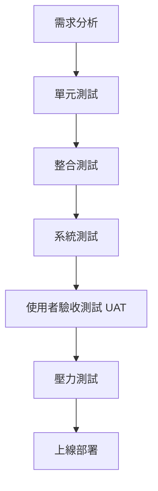
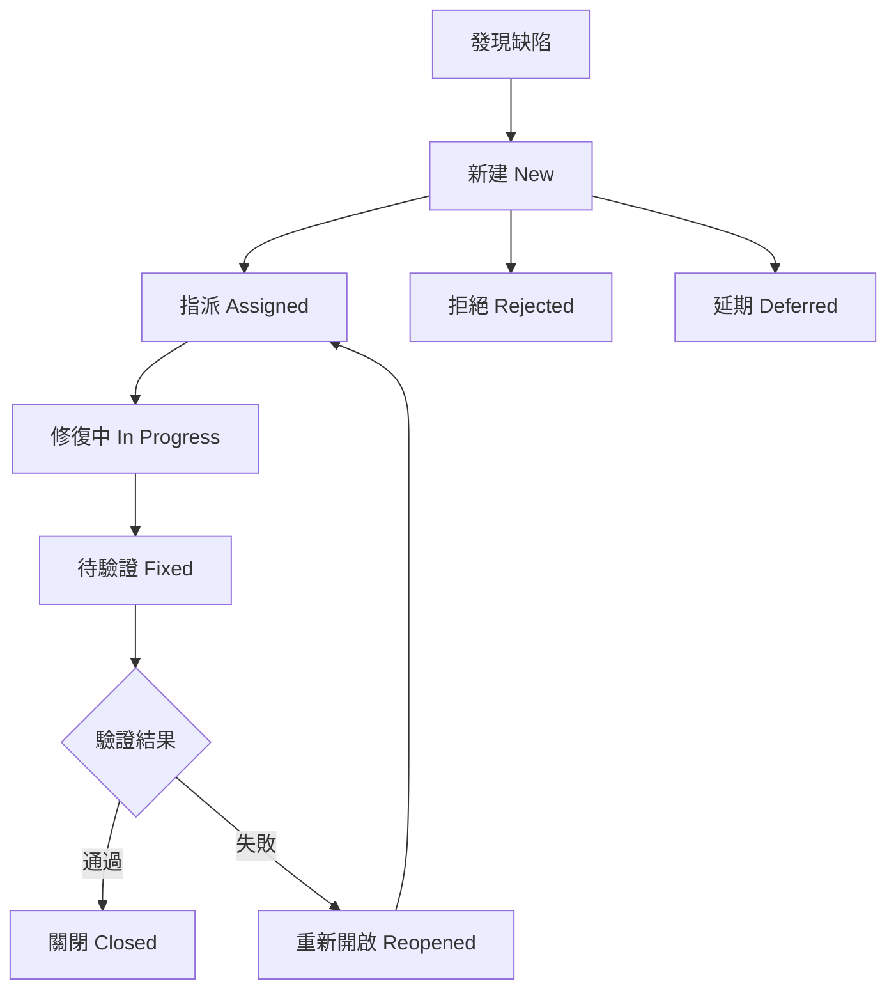
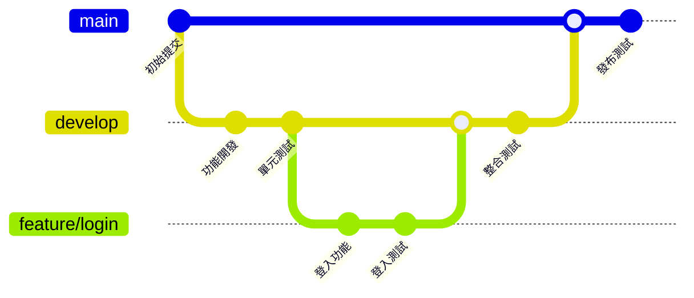
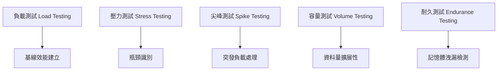
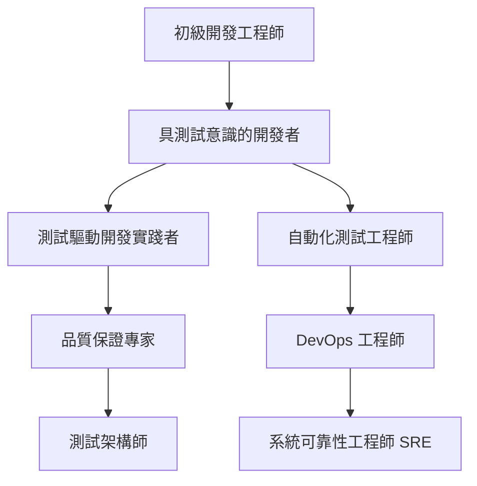

+++
date = '2025-10-31T00:00:00+08:00'
draft = false
title = '測試與品質保證指引'
tags = ['指引', '設計開發']
categories = ['指引']
+++
# 測試與品質保證指引

> **適用對象**: 新進專案成員、開發人員、測試人員  
> **文件目的**: 快速理解專案的測試流程與品質保證規範  
> **更新日期**: 2025年8月27日

---

## 目錄

1. [測試與品質保證的角色與責任](#1-測試與品質保證的角色與責任)
2. [測試流程與各階段](#2-測試流程與各階段)
3. [測試計畫與測試案例設計](#3-測試計畫與測試案例設計)
4. [測試自動化與工具建議](#4-測試自動化與工具建議)
5. [缺陷管理流程](#5-缺陷管理流程)
6. [測試品質指標與衡量方式](#6-測試品質指標與衡量方式)
7. [測試與 CI/CD、版本控管、DevOps 的關聯](#7-測試與-cicd版本控管devops-的關聯)
8. [安全性測試與合規性驗證](#8-安全性測試與合規性驗證)
9. [效能測試與效能調校](#9-效能測試與效能調校)
10. [測試資料管理與隱私保護](#10-測試資料管理與隱私保護)
11. [跨瀏覽器與跨平台測試](#11-跨瀏覽器與跨平台測試)
12. [API 測試與微服務測試策略](#12-api-測試與微服務測試策略)
13. [常見錯誤與避免方式](#13-常見錯誤與避免方式)
14. [新進成員的最佳實務與建議](#14-新進成員的最佳實務與建議)
15. [測試與品質保證檢查清單](#15-測試與品質保證檢查清單)
16. [測試成本效益分析與 ROI 評估](#16-測試成本效益分析與-roi-評估)
17. [團隊協作與溝通](#17-團隊協作與溝通)

---

## 1. 測試與品質保證的角色與責任

### 1.1 開發人員職責

#### 主要責任

- **撰寫單元測試**: 為每個新功能撰寫對應的單元測試
- **程式碼審查**: 檢視同事的程式碼，確保品質標準
- **修復缺陷**: 及時修復測試中發現的問題
- **文件維護**: 更新技術文件和 API 說明

#### 具體工作項目

```markdown
✅ 每個方法都有對應的單元測試
✅ 程式碼覆蓋率達到 80% 以上
✅ 遵循程式碼風格指引
✅ 提交前執行本地測試
```

### 1.2 測試人員職責

#### 主要責任
- **測試案例設計**: 根據需求規格設計完整的測試案例
- **執行測試**: 進行系統測試、整合測試、使用者驗收測試
- **缺陷追蹤**: 記錄、追蹤並驗證缺陷修復
- **測試報告**: 提供測試結果分析和品質評估

#### 具體工作項目
```markdown
✅ 設計邊界值和異常情況測試
✅ 執行回歸測試確保功能穩定
✅ 驗證非功能性需求（效能、安全性）
✅ 提供測試執行報告
```

### 1.3 專案經理職責

#### 主要責任
- **資源規劃**: 安排測試時程和人力資源
- **風險管控**: 識別並管理測試相關風險
- **品質監控**: 監控專案整體品質指標
- **溝通協調**: 協調開發、測試、業務單位間的合作

### 1.4 實務案例

#### 案例一：銀行系統開發
```
情境：開發線上轉帳功能
- 開發人員：撰寫轉帳邏輯單元測試
- 測試人員：設計轉帳金額邊界值測試（0元、負數、超過限額）
- 專案經理：確保測試覆蓋金管會法規要求
```

#### 案例二：API 開發
```
情境：開發客戶資料查詢 API
- 開發人員：測試 API 回應格式和錯誤處理
- 測試人員：驗證 API 安全性和效能
- 專案經理：確保符合個資保護規範
```

### 1.5 注意事項

⚠️ **重要提醒**

- 測試不是某一個人的責任，而是整個團隊的共同責任
- 品質問題越早發現，修復成本越低
- 每個角色都要具備基本的品質意識
- 溝通和協作是確保品質的關鍵

---

## 2. 測試流程與各階段

### 2.1 測試階段概覽



### 2.2 單元測試 (Unit Testing)

#### 目的與範圍

- **目的**: 驗證個別程式模組的功能正確性
- **範圍**: 最小可測試單位（方法、類別）
- **執行者**: 開發人員
- **時機**: 開發過程中持續進行

#### 實施重點

```java
// 範例：良好的單元測試
@Test
public void testCalculateInterest_ValidAmount_ReturnsCorrectInterest() {
    // Arrange
    LoanCalculator calculator = new LoanCalculator();
    double principal = 100000;
    double rate = 0.05;
    int years = 10;
    
    // Act
    double result = calculator.calculateInterest(principal, rate, years);
    
    // Assert
    assertEquals(50000.0, result, 0.01);
}
```

#### 測試案例設計原則

1. **邊界值測試**: 測試輸入參數的邊界情況
2. **等價類劃分**: 將輸入分為等價類別進行測試
3. **異常處理**: 測試錯誤輸入的處理
4. **覆蓋率要求**: 程式碼覆蓋率達到 80% 以上

### 2.3 整合測試 (Integration Testing)

#### 目的與範圍

- **目的**: 驗證模組間的介面和資料流
- **範圍**: 模組間的整合點
- **執行者**: 開發人員與測試人員
- **時機**: 模組開發完成後

#### 整合策略

1. **大爆炸整合** (Big Bang)
   - 所有模組同時整合
   - 適用於小型系統

2. **漸增式整合** (Incremental)
   - **由上而下**: 從主控模組開始
   - **由下而上**: 從底層模組開始
   - **混合式**: 結合兩種方式

#### 實務案例

```text
案例：支付系統整合測試
- 測試重點：帳戶驗證 → 餘額檢查 → 交易處理 → 記錄更新
- 驗證項目：資料傳遞、錯誤處理、交易一致性
```

### 2.4 系統測試 (System Testing)

#### 目的與範圍

- **目的**: 驗證整個系統的功能與非功能需求
- **範圍**: 完整的系統環境
- **執行者**: 測試人員
- **時機**: 系統整合完成後

#### 測試類型

1. **功能性測試**
   - 業務流程驗證
   - 使用者介面測試
   - API 功能測試

2. **非功能性測試**
   - 效能測試
   - 安全性測試
   - 可用性測試
   - 相容性測試

### 2.5 使用者驗收測試 (UAT)

#### 目的與範圍

- **目的**: 確認系統符合業務需求
- **範圍**: 真實業務場景
- **執行者**: 業務使用者
- **時機**: 系統測試通過後

#### UAT 執行步驟

1. **準備階段**
   - 建立測試環境
   - 準備測試資料
   - 培訓使用者

2. **執行階段**
   - 按業務流程測試
   - 記錄問題和建議
   - 收集使用者回饋

3. **驗收階段**
   - 檢視測試結果
   - 決定是否接受系統
   - 簽署驗收文件

### 2.6 壓力測試 (Performance Testing)

#### 目的與範圍

- **目的**: 驗證系統在負載下的表現
- **範圍**: 系統效能和穩定性
- **執行者**: 測試人員與運維人員
- **時機**: 上線前最後階段

#### 測試類型

1. **負載測試** (Load Testing)
   - 模擬正常使用情況
   - 驗證系統處理能力

2. **壓力測試** (Stress Testing)
   - 超過正常負載
   - 找出系統瓶頸

3. **容量測試** (Volume Testing)
   - 大量資料處理
   - 驗證資料處理能力

4. **耐久測試** (Endurance Testing)
   - 長時間運行
   - 檢查記憶體洩漏

#### 效能指標

```markdown
📊 關鍵效能指標 (KPI)
- 回應時間 < 3 秒
- 吞吐量 > 1000 TPS
- CPU 使用率 < 80%
- 記憶體使用率 < 85%
- 錯誤率 < 0.1%
```

### 2.7 注意事項

⚠️ **測試階段重點提醒**

- 每個階段都有明確的進入和退出條件
- 測試環境要盡量接近生產環境
- 測試資料要涵蓋各種情境
- 及早發現問題，降低修復成本
- 保持測試文件的更新

---

## 3. 測試計畫與測試案例設計

### 3.1 測試計畫撰寫

#### 測試計畫基本架構

```markdown
📋 測試計畫範本
1. 專案概述
2. 測試目標與範圍
3. 測試策略與方法
4. 測試環境需求
5. 測試時程安排
6. 人力資源分配
7. 風險評估與應對
8. 驗收標準
```

#### 測試範圍定義

**包含項目 (In Scope)**
- 核心業務功能
- 使用者介面
- API 介面
- 資料庫整合
- 安全性驗證

**排除項目 (Out of Scope)**
- 第三方系統
- 硬體設備
- 網路基礎設施

### 3.2 測試案例設計技術

#### 等價類劃分法

```java
// 範例：信用卡號碼驗證
// 等價類：
// 有效類：16位數字
// 無效類：空值、非數字、長度不對

@Test
public void testCreditCardValidation() {
    // 有效等價類
    assertTrue(validator.isValidCreditCard("1234567890123456"));
    
    // 無效等價類
    assertFalse(validator.isValidCreditCard("")); // 空值
    assertFalse(validator.isValidCreditCard("abcd")); // 非數字
    assertFalse(validator.isValidCreditCard("123")); // 長度不對
}
```

#### 邊界值分析法

```java
// 範例：年齡驗證 (18-65歲)
@Test
public void testAgeValidation_BoundaryValues() {
    // 邊界值
    assertFalse(validator.isValidAge(17)); // 下邊界-1
    assertTrue(validator.isValidAge(18));  // 下邊界
    assertTrue(validator.isValidAge(19));  // 下邊界+1
    
    assertTrue(validator.isValidAge(64));  // 上邊界-1
    assertTrue(validator.isValidAge(65));  // 上邊界
    assertFalse(validator.isValidAge(66)); // 上邊界+1
}
```

#### 決策表法

```markdown
| 條件          | 規則1 | 規則2 | 規則3 | 規則4 |
|---------------|-------|-------|-------|-------|
| 會員等級=VIP  | Y     | Y     | N     | N     |
| 購買金額>1000 | Y     | N     | Y     | N     |
| 動作          |       |       |       |       |
| 折扣9折       | Y     | N     | N     | N     |
| 折扣95折      | N     | Y     | Y     | N     |
| 無折扣        | N     | N     | N     | Y     |
```

#### 狀態遷移測試

```java
// 範例：訂單狀態測試
@Test
public void testOrderStateTransition() {
    Order order = new Order();
    
    // 初始狀態
    assertEquals(OrderState.CREATED, order.getState());
    
    // 狀態遷移
    order.confirm();
    assertEquals(OrderState.CONFIRMED, order.getState());
    
    order.ship();
    assertEquals(OrderState.SHIPPED, order.getState());
    
    order.deliver();
    assertEquals(OrderState.DELIVERED, order.getState());
}
```

### 3.3 測試案例管理

#### 測試案例格式

```markdown
📝 測試案例範本
- 案例編號: TC_001
- 案例標題: 使用者登入功能驗證
- 前置條件: 使用者帳號已建立
- 測試步驟:
  1. 輸入正確帳號密碼
  2. 點選登入按鈕
- 預期結果: 成功登入並跳轉到首頁
- 實際結果: (執行時填寫)
- 測試狀態: Pass/Fail/Block
```

#### 測試資料管理

```java
// 使用測試資料建構器模式
public class TestDataBuilder {
    public static User createValidUser() {
        return User.builder()
            .username("testuser")
            .email("test@example.com")
            .age(25)
            .build();
    }
    
    public static User createInvalidUser() {
        return User.builder()
            .username("") // 無效的空使用者名稱
            .email("invalid-email")
            .age(-1)
            .build();
    }
}
```

### 3.4 實務案例與建議

#### 案例：銀行轉帳功能測試設計

```markdown
🏦 銀行轉帳測試案例設計
- 正常流程：餘額足夠的轉帳
- 異常流程：餘額不足、帳號不存在
- 邊界值：轉帳金額上下限
- 安全性：SQL注入、XSS攻擊
- 效能：大量並發轉帳
```

---

## 4. 測試自動化與工具建議

### 4.1 自動化測試策略

#### 測試金字塔

```
           /\
          /  \
         / UI \     10% - 使用者介面測試
        /______\
       /        \
      / Service \ 20% - 服務/API測試
     /___________\
    /             \
   /     Unit      \ 70% - 單元測試
  /_________________\
```

#### 自動化測試原則

1. **投資回報率最高的測試優先自動化**
2. **穩定且重複執行的測試**
3. **資料驅動的測試**
4. **回歸測試必須自動化**

### 4.2 Java 專案測試工具

#### 單元測試框架

**JUnit 5**
```java
@DisplayName("計算機測試")
class CalculatorTest {
    
    @Test
    @DisplayName("加法測試")
    void testAdd() {
        Calculator calc = new Calculator();
        assertEquals(5, calc.add(2, 3));
    }
    
    @ParameterizedTest
    @ValueSource(ints = {1, 2, 3, 4, 5})
    @DisplayName("參數化測試")
    void testIsPositive(int number) {
        assertTrue(number > 0);
    }
}
```

**TestNG**
```java
@Test(groups = {"smoke"})
public void testUserLogin() {
    // 測試邏輯
}

@Test(dependsOnMethods = {"testUserLogin"})
public void testUserProfile() {
    // 依賴其他測試的邏輯
}
```

#### Mock 框架

**Mockito**
```java
@Mock
private UserRepository userRepository;

@Test
void testUserService() {
    // Given
    User mockUser = new User("john", "john@example.com");
    when(userRepository.findByUsername("john")).thenReturn(mockUser);
    
    // When
    User result = userService.findUser("john");
    
    // Then
    assertEquals("john@example.com", result.getEmail());
    verify(userRepository).findByUsername("john");
}
```

#### 整合測試工具

**Spring Boot Test**
```java
@SpringBootTest
@AutoConfigureTestDatabase(replace = AutoConfigureTestDatabase.Replace.NONE)
class UserControllerIntegrationTest {
    
    @Autowired
    private TestRestTemplate restTemplate;
    
    @Test
    void testCreateUser() {
        User user = new User("test", "test@example.com");
        ResponseEntity<User> response = restTemplate.postForEntity(
            "/api/users", user, User.class);
        
        assertEquals(HttpStatus.CREATED, response.getStatusCode());
    }
}
```

#### API 測試工具

**REST Assured**
```java
@Test
public void testGetUser() {
    given()
        .pathParam("id", 1)
    .when()
        .get("/api/users/{id}")
    .then()
        .statusCode(200)
        .body("name", equalTo("John Doe"))
        .body("email", equalTo("john@example.com"));
}
```

#### 效能測試工具

**JMeter**
- 圖形化介面設計測試計畫
- 支援多種協定 (HTTP, JDBC, FTP)
- 產生詳細的效能報告

**Gatling**
```scala
class UserSimulation extends Simulation {
  val httpProtocol = http.baseUrl("http://localhost:8080")
  
  val scn = scenario("User Scenario")
    .exec(http("Get Users")
      .get("/api/users")
      .check(status.is(200)))
  
  setUp(scn.inject(atOnceUsers(100))).protocols(httpProtocol)
}
```

### 4.3 CI/CD 整合

#### Maven 配置

```xml
<plugin>
    <groupId>org.surefire</groupId>
    <artifactId>maven-surefire-plugin</artifactId>
    <version>3.0.0-M7</version>
    <configuration>
        <includes>
            <include>**/*Test.java</include>
            <include>**/*Tests.java</include>
        </includes>
        <excludes>
            <exclude>**/*IntegrationTest.java</exclude>
        </excludes>
    </configuration>
</plugin>

<plugin>
    <groupId>org.jacoco</groupId>
    <artifactId>jacoco-maven-plugin</artifactId>
    <version>0.8.7</version>
    <executions>
        <execution>
            <goals>
                <goal>prepare-agent</goal>
            </goals>
        </execution>
        <execution>
            <id>report</id>
            <phase>test</phase>
            <goals>
                <goal>report</goal>
            </goals>
        </execution>
    </executions>
</plugin>
```

#### GitHub Actions 配置

```yaml
name: CI/CD Pipeline

on:
  push:
    branches: [ main, develop ]
  pull_request:
    branches: [ main ]

jobs:
  test:
    runs-on: ubuntu-latest
    
    steps:
    - uses: actions/checkout@v3
    
    - name: Set up JDK 11
      uses: actions/setup-java@v3
      with:
        java-version: '11'
        distribution: 'temurin'
        
    - name: Cache Maven dependencies
      uses: actions/cache@v3
      with:
        path: ~/.m2
        key: ${{ runner.os }}-m2-${{ hashFiles('**/pom.xml') }}
        
    - name: Run tests
      run: mvn clean test
      
    - name: Generate test report
      run: mvn jacoco:report
      
    - name: Upload coverage reports
      uses: codecov/codecov-action@v3
```

### 4.4 測試報告與指標

#### 覆蓋率報告

```bash
# 產生覆蓋率報告
mvn clean test jacoco:report

# 檢視報告
open target/site/jacoco/index.html
```

#### 品質指標

```markdown
📊 測試品質指標
- 程式碼覆蓋率 ≥ 80%
- 測試通過率 = 100%
- 測試執行時間 < 10 分鐘
- 缺陷密度 < 1 個/KLOC
```

### 4.5 工具選擇建議

#### 專案規模考量

**小型專案 (< 10 人)**
- JUnit + Mockito
- Maven/Gradle
- SonarQube Lite

**中型專案 (10-50 人)**
- JUnit + TestNG + Mockito
- Jenkins/GitHub Actions
- SonarQube
- TestRail

**大型專案 (> 50 人)**

- 企業級測試管理平台
- 分散式測試執行
- 效能監控工具
- 自動化部署流水線

---

## 5. 缺陷管理流程 (Bug Lifecycle)

### 5.1 缺陷生命週期



### 5.2 缺陷嚴重程度分級

#### 嚴重程度 (Severity)

| 等級 | 說明 | 範例 | 處理時限 |
|------|------|------|----------|
| Critical | 系統崩潰、資料遺失 | 無法登入、交易失敗 | 4小時內 |
| High | 主要功能無法使用 | 核心業務流程中斷 | 1個工作日 |
| Medium | 功能異常但有替代方案 | 報表顯示錯誤 | 3個工作日 |
| Low | 小問題、介面問題 | 文字錯誤、對齊問題 | 1週內 |

#### 優先程度 (Priority)

| 等級 | 說明 | 處理順序 |
|------|------|----------|
| P1 | 立即處理 | 最高優先 |
| P2 | 高優先處理 | 優先處理 |
| P3 | 正常處理 | 一般處理 |
| P4 | 低優先處理 | 最後處理 |

### 5.3 缺陷報告範本

```markdown
🐛 缺陷報告範本

**基本資訊**
- 缺陷編號: BUG-2025-001
- 發現者: 張三
- 發現日期: 2025-08-27
- 測試環境: UAT

**缺陷描述**
- 標題: 使用者登入後頁面顯示空白
- 嚴重程度: High
- 優先程度: P2
- 模組: 使用者管理

**重現步驟**
1. 開啟瀏覽器訪問系統
2. 輸入正確的帳號密碼
3. 點選登入按鈕
4. 頁面跳轉後顯示空白

**預期結果**
登入成功後應顯示使用者儀表板

**實際結果**
頁面完全空白，無任何內容顯示

**環境資訊**
- 瀏覽器: Chrome 116.0
- 作業系統: Windows 11
- 螢幕解析度: 1920x1080

**附件**
- 錯誤截圖
- 瀏覽器 Console 日誌
- 系統日誌檔案
```

### 5.4 缺陷追蹤工具

#### JIRA 設定

```yaml
# JIRA 工作流程設定
workflow:
  name: "Bug Workflow"
  states:
    - name: "Open"
      transitions: ["Start Progress", "Resolve", "Close"]
    - name: "In Progress" 
      transitions: ["Stop Progress", "Resolve"]
    - name: "Resolved"
      transitions: ["Close", "Reopen"]
    - name: "Closed"
      transitions: ["Reopen"]
```

#### GitHub Issues 設定

```yaml
# .github/ISSUE_TEMPLATE/bug_report.yml
name: Bug Report
description: 報告系統錯誤
title: "[BUG] "
labels: ["bug", "triage"]
body:
  - type: textarea
    id: description
    attributes:
      label: 問題描述
      description: 請詳細描述遇到的問題
    validations:
      required: true
  - type: textarea
    id: steps
    attributes:
      label: 重現步驟
      description: 請說明如何重現這個問題
    validations:
      required: true
```

### 5.5 缺陷分析與預防

#### 根本原因分析 (RCA)

```markdown
🔍 5 Why 分析法
問題: 生產環境資料庫連線失敗

1. 為什麼資料庫連線失敗？
   → 連線池耗盡

2. 為什麼連線池耗盡？
   → 有些連線沒有正確關閉

3. 為什麼連線沒有正確關閉？
   → 程式碼中缺少 finally 區塊

4. 為什麼沒有 finally 區塊？
   → 開發人員不熟悉最佳實務

5. 為什麼開發人員不熟悉？
   → 缺乏程式碼審查和培訓

根本原因: 缺乏程式碼審查機制和開發人員培訓
```

#### 缺陷預防措施

```java
// 範例：使用 try-with-resources 防止資源洩漏
public List<User> getAllUsers() {
    List<User> users = new ArrayList<>();
    String sql = "SELECT * FROM users";
    
    try (Connection conn = dataSource.getConnection();
         PreparedStatement stmt = conn.prepareStatement(sql);
         ResultSet rs = stmt.executeQuery()) {
        
        while (rs.next()) {
            users.add(mapResultSetToUser(rs));
        }
    } catch (SQLException e) {
        logger.error("查詢使用者資料失敗", e);
        throw new DataAccessException("無法取得使用者資料", e);
    }
    
    return users;
}
```

---

## 6. 測試品質指標與衡量方式

### 6.1 測試覆蓋率指標

#### 程式碼覆蓋率類型

```java
// 範例程式碼
public class Calculator {
    public int divide(int a, int b) {
        if (b == 0) {                    // 分支1
            throw new ArithmeticException("除數不能為零");
        }
        return a / b;                    // 分支2
    }
}

// 測試案例
@Test
void testDivide_ValidInput() {
    assertEquals(5, calculator.divide(10, 2)); // 只覆蓋分支2
}

@Test
void testDivide_ZeroDivisor() {
    assertThrows(ArithmeticException.class, 
        () -> calculator.divide(10, 0));       // 覆蓋分支1
}
```

#### 覆蓋率指標

| 類型 | 說明 | 目標值 |
|------|------|--------|
| 語句覆蓋率 | 執行的程式碼行數比例 | ≥ 80% |
| 分支覆蓋率 | 執行的分支比例 | ≥ 70% |
| 函數覆蓋率 | 被呼叫的函數比例 | ≥ 90% |
| 條件覆蓋率 | 測試的條件組合比例 | ≥ 60% |

### 6.2 測試效能指標

#### 執行效率指標

```markdown
⏱️ 測試執行效能
- 單元測試執行時間 < 10 秒
- 整合測試執行時間 < 5 分鐘
- 系統測試執行時間 < 30 分鐘
- 完整測試套件執行時間 < 1 小時
```

#### 測試穩定性指標

```markdown
📊 測試穩定性
- 測試成功率 ≥ 98%
- 假陽性率 ≤ 2%
- 假陰性率 ≤ 1%
- 測試維護工作量 ≤ 開發工作量的 20%
```

### 6.3 缺陷發現效率

#### 階段性缺陷發現率

```markdown
🎯 理想的缺陷發現分布
- 單元測試階段: 40%
- 整合測試階段: 30%
- 系統測試階段: 20%
- UAT 階段: 8%
- 生產環境: 2%
```

#### 缺陷成本分析

| 發現階段 | 修復成本 | 成本比例 |
|----------|----------|----------|
| 需求分析 | $100 | 1x |
| 設計階段 | $200 | 2x |
| 編碼階段 | $500 | 5x |
| 測試階段 | $1,000 | 10x |
| 生產環境 | $10,000 | 100x |

### 6.4 品質趨勢監控

#### SonarQube 品質指標

```yaml
# sonar-project.properties
sonar.projectKey=java-tutorial
sonar.projectName=Java Tutorial Project
sonar.projectVersion=1.0

# 品質門檻設定
sonar.qualitygate.wait=true
sonar.coverage.exclusions=**/*Test.java,**/*Config.java
sonar.test.inclusions=**/*Test.java

# 品質規則
sonar.java.source=11
sonar.java.target=11
sonar.java.libraries=target/classes
```

#### 持續監控儀表板

```markdown
📈 品質儀表板指標
- 程式碼覆蓋率趨勢
- 技術債務趨勢
- 程式碼重複率
- 循環複雜度
- 安全漏洞數量
- 可靠性等級
- 可維護性等級
```

---

## 7. 測試與 CI/CD、版本控管、DevOps 的關聯

### 7.1 版本控管整合

#### Git Hook 設定

```bash
#!/bin/sh
# pre-commit hook
echo "執行程式碼品質檢查..."

# 執行單元測試
mvn test
if [ $? -ne 0 ]; then
    echo "❌ 單元測試失敗，請修正後再提交"
    exit 1
fi

# 執行程式碼風格檢查
mvn checkstyle:check
if [ $? -ne 0 ]; then
    echo "❌ 程式碼風格檢查失敗"
    exit 1
fi

echo "✅ 所有檢查通過，可以提交"
```

#### 分支策略與測試



### 7.2 CI/CD 流水線設計

#### Jenkins Pipeline

```groovy
pipeline {
    agent any
    
    stages {
        stage('Checkout') {
            steps {
                git branch: 'main', url: 'https://github.com/example/java-tutorial.git'
            }
        }
        
        stage('Unit Tests') {
            steps {
                sh 'mvn clean test'
            }
            post {
                always {
                    junit 'target/surefire-reports/*.xml'
                    publishHTML([
                        allowMissing: false,
                        alwaysLinkToLastBuild: true,
                        keepAll: true,
                        reportDir: 'target/site/jacoco',
                        reportFiles: 'index.html',
                        reportName: 'Coverage Report'
                    ])
                }
            }
        }
        
        stage('Integration Tests') {
            steps {
                sh 'mvn verify -Pintegration-tests'
            }
        }
        
        stage('Code Quality') {
            steps {
                sh 'mvn sonar:sonar'
            }
        }
        
        stage('Security Scan') {
            steps {
                sh 'mvn dependency-check:check'
            }
        }
        
        stage('Build & Package') {
            steps {
                sh 'mvn package -DskipTests'
                archiveArtifacts artifacts: 'target/*.jar', fingerprint: true
            }
        }
        
        stage('Deploy to Staging') {
            when {
                branch 'develop'
            }
            steps {
                sh 'docker build -t app:staging .'
                sh 'docker run -d --name staging-app app:staging'
            }
        }
        
        stage('Smoke Tests') {
            when {
                branch 'develop'
            }
            steps {
                sh 'mvn test -Dtest=SmokeTests'
            }
        }
        
        stage('Deploy to Production') {
            when {
                branch 'main'
            }
            steps {
                input message: '確認部署到生產環境？'
                sh 'kubectl apply -f k8s-deployment.yaml'
            }
        }
    }
    
    post {
        failure {
            emailext (
                subject: "建置失敗: ${env.JOB_NAME} - ${env.BUILD_NUMBER}",
                body: "建置失敗，請檢查: ${env.BUILD_URL}",
                to: "${env.CHANGE_AUTHOR_EMAIL}"
            )
        }
    }
}
```

### 7.3 環境管理

#### 測試環境配置

```yaml
# docker-compose.test.yml
version: '3.8'
services:
  app:
    build: .
    environment:
      - SPRING_PROFILES_ACTIVE=test
      - DATABASE_URL=jdbc:h2:mem:testdb
    depends_on:
      - test-db
      
  test-db:
    image: h2:latest
    environment:
      - H2_OPTIONS=-ifNotExists
    ports:
      - "9092:9092"
      
  selenium-hub:
    image: selenium/hub:latest
    ports:
      - "4444:4444"
      
  chrome:
    image: selenium/node-chrome:latest
    depends_on:
      - selenium-hub
    environment:
      - HUB_HOST=selenium-hub
```

#### 環境隔離策略

```markdown
🏗️ 環境層級
1. 開發環境 (DEV)
   - 開發人員本地測試
   - 快速反饋循環

2. 測試環境 (TEST)
   - 自動化測試執行
   - 持續整合測試

3. 預發布環境 (STAGING)
   - 類生產環境測試
   - 效能和負載測試

4. 生產環境 (PROD)
   - 真實使用者環境
   - 監控和告警
```

### 7.4 DevOps 最佳實務

#### 監控與日誌

```java
// 應用程式監控
@RestController
public class HealthController {
    
    @Autowired
    private DatabaseHealthIndicator dbHealth;
    
    @GetMapping("/health")
    public ResponseEntity<Map<String, String>> health() {
        Map<String, String> status = new HashMap<>();
        
        // 檢查資料庫連線
        if (dbHealth.isHealthy()) {
            status.put("database", "UP");
        } else {
            status.put("database", "DOWN");
            return ResponseEntity.status(503).body(status);
        }
        
        status.put("status", "UP");
        return ResponseEntity.ok(status);
    }
}
```

#### 回滾策略

```bash
#!/bin/bash
# 自動回滾腳本
CURRENT_VERSION=$(kubectl get deployment app -o jsonpath='{.spec.template.spec.containers[0].image}')
PREVIOUS_VERSION=$(kubectl rollout history deployment/app | tail -2 | head -1 | awk '{print $1}')

echo "檢測到部署問題，開始回滾..."
echo "當前版本: $CURRENT_VERSION"
echo "回滾到版本: $PREVIOUS_VERSION"

kubectl rollout undo deployment/app --to-revision=$PREVIOUS_VERSION

# 等待回滾完成
kubectl rollout status deployment/app

# 驗證回滾成功
if curl -f http://app/health > /dev/null 2>&1; then
    echo "✅ 回滾成功"
else
    echo "❌ 回滾失敗"
    exit 1
fi
```

---

## 8. 安全性測試與合規性驗證

### 8.1 安全性測試類型

#### 認證與授權測試

```java
// 認證測試範例
@Test
@WithMockUser(roles = "USER")
void testUserAccess_WithUserRole_ShouldAllowAccess() {
    mockMvc.perform(get("/api/user/profile"))
        .andExpect(status().isOk());
}

@Test
@WithMockUser(roles = "ADMIN")
void testAdminAccess_WithAdminRole_ShouldAllowAccess() {
    mockMvc.perform(delete("/api/users/1"))
        .andExpect(status().isOk());
}

@Test
void testUnauthorizedAccess_ShouldReturn401() {
    mockMvc.perform(get("/api/admin/users"))
        .andExpect(status().isUnauthorized());
}
```

#### 輸入驗證測試

```java
// SQL 注入防護測試
@Test
void testSqlInjection_ShouldBePrevented() {
    String maliciousInput = "'; DROP TABLE users; --";
    
    assertThrows(ValidationException.class, () -> {
        userService.findByUsername(maliciousInput);
    });
}

// XSS 防護測試
@Test
void testXssAttack_ShouldBeSanitized() {
    String maliciousScript = "<script>alert('XSS')</script>";
    User user = new User();
    user.setName(maliciousScript);
    
    // 驗證輸入被適當清理
    String sanitized = htmlSanitizer.sanitize(user.getName());
    assertFalse(sanitized.contains("<script>"));
}
```

#### 資料加密測試

```java
// 密碼加密測試
@Test
void testPasswordEncryption() {
    String plainPassword = "myPassword123";
    String hashedPassword = passwordEncoder.encode(plainPassword);
    
    // 驗證密碼已加密
    assertNotEquals(plainPassword, hashedPassword);
    assertTrue(passwordEncoder.matches(plainPassword, hashedPassword));
}

// 敏感資料加密測試
@Test
void testSensitiveDataEncryption() {
    String creditCard = "1234-5678-9012-3456";
    String encrypted = dataEncryption.encrypt(creditCard);
    
    // 驗證加密後資料無法直接識別
    assertNotEquals(creditCard, encrypted);
    assertEquals(creditCard, dataEncryption.decrypt(encrypted));
}
```

### 8.2 OWASP Top 10 測試覆蓋

#### A01:2021 - 存取控制破損

```java
@Test
void testHorizontalPrivilegeEscalation() {
    // 測試使用者是否能存取其他使用者的資料
    User user1 = createTestUser("user1");
    User user2 = createTestUser("user2");
    
    // user1 嘗試存取 user2 的資料
    assertThrows(UnauthorizedException.class, () -> {
        userService.getUserProfile(user2.getId(), user1.getToken());
    });
}
```

#### A02:2021 - 加密失效

```java
@Test
void testDataTransmissionSecurity() {
    // 驗證 HTTPS 強制使用
    mockMvc.perform(get("/api/login").secure(false))
        .andExpect(status().is3xxRedirection())
        .andExpect(header().string("Location", containsString("https://")));
}
```

#### A03:2021 - 注入攻擊

```java
@Test
void testParameterizedQueries() {
    // 驗證使用參數化查詢防止 SQL 注入
    String suspiciousInput = "1' OR '1'='1";
    
    List<User> users = userRepository.findByStatus(suspiciousInput);
    // 應該回傳空結果，而不是所有使用者
    assertTrue(users.isEmpty());
}
```

### 8.3 安全測試工具與技術

#### OWASP ZAP 自動化掃描

```yaml
# GitHub Actions 中整合 ZAP 掃描
security-scan:
  runs-on: ubuntu-latest
  steps:
    - name: Checkout code
      uses: actions/checkout@v3
      
    - name: Start application
      run: |
        mvn spring-boot:run &
        sleep 30
        
    - name: Run ZAP baseline scan
      uses: zaproxy/action-baseline@v0.7.0
      with:
        target: 'http://localhost:8080'
        rules_file_name: '.zap/rules.tsv'
        
    - name: Upload ZAP results
      uses: actions/upload-artifact@v3
      with:
        name: zap-report
        path: report_html.html
```

#### SonarQube 安全規則

```xml
<!-- pom.xml 中配置 SonarQube 安全規則 -->
<plugin>
    <groupId>org.sonarsource.scanner.maven</groupId>
    <artifactId>sonar-maven-plugin</artifactId>
    <configuration>
        <sonar.security.hotspots.inheritFromParent>true</sonar.security.hotspots.inheritFromParent>
        <sonar.security.review.rating>A</sonar.security.review.rating>
    </configuration>
</plugin>
```

### 8.4 合規性測試

#### GDPR 合規性測試

```java
@Test
void testDataDeletionCompliance() {
    // 測試「被遺忘權」實現
    User user = createTestUser();
    Long userId = user.getId();
    
    // 使用者請求刪除資料
    userService.deleteUserData(userId);
    
    // 驗證所有相關資料已刪除
    assertNull(userRepository.findById(userId));
    assertTrue(auditLogRepository.findByUserId(userId).isEmpty());
    assertTrue(userPreferenceRepository.findByUserId(userId).isEmpty());
}

@Test
void testDataExportCompliance() {
    // 測試「資料可攜權」實現
    User user = createTestUser();
    
    UserDataExport export = userService.exportUserData(user.getId());
    
    // 驗證匯出包含所有使用者資料
    assertNotNull(export.getPersonalInfo());
    assertNotNull(export.getTransactionHistory());
    assertNotNull(export.getPreferences());
}
```

#### PCI DSS 合規性測試

```java
@Test
void testCreditCardDataHandling() {
    // 測試信用卡資料不被記錄或儲存
    String creditCard = "4111111111111111";
    
    PaymentRequest request = new PaymentRequest();
    request.setCreditCardNumber(creditCard);
    
    paymentService.processPayment(request);
    
    // 驗證信用卡號碼未儲存在日誌或資料庫中
    assertFalse(auditLogContains(creditCard));
    assertFalse(databaseContains(creditCard));
}
```

---

## 9. 效能測試與效能調校

### 9.1 效能測試策略

#### 效能測試金字塔



#### JMeter 測試腳本範例

```xml
<!-- JMeter 測試計畫 -->
<?xml version="1.0" encoding="UTF-8"?>
<jmeterTestPlan version="1.2">
  <hashTree>
    <TestPlan testname="API Performance Test">
      <elementProp name="TestPlan.arguments" elementType="Arguments" guiclass="ArgumentsPanel">
        <collectionProp name="Arguments.arguments">
          <elementProp name="host" elementType="Argument">
            <stringProp name="Argument.name">host</stringProp>
            <stringProp name="Argument.value">localhost</stringProp>
          </elementProp>
          <elementProp name="port" elementType="Argument">
            <stringProp name="Argument.name">port</stringProp>
            <stringProp name="Argument.value">8080</stringProp>
          </elementProp>
        </collectionProp>
      </elementProp>
    </TestPlan>
    
    <hashTree>
      <ThreadGroup testname="User Load">
        <stringProp name="ThreadGroup.num_threads">100</stringProp>
        <stringProp name="ThreadGroup.ramp_time">60</stringProp>
        <stringProp name="ThreadGroup.duration">300</stringProp>
      </ThreadGroup>
    </hashTree>
  </hashTree>
</jmeterTestPlan>
```

### 9.2 Java 效能測試工具

#### JMH (Java Microbenchmark Harness)

```java
@BenchmarkMode(Mode.AverageTime)
@OutputTimeUnit(TimeUnit.MICROSECONDS)
@State(Scope.Benchmark)
public class PerformanceBenchmark {
    
    private List<Integer> numbers;
    
    @Setup
    public void setup() {
        numbers = IntStream.range(0, 1000)
            .boxed()
            .collect(Collectors.toList());
    }
    
    @Benchmark
    public long sumWithStream() {
        return numbers.stream()
            .mapToLong(Integer::longValue)
            .sum();
    }
    
    @Benchmark
    public long sumWithParallelStream() {
        return numbers.parallelStream()
            .mapToLong(Integer::longValue)
            .sum();
    }
    
    @Benchmark
    public long sumWithLoop() {
        long sum = 0;
        for (Integer number : numbers) {
            sum += number;
        }
        return sum;
    }
}
```

#### Gatling 負載測試

```scala
import io.gatling.core.Predef._
import io.gatling.http.Predef._
import scala.concurrent.duration._

class UserJourneySimulation extends Simulation {
  
  val httpProtocol = http
    .baseUrl("http://localhost:8080")
    .acceptHeader("application/json")
    .contentTypeHeader("application/json")
  
  val loginScenario = scenario("User Login Journey")
    .exec(
      http("Login")
        .post("/api/auth/login")
        .body(StringBody("""{"username":"testuser","password":"password"}"""))
        .check(status.is(200))
        .check(jsonPath("$.token").saveAs("authToken"))
    )
    .pause(1)
    .exec(
      http("Get Profile")
        .get("/api/user/profile")
        .header("Authorization", "Bearer ${authToken}")
        .check(status.is(200))
    )
    .pause(2)
    .exec(
      http("Update Profile")
        .put("/api/user/profile")
        .header("Authorization", "Bearer ${authToken}")
        .body(StringBody("""{"name":"Updated Name"}"""))
        .check(status.is(200))
    )
  
  setUp(
    loginScenario.inject(
      constantUsersPerSec(10) during(30 seconds),
      rampUsersPerSec(10) to(50) during(60 seconds),
      constantUsersPerSec(50) during(120 seconds)
    )
  ).protocols(httpProtocol)
}
```

### 9.3 效能監控與分析

#### 應用程式效能監控 (APM)

```java
// 使用 Micrometer 進行效能監控
@RestController
public class UserController {
    
    private final MeterRegistry meterRegistry;
    private final Timer userCreationTimer;
    
    public UserController(MeterRegistry meterRegistry) {
        this.meterRegistry = meterRegistry;
        this.userCreationTimer = Timer.builder("user.creation.time")
            .description("Time taken to create a user")
            .register(meterRegistry);
    }
    
    @PostMapping("/users")
    public ResponseEntity<User> createUser(@RequestBody User user) {
        return userCreationTimer.recordCallable(() -> {
            User createdUser = userService.createUser(user);
            
            // 記錄成功建立使用者的計數
            meterRegistry.counter("user.creation.success").increment();
            
            return ResponseEntity.status(HttpStatus.CREATED).body(createdUser);
        });
    }
}
```

#### 資料庫效能測試

```java
@Test
void testDatabasePerformance() {
    // 測試大量資料查詢效能
    StopWatch stopWatch = new StopWatch();
    stopWatch.start();
    
    List<User> users = userRepository.findActiveUsers();
    
    stopWatch.stop();
    long executionTime = stopWatch.getTotalTimeMillis();
    
    // 驗證查詢時間在可接受範圍內
    assertTrue(executionTime < 1000, "查詢時間超過 1 秒: " + executionTime + "ms");
    assertFalse(users.isEmpty(), "應該查詢到活躍使用者");
}

@Test
void testConcurrentDatabaseAccess() {
    int threadCount = 10;
    ExecutorService executor = Executors.newFixedThreadPool(threadCount);
    CountDownLatch latch = new CountDownLatch(threadCount);
    AtomicInteger successCount = new AtomicInteger(0);
    
    for (int i = 0; i < threadCount; i++) {
        final int userId = i;
        executor.submit(() -> {
            try {
                User user = userService.getUser((long) userId);
                if (user != null) {
                    successCount.incrementAndGet();
                }
            } finally {
                latch.countDown();
            }
        });
    }
    
    await().atMost(5, TimeUnit.SECONDS).until(() -> latch.getCount() == 0);
    
    // 驗證並發存取的成功率
    assertTrue(successCount.get() >= threadCount * 0.9, 
        "並發存取成功率低於 90%");
}
```

### 9.4 效能調校策略

#### JVM 調校

```bash
# JVM 效能調校參數範例
java -Xms2g -Xmx4g \
     -XX:+UseG1GC \
     -XX:MaxGCPauseMillis=200 \
     -XX:+PrintGCDetails \
     -XX:+PrintGCTimeStamps \
     -XX:+UseStringDeduplication \
     -Djava.awt.headless=true \
     -Dspring.profiles.active=production \
     -jar application.jar
```

#### 快取策略測試

```java
@Test
void testCachePerformance() {
    // 第一次查詢 - 無快取
    StopWatch stopWatch = new StopWatch();
    stopWatch.start();
    User user1 = userService.getUser(1L);
    stopWatch.stop();
    long firstCallTime = stopWatch.getTotalTimeMillis();
    
    // 第二次查詢 - 應該從快取取得
    stopWatch.restart();
    User user2 = userService.getUser(1L);
    stopWatch.stop();
    long secondCallTime = stopWatch.getTotalTimeMillis();
    
    // 驗證快取效果
    assertEquals(user1.getId(), user2.getId());
    assertTrue(secondCallTime < firstCallTime * 0.1, 
        "快取查詢應該比資料庫查詢快 10 倍以上");
}
```

---

## 10. 測試資料管理與隱私保護

### 10.1 測試資料策略

#### 測試資料分類

```markdown
📊 測試資料分類

【真實資料 (Production Data)】
- 優點：最接近真實使用情況
- 缺點：隱私風險、法規限制
- 適用：效能測試、使用者驗收測試

【匿名化資料 (Anonymized Data)】
- 優點：保護隱私，資料結構真實
- 缺點：可能影響測試有效性
- 適用：整合測試、系統測試

【合成資料 (Synthetic Data)】
- 優點：無隱私問題，可大量產生
- 缺點：可能無法反映真實情況
- 適用：單元測試、負載測試

【子集資料 (Subset Data)】
- 優點：真實但數量較少
- 缺點：可能缺少邊界情況
- 適用：開發測試、功能測試
```

#### 測試資料建立器模式

```java
public class TestDataBuilder {
    
    // 使用 Builder 模式建立測試資料
    public static class UserBuilder {
        private User user = new User();
        
        public UserBuilder withName(String name) {
            user.setName(name);
            return this;
        }
        
        public UserBuilder withEmail(String email) {
            user.setEmail(email);
            return this;
        }
        
        public UserBuilder withAge(int age) {
            user.setAge(age);
            return this;
        }
        
        public UserBuilder asAdmin() {
            user.setRole(Role.ADMIN);
            return this;
        }
        
        public UserBuilder asActiveUser() {
            user.setStatus(UserStatus.ACTIVE);
            user.setLastLoginDate(LocalDateTime.now());
            return this;
        }
        
        public User build() {
            // 設定預設值
            if (user.getName() == null) {
                user.setName("TestUser_" + System.currentTimeMillis());
            }
            if (user.getEmail() == null) {
                user.setEmail(user.getName().toLowerCase() + "@test.com");
            }
            if (user.getRole() == null) {
                user.setRole(Role.USER);
            }
            return user;
        }
    }
    
    public static UserBuilder aUser() {
        return new UserBuilder();
    }
    
    // 預定義常用測試資料
    public static User createValidUser() {
        return aUser()
            .withName("John Doe")
            .withEmail("john.doe@example.com")
            .withAge(30)
            .asActiveUser()
            .build();
    }
    
    public static User createAdminUser() {
        return aUser()
            .withName("Admin User")
            .withEmail("admin@example.com")
            .asAdmin()
            .asActiveUser()
            .build();
    }
}

// 使用範例
@Test
void testUserCreation() {
    User user = TestDataBuilder.aUser()
        .withName("Test User")
        .withEmail("test@example.com")
        .withAge(25)
        .build();
    
    User saved = userService.save(user);
    assertNotNull(saved.getId());
}
```

### 10.2 資料匿名化技術

#### 資料遮罩技術

```java
public class DataMasker {
    
    // 電子郵件遮罩
    public static String maskEmail(String email) {
        if (email == null || !email.contains("@")) {
            return email;
        }
        
        String[] parts = email.split("@");
        String username = parts[0];
        String domain = parts[1];
        
        if (username.length() <= 2) {
            return "**@" + domain;
        }
        
        return username.charAt(0) + 
               "*".repeat(username.length() - 2) + 
               username.charAt(username.length() - 1) + 
               "@" + domain;
    }
    
    // 電話號碼遮罩
    public static String maskPhoneNumber(String phone) {
        if (phone == null || phone.length() < 4) {
            return phone;
        }
        
        return phone.substring(0, 3) + 
               "*".repeat(phone.length() - 6) + 
               phone.substring(phone.length() - 3);
    }
    
    // 信用卡號碼遮罩
    public static String maskCreditCard(String creditCard) {
        if (creditCard == null || creditCard.length() < 8) {
            return creditCard;
        }
        
        return "*".repeat(creditCard.length() - 4) + 
               creditCard.substring(creditCard.length() - 4);
    }
}

@Test
void testDataMasking() {
    assertEquals("j***e@example.com", 
        DataMasker.maskEmail("johndoe@example.com"));
    assertEquals("09*****789", 
        DataMasker.maskPhoneNumber("0912345789"));
    assertEquals("************3456", 
        DataMasker.maskCreditCard("1234567890123456"));
}
```

#### 資料隨機化

```java
public class DataRandomizer {
    private static final Random random = new Random();
    private static final String[] FIRST_NAMES = {
        "James", "Mary", "John", "Patricia", "Robert", "Jennifer"
    };
    private static final String[] LAST_NAMES = {
        "Smith", "Johnson", "Williams", "Brown", "Jones", "Garcia"
    };
    
    public static String randomName() {
        return FIRST_NAMES[random.nextInt(FIRST_NAMES.length)] + " " +
               LAST_NAMES[random.nextInt(LAST_NAMES.length)];
    }
    
    public static String randomEmail() {
        return "user" + random.nextInt(10000) + "@test.com";
    }
    
    public static LocalDate randomBirthDate() {
        int year = 1950 + random.nextInt(50);
        int month = 1 + random.nextInt(12);
        int day = 1 + random.nextInt(28);
        return LocalDate.of(year, month, day);
    }
    
    public static String randomPhoneNumber() {
        return String.format("09%08d", random.nextInt(100000000));
    }
}
```

### 10.3 測試資料生命週期管理

#### 資料庫測試資料管理

```java
@TestConfiguration
public class TestDataConfiguration {
    
    @Bean
    @Primary
    public DataSource testDataSource() {
        // 使用 H2 記憶體資料庫進行測試
        HikariConfig config = new HikariConfig();
        config.setJdbcUrl("jdbc:h2:mem:testdb;DB_CLOSE_DELAY=-1");
        config.setUsername("sa");
        config.setPassword("");
        return new HikariDataSource(config);
    }
}

@Sql(scripts = "/test-data.sql", executionPhase = Sql.ExecutionPhase.BEFORE_TEST_METHOD)
@Sql(scripts = "/cleanup.sql", executionPhase = Sql.ExecutionPhase.AFTER_TEST_METHOD)
@Test
void testWithTestData() {
    // 測試邏輯
}
```

#### TestContainers 整合

```java
@Testcontainers
class DatabaseIntegrationTest {
    
    @Container
    static PostgreSQLContainer<?> postgres = new PostgreSQLContainer<>("postgres:13")
            .withDatabaseName("testdb")
            .withUsername("test")
            .withPassword("test")
            .withInitScript("init-test-data.sql");
    
    @DynamicPropertySource
    static void properties(DynamicPropertyRegistry registry) {
        registry.add("spring.datasource.url", postgres::getJdbcUrl);
        registry.add("spring.datasource.username", postgres::getUsername);
        registry.add("spring.datasource.password", postgres::getPassword);
    }
    
    @Test
    void testDatabaseOperations() {
        // 測試邏輯，使用真實的 PostgreSQL 容器
    }
}
```

### 10.4 隱私保護與法規遵循

#### GDPR 合規測試資料管理

```java
@Component
public class TestDataCleanupService {
    
    @EventListener
    public void handleTestCompletion(TestExecutionEvent event) {
        if (event.getType() == TestExecutionEvent.Type.FINISHED) {
            cleanupTestData();
        }
    }
    
    private void cleanupTestData() {
        // 清理所有測試相關的個人資料
        userRepository.deleteByEmailContaining("@test.com");
        auditLogRepository.deleteByCreatedDateBefore(
            LocalDateTime.now().minusHours(1));
    }
    
    @Scheduled(cron = "0 0 2 * * ?") // 每天凌晨 2 點執行
    public void scheduledCleanup() {
        cleanupTestData();
    }
}
```

#### 資料保留政策

```yaml
# application-test.yml
test:
  data:
    retention:
      personal-data: PT24H  # 個人資料保留 24 小時
      transaction-data: P7D  # 交易資料保留 7 天
      audit-logs: P30D       # 稽核日誌保留 30 天
    
    anonymization:
      enabled: true
      fields:
        - email
        - phone
        - address
        - credit-card
```

---

## 11. 跨瀏覽器與跨平台測試

### 11.1 瀏覽器相容性測試策略

#### 瀏覽器測試矩陣

```markdown
📱 支援的瀏覽器與版本

【桌面瀏覽器】
- Chrome: 最新版本 + 前兩個版本
- Firefox: 最新版本 + ESR 版本
- Safari: macOS 最新版本
- Edge: 最新版本

【行動瀏覽器】
- Chrome Mobile: Android 8.0+
- Safari Mobile: iOS 14.0+
- Samsung Internet: 最新版本

【測試優先順序】
1. Chrome Desktop (80% 使用者)
2. Safari Mobile (10% 使用者)
3. Firefox Desktop (5% 使用者)
4. Edge Desktop (3% 使用者)
5. 其他瀏覽器 (2% 使用者)
```

#### Selenium WebDriver 跨瀏覽器測試

```java
public class CrossBrowserTestBase {
    protected WebDriver driver;
    
    @ParameterizedTest
    @MethodSource("browserProvider")
    void testLoginFunctionality(String browserName) {
        driver = createDriver(browserName);
        
        try {
            LoginPage loginPage = new LoginPage(driver);
            loginPage.navigate();
            loginPage.login("testuser", "password");
            
            DashboardPage dashboard = new DashboardPage(driver);
            assertTrue(dashboard.isDisplayed());
        } finally {
            if (driver != null) {
                driver.quit();
            }
        }
    }
    
    static Stream<String> browserProvider() {
        return Stream.of("chrome", "firefox", "safari", "edge");
    }
    
    private WebDriver createDriver(String browserName) {
        switch (browserName.toLowerCase()) {
            case "chrome":
                ChromeOptions chromeOptions = new ChromeOptions();
                chromeOptions.addArguments("--headless", "--no-sandbox");
                return new ChromeDriver(chromeOptions);
                
            case "firefox":
                FirefoxOptions firefoxOptions = new FirefoxOptions();
                firefoxOptions.setHeadless(true);
                return new FirefoxDriver(firefoxOptions);
                
            case "safari":
                return new SafariDriver();
                
            case "edge":
                EdgeOptions edgeOptions = new EdgeOptions();
                edgeOptions.addArguments("--headless");
                return new EdgeDriver(edgeOptions);
                
            default:
                throw new IllegalArgumentException("不支援的瀏覽器: " + browserName);
        }
    }
}
```

#### Selenium Grid 配置

```yaml
# docker-compose.selenium.yml
version: '3.8'
services:
  selenium-hub:
    image: selenium/hub:latest
    container_name: selenium-hub
    ports:
      - "4444:4444"
    environment:
      - GRID_MAX_SESSION=10
      - GRID_BROWSER_TIMEOUT=300
      
  chrome:
    image: selenium/node-chrome:latest
    shm_size: 2gb
    depends_on:
      - selenium-hub
    environment:
      - HUB_HOST=selenium-hub
      - NODE_MAX_INSTANCES=3
      - NODE_MAX_SESSION=3
    scale: 2
    
  firefox:
    image: selenium/node-firefox:latest
    shm_size: 2gb
    depends_on:
      - selenium-hub
    environment:
      - HUB_HOST=selenium-hub
      - NODE_MAX_INSTANCES=3
      - NODE_MAX_SESSION=3
    scale: 1
    
  edge:
    image: selenium/node-edge:latest
    shm_size: 2gb
    depends_on:
      - selenium-hub
    environment:
      - HUB_HOST=selenium-hub
      - NODE_MAX_INSTANCES=3
      - NODE_MAX_SESSION=3
    scale: 1
```

### 11.2 行動裝置測試

#### Appium 行動應用測試

```java
public class MobileWebTest {
    private AppiumDriver driver;
    
    @BeforeEach
    void setup() {
        DesiredCapabilities caps = new DesiredCapabilities();
        caps.setCapability(MobileCapabilityType.PLATFORM_NAME, "Android");
        caps.setCapability(MobileCapabilityType.DEVICE_NAME, "Android Emulator");
        caps.setCapability(MobileCapabilityType.BROWSER_NAME, "Chrome");
        caps.setCapability(MobileCapabilityType.NEW_COMMAND_TIMEOUT, 300);
        
        try {
            driver = new AndroidDriver(new URL("http://localhost:4723/wd/hub"), caps);
        } catch (MalformedURLException e) {
            throw new RuntimeException("無法建立 Appium 連線", e);
        }
    }
    
    @Test
    void testMobileWebLogin() {
        driver.get("https://example.com/login");
        
        // 行動版特定測試
        WebElement usernameField = driver.findElement(By.id("username"));
        WebElement passwordField = driver.findElement(By.id("password"));
        WebElement loginButton = driver.findElement(By.id("login-btn"));
        
        // 測試觸控操作
        TouchAction touchAction = new TouchAction(driver);
        touchAction.tap(PointOption.point(usernameField.getCenter())).perform();
        
        usernameField.sendKeys("testuser");
        passwordField.sendKeys("password");
        loginButton.click();
        
        // 驗證登入成功
        WebDriverWait wait = new WebDriverWait(driver, Duration.ofSeconds(10));
        wait.until(ExpectedConditions.urlContains("/dashboard"));
    }
    
    @AfterEach
    void teardown() {
        if (driver != null) {
            driver.quit();
        }
    }
}
```

#### 響應式設計測試

```java
@Test
void testResponsiveDesign() {
    driver.get("https://example.com");
    
    // 測試不同螢幕解析度
    Dimension[] resolutions = {
        new Dimension(320, 568),   // iPhone SE
        new Dimension(375, 667),   // iPhone 8
        new Dimension(414, 896),   // iPhone 11
        new Dimension(768, 1024),  // iPad
        new Dimension(1920, 1080)  // Desktop
    };
    
    for (Dimension resolution : resolutions) {
        driver.manage().window().setSize(resolution);
        
        // 驗證導航選單在不同解析度下的顯示
        WebElement navigation = driver.findElement(By.className("navigation"));
        assertTrue(navigation.isDisplayed(), 
            "導航選單在解析度 " + resolution + " 下應該可見");
        
        // 驗證主要內容區域
        WebElement mainContent = driver.findElement(By.className("main-content"));
        assertTrue(mainContent.getSize().width > 0, 
            "主要內容在解析度 " + resolution + " 下應該有適當寬度");
    }
}
```

### 11.3 跨平台 API 測試

#### REST API 跨平台相容性

```java
@SpringBootTest(webEnvironment = SpringBootTest.WebEnvironment.RANDOM_PORT)
class ApiCompatibilityTest {
    
    @Autowired
    private TestRestTemplate restTemplate;
    
    @LocalServerPort
    private int port;
    
    @Test
    void testApiResponseFormat() {
        String url = "http://localhost:" + port + "/api/users";
        
        // 測試不同的 Accept header
        HttpHeaders headers = new HttpHeaders();
        headers.setAccept(Arrays.asList(MediaType.APPLICATION_JSON));
        HttpEntity<String> entity = new HttpEntity<>(headers);
        
        ResponseEntity<String> response = restTemplate.exchange(
            url, HttpMethod.GET, entity, String.class);
        
        assertEquals(HttpStatus.OK, response.getStatusCode());
        assertEquals(MediaType.APPLICATION_JSON, response.getHeaders().getContentType());
        
        // 驗證 JSON 格式
        ObjectMapper mapper = new ObjectMapper();
        assertDoesNotThrow(() -> {
            JsonNode jsonNode = mapper.readTree(response.getBody());
            assertTrue(jsonNode.isArray());
        });
    }
    
    @Test
    void testApiVersioning() {
        // 測試 API 版本相容性
        String[] versions = {"v1", "v2"};
        
        for (String version : versions) {
            String url = "http://localhost:" + port + "/api/" + version + "/users";
            
            HttpHeaders headers = new HttpHeaders();
            headers.add("Accept", "application/vnd.api+" + version + "+json");
            HttpEntity<String> entity = new HttpEntity<>(headers);
            
            ResponseEntity<String> response = restTemplate.exchange(
                url, HttpMethod.GET, entity, String.class);
            
            assertTrue(response.getStatusCode().is2xxSuccessful(), 
                "API 版本 " + version + " 應該正常回應");
        }
    }
}
```

### 11.4 雲端測試服務整合

#### BrowserStack 整合

```java
public class BrowserStackTest {
    public static final String USERNAME = System.getenv("BROWSERSTACK_USERNAME");
    public static final String ACCESS_KEY = System.getenv("BROWSERSTACK_ACCESS_KEY");
    public static final String URL = "https://" + USERNAME + ":" + ACCESS_KEY + 
                                   "@hub-cloud.browserstack.com/wd/hub";
    
    @ParameterizedTest
    @MethodSource("browserStackCapabilities")
    void testOnBrowserStack(DesiredCapabilities capabilities) {
        WebDriver driver = null;
        try {
            driver = new RemoteWebDriver(new URL(URL), capabilities);
            
            driver.get("https://example.com");
            
            WebElement loginButton = driver.findElement(By.id("login"));
            assertTrue(loginButton.isDisplayed());
            
        } catch (MalformedURLException e) {
            fail("BrowserStack URL 格式錯誤", e);
        } finally {
            if (driver != null) {
                driver.quit();
            }
        }
    }
    
    static Stream<DesiredCapabilities> browserStackCapabilities() {
        List<DesiredCapabilities> capsList = new ArrayList<>();
        
        // Windows 10 Chrome
        DesiredCapabilities caps1 = new DesiredCapabilities();
        caps1.setCapability("os", "Windows");
        caps1.setCapability("os_version", "10");
        caps1.setCapability("browser", "Chrome");
        caps1.setCapability("browser_version", "latest");
        capsList.add(caps1);
        
        // macOS Safari
        DesiredCapabilities caps2 = new DesiredCapabilities();
        caps2.setCapability("os", "OS X");
        caps2.setCapability("os_version", "Big Sur");
        caps2.setCapability("browser", "Safari");
        caps2.setCapability("browser_version", "latest");
        capsList.add(caps2);
        
        // iPhone Safari
        DesiredCapabilities caps3 = new DesiredCapabilities();
        caps3.setCapability("device", "iPhone 12");
        caps3.setCapability("os_version", "14");
        caps3.setCapability("real_mobile", "true");
        capsList.add(caps3);
        
        return capsList.stream();
    }
}
```

---

## 12. API 測試與微服務測試策略

### 12.1 RESTful API 測試

#### REST Assured 深度應用

```java
@SpringBootTest(webEnvironment = SpringBootTest.WebEnvironment.RANDOM_PORT)
class ApiIntegrationTest {
    
    @LocalServerPort
    private int port;
    
    @BeforeEach
    void setup() {
        RestAssured.port = port;
        RestAssured.enableLoggingOfRequestAndResponseIfValidationFails();
    }
    
    @Test
    void testUserCrudOperations() {
        // 建立使用者
        ValidatableResponse createResponse = given()
            .contentType(ContentType.JSON)
            .body("""
                {
                    "name": "John Doe",
                    "email": "john@example.com",
                    "age": 30
                }
                """)
        .when()
            .post("/api/users")
        .then()
            .statusCode(201)
            .body("name", equalTo("John Doe"))
            .body("email", equalTo("john@example.com"))
            .body("id", notNullValue());
        
        // 取得使用者 ID
        String userId = createResponse.extract().path("id").toString();
        
        // 查詢使用者
        given()
            .pathParam("id", userId)
        .when()
            .get("/api/users/{id}")
        .then()
            .statusCode(200)
            .body("name", equalTo("John Doe"))
            .body("email", equalTo("john@example.com"));
        
        // 更新使用者
        given()
            .contentType(ContentType.JSON)
            .pathParam("id", userId)
            .body("""
                {
                    "name": "Jane Doe",
                    "email": "jane@example.com",
                    "age": 32
                }
                """)
        .when()
            .put("/api/users/{id}")
        .then()
            .statusCode(200)
            .body("name", equalTo("Jane Doe"));
        
        // 刪除使用者
        given()
            .pathParam("id", userId)
        .when()
            .delete("/api/users/{id}")
        .then()
            .statusCode(204);
        
        // 驗證使用者已刪除
        given()
            .pathParam("id", userId)
        .when()
            .get("/api/users/{id}")
        .then()
            .statusCode(404);
    }
    
    @Test
    void testApiValidation() {
        // 測試必填欄位驗證
        given()
            .contentType(ContentType.JSON)
            .body("{}")
        .when()
            .post("/api/users")
        .then()
            .statusCode(400)
            .body("errors", hasSize(greaterThan(0)))
            .body("errors[0].field", anyOf(equalTo("name"), equalTo("email")));
        
        // 測試格式驗證
        given()
            .contentType(ContentType.JSON)
            .body("""
                {
                    "name": "Test User",
                    "email": "invalid-email",
                    "age": -1
                }
                """)
        .when()
            .post("/api/users")
        .then()
            .statusCode(400)
            .body("errors", hasSize(2))
            .body("errors.field", hasItems("email", "age"));
    }
    
    @Test
    void testApiPagination() {
        // 建立測試資料
        for (int i = 0; i < 25; i++) {
            given()
                .contentType(ContentType.JSON)
                .body(String.format("""
                    {
                        "name": "User %d",
                        "email": "user%d@example.com",
                        "age": %d
                    }
                    """, i, i, 20 + i))
            .when()
                .post("/api/users")
            .then()
                .statusCode(201);
        }
        
        // 測試分頁
        given()
            .queryParam("page", 0)
            .queryParam("size", 10)
        .when()
            .get("/api/users")
        .then()
            .statusCode(200)
            .body("content", hasSize(10))
            .body("totalElements", greaterThanOrEqualTo(25))
            .body("totalPages", greaterThanOrEqualTo(3))
            .body("first", equalTo(true))
            .body("last", equalTo(false));
    }
}
```

#### GraphQL API 測試

```java
@SpringBootTest(webEnvironment = SpringBootTest.WebEnvironment.RANDOM_PORT)
class GraphQLApiTest {
    
    @Autowired
    private TestRestTemplate restTemplate;
    
    @LocalServerPort
    private int port;
    
    @Test
    void testGraphQLQuery() {
        String query = """
            query GetUser($id: ID!) {
                user(id: $id) {
                    id
                    name
                    email
                    posts {
                        title
                        content
                    }
                }
            }
            """;
        
        Map<String, Object> variables = Map.of("id", "1");
        Map<String, Object> requestBody = Map.of(
            "query", query,
            "variables", variables
        );
        
        HttpHeaders headers = new HttpHeaders();
        headers.setContentType(MediaType.APPLICATION_JSON);
        HttpEntity<Map<String, Object>> entity = new HttpEntity<>(requestBody, headers);
        
        ResponseEntity<String> response = restTemplate.postForEntity(
            "http://localhost:" + port + "/graphql", entity, String.class);
        
        assertEquals(HttpStatus.OK, response.getStatusCode());
        
        // 驗證回應結構
        ObjectMapper mapper = new ObjectMapper();
        try {
            JsonNode jsonResponse = mapper.readTree(response.getBody());
            assertFalse(jsonResponse.has("errors"));
            assertTrue(jsonResponse.has("data"));
            assertTrue(jsonResponse.get("data").has("user"));
        } catch (Exception e) {
            fail("GraphQL 回應格式錯誤", e);
        }
    }
    
    @Test
    void testGraphQLMutation() {
        String mutation = """
            mutation CreateUser($input: CreateUserInput!) {
                createUser(input: $input) {
                    id
                    name
                    email
                }
            }
            """;
        
        Map<String, Object> input = Map.of(
            "name", "New User",
            "email", "new@example.com"
        );
        Map<String, Object> variables = Map.of("input", input);
        Map<String, Object> requestBody = Map.of(
            "query", mutation,
            "variables", variables
        );
        
        HttpHeaders headers = new HttpHeaders();
        headers.setContentType(MediaType.APPLICATION_JSON);
        HttpEntity<Map<String, Object>> entity = new HttpEntity<>(requestBody, headers);
        
        ResponseEntity<String> response = restTemplate.postForEntity(
            "http://localhost:" + port + "/graphql", entity, String.class);
        
        assertEquals(HttpStatus.OK, response.getStatusCode());
    }
}
```

### 12.2 微服務測試策略

#### 契約測試 (Contract Testing)

```java
// Provider 測試 (服務提供者)
@SpringBootTest(webEnvironment = SpringBootTest.WebEnvironment.RANDOM_PORT)
class UserServiceContractTest {
    
    @LocalServerPort
    private int port;
    
    @TestTemplate
    @ExtendWith(PactVerificationInvocationContextProvider.class)
    void pactVerificationTestTemplate(PactVerificationContext context) {
        context.verifyInteraction();
    }
    
    @BeforeEach
    void before(PactVerificationContext context) {
        context.setTarget(new HttpTestTarget("localhost", port));
    }
    
    @State("user with id 1 exists")
    void userExists() {
        // 設定測試資料狀態
        User testUser = new User();
        testUser.setId(1L);
        testUser.setName("John Doe");
        testUser.setEmail("john@example.com");
        userRepository.save(testUser);
    }
    
    @State("no user exists")
    void noUserExists() {
        // 清空測試資料
        userRepository.deleteAll();
    }
}

// Consumer 測試 (服務消費者)
@ExtendWith(PactConsumerTestExt.class)
@PactTestFor(providerName = "user-service")
class UserServiceConsumerTest {
    
    @Pact(consumer = "order-service")
    public RequestResponsePact getUserPact(PactDslWithProvider builder) {
        return builder
            .given("user with id 1 exists")
            .uponReceiving("a request for user with id 1")
                .path("/api/users/1")
                .method("GET")
            .willRespondWith()
                .status(200)
                .headers(Map.of("Content-Type", "application/json"))
                .body(newJsonBody(body -> {
                    body.numberType("id", 1);
                    body.stringType("name", "John Doe");
                    body.stringType("email", "john@example.com");
                }).build())
            .toPact();
    }
    
    @Test
    @PactTestFor(pactMethod = "getUserPact")
    void testGetUser(MockServer mockServer) {
        UserServiceClient client = new UserServiceClient(mockServer.getUrl());
        User user = client.getUser(1L);
        
        assertEquals(1L, user.getId());
        assertEquals("John Doe", user.getName());
        assertEquals("john@example.com", user.getEmail());
    }
}
```

#### 服務虛擬化 (Service Virtualization)

```java
@Component
public class ExternalServiceMock {
    
    @MockBean
    private PaymentGatewayClient paymentGateway;
    
    @MockBean
    private NotificationServiceClient notificationService;
    
    @PostConstruct
    public void setupMocks() {
        // 模擬支付閘道回應
        when(paymentGateway.processPayment(any(PaymentRequest.class)))
            .thenAnswer(invocation -> {
                PaymentRequest request = invocation.getArgument(0);
                PaymentResponse response = new PaymentResponse();
                response.setTransactionId("TXN_" + System.currentTimeMillis());
                response.setStatus(PaymentStatus.SUCCESS);
                response.setAmount(request.getAmount());
                return response;
            });
        
        // 模擬通知服務
        when(notificationService.sendEmail(any(EmailRequest.class)))
            .thenReturn(CompletableFuture.completedFuture(
                NotificationResponse.success("EMAIL_SENT")));
    }
}

@Test
@MockBeans({
    @MockBean(ExternalServiceMock.class)
})
void testOrderProcessingWithMockedServices() {
    Order order = new Order();
    order.setUserId(1L);
    order.setAmount(new BigDecimal("100.00"));
    
    OrderResult result = orderService.processOrder(order);
    
    assertEquals(OrderStatus.COMPLETED, result.getStatus());
    assertNotNull(result.getTransactionId());
    
    // 驗證外部服務有被呼叫
    verify(paymentGateway).processPayment(any(PaymentRequest.class));
    verify(notificationService).sendEmail(any(EmailRequest.class));
}
```

### 12.3 API 效能測試

#### JMeter API 效能測試

```xml
<!-- API 負載測試計畫 -->
<TestPlan>
    <elementProp name="TestPlan.arguments" elementType="Arguments">
        <collectionProp name="Arguments.arguments">
            <elementProp name="baseUrl" elementType="Argument">
                <stringProp name="Argument.name">baseUrl</stringProp>
                <stringProp name="Argument.value">https://api.example.com</stringProp>
            </elementProp>
        </collectionProp>
    </elementProp>
    
    <ThreadGroup testname="API Load Test">
        <stringProp name="ThreadGroup.num_threads">50</stringProp>
        <stringProp name="ThreadGroup.ramp_time">60</stringProp>
        <stringProp name="ThreadGroup.duration">300</stringProp>
        
        <HTTPSamplerProxy testname="Create User API">
            <stringProp name="HTTPSampler.domain">${baseUrl}</stringProp>
            <stringProp name="HTTPSampler.path">/api/users</stringProp>
            <stringProp name="HTTPSampler.method">POST</stringProp>
            <boolProp name="HTTPSampler.use_keepalive">true</boolProp>
            <elementProp name="HTTPsampler.Arguments" elementType="Arguments">
                <collectionProp name="Arguments.arguments">
                    <elementProp name="" elementType="HTTPArgument">
                        <boolProp name="HTTPArgument.always_encode">false</boolProp>
                        <stringProp name="Argument.value">{
                            "name": "Load Test User ${__threadNum}",
                            "email": "loadtest${__threadNum}@example.com"
                        }</stringProp>
                        <stringProp name="Argument.metadata">=</stringProp>
                    </elementProp>
                </collectionProp>
            </elementProp>
        </HTTPSamplerProxy>
    </ThreadGroup>
</TestPlan>
```

### 12.4 API 安全測試

#### OWASP API 安全測試

```java
@Test
void testApiRateLimit() {
    String endpoint = "/api/users";
    int requestLimit = 100;
    
    // 快速發送大量請求測試限流
    List<CompletableFuture<ResponseEntity<String>>> futures = new ArrayList<>();
    
    for (int i = 0; i < requestLimit + 10; i++) {
        CompletableFuture<ResponseEntity<String>> future = CompletableFuture.supplyAsync(() -> {
            return restTemplate.getForEntity(endpoint, String.class);
        });
        futures.add(future);
    }
    
    // 等待所有請求完成
    List<ResponseEntity<String>> responses = futures.stream()
        .map(CompletableFuture::join)
        .collect(Collectors.toList());
    
    // 驗證有部分請求被限流
    long tooManyRequestsCount = responses.stream()
        .mapToInt(response -> response.getStatusCodeValue())
        .filter(status -> status == 429)
        .count();
    
    assertTrue(tooManyRequestsCount > 0, "應該有請求因為超過限流而被拒絕");
}

@Test
void testApiAuthenticationBypass() {
    // 測試未授權存取
    ResponseEntity<String> response = restTemplate.getForEntity(
        "/api/admin/users", String.class);
    
    assertEquals(HttpStatus.UNAUTHORIZED, response.getStatusCode());
    
    // 測試無效 token
    HttpHeaders headers = new HttpHeaders();
    headers.setBearerAuth("invalid-token");
    HttpEntity<String> entity = new HttpEntity<>(headers);
    
    ResponseEntity<String> responseWithInvalidToken = restTemplate.exchange(
        "/api/admin/users", HttpMethod.GET, entity, String.class);
    
    assertEquals(HttpStatus.UNAUTHORIZED, responseWithInvalidToken.getStatusCode());
}
```

---

## 13. 常見錯誤與避免方式

### 8.1 單元測試常見錯誤

#### 錯誤 1：測試過於依賴實作細節

❌ **錯誤範例**
```java
@Test
void testUserService() {
    UserService service = new UserService();
    // 錯誤：測試內部實作，而非行為
    assertTrue(service.userRepository != null);
    assertEquals("SELECT * FROM users", service.buildQuery());
}
```

✅ **正確做法**
```java
@Test
void testGetUser_ValidId_ReturnsUser() {
    // 正確：測試公開行為和結果
    User user = userService.getUser(1L);
    assertNotNull(user);
    assertEquals("John Doe", user.getName());
}
```

#### 錯誤 2：測試命名不清楚

❌ **錯誤範例**
```java
@Test
void test1() { /* 無法理解測試目的 */ }

@Test
void testUser() { /* 過於籠統 */ }
```

✅ **正確做法**
```java
@Test
void shouldReturnUser_WhenValidIdProvided() { /* 清楚表達測試意圖 */ }

@Test
void shouldThrowException_WhenUserNotFound() { /* 描述期望行為 */ }
```

#### 錯誤 3：測試間相互依賴

❌ **錯誤範例**
```java
private static User createdUser;

@Test
@Order(1)
void testCreateUser() {
    createdUser = userService.createUser("John");
}

@Test
@Order(2)
void testUpdateUser() {
    // 依賴前一個測試的結果
    userService.updateUser(createdUser.getId(), "Jane");
}
```

✅ **正確做法**
```java
@Test
void testCreateUser() {
    User user = userService.createUser("John");
    assertNotNull(user.getId());
}

@Test
void testUpdateUser() {
    // 每個測試獨立準備資料
    User user = createTestUser();
    userService.updateUser(user.getId(), "Jane");
    assertEquals("Jane", userService.getUser(user.getId()).getName());
}
```

### 8.2 整合測試常見錯誤

#### 錯誤 4：測試環境不一致

❌ **問題現象**
```markdown
- 本地測試通過，CI/CD 失敗
- 不同開發人員執行結果不同
- 測試結果不穩定
```

✅ **解決方案**
```yaml
# 使用 Docker 確保環境一致性
version: '3.8'
services:
  test-db:
    image: postgres:13
    environment:
      POSTGRES_DB: testdb
      POSTGRES_USER: test
      POSTGRES_PASSWORD: test
    ports:
      - "5433:5432"
```

#### 錯誤 5：測試資料管理不當

❌ **錯誤做法**
```java
@Test
void testUserOperations() {
    // 錯誤：使用生產資料或固定資料
    User user = userRepository.findById(1L);
    user.setName("Modified");
    userRepository.save(user);
}
```

✅ **正確做法**
```java
@Test
@Transactional
@Rollback
void testUserOperations() {
    // 正確：每次測試建立新資料，測試後回滾
    User user = TestDataBuilder.createValidUser();
    user = userRepository.save(user);
    
    user.setName("Modified");
    userRepository.save(user);
    
    assertEquals("Modified", userRepository.findById(user.getId()).getName());
}
```

### 8.3 自動化測試常見錯誤

#### 錯誤 6：過度依賴 UI 測試

❌ **錯誤策略**
```markdown
測試金字塔倒置：
- UI 測試: 70%
- API 測試: 20%
- 單元測試: 10%

問題：
- 執行緩慢
- 維護成本高
- 不穩定
```

✅ **正確策略**
```markdown
合理的測試金字塔：
- UI 測試: 10%
- API 測試: 20%
- 單元測試: 70%

優點：
- 快速回饋
- 穩定可靠
- 維護成本低
```

#### 錯誤 7：忽略測試維護

❌ **常見問題**
```markdown
- 測試程式碼沒有重構
- 重複的測試邏輯
- 過時的測試案例
- 沒有清理無用測試
```

✅ **維護策略**
```java
// 使用 Page Object 模式減少重複
public class LoginPage {
    private WebDriver driver;
    
    @FindBy(id = "username")
    private WebElement usernameField;
    
    @FindBy(id = "password")
    private WebElement passwordField;
    
    @FindBy(id = "login-btn")
    private WebElement loginButton;
    
    public void login(String username, String password) {
        usernameField.sendKeys(username);
        passwordField.sendKeys(password);
        loginButton.click();
    }
}
```

### 8.4 效能測試常見錯誤

#### 錯誤 8：測試環境與生產環境差異過大

❌ **問題**
```markdown
測試環境:
- 單機部署
- 小量測試資料
- 無網路延遲

生產環境:
- 叢集部署
- 大量真實資料
- 網路延遲
```

✅ **改善方案**
```markdown
- 使用與生產環境相似的硬體配置
- 建立具代表性的測試資料集
- 模擬真實的網路條件
- 考慮第三方服務的回應時間
```

#### 錯誤 9：效能基準設定不合理

❌ **不合理的期望**
```markdown
- 所有 API 回應時間 < 100ms
- 支援無限並發使用者
- 零停機時間
```

✅ **合理的基準**
```markdown
- 關鍵 API < 500ms, 一般 API < 2s
- 支援預期使用者數量的 150%
- 99.9% 可用性 (每月停機 < 45 分鐘)
```

### 8.5 預防措施清單

```markdown
✅ 避免常見錯誤檢查清單

【程式碼品質】
□ 遵循測試命名規範
□ 每個測試只驗證一個行為
□ 使用 AAA 模式 (Arrange, Act, Assert)
□ 避免測試間依賴

【測試設計】
□ 涵蓋正常和異常情況
□ 包含邊界值測試
□ 考慮併發和競態條件
□ 驗證錯誤處理邏輯

【環境管理】
□ 使用容器確保環境一致性
□ 測試資料獨立且可重複
□ 配置適當的測試隔離
□ 定期清理測試環境

【自動化策略】
□ 遵循測試金字塔原則
□ 平衡測試覆蓋率和執行速度
□ 定期維護和重構測試程式碼
□ 監控測試執行趨勢

【團隊協作】
□ 建立清楚的測試規範
□ 定期檢視測試策略
□ 分享測試最佳實務
□ 持續改進測試流程
```

---

## 14. 新進成員的最佳實務與建議

### 9.1 快速上手指南

#### 第一週：環境建置與基礎學習

```markdown
📅 第一週學習計畫

【第1-2天：環境建置】
□ 安裝開發環境 (JDK, IDE, Maven)
□ 建置專案並執行測試
□ 熟悉專案結構和工具
□ 閱讀專案文件和規範

【第3-4天：基礎概念】
□ 學習單元測試基礎 (JUnit)
□ 了解 Mock 概念 (Mockito)
□ 練習撰寫簡單測試案例
□ 理解測試驅動開發 (TDD)

【第5天：實作練習】
□ 為現有功能補充測試
□ 提交第一個測試相關 PR
□ 接受程式碼審查回饋
□ 總結學習心得
```

#### 第二週：進階技能學習

```markdown
【第6-8天：整合測試】
□ 學習 Spring Boot Test
□ 練習 API 測試
□ 了解測試資料管理
□ 掌握測試環境配置

【第9-10天：工具應用】
□ 使用測試覆蓋率工具
□ 學習持續整合流程
□ 練習缺陷報告撰寫
□ 參與團隊測試檢討
```

### 9.2 學習資源推薦

#### 書籍推薦

```markdown
📚 必讀書籍
1. "單元測試的藝術" - Roy Osherove
2. "重構：改善既有程式的設計" - Martin Fowler  
3. "測試驅動開發" - Kent Beck
4. "持續交付" - Jez Humble

📱 線上資源
- JUnit 5 官方文件
- Spring Boot Testing Guide
- Mockito 教學
- TestContainers 使用指南
```

#### 實作練習專案

```java
// 練習專案：圖書管理系統
@Entity
public class Book {
    @Id
    @GeneratedValue(strategy = GenerationType.IDENTITY)
    private Long id;
    private String title;
    private String author;
    private String isbn;
    private boolean available;
    
    // 建構子、getter、setter
}

// 練習目標：
// 1. 為 BookService 撰寫單元測試
// 2. 為 BookController 撰寫整合測試
// 3. 實作書籍借閱歸還功能測試
// 4. 加入效能測試驗證
```

### 9.3 實務操作建議

#### 程式碼審查要點

```markdown
🔍 測試程式碼審查檢查清單

【測試邏輯】
□ 測試名稱清楚表達意圖
□ 測試案例涵蓋主要路徑
□ 斷言具體且有意義
□ 沒有不必要的複雜邏輯

【測試品質】
□ 遵循 AAA 模式
□ 適當使用 Mock 和 Stub
□ 測試資料準備清楚
□ 清理資源和狀態

【維護性】
□ 避免重複程式碼
□ 使用輔助方法組織測試
□ 註解說明複雜邏輯
□ 保持測試簡潔易懂
```

#### 除錯技巧

```java
// 測試除錯範例
@Test
void testComplexBusinessLogic() {
    // 1. 使用具體的輸入值，避免隨機值
    BigDecimal amount = new BigDecimal("1000.00");
    String currency = "TWD";
    
    // 2. 加入中間斷言確認狀態
    Transaction transaction = createTransaction(amount, currency);
    assertNotNull(transaction.getId()); // 確認交易已建立
    
    // 3. 使用 assertThat 提供更好的錯誤訊息
    BigDecimal result = calculator.calculateFee(transaction);
    assertThat(result)
        .as("手續費計算錯誤")
        .isEqualTo(new BigDecimal("30.00"));
}
```

### 9.4 職涯發展路徑

#### 測試專業技能發展



#### 技能提升建議

```markdown
🎯 階段性技能目標

【基礎階段 (0-6個月)】
- 熟練撰寫單元測試
- 理解測試金字塔概念
- 掌握基本的 Mock 技術
- 學會使用測試工具

【進階階段 (6-18個月)】
- 設計完整的測試策略
- 建立自動化測試流程
- 進行效能和安全測試
- 指導團隊測試實務

【專家階段 (18個月以上)】
- 制定組織測試標準
- 評估和引進新工具
- 跨團隊知識分享
- 推動測試文化建立
```

---

## 15. 測試與品質保證檢查清單 (Checklist)

### 10.1 開發階段檢查清單

#### 功能開發前

```markdown
📋 開發前檢查清單

【需求分析】
□ 需求規格已確認和澄清
□ 驗收標準已明確定義
□ 測試案例設計已完成
□ 測試資料需求已識別

【設計審查】
□ 架構設計已考慮可測試性
□ 介面設計已定義清楚
□ 錯誤處理機制已規劃
□ 效能需求已明確定義

【環境準備】
□ 開發環境已設定完成
□ 測試環境已準備就緒
□ 測試工具已安裝配置
□ 版本控制已設定正確
```

#### 功能開發中

```markdown
📋 開發中檢查清單

【程式碼品質】
□ 遵循程式碼風格指引
□ 新增適當的日誌記錄
□ 處理邊界條件和異常
□ 程式碼具有良好可讀性

【測試撰寫】
□ 每個新功能都有單元測試
□ 測試覆蓋率達到團隊標準
□ 測試案例涵蓋正常和異常情況
□ 使用有意義的測試名稱

【持續整合】
□ 本地測試全部通過
□ 程式碼風格檢查通過
□ 沒有新增的程式碼異味
□ 依賴套件安全性檢查通過
```

#### 功能開發後

```markdown
📋 開發後檢查清單

【程式碼審查】
□ 提交詳細的 Pull Request 描述
□ 回應所有審查意見
□ 修正所有發現的問題
□ 獲得團隊成員核准

【測試驗證】
□ 整合測試執行成功
□ 端到端測試通過
□ 效能測試符合要求
□ 使用者驗收測試通過

【文件更新】
□ API 文件已更新
□ 使用者手冊已修訂
□ 變更日誌已記錄
□ 測試案例文件已維護
```

### 10.2 測試執行檢查清單

#### 測試準備階段

```markdown
📋 測試準備檢查清單

【測試環境】
□ 測試環境版本正確
□ 測試資料已準備完成
□ 第三方服務模擬設定
□ 監控和日誌機制就緒

【測試案例】
□ 測試案例已審查確認
□ 測試優先順序已排定
□ 測試資料建構完成
□ 預期結果已明確定義

【工具設定】
□ 自動化測試腳本就緒
□ 測試報告範本準備
□ 缺陷追蹤工具設定
□ 溝通管道已建立
```

#### 測試執行階段

```markdown
📋 測試執行檢查清單

【執行過程】
□ 按照測試計畫執行
□ 記錄詳細的執行結果
□ 及時報告發現的問題
□ 保存測試證據截圖

【結果驗證】
□ 驗證所有測試案例結果
□ 確認缺陷重現步驟
□ 檢查測試覆蓋率達標
□ 分析未通過的測試原因

【風險管控】
□ 識別高風險問題
□ 評估問題影響範圍
□ 及時升級嚴重問題
□ 調整測試策略
```

### 10.3 發布前檢查清單

#### 發布準備

```markdown
📋 發布前檢查清單

【測試完整性】
□ 所有計畫測試已執行完成
□ 關鍵業務流程測試通過
□ 效能基準測試達標
□ 安全測試無高風險問題

【品質驗證】
□ 程式碼覆蓋率達到要求
□ 技術債務在可控範圍
□ 沒有嚴重等級的缺陷
□ 使用者驗收測試通過

【發布就緒】
□ 發布腳本已測試驗證
□ 回滾計畫已準備完成
□ 監控告警已設定
□ 團隊待命支援
```

#### 發布後驗證

```markdown
📋 發布後檢查清單

【即時監控】
□ 系統健康狀態正常
□ 關鍵指標無異常
□ 錯誤日誌無嚴重問題
□ 使用者回饋正面

【後續追蹤】
□ 持續監控系統穩定性
□ 收集使用者回饋意見
□ 分析效能指標趨勢
□ 規劃下次迭代改進

【經驗總結】
□ 記錄發布過程問題
□ 分享成功經驗做法
□ 更新流程文件
□ 持續改進測試策略
```

### 10.4 緊急情況處理清單

```markdown
🚨 生產環境問題處理清單

【問題發現】
□ 確認問題的影響範圍
□ 評估問題的嚴重程度
□ 通知相關團隊成員
□ 啟動應急回應流程

【快速診斷】
□ 檢查系統日誌記錄
□ 分析監控指標數據
□ 確認最近的變更記錄
□ 識別可能的根本原因

【應對措施】
□ 執行臨時解決方案
□ 考慮回滾到穩定版本
□ 通知受影響的使用者
□ 記錄所有應對行動

【問題解決】
□ 實施永久解決方案
□ 驗證問題已完全解決
□ 更新相關測試案例
□ 進行根本原因分析

【預防改進】
□ 分析問題預防措施
□ 更新測試和監控
□ 加強相關流程控制
□ 分享經驗教訓
```

---

## 結語

測試與品質保證是軟體開發生命週期中不可或缺的重要環節。透過建立完善的測試流程、使用適當的工具、培養品質意識，我們能夠：

- **提升軟體品質**: 及早發現和修復問題
- **降低維護成本**: 減少生產環境的問題處理
- **加速交付速度**: 自動化測試支援持續整合
- **增強團隊信心**: 全面的測試覆蓋提供品質保障

記住，品質不是測試出來的，而是設計和開發出來的。每個團隊成員都應該具備品質意識，共同為專案的成功負責。

持續學習、持續改進，讓測試與品質保證成為團隊文化的一部分！

---

## 16. 測試成本效益分析與 ROI 評估

### 16.1 測試投資成本分析

#### 測試成本構成

```markdown
💰 測試成本項目

【人力成本】
- 測試人員薪資 (40-60%)
- 開發人員測試時間 (20-30%)
- 測試管理與協調 (10-15%)
- 培訓與學習成本 (5-10%)

【工具與基礎設施成本】
- 測試工具授權費用
- 測試環境維護成本
- CI/CD 平台費用
- 雲端測試服務費用

【間接成本】
- 缺陷修復成本
- 生產問題處理成本
- 客戶流失成本
- 品牌形象損失
```

#### ROI 計算模型

```java
public class TestingROICalculator {
    
    public static class TestingCost {
        private double toolsCost;           // 工具成本
        private double environmentCost;     // 環境成本
        private double personnelCost;       // 人力成本
        private double trainingCost;        // 培訓成本
        
        public double getTotalCost() {
            return toolsCost + environmentCost + personnelCost + trainingCost;
        }
    }
    
    public static class DefectCost {
        private int defectsFound;           // 發現的缺陷數量
        private double avgFixCostInDev = 100;      // 開發階段修復成本
        private double avgFixCostInProd = 10000;   // 生產階段修復成本
        private double preventionRatio = 0.8;     // 預防效果比例
        
        public double getPreventedCost() {
            return defectsFound * preventionRatio * 
                   (avgFixCostInProd - avgFixCostInDev);
        }
    }
    
    public static double calculateROI(TestingCost testingCost, DefectCost defectCost) {
        double investment = testingCost.getTotalCost();
        double savings = defectCost.getPreventedCost();
        
        return ((savings - investment) / investment) * 100;
    }
    
    // 使用範例
    public static void main(String[] args) {
        TestingCost cost = new TestingCost();
        cost.toolsCost = 50000;
        cost.environmentCost = 30000;
        cost.personnelCost = 200000;
        cost.trainingCost = 20000;
        
        DefectCost defectCost = new DefectCost();
        defectCost.defectsFound = 100;
        
        double roi = calculateROI(cost, defectCost);
        System.out.printf("測試投資 ROI: %.2f%%\n", roi);
    }
}
```

### 16.2 測試效益量化指標

#### 品質指標改善

```markdown
📊 測試效益量化指標

【缺陷相關指標】
- 生產缺陷減少率: 80%
- 缺陷修復時間縮短: 60%
- 客戶回報問題減少: 70%
- 嚴重缺陷避免數量: 15 個/年

【效率指標】
- 發布週期縮短: 50%
- 回歸測試時間減少: 75%
- 測試執行自動化率: 85%
- 程式碼覆蓋率提升: 40%

【成本指標】
- 維護成本降低: 30%
- 支援成本減少: 40%
- 重工成本節省: 60%
- 客戶滿意度提升: 25%
```

#### 長期效益追蹤

```java
@Component
public class TestingMetricsCollector {
    
    public static class QualityMetrics {
        private LocalDate reportDate;
        private int totalDefects;
        private int productionDefects;
        private double testCoverage;
        private long testExecutionTime;
        private double customerSatisfaction;
        
        // getters and setters
    }
    
    @Service
    public class ROITrackingService {
        
        public ROIReport generateROIReport(LocalDate startDate, LocalDate endDate) {
            List<QualityMetrics> metrics = getMetricsBetween(startDate, endDate);
            
            ROIReport report = new ROIReport();
            report.setPeriod(startDate + " to " + endDate);
            
            // 計算缺陷趨勢
            double defectReduction = calculateDefectReduction(metrics);
            report.setDefectReduction(defectReduction);
            
            // 計算成本節省
            double costSavings = calculateCostSavings(metrics);
            report.setCostSavings(costSavings);
            
            // 計算效率提升
            double efficiencyImprovement = calculateEfficiencyImprovement(metrics);
            report.setEfficiencyImprovement(efficiencyImprovement);
            
            return report;
        }
        
        private double calculateDefectReduction(List<QualityMetrics> metrics) {
            if (metrics.size() < 2) return 0;
            
            QualityMetrics first = metrics.get(0);
            QualityMetrics last = metrics.get(metrics.size() - 1);
            
            return ((double)(first.getProductionDefects() - last.getProductionDefects()) 
                    / first.getProductionDefects()) * 100;
        }
    }
}
```

### 16.3 測試策略優化

#### 成本效益優化策略

```markdown
🎯 測試優化策略

【高效益測試優先】
1. 單元測試 (低成本，高回報)
   - 自動化程度高
   - 執行速度快
   - 早期發現問題

2. API 測試 (中成本，高回報)
   - 穩定性好
   - 維護成本低
   - 覆蓋業務邏輯

3. 關鍵路徑測試 (中成本，極高回報)
   - 保護核心功能
   - 避免重大損失
   - 客戶滿意度關鍵

【成本控制措施】
- 測試環境共享與輪替
- 雲端資源彈性使用
- 開源工具優先選擇
- 團隊技能培養與內化
```

#### 測試投資組合分配

```java
public class TestingInvestmentPortfolio {
    
    public enum TestType {
        UNIT_TESTING(0.7, "單元測試"),
        INTEGRATION_TESTING(0.2, "整合測試"),
        E2E_TESTING(0.1, "端到端測試");
        
        private final double allocation;
        private final String description;
        
        TestType(double allocation, String description) {
            this.allocation = allocation;
            this.description = description;
        }
    }
    
    public class InvestmentPlan {
        private double totalBudget;
        private Map<TestType, Double> allocation = new HashMap<>();
        
        public InvestmentPlan(double totalBudget) {
            this.totalBudget = totalBudget;
            calculateAllocation();
        }
        
        private void calculateAllocation() {
            for (TestType type : TestType.values()) {
                allocation.put(type, totalBudget * type.allocation);
            }
        }
        
        public void printAllocation() {
            System.out.println("測試投資分配計畫:");
            System.out.println("總預算: $" + totalBudget);
            
            allocation.forEach((type, amount) -> {
                System.out.printf("%s: $%.2f (%.1f%%)\n", 
                    type.description, amount, type.allocation * 100);
            });
        }
    }
}
```

### 16.4 測試投資決策框架

#### 風險驅動的測試投資

```markdown
⚖️ 測試投資決策矩陣

| 功能重要性 | 變更頻率 | 複雜度 | 測試投資等級 | 建議策略 |
|------------|----------|--------|--------------|----------|
| 高 | 高 | 高 | 極高 | 全面自動化 + 人工驗證 |
| 高 | 高 | 低 | 高 | 自動化測試為主 |
| 高 | 低 | 高 | 高 | 手動測試 + 重點自動化 |
| 高 | 低 | 低 | 中 | 基本自動化測試 |
| 低 | 高 | 高 | 中 | 選擇性自動化 |
| 低 | 高 | 低 | 低 | 快速手動測試 |
| 低 | 低 | 高 | 低 | 一次性深度測試 |
| 低 | 低 | 低 | 極低 | 基本驗證 |
```

#### 測試投資評估工具

```java
public class TestingInvestmentAnalyzer {
    
    public static class FeatureProfile {
        private String featureName;
        private int businessCriticality;  // 1-10
        private int changeFrequency;      // 1-10
        private int complexity;           // 1-10
        private double currentTestCost;
        private int defectsFound;
        
        public int calculateRiskScore() {
            return businessCriticality * changeFrequency * complexity;
        }
        
        public TestingStrategy recommendStrategy() {
            int riskScore = calculateRiskScore();
            
            if (riskScore >= 500) {
                return TestingStrategy.COMPREHENSIVE;
            } else if (riskScore >= 200) {
                return TestingStrategy.EXTENSIVE;
            } else if (riskScore >= 50) {
                return TestingStrategy.MODERATE;
            } else {
                return TestingStrategy.MINIMAL;
            }
        }
    }
    
    public enum TestingStrategy {
        COMPREHENSIVE("全面測試", 1.0),
        EXTENSIVE("廣泛測試", 0.7),
        MODERATE("適度測試", 0.4),
        MINIMAL("最小測試", 0.2);
        
        private final String description;
        private final double effortMultiplier;
        
        TestingStrategy(String description, double effortMultiplier) {
            this.description = description;
            this.effortMultiplier = effortMultiplier;
        }
    }
    
    public static void analyzeFeature(FeatureProfile feature) {
        TestingStrategy strategy = feature.recommendStrategy();
        double recommendedCost = feature.getCurrentTestCost() * strategy.effortMultiplier;
        
        System.out.printf("功能: %s\n", feature.getFeatureName());
        System.out.printf("風險分數: %d\n", feature.calculateRiskScore());
        System.out.printf("建議策略: %s\n", strategy.description);
        System.out.printf("建議投資: $%.2f\n", recommendedCost);
    }
}
```

---

## 17. 團隊協作與溝通

### 17.1 跨職能團隊協作

#### 敏捷團隊中的測試協作

```markdown
🤝 敏捷測試協作模式

【Sprint 規劃階段】
- 測試人員參與用戶故事拆分
- 協助定義驗收標準 (DoD)
- 評估測試工作量
- 識別測試風險和依賴

【Sprint 執行階段】
- 三友模式 (Three Amigos)
  - 產品負責人 (PO)
  - 開發人員 (Dev)
  - 測試人員 (QA)
- 持續的需求澄清
- 即時的缺陷溝通
- 跨功能配對工作

【Sprint 檢視階段】
- 測試結果展示
- 品質指標回顧
- 流程改進建議
- 下個 Sprint 規劃調整
```

#### DevOps 文化中的品質協作

```java
// 品質門檻自動化檢查
public class QualityGate {
    
    @Component
    public class QualityGateService {
        
        public QualityCheckResult performQualityCheck(BuildInfo buildInfo) {
            QualityCheckResult result = new QualityCheckResult();
            
            // 程式碼覆蓋率檢查
            double coverage = getCoveragePercentage(buildInfo);
            result.addCheck("程式碼覆蓋率", coverage >= 80.0, 
                String.format("覆蓋率: %.2f%% (最低要求: 80%%)", coverage));
            
            // 測試通過率檢查
            double passRate = getTestPassRate(buildInfo);
            result.addCheck("測試通過率", passRate == 100.0,
                String.format("通過率: %.2f%% (要求: 100%%)", passRate));
            
            // 安全漏洞檢查
            int vulnerabilities = getSecurityVulnerabilities(buildInfo);
            result.addCheck("安全漏洞", vulnerabilities == 0,
                String.format("發現 %d 個安全漏洞 (允許: 0)", vulnerabilities));
            
            // 效能基準檢查
            long responseTime = getAverageResponseTime(buildInfo);
            result.addCheck("效能基準", responseTime <= 500,
                String.format("平均回應時間: %dms (最大: 500ms)", responseTime));
            
            return result;
        }
        
        public void notifyTeam(QualityCheckResult result) {
            if (!result.isPassed()) {
                String message = buildFailureMessage(result);
                slackNotificationService.sendToChannel("#quality-alerts", message);
                emailService.notifyTeam("品質門檻檢查失敗", message);
            }
        }
    }
}
```

### 17.2 測試溝通最佳實務

#### 有效的缺陷溝通

```java
public class DefectCommunication {
    
    public static class DefectReport {
        private String title;
        private String description;
        private Severity severity;
        private Priority priority;
        private List<String> stepsToReproduce;
        private String environment;
        private List<String> attachments;
        private String expectedBehavior;
        private String actualBehavior;
        
        public String generateSlackMessage() {
            StringBuilder message = new StringBuilder();
            message.append("🐛 **新缺陷報告**\n");
            message.append(String.format("**標題**: %s\n", title));
            message.append(String.format("**嚴重程度**: %s | **優先程度**: %s\n", 
                severity, priority));
            message.append(String.format("**環境**: %s\n", environment));
            
            if (severity == Severity.CRITICAL || severity == Severity.HIGH) {
                message.append("⚠️ **高優先問題，請立即處理**\n");
            }
            
            message.append(String.format("**詳細資訊**: [查看完整報告](%s)\n", 
                getDetailUrl()));
            
            return message.toString();
        }
        
        public String generateEmailReport() {
            StringBuilder html = new StringBuilder();
            html.append("<html><body>");
            html.append(String.format("<h2>缺陷報告: %s</h2>", title));
            html.append(String.format("<p><strong>嚴重程度:</strong> %s</p>", severity));
            html.append(String.format("<p><strong>優先程度:</strong> %s</p>", priority));
            html.append(String.format("<p><strong>環境:</strong> %s</p>", environment));
            
            html.append("<h3>重現步驟:</h3><ol>");
            stepsToReproduce.forEach(step -> 
                html.append(String.format("<li>%s</li>", step)));
            html.append("</ol>");
            
            html.append(String.format("<p><strong>預期行為:</strong> %s</p>", 
                expectedBehavior));
            html.append(String.format("<p><strong>實際行為:</strong> %s</p>", 
                actualBehavior));
            
            html.append("</body></html>");
            return html.toString();
        }
    }
}
```

#### 測試結果儀表板

```java
@RestController
@RequestMapping("/api/dashboard")
public class TestDashboardController {
    
    @Autowired
    private TestMetricsService metricsService;
    
    @GetMapping("/quality-overview")
    public QualityOverview getQualityOverview() {
        QualityOverview overview = new QualityOverview();
        
        // 測試執行統計
        TestExecutionStats stats = metricsService.getLatestExecutionStats();
        overview.setTestExecutionStats(stats);
        
        // 程式碼覆蓋率趨勢
        List<CoverageDataPoint> coverageTrend = 
            metricsService.getCoverageTrend(30); // 最近30天
        overview.setCoverageTrend(coverageTrend);
        
        // 缺陷趨勢
        List<DefectDataPoint> defectTrend = 
            metricsService.getDefectTrend(30);
        overview.setDefectTrend(defectTrend);
        
        // 品質指標
        QualityMetrics metrics = metricsService.calculateQualityMetrics();
        overview.setQualityMetrics(metrics);
        
        return overview;
    }
    
    @GetMapping("/test-health")
    public TestHealthStatus getTestHealth() {
        TestHealthStatus health = new TestHealthStatus();
        
        // 檢查測試環境狀態
        boolean environmentHealthy = metricsService.checkEnvironmentHealth();
        health.setEnvironmentHealthy(environmentHealthy);
        
        // 檢查自動化測試穩定性
        double testStability = metricsService.calculateTestStability();
        health.setTestStability(testStability);
        
        // 檢查測試資料一致性
        boolean dataConsistent = metricsService.checkTestDataConsistency();
        health.setDataConsistent(dataConsistent);
        
        return health;
    }
}
```

### 17.3 知識分享與培訓

#### 測試知識庫建立

```markdown
📚 測試知識庫架構

【測試標準與流程】
- 測試策略文件
- 測試流程指引
- 品質標準定義
- 工具使用手冊

【最佳實務案例】
- 成功的測試實施案例
- 常見問題解決方案
- 效能優化技巧
- 安全測試經驗

【培訓資源】
- 新人入職培訓計畫
- 進階技能培訓課程
- 外部培訓資源連結
- 認證考試指引

【技術文件】
- API 測試文件
- 自動化腳本範本
- 測試環境配置指引
- 故障排除指南
```

#### 團隊技能發展計畫

```java
public class SkillDevelopmentPlan {
    
    public enum SkillLevel {
        BEGINNER("初級", 0),
        INTERMEDIATE("中級", 1),
        ADVANCED("高級", 2),
        EXPERT("專家", 3);
        
        private final String description;
        private final int level;
        
        SkillLevel(String description, int level) {
            this.description = description;
            this.level = level;
        }
    }
    
    public static class SkillAssessment {
        private String employeeName;
        private Map<String, SkillLevel> currentSkills;
        private Map<String, SkillLevel> targetSkills;
        private LocalDate assessmentDate;
        
        public List<TrainingRecommendation> generateTrainingPlan() {
            List<TrainingRecommendation> recommendations = new ArrayList<>();
            
            targetSkills.forEach((skill, targetLevel) -> {
                SkillLevel currentLevel = currentSkills.getOrDefault(skill, 
                    SkillLevel.BEGINNER);
                
                if (targetLevel.level > currentLevel.level) {
                    TrainingRecommendation recommendation = new TrainingRecommendation();
                    recommendation.setSkillArea(skill);
                    recommendation.setCurrentLevel(currentLevel);
                    recommendation.setTargetLevel(targetLevel);
                    recommendation.setRecommendedActions(
                        getTrainingActions(skill, currentLevel, targetLevel));
                    
                    recommendations.add(recommendation);
                }
            });
            
            return recommendations;
        }
        
        private List<String> getTrainingActions(String skill, SkillLevel current, 
                                              SkillLevel target) {
            // 根據技能和等級差距推薦培訓行動
            List<String> actions = new ArrayList<>();
            
            if (skill.equals("自動化測試")) {
                if (current == SkillLevel.BEGINNER) {
                    actions.add("完成 Selenium 基礎課程");
                    actions.add("實作至少 5 個自動化測試案例");
                }
                if (target.level >= SkillLevel.INTERMEDIATE.level) {
                    actions.add("學習 API 自動化測試");
                    actions.add("掌握 CI/CD 整合");
                }
                if (target.level >= SkillLevel.ADVANCED.level) {
                    actions.add("設計測試框架");
                    actions.add("指導初級團隊成員");
                }
            }
            
            return actions;
        }
    }
}
```

### 17.4 持續改進文化

#### 回顧會議與改進行動

```markdown
🔄 測試流程持續改進

【Sprint 回顧重點】
1. 測試效率分析
   - 測試執行時間趨勢
   - 自動化覆蓋率變化
   - 缺陷發現效率

2. 品質指標檢討
   - 逃逸缺陷分析
   - 客戶滿意度回饋
   - 系統穩定性評估

3. 流程優化機會
   - 瓶頸識別與改善
   - 工具效能優化
   - 團隊協作改進

【改進行動追蹤】
- 設定具體可衡量目標
- 分配責任人和時程
- 定期檢查進度
- 評估改進效果
```

#### 品質文化建立

```java
@Component
public class QualityCultureBuilder {
    
    public class QualityMetricsTracker {
        
        @Scheduled(cron = "0 0 9 * * MON") // 每週一早上9點
        public void sendWeeklyQualityReport() {
            QualityReport report = generateWeeklyReport();
            
            String message = buildQualityMessage(report);
            
            // 發送到團隊頻道
            slackService.sendToChannel("#team-quality", message);
            
            // 如果品質指標下降，發送警告
            if (report.hasQualityDegradation()) {
                slackService.sendToChannel("#quality-alerts", 
                    "⚠️ 品質指標出現下降趨勢，請團隊注意！");
            }
        }
        
        private String buildQualityMessage(QualityReport report) {
            StringBuilder message = new StringBuilder();
            message.append("📊 **週度品質報告**\n\n");
            
            message.append(String.format("🎯 測試覆蓋率: %.1f%% (%s%.1f%%)\n",
                report.getCurrentCoverage(),
                report.getCoverageChange() >= 0 ? "+" : "",
                report.getCoverageChange()));
            
            message.append(String.format("🐛 新增缺陷: %d (%s%d)\n",
                report.getNewDefects(),
                report.getDefectChange() >= 0 ? "+" : "",
                report.getDefectChange()));
            
            message.append(String.format("✅ 測試通過率: %.1f%%\n",
                report.getTestPassRate()));
            
            message.append(String.format("⚡ 平均修復時間: %.1f 小時\n",
                report.getAverageFixTime()));
            
            // 加入正面鼓勵或改進建議
            if (report.isImproving()) {
                message.append("\n🎉 品質指標持續改善，團隊表現優秀！");
            } else {
                message.append("\n💪 讓我們一起努力提升品質指標！");
            }
            
            return message.toString();
        }
    }
    
    @EventListener
    public void handleQualityMilestone(QualityMilestoneEvent event) {
        String achievement = "";
        
        switch (event.getMilestoneType()) {
            case ZERO_PRODUCTION_DEFECTS:
                achievement = "🏆 恭喜團隊連續 " + event.getDays() + 
                             " 天零生產缺陷！";
                break;
            case HIGH_COVERAGE_ACHIEVED:
                achievement = "🎯 程式碼覆蓋率達到 " + event.getPercentage() + 
                             "%，太棒了！";
                break;
            case FAST_BUG_RESOLUTION:
                achievement = "⚡ 缺陷平均修復時間降到 " + event.getHours() + 
                             " 小時內，效率極佳！";
                break;
        }
        
        if (!achievement.isEmpty()) {
            slackService.sendToChannel("#team-general", achievement);
            // 可以考慮實際的獎勵機制，如團隊聚餐等
        }
    }
}
```

---

*本文件最後更新：2025年8月29日*  
*如有問題或建議，請聯繫專案團隊*
