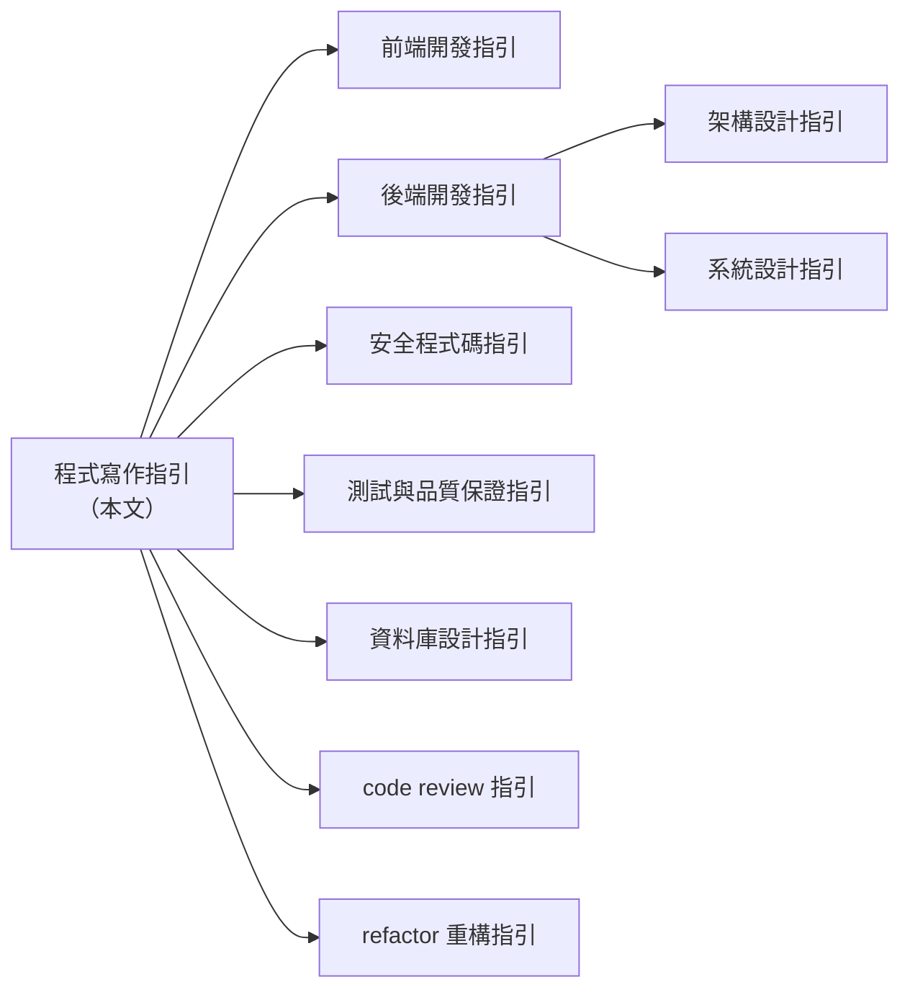
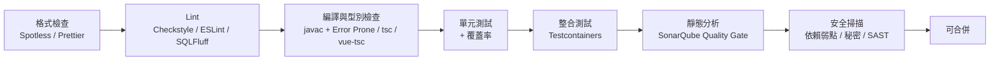

+++
date = '2025-10-31T00:00:00+08:00'
draft = false
title = '程式寫作指引'
tags = ['指引', '設計開發']
categories = ['指引']
+++

# 程式寫作指引

> **企業標準技術白皮書｜版本 v2.0｜2026-10-05**
>
> 適用範圍：Java / Spring Boot、TypeScript、HTML、CSS / Tailwind CSS、Vue、Angular、React、SQL 與 Stored Procedure（Oracle、SQL Server、PostgreSQL）之程式撰寫。
>
> 本版依各語言與框架官方文件全面改寫，章節重新編排；舊版（v1.x）各章去向請見 [附錄 C.2](#c2-v1x--v20-修正與去向對照)。

## 目錄

<!-- TOC-AUTO-BEGIN -->

- [0. 文件資訊](#0-文件資訊)
  - [0.1 文件目的與讀者](#01-文件目的與讀者)
  - [0.2 技術基準版本](#02-技術基準版本)
  - [0.3 規範等級定義](#03-規範等級定義)
  - [0.4 規範例外與豁免流程](#04-規範例外與豁免流程)
  - [0.5 與其他指引的關係](#05-與其他指引的關係)
  - [0.6 如何閱讀本指引](#06-如何閱讀本指引)
- [1. 前言與核心原則](#1-前言與核心原則)
  - [1.1 為什麼需要程式寫作標準](#11-為什麼需要程式寫作標準)
  - [1.2 七項核心原則](#12-七項核心原則)
  - [1.3 規範優先順序](#13-規範優先順序)
- [2. 通用寫作原則](#2-通用寫作原則)
  - [2.1 命名原則](#21-命名原則)
  - [2.2 函式與類別設計](#22-函式與類別設計)
  - [2.3 SOLID 與常見設計守則](#23-solid-與常見設計守則)
  - [2.4 不可變性與副作用](#24-不可變性與副作用)
  - [2.5 魔術數字與設定外部化](#25-魔術數字與設定外部化)
  - [2.6 檔案格式與 EditorConfig](#26-檔案格式與-editorconfig)
  - [2.7 程式碼異味速查](#27-程式碼異味速查)
- [3. Java 寫作規範](#3-java-寫作規範)
  - [3.1 原始檔結構與格式](#31-原始檔結構與格式)
  - [3.2 命名規範](#32-命名規範)
  - [3.3 現代語言特性（Java 17–25）](#33-現代語言特性java-1725)
  - [3.4 `var` 使用界線](#34-var-使用界線)
  - [3.5 Null 處理與 JSpecify](#35-null-處理與-jspecify)
  - [3.6 集合、Stream 與 Lambda](#36-集合stream-與-lambda)
  - [3.7 金額、時間與字串](#37-金額時間與字串)
  - [3.8 並行與 Virtual Threads](#38-並行與-virtual-threads)
  - [3.9 資源管理與例外](#39-資源管理與例外)
  - [3.10 類別設計](#310-類別設計)
  - [3.11 實務注意事項](#311-實務注意事項)
- [4. Spring Boot 程式碼慣例](#4-spring-boot-程式碼慣例)
  - [4.1 Spring Boot 4 的重要變化](#41-spring-boot-4-的重要變化)
  - [4.2 依賴注入](#42-依賴注入)
  - [4.3 設定與 `@ConfigurationProperties`](#43-設定與-configurationproperties)
  - [4.4 Web 層：Controller、驗證與 ProblemDetail](#44-web-層controller驗證與-problemdetail)
  - [4.5 HTTP 客戶端](#45-http-客戶端)
  - [4.6 API Versioning](#46-api-versioning)
  - [4.7 交易管理](#47-交易管理)
  - [4.8 Spring Data JPA 寫法](#48-spring-data-jpa-寫法)
  - [4.9 實務注意事項](#49-實務注意事項)
- [5. TypeScript 寫作規範](#5-typescript-寫作規範)
  - [5.1 版本策略：TypeScript 6.0 與 7.0](#51-版本策略typescript-60-與-70)
  - [5.2 tsconfig 標準設定](#52-tsconfig-標準設定)
  - [5.3 型別系統](#53-型別系統)
  - [5.4 Enum 與常數](#54-enum-與常數)
  - [5.5 命名規範](#55-命名規範)
  - [5.6 函式、非同步與錯誤處理](#56-函式非同步與錯誤處理)
  - [5.7 模組與匯入](#57-模組與匯入)
  - [5.8 新語言特性採用建議](#58-新語言特性採用建議)
  - [5.9 實務注意事項](#59-實務注意事項)
- [6. HTML 寫作規範](#6-html-寫作規範)
  - [6.1 文件結構與格式](#61-文件結構與格式)
  - [6.2 語意化標籤](#62-語意化標籤)
  - [6.3 表單](#63-表單)
  - [6.4 圖片與多媒體](#64-圖片與多媒體)
  - [6.5 無障礙（WCAG 2.2 AA）重點](#65-無障礙wcag-22-aa重點)
  - [6.6 安全相關屬性](#66-安全相關屬性)
- [7. CSS 與 Tailwind CSS 寫作規範](#7-css-與-tailwind-css-寫作規範)
  - [7.1 樣式方案選擇](#71-樣式方案選擇)
  - [7.2 CSS 撰寫規則](#72-css-撰寫規則)
  - [7.3 Tailwind CSS v4 設定（CSS-first）](#73-tailwind-css-v4-設定css-first)
  - [7.4 Tailwind 使用規則](#74-tailwind-使用規則)
  - [7.5 Tailwind v4 版本差異與遷移要點](#75-tailwind-v4-版本差異與遷移要點)
- [8. Vue 3 寫作規範](#8-vue-3-寫作規範)
  - [8.1 基本原則與 API 選擇](#81-基本原則與-api-選擇)
  - [8.2 命名與檔案（Style Guide A / B）](#82-命名與檔案style-guide-a--b)
  - [8.3 Props、Emits 與 v-model](#83-propsemits-與-v-model)
  - [8.4 樣板規則](#84-樣板規則)
  - [8.5 響應式與 Composables](#85-響應式與-composables)
  - [8.6 Pinia 狀態管理](#86-pinia-狀態管理)
  - [8.7 樣式（Style Guide A / D）](#87-樣式style-guide-a--d)
  - [8.8 Vue 實務注意事項](#88-vue-實務注意事項)
- [9. Angular 寫作規範](#9-angular-寫作規範)
  - [9.1 Angular 22 的重要變化](#91-angular-22-的重要變化)
  - [9.2 命名與專案結構](#92-命名與專案結構)
  - [9.3 元件撰寫](#93-元件撰寫)
  - [9.4 樣板規則](#94-樣板規則)
  - [9.5 Service、DI 與 HTTP](#95-servicedi-與-http)
  - [9.6 表單：Signal Forms](#96-表單signal-forms)
  - [9.7 Angular 實務注意事項](#97-angular-實務注意事項)
- [10. React 寫作規範](#10-react-寫作規範)
  - [10.1 Rules of React（必須遵守）](#101-rules-of-react必須遵守)
  - [10.2 元件撰寫](#102-元件撰寫)
  - [10.3 Hooks 與 Effect](#103-hooks-與-effect)
  - [10.4 React Compiler 與記憶化](#104-react-compiler-與記憶化)
  - [10.5 Server Components、Actions 與表單](#105-server-componentsactions-與表單)
  - [10.6 狀態管理](#106-狀態管理)
  - [10.7 React 19.x 新功能採用建議](#107-react-19x-新功能採用建議)
  - [10.8 React 實務注意事項](#108-react-實務注意事項)
- [11. SQL 撰寫規範](#11-sql-撰寫規範)
  - [11.1 格式規範](#111-格式規範)
  - [11.2 命名規範](#112-命名規範)
  - [11.3 參數化查詢與動態 SQL](#113-參數化查詢與動態-sql)
  - [11.4 查詢撰寫](#114-查詢撰寫)
  - [11.5 分頁](#115-分頁)
  - [11.6 NULL、型別與字元集](#116-null型別與字元集)
  - [11.7 交易與鎖定](#117-交易與鎖定)
  - [11.8 方言對照表](#118-方言對照表)
  - [11.9 資料庫變更腳本（Migration）](#119-資料庫變更腳本migration)
- [12. Stored Procedure 撰寫規範](#12-stored-procedure-撰寫規範)
  - [12.1 何時使用 Stored Procedure](#121-何時使用-stored-procedure)
  - [12.2 命名與結構](#122-命名與結構)
  - [12.3 錯誤處理與交易](#123-錯誤處理與交易)
  - [12.4 安全與動態 SQL](#124-安全與動態-sql)
  - [12.5 效能](#125-效能)
  - [12.6 Oracle PL/SQL 標準範本](#126-oracle-plsql-標準範本)
  - [12.7 SQL Server T-SQL 標準範本](#127-sql-server-t-sql-標準範本)
  - [12.8 PostgreSQL PL/pgSQL 標準範本](#128-postgresql-plpgsql-標準範本)
  - [12.9 SP 的測試與審查](#129-sp-的測試與審查)
- [13. 註解與文件](#13-註解與文件)
  - [13.1 註解原則](#131-註解原則)
  - [13.2 JavaDoc](#132-javadoc)
  - [13.3 TSDoc / JSDoc](#133-tsdoc--jsdoc)
  - [13.4 前端元件文件](#134-前端元件文件)
  - [13.5 API 文件（OpenAPI）](#135-api-文件openapi)
  - [13.6 專案文件](#136-專案文件)
- [14. 錯誤處理與日誌](#14-錯誤處理與日誌)
  - [14.1 例外設計（Java）](#141-例外設計java)
  - [14.2 前端錯誤處理](#142-前端錯誤處理)
  - [14.3 日誌規範](#143-日誌規範)
  - [14.4 可觀測性](#144-可觀測性)
- [15. 測試程式寫作](#15-測試程式寫作)
  - [15.1 通用原則](#151-通用原則)
  - [15.2 Java 測試（JUnit 6）](#152-java-測試junit-6)
  - [15.3 前端測試（Vitest / Testing Library / Playwright）](#153-前端測試vitest--testing-library--playwright)
- [16. 安全寫作要點](#16-安全寫作要點)
  - [16.1 OWASP Top 10:2025 對照](#161-owasp-top-102025-對照)
  - [16.2 秘密管理](#162-秘密管理)
  - [16.3 注入攻擊防護](#163-注入攻擊防護)
  - [16.4 XSS 與輸出編碼](#164-xss-與輸出編碼)
  - [16.5 存取控制](#165-存取控制)
  - [16.6 認證與工作階段](#166-認證與工作階段)
  - [16.7 加密](#167-加密)
  - [16.8 安全設定](#168-安全設定)
  - [16.9 軟體供應鏈](#169-軟體供應鏈)
- [17. 效能寫作要點](#17-效能寫作要點)
  - [17.1 後端（Java / Spring）](#171-後端java--spring)
  - [17.2 前端](#172-前端)
  - [17.3 資料庫](#173-資料庫)
- [18. 版本控制與 Code Review](#18-版本控制與-code-review)
  - [18.1 分支策略](#181-分支策略)
  - [18.2 Commit 規範（Conventional Commits）](#182-commit-規範conventional-commits)
  - [18.3 Pull Request 規範](#183-pull-request-規範)
  - [18.4 `.gitignore` 與儲存庫衛生](#184-gitignore-與儲存庫衛生)
- [19. 工具鏈與自動化](#19-工具鏈與自動化)
  - [19.1 工具總覽](#191-工具總覽)
  - [19.2 Java 工具鏈](#192-java-工具鏈)
  - [19.3 TypeScript / 前端工具鏈](#193-typescript--前端工具鏈)
  - [19.4 SQL 工具鏈](#194-sql-工具鏈)
  - [19.5 Git Hooks](#195-git-hooks)
  - [19.6 CI 品質門檻](#196-ci-品質門檻)
- [20. AI 輔助開發寫作規範](#20-ai-輔助開發寫作規範)
  - [20.1 基本立場](#201-基本立場)
  - [20.2 使用規範](#202-使用規範)
  - [20.3 專案指令檔](#203-專案指令檔)
  - [20.4 AI 產出的審查與風險](#204-ai-產出的審查與風險)
- [21. 檢查清單](#21-檢查清單)
  - [21.1 通用（所有 PR）](#211-通用所有-pr)
  - [21.2 Java / Spring Boot](#212-java--spring-boot)
  - [21.3 前端（TypeScript / Vue / Angular / React）](#213-前端typescript--vue--angular--react)
  - [21.4 HTML 與無障礙](#214-html-與無障礙)
  - [21.5 SQL 與 Stored Procedure](#215-sql-與-stored-procedure)
- [附錄 A 規則速查表](#附錄-a-規則速查表)
  - [A.1 依領域統計](#a1-依領域統計)
  - [A.2 規則索引](#a2-規則索引)
- [附錄 B 參考資源](#附錄-b-參考資源)
  - [B.1 官方風格指引與規範](#b1-官方風格指引與規範)
  - [B.2 安全](#b2-安全)
  - [B.3 工具](#b3-工具)
  - [B.4 同系列指引](#b4-同系列指引)
- [附錄 C 版本紀錄](#附錄-c-版本紀錄)
  - [C.1 版本歷程](#c1-版本歷程)
  - [C.2 v1.x → v2.0 修正與去向對照](#c2-v1x--v20-修正與去向對照)
- [附錄 D 查證紀錄](#附錄-d-查證紀錄)
  - [D.1 查證範圍與方法](#d1-查證範圍與方法)
  - [D.2 版本查證](#d2-版本查證)
  - [D.3 範例實測結果](#d3-範例實測結果)
  - [D.4 實測中發現並修正的問題](#d4-實測中發現並修正的問題)
  - [D.5 待確認項目](#d5-待確認項目)
- [附錄 E 術語表](#附錄-e-術語表)

<!-- TOC-AUTO-END -->

---

## 0. 文件資訊

### 0.1 文件目的與讀者

本指引是企業內部的**程式撰寫標準（Coding Standard）**，用來回答「程式碼應該怎麼寫」。它不負責系統架構、部署流程或專案管理，那些主題由其他指引處理（見 [0.5](#05-與其他指引的關係)）。

| 讀者 | 使用方式 |
| --- | --- |
| 新進開發人員 | 依第 2 章通用原則與自己負責的語言章節學習，搭配第 21 章檢查清單自我檢核 |
| 資深開發人員 / Tech Lead | 作為 Code Review 依據；依 [0.4](#04-規範例外與豁免流程) 核准例外 |
| 架構師 / 品質團隊 | 依第 19 章設定自動化檢查與 CI 品質門檻 |
| AI 輔助開發工具 | 第 20 章說明如何把本指引轉為 AI 指令檔，讓產生的程式碼符合規範 |

### 0.2 技術基準版本

下表為本版撰寫與驗證時採用的版本（查證日 2026-10-05，來源見 [附錄 D](#附錄-d-查證紀錄)）。新專案**應該**以「建議基準」起步；既有專案**可以**停留在「最低支援」，但須排入升級計畫。

| 類別 | 建議基準 | 最低支援 | 備註 |
| --- | --- | --- | --- |
| Java | **25 LTS** | 21 LTS | JDK 26（2026-03）與 27（2026-09）為非 LTS，僅供評估 |
| Spring Boot | **4.1.x**（4.1.1） | 3.5.x | Boot 4.1 需 Java 17+，官方相容至 Java 26；搭配 Spring Framework 7.0 |
| 建置工具 | Maven 3.9.x / Gradle 9.x | Maven 3.6.3 | Boot 4.1 官方要求 Maven 3.6.3+、Gradle 8.14+ |
| 測試（Java） | JUnit **6.1**、Mockito 5.x、AssertJ 3.27、Testcontainers 2.0 | JUnit 5.11 | JUnit 6 需 Java 17+，全面採用 JSpecify null 標註 |
| Node.js | **24 LTS** | 22 LTS | Node 26 預計 2026-10-28 進入 LTS |
| TypeScript | **6.0.x**（工具鏈相容版） | 5.9 | TS 7.0（Go 原生版）已發布，但沒有程式化 API；詳見 [5.1](#51-版本策略typescript-60-與-70) |
| Vue | **3.5.x** | 3.4 | 3.6（含 Vapor Mode）仍為 RC，不列入正式基準 |
| Pinia / Vue Router | 4.0 / 5.3 | 3.x / 4.x | |
| Angular | **22.x** | 21.x | v22 元件預設改為 OnPush，Signal Forms 轉為穩定 API |
| React | **19.3** | 19.0 | React Compiler 1.0 已穩定；`<ViewTransition>`、Fragment Refs 於 19.3 轉為穩定 |
| Tailwind CSS | **4.3.x** | 4.0 | v4 採 CSS-first 設定，v3 的 `tailwind.config.js` 為相容模式 |
| HTML / 無障礙 | HTML Living Standard、**WCAG 2.2 AA** | WCAG 2.1 AA | |
| Oracle Database | **26ai**（23ai 後續 LTS） | 19c | 23ai 起支援 SQL `BOOLEAN`、`IF [NOT] EXISTS`、SQL Domains |
| SQL Server | **2025**（相容層級 170） | 2019（150） | 2025 新增 REGEXP 函數與原生 `json` 型別 |
| PostgreSQL | **18** | 15 | 19 仍在 RC 階段 |
| Lint / Format | ESLint 10、typescript-eslint 8、Prettier 3、Stylelint 17、Checkstyle 14、PMD 7、SpotBugs 4.10、Error Prone 2.x、SQLFluff 4 | | 詳見第 19 章 |

> **版本政策**：基準版本每半年（4 月、10 月）檢視一次。主要依據是各專案的 LTS 與支援週期，不追逐每個 minor 版本。

### 0.3 規範等級定義

本文規則採用 [RFC 2119](https://www.rfc-editor.org/rfc/rfc2119) 的語意，並對應到自動化工具的嚴重度：

| 等級 | 英文 | 意義 | 工具嚴重度 | Code Review 處理 |
| --- | --- | --- | --- | --- |
| **必須** | MUST | 不遵守會造成缺陷、資安風險或維護災難 | `error`，CI 擋下 | 不得合併 |
| **應該** | SHOULD | 業界共識的最佳實務，除非有充分理由 | `warn` | 需留言說明理由 |
| **可以** | MAY | 建議做法，依團隊情境選用 | `off` / 資訊 | 不阻擋 |

每條規則都有編號（例如 `JAVA-012`），格式為 `<領域>-<序號>`，方便在 Code Review、工具設定與豁免單中引用。完整清單見 [附錄 A](#附錄-a-規則速查表)。

| 前綴 | 領域 | 前綴 | 領域 |
| --- | --- | --- | --- |
| `GEN` | 通用原則 | `SQL` | SQL 撰寫 |
| `JAVA` | Java | `SP` | Stored Procedure |
| `SPR` | Spring Boot | `DOC` | 註解與文件 |
| `TS` | TypeScript | `ERR` | 錯誤處理與日誌 |
| `HTML` | HTML / 無障礙 | `TEST` | 測試 |
| `CSS` | CSS / Tailwind | `SEC` | 安全 |
| `VUE` | Vue | `PERF` | 效能 |
| `NG` | Angular | `VCS` | 版本控制 |
| `REACT` | React | `AI` | AI 輔助開發 |

### 0.4 規範例外與豁免流程

規範不是教條。當規則與實際需求衝突時，依下列流程處理：

1. **局部豁免**：在程式碼中用工具支援的抑制語法，並**必須**寫明理由與規則編號。

   ```java
   @SuppressWarnings("java:S2077") // SEC-004 豁免：表名來自白名單 enum，非使用者輸入（PR #1234）
   ```

   ```typescript
   // eslint-disable-next-line @typescript-eslint/no-explicit-any -- TS-005 豁免：第三方 SDK 無型別定義，見 #567
   ```

2. **專案層級豁免**：在專案根目錄的 `CODING-EXCEPTIONS.md` 登記規則編號、範圍、理由、核准人與到期日，由 Tech Lead 核准。
3. **規則修訂**：同一規則在多個專案反覆被豁免時，代表規則本身需要調整，請向本指引維護者提出修訂。

> ❌ 禁止只寫 `// NOSONAR`、`@SuppressWarnings("all")` 或 `/* eslint-disable */`（整檔關閉）卻不附理由。

### 0.5 與其他指引的關係

本指引聚焦「程式碼層級」的寫法。設計、架構與流程層級的主題，請參考同系列的其他指引：



| 主題 | 本指引涵蓋 | 詳細內容請見 |
| --- | --- | --- |
| 前端專案結構、狀態管理、建置 | 元件寫法與命名 | [前端開發指引]() |
| API 設計、分層、微服務、批次 | Spring 程式碼慣例 | [後端開發指引]()、[架構設計指引]() |
| 威脅模型、加密、認證授權實作 | 撰寫時必守的安全規則 | [安全程式碼指引]() |
| 測試策略、測試環境、效能測試 | 測試程式的寫法 | [測試與品質保證指引]() |
| 資料模型、正規化、索引設計 | SQL 與 Stored Procedure 寫法 | [資料庫設計指引]() |
| Review 流程與角色 | PR 規範與自檢清單 | [code review 指引]() |
| 重構手法 | 程式碼異味的判斷 | [refactor 重構指引]() |
| 容器、K8s、CI/CD 平台 | CI 品質門檻設定 | [軟體開發標準程序教學手冊]() |

### 0.6 如何閱讀本指引

- 每個語言章節都採相同結構：**規則表 → 正反範例 → 工具如何強制 → 實務注意事項**。
- 範例中的 ✅ 代表建議寫法，❌ 代表應避免的寫法。
- 範例中的套件名稱一律用 `com.example`，網域一律用 `example.com`，請替換成實際值。
- 範例都已用 [附錄 D](#附錄-d-查證紀錄) 所列的工具驗證；標示「片段」的範例省略了 import 或外圍類別。

---

## 1. 前言與核心原則

### 1.1 為什麼需要程式寫作標準

程式碼被閱讀的次數遠多於被撰寫的次數。企業系統的生命週期常達 10 年以上，經手的人數以數十計。一致的寫作標準能帶來：

| 效益 | 說明 |
| --- | --- |
| 降低認知負擔 | 所有程式碼「看起來像同一個人寫的」，讀者能專注在邏輯，而不是風格差異 |
| 縮短 Code Review 時間 | 風格問題交給工具自動處理，Reviewer 專注在設計與正確性 |
| 減少缺陷 | 多數規則來自真實事故，例如 `==` 比較字串、SQL 字串拼接、吞掉例外 |
| 提升 AI 輔助品質 | 規範明確時，AI 產生的程式碼更容易符合團隊預期（見第 20 章） |
| 滿足稽核要求 | 資安與品質稽核（如 ISO 27001、OWASP ASVS）需要可追溯的開發標準 |

### 1.2 七項核心原則

| # | 原則 | 說明 |
| --- | --- | --- |
| 1 | **可讀性優先** | 程式碼是寫給人看的。在可讀性與炫技之間，選擇可讀性 |
| 2 | **一致性勝過個人偏好** | 遵循既有專案慣例；有疑問時依本指引；本指引未規範時依各語言官方 style guide |
| 3 | **預設安全** | 輸入不可信、輸出要編碼、權限最小化、秘密不進版控 |
| 4 | **明確勝於隱含** | 型別、null 性、錯誤、交易邊界都要明確表達 |
| 5 | **可測試** | 依賴注入、純函式、副作用隔離，讓程式碼能被單元測試 |
| 6 | **自動化強制** | 能交給工具檢查的規則就不靠人記，人只審工具做不到的事 |
| 7 | **漸進改善** | 既有程式碼遵循「童子軍法則」：每次修改都讓它比原本更好一點，但不做與需求無關的大規模重寫 |

### 1.3 規範優先順序

當不同來源的建議衝突時，依下列順序決定：

1. 法規、資安政策與客戶合約要求
2. 本指引的「必須」規則
3. 專案既有且已登記的慣例（見 [0.4](#04-規範例外與豁免流程)）
4. 本指引的「應該 / 可以」規則
5. 語言或框架的官方 style guide（Google Java Style、Vue Style Guide、Angular Style Guide、React Rules 等）
6. 社群慣例

---

## 2. 通用寫作原則

本章規則適用於所有語言。各語言章節只補充該語言特有的規則。

### 2.1 命名原則

| 編號 | 等級 | 規則 |
| --- | --- | --- |
| `GEN-001` | 必須 | 識別字使用英文，不得使用中文、拼音或中英混雜（字串內容與註解不在此限） |
| `GEN-002` | 必須 | 名稱要表達「意圖」而不是「實作」：`activeCustomers`，而不是 `list2`、`customerArrayList` |
| `GEN-003` | 應該 | 避免非通用縮寫。允許的縮寫：`id`、`url`、`http`、`api`、`dto`、`io`、`db`、`ui`、`max`、`min` |
| `GEN-004` | 應該 | 縮寫視為一般單字處理大小寫：`HttpClient`、`userId`、`parseXml`，而不是 `HTTPClient`、`userID` |
| `GEN-005` | 應該 | 布林值以 `is` / `has` / `can` / `should` 開頭，且用肯定句：`isEnabled`，而不是 `isNotDisabled` |
| `GEN-006` | 應該 | 函式 / 方法以動詞開頭：`calculateTotal()`、`findByEmail()`、`sendNotification()` |
| `GEN-007` | 應該 | 名稱長度與作用域成正比：迴圈索引可以用 `i`，跨模組的公開 API 要完整描述 |
| `GEN-008` | 應該 | 同一概念全專案只用一個詞：不要同時出現 `fetch` / `get` / `retrieve` / `load` 表達同一件事 |
| `GEN-009` | 應該 | 使用領域語言（Ubiquitous Language），與需求文件、資料庫欄位一致 |

**各語言命名大小寫對照：**

| 元素 | Java | TypeScript | Vue / React 元件 | Angular | SQL |
| --- | --- | --- | --- | --- | --- |
| 類別 / 型別 / 介面 | `PascalCase` | `PascalCase` | `PascalCase` | `PascalCase` | — |
| 方法 / 函式 | `camelCase` | `camelCase` | `camelCase` | `camelCase` | — |
| 變數 / 參數 | `camelCase` | `camelCase` | `camelCase` | `camelCase` | — |
| 常數 | `UPPER_SNAKE_CASE` | `UPPER_SNAKE_CASE` 或 `camelCase`（見 5.5） | 同 TS | 同 TS | — |
| 套件 / 模組 / 檔案 | `com.example.order`（全小寫） | `kebab-case.ts` | `PascalCase.vue` / `PascalCase.tsx` | `kebab-case.ts` | — |
| 資料表 / 欄位 | — | — | — | — | `snake_case` |
| CSS class（自訂） | — | — | `kebab-case` | `kebab-case` | — |

> CSS 命名細節見 [7.2](#72-css-撰寫規則)；SQL 物件命名細節見 [11.2](#112-命名規範)。

### 2.2 函式與類別設計

| 編號 | 等級 | 規則 | 預設門檻 |
| --- | --- | --- | --- |
| `GEN-010` | 應該 | 一個函式只做一件事；若需要用「和」來描述它，就應該拆分 | — |
| `GEN-011` | 應該 | 函式長度 | ≤ 40 行（不含空行與註解）；超過 80 行**必須**拆分 |
| `GEN-012` | 應該 | 循環複雜度（Cyclomatic Complexity） | ≤ 10；> 15 **必須**重構 |
| `GEN-013` | 應該 | 認知複雜度（Cognitive Complexity，SonarQube） | ≤ 15 |
| `GEN-014` | 應該 | 參數個數 | ≤ 4；超過時改用參數物件（Java record / TS interface） |
| `GEN-015` | 應該 | 巢狀深度 | ≤ 3 層；以「提早返回」（guard clause）降低巢狀 |
| `GEN-016` | 應該 | 類別 / 檔案長度 | ≤ 500 行；超過時檢查是否違反單一職責 |
| `GEN-017` | 必須 | 不得使用旗標參數切換兩種完全不同的行為（`save(order, true)`），應拆成兩個方法 | — |

**提早返回（Guard Clause）範例：**

```java
// ❌ 巢狀過深，主流程被埋在最內層
public Invoice issue(Order order) {
    if (order != null) {
        if (order.isPaid()) {
            if (!order.items().isEmpty()) {
                return invoiceFactory.create(order);
            } else {
                throw new IllegalStateException("訂單沒有品項");
            }
        } else {
            throw new IllegalStateException("訂單尚未付款");
        }
    } else {
        throw new IllegalArgumentException("order 不可為 null");
    }
}

// ✅ 先排除例外情況，主流程維持在最外層
public Invoice issue(Order order) {
    Objects.requireNonNull(order, "order 不可為 null");
    if (!order.isPaid()) {
        throw new IllegalStateException("訂單尚未付款");
    }
    if (order.items().isEmpty()) {
        throw new IllegalStateException("訂單沒有品項");
    }
    return invoiceFactory.create(order);
}
```

（片段）

### 2.3 SOLID 與常見設計守則

撰寫程式時應該把以下原則當成判斷依據，而不是硬套的模式：

| 原則 | 在程式碼層級的意義 | 常見違反徵兆 |
| --- | --- | --- |
| **S**ingle Responsibility | 一個類別只有一個改變的理由 | `XxxManager`、`XxxUtil` 類別持續膨脹 |
| **O**pen/Closed | 以新增程式碼擴充行為，而不是修改既有分支 | 每加一種付款方式就要改同一個 `switch` |
| **L**iskov Substitution | 子型別可以替換父型別而不破壞行為 | 子類別覆寫方法後拋 `UnsupportedOperationException` |
| **I**nterface Segregation | 介面小而專一 | 實作類別有一堆空方法 |
| **D**ependency Inversion | 依賴抽象而非具體實作；由外部注入依賴 | 在業務邏輯中 `new` 出 Repository 或 HTTP client |
| DRY | 同一份「知識」只存在一處 | 同樣的驗證規則複製貼上到三個地方 |
| YAGNI | 不為想像中的需求預先設計 | 只有一個實作卻建立介面加工廠加策略模式 |
| KISS | 用最簡單可行的方案 | 為了一行邏輯引入新框架 |

> **DRY 的界線**：兩段程式碼「長得像」不代表是同一份知識。若它們會因不同理由改變，例如會員折扣與員工折扣，就**不應該**強行合併。

### 2.4 不可變性與副作用

| 編號 | 等級 | 規則 |
| --- | --- | --- |
| `GEN-020` | 應該 | 預設使用不可變的資料結構：Java `record` / `final` / `List.of()`，TS `readonly` / `as const` |
| `GEN-021` | 應該 | 函式不應修改傳入的參數；需要改變時回傳新值 |
| `GEN-022` | 必須 | 不得使用可變的全域 / 靜態狀態保存請求相關資料（多執行緒與多實例環境下會出錯） |
| `GEN-023` | 應該 | 把副作用（I/O、時間、亂數）集中在邊界，核心邏輯保持純函式；時間透過注入的 `Clock` 取得 |

### 2.5 魔術數字與設定外部化

| 編號 | 等級 | 規則 |
| --- | --- | --- |
| `GEN-030` | 必須 | 業務意義的數值與字串不得直接寫在邏輯中，應定義為具名常數或 enum |
| `GEN-031` | 必須 | 會隨環境改變的值（URL、逾時、門檻）必須外部化為設定，不得寫死在程式碼 |
| `GEN-032` | 必須 | 密碼、金鑰、Token 不得出現在原始碼、設定檔或測試資料中（見 [16.2](#162-秘密管理)） |

```typescript
// ❌ 讀者無法知道 3 與 0.05 代表什麼
if (order.retryCount > 3) { /* ... */ }
const fee = amount * 0.05;

// ✅ 具名常數讓意圖一目了然
const MAX_PAYMENT_RETRIES = 3;
const CROSS_BORDER_FEE_RATE = 0.05;

if (order.retryCount > MAX_PAYMENT_RETRIES) { /* ... */ }
const fee = amount * CROSS_BORDER_FEE_RATE;
```

（片段）

### 2.6 檔案格式與 EditorConfig

| 編號 | 等級 | 規則 |
| --- | --- | --- |
| `GEN-040` | 必須 | 原始碼一律使用 **UTF-8**（不含 BOM） |
| `GEN-041` | 必須 | 換行字元統一為 **LF**，並以 `.gitattributes` 強制（Windows 批次檔 `*.bat`、`*.cmd` 例外用 CRLF） |
| `GEN-042` | 必須 | 檔案結尾保留一個換行；不得有行尾空白 |
| `GEN-043` | 應該 | 縮排：Java 4 空格；TS / JS / Vue / HTML / CSS / JSON / YAML 2 空格；SQL 4 空格；不得使用 Tab（`Makefile` 例外） |
| `GEN-044` | 應該 | 行寬：Java 120、TypeScript 100、SQL 120 |
| `GEN-045` | 必須 | 專案根目錄必須提供 `.editorconfig` 與 `.gitattributes` |

**標準 `.editorconfig`：**

```ini
root = true

[*]
charset = utf-8
end_of_line = lf
insert_final_newline = true
trim_trailing_whitespace = true
indent_style = space
indent_size = 2

[*.java]
indent_size = 4
max_line_length = 120

[*.{sql,pls,pks,pkb}]
indent_size = 4
max_line_length = 120

[*.md]
trim_trailing_whitespace = false

[Makefile]
indent_style = tab

[*.{bat,cmd}]
end_of_line = crlf
```

**標準 `.gitattributes`：**

```text
* text=auto eol=lf
*.bat text eol=crlf
*.cmd text eol=crlf
*.png binary
*.jpg binary
*.jar binary
```

### 2.7 程式碼異味速查

下列異味出現時，應該在提交前處理，或在 PR 中說明理由。重構手法請參考 [refactor 重構指引]()。

| 異味 | 判斷方式 | 建議處理 |
| --- | --- | --- |
| 過長函式 | 超過 `GEN-011` 門檻 | Extract Method |
| 過大類別 | 超過 `GEN-016` 門檻，或欄位超過 10 個 | Extract Class |
| 基本型別偏執 | 用 `String` 表示 Email、金額、身分證字號 | 建立 Value Object（Java record） |
| 霰彈式修改 | 改一個需求要動很多檔案 | Move Method，集中職責 |
| 依戀情結 | 方法大量存取別的物件的資料 | 把方法移到資料所在的類別 |
| 註解掉的程式碼 | 整段 `//` 或 `/* */` 包住的程式碼 | 直接刪除，版控會保留歷史 |
| 死碼 | 從未被呼叫的方法、永遠為假的分支 | 刪除 |
| 重複程式碼 | SonarQube Duplications > 3% | 抽出共用函式（注意 2.3 的 DRY 界線） |

---

## 3. Java 寫作規範

本章以 **Java 25 LTS** 為基準，格式規則以 [Google Java Style Guide](https://google.github.io/styleguide/javaguide.html) 為底，並依企業需求調整（縮排 4、行寬 120）。

### 3.1 原始檔結構與格式

| 編號 | 等級 | 規則 |
| --- | --- | --- |
| `JAVA-001` | 必須 | 檔案依序為：license 標頭（若有）→ `package` → `import` → 單一頂層類別 |
| `JAVA-002` | 必須 | 不得使用萬用字元 import（`import java.util.*;`），static import 僅限測試斷言與常數 |
| `JAVA-003` | 必須 | import 不分群組、依 ASCII 排序；static import 自成一組放最前面（Google Style） |
| `JAVA-004` | 必須 | 大括號採 K&R 風格；`if` / `for` / `while` 即使只有一行也必須加大括號 |
| `JAVA-005` | 必須 | 縮排 4 空格、續行縮排 8 空格、行寬 120 |
| `JAVA-006` | 應該 | 類別成員順序：static 常數 → static 欄位 → 實例欄位 → 建構子 → 公開方法 → 私有方法；同名多載方法必須相鄰 |
| `JAVA-007` | 必須 | 一行只宣告一個變數；陣列寫成 `String[] args`，不寫成 `String args[]` |
| `JAVA-008` | 應該 | `switch` 優先使用箭頭形式（`case X ->`），不需要 `break`，也不會 fall-through |

> 格式化交給工具：使用 **Spotless + google-java-format（AOSP 風格，4 空格）** 或 **Palantir Java Format** 自動格式化，CI 以 `spotless:check` 擋下未格式化的程式碼（見 [19.2](#192-java-工具鏈)）。

### 3.2 命名規範

| 元素 | 規則 | ✅ 範例 | ❌ 範例 |
| --- | --- | --- | --- |
| 套件 | 全小寫、反向網域、不含底線 | `com.example.order.application` | `com.example.Order_App` |
| 類別 / record / enum | `PascalCase` 名詞 | `OrderService`、`Money` | `OrderSvc`、`Ordermanager` |
| 介面 | `PascalCase`，不加 `I` 前綴 | `PaymentGateway` | `IPaymentGateway` |
| 實作類別 | 以實作特徵命名 | `StripePaymentGateway` | `PaymentGatewayImpl`（只有一個實作時可接受） |
| 方法 | `camelCase` 動詞 | `cancelOrder()` | `orderCancel()` |
| 常數（`static final` 且深度不可變） | `UPPER_SNAKE_CASE` | `MAX_RETRY_COUNT` | `maxRetryCount` |
| 非常數的 `static final`（如 Logger、可變集合） | `camelCase` | `private static final Logger log` | — |
| 型別參數 | 單一大寫字母，或名稱加 `T` | `T`、`E`、`RequestT` | `Type` |
| 測試類別 | 被測類別 + `Test` / `IT` | `OrderServiceTest`、`OrderRepositoryIT` | `TestOrderService` |

> Google Style 的「常數」指深度不可變的 `static final` 欄位。`static final List<String>` 若內容可變，就不算常數，應該用 `camelCase`，或改用 `List.of()` 使其不可變。

### 3.3 現代語言特性（Java 17–25）

企業程式碼**應該**善用以下已定案（final）的語言特性。Preview 功能**不得**用於正式環境程式碼。

| 特性 | 定案版本 | 使用時機 | 規則 |
| --- | --- | --- | --- |
| `record` | 16 | DTO、Value Object、查詢結果、事件 | `JAVA-010` 資料載體**應該**用 record 取代 Lombok `@Data` / `@Value` |
| `sealed` 類別 / 介面 | 17 | 有限且已知的型別階層（狀態、結果、指令） | `JAVA-011` 與 pattern matching `switch` 搭配，由編譯器檢查是否窮舉 |
| Pattern Matching `instanceof` | 16 | 型別判斷後轉型 | `JAVA-012` **必須**使用 `if (obj instanceof Foo foo)`，不得再手動轉型 |
| Switch Expression / Pattern | 14 / 21 | 多分支取值、依型別分派 | `JAVA-013` 對 sealed 型別的 `switch` **不應該**加 `default`，讓新增子型別時編譯失敗 |
| Record Pattern | 21 | 解構 record | 巢狀解構不超過 2 層 |
| Text Block | 15 | 多行 SQL、JSON、HTML 樣板 | `JAVA-014` 多行字串**應該**用 text block，不得用 `+` 串接 |
| `var` | 10 | 右側型別明顯時 | 見 [3.4](#34-var-使用界線) |
| Sequenced Collections | 21 | 取第一個 / 最後一個元素 | 使用 `getFirst()` / `getLast()` / `reversed()` |
| 未命名變數 `_` | 22 | 不使用的 lambda 參數、catch 變數、pattern 元件 | `catch (NumberFormatException _)` |
| Virtual Threads | 21 | 大量阻塞 I/O 的並行工作 | 見 [3.8](#38-並行與-virtual-threads) |
| Scoped Values | 25 | 取代 `ThreadLocal` 傳遞請求範圍的不可變資料 | 新程式碼**應該**優先於 `ThreadLocal` |
| Flexible Constructor Bodies | 25 | 在 `super(...)` 前驗證參數 | 驗證邏輯不得產生副作用 |
| Module Import Declarations | 25 | 單檔腳本、教學、JShell | 正式程式碼**不應該**使用 `import module`（違反 `JAVA-002` 的精神） |
| Compact Source Files | 25 | 工具腳本、教學 | 正式程式碼不使用 |
| Markdown 文件註解 `///` | 23 | JavaDoc | 見 [13.2](#132-javadoc) |

**record + sealed + pattern matching 的典型組合：**

```java
package com.example.payment;

import java.math.BigDecimal;
import java.util.Objects;

/** 付款結果：只有三種可能，新增種類時所有 switch 都會編譯失敗。 */
public sealed interface PaymentResult
        permits PaymentResult.Approved, PaymentResult.Declined, PaymentResult.Pending {

    record Approved(String transactionId, BigDecimal amount) implements PaymentResult {
        public Approved {
            Objects.requireNonNull(transactionId, "transactionId");
            if (amount.signum() <= 0) {
                throw new IllegalArgumentException("amount 必須為正數");
            }
        }
    }

    record Declined(String reasonCode) implements PaymentResult {}

    record Pending(String referenceNo) implements PaymentResult {}

    /** 依結果產生顯示訊息；sealed 介面的 switch 不需要 default。 */
    static String describe(PaymentResult result) {
        return switch (result) {
            case Approved(var txId, var amount) -> "付款成功，交易序號 %s，金額 %s".formatted(txId, amount);
            case Declined(var code) when code.startsWith("FRAUD") -> "交易被風控攔截";
            case Declined(var code) -> "付款失敗：" + code;
            case Pending(var ref) -> "處理中，參考編號 " + ref;
        };
    }
}
```

**Text Block 撰寫 SQL：**

```java
package com.example.order.infrastructure;

final class OrderSql {

    static final String FIND_OPEN_ORDERS = """
            SELECT
                o.order_id,
                o.customer_id,
                o.total_amount
            FROM orders o
            WHERE
                o.status = :status
                AND o.created_at >= :since
            ORDER BY o.created_at DESC
            """;

    private OrderSql() {}
}
```

**Flexible Constructor Bodies（Java 25）：在呼叫 `super` 前驗證參數。**

```java
package com.example.common;

import java.math.BigDecimal;

class Amount {
    private final BigDecimal value;

    Amount(BigDecimal value) {
        this.value = value;
    }

    BigDecimal value() {
        return value;
    }
}

final class PositiveAmount extends Amount {

    PositiveAmount(BigDecimal value) {
        if (value == null || value.signum() <= 0) { // Java 25 起可寫在 super() 之前
            throw new IllegalArgumentException("金額必須為正數");
        }
        super(value);
    }
}
```

### 3.4 `var` 使用界線

| 編號 | 等級 | 規則 |
| --- | --- | --- |
| `JAVA-020` | 可以 | 右側已清楚表達型別時使用 `var`：建構子呼叫、工廠方法、轉型、字面值 |
| `JAVA-021` | 不應該 | 右側是回傳型別不明顯的方法呼叫時使用 `var` |
| `JAVA-022` | 必須 | 欄位、方法參數、回傳型別不得使用 `var`（語言也不允許） |
| `JAVA-023` | 不應該 | 用 `var` 搭配 `<>` 菱形運算子，會推論成 `Object` 泛型 |

```java
// ✅ 型別一目了然
var orders = new ArrayList<Order>();
var customer = Customer.of(id, name);
var timeout = Duration.ofSeconds(30);

// ❌ 讀者必須追進方法才知道型別
var result = service.process(request);

// ❌ 推論為 ArrayList<Object>
var items = new ArrayList<>();
```

（片段）

### 3.5 Null 處理與 JSpecify

| 編號 | 等級 | 規則 |
| --- | --- | --- |
| `JAVA-030` | 應該 | 套件層級標註 `@NullMarked`（JSpecify 1.0），預設所有型別非 null；可為 null 處明確標 `@Nullable` |
| `JAVA-031` | 必須 | 公開方法回傳集合時，不得回傳 `null`，應回傳空集合 |
| `JAVA-032` | 應該 | 「可能沒有結果」的查詢回傳 `Optional<T>` |
| `JAVA-033` | 必須 | `Optional` 只用於回傳值；不得用於欄位、方法參數、集合元素或序列化的 DTO |
| `JAVA-034` | 必須 | 不得對 `Optional` 直接呼叫 `get()`；使用 `orElseThrow()`、`orElse()`、`map()`、`ifPresent()` |
| `JAVA-035` | 應該 | 在建構子 / 公開方法入口以 `Objects.requireNonNull` 驗證必要參數（fail-fast） |

Spring Framework 7、Spring Boot 4 與 JUnit 6 都已全面改用 JSpecify 標註，搭配 NullAway（Error Prone 外掛）可以在編譯期抓出 NPE 風險（見 [19.2](#192-java-工具鏈)）。

```java
// 檔案：src/main/java/com/example/order/package-info.java
@NullMarked
package com.example.order;

import org.jspecify.annotations.NullMarked;
```

```java
package com.example.order;

import java.util.List;
import java.util.Optional;
import org.jspecify.annotations.Nullable;

public interface CustomerRepository {

    /** 查無資料時回傳 {@link Optional#empty()}。 */
    Optional<Customer> findById(long customerId);

    /** 沒有符合條件時回傳空清單，絕不回傳 null。 */
    List<Customer> findByCity(String city);

    /** 備註欄允許為 null。 */
    @Nullable String findRemark(long customerId);

    record Customer(long id, String name, @Nullable String email) {}
}
```

```java
// ❌ 以 Optional 當參數，呼叫端反而更複雜
void updateEmail(Optional<String> email) { }

// ❌ 直接 get()，與 null 一樣會在執行期爆炸
String name = repository.findById(id).get().name();

// ✅ 明確表達「找不到就是錯誤」
String name = repository.findById(id)
        .map(Customer::name)
        .orElseThrow(() -> new CustomerNotFoundException(id));
```

（片段）

### 3.6 集合、Stream 與 Lambda

| 編號 | 等級 | 規則 |
| --- | --- | --- |
| `JAVA-040` | 應該 | 建立不可變集合用 `List.of()` / `Set.of()` / `Map.of()`；收集 Stream 結果用 `.toList()`（Java 16+，回傳不可變清單） |
| `JAVA-041` | 應該 | Stream 管線每個操作一行；超過 5 個中間操作時考慮拆成具名方法 |
| `JAVA-042` | 必須 | Stream 操作中不得有副作用（修改外部變數、呼叫寫入 DB 的方法）；`forEach` 只用於最終輸出 |
| `JAVA-043` | 應該 | 簡單迴圈若用 `for` 更清楚，就不必強用 Stream |
| `JAVA-044` | 應該 | 優先使用方法參考（`Order::total`），lambda 超過 3 行時抽成私有方法 |
| `JAVA-045` | 不應該 | 在一般業務程式碼中使用 `parallelStream()`；除非已量測證明有效，且不在 Web 請求執行緒中 |
| `JAVA-046` | 必須 | 比較字串內容用 `equals()`；把常數放左邊或用 `Objects.equals()` 以避免 NPE |

```java
package com.example.report;

import java.math.BigDecimal;
import java.util.Comparator;
import java.util.List;
import java.util.Map;
import java.util.stream.Collectors;

final class SalesReport {

    record Sale(String region, String product, BigDecimal amount) {}

    /** 依地區加總銷售額，只取前 N 名。 */
    static List<Map.Entry<String, BigDecimal>> topRegions(List<Sale> sales, int limit) {
        return sales.stream()
                .collect(Collectors.groupingBy(Sale::region,
                        Collectors.reducing(BigDecimal.ZERO, Sale::amount, BigDecimal::add)))
                .entrySet()
                .stream()
                .sorted(Map.Entry.<String, BigDecimal>comparingByValue(Comparator.reverseOrder()))
                .limit(limit)
                .toList();
    }

    private SalesReport() {}
}
```

### 3.7 金額、時間與字串

| 編號 | 等級 | 規則 |
| --- | --- | --- |
| `JAVA-050` | 必須 | 金額不得使用 `float` / `double`，必須使用 `BigDecimal`（或以「分」為單位的 `long`） |
| `JAVA-051` | 必須 | 建立 `BigDecimal` 用 `new BigDecimal("0.1")` 或 `BigDecimal.valueOf(0.1)`，不得用 `new BigDecimal(0.1)` |
| `JAVA-052` | 必須 | 比較 `BigDecimal` 的值用 `compareTo()`，不用 `equals()`（`equals` 會比較 scale：`2.0` ≠ `2.00`） |
| `JAVA-053` | 必須 | 除法必須指定 `RoundingMode`，否則可能拋出 `ArithmeticException` |
| `JAVA-054` | 必須 | 時間使用 `java.time`（`Instant`、`LocalDate`、`OffsetDateTime`、`ZonedDateTime`），不得使用 `Date` / `Calendar` / `SimpleDateFormat` |
| `JAVA-055` | 應該 | 系統內部與資料庫存 UTC（`Instant` / `OffsetDateTime`），只在顯示層轉換為使用者時區 |
| `JAVA-056` | 應該 | 取得現在時間透過注入的 `Clock`，以便測試 |
| `JAVA-057` | 應該 | 迴圈中串接字串用 `StringBuilder`；簡單串接用 `+` 或 `String.formatted()` 即可（編譯器會最佳化） |
| `JAVA-058` | 必須 | 呼叫 `String.getBytes()`、`new String(bytes)`、`Files.readString()` 等方法時，必須明確指定 `StandardCharsets.UTF_8` |

```java
package com.example.billing;

import java.math.BigDecimal;
import java.math.RoundingMode;
import java.time.Clock;
import java.time.LocalDate;

final class InstallmentCalculator {

    private static final int MONEY_SCALE = 0; // 新台幣以元為最小單位
    private final Clock clock;

    InstallmentCalculator(Clock clock) {
        this.clock = clock;
    }

    /** 計算每期金額，餘數併入第一期。 */
    BigDecimal[] split(BigDecimal total, int periods) {
        if (total.compareTo(BigDecimal.ZERO) <= 0 || periods <= 0) {
            throw new IllegalArgumentException("總額與期數必須為正數");
        }
        BigDecimal base = total.divide(BigDecimal.valueOf(periods), MONEY_SCALE, RoundingMode.DOWN);
        BigDecimal remainder = total.subtract(base.multiply(BigDecimal.valueOf(periods)));
        BigDecimal[] result = new BigDecimal[periods];
        for (int i = 0; i < periods; i++) {
            result[i] = (i == 0) ? base.add(remainder) : base;
        }
        return result;
    }

    LocalDate firstDueDate() {
        return LocalDate.now(clock).plusMonths(1).withDayOfMonth(1);
    }
}
```

### 3.8 並行與 Virtual Threads

| 編號 | 等級 | 規則 |
| --- | --- | --- |
| `JAVA-060` | 必須 | 不得直接 `new Thread()` 處理業務工作；使用 `ExecutorService`（以 try-with-resources 關閉）或框架管理的執行緒池 |
| `JAVA-061` | 應該 | 大量阻塞 I/O 的並行工作使用 `Executors.newVirtualThreadPerTaskExecutor()` |
| `JAVA-062` | 必須 | 不得池化（pool）virtual thread；需要限制並行數時使用 `Semaphore` |
| `JAVA-063` | 應該 | Java 24 起（JEP 491）`synchronized` 已不會把 virtual thread 釘在載體執行緒上；但呼叫 native 方法仍會。仍應避免在持有鎖時執行長時間 I/O |
| `JAVA-064` | 必須 | 共享的可變狀態必須用 `java.util.concurrent` 的執行緒安全類別或明確同步；不得依賴「應該不會同時發生」 |
| `JAVA-065` | 應該 | 請求範圍的資料（使用者、追蹤 ID）新程式碼使用 `ScopedValue`；若必須用 `ThreadLocal`，必須在 `finally` 中 `remove()` |
| `JAVA-066` | 不應該 | 在正式程式碼使用 Structured Concurrency（Java 27 仍為第七次 Preview） |

```java
package com.example.integration;

import java.util.ArrayList;
import java.util.List;
import java.util.concurrent.ExecutionException;
import java.util.concurrent.Executors;
import java.util.concurrent.Future;
import java.util.concurrent.Semaphore;

final class QuoteAggregator {

    interface QuoteClient {
        String fetchQuote(String supplier);
    }

    private static final int MAX_CONCURRENT_CALLS = 20;
    private final Semaphore permits = new Semaphore(MAX_CONCURRENT_CALLS);
    private final QuoteClient client;

    QuoteAggregator(QuoteClient client) {
        this.client = client;
    }

    /** 以 virtual thread 並行查詢各供應商報價，並以 Semaphore 限制同時呼叫數。 */
    List<String> fetchAll(List<String> suppliers) throws InterruptedException {
        try (var executor = Executors.newVirtualThreadPerTaskExecutor()) {
            List<Future<String>> futures = suppliers.stream()
                    .map(supplier -> executor.submit(() -> callWithLimit(supplier)))
                    .toList();
            var quotes = new ArrayList<String>(futures.size());
            for (Future<String> future : futures) {
                try {
                    quotes.add(future.get());
                } catch (ExecutionException e) {
                    throw new IllegalStateException("查詢報價失敗", e.getCause());
                }
            }
            return List.copyOf(quotes);
        }
    }

    private String callWithLimit(String supplier) throws InterruptedException {
        permits.acquire();
        try {
            return client.fetchQuote(supplier);
        } finally {
            permits.release();
        }
    }
}
```

**Scoped Values（Java 25 定案）：**

```java
package com.example.context;

final class RequestContext {

    static final ScopedValue<String> TENANT_ID = ScopedValue.newInstance();

    static void handle(String tenantId, Runnable work) {
        ScopedValue.where(TENANT_ID, tenantId).run(work);
    }

    static String currentTenant() {
        return TENANT_ID.orElseThrow(() -> new IllegalStateException("尚未綁定租戶"));
    }

    private RequestContext() {}
}
```

### 3.9 資源管理與例外

例外設計的完整規則見第 14 章。本節只列 Java 撰寫層級的必守規則：

| 編號 | 等級 | 規則 |
| --- | --- | --- |
| `JAVA-070` | 必須 | 實作 `AutoCloseable` 的資源（Stream、Connection、ExecutorService、HttpClient）必須以 try-with-resources 關閉 |
| `JAVA-071` | 必須 | 不得 `catch (Exception e) {}` 吞掉例外；至少要記錄日誌或轉拋 |
| `JAVA-072` | 必須 | 轉拋例外時必須保留原因：`throw new ServiceException("...", e)` |
| `JAVA-073` | 必須 | 不得 catch `Throwable` 或 `Error`（框架最外層的保護除外） |
| `JAVA-074` | 必須 | 捕捉 `InterruptedException` 時，必須恢復中斷狀態 `Thread.currentThread().interrupt()` 或往上拋 |
| `JAVA-075` | 應該 | 業務例外使用 unchecked exception（繼承 `RuntimeException`），checked exception 只用於呼叫端確實能復原的情況 |

### 3.10 類別設計

| 編號 | 等級 | 規則 |
| --- | --- | --- |
| `JAVA-080` | 應該 | 類別預設宣告為 `final`；只有明確設計成可繼承時才開放 |
| `JAVA-081` | 應該 | 欄位預設 `private final`；需要變更的欄位才去掉 `final` |
| `JAVA-082` | 必須 | 覆寫 `equals()` 時必須同時覆寫 `hashCode()`；record 會自動產生，優先使用 record |
| `JAVA-083` | 必須 | 覆寫方法必須加 `@Override` |
| `JAVA-084` | 應該 | 工具類別宣告為 `final`，並提供 `private` 建構子 |
| `JAVA-085` | 應該 | 優先使用組合而非繼承；繼承深度不超過 3 層（框架類別除外） |
| `JAVA-086` | 不應該 | 新程式碼使用 Lombok 的 `@Data`、`@SneakyThrows`、`@Builder` 於 Entity；`@Slf4j`、`@RequiredArgsConstructor` 可依團隊決定是否保留 |
| `JAVA-087` | 必須 | 不得使用 `finalize()`（已棄用）；清理工作用 `Cleaner` 或 try-with-resources |

> **關於 Lombok**：Java 16 之後，record 已涵蓋大部分 `@Value` / `@Data` 的用途。Lombok 依賴編譯器內部 API，每次 JDK 升級都可能需要等它更新。新專案**應該**評估是否還需要 Lombok。

### 3.11 實務注意事項

1. **升級到 Java 25 時**：先跑 `jdeps --jdk-internals` 檢查內部 API 使用；確認 Lombok、MapStruct、Mockito、ByteBuddy 等需要支援新 class file 版本的工具都已升級。
2. **Preview 功能**：`--enable-preview` 只能用在 PoC 或實驗分支，正式環境建置**必須**關閉。
3. **JDK 26 / 27 的影響**：JEP 500（Prepare to Make Final Mean Final）會在透過反射修改 `final` 欄位時發出警告。依賴反射寫入 `final` 欄位的程式碼或函式庫應該及早調整。
4. **JDK 27 預設 GC**：JEP 523 讓 G1 成為所有環境的預設 GC（含小型容器）。容器化應用若曾依賴 Serial GC 的預設行為，升級時要重新評估記憶體設定。

---

## 4. Spring Boot 程式碼慣例

本章以 **Spring Boot 4.1 / Spring Framework 7.0** 為基準，只談「程式碼怎麼寫」。分層架構、API 設計、批次、快取、訊息佇列等設計議題請見 [後端開發指引]()。

### 4.1 Spring Boot 4 的重要變化

從 3.x 升級或撰寫新程式碼時，必須注意以下變化：

| 變化 | 影響 | 對應規則 |
| --- | --- | --- |
| Spring Framework 7、Jakarta EE 11（Servlet 6.1） | 仍使用 `jakarta.*` 套件；`javax.*` 早在 Boot 3 就已移除 | `SPR-001` |
| 全面採用 JSpecify null 標註 | Spring API 的 null 性可由 NullAway / IDE 檢查 | `JAVA-030` |
| Jackson 3 為預設 | 套件改為 `tools.jackson.*`（annotation 仍為 `com.fasterxml.jackson.annotation`）；Jackson 2 以棄用形式保留 | [4.9](#49-實務注意事項) |
| 內建 API Versioning | `spring.mvc.apiversion.*` 屬性與 `@GetMapping(version = ...)` | [4.6](#46-api-versioning) |
| HTTP Service Clients | 以 `@HttpExchange` 介面 + `@ImportHttpServices` 宣告 HTTP 客戶端 | [4.5](#45-http-客戶端) |
| Starter 模組化 | 自動設定拆成更細的模組（如 `spring-boot-webmvc`、`spring-boot-http-client`） | 依官方遷移指南調整依賴 |
| 測試 | `@MockBean` / `@SpyBean` 已移除，改用 `@MockitoBean` / `@MockitoSpyBean`；新增 `RestTestClient` | [15.2](#152-java-測試junit-6) |
| Boot 4.1 新增 | gRPC 支援、`@Async` context propagation、HTTP client SSRF 防護（`InetAddressFilter`） | — |

| 編號 | 等級 | 規則 |
| --- | --- | --- |
| `SPR-001` | 必須 | 不得引入 `javax.servlet`、`javax.persistence`、`javax.validation` 等舊套件 |
| `SPR-002` | 必須 | 不得使用 Spring 已標示 `@Deprecated(forRemoval = true)` 的 API；編譯參數加 `-Xlint:deprecation -Werror` 擋下 |

### 4.2 依賴注入

| 編號 | 等級 | 規則 |
| --- | --- | --- |
| `SPR-010` | 必須 | 使用**建構子注入**；不得使用欄位注入（`@Autowired private Foo foo;`） |
| `SPR-011` | 應該 | 單一建構子時省略 `@Autowired` |
| `SPR-012` | 應該 | 注入的依賴宣告為 `private final` |
| `SPR-013` | 應該 | 建構子參數超過 5 個時，代表類別職責過多，應該拆分 |
| `SPR-014` | 必須 | 不得在業務邏輯中呼叫 `ApplicationContext.getBean()`（Service Locator 反模式） |
| `SPR-015` | 應該 | 同型別多個實作時，用 `@Qualifier` 或注入 `List<T>` / `Map<String, T>`，不要依賴 bean 名稱字串散落各處 |

```java
package com.example.order.application;

import com.example.order.domain.Order;
import com.example.order.domain.OrderRepository;
import java.time.Clock;
import org.springframework.stereotype.Service;
import org.springframework.transaction.annotation.Transactional;

@Service
public class OrderCommandService {

    private final OrderRepository orderRepository;
    private final Clock clock;

    // 單一建構子：不需要 @Autowired，測試時可直接 new
    public OrderCommandService(OrderRepository orderRepository, Clock clock) {
        this.orderRepository = orderRepository;
        this.clock = clock;
    }

    @Transactional
    public long placeOrder(long customerId) {
        Order order = Order.create(customerId, clock.instant());
        return orderRepository.save(order).getId();
    }
}
```

### 4.3 設定與 `@ConfigurationProperties`

| 編號 | 等級 | 規則 |
| --- | --- | --- |
| `SPR-020` | 必須 | 結構化設定使用 `@ConfigurationProperties` 綁定到 **record**，不得在各處散落 `@Value("${...}")` |
| `SPR-021` | 應該 | 設定類別加上 `@Validated` 與 Bean Validation 約束，讓錯誤設定在啟動時就失敗 |
| `SPR-022` | 必須 | 秘密值（密碼、金鑰）不得寫在 `application.yml`；以環境變數或 Secret Manager 注入（見 [16.2](#162-秘密管理)） |
| `SPR-023` | 應該 | 設定前綴以公司或系統代號開頭（如 `app.order.*`），避免與框架屬性衝突 |
| `SPR-024` | 應該 | 時間長度使用 `Duration`、資料大小使用 `DataSize`，設定值寫成 `30s`、`10MB` |

```java
package com.example.order.config;

import jakarta.validation.constraints.Min;
import jakarta.validation.constraints.NotBlank;
import java.time.Duration;
import org.springframework.boot.context.properties.ConfigurationProperties;
import org.springframework.boot.context.properties.bind.DefaultValue;
import org.springframework.validation.annotation.Validated;

@Validated
@ConfigurationProperties("app.order")
public record OrderProperties(
        @NotBlank String invoicePrefix,
        @Min(1) @DefaultValue("3") int maxPaymentRetries,
        @DefaultValue("30s") Duration paymentTimeout) {
}
```

```yaml
# application.yml
app:
  order:
    invoice-prefix: INV
    max-payment-retries: 3
    payment-timeout: 30s
```

啟用方式：在主程式加上 `@ConfigurationPropertiesScan`，或在設定類別上用 `@EnableConfigurationProperties(OrderProperties.class)`。

### 4.4 Web 層：Controller、驗證與 ProblemDetail

| 編號 | 等級 | 規則 |
| --- | --- | --- |
| `SPR-030` | 必須 | Controller 只負責 HTTP 轉換（參數綁定、驗證、狀態碼），業務邏輯放在 Service |
| `SPR-031` | 必須 | 請求與回應使用專用的 DTO（record），不得直接回傳 JPA Entity |
| `SPR-032` | 必須 | 請求 DTO 以 Bean Validation 標註，Controller 參數加 `@Valid` |
| `SPR-033` | 必須 | 錯誤回應採用 **RFC 9457 Problem Details**（`ProblemDetail`），全域以 `@RestControllerAdvice` 處理 |
| `SPR-034` | 應該 | 開啟 `spring.mvc.problemdetails.enabled=true`，讓框架內建例外也回傳 Problem Details |
| `SPR-035` | 必須 | 錯誤回應不得包含堆疊追蹤、SQL、內部類別名稱（`server.error.include-stacktrace=never`） |
| `SPR-036` | 應該 | 建立資源回傳 `201 Created` 並帶 `Location` 標頭；刪除成功回傳 `204 No Content` |

```java
package com.example.order.web;

import com.example.order.application.OrderQueryService;
import com.example.order.application.OrderView;
import jakarta.validation.Valid;
import jakarta.validation.constraints.NotNull;
import jakarta.validation.constraints.Positive;
import jakarta.validation.constraints.Size;
import java.net.URI;
import java.util.List;
import org.springframework.http.ResponseEntity;
import org.springframework.web.bind.annotation.GetMapping;
import org.springframework.web.bind.annotation.PathVariable;
import org.springframework.web.bind.annotation.PostMapping;
import org.springframework.web.bind.annotation.RequestBody;
import org.springframework.web.bind.annotation.RequestMapping;
import org.springframework.web.bind.annotation.RestController;

@RestController
@RequestMapping("/api/orders")
public class OrderController {

    public record CreateOrderRequest(
            @NotNull @Positive Long customerId,
            @NotNull @Size(min = 1, max = 100) List<@Valid OrderLine> lines) {
    }

    public record OrderLine(@NotNull String sku, @Positive int quantity) {}

    private final OrderQueryService queryService;

    public OrderController(OrderQueryService queryService) {
        this.queryService = queryService;
    }

    @GetMapping("/{orderId}")
    public OrderView get(@PathVariable long orderId) {
        return queryService.get(orderId); // 找不到時由 Service 拋出 OrderNotFoundException
    }

    @PostMapping
    public ResponseEntity<OrderView> create(@Valid @RequestBody CreateOrderRequest request) {
        OrderView created = queryService.create(request.customerId(), request.lines().size());
        return ResponseEntity.created(URI.create("/api/orders/" + created.id())).body(created);
    }
}
```

```java
package com.example.order.web;

import com.example.order.application.OrderNotFoundException;
import java.net.URI;
import org.slf4j.Logger;
import org.slf4j.LoggerFactory;
import org.springframework.http.HttpStatus;
import org.springframework.http.ProblemDetail;
import org.springframework.web.bind.annotation.ExceptionHandler;
import org.springframework.web.bind.annotation.RestControllerAdvice;
import org.springframework.web.servlet.mvc.method.annotation.ResponseEntityExceptionHandler;

@RestControllerAdvice
public class GlobalExceptionHandler extends ResponseEntityExceptionHandler {

    private static final Logger log = LoggerFactory.getLogger(GlobalExceptionHandler.class);

    @ExceptionHandler(OrderNotFoundException.class)
    ProblemDetail handleNotFound(OrderNotFoundException ex) {
        ProblemDetail problem = ProblemDetail.forStatusAndDetail(HttpStatus.NOT_FOUND, ex.getMessage());
        problem.setType(URI.create("https://errors.example.com/order-not-found"));
        problem.setTitle("找不到訂單");
        problem.setProperty("orderId", ex.orderId());
        return problem;
    }

    @ExceptionHandler(Exception.class)
    ProblemDetail handleUnexpected(Exception ex) {
        log.error("未預期的錯誤", ex); // 完整堆疊只進日誌，不回傳給前端
        return ProblemDetail.forStatusAndDetail(HttpStatus.INTERNAL_SERVER_ERROR, "系統發生錯誤，請稍後再試");
    }
}
```

回應範例（`Content-Type: application/problem+json`）：

```json
{
  "type": "https://errors.example.com/order-not-found",
  "title": "找不到訂單",
  "status": 404,
  "detail": "訂單 1001 不存在",
  "instance": "/api/orders/1001",
  "orderId": 1001
}
```

### 4.5 HTTP 客戶端

| 編號 | 等級 | 規則 |
| --- | --- | --- |
| `SPR-040` | 應該 | 新程式碼呼叫外部 HTTP API 優先使用 **HTTP Service Clients**（`@HttpExchange` 介面），其次為 `RestClient` |
| `SPR-041` | 必須 | 新程式碼不得使用 `RestTemplate`：Spring 官方已宣布 Framework 7.1（預計 2026-11）將其標為棄用、Framework 8 移除；同步呼叫用 `RestClient`，反應式用 `WebClient` |
| `SPR-042` | 必須 | 每個外部呼叫都必須設定連線與讀取逾時（`spring.http.clients.*` 全域，或 `spring.http.serviceclient.<group>.*` 分組設定） |
| `SPR-043` | 必須 | base URL 不得寫死在 `@HttpExchange` 註解中，應以群組設定外部化 |
| `SPR-044` | 應該 | 會呼叫使用者提供之 URL 的功能，必須啟用 SSRF 防護（Boot 4.1 的 `InetAddressFilter`，或自行白名單） |

```java
package com.example.order.client;

import org.springframework.web.bind.annotation.PathVariable;
import org.springframework.web.service.annotation.GetExchange;
import org.springframework.web.service.annotation.HttpExchange;

@HttpExchange("/api/inventory")
public interface InventoryClient {

    record StockLevel(String sku, int available) {}

    @GetExchange("/{sku}")
    StockLevel getStock(@PathVariable String sku);
}
```

```java
package com.example.order;

import com.example.order.client.InventoryClient;
import org.springframework.boot.SpringApplication;
import org.springframework.boot.autoconfigure.SpringBootApplication;
import org.springframework.boot.context.properties.ConfigurationPropertiesScan;
import org.springframework.web.service.registry.ImportHttpServices;

@SpringBootApplication
@ConfigurationPropertiesScan
@ImportHttpServices(group = "inventory", types = InventoryClient.class)
public class OrderApplication {

    public static void main(String[] args) {
        SpringApplication.run(OrderApplication.class, args);
    }
}
```

```yaml
spring:
  http:
    clients:
      connect-timeout: 2s
      read-timeout: 5s
    serviceclient:
      inventory:
        base-url: ${INVENTORY_BASE_URL}
        read-timeout: 3s
```

### 4.6 API Versioning

Spring Framework 7 內建 API 版本控制，**應該**取代自行在 URL 拼接版本號的做法。版本策略（header、路徑、查詢參數或 media type）由架構團隊統一決定，詳見 [後端開發指引]()。

```yaml
spring:
  mvc:
    apiversion:
      default: 1.0.0
      supported: 1.0, 2.0, 2.1
      use:
        header: X-API-Version
```

> **注意**：Spring 只接受「支援版本」清單內的版本，未列入的版本一律回應 `400 Bad Request`。這份清單預設由 controller 上宣告的版本自動偵測（上例為 1.0、2.0）。`version = "2.0+"` 只決定路由對應，**不會**讓 2.1 自動成為支援版本。新增次版本時，必須同步更新 `supported` 設定。另外，只要有任何 mapping 宣告了 `version`，就必須設定版本解析策略（`use.header`、`use.query-parameter`、`use.path-segment` 或 `use.media-type-parameter`），否則應用程式會在啟動時失敗（`API version specified, but no ApiVersionStrategy configured`）。以上兩點都已實測，見附錄 D。

```java
package com.example.order.web;

import org.springframework.web.bind.annotation.GetMapping;
import org.springframework.web.bind.annotation.PathVariable;
import org.springframework.web.bind.annotation.RequestMapping;
import org.springframework.web.bind.annotation.RestController;

@RestController
@RequestMapping("/api/customers")
public class CustomerController {

    record CustomerV1(long id, String name) {}

    record CustomerV2(long id, String firstName, String lastName) {}

    @GetMapping(path = "/{id}", version = "1.0")
    public CustomerV1 getV1(@PathVariable long id) {
        return new CustomerV1(id, "王小明");
    }

    @GetMapping(path = "/{id}", version = "2.0+") // 2.0 以上的「支援版本」都由此處理
    public CustomerV2 getV2(@PathVariable long id) {
        return new CustomerV2(id, "小明", "王");
    }
}
```

### 4.7 交易管理

| 編號 | 等級 | 規則 |
| --- | --- | --- |
| `SPR-050` | 必須 | `@Transactional` 放在 Service 層的 public 方法上，不放在 Controller 或 Repository 實作 |
| `SPR-051` | 必須 | 查詢方法標註 `@Transactional(readOnly = true)` |
| `SPR-052` | 必須 | 注意代理限制：同一類別內部呼叫（self-invocation）不會觸發交易；private 方法上的 `@Transactional` 無效 |
| `SPR-053` | 必須 | 交易中不得執行遠端 HTTP 呼叫、寄信或長時間運算；需要時使用 Transactional Outbox 或 `@TransactionalEventListener(phase = AFTER_COMMIT)` |
| `SPR-054` | 應該 | 需要 checked exception 也回滾時，明確寫 `rollbackFor = Exception.class` |
| `SPR-055` | 應該 | 交易範圍盡量小；批次處理分段提交，避免長交易鎖表 |

```java
// ❌ 自我呼叫：update() 上的 @Transactional 不會生效
public void importAll(List<Row> rows) {
    rows.forEach(this::update);
}

@Transactional
public void update(Row row) { /* ... */ }

// ❌ 在交易中呼叫外部 API：外部系統已扣款，但本地交易回滾，資料不一致
@Transactional
public void pay(Order order) {
    paymentGateway.charge(order);   // 遠端呼叫
    orderRepository.markPaid(order);
}

// ✅ 本地交易只寫 DB 與 outbox，交易提交後再由事件處理器呼叫外部系統
@Transactional
public void pay(Order order) {
    orderRepository.markPaymentRequested(order);
    events.publishEvent(new PaymentRequested(order.id()));
}
```

（片段）

### 4.8 Spring Data JPA 寫法

資料模型設計見 [資料庫設計指引]()，SQL 撰寫見第 11 章。

| 編號 | 等級 | 規則 |
| --- | --- | --- |
| `SPR-060` | 必須 | 關聯一律設為 `FetchType.LAZY`（`@ManyToOne` 與 `@OneToOne` 預設為 EAGER，必須明確改為 LAZY） |
| `SPR-061` | 必須 | 避免 N+1 查詢：需要關聯資料時使用 `JOIN FETCH`、`@EntityGraph` 或 DTO projection |
| `SPR-062` | 必須 | 關閉 Open Session In View：`spring.jpa.open-in-view=false` |
| `SPR-063` | 必須 | Entity 不得使用 Lombok `@Data`（會產生含關聯的 `equals` / `hashCode` / `toString`，導致無限遞迴與延遲載入） |
| `SPR-064` | 應該 | 列舉欄位用 `@Enumerated(EnumType.STRING)`，不使用預設的 `ORDINAL` |
| `SPR-065` | 應該 | 需要樂觀鎖的 Entity 加 `@Version` 欄位 |
| `SPR-066` | 應該 | 唯讀查詢優先使用 interface / record projection，不要載入整個 Entity |
| `SPR-067` | 必須 | 動態查詢使用 Criteria API、Specification 或 Querydsl；不得以字串拼接 JPQL（見 [16.3](#163-注入攻擊防護)） |
| `SPR-068` | 應該 | 分頁查詢使用 `Pageable`；大量資料匯出使用 `Stream<T>`（需在交易中，並記得關閉）或 keyset 分頁 |

```java
package com.example.order.domain;

import java.util.List;
import java.util.Optional;
import org.springframework.data.jpa.repository.EntityGraph;
import org.springframework.data.jpa.repository.JpaRepository;
import org.springframework.data.jpa.repository.Query;
import org.springframework.data.repository.query.Param;

public interface OrderJpaRepository extends JpaRepository<OrderEntity, Long> {

    /** 以 DTO projection 只取需要的欄位。 */
    record OrderSummary(Long id, String customerName, java.math.BigDecimal totalAmount) {}

    @Query("""
            SELECT new com.example.order.domain.OrderJpaRepository.OrderSummary(
                o.id, c.name, o.totalAmount)
            FROM OrderEntity o
            INNER JOIN o.customer c
            WHERE o.status = :status
            """)
    List<OrderSummary> findSummariesByStatus(@Param("status") OrderStatus status);

    /** 以 EntityGraph 一次載入明細，避免 N+1。 */
    @EntityGraph(attributePaths = "lines")
    Optional<OrderEntity> findWithLinesById(Long id);
}
```

（片段：`OrderEntity`、`OrderStatus` 省略）

### 4.9 實務注意事項

1. **升級到 Boot 4**：先升到 3.5.x 並清除所有棄用警告，再依官方遷移指南（Spring Boot 4.0 Migration Guide）升級。可用 OpenRewrite 的 `org.openrewrite.java.spring.boot4.UpgradeSpringBoot_4_0` recipe 協助，結果仍須逐一 Review。
2. **Jackson 3**：自訂序列化器的 import 改為 `tools.jackson.databind.*`；共用的 annotation（`@JsonProperty` 等）仍在 `com.fasterxml.jackson.annotation`。
3. **Virtual Threads**：Boot 4 支援 `spring.threads.virtual.enabled=true`。啟用前要確認 JDBC 連線池大小，因為 virtual thread 數量不再是瓶頸，DB 連線才是。
4. **`@Async`**：Boot 4.1 自動傳遞 Micrometer context（trace id）到 `@Async` 方法；自訂執行緒池時要保留 `TaskDecorator`。

---

## 5. TypeScript 寫作規範

本章適用所有 TypeScript 程式碼，包括 Vue、Angular、React 專案。框架特有規則見第 8–10 章。

### 5.1 版本策略：TypeScript 6.0 與 7.0

TypeScript 在 2026 年發生了兩次重大變化：

| 版本 | 發布 | 重點 |
| --- | --- | --- |
| **6.0** | 2026-03 | 最後一個以 JavaScript 實作的版本。大幅調整預設值（`strict: true`、`module: esnext`、`target: es2025`、`types: []`），並棄用 `baseUrl`、`moduleResolution: node`、`target: es5` 等舊選項 |
| **7.0** | 2026-07（`typescript@latest` 目前為 7.0.2） | 以 Go 重寫的原生編譯器，建置速度約快 8–12 倍；型別檢查行為與 6.0 相容，但 6.0 棄用的選項在 7.0 直接報錯，且**尚未提供程式化 API**（預計 7.1） |

由於 typescript-eslint 8.x（peer 依賴 `typescript >=4.8.4 <6.1.0`）與 Angular 22（`typescript >=6.0 <6.1`）都依賴 TypeScript 的程式化 API，企業專案採以下策略：

| 編號 | 等級 | 規則 |
| --- | --- | --- |
| `TS-001` | 必須 | 專案的 `typescript` 依賴固定在 **6.0.x**（`"typescript": "~6.0.3"`），直到 lint 工具與框架正式支援 7.x |
| `TS-002` | 應該 | tsconfig 必須在 6.0 下**零棄用警告**，不得以 `"ignoreDeprecations": "6.0"` 長期壓制，這樣未來才能直接升級 7.0 |
| `TS-003` | 可以 | 大型 monorepo 可額外安裝 7.0 作為 CI 的快速型別檢查（`tsc --noEmit`），lint 與框架建置仍使用 6.0；7.0 提供 `@typescript/typescript6`（指令 `tsc6`）作為並存方案 |
| `TS-004` | 應該 | 開啟 `--stableTypeOrdering` 比較 6.0 與 7.0 的輸出差異，作為升級前的評估 |

### 5.2 tsconfig 標準設定

```json
{
  "compilerOptions": {
    "target": "es2023",
    "lib": ["es2023", "dom"],
    "module": "esnext",
    "moduleResolution": "bundler",
    "strict": true,
    "noUncheckedIndexedAccess": true,
    "exactOptionalPropertyTypes": true,
    "noImplicitOverride": true,
    "noImplicitReturns": true,
    "noFallthroughCasesInSwitch": true,
    "noPropertyAccessFromIndexSignature": true,
    "useUnknownInCatchVariables": true,
    "verbatimModuleSyntax": true,
    "isolatedModules": true,
    "erasableSyntaxOnly": true,
    "forceConsistentCasingInFileNames": true,
    "skipLibCheck": true,
    "types": [],
    "rootDir": "./src",
    "paths": {
      "@/*": ["./src/*"]
    }
  },
  "include": ["src"]
}
```

| 選項 | 等級 | 理由 |
| --- | --- | --- |
| `strict` | 必須 | 包含 `strictNullChecks`、`noImplicitAny` 等；6.0 起已是預設值，但仍應明確寫出 |
| `noUncheckedIndexedAccess` | 應該 | `arr[i]`、`record[key]` 的型別會包含 `undefined`，避免越界存取 |
| `exactOptionalPropertyTypes` | 可以 | 區分「沒有這個屬性」與「屬性值為 `undefined`」；既有專案導入成本較高 |
| `verbatimModuleSyntax` | 必須 | 強制型別匯入寫成 `import type`，避免打包時殘留無用 import |
| `erasableSyntaxOnly` | 應該 | 禁止 `enum`、`namespace`、參數屬性（parameter properties）等需要轉譯的語法，讓程式碼可被 Node.js 的型別剝除（type stripping）直接執行。**Angular 專案例外**，因為 Angular 依賴裝飾器與參數屬性 |
| `types: []` | 應該 | 6.0 的新預設值：不再自動載入所有 `@types/*`，需要的型別明確列出（如 `"types": ["node", "vitest/globals"]`） |
| `paths`（不用 `baseUrl`） | 必須 | `baseUrl` 已在 6.0 棄用、7.0 移除；`paths` 一律寫成相對 tsconfig 的完整路徑 |
| `moduleResolution` | 必須 | 前端專案用 `bundler`、Node.js 專案用 `nodenext`；不得使用已棄用的 `node`（node10）或已移除的 `classic` |

### 5.3 型別系統

| 編號 | 等級 | 規則 |
| --- | --- | --- |
| `TS-010` | 必須 | 不得使用 `any`；型別未知時使用 `unknown`，並以型別守衛（type guard）縮小範圍 |
| `TS-011` | 必須 | 不得使用 `@ts-ignore`；確有需要時使用 `@ts-expect-error` 並附理由（型別修正後會自動提示移除） |
| `TS-012` | 應該 | 不得使用非空斷言 `!`；改用明確檢查或 `??` |
| `TS-013` | 應該 | 避免型別斷言 `as`；外部資料（API 回應、`JSON.parse`、`localStorage`）以 schema 驗證（Zod、Valibot）取得型別 |
| `TS-014` | 應該 | 使用 `satisfies` 檢查物件符合型別，同時保留字面值型別推論 |
| `TS-015` | 應該 | 狀態與結果使用**可辨識聯集**（discriminated union），並在 `switch` 用 `never` 做窮舉檢查 |
| `TS-016` | 應該 | 物件形狀優先用 `interface`（可擴充、錯誤訊息較清楚）；聯集、交集、映射型別、函式型別用 `type` |
| `TS-017` | 應該 | 公開函式（export）明確標註參數與回傳型別；區域變數交給型別推論 |
| `TS-018` | 應該 | 陣列型別一律寫成 `T[]`，唯讀寫成 `readonly T[]`；不使用 `Array<T>` / `ReadonlyArray<T>`（typescript-eslint `array-type` 預設） |
| `TS-019` | 不應該 | 使用 `Function`、`Object`、`{}` 作為型別；改用具體的函式簽章或 `Record<string, unknown>` |

```typescript
import { z } from 'zod';

// ✅ 以 schema 驗證外部資料，型別由 schema 推導，執行期與編譯期一致
const OrderSchema = z.object({
  id: z.string(),
  status: z.enum(['pending', 'paid', 'shipped', 'cancelled']),
  totalAmount: z.number().nonnegative(),
});

export type Order = z.infer<typeof OrderSchema>;

export async function fetchOrder(id: string): Promise<Order> {
  const response = await fetch(`/api/orders/${encodeURIComponent(id)}`);
  if (!response.ok) {
    throw new Error(`查詢訂單失敗：HTTP ${response.status}`);
  }
  const body: unknown = await response.json();
  return OrderSchema.parse(body);
}

// ❌ 直接斷言，API 改版時編譯器無法察覺
// const order = (await response.json()) as Order;
```

**可辨識聯集與窮舉檢查：**

```typescript
export type PaymentResult =
  | { kind: 'approved'; transactionId: string; amount: number }
  | { kind: 'declined'; reasonCode: string }
  | { kind: 'pending'; referenceNo: string };

function assertNever(value: never): never {
  throw new Error(`未處理的情況：${JSON.stringify(value)}`);
}

export function describe(result: PaymentResult): string {
  switch (result.kind) {
    case 'approved':
      return `付款成功，交易序號 ${result.transactionId}`;
    case 'declined':
      return `付款失敗：${result.reasonCode}`;
    case 'pending':
      return `處理中，參考編號 ${result.referenceNo}`;
    default:
      return assertNever(result); // 新增 kind 但未處理時，這裡會編譯失敗
  }
}
```

**`satisfies` 保留字面值型別：**

```typescript
interface Route {
  path: string;
  title: string;
}

// ✅ 檢查每個值都符合 Route，同時保留 key 的字面值型別
export const routes = {
  home: { path: '/', title: '首頁' },
  orders: { path: '/orders', title: '訂單' },
} satisfies Record<string, Route>;

export type RouteKey = keyof typeof routes; // 'home' | 'orders'
```

### 5.4 Enum 與常數

| 編號 | 等級 | 規則 |
| --- | --- | --- |
| `TS-020` | 應該 | 不使用 `enum`（不符合 `erasableSyntaxOnly`，且數值 enum 有反向映射與型別寬鬆的問題）；改用字串字面值聯集或 `as const` 物件 |
| `TS-021` | 必須 | 若既有程式碼使用 `enum`，必須是字串 enum，不得使用數值 enum 或 `const enum` |

```typescript
// ✅ as const 物件：同時取得值與型別，且可在執行期列舉
export const OrderStatus = {
  Pending: 'pending',
  Paid: 'paid',
  Shipped: 'shipped',
  Cancelled: 'cancelled',
} as const;

export type OrderStatus = (typeof OrderStatus)[keyof typeof OrderStatus];
// 'pending' | 'paid' | 'shipped' | 'cancelled'

export function isFinal(status: OrderStatus): boolean {
  return status === OrderStatus.Shipped || status === OrderStatus.Cancelled;
}
```

### 5.5 命名規範

| 元素 | 規則 | ✅ 範例 | ❌ 範例 |
| --- | --- | --- | --- |
| 變數 / 函式 / 方法 | `camelCase` | `totalAmount`、`fetchOrders()` | `TotalAmount`、`fetch_orders()` |
| 類別 / interface / type | `PascalCase` | `OrderService`、`OrderProps` | `orderService` |
| interface | 不加 `I` 前綴 | `PaymentGateway` | `IPaymentGateway` |
| 型別參數 | `T` 或 `T` 開頭的描述性名稱 | `T`、`TItem`、`TResponse` | `Item` |
| 模組層級常數（真正的常數值） | `UPPER_SNAKE_CASE` | `MAX_RETRIES`、`API_TIMEOUT_MS` | — |
| `as const` 列舉物件 | `PascalCase` | `OrderStatus.Paid` | — |
| 檔案 | `kebab-case.ts` | `order-service.ts` | `OrderService.ts`、`order_service.ts` |
| 私有成員 | 使用 `#field`（ES private）或 TS `private`，不加底線前綴 | `#cache`、`private cache` | `_cache` |
| 布林 | `is` / `has` / `can` / `should` 開頭 | `isLoading` | `loading`（作為布林時） |
| 事件處理函式 | 以動作命名，或 `handle` / `on` + 事件 | `saveOrder`、`handleSubmit` | `click1` |

> React 元件檔案與 Vue SFC 例外，使用 `PascalCase`（見第 8、10 章）。

### 5.6 函式、非同步與錯誤處理

| 編號 | 等級 | 規則 |
| --- | --- | --- |
| `TS-030` | 必須 | 使用 `const` / `let`，不得使用 `var`；預設用 `const` |
| `TS-031` | 必須 | 比較使用 `===` / `!==`；唯一例外是 `value == null` 同時檢查 `null` 與 `undefined` |
| `TS-032` | 必須 | 不得產生「浮動 Promise」：每個 Promise 都必須 `await`、`return`、`.catch()`，或明確以 `void` 標示（typescript-eslint `no-floating-promises`） |
| `TS-033` | 必須 | 非同步程式使用 `async` / `await`，不得混用 callback 與 `.then()` 鏈 |
| `TS-034` | 應該 | 互相獨立的非同步工作用 `Promise.all()` / `Promise.allSettled()` 並行，不要在迴圈中逐一 `await` |
| `TS-035` | 必須 | `catch (error)` 中的 `error` 型別是 `unknown`，必須先以 `instanceof Error` 判斷再使用 |
| `TS-036` | 必須 | 只 `throw` `Error` 物件（或其子類別），不得 `throw` 字串或一般物件 |
| `TS-037` | 應該 | 預設值用 `??`（只針對 `null` / `undefined`），不要用 `\|\|`（會把 `0`、`''`、`false` 也當成缺值） |
| `TS-038` | 應該 | 參數超過 3 個時改用物件參數並解構 |
| `TS-039` | 應該 | 可取消的請求（搜尋、切換頁面）使用 `AbortController` |

```typescript
export class OrderApiError extends Error {
  readonly status: number;

  constructor(message: string, status: number, options?: ErrorOptions) {
    super(message, options);
    this.name = 'OrderApiError';
    this.status = status;
  }
}

export async function loadDashboard(customerId: string, signal: AbortSignal) {
  try {
    // ✅ 互相獨立的請求並行執行
    const [orders, invoices] = await Promise.all([
      fetch(`/api/customers/${customerId}/orders`, { signal }),
      fetch(`/api/customers/${customerId}/invoices`, { signal }),
    ]);
    // json() 回傳 any：先存成 unknown，交由呼叫端以 schema 驗證（TS-013）
    const ordersBody: unknown = await orders.json();
    const invoicesBody: unknown = await invoices.json();
    return { orders: ordersBody, invoices: invoicesBody };
  } catch (error: unknown) {
    if (error instanceof DOMException && error.name === 'AbortError') {
      return null; // 使用者離開頁面，不視為錯誤
    }
    throw new OrderApiError('載入儀表板失敗', 500, { cause: error });
  }
}
```

> 上例刻意不用參數屬性（`constructor(readonly status: number)`），因為在 `erasableSyntaxOnly` 下會報錯。Angular 專案不受此限。

### 5.7 模組與匯入

| 編號 | 等級 | 規則 |
| --- | --- | --- |
| `TS-040` | 必須 | 使用 ES Modules（`import` / `export`），不得使用 `require()`（設定檔除外） |
| `TS-041` | 應該 | 使用具名匯出（named export），避免 `export default`（框架要求的檔案除外，如 Vue SFC、Next.js page） |
| `TS-042` | 必須 | 只用於型別的匯入寫成 `import type { Foo }` 或 `import { type Foo }`（由 `verbatimModuleSyntax` 強制） |
| `TS-043` | 應該 | 不建立深層的 barrel file（`index.ts` 重新匯出整個資料夾），會拖慢建置與 tree-shaking；只在套件的公開 API 邊界使用 |
| `TS-044` | 應該 | import 順序：Node 內建 → 外部套件 → 內部別名（`@/`）→ 相對路徑，由 ESLint 自動排序 |
| `TS-045` | 必須 | 不得有循環相依（由 `import/no-cycle` 或 `madge` 檢查） |

### 5.8 新語言特性採用建議

| 特性 | 狀態 | 建議 |
| --- | --- | --- |
| `using` / `await using`（明確資源管理） | TC39 Stage 4（2026-05），預計收錄於 ES2027；TS 5.2+ 支援 | 可以用於需要釋放的資源（檔案、鎖、訂閱）；前端需確認目標瀏覽器支援或轉譯 |
| Temporal API | TC39 Stage 4（2026-03），預計收錄於 ES2027；TS 6.0 內建型別（`esnext.temporal`） | 新專案的日期時間處理**應該**評估 Temporal；在目標瀏覽器全面支援前搭配官方 polyfill |
| `Map.prototype.getOrInsert()`（Upsert） | TC39 Stage 4，收錄於 ES2026；TS 6.0 內建型別 | 可以使用（需確認執行環境支援） |
| Decorators（TC39 標準版） | TS 5.0+ | Angular 仍使用 `experimentalDecorators` 版本；其他專案若需要裝飾器，使用標準版 |
| `#/` subpath imports | Node.js 支援，TS 6.0 在 `nodenext` / `bundler` 下支援 | Node.js 套件可以用來取代 `paths` 別名 |

### 5.9 實務注意事項

1. **從 5.x 升級到 6.0**：先處理所有棄用警告（`baseUrl`、`moduleResolution: node`、`target: es5`、`esModuleInterop: false`）；`types` 預設變成 `[]` 後，原本自動載入的 `@types/node`、`@types/jest` 要手動列出。
2. **為 7.0 做準備**：確認 tsconfig 在 6.0 下沒有任何棄用警告；檢查專案是否使用依賴 TypeScript Compiler API 的工具（ts-morph、自訂 transformer、ts-node）。
3. **型別與執行期一致**：TypeScript 型別在執行期不存在。所有來自外部的資料（API、表單、URL 參數、`postMessage`）都必須在執行期驗證。

---

## 6. HTML 寫作規範

本章以 [HTML Living Standard](https://html.spec.whatwg.org/) 與 [WCAG 2.2](https://www.w3.org/TR/WCAG22/) AA 等級為基準。Vue、Angular、React 的樣板（template / JSX）同樣適用本章規則。

### 6.1 文件結構與格式

| 編號 | 等級 | 規則 |
| --- | --- | --- |
| `HTML-001` | 必須 | 文件以 `<!doctype html>` 開頭，`<html>` 必須有 `lang` 屬性（繁體中文用 `zh-Hant-TW`） |
| `HTML-002` | 必須 | `<head>` 必須包含 `<meta charset="utf-8">`（放在最前面）、viewport meta 與有意義的 `<title>` |
| `HTML-003` | 必須 | 元素與屬性名稱全小寫；屬性值一律使用雙引號 |
| `HTML-004` | 應該 | 布林屬性只寫屬性名：`disabled`，而不是 `disabled="disabled"` |
| `HTML-005` | 應該 | 省略 `type="text/javascript"` 與 `type="text/css"`；`<script type="module">` 除外 |
| `HTML-006` | 必須 | `id` 在同一頁面中必須唯一 |
| `HTML-007` | 應該 | 屬性超過 3 個或行寬超過 100 時，每個屬性一行（由 Prettier 自動處理） |
| `HTML-008` | 必須 | 不得使用已廢止的元素與屬性：`<font>`、`<center>`、`<marquee>`、`bgcolor`、`align` 等 |

```html
<!doctype html>
<html lang="zh-Hant-TW">
  <head>
    <meta charset="utf-8">
    <meta name="viewport" content="width=device-width, initial-scale=1">
    <title>訂單查詢 | 企業入口網</title>
    <link rel="stylesheet" href="/assets/app.css">
    <script type="module" src="/assets/app.js"></script>
  </head>
  <body>
    <a class="skip-link" href="#main">跳到主要內容</a>
    <header>...</header>
    <nav aria-label="主選單">...</nav>
    <main id="main">...</main>
    <footer>...</footer>
  </body>
</html>
```

### 6.2 語意化標籤

| 編號 | 等級 | 規則 |
| --- | --- | --- |
| `HTML-010` | 必須 | 依內容的意義選擇元素，而不是依外觀：導覽用 `<nav>`、主要內容用 `<main>`（每頁一個）、獨立內容用 `<article>`、區段用 `<section>`（需有標題） |
| `HTML-011` | 必須 | 可點擊的動作用 `<button>`，導向其他頁面用 `<a href>`；不得用 `<div onclick>` 或 `<a href="#">` / `<a href="javascript:void(0)">` 模擬按鈕 |
| `HTML-012` | 必須 | 標題 `<h1>`–`<h6>` 依層級使用，不得跳級；每頁一個 `<h1>` |
| `HTML-013` | 必須 | 表格資料用 `<table>`，並使用 `<caption>`、`<thead>`、`<th scope>`；不得用 `<table>` 排版 |
| `HTML-014` | 應該 | 清單用 `<ul>` / `<ol>` / `<dl>`；對話框優先使用原生 `<dialog>`；展開收合使用 `<details>` / `<summary>` |
| `HTML-015` | 應該 | 優先使用原生元素而非 ARIA（ARIA 第一守則：能用原生 HTML 就不要用 ARIA） |

```html
<!-- ❌ div 模擬按鈕：無法用鍵盤操作，螢幕閱讀器也不會報讀為按鈕 -->
<div class="btn" onclick="submitOrder()">送出訂單</div>

<!-- ✅ 原生 button 自帶焦點、Enter / Space 觸發與正確的角色 -->
<button type="button" class="btn" id="submit-order">送出訂單</button>
```

### 6.3 表單

| 編號 | 等級 | 規則 |
| --- | --- | --- |
| `HTML-020` | 必須 | 每個表單控制項都必須有關聯的 `<label>`（`for` 對應 `id`，或包住控制項）；`placeholder` 不能取代 label |
| `HTML-021` | 必須 | 使用正確的 `type`（`email`、`tel`、`number`、`date`）與 `autocomplete` 屬性（WCAG 1.3.5） |
| `HTML-022` | 必須 | `<button>` 必須明確寫出 `type`（`submit` / `button` / `reset`），避免表單內的按鈕意外送出 |
| `HTML-023` | 必須 | 錯誤訊息以 `aria-describedby` 關聯到欄位，並設定 `aria-invalid="true"`；不得只用顏色表示錯誤 |
| `HTML-024` | 應該 | 相關控制項用 `<fieldset>` + `<legend>` 分組（如單選按鈕群組） |
| `HTML-025` | 必須 | 前端驗證只是使用者體驗，後端**必須**重新驗證所有輸入 |
| `HTML-026` | 應該 | 驗證碼或重新輸入密碼時，不得禁止貼上（WCAG 2.2 3.3.8 Accessible Authentication） |

```html
<form action="/api/contact" method="post" novalidate>
  <div class="field">
    <label for="email">電子郵件（必填）</label>
    <input
      id="email"
      name="email"
      type="email"
      autocomplete="email"
      required
      aria-invalid="true"
      aria-describedby="email-error"
    >
    <p id="email-error" class="field-error">請輸入有效的電子郵件地址，例如 name@example.com</p>
  </div>

  <fieldset>
    <legend>聯絡方式偏好</legend>
    <label><input type="radio" name="channel" value="email" checked> 電子郵件</label>
    <label><input type="radio" name="channel" value="phone"> 電話</label>
  </fieldset>

  <button type="submit">送出</button>
</form>
```

### 6.4 圖片與多媒體

| 編號 | 等級 | 規則 |
| --- | --- | --- |
| `HTML-030` | 必須 | `` 必須有 `alt`：有意義的圖片描述其內容或功能；純裝飾圖片用 `alt=""` |
| `HTML-031` | 必須 | `` 必須寫 `width` 與 `height`（或以 CSS `aspect-ratio` 保留空間），避免版面位移（CLS） |
| `HTML-032` | 應該 | 首屏以下的圖片加 `loading="lazy"`；首屏主圖（LCP 元素）加 `fetchpriority="high"`，且**不得** lazy |
| `HTML-033` | 應該 | 提供響應式圖片（`srcset` / `sizes` 或 `<picture>`），優先使用 AVIF / WebP |
| `HTML-034` | 必須 | 影片提供字幕（`<track kind="captions">`）；不得自動播放有聲影片 |
| `HTML-035` | 應該 | 圖示按鈕必須有可讀名稱：`<button aria-label="關閉">`，SVG 圖示加 `aria-hidden="true"` |

```html
<picture>
  <source srcset="/img/hero.avif" type="image/avif">
  <source srcset="/img/hero.webp" type="image/webp">
  
</picture>


<button type="button" aria-label="關閉對話框">
  <svg aria-hidden="true" focusable="false" width="16" height="16"><use href="#icon-close"></use></svg>
</button>
```

### 6.5 無障礙（WCAG 2.2 AA）重點

WCAG 2.2 於 2023-10 成為 W3C 建議標準，相較 2.1 新增 9 項成功準則（並移除 4.1.1 Parsing）。企業系統**必須**符合 AA 等級。下表列出與撰寫程式最相關的項目：

| 準則 | 等級 | 要求 | 撰寫重點 |
| --- | --- | --- | --- |
| 1.1.1 非文字內容 | A | 圖片要有替代文字 | `HTML-030` |
| 1.3.1 資訊與關係 | A | 結構要以語意標記表達 | `HTML-010`、`HTML-013` |
| 1.4.3 對比（最低） | AA | 一般文字 4.5:1、大字 3:1 | 設計 token 須通過對比檢查 |
| 1.4.11 非文字對比 | AA | UI 元件與圖形 3:1 | 輸入框邊框、焦點框 |
| 2.1.1 鍵盤 | A | 所有功能可用鍵盤操作 | `HTML-011`；自訂元件要處理鍵盤事件 |
| 2.4.3 焦點順序 | A | 焦點順序符合邏輯 | 不得使用正數 `tabindex` |
| 2.4.7 焦點可見 | AA | 焦點要看得見 | 不得 `outline: none` 而不提供替代樣式 |
| **2.4.11 焦點不被遮蔽（最低）** | AA | 取得焦點的元件不可被固定標頭、Cookie 橫幅完全遮住 | 設定 `scroll-padding-top` |
| **2.5.7 拖曳動作** | AA | 拖曳功能要有單一指標的替代方式 | 排序清單提供「上移 / 下移」按鈕 |
| **2.5.8 目標尺寸（最低）** | AA | 點擊目標至少 24×24 CSS px | 圖示按鈕的最小尺寸 |
| **3.2.6 一致的求助** | A | 求助機制在各頁的位置一致 | 客服連結固定位置 |
| **3.3.7 重複輸入** | A | 同一流程中已輸入的資訊不應要求再輸入 | 自動帶入或提供選取 |
| **3.3.8 無障礙驗證（最低）** | AA | 登入不應依賴認知測驗 | 允許貼上密碼、支援密碼管理器與 Passkey |
| 4.1.2 名稱、角色、值 | A | 自訂元件要有正確的 ARIA | 優先使用原生元素 |

（粗體為 WCAG 2.2 新增的 AA 以下準則）

| 編號 | 等級 | 規則 |
| --- | --- | --- |
| `HTML-040` | 必須 | 不得移除焦點樣式；使用 `:focus-visible` 提供清楚的焦點指示 |
| `HTML-041` | 必須 | 不得使用大於 0 的 `tabindex` |
| `HTML-042` | 必須 | 動態更新的訊息（送出成功、錯誤通知）使用 `role="status"` 或 `aria-live="polite"` 讓螢幕閱讀器報讀 |
| `HTML-043` | 應該 | 尊重使用者偏好：`prefers-reduced-motion` 時關閉非必要動畫；`prefers-color-scheme` 支援深色模式 |
| `HTML-044` | 必須 | 每個 PR 須通過自動化無障礙檢查（axe-core / Lighthouse），並以鍵盤實際操作新功能一次 |

> 自動化工具大約只能找出 30–40% 的無障礙問題，鍵盤操作與螢幕閱讀器（NVDA、VoiceOver）的人工測試不可省略。

### 6.6 安全相關屬性

| 編號 | 等級 | 規則 |
| --- | --- | --- |
| `HTML-050` | 必須 | `target="_blank"` 的外部連結加 `rel="noopener noreferrer"`（現代瀏覽器已預設 noopener，但 `noreferrer` 仍需明確指定以避免洩漏來源網址） |
| `HTML-051` | 必須 | 從 CDN 載入的 script / stylesheet 加 `integrity`（SRI）與 `crossorigin="anonymous"` |
| `HTML-052` | 必須 | 不得使用 inline event handler（`onclick="..."`）與 inline `<script>`，以便啟用嚴格的 Content Security Policy |
| `HTML-053` | 應該 | 嵌入第三方內容的 `<iframe>` 加 `sandbox` 並只開放必要權限；加 `referrerpolicy` 與 `loading="lazy"` |
| `HTML-054` | 必須 | 使用者產生的內容不得以 `innerHTML` 插入；框架中的 `v-html`、`[innerHTML]`、`dangerouslySetInnerHTML` 必須先經過 DOMPurify 等函式庫淨化（見 [16.4](#164-xss-與輸出編碼)） |

```html
<a href="https://partner.example.com/terms" target="_blank" rel="noopener noreferrer">合作夥伴條款</a>

<script
  src="https://cdn.example.com/lib/chart.umd.min.js"
  integrity="sha384-REPLACE_WITH_ACTUAL_HASH"
  crossorigin="anonymous"
></script>
```

---

## 7. CSS 與 Tailwind CSS 寫作規範

本章以 **Tailwind CSS 4.3** 為主要樣式方案，並涵蓋不使用 Tailwind 時的 CSS 撰寫規則。

### 7.1 樣式方案選擇

| 方案 | 適用情境 | 企業建議 |
| --- | --- | --- |
| Tailwind CSS v4 | 新專案、元件化前端（Vue / React / Angular） | **預設選擇** |
| 元件框架內建的 scoped style | 少量元件特有樣式、複雜動畫 | 與 Tailwind 併用 |
| CSS Modules | React 專案中需要傳統 CSS 時 | 可以 |
| 全域 CSS + BEM | 既有專案、非元件化頁面 | 維持既有慣例 |
| CSS-in-JS 執行期方案（styled-components 等） | — | 新專案**不應該**採用（有執行期成本，與 React Server Components 不相容） |

### 7.2 CSS 撰寫規則

| 編號 | 等級 | 規則 |
| --- | --- | --- |
| `CSS-001` | 必須 | 自訂 class 使用 `kebab-case`；採 BEM 時為 `block__element--modifier` |
| `CSS-002` | 必須 | 不得以 ID 選擇器設定樣式；不得使用 `!important`（覆寫第三方樣式且附註理由時例外） |
| `CSS-003` | 應該 | 選擇器巢狀不超過 3 層；權重（specificity）越低越好 |
| `CSS-004` | 必須 | 顏色、間距、字級、圓角等設計值使用 CSS 自訂屬性（design token），不得在各處寫死 |
| `CSS-005` | 應該 | 使用邏輯屬性（`margin-inline`、`padding-block`、`inset-inline-start`），以支援不同書寫方向 |
| `CSS-006` | 應該 | 尺寸使用 `rem`（字級、間距）與 `%` / `fr` / `dvh`（版面）；邊框可用 `px` |
| `CSS-007` | 應該 | 版面使用 Flexbox 與 Grid；不得使用 `float` 排版 |
| `CSS-008` | 應該 | 元件的響應式設計優先使用 Container Queries（`@container`），頁面層級才用 Media Queries |
| `CSS-009` | 應該 | 使用 Cascade Layers（`@layer`）管理樣式優先順序，取代權重競賽 |
| `CSS-010` | 必須 | 動畫只改變 `transform` 與 `opacity`；並在 `prefers-reduced-motion: reduce` 時停用 |
| `CSS-011` | 應該 | 原生 CSS 巢狀（nesting）已被主流瀏覽器支援，新程式碼可以使用，不必為此引入 Sass |

```css
@layer reset, tokens, components, utilities;

@layer tokens {
  :root {
    --color-brand: oklch(55% 0.18 250);
    --color-danger: oklch(58% 0.22 27);
    --space-md: 1rem;
    --radius-md: 0.5rem;
  }
}

@layer components {
  .order-card {
    container-type: inline-size;
    padding: var(--space-md);
    border-radius: var(--radius-md);

    &__title {
      font-size: 1.125rem;
    }

    @container (min-width: 32rem) {
      display: grid;
      grid-template-columns: 1fr auto;
    }
  }
}

@media (prefers-reduced-motion: reduce) {
  *,
  *::before,
  *::after {
    animation-duration: 0.01ms !important; /* CSS-002 例外：無障礙需求需覆寫所有動畫 */
    transition-duration: 0.01ms !important;
  }
}
```

### 7.3 Tailwind CSS v4 設定（CSS-first）

Tailwind v4 改為在 CSS 中以 `@theme` 定義設計 token，不再需要 `tailwind.config.js`；內容來源也會自動偵測。

| 編號 | 等級 | 規則 |
| --- | --- | --- |
| `CSS-020` | 必須 | 新專案使用 CSS-first 設定（`@import "tailwindcss";` + `@theme`）；v3 的 `tailwind.config.js` 只能透過 `@config` 作為遷移過渡 |
| `CSS-021` | 必須 | 企業設計 token（品牌色、字型、間距、斷點）統一定義在 `@theme`，各專案共用同一份 token 檔 |
| `CSS-022` | 應該 | 自訂工具類別用 `@utility` 定義，自訂變體用 `@custom-variant`，不使用 v3 的 `@layer utilities` 寫法 |
| `CSS-023` | 應該 | 自動偵測未涵蓋的來源（如共用元件套件）以 `@source` 明確加入；不需掃描的目錄用 `@source not` 排除 |
| `CSS-024` | 必須 | 建置工具使用官方整合：Vite 用 `@tailwindcss/vite`，PostCSS 用 `@tailwindcss/postcss`，webpack 用 `@tailwindcss/webpack`（4.2 新增） |

```css
/* src/styles/app.css */
@import "tailwindcss";

/* 共用元件套件不在自動偵測範圍內 */
@source "../../node_modules/@example/ui/dist";

@theme {
  --color-brand-50: oklch(97% 0.02 250);
  --color-brand-500: oklch(55% 0.18 250);
  --color-brand-700: oklch(42% 0.16 250);
  --font-sans: "Noto Sans TC", ui-sans-serif, system-ui, sans-serif;
  --breakpoint-3xl: 120rem;
}

/* 以 data 屬性切換深色模式，取代預設的 prefers-color-scheme */
@custom-variant dark (&:where([data-theme=dark], [data-theme=dark] *));

@utility content-auto {
  content-visibility: auto;
}
```

### 7.4 Tailwind 使用規則

| 編號 | 等級 | 規則 |
| --- | --- | --- |
| `CSS-030` | 必須 | class 名稱必須是完整字串，不得動態拼接（`bg-${color}-500`），否則掃描器偵測不到；改用對照表 |
| `CSS-031` | 必須 | class 順序由 `prettier-plugin-tailwindcss` 自動排序，不手動調整 |
| `CSS-032` | 應該 | 重複出現的 class 組合抽成**元件**（Vue / React / Angular component），而不是用 `@apply` 抽成 CSS class |
| `CSS-033` | 應該 | `@apply` 只用於無法加 class 的情境（第三方元件、Markdown 內容）；在 Vue / Svelte 的 `<style>` 中使用時，需以 `@reference` 引入主樣式檔 |
| `CSS-034` | 應該 | 任意值（`w-[137px]`）只能偶爾使用；同一個值出現兩次以上就應該加入 `@theme` |
| `CSS-035` | 應該 | 條件式 class 使用 `clsx` / `cva`；需要合併外部傳入的 class 時用 `tailwind-merge` 處理衝突 |
| `CSS-036` | 應該 | 使用邏輯方向工具類別：`ms-*` / `me-*`、`ps-*` / `pe-*`、`inset-s-*` / `inset-e-*`（`start-*` / `end-*` 已在 4.2 棄用） |
| `CSS-037` | 應該 | 單一元素的 class 超過約 15 個時，檢查是否應拆成子元件 |

```tsx
import { cva, type VariantProps } from 'class-variance-authority';

// ❌ 動態拼接：Tailwind 掃描不到 bg-red-500，樣式不會產生
// <span className={`bg-${color}-500`} />

// ✅ 以 cva 定義變體，每個 class 都是完整字串
const badge = cva('inline-flex items-center rounded-full px-2.5 py-0.5 text-xs font-medium', {
  variants: {
    tone: {
      success: 'bg-green-100 text-green-800',
      warning: 'bg-amber-100 text-amber-800',
      danger: 'bg-red-100 text-red-800',
    },
  },
  defaultVariants: { tone: 'success' },
});

type BadgeProps = VariantProps<typeof badge> & { label: string };

export function StatusBadge({ tone, label }: BadgeProps) {
  return <span className={badge({ tone })}>{label}</span>;
}
```

```vue
<!-- Vue SFC 中使用 @apply 時，以 @reference 引入主樣式檔才能使用自訂 token -->
<style scoped>
@reference "../styles/app.css";

.markdown-body :deep(h2) {
  @apply text-brand-700 mt-8 text-xl font-bold;
}
</style>
```

### 7.5 Tailwind v4 版本差異與遷移要點

| 變化 | v3 寫法 | v4 寫法 |
| --- | --- | --- |
| 匯入 | `@tailwind base; @tailwind components; @tailwind utilities;` | `@import "tailwindcss";` |
| 設定 | `tailwind.config.js` 的 `theme.extend` | CSS 中的 `@theme { --color-*: ... }` |
| 自訂工具類別 | `@layer utilities { .x { } }` | `@utility x { }` |
| 陰影 / 圓角 / 模糊級距 | `shadow-sm`、`shadow` | `shadow-xs`、`shadow-sm`（整體下移一級） |
| 外框 | `outline-none` | `outline-hidden`（`outline-none` 改為真正的 `outline-style: none`） |
| 環形框 | `ring` 預設 3px | `ring` 預設 1px，需要 3px 寫 `ring-3` |
| 邊框預設色 | `gray-200` | `currentColor` |
| 重要標記 | `!flex` | `flex!`（放在結尾） |
| 變數簡寫 | `bg-[--brand]` | `bg-(--brand)` |
| 邏輯方向（4.2） | `start-4`、`end-4` | `inset-s-4`、`inset-e-4` |
| 變體組合（4.3） | — | `@variant hover:focus { }`、`@variant hover, focus { }` |
| 新增工具類別（4.3） | — | `scrollbar-thin`、`scrollbar-gutter-*`、`zoom-*`、`tab-*`、`@container-size` |

> 遷移工具：`npx @tailwindcss/upgrade` 會自動轉換大部分寫法，執行前**必須**先提交乾淨的工作目錄，執行後逐一檢查 diff。v4 需要支援 `@property` 與 `color-mix()` 的現代瀏覽器（Safari 16.4+、Chrome 111+、Firefox 128+），需要支援更舊瀏覽器的專案須留在 v3.4。

---

## 8. Vue 3 寫作規範

本章以 **Vue 3.5**、**Pinia 4**、**Vue Router 5** 為基準，規則優先級對應 [Vue 官方 Style Guide](https://vuejs.org/style-guide/) 的 A（Essential）、B（Strongly Recommended）、C（Recommended）、D（Use with Caution）。

### 8.1 基本原則與 API 選擇

| 編號 | 等級 | 規則 |
| --- | --- | --- |
| `VUE-001` | 必須 | 新元件使用 **Composition API + `<script setup lang="ts">`**；不得新寫 Options API 元件 |
| `VUE-002` | 必須 | SFC 區塊順序：`<script setup>` → `<template>` → `<style>`（全專案一致） |
| `VUE-003` | 必須 | 啟用 `eslint-plugin-vue` 的 `flat/recommended` 規則集（涵蓋官方 Style Guide A–C 級） |
| `VUE-004` | 應該 | 型別檢查使用 `vue-tsc --noEmit`，納入 CI |
| `VUE-005` | 不應該 | 在正式環境使用 Vapor Mode（3.6 仍為 RC）；可在獨立的效能敏感頁面進行 PoC |

### 8.2 命名與檔案（Style Guide A / B）

| 編號 | 等級 | 官方優先級 | 規則 |
| --- | --- | --- | --- |
| `VUE-010` | 必須 | A | 元件名稱必須由多個單字組成（`TodoItem`，而不是 `Todo`），避免與現有或未來的 HTML 元素衝突；根元件 `App` 例外 |
| `VUE-011` | 必須 | B | SFC 檔名使用 `PascalCase`（`UserProfileCard.vue`） |
| `VUE-012` | 應該 | B | 基礎元件（無業務邏輯的 UI 元件）加統一前綴：`Base`、`App` 或 `V`（`BaseButton.vue`） |
| `VUE-013` | 應該 | B | 緊密耦合的子元件以父元件名稱為前綴（`TodoList.vue`、`TodoListItem.vue`） |
| `VUE-014` | 應該 | B | 元件名稱從一般到具體排列（`SearchButtonClear.vue`，而不是 `ClearSearchButton.vue`），方便在檔案總管中歸類 |
| `VUE-015` | 必須 | B | 樣板中使用元件時採 `PascalCase`（`<UserProfileCard />`）；沒有內容的元件使用自閉合標籤 |
| `VUE-016` | 應該 | B | 元件名稱使用完整單字，不使用縮寫（`StudentDashboardSettings`，而不是 `SdSettings`） |
| `VUE-017` | 必須 | B | Props 在 `<script>` 中用 `camelCase` 宣告，在樣板中用 `kebab-case` 傳遞（`:greeting-text="..."`） |
| `VUE-018` | 應該 | — | composable 檔名與函式名以 `use` 開頭（`useOrderSearch.ts` 匯出 `useOrderSearch()`） |

### 8.3 Props、Emits 與 v-model

| 編號 | 等級 | 官方優先級 | 規則 |
| --- | --- | --- | --- |
| `VUE-020` | 必須 | A | Props 必須有詳細的型別定義；在 `<script setup>` 中使用型別宣告 `defineProps<Props>()` |
| `VUE-021` | 應該 | — | Props 預設值使用 Vue 3.5 的**響應式解構**（`const { size = 'md' } = defineProps<Props>()`），取代 `withDefaults` |
| `VUE-022` | 必須 | — | 不得直接修改 props；需要雙向綁定時使用 `defineModel()`（3.4+） |
| `VUE-023` | 必須 | — | Emits 以型別宣告：`defineEmits<{ saved: [id: number] }>()` |
| `VUE-024` | 應該 | — | 事件名稱在 `<script>` 中用 `camelCase`，樣板監聽用 `kebab-case`（`@order-saved`） |
| `VUE-025` | 應該 | — | 傳給子元件的物件 props 不要每次 render 都建立新物件（會造成子元件不必要的更新） |

```vue
<script setup lang="ts">
import { computed } from 'vue';

interface Props {
  title: string;
  size?: 'sm' | 'md' | 'lg';
  disabled?: boolean;
}

// Vue 3.5 響應式 props 解構：可直接給預設值，且保有響應性
// 布林 prop 不需要預設值：未傳入時 Vue 會自動轉型為 false（Boolean casting）
const { title, size = 'md', disabled } = defineProps<Props>();

// 雙向綁定：父元件使用 v-model:quantity="qty"
const quantity = defineModel<number>('quantity', { required: true });

const emit = defineEmits<{
  submit: [quantity: number];
  cancel: [];
}>();

const sizeClass = computed(() =>
  ({ sm: 'px-2 py-1 text-sm', md: 'px-3 py-2', lg: 'px-4 py-3 text-lg' })[size],
);

function submitOrder() {
  if (quantity.value > 0) {
    emit('submit', quantity.value);
  }
}
</script>

<template>
  <section :aria-label="title">
    <h2 class="text-lg font-bold">{{ title }}</h2>
    <label class="block">
      數量
      <input v-model.number="quantity" type="number" min="1" :disabled="disabled">
    </label>
    <button type="button" :class="sizeClass" :disabled="disabled" @click="submitOrder">
      送出
    </button>
    <button type="button" @click="emit('cancel')">取消</button>
  </section>
</template>
```

### 8.4 樣板規則

| 編號 | 等級 | 官方優先級 | 規則 |
| --- | --- | --- | --- |
| `VUE-030` | 必須 | A | `v-for` 必須搭配唯一且穩定的 `:key`（使用資料 ID，不得使用陣列索引，除非清單是靜態的） |
| `VUE-031` | 必須 | A | 不得在同一元素上同時使用 `v-if` 與 `v-for`；先以 `computed` 過濾，或把 `v-if` 移到外層 `<template>` |
| `VUE-032` | 必須 | B | 樣板中只放簡單表達式；複雜邏輯移到 `computed` 或方法 |
| `VUE-033` | 應該 | B | 複雜的 `computed` 拆成多個簡單的 `computed` |
| `VUE-034` | 必須 | B | 指令縮寫全專案一致：使用 `:`、`@`、`#`，不混用 `v-bind:`、`v-on:`、`v-slot:` |
| `VUE-035` | 必須 | B | 屬性值一律加引號；多個屬性時每個屬性一行（由 Prettier 處理） |
| `VUE-036` | 應該 | C | 元素屬性順序：定義（`is`）→ 清單（`v-for`）→ 條件（`v-if`）→ 渲染修飾（`v-once`）→ 全域（`id`）→ 唯一（`ref`、`key`）→ 雙向綁定（`v-model`）→ 其他屬性 → 事件（`@`）→ 內容（`v-html`、`v-text`） |
| `VUE-037` | 必須 | — | 不得對使用者輸入使用 `v-html`；必須使用時先以 DOMPurify 淨化（見 [16.4](#164-xss-與輸出編碼)） |

```vue
<script setup lang="ts">
import { computed } from 'vue';

interface Order {
  id: number;
  customerName: string;
  isActive: boolean;
}

const props = defineProps<{ orders: Order[] }>();

// ✅ 以 computed 過濾，而不是 v-for + v-if
const activeOrders = computed(() => props.orders.filter((order) => order.isActive));
</script>

<template>
  <ul>
    <li v-for="order in activeOrders" :key="order.id">
      {{ order.customerName }}
    </li>
  </ul>
</template>
```

### 8.5 響應式與 Composables

| 編號 | 等級 | 規則 |
| --- | --- | --- |
| `VUE-040` | 應該 | 預設使用 `ref()`；`reactive()` 只用於不會被整個替換、也不需要解構的物件 |
| `VUE-041` | 必須 | 不得解構 `reactive()` 物件或 Pinia store（會失去響應性）；需要時使用 `toRefs()` / `storeToRefs()` |
| `VUE-042` | 應該 | 大型、不需要深層追蹤的資料（如表格資料、圖表資料）使用 `shallowRef()` |
| `VUE-043` | 必須 | `watch` / `watchEffect` 中的非同步工作必須處理清理（3.5 的 `onWatcherCleanup()` 或 `onCleanup` 參數），避免競態條件 |
| `VUE-044` | 應該 | 樣板 ref 使用 3.5 的 `useTemplateRef('name')`；SSR 需要的唯一 ID 使用 `useId()` |
| `VUE-045` | 應該 | 可重用的有狀態邏輯抽成 composable；composable 回傳 `ref` 組成的普通物件，讓呼叫端可以解構 |
| `VUE-046` | 必須 | composable 中註冊的事件監聽、計時器、訂閱，必須在 `onUnmounted` / `onScopeDispose` 中移除 |
| `VUE-047` | 應該 | composable 的參數接受 `MaybeRefOrGetter<T>`，內部以 `toValue()` 取值，讓呼叫端可以傳入值、ref 或 getter |

```typescript
// src/composables/useOrderSearch.ts
import { ref, toValue, watch, onWatcherCleanup, type MaybeRefOrGetter } from 'vue';

export interface OrderSummary {
  id: number;
  customerName: string;
}

export function useOrderSearch(keyword: MaybeRefOrGetter<string>) {
  const results = ref<OrderSummary[]>([]);
  const isLoading = ref(false);
  const error = ref<Error | null>(null);

  watch(
    () => toValue(keyword),
    async (value) => {
      if (value.trim().length < 2) {
        results.value = [];
        return;
      }
      const controller = new AbortController();
      onWatcherCleanup(() => controller.abort()); // 關鍵字再次變動時取消前一個請求

      isLoading.value = true;
      error.value = null;
      try {
        const response = await fetch(`/api/orders?q=${encodeURIComponent(value)}`, {
          signal: controller.signal,
        });
        if (!response.ok) {
          throw new Error(`HTTP ${response.status}`);
        }
        results.value = (await response.json()) as OrderSummary[];
      } catch (e: unknown) {
        if (!(e instanceof DOMException && e.name === 'AbortError')) {
          error.value = e instanceof Error ? e : new Error(String(e));
        }
      } finally {
        isLoading.value = false;
      }
    },
    { immediate: true },
  );

  return { results, isLoading, error };
}
```

（範例中的 `as OrderSummary[]` 為簡化寫法；正式程式碼應依 `TS-013` 以 schema 驗證 API 回應。）

### 8.6 Pinia 狀態管理

| 編號 | 等級 | 規則 |
| --- | --- | --- |
| `VUE-050` | 應該 | 使用 Setup Store 寫法（`defineStore('id', () => { ... })`），與 Composition API 一致 |
| `VUE-051` | 必須 | Store ID 唯一；檔名 `useXxxStore.ts`，函式名 `useXxxStore` |
| `VUE-052` | 必須 | Setup Store 必須回傳所有 state，否則 SSR、DevTools 與外掛無法正確運作 |
| `VUE-053` | 應該 | 只把「跨元件共享」的狀態放進 store；元件區域狀態留在元件內 |
| `VUE-054` | 必須 | 不得把敏感資料（Token、個資）以明文持久化到 `localStorage` |
| `VUE-055` | 應該 | Pinia 4 為 ESM only，且需另外安裝 `@vue/devtools-api`；升級時確認建置設定 |

```typescript
// src/stores/useCartStore.ts
import { defineStore } from 'pinia';
import { computed, ref } from 'vue';

export interface CartItem {
  sku: string;
  name: string;
  unitPrice: number;
  quantity: number;
}

export const useCartStore = defineStore('cart', () => {
  const items = ref<CartItem[]>([]);

  const totalAmount = computed(() =>
    items.value.reduce((sum, item) => sum + item.unitPrice * item.quantity, 0),
  );

  function addItem(item: CartItem) {
    const existing = items.value.find((i) => i.sku === item.sku);
    if (existing) {
      existing.quantity += item.quantity;
    } else {
      items.value.push({ ...item });
    }
  }

  function clear() {
    items.value = [];
  }

  return { items, totalAmount, addItem, clear };
});
```

```typescript
// 元件中使用：以 storeToRefs 解構 state / getter，action 可直接解構
import { storeToRefs } from 'pinia';
import { useCartStore } from '@/stores/useCartStore';

const cart = useCartStore();
const { items, totalAmount } = storeToRefs(cart);
const { addItem } = cart;
```

（片段）

### 8.7 樣式（Style Guide A / D）

| 編號 | 等級 | 官方優先級 | 規則 |
| --- | --- | --- | --- |
| `VUE-060` | 必須 | A | 元件樣式必須限定作用域：`<style scoped>`、CSS Modules 或 Tailwind 工具類別；只有 `App.vue` 與版面元件可以有全域樣式 |
| `VUE-061` | 應該 | D | `scoped` 樣式中避免使用元素選擇器（`button { }`），改用 class 選擇器，效能較好 |
| `VUE-062` | 應該 | D | 父子元件溝通使用 props 與 events；不得使用 `$parent`、`$root` 或直接修改子元件狀態 |

### 8.8 Vue 實務注意事項

1. **Vue 2 → 3 遷移**：Vue 2 已於 2023-12-31 終止支援。仍在使用 Vue 2 的系統必須排入遷移計畫，或採用商業延伸支援。
2. **Vue Router 5**：已將 `unplugin-vue-router`（檔案式路由）併入核心套件，且沒有破壞性變更；使用 unplugin-vue-router 的專案依官方遷移指南改用內建版本。
3. **Vapor Mode**：3.6 的 Vapor Mode 不使用 Virtual DOM，可以和既有元件混用。正式採用前要等 3.6 GA，並確認使用的 UI 元件庫相容。
4. **SSR / Nuxt**：使用 Nuxt 時，資料擷取用 `useFetch` / `useAsyncData`，不要在 `onMounted` 中呼叫 API，否則會失去 SSR 的效益。

---

## 9. Angular 寫作規範

本章以 **Angular 22** 與 [官方 Angular Coding Style Guide](https://angular.dev/style-guide) 為基準。官方 style guide 已在 v20 大幅改寫，與早期版本（例如 `user.component.ts` 的檔名後綴、`I` 前綴介面）有明顯差異。

### 9.1 Angular 22 的重要變化

| 變化 | 版本 | 對撰寫程式的影響 |
| --- | --- | --- |
| Standalone 為預設 | v19 | 不再需要 `standalone: true`；新程式碼不建立 `NgModule` |
| 內建控制流程 `@if` / `@for` / `@switch` | v17（v20 起 `*ngIf` 等結構指令標為棄用） | 新樣板一律使用內建控制流程 |
| Signal 為核心（`signal`、`computed`、`input()`、`output()`、`model()`） | v17–v20 陸續穩定 | 元件狀態與輸入輸出以 signal 表達 |
| 新專案預設 Zoneless | v21 | 不再依賴 Zone.js 觸發變更偵測，狀態變更必須透過 signal 或明確通知 |
| 元件預設 `OnPush` | **v22** | 未設定 `changeDetection` 的元件預設為 `OnPush`；需要舊行為時寫 `ChangeDetectionStrategy.Eager` |
| Signal Forms 穩定 | **v22** | 新表單**應該**使用 `@angular/forms/signals` |
| `@Service()` 裝飾器 | **v22** | `@Injectable({ providedIn: 'root' })` 的簡寫 |
| HttpClient 預設使用 Fetch | **v22** | `withFetch()` 已棄用，可直接移除；需要上傳進度時用 `withXhr` |
| 需要 TypeScript 6.0 | **v22** | 見 [5.1](#51-版本策略typescript-60-與-70) |

### 9.2 命名與專案結構

| 編號 | 等級 | 規則 |
| --- | --- | --- |
| `NG-001` | 必須 | 檔名使用 `kebab-case`，並與檔案內的 TypeScript 識別字一致：`UserProfile` 類別的檔名為 `user-profile.ts` |
| `NG-002` | 應該 | 新專案依官方 style guide，**不加** `.component`、`.service` 等型別後綴（`user-profile.ts`），類別名稱也不加 `Component` 後綴（`UserProfile`）。既有專案維持原慣例，不混用 |
| `NG-003` | 必須 | 元件的 TS、樣板、樣式檔名相同：`user-profile.ts`、`user-profile.html`、`user-profile.css` |
| `NG-004` | 必須 | 單元測試檔名以 `.spec.ts` 結尾（`user-profile.spec.ts`） |
| `NG-005` | 應該 | 依**功能領域**組織目錄（`src/app/orders/`、`src/app/customers/`），不依型別（`components/`、`services/`）分資料夾 |
| `NG-006` | 應該 | 一個檔案一個概念；避免 `utils.ts`、`helpers.ts`、`common.ts` 這類過於籠統的檔名 |
| `NG-007` | 必須 | 元件 selector 使用專案前綴加 `kebab-case`（`app-user-profile`、`erp-order-list`）；不得使用 `ng` 前綴 |
| `NG-008` | 必須 | 指令 selector 使用 `camelCase` 屬性並加前綴（`[appTooltip]`） |

### 9.3 元件撰寫

| 編號 | 等級 | 規則 |
| --- | --- | --- |
| `NG-010` | 必須 | 使用 `input()`、`output()`、`model()` 函式；新程式碼不使用 `@Input()` / `@Output()` 裝飾器 |
| `NG-011` | 必須 | 由 Angular 初始化的屬性（`input`、`output`、`model`、查詢）宣告為 `readonly` |
| `NG-012` | 應該 | 只在樣板中使用的成員宣告為 `protected`，不要成為元件的公開 API |
| `NG-013` | 應該 | Angular 特有的屬性（注入、input、output、查詢）放在方法之前 |
| `NG-014` | 應該 | 元件專注於呈現；業務邏輯與資料存取放在 service |
| `NG-015` | 應該 | 樣板邏輯過於複雜時，移到 `computed()` |
| `NG-016` | 必須 | 依賴注入使用 `inject()` 函式，而不是建構子參數 |
| `NG-017` | 應該 | 使用 `[class.x]` / `[style.x]` 繫結，不使用 `NgClass` / `NgStyle`（語法較直觀且效能較好） |
| `NG-018` | 應該 | 事件處理函式依「做什麼」命名（`saveUserData()`），而不是依觸發事件命名（`handleClick()`） |
| `NG-019` | 應該 | 生命週期方法保持簡短，只呼叫具名方法；並實作對應的介面（`implements OnInit`） |
| `NG-020` | 必須 | 不得依賴預設的變更偵測行為：狀態一律放在 signal，讓 OnPush / Zoneless 能正確更新畫面 |

```typescript
// src/app/orders/order-summary.ts
import { ChangeDetectionStrategy, Component, computed, inject, input, output } from '@angular/core';
import { CurrencyPipe } from '@angular/common';
import { OrderStore } from './order-store';

export interface OrderLine {
  sku: string;
  name: string;
  unitPrice: number;
  quantity: number;
}

@Component({
  selector: 'app-order-summary',
  imports: [CurrencyPipe],
  // v22 起預設即為 OnPush，明確寫出方便閱讀與降版相容
  changeDetection: ChangeDetectionStrategy.OnPush,
  templateUrl: './order-summary.html',
})
export class OrderSummary {
  private readonly store = inject(OrderStore);

  readonly orderId = input.required<number>();
  readonly lines = input<OrderLine[]>([]);
  readonly checkedOut = output<number>();

  protected readonly totalAmount = computed(() =>
    this.lines().reduce((sum, line) => sum + line.unitPrice * line.quantity, 0),
  );
  protected readonly isEmpty = computed(() => this.lines().length === 0);

  protected checkout(): void {
    this.store.markCheckedOut(this.orderId());
    this.checkedOut.emit(this.orderId());
  }
}
```

```html
<!-- src/app/orders/order-summary.html -->
<section [class.opacity-50]="isEmpty()" aria-labelledby="order-title">
  <h2 id="order-title">訂單 #{{ orderId() }}</h2>

  @if (isEmpty()) {
    <p>購物車是空的</p>
  } @else {
    <ul>
      @for (line of lines(); track line.sku) {
        <li>{{ line.name }} × {{ line.quantity }}</li>
      }
    </ul>
    <p>總計：{{ totalAmount() | currency: 'TWD' }}</p>
    <button type="button" (click)="checkout()">結帳</button>
  }
</section>
```

### 9.4 樣板規則

| 編號 | 等級 | 規則 |
| --- | --- | --- |
| `NG-030` | 必須 | 使用內建控制流程 `@if`、`@for`、`@switch`、`@defer`；不得新寫 `*ngIf`、`*ngFor`、`*ngSwitch` |
| `NG-031` | 必須 | `@for` 的 `track` 使用唯一且穩定的識別值（`track item.id`），不得用 `$index`（靜態清單除外） |
| `NG-032` | 應該 | `@for` 搭配 `@empty` 區塊處理空清單 |
| `NG-033` | 應該 | 非首屏、較重的元件以 `@defer (on viewport)` 延遲載入 |
| `NG-034` | 必須 | 樣板中不得呼叫會產生副作用或成本高的方法；signal 讀取與 `computed` 除外 |
| `NG-035` | 必須 | 不得以 `[innerHTML]` 繫結未經淨化的使用者內容；不得呼叫 `bypassSecurityTrust*`，除非內容確定可信並附註理由 |
| `NG-036` | 應該 | 使用 `@let` 宣告樣板區域變數，避免重複讀取同一個表達式 |

### 9.5 Service、DI 與 HTTP

| 編號 | 等級 | 規則 |
| --- | --- | --- |
| `NG-040` | 應該 | 全域單例 service 使用 `@Service()`（v22）；需要建構子注入、`useClass` 等進階 provider 或非 root 範圍時，使用 `@Injectable()` |
| `NG-041` | 必須 | HTTP 呼叫集中在 service 或 `httpResource()`，元件不直接注入 `HttpClient` |
| `NG-042` | 應該 | 讀取型資料使用 `resource()` / `httpResource()`，讓載入中、錯誤、值都以 signal 表達 |
| `NG-043` | 必須 | 共通的認證標頭、錯誤處理、逾時以函式型攔截器（`HttpInterceptorFn`）實作 |
| `NG-044` | 必須 | 訂閱 Observable 時必須處理取消訂閱：優先 `toSignal()`、`async` pipe 或 `takeUntilDestroyed()`；不得留下未取消的訂閱 |
| `NG-045` | 應該 | RxJS 只用於真正的事件串流（WebSocket、複雜的事件組合）；一般狀態使用 signal |

```typescript
// src/app/orders/order-store.ts
import { Service, signal } from '@angular/core';

@Service()
export class OrderStore {
  private readonly checkedOutIds = signal<ReadonlySet<number>>(new Set());

  readonly checkedOutCount = () => this.checkedOutIds().size;

  markCheckedOut(orderId: number): void {
    this.checkedOutIds.update((ids) => new Set(ids).add(orderId));
  }
}
```

```typescript
// src/app/customers/customer-detail.ts
import { Component, input } from '@angular/core';
import { httpResource } from '@angular/common/http';

interface Customer {
  id: number;
  name: string;
  email: string;
}

@Component({
  selector: 'app-customer-detail',
  template: `
    @if (customer.isLoading()) {
      <p role="status">載入中…</p>
    } @else if (customer.error()) {
      <p role="alert">無法載入客戶資料</p>
    } @else if (customer.hasValue()) {
      <h2>{{ customer.value().name }}</h2>
      <p>{{ customer.value().email }}</p>
    }
  `,
})
export class CustomerDetail {
  readonly customerId = input.required<number>();

  // customerId 改變時自動重新請求
  protected readonly customer = httpResource<Customer>(() => `/api/customers/${this.customerId()}`);
}
```

### 9.6 表單：Signal Forms

| 編號 | 等級 | 規則 |
| --- | --- | --- |
| `NG-050` | 應該 | 新表單使用 Signal Forms（`form()` + `[formField]` + `[formRoot]`）；既有 Reactive Forms 不必立即改寫 |
| `NG-051` | 必須 | 表單模型以 `signal()` 保存，驗證規則寫在 `form()` 的 schema 函式中，並提供使用者看得懂的 `message` |
| `NG-052` | 必須 | 錯誤訊息在欄位 `touched()` 且 `invalid()` 時才顯示，並以 `aria-describedby` 關聯欄位（`HTML-023`） |
| `NG-053` | 應該 | 送出流程使用 `submission.action`，由框架處理「標記 touched → 驗證 → 執行 → 回填伺服器錯誤」與重複送出 |
| `NG-054` | 不應該 | 新程式碼使用 Template-driven Forms（`ngModel`）處理複雜表單 |

```typescript
// src/app/contact/contact-form.ts
import { Component, inject, signal } from '@angular/core';
import { email, form, FormField, FormRoot, required } from '@angular/forms/signals';
import { ContactApi } from './contact-api';

@Component({
  selector: 'app-contact-form',
  imports: [FormField, FormRoot],
  template: `
    <form [formRoot]="contactForm">
      <label for="contact-email">電子郵件</label>
      <input
        id="contact-email"
        type="email"
        autocomplete="email"
        aria-describedby="contact-email-error"
        [formField]="contactForm.email"
      />
      @if (contactForm.email().touched() && contactForm.email().invalid()) {
        <p id="contact-email-error" role="alert">
          @for (error of contactForm.email().errors(); track error.kind) {
            {{ error.message }}
          }
        </p>
      }
      <button type="submit" [disabled]="contactForm().submitting()">送出</button>
    </form>
  `,
})
export class ContactForm {
  private readonly api = inject(ContactApi);

  protected readonly model = signal({ name: '', email: '' });

  protected readonly contactForm = form(
    this.model,
    (path) => {
      required(path.name, { message: '請輸入姓名' });
      required(path.email, { message: '請輸入電子郵件' });
      email(path.email, { message: '電子郵件格式不正確' });
    },
    {
      submission: {
        action: async (field) => {
          const ok = await this.api.send(field().value());
          return ok ? undefined : { kind: 'serverError', message: '送出失敗，請稍後再試' };
        },
      },
    },
  );
}
```

（片段：`ContactApi` 省略）

### 9.7 Angular 實務注意事項

1. **升級到 v22**：`ng update @angular/core@22 @angular/cli@22` 會自動執行遷移。其中一項會在依賴舊行為的元件上加入 `ChangeDetectionStrategy.Eager`，升級後應該逐一檢查，改成以 signal 驅動後再移除。
2. **舊語法遷移**：官方提供 schematic 協助遷移，例如 `ng generate @angular/core:control-flow`（結構指令轉控制流程）、`@angular/core:signal-input-migration`、`@angular/core:output-migration`、`@angular/core:inject`（建構子注入轉 `inject()`）、`@angular/core:ngclass-to-class-migration`、`@angular/core:ngstyle-to-style-migration`。
3. **測試**：v21 起 Angular CLI 新專案預設使用 Vitest；Karma 已停止維護，既有專案應規劃遷移。
4. **支援週期**：Angular 從 v22 起改為**每 12 個月一個主版本**，每個主版本支援 24 個月（Active 12 個月 + LTS 12 個月）。v22 的 Active 到 2027-06、LTS 到 2028-06；v21 的 LTS 到 2027-06；v20 的 LTS 到 2026-11-28。企業專案應該每年升級一個主版本。

---

## 10. React 寫作規範

本章以 **React 19.3**、**React Compiler 1.0** 與官方 [Rules of React](https://react.dev/reference/rules) 為基準。

### 10.1 Rules of React（必須遵守）

React 官方把以下三組規則定義為「不遵守就會產生錯誤」的規則，React Compiler 也依賴這些規則才能正確最佳化：

| 編號 | 等級 | 官方規則 | 說明 |
| --- | --- | --- | --- |
| `REACT-001` | 必須 | 元件與 Hook 必須是純函式 | 相同的 props、state、context 必須產生相同的輸出；render 過程中不得有副作用 |
| `REACT-002` | 必須 | Props 與 state 不可變 | 不得直接修改 props、state、Hook 回傳值與傳入 JSX 的值；更新 state 時建立新物件 |
| `REACT-003` | 必須 | React 負責呼叫元件與 Hook | 不得直接呼叫元件函式（`Header()`）；元件只在 JSX 中使用 |
| `REACT-004` | 必須 | Hook 只能在元件或自訂 Hook 的最上層呼叫 | 不得在條件式、迴圈、巢狀函式、`try`/`catch` 中呼叫 Hook |
| `REACT-005` | 必須 | 不得把 Hook 當成一般值傳遞 | Hook 不能作為 props 或動態指派 |

```tsx
import { useState } from 'react';

interface Item {
  id: string;
  name: string;
  done: boolean;
}

export function TodoList({ initialItems }: { initialItems: Item[] }) {
  const [items, setItems] = useState(initialItems);

  function toggle(id: string) {
    // ❌ 直接修改 state，React 不會重新 render，Compiler 也會產生錯誤結果
    // const target = items.find((i) => i.id === id)!;
    // target.done = !target.done;
    // setItems(items);

    // ✅ 建立新陣列與新物件
    setItems((prev) => prev.map((item) => (item.id === id ? { ...item, done: !item.done } : item)));
  }

  return (
    <ul>
      {items.map((item) => (
        <li key={item.id}>
          <label>
            <input type="checkbox" checked={item.done} onChange={() => toggle(item.id)} />
            {item.name}
          </label>
        </li>
      ))}
    </ul>
  );
}
```

### 10.2 元件撰寫

| 編號 | 等級 | 規則 |
| --- | --- | --- |
| `REACT-010` | 必須 | 只使用函式元件；不得新寫 class 元件（Error Boundary 例外，或使用 `react-error-boundary`） |
| `REACT-011` | 必須 | 元件名稱與檔名使用 `PascalCase`（`OrderTable.tsx`）；一個檔案一個主要匯出元件 |
| `REACT-012` | 必須 | Props 以 TypeScript `interface` / `type` 定義；不使用 `React.FC`（它會隱含 `children` 且對泛型元件不友善） |
| `REACT-013` | 應該 | Props 在參數處解構，並直接給預設值 |
| `REACT-014` | 必須 | 清單渲染必須提供唯一且穩定的 `key`（資料 ID）；不得使用陣列索引或 `Math.random()` |
| `REACT-015` | 必須 | 不得在元件內定義另一個元件（每次 render 都會產生新的元件型別，導致狀態遺失）；由 `react-hooks/static-components` 檢查 |
| `REACT-016` | 應該 | React 19 起 `ref` 是一般 prop，新元件不使用 `forwardRef`；Context 直接用 `<MyContext value={...}>`，不需 `.Provider` |
| `REACT-017` | 應該 | 條件渲染避免 `count && <List />`（`count` 為 0 時會渲染出 `0`），改用 `count > 0 && ...` 或三元運算子 |
| `REACT-018` | 應該 | 元件超過約 200 行，或同時處理資料擷取、狀態管理與大量 UI 時，應該拆分 |

```tsx
import type { ComponentPropsWithRef } from 'react';

// React 19：ref 是一般 prop，不再需要 forwardRef
interface TextFieldProps extends ComponentPropsWithRef<'input'> {
  id: string; // 必填：label 與錯誤訊息都需要以 id 關聯（HTML-020、HTML-023）
  label: string;
  error?: string;
}

export function TextField({ label, error, id, ref, ...inputProps }: TextFieldProps) {
  const errorId = error ? `${id}-error` : undefined;
  return (
    <div className="flex flex-col gap-1">
      <label htmlFor={id}>{label}</label>
      <input
        id={id}
        ref={ref}
        aria-invalid={error ? true : undefined}
        aria-describedby={errorId}
        {...inputProps}
      />
      {error ? (
        <p id={errorId} className="text-sm text-red-700">
          {error}
        </p>
      ) : null}
    </div>
  );
}
```

### 10.3 Hooks 與 Effect

| 編號 | 等級 | 規則 |
| --- | --- | --- |
| `REACT-020` | 必須 | 啟用 `eslint-plugin-react-hooks` 7.x 的 `recommended` 設定；`rules-of-hooks` 為 error、`exhaustive-deps` 不得關閉 |
| `REACT-021` | 必須 | 自訂 Hook 以 `use` 開頭；不呼叫任何 Hook 的函式不得以 `use` 開頭 |
| `REACT-022` | 必須 | **不需要 Effect 的地方不要用 Effect**：可以從 props / state 計算的值直接在 render 中計算；回應使用者操作的邏輯寫在事件處理函式 |
| `REACT-023` | 必須 | 不得在 Effect 中同步呼叫 `setState` 來衍生狀態（`react-hooks/set-state-in-effect`） |
| `REACT-024` | 必須 | Effect 必須回傳清理函式，取消訂閱、計時器與進行中的請求 |
| `REACT-025` | 應該 | Effect 中需要讀取最新值但不想觸發重新執行時，使用 `useEffectEvent`（19.2 穩定） |
| `REACT-026` | 不應該 | 在 Effect 中擷取資料；改用框架的資料載入機制（Server Components、路由 loader）或資料擷取函式庫（TanStack Query、SWR） |
| `REACT-027` | 應該 | 狀態結構保持最小：不要把可計算的值存進 state，也不要重複存放相同資料 |

```tsx
import { useEffect, useEffectEvent, useState } from 'react';

interface Props {
  firstName: string;
  lastName: string;
  roomId: string;
  theme: 'light' | 'dark';
}

export function ChatHeader({ firstName, lastName, roomId, theme }: Props) {
  // ❌ 用 Effect 衍生狀態：多一次 render，且容易不同步
  // const [fullName, setFullName] = useState('');
  // useEffect(() => setFullName(`${lastName}${firstName}`), [firstName, lastName]);

  // ✅ 直接在 render 中計算
  const fullName = `${lastName}${firstName}`;

  const [online, setOnline] = useState(false);

  // theme 改變時不需要重新連線，因此用 useEffectEvent 讀取最新值
  const onConnected = useEffectEvent(() => {
    console.info(`已連線（${theme}）`);
  });

  useEffect(() => {
    const socket = new WebSocket(`wss://chat.example.com/rooms/${encodeURIComponent(roomId)}`);
    socket.addEventListener('open', () => {
      setOnline(true);
      onConnected();
    });
    return () => socket.close(); // 清理：roomId 改變或元件卸載時關閉連線
  }, [roomId]);

  return (
    <h2>
      {fullName} {online ? '（線上）' : ''}
    </h2>
  );
}
```

### 10.4 React Compiler 與記憶化

React Compiler 1.0 於 2025-10 發布穩定版，會在建置時自動加入記憶化，大部分情況下不再需要手動使用 `useMemo`、`useCallback`、`memo`。

| 編號 | 等級 | 規則 |
| --- | --- | --- |
| `REACT-030` | 應該 | 新專案啟用 React Compiler（`babel-plugin-react-compiler`，或框架內建選項，如 Next.js 的 `reactCompiler: true`） |
| `REACT-031` | 應該 | 啟用 Compiler 的專案，新程式碼不手動加 `useMemo` / `useCallback` / `memo`；只有在量測證明需要，或作為 Effect 依賴需要穩定參考時才使用 |
| `REACT-032` | 必須 | 既有的手動記憶化不要急著移除：Compiler 會保留它們（`react-hooks/preserve-manual-memoization` 會檢查是否與 Compiler 推論一致） |
| `REACT-033` | 必須 | 違反 Rules of React 的元件會被 Compiler 跳過；lint 中的 Compiler 規則（`purity`、`refs`、`immutability` 等）錯誤必須修正，而不是關閉 |
| `REACT-034` | 應該 | 與 Compiler 不相容的函式庫（`react-hooks/incompatible-library` 警告）在使用處加上 `"use no memo"` 指令並附註理由 |

### 10.5 Server Components、Actions 與表單

使用 Next.js（App Router）等支援 React Server Components（RSC）的框架時：

| 編號 | 等級 | 規則 |
| --- | --- | --- |
| `REACT-040` | 應該 | 元件預設為 Server Component；只有需要狀態、Effect、瀏覽器 API 或事件處理時才加 `'use client'`，並把 `'use client'` 邊界推到元件樹的葉節點 |
| `REACT-041` | 必須 | Server Component 不得匯入只能在瀏覽器執行的模組；Client Component 不得匯入含秘密或資料庫存取的模組（以 `server-only` / `client-only` 套件強制） |
| `REACT-042` | 必須 | Server Function（`'use server'`）是公開的 HTTP 端點：必須在函式內重新驗證身分、授權與輸入，不得信任呼叫端 |
| `REACT-043` | 必須 | 從 Server 傳到 Client 的 props 必須可序列化，且不得包含敏感欄位（只傳 UI 需要的欄位） |
| `REACT-044` | 應該 | 表單送出使用 `<form action={...}>` + `useActionState`；送出中狀態使用 `useFormStatus`；樂觀更新使用 `useOptimistic` |
| `REACT-045` | 應該 | 在 Server Component 中讀取 Promise 或 Context 時可以使用 `use()`；Client Component 中的 `use(promise)` 需搭配 `<Suspense>` 與 Error Boundary |

```tsx
// app/contact/actions.ts
'use server';

import { z } from 'zod';
import { contactRepository } from '@/lib/contact-repository';

const ContactSchema = z.object({
  name: z.string().trim().min(1, '請輸入姓名').max(50),
  email: z.email('電子郵件格式不正確'),
});

export interface ContactState {
  ok: boolean;
  errors?: Partial<Record<'name' | 'email', string[]>>;
}

export async function submitContact(_prev: ContactState, formData: FormData): Promise<ContactState> {
  // Server Function 是公開端點：一律在伺服器端重新驗證
  const parsed = ContactSchema.safeParse({
    name: formData.get('name'),
    email: formData.get('email'),
  });
  if (!parsed.success) {
    return { ok: false, errors: z.flattenError(parsed.error).fieldErrors };
  }
  await contactRepository.save(parsed.data);
  return { ok: true };
}
```

（`@/lib/contact-repository` 為專案自己的資料存取模組，此處省略。）

```tsx
// app/contact/contact-form.tsx
'use client';

import { useActionState } from 'react';
import { submitContact, type ContactState } from './actions';

const initialState: ContactState = { ok: false };

export function ContactForm() {
  const [state, formAction, isPending] = useActionState(submitContact, initialState);

  return (
    <form action={formAction} noValidate>
      <label htmlFor="name">姓名</label>
      <input id="name" name="name" autoComplete="name" aria-describedby="name-error" />
      <p id="name-error">{state.errors?.name?.[0]}</p>

      <label htmlFor="email">電子郵件</label>
      <input id="email" name="email" type="email" autoComplete="email" aria-describedby="email-error" />
      <p id="email-error">{state.errors?.email?.[0]}</p>

      <button type="submit" disabled={isPending}>
        {isPending ? '送出中…' : '送出'}
      </button>
      {state.ok ? <p role="status">已收到您的訊息</p> : null}
    </form>
  );
}
```

### 10.6 狀態管理

| 狀態類型 | 建議做法 |
| --- | --- |
| 元件區域 UI 狀態 | `useState` / `useReducer` |
| 伺服器資料（快取、重新驗證） | Server Components，或 TanStack Query / SWR；**不要**放進全域 store |
| URL 可表達的狀態（篩選、分頁、分頁籤） | URL 查詢參數（路由函式庫的 search params） |
| 跨元件共享、變動頻率低（主題、語系、登入者） | Context |
| 跨元件共享、變動頻繁的用戶端狀態 | Zustand、Jotai、Redux Toolkit（依團隊選定一種） |

| 編號 | 等級 | 規則 |
| --- | --- | --- |
| `REACT-050` | 應該 | 依上表選擇狀態存放位置；不要把所有狀態都放進全域 store |
| `REACT-051` | 應該 | Context value 變動時所有消費者都會重新 render；頻繁變動的值拆成獨立的 Context |
| `REACT-052` | 必須 | 不得把 Token 等敏感資料存放在 `localStorage`；認證使用 `HttpOnly` Cookie |

### 10.7 React 19.x 新功能採用建議

| 功能 | 狀態 | 建議 |
| --- | --- | --- |
| Actions、`useActionState`、`useOptimistic`、`useFormStatus` | 19.0 穩定 | 表單處理**應該**採用 |
| `ref` as prop、`<Context>` as provider、ref 清理函式 | 19.0 穩定 | 新程式碼採用 |
| 文件中繼資料（在元件中直接寫 `<title>`、`<meta>`） | 19.0 穩定 | 可以使用（框架有自己的 metadata API 時優先用框架的） |
| `<Activity>`（保留隱藏元件的狀態） | 19.2 穩定 | 可以用於分頁籤、預先渲染 |
| `useEffectEvent` | 19.2 穩定 | 見 `REACT-025` |
| `<ViewTransition>`、Fragment Refs | **19.3 穩定** | 可以使用；`<ViewTransition>` 需注意瀏覽器的 View Transition API 支援度與 `prefers-reduced-motion` |

### 10.8 React 實務注意事項

1. **升級到 React 19**：先升到 18.3（會對 19 將移除的 API 發出警告），再升到 19；執行官方 codemod（`npx codemod@latest react/19/migration-recipe`）。`propTypes`、`defaultProps`（函式元件）、字串 ref、legacy Context 都已移除。
2. **Create React App 已棄用**：新專案使用 Vite 或 Next.js 等框架建立。
3. **Compiler 漸進導入**：大型既有專案可以先用 `compilationMode: 'annotation'`，只編譯加上 `"use memo"` 的元件，確認無誤後再擴大範圍。

---

## 11. SQL 撰寫規範

本章適用於應用程式中的 SQL（JPA 原生查詢、MyBatis、JdbcTemplate、報表 SQL）與資料庫腳本。主要資料庫為 **Oracle 26ai / 19c**、**SQL Server 2025**、**PostgreSQL 18**。資料模型與索引設計請見 [資料庫設計指引]()。

> 範例第一行若註明 `-- Oracle`、`-- SQL Server` 或 `-- PostgreSQL`，表示該範例使用方言語法；沒有註明的範例為 ANSI SQL，已在三種資料庫實測（見附錄 D）。唯一例外：`DATE '2026-01-01'`、`TIMESTAMP '...'` 日期常值與 `EXTRACT()` 函數 SQL Server 不支援，改寫方式見 [11.8](#118-方言對照表)。

### 11.1 格式規範

| 編號 | 等級 | 規則 |
| --- | --- | --- |
| `SQL-001` | 必須 | SQL 關鍵字與內建函式使用**大寫**（`SELECT`、`COUNT`）；識別字（表、欄位、別名）使用**小寫** `snake_case` |
| `SQL-002` | 必須 | 每個主要子句（`SELECT`、`FROM`、`JOIN`、`WHERE`、`GROUP BY`、`HAVING`、`ORDER BY`）獨立一行 |
| `SQL-003` | 應該 | `SELECT` 欄位超過 3 個時，每個欄位一行，逗號放在行尾 |
| `SQL-004` | 必須 | 多表查詢時每個欄位都必須加上表別名前綴；別名使用有意義的縮寫（`o` 代表 orders、`c` 代表 customers），不得使用 `a`、`b`、`t1` |
| `SQL-005` | 必須 | 使用 ANSI `JOIN` 語法並寫明連接類型（`INNER JOIN`、`LEFT JOIN`）；不得在 `WHERE` 中寫連接條件（隱式 join），不得使用 Oracle 的 `(+)` 外連接語法 |
| `SQL-006` | 應該 | `AND` / `OR` 置於行首，混用時以括號明確表達優先順序 |
| `SQL-007` | 必須 | 腳本中的每個陳述式以分號結尾（T-SQL 也必須，`MERGE` 與 CTE 前一句要求分號） |
| `SQL-008` | 應該 | 採**左對齊**風格：子句關鍵字從第 0 欄開始，欄位與條件縮排 4 空格；格式由 SQLFluff 自動檢查與修正（見 [19.4](#194-sql-工具鏈)）。不採用關鍵字靠右對齊的 river 風格，因為格式化工具無法維護 |
| `SQL-009` | 必須 | 單一 SQL 陳述式內不得有空白行：Oracle SQL*Plus / SQLcl 預設 `SQLBLANKLINES OFF`，會把空白行視為陳述式結束，導致腳本執行失敗（例如 CTE 後的空白行會出現 ORA-00942） |

```sql
-- ✅ 格式正確
SELECT
    o.order_id,
    o.order_date,
    c.customer_name,
    SUM(ol.quantity * ol.unit_price) AS total_amount
FROM orders o
INNER JOIN customers c
    ON o.customer_id = c.customer_id
INNER JOIN order_lines ol
    ON o.order_id = ol.order_id
WHERE
    o.status = 'PAID'
    AND o.order_date >= DATE '2026-01-01'
GROUP BY o.order_id, o.order_date, c.customer_name
HAVING SUM(ol.quantity * ol.unit_price) > 10000
ORDER BY total_amount DESC;
```

```sql
-- ❌ 關鍵字大小寫混用、隱式 join、無別名前綴
-- （實測：PostgreSQL 會直接報錯 column reference "order_id" is ambiguous）
select order_id, Customer_Name, sum(quantity*unit_price) from orders, customers, order_lines
where orders.customer_id = customers.customer_id and order_lines.order_id = orders.order_id and status = 'PAID'
group by order_id, Customer_Name;
```

### 11.2 命名規範

| 物件 | 規則 | 範例 |
| --- | --- | --- |
| 資料表 | 小寫 `snake_case`、複數名詞（團隊也可統一用單數，但不得混用） | `orders`、`order_lines` |
| 欄位 | 小寫 `snake_case`；主鍵 `<單數表名>_id` 或 `id`（全專案一致） | `customer_id`、`created_at` |
| 布林欄位 | `is_` / `has_` 開頭 | `is_active` |
| 時間欄位 | `_at`（時間點）、`_date`（日期）、`_on`（團隊擇一） | `created_at`、`birth_date` |
| 主鍵約束 | `pk_<表名>` | `pk_orders` |
| 外鍵約束 | `fk_<子表>_<父表>` 或 `fk_<子表>_<欄位>` | `fk_order_lines_orders` |
| 唯一約束 | `uk_<表名>_<欄位>` | `uk_customers_email` |
| 檢查約束 | `ck_<表名>_<規則>` | `ck_orders_amount_positive` |
| 索引 | `idx_<表名>_<欄位>` | `idx_orders_customer_id_status` |
| 檢視表 | `v_<名稱>` | `v_monthly_sales` |
| 序列 | `seq_<表名>` | `seq_orders` |
| Stored Procedure / Function | 見 [12.2](#122-命名與結構) | `usp_order_close`、`fn_calc_tax` |

| 編號 | 等級 | 規則 |
| --- | --- | --- |
| `SQL-010` | 必須 | 所有約束與索引必須明確命名，不得使用系統產生的名稱（`SYS_C0012345`、`PK__orders__...`），否則跨環境比對與遷移腳本會失敗 |
| `SQL-011` | 必須 | 不得使用保留字作為識別字（`user`、`order`、`date`、`level`、`comment`）；不得使用需要加引號的識別字（含大寫、空白、中文） |
| `SQL-012` | 應該 | 識別字長度 ≤ 30 字元（Oracle 12.2 起上限為 128，但保留跨資料庫相容性與可讀性） |
| `SQL-013` | 必須 | 每張表必須有主鍵；每個表與欄位都應該有註解（`COMMENT ON` / `sp_addextendedproperty`） |

### 11.3 參數化查詢與動態 SQL

| 編號 | 等級 | 規則 |
| --- | --- | --- |
| `SQL-020` | 必須 | 所有外部輸入一律使用**繫結變數 / 參數化查詢**；不得以字串拼接組合 SQL |
| `SQL-021` | 必須 | 無法參數化的部分（表名、欄位名、排序方向）必須以**白名單**對照，不得直接使用輸入值 |
| `SQL-022` | 必須 | `IN` 清單使用框架的集合參數展開（如 Spring 的 `NamedParameterJdbcTemplate`、MyBatis `<foreach>`）；清單可能超過 1,000 筆時改用暫存表或陣列參數（Oracle `IN` 上限 1,000、SQL Server 參數上限 2,100） |
| `SQL-023` | 必須 | `LIKE` 查詢的使用者輸入必須跳脫 `%`、`_` 與跳脫字元本身，並宣告 `ESCAPE` |
| `SQL-024` | 應該 | 繫結變數也有助於執行計畫重用；Oracle 尤其要避免硬解析（hard parse） |

```java
package com.example.order.infrastructure;

import java.util.List;
import java.util.Map;
import java.util.Set;
import org.springframework.jdbc.core.namedparam.MapSqlParameterSource;
import org.springframework.jdbc.core.namedparam.NamedParameterJdbcTemplate;

public class OrderSearchDao {

    // 排序欄位只能來自白名單（SQL-021）
    private static final Map<String, String> SORT_COLUMNS = Map.of(
            "date", "o.order_date",
            "amount", "o.total_amount");
    private static final Set<String> DIRECTIONS = Set.of("ASC", "DESC");

    private final NamedParameterJdbcTemplate jdbc;

    public OrderSearchDao(NamedParameterJdbcTemplate jdbc) {
        this.jdbc = jdbc;
    }

    public List<Long> search(String keyword, List<String> statuses, String sortKey, String direction) {
        String sortColumn = SORT_COLUMNS.getOrDefault(sortKey, "o.order_date");
        String sortDirection = DIRECTIONS.contains(direction) ? direction : "DESC";

        String sql = """
                SELECT o.order_id
                FROM orders o
                WHERE
                    o.status IN (:statuses)
                    AND o.customer_name LIKE :keyword ESCAPE '\\'
                ORDER BY %s %s
                """.formatted(sortColumn, sortDirection);

        var params = new MapSqlParameterSource()
                .addValue("statuses", statuses)
                .addValue("keyword", "%" + escapeLike(keyword) + "%");
        return jdbc.queryForList(sql, params, Long.class);
    }

    /** 跳脫 LIKE 的萬用字元（SQL-023）。 */
    static String escapeLike(String input) {
        return input.replace("\\", "\\\\").replace("%", "\\%").replace("_", "\\_");
    }
}
```

### 11.4 查詢撰寫

| 編號 | 等級 | 規則 |
| --- | --- | --- |
| `SQL-030` | 必須 | 應用程式查詢不得使用 `SELECT *`，必須列出需要的欄位（`EXISTS` 子查詢中的 `SELECT 1` 除外） |
| `SQL-031` | 必須 | `INSERT` 必須列出欄位清單 |
| `SQL-032` | 必須 | `UPDATE` / `DELETE` 必須有 `WHERE` 條件；批次維護腳本執行前先以相同條件 `SELECT COUNT(*)` 確認影響筆數 |
| `SQL-033` | 必須 | 條件式必須是 **SARGable**（可使用索引）：不得對索引欄位套用函式或運算，改為對常數端運算 |
| `SQL-034` | 必須 | 日期區間使用**半開區間** `>= 起日 AND < 迄日次日`，不使用 `BETWEEN`（會漏掉當天 23:59:59.5 之後的資料或包含次日 00:00:00） |
| `SQL-035` | 應該 | 判斷存在與否使用 `EXISTS`，不用 `COUNT(*) > 0` |
| `SQL-036` | 必須 | 不得對可能含 `NULL` 的子查詢使用 `NOT IN`（只要有一筆 `NULL`，結果就是空集合）；改用 `NOT EXISTS` |
| `SQL-037` | 應該 | 複雜查詢使用 CTE（`WITH`）分段命名，取代多層巢狀子查詢 |
| `SQL-038` | 應該 | 排名、累計、前後筆比較使用視窗函數（`ROW_NUMBER`、`SUM() OVER`、`LAG`），取代自我連接或相關子查詢 |
| `SQL-039` | 必須 | 比較欄位時型別要一致，避免隱式轉型導致索引失效（如以數字比較 `VARCHAR` 欄位） |
| `SQL-040` | 應該 | `UNION` 會去除重複並排序；確定不會重複時使用 `UNION ALL` |
| `SQL-041` | 必須 | 分頁查詢必須有決定性的 `ORDER BY`（包含唯一欄位），否則分頁結果會重複或遺漏 |

```sql
-- ❌ 對索引欄位套用函式，無法使用 created_at 上的索引
SELECT o.order_id
FROM orders o
WHERE EXTRACT(YEAR FROM o.created_at) = 2026;

-- ✅ 改為範圍條件（半開區間），可使用索引
SELECT o.order_id
FROM orders o
WHERE
    o.created_at >= TIMESTAMP '2026-01-01 00:00:00'
    AND o.created_at < TIMESTAMP '2027-01-01 00:00:00';
```

```sql
-- ❌ blocked_customers.customer_id 只要有一筆 NULL，結果永遠是空的
SELECT c.customer_id
FROM customers c
WHERE c.customer_id NOT IN (SELECT b.customer_id FROM blocked_customers b);

-- ✅ NOT EXISTS 不受 NULL 影響
SELECT c.customer_id
FROM customers c
WHERE NOT EXISTS (
    SELECT 1
    FROM blocked_customers b
    WHERE b.customer_id = c.customer_id
);
```

**CTE 與視窗函數：取得每位客戶最近一筆訂單。**

```sql
WITH ranked_orders AS (
    SELECT
        o.customer_id,
        o.order_id,
        o.order_date,
        o.total_amount,
        ROW_NUMBER() OVER (
            PARTITION BY o.customer_id
            ORDER BY o.order_date DESC, o.order_id DESC
        ) AS rn
    FROM orders o
    WHERE o.status <> 'CANCELLED'
)
SELECT
    r.customer_id,
    r.order_id,
    r.order_date,
    r.total_amount
FROM ranked_orders r
WHERE r.rn = 1;
```

### 11.5 分頁

| 編號 | 等級 | 規則 |
| --- | --- | --- |
| `SQL-050` | 應該 | 一般分頁使用標準 `OFFSET ... FETCH`（Oracle 12c+、SQL Server 2012+、PostgreSQL 都支援） |
| `SQL-051` | 應該 | 深度分頁（第 1,000 頁以後）、無限捲動、批次匯出改用 **Keyset 分頁**（以上一頁最後一筆的鍵值作為條件），效能不會隨頁數下降 |
| `SQL-052` | 不應該 | 新程式碼使用 Oracle `ROWNUM` 巢狀子查詢或 SQL Server `TOP` + `NOT IN` 的舊式分頁 |

```sql
-- OFFSET / FETCH（第 3 頁，每頁 20 筆）
SELECT
    o.order_id,
    o.order_date
FROM orders o
ORDER BY o.order_date DESC, o.order_id DESC
OFFSET 40 ROWS FETCH NEXT 20 ROWS ONLY;
```

```sql
-- PostgreSQL
-- Keyset 分頁：以上一頁最後一筆的 (order_date, order_id) 為起點
SELECT
    o.order_id,
    o.order_date
FROM orders o
WHERE (o.order_date, o.order_id) < (:last_order_date, :last_order_id)
ORDER BY o.order_date DESC, o.order_id DESC
FETCH FIRST 20 ROWS ONLY;
```

> 列值比較 `(a, b) < (x, y)` 是 PostgreSQL 支援的寫法（可搭配 `(order_date, order_id)` 複合索引）；Oracle 與 SQL Server 須展開為 `o.order_date < :d OR (o.order_date = :d AND o.order_id < :id)`。

### 11.6 NULL、型別與字元集

| 編號 | 等級 | 規則 |
| --- | --- | --- |
| `SQL-060` | 必須 | 判斷 NULL 使用 `IS NULL` / `IS NOT NULL`，不得使用 `= NULL` |
| `SQL-061` | 必須 | Oracle 將空字串 `''` 視為 `NULL`；跨資料庫的程式不得依賴「空字串與 NULL 不同」的語意 |
| `SQL-062` | 應該 | 處理 NULL 使用標準的 `COALESCE`，不用方言函式 `NVL` / `ISNULL`（除非有效能或型別理由） |
| `SQL-063` | 必須 | 聚合函數會忽略 NULL：`AVG(col)` 只計算非 NULL 的列；`COUNT(col)` 與 `COUNT(*)` 結果不同 |
| `SQL-064` | 必須 | 金額使用 `NUMERIC` / `DECIMAL` / Oracle `NUMBER(p,s)`，不得使用 `FLOAT` / `REAL` |
| `SQL-065` | 必須 | 儲存中文的欄位：SQL Server 使用 `NVARCHAR`（或 2019+ 的 UTF-8 定序搭配 `VARCHAR`）；Oracle 資料庫字元集使用 `AL32UTF8`；PostgreSQL 資料庫編碼使用 `UTF8` |
| `SQL-066` | 應該 | 時間戳記儲存 UTC：PostgreSQL 使用 `timestamptz`、SQL Server 使用 `datetime2` / `datetimeoffset`、Oracle 使用 `TIMESTAMP WITH TIME ZONE` 或約定存 UTC 的 `TIMESTAMP` |

### 11.7 交易與鎖定

| 編號 | 等級 | 規則 |
| --- | --- | --- |
| `SQL-070` | 必須 | 交易範圍盡量短；交易中不得等待使用者輸入或呼叫外部服務 |
| `SQL-071` | 必須 | 多張表的更新順序全系統一致，降低死結機率 |
| `SQL-072` | 應該 | 讀取後更新的情境使用樂觀鎖（`version` 欄位）或 `SELECT ... FOR UPDATE`（SQL Server 用 `WITH (UPDLOCK, ROWLOCK)`） |
| `SQL-073` | 必須 | SQL Server 不得使用 `WITH (NOLOCK)` / `READ UNCOMMITTED` 讀取業務資料（會讀到未提交、重複或遺漏的資料）；需要減少讀寫互鎖時啟用 `READ_COMMITTED_SNAPSHOT` |
| `SQL-074` | 應該 | 大量更新分批提交（每批 1,000–10,000 筆），避免長交易與鎖升級 |
| `SQL-075` | 應該 | Upsert：PostgreSQL 使用 `INSERT ... ON CONFLICT`；Oracle 使用 `MERGE`；SQL Server 的 `MERGE` 有已知的併發與觸發器問題，高併發情境改用 `UPDATE` + `INSERT` 並加 `UPDLOCK, HOLDLOCK` |

```sql
-- PostgreSQL
INSERT INTO product_stock (sku, warehouse_id, quantity, updated_at)
VALUES (:sku, :warehouse_id, :quantity, NOW())
ON CONFLICT (sku, warehouse_id)
DO UPDATE SET
    quantity = product_stock.quantity + excluded.quantity,
    updated_at = excluded.updated_at;
```

```sql
-- SQL Server
SET XACT_ABORT ON;
BEGIN TRANSACTION;

UPDATE product_stock WITH (UPDLOCK, HOLDLOCK)
SET
    quantity = quantity + @quantity,
    updated_at = SYSUTCDATETIME()
WHERE
    sku = @sku
    AND warehouse_id = @warehouse_id;

IF @@ROWCOUNT = 0
    BEGIN
        INSERT INTO product_stock (sku, warehouse_id, quantity, updated_at)
        VALUES (@sku, @warehouse_id, @quantity, SYSUTCDATETIME());
    END;

COMMIT TRANSACTION;
```

### 11.8 方言對照表

| 功能 | Oracle 26ai / 19c | SQL Server 2025 | PostgreSQL 18 |
| --- | --- | --- | --- |
| 字串串接 | `\|\|`（NULL 視為空字串） | `CONCAT()`（NULL 視為空字串）或 `+`（遇 NULL 結果為 NULL） | `\|\|`（遇 NULL 結果為 NULL）、`CONCAT()` |
| 日期 / 時間常值 | `DATE '2026-01-01'`、`TIMESTAMP '2026-01-01 00:00:00'` | `'2026-01-01'`、`'2026-01-01T00:00:00'`（ISO 8601 字串，隱含轉型為 `date` / `datetime2`） | `DATE '2026-01-01'`、`TIMESTAMP '2026-01-01 00:00:00'` |
| 取年份 | `EXTRACT(YEAR FROM col)` | `YEAR(col)` / `DATEPART(year, col)` | `EXTRACT(YEAR FROM col)` |
| 取前 N 筆 | `FETCH FIRST n ROWS ONLY` | `TOP (n)` 或 `OFFSET 0 ROWS FETCH NEXT n ROWS ONLY` | `LIMIT n` 或 `FETCH FIRST n ROWS ONLY` |
| 目前時間（UTC） | `SYS_EXTRACT_UTC(SYSTIMESTAMP)` | `SYSUTCDATETIME()` | `now() AT TIME ZONE 'UTC'` / `clock_timestamp()` |
| 自動編號 | `GENERATED AS IDENTITY`（12c+） | `IDENTITY(1,1)` / `SEQUENCE` | `GENERATED ALWAYS AS IDENTITY`（不用 `serial`） |
| 布林 | `BOOLEAN`（23ai+）；19c 用 `NUMBER(1)` + 檢查約束 | `BIT` | `boolean` |
| 不需 `FROM` 的查詢 | 23ai+ 可省略；19c 需 `FROM dual` | 可省略 | 可省略 |
| `IF [NOT] EXISTS` DDL | 23ai+ | `DROP ... IF EXISTS`（2016+） | 支援 |
| 正規表示式 | `REGEXP_LIKE` 等 | `REGEXP_LIKE` 等 7 個函數（2025，相容層級 170） | `~` 運算子、`regexp_like()` 等 |
| JSON 型別 | `JSON`（21c+）、JSON Relational Duality（23ai+） | `json`（2025 原生型別） | `jsonb` |
| UUID 產生 | `SYS_GUID()`（回傳 `RAW(16)`） | `NEWID()` / `NEWSEQUENTIALID()` | `gen_random_uuid()`、`uuidv7()`（18+） |
| Upsert | `MERGE` | `MERGE`（見 `SQL-075`） | `INSERT ... ON CONFLICT`、`MERGE`（15+） |
| 取回異動後的值 | `RETURNING ... INTO`（23ai 起支援 `OLD` / `NEW`） | `OUTPUT inserted.*, deleted.*` | `RETURNING`（18 起支援 `OLD` / `NEW`） |
| 字串彙總 | `LISTAGG(col, ',') WITHIN GROUP (ORDER BY ...)` | `STRING_AGG(col, ',') WITHIN GROUP (ORDER BY ...)` | `string_agg(col, ',' ORDER BY ...)` |

### 11.9 資料庫變更腳本（Migration）

| 編號 | 等級 | 規則 |
| --- | --- | --- |
| `SQL-080` | 必須 | 結構變更一律透過遷移工具（Flyway 或 Liquibase）管理，納入版控；不得在任何環境手動執行 DDL |
| `SQL-081` | 必須 | 已套用到共用環境的遷移腳本不得修改，只能新增腳本修正 |
| `SQL-082` | 必須 | 腳本命名遵循工具慣例：Flyway `V<版本>__<描述>.sql`（如 `V2026.10.05.1__add_order_status_index.sql`） |
| `SQL-083` | 應該 | 變更採「擴充 → 遷移 → 收斂」（expand / contract）模式，讓新舊版本程式可同時運作，支援零停機部署 |
| `SQL-084` | 應該 | 大表建立索引使用線上方式：PostgreSQL `CREATE INDEX CONCURRENTLY`、SQL Server `WITH (ONLINE = ON)`、Oracle `ONLINE` |
| `SQL-085` | 必須 | 刪除欄位或資料表前，必須確認已無程式使用，並保留可還原的備份 |

---

## 12. Stored Procedure 撰寫規範

本章涵蓋 Oracle PL/SQL、SQL Server T-SQL 與 PostgreSQL PL/pgSQL 的預存程序、函數與套件。

### 12.1 何時使用 Stored Procedure

Stored Procedure（以下簡稱 SP）是兩面刃。企業系統應依下表判斷：

| 適合使用 SP | 不適合使用 SP |
| --- | --- |
| 大量資料的集合運算（批次結算、月結、資料轉置），資料不必往返應用程式 | 一般 CRUD 與業務規則（應放在應用程式層，便於測試、版控與擴充） |
| 多個系統（含非 Java 系統）共用、必須在資料庫內保證一致的邏輯 | 需要呼叫外部服務、寄信、讀寫檔案的流程 |
| 既有系統已大量使用 SP，維持一致性 | 需要跨資料庫產品（Oracle ↔ PostgreSQL）移植的系統 |
| 需要以 SP 作為權限邊界（使用者只能 `EXECUTE`，不能直接存取資料表） | 頻繁變動的業務規則 |

| 編號 | 等級 | 規則 |
| --- | --- | --- |
| `SP-001` | 必須 | 新增 SP 必須在設計審查中說明理由（符合上表左欄），並記錄於系統設計文件 |
| `SP-002` | 必須 | SP 原始碼必須納入版控，並透過遷移工具部署（Flyway 的 repeatable migration `R__<名稱>.sql` 適合 SP） |
| `SP-003` | 必須 | 不得在資料庫上直接修改 SP（包含「緊急修正」）；緊急修正也要走版控與部署流程 |

### 12.2 命名與結構

| 物件 | Oracle | SQL Server | PostgreSQL |
| --- | --- | --- | --- |
| 程序 | 放在套件中：`pkg_order.close_order` | `dbo.usp_order_close` | `order_mgmt.close_order`（以 schema 分組） |
| 函數 | `pkg_order.fn_calc_tax` | `dbo.ufn_calc_tax` | `order_mgmt.calc_tax` |
| 參數 | `p_` 前綴：`p_order_id` | `@` + `camelCase` 或 `snake_case`：`@order_id` | `p_` 前綴：`p_order_id` |
| 區域變數 | `l_` / `v_` 前綴：`l_status` | `@` 開頭，與參數區分：`@current_status` | `v_` 前綴：`v_status` |
| 例外 / 錯誤碼 | `e_` 前綴：`e_order_not_found` | 錯誤編號 50000 以上 | 自訂 5 碼 `SQLSTATE`（如 `ORD01`），不得使用 `P0002`–`P0004` 等內建代碼 |

| 編號 | 等級 | 規則 |
| --- | --- | --- |
| `SP-010` | 必須 | 參數與變數名稱不得與欄位名稱相同（`WHERE order_id = order_id` 永遠為真）；以前綴區分 |
| `SP-011` | 必須 | SQL Server 不得使用 `sp_` 前綴（系統保留，會先搜尋 master 資料庫）；所有物件都必須加 schema 前綴（`dbo.`） |
| `SP-012` | 應該 | Oracle 的相關程序與函數組織成**套件（package）**，公開介面放在 spec，實作細節放在 body |
| `SP-013` | 應該 | 一個 SP 只做一件事，長度不超過 300 行；共用邏輯抽成私有程序或函數 |
| `SP-014` | 必須 | 每個 SP 開頭有標準註解：用途、參數、回傳、錯誤碼、修改紀錄（版控資訊可由 commit 取代） |
| `SP-015` | 應該 | 參數宣告使用錨定型別：Oracle `orders.order_id%TYPE`、PostgreSQL `orders.order_id%TYPE`，欄位型別變更時不必修改 SP |

### 12.3 錯誤處理與交易

| 編號 | 等級 | 規則 |
| --- | --- | --- |
| `SP-020` | 必須 | 不得吞掉例外：Oracle 不得 `WHEN OTHERS THEN NULL`；T-SQL 的 `CATCH` 區塊必須 `THROW`；PL/pgSQL 的 `EXCEPTION` 區塊必須 `RAISE` |
| `SP-021` | 必須 | 業務錯誤使用自訂錯誤碼與可讀訊息拋出：Oracle `RAISE_APPLICATION_ERROR(-20000~-20999, ...)`、T-SQL `THROW 50000+, ...`、PL/pgSQL `RAISE EXCEPTION ... USING ERRCODE` |
| `SP-022` | 必須 | T-SQL 程序開頭必須 `SET NOCOUNT ON; SET XACT_ABORT ON;`（確保錯誤時整個交易回滾） |
| `SP-023` | 應該 | 交易由呼叫端（應用程式）控制；SP 內部不要自行 `COMMIT`，除非 SP 本身就是獨立的批次作業 |
| `SP-024` | 必須 | 若 SP 必須控制交易，T-SQL 要正確處理巢狀交易（以 `@@TRANCOUNT` 判斷）；PostgreSQL 只能在 `PROCEDURE`（不是 `FUNCTION`）中 `COMMIT` |
| `SP-025` | 必須 | 記錄錯誤時保留原始錯誤資訊：Oracle `DBMS_UTILITY.FORMAT_ERROR_BACKTRACE`、T-SQL `ERROR_NUMBER()` / `ERROR_LINE()`、PL/pgSQL `GET STACKED DIAGNOSTICS` |
| `SP-026` | 應該 | 錯誤日誌寫入使用自治交易（Oracle `PRAGMA AUTONOMOUS_TRANSACTION`），避免主交易回滾時日誌一起消失 |
| `SP-027` | 必須 | PL/pgSQL 自訂錯誤碼不得使用 PostgreSQL 已定義的 `SQLSTATE`：`P0002` 是 `no_data_found`、`P0003` 是 `too_many_rows`、`P0004` 是 `assert_failure`；誤用會被同名的例外處理區塊攔截，產生錯誤的訊息。改用自訂類別，如 `ORD01` |

### 12.4 安全與動態 SQL

| 編號 | 等級 | 規則 |
| --- | --- | --- |
| `SP-030` | 必須 | 動態 SQL 的**值**一律用繫結變數：Oracle `EXECUTE IMMEDIATE ... USING`、T-SQL `sp_executesql` 參數、PL/pgSQL `EXECUTE ... USING` |
| `SP-031` | 必須 | 動態 SQL 的**識別字**（表名、欄位名）必須驗證與引用：Oracle `DBMS_ASSERT.SIMPLE_SQL_NAME` / `ENQUOTE_NAME`、T-SQL `QUOTENAME()`、PL/pgSQL `format('%I', ...)` |
| `SP-032` | 必須 | 不得以 `EXEC(@sql)` / 字串串接執行含外部輸入的動態 SQL |
| `SP-033` | 必須 | 明確決定執行權限模型：Oracle `AUTHID DEFINER` / `CURRENT_USER`；SQL Server `EXECUTE AS`；PostgreSQL `SECURITY DEFINER` / `INVOKER` |
| `SP-034` | 必須 | PostgreSQL 的 `SECURITY DEFINER` 函數必須加 `SET search_path = <schema>, pg_temp`，防止透過 search_path 劫持 |
| `SP-035` | 必須 | 應用程式帳號只授予 `EXECUTE` 權限與必要的資料表權限；不得以 DBA / `sa` / 物件擁有者帳號連線 |
| `SP-036` | 必須 | SP 不得記錄或回傳敏感資料（密碼、完整卡號、身分證字號）於日誌或錯誤訊息中 |

### 12.5 效能

| 編號 | 等級 | 規則 |
| --- | --- | --- |
| `SP-040` | 必須 | 以集合運算（單一 `UPDATE` / `INSERT ... SELECT` / `MERGE`）取代逐筆游標迴圈（row-by-row，俗稱 RBAR） |
| `SP-041` | 應該 | Oracle 必須逐筆處理時使用 `BULK COLLECT ... LIMIT` + `FORALL`，減少 SQL 與 PL/SQL 引擎切換 |
| `SP-042` | 應該 | SQL Server 注意參數嗅探（parameter sniffing）：資料分布極不均時考慮 `OPTION (RECOMPILE)` 或 `OPTIMIZE FOR`；2022+ 有 PSP 最佳化可緩解 |
| `SP-043` | 應該 | 避免在 SQL 的 `WHERE` 子句中呼叫使用者自訂的純量函數（每列都會呼叫一次）；SQL Server 2019+ 的純量 UDF 內嵌化可部分緩解 |
| `SP-044` | 應該 | 大量資料處理分批提交（批次作業型 SP），並記錄處理進度以便中斷後續跑 |

### 12.6 Oracle PL/SQL 標準範本

```sql
-- Oracle
CREATE OR REPLACE PACKAGE pkg_order
    AUTHID DEFINER
AS
    -- 業務錯誤碼
    c_err_order_not_found   CONSTANT PLS_INTEGER := -20001;
    c_err_invalid_status    CONSTANT PLS_INTEGER := -20002;

    /**
     * 結案訂單。
     * @param p_order_id  訂單編號
     * @param p_closed_by 結案人員帳號
     * @throws -20001 訂單不存在
     * @throws -20002 訂單狀態不允許結案
     */
    PROCEDURE close_order (
        p_order_id  IN orders.order_id%TYPE,
        p_closed_by IN orders.closed_by%TYPE
    );
END pkg_order;
/

CREATE OR REPLACE PACKAGE BODY pkg_order
AS
    PROCEDURE log_error (
        p_module  IN VARCHAR2,
        p_message IN VARCHAR2
    )
    IS
        PRAGMA AUTONOMOUS_TRANSACTION; -- 主交易回滾時日誌仍會保留
    BEGIN
        INSERT INTO app_error_log (module_name, error_message, logged_at)
        VALUES (p_module, SUBSTR(p_message, 1, 4000), SYSTIMESTAMP);
        COMMIT;
    END log_error;

    PROCEDURE close_order (
        p_order_id  IN orders.order_id%TYPE,
        p_closed_by IN orders.closed_by%TYPE
    )
    IS
        l_status orders.status%TYPE;
    BEGIN
        SELECT o.status
          INTO l_status
          FROM orders o
         WHERE o.order_id = p_order_id
           FOR UPDATE;

        IF l_status <> 'SHIPPED' THEN
            RAISE_APPLICATION_ERROR(c_err_invalid_status,
                '訂單 ' || p_order_id || ' 狀態為 ' || l_status || '，不可結案');
        END IF;

        UPDATE orders o
           SET o.status    = 'CLOSED',
               o.closed_by = p_closed_by,
               o.closed_at = SYSTIMESTAMP
         WHERE o.order_id = p_order_id;
    EXCEPTION
        WHEN NO_DATA_FOUND THEN
            RAISE_APPLICATION_ERROR(c_err_order_not_found, '訂單 ' || p_order_id || ' 不存在');
        WHEN OTHERS THEN
            log_error('pkg_order.close_order',
                SQLERRM || CHR(10) || DBMS_UTILITY.FORMAT_ERROR_BACKTRACE);
            RAISE; -- 一定要重新拋出
    END close_order;
END pkg_order;
/
```

**BULK COLLECT + FORALL 批次處理：**

```sql
-- Oracle
CREATE OR REPLACE PROCEDURE archive_closed_orders (
    p_before IN DATE
)
AUTHID DEFINER
IS
    c_batch_size CONSTANT PLS_INTEGER := 5000;

    CURSOR c_orders IS
        SELECT o.order_id
          FROM orders o
         WHERE o.status = 'CLOSED'
           AND o.closed_at < p_before;

    TYPE t_id_tab IS TABLE OF orders.order_id%TYPE;
    l_ids t_id_tab;
BEGIN
    OPEN c_orders;
    LOOP
        FETCH c_orders BULK COLLECT INTO l_ids LIMIT c_batch_size;
        EXIT WHEN l_ids.COUNT = 0;

        FORALL i IN 1 .. l_ids.COUNT
            INSERT INTO orders_archive (order_id, archived_at)
            VALUES (l_ids(i), SYSTIMESTAMP);

        FORALL i IN 1 .. l_ids.COUNT
            DELETE FROM orders o WHERE o.order_id = l_ids(i);

        COMMIT; -- 批次作業型程序：每批提交（SP-023 例外）
    END LOOP;
    CLOSE c_orders;
END archive_closed_orders;
/
```

**動態 SQL：**

```sql
-- Oracle
CREATE OR REPLACE FUNCTION count_rows_since (
    p_table_name IN VARCHAR2,
    p_since      IN DATE
) RETURN NUMBER
AUTHID CURRENT_USER
IS
    l_sql   VARCHAR2(500);
    l_count NUMBER;
BEGIN
    -- 識別字以 DBMS_ASSERT 驗證，值以 USING 繫結
    l_sql := 'SELECT COUNT(*) FROM '
             || DBMS_ASSERT.ENQUOTE_NAME(DBMS_ASSERT.SIMPLE_SQL_NAME(p_table_name))
             || ' WHERE created_at >= :since';
    EXECUTE IMMEDIATE l_sql INTO l_count USING p_since;
    RETURN l_count;
END count_rows_since;
/
```

> `DBMS_ASSERT.ENQUOTE_NAME` 預設會把名稱轉成大寫並加上雙引號，符合 Oracle 未加引號識別字的慣例。

### 12.7 SQL Server T-SQL 標準範本

```sql
-- SQL Server
CREATE OR ALTER PROCEDURE dbo.usp_order_close
    @order_id  BIGINT,
    @closed_by NVARCHAR(50)
AS
/*
  用途：結案訂單
  錯誤碼：50001 訂單不存在；50002 訂單狀態不允許結案
*/
BEGIN
    SET NOCOUNT ON;
    SET XACT_ABORT ON;

    DECLARE @current_status VARCHAR(20);
    DECLARE @started_tran BIT = 0;

    BEGIN TRY
        IF @@TRANCOUNT = 0
        BEGIN
            BEGIN TRANSACTION;
            SET @started_tran = 1;
        END;

        SELECT @current_status = o.status
          FROM dbo.orders AS o WITH (UPDLOCK, ROWLOCK)
         WHERE o.order_id = @order_id;

        IF @current_status IS NULL
            THROW 50001, N'訂單不存在', 1;

        IF @current_status <> 'SHIPPED'
            THROW 50002, N'訂單狀態不允許結案', 1;

        UPDATE dbo.orders
           SET status    = 'CLOSED',
               closed_by = @closed_by,
               closed_at = SYSUTCDATETIME()
         WHERE order_id = @order_id;

        IF @started_tran = 1
            COMMIT TRANSACTION;
    END TRY
    BEGIN CATCH
        IF @started_tran = 1 AND XACT_STATE() <> 0
            ROLLBACK TRANSACTION;

        INSERT INTO dbo.app_error_log (module_name, error_number, error_line, error_message, logged_at)
        VALUES (N'dbo.usp_order_close', ERROR_NUMBER(), ERROR_LINE(), ERROR_MESSAGE(), SYSUTCDATETIME());

        THROW; -- 重新拋出原始錯誤
    END CATCH;
END;
```

> 上例在外層交易已存在時（`@@TRANCOUNT > 0`），錯誤日誌會隨外層交易一起回滾。需要可靠的錯誤日誌時，由應用程式記錄，或改寫到不受交易影響的目的地（如 Extended Events）。

**動態 SQL：**

```sql
-- SQL Server
CREATE OR ALTER PROCEDURE dbo.usp_count_rows_since
    @table_name SYSNAME,
    @since      DATETIME2,
    @row_count  BIGINT OUTPUT
AS
BEGIN
    SET NOCOUNT ON;

    IF OBJECT_ID(N'dbo.' + QUOTENAME(@table_name), N'U') IS NULL
        THROW 50010, N'資料表不存在', 1;

    DECLARE @sql NVARCHAR(400) =
        N'SELECT @cnt = COUNT_BIG(*) FROM dbo.' + QUOTENAME(@table_name)
        + N' WHERE created_at >= @since;';

    -- 識別字用 QUOTENAME，值用 sp_executesql 參數
    EXEC sys.sp_executesql
         @sql,
         N'@since DATETIME2, @cnt BIGINT OUTPUT',
         @since = @since,
         @cnt   = @row_count OUTPUT;
END;
```

### 12.8 PostgreSQL PL/pgSQL 標準範本

PostgreSQL 區分 `FUNCTION`（回傳值，可在 SQL 中使用，不能控制交易）與 `PROCEDURE`（以 `CALL` 呼叫，可以 `COMMIT` / `ROLLBACK`）。

```sql
-- PostgreSQL
CREATE OR REPLACE PROCEDURE order_mgmt.close_order(
    p_order_id  orders.order_id%TYPE,
    p_closed_by orders.closed_by%TYPE
)
LANGUAGE plpgsql
SECURITY INVOKER
AS $$
DECLARE
    v_status orders.status%TYPE;
BEGIN
    SELECT o.status
      INTO STRICT v_status          -- STRICT：查無資料或多筆時拋出例外
      FROM orders o
     WHERE o.order_id = p_order_id
       FOR UPDATE;

    IF v_status <> 'SHIPPED' THEN
        RAISE EXCEPTION '訂單 % 狀態為 %，不可結案', p_order_id, v_status
              USING ERRCODE = 'ORD02', HINT = '只有已出貨的訂單可以結案';
    END IF;

    UPDATE orders
       SET status    = 'CLOSED',
           closed_by = p_closed_by,
           closed_at = now()
     WHERE order_id = p_order_id;
EXCEPTION
    WHEN no_data_found THEN
        RAISE EXCEPTION '訂單 % 不存在', p_order_id USING ERRCODE = 'ORD01';
END;
$$;

COMMENT ON PROCEDURE order_mgmt.close_order(BIGINT, VARCHAR) IS '結案訂單；錯誤碼 ORD01 訂單不存在、ORD02 狀態不允許';
```

**SECURITY DEFINER 函數與動態 SQL：**

```sql
-- PostgreSQL
CREATE OR REPLACE FUNCTION order_mgmt.count_rows_since(
    p_table_name text,
    p_since      timestamptz
)
RETURNS bigint
LANGUAGE plpgsql
STABLE
SECURITY DEFINER
SET search_path = order_mgmt, pg_temp   -- SP-034：防止 search_path 劫持
AS $$
DECLARE
    v_count bigint;
BEGIN
    -- %I 引用識別字，值以 USING 繫結
    EXECUTE format('SELECT count(*) FROM %I WHERE created_at >= $1', p_table_name)
       INTO v_count
      USING p_since;
    RETURN v_count;
EXCEPTION
    WHEN undefined_table THEN
        RAISE EXCEPTION '資料表 % 不存在', p_table_name USING ERRCODE = 'ORD03';
END;
$$;

REVOKE ALL ON FUNCTION order_mgmt.count_rows_since(text, timestamptz) FROM PUBLIC;
GRANT EXECUTE ON FUNCTION order_mgmt.count_rows_since(text, timestamptz) TO app_reporting;
```

> PostgreSQL 預設會把新函數的 `EXECUTE` 權限授予 `PUBLIC`。`SECURITY DEFINER` 函數必須先 `REVOKE ... FROM PUBLIC`，再授權給特定角色。

### 12.9 SP 的測試與審查

| 編號 | 等級 | 規則 |
| --- | --- | --- |
| `SP-050` | 必須 | 每個 SP 都要有自動化測試，涵蓋正常路徑與每個錯誤碼：Oracle 使用 utPLSQL、SQL Server 使用 tSQLt、PostgreSQL 使用 pgTAP；或從應用程式端以 Testcontainers 進行整合測試 |
| `SP-051` | 必須 | SP 的 Code Review 必須檢查：動態 SQL 安全（`SP-030`–`SP-032`）、例外處理（`SP-020`）、交易邊界（`SP-023`）、執行計畫 |
| `SP-052` | 應該 | 以靜態分析工具檢查：SQLFluff（三種方言）、Oracle SQL Developer 的 Code Analysis / PL/SQL Cop、SQL Server 的 SQL Code Analysis（SSDT / SqlPackage） |

---

## 13. 註解與文件

### 13.1 註解原則

| 編號 | 等級 | 規則 |
| --- | --- | --- |
| `DOC-001` | 必須 | 註解說明「**為什麼**」（業務理由、限制、取捨），而不是重複程式碼「做了什麼」 |
| `DOC-002` | 必須 | 先嘗試以更好的命名與函式拆分讓程式碼自我說明；仍需要時才寫註解 |
| `DOC-003` | 必須 | 修改程式碼時同步更新註解；過時的註解比沒有註解更糟 |
| `DOC-004` | 必須 | 不得留下註解掉的程式碼（見 [2.7](#27-程式碼異味速查)） |
| `DOC-005` | 必須 | `TODO` / `FIXME` 必須附上追蹤單號：`// TODO(ORD-1234): 支援多幣別`；沒有單號的 TODO 在 Code Review 中退回 |
| `DOC-006` | 應該 | 註解使用繁體中文或英文，同一專案一致；公開函式庫的 API 文件使用英文 |
| `DOC-007` | 必須 | 註解中不得出現密碼、內部 IP、個資或客戶名稱 |
| `DOC-008` | 應該 | 引用外部規範時附上來源（法規條號、RFC 編號、需求單號） |

```java
// ❌ 重複程式碼內容，沒有提供任何資訊
// 如果金額大於 50000
if (amount.compareTo(LARGE_TRANSACTION_THRESHOLD) > 0) {
    requireManagerApproval(order);
}

// ✅ 說明業務理由與出處
// 依內控辦法第 12 條：單筆超過新台幣 5 萬元的交易需主管覆核（需求單 FIN-2031）
if (amount.compareTo(LARGE_TRANSACTION_THRESHOLD) > 0) {
    requireManagerApproval(order);
}
```

（片段）

### 13.2 JavaDoc

| 編號 | 等級 | 規則 |
| --- | --- | --- |
| `DOC-010` | 必須 | 所有 `public` / `protected` 的類別、介面、方法都必須有 JavaDoc；簡單的 getter 與覆寫方法（`@Override`）可省略 |
| `DOC-011` | 必須 | 第一句是摘要句，描述用途（會顯示在索引中）；以動詞或名詞片語開頭，不寫「這個方法用來…」 |
| `DOC-012` | 必須 | 說明參數的限制（能否為 null、範圍）、回傳值的意義、可能拋出的例外（`@throws`） |
| `DOC-013` | 應該 | 執行緒安全性、效能特性（如時間複雜度）、副作用要在文件中說明 |
| `DOC-014` | 可以 | Java 23 起可以用 Markdown 文件註解（`///`，JEP 467）撰寫 JavaDoc；同一專案只用一種風格 |
| `DOC-015` | 必須 | CI 執行 `javadoc` 並開啟 `-Xdoclint:all,-missing` 以檢查格式錯誤（`-missing` 視專案成熟度決定是否開啟） |

**傳統 JavaDoc：**

```java
package com.example.billing;

import java.math.BigDecimal;

public interface TaxCalculator {

    /**
     * 計算指定金額的營業稅。
     *
     * <p>稅額以四捨五入計算至整數元，符合統一發票開立規定。
     *
     * @param amount 未稅金額，必須大於或等於 0
     * @param rate   稅率，例如 {@code new BigDecimal("0.05")} 代表 5%
     * @return 稅額，不會為 {@code null}
     * @throws IllegalArgumentException 若金額為負數或稅率超出 0–1 範圍
     */
    BigDecimal calculate(BigDecimal amount, BigDecimal rate);
}
```

**Markdown 文件註解（Java 23+）：**

```java
package com.example.billing;

import java.math.BigDecimal;

public interface DiscountPolicy {

    /// 計算會員折扣後的金額。
    ///
    /// 折扣規則：
    /// - 一般會員：無折扣
    /// - 金卡會員：九五折
    /// - 白金會員：九折，且單筆折抵上限為 `MAX_DISCOUNT`
    ///
    /// @param amount 原始金額，必須大於 0
    /// @param tier   會員等級
    /// @return 折扣後金額
    /// @throws IllegalArgumentException 若 `amount` 小於或等於 0
    BigDecimal apply(BigDecimal amount, String tier);
}
```

### 13.3 TSDoc / JSDoc

| 編號 | 等級 | 規則 |
| --- | --- | --- |
| `DOC-020` | 必須 | 匯出的函式、類別、型別、composable、hook 都必須有 `/** */` 文件註解 |
| `DOC-021` | 必須 | TypeScript 已有型別時，不在註解中重複型別（不寫 `@param {string} id`） |
| `DOC-022` | 應該 | 使用 TSDoc 標準標籤：`@param`、`@returns`、`@throws`、`@example`、`@deprecated`、`@remarks` |
| `DOC-023` | 必須 | 棄用的 API 標註 `@deprecated` 並說明替代方案與預計移除版本 |

```typescript
import { ref, toValue, type MaybeRefOrGetter } from 'vue';

/**
 * 依關鍵字搜尋訂單，並在關鍵字變更時自動取消前一個請求。
 *
 * @param keyword - 搜尋關鍵字；少於 2 個字元時不送出請求
 * @returns 搜尋結果、載入狀態與錯誤，皆為 ref
 *
 * @example
 * const keyword = ref('');
 * const { results, isLoading } = useOrderSearch(keyword);
 */
export function useOrderSearch(keyword: MaybeRefOrGetter<string>) {
  // 實作見 8.5 節
  return { results: ref<string[]>([]), isLoading: ref(false), keyword: toValue(keyword) };
}

/**
 * @deprecated 自 v3.2 起請改用 {@link useOrderSearch}，預計於 v4.0 移除。
 */
export function searchOrders(keyword: string) {
  return useOrderSearch(keyword);
}
```

### 13.4 前端元件文件

| 框架 | 文件方式 |
| --- | --- |
| Vue | Props / Emits 的 interface 欄位加上 `/** */` 註解（Volar 會顯示在編輯器提示中）；元件庫使用 Storybook 或 VitePress 展示 |
| Angular | `input()` / `output()` 屬性加上 `/** */` 註解；元件庫使用 Storybook 或 Compodoc |
| React | Props interface 欄位加上 `/** */` 註解；元件庫使用 Storybook（`autodocs`） |

```typescript
export interface OrderTableProps {
  /** 要顯示的訂單清單；空陣列時顯示「查無資料」 */
  orders: readonly { id: number; customerName: string }[];
  /** 每頁筆數，預設 20，上限 100 */
  pageSize?: number;
  /** 使用者點選某筆訂單時觸發 */
  onSelect?: (orderId: number) => void;
}
```

### 13.5 API 文件（OpenAPI）

| 編號 | 等級 | 規則 |
| --- | --- | --- |
| `DOC-030` | 必須 | 對外與跨團隊的 REST API 必須提供 OpenAPI 3.1 規格 |
| `DOC-031` | 應該 | 依團隊開發模式選擇 **API First**（先寫 OpenAPI，再以 OpenAPI Generator 產生介面）或 **Code First**（以 springdoc-openapi 從程式碼產生）；同一系統只用一種 |
| `DOC-032` | 必須 | 每個端點描述用途、所有回應狀態碼（含錯誤的 Problem Details 結構）、認證需求與範例 |
| `DOC-033` | 必須 | 正式環境不得公開 Swagger UI（或須經認證）；`springdoc.swagger-ui.enabled=false` |
| `DOC-034` | 應該 | API 規格變更在 CI 以 openapi-diff 等工具檢查是否為破壞性變更 |

### 13.6 專案文件

每個程式碼庫必須包含以下文件：

| 檔案 | 等級 | 內容 |
| --- | --- | --- |
| `README.md` | 必須 | 專案用途、技術棧與版本、本機建置與執行步驟、測試方式、設定說明、聯絡窗口 |
| `CONTRIBUTING.md` | 應該 | 分支策略、commit 規範、PR 流程（可連到本指引） |
| `CHANGELOG.md` | 應該 | 版本變更紀錄，依 [Keep a Changelog](https://keepachangelog.com/) 格式，或由 Conventional Commits 自動產生 |
| `docs/adr/` | 應該 | 架構決策紀錄（ADR），記錄重要技術選擇的背景、選項與理由 |
| `CODING-EXCEPTIONS.md` | 視需要 | 本指引的專案層級豁免（見 [0.4](#04-規範例外與豁免流程)） |
| `AGENTS.md` / `.github/copilot-instructions.md` | 應該 | AI 輔助開發工具的專案指令（見 [20.3](#203-專案指令檔)） |

---

## 14. 錯誤處理與日誌

OWASP Top 10:2025 新增了 **A10 Mishandling of Exceptional Conditions**，並把日誌類別更名為 **A09 Logging & Alerting Failures**。錯誤處理與日誌已被明確列為安全議題。

### 14.1 例外設計（Java）

| 編號 | 等級 | 規則 |
| --- | --- | --- |
| `ERR-001` | 必須 | 依「呼叫端能否處理」決定例外型別：業務規則違反、資源不存在使用自訂的 unchecked exception；程式錯誤使用 `IllegalArgumentException` / `IllegalStateException` |
| `ERR-002` | 應該 | 自訂例外繼承專案的基底例外（如 `BusinessException`），並攜帶錯誤碼，方便對應到 HTTP 狀態與 Problem Details |
| `ERR-003` | 必須 | 例外訊息要具體：包含識別資訊（訂單編號、操作），但不得包含密碼、Token、完整卡號等敏感資料 |
| `ERR-004` | 必須 | 在**能處理**的地方捕捉例外；無法處理就往上拋，由全域處理器統一轉換（[4.4](#44-web-層controller驗證與-problemdetail)） |
| `ERR-005` | 必須 | 同一個例外只記錄一次日誌：要嘛記錄後處理掉，要嘛往上拋，不得「記錄後再拋出」造成重複日誌 |
| `ERR-006` | 必須 | 不得以例外控制正常流程（例如用 `NumberFormatException` 判斷字串是否為數字） |
| `ERR-007` | 必須 | 資源清理使用 try-with-resources；`finally` 中不得 `return` 或拋出新例外（會蓋掉原本的例外） |
| `ERR-008` | 必須 | 失敗時採「安全失敗」（fail closed）：權限檢查發生錯誤時拒絕存取，而不是放行 |

```java
package com.example.common.error;

/** 所有業務例外的基底類別，攜帶可對應到 Problem Details 的錯誤碼。 */
public abstract class BusinessException extends RuntimeException {

    private final String errorCode;

    protected BusinessException(String errorCode, String message) {
        super(message);
        this.errorCode = errorCode;
    }

    protected BusinessException(String errorCode, String message, Throwable cause) {
        super(message, cause);
        this.errorCode = errorCode;
    }

    public String errorCode() {
        return errorCode;
    }
}
```

```java
package com.example.order.application;

import com.example.common.error.BusinessException;

public class OrderNotFoundException extends BusinessException {

    private final long orderId;

    public OrderNotFoundException(long orderId) {
        super("ORDER_NOT_FOUND", "訂單 " + orderId + " 不存在");
        this.orderId = orderId;
    }

    public long orderId() {
        return orderId;
    }
}
```

```java
// ❌ 記錄後又拋出：同一個錯誤在日誌中出現多次
catch (SQLException e) {
    log.error("查詢失敗", e);
    throw new DataAccessFailure("查詢失敗", e);
}

// ❌ 吞掉例外：問題被隱藏，日後極難除錯
catch (IOException e) {
}

// ✅ 包裝成有意義的例外往上拋，由全域處理器統一記錄
catch (SQLException e) {
    throw new DataAccessFailure("查詢訂單 " + orderId + " 失敗", e);
}
```

（片段）

### 14.2 前端錯誤處理

| 編號 | 等級 | 規則 |
| --- | --- | --- |
| `ERR-020` | 必須 | 所有 API 呼叫都要處理失敗情境，並給使用者明確、可行動的訊息（「網路連線中斷，請稍後再試」，而不是「Error 500」） |
| `ERR-021` | 必須 | 設置全域錯誤處理：Vue `app.config.errorHandler`、Angular `ErrorHandler`、React Error Boundary（`react-error-boundary`）；並把錯誤回報到前端監控（如 Sentry、OpenTelemetry） |
| `ERR-022` | 必須 | 不得把後端的技術細節（堆疊、SQL 錯誤）直接顯示在畫面上 |
| `ERR-023` | 應該 | 解析後端的 Problem Details（`type`、`title`、`detail`、欄位錯誤），統一對應到 UI 呈現 |
| `ERR-024` | 應該 | 未處理的 Promise rejection 以 `window.addEventListener('unhandledrejection', ...)` 收集 |

### 14.3 日誌規範

| 編號 | 等級 | 規則 |
| --- | --- | --- |
| `ERR-030` | 必須 | Java 使用 SLF4J API 記錄日誌；不得使用 `System.out` / `System.err` / `printStackTrace()` |
| `ERR-031` | 必須 | 使用參數化訊息 `log.info("訂單 {} 已建立", orderId)`，不得用字串串接（避免不必要的字串建立與日誌注入） |
| `ERR-032` | 必須 | 記錄例外時把例外物件作為最後一個參數傳入：`log.error("付款失敗，訂單 {}", orderId, e)`，才會輸出堆疊 |
| `ERR-033` | 必須 | 正式環境以**結構化日誌**（JSON）輸出：Spring Boot 3.4+ 設定 `logging.structured.format.console=ecs`（或 `logstash`、`gelf`） |
| `ERR-034` | 必須 | 每筆日誌必須能關聯到請求：透過 Micrometer Tracing / OpenTelemetry 自動帶入 `traceId`、`spanId` |
| `ERR-035` | 必須 | 不得記錄敏感資料：密碼、Token、Session ID、完整卡號、身分證字號、完整個資；必要時遮罩（`A123****89`） |
| `ERR-036` | 必須 | 記錄使用者輸入前必須處理換行字元，防止日誌注入（偽造日誌行） |
| `ERR-037` | 必須 | 安全相關事件必須記錄並可告警：登入成功 / 失敗、權限拒絕、敏感資料存取、設定變更、輸入驗證失敗次數異常 |
| `ERR-038` | 應該 | 迴圈或高頻路徑中避免 `INFO` 以上的日誌；`DEBUG` 訊息若需要昂貴計算，使用 `log.atDebug().addArgument(() -> ...)` 延遲求值 |

**日誌等級使用時機：**

| 等級 | 使用時機 | 範例 | 正式環境 |
| --- | --- | --- | --- |
| `ERROR` | 需要人員介入處理的錯誤；會觸發告警 | 無法連線資料庫、付款閘道持續失敗 | 開啟 |
| `WARN` | 異常但系統能自行處理；需要關注趨勢 | 重試後成功、使用了降級方案、即將到期的憑證 | 開啟 |
| `INFO` | 重要的業務事件與系統生命週期 | 訂單建立、批次開始 / 結束、應用程式啟動 | 開啟 |
| `DEBUG` | 開發與除錯用的詳細資訊 | 方法參數、中間計算結果 | 關閉（可動態開啟） |
| `TRACE` | 非常細節的追蹤 | 每筆迴圈資料 | 關閉 |

```yaml
# application.yml：正式環境的結構化日誌
logging:
  structured:
    format:
      console: ecs
  level:
    root: INFO
    com.example: INFO
```

```java
package com.example.order.application;

import org.slf4j.Logger;
import org.slf4j.LoggerFactory;

public class PaymentAuditLogger {

    private static final Logger log = LoggerFactory.getLogger(PaymentAuditLogger.class);

    public void paymentFailed(long orderId, String cardNumber, Exception cause) {
        // ✅ 參數化訊息、遮罩卡號、例外放最後
        log.warn("付款失敗，訂單 {}，卡號 {}", orderId, mask(cardNumber), cause);
    }

    static String mask(String cardNumber) {
        if (cardNumber == null || cardNumber.length() < 8) {
            return "****";
        }
        return cardNumber.substring(0, 4) + "********" + cardNumber.substring(cardNumber.length() - 4);
    }
}
```

### 14.4 可觀測性

日誌只是可觀測性的一部分。詳細的監控架構請見 [後端開發指引]()。撰寫程式時要做到：

| 編號 | 等級 | 規則 |
| --- | --- | --- |
| `ERR-040` | 應該 | 重要的業務操作以 Micrometer `Observation` 或 OpenTelemetry API 建立 span 與指標，而不是只靠日誌 |
| `ERR-041` | 必須 | 指標的標籤（tag / label）不得使用高基數值（使用者 ID、訂單編號、完整 URL），否則會壓垮監控系統 |
| `ERR-042` | 必須 | 提供健康檢查端點（Spring Boot Actuator `/actuator/health`），並區分 liveness 與 readiness |

---

## 15. 測試程式寫作

本章說明「測試程式怎麼寫」。測試策略、測試環境與效能測試請見 [測試與品質保證指引]()。

### 15.1 通用原則

| 編號 | 等級 | 規則 |
| --- | --- | --- |
| `TEST-001` | 必須 | 新功能與缺陷修正都要附自動化測試；修正缺陷時先寫出能重現問題的失敗測試 |
| `TEST-002` | 必須 | 測試採 **AAA 結構**（Arrange / Act / Assert，或 Given / When / Then），三段之間以空行分隔 |
| `TEST-003` | 必須 | 測試名稱描述「情境與預期結果」，讀者不看程式碼也能理解測試在驗證什麼 |
| `TEST-004` | 必須 | 測試之間互相獨立，不得依賴執行順序或共享可變狀態 |
| `TEST-005` | 必須 | 測試必須是確定性的（deterministic）：時間用固定的 `Clock`、亂數用固定 seed、不得依賴外部網路 |
| `TEST-006` | 應該 | 一個測試只驗證一個行為；可以有多個斷言，但都針對同一個行為 |
| `TEST-007` | 必須 | 測試程式碼與正式程式碼同等重要：同樣遵循命名、不重複、可讀性規範 |
| `TEST-008` | 必須 | 不得以 `@Disabled` / `.skip` 長期停用失敗的測試；停用必須附追蹤單號 |
| `TEST-009` | 應該 | 只 mock 自己無法控制的邊界（外部 API、時間、訊息佇列）；不要 mock 值物件與被測類別本身 |

**覆蓋率門檻（新程式碼，SonarQube Quality Gate）：**

| 指標 | 門檻 | 說明 |
| --- | --- | --- |
| 新程式碼行覆蓋率 | ≥ 80% | 只對「本次變更的程式碼」計算，避免既有專案無法達標 |
| 新程式碼分支覆蓋率 | ≥ 70% | |
| 核心業務模組（計價、帳務、權限） | ≥ 90% | 由 Tech Lead 指定模組範圍 |
| Mutation Score（選用） | ≥ 60% | 以 PIT（Java）/ Stryker（TS）衡量測試是否真的能抓到錯誤 |

> 覆蓋率是「必要條件」而不是「充分條件」。沒有斷言的測試也能達到 100% 覆蓋率。

### 15.2 Java 測試（JUnit 6）

| 編號 | 等級 | 規則 |
| --- | --- | --- |
| `TEST-010` | 必須 | 使用 JUnit 6（Jupiter API）；不得新寫 JUnit 4 測試（JUnit 6 已移除 `junit-platform-runner`，Testcontainers 2.0 也已移除 JUnit 4 支援） |
| `TEST-011` | 必須 | 斷言使用 **AssertJ**（`assertThat(...)`），可讀性與錯誤訊息都優於 JUnit 內建斷言 |
| `TEST-012` | 應該 | 測試方法名稱使用 `方法_情境_預期結果` 格式，或搭配 `@DisplayName` 寫中文描述 |
| `TEST-013` | 應該 | 多組輸入使用 `@ParameterizedTest`（`@CsvSource`、`@MethodSource`、`@EnumSource`） |
| `TEST-014` | 必須 | 驗證例外使用 `assertThatThrownBy` / `assertThatExceptionOfType`，並檢查訊息或錯誤碼 |
| `TEST-015` | 必須 | Spring 測試中 mock bean 使用 `@MockitoBean` / `@MockitoSpyBean`（`@MockBean` 在 Boot 4 已移除） |
| `TEST-016` | 應該 | 優先使用切片測試（`@WebMvcTest`、`@DataJpaTest`、`@JdbcTest`），只在必要時使用完整的 `@SpringBootTest` |
| `TEST-017` | 必須 | 資料庫整合測試使用 **Testcontainers** 啟動與正式環境相同的資料庫；不得以 H2 取代 Oracle / SQL Server / PostgreSQL 驗證 SQL |

**單元測試範例：**

```java
package com.example.billing;

import static org.assertj.core.api.Assertions.assertThat;
import static org.assertj.core.api.Assertions.assertThatThrownBy;

import java.math.BigDecimal;
import java.time.Clock;
import java.time.Instant;
import java.time.LocalDate;
import java.time.ZoneId;
import java.util.Arrays;
import org.junit.jupiter.api.DisplayName;
import org.junit.jupiter.api.Test;
import org.junit.jupiter.params.ParameterizedTest;
import org.junit.jupiter.params.provider.CsvSource;

class InstallmentCalculatorTest {

    private final Clock fixedClock = Clock.fixed(Instant.parse("2026-10-05T02:00:00Z"), ZoneId.of("Asia/Taipei"));
    private final InstallmentCalculator calculator = new InstallmentCalculator(fixedClock);

    @ParameterizedTest(name = "總額 {0} 分 {1} 期，第一期 {2}，其餘 {3}")
    @CsvSource({
        "1000, 3, 334, 333",
        "1200, 3, 400, 400",
        "100,  1, 100, 100",
    })
    void split_remainderGoesToFirstPeriod(String total, int periods, String first, String others) {
        // Act
        BigDecimal[] result = calculator.split(new BigDecimal(total), periods);

        // Assert
        assertThat(result).hasSize(periods);
        assertThat(result[0]).isEqualByComparingTo(first);
        assertThat(Arrays.copyOfRange(result, 1, result.length))
                .allSatisfy(amount -> assertThat(amount).isEqualByComparingTo(others));
    }

    @Test
    @DisplayName("期數為 0 時拋出 IllegalArgumentException")
    void split_zeroPeriods_throws() {
        assertThatThrownBy(() -> calculator.split(new BigDecimal("1000"), 0))
                .isInstanceOf(IllegalArgumentException.class)
                .hasMessageContaining("期數");
    }

    @Test
    void firstDueDate_isFirstDayOfNextMonth() {
        assertThat(calculator.firstDueDate()).isEqualTo(LocalDate.of(2026, 11, 1));
    }
}
```

**Web 層切片測試：**

```java
package com.example.order.web;

import static org.mockito.BDDMockito.given;
import static org.springframework.test.web.servlet.request.MockMvcRequestBuilders.get;
import static org.springframework.test.web.servlet.result.MockMvcResultMatchers.jsonPath;
import static org.springframework.test.web.servlet.result.MockMvcResultMatchers.status;

import com.example.order.application.OrderNotFoundException;
import com.example.order.application.OrderQueryService;
import org.junit.jupiter.api.Test;
import org.springframework.beans.factory.annotation.Autowired;
import org.springframework.boot.webmvc.test.autoconfigure.WebMvcTest;
import org.springframework.test.context.bean.override.mockito.MockitoBean;
import org.springframework.test.web.servlet.MockMvc;

@WebMvcTest(OrderController.class)
class OrderControllerTest {

    @Autowired
    private MockMvc mockMvc;

    @MockitoBean
    private OrderQueryService queryService;

    @Test
    void get_unknownOrder_returnsProblemDetail404() throws Exception {
        given(queryService.get(999L)).willThrow(new OrderNotFoundException(999L));

        mockMvc.perform(get("/api/orders/{id}", 999L))
                .andExpect(status().isNotFound())
                .andExpect(jsonPath("$.title").value("找不到訂單"))
                .andExpect(jsonPath("$.orderId").value(999));
    }
}
```

> 測試類別的欄位注入（`@Autowired`）是 `SPR-010` 的例外：JUnit 管理測試實例的生命週期，欄位注入是官方慣例。

**Testcontainers 整合測試：**

```java
package com.example.order.infrastructure;

import static org.assertj.core.api.Assertions.assertThat;

import org.junit.jupiter.api.Test;
import org.springframework.beans.factory.annotation.Autowired;
import org.springframework.boot.jdbc.test.autoconfigure.JdbcTest;
import org.springframework.boot.testcontainers.service.connection.ServiceConnection;
import org.springframework.jdbc.core.simple.JdbcClient;
import org.testcontainers.junit.jupiter.Container;
import org.testcontainers.junit.jupiter.Testcontainers;
import org.testcontainers.postgresql.PostgreSQLContainer;

@JdbcTest
@Testcontainers
class OrderRepositoryIT {

    @Container
    @ServiceConnection // Spring Boot 自動以容器的連線資訊設定 DataSource
    static PostgreSQLContainer postgres = new PostgreSQLContainer("postgres:18-alpine");

    @Autowired
    private JdbcClient jdbc;

    @Test
    void database_isPostgres18() {
        String version = jdbc.sql("SHOW server_version").query(String.class).single();
        assertThat(version).startsWith("18");
    }
}
```

### 15.3 前端測試（Vitest / Testing Library / Playwright）

| 編號 | 等級 | 規則 |
| --- | --- | --- |
| `TEST-020` | 應該 | 單元與元件測試使用 **Vitest**（Vite 專案、Angular 21+ 預設）；既有 Jest 專案可以維持 |
| `TEST-021` | 必須 | 元件測試使用 Testing Library（`@testing-library/vue`、`@testing-library/react`、`@testing-library/angular`），以使用者的角度查詢元素 |
| `TEST-022` | 必須 | 查詢元素優先順序：`getByRole` → `getByLabelText` → `getByText` → `getByTestId`；不得以 CSS class 或 DOM 結構查詢 |
| `TEST-023` | 應該 | 使用者互動使用 `@testing-library/user-event`，不用 `fireEvent` |
| `TEST-024` | 應該 | API 呼叫以 MSW（Mock Service Worker）在網路層 mock，而不是 mock `fetch` 函式本身 |
| `TEST-025` | 應該 | 端對端測試使用 **Playwright**；只涵蓋關鍵業務流程（登入、下單、付款），數量保持在測試金字塔的頂端 |
| `TEST-026` | 必須 | E2E 測試不得使用固定時間等待（`waitForTimeout`），使用 Playwright 的自動等待與 web-first 斷言 |
| `TEST-027` | 應該 | E2E 測試整合無障礙檢查（`@axe-core/playwright`） |

```tsx
// src/components/SearchBox.test.tsx
import { render, screen } from '@testing-library/react';
import userEvent from '@testing-library/user-event';
import { describe, expect, it, vi } from 'vitest';
import { SearchBox } from './SearchBox';

describe('SearchBox', () => {
  it('輸入關鍵字並按下搜尋後，以關鍵字呼叫 onSearch', async () => {
    // Arrange
    const user = userEvent.setup();
    const onSearch = vi.fn();
    render(<SearchBox onSearch={onSearch} />);

    // Act
    await user.type(screen.getByRole('searchbox', { name: '搜尋訂單' }), 'ORD-2026');
    await user.click(screen.getByRole('button', { name: '搜尋' }));

    // Assert
    expect(onSearch).toHaveBeenCalledExactlyOnceWith('ORD-2026');
  });
});
```

```typescript
// e2e/checkout.spec.ts
import { test, expect } from '@playwright/test';
import AxeBuilder from '@axe-core/playwright';

test('會員可以完成結帳', async ({ page }) => {
  await page.goto('/cart');

  await page.getByRole('button', { name: '前往結帳' }).click();
  await page.getByLabel('收件人').fill('王小明');
  await page.getByRole('button', { name: '確認付款' }).click();

  // web-first 斷言會自動等待，不需要 waitForTimeout
  await expect(page.getByRole('status')).toHaveText('訂單已成立');

  const accessibility = await new AxeBuilder({ page }).withTags(['wcag2a', 'wcag2aa', 'wcag22aa']).analyze();
  expect(accessibility.violations).toEqual([]);
});
```

---

## 16. 安全寫作要點

本章列出撰寫程式時**必須**遵守的安全規則，依 [OWASP Top 10:2025](https://owasp.org/Top10/2025/) 分類。威脅模型、加密演算法選擇、認證授權架構與安全測試，請見 [安全程式碼指引]()；JDBC 實作細節請見 [JdbcTemplate 安全 SQL 實作指引]()。

### 16.1 OWASP Top 10:2025 對照

OWASP Top 10:2025 於 2025-11 發布，是 2021 年版之後的第一次更新：

| 類別 | 2025 名稱 | 與 2021 的差異 | 本指引對應規則 |
| --- | --- | --- | --- |
| A01 | Broken Access Control | 維持第一；SSRF 併入此類 | `SEC-020`–`SEC-024`、`SPR-044` |
| A02 | Security Misconfiguration | 由第 5 名升至第 2 | `SEC-060`–`SEC-063` |
| A03 | **Software Supply Chain Failures** | **新類別**（擴充自 2021 A06 易受攻擊元件） | `SEC-070`–`SEC-074` |
| A04 | Cryptographic Failures | 由第 2 名降至第 4 | `SEC-050`–`SEC-053` |
| A05 | Injection | 由第 3 名降至第 5（含 XSS） | `SEC-001`–`SEC-005`、`SEC-030`–`SEC-034` |
| A06 | Insecure Design | 由第 4 名降至第 6 | 見安全程式碼指引 |
| A07 | Authentication Failures | 更名 | `SEC-040`–`SEC-043` |
| A08 | Software or Data Integrity Failures | 維持 | `SEC-074`、`HTML-051` |
| A09 | Logging & **Alerting** Failures | 更名，強調告警 | `ERR-030`–`ERR-037` |
| A10 | **Mishandling of Exceptional Conditions** | **新類別** | `ERR-001`–`ERR-008`、`JAVA-071` |

### 16.2 秘密管理

| 編號 | 等級 | 規則 |
| --- | --- | --- |
| `SEC-010` | 必須 | 密碼、API Key、Token、私鑰、連線字串不得寫在原始碼、設定檔、測試資料、Dockerfile、CI 腳本中 |
| `SEC-011` | 必須 | 秘密以 Secret Manager（HashiCorp Vault、Azure Key Vault、AWS Secrets Manager、Kubernetes Secret 加密存放）或環境變數注入 |
| `SEC-012` | 必須 | 啟用 pre-commit 與 CI 的秘密掃描（Gitleaks、GitHub Secret Scanning / Push Protection、GitLab Secret Detection） |
| `SEC-013` | 必須 | 秘密一旦進入版控歷史，視為已洩漏：立即撤銷並更換，再清理歷史 |
| `SEC-014` | 必須 | `.env` 等含秘密的本機檔案必須列在 `.gitignore`；提供不含真實值的 `.env.example` |
| `SEC-015` | 必須 | 前端程式碼中的任何值都會被使用者看到，不得放入任何秘密；需要秘密的呼叫必須經由後端代理 |

### 16.3 注入攻擊防護

| 編號 | 等級 | 規則 |
| --- | --- | --- |
| `SEC-001` | 必須 | SQL 一律參數化（`SQL-020`）；JPQL / HQL 同樣不得字串拼接 |
| `SEC-002` | 必須 | 不得以使用者輸入組合作業系統指令；必須執行外部程式時使用 `ProcessBuilder` 的參數陣列形式，並以白名單驗證參數 |
| `SEC-003` | 必須 | LDAP、XPath、NoSQL 查詢、正規表示式同樣不得直接嵌入使用者輸入（LDAP 跳脫、XPath 參數化、`Pattern.quote()`） |
| `SEC-004` | 必須 | XML 解析必須停用外部實體（XXE）：`DocumentBuilderFactory` 設定 `XMLConstants.FEATURE_SECURE_PROCESSING` 並停用 DTD |
| `SEC-005` | 必須 | 不得對不受信任的資料使用 Java 原生反序列化（`ObjectInputStream`）；JSON 反序列化不得啟用多型預設型別（Jackson `activateDefaultTyping`） |
| `SEC-006` | 必須 | 檔案路徑不得直接使用使用者輸入；以 `Path.normalize()` 正規化後確認仍在允許的根目錄內，防止路徑穿越 |

```java
package com.example.file;

import java.nio.file.Path;

public final class SafeFileResolver {

    private final Path baseDir;

    public SafeFileResolver(Path baseDir) {
        this.baseDir = baseDir.toAbsolutePath().normalize();
    }

    /** 解析使用者指定的檔名，拒絕任何跳出 baseDir 的路徑（如 ../../etc/passwd）。 */
    public Path resolve(String userFileName) {
        Path target = baseDir.resolve(userFileName).normalize();
        if (!target.startsWith(baseDir)) {
            throw new SecurityException("不允許的檔案路徑");
        }
        return target;
    }
}
```

### 16.4 XSS 與輸出編碼

| 編號 | 等級 | 規則 |
| --- | --- | --- |
| `SEC-030` | 必須 | 依輸出情境編碼：HTML 內容、HTML 屬性、JavaScript、URL、CSS 各有不同的編碼方式；使用框架預設的自動跳脫 |
| `SEC-031` | 必須 | Vue `v-html`、Angular `[innerHTML]`、React `dangerouslySetInnerHTML`、原生 `innerHTML` 只能用於經 **DOMPurify** 淨化的內容 |
| `SEC-032` | 必須 | 不得把使用者輸入放進 `href` / `src` 而不檢查協定（阻擋 `javascript:`、`data:`）；Angular 會自動淨化，Vue 與 React 需自行檢查 |
| `SEC-033` | 應該 | 啟用嚴格的 Content Security Policy（以 nonce 或 hash 為基礎，禁止 `unsafe-inline`、`unsafe-eval`），並考慮啟用 Trusted Types（React 19.3 已支援） |
| `SEC-034` | 必須 | 不得使用 `eval()`、`new Function()`、`setTimeout(字串)` |

```typescript
import DOMPurify from 'dompurify';

const ALLOWED_PROTOCOLS = new Set(['http:', 'https:', 'mailto:']);

/** 淨化富文字內容，只保留基本格式標籤。 */
export function sanitizeRichText(html: string): string {
  return DOMPurify.sanitize(html, {
    ALLOWED_TAGS: ['b', 'i', 'em', 'strong', 'a', 'p', 'ul', 'ol', 'li', 'br'],
    ALLOWED_ATTR: ['href'],
  });
}

/** 檢查使用者提供的連結，拒絕 javascript: 等危險協定。 */
export function safeUrl(input: string): string {
  try {
    const url = new URL(input, window.location.origin);
    return ALLOWED_PROTOCOLS.has(url.protocol) ? url.href : '#';
  } catch {
    return '#';
  }
}
```

### 16.5 存取控制

| 編號 | 等級 | 規則 |
| --- | --- | --- |
| `SEC-020` | 必須 | 授權檢查一律在**後端**執行；前端隱藏按鈕只是使用者體驗，不是安全控制 |
| `SEC-021` | 必須 | 預設拒絕：新增的端點未明確設定權限時，必須是拒絕存取（Spring Security `anyRequest().denyAll()` 或 `authenticated()` 收尾） |
| `SEC-022` | 必須 | 存取資源時檢查「這個使用者是否擁有這筆資料」（防止 IDOR）：查詢條件必須包含擁有者 / 租戶條件，而不是只用 ID 查詢 |
| `SEC-023` | 應該 | 方法層級授權使用 `@PreAuthorize`，並以自訂的 `AuthorizationManager` 或 bean 方法封裝複雜規則 |
| `SEC-024` | 必須 | 對外 ID 不得使用可預測的流水號暴露敏感資源；使用 UUID（建議 v7）或另行檢查權限 |

```java
// ❌ IDOR：任何登入者只要改 URL 中的 id 就能看到別人的訂單
@GetMapping("/api/orders/{id}")
OrderView get(@PathVariable long id) {
    return orderService.findById(id);
}

// ✅ 查詢條件包含目前使用者
@GetMapping("/api/orders/{id}")
OrderView get(@PathVariable long id, @AuthenticationPrincipal Jwt jwt) {
    return orderService.findByIdAndCustomer(id, jwt.getSubject())
            .orElseThrow(() -> new OrderNotFoundException(id)); // 不存在與無權限回應相同，避免洩漏資訊
}
```

（片段）

### 16.6 認證與工作階段

| 編號 | 等級 | 規則 |
| --- | --- | --- |
| `SEC-040` | 必須 | 不得自行實作認證協定或密碼雜湊；使用 Spring Security、OAuth 2.1 / OpenID Connect 與成熟的身分提供者（Keycloak、Entra ID） |
| `SEC-041` | 必須 | 密碼雜湊使用 Argon2id、bcrypt 或 PBKDF2（Spring Security `DelegatingPasswordEncoder`）；不得使用 MD5、SHA-1、未加鹽的 SHA-256 |
| `SEC-042` | 必須 | 瀏覽器端的 Token 存放在 `HttpOnly`、`Secure`、`SameSite` 的 Cookie；不得存放在 `localStorage` / `sessionStorage` |
| `SEC-043` | 必須 | 驗證 JWT 時必須檢查簽章、`exp`、`iss`、`aud`，且不得接受 `alg: none`；使用框架的 Resource Server 支援，不手動解析 |

### 16.7 加密

| 編號 | 等級 | 規則 |
| --- | --- | --- |
| `SEC-050` | 必須 | 使用標準函式庫與經審核的演算法：對稱加密 AES-GCM（256 位元）、雜湊 SHA-256 以上、簽章 ECDSA P-256 / Ed25519 / RSA-PSS 3072 位元以上 |
| `SEC-051` | 必須 | 亂數用於安全用途（Token、密碼重設碼、鹽值）時使用 `SecureRandom` / `crypto.getRandomValues()`，不得使用 `Random` / `Math.random()` |
| `SEC-052` | 必須 | 不得自行設計加密演算法或模式；不得使用 ECB 模式；GCM 的 nonce 不得重複使用 |
| `SEC-053` | 應該 | 規劃後量子密碼學遷移：JDK 27 的 TLS 1.3 已支援後量子混合金鑰交換（JEP 527），新系統的加密元件應保持可替換（crypto agility） |

### 16.8 安全設定

| 編號 | 等級 | 規則 |
| --- | --- | --- |
| `SEC-060` | 必須 | 正式環境關閉除錯功能：Spring Boot Actuator 只公開 `health`、`info`（其餘需認證）；關閉 Swagger UI；錯誤頁不顯示堆疊 |
| `SEC-061` | 必須 | 回應加上安全標頭：`Strict-Transport-Security`、`Content-Security-Policy`、`X-Content-Type-Options: nosniff`、`Referrer-Policy`；Spring Security 預設已加入大部分標頭，不要關閉 |
| `SEC-062` | 必須 | CORS 只允許明確列出的來源，不得在需要認證的 API 使用 `*` 搭配 `allowCredentials` |
| `SEC-063` | 必須 | 使用 Cookie 認證的狀態變更請求必須有 CSRF 防護（Spring Security 預設開啟；SPA 使用 Cookie-to-Header 模式） |

### 16.9 軟體供應鏈

OWASP 2025 把軟體供應鏈列為第 3 名，這也是 AI 輔助開發時代新增的風險來源（見 [20.4](#204-ai-產出的審查與風險)）。

| 編號 | 等級 | 規則 |
| --- | --- | --- |
| `SEC-070` | 必須 | 依賴版本必須鎖定：提交 `package-lock.json` / `pnpm-lock.yaml`；Maven 不使用版本範圍與 `LATEST` |
| `SEC-071` | 必須 | CI 執行依賴弱點掃描（OWASP Dependency-Check、Trivy、Snyk、GitHub Dependabot），高風險以上（CVSS ≥ 7.0）的弱點阻擋合併 |
| `SEC-072` | 必須 | 新增依賴前確認：維護狀態、下載量、授權條款、是否為拼字近似的惡意套件（typosquatting）；AI 建議的套件名稱必須確認確實存在 |
| `SEC-073` | 應該 | CI 使用 `npm ci`（不是 `npm install`），並考慮停用安裝腳本（`--ignore-scripts`）或使用允許清單 |
| `SEC-074` | 應該 | 建置產出 SBOM（CycloneDX 或 SPDX），並對容器映像與成品簽章（Sigstore / Cosign） |

---

## 17. 效能寫作要點

效能最佳化的原則是：**先量測，再最佳化**。本章列出撰寫時就應該避免的常見效能反模式；系統層級的效能調校與壓力測試請見 [壓測指引]() 與 [測試與品質保證指引]()。

### 17.1 後端（Java / Spring）

| 編號 | 等級 | 反模式 | 正確做法 |
| --- | --- | --- | --- |
| `PERF-001` | 必須 | N+1 查詢：迴圈中逐筆查詢關聯資料 | `JOIN FETCH`、`@EntityGraph`、批次查詢（`WHERE id IN (...)`） |
| `PERF-002` | 必須 | 一次載入大量資料到記憶體（`findAll()`） | 分頁、串流處理、keyset 分頁 |
| `PERF-003` | 必須 | 在迴圈中呼叫遠端服務 | 批次 API、並行呼叫（virtual threads）、快取 |
| `PERF-004` | 應該 | 迴圈中以 `+` 串接大量字串 | `StringBuilder` / `String.join()` / `Collectors.joining()` |
| `PERF-005` | 應該 | 在熱點路徑中重複編譯正規表示式（`String.matches()`、`replaceAll()`） | 預先編譯為 `static final Pattern` |
| `PERF-006` | 應該 | 集合未指定初始容量就加入大量元素 | `new ArrayList<>(expectedSize)`；`HashMap.newHashMap(n)`（Java 19+） |
| `PERF-007` | 必須 | 每次請求都建立昂貴物件（`ObjectMapper`、`HttpClient`、`DateTimeFormatter`） | 建立一次後重複使用（這些類別都是執行緒安全的） |
| `PERF-008` | 應該 | 以例外處理一般流程（建立堆疊追蹤成本高） | 先檢查條件 |
| `PERF-009` | 必須 | 外部呼叫未設定逾時，執行緒被無限期佔用 | 每個外部呼叫都設定逾時（`SPR-042`），並搭配斷路器（Resilience4j） |
| `PERF-010` | 應該 | 快取沒有過期策略與大小上限 | Caffeine 設定 `maximumSize` 與 `expireAfterWrite`；快取鍵避免高基數 |

```java
package com.example.text;

import java.util.regex.Pattern;

final class PhoneNormalizer {

    // ✅ 預先編譯；String.replaceAll() 每次呼叫都會重新編譯正規表示式
    private static final Pattern NON_DIGIT = Pattern.compile("\\D");

    static String normalize(String phone) {
        return NON_DIGIT.matcher(phone).replaceAll("");
    }

    private PhoneNormalizer() {}
}
```

### 17.2 前端

| 編號 | 等級 | 規則 |
| --- | --- | --- |
| `PERF-020` | 必須 | 以 **Core Web Vitals** 作為前端效能指標：LCP ≤ 2.5 秒、INP ≤ 200 毫秒、CLS ≤ 0.1（以 75 百分位數計算） |
| `PERF-021` | 必須 | 路由層級程式碼分割（lazy loading）：Vue Router / Angular Router 的動態 `import()`、React `lazy()` |
| `PERF-022` | 應該 | 設定 bundle 大小預算（如首頁 JS ≤ 200 KB gzip），在 CI 以 Lighthouse CI 或 bundle analyzer 檢查 |
| `PERF-023` | 必須 | 長清單（> 200 筆）使用虛擬捲動（TanStack Virtual、`vue-virtual-scroller`、Angular CDK `ScrollingModule`） |
| `PERF-024` | 應該 | 高頻事件（輸入、捲動、resize）使用 debounce / throttle；昂貴計算移到 Web Worker |
| `PERF-025` | 應該 | 匯入函式庫時只匯入需要的部分（`import { debounce } from 'es-toolkit'`），避免整包匯入 |
| `PERF-026` | 必須 | 圖片依 `HTML-031`–`HTML-033` 設定尺寸、延遲載入與現代格式 |
| `PERF-027` | 應該 | 避免在 render / template 中建立新的物件、陣列、函式並傳給子元件（啟用 React Compiler 的專案由 Compiler 處理） |

### 17.3 資料庫

| 編號 | 等級 | 規則 |
| --- | --- | --- |
| `PERF-040` | 必須 | 新增或修改查詢時，必須檢查執行計畫（Oracle `EXPLAIN PLAN` / `DBMS_XPLAN`、SQL Server 實際執行計畫、PostgreSQL `EXPLAIN (ANALYZE, BUFFERS)`） |
| `PERF-041` | 必須 | 查詢條件必須 SARGable（`SQL-033`）且型別一致（`SQL-039`） |
| `PERF-042` | 應該 | 只查詢需要的欄位（`SQL-030`），讓覆蓋索引（covering index）有機會生效 |
| `PERF-043` | 必須 | 連線池（HikariCP）大小依量測設定，不是越大越好；通常 `連線數 = CPU 核心數 × 2 + 有效磁碟數` 是起點 |
| `PERF-044` | 應該 | 大量寫入使用批次（JDBC `addBatch`、Hibernate `hibernate.jdbc.batch_size`），並注意 `IDENTITY` 主鍵會讓 Hibernate 停用 insert 批次 |

---

## 18. 版本控制與 Code Review

本章規範與程式碼直接相關的版控習慣。完整的 Review 流程、角色與檢查重點請見 [code review 指引]()。

### 18.1 分支策略

| 編號 | 等級 | 規則 |
| --- | --- | --- |
| `VCS-001` | 應該 | 預設採用 **Trunk-Based Development**（短命功能分支 + 每日合併回 `main`）；需要同時維護多個發行版本的產品可以採用 GitFlow |
| `VCS-002` | 必須 | `main`（及 `release/*`）設定分支保護：禁止直接推送、禁止強制推送、合併前必須通過 CI 與至少一位 Reviewer 核准 |
| `VCS-003` | 應該 | 功能分支存活不超過 3 個工作天；未完成的功能以 Feature Flag 隱藏，而不是長期不合併 |
| `VCS-004` | 必須 | 分支命名：`<類型>/<單號>-<簡短描述>`，全小寫、以 `-` 分隔 |

| 類型 | 用途 | 範例 |
| --- | --- | --- |
| `feature/` | 新功能 | `feature/ord-1234-invoice-export` |
| `fix/` | 缺陷修正 | `fix/ord-1301-tax-rounding` |
| `hotfix/` | 正式環境緊急修正 | `hotfix/ord-1310-login-timeout` |
| `refactor/` | 重構（不改變行為） | `refactor/ord-1288-extract-pricing` |
| `chore/` | 建置、依賴、設定 | `chore/upgrade-spring-boot-4-1` |
| `release/` | 發行準備（GitFlow） | `release/2026.10` |

### 18.2 Commit 規範（Conventional Commits）

| 編號 | 等級 | 規則 |
| --- | --- | --- |
| `VCS-010` | 必須 | Commit 訊息遵循 [Conventional Commits 1.0](https://www.conventionalcommits.org/)：`<type>(<scope>): <subject>` |
| `VCS-011` | 必須 | 標題 ≤ 72 字元、使用祈使句（「新增」、「修正」，英文用 add / fix）、結尾不加句號 |
| `VCS-012` | 應該 | 內文說明「為什麼」改，以及與先前行為的差異；頁尾引用單號（`Refs: ORD-1234`） |
| `VCS-013` | 必須 | 破壞性變更在 type 後加 `!` 或在頁尾寫 `BREAKING CHANGE:` |
| `VCS-014` | 應該 | 一個 commit 只做一件邏輯變更；格式調整與功能變更分開提交 |
| `VCS-015` | 必須 | 以 commitlint 在 `commit-msg` hook 與 CI 中檢查 |
| `VCS-016` | 必須 | 由 AI 工具產生或大量協助的 commit，依公司政策加上標示（如 `Co-Authored-By:` 頁尾），見 [20.2](#202-使用規範) |

| type | 用途 | 版本影響（SemVer） |
| --- | --- | --- |
| `feat` | 新功能 | MINOR |
| `fix` | 缺陷修正 | PATCH |
| `perf` | 效能改善 | PATCH |
| `refactor` | 重構，不改變外部行為 | — |
| `docs` | 只改文件 | — |
| `test` | 新增或修改測試 | — |
| `build` / `ci` | 建置系統、CI 設定 | — |
| `chore` | 其他雜項（依賴更新等） | — |
| `revert` | 還原先前的 commit | 依被還原的內容 |

```text
feat(invoice): 新增電子發票批次匯出

會計部門每月需要手動逐筆下載發票，改為提供 CSV 批次匯出。
匯出筆數上限 10,000 筆，超過時以非同步工作處理。

Refs: ORD-1234
```

```text
fix(pricing)!: 稅額改為逐筆四捨五入

原本在總額層級四捨五入，與統一發票開立規則不符。

BREAKING CHANGE: PriceCalculator.total() 的結果可能與舊版相差 1 元以內
Refs: ORD-1301
```

### 18.3 Pull Request 規範

| 編號 | 等級 | 規則 |
| --- | --- | --- |
| `VCS-020` | 應該 | PR 大小：變更行數 ≤ 400 行（不含自動產生的檔案與測試資料）；超過時拆分 |
| `VCS-021` | 必須 | PR 描述包含：變更目的與單號、變更內容摘要、測試方式、畫面截圖（UI 變更）、部署注意事項（DB 遷移、設定變更） |
| `VCS-022` | 必須 | 提出 PR 前完成自我檢查（第 21 章檢查清單），並確認 CI 全部通過 |
| `VCS-023` | 必須 | Reviewer 在 1 個工作天內回應；意見分級標示：`[必須]`、`[建議]`、`[問題]`、`[讚]` |
| `VCS-024` | 應該 | 合併方式：功能分支使用 **Squash Merge**，讓 `main` 的每個 commit 對應一個完整變更 |
| `VCS-025` | 必須 | 程式碼由 AI 產生時，提交者仍是第一責任人，必須理解並能解釋每一行（見 [20.4](#204-ai-產出的審查與風險)） |

### 18.4 `.gitignore` 與儲存庫衛生

| 編號 | 等級 | 規則 |
| --- | --- | --- |
| `VCS-030` | 必須 | 不得提交建置產物（`target/`、`dist/`、`build/`）、依賴目錄（`node_modules/`）、IDE 個人設定、本機環境檔（`.env`） |
| `VCS-031` | 必須 | 不得提交大型二進位檔（> 5 MB）；需要時使用 Git LFS |
| `VCS-032` | 應該 | 共用的 IDE 設定（`.editorconfig`、`.vscode/extensions.json`、`.vscode/settings.json` 的格式化設定）可以提交 |
| `VCS-033` | 必須 | 依賴鎖定檔（`package-lock.json`、`pnpm-lock.yaml`、Gradle `gradle.lockfile`）必須提交 |

```text
# 建置產物
target/
build/
dist/
out/
coverage/

# 依賴
node_modules/

# IDE（個人設定）
.idea/
*.iml
.vscode/*
!.vscode/extensions.json
!.vscode/settings.json

# 環境與秘密（絕對不要提交）
.env
.env.*
!.env.example
*.pem
*.key
*.p12
*.jks

# 作業系統
.DS_Store
Thumbs.db

# 日誌
*.log
logs/
```

---

## 19. 工具鏈與自動化

原則：**能交給工具的規則，就不靠人記**（核心原則 6）。本章提供各語言的標準工具設定，各專案應該直接沿用，只在必要時覆寫。

### 19.1 工具總覽

| 層次 | Java | TypeScript / 前端 | SQL |
| --- | --- | --- | --- |
| 格式化 | Spotless + google-java-format（AOSP）或 Palantir Java Format | Prettier 3（+ `prettier-plugin-tailwindcss`） | SQLFluff `fix` |
| 風格 / Lint | Checkstyle 14 | ESLint 10 + typescript-eslint 8 + 框架外掛；Stylelint 17 | SQLFluff `lint` |
| 缺陷 / Bug 偵測 | Error Prone + NullAway、SpotBugs 4.10、PMD 7 | typescript-eslint 型別感知規則、`vue-tsc` / `tsc --noEmit` | — |
| 綜合品質 | SonarQube（Server / Cloud）+ SonarQube for IDE | 同左 | 同左（PL/SQL、T-SQL 規則需商業版） |
| 安全 | OWASP Dependency-Check、Trivy、Semgrep / CodeQL | `npm audit`、Trivy、Semgrep / CodeQL | — |
| 秘密掃描 | Gitleaks | Gitleaks | Gitleaks |
| Git hooks | 共用 lefthook 或 pre-commit | husky + lint-staged 或 lefthook | 同左 |

> **工具版本**：Checkstyle 14 已支援 Java 25 語法；ESLint 10 已完全移除 eslintrc 設定格式，只支援 flat config（`eslint.config.js`），且需要 Node.js `^20.19.0 || ^22.13.0 || >=24`。

### 19.2 Java 工具鏈

**Maven 設定（節錄）：**

```xml
<build>
  <plugins>
    <!-- 格式化：CI 執行 spotless:check，本機執行 spotless:apply -->
    <plugin>
      <groupId>com.diffplug.spotless</groupId>
      <artifactId>spotless-maven-plugin</artifactId>
      <version>3.10.3</version>
      <configuration>
        <java>
          <googleJavaFormat>
            <style>AOSP</style>
            <reflowLongStrings>true</reflowLongStrings>
          </googleJavaFormat>
          <removeUnusedImports/>
          <importOrder/>
        </java>
      </configuration>
      <executions>
        <execution>
          <goals><goal>check</goal></goals>
          <phase>verify</phase>
        </execution>
      </executions>
    </plugin>

    <!-- 編譯期檢查：Error Prone + NullAway -->
    <plugin>
      <groupId>org.apache.maven.plugins</groupId>
      <artifactId>maven-compiler-plugin</artifactId>
      <configuration>
        <release>25</release>
        <compilerArgs>
          <arg>-Xlint:all,-processing</arg>
          <arg>-Werror</arg>
          <arg>-XDcompilePolicy=simple</arg>
          <arg>--should-stop=ifError=FLOW</arg>
          <arg>-Xplugin:ErrorProne -XepOpt:NullAway:OnlyNullMarked=true</arg>
        </compilerArgs>
        <annotationProcessorPaths>
          <path>
            <groupId>com.google.errorprone</groupId>
            <artifactId>error_prone_core</artifactId>
            <version>${error-prone.version}</version>
          </path>
          <path>
            <groupId>com.uber.nullaway</groupId>
            <artifactId>nullaway</artifactId>
            <version>${nullaway.version}</version>
          </path>
        </annotationProcessorPaths>
      </configuration>
    </plugin>
  </plugins>
</build>
```

> Error Prone 需要在 `.mvn/jvm.config` 加入一組 `--add-exports` / `--add-opens` 參數，請依 [Error Prone 官方安裝說明](https://errorprone.info/docs/installation) 設定；版本請使用與 JDK 25 相容的最新版。

| 工具 | 用途 | 建議設定 |
| --- | --- | --- |
| Checkstyle | 命名、Javadoc、import、結構規則 | 以 `google_checks.xml` 為基礎，縮排改 4、行寬改 120；格式相關規則交給 Spotless，避免重複 |
| PMD 7 | 程式碼異味、複雜度 | `category/java/bestpractices.xml`、`errorprone.xml`，並設定 `CyclomaticComplexity` 門檻（`GEN-012`） |
| SpotBugs | 位元碼層級缺陷 | 加上 FindSecBugs 外掛檢查安全問題 |
| Error Prone | 編譯期常見錯誤 | 預設規則全開為 error |
| NullAway | Null 安全 | 搭配 JSpecify `@NullMarked`（`JAVA-030`） |
| OpenRewrite | 自動化遷移（Java、Spring Boot、JUnit 升級） | 升級時使用官方 recipe，結果仍須 Review |

### 19.3 TypeScript / 前端工具鏈

**`eslint.config.ts`（Vue + TypeScript 範例）：**

```typescript
import { defineConfig } from 'eslint/config';
import js from '@eslint/js';
import tseslint from 'typescript-eslint';
import pluginVue from 'eslint-plugin-vue';
import vueParser from 'vue-eslint-parser';
import eslintConfigPrettier from 'eslint-config-prettier/flat';

export default defineConfig([
  { ignores: ['dist/**', 'coverage/**'] },
  js.configs.recommended,
  tseslint.configs.strictTypeChecked,
  tseslint.configs.stylisticTypeChecked,
  pluginVue.configs['flat/recommended'],
  {
    files: ['**/*.{ts,vue}'],
    languageOptions: {
      parser: vueParser,
      parserOptions: {
        parser: tseslint.parser,
        projectService: true,
        extraFileExtensions: ['.vue'],
      },
    },
    rules: {
      '@typescript-eslint/no-floating-promises': 'error', // TS-032
      '@typescript-eslint/consistent-type-imports': 'error', // TS-042
      '@typescript-eslint/no-explicit-any': 'error', // TS-010
      complexity: ['warn', 10], // GEN-012
      'max-depth': ['warn', 3], // GEN-015
      'max-params': ['warn', 4], // GEN-014
      'vue/multi-word-component-names': 'error', // VUE-010
      'vue/no-v-html': 'error', // VUE-037
      // 允許 onClick={() => save(id)} 這類常見的箭頭函式簡寫
      '@typescript-eslint/no-confusing-void-expression': ['error', { ignoreArrowShorthand: true }],
      // 允許在樣板字串中直接使用數字，例如 `HTTP ${status}`
      '@typescript-eslint/restrict-template-expressions': ['error', { allowNumber: true }],
    },
  },
  eslintConfigPrettier, // 放最後：關閉與 Prettier 衝突的格式規則
]);
```

| 框架 | 必要外掛 |
| --- | --- |
| Vue | `eslint-plugin-vue`（`flat/recommended`）、`vue-eslint-parser`、`@vue/eslint-config-typescript`（可選） |
| Angular | `angular-eslint`（`tsRecommended` + `templateRecommended` + `templateAccessibility`） |
| React | `eslint-plugin-react-hooks`（`configs.flat.recommended`）、`eslint-plugin-jsx-a11y`、`@eslint-react/eslint-plugin`（可選） |
| 全部 | `eslint-config-prettier`（關閉格式規則）、`eslint-plugin-import-x` 或 `eslint-plugin-simple-import-sort`（import 排序） |

**`.prettierrc.json`：**

```json
{
  "printWidth": 100,
  "singleQuote": true,
  "trailingComma": "all",
  "semi": true,
  "plugins": ["prettier-plugin-tailwindcss"]
}
```

> **Biome**：Biome 2.x 以單一工具整合格式化與 Lint，速度快很多。但型別感知規則與框架外掛（Vue 樣板、Angular 樣板）的涵蓋度仍不如 ESLint 生態系。企業專案**可以**在純 TypeScript / React 專案評估採用，Vue / Angular 專案維持 ESLint + Prettier。

### 19.4 SQL 工具鏈

SQLFluff 支援 Oracle、T-SQL、PostgreSQL 三種方言，可以檢查第 11 章的格式規則。

**`.sqlfluff`（PostgreSQL 專案範例）：**

```ini
[sqlfluff]
dialect = postgres
max_line_length = 120
# LT08 inserts a blank line after CTEs; SQL*Plus treats blank lines as statement end (SQL-009)
exclude_rules = LT05, LT08

[sqlfluff:indentation]
indent_unit = space
tab_space_size = 4

[sqlfluff:rules:capitalisation.keywords]
capitalisation_policy = upper

[sqlfluff:rules:capitalisation.functions]
extended_capitalisation_policy = upper

[sqlfluff:rules:capitalisation.identifiers]
extended_capitalisation_policy = lower

[sqlfluff:rules:aliasing.table]
aliasing = implicit

[sqlfluff:rules:ambiguous.column_references]
group_by_and_order_by_style = explicit
```

> **Windows 注意事項**：SQLFluff 以系統預設編碼讀取 `.sqlfluff`。在繁體中文 Windows（cp950）上，設定檔若含中文註解會直接解析失敗（`UnicodeDecodeError`）。設定檔註解請使用英文，或在 CI 與開發環境設定環境變數 `PYTHONUTF8=1`（本節設定已在兩種情況下實測）。

| 方言 | `dialect` 值 | 補充工具 |
| --- | --- | --- |
| Oracle | `oracle` | SQL Developer Code Analysis、PL/SQL Cop、utPLSQL（測試） |
| SQL Server | `tsql` | SSDT / SqlPackage 的 SQL Code Analysis、tSQLt（測試） |
| PostgreSQL | `postgres` | `plpgsql_check` 擴充套件（PL/pgSQL 靜態檢查）、pgTAP（測試） |

> SQLFluff 對 PL/SQL 與 T-SQL 的程序主體解析能力有限，SP 檔案可能出現解析錯誤。這類檔案以 `-- noqa` 標記或在 `.sqlfluffignore` 排除，改用上表的方言專屬工具檢查。

### 19.5 Git Hooks

**`lefthook.yml`（跨語言共用範例）：**

```yaml
pre-commit:
  parallel: true
  commands:
    secrets:
      run: gitleaks git --pre-commit --staged --redact
    frontend-lint:
      glob: "*.{ts,tsx,vue}"
      run: npx eslint --max-warnings=0 {staged_files}
    frontend-format:
      glob: "*.{ts,tsx,vue,css,json,md}"
      run: npx prettier --check {staged_files}
    java-format:
      glob: "*.java"
      run: ./mvnw -q spotless:check

commit-msg:
  commands:
    commitlint:
      run: npx commitlint --edit {1}
```

| 編號 | 等級 | 規則 |
| --- | --- | --- |
| `TOOL-001` | 應該 | Git hooks 只執行快速檢查（< 10 秒）：格式、Lint、秘密掃描；完整測試交給 CI |
| `TOOL-002` | 必須 | hooks 可以被開發者略過（`--no-verify`），因此 CI **必須**重複執行相同檢查 |

### 19.6 CI 品質門檻

每個 PR 在合併前，CI 必須依序通過以下檢查：



| 門檻 | 條件 | 失敗時 |
| --- | --- | --- |
| 格式 / Lint | 0 error、0 warning（`--max-warnings=0`） | 阻擋 |
| 編譯 | 0 error，棄用 API 警告視為錯誤（`-Werror`） | 阻擋 |
| 測試 | 全部通過 | 阻擋 |
| 新程式碼覆蓋率 | 行 ≥ 80%、分支 ≥ 70%（見 [15.1](#151-通用原則)） | 阻擋 |
| SonarQube Quality Gate | 新程式碼：0 個新 Bug、0 個新漏洞、Security Hotspot 100% 已審查、重複率 ≤ 3%、可維護性評級 A | 阻擋 |
| 依賴弱點 | 無 CVSS ≥ 7.0 的已知弱點（有豁免紀錄者除外） | 阻擋 |
| 秘密掃描 | 無 | 阻擋 |
| Bundle 大小 / Lighthouse | 不超過預算（`PERF-022`） | 警告 |

---

## 20. AI 輔助開發寫作規範

GitHub Copilot、Claude Code、Cursor 等 AI 程式開發工具已成為日常開發的一部分。本章規範如何**安全地**使用這些工具，並讓 AI 產出的程式碼符合本指引。

### 20.1 基本立場

| 原則 | 說明 |
| --- | --- |
| 人是第一責任人 | AI 產生的程式碼與人寫的程式碼適用完全相同的品質、安全與 Review 標準；提交者必須理解並能解釋每一行 |
| 規範先於工具 | 本指引是 AI 的「規格書」；規範越明確，AI 產出越一致 |
| 自動化驗證 | AI 產出必須通過第 19 章的所有自動化檢查，不因為「是 AI 寫的」而放寬 |
| 資料保護 | 使用公司核准的企業版工具與帳號，遵守資料分級政策 |

### 20.2 使用規範

| 編號 | 等級 | 規則 |
| --- | --- | --- |
| `AI-001` | 必須 | 只使用公司核准的 AI 工具與企業授權（確保提示與程式碼不會被用於模型訓練，並有資料保留政策） |
| `AI-002` | 必須 | 不得在提示中貼上秘密、正式環境資料、客戶個資或機密文件；需要範例資料時使用遮罩或假資料 |
| `AI-003` | 必須 | AI 建議的依賴套件，必須先確認套件確實存在、名稱正確且維護良好（防範 AI 幻想套件名稱被搶註的 slopsquatting 攻擊，`SEC-072`） |
| `AI-004` | 必須 | AI 產生的測試必須檢查斷言是否真的驗證了需求，而不是「讓測試通過」；不得接受 AI 為了通過測試而修改或刪除既有斷言 |
| `AI-005` | 必須 | AI 代理（agent）模式執行指令、修改大量檔案時，必須在隔離環境（分支、容器、worktree）進行，並逐一 Review diff 後才合併 |
| `AI-006` | 必須 | 不得授予 AI 代理正式環境的憑證或寫入權限；MCP 伺服器與外掛只使用公司核准的清單 |
| `AI-007` | 應該 | 啟用工具的公開程式碼比對 / 過濾功能（如 Copilot 的 code referencing），避免產出與開源程式碼高度相同而產生授權問題 |
| `AI-008` | 必須 | 依公司政策在 commit 或 PR 中標示 AI 協助（如 `Co-Authored-By:` 頁尾或 PR 標籤），便於日後追溯 |
| `AI-009` | 應該 | 把 AI 讀取的外部內容（Issue、網頁、第三方文件）視為不可信輸入；留意其中可能夾帶的提示注入（prompt injection）指令 |

### 20.3 專案指令檔

把本指引的關鍵規則寫進 AI 工具會自動讀取的指令檔，可以大幅提高產出的一致性：

| 檔案 | 讀取的工具 | 用途 |
| --- | --- | --- |
| `AGENTS.md` | 多數 AI 代理工具（跨工具的開放格式） | 專案通用指令：技術棧、建置與測試指令、程式碼規範 |
| `.github/copilot-instructions.md` | GitHub Copilot | 全專案的 Copilot 指令 |
| `.github/instructions/*.instructions.md` | GitHub Copilot | 以 `applyTo` glob 指定適用檔案的分語言指令 |
| `CLAUDE.md` | Claude Code | 專案記憶與指令 |

| 編號 | 等級 | 規則 |
| --- | --- | --- |
| `AI-020` | 應該 | 每個程式碼庫提供 `AGENTS.md`（或工具對應的指令檔），內容包含：技術棧與版本、建置 / 測試 / Lint 指令、本指引中最常被違反的規則、專案特有慣例 |
| `AI-021` | 應該 | 指令檔保持精簡（建議 200 行以內），寫「規則與指令」，不要貼整份指引；細節以連結指向本文 |
| `AI-022` | 必須 | 指令檔納入版控並經 Code Review；不得包含秘密或內部系統的敏感資訊 |

**`AGENTS.md` 範例：**

```markdown
# 專案指令

## 技術棧
- Java 25、Spring Boot 4.1、Maven 3.9
- 前端：Vue 3.5 + TypeScript 6.0 + Tailwind CSS 4.3
- 資料庫：PostgreSQL 18（Flyway 管理遷移）

## 常用指令
- 建置與測試：`./mvnw verify`
- 前端測試：`npm run test`；Lint：`npm run lint`
- 格式化：`./mvnw spotless:apply`、`npm run format`

## 必守規則（完整內容見企業「程式寫作指引」v2.0）
- 建構子注入，不使用欄位注入（SPR-010）
- DTO 使用 record，不直接回傳 Entity（SPR-031）
- 錯誤回應使用 ProblemDetail（SPR-033）
- SQL 一律參數化，不得字串拼接（SQL-020）
- TypeScript 不使用 any、enum（TS-010、TS-020）
- Vue 使用 `<script setup lang="ts">` 與 Composition API（VUE-001）
- 新程式碼必須附測試；斷言使用 AssertJ / Testing Library（TEST-011、TEST-021）

## 禁止事項
- 不得修改 `src/main/resources/db/migration/` 中已存在的遷移腳本（SQL-081）
- 不得新增未經確認的依賴套件
- 不得提交 `.env` 或任何秘密
```

### 20.4 AI 產出的審查與風險

AI 產出的程式碼常見的問題與 Review 時的檢查重點：

| 風險 | 常見表現 | Review 檢查重點 |
| --- | --- | --- |
| 使用過時的 API | `RestTemplate`、`@MockBean`、`*ngIf`、`forwardRef`、Tailwind v3 寫法、`javax.*` | 對照第 0.2 節的基準版本與各章「重要變化」表 |
| 幻想的 API 或套件 | 呼叫不存在的方法、匯入不存在的套件 | 編譯 / 型別檢查必須通過；新依賴逐一確認（`AI-003`） |
| 安全漏洞 | SQL 字串拼接、缺少授權檢查、`v-html` 未淨化、寫死秘密 | 第 16 章規則；SAST 與秘密掃描必須通過 |
| 過度工程 | 為簡單需求建立多層抽象、引入不必要的套件 | 對照 2.3 節 YAGNI / KISS |
| 隱藏的行為變更 | 「順便」重構、修改與需求無關的檔案 | PR 只包含與需求相關的變更（`VCS-014`） |
| 虛假的測試 | 測試只驗證 mock 被呼叫、斷言過於寬鬆、為通過測試而修改斷言 | `AI-004`；必要時以 mutation testing 驗證 |
| 授權與著作權 | 產出與開源專案高度相同的程式碼 | `AI-007`；可疑片段以程式碼搜尋確認來源 |

---

## 21. 檢查清單

以下清單供開發人員提交 PR 前自我檢查，也可以作為 Reviewer 的檢查依據。可以直接複製到 PR 範本中使用。

### 21.1 通用（所有 PR）

```markdown
- [ ] PR 只包含與需求相關的變更，大小在 400 行以內（VCS-014、VCS-020）
- [ ] Commit 訊息符合 Conventional Commits（VCS-010）
- [ ] 命名清楚表達意圖，沒有非通用縮寫（GEN-002、GEN-003）
- [ ] 沒有魔術數字；環境相關的值已外部化（GEN-030、GEN-031）
- [ ] 沒有秘密、個資、內部 IP 進入程式碼、設定或註解（SEC-010、DOC-007）
- [ ] 沒有註解掉的程式碼；TODO 都附單號（DOC-004、DOC-005）
- [ ] 新功能與缺陷修正都有測試，且 CI 全部通過（TEST-001）
- [ ] 錯誤有被正確處理，沒有吞掉例外（JAVA-071、ERR-005）
- [ ] 日誌沒有記錄敏感資料（ERR-035）
- [ ] 新增的依賴已確認存在、維護良好、授權相容（SEC-072）
- [ ] AI 協助產生的程式碼已逐行理解，並依政策標示（AI-008、VCS-025）
```

### 21.2 Java / Spring Boot

```markdown
- [ ] 使用建構子注入，依賴宣告為 private final（SPR-010、SPR-012）
- [ ] DTO 使用 record，沒有直接回傳 Entity（JAVA-010、SPR-031）
- [ ] 請求 DTO 有 Bean Validation，Controller 參數加 @Valid（SPR-032）
- [ ] 錯誤回應使用 ProblemDetail，沒有洩漏堆疊或 SQL（SPR-033、SPR-035）
- [ ] @Transactional 位於 Service public 方法；查詢方法為 readOnly（SPR-050、SPR-051）
- [ ] 交易中沒有遠端呼叫（SPR-053）
- [ ] 沒有 N+1 查詢；關聯為 LAZY（SPR-060、SPR-061）
- [ ] 公開方法沒有回傳 null 集合；Optional 只用於回傳值（JAVA-031、JAVA-033）
- [ ] 金額使用 BigDecimal，時間使用 java.time（JAVA-050、JAVA-054）
- [ ] 資源以 try-with-resources 關閉（JAVA-070）
- [ ] 外部 HTTP 呼叫有設定逾時，沒有使用 RestTemplate（SPR-041、SPR-042）
```

### 21.3 前端（TypeScript / Vue / Angular / React）

```markdown
- [ ] 沒有 any、@ts-ignore、非必要的型別斷言；外部資料經 schema 驗證（TS-010、TS-011、TS-013）
- [ ] 沒有浮動 Promise；catch 的 error 以 unknown 處理（TS-032、TS-035）
- [ ] 清單有穩定唯一的 key / track（VUE-030、NG-031、REACT-014）
- [ ] 沒有對使用者內容使用 v-html / [innerHTML] / dangerouslySetInnerHTML（SEC-031）
- [ ] Vue：使用 <script setup lang="ts">；props 以型別宣告；沒有 v-if 與 v-for 同層（VUE-001、VUE-020、VUE-031）
- [ ] Angular：使用 input()/output()/inject()、內建控制流程；狀態放在 signal（NG-010、NG-016、NG-030、NG-020）
- [ ] React：遵守 Rules of React；Hooks lint 無錯誤；沒有不必要的 Effect（REACT-001～005、REACT-020、REACT-022）
- [ ] Tailwind class 沒有動態拼接，已由 Prettier 排序（CSS-030、CSS-031）
- [ ] Effect / watch / 訂閱都有清理（REACT-024、VUE-043、NG-044）
```

### 21.4 HTML 與無障礙

```markdown
- [ ] 使用語意化元素；可點擊的動作使用 <button>（HTML-010、HTML-011）
- [ ] 每個表單控制項都有 label；錯誤訊息以 aria-describedby 關聯（HTML-020、HTML-023）
- [ ] 圖片有 alt 與尺寸（HTML-030、HTML-031）
- [ ] 可以完全用鍵盤操作，焦點清楚可見（HTML-040、HTML-041）
- [ ] 色彩對比符合 WCAG 2.2 AA；點擊目標至少 24×24 px
- [ ] axe-core / Lighthouse 無障礙檢查通過（HTML-044）
```

### 21.5 SQL 與 Stored Procedure

```markdown
- [ ] 所有輸入都使用繫結變數；動態識別字有白名單或引用（SQL-020、SQL-021、SP-030、SP-031）
- [ ] 沒有 SELECT *；INSERT 列出欄位（SQL-030、SQL-031）
- [ ] UPDATE / DELETE 都有 WHERE（SQL-032）
- [ ] 條件式是 SARGable，型別一致（SQL-033、SQL-039）
- [ ] 日期區間使用半開區間；沒有對可能為 NULL 的子查詢使用 NOT IN（SQL-034、SQL-036）
- [ ] 分頁有決定性的 ORDER BY（SQL-041）
- [ ] 約束與索引都有明確名稱（SQL-010）
- [ ] 已檢查新查詢的執行計畫（PERF-040）
- [ ] 結構變更以遷移腳本提交，沒有修改已套用的腳本（SQL-080、SQL-081）
- [ ] SP 沒有吞掉例外；T-SQL 開頭有 SET NOCOUNT ON / SET XACT_ABORT ON（SP-020、SP-022）
- [ ] SP 有對應的自動化測試（SP-050）
```

---

## 附錄 A 規則速查表

本表由各章規則表自動彙整，共 **590** 條規則。點選章節連結可查看規則內容與範例。

### A.1 依領域統計

| 前綴 | 領域 | 規則數 | 必須 | 應該 | 可以 | 不應該 |
| --- | --- | --- | --- | --- | --- | --- |
| `GEN` | 通用原則 | 30 | 11 | 19 | 0 | 0 |
| `JAVA` | Java | 55 | 29 | 20 | 1 | 5 |
| `SPR` | Spring Boot | 40 | 23 | 17 | 0 | 0 |
| `TS` | TypeScript | 32 | 13 | 17 | 1 | 1 |
| `HTML` | HTML / 無障礙 | 37 | 25 | 12 | 0 | 0 |
| `CSS` | CSS / Tailwind | 24 | 9 | 15 | 0 | 0 |
| `VUE` | Vue | 45 | 23 | 21 | 0 | 1 |
| `NG` | Angular | 37 | 18 | 18 | 0 | 1 |
| `REACT` | React | 36 | 21 | 14 | 0 | 1 |
| `SQL` | SQL 撰寫 | 52 | 33 | 18 | 0 | 1 |
| `SP` | Stored Procedure | 32 | 22 | 10 | 0 | 0 |
| `DOC` | 註解與文件 | 23 | 16 | 6 | 1 | 0 |
| `ERR` | 錯誤處理與日誌 | 25 | 20 | 5 | 0 | 0 |
| `TEST` | 測試 | 25 | 15 | 10 | 0 | 0 |
| `SEC` | 安全 | 39 | 34 | 5 | 0 | 0 |
| `PERF` | 效能 | 23 | 12 | 11 | 0 | 0 |
| `VCS` | 版本控制 | 21 | 14 | 7 | 0 | 0 |
| `TOOL` | 工具鏈 | 2 | 1 | 1 | 0 | 0 |
| `AI` | AI 輔助開發 | 12 | 8 | 4 | 0 | 0 |
| **合計** | | **590** | **347** | **230** | **3** | **10** |

### A.2 規則索引

| 規則範圍 | 所在章節 |
| --- | --- |
| `GEN-001`–`GEN-009` | [2.1 命名原則](#21-命名原則) |
| `GEN-010`–`GEN-017` | [2.2 函式與類別設計](#22-函式與類別設計) |
| `GEN-020`–`GEN-023` | [2.4 不可變性與副作用](#24-不可變性與副作用) |
| `GEN-030`–`GEN-032` | [2.5 魔術數字與設定外部化](#25-魔術數字與設定外部化) |
| `GEN-040`–`GEN-045` | [2.6 檔案格式與 EditorConfig](#26-檔案格式與-editorconfig) |
| `JAVA-001`–`JAVA-008` | [3.1 原始檔結構與格式](#31-原始檔結構與格式) |
| `JAVA-020`–`JAVA-023` | [3.4 `var` 使用界線](#34-var-使用界線) |
| `JAVA-030`–`JAVA-035` | [3.5 Null 處理與 JSpecify](#35-null-處理與-jspecify) |
| `JAVA-040`–`JAVA-046` | [3.6 集合、Stream 與 Lambda](#36-集合stream-與-lambda) |
| `JAVA-050`–`JAVA-058` | [3.7 金額、時間與字串](#37-金額時間與字串) |
| `JAVA-060`–`JAVA-066` | [3.8 並行與 Virtual Threads](#38-並行與-virtual-threads) |
| `JAVA-070`–`JAVA-075` | [3.9 資源管理與例外](#39-資源管理與例外) |
| `JAVA-080`–`JAVA-087` | [3.10 類別設計](#310-類別設計) |
| `SPR-001`–`SPR-002` | [4.1 Spring Boot 4 的重要變化](#41-spring-boot-4-的重要變化) |
| `SPR-010`–`SPR-015` | [4.2 依賴注入](#42-依賴注入) |
| `SPR-020`–`SPR-024` | [4.3 設定與 `@ConfigurationProperties`](#43-設定與-configurationproperties) |
| `SPR-030`–`SPR-036` | [4.4 Web 層：Controller、驗證與 ProblemDetail](#44-web-層controller驗證與-problemdetail) |
| `SPR-040`–`SPR-044` | [4.5 HTTP 客戶端](#45-http-客戶端) |
| `SPR-050`–`SPR-055` | [4.7 交易管理](#47-交易管理) |
| `SPR-060`–`SPR-068` | [4.8 Spring Data JPA 寫法](#48-spring-data-jpa-寫法) |
| `TS-001`–`TS-004` | [5.1 版本策略：TypeScript 6.0 與 7.0](#51-版本策略typescript-60-與-70) |
| `TS-010`–`TS-019` | [5.3 型別系統](#53-型別系統) |
| `TS-020`–`TS-021` | [5.4 Enum 與常數](#54-enum-與常數) |
| `TS-030`–`TS-039` | [5.6 函式、非同步與錯誤處理](#56-函式非同步與錯誤處理) |
| `TS-040`–`TS-045` | [5.7 模組與匯入](#57-模組與匯入) |
| `HTML-001`–`HTML-008` | [6.1 文件結構與格式](#61-文件結構與格式) |
| `HTML-010`–`HTML-015` | [6.2 語意化標籤](#62-語意化標籤) |
| `HTML-020`–`HTML-026` | [6.3 表單](#63-表單) |
| `HTML-030`–`HTML-035` | [6.4 圖片與多媒體](#64-圖片與多媒體) |
| `HTML-040`–`HTML-044` | [6.5 無障礙（WCAG 2.2 AA）重點](#65-無障礙wcag-22-aa重點) |
| `HTML-050`–`HTML-054` | [6.6 安全相關屬性](#66-安全相關屬性) |
| `CSS-001`–`CSS-011` | [7.2 CSS 撰寫規則](#72-css-撰寫規則) |
| `CSS-020`–`CSS-024` | [7.3 Tailwind CSS v4 設定（CSS-first）](#73-tailwind-css-v4-設定css-first) |
| `CSS-030`–`CSS-037` | [7.4 Tailwind 使用規則](#74-tailwind-使用規則) |
| `VUE-001`–`VUE-005` | [8.1 基本原則與 API 選擇](#81-基本原則與-api-選擇) |
| `VUE-010`–`VUE-018` | [8.2 命名與檔案（Style Guide A / B）](#82-命名與檔案style-guide-a--b) |
| `VUE-020`–`VUE-025` | [8.3 Props、Emits 與 v-model](#83-propsemits-與-v-model) |
| `VUE-030`–`VUE-037` | [8.4 樣板規則](#84-樣板規則) |
| `VUE-040`–`VUE-047` | [8.5 響應式與 Composables](#85-響應式與-composables) |
| `VUE-050`–`VUE-055` | [8.6 Pinia 狀態管理](#86-pinia-狀態管理) |
| `VUE-060`–`VUE-062` | [8.7 樣式（Style Guide A / D）](#87-樣式style-guide-a--d) |
| `NG-001`–`NG-008` | [9.2 命名與專案結構](#92-命名與專案結構) |
| `NG-010`–`NG-020` | [9.3 元件撰寫](#93-元件撰寫) |
| `NG-030`–`NG-036` | [9.4 樣板規則](#94-樣板規則) |
| `NG-040`–`NG-045` | [9.5 Service、DI 與 HTTP](#95-servicedi-與-http) |
| `NG-050`–`NG-054` | [9.6 表單：Signal Forms](#96-表單signal-forms) |
| `REACT-001`–`REACT-005` | [10.1 Rules of React（必須遵守）](#101-rules-of-react必須遵守) |
| `REACT-010`–`REACT-018` | [10.2 元件撰寫](#102-元件撰寫) |
| `REACT-020`–`REACT-027` | [10.3 Hooks 與 Effect](#103-hooks-與-effect) |
| `REACT-030`–`REACT-034` | [10.4 React Compiler 與記憶化](#104-react-compiler-與記憶化) |
| `REACT-040`–`REACT-045` | [10.5 Server Components、Actions 與表單](#105-server-componentsactions-與表單) |
| `REACT-050`–`REACT-052` | [10.6 狀態管理](#106-狀態管理) |
| `SQL-001`–`SQL-009` | [11.1 格式規範](#111-格式規範) |
| `SQL-010`–`SQL-013` | [11.2 命名規範](#112-命名規範) |
| `SQL-020`–`SQL-024` | [11.3 參數化查詢與動態 SQL](#113-參數化查詢與動態-sql) |
| `SQL-030`–`SQL-041` | [11.4 查詢撰寫](#114-查詢撰寫) |
| `SQL-050`–`SQL-052` | [11.5 分頁](#115-分頁) |
| `SQL-060`–`SQL-066` | [11.6 NULL、型別與字元集](#116-null型別與字元集) |
| `SQL-070`–`SQL-075` | [11.7 交易與鎖定](#117-交易與鎖定) |
| `SQL-080`–`SQL-085` | [11.9 資料庫變更腳本（Migration）](#119-資料庫變更腳本migration) |
| `SP-001`–`SP-003` | [12.1 何時使用 Stored Procedure](#121-何時使用-stored-procedure) |
| `SP-010`–`SP-015` | [12.2 命名與結構](#122-命名與結構) |
| `SP-020`–`SP-027` | [12.3 錯誤處理與交易](#123-錯誤處理與交易) |
| `SP-030`–`SP-036` | [12.4 安全與動態 SQL](#124-安全與動態-sql) |
| `SP-040`–`SP-044` | [12.5 效能](#125-效能) |
| `SP-050`–`SP-052` | [12.9 SP 的測試與審查](#129-sp-的測試與審查) |
| `DOC-001`–`DOC-008` | [13.1 註解原則](#131-註解原則) |
| `DOC-010`–`DOC-015` | [13.2 JavaDoc](#132-javadoc) |
| `DOC-020`–`DOC-023` | [13.3 TSDoc / JSDoc](#133-tsdoc--jsdoc) |
| `DOC-030`–`DOC-034` | [13.5 API 文件（OpenAPI）](#135-api-文件openapi) |
| `ERR-001`–`ERR-008` | [14.1 例外設計（Java）](#141-例外設計java) |
| `ERR-020`–`ERR-024` | [14.2 前端錯誤處理](#142-前端錯誤處理) |
| `ERR-030`–`ERR-038` | [14.3 日誌規範](#143-日誌規範) |
| `ERR-040`–`ERR-042` | [14.4 可觀測性](#144-可觀測性) |
| `TEST-001`–`TEST-009` | [15.1 通用原則](#151-通用原則) |
| `TEST-010`–`TEST-017` | [15.2 Java 測試（JUnit 6）](#152-java-測試junit-6) |
| `TEST-020`–`TEST-027` | [15.3 前端測試（Vitest / Testing Library / Playwright）](#153-前端測試vitest--testing-library--playwright) |
| `SEC-010`–`SEC-015` | [16.2 秘密管理](#162-秘密管理) |
| `SEC-001`–`SEC-006` | [16.3 注入攻擊防護](#163-注入攻擊防護) |
| `SEC-030`–`SEC-034` | [16.4 XSS 與輸出編碼](#164-xss-與輸出編碼) |
| `SEC-020`–`SEC-024` | [16.5 存取控制](#165-存取控制) |
| `SEC-040`–`SEC-043` | [16.6 認證與工作階段](#166-認證與工作階段) |
| `SEC-050`–`SEC-053` | [16.7 加密](#167-加密) |
| `SEC-060`–`SEC-063` | [16.8 安全設定](#168-安全設定) |
| `SEC-070`–`SEC-074` | [16.9 軟體供應鏈](#169-軟體供應鏈) |
| `PERF-001`–`PERF-010` | [17.1 後端（Java / Spring）](#171-後端java--spring) |
| `PERF-020`–`PERF-027` | [17.2 前端](#172-前端) |
| `PERF-040`–`PERF-044` | [17.3 資料庫](#173-資料庫) |
| `VCS-001`–`VCS-004` | [18.1 分支策略](#181-分支策略) |
| `VCS-010`–`VCS-016` | [18.2 Commit 規範（Conventional Commits）](#182-commit-規範conventional-commits) |
| `VCS-020`–`VCS-025` | [18.3 Pull Request 規範](#183-pull-request-規範) |
| `VCS-030`–`VCS-033` | [18.4 `.gitignore` 與儲存庫衛生](#184-gitignore-與儲存庫衛生) |
| `TOOL-001`–`TOOL-002` | [19.5 Git Hooks](#195-git-hooks) |
| `AI-001`–`AI-009` | [20.2 使用規範](#202-使用規範) |
| `AI-020`–`AI-022` | [20.3 專案指令檔](#203-專案指令檔) |

---

## 附錄 B 參考資源

### B.1 官方風格指引與規範

| 主題 | 資源 |
| --- | --- |
| Java | [Google Java Style Guide](https://google.github.io/styleguide/javaguide.html)、[Oracle Java SE 25 文件](https://docs.oracle.com/en/java/javase/25/)、[OpenJDK JEP 索引](https://openjdk.org/jeps/0) |
| Spring | [Spring Boot 參考文件](https://docs.spring.io/spring-boot/)、[Spring Boot 4.0 Migration Guide](https://github.com/spring-projects/spring-boot/wiki/Spring-Boot-4.0-Migration-Guide)、[Spring Framework 參考文件](https://docs.spring.io/spring-framework/reference/) |
| JSpecify | [JSpecify 使用者指南](https://jspecify.dev/docs/user-guide/) |
| TypeScript | [TypeScript Handbook](https://www.typescriptlang.org/docs/handbook/intro.html)、[TSConfig 參考](https://www.typescriptlang.org/tsconfig/)、[TypeScript 6.0 發布說明](https://devblogs.microsoft.com/typescript/announcing-typescript-6-0/)、[TypeScript 7.0 發布說明](https://devblogs.microsoft.com/typescript/announcing-typescript-7-0/) |
| Vue | [Vue Style Guide](https://vuejs.org/style-guide/)、[Vue 文件](https://vuejs.org/guide/introduction.html)、[Pinia](https://pinia.vuejs.org/) |
| Angular | [Angular Coding Style Guide](https://angular.dev/style-guide)、[Angular Signal Forms](https://angular.dev/guide/forms/signals/overview)、[Angular 版本與支援政策](https://angular.dev/reference/releases) |
| React | [Rules of React](https://react.dev/reference/rules)、[You Might Not Need an Effect](https://react.dev/learn/you-might-not-need-an-effect)、[React Compiler](https://react.dev/learn/react-compiler) |
| HTML / 無障礙 | [HTML Living Standard](https://html.spec.whatwg.org/)、[WCAG 2.2](https://www.w3.org/TR/WCAG22/)、[WAI-ARIA Authoring Practices](https://www.w3.org/WAI/ARIA/apg/)、[MDN Web Docs](https://developer.mozilla.org/) |
| CSS / Tailwind | [Tailwind CSS 文件](https://tailwindcss.com/docs)、[Tailwind CSS v4 升級指南](https://tailwindcss.com/docs/upgrade-guide) |
| Oracle | [Oracle AI Database 26ai PL/SQL Language Reference](https://docs.oracle.com/en/database/oracle/oracle-database/26/lnpls/) |
| SQL Server | [Transact-SQL 參考](https://learn.microsoft.com/sql/t-sql/language-reference)、[SQL Server 2025 新功能](https://learn.microsoft.com/sql/sql-server/what-s-new-in-sql-server-2025) |
| PostgreSQL | [PostgreSQL 18 文件](https://www.postgresql.org/docs/18/)、[PL/pgSQL](https://www.postgresql.org/docs/18/plpgsql.html) |
| 版控 | [Conventional Commits 1.0](https://www.conventionalcommits.org/)、[Semantic Versioning](https://semver.org/)、[Keep a Changelog](https://keepachangelog.com/) |

### B.2 安全

| 資源 | 說明 |
| --- | --- |
| [OWASP Top 10:2025](https://owasp.org/Top10/2025/) | 網頁應用程式十大風險 |
| [OWASP ASVS](https://owasp.org/www-project-application-security-verification-standard/) | 應用程式安全驗證標準 |
| [OWASP Cheat Sheet Series](https://cheatsheetseries.owasp.org/) | 各主題的實作速查（SQL 注入、XSS、密碼儲存、日誌） |
| [RFC 9457](https://www.rfc-editor.org/rfc/rfc9457) | Problem Details for HTTP APIs |
| [CWE Top 25](https://cwe.mitre.org/top25/) | 最危險的軟體弱點 |

### B.3 工具

| 工具 | 網址 |
| --- | --- |
| Spotless | <https://github.com/diffplug/spotless> |
| Checkstyle | <https://checkstyle.org/> |
| PMD | <https://pmd.github.io/> |
| SpotBugs | <https://spotbugs.github.io/> |
| Error Prone | <https://errorprone.info/> |
| NullAway | <https://github.com/uber/NullAway> |
| OpenRewrite | <https://docs.openrewrite.org/> |
| ESLint | <https://eslint.org/> |
| typescript-eslint | <https://typescript-eslint.io/> |
| Prettier | <https://prettier.io/> |
| Stylelint | <https://stylelint.io/> |
| SQLFluff | <https://docs.sqlfluff.com/> |
| SonarQube | <https://docs.sonarsource.com/sonarqube-server/> |
| Gitleaks | <https://github.com/gitleaks/gitleaks> |
| Testcontainers | <https://java.testcontainers.org/> |
| Vitest | <https://vitest.dev/> |
| Testing Library | <https://testing-library.com/> |
| Playwright | <https://playwright.dev/> |
| axe-core | <https://github.com/dequelabs/axe-core> |

### B.4 同系列指引

- [前端開發指引]()
- [後端開發指引]()
- [安全程式碼指引]()
- [測試與品質保證指引]()
- [資料庫設計指引]()
- [code review 指引]()
- [refactor 重構指引]()
- [架構設計指引]()
- [JdbcTemplate 安全 SQL 實作指引]()

---

## 附錄 C 版本紀錄

### C.1 版本歷程

| 版本 | 日期 | 說明 |
| --- | --- | --- |
| v1.0 | 2025-08 | 初版：12 章，涵蓋 Java、Spring Boot、Vue、資料庫、DevOps、微服務、版控 |
| v1.1 | 2025-10-31 | 加入 Hugo front matter，發布至部落格 |
| **v2.0** | **2026-10-05** | 全面改寫為「程式寫作標準」：依官方文件逐章查證，新增 Angular、React、HTML、Tailwind v4、SQL 撰寫、Stored Procedure、工具鏈、AI 輔助開發等章節；建立規則編號與規範等級；DevOps / 微服務 / 架構內容精簡後改連至同系列指引 |

### C.2 v1.x → v2.0 修正與去向對照

**舊章節去向：**

| v1.x 章節 | v2.0 去向 |
| --- | --- |
| 前言 | 第 0、1 章（技術基準版本由「Java 17+、Spring Boot 3.x」更新為 0.2 節的版本表） |
| 1 程式碼風格與命名規範 | 第 2 章（通用）、3.1–3.2（Java）、5.5（TypeScript）、8.2（Vue）、9.2（Angular）、10.2（React） |
| 2 註解與文件撰寫 | 第 13 章（新增 Markdown 文件註解、TSDoc、OpenAPI 3.1） |
| 3 錯誤處理與日誌紀錄 | 第 14 章（新增 ProblemDetail、結構化日誌、OWASP 2025 A09 / A10）；監控告警設定改連至後端開發指引 |
| 4 單元測試與 TDD | 第 15 章（JUnit 6、`@MockitoBean`、Testcontainers 2.0、Vitest、Playwright）；測試策略改連至測試與品質保證指引 |
| 5 安全性考量 | 第 16 章（依 OWASP Top 10:2025 重新分類） |
| 6 Spring Boot 常用功能實踐 | 第 4 章（程式碼慣例）；JWT、Batch、Cache 的完整實作改連至後端開發指引與安全程式碼指引 |
| 7 資料庫設計與操作 | 第 11 章（SQL 撰寫）、第 12 章（Stored Procedure，新增）；正規化、索引設計、監控維護改連至資料庫設計指引 |
| 8 效能優化（小節誤編為 7.x） | 第 17 章 |
| 8 版本控制（內容實為安全防護 8.2–8.7，與第 5 章重複） | 已合併至第 16 章，刪除重複內容 |
| 9 容器化與 DevOps | 移除。CI 品質門檻保留於 19.6；Docker / K8s / Terraform / 監控改連至軟體開發標準程序教學手冊 |
| 10 微服務架構 | 移除，改連至架構設計指引與後端開發指引 |
| 11 版本控制 | 第 18 章（改為 Trunk-Based 為預設，GitFlow 為選項） |
| 12 最佳實踐總結 | 第 21 章檢查清單；年度改進計畫、團隊 SOP 等管理內容移除 |
| —（無） | **新增**：第 6 章 HTML、第 7 章 CSS / Tailwind v4、第 9 章 Angular、第 10 章 React、第 12 章 Stored Procedure、第 19 章工具鏈、第 20 章 AI 輔助開發、附錄 A 規則速查表 |

**內容修正：**

| # | v1.x 內容 | 問題 | v2.0 修正 |
| --- | --- | --- | --- |
| 1 | 技術棧「Spring Boot 3.x、Java 17+」 | 已非最新基準 | Java 25 LTS、Spring Boot 4.1（0.2） |
| 2 | 目錄與內文章節編號不一致（目錄 2–13 對應內文 1–12；第 8 章小節編為 7.x；兩個「8.」章） | 錨點錯誤、結構混亂 | 重新編排，目錄由建置腳本自動產生並驗證所有錨點 |
| 3 | 「8. 版本控制」標題下的 8.2–8.7 為安全內容 | 標題與內容不符，且與第 5 章重複 | 合併至第 16 章 |
| 4 | Git 工作流程在 8.1 與 11.1 重複出現 | 重複 | 只保留第 18 章 |
| 5 | JWT 範例使用 `Jwts.parser().setSigningKey(...)`、`SignatureAlgorithm.HS512` | jjwt 0.12 已將這些 API 標為棄用（改為 `verifyWith()`、`parseSignedClaims()`、`Jwts.SIG`）；且由應用程式自行簽發 JWT 不符合企業身分架構 | 改為使用 Spring Security Resource Server 與身分提供者（`SEC-040`、`SEC-043`） |
| 6 | `http.cors().and().csrf().disable()` 鏈式寫法 | Spring Security 6.1 起棄用、7.0 已移除；且無條件關閉 CSRF | 改用 lambda DSL，並說明 CSRF 適用條件（`SEC-063`） |
| 7 | 設定 `X-XSS-Protection: 1; mode=block` 標頭 | 已被主流瀏覽器移除，OWASP 建議不再設定或設為 `0` | 改以 CSP 防護（`SEC-033`、`SEC-061`） |
| 8 | `@LoadBalanced RestTemplate` | `RestTemplate` 將於 Spring Framework 7.1 棄用 | 改用 `RestClient` / HTTP Service Clients（`SPR-040`、`SPR-041`） |
| 9 | JWT 範例以 `new Date()` 計算到期時間 | 舊式時間 API | 使用 `java.time`（`JAVA-054`） |
| 10 | Docker Compose 檔案寫 `version: '3.8'` | Compose Specification 已將 `version` 欄位標為過時 | 已移除（DevOps 內容改連至其他指引） |
| 11 | GitHub Actions 使用 `snyk/actions/maven@master`、`aquasecurity/trivy-action@master` | 釘選可變分支，有供應鏈風險 | 已移除；供應鏈規則見 `SEC-070`–`SEC-074` |
| 12 | `parallelStream()` 用於 Web 請求中的資料轉換與快取預熱 | 佔用共用的 ForkJoinPool，影響其他請求 | `JAVA-045` |
| 13 | TypeScript 範例 `mapToUserProfile(data: any)` | 違反型別安全 | `TS-010`、`TS-013`（以 schema 驗證） |
| 14 | Vue 範例使用 `export default defineComponent({ setup() {...} })` | 非目前官方建議寫法 | `<script setup lang="ts">`（`VUE-001`） |
| 15 | 安全範例以自訂 `SecurityUtils.validateInput()` 過濾 HTML | 自製黑名單過濾容易被繞過 | 使用 DOMPurify 與框架自動跳脫（`SEC-030`、`SEC-031`） |
| 16 | 沒有 Angular、React、HTML、Tailwind、Stored Procedure 的規範 | 涵蓋範圍不足 | 新增第 6、7、9、10、12 章 |
| 17 | 測試章節只有 JUnit + Mockito 單元測試與 Jest | 未涵蓋 Spring 切片測試、真實資料庫整合測試、元件測試與 E2E | 新增 `@WebMvcTest` + `@MockitoBean`、Testcontainers、Testing Library、Playwright（第 15 章） |
| 18 | 「安全第一：遵循 OWASP 最佳實踐」未指明版本 | 無法對照 | 對照 OWASP Top 10:2025（16.1） |
| 19 | 規則沒有編號與等級 | 無法在 Review 與工具設定中引用 | 建立 `<領域>-<序號>` 編號與「必須 / 應該 / 可以」三級（0.3） |
| 20 | 程式碼區塊中的 `# 註解` 被誤判為 Markdown 標題（YAML / Dockerfile 區塊） | 原為格式問題 | v2.0 所有程式碼區塊標示語言，並由建置腳本檢查 |

---

## 附錄 D 查證紀錄

### D.1 查證範圍與方法

本版（v2.0）於 2026-10-05 完成查證，原則如下：

| 項目 | 方法 |
| --- | --- |
| 版本號 | 以官方來源為準：GitHub Releases（`gh api`）、npm registry、Maven Central、Adoptium API、Node.js Release schedule、各專案 CHANGELOG |
| 語言 / 框架行為 | 讀取官方文件原始檔：Angular `adev` 文件、Vue `vuejs/docs`、React `react.dev`、Spring Boot 4.1.1 原始碼與 Antora 文件、TC39 finished-proposals |
| 程式碼範例 | 在隔離環境實際編譯、型別檢查、執行測試，並對真實資料庫執行（見 D.3） |
| 二手資料 | 搜尋結果與摘要只作為線索，最終以官方來源確認；發現摘要錯誤時以官方為準（例如 Spring Boot 4.1.0 實際發布日為 2026-06-10） |

### D.2 版本查證

| 項目 | 查證結果 | 來源 |
| --- | --- | --- |
| Java | 最新 LTS 25（25.0.4.1）；最新功能版 27（2026-09-15 GA） | Adoptium API、openjdk.org/projects/jdk/25–27 |
| Spring Boot | 4.1.1（2026-08-20）；4.2.0-M2 開發中；要求 Java 17+，相容至 Java 26 | GitHub Releases、`system-requirements.adoc`（v4.1.1） |
| Spring Framework | 7.0.9；RestTemplate 將於 7.1 棄用 | GitHub Releases、spring.io blog |
| JUnit | 6.1.3；JUnit 6 需 Java 17+ | GitHub Releases、JUnit 6.0 release notes |
| Testcontainers | 2.0.5；模組改名 `testcontainers-*`、類別移至 `org.testcontainers.<module>` | GitHub Releases（2.0.0 notes） |
| TypeScript | `latest` = 7.0.2；6.0.3；typescript-eslint 8.71 peer `<6.1.0`；Angular 22 peer `>=6.0 <6.1` | npm registry |
| Vue / Pinia / Vue Router | 3.5.43（3.6.0-rc.10）／ 4.0.3 ／ 5.3.1 | GitHub Releases、npm |
| Angular | 22.2.1；v22 起每 12 個月一個主版本、支援 24 個月 | CHANGELOG、`adev/.../releases.md` |
| React | 19.3.0（2026-09-09）；eslint-plugin-react-hooks 7.1.1；babel-plugin-react-compiler 1.0.0 | GitHub Releases、npm |
| Tailwind CSS | 4.3.3；4.2 棄用 `start-*` / `end-*` | CHANGELOG |
| ESLint / Prettier / Stylelint | 10.12.0（已移除 eslintrc）／ 3.9.9 ／ 17.16.0 | GitHub Releases、npm |
| Checkstyle / PMD / SpotBugs | 14.3.0 ／ 7.28.0 ／ 4.10.4 | GitHub Releases |
| SQLFluff | 4.4.0 | GitHub Releases、PyPI |
| Node.js | 24 LTS（Krypton）；26 預計 2026-10-28 進入 LTS | nodejs/Release schedule.json |
| PostgreSQL | 18（2025-09-25）；19 為 RC | postgresql.org |
| SQL Server | 2025（REGEXP 函數需相容層級 170） | Microsoft devblogs、實測 |
| Oracle | AI Database 26ai（實測版本 Free 23.26.3） | 實測 `v$version` |
| OWASP Top 10 | 2025 版（2025-11 發布） | OWASP、多方報導交叉確認 |
| TC39 | Explicit Resource Management、Temporal 預計收錄 ES2027；Upsert 收錄 ES2026 | tc39/proposals finished-proposals |

### D.3 範例實測結果

| 類別 | 驗證方式 | 結果 |
| --- | --- | --- |
| Java / Spring Boot | Temurin 25.0.4.1 + Maven，以 Spring Boot 4.1.1 parent 編譯（`-Xlint:all`）25 個範例編譯單元（另補 8 個省略型別的 stub） | 編譯成功，0 警告 |
| Java 測試 | 執行文件中的 3 個測試類別（JUnit 6 參數化測試、`@WebMvcTest` + `@MockitoBean`、Testcontainers + `@ServiceConnection`），並另寫 8 個行為驗證測試（sealed switch、Scoped Values、virtual threads、路徑穿越、LIKE 跳脫、API versioning、`@ImportHttpServices`、`@ConfigurationProperties` 綁定） | 15 / 15 通過 |
| TypeScript | TypeScript 6.0.3 `tsc --noEmit`，**直接使用 5.2 節的 tsconfig**（strict、`noUncheckedIndexedAccess`、`exactOptionalPropertyTypes`、`erasableSyntaxOnly`…） | 0 錯誤、0 棄用警告 |
| Vue | vue-tsc 3.3.12（Vue 3.5.43、Pinia 4.0.3） | 0 錯誤 |
| Angular | `ngc`（Angular 22.2.1）開啟 `strictTemplates`；以故意寫錯的樣板做反向測試，確認樣板確實被檢查 | 0 錯誤 |
| React | `tsc`（React 19.3 型別）+ Vitest 5.0.3 + Testing Library 執行元件測試 | 0 錯誤；1 / 1 通過 |
| ESLint | ESLint 10.12.0 **直接載入 19.3 節的 `eslint.config.ts`**，對 Vue、React（加上 react-hooks recommended）與 TS 範例執行 `--max-warnings=0` | 0 問題 |
| Tailwind CSS | `@tailwindcss/cli` 4.3.3 編譯 7.2–7.4 的 CSS，確認 `@theme` token、自訂斷點、`@custom-variant`、`@utility`、`@reference` + `@apply`、`inset-s-*`、`scrollbar-thin` 都有產生 | 通過 |
| Prettier | Prettier 3.9.9 載入 19.3 節的 `.prettierrc.json`，確認 Tailwind class 自動排序 | 通過 |
| SQL：PostgreSQL 18 | 以 podman 啟動 `postgres:18-alpine`，執行 ANSI 與 PostgreSQL 範例、PL/pgSQL 範本，並驗證每個錯誤碼、`REVOKE ... FROM PUBLIC`、`NOT IN` 遇 NULL、upsert | 18 / 19（唯一失敗為 11.1 的反例，預期會報錯） |
| SQL：SQL Server 2025 | `mssql/server:2025-latest`（相容層級 170），執行 ANSI 與 T-SQL 範例、T-SQL 範本、錯誤碼、外層交易回滾、`sp_executesql` 防注入、`REGEXP_LIKE` | 18 / 21（1 項為反例；2 項為 `DATE '...'` 常值與 `EXTRACT`，已在 11 章註明） |
| SQL：Oracle 26ai | `gvenzl/oracle-free:slim`（23.26.3），以 SQL*Plus 執行 ANSI 與 PL/SQL 範例，每個單元都 `SHOW ERRORS`；驗證錯誤碼、`DBMS_ASSERT`（ORA-44003）、`BULK COLLECT` / `FORALL`、SQL `BOOLEAN` | 17 / 18（唯一失敗為反例） |
| SQLFluff | 4.4.0 依方言 `parse` 全部 SQL 範例；以 19.4 節的 `.sqlfluff` `lint` 第 11 章的查詢範例 | 解析：除 `OFFSET … FETCH` 外全部通過（見 D.5）；lint：0 違規 |
| Mermaid | mermaid 11 `parse` | 2 / 2 通過 |
| HTML | html-validate（recommended 規則） | 5 個範例通過（`doctype-style` 預設要求大寫，本指引依 HTML 標準與 Prettier 3 輸出採小寫） |
| 設定檔 | YAML（5）、JSON（3）、XML（1）語法解析；commitlint（config-conventional）檢查 18.2 的 commit 範例，並以反例確認會擋下 | 全部通過 |
| 文件結構 | 建置腳本自動產生目錄並檢查所有錨點、程式碼區塊語言、表格欄數、MD028 / MD036；Hugo 實際渲染後比對所有 `href="#..."` | 0 錯誤 |

### D.4 實測中發現並修正的問題

以下問題都是在**實際執行範例**時才發現的，已修正於本版：

| # | 位置 | 發現 | 修正 |
| --- | --- | --- | --- |
| 1 | 12.8 PL/pgSQL 範本 | 自訂錯誤碼用了 `P0002`，但 `P0002` 正是 `no_data_found` 的 SQLSTATE，被同一程序的 `WHEN no_data_found` 攔截，把「狀態不允許」誤報為「訂單不存在」；`P0003` 也與 `too_many_rows` 衝突 | 改用 `ORD01`–`ORD03`，新增規則 `SP-027` |
| 2 | 4.6 API Versioning | 未列入 `supported` 的版本（如 2.1）一律回應 400；`version = "2.0+"` 不會讓 2.1 自動成為支援版本 | YAML 範例加上 `supported`，並加註說明 |
| 3 | 4.6 API Versioning | 只要 mapping 宣告 `version`，卻未設定版本解析策略，應用程式會在啟動時失敗 | 加註說明 |
| 4 | 第 11 章 | 「沒有註明的範例為三者通用」不正確：`DATE '...'` / `TIMESTAMP '...'` 常值與 `EXTRACT()` 在 SQL Server 不支援 | 修正說明，方言對照表新增兩列 |
| 5 | 11.4 CTE 範例 | SQLFluff 自動在 CTE 後加入空白行，SQL*Plus 把空白行視為陳述式結束，出現 ORA-00942 | 移除空白行，新增規則 `SQL-009`，`.sqlfluff` 排除 LT08 |
| 6 | 第 11 章格式 | 原採關鍵字靠右對齊（river 風格），與 SQLFluff 版面規則大量衝突 | 改為 SQLFluff 可自動維護的左對齊風格（`SQL-008`），全章範例以 `sqlfluff fix` 重排 |
| 7 | 19.4 `.sqlfluff` | 繁體中文 Windows（cp950）上，設定檔含中文註解會讓 SQLFluff 解析失敗 | 註解改為英文，並加註 `PYTHONUTF8=1` |
| 8 | 8.3 Vue 範例 | `disabled = false` 是多餘的預設值：Vue 會把未傳入的布林 prop 轉型為 `false`（typescript-eslint `no-useless-default-assignment` 抓出） | 移除並加註說明 |
| 9 | 第 5、10、13 章範例 | 依 19.3 節的 ESLint 設定（`strictTypeChecked`）執行後，發現 `type` 應為 `interface`、`ReadonlyArray<T>`、`res.json()` 的 `any` 指派、可選 `id` 用於樣板字串等問題 | 範例逐一修正；`TS-018` 統一為 `T[]`；ESLint 設定允許箭頭函式簡寫與樣板字串中的數字 |

### D.5 待確認項目

下列項目在本版查證時尚無法確認，或屬於即將發生的變化，應於下次改版（預計 2027-04）優先處理：

| # | 項目 | 說明 |
| --- | --- | --- |
| 1 | TypeScript 7.1 程式化 API | typescript-eslint 與 Angular 支援 TS 7 後，調整 `TS-001` 的版本固定策略 |
| 2 | Vue 3.6 GA（Vapor Mode） | GA 後重新評估 `VUE-005`，並補充 Vapor Mode 的元件寫法限制 |
| 3 | Spring Framework 7.1 / Spring Boot 4.2（預計 2026-11） | 確認 `RestTemplate` 實際棄用方式與 Boot 4.2 的新功能 |
| 4 | PostgreSQL 19 GA | 目前為 RC；GA 後評估是否調整基準版本與新 SQL 功能 |
| 5 | Node.js 26 LTS（2026-10-28） | 進入 LTS 後評估是否調整前端建置的基準版本 |
| 6 | SQLFluff `OFFSET … FETCH` 解析 | SQLFluff 4.4.0 的 postgres / oracle 方言無法解析 `OFFSET n ROWS FETCH NEXT m ROWS ONLY`（資料庫實測可執行）；追蹤新版是否修正 |
| 7 | 舊版資料庫相容性 | 範例只在 Oracle 26ai Free、SQL Server 2025、PostgreSQL 18 實測；Oracle 19c、SQL Server 2019 / 2022 未實測 |
| 8 | 工具設定的實際執行 | 19.2 的 Error Prone + NullAway Maven 設定、19.5 的 lefthook 設定、Checkstyle 設定只依官方文件審查，未在專案中實際執行 |
| 9 | Angular ESLint | Angular 範例已通過 `ngc` 嚴格樣板檢查，但未執行 angular-eslint 規則 |
| 10 | 前端執行期無障礙檢查 | HTML 範例以 html-validate 靜態檢查；Playwright E2E 範例只做型別檢查，未對實際應用程式執行 axe |
| 11 | OWASP ASVS 5.0 對照 | 第 16 章已對照 Top 10:2025，尚未建立與 ASVS 5.0 驗證項目的對照表 |

---

## 附錄 E 術語表

| 術語 | 說明 |
| --- | --- |
| AAA | Arrange / Act / Assert，測試的三段式結構 |
| ADR | Architecture Decision Record，架構決策紀錄 |
| AGENTS.md | 提供給 AI 程式開發代理讀取的專案指令檔（跨工具的開放格式） |
| BEM | Block / Element / Modifier，CSS 命名方法 |
| CLS / INP / LCP | Core Web Vitals：累計版面位移 / 互動到下一次繪製 / 最大內容繪製 |
| Composable | Vue 中封裝有狀態邏輯的函式，以 `use` 開頭 |
| CSP | Content Security Policy，限制頁面可載入與執行的資源 |
| CTE | Common Table Expression，`WITH` 子句定義的具名子查詢 |
| DTO | Data Transfer Object，層與層之間傳遞資料的物件 |
| Guard Clause | 提早返回：在函式開頭排除例外情況，降低巢狀深度 |
| IDOR | Insecure Direct Object Reference，直接以 ID 存取他人資源的授權漏洞 |
| JSpecify | Java 標準化的 null 標註（`@NullMarked`、`@Nullable`） |
| Keyset 分頁 | 以上一頁最後一筆的鍵值作為查詢條件的分頁方式，效能不受頁數影響 |
| LTS | Long-Term Support，長期支援版本 |
| MCP | Model Context Protocol，AI 工具連接外部資料與工具的協定 |
| N+1 查詢 | 先查 1 次清單，再為每筆資料各查 1 次關聯資料的效能反模式 |
| OnPush | Angular 變更偵測策略：只在 input 改變、事件或 signal 更新時檢查（v22 起為預設） |
| Problem Details | RFC 9457 定義的 HTTP API 錯誤回應格式 |
| RBAR | Row By Agonizing Row，逐筆處理的 SQL 反模式 |
| React Compiler | 在建置時自動加入記憶化的 React 編譯器 |
| RSC | React Server Components，在伺服器端渲染且不送出 JavaScript 的元件 |
| SARGable | Search ARGument able，條件式可以使用索引 |
| SBOM | Software Bill of Materials，軟體物料清單 |
| Scoped Value | Java 25 定案的執行緒範圍不可變值，用來取代 `ThreadLocal` |
| Signal | Angular / 前端框架中可追蹤變化的響應式值 |
| Slopsquatting | 攻擊者搶先註冊 AI 常幻想出的套件名稱，藉此散布惡意套件 |
| SPA | Single Page Application，單頁應用程式 |
| SSRF | Server-Side Request Forgery，伺服器端請求偽造（OWASP 2025 併入 A01） |
| Trunk-Based Development | 以單一主幹為中心、短命分支頻繁合併的分支策略 |
| Vapor Mode | Vue 3.6 的無 Virtual DOM 編譯模式 |
| Virtual Thread | Java 21 定案的輕量執行緒，適合大量阻塞 I/O |
| WCAG | Web Content Accessibility Guidelines，網頁內容無障礙指引 |
| Zoneless | Angular 不依賴 Zone.js、以 signal 驅動變更偵測的模式 |
