+++
date = '2025-10-31T00:00:00+08:00'
draft = false
title = '系統設計指引'
tags = ['指引', '設計開發']
categories = ['指引']
+++
# 專案系統設計指引

## 文件資訊
- **文件名稱**: 專案系統設計指引
- **文件版本**: v1.1
- **建立日期**: 2025-01-11
- **更新日期**: 2025-08-29
- **適用範圍**: 大型共用平台開發專案

## 目錄

1. [概述](#1-概述)
   - 1.1 [指引目的](#11-指引目的)
   - 1.2 [適用範圍](#12-適用範圍)
   - 1.3 [設計原則](#13-設計原則)
   - 1.4 [物件導向設計原則](#14-物件導向設計原則)
     - 1.4.1 [SOLID 原則](#141-solid-原則)
     - 1.4.2 [物件導向設計方法論](#142-物件導向設計方法論)

2. [系統架構設計](#2-系統架構設計)
   - 2.1 [整體架構概覽](#21-整體架構概覽)
   - 2.2 [分層架構設計](#22-分層架構設計)
     - 2.2.1 [前端層架構](#221-前端層架構)
     - 2.2.2 [後端層架構 (Clean Architecture)](#222-後端層架構-clean-architecture)
     - 2.2.3 [領域驅動設計 (DDD) 架構模式](#223-領域驅動設計-ddd-架構模式)
     - 2.2.4 [六角形架構 (Hexagonal Architecture)](#224-六角形架構-hexagonal-architecture)
   - 2.3 [微服務拆分原則](#23-微服務拆分原則)
   - 2.4 [API Gateway 設計](#24-api-gateway-設計)
   - 2.5 [CDN 與快取策略](#25-cdn-與快取策略)

3. [模組與服務設計](#3-模組與服務設計)
   - 3.1 [服務設計原則](#31-服務設計原則)
     - 3.1.1 [單一職責原則](#311-單一職責原則)
     - 3.1.2 [服務自治性](#312-服務自治性)
     - 3.1.3 [物件導向設計模式應用](#313-物件導向設計模式應用)
   - 3.2 [服務間通訊設計](#32-服務間通訊設計)
   - 3.3 [資料流設計](#33-資料流設計)

4. [資料庫設計](#4-資料庫設計)
   - 4.1 [資料模型設計規範](#41-資料模型設計規範)
   - 4.2 [多資料庫支援策略](#42-多資料庫支援策略)
     - 4.2.1 [資料庫抽象層](#421-資料庫抽象層)
     - 4.2.2 [物件關聯映射 (ORM) 設計模式](#422-物件關聯映射-orm-設計模式)
     - 4.2.3 [分庫分表策略](#423-分庫分表策略)
   - 4.3 [讀寫分離設計](#43-讀寫分離設計)
   - 4.4 [資料安全與加密](#44-資料安全與加密)

5. [安全性設計](#5-安全性設計)
   - 5.1 [認證與授權機制](#51-認證與授權機制)
     - 5.1.1 [OAuth 2.0 + OpenID Connect 整合](#511-oauth-20--openid-connect-整合)
     - 5.1.2 [JWT Token 設計](#512-jwt-token-設計)
     - 5.1.3 [RBAC (Role-Based Access Control) 設計](#513-rbac-role-based-access-control-設計)
     - 5.1.4 [安全設計模式](#514-安全設計模式)
   - 5.2 [API 安全設計](#52-api-安全設計)
   - 5.3 [OWASP Top 10 防護策略](#53-owasp-top-10-防護策略)

6. [整合與介接設計](#6-整合與介接設計)
   - 6.1 [外部系統 API 規範](#61-外部系統-api-規範)
   - 6.2 [批次作業設計](#62-批次作業設計)
     - 6.2.1 [Spring Batch 架構](#621-spring-batch-架構)
     - 6.2.2 [企業整合模式 (Enterprise Integration Patterns)](#622-企業整合模式-enterprise-integration-patterns)
   - 6.3 [SFTP/FTPS 檔案傳輸](#63-sftpftps-檔案傳輸)

7. [系統非功能需求設計](#7-系統非功能需求設計)
8. [DevOps 與 CI/CD 設計](#8-devops-與-cicd-設計)
9. [容器化與編排設計](#9-容器化與編排設計)
10. [災難復原與備份策略](#10-災難復原與備份策略)

11. [測試策略設計](#11-測試策略設計)
    - 11.1 [測試層級規劃](#111-測試層級規劃)
      - 11.1.1 [測試金字塔架構](#1111-測試金字塔架構)
      - 11.1.2 [單元測試策略](#1112-單元測試策略)
      - 11.1.3 [整合測試策略](#1113-整合測試策略)
      - 11.1.4 [測試設計模式](#1114-測試設計模式)
    - 11.2 [自動化測試流程](#112-自動化測試流程)
    - 11.3 [測試資料管理](#113-測試資料管理)

12. [國際化與多語系設計](#12-國際化與多語系設計)
13. [法規遵循設計](#13-法規遵循設計)
14. [技術債務管理](#14-技術債務管理)
15. [雲端原生與現代化設計](#15-雲端原生與現代化設計)
16. [可觀測性與智能運維](#16-可觀測性與智能運維)
17. [環境永續性設計](#17-環境永續性設計)
18. [使用者體驗與無障礙設計](#18-使用者體驗與無障礙設計)
19. [API 治理與版本管理](#19-api-治理與版本管理)
20. [交付格式與附錄](#20-交付格式與附錄)

---

## 物件導向設計方法論概覽

本指引整合了多種物件導向設計方法論與模式，包括：

### 核心設計原則
- **SOLID 原則**: 單一職責、開放封閉、里氏替換、介面隔離、依賴反轉
- **DRY 原則**: Don't Repeat Yourself - 避免重複程式碼
- **KISS 原則**: Keep It Simple, Stupid - 保持設計簡潔
- **YAGNI 原則**: You Aren't Gonna Need It - 不要過度設計

### 架構模式
- **Clean Architecture**: 以業務邏輯為中心的分層架構
- **Hexagonal Architecture**: 埠與適配器架構模式  
- **Domain-Driven Design (DDD)**: 領域驅動設計
- **CQRS**: 命令查詢責任分離
- **Event Sourcing**: 事件溯源模式

### 設計模式分類
- **創建型模式**: Factory, Builder, Singleton, Prototype
- **結構型模式**: Adapter, Decorator, Facade, Proxy
- **行為型模式**: Strategy, Observer, Command, Template Method
- **企業整合模式**: Message Router, Translator, Aggregator

### 測試設計模式
- **Page Object Model**: 用於 UI 測試的頁面物件模式
- **Test Data Builder**: 測試資料建構模式
- **Repository Pattern**: 測試資料管理模式
- **Strategy Pattern**: 測試環境配置策略

---

## 1. 概述

### 1.1 指引目的
本文件旨在指導開發團隊如何從系統分析文件（SAD）轉換到系統設計文件，確保設計的一致性、可維護性和可擴展性。

### 1.2 適用範圍
- **專案類型**: 大型共用平台、微服務架構、金融業系統
- **技術棧**: Vue 3.x + TypeScript + Tailwind CSS (前端)、Spring Boot 3.5.x + Clean Architecture (後端)
- **資料庫**: Oracle、DB2、SQL Server、PostgreSQL
- **基礎設施**: Redis、Kafka、SFTP、API Gateway、CDN

### 1.3 設計原則
- **可維護性**: 清晰的模組化設計，易於理解和修改
- **可擴展性**: 支援水平和垂直擴展，能夠應對業務增長
- **安全性**: 遵循 OWASP、ISO 27001 等安全標準
- **可靠性**: 高可用性設計，具備災難復原能力
- **效能**: 優化系統響應時間和吞吐量

### 1.4 物件導向設計原則

#### 1.4.1 SOLID 原則
- **S - 單一職責原則 (Single Responsibility Principle)**
  - 每個類別或模組應該只有一個引起變化的原因
  - 確保高內聚性，降低系統複雜度

- **O - 開放封閉原則 (Open-Closed Principle)**
  - 軟體實體應該對擴展開放，對修改封閉
  - 透過介面和抽象實現可擴展性

- **L - 里氏替換原則 (Liskov Substitution Principle)**
  - 子類型必須能夠替換其基底類型
  - 確保繼承關係的正確性

- **I - 介面隔離原則 (Interface Segregation Principle)**
  - 不應該強迫客戶端依賴它們不使用的方法
  - 設計細粒度、內聚的介面

- **D - 依賴反轉原則 (Dependency Inversion Principle)**
  - 高層模組不應該依賴低層模組，兩者都應該依賴抽象
  - 抽象不應該依賴細節，細節應該依賴抽象

#### 1.4.2 物件導向設計方法論
- **Domain-Driven Design (DDD)**: 以領域為核心的設計方法
- **Clean Architecture**: 以業務邏輯為中心的分層架構
- **Hexagonal Architecture**: 埠與適配器架構模式
- **CQRS (Command Query Responsibility Segregation)**: 命令查詢責任分離

---

## 2. 系統架構設計

### 2.1 整體架構概覽

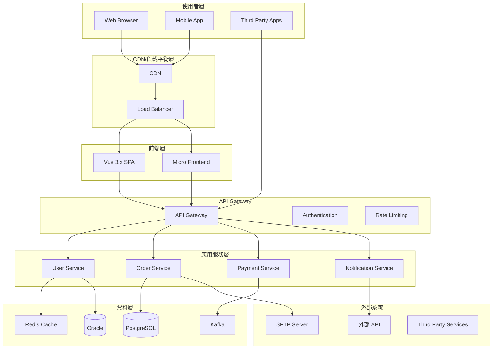
```mermaid
graph TB
    subgraph "使用者層"
        U1[Web Browser]
        U2[Mobile App]
        U3[Third Party Apps]
    end
    
    subgraph "CDN/負載平衡層"
        CDN[CDN]
        LB[Load Balancer]
    end
    
    subgraph "前端層"
        FE1[Vue 3.x SPA]
        FE2[Micro Frontend]
    end
    
    subgraph "API Gateway"
        AG[API Gateway]
        AUTH[Authentication]
        RATE[Rate Limiting]
    end
    
    subgraph "應用服務層"
        MS1[User Service]
        MS2[Order Service]
        MS3[Payment Service]
        MS4[Notification Service]
    end
    
    subgraph "資料層"
        CACHE[Redis Cache]
        DB1[(Oracle)]
        DB2[(PostgreSQL)]
        MQ[Kafka]
    end
    
    subgraph "外部系統"
        EXT1[外部 API]
        EXT2[SFTP Server]
        EXT3[Third Party Services]
    end
    
    U1 --> CDN
    U2 --> CDN
    U3 --> AG
    CDN --> LB
    LB --> FE1
    LB --> FE2
    FE1 --> AG
    FE2 --> AG
    AG --> MS1
    AG --> MS2
    AG --> MS3
    AG --> MS4
    MS1 --> CACHE
    MS1 --> DB1
    MS2 --> DB2
    MS3 --> MQ
    MS4 --> EXT1
    MS2 --> EXT2
```

### 2.2 分層架構設計

#### 2.2.1 前端層架構
- **展示層**: Vue 3.x 單頁應用程式
- **狀態管理**: Pinia 進行狀態管理
- **路由管理**: Vue Router 處理頁面路由
- **UI 元件**: 可重用的 Vue 元件庫
- **樣式框架**: Tailwind CSS 響應式設計

#### 2.2.2 後端層架構 (Clean Architecture)

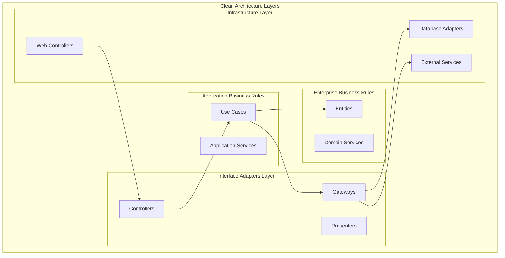
```mermaid
graph TB
    subgraph "Clean Architecture Layers"
        subgraph "Infrastructure Layer"
            WEB[Web Controllers]
            DB[Database Adapters]
            EXT[External Services]
        end
        
        subgraph "Interface Adapters Layer"
            CTRL[Controllers]
            PRES[Presenters]
            GATE[Gateways]
        end
        
        subgraph "Application Business Rules"
            UC[Use Cases]
            SERV[Application Services]
        end
        
        subgraph "Enterprise Business Rules"
            ENT[Entities]
            DOM[Domain Services]
        end
    end
    
    WEB --> CTRL
    CTRL --> UC
    UC --> ENT
    UC --> GATE
    GATE --> DB
    GATE --> EXT
```

#### 2.2.3 領域驅動設計 (DDD) 架構模式

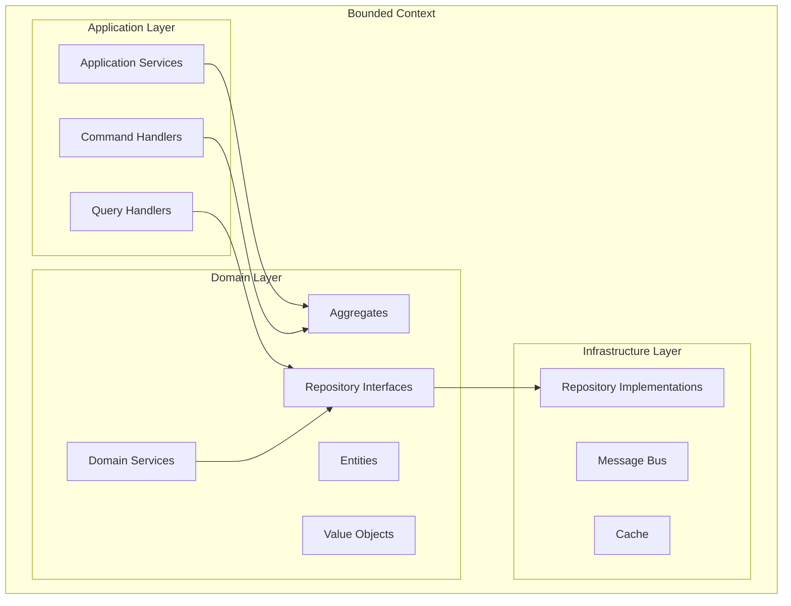
```mermaid
graph TB
    subgraph "Bounded Context"
        subgraph "Application Layer"
            APP[Application Services]
            CMD[Command Handlers]
            QRY[Query Handlers]
        end
        
        subgraph "Domain Layer"
            AGG[Aggregates]
            ENT[Entities]
            VO[Value Objects]
            DOM[Domain Services]
            REPO[Repository Interfaces]
        end
        
        subgraph "Infrastructure Layer"
            IMPL[Repository Implementations]
            MSG[Message Bus]
            CACHE[Cache]
        end
    end
    
    APP --> AGG
    CMD --> AGG
    QRY --> REPO
    REPO --> IMPL
    DOM --> REPO
```

#### 2.2.4 六角形架構 (Hexagonal Architecture)

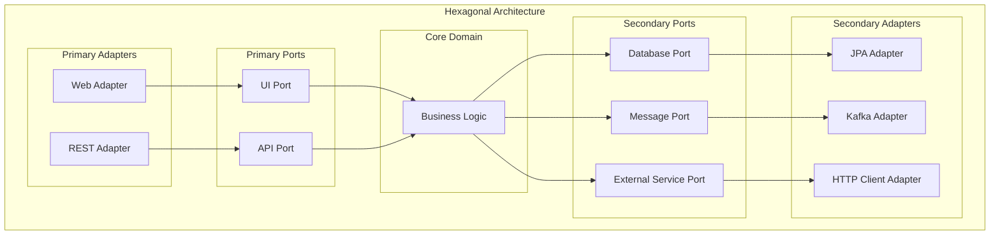
```mermaid
graph TB
    subgraph "Hexagonal Architecture"
        subgraph "Core Domain"
            CORE[Business Logic]
        end
        
        subgraph "Primary Ports"
            UI_PORT[UI Port]
            API_PORT[API Port]
        end
        
        subgraph "Secondary Ports"
            DB_PORT[Database Port]
            MSG_PORT[Message Port]
            EXT_PORT[External Service Port]
        end
        
        subgraph "Primary Adapters"
            WEB[Web Adapter]
            REST[REST Adapter]
        end
        
        subgraph "Secondary Adapters"
            JPA[JPA Adapter]
            KAFKA[Kafka Adapter]
            HTTP[HTTP Client Adapter]
        end
    end
    
    WEB --> UI_PORT
    REST --> API_PORT
    UI_PORT --> CORE
    API_PORT --> CORE
    CORE --> DB_PORT
    CORE --> MSG_PORT
    CORE --> EXT_PORT
    DB_PORT --> JPA
    MSG_PORT --> KAFKA
    EXT_PORT --> HTTP
```

### 2.3 微服務拆分原則

#### 2.3.1 拆分策略
- **業務領域邊界**: 依據 Domain-Driven Design (DDD) 原則
- **資料所有權**: 每個微服務擁有獨立的資料庫
- **團隊組織**: 符合 Conway's Law，與團隊結構對齊
- **技術棧**: 允許不同服務使用不同技術

#### 2.3.2 服務邊界劃分
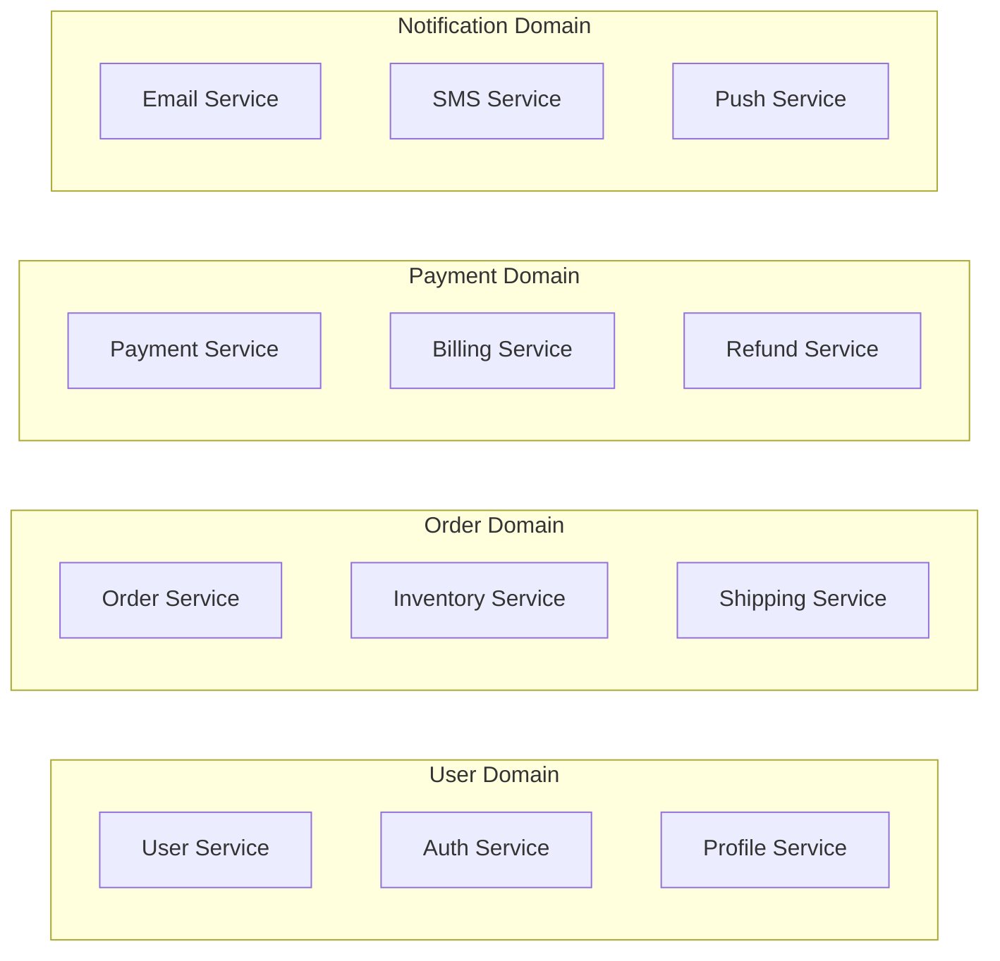
```mermaid
graph LR
    subgraph "User Domain"
        US[User Service]
        AUTH[Auth Service]
        PROF[Profile Service]
    end
    
    subgraph "Order Domain"
        OS[Order Service]
        INV[Inventory Service]
        SHIP[Shipping Service]
    end
    
    subgraph "Payment Domain"
        PAY[Payment Service]
        BILL[Billing Service]
        REFUND[Refund Service]
    end
    
    subgraph "Notification Domain"
        EMAIL[Email Service]
        SMS[SMS Service]
        PUSH[Push Service]
    end
```

### 2.4 API Gateway 設計

#### 2.4.1 API Gateway 功能
- **路由管理**: 將請求路由到適當的微服務
- **認證授權**: 統一的身份驗證和授權
- **限流控制**: API 速率限制和流量控制
- **監控日誌**: 請求追蹤和效能監控
- **協定轉換**: HTTP/gRPC 協定轉換

#### 2.4.2 負載平衡策略
- **輪詢 (Round Robin)**: 預設負載分散策略
- **最少連線 (Least Connections)**: 動態負載平衡
- **加權輪詢 (Weighted Round Robin)**: 基於服務容量的負載分散
- **健康檢查**: 自動檢測和移除不健康的實例

### 2.5 CDN 與快取策略

#### 2.5.1 CDN 配置
- **靜態資源**: CSS、JavaScript、圖片等靜態檔案
- **地理分佈**: 多地區節點部署
- **快取策略**: 基於檔案類型的不同 TTL 設定
- **SSL/TLS**: 全站 HTTPS 支援

#### 2.5.2 多層快取架構
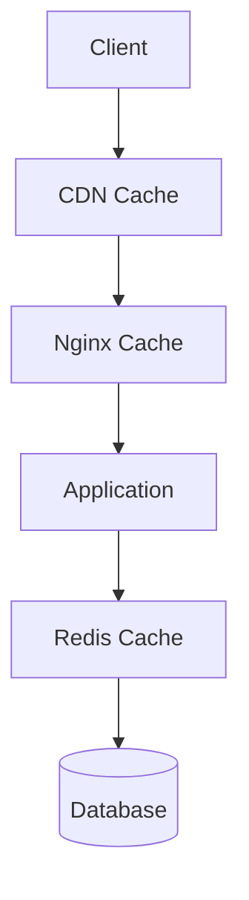
```mermaid
graph TD
    CLIENT[Client] --> CDN[CDN Cache]
    CDN --> NGINX[Nginx Cache]
    NGINX --> APP[Application]
    APP --> REDIS[Redis Cache]
    REDIS --> DB[(Database)]
```

---

## 3. 模組與服務設計

### 3.1 服務設計原則

#### 3.1.1 單一職責原則

- 每個微服務專注於單一業務功能
- 高內聚、低耦合的設計
- 清晰的服務邊界定義

#### 3.1.2 服務自治性

- 獨立部署和擴展
- 擁有獨立的資料儲存
- 自主的技術決策權

#### 3.1.3 物件導向設計模式應用

**工廠模式 (Factory Pattern)**

```java
// 服務工廠介面
public interface ServiceFactory {
    <T> T createService(Class<T> serviceType);
}

// 具體工廠實作
@Component
public class SpringServiceFactory implements ServiceFactory {
    
    private final ApplicationContext applicationContext;
    
    @Override
    public <T> T createService(Class<T> serviceType) {
        return applicationContext.getBean(serviceType);
    }
}
```

**策略模式 (Strategy Pattern)**

```java
// 支付策略介面
public interface PaymentStrategy {
    PaymentResult process(PaymentRequest request);
    boolean supports(PaymentType type);
}

// 信用卡支付策略
@Component
public class CreditCardPaymentStrategy implements PaymentStrategy {
    
    @Override
    public PaymentResult process(PaymentRequest request) {
        // 信用卡支付邏輯
        return new PaymentResult(true, "Credit card payment successful");
    }
    
    @Override
    public boolean supports(PaymentType type) {
        return PaymentType.CREDIT_CARD.equals(type);
    }
}

// 支付服務
@Service
public class PaymentService {
    
    private final List<PaymentStrategy> strategies;
    
    public PaymentResult processPayment(PaymentRequest request) {
        PaymentStrategy strategy = strategies.stream()
            .filter(s -> s.supports(request.getType()))
            .findFirst()
            .orElseThrow(() -> new UnsupportedPaymentTypeException());
            
        return strategy.process(request);
    }
}
```

**觀察者模式 (Observer Pattern)**

```java
// 領域事件
public interface DomainEvent {
    String getEventType();
    LocalDateTime getOccurredOn();
}

// 事件監聽器
public interface DomainEventListener<T extends DomainEvent> {
    void handle(T event);
    Class<T> getEventType();
}

// 事件發布器
@Component
public class DomainEventPublisher {
    
    private final List<DomainEventListener> listeners;
    
    public void publish(DomainEvent event) {
        listeners.stream()
            .filter(listener -> listener.getEventType().isInstance(event))
            .forEach(listener -> listener.handle(event));
    }
}
```

### 3.2 服務間通訊設計

#### 3.2.1 同步通訊 (REST API)
```yaml
# OpenAPI 3.0 規範範例
openapi: 3.0.0
info:
  title: User Service API
  version: 1.0.0
paths:
  /users/{userId}:
    get:
      summary: 取得使用者資訊
      parameters:
        - name: userId
          in: path
          required: true
          schema:
            type: string
      responses:
        '200':
          description: 成功取得使用者資訊
          content:
            application/json:
              schema:
                $ref: '#/components/schemas/User'
```

#### 3.2.2 非同步通訊 (Message Queue)
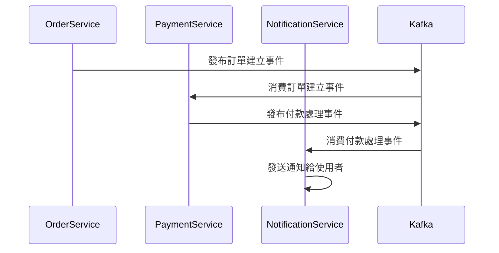
```mermaid
sequenceDiagram
    participant OrderService
    participant PaymentService
    participant NotificationService
    participant Kafka
    
    OrderService->>Kafka: 發布訂單建立事件
    Kafka->>PaymentService: 消費訂單建立事件
    PaymentService->>Kafka: 發布付款處理事件
    Kafka->>NotificationService: 消費付款處理事件
    NotificationService->>NotificationService: 發送通知給使用者
```

### 3.3 資料流設計

#### 3.3.1 資料流圖
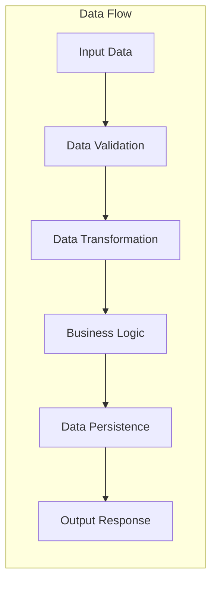
```mermaid
graph LR
    subgraph "Data Flow"
        INPUT[Input Data] --> VALIDATE[Data Validation]
        VALIDATE --> TRANSFORM[Data Transformation]
        TRANSFORM --> BUSINESS[Business Logic]
        BUSINESS --> PERSIST[Data Persistence]
        PERSIST --> OUTPUT[Output Response]
    end
```

#### 3.3.2 控制流設計
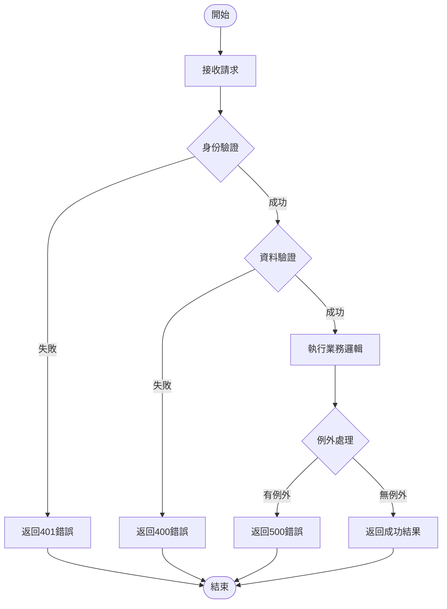
```mermaid
flowchart TD
    START([開始]) --> INPUT[接收請求]
    INPUT --> AUTH{身份驗證}
    AUTH -->|失敗| ERROR1[返回401錯誤]
    AUTH -->|成功| VALIDATE{資料驗證}
    VALIDATE -->|失敗| ERROR2[返回400錯誤]
    VALIDATE -->|成功| BUSINESS[執行業務邏輯]
    BUSINESS --> EXCEPTION{例外處理}
    EXCEPTION -->|有例外| ERROR3[返回500錯誤]
    EXCEPTION -->|無例外| SUCCESS[返回成功結果]
    SUCCESS --> END([結束])
    ERROR1 --> END
    ERROR2 --> END
    ERROR3 --> END
```

---

## 4. 資料庫設計

### 4.1 資料模型設計規範

#### 4.1.1 實體關係圖 (ERD) 設計原則
- **實體識別**: 清楚定義業務實體和屬性
- **關係建立**: 正確建立實體間的關聯關係
- **正規化**: 遵循第三正規化原則，避免資料冗餘
- **索引策略**: 基於查詢模式設計適當的索引

#### 4.1.2 命名規範
- **資料表**: 使用複數名詞，如 `users`, `orders`
- **欄位**: 使用 snake_case，如 `user_id`, `created_at`
- **主鍵**: 統一使用 `id` 作為主鍵名稱
- **外鍵**: 使用 `{table_name}_id` 格式

### 4.2 多資料庫支援策略

#### 4.2.1 資料庫抽象層

```java
// 資料庫適配器介面
public interface DatabaseAdapter {
    void save(Entity entity);
    Optional<Entity> findById(Long id);
    List<Entity> findAll();
    void delete(Long id);
}

// Oracle 適配器實作
@Repository
@Profile("oracle")
public class OracleAdapter implements DatabaseAdapter {
    // Oracle 特定實作
}

// PostgreSQL 適配器實作
@Repository
@Profile("postgresql")
public class PostgreSQLAdapter implements DatabaseAdapter {
    // PostgreSQL 特定實作
}
```

#### 4.2.2 物件關聯映射 (ORM) 設計模式

**Repository 模式**

```java
// 聚合根介面
public interface AggregateRoot<ID> {
    ID getId();
    void markAsRemoved();
    boolean isRemoved();
}

// 通用儲存庫介面
public interface Repository<T extends AggregateRoot<ID>, ID> {
    Optional<T> findById(ID id);
    T save(T aggregate);
    void delete(T aggregate);
    List<T> findAll();
}

// 使用者聚合
@Entity
@Table(name = "users")
public class User implements AggregateRoot<UserId> {
    
    @EmbeddedId
    private UserId id;
    
    @Column(name = "username")
    private String username;
    
    @Column(name = "email")
    private String email;
    
    // 領域邏輯方法
    public void updateEmail(String newEmail) {
        if (!isValidEmail(newEmail)) {
            throw new InvalidEmailException("Invalid email format");
        }
        this.email = newEmail;
        // 發布領域事件
        DomainEventPublisher.publish(new UserEmailUpdatedEvent(this.id, newEmail));
    }
    
    private boolean isValidEmail(String email) {
        return email != null && email.contains("@");
    }
}

// 值物件 ID
@Embeddable
public class UserId {
    
    @Column(name = "id")
    private String value;
    
    protected UserId() {} // JPA required
    
    public UserId(String value) {
        this.value = Objects.requireNonNull(value);
    }
    
    public String getValue() {
        return value;
    }
    
    @Override
    public boolean equals(Object o) {
        if (this == o) return true;
        if (!(o instanceof UserId)) return false;
        UserId userId = (UserId) o;
        return Objects.equals(value, userId.value);
    }
    
    @Override
    public int hashCode() {
        return Objects.hash(value);
    }
}
```

**Data Access Object (DAO) 模式**

```java
// 通用 DAO 介面
public interface GenericDao<T, ID> {
    Optional<T> findById(ID id);
    List<T> findAll();
    T save(T entity);
    void delete(T entity);
    List<T> findByExample(T example);
}

// JPA 實作
@Repository
@Transactional
public class JpaGenericDao<T, ID> implements GenericDao<T, ID> {
    
    @PersistenceContext
    private EntityManager entityManager;
    
    private final Class<T> entityClass;
    
    public JpaGenericDao(Class<T> entityClass) {
        this.entityClass = entityClass;
    }
    
    @Override
    @Transactional(readOnly = true)
    public Optional<T> findById(ID id) {
        return Optional.ofNullable(entityManager.find(entityClass, id));
    }
    
    @Override
    public T save(T entity) {
        if (isNew(entity)) {
            entityManager.persist(entity);
            return entity;
        } else {
            return entityManager.merge(entity);
        }
    }
    
    private boolean isNew(T entity) {
        // 判斷實體是否為新建
        return true; // 簡化實作
    }
}
```

#### 4.2.3 分庫分表策略
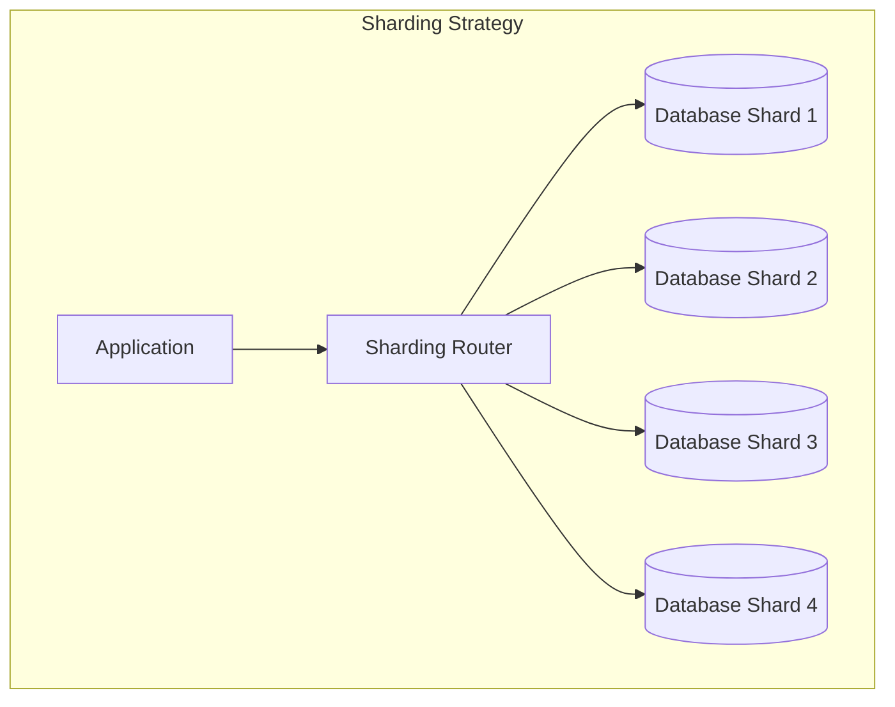
```mermaid
graph TB
    subgraph "Sharding Strategy"
        APP[Application] --> ROUTER[Sharding Router]
        ROUTER --> DB1[(Database Shard 1)]
        ROUTER --> DB2[(Database Shard 2)]
        ROUTER --> DB3[(Database Shard 3)]
        ROUTER --> DB4[(Database Shard 4)]
    end
```

### 4.3 讀寫分離設計

#### 4.3.1 主從複製架構
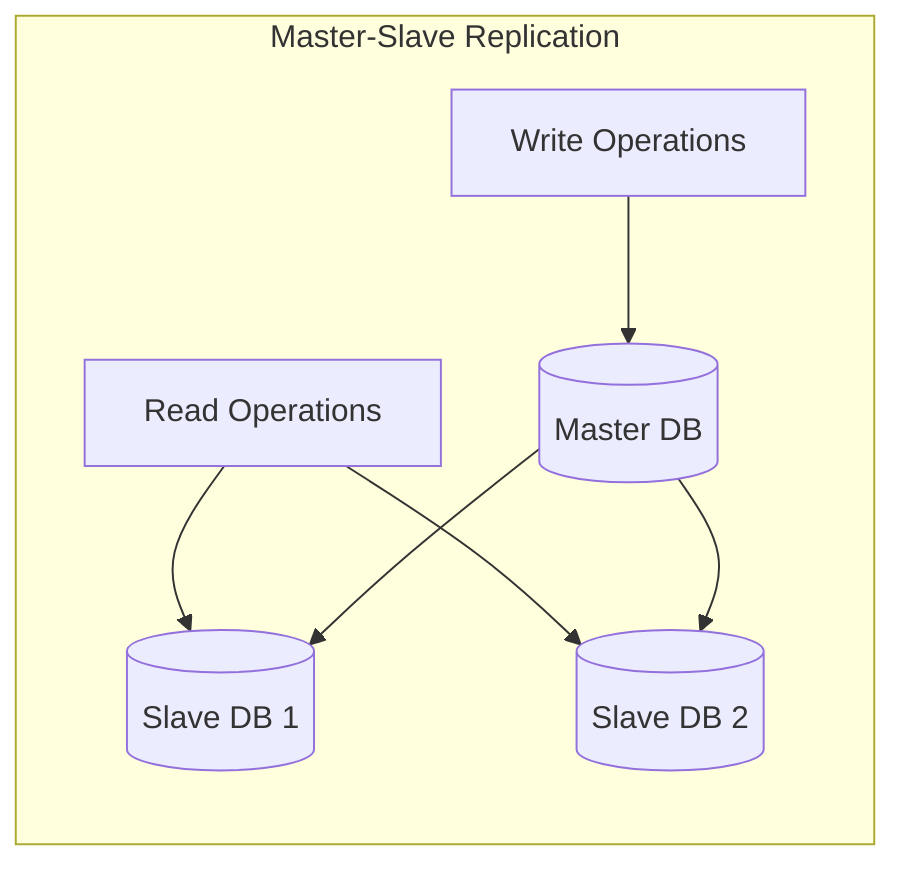
```mermaid
graph LR
    subgraph "Master-Slave Replication"
        WRITE[Write Operations] --> MASTER[(Master DB)]
        READ[Read Operations] --> SLAVE1[(Slave DB 1)]
        READ --> SLAVE2[(Slave DB 2)]
        MASTER --> SLAVE1
        MASTER --> SLAVE2
    end
```

#### 4.3.2 讀寫分離實作
```java
@Service
public class UserService {
    
    @Autowired
    @Qualifier("masterDataSource")
    private DataSource masterDataSource;
    
    @Autowired
    @Qualifier("slaveDataSource")
    private DataSource slaveDataSource;
    
    @Transactional
    public void saveUser(User user) {
        // 寫操作使用主資料庫
        userRepository.save(user);
    }
    
    @Transactional(readOnly = true)
    public User findUser(Long id) {
        // 讀操作使用從資料庫
        return userRepository.findById(id);
    }
}
```

### 4.4 資料安全與加密

#### 4.4.1 敏感資料加密
```sql
-- 創建加密表格範例 (Oracle)
CREATE TABLE users (
    id NUMBER PRIMARY KEY,
    username VARCHAR2(50) NOT NULL,
    email VARCHAR2(100) NOT NULL,
    password_hash VARCHAR2(255) NOT NULL,
    ssn RAW(32), -- 加密的身份證號碼
    created_at TIMESTAMP DEFAULT CURRENT_TIMESTAMP
);

-- 創建加密函數
CREATE OR REPLACE FUNCTION encrypt_ssn(p_ssn VARCHAR2) 
RETURN RAW IS
BEGIN
    RETURN DBMS_CRYPTO.ENCRYPT(
        UTL_I18N.STRING_TO_RAW(p_ssn, 'AL32UTF8'),
        DBMS_CRYPTO.ENCRYPT_AES256 + DBMS_CRYPTO.CHAIN_CBC + DBMS_CRYPTO.PAD_PKCS5,
        'your_encryption_key'
    );
END;
```

#### 4.4.2 資料遮罩策略
```java
@Entity
@Table(name = "users")
public class User {
    @Id
    private Long id;
    
    private String username;
    
    @JsonIgnore // API 回應時隱藏
    private String password;
    
    @Column(name = "ssn")
    @Convert(converter = SSNConverter.class) // 自動加解密
    private String ssn;
    
    // getter/setter
    
    @JsonProperty("maskedSSN")
    public String getMaskedSSN() {
        return ssn != null ? "***-**-" + ssn.substring(7) : null;
    }
}
```

---

## 5. 安全性設計

### 5.1 認證與授權機制

#### 5.1.1 OAuth 2.0 + OpenID Connect 整合
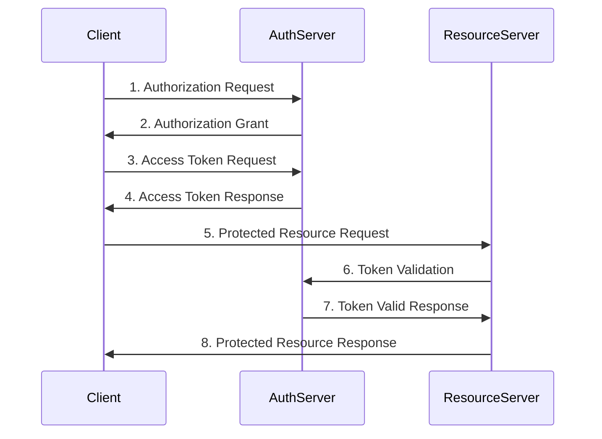
```mermaid
sequenceDiagram
    participant Client
    participant AuthServer
    participant ResourceServer
    
    Client->>AuthServer: 1. Authorization Request
    AuthServer->>Client: 2. Authorization Grant
    Client->>AuthServer: 3. Access Token Request
    AuthServer->>Client: 4. Access Token Response
    Client->>ResourceServer: 5. Protected Resource Request
    ResourceServer->>AuthServer: 6. Token Validation
    AuthServer->>ResourceServer: 7. Token Valid Response
    ResourceServer->>Client: 8. Protected Resource Response
```

#### 5.1.2 JWT Token 設計
```java
@Component
public class JwtTokenProvider {
    
    @Value("${jwt.secret}")
    private String jwtSecret;
    
    @Value("${jwt.expiration}")
    private int jwtExpirationInMs;
    
    public String generateToken(Authentication authentication) {
        UserPrincipal userPrincipal = (UserPrincipal) authentication.getPrincipal();
        Date expiryDate = new Date(System.currentTimeMillis() + jwtExpirationInMs);
        
        return Jwts.builder()
                .setSubject(Long.toString(userPrincipal.getId()))
                .claim("username", userPrincipal.getUsername())
                .claim("authorities", getAuthorities(authentication))
                .setIssuedAt(new Date())
                .setExpiration(expiryDate)
                .signWith(SignatureAlgorithm.HS512, jwtSecret)
                .compact();
    }
    
    public boolean validateToken(String authToken) {
        try {
            Jwts.parser().setSigningKey(jwtSecret).parseClaimsJws(authToken);
            return true;
        } catch (JwtException | IllegalArgumentException e) {
            logger.error("Invalid JWT token: {}", e.getMessage());
        }
        return false;
    }
}
```

#### 5.1.3 RBAC (Role-Based Access Control) 設計

```sql
-- 角色權限資料表設計
CREATE TABLE roles (
    id BIGINT PRIMARY KEY,
    name VARCHAR(50) UNIQUE NOT NULL,
    description VARCHAR(255),
    created_at TIMESTAMP DEFAULT CURRENT_TIMESTAMP
);

CREATE TABLE permissions (
    id BIGINT PRIMARY KEY,
    name VARCHAR(100) UNIQUE NOT NULL,
    resource VARCHAR(100) NOT NULL,
    action VARCHAR(50) NOT NULL,
    created_at TIMESTAMP DEFAULT CURRENT_TIMESTAMP
);

CREATE TABLE role_permissions (
    role_id BIGINT REFERENCES roles(id),
    permission_id BIGINT REFERENCES permissions(id),
    PRIMARY KEY (role_id, permission_id)
);

CREATE TABLE user_roles (
    user_id BIGINT REFERENCES users(id),
    role_id BIGINT REFERENCES roles(id),
    assigned_at TIMESTAMP DEFAULT CURRENT_TIMESTAMP,
    assigned_by BIGINT REFERENCES users(id),
    PRIMARY KEY (user_id, role_id)
);
```

#### 5.1.4 安全設計模式

**守衛模式 (Guard Pattern)**

```java
// 安全守衛介面
public interface SecurityGuard {
    boolean canAccess(SecurityContext context, Resource resource, Action action);
}

// 角色基礎守衛
@Component
public class RoleBasedGuard implements SecurityGuard {
    
    private final PermissionService permissionService;
    
    @Override
    public boolean canAccess(SecurityContext context, Resource resource, Action action) {
        User user = context.getUser();
        return user.getRoles().stream()
            .anyMatch(role -> permissionService.hasPermission(role, resource, action));
    }
}

// 資源擁有者守衛
@Component
public class ResourceOwnerGuard implements SecurityGuard {
    
    @Override
    public boolean canAccess(SecurityContext context, Resource resource, Action action) {
        if (action == Action.READ || action == Action.UPDATE || action == Action.DELETE) {
            return resource.getOwnerId().equals(context.getUser().getId());
        }
        return true;
    }
}

// 複合守衛
@Component
public class CompositeSecurityGuard implements SecurityGuard {
    
    private final List<SecurityGuard> guards;
    
    @Override
    public boolean canAccess(SecurityContext context, Resource resource, Action action) {
        return guards.stream()
            .allMatch(guard -> guard.canAccess(context, resource, action));
    }
}
```

**代理模式 (Proxy Pattern) 用於安全控制**

```java
// 安全代理
@Component
public class SecureServiceProxy implements UserService {
    
    private final UserService target;
    private final SecurityGuard securityGuard;
    private final SecurityContextHolder contextHolder;
    
    @Override
    public User getUserById(String userId) {
        SecurityContext context = contextHolder.getContext();
        Resource resource = new UserResource(userId);
        
        if (!securityGuard.canAccess(context, resource, Action.READ)) {
            throw new AccessDeniedException("Access denied to user: " + userId);
        }
        
        return target.getUserById(userId);
    }
    
    @Override
    public void updateUser(String userId, UpdateUserRequest request) {
        SecurityContext context = contextHolder.getContext();
        Resource resource = new UserResource(userId);
        
        if (!securityGuard.canAccess(context, resource, Action.UPDATE)) {
            throw new AccessDeniedException("Access denied to update user: " + userId);
        }
        
        target.updateUser(userId, request);
    }
}
```

**責任鏈模式 (Chain of Responsibility) 用於驗證**

```java
// 驗證處理器介面
public interface ValidationHandler {
    ValidationResult handle(ValidationRequest request);
    void setNext(ValidationHandler next);
}

// 抽象驗證處理器
public abstract class AbstractValidationHandler implements ValidationHandler {
    
    private ValidationHandler next;
    
    @Override
    public void setNext(ValidationHandler next) {
        this.next = next;
    }
    
    @Override
    public ValidationResult handle(ValidationRequest request) {
        ValidationResult result = doValidation(request);
        
        if (result.isValid() && next != null) {
            return next.handle(request);
        }
        
        return result;
    }
    
    protected abstract ValidationResult doValidation(ValidationRequest request);
}

// 具體驗證處理器
@Component
public class TokenValidationHandler extends AbstractValidationHandler {
    
    @Override
    protected ValidationResult doValidation(ValidationRequest request) {
        String token = request.getToken();
        
        if (token == null || token.isEmpty()) {
            return ValidationResult.invalid("Token is required");
        }
        
        if (!jwtTokenProvider.validateToken(token)) {
            return ValidationResult.invalid("Invalid token");
        }
        
        return ValidationResult.valid();
    }
}

@Component
public class RateLimitValidationHandler extends AbstractValidationHandler {
    
    @Override
    protected ValidationResult doValidation(ValidationRequest request) {
        String clientId = request.getClientId();
        
        if (rateLimitService.isExceeded(clientId)) {
            return ValidationResult.invalid("Rate limit exceeded");
        }
        
        return ValidationResult.valid();
    }
}
```

### 5.2 API 安全設計

#### 5.2.1 API 安全檢核清單
- **HTTPS 強制**: 所有 API 通訊必須使用 HTTPS
- **API 版本控制**: 使用語義化版本控制
- **輸入驗證**: 嚴格驗證所有輸入參數
- **輸出編碼**: 防止 XSS 攻擊的輸出編碼
- **速率限制**: 防止 DDoS 和暴力攻擊

#### 5.2.2 API Rate Limiting 實作
```java
@Component
public class RateLimitingFilter implements Filter {
    
    private final RedisTemplate<String, String> redisTemplate;
    private final RateLimitProperties rateLimitProperties;
    
    @Override
    public void doFilter(ServletRequest request, ServletResponse response, 
                        FilterChain chain) throws IOException, ServletException {
        
        HttpServletRequest httpRequest = (HttpServletRequest) request;
        String clientId = getClientId(httpRequest);
        String key = "rate_limit:" + clientId;
        
        Long currentCount = redisTemplate.opsForValue().increment(key);
        
        if (currentCount == 1) {
            redisTemplate.expire(key, Duration.ofMinutes(1));
        }
        
        if (currentCount > rateLimitProperties.getMaxRequests()) {
            HttpServletResponse httpResponse = (HttpServletResponse) response;
            httpResponse.setStatus(HttpStatus.TOO_MANY_REQUESTS.value());
            httpResponse.getWriter().write("Rate limit exceeded");
            return;
        }
        
        chain.doFilter(request, response);
    }
}
```

#### 5.2.3 API 簽名驗證 (HMAC)
```java
@Component
public class ApiSignatureValidator {
    
    public boolean validateSignature(HttpServletRequest request, String signature) {
        String timestamp = request.getHeader("X-Timestamp");
        String nonce = request.getHeader("X-Nonce");
        String body = getRequestBody(request);
        
        // 檢查時間戳是否在有效範圍內 (5分鐘)
        long currentTime = System.currentTimeMillis() / 1000;
        long requestTime = Long.parseLong(timestamp);
        if (Math.abs(currentTime - requestTime) > 300) {
            return false;
        }
        
        // 生成簽名
        String message = request.getMethod() + "\n" +
                        request.getRequestURI() + "\n" +
                        timestamp + "\n" +
                        nonce + "\n" +
                        body;
        
        String expectedSignature = generateHmacSha256(message, getApiSecret());
        return signature.equals(expectedSignature);
    }
    
    private String generateHmacSha256(String message, String secret) {
        try {
            Mac mac = Mac.getInstance("HmacSHA256");
            SecretKeySpec secretKeySpec = new SecretKeySpec(secret.getBytes(), "HmacSHA256");
            mac.init(secretKeySpec);
            byte[] hash = mac.doFinal(message.getBytes());
            return Base64.getEncoder().encodeToString(hash);
        } catch (Exception e) {
            throw new RuntimeException("Failed to generate HMAC signature", e);
        }
    }
}
```

### 5.3 OWASP Top 10 防護策略

#### 5.3.1 注入攻擊防護
```java
// 使用 PreparedStatement 防止 SQL 注入
@Repository
public class UserRepositoryImpl {
    
    @Autowired
    private JdbcTemplate jdbcTemplate;
    
    public List<User> findUsersByRole(String role) {
        String sql = "SELECT * FROM users WHERE role = ?";
        return jdbcTemplate.query(sql, new Object[]{role}, new UserRowMapper());
    }
    
    // 使用 @Valid 和自定義驗證器防止注入
    public void createUser(@Valid @RequestBody CreateUserRequest request) {
        // Spring Validation 會自動驗證輸入
    }
}

// 自定義驗證器
public class SafeStringValidator implements ConstraintValidator<SafeString, String> {
    
    private static final Pattern SAFE_PATTERN = Pattern.compile("^[a-zA-Z0-9\\s\\-_.@]+$");
    
    @Override
    public boolean isValid(String value, ConstraintValidatorContext context) {
        if (value == null) return true;
        return SAFE_PATTERN.matcher(value).matches();
    }
}
```

#### 5.3.2 XSS 防護
```java
@Configuration
public class SecurityConfig {
    
    @Bean
    public FilterRegistrationBean<XSSFilter> xssFilterRegistration() {
        FilterRegistrationBean<XSSFilter> registration = new FilterRegistrationBean<>();
        registration.setFilter(new XSSFilter());
        registration.addUrlPatterns("/api/*");
        registration.setName("XSSFilter");
        registration.setOrder(1);
        return registration;
    }
}

public class XSSFilter implements Filter {
    
    @Override
    public void doFilter(ServletRequest request, ServletResponse response, 
                        FilterChain chain) throws IOException, ServletException {
        chain.doFilter(new XSSRequestWrapper((HttpServletRequest) request), response);
    }
}

public class XSSRequestWrapper extends HttpServletRequestWrapper {
    
    public XSSRequestWrapper(HttpServletRequest request) {
        super(request);
    }
    
    @Override
    public String getParameter(String parameter) {
        return cleanXSS(super.getParameter(parameter));
    }
    
    private String cleanXSS(String value) {
        if (value == null) return null;
        
        // 移除潛在的 XSS 攻擊代碼
        value = value.replaceAll("<script[^>]*>.*?</script>", "");
        value = value.replaceAll("javascript:", "");
        value = value.replaceAll("vbscript:", "");
        value = value.replaceAll("onload[^>]*=", "");
        
        return value;
    }
}
```

#### 5.3.3 CSRF 防護
```java
@Configuration
@EnableWebSecurity
public class WebSecurityConfig {
    
    @Bean
    public SecurityFilterChain filterChain(HttpSecurity http) throws Exception {
        http.csrf(csrf -> csrf
            .csrfTokenRepository(CookieCsrfTokenRepository.withHttpOnlyFalse())
            .ignoringRequestMatchers("/api/public/**")
        );
        return http.build();
    }
}
```

---

## 6. 整合與介接設計

### 6.1 外部系統 API 規範

#### 6.1.1 RESTful API 設計原則
```yaml
# OpenAPI 3.0 完整規範範例
openapi: 3.0.0
info:
  title: 共用平台 API
  description: 大型共用平台對外服務 API
  version: 1.0.0
  contact:
    name: API Support
    email: api-support@company.com
servers:
  - url: https://api.platform.company.com/v1
    description: 生產環境
  - url: https://api-staging.platform.company.com/v1
    description: 測試環境

paths:
  /users:
    get:
      summary: 取得使用者清單
      parameters:
        - name: page
          in: query
          schema:
            type: integer
            default: 1
        - name: size
          in: query
          schema:
            type: integer
            default: 20
      responses:
        '200':
          description: 成功取得使用者清單
          content:
            application/json:
              schema:
                $ref: '#/components/schemas/UserListResponse'
        '401':
          $ref: '#/components/responses/Unauthorized'
        '500':
          $ref: '#/components/responses/InternalServerError'

components:
  schemas:
    User:
      type: object
      required:
        - id
        - username
        - email
      properties:
        id:
          type: string
          format: uuid
        username:
          type: string
          minLength: 3
          maxLength: 50
        email:
          type: string
          format: email
        createdAt:
          type: string
          format: date-time
        
  responses:
    Unauthorized:
      description: 未授權存取
      content:
        application/json:
          schema:
            $ref: '#/components/schemas/Error'
            
  securitySchemes:
    BearerAuth:
      type: http
      scheme: bearer
      bearerFormat: JWT

security:
  - BearerAuth: []
```

#### 6.1.2 API 版本控制策略
```java
// URL 版本控制
@RestController
@RequestMapping("/api/v1/users")
public class UserControllerV1 {
    // v1 實作
}

@RestController
@RequestMapping("/api/v2/users")
public class UserControllerV2 {
    // v2 實作
}

// Header 版本控制
@RestController
@RequestMapping("/api/users")
public class UserController {
    
    @GetMapping(headers = "API-Version=1.0")
    public ResponseEntity<List<UserV1>> getUsersV1() {
        // v1.0 實作
    }
    
    @GetMapping(headers = "API-Version=2.0")
    public ResponseEntity<List<UserV2>> getUsersV2() {
        // v2.0 實作
    }
}
```

### 6.2 批次作業設計

#### 6.2.1 Spring Batch 架構

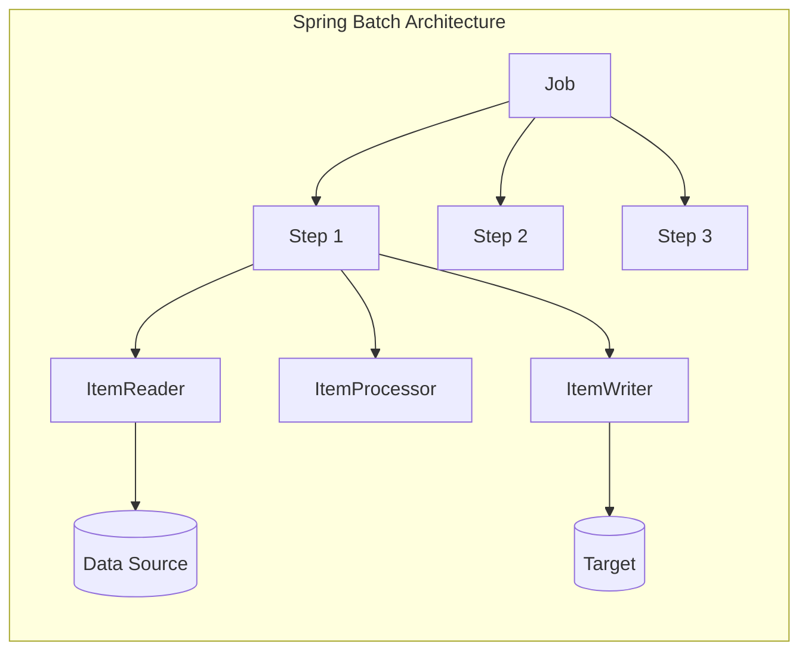
```mermaid
graph LR
    subgraph "Spring Batch Architecture"
        JOB[Job] --> STEP1[Step 1]
        JOB --> STEP2[Step 2]
        JOB --> STEP3[Step 3]
        
        STEP1 --> READER1[ItemReader]
        STEP1 --> PROCESSOR1[ItemProcessor]
        STEP1 --> WRITER1[ItemWriter]
        
        READER1 --> SOURCE[(Data Source)]
        WRITER1 --> TARGET[(Target)]
    end
```

#### 6.2.2 企業整合模式 (Enterprise Integration Patterns)

**訊息路由模式 (Message Router Pattern)**

```java
// 訊息路由器介面
public interface MessageRouter {
    void route(Message message);
}

// 內容基礎路由器
@Component
public class ContentBasedRouter implements MessageRouter {
    
    private final Map<String, MessageChannel> channels;
    private final MessageTypeResolver messageTypeResolver;
    
    @Override
    public void route(Message message) {
        String messageType = messageTypeResolver.resolve(message);
        MessageChannel channel = channels.get(messageType);
        
        if (channel != null) {
            channel.send(message);
        } else {
            handleUnroutableMessage(message);
        }
    }
    
    private void handleUnroutableMessage(Message message) {
        // 處理無法路由的訊息
        deadLetterChannel.send(message);
    }
}
```

**訊息轉換模式 (Message Translator Pattern)**

```java
// 訊息轉換器介面
public interface MessageTranslator<T, R> {
    R translate(T source);
    boolean supports(Class<?> sourceType, Class<?> targetType);
}

// JSON 到 XML 轉換器
@Component
public class JsonToXmlTranslator implements MessageTranslator<JsonMessage, XmlMessage> {
    
    private final ObjectMapper objectMapper;
    private final XmlMapper xmlMapper;
    
    @Override
    public XmlMessage translate(JsonMessage source) {
        try {
            Object data = objectMapper.readValue(source.getPayload(), Object.class);
            String xmlContent = xmlMapper.writeValueAsString(data);
            return new XmlMessage(xmlContent, source.getHeaders());
        } catch (Exception e) {
            throw new MessageTranslationException("Failed to translate JSON to XML", e);
        }
    }
    
    @Override
    public boolean supports(Class<?> sourceType, Class<?> targetType) {
        return JsonMessage.class.isAssignableFrom(sourceType) && 
               XmlMessage.class.isAssignableFrom(targetType);
    }
}
```

**聚合器模式 (Aggregator Pattern)**

```java
// 訊息聚合器
@Component
public class MessageAggregator {
    
    private final Map<String, List<Message>> messageGroups = new ConcurrentHashMap<>();
    private final Map<String, AggregationStrategy> strategies = new HashMap<>();
    
    public void aggregate(Message message) {
        String correlationId = message.getHeaders().get("correlationId");
        
        messageGroups.computeIfAbsent(correlationId, k -> new ArrayList<>()).add(message);
        
        if (isComplete(correlationId)) {
            List<Message> messages = messageGroups.remove(correlationId);
            AggregationStrategy strategy = getStrategy(message);
            Message aggregatedMessage = strategy.aggregate(messages);
            publishAggregatedMessage(aggregatedMessage);
        }
    }
    
    private boolean isComplete(String correlationId) {
        List<Message> messages = messageGroups.get(correlationId);
        return messages != null && messages.size() >= getExpectedMessageCount(correlationId);
    }
    
    private AggregationStrategy getStrategy(Message message) {
        String strategyType = message.getHeaders().get("aggregationStrategy");
        return strategies.getOrDefault(strategyType, new DefaultAggregationStrategy());
    }
}

// 聚合策略介面
public interface AggregationStrategy {
    Message aggregate(List<Message> messages);
}

// 預設聚合策略
public class DefaultAggregationStrategy implements AggregationStrategy {
    
    @Override
    public Message aggregate(List<Message> messages) {
        Map<String, Object> aggregatedData = new HashMap<>();
        Map<String, Object> headers = new HashMap<>();
        
        for (Message message : messages) {
            aggregatedData.putAll(message.getPayload());
            headers.putAll(message.getHeaders());
        }
        
        return new Message(aggregatedData, headers);
    }
}
```

**散布聚集模式 (Scatter-Gather Pattern)**

```java
// 散布聚集處理器
@Component
public class ScatterGatherProcessor {
    
    private final List<MessageProcessor> processors;
    private final MessageAggregator aggregator;
    private final ExecutorService executorService;
    
    public CompletableFuture<Message> process(Message message) {
        String correlationId = UUID.randomUUID().toString();
        
        // 散布階段 - 並行處理
        List<CompletableFuture<Message>> futures = processors.stream()
            .map(processor -> CompletableFuture.supplyAsync(() -> {
                Message processedMessage = processor.process(message);
                processedMessage.getHeaders().put("correlationId", correlationId);
                return processedMessage;
            }, executorService))
            .collect(Collectors.toList());
        
        // 聚集階段 - 等待所有處理完成
        return CompletableFuture.allOf(futures.toArray(new CompletableFuture[0]))
            .thenApply(v -> {
                List<Message> results = futures.stream()
                    .map(CompletableFuture::join)
                    .collect(Collectors.toList());
                
                return aggregator.aggregate(results);
            });
    }
}
```

#### 6.2.2 批次作業實作範例
```java
@Configuration
@EnableBatchProcessing
public class BatchConfig {
    
    @Bean
    public Job userDataMigrationJob(JobRepository jobRepository,
                                   Step migrationStep) {
        return new JobBuilder("userDataMigrationJob", jobRepository)
                .start(migrationStep)
                .build();
    }
    
    @Bean
    public Step migrationStep(JobRepository jobRepository,
                             PlatformTransactionManager transactionManager,
                             ItemReader<UserData> reader,
                             ItemProcessor<UserData, ProcessedUserData> processor,
                             ItemWriter<ProcessedUserData> writer) {
        return new StepBuilder("migrationStep", jobRepository)
                .<UserData, ProcessedUserData>chunk(1000, transactionManager)
                .reader(reader)
                .processor(processor)
                .writer(writer)
                .faultTolerant()
                .retryLimit(3)
                .retry(Exception.class)
                .build();
    }
    
    @Bean
    @StepScope
    public FlatFileItemReader<UserData> reader(
            @Value("#{jobParameters['inputFile']}") String inputFile) {
        return new FlatFileItemReaderBuilder<UserData>()
                .name("userDataReader")
                .resource(new FileSystemResource(inputFile))
                .delimited()
                .names(new String[]{"id", "name", "email"})
                .targetType(UserData.class)
                .build();
    }
}
```

#### 6.2.3 Quartz 排程設計
```java
@Configuration
public class QuartzConfig {
    
    @Bean
    public JobDetail dailyReportJobDetail() {
        return JobBuilder.newJob(DailyReportJob.class)
                .withIdentity("dailyReportJob")
                .storeDurably()
                .build();
    }
    
    @Bean
    public Trigger dailyReportTrigger() {
        return TriggerBuilder.newTrigger()
                .forJob(dailyReportJobDetail())
                .withIdentity("dailyReportTrigger")
                .withSchedule(CronScheduleBuilder.cronSchedule("0 0 2 * * ?")) // 每天凌晨2點
                .build();
    }
}

@Component
public class DailyReportJob implements Job {
    
    @Autowired
    private ReportService reportService;
    
    @Override
    public void execute(JobExecutionContext context) throws JobExecutionException {
        try {
            log.info("開始執行每日報表作業");
            reportService.generateDailyReport();
            log.info("每日報表作業執行完成");
        } catch (Exception e) {
            log.error("每日報表作業執行失敗", e);
            throw new JobExecutionException(e);
        }
    }
}
```

### 6.3 SFTP/FTPS 檔案傳輸

#### 6.3.1 SFTP 客戶端實作
```java
@Service
public class SftpService {
    
    @Value("${sftp.host}")
    private String host;
    
    @Value("${sftp.port}")
    private int port;
    
    @Value("${sftp.username}")
    private String username;
    
    @Value("${sftp.password}")
    private String password;
    
    public void uploadFile(String localFilePath, String remoteFilePath) {
        JSch jsch = new JSch();
        Session session = null;
        ChannelSftp channelSftp = null;
        
        try {
            session = jsch.getSession(username, host, port);
            session.setPassword(password);
            session.setConfig("StrictHostKeyChecking", "no");
            session.connect();
            
            channelSftp = (ChannelSftp) session.openChannel("sftp");
            channelSftp.connect();
            
            channelSftp.put(localFilePath, remoteFilePath);
            log.info("文件上傳成功: {} -> {}", localFilePath, remoteFilePath);
            
        } catch (Exception e) {
            log.error("SFTP 文件上傳失敗", e);
            throw new RuntimeException("SFTP upload failed", e);
        } finally {
            if (channelSftp != null) channelSftp.disconnect();
            if (session != null) session.disconnect();
        }
    }
    
    public void downloadFile(String remoteFilePath, String localFilePath) {
        // 類似的下載實作
    }
}
```

#### 6.3.2 檔案傳輸監控
```java
@Component
public class FileTransferMonitor {
    
    private final MeterRegistry meterRegistry;
    private final Counter successCounter;
    private final Counter failureCounter;
    private final Timer transferTimer;
    
    public FileTransferMonitor(MeterRegistry meterRegistry) {
        this.meterRegistry = meterRegistry;
        this.successCounter = Counter.builder("file.transfer.success")
                .description("成功的檔案傳輸次數")
                .register(meterRegistry);
        this.failureCounter = Counter.builder("file.transfer.failure")
                .description("失敗的檔案傳輸次數")
                .register(meterRegistry);
        this.transferTimer = Timer.builder("file.transfer.duration")
                .description("檔案傳輸耗時")
                .register(meterRegistry);
    }
    
    public void recordSuccess() {
        successCounter.increment();
    }
    
    public void recordFailure() {
        failureCounter.increment();
    }
    
    public Timer.Sample startTimer() {
        return Timer.start(meterRegistry);
    }
}
```

---

## 7. 系統非功能需求設計

### 7.1 效能與擴展性設計

#### 7.1.1 水平擴展架構
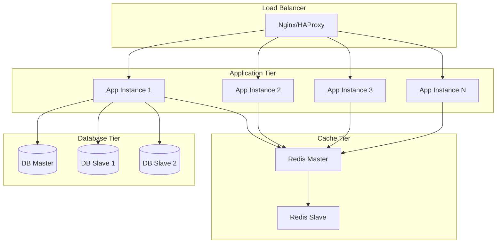
```mermaid
graph TB
    subgraph "Load Balancer"
        LB[Nginx/HAProxy]
    end
    
    subgraph "Application Tier"
        APP1[App Instance 1]
        APP2[App Instance 2]
        APP3[App Instance 3]
        APPN[App Instance N]
    end
    
    subgraph "Cache Tier"
        REDIS1[Redis Master]
        REDIS2[Redis Slave]
    end
    
    subgraph "Database Tier"
        DB_MASTER[(DB Master)]
        DB_SLAVE1[(DB Slave 1)]
        DB_SLAVE2[(DB Slave 2)]
    end
    
    LB --> APP1
    LB --> APP2
    LB --> APP3
    LB --> APPN
    
    APP1 --> REDIS1
    APP2 --> REDIS1
    APP3 --> REDIS1
    APPN --> REDIS1
    
    REDIS1 --> REDIS2
    
    APP1 --> DB_MASTER
    APP1 --> DB_SLAVE1
    APP1 --> DB_SLAVE2
```

#### 7.1.2 快取策略實作
```java
@Service
public class UserService {
    
    private final UserRepository userRepository;
    private final RedisTemplate<String, Object> redisTemplate;
    
    @Cacheable(value = "users", key = "#userId")
    public User getUserById(Long userId) {
        return userRepository.findById(userId)
                .orElseThrow(() -> new UserNotFoundException("User not found"));
    }
    
    @CacheEvict(value = "users", key = "#user.id")
    public User updateUser(User user) {
        return userRepository.save(user);
    }
    
    // 分散式快取實作
    public User getUserWithDistributedCache(Long userId) {
        String cacheKey = "user:" + userId;
        String cachedUser = (String) redisTemplate.opsForValue().get(cacheKey);
        
        if (cachedUser != null) {
            return objectMapper.readValue(cachedUser, User.class);
        }
        
        User user = userRepository.findById(userId)
                .orElseThrow(() -> new UserNotFoundException("User not found"));
        
        // 設定快取，TTL 為 1 小時
        redisTemplate.opsForValue().set(cacheKey, 
                objectMapper.writeValueAsString(user), 
                Duration.ofHours(1));
        
        return user;
    }
}
```

#### 7.1.3 資料庫連線池調校
```yaml
# application.yml
spring:
  datasource:
    hikari:
      maximum-pool-size: 20
      minimum-idle: 5
      idle-timeout: 300000
      max-lifetime: 1800000
      connection-timeout: 30000
      leak-detection-threshold: 60000
      pool-name: HikariCP
      
  jpa:
    hibernate:
      ddl-auto: validate
    properties:
      hibernate:
        jdbc:
          batch_size: 25
          order_inserts: true
          order_updates: true
        cache:
          use_second_level_cache: true
          region:
            factory_class: org.hibernate.cache.jcache.JCacheRegionFactory
```

### 7.2 系統監控與日誌

#### 7.2.1 Prometheus 監控配置
```java
@Configuration
public class MonitoringConfig {
    
    @Bean
    public MeterRegistryCustomizer<MeterRegistry> metricsCommonTags() {
        return registry -> registry.config().commonTags("application", "common-platform");
    }
    
    @Bean
    public TimedAspect timedAspect(MeterRegistry registry) {
        return new TimedAspect(registry);
    }
}

@RestController
@Timed(name = "api.requests", description = "API 請求監控")
public class UserController {
    
    private final Counter userCreationCounter;
    private final Timer userQueryTimer;
    
    public UserController(MeterRegistry meterRegistry) {
        this.userCreationCounter = Counter.builder("user.creation")
                .description("使用者建立次數")
                .register(meterRegistry);
        this.userQueryTimer = Timer.builder("user.query")
                .description("使用者查詢耗時")
                .register(meterRegistry);
    }
    
    @PostMapping("/users")
    public ResponseEntity<User> createUser(@RequestBody CreateUserRequest request) {
        userCreationCounter.increment();
        // 建立使用者邏輯
        return ResponseEntity.ok(user);
    }
    
    @GetMapping("/users/{id}")
    @Timed(name = "user.query.by.id")
    public ResponseEntity<User> getUserById(@PathVariable Long id) {
        return Timer.Sample.start()
                .stop(userQueryTimer)
                .recordCallable(() -> {
                    User user = userService.findById(id);
                    return ResponseEntity.ok(user);
                });
    }
}
```

#### 7.2.2 分散式追蹤 (Sleuth + Zipkin)
```yaml
# application.yml
spring:
  sleuth:
    sampler:
      probability: 1.0 # 100% 採樣率 (生產環境建議 0.1)
    zipkin:
      base-url: http://zipkin-server:9411
    web:
      additional-skip-pattern: /health.*|/prometheus.*
      
management:
  tracing:
    sampling:
      probability: 0.1
  zipkin:
    tracing:
      endpoint: http://zipkin-server:9411/api/v2/spans
```

#### 7.2.3 結構化日誌設計
```java
// 自定義日誌格式
@Component
public class LoggingAspect {
    
    private static final Logger logger = LoggerFactory.getLogger(LoggingAspect.class);
    private final ObjectMapper objectMapper;
    
    @Around("@annotation(Loggable)")
    public Object logExecutionTime(ProceedingJoinPoint joinPoint) throws Throwable {
        long startTime = System.currentTimeMillis();
        String methodName = joinPoint.getSignature().getName();
        String className = joinPoint.getTarget().getClass().getSimpleName();
        
        try {
            Object result = joinPoint.proceed();
            long endTime = System.currentTimeMillis();
            
            LogEntry logEntry = LogEntry.builder()
                    .timestamp(Instant.now())
                    .level("INFO")
                    .className(className)
                    .methodName(methodName)
                    .executionTime(endTime - startTime)
                    .status("SUCCESS")
                    .traceId(getCurrentTraceId())
                    .build();
            
            logger.info(objectMapper.writeValueAsString(logEntry));
            return result;
            
        } catch (Exception e) {
            long endTime = System.currentTimeMillis();
            
            LogEntry logEntry = LogEntry.builder()
                    .timestamp(Instant.now())
                    .level("ERROR")
                    .className(className)
                    .methodName(methodName)
                    .executionTime(endTime - startTime)
                    .status("ERROR")
                    .errorMessage(e.getMessage())
                    .traceId(getCurrentTraceId())
                    .build();
            
            logger.error(objectMapper.writeValueAsString(logEntry));
            throw e;
        }
    }
}
```

### 7.3 SLA/SLO 指標設定

#### 7.3.1 服務等級指標定義
```yaml
# SLA/SLO 定義
sla:
  availability: 99.9%      # 可用性目標
  response_time: 200ms     # 平均回應時間
  error_rate: 0.1%         # 錯誤率上限
  throughput: 1000rps      # 吞吐量目標

slo:
  api_endpoints:
    - name: "GET /api/users"
      availability: 99.95%
      p95_latency: 150ms
      p99_latency: 500ms
    - name: "POST /api/users"
      availability: 99.9%
      p95_latency: 300ms
      p99_latency: 1000ms
      
  database:
    connection_pool:
      max_wait_time: 100ms
      utilization: 80%
    query_performance:
      slow_query_threshold: 1000ms
```

#### 7.3.2 告警規則配置
```yaml
# Prometheus 告警規則
groups:
  - name: application.rules
    rules:
      - alert: HighErrorRate
        expr: rate(http_requests_total{status=~"5.."}[5m]) > 0.01
        for: 5m
        labels:
          severity: critical
        annotations:
          summary: "高錯誤率告警"
          description: "錯誤率超過 1% 持續 5 分鐘"
          
      - alert: HighLatency
        expr: histogram_quantile(0.95, rate(http_request_duration_seconds_bucket[5m])) > 0.5
        for: 10m
        labels:
          severity: warning
        annotations:
          summary: "高延遲告警"
          description: "95% 請求延遲超過 500ms"
          
      - alert: DatabaseConnectionPoolExhausted
        expr: hikaricp_connections_active / hikaricp_connections_max > 0.9
        for: 5m
        labels:
          severity: critical
        annotations:
          summary: "資料庫連線池即將耗盡"
          description: "連線池使用率超過 90%"
```

---

## 8. DevOps 與 CI/CD 設計

### 8.1 CI/CD 流水線設計

#### 8.1.1 持續整合流程

```mermaid
graph LR
    DEV[開發者提交] --> GIT[Git Repository]
    GIT --> TRIGGER[觸發構建]
    TRIGGER --> BUILD[代碼構建]
    BUILD --> TEST[自動化測試]
    TEST --> QUALITY[代碼品質檢查]
    QUALITY --> SECURITY[安全掃描]
    SECURITY --> ARTIFACT[構建產物]
    ARTIFACT --> DEPLOY_DEV[部署到開發環境]
    DEPLOY_DEV --> E2E[端到端測試]
    E2E --> STAGING[部署到測試環境]
    STAGING --> UAT[用戶驗收測試]
    UAT --> PROD[部署到生產環境]
```

#### 8.1.2 GitLab CI/CD 配置範例
```yaml
# .gitlab-ci.yml
stages:
  - build
  - test
  - security
  - package
  - deploy

variables:
  MAVEN_OPTS: "-Dmaven.repo.local=.m2/repository"
  MAVEN_CLI_OPTS: "--batch-mode --errors --fail-at-end"

cache:
  paths:
    - .m2/repository/

build:
  stage: build
  image: maven:3.8.6-openjdk-21
  script:
    - mvn $MAVEN_CLI_OPTS clean compile
  artifacts:
    paths:
      - target/
    expire_in: 1 hour

unit-test:
  stage: test
  image: maven:3.8.6-openjdk-21
  script:
    - mvn $MAVEN_CLI_OPTS test
    - mvn jacoco:report
  coverage: '/Total.*?([0-9]{1,3})%/'
  artifacts:
    reports:
      junit:
        - target/surefire-reports/TEST-*.xml
      coverage_report:
        coverage_format: cobertura
        path: target/site/jacoco/jacoco.xml

sonarqube-check:
  stage: security
  image: maven:3.8.6-openjdk-21
  script:
    - mvn sonar:sonar
      -Dsonar.host.url=$SONAR_HOST_URL
      -Dsonar.login=$SONAR_TOKEN
      -Dsonar.projectKey=$CI_PROJECT_NAME
  only:
    - master
    - merge_requests

owasp-dependency-check:
  stage: security
  image: maven:3.8.6-openjdk-21
  script:
    - mvn org.owasp:dependency-check-maven:check
  artifacts:
    reports:
      dependency_scanning: target/dependency-check-report.json

docker-build:
  stage: package
  image: docker:latest
  services:
    - docker:dind
  script:
    - docker build -t $CI_REGISTRY_IMAGE:$CI_COMMIT_SHA .
    - docker push $CI_REGISTRY_IMAGE:$CI_COMMIT_SHA
  only:
    - master

deploy-dev:
  stage: deploy
  image: kubectl:latest
  script:
    - kubectl set image deployment/app app=$CI_REGISTRY_IMAGE:$CI_COMMIT_SHA
    - kubectl rollout status deployment/app
  environment:
    name: development
    url: https://dev.example.com
  only:
    - master
```

#### 8.1.3 品質閘門設計
```java
// 品質閘門配置
@Configuration
public class QualityGateConfig {
    
    public static final double MIN_CODE_COVERAGE = 80.0;
    public static final int MAX_CRITICAL_VIOLATIONS = 0;
    public static final int MAX_MAJOR_VIOLATIONS = 5;
    public static final double MAX_TECHNICAL_DEBT_RATIO = 5.0;
    
    @Bean
    public QualityGate defaultQualityGate() {
        return QualityGate.builder()
                .condition("coverage", Operator.GREATER_THAN, MIN_CODE_COVERAGE)
                .condition("violations", Operator.LESS_THAN, MAX_CRITICAL_VIOLATIONS)
                .condition("technical_debt_ratio", Operator.LESS_THAN, MAX_TECHNICAL_DEBT_RATIO)
                .condition("security_hotspots", Operator.EQUALS, 0)
                .condition("vulnerabilities", Operator.EQUALS, 0)
                .build();
    }
}
```

### 8.2 基礎設施即代碼 (IaC)

#### 8.2.1 Terraform 基礎設施定義
```hcl
# infrastructure/main.tf
terraform {
  required_version = ">= 1.0"
  required_providers {
    aws = {
      source  = "hashicorp/aws"
      version = "~> 5.0"
    }
  }
}

provider "aws" {
  region = var.aws_region
}

# VPC 和網路設定
module "vpc" {
  source = "terraform-aws-modules/vpc/aws"
  
  name = "${var.project_name}-vpc"
  cidr = var.vpc_cidr
  
  azs             = var.availability_zones
  private_subnets = var.private_subnet_cidrs
  public_subnets  = var.public_subnet_cidrs
  
  enable_nat_gateway = true
  enable_vpn_gateway = true
  
  tags = var.common_tags
}

# EKS 叢集
module "eks" {
  source = "terraform-aws-modules/eks/aws"
  
  cluster_name    = "${var.project_name}-cluster"
  cluster_version = var.kubernetes_version
  
  vpc_id     = module.vpc.vpc_id
  subnet_ids = module.vpc.private_subnets
  
  node_groups = {
    main = {
      desired_capacity = var.node_group_desired_size
      max_capacity     = var.node_group_max_size
      min_capacity     = var.node_group_min_size
      
      instance_types = [var.node_instance_type]
      
      k8s_labels = {
        Environment = var.environment
        Application = var.project_name
      }
    }
  }
  
  tags = var.common_tags
}
```

#### 8.2.2 Ansible 配置管理
```yaml
# ansible/playbooks/app-deployment.yml
---
- name: 部署應用程式到 Kubernetes
  hosts: localhost
  connection: local
  vars:
    app_name: "common-platform"
    namespace: "{{ environment }}"
    image_tag: "{{ ci_commit_sha }}"
    
  tasks:
    - name: 創建命名空間
      kubernetes.core.k8s:
        name: "{{ namespace }}"
        api_version: v1
        kind: Namespace
        state: present
        
    - name: 部署應用程式配置
      kubernetes.core.k8s:
        definition:
          apiVersion: v1
          kind: ConfigMap
          metadata:
            name: "{{ app_name }}-config"
            namespace: "{{ namespace }}"
          data:
            application.properties: |
              spring.profiles.active={{ environment }}
              logging.level.com.tutorial={{ log_level }}
              
    - name: 部署應用程式
      kubernetes.core.k8s:
        definition:
          apiVersion: apps/v1
          kind: Deployment
          metadata:
            name: "{{ app_name }}"
            namespace: "{{ namespace }}"
          spec:
            replicas: "{{ replica_count }}"
            selector:
              matchLabels:
                app: "{{ app_name }}"
            template:
              metadata:
                labels:
                  app: "{{ app_name }}"
              spec:
                containers:
                - name: "{{ app_name }}"
                  image: "{{ docker_registry }}/{{ app_name }}:{{ image_tag }}"
                  ports:
                  - containerPort: 8080
                  env:
                  - name: SPRING_PROFILES_ACTIVE
                    value: "{{ environment }}"
                  resources:
                    requests:
                      memory: "512Mi"
                      cpu: "250m"
                    limits:
                      memory: "1Gi"
                      cpu: "500m"
                  livenessProbe:
                    httpGet:
                      path: /actuator/health
                      port: 8080
                    initialDelaySeconds: 30
                    periodSeconds: 10
                  readinessProbe:
                    httpGet:
                      path: /actuator/health/readiness
                      port: 8080
                    initialDelaySeconds: 5
                    periodSeconds: 5
```

### 8.3 環境管理策略

#### 8.3.1 多環境配置
```yaml
# environments/dev/values.yaml
environment: development
replica_count: 1
resources:
  requests:
    memory: "256Mi"
    cpu: "100m"
  limits:
    memory: "512Mi"
    cpu: "200m"
database:
  host: "dev-db.internal"
  name: "platform_dev"
redis:
  host: "dev-redis.internal"

---
# environments/prod/values.yaml
environment: production
replica_count: 3
resources:
  requests:
    memory: "1Gi"
    cpu: "500m"
  limits:
    memory: "2Gi"
    cpu: "1000m"
database:
  host: "prod-db-cluster.internal"
  name: "platform_prod"
redis:
  host: "prod-redis-cluster.internal"
```

#### 8.3.2 藍綠部署策略
```yaml
# kubernetes/blue-green-deployment.yaml
apiVersion: argoproj.io/v1alpha1
kind: Rollout
metadata:
  name: common-platform-rollout
spec:
  replicas: 5
  strategy:
    blueGreen:
      activeService: common-platform-active
      previewService: common-platform-preview
      autoPromotionEnabled: false
      scaleDownDelaySeconds: 30
      prePromotionAnalysis:
        templates:
        - templateName: success-rate
        args:
        - name: service-name
          value: common-platform-preview
      postPromotionAnalysis:
        templates:
        - templateName: success-rate
        args:
        - name: service-name
          value: common-platform-active
  selector:
    matchLabels:
      app: common-platform
  template:
    metadata:
      labels:
        app: common-platform
    spec:
      containers:
      - name: common-platform
        image: registry.example.com/common-platform:latest
        ports:
        - containerPort: 8080
```

---

## 9. 容器化與編排設計

### 9.1 Docker 容器化策略

#### 9.1.1 多階段構建 Dockerfile
```dockerfile
# Dockerfile
# 階段 1: 構建階段
FROM maven:3.8.6-openjdk-21-slim AS builder

WORKDIR /app
COPY pom.xml .
# 下載依賴（利用 Docker 層快取）
RUN mvn dependency:go-offline -B

COPY src ./src
RUN mvn clean package -DskipTests

# 階段 2: 運行時階段
FROM eclipse-temurin:21-jre-alpine AS runtime

# 創建非 root 用戶
RUN addgroup -g 1001 -S appgroup && \
    adduser -u 1001 -S appuser -G appgroup

# 安裝必要的工具
RUN apk add --no-cache curl

WORKDIR /app

# 複製構建產物
COPY --from=builder /app/target/*.jar app.jar

# 創建日誌目錄
RUN mkdir -p /app/logs && \
    chown -R appuser:appgroup /app

# 切換到非 root 用戶
USER appuser

# 健康檢查
HEALTHCHECK --interval=30s --timeout=3s --start-period=60s --retries=3 \
  CMD curl -f http://localhost:8080/actuator/health || exit 1

# 暴露端口
EXPOSE 8080

# JVM 調優參數
ENV JAVA_OPTS="-XX:+UseContainerSupport \
               -XX:MaxRAMPercentage=75.0 \
               -XX:+UseG1GC \
               -XX:+UseStringDeduplication \
               -XX:+PrintGCDetails \
               -XX:+PrintGCTimeStamps"

# 啟動應用
ENTRYPOINT ["sh", "-c", "java $JAVA_OPTS -jar app.jar"]
```

#### 9.1.2 容器安全最佳實踐
```dockerfile
# 安全強化的 Dockerfile
FROM eclipse-temurin:21-jre-alpine AS secure-runtime

# 更新系統並移除不必要的套件
RUN apk update && apk upgrade && \
    apk add --no-cache curl && \
    rm -rf /var/cache/apk/*

# 創建專用用戶和群組
RUN addgroup -g 10001 -S appgroup && \
    adduser -u 10001 -S appuser -G appgroup -h /app -s /bin/sh

# 設定工作目錄
WORKDIR /app

# 複製應用程式
COPY --from=builder --chown=appuser:appgroup /app/target/*.jar app.jar

# 移除 shell 訪問
RUN rm -rf /bin/sh /bin/bash /usr/bin/wget

# 設定檔案權限
RUN chmod 500 /app && \
    chmod 400 /app/app.jar

# 切換到非特權用戶
USER appuser

# 只暴露必要端口
EXPOSE 8080

# 使用 exec 形式避免 shell 注入
ENTRYPOINT ["java", "-jar", "app.jar"]
```

### 9.2 Kubernetes 編排設計

#### 9.2.1 完整的 Kubernetes 部署配置
```yaml
# kubernetes/namespace.yaml
apiVersion: v1
kind: Namespace
metadata:
  name: common-platform
  labels:
    name: common-platform
    environment: production

---
# kubernetes/configmap.yaml
apiVersion: v1
kind: ConfigMap
metadata:
  name: app-config
  namespace: common-platform
data:
  application.properties: |
    server.port=8080
    spring.profiles.active=production
    logging.level.com.tutorial=INFO
    management.endpoints.web.exposure.include=health,metrics,prometheus
    management.endpoint.health.show-details=when-authorized
  logback-spring.xml: |
    <?xml version="1.0" encoding="UTF-8"?>
    <configuration>
        <springProfile name="production">
            <appender name="CONSOLE" class="ch.qos.logback.core.ConsoleAppender">
                <encoder class="net.logstash.logback.encoder.LoggingEventCompositeJsonEncoder">
                    <providers>
                        <timestamp/>
                        <logLevel/>
                        <loggerName/>
                        <message/>
                        <mdc/>
                        <stackTrace/>
                    </providers>
                </encoder>
            </appender>
            <root level="INFO">
                <appender-ref ref="CONSOLE"/>
            </root>
        </springProfile>
    </configuration>

---
# kubernetes/secret.yaml
apiVersion: v1
kind: Secret
metadata:
  name: app-secrets
  namespace: common-platform
type: Opaque
data:
  database-url: <base64-encoded-database-url>
  database-username: <base64-encoded-username>
  database-password: <base64-encoded-password>
  redis-password: <base64-encoded-redis-password>
  jwt-secret: <base64-encoded-jwt-secret>

---
# kubernetes/deployment.yaml
apiVersion: apps/v1
kind: Deployment
metadata:
  name: common-platform
  namespace: common-platform
  labels:
    app: common-platform
    version: v1
spec:
  replicas: 3
  strategy:
    type: RollingUpdate
    rollingUpdate:
      maxSurge: 1
      maxUnavailable: 0
  selector:
    matchLabels:
      app: common-platform
  template:
    metadata:
      labels:
        app: common-platform
        version: v1
      annotations:
        prometheus.io/scrape: "true"
        prometheus.io/port: "8080"
        prometheus.io/path: "/actuator/prometheus"
    spec:
      serviceAccountName: common-platform-sa
      securityContext:
        runAsNonRoot: true
        runAsUser: 10001
        fsGroup: 10001
      containers:
      - name: common-platform
        image: registry.example.com/common-platform:latest
        imagePullPolicy: Always
        ports:
        - containerPort: 8080
          name: http
          protocol: TCP
        env:
        - name: SPRING_PROFILES_ACTIVE
          value: "production"
        - name: DATABASE_URL
          valueFrom:
            secretKeyRef:
              name: app-secrets
              key: database-url
        - name: DATABASE_USERNAME
          valueFrom:
            secretKeyRef:
              name: app-secrets
              key: database-username
        - name: DATABASE_PASSWORD
          valueFrom:
            secretKeyRef:
              name: app-secrets
              key: database-password
        volumeMounts:
        - name: config
          mountPath: /app/config
          readOnly: true
        - name: logs
          mountPath: /app/logs
        resources:
          requests:
            memory: "1Gi"
            cpu: "500m"
          limits:
            memory: "2Gi"
            cpu: "1000m"
        livenessProbe:
          httpGet:
            path: /actuator/health/liveness
            port: 8080
          initialDelaySeconds: 60
          periodSeconds: 10
          timeoutSeconds: 5
          failureThreshold: 3
        readinessProbe:
          httpGet:
            path: /actuator/health/readiness
            port: 8080
          initialDelaySeconds: 20
          periodSeconds: 5
          timeoutSeconds: 3
          failureThreshold: 3
        securityContext:
          allowPrivilegeEscalation: false
          readOnlyRootFilesystem: true
          capabilities:
            drop:
            - ALL
      volumes:
      - name: config
        configMap:
          name: app-config
      - name: logs
        emptyDir: {}
      imagePullSecrets:
      - name: registry-secret
      nodeSelector:
        kubernetes.io/arch: amd64
      tolerations:
      - key: "app"
        operator: "Equal"
        value: "common-platform"
        effect: "NoSchedule"

---
# kubernetes/service.yaml
apiVersion: v1
kind: Service
metadata:
  name: common-platform-service
  namespace: common-platform
  labels:
    app: common-platform
spec:
  type: ClusterIP
  ports:
  - port: 8080
    targetPort: 8080
    protocol: TCP
    name: http
  selector:
    app: common-platform

---
# kubernetes/hpa.yaml
apiVersion: autoscaling/v2
kind: HorizontalPodAutoscaler
metadata:
  name: common-platform-hpa
  namespace: common-platform
spec:
  scaleTargetRef:
    apiVersion: apps/v1
    kind: Deployment
    name: common-platform
  minReplicas: 3
  maxReplicas: 10
  metrics:
  - type: Resource
    resource:
      name: cpu
      target:
        type: Utilization
        averageUtilization: 70
  - type: Resource
    resource:
      name: memory
      target:
        type: Utilization
        averageUtilization: 80
  behavior:
    scaleDown:
      stabilizationWindowSeconds: 300
      policies:
      - type: Percent
        value: 10
        periodSeconds: 60
    scaleUp:
      stabilizationWindowSeconds: 60
      policies:
      - type: Percent
        value: 50
        periodSeconds: 60

---
# kubernetes/pdb.yaml
apiVersion: policy/v1
kind: PodDisruptionBudget
metadata:
  name: common-platform-pdb
  namespace: common-platform
spec:
  minAvailable: 2
  selector:
    matchLabels:
      app: common-platform
```

#### 9.2.2 服務網格 (Istio) 配置
```yaml
# istio/virtual-service.yaml
apiVersion: networking.istio.io/v1beta1
kind: VirtualService
metadata:
  name: common-platform-vs
  namespace: common-platform
spec:
  hosts:
  - common-platform.example.com
  gateways:
  - common-platform-gateway
  http:
  - match:
    - uri:
        prefix: "/api/v1"
    route:
    - destination:
        host: common-platform-service
        port:
          number: 8080
    fault:
      delay:
        percentage:
          value: 0.1
        fixedDelay: 5s
    retries:
      attempts: 3
      perTryTimeout: 2s
    timeout: 10s

---
# istio/destination-rule.yaml
apiVersion: networking.istio.io/v1beta1
kind: DestinationRule
metadata:
  name: common-platform-dr
  namespace: common-platform
spec:
  host: common-platform-service
  trafficPolicy:
    connectionPool:
      tcp:
        maxConnections: 100
      http:
        http1MaxPendingRequests: 50
        maxRequestsPerConnection: 2
    loadBalancer:
      simple: LEAST_CONN
    circuitBreaker:
      consecutiveErrors: 3
      interval: 30s
      baseEjectionTime: 30s
      maxEjectionPercent: 50
  subsets:
  - name: v1
    labels:
      version: v1
    trafficPolicy:
      portLevelSettings:
      - port:
          number: 8080
        connectionPool:
          tcp:
            maxConnections: 50

---
# istio/security-policy.yaml
apiVersion: security.istio.io/v1beta1
kind: AuthorizationPolicy
metadata:
  name: common-platform-authz
  namespace: common-platform
spec:
  selector:
    matchLabels:
      app: common-platform
  rules:
  - from:
    - source:
        principals: ["cluster.local/ns/istio-system/sa/istio-ingressgateway-service-account"]
    to:
    - operation:
        methods: ["GET", "POST", "PUT", "DELETE"]
        paths: ["/api/*"]
    when:
    - key: source.ip
      notValues: ["10.0.0.0/8"]
```

### 9.3 容器監控與日誌

#### 9.3.1 Prometheus 監控配置
```yaml
# monitoring/prometheus-rules.yaml
apiVersion: monitoring.coreos.com/v1
kind: PrometheusRule
metadata:
  name: common-platform-rules
  namespace: common-platform
spec:
  groups:
  - name: common-platform.rules
    rules:
    - alert: HighCPUUsage
      expr: rate(container_cpu_usage_seconds_total{pod=~"common-platform-.*"}[5m]) > 0.8
      for: 5m
      labels:
        severity: warning
      annotations:
        summary: "High CPU usage detected"
        description: "Pod {{ $labels.pod }} CPU usage is above 80%"
    
    - alert: HighMemoryUsage
      expr: container_memory_usage_bytes{pod=~"common-platform-.*"} / container_spec_memory_limit_bytes > 0.9
      for: 5m
      labels:
        severity: critical
      annotations:
        summary: "High memory usage detected"
        description: "Pod {{ $labels.pod }} memory usage is above 90%"
    
    - alert: PodCrashLooping
      expr: rate(kube_pod_container_status_restarts_total{pod=~"common-platform-.*"}[15m]) > 0
      for: 5m
      labels:
        severity: critical
      annotations:
        summary: "Pod is crash looping"
        description: "Pod {{ $labels.pod }} is restarting frequently"

---
# monitoring/service-monitor.yaml
apiVersion: monitoring.coreos.com/v1
kind: ServiceMonitor
metadata:
  name: common-platform-monitor
  namespace: common-platform
spec:
  selector:
    matchLabels:
      app: common-platform
  endpoints:
  - port: http
    path: /actuator/prometheus
    interval: 30s
    scrapeTimeout: 10s
```

---

## 10. 災難復原與備份策略

### 10.1 高可用性設計

#### 10.1.1 多區域部署架構
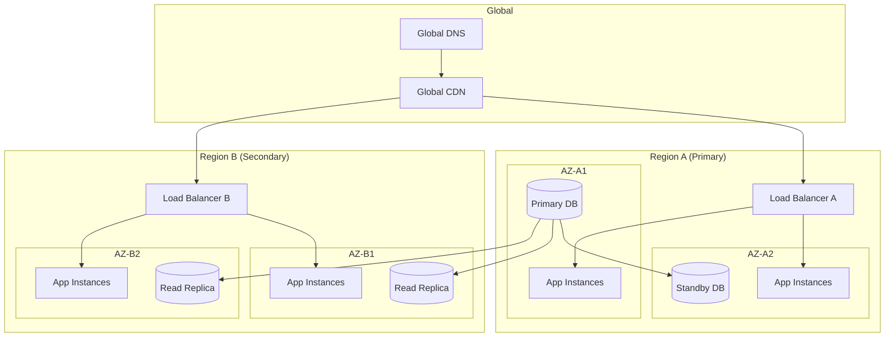
```mermaid
graph TB
    subgraph "Region A (Primary)"
        subgraph "AZ-A1"
            APP_A1[App Instances]
            DB_A1[(Primary DB)]
        end
        subgraph "AZ-A2"
            APP_A2[App Instances]
            DB_A2[(Standby DB)]
        end
        LB_A[Load Balancer A]
    end
    
    subgraph "Region B (Secondary)"
        subgraph "AZ-B1"
            APP_B1[App Instances]
            DB_B1[(Read Replica)]
        end
        subgraph "AZ-B2"
            APP_B2[App Instances]
            DB_B2[(Read Replica)]
        end
        LB_B[Load Balancer B]
    end
    
    subgraph "Global"
        DNS[Global DNS]
        CDN[Global CDN]
    end
    
    DNS --> CDN
    CDN --> LB_A
    CDN --> LB_B
    LB_A --> APP_A1
    LB_A --> APP_A2
    LB_B --> APP_B1
    LB_B --> APP_B2
    
    DB_A1 --> DB_A2
    DB_A1 --> DB_B1
    DB_A1 --> DB_B2
```

#### 10.1.2 故障轉移策略
```java
@Component
public class FailoverManager {
    
    private final List<DataSource> dataSources;
    private final CircuitBreakerRegistry circuitBreakerRegistry;
    private volatile DataSource primaryDataSource;
    private volatile DataSource fallbackDataSource;
    
    @EventListener
    public void handleDatabaseFailure(DatabaseFailureEvent event) {
        log.warn("Database failure detected: {}", event.getDataSourceName());
        
        if (event.getDataSourceName().equals("primary")) {
            performFailover();
        }
    }
    
    private void performFailover() {
        log.info("開始執行資料庫故障轉移");
        
        // 1. 停止寫入操作到主資料庫
        stopWriteOperations();
        
        // 2. 等待從資料庫同步完成
        waitForReplicationSync();
        
        // 3. 提升從資料庫為主資料庫
        promoteSecondaryToPrimary();
        
        // 4. 更新連線配置
        updateConnectionConfiguration();
        
        // 5. 恢復應用程式服務
        resumeApplicationServices();
        
        log.info("資料庫故障轉移完成");
    }
    
    @Retryable(value = {Exception.class}, maxAttempts = 3)
    public void promoteSecondaryToPrimary() {
        // 提升邏輯
        DatabasePromotionService.promote(fallbackDataSource);
    }
}
```

### 10.2 備份策略

#### 10.2.1 資料庫備份設計
```yaml
# backup/database-backup-cronjob.yaml
apiVersion: batch/v1
kind: CronJob
metadata:
  name: database-backup
  namespace: common-platform
spec:
  schedule: "0 2 * * *"  # 每天凌晨 2 點
  jobTemplate:
    spec:
      template:
        spec:
          containers:
          - name: pg-dump
            image: postgres:14
            command:
            - /bin/bash
            - -c
            - |
              # 設定備份檔案名稱
              BACKUP_FILE="backup-$(date +%Y%m%d-%H%M%S).sql"
              
              # 執行資料庫備份
              pg_dump -h $DB_HOST -U $DB_USER -d $DB_NAME > /backup/$BACKUP_FILE
              
              # 壓縮備份檔案
              gzip /backup/$BACKUP_FILE
              
              # 上傳到 S3
              aws s3 cp /backup/$BACKUP_FILE.gz s3://$BACKUP_BUCKET/database/
              
              # 清理本地檔案
              rm /backup/$BACKUP_FILE.gz
              
              # 清理超過 30 天的備份
              aws s3 ls s3://$BACKUP_BUCKET/database/ | \
              awk '{print $4}' | \
              while read file; do
                file_date=$(echo $file | grep -o '[0-9]\{8\}')
                if [[ $(date -d "$file_date" +%s) -lt $(date -d "30 days ago" +%s) ]]; then
                  aws s3 rm s3://$BACKUP_BUCKET/database/$file
                fi
              done
            env:
            - name: DB_HOST
              value: "postgresql-service"
            - name: DB_USER
              valueFrom:
                secretKeyRef:
                  name: db-credentials
                  key: username
            - name: DB_NAME
              value: "common_platform"
            - name: PGPASSWORD
              valueFrom:
                secretKeyRef:
                  name: db-credentials
                  key: password
            - name: BACKUP_BUCKET
              value: "company-database-backups"
            - name: AWS_ACCESS_KEY_ID
              valueFrom:
                secretKeyRef:
                  name: aws-credentials
                  key: access-key-id
            - name: AWS_SECRET_ACCESS_KEY
              valueFrom:
                secretKeyRef:
                  name: aws-credentials
                  key: secret-access-key
            volumeMounts:
            - name: backup-storage
              mountPath: /backup
          volumes:
          - name: backup-storage
            emptyDir: {}
          restartPolicy: OnFailure
  successfulJobsHistoryLimit: 3
  failedJobsHistoryLimit: 1
```

#### 10.2.2 應用程式狀態備份
```java
@Component
@Slf4j
public class ApplicationStateBackupService {
    
    private final RedisTemplate<String, Object> redisTemplate;
    private final ConfigurationRepository configurationRepository;
    private final S3Client s3Client;
    
    @Scheduled(cron = "0 0 */6 * * *")  // 每 6 小時備份一次
    public void backupApplicationState() {
        try {
            log.info("開始應用程式狀態備份");
            
            // 1. 備份 Redis 快取數據
            backupRedisData();
            
            // 2. 備份應用程式配置
            backupApplicationConfig();
            
            // 3. 備份使用者會話
            backupUserSessions();
            
            // 4. 上傳到雲端儲存
            uploadBackupToCloud();
            
            log.info("應用程式狀態備份完成");
            
        } catch (Exception e) {
            log.error("應用程式狀態備份失敗", e);
            sendAlertNotification("應用程式狀態備份失敗: " + e.getMessage());
        }
    }
    
    private void backupRedisData() {
        Set<String> keys = redisTemplate.keys("*");
        Map<String, Object> redisData = new HashMap<>();
        
        for (String key : keys) {
            redisData.put(key, redisTemplate.opsForValue().get(key));
        }
        
        String backupJson = objectMapper.writeValueAsString(redisData);
        saveBackupFile("redis-backup.json", backupJson);
    }
    
    private void backupApplicationConfig() {
        List<Configuration> configs = configurationRepository.findAll();
        String configJson = objectMapper.writeValueAsString(configs);
        saveBackupFile("config-backup.json", configJson);
    }
}
```

### 10.3 災難復原計畫

#### 10.3.1 RTO/RPO 目標設定
```yaml
# disaster-recovery/rto-rpo-targets.yaml
disaster_recovery_objectives:
  critical_services:
    - service: "user-authentication"
      rto: "5 minutes"      # 恢復時間目標
      rpo: "1 minute"       # 恢復點目標
      priority: 1
      
    - service: "payment-processing"
      rto: "10 minutes"
      rpo: "30 seconds"
      priority: 1
      
    - service: "order-management"
      rto: "15 minutes"
      rpo: "5 minutes"
      priority: 2
      
  non_critical_services:
    - service: "reporting"
      rto: "4 hours"
      rpo: "1 hour"
      priority: 3
      
    - service: "analytics"
      rto: "24 hours"
      rpo: "12 hours"
      priority: 4

recovery_procedures:
  database_failure:
    steps:
      1. "檢測故障 (自動監控)"
      2. "確認故障範圍"
      3. "切換到備用資料庫"
      4. "驗證資料完整性"
      5. "恢復應用程式連線"
      6. "監控系統狀態"
      
  application_failure:
    steps:
      1. "重啟失敗的應用程式實例"
      2. "檢查應用程式日誌"
      3. "如果重啟失敗，回滾到前一版本"
      4. "通知開發團隊"
      5. "建立事故報告"
```

#### 10.3.2 自動化災難復原腳本
```bash
#!/bin/bash
# disaster-recovery/auto-recovery.sh

set -e

# 災難復原主腳本
DR_CONFIG_FILE="/etc/dr/config.yaml"
LOG_FILE="/var/log/disaster-recovery.log"

log() {
    echo "$(date '+%Y-%m-%d %H:%M:%S') - $1" | tee -a $LOG_FILE
}

check_service_health() {
    local service_name=$1
    local health_endpoint=$2
    
    log "檢查服務健康狀態: $service_name"
    
    response=$(curl -s -o /dev/null -w "%{http_code}" $health_endpoint)
    
    if [ $response -eq 200 ]; then
        log "服務 $service_name 運行正常"
        return 0
    else
        log "服務 $service_name 異常，HTTP 狀態碼: $response"
        return 1
    fi
}

failover_database() {
    log "開始資料庫故障轉移程序"
    
    # 1. 停止寫入操作
    kubectl patch deployment common-platform -p '{"spec":{"replicas":0}}'
    
    # 2. 等待連線排空
    sleep 30
    
    # 3. 提升備用資料庫
    kubectl exec -it postgresql-standby -- pg_promote
    
    # 4. 更新應用程式配置
    kubectl patch configmap app-config --type merge -p '{"data":{"database.host":"postgresql-standby"}}'
    
    # 5. 重啟應用程式
    kubectl patch deployment common-platform -p '{"spec":{"replicas":3}}'
    
    # 6. 等待應用程式啟動
    kubectl rollout status deployment/common-platform --timeout=300s
    
    log "資料庫故障轉移完成"
}

restore_from_backup() {
    local backup_date=$1
    
    log "開始從備份還原: $backup_date"
    
    # 1. 下載備份檔案
    aws s3 cp s3://company-database-backups/database/backup-$backup_date.sql.gz /tmp/
    
    # 2. 解壓縮
    gunzip /tmp/backup-$backup_date.sql.gz
    
    # 3. 還原資料庫
    kubectl exec -it postgresql-primary -- psql -U postgres -d common_platform < /tmp/backup-$backup_date.sql
    
    # 4. 清理暫存檔案
    rm /tmp/backup-$backup_date.sql
    
    log "從備份還原完成"
}

send_notification() {
    local message=$1
    local severity=$2
    
    # 發送到 Slack
    curl -X POST -H 'Content-type: application/json' \
        --data "{\"text\":\"[$severity] Disaster Recovery Alert: $message\"}" \
        $SLACK_WEBHOOK_URL
    
    # 發送郵件
    echo "$message" | mail -s "[$severity] DR Alert" $ALERT_EMAIL
}

main() {
    log "災難復原腳本開始執行"
    
    # 檢查關鍵服務
    if ! check_service_health "common-platform" "http://common-platform-service:8080/actuator/health"; then
        log "應用程式服務異常，開始復原程序"
        
        # 嘗試重啟
        kubectl rollout restart deployment/common-platform
        kubectl rollout status deployment/common-platform --timeout=180s
        
        if check_service_health "common-platform" "http://common-platform-service:8080/actuator/health"; then
            log "應用程式服務已成功重啟"
            send_notification "應用程式服務已自動重啟並恢復正常" "INFO"
        else
            log "應用程式重啟失敗，需要人工介入"
            send_notification "應用程式服務重啟失敗，需要人工介入" "CRITICAL"
        fi
    fi
    
    # 檢查資料庫
    if ! check_service_health "database" "http://postgresql-service:5432"; then
        log "資料庫服務異常，開始故障轉移"
        failover_database
        send_notification "資料庫已自動故障轉移" "WARNING"
    fi
    
    log "災難復原腳本執行完成"
}

# 執行主函數
main "$@"
```

---

## 11. 測試策略設計

### 8.1 系統架構圖

#### 8.1.1 高層架構圖
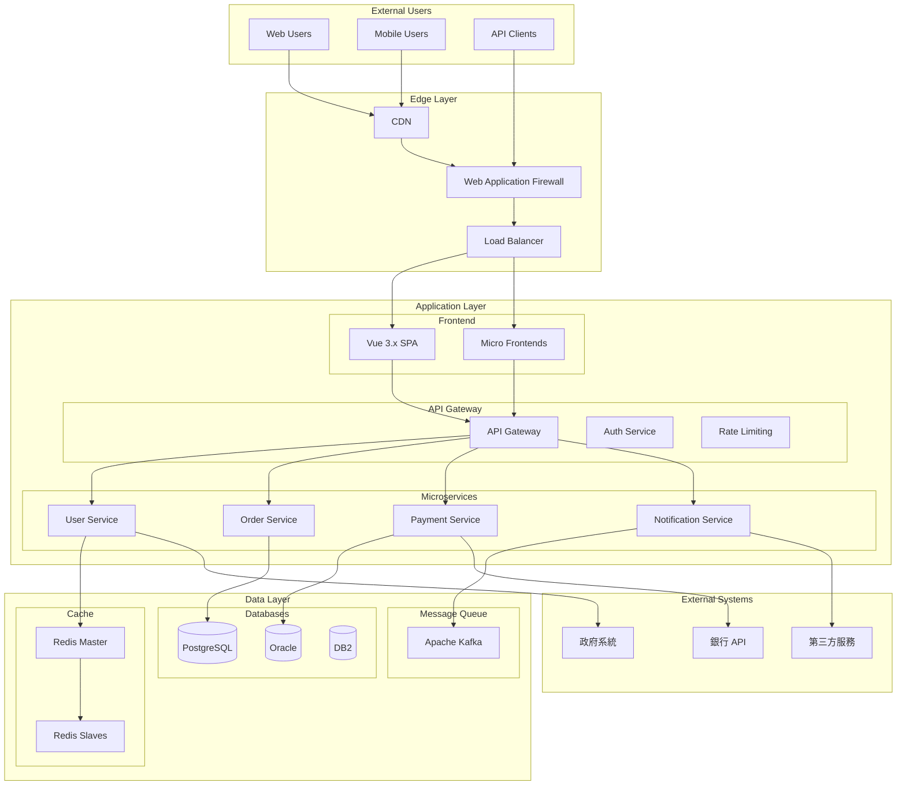
```mermaid
graph TB
    subgraph "External Users"
        WEB[Web Users]
        MOBILE[Mobile Users]
        API_CLIENTS[API Clients]
    end
    
    subgraph "Edge Layer"
        CDN[CDN]
        WAF[Web Application Firewall]
        LB[Load Balancer]
    end
    
    subgraph "Application Layer"
        subgraph "Frontend"
            VUE[Vue 3.x SPA]
            MICRO[Micro Frontends]
        end
        
        subgraph "API Gateway"
            GATEWAY[API Gateway]
            AUTH_SVC[Auth Service]
            RATE_LIMIT[Rate Limiting]
        end
        
        subgraph "Microservices"
            USER_SVC[User Service]
            ORDER_SVC[Order Service]
            PAYMENT_SVC[Payment Service]
            NOTIFY_SVC[Notification Service]
        end
    end
    
    subgraph "Data Layer"
        subgraph "Cache"
            REDIS_MASTER[Redis Master]
            REDIS_SLAVE[Redis Slaves]
        end
        
        subgraph "Databases"
            ORACLE[(Oracle)]
            POSTGRES[(PostgreSQL)]
            DB2[(DB2)]
        end
        
        subgraph "Message Queue"
            KAFKA[Apache Kafka]
        end
    end
    
    subgraph "External Systems"
        BANK_API[銀行 API]
        GOVT_API[政府系統]
        THIRD_PARTY[第三方服務]
    end
    
    WEB --> CDN
    MOBILE --> CDN
    API_CLIENTS --> WAF
    CDN --> WAF
    WAF --> LB
    LB --> VUE
    LB --> MICRO
    VUE --> GATEWAY
    MICRO --> GATEWAY
    GATEWAY --> USER_SVC
    GATEWAY --> ORDER_SVC
    GATEWAY --> PAYMENT_SVC
    GATEWAY --> NOTIFY_SVC
    
    USER_SVC --> REDIS_MASTER
    ORDER_SVC --> POSTGRES
    PAYMENT_SVC --> ORACLE
    NOTIFY_SVC --> KAFKA
    
    REDIS_MASTER --> REDIS_SLAVE
    
    PAYMENT_SVC --> BANK_API
    USER_SVC --> GOVT_API
    NOTIFY_SVC --> THIRD_PARTY
```

#### 8.1.2 部署架構圖
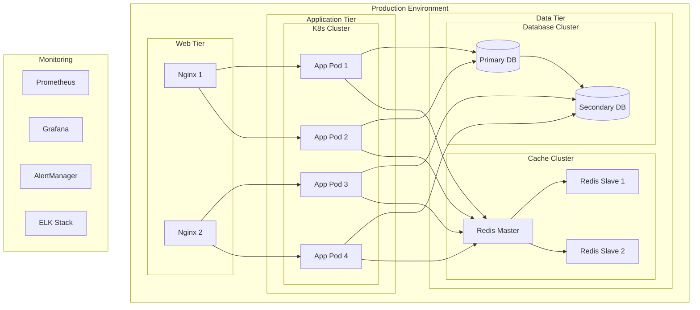
```mermaid
graph TB
    subgraph "Production Environment"
        subgraph "Web Tier"
            NGINX1[Nginx 1]
            NGINX2[Nginx 2]
        end
        
        subgraph "Application Tier"
            subgraph "K8s Cluster"
                POD1[App Pod 1]
                POD2[App Pod 2]
                POD3[App Pod 3]
                POD4[App Pod 4]
            end
        end
        
        subgraph "Data Tier"
            subgraph "Database Cluster"
                DB_PRIMARY[(Primary DB)]
                DB_SECONDARY[(Secondary DB)]
            end
            
            subgraph "Cache Cluster"
                REDIS_M[Redis Master]
                REDIS_S1[Redis Slave 1]
                REDIS_S2[Redis Slave 2]
            end
        end
    end
    
    subgraph "Monitoring"
        PROMETHEUS[Prometheus]
        GRAFANA[Grafana]
        ALERTMANAGER[AlertManager]
        ELK[ELK Stack]
    end
    
    NGINX1 --> POD1
    NGINX1 --> POD2
    NGINX2 --> POD3
    NGINX2 --> POD4
    
    POD1 --> DB_PRIMARY
    POD2 --> DB_PRIMARY
    POD3 --> DB_SECONDARY
    POD4 --> DB_SECONDARY
    
    POD1 --> REDIS_M
    POD2 --> REDIS_M
    POD3 --> REDIS_M
    POD4 --> REDIS_M
    
    DB_PRIMARY --> DB_SECONDARY
    REDIS_M --> REDIS_S1
    REDIS_M --> REDIS_S2
```

### 8.2 安全性檢核清單

#### 8.2.1 開發階段檢核項目
- [ ] **程式碼安全檢查**
  - [ ] 靜態程式碼分析 (SonarQube)
  - [ ] 相依性漏洞掃描 (OWASP Dependency Check)
  - [ ] 程式碼審查包含安全性檢查
  
- [ ] **輸入驗證**
  - [ ] 所有使用者輸入都經過驗證
  - [ ] 參數化查詢防止 SQL 注入
  - [ ] 適當的輸入長度限制
  
- [ ] **身份驗證與授權**
  - [ ] 強密碼策略實施
  - [ ] 多因子認證 (MFA) 支援
  - [ ] 適當的權限控制 (RBAC)
  - [ ] Session 管理安全

#### 8.2.2 部署階段檢核項目
- [ ] **基礎設施安全**
  - [ ] 容器映像安全掃描
  - [ ] 網路分段與防火牆規則
  - [ ] 加密傳輸 (TLS 1.3)
  - [ ] 安全的密鑰管理
  
- [ ] **監控與日誌**
  - [ ] 安全事件監控
  - [ ] 異常行為偵測
  - [ ] 完整的稽核日誌
  - [ ] 事故回應程序

#### 8.2.3 維運階段檢核項目
- [ ] **定期安全評估**
  - [ ] 滲透測試
  - [ ] 漏洞評估
  - [ ] 安全政策審查
  - [ ] 員工安全訓練

### 8.3 API 規格文件範本

#### 8.3.1 標準 API 回應格式
```json
{
  "status": "success|error",
  "code": "HTTP狀態碼",
  "message": "回應訊息",
  "data": {
    // 實際資料
  },
  "meta": {
    "timestamp": "2025-01-11T10:30:00Z",
    "requestId": "uuid",
    "version": "1.0.0"
  },
  "pagination": {
    "page": 1,
    "size": 20,
    "total": 100,
    "totalPages": 5
  }
}
```

#### 8.3.2 錯誤回應格式
```json
{
  "status": "error",
  "code": 400,
  "message": "請求參數錯誤",
  "errors": [
    {
      "field": "email",
      "code": "INVALID_FORMAT",
      "message": "電子郵件格式不正確"
    }
  ],
  "meta": {
    "timestamp": "2025-01-11T10:30:00Z",
    "requestId": "uuid",
    "version": "1.0.0"
  }
}
```

### 8.4 文件維護指引

#### 8.4.1 文件版本控制
- **版本號格式**: 使用語義化版本控制 (Semantic Versioning)
- **主要版本**: 架構重大變更或不相容變更
- **次要版本**: 新功能添加但保持向後相容
- **修訂版本**: 錯誤修正和小幅改進

#### 8.4.2 文件審查流程
1. **編寫**: 系統架構師或技術主管編寫初稿
2. **技術審查**: 技術團隊進行技術正確性審查
3. **安全審查**: 資安團隊進行安全性審查
4. **管理審查**: 專案經理進行完整性審查
5. **核准發布**: 技術總監最終核准

#### 8.4.3 文件更新觸發條件
- 系統架構重大變更
- 技術棧升級或替換
- 安全要求變更
- 法規遵循要求更新
- 效能需求調整

---

## 11. 測試策略設計

### 11.1 測試層級規劃

#### 11.1.1 測試金字塔架構
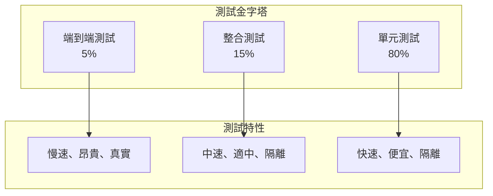
```mermaid
graph TB
    subgraph "測試金字塔"
        E2E[端到端測試<br/>5%]
        INTEGRATION[整合測試<br/>15%]
        UNIT[單元測試<br/>80%]
    end
    
    subgraph "測試特性"
        E2E --> E2E_CHAR[慢速、昂貴、真實]
        INTEGRATION --> INT_CHAR[中速、適中、隔離]
        UNIT --> UNIT_CHAR[快速、便宜、隔離]
    end
```

#### 11.1.2 單元測試策略
```java
// JUnit 5 + Mockito 測試範例
@ExtendWith(MockitoExtension.class)
class UserServiceTest {
    
    @Mock
    private UserRepository userRepository;
    
    @Mock
    private EmailService emailService;
    
    @InjectMocks
    private UserService userService;
    
    @Test
    @DisplayName("建立使用者成功")
    void createUser_Success() {
        // Given
        CreateUserRequest request = CreateUserRequest.builder()
                .username("testuser")
                .email("test@example.com")
                .build();
        
        User savedUser = User.builder()
                .id(1L)
                .username("testuser")
                .email("test@example.com")
                .build();
        
        when(userRepository.save(any(User.class))).thenReturn(savedUser);
        
        // When
        User result = userService.createUser(request);
        
        // Then
        assertThat(result.getId()).isEqualTo(1L);
        assertThat(result.getUsername()).isEqualTo("testuser");
        verify(emailService).sendWelcomeEmail(result.getEmail());
    }
    
    @Test
    @DisplayName("建立使用者失敗 - 重複的使用者名稱")
    void createUser_DuplicateUsername_ThrowsException() {
        // Given
        CreateUserRequest request = CreateUserRequest.builder()
                .username("existinguser")
                .email("test@example.com")
                .build();
        
        when(userRepository.existsByUsername("existinguser")).thenReturn(true);
        
        // When & Then
        assertThatThrownBy(() -> userService.createUser(request))
                .isInstanceOf(UserAlreadyExistsException.class)
                .hasMessage("使用者名稱已存在: existinguser");
        
        verify(userRepository, never()).save(any(User.class));
        verify(emailService, never()).sendWelcomeEmail(anyString());
    }
}
```

#### 11.1.3 整合測試策略

```java
// Spring Boot 整合測試
@SpringBootTest(webEnvironment = SpringBootTest.WebEnvironment.RANDOM_PORT)
@TestPropertySource(locations = "classpath:application-test.properties")
@Testcontainers
class UserControllerIntegrationTest {
    
    @Container
    static PostgreSQLContainer<?> postgres = new PostgreSQLContainer<>("postgres:15")
            .withDatabaseName("testdb")
            .withUsername("test")
            .withPassword("test");
    
    @Autowired
    private TestRestTemplate restTemplate;
    
    @Autowired
    private UserRepository userRepository;
    
    @Test
    void createUser_IntegrationTest() {
        // Given
        CreateUserRequest request = CreateUserRequest.builder()
                .username("integrationtest")
                .email("integration@test.com")
                .build();
        
        // When
        ResponseEntity<User> response = restTemplate.postForEntity(
                "/api/users", request, User.class);
        
        // Then
        assertThat(response.getStatusCode()).isEqualTo(HttpStatus.CREATED);
        assertThat(response.getBody().getUsername()).isEqualTo("integrationtest");
        
        // 驗證資料庫中的資料
        Optional<User> savedUser = userRepository.findByUsername("integrationtest");
        assertThat(savedUser).isPresent();
    }
}
```

#### 11.1.4 測試設計模式

**Page Object Model (POM) 模式**

```java
// 頁面物件基底類
public abstract class BasePage {
    
    protected WebDriver driver;
    protected WebDriverWait wait;
    
    public BasePage(WebDriver driver) {
        this.driver = driver;
        this.wait = new WebDriverWait(driver, Duration.ofSeconds(10));
        PageFactory.initElements(driver, this);
    }
    
    protected void waitForElementVisible(WebElement element) {
        wait.until(ExpectedConditions.visibilityOf(element));
    }
    
    protected void waitForElementClickable(WebElement element) {
        wait.until(ExpectedConditions.elementToBeClickable(element));
    }
}

// 使用者登入頁面物件
public class LoginPage extends BasePage {
    
    @FindBy(id = "username")
    private WebElement usernameField;
    
    @FindBy(id = "password")
    private WebElement passwordField;
    
    @FindBy(id = "loginButton")
    private WebElement loginButton;
    
    @FindBy(className = "error-message")
    private WebElement errorMessage;
    
    public LoginPage(WebDriver driver) {
        super(driver);
    }
    
    public LoginPage enterUsername(String username) {
        waitForElementVisible(usernameField);
        usernameField.clear();
        usernameField.sendKeys(username);
        return this;
    }
    
    public LoginPage enterPassword(String password) {
        waitForElementVisible(passwordField);
        passwordField.clear();
        passwordField.sendKeys(password);
        return this;
    }
    
    public UserDashboardPage clickLogin() {
        waitForElementClickable(loginButton);
        loginButton.click();
        return new UserDashboardPage(driver);
    }
    
    public String getErrorMessage() {
        waitForElementVisible(errorMessage);
        return errorMessage.getText();
    }
}

// 使用頁面物件的測試
@Test
void loginWithValidCredentials_ShouldNavigateToDashboard() {
    // Given
    LoginPage loginPage = new LoginPage(driver);
    
    // When
    UserDashboardPage dashboardPage = loginPage
            .enterUsername("testuser")
            .enterPassword("password123")
            .clickLogin();
    
    // Then
    assertThat(dashboardPage.isDisplayed()).isTrue();
    assertThat(dashboardPage.getWelcomeMessage()).contains("Welcome, testuser");
}
```

**Builder 模式用於測試資料建立**

```java
// 測試資料建構器
public class UserTestDataBuilder {
    
    private String username = "defaultuser";
    private String email = "default@example.com";
    private String firstName = "Default";
    private String lastName = "User";
    private UserRole role = UserRole.USER;
    private boolean active = true;
    
    public static UserTestDataBuilder aUser() {
        return new UserTestDataBuilder();
    }
    
    public UserTestDataBuilder withUsername(String username) {
        this.username = username;
        return this;
    }
    
    public UserTestDataBuilder withEmail(String email) {
        this.email = email;
        return this;
    }
    
    public UserTestDataBuilder withRole(UserRole role) {
        this.role = role;
        return this;
    }
    
    public UserTestDataBuilder inactive() {
        this.active = false;
        return this;
    }
    
    public User build() {
        return User.builder()
                .username(username)
                .email(email)
                .firstName(firstName)
                .lastName(lastName)
                .role(role)
                .active(active)
                .build();
    }
    
    public CreateUserRequest buildRequest() {
        return CreateUserRequest.builder()
                .username(username)
                .email(email)
                .firstName(firstName)
                .lastName(lastName)
                .role(role)
                .build();
    }
}

// 使用建構器的測試
@Test
void createAdminUser_ShouldHaveAdminPrivileges() {
    // Given
    User adminUser = UserTestDataBuilder.aUser()
            .withUsername("admin")
            .withEmail("admin@company.com")
            .withRole(UserRole.ADMIN)
            .build();
    
    // When
    User savedUser = userRepository.save(adminUser);
    
    // Then
    assertThat(savedUser.getRole()).isEqualTo(UserRole.ADMIN);
    assertThat(savedUser.hasAdminPrivileges()).isTrue();
}
```

**Repository 模式用於測試資料管理**

```java
// 測試資料儲存庫
@TestConfiguration
public class TestDataRepository {
    
    @Autowired
    private UserRepository userRepository;
    
    @Autowired
    private OrderRepository orderRepository;
    
    public User createTestUser(String username) {
        User user = UserTestDataBuilder.aUser()
                .withUsername(username)
                .withEmail(username + "@test.com")
                .build();
        return userRepository.save(user);
    }
    
    public Order createTestOrder(User user, int itemCount) {
        Order order = OrderTestDataBuilder.anOrder()
                .withUser(user)
                .withItemCount(itemCount)
                .build();
        return orderRepository.save(order);
    }
    
    public void cleanupTestData() {
        orderRepository.deleteAll();
        userRepository.deleteAll();
    }
}

// 在測試中使用
@SpringBootTest
class OrderServiceIntegrationTest {
    
    @Autowired
    private TestDataRepository testDataRepository;
    
    @Autowired
    private OrderService orderService;
    
    @Test
    void processOrder_WithValidUser_ShouldCreateOrder() {
        // Given
        User testUser = testDataRepository.createTestUser("testuser");
        
        // When
        Order result = orderService.createOrder(testUser.getId(), createOrderRequest());
        
        // Then
        assertThat(result.getUser().getId()).isEqualTo(testUser.getId());
        assertThat(result.getStatus()).isEqualTo(OrderStatus.CREATED);
    }
    
    @AfterEach
    void cleanup() {
        testDataRepository.cleanupTestData();
    }
}
```

**策略模式用於測試環境配置**

```java
// 測試環境策略介面
public interface TestEnvironmentStrategy {
    void setup();
    void teardown();
    DatabaseContainer createDatabase();
    MessageBroker createMessageBroker();
}

// 本地測試環境策略
@Component
@Profile("test-local")
public class LocalTestEnvironmentStrategy implements TestEnvironmentStrategy {
    
    @Override
    public void setup() {
        // 設定 H2 內存資料庫
        // 設定內嵌 Kafka
    }
    
    @Override
    public DatabaseContainer createDatabase() {
        return new H2TestContainer();
    }
    
    @Override
    public MessageBroker createMessageBroker() {
        return new EmbeddedKafka();
    }
    
    @Override
    public void teardown() {
        // 清理資源
    }
}

// Docker 測試環境策略
@Component
@Profile("test-docker")
public class DockerTestEnvironmentStrategy implements TestEnvironmentStrategy {
    
    @Override
    public void setup() {
        // 啟動 Docker 容器
    }
    
    @Override
    public DatabaseContainer createDatabase() {
        return new PostgreSQLContainer<>("postgres:15");
    }
    
    @Override
    public MessageBroker createMessageBroker() {
        return new KafkaContainer(DockerImageName.parse("confluentinc/cp-kafka:7.4.0"));
    }
    
    @Override
    public void teardown() {
        // 停止容器
    }
}
```

### 11.2 自動化測試流程

#### 11.2.1 CI/CD 測試整合
```yaml
# GitHub Actions 測試流程
name: Test Pipeline

on:
  push:
    branches: [ main, develop ]
  pull_request:
    branches: [ main ]

jobs:
  test:
    runs-on: ubuntu-latest
    
    services:
      postgres:
        image: postgres:15
        env:
          POSTGRES_PASSWORD: postgres
        options: >-
          --health-cmd pg_isready
          --health-interval 10s
          --health-timeout 5s
          --health-retries 5
    
    steps:
    - uses: actions/checkout@v3
    
    - name: Set up JDK 21
      uses: actions/setup-java@v3
      with:
        java-version: '21'
        distribution: 'temurin'
    
    - name: Cache Maven packages
      uses: actions/cache@v3
      with:
        path: ~/.m2
        key: ${{ runner.os }}-m2-${{ hashFiles('**/pom.xml') }}
    
    - name: Run unit tests
      run: mvn test
    
    - name: Run integration tests
      run: mvn verify -Pintegration-tests
    
    - name: Generate test report
      run: mvn surefire-report:report
    
    - name: Upload test results
      uses: actions/upload-artifact@v3
      if: always()
      with:
        name: test-results
        path: target/surefire-reports/
```

#### 11.2.2 效能測試策略
```java
// JMH 效能測試範例
@BenchmarkMode(Mode.AverageTime)
@OutputTimeUnit(TimeUnit.MILLISECONDS)
@State(Scope.Benchmark)
@Fork(value = 2, jvmArgs = {"-Xms2G", "-Xmx2G"})
@Warmup(iterations = 3)
@Measurement(iterations = 8)
public class UserServicePerformanceTest {
    
    private UserService userService;
    private List<CreateUserRequest> requests;
    
    @Setup
    public void setup() {
        userService = new UserService();
        requests = generateTestData(1000);
    }
    
    @Benchmark
    public void testUserCreationPerformance() {
        CreateUserRequest request = requests.get(
            ThreadLocalRandom.current().nextInt(requests.size())
        );
        userService.createUser(request);
    }
    
    @Benchmark
    public void testBatchUserCreation() {
        List<CreateUserRequest> batch = requests.subList(0, 100);
        userService.createUsersBatch(batch);
    }
}
```

### 11.3 測試資料管理

#### 11.3.1 測試資料策略
```java
// 測試資料建構器模式
@Component
public class TestDataBuilder {
    
    public static UserTestDataBuilder user() {
        return new UserTestDataBuilder();
    }
    
    public static class UserTestDataBuilder {
        private String username = "testuser";
        private String email = "test@example.com";
        private String firstName = "Test";
        private String lastName = "User";
        private UserRole role = UserRole.USER;
        
        public UserTestDataBuilder withUsername(String username) {
            this.username = username;
            return this;
        }
        
        public UserTestDataBuilder withEmail(String email) {
            this.email = email;
            return this;
        }
        
        public UserTestDataBuilder withAdminRole() {
            this.role = UserRole.ADMIN;
            return this;
        }
        
        public User build() {
            return User.builder()
                    .username(username)
                    .email(email)
                    .firstName(firstName)
                    .lastName(lastName)
                    .role(role)
                    .createdAt(LocalDateTime.now())
                    .build();
        }
        
        public CreateUserRequest buildRequest() {
            return CreateUserRequest.builder()
                    .username(username)
                    .email(email)
                    .firstName(firstName)
                    .lastName(lastName)
                    .build();
        }
    }
}

// 使用範例
@Test
void createAdminUser_Success() {
    // Given
    User adminUser = TestDataBuilder.user()
            .withUsername("admin")
            .withEmail("admin@company.com")
            .withAdminRole()
            .build();
    
    // When & Then
    // 測試邏輯...
}
```

---

## 12. 國際化與多語系設計

### 12.1 國際化架構設計

#### 12.1.1 前端國際化實作
```typescript
// Vue 3 + Vue I18n 國際化設定
import { createI18n } from 'vue-i18n'

// 語言檔案
const messages = {
  en: {
    welcome: 'Welcome to {appName}',
    user: {
      name: 'Name',
      email: 'Email',
      profile: 'User Profile'
    },
    validation: {
      required: 'This field is required',
      email: 'Please enter a valid email address'
    }
  },
  'zh-TW': {
    welcome: '歡迎使用 {appName}',
    user: {
      name: '姓名',
      email: '電子郵件',
      profile: '使用者資料'
    },
    validation: {
      required: '此欄位為必填',
      email: '請輸入有效的電子郵件地址'
    }
  },
  ja: {
    welcome: '{appName}へようこそ',
    user: {
      name: '名前',
      email: 'メール',
      profile: 'ユーザープロファイル'
    },
    validation: {
      required: 'この項目は必須です',
      email: '有効なメールアドレスを入力してください'
    }
  }
}

const i18n = createI18n({
  locale: 'zh-TW', // 預設語言
  fallbackLocale: 'en', // 備用語言
  messages,
  // 數字格式化
  numberFormats: {
    en: {
      currency: {
        style: 'currency',
        currency: 'USD'
      }
    },
    'zh-TW': {
      currency: {
        style: 'currency',
        currency: 'TWD'
      }
    }
  },
  // 日期格式化
  datetimeFormats: {
    en: {
      short: {
        year: 'numeric',
        month: 'short',
        day: 'numeric'
      }
    },
    'zh-TW': {
      short: {
        year: 'numeric',
        month: 'short',
        day: 'numeric'
      }
    }
  }
})

export default i18n
```

#### 12.1.2 後端國際化實作
```java
// Spring Boot 國際化配置
@Configuration
public class InternationalizationConfig implements WebMvcConfigurer {
    
    @Bean
    public LocaleResolver localeResolver() {
        AcceptHeaderLocaleResolver localeResolver = new AcceptHeaderLocaleResolver();
        localeResolver.setSupportedLocales(Arrays.asList(
            Locale.TRADITIONAL_CHINESE,
            Locale.SIMPLIFIED_CHINESE,
            Locale.ENGLISH,
            Locale.JAPANESE
        ));
        localeResolver.setDefaultLocale(Locale.TRADITIONAL_CHINESE);
        return localeResolver;
    }
    
    @Bean
    public MessageSource messageSource() {
        ResourceBundleMessageSource messageSource = new ResourceBundleMessageSource();
        messageSource.setBasenames("messages/messages");
        messageSource.setDefaultEncoding("UTF-8");
        messageSource.setCacheSeconds(3600);
        messageSource.setFallbackToSystemLocale(false);
        return messageSource;
    }
}

// 國際化訊息服務
@Service
public class MessageService {
    
    private final MessageSource messageSource;
    
    public MessageService(MessageSource messageSource) {
        this.messageSource = messageSource;
    }
    
    public String getMessage(String code, Object[] args, Locale locale) {
        return messageSource.getMessage(code, args, locale);
    }
    
    public String getMessage(String code, Locale locale) {
        return getMessage(code, null, locale);
    }
    
    public String getCurrentLocaleMessage(String code, Object... args) {
        Locale currentLocale = LocaleContextHolder.getLocale();
        return getMessage(code, args, currentLocale);
    }
}

// 控制器使用範例
@RestController
@RequestMapping("/api/users")
public class UserController {
    
    private final UserService userService;
    private final MessageService messageService;
    
    @PostMapping
    public ResponseEntity<ApiResponse<User>> createUser(
            @Valid @RequestBody CreateUserRequest request,
            Locale locale) {
        
        try {
            User user = userService.createUser(request);
            String successMessage = messageService.getMessage(
                "user.created.success", 
                new Object[]{user.getUsername()}, 
                locale
            );
            
            return ResponseEntity.ok(ApiResponse.success(user, successMessage));
            
        } catch (UserAlreadyExistsException e) {
            String errorMessage = messageService.getMessage(
                "user.already.exists", 
                new Object[]{request.getUsername()}, 
                locale
            );
            
            return ResponseEntity.badRequest()
                    .body(ApiResponse.error(errorMessage));
        }
    }
}
```

### 12.2 多語系資料庫設計

#### 12.2.1 多語系資料表設計
```sql
-- 主資料表
CREATE TABLE products (
    id BIGSERIAL PRIMARY KEY,
    sku VARCHAR(50) UNIQUE NOT NULL,
    price DECIMAL(10, 2) NOT NULL,
    stock_quantity INTEGER NOT NULL,
    created_at TIMESTAMP DEFAULT CURRENT_TIMESTAMP,
    updated_at TIMESTAMP DEFAULT CURRENT_TIMESTAMP
);

-- 多語系翻譯表
CREATE TABLE product_translations (
    id BIGSERIAL PRIMARY KEY,
    product_id BIGINT NOT NULL,
    language_code VARCHAR(10) NOT NULL,
    name VARCHAR(255) NOT NULL,
    description TEXT,
    short_description VARCHAR(500),
    meta_title VARCHAR(255),
    meta_description VARCHAR(500),
    created_at TIMESTAMP DEFAULT CURRENT_TIMESTAMP,
    updated_at TIMESTAMP DEFAULT CURRENT_TIMESTAMP,
    FOREIGN KEY (product_id) REFERENCES products(id) ON DELETE CASCADE,
    UNIQUE (product_id, language_code)
);

-- 索引優化
CREATE INDEX idx_product_translations_product_lang 
ON product_translations(product_id, language_code);

CREATE INDEX idx_product_translations_lang 
ON product_translations(language_code);
```

#### 12.2.2 多語系 JPA 實體設計
```java
// 主實體
@Entity
@Table(name = "products")
public class Product {
    
    @Id
    @GeneratedValue(strategy = GenerationType.IDENTITY)
    private Long id;
    
    @Column(unique = true, nullable = false)
    private String sku;
    
    @Column(nullable = false)
    private BigDecimal price;
    
    @Column(name = "stock_quantity")
    private Integer stockQuantity;
    
    @OneToMany(mappedBy = "product", cascade = CascadeType.ALL, fetch = FetchType.LAZY)
    private List<ProductTranslation> translations = new ArrayList<>();
    
    // 根據語言獲取翻譯
    public ProductTranslation getTranslation(String languageCode) {
        return translations.stream()
                .filter(t -> t.getLanguageCode().equals(languageCode))
                .findFirst()
                .orElse(getDefaultTranslation());
    }
    
    private ProductTranslation getDefaultTranslation() {
        return translations.stream()
                .filter(t -> t.getLanguageCode().equals("en"))
                .findFirst()
                .orElse(translations.isEmpty() ? null : translations.get(0));
    }
    
    // getters and setters...
}

// 翻譯實體
@Entity
@Table(name = "product_translations")
public class ProductTranslation {
    
    @Id
    @GeneratedValue(strategy = GenerationType.IDENTITY)
    private Long id;
    
    @ManyToOne(fetch = FetchType.LAZY)
    @JoinColumn(name = "product_id", nullable = false)
    private Product product;
    
    @Column(name = "language_code", nullable = false)
    private String languageCode;
    
    @Column(nullable = false)
    private String name;
    
    private String description;
    
    @Column(name = "short_description")
    private String shortDescription;
    
    @Column(name = "meta_title")
    private String metaTitle;
    
    @Column(name = "meta_description")
    private String metaDescription;
    
    // getters and setters...
}
```

### 12.3 地區化處理

#### 12.3.1 時區處理
```java
// 時區處理服務
@Service
public class TimezoneService {
    
    private static final String DEFAULT_TIMEZONE = "Asia/Taipei";
    
    public ZonedDateTime convertToUserTimezone(LocalDateTime utcDateTime, String userTimezone) {
        ZonedDateTime utcZoned = utcDateTime.atZone(ZoneOffset.UTC);
        ZoneId targetZone = ZoneId.of(userTimezone != null ? userTimezone : DEFAULT_TIMEZONE);
        return utcZoned.withZoneSameInstant(targetZone);
    }
    
    public LocalDateTime convertToUTC(ZonedDateTime userDateTime) {
        return userDateTime.withZoneSameInstant(ZoneOffset.UTC).toLocalDateTime();
    }
    
    @EventListener
    public void handleUserLogin(UserLoginEvent event) {
        User user = event.getUser();
        String userTimezone = user.getTimezone();
        
        // 設定使用者時區到 ThreadLocal
        TimeZoneContextHolder.setTimeZone(TimeZone.getTimeZone(userTimezone));
    }
}

// 前端時區處理
export class TimezoneService {
  private userTimezone: string;
  
  constructor() {
    this.userTimezone = Intl.DateTimeFormat().resolvedOptions().timeZone;
  }
  
  formatDateTime(utcDateTime: string, format: string = 'yyyy-MM-dd HH:mm'): string {
    const date = new Date(utcDateTime);
    return this.formatDate(date, format);
  }
  
  convertToUserTimezone(utcDateTime: string): Date {
    return new Date(utcDateTime);
  }
  
  convertToUTC(localDateTime: Date): string {
    return localDateTime.toISOString();
  }
  
  private formatDate(date: Date, format: string): string {
    return format
      .replace('yyyy', date.getFullYear().toString())
      .replace('MM', (date.getMonth() + 1).toString().padStart(2, '0'))
      .replace('dd', date.getDate().toString().padStart(2, '0'))
      .replace('HH', date.getHours().toString().padStart(2, '0'))
      .replace('mm', date.getMinutes().toString().padStart(2, '0'));
  }
}
```

---

## 13. 法規遵循設計

### 13.1 個人資料保護法遵循

#### 13.1.1 資料分類與標記
```java
// 個資分類註解
@Target({ElementType.FIELD, ElementType.METHOD})
@Retention(RetentionPolicy.RUNTIME)
public @interface PersonalData {
    DataCategory category() default DataCategory.GENERAL;
    DataSensitivity sensitivity() default DataSensitivity.NORMAL;
    String purpose() default "";
    boolean encrypted() default false;
    int retentionDays() default -1; // -1 表示無限期
}

public enum DataCategory {
    GENERAL,        // 一般個資
    SENSITIVE,      // 敏感個資
    FINANCIAL,      // 金融資料
    HEALTH,         // 健康資料
    BIOMETRIC       // 生物特徵
}

public enum DataSensitivity {
    PUBLIC,         // 公開資料
    INTERNAL,       // 內部資料
    CONFIDENTIAL,   // 機密資料
    RESTRICTED,     // 限制資料
    NORMAL          // 一般資料
}

// 使用者實體範例
@Entity
@Table(name = "users")
public class User {
    
    @Id
    @GeneratedValue(strategy = GenerationType.IDENTITY)
    private Long id;
    
    @PersonalData(category = DataCategory.GENERAL, purpose = "使用者識別")
    @Column(unique = true, nullable = false)
    private String username;
    
    @PersonalData(category = DataCategory.GENERAL, purpose = "聯絡通訊")
    @Column(nullable = false)
    private String email;
    
    @PersonalData(category = DataCategory.GENERAL, purpose = "身份識別")
    private String firstName;
    
    @PersonalData(category = DataCategory.GENERAL, purpose = "身份識別")
    private String lastName;
    
    @PersonalData(
        category = DataCategory.SENSITIVE, 
        sensitivity = DataSensitivity.CONFIDENTIAL,
        purpose = "身份驗證",
        encrypted = true
    )
    private String phoneNumber;
    
    @PersonalData(
        category = DataCategory.FINANCIAL,
        sensitivity = DataSensitivity.RESTRICTED,
        purpose = "交易處理",
        retentionDays = 2555 // 7年保存期限
    )
    private String bankAccount;
    
    // getters and setters...
}
```

#### 13.1.2 個資處理控制
```java
// 個資處理服務
@Service
public class PersonalDataService {
    
    private final DataEncryptionService encryptionService;
    private final DataAuditService auditService;
    private final DataRetentionService retentionService;
    
    @PostConstruct
    public void validatePersonalDataCompliance() {
        // 掃描所有實體的個資註解
        Set<Class<?>> entities = reflections.getTypesAnnotatedWith(Entity.class);
        
        for (Class<?> entityClass : entities) {
            validateEntityCompliance(entityClass);
        }
    }
    
    private void validateEntityCompliance(Class<?> entityClass) {
        Field[] fields = entityClass.getDeclaredFields();
        
        for (Field field : fields) {
            PersonalData annotation = field.getAnnotation(PersonalData.class);
            if (annotation != null) {
                validateFieldCompliance(field, annotation);
            }
        }
    }
    
    private void validateFieldCompliance(Field field, PersonalData annotation) {
        // 檢查敏感資料是否加密
        if (annotation.sensitivity() == DataSensitivity.CONFIDENTIAL || 
            annotation.sensitivity() == DataSensitivity.RESTRICTED) {
            if (!annotation.encrypted()) {
                throw new ComplianceViolationException(
                    String.format("敏感欄位 %s 必須加密", field.getName())
                );
            }
        }
        
        // 檢查保存期限設定
        if (annotation.category() == DataCategory.FINANCIAL && 
            annotation.retentionDays() <= 0) {
            throw new ComplianceViolationException(
                String.format("金融資料欄位 %s 必須設定保存期限", field.getName())
            );
        }
    }
    
    @EventListener
    public void handlePersonalDataAccess(PersonalDataAccessEvent event) {
        // 記錄個資存取日誌
        auditService.logDataAccess(
            event.getUserId(),
            event.getDataCategory(),
            event.getAccessType(),
            event.getPurpose(),
            event.getAccessTime()
        );
    }
    
    @Scheduled(cron = "0 0 2 * * ?") // 每日凌晨2點執行
    public void performDataRetentionCleanup() {
        retentionService.cleanupExpiredData();
    }
}

// 個資存取 AOP
@Aspect
@Component
public class PersonalDataAccessAspect {
    
    private final PersonalDataService personalDataService;
    
    @Around("@annotation(DataAccess)")
    public Object logDataAccess(ProceedingJoinPoint joinPoint, DataAccess dataAccess) throws Throwable {
        String userId = getCurrentUserId();
        String method = joinPoint.getSignature().getName();
        
        try {
            Object result = joinPoint.proceed();
            
            // 記錄成功存取
            applicationEventPublisher.publishEvent(new PersonalDataAccessEvent(
                userId, dataAccess.category(), AccessType.READ, dataAccess.purpose()
            ));
            
            return result;
            
        } catch (Exception e) {
            // 記錄存取失敗
            applicationEventPublisher.publishEvent(new PersonalDataAccessFailureEvent(
                userId, dataAccess.category(), e.getMessage()
            ));
            throw e;
        }
    }
}
```

### 13.2 金融法規遵循

#### 13.2.1 反洗錢 (AML) 監控
```java
// AML 交易監控服務
@Service
public class AmlMonitoringService {
    
    private final TransactionRepository transactionRepository;
    private final SuspiciousActivityReportService sarService;
    private final RiskScoringEngine riskEngine;
    
    @EventListener
    @Async
    public void monitorTransaction(TransactionCreatedEvent event) {
        Transaction transaction = event.getTransaction();
        
        // 即時交易監控
        List<AmlRule> triggeredRules = evaluateAmlRules(transaction);
        
        if (!triggeredRules.isEmpty()) {
            handleSuspiciousActivity(transaction, triggeredRules);
        }
        
        // 更新客戶風險評分
        updateCustomerRiskScore(transaction.getCustomerId());
    }
    
    private List<AmlRule> evaluateAmlRules(Transaction transaction) {
        List<AmlRule> triggeredRules = new ArrayList<>();
        
        // 規則1: 大額交易
        if (transaction.getAmount().compareTo(new BigDecimal("50000")) >= 0) {
            triggeredRules.add(AmlRule.LARGE_TRANSACTION);
        }
        
        // 規則2: 異常頻繁交易
        if (isFrequentTransaction(transaction)) {
            triggeredRules.add(AmlRule.FREQUENT_TRANSACTIONS);
        }
        
        // 規則3: 跨境交易風險
        if (isSuspiciousCrossBorderTransaction(transaction)) {
            triggeredRules.add(AmlRule.SUSPICIOUS_CROSS_BORDER);
        }
        
        // 規則4: 異常時間交易
        if (isOffHourTransaction(transaction)) {
            triggeredRules.add(AmlRule.OFF_HOUR_TRANSACTION);
        }
        
        return triggeredRules;
    }
    
    private void handleSuspiciousActivity(Transaction transaction, List<AmlRule> rules) {
        SuspiciousActivity activity = SuspiciousActivity.builder()
                .transactionId(transaction.getId())
                .customerId(transaction.getCustomerId())
                .triggeredRules(rules)
                .riskScore(riskEngine.calculateRiskScore(transaction))
                .status(SuspiciousActivityStatus.UNDER_REVIEW)
                .detectedAt(LocalDateTime.now())
                .build();
        
        suspiciousActivityRepository.save(activity);
        
        // 高風險案件立即通報
        if (activity.getRiskScore() >= 80) {
            sarService.submitSuspiciousActivityReport(activity);
        }
        
        // 通知合規團隊
        notificationService.notifyComplianceTeam(activity);
    }
    
    @Scheduled(cron = "0 0 1 * * ?") // 每日凌晨1點執行
    public void generateDailyAmlReport() {
        LocalDate yesterday = LocalDate.now().minusDays(1);
        
        AmlDailyReport report = AmlDailyReport.builder()
                .reportDate(yesterday)
                .totalTransactions(getTransactionCount(yesterday))
                .flaggedTransactions(getFlaggedTransactionCount(yesterday))
                .suspiciousActivities(getSuspiciousActivityCount(yesterday))
                .riskDistribution(getRiskDistribution(yesterday))
                .build();
        
        amlReportService.saveReport(report);
        
        // 如果異常交易比例超過閾值，發送警告
        double suspiciousRatio = (double) report.getFlaggedTransactions() / report.getTotalTransactions();
        if (suspiciousRatio > 0.05) { // 5% 閾值
            alertService.sendHighRiskAlert(report);
        }
    }
}
```

#### 13.2.2 KYC (Know Your Customer) 流程
```java
// KYC 驗證服務
@Service
public class KycService {
    
    private final IdentityVerificationService identityService;
    private final DocumentVerificationService documentService;
    private final BiometricVerificationService biometricService;
    private final WatchlistScreeningService watchlistService;
    
    public KycResult performKycVerification(KycRequest request) {
        KycResult result = new KycResult();
        result.setCustomerId(request.getCustomerId());
        result.setStartTime(LocalDateTime.now());
        
        try {
            // 步驟1: 身份資料驗證
            IdentityVerificationResult identityResult = 
                identityService.verifyIdentity(request.getIdentityInfo());
            result.setIdentityVerification(identityResult);
            
            if (!identityResult.isValid()) {
                result.setStatus(KycStatus.FAILED);
                result.setFailureReason("身份驗證失敗");
                return result;
            }
            
            // 步驟2: 文件驗證
            DocumentVerificationResult documentResult = 
                documentService.verifyDocuments(request.getDocuments());
            result.setDocumentVerification(documentResult);
            
            if (!documentResult.isValid()) {
                result.setStatus(KycStatus.FAILED);
                result.setFailureReason("文件驗證失敗");
                return result;
            }
            
            // 步驟3: 生物特徵驗證 (可選)
            if (request.getBiometricData() != null) {
                BiometricVerificationResult biometricResult = 
                    biometricService.verifyBiometric(request.getBiometricData());
                result.setBiometricVerification(biometricResult);
            }
            
            // 步驟4: 制裁名單檢查
            WatchlistScreeningResult watchlistResult = 
                watchlistService.screenAgainstWatchlists(request.getIdentityInfo());
            result.setWatchlistScreening(watchlistResult);
            
            if (watchlistResult.hasMatches()) {
                result.setStatus(KycStatus.REQUIRES_MANUAL_REVIEW);
                result.setReviewReason("制裁名單比對發現疑似案件");
            } else {
                result.setStatus(KycStatus.APPROVED);
            }
            
            // 計算風險評分
            int riskScore = calculateKycRiskScore(result);
            result.setRiskScore(riskScore);
            
            // 高風險客戶需要人工審查
            if (riskScore >= 70) {
                result.setStatus(KycStatus.REQUIRES_MANUAL_REVIEW);
                result.setReviewReason("高風險評分需要人工審查");
            }
            
        } catch (Exception e) {
            log.error("KYC 驗證過程發生錯誤", e);
            result.setStatus(KycStatus.ERROR);
            result.setFailureReason("系統錯誤: " + e.getMessage());
        } finally {
            result.setEndTime(LocalDateTime.now());
            kycResultRepository.save(result);
        }
        
        return result;
    }
    
    private int calculateKycRiskScore(KycResult result) {
        int score = 0;
        
        // 身份驗證信心度
        if (result.getIdentityVerification().getConfidenceScore() < 80) {
            score += 20;
        }
        
        // 文件品質
        if (result.getDocumentVerification().getQualityScore() < 70) {
            score += 15;
        }
        
        // 制裁名單風險
        if (result.getWatchlistScreening().hasPartialMatches()) {
            score += 30;
        }
        
        // 國家風險
        String country = result.getIdentityVerification().getCountry();
        if (isHighRiskCountry(country)) {
            score += 25;
        }
        
        return Math.min(score, 100);
    }
}
```

---

## 14. 技術債務管理

### 14.1 技術債務識別與分類

#### 14.1.1 技術債務掃描工具整合
```java
// SonarQube 技術債務分析
@Component
public class TechnicalDebtAnalyzer {
    
    private final SonarQubeClient sonarClient;
    private final CodeQualityMetricsService metricsService;
    
    @Scheduled(cron = "0 0 3 * * MON") // 每週一凌晨3點執行
    public void analyzeTechnicalDebt() {
        try {
            // 獲取 SonarQube 分析結果
            SonarAnalysisResult result = sonarClient.getLatestAnalysis();
            
            // 分類技術債務
            TechnicalDebtReport report = categorizeTechnicalDebt(result);
            
            // 計算債務成本
            calculateDebtCost(report);
            
            // 生成改善建議
            generateImprovementRecommendations(report);
            
            // 保存報告
            technicalDebtReportRepository.save(report);
            
            // 發送通知給開發團隊
            notifyDevelopmentTeam(report);
            
        } catch (Exception e) {
            log.error("技術債務分析失敗", e);
        }
    }
    
    private TechnicalDebtReport categorizeTechnicalDebt(SonarAnalysisResult result) {
        TechnicalDebtReport report = new TechnicalDebtReport();
        report.setAnalysisDate(LocalDateTime.now());
        
        // 程式碼異味分類
        categorizeCodeSmells(result.getCodeSmells(), report);
        
        // 重複程式碼分析
        analyzeDuplicatedCode(result.getDuplication(), report);
        
        // 複雜度分析
        analyzeComplexity(result.getComplexity(), report);
        
        // 測試覆蓋率分析
        analyzeTestCoverage(result.getCoverage(), report);
        
        // 安全漏洞分析
        analyzeSecurityHotspots(result.getSecurityHotspots(), report);
        
        return report;
    }
    
    private void categorizeCodeSmells(List<CodeSmell> codeSmells, TechnicalDebtReport report) {
        Map<CodeSmellCategory, List<CodeSmell>> categorizedSmells = 
            codeSmells.stream().collect(Collectors.groupingBy(this::categorizeCodeSmell));
        
        // 計算各類別的債務時間
        for (Map.Entry<CodeSmellCategory, List<CodeSmell>> entry : categorizedSmells.entrySet()) {
            CodeSmellCategory category = entry.getKey();
            List<CodeSmell> smells = entry.getValue();
            
            int totalMinutes = smells.stream()
                    .mapToInt(CodeSmell::getRemediationTime)
                    .sum();
            
            report.addCodeSmellDebt(category, totalMinutes);
        }
    }
    
    private CodeSmellCategory categorizeCodeSmell(CodeSmell smell) {
        String rule = smell.getRule();
        
        if (rule.contains("complexity")) {
            return CodeSmellCategory.COMPLEXITY;
        } else if (rule.contains("duplication")) {
            return CodeSmellCategory.DUPLICATION;
        } else if (rule.contains("maintainability")) {
            return CodeSmellCategory.MAINTAINABILITY;
        } else if (rule.contains("readability")) {
            return CodeSmellCategory.READABILITY;
        } else {
            return CodeSmellCategory.OTHER;
        }
    }
}

// 技術債務監控儀表板
@RestController
@RequestMapping("/api/technical-debt")
public class TechnicalDebtController {
    
    private final TechnicalDebtService debtService;
    
    @GetMapping("/dashboard")
    public ResponseEntity<TechnicalDebtDashboard> getTechnicalDebtDashboard() {
        TechnicalDebtDashboard dashboard = debtService.buildDashboard();
        return ResponseEntity.ok(dashboard);
    }
    
    @GetMapping("/trends")
    public ResponseEntity<List<TechnicalDebtTrend>> getTechnicalDebtTrends(
            @RequestParam @DateTimeFormat(iso = DateTimeFormat.ISO.DATE) LocalDate startDate,
            @RequestParam @DateTimeFormat(iso = DateTimeFormat.ISO.DATE) LocalDate endDate) {
        
        List<TechnicalDebtTrend> trends = debtService.getTechnicalDebtTrends(startDate, endDate);
        return ResponseEntity.ok(trends);
    }
}
```

#### 14.1.2 技術債務評估框架
```typescript
// 前端技術債務追蹤元件
export interface TechnicalDebtItem {
  id: string;
  title: string;
  description: string;
  category: DebtCategory;
  severity: DebtSeverity;
  estimatedCost: number; // 以小時為單位
  businessImpact: BusinessImpact;
  createdDate: Date;
  assignedTo?: string;
  status: DebtStatus;
  components: string[];
}

export enum DebtCategory {
  CODE_QUALITY = 'code_quality',
  ARCHITECTURE = 'architecture',
  DOCUMENTATION = 'documentation',
  TESTING = 'testing',
  SECURITY = 'security',
  PERFORMANCE = 'performance'
}

export enum DebtSeverity {
  CRITICAL = 'critical',
  HIGH = 'high',
  MEDIUM = 'medium',
  LOW = 'low'
}

export enum BusinessImpact {
  BLOCKING = 'blocking',
  HIGH = 'high',
  MEDIUM = 'medium',
  LOW = 'low'
}

export class TechnicalDebtTracker {
  private debtItems: TechnicalDebtItem[] = [];
  
  addDebtItem(item: TechnicalDebtItem): void {
    this.debtItems.push({
      ...item,
      id: this.generateId(),
      createdDate: new Date(),
      status: DebtStatus.OPEN
    });
    
    this.persistDebtItems();
    this.notifyStakeholders(item);
  }
  
  prioritizeDebtItems(): TechnicalDebtItem[] {
    return this.debtItems.sort((a, b) => {
      // 優先級計算邏輯
      const scoreA = this.calculatePriorityScore(a);
      const scoreB = this.calculatePriorityScore(b);
      return scoreB - scoreA;
    });
  }
  
  private calculatePriorityScore(item: TechnicalDebtItem): number {
    let score = 0;
    
    // 嚴重程度權重
    switch (item.severity) {
      case DebtSeverity.CRITICAL: score += 40; break;
      case DebtSeverity.HIGH: score += 30; break;
      case DebtSeverity.MEDIUM: score += 20; break;
      case DebtSeverity.LOW: score += 10; break;
    }
    
    // 業務影響權重
    switch (item.businessImpact) {
      case BusinessImpact.BLOCKING: score += 35; break;
      case BusinessImpact.HIGH: score += 25; break;
      case BusinessImpact.MEDIUM: score += 15; break;
      case BusinessImpact.LOW: score += 5; break;
    }
    
    // 成本效益權重（投入時間越少分數越高）
    if (item.estimatedCost <= 4) score += 15;
    else if (item.estimatedCost <= 16) score += 10;
    else if (item.estimatedCost <= 40) score += 5;
    
    // 時間因子（越舊的債務分數越高）
    const daysSinceCreated = (Date.now() - item.createdDate.getTime()) / (1000 * 60 * 60 * 24);
    if (daysSinceCreated > 90) score += 10;
    else if (daysSinceCreated > 30) score += 5;
    
    return score;
  }
  
  generateTechnicalDebtReport(): TechnicalDebtReport {
    const openItems = this.debtItems.filter(item => item.status === DebtStatus.OPEN);
    
    const totalCost = openItems.reduce((sum, item) => sum + item.estimatedCost, 0);
    const categoryBreakdown = this.groupByCategory(openItems);
    const severityBreakdown = this.groupBySeverity(openItems);
    
    return {
      totalItems: openItems.length,
      totalEstimatedCost: totalCost,
      categoryBreakdown,
      severityBreakdown,
      topPriorityItems: this.prioritizeDebtItems().slice(0, 10),
      recommendations: this.generateRecommendations(openItems)
    };
  }
}
```

### 14.2 技術債務還債策略

#### 14.2.1 持續重構流程
```java
// 自動化重構建議系統
@Service
public class RefactoringRecommendationService {
    
    private final CodeAnalysisService codeAnalysisService;
    private final MetricsService metricsService;
    
    @Scheduled(cron = "0 0 4 * * TUE,THU") // 每週二、四凌晨4點執行
    public void generateRefactoringRecommendations() {
        List<RefactoringOpportunity> opportunities = identifyRefactoringOpportunities();
        
        // 按優先級排序
        opportunities.sort(Comparator.comparing(this::calculateRefactoringPriority).reversed());
        
        // 生成重構建議報告
        RefactoringReport report = createRefactoringReport(opportunities);
        
        // 自動創建 JIRA tickets for 高優先級項目
        createJiraTicketsForHighPriorityItems(opportunities);
        
        // 發送報告給開發團隊
        sendReportToTeam(report);
    }
    
    private List<RefactoringOpportunity> identifyRefactoringOpportunities() {
        List<RefactoringOpportunity> opportunities = new ArrayList<>();
        
        // 識別長方法
        opportunities.addAll(identifyLongMethods());
        
        // 識別大類別
        opportunities.addAll(identifyLargeClasses());
        
        // 識別重複程式碼
        opportunities.addAll(identifyDuplicatedCode());
        
        // 識別複雜條件邏輯
        opportunities.addAll(identifyComplexConditionals());
        
        // 識別 God Object
        opportunities.addAll(identifyGodObjects());
        
        return opportunities;
    }
    
    private List<RefactoringOpportunity> identifyLongMethods() {
        return codeAnalysisService.findMethodsByComplexity(20) // 圈複雜度 > 20
                .stream()
                .map(method -> RefactoringOpportunity.builder()
                        .type(RefactoringType.EXTRACT_METHOD)
                        .location(method.getLocation())
                        .description(String.format("方法 %s 過於複雜，建議拆分", method.getName()))
                        .effort(RefactoringEffort.MEDIUM)
                        .impact(RefactoringImpact.HIGH)
                        .build())
                .collect(Collectors.toList());
    }
    
    private Integer calculateRefactoringPriority(RefactoringOpportunity opportunity) {
        int priority = 0;
        
        // 影響權重
        switch (opportunity.getImpact()) {
            case HIGH: priority += 30; break;
            case MEDIUM: priority += 20; break;
            case LOW: priority += 10; break;
        }
        
        // 工作量權重（工作量越小優先級越高）
        switch (opportunity.getEffort()) {
            case LOW: priority += 25; break;
            case MEDIUM: priority += 15; break;
            case HIGH: priority += 5; break;
        }
        
        // 程式碼異味嚴重性
        priority += opportunity.getSmellSeverity() * 10;
        
        return priority;
    }
}

// 重構進度追蹤
@Component
public class RefactoringProgressTracker {
    
    private final RefactoringTaskRepository taskRepository;
    private final CodeMetricsService metricsService;
    
    public void trackRefactoringProgress(String projectId) {
        List<RefactoringTask> activeTasks = taskRepository.findActiveTasksByProject(projectId);
        
        for (RefactoringTask task : activeTasks) {
            RefactoringProgress progress = calculateProgress(task);
            task.setProgress(progress);
            
            // 檢查是否完成
            if (progress.isCompleted()) {
                task.setStatus(RefactoringStatus.COMPLETED);
                task.setCompletedAt(LocalDateTime.now());
                
                // 驗證重構效果
                validateRefactoringImpact(task);
            }
            
            taskRepository.save(task);
        }
    }
    
    private RefactoringProgress calculateProgress(RefactoringTask task) {
        CodeMetrics beforeMetrics = task.getBeforeMetrics();
        CodeMetrics currentMetrics = metricsService.getMetricsForCode(task.getTargetCode());
        
        // 計算改善百分比
        double complexityImprovement = calculateImprovement(
            beforeMetrics.getCyclomaticComplexity(),
            currentMetrics.getCyclomaticComplexity()
        );
        
        double duplicateImprovement = calculateImprovement(
            beforeMetrics.getDuplicationRatio(),
            currentMetrics.getDuplicationRatio()
        );
        
        double maintainabilityImprovement = calculateImprovement(
            beforeMetrics.getMaintainabilityIndex(),
            currentMetrics.getMaintainabilityIndex()
        );
        
        return RefactoringProgress.builder()
                .complexityImprovement(complexityImprovement)
                .duplicateImprovement(duplicateImprovement)
                .maintainabilityImprovement(maintainabilityImprovement)
                .overallProgress(calculateOverallProgress(complexityImprovement, duplicateImprovement, maintainabilityImprovement))
                .build();
    }
}
```

---

## 15. 雲端原生與現代化設計

### 15.1 雲端原生架構原則

#### 15.1.1 十二要素應用程式
```yaml
# 雲端原生設計檢核清單
twelve_factors:
  - name: "程式碼庫"
    description: "一個程式碼庫，多個部署"
    implementation: "Git 單一倉庫，多環境配置"
  
  - name: "相依性"
    description: "明確宣告和隔離相依性"
    implementation: "Maven/Gradle 明確版本管理"
  
  - name: "配置"
    description: "在環境中儲存配置"
    implementation: "ConfigMap、Secret、環境變數"
  
  - name: "後端服務"
    description: "把後端服務當作附加資源"
    implementation: "Service Discovery、外部化配置"
  
  - name: "建置、發布、執行"
    description: "嚴格分離建置和執行階段"
    implementation: "CI/CD 流水線自動化"
```

#### 15.1.2 容器化最佳實務
```dockerfile
# 多階段建置 Dockerfile
FROM maven:3.8.6-openjdk-21-slim AS builder
WORKDIR /app
COPY pom.xml .
RUN mvn dependency:go-offline

COPY src ./src
RUN mvn clean package -DskipTests

FROM openjdk:21-jre-slim AS runtime
RUN addgroup --system appgroup && \
    adduser --system --group appuser
    
WORKDIR /app
COPY --from=builder /app/target/*.jar app.jar
COPY --chown=appuser:appgroup ./scripts/entrypoint.sh ./entrypoint.sh

# 安全性設定
RUN chmod +x ./entrypoint.sh
USER appuser

# 健康檢查
HEALTHCHECK --interval=30s --timeout=10s --start-period=60s --retries=3 \
  CMD curl -f http://localhost:8080/actuator/health || exit 1

EXPOSE 8080
ENTRYPOINT ["./entrypoint.sh"]
```

#### 15.1.3 服務網格設計
```yaml
# Istio 服務網格配置範例
apiVersion: networking.istio.io/v1beta1
kind: VirtualService
metadata:
  name: user-service
spec:
  hosts:
  - user-service
  http:
  - match:
    - headers:
        canary:
          exact: "true"
    route:
    - destination:
        host: user-service
        subset: canary
      weight: 100
  - route:
    - destination:
        host: user-service
        subset: stable
      weight: 100

---
apiVersion: networking.istio.io/v1beta1
kind: DestinationRule
metadata:
  name: user-service
spec:
  host: user-service
  trafficPolicy:
    loadBalancer:
      simple: LEAST_CONN
    circuitBreaker:
      consecutiveErrors: 3
      interval: 30s
      baseEjectionTime: 30s
  subsets:
  - name: stable
    labels:
      version: stable
  - name: canary
    labels:
      version: canary
```

### 15.2 微服務現代化策略

#### 15.2.1 Strangler Fig 模式
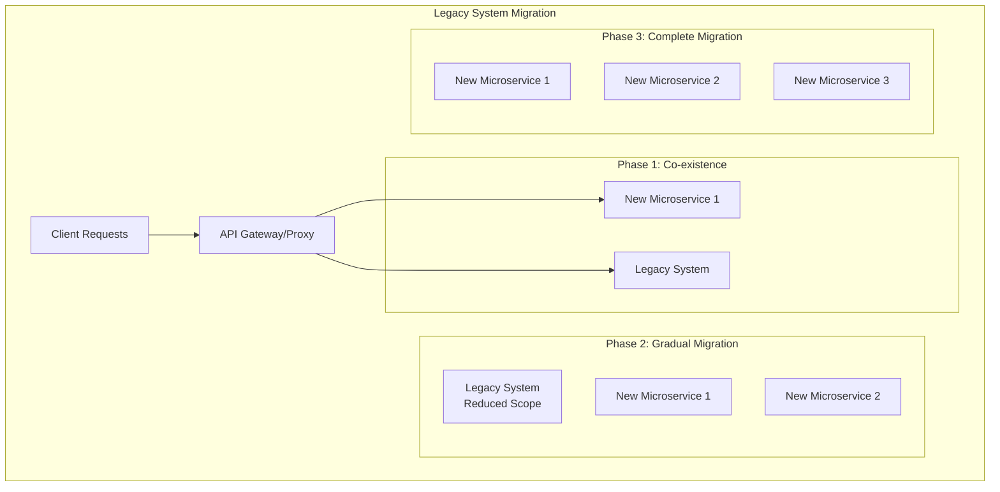
```mermaid
graph TB
    subgraph "Legacy System Migration"
        CLIENT[Client Requests]
        PROXY[API Gateway/Proxy]
        
        subgraph "Phase 1: Co-existence"
            LEGACY1[Legacy System]
            NEW1[New Microservice 1]
        end
        
        subgraph "Phase 2: Gradual Migration"
            LEGACY2[Legacy System<br/>Reduced Scope]
            NEW2[New Microservice 1]
            NEW3[New Microservice 2]
        end
        
        subgraph "Phase 3: Complete Migration"
            NEW4[New Microservice 1]
            NEW5[New Microservice 2]
            NEW6[New Microservice 3]
        end
    end
    
    CLIENT --> PROXY
    PROXY --> NEW1
    PROXY --> LEGACY1
```

#### 15.2.2 資料庫分解策略
```sql
-- 資料庫分解步驟範例

-- 步驟 1: 識別邊界
-- 原始單體資料庫
CREATE TABLE users (
    id BIGINT PRIMARY KEY,
    username VARCHAR(50),
    email VARCHAR(100),
    profile_data TEXT,
    order_history TEXT,
    payment_info TEXT
);

-- 步驟 2: 垂直分割
-- User Service Database
CREATE TABLE user_profiles (
    id BIGINT PRIMARY KEY,
    username VARCHAR(50),
    email VARCHAR(100),
    profile_data TEXT
);

-- Order Service Database  
CREATE TABLE user_orders (
    id BIGINT PRIMARY KEY,
    user_id BIGINT,
    order_history TEXT
);

-- Payment Service Database
CREATE TABLE user_payments (
    id BIGINT PRIMARY KEY,
    user_id BIGINT,
    payment_info TEXT
);

-- 步驟 3: 資料同步策略
-- 使用 CDC (Change Data Capture) 進行資料同步
```

### 15.3 雲端安全設計

#### 15.3.1 零信任架構
```yaml
# 零信任安全策略配置
zero_trust_policies:
  identity_verification:
    - multi_factor_authentication: required
    - certificate_based_auth: enabled
    - continuous_verification: enabled
  
  network_security:
    - micro_segmentation: enabled
    - encrypted_communication: mandatory
    - default_deny: true
  
  device_compliance:
    - device_registration: required
    - compliance_check: continuous
    - risk_assessment: enabled
```

---

## 16. 可觀測性與智能運維

### 16.1 全方位可觀測性設計

#### 16.1.1 三大支柱整合
```yaml
# OpenTelemetry 配置
observability:
  metrics:
    exporters:
      - prometheus
      - grafana-cloud
    instruments:
      - counters
      - histograms
      - gauges
  
  traces:
    exporters:
      - jaeger
      - zipkin
    sampling:
      rate: 0.1
      adaptive: true
  
  logs:
    exporters:
      - elasticsearch
      - splunk
    structured: true
    correlation: true
```

#### 16.1.2 智能告警系統
```python
# AI 驅動的異常檢測
import numpy as np
from sklearn.ensemble import IsolationForest
import joblib

class AnomalyDetector:
    def __init__(self):
        self.model = IsolationForest(
            contamination=0.1,
            random_state=42
        )
        self.is_trained = False
    
    def train(self, normal_data):
        """訓練異常檢測模型"""
        self.model.fit(normal_data)
        self.is_trained = True
        joblib.dump(self.model, 'anomaly_model.pkl')
    
    def detect_anomaly(self, current_metrics):
        """檢測當前指標是否異常"""
        if not self.is_trained:
            return False
            
        prediction = self.model.predict([current_metrics])
        return prediction[0] == -1
    
    def get_anomaly_score(self, metrics):
        """獲取異常分數"""
        return self.model.decision_function([metrics])[0]

# 智能告警規則
class SmartAlerting:
    def __init__(self):
        self.detector = AnomalyDetector()
        self.baseline_window = 168  # 7天基線
    
    def should_alert(self, metric_name, current_value, historical_data):
        """基於機器學習的告警判斷"""
        if len(historical_data) < self.baseline_window:
            return self.traditional_threshold_check(metric_name, current_value)
        
        # 使用機器學習檢測異常
        features = self.extract_features(historical_data + [current_value])
        return self.detector.detect_anomaly(features)
    
    def extract_features(self, data):
        """提取時序特徵"""
        return [
            np.mean(data[-24:]),      # 24小時平均
            np.std(data[-24:]),       # 24小時標準差
            np.percentile(data[-24:], 95),  # 95百分位
            len([x for x in data[-24:] if x > np.mean(data[-168:]) + 2*np.std(data[-168:])])  # 異常點數量
        ]
```

#### 16.1.3 分散式追蹤增強
```java
// 自定義追蹤增強
@Component
public class EnhancedTracing {
    
    private final Tracer tracer;
    private final MeterRegistry meterRegistry;
    
    @EventListener
    public void handleTraceEvent(TraceEvent event) {
        Span span = event.getSpan();
        
        // 添加業務上下文
        span.setTag("business.operation", extractBusinessOperation(span));
        span.setTag("user.id", getCurrentUserId());
        span.setTag("tenant.id", getCurrentTenantId());
        
        // 自動檢測慢查詢
        if (span.getOperationName().contains("db") && 
            span.getDuration() > Duration.ofMillis(1000)) {
            span.setTag("slow.query", true);
            recordSlowQuery(span);
        }
        
        // 錯誤關聯
        if (span.getTags().containsKey("error")) {
            correlateWithLogs(span);
            triggerErrorAnalysis(span);
        }
    }
    
    private void recordSlowQuery(Span span) {
        Counter.builder("slow.queries")
               .tag("operation", span.getOperationName())
               .register(meterRegistry)
               .increment();
    }
}
```

### 16.2 AIOps 實施策略

#### 16.2.1 預測性維護
```python
# 資源使用預測模型
import pandas as pd
from prophet import Prophet
import warnings
warnings.filterwarnings('ignore')

class ResourcePredictor:
    def __init__(self):
        self.cpu_model = Prophet(
            changepoint_prior_scale=0.01,
            seasonality_prior_scale=10
        )
        self.memory_model = Prophet(
            changepoint_prior_scale=0.01,
            seasonality_prior_scale=10
        )
        
    def prepare_data(self, metrics_data):
        """準備時序資料"""
        df = pd.DataFrame(metrics_data)
        df['ds'] = pd.to_datetime(df['timestamp'])
        return df
    
    def train_models(self, historical_data):
        """訓練預測模型"""
        cpu_data = self.prepare_data(historical_data['cpu'])
        memory_data = self.prepare_data(historical_data['memory'])
        
        cpu_data = cpu_data[['ds', 'cpu_usage']].rename(columns={'cpu_usage': 'y'})
        memory_data = memory_data[['ds', 'memory_usage']].rename(columns={'memory_usage': 'y'})
        
        self.cpu_model.fit(cpu_data)
        self.memory_model.fit(memory_data)
    
    def predict_resource_needs(self, days_ahead=7):
        """預測未來資源需求"""
        future_dates = self.cpu_model.make_future_dataframe(periods=days_ahead*24, freq='H')
        
        cpu_forecast = self.cpu_model.predict(future_dates)
        memory_forecast = self.memory_model.predict(future_dates)
        
        return {
            'cpu_prediction': cpu_forecast[['ds', 'yhat', 'yhat_lower', 'yhat_upper']],
            'memory_prediction': memory_forecast[['ds', 'yhat', 'yhat_lower', 'yhat_upper']]
        }
    
    def recommend_scaling(self, predictions, current_capacity):
        """推薦擴展策略"""
        recommendations = []
        
        for pred_type, forecast in predictions.items():
            max_predicted = forecast['yhat_upper'].max()
            
            if max_predicted > current_capacity * 0.8:  # 80% 閾值
                scale_factor = max_predicted / (current_capacity * 0.7)  # 目標 70% 使用率
                recommendations.append({
                    'resource': pred_type,
                    'action': 'scale_up',
                    'scale_factor': scale_factor,
                    'reasoning': f'預測峰值將達到 {max_predicted:.2f}%'
                })
                
        return recommendations
```

---

## 17. 環境永續性設計

### 17.1 綠色軟體開發

#### 17.1.1 碳足跡監控
```yaml
# 碳足跡計算配置
carbon_monitoring:
  compute_efficiency:
    cpu_power_model: "TDP * utilization * PUE"
    memory_power_model: "base_power + dynamic_power"
    storage_power_model: "io_operations * power_per_op"
  
  cloud_provider_factors:
    aws:
      us-east-1: 0.415  # kg CO2e/kWh
      eu-west-1: 0.295
    azure:
      east-us: 0.415
      north-europe: 0.123
    gcp:
      us-central1: 0.479
      europe-west4: 0.067
  
  optimization_targets:
    max_carbon_budget: 100  # kg CO2e per month
    efficiency_improvement: 10  # % reduction per quarter
```

#### 17.1.2 能源效率最佳化
```java
// 綠色計算策略
@Component
public class GreenComputingOptimizer {
    
    private final CloudProviderService cloudService;
    private final CarbonCalculator carbonCalculator;
    
    @Scheduled(fixedRate = 300000) // 每5分鐘執行
    public void optimizeForCarbonEfficiency() {
        List<Region> regions = cloudService.getAvailableRegions();
        
        // 選擇最綠色的區域
        Region greenestRegion = regions.stream()
                .min(Comparator.comparing(this::getCarbonIntensity))
                .orElse(regions.get(0));
        
        // 調度非緊急工作負載到綠色區域
        scheduleWorkloadsToGreenRegion(greenestRegion);
        
        // 在低碳時段執行批次處理
        scheduleTasksForLowCarbonPeriods();
    }
    
    private double getCarbonIntensity(Region region) {
        return carbonCalculator.getCarbonIntensity(region);
    }
    
    @EventListener
    public void handleHighCarbonIntensity(HighCarbonIntensityEvent event) {
        // 暫停非關鍵服務
        pauseNonCriticalServices();
        
        // 降低服務等級
        reduceServiceLevel();
        
        // 通知運維團隊
        notifyOperationsTeam("高碳排時段，已啟動節能模式");
    }
}
```

#### 17.1.3 永續性指標儀表板
```typescript
// 永續性指標元件
interface SustainabilityMetrics {
  carbonFootprint: number;
  energyEfficiency: number;
  resourceUtilization: number;
  renewableEnergyRatio: number;
}

export const SustainabilityDashboard: React.FC = () => {
  const [metrics, setMetrics] = useState<SustainabilityMetrics>();
  const [carbonTrend, setCarbonTrend] = useState<number[]>([]);
  
  useEffect(() => {
    const fetchSustainabilityData = async () => {
      const response = await api.get('/sustainability/metrics');
      setMetrics(response.data);
    };
    
    fetchSustainabilityData();
    const interval = setInterval(fetchSustainabilityData, 60000);
    
    return () => clearInterval(interval);
  }, []);
  
  return (
    <div className="sustainability-dashboard">
      <div className="metric-card">
        <h3>碳足跡</h3>
        <span className={`metric-value ${metrics?.carbonFootprint > 50 ? 'high' : 'normal'}`}>
          {metrics?.carbonFootprint} kg CO2e
        </span>
      </div>
      
      <div className="metric-card">
        <h3>可再生能源比例</h3>
        <CircularProgress 
          value={metrics?.renewableEnergyRatio || 0}
          color={metrics?.renewableEnergyRatio > 50 ? 'green' : 'orange'}
        />
      </div>
      
      <div className="optimization-suggestions">
        <h3>優化建議</h3>
        <SustainabilityRecommendations metrics={metrics} />
      </div>
    </div>
  );
};
```

---

## 18. 使用者體驗與無障礙設計

### 18.1 無障礙設計標準

#### 18.1.1 WCAG 2.1 AA 合規性
```typescript
// 無障礙性檢查工具
interface AccessibilityConfig {
  level: 'A' | 'AA' | 'AAA';
  guidelines: string[];
  automaticTesting: boolean;
}

export class AccessibilityValidator {
  private config: AccessibilityConfig;
  
  constructor(config: AccessibilityConfig) {
    this.config = config;
  }
  
  async validatePage(url: string): Promise<AccessibilityReport> {
    const results = await axeCore.run({
      rules: this.getWCAGRules(),
      tags: [`wcag${this.config.level.toLowerCase()}`, 'best-practice']
    });
    
    return {
      url,
      violations: results.violations,
      passes: results.passes,
      incomplete: results.incomplete,
      score: this.calculateAccessibilityScore(results)
    };
  }
  
  private getWCAGRules(): string[] {
    // WCAG 2.1 AA 規則配置
    return [
      'color-contrast',
      'keyboard-navigation',
      'focus-management',
      'alternative-text',
      'semantic-markup',
      'form-labels',
      'heading-structure'
    ];
  }
}
```

#### 18.1.2 多模態互動設計
```vue
<!-- 支援多種互動方式的元件 -->
<template>
  <div 
    class="interactive-component"
    :aria-label="ariaLabel"
    :tabindex="tabIndex"
    @click="handleClick"
    @keydown="handleKeydown"
    @touchstart="handleTouch"
    @voice-command="handleVoiceCommand"
  >
    <!-- 視覺內容 -->
    <div class="visual-content" v-if="!reduceMotion">
      <transition name="fade">
        <slot name="visual" />
      </transition>
    </div>
    
    <!-- 高對比模式 -->
    <div v-if="highContrast" class="high-contrast-content">
      <slot name="high-contrast" />
    </div>
    
    <!-- 螢幕閱讀器內容 -->
    <div class="sr-only" aria-live="polite">
      {{ screenReaderText }}
    </div>
    
    <!-- 觸覺回饋 -->
    <HapticFeedback 
      v-if="supportHaptic"
      :pattern="hapticPattern"
      :enabled="hapticEnabled"
    />
  </div>
</template>

<script setup lang="ts">
interface AccessibilityPreferences {
  reduceMotion: boolean;
  highContrast: boolean;
  fontSize: 'small' | 'medium' | 'large' | 'extra-large';
  hapticEnabled: boolean;
  voiceControlEnabled: boolean;
}

const props = defineProps<{
  ariaLabel: string;
  hapticPattern?: string;
}>();

const { preferences } = useAccessibilityPreferences();
const { announceToScreenReader } = useScreenReader();

const handleKeydown = (event: KeyboardEvent) => {
  // 鍵盤導航支援
  switch (event.key) {
    case 'Enter':
    case ' ':
      handleActivation();
      break;
    case 'ArrowUp':
    case 'ArrowDown':
    case 'ArrowLeft':
    case 'ArrowRight':
      handleNavigation(event.key);
      break;
  }
};

const handleVoiceCommand = (command: string) => {
  // 語音控制支援
  const commands = {
    'click': handleClick,
    'activate': handleActivation,
    'focus': () => (event.target as HTMLElement).focus()
  };
  
  commands[command]?.();
};
</script>
```

### 18.2 效能最佳化策略

#### 18.2.1 Core Web Vitals 優化
```javascript
// Web Vitals 監控和優化
import { getCLS, getFID, getFCP, getLCP, getTTFB } from 'web-vitals';

class WebVitalsOptimizer {
  constructor() {
    this.initializeMonitoring();
    this.setupOptimizations();
  }
  
  initializeMonitoring() {
    // 監控核心網頁指標
    getCLS(this.reportMetric);
    getFID(this.reportMetric);
    getFCP(this.reportMetric);
    getLCP(this.reportMetric);
    getTTFB(this.reportMetric);
  }
  
  reportMetric(metric) {
    // 發送指標到分析服務
    analytics.track('web-vital', {
      name: metric.name,
      value: metric.value,
      rating: this.getRating(metric),
      url: window.location.href
    });
    
    // 觸發優化策略
    this.triggerOptimization(metric);
  }
  
  triggerOptimization(metric) {
    switch (metric.name) {
      case 'LCP':
        if (metric.value > 2500) {
          this.optimizeLargestContentfulPaint();
        }
        break;
      case 'FID':
        if (metric.value > 100) {
          this.optimizeFirstInputDelay();
        }
        break;
      case 'CLS':
        if (metric.value > 0.1) {
          this.optimizeCumulativeLayoutShift();
        }
        break;
    }
  }
  
  optimizeLargestContentfulPaint() {
    // LCP 優化策略
    this.preloadCriticalResources();
    this.optimizeImages();
    this.enableCriticalResourceHints();
  }
  
  optimizeFirstInputDelay() {
    // FID 優化策略
    this.deferNonCriticalJavaScript();
    this.useWebWorkers();
    this.implementCodeSplitting();
  }
}
```

---

## 19. API 治理與版本管理

### 19.1 API 設計標準

#### 19.1.1 RESTful API 設計規範
```yaml
# API 設計規範
api_design_standards:
  naming_conventions:
    resources: "kebab-case (plural nouns)"
    endpoints: "/api/v1/users/{id}/orders"
    query_parameters: "snake_case"
    
  http_methods:
    GET: "檢索資源"
    POST: "建立新資源"
    PUT: "完整更新資源"
    PATCH: "部分更新資源"
    DELETE: "刪除資源"
    
  status_codes:
    success:
      - 200: "成功"
      - 201: "已建立"
      - 204: "無內容"
    client_error:
      - 400: "請求錯誤"
      - 401: "未授權"
      - 403: "禁止存取"
      - 404: "找不到資源"
    server_error:
      - 500: "內部伺服器錯誤"
      - 503: "服務無法使用"
```

#### 19.1.2 GraphQL Schema 設計
```graphql
# GraphQL Schema 範例
type Query {
  user(id: ID!): User
  users(
    first: Int = 10
    after: String
    filter: UserFilter
  ): UserConnection
}

type Mutation {
  createUser(input: CreateUserInput!): CreateUserPayload
  updateUser(input: UpdateUserInput!): UpdateUserPayload
  deleteUser(id: ID!): DeleteUserPayload
}

type Subscription {
  userUpdated(id: ID!): User
  newNotification(userId: ID!): Notification
}

type User {
  id: ID!
  username: String!
  email: String!
  profile: UserProfile
  orders(first: Int, after: String): OrderConnection
  createdAt: DateTime!
  updatedAt: DateTime!
}

# 分頁連接模式
type UserConnection {
  edges: [UserEdge!]!
  pageInfo: PageInfo!
  totalCount: Int!
}

type UserEdge {
  node: User!
  cursor: String!
}

# 輸入類型
input CreateUserInput {
  username: String!
  email: String!
  password: String!
  profile: UserProfileInput
}

# 回應載荷
type CreateUserPayload {
  user: User
  errors: [UserError!]
  clientMutationId: String
}
```

### 19.2 API 版本策略

#### 19.2.1 語義化版本管理
```java
// API 版本控制實現
@RestController
@RequestMapping("/api")
public class UserController {
    
    // URL 版本控制
    @GetMapping("/v1/users/{id}")
    public ResponseEntity<UserV1> getUserV1(@PathVariable Long id) {
        return ResponseEntity.ok(userService.getUserV1(id));
    }
    
    @GetMapping("/v2/users/{id}")
    public ResponseEntity<UserV2> getUserV2(@PathVariable Long id) {
        return ResponseEntity.ok(userService.getUserV2(id));
    }
    
    // Header 版本控制
    @GetMapping(value = "/users/{id}", headers = "API-Version=1.0")
    public ResponseEntity<UserV1> getUserHeaderV1(@PathVariable Long id) {
        return ResponseEntity.ok(userService.getUserV1(id));
    }
    
    // Content negotiation 版本控制
    @GetMapping(value = "/users/{id}", produces = "application/vnd.api.v1+json")
    public ResponseEntity<UserV1> getUserContentV1(@PathVariable Long id) {
        return ResponseEntity.ok(userService.getUserV1(id));
    }
}

@Component
public class ApiVersioningStrategy {
    
    public ApiVersion determineVersion(HttpServletRequest request) {
        // 優先級: Header > Query Parameter > URL Path
        String headerVersion = request.getHeader("API-Version");
        if (headerVersion != null) {
            return parseVersion(headerVersion);
        }
        
        String queryVersion = request.getParameter("version");
        if (queryVersion != null) {
            return parseVersion(queryVersion);
        }
        
        String pathVersion = extractVersionFromPath(request.getRequestURI());
        if (pathVersion != null) {
            return parseVersion(pathVersion);
        }
        
        return ApiVersion.DEFAULT;
    }
    
    private ApiVersion parseVersion(String versionString) {
        try {
            return ApiVersion.fromString(versionString);
        } catch (IllegalArgumentException e) {
            throw new UnsupportedApiVersionException(versionString);
        }
    }
}
```

#### 19.2.2 向後相容性策略
```java
// 向後相容性處理
@Component
public class BackwardCompatibilityHandler {
    
    private final Map<ApiVersion, ResponseTransformer> transformers = Map.of(
        ApiVersion.V1, new V1ResponseTransformer(),
        ApiVersion.V2, new V2ResponseTransformer()
    );
    
    public <T> ResponseEntity<T> transformResponse(
            Object response, 
            ApiVersion targetVersion, 
            Class<T> targetType) {
        
        ResponseTransformer transformer = transformers.get(targetVersion);
        if (transformer == null) {
            throw new UnsupportedApiVersionException(targetVersion.toString());
        }
        
        T transformedResponse = transformer.transform(response, targetType);
        return ResponseEntity.ok(transformedResponse);
    }
}

// V1 回應轉換器
public class V1ResponseTransformer implements ResponseTransformer {
    
    @Override
    public <T> T transform(Object source, Class<T> targetType) {
        if (source instanceof UserV2 && targetType == UserV1.class) {
            UserV2 userV2 = (UserV2) source;
            UserV1 userV1 = new UserV1();
            
            // 移除 V2 新增的欄位
            userV1.setId(userV2.getId());
            userV1.setUsername(userV2.getUsername());
            userV1.setEmail(userV2.getEmail());
            // 忽略 userV2.getNewField()
            
            return targetType.cast(userV1);
        }
        
        return defaultTransform(source, targetType);
    }
}
```

### 19.3 API 治理框架

#### 19.3.1 API 生命週期管理
```yaml
# API 生命週期階段
api_lifecycle:
  stages:
    - name: "設計"
      activities:
        - "API 規格撰寫"
        - "設計審查"
        - "原型開發"
      deliverables:
        - "OpenAPI 規格"
        - "設計文件"
      
    - name: "開發"
      activities:
        - "實作開發"
        - "單元測試"
        - "整合測試"
      deliverables:
        - "API 實作"
        - "測試套件"
      
    - name: "測試"
      activities:
        - "功能測試"
        - "效能測試"
        - "安全測試"
      deliverables:
        - "測試報告"
        - "效能基準"
      
    - name: "部署"
      activities:
        - "環境部署"
        - "監控設定"
        - "文件發布"
      deliverables:
        - "部署指南"
        - "監控儀表板"
      
    - name: "維護"
      activities:
        - "問題修復"
        - "效能調優"
        - "版本升級"
      deliverables:
        - "維護日誌"
        - "版本記錄"
      
    - name: "淘汰"
      activities:
        - "遷移規劃"
        - "使用者通知"
        - "服務下線"
      deliverables:
        - "遷移指南"
        - "下線時程"
```

---

## 20. 交付格式與附錄

### 20.1 系統設計文件交付清單

#### 20.1.1 必要交付項目
- [ ] **系統架構圖**
  - [ ] 整體架構圖
  - [ ] 部署架構圖
  - [ ] 網路架構圖
  - [ ] 安全架構圖

- [ ] **詳細設計文件**
  - [ ] 模組設計說明
  - [ ] 資料庫設計文件
  - [ ] API 規格文件
  - [ ] 介面設計文件

- [ ] **技術規範**
  - [ ] 開發標準
  - [ ] 程式碼風格指引
  - [ ] 測試策略文件
  - [ ] 部署指引

- [ ] **維運文件**
  - [ ] 監控設定指引
  - [ ] 災難復原計畫
  - [ ] 容量規劃文件
  - [ ] 維護手冊

### 20.2 文件品質檢核標準

#### 20.2.1 內容完整性檢核
```yaml
# 文件品質評分標準
quality_metrics:
  completeness:
    weight: 30%
    criteria:
      - all_sections_present: 10
      - detailed_explanations: 10
      - examples_provided: 10
  
  accuracy:
    weight: 25%
    criteria:
      - technical_correctness: 15
      - up_to_date_information: 10
  
  clarity:
    weight: 20%
    criteria:
      - clear_language: 10
      - logical_structure: 10
  
  usability:
    weight: 15%
    criteria:
      - actionable_guidance: 8
      - practical_examples: 7
  
  maintainability:
    weight: 10%
    criteria:
      - version_control: 5
      - update_process: 5

# 最低品質閾值
minimum_score: 75
```

#### 20.2.2 技術審查檢核清單
- [ ] **架構合理性**
  - [ ] 符合業務需求
  - [ ] 技術選型適當
  - [ ] 擴展性考慮
  - [ ] 效能要求滿足

- [ ] **安全性考量**
  - [ ] 安全威脅分析
  - [ ] 防護措施設計
  - [ ] 合規性檢查
  - [ ] 隱私保護

- [ ] **可維護性評估**
  - [ ] 模組化設計
  - [ ] 程式碼品質
  - [ ] 文件完整性
  - [ ] 技術債務控制

### 20.3 工具與範本

#### 20.3.1 推薦工具清單
```yaml
# 系統設計工具推薦
design_tools:
  architecture_modeling:
    - name: "Lucidchart"
      type: "線上圖表工具"
      use_case: "系統架構圖、流程圖"
    - name: "Draw.io"
      type: "免費圖表工具"
      use_case: "各類技術圖表"
    - name: "Miro"
      type: "協作白板"
      use_case: "設計工作坊、腦力激盪"
  
  documentation:
    - name: "GitBook"
      type: "文件平台"
      use_case: "技術文件撰寫"
    - name: "Notion"
      type: "全能工作空間"
      use_case: "專案管理、文件協作"
    - name: "Confluence"
      type: "企業知識管理"
      use_case: "團隊文件協作"
  
  api_design:
    - name: "Swagger/OpenAPI"
      type: "API 規格工具"
      use_case: "REST API 設計"
    - name: "GraphQL Playground"
      type: "GraphQL 工具"
      use_case: "GraphQL API 設計"
    - name: "Postman"
      type: "API 測試工具"
      use_case: "API 測試、文件"
```

#### 20.3.2 文件範本庫
```markdown
# 系統設計文件範本

## 1. 架構設計文件範本
### 1.1 系統概述
- 系統目標與範圍
- 主要利害關係人
- 關鍵假設與限制

### 1.2 架構概覽
- 高階架構圖
- 主要元件說明
- 技術棧選擇理由

### 1.3 詳細設計
- 元件間互動
- 資料流設計
- 錯誤處理策略

## 2. API 設計文件範本
### 2.1 API 概述
- API 目的與範圍
- 版本策略
- 認證機制

### 2.2 端點定義
- 資源模型
- 請求/回應格式
- 錯誤碼定義

### 2.3 使用範例
- 典型使用情境
- 程式碼範例
- 測試資料
```

---

## 附錄

### A. 參考資料

#### A.1 技術標準文件
- **架構模式**: Patterns of Enterprise Application Architecture (Martin Fowler)
- **微服務**: Building Microservices (Sam Newman)
- **領域驅動設計**: Domain-Driven Design (Eric Evans)
- **清潔架構**: Clean Architecture (Robert C. Martin)

#### A.2 業界最佳實務
- **12-Factor App**: https://12factor.net/
- **OWASP 安全指引**: https://owasp.org/
- **Cloud Native Computing Foundation**: https://www.cncf.io/
- **API 設計指引**: RESTful API Design Best Practices

#### A.3 工具與框架
- **Spring Boot**: https://spring.io/projects/spring-boot
- **Vue.js**: https://vuejs.org/
- **Docker**: https://www.docker.com/
- **Kubernetes**: https://kubernetes.io/

### B. 術語與縮寫

#### B.1 技術術語
- **API**: Application Programming Interface (應用程式介面)
- **CDN**: Content Delivery Network (內容傳遞網路)
- **CI/CD**: Continuous Integration/Continuous Deployment (持續整合/持續部署)
- **DDD**: Domain-Driven Design (領域驅動設計)
- **JWT**: JSON Web Token (JSON 網路令牌)
- **RBAC**: Role-Based Access Control (角色為基礎的存取控制)
- **SLA**: Service Level Agreement (服務等級協議)
- **SLO**: Service Level Objective (服務等級目標)

#### B.2 架構模式
- **CQRS**: Command Query Responsibility Segregation (命令查詢責任分離)
- **Event Sourcing**: 事件溯源
- **Saga Pattern**: 長時間執行事務模式
- **Circuit Breaker**: 斷路器模式
- **Bulkhead**: 隔艙模式

### C. 版本歷史

| 版本 | 日期 | 主要變更 | 作者 |
|------|------|----------|------|
| v1.0 | 2025-01-11 | 初始版本 | 系統架構師 |
| v1.1 | 2025-08-29 | 新增現代化設計章節 | 系統架構師 |
| v1.2 | 2025-08-29 | 增補可觀測性、永續性等章節 | 系統架構師 |

---

## 結語

本「專案系統設計指引」提供了從系統分析文件轉換到系統設計文件的完整指導方針。經過此次更新，文件涵蓋了現代軟體開發的各個重要面向，包括：

### 新增內容亮點
1. **雲端原生設計**: 涵蓋容器化、微服務現代化、服務網格等前沿技術
2. **可觀測性與智能運維**: 整合 AI/ML 技術進行預測性維護和智能告警
3. **環境永續性**: 關注綠色軟體開發和碳足跡控制
4. **無障礙設計**: 確保系統符合 WCAG 標準，提供包容性體驗
5. **API 治理**: 完善的 API 生命週期管理和版本控制策略

### 使用建議
開發團隊應根據具體專案需求調整和細化相關內容，確保設計方案既符合業務需求，又具備良好的技術架構基礎。建議：

1. **逐步實施**: 根據專案複雜度和團隊能力，逐步導入相關設計模式
2. **持續學習**: 定期研讀最新技術趨勢，更新設計思維
3. **實務驗證**: 通過實際專案驗證設計方案的有效性
4. **團隊協作**: 促進跨職能團隊協作，確保設計的全面性

定期回顧和更新本指引，以反映技術發展趨勢和專案經驗累積，持續提升系統設計品質和開發效率。
```
