+++
date = '2025-10-31T00:00:00+08:00'
draft = false
title = '系統設計指引'
tags = ['指引', '設計開發']
categories = ['指引']
+++

# 專案系統設計指引

> **企業標準技術白皮書｜版本 v2.0｜2026-10-08**
>
> 適用範圍：以 Java / Spring Boot 為後端、以 Web 前端為使用介面的企業應用系統，從系統分析文件（SAD）轉換為系統設計文件（SDD）的詳細設計階段。內容涵蓋設計流程與文件、物件導向與領域模型、元件與介面、資料、行為、錯誤處理、安全、整合與批次、非功能、部署、可測試性、國際化、法規遵循、使用者體驗、API 治理、設計演進與設計審查。
>
> v2.0 全面改寫 v1.x：依 ISO/IEC/IEEE 12207:2026、ISO/IEC/IEEE 42010:2022、IEEE 1016-2009、ISO/IEC 25010:2023、OWASP Top 10:2025 等國際標準重新組織內容。每條規則都附有範例與「驗證方式」，每節結尾都有「🔍 審查與驗證」，讓審查者能判斷 AI 或同事產出的設計是否正確。範例均經工具實測（見 [附錄 F](#附錄-f-修訂紀錄與查證紀錄)）。架構層級的決策（架構風格、平台、維運）請見 [架構設計指引]()，本文聚焦在「架構決定之後，如何把每個元件設計到可以開發、可以審查、可以驗證」。

## 目錄

<!-- TOC-AUTO-BEGIN -->

- [0. 文件資訊](#0-文件資訊)
  - [0.1 文件目的與讀者](#01-文件目的與讀者)
  - [0.2 技術基準版本](#02-技術基準版本)
  - [0.3 規範等級與規則格式](#03-規範等級與規則格式)
  - [0.4 與其他指引的關係](#04-與其他指引的關係)
  - [0.5 如何閱讀本指引](#05-如何閱讀本指引)
  - [0.6 例外與豁免流程](#06-例外與豁免流程)
- [1. 系統設計流程與國際標準](#1-系統設計流程與國際標準)
  - [1.1 國際標準與設計流程](#11-國際標準與設計流程)
  - [1.2 需求與設計的雙向追溯](#12-需求與設計的雙向追溯)
  - [1.3 設計替代方案與設計決策](#13-設計替代方案與設計決策)
  - [1.4 設計審查](#14-設計審查)
  - [1.5 AI 輔助設計與人工審查](#15-ai-輔助設計與人工審查)
- [2. 系統設計文件與設計視圖](#2-系統設計文件與設計視圖)
  - [2.1 SDD 的結構與設計視點](#21-sdd-的結構與設計視點)
  - [2.2 設計圖表的繪製規範](#22-設計圖表的繪製規範)
  - [2.3 文件即程式碼（Docs-as-Code）](#23-文件即程式碼docs-as-code)
  - [2.4 文件維護](#24-文件維護)
- [3. 物件導向設計原則](#3-物件導向設計原則)
  - [3.1 SOLID 原則](#31-solid-原則)
  - [3.2 責任分配：GRASP 與迪米特法則](#32-責任分配grasp-與迪米特法則)
  - [3.3 不可變性與型別設計](#33-不可變性與型別設計)
  - [3.4 簡潔原則：KISS、YAGNI 與 DRY](#34-簡潔原則kissyagni-與-dry)
- [4. 設計模式應用](#4-設計模式應用)
  - [4.1 模式的選用準則](#41-模式的選用準則)
  - [4.2 結構與行為模式](#42-結構與行為模式)
  - [4.3 應避免的反模式](#43-應避免的反模式)
- [5. 領域模型與戰術設計](#5-領域模型與戰術設計)
  - [5.1 通用語言與領域模型](#51-通用語言與領域模型)
  - [5.2 聚合、實體與值物件](#52-聚合實體與值物件)
  - [5.3 領域事件、儲存庫與領域服務](#53-領域事件儲存庫與領域服務)
- [6. 分層與元件設計](#6-分層與元件設計)
  - [6.1 分層與依賴方向](#61-分層與依賴方向)
  - [6.2 應用服務與交易邊界](#62-應用服務與交易邊界)
  - [6.3 資料傳輸物件與映射](#63-資料傳輸物件與映射)
  - [6.4 元件規格與組態](#64-元件規格與組態)
- [7. 介面設計](#7-介面設計)
  - [7.1 介面清單](#71-介面清單)
  - [7.2 契約先行的 REST API 設計](#72-契約先行的-rest-api-設計)
  - [7.3 冪等性設計](#73-冪等性設計)
  - [7.4 事件介面](#74-事件介面)
  - [7.5 內部埠介面與檔案介面](#75-內部埠介面與檔案介面)
- [8. 資料設計](#8-資料設計)
  - [8.1 資料模型與資料字典](#81-資料模型與資料字典)
  - [8.2 多資料庫支援與結構演進](#82-多資料庫支援與結構演進)
  - [8.3 物件關聯映射與資料存取](#83-物件關聯映射與資料存取)
  - [8.4 讀寫分離與資料分割](#84-讀寫分離與資料分割)
  - [8.5 資料分級、加密、遮罩與保存](#85-資料分級加密遮罩與保存)
- [9. 行為與流程設計](#9-行為與流程設計)
  - [9.1 互動設計：循序圖](#91-互動設計循序圖)
  - [9.2 狀態設計：狀態機](#92-狀態設計狀態機)
  - [9.3 資料流設計](#93-資料流設計)
  - [9.4 長流程、演算法與並行](#94-長流程演算法與並行)
- [10. 錯誤處理、交易與一致性](#10-錯誤處理交易與一致性)
  - [10.1 錯誤分類與錯誤碼](#101-錯誤分類與錯誤碼)
  - [10.2 逾時與重試](#102-逾時與重試)
  - [10.3 交易邊界與資料一致性](#103-交易邊界與資料一致性)
- [11. 安全設計](#11-安全設計)
  - [11.1 威脅建模](#111-威脅建模)
  - [11.2 身分驗證](#112-身分驗證)
  - [11.3 授權](#113-授權)
  - [11.4 輸入處理與 API 保護](#114-輸入處理與-api-保護)
  - [11.5 秘密管理、加密與稽核](#115-秘密管理加密與稽核)
  - [11.6 安全標準對照與驗收](#116-安全標準對照與驗收)
- [12. 整合、批次與檔案傳輸設計](#12-整合批次與檔案傳輸設計)
  - [12.1 企業整合模式](#121-企業整合模式)
  - [12.2 批次作業設計](#122-批次作業設計)
  - [12.3 排程設計](#123-排程設計)
  - [12.4 檔案傳輸設計](#124-檔案傳輸設計)
- [13. 非功能設計](#13-非功能設計)
  - [13.1 從品質情境到設計手段](#131-從品質情境到設計手段)
  - [13.2 容量估算與延遲預算](#132-容量估算與延遲預算)
  - [13.3 快取設計](#133-快取設計)
  - [13.4 連線池、執行緒與並行上限](#134-連線池執行緒與並行上限)
  - [13.5 可觀測性設計](#135-可觀測性設計)
  - [13.6 高可用與災難復原設計](#136-高可用與災難復原設計)
  - [13.7 永續性與智慧維運](#137-永續性與智慧維運)
- [14. 部署與執行環境設計](#14-部署與執行環境設計)
  - [14.1 部署視圖與執行期設計](#141-部署視圖與執行期設計)
  - [14.2 健康檢查、資源與生命週期](#142-健康檢查資源與生命週期)
  - [14.3 交付流程與部署策略](#143-交付流程與部署策略)
- [15. 可測試性與測試設計](#15-可測試性與測試設計)
  - [15.1 每個設計元素的驗證方式](#151-每個設計元素的驗證方式)
  - [15.2 整合測試與測試資料](#152-整合測試與測試資料)
  - [15.3 契約測試與驗收條件](#153-契約測試與驗收條件)
  - [15.4 效能測試設計](#154-效能測試設計)
- [16. 國際化與地區化設計](#16-國際化與地區化設計)
  - [16.1 文字與語系](#161-文字與語系)
  - [16.2 時間、數字與幣別](#162-時間數字與幣別)
  - [16.3 字元編碼、多語系資料與排序](#163-字元編碼多語系資料與排序)
- [17. 法規遵循設計](#17-法規遵循設計)
  - [17.1 合規需求盤點](#171-合規需求盤點)
  - [17.2 個人資料保護設計](#172-個人資料保護設計)
  - [17.3 金融業與稽核要求](#173-金融業與稽核要求)
- [18. 使用者體驗與無障礙設計](#18-使用者體驗與無障礙設計)
  - [18.1 無障礙設計](#181-無障礙設計)
  - [18.2 效能體驗與畫面狀態](#182-效能體驗與畫面狀態)
- [19. API 治理與演進](#19-api-治理與演進)
  - [19.1 API 生命週期與目錄](#191-api-生命週期與目錄)
  - [19.2 版本策略與破壞性變更](#192-版本策略與破壞性變更)
  - [19.3 棄用與退場](#193-棄用與退場)
- [20. 技術債與設計演進](#20-技術債與設計演進)
  - [20.1 技術債的登錄與分類](#201-技術債的登錄與分類)
  - [20.2 品質閘門與適應度函數](#202-品質閘門與適應度函數)
  - [20.3 設計演進與決策更新](#203-設計演進與決策更新)
- [21. 交付物與設計審查](#21-交付物與設計審查)
  - [21.1 交付清單](#211-交付清單)
  - [21.2 審查角色與評分](#212-審查角色與評分)
  - [21.3 審查發現與完工回填](#213-審查發現與完工回填)
- [附錄 A 規則總表](#附錄-a-規則總表)
  - [A.1 依領域統計](#a1-依領域統計)
  - [A.2 驗證方式與範例覆蓋](#a2-驗證方式與範例覆蓋)
  - [A.3 規則清單](#a3-規則清單)
- [附錄 B 設計審查檢核清單](#附錄-b-設計審查檢核清單)
  - [B.1 流程與文件](#b1-流程與文件)
  - [B.2 物件、領域與元件](#b2-物件領域與元件)
  - [B.3 行為與錯誤](#b3-行為與錯誤)
  - [B.4 介面與資料](#b4-介面與資料)
  - [B.5 安全](#b5-安全)
  - [B.6 非功能與部署](#b6-非功能與部署)
  - [B.7 測試與演進](#b7-測試與演進)
  - [B.8 法規、國際化與無障礙](#b8-法規國際化與無障礙)
- [附錄 C 系統設計文件範本](#附錄-c-系統設計文件範本)
  - [C.1 SDD 章節範本](#c1-sdd-章節範本)
  - [C.2 相關文件範本](#c2-相關文件範本)
  - [C.3 SDD 章節檢查腳本](#c3-sdd-章節檢查腳本)
- [附錄 D 術語與縮寫](#附錄-d-術語與縮寫)
- [附錄 E 參考標準與資源](#附錄-e-參考標準與資源)
  - [E.1 國際標準](#e1-國際標準)
  - [E.2 IETF 規格](#e2-ietf-規格)
  - [E.3 安全標準與資源](#e3-安全標準與資源)
  - [E.4 設計方法與規格](#e4-設計方法與規格)
  - [E.5 技術文件](#e5-技術文件)
  - [E.6 台灣法規與主管機關](#e6-台灣法規與主管機關)
  - [E.7 企業內部相關指引](#e7-企業內部相關指引)
- [附錄 F 修訂紀錄與查證紀錄](#附錄-f-修訂紀錄與查證紀錄)
  - [F.1 v1.x 章節去向對照](#f1-v1x-章節去向對照)
  - [F.2 v1.x 主要更正](#f2-v1x-主要更正)
  - [F.3 查證紀錄](#f3-查證紀錄)
  - [F.4 待查項目](#f4-待查項目)
  - [F.5 版本紀錄](#f5-版本紀錄)
- [結語](#結語)

<!-- TOC-AUTO-END -->

---

## 0. 文件資訊

### 0.1 文件目的與讀者

本指引定義**系統詳細設計的標準**：拿到系統分析文件（SAD）與架構決策之後，設計者要產出哪些設計、每項設計要做到什麼程度才算合格，以及審查者要如何驗證。它回答的是「每個元件、介面、資料與流程應該怎麼設計」，介於「系統應該長什麼樣子」（架構）與「某一行程式碼怎麼寫」（程式碼）之間。

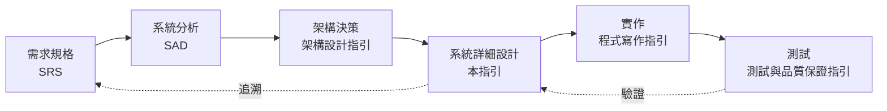

| 讀者 | 主要用途 | 建議閱讀章節 |
| --- | --- | --- |
| 系統設計師、資深工程師 | 撰寫 SDD、主持設計審查 | 全部，特別是第 1、2、21 章與附錄 B |
| 後端工程師 | 依設計實作，理解設計規則背後的理由 | 第 3–12 章、第 15 章 |
| 前端工程師 | 介面契約、國際化、無障礙 | 第 7、16、18 章 |
| 資料庫管理師 | 資料設計審查 | 第 8 章 |
| 資安人員 | 威脅建模、安全設計審查 | 第 11、17 章 |
| SRE、維運人員 | 非功能設計、部署設計 | 第 13、14 章 |
| 專案經理、品保 | 交付物與審查流程、追溯 | 第 1、21 章、附錄 B、C |
| 使用 AI 產生設計的人 | 撰寫提示、審查 AI 產出 | 第 1.5 節，以及各節的「🔍 審查與驗證」 |

### 0.2 技術基準版本

本指引的範例與規則以下列版本為準（查證日期 2026-10-08）。版本更新時以各專案的相依管理檔為準，但不得低於「最低版本」欄。基準與 [架構設計指引]() 0.2 節一致。

| 類別 | 技術 | 基準版本 | 最低版本 | 備註 |
| --- | --- | --- | --- | --- |
| 語言 | Java（OpenJDK） | 25 LTS | 21 LTS | 範例使用 record、sealed、pattern matching |
| 框架 | Spring Boot | 4.1.1 | 3.5.x | 3.5 的開源支援已於 2026-06 結束 |
| 框架 | Spring Framework／Security | 7.0.9／7.1.1 | 6.2.x／6.5.x | |
| 持久層 | Hibernate ORM／Spring Data | 7.4.5／2026.0.1 | 6.6／2025.0 | Boot 4.1.1 管理的版本 |
| 批次與整合 | Spring Batch／Spring Integration | 6.0.5／7.1.1 | 5.2／6.5 | Batch 6 的 `JobOperator` 取代 `JobLauncher` |
| 模組化 | Spring Modulith | 2.1.1 | 1.4.x | 模組邊界與事件發布登錄 |
| 序列化 | Jackson | 3.1.5 | 2.19 | Jackson 3 的套件名稱為 `tools.jackson.*` |
| 測試 | JUnit／ArchUnit／Testcontainers | 6.0.3／1.5.1／2.0.5 | 5.11／1.3／1.20 | |
| 資料庫 | PostgreSQL／Oracle／SQL Server／Db2 | 18／23ai／2025／12.1 | 15／19c／2019／11.5 | 多資料庫支援見第 8 章 |
| 前端 | Vue／TypeScript／vue-i18n | 3.5／5.9／11 | 3.4／5.4／10 | 前端細節見前端開發指引 |
| API 規格 | OpenAPI | 3.1.1（撰寫）／3.2.0（已發布） | 3.0.3 | 工具鏈完整支援 3.2 前仍以 3.1 撰寫，見 7.2 |
| 事件規格 | AsyncAPI／CloudEvents | 3.1.0／1.0.2 | 3.0／1.0 | |
| 安全標準 | OWASP Top 10／API Security Top 10／ASVS | 2025／2023／5.0.0 | — | |
| 無障礙 | WCAG | 2.2 AA | 2.1 AA | 台灣網站無障礙規範以 WCAG 2.1 為基礎，見第 18 章 |

### 0.3 規範等級與規則格式

本文規則採用 [RFC 2119](https://www.rfc-editor.org/rfc/rfc2119) 與 [RFC 8174](https://www.rfc-editor.org/rfc/rfc8174) 的語意：

| 等級 | 英文 | 意義 | 設計審查處理 |
| --- | --- | --- | --- |
| **必須** | MUST | 不遵守會造成重大風險（資安、資料錯誤、無法維護或無法驗證） | 不通過審查；如需例外必須走 0.6 豁免流程 |
| **應該** | SHOULD | 業界共識的最佳實務，除非有充分理由 | 不遵守時必須在 SDD 的設計決策章節記錄理由 |
| **可以** | MAY | 建議做法，依系統規模與情境選用 | 不阻擋 |
| **不應該** | SHOULD NOT | 通常是錯誤的做法，除非有充分理由 | 採用時必須在 SDD 的設計決策章節記錄理由 |

每條規則都有編號，格式為 `SD-<領域>-<三位數序號>`。開頭的 `SD` 用來和架構設計指引（如 `SEC-001`）與程式寫作指引的規則區分。編號一經發布不會重編，新增規則使用該領域尚未使用的號碼。

| 前綴 | 領域 | 章 | 前綴 | 領域 | 章 |
| --- | --- | --- | --- | --- | --- |
| `SD-PRC` | 設計流程與追溯 | 1 | `SD-SEC` | 安全設計 | 11 |
| `SD-DOC` | 設計文件與視圖 | 2 | `SD-INT` | 整合、批次與檔案傳輸 | 12 |
| `SD-OO` | 物件導向設計 | 3 | `SD-NFR` | 非功能設計 | 13 |
| `SD-PAT` | 設計模式 | 4 | `SD-DEP` | 部署與執行環境 | 14 |
| `SD-DDD` | 領域模型 | 5 | `SD-TST` | 可測試性與測試設計 | 15 |
| `SD-CMP` | 分層與元件 | 6 | `SD-I18N` | 國際化與地區化 | 16 |
| `SD-IF` | 介面設計 | 7 | `SD-REG` | 法規遵循 | 17 |
| `SD-DAT` | 資料設計 | 8 | `SD-UX` | 使用者體驗與無障礙 | 18 |
| `SD-BEH` | 行為與流程 | 9 | `SD-GOV` | API 治理與演進 | 19 |
| `SD-ERR` | 錯誤處理與一致性 | 10 | `SD-EVO` | 技術債與設計演進 | 20 |
| | | | `SD-DLV` | 交付物與設計審查 | 21 |

**驗證方式欄位：** 每張規則表的最後一欄說明「怎麼確認設計符合這條規則」。審查者應先看這一欄，再決定要花多少心力人工檢查。

| 圖示 | 意義 | 範例 | 審查者該做什麼 |
| --- | --- | --- | --- |
| 🤖 | 工具可自動檢查 | 🤖 ArchUnit、🤖 Spectral、🤖 mermaid-cli | 確認 CI 有執行該工具，且沒有被停用或略過 |
| 🧪 | 需要以測試或演練證明 | 🧪 單元測試、🧪 Testcontainers 整合測試 | 確認有對應的測試，而且規則被違反時測試會失敗 |
| 👁 | 只能由人判斷 | 👁 設計審查 | 依該節「🔍 審查與驗證」的問題逐項確認 |

**範例標記：** 範例中以 `✅ <規則編號>` 標示符合規則的寫法，以 `❌ <規則編號>` 標示違規寫法。所有規則都至少出現在一個範例中（統計見 [附錄 A](#附錄-a-規則總表)）。標示「（片段：…）」的範例只截取重點，不是完整可編譯的程式。

### 0.4 與其他指引的關係

本指引處理「元件層級」的詳細設計。下列主題另有專門指引，本文只列出設計時必須決定的事項並連結過去：

| 主題 | 指引 | 本文的分工 |
| --- | --- | --- |
| 架構風格、平台、維運、韌性 | [架構設計指引]() | 本文承接其架構決策，第 13、14 章只列出詳細設計需要決定的事項 |
| 程式碼寫法、命名、例外處理 | [程式寫作指引]() | 本文定義類別與介面的責任，不規範寫法細節 |
| 資料庫實體設計 | [資料庫設計指引]() | 本文定義資料模型與存取設計，第 8 章 |
| 安全程式碼 | [安全程式碼指引]() | 本文處理威脅建模與安全設計，第 11 章 |
| 測試方法 | [測試與品質保證指引]() | 本文處理可測試性設計，第 15 章 |
| 前端元件與畫面 | [前端開發指引]()、[UIUX指引]() | 本文處理前後端契約、國際化與無障礙要求，第 16、18 章 |
| 開發流程與文件範本 | [軟體開發標準程序教學手冊]() | 本文的 SDD 範本與該手冊的範本共用，附錄 C |
| 資料轉置 | [系統資料轉置教學指引]() | 本文只處理轉置對資料設計的影響，第 8 章 |

### 0.5 如何閱讀本指引

每一節都依相同的結構撰寫，閱讀與審查時可以直接跳到需要的部分：

1. **概念說明**：為什麼需要這個設計、有哪些選項、如何取捨。
2. **規則表**：編號、等級、規則內容、驗證方式。
3. **範例**：✅ 正確寫法與 ❌ 常見錯誤，範例中標註規則編號。
4. **🔍 審查與驗證**：自動檢查指令、人工審查問題、AI 常見錯誤。

第一次導入時，建議依下列順序進行：

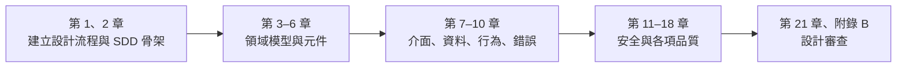

### 0.6 例外與豁免流程

規則不可能涵蓋所有情境。專案無法遵守某條「必須」規則時，依下列流程申請豁免，**不得**直接忽略：

1. 在 SDD 的「設計決策」章節（或獨立 ADR）寫明豁免的規則編號，說明原因、替代控制措施與到期日。
2. 由設計審查會議的主持人（或指定的架構師）核准，並記錄核准人與日期。
3. 到期前重新評估；到期未處理的豁免，在下一次設計審查視為不通過。

```markdown
# DD-017 豁免 SD-DAT-006：報表暫存表不設樂觀鎖版本欄位

- 狀態：accepted（有效至 2027-06-30）
- 豁免規則：SD-DAT-006（可被並行修改的資料必須有版本欄位）
- 原因：report_staging 每晚由單一批次工作重建，白天唯讀，不會被並行修改。
- 替代控制：批次以 ShedLock 確保單一執行個體；表格權限只授予批次帳號。
- 核准：系統設計審查會議，2026-10-08
```

#### 🔍 0.6 審查與驗證

- **自動檢查：** 以 `grep -rn "豁免 SD-" docs/` 列出所有豁免，並檢查每一筆都有「有效至」日期。
- **人工審查問題：**
  1. 豁免是否寫明替代控制措施，而不只是「時程不足」？
  2. 到期日是否合理，有沒有已過期仍在使用的豁免？
- **AI 常見錯誤：** AI 產生的設計常直接寫「本系統不適用此規則」，但沒有提出替代控制或到期日。這類說法應改走豁免流程。

## 1. 系統設計流程與國際標準

### 1.1 國際標準與設計流程

系統設計不是「畫幾張圖」，而是一個有輸入、有活動、有產出、可以被審查的工程流程。本指引採用下列國際標準作為流程與文件的骨架：

| 標準 | 用途 | 本指引的應用 |
| --- | --- | --- |
| ISO/IEC/IEEE 12207:2026 | 軟體生命週期流程（2026 年第 2 版，取代 2017 版） | 「設計定義流程」的活動與產出，本節 |
| ISO/IEC/IEEE 42010:2022 | 架構描述：利害關係人、關注點、視點、視圖 | SDD 的視圖組織方式，第 2 章 |
| IEEE 1016-2009 | 軟體設計描述（SDD）的資訊內容與組織 | SDD 的設計視點清單，第 2 章、附錄 C |
| ISO/IEC/IEEE 15289:2019 | 生命週期資訊項目（文件）的內容 | 交付物清單，第 21 章 |
| ISO/IEC 25010:2023 | 產品品質模型 | 非功能設計，第 13 章 |
| ISO/IEC/IEEE 29148:2018 | 需求工程 | 需求追溯，1.2 |

> IEEE 1016-2009 目前在 IEEE 的狀態為「Inactive-Reserved」（未撤銷，但不再維護）。它的設計視點概念已被 ISO/IEC/IEEE 42010:2022 的「視點／視圖」框架涵蓋，因此本指引以 42010 的術語為主，並沿用 1016 的視點清單作為 SDD 章節的檢核表。

依 ISO/IEC/IEEE 12207 的設計定義流程，詳細設計至少要完成下列活動，每一項都必須有可審查的產出：

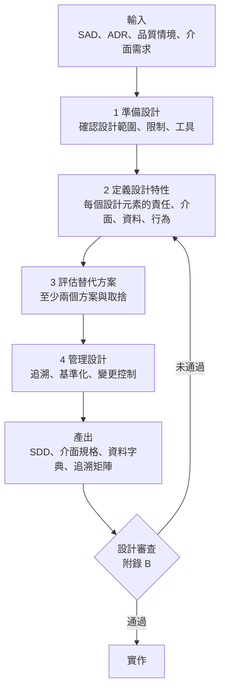

| 編號 | 等級 | 規則 | 驗證方式 |
| --- | --- | --- | --- |
| `SD-PRC-001` | 必須 | 詳細設計開始前，SAD、相關架構決策（ADR）與品質情境必須已核准；SDD 的「參考文件」章節必須列出其版本或 commit | 👁 設計審查（核對參考文件版本） |
| `SD-PRC-002` | 必須 | 每個設計元素都必須產出設計定義流程要求的內容：責任與設計特性、提供與使用的介面、資料、行為（含錯誤路徑），以 6.4 的元件規格表呈現 | 🤖 SDD 章節檢查腳本（附錄 C）；👁 設計審查 |

```markdown
<!-- ✅ SD-PRC-001：SDD 的參考文件章節明確列出版本 -->
## 2. 參考文件

| 文件 | 版本／位置 | 狀態 |
| --- | --- | --- |
| 訂單系統 SAD | v1.3（docs/sad/order-sad.md @ 7c41e2a） | 已核准 2026-09-30 |
| ADR-0012 採用模組化單體 | docs/adr/0012-modular-monolith.md | accepted |
| 品質情境 QS-ORD-01～05 | docs/sad/quality-scenarios.md @ 7c41e2a | 已核准 |

<!-- ❌ SD-PRC-001：沒有版本，審查者無法確認設計依據的是哪一版需求 -->
## 2. 參考文件

- 系統分析文件
- 架構設計
```

```markdown
<!-- ✅ SD-PRC-002：每個設計元素都有完整的元件規格（格式見 6.4） -->
### 5.3 元件：OrderPlacementService

| 項目 | 內容 |
| --- | --- |
| 責任 | 接受下單命令，驗證庫存與額度後建立訂單並發布 OrderPlaced 事件 |
| 提供的介面 | `PlaceOrderUseCase.place(PlaceOrderCommand)`（6.2） |
| 使用的介面 | `CatalogPort`、`CreditPort`、`InventoryApi`、`OrderRepository` |
| 管理的資料 | 寫入 `orders`、`order_lines`（8.1） |
| 狀態與並行性 | 無狀態；行為見循序圖 9.1、狀態機 9.2；並行情境見 9.4 |
| 錯誤 | 庫存不足 → ORD-4091，額度不足 → ORD-4092（錯誤碼表 10.1） |
| 組態 | `app.order.reservation-timeout`、`app.order.max-lines`（6.4） |
| 可觀測性 | 指標 `order.placed`、觀測點 `order.place`（13.5） |
```

#### 🔍 1.1 審查與驗證

- **自動檢查：** 以附錄 C.3 的腳本檢查 SDD 是否包含必要章節，並檢查每個「元件」小節是否包含 6.4 定義的八個項目。
- **人工審查問題：**
  1. SDD 引用的 SAD 版本與目前核准的版本是否相同？如果 SAD 已更新，差異是否已反映到設計？
  2. 每個元件的「錯誤」與行為說明是否包含錯誤路徑，而不只是成功流程？
- **AI 常見錯誤：** AI 產生的 SDD 常引用「最新版 SAD」而不寫版本號，或把需求文字原封不動複製成「設計」。設計必須回答「怎麼做」，而不是重述「要做什麼」。

### 1.2 需求與設計的雙向追溯

追溯（traceability）讓審查者可以回答兩個問題：「每個需求都有被設計嗎？」以及「每個設計都有存在的理由嗎？」前者防止遺漏，後者防止過度設計（gold plating）。追溯矩陣必須以機器可讀的格式維護，才能在 CI 中自動檢查，而不是一份沒人更新的 Excel。

| 編號 | 等級 | 規則 | 驗證方式 |
| --- | --- | --- | --- |
| `SD-PRC-003` | 必須 | 每個功能需求與非功能需求（品質情境）都必須追溯到至少一個設計元素；追溯矩陣以 YAML 或 CSV 等機器可讀格式與 SDD 一起版控 | 🤖 追溯檢查腳本（本節範例） |
| `SD-PRC-004` | 必須 | 每個設計元素都必須追溯回至少一個需求或架構決策；沒有來源的設計元素必須刪除或補上決策紀錄 | 🤖 追溯檢查腳本 |
| `SD-PRC-005` | 應該 | 需求 ID 應出現在驗證它的測試中（例如 JUnit `@Tag`），讓「需求 → 設計 → 測試」形成完整鏈結 | 🤖 追溯檢查腳本搭配測試原始碼掃描 |

```yaml
# ✅ SD-PRC-003 SD-PRC-004：docs/sdd/trace.yaml，機器可讀的追溯矩陣
requirements:
  - id: REQ-ORD-001
    title: 客戶可以下單
  - id: REQ-ORD-002
    title: 庫存不足時拒絕下單並提示可購買數量
  - id: QS-ORD-01
    title: 下單 API 在每秒 200 筆時 p99 延遲 ≤ 800 ms
decisions:
  - id: ADR-0012
    title: 採用模組化單體
design_elements:
  - id: CMP-ORD-PLACEMENT
    name: OrderPlacementService
    satisfies: [REQ-ORD-001, REQ-ORD-002, QS-ORD-01]
  - id: CMP-ORD-MODULE
    name: order 模組邊界
    satisfies: [ADR-0012]
  - id: DAT-ORD-ORDERS
    name: orders 資料表
    satisfies: [REQ-ORD-001]
```

```python
# ✅ SD-PRC-003 SD-PRC-004 SD-PRC-005：tools/check_trace.py，在 CI 中執行
"""檢查需求與設計元素的雙向追溯，以及需求是否被測試標記引用。"""
import re
import sys
from pathlib import Path

import yaml


def main(trace_file: str, test_root: str) -> int:
    data = yaml.safe_load(Path(trace_file).read_text(encoding="utf-8"))
    req_ids = {r["id"] for r in data["requirements"]}
    sources = req_ids | {d["id"] for d in data.get("decisions", [])}
    covered: set[str] = set()
    errors: list[str] = []
    for element in data["design_elements"]:
        targets = set(element.get("satisfies", []))
        if not targets:
            errors.append(f"{element['id']}: 沒有追溯來源（SD-PRC-004）")
        for unknown in sorted(targets - sources):
            errors.append(f"{element['id']}: 追溯到不存在的需求 {unknown}")
        covered |= targets
    for missing in sorted(req_ids - covered):
        errors.append(f"{missing}: 沒有任何設計元素（SD-PRC-003）")
    tagged: set[str] = set()
    for test in Path(test_root).rglob("*.java"):
        tagged |= set(re.findall(r'@Tag\("((?:REQ|QS)-[A-Z]+-\d+)"\)', test.read_text(encoding="utf-8")))
    for untested in sorted(req_ids - tagged):
        print(f"警告：{untested} 沒有測試標記（SD-PRC-005）")
    for e in errors:
        print(f"錯誤：{e}")
    return 1 if errors else 0


if __name__ == "__main__":
    sys.exit(main(sys.argv[1], sys.argv[2]))
```

```java
// ✅ SD-PRC-005：測試以需求 ID 標記，追溯腳本可以找到它
package com.example.sd.order.application;

import static org.assertj.core.api.Assertions.assertThatThrownBy;

import org.junit.jupiter.api.Tag;
import org.junit.jupiter.api.Test;

class OrderPlacementTraceTest {

    @Test
    @Tag("REQ-ORD-002")
    void rejectsOrderWhenStockIsInsufficient() {
        assertThatThrownBy(() -> { throw new IllegalStateException("ORD-4091"); })
                .hasMessage("ORD-4091");
    }
}
```

執行結果範例（故意讓 `QS-ORD-01` 沒有設計元素、`CMP-X` 沒有來源）：

```text
警告：QS-ORD-01 沒有測試標記（SD-PRC-005）
警告：REQ-ORD-001 沒有測試標記（SD-PRC-005）
錯誤：CMP-X: 沒有追溯來源（SD-PRC-004）
錯誤：QS-ORD-01: 沒有任何設計元素（SD-PRC-003）
```

#### 🔍 1.2 審查與驗證

- **自動檢查：** `python tools/check_trace.py docs/sdd/trace.yaml src/test/java`，結束碼非 0 時 CI 失敗。
- **人工審查問題：**
  1. 追溯是否「有意義」？例如一個品質情境只追溯到「整個系統」，等於沒有追溯，應追溯到實際負責的設計手段（快取、索引、非同步處理）。
  2. 被刪除的需求，其設計元素是否也一起移除？
- **AI 常見錯誤：** AI 會把所有設計元素都標成滿足所有需求，讓檢查表面通過。審查時抽查 3 個元素，確認它們真的實現了所列的需求。

### 1.3 設計替代方案與設計決策

「為什麼這樣設計」比「設計成什麼樣子」更重要：半年後有人想修改設計時，只有知道當初的限制與取捨，才能判斷修改是否安全。架構層級的決策記錄在 ADR；詳細設計層級的決策（例如「訂單編號產生方式」「狀態機要不要用框架」）記錄在 SDD 的設計決策章節，編號為 `DD-xxx`，格式與 ADR 相同（MADR）。

| 編號 | 等級 | 規則 | 驗證方式 |
| --- | --- | --- | --- |
| `SD-PRC-006` | 必須 | 影響兩個以上元件、或事後難以修改的設計決策，必須至少比較兩個替代方案，記錄評估準則、取捨與理由 | 👁 設計審查 |
| `SD-PRC-007` | 應該 | 設計決策應以 MADR 格式撰寫，編號為 `DD-<三位數>`，並包含狀態（proposed／accepted／superseded）與決策日期 | 🤖 front matter 檢查腳本 |

```markdown
<!-- ✅ SD-PRC-006 SD-PRC-007 -->
---
id: DD-004
status: accepted
date: 2026-10-08
deciders: [訂單小組設計負責人, 資料庫管理師]
---

# DD-004 訂單編號的產生方式

## 背景與問題

訂單編號會印在發票與客服系統上，必須唯一、可排序、不可被猜出下一筆，且多個執行個體同時產生時不能衝突。

## 評估準則

1. 唯一性（多執行個體） 2. 不可預測性 3. 依時間排序 4. 對資料庫的負擔

## 替代方案

| 方案 | 唯一性 | 不可預測 | 可排序 | 資料庫負擔 |
| --- | --- | --- | --- | --- |
| A. 資料庫序號 | ✅ | ❌ 可猜出下一筆 | ✅ | 每筆一次序號存取 |
| B. UUIDv4 | ✅ | ✅ | ❌ | 無，但索引分散 |
| C. UUIDv7（時間排序＋隨機） | ✅ | ✅（低位 74 位元隨機） | ✅ | 無，索引局部性佳 |

## 決策

採用方案 C。對外顯示時以 Crockford Base32 編碼縮短長度。

## 影響

- 好處：不需要資料庫往返即可產生 ID，聚合在建立時就有 ID（SD-DDD-009）。
- 代價：ID 長度 26 字元；需要在客服系統調整欄位長度。
```

#### 🔍 1.3 審查與驗證

- **自動檢查：** 腳本檢查 `docs/sdd/decisions/*.md` 的 front matter 是否有 `id`、`status`、`date`，以及 `status: superseded` 的決策是否有 `superseded_by`。
- **人工審查問題：**
  1. 替代方案是「真的替代方案」，還是為了湊數而寫的稻草人？
  2. 評估準則是否與品質情境一致？
- **AI 常見錯誤：** AI 擅長產生看似完整的比較表，但常虛構效能數字（「方案 A 比方案 B 快 37%」）。沒有出處或量測的數字必須刪除或標示「未量測」。

### 1.4 設計審查

設計審查（Critical Design Review, CDR）是設計進入實作前的品質閘門。審查越晚，修正的成本越高：在設計階段改一張表的欄位，比上線後做資料轉置便宜得多。

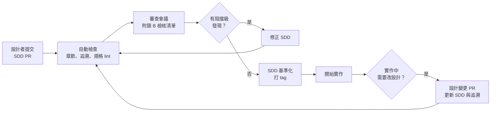

| 編號 | 等級 | 規則 | 驗證方式 |
| --- | --- | --- | --- |
| `SD-PRC-008` | 必須 | SDD 必須通過設計審查並基準化（例如打 git tag）後才開始實作；審查發現必須編號並追蹤到關閉 | 👁 審查紀錄；🤖 git tag 檢查 |
| `SD-PRC-009` | 應該 | 設計審查應使用附錄 B 的檢核清單，審查紀錄應保存每一項的結果與審查者 | 👁 審查紀錄 |
| `SD-PRC-010` | 必須 | 實作期間的設計變更必須以 PR 更新 SDD 與追溯矩陣；修改 API 規格、資料庫遷移腳本的 PR 必須同時修改對應的 SDD 章節或說明不需修改的理由 | 🤖 CI 路徑檢查（本節範例） |

```yaml
# ✅ SD-PRC-010：.github/workflows/design-sync.yml，改了規格卻沒改 SDD 時提醒
name: design-sync
on:
  pull_request:
    paths:
      - "api/**/*.yaml"
      - "src/main/resources/db/migration/**"
permissions:
  contents: read
jobs:
  check-sdd-updated:
    runs-on: ubuntu-24.04
    steps:
      - uses: actions/checkout@3d3c42e5aac5ba805825da76410c181273ba90b1 # v7.0.1
        with:
          fetch-depth: 0
      - name: 確認 SDD 有一起修改
        env:
          BASE_SHA: ${{ github.event.pull_request.base.sha }}
          PR_BODY: ${{ github.event.pull_request.body }}
        run: |
          changed=$(git diff --name-only "$BASE_SHA"...HEAD)
          if echo "$changed" | grep -q '^docs/sdd/'; then
            echo "SDD 已更新"
          elif echo "$PR_BODY" | grep -q 'SDD-NOT-NEEDED:'; then
            echo "PR 說明已註明不需更新 SDD 的理由"
          else
            echo "::error::修改了 API 規格或資料庫遷移，但沒有更新 docs/sdd/（SD-PRC-010）"
            exit 1
          fi
```

```markdown
<!-- ✅ SD-PRC-008 SD-PRC-009：設計審查紀錄（docs/sdd/reviews/2026-10-08-cdr.md） -->
# SDD-ORD v1.1 設計審查紀錄

- 日期：2026-10-08；審查對象：docs/sdd/index.md @ 9f3c2d1
- 出席：設計負責人、領域專家、資安代表、維運代表、測試代表
- 結論：有條件通過；F-2 修正後基準化為 tag `sdd-ord-v1.1`

| 附錄 B 項目 | 結果 | 備註 |
| --- | --- | --- |
| B.1-3 需求雙向追溯 | ✅ | check_trace.py 通過 |
| B.3-2 錯誤路徑 | ❌ | 見 F-2 |
| B.5-1 威脅建模 | ✅ | 威脅清單 T-01～T-06 |

| 發現 | 等級 | 內容 | 負責人 | 狀態 |
| --- | --- | --- | --- | --- |
| F-1 | 次要 | 9.1 循序圖參與者名稱與類別不一致 | 設計負責人 | 已關閉 |
| F-2 | 阻擋 | 取消訂單未畫出退款失敗的補償路徑 | 設計負責人 | 已關閉（PR #231） |
| F-3 | 主要 | 冪等鍵保存期限未定義 | 設計負責人 | 追蹤中，期限 2026-10-15 |
```

#### 🔍 1.4 審查與驗證

- **自動檢查：** `actionlint` 檢查工作流程；CI 中 `design-sync` 必須是必要檢查（branch protection required check）。
- **人工審查問題：**
  1. 審查紀錄中是否有「阻擋級」發現在未修正的情況下被關閉？
  2. 實作完成時，SDD 是否反映實際做法（as-built，見 21.4）？
- **AI 常見錯誤：** AI 產生的審查紀錄常只寫「通過」，沒有逐項結果；也會漏掉「設計變更必須回到審查」這個迴圈。

### 1.5 AI 輔助設計與人工審查

生成式 AI 可以加速 SDD 草稿、圖表與樣板程式的產出，但它不知道你的需求細節、組織限制與實際環境，而且會自信地產生錯誤的版本號、不存在的 API 與虛構的標準條號。本指引的每條規則都附有驗證方式，目的就是讓人可以有效率地審查 AI 的產出。

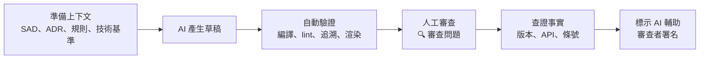

| 編號 | 等級 | 規則 | 驗證方式 |
| --- | --- | --- | --- |
| `SD-PRC-011` | 必須 | 由 AI 產生或大幅修改的設計內容，必須在 SDD 變更紀錄或 PR 中標示，並由具名的人審查；審查者對內容負責 | 👁 PR 審查；🤖 PR 範本勾選項檢查 |
| `SD-PRC-012` | 必須 | 提示中必須提供 SAD 與 ADR 摘要、適用的本指引規則編號、技術基準版本（0.2），不得讓 AI 自行假設技術版本或需求 | 👁 審查提示紀錄 |
| `SD-PRC-013` | 必須 | AI 產出中的版本號、類別與方法名稱、設定鍵、標準條號與數據，必須以編譯、工具或官方文件查證；無法查證的內容必須刪除或標示 | 🤖 編譯與 lint；👁 官方文件比對 |
| `SD-PRC-014` | 不應該 | 不應將個人資料、金鑰、內部主機名稱或未公開的商業資料貼入未經組織核准的 AI 服務 | 👁 資安稽核；🤖 DLP 工具 |

```markdown
<!-- ✅ SD-PRC-012：提供完整上下文的設計提示 -->
你是本專案的系統設計者。請依下列資料產生「訂單取消」use case 的詳細設計草稿。

- 需求：REQ-ORD-010～012（附上全文）
- 架構決策：ADR-0012 模組化單體、ADR-0015 訂單事件以 Spring Modulith 發布
- 技術基準：Java 25、Spring Boot 4.1.1、PostgreSQL 18
- 必須遵守：SD-DDD-003（不變條件在聚合內）、SD-BEH-002（狀態機）、SD-ERR-007（Outbox）
- 產出格式：附錄 C 的元件表、Mermaid 循序圖、狀態轉換表
- 不確定的地方請列在「待確認」，不要自行假設。

<!-- ❌ SD-PRC-012 SD-PRC-014：沒有上下文，且貼上了正式環境連線字串 -->
幫我設計訂單取消功能，用最新的 Spring。資料庫是 jdbc:postgresql://prod-db-01.corp.internal:5432/order?user=app&password=...
```

```markdown
<!-- ✅ SD-PRC-011 SD-PRC-013：PR 範本中的 AI 使用聲明 -->
## AI 輔助聲明

- [x] 本 PR 的 docs/sdd/order-cancel.md 第 3～5 節由 AI 產生草稿
- [x] 已以 `mvn -q compile` 驗證範例程式可編譯
- [x] 已以官方文件查證 Spring Batch 6.0 `JobOperator` API
- [x] 審查者：@designer-lead（對內容負責）
```

#### 🔍 1.5 審查與驗證

- **自動檢查：** PR 範本的 AI 輔助聲明為必填；範例程式以 Maven 編譯、規格以 Spectral 檢查、圖以 mermaid-cli 渲染。
- **人工審查問題：**
  1. AI 引用的標準條號、RFC 編號是否實際存在且內容相符？
  2. AI 是否在「待確認」以外的地方自行假設了需求？
  3. 範例中的類別與方法是否存在於基準版本（例如 Spring Batch 6 已改用 `JobOperator`）？
- **AI 常見錯誤：** 使用已停止維護的技術（Spring Cloud Sleuth、Springfox、`WebSecurityConfigurerAdapter`）；以舊版 API 名稱撰寫範例；虛構效能數字；把「建議」寫成「必須」。

## 2. 系統設計文件與設計視圖

### 2.1 SDD 的結構與設計視點

一份好的系統設計文件（Software Design Description, SDD）讓不同的人各取所需：開發者找到要實作的介面與規則、資料庫管理師找到資料字典、資安人員找到信任邊界、維運人員找到部署與監控設計。ISO/IEC/IEEE 42010:2022 的做法是先列出**利害關係人**與他們的**關注點**，再為每個關注點選擇合適的**視點**，產出對應的**視圖**。IEEE 1016-2009 則提供了詳細設計常用的視點清單。

下表是本指引要求的 SDD 視圖，以及它在本指引中的對應章節。小型系統可以合併視圖，但每個視圖要回答的問題都必須有答案。

| 視圖（IEEE 1016 視點） | 回答的問題 | 主要讀者 | 本指引章節 |
| --- | --- | --- | --- |
| 情境（Context） | 系統邊界在哪裡？和誰互動？ | 全部 | 2.2 |
| 組成（Composition） | 系統由哪些模組與元件組成？ | 開發者、架構師 | 第 6 章 |
| 邏輯（Logical） | 有哪些類別、聚合、值物件？責任如何分配？ | 開發者 | 第 3–5 章 |
| 介面（Interface） | 元件之間、系統之間的契約是什麼？ | 開發者、整合方 | 第 7 章 |
| 資訊（Information） | 資料如何結構化、保存、保護？ | 資料庫管理師、資安 | 第 8 章 |
| 互動（Interaction） | 元件如何協作完成一個 use case？ | 開發者、測試 | 9.1 |
| 狀態動態（State dynamics） | 實體有哪些狀態？如何轉換？ | 開發者、測試 | 9.2 |
| 演算法（Algorithm） | 複雜的計算規則如何運作？ | 開發者、測試 | 9.4 |
| 資源（Resource） | 使用哪些資源？容量多少？ | SRE | 第 13 章 |
| 部署（Deployment） | 元件部署在哪裡？ | SRE、資安 | 第 14 章 |

| 編號 | 等級 | 規則 | 驗證方式 |
| --- | --- | --- | --- |
| `SD-DOC-001` | 必須 | SDD 必須依附錄 C 範本組織，至少包含：範圍、參考文件、設計關注點、上表各視圖（不適用者說明理由）、設計決策、追溯矩陣、待確認事項 | 🤖 SDD 章節檢查腳本（附錄 C.3） |
| `SD-DOC-002` | 必須 | 每個視圖開頭必須寫明它回應的關注點與主要讀者，讓審查者判斷視圖是否完整回答了問題 | 👁 設計審查 |

```markdown
<!-- ✅ SD-DOC-002：視圖開頭說明關注點與讀者 -->
## 8. 資訊視圖

- **關注點：** 訂單資料如何保存與保護？哪些欄位是個資？保存多久？
- **主要讀者：** 資料庫管理師、資安人員、後端工程師
- **內容：** 8.1 ERD、8.2 資料字典、8.3 資料分級與遮罩、8.4 保存期限

<!-- ❌ SD-DOC-001 SD-DOC-002：只有一張圖，沒有說明要回答什麼問題，也沒有資料字典 -->
## 8. 資料庫

（貼上一張資料庫工具匯出的 ERD 截圖）
```

#### 🔍 2.1 審查與驗證

- **自動檢查：** 附錄 C.3 的腳本列出缺少的必要章節。
- **人工審查問題：**
  1. 每個利害關係人的關注點，是否都能在某個視圖中找到答案？
  2. 標示「不適用」的視圖，理由是否成立？例如「本系統沒有狀態」通常不成立。
- **AI 常見錯誤：** AI 產生的 SDD 往往章節齊全但內容空泛（「本系統採用分層架構，具有高可維護性」）。審查時檢查每一節是否有**本系統特有**的內容，例如具體的類別名稱、欄位、數字。

### 2.2 設計圖表的繪製規範

圖是設計溝通最有效率的工具，但沒有說明的圖會造成誤解。本指引採用 [C4 模型](https://c4model.com/) 的抽象層級：L1 系統情境、L2 容器、L3 元件、L4 程式碼。詳細設計主要使用 L3 與 L4，並以 L1 交代邊界。

| 編號 | 等級 | 規則 | 驗證方式 |
| --- | --- | --- | --- |
| `SD-DOC-003` | 必須 | 設計圖必須以文字格式（Mermaid、PlantUML 或 Structurizr DSL）撰寫並納入版控；不得只提交沒有原始檔的圖片 | 🤖 CI 檢查（圖片必須有同名原始檔）；🤖 mermaid-cli 渲染 |
| `SD-DOC-004` | 必須 | 每張圖必須有標題與 C4 層級；每個元素標示名稱與類型；每條關係標示用途，跨程序的關係還要標示協定與同步／非同步 | 👁 設計審查 |
| `SD-DOC-005` | 應該 | L3 元件圖中的元件應對應實際的模組或套件；使用 Spring Modulith 時，應以 `Documenter` 從程式碼產生模組圖並與設計圖比對 | 🤖 Spring Modulith `Documenter` |
| `SD-DOC-006` | 不應該 | 不應在同一張圖中混用不同抽象層級（例如在容器圖中畫出類別） | 👁 設計審查 |

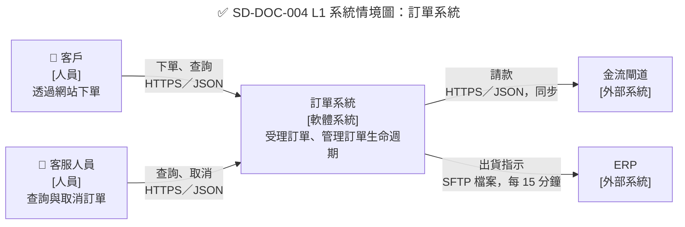

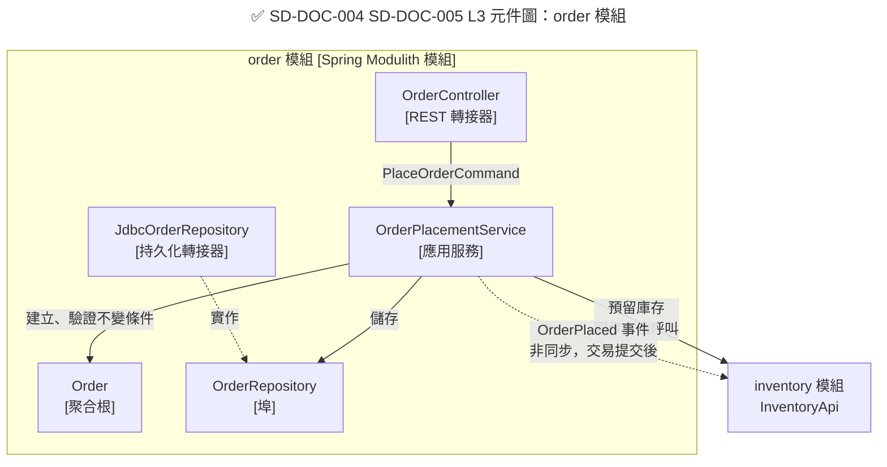

```java
// ✅ SD-DOC-005：由程式碼產生模組圖，與 SDD 的 L3 元件圖比對
package com.example.sd;

import org.junit.jupiter.api.Test;
import org.springframework.modulith.core.ApplicationModules;
import org.springframework.modulith.docs.Documenter;

class ModuleDocumentationTests {

    @Test
    void writeModuleDiagrams() {
        ApplicationModules modules = ApplicationModules.of(SampleApplication.class);
        new Documenter(modules)
                .writeModulesAsPlantUml()
                .writeIndividualModulesAsPlantUml();
    }
}
```

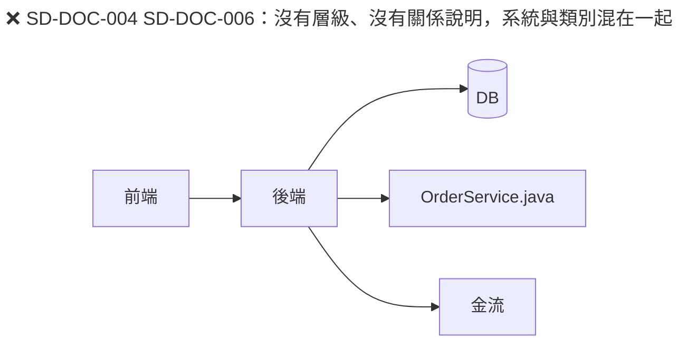

```bash
#!/usr/bin/env bash
# ✅ SD-DOC-003：tools/check-diagram-sources.sh，每張圖片都必須有同名的文字原始檔
status=0
for img in docs/sdd/diagrams/*.png docs/sdd/diagrams/*.svg; do
  [ -e "$img" ] || continue
  base="${img%.*}"
  if [ ! -e "$base.mmd" ] && [ ! -e "$base.puml" ] && [ ! -e "$base.dsl" ]; then
    echo "缺少原始檔：$img"
    status=1
  fi
done
exit "$status"
```

#### 🔍 2.2 審查與驗證

- **自動檢查：** `npx -p @mermaid-js/mermaid-cli mmdc -i diagram.mmd -o diagram.svg` 確認可渲染；CI 執行 `tools/check-diagram-sources.sh`，檢查每張圖片都有同名的 `.mmd`／`.puml`／`.dsl` 原始檔。
- **人工審查問題：**
  1. 只看這張圖，一個新進同事能否說出每個箭頭代表什麼？
  2. 元件圖中的元件名稱，能否在程式碼中找到同名的類別或套件？
- **AI 常見錯誤：** Mermaid 語法錯誤（訊息文字含半形分號 `;`、未加引號的括號）、把資料庫畫成元件但沒有說明誰擁有它、在 L3 元件圖中畫出外部系統的內部結構。

### 2.3 文件即程式碼（Docs-as-Code）

設計文件與程式碼放在一起、以相同的流程審查，才不會在第一次上線後就過時。SDD 以 Markdown 撰寫，存放在專案的 `docs/sdd/`，隨 PR 審查並與程式碼一起打 tag。

```text
repo/
├── docs/
│   ├── sad/                 # 系統分析文件
│   ├── adr/                 # 架構決策紀錄
│   └── sdd/
│       ├── index.md         # SDD 主文件（附錄 C 範本）
│       ├── trace.yaml       # 追溯矩陣（1.2）
│       ├── decisions/       # 設計決策 DD-xxx（1.3）
│       └── diagrams/        # Mermaid／PlantUML 原始檔
├── api/                     # OpenAPI／AsyncAPI 規格（第 7 章）
└── src/
```

| 編號 | 等級 | 規則 | 驗證方式 |
| --- | --- | --- | --- |
| `SD-DOC-007` | 必須 | SDD 必須與程式碼放在同一個版本庫（或可由程式碼版本追溯到 SDD 版本），以 PR 審查，並有文件版本號與變更紀錄 | 🤖 CI 檢查 `docs/sdd/index.md` 存在且有版本表 |
| `SD-DOC-008` | 應該 | CI 應檢查設計文件的 Markdown 格式、內部連結與圖表渲染，失敗時阻擋合併 | 🤖 markdownlint-cli2、mermaid-cli |

```yaml
# ✅ SD-DOC-007 SD-DOC-008：.github/workflows/docs.yml
name: docs
on:
  pull_request:
    paths: ["docs/**"]
permissions:
  contents: read
jobs:
  lint:
    runs-on: ubuntu-24.04
    steps:
      - uses: actions/checkout@3d3c42e5aac5ba805825da76410c181273ba90b1 # v7.0.1
      - uses: actions/setup-node@820762786026740c76f36085b0efc47a31fe5020 # v7.0.0
        with:
          node-version: "24"
      - name: Markdown 格式
        run: npx --yes markdownlint-cli2 "docs/**/*.md"
      - name: SDD 必須有版本表
        run: grep -q '^| 版本 | 日期 |' docs/sdd/index.md
      - name: 渲染所有 Mermaid 圖
        run: |
          for f in docs/sdd/diagrams/*.mmd; do
            npx --yes -p @mermaid-js/mermaid-cli mmdc -i "$f" -o "/tmp/$(basename "$f" .mmd).svg"
          done
```

#### 🔍 2.3 審查與驗證

- **自動檢查：** `actionlint` 檢查工作流程；`docs` 工作設為必要檢查。
- **人工審查問題：**
  1. SDD 的版本與程式碼的發行版本是否能對應？上線的版本能否找到當時的 SDD？
  2. 文件是否只存在於 Wiki 或共享資料夾？若是，如何確保與程式碼同步？
- **AI 常見錯誤：** 產生引用不存在的 GitHub Action 或以可變標籤（`@main`、`@v4`）引用 Action；應以 commit SHA 釘選並附上版本註解。

### 2.4 文件維護

v1.x 的「文件維護指引」只列出原則；本版改為可檢查的規則。文件過時比沒有文件更危險，因為讀者會相信它。

| 編號 | 等級 | 規則 | 驗證方式 |
| --- | --- | --- | --- |
| `SD-DOC-009` | 必須 | 必須定義 SDD 的更新觸發條件：介面變更、資料模型變更、狀態機變更、部署架構變更、安全控制變更；PR 範本必須列出這些條件供勾選 | 🤖 PR 範本；🤖 CI 路徑檢查（1.4） |
| `SD-DOC-010` | 應該 | 每份 SDD 應標示負責人與最後審查日期；超過 6 個月未審查的文件應由 CI 提出警告 | 🤖 文件新鮮度檢查腳本 |

```markdown
<!-- ✅ SD-DOC-009：.github/pull_request_template.md 的設計影響區塊 -->
## 設計影響（SD-DOC-009）

本 PR 是否變更下列任一項？若是，請一併更新 docs/sdd/ 對應章節。

- [ ] 對外或模組間介面（API、事件、檔案格式）
- [ ] 資料模型（資料表、欄位、索引、保存期限）
- [ ] 狀態機或業務規則
- [ ] 部署架構或資源需求
- [ ] 認證、授權或資料保護控制
- [ ] 以上皆無
```

```markdown
<!-- ✅ SD-DOC-007 SD-DOC-010：docs/sdd/index.md 開頭的文件資訊 -->
| 項目 | 內容 |
| --- | --- |
| 文件編號 | SDD-ORD |
| 負責人 | 訂單小組設計負責人 |
| 最後審查日 | 2026-10-08 |

| 版本 | 日期 | 變更 | 審查者 |
| --- | --- | --- | --- |
| 1.0 | 2026-09-15 | 初版，CDR 通過 | 設計審查會議 |
| 1.1 | 2026-10-08 | 新增訂單取消（REQ-ORD-010～012） | 設計審查會議 |
```

#### 🔍 2.4 審查與驗證

- **自動檢查：** 每週排程執行腳本，讀取「最後審查日」欄位，超過 180 天時在 issue tracker 開立提醒。
- **人工審查問題：**
  1. 最近三個月合併的 PR 中，勾選了「介面變更」的 PR，是否都有修改 SDD？
  2. 文件負責人是否仍在專案中？
- **AI 常見錯誤：** 只更新程式碼而忘記更新 SDD 的對應章節；或更新了內文卻沒有更新版本表。

## 3. 物件導向設計原則

本章說明類別層級的設計原則。這些原則不是教條，而是**降低變更成本**的工具：好的設計讓一個需求變更只影響少數類別，而且影響範圍可以預測。每條原則都附有「怎麼看出違反」的審查方法，因為審查者通常看到的是已經寫好的程式或 AI 產生的類別圖。

### 3.1 SOLID 原則

| 原則 | 一句話說明 | 違反時的徵兆 |
| --- | --- | --- |
| 單一職責（SRP） | 一個類別只有一個「變更的理由」，也就是只對一個角色負責 | 類別名稱帶有 Manager、Handler、Util；修改報表格式卻要動到計價類別 |
| 開放封閉（OCP） | 新增一種變化時，新增類別而不是修改既有分支 | 每加一種客戶等級都要改同一個 `switch` |
| 里氏替換（LSP） | 子型別能在任何使用父型別的地方替換，而行為仍然正確 | 覆寫方法丟出 `UnsupportedOperationException`；呼叫端出現 `instanceof` 判斷 |
| 介面隔離（ISP） | 使用者不應被迫依賴它用不到的方法 | 介面有十幾個方法，實作類別一半是空方法 |
| 依賴反轉（DIP） | 高層政策依賴抽象，細節（資料庫、框架）實作抽象 | 領域類別 import 了 `jakarta.persistence` 或 `org.springframework` |

| 編號 | 等級 | 規則 | 驗證方式 |
| --- | --- | --- | --- |
| `SD-OO-001` | 必須 | 每個類別的責任必須能用一句不含「和」「並且」的話描述，並寫在 SDD 的元件表或類別的 Javadoc 中；類別只對一個角色（業務單位或技術關注點）負責 | 👁 設計審查；🤖 PMD `GodClass`、`TooManyMethods` |
| `SD-OO-002` | 應該 | 預期會增加種類的變化點（計價規則、通知管道、檔案格式），應以介面隔離，新增種類時只新增實作類別，不修改既有的條件分支 | 🧪 單元測試；👁 設計審查 |
| `SD-OO-003` | 必須 | 子型別不得加強前置條件、減弱後置條件，也不得以丟出 `UnsupportedOperationException` 的方式「實作」父型別的方法；同一介面的所有實作必須通過同一組契約測試 | 🧪 契約測試（抽象測試類別） |
| `SD-OO-004` | 應該 | 介面應依使用者的需求切分；一個埠（port）介面的方法通常不超過 7 個，查詢與命令分開 | 👁 設計審查 |
| `SD-OO-005` | 必須 | 領域層與應用層的類別必須只依賴自己定義的抽象，不得依賴資料庫、Web、訊息等基礎設施框架 | 🤖 ArchUnit |

```java
// ❌ SD-OO-001 SD-OO-002：一個類別負責計價、存檔與寄信，每加一種客戶等級就要改 switch
package com.example.sd.oo.bad;

public class OrderManager {

    public void placeOrder(Order order) {
        BigDecimal total = order.subtotal();
        switch (order.customerTier()) {
            case "GOLD" -> total = total.multiply(new BigDecimal("0.90"));
            case "VIP" -> total = total.multiply(new BigDecimal("0.85"));
            default -> { }
        }
        jdbcTemplate.update("insert into orders(id, total) values (?, ?)", order.id(), total);
        mailSender.send(order.email(), "訂單成立", "金額：" + total);
    }
}
```

以下是改善後的設計：計價規則以介面隔離（OCP），每個類別只負責一件事（SRP），而且計價邏輯完全不依賴基礎設施（DIP）。

```java
// ✅ SD-OO-009 SD-OO-011 SD-I18N-005：不可變的金額值物件，以型別表達「金額一定有幣別」
package com.example.sd.shared;

import java.math.BigDecimal;
import java.math.RoundingMode;
import java.util.Currency;
import java.util.Objects;

public record Money(BigDecimal amount, Currency currency) {

    public Money {
        Objects.requireNonNull(amount, "amount");
        Objects.requireNonNull(currency, "currency");
        int digits = currency.getDefaultFractionDigits();
        if (amount.stripTrailingZeros().scale() > digits) {
            throw new IllegalArgumentException(
                    "金額 " + amount + " 的小數位數超過幣別 " + currency + " 允許的 " + digits + " 位");
        }
        amount = amount.setScale(digits, RoundingMode.UNNECESSARY);
    }

    public static Money of(String amount, String currencyCode) {
        return new Money(new BigDecimal(amount), Currency.getInstance(currencyCode));
    }

    public static Money zero(Currency currency) {
        return new Money(BigDecimal.ZERO, currency);
    }

    public Money plus(Money other) {
        requireSameCurrency(other);
        return new Money(amount.add(other.amount), currency);
    }

    public Money minus(Money other) {
        requireSameCurrency(other);
        return new Money(amount.subtract(other.amount), currency);
    }

    public Money times(int quantity) {
        return new Money(amount.multiply(BigDecimal.valueOf(quantity)), currency);
    }

    /** 依百分比折扣，四捨六入五成雙（銀行家捨入）到幣別的最小單位。 */
    public Money percentOff(int percent) {
        if (percent < 0 || percent > 100) {
            throw new IllegalArgumentException("折扣百分比必須介於 0 與 100：" + percent);
        }
        BigDecimal factor = BigDecimal.valueOf(100L - percent).movePointLeft(2);
        return new Money(amount.multiply(factor).setScale(currency.getDefaultFractionDigits(), RoundingMode.HALF_EVEN),
                currency);
    }

    public boolean isGreaterThan(Money other) {
        requireSameCurrency(other);
        return amount.compareTo(other.amount) > 0;
    }

    private void requireSameCurrency(Money other) {
        if (!currency.equals(other.currency)) {
            throw new IllegalArgumentException("幣別不同：" + currency + " 與 " + other.currency);
        }
    }
}
```

```java
// ✅ SD-OO-002 SD-OO-004：計價規則的抽象，新增等級只需新增實作
package com.example.sd.oo.pricing;

import com.example.sd.shared.Money;

public interface DiscountPolicy {

    /** 此規則是否適用於指定的客戶等級。 */
    boolean supports(CustomerTier tier);

    /** 前置條件：subtotal 不為 null。後置條件：結果幣別相同，且不大於 subtotal。 */
    Money apply(Money subtotal);
}
```

```java
package com.example.sd.oo.pricing;

public enum CustomerTier {
    STANDARD, GOLD, VIP
}
```

```java
// ✅ SD-OO-002：每種折扣一個類別
package com.example.sd.oo.pricing;

import com.example.sd.shared.Money;

public final class GoldDiscount implements DiscountPolicy {

    @Override
    public boolean supports(CustomerTier tier) {
        return tier == CustomerTier.GOLD;
    }

    @Override
    public Money apply(Money subtotal) {
        return subtotal.percentOff(10);
    }
}
```

```java
// ✅ SD-OO-001 SD-OO-005：PriceCalculator 只負責「選出規則並計價」，不依賴任何框架
package com.example.sd.oo.pricing;

import com.example.sd.shared.Money;
import java.util.List;

public final class PriceCalculator {

    private final List<DiscountPolicy> policies;

    public PriceCalculator(List<DiscountPolicy> policies) {
        this.policies = List.copyOf(policies);
    }

    public Money priceFor(CustomerTier tier, Money subtotal) {
        return policies.stream()
                .filter(p -> p.supports(tier))
                .findFirst()
                .map(p -> p.apply(subtotal))
                .orElse(subtotal);
    }
}
```

里氏替換原則最可靠的驗證方式是**契約測試**：把介面的前置與後置條件寫成一個抽象測試類別，每個實作都繼承它。新增實作時，只要繼承這個類別，就會自動檢查是否違反契約。

```java
// ✅ SD-OO-003：DiscountPolicy 的契約測試，每個實作都必須通過
package com.example.sd.oo.pricing;

import static org.assertj.core.api.Assertions.assertThat;

import com.example.sd.shared.Money;
import org.junit.jupiter.params.ParameterizedTest;
import org.junit.jupiter.params.provider.ValueSource;

abstract class DiscountPolicyContractTest {

    abstract DiscountPolicy policy();

    @ParameterizedTest
    @ValueSource(strings = {"0", "0.01", "99.99", "100000"})
    void neverIncreasesPriceAndKeepsCurrency(String amount) {
        Money subtotal = Money.of(amount, "TWD");
        Money result = policy().apply(subtotal);
        assertThat(result.currency()).isEqualTo(subtotal.currency());
        assertThat(result.isGreaterThan(subtotal)).isFalse();
    }
}
```

```java
package com.example.sd.oo.pricing;

class GoldDiscountTest extends DiscountPolicyContractTest {

    @Override
    DiscountPolicy policy() {
        return new GoldDiscount();
    }
}
```

```java
// ❌ SD-OO-003：子型別拒絕父型別承諾的行為，呼叫端只能用 instanceof 防禦
package com.example.sd.oo.bad;

public class FixedDepositAccount extends Account {

    @Override
    public void withdraw(Money amount) {
        throw new UnsupportedOperationException("定存帳戶不可提款");
    }
}
```

DIP 以 ArchUnit 自動檢查。下列測試會在任何 `..domain..` 套件的類別依賴 Spring、JPA、Jackson 或轉接器套件時失敗：

```java
// ✅ SD-OO-005 SD-CMP-001：領域層不依賴框架與基礎設施
package com.example.sd.archtest;

import static com.tngtech.archunit.lang.syntax.ArchRuleDefinition.noClasses;

import com.tngtech.archunit.core.importer.ImportOption;
import com.tngtech.archunit.junit.AnalyzeClasses;
import com.tngtech.archunit.junit.ArchTest;
import com.tngtech.archunit.lang.ArchRule;

@AnalyzeClasses(packages = "com.example.sd", importOptions = ImportOption.DoNotIncludeTests.class)
class DomainIndependenceArchTest {

    @ArchTest
    static final ArchRule domainIsFrameworkFree = noClasses()
            .that().resideInAPackage("..domain..")
            .and().doNotHaveSimpleName("package-info")   // package-info 只用來宣告模組介面（6.1）
            .should().dependOnClassesThat().resideInAnyPackage(
                    "org.springframework..", "jakarta.persistence..", "tools.jackson..",
                    "..adapter..", "..infrastructure..")
            .because("領域層必須只依賴自己定義的抽象（SD-OO-005）");
}
```

#### 🔍 3.1 審查與驗證

- **自動檢查：** `mvn test` 執行 ArchUnit 與契約測試；PMD 的 `GodClass`、`TooManyMethods`、`CouplingBetweenObjects` 規則（設定見程式寫作指引）。
- **人工審查問題：**
  1. 請設計者用一句話說出每個類別的責任。說不出來或需要用「和」連接的，就是 SRP 的警訊。
  2. 「下次新增一種 X」時，需要修改哪些類別？如果答案包含既有的 `switch`，就違反 OCP。
  3. 介面的每個實作是否都通過同一組契約測試？
- **AI 常見錯誤：** AI 常產生「一個介面＋一個實作」的形式主義設計（違反 SD-OO-013），或為了符合 SRP 把一個簡單功能拆成十幾個只有一行的類別。原則是為了降低變更成本，不是為了增加類別數。

### 3.2 責任分配：GRASP 與迪米特法則

SOLID 告訴我們「類別該長什麼樣子」，GRASP（General Responsibility Assignment Software Patterns）則回答「這個責任該放在哪個類別」。最常用的三個模式：

| 模式 | 問題 | 答案 |
| --- | --- | --- |
| 資訊專家（Information Expert） | 誰該負責計算訂單總額？ | 擁有計算所需資料的類別，也就是 `Order` |
| 創建者（Creator） | 誰該建立 `OrderLine`？ | 包含或聚合它的類別，也就是 `Order` |
| 低耦合、高內聚 | 如何判斷責任分配得好不好？ | 修改一個需求時，影響的類別越少越好 |

| 編號 | 等級 | 規則 | 驗證方式 |
| --- | --- | --- | --- |
| `SD-OO-006` | 應該 | 行為應放在擁有所需資料的物件上（資訊專家），避免服務類別以一連串 getter 取出資料再計算 | 👁 設計審查 |
| `SD-OO-007` | 應該 | 物件只應和直接的協作者溝通（迪米特法則），避免 `a.getB().getC().doSomething()` 這種穿透多層的呼叫鏈；流暢介面（builder、stream）不在此限 | 👁 設計審查；🤖 PMD `LawOfDemeter`（僅供參考，誤報多） |
| `SD-OO-008` | 應該 | 優先使用組合而非繼承；繼承只用於真正的「is-a」關係，且父類別應設計為可被繼承（文件化覆寫契約）或宣告為 `final`／`sealed` | 👁 設計審查；🤖 ArchUnit（跨模組繼承檢查） |

```java
// ❌ SD-OO-006 SD-OO-007：服務類別穿透物件結構取資料再計算（片段）
BigDecimal total = BigDecimal.ZERO;
for (OrderLine line : order.getLines()) {
    total = total.add(line.getProduct().getPrice().getAmount()
            .multiply(BigDecimal.valueOf(line.getQuantity())));
}
String city = order.getCustomer().getAddress().getCity();
```

（片段：示意服務類別中的錯誤寫法）

```java
// ✅ SD-OO-006 SD-OO-007：由資訊專家自己計算，呼叫端只問「結果」
package com.example.sd.oo.grasp;

import com.example.sd.shared.Money;
import java.util.Currency;
import java.util.List;

public final class Cart {

    public record Line(String sku, Money unitPrice, int quantity) {

        public Line {
            if (quantity <= 0) {
                throw new IllegalArgumentException("數量必須大於 0：" + quantity);
            }
        }

        Money subtotal() {
            return unitPrice.times(quantity);
        }
    }

    private final Currency currency;
    private final List<Line> lines;

    public Cart(Currency currency, List<Line> lines) {
        this.currency = currency;
        this.lines = List.copyOf(lines);
    }

    public Money total() {
        return lines.stream().map(Line::subtotal).reduce(Money.zero(currency), Money::plus);
    }
}
```

```java
// ✅ SD-OO-008：以組合取代繼承，通知管道可在執行時替換，也容易測試
package com.example.sd.oo.grasp;

import java.util.List;

public final class OrderNotifier {

    public interface Channel {
        void send(String recipient, String message);
    }

    private final List<Channel> channels;

    public OrderNotifier(List<Channel> channels) {
        this.channels = List.copyOf(channels);
    }

    public void notifyPlaced(String recipient, String orderId) {
        channels.forEach(c -> c.send(recipient, "訂單 " + orderId + " 已成立"));
    }
}
```

```java
// ❌ SD-OO-008：為了重用寄信程式而繼承，簡訊通知被迫繼承郵件設定（片段）
public class SmsOrderNotifier extends EmailOrderNotifier {
    @Override
    protected void send(String to, String body) { smsGateway.send(to, body); }
}
```

（片段：示意繼承誤用）

#### 🔍 3.2 審查與驗證

- **自動檢查：** ArchUnit 可檢查「不得繼承其他模組的非抽象類別」；PMD `LawOfDemeter` 誤報多，只適合作為審查時的參考清單。
- **人工審查問題：**
  1. 服務類別中是否有大量的 `getXxx().getYyy()`？這通常代表行為放錯了地方。
  2. 每個繼承關係，子類別是否真的「是一種」父類別？還是只是想重用程式碼？
- **AI 常見錯誤：** 產生只有 getter／setter 的實體搭配龐大的 Service（貧血模型，見 SD-DDD-010）；以抽象基底類別實作共用邏輯，造成深層繼承。

### 3.3 不可變性與型別設計

讓不合法的狀態「無法被表達」，是比事後檢查更可靠的設計。Java 25 的 record、sealed 類型與 pattern matching 讓這件事變得容易。

| 編號 | 等級 | 規則 | 驗證方式 |
| --- | --- | --- | --- |
| `SD-OO-009` | 必須 | 值物件、命令、查詢結果、DTO 與事件必須是不可變型別（優先使用 `record`），建構時驗證，並以防禦性複製保存集合 | 🤖 ArchUnit（`..dto..`、`..event..` 套件只能有 record）；🧪 單元測試 |
| `SD-OO-010` | 應該 | 封閉的類型階層（付款結果、驗證結果）應以 `sealed` 介面與 record 表達，並以不含 `default` 的 `switch` 處理，讓編譯器檢查是否處理了所有情況 | 🤖 javac（缺少分支時編譯失敗） |
| `SD-OO-011` | 必須 | 公開方法的參數與回傳值必須以型別表達業務約束：金額用 `Money`、識別碼用專屬型別或 record、有限選項用 `enum`；不得以 `String`、`BigDecimal`、`Map<String, Object>` 傳遞業務概念 | 👁 設計審查 |
| `SD-OO-012` | 不應該 | 公開 API 不應以 `null` 表達「沒有值」；查詢單筆結果回傳 `Optional`，集合回傳空集合；參數不接受 `null` | 🤖 NullAway／Error Prone；🧪 單元測試 |

```java
// ✅ SD-OO-010：sealed 階層，新增結果種類時所有 switch 都會編譯失敗，不會漏處理
package com.example.sd.oo.types;

import java.time.Instant;

public sealed interface PaymentResult {

    record Approved(String authorizationCode) implements PaymentResult { }

    record Declined(String reasonCode) implements PaymentResult { }

    record Pending(Instant retryAfter) implements PaymentResult { }
}
```

```java
// ✅ SD-OO-010 SD-OO-012：switch 不含 default；查詢回傳 Optional
package com.example.sd.oo.types;

import java.util.Map;
import java.util.Optional;

public final class PaymentMessages {

    private static final Map<String, String> DECLINE_REASONS = Map.of(
            "51", "餘額不足",
            "54", "卡片已過期");

    public static String describe(PaymentResult result) {
        return switch (result) {
            case PaymentResult.Approved a -> "付款成功，授權碼 " + a.authorizationCode();
            case PaymentResult.Declined d -> "付款失敗：" + reasonText(d.reasonCode()).orElse("請聯絡發卡銀行");
            case PaymentResult.Pending p -> "處理中，請於 " + p.retryAfter() + " 後查詢";
        };
    }

    static Optional<String> reasonText(String code) {
        return Optional.ofNullable(DECLINE_REASONS.get(code));
    }

    private PaymentMessages() {
    }
}
```

```java
// ❌ SD-OO-011 SD-OO-012：以字串與 Map 傳遞業務概念，找不到時回傳 null（片段）
public Map<String, Object> pay(String orderId, BigDecimal amount, String type) {
    if (!"CARD".equals(type) && !"ATM".equals(type)) return null;
    ...
}
```

（片段：示意不良的方法簽章）

#### 🔍 3.3 審查與驗證

- **自動檢查：** javac 對 sealed `switch` 的完整性檢查；Error Prone 搭配 NullAway 檢查 `null` 的流動（設定見程式寫作指引）。
- **人工審查問題：**
  1. 公開方法簽章中有沒有 `String type`、`int status`、`Map<String, Object>`？它們應該是什麼型別？
  2. 值物件的建構子是否驗證了所有約束？能不能建立出一個不合法的物件？
- **AI 常見錯誤：** 在 `switch` 中加上 `default -> throw new IllegalStateException()`，使編譯器失去完整性檢查；以 `double` 表示金額；record 中保存外部傳入的可變 `List` 而沒有 `List.copyOf`。

### 3.4 簡潔原則：KISS、YAGNI 與 DRY

| 原則 | 意義 | 常見誤用 |
| --- | --- | --- |
| KISS | 選擇能滿足需求的最簡單設計 | 把「簡單」當成「省略錯誤處理」 |
| YAGNI | 不為「將來可能」的需求增加抽象 | 每個類別都配一個只有一個實作的介面 |
| DRY | 每項**知識**只有一個權威來源 | 把兩段「長得像」但意義不同的程式合併，造成耦合 |

| 編號 | 等級 | 規則 | 驗證方式 |
| --- | --- | --- | --- |
| `SD-OO-013` | 應該 | 不應為假想的需求增加抽象層；只有一個實作、也不需要測試替身的介面不需建立。抽象應在第二個實作出現或有明確的測試需求時才引入 | 👁 設計審查 |
| `SD-OO-014` | 應該 | 重複的邏輯應在確認代表「同一項業務知識」後才合併（通常是第三次出現時）；不同限界上下文中「看起來相同」的邏輯不應共用 | 👁 設計審查 |

```java
// ❌ SD-OO-013：只有一個實作、沒有替換需求的介面，徒增閱讀成本（片段）
public interface OrderIdFormatter { String format(UUID id); }
public class OrderIdFormatterImpl implements OrderIdFormatter { ... }
public interface OrderIdFormatterFactory { OrderIdFormatter create(); }
```

（片段：示意過度設計）

```markdown
<!-- ✅ SD-OO-014：SDD 中說明為什麼「不」共用 -->
### DD-009 會員模組與訂單模組各自維護地址格式驗證

兩者目前的驗證規則相同，但會員地址遵循會員條款（可填海外地址），
訂單的收件地址受物流商限制（只收國內地址）。兩者會因不同理由變更，
因此不抽出共用類別，以免一方的變更影響另一方。
```

#### 🔍 3.4 審查與驗證

- **自動檢查：** 可用 ArchUnit 列出「只有一個實作的介面」作為審查清單（不作為失敗條件）。
- **人工審查問題：**
  1. 這個抽象今天解決了什麼問題？如果答案是「將來可能需要」，請刪除。
  2. 被合併的兩段程式，未來會不會因為不同的原因被修改？
- **AI 常見錯誤：** AI 傾向產生「企業級」的過度抽象（Factory 的 Factory、每層都有介面），以及把不同上下文的相似程式抽成共用 `CommonUtils`。

## 4. 設計模式應用

設計模式是「已被證明有效的問題解法」的共同語言。在 SDD 中寫「計價規則採用 Strategy 模式」，讀者立刻知道結構與擴充方式。但模式也常被濫用：為了用模式而用模式，只會增加複雜度。本章列出企業系統最常用的模式、它們在 Spring 中的慣用寫法，以及應避免的反模式。

### 4.1 模式的選用準則

| 變化點 | 建議模式 | Spring 慣用實作 | 本節範例 |
| --- | --- | --- | --- |
| 演算法或規則有多種，執行時選擇 | Strategy | 注入 `List<介面>` 或 `Map<String, 介面>` | `NotificationRouter` |
| 依輸入建立不同的物件 | Factory | 集中選擇邏輯的工廠類別 | `StatementParserFactory` |
| 物件有很多選填參數 | Builder | record 搭配靜態 builder | `TransactionQuery` |
| 在不修改原類別的情況下加上功能 | Decorator | 包裝同一介面的類別，或 Spring AOP | `CachingExchangeRates` |
| 狀態改變後通知其他元件 | Observer | `ApplicationEventPublisher` 與 `@TransactionalEventListener` | `OrderPlacedListener` |
| 整合外部或舊系統的模型 | Adapter／防腐層 | 轉接器類別，只在其中出現外部模型 | `LegacyCustomerAdapter` |
| 固定流程中有可變步驟 | Template Method → 改用組合 | 傳入策略或函式 | `CsvExporter` |

| 編號 | 等級 | 規則 | 驗證方式 |
| --- | --- | --- | --- |
| `SD-PAT-001` | 必須 | 在 SDD 中使用設計模式時，必須說明它解決的變化點與替代做法；類別名稱應反映模式角色（例如 `...Policy`、`...Factory`、`...Adapter`） | 👁 設計審查 |
| `SD-PAT-002` | 應該 | 依類型選擇行為時，應以 Strategy 模式實作：各策略為獨立的 Spring bean，由路由類別以 `Map` 查找；不應以 `if-else` 或 `switch` 判斷類型字串 | 🧪 單元測試（每個策略、未知類型） |
| `SD-PAT-003` | 應該 | Factory 應回傳介面型別，選擇邏輯集中在一處，遇到未知類型必須丟出明確的例外，不得回傳 `null` 或預設實作 | 🧪 單元測試 |
| `SD-PAT-004` | 應該 | 有 4 個以上參數或多個選填參數的物件應使用 Builder；必填參數由 builder 的建構方法接收，`build()` 時驗證組合規則 | 🧪 單元測試 |

```java
// ✅ SD-PAT-001 SD-PAT-002：通知管道的 Strategy
package com.example.sd.pattern.notify;

public interface NotificationSender {

    Channel channel();

    void send(String recipient, String message);

    enum Channel { EMAIL, SMS, PUSH }
}
```

```java
package com.example.sd.pattern.notify;

import org.springframework.stereotype.Component;

@Component
class EmailSender implements NotificationSender {

    @Override
    public Channel channel() {
        return Channel.EMAIL;
    }

    @Override
    public void send(String recipient, String message) {
        // 呼叫郵件閘道（省略）
    }
}
```

```java
// ✅ SD-PAT-002：Spring 注入所有策略，啟動時檢查重複，執行時以 Map 查找
package com.example.sd.pattern.notify;

import java.util.EnumMap;
import java.util.List;
import java.util.Map;
import org.springframework.stereotype.Service;

@Service
public class NotificationRouter {

    private final Map<NotificationSender.Channel, NotificationSender> senders =
            new EnumMap<>(NotificationSender.Channel.class);

    public NotificationRouter(List<NotificationSender> all) {
        for (NotificationSender s : all) {
            if (senders.putIfAbsent(s.channel(), s) != null) {
                throw new IllegalStateException("重複的通知管道實作：" + s.channel());
            }
        }
    }

    public void send(NotificationSender.Channel channel, String recipient, String message) {
        NotificationSender sender = senders.get(channel);
        if (sender == null) {
            throw new IllegalArgumentException("未支援的通知管道：" + channel);
        }
        sender.send(recipient, message);
    }
}
```

```java
// ✅ SD-PAT-003：工廠回傳介面，未知格式明確失敗
package com.example.sd.pattern.statement;

import java.io.Reader;
import java.util.List;

public final class StatementParserFactory {

    public interface StatementParser {
        List<String[]> parse(Reader input);
    }

    public enum Format { CSV, FIXED_WIDTH }

    public static StatementParser forFormat(Format format) {
        return switch (format) {
            case CSV -> input -> new java.io.BufferedReader(input).lines().map(l -> l.split(",", -1)).toList();
            case FIXED_WIDTH -> input -> new java.io.BufferedReader(input).lines()
                    .map(l -> new String[] {l.substring(0, 10).strip(), l.substring(10).strip()}).toList();
        };
    }

    public static StatementParser forFileName(String fileName) {
        if (fileName.endsWith(".csv")) {
            return forFormat(Format.CSV);
        }
        if (fileName.endsWith(".txt")) {
            return forFormat(Format.FIXED_WIDTH);
        }
        throw new IllegalArgumentException("無法辨識的對帳檔格式：" + fileName);
    }

    private StatementParserFactory() {
    }
}
```

```java
// ✅ SD-PAT-004：必填參數在 builder() 傳入，組合規則在 build() 驗證
package com.example.sd.pattern.query;

import java.time.LocalDate;
import java.util.Optional;

public record TransactionQuery(String accountId, LocalDate from, LocalDate to,
                               Optional<String> merchant, int pageSize) {

    public static Builder builder(String accountId, LocalDate from, LocalDate to) {
        return new Builder(accountId, from, to);
    }

    public static final class Builder {
        private final String accountId;
        private final LocalDate from;
        private final LocalDate to;
        private String merchant;
        private int pageSize = 50;

        private Builder(String accountId, LocalDate from, LocalDate to) {
            this.accountId = accountId;
            this.from = from;
            this.to = to;
        }

        public Builder merchant(String value) {
            this.merchant = value;
            return this;
        }

        public Builder pageSize(int value) {
            this.pageSize = value;
            return this;
        }

        public TransactionQuery build() {
            if (to.isBefore(from)) {
                throw new IllegalArgumentException("查詢迄日不可早於起日");
            }
            if (from.plusMonths(12).isBefore(to)) {
                throw new IllegalArgumentException("查詢區間不可超過 12 個月");
            }
            if (pageSize < 1 || pageSize > 200) {
                throw new IllegalArgumentException("每頁筆數必須介於 1 與 200");
            }
            return new TransactionQuery(accountId, from, to, Optional.ofNullable(merchant), pageSize);
        }
    }
}
```

```java
// ❌ SD-PAT-002 SD-PAT-003：以字串判斷類型，未知類型回傳 null（片段）
public void send(String type, String to, String msg) {
    if ("EMAIL".equals(type)) { emailClient.send(to, msg); }
    else if ("SMS".equals(type)) { smsClient.send(to, msg); }
}
public Parser getParser(String name) { return name.endsWith(".csv") ? new CsvParser() : null; }
```

（片段：示意不良寫法）

#### 🔍 4.1 審查與驗證

- **自動檢查：** 單元測試涵蓋每個策略、未知類型與重複註冊；`NotificationRouter` 的建構子在重複時讓應用程式啟動失敗。
- **人工審查問題：**
  1. 模式解決的變化點，在需求或路線圖中是否真的存在？
  2. 新增一種類型時，需要修改幾個檔案？理想情況是只新增一個類別。
- **AI 常見錯誤：** 以 `@Autowired Map<String, Bean>` 依 bean 名稱查找策略，使 bean 名稱變成隱性契約（重新命名類別就壞掉）；應由策略自己宣告它處理的類型。

### 4.2 結構與行為模式

| 編號 | 等級 | 規則 | 驗證方式 |
| --- | --- | --- | --- |
| `SD-PAT-005` | 應該 | 快取、稽核、重試、度量等橫切關注點應以 Decorator 或 AOP 集中處理，不應散落在每個業務方法中 | 👁 設計審查；🧪 單元測試（裝飾器行為） |
| `SD-PAT-006` | 應該 | 需要「固定流程＋可變步驟」時，應優先以組合（傳入策略或函式）實作，而不是要求使用者繼承抽象基底類別；Template Method 只用於框架提供的擴充點 | 👁 設計審查 |
| `SD-PAT-007` | 應該 | 狀態改變後通知其他元件，應以應用程式事件實作；需要在交易成功後才執行的動作，必須使用 `@TransactionalEventListener(phase = AFTER_COMMIT)` 或 Spring Modulith 的 `@ApplicationModuleListener` | 🧪 整合測試（交易回滾時不觸發） |
| `SD-PAT-008` | 應該 | 外部系統或舊系統的資料模型必須只出現在轉接器（防腐層）中，轉換為本系統的領域型別後才傳入應用層 | 🤖 ArchUnit |

```java
// ✅ SD-PAT-005：快取以裝飾器實作，業務類別不知道快取的存在
package com.example.sd.pattern.fx;

import com.example.sd.shared.Money;
import java.math.BigDecimal;
import java.time.Clock;
import java.time.Duration;
import java.time.Instant;
import java.util.Currency;
import java.util.concurrent.ConcurrentHashMap;

public final class CachingExchangeRates implements ExchangeRates {

    private record Entry(BigDecimal rate, Instant expiresAt) { }

    private final ExchangeRates delegate;
    private final Clock clock;
    private final Duration ttl;
    private final ConcurrentHashMap<String, Entry> cache = new ConcurrentHashMap<>();

    public CachingExchangeRates(ExchangeRates delegate, Clock clock, Duration ttl) {
        this.delegate = delegate;
        this.clock = clock;
        this.ttl = ttl;
    }

    @Override
    public BigDecimal rate(Currency from, Currency to) {
        String key = from.getCurrencyCode() + "/" + to.getCurrencyCode();
        Instant now = clock.instant();
        Entry hit = cache.get(key);
        if (hit != null && hit.expiresAt().isAfter(now)) {
            return hit.rate();
        }
        BigDecimal fresh = delegate.rate(from, to);
        cache.put(key, new Entry(fresh, now.plus(ttl)));
        return fresh;
    }

    @Override
    public Money convert(Money amount, Currency to) {
        return ExchangeRates.convertWith(rate(amount.currency(), to), amount, to);
    }
}
```

```java
package com.example.sd.pattern.fx;

import com.example.sd.shared.Money;
import java.math.BigDecimal;
import java.math.RoundingMode;
import java.util.Currency;

public interface ExchangeRates {

    BigDecimal rate(Currency from, Currency to);

    Money convert(Money amount, Currency to);

    static Money convertWith(BigDecimal rate, Money amount, Currency to) {
        BigDecimal converted = amount.amount().multiply(rate)
                .setScale(to.getDefaultFractionDigits(), RoundingMode.HALF_EVEN);
        return new Money(converted, to);
    }
}
```

```java
// ✅ SD-PAT-006：以組合提供可變步驟，不需要繼承
package com.example.sd.pattern.export;

import java.io.IOException;
import java.io.Writer;
import java.util.List;
import java.util.function.Function;

public final class CsvExporter<T> {

    private final List<String> headers;
    private final Function<T, List<String>> rowMapper;

    public CsvExporter(List<String> headers, Function<T, List<String>> rowMapper) {
        this.headers = List.copyOf(headers);
        this.rowMapper = rowMapper;
    }

    public void export(Iterable<T> items, Writer out) throws IOException {
        out.write(String.join(",", headers.stream().map(CsvExporter::escape).toList()));
        out.write("\r\n");
        for (T item : items) {
            out.write(String.join(",", rowMapper.apply(item).stream().map(CsvExporter::escape).toList()));
            out.write("\r\n");
        }
    }

    /** RFC 4180：含逗號、引號或換行的欄位以雙引號包住，引號重複一次。 */
    static String escape(String value) {
        if (value.contains(",") || value.contains("\"") || value.contains("\n") || value.contains("\r")) {
            return "\"" + value.replace("\"", "\"\"") + "\"";
        }
        return value;
    }
}
```

```java
// ✅ SD-PAT-007：交易提交後才寄送通知；交易回滾時不會寄出
package com.example.sd.pattern.event;

import org.springframework.stereotype.Component;
import org.springframework.transaction.event.TransactionPhase;
import org.springframework.transaction.event.TransactionalEventListener;

@Component
class OrderPlacedListener {

    record OrderPlaced(String orderId, String customerEmail) { }

    @TransactionalEventListener(phase = TransactionPhase.AFTER_COMMIT)
    void on(OrderPlaced event) {
        // 寄送訂單成立通知（省略）。注意：此處失敗不會回滾訂單，需要重試機制（SD-ERR-007）。
    }
}
```

```java
// ✅ SD-PAT-008：舊系統的模型只存在於轉接器，轉換成本系統的型別
package com.example.sd.pattern.legacy.adapter;

import com.example.sd.pattern.legacy.domain.Customer;
import com.example.sd.pattern.legacy.domain.CustomerDirectory;
import java.util.Optional;

public final class LegacyCustomerAdapter implements CustomerDirectory {

    /** 舊系統回傳的資料結構：欄位名稱縮寫、狀態以數字表示。 */
    record LegacyCustRec(String custNo, String nm, String stsCd) { }

    public interface LegacyClient {
        LegacyCustRec query(String custNo);
    }

    private final LegacyClient client;

    public LegacyCustomerAdapter(LegacyClient client) {
        this.client = client;
    }

    @Override
    public Optional<Customer> find(String customerId) {
        LegacyCustRec rec = client.query(customerId);
        if (rec == null) {
            return Optional.empty();
        }
        Customer.Status status = switch (rec.stsCd()) {
            case "1" -> Customer.Status.ACTIVE;
            case "9" -> Customer.Status.CLOSED;
            default -> throw new IllegalStateException("舊系統回傳未知的客戶狀態碼：" + rec.stsCd());
        };
        return Optional.of(new Customer(rec.custNo(), rec.nm().strip(), status));
    }
}
```

```java
package com.example.sd.pattern.legacy.domain;

import java.util.Optional;

public interface CustomerDirectory {
    Optional<Customer> find(String customerId);
}
```

```java
package com.example.sd.pattern.legacy.domain;

public record Customer(String id, String name, Status status) {
    public enum Status { ACTIVE, CLOSED }
}
```

#### 🔍 4.2 審查與驗證

- **自動檢查：** ArchUnit 規則（4.3 範例）禁止 `..domain..` 與 `..application..` 依賴 `..adapter..`；整合測試驗證交易回滾時 `AFTER_COMMIT` 監聽器不會執行。
- **人工審查問題：**
  1. 事件監聽器失敗時會發生什麼事？有沒有重試或補償？（`AFTER_COMMIT` 失敗不會回滾原交易）
  2. 外部模型的欄位名稱（例如 `custNo`、`stsCd`）是否出現在轉接器以外的地方？
- **AI 常見錯誤：** 使用 `@EventListener`（在交易中同步執行，交易回滾時通知已寄出）；把外部 API 的 DTO 直接當成領域物件使用。

### 4.3 應避免的反模式

| 編號 | 等級 | 規則 | 驗證方式 |
| --- | --- | --- | --- |
| `SD-PAT-009` | 不應該 | 不應自行實作 Singleton（`static` 實例或 `getInstance()`）；單例生命週期交給 DI 容器管理 | 🤖 ArchUnit；🤖 PMD `SingleMethodSingleton`、`SingletonClassReturningNewInstance` |
| `SD-PAT-010` | 不應該 | 業務程式不應以 `ApplicationContext.getBean()` 或靜態持有 context 的方式取得依賴（Service Locator）；依賴必須由建構子注入 | 🤖 ArchUnit |
| `SD-PAT-011` | 不應該 | 不應建立承擔多種責任的「上帝類別」或萬用工具類別（`CommonUtils`、`BaseService`）；工具方法應依領域分組 | 🤖 PMD `GodClass`；👁 設計審查 |

```java
// ❌ SD-PAT-009 SD-PAT-010 SD-PAT-011：自製單例、Service Locator、萬用工具類別（片段）
public final class CommonUtils {
    private static CommonUtils instance;
    public static synchronized CommonUtils getInstance() { ... }
    public Order findOrder(String id) {
        return SpringContextHolder.getBean(OrderRepository.class).findById(id);
    }
    public String formatDate(Date d) { ... }
    public BigDecimal calcTax(BigDecimal amt) { ... }
}
```

（片段：示意常見反模式）

```java
// ✅ SD-PAT-008 SD-PAT-009 SD-PAT-010：以 ArchUnit 防止反模式再次出現
package com.example.sd.archtest;

import static com.tngtech.archunit.lang.syntax.ArchRuleDefinition.noClasses;

import com.tngtech.archunit.core.importer.ImportOption;
import com.tngtech.archunit.junit.AnalyzeClasses;
import com.tngtech.archunit.junit.ArchTest;
import com.tngtech.archunit.lang.ArchRule;
import org.springframework.context.ApplicationContext;

@AnalyzeClasses(packages = "com.example.sd", importOptions = ImportOption.DoNotIncludeTests.class)
class AntiPatternArchTest {

    @ArchTest
    static final ArchRule noServiceLocator = noClasses()
            .that().resideOutsideOfPackage("..config..")
            .should().dependOnClassesThat().areAssignableTo(ApplicationContext.class)
            .because("依賴必須由建構子注入（SD-PAT-010）");

    @ArchTest
    static final ArchRule noHandmadeSingleton = noClasses()
            .should().haveSimpleNameEndingWith("Singleton")
            .orShould().haveSimpleName("CommonUtils")
            .because("單例交給 DI 容器管理，工具方法依領域分組（SD-PAT-009）");

    @ArchTest
    static final ArchRule adaptersStayAtTheEdge = noClasses()
            .that().resideInAnyPackage("..domain..", "..application..")
            .should().dependOnClassesThat().resideInAPackage("..adapter..")
            .because("外部模型只能出現在轉接器（SD-PAT-008）");
}
```

#### 🔍 4.3 審查與驗證

- **自動檢查：** `mvn test` 執行 `AntiPatternArchTest`；PMD 的 `GodClass` 規則。
- **人工審查問題：**
  1. 專案中有沒有 `*Utils`、`*Helper`、`*Manager` 類別？它們的方法是否屬於同一個領域？
  2. 有沒有 `static` 欄位持有可變狀態或 Spring bean？
- **AI 常見錯誤：** 產生 `SpringContextHolder` 讓非 Spring 管理的物件取得 bean；在工具類別中加入資料庫存取。

## 5. 領域模型與戰術設計

[架構設計指引]() 第 3.3 節處理領域驅動設計（DDD）的**戰略設計**：如何劃分限界上下文（bounded context）與上下文之間的關係。本章處理**戰術設計**：在一個限界上下文內，如何以實體、值物件、聚合、領域事件與儲存庫建立領域模型。本章的訂單聚合也是後續各章的共同範例。

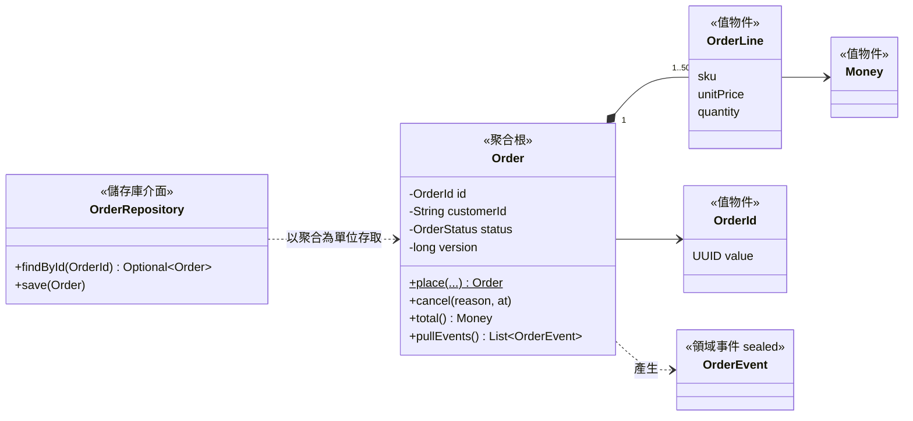

### 5.1 通用語言與領域模型

通用語言（ubiquitous language）是業務人員與開發人員共同使用的詞彙。程式碼中的類別、方法、欄位名稱必須與通用語言一致，才不會在「業務說的訂單」與「程式裡的 order」之間產生翻譯錯誤。

| 編號 | 等級 | 規則 | 驗證方式 |
| --- | --- | --- | --- |
| `SD-DDD-001` | 必須 | SDD 必須包含限界上下文內的詞彙表（中文名稱、英文類別名稱、定義、範例），程式中的類別與方法名稱必須使用詞彙表中的英文名稱 | 👁 設計審查；🤖 詞彙比對腳本（選用） |

```markdown
<!-- ✅ SD-DDD-001：訂單上下文的詞彙表 -->
| 中文 | 程式名稱 | 定義 | 範例 |
| --- | --- | --- | --- |
| 訂單 | `Order` | 客戶一次下單的內容與狀態，是本上下文的聚合根 | 訂單 01J9Z… 含 3 項商品 |
| 訂單明細 | `OrderLine` | 訂單中的一項商品、單價與數量；不可單獨存在 | SKU-1001 × 2，單價 TWD 350 |
| 下單 | `Order.place` | 建立訂單並檢查不變條件 | — |
| 取消 | `Order.cancel` | 出貨前將訂單轉為已取消；需填寫原因 | 客戶來電取消 |
| 已出貨 | `OrderStatus.SHIPPED` | 物流已取件；之後不可取消，只能退貨 | — |
```

#### 🔍 5.1 審查與驗證

- **自動檢查：** 可用腳本列出 `..domain..` 套件中不在詞彙表的類別名稱，作為審查清單。
- **人工審查問題：**
  1. 業務人員看得懂詞彙表嗎？請一位業務代表確認定義。
  2. 同一個詞在不同上下文中意義不同（例如「客戶」在訂單與帳務中），是否已分別定義？
- **AI 常見錯誤：** AI 會使用通用的英文名稱（`Item`、`Data`、`Info`），或在同一份設計中混用 `Customer`、`Client`、`User` 指稱同一件事。

### 5.2 聚合、實體與值物件

**聚合**（aggregate）是一組必須一起保持一致的物件，外部只能透過**聚合根**存取。聚合的邊界就是**交易一致性**的邊界：一個交易只修改一個聚合，聚合之間以 ID 參照並以事件達成最終一致。

| 概念 | 判斷方式 | 範例 |
| --- | --- | --- |
| 實體（Entity） | 有身分，屬性改變後仍是同一個東西 | 訂單、客戶 |
| 值物件（Value Object） | 沒有身分，以值判斷相等，不可變 | 金額、地址、訂單明細 |
| 聚合根（Aggregate Root） | 外部唯一的入口，負責整個聚合的不變條件 | 訂單 |

| 編號 | 等級 | 規則 | 驗證方式 |
| --- | --- | --- | --- |
| `SD-DDD-002` | 必須 | 聚合根是外部存取聚合的唯一入口；聚合內的其他物件不得被外部直接建立或修改；其他聚合只能以 ID 參照，不得持有物件參照 | 🤖 ArchUnit |
| `SD-DDD-003` | 必須 | 聚合的不變條件（invariant）必須由聚合根的建構方法與命令方法保證；物件建立後在任何時間點都必須合法，不得依賴呼叫端先呼叫驗證方法 | 🧪 單元測試（每條不變條件一個失敗案例） |
| `SD-DDD-004` | 應該 | 聚合應盡量小；一個交易應只修改一個聚合，跨聚合的一致性以領域事件達成最終一致 | 👁 設計審查 |
| `SD-DDD-005` | 必須 | 值物件必須不可變、以所有屬性判斷相等，並在建構時驗證 | 🧪 單元測試；🤖 ArchUnit（值物件為 record） |
| `SD-DDD-009` | 應該 | 實體的 ID 應由領域在建立時產生（例如 UUIDv7），而不是依賴資料庫在插入後才產生，讓事件、冪等鍵與日誌在儲存前就能引用 ID | 🧪 單元測試 |
| `SD-DDD-010` | 不應該 | 領域實體不應只有 getter 與公開 setter、把業務規則放在服務類別中（貧血模型）；狀態改變必須透過表達業務意圖的方法 | 🤖 ArchUnit（禁止領域層的公開 setter） |

```java
// ✅ SD-DDD-009：依 RFC 9562 產生 UUIDv7（48 位元毫秒時間戳＋版本＋隨機）
package com.example.sd.shared;

import java.time.Instant;
import java.util.UUID;
import java.util.random.RandomGenerator;

public final class UuidV7 {

    public static UUID generate(Instant now, RandomGenerator random) {
        long millis = now.toEpochMilli();
        if (millis < 0 || millis >= (1L << 48)) {
            throw new IllegalArgumentException("時間超出 UUIDv7 可表示的範圍：" + now);
        }
        long msb = (millis << 16) | 0x7000L | (random.nextLong() & 0x0FFFL);
        long lsb = (random.nextLong() & 0x3FFF_FFFF_FFFF_FFFFL) | 0x8000_0000_0000_0000L;
        return new UUID(msb, lsb);
    }

    private UuidV7() {
    }
}
```

```java
// ✅ SD-DDD-005 SD-DDD-009：識別碼是專屬型別，不是裸的 UUID 或 String
package com.example.sd.order.domain;

import com.example.sd.shared.UuidV7;
import java.time.Instant;
import java.util.Objects;
import java.util.UUID;
import java.util.random.RandomGenerator;

public record OrderId(UUID value) {

    public OrderId {
        Objects.requireNonNull(value, "value");
        if (value.version() != 7) {
            throw new IllegalArgumentException("訂單編號必須是 UUIDv7：" + value);
        }
    }

    public static OrderId newId(Instant now, RandomGenerator random) {
        return new OrderId(UuidV7.generate(now, random));
    }

    public static OrderId parse(String text) {
        return new OrderId(UUID.fromString(text));
    }

    @Override
    public String toString() {
        return value.toString();
    }
}
```

```java
// ✅ SD-DDD-005：訂單明細是值物件，建構時驗證
package com.example.sd.order.domain;

import com.example.sd.shared.Money;
import java.util.Objects;

public record OrderLine(String sku, Money unitPrice, int quantity) {

    public static final int MAX_QUANTITY = 99;

    public OrderLine {
        Objects.requireNonNull(sku, "sku");
        Objects.requireNonNull(unitPrice, "unitPrice");
        if (!sku.matches("SKU-\\d{4,8}")) {
            throw new IllegalArgumentException("SKU 格式錯誤：" + sku);
        }
        if (quantity < 1 || quantity > MAX_QUANTITY) {
            throw new IllegalArgumentException("數量必須介於 1 與 " + MAX_QUANTITY + "：" + quantity);
        }
    }

    public Money subtotal() {
        return unitPrice.times(quantity);
    }
}
```

```java
// ✅ SD-DDD-002 SD-DDD-003 SD-DDD-006 SD-DDD-010 SD-BEH-002：訂單聚合根
package com.example.sd.order.domain;

import com.example.sd.shared.Money;
import java.time.Instant;
import java.util.ArrayList;
import java.util.Currency;
import java.util.List;
import java.util.Objects;

public final class Order {

    public static final int MAX_LINES = 50;
    public static final Money MAX_TOTAL = Money.of("1000000", "TWD");

    private final OrderId id;
    private final String customerId;
    private final Currency currency;
    private final List<OrderLine> lines;
    private OrderStatus status;
    private final long version;
    private final List<OrderEvent> pendingEvents = new ArrayList<>();

    private Order(OrderId id, String customerId, Currency currency, List<OrderLine> lines,
                  OrderStatus status, long version) {
        this.id = Objects.requireNonNull(id);
        this.customerId = Objects.requireNonNull(customerId);
        this.currency = Objects.requireNonNull(currency);
        this.lines = List.copyOf(lines);
        this.status = Objects.requireNonNull(status);
        this.version = version;
    }

    /** 下單：檢查所有不變條件後才建立物件，並產生 OrderPlaced 事件。 */
    public static Order place(OrderId id, String customerId, List<OrderLine> lines, Instant now) {
        if (lines.isEmpty() || lines.size() > MAX_LINES) {
            throw new OrderRuleViolation("ORD-4001", "訂單明細必須有 1 到 " + MAX_LINES + " 筆");
        }
        Currency currency = lines.getFirst().unitPrice().currency();
        if (lines.stream().anyMatch(l -> !l.unitPrice().currency().equals(currency))) {
            throw new OrderRuleViolation("ORD-4002", "同一張訂單的明細必須使用相同幣別");
        }
        if (lines.stream().map(OrderLine::sku).distinct().count() != lines.size()) {
            throw new OrderRuleViolation("ORD-4003", "同一商品請合併為一筆明細");
        }
        Order order = new Order(id, customerId, currency, lines, OrderStatus.PLACED, 0);
        if (currency.equals(MAX_TOTAL.currency()) && order.total().isGreaterThan(MAX_TOTAL)) {
            throw new OrderRuleViolation("ORD-4004", "單筆訂單金額不可超過 " + MAX_TOTAL.amount());
        }
        order.pendingEvents.add(new OrderEvent.OrderPlaced(id, customerId, order.total(), now));
        return order;
    }

    /** 由儲存庫重建物件時使用；不產生事件。 */
    public static Order restore(OrderId id, String customerId, List<OrderLine> lines,
                                OrderStatus status, long version) {
        Currency currency = lines.getFirst().unitPrice().currency();
        return new Order(id, customerId, currency, lines, status, version);
    }

    /** 取消：只有尚未出貨的訂單可以取消，狀態轉換規則由 OrderStatus 集中管理。 */
    public void cancel(String reason, Instant now) {
        if (reason == null || reason.isBlank()) {
            throw new OrderRuleViolation("ORD-4005", "取消訂單必須填寫原因");
        }
        status = status.transitionTo(OrderStatus.CANCELLED);
        pendingEvents.add(new OrderEvent.OrderCancelled(id, reason, now));
    }

    public void markPaid(Instant now) {
        status = status.transitionTo(OrderStatus.PAID);
        pendingEvents.add(new OrderEvent.OrderPaid(id, total(), now));
    }

    public Money total() {
        return lines.stream().map(OrderLine::subtotal).reduce(Money.zero(currency), Money::plus);
    }

    /** 取出並清空待發布的事件，由應用服務在儲存後發布。 */
    public List<OrderEvent> pullEvents() {
        List<OrderEvent> events = List.copyOf(pendingEvents);
        pendingEvents.clear();
        return events;
    }

    public OrderId id() {
        return id;
    }

    public String customerId() {
        return customerId;
    }

    public OrderStatus status() {
        return status;
    }

    public List<OrderLine> lines() {
        return lines;
    }

    public long version() {
        return version;
    }
}
```

```java
package com.example.sd.order.domain;

import com.example.sd.shared.error.BusinessException;

/** 違反訂單業務規則；code 對應錯誤碼表（10.2），例外階層見 10.1。 */
public final class OrderRuleViolation extends BusinessException {

    private static final long serialVersionUID = 1L;

    public OrderRuleViolation(String code, String message) {
        super(code, message);
    }
}
```

每條不變條件都要有一個「違反時會失敗」的測試。審查者可以直接比對 SDD 的不變條件清單與測試名稱：

```java
// ✅ SD-DDD-003 SD-DDD-005：每條不變條件一個測試
package com.example.sd.order.domain;

import static org.assertj.core.api.Assertions.assertThat;
import static org.assertj.core.api.Assertions.assertThatThrownBy;

import com.example.sd.shared.Money;
import java.time.Instant;
import java.util.List;
import java.util.SplittableRandom;
import org.junit.jupiter.api.Test;

class OrderInvariantTest {

    private static final Instant NOW = Instant.parse("2026-10-08T02:00:00Z");
    private final OrderId id = OrderId.newId(NOW, new SplittableRandom(42));

    @Test
    void rejectsEmptyOrder() {
        assertThatThrownBy(() -> Order.place(id, "C001", List.of(), NOW))
                .isInstanceOf(OrderRuleViolation.class).hasMessageContaining("1 到 50");
    }

    @Test
    void rejectsMixedCurrencies() {
        var lines = List.of(new OrderLine("SKU-1001", Money.of("100", "TWD"), 1),
                new OrderLine("SKU-1002", Money.of("10", "USD"), 1));
        assertThatThrownBy(() -> Order.place(id, "C001", lines, NOW))
                .isInstanceOf(OrderRuleViolation.class).hasMessageContaining("相同幣別");
    }

    @Test
    void rejectsTotalAboveLimit() {
        var lines = List.of(new OrderLine("SKU-1001", Money.of("20000", "TWD"), 51));
        assertThatThrownBy(() -> Order.place(id, "C001", lines, NOW))
                .isInstanceOf(OrderRuleViolation.class).hasMessageContaining("1000000");
    }

    @Test
    void rejectsInvalidQuantityAtValueObjectLevel() {
        assertThatThrownBy(() -> new OrderLine("SKU-1001", Money.of("1", "TWD"), 0))
                .isInstanceOf(IllegalArgumentException.class);
    }

    @Test
    void placingProducesEventAndUuidV7() {
        var order = Order.place(id, "C001", List.of(new OrderLine("SKU-1001", Money.of("350", "TWD"), 2)), NOW);
        assertThat(order.id().value().version()).isEqualTo(7);
        assertThat(order.total()).isEqualTo(Money.of("700", "TWD"));
        assertThat(order.pullEvents()).singleElement().isInstanceOf(OrderEvent.OrderPlaced.class);
        assertThat(order.pullEvents()).isEmpty();
    }
}
```

```java
// ❌ SD-DDD-003 SD-DDD-010：貧血模型，任何人都能把訂單改成不合法的狀態（片段）
@Entity
public class Order {
    @Id private Long id;
    private String status;
    private BigDecimal total;
    public void setStatus(String status) { this.status = status; }
    public void setTotal(BigDecimal total) { this.total = total; }
}
// 規則散落在服務中，其他服務可以略過檢查直接 setStatus("CANCELLED")
```

（片段：示意貧血模型）

```java
// ✅ SD-DDD-002 SD-DDD-007 SD-DDD-010：以 ArchUnit 保護聚合邊界
package com.example.sd.archtest;

import static com.tngtech.archunit.lang.syntax.ArchRuleDefinition.classes;
import static com.tngtech.archunit.lang.syntax.ArchRuleDefinition.noMethods;

import com.tngtech.archunit.core.importer.ImportOption;
import com.tngtech.archunit.junit.AnalyzeClasses;
import com.tngtech.archunit.junit.ArchTest;
import com.tngtech.archunit.lang.ArchRule;

@AnalyzeClasses(packages = "com.example.sd", importOptions = ImportOption.DoNotIncludeTests.class)
class AggregateArchTest {

    @ArchTest
    static final ArchRule noPublicSettersInDomain = noMethods()
            .that().areDeclaredInClassesThat().resideInAPackage("..domain..")
            .and().haveNameMatching("set[A-Z].*")
            .should().bePublic()
            .allowEmptyShould(true)   // 沒有任何 setter 是理想狀態；不加這行時 ArchUnit 會因「沒有檢查到任何方法」而失敗
            .because("狀態改變必須透過表達業務意圖的方法（SD-DDD-010）");

    @ArchTest
    static final ArchRule repositoryInterfacesLiveInDomain = classes()
            .that().haveSimpleNameEndingWith("Repository").and().areInterfaces()
            .and().areNotAssignableTo(org.springframework.data.repository.Repository.class)  // 唯讀查詢模型的 Spring Data 介面除外
            .should().resideInAPackage("..domain..")
            .because("儲存庫介面屬於領域層，實作屬於轉接器（SD-DDD-007）");

    @ArchTest
    static final ArchRule orderLinesOnlyBuiltInsideAggregate = classes()
            .that().haveFullyQualifiedName("com.example.sd.order.domain.OrderLine")
            .should().onlyHaveDependentClassesThat()
            .resideInAnyPackage("com.example.sd.order..")
            .because("聚合內的物件只能由訂單上下文使用（SD-DDD-002）");
}
```

```java
// ❌ SD-DDD-004：一個交易同時修改訂單與客戶點數兩個聚合，兩者的鎖互相影響（片段）
@Transactional
public void complete(OrderId id) {
    Order order = orders.findById(id).orElseThrow();
    order.markDelivered();
    CustomerPoints points = pointsRepository.findByCustomer(order.customerId());
    points.add(order.total());          // 點數聚合被每一筆訂單完成鎖住
    orders.save(order);
    pointsRepository.save(points);
}
```

（片段：示意跨聚合交易）

```java
// ✅ SD-DDD-004：訂單交易只修改訂單；點數由 OrderDelivered 事件在另一個交易中累加（片段）
@Transactional
public void complete(OrderId id) {
    Order order = orders.findById(id).orElseThrow();
    order.markDelivered();               // 產生 OrderDelivered 事件
    orders.save(order);
    order.pullEvents().forEach(events::publishEvent);
}

@ApplicationModuleListener
void on(OrderDelivered event) {          // 點數模組：最終一致，失敗時由事件登錄重送
    pointsService.accrue(event.customerId(), event.total(), event.orderId());
}
```

（片段：以事件達成最終一致）

#### 🔍 5.2 審查與驗證

- **自動檢查：** `OrderInvariantTest` 與 `AggregateArchTest`；SDD 的不變條件清單與測試方法名稱一一對應。
- **人工審查問題：**
  1. 列出聚合的每條不變條件。是否都在聚合根中檢查？有沒有只在 Controller 或前端檢查的？
  2. 一個 use case 的交易會修改幾個聚合？超過一個時，是否真的需要強一致？
  3. 聚合是否過大（例如把客戶的所有訂單放在客戶聚合中）？載入一個聚合需要讀取多少資料？
- **AI 常見錯誤：** ArchUnit 規則的 `that()` 沒有符合任何類別時，預設會以「failed to check any classes」失敗；AI 常直接把 `archRule.failOnEmptyShould` 全域關閉，這會讓打錯套件名稱的規則永遠通過，應只在個別規則上使用 `allowEmptyShould(true)`。產生 JPA 實體並加上 Lombok `@Data`（公開 setter、equals 包含所有欄位）；以 `@OneToMany` 把客戶與訂單做成一個巨大聚合；ID 用資料庫自動遞增，事件在儲存前無法引用 ID。

### 5.3 領域事件、儲存庫與領域服務

| 編號 | 等級 | 規則 | 驗證方式 |
| --- | --- | --- | --- |
| `SD-DDD-006` | 應該 | 領域事件以過去式命名（`OrderPlaced`、`OrderCancelled`），包含聚合 ID、發生時間與消費者需要的最小資料，不應包含整個實體物件 | 👁 設計審查；🤖 ArchUnit（事件為 record） |
| `SD-DDD-007` | 必須 | 儲存庫以聚合為單位存取（一個聚合一個儲存庫），介面定義在領域層，實作在轉接器層；不得為聚合內的物件建立儲存庫 | 🤖 ArchUnit |
| `SD-DDD-008` | 應該 | 涉及多個聚合的業務規則，應以領域服務或事件驅動的流程實作；聚合不應在內部載入另一個聚合 | 👁 設計審查 |

```java
// ✅ SD-DDD-006：sealed 事件階層，過去式命名，只帶必要資料
package com.example.sd.order.domain;

import com.example.sd.shared.Money;
import java.time.Instant;

public sealed interface OrderEvent {

    OrderId orderId();

    Instant occurredAt();

    record OrderPlaced(OrderId orderId, String customerId, Money total, Instant occurredAt) implements OrderEvent { }

    record OrderPaid(OrderId orderId, Money amount, Instant occurredAt) implements OrderEvent { }

    record OrderCancelled(OrderId orderId, String reason, Instant occurredAt) implements OrderEvent { }
}
```

```java
// ✅ SD-DDD-007：儲存庫介面在領域層，以聚合為單位
package com.example.sd.order.domain;

import java.util.Optional;

public interface OrderRepository {

    Optional<Order> findById(OrderId id);

    /** 新增或更新；版本不符時丟出 OptimisticLockConflict（SD-DAT-006）。 */
    void save(Order order);
}
```

```java
// ✅ SD-DDD-008：跨聚合規則放在領域服務，兩個聚合各自由自己的儲存庫載入
package com.example.sd.order.domain;

import com.example.sd.shared.Money;

public final class CreditCheckService {

    /** 客戶額度屬於另一個聚合（CustomerCredit），此處只接收查詢結果，不持有其物件參照。 */
    public void ensureWithinCredit(Order order, Money availableCredit) {
        if (order.total().isGreaterThan(availableCredit)) {
            throw new OrderRuleViolation("ORD-4092", "訂單金額超過可用額度");
        }
    }
}
```

#### 🔍 5.3 審查與驗證

- **自動檢查：** ArchUnit 檢查儲存庫介面的位置（5.2 範例）；事件類別為 record（`classes().that().implement(OrderEvent.class).should().beRecords()`）。
- **人工審查問題：**
  1. 事件的消費者需要哪些資料？事件是否帶了消費者不需要的個資？
  2. 聚合內部有沒有注入其他儲存庫或服務？
- **AI 常見錯誤：** 事件命名為命令（`PlaceOrderEvent`）；事件中放入整個 JPA 實體，造成序列化時延遲載入例外與資料外洩；為 `OrderLine` 建立獨立的儲存庫。

## 6. 分層與元件設計

### 6.1 分層與依賴方向

v1.x 分別介紹了 Clean Architecture 與六角形架構（Hexagonal Architecture）。兩者的核心相同：**業務規則在中心，技術細節在外圍，依賴只能由外向內**。本指引統一使用下列結構，並以「功能模組」作為第一層套件，每個模組內再依角色分層：

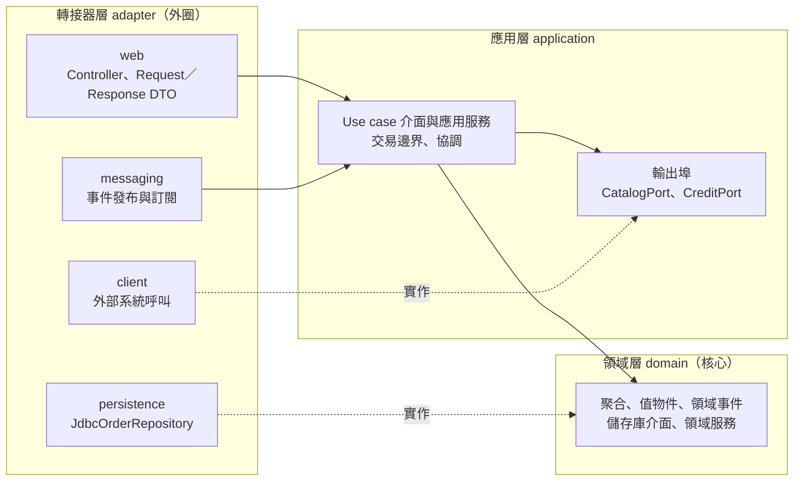

```text
com.example.sd
├── SampleApplication.java
├── shared/                         # 共用值物件（Money、UuidV7）與錯誤基底類別，OPEN 模組
├── inventory/                      # 庫存模組
│   ├── InventoryApi.java           # 模組的公開 API（其他模組只能使用這裡的型別）
│   └── internal/                   # 模組內部實作
└── order/                          # 訂單模組
    ├── domain/                     # Order、OrderLine、OrderEvent、OrderRepository
    ├── application/                # PlaceOrderUseCase、OrderPlacementService、CatalogPort
    ├── adapter/
    │   ├── web/                    # OrderController、PlaceOrderRequest
    │   └── persistence/            # JdbcOrderRepository
    └── config/                     # OrderProperties
```

| 編號 | 等級 | 規則 | 驗證方式 |
| --- | --- | --- | --- |
| `SD-CMP-001` | 必須 | 依賴方向必須由外向內：`adapter` → `application` → `domain`；領域層不得依賴應用層、轉接器層或任何框架 | 🤖 ArchUnit（3.1 範例、本節範例） |
| `SD-CMP-002` | 必須 | 第一層套件必須依業務功能（模組）劃分，技術分層放在模組之內；不得以 `controller`、`service`、`repository` 作為第一層套件 | 🤖 ArchUnit；🤖 Spring Modulith |
| `SD-CMP-003` | 必須 | 模組之間只能透過對方的公開 API（模組根套件或 `@NamedInterface`）互動，不得存取其他模組的內部套件；模組的公開 API 必須列在 SDD 的介面清單中 | 🤖 Spring Modulith `ApplicationModules.verify()` |
| `SD-CMP-012` | 不應該 | 模組之間、套件之間不應有循環依賴 | 🤖 Spring Modulith；🤖 ArchUnit `slices().should().beFreeOfCycles()` |

```java
// ✅ SD-CMP-003：庫存模組的公開 API，位於模組根套件
package com.example.sd.inventory;

public interface InventoryApi {

    /** 預留庫存；不足時丟出 InsufficientStock，例外中帶有目前可用數量。 */
    void reserve(String orderId, String sku, int quantity);

    final class InsufficientStock extends RuntimeException {

        private static final long serialVersionUID = 1L;

        private final int available;

        public InsufficientStock(String sku, int available) {
            super("庫存不足：" + sku + "，可用數量 " + available);
            this.available = available;
        }

        public int available() {
            return available;
        }
    }
}
```

```java
// ✅ SD-CMP-003：模組內部實作放在 internal，其他模組無法使用
package com.example.sd.inventory.internal;

import com.example.sd.inventory.InventoryApi;
import java.util.concurrent.ConcurrentHashMap;
import org.springframework.stereotype.Service;

@Service
class InventoryService implements InventoryApi {

    private final ConcurrentHashMap<String, Integer> stock = new ConcurrentHashMap<>();

    @Override
    public void reserve(String orderId, String sku, int quantity) {
        stock.compute(sku, (k, current) -> {
            int available = current == null ? 0 : current;
            if (available < quantity) {
                throw new InsufficientStock(sku, available);
            }
            return available - quantity;
        });
    }
}
```

模組根套件以外的型別預設是內部的。需要讓其他模組使用的子套件（例如訂閱訂單的領域事件），以 `package-info.java` 明確宣告為命名介面；共用的值物件模組則宣告為 OPEN 模組：

```java
// ✅ SD-CMP-003：order.domain 宣告為命名介面，其他模組可以訂閱 OrderEvent、使用 OrderId
@org.springframework.modulith.NamedInterface("domain")
package com.example.sd.order.domain;
```

```java
// ✅ SD-CMP-003：shared 只放穩定的值物件與錯誤基底類別，宣告為 OPEN 模組讓所有模組使用
@org.springframework.modulith.ApplicationModule(type = org.springframework.modulith.ApplicationModule.Type.OPEN)
package com.example.sd.shared;
```

```java
// ✅ SD-CMP-002 SD-CMP-003 SD-CMP-012：Spring Modulith 驗證模組邊界與循環依賴
package com.example.sd;

import org.junit.jupiter.api.Test;
import org.springframework.modulith.core.ApplicationModules;

class ModularityTests {

    @Test
    void verifiesModuleStructure() {
        ApplicationModules.of(SampleApplication.class).verify();
    }
}
```

```java
// ✅ SD-CMP-001 SD-CMP-004 SD-CMP-005 SD-CMP-008 SD-CMP-012：分層規則
package com.example.sd.archtest;

import static com.tngtech.archunit.lang.syntax.ArchRuleDefinition.noClasses;
import static com.tngtech.archunit.lang.syntax.ArchRuleDefinition.noMethods;
import static com.tngtech.archunit.library.dependencies.SlicesRuleDefinition.slices;

import com.tngtech.archunit.core.importer.ImportOption;
import com.tngtech.archunit.junit.AnalyzeClasses;
import com.tngtech.archunit.junit.ArchTest;
import com.tngtech.archunit.lang.ArchRule;
import org.springframework.transaction.annotation.Transactional;

@AnalyzeClasses(packages = "com.example.sd", importOptions = ImportOption.DoNotIncludeTests.class)
class LayeringArchTest {

    @ArchTest
    static final ArchRule domainDoesNotDependOnOuterLayers = noClasses()
            .that().resideInAPackage("..order.domain..")
            .should().dependOnClassesThat().resideInAnyPackage("..order.application..", "..order.adapter..")
            .because("依賴方向必須由外向內（SD-CMP-001）");

    @ArchTest
    static final ArchRule controllersDoNotTouchRepositories = noClasses()
            .that().resideInAPackage("..adapter.web..")
            .should().dependOnClassesThat().haveSimpleNameEndingWith("Repository")
            .because("Controller 只呼叫 use case（SD-CMP-004）");

    @ArchTest
    static final ArchRule transactionsOnlyInApplicationLayer = noMethods()
            .that().areAnnotatedWith(Transactional.class)
            .should().beDeclaredInClassesThat().resideOutsideOfPackages("..application..", "..batch..")
            .because("交易邊界在應用服務（SD-CMP-005）");

    @ArchTest
    static final ArchRule webDoesNotUsePersistenceModel = noClasses()
            .that().resideInAPackage("..adapter.web..")
            .should().dependOnClassesThat().resideInAnyPackage("..adapter.persistence..", "jakarta.persistence..")
            .because("API DTO 與持久化模型分離（SD-CMP-008）");

    @ArchTest
    static final ArchRule noCyclesBetweenOrderPackages = slices()
            .matching("com.example.sd.order.(*)..")
            .should().beFreeOfCycles()
            .because("SD-CMP-012");
}
```

```text
❌ SD-CMP-002：以技術分層作為第一層套件，修改一個功能要跨越四個目錄，模組邊界無法檢查
com.example.app
├── controller/   OrderController、CustomerController、ReportController …
├── service/      OrderService、CustomerService …
├── repository/   OrderRepository、CustomerRepository …
└── entity/       Order、Customer …
```

#### 🔍 6.1 審查與驗證

- **自動檢查：** `ModularityTests`（Spring Modulith 會列出違規的型別與依賴）與 `LayeringArchTest`。
- **人工審查問題：**
  1. 每個模組的公開 API 是否夠小？如果其他模組大量使用某模組的型別，可能是模組劃分有問題。
  2. `shared` 模組是否只包含真正共用且穩定的值物件？有沒有業務邏輯被放進去？
- **AI 常見錯誤：** 以技術分層產生套件結構；讓 Controller 直接注入 Repository；在 `shared` 或 `common` 模組中放入特定業務的類別。另外，以「引用其他模組的 `static final String` 常數」做負向測試時，javac 會把編譯期常數內嵌到呼叫端，位元碼中沒有依賴，Modulith 與 ArchUnit 都檢查不到；負向測試請使用方法呼叫或型別參照。

### 6.2 應用服務與交易邊界

應用服務（use case）負責**協調**：載入聚合、呼叫領域方法、儲存、發布事件。業務規則在領域層，技術細節在轉接器層，應用服務本身應該很薄。

| 編號 | 等級 | 規則 | 驗證方式 |
| --- | --- | --- | --- |
| `SD-CMP-004` | 必須 | Controller（及其他輸入轉接器）只負責協定轉換、輸入格式驗證與呼叫 use case，不得包含業務規則、不得直接存取儲存庫 | 🤖 ArchUnit；👁 設計審查 |
| `SD-CMP-005` | 必須 | 交易邊界必須設在應用服務的公開方法上；Controller、儲存庫實作與領域物件不得宣告交易 | 🤖 ArchUnit |
| `SD-CMP-006` | 應該 | 每個 use case 應有一個明確的輸入物件（command 或 query record）與一個公開方法，方法名稱使用業務動詞 | 👁 設計審查 |
| `SD-CMP-007` | 必須 | 輸入格式（必填、長度、格式）必須在系統邊界以 Bean Validation 驗證；業務規則與不變條件仍必須由領域層保證，不得只依賴邊界驗證 | 🧪 Web 層測試；🧪 領域單元測試 |

```java
// ✅ SD-CMP-006：use case 介面與輸入物件
package com.example.sd.order.application;

import com.example.sd.order.domain.OrderId;

public interface PlaceOrderUseCase {

    OrderId place(PlaceOrderCommand command);
}
```

```java
package com.example.sd.order.application;

import java.util.List;
import java.util.Objects;

public record PlaceOrderCommand(String customerId, List<Line> lines, String idempotencyKey) {

    public record Line(String sku, int quantity) { }

    public PlaceOrderCommand {
        Objects.requireNonNull(customerId, "customerId");
        Objects.requireNonNull(idempotencyKey, "idempotencyKey");
        lines = List.copyOf(lines);
    }
}
```

```java
// ✅ SD-CMP-005 SD-CMP-006 SD-PAT-007：應用服務只做協調，交易邊界在此
package com.example.sd.order.application;

import com.example.sd.inventory.InventoryApi;
import com.example.sd.order.domain.CreditCheckService;
import com.example.sd.order.domain.Order;
import com.example.sd.order.domain.OrderId;
import com.example.sd.order.domain.OrderLine;
import com.example.sd.order.domain.OrderRepository;
import java.time.Clock;
import java.time.Instant;
import java.util.List;
import java.util.random.RandomGenerator;
import org.springframework.context.ApplicationEventPublisher;
import org.springframework.stereotype.Service;
import org.springframework.transaction.annotation.Transactional;

@Service
class OrderPlacementService implements PlaceOrderUseCase {

    private final OrderRepository orders;
    private final CatalogPort catalog;
    private final CreditPort credit;
    private final InventoryApi inventory;
    private final ApplicationEventPublisher events;
    private final Clock clock;
    private final RandomGenerator random;
    private final CreditCheckService creditCheck = new CreditCheckService();

    OrderPlacementService(OrderRepository orders, CatalogPort catalog, CreditPort credit, InventoryApi inventory,
                          ApplicationEventPublisher events, Clock clock, RandomGenerator random) {
        this.orders = orders;
        this.catalog = catalog;
        this.credit = credit;
        this.inventory = inventory;
        this.events = events;
        this.clock = clock;
        this.random = random;
    }

    @Override
    @Transactional
    public OrderId place(PlaceOrderCommand command) {
        Instant now = clock.instant();
        List<OrderLine> lines = command.lines().stream()
                .map(l -> new OrderLine(l.sku(), catalog.priceOf(l.sku()), l.quantity()))
                .toList();
        Order order = Order.place(OrderId.newId(now, random), command.customerId(), lines, now);
        creditCheck.ensureWithinCredit(order, credit.availableCredit(command.customerId()));
        order.lines().forEach(l -> inventory.reserve(order.id().toString(), l.sku(), l.quantity()));
        orders.save(order);
        order.pullEvents().forEach(events::publishEvent);
        return order.id();
    }
}
```

```java
package com.example.sd.order.application;

import com.example.sd.shared.Money;

/** 輸出埠：商品目錄。實作在 adapter.client。 */
public interface CatalogPort {
    Money priceOf(String sku);
}
```

```java
package com.example.sd.order.application;

import com.example.sd.shared.Money;

/** 輸出埠：客戶可用額度。 */
public interface CreditPort {
    Money availableCredit(String customerId);
}
```

```java
// ✅ SD-CMP-004 SD-CMP-007 SD-IF-005：Controller 只做轉換、格式驗證與呼叫 use case
package com.example.sd.order.adapter.web;

import com.example.sd.order.application.PlaceOrderUseCase;
import com.example.sd.order.domain.OrderId;
import jakarta.validation.Valid;
import jakarta.validation.constraints.Pattern;
import org.springframework.http.ResponseEntity;
import org.springframework.validation.annotation.Validated;
import org.springframework.web.bind.annotation.PostMapping;
import org.springframework.web.bind.annotation.RequestBody;
import org.springframework.web.bind.annotation.RequestHeader;
import org.springframework.web.bind.annotation.RequestMapping;
import org.springframework.web.bind.annotation.RestController;
import org.springframework.web.util.UriComponentsBuilder;

@RestController
@RequestMapping("/api/orders")
@Validated
class OrderController {

    private final PlaceOrderUseCase placeOrder;

    OrderController(PlaceOrderUseCase placeOrder) {
        this.placeOrder = placeOrder;
    }

    @PostMapping
    ResponseEntity<PlaceOrderResponse> place(
            @RequestHeader("Idempotency-Key") @Pattern(regexp = "[A-Za-z0-9-]{16,64}") String idempotencyKey,
            @Valid @RequestBody PlaceOrderRequest request,
            UriComponentsBuilder uri) {
        OrderId id = placeOrder.place(request.toCommand(idempotencyKey));
        return ResponseEntity.created(uri.path("/api/orders/{id}").buildAndExpand(id.toString()).toUri())
                .body(new PlaceOrderResponse(id.toString()));
    }
}
```

```java
// ✅ SD-CMP-007 SD-CMP-008：請求 DTO 只做格式驗證；業務規則在領域層
package com.example.sd.order.adapter.web;

import com.example.sd.order.application.PlaceOrderCommand;
import jakarta.validation.Valid;
import jakarta.validation.constraints.Max;
import jakarta.validation.constraints.Min;
import jakarta.validation.constraints.NotBlank;
import jakarta.validation.constraints.Pattern;
import jakarta.validation.constraints.Size;
import java.util.List;

record PlaceOrderRequest(
        @NotBlank @Size(max = 20) String customerId,
        @Size(min = 1, max = 50) List<@Valid LineRequest> lines) {

    record LineRequest(@Pattern(regexp = "SKU-\\d{4,8}") String sku, @Min(1) @Max(99) int quantity) { }

    PlaceOrderCommand toCommand(String idempotencyKey) {
        return new PlaceOrderCommand(customerId,
                lines.stream().map(l -> new PlaceOrderCommand.Line(l.sku(), l.quantity())).toList(),
                idempotencyKey);
    }
}
```

```java
package com.example.sd.order.adapter.web;

record PlaceOrderResponse(String orderId) { }
```

```java
// ❌ SD-CMP-004 SD-CMP-005 SD-CMP-008：Controller 包含業務規則、宣告交易、直接回傳 JPA 實體（片段）
@RestController
public class OrderController {
    @Autowired private OrderRepository orderRepository;

    @Transactional
    @PostMapping("/orders")
    public OrderEntity create(@RequestBody OrderEntity order) {
        if (order.getTotal().compareTo(new BigDecimal("1000000")) > 0) {
            throw new RuntimeException("too much");
        }
        return orderRepository.save(order);
    }
}
```

（片段：示意 Controller 的常見錯誤）

#### 🔍 6.2 審查與驗證

- **自動檢查：** `LayeringArchTest`（6.1）；Web 層測試（`@WebMvcTest`）驗證格式錯誤回 400、缺少 `Idempotency-Key` 回 400。
- **人工審查問題：**
  1. 應用服務中有沒有 `if` 判斷業務規則？如果有，它是否應該移到聚合或領域服務？
  2. 交易中是否呼叫了遠端服務（HTTP、訊息）？這會讓交易時間不可控（SD-ERR-006）。
  3. 邊界驗證與領域驗證是否重複定義了同一個規則的不同數值（例如 DTO 允許 100 筆、領域允許 50 筆）？
- **AI 常見錯誤：** 把 `@Transactional` 加在 Controller 或 private 方法上（Spring 代理不會攔截 private 方法）；在 Controller 中寫 `if` 判斷業務規則；以同一個類別同時作為 JPA 實體與 API 回應。

### 6.3 資料傳輸物件與映射

| 編號 | 等級 | 規則 | 驗證方式 |
| --- | --- | --- | --- |
| `SD-CMP-008` | 必須 | API 的請求／回應 DTO、領域模型與持久化模型必須是不同的型別；不得將 JPA 實體或領域物件直接序列化為 API 回應 | 🤖 ArchUnit |
| `SD-CMP-009` | 應該 | 型別之間的映射應集中在轉接器層的映射類別中並有單元測試；使用 MapStruct 時必須設定 `unmappedTargetPolicy = ReportingPolicy.ERROR`，讓新增欄位但忘記映射時編譯失敗 | 🤖 MapStruct 編譯期檢查；🧪 單元測試 |

```java
// ✅ SD-CMP-008 SD-CMP-009：手寫映射集中於轉接器，回應只包含 API 契約定義的欄位
package com.example.sd.order.adapter.web;

import com.example.sd.order.domain.Order;
import java.util.List;

record OrderResponse(String orderId, String status, String totalAmount, String currency, List<Line> lines) {

    record Line(String sku, int quantity, String unitPrice) { }

    static OrderResponse from(Order order) {
        return new OrderResponse(
                order.id().toString(),
                order.status().name(),
                order.total().amount().toPlainString(),
                order.total().currency().getCurrencyCode(),
                order.lines().stream()
                        .map(l -> new Line(l.sku(), l.quantity(), l.unitPrice().amount().toPlainString()))
                        .toList());
    }
}
```

```java
// ✅ SD-CMP-009：使用 MapStruct 時，未映射的目標欄位讓編譯失敗（片段）
@Mapper(componentModel = "spring", unmappedTargetPolicy = ReportingPolicy.ERROR)
interface CustomerMapper {
    CustomerResponse toResponse(Customer customer);
}
```

（片段：MapStruct 設定）

#### 🔍 6.3 審查與驗證

- **自動檢查：** ArchUnit（6.1 的 `webDoesNotUsePersistenceModel`）；映射類別的單元測試比對每個欄位。
- **人工審查問題：**
  1. 回應 DTO 中有沒有 API 規格沒有定義的欄位？（多出的欄位可能洩漏內部資料）
  2. 金額是否以字串或最小單位整數輸出，避免 JSON 數字的浮點誤差（SD-IF-007）？
- **AI 常見錯誤：** 使用 `BeanUtils.copyProperties` 以反射複製欄位，新增欄位時不會報錯也不會被測試發現；回應中直接放入實體導致延遲載入例外或循環參照。

### 6.4 元件規格與組態

元件規格是 SDD 中「讓開發者可以開始寫程式」的部分。v1.x 只列出服務的職責；本版要求每個元件都說明下列項目：

| 編號 | 等級 | 規則 | 驗證方式 |
| --- | --- | --- | --- |
| `SD-CMP-010` | 必須 | 每個元件的規格必須包含：責任、提供的介面、使用的介面、管理的資料、狀態與並行性、錯誤與例外、組態參數、可觀測性（指標與日誌） | 🤖 SDD 章節檢查腳本；👁 設計審查 |
| `SD-CMP-011` | 應該 | 元件的組態應以型別安全的 `@ConfigurationProperties` record 定義並加上驗證，啟動時就讓錯誤的設定失敗，而不是在執行時才發現 | 🧪 組態綁定測試 |

```markdown
<!-- ✅ SD-CMP-010：元件規格 -->
### 6.2 元件：OrderPlacementService

| 項目 | 內容 |
| --- | --- |
| 責任 | 受理下單命令，協調計價、額度檢查、庫存預留與儲存，交易提交後發布 OrderPlaced |
| 提供的介面 | `PlaceOrderUseCase.place(PlaceOrderCommand): OrderId` |
| 使用的介面 | `CatalogPort`、`CreditPort`、`InventoryApi`、`OrderRepository`、`ApplicationEventPublisher` |
| 管理的資料 | `orders`、`order_lines`（寫入）；不直接存取其他模組的資料表 |
| 狀態與並行性 | 無狀態，可多執行個體；同一冪等鍵的並行請求由 `idempotency_keys` 唯一限制序列化（SD-IF-005） |
| 錯誤 | ORD-4001～4004（不變條件）、ORD-4091（庫存不足）、ORD-4092（額度不足）、外部逾時 → ORD-5031 |
| 組態 | `app.order.reservation-timeout`（預設 PT2S）、`app.order.max-lines`（預設 50） |
| 可觀測性 | 指標 `order.placed`（計數，標籤 result）、`order.place.duration`；日誌含 orderId、traceId，不含個資 |
```

```java
// ✅ SD-CMP-011：型別安全且有驗證的組態，錯誤設定讓應用程式無法啟動
package com.example.sd.order.config;

import jakarta.validation.constraints.Max;
import jakarta.validation.constraints.Min;
import jakarta.validation.constraints.NotNull;
import java.time.Duration;
import org.springframework.boot.context.properties.ConfigurationProperties;
import org.springframework.boot.context.properties.bind.DefaultValue;
import org.springframework.validation.annotation.Validated;

@Validated
@ConfigurationProperties("app.order")
public record OrderProperties(
        @NotNull @DefaultValue("PT2S") Duration reservationTimeout,
        @Min(1) @Max(50) @DefaultValue("50") int maxLines) {
}
```

```yaml
# ✅ SD-CMP-011：application.yml 中的設定
app:
  order:
    reservation-timeout: 1500ms
    max-lines: 30
```

#### 🔍 6.4 審查與驗證

- **自動檢查：** 以 `ApplicationContextRunner` 測試錯誤的設定值（例如 `max-lines: 0`）會讓內容啟動失敗；SDD 檢查腳本確認每個元件表都有八個項目。
- **人工審查問題：**
  1. 「狀態與並行性」是否回答了「兩個執行個體同時處理同一筆資料會怎樣」？
  2. 組態參數的預設值是否合理，有沒有說明單位？
- **AI 常見錯誤：** 以 `@Value("${...}")` 散落讀取設定、沒有驗證；元件規格中「錯誤」欄只寫「例外處理」而沒有列出具體錯誤碼。

## 7. 介面設計

介面是元件之間、系統之間的契約。內部實作可以隨時重構，但介面一旦被使用，修改的成本就會轉嫁給所有使用者。本章規範介面清單、REST API、事件、內部埠與檔案介面的設計；API 的通用規則（URL、狀態碼、版本管理）以 [架構設計指引]() 第 5 章為準，本章著重在詳細設計時必須寫出的內容。

### 7.1 介面清單

| 編號 | 等級 | 規則 | 驗證方式 |
| --- | --- | --- | --- |
| `SD-IF-001` | 必須 | SDD 必須列出系統所有對外與模組間的介面，每個介面註明：提供者、使用者、協定、資料格式、規格檔位置、同步／非同步、安全機制、服務水準（延遲、可用性、流量上限）與版本 | 👁 設計審查；🤖 規格檔存在性檢查 |

```markdown
<!-- ✅ SD-IF-001：介面清單 -->
| 介面 ID | 名稱 | 提供者 → 使用者 | 協定／格式 | 規格 | 模式 | 安全 | 服務水準 | 版本 |
| --- | --- | --- | --- | --- | --- | --- | --- | --- |
| IF-ORD-01 | 訂單 API | 訂單系統 → 網站前端、客服系統 | HTTPS／JSON | api/order-api.yaml | 同步 | OAuth 2.0 JWT，scope `orders:write` | p99 ≤ 800 ms，200 rps | 1.2.0 |
| IF-ORD-02 | 訂單事件 | 訂單系統 → 出貨、點數 | Kafka／CloudEvents JSON | api/order-events.yaml | 非同步 | mTLS＋ACL | 端到端 ≤ 5 s | 1.0.0 |
| IF-ORD-03 | 出貨指示檔 | 訂單系統 → ERP | SFTP／固定長度 UTF-8 | docs/sdd/if-ord-03.md | 批次，每 15 分鐘 | SSH 金鑰 | 每檔 ≤ 50,000 筆 | 2.0 |
| IF-INV-01 | InventoryApi | inventory 模組 → order 模組 | Java 介面 | InventoryApi.java | 同步，同交易 | 程序內 | — | — |
```

#### 🔍 7.1 審查與驗證

- **自動檢查：** 腳本檢查「規格」欄列出的檔案都存在，且每個規格檔都有對應的介面 ID。
- **人工審查問題：**
  1. 每個介面的使用者是否都已確認過規格？（介面是雙方的契約，不是提供者單方面的決定）
  2. 服務水準是否與品質情境（第 13 章）一致？
- **AI 常見錯誤：** 只列出 REST API，遺漏檔案、批次、事件與模組間介面；服務水準欄寫「高可用」而沒有數字。

### 7.2 契約先行的 REST API 設計

**契約先行**（contract-first，也稱 API 優先）是指先寫 OpenAPI 規格、經使用者審查後再實作。規格是設計文件的一部分，也是產生程式碼、模擬伺服器與契約測試的來源。

> **OpenAPI 版本選擇：** OpenAPI 3.2.0 已於 2025-09 發布，新增 `QUERY` 方法、串流媒體型別與 OAuth 裝置授權流程等功能；Swagger 工具組已於 2026-04 支援。但程式碼產生器與部分檢查工具尚未完整支援，因此本指引的撰寫基準仍為 OpenAPI 3.1.1（與 JSON Schema 2020-12 相容），待工具鏈成熟後再升級（附錄 F.4）。

| 編號 | 等級 | 規則 | 驗證方式 |
| --- | --- | --- | --- |
| `SD-IF-002` | 必須 | 對外與跨系統的 REST 介面必須先以 OpenAPI 3.1 撰寫規格並納入版控，經使用者審查後才實作；實作必須以契約測試或產生的程式碼確保與規格一致 | 🤖 Redocly／Spectral；🧪 契約測試 |
| `SD-IF-003` | 必須 | 每個操作必須有 `operationId`、`summary`、`tags`，並列出所有可能的回應狀態碼及其 schema（包含 400、401、403、404、409、422、429、500 中適用者） | 🤖 Spectral 企業規則集 |
| `SD-IF-004` | 必須 | 錯誤回應必須使用 RFC 9457 Problem Details（`application/problem+json`），並以擴充欄位提供錯誤碼與 traceId；不得以 HTTP 200 回傳錯誤 | 🤖 Spectral；🧪 Web 層測試 |
| `SD-IF-006` | 必須 | 回傳集合的操作必須分頁，並在規格中定義每頁筆數的上限；大量或持續新增的資料應使用游標（cursor）分頁 | 🤖 Spectral 企業規則集 |
| `SD-IF-007` | 應該 | 欄位名稱應統一使用 camelCase；日期時間使用 RFC 3339 並帶時區偏移（`format: date-time`）；金額以十進位字串表示並另附幣別欄位，不使用 JSON 數字 | 🤖 Spectral 企業規則集 |

```yaml
# ✅ SD-IF-002 SD-IF-003 SD-IF-004 SD-IF-005 SD-IF-006 SD-IF-007：api/order-api.yaml
openapi: 3.1.1
info:
  title: 訂單 API
  version: 1.2.0
  description: 訂單系統對外 API（介面 ID：IF-ORD-01）。
  contact:
    name: 訂單小組
    email: order-team@example.com
  license:
    name: 內部使用（Proprietary）
    url: https://api.example.com/license
servers:
  - url: https://api.example.com
tags:
  - name: orders
    description: 訂單
security:
  - oauth2: []
paths:
  /api/orders:
    post:
      operationId: placeOrder
      summary: 下單
      description: 建立訂單。必須帶 Idempotency-Key；相同鍵 24 小時內重送會得到相同結果。
      tags: [orders]
      security:
        - oauth2: ["orders:write"]
      parameters:
        - $ref: "#/components/parameters/IdempotencyKey"
      requestBody:
        required: true
        content:
          application/json:
            schema:
              $ref: "#/components/schemas/PlaceOrderRequest"
      responses:
        "201":
          description: 已建立訂單
          headers:
            Location:
              description: 新訂單的網址
              schema:
                type: string
                format: uri-reference
          content:
            application/json:
              schema:
                $ref: "#/components/schemas/PlaceOrderResponse"
        "400":
          $ref: "#/components/responses/BadRequest"
        "401":
          $ref: "#/components/responses/Unauthorized"
        "409":
          $ref: "#/components/responses/Conflict"
        "422":
          $ref: "#/components/responses/UnprocessableContent"
        "429":
          $ref: "#/components/responses/TooManyRequests"
        "500":
          $ref: "#/components/responses/InternalError"
    get:
      operationId: listOrders
      summary: 查詢訂單（游標分頁）
      description: 依建立時間由新到舊回傳目前使用者的訂單。
      tags: [orders]
      security:
        - oauth2: ["orders:read"]
      parameters:
        - name: cursor
          in: query
          description: 上一頁回應中的 nextCursor；第一頁不帶
          schema:
            type: string
            maxLength: 200
        - name: limit
          in: query
          description: 每頁筆數
          schema:
            type: integer
            minimum: 1
            maximum: 100
            default: 20
      responses:
        "200":
          description: 訂單清單
          content:
            application/json:
              schema:
                $ref: "#/components/schemas/OrderPage"
        "400":
          $ref: "#/components/responses/BadRequest"
        "401":
          $ref: "#/components/responses/Unauthorized"
        "429":
          $ref: "#/components/responses/TooManyRequests"
        "500":
          $ref: "#/components/responses/InternalError"
  /api/orders/{orderId}:
    get:
      operationId: getOrder
      summary: 查詢單筆訂單
      description: 無權查看或不存在時一律回 404，避免洩漏訂單是否存在。
      tags: [orders]
      security:
        - oauth2: ["orders:read"]
      parameters:
        - name: orderId
          in: path
          required: true
          description: 訂單編號（UUIDv7）
          schema:
            type: string
            format: uuid
      responses:
        "200":
          description: 訂單
          content:
            application/json:
              schema:
                $ref: "#/components/schemas/Order"
        "401":
          $ref: "#/components/responses/Unauthorized"
        "403":
          $ref: "#/components/responses/Forbidden"
        "404":
          $ref: "#/components/responses/NotFound"
        "500":
          $ref: "#/components/responses/InternalError"
components:
  securitySchemes:
    oauth2:
      type: oauth2
      flows:
        authorizationCode:
          authorizationUrl: https://idp.example.com/oauth2/authorize
          tokenUrl: https://idp.example.com/oauth2/token
          scopes:
            orders:read: 查詢訂單
            orders:write: 建立與取消訂單
  parameters:
    IdempotencyKey:
      name: Idempotency-Key
      in: header
      required: true
      description: 用戶端產生的唯一值（建議 UUID）；相同的值在 24 小時內重送會得到相同結果
      schema:
        type: string
        pattern: "^[A-Za-z0-9-]{16,64}$"
  schemas:
    PlaceOrderRequest:
      type: object
      required: [customerId, lines]
      additionalProperties: false
      properties:
        customerId:
          type: string
          maxLength: 20
        lines:
          type: array
          minItems: 1
          maxItems: 50
          items:
            $ref: "#/components/schemas/OrderLineRequest"
    OrderLineRequest:
      type: object
      required: [sku, quantity]
      additionalProperties: false
      properties:
        sku:
          type: string
          pattern: "^SKU-[0-9]{4,8}$"
        quantity:
          type: integer
          minimum: 1
          maximum: 99
    PlaceOrderResponse:
      type: object
      required: [orderId]
      properties:
        orderId:
          type: string
          format: uuid
    Order:
      type: object
      required: [orderId, status, totalAmount, currency, placedAt, lines]
      properties:
        orderId:
          type: string
          format: uuid
        status:
          type: string
          enum: [PLACED, PAID, SHIPPED, DELIVERED, CANCELLED]
        totalAmount:
          type: string
          pattern: "^-?[0-9]+(\\.[0-9]+)?$"
          description: 十進位字串，避免浮點誤差
          examples: ["700.00"]
        currency:
          type: string
          pattern: "^[A-Z]{3}$"
          description: ISO 4217 幣別代碼
        placedAt:
          type: string
          format: date-time
          examples: ["2026-10-08T10:00:00+08:00"]
        lines:
          type: array
          maxItems: 50
          items:
            type: object
            required: [sku, quantity, unitPrice]
            properties:
              sku:
                type: string
              quantity:
                type: integer
              unitPrice:
                type: string
    OrderPage:
      type: object
      required: [items]
      properties:
        items:
          type: array
          maxItems: 100
          items:
            $ref: "#/components/schemas/Order"
        nextCursor:
          type: [string, "null"]
          description: 下一頁的游標；沒有下一頁時為 null
    Problem:
      type: object
      description: RFC 9457 Problem Details，加上 code 與 traceId 擴充欄位
      required: [type, title, status, code, traceId]
      properties:
        type:
          type: string
          format: uri-reference
        title:
          type: string
        status:
          type: integer
        detail:
          type: string
        instance:
          type: string
          format: uri-reference
        code:
          type: string
          description: 錯誤碼，見 SDD 錯誤碼表
          examples: ["ORD-4091"]
        traceId:
          type: string
          description: W3C Trace Context 的 trace-id，供客服查詢
  responses:
    BadRequest:
      description: 請求格式錯誤
      content:
        application/problem+json:
          schema:
            $ref: "#/components/schemas/Problem"
    Unauthorized:
      description: 未通過身分驗證
      content:
        application/problem+json:
          schema:
            $ref: "#/components/schemas/Problem"
    Forbidden:
      description: 沒有權限存取此資源
      content:
        application/problem+json:
          schema:
            $ref: "#/components/schemas/Problem"
    NotFound:
      description: 資源不存在
      content:
        application/problem+json:
          schema:
            $ref: "#/components/schemas/Problem"
    Conflict:
      description: 相同的冪等鍵仍在處理中，或已用於不同的請求內容
      content:
        application/problem+json:
          schema:
            $ref: "#/components/schemas/Problem"
    UnprocessableContent:
      description: 違反業務規則（例如庫存不足）
      content:
        application/problem+json:
          schema:
            $ref: "#/components/schemas/Problem"
    TooManyRequests:
      description: 超過速率限制
      headers:
        Retry-After:
          description: 建議重試前等待的秒數
          schema:
            type: integer
      content:
        application/problem+json:
          schema:
            $ref: "#/components/schemas/Problem"
    InternalError:
      description: 系統錯誤
      content:
        application/problem+json:
          schema:
            $ref: "#/components/schemas/Problem"
```

規格檢查分兩層：Redocly 檢查是否符合 OpenAPI 規範，Spectral 以企業規則集檢查本指引的設計規則。下列規則集可直接放在專案根目錄：

```yaml
# ✅ SD-IF-003 SD-IF-004 SD-IF-006 SD-IF-007 SD-GOV-005：.spectral.yaml 企業規則集
extends: ["spectral:oas"]
rules:
  operation-operationId: error
  operation-tags: error
  operation-summary:
    description: 每個操作都必須有 summary（SD-IF-003）
    given: "$.paths[*][get,put,post,delete,patch]"
    severity: error
    then:
      field: summary
      function: truthy
  error-responses-use-problem-json:
    description: 4xx／5xx 回應必須使用 application/problem+json（SD-IF-004）
    given: "$.components.responses[*].content"
    severity: error
    then:
      field: application/json
      function: falsy
  collection-must-be-bounded:
    description: 陣列必須定義 maxItems（SD-IF-006）
    given: "$..[?(@.type == 'array')]"
    severity: error
    then:
      field: maxItems
      function: defined
  properties-camel-case:
    description: 欄位名稱使用 camelCase（SD-IF-007）
    given: "$..properties"
    severity: error
    then:
      field: "@key"
      function: casing
      functionOptions:
        type: camel
  money-not-number:
    description: 金額欄位不得使用 number（SD-IF-007）
    given: "$..properties[?(@property.match(/(amount|price|Amount|Price)$/))]"
    severity: error
    then:
      field: type
      function: pattern
      functionOptions:
        notMatch: "^number$"
```

```text
$ npx @redocly/cli@2 lint api/order-api.yaml
$ npx @stoplight/spectral-cli lint api/order-api.yaml --ruleset .spectral.yaml --fail-severity=error
```

（片段：CI 中的檢查指令）

```yaml
# ❌ SD-IF-004 SD-IF-006 SD-IF-007：錯誤以 200 回傳、陣列沒有上限、金額用 number、欄位用 snake_case（片段）
responses:
  "200":
    content:
      application/json:
        schema:
          type: object
          properties:
            success: { type: boolean }
            error_message: { type: string }
            order_list:
              type: array
              items:
                type: object
                properties:
                  total_amount: { type: number }
```

（片段：示意不良規格）

#### 🔍 7.2 審查與驗證

- **自動檢查：** Redocly 與 Spectral 在 CI 中執行，`--fail-severity=error`；契約測試（第 15 章）確保實作與規格一致。
- **人工審查問題：**
  1. 每個錯誤回應，使用者都知道該怎麼處理嗎？（重試、修正輸入、聯絡客服）
  2. 規格中的限制（`maxLength`、`maximum`、`pattern`）是否與領域規則一致？
  3. 使用者（前端、外部系統）是否已審查並簽核規格？
- **AI 常見錯誤：** 產生 OpenAPI 3.0 語法（`nullable: true`）卻宣告為 3.1；以 `type: number` 表示金額；遺漏 401／403／429 回應；`examples` 與 schema 不一致。

### 7.3 冪等性設計

網路會失敗，用戶端會重試。對「建立訂單」「付款」這類非冪等的操作，如果伺服器無法辨識重複請求，重試就會造成重複扣款。冪等鍵（Idempotency-Key）是業界標準做法（IETF 草案 `draft-ietf-httpapi-idempotency-key-header`）。

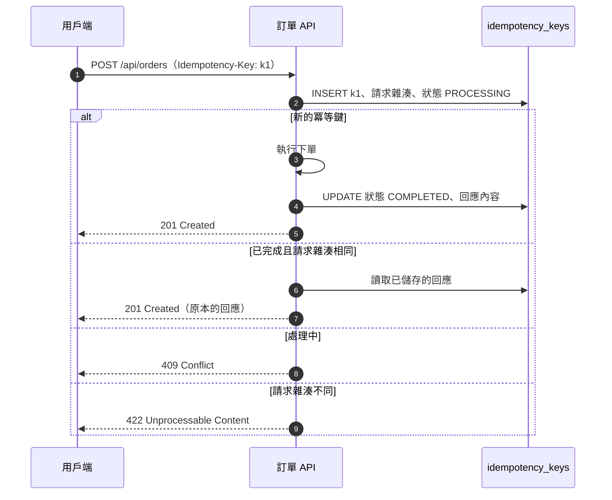

| 編號 | 等級 | 規則 | 驗證方式 |
| --- | --- | --- | --- |
| `SD-IF-005` | 必須 | 非冪等的寫入操作（建立、付款、轉帳）必須支援 `Idempotency-Key`，或以業務唯一鍵達成冪等；設計必須定義冪等鍵的保存期限、相同鍵不同內容的處理（422）與處理中的重送（409） | 🧪 整合測試（重送、並行重送、內容不同） |

```sql
-- ✅ SD-IF-005：冪等鍵資料表，主鍵保證並行重送時只有一個請求能進入處理
CREATE TABLE idempotency_keys (
    idempotency_key  varchar(64)  NOT NULL,
    client_id        varchar(64)  NOT NULL,
    request_hash     char(64)     NOT NULL,
    status           varchar(12)  NOT NULL CHECK (status IN ('PROCESSING', 'COMPLETED')),
    response_status  smallint,
    response_body    jsonb,
    created_at       timestamptz  NOT NULL DEFAULT now(),
    expires_at       timestamptz  NOT NULL,
    PRIMARY KEY (client_id, idempotency_key)
);
CREATE INDEX idx_idempotency_keys_expires_at ON idempotency_keys (expires_at);

-- 第一次請求：插入成功代表取得處理權；ON CONFLICT 回傳 0 列代表重送
INSERT INTO idempotency_keys (idempotency_key, client_id, request_hash, status, expires_at)
VALUES ('0192d3e4-5f60-7abc-8def-0123456789ab', 'web-frontend', repeat('a', 64), 'PROCESSING',
        now() + interval '24 hours')
ON CONFLICT (client_id, idempotency_key) DO NOTHING;
```

```http
### ✅ SD-IF-005 SD-IF-004：相同冪等鍵但請求內容不同，回 422
POST /api/orders HTTP/1.1
Host: api.example.com
Authorization: Bearer eyJ...
Idempotency-Key: 0192d3e4-5f60-7abc-8def-0123456789ab
Content-Type: application/json

{"customerId":"C001","lines":[{"sku":"SKU-1001","quantity":5}]}

HTTP/1.1 422 Unprocessable Content
Content-Type: application/problem+json

{"type":"https://api.example.com/problems/idempotency-key-reused","title":"冪等鍵已用於不同的請求","status":422,"code":"ORD-4221","traceId":"4bf92f3577b34da6a3ce929d0e0e4736"}
```

#### 🔍 7.3 審查與驗證

- **自動檢查：** 整合測試同時送出兩個相同冪等鍵的請求，斷言只建立一筆訂單、另一個請求得到 409 或相同的 201。
- **人工審查問題：**
  1. 冪等鍵以「用戶端＋鍵」為範圍嗎？不同用戶端使用相同的鍵不應互相影響。
  2. 處理失敗（例外）時，冪等鍵紀錄如何處理？應刪除或標示失敗，讓用戶端可以重試。
- **AI 常見錯誤：** 先 `SELECT` 檢查是否存在再 `INSERT`（並行時兩個請求都會通過檢查）；把冪等鍵存在記憶體中（多執行個體時無效）；沒有比對請求內容。

### 7.4 事件介面

| 編號 | 等級 | 規則 | 驗證方式 |
| --- | --- | --- | --- |
| `SD-IF-008` | 必須 | 對外發布的事件必須以 AsyncAPI 3 描述頻道、訊息與 schema，並使用 CloudEvents 1.0 的必要屬性（`id`、`source`、`type`、`specversion`）及 `time`、`subject` | 🤖 AsyncAPI CLI `validate` |
| `SD-IF-009` | 必須 | 事件 schema 的變更必須向後相容（只新增選填欄位）；消費者必須忽略不認識的欄位；不相容的變更必須以新的事件 `type`（例如 `.v2`）發布並並行一段期間 | 🧪 消費者測試（含未知欄位）；🤖 schema 相容性檢查 |

```yaml
# ✅ SD-IF-008：api/order-events.yaml
asyncapi: 3.1.0
info:
  title: 訂單事件
  version: 1.0.0
  description: 訂單系統發布的領域事件（介面 ID：IF-ORD-02），以 CloudEvents 1.0 binary mode 傳遞。
defaultContentType: application/json
servers:
  production:
    host: kafka.example.com:9093
    protocol: kafka-secure
    description: 正式環境 Kafka 叢集
channels:
  orderEvents:
    address: order.events.v1
    description: 訂單生命週期事件；以訂單編號作為訊息鍵以保證同一訂單的順序
    messages:
      orderPlaced:
        $ref: "#/components/messages/OrderPlaced"
operations:
  publishOrderPlaced:
    action: send
    channel:
      $ref: "#/channels/orderEvents"
    messages:
      - $ref: "#/channels/orderEvents/messages/orderPlaced"
components:
  messages:
    OrderPlaced:
      name: OrderPlaced
      title: 訂單已成立
      contentType: application/json
      headers:
        type: object
        required: [ce_specversion, ce_id, ce_source, ce_type, ce_time]
        properties:
          ce_specversion:
            type: string
            const: "1.0"
          ce_id:
            type: string
            description: 事件唯一識別碼，消費者以此去除重複（SD-ERR-008）
          ce_source:
            type: string
            const: /order-service
          ce_type:
            type: string
            const: com.example.order.placed.v1
          ce_time:
            type: string
            format: date-time
          ce_subject:
            type: string
            description: 訂單編號
      payload:
        type: object
        required: [orderId, customerId, totalAmount, currency]
        properties:
          orderId:
            type: string
            format: uuid
          customerId:
            type: string
          totalAmount:
            type: string
          currency:
            type: string
```

```java
// ✅ SD-IF-009：消費者忽略未知欄位，提供者新增欄位不會讓消費者失敗
package com.example.sd.order.adapter.messaging;

import static org.assertj.core.api.Assertions.assertThat;

import org.junit.jupiter.api.Test;
import tools.jackson.databind.DeserializationFeature;
import tools.jackson.databind.json.JsonMapper;

class OrderPlacedCompatibilityTest {

    record OrderPlacedPayload(String orderId, String customerId, String totalAmount, String currency) { }

    @Test
    void ignoresFieldsAddedByNewerProducer() {
        JsonMapper mapper = JsonMapper.builder()
                .disable(DeserializationFeature.FAIL_ON_UNKNOWN_PROPERTIES)
                .build();
        String newerPayload = """
                {"orderId":"0192d3e4-5f60-7abc-8def-0123456789ab","customerId":"C001",
                 "totalAmount":"700.00","currency":"TWD","channel":"APP"}
                """;
        OrderPlacedPayload payload = mapper.readValue(newerPayload, OrderPlacedPayload.class);
        assertThat(payload.totalAmount()).isEqualTo("700.00");
    }
}
```

#### 🔍 7.4 審查與驗證

- **自動檢查：** `npx @asyncapi/cli validate api/order-events.yaml`；消費者測試餵入含有額外欄位的訊息。
- **人工審查問題：**
  1. 訊息鍵是什麼？需要順序保證的事件（同一訂單）是否使用相同的鍵？
  2. 事件中有沒有消費者不需要的個資？
- **AI 常見錯誤：** 產生 AsyncAPI 2.x 語法（`publish`／`subscribe`）卻宣告為 3.x；事件沒有唯一 ID，消費者無法去除重複。

### 7.5 內部埠介面與檔案介面

| 編號 | 等級 | 規則 | 驗證方式 |
| --- | --- | --- | --- |
| `SD-IF-010` | 應該 | 應用層的埠介面與模組公開 API 應以領域型別定義參數與回傳值，不應使用 HTTP、JPA、訊息框架的型別（例如 `ResponseEntity`、`HttpServletRequest`、`ConsumerRecord`） | 🤖 ArchUnit |
| `SD-IF-011` | 必須 | 檔案介面必須有規格文件，定義：檔名規則、編碼（UTF-8，是否有 BOM）、換行字元、格式與欄位規格（位置、長度、型別、補位）、表頭與表尾控制紀錄（筆數、金額合計、雜湊）、傳送時間與重送規則 | 👁 設計審查；🧪 解析器測試 |
| `SD-IF-012` | 必須 | 所有介面規格必須有版本號；破壞性變更必須提升主版本並依第 19 章的棄用流程進行，CI 必須以工具偵測 OpenAPI 的破壞性變更 | 🤖 oasdiff（19.2） |

```java
// ✅ SD-IF-010：埠介面不得使用 Web 或訊息框架型別
package com.example.sd.archtest;

import static com.tngtech.archunit.lang.syntax.ArchRuleDefinition.noClasses;

import com.tngtech.archunit.core.importer.ImportOption;
import com.tngtech.archunit.junit.AnalyzeClasses;
import com.tngtech.archunit.junit.ArchTest;
import com.tngtech.archunit.lang.ArchRule;

@AnalyzeClasses(packages = "com.example.sd", importOptions = ImportOption.DoNotIncludeTests.class)
class PortArchTest {

    @ArchTest
    static final ArchRule portsUseDomainTypes = noClasses()
            .that().resideInAPackage("..application..").and().areInterfaces()
            .should().dependOnClassesThat().resideInAnyPackage(
                    "org.springframework.http..", "jakarta.servlet..", "org.apache.kafka..", "jakarta.persistence..")
            .because("埠介面以領域型別定義（SD-IF-010）");
}
```

```markdown
<!-- ✅ SD-IF-011 SD-IF-012：檔案介面規格（IF-ORD-03 出貨指示檔，版本 2.0） -->
| 項目 | 規格 |
| --- | --- |
| 檔名 | `SHIP_<yyyyMMddHHmm>_<序號 3 碼>.txt`，時間為台北時間；上傳時先命名為 `.part`，完成後改名（SD-INT-010） |
| 編碼與換行 | UTF-8 無 BOM；換行 CRLF |
| 格式 | 固定長度；文字左靠右補半形空白，數字右靠左補 0；中文以「字元」計算長度 |
| 表頭 | `H` + 產生時間 `yyyyMMddHHmmss` + 檔案版本 `02` |
| 明細 | `D` + 訂單編號 36 + SKU 12 + 數量 3 + 收件郵遞區號 6 |
| 表尾 | `T` + 明細筆數 7 + 數量合計 9 + 全部明細行的 SHA-256 64 |
| 傳送 | 每 15 分鐘；無資料時仍傳送只有表頭與表尾的檔案，讓接收方確認沒有漏檔 |
| 重送 | 同一檔名重送時內容必須相同；接收方以檔名＋SHA-256 去除重複（SD-INT-012） |
```

```text
H2026100810150002
D0192d3e4-5f60-7abc-8def-0123456789abSKU-1001    002100001
T0000001000000002e3b0c44298fc1c149afbf4c8996fb92427ae41e4649b934ca495991b7852b855
```

（片段：檔案內容示意，雜湊值為示意）

#### 🔍 7.5 審查與驗證

- **自動檢查：** `PortArchTest`；檔案解析器的單元測試涵蓋表尾筆數不符、雜湊不符、空檔。
- **人工審查問題：**
  1. 固定長度欄位中的中文是以位元組還是字元計算？雙方是否一致？
  2. 「沒有資料」時會不會傳檔？接收方如何分辨「沒有資料」與「漏傳」？
- **AI 常見錯誤：** 檔案規格沒有寫編碼與換行；以位元組計算 UTF-8 中文欄位長度造成截斷；沒有表尾控制紀錄。

## 8. 資料設計

資料通常比程式活得更久：程式重寫了三次，資料表還是同一張。因此資料設計的錯誤（金額用浮點數、時間沒有時區、缺少唯一限制）往往要用昂貴的資料轉置才能修正。本章規範詳細設計階段的資料模型、多資料庫支援、ORM 映射、讀寫分離與資料保護；實體設計細節（索引策略、正規化、效能調校）請見 [資料庫設計指引]()。

### 8.1 資料模型與資料字典

資料模型由概念模型（業務實體與關係）、邏輯模型（屬性、鍵、正規化）到實體模型（資料表、型別、索引）逐步細化。SDD 至少要包含邏輯層級的 ERD 與完整的資料字典。

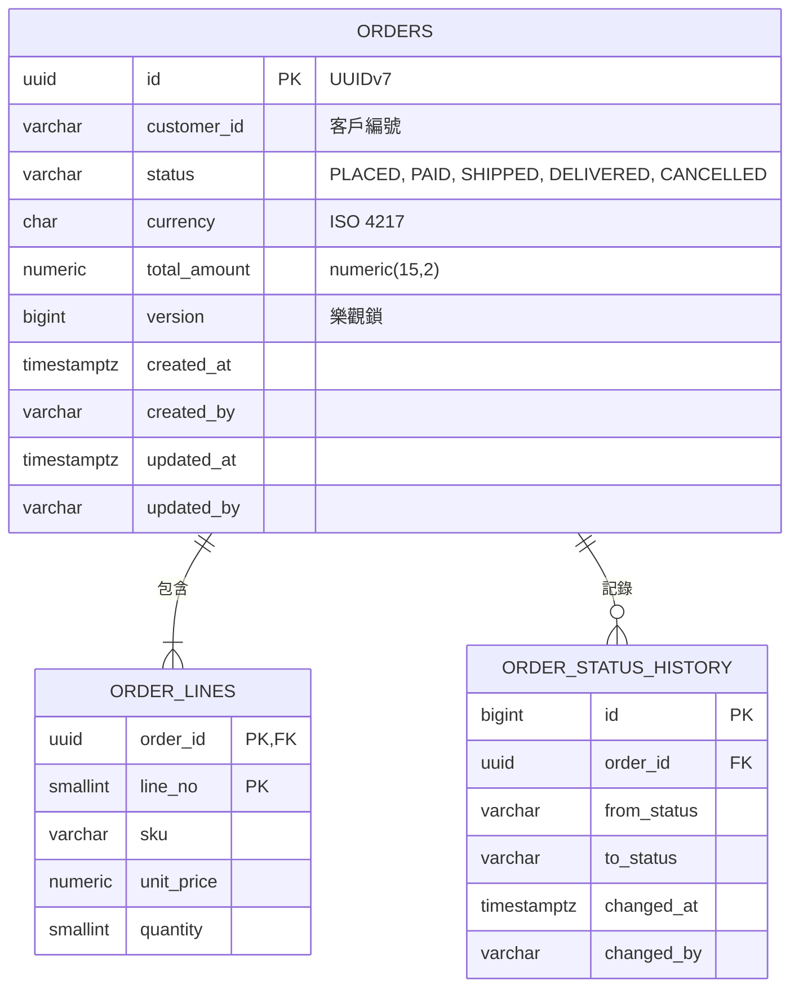

| 編號 | 等級 | 規則 | 驗證方式 |
| --- | --- | --- | --- |
| `SD-DAT-001` | 必須 | SDD 必須包含 ERD 與資料字典；資料字典的每個欄位必須說明：型別與長度、是否可為空、預設值、業務定義、資料分級（SD-DAT-015）與來源 | 👁 設計審查；🤖 資料字典與 DDL 比對腳本 |
| `SD-DAT-002` | 必須 | 資料表與欄位名稱必須使用小寫 snake_case；主鍵統一命名為 `id`（或複合主鍵）；外鍵命名為 `<參照表單數>_id`；限制與索引依 `pk_`、`fk_`、`uk_`、`ck_`、`idx_` 前綴命名 | 🤖 SQLFluff；🤖 命名檢查查詢 |
| `SD-DAT-003` | 必須 | 金額、匯率、數量等需要精確計算的欄位必須使用 `NUMERIC`／`DECIMAL` 並明確定義精度與小數位數，不得使用 `FLOAT`、`DOUBLE`、`REAL` | 🤖 命名與型別檢查查詢 |
| `SD-DAT-004` | 必須 | 時間點必須以帶時區的型別（PostgreSQL `timestamptz`、Oracle `TIMESTAMP WITH TIME ZONE`、SQL Server `datetimeoffset`）或以 UTC 明確約定的型別儲存；「日期」（生日、帳務日）使用 `DATE` | 🧪 Testcontainers 整合測試（跨時區讀寫） |
| `SD-DAT-005` | 必須 | 每張業務資料表必須有稽核欄位 `created_at`、`created_by`、`updated_at`、`updated_by`；需要完整異動歷程的資料另設歷程表或稽核日誌 | 🤖 結構檢查查詢 |
| `SD-DAT-006` | 必須 | 可能被並行修改的資料必須有版本欄位，以樂觀鎖防止更新遺失；更新時版本不符必須回報衝突，而不是覆蓋 | 🧪 並行更新測試 |
| `SD-DAT-007` | 必須 | 業務上的唯一性（帳號、身分證號、訂單明細序號）必須以資料庫唯一限制保證，不得只依賴應用程式先查詢再寫入 | 🧪 並行寫入測試；🤖 結構檢查查詢 |

```markdown
<!-- ✅ SD-DAT-001：資料字典（節錄） -->
| 欄位 | 型別 | 空值 | 預設 | 定義 | 分級 | 來源 |
| --- | --- | --- | --- | --- | --- | --- |
| `orders.id` | uuid | 否 | — | 訂單編號，UUIDv7，由應用程式產生 | 內部 | `OrderId.newId` |
| `orders.customer_id` | varchar(20) | 否 | — | 客戶編號 | 內部 | 會員系統 |
| `orders.total_amount` | numeric(15,2) | 否 | — | 訂單總額，等於明細小計合計 | 機密 | 計算 |
| `orders.currency` | char(3) | 否 | — | ISO 4217 幣別代碼 | 公開 | 明細單價 |
| `orders.version` | bigint | 否 | 0 | 樂觀鎖版本，每次更新加 1 | 內部 | 系統 |
| `orders.created_at` | timestamptz | 否 | now() | 建立時間（UTC 儲存） | 內部 | 系統 |
```

```sql
-- ✅ SD-DAT-002 SD-DAT-003 SD-DAT-004 SD-DAT-005 SD-DAT-006 SD-DAT-007 SD-BEH-004：PostgreSQL 18 DDL
CREATE TABLE orders (
    id            uuid          NOT NULL,
    customer_id   varchar(20)   NOT NULL,
    status        varchar(12)   NOT NULL,
    currency      char(3)       NOT NULL,
    total_amount  numeric(15,2) NOT NULL,
    version       bigint        NOT NULL DEFAULT 0,
    created_at    timestamptz   NOT NULL DEFAULT now(),
    created_by    varchar(64)   NOT NULL,
    updated_at    timestamptz   NOT NULL DEFAULT now(),
    updated_by    varchar(64)   NOT NULL,
    CONSTRAINT pk_orders PRIMARY KEY (id),
    CONSTRAINT ck_orders_status CHECK (status IN ('PLACED', 'PAID', 'SHIPPED', 'DELIVERED', 'CANCELLED')),
    CONSTRAINT ck_orders_currency CHECK (currency ~ '^[A-Z]{3}$'),
    CONSTRAINT ck_orders_total_amount CHECK (total_amount >= 0)
);
CREATE INDEX idx_orders_customer_id_created_at ON orders (customer_id, created_at DESC);

CREATE TABLE order_lines (
    order_id    uuid          NOT NULL,
    line_no     smallint      NOT NULL,
    sku         varchar(12)   NOT NULL,
    unit_price  numeric(15,2) NOT NULL,
    quantity    smallint      NOT NULL,
    CONSTRAINT pk_order_lines PRIMARY KEY (order_id, line_no),
    CONSTRAINT fk_order_lines_order FOREIGN KEY (order_id) REFERENCES orders (id) ON DELETE CASCADE,
    CONSTRAINT uk_order_lines_order_sku UNIQUE (order_id, sku),
    CONSTRAINT ck_order_lines_quantity CHECK (quantity BETWEEN 1 AND 99)
);
```

設計審查時，可以直接對資料庫執行下列查詢，找出違反命名、型別與稽核欄位規則的地方：

```sql
-- ✅ SD-DAT-002 SD-DAT-003 SD-DAT-005：結構檢查查詢，結果應為 0 列
SELECT table_name, column_name, data_type, '金額或數量不得使用浮點數' AS problem
FROM information_schema.columns
WHERE table_schema = 'public' AND data_type IN ('real', 'double precision')
UNION ALL
SELECT table_name, column_name, data_type, '名稱不是小寫 snake_case'
FROM information_schema.columns
WHERE table_schema = 'public' AND column_name !~ '^[a-z][a-z0-9_]*$'
UNION ALL
SELECT t.table_name, NULL, NULL, '缺少稽核欄位'
FROM information_schema.tables t
WHERE t.table_schema = 'public' AND t.table_type = 'BASE TABLE'
  AND t.table_name NOT IN ('order_lines', 'idempotency_keys', 'flyway_schema_history')
  AND (SELECT count(*) FROM information_schema.columns c
       WHERE c.table_schema = t.table_schema AND c.table_name = t.table_name
         AND c.column_name IN ('created_at', 'created_by', 'updated_at', 'updated_by')) < 4;
```

```sql
-- ❌ SD-DAT-002 SD-DAT-003 SD-DAT-004 SD-DAT-007：混合大小寫、浮點金額、無時區時間、沒有唯一限制（片段）
CREATE TABLE "OrderMaster" (
    "OrderID"   serial PRIMARY KEY,
    "Amount"    float,
    "OrderDate" timestamp,
    "CustNo"    varchar(50)
);
```

（片段：示意不良的資料表設計）

#### 🔍 8.1 審查與驗證

- **自動檢查：** 在 Testcontainers 啟動的資料庫套用 Flyway 遷移後執行結構檢查查詢，結果非 0 列時測試失敗；SQLFluff 檢查 SQL 格式。
- **人工審查問題：**
  1. 資料字典中「業務定義」是否寫出計算方式與邊界（例如「總額是否含稅」）？
  2. 每個「看起來唯一」的業務欄位，是否都有唯一限制？
  3. 哪些欄位會被並行修改？是否都有版本控制？
- **AI 常見錯誤：** 以 `float` 或 `double` 表示金額；以 `timestamp`（無時區）儲存時間；以 `serial`／自動遞增作為對外顯示的訂單編號（可被猜測）；只建立主鍵、忽略業務唯一限制。

### 8.2 多資料庫支援與結構演進

企業系統常需要支援多種資料庫（例如正式環境用 Oracle、開發與測試用 PostgreSQL，或產品需要支援客戶既有的資料庫）。v1.x 以自建的抽象層與方言類別處理，本版改以標準 SQL、ORM 方言與 Flyway 的資料庫別遷移目錄處理。

| 邏輯型別 | PostgreSQL | Oracle | SQL Server | Db2 |
| --- | --- | --- | --- | --- |
| 識別碼（UUID） | `uuid` | `RAW(16)` | `uniqueidentifier` | `CHAR(16) FOR BIT DATA` |
| 金額 | `numeric(15,2)` | `NUMBER(15,2)` | `decimal(15,2)` | `DECIMAL(15,2)` |
| 時間點 | `timestamptz` | `TIMESTAMP WITH TIME ZONE` | `datetimeoffset` | `TIMESTAMP`（約定 UTC） |
| Unicode 字串 | `varchar(n)`（UTF-8 資料庫） | `VARCHAR2(n CHAR)`（AL32UTF8）或 `NVARCHAR2` | `nvarchar(n)` 或 UTF-8 定序的 `varchar` | `VARCHAR(n)`（UTF-8 資料庫，長度以位元組計） |
| 布林 | `boolean` | `BOOLEAN`（23ai 起）或 `NUMBER(1)` | `bit` | `BOOLEAN` |
| JSON | `jsonb` | `JSON`（21c 起） | `json`（2025 起）或 `nvarchar(max)` | `CLOB` 搭配 JSON 函式 |

| 編號 | 等級 | 規則 | 驗證方式 |
| --- | --- | --- | --- |
| `SD-DAT-008` | 應該 | 需要支援多種資料庫時，應優先使用標準 SQL 與 ORM 方言；資料庫專屬語法必須集中在儲存庫實作中，並對每種支援的資料庫執行整合測試 | 🧪 Testcontainers 多資料庫矩陣測試 |
| `SD-DAT-009` | 必須 | 結構變更必須以 Flyway（或 Liquibase）版本化腳本管理，各資料庫的差異放在資料庫別目錄；已套用的腳本不得修改 | 🤖 `flyway validate`；🤖 CI 檢查已發布腳本未被修改 |

```yaml
# ✅ SD-DAT-009：Flyway 依資料庫自動選擇遷移目錄（{vendor} 會被替換為 postgresql、oracle、sqlserver…）
spring:
  flyway:
    locations:
      - classpath:db/migration/common
      - classpath:db/migration/{vendor}
    validate-on-migrate: true
```

```text
src/main/resources/db/migration/
├── common/        V1__create_orders.sql（只用標準 SQL 的腳本）
├── postgresql/    V2__orders_partitioning.sql
├── oracle/        V2__orders_partitioning.sql
└── sqlserver/     V2__orders_partitioning.sql
```

```java
// ✅ SD-DAT-008：同一組儲存庫測試在多種資料庫上執行（片段）
@ParameterizedTest
@MethodSource("databases")   // PostgreSQLContainer、OracleContainer、MSSQLServerContainer
void savesAndLoadsOrder(JdbcDatabaseContainer<?> db) {
    var repository = new JdbcOrderRepository(JdbcClient.create(dataSourceFor(db)), clock);
    ...
}
```

（片段：多資料庫矩陣測試）

#### 🔍 8.2 審查與驗證

- **自動檢查：** CI 對每個支援的資料庫執行 Flyway 遷移與儲存庫整合測試；比對 `main` 分支已發布的遷移腳本雜湊，被修改時失敗。
- **人工審查問題：**
  1. 真的需要支援多種資料庫嗎？每多支援一種，測試與維護成本就會增加。
  2. 字串長度在各資料庫的計算單位（位元組或字元）是否一致？
- **AI 常見錯誤：** 在共用腳本中使用 PostgreSQL 專屬語法（`ON CONFLICT`、`jsonb`）；以 H2 取代真正的資料庫進行測試；修改已套用的遷移腳本。

### 8.3 物件關聯映射與資料存取

| 編號 | 等級 | 規則 | 驗證方式 |
| --- | --- | --- | --- |
| `SD-DAT-010` | 必須 | JPA 關聯必須預設為延遲載入（`@ManyToOne(fetch = LAZY)`），需要時以 `@EntityGraph` 或 `join fetch` 明確載入；設計必須說明每個查詢的載入範圍，避免 N+1 查詢 | 🧪 查詢次數斷言測試 |
| `SD-DAT-011` | 必須 | JPA 實體不得使用 Lombok `@Data` 或包含所有欄位的 `equals`／`hashCode`；實體的相等性應以不變的識別碼判斷 | 🤖 ArchUnit（禁止實體使用 `@Data`）；🧪 單元測試 |
| `SD-DAT-012` | 應該 | 只讀查詢應以投影（record DTO）取得需要的欄位；大量資料必須分頁或串流處理，不得一次載入整個資料表 | 👁 設計審查；🧪 效能測試 |

訂單聚合的儲存庫以 `JdbcClient` 實作，明確控制 SQL 與樂觀鎖：

```java
// ✅ SD-DDD-007 SD-DAT-006 SD-CMP-001：儲存庫實作在轉接器層，以版本欄位實作樂觀鎖
package com.example.sd.order.adapter.persistence;

import com.example.sd.order.domain.Order;
import com.example.sd.order.domain.OrderId;
import com.example.sd.order.domain.OrderLine;
import com.example.sd.order.domain.OrderRepository;
import com.example.sd.order.domain.OrderStatus;
import com.example.sd.shared.Money;
import java.math.BigDecimal;
import java.sql.Timestamp;
import java.time.Clock;
import java.util.Currency;
import java.util.List;
import java.util.Optional;
import java.util.UUID;
import org.springframework.dao.OptimisticLockingFailureException;
import org.springframework.jdbc.core.simple.JdbcClient;
import org.springframework.stereotype.Repository;

@Repository
class JdbcOrderRepository implements OrderRepository {

    private final JdbcClient jdbc;
    private final Clock clock;

    JdbcOrderRepository(JdbcClient jdbc, Clock clock) {
        this.jdbc = jdbc;
        this.clock = clock;
    }

    @Override
    public Optional<Order> findById(OrderId id) {
        record Row(String customerId, String status, String currency, long version) { }
        Optional<Row> head = jdbc.sql("SELECT customer_id, status, currency, version FROM orders WHERE id = :id")
                .param("id", id.value())
                .query((rs, n) -> new Row(rs.getString(1), rs.getString(2), rs.getString(3), rs.getLong(4)))
                .optional();
        return head.map(row -> {
            Currency currency = Currency.getInstance(row.currency());
            List<OrderLine> lines = jdbc.sql("""
                            SELECT sku, unit_price, quantity FROM order_lines
                            WHERE order_id = :id ORDER BY line_no""")
                    .param("id", id.value())
                    .query((rs, n) -> new OrderLine(rs.getString(1),
                            new Money(rs.getBigDecimal(2), currency), rs.getInt(3)))
                    .list();
            return Order.restore(id, row.customerId(), lines, OrderStatus.valueOf(row.status()), row.version());
        });
    }

    @Override
    public void save(Order order) {
        Timestamp now = Timestamp.from(clock.instant());
        UUID id = order.id().value();
        BigDecimal total = order.total().amount();
        if (order.version() == 0 && !exists(id)) {
            jdbc.sql("""
                    INSERT INTO orders (id, customer_id, status, currency, total_amount, version,
                                        created_at, created_by, updated_at, updated_by)
                    VALUES (:id, :customer, :status, :currency, :total, 1, :now, :user, :now, :user)""")
                    .param("id", id).param("customer", order.customerId())
                    .param("status", order.status().name())
                    .param("currency", order.total().currency().getCurrencyCode())
                    .param("total", total).param("now", now).param("user", "order-service")
                    .update();
            int lineNo = 1;
            for (OrderLine line : order.lines()) {
                jdbc.sql("""
                        INSERT INTO order_lines (order_id, line_no, sku, unit_price, quantity)
                        VALUES (:id, :no, :sku, :price, :qty)""")
                        .param("id", id).param("no", lineNo++).param("sku", line.sku())
                        .param("price", line.unitPrice().amount()).param("qty", line.quantity())
                        .update();
            }
            return;
        }
        int updated = jdbc.sql("""
                UPDATE orders SET status = :status, version = version + 1, updated_at = :now, updated_by = :user
                WHERE id = :id AND version = :version""")
                .param("status", order.status().name()).param("now", now).param("user", "order-service")
                .param("id", id).param("version", order.version())
                .update();
        if (updated == 0) {
            throw new OptimisticLockingFailureException("訂單 " + order.id() + " 已被其他交易修改（版本 "
                    + order.version() + "）");
        }
    }

    private boolean exists(UUID id) {
        return jdbc.sql("SELECT count(*) FROM orders WHERE id = :id").param("id", id)
                .query(Long.class).single() > 0;
    }
}
```

```sql
-- ✅ SD-DAT-006：樂觀鎖的行為驗證。兩個交易都讀到 version = 1，只有第一個 UPDATE 會成功
INSERT INTO orders (id, customer_id, status, currency, total_amount, created_by, updated_by, version)
VALUES ('0192d3e4-5f60-7abc-8def-0123456789ab', 'C001', 'PLACED', 'TWD', 700.00, 'test', 'test', 1);

UPDATE orders SET status = 'PAID', version = version + 1
WHERE id = '0192d3e4-5f60-7abc-8def-0123456789ab' AND version = 1;   -- 1 列
UPDATE orders SET status = 'CANCELLED', version = version + 1
WHERE id = '0192d3e4-5f60-7abc-8def-0123456789ab' AND version = 1;   -- 0 列 → 應用程式回報衝突
```

使用 JPA 時，實體與領域模型分開，關聯延遲載入，相等性以識別碼判斷：

```java
// ✅ SD-DAT-010 SD-DAT-011：JPA 實體（客服查詢上下文的唯讀模型）
package com.example.sd.support.persistence;

import jakarta.persistence.Entity;
import jakarta.persistence.FetchType;
import jakarta.persistence.Id;
import jakarta.persistence.ManyToOne;
import jakarta.persistence.Table;
import jakarta.persistence.Version;
import java.util.Objects;
import java.util.UUID;

@Entity
@Table(name = "support_tickets")
public class SupportTicketEntity {

    @Id
    private UUID id;

    @ManyToOne(fetch = FetchType.LAZY, optional = false)
    private CustomerEntity customer;

    private String subject;

    @Version
    private long version;

    protected SupportTicketEntity() {
    }

    public SupportTicketEntity(UUID id, CustomerEntity customer, String subject) {
        this.id = Objects.requireNonNull(id);
        this.customer = customer;
        this.subject = subject;
    }

    public UUID getId() {
        return id;
    }

    public CustomerEntity getCustomer() {
        return customer;
    }

    public String getSubject() {
        return subject;
    }

    @Override
    public boolean equals(Object o) {
        return this == o || (o instanceof SupportTicketEntity other && id.equals(other.id));
    }

    @Override
    public int hashCode() {
        return id.hashCode();
    }
}
```

```java
package com.example.sd.support.persistence;

import jakarta.persistence.Entity;
import jakarta.persistence.Id;
import jakarta.persistence.Table;
import java.util.UUID;

@Entity
@Table(name = "customers")
public class CustomerEntity {

    @Id
    private UUID id;

    private String displayName;

    protected CustomerEntity() {
    }

    public UUID getId() {
        return id;
    }

    public String getDisplayName() {
        return displayName;
    }
}
```

```java
// ✅ SD-DAT-010 SD-DAT-012：清單查詢以 EntityGraph 一次載入關聯；摘要查詢以 record 投影並分頁
package com.example.sd.support.persistence;

import java.util.UUID;
import org.springframework.data.domain.Page;
import org.springframework.data.domain.Pageable;
import org.springframework.data.jpa.repository.EntityGraph;
import org.springframework.data.jpa.repository.JpaRepository;
import org.springframework.data.jpa.repository.Query;

public interface SupportTicketJpaRepository extends JpaRepository<SupportTicketEntity, UUID> {

    @EntityGraph(attributePaths = "customer")
    Page<SupportTicketEntity> findBySubjectContaining(String keyword, Pageable pageable);

    @Query("""
            select new com.example.sd.support.persistence.TicketSummary(t.id, t.subject, c.displayName)
            from SupportTicketEntity t join t.customer c
            where t.subject like concat('%', :keyword, '%')""")
    Page<TicketSummary> summaries(String keyword, Pageable pageable);
}
```

```java
package com.example.sd.support.persistence;

import java.util.UUID;

/** 工單摘要投影：只取清單需要的欄位（SD-DAT-012）。 */
public record TicketSummary(UUID id, String subject, String customerName) { }
```

```java
// ❌ SD-DAT-010 SD-DAT-011：Lombok @Data、預設 EAGER、equals 包含關聯（片段）
@Data
@Entity
public class Customer {
    @Id @GeneratedValue private Long id;
    @OneToMany(mappedBy = "customer", fetch = FetchType.EAGER) private List<Order> orders;
}
// 查詢 100 位客戶 → 1 + 100 次查詢；放進 HashSet 時觸發延遲載入與無限遞迴
```

（片段：示意 JPA 的常見錯誤）

#### 🔍 8.3 審查與驗證

- **自動檢查：** 以 Hibernate Statistics 或 datasource-proxy 在整合測試中斷言查詢次數（例如查詢 20 筆工單只產生 1 次查詢）；ArchUnit 禁止 `@Entity` 類別同時標註 `lombok.Data`。
- **人工審查問題：**
  1. 每個清單畫面或 API 會產生幾次 SQL？設計是否說明了載入範圍？
  2. 更新時遇到版本衝突，使用者會看到什麼？（應提示重新載入，而不是覆蓋）
- **AI 常見錯誤：** 以 `FetchType.EAGER` 解決延遲載入例外；在 Controller 開啟 Open Session in View；以 `findAll()` 後在記憶體中過濾。

### 8.4 讀寫分離與資料分割

| 編號 | 等級 | 規則 | 驗證方式 |
| --- | --- | --- | --- |
| `SD-DAT-013` | 應該 | 採用讀寫分離時，應以交易的唯讀屬性路由到唯讀副本；設計必須列出需要「寫後立即讀」的流程，這些流程必須讀取主庫 | 🧪 整合測試（唯讀交易使用副本） |
| `SD-DAT-014` | 應該 | 大量且隨時間成長的資料（日誌、交易明細、歷程）應依查詢模式與保存期限設計分割（partition），讓清除舊資料可以以卸除分割的方式完成 | 🧪 SQL 測試；👁 設計審查 |

```java
// ✅ SD-DAT-013：唯讀交易自動使用副本（Spring Framework 6.1.2 起支援 setReadOnlyDataSource）
package com.example.sd.config;

import javax.sql.DataSource;
import org.springframework.beans.factory.annotation.Qualifier;
import org.springframework.context.annotation.Bean;
import org.springframework.context.annotation.Configuration;
import org.springframework.context.annotation.Primary;
import org.springframework.jdbc.datasource.LazyConnectionDataSourceProxy;

@Configuration(proxyBeanMethods = false)
class ReadReplicaConfig {

    @Bean
    @Primary
    DataSource routingDataSource(@Qualifier("primaryDataSource") DataSource primary,
                                 @Qualifier("replicaDataSource") DataSource replica) {
        LazyConnectionDataSourceProxy proxy = new LazyConnectionDataSourceProxy(primary);
        proxy.setReadOnlyDataSource(replica);
        return proxy;
    }
}
```

```sql
-- ✅ SD-DAT-014 SD-DAT-005：稽核日誌依月份分割，清除舊資料時直接卸除分割
CREATE TABLE audit_events (
    id          bigint GENERATED ALWAYS AS IDENTITY,
    occurred_at timestamptz  NOT NULL,
    actor       varchar(64)  NOT NULL,
    action      varchar(64)  NOT NULL,
    target      varchar(128) NOT NULL,
    detail      jsonb,
    created_at  timestamptz  NOT NULL DEFAULT now(),
    created_by  varchar(64)  NOT NULL,
    updated_at  timestamptz  NOT NULL DEFAULT now(),
    updated_by  varchar(64)  NOT NULL,
    CONSTRAINT pk_audit_events PRIMARY KEY (id, occurred_at)
) PARTITION BY RANGE (occurred_at);

CREATE TABLE audit_events_2026_10 PARTITION OF audit_events
    FOR VALUES FROM ('2026-10-01 00:00:00+00') TO ('2026-11-01 00:00:00+00');
CREATE TABLE audit_events_2026_11 PARTITION OF audit_events
    FOR VALUES FROM ('2026-11-01 00:00:00+00') TO ('2026-12-01 00:00:00+00');

-- 保存期限到期：卸離後封存或刪除，不需要 DELETE 大量資料列
ALTER TABLE audit_events DETACH PARTITION audit_events_2026_10;
DROP TABLE audit_events_2026_10;
```

#### 🔍 8.4 審查與驗證

- **自動檢查：** 整合測試在 `@Transactional(readOnly = true)` 方法中查詢 `pg_is_in_recovery()`，斷言結果為 true（使用副本）。
- **人工審查問題：**
  1. 副本的複寫延遲多久？哪些畫面在延遲期間會看到舊資料，業務是否可以接受？
  2. 分割鍵是否出現在主要查詢的條件中？否則查詢會掃描所有分割。
- **AI 常見錯誤：** 以 `AbstractRoutingDataSource` 搭配 ThreadLocal 自行路由，卻在交易開始前就決定連線；分割表的主鍵沒有包含分割鍵（PostgreSQL 會拒絕建立）。

### 8.5 資料分級、加密、遮罩與保存

| 編號 | 等級 | 規則 | 驗證方式 |
| --- | --- | --- | --- |
| `SD-DAT-015` | 必須 | 資料字典中的每個欄位必須標示資料分級（例如公開、內部、機密、個資、敏感個資）；機密與個資欄位必須定義保護方式（傳輸加密、靜態加密、欄位加密）與金鑰管理方式 | 👁 設計審查；🤖 資料字典完整性檢查 |
| `SD-DAT-016` | 必須 | 個資與機密欄位在畫面、報表、日誌、測試資料中的遮罩規則必須在設計中定義，並以共用元件實作 | 🧪 遮罩單元測試；🧪 日誌掃描測試 |
| `SD-DAT-017` | 必須 | 每類資料必須定義保存期限、到期後的處理（刪除、去識別化、封存）與執行機制，並符合法規要求（第 17 章） | 👁 設計審查；🧪 清除作業測試 |

```markdown
<!-- ✅ SD-DAT-015 SD-DAT-016 SD-DAT-017：資料分級與保護矩陣 -->
| 分級 | 範例欄位 | 傳輸 | 靜態 | 畫面顯示 | 日誌 | 保存期限 | 到期處理 |
| --- | --- | --- | --- | --- | --- | --- | --- |
| 公開 | 商品名稱 | TLS | — | 原樣 | 可 | 不限 | — |
| 內部 | 訂單編號 | TLS | 磁碟加密 | 原樣 | 可 | 7 年 | 封存 |
| 個資 | 姓名、電話、地址 | TLS | 磁碟加密 | 姓名：王○明；電話：0912***678 | 禁止，改記雜湊 | 交易完成後 5 年 | 去識別化 |
| 敏感個資 | 身分證字號 | TLS | 欄位加密（AES-256-GCM，KMS 金鑰） | A12****789 | 禁止 | 依法規 | 刪除 |
| 機密 | 信用卡號 | 不保存，交由金流代碼化（token） | — | 末四碼 | 禁止 | 不保存 | — |
```

```java
// ✅ SD-DAT-016：遮罩規則以共用元件實作，畫面、報表、日誌使用同一套規則
package com.example.sd.shared.privacy;

public final class Masking {

    /** 身分證字號：保留前 3 碼與後 3 碼。A123456789 → A12****789 */
    public static String nationalId(String value) {
        if (value == null || value.length() != 10) {
            return "**********";
        }
        return value.substring(0, 3) + "****" + value.substring(7);
    }

    /** 手機號碼：保留前 4 碼與後 3 碼。0912345678 → 0912***678 */
    public static String mobile(String value) {
        if (value == null || value.length() < 8) {
            return "***";
        }
        return value.substring(0, 4) + "***" + value.substring(value.length() - 3);
    }

    /** 中文姓名：兩字遮第二字、三字以上遮中間。王小明 → 王○明 */
    public static String personName(String value) {
        if (value == null || value.isBlank()) {
            return "";
        }
        int[] cps = value.codePoints().toArray();
        if (cps.length == 1) {
            return value;
        }
        StringBuilder sb = new StringBuilder().appendCodePoint(cps[0]);
        if (cps.length == 2) {
            return sb.append('○').toString();
        }
        sb.append("○".repeat(cps.length - 2));
        return sb.appendCodePoint(cps[cps.length - 1]).toString();
    }

    private Masking() {
    }
}
```

```java
// ✅ SD-DAT-016：遮罩規則的測試，對照資料分級矩陣
package com.example.sd.shared.privacy;

import static org.assertj.core.api.Assertions.assertThat;

import org.junit.jupiter.params.ParameterizedTest;
import org.junit.jupiter.params.provider.CsvSource;

class MaskingTest {

    @ParameterizedTest
    @CsvSource({"A123456789, A12****789", "short, **********"})
    void masksNationalId(String input, String expected) {
        assertThat(Masking.nationalId(input)).isEqualTo(expected);
    }

    @ParameterizedTest
    @CsvSource({"王小明, 王○明", "李四, 李○", "歐陽小明, 歐○○明"})
    void masksPersonName(String input, String expected) {
        assertThat(Masking.personName(input)).isEqualTo(expected);
    }

    @ParameterizedTest
    @CsvSource({"0912345678, 0912***678"})
    void masksMobile(String input, String expected) {
        assertThat(Masking.mobile(input)).isEqualTo(expected);
    }
}
```

```sql
-- ✅ SD-DAT-017：保存期限到期的個資去識別化（排程每日執行，以批次分段避免長交易）
CREATE TABLE customer_contacts (
    customer_id   varchar(20)  NOT NULL,
    person_name   varchar(50),
    mobile        varchar(20),
    last_order_at timestamptz  NOT NULL,
    anonymized_at timestamptz,
    created_at    timestamptz  NOT NULL DEFAULT now(),
    created_by    varchar(64)  NOT NULL,
    updated_at    timestamptz  NOT NULL DEFAULT now(),
    updated_by    varchar(64)  NOT NULL,
    CONSTRAINT pk_customer_contacts PRIMARY KEY (customer_id)
);

UPDATE customer_contacts
SET person_name = NULL, mobile = NULL, anonymized_at = now(), updated_at = now(), updated_by = 'retention-job'
WHERE customer_id IN (
    SELECT customer_id FROM customer_contacts
    WHERE anonymized_at IS NULL AND last_order_at < now() - interval '5 years'
    ORDER BY customer_id
    LIMIT 1000
);
```

#### 🔍 8.5 審查與驗證

- **自動檢查：** `MaskingTest`；整合測試擷取應用程式日誌，以正規表示式掃描身分證字號、手機號碼格式，出現時測試失敗。
- **人工審查問題：**
  1. 資料字典中有沒有「未分級」的欄位？
  2. 測試環境的資料從哪裡來？如果複製自正式環境，是否經過遮罩或去識別化？
  3. 保存期限到期的資料，備份中的副本如何處理？
- **AI 常見錯誤：** 遮罩時以 `substring` 處理含罕用字（代理對）的姓名，造成亂碼；把加密金鑰寫在設定檔；只遮罩畫面卻在日誌中輸出完整資料。

## 9. 行為與流程設計

結構（類別、資料表）告訴我們系統「有什麼」，行為告訴我們系統「怎麼動」。大多數的缺陷都發生在行為設計沒有說清楚的地方：錯誤路徑、逾時、狀態轉換的邊界、兩個請求同時發生。本章規範互動、狀態、資料流、長流程、演算法與並行的設計方式。

### 9.1 互動設計：循序圖

| 編號 | 等級 | 規則 | 驗證方式 |
| --- | --- | --- | --- |
| `SD-BEH-001` | 必須 | 每個主要 use case 必須有循序圖，除了成功路徑，還必須畫出業務錯誤、外部系統逾時或失敗的路徑，並標示交易邊界與同步／非同步呼叫 | 🤖 mermaid-cli 渲染；👁 設計審查 |

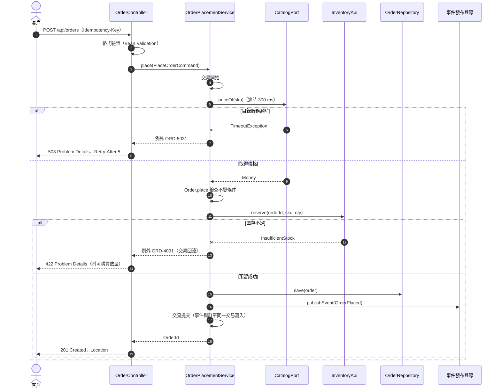

#### 🔍 9.1 審查與驗證

- **自動檢查：** `mmdc` 渲染每一張循序圖，語法錯誤時 CI 失敗。
- **人工審查問題：**
  1. 每一個外部呼叫，是否都畫出了失敗或逾時的分支？使用者最後看到什麼？
  2. 交易邊界在哪裡？交易內有沒有遠端呼叫（SD-ERR-006）？
  3. 圖中的參與者名稱是否對應實際的類別或介面？
- **AI 常見錯誤：** 只畫成功路徑；訊息文字含半形分號 `;` 或冒號造成 Mermaid 解析錯誤；在圖中大量使用註解區塊導致版面錯亂。

### 9.2 狀態設計：狀態機

有生命週期的實體（訂單、申請案件、付款）必須以狀態機描述。狀態機的價值在於讓「哪些轉換是合法的」變成一張可以逐格審查、逐格測試的表格。

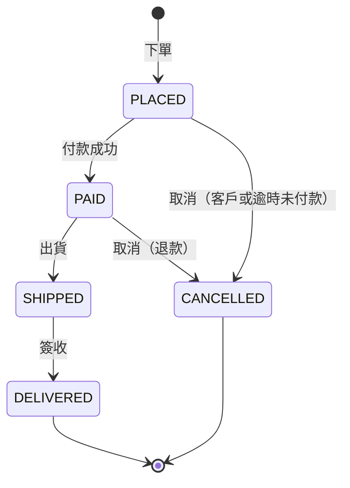

| 目前狀態 ＼ 目標 | PLACED | PAID | SHIPPED | DELIVERED | CANCELLED |
| --- | --- | --- | --- | --- | --- |
| PLACED | — | ✅ | ❌ | ❌ | ✅ |
| PAID | ❌ | — | ✅ | ❌ | ✅（需退款） |
| SHIPPED | ❌ | ❌ | — | ✅ | ❌（改走退貨流程） |
| DELIVERED | ❌ | ❌ | ❌ | — | ❌ |
| CANCELLED | ❌ | ❌ | ❌ | ❌ | — |

| 編號 | 等級 | 規則 | 驗證方式 |
| --- | --- | --- | --- |
| `SD-BEH-002` | 必須 | 有生命週期的實體必須以狀態機定義：狀態、觸發事件、轉換、守衛條件與轉換時的動作；不合法的轉換必須被拒絕並回傳明確的錯誤碼 | 🧪 單元測試；👁 設計審查 |
| `SD-BEH-003` | 應該 | 狀態轉換規則應集中定義在一處（例如狀態列舉中的轉換表），並以參數化測試覆蓋轉換表中的**所有**組合（包含不合法的組合） | 🧪 參數化測試 |
| `SD-BEH-004` | 必須 | 狀態欄位必須以資料庫 `CHECK` 限制（或參照表）限定合法值，避免其他程式或手動操作寫入不存在的狀態 | 🤖 結構檢查查詢；🧪 SQL 測試 |

```java
// ✅ SD-BEH-002 SD-BEH-003：轉換表集中在狀態列舉
package com.example.sd.order.domain;

import java.util.EnumSet;
import java.util.Map;
import java.util.Set;

public enum OrderStatus {
    PLACED, PAID, SHIPPED, DELIVERED, CANCELLED;

    private static final Map<OrderStatus, Set<OrderStatus>> ALLOWED = Map.of(
            PLACED, EnumSet.of(PAID, CANCELLED),
            PAID, EnumSet.of(SHIPPED, CANCELLED),
            SHIPPED, EnumSet.of(DELIVERED),
            DELIVERED, EnumSet.noneOf(OrderStatus.class),
            CANCELLED, EnumSet.noneOf(OrderStatus.class));

    public boolean canTransitionTo(OrderStatus target) {
        return ALLOWED.get(this).contains(target);
    }

    public OrderStatus transitionTo(OrderStatus target) {
        if (!canTransitionTo(target)) {
            throw new OrderRuleViolation("ORD-4093", "訂單狀態不可由 " + this + " 轉為 " + target);
        }
        return target;
    }
}
```

測試資料直接複製 SDD 的轉換表，一格對應一個測試案例。轉換表與程式不一致時，測試會指出是哪一格：

```java
// ✅ SD-BEH-003：以 SDD 的轉換表驗證全部 25 種組合
package com.example.sd.order.domain;

import static org.assertj.core.api.Assertions.assertThat;

import java.util.Arrays;
import java.util.List;
import java.util.stream.Stream;
import org.junit.jupiter.params.ParameterizedTest;
import org.junit.jupiter.params.provider.Arguments;
import org.junit.jupiter.params.provider.MethodSource;

class OrderStatusTransitionTest {

    /** 與 SDD 9.2 的轉換表相同：列為目前狀態，欄依 PLACED, PAID, SHIPPED, DELIVERED, CANCELLED。 */
    private static final List<String> TABLE = List.of(
            "PLACED    : - Y N N Y",
            "PAID      : N - Y N Y",
            "SHIPPED   : N N - Y N",
            "DELIVERED : N N N - N",
            "CANCELLED : N N N N -");

    static Stream<Arguments> everyCell() {
        OrderStatus[] columns = OrderStatus.values();
        return TABLE.stream().flatMap(row -> {
            String[] parts = row.split(":");
            OrderStatus from = OrderStatus.valueOf(parts[0].strip());
            String[] cells = parts[1].strip().split("\\s+");
            return Arrays.stream(columns).map(to -> Arguments.of(from, to, cells[to.ordinal()].equals("Y")));
        });
    }

    @ParameterizedTest(name = "{0} → {1} 允許 = {2}")
    @MethodSource("everyCell")
    void matchesDesignTable(OrderStatus from, OrderStatus to, boolean allowed) {
        assertThat(from.canTransitionTo(to)).isEqualTo(allowed);
    }
}
```

```sql
-- ✅ SD-BEH-004：資料庫拒絕不存在的狀態（orders 的 ck_orders_status，見 8.1）
DO $$
BEGIN
    UPDATE orders SET status = 'REFUNDING' WHERE id = '0192d3e4-5f60-7abc-8def-0123456789ab';
    RAISE EXCEPTION '應該被 CHECK 限制拒絕';
EXCEPTION WHEN check_violation THEN
    RAISE NOTICE '已拒絕不合法的狀態';
END $$;
```

```java
// ❌ SD-BEH-002 SD-BEH-003：狀態以字串表示，轉換規則散落在各個服務（片段）
public void ship(Order o) {
    if (o.getStatus().equals("PAID") || o.getStatus().equals("PLACED")) {   // PLACED 也能出貨？
        o.setStatus("SHIPPED");
    }
}
public void cancel(Order o) { o.setStatus("CANCELLED"); }                  // 已出貨也能取消
```

（片段：示意散落的狀態轉換）

#### 🔍 9.2 審查與驗證

- **自動檢查：** `OrderStatusTransitionTest` 覆蓋全部 25 格；資料庫的 `CHECK` 限制由 SQL 測試驗證。
- **人工審查問題：**
  1. 轉換表中每一格「❌」的理由是什麼？業務人員是否確認過？（例如已出貨能否取消）
  2. 有沒有「卡住」的狀態，也就是沒有任何出口、又不是終止狀態？
  3. 逾時造成的轉換（例如 30 分鐘未付款自動取消）由誰觸發？
- **AI 常見錯誤：** 只產生合法轉換的測試；以 `if` 判斷轉換而不是集中的表格；狀態圖中缺少取消或逾時的轉換。

### 9.3 資料流設計

v1.x 的「資料流圖」只畫出元件之間的箭頭。資料流圖（DFD）在設計審查中最重要的用途是**找出資料跨越信任邊界的地方**，這些地方就是需要驗證、授權、加密與遮罩的位置，也是威脅建模（11.1）的輸入。

| 編號 | 等級 | 規則 | 驗證方式 |
| --- | --- | --- | --- |
| `SD-BEH-005` | 應該 | 處理個資或機密資料的流程應有資料流圖，標示外部實體、處理程序、資料儲存、資料流與信任邊界，並在資料流上註明資料分級與保護方式 | 👁 設計審查；🤖 mermaid-cli 渲染 |

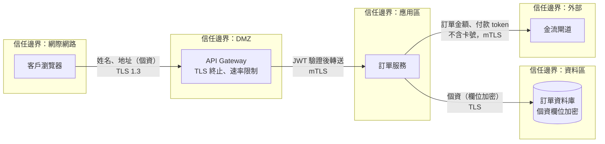

#### 🔍 9.3 審查與驗證

- **自動檢查：** `mmdc` 渲染。
- **人工審查問題：**
  1. 每條跨越信任邊界的資料流，接收端是否驗證了輸入並檢查了授權？
  2. 有沒有資料流把個資送到不需要的地方（例如日誌平台、分析系統）？
- **AI 常見錯誤：** 資料流圖沒有信任邊界；把「API Gateway 驗證過」當成後端不需要再檢查授權的理由。

### 9.4 長流程、演算法與並行

跨越多個服務或需要等待外部事件的流程（付款、出貨、審核），無法以單一資料庫交易完成。這類流程以 **Saga** 設計：每個步驟是一個本地交易，失敗時執行補償動作。演算法與業務規則則以**決策表**描述，讓業務人員可以審查、測試人員可以直接轉成測試案例。

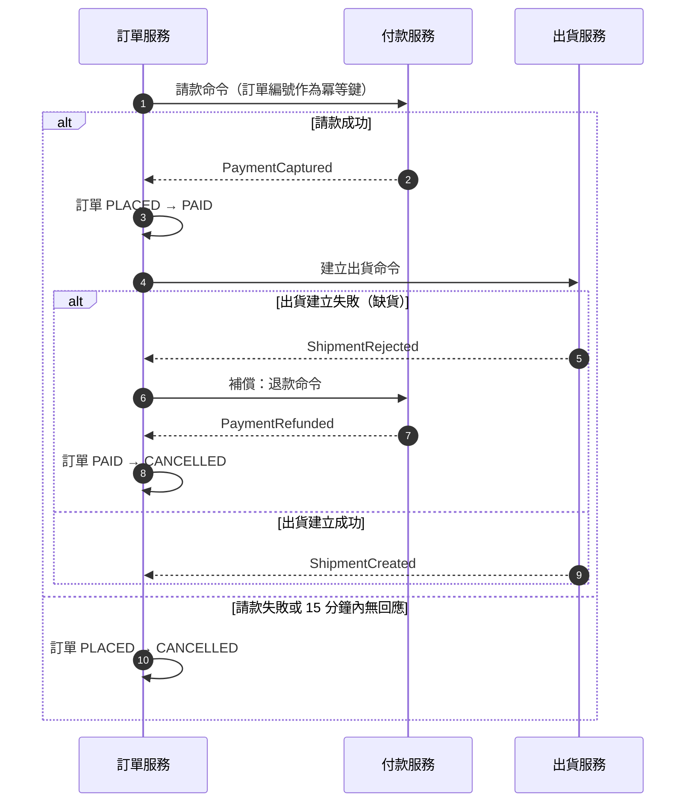

| 編號 | 等級 | 規則 | 驗證方式 |
| --- | --- | --- | --- |
| `SD-BEH-006` | 必須 | 跨服務的長流程必須以 Saga 設計：列出每個步驟、對應的補償動作、每個步驟的逾時與逾時後的處理；Saga 的進度必須持久化，服務重啟後可以繼續 | 👁 設計審查；🧪 整合測試（每個失敗點） |
| `SD-BEH-007` | 應該 | 複雜的業務規則與計算應以決策表或虛擬碼描述，並列出邊界值；決策表的每一列應對應一個參數化測試案例 | 🧪 參數化測試 |
| `SD-BEH-008` | 必須 | 設計必須說明同一筆資料被並行操作時的行為（例如同時取消與出貨、同時兩次付款回呼），並指出由哪個機制保證正確性（樂觀鎖、唯一限制、冪等鍵、佇列序列化） | 🧪 並行測試；👁 設計審查 |

```sql
-- ✅ SD-BEH-006：Saga 進度持久化，排程掃描逾時的步驟
CREATE TABLE order_sagas (
    order_id     uuid         NOT NULL,
    step         varchar(30)  NOT NULL,
    status       varchar(12)  NOT NULL,
    deadline_at  timestamptz  NOT NULL,
    attempts     smallint     NOT NULL DEFAULT 0,
    created_at   timestamptz  NOT NULL DEFAULT now(),
    created_by   varchar(64)  NOT NULL,
    updated_at   timestamptz  NOT NULL DEFAULT now(),
    updated_by   varchar(64)  NOT NULL,
    CONSTRAINT pk_order_sagas PRIMARY KEY (order_id),
    CONSTRAINT ck_order_sagas_step CHECK (step IN ('CAPTURE_PAYMENT', 'CREATE_SHIPMENT', 'REFUND_PAYMENT', 'DONE')),
    CONSTRAINT ck_order_sagas_status CHECK (status IN ('WAITING', 'COMPENSATING', 'COMPLETED', 'FAILED'))
);
CREATE INDEX idx_order_sagas_deadline_at ON order_sagas (deadline_at) WHERE status IN ('WAITING', 'COMPENSATING');

-- 排程每分鐘找出逾時的步驟（FOR UPDATE SKIP LOCKED 讓多個執行個體不會重複處理）
SELECT order_id, step FROM order_sagas
WHERE status IN ('WAITING', 'COMPENSATING') AND deadline_at < now()
ORDER BY deadline_at
LIMIT 100
FOR UPDATE SKIP LOCKED;
```

```markdown
<!-- ✅ SD-BEH-007：運費決策表（SDD 9.4-2） -->
| # | 金卡會員 | 訂單金額 ≥ 1,000 | 離島 | 運費（TWD） |
| --- | --- | --- | --- | --- |
| R1 | 是 | — | 否 | 0 |
| R2 | 是 | — | 是 | 100 |
| R3 | 否 | 是 | 否 | 0 |
| R4 | 否 | 是 | 是 | 100 |
| R5 | 否 | 否 | 否 | 80 |
| R6 | 否 | 否 | 是 | 180 |

邊界值：999.99（R5／R6）、1,000.00（R3／R4）。
```

```java
// ✅ SD-BEH-007：程式結構對應決策表，每條規則一行
package com.example.sd.order.domain;

import com.example.sd.shared.Money;

public final class ShippingFeePolicy {

    private static final Money FREE_SHIPPING_THRESHOLD = Money.of("1000", "TWD");

    public Money feeFor(boolean goldMember, Money orderTotal, boolean remoteIsland) {
        boolean freeBase = goldMember || !FREE_SHIPPING_THRESHOLD.isGreaterThan(orderTotal);
        if (freeBase) {
            return Money.of(remoteIsland ? "100" : "0", "TWD");         // R1～R4
        }
        return Money.of(remoteIsland ? "180" : "80", "TWD");            // R5、R6
    }
}
```

```java
// ✅ SD-BEH-007：決策表的每一列與邊界值都是一個測試案例
package com.example.sd.order.domain;

import static org.assertj.core.api.Assertions.assertThat;

import com.example.sd.shared.Money;
import org.junit.jupiter.params.ParameterizedTest;
import org.junit.jupiter.params.provider.CsvSource;

class ShippingFeePolicyTest {

    private final ShippingFeePolicy policy = new ShippingFeePolicy();

    @ParameterizedTest(name = "{0}：金卡={1} 金額={2} 離島={3} → {4}")
    @CsvSource({
        "R1, true,  500.00,  false, 0",
        "R2, true,  500.00,  true,  100",
        "R3, false, 1000.00, false, 0",
        "R4, false, 1000.00, true,  100",
        "R5, false, 999.99,  false, 80",
        "R6, false, 999.99,  true,  180"
    })
    void followsDecisionTable(String rule, boolean gold, String total, boolean remote, String fee) {
        assertThat(policy.feeFor(gold, Money.of(total, "TWD"), remote)).isEqualTo(Money.of(fee, "TWD"));
    }
}
```

```markdown
<!-- ✅ SD-BEH-008：並行情境分析（SDD 9.4-3） -->
| 情境 | 可能的結果 | 保證機制 | 驗證 |
| --- | --- | --- | --- |
| 客服取消與倉庫出貨同時發生 | 只有一個成功；另一個收到 409 並提示重新載入 | `orders.version` 樂觀鎖（SD-DAT-006） | 並行測試：兩個執行緒同時以 version=2 更新 |
| 金流重複送出付款成功回呼 | 只處理一次 | `payment_callbacks` 以金流交易編號為主鍵（SD-ERR-008） | 重送測試 |
| 同一冪等鍵的下單請求同時到達 | 只建立一筆訂單 | `idempotency_keys` 主鍵（SD-IF-005） | 並行測試 |
| 兩個執行個體的排程同時掃描逾時 Saga | 每筆只被一個執行個體處理 | `FOR UPDATE SKIP LOCKED` | 整合測試 |
```

#### 🔍 9.4 審查與驗證

- **自動檢查：** 決策表參數化測試；並行測試以 `CountDownLatch` 讓兩個執行緒同時送出，斷言結果符合並行情境分析表。
- **人工審查問題：**
  1. Saga 的每個補償動作本身失敗時怎麼辦？是否會重試，重試多次仍失敗時誰會被通知？
  2. 決策表是否「完整」（所有條件組合都有對應的列）且「不重疊」（一個組合只符合一列）？
  3. 並行情境分析是否涵蓋所有會修改同一筆資料的入口（API、批次、事件、人工後台）？
- **AI 常見錯誤：** 以分散式交易（XA／2PC）處理跨服務流程；決策表遺漏邊界值；以 `synchronized` 處理並行，忽略多執行個體部署。

## 10. 錯誤處理、交易與一致性

v1.x 沒有獨立討論錯誤處理，只在各章零星出現 `throw new RuntimeException`。實務上，錯誤處理的設計品質決定了系統出問題時能不能快速恢復：使用者知不知道該怎麼辦、維運人員能不能找到原因、資料會不會不一致。本章規範錯誤分類、錯誤碼、逾時與重試、交易邊界，以及資料庫與訊息之間的一致性。

### 10.1 錯誤分類與錯誤碼

| 類別 | 原因 | HTTP 狀態 | 可重試 | 使用者該做什麼 | 日誌等級 |
| --- | --- | --- | --- | --- | --- |
| 輸入格式錯誤 | 欄位缺漏、格式不符 | 400 | 否 | 修正輸入 | INFO |
| 身分驗證或授權失敗 | 權杖無效、權限不足 | 401／403 | 否 | 重新登入或申請權限 | WARN |
| 資源不存在 | ID 錯誤或無權查看 | 404 | 否 | 確認編號 | INFO |
| 衝突 | 版本衝突、冪等鍵處理中 | 409 | 視情況 | 重新載入後再操作 | INFO |
| 業務規則違反 | 庫存不足、額度不足 | 422 | 否 | 依訊息調整 | INFO |
| 流量限制 | 超過速率限制 | 429 | 是（依 `Retry-After`） | 稍後重試 | WARN |
| 外部依賴失敗 | 逾時、外部系統錯誤 | 502／503／504 | 是 | 稍後重試 | WARN／ERROR |
| 系統錯誤 | 程式缺陷、未預期狀況 | 500 | 否 | 聯絡客服並提供追蹤編號 | ERROR |

| 編號 | 等級 | 規則 | 驗證方式 |
| --- | --- | --- | --- |
| `SD-ERR-001` | 必須 | 設計必須定義錯誤分類（如上表）與對應的例外階層；業務錯誤繼承共用的業務例外基底類別並帶有錯誤碼與類別，系統錯誤與外部依賴錯誤使用不同的例外型別 | 👁 設計審查；🤖 ArchUnit（領域層不得丟出 `RuntimeException` 本身） |
| `SD-ERR-002` | 必須 | SDD 必須維護錯誤碼表（錯誤碼、HTTP 狀態、訊息鍵、是否可重試、使用者處理建議）；程式中使用的每個錯誤碼都必須存在於錯誤碼表，錯誤碼一經發布不得改變意義 | 🤖 錯誤碼一致性檢查腳本 |
| `SD-ERR-003` | 必須 | 回應給使用者的錯誤訊息不得包含堆疊追蹤、SQL、類別名稱、內部主機名稱或其他內部細節；未預期的錯誤一律回傳通用訊息與追蹤編號 | 🧪 Web 層測試；🤖 DAST 掃描 |

```java
// ✅ SD-ERR-001：業務例外的共用基底類別，帶錯誤碼與類別
package com.example.sd.shared.error;

public abstract class BusinessException extends RuntimeException {

    private static final long serialVersionUID = 1L;

    public enum Category {
        RULE_VIOLATION(422), NOT_FOUND(404), CONFLICT(409);

        private final int httpStatus;

        Category(int httpStatus) {
            this.httpStatus = httpStatus;
        }

        public int httpStatus() {
            return httpStatus;
        }
    }

    private final String code;
    private final Category category;

    protected BusinessException(String code, String message) {
        this(Category.RULE_VIOLATION, code, message);
    }

    protected BusinessException(Category category, String code, String message) {
        super(message);
        this.code = code;
        this.category = category;
    }

    public String code() {
        return code;
    }

    public Category category() {
        return category;
    }
}
```

```java
// ✅ SD-ERR-001：外部依賴失敗是另一種例外，對應 503 並可重試
package com.example.sd.shared.error;

import java.time.Duration;

public final class ExternalServiceUnavailable extends RuntimeException {

    private static final long serialVersionUID = 1L;

    private final String code;
    private final Duration retryAfter;

    public ExternalServiceUnavailable(String code, String service, Duration retryAfter, Throwable cause) {
        super(service + " 暫時無法使用", cause);
        this.code = code;
        this.retryAfter = retryAfter;
    }

    public String code() {
        return code;
    }

    public Duration retryAfter() {
        return retryAfter;
    }
}
```

```yaml
# ✅ SD-ERR-002：docs/sdd/error-codes.yaml（錯誤碼表，機器可讀）
- code: ORD-4001
  status: 422
  messageKey: order.lines.count
  retryable: false
  advice: 訂單明細需為 1 到 50 筆
- code: ORD-4002
  status: 422
  messageKey: order.currency.mixed
  retryable: false
  advice: 請分開下單
- code: ORD-4003
  status: 422
  messageKey: order.lines.duplicate
  retryable: false
  advice: 同一商品請合併數量
- code: ORD-4004
  status: 422
  messageKey: order.total.limit
  retryable: false
  advice: 請分批下單或聯絡業務
- code: ORD-4005
  status: 422
  messageKey: order.cancel.reason
  retryable: false
  advice: 請填寫取消原因
- code: ORD-4091
  status: 422
  messageKey: order.stock.insufficient
  retryable: false
  advice: 依回應中的可購買數量調整
- code: ORD-4092
  status: 422
  messageKey: order.credit.insufficient
  retryable: false
  advice: 請聯絡業務調整額度
- code: ORD-4093
  status: 422
  messageKey: order.status.transition
  retryable: false
  advice: 請重新載入訂單後再操作
- code: ORD-4221
  status: 422
  messageKey: idempotency.key.reused
  retryable: false
  advice: 請為新的請求產生新的 Idempotency-Key
- code: ORD-5031
  status: 503
  messageKey: dependency.catalog.unavailable
  retryable: true
  advice: 請依 Retry-After 稍後重試
- code: PAY-4221
  status: 422
  messageKey: payment.rejected.balance
  retryable: false
  advice: 請確認帳戶餘額或改用其他付款方式
- code: PAY-4222
  status: 422
  messageKey: payment.rejected.limit
  retryable: false
  advice: 已超過單日轉帳限額，請改日再試
- code: PAY-5031
  status: 503
  messageKey: dependency.bank.unavailable
  retryable: true
  advice: 銀行系統暫時無法使用，請稍後重試
- code: PAY-5039
  status: 503
  messageKey: dependency.bank.unknown
  retryable: true
  advice: 銀行回應異常，系統已通知維運人員
- code: SYS-5000
  status: 500
  messageKey: system.unexpected
  retryable: false
  advice: 請提供追蹤編號給客服人員
```

```python
# ✅ SD-ERR-002：tools/check_error_codes.py，程式中出現的錯誤碼都必須在錯誤碼表中
import re
import sys
from pathlib import Path

import yaml


def main(table: str, src_root: str) -> int:
    defined = {row["code"] for row in yaml.safe_load(Path(table).read_text(encoding="utf-8"))}
    used: dict[str, str] = {}
    for f in Path(src_root).rglob("*.java"):
        for code in re.findall(r'"([A-Z]{3}-\d{4})"', f.read_text(encoding="utf-8")):
            used.setdefault(code, str(f))
    missing = sorted(set(used) - defined)
    for code in missing:
        print(f"錯誤：{code} 未定義於錯誤碼表（{used[code]}）")
    for code in sorted(defined - set(used)):
        print(f"提醒：{code} 已定義但程式中未使用")
    return 1 if missing else 0


if __name__ == "__main__":
    sys.exit(main(sys.argv[1], sys.argv[2]))
```

```java
// ✅ SD-ERR-001 SD-ERR-003 SD-ERR-010 SD-IF-004：例外統一轉為 RFC 9457 Problem Details，附錯誤碼與 traceId
package com.example.sd.order.adapter.web;

import com.example.sd.shared.error.BusinessException;
import com.example.sd.shared.error.ExternalServiceUnavailable;
import io.micrometer.tracing.Span;
import io.micrometer.tracing.Tracer;
import java.net.URI;
import org.slf4j.Logger;
import org.slf4j.LoggerFactory;
import org.springframework.http.HttpHeaders;
import org.springframework.http.HttpStatus;
import org.springframework.http.MediaType;
import org.springframework.http.ProblemDetail;
import org.springframework.http.ResponseEntity;
import org.springframework.web.bind.annotation.ExceptionHandler;
import org.springframework.web.bind.annotation.RestControllerAdvice;
import org.springframework.web.servlet.mvc.method.annotation.ResponseEntityExceptionHandler;

@RestControllerAdvice
class ProblemDetailsAdvice extends ResponseEntityExceptionHandler {

    private static final Logger log = LoggerFactory.getLogger(ProblemDetailsAdvice.class);
    private static final String TYPE_BASE = "https://api.example.com/problems/";

    private final Tracer tracer;

    ProblemDetailsAdvice(Tracer tracer) {
        this.tracer = tracer;
    }

    @ExceptionHandler(BusinessException.class)
    ResponseEntity<ProblemDetail> business(BusinessException ex) {
        HttpStatus status = HttpStatus.valueOf(ex.category().httpStatus());
        return problem(status, ex.code(), ex.getMessage(), new HttpHeaders());
    }

    @ExceptionHandler(ExternalServiceUnavailable.class)
    ResponseEntity<ProblemDetail> dependency(ExternalServiceUnavailable ex) {
        log.warn("外部依賴失敗 code={}", ex.code(), ex);
        HttpHeaders headers = new HttpHeaders();
        headers.set(HttpHeaders.RETRY_AFTER, Long.toString(ex.retryAfter().toSeconds()));
        return problem(HttpStatus.SERVICE_UNAVAILABLE, ex.code(), "服務暫時無法使用，請稍後再試", headers);
    }

    @ExceptionHandler(Exception.class)
    ResponseEntity<ProblemDetail> unexpected(Exception ex) {
        log.error("未預期的錯誤", ex);
        return problem(HttpStatus.INTERNAL_SERVER_ERROR, "SYS-5000",
                "系統暫時無法處理您的請求，請提供追蹤編號給客服人員", new HttpHeaders());
    }

    private ResponseEntity<ProblemDetail> problem(HttpStatus status, String code, String detail, HttpHeaders headers) {
        ProblemDetail body = ProblemDetail.forStatusAndDetail(status, detail);
        body.setType(URI.create(TYPE_BASE + code));
        body.setProperty("code", code);
        body.setProperty("traceId", currentTraceId());
        return ResponseEntity.status(status).headers(headers).contentType(MediaType.APPLICATION_PROBLEM_JSON).body(body);
    }

    private String currentTraceId() {
        Span span = tracer.currentSpan();
        return span == null ? "unknown" : span.context().traceId();
    }
}
```

```json
{
  "type": "https://api.example.com/problems/SYS-5000",
  "title": "Internal Server Error",
  "status": 500,
  "detail": "系統暫時無法處理您的請求，請提供追蹤編號給客服人員",
  "instance": "/api/orders",
  "code": "SYS-5000",
  "traceId": "4bf92f3577b34da6a3ce929d0e0e4736"
}
```

```text
❌ SD-ERR-003：直接把例外訊息回給使用者，洩漏 SQL、資料表與套件名稱
HTTP/1.1 500
{"error":"org.springframework.jdbc.BadSqlGrammarException: PreparedStatementCallback; bad SQL grammar
 [select * from ORD_MASTER where CUST_NO = ?]; nested exception is org.postgresql.util.PSQLException ..."}
```

#### 🔍 10.1 審查與驗證

- **自動檢查：** `python tools/check_error_codes.py docs/sdd/error-codes.yaml src/main/java`；Web 層測試觸發未預期例外，斷言回應不含 `Exception`、`SQL`、`at com.` 等字串。
- **人工審查問題：**
  1. 每個錯誤碼的「處理建議」，使用者看得懂並能採取行動嗎？
  2. 4xx 與 5xx 的區分是否正確？業務錯誤回 500 會觸發不必要的告警，系統錯誤回 4xx 會隱藏問題。
- **AI 常見錯誤：** 所有錯誤都回 500 或都回 400；在 `catch` 中吞掉例外只記錄日誌；以 `e.getMessage()` 作為回應內容。

### 10.2 逾時與重試

| 編號 | 等級 | 規則 | 驗證方式 |
| --- | --- | --- | --- |
| `SD-ERR-004` | 必須 | 每個外部呼叫（HTTP、資料庫、訊息、檔案傳輸）都必須設定連線逾時與讀取逾時；下游逾時的總和（含重試）必須小於上游給予的時間預算 | 🧪 整合測試（以 WireMock 模擬延遲）；👁 逾時預算表審查 |
| `SD-ERR-005` | 必須 | 只有可重試的錯誤（逾時、503、連線中斷）才能重試，且只能重試冪等的操作；重試必須使用指數退避加上隨機抖動，並限制次數與總時間 | 🧪 單元測試（重試次數與條件）；👁 設計審查 |

```markdown
<!-- ✅ SD-ERR-004：下單 API 的逾時預算（p99 目標 800 ms，Gateway 逾時 2 s） -->
| 呼叫 | 連線逾時 | 讀取逾時 | 重試 | 最壞情況 |
| --- | --- | --- | --- | --- |
| 商品目錄 GET /prices | 100 ms | 300 ms | 2 次，延遲 100 ms×2ⁿ＋抖動 50 ms | 300×3＋100＋200＋100 = 1,300 ms |
| 資料庫查詢 | — | 500 ms（statement timeout） | 不重試 | 500 ms |
| 合計 | | | | 1,800 ms < Gateway 2,000 ms ✅ |
```

```java
// ✅ SD-ERR-004 SD-ERR-005 SD-PAT-008：外部呼叫設定逾時；只對冪等的 GET 與可重試的錯誤重試
package com.example.sd.order.adapter.client;

import com.example.sd.order.application.CatalogPort;
import com.example.sd.shared.Money;
import com.example.sd.shared.error.ExternalServiceUnavailable;
import java.net.http.HttpClient;
import java.time.Duration;
import org.springframework.http.client.JdkClientHttpRequestFactory;
import org.springframework.resilience.annotation.Retryable;
import org.springframework.stereotype.Component;
import org.springframework.web.client.HttpServerErrorException;
import org.springframework.web.client.ResourceAccessException;
import org.springframework.web.client.RestClient;

@Component
class HttpCatalogClient implements CatalogPort {

    record PriceResponse(String sku, String amount, String currency) { }

    private final RestClient client;

    HttpCatalogClient(RestClient.Builder builder) {
        HttpClient http = HttpClient.newBuilder().connectTimeout(Duration.ofMillis(100)).build();
        JdkClientHttpRequestFactory factory = new JdkClientHttpRequestFactory(http);
        factory.setReadTimeout(Duration.ofMillis(300));
        this.client = builder.baseUrl("https://catalog.internal.example.com").requestFactory(factory).build();
    }

    @Override
    @Retryable(includes = {ResourceAccessException.class, HttpServerErrorException.ServiceUnavailable.class},
            maxRetries = 2, delay = 100, multiplier = 2, jitter = 50, maxDelay = 400)
    public Money priceOf(String sku) {
        try {
            PriceResponse body = client.get().uri("/prices/{sku}", sku).retrieve().body(PriceResponse.class);
            if (body == null) {
                throw new IllegalStateException("商品目錄回傳空內容：" + sku);
            }
            return Money.of(body.amount(), body.currency());
        } catch (ResourceAccessException | HttpServerErrorException.ServiceUnavailable e) {
            throw e;
        } catch (RuntimeException e) {
            throw new ExternalServiceUnavailable("ORD-5031", "商品目錄", Duration.ofSeconds(5), e);
        }
    }
}
```

```java
// ✅ SD-ERR-005：啟用 Spring Framework 7 的韌性註解
package com.example.sd.config;

import org.springframework.context.annotation.Configuration;
import org.springframework.resilience.annotation.EnableResilientMethods;

@Configuration(proxyBeanMethods = false)
@EnableResilientMethods
class ResilienceConfig {
}
```

```java
// ❌ SD-ERR-004 SD-ERR-005：沒有逾時、對非冪等的 POST 無條件重試、固定間隔（片段）
for (int i = 0; i < 5; i++) {
    try {
        return restTemplate.postForObject(paymentUrl, request, PaymentResult.class);   // 預設無讀取逾時
    } catch (Exception e) {
        Thread.sleep(1000);                                                       // 所有錯誤都重試，可能重複扣款
    }
}
```

（片段：示意不良的重試）

#### 🔍 10.2 審查與驗證

- **自動檢查：** 以 WireMock 模擬 1 秒延遲，斷言 300 ms 後逾時；模擬 503 兩次後成功，斷言共呼叫 3 次；模擬 400，斷言只呼叫 1 次。
- **人工審查問題：**
  1. 逾時預算表的「最壞情況」是否小於上游的逾時？重試會不會讓總時間超過預算？
  2. 被重試的操作是否冪等？POST 是否帶有冪等鍵？
  3. 外部系統長時間故障時，大量重試會不會放大流量（重試風暴）？是否需要斷路器（見架構設計指引 10.1）？
- **AI 常見錯誤：** 使用不設逾時的 `RestTemplate`；對所有 `Exception` 重試；在迴圈中以 `Thread.sleep` 實作重試；使用 Spring Retry 專案的舊 API 而不是 Framework 7 內建的 `@Retryable`。

### 10.3 交易邊界與資料一致性

當一個操作同時要更新資料庫與送出訊息時，就會遇到**雙寫問題**：資料庫提交成功但訊息送失敗（事件遺失），或訊息送出但資料庫回滾（幽靈事件）。正確的做法是**交易式外寄匣**（Transactional Outbox）：在同一個資料庫交易中寫入業務資料與「待發布事件」，再由另一個程序可靠地發布。Spring Modulith 的事件發布登錄（Event Publication Registry）就是 Outbox 的實作。

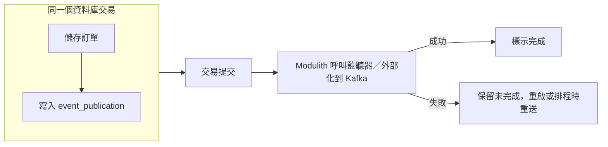

| 編號 | 等級 | 規則 | 驗證方式 |
| --- | --- | --- | --- |
| `SD-ERR-006` | 必須 | 資料庫交易內不得呼叫遠端服務（HTTP、訊息發送、檔案傳輸）；需要遠端資料時應在交易前取得，需要通知遠端時應以 Outbox 在交易後送出 | 👁 設計審查（循序圖中的交易邊界）；🧪 整合測試 |
| `SD-ERR-007` | 必須 | 資料庫更新與事件發布必須保持一致：使用 Transactional Outbox（例如 Spring Modulith 事件發布登錄），不得在交易中直接送出訊息或在交易後「盡力」送出 | 🧪 整合測試（監聽器失敗後重送）；🤖 設定檢查 |
| `SD-ERR-008` | 必須 | 訊息消費者必須冪等：以事件 ID 或業務鍵記錄已處理的訊息，重複的訊息不得產生重複的效果 | 🧪 重送測試 |
| `SD-ERR-009` | 應該 | 重試後仍無法處理的訊息應送到死信佇列（DLQ），並有告警、查詢與重送的操作程序 | 🧪 整合測試；👁 維運手冊審查 |
| `SD-ERR-010` | 必須 | 每個錯誤回應與錯誤日誌都必須帶有 traceId，讓客服與維運人員可以從使用者提供的編號找到完整的呼叫鏈 | 🧪 Web 層測試；🤖 日誌格式檢查 |

```yaml
# ✅ SD-ERR-007：Spring Modulith 事件發布登錄（JDBC），重啟時重送未完成的事件
spring:
  modulith:
    events:
      jdbc:
        schema-initialization:
          enabled: false            # 正式環境由 Flyway 建立 event_publication 資料表
      republish-outstanding-events-on-restart: true
      completion-mode: update
```

```java
// ✅ SD-ERR-007：監聽器在原交易提交後以新交易非同步執行；失敗時事件保留在登錄中等待重送
package com.example.sd.shipping;

import com.example.sd.order.domain.OrderEvent;
import org.springframework.modulith.events.ApplicationModuleListener;
import org.springframework.stereotype.Component;

@Component
class ShippingOrderListener {

    private final ShipmentPreparation preparation;

    ShippingOrderListener(ShipmentPreparation preparation) {
        this.preparation = preparation;
    }

    @ApplicationModuleListener
    void on(OrderEvent.OrderPaid event) {
        preparation.prepare(event.orderId().toString());
    }
}
```

```java
package com.example.sd.shipping;

import org.springframework.stereotype.Service;

@Service
public class ShipmentPreparation {

    public void prepare(String orderId) {
        // 建立出貨單（省略）；必須冪等，見 SD-ERR-008
    }
}
```

```sql
-- ✅ SD-ERR-008：已處理訊息表，以事件 ID 為主鍵；插入 0 列代表重複訊息，直接略過
CREATE TABLE processed_events (
    event_id      varchar(64)  NOT NULL,
    consumer      varchar(64)  NOT NULL,
    processed_at  timestamptz  NOT NULL DEFAULT now(),
    CONSTRAINT pk_processed_events PRIMARY KEY (consumer, event_id)
);

INSERT INTO processed_events (event_id, consumer)
VALUES ('evt-0192d3e4-0001', 'shipping')
ON CONFLICT DO NOTHING;   -- 第一次：1 列，處理；之後：0 列，略過
INSERT INTO processed_events (event_id, consumer)
VALUES ('evt-0192d3e4-0001', 'shipping')
ON CONFLICT DO NOTHING;
```

```java
// ✅ SD-ERR-009：Kafka 消費失敗時以指數退避重試 3 次，仍失敗則送到 <topic>-dlt
package com.example.sd.config;

import org.springframework.context.annotation.Bean;
import org.springframework.context.annotation.Configuration;
import org.springframework.kafka.core.KafkaOperations;
import org.springframework.kafka.listener.DeadLetterPublishingRecoverer;
import org.springframework.kafka.listener.DefaultErrorHandler;
import org.springframework.util.backoff.ExponentialBackOff;

@Configuration(proxyBeanMethods = false)
class KafkaErrorHandlingConfig {

    @Bean
    DefaultErrorHandler kafkaErrorHandler(KafkaOperations<Object, Object> template) {
        ExponentialBackOff backOff = new ExponentialBackOff(500L, 2.0);
        backOff.setMaxAttempts(3);
        DefaultErrorHandler handler = new DefaultErrorHandler(new DeadLetterPublishingRecoverer(template), backOff);
        handler.addNotRetryableExceptions(IllegalArgumentException.class);
        return handler;
    }
}
```

```java
// ❌ SD-ERR-006 SD-ERR-007：交易中送出訊息；交易回滾時訊息已送出，送出失敗時訂單已存（片段）
@Transactional
public void place(Order order) {
    orderRepository.save(order);
    kafkaTemplate.send("order.events.v1", order.getId(), toJson(order));
    paymentClient.authorize(order);   // 交易中呼叫遠端，鎖住資料列直到遠端回應
}
```

（片段：示意雙寫問題）

#### 🔍 10.3 審查與驗證

- **自動檢查：** 整合測試讓監聽器第一次丟出例外，斷言 `event_publication` 中的紀錄未完成，重送後完成；重送測試對同一事件 ID 呼叫兩次，斷言只產生一筆出貨單。
- **人工審查問題：**
  1. 循序圖中的交易邊界內，有沒有遠端呼叫？
  2. DLQ 中的訊息誰會看？多久處理一次？重送的操作程序寫在哪裡？
  3. 使用者回報問題時，客服如何用 traceId 找到日誌？
- **AI 常見錯誤：** 以 `@TransactionalEventListener` 直接呼叫 `kafkaTemplate.send()`，宣稱解決了雙寫問題（交易後送出失敗時事件仍然遺失）；消費者以「先查詢是否處理過再處理」的方式去重（並行時無效）；DLQ 沒有任何監控。

## 11. 安全設計

安全不是在開發完成後「掃描一下」就能加上的功能。OWASP Top 10:2025 的 A06「不安全的設計」（Insecure Design）明確指出：設計階段遺漏的控制，無法以完美的實作補救。本章規範詳細設計階段必須完成的安全設計；安全架構（零信任、網路分段、供應鏈）以 [架構設計指引]() 第 11 章為準，程式碼層級的安全寫法以 [安全程式碼指引]() 為準。

### 11.1 威脅建模

威脅建模回答四個問題（[Threat Modeling Manifesto](https://www.threatmodelingmanifesto.org/)）：我們在做什麼？可能出什麼錯？我們要怎麼處理？我們做得夠好嗎？最常用的方法是以資料流圖（9.3）為輸入，對每個元素與每條跨越信任邊界的資料流套用 STRIDE：

| 類別 | 威脅 | 違反的安全屬性 | 典型對策 |
| --- | --- | --- | --- |
| S（Spoofing） | 冒充身分 | 身分驗證 | OIDC、mTLS、簽章 |
| T（Tampering） | 竄改資料 | 完整性 | TLS、HMAC、資料庫權限、雜湊鏈 |
| R（Repudiation） | 否認操作 | 不可否認性 | 稽核日誌 |
| I（Information disclosure） | 資料外洩 | 機密性 | 授權、加密、遮罩 |
| D（Denial of service） | 服務阻斷 | 可用性 | 速率限制、配額、逾時 |
| E（Elevation of privilege） | 權限提升 | 授權 | 預設拒絕、最小權限、物件層級授權 |

| 編號 | 等級 | 規則 | 驗證方式 |
| --- | --- | --- | --- |
| `SD-SEC-001` | 必須 | 新系統與重大變更（新的外部介面、新的資料類別、認證或授權機制變更）必須進行威脅建模，產出威脅清單（威脅、影響、可能性、對策、對應的設計元素或規則、殘餘風險）並追溯到設計 | 👁 資安審查；🤖 追溯檢查腳本（威脅 ID 納入 trace.yaml） |
| `SD-SEC-002` | 必須 | 設計必須標示所有信任邊界；所有跨越信任邊界進入系統的資料（使用者輸入、外部 API 回應、檔案、訊息）都必須視為不可信任，在邊界進行驗證 | 👁 設計審查（資料流圖） |

```markdown
<!-- ✅ SD-SEC-001 SD-SEC-002：威脅清單（節錄），以 9.3 的資料流圖為輸入 -->
| ID | 元素／資料流 | STRIDE | 威脅 | 影響 | 可能性 | 對策（規則） | 殘餘風險 |
| --- | --- | --- | --- | --- | --- | --- | --- |
| T-01 | 客戶 → Gateway | S | 竊取的存取權杖被重放 | 高 | 中 | 權杖 ≤ 15 分鐘、BFF 不讓權杖進入瀏覽器（SD-SEC-004、SD-SEC-005） | 低 |
| T-02 | GET /api/orders/{id} | I、E | 修改 URL 中的訂單編號查看他人訂單（BOLA） | 高 | 高 | 物件層級授權（SD-SEC-006）；UUIDv7 不可預測 | 低 |
| T-03 | 訂單服務 → 金流 | T | 回呼內容被竄改 | 高 | 低 | HMAC 簽章含時間戳與 nonce（SD-SEC-012） | 低 |
| T-04 | POST /api/orders | D | 大量下單耗盡庫存預留 | 中 | 中 | 每客戶每分鐘 10 筆、每單 50 項（SD-SEC-011） | 中，持續監控 |
| T-05 | 訂單資料庫 | I | 備份檔外流造成個資外洩 | 高 | 低 | 個資欄位加密、金鑰在 KMS（SD-SEC-014） | 低 |
| T-06 | 客服後台 | R | 客服人員否認取消過訂單 | 中 | 中 | 稽核日誌不可竄改（SD-SEC-016） | 低 |
```

#### 🔍 11.1 審查與驗證

- **自動檢查：** 威脅 ID 以 `satisfies` 的方式納入追溯矩陣，`check_trace.py` 檢查每個威脅都有對策設計元素。
- **人工審查問題：**
  1. 資料流圖上每一條跨越信任邊界的箭頭，是否都至少套用過一次 STRIDE？
  2. 「殘餘風險：中」以上的項目，是否有負責人簽核接受？
- **AI 常見錯誤：** 產生通用的威脅清單（「SQL 注入」「XSS」）而沒有對應到本系統的具體元素；對策只寫「加強安全」；忽略內部人員與管理後台的威脅。

### 11.2 身分驗證

| 編號 | 等級 | 規則 | 驗證方式 |
| --- | --- | --- | --- |
| `SD-SEC-003` | 必須 | 使用者身分驗證必須委由組織的身分提供者（IdP，OpenID Connect）處理；應用程式不得自行保存使用者密碼或自行簽發存取權杖 | 👁 設計審查 |
| `SD-SEC-004` | 必須 | 瀏覽器應用程式必須使用授權碼流程搭配 PKCE；處理個資或交易的系統應採用 BFF（Backend for Frontend）模式，權杖只存在伺服器端，瀏覽器以 `HttpOnly`、`Secure`、`SameSite` 的工作階段 Cookie 存取 | 👁 設計審查；🧪 E2E 測試（瀏覽器儲存空間中沒有權杖） |
| `SD-SEC-005` | 必須 | 資源伺服器必須驗證 JWT 的簽章（演算法白名單，不接受 `none` 與對稱演算法混用）、`iss`、`aud`、`exp`；存取權杖有效期不應超過 15 分鐘 | 🧪 Web 層測試（錯誤的 aud、過期權杖回 401） |

```yaml
# ✅ SD-SEC-005：資源伺服器驗證簽發者、受眾與演算法（Spring Boot 4.1 設定鍵）
spring:
  security:
    oauth2:
      resourceserver:
        jwt:
          issuer-uri: https://idp.example.com/realms/corp
          audiences:
            - order-api
          jws-algorithms:
            - RS256
```

```java
// ✅ SD-SEC-004 SD-SEC-005 SD-SEC-008 SD-SEC-019 SD-SEC-020：API 與 BFF 兩條安全過濾鏈
package com.example.sd.security;

import org.springframework.context.annotation.Bean;
import org.springframework.context.annotation.Configuration;
import org.springframework.core.annotation.Order;
import org.springframework.http.HttpMethod;
import org.springframework.security.config.Customizer;
import org.springframework.security.config.annotation.method.configuration.EnableMethodSecurity;
import org.springframework.security.config.annotation.web.builders.HttpSecurity;
import org.springframework.security.config.http.SessionCreationPolicy;
import org.springframework.security.web.SecurityFilterChain;

@Configuration(proxyBeanMethods = false)
@EnableMethodSecurity
class SecurityConfig {

    /** 對外 API：無狀態，Bearer JWT；不使用 Cookie，因此不需要 CSRF 防護。 */
    @Bean
    @Order(1)
    SecurityFilterChain api(HttpSecurity http) throws Exception {
        return http
                .securityMatcher("/api/**")
                .authorizeHttpRequests(auth -> auth
                        .requestMatchers(HttpMethod.GET, "/api/orders/**").hasAuthority("SCOPE_orders:read")
                        .requestMatchers(HttpMethod.POST, "/api/orders").hasAuthority("SCOPE_orders:write")
                        .anyRequest().denyAll())                                   // 預設拒絕
                .oauth2ResourceServer(rs -> rs.jwt(Customizer.withDefaults()))
                .sessionManagement(s -> s.sessionCreationPolicy(SessionCreationPolicy.STATELESS))
                .csrf(csrf -> csrf.disable())
                .build();
    }

    /** BFF：瀏覽器以工作階段 Cookie 存取，權杖保存在伺服器端；需要 CSRF 防護與安全標頭。 */
    @Bean
    @Order(2)
    SecurityFilterChain bff(HttpSecurity http) throws Exception {
        return http
                .securityMatcher("/bff/**", "/oauth2/**", "/login/**", "/logout")
                .authorizeHttpRequests(auth -> auth
                        .requestMatchers("/bff/public/**").permitAll()
                        .requestMatchers("/bff/**").authenticated()
                        .anyRequest().denyAll())
                .oauth2Login(Customizer.withDefaults())
                .csrf(csrf -> csrf.spa())
                .headers(h -> h
                        .contentSecurityPolicy(csp -> csp.policyDirectives(
                                "default-src 'self'; frame-ancestors 'none'; object-src 'none'; base-uri 'self'"))
                        .httpStrictTransportSecurity(hsts -> hsts.maxAgeInSeconds(31_536_000).includeSubDomains(true)))
                .build();
    }
}
```

```yaml
# ✅ SD-SEC-004：BFF 的工作階段 Cookie 屬性
server:
  servlet:
    session:
      timeout: 30m
      cookie:
        http-only: true
        secure: true
        same-site: lax
```

```typescript
// ❌ SD-SEC-004：把存取權杖放在 localStorage，任何 XSS 都能讀走（片段）
const { access_token } = await fetch('/token', { method: 'POST', body }).then(r => r.json());
localStorage.setItem('access_token', access_token);
```

（片段：示意權杖保存在瀏覽器）

#### 🔍 11.2 審查與驗證

- **自動檢查：** Web 層測試以 `spring-security-test` 的 `jwt()` 送出缺少 scope、錯誤 `aud` 的權杖，斷言回 401／403；E2E 測試登入後檢查 `localStorage` 與 `sessionStorage` 中沒有權杖。
- **人工審查問題：**
  1. 系統是否自行實作了登入、密碼重設或權杖簽發？為什麼不用 IdP？
  2. 權杖有效期多長？撤銷（使用者被停權）後多久會失效？
- **AI 常見錯誤：** 使用已移除的 `WebSecurityConfigurerAdapter`；以隱含流程（implicit flow）或密碼流程（password grant）實作登入，兩者已被 OAuth 2.0 安全最佳實務（RFC 9700）禁止；JWT 驗證只檢查簽章不檢查 `aud`。

### 11.3 授權

| 編號 | 等級 | 規則 | 驗證方式 |
| --- | --- | --- | --- |
| `SD-SEC-006` | 必須 | 授權必須在伺服器端對每個請求檢查，包含功能層級（能不能呼叫這個操作）與物件層級（能不能存取這一筆資料）；不得依賴前端隱藏按鈕或 ID 難以猜測 | 🧪 授權測試（以 A 使用者存取 B 的資料回 404 或 403） |
| `SD-SEC-007` | 必須 | SDD 必須定義權限模型：角色或屬性、權限（操作 × 資源）、角色與權限的對照矩陣、資料範圍規則；矩陣必須轉成自動化測試 | 👁 設計審查；🧪 參數化授權測試 |
| `SD-SEC-008` | 必須 | 授權必須預設拒絕：未列在規則中的端點、方法與資源一律拒絕 | 🧪 Web 層測試（未定義的路徑回 403）；🤖 安全設定檢查 |

```markdown
<!-- ✅ SD-SEC-007：角色與權限矩陣（訂單上下文） -->
| 權限 ＼ 角色 | 客戶 | 客服人員 | 客服主管 | 系統（批次） |
| --- | --- | --- | --- | --- |
| 下單 `orders:write` | ✅ 自己 | ❌ | ❌ | ❌ |
| 查詢訂單 `orders:read` | ✅ 自己的訂單 | ✅ 負責區域 | ✅ 全部 | ✅ 全部 |
| 取消訂單 `orders:cancel` | ✅ 自己、未出貨 | ✅ 負責區域、未出貨 | ✅ 全部、未出貨 | ❌ |
| 修改金額 `orders:adjust` | ❌ | ❌ | ✅ 需填原因，單筆 ≤ 5,000 | ❌ |
```

```java
// ✅ SD-SEC-006：物件層級授權集中在一個元件，由方法安全註解呼叫
package com.example.sd.security;

import java.util.Set;
import org.springframework.security.core.Authentication;
import org.springframework.stereotype.Component;

@Component("orderAccess")
public class OrderAccessPolicy {

    public interface OrderOwnership {
        String ownerOf(String orderId);

        String regionOf(String orderId);
    }

    private final OrderOwnership ownership;

    OrderAccessPolicy(OrderOwnership ownership) {
        this.ownership = ownership;
    }

    public boolean canRead(String orderId, Authentication auth) {
        Set<String> authorities = AuthorityNames.of(auth);
        if (authorities.contains("ROLE_CS_MANAGER") || authorities.contains("ROLE_BATCH")) {
            return true;
        }
        if (authorities.contains("ROLE_CS_AGENT")) {
            return authorities.contains("REGION_" + ownership.regionOf(orderId));
        }
        return auth.getName().equals(ownership.ownerOf(orderId));
    }
}
```

```java
package com.example.sd.security;

import java.util.Set;
import java.util.stream.Collectors;
import org.springframework.security.core.Authentication;
import org.springframework.security.core.GrantedAuthority;

final class AuthorityNames {

    static Set<String> of(Authentication auth) {
        return auth.getAuthorities().stream().map(GrantedAuthority::getAuthority).collect(Collectors.toSet());
    }

    private AuthorityNames() {
    }
}
```

```java
// ✅ SD-SEC-006：查詢方法在載入資料前檢查物件層級權限；無權限時回 404 而不是 403，避免洩漏訂單是否存在
package com.example.sd.security;

import org.springframework.security.access.prepost.PreAuthorize;
import org.springframework.stereotype.Service;

@Service
public class OrderQueryService {

    public record OrderView(String orderId, String status) { }

    @PreAuthorize("@orderAccess.canRead(#orderId, authentication)")
    public OrderView find(String orderId) {
        return new OrderView(orderId, "PLACED");
    }
}
```

```java
// ✅ SD-SEC-007：權限矩陣轉成參數化測試，矩陣每一格都是一個案例
package com.example.sd.security;

import static org.assertj.core.api.Assertions.assertThat;

import org.junit.jupiter.params.ParameterizedTest;
import org.junit.jupiter.params.provider.CsvSource;
import org.springframework.security.authentication.TestingAuthenticationToken;

class OrderAccessPolicyTest {

    private final OrderAccessPolicy policy = new OrderAccessPolicy(new OrderAccessPolicy.OrderOwnership() {
        @Override
        public String ownerOf(String orderId) {
            return "alice";
        }

        @Override
        public String regionOf(String orderId) {
            return "NORTH";
        }
    });

    @ParameterizedTest(name = "{0} {1} 讀取 alice 北區的訂單 → {2}")
    @CsvSource({
        "alice, ROLE_CUSTOMER,                true",
        "bob,   ROLE_CUSTOMER,                false",
        "agent, ROLE_CS_AGENT;REGION_NORTH,   true",
        "agent, ROLE_CS_AGENT;REGION_SOUTH,   false",
        "boss,  ROLE_CS_MANAGER,              true"
    })
    void followsPermissionMatrix(String user, String authorities, boolean expected) {
        var auth = new TestingAuthenticationToken(user, "n/a", authorities.split(";"));
        assertThat(policy.canRead("0192d3e4-5f60-7abc-8def-0123456789ab", auth)).isEqualTo(expected);
    }
}
```

```java
// ❌ SD-SEC-006 SD-SEC-008：只檢查登入，不檢查訂單是否屬於使用者；未定義的路徑全部放行（片段）
http.authorizeHttpRequests(auth -> auth.anyRequest().authenticated());

@GetMapping("/api/orders/{id}")
OrderView get(@PathVariable String id) { return orderRepository.findById(id); }   // BOLA
```

（片段：示意授權缺失）

#### 🔍 11.3 審查與驗證

- **自動檢查：** `OrderAccessPolicyTest` 覆蓋權限矩陣；Web 層測試以不同身分呼叫每個端點；安全設定的最後一條規則必須是 `denyAll()`。
- **人工審查問題：**
  1. 每個帶有資源 ID 的端點（`/{id}`），是否都有物件層級的授權檢查？
  2. 批次、訊息消費者、管理後台等「非 API」的入口，是否也有授權？
  3. 回應中是否包含使用者無權查看的欄位（屬性層級授權，API3:2023）？
- **AI 常見錯誤：** 只用 `authenticated()`；在 Controller 中以 `if (user.isAdmin())` 散落判斷；把授權檢查放在查詢之後（先載入資料再判斷，造成時間差資訊洩漏與效能浪費）。

### 11.4 輸入處理與 API 保護

| 編號 | 等級 | 規則 | 驗證方式 |
| --- | --- | --- | --- |
| `SD-SEC-009` | 必須 | 輸入必須以白名單驗證（型別、長度、格式、範圍、列舉）；資料庫存取必須使用參數化查詢；輸出到 HTML、JavaScript、URL、CSV 時必須依情境編碼 | 🤖 SpotBugs＋FindSecBugs；🤖 Semgrep；🧪 Web 層測試 |
| `SD-SEC-010` | 必須 | 檔案上傳必須限制大小與數量、以檔案內容（magic number）而非副檔名判斷型別、以系統產生的名稱存放在網站根目錄以外、經防毒掃描後才可下載或處理 | 🧪 上傳測試（偽裝副檔名、超大檔） |
| `SD-SEC-011` | 必須 | 每個對外 API 必須有速率限制與資源配額（每頁筆數、請求大小、單一使用者的業務流程頻率），超過時回 429 並附 `Retry-After` | 🧪 負載測試；🤖 Gateway 設定檢查 |
| `SD-SEC-012` | 應該 | 系統對系統的呼叫應以 mTLS 或 OAuth 2.0 用戶端憑證流程驗證身分；需要防止竄改與重放的回呼（例如金流通知）應以 HMAC 簽章，簽章內容包含時間戳與 nonce，並以固定時間比較 | 🧪 簽章測試（竄改、過期、重放） |

```java
// ✅ SD-SEC-010：上傳檔案以內容判斷型別、限制大小、以系統產生的名稱保存
package com.example.sd.security.upload;

import java.io.IOException;
import java.io.InputStream;
import java.util.Arrays;
import java.util.Map;
import java.util.UUID;

public final class UploadPolicy {

    public static final long MAX_BYTES = 5L * 1024 * 1024;

    private static final Map<String, byte[]> SIGNATURES = Map.of(
            "application/pdf", new byte[] {0x25, 0x50, 0x44, 0x46, 0x2D},                       // %PDF-
            "image/png", new byte[] {(byte) 0x89, 0x50, 0x4E, 0x47, 0x0D, 0x0A, 0x1A, 0x0A},
            "image/jpeg", new byte[] {(byte) 0xFF, (byte) 0xD8, (byte) 0xFF});

    public record Accepted(String detectedType, String storedName) { }

    public Accepted check(InputStream content, long declaredSize) throws IOException {
        if (declaredSize <= 0 || declaredSize > MAX_BYTES) {
            throw new IllegalArgumentException("檔案大小必須介於 1 位元組與 5 MB 之間");
        }
        byte[] head = content.readNBytes(8);
        String type = SIGNATURES.entrySet().stream()
                .filter(e -> head.length >= e.getValue().length
                        && Arrays.equals(Arrays.copyOf(head, e.getValue().length), e.getValue()))
                .map(Map.Entry::getKey)
                .findFirst()
                .orElseThrow(() -> new IllegalArgumentException("不支援的檔案型別"));
        String extension = switch (type) {
            case "application/pdf" -> ".pdf";
            case "image/png" -> ".png";
            default -> ".jpg";
        };
        return new Accepted(type, UUID.randomUUID() + extension);
    }
}
```

```java
// ✅ SD-SEC-012：HMAC-SHA256 簽章驗證，含時間戳視窗、nonce 防重放與固定時間比較
package com.example.sd.security.hmac;

import java.nio.charset.StandardCharsets;
import java.security.GeneralSecurityException;
import java.security.MessageDigest;
import java.time.Clock;
import java.time.Duration;
import java.time.Instant;
import java.util.HexFormat;
import java.util.function.Predicate;
import javax.crypto.Mac;
import javax.crypto.spec.SecretKeySpec;

public final class HmacVerifier {

    private static final Duration WINDOW = Duration.ofMinutes(5);

    private final byte[] key;
    private final Clock clock;
    private final Predicate<String> firstSeenNonce;

    /** firstSeenNonce：第一次看到此 nonce 時回傳 true（以資料庫唯一限制或 Redis SETNX 實作，保存 10 分鐘）。 */
    public HmacVerifier(byte[] key, Clock clock, Predicate<String> firstSeenNonce) {
        this.key = key.clone();
        this.clock = clock;
        this.firstSeenNonce = firstSeenNonce;
    }

    public static String sign(byte[] key, long epochSeconds, String nonce, String body) throws GeneralSecurityException {
        Mac mac = Mac.getInstance("HmacSHA256");
        mac.init(new SecretKeySpec(key, "HmacSHA256"));
        byte[] digest = mac.doFinal((epochSeconds + "." + nonce + "." + body).getBytes(StandardCharsets.UTF_8));
        return HexFormat.of().formatHex(digest);
    }

    public boolean verify(long epochSeconds, String nonce, String body, String signatureHex)
            throws GeneralSecurityException {
        Instant sentAt = Instant.ofEpochSecond(epochSeconds);
        if (Duration.between(sentAt, clock.instant()).abs().compareTo(WINDOW) > 0) {
            return false;                                                     // 過期或時鐘偏差過大
        }
        byte[] expected = HexFormat.of().parseHex(sign(key, epochSeconds, nonce, body));
        byte[] actual;
        try {
            actual = HexFormat.of().parseHex(signatureHex);
        } catch (IllegalArgumentException e) {
            return false;
        }
        if (!MessageDigest.isEqual(expected, actual)) {                       // 固定時間比較
            return false;
        }
        return firstSeenNonce.test(nonce);                                    // 簽章正確後才記錄 nonce
    }
}
```

```java
// ✅ SD-SEC-012：竄改、過期、重放三種攻擊都要有測試
package com.example.sd.security.hmac;

import static org.assertj.core.api.Assertions.assertThat;

import java.nio.charset.StandardCharsets;
import java.time.Clock;
import java.time.Instant;
import java.time.ZoneOffset;
import java.util.HashSet;
import java.util.Set;
import org.junit.jupiter.api.Test;

class HmacVerifierTest {

    private static final byte[] KEY = "test-only-key-0123456789abcdef".getBytes(StandardCharsets.UTF_8);
    private static final Instant NOW = Instant.parse("2026-10-08T02:00:00Z");
    private final Set<String> seen = new HashSet<>();
    private final HmacVerifier verifier = new HmacVerifier(KEY, Clock.fixed(NOW, ZoneOffset.UTC), seen::add);

    @Test
    void acceptsValidSignatureOnce() throws Exception {
        String body = "{\"orderId\":\"A1\",\"status\":\"PAID\"}";
        String sig = HmacVerifier.sign(KEY, NOW.getEpochSecond(), "n-1", body);
        assertThat(verifier.verify(NOW.getEpochSecond(), "n-1", body, sig)).isTrue();
        assertThat(verifier.verify(NOW.getEpochSecond(), "n-1", body, sig)).as("重放").isFalse();
    }

    @Test
    void rejectsTamperedBody() throws Exception {
        String sig = HmacVerifier.sign(KEY, NOW.getEpochSecond(), "n-2", "{\"amount\":\"100\"}");
        assertThat(verifier.verify(NOW.getEpochSecond(), "n-2", "{\"amount\":\"1\"}", sig)).isFalse();
    }

    @Test
    void rejectsExpiredTimestamp() throws Exception {
        long old = NOW.minusSeconds(600).getEpochSecond();
        String sig = HmacVerifier.sign(KEY, old, "n-3", "{}");
        assertThat(verifier.verify(old, "n-3", "{}", sig)).isFalse();
    }
}
```

```markdown
<!-- ✅ SD-SEC-011：速率限制與配額設計 -->
| 範圍 | 限制 | 超過時 | 實作位置 |
| --- | --- | --- | --- |
| 每個用戶端（client_id） | 200 次／秒 | 429，`Retry-After: 1` | API Gateway |
| 每位客戶下單 | 10 筆／分鐘、100 筆／天 | 429，錯誤碼 ORD-4291 | 訂單服務（業務流程限制，API6:2023） |
| 請求大小 | 1 MB | 413 | Gateway |
| 每頁筆數 | 最多 100 | 400 | OpenAPI `maximum`（SD-IF-006） |
```

#### 🔍 11.4 審查與驗證

- **自動檢查：** FindSecBugs、Semgrep 在 CI 中執行（設定見安全程式碼指引）；`HmacVerifierTest` 覆蓋竄改、過期、重放；上傳測試以 `.pdf` 副檔名的 HTML 檔斷言被拒。
- **人工審查問題：**
  1. 速率限制是依「使用者」還是「IP」？在 NAT 或代理後面，以 IP 限制是否會誤傷？
  2. HMAC 金鑰如何輪替？輪替期間是否同時接受新舊金鑰？
  3. 上傳的檔案存在哪裡？下載時是否以 `Content-Disposition: attachment` 回應，避免瀏覽器直接執行？
- **AI 常見錯誤：** 以 `String.equals` 比較簽章（時間差攻擊）；簽章不含時間戳與 nonce（可重放）；以副檔名或 `Content-Type` 標頭判斷檔案型別。

### 11.5 秘密管理、加密與稽核

| 編號 | 等級 | 規則 | 驗證方式 |
| --- | --- | --- | --- |
| `SD-SEC-013` | 必須 | 密碼、金鑰、權杖等秘密不得出現在原始碼、設定檔、容器映像或日誌中；必須由秘密管理系統（Vault、雲端 Secret Manager）在執行時注入 | 🤖 gitleaks（pre-commit 與 CI） |
| `SD-SEC-014` | 必須 | 傳輸加密使用 TLS 1.2 以上（建議 1.3）；靜態加密的欄位使用 AES-256-GCM 等經過驗證的加密模式，每次加密使用新的隨機 IV，金鑰保存在 KMS 並定期輪替 | 🧪 加解密與竄改測試；🤖 TLS 掃描 |
| `SD-SEC-015` | 必須 | 系統若必須保存密碼（例如不經 IdP 的服務帳號），必須使用 Argon2id、scrypt 或 bcrypt 等慢雜湊，並透過 `DelegatingPasswordEncoder` 保留升級演算法的能力 | 🧪 單元測試 |
| `SD-SEC-016` | 必須 | 安全相關事件（登入成功與失敗、權限變更、敏感資料查詢與匯出、設定變更）必須寫入稽核日誌，記錄誰、何時、從哪裡、對什麼、做了什麼、結果；稽核日誌必須防止竄改與刪除 | 🧪 稽核測試；🤖 資料庫權限檢查 |

```yaml
# ✅ SD-SEC-013：設定檔只引用秘密，不包含秘密的值
spring:
  datasource:
    url: jdbc:postgresql://${DB_HOST}:5432/orders
    username: ${DB_USERNAME}
    password: ${DB_PASSWORD}          # 由 External Secrets Operator 自 Vault 同步為環境變數
```

```yaml
# ✅ SD-SEC-013：CI 中以 gitleaks 掃描整個提交歷史
name: secret-scan
on: [pull_request]
permissions:
  contents: read
jobs:
  gitleaks:
    runs-on: ubuntu-24.04
    steps:
      - uses: actions/checkout@3d3c42e5aac5ba805825da76410c181273ba90b1 # v7.0.1
        with:
          fetch-depth: 0
      - name: gitleaks
        run: |
          docker run --rm -v "$PWD:/repo" ghcr.io/gitleaks/gitleaks:v8.30.1 git /repo --redact --exit-code 1
```

```java
// ✅ SD-SEC-014：AES-256-GCM 欄位加密，每次隨機 IV，以 AAD 綁定欄位與資料列避免密文被搬移
package com.example.sd.security.crypto;

import java.nio.ByteBuffer;
import java.nio.charset.StandardCharsets;
import java.security.GeneralSecurityException;
import java.security.SecureRandom;
import java.util.Base64;
import javax.crypto.Cipher;
import javax.crypto.SecretKey;
import javax.crypto.spec.GCMParameterSpec;

public final class FieldCipher {

    private static final int IV_BYTES = 12;
    private static final int TAG_BITS = 128;

    /** 金鑰由 KMS 提供；keyId 一併保存，輪替後仍可解密舊資料。 */
    public interface KeyProvider {
        String currentKeyId();

        SecretKey key(String keyId);
    }

    private final KeyProvider keys;
    private final SecureRandom random = new SecureRandom();

    public FieldCipher(KeyProvider keys) {
        this.keys = keys;
    }

    public String encrypt(String plaintext, String associatedData) throws GeneralSecurityException {
        String keyId = keys.currentKeyId();
        byte[] iv = new byte[IV_BYTES];
        random.nextBytes(iv);
        Cipher cipher = Cipher.getInstance("AES/GCM/NoPadding");
        cipher.init(Cipher.ENCRYPT_MODE, keys.key(keyId), new GCMParameterSpec(TAG_BITS, iv));
        cipher.updateAAD(associatedData.getBytes(StandardCharsets.UTF_8));
        byte[] ct = cipher.doFinal(plaintext.getBytes(StandardCharsets.UTF_8));
        byte[] packed = ByteBuffer.allocate(IV_BYTES + ct.length).put(iv).put(ct).array();
        return keyId + ":" + Base64.getEncoder().encodeToString(packed);
    }

    public String decrypt(String stored, String associatedData) throws GeneralSecurityException {
        int sep = stored.indexOf(':');
        byte[] packed = Base64.getDecoder().decode(stored.substring(sep + 1));
        Cipher cipher = Cipher.getInstance("AES/GCM/NoPadding");
        cipher.init(Cipher.DECRYPT_MODE, keys.key(stored.substring(0, sep)),
                new GCMParameterSpec(TAG_BITS, packed, 0, IV_BYTES));
        cipher.updateAAD(associatedData.getBytes(StandardCharsets.UTF_8));
        byte[] pt = cipher.doFinal(packed, IV_BYTES, packed.length - IV_BYTES);
        return new String(pt, StandardCharsets.UTF_8);
    }
}
```

```java
// ✅ SD-SEC-014：加密測試必須包含「竄改或搬移密文會失敗」
package com.example.sd.security.crypto;

import static org.assertj.core.api.Assertions.assertThat;
import static org.assertj.core.api.Assertions.assertThatThrownBy;

import java.security.GeneralSecurityException;
import javax.crypto.KeyGenerator;
import javax.crypto.SecretKey;
import org.junit.jupiter.api.Test;

class FieldCipherTest {

    private final FieldCipher cipher;

    FieldCipherTest() throws GeneralSecurityException {
        KeyGenerator gen = KeyGenerator.getInstance("AES");
        gen.init(256);
        SecretKey key = gen.generateKey();
        cipher = new FieldCipher(new FieldCipher.KeyProvider() {
            @Override
            public String currentKeyId() {
                return "k2026a";
            }

            @Override
            public SecretKey key(String keyId) {
                return key;
            }
        });
    }

    @Test
    void roundTripsAndUsesFreshIv() throws Exception {
        String a = cipher.encrypt("A123456789", "customers.national_id:C001");
        String b = cipher.encrypt("A123456789", "customers.national_id:C001");
        assertThat(a).isNotEqualTo(b);
        assertThat(cipher.decrypt(a, "customers.national_id:C001")).isEqualTo("A123456789");
    }

    @Test
    void rejectsCiphertextMovedToAnotherRow() throws Exception {
        String stored = cipher.encrypt("A123456789", "customers.national_id:C001");
        assertThatThrownBy(() -> cipher.decrypt(stored, "customers.national_id:C002"))
                .isInstanceOf(GeneralSecurityException.class);
    }
}
```

```java
// ✅ SD-SEC-015：保留演算法升級能力的密碼編碼器（預設 bcrypt，儲存值帶有 {bcrypt} 前綴）
package com.example.sd.security;

import org.springframework.context.annotation.Bean;
import org.springframework.context.annotation.Configuration;
import org.springframework.security.crypto.factory.PasswordEncoderFactories;
import org.springframework.security.crypto.password.PasswordEncoder;

@Configuration(proxyBeanMethods = false)
class PasswordConfig {

    @Bean
    PasswordEncoder passwordEncoder() {
        return PasswordEncoderFactories.createDelegatingPasswordEncoder();
    }
}
```

```sql
-- ✅ SD-SEC-016：稽核日誌只允許新增；以雜湊鏈偵測竄改
CREATE ROLE order_app NOLOGIN;
CREATE TABLE security_audit_log (
    id           bigint GENERATED ALWAYS AS IDENTITY,
    occurred_at  timestamptz  NOT NULL DEFAULT now(),
    actor        varchar(64)  NOT NULL,
    source_ip    inet,
    action       varchar(64)  NOT NULL,
    target       varchar(128) NOT NULL,
    outcome      varchar(10)  NOT NULL CHECK (outcome IN ('SUCCESS', 'FAILURE', 'DENIED')),
    prev_hash    char(64)     NOT NULL,
    row_hash     char(64)     NOT NULL,
    CONSTRAINT pk_security_audit_log PRIMARY KEY (id)
);
GRANT INSERT, SELECT ON security_audit_log TO order_app;
REVOKE UPDATE, DELETE, TRUNCATE ON security_audit_log FROM order_app;

-- row_hash = sha256(prev_hash || 本列內容)，任何一列被修改，之後所有列的雜湊都對不上
INSERT INTO security_audit_log (actor, source_ip, action, target, outcome, prev_hash, row_hash)
SELECT 'cs-agent-07', '10.20.1.15', 'ORDER_CANCEL', 'order:0192d3e4', 'SUCCESS', p.h,
       encode(sha256(convert_to(p.h || 'cs-agent-07|ORDER_CANCEL|order:0192d3e4|SUCCESS', 'UTF8')), 'hex')
FROM (SELECT coalesce((SELECT row_hash FROM security_audit_log ORDER BY id DESC LIMIT 1), repeat('0', 64)) AS h) p;
```

#### 🔍 11.5 審查與驗證

- **自動檢查：** gitleaks 在 pre-commit 與 CI 執行；`FieldCipherTest` 驗證竄改與搬移偵測；以應用程式帳號執行 `UPDATE security_audit_log` 斷言權限不足。
- **人工審查問題：**
  1. 金鑰輪替的流程是什麼？舊資料如何重新加密？
  2. 稽核日誌保存多久？誰可以查詢？查詢稽核日誌本身是否也會被稽核？
- **AI 常見錯誤：** 使用 `AES/ECB` 或固定 IV；把金鑰寫成 `application.yml` 的字串；使用 `MD5` 或 `SHA-256` 直接雜湊密碼；稽核日誌與一般應用程式日誌混在一起且可被刪除。

### 11.6 安全標準對照與驗收

| 編號 | 等級 | 規則 | 驗證方式 |
| --- | --- | --- | --- |
| `SD-SEC-017` | 必須 | 設計審查必須以 OWASP Top 10:2025 與 OWASP API Security Top 10:2023 對照表逐項確認對應的設計控制，未處理的項目必須說明理由 | 👁 資安審查 |
| `SD-SEC-018` | 應該 | 應依系統風險選定 OWASP ASVS 5.0 的驗證等級（L1／L2／L3），並將該等級的要求作為安全驗收條件 | 👁 資安審查；🧪 安全測試 |
| `SD-SEC-019` | 必須 | 以 Cookie 維持工作階段的端點必須啟用 CSRF 防護，並設定 Cookie 的 `SameSite` 屬性；只接受 Bearer 權杖的無狀態 API 可以關閉 CSRF | 🧪 Web 層測試（缺少 CSRF 權杖回 403） |
| `SD-SEC-020` | 必須 | 回應瀏覽器的端點必須設定安全標頭：`Content-Security-Policy`、`Strict-Transport-Security`、`X-Content-Type-Options: nosniff`、`frame-ancestors` 或 `X-Frame-Options` | 🧪 Web 層測試；🤖 DAST（OWASP ZAP baseline） |

```markdown
<!-- ✅ SD-SEC-017 SD-SEC-018：OWASP Top 10:2025 對照（本指引規則） -->
| 編號 | 風險 | 本系統的設計控制 | 規則 |
| --- | --- | --- | --- |
| A01:2025 | Broken Access Control（含 SSRF） | 預設拒絕、物件層級授權、外部網址白名單 | SD-SEC-006、SD-SEC-008 |
| A02:2025 | Security Misconfiguration | 設定外部化與驗證、安全標頭 | SD-CMP-011、SD-SEC-020 |
| A03:2025 | Software Supply Chain Failures | 相依掃描與版本釘選（架構設計指引 11.8） | SD-DEP-008 |
| A04:2025 | Cryptographic Failures | TLS 1.3、AES-GCM 欄位加密、KMS | SD-SEC-014 |
| A05:2025 | Injection | 白名單驗證、參數化查詢、輸出編碼 | SD-SEC-009 |
| A06:2025 | Insecure Design | 威脅建模、權限矩陣、設計審查 | SD-SEC-001、SD-SEC-007 |
| A07:2025 | Authentication Failures | OIDC＋PKCE、BFF、JWT 驗證 | SD-SEC-003～SD-SEC-005 |
| A08:2025 | Software or Data Integrity Failures | HMAC 簽章、事件結構相容 | SD-SEC-012、SD-IF-009 |
| A09:2025 | Logging & Alerting Failures | 不可竄改的稽核日誌 | SD-SEC-016 |
| A10:2025 | Mishandling of Exceptional Conditions | 統一錯誤處理、失效時拒絕 | SD-ERR-003、SD-SEC-008 |

ASVS 等級：本系統處理個資與交易，採用 **L2**。
```

#### 🔍 11.6 審查與驗證

- **自動檢查：** CI 中執行 OWASP ZAP baseline 掃描（檢查安全標頭）；Web 層測試對 BFF 端點不帶 CSRF 權杖送出 POST，斷言回 403。
- **人工審查問題：**
  1. 對照表中每一項的「設計控制」是否具體到本系統的元件，而不是泛泛而談？
  2. ASVS 等級是否與資料分級（8.5）相符？
- **AI 常見錯誤：** 引用 OWASP Top 10:2021 的分類（例如把 SSRF 列為 A10）；對所有端點關閉 CSRF；CSP 使用 `unsafe-inline` 而沒有說明理由。

## 12. 整合、批次與檔案傳輸設計

企業系統很少是孤島：它要和 ERP、金流、銀行、政府機關交換資料，而且往往是透過批次與檔案。這些介面通常在半夜執行、出錯時沒有人在現場，因此設計重點是**可重跑、可追查、不重複處理**。

### 12.1 企業整合模式

[企業整合模式](https://www.enterpriseintegrationpatterns.com/)（Enterprise Integration Patterns, EIP）為整合設計提供了共同的詞彙。設計整合流程時，以 EIP 的名稱描述每個元件，讀者就能立刻理解它的職責：

| 模式 | 用途 | Spring Integration／本系統的實作 |
| --- | --- | --- |
| Message Channel | 元件之間傳遞訊息的通道 | `MessageChannel`、Kafka topic |
| Content-Based Router | 依內容決定送往哪個通道 | `@Router`、`RecipientListRouter` |
| Message Translator | 轉換資料格式 | 轉接器中的映射（6.3） |
| Splitter／Aggregator | 拆分批次、彙整結果 | `@Splitter`、`@Aggregator` |
| Idempotent Receiver | 去除重複訊息 | 已處理訊息表（SD-ERR-008） |
| Dead Letter Channel | 無法處理的訊息 | DLQ（SD-ERR-009） |
| Anti-Corruption Layer | 隔離外部模型（DDD 模式） | 轉接器（SD-PAT-008） |

| 編號 | 等級 | 規則 | 驗證方式 |
| --- | --- | --- | --- |
| `SD-INT-001` | 應該 | 整合流程應以 EIP 的名稱描述元件並畫出整合流程圖，標示每個步驟的錯誤處理（重試、略過、死信） | 👁 設計審查；🤖 mermaid-cli 渲染 |
| `SD-INT-002` | 必須 | 每個外部系統都必須有專屬的轉接器（防腐層），負責協定處理、資料轉換、錯誤轉譯與逾時；外部系統的錯誤碼不得直接傳到應用層或使用者 | 🤖 ArchUnit（4.3 範例）；🧪 轉接器測試 |

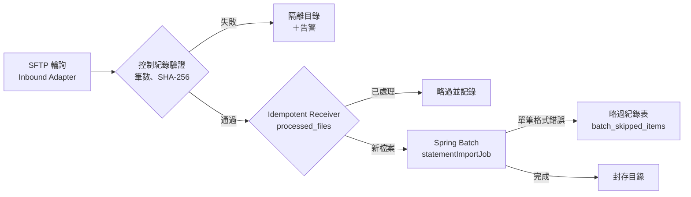

```java
// ✅ SD-INT-002：銀行轉接器把外部回應碼轉譯為本系統的錯誤；外部代碼不會傳到應用層
package com.example.sd.integration.bank;

import com.example.sd.shared.error.BusinessException;
import com.example.sd.shared.error.ExternalServiceUnavailable;
import java.time.Duration;

public final class BankResponseTranslator {

    public static final class PaymentRejected extends BusinessException {

        private static final long serialVersionUID = 1L;

        public PaymentRejected(String code, String message) {
            super(code, message);
        }
    }

    /** 銀行回應碼（外部規格 IF-PAY-02 附錄 3）→ 本系統錯誤碼（10.1 錯誤碼表）。 */
    public void ensureSuccess(String bankCode) {
        switch (bankCode) {
            case "0000" -> { }
            case "4001", "4002" -> throw new PaymentRejected("PAY-4221", "帳戶餘額不足或已凍結");
            case "4051" -> throw new PaymentRejected("PAY-4222", "超過單日轉帳限額");
            case "9001", "9999" -> throw new ExternalServiceUnavailable("PAY-5031", "銀行端", Duration.ofMinutes(1), null);
            default -> throw new ExternalServiceUnavailable("PAY-5039", "銀行端（未知回應碼 " + bankCode + "）",
                    Duration.ofMinutes(5), null);
        }
    }
}
```

#### 🔍 12.1 審查與驗證

- **自動檢查：** `mmdc` 渲染流程圖；ArchUnit 確保外部系統的型別只出現在 `..adapter..`。
- **人工審查問題：**
  1. 流程中每個菱形（判斷）的失敗分支，最後由誰處理？會不會有訊息「消失」？
  2. 外部系統的錯誤碼（例如銀行的回應碼）在哪裡轉譯成本系統的錯誤碼？
- **AI 常見錯誤：** 整合流程只畫成功路徑；把外部系統的回應物件一路傳到 Controller。

### 12.2 批次作業設計

v1.x 以 Spring Batch 4／5 的 `JobBuilderFactory` 與 `JobLauncher` 撰寫範例，這兩者在 Spring Batch 5 已移除或被取代。Spring Batch 6（Spring Boot 4 內建）的主要變化：

| 項目 | Spring Batch 5 | Spring Batch 6 |
| --- | --- | --- |
| 啟動作業 | `JobLauncher.run(job, params)` | `JobOperator.start(job, params)`（`JobOperator` 已繼承 `JobLauncher`） |
| 失敗後恢復 | 需要手動修改中繼資料表 | `JobOperator.recover(execution)` |
| Chunk 步驟 | `chunk(size, transactionManager)` 搭配 `faultTolerant()` | `chunk(size)` 回傳新的 `ChunkOrientedStepBuilder`，重試與略過直接在 builder 設定 |
| 套件 | `org.springframework.batch.core.Job`、`org.springframework.batch.item.*` | `org.springframework.batch.core.job.Job`、`org.springframework.batch.infrastructure.item.*` |
| 命令列 | `CommandLineJobRunner` | `CommandLineJobOperator`（start、stop、restart、recover） |

| 編號 | 等級 | 規則 | 驗證方式 |
| --- | --- | --- | --- |
| `SD-INT-003` | 必須 | 每個批次作業必須有設計說明：觸發方式與時間、輸入與輸出、資料量級與預估執行時間、執行時間窗、相依的作業、失敗時的通知對象與重跑程序 | 👁 設計審查 |
| `SD-INT-004` | 必須 | 批次作業必須可重跑：以 chunk 為單位提交交易，失敗後從中斷點重新開始；寫入必須冪等（以業務唯一鍵或 upsert），重跑不得產生重複資料 | 🧪 整合測試（中途失敗後重跑） |
| `SD-INT-005` | 必須 | 必須明確定義錯誤處理策略：哪些例外重試（次數）、哪些例外略過（上限），被略過的資料必須記錄原因與原始內容，供事後查核與補處理 | 🧪 整合測試（含格式錯誤的輸入） |
| `SD-INT-006` | 必須 | 同一個批次作業在同一時間只能執行一個，同一個業務日期只能成功執行一次：以識別參數（例如業務日期）保證 JobInstance 唯一，並以分散式鎖防止多個執行個體同時觸發 | 🧪 整合測試（重複觸發） |
| `SD-INT-007` | 應該 | 批次應以 `JobOperator` 啟動，並提供停止、重跑、恢復的維運介面或命令，不應要求維運人員手動修改 Spring Batch 中繼資料表 | 👁 維運手冊審查 |

```markdown
<!-- ✅ SD-INT-003：批次作業設計說明 -->
| 項目 | statementImportJob（金流對帳檔匯入） |
| --- | --- |
| 觸發 | 每日 02:15（Asia/Taipei），由排程以 JobOperator 啟動；檔案晚到時可由維運人員手動觸發 |
| 輸入 | SFTP `/inbound/statement/STMT_<yyyyMMdd>.csv`，UTF-8，含表頭；約 5～20 萬筆 |
| 輸出 | `payment_statements`（upsert，唯一鍵：business_date＋txn_id）；略過紀錄 `batch_skipped_items` |
| 時間窗 | 02:15～04:00；預估 20 萬筆約 6 分鐘（chunk 500） |
| 相依 | 需在 `settlementJob`（04:30）之前完成 |
| 錯誤處理 | 資料庫暫時性錯誤重試 3 次；格式錯誤略過，上限 100 筆，超過則作業失敗 |
| 重跑 | 失敗後以相同 businessDate 重新啟動，從中斷的 chunk 繼續；已成功的日期不可重跑（JobInstance 已完成） |
| 通知 | 失敗或略過筆數 > 0 時通知帳務組與值班人員 |
```

```java
// ✅ SD-INT-004 SD-INT-005：Spring Batch 6 的 chunk 步驟，重試與略過在 builder 中定義
package com.example.sd.batch.statement;

import javax.sql.DataSource;
import org.springframework.batch.core.job.Job;
import org.springframework.batch.core.job.builder.JobBuilder;
import org.springframework.batch.core.repository.JobRepository;
import org.springframework.batch.core.step.Step;
import org.springframework.batch.core.step.builder.StepBuilder;
import org.springframework.batch.infrastructure.item.database.JdbcBatchItemWriter;
import org.springframework.batch.infrastructure.item.database.builder.JdbcBatchItemWriterBuilder;
import org.springframework.batch.infrastructure.item.file.FlatFileItemReader;
import org.springframework.batch.infrastructure.item.file.FlatFileParseException;
import org.springframework.batch.infrastructure.item.file.builder.FlatFileItemReaderBuilder;
import org.springframework.beans.factory.annotation.Value;
import org.springframework.batch.core.configuration.annotation.StepScope;
import org.springframework.context.annotation.Bean;
import org.springframework.context.annotation.Configuration;
import org.springframework.core.io.FileSystemResource;
import org.springframework.dao.TransientDataAccessException;
import org.springframework.jdbc.core.namedparam.MapSqlParameterSource;
import org.springframework.transaction.PlatformTransactionManager;

@Configuration(proxyBeanMethods = false)
class StatementImportJobConfig {

    @Bean
    Job statementImportJob(JobRepository jobRepository, Step importStatementStep) {
        return new JobBuilder("statementImportJob", jobRepository)
                .start(importStatementStep)
                .build();
    }

    @Bean
    Step importStatementStep(JobRepository jobRepository, PlatformTransactionManager tx,
                             FlatFileItemReader<StatementLine> reader, JdbcBatchItemWriter<StatementLine> writer,
                             SkippedItemRecorder skippedItems) {
        return new StepBuilder("importStatementStep", jobRepository)
                .<StatementLine, StatementLine>chunk(500)
                .reader(reader)
                .processor(StatementLine::validated)
                .writer(writer)
                .transactionManager(tx)
                .faultTolerant()
                .retry(TransientDataAccessException.class)
                .retryLimit(3)
                .skip(FlatFileParseException.class, IllegalArgumentException.class)
                .skipLimit(100)
                .skipListener(skippedItems)
                .build();
    }

    @Bean
    @StepScope
    FlatFileItemReader<StatementLine> statementReader(@Value("#{jobParameters['inputFile']}") String inputFile) {
        return new FlatFileItemReaderBuilder<StatementLine>()
                .name("statementReader")                       // 名稱用於保存讀取位置，重跑時從中斷點繼續
                .resource(new FileSystemResource(inputFile))
                .encoding("UTF-8")
                .linesToSkip(1)
                .delimited()
                .names("businessDate", "txnId", "orderId", "amount", "currency")
                .targetType(StatementLine.class)
                .build();
    }

    /** 以業務唯一鍵 upsert，重跑同一批資料不會產生重複（PostgreSQL 語法；其他資料庫使用 MERGE）。 */
    @Bean
    JdbcBatchItemWriter<StatementLine> statementWriter(DataSource dataSource) {
        return new JdbcBatchItemWriterBuilder<StatementLine>()
                .dataSource(dataSource)
                .sql("""
                        INSERT INTO payment_statements (business_date, txn_id, order_id, amount, currency)
                        VALUES (:businessDate, :txnId, :orderId, :amount, :currency)
                        ON CONFLICT (business_date, txn_id) DO UPDATE
                        SET order_id = EXCLUDED.order_id, amount = EXCLUDED.amount, currency = EXCLUDED.currency""")
                .itemSqlParameterSourceProvider(line -> new MapSqlParameterSource()
                        .addValue("businessDate", line.businessDate())
                        .addValue("txnId", line.txnId())
                        .addValue("orderId", line.orderId())
                        .addValue("amount", line.amount())
                        .addValue("currency", line.currency()))
                .build();
    }
}
```

```java
package com.example.sd.batch.statement;

import java.math.BigDecimal;
import java.time.LocalDate;

/** 對帳檔的一筆資料；validated() 檢查業務規則，違反時丟出 IllegalArgumentException 讓該筆被略過。 */
public record StatementLine(LocalDate businessDate, String txnId, String orderId, BigDecimal amount, String currency) {

    public StatementLine validated() {
        if (txnId == null || !txnId.matches("[A-Z0-9]{12,20}")) {
            throw new IllegalArgumentException("交易編號格式錯誤：" + txnId);
        }
        if (amount == null || amount.signum() <= 0 || amount.scale() > 2) {
            throw new IllegalArgumentException("金額不合法：" + amount);
        }
        return this;
    }
}
```

```java
// ✅ SD-INT-005：被略過的資料記錄原因與原始內容
package com.example.sd.batch.statement;

import org.springframework.batch.core.listener.SkipListener;
import org.springframework.jdbc.core.simple.JdbcClient;
import org.springframework.stereotype.Component;

@Component
class SkippedItemRecorder implements SkipListener<StatementLine, StatementLine> {

    private final JdbcClient jdbc;

    SkippedItemRecorder(JdbcClient jdbc) {
        this.jdbc = jdbc;
    }

    @Override
    public void onSkipInRead(Throwable t) {
        record("READ", t.getMessage(), null);
    }

    @Override
    public void onSkipInProcess(StatementLine item, Throwable t) {
        record("PROCESS", t.getMessage(), item.toString());
    }

    @Override
    public void onSkipInWrite(StatementLine item, Throwable t) {
        record("WRITE", t.getMessage(), item.toString());
    }

    private void record(String phase, String reason, String raw) {
        jdbc.sql("""
                INSERT INTO batch_skipped_items (job_name, phase, reason, raw_content)
                VALUES ('statementImportJob', :phase, :reason, :raw)""")
                .param("phase", phase).param("reason", reason).param("raw", raw)
                .update();
    }
}
```

```sql
-- ✅ SD-INT-004 SD-INT-005：業務唯一鍵讓重跑冪等；略過紀錄表供事後查核
CREATE TABLE payment_statements (
    business_date date          NOT NULL,
    txn_id        varchar(20)   NOT NULL,
    order_id      varchar(36)   NOT NULL,
    amount        numeric(15,2) NOT NULL,
    currency      char(3)       NOT NULL,
    CONSTRAINT pk_payment_statements PRIMARY KEY (business_date, txn_id)
);

CREATE TABLE batch_skipped_items (
    id           bigint GENERATED ALWAYS AS IDENTITY,
    job_name     varchar(64)  NOT NULL,
    phase        varchar(10)  NOT NULL CHECK (phase IN ('READ', 'PROCESS', 'WRITE')),
    reason       text,
    raw_content  text,
    skipped_at   timestamptz  NOT NULL DEFAULT now(),
    CONSTRAINT pk_batch_skipped_items PRIMARY KEY (id)
);

-- 同一筆資料寫入兩次（模擬重跑），仍然只有一列
INSERT INTO payment_statements VALUES ('2026-10-07', 'TXN000000000001', 'A1', 350.00, 'TWD')
ON CONFLICT (business_date, txn_id) DO UPDATE SET amount = EXCLUDED.amount;
INSERT INTO payment_statements VALUES ('2026-10-07', 'TXN000000000001', 'A1', 350.00, 'TWD')
ON CONFLICT (business_date, txn_id) DO UPDATE SET amount = EXCLUDED.amount;
SELECT count(*) AS rows_after_rerun FROM payment_statements;
```

```java
// ✅ SD-INT-006 SD-INT-007 SD-INT-008：排程以 ShedLock 保證只有一個執行個體觸發；
//    businessDate 是識別參數，同一天已成功時 JobOperator 會拒絕再次執行
package com.example.sd.batch.statement;

import java.time.Clock;
import java.time.LocalDate;
import java.time.ZoneId;
import net.javacrumbs.shedlock.spring.annotation.SchedulerLock;
import org.springframework.batch.core.job.Job;
import org.springframework.batch.core.job.JobExecution;
import org.springframework.batch.core.job.parameters.JobParameters;
import org.springframework.batch.core.job.parameters.JobParametersBuilder;
import org.springframework.batch.core.launch.JobInstanceAlreadyCompleteException;
import org.springframework.batch.core.launch.JobOperator;
import org.springframework.scheduling.annotation.Scheduled;
import org.springframework.stereotype.Component;

@Component
class StatementImportScheduler {

    private static final ZoneId TAIPEI = ZoneId.of("Asia/Taipei");

    private final JobOperator jobOperator;
    private final Job statementImportJob;
    private final Clock clock;

    StatementImportScheduler(JobOperator jobOperator, Job statementImportJob, Clock clock) {
        this.jobOperator = jobOperator;
        this.statementImportJob = statementImportJob;
        this.clock = clock;
    }

    @Scheduled(cron = "0 15 2 * * *", zone = "Asia/Taipei")
    @SchedulerLock(name = "statementImportJob", lockAtMostFor = "PT2H", lockAtLeastFor = "PT1M")
    void runDaily() throws Exception {
        LocalDate businessDate = LocalDate.now(clock.withZone(TAIPEI)).minusDays(1);
        run(businessDate);
    }

    JobExecution run(LocalDate businessDate) throws Exception {
        JobParameters params = new JobParametersBuilder()
                .addLocalDate("businessDate", businessDate)                         // 識別參數
                .addString("inputFile", "/data/inbound/statement/STMT_" + businessDate.toString().replace("-", "")
                        + ".csv", false)                                            // 非識別參數
                .toJobParameters();
        try {
            return jobOperator.start(statementImportJob, params);
        } catch (JobInstanceAlreadyCompleteException e) {
            throw new IllegalStateException(businessDate + " 的對帳檔已匯入完成，不可重複執行", e);
        }
    }
}
```

```java
// ✅ SD-INT-006：ShedLock 以資料庫表保存鎖，多個執行個體中只有一個會執行排程
package com.example.sd.batch;

import javax.sql.DataSource;
import net.javacrumbs.shedlock.core.LockProvider;
import net.javacrumbs.shedlock.provider.jdbctemplate.JdbcTemplateLockProvider;
import net.javacrumbs.shedlock.spring.annotation.EnableSchedulerLock;
import org.springframework.context.annotation.Bean;
import org.springframework.context.annotation.Configuration;
import org.springframework.jdbc.core.JdbcTemplate;
import org.springframework.scheduling.annotation.EnableScheduling;

@Configuration(proxyBeanMethods = false)
@EnableScheduling
@EnableSchedulerLock(defaultLockAtMostFor = "PT30M")
class SchedulingConfig {

    @Bean
    LockProvider lockProvider(DataSource dataSource) {
        return new JdbcTemplateLockProvider(JdbcTemplateLockProvider.Configuration.builder()
                .withJdbcTemplate(new JdbcTemplate(dataSource))
                .usingDbTime()
                .build());
    }
}
```

```sql
-- ✅ SD-INT-006：ShedLock 使用的資料表
CREATE TABLE shedlock (
    name       varchar(64)  NOT NULL,
    lock_until timestamptz  NOT NULL,
    locked_at  timestamptz  NOT NULL,
    locked_by  varchar(255) NOT NULL,
    CONSTRAINT pk_shedlock PRIMARY KEY (name)
);
```

```java
// ❌ SD-INT-004 SD-INT-006：使用已移除的 API、每次以時間戳作為參數（同一天可以重複匯入）、整檔一個交易（片段）
@Autowired private JobBuilderFactory jobBuilderFactory;            // Spring Batch 5 已移除
@Scheduled(cron = "0 15 2 * * *")                                   // 未指定時區，跟著伺服器時區走
public void run() throws Exception {
    jobLauncher.run(job, new JobParametersBuilder()
            .addLong("time", System.currentTimeMillis()).toJobParameters());
}
```

（片段：示意不良的批次設計）

#### 🔍 12.2 審查與驗證

- **自動檢查：** 整合測試（Testcontainers）以含有 2 筆格式錯誤的檔案執行作業，斷言 `batch_skipped_items` 有 2 筆、`payment_statements` 筆數正確；讓寫入在第 3 個 chunk 失敗，重跑後斷言資料不重複；以相同 businessDate 再次啟動，斷言被拒絕。
- **人工審查問題：**
  1. 作業失敗時，值班人員知道該做什麼嗎？重跑的步驟是否寫在維運手冊中？
  2. 略過上限是否合理？略過 100 筆對帳資料，帳務上能接受嗎？
  3. 執行時間窗內，作業與線上交易是否爭用同一張表？
- **AI 常見錯誤：** 使用 `JobBuilderFactory`、`StepBuilderFactory`、`JobLauncher` 等舊 API 或舊的套件名稱；以 `System.currentTimeMillis()` 作為參數讓每次執行都是新的 JobInstance，失去重複執行的保護；`@Scheduled` 未指定 `zone`。

### 12.3 排程設計

| 編號 | 等級 | 規則 | 驗證方式 |
| --- | --- | --- | --- |
| `SD-INT-008` | 應該 | 排程必須明確指定時區（`zone`），並考慮夏令時間與跨日；叢集環境中的排程應以 ShedLock 或 Quartz 的 JDBC JobStore 確保同一時間只有一個執行個體執行 | 🧪 整合測試；👁 設計審查 |

| 需求 | 建議方案 | 理由 |
| --- | --- | --- |
| 固定時間執行、只需一個執行個體 | `@Scheduled`＋ShedLock | 簡單，不需要額外的排程中繼資料 |
| 需要動態新增排程、錯過時補執行（misfire） | Quartz JDBC JobStore（叢集模式） | 支援持久化排程與 misfire 策略 |
| 跨系統的作業相依與監控 | 企業排程系統（Control-M、Airflow 等） | 集中監控與相依管理 |
| Kubernetes 環境的獨立批次 | Kubernetes CronJob（`concurrencyPolicy: Forbid`、`timeZone`） | 由平台保證單一執行 |

```yaml
# ✅ SD-INT-008：Kubernetes CronJob 指定時區、禁止並行、限制執行時間
apiVersion: batch/v1
kind: CronJob
metadata:
  name: statement-import
spec:
  schedule: "15 2 * * *"
  timeZone: Asia/Taipei
  concurrencyPolicy: Forbid
  startingDeadlineSeconds: 3600
  jobTemplate:
    spec:
      backoffLimit: 0
      activeDeadlineSeconds: 6300
      template:
        spec:
          restartPolicy: Never
          securityContext:
            runAsNonRoot: true
          containers:
            - name: batch
              image: registry.example.com/order-batch@sha256:4f2a3c9e1d0b7a6f5e4d3c2b1a0f9e8d7c6b5a4f3e2d1c0b9a8f7e6d5c4b3a29
              args: ["--spring.batch.job.name=statementImportJob"]
              resources:
                requests:
                  cpu: 500m
                  memory: 1Gi
                limits:
                  memory: 1Gi
              securityContext:
                allowPrivilegeEscalation: false
                readOnlyRootFilesystem: true
                capabilities:
                  drop: ["ALL"]
```

#### 🔍 12.3 審查與驗證

- **自動檢查：** `kubeconform -strict` 驗證 CronJob；整合測試以固定的 `Clock` 驗證業務日期計算（台北時間 00:30 執行時，業務日期是前一天）。
- **人工審查問題：**
  1. 伺服器時區與業務時區不同時，業務日期如何計算？
  2. 排程錯過（例如維護期間停機）時，是否需要補執行？
- **AI 常見錯誤：** 在 cron 運算式中使用 Quartz 的 7 欄格式於 Spring `@Scheduled`（Spring 為 6 欄）；Kubernetes CronJob 沒有設定 `concurrencyPolicy`。

### 12.4 檔案傳輸設計

| 編號 | 等級 | 規則 | 驗證方式 |
| --- | --- | --- | --- |
| `SD-INT-009` | 必須 | SFTP 連線必須驗證伺服器主機金鑰（`known_hosts`），不得允許未知的主機金鑰；身分驗證必須使用金鑰，不使用密碼；私鑰由秘密管理系統提供 | 🧪 整合測試（未知主機金鑰連線失敗）；👁 設計審查 |
| `SD-INT-010` | 必須 | 上傳時必須先以暫存名稱寫入，完成後再改名為正式名稱；接收方只處理正式名稱的檔案，避免讀到寫到一半的檔案 | 🧪 整合測試 |
| `SD-INT-011` | 必須 | 檔案必須以控制紀錄（筆數、金額合計）與雜湊（SHA-256）驗證完整性；驗證失敗的檔案移到隔離目錄並告警，不得部分處理 | 🧪 驗證器單元測試 |
| `SD-INT-012` | 必須 | 必須記錄已處理的檔案（檔名＋雜湊），同一個檔案不得處理兩次；同名但內容不同的檔案必須告警並由人工確認 | 🧪 整合測試（重送同一檔案） |
| `SD-INT-013` | 應該 | 應監控檔案傳輸：預期時間未到檔、傳輸失敗、驗證失敗都要告警；告警內容包含檔名、介面 ID 與處理建議 | 👁 維運手冊審查；🧪 告警測試 |

```java
// ✅ SD-INT-009 SD-INT-010：SFTP 驗證主機金鑰、使用私鑰；上傳時先寫 .part 再改名
package com.example.sd.integration.sftp;

import org.apache.sshd.sftp.client.SftpClient;
import org.springframework.beans.factory.annotation.Value;
import org.springframework.context.annotation.Bean;
import org.springframework.context.annotation.Configuration;
import org.springframework.core.io.Resource;
import org.springframework.expression.common.LiteralExpression;
import org.springframework.integration.file.remote.session.CachingSessionFactory;
import org.springframework.integration.file.remote.session.SessionFactory;
import org.springframework.integration.sftp.session.DefaultSftpSessionFactory;
import org.springframework.integration.sftp.session.SftpRemoteFileTemplate;

@Configuration(proxyBeanMethods = false)
class ErpSftpConfig {

    @Bean
    SessionFactory<SftpClient.DirEntry> erpSftpSessionFactory(
            @Value("${erp.sftp.host}") String host,
            @Value("${erp.sftp.user}") String user,
            @Value("${erp.sftp.private-key}") Resource privateKey,
            @Value("${erp.sftp.known-hosts}") Resource knownHosts) {
        DefaultSftpSessionFactory factory = new DefaultSftpSessionFactory(true);
        factory.setHost(host);
        factory.setPort(22);
        factory.setUser(user);
        factory.setPrivateKey(privateKey);          // 由 Vault 掛載的私鑰檔
        factory.setKnownHostsResource(knownHosts);  // 只信任已登錄的主機金鑰
        factory.setAllowUnknownKeys(false);
        factory.setTimeout(10_000);
        return new CachingSessionFactory<>(factory, 4);
    }

    @Bean
    SftpRemoteFileTemplate erpShipmentTemplate(SessionFactory<SftpClient.DirEntry> erpSftpSessionFactory) {
        SftpRemoteFileTemplate template = new SftpRemoteFileTemplate(erpSftpSessionFactory);
        template.setRemoteDirectoryExpression(new LiteralExpression("/inbound/shipment"));
        template.setUseTemporaryFileName(true);     // 先寫 SHIP_xxx.txt.part，完成後改名
        template.setTemporaryFileSuffix(".part");
        template.setAutoCreateDirectory(false);
        return template;
    }
}
```

```java
// ✅ SD-INT-011：依 IF-ORD-03 規格驗證表尾的筆數與 SHA-256
package com.example.sd.integration.file;

import java.nio.charset.StandardCharsets;
import java.security.MessageDigest;
import java.security.NoSuchAlgorithmException;
import java.util.HexFormat;
import java.util.List;

public final class ShipFileVerifier {

    public record Result(boolean valid, String reason, int detailCount) { }

    public Result verify(List<String> lines) throws NoSuchAlgorithmException {
        if (lines.size() < 2 || !lines.getFirst().startsWith("H") || !lines.getLast().startsWith("T")) {
            return new Result(false, "缺少表頭或表尾", 0);
        }
        List<String> details = lines.subList(1, lines.size() - 1);
        String trailer = lines.getLast();
        if (trailer.length() != 1 + 7 + 9 + 64) {
            return new Result(false, "表尾長度錯誤", details.size());
        }
        int expectedCount = Integer.parseInt(trailer.substring(1, 8));
        String expectedHash = trailer.substring(17);
        MessageDigest sha = MessageDigest.getInstance("SHA-256");
        for (String d : details) {
            sha.update((d + "\r\n").getBytes(StandardCharsets.UTF_8));
        }
        String actualHash = HexFormat.of().formatHex(sha.digest());
        if (expectedCount != details.size()) {
            return new Result(false, "筆數不符：表尾 " + expectedCount + "，實際 " + details.size(), details.size());
        }
        if (!expectedHash.equals(actualHash)) {
            return new Result(false, "SHA-256 不符", details.size());
        }
        return new Result(true, "OK", details.size());
    }
}
```

```java
// ✅ SD-INT-011：完整、筆數不符、雜湊不符、空檔四種情況
package com.example.sd.integration.file;

import static org.assertj.core.api.Assertions.assertThat;

import java.nio.charset.StandardCharsets;
import java.security.MessageDigest;
import java.util.HexFormat;
import java.util.List;
import org.junit.jupiter.api.Test;

class ShipFileVerifierTest {

    private static final String D1 = "D0192d3e4-5f60-7abc-8def-0123456789abSKU-1001    002100001";

    private static String trailer(int count, String... details) throws Exception {
        MessageDigest sha = MessageDigest.getInstance("SHA-256");
        for (String d : details) {
            sha.update((d + "\r\n").getBytes(StandardCharsets.UTF_8));
        }
        return "T" + "%07d".formatted(count) + "%09d".formatted(2) + HexFormat.of().formatHex(sha.digest());
    }

    private final ShipFileVerifier verifier = new ShipFileVerifier();

    @Test
    void acceptsCompleteFile() throws Exception {
        var result = verifier.verify(List.of("H2026100810150002", D1, trailer(1, D1)));
        assertThat(result.valid()).isTrue();
    }

    @Test
    void rejectsCountMismatch() throws Exception {
        var result = verifier.verify(List.of("H2026100810150002", D1, trailer(2, D1)));
        assertThat(result.reason()).startsWith("筆數不符");
    }

    @Test
    void rejectsTamperedDetail() throws Exception {
        var result = verifier.verify(List.of("H2026100810150002", D1.replace("002", "009"), trailer(1, D1)));
        assertThat(result.reason()).isEqualTo("SHA-256 不符");
    }

    @Test
    void acceptsEmptyFileWithHeaderAndTrailer() throws Exception {
        var result = verifier.verify(List.of("H2026100810150002", trailer(0)));
        assertThat(result.valid()).isTrue();
        assertThat(result.detailCount()).isZero();
    }
}
```

```sql
-- ✅ SD-INT-012：已處理檔案表；同名不同內容時唯一限制不會擋下，需由查詢偵測並告警
CREATE TABLE processed_files (
    interface_id  varchar(16)  NOT NULL,
    file_name     varchar(128) NOT NULL,
    sha256        char(64)     NOT NULL,
    record_count  integer      NOT NULL,
    processed_at  timestamptz  NOT NULL DEFAULT now(),
    CONSTRAINT pk_processed_files PRIMARY KEY (interface_id, file_name, sha256)
);

INSERT INTO processed_files (interface_id, file_name, sha256, record_count)
VALUES ('IF-PAY-01', 'STMT_20261007.csv', repeat('a', 64), 120345)
ON CONFLICT DO NOTHING;                                     -- 0 列代表同一檔案已處理過

-- 同名但內容不同：需要人工確認
SELECT file_name, count(DISTINCT sha256) AS versions
FROM processed_files
WHERE interface_id = 'IF-PAY-01'
GROUP BY file_name
HAVING count(DISTINCT sha256) > 1;
```

```markdown
<!-- ✅ SD-INT-013：檔案傳輸監控與告警 -->
| 告警 | 條件 | 嚴重度 | 通知 | 處理建議 |
| --- | --- | --- | --- | --- |
| 未到檔 | IF-PAY-01 於 02:10 前沒有 `STMT_<前一日>.csv` | 高 | 值班、帳務組 | 聯絡金流確認傳送狀態；到檔後手動觸發 statementImportJob |
| 驗證失敗 | 控制紀錄或 SHA-256 不符 | 高 | 值班 | 檔案已移到 /quarantine，請金流重送 |
| 同名不同內容 | processed_files 查詢有結果 | 中 | 帳務組 | 比對兩版內容，確認是否需要沖正 |
```

#### 🔍 12.4 審查與驗證

- **自動檢查：** `ShipFileVerifierTest`；整合測試以 Testcontainers 啟動 SFTP 伺服器（例如 `atmoz/sftp`），以不在 `known_hosts` 的主機金鑰連線，斷言連線失敗；上傳過程中列出遠端目錄，斷言只看到 `.part` 檔。
- **人工審查問題：**
  1. 主機金鑰變更（對方換伺服器）時的處理程序是什麼？誰核准新的金鑰？
  2. 接收方是否只處理正式名稱的檔案？暫存檔在失敗時如何清除？
  3. 傳輸的檔案是否含個資？是否需要額外加密（例如 PGP）？
- **AI 常見錯誤：** 設定 `setAllowUnknownKeys(true)` 或 `StrictHostKeyChecking=no` 讓連線「先通再說」；以密碼登入並把密碼寫在設定檔；以檔案修改時間判斷是否處理過。

## 13. 非功能設計

非功能需求（效能、可用性、可維運性、永續性）在架構階段被定為**品質情境**與 SLO（見 [架構設計指引]() 第 2 章）。詳細設計的工作是把每個品質情境「落實」到具體的設計手段，並說明如何驗證。v1.x 的第 7、10、16、17 章分別討論了效能、災難復原、可觀測性與永續性，本版合併為本章，並把重點從「列出技術」改為「從情境推導設計，再以測試驗證」。

### 13.1 從品質情境到設計手段

| 編號 | 等級 | 規則 | 驗證方式 |
| --- | --- | --- | --- |
| `SD-NFR-001` | 必須 | 每個品質情境必須在 SDD 中對應到具體的設計手段（例如索引、快取、非同步、副本數），以及驗證方法（壓測情境、演練、監控指標） | 👁 設計審查；🤖 追溯檢查腳本 |

```markdown
<!-- ✅ SD-NFR-001：品質情境 → 設計手段 → 驗證 -->
| 情境 | 量測目標 | 設計手段 | 驗證 |
| --- | --- | --- | --- |
| QS-ORD-01 尖峰下單 | 200 rps 時 p99 ≤ 800 ms，錯誤率 < 0.1% | 價格快取（13.3）、idx_orders_customer_id_created_at、連線池 30（13.4） | k6 開放模型 200 rps 持續 15 分鐘（SD-TST-008） |
| QS-ORD-02 查詢訂單 | p95 ≤ 300 ms | 游標分頁、record 投影（SD-DAT-012）、唯讀副本（SD-DAT-013） | k6；慢查詢日誌 |
| QS-ORD-03 單一 AZ 故障 | 服務不中斷，RTO ≤ 5 分鐘 | 3 副本跨 AZ、PDB、資料庫同步複寫（13.6） | 每季故障演練 |
| QS-ORD-04 外部目錄服務故障 | 下單 API 在 2 秒內回 503，不拖垮其他 API | 逾時預算、重試上限（SD-ERR-004）、並行上限（13.4） | WireMock 延遲測試 |
```

#### 🔍 13.1 審查與驗證

- **自動檢查：** 品質情境 ID（QS-xxx）列在追溯矩陣中，`check_trace.py` 確認每個情境都有設計元素。
- **人工審查問題：**
  1. 每個量測目標是否用百分位數（p95、p99）而非平均值？
  2. 設計手段是否真的能達成目標？有沒有估算或原型量測的依據？
- **AI 常見錯誤：** 以「系統應具有高效能」這類無法量測的敘述作為情境；設計手段只寫「使用快取」而沒有說明快取什麼、命中率預估多少。

### 13.2 容量估算與延遲預算

| 編號 | 等級 | 規則 | 驗證方式 |
| --- | --- | --- | --- |
| `SD-NFR-002` | 必須 | SDD 必須包含容量估算：尖峰請求量、資料量與成長率、儲存空間、外部依賴的呼叫量，並寫出計算過程與假設 | 👁 設計審查 |
| `SD-NFR-003` | 應該 | 每個關鍵 use case 應有延遲預算，將端到端目標分配給各個下游呼叫，並與逾時設定（SD-ERR-004）一致 | 👁 設計審查；🧪 壓測 |

```markdown
<!-- ✅ SD-NFR-002：容量估算（假設與計算都要寫出來） -->
| 項目 | 假設 | 計算 | 結果 |
| --- | --- | --- | --- |
| 日訂單量 | 業務預估 2027 年日均 40 萬筆，促銷日 3 倍 | — | 尖峰日 120 萬筆 |
| 尖峰 RPS | 尖峰日 30% 的訂單集中在 20:00～22:00 | 1,200,000 × 0.3 ÷ 7,200 秒 | 50 rps，設計目標取 4 倍 = 200 rps |
| 資料量 | 每筆訂單含明細約 1.2 KB，保存 7 年 | 400,000 × 365 × 7 × 1.2 KB | 約 1.2 TB（不含索引，索引另估 0.6 倍） |
| 執行個體數 | 單一執行個體壓測可承受 120 rps（p99 < 800 ms） | 200 ÷ 120，再加一個容錯 | 3 個（跨 3 個 AZ） |
| 連線池 | 每筆下單平均持有連線 25 ms（Little 定律：L = λ × W） | 200 rps × 0.025 s = 5，乘上 3 倍突發係數 | 每個執行個體 10，總計 30（資料庫上限 200） |
```

```markdown
<!-- ✅ SD-NFR-003：下單 API 的延遲預算（p99 800 ms） -->
| 階段 | 預算 | 依據 |
| --- | --- | --- |
| Gateway＋網路 | 50 ms | 量測 |
| 格式驗證與授權 | 20 ms | 量測 |
| 商品價格（快取命中率 95%） | 30 ms（未命中時 300 ms 逾時） | SD-ERR-004 |
| 庫存預留與額度檢查 | 150 ms | 原型量測 |
| 寫入訂單與事件（同一交易） | 100 ms | 原型量測 |
| 保留餘裕 | 450 ms | — |
```

#### 🔍 13.2 審查與驗證

- **自動檢查：** 壓測結果與估算比對，差異超過 30% 時重新檢視假設。
- **人工審查問題：**
  1. 估算的假設是誰提供的？業務單位是否確認過成長率？
  2. 連線池總數乘上執行個體數，是否超過資料庫的連線上限？自動擴展到最大副本數時呢？
- **AI 常見錯誤：** 只給結果不給計算；以平均流量估算而忽略尖峰；連線池設得越大越好（實際上會讓資料庫過載）。

### 13.3 快取設計

| 編號 | 等級 | 規則 | 驗證方式 |
| --- | --- | --- | --- |
| `SD-NFR-004` | 必須 | 每個快取都必須在設計中說明：快取的資料與鍵、存放位置（本機或分散式）、TTL、容量上限、失效方式，以及可容忍的資料過期時間 | 👁 設計審查；🧪 快取測試 |
| `SD-NFR-005` | 必須 | 必須防止快取擊穿（熱門鍵到期時大量請求同時打到資料來源）與雪崩（大量鍵同時到期）：使用單一載入（`sync = true` 或 single-flight）與 TTL 隨機化 | 🧪 並行測試 |
| `SD-NFR-006` | 不應該 | 快取不應作為資料的唯一來源；快取失效或被清空時，系統必須能從資料來源重建，功能維持正確（只是變慢） | 🧪 快取停用測試 |

```markdown
<!-- ✅ SD-NFR-004：快取清單 -->
| 快取 | 鍵 | 位置 | TTL | 上限 | 失效 | 可容忍過期 |
| --- | --- | --- | --- | --- | --- | --- |
| productPrices | sku | 本機 Caffeine | 5 分鐘 | 10,000 筆 | TTL；價格異動事件清除 | 5 分鐘（下單時以快取價格計算，結帳頁再次確認） |
| customerTier | customerId | Redis | 1 小時 ± 10% | — | 會員等級異動事件清除 | 1 小時 |
```

```yaml
# ✅ SD-NFR-004：Caffeine 本機快取，設定上限與 TTL
spring:
  cache:
    type: caffeine
    cache-names: productPrices
    caffeine:
      spec: maximumSize=10000,expireAfterWrite=5m,recordStats
```

```java
// ✅ SD-NFR-005 SD-NFR-006：sync = true 讓同一個鍵只載入一次；快取只是加速，來源仍是商品目錄
package com.example.sd.order.adapter.client;

import com.example.sd.order.application.CatalogPort;
import com.example.sd.shared.Money;
import org.springframework.beans.factory.annotation.Qualifier;
import org.springframework.cache.annotation.Cacheable;
import org.springframework.context.annotation.Primary;
import org.springframework.stereotype.Component;

@Component
@Primary
class CachedCatalog implements CatalogPort {

    private final CatalogPort source;

    CachedCatalog(@Qualifier("httpCatalogClient") CatalogPort source) {
        this.source = source;
    }

    @Override
    @Cacheable(cacheNames = "productPrices", key = "#sku", sync = true)
    public Money priceOf(String sku) {
        return source.priceOf(sku);
    }
}
```

#### 🔍 13.3 審查與驗證

- **自動檢查：** 並行測試讓 50 個執行緒同時查詢同一個未快取的 SKU，斷言來源只被呼叫 1 次；把 `spring.cache.type` 設為 `none` 執行整合測試，斷言功能正確。
- **人工審查問題：**
  1. 快取的資料過期 5 分鐘，業務上會造成什麼後果？（例如以舊價格成交）
  2. 多個執行個體各自有本機快取時，資料不一致的時間窗口多長？
- **AI 常見錯誤：** 忘記在組態類別加上 `@EnableCaching`，`@Cacheable` 不會生效且不會報錯；沒有設定上限（記憶體耗盡）；快取包含使用者個資卻用共用的鍵；以 `@Cacheable` 標註在同一個類別內部呼叫的方法上（代理不會攔截）。

### 13.4 連線池、執行緒與並行上限

| 編號 | 等級 | 規則 | 驗證方式 |
| --- | --- | --- | --- |
| `SD-NFR-007` | 應該 | 資料庫連線池的大小應依 Little 定律估算（13.2），並以壓測確認；所有執行個體的連線總數（含最大自動擴展數）不得超過資料庫的連線上限 | 🧪 壓測；👁 設計審查 |
| `SD-NFR-008` | 應該 | I/O 密集的服務應啟用 Virtual Threads 以提升並行能力，但必須對下游資源（資料庫、外部 API）設定並行上限，避免大量虛擬執行緒同時打到同一個資源 | 🧪 壓測；🤖 設定檢查 |

```yaml
# ✅ SD-NFR-007 SD-NFR-008：連線池依估算設定；啟用 Virtual Threads
spring:
  threads:
    virtual:
      enabled: true
  datasource:
    hikari:
      maximum-pool-size: 10
      minimum-idle: 10
      connection-timeout: 2000
      max-lifetime: 1800000
```

```java
// ✅ SD-NFR-008：對外部報表服務限制同時最多 8 個呼叫（Spring Framework 7 @ConcurrencyLimit）
package com.example.sd.report;

import org.springframework.resilience.annotation.ConcurrencyLimit;
import org.springframework.stereotype.Component;

@Component
public class ReportGatewayClient {

    @ConcurrencyLimit(8)
    public byte[] render(String templateId, String payloadJson) {
        // 呼叫外部報表服務（省略）；超過 8 個並行呼叫時，其餘的呼叫會等待
        return new byte[0];
    }
}
```

#### 🔍 13.4 審查與驗證

- **自動檢查：** 壓測時觀察 `hikaricp_connections_pending` 指標，等待連線的請求數應接近 0。
- **人工審查問題：**
  1. HPA 最大副本數 × 連線池大小，是否小於資料庫連線上限扣除維運保留？
  2. 啟用 Virtual Threads 後，有沒有使用 `ThreadLocal` 快取大型物件的程式？
- **AI 常見錯誤：** 把連線池設為 100 以上；啟用 Virtual Threads 後仍以固定大小的執行緒池包住所有工作；以 `synchronized` 保護長時間的 I/O（Java 24 之前會釘住載體執行緒）。

### 13.5 可觀測性設計

v1.x 使用 Spring Cloud Sleuth＋Zipkin 進行分散式追蹤。Sleuth 已停止開發，Spring Boot 3 起不再支援；Spring Boot 4 以 Micrometer Observation 搭配 OpenTelemetry 提供指標、追蹤與日誌的整合。可觀測性的平台架構見架構設計指引第 12 章，本節規範詳細設計時要定義的內容。

| 編號 | 等級 | 規則 | 驗證方式 |
| --- | --- | --- | --- |
| `SD-NFR-009` | 必須 | 每個元件必須定義要輸出的業務指標與技術指標（名稱、型別、標籤、用途）及對應的 SLI；指標以 Micrometer 輸出，追蹤以 OpenTelemetry 傳遞 W3C Trace Context；不得使用 Spring Cloud Sleuth | 🤖 相依檢查（禁止 `spring-cloud-sleuth`）；🧪 指標測試 |
| `SD-NFR-010` | 必須 | 日誌必須是結構化格式（JSON，例如 ECS），每一筆都帶有 traceId 與 spanId；日誌不得包含個資、權杖、密碼等敏感資料 | 🧪 日誌格式與敏感資料掃描測試 |
| `SD-NFR-011` | 應該 | 關鍵業務流程應以 Observation 建立自訂的觀測點，讓追蹤中可以看到業務步驟，並同時產生計時指標 | 🧪 單元測試（`TestObservationRegistry`） |

```markdown
<!-- ✅ SD-NFR-009：指標清單 -->
| 指標 | 型別 | 標籤 | 用途 | SLI |
| --- | --- | --- | --- | --- |
| `order.placed` | Counter | result（success、rejected、error） | 下單量與失敗率 | 可用性 SLI = success ÷ (success + error) |
| `order.place`（Observation） | Timer | result | 下單延遲 | 延遲 SLI = p99 |
| `http.server.requests` | Timer（內建） | uri、status | API 延遲與錯誤 | — |
| `hikaricp.connections.pending` | Gauge（內建） | pool | 連線池飽和度 | — |
```

```yaml
# ✅ SD-NFR-009 SD-NFR-010：結構化日誌（ECS）、追蹤取樣、Prometheus 端點
spring:
  application:
    name: order-service
logging:
  structured:
    format:
      console: ecs
    ecs:
      service:
        name: order-service
        version: 1.2.0
        environment: production
management:
  tracing:
    sampling:
      probability: 0.1
  endpoints:
    web:
      exposure:
        include: health,prometheus
```

```java
// ✅ SD-NFR-011：以 Observation 包住業務步驟，同時產生 span 與計時指標
package com.example.sd.order.application;

import io.micrometer.observation.Observation;
import io.micrometer.observation.ObservationRegistry;
import java.util.function.Supplier;
import org.springframework.stereotype.Component;

@Component
public class OrderObservations {

    private final ObservationRegistry registry;

    public OrderObservations(ObservationRegistry registry) {
        this.registry = registry;
    }

    public <T> T observePlace(String channel, Supplier<T> action) {
        return Observation.createNotStarted("order.place", registry)
                .lowCardinalityKeyValue("channel", channel)       // 低基數標籤；不可放訂單編號或客戶編號
                .observe(action);
    }
}
```

```java
// ✅ SD-NFR-011：以 TestObservationRegistry 驗證觀測點名稱與標籤
package com.example.sd.order.application;

import static io.micrometer.observation.tck.TestObservationRegistryAssert.assertThat;

import io.micrometer.observation.tck.TestObservationRegistry;
import org.junit.jupiter.api.Test;

class OrderObservationsTest {

    @Test
    void createsOrderPlaceObservation() {
        TestObservationRegistry registry = TestObservationRegistry.create();
        new OrderObservations(registry).observePlace("WEB", () -> "ok");
        assertThat(registry)
                .hasObservationWithNameEqualTo("order.place")
                .that()
                .hasLowCardinalityKeyValue("channel", "WEB")
                .hasBeenStarted()
                .hasBeenStopped();
    }
}
```

```xml
<!-- ❌ SD-NFR-009：Spring Cloud Sleuth 已停止開發，Spring Boot 3 以上無法使用（片段） -->
<dependency>
  <groupId>org.springframework.cloud</groupId>
  <artifactId>spring-cloud-starter-sleuth</artifactId>
</dependency>
```

（片段：示意已淘汰的相依）

#### 🔍 13.5 審查與驗證

- **自動檢查：** `OrderObservationsTest`；Maven Enforcer 的 `bannedDependencies` 禁止 `spring-cloud-sleuth*`；整合測試擷取日誌，斷言每一行都是 JSON 且包含 `trace.id`。
- **人工審查問題：**
  1. 指標的標籤有沒有高基數的值（訂單編號、使用者編號）？這會讓時序資料庫爆量。
  2. 告警依據的是 SLO 燃燒率，還是 CPU 使用率這類原因指標？
- **AI 常見錯誤：** 產生 Sleuth 或 Zipkin 的設定；以字串串接輸出日誌（`log.info("order " + order)`），把整個物件（含個資）寫進日誌；在指標標籤中放入使用者 ID。

### 13.6 高可用與災難復原設計

| 編號 | 等級 | 規則 | 驗證方式 |
| --- | --- | --- | --- |
| `SD-NFR-012` | 必須 | 每個元件與資料儲存必須標示可用性等級與 RTO／RPO，並說明達成的設計（副本、跨區、複寫方式、備份頻率）；元件的目標不得低於依賴它的服務 | 👁 設計審查 |
| `SD-NFR-013` | 必須 | 備份必須定期以實際還原演練驗證（還原時間與資料完整性），演練結果必須記錄；沒有演練過的備份視為不存在 | 🧪 還原演練紀錄 |

```markdown
<!-- ✅ SD-NFR-012：元件可用性與復原目標 -->
| 元件 | 等級 | RTO | RPO | 設計 | 驗證 |
| --- | --- | --- | --- | --- | --- |
| 訂單 API | 第 1 級 | 5 分鐘 | 0 | 3 副本跨 AZ、PDB minAvailable 2 | 每季 AZ 故障演練 |
| 訂單資料庫 | 第 1 級 | 15 分鐘 | ≤ 5 秒 | 同步複寫到同區副本、非同步複寫到異地；WAL 持續封存 | 每月 PITR 還原演練 |
| 對帳批次 | 第 2 級 | 4 小時 | 24 小時 | 可重跑（SD-INT-004）；輸入檔保存 30 天 | 每季重跑演練 |
| 報表服務 | 第 3 級 | 1 個工作天 | 24 小時 | 單一副本；每日備份 | 每半年 |
```

```markdown
<!-- ✅ SD-NFR-013：還原演練紀錄 -->
| 日期 | 範圍 | 還原到的時間點 | 實際 RTO | 資料驗證 | 結果 | 改善事項 |
| --- | --- | --- | --- | --- | --- | --- |
| 2026-09-20 | 訂單資料庫 PITR | 2026-09-20 03:00:00+08 | 11 分鐘 | 訂單筆數、金額合計與來源一致；抽查 20 筆 | 通過 | 還原腳本加入連線池重設步驟 |
```

#### 🔍 13.6 審查與驗證

- **自動檢查：** 還原演練以腳本執行並輸出報告（還原時間、資料核對結果），報告存放在版本庫或稽核系統。
- **人工審查問題：**
  1. 第 1 級服務是否依賴第 3 級的元件？如果是，第 1 級的目標無法達成。
  2. 最近一次還原演練是什麼時候？實際 RTO 是否符合目標？
- **AI 常見錯誤：** 只寫「每日備份」而沒有還原驗證；RPO 寫 0 卻採用非同步複寫。

### 13.7 永續性與智慧維運

v1.x 的第 17 章以大量的 YAML 與 Python 範例描述碳足跡儀表板與 AI 預測模型，但缺乏可落實的方法。本版改為引用國際標準的計算方式，並把 AIOps 定位為 SLO 告警的輔助。

**軟體碳強度（SCI）** 依 ISO/IEC 21031:2024（源自 Green Software Foundation 的 SCI 規格）計算：

```text
SCI = ((E × I) + M) / R
  E：能源消耗（kWh）
  I：區域電網的碳排放係數（gCO2e/kWh）
  M：硬體的隱含碳排放分攤（gCO2e）
  R：功能單位（例如「每 1,000 筆訂單」）
```

| 編號 | 等級 | 規則 | 驗證方式 |
| --- | --- | --- | --- |
| `SD-NFR-014` | 可以 | 可以依 ISO/IEC 21031:2024 計算系統的 SCI 基準值，選擇與業務相關的功能單位，並在設計中優先採用能降低 SCI 的手段（適當的資源請求、批次移到低碳時段、減少不必要的資料傳輸與保存） | 👁 設計審查 |
| `SD-NFR-015` | 可以 | 可以導入異常偵測等 AIOps 能力作為輔助，但告警的主要依據必須是 SLO 燃燒率；AI 偵測的結果應附上依據，並由人確認後才自動執行修復動作 | 🤖 promtool（告警規則）；👁 維運審查 |

```markdown
<!-- ✅ SD-NFR-014：SCI 基準值（每 1,000 筆訂單） -->
| 項目 | 數值 | 來源 |
| --- | --- | --- |
| E | 1.8 kWh／日（3 個執行個體＋資料庫分攤） | 雲端供應商的用電報表 |
| I | 0.467 kgCO2e/kWh | 經濟部能源署公告之 114 年度公用售電業電力排碳係數（2026-06 公告；每年更新） |
| M | 0.35 kgCO2e／日 | 硬體隱含碳排放分攤 |
| R | 400（每日 40 萬筆 ÷ 1,000） | 業務量 |
| SCI | (1.8 × 0.467 + 0.35) ÷ 400 ≈ 0.003 kgCO2e／千筆 | — |
```

```yaml
# ✅ SD-NFR-015：以 SLO 燃燒率為主的告警（多視窗），promtool 可驗證
groups:
  - name: order-slo
    rules:
      - alert: OrderAvailabilityFastBurn
        expr: |
          (
            sum(rate(order_placed_total{result="error"}[5m]))
            / sum(rate(order_placed_total{result=~"success|error"}[5m]))
          ) > (14.4 * 0.001)
          and
          (
            sum(rate(order_placed_total{result="error"}[1h]))
            / sum(rate(order_placed_total{result=~"success|error"}[1h]))
          ) > (14.4 * 0.001)
        for: 2m
        labels:
          severity: page
        annotations:
          summary: 下單可用性 SLO（99.9%）快速燃燒
          runbook_url: https://runbooks.example.com/order/availability
```

#### 🔍 13.7 審查與驗證

- **自動檢查：** `promtool check rules order-slo.yaml`。
- **人工審查問題：**
  1. SCI 的功能單位是否能反映業務價值？是否每季追蹤趨勢？
  2. AIOps 自動執行的動作（例如重啟、擴展）是否有人工確認或回滾機制？
- **AI 常見錯誤：** 以 CPU 使用率直接換算碳排放而沒有區域係數；產生無法驗證的「AI 預測模型」程式碼；告警只看單一短視窗，造成大量誤報。

## 14. 部署與執行環境設計

v1.x 的第 8、9、15 章以大量的 GitLab CI、Terraform、Ansible、Kubernetes 與 Istio 設定說明部署。這些平台設定由平台團隊依 [架構設計指引]() 第 13、14 章維護；系統設計者的責任是**讓應用程式適合被部署**，並在 SDD 中寫出部署視圖與資源需求。本章只列出詳細設計必須決定的事項。

### 14.1 部署視圖與執行期設計

| 編號 | 等級 | 規則 | 驗證方式 |
| --- | --- | --- | --- |
| `SD-DEP-001` | 必須 | SDD 必須包含部署視圖：每個元件部署在哪個環境與網路區段、副本數、對外開放的連接埠、依賴的平台服務（資料庫、訊息、秘密管理），以及跨可用區的配置 | 👁 設計審查；🤖 mermaid-cli 渲染 |
| `SD-DEP-002` | 必須 | 應用程式必須是無狀態的：工作階段、上傳檔案、快取的權威資料都必須存放在外部服務；任何一個執行個體被終止，都不得造成資料遺失 | 🧪 整合測試（終止執行個體）；👁 設計審查 |
| `SD-DEP-003` | 必須 | 設定必須外部化（環境變數、ConfigMap、秘密管理），同一個映像必須能部署到所有環境；不得為不同環境建置不同的映像 | 🤖 CI 檢查（以 digest 晉升映像） |

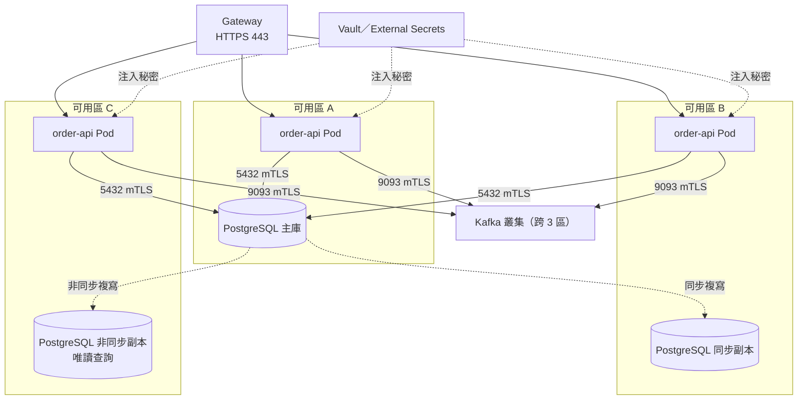

```yaml
# ✅ SD-DEP-002 SD-DEP-003：同一個映像，依環境注入設定；工作階段存放在外部
server:
  servlet:
    session:
      timeout: 30m                                 # 工作階段由 Spring Session 存放在 Redis
spring:
  config:
    import: "optional:configtree:/etc/config/"     # ConfigMap 掛載的目錄
  data:
    redis:
      host: ${REDIS_HOST}
      port: 6379
      ssl:
        enabled: true
```

#### 🔍 14.1 審查與驗證

- **自動檢查：** CI 只建置一次映像，各環境以相同的 digest 部署；部署清單中的映像必須是 digest 而不是標籤。
- **人工審查問題：**
  1. 終止任何一個執行個體，使用者會遇到什麼？（工作階段、上傳中的檔案、處理中的訊息）
  2. 有沒有依環境不同而改變的程式碼路徑（`if (env == "prod")`）？
- **AI 常見錯誤：** 把檔案上傳到容器的本機目錄；使用 `application-prod.yml` 把正式環境的連線資訊放進映像；在記憶體中保存工作階段。

### 14.2 健康檢查、資源與生命週期

| 編號 | 等級 | 規則 | 驗證方式 |
| --- | --- | --- | --- |
| `SD-DEP-004` | 必須 | 必須分開設計存活探針（liveness，只檢查行程本身）與就緒探針（readiness，檢查是否能處理請求）；存活探針不得檢查資料庫等外部依賴，以免外部故障時所有 Pod 被重啟 | 🤖 kubeconform；🧪 整合測試 |
| `SD-DEP-005` | 必須 | 必須依壓測結果設定 CPU 與記憶體的 requests，以及記憶體 limits；JVM 堆積以容器記憶體的百分比設定 | 🤖 kubeconform；🤖 准入政策 |
| `SD-DEP-006` | 必須 | 應用程式必須支援優雅關機：收到 SIGTERM 後停止接收新請求、完成處理中的請求、在期限內結束；關機期限必須小於 `terminationGracePeriodSeconds` | 🧪 整合測試（關機期間的請求） |
| `SD-DEP-007` | 必須 | 容器必須以非 root 使用者執行，根檔案系統唯讀，移除所有 Linux capabilities，並禁止權限提升 | 🤖 hadolint；🤖 kubeconform；🤖 Pod Security Admission（restricted） |

```yaml
# ✅ SD-DEP-004 SD-DEP-006：Spring Boot 的探針群組與優雅關機
management:
  endpoint:
    health:
      probes:
        enabled: true
      group:
        liveness:
          include: livenessState
        readiness:
          include: readinessState,db
  server:
    port: 8081
server:
  shutdown: graceful
spring:
  lifecycle:
    timeout-per-shutdown-phase: 20s
```

```yaml
# ✅ SD-DEP-004 SD-DEP-005 SD-DEP-006 SD-DEP-007：Kubernetes Deployment 與 PodDisruptionBudget
apiVersion: apps/v1
kind: Deployment
metadata:
  name: order-api
  labels:
    app.kubernetes.io/name: order-api
spec:
  replicas: 3
  selector:
    matchLabels:
      app.kubernetes.io/name: order-api
  template:
    metadata:
      labels:
        app.kubernetes.io/name: order-api
    spec:
      terminationGracePeriodSeconds: 40
      securityContext:
        runAsNonRoot: true
        seccompProfile:
          type: RuntimeDefault
      topologySpreadConstraints:
        - maxSkew: 1
          topologyKey: topology.kubernetes.io/zone
          whenUnsatisfiable: DoNotSchedule
          labelSelector:
            matchLabels:
              app.kubernetes.io/name: order-api
      containers:
        - name: app
          image: registry.example.com/order-api@sha256:4f2a3c9e1d0b7a6f5e4d3c2b1a0f9e8d7c6b5a4f3e2d1c0b9a8f7e6d5c4b3a29
          ports:
            - name: http
              containerPort: 8080
            - name: management
              containerPort: 8081
          env:
            - name: JAVA_TOOL_OPTIONS
              value: "-XX:MaxRAMPercentage=75.0"
          resources:
            requests:
              cpu: "1"
              memory: 1Gi
            limits:
              memory: 1Gi
          livenessProbe:
            httpGet:
              path: /actuator/health/liveness
              port: management
            periodSeconds: 10
            failureThreshold: 3
          readinessProbe:
            httpGet:
              path: /actuator/health/readiness
              port: management
            periodSeconds: 5
            failureThreshold: 2
          startupProbe:
            httpGet:
              path: /actuator/health/liveness
              port: management
            periodSeconds: 5
            failureThreshold: 30
          lifecycle:
            preStop:
              sleep:
                seconds: 10
          securityContext:
            allowPrivilegeEscalation: false
            readOnlyRootFilesystem: true
            capabilities:
              drop: ["ALL"]
          volumeMounts:
            - name: tmp
              mountPath: /tmp
      volumes:
        - name: tmp
          emptyDir: {}
---
apiVersion: policy/v1
kind: PodDisruptionBudget
metadata:
  name: order-api
spec:
  minAvailable: 2
  selector:
    matchLabels:
      app.kubernetes.io/name: order-api
```

```dockerfile
# syntax=docker/dockerfile:1
# ✅ SD-DEP-007：執行階段只有 JRE，以非 root 使用者執行（完整多階段建置見架構設計指引 13.1）
FROM eclipse-temurin:25-jre-noble@sha256:d9a39a23634650173f1e2bbc176227af9728587ecf0f4b62d53e9355cd7a19ab
WORKDIR /app
RUN groupadd --system --gid 10001 app \
    && useradd --system --uid 10001 --gid app --no-create-home app
COPY --chown=10001:10001 target/extracted/dependencies/ ./
COPY --chown=10001:10001 target/extracted/spring-boot-loader/ ./
COPY --chown=10001:10001 target/extracted/application/ ./
USER 10001:10001
EXPOSE 8080 8081
ENTRYPOINT ["java", "-XX:+ExitOnOutOfMemoryError", "org.springframework.boot.loader.launch.JarLauncher"]
```

```yaml
# ❌ SD-DEP-004 SD-DEP-005：存活探針檢查整體健康（含資料庫），資料庫故障時所有 Pod 被重啟；沒有資源設定（片段）
livenessProbe:
  httpGet:
    path: /actuator/health
    port: 8080
  initialDelaySeconds: 60
```

（片段：示意不良的探針設定）

#### 🔍 14.2 審查與驗證

- **自動檢查：** `kubeconform -strict -kubernetes-version 1.37.1`；`hadolint Dockerfile`；叢集啟用 Pod Security Admission 的 `restricted` 等級。
- **人工審查問題：**
  1. `preStop` 等待時間＋應用程式關機期限，是否小於 `terminationGracePeriodSeconds`？（10＋20 < 40）
  2. 記憶體 limits 是否等於 requests？JVM 的堆積加上非堆積記憶體是否在 limits 之內？
  3. 唯讀根檔案系統下，應用程式需要寫入的目錄（`/tmp`）是否已掛載？
- **AI 常見錯誤：** 設定 CPU limits 造成 JVM 被節流；`initialDelaySeconds` 設得很長來掩蓋啟動慢的問題（應使用 startupProbe）；使用 `preStop` 的 `exec: sleep`（映像中可能沒有 shell，Kubernetes 1.34 起可用 `sleep` 動作）。

### 14.3 交付流程與部署策略

| 編號 | 等級 | 規則 | 驗證方式 |
| --- | --- | --- | --- |
| `SD-DEP-008` | 必須 | CI 必須包含品質閘門：編譯、單元與整合測試、架構測試（ArchUnit／Modulith）、規格檢查（Spectral）、靜態分析、相依弱點掃描、秘密掃描；任一項失敗即阻擋合併 | 🤖 CI 必要檢查（branch protection） |
| `SD-DEP-009` | 應該 | 應依變更風險選擇部署策略（滾動更新、藍綠、金絲雀），並在設計中定義回滾條件（錯誤率、延遲）與回滾方式 | 👁 設計審查 |
| `SD-DEP-010` | 必須 | 資料庫結構變更必須與前一版應用程式相容（expand–contract）：先新增（expand）、部署新版、搬移資料，最後才移除舊結構（contract），讓滾動更新與回滾期間新舊版本可以並存 | 🧪 相容性測試（舊版程式＋新版結構）；👁 設計審查 |

```yaml
# ✅ SD-DEP-008：.github/workflows/ci.yml 品質閘門
name: ci
on:
  pull_request:
  push:
    branches: [main]
permissions:
  contents: read
jobs:
  build:
    runs-on: ubuntu-24.04
    steps:
      - uses: actions/checkout@3d3c42e5aac5ba805825da76410c181273ba90b1 # v7.0.1
      - uses: actions/setup-java@de7274f081f381c8f8158605e0321c36c376e2e6 # v6.0.1
        with:
          distribution: temurin
          java-version: "25"
          cache: maven
      - name: 編譯、測試、架構測試、靜態分析、相依弱點掃描
        run: ./mvnw -B verify -Pquality
      - name: API 規格檢查
        run: npx --yes @stoplight/spectral-cli@6.17.0 lint api/*.yaml --ruleset .spectral.yaml --fail-severity=error
      - name: 追溯與錯誤碼檢查
        run: |
          python tools/check_trace.py docs/sdd/trace.yaml src/test/java
          python tools/check_error_codes.py docs/sdd/error-codes.yaml src/main/java
```

```markdown
<!-- ✅ SD-DEP-009：部署策略與回滾條件 -->
| 變更類型 | 策略 | 觀察期 | 自動回滾條件 |
| --- | --- | --- | --- |
| 一般功能、修正 | 滾動更新（maxUnavailable 0、maxSurge 1） | 15 分鐘 | 5xx 比例 > 1% 持續 5 分鐘 |
| 計價、付款等高風險邏輯 | 金絲雀 5% → 25% → 100% | 每階段 30 分鐘 | 錯誤率高於基準 2 倍或 p99 > 1 秒 |
| 資料庫結構重大調整 | 藍綠＋expand–contract | 1 天 | 人工判斷 |
```

```sql
-- ✅ SD-DEP-010：expand–contract 將 customer_id 長度由 20 擴充並改名為 customer_no
-- 第 1 版（expand）：新增欄位，新舊欄位同時寫入，舊版程式不受影響
ALTER TABLE orders ADD COLUMN customer_no varchar(32);
UPDATE orders SET customer_no = customer_id WHERE customer_no IS NULL;   -- 大表請分批執行
-- 第 2 版：程式改讀 customer_no，仍同時寫入兩個欄位
-- 第 3 版（contract）：確認沒有任何版本讀取 customer_id 後才移除
ALTER TABLE orders ALTER COLUMN customer_no SET NOT NULL;
ALTER TABLE orders DROP COLUMN customer_id;
```

```sql
-- ❌ SD-DEP-010：一次改名，滾動更新期間舊版 Pod 立刻全部失敗（片段）
ALTER TABLE orders RENAME COLUMN customer_id TO customer_no;
```

（片段：示意不相容的結構變更）

#### 🔍 14.3 審查與驗證

- **自動檢查：** CI 的品質閘門設為必要檢查；相容性測試以「前一版的應用程式＋新版的結構」執行整合測試。
- **人工審查問題：**
  1. 回滾時，新版寫入的資料舊版能讀嗎？
  2. 品質閘門中有沒有被設為「允許失敗」的步驟？
- **AI 常見錯誤：** 在同一個遷移腳本中新增並刪除欄位；CI 以 `continue-on-error: true` 略過安全掃描；以 `latest` 標籤部署。

## 15. 可測試性與測試設計

「可測試」是設計的品質屬性，不是測試團隊的工作。一個依賴系統時鐘、在建構子中連線資料庫、以靜態方法呼叫外部服務的類別，再好的測試人員也很難測試。本章規範設計階段就要決定的可測試性與測試策略；測試方法與工具細節見 [測試與品質保證指引]()。

### 15.1 每個設計元素的驗證方式

v1.x 以「測試金字塔」說明單元、整合、E2E 測試的比例。比例本身不是目標，重點是**每個設計元素都要用最便宜而有效的測試驗證**：

| 設計元素 | 主要驗證 | 次要驗證 | 本指引範例 |
| --- | --- | --- | --- |
| 值物件、聚合、領域服務 | 單元測試 | — | `OrderInvariantTest`（5.2） |
| 狀態機、決策表 | 參數化測試 | — | `OrderStatusTransitionTest`（9.2） |
| 模組邊界、分層 | ArchUnit、Spring Modulith | — | `LayeringArchTest`（6.1） |
| 儲存庫、SQL | Testcontainers 整合測試 | — | `JdbcOrderRepositoryIT`（15.2） |
| REST API | Web 層測試（MockMvc） | 契約測試 | 15.3 |
| 服務間介面 | 契約測試 | — | 15.3 |
| 品質情境 | 壓測、故障演練 | 監控 | 15.4 |

| 編號 | 等級 | 規則 | 驗證方式 |
| --- | --- | --- | --- |
| `SD-TST-001` | 必須 | SDD 必須為每個設計元素指定驗證方式（單元、整合、契約、E2E、壓測、演練、人工審查），並列入追溯矩陣 | 👁 設計審查；🤖 追溯檢查腳本 |
| `SD-TST-002` | 必須 | 依賴必須可以替換：以建構子注入介面，不得在類別內部 `new` 出外部依賴或以靜態方法呼叫外部系統 | 🤖 ArchUnit（禁止欄位注入） |
| `SD-TST-003` | 必須 | 時間、亂數與識別碼產生必須可注入（`Clock`、`RandomGenerator`），業務程式不得直接呼叫 `LocalDateTime.now()`、`Instant.now()`、`UUID.randomUUID()` | 🤖 ArchUnit |

```yaml
# ✅ SD-TST-001：追溯矩陣中的每個設計元素都列出驗證方式（擴充 1.2 的 trace.yaml）
design_elements:
  - id: CMP-ORD-PLACEMENT
    satisfies: [REQ-ORD-001, REQ-ORD-002, QS-ORD-01]
    verifiedBy:
      - unit: OrderInvariantTest
      - integration: OrderPlacementIT
      - performance: k6/order-peak.js
  - id: BEH-ORD-STATUS
    satisfies: [REQ-ORD-010]
    verifiedBy:
      - unit: OrderStatusTransitionTest
  - id: CMP-ORD-MODULE
    satisfies: [ADR-0012]
    verifiedBy:
      - architecture: ModularityTests
```

```java
// ✅ SD-TST-002 SD-TST-003：以 ArchUnit 禁止欄位注入與直接取用系統時鐘
package com.example.sd.archtest;

import static com.tngtech.archunit.lang.syntax.ArchRuleDefinition.noClasses;
import static com.tngtech.archunit.lang.syntax.ArchRuleDefinition.noFields;

import com.tngtech.archunit.core.importer.ImportOption;
import com.tngtech.archunit.junit.AnalyzeClasses;
import com.tngtech.archunit.junit.ArchTest;
import com.tngtech.archunit.lang.ArchRule;
import java.time.Instant;
import java.time.LocalDate;
import java.time.LocalDateTime;
import org.springframework.beans.factory.annotation.Autowired;

@AnalyzeClasses(packages = "com.example.sd", importOptions = ImportOption.DoNotIncludeTests.class)
class TestabilityArchTest {

    @ArchTest
    static final ArchRule noFieldInjection = noFields()
            .should().beAnnotatedWith(Autowired.class)
            .because("依賴以建構子注入，測試時才能替換（SD-TST-002）");

    @ArchTest
    static final ArchRule noSystemClockInBusinessCode = noClasses()
            .that().resideInAnyPackage("..domain..", "..application..")
            .should().callMethod(Instant.class, "now")
            .orShould().callMethod(LocalDateTime.class, "now")
            .orShould().callMethod(LocalDate.class, "now")
            .because("時間必須由注入的 Clock 提供（SD-TST-003）");
}
```

```java
// ✅ SD-TST-003：提供 Clock 與 RandomGenerator 的 bean；測試時以固定值取代
package com.example.sd.config;

import java.security.SecureRandom;
import java.time.Clock;
import java.util.random.RandomGenerator;
import org.springframework.context.annotation.Bean;
import org.springframework.context.annotation.Configuration;

@Configuration(proxyBeanMethods = false)
class TimeAndRandomConfig {

    @Bean
    Clock clock() {
        return Clock.systemUTC();
    }

    @Bean
    RandomGenerator randomGenerator() {
        return new SecureRandom();
    }
}
```

```java
// ❌ SD-TST-002 SD-TST-003：欄位注入、內部 new 外部依賴、直接取用系統時鐘（片段）
@Service
public class CouponService {
    @Autowired private CouponRepository repository;
    private final SmsClient sms = new SmsClient("https://sms.example.com");
    public boolean isExpired(Coupon c) { return c.getExpiry().isBefore(LocalDateTime.now()); }
}
```

（片段：示意難以測試的設計）

#### 🔍 15.1 審查與驗證

- **自動檢查：** `TestabilityArchTest`；追溯矩陣中每個設計元素都有 `verifiedBy` 欄位。
- **人工審查問題：**
  1. 有沒有「只能用 E2E 測試驗證」的業務規則？這通常代表規則放錯了層。
  2. 跨日、月底、閏年、時區切換的情境能不能在單元測試中重現？
- **AI 常見錯誤：** 產生以 `@Autowired` 欄位注入的類別；測試中以 `Thread.sleep` 等待時間經過；測試依賴執行當下的日期而在特定日期失敗。

### 15.2 整合測試與測試資料

| 編號 | 等級 | 規則 | 驗證方式 |
| --- | --- | --- | --- |
| `SD-TST-004` | 應該 | 資料存取與訊息的整合測試應以 Testcontainers 啟動與正式環境相同種類與主要版本的資料庫與中介軟體，不應以 H2 等嵌入式資料庫代替 | 🤖 相依檢查（禁止 `com.h2database:h2`） |
| `SD-TST-006` | 應該 | 測試資料應以 Test Data Builder 建立：提供合法的預設值，測試只覆寫與案例相關的欄位，讓測試的意圖一目了然 | 👁 程式審查 |

```java
// ✅ SD-TST-004：以 Testcontainers 啟動 PostgreSQL 18，驗證儲存庫與樂觀鎖
package com.example.sd.order.adapter.persistence;

import static org.assertj.core.api.Assertions.assertThat;
import static org.assertj.core.api.Assertions.assertThatThrownBy;

import com.example.sd.order.domain.Order;
import com.example.sd.order.domain.OrderTestData;
import java.time.Clock;
import java.time.Instant;
import java.time.ZoneOffset;
import org.junit.jupiter.api.BeforeAll;
import org.junit.jupiter.api.Test;
import org.springframework.dao.OptimisticLockingFailureException;
import org.springframework.jdbc.core.simple.JdbcClient;
import org.springframework.jdbc.datasource.DriverManagerDataSource;
import org.testcontainers.junit.jupiter.Container;
import org.testcontainers.junit.jupiter.Testcontainers;
import org.testcontainers.postgresql.PostgreSQLContainer;

@Testcontainers(disabledWithoutDocker = true)
class JdbcOrderRepositoryIT {

    @Container
    static final PostgreSQLContainer POSTGRES = new PostgreSQLContainer("postgres:18-alpine");

    private static JdbcClient jdbc;
    private final Clock clock = Clock.fixed(Instant.parse("2026-10-08T02:00:00Z"), ZoneOffset.UTC);

    @BeforeAll
    static void createSchema() {
        jdbc = JdbcClient.create(new DriverManagerDataSource(
                POSTGRES.getJdbcUrl(), POSTGRES.getUsername(), POSTGRES.getPassword()));
        jdbc.sql("""
                CREATE TABLE orders (id uuid PRIMARY KEY, customer_id varchar(20) NOT NULL, status varchar(12) NOT NULL,
                  currency char(3) NOT NULL, total_amount numeric(15,2) NOT NULL, version bigint NOT NULL DEFAULT 0,
                  created_at timestamptz NOT NULL, created_by varchar(64) NOT NULL,
                  updated_at timestamptz NOT NULL, updated_by varchar(64) NOT NULL)""").update();
        jdbc.sql("""
                CREATE TABLE order_lines (order_id uuid NOT NULL REFERENCES orders(id), line_no smallint NOT NULL,
                  sku varchar(12) NOT NULL, unit_price numeric(15,2) NOT NULL, quantity smallint NOT NULL,
                  PRIMARY KEY (order_id, line_no))""").update();
    }

    @Test
    void savesAndLoadsAggregate() {
        var repository = new JdbcOrderRepository(jdbc, clock);
        Order order = OrderTestData.anOrder().withQuantity(3).build();
        repository.save(order);
        Order loaded = repository.findById(order.id()).orElseThrow();
        assertThat(loaded.total()).isEqualTo(order.total());
        assertThat(loaded.version()).isEqualTo(1);
    }

    @Test
    void detectsConcurrentModification() {
        var repository = new JdbcOrderRepository(jdbc, clock);
        Order order = OrderTestData.anOrder().build();
        repository.save(order);
        Order first = repository.findById(order.id()).orElseThrow();
        Order second = repository.findById(order.id()).orElseThrow();
        first.markPaid(clock.instant());
        repository.save(first);
        second.cancel("客戶取消", clock.instant());
        assertThatThrownBy(() -> repository.save(second)).isInstanceOf(OptimisticLockingFailureException.class);
    }
}
```

```java
// ✅ SD-TST-006：Test Data Builder 提供合法的預設值，測試只寫出與案例有關的差異
package com.example.sd.order.domain;

import com.example.sd.shared.Money;
import java.time.Instant;
import java.util.List;
import java.util.SplittableRandom;

public final class OrderTestData {

    private static final Instant NOW = Instant.parse("2026-10-08T02:00:00Z");
    private static final SplittableRandom RANDOM = new SplittableRandom(7);

    private String customerId = "C001";
    private String sku = "SKU-1001";
    private String unitPrice = "350";
    private int quantity = 1;

    public static OrderTestData anOrder() {
        return new OrderTestData();
    }

    public OrderTestData forCustomer(String value) {
        this.customerId = value;
        return this;
    }

    public OrderTestData withUnitPrice(String value) {
        this.unitPrice = value;
        return this;
    }

    public OrderTestData withQuantity(int value) {
        this.quantity = value;
        return this;
    }

    public Order build() {
        return Order.place(OrderId.newId(NOW, RANDOM), customerId,
                List.of(new OrderLine(sku, Money.of(unitPrice, "TWD"), quantity)), NOW);
    }
}
```

#### 🔍 15.2 審查與驗證

- **自動檢查：** Maven Enforcer 禁止 H2；CI 的執行環境提供 Docker（或 Podman）讓 Testcontainers 測試實際執行，並檢查測試報告中整合測試沒有被略過。
- **人工審查問題：**
  1. 整合測試使用的資料庫版本，與正式環境是否相同？
  2. 測試之間是否互相依賴資料（執行順序改變就失敗）？
- **AI 常見錯誤：** 以 H2 的相容模式測試 PostgreSQL 專屬語法；`@Testcontainers(disabledWithoutDocker = true)` 讓 CI 在沒有 Docker 時靜默略過，卻沒有人發現整合測試從未執行。

### 15.3 契約測試與驗收條件

| 編號 | 等級 | 規則 | 驗證方式 |
| --- | --- | --- | --- |
| `SD-TST-005` | 應該 | 服務之間的同步 API 與事件應以契約測試驗證：消費者定義期望，提供者在 CI 中驗證；或以 OpenAPI 規格驗證提供者的實際回應 | 🧪 契約測試 |
| `SD-TST-007` | 必須 | 每個功能需求必須有以 Given-When-Then 撰寫的驗收條件，涵蓋成功、業務錯誤與邊界情境，並對應到自動化測試 | 👁 設計審查；🤖 追溯檢查腳本 |

```markdown
<!-- ✅ SD-TST-007：REQ-ORD-002 的驗收條件 -->
### REQ-ORD-002 庫存不足時拒絕下單

情境 1：庫存不足
- Given 商品 SKU-1001 的可用庫存為 2
- When 客戶下單 SKU-1001 數量 3
- Then 回應 422，錯誤碼 ORD-4091，訊息包含「可購買數量 2」
- And 不建立訂單，庫存仍為 2

情境 2：剛好足夠（邊界）
- Given 商品 SKU-1001 的可用庫存為 3
- When 客戶下單 SKU-1001 數量 3
- Then 回應 201，可用庫存變為 0

自動化測試：`OrderPlacementIT.rejectsWhenStockInsufficient`、`OrderPlacementIT.acceptsWhenStockExactlyEnough`（@Tag("REQ-ORD-002")）
```

```java
// ✅ SD-TST-005：提供者端以 MockMvc 驗證回應符合 OpenAPI 規格中的 Problem 結構（片段）
mockMvc.perform(post("/api/orders").header("Idempotency-Key", key).contentType(APPLICATION_JSON).content(body))
       .andExpect(status().isUnprocessableContent())
       .andExpect(content().contentType("application/problem+json"))
       .andExpect(jsonPath("$.code").value("ORD-4091"))
       .andExpect(jsonPath("$.traceId").isNotEmpty());
// 或以 swagger-request-validator、Spring Cloud Contract、Pact 依規格／契約自動比對
```

（片段：契約驗證的斷言）

#### 🔍 15.3 審查與驗證

- **自動檢查：** 追溯腳本確認每個 REQ 都有 `@Tag` 標記的測試（SD-PRC-005）；提供者的 CI 執行所有消費者的契約。
- **人工審查問題：**
  1. 驗收條件是否包含邊界值（剛好足夠、剛好超過）？
  2. 消費者的契約是否只包含它真正使用的欄位？
- **AI 常見錯誤：** 驗收條件只寫成功情境；把實作細節寫進驗收條件（「呼叫 InventoryService.reserve」）。

### 15.4 效能測試設計

| 編號 | 等級 | 規則 | 驗證方式 |
| --- | --- | --- | --- |
| `SD-TST-008` | 應該 | 效能測試情境應由品質情境導出：以開放模型（固定到達率）產生負載，以情境的量測目標作為通過門檻，並在 CI 或發布前執行 | 🧪 k6 測試；🤖 `k6 inspect` |

```javascript
// ✅ SD-TST-008：QS-ORD-01（200 rps，p99 ≤ 800 ms，錯誤率 < 0.1%）的 k6 腳本
import http from 'k6/http';
import { check } from 'k6';

export const options = {
  scenarios: {
    peak_orders: {
      executor: 'constant-arrival-rate',
      rate: 200,
      timeUnit: '1s',
      duration: '15m',
      preAllocatedVUs: 100,
      maxVUs: 400,
    },
  },
  thresholds: {
    'http_req_duration{scenario:peak_orders}': ['p(99)<800'],
    'http_req_failed{scenario:peak_orders}': ['rate<0.001'],
  },
};

const BASE_URL = __ENV.BASE_URL;   // 由環境變數提供，避免誤壓正式環境

export default function () {
  const res = http.post(`${BASE_URL}/api/orders`,
    JSON.stringify({ customerId: 'PERF-001', lines: [{ sku: 'SKU-1001', quantity: 1 }] }),
    { headers: { 'Content-Type': 'application/json', 'Idempotency-Key': crypto.randomUUID(),
                 Authorization: `Bearer ${__ENV.TOKEN}` } });
  check(res, { 'status is 201': (r) => r.status === 201 });
}
```

#### 🔍 15.4 審查與驗證

- **自動檢查：** `k6 inspect order-peak.js` 檢查腳本語法與選項；壓測報告中門檻未通過時 k6 以非 0 結束碼結束。
- **人工審查問題：**
  1. 壓測環境的資料量是否接近正式環境？（空資料庫的查詢永遠很快）
  2. 負載模型是開放模型（固定到達率）嗎？封閉模型（固定使用者數）會在系統變慢時自動降低負載，掩蓋問題。
- **AI 常見錯誤：** 使用 `vus` 加 `duration` 的封閉模型；門檻使用不存在的指標名稱；網址寫死。

## 16. 國際化與地區化設計

國際化（i18n）是讓系統**能夠**支援多種語言與地區的設計；地區化（l10n）是針對特定語言與地區的實際內容。即使系統目前只服務台灣，國際化設計仍然重要：時區、幣別、字元編碼的錯誤在單一語系中同樣會發生，而事後補做國際化的成本遠高於一開始就做對。

### 16.1 文字與語系

| 編號 | 等級 | 規則 | 驗證方式 |
| --- | --- | --- | --- |
| `SD-I18N-001` | 必須 | 所有顯示給使用者的文字（畫面、錯誤訊息、通知、報表標題）都必須外部化到訊息資源檔，以訊息鍵引用；程式中不得寫死顯示文字 | 🤖 ESLint `@intlify/vue-i18n/no-raw-text`；🤖 訊息鍵完整性檢查 |
| `SD-I18N-002` | 必須 | 語系必須以 BCP 47 語言標籤表示（例如 `zh-TW`、`en-US`）；系統必須定義支援的語系清單與預設語系，無法對應時回到預設語系，而不是伺服器的作業系統語系 | 🧪 Web 層測試（`Accept-Language`） |
| `SD-I18N-003` | 必須 | 含有變數、數量或性別的訊息必須使用 ICU MessageFormat（複數規則、選擇），不得以字串串接組合句子 | 🧪 訊息格式測試（各語系、各數量） |

```properties
# ✅ SD-I18N-001 SD-I18N-003：messages_zh_TW.properties（UTF-8）
order.placed=訂單 {orderId} 已成立
order.stock.insufficient=商品 {sku} 庫存不足，目前可購買 {available, plural, other {# 件}}
cart.summary={count, plural, =0 {購物車是空的} other {購物車中有 # 件商品}}
```

```properties
# ✅ SD-I18N-001 SD-I18N-003：messages_en.properties
order.placed=Order {orderId} has been placed
order.stock.insufficient=Not enough stock for {sku}. You can buy {available, plural, one {# item} other {# items}}
cart.summary={count, plural, =0 {Your cart is empty} one {You have # item in your cart} other {You have # items in your cart}}
```

```java
// ✅ SD-I18N-002：支援的語系清單與預設語系，不使用伺服器的系統語系
package com.example.sd.i18n;

import java.util.List;
import java.util.Locale;
import org.springframework.context.annotation.Bean;
import org.springframework.context.annotation.Configuration;
import org.springframework.web.servlet.LocaleResolver;
import org.springframework.web.servlet.i18n.AcceptHeaderLocaleResolver;

@Configuration(proxyBeanMethods = false)
class LocaleConfig {

    static final Locale DEFAULT = Locale.forLanguageTag("zh-TW");

    @Bean
    LocaleResolver localeResolver() {
        AcceptHeaderLocaleResolver resolver = new AcceptHeaderLocaleResolver();
        resolver.setSupportedLocales(List.of(DEFAULT, Locale.forLanguageTag("en-US")));
        resolver.setDefaultLocale(DEFAULT);
        return resolver;
    }
}
```

```yaml
# ✅ SD-I18N-002：訊息資源以 UTF-8 讀取，找不到語系時不回到作業系統語系
spring:
  messages:
    basename: messages
    encoding: UTF-8
    fallback-to-system-locale: false
```

```java
// ✅ SD-I18N-003：以 ICU4J 格式化複數訊息
package com.example.sd.i18n;

import com.ibm.icu.text.MessageFormat;
import java.util.Locale;
import java.util.Map;

public final class IcuMessages {

    public static String format(String pattern, Locale locale, Map<String, Object> args) {
        return new MessageFormat(pattern, locale).format(args);
    }

    private IcuMessages() {
    }
}
```

```java
// ✅ SD-I18N-003：每個語系都要測試 0、1、多數
package com.example.sd.i18n;

import static org.assertj.core.api.Assertions.assertThat;

import java.util.Locale;
import java.util.Map;
import org.junit.jupiter.params.ParameterizedTest;
import org.junit.jupiter.params.provider.CsvSource;

class IcuMessagesTest {

    private static final String EN = "{count, plural, =0 {Your cart is empty} one {You have # item in your cart} "
            + "other {You have # items in your cart}}";
    private static final String ZH = "{count, plural, =0 {購物車是空的} other {購物車中有 # 件商品}}";

    @ParameterizedTest
    @CsvSource({
        "0, Your cart is empty, 購物車是空的",
        "1, You have 1 item in your cart, 購物車中有 1 件商品",
        "2, You have 2 items in your cart, 購物車中有 2 件商品",
        "1000, 'You have 1,000 items in your cart', '購物車中有 1,000 件商品'"
    })
    void formatsPluralsPerLocale(int count, String english, String chinese) {
        assertThat(IcuMessages.format(EN, Locale.US, Map.of("count", count))).isEqualTo(english);
        assertThat(IcuMessages.format(ZH, Locale.forLanguageTag("zh-TW"), Map.of("count", count))).isEqualTo(chinese);
    }
}
```

```typescript
// ✅ SD-I18N-001 SD-I18N-002：前端 vue-i18n（Composition API 模式），預設與後援語系明確（片段）
import { createI18n } from 'vue-i18n';
import zhTW from './locales/zh-TW.json';
import enUS from './locales/en-US.json';

export const i18n = createI18n({
  legacy: false,
  locale: 'zh-TW',
  fallbackLocale: 'zh-TW',
  messages: { 'zh-TW': zhTW, 'en-US': enUS },
});
// eslint.config.js 啟用 '@intlify/vue-i18n/no-raw-text': 'error'，範本中出現寫死的文字時 lint 失敗
```

（片段：前端語系設定，完整設定見前端開發指引）

```java
// ❌ SD-I18N-001 SD-I18N-003：寫死文字並以串接組句，英文的單複數與語序都無法處理（片段）
String message = "購物車中有 " + count + " 件商品";
String english = "You have " + count + " item(s)";
```

（片段：示意字串串接）

#### 🔍 16.1 審查與驗證

- **自動檢查：** `IcuMessagesTest`；腳本比對各語系資源檔的鍵是否一致（缺少翻譯的鍵列為錯誤）；前端 ESLint 的 `no-raw-text`。
- **人工審查問題：**
  1. 語系清單、預設語系與後援順序是否寫在設計中？
  2. 錯誤訊息、電子郵件、PDF 報表是否也依使用者語系產生？
- **AI 常見錯誤：** 以 `String.format` 或串接組句；`.properties` 檔以 ISO-8859-1 讀取造成中文亂碼；使用 `zh_TW`（Java 舊式）與 `zh-TW`（BCP 47）混用。

### 16.2 時間、數字與幣別

| 編號 | 等級 | 規則 | 驗證方式 |
| --- | --- | --- | --- |
| `SD-I18N-004` | 必須 | 時間點在系統內部以 UTC（`Instant`／`timestamptz`）處理與儲存，API 以 RFC 3339 並帶時區偏移傳遞，只在顯示時依使用者的時區轉換；「業務日期」必須明確定義所屬的時區 | 🧪 時區測試 |
| `SD-I18N-005` | 必須 | 金額必須以 `BigDecimal`（或 `Money` 值物件）搭配 ISO 4217 幣別處理，小數位數依幣別而定；顯示格式（符號、千分位、小數位數）依使用者語系決定 | 🧪 格式測試 |

```java
// ✅ SD-I18N-004 SD-I18N-005：顯示時才依使用者的時區與語系格式化
package com.example.sd.i18n;

import com.example.sd.shared.Money;
import java.text.NumberFormat;
import java.time.Instant;
import java.time.ZoneId;
import java.time.format.DateTimeFormatter;
import java.util.Locale;

public final class DisplayFormats {

    private static final DateTimeFormatter DATE_TIME = DateTimeFormatter.ofPattern("yyyy-MM-dd HH:mm");

    public static String dateTime(Instant instant, ZoneId userZone) {
        return DATE_TIME.format(instant.atZone(userZone));
    }

    public static String money(Money money, Locale locale) {
        NumberFormat format = NumberFormat.getCurrencyInstance(locale);
        format.setCurrency(money.currency());
        format.setMinimumFractionDigits(money.currency().getDefaultFractionDigits());
        format.setMaximumFractionDigits(money.currency().getDefaultFractionDigits());
        return format.format(money.amount());
    }

    private DisplayFormats() {
    }
}
```

```java
// ✅ SD-I18N-004 SD-I18N-005：同一個時間點與金額，在不同時區與語系的顯示結果
package com.example.sd.i18n;

import static org.assertj.core.api.Assertions.assertThat;

import com.example.sd.shared.Money;
import java.time.Instant;
import java.time.ZoneId;
import java.util.Locale;
import org.junit.jupiter.api.Test;

class DisplayFormatsTest {

    private static final Instant T = Instant.parse("2026-10-08T17:30:00Z");

    @Test
    void sameInstantDiffersByZoneIncludingDate() {
        assertThat(DisplayFormats.dateTime(T, ZoneId.of("Asia/Taipei"))).isEqualTo("2026-10-09 01:30");
        assertThat(DisplayFormats.dateTime(T, ZoneId.of("America/Los_Angeles"))).isEqualTo("2026-10-08 10:30");
    }

    @Test
    void currencyDigitsFollowIso4217() {
        assertThat(DisplayFormats.money(Money.of("1234.5", "USD"), Locale.US)).isEqualTo("$1,234.50");
        assertThat(DisplayFormats.money(Money.of("1234", "JPY"), Locale.JAPAN)).isEqualTo("￥1,234");
    }
}
```

```java
// ❌ SD-I18N-004 SD-I18N-005：以伺服器時區計算業務日期、以 double 計算金額（片段）
LocalDate businessDate = LocalDate.now();                 // 伺服器在 UTC 時，台灣早上 7 點前會算成前一天
double total = price * quantity * 0.95;                   // 0.1 + 0.2 != 0.3
```

（片段：示意時區與金額的常見錯誤）

#### 🔍 16.2 審查與驗證

- **自動檢查：** `DisplayFormatsTest`；整合測試將 JVM 預設時區設為 UTC 與 `Asia/Taipei` 各執行一次，結果必須相同。
- **人工審查問題：**
  1. 「每日」「當月」等業務期間是依哪個時區計算？跨國使用者看到的報表期間是否一致？
  2. 匯率換算的捨入規則（`HALF_EVEN` 或 `HALF_UP`）是否經業務確認？
- **AI 常見錯誤：** 使用 `java.util.Date` 與 `SimpleDateFormat`；API 回傳不帶時區的 `LocalDateTime`；以 `double` 計算金額；假設所有幣別都有 2 位小數（日圓為 0 位）。

### 16.3 字元編碼、多語系資料與排序

| 編號 | 等級 | 規則 | 驗證方式 |
| --- | --- | --- | --- |
| `SD-I18N-006` | 必須 | 整個系統（原始碼、資源檔、資料庫、API、檔案介面）必須使用 UTF-8；資料庫必須使用 Unicode 字集，欄位長度須考慮多位元組字元與罕用字（Unicode 補充平面） | 🤖 資料庫編碼檢查查詢；🧪 罕用字往返測試 |
| `SD-I18N-007` | 應該 | 需要多語系的業務資料（商品名稱、說明）應以翻譯資料表保存，並定義找不到翻譯時的後援語系 | 🧪 SQL 測試 |
| `SD-I18N-008` | 應該 | 依名稱排序或比對使用者可見的文字時，應使用依語系的定序（Java `Collator`、資料庫 ICU 定序），而不是字元碼順序 | 🧪 排序測試 |

```sql
-- ✅ SD-I18N-006：資料庫與連線編碼必須為 UTF8
SELECT current_setting('server_encoding') AS server_encoding,
       current_setting('client_encoding') AS client_encoding;

-- 罕用字（補充平面，例如「𠮷」U+20BB7）往返測試：寫入後讀回，字元數與內容必須一致
CREATE TEMP TABLE i18n_roundtrip (name varchar(10));
INSERT INTO i18n_roundtrip VALUES ('𠮷野家');
SELECT name, char_length(name) AS chars, octet_length(name) AS bytes FROM i18n_roundtrip;
```

```sql
-- ✅ SD-I18N-007：商品翻譯表，找不到使用者語系時退回 zh-TW
CREATE TABLE products (
    id          varchar(12)  NOT NULL,
    created_at  timestamptz  NOT NULL DEFAULT now(),
    created_by  varchar(64)  NOT NULL,
    updated_at  timestamptz  NOT NULL DEFAULT now(),
    updated_by  varchar(64)  NOT NULL,
    CONSTRAINT pk_products PRIMARY KEY (id)
);
CREATE TABLE product_translations (
    product_id  varchar(12)  NOT NULL,
    locale      varchar(10)  NOT NULL,
    name        varchar(200) NOT NULL,
    CONSTRAINT pk_product_translations PRIMARY KEY (product_id, locale),
    CONSTRAINT fk_product_translations_product FOREIGN KEY (product_id) REFERENCES products (id),
    CONSTRAINT ck_product_translations_locale CHECK (locale ~ '^[a-z]{2,3}(-[A-Z][a-z]{3})?(-[A-Z]{2})?$')
);
INSERT INTO products (id, created_by, updated_by) VALUES ('SKU-1001', 'seed', 'seed'), ('SKU-1002', 'seed', 'seed');
INSERT INTO product_translations VALUES ('SKU-1001', 'zh-TW', '保溫杯'), ('SKU-1001', 'en-US', 'Insulated mug'),
                                        ('SKU-1002', 'zh-TW', '環保餐具組');

SELECT p.id, coalesce(t.name, d.name) AS name
FROM products p
JOIN product_translations d ON d.product_id = p.id AND d.locale = 'zh-TW'
LEFT JOIN product_translations t ON t.product_id = p.id AND t.locale = 'en-US'
ORDER BY p.id;
```

```java
// ✅ SD-I18N-008：依語系排序，而不是依字元碼
package com.example.sd.i18n;

import java.text.Collator;
import java.util.List;
import java.util.Locale;

public final class LocalizedSort {

    public static List<String> sort(List<String> names, Locale locale) {
        Collator collator = Collator.getInstance(locale);
        return names.stream().sorted(collator).toList();
    }

    private LocalizedSort() {
    }
}
```

```java
// ✅ SD-I18N-008：英文排序不分大小寫與重音；字元碼排序會把小寫與重音字母排在最後
package com.example.sd.i18n;

import static org.assertj.core.api.Assertions.assertThat;

import java.util.List;
import java.util.Locale;
import org.junit.jupiter.api.Test;

class LocalizedSortTest {

    @Test
    void sortsByLocaleRules() {
        List<String> names = List.of("zebra", "Émile", "apple", "Zoe");
        assertThat(LocalizedSort.sort(names, Locale.US)).containsExactly("apple", "Émile", "zebra", "Zoe");
        assertThat(names.stream().sorted().toList()).containsExactly("Zoe", "apple", "zebra", "Émile");
    }
}
```

#### 🔍 16.3 審查與驗證

- **自動檢查：** 編碼檢查查詢；`LocalizedSortTest`；罕用字往返測試（資料庫、API、檔案介面各一次）。
- **人工審查問題：**
  1. 欄位長度是以字元還是位元組計算？`varchar(10)` 能不能放下 10 個中文字？
  2. 中文排序的需求是什麼（筆畫、注音、部首）？是否經業務確認？
- **AI 常見錯誤：** Oracle 使用 `VARCHAR2(10 BYTE)` 存放中文；以 `String.length()` 計算含罕用字的字數（代理對算 2）；以 `ORDER BY name` 排序使用者可見的名稱而沒有指定定序。

## 17. 法規遵循設計

法規要求必須在設計階段轉成具體的功能與控制，否則上線前的稽核只會發現「系統沒有這個功能」。本章說明如何把法規要求對應到設計，並列出台灣企業常見的法規與國際標準。

> **免責說明：** 本章提供設計層面的指引，不構成法律意見。法規條文與主管機關的解釋會變動，實際的適用範圍與義務請與法務、法遵單位確認。條文引用以全國法規資料庫的最新版本為準。

### 17.1 合規需求盤點

| 法規或標準 | 適用對象 | 對設計的主要影響 |
| --- | --- | --- |
| 個人資料保護法（2025-11-11 修正公布，施行日期由行政院另定） | 蒐集、處理、利用個資的公務與非公務機關 | 告知與同意、目的限制、當事人權利、安全維護、外洩通知與通報個人資料保護委員會 |
| 資通安全管理法 | 公務機關與特定非公務機關 | 資安等級、資安防護基準、事件通報 |
| 金融監督管理委員會的委外與雲端相關規定（例如「金融機構作業委託他人處理內部作業制度及程序辦法」） | 金融機構 | 委外與雲端的資料加密、資料所有權、稽核權、退場與資料刪除 |
| 洗錢防制法與相關辦法 | 金融機構、指定之非金融事業 | 客戶審查（KYC）、交易監控、可疑交易申報、紀錄保存 |
| GDPR（歐盟一般資料保護規則） | 處理歐盟境內個人資料者 | 合法依據、資料主體權利、資料保護影響評估（DPIA）、72 小時通報 |
| ISO/IEC 27001:2022 | 資訊安全管理系統 | 附錄 A.8.25～A.8.28 安全開發生命週期、安全需求、安全架構與工程原則、安全程式撰寫 |
| ISO/IEC 27701:2025 | 隱私資訊管理系統（2025 版起為獨立標準） | 個資控制者與處理者的控制措施 |

| 編號 | 等級 | 規則 | 驗證方式 |
| --- | --- | --- | --- |
| `SD-REG-001` | 必須 | 設計開始前必須與法遵單位盤點適用的法規與標準，建立合規矩陣：條文或控制項、對應的需求、設計元素、驗證方式與負責人，並納入追溯矩陣 | 👁 法遵審查；🤖 追溯檢查腳本 |
| `SD-REG-006` | 必須 | 系統開發流程必須符合組織採用的資訊安全管理要求（例如 ISO/IEC 27001:2022 附錄 A.8.25～A.8.28）：安全需求在設計中定義、安全設計經審查、安全程式撰寫規範與測試有紀錄可查 | 👁 稽核；🤖 CI 紀錄 |

```markdown
<!-- ✅ SD-REG-001 SD-REG-006：合規矩陣（節錄） -->
| ID | 法規／標準 | 要求摘要 | 需求 | 設計元素 | 驗證 | 負責人 |
| --- | --- | --- | --- | --- | --- | --- |
| CMP-01 | 個資法（告知義務） | 蒐集時告知目的、類別、利用期間與方式 | REQ-MEM-003 | 註冊頁告知與同意紀錄 `consents` 表 | E2E 測試、法遵檢視畫面 | 會員小組 |
| CMP-02 | 個資法（當事人權利） | 查詢、閱覽、複製、補充更正、停止蒐集處理利用、刪除 | REQ-MEM-010～014 | 個資自助服務 API、刪除批次（17.2） | 整合測試 | 會員小組 |
| CMP-03 | 個資法（外洩通知與通報） | 發生個資事故時通知當事人並通報主管機關 | REQ-SEC-020 | 事故應變流程、個資存取稽核（SD-SEC-016） | 年度演練 | 資安組 |
| CMP-04 | ISO/IEC 27001:2022 A.8.25 | 安全開發生命週期 | — | 本指引第 1 章流程、第 11 章安全設計 | 稽核 CI 紀錄 | 開發經理 |
| CMP-05 | ISO/IEC 27001:2022 A.8.28 | 安全程式撰寫 | — | SAST、相依掃描（SD-DEP-008） | CI 報告 | 開發經理 |
```

#### 🔍 17.1 審查與驗證

- **自動檢查：** 合規矩陣的 ID 列入 `trace.yaml`，`check_trace.py` 確認每一項都有設計元素。
- **人工審查問題：**
  1. 合規矩陣是否由法遵單位確認過？法規修正（例如個資法修正條文施行）時由誰更新？
  2. 系統是否涉及跨境傳輸（雲端主機在國外、委外廠商在國外）？
- **AI 常見錯誤：** 虛構法條編號或條文內容；把 GDPR 的要求直接當成台灣法規；忽略「施行日期另定」的狀態而寫成已生效。

### 17.2 個人資料保護設計

| 編號 | 等級 | 規則 | 驗證方式 |
| --- | --- | --- | --- |
| `SD-REG-002` | 必須 | 必須建立個資盤點表：每類個資的蒐集目的、類別、來源、保存期限、利用範圍、法律依據（同意、契約、法定義務）與存放位置 | 👁 法遵審查 |
| `SD-REG-003` | 必須 | 設計必須遵守最小蒐集與目的限制：只蒐集達成目的所需的欄位；用於其他目的（例如行銷）時必須有獨立的同意紀錄 | 👁 設計審查；🧪 同意紀錄測試 |
| `SD-REG-004` | 必須 | 當事人行使權利（查詢、更正、刪除、停止利用）必須有對應的功能或作業程序，並有處理期限與紀錄；刪除必須涵蓋所有副本（快取、搜尋索引、報表、下游系統） | 🧪 整合測試；👁 作業程序審查 |
| `SD-REG-005` | 必須 | 必須設計個資外洩的偵測與應變：可以查出哪些人的哪些資料在何時被誰存取或匯出，並有通知當事人與通報主管機關的流程與範本 | 👁 資安審查；🧪 年度演練 |
| `SD-REG-007` | 應該 | 應落實隱私設計（Privacy by Design）：預設採最保護隱私的設定，分析、測試與報表優先使用假名化或去識別化的資料 | 🧪 去識別化測試；👁 設計審查 |

```markdown
<!-- ✅ SD-REG-002 SD-REG-003：個資盤點表（節錄） -->
| 個資類別 | 欄位 | 蒐集目的 | 法律依據 | 保存期限 | 存放位置 | 利用範圍 |
| --- | --- | --- | --- | --- | --- | --- |
| 識別類（C001） | 姓名、手機、電子郵件 | 訂單履行、客服聯繫 | 契約履行 | 最後交易後 5 年 | customer_contacts | 訂單、客服 |
| 識別類（C001） | 收件地址 | 商品配送 | 契約履行 | 出貨後 1 年 | order_shipments | 物流商（委外） |
| 特徵類（C011） | 生日 | 生日優惠（行銷） | 當事人同意（可撤回） | 撤回同意或刪除帳號時 | member_profiles | 行銷，需 `consents.marketing = true` |
```

```sql
-- ✅ SD-REG-003 SD-REG-004：同意紀錄保存版本與時間；撤回同意後行銷名單立即排除
CREATE TABLE consents (
    customer_id   varchar(20)  NOT NULL,
    purpose       varchar(30)  NOT NULL CHECK (purpose IN ('MARKETING', 'PROFILING', 'THIRD_PARTY_SHARING')),
    granted       boolean      NOT NULL,
    notice_version varchar(10) NOT NULL,
    recorded_at   timestamptz  NOT NULL DEFAULT now(),
    channel       varchar(10)  NOT NULL,
    CONSTRAINT pk_consents PRIMARY KEY (customer_id, purpose, recorded_at)
);
INSERT INTO consents VALUES ('C001', 'MARKETING', true,  '2026.1', '2026-01-10 09:00+08', 'WEB'),
                            ('C001', 'MARKETING', false, '2026.1', '2026-09-01 20:15+08', 'APP'),
                            ('C002', 'MARKETING', true,  '2026.1', '2026-03-05 12:00+08', 'WEB');

-- 以每位客戶「最新一筆」同意紀錄判斷，C001 已撤回，不得出現在行銷名單
SELECT customer_id
FROM (SELECT DISTINCT ON (customer_id) customer_id, granted
      FROM consents WHERE purpose = 'MARKETING'
      ORDER BY customer_id, recorded_at DESC) latest
WHERE granted;
```

```java
// ✅ SD-REG-007：分析用資料以金鑰化雜湊（HMAC）假名化：同一客戶得到同一代碼，但無法反推；金鑰由 KMS 管理
package com.example.sd.privacy;

import java.nio.charset.StandardCharsets;
import java.security.GeneralSecurityException;
import java.util.HexFormat;
import javax.crypto.Mac;
import javax.crypto.spec.SecretKeySpec;

public final class Pseudonymizer {

    private final SecretKeySpec key;

    public Pseudonymizer(byte[] secret) {
        this.key = new SecretKeySpec(secret.clone(), "HmacSHA256");
    }

    public String pseudonym(String customerId) {
        try {
            Mac mac = Mac.getInstance("HmacSHA256");
            mac.init(key);
            byte[] digest = mac.doFinal(customerId.getBytes(StandardCharsets.UTF_8));
            return "P-" + HexFormat.of().formatHex(digest, 0, 12);
        } catch (GeneralSecurityException e) {
            throw new IllegalStateException("無法產生假名", e);
        }
    }
}
```

```markdown
<!-- ✅ SD-REG-004 SD-REG-005：當事人刪除請求與個資事故的作業程序 -->
**刪除請求（REQ-MEM-014）**

1. 客服受理並驗證身分（不得只憑電話告知的資料），系統建立請求單，處理期限依個資法與公司政策設定。
2. 刪除批次依個資盤點表逐一處理：主資料表、搜尋索引、快取、報表彙總表；需依法保存的交易紀錄改為去識別化。
3. 以事件 `CustomerErasureRequested` 通知下游系統（點數、行銷平台），各系統回報完成。
4. 請求單記錄每個系統的完成時間；逾期未完成時告警。

**個資事故應變**

1. 偵測：稽核日誌異常（大量查詢、非上班時間匯出）觸發告警（SD-SEC-016）。
2. 範圍判定：以稽核日誌查出受影響的當事人與資料類別。
3. 通知與通報：依修正後個資法及個人資料保護委員會的規定時限與格式辦理（施行前依現行法規與主管機關規定）；金融業另依金管會規定通報。
4. 事後檢討：根因分析與改善事項追蹤。
```

```java
// ❌ SD-REG-003 SD-REG-007：註冊時預設勾選行銷同意、把完整的身分證字號寫進分析資料（片段）
member.setMarketingConsent(true);
analyticsEvent.put("nationalId", member.getNationalId());
```

（片段：示意違反最小蒐集與預設隱私）

#### 🔍 17.2 審查與驗證

- **自動檢查：** SQL 測試確認撤回同意後的客戶不在行銷名單；刪除流程的整合測試確認主表、搜尋索引、快取都已清除。
- **人工審查問題：**
  1. 每個個資欄位都能說出蒐集目的嗎？說不出來的欄位應該刪除。
  2. 刪除請求能涵蓋備份與下游系統嗎？無法刪除的部分（依法保存）是否告知當事人？
  3. 稽核日誌能在多短的時間內回答「這次事故影響了哪些人」？
- **AI 常見錯誤：** 以 `SHA-256(身分證字號)` 當作去識別化（身分證字號空間小，可以暴力還原）；同意紀錄只保存最新狀態而沒有歷史；刪除只做 `UPDATE deleted = true`。

### 17.3 金融業與稽核要求

| 編號 | 等級 | 規則 | 驗證方式 |
| --- | --- | --- | --- |
| `SD-REG-008` | 必須 | 金融業系統使用委外或雲端服務時，設計必須說明如何符合主管機關的要求：客戶資料加密與金鑰自主管理、資料所有權與存放地點、主管機關與金融機構的稽核權、退場時的資料返還與刪除 | 👁 法遵審查 |
| `SD-REG-009` | 應該 | 洗錢防制與客戶審查的規則（交易監控門檻、名單比對）應設計為可設定、可版本化的規則，每次判斷都要保存輸入、規則版本與結果，讓決策可以解釋與重現 | 🧪 規則測試；👁 法遵審查 |
| `SD-REG-010` | 必須 | 稽核軌跡（交易紀錄、存取紀錄、規則判斷紀錄）的保存期限必須符合法規要求，並在設計中列出每類紀錄的保存期限與依據 | 👁 法遵審查；🧪 保存作業測試 |

```java
// ✅ SD-REG-009：交易監控規則可設定且版本化；判斷結果保存輸入、規則版本與觸發原因
package com.example.sd.compliance;

import java.math.BigDecimal;
import java.time.Instant;
import java.util.ArrayList;
import java.util.List;

public final class TransactionMonitor {

    /** 規則設定由法遵單位維護，每次變更產生新版本。 */
    public record RuleSet(String version, BigDecimal largeCashThreshold, int maxDailyTransfers) { }

    public record Txn(String customerId, BigDecimal amount, boolean cash, int transfersToday, Instant at) { }

    public record Decision(String customerId, String ruleVersion, boolean alert, List<String> reasons, Txn input) { }

    public Decision evaluate(Txn txn, RuleSet rules) {
        List<String> reasons = new ArrayList<>();
        if (txn.cash() && txn.amount().compareTo(rules.largeCashThreshold()) >= 0) {
            reasons.add("大額現金交易 ≥ " + rules.largeCashThreshold().toPlainString());
        }
        if (txn.transfersToday() > rules.maxDailyTransfers()) {
            reasons.add("單日轉帳次數 " + txn.transfersToday() + " > " + rules.maxDailyTransfers());
        }
        return new Decision(txn.customerId(), rules.version(), !reasons.isEmpty(), List.copyOf(reasons), txn);
    }
}
```

```java
// ✅ SD-REG-009：以固定的規則版本重現判斷結果
package com.example.sd.compliance;

import static org.assertj.core.api.Assertions.assertThat;

import java.math.BigDecimal;
import java.time.Instant;
import org.junit.jupiter.api.Test;

class TransactionMonitorTest {

    private final TransactionMonitor monitor = new TransactionMonitor();
    private final TransactionMonitor.RuleSet v3 = new TransactionMonitor.RuleSet("AML-2026.3", new BigDecimal("500000"), 10);

    @Test
    void alertsAtThresholdAndRecordsRuleVersion() {
        var txn = new TransactionMonitor.Txn("C001", new BigDecimal("500000"), true, 1, Instant.parse("2026-10-08T02:00:00Z"));
        var decision = monitor.evaluate(txn, v3);
        assertThat(decision.alert()).isTrue();
        assertThat(decision.ruleVersion()).isEqualTo("AML-2026.3");
        assertThat(decision.reasons()).singleElement().asString().contains("大額現金交易");
    }

    @Test
    void noAlertJustBelowThreshold() {
        var txn = new TransactionMonitor.Txn("C001", new BigDecimal("499999"), true, 10, Instant.parse("2026-10-08T02:00:00Z"));
        assertThat(monitor.evaluate(txn, v3).alert()).isFalse();
    }
}
```

```markdown
<!-- ✅ SD-REG-008 SD-REG-010：雲端委外控制與紀錄保存期限（數值為示意，實際以法遵確認為準） -->
| 控制項 | 設計 |
| --- | --- |
| 資料加密與金鑰 | 個資欄位 AES-256-GCM（SD-SEC-014），金鑰存放於金融機構自管的 HSM／KMS，雲端業者無法取得 |
| 資料存放地點 | 主要與備援區域皆位於核准的地區；跨境傳輸前須經核准 |
| 稽核權 | 契約保留金融機構與主管機關的查核權；雲端業者提供第三方稽核報告 |
| 退場 | 資料以開放格式匯出；終止後 30 日內刪除並提供刪除證明 |

| 紀錄 | 保存期限 | 依據（由法遵確認） |
| --- | --- | --- |
| 交易紀錄 | 至少 5 年 | 洗錢防制相關規定 |
| 客戶審查資料 | 業務關係結束後至少 5 年 | 洗錢防制相關規定 |
| 安全稽核日誌 | 依組織政策（例如 3 年） | 資安政策、ISO/IEC 27001 |
```

#### 🔍 17.3 審查與驗證

- **自動檢查：** `TransactionMonitorTest` 驗證門檻邊界與規則版本紀錄；保存作業測試確認到期資料被處理、未到期資料保留。
- **人工審查問題：**
  1. 規則變更後，過去的判斷能否以當時的規則版本重現？
  2. 保存期限的依據是否經法遵確認？不同法規的期限衝突時取哪一個？
- **AI 常見錯誤：** 把監控門檻寫死在程式中；判斷結果只保存「是否告警」而沒有保存輸入與規則版本；以不確定的數字作為法定保存期限而沒有標示「需法遵確認」。

## 18. 使用者體驗與無障礙設計

v1.x 以 WCAG 2.1 AA 為標準。W3C 於 2023-10 發布 WCAG 2.2 為正式建議（Recommendation），新增 9 項成功準則，並移除 4.1.1 Parsing；WCAG 3.0 目前仍是工作草案（2026-03 版），預計 2028 年以後才會成為正式建議，因此本指引以 **WCAG 2.2 AA** 為設計基準。台灣政府網站依數位發展部的「網站無障礙規範」（以 WCAG 2.1 為基礎）檢測並申請無障礙標章；符合 WCAG 2.2 AA 的設計同時涵蓋 2.1 AA 的要求。畫面設計細節見 [UIUX指引]() 與 [前端開發指引]()。

### 18.1 無障礙設計

WCAG 2.2 新增、與設計最相關的 A／AA 成功準則：

| 成功準則 | 等級 | 設計時要注意的事 |
| --- | --- | --- |
| 2.4.11 Focus Not Obscured (Minimum) | AA | 鍵盤焦點所在的元素不得被固定的頁首、頁尾、浮動按鈕完全遮住 |
| 2.5.7 Dragging Movements | AA | 需要拖曳的操作（排序、滑桿）必須有單點操作的替代方式 |
| 2.5.8 Target Size (Minimum) | AA | 可點擊目標至少 24 × 24 CSS 像素，或與相鄰目標保持足夠間距 |
| 3.2.6 Consistent Help | A | 說明、聯絡方式在每個頁面出現在一致的位置 |
| 3.3.7 Redundant Entry | A | 同一流程中已填過的資料不應要求再輸入（可自動帶入或選擇） |
| 3.3.8 Accessible Authentication (Minimum) | AA | 登入不得要求認知功能測試（例如記憶密碼並逐字輸入），必須允許密碼管理器貼上、或提供其他方式 |

| 編號 | 等級 | 規則 | 驗證方式 |
| --- | --- | --- | --- |
| `SD-UX-001` | 必須 | 對外與對內的 Web 介面都必須以 WCAG 2.2 AA 作為設計與驗收基準；政府網站另須符合數位發展部「網站無障礙規範」並取得無障礙標章 | 🤖 axe-core 自動檢測；👁 人工檢測（鍵盤、螢幕閱讀器） |
| `SD-UX-002` | 必須 | 每個表單欄位都必須有程式可判讀的標籤；錯誤訊息必須以文字說明錯誤與修正方式，並與欄位關聯（`aria-describedby`），讓輔助科技可以讀出 | 🤖 axe-core；🤖 html-validate |
| `SD-UX-003` | 必須 | 所有功能都必須能以鍵盤操作，焦點順序合理且焦點指示清楚可見，不得被固定元素遮住 | 🧪 Playwright 鍵盤操作測試；👁 人工檢測 |
| `SD-UX-004` | 應該 | 可點擊目標應至少 24 × 24 CSS 像素（行動裝置建議 44 × 44）；拖曳操作應有單點替代方式 | 👁 設計稿審查；🧪 視覺測試 |
| `SD-UX-007` | 應該 | 登入與身分驗證流程不應要求使用者記憶或轉錄資訊；應允許密碼管理器自動填入與貼上，驗證碼欄位應支援自動填入（`autocomplete="one-time-code"`） | 👁 設計審查；🧪 E2E 測試 |

```html
<!-- ✅ SD-UX-002 SD-UX-003 SD-UX-007：欄位有標籤、錯誤訊息與欄位關聯、允許自動填入 -->
<form novalidate>
  <div class="field">
    <label for="mobile">手機號碼</label>
    <input id="mobile" name="mobile" type="tel" autocomplete="tel" inputmode="numeric"
           aria-describedby="mobile-hint mobile-error" aria-invalid="true" required>
    <p id="mobile-hint" class="hint">請輸入 10 碼，例如 0912345678</p>
    <p id="mobile-error" class="error" role="alert">手機號碼格式不正確：需為 09 開頭的 10 碼數字</p>
  </div>
  <div class="field">
    <label for="otp">簡訊驗證碼</label>
    <input id="otp" name="otp" type="text" autocomplete="one-time-code" inputmode="numeric" maxlength="6">
  </div>
  <button type="submit">送出</button>
</form>
```

```html
<!-- ❌ SD-UX-002 SD-UX-003：以 placeholder 代替標籤、以 div 模擬按鈕（無法以鍵盤操作）、錯誤只用紅框表示 -->
<input placeholder="手機號碼" style="border-color: red">
<div class="btn" onclick="submitForm()">送出</div>
```

```css
/* ✅ SD-UX-003 SD-UX-004：可點擊目標至少 24 × 24 CSS 像素；焦點指示清楚，且不被固定頁首遮住 */
:root {
  --target-min: 24px;
  --header-height: 64px;
}

button,
a.action,
input[type="checkbox"] + label {
  min-width: var(--target-min);
  min-height: var(--target-min);
}

:focus-visible {
  outline: 3px solid #1a5fb4;
  outline-offset: 2px;
}

html {
  scroll-padding-top: calc(var(--header-height) + 8px);
}
```

```typescript
// ✅ SD-UX-001 SD-UX-003：Playwright＋axe-core 自動檢測，並以鍵盤完成主要流程（片段）
import { test, expect } from '@playwright/test';
import AxeBuilder from '@axe-core/playwright';

test('下單頁符合 WCAG 2.2 AA 自動檢測項目，且可以只用鍵盤完成', async ({ page }) => {
  await page.goto('/checkout');
  const results = await new AxeBuilder({ page })
    .withTags(['wcag2a', 'wcag2aa', 'wcag21a', 'wcag21aa', 'wcag22aa'])
    .analyze();
  expect(results.violations).toEqual([]);

  await page.keyboard.press('Tab');
  await expect(page.getByLabel('手機號碼')).toBeFocused();
  await page.keyboard.type('0912345678');
  await page.keyboard.press('Tab');
  await page.keyboard.press('Tab');
  await expect(page.getByRole('button', { name: '送出' })).toBeFocused();
});
```

（片段：無障礙自動化測試）

#### 🔍 18.1 審查與驗證

- **自動檢查：** axe-core（Playwright 整合）在 CI 中執行；html-validate 檢查標記結構。自動化工具大約只能發現三到四成的問題，其餘必須人工檢測。
- **人工審查問題：**
  1. 拔掉滑鼠，只用鍵盤能否完成主要流程？焦點是否一直看得見？
  2. 以螢幕閱讀器（NVDA、VoiceOver）操作，錯誤訊息是否會被讀出？
  3. 放大到 200%、或以 320 CSS 像素寬度顯示時，內容是否仍可使用（1.4.10 Reflow）？
- **AI 常見錯誤：** 以 `placeholder` 取代 `label`；為所有元素加上多餘的 `aria-*` 屬性（錯誤的 ARIA 比沒有 ARIA 更糟）；以顏色作為唯一的錯誤提示；登入頁禁止貼上密碼。

### 18.2 效能體驗與畫面狀態

| 編號 | 等級 | 規則 | 驗證方式 |
| --- | --- | --- | --- |
| `SD-UX-005` | 必須 | 對外 Web 介面必須訂定 Core Web Vitals 目標並以第 75 百分位數量測：LCP ≤ 2.5 秒、INP ≤ 200 毫秒、CLS ≤ 0.1；CI 以 Lighthouse CI 檢查實驗室數據，正式環境以真實使用者監測（RUM）追蹤 | 🤖 Lighthouse CI；🧪 RUM 監控 |
| `SD-UX-006` | 應該 | 畫面規格應定義每個畫面的所有狀態：載入中、無資料、部分資料、錯誤（含可重試與不可重試）、權限不足、逾時，並說明各狀態的文案與可執行的動作 | 👁 設計審查 |

```yaml
# ✅ SD-UX-005：lighthouserc.yml（Lighthouse CI）。實驗室環境無法量測 INP，以 Total Blocking Time 作為替代指標，INP 以 RUM 追蹤
ci:
  collect:
    url:
      - http://localhost:4173/
      - http://localhost:4173/checkout
    numberOfRuns: 3
  assert:
    assertions:
      largest-contentful-paint: ["error", { maxNumericValue: 2500 }]
      cumulative-layout-shift: ["error", { maxNumericValue: 0.1 }]
      total-blocking-time: ["error", { maxNumericValue: 200 }]
      categories:accessibility: ["error", { minScore: 0.95 }]
```

```markdown
<!-- ✅ SD-UX-006：訂單清單畫面的狀態規格 -->
| 狀態 | 觸發條件 | 顯示 | 使用者可執行的動作 |
| --- | --- | --- | --- |
| 載入中 | 請求送出後 300 ms 仍未回應 | 骨架畫面（保留版面，避免 CLS） | — |
| 無資料 | 回應 `items` 為空 | 「目前沒有訂單」＋前往購物的連結 | 前往購物 |
| 錯誤（可重試） | 503、逾時 | 「暫時無法取得訂單，請稍後再試」＋追蹤編號 | 重試 |
| 錯誤（不可重試） | 500 | 「系統發生問題」＋追蹤編號與客服資訊 | 聯絡客服 |
| 權限不足 | 403 | 「您沒有查看此頁的權限」 | 回首頁 |
| 工作階段逾時 | 401 | 保留目前畫面資料，提示重新登入 | 重新登入後回到原頁 |
```

#### 🔍 18.2 審查與驗證

- **自動檢查：** Lighthouse CI 在 PR 中執行並阻擋退步；RUM 儀表板以第 75 百分位數追蹤 LCP、INP、CLS。
- **人工審查問題：**
  1. 量測以哪種裝置與網路條件為準？是否涵蓋中低階手機？
  2. 每個畫面的錯誤狀態，是否顯示追蹤編號（SD-ERR-010）讓客服可以查詢？
- **AI 常見錯誤：** 仍以 FID（First Input Delay）作為指標，FID 已於 2024-03 被 INP 取代；畫面規格只描述有資料的狀態。

## 19. API 治理與演進

API 一旦有了使用者，就成為組織的長期承諾。API 治理的目的不是增加審核關卡，而是讓「破壞使用者」這件事變得困難而且可見：每個 API 都有登錄、有版本、有負責人；破壞性變更在 CI 就被發現；舊版本有明確的退場時程。

### 19.1 API 生命週期與目錄

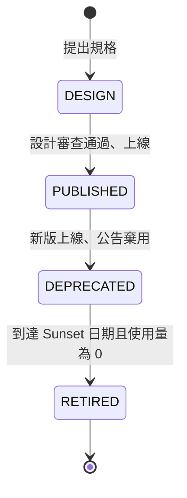

| 編號 | 等級 | 規則 | 驗證方式 |
| --- | --- | --- | --- |
| `SD-GOV-001` | 必須 | 每個對外或跨團隊的 API 都必須登錄在 API 目錄，記錄名稱、負責團隊、生命週期狀態、版本、規格檔位置、使用者清單與 SLA | 🤖 目錄與規格檔一致性檢查；👁 治理審查 |
| `SD-GOV-007` | 應該 | 應監控每個 API 版本的使用量與使用者（以 client_id 區分），作為棄用與退場決策的依據 | 🧪 指標存在性測試；👁 治理審查 |

```yaml
# ✅ SD-GOV-001：API 目錄登錄（Backstage 格式，存放於 catalog-info.yaml）
apiVersion: backstage.io/v1alpha1
kind: API
metadata:
  name: order-api
  description: 訂單 API（介面 ID：IF-ORD-01）
  annotations:
    example.com/lifecycle-detail: "v1 PUBLISHED；v0 DEPRECATED，Sunset 2027-03-31"
spec:
  type: openapi
  lifecycle: production
  owner: team-order
  system: commerce
  definition:
    $text: ./api/order-api.yaml
```

```markdown
<!-- ✅ SD-GOV-007：版本使用量（由 http_server_requests 指標依 api_version 與 client_id 彙總） -->
| 版本 | 狀態 | 近 30 日呼叫量 | 使用者 | 動作 |
| --- | --- | --- | --- | --- |
| 1.x | PUBLISHED | 18,240,000 | web-frontend、cs-portal、partner-a | — |
| 0.x | DEPRECATED（Sunset 2027-03-31） | 12,400 | partner-b | 已通知 partner-b，2026-11 前完成遷移 |
```

#### 🔍 19.1 審查與驗證

- **自動檢查：** CI 檢查 `catalog-info.yaml` 的 `definition` 指向的規格檔存在，且規格中的 `info.version` 與目錄一致。
- **人工審查問題：**
  1. 每個 API 都知道「誰在使用」嗎？不知道使用者，就無法安全地棄用。
  2. 有沒有未登錄的「影子 API」（API9:2023 Improper Inventory Management）？
- **AI 常見錯誤：** 產生不存在的 Backstage 欄位；只登錄對外 API，忽略內部跨團隊 API。

### 19.2 版本策略與破壞性變更

| 變更 | 是否破壞相容性 | 處理方式 |
| --- | --- | --- |
| 新增選填的請求欄位、新增回應欄位 | 否 | 小版本（1.2 → 1.3） |
| 新增端點 | 否 | 小版本 |
| 移除或改名回應欄位、改變欄位型別 | 是 | 主版本，並行期間依 19.3 棄用 |
| 新增必填的請求欄位、收緊驗證（長度、筆數上限） | 是 | 主版本 |
| 改變錯誤碼的意義 | 是 | 不允許；改用新的錯誤碼 |

| 編號 | 等級 | 規則 | 驗證方式 |
| --- | --- | --- | --- |
| `SD-GOV-002` | 必須 | API 版本必須依語意化版本管理：只有破壞性變更才提升主版本；同一系統的 API 必須採用一致的版本表示方式（URL 路徑或請求標頭擇一） | 👁 治理審查；🤖 oasdiff |
| `SD-GOV-003` | 必須 | CI 必須以工具（例如 oasdiff）比對新舊規格，偵測到破壞性變更但主版本未提升時讓建置失敗 | 🤖 oasdiff |
| `SD-GOV-005` | 必須 | 所有 OpenAPI 規格都必須通過組織的 Spectral 規則集（7.2），規則集集中維護並在各專案的 CI 中執行 | 🤖 Spectral |

```yaml
# ✅ SD-GOV-003 SD-GOV-005：.github/workflows/api-governance.yml
name: api-governance
on:
  pull_request:
    paths: ["api/**"]
permissions:
  contents: read
jobs:
  diff:
    runs-on: ubuntu-24.04
    steps:
      - uses: actions/checkout@3d3c42e5aac5ba805825da76410c181273ba90b1 # v7.0.1
        with:
          fetch-depth: 0
      - name: Spectral 企業規則集
        run: npx --yes @stoplight/spectral-cli@6.17.0 lint api/order-api.yaml --ruleset .spectral.yaml --fail-severity=error
      - name: 與目標分支比對破壞性變更
        env:
          BASE_REF: ${{ github.base_ref }}
        run: |
          git show "origin/${BASE_REF}:api/order-api.yaml" > /tmp/base.yaml
          docker run --rm -v /tmp:/base -v "$PWD/api:/rev" tufin/oasdiff:v1.33.0 \
            breaking /base/base.yaml /rev/order-api.yaml --fail-on ERR
```

將 7.2 的規格中 `Order.totalAmount` 改名為 `total`、並把下單的 `lines.maxItems` 由 50 改為 30，oasdiff 1.33.0 的實際輸出（結束碼 1，CI 失敗）：

```text
❌ SD-GOV-002 SD-GOV-003：小版本（1.2.0 → 1.3.0）中出現破壞性變更
3 changes: 3 error, 0 warning, 0 info
error	[response-required-property-removed] at api/order-api-next.yaml
	in API GET /api/orders
		removed the required property `items/items/totalAmount` from the response with the `200` status

error	[request-property-max-items-decreased] at api/order-api-next.yaml
	in API POST /api/orders
		the `lines` request property's maxItems was decreased to `30`

error	[response-required-property-removed] at api/order-api-next.yaml
	in API GET /api/orders/{orderId}
		removed the required property `totalAmount` from the response with the `200` status
```

#### 🔍 19.2 審查與驗證

- **自動檢查：** oasdiff 與 Spectral 為必要檢查；oasdiff 的結果附在 PR 中供審查者閱讀。
- **人工審查問題：**
  1. 工具判定為「非破壞性」的變更，在語意上是否仍會影響使用者？（例如欄位的意義改變、預設排序改變）
  2. 主版本提升時，舊版本的並行期間與退場時程是否已規劃？
- **AI 常見錯誤：** 改名欄位時只改規格不提升版本；以複製整個 Controller 的方式建立新版本；版本號同時出現在 URL 與標頭。

### 19.3 棄用與退場

| 編號 | 等級 | 規則 | 驗證方式 |
| --- | --- | --- | --- |
| `SD-GOV-004` | 必須 | 棄用的 API 版本必須在回應中加上 `Deprecation`（RFC 9745）與 `Sunset`（RFC 8594）標頭並附上說明連結；棄用公告到 Sunset 的期間由治理政策訂定（例如對外 API 至少 6 個月），並主動通知已知的使用者 | 🧪 Web 層測試（標頭）；👁 治理審查 |
| `SD-GOV-006` | 應該 | 採用 GraphQL 時，應使用游標分頁（connection）、限制查詢深度與複雜度、以 `@deprecated` 標示即將移除的欄位，並同樣登錄在 API 目錄 | 🧪 查詢複雜度測試；👁 設計審查 |

```java
// ✅ SD-GOV-002 SD-GOV-004：Spring Framework 7 API 版本管理；1.0 已棄用，回應自動帶上 Deprecation、Sunset 與 Link 標頭
package com.example.sd.order.adapter.web;

import java.net.URI;
import java.time.ZoneOffset;
import java.time.ZonedDateTime;
import org.springframework.context.annotation.Configuration;
import org.springframework.web.accept.StandardApiVersionDeprecationHandler;
import org.springframework.web.servlet.config.annotation.ApiVersionConfigurer;
import org.springframework.web.servlet.config.annotation.WebMvcConfigurer;

@Configuration(proxyBeanMethods = false)
class ApiVersioningConfig implements WebMvcConfigurer {

    @Override
    public void configureApiVersioning(ApiVersionConfigurer configurer) {
        StandardApiVersionDeprecationHandler deprecation = new StandardApiVersionDeprecationHandler();
        deprecation.configureVersion("1.0")
                .setDeprecationDate(ZonedDateTime.of(2026, 10, 1, 0, 0, 0, 0, ZoneOffset.UTC))   // 以 UTC 設定，標頭依此時區輸出
                .setSunsetDate(ZonedDateTime.of(2027, 3, 31, 0, 0, 0, 0, ZoneOffset.UTC))
                .setDeprecationLink(URI.create("https://developer.example.com/order-api/migration-v2"));
        configurer.useRequestHeader("API-Version")
                .addSupportedVersions("1.0", "2.0")
                .setDefaultVersion("2.0")
                .setDeprecationHandler(deprecation);
    }
}
```

```http
### ✅ SD-GOV-004：呼叫已棄用的 1.0 版的回應標頭（Spring Framework 7.0.9 實測）
GET /api/orders/0192d3e4-5f60-7abc-8def-0123456789ab HTTP/1.1
API-Version: 1.0

HTTP/1.1 200 OK
Deprecation: @1790812800
Sunset: Wed, 31 Mar 2027 00:00:00 GMT
Link: <https://developer.example.com/order-api/migration-v2>; rel="deprecation"; type="text/html"
```

```graphql
# ✅ SD-GOV-006：GraphQL 以 connection 分頁、限制 first 上限、以 @deprecated 標示即將移除的欄位
type Query {
  orders(first: Int = 20, after: String): OrderConnection!
}

type OrderConnection {
  edges: [OrderEdge!]!
  pageInfo: PageInfo!
}

type OrderEdge {
  cursor: String!
  node: Order!
}

type PageInfo {
  hasNextPage: Boolean!
  endCursor: String
}

type Order {
  id: ID!
  status: OrderStatus!
  totalAmount: String!
  total: String! @deprecated(reason: "請改用 totalAmount；將於 2027-03-31 移除")
}

enum OrderStatus {
  PLACED
  PAID
  SHIPPED
  DELIVERED
  CANCELLED
}
```

#### 🔍 19.3 審查與驗證

- **自動檢查：** Web 層測試以 `API-Version: 1.0` 呼叫，斷言回應包含 `Deprecation`、`Sunset` 標頭；GraphQL 伺服器設定最大查詢深度與複雜度，測試以超過上限的查詢斷言被拒絕。
- **人工審查問題：**
  1. 已知的使用者是否都收到棄用通知？Sunset 前的使用量是否已降到 0？
  2. Sunset 之後的請求會得到什麼回應？（建議 410 Gone 並附遷移說明）
- **AI 常見錯誤：** `Deprecation` 標頭使用舊草案格式（`Deprecation: true`），RFC 9745 規定為結構化欄位的日期（`@` 加上 Unix 時間）；Sunset 日期使用伺服器本地時區；GraphQL 沒有深度限制，容易被巢狀查詢耗盡資源。

## 20. 技術債與設計演進

設計會老化：需求改變、技術淘汰、當初的權宜做法累積成負擔。技術債本身不是錯，**不知道自己欠了多少、也沒有還款計畫**才是問題。v1.x 的第 14 章以大量的掃描腳本描述技術債，本版改為以登錄、分類、品質閘門與適應度函數管理，並把設計演進的方式（Strangler Fig、Branch by Abstraction）納入同一章。

### 20.1 技術債的登錄與分類

Martin Fowler 的技術債象限依「刻意／無心」與「審慎／魯莽」分類，幫助團隊判斷債務的來源與處理方式：

| | 魯莽（Reckless） | 審慎（Prudent） |
| --- | --- | --- |
| **刻意（Deliberate）** | 「沒時間做設計了」→ 需要改善流程 | 「先上線，下個迭代重構」→ 登錄並排定還款 |
| **無心（Inadvertent）** | 「什麼是分層？」→ 需要教育訓練 | 「現在才知道當初該怎麼做」→ 登錄並評估 |

| 編號 | 等級 | 規則 | 驗證方式 |
| --- | --- | --- | --- |
| `SD-EVO-001` | 必須 | 已知的技術債必須登錄在議題追蹤系統，記錄：位置、類型、影響（利息：每次修改多花的成本或風險）、還款方式與估計工時、負責人；刻意產生的債務必須在產生時就登錄 | 👁 迭代檢視；🤖 程式中的 `TECH-DEBT` 標記必須對應議題編號 |
| `SD-EVO-002` | 應該 | 技術債應依象限與影響分類，以「利息」排序還款優先順序，而不是以「看起來最醜」排序 | 👁 迭代檢視 |
| `SD-EVO-004` | 應該 | 每個迭代應保留固定比例的容量（例如 15%～20%）處理技術債，並追蹤技術債數量與利息的趨勢 | 👁 迭代檢視 |

```markdown
<!-- ✅ SD-EVO-001 SD-EVO-002：技術債登錄（議題範本） -->
**TD-042 對帳批次以字串拼接 SQL**

- 位置：`batch/statement/LegacyStatementWriter.java`
- 類型：刻意／審慎（2026-06 為趕上金流切換上線）
- 利息：每次修改對帳欄位需手動測試 3 種資料庫，約 1.5 人日；存在 SQL 注入風險（輸入來自外部檔案）
- 還款：改用 `JdbcBatchItemWriter` 與參數化 SQL（SD-SEC-009），估計 3 人日
- 負責人：帳務小組；目標迭代：2026-Q4 第 2 迭代
```

```java
// ✅ SD-EVO-001：程式中的技術債標記必須帶議題編號，CI 檢查沒有編號的 TODO／FIXME（片段）
// TECH-DEBT(TD-042)：暫時以字串拼接 SQL，2026-Q4 改用參數化寫入
String sql = "INSERT INTO payment_statements VALUES ('" + line.txnId() + "', ...)";
```

（片段：示意技術債標記）

```markdown
<!-- ✅ SD-EVO-004：每個迭代的技術債容量與趨勢 -->
| 迭代 | 總容量（點） | 技術債（點） | 比例 | 未還債務數 | 利息合計（人日／月） |
| --- | --- | --- | --- | --- | --- |
| 2026-Q3-5 | 60 | 9 | 15% | 18 | 11.5 |
| 2026-Q3-6 | 58 | 12 | 21% | 15 | 8.0 |
| 2026-Q4-1 | 62 | 10 | 16% | 14 | 6.5 |
```

#### 🔍 20.1 審查與驗證

- **自動檢查：** CI 執行 `grep -rnE "TODO|FIXME|TECH-DEBT" src/ | grep -vE "TECH-DEBT\(TD-[0-9]+\)"`，有輸出（沒有議題編號的標記）時失敗。
- **人工審查問題：**
  1. 最近三個迭代中，處理技術債的容量比例是多少？債務總數是增加還是減少？
  2. 利息最高的前 5 筆債務是什麼？為什麼還沒有還？
- **AI 常見錯誤：** AI 產生的程式碼常留下沒有追蹤的 `TODO`；建議「全面重寫」而不是漸進式還款。

### 20.2 品質閘門與適應度函數

**適應度函數**（fitness function）是以自動化測試持續檢查架構特性的做法。本指引中的 ArchUnit、Spring Modulith、oasdiff、追溯檢查都是適應度函數；本節規範如何在既有系統中導入它們而不被大量既有違規卡住。

| 編號 | 等級 | 規則 | 驗證方式 |
| --- | --- | --- | --- |
| `SD-EVO-003` | 必須 | 靜態分析（例如 SonarQube）必須設定以「新程式碼」為範圍的品質閘門：新程式碼不得新增錯誤與弱點、覆蓋率與重複率必須達標；未通過時阻擋合併 | 🤖 SonarQube 品質閘門 |
| `SD-EVO-005` | 必須 | 架構規則必須以適應度函數自動化；導入既有系統時，既有違規以 ArchUnit 的 `FreezingArchRule` 凍結，只阻擋新增的違規，並追蹤凍結清單逐步減少 | 🤖 ArchUnit `FreezingArchRule` |

```java
// ✅ SD-EVO-005：凍結既有違規，只阻擋新增的違規；違規修正後凍結清單自動縮小
package com.example.sd.archtest;

import static com.tngtech.archunit.lang.syntax.ArchRuleDefinition.noClasses;

import com.tngtech.archunit.core.importer.ImportOption;
import com.tngtech.archunit.junit.AnalyzeClasses;
import com.tngtech.archunit.junit.ArchTest;
import com.tngtech.archunit.lang.ArchRule;
import com.tngtech.archunit.library.freeze.FreezingArchRule;

@AnalyzeClasses(packages = "com.example.sd", importOptions = ImportOption.DoNotIncludeTests.class)
class LegacyFreezeArchTest {

    @ArchTest
    static final ArchRule noJpaOutsidePersistence = FreezingArchRule.freeze(noClasses()
            .that().resideOutsideOfPackages("..persistence..")
            .should().dependOnClassesThat().resideInAPackage("jakarta.persistence..")
            .because("JPA 只能出現在持久化轉接器"));
}
```

```properties
# ✅ SD-EVO-005：src/test/resources/archunit.properties
# 第一次執行時建立凍結清單；之後新增的違規會讓測試失敗。兩個設定都要開，否則第一次執行就會失敗
freeze.store.default.path=src/test/resources/archunit_store
freeze.store.default.allowStoreCreation=true
freeze.store.default.allowStoreUpdate=true
```

```text
✅ SD-EVO-003：SonarQube 品質閘門（新程式碼）
條件                                   門檻
新程式碼的可靠性評等（Reliability）       A
新程式碼的安全性評等（Security）          A
新程式碼的安全熱點審查率                   100%
新程式碼的覆蓋率                          ≥ 80%
新程式碼的重複率                          ≤ 3%
```

#### 🔍 20.2 審查與驗證

- **自動檢查：** `LegacyFreezeArchTest`；SonarQube 品質閘門為 PR 的必要檢查。
- **人工審查問題：**
  1. 凍結清單的大小是否逐月下降？有沒有人為了讓建置通過而重新產生凍結清單？
  2. 品質閘門是否被設為「僅警告」？
- **AI 常見錯誤：** 為了讓測試通過而直接修改凍結清單檔案或關閉規則；以整體覆蓋率（而非新程式碼覆蓋率）設定門檻，使既有系統無法導入。

### 20.3 設計演進與決策更新

| 編號 | 等級 | 規則 | 驗證方式 |
| --- | --- | --- | --- |
| `SD-EVO-006` | 應該 | 大規模的重構或替換應以 Strangler Fig 或 Branch by Abstraction 漸進進行：每一步都可以部署、可以回滾，新舊實作以抽象或路由切換，而不是長期的分支與一次性切換 | 👁 設計審查 |
| `SD-EVO-007` | 必須 | 設計決策被取代時，必須將舊決策標示為 `superseded` 並連結到新決策，SDD 中相關的章節也必須同步更新 | 🤖 決策 front matter 檢查腳本 |

```mermaid
flowchart LR
    %% ✅ SD-EVO-006：以 Branch by Abstraction 替換計價引擎，每一步都可部署
    s1["1 抽出介面<br/>PricingEngine"] --> s2["2 舊實作<br/>LegacyPricing 實作介面"]
    s2 --> s3["3 新實作<br/>RulePricing（功能旗標關閉）"]
    s3 --> s4["4 影子比對<br/>兩者都計算、只用舊結果、記錄差異"]
    s4 --> s5["5 逐步切換<br/>依客群開啟旗標"]
    s5 --> s6["6 移除舊實作與旗標"]
```

```yaml
# ✅ SD-EVO-007：docs/sdd/decisions/DD-004.md 的 front matter，被 DD-019 取代
id: DD-004
status: superseded
superseded_by: DD-019
date: 2026-10-08
```

```python
# ✅ SD-PRC-007 SD-EVO-007：tools/check_decisions.py，檢查決策紀錄的必要欄位與取代關係
import sys
from pathlib import Path

import yaml

REQUIRED = {"id", "status", "date"}
STATUSES = {"proposed", "accepted", "superseded", "rejected"}


def front_matter(path: Path) -> dict:
    text = path.read_text(encoding="utf-8")
    if not text.startswith("---\n"):
        return {}
    return yaml.safe_load(text.split("---\n", 2)[1]) or {}


def main(folder: str) -> int:
    records = {p.name: front_matter(p) for p in sorted(Path(folder).glob("DD-*.md"))}
    ids = {fm.get("id") for fm in records.values()}
    errors = []
    for name, fm in records.items():
        missing = REQUIRED - fm.keys()
        if missing:
            errors.append(f"{name}: 缺少 {sorted(missing)}")
        if fm.get("status") not in STATUSES:
            errors.append(f"{name}: 不合法的狀態 {fm.get('status')!r}")
        if fm.get("status") == "superseded" and fm.get("superseded_by") not in ids:
            errors.append(f"{name}: superseded_by 指向不存在的決策 {fm.get('superseded_by')!r}")
    print("\n".join(errors) or "決策紀錄檢查通過")
    return 1 if errors else 0


if __name__ == "__main__":
    sys.exit(main(sys.argv[1]))
```

#### 🔍 20.3 審查與驗證

- **自動檢查：** `python tools/check_decisions.py docs/sdd/decisions`。
- **人工審查問題：**
  1. 重構計畫的每一步，能不能單獨部署並在出問題時回滾？
  2. 新舊實作並存期間，功能旗標的清除時間是否已排定？
- **AI 常見錯誤：** 建議「先在分支上完成全部重寫再合併」；修改決策內容而不是新增一筆取代它的決策，失去歷史脈絡。

## 21. 交付物與設計審查

本章把前面各章的產出整理成交付清單與審查流程。v1.x 第 20 章以「文件品質評分」的 YAML 列出權重，但沒有說明如何評分；本版改為可勾選、可自動檢查的清單，並定義審查角色、發現的分級與完工後的回填。

### 21.1 交付清單

依 ISO/IEC/IEEE 15289:2019 的資訊項目概念，詳細設計階段至少交付下列項目。每一項都有對應的本指引章節與自動檢查：

| # | 交付項目 | 內容 | 本指引 | 自動檢查 |
| --- | --- | --- | --- | --- |
| 1 | 系統設計文件（SDD） | 附錄 C 範本的各章節 | 第 2 章 | `check_sdd.py`（附錄 C.3） |
| 2 | 追溯矩陣 | 需求、品質情境、威脅、合規項目 ↔ 設計元素 ↔ 測試 | 1.2 | `check_trace.py` |
| 3 | 設計決策紀錄 | DD-xxx | 1.3、20.3 | `check_decisions.py` |
| 4 | 介面規格 | OpenAPI、AsyncAPI、檔案介面規格 | 第 7 章 | Redocly、Spectral、AsyncAPI CLI、oasdiff |
| 5 | 資料字典與遷移腳本 | ERD、資料字典、Flyway 腳本 | 第 8 章 | 結構檢查查詢、`flyway validate` |
| 6 | 錯誤碼表 | error-codes.yaml | 10.1 | `check_error_codes.py` |
| 7 | 威脅模型 | 資料流圖、威脅清單 | 11.1 | 追溯檢查 |
| 8 | 合規矩陣與個資盤點 | 第 17 章 | 17.1、17.2 | 追溯檢查 |
| 9 | 測試設計 | 驗收條件、測試策略、效能情境 | 第 15 章 | `k6 inspect` |
| 10 | 架構測試 | ArchUnit、Spring Modulith | 第 3–6 章 | `mvn test` |

| 編號 | 等級 | 規則 | 驗證方式 |
| --- | --- | --- | --- |
| `SD-DLV-001` | 必須 | 設計審查前，交付清單中的每一項都必須存在且通過自動檢查；不適用的項目必須在 SDD 中說明理由 | 🤖 交付檢查腳本（本節範例） |

```python
# ✅ SD-DLV-001：tools/check_deliverables.py，設計審查前執行
import sys
from pathlib import Path

DELIVERABLES = {
    "SDD": "docs/sdd/index.md",
    "追溯矩陣": "docs/sdd/trace.yaml",
    "錯誤碼表": "docs/sdd/error-codes.yaml",
    "威脅模型": "docs/sdd/threat-model.md",
    "API 規格": "api/*.yaml",
    "資料庫遷移": "src/main/resources/db/migration/**/*.sql",
    "設計決策": "docs/sdd/decisions/DD-*.md",
}


def main(root: str) -> int:
    base = Path(root)
    sdd = (base / DELIVERABLES["SDD"]).read_text(encoding="utf-8") if (base / DELIVERABLES["SDD"]).exists() else ""
    missing = []
    for name, pattern in DELIVERABLES.items():
        if not list(base.glob(pattern)) and f"不適用：{name}" not in sdd:
            missing.append(f"{name}（{pattern}）")
    for m in missing:
        print(f"缺少交付項目：{m}")
    return 1 if missing else 0


if __name__ == "__main__":
    sys.exit(main(sys.argv[1] if len(sys.argv) > 1 else "."))
```

#### 🔍 21.1 審查與驗證

- **自動檢查：** `python tools/check_deliverables.py`，並執行表中各項的自動檢查。
- **人工審查問題：**
  1. 標示「不適用」的項目，理由是否成立？
  2. 自動檢查全部通過，是否代表內容正確？（不是：自動檢查只保證「存在且格式正確」，內容仍需人工審查）
- **AI 常見錯誤：** 為了通過檢查而產生空的檔案或只有標題的文件。

### 21.2 審查角色與評分

| 角色 | 主要檢視 | 對應附錄 B |
| --- | --- | --- |
| 主持人（架構師或資深設計師） | 流程、決策、追溯、最終判定 | B.1、B.2 |
| 領域專家／業務代表 | 詞彙、業務規則、狀態機、決策表 | B.3 |
| 資安代表 | 威脅模型、授權、資料保護、合規 | B.5、B.8 |
| 維運／SRE 代表 | 非功能、部署、監控、復原 | B.6、B.7 |
| 測試代表 | 可測試性、驗收條件 | B.7 |

| 編號 | 等級 | 規則 | 驗證方式 |
| --- | --- | --- | --- |
| `SD-DLV-002` | 必須 | 設計審查至少要有設計者以外的主持人、領域代表與資安代表參與；涉及部署架構或非功能變更時須有維運代表；審查紀錄記錄出席者 | 👁 審查紀錄 |
| `SD-DLV-003` | 必須 | 審查以附錄 B 檢核清單評分，每一項判定為通過、不通過或不適用；「必須」等級的規則不通過時，除非已核准豁免（0.6），否則審查結果不得為「通過」 | 👁 審查紀錄 |

```markdown
<!-- ✅ SD-DLV-002 SD-DLV-003：審查評分摘要 -->
| 附錄 B 區塊 | 項目數 | 通過 | 不通過 | 不適用 | 備註 |
| --- | --- | --- | --- | --- | --- |
| B.1 流程與文件 | 6 | 6 | 0 | 0 | |
| B.3 行為與錯誤 | 6 | 5 | 1 | 0 | B.3-2 錯誤路徑缺漏 → F-2（阻擋） |
| B.5 安全 | 7 | 7 | 0 | 0 | 資安代表：王○明 |
| B.8 法規 | 4 | 3 | 0 | 1 | B.8-4 金融委外：本系統不適用 |
| 判定 | | | | | 有條件通過：F-2 修正並重審 B.3 後基準化 |
```

#### 🔍 21.2 審查與驗證

- **自動檢查：** 審查紀錄範本中的出席者欄位為必填。
- **人工審查問題：**
  1. 審查者是否在會前取得 SDD 並有足夠的時間閱讀？
  2. 不通過的「必須」項目是否被以「下次改進」的方式略過？
- **AI 常見錯誤：** 以 AI 產生的審查紀錄取代實際的審查會議；把所有項目都標示為通過。

### 21.3 審查發現與完工回填

| 等級 | 定義 | 處理 |
| --- | --- | --- |
| 阻擋（Blocker） | 違反「必須」規則，或會造成資安、資料錯誤、無法上線 | 修正並重審後才能基準化 |
| 主要（Major） | 違反「應該」規則且沒有合理理由，或明顯增加維護成本 | 實作開始前修正，或記錄決策並排定期限 |
| 次要（Minor） | 文字、圖表、命名等不影響正確性的問題 | 下一版修正 |

| 編號 | 等級 | 規則 | 驗證方式 |
| --- | --- | --- | --- |
| `SD-DLV-004` | 必須 | 每個審查發現必須編號、分級、指派負責人與期限，追蹤到關閉；阻擋級發現關閉時必須附上修正的 PR 或文件版本 | 🤖 議題追蹤系統的必填欄位；👁 審查紀錄 |
| `SD-DLV-005` | 應該 | 實作完成後應將實際做法與設計的差異回填到 SDD（as-built），並更新追溯矩陣；差異屬於設計決策時應補上決策紀錄 | 👁 發布前檢查 |

```markdown
<!-- ✅ SD-DLV-004 SD-DLV-005：發現追蹤與 as-built 差異紀錄 -->
| 發現 | 等級 | 內容 | 負責人 | 期限 | 關閉證據 |
| --- | --- | --- | --- | --- | --- |
| F-2 | 阻擋 | 取消訂單未畫出退款失敗的補償路徑 | 設計負責人 | 2026-10-10 | PR #231、SDD v1.1.1 |
| F-3 | 主要 | 冪等鍵保存期限未定義 | 設計負責人 | 2026-10-15 | DD-021 |

**As-built 差異（v1.2 發布前回填）**

| 章節 | 設計 | 實際 | 原因 | 決策 |
| --- | --- | --- | --- | --- |
| 13.3 | 價格快取 TTL 5 分鐘 | 2 分鐘 | 促銷期間價格異動頻繁，業務要求縮短 | DD-024 |
| 8.4 | 唯讀副本供查詢使用 | 暫不使用 | 複寫延遲在尖峰時段超過 3 秒 | DD-025 |
```

#### 🔍 21.3 審查與驗證

- **自動檢查：** 議題追蹤系統中「設計審查發現」類型的議題，等級、負責人與期限為必填；逾期未關閉的阻擋級發現每日提醒。
- **人工審查問題：**
  1. 發布時，SDD 與實際程式是否一致？新進同事能否以 SDD 理解系統？
  2. 實作中做了哪些沒有記錄的設計變更？
- **AI 常見錯誤：** 只更新程式而不回填 SDD；以「與設計相同」帶過，而沒有實際比對。

## 附錄 A 規則總表

本附錄由各章的規則表自動彙整，共 **228** 條規則，可作為設計審查與 AI 產出審查的檢核清單。

### A.1 依領域統計

| 前綴 | 領域 | 章 | 規則數 | 必須 | 應該 | 可以 | 不應該 |
| --- | --- | --- | --- | --- | --- | --- | --- |
| `SD-PRC` | 設計流程與追溯 | 1 | 14 | 10 | 3 | 0 | 1 |
| `SD-DOC` | 設計文件與視圖 | 2 | 10 | 6 | 3 | 0 | 1 |
| `SD-OO` | 物件導向設計 | 3 | 14 | 5 | 8 | 0 | 1 |
| `SD-PAT` | 設計模式 | 4 | 11 | 1 | 7 | 0 | 3 |
| `SD-DDD` | 領域模型 | 5 | 10 | 5 | 4 | 0 | 1 |
| `SD-CMP` | 分層與元件 | 6 | 12 | 8 | 3 | 0 | 1 |
| `SD-IF` | 介面設計 | 7 | 12 | 10 | 2 | 0 | 0 |
| `SD-DAT` | 資料設計 | 8 | 17 | 13 | 4 | 0 | 0 |
| `SD-BEH` | 行為與流程 | 9 | 8 | 5 | 3 | 0 | 0 |
| `SD-ERR` | 錯誤處理與一致性 | 10 | 10 | 9 | 1 | 0 | 0 |
| `SD-SEC` | 安全設計 | 11 | 20 | 18 | 2 | 0 | 0 |
| `SD-INT` | 整合、批次與檔案傳輸 | 12 | 13 | 9 | 4 | 0 | 0 |
| `SD-NFR` | 非功能設計 | 13 | 15 | 8 | 4 | 2 | 1 |
| `SD-DEP` | 部署與執行環境 | 14 | 10 | 9 | 1 | 0 | 0 |
| `SD-TST` | 可測試性與測試設計 | 15 | 8 | 4 | 4 | 0 | 0 |
| `SD-I18N` | 國際化與地區化 | 16 | 8 | 6 | 2 | 0 | 0 |
| `SD-REG` | 法規遵循 | 17 | 10 | 8 | 2 | 0 | 0 |
| `SD-UX` | 使用者體驗與無障礙 | 18 | 7 | 4 | 3 | 0 | 0 |
| `SD-GOV` | API 治理與演進 | 19 | 7 | 5 | 2 | 0 | 0 |
| `SD-EVO` | 技術債與設計演進 | 20 | 7 | 4 | 3 | 0 | 0 |
| `SD-DLV` | 交付物與設計審查 | 21 | 5 | 4 | 1 | 0 | 0 |
| **合計** | | | **228** | **151** | **66** | **2** | **9** |

### A.2 驗證方式與範例覆蓋

依各規則表的「驗證方式」欄統計（圖示定義見 [0.3](#03-規範等級與規則格式)）。一條規則可同時有多種驗證方式；「僅人工」表示沒有工具或測試可以替代人工判斷，審查時請特別依照各節「🔍 審查與驗證」的問題確認。

| 前綴 | 規則數 | 🤖 工具檢查 | 🧪 測試或演練 | 👁 僅人工 | 有範例 |
| --- | --- | --- | --- | --- | --- |
| `SD-PRC` | 14 | 10 | 0 | 4 | 14 |
| `SD-DOC` | 10 | 7 | 0 | 3 | 10 |
| `SD-OO` | 14 | 7 | 4 | 5 | 14 |
| `SD-PAT` | 11 | 4 | 5 | 2 | 11 |
| `SD-DDD` | 10 | 6 | 3 | 2 | 10 |
| `SD-CMP` | 12 | 9 | 3 | 1 | 12 |
| `SD-IF` | 12 | 10 | 5 | 0 | 12 |
| `SD-DAT` | 17 | 8 | 11 | 0 | 17 |
| `SD-BEH` | 8 | 3 | 6 | 0 | 8 |
| `SD-ERR` | 10 | 5 | 8 | 0 | 10 |
| `SD-SEC` | 20 | 8 | 15 | 3 | 20 |
| `SD-INT` | 13 | 2 | 10 | 2 | 13 |
| `SD-NFR` | 15 | 4 | 10 | 3 | 15 |
| `SD-DEP` | 10 | 6 | 4 | 1 | 10 |
| `SD-TST` | 8 | 6 | 2 | 1 | 8 |
| `SD-I18N` | 8 | 2 | 7 | 0 | 8 |
| `SD-REG` | 10 | 2 | 6 | 2 | 10 |
| `SD-UX` | 7 | 3 | 4 | 1 | 7 |
| `SD-GOV` | 7 | 4 | 3 | 0 | 7 |
| `SD-EVO` | 7 | 4 | 0 | 3 | 7 |
| `SD-DLV` | 5 | 2 | 0 | 3 | 5 |
| **合計** | **228** | **112** | **106** | **36** | **228** |

> 「有範例」指規則編號出現在至少一個範例（程式碼區塊）的 ✅／❌ 標記中，由建置腳本自動檢查。

### A.3 規則清單

| 編號 | 等級 | 規則 | 所在章節 |
| --- | --- | --- | --- |
| `SD-PRC-001` | 必須 | 詳細設計開始前，SAD、相關架構決策（ADR）與品質情境必須已核准；SDD 的「參考文件」章節必須列出其版本或 commit | [1.1](#11-國際標準與設計流程) |
| `SD-PRC-002` | 必須 | 每個設計元素都必須產出設計定義流程要求的內容：責任與設計特性、提供與使用的介面、資料、行為（含錯誤路徑），以 6.4 的元件規格表呈現 | [1.1](#11-國際標準與設計流程) |
| `SD-PRC-003` | 必須 | 每個功能需求與非功能需求（品質情境）都必須追溯到至少一個設計元素；追溯矩陣以 YAML 或 CSV 等機器可讀格式與 SDD 一起版控 | [1.2](#12-需求與設計的雙向追溯) |
| `SD-PRC-004` | 必須 | 每個設計元素都必須追溯回至少一個需求或架構決策；沒有來源的設計元素必須刪除或補上決策紀錄 | [1.2](#12-需求與設計的雙向追溯) |
| `SD-PRC-005` | 應該 | 需求 ID 應出現在驗證它的測試中（例如 JUnit `@Tag`），讓「需求 → 設計 → 測試」形成完整鏈結 | [1.2](#12-需求與設計的雙向追溯) |
| `SD-PRC-006` | 必須 | 影響兩個以上元件、或事後難以修改的設計決策，必須至少比較兩個替代方案，記錄評估準則、取捨與理由 | [1.3](#13-設計替代方案與設計決策) |
| `SD-PRC-007` | 應該 | 設計決策應以 MADR 格式撰寫，編號為 `DD-<三位數>`，並包含狀態（proposed／accepted／superseded）與決策日期 | [1.3](#13-設計替代方案與設計決策) |
| `SD-PRC-008` | 必須 | SDD 必須通過設計審查並基準化（例如打 git tag）後才開始實作；審查發現必須編號並追蹤到關閉 | [1.4](#14-設計審查) |
| `SD-PRC-009` | 應該 | 設計審查應使用附錄 B 的檢核清單，審查紀錄應保存每一項的結果與審查者 | [1.4](#14-設計審查) |
| `SD-PRC-010` | 必須 | 實作期間的設計變更必須以 PR 更新 SDD 與追溯矩陣；修改 API 規格、資料庫遷移腳本的 PR 必須同時修改對應的 SDD 章節或說明不需修改的理由 | [1.4](#14-設計審查) |
| `SD-PRC-011` | 必須 | 由 AI 產生或大幅修改的設計內容，必須在 SDD 變更紀錄或 PR 中標示，並由具名的人審查；審查者對內容負責 | [1.5](#15-ai-輔助設計與人工審查) |
| `SD-PRC-012` | 必須 | 提示中必須提供 SAD 與 ADR 摘要、適用的本指引規則編號、技術基準版本（0.2），不得讓 AI 自行假設技術版本或需求 | [1.5](#15-ai-輔助設計與人工審查) |
| `SD-PRC-013` | 必須 | AI 產出中的版本號、類別與方法名稱、設定鍵、標準條號與數據，必須以編譯、工具或官方文件查證；無法查證的內容必須刪除或標示 | [1.5](#15-ai-輔助設計與人工審查) |
| `SD-PRC-014` | 不應該 | 不應將個人資料、金鑰、內部主機名稱或未公開的商業資料貼入未經組織核准的 AI 服務 | [1.5](#15-ai-輔助設計與人工審查) |
| `SD-DOC-001` | 必須 | SDD 必須依附錄 C 範本組織，至少包含：範圍、參考文件、設計關注點、上表各視圖（不適用者說明理由）、設計決策、追溯矩陣、待確認事項 | [2.1](#21-sdd-的結構與設計視點) |
| `SD-DOC-002` | 必須 | 每個視圖開頭必須寫明它回應的關注點與主要讀者，讓審查者判斷視圖是否完整回答了問題 | [2.1](#21-sdd-的結構與設計視點) |
| `SD-DOC-003` | 必須 | 設計圖必須以文字格式（Mermaid、PlantUML 或 Structurizr DSL）撰寫並納入版控；不得只提交沒有原始檔的圖片 | [2.2](#22-設計圖表的繪製規範) |
| `SD-DOC-004` | 必須 | 每張圖必須有標題與 C4 層級；每個元素標示名稱與類型；每條關係標示用途，跨程序的關係還要標示協定與同步／非同步 | [2.2](#22-設計圖表的繪製規範) |
| `SD-DOC-005` | 應該 | L3 元件圖中的元件應對應實際的模組或套件；使用 Spring Modulith 時，應以 `Documenter` 從程式碼產生模組圖並與設計圖比對 | [2.2](#22-設計圖表的繪製規範) |
| `SD-DOC-006` | 不應該 | 不應在同一張圖中混用不同抽象層級（例如在容器圖中畫出類別） | [2.2](#22-設計圖表的繪製規範) |
| `SD-DOC-007` | 必須 | SDD 必須與程式碼放在同一個版本庫（或可由程式碼版本追溯到 SDD 版本），以 PR 審查，並有文件版本號與變更紀錄 | [2.3](#23-文件即程式碼docs-as-code) |
| `SD-DOC-008` | 應該 | CI 應檢查設計文件的 Markdown 格式、內部連結與圖表渲染，失敗時阻擋合併 | [2.3](#23-文件即程式碼docs-as-code) |
| `SD-DOC-009` | 必須 | 必須定義 SDD 的更新觸發條件：介面變更、資料模型變更、狀態機變更、部署架構變更、安全控制變更；PR 範本必須列出這些條件供勾選 | [2.4](#24-文件維護) |
| `SD-DOC-010` | 應該 | 每份 SDD 應標示負責人與最後審查日期；超過 6 個月未審查的文件應由 CI 提出警告 | [2.4](#24-文件維護) |
| `SD-OO-001` | 必須 | 每個類別的責任必須能用一句不含「和」「並且」的話描述，並寫在 SDD 的元件表或類別的 Javadoc 中；類別只對一個角色（業務單位或技術關注點）負責 | [3.1](#31-solid-原則) |
| `SD-OO-002` | 應該 | 預期會增加種類的變化點（計價規則、通知管道、檔案格式），應以介面隔離，新增種類時只新增實作類別，不修改既有的條件分支 | [3.1](#31-solid-原則) |
| `SD-OO-003` | 必須 | 子型別不得加強前置條件、減弱後置條件，也不得以丟出 `UnsupportedOperationException` 的方式「實作」父型別的方法；同一介面的所有實作必須通過同一組契約測試 | [3.1](#31-solid-原則) |
| `SD-OO-004` | 應該 | 介面應依使用者的需求切分；一個埠（port）介面的方法通常不超過 7 個，查詢與命令分開 | [3.1](#31-solid-原則) |
| `SD-OO-005` | 必須 | 領域層與應用層的類別必須只依賴自己定義的抽象，不得依賴資料庫、Web、訊息等基礎設施框架 | [3.1](#31-solid-原則) |
| `SD-OO-006` | 應該 | 行為應放在擁有所需資料的物件上（資訊專家），避免服務類別以一連串 getter 取出資料再計算 | [3.2](#32-責任分配grasp-與迪米特法則) |
| `SD-OO-007` | 應該 | 物件只應和直接的協作者溝通（迪米特法則），避免 `a.getB().getC().doSomething()` 這種穿透多層的呼叫鏈；流暢介面（builder、stream）不在此限 | [3.2](#32-責任分配grasp-與迪米特法則) |
| `SD-OO-008` | 應該 | 優先使用組合而非繼承；繼承只用於真正的「is-a」關係，且父類別應設計為可被繼承（文件化覆寫契約）或宣告為 `final`／`sealed` | [3.2](#32-責任分配grasp-與迪米特法則) |
| `SD-OO-009` | 必須 | 值物件、命令、查詢結果、DTO 與事件必須是不可變型別（優先使用 `record`），建構時驗證，並以防禦性複製保存集合 | [3.3](#33-不可變性與型別設計) |
| `SD-OO-010` | 應該 | 封閉的類型階層（付款結果、驗證結果）應以 `sealed` 介面與 record 表達，並以不含 `default` 的 `switch` 處理，讓編譯器檢查是否處理了所有情況 | [3.3](#33-不可變性與型別設計) |
| `SD-OO-011` | 必須 | 公開方法的參數與回傳值必須以型別表達業務約束：金額用 `Money`、識別碼用專屬型別或 record、有限選項用 `enum`；不得以 `String`、`BigDecimal`、`Map<String, Object>` 傳遞業務概念 | [3.3](#33-不可變性與型別設計) |
| `SD-OO-012` | 不應該 | 公開 API 不應以 `null` 表達「沒有值」；查詢單筆結果回傳 `Optional`，集合回傳空集合；參數不接受 `null` | [3.3](#33-不可變性與型別設計) |
| `SD-OO-013` | 應該 | 不應為假想的需求增加抽象層；只有一個實作、也不需要測試替身的介面不需建立。抽象應在第二個實作出現或有明確的測試需求時才引入 | [3.4](#34-簡潔原則kissyagni-與-dry) |
| `SD-OO-014` | 應該 | 重複的邏輯應在確認代表「同一項業務知識」後才合併（通常是第三次出現時）；不同限界上下文中「看起來相同」的邏輯不應共用 | [3.4](#34-簡潔原則kissyagni-與-dry) |
| `SD-PAT-001` | 必須 | 在 SDD 中使用設計模式時，必須說明它解決的變化點與替代做法；類別名稱應反映模式角色（例如 `...Policy`、`...Factory`、`...Adapter`） | [4.1](#41-模式的選用準則) |
| `SD-PAT-002` | 應該 | 依類型選擇行為時，應以 Strategy 模式實作：各策略為獨立的 Spring bean，由路由類別以 `Map` 查找；不應以 `if-else` 或 `switch` 判斷類型字串 | [4.1](#41-模式的選用準則) |
| `SD-PAT-003` | 應該 | Factory 應回傳介面型別，選擇邏輯集中在一處，遇到未知類型必須丟出明確的例外，不得回傳 `null` 或預設實作 | [4.1](#41-模式的選用準則) |
| `SD-PAT-004` | 應該 | 有 4 個以上參數或多個選填參數的物件應使用 Builder；必填參數由 builder 的建構方法接收，`build()` 時驗證組合規則 | [4.1](#41-模式的選用準則) |
| `SD-PAT-005` | 應該 | 快取、稽核、重試、度量等橫切關注點應以 Decorator 或 AOP 集中處理，不應散落在每個業務方法中 | [4.2](#42-結構與行為模式) |
| `SD-PAT-006` | 應該 | 需要「固定流程＋可變步驟」時，應優先以組合（傳入策略或函式）實作，而不是要求使用者繼承抽象基底類別；Template Method 只用於框架提供的擴充點 | [4.2](#42-結構與行為模式) |
| `SD-PAT-007` | 應該 | 狀態改變後通知其他元件，應以應用程式事件實作；需要在交易成功後才執行的動作，必須使用 `@TransactionalEventListener(phase = AFTER_COMMIT)` 或 Spring Modulith 的 `@ApplicationModuleListener` | [4.2](#42-結構與行為模式) |
| `SD-PAT-008` | 應該 | 外部系統或舊系統的資料模型必須只出現在轉接器（防腐層）中，轉換為本系統的領域型別後才傳入應用層 | [4.2](#42-結構與行為模式) |
| `SD-PAT-009` | 不應該 | 不應自行實作 Singleton（`static` 實例或 `getInstance()`）；單例生命週期交給 DI 容器管理 | [4.3](#43-應避免的反模式) |
| `SD-PAT-010` | 不應該 | 業務程式不應以 `ApplicationContext.getBean()` 或靜態持有 context 的方式取得依賴（Service Locator）；依賴必須由建構子注入 | [4.3](#43-應避免的反模式) |
| `SD-PAT-011` | 不應該 | 不應建立承擔多種責任的「上帝類別」或萬用工具類別（`CommonUtils`、`BaseService`）；工具方法應依領域分組 | [4.3](#43-應避免的反模式) |
| `SD-DDD-001` | 必須 | SDD 必須包含限界上下文內的詞彙表（中文名稱、英文類別名稱、定義、範例），程式中的類別與方法名稱必須使用詞彙表中的英文名稱 | [5.1](#51-通用語言與領域模型) |
| `SD-DDD-002` | 必須 | 聚合根是外部存取聚合的唯一入口；聚合內的其他物件不得被外部直接建立或修改；其他聚合只能以 ID 參照，不得持有物件參照 | [5.2](#52-聚合實體與值物件) |
| `SD-DDD-003` | 必須 | 聚合的不變條件（invariant）必須由聚合根的建構方法與命令方法保證；物件建立後在任何時間點都必須合法，不得依賴呼叫端先呼叫驗證方法 | [5.2](#52-聚合實體與值物件) |
| `SD-DDD-004` | 應該 | 聚合應盡量小；一個交易應只修改一個聚合，跨聚合的一致性以領域事件達成最終一致 | [5.2](#52-聚合實體與值物件) |
| `SD-DDD-005` | 必須 | 值物件必須不可變、以所有屬性判斷相等，並在建構時驗證 | [5.2](#52-聚合實體與值物件) |
| `SD-DDD-009` | 應該 | 實體的 ID 應由領域在建立時產生（例如 UUIDv7），而不是依賴資料庫在插入後才產生，讓事件、冪等鍵與日誌在儲存前就能引用 ID | [5.2](#52-聚合實體與值物件) |
| `SD-DDD-010` | 不應該 | 領域實體不應只有 getter 與公開 setter、把業務規則放在服務類別中（貧血模型）；狀態改變必須透過表達業務意圖的方法 | [5.2](#52-聚合實體與值物件) |
| `SD-DDD-006` | 應該 | 領域事件以過去式命名（`OrderPlaced`、`OrderCancelled`），包含聚合 ID、發生時間與消費者需要的最小資料，不應包含整個實體物件 | [5.3](#53-領域事件儲存庫與領域服務) |
| `SD-DDD-007` | 必須 | 儲存庫以聚合為單位存取（一個聚合一個儲存庫），介面定義在領域層，實作在轉接器層；不得為聚合內的物件建立儲存庫 | [5.3](#53-領域事件儲存庫與領域服務) |
| `SD-DDD-008` | 應該 | 涉及多個聚合的業務規則，應以領域服務或事件驅動的流程實作；聚合不應在內部載入另一個聚合 | [5.3](#53-領域事件儲存庫與領域服務) |
| `SD-CMP-001` | 必須 | 依賴方向必須由外向內：`adapter` → `application` → `domain`；領域層不得依賴應用層、轉接器層或任何框架 | [6.1](#61-分層與依賴方向) |
| `SD-CMP-002` | 必須 | 第一層套件必須依業務功能（模組）劃分，技術分層放在模組之內；不得以 `controller`、`service`、`repository` 作為第一層套件 | [6.1](#61-分層與依賴方向) |
| `SD-CMP-003` | 必須 | 模組之間只能透過對方的公開 API（模組根套件或 `@NamedInterface`）互動，不得存取其他模組的內部套件；模組的公開 API 必須列在 SDD 的介面清單中 | [6.1](#61-分層與依賴方向) |
| `SD-CMP-012` | 不應該 | 模組之間、套件之間不應有循環依賴 | [6.1](#61-分層與依賴方向) |
| `SD-CMP-004` | 必須 | Controller（及其他輸入轉接器）只負責協定轉換、輸入格式驗證與呼叫 use case，不得包含業務規則、不得直接存取儲存庫 | [6.2](#62-應用服務與交易邊界) |
| `SD-CMP-005` | 必須 | 交易邊界必須設在應用服務的公開方法上；Controller、儲存庫實作與領域物件不得宣告交易 | [6.2](#62-應用服務與交易邊界) |
| `SD-CMP-006` | 應該 | 每個 use case 應有一個明確的輸入物件（command 或 query record）與一個公開方法，方法名稱使用業務動詞 | [6.2](#62-應用服務與交易邊界) |
| `SD-CMP-007` | 必須 | 輸入格式（必填、長度、格式）必須在系統邊界以 Bean Validation 驗證；業務規則與不變條件仍必須由領域層保證，不得只依賴邊界驗證 | [6.2](#62-應用服務與交易邊界) |
| `SD-CMP-008` | 必須 | API 的請求／回應 DTO、領域模型與持久化模型必須是不同的型別；不得將 JPA 實體或領域物件直接序列化為 API 回應 | [6.3](#63-資料傳輸物件與映射) |
| `SD-CMP-009` | 應該 | 型別之間的映射應集中在轉接器層的映射類別中並有單元測試；使用 MapStruct 時必須設定 `unmappedTargetPolicy = ReportingPolicy.ERROR`，讓新增欄位但忘記映射時編譯失敗 | [6.3](#63-資料傳輸物件與映射) |
| `SD-CMP-010` | 必須 | 每個元件的規格必須包含：責任、提供的介面、使用的介面、管理的資料、狀態與並行性、錯誤與例外、組態參數、可觀測性（指標與日誌） | [6.4](#64-元件規格與組態) |
| `SD-CMP-011` | 應該 | 元件的組態應以型別安全的 `@ConfigurationProperties` record 定義並加上驗證，啟動時就讓錯誤的設定失敗，而不是在執行時才發現 | [6.4](#64-元件規格與組態) |
| `SD-IF-001` | 必須 | SDD 必須列出系統所有對外與模組間的介面，每個介面註明：提供者、使用者、協定、資料格式、規格檔位置、同步／非同步、安全機制、服務水準（延遲、可用性、流量上限）與版本 | [7.1](#71-介面清單) |
| `SD-IF-002` | 必須 | 對外與跨系統的 REST 介面必須先以 OpenAPI 3.1 撰寫規格並納入版控，經使用者審查後才實作；實作必須以契約測試或產生的程式碼確保與規格一致 | [7.2](#72-契約先行的-rest-api-設計) |
| `SD-IF-003` | 必須 | 每個操作必須有 `operationId`、`summary`、`tags`，並列出所有可能的回應狀態碼及其 schema（包含 400、401、403、404、409、422、429、500 中適用者） | [7.2](#72-契約先行的-rest-api-設計) |
| `SD-IF-004` | 必須 | 錯誤回應必須使用 RFC 9457 Problem Details（`application/problem+json`），並以擴充欄位提供錯誤碼與 traceId；不得以 HTTP 200 回傳錯誤 | [7.2](#72-契約先行的-rest-api-設計) |
| `SD-IF-006` | 必須 | 回傳集合的操作必須分頁，並在規格中定義每頁筆數的上限；大量或持續新增的資料應使用游標（cursor）分頁 | [7.2](#72-契約先行的-rest-api-設計) |
| `SD-IF-007` | 應該 | 欄位名稱應統一使用 camelCase；日期時間使用 RFC 3339 並帶時區偏移（`format: date-time`）；金額以十進位字串表示並另附幣別欄位，不使用 JSON 數字 | [7.2](#72-契約先行的-rest-api-設計) |
| `SD-IF-005` | 必須 | 非冪等的寫入操作（建立、付款、轉帳）必須支援 `Idempotency-Key`，或以業務唯一鍵達成冪等；設計必須定義冪等鍵的保存期限、相同鍵不同內容的處理（422）與處理中的重送（409） | [7.3](#73-冪等性設計) |
| `SD-IF-008` | 必須 | 對外發布的事件必須以 AsyncAPI 3 描述頻道、訊息與 schema，並使用 CloudEvents 1.0 的必要屬性（`id`、`source`、`type`、`specversion`）及 `time`、`subject` | [7.4](#74-事件介面) |
| `SD-IF-009` | 必須 | 事件 schema 的變更必須向後相容（只新增選填欄位）；消費者必須忽略不認識的欄位；不相容的變更必須以新的事件 `type`（例如 `.v2`）發布並並行一段期間 | [7.4](#74-事件介面) |
| `SD-IF-010` | 應該 | 應用層的埠介面與模組公開 API 應以領域型別定義參數與回傳值，不應使用 HTTP、JPA、訊息框架的型別（例如 `ResponseEntity`、`HttpServletRequest`、`ConsumerRecord`） | [7.5](#75-內部埠介面與檔案介面) |
| `SD-IF-011` | 必須 | 檔案介面必須有規格文件，定義：檔名規則、編碼（UTF-8，是否有 BOM）、換行字元、格式與欄位規格（位置、長度、型別、補位）、表頭與表尾控制紀錄（筆數、金額合計、雜湊）、傳送時間與重送規則 | [7.5](#75-內部埠介面與檔案介面) |
| `SD-IF-012` | 必須 | 所有介面規格必須有版本號；破壞性變更必須提升主版本並依第 19 章的棄用流程進行，CI 必須以工具偵測 OpenAPI 的破壞性變更 | [7.5](#75-內部埠介面與檔案介面) |
| `SD-DAT-001` | 必須 | SDD 必須包含 ERD 與資料字典；資料字典的每個欄位必須說明：型別與長度、是否可為空、預設值、業務定義、資料分級（SD-DAT-015）與來源 | [8.1](#81-資料模型與資料字典) |
| `SD-DAT-002` | 必須 | 資料表與欄位名稱必須使用小寫 snake_case；主鍵統一命名為 `id`（或複合主鍵）；外鍵命名為 `<參照表單數>_id`；限制與索引依 `pk_`、`fk_`、`uk_`、`ck_`、`idx_` 前綴命名 | [8.1](#81-資料模型與資料字典) |
| `SD-DAT-003` | 必須 | 金額、匯率、數量等需要精確計算的欄位必須使用 `NUMERIC`／`DECIMAL` 並明確定義精度與小數位數，不得使用 `FLOAT`、`DOUBLE`、`REAL` | [8.1](#81-資料模型與資料字典) |
| `SD-DAT-004` | 必須 | 時間點必須以帶時區的型別（PostgreSQL `timestamptz`、Oracle `TIMESTAMP WITH TIME ZONE`、SQL Server `datetimeoffset`）或以 UTC 明確約定的型別儲存；「日期」（生日、帳務日）使用 `DATE` | [8.1](#81-資料模型與資料字典) |
| `SD-DAT-005` | 必須 | 每張業務資料表必須有稽核欄位 `created_at`、`created_by`、`updated_at`、`updated_by`；需要完整異動歷程的資料另設歷程表或稽核日誌 | [8.1](#81-資料模型與資料字典) |
| `SD-DAT-006` | 必須 | 可能被並行修改的資料必須有版本欄位，以樂觀鎖防止更新遺失；更新時版本不符必須回報衝突，而不是覆蓋 | [8.1](#81-資料模型與資料字典) |
| `SD-DAT-007` | 必須 | 業務上的唯一性（帳號、身分證號、訂單明細序號）必須以資料庫唯一限制保證，不得只依賴應用程式先查詢再寫入 | [8.1](#81-資料模型與資料字典) |
| `SD-DAT-008` | 應該 | 需要支援多種資料庫時，應優先使用標準 SQL 與 ORM 方言；資料庫專屬語法必須集中在儲存庫實作中，並對每種支援的資料庫執行整合測試 | [8.2](#82-多資料庫支援與結構演進) |
| `SD-DAT-009` | 必須 | 結構變更必須以 Flyway（或 Liquibase）版本化腳本管理，各資料庫的差異放在資料庫別目錄；已套用的腳本不得修改 | [8.2](#82-多資料庫支援與結構演進) |
| `SD-DAT-010` | 必須 | JPA 關聯必須預設為延遲載入（`@ManyToOne(fetch = LAZY)`），需要時以 `@EntityGraph` 或 `join fetch` 明確載入；設計必須說明每個查詢的載入範圍，避免 N+1 查詢 | [8.3](#83-物件關聯映射與資料存取) |
| `SD-DAT-011` | 必須 | JPA 實體不得使用 Lombok `@Data` 或包含所有欄位的 `equals`／`hashCode`；實體的相等性應以不變的識別碼判斷 | [8.3](#83-物件關聯映射與資料存取) |
| `SD-DAT-012` | 應該 | 只讀查詢應以投影（record DTO）取得需要的欄位；大量資料必須分頁或串流處理，不得一次載入整個資料表 | [8.3](#83-物件關聯映射與資料存取) |
| `SD-DAT-013` | 應該 | 採用讀寫分離時，應以交易的唯讀屬性路由到唯讀副本；設計必須列出需要「寫後立即讀」的流程，這些流程必須讀取主庫 | [8.4](#84-讀寫分離與資料分割) |
| `SD-DAT-014` | 應該 | 大量且隨時間成長的資料（日誌、交易明細、歷程）應依查詢模式與保存期限設計分割（partition），讓清除舊資料可以以卸除分割的方式完成 | [8.4](#84-讀寫分離與資料分割) |
| `SD-DAT-015` | 必須 | 資料字典中的每個欄位必須標示資料分級（例如公開、內部、機密、個資、敏感個資）；機密與個資欄位必須定義保護方式（傳輸加密、靜態加密、欄位加密）與金鑰管理方式 | [8.5](#85-資料分級加密遮罩與保存) |
| `SD-DAT-016` | 必須 | 個資與機密欄位在畫面、報表、日誌、測試資料中的遮罩規則必須在設計中定義，並以共用元件實作 | [8.5](#85-資料分級加密遮罩與保存) |
| `SD-DAT-017` | 必須 | 每類資料必須定義保存期限、到期後的處理（刪除、去識別化、封存）與執行機制，並符合法規要求（第 17 章） | [8.5](#85-資料分級加密遮罩與保存) |
| `SD-BEH-001` | 必須 | 每個主要 use case 必須有循序圖，除了成功路徑，還必須畫出業務錯誤、外部系統逾時或失敗的路徑，並標示交易邊界與同步／非同步呼叫 | [9.1](#91-互動設計循序圖) |
| `SD-BEH-002` | 必須 | 有生命週期的實體必須以狀態機定義：狀態、觸發事件、轉換、守衛條件與轉換時的動作；不合法的轉換必須被拒絕並回傳明確的錯誤碼 | [9.2](#92-狀態設計狀態機) |
| `SD-BEH-003` | 應該 | 狀態轉換規則應集中定義在一處（例如狀態列舉中的轉換表），並以參數化測試覆蓋轉換表中的**所有**組合（包含不合法的組合） | [9.2](#92-狀態設計狀態機) |
| `SD-BEH-004` | 必須 | 狀態欄位必須以資料庫 `CHECK` 限制（或參照表）限定合法值，避免其他程式或手動操作寫入不存在的狀態 | [9.2](#92-狀態設計狀態機) |
| `SD-BEH-005` | 應該 | 處理個資或機密資料的流程應有資料流圖，標示外部實體、處理程序、資料儲存、資料流與信任邊界，並在資料流上註明資料分級與保護方式 | [9.3](#93-資料流設計) |
| `SD-BEH-006` | 必須 | 跨服務的長流程必須以 Saga 設計：列出每個步驟、對應的補償動作、每個步驟的逾時與逾時後的處理；Saga 的進度必須持久化，服務重啟後可以繼續 | [9.4](#94-長流程演算法與並行) |
| `SD-BEH-007` | 應該 | 複雜的業務規則與計算應以決策表或虛擬碼描述，並列出邊界值；決策表的每一列應對應一個參數化測試案例 | [9.4](#94-長流程演算法與並行) |
| `SD-BEH-008` | 必須 | 設計必須說明同一筆資料被並行操作時的行為（例如同時取消與出貨、同時兩次付款回呼），並指出由哪個機制保證正確性（樂觀鎖、唯一限制、冪等鍵、佇列序列化） | [9.4](#94-長流程演算法與並行) |
| `SD-ERR-001` | 必須 | 設計必須定義錯誤分類（如上表）與對應的例外階層；業務錯誤繼承共用的業務例外基底類別並帶有錯誤碼與類別，系統錯誤與外部依賴錯誤使用不同的例外型別 | [10.1](#101-錯誤分類與錯誤碼) |
| `SD-ERR-002` | 必須 | SDD 必須維護錯誤碼表（錯誤碼、HTTP 狀態、訊息鍵、是否可重試、使用者處理建議）；程式中使用的每個錯誤碼都必須存在於錯誤碼表，錯誤碼一經發布不得改變意義 | [10.1](#101-錯誤分類與錯誤碼) |
| `SD-ERR-003` | 必須 | 回應給使用者的錯誤訊息不得包含堆疊追蹤、SQL、類別名稱、內部主機名稱或其他內部細節；未預期的錯誤一律回傳通用訊息與追蹤編號 | [10.1](#101-錯誤分類與錯誤碼) |
| `SD-ERR-004` | 必須 | 每個外部呼叫（HTTP、資料庫、訊息、檔案傳輸）都必須設定連線逾時與讀取逾時；下游逾時的總和（含重試）必須小於上游給予的時間預算 | [10.2](#102-逾時與重試) |
| `SD-ERR-005` | 必須 | 只有可重試的錯誤（逾時、503、連線中斷）才能重試，且只能重試冪等的操作；重試必須使用指數退避加上隨機抖動，並限制次數與總時間 | [10.2](#102-逾時與重試) |
| `SD-ERR-006` | 必須 | 資料庫交易內不得呼叫遠端服務（HTTP、訊息發送、檔案傳輸）；需要遠端資料時應在交易前取得，需要通知遠端時應以 Outbox 在交易後送出 | [10.3](#103-交易邊界與資料一致性) |
| `SD-ERR-007` | 必須 | 資料庫更新與事件發布必須保持一致：使用 Transactional Outbox（例如 Spring Modulith 事件發布登錄），不得在交易中直接送出訊息或在交易後「盡力」送出 | [10.3](#103-交易邊界與資料一致性) |
| `SD-ERR-008` | 必須 | 訊息消費者必須冪等：以事件 ID 或業務鍵記錄已處理的訊息，重複的訊息不得產生重複的效果 | [10.3](#103-交易邊界與資料一致性) |
| `SD-ERR-009` | 應該 | 重試後仍無法處理的訊息應送到死信佇列（DLQ），並有告警、查詢與重送的操作程序 | [10.3](#103-交易邊界與資料一致性) |
| `SD-ERR-010` | 必須 | 每個錯誤回應與錯誤日誌都必須帶有 traceId，讓客服與維運人員可以從使用者提供的編號找到完整的呼叫鏈 | [10.3](#103-交易邊界與資料一致性) |
| `SD-SEC-001` | 必須 | 新系統與重大變更（新的外部介面、新的資料類別、認證或授權機制變更）必須進行威脅建模，產出威脅清單（威脅、影響、可能性、對策、對應的設計元素或規則、殘餘風險）並追溯到設計 | [11.1](#111-威脅建模) |
| `SD-SEC-002` | 必須 | 設計必須標示所有信任邊界；所有跨越信任邊界進入系統的資料（使用者輸入、外部 API 回應、檔案、訊息）都必須視為不可信任，在邊界進行驗證 | [11.1](#111-威脅建模) |
| `SD-SEC-003` | 必須 | 使用者身分驗證必須委由組織的身分提供者（IdP，OpenID Connect）處理；應用程式不得自行保存使用者密碼或自行簽發存取權杖 | [11.2](#112-身分驗證) |
| `SD-SEC-004` | 必須 | 瀏覽器應用程式必須使用授權碼流程搭配 PKCE；處理個資或交易的系統應採用 BFF（Backend for Frontend）模式，權杖只存在伺服器端，瀏覽器以 `HttpOnly`、`Secure`、`SameSite` 的工作階段 Cookie 存取 | [11.2](#112-身分驗證) |
| `SD-SEC-005` | 必須 | 資源伺服器必須驗證 JWT 的簽章（演算法白名單，不接受 `none` 與對稱演算法混用）、`iss`、`aud`、`exp`；存取權杖有效期不應超過 15 分鐘 | [11.2](#112-身分驗證) |
| `SD-SEC-006` | 必須 | 授權必須在伺服器端對每個請求檢查，包含功能層級（能不能呼叫這個操作）與物件層級（能不能存取這一筆資料）；不得依賴前端隱藏按鈕或 ID 難以猜測 | [11.3](#113-授權) |
| `SD-SEC-007` | 必須 | SDD 必須定義權限模型：角色或屬性、權限（操作 × 資源）、角色與權限的對照矩陣、資料範圍規則；矩陣必須轉成自動化測試 | [11.3](#113-授權) |
| `SD-SEC-008` | 必須 | 授權必須預設拒絕：未列在規則中的端點、方法與資源一律拒絕 | [11.3](#113-授權) |
| `SD-SEC-009` | 必須 | 輸入必須以白名單驗證（型別、長度、格式、範圍、列舉）；資料庫存取必須使用參數化查詢；輸出到 HTML、JavaScript、URL、CSV 時必須依情境編碼 | [11.4](#114-輸入處理與-api-保護) |
| `SD-SEC-010` | 必須 | 檔案上傳必須限制大小與數量、以檔案內容（magic number）而非副檔名判斷型別、以系統產生的名稱存放在網站根目錄以外、經防毒掃描後才可下載或處理 | [11.4](#114-輸入處理與-api-保護) |
| `SD-SEC-011` | 必須 | 每個對外 API 必須有速率限制與資源配額（每頁筆數、請求大小、單一使用者的業務流程頻率），超過時回 429 並附 `Retry-After` | [11.4](#114-輸入處理與-api-保護) |
| `SD-SEC-012` | 應該 | 系統對系統的呼叫應以 mTLS 或 OAuth 2.0 用戶端憑證流程驗證身分；需要防止竄改與重放的回呼（例如金流通知）應以 HMAC 簽章，簽章內容包含時間戳與 nonce，並以固定時間比較 | [11.4](#114-輸入處理與-api-保護) |
| `SD-SEC-013` | 必須 | 密碼、金鑰、權杖等秘密不得出現在原始碼、設定檔、容器映像或日誌中；必須由秘密管理系統（Vault、雲端 Secret Manager）在執行時注入 | [11.5](#115-秘密管理加密與稽核) |
| `SD-SEC-014` | 必須 | 傳輸加密使用 TLS 1.2 以上（建議 1.3）；靜態加密的欄位使用 AES-256-GCM 等經過驗證的加密模式，每次加密使用新的隨機 IV，金鑰保存在 KMS 並定期輪替 | [11.5](#115-秘密管理加密與稽核) |
| `SD-SEC-015` | 必須 | 系統若必須保存密碼（例如不經 IdP 的服務帳號），必須使用 Argon2id、scrypt 或 bcrypt 等慢雜湊，並透過 `DelegatingPasswordEncoder` 保留升級演算法的能力 | [11.5](#115-秘密管理加密與稽核) |
| `SD-SEC-016` | 必須 | 安全相關事件（登入成功與失敗、權限變更、敏感資料查詢與匯出、設定變更）必須寫入稽核日誌，記錄誰、何時、從哪裡、對什麼、做了什麼、結果；稽核日誌必須防止竄改與刪除 | [11.5](#115-秘密管理加密與稽核) |
| `SD-SEC-017` | 必須 | 設計審查必須以 OWASP Top 10:2025 與 OWASP API Security Top 10:2023 對照表逐項確認對應的設計控制，未處理的項目必須說明理由 | [11.6](#116-安全標準對照與驗收) |
| `SD-SEC-018` | 應該 | 應依系統風險選定 OWASP ASVS 5.0 的驗證等級（L1／L2／L3），並將該等級的要求作為安全驗收條件 | [11.6](#116-安全標準對照與驗收) |
| `SD-SEC-019` | 必須 | 以 Cookie 維持工作階段的端點必須啟用 CSRF 防護，並設定 Cookie 的 `SameSite` 屬性；只接受 Bearer 權杖的無狀態 API 可以關閉 CSRF | [11.6](#116-安全標準對照與驗收) |
| `SD-SEC-020` | 必須 | 回應瀏覽器的端點必須設定安全標頭：`Content-Security-Policy`、`Strict-Transport-Security`、`X-Content-Type-Options: nosniff`、`frame-ancestors` 或 `X-Frame-Options` | [11.6](#116-安全標準對照與驗收) |
| `SD-INT-001` | 應該 | 整合流程應以 EIP 的名稱描述元件並畫出整合流程圖，標示每個步驟的錯誤處理（重試、略過、死信） | [12.1](#121-企業整合模式) |
| `SD-INT-002` | 必須 | 每個外部系統都必須有專屬的轉接器（防腐層），負責協定處理、資料轉換、錯誤轉譯與逾時；外部系統的錯誤碼不得直接傳到應用層或使用者 | [12.1](#121-企業整合模式) |
| `SD-INT-003` | 必須 | 每個批次作業必須有設計說明：觸發方式與時間、輸入與輸出、資料量級與預估執行時間、執行時間窗、相依的作業、失敗時的通知對象與重跑程序 | [12.2](#122-批次作業設計) |
| `SD-INT-004` | 必須 | 批次作業必須可重跑：以 chunk 為單位提交交易，失敗後從中斷點重新開始；寫入必須冪等（以業務唯一鍵或 upsert），重跑不得產生重複資料 | [12.2](#122-批次作業設計) |
| `SD-INT-005` | 必須 | 必須明確定義錯誤處理策略：哪些例外重試（次數）、哪些例外略過（上限），被略過的資料必須記錄原因與原始內容，供事後查核與補處理 | [12.2](#122-批次作業設計) |
| `SD-INT-006` | 必須 | 同一個批次作業在同一時間只能執行一個，同一個業務日期只能成功執行一次：以識別參數（例如業務日期）保證 JobInstance 唯一，並以分散式鎖防止多個執行個體同時觸發 | [12.2](#122-批次作業設計) |
| `SD-INT-007` | 應該 | 批次應以 `JobOperator` 啟動，並提供停止、重跑、恢復的維運介面或命令，不應要求維運人員手動修改 Spring Batch 中繼資料表 | [12.2](#122-批次作業設計) |
| `SD-INT-008` | 應該 | 排程必須明確指定時區（`zone`），並考慮夏令時間與跨日；叢集環境中的排程應以 ShedLock 或 Quartz 的 JDBC JobStore 確保同一時間只有一個執行個體執行 | [12.3](#123-排程設計) |
| `SD-INT-009` | 必須 | SFTP 連線必須驗證伺服器主機金鑰（`known_hosts`），不得允許未知的主機金鑰；身分驗證必須使用金鑰，不使用密碼；私鑰由秘密管理系統提供 | [12.4](#124-檔案傳輸設計) |
| `SD-INT-010` | 必須 | 上傳時必須先以暫存名稱寫入，完成後再改名為正式名稱；接收方只處理正式名稱的檔案，避免讀到寫到一半的檔案 | [12.4](#124-檔案傳輸設計) |
| `SD-INT-011` | 必須 | 檔案必須以控制紀錄（筆數、金額合計）與雜湊（SHA-256）驗證完整性；驗證失敗的檔案移到隔離目錄並告警，不得部分處理 | [12.4](#124-檔案傳輸設計) |
| `SD-INT-012` | 必須 | 必須記錄已處理的檔案（檔名＋雜湊），同一個檔案不得處理兩次；同名但內容不同的檔案必須告警並由人工確認 | [12.4](#124-檔案傳輸設計) |
| `SD-INT-013` | 應該 | 應監控檔案傳輸：預期時間未到檔、傳輸失敗、驗證失敗都要告警；告警內容包含檔名、介面 ID 與處理建議 | [12.4](#124-檔案傳輸設計) |
| `SD-NFR-001` | 必須 | 每個品質情境必須在 SDD 中對應到具體的設計手段（例如索引、快取、非同步、副本數），以及驗證方法（壓測情境、演練、監控指標） | [13.1](#131-從品質情境到設計手段) |
| `SD-NFR-002` | 必須 | SDD 必須包含容量估算：尖峰請求量、資料量與成長率、儲存空間、外部依賴的呼叫量，並寫出計算過程與假設 | [13.2](#132-容量估算與延遲預算) |
| `SD-NFR-003` | 應該 | 每個關鍵 use case 應有延遲預算，將端到端目標分配給各個下游呼叫，並與逾時設定（SD-ERR-004）一致 | [13.2](#132-容量估算與延遲預算) |
| `SD-NFR-004` | 必須 | 每個快取都必須在設計中說明：快取的資料與鍵、存放位置（本機或分散式）、TTL、容量上限、失效方式，以及可容忍的資料過期時間 | [13.3](#133-快取設計) |
| `SD-NFR-005` | 必須 | 必須防止快取擊穿（熱門鍵到期時大量請求同時打到資料來源）與雪崩（大量鍵同時到期）：使用單一載入（`sync = true` 或 single-flight）與 TTL 隨機化 | [13.3](#133-快取設計) |
| `SD-NFR-006` | 不應該 | 快取不應作為資料的唯一來源；快取失效或被清空時，系統必須能從資料來源重建，功能維持正確（只是變慢） | [13.3](#133-快取設計) |
| `SD-NFR-007` | 應該 | 資料庫連線池的大小應依 Little 定律估算（13.2），並以壓測確認；所有執行個體的連線總數（含最大自動擴展數）不得超過資料庫的連線上限 | [13.4](#134-連線池執行緒與並行上限) |
| `SD-NFR-008` | 應該 | I/O 密集的服務應啟用 Virtual Threads 以提升並行能力，但必須對下游資源（資料庫、外部 API）設定並行上限，避免大量虛擬執行緒同時打到同一個資源 | [13.4](#134-連線池執行緒與並行上限) |
| `SD-NFR-009` | 必須 | 每個元件必須定義要輸出的業務指標與技術指標（名稱、型別、標籤、用途）及對應的 SLI；指標以 Micrometer 輸出，追蹤以 OpenTelemetry 傳遞 W3C Trace Context；不得使用 Spring Cloud Sleuth | [13.5](#135-可觀測性設計) |
| `SD-NFR-010` | 必須 | 日誌必須是結構化格式（JSON，例如 ECS），每一筆都帶有 traceId 與 spanId；日誌不得包含個資、權杖、密碼等敏感資料 | [13.5](#135-可觀測性設計) |
| `SD-NFR-011` | 應該 | 關鍵業務流程應以 Observation 建立自訂的觀測點，讓追蹤中可以看到業務步驟，並同時產生計時指標 | [13.5](#135-可觀測性設計) |
| `SD-NFR-012` | 必須 | 每個元件與資料儲存必須標示可用性等級與 RTO／RPO，並說明達成的設計（副本、跨區、複寫方式、備份頻率）；元件的目標不得低於依賴它的服務 | [13.6](#136-高可用與災難復原設計) |
| `SD-NFR-013` | 必須 | 備份必須定期以實際還原演練驗證（還原時間與資料完整性），演練結果必須記錄；沒有演練過的備份視為不存在 | [13.6](#136-高可用與災難復原設計) |
| `SD-NFR-014` | 可以 | 可以依 ISO/IEC 21031:2024 計算系統的 SCI 基準值，選擇與業務相關的功能單位，並在設計中優先採用能降低 SCI 的手段（適當的資源請求、批次移到低碳時段、減少不必要的資料傳輸與保存） | [13.7](#137-永續性與智慧維運) |
| `SD-NFR-015` | 可以 | 可以導入異常偵測等 AIOps 能力作為輔助，但告警的主要依據必須是 SLO 燃燒率；AI 偵測的結果應附上依據，並由人確認後才自動執行修復動作 | [13.7](#137-永續性與智慧維運) |
| `SD-DEP-001` | 必須 | SDD 必須包含部署視圖：每個元件部署在哪個環境與網路區段、副本數、對外開放的連接埠、依賴的平台服務（資料庫、訊息、秘密管理），以及跨可用區的配置 | [14.1](#141-部署視圖與執行期設計) |
| `SD-DEP-002` | 必須 | 應用程式必須是無狀態的：工作階段、上傳檔案、快取的權威資料都必須存放在外部服務；任何一個執行個體被終止，都不得造成資料遺失 | [14.1](#141-部署視圖與執行期設計) |
| `SD-DEP-003` | 必須 | 設定必須外部化（環境變數、ConfigMap、秘密管理），同一個映像必須能部署到所有環境；不得為不同環境建置不同的映像 | [14.1](#141-部署視圖與執行期設計) |
| `SD-DEP-004` | 必須 | 必須分開設計存活探針（liveness，只檢查行程本身）與就緒探針（readiness，檢查是否能處理請求）；存活探針不得檢查資料庫等外部依賴，以免外部故障時所有 Pod 被重啟 | [14.2](#142-健康檢查資源與生命週期) |
| `SD-DEP-005` | 必須 | 必須依壓測結果設定 CPU 與記憶體的 requests，以及記憶體 limits；JVM 堆積以容器記憶體的百分比設定 | [14.2](#142-健康檢查資源與生命週期) |
| `SD-DEP-006` | 必須 | 應用程式必須支援優雅關機：收到 SIGTERM 後停止接收新請求、完成處理中的請求、在期限內結束；關機期限必須小於 `terminationGracePeriodSeconds` | [14.2](#142-健康檢查資源與生命週期) |
| `SD-DEP-007` | 必須 | 容器必須以非 root 使用者執行，根檔案系統唯讀，移除所有 Linux capabilities，並禁止權限提升 | [14.2](#142-健康檢查資源與生命週期) |
| `SD-DEP-008` | 必須 | CI 必須包含品質閘門：編譯、單元與整合測試、架構測試（ArchUnit／Modulith）、規格檢查（Spectral）、靜態分析、相依弱點掃描、秘密掃描；任一項失敗即阻擋合併 | [14.3](#143-交付流程與部署策略) |
| `SD-DEP-009` | 應該 | 應依變更風險選擇部署策略（滾動更新、藍綠、金絲雀），並在設計中定義回滾條件（錯誤率、延遲）與回滾方式 | [14.3](#143-交付流程與部署策略) |
| `SD-DEP-010` | 必須 | 資料庫結構變更必須與前一版應用程式相容（expand–contract）：先新增（expand）、部署新版、搬移資料，最後才移除舊結構（contract），讓滾動更新與回滾期間新舊版本可以並存 | [14.3](#143-交付流程與部署策略) |
| `SD-TST-001` | 必須 | SDD 必須為每個設計元素指定驗證方式（單元、整合、契約、E2E、壓測、演練、人工審查），並列入追溯矩陣 | [15.1](#151-每個設計元素的驗證方式) |
| `SD-TST-002` | 必須 | 依賴必須可以替換：以建構子注入介面，不得在類別內部 `new` 出外部依賴或以靜態方法呼叫外部系統 | [15.1](#151-每個設計元素的驗證方式) |
| `SD-TST-003` | 必須 | 時間、亂數與識別碼產生必須可注入（`Clock`、`RandomGenerator`），業務程式不得直接呼叫 `LocalDateTime.now()`、`Instant.now()`、`UUID.randomUUID()` | [15.1](#151-每個設計元素的驗證方式) |
| `SD-TST-004` | 應該 | 資料存取與訊息的整合測試應以 Testcontainers 啟動與正式環境相同種類與主要版本的資料庫與中介軟體，不應以 H2 等嵌入式資料庫代替 | [15.2](#152-整合測試與測試資料) |
| `SD-TST-006` | 應該 | 測試資料應以 Test Data Builder 建立：提供合法的預設值，測試只覆寫與案例相關的欄位，讓測試的意圖一目了然 | [15.2](#152-整合測試與測試資料) |
| `SD-TST-005` | 應該 | 服務之間的同步 API 與事件應以契約測試驗證：消費者定義期望，提供者在 CI 中驗證；或以 OpenAPI 規格驗證提供者的實際回應 | [15.3](#153-契約測試與驗收條件) |
| `SD-TST-007` | 必須 | 每個功能需求必須有以 Given-When-Then 撰寫的驗收條件，涵蓋成功、業務錯誤與邊界情境，並對應到自動化測試 | [15.3](#153-契約測試與驗收條件) |
| `SD-TST-008` | 應該 | 效能測試情境應由品質情境導出：以開放模型（固定到達率）產生負載，以情境的量測目標作為通過門檻，並在 CI 或發布前執行 | [15.4](#154-效能測試設計) |
| `SD-I18N-001` | 必須 | 所有顯示給使用者的文字（畫面、錯誤訊息、通知、報表標題）都必須外部化到訊息資源檔，以訊息鍵引用；程式中不得寫死顯示文字 | [16.1](#161-文字與語系) |
| `SD-I18N-002` | 必須 | 語系必須以 BCP 47 語言標籤表示（例如 `zh-TW`、`en-US`）；系統必須定義支援的語系清單與預設語系，無法對應時回到預設語系，而不是伺服器的作業系統語系 | [16.1](#161-文字與語系) |
| `SD-I18N-003` | 必須 | 含有變數、數量或性別的訊息必須使用 ICU MessageFormat（複數規則、選擇），不得以字串串接組合句子 | [16.1](#161-文字與語系) |
| `SD-I18N-004` | 必須 | 時間點在系統內部以 UTC（`Instant`／`timestamptz`）處理與儲存，API 以 RFC 3339 並帶時區偏移傳遞，只在顯示時依使用者的時區轉換；「業務日期」必須明確定義所屬的時區 | [16.2](#162-時間數字與幣別) |
| `SD-I18N-005` | 必須 | 金額必須以 `BigDecimal`（或 `Money` 值物件）搭配 ISO 4217 幣別處理，小數位數依幣別而定；顯示格式（符號、千分位、小數位數）依使用者語系決定 | [16.2](#162-時間數字與幣別) |
| `SD-I18N-006` | 必須 | 整個系統（原始碼、資源檔、資料庫、API、檔案介面）必須使用 UTF-8；資料庫必須使用 Unicode 字集，欄位長度須考慮多位元組字元與罕用字（Unicode 補充平面） | [16.3](#163-字元編碼多語系資料與排序) |
| `SD-I18N-007` | 應該 | 需要多語系的業務資料（商品名稱、說明）應以翻譯資料表保存，並定義找不到翻譯時的後援語系 | [16.3](#163-字元編碼多語系資料與排序) |
| `SD-I18N-008` | 應該 | 依名稱排序或比對使用者可見的文字時，應使用依語系的定序（Java `Collator`、資料庫 ICU 定序），而不是字元碼順序 | [16.3](#163-字元編碼多語系資料與排序) |
| `SD-REG-001` | 必須 | 設計開始前必須與法遵單位盤點適用的法規與標準，建立合規矩陣：條文或控制項、對應的需求、設計元素、驗證方式與負責人，並納入追溯矩陣 | [17.1](#171-合規需求盤點) |
| `SD-REG-006` | 必須 | 系統開發流程必須符合組織採用的資訊安全管理要求（例如 ISO/IEC 27001:2022 附錄 A.8.25～A.8.28）：安全需求在設計中定義、安全設計經審查、安全程式撰寫規範與測試有紀錄可查 | [17.1](#171-合規需求盤點) |
| `SD-REG-002` | 必須 | 必須建立個資盤點表：每類個資的蒐集目的、類別、來源、保存期限、利用範圍、法律依據（同意、契約、法定義務）與存放位置 | [17.2](#172-個人資料保護設計) |
| `SD-REG-003` | 必須 | 設計必須遵守最小蒐集與目的限制：只蒐集達成目的所需的欄位；用於其他目的（例如行銷）時必須有獨立的同意紀錄 | [17.2](#172-個人資料保護設計) |
| `SD-REG-004` | 必須 | 當事人行使權利（查詢、更正、刪除、停止利用）必須有對應的功能或作業程序，並有處理期限與紀錄；刪除必須涵蓋所有副本（快取、搜尋索引、報表、下游系統） | [17.2](#172-個人資料保護設計) |
| `SD-REG-005` | 必須 | 必須設計個資外洩的偵測與應變：可以查出哪些人的哪些資料在何時被誰存取或匯出，並有通知當事人與通報主管機關的流程與範本 | [17.2](#172-個人資料保護設計) |
| `SD-REG-007` | 應該 | 應落實隱私設計（Privacy by Design）：預設採最保護隱私的設定，分析、測試與報表優先使用假名化或去識別化的資料 | [17.2](#172-個人資料保護設計) |
| `SD-REG-008` | 必須 | 金融業系統使用委外或雲端服務時，設計必須說明如何符合主管機關的要求：客戶資料加密與金鑰自主管理、資料所有權與存放地點、主管機關與金融機構的稽核權、退場時的資料返還與刪除 | [17.3](#173-金融業與稽核要求) |
| `SD-REG-009` | 應該 | 洗錢防制與客戶審查的規則（交易監控門檻、名單比對）應設計為可設定、可版本化的規則，每次判斷都要保存輸入、規則版本與結果，讓決策可以解釋與重現 | [17.3](#173-金融業與稽核要求) |
| `SD-REG-010` | 必須 | 稽核軌跡（交易紀錄、存取紀錄、規則判斷紀錄）的保存期限必須符合法規要求，並在設計中列出每類紀錄的保存期限與依據 | [17.3](#173-金融業與稽核要求) |
| `SD-UX-001` | 必須 | 對外與對內的 Web 介面都必須以 WCAG 2.2 AA 作為設計與驗收基準；政府網站另須符合數位發展部「網站無障礙規範」並取得無障礙標章 | [18.1](#181-無障礙設計) |
| `SD-UX-002` | 必須 | 每個表單欄位都必須有程式可判讀的標籤；錯誤訊息必須以文字說明錯誤與修正方式，並與欄位關聯（`aria-describedby`），讓輔助科技可以讀出 | [18.1](#181-無障礙設計) |
| `SD-UX-003` | 必須 | 所有功能都必須能以鍵盤操作，焦點順序合理且焦點指示清楚可見，不得被固定元素遮住 | [18.1](#181-無障礙設計) |
| `SD-UX-004` | 應該 | 可點擊目標應至少 24 × 24 CSS 像素（行動裝置建議 44 × 44）；拖曳操作應有單點替代方式 | [18.1](#181-無障礙設計) |
| `SD-UX-007` | 應該 | 登入與身分驗證流程不應要求使用者記憶或轉錄資訊；應允許密碼管理器自動填入與貼上，驗證碼欄位應支援自動填入（`autocomplete="one-time-code"`） | [18.1](#181-無障礙設計) |
| `SD-UX-005` | 必須 | 對外 Web 介面必須訂定 Core Web Vitals 目標並以第 75 百分位數量測：LCP ≤ 2.5 秒、INP ≤ 200 毫秒、CLS ≤ 0.1；CI 以 Lighthouse CI 檢查實驗室數據，正式環境以真實使用者監測（RUM）追蹤 | [18.2](#182-效能體驗與畫面狀態) |
| `SD-UX-006` | 應該 | 畫面規格應定義每個畫面的所有狀態：載入中、無資料、部分資料、錯誤（含可重試與不可重試）、權限不足、逾時，並說明各狀態的文案與可執行的動作 | [18.2](#182-效能體驗與畫面狀態) |
| `SD-GOV-001` | 必須 | 每個對外或跨團隊的 API 都必須登錄在 API 目錄，記錄名稱、負責團隊、生命週期狀態、版本、規格檔位置、使用者清單與 SLA | [19.1](#191-api-生命週期與目錄) |
| `SD-GOV-007` | 應該 | 應監控每個 API 版本的使用量與使用者（以 client_id 區分），作為棄用與退場決策的依據 | [19.1](#191-api-生命週期與目錄) |
| `SD-GOV-002` | 必須 | API 版本必須依語意化版本管理：只有破壞性變更才提升主版本；同一系統的 API 必須採用一致的版本表示方式（URL 路徑或請求標頭擇一） | [19.2](#192-版本策略與破壞性變更) |
| `SD-GOV-003` | 必須 | CI 必須以工具（例如 oasdiff）比對新舊規格，偵測到破壞性變更但主版本未提升時讓建置失敗 | [19.2](#192-版本策略與破壞性變更) |
| `SD-GOV-005` | 必須 | 所有 OpenAPI 規格都必須通過組織的 Spectral 規則集（7.2），規則集集中維護並在各專案的 CI 中執行 | [19.2](#192-版本策略與破壞性變更) |
| `SD-GOV-004` | 必須 | 棄用的 API 版本必須在回應中加上 `Deprecation`（RFC 9745）與 `Sunset`（RFC 8594）標頭並附上說明連結；棄用公告到 Sunset 的期間由治理政策訂定（例如對外 API 至少 6 個月），並主動通知已知的使用者 | [19.3](#193-棄用與退場) |
| `SD-GOV-006` | 應該 | 採用 GraphQL 時，應使用游標分頁（connection）、限制查詢深度與複雜度、以 `@deprecated` 標示即將移除的欄位，並同樣登錄在 API 目錄 | [19.3](#193-棄用與退場) |
| `SD-EVO-001` | 必須 | 已知的技術債必須登錄在議題追蹤系統，記錄：位置、類型、影響（利息：每次修改多花的成本或風險）、還款方式與估計工時、負責人；刻意產生的債務必須在產生時就登錄 | [20.1](#201-技術債的登錄與分類) |
| `SD-EVO-002` | 應該 | 技術債應依象限與影響分類，以「利息」排序還款優先順序，而不是以「看起來最醜」排序 | [20.1](#201-技術債的登錄與分類) |
| `SD-EVO-004` | 應該 | 每個迭代應保留固定比例的容量（例如 15%～20%）處理技術債，並追蹤技術債數量與利息的趨勢 | [20.1](#201-技術債的登錄與分類) |
| `SD-EVO-003` | 必須 | 靜態分析（例如 SonarQube）必須設定以「新程式碼」為範圍的品質閘門：新程式碼不得新增錯誤與弱點、覆蓋率與重複率必須達標；未通過時阻擋合併 | [20.2](#202-品質閘門與適應度函數) |
| `SD-EVO-005` | 必須 | 架構規則必須以適應度函數自動化；導入既有系統時，既有違規以 ArchUnit 的 `FreezingArchRule` 凍結，只阻擋新增的違規，並追蹤凍結清單逐步減少 | [20.2](#202-品質閘門與適應度函數) |
| `SD-EVO-006` | 應該 | 大規模的重構或替換應以 Strangler Fig 或 Branch by Abstraction 漸進進行：每一步都可以部署、可以回滾，新舊實作以抽象或路由切換，而不是長期的分支與一次性切換 | [20.3](#203-設計演進與決策更新) |
| `SD-EVO-007` | 必須 | 設計決策被取代時，必須將舊決策標示為 `superseded` 並連結到新決策，SDD 中相關的章節也必須同步更新 | [20.3](#203-設計演進與決策更新) |
| `SD-DLV-001` | 必須 | 設計審查前，交付清單中的每一項都必須存在且通過自動檢查；不適用的項目必須在 SDD 中說明理由 | [21.1](#211-交付清單) |
| `SD-DLV-002` | 必須 | 設計審查至少要有設計者以外的主持人、領域代表與資安代表參與；涉及部署架構或非功能變更時須有維運代表；審查紀錄記錄出席者 | [21.2](#212-審查角色與評分) |
| `SD-DLV-003` | 必須 | 審查以附錄 B 檢核清單評分，每一項判定為通過、不通過或不適用；「必須」等級的規則不通過時，除非已核准豁免（0.6），否則審查結果不得為「通過」 | [21.2](#212-審查角色與評分) |
| `SD-DLV-004` | 必須 | 每個審查發現必須編號、分級、指派負責人與期限，追蹤到關閉；阻擋級發現關閉時必須附上修正的 PR 或文件版本 | [21.3](#213-審查發現與完工回填) |
| `SD-DLV-005` | 應該 | 實作完成後應將實際做法與設計的差異回填到 SDD（as-built），並更新追溯矩陣；差異屬於設計決策時應補上決策紀錄 | [21.3](#213-審查發現與完工回填) |

---

## 附錄 B 設計審查檢核清單

本清單供設計審查會議逐項評分（21.2）。每一項判定為 ✅ 通過、❌ 不通過或 N/A 不適用；「規則」欄列出主要依據，詳細的審查問題見各節的「🔍 審查與驗證」。

### B.1 流程與文件

| # | 檢核項目 | 規則 | 檢核方式 |
| --- | --- | --- | --- |
| B.1-1 | SDD 引用的 SAD、ADR、品質情境為已核准版本 | SD-PRC-001 | 比對參考文件版本 |
| B.1-2 | 每個元件都有完整的元件規格（八個項目） | SD-PRC-002、SD-CMP-010 | `check_sdd.py` |
| B.1-3 | 需求雙向追溯，需求 ID 出現在測試中 | SD-PRC-003～SD-PRC-005 | `check_trace.py` |
| B.1-4 | 重要設計決策有替代方案比較，決策紀錄格式正確 | SD-PRC-006、SD-PRC-007 | `check_decisions.py`＋人工 |
| B.1-5 | SDD 包含所有必要視圖，每個視圖說明關注點與讀者 | SD-DOC-001、SD-DOC-002 | `check_sdd.py`＋人工 |
| B.1-6 | 設計圖以文字格式撰寫、可渲染、層級與圖例清楚 | SD-DOC-003～SD-DOC-006 | mermaid-cli＋人工 |

### B.2 物件、領域與元件

| # | 檢核項目 | 規則 | 檢核方式 |
| --- | --- | --- | --- |
| B.2-1 | 每個類別的責任可以一句話說明，變化點以介面隔離 | SD-OO-001、SD-OO-002 | 人工 |
| B.2-2 | 依賴方向由外向內，領域層不依賴框架 | SD-OO-005、SD-CMP-001 | ArchUnit |
| B.2-3 | 聚合的不變條件在聚合內保證，每條有失敗測試 | SD-DDD-003 | 單元測試 |
| B.2-4 | 聚合邊界清楚，一個交易只修改一個聚合 | SD-DDD-002、SD-DDD-004 | ArchUnit＋人工 |
| B.2-5 | 模組只透過公開 API 互動，沒有循環依賴 | SD-CMP-003、SD-CMP-012 | Spring Modulith |
| B.2-6 | API DTO、領域模型、持久化模型分離 | SD-CMP-008 | ArchUnit |

### B.3 行為與錯誤

| # | 檢核項目 | 規則 | 檢核方式 |
| --- | --- | --- | --- |
| B.3-1 | 主要 use case 有循序圖，標示交易邊界 | SD-BEH-001 | mermaid-cli＋人工 |
| B.3-2 | 錯誤路徑、逾時與補償動作都已設計 | SD-BEH-006、SD-ERR-001 | 人工 |
| B.3-3 | 狀態機的轉換表完整，所有組合都有測試 | SD-BEH-002、SD-BEH-003 | 參數化測試 |
| B.3-4 | 並行情境已分析，並指出保證機制 | SD-BEH-008 | 人工＋並行測試 |
| B.3-5 | 外部呼叫有逾時預算，重試只用於冪等操作 | SD-ERR-004、SD-ERR-005 | 人工＋整合測試 |
| B.3-6 | 資料庫與事件的一致性（Outbox），消費者冪等 | SD-ERR-007、SD-ERR-008 | 整合測試 |

### B.4 介面與資料

| # | 檢核項目 | 規則 | 檢核方式 |
| --- | --- | --- | --- |
| B.4-1 | 介面清單完整，含服務水準與安全機制 | SD-IF-001 | 人工 |
| B.4-2 | OpenAPI 規格先行，通過企業規則集 | SD-IF-002～SD-IF-004、SD-GOV-005 | Redocly、Spectral |
| B.4-3 | 非冪等寫入支援冪等鍵 | SD-IF-005 | 整合測試 |
| B.4-4 | 規格變更沒有未宣告的破壞性變更 | SD-IF-012、SD-GOV-003 | oasdiff |
| B.4-5 | ERD 與資料字典完整，每個欄位有分級 | SD-DAT-001、SD-DAT-015 | 人工 |
| B.4-6 | 金額、時間、版本欄位、唯一限制符合規則 | SD-DAT-003、SD-DAT-004、SD-DAT-006、SD-DAT-007 | 結構檢查查詢 |

### B.5 安全

| # | 檢核項目 | 規則 | 檢核方式 |
| --- | --- | --- | --- |
| B.5-1 | 已完成威脅建模，威脅都有對策與負責人 | SD-SEC-001、SD-SEC-002 | 人工＋追溯檢查 |
| B.5-2 | 身分驗證委由 IdP，JWT 驗證 iss、aud、exp | SD-SEC-003～SD-SEC-005 | Web 層測試 |
| B.5-3 | 物件層級授權，權限矩陣轉成測試 | SD-SEC-006、SD-SEC-007 | 授權測試 |
| B.5-4 | 授權預設拒絕 | SD-SEC-008 | Web 層測試 |
| B.5-5 | 輸入驗證、檔案上傳、速率限制 | SD-SEC-009～SD-SEC-011 | SAST＋測試 |
| B.5-6 | 秘密不進版控，加密使用 AES-GCM 與 KMS | SD-SEC-013、SD-SEC-014 | gitleaks＋測試 |
| B.5-7 | 稽核日誌不可竄改，OWASP 對照表逐項確認 | SD-SEC-016、SD-SEC-017 | 權限測試＋人工 |

### B.6 非功能與部署

| # | 檢核項目 | 規則 | 檢核方式 |
| --- | --- | --- | --- |
| B.6-1 | 每個品質情境對應設計手段與驗證方法 | SD-NFR-001 | 追溯檢查 |
| B.6-2 | 容量估算與延遲預算有計算過程 | SD-NFR-002、SD-NFR-003 | 人工 |
| B.6-3 | 快取設計完整，防止擊穿與雪崩 | SD-NFR-004、SD-NFR-005 | 並行測試 |
| B.6-4 | 指標、結構化日誌、追蹤已定義 | SD-NFR-009～SD-NFR-011 | 測試 |
| B.6-5 | 元件的 RTO／RPO 與還原演練 | SD-NFR-012、SD-NFR-013 | 演練紀錄 |
| B.6-6 | 探針、資源、優雅關機、非 root | SD-DEP-004～SD-DEP-007 | kubeconform、hadolint |

### B.7 測試與演進

| # | 檢核項目 | 規則 | 檢核方式 |
| --- | --- | --- | --- |
| B.7-1 | 每個設計元素有驗證方式 | SD-TST-001 | 追溯檢查 |
| B.7-2 | 依賴、時間與亂數可注入 | SD-TST-002、SD-TST-003 | ArchUnit |
| B.7-3 | 驗收條件以 Given-When-Then 撰寫，含邊界 | SD-TST-007 | 人工 |
| B.7-4 | 效能測試由品質情境導出，採開放模型 | SD-TST-008 | `k6 inspect` |
| B.7-5 | 架構規則自動化，既有違規已凍結 | SD-EVO-005 | ArchUnit |

### B.8 法規、國際化與無障礙

| # | 檢核項目 | 規則 | 檢核方式 |
| --- | --- | --- | --- |
| B.8-1 | 合規矩陣經法遵確認並納入追溯 | SD-REG-001 | 人工＋追溯檢查 |
| B.8-2 | 個資盤點完整，當事人權利有對應功能 | SD-REG-002～SD-REG-004 | 人工＋整合測試 |
| B.8-3 | 時間以 UTC 處理、金額含幣別、介面符合 WCAG 2.2 AA | SD-I18N-004、SD-I18N-005、SD-UX-001 | 測試＋axe-core |
| B.8-4 | 金融業委外與雲端控制 | SD-REG-008 | 法遵審查 |

## 附錄 C 系統設計文件範本

### C.1 SDD 章節範本

下列範本依 IEEE 1016-2009 的設計視點與 ISO/IEC/IEEE 42010:2022 的視圖概念組織，對應本指引第 2.1 節的視圖清單。複製到專案的 `docs/sdd/index.md` 後填寫；不適用的章節保留標題並寫明理由。

```markdown
# <系統名稱> 系統設計文件（SDD）

## 文件資訊

| 項目 | 內容 |
| --- | --- |
| 文件編號 | SDD-<系統代碼> |
| 負責人 | <角色> |
| 最後審查日 | <yyyy-mm-dd> |

| 版本 | 日期 | 變更 | 審查者 |
| --- | --- | --- | --- |
| 1.0 | <yyyy-mm-dd> | 初版 | 設計審查會議 |

## 範圍

本文件涵蓋的系統、模組與 use case；不在範圍內的項目。

## 參考文件

| 文件 | 版本／位置 | 狀態 |
| --- | --- | --- |
| SAD | <路徑 @ commit> | 已核准 |

## 設計關注點

| 利害關係人 | 關注點 | 回答的視圖 |
| --- | --- | --- |
| 開發者 | 元件如何協作？ | 組成視圖、互動視圖 |

## 情境視圖

C4 L1 系統情境圖（2.2）。

## 組成視圖

模組與元件、模組公開 API（第 6 章）。每個元件一個小節：

### 元件：<元件名稱>

| 項目 | 內容 |
| --- | --- |
| 責任 | |
| 提供的介面 | |
| 使用的介面 | |
| 管理的資料 | |
| 狀態與並行性 | |
| 錯誤 | |
| 組態 | |
| 可觀測性 | |

## 邏輯視圖

詞彙表、聚合、值物件、類別圖（第 3～5 章）。

## 介面視圖

介面清單與規格檔連結（第 7 章）。

## 資訊視圖

ERD、資料字典、資料分級、保存期限（第 8 章）。

## 互動視圖

主要 use case 的循序圖，含錯誤路徑（9.1）。

## 狀態動態視圖

狀態機與轉換表（9.2）。

## 演算法視圖

決策表與計算規則（9.4）。

## 資源視圖

容量估算、延遲預算、快取、連線池（第 13 章）。

## 部署視圖

部署圖、探針、資源、部署策略（第 14 章）。

## 安全設計

威脅模型、權限矩陣、資料保護（第 11 章）。

## 設計決策

DD-xxx 清單與連結（1.3）。

## 追溯矩陣

`trace.yaml` 的位置與摘要（1.2）。

## 待確認事項

| # | 事項 | 負責人 | 期限 |
| --- | --- | --- | --- |
```

### C.2 相關文件範本

下列範本與 [軟體開發標準程序教學手冊]() 共用：

| 範本 | 用途 | 本指引章節 |
| --- | --- | --- |
| [SDD 範本]() | 系統設計文件 | 第 2 章 |
| [程式規格書範本]() | 元件規格 | 6.4 |
| [API 規格範本]() | 介面規格 | 第 7 章 |
| [資料庫設計範本]() | ERD 與資料字典 | 8.1 |
| [資料分級範本]() | 資料分級與保護 | 8.5 |
| [威脅模型範本]() | STRIDE 威脅清單 | 11.1 |
| [安全設計範本]() | 安全設計 | 第 11 章 |
| [非功能設計範本]() | 品質情境與設計手段 | 第 13 章 |
| [ADR 範本]() | 架構決策紀錄（DD 格式相同） | 1.3 |
| [UI 規格範本]() | 畫面規格與狀態 | 18.2 |

### C.3 SDD 章節檢查腳本

1.1、2.1、6.4、21.1 引用的自動檢查。以 C.1 範本執行時應通過；刪除任一必要章節或元件表項目時應失敗。

```python
# ✅ SD-DOC-001 SD-CMP-010 SD-PRC-002：tools/check_sdd.py
import re
import sys
from pathlib import Path

REQUIRED_SECTIONS = [
    "文件資訊", "範圍", "參考文件", "設計關注點", "情境視圖", "組成視圖", "邏輯視圖", "介面視圖",
    "資訊視圖", "互動視圖", "狀態動態視圖", "演算法視圖", "資源視圖", "部署視圖", "安全設計",
    "設計決策", "追溯矩陣", "待確認事項",
]
COMPONENT_ITEMS = ["責任", "提供的介面", "使用的介面", "管理的資料", "狀態與並行性", "錯誤", "組態", "可觀測性"]


def main(path: str) -> int:
    text = Path(path).read_text(encoding="utf-8")
    headings = re.findall(r"^## (.+?)\s*$", text, re.M)
    errors = [f"缺少章節：{s}" for s in REQUIRED_SECTIONS if s not in headings]
    for name, body in re.findall(r"^### 元件：(.+?)\n(.*?)(?=^#{2,3} |\Z)", text, re.M | re.S):
        rows = set(re.findall(r"^\| ([^|]+?) \|", body, re.M))
        errors += [f"元件 {name} 缺少項目：{item}" for item in COMPONENT_ITEMS if item not in rows]
    print("\n".join(errors) or "SDD 章節檢查通過")
    return 1 if errors else 0


if __name__ == "__main__":
    sys.exit(main(sys.argv[1]))
```

#### 🔍 C.3 審查與驗證

- **自動檢查：** 在 CI 中執行 `python tools/check_sdd.py docs/sdd/index.md`。
- **人工審查問題：** 腳本只能確認章節與項目「存在」，請依附錄 B 檢查內容是否正確且具體。
- **AI 常見錯誤：** 為了通過腳本而在每個項目填入「略」「同上」或空白。

## 附錄 D 術語與縮寫

| 術語 | 英文 | 說明 | 本指引章節 |
| --- | --- | --- | --- |
| 系統分析文件 | SAD（System Analysis Document） | 描述需求、業務流程與分析模型的文件，是詳細設計的輸入 | 1.1 |
| 系統設計文件 | SDD（Software Design Description） | 描述元件、介面、資料與行為設計的文件 | 第 2 章 |
| 架構決策紀錄 | ADR（Architecture Decision Record） | 記錄架構層級決策的背景、選項與理由 | 1.3 |
| 設計決策紀錄 | DD（Design Decision） | 本指引對詳細設計層級決策紀錄的編號，格式與 ADR 相同 | 1.3 |
| 追溯矩陣 | Traceability Matrix | 需求、設計元素與測試之間的雙向對應 | 1.2 |
| 視點／視圖 | Viewpoint／View | 42010 的概念：視點定義如何描述某類關注點，視圖是依視點產出的描述 | 2.1 |
| 限界上下文 | Bounded Context | 一個領域模型與其通用語言適用的範圍 | 第 5 章 |
| 聚合 | Aggregate | 必須一起保持一致的物件群組，外部只能透過聚合根存取 | 5.2 |
| 值物件 | Value Object | 沒有身分、以值判斷相等、不可變的物件 | 5.2 |
| 不變條件 | Invariant | 物件在任何時間點都必須成立的規則 | 5.2 |
| 防腐層 | Anti-Corruption Layer | 隔離外部系統模型的轉接器 | 4.2、12.1 |
| 交易式外寄匣 | Transactional Outbox | 在同一交易中保存業務資料與待發布事件，確保一致性 | 10.3 |
| 冪等 | Idempotency | 同一操作執行多次與執行一次的效果相同 | 7.3、10.3 |
| 樂觀鎖 | Optimistic Locking | 以版本欄位偵測並行修改 | 8.3 |
| Saga | Saga | 以一連串本地交易與補償動作完成跨服務流程 | 9.4 |
| 品質情境 | Quality Attribute Scenario | 以刺激、環境、回應與量測描述的非功能需求 | 13.1 |
| 服務水準指標／目標 | SLI／SLO | 量測服務品質的指標與其目標值 | 13.5 |
| 復原時間／復原點目標 | RTO／RPO | 故障後恢復服務的時間上限，以及可容忍遺失的資料時間範圍 | 13.6 |
| 威脅建模 | Threat Modeling | 系統化找出威脅與對策的方法，例如 STRIDE | 11.1 |
| 物件層級授權失效 | BOLA（Broken Object Level Authorization） | 使用者可以存取不屬於自己的資料 | 11.3 |
| 前端專用後端 | BFF（Backend for Frontend） | 為瀏覽器保存權杖與工作階段的伺服器端元件 | 11.2 |
| 適應度函數 | Fitness Function | 以自動化測試持續檢查架構特性 | 20.2 |
| 軟體碳強度 | SCI（Software Carbon Intensity） | ISO/IEC 21031:2024 定義的軟體碳排放計算方式 | 13.7 |
| 互動到下一次繪製 | INP（Interaction to Next Paint） | Core Web Vitals 的互動延遲指標，2024-03 起取代 FID | 18.2 |
| 語言標籤 | BCP 47 | 表示語言與地區的標準標籤，例如 `zh-TW` | 16.1 |

## 附錄 E 參考標準與資源

### E.1 國際標準

| 標準 | 名稱 | 本指引章節 |
| --- | --- | --- |
| [ISO/IEC/IEEE 12207:2026](https://www.iso.org/standard/90219.html) | Systems and software engineering — Software life cycle processes（第 2 版，取代 2017 版） | 1.1 |
| [ISO/IEC/IEEE 42010:2022](https://www.iso.org/standard/74393.html) | Software, systems and enterprise — Architecture description | 1.1、2.1 |
| [IEEE 1016-2009](https://standards.ieee.org/ieee/1016/4502/) | Standard for Information Technology — Systems Design — Software Design Descriptions（Inactive-Reserved） | 2.1、附錄 C |
| [ISO/IEC/IEEE 15289:2019](https://www.iso.org/standard/74909.html) | Content of life-cycle information items (documentation) | 21.1 |
| [ISO/IEC/IEEE 29148:2018](https://www.iso.org/standard/72089.html) | Requirements engineering | 1.2 |
| [ISO/IEC 25010:2023](https://www.iso.org/standard/78176.html) | Product quality model | 第 13 章 |
| [ISO/IEC 27001:2022](https://www.iso.org/standard/27001) | Information security management systems — Requirements | 17.1 |
| [ISO/IEC 27701:2025](https://www.iso.org/standard/27701) | Privacy information management systems（2025 版起為獨立標準） | 17.1 |
| [ISO/IEC 21031:2024](https://www.iso.org/standard/86612.html) | Software Carbon Intensity (SCI) specification | 13.7 |
| [WCAG 2.2](https://www.w3.org/TR/WCAG22/) | Web Content Accessibility Guidelines 2.2（W3C 建議） | 第 18 章 |
| [W3C Trace Context](https://www.w3.org/TR/trace-context/) | 分散式追蹤內容傳遞 | 13.5 |

### E.2 IETF 規格

| 規格 | 名稱 | 狀態（2026-10） | 本指引章節 |
| --- | --- | --- | --- |
| [RFC 2119](https://www.rfc-editor.org/rfc/rfc2119)／[RFC 8174](https://www.rfc-editor.org/rfc/rfc8174) | 需求等級關鍵字 | BCP 14 | 0.3 |
| [RFC 9457](https://www.rfc-editor.org/rfc/rfc9457) | Problem Details for HTTP APIs | 標準（取代 RFC 7807） | 7.2、10.1 |
| [RFC 9745](https://www.rfc-editor.org/rfc/rfc9745) | The Deprecation HTTP Response Header Field | 標準（2025-03） | 19.3 |
| [RFC 8594](https://www.rfc-editor.org/rfc/rfc8594) | The Sunset HTTP Header Field | 資訊性 | 19.3 |
| [RFC 9562](https://www.rfc-editor.org/rfc/rfc9562) | Universally Unique IDentifiers (UUIDs)，含 UUIDv7 | 標準 | 5.2 |
| [RFC 3339](https://www.rfc-editor.org/rfc/rfc3339) | Date and Time on the Internet: Timestamps | 標準 | 7.2、16.2 |
| [RFC 4180](https://www.rfc-editor.org/rfc/rfc4180) | CSV 格式 | 資訊性 | 4.2 |
| [RFC 9700](https://www.rfc-editor.org/rfc/rfc9700) | Best Current Practice for OAuth 2.0 Security | BCP（2025-01） | 11.2 |
| [RFC 8725](https://www.rfc-editor.org/rfc/rfc8725)／[RFC 9068](https://www.rfc-editor.org/rfc/rfc9068) | JWT 最佳實務／OAuth 2.0 存取權杖的 JWT 格式 | BCP／標準 | 11.2 |
| [draft-ietf-oauth-v2-1](https://datatracker.ietf.org/doc/draft-ietf-oauth-v2-1/) | The OAuth 2.1 Authorization Framework | 草案（工作小組預定 2026-12 送 IESG） | 11.2 |
| [draft-ietf-oauth-browser-based-apps](https://datatracker.ietf.org/doc/draft-ietf-oauth-browser-based-apps/) | OAuth 2.0 for Browser-Based Applications（BFF 模式） | 草案 | 11.2 |
| [draft-ietf-httpapi-idempotency-key-header](https://datatracker.ietf.org/doc/draft-ietf-httpapi-idempotency-key-header/) | The Idempotency-Key HTTP Header Field | 草案 | 7.3 |
| [draft-ietf-httpapi-ratelimit-headers](https://datatracker.ietf.org/doc/draft-ietf-httpapi-ratelimit-headers/) | RateLimit header fields for HTTP | 草案 | 11.4 |

### E.3 安全標準與資源

| 資源 | 版本 | 本指引章節 |
| --- | --- | --- |
| [OWASP Top 10](https://owasp.org/Top10/2025/) | 2025 | 11.6 |
| [OWASP API Security Top 10](https://owasp.org/API-Security/editions/2023/en/0x00-header/) | 2023 | 11.3、11.6 |
| [OWASP ASVS](https://owasp.org/www-project-application-security-verification-standard/) | 5.0.0 | 11.6 |
| [Threat Modeling Manifesto](https://www.threatmodelingmanifesto.org/) | — | 11.1 |

### E.4 設計方法與規格

| 資源 | 用途 | 本指引章節 |
| --- | --- | --- |
| [C4 Model](https://c4model.com/) | 設計圖抽象層級 | 2.2 |
| [arc42](https://arc42.org/overview) | 架構文件範本 | 2.1 |
| [MADR](https://adr.github.io/madr/) | 決策紀錄格式 | 1.3 |
| [Enterprise Integration Patterns](https://www.enterpriseintegrationpatterns.com/) | 整合模式 | 12.1 |
| [Technical Debt Quadrant](https://martinfowler.com/bliki/TechnicalDebtQuadrant.html) | 技術債分類 | 20.1 |
| [Branch by Abstraction](https://martinfowler.com/bliki/BranchByAbstraction.html)／[Strangler Fig](https://martinfowler.com/bliki/StranglerFigApplication.html) | 漸進式演進 | 20.3 |
| [OpenAPI 3.1.1](https://spec.openapis.org/oas/v3.1.1.html)／[3.2.0](https://spec.openapis.org/oas/v3.2.0.html) | REST API 規格 | 7.2 |
| [AsyncAPI 3.1](https://www.asyncapi.com/docs/reference/specification/v3.1.0) | 事件規格 | 7.4 |
| [CloudEvents](https://cloudevents.io/) | 事件屬性標準 | 7.4 |
| [ICU MessageFormat](https://unicode-org.github.io/icu/userguide/format_parse/messages/) | 多語系訊息格式 | 16.1 |
| [Core Web Vitals](https://web.dev/articles/vitals) | 使用者體驗指標 | 18.2 |

### E.5 技術文件

| 文件 | 本指引章節 |
| --- | --- |
| [Spring Boot Reference](https://docs.spring.io/spring-boot/reference/) | 全文 |
| [Spring Modulith Reference](https://docs.spring.io/spring-modulith/reference/) | 6.1、10.3 |
| [Spring Batch 6 What's New](https://docs.spring.io/spring-batch/reference/whatsnew.html) | 12.2 |
| [Spring Integration SFTP](https://docs.spring.io/spring-integration/reference/sftp.html) | 12.4 |
| [Spring Framework Resilience Features](https://docs.spring.io/spring-framework/reference/core/resilience.html) | 10.2、13.4 |
| [Spring Framework API Versioning](https://docs.spring.io/spring-framework/reference/web/webmvc-versioning.html) | 19.3 |
| [ArchUnit User Guide](https://www.archunit.org/userguide/html/000_Index.html) | 第 3～6 章、20.2 |
| [Testcontainers](https://java.testcontainers.org/) | 15.2 |
| [oasdiff](https://github.com/oasdiff/oasdiff) | 19.2 |
| [Spectral](https://github.com/stoplightio/spectral) | 7.2 |
| [k6](https://grafana.com/docs/k6/latest/) | 15.4 |

### E.6 台灣法規與主管機關

| 資源 | 本指引章節 |
| --- | --- |
| [全國法規資料庫：個人資料保護法](https://law.moj.gov.tw/LawClass/LawAll.aspx?pcode=I0050021) | 17.1、17.2 |
| [個人資料保護委員會](https://www.pdpc.gov.tw/) | 17.2 |
| [全國法規資料庫：資通安全管理法](https://law.moj.gov.tw/LawClass/LawAll.aspx?pcode=A0030297) | 17.1 |
| [數位發展部無障礙網路空間服務網](https://accessibility.moda.gov.tw/) | 第 18 章 |
| [經濟部能源署：電力排碳係數](https://www.moeaea.gov.tw/) | 13.7 |

### E.7 企業內部相關指引

| 指引 | 關係 |
| --- | --- |
| [架構設計指引]() | 架構決策、平台與維運 |
| [程式寫作指引]() | 程式碼層級規範 |
| [安全程式碼指引]() | 安全寫法 |
| [資料庫設計指引]() | 資料庫實體設計 |
| [測試與品質保證指引]() | 測試方法 |
| [前端開發指引]()、[UIUX指引]() | 前端與畫面設計 |
| [系統資料轉置教學指引]() | 資料轉置 |
| [12-Factor App 說明與對應解決方案]() | 雲原生應用程式原則 |

## 附錄 F 修訂紀錄與查證紀錄

### F.1 v1.x 章節去向對照

v1.x 共 20 章（第 11 章重複出現兩次，其中第一次的內容實際上是編號為 8.1～8.4 的附錄性質內容）。下表列出每一節在 v2.0 的位置；平台與維運類的內容改由架構設計指引負責，本文保留詳細設計需要決定的事項。

| v1.x 章節 | v2.0 位置 | 說明 |
| --- | --- | --- |
| 物件導向設計方法論概覽（不在目錄中） | [第 3、4 章](#3-物件導向設計原則) | 改寫為有規則、範例與驗證的章節 |
| 1.1 指引目的 | [0.1](#01-文件目的與讀者) | 新增讀者與章節對照 |
| 1.2 適用範圍 | [0.1](#01-文件目的與讀者)、[0.2](#02-技術基準版本) | 技術基準更新為 Java 25、Spring Boot 4.1 |
| 1.3 設計原則 | [1.1](#11-國際標準與設計流程)、[第 13 章](#13-非功能設計) | 改為依國際標準的設計流程與品質情境 |
| 1.4 物件導向設計原則 | [3.1](#31-solid-原則)～[3.4](#34-簡潔原則kissyagni-與-dry) | 新增 GRASP、不可變性、sealed 型別與 ArchUnit 驗證 |
| 2.1 整體架構概覽 | [2.2](#22-設計圖表的繪製規範)、架構設計指引 | 架構圖改依 C4 層級繪製 |
| 2.2 分層架構設計 | [6.1](#61-分層與依賴方向) | Clean／六角形架構統一為一種結構，以 Modulith 驗證 |
| 2.3 微服務拆分原則 | 架構設計指引 3.4、本文 [5.1](#51-通用語言與領域模型) | 拆分屬架構決策 |
| 2.4 API Gateway 設計 | 架構設計指引 4.2、本文 [11.4](#114-輸入處理與-api-保護) | 本文保留速率限制與配額設計 |
| 2.5 CDN 與快取策略 | [13.3](#133-快取設計)、架構設計指引 9.3 | 新增快取清單、擊穿防護 |
| 3.1 服務設計原則 | [3.1](#31-solid-原則)、[4.1](#41-模式的選用準則)、[6.2](#62-應用服務與交易邊界) | |
| 3.2 服務間通訊設計 | [7.2](#72-契約先行的-rest-api-設計)、[7.4](#74-事件介面) | 改為 OpenAPI 3.1、AsyncAPI 3.1、CloudEvents |
| 3.3 資料流設計 | [9.3](#93-資料流設計) | 新增信任邊界 |
| 4.1 資料模型設計規範 | [8.1](#81-資料模型與資料字典) | 新增資料字典、結構檢查查詢 |
| 4.2 多資料庫支援策略 | [8.2](#82-多資料庫支援與結構演進) | 改以 Flyway `{vendor}` 目錄取代自建抽象層 |
| 4.3 讀寫分離設計 | [8.4](#84-讀寫分離與資料分割) | 改用 `LazyConnectionDataSourceProxy` 唯讀資料來源 |
| 4.4 資料安全與加密 | [8.5](#85-資料分級加密遮罩與保存)、[11.5](#115-秘密管理加密與稽核) | AES-GCM＋AAD、遮罩元件 |
| 5.1 認證與授權機制 | [11.2](#112-身分驗證)、[11.3](#113-授權) | 改為 OIDC 資源伺服器、BFF、物件層級授權 |
| 5.2 API 安全設計 | [11.4](#114-輸入處理與-api-保護) | HMAC 加入 nonce 與固定時間比較 |
| 5.3 OWASP Top 10 防護策略 | [11.6](#116-安全標準對照與驗收) | 更新為 2025 版 |
| 6.1 外部系統 API 規範 | [第 7 章](#7-介面設計) | |
| 6.2 批次作業設計 | [12.2](#122-批次作業設計)、[12.3](#123-排程設計) | 改為 Spring Batch 6 |
| 6.3 SFTP/FTPS 檔案傳輸 | [12.4](#124-檔案傳輸設計) | 主機金鑰驗證、暫存檔名、控制紀錄 |
| 7.1 效能與擴展性設計 | [13.2](#132-容量估算與延遲預算)～[13.4](#134-連線池執行緒與並行上限) | 新增容量估算與延遲預算 |
| 7.2 系統監控與日誌 | [13.5](#135-可觀測性設計) | Sleuth＋Zipkin 改為 Micrometer＋OpenTelemetry |
| 7.3 SLA/SLO 指標設定 | [13.1](#131-從品質情境到設計手段)、[13.7](#137-永續性與智慧維運) | SLO 燃燒率告警 |
| 8.1 CI/CD 流水線設計 | [14.3](#143-交付流程與部署策略) | |
| 8.2 基礎設施即代碼 (IaC) | 架構設計指引第 13、14 章 | 平台設定由平台團隊維護 |
| 8.3 環境管理策略 | [14.1](#141-部署視圖與執行期設計)、[14.3](#143-交付流程與部署策略) | |
| 9.1 Docker 容器化策略 | [14.2](#142-健康檢查資源與生命週期) | |
| 9.2 Kubernetes 編排設計 | [14.2](#142-健康檢查資源與生命週期) | |
| 9.3 容器監控與日誌 | [13.5](#135-可觀測性設計) | |
| 10.1 高可用性設計 | [13.6](#136-高可用與災難復原設計) | |
| 10.2 備份策略 | [13.6](#136-高可用與災難復原設計) | 新增還原演練紀錄 |
| 10.3 災難復原計畫 | [13.6](#136-高可用與災難復原設計)、架構設計指引 10.4 | |
| 8.1 系統架構圖（v1.x 誤置於第 11 章） | [2.2](#22-設計圖表的繪製規範) | |
| 8.2 安全性檢核清單（同上） | [附錄 B.5](#b5-安全) | |
| 8.3 API 規格文件範本（同上） | [7.2](#72-契約先行的-rest-api-設計)、[附錄 C.2](#c2-相關文件範本) | |
| 8.4 文件維護指引（同上） | [2.3](#23-文件即程式碼docs-as-code)、[2.4](#24-文件維護) | |
| 11.1 測試層級規劃 | [15.1](#151-每個設計元素的驗證方式) | |
| 11.2 自動化測試流程 | [14.3](#143-交付流程與部署策略)、[15.4](#154-效能測試設計) | |
| 11.3 測試資料管理 | [15.2](#152-整合測試與測試資料) | |
| 12.1 國際化架構設計 | [16.1](#161-文字與語系) | 新增 ICU MessageFormat |
| 12.2 多語系資料庫設計 | [16.3](#163-字元編碼多語系資料與排序) | |
| 12.3 地區化處理 | [16.2](#162-時間數字與幣別) | |
| 13.1 個人資料保護法遵循 | [17.2](#172-個人資料保護設計) | 更新為 2025-11 修正公布的個資法 |
| 13.2 金融法規遵循 | [17.3](#173-金融業與稽核要求) | |
| 14.1 技術債務識別與分類 | [20.1](#201-技術債的登錄與分類) | |
| 14.2 技術債務還債策略 | [20.1](#201-技術債的登錄與分類)、[20.3](#203-設計演進與決策更新) | |
| 15.1 雲端原生架構原則 | [14.1](#141-部署視圖與執行期設計)、12-Factor 指引 | |
| 15.2 微服務現代化策略 | [20.3](#203-設計演進與決策更新) | |
| 15.3 雲端安全設計 | [第 11 章](#11-安全設計)、架構設計指引 11.2 | |
| 16.1 全方位可觀測性設計 | [13.5](#135-可觀測性設計) | |
| 16.2 AIOps 實施策略 | [13.7](#137-永續性與智慧維運) | 刪除無法驗證的預測模型程式 |
| 17.1 綠色軟體開發 | [13.7](#137-永續性與智慧維運) | 改依 ISO/IEC 21031:2024 |
| 18.1 無障礙設計標準 | [18.1](#181-無障礙設計) | 更新為 WCAG 2.2 AA |
| 18.2 效能最佳化策略 | [18.2](#182-效能體驗與畫面狀態) | FID 改為 INP |
| 19.1 API 設計標準 | [7.2](#72-契約先行的-rest-api-設計)、[19.3](#193-棄用與退場) | |
| 19.2 API 版本策略 | [19.2](#192-版本策略與破壞性變更) | 新增 oasdiff |
| 19.3 API 治理框架 | [19.1](#191-api-生命週期與目錄) | |
| 20.1 系統設計文件交付清單 | [21.1](#211-交付清單) | |
| 20.2 文件品質檢核標準 | [21.2](#212-審查角色與評分)、[附錄 B](#附錄-b-設計審查檢核清單) | |
| 20.3 工具與範本 | [附錄 C](#附錄-c-系統設計文件範本) | |
| 附錄 A 參考資料、B 術語 | [附錄 E](#附錄-e-參考標準與資源)、[附錄 D](#附錄-d-術語與縮寫) | |
| 結語 | [結語](#結語) | |

### F.2 v1.x 主要更正

| # | v1.x 內容 | 問題 | v2.0 修正 | 規則 |
| --- | --- | --- | --- | --- |
| 1 | 第 11 章「測試策略設計」出現兩次，第一次底下是 8.1～8.4 | 章節結構錯誤，目錄無法正確連結 | 重新編排章節，8.1～8.4 的內容分別移至 2.2、附錄 B、7.2、2.3 | — |
| 2 | 目錄只列出第 1～6、11 章的子節；「物件導向設計方法論概覽」不在目錄中 | 目錄與內容不一致 | 依 Hugo 實際產生的錨點自動產生目錄 | — |
| 3 | 檔尾多一個 ``` 未關閉 | 從「結語」之後的內容被當成程式碼區塊顯示 | 移除；建置腳本檢查程式碼區塊配對 | — |
| 4 | 文件資訊為 v1.1，版本歷史卻列到 v1.2；6.2.2 重複編號 | 版本與編號不一致 | 統一為 v2.0，附錄 F.5 版本紀錄 | — |
| 5 | 技術棧為 Spring Boot 3.5.x | 3.5 的開源支援已於 2026-06 結束 | 基準更新為 Spring Boot 4.1.1、Java 25 | — |
| 6 | 分散式追蹤使用 Spring Cloud Sleuth＋Zipkin | Sleuth 已停止開發，Spring Boot 3 起不支援 | Micrometer Observation＋OpenTelemetry | `SD-NFR-009` |
| 7 | `JwtTokenProvider` 以 jjwt 自行簽發 HS512 權杖，金鑰為設定字串 | 自行實作身分驗證；對稱金鑰散布於各服務；未驗證 `aud`；使用已棄用的 jjwt API | 委由 IdP，資源伺服器驗證 `iss`、`aud`、演算法白名單 | `SD-SEC-003`、`SD-SEC-005` |
| 8 | `ApiSignatureValidator` 以 `signature.equals(expected)` 比較簽章；`X-Nonce` 只參與簽章計算 | 字串比較有時間差攻擊風險；未記錄 nonce 是否用過，視窗內可重放 | `MessageDigest.isEqual` 固定時間比較；簽章通過後記錄 nonce | `SD-SEC-012` |
| 9 | 5.3「OWASP Top 10 防護策略」只涵蓋注入、XSS、CSRF 三項，未標示版本 | 未涵蓋存取控制、設計缺陷、供應鏈等風險 | 完整對照 OWASP Top 10:2025 與 API Security Top 10:2023 | `SD-SEC-017` |
| 10 | 批次以 `chunk(1000, transactionManager)` 搭配 `.retry(Exception.class)` | Spring Batch 6 改以 `ChunkOrientedStepBuilder` 設定；對所有例外重試會重試不可恢復的錯誤；沒有略過與略過紀錄 | Batch 6 的 `chunk(size)`，只重試暫時性錯誤，格式錯誤略過並記錄 | `SD-INT-004`、`SD-INT-005` |
| 11 | 6.2.3 Quartz 排程 `cronSchedule("0 0 2 * * ?")` 未指定時區，也未設定叢集模式或 `@DisallowConcurrentExecution` | 時區隨伺服器而變；多執行個體時同一作業會被重複觸發 | 業務日期作為識別參數、ShedLock、`JobOperator` | `SD-INT-006`、`SD-INT-007` |
| 12 | SFTP 以 JSch 密碼登入，並設定 `StrictHostKeyChecking=no` | 中間人攻擊；密碼放在設定檔；檔案直接以正式名稱寫入 | Spring Integration SFTP（MINA SSHD）、`known_hosts`、私鑰、暫存檔名 | `SD-INT-009`、`SD-INT-010` |
| 13 | OpenAPI 範例為 3.0.0 | 3.1 與 JSON Schema 相容，3.2 已發布 | 以 3.1.1 撰寫並以 Spectral 企業規則集檢查 | `SD-IF-002` |
| 14 | 8.3.1 標準回應格式以 `{status, code, message, data, meta}` 包裝所有回應，JSON 範例中含 `//` 註解 | 與 RFC 9457 不相容；範例不是合法的 JSON | RFC 9457 Problem Details；範例皆以解析器驗證 | `SD-IF-004` |
| 15 | `User` 實體以靜態方式呼叫 `DomainEventPublisher.publish(...)`，但 `publish` 是實例方法 | 範例無法編譯；事件在交易中同步執行，交易回滾時監聽器已執行 | 聚合收集事件，應用服務在儲存後發布；跨模組以事件發布登錄（Outbox） | `SD-DDD-006`、`SD-ERR-007` |
| 16 | 範例中的服務以欄位 `@Autowired` 注入並直接取用系統時間 | 難以測試，時間相關規則無法重現 | 建構子注入、注入 `Clock` | `SD-TST-002`、`SD-TST-003` |
| 17 | 多數範例只有成功路徑，沒有逾時、重試與錯誤碼設計 | 上線後錯誤無法追查 | 第 10 章錯誤處理、錯誤碼表與逾時預算 | `SD-ERR-001`～`SD-ERR-005` |
| 18 | 18.1.1 以 WCAG 2.1 AA 為標準 | WCAG 2.2 已於 2023-10 成為 W3C 建議 | WCAG 2.2 AA | `SD-UX-001` |
| 19 | 18.2.1 以 `web-vitals` 的 `getFID`、`getCLS` 等函式量測 | FID 已於 2024-03 被 INP 取代；`get*` 函式已在 web-vitals v4 移除（改為 `onINP` 等） | LCP、INP、CLS，以 Lighthouse CI 與 RUM 量測 | `SD-UX-005` |
| 20 | 碳足跡以 YAML 列出未定義的指標，AIOps 以 Python 機器學習程式示範 | 無法驗證；沒有標準依據 | 依 ISO/IEC 21031:2024 計算 SCI；告警以 SLO 燃燒率為主 | `SD-NFR-014`、`SD-NFR-015` |
| 21 | 個資法遵循未反映 2025-11 修正 | 修正條文新增個人資料保護委員會與外洩通報義務 | 17.1、17.2 更新，並標示施行日期另定 | `SD-REG-005` |
| 22 | 規則沒有編號、等級與驗證方式；多數規則沒有範例 | 無法審查 AI 或同事的產出 | 每條規則有編號、等級、驗證方式與範例，每節有「🔍 審查與驗證」 | 全部 |

### F.3 查證紀錄

v2.0 的範例與宣稱於 2026-10-08 以下列工具實際執行驗證。標示「（片段：…）」的範例只用於示意，不在編譯範圍內。

| # | 項目 | 工具與版本 | 範圍 | 結果 |
| --- | --- | --- | --- | --- |
| 1 | Java 編譯 | OpenJDK 25、Maven 3.9.9；Spring Boot 4.1.1（Framework 7.0.9、Security 7.1.1、Batch 6.0.5、Integration 7.1.1、Hibernate 7.4.5）、Spring Modulith 2.1.1、ArchUnit 1.5.1、ShedLock 7.10.1、ICU4J 78.3 | 115 個完整 Java 範例 | 編譯成功，`-Xlint:all` 零警告 |
| 2 | 單元與架構測試 | JUnit 6.0.3、AssertJ、ArchUnit、Spring Modulith、Micrometer Observation Test | 27 個測試類別、90 個測試（不變條件、25 格狀態轉換、決策表、權限矩陣、HMAC、AES-GCM、ICU 複數、時區與幣別、排序、檔案驗證、洗錢監控規則等） | 全部通過 |
| 3 | 架構測試負向驗證 | 同上 | 故意加入 8 種違規：領域層依賴 Spring 與 JPA、Controller 存取 Repository、Controller 宣告交易、欄位注入、領域直接呼叫 `Instant.now()`、領域公開 setter、JPA 出現在持久化以外（凍結規則）、模組存取其他模組的 internal 套件 | 8 種違規都讓對應的測試失敗。過程中發現：ArchUnit 對沒有符合類別的規則預設失敗（5.2 加上 `allowEmptyShould`）、Spring Data 唯讀儲存庫需排除（5.2）、編譯期常數會被內嵌而躲過依賴檢查（6.1） |
| 4 | 儲存庫整合測試 | PostgreSQL 18.6 | `JdbcOrderRepositoryIT` 的測試邏輯（存取聚合、偵測並行修改） | 通過。因本機 Podman 無法啟動，Testcontainers 本身未執行，改以相同測試邏輯連線本機 PostgreSQL 18.6 驗證（F.4） |
| 5 | SQL | PostgreSQL 18.6（EDB Windows 免安裝版） | 17 個 SQL 範例依文件順序在全新資料庫執行 | 全部成功；斷言成立：`ck_orders_status` 拒絕不存在的狀態、撤銷權限後更新稽核日誌被拒、重跑批次仍只有 1 列、重複檔案 `INSERT 0 0`、撤回同意的客戶不在行銷名單、罕用字往返 3 字元 10 位元組 |
| 6 | Spring 設定鍵 | Spring Boot 4.1.1、Spring Modulith 2.1.1 的設定中繼資料 | YAML 範例中的 44 個鍵 | 全部存在且未棄用；過程中發現 `spring.session.timeout` 需要 Spring Session 模組，14.1 改用 `server.servlet.session.timeout` |
| 7 | API 棄用標頭 | Spring Framework 7.0.9 `StandardApiVersionDeprecationHandler` | 19.3 | 標頭內容為實測輸出 |
| 8 | OpenAPI | Redocly CLI 2.60.0；Spectral 6.17.0 搭配 7.2 的企業規則集 | 7.2 的規格與 ❌ 規格 | ✅ 規格有效，僅剩 `example.com` 伺服器的預期警告；❌ 規格出現 6 個 error。過程中發現 camelCase 規則原本只檢查 `components.schemas`，已改為 `$..properties` |
| 9 | 破壞性變更 | oasdiff 1.33.0 | 19.2 | 19.2 的輸出為實測結果（結束碼 1） |
| 10 | AsyncAPI | AsyncAPI CLI 6.2.0 | 7.4 | 3.1.0 有效且沒有治理問題（原為 3.0.0，CLI 建議升級後更新） |
| 11 | Python 檢查腳本 | Python 3.12、PyYAML | `check_trace`、`check_error_codes`、`check_decisions`、`check_sdd`、`check_deliverables` | 正向與負向案例皆符合預期；1.2 的執行結果範例為實測輸出 |
| 12 | Kubernetes 資源 | kubeconform 0.8.0（`-strict`、Kubernetes 1.37.1 schema） | Deployment、PodDisruptionBudget、CronJob | 全部通過 |
| 13 | Dockerfile | hadolint 2.15.1 | 14.2 | 無發現 |
| 14 | GitHub Actions | actionlint 1.7.12 | 5 個工作流程 | 通過；Action 以查證當日的 commit SHA 釘選 |
| 15 | Prometheus 規則 | promtool 3.15.0 | 13.7 | 通過 |
| 16 | k6 | k6 2.3.0 `inspect` | 15.4 | 通過 |
| 17 | HTML | html-validate 9.7.1（recommended） | 18.1 | ✅ 表單沒有問題；❌ 範例回報缺少 `type`、行內樣式 |
| 18 | GraphQL | graphql-js 16 `buildSchema` | 19.3 | 通過 |
| 19 | YAML、JSON、Python、Shell | PyYAML、`json`、`ast`、`bash -n` | 31 個 YAML、1 個 JSON、5 個 Python、1 個 Shell | 全部可解析 |
| 20 | Mermaid | @mermaid-js/mermaid-cli 12.0.0 實際渲染 | 21 張圖 | 全部渲染成功 |
| 21 | 版本與識別值 | Maven Central、GitHub Releases API、Boot BOM | 0.2 技術基準、Action SHA、函式庫版本 | 查證當日的實際值；基底映像 digest 沿用架構設計指引 2026-10-07 的查證；應用程式映像 digest 為示意值 |
| 22 | 目錄與連結 | Hugo 實際渲染後比對 | 227 個標題、684 個頁內連結、20 個站內 relref 目標 | 除主題內建的 `#top` 外全部可對應；relref 目標頁皆存在 |
| 23 | Markdown 格式 | 本站 `check-md.ps1`、`check-toc.ps1`、`test-mermaid-syntax.ps1`；建置腳本 | 全文 | `check-md` 0 問題；`check-toc` 標題 227、目錄連結 142，無斷連與重複錨點；`test-mermaid-syntax` 僅回報 classDiagram 的 `<<聚合根>>` 標記（合法語法，已由 mermaid-cli 渲染確認）；228 條規則全部有範例 |
| 24 | 外部連結 | curl、WebFetch、網頁搜尋 | 59 個外部連結 | 本機代理阻擋多數網站（curl 回 000），以 WebFetch 與搜尋確認新引用的 IEEE 1016、ISO 12207:2026、15289、29148、27701:2025、21031 頁面 |

另有 34 個片段範例（24 個 Java、3 個 TypeScript、2 個 YAML、2 個 SQL、2 個文字、1 個 XML）只用於示意，不在編譯與執行範圍內；32 個只有 ❌ 標記的反例不編譯。

### F.4 待查項目

| # | 項目 | 說明 | 預計處理 |
| --- | --- | --- | --- |
| 1 | OpenAPI 3.2 | 工具鏈完整支援後，把撰寫基準由 3.1.1 改為 3.2（SD-IF-002） | 下次改版 |
| 2 | OAuth 2.1 與 RateLimit 標頭 | 仍為 IETF 草案；成為 RFC 後更新 11.2、11.4 的引用 | RFC 發布時 |
| 3 | 個資法修正條文施行 | 施行日期由行政院另定；施行後依個人資料保護委員會的子法更新 17.2 的通報時限與格式 | 施行時 |
| 4 | 台灣網站無障礙規範 | 目前以 WCAG 2.1 為基礎；數位發展部若改採 WCAG 2.2 或 3.0，更新第 18 章 | 規範修訂時 |
| 5 | Spring Boot 4.2／Batch 6.1 | 4.2.0-M2、Batch 6.1.0-M2 已釋出；正式版發布後重新驗證 12.2 與 19.3 的範例 | 正式版發布後 |
| 6 | Testcontainers 實際執行 | 本機 Podman machine 無法啟動，`JdbcOrderRepositoryIT` 只以本機 PostgreSQL 驗證測試邏輯 | 下次改版 |
| 7 | TypeScript 與 CSS 片段 | vue-i18n、Playwright＋axe-core 的範例為片段，未編譯；CSS 未以 Stylelint 檢查 | 依需要補成完整範例 |
| 8 | 法規條文與保存期限 | 17.3 的保存期限為示意值，需由法遵確認；金管會規定以最新版本為準 | 與法遵確認後補充 |
| 9 | Backstage 目錄格式 | 19.1 的 `catalog-info.yaml` 只以官方文件人工比對，沒有可用的 schema 自動驗證 | 找到可用 schema 時 |

### F.5 版本紀錄

| 版本 | 日期 | 說明 |
| --- | --- | --- |
| v1.0 | 2025-01-11 | 初版 |
| v1.1／v1.2 | 2025-08-29 | 新增雲端原生、可觀測性、永續性、無障礙、API 治理等章節（v1.x 文件資訊與版本歷史的版本號不一致） |
| v2.0 | 2026-10-08 | 全面改寫：聚焦 SAD→SDD 詳細設計，依 ISO/IEC/IEEE 12207:2026、42010:2022、IEEE 1016 重新組織為 0～21 章與附錄 A～F；每條規則加上編號、等級、驗證方式與範例；每節加上「🔍 審查與驗證」；技術基準更新為 Java 25、Spring Boot 4.1；範例經工具實測（F.3） |

## 結語

系統設計的價值，在於讓「怎麼做」在寫程式之前就被想清楚、被看見、被檢查。本指引希望達成三件事：

1. **設計有依據**：每個設計元素都能追溯到需求、品質情境或決策，每個重要決策都比較過替代方案。
2. **規則可驗證**：每條規則都附有範例與驗證方式；能自動化的由 ArchUnit、Spring Modulith、Spectral、oasdiff、追溯腳本守住，不能自動化的由「🔍 審查與驗證」的問題引導人工審查。
3. **AI 產出可審查**：AI 可以加速 SDD 草稿、圖表與樣板程式，但版本、API、數字、法規條文與取捨必須由人查證並負責（1.5）。

本指引會隨技術基準（0.2）、國際標準與法規更新。發現規則不合時宜、範例錯誤或有新的需求時，請以 PR 提出修改，並在附錄 F 記錄變更與查證結果。
