+++
date = '2026-02-02T19:30:30+08:00'
draft = false
title = '系統資料轉置教學指引'
tags = ['指引', '系統資料轉置教學指引']
categories = ['教學']
+++

# 系統資料轉置教學指引

> **版本**：1.0  
> **更新日期**：2026-02-02  
> **適用對象**：系統分析師、資料工程師、後端開發人員  
> **文件性質**：內部教育訓練與專案執行標準參考文件


## 目錄

### 主要章節

| 章節 | 內容概述 |
|------|---------|
| [第 1 章](#第-1-章資料轉置整體概念與常見失敗原因) | 資料轉置整體概念與常見失敗原因 |
| [第 2 章](#第-2-章舊系統分析as-is-analysis) | 舊系統分析（As-Is Analysis） |
| [第 3 章](#第-3-章新系統設計to-be-design) | 新系統設計（To-Be Design） |
| [第 4 章](#第-4-章資料轉置策略與架構設計) | 資料轉置策略與架構設計 |
| [第 5 章](#第-5-章資料轉置流程設計etl-flow) | 資料轉置流程設計（ETL Flow） |
| [第 6 章](#第-6-章資料驗證與比對機制) | 資料驗證與比對機制 |
| [第 7 章](#第-7-章工具與技術選型建議) | 工具與技術選型建議 |
| [第 8 章](#第-8-章測試策略與上線前檢核) | 測試策略與上線前檢核 |
| [第 9 章](#第-9-章實務經驗與最佳實踐) | 實務經驗與最佳實踐 |
| [附錄 A](#附錄-a資料轉置專案檢查清單checklist) | 資料轉置專案檢查清單 |
| [附錄 B](#附錄-b常用-sql-範本) | 常用 SQL 範本 |
| [附錄 C](#附錄-c名詞解釋) | 名詞解釋 |

### 詳細目錄

- [第 1 章：資料轉置整體概念與常見失敗原因](#第-1-章資料轉置整體概念與常見失敗原因)
  - [1.1 Data Migration vs Data Transformation 差異](#11-data-migration-vs-data-transformation-差異)
  - [1.2 為何資料轉置是高風險專案](#12-為何資料轉置是高風險專案)
  - [1.3 常見失敗原因與風險分析](#13-常見失敗原因與風險分析)
- [第 2 章：舊系統分析（As-Is Analysis）](#第-2-章舊系統分析as-is-analysis)
  - [2.1 資料來源盤點](#21-資料來源盤點)
  - [2.2 資料結構分析](#22-資料結構分析)
  - [2.3 Key 與邏輯關聯分析](#23-key-與邏輯關聯分析)
  - [2.4 資料品質檢測](#24-資料品質檢測)
- [第 3 章：新系統設計（To-Be Design）](#第-3-章新系統設計to-be-design)
  - [3.1 新系統資料模型設計原則](#31-新系統資料模型設計原則)
  - [3.2 舊欄位到新欄位 Mapping 規則](#32-舊欄位到新欄位-mapping-規則)
  - [3.3 Code / Enum / Reference Data 對應策略](#33-code--enum--reference-data-對應策略)
  - [3.4 歷史資料保留與否的決策考量](#34-歷史資料保留與否的決策考量)
- [第 4 章：資料轉置策略與架構設計](#第-4-章資料轉置策略與架構設計)
  - [4.1 一次性轉置 vs 分批轉置](#41-一次性轉置-vs-分批轉置)
  - [4.2 Online vs Batch](#42-online-vs-batch)
  - [4.3 Big Bang vs Parallel Run](#43-big-bang-vs-parallel-run)
  - [4.4 Rollback 與 Re-run 設計](#44-rollback-與-re-run-設計)
- [第 5 章：資料轉置流程設計（ETL Flow）](#第-5-章資料轉置流程設計etl-flow)
  - [5.1 Extract（資料抽取）](#51-extract資料抽取)
  - [5.2 Transform（資料轉換）](#52-transform資料轉換)
  - [5.3 Load（資料載入）](#53-load資料載入)
  - [5.4 Staging Table 設計](#54-staging-table-設計)
  - [5.5 Error Handling 與 Retry 機制](#55-error-handling-與-retry-機制)
- [第 6 章：資料驗證與比對機制](#第-6-章資料驗證與比對機制)
  - [6.1 筆數驗證（Record Count）](#61-筆數驗證record-count)
  - [6.2 金額 / 數值驗證（Sum / Balance Check）](#62-金額--數值驗證sum--balance-check)
  - [6.3 Key-based 資料比對](#63-key-based-資料比對)
  - [6.4 抽樣驗證（Sampling）](#64-抽樣驗證sampling)
  - [6.5 自動化驗證報表設計](#65-自動化驗證報表設計)
- [第 7 章：工具與技術選型建議](#第-7-章工具與技術選型建議)
  - [7.1 SQL / Stored Procedure](#71-sql--stored-procedure)
  - [7.2 ETL 工具](#72-etl-工具)
  - [7.3 程式語言選擇](#73-程式語言選擇)
  - [7.4 檔案處理工具](#74-檔案處理工具)
  - [7.5 驗證與測試輔助工具](#75-驗證與測試輔助工具)
- [第 8 章：測試策略與上線前檢核](#第-8-章測試策略與上線前檢核)
  - [8.1 Unit Test（轉換邏輯）](#81-unit-test轉換邏輯)
  - [8.2 Integration Test（流程驗證）](#82-integration-test流程驗證)
  - [8.3 UAT 驗證模式](#83-uat-驗證模式)
  - [8.4 上線前 Checklist](#84-上線前-checklist)
- [第 9 章：實務經驗與最佳實踐](#第-9-章實務經驗與最佳實踐)
  - [9.1 常見踩雷案例](#91-常見踩雷案例)
  - [9.2 與業務單位的資料驗證合作方式](#92-與業務單位的資料驗證合作方式)
  - [9.3 文件化、稽核與可追溯性設計](#93-文件化稽核與可追溯性設計)
  - [9.4 金融與核心系統常見合規考量](#94-金融與核心系統常見合規考量)
- [附錄 A：資料轉置專案檢查清單（Checklist）](#附錄-a資料轉置專案檢查清單checklist)
  - [A.1 專案啟動階段](#a1-專案啟動階段)
  - [A.2 分析設計階段](#a2-分析設計階段)
  - [A.3 開發測試階段](#a3-開發測試階段)
  - [A.4 UAT 階段](#a4-uat-階段)
  - [A.5 上線階段](#a5-上線階段)
- [附錄 B：常用 SQL 範本](#附錄-b常用-sql-範本)
  - [B.1 資料品質檢測](#b1-資料品質檢測)
  - [B.2 資料比對](#b2-資料比對)
  - [B.3 轉置進度追蹤](#b3-轉置進度追蹤)
- [附錄 C：名詞解釋](#附錄-c名詞解釋)

---

## 第 1 章：資料轉置整體概念與常見失敗原因

### 1.1 Data Migration vs Data Transformation 差異

在開始資料轉置專案前，必須先釐清兩個核心概念的差異：

| 項目 | Data Migration（資料遷移） | Data Transformation（資料轉換） |
|------|---------------------------|--------------------------------|
| **定義** | 將資料從一個系統搬移到另一個系統 | 將資料格式、結構或語意進行轉換 |
| **重點** | 位置改變、平台改變 | 內容改變、結構改變 |
| **範例** | Oracle → PostgreSQL | 日期格式 YYYYMMDD → YYYY-MM-DD |
| **風險** | 資料遺失、連線問題 | 語意錯誤、邏輯錯誤 |

> **⚠️ 實務經驗**：大多數專案同時涉及 Migration 與 Transformation，因此統稱為「資料轉置」。

#### 資料轉置整體流程圖

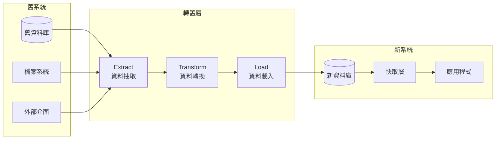
```mermaid
flowchart LR
    subgraph 舊系統
        A[(舊資料庫)] 
        B[檔案系統]
        C[外部介面]
    end
    
    subgraph 轉置層
        D[Extract<br/>資料抽取]
        E[Transform<br/>資料轉換]
        F[Load<br/>資料載入]
    end
    
    subgraph 新系統
        G[(新資料庫)]
        H[快取層]
        I[應用程式]
    end
    
    A --> D
    B --> D
    C --> D
    D --> E
    E --> F
    F --> G
    G --> H
    H --> I
```

### 1.2 為何資料轉置是高風險專案

資料轉置被視為高風險專案的原因包括：

#### 1.2.1 技術面風險

| 風險類型 | 說明 | 影響程度 |
|---------|------|---------|
| **資料遺失** | 轉置過程中資料未完整搬移 | 🔴 極高 |
| **資料錯誤** | 轉換邏輯錯誤導致資料語意改變 | 🔴 極高 |
| **效能問題** | 大量資料處理時間過長 | 🟡 中 |
| **相容性問題** | 新舊系統資料型態不相容 | 🟠 高 |

#### 1.2.2 管理面風險

- **時程壓力**：通常配合系統上線，時間窗口有限
- **跨團隊協作**：需要舊系統、新系統、業務單位共同參與
- **知識斷層**：舊系統文件不完整或人員已離職
- **回滾困難**：一旦上線，回復成本極高

#### 1.2.3 業務面風險

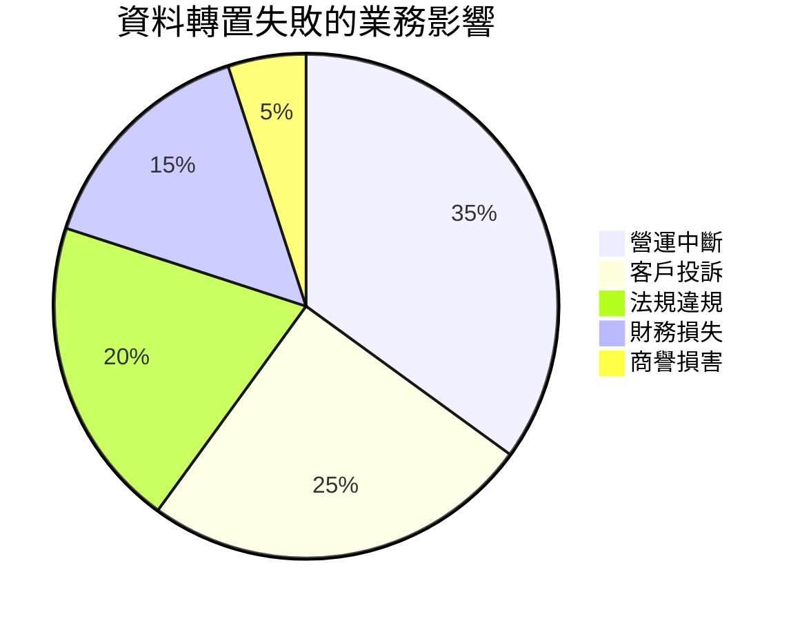
```mermaid
pie title 資料轉置失敗的業務影響
    "營運中斷" : 35
    "客戶投訴" : 25
    "法規違規" : 20
    "財務損失" : 15
    "商譽損害" : 5
```

### 1.3 常見失敗原因與風險分析

#### 1.3.1 失敗原因分類

| 分類 | 常見原因 | 預防措施 |
|------|---------|---------|
| **規劃階段** | 未完整盤點舊系統資料 | 建立資料清冊並簽核 |
| **規劃階段** | Mapping 規則不明確 | 與業務單位確認每個欄位語意 |
| **開發階段** | 轉換邏輯未經充分測試 | 建立完整測試案例 |
| **開發階段** | 未考慮例外資料處理 | 定義 Error Handling 機制 |
| **執行階段** | 時間估算過於樂觀 | 進行多次演練並計時 |
| **執行階段** | 未建立回滾機制 | 設計完整的 Rollback 計畫 |
| **驗證階段** | 驗證不完整 | 多層次驗證（技術 + 業務） |

#### 1.3.2 風險矩陣

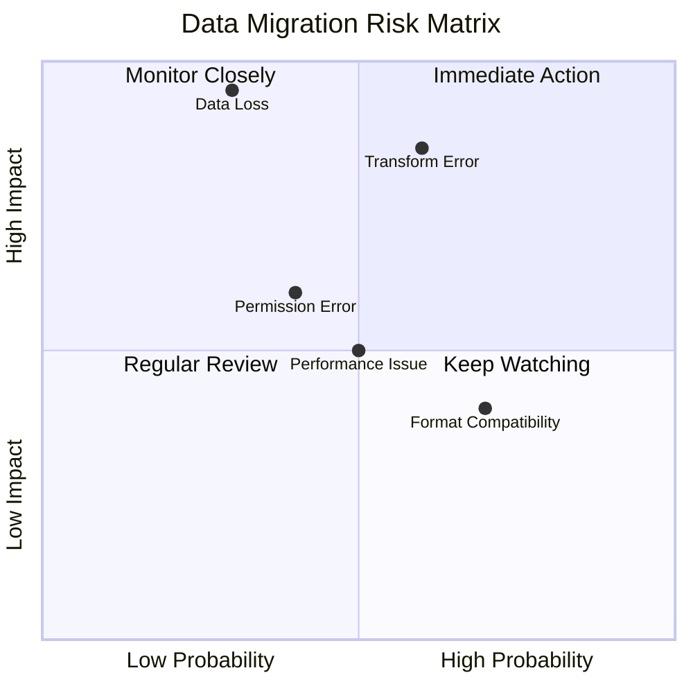
```mermaid
quadrantChart
    title Data Migration Risk Matrix
    x-axis Low Probability --> High Probability
    y-axis Low Impact --> High Impact
    quadrant-1 Immediate Action
    quadrant-2 Monitor Closely
    quadrant-3 Regular Review
    quadrant-4 Keep Watching
    Data Loss: [0.3, 0.95]
    Transform Error: [0.6, 0.85]
    Performance Issue: [0.5, 0.5]
    Format Compatibility: [0.7, 0.4]
    Permission Error: [0.4, 0.6]
```

> **圖表說明**：
> | 英文標籤 | 中文說明 |
> |---------|---------|
> | Data Loss | 資料遺失 |
> | Transform Error | 轉換邏輯錯誤 |
> | Performance Issue | 效能不足 |
> | Format Compatibility | 格式相容問題 |
> | Permission Error | 權限設定錯誤 |

#### 1.3.3 實務案例：某銀行核心系統轉置失敗

**背景**：某銀行進行核心系統更換，資料轉置期間發生嚴重問題

**失敗原因**：
1. 舊系統欄位 `CUST_TYPE` 有 5 種值，但文件只記載 3 種
2. 轉置時遇到未定義的值，程式直接略過
3. 導致數千筆客戶資料未被轉置

**教訓**：
- ✅ 必須進行完整的資料 Profiling
- ✅ 所有欄位值都必須有明確的對應規則
- ✅ 未對應的資料應進入 Error Table 而非略過

---

## 第 2 章：舊系統分析（As-Is Analysis）

### 2.1 資料來源盤點

#### 2.1.1 盤點項目清單

資料來源盤點是轉置專案的第一步，必須完整識別所有資料來源：

| 盤點項目 | 說明 | 負責單位 |
|---------|------|---------|
| **資料庫** | 識別所有相關的 Schema、Table | DBA / 開發團隊 |
| **檔案系統** | CSV、TXT、XML 等檔案 | 系統維運 |
| **外部介面** | API、MQ、FTP 等來源 | 整合團隊 |
| **手動維護** | Excel、人工輸入資料 | 業務單位 |

#### 2.1.2 資料清冊範本

```markdown
## 資料清冊範本

| 序號 | 資料來源名稱 | 類型 | 位置 | 擁有者 | 筆數（估計） | 更新頻率 | 備註 |
|------|-------------|------|------|--------|-------------|---------|------|
| 1 | CUSTOMER_MASTER | Table | Oracle/PROD | 客戶部 | 500萬 | 即時 | 主檔 |
| 2 | TRANSACTION_LOG | Table | Oracle/PROD | 交易部 | 2億 | 即時 | 需歸檔 |
| 3 | daily_report.csv | File | /data/reports | 營運部 | 每日1千 | 每日 | T+1 |
```

#### 2.1.3 資料來源關聯圖

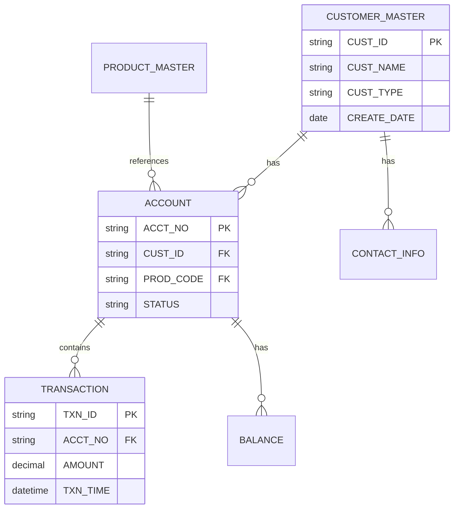
```mermaid
erDiagram
    CUSTOMER_MASTER ||--o{ ACCOUNT : has
    CUSTOMER_MASTER ||--o{ CONTACT_INFO : has
    ACCOUNT ||--o{ TRANSACTION : contains
    ACCOUNT ||--o{ BALANCE : has
    PRODUCT_MASTER ||--o{ ACCOUNT : references
    
    CUSTOMER_MASTER {
        string CUST_ID PK
        string CUST_NAME
        string CUST_TYPE
        date CREATE_DATE
    }
    
    ACCOUNT {
        string ACCT_NO PK
        string CUST_ID FK
        string PROD_CODE FK
        string STATUS
    }
    
    TRANSACTION {
        string TXN_ID PK
        string ACCT_NO FK
        decimal AMOUNT
        datetime TXN_TIME
    }
```

### 2.2 資料結構分析

#### 2.2.1 Table 結構分析

針對每個 Table 進行以下分析：

```sql
-- 取得 Table 結構資訊（Oracle 範例）
SELECT 
    column_name,
    data_type,
    data_length,
    nullable,
    data_default
FROM all_tab_columns
WHERE table_name = 'CUSTOMER_MASTER'
ORDER BY column_id;

-- 取得 Table 統計資訊
SELECT 
    table_name,
    num_rows,
    avg_row_len,
    last_analyzed
FROM all_tables
WHERE table_name = 'CUSTOMER_MASTER';
```

#### 2.2.2 File Layout 分析

對於固定長度檔案，需建立完整的 Layout 文件：

```plaintext
# 客戶主檔 File Layout (customer_master.dat)
# 編碼: Big5
# 記錄長度: 200 bytes

欄位名稱        起始位置  長度  類型      說明
-----------    --------  ----  ------    ----------------
CUST_ID        1         10    AN        客戶編號
CUST_NAME      11        40    AN        客戶姓名
CUST_TYPE      51        2     N         客戶類型
ID_NO          53        10    AN        身分證字號
BIRTH_DATE     63        8     N         生日(YYYYMMDD)
CREATE_DATE    71        8     N         建立日期
FILLER         79        122   AN        保留欄位
```

#### 2.2.3 結構分析工作表

| 欄位名稱 | 舊系統型態 | 長度 | Nullable | 預設值 | 業務說明 | 特殊處理 |
|---------|-----------|------|----------|--------|---------|---------|
| CUST_ID | VARCHAR2 | 10 | N | - | 客戶唯一識別碼 | 無 |
| CUST_NAME | VARCHAR2 | 40 | N | - | 客戶姓名 | 需處理全半形 |
| STATUS | CHAR | 1 | N | 'A' | 狀態碼 | 需 Code 對應 |

### 2.3 Key 與邏輯關聯分析

#### 2.3.1 識別 Primary Key 與 Foreign Key

```sql
-- 查詢 Primary Key（Oracle）
SELECT 
    cols.column_name,
    cons.constraint_name
FROM all_constraints cons
JOIN all_cons_columns cols 
    ON cons.constraint_name = cols.constraint_name
WHERE cons.constraint_type = 'P'
    AND cons.table_name = 'CUSTOMER_MASTER';

-- 查詢 Foreign Key 關聯
SELECT 
    a.table_name AS child_table,
    a.column_name AS child_column,
    c_pk.table_name AS parent_table,
    b.column_name AS parent_column
FROM all_cons_columns a
JOIN all_constraints c 
    ON a.constraint_name = c.constraint_name
JOIN all_constraints c_pk 
    ON c.r_constraint_name = c_pk.constraint_name
JOIN all_cons_columns b 
    ON c_pk.constraint_name = b.constraint_name
WHERE c.constraint_type = 'R'
    AND a.table_name = 'ACCOUNT';
```

#### 2.3.2 邏輯關聯矩陣

| 主檔 Table | 關聯 Table | 關聯類型 | 關聯欄位 | 備註 |
|-----------|-----------|---------|---------|------|
| CUSTOMER_MASTER | ACCOUNT | 1:N | CUST_ID | 一客戶多帳戶 |
| ACCOUNT | TRANSACTION | 1:N | ACCT_NO | 一帳戶多交易 |
| PRODUCT_MASTER | ACCOUNT | 1:N | PROD_CODE | 產品對應帳戶 |

#### 2.3.3 資料相依性分析

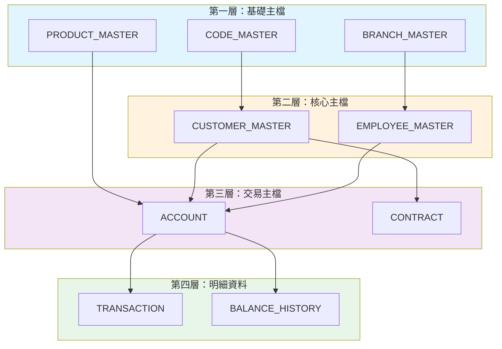
```mermaid
flowchart TD
    subgraph 第一層[第一層：基礎主檔]
        A[PRODUCT_MASTER]
        B[CODE_MASTER]
        C[BRANCH_MASTER]
    end
    
    subgraph 第二層[第二層：核心主檔]
        D[CUSTOMER_MASTER]
        E[EMPLOYEE_MASTER]
    end
    
    subgraph 第三層[第三層：交易主檔]
        F[ACCOUNT]
        G[CONTRACT]
    end
    
    subgraph 第四層[第四層：明細資料]
        H[TRANSACTION]
        I[BALANCE_HISTORY]
    end
    
    A --> F
    B --> D
    C --> E
    D --> F
    D --> G
    E --> F
    F --> H
    F --> I
    
    style 第一層 fill:#e1f5fe
    style 第二層 fill:#fff3e0
    style 第三層 fill:#f3e5f5
    style 第四層 fill:#e8f5e9
```

> **⚠️ 重要**：資料轉置必須按照相依性順序執行，先轉主檔再轉明細。

### 2.4 資料品質檢測

#### 2.4.1 資料品質檢測項目

| 檢測項目 | SQL 範例 | 說明 |
|---------|---------|------|
| **Null 值檢測** | `WHERE column IS NULL` | 識別空值欄位 |
| **重複值檢測** | `GROUP BY ... HAVING COUNT(*) > 1` | 識別重複 Key |
| **格式異常** | `WHERE NOT REGEXP_LIKE(...)` | 識別格式錯誤 |
| **範圍異常** | `WHERE amount < 0` | 識別異常數值 |
| **參照完整性** | `LEFT JOIN ... WHERE ... IS NULL` | 識別孤立資料 |

#### 2.4.2 資料 Profiling 腳本

```sql
-- 資料 Profiling 完整腳本範例
-- 1. 基本統計
SELECT 
    'CUSTOMER_MASTER' AS table_name,
    COUNT(*) AS total_rows,
    COUNT(DISTINCT cust_id) AS unique_cust_id,
    COUNT(*) - COUNT(cust_name) AS null_cust_name,
    MIN(create_date) AS min_create_date,
    MAX(create_date) AS max_create_date
FROM customer_master;

-- 2. 欄位值分布
SELECT 
    cust_type,
    COUNT(*) AS cnt,
    ROUND(COUNT(*) * 100.0 / SUM(COUNT(*)) OVER(), 2) AS pct
FROM customer_master
GROUP BY cust_type
ORDER BY cnt DESC;

-- 3. 重複 Key 檢測
SELECT cust_id, COUNT(*) AS dup_count
FROM customer_master
GROUP BY cust_id
HAVING COUNT(*) > 1;

-- 4. 參照完整性檢測
SELECT a.acct_no, a.cust_id
FROM account a
LEFT JOIN customer_master c ON a.cust_id = c.cust_id
WHERE c.cust_id IS NULL;
```

#### 2.4.3 資料品質報告範本

```markdown
## 資料品質檢測報告

### 檢測日期：2026-02-02
### 檢測範圍：CUSTOMER_MASTER

| 檢測項目 | 結果 | 筆數 | 比例 | 嚴重度 |
|---------|------|------|------|--------|
| 總筆數 | - | 5,234,567 | 100% | - |
| CUST_ID 空值 | ✅ PASS | 0 | 0% | - |
| CUST_NAME 空值 | ⚠️ WARN | 123 | 0.002% | 中 |
| CUST_TYPE 異常值 | 🔴 FAIL | 45 | 0.001% | 高 |
| 重複 CUST_ID | ✅ PASS | 0 | 0% | - |

### 需處理項目
1. CUST_NAME 空值 123 筆 → 建議補值或設預設值
2. CUST_TYPE 值 'X' 未在代碼表中定義 → 需確認對應規則
```

> **📌 實務建議**：
> - 資料品質檢測應在專案初期完成，避免後期發現問題影響時程
> - 檢測結果應與業務單位共同確認處理方式
> - 建立異常資料清單，追蹤處理進度

---

## 第 3 章：新系統設計（To-Be Design）

### 3.1 新系統資料模型設計原則

#### 3.1.1 設計原則

| 原則 | 說明 | 範例 |
|------|------|------|
| **正規化** | 減少資料重複，確保一致性 | 地址資料獨立為 ADDRESS Table |
| **適度反正規化** | 為效能考量適度冗餘 | 常用查詢欄位可冗餘 |
| **擴充性** | 預留未來擴充空間 | 使用 VARCHAR 而非 CHAR |
| **一致性** | 命名與型態保持一致 | 日期統一用 TIMESTAMP |

#### 3.1.2 資料模型設計流程

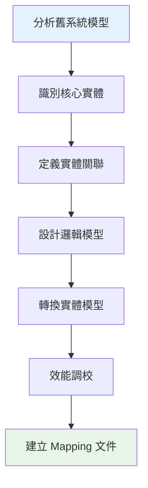
```mermaid
flowchart TD
    A[分析舊系統模型] --> B[識別核心實體]
    B --> C[定義實體關聯]
    C --> D[設計邏輯模型]
    D --> E[轉換實體模型]
    E --> F[效能調校]
    F --> G[建立 Mapping 文件]
    
    style A fill:#e3f2fd
    style G fill:#e8f5e9
```

#### 3.1.3 新舊系統模型對照

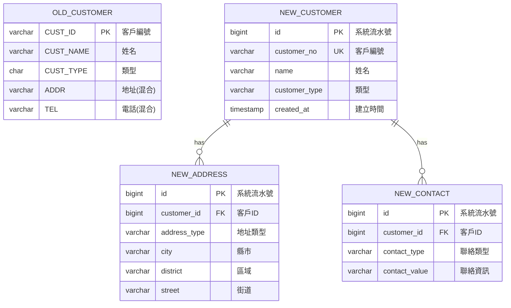
```mermaid
erDiagram
    %% 舊系統
    OLD_CUSTOMER {
        varchar CUST_ID PK "客戶編號"
        varchar CUST_NAME "姓名"
        char CUST_TYPE "類型"
        varchar ADDR "地址(混合)"
        varchar TEL "電話(混合)"
    }
    
    %% 新系統
    NEW_CUSTOMER {
        bigint id PK "系統流水號"
        varchar customer_no UK "客戶編號"
        varchar name "姓名"
        varchar customer_type "類型"
        timestamp created_at "建立時間"
    }
    
    NEW_ADDRESS {
        bigint id PK "系統流水號"
        bigint customer_id FK "客戶ID"
        varchar address_type "地址類型"
        varchar city "縣市"
        varchar district "區域"
        varchar street "街道"
    }
    
    NEW_CONTACT {
        bigint id PK "系統流水號"
        bigint customer_id FK "客戶ID"
        varchar contact_type "聯絡類型"
        varchar contact_value "聯絡資訊"
    }
    
    NEW_CUSTOMER ||--o{ NEW_ADDRESS : has
    NEW_CUSTOMER ||--o{ NEW_CONTACT : has
```

### 3.2 舊欄位到新欄位 Mapping 規則

#### 3.2.1 Mapping 文件結構

| 舊 Table | 舊欄位 | 新 Table | 新欄位 | 轉換規則 | 說明 |
|---------|--------|---------|--------|---------|------|
| CUSTOMER | CUST_ID | customer | customer_no | 直接對應 | - |
| CUSTOMER | CUST_NAME | customer | name | TRIM 處理 | 去除前後空白 |
| CUSTOMER | CUST_TYPE | customer | customer_type | Code 對應 | 見代碼對應表 |
| CUSTOMER | ADDR | address | city, district, street | 地址拆分 | 需解析地址 |
| CUSTOMER | CREATE_DT | customer | created_at | 日期轉換 | YYYYMMDD → TIMESTAMP |

#### 3.2.2 Mapping 規則分類

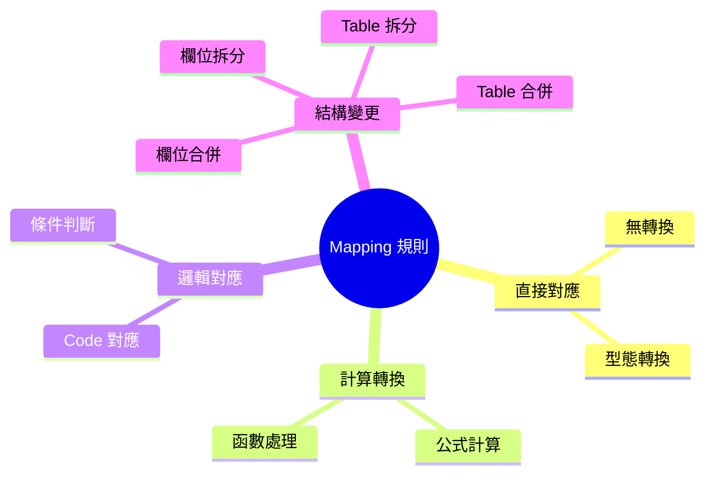
```mermaid
mindmap
  root((Mapping 規則))
    直接對應
      無轉換
      型態轉換
    計算轉換
      公式計算
      函數處理
    邏輯對應
      Code 對應
      條件判斷
    結構變更
      欄位拆分
      欄位合併
      Table 拆分
      Table 合併
```

#### 3.2.3 常見轉換規則範例

```sql
-- 1. 直接對應（型態轉換）
-- 舊：VARCHAR2(10) → 新：BIGINT
SELECT CAST(cust_id AS BIGINT) AS id FROM old_customer;

-- 2. 日期格式轉換
-- 舊：YYYYMMDD (CHAR) → 新：TIMESTAMP
SELECT 
    TO_TIMESTAMP(create_dt, 'YYYYMMDD') AS created_at
FROM old_customer;

-- 3. Code 對應轉換
SELECT 
    CASE cust_type
        WHEN '1' THEN 'INDIVIDUAL'
        WHEN '2' THEN 'CORPORATE'
        WHEN '3' THEN 'VIP'
        ELSE 'UNKNOWN'
    END AS customer_type
FROM old_customer;

-- 4. 地址拆分（使用 REGEXP）
SELECT 
    REGEXP_SUBSTR(addr, '^(.{2}[市縣])', 1, 1) AS city,
    REGEXP_SUBSTR(addr, '[市縣](.+?[區鄉鎮市])', 1, 1, NULL, 1) AS district,
    REGEXP_SUBSTR(addr, '[區鄉鎮市](.+)$', 1, 1, NULL, 1) AS street
FROM old_customer;

-- 5. 欄位合併
SELECT 
    CONCAT(last_name, first_name) AS full_name
FROM old_employee;
```

### 3.3 Code / Enum / Reference Data 對應策略

#### 3.3.1 代碼對應表設計

```sql
-- 建立代碼對應表
CREATE TABLE migration_code_mapping (
    id              BIGINT PRIMARY KEY AUTO_INCREMENT,
    category        VARCHAR(50) NOT NULL,    -- 代碼類別
    source_code     VARCHAR(20) NOT NULL,    -- 舊系統代碼
    target_code     VARCHAR(50) NOT NULL,    -- 新系統代碼
    description     VARCHAR(200),            -- 說明
    effective_date  DATE DEFAULT CURRENT_DATE,
    created_at      TIMESTAMP DEFAULT CURRENT_TIMESTAMP,
    UNIQUE KEY uk_mapping (category, source_code)
);

-- 範例資料
INSERT INTO migration_code_mapping (category, source_code, target_code, description) VALUES
('CUST_TYPE', '1', 'INDIVIDUAL', '個人客戶'),
('CUST_TYPE', '2', 'CORPORATE', '法人客戶'),
('CUST_TYPE', '3', 'VIP', 'VIP客戶'),
('ACCT_STATUS', 'A', 'ACTIVE', '有效'),
('ACCT_STATUS', 'C', 'CLOSED', '已結清'),
('ACCT_STATUS', 'F', 'FROZEN', '凍結');
```

#### 3.3.2 代碼對應查詢函數

```sql
-- 建立對應查詢函數
CREATE FUNCTION fn_get_target_code(
    p_category VARCHAR(50),
    p_source_code VARCHAR(20)
) RETURNS VARCHAR(50)
BEGIN
    DECLARE v_target_code VARCHAR(50);
    
    SELECT target_code INTO v_target_code
    FROM migration_code_mapping
    WHERE category = p_category 
      AND source_code = p_source_code;
    
    IF v_target_code IS NULL THEN
        RETURN CONCAT('UNMAPPED_', p_source_code);
    END IF;
    
    RETURN v_target_code;
END;
```

#### 3.3.3 代碼對應驗證

```sql
-- 檢查是否有未對應的代碼
SELECT DISTINCT 
    'CUST_TYPE' AS category,
    c.cust_type AS source_code,
    COUNT(*) AS affected_rows
FROM old_customer c
LEFT JOIN migration_code_mapping m 
    ON m.category = 'CUST_TYPE' 
    AND m.source_code = c.cust_type
WHERE m.id IS NULL
GROUP BY c.cust_type;
```

### 3.4 歷史資料保留與否的決策考量

#### 3.4.1 決策評估矩陣

| 考量因素 | 保留 | 不保留 | 評估問題 |
|---------|------|--------|---------|
| **法規要求** | ✅ | - | 法規要求保存多久？ |
| **業務查詢** | ✅ | - | 業務是否需要查詢歷史？ |
| **稽核需求** | ✅ | - | 是否需要追溯歷史軌跡？ |
| **儲存成本** | - | ✅ | 儲存成本是否可接受？ |
| **效能影響** | - | ✅ | 大量歷史是否影響效能？ |
| **轉置複雜度** | - | ✅ | 歷史資料轉置是否可行？ |

#### 3.4.2 歷史資料處理策略

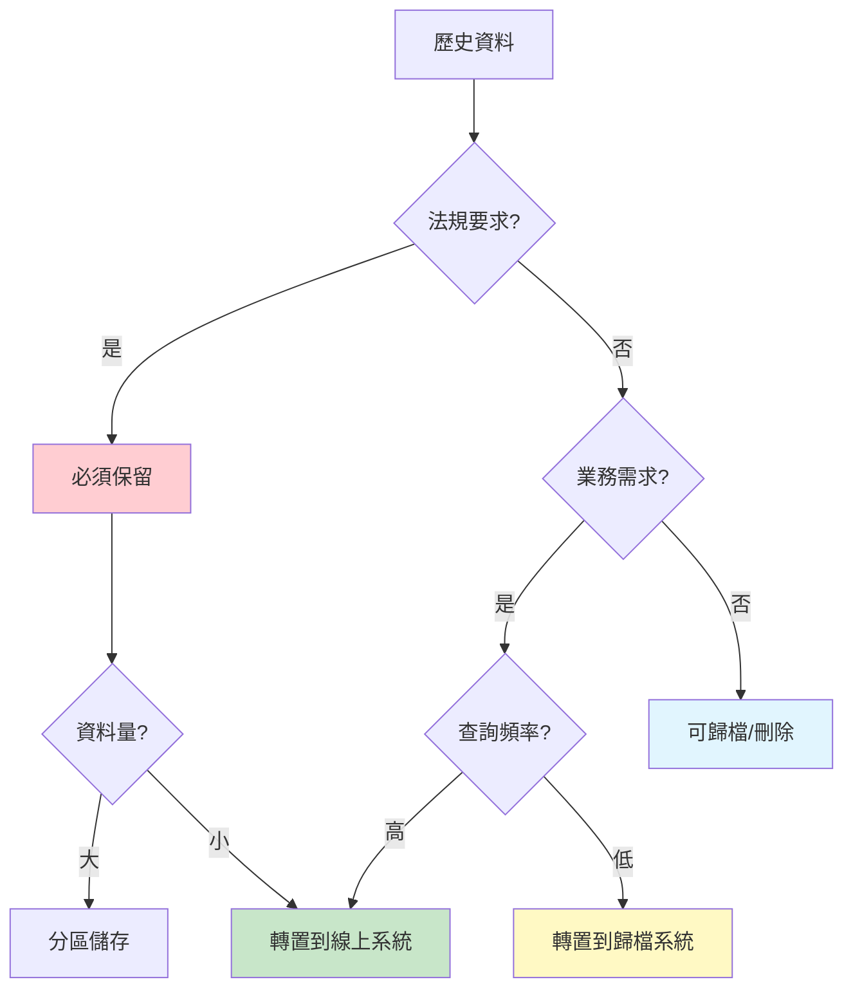
```mermaid
flowchart TD
    A[歷史資料] --> B{法規要求?}
    B -->|是| C[必須保留]
    B -->|否| D{業務需求?}
    D -->|是| E{查詢頻率?}
    D -->|否| F[可歸檔/刪除]
    E -->|高| G[轉置到線上系統]
    E -->|低| H[轉置到歸檔系統]
    
    C --> I{資料量?}
    I -->|大| J[分區儲存]
    I -->|小| G
    
    style C fill:#ffcdd2
    style G fill:#c8e6c9
    style H fill:#fff9c4
    style F fill:#e1f5fe
```

#### 3.4.3 歷史資料分層設計

| 層級 | 資料範圍 | 儲存位置 | 存取方式 | 效能 |
|------|---------|---------|---------|------|
| **Hot** | 近 3 個月 | 主資料庫 | 線上查詢 | ⚡ 快 |
| **Warm** | 3 個月 ~ 2 年 | 歸檔資料庫 | API 查詢 | 🔄 中 |
| **Cold** | 2 年以上 | 物件儲存 | 申請調閱 | 🐢 慢 |

```sql
-- 歷史資料分區表設計範例
CREATE TABLE transaction_history (
    txn_id          BIGINT NOT NULL,
    acct_no         VARCHAR(20) NOT NULL,
    txn_date        DATE NOT NULL,
    amount          DECIMAL(18,2),
    -- ... 其他欄位
    PRIMARY KEY (txn_id, txn_date)
) PARTITION BY RANGE (txn_date) (
    PARTITION p_2024 VALUES LESS THAN ('2025-01-01'),
    PARTITION p_2025 VALUES LESS THAN ('2026-01-01'),
    PARTITION p_2026 VALUES LESS THAN ('2027-01-01'),
    PARTITION p_future VALUES LESS THAN MAXVALUE
);
```

> **📌 實務建議**：
> - 歷史資料保留決策必須與法務、稽核、業務單位共同確認
> - 建議製作「資料保留政策文件」並取得正式簽核
> - 預留歷史資料調閱機制，避免未來需求變更時無法因應

---

## 第 4 章：資料轉置策略與架構設計

### 4.1 一次性轉置 vs 分批轉置

#### 4.1.1 策略比較

| 策略 | 一次性轉置（Full Load） | 分批轉置（Incremental） |
|------|------------------------|------------------------|
| **適用情境** | 資料量小、停機時間充裕 | 資料量大、需持續營運 |
| **優點** | 邏輯簡單、一致性高 | 風險分散、可逐步驗證 |
| **缺點** | 停機時間長、風險集中 | 邏輯複雜、需處理增量 |
| **建議資料量** | < 1000 萬筆 | > 1000 萬筆 |

#### 4.1.2 分批轉置策略設計

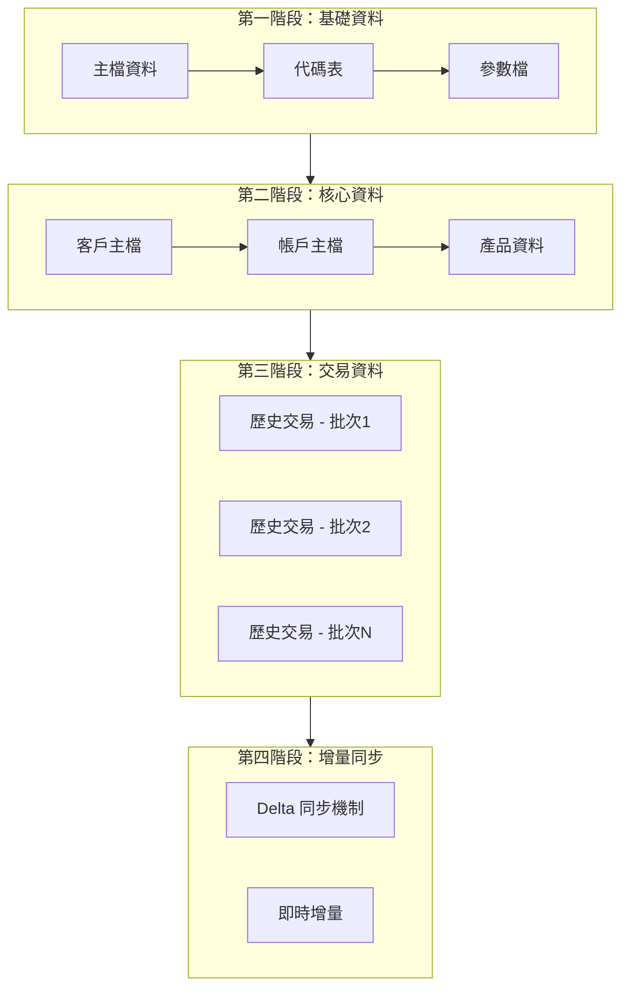
```mermaid
flowchart TD
    subgraph 第一階段[第一階段：基礎資料]
        A[主檔資料] --> B[代碼表]
        B --> C[參數檔]
    end
    
    subgraph 第二階段[第二階段：核心資料]
        D[客戶主檔] --> E[帳戶主檔]
        E --> F[產品資料]
    end
    
    subgraph 第三階段[第三階段：交易資料]
        G[歷史交易 - 批次1]
        H[歷史交易 - 批次2]
        I[歷史交易 - 批次N]
    end
    
    subgraph 第四階段[第四階段：增量同步]
        J[Delta 同步機制]
        K[即時增量]
    end
    
    第一階段 --> 第二階段
    第二階段 --> 第三階段
    第三階段 --> 第四階段
```

#### 4.1.3 分批策略實作範例

```sql
-- 分批轉置控制表
CREATE TABLE migration_batch_control (
    batch_id        VARCHAR(20) PRIMARY KEY,
    table_name      VARCHAR(100) NOT NULL,
    batch_seq       INT NOT NULL,
    start_key       VARCHAR(100),
    end_key         VARCHAR(100),
    total_rows      BIGINT DEFAULT 0,
    processed_rows  BIGINT DEFAULT 0,
    status          VARCHAR(20) DEFAULT 'PENDING',
    start_time      TIMESTAMP,
    end_time        TIMESTAMP,
    error_message   TEXT,
    created_at      TIMESTAMP DEFAULT CURRENT_TIMESTAMP
);

-- 建立分批（依 CUST_ID 範圍）
INSERT INTO migration_batch_control (batch_id, table_name, batch_seq, start_key, end_key)
SELECT 
    CONCAT('CUST_', LPAD(ROW_NUMBER() OVER(), 3, '0')),
    'CUSTOMER_MASTER',
    ROW_NUMBER() OVER(),
    MIN(cust_id),
    MAX(cust_id)
FROM (
    SELECT 
        cust_id,
        NTILE(10) OVER (ORDER BY cust_id) AS batch_group
    FROM old_customer
) t
GROUP BY batch_group;
```

### 4.2 Online vs Batch

#### 4.2.1 處理模式比較

| 項目 | Online（即時） | Batch（批次） |
|------|---------------|---------------|
| **處理時機** | 事件觸發時立即處理 | 排程或手動觸發 |
| **資料量** | 單筆或少量 | 大量資料 |
| **回應時間** | 毫秒至秒級 | 分鐘至小時級 |
| **技術實作** | API、CDC、MQ | ETL、Stored Procedure |
| **適用情境** | 增量同步、即時轉置 | 初始轉置、歷史資料 |

#### 4.2.2 混合模式架構

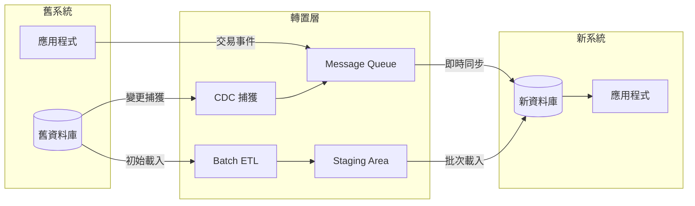
```mermaid
flowchart LR
    subgraph 舊系統
        A[(舊資料庫)]
        B[應用程式]
    end
    
    subgraph 轉置層
        C[CDC 捕獲]
        D[Message Queue]
        E[Batch ETL]
        F[Staging Area]
    end
    
    subgraph 新系統
        G[(新資料庫)]
        H[應用程式]
    end
    
    A -->|初始載入| E
    A -->|變更捕獲| C
    B -->|交易事件| D
    C --> D
    D -->|即時同步| G
    E --> F
    F -->|批次載入| G
    G --> H
```

#### 4.2.3 CDC（Change Data Capture）實作概念

```java
// CDC 監聽器概念範例（使用 Debezium 概念）
public class CustomerCdcHandler {
    
    @KafkaListener(topics = "dbserver.schema.customer")
    public void handleCustomerChange(ChangeEvent event) {
        switch (event.getOperation()) {
            case CREATE:
                migrateNewCustomer(event.getAfter());
                break;
            case UPDATE:
                updateMigratedCustomer(event.getBefore(), event.getAfter());
                break;
            case DELETE:
                markCustomerDeleted(event.getBefore());
                break;
        }
    }
    
    private void migrateNewCustomer(CustomerRecord record) {
        // 轉換並寫入新系統
        NewCustomer newCustomer = transform(record);
        newCustomerRepository.save(newCustomer);
        
        // 記錄轉置日誌
        migrationLogRepository.save(new MigrationLog(
            record.getCustId(), 
            "CREATE", 
            LocalDateTime.now()
        ));
    }
}
```

### 4.3 Big Bang vs Parallel Run

#### 4.3.1 策略說明

| 策略 | Big Bang | Parallel Run |
|------|----------|--------------|
| **定義** | 特定時間點一次性切換 | 新舊系統並行運作一段時間 |
| **切換方式** | 停機 → 轉置 → 上線 | 雙寫 → 比對 → 切換 |
| **風險** | 高（無回頭路） | 低（可隨時切回） |
| **成本** | 低（單次作業） | 高（雙系統維護） |
| **適用情境** | 獨立系統、風險可控 | 核心系統、高可用要求 |

#### 4.3.2 Big Bang 流程


```mermaid
gantt
    title Big Bang 轉置時程
    dateFormat  HH:mm
    axisFormat  %H:%M
    
    section 準備階段
    系統公告停機        :a1, 18:00, 30m
    停止交易服務        :a2, after a1, 15m
    
    section 轉置階段
    資料抽取           :b1, after a2, 60m
    資料轉換           :b2, after b1, 90m
    資料載入           :b3, after b2, 60m
    
    section 驗證階段
    筆數驗證           :c1, after b3, 30m
    金額驗證           :c2, after c1, 30m
    抽樣驗證           :c3, after c2, 30m
    
    section 上線階段
    系統切換           :d1, after c3, 15m
    服務恢復           :d2, after d1, 15m
    監控觀察           :d3, after d2, 60m
```

#### 4.3.3 Parallel Run 架構

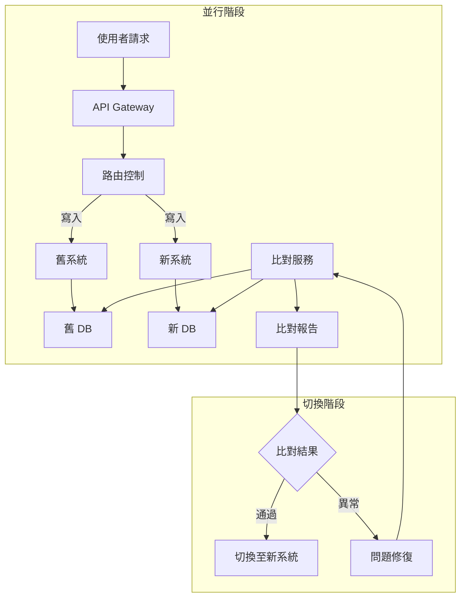
```mermaid
flowchart TD
    subgraph 並行階段
        A[使用者請求] --> B[API Gateway]
        B --> C[路由控制]
        C -->|寫入| D[舊系統]
        C -->|寫入| E[新系統]
        D --> F[舊 DB]
        E --> G[新 DB]
        
        H[比對服務] --> F
        H --> G
        H --> I[比對報告]
    end
    
    subgraph 切換階段
        J{比對結果} -->|通過| K[切換至新系統]
        J -->|異常| L[問題修復]
        L --> H
    end
    
    I --> J
```

#### 4.3.4 雙寫（Dual Write）程式範例

```java
@Service
@Transactional
public class DualWriteService {
    
    @Autowired
    private OldCustomerRepository oldRepo;
    
    @Autowired
    private NewCustomerRepository newRepo;
    
    @Autowired
    private ComparisonService comparisonService;
    
    public void createCustomer(CustomerRequest request) {
        // 1. 寫入舊系統
        OldCustomer oldCustomer = oldRepo.save(
            mapToOldCustomer(request)
        );
        
        // 2. 寫入新系統
        NewCustomer newCustomer = newRepo.save(
            mapToNewCustomer(request)
        );
        
        // 3. 記錄比對資訊
        comparisonService.recordForComparison(
            oldCustomer.getId(),
            newCustomer.getId(),
            "CREATE"
        );
    }
}
```

### 4.4 Rollback 與 Re-run 設計

#### 4.4.1 Rollback 策略

| 策略 | 說明 | 適用時機 |
|------|------|---------|
| **備份還原** | 轉置前完整備份，失敗時還原 | 資料量小、可接受全量還原 |
| **反向轉置** | 設計反向轉換程式 | 部分資料需回復 |
| **標記清除** | 新資料加註標記，失敗時刪除 | 增量轉置場景 |
| **版本控制** | 保留多版本資料 | 需要追溯歷史 |

#### 4.4.2 Rollback 流程設計

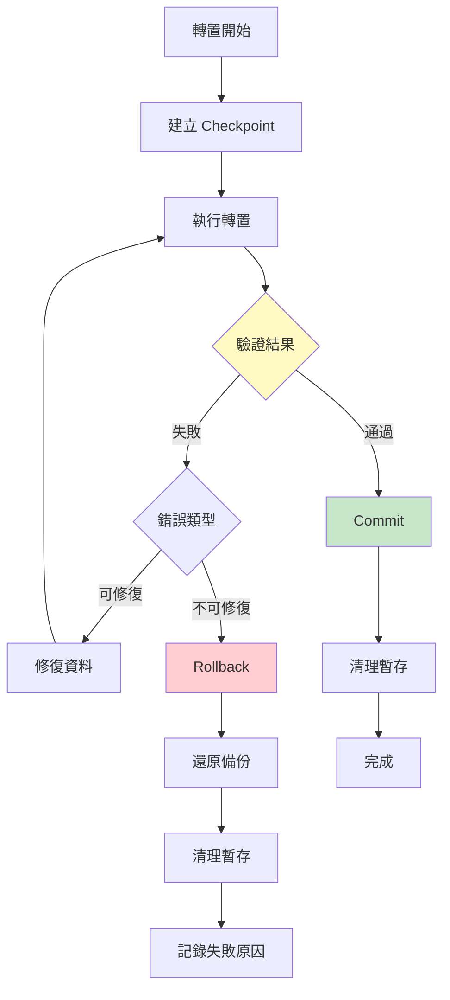
```mermaid
flowchart TD
    A[轉置開始] --> B[建立 Checkpoint]
    B --> C[執行轉置]
    C --> D{驗證結果}
    D -->|通過| E[Commit]
    D -->|失敗| F{錯誤類型}
    F -->|可修復| G[修復資料]
    F -->|不可修復| H[Rollback]
    G --> C
    H --> I[還原備份]
    I --> J[清理暫存]
    J --> K[記錄失敗原因]
    E --> L[清理暫存]
    L --> M[完成]
    
    style D fill:#fff9c4
    style H fill:#ffcdd2
    style E fill:#c8e6c9
```

#### 4.4.3 Re-run 機制設計

```sql
-- 轉置執行記錄表
CREATE TABLE migration_execution_log (
    execution_id    VARCHAR(36) PRIMARY KEY,
    batch_id        VARCHAR(20),
    table_name      VARCHAR(100),
    start_key       VARCHAR(100),
    end_key         VARCHAR(100),
    status          VARCHAR(20),  -- RUNNING, SUCCESS, FAILED, ROLLBACK
    processed_count BIGINT,
    error_count     BIGINT,
    start_time      TIMESTAMP,
    end_time        TIMESTAMP,
    error_detail    TEXT,
    can_rerun       BOOLEAN DEFAULT TRUE,
    rerun_count     INT DEFAULT 0
);

-- Re-run 查詢：找出需要重跑的批次
SELECT 
    batch_id,
    table_name,
    start_key,
    end_key,
    rerun_count
FROM migration_execution_log
WHERE status = 'FAILED'
  AND can_rerun = TRUE
  AND rerun_count < 3  -- 最多重跑 3 次
ORDER BY batch_id;
```

#### 4.4.4 Checkpoint 機制

```java
@Service
public class MigrationCheckpointService {
    
    @Autowired
    private CheckpointRepository checkpointRepo;
    
    /**
     * 建立檢查點
     */
    public String createCheckpoint(String batchId, String tableName) {
        Checkpoint checkpoint = new Checkpoint();
        checkpoint.setCheckpointId(UUID.randomUUID().toString());
        checkpoint.setBatchId(batchId);
        checkpoint.setTableName(tableName);
        checkpoint.setCreatedAt(LocalDateTime.now());
        checkpoint.setStatus("CREATED");
        
        // 記錄當前進度
        checkpoint.setLastProcessedKey(
            getLastProcessedKey(tableName)
        );
        
        return checkpointRepo.save(checkpoint).getCheckpointId();
    }
    
    /**
     * 從檢查點恢復
     */
    public void resumeFromCheckpoint(String checkpointId) {
        Checkpoint checkpoint = checkpointRepo.findById(checkpointId)
            .orElseThrow(() -> new RuntimeException("Checkpoint not found"));
        
        log.info("Resume from checkpoint: {}, lastKey: {}", 
            checkpointId, checkpoint.getLastProcessedKey());
        
        // 從上次位置繼續
        migrationService.migrateFrom(
            checkpoint.getTableName(),
            checkpoint.getLastProcessedKey()
        );
    }
}
```

> **📌 實務建議**：
> - 每個批次轉置前必須建立 Checkpoint
> - Rollback 腳本必須事先準備並測試
> - 建議設定最大 Re-run 次數，避免無限重試

---

## 第 5 章：資料轉置流程設計（ETL Flow）

### 5.1 Extract（資料抽取）

#### 5.1.1 抽取策略

| 策略 | 說明 | 優點 | 缺點 |
|------|------|------|------|
| **Full Extract** | 抽取全部資料 | 邏輯簡單 | 資料量大、時間長 |
| **Incremental** | 只抽取異動資料 | 效率高 | 需追蹤異動 |
| **CDC** | 捕獲資料變更 | 即時性高 | 架構複雜 |

#### 5.1.2 抽取流程圖

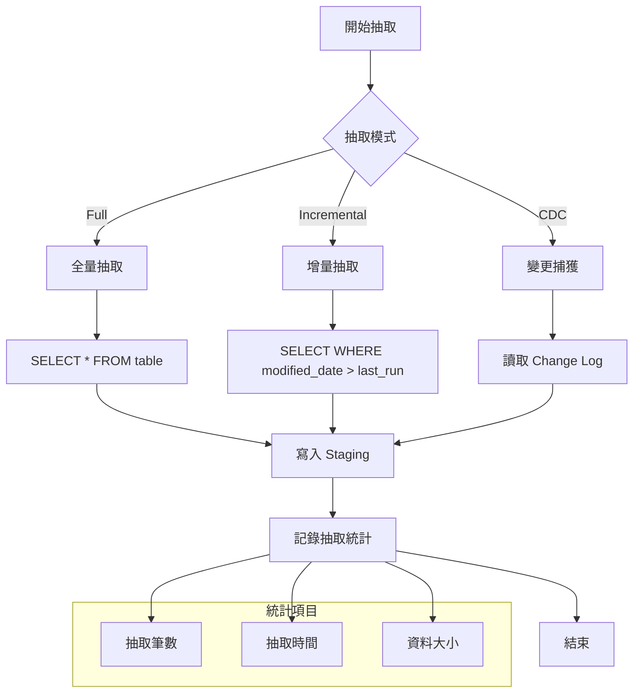
```mermaid
flowchart TD
    A[開始抽取] --> B{抽取模式}
    B -->|Full| C[全量抽取]
    B -->|Incremental| D[增量抽取]
    B -->|CDC| E[變更捕獲]
    
    C --> F[SELECT * FROM table]
    D --> G[SELECT WHERE modified_date > last_run]
    E --> H[讀取 Change Log]
    
    F --> I[寫入 Staging]
    G --> I
    H --> I
    
    I --> J[記錄抽取統計]
    J --> K[結束]
    
    subgraph 統計項目
        L[抽取筆數]
        M[抽取時間]
        N[資料大小]
    end
    
    J --> L
    J --> M
    J --> N
```

#### 5.1.3 抽取程式範例

```java
@Service
@Slf4j
public class DataExtractService {
    
    @Autowired
    private JdbcTemplate sourceJdbc;
    
    @Autowired
    private StagingRepository stagingRepo;
    
    /**
     * 分頁抽取大量資料
     */
    public ExtractResult extractCustomers(String batchId, int pageSize) {
        ExtractResult result = new ExtractResult(batchId);
        result.setStartTime(LocalDateTime.now());
        
        int offset = 0;
        int totalExtracted = 0;
        
        try {
            while (true) {
                // 分頁查詢
                String sql = """
                    SELECT cust_id, cust_name, cust_type, 
                           create_date, modify_date
                    FROM customer_master
                    ORDER BY cust_id
                    OFFSET ? ROWS FETCH NEXT ? ROWS ONLY
                    """;
                
                List<Map<String, Object>> rows = sourceJdbc.queryForList(
                    sql, offset, pageSize
                );
                
                if (rows.isEmpty()) {
                    break;
                }
                
                // 寫入 Staging
                List<StagingCustomer> stagingData = rows.stream()
                    .map(this::mapToStaging)
                    .collect(Collectors.toList());
                
                stagingRepo.batchInsert(stagingData);
                
                totalExtracted += rows.size();
                offset += pageSize;
                
                log.info("Extracted {} records, total: {}", 
                    rows.size(), totalExtracted);
            }
            
            result.setStatus("SUCCESS");
            result.setExtractedCount(totalExtracted);
            
        } catch (Exception e) {
            log.error("Extract failed at offset {}", offset, e);
            result.setStatus("FAILED");
            result.setErrorMessage(e.getMessage());
        }
        
        result.setEndTime(LocalDateTime.now());
        return result;
    }
    
    private StagingCustomer mapToStaging(Map<String, Object> row) {
        StagingCustomer staging = new StagingCustomer();
        staging.setSourceCustId((String) row.get("CUST_ID"));
        staging.setSourceCustName((String) row.get("CUST_NAME"));
        staging.setSourceCustType((String) row.get("CUST_TYPE"));
        staging.setSourceCreateDate((Date) row.get("CREATE_DATE"));
        staging.setExtractTime(LocalDateTime.now());
        staging.setProcessStatus("PENDING");
        return staging;
    }
}
```

### 5.2 Transform（資料轉換）

#### 5.2.1 轉換類型

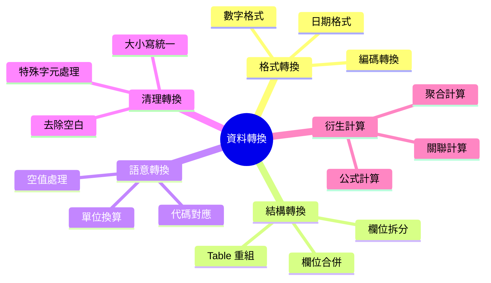
```mermaid
mindmap
  root((資料轉換))
    格式轉換
      日期格式
      數字格式
      編碼轉換
    結構轉換
      欄位拆分
      欄位合併
      Table 重組
    語意轉換
      代碼對應
      單位換算
      空值處理
    清理轉換
      去除空白
      大小寫統一
      特殊字元處理
    衍生計算
      公式計算
      聚合計算
      關聯計算
```

#### 5.2.2 轉換規則引擎

```java
/**
 * 轉換規則介面
 */
public interface TransformRule<S, T> {
    T transform(S source);
    boolean validate(S source);
    String getRuleName();
}

/**
 * 日期轉換規則
 */
@Component
public class DateTransformRule implements TransformRule<String, LocalDate> {
    
    private static final DateTimeFormatter SOURCE_FORMAT = 
        DateTimeFormatter.ofPattern("yyyyMMdd");
    
    @Override
    public LocalDate transform(String source) {
        if (source == null || source.trim().isEmpty()) {
            return null;
        }
        return LocalDate.parse(source.trim(), SOURCE_FORMAT);
    }
    
    @Override
    public boolean validate(String source) {
        if (source == null || source.trim().isEmpty()) {
            return true; // 允許空值
        }
        try {
            transform(source);
            return true;
        } catch (DateTimeParseException e) {
            return false;
        }
    }
    
    @Override
    public String getRuleName() {
        return "DATE_YYYYMMDD_TO_LOCALDATE";
    }
}

/**
 * 代碼對應轉換規則
 */
@Component
public class CodeMappingRule implements TransformRule<String, String> {
    
    @Autowired
    private CodeMappingRepository codeRepo;
    
    private String category;
    
    public CodeMappingRule category(String category) {
        this.category = category;
        return this;
    }
    
    @Override
    public String transform(String source) {
        return codeRepo.findTargetCode(category, source)
            .orElse("UNMAPPED_" + source);
    }
    
    @Override
    public boolean validate(String source) {
        return codeRepo.existsMapping(category, source);
    }
    
    @Override
    public String getRuleName() {
        return "CODE_MAPPING_" + category;
    }
}
```

#### 5.2.3 轉換流程實作

```java
@Service
@Slf4j
public class DataTransformService {
    
    @Autowired
    private StagingRepository stagingRepo;
    
    @Autowired
    private TransformRuleEngine ruleEngine;
    
    @Autowired
    private ErrorRepository errorRepo;
    
    @Transactional
    public TransformResult transformCustomers(String batchId) {
        TransformResult result = new TransformResult(batchId);
        result.setStartTime(LocalDateTime.now());
        
        int successCount = 0;
        int errorCount = 0;
        
        // 取得待轉換資料
        List<StagingCustomer> stagingData = stagingRepo
            .findByBatchIdAndStatus(batchId, "PENDING");
        
        for (StagingCustomer staging : stagingData) {
            try {
                // 執行轉換
                NewCustomer newCustomer = transformSingleRecord(staging);
                
                // 更新 Staging 狀態
                staging.setProcessStatus("TRANSFORMED");
                staging.setTransformedData(toJson(newCustomer));
                stagingRepo.save(staging);
                
                successCount++;
                
            } catch (TransformException e) {
                // 記錄錯誤
                staging.setProcessStatus("ERROR");
                staging.setErrorMessage(e.getMessage());
                stagingRepo.save(staging);
                
                errorRepo.save(new TransformError(
                    batchId,
                    staging.getSourceCustId(),
                    e.getRuleName(),
                    e.getMessage()
                ));
                
                errorCount++;
            }
        }
        
        result.setSuccessCount(successCount);
        result.setErrorCount(errorCount);
        result.setEndTime(LocalDateTime.now());
        
        log.info("Transform completed: success={}, error={}", 
            successCount, errorCount);
        
        return result;
    }
    
    private NewCustomer transformSingleRecord(StagingCustomer staging) {
        NewCustomer target = new NewCustomer();
        
        // 1. 直接對應
        target.setCustomerNo(staging.getSourceCustId().trim());
        
        // 2. 清理轉換
        target.setName(cleanName(staging.getSourceCustName()));
        
        // 3. 代碼對應
        target.setCustomerType(
            ruleEngine.transform("CUST_TYPE", staging.getSourceCustType())
        );
        
        // 4. 日期轉換
        target.setCreatedAt(
            ruleEngine.transform("DATE", staging.getSourceCreateDate())
        );
        
        // 5. 系統欄位
        target.setMigrationBatchId(staging.getBatchId());
        target.setMigrationTime(LocalDateTime.now());
        
        return target;
    }
    
    private String cleanName(String name) {
        if (name == null) return null;
        // 全形轉半形、去除多餘空白
        return StringUtils.normalizeSpace(
            CharUtils.toHalfWidth(name)
        );
    }
}
```

### 5.3 Load（資料載入）

#### 5.3.1 載入策略

| 策略 | 說明 | 適用情境 |
|------|------|---------|
| **Insert** | 直接插入新資料 | 初始轉置、新增資料 |
| **Upsert** | 存在則更新，否則插入 | 增量同步 |
| **Merge** | 合併操作 | 複雜的更新邏輯 |
| **Bulk Load** | 批次大量載入 | 大量資料快速載入 |

#### 5.3.2 載入流程

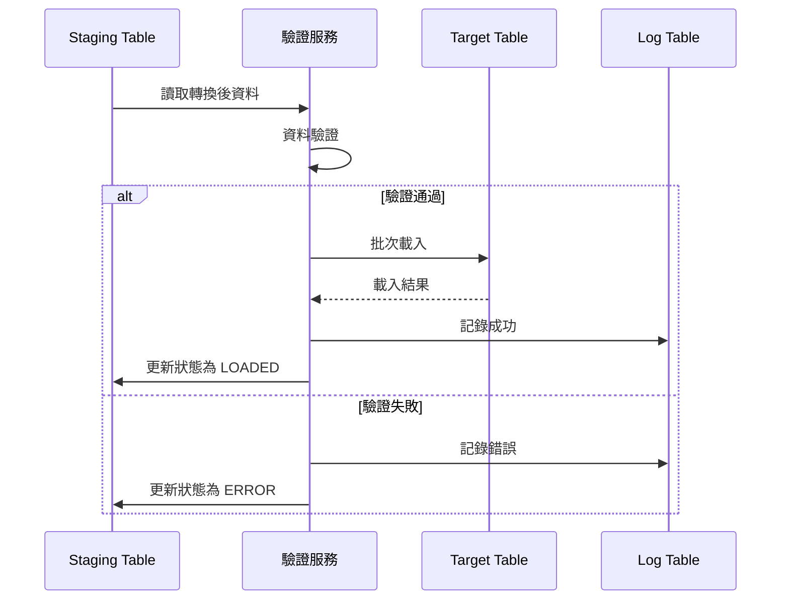
```mermaid
sequenceDiagram
    participant S as Staging Table
    participant V as 驗證服務
    participant T as Target Table
    participant L as Log Table
    
    S->>V: 讀取轉換後資料
    V->>V: 資料驗證
    alt 驗證通過
        V->>T: 批次載入
        T-->>V: 載入結果
        V->>L: 記錄成功
        V->>S: 更新狀態為 LOADED
    else 驗證失敗
        V->>L: 記錄錯誤
        V->>S: 更新狀態為 ERROR
    end
```

#### 5.3.3 批次載入實作

```java
@Service
@Slf4j
public class DataLoadService {
    
    @Autowired
    private StagingRepository stagingRepo;
    
    @Autowired
    private NewCustomerRepository targetRepo;
    
    @PersistenceContext
    private EntityManager entityManager;
    
    private static final int BATCH_SIZE = 1000;
    
    @Transactional
    public LoadResult loadCustomers(String batchId) {
        LoadResult result = new LoadResult(batchId);
        result.setStartTime(LocalDateTime.now());
        
        List<StagingCustomer> stagingData = stagingRepo
            .findByBatchIdAndStatus(batchId, "TRANSFORMED");
        
        int loadedCount = 0;
        int errorCount = 0;
        
        for (int i = 0; i < stagingData.size(); i++) {
            StagingCustomer staging = stagingData.get(i);
            
            try {
                // 解析轉換後資料
                NewCustomer customer = fromJson(
                    staging.getTransformedData(), 
                    NewCustomer.class
                );
                
                // 執行 Upsert
                upsertCustomer(customer);
                
                staging.setProcessStatus("LOADED");
                staging.setLoadTime(LocalDateTime.now());
                loadedCount++;
                
            } catch (Exception e) {
                staging.setProcessStatus("LOAD_ERROR");
                staging.setErrorMessage(e.getMessage());
                errorCount++;
                log.error("Load error for {}", staging.getSourceCustId(), e);
            }
            
            stagingRepo.save(staging);
            
            // 批次提交
            if ((i + 1) % BATCH_SIZE == 0) {
                entityManager.flush();
                entityManager.clear();
                log.info("Committed batch at index {}", i + 1);
            }
        }
        
        // 最後一批提交
        entityManager.flush();
        
        result.setLoadedCount(loadedCount);
        result.setErrorCount(errorCount);
        result.setEndTime(LocalDateTime.now());
        
        return result;
    }
    
    private void upsertCustomer(NewCustomer customer) {
        Optional<NewCustomer> existing = targetRepo
            .findByCustomerNo(customer.getCustomerNo());
        
        if (existing.isPresent()) {
            // Update
            NewCustomer target = existing.get();
            target.setName(customer.getName());
            target.setCustomerType(customer.getCustomerType());
            target.setUpdatedAt(LocalDateTime.now());
            targetRepo.save(target);
        } else {
            // Insert
            customer.setCreatedAt(LocalDateTime.now());
            targetRepo.save(customer);
        }
    }
}
```

### 5.4 Staging Table 設計

#### 5.4.1 Staging Table 結構

```sql
-- Staging Table 設計範例
CREATE TABLE stg_customer (
    -- Staging 控制欄位
    stg_id              BIGINT AUTO_INCREMENT PRIMARY KEY,
    batch_id            VARCHAR(20) NOT NULL,
    extract_time        TIMESTAMP NOT NULL,
    process_status      VARCHAR(20) DEFAULT 'PENDING',
    
    -- 來源資料欄位（原始格式保留）
    src_cust_id         VARCHAR(20),
    src_cust_name       VARCHAR(100),
    src_cust_type       VARCHAR(10),
    src_create_date     VARCHAR(20),
    src_raw_data        TEXT,           -- 原始資料 JSON
    
    -- 轉換後資料欄位
    tgt_customer_no     VARCHAR(20),
    tgt_name            VARCHAR(100),
    tgt_customer_type   VARCHAR(50),
    tgt_created_at      TIMESTAMP,
    tgt_transformed_data TEXT,          -- 轉換後資料 JSON
    
    -- 處理追蹤欄位
    transform_time      TIMESTAMP,
    load_time           TIMESTAMP,
    error_code          VARCHAR(20),
    error_message       TEXT,
    retry_count         INT DEFAULT 0,
    
    -- 索引
    INDEX idx_batch_status (batch_id, process_status),
    INDEX idx_src_cust_id (src_cust_id)
);
```

#### 5.4.2 Staging 狀態流轉

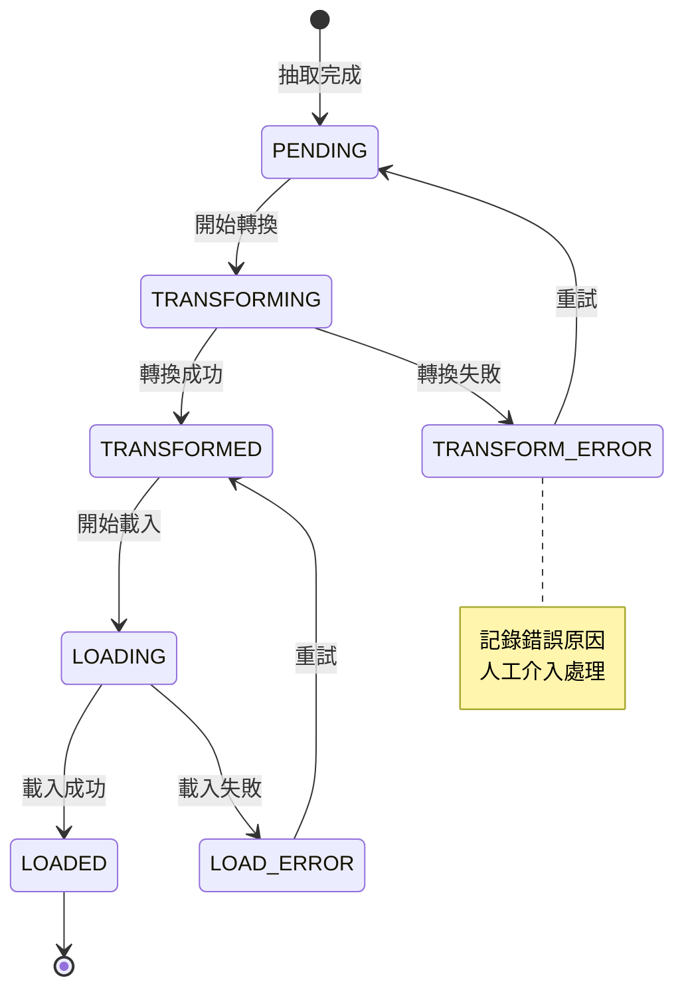
```mermaid
stateDiagram-v2
    [*] --> PENDING: 抽取完成
    PENDING --> TRANSFORMING: 開始轉換
    TRANSFORMING --> TRANSFORMED: 轉換成功
    TRANSFORMING --> TRANSFORM_ERROR: 轉換失敗
    TRANSFORMED --> LOADING: 開始載入
    LOADING --> LOADED: 載入成功
    LOADING --> LOAD_ERROR: 載入失敗
    TRANSFORM_ERROR --> PENDING: 重試
    LOAD_ERROR --> TRANSFORMED: 重試
    LOADED --> [*]
    
    note right of TRANSFORM_ERROR
        記錄錯誤原因
        人工介入處理
    end note
```

### 5.5 Error Handling 與 Retry 機制

#### 5.5.1 錯誤分類

| 錯誤類型 | 說明 | 處理方式 |
|---------|------|---------|
| **可重試錯誤** | 暫時性問題（連線逾時、鎖定） | 自動重試 |
| **資料錯誤** | 資料格式或內容問題 | 記錄並跳過，人工處理 |
| **系統錯誤** | 程式邏輯或環境問題 | 停止處理，修復後重跑 |
| **業務錯誤** | 違反業務規則 | 轉至人工審核 |

#### 5.5.2 錯誤處理流程

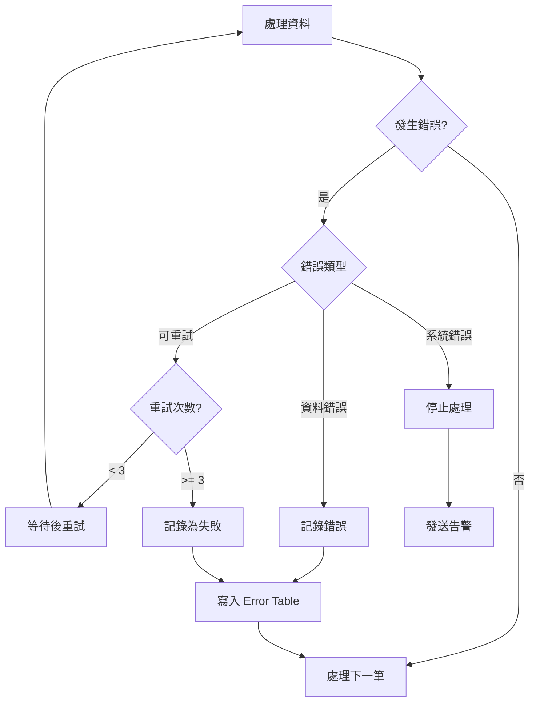
```mermaid
flowchart TD
    A[處理資料] --> B{發生錯誤?}
    B -->|否| C[處理下一筆]
    B -->|是| D{錯誤類型}
    
    D -->|可重試| E{重試次數?}
    E -->|< 3| F[等待後重試]
    E -->|>= 3| G[記錄為失敗]
    F --> A
    
    D -->|資料錯誤| H[記錄錯誤]
    H --> I[寫入 Error Table]
    I --> C
    
    D -->|系統錯誤| J[停止處理]
    J --> K[發送告警]
    
    G --> I
```

#### 5.5.3 Retry 機制實作

```java
@Service
@Slf4j
public class RetryableTransformService {
    
    private static final int MAX_RETRY = 3;
    private static final long RETRY_DELAY_MS = 1000;
    
    @Autowired
    private TransformService transformService;
    
    @Autowired
    private ErrorRepository errorRepo;
    
    public TransformResult transformWithRetry(StagingCustomer staging) {
        int retryCount = 0;
        Exception lastException = null;
        
        while (retryCount < MAX_RETRY) {
            try {
                return transformService.transform(staging);
                
            } catch (RetryableException e) {
                retryCount++;
                lastException = e;
                log.warn("Retryable error, attempt {}/{}: {}", 
                    retryCount, MAX_RETRY, e.getMessage());
                
                if (retryCount < MAX_RETRY) {
                    sleep(RETRY_DELAY_MS * retryCount); // 指數退避
                }
                
            } catch (DataException e) {
                // 資料錯誤，不重試
                log.error("Data error for {}: {}", 
                    staging.getSourceCustId(), e.getMessage());
                return handleDataError(staging, e);
                
            } catch (Exception e) {
                // 系統錯誤，不重試
                log.error("System error for {}", staging.getSourceCustId(), e);
                throw new MigrationException("System error", e);
            }
        }
        
        // 重試次數用盡
        return handleRetryExhausted(staging, lastException);
    }
    
    private TransformResult handleDataError(
            StagingCustomer staging, DataException e) {
        
        errorRepo.save(new TransformError(
            staging.getBatchId(),
            staging.getSourceCustId(),
            "DATA_ERROR",
            e.getMessage(),
            e.getFieldName(),
            e.getFieldValue()
        ));
        
        return TransformResult.error(staging.getSourceCustId(), e.getMessage());
    }
    
    private TransformResult handleRetryExhausted(
            StagingCustomer staging, Exception e) {
        
        errorRepo.save(new TransformError(
            staging.getBatchId(),
            staging.getSourceCustId(),
            "RETRY_EXHAUSTED",
            "Max retry reached: " + e.getMessage()
        ));
        
        return TransformResult.error(staging.getSourceCustId(), 
            "Retry exhausted");
    }
    
    private void sleep(long ms) {
        try {
            Thread.sleep(ms);
        } catch (InterruptedException e) {
            Thread.currentThread().interrupt();
        }
    }
}
```

#### 5.5.4 Error Table 設計

```sql
-- 轉置錯誤記錄表
CREATE TABLE migration_error_log (
    error_id        BIGINT AUTO_INCREMENT PRIMARY KEY,
    batch_id        VARCHAR(20) NOT NULL,
    source_table    VARCHAR(100),
    source_key      VARCHAR(100),
    error_phase     VARCHAR(20),    -- EXTRACT, TRANSFORM, LOAD
    error_type      VARCHAR(50),    -- DATA_ERROR, RETRY_EXHAUSTED, etc.
    error_code      VARCHAR(20),
    error_message   TEXT,
    field_name      VARCHAR(100),
    field_value     TEXT,
    raw_data        TEXT,
    created_at      TIMESTAMP DEFAULT CURRENT_TIMESTAMP,
    resolved_at     TIMESTAMP,
    resolved_by     VARCHAR(50),
    resolution_note TEXT,
    
    INDEX idx_batch_phase (batch_id, error_phase),
    INDEX idx_error_type (error_type)
);

-- 查詢未解決的錯誤
SELECT 
    error_phase,
    error_type,
    COUNT(*) AS error_count
FROM migration_error_log
WHERE batch_id = 'BATCH_001'
  AND resolved_at IS NULL
GROUP BY error_phase, error_type
ORDER BY error_count DESC;
```

> **📌 實務建議**：
> - Error Handling 機制必須在設計階段就規劃完整
> - 所有錯誤都必須記錄，不能靜默略過
> - 建立錯誤處理 SOP，明確定義各類錯誤的處理方式
> - 定期檢視 Error Log，找出系統性問題

---

## 第 6 章：資料驗證與比對機制

### 6.1 筆數驗證（Record Count）

#### 6.1.1 驗證層級

| 層級 | 說明 | 公式 |
|------|------|------|
| **總筆數** | 來源與目標總筆數比對 | Source Count = Target Count |
| **批次筆數** | 每批次的筆數比對 | Batch Source = Batch Target |
| **狀態筆數** | 各狀態的筆數統計 | Success + Error = Total |

#### 6.1.2 筆數驗證 SQL

```sql
-- 1. 總筆數比對
SELECT 
    'SOURCE' AS system,
    COUNT(*) AS record_count
FROM old_customer
UNION ALL
SELECT 
    'TARGET' AS system,
    COUNT(*) AS record_count
FROM new_customer
WHERE migration_batch_id IS NOT NULL;

-- 2. 批次筆數比對
SELECT 
    s.batch_id,
    s.source_count,
    t.target_count,
    e.error_count,
    CASE 
        WHEN s.source_count = t.target_count + e.error_count 
        THEN 'PASS' 
        ELSE 'FAIL' 
    END AS validation_result
FROM (
    SELECT batch_id, COUNT(*) AS source_count
    FROM stg_customer
    GROUP BY batch_id
) s
LEFT JOIN (
    SELECT migration_batch_id, COUNT(*) AS target_count
    FROM new_customer
    GROUP BY migration_batch_id
) t ON s.batch_id = t.migration_batch_id
LEFT JOIN (
    SELECT batch_id, COUNT(*) AS error_count
    FROM migration_error_log
    WHERE error_phase = 'LOAD'
    GROUP BY batch_id
) e ON s.batch_id = e.batch_id;
```

#### 6.1.3 筆數驗證報告範本

```markdown
## 筆數驗證報告

### 執行日期：2026-02-02
### 批次編號：BATCH_001

| 項目 | 來源筆數 | 目標筆數 | 錯誤筆數 | 差異 | 結果 |
|------|---------|---------|---------|------|------|
| CUSTOMER | 1,234,567 | 1,234,500 | 67 | 0 | ✅ PASS |
| ACCOUNT | 3,456,789 | 3,456,789 | 0 | 0 | ✅ PASS |
| TRANSACTION | 50,000,000 | 49,999,985 | 10 | 5 | ⚠️ WARN |

### 差異說明
- TRANSACTION 差異 5 筆：經確認為重複資料，已過濾
```

### 6.2 金額 / 數值驗證（Sum / Balance Check）

#### 6.2.1 數值驗證項目

| 驗證項目 | 說明 | 重要性 |
|---------|------|--------|
| **金額總和** | 交易金額、餘額總和 | 🔴 極高 |
| **數量統計** | 帳戶數、交易筆數 | 🟠 高 |
| **平均值** | 平均金額、平均筆數 | 🟡 中 |
| **極值** | 最大值、最小值 | 🟡 中 |

#### 6.2.2 金額驗證 SQL

```sql
-- 金額驗證查詢
WITH source_sum AS (
    SELECT 
        'SOURCE' AS system,
        SUM(balance) AS total_balance,
        SUM(txn_amount) AS total_txn_amount,
        COUNT(DISTINCT acct_no) AS account_count
    FROM old_account
),
target_sum AS (
    SELECT 
        'TARGET' AS system,
        SUM(balance) AS total_balance,
        SUM(txn_amount) AS total_txn_amount,
        COUNT(DISTINCT account_no) AS account_count
    FROM new_account
    WHERE migration_batch_id IS NOT NULL
)
SELECT 
    s.total_balance AS source_balance,
    t.total_balance AS target_balance,
    s.total_balance - t.total_balance AS balance_diff,
    CASE 
        WHEN ABS(s.total_balance - t.total_balance) < 0.01 
        THEN 'PASS' 
        ELSE 'FAIL' 
    END AS balance_check,
    s.total_txn_amount AS source_txn,
    t.total_txn_amount AS target_txn,
    s.total_txn_amount - t.total_txn_amount AS txn_diff
FROM source_sum s
CROSS JOIN target_sum t;
```

#### 6.2.3 分群金額驗證

```sql
-- 依客戶類型分群驗證
SELECT 
    COALESCE(s.cust_type, t.customer_type) AS customer_type,
    s.source_balance,
    t.target_balance,
    s.source_balance - COALESCE(t.target_balance, 0) AS diff,
    CASE 
        WHEN ABS(s.source_balance - COALESCE(t.target_balance, 0)) < 0.01 
        THEN '✅ PASS' 
        ELSE '❌ FAIL' 
    END AS result
FROM (
    SELECT 
        cust_type,
        SUM(balance) AS source_balance
    FROM old_account oa
    JOIN old_customer oc ON oa.cust_id = oc.cust_id
    GROUP BY cust_type
) s
FULL OUTER JOIN (
    SELECT 
        customer_type,
        SUM(balance) AS target_balance
    FROM new_account na
    JOIN new_customer nc ON na.customer_id = nc.id
    WHERE na.migration_batch_id IS NOT NULL
    GROUP BY customer_type
) t ON s.cust_type = (
    SELECT source_code 
    FROM migration_code_mapping 
    WHERE category = 'CUST_TYPE' 
      AND target_code = t.customer_type
);
```

### 6.3 Key-based 資料比對

#### 6.3.1 比對策略

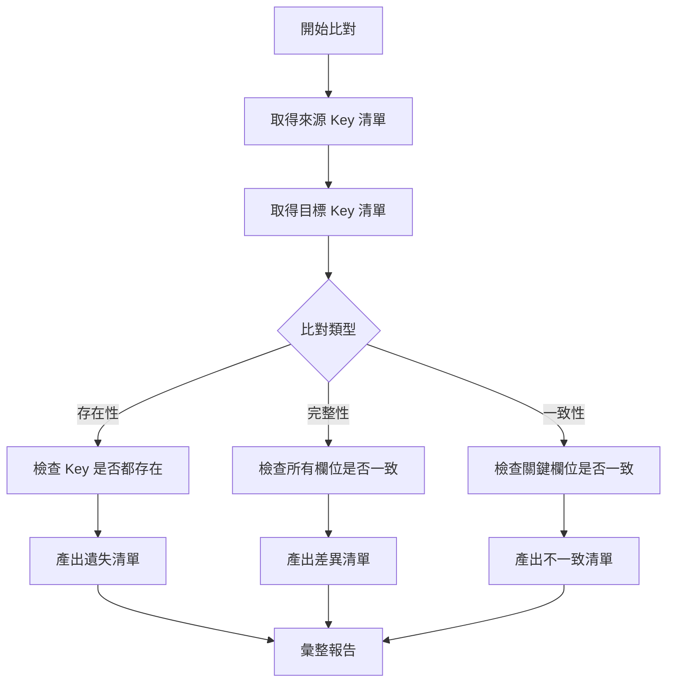
```mermaid
flowchart TD
    A[開始比對] --> B[取得來源 Key 清單]
    B --> C[取得目標 Key 清單]
    C --> D{比對類型}
    
    D -->|存在性| E[檢查 Key 是否都存在]
    D -->|完整性| F[檢查所有欄位是否一致]
    D -->|一致性| G[檢查關鍵欄位是否一致]
    
    E --> H[產出遺失清單]
    F --> I[產出差異清單]
    G --> J[產出不一致清單]
    
    H --> K[彙整報告]
    I --> K
    J --> K
```

#### 6.3.2 Key 比對 SQL

```sql
-- 1. 找出來源有但目標沒有的資料（遺失）
SELECT s.cust_id AS missing_key
FROM old_customer s
LEFT JOIN new_customer t 
    ON s.cust_id = t.customer_no
WHERE t.id IS NULL
  AND s.status = 'A';  -- 只檢查有效資料

-- 2. 找出目標有但來源沒有的資料（多餘）
SELECT t.customer_no AS extra_key
FROM new_customer t
LEFT JOIN old_customer s 
    ON t.customer_no = s.cust_id
WHERE s.cust_id IS NULL
  AND t.migration_batch_id IS NOT NULL;

-- 3. 關鍵欄位比對（找出不一致）
SELECT 
    s.cust_id,
    s.cust_name AS source_name,
    t.name AS target_name,
    s.balance AS source_balance,
    t.balance AS target_balance
FROM old_customer s
JOIN new_customer t 
    ON s.cust_id = t.customer_no
WHERE s.cust_name <> t.name
   OR ABS(s.balance - t.balance) > 0.01;
```

#### 6.3.3 比對結果統計

```sql
-- 比對結果統計
WITH comparison AS (
    SELECT 
        s.cust_id,
        CASE 
            WHEN t.id IS NULL THEN 'MISSING'
            WHEN s.cust_name <> t.name THEN 'NAME_MISMATCH'
            WHEN ABS(s.balance - t.balance) > 0.01 THEN 'BALANCE_MISMATCH'
            ELSE 'MATCH'
        END AS compare_result
    FROM old_customer s
    LEFT JOIN new_customer t 
        ON s.cust_id = t.customer_no
)
SELECT 
    compare_result,
    COUNT(*) AS count,
    ROUND(COUNT(*) * 100.0 / SUM(COUNT(*)) OVER(), 2) AS percentage
FROM comparison
GROUP BY compare_result
ORDER BY count DESC;
```

### 6.4 抽樣驗證（Sampling）

#### 6.4.1 抽樣策略

| 策略 | 說明 | 適用情境 |
|------|------|---------|
| **隨機抽樣** | 隨機選取 N 筆 | 一般資料驗證 |
| **分層抽樣** | 各類型各抽 N 筆 | 確保各類型都被驗證 |
| **邊界抽樣** | 抽取極值資料 | 驗證邊界條件 |
| **風險抽樣** | 針對高風險資料 | 金額大、狀態特殊 |

#### 6.4.2 抽樣 SQL

```sql
-- 1. 隨機抽樣 100 筆
SELECT *
FROM new_customer
WHERE migration_batch_id = 'BATCH_001'
ORDER BY RANDOM()
LIMIT 100;

-- 2. 分層抽樣（每種類型各 20 筆）
WITH ranked AS (
    SELECT 
        *,
        ROW_NUMBER() OVER (
            PARTITION BY customer_type 
            ORDER BY RANDOM()
        ) AS rn
    FROM new_customer
    WHERE migration_batch_id = 'BATCH_001'
)
SELECT *
FROM ranked
WHERE rn <= 20;

-- 3. 風險抽樣（高金額）
SELECT *
FROM new_account
WHERE migration_batch_id = 'BATCH_001'
  AND balance > 1000000
ORDER BY balance DESC
LIMIT 50;
```

#### 6.4.3 抽樣驗證表單

```markdown
## 抽樣驗證表單

### 抽樣條件
- 批次：BATCH_001
- 抽樣數量：100 筆
- 抽樣方式：分層隨機抽樣

### 驗證結果

| 序號 | 客戶編號 | 來源姓名 | 目標姓名 | 來源餘額 | 目標餘額 | 驗證結果 | 備註 |
|------|---------|---------|---------|---------|---------|---------|------|
| 1 | C001 | 王小明 | 王小明 | 50,000 | 50,000 | ✅ | - |
| 2 | C002 | 李大華 | 李大華 | 120,000 | 120,000 | ✅ | - |
| 3 | C003 | 張三　 | 張三 | 30,000 | 30,000 | ⚠️ | 全形空白已處理 |

### 驗證人員：_______________
### 驗證日期：_______________
### 簽核：_______________
```

### 6.5 自動化驗證報表設計

#### 6.5.1 驗證報表架構

```mermaid
flowchart TD
    subgraph 資料來源
        A[(Source DB)]
        B[(Target DB)]
        C[(Staging DB)]
    end
    
    subgraph 驗證引擎
        D[筆數驗證]
        E[金額驗證]
        F[Key 比對]
        G[抽樣驗證]
    end
    
    subgraph 報表輸出
        H[驗證摘要]
        I[差異明細]
        J[錯誤清單]
        K[趨勢分析]
    end
    
    A --> D
    B --> D
    A --> E
    B --> E
    A --> F
    B --> F
    C --> G
    
    D --> H
    E --> H
    F --> I
    G --> J
    
    H --> L[Dashboard]
    I --> L
    J --> L
    K --> L
```

#### 6.5.2 驗證報表產生程式

```java
@Service
@Slf4j
public class ValidationReportService {
    
    @Autowired
    private ValidationRepository validationRepo;
    
    public ValidationReport generateReport(String batchId) {
        ValidationReport report = new ValidationReport();
        report.setBatchId(batchId);
        report.setGeneratedAt(LocalDateTime.now());
        
        // 1. 筆數驗證
        RecordCountResult countResult = validateRecordCount(batchId);
        report.setRecordCountResult(countResult);
        
        // 2. 金額驗證
        AmountCheckResult amountResult = validateAmount(batchId);
        report.setAmountCheckResult(amountResult);
        
        // 3. Key 比對
        KeyCompareResult keyResult = compareKeys(batchId);
        report.setKeyCompareResult(keyResult);
        
        // 4. 計算整體狀態
        report.setOverallStatus(calculateOverallStatus(
            countResult, amountResult, keyResult
        ));
        
        // 5. 儲存報表
        validationRepo.saveReport(report);
        
        // 6. 產生 Markdown 檔案
        generateMarkdownReport(report);
        
        return report;
    }
    
    private void generateMarkdownReport(ValidationReport report) {
        StringBuilder md = new StringBuilder();
        
        md.append("# 資料轉置驗證報告\n\n");
        md.append(String.format("- **批次編號**：%s\n", report.getBatchId()));
        md.append(String.format("- **產生時間**：%s\n", report.getGeneratedAt()));
        md.append(String.format("- **整體狀態**：%s\n\n", 
            report.getOverallStatus().getDisplayName()));
        
        // 筆數驗證區塊
        md.append("## 1. 筆數驗證\n\n");
        md.append("| 項目 | 來源 | 目標 | 差異 | 結果 |\n");
        md.append("|------|------|------|------|------|\n");
        for (RecordCountItem item : report.getRecordCountResult().getItems()) {
            md.append(String.format("| %s | %,d | %,d | %,d | %s |\n",
                item.getTableName(),
                item.getSourceCount(),
                item.getTargetCount(),
                item.getDifference(),
                item.isPassed() ? "✅" : "❌"
            ));
        }
        
        // 金額驗證區塊
        md.append("\n## 2. 金額驗證\n\n");
        // ... 類似格式
        
        // 輸出檔案
        String fileName = String.format("validation_report_%s.md", 
            report.getBatchId());
        writeToFile(fileName, md.toString());
    }
    
    private ValidationStatus calculateOverallStatus(
            RecordCountResult count, 
            AmountCheckResult amount,
            KeyCompareResult key) {
        
        if (!count.isPassed() || !amount.isPassed()) {
            return ValidationStatus.FAILED;
        }
        
        if (key.getMismatchCount() > 0) {
            return ValidationStatus.WARNING;
        }
        
        return ValidationStatus.PASSED;
    }
}
```

#### 6.5.3 驗證 Dashboard 設計

```sql
-- Dashboard 用彙總查詢
CREATE VIEW v_migration_dashboard AS
SELECT 
    batch_id,
    -- 筆數狀態
    SUM(CASE WHEN record_count_passed THEN 1 ELSE 0 END) AS count_pass,
    SUM(CASE WHEN NOT record_count_passed THEN 1 ELSE 0 END) AS count_fail,
    
    -- 金額狀態
    SUM(CASE WHEN amount_check_passed THEN 1 ELSE 0 END) AS amount_pass,
    SUM(CASE WHEN NOT amount_check_passed THEN 1 ELSE 0 END) AS amount_fail,
    
    -- 錯誤統計
    SUM(error_count) AS total_errors,
    
    -- 進度
    ROUND(
        SUM(CASE WHEN status = 'LOADED' THEN 1 ELSE 0 END) * 100.0 / 
        COUNT(*), 2
    ) AS completion_pct,
    
    -- 時間
    MIN(start_time) AS start_time,
    MAX(end_time) AS end_time,
    TIMESTAMPDIFF(MINUTE, MIN(start_time), MAX(end_time)) AS duration_min
    
FROM migration_batch_control
GROUP BY batch_id;
```

> **📌 實務建議**：
> - 驗證報表應自動產生，不依賴人工製作
> - 關鍵驗證項目（筆數、金額）必須 100% 通過才能上線
> - 建立驗證基準線（Baseline），每次執行後比對
> - 驗證報表需保留存檔，作為上線簽核依據

---

## 第 7 章：工具與技術選型建議

### 7.1 SQL / Stored Procedure

#### 7.1.1 適用情境

| 情境 | 適合度 | 說明 |
|------|--------|------|
| 同資料庫轉置 | ⭐⭐⭐⭐⭐ | 最佳選擇，效能最好 |
| 簡單轉換邏輯 | ⭐⭐⭐⭐⭐ | SQL 原生支援 |
| 跨資料庫轉置 | ⭐⭐ | 需透過 DB Link |
| 複雜業務邏輯 | ⭐⭐ | 維護困難 |
| 檔案處理 | ⭐ | 不適合 |

#### 7.1.2 Stored Procedure 範例

```sql
-- 客戶資料轉置 Stored Procedure
CREATE OR REPLACE PROCEDURE sp_migrate_customer(
    p_batch_id IN VARCHAR2,
    p_start_key IN VARCHAR2,
    p_end_key IN VARCHAR2,
    p_result OUT VARCHAR2
)
AS
    v_count NUMBER := 0;
    v_error_count NUMBER := 0;
    v_start_time TIMESTAMP := SYSTIMESTAMP;
BEGIN
    -- 記錄開始
    UPDATE migration_batch_control
    SET status = 'RUNNING', start_time = v_start_time
    WHERE batch_id = p_batch_id;
    COMMIT;
    
    -- 執行轉置（使用 MERGE）
    MERGE INTO new_customer t
    USING (
        SELECT 
            cust_id AS customer_no,
            TRIM(cust_name) AS name,
            CASE cust_type
                WHEN '1' THEN 'INDIVIDUAL'
                WHEN '2' THEN 'CORPORATE'
                ELSE 'UNKNOWN'
            END AS customer_type,
            TO_TIMESTAMP(create_dt, 'YYYYMMDD') AS created_at,
            p_batch_id AS migration_batch_id
        FROM old_customer
        WHERE cust_id BETWEEN p_start_key AND p_end_key
          AND status = 'A'
    ) s
    ON (t.customer_no = s.customer_no)
    WHEN MATCHED THEN
        UPDATE SET 
            t.name = s.name,
            t.customer_type = s.customer_type,
            t.updated_at = SYSTIMESTAMP
    WHEN NOT MATCHED THEN
        INSERT (customer_no, name, customer_type, created_at, migration_batch_id)
        VALUES (s.customer_no, s.name, s.customer_type, s.created_at, s.migration_batch_id);
    
    v_count := SQL%ROWCOUNT;
    COMMIT;
    
    -- 更新批次狀態
    UPDATE migration_batch_control
    SET status = 'SUCCESS',
        processed_rows = v_count,
        end_time = SYSTIMESTAMP
    WHERE batch_id = p_batch_id;
    COMMIT;
    
    p_result := 'SUCCESS: ' || v_count || ' rows processed';
    
EXCEPTION
    WHEN OTHERS THEN
        ROLLBACK;
        UPDATE migration_batch_control
        SET status = 'FAILED',
            error_message = SQLERRM,
            end_time = SYSTIMESTAMP
        WHERE batch_id = p_batch_id;
        COMMIT;
        
        p_result := 'FAILED: ' || SQLERRM;
END;
/
```

#### 7.1.3 SQL 效能優化技巧

```sql
-- 1. 使用 Hint 優化大量資料處理
INSERT /*+ APPEND PARALLEL(4) */ INTO new_customer
SELECT /*+ PARALLEL(4) */
    cust_id, cust_name, cust_type, create_dt
FROM old_customer;

-- 2. 分批處理避免 Undo 爆滿
DECLARE
    v_batch_size NUMBER := 10000;
BEGIN
    LOOP
        INSERT INTO new_customer
        SELECT * FROM old_customer
        WHERE ROWNUM <= v_batch_size
          AND cust_id NOT IN (SELECT customer_no FROM new_customer);
        
        EXIT WHEN SQL%ROWCOUNT = 0;
        COMMIT;
    END LOOP;
END;

-- 3. 停用 Index 加速載入
ALTER INDEX idx_customer_name UNUSABLE;
-- 執行大量 INSERT
ALTER INDEX idx_customer_name REBUILD;

-- 4. 使用 NOLOGGING 加速（需謹慎）
ALTER TABLE new_customer NOLOGGING;
INSERT /*+ APPEND */ INTO new_customer ...;
ALTER TABLE new_customer LOGGING;
```

### 7.2 ETL 工具

#### 7.2.1 工具比較

| 工具 | 類型 | 優點 | 缺點 | 適用情境 |
|------|------|------|------|---------|
| **Talend** | 商業/開源 | 圖形化、功能完整 | 學習曲線陡 | 企業級 ETL |
| **Informatica** | 商業 | 企業級、穩定 | 價格高 | 大型企業 |
| **Apache Airflow** | 開源 | 彈性高、可程式化 | 需寫 Python | 技術團隊 |
| **Spring Batch** | 開源 | Java 生態系整合 | 需開發 | Java 專案 |
| **SSIS** | 商業 | 與 SQL Server 整合 | 限 MS 平台 | Windows 環境 |

#### 7.2.2 Apache Airflow DAG 範例

```python
# migration_dag.py
from airflow import DAG
from airflow.operators.python import PythonOperator
from airflow.operators.sql import SQLCheckOperator
from airflow.utils.dates import days_ago
from datetime import timedelta

default_args = {
    'owner': 'data-team',
    'depends_on_past': False,
    'email_on_failure': True,
    'email': ['admin@company.com'],
    'retries': 3,
    'retry_delay': timedelta(minutes=5),
}

dag = DAG(
    'customer_migration',
    default_args=default_args,
    description='Customer data migration pipeline',
    schedule_interval=None,  # Manual trigger
    start_date=days_ago(1),
    tags=['migration'],
)

def extract_customers(**context):
    """Extract customers from source system"""
    from migration.extract import CustomerExtractor
    
    batch_id = context['params']['batch_id']
    extractor = CustomerExtractor()
    result = extractor.extract(batch_id)
    
    context['ti'].xcom_push(key='extract_count', value=result.count)
    return result

def transform_customers(**context):
    """Transform customer data"""
    from migration.transform import CustomerTransformer
    
    batch_id = context['params']['batch_id']
    transformer = CustomerTransformer()
    result = transformer.transform(batch_id)
    
    context['ti'].xcom_push(key='transform_count', value=result.count)
    return result

def load_customers(**context):
    """Load customers to target system"""
    from migration.load import CustomerLoader
    
    batch_id = context['params']['batch_id']
    loader = CustomerLoader()
    result = loader.load(batch_id)
    
    context['ti'].xcom_push(key='load_count', value=result.count)
    return result

# Task definitions
extract_task = PythonOperator(
    task_id='extract_customers',
    python_callable=extract_customers,
    dag=dag,
)

transform_task = PythonOperator(
    task_id='transform_customers',
    python_callable=transform_customers,
    dag=dag,
)

load_task = PythonOperator(
    task_id='load_customers',
    python_callable=load_customers,
    dag=dag,
)

validate_count = SQLCheckOperator(
    task_id='validate_count',
    conn_id='target_db',
    sql="""
        SELECT CASE 
            WHEN source_count = target_count THEN 1 
            ELSE 0 
        END
        FROM migration_summary
        WHERE batch_id = '{{ params.batch_id }}'
    """,
    dag=dag,
)

# Task dependencies
extract_task >> transform_task >> load_task >> validate_count
```

### 7.3 程式語言選擇

#### 7.3.1 語言比較

| 語言 | 開發效率 | 執行效能 | 適用情境 | 優點 | 缺點 |
|------|---------|---------|---------|------|------|
| **SQL** | ⭐⭐⭐ | ⭐⭐⭐⭐⭐ | 同資料庫轉置 | 效能最佳、原生支援 | 複雜邏輯難維護 |
| **Java** | ⭐⭐⭐ | ⭐⭐⭐⭐ | 企業級專案 | 生態系完整、穩定 | 開發時間較長 |
| **Python** | ⭐⭐⭐⭐⭐ | ⭐⭐ | 快速開發 | 語法簡潔、套件豐富 | 大量資料效能差 |
| **Shell** | ⭐⭐⭐⭐ | ⭐⭐ | 簡單檔案處理 | 快速編寫腳本 | 錯誤處理困難 |

**選型建議**：
- **大量資料（千萬筆以上）**：優先考慮 SQL 或 Java
- **需要複雜轉換邏輯**：Java 或 Python
- **快速原型開發**：Python
- **同資料庫內轉置**：SQL（效能最佳）

#### 7.3.2 Spring Batch 架構

```mermaid
flowchart TD
    subgraph Spring Batch
        A[Job] --> B[Step 1: Extract]
        B --> C[Step 2: Transform]
        C --> D[Step 3: Load]
        
        B --> E[ItemReader]
        B --> F[ItemProcessor]
        B --> G[ItemWriter]
    end
    
    subgraph 資料流
        H[(Source DB)] --> E
        F --> I[Transform Logic]
        G --> J[(Target DB)]
    end
```

#### 7.3.3 Spring Batch 程式範例

```java
@Configuration
@EnableBatchProcessing
public class CustomerMigrationBatchConfig {
    
    @Autowired
    private JobBuilderFactory jobBuilderFactory;
    
    @Autowired
    private StepBuilderFactory stepBuilderFactory;
    
    @Autowired
    private DataSource sourceDataSource;
    
    @Autowired
    private DataSource targetDataSource;
    
    @Bean
    public Job customerMigrationJob() {
        return jobBuilderFactory.get("customerMigrationJob")
            .incrementer(new RunIdIncrementer())
            .listener(new JobCompletionListener())
            .flow(customerMigrationStep())
            .end()
            .build();
    }
    
    @Bean
    public Step customerMigrationStep() {
        return stepBuilderFactory.get("customerMigrationStep")
            .<OldCustomer, NewCustomer>chunk(1000)
            .reader(customerReader())
            .processor(customerProcessor())
            .writer(customerWriter())
            .faultTolerant()
            .skipLimit(100)
            .skip(DataIntegrityViolationException.class)
            .retryLimit(3)
            .retry(DeadlockLoserDataAccessException.class)
            .listener(new ChunkListener())
            .build();
    }
    
    @Bean
    @StepScope
    public JdbcPagingItemReader<OldCustomer> customerReader() {
        JdbcPagingItemReader<OldCustomer> reader = new JdbcPagingItemReader<>();
        reader.setDataSource(sourceDataSource);
        reader.setFetchSize(1000);
        reader.setPageSize(1000);
        
        Map<String, Order> sortKeys = new HashMap<>();
        sortKeys.put("cust_id", Order.ASCENDING);
        
        OraclePagingQueryProvider queryProvider = new OraclePagingQueryProvider();
        queryProvider.setSelectClause("cust_id, cust_name, cust_type, create_dt");
        queryProvider.setFromClause("old_customer");
        queryProvider.setWhereClause("status = 'A'");
        queryProvider.setSortKeys(sortKeys);
        
        reader.setQueryProvider(queryProvider);
        reader.setRowMapper(new OldCustomerRowMapper());
        
        return reader;
    }
    
    @Bean
    public ItemProcessor<OldCustomer, NewCustomer> customerProcessor() {
        return new CustomerTransformProcessor();
    }
    
    @Bean
    public JdbcBatchItemWriter<NewCustomer> customerWriter() {
        JdbcBatchItemWriter<NewCustomer> writer = new JdbcBatchItemWriter<>();
        writer.setDataSource(targetDataSource);
        writer.setSql("""
            INSERT INTO new_customer 
                (customer_no, name, customer_type, created_at, migration_batch_id)
            VALUES 
                (:customerNo, :name, :customerType, :createdAt, :migrationBatchId)
            """);
        writer.setItemSqlParameterSourceProvider(
            new BeanPropertyItemSqlParameterSourceProvider<>()
        );
        return writer;
    }
}

/**
 * 轉換處理器
 */
@Component
public class CustomerTransformProcessor 
        implements ItemProcessor<OldCustomer, NewCustomer> {
    
    @Autowired
    private CodeMappingService codeMappingService;
    
    @Value("#{jobParameters['batchId']}")
    private String batchId;
    
    @Override
    public NewCustomer process(OldCustomer source) throws Exception {
        NewCustomer target = new NewCustomer();
        
        // 轉換邏輯
        target.setCustomerNo(source.getCustId().trim());
        target.setName(cleanName(source.getCustName()));
        target.setCustomerType(
            codeMappingService.map("CUST_TYPE", source.getCustType())
        );
        target.setCreatedAt(parseDate(source.getCreateDt()));
        target.setMigrationBatchId(batchId);
        
        return target;
    }
    
    private String cleanName(String name) {
        if (name == null) return null;
        return StringUtils.normalizeSpace(name);
    }
    
    private LocalDateTime parseDate(String dateStr) {
        if (dateStr == null || dateStr.isEmpty()) return null;
        return LocalDate.parse(dateStr, 
            DateTimeFormatter.ofPattern("yyyyMMdd"))
            .atStartOfDay();
    }
}
```

### 7.4 檔案處理工具

#### 7.4.1 檔案類型處理

| 檔案類型 | 處理工具 | 注意事項 |
|---------|---------|---------|
| CSV | Apache Commons CSV, OpenCSV | 編碼、分隔符號 |
| 固定長度 | Java IO, FlatFileItemReader | Layout 定義 |
| Excel | Apache POI, EasyExcel | 記憶體控制 |
| XML | JAXB, StAX | 大檔案用 StAX |
| JSON | Jackson, Gson | 串流處理 |

#### 7.4.2 固定長度檔案處理

```java
/**
 * 固定長度檔案解析器
 */
@Component
public class FixedLengthFileParser {
    
    /**
     * Layout 定義
     */
    private static final FieldLayout[] CUSTOMER_LAYOUT = {
        new FieldLayout("custId", 0, 10),
        new FieldLayout("custName", 10, 40),
        new FieldLayout("custType", 50, 2),
        new FieldLayout("idNo", 52, 10),
        new FieldLayout("birthDate", 62, 8),
        new FieldLayout("createDate", 70, 8)
    };
    
    public List<Map<String, String>> parseFile(Path filePath, Charset charset) 
            throws IOException {
        
        List<Map<String, String>> records = new ArrayList<>();
        
        try (BufferedReader reader = Files.newBufferedReader(filePath, charset)) {
            String line;
            int lineNum = 0;
            
            while ((line = reader.readLine()) != null) {
                lineNum++;
                try {
                    Map<String, String> record = parseLine(line);
                    record.put("_lineNum", String.valueOf(lineNum));
                    records.add(record);
                } catch (Exception e) {
                    log.error("Parse error at line {}: {}", lineNum, e.getMessage());
                    // 記錄錯誤但繼續處理
                }
            }
        }
        
        return records;
    }
    
    private Map<String, String> parseLine(String line) {
        Map<String, String> record = new LinkedHashMap<>();
        
        for (FieldLayout field : CUSTOMER_LAYOUT) {
            int endPos = Math.min(field.start + field.length, line.length());
            String value = "";
            
            if (field.start < line.length()) {
                value = line.substring(field.start, endPos).trim();
            }
            
            record.put(field.name, value);
        }
        
        return record;
    }
    
    @Data
    @AllArgsConstructor
    private static class FieldLayout {
        private String name;
        private int start;
        private int length;
    }
}
```

#### 7.4.3 大檔案串流處理

```java
/**
 * 大檔案串流處理（避免 OOM）
 */
@Service
public class LargeFileProcessor {
    
    private static final int BATCH_SIZE = 10000;
    
    public void processLargeFile(Path filePath, Consumer<List<String>> batchHandler) 
            throws IOException {
        
        try (Stream<String> lines = Files.lines(filePath, Charset.forName("Big5"))) {
            
            List<String> batch = new ArrayList<>(BATCH_SIZE);
            
            lines.forEach(line -> {
                batch.add(line);
                
                if (batch.size() >= BATCH_SIZE) {
                    batchHandler.accept(new ArrayList<>(batch));
                    batch.clear();
                }
            });
            
            // 處理最後一批
            if (!batch.isEmpty()) {
                batchHandler.accept(batch);
            }
        }
    }
    
    /**
     * 使用範例
     */
    public void example() throws IOException {
        processLargeFile(Path.of("/data/large_file.txt"), batch -> {
            log.info("Processing batch of {} records", batch.size());
            // 處理邏輯
        });
    }
}
```

### 7.5 驗證與測試輔助工具

#### 7.5.1 工具清單

| 工具類型 | 工具名稱 | 用途 |
|---------|---------|------|
| **資料比對** | Beyond Compare, DiffKit | 資料差異比對 |
| **資料產生** | Faker, DbUnit | 測試資料產生 |
| **效能測試** | JMeter, Gatling | 轉置效能測試 |
| **資料品質** | Great Expectations, Deequ | 資料品質檢測 |
| **SQL 分析** | SQL Developer, DBeaver | SQL 開發與分析 |

#### 7.5.2 自製驗證工具範例

```java
/**
 * 資料比對工具
 */
@Component
public class DataComparisonTool {
    
    @Autowired
    private JdbcTemplate sourceJdbc;
    
    @Autowired
    private JdbcTemplate targetJdbc;
    
    /**
     * 比對兩個查詢結果
     */
    public ComparisonResult compare(
            String sourceQuery, 
            String targetQuery,
            List<String> keyColumns,
            List<String> compareColumns) {
        
        ComparisonResult result = new ComparisonResult();
        
        // 取得來源資料
        Map<String, Map<String, Object>> sourceData = executeQuery(
            sourceJdbc, sourceQuery, keyColumns
        );
        
        // 取得目標資料
        Map<String, Map<String, Object>> targetData = executeQuery(
            targetJdbc, targetQuery, keyColumns
        );
        
        // 找出遺失的 Key
        Set<String> missingKeys = new HashSet<>(sourceData.keySet());
        missingKeys.removeAll(targetData.keySet());
        result.setMissingKeys(missingKeys);
        
        // 找出多餘的 Key
        Set<String> extraKeys = new HashSet<>(targetData.keySet());
        extraKeys.removeAll(sourceData.keySet());
        result.setExtraKeys(extraKeys);
        
        // 比對欄位值
        List<FieldMismatch> mismatches = new ArrayList<>();
        for (String key : sourceData.keySet()) {
            if (targetData.containsKey(key)) {
                Map<String, Object> sourceRow = sourceData.get(key);
                Map<String, Object> targetRow = targetData.get(key);
                
                for (String col : compareColumns) {
                    Object sourceVal = sourceRow.get(col);
                    Object targetVal = targetRow.get(col);
                    
                    if (!Objects.equals(sourceVal, targetVal)) {
                        mismatches.add(new FieldMismatch(
                            key, col, sourceVal, targetVal
                        ));
                    }
                }
            }
        }
        result.setMismatches(mismatches);
        
        return result;
    }
    
    private Map<String, Map<String, Object>> executeQuery(
            JdbcTemplate jdbc, 
            String query, 
            List<String> keyColumns) {
        
        Map<String, Map<String, Object>> result = new LinkedHashMap<>();
        
        jdbc.query(query, rs -> {
            Map<String, Object> row = new HashMap<>();
            ResultSetMetaData meta = rs.getMetaData();
            
            for (int i = 1; i <= meta.getColumnCount(); i++) {
                row.put(meta.getColumnName(i), rs.getObject(i));
            }
            
            // 組合 Key
            String key = keyColumns.stream()
                .map(col -> String.valueOf(row.get(col)))
                .collect(Collectors.joining("|"));
            
            result.put(key, row);
        });
        
        return result;
    }
}
```

> **📌 實務建議**：
> - 工具選型應考量團隊技術能力與維護成本
> - 優先選用團隊熟悉的工具，降低學習曲線
> - 商業工具需評估授權成本與長期支援
> - 自製工具需考量文件化與交接問題

---

## 第 8 章：測試策略與上線前檢核

### 8.1 Unit Test（轉換邏輯）

#### 8.1.1 測試範圍

| 測試項目 | 說明 | 重要性 |
|---------|------|--------|
| **格式轉換** | 日期、數字格式轉換正確性 | 🔴 高 |
| **代碼對應** | 代碼 Mapping 正確性 | 🔴 高 |
| **空值處理** | Null 值處理邏輯 | 🟠 中 |
| **邊界條件** | 極值、特殊字元處理 | 🟠 中 |
| **業務規則** | 複雜業務邏輯 | 🔴 高 |

#### 8.1.2 Unit Test 範例

```java
@ExtendWith(MockitoExtension.class)
class CustomerTransformProcessorTest {
    
    @Mock
    private CodeMappingService codeMappingService;
    
    @InjectMocks
    private CustomerTransformProcessor processor;
    
    @BeforeEach
    void setUp() {
        // 設定 Mock 行為
        when(codeMappingService.map("CUST_TYPE", "1"))
            .thenReturn("INDIVIDUAL");
        when(codeMappingService.map("CUST_TYPE", "2"))
            .thenReturn("CORPORATE");
        when(codeMappingService.map("CUST_TYPE", "X"))
            .thenReturn("UNMAPPED_X");
    }
    
    @Test
    @DisplayName("正常資料轉換")
    void testNormalTransform() throws Exception {
        // Given
        OldCustomer source = new OldCustomer();
        source.setCustId("C0001     ");  // 含空白
        source.setCustName("  王小明  ");
        source.setCustType("1");
        source.setCreateDt("20240101");
        
        // When
        NewCustomer result = processor.process(source);
        
        // Then
        assertThat(result.getCustomerNo()).isEqualTo("C0001");
        assertThat(result.getName()).isEqualTo("王小明");
        assertThat(result.getCustomerType()).isEqualTo("INDIVIDUAL");
        assertThat(result.getCreatedAt())
            .isEqualTo(LocalDateTime.of(2024, 1, 1, 0, 0));
    }
    
    @Test
    @DisplayName("日期格式異常處理")
    void testInvalidDateFormat() {
        // Given
        OldCustomer source = new OldCustomer();
        source.setCustId("C0002");
        source.setCustName("李大華");
        source.setCustType("1");
        source.setCreateDt("2024/01/01");  // 錯誤格式
        
        // When & Then
        assertThatThrownBy(() -> processor.process(source))
            .isInstanceOf(DateTimeParseException.class);
    }
    
    @Test
    @DisplayName("空值處理")
    void testNullValues() throws Exception {
        // Given
        OldCustomer source = new OldCustomer();
        source.setCustId("C0003");
        source.setCustName(null);
        source.setCustType("2");
        source.setCreateDt("");
        
        // When
        NewCustomer result = processor.process(source);
        
        // Then
        assertThat(result.getCustomerNo()).isEqualTo("C0003");
        assertThat(result.getName()).isNull();
        assertThat(result.getCustomerType()).isEqualTo("CORPORATE");
        assertThat(result.getCreatedAt()).isNull();
    }
    
    @Test
    @DisplayName("未定義代碼處理")
    void testUnmappedCode() throws Exception {
        // Given
        OldCustomer source = new OldCustomer();
        source.setCustId("C0004");
        source.setCustName("張三");
        source.setCustType("X");  // 未定義代碼
        source.setCreateDt("20240101");
        
        // When
        NewCustomer result = processor.process(source);
        
        // Then
        assertThat(result.getCustomerType()).isEqualTo("UNMAPPED_X");
    }
    
    @ParameterizedTest
    @DisplayName("各種日期格式測試")
    @CsvSource({
        "20240101, 2024-01-01",
        "20241231, 2024-12-31",
        "20200229, 2020-02-29"  // 閏年
    })
    void testDateFormats(String input, String expected) throws Exception {
        OldCustomer source = new OldCustomer();
        source.setCustId("C0005");
        source.setCustName("Test");
        source.setCustType("1");
        source.setCreateDt(input);
        
        NewCustomer result = processor.process(source);
        
        assertThat(result.getCreatedAt().toLocalDate())
            .isEqualTo(LocalDate.parse(expected));
    }
}
```

### 8.2 Integration Test（流程驗證）

#### 8.2.1 整合測試範圍

```mermaid
flowchart LR
    subgraph 整合測試範圍
        A[Source DB] --> B[Extract]
        B --> C[Transform]
        C --> D[Load]
        D --> E[Target DB]
        
        F[Error Handling]
        G[Checkpoint]
        H[Validation]
    end
    
    B --> F
    C --> F
    D --> F
    
    B --> G
    C --> G
    D --> G
    
    E --> H
```

#### 8.2.2 整合測試程式

```java
@SpringBootTest
@Testcontainers
@ActiveProfiles("test")
class CustomerMigrationIntegrationTest {
    
    @Container
    static OracleContainer sourceDb = new OracleContainer("oracle:19c")
        .withInitScript("sql/source-init.sql");
    
    @Container
    static PostgreSQLContainer targetDb = new PostgreSQLContainer("postgres:15")
        .withInitScript("sql/target-init.sql");
    
    @Autowired
    private JobLauncherTestUtils jobLauncherTestUtils;
    
    @Autowired
    private JdbcTemplate targetJdbc;
    
    @Test
    @DisplayName("完整轉置流程測試")
    void testFullMigrationFlow() throws Exception {
        // Given: 準備測試資料
        setupTestData();
        
        // When: 執行轉置 Job
        JobParameters params = new JobParametersBuilder()
            .addString("batchId", "TEST_BATCH_001")
            .addLong("time", System.currentTimeMillis())
            .toJobParameters();
        
        JobExecution execution = jobLauncherTestUtils.launchJob(params);
        
        // Then: 驗證結果
        assertThat(execution.getStatus()).isEqualTo(BatchStatus.COMPLETED);
        
        // 驗證筆數
        Integer targetCount = targetJdbc.queryForObject(
            "SELECT COUNT(*) FROM new_customer WHERE migration_batch_id = ?",
            Integer.class, "TEST_BATCH_001"
        );
        assertThat(targetCount).isEqualTo(100);
        
        // 驗證金額
        BigDecimal totalBalance = targetJdbc.queryForObject(
            "SELECT SUM(balance) FROM new_account WHERE migration_batch_id = ?",
            BigDecimal.class, "TEST_BATCH_001"
        );
        assertThat(totalBalance).isEqualByComparingTo(new BigDecimal("1234567.89"));
    }
    
    @Test
    @DisplayName("錯誤資料處理測試")
    void testErrorHandling() throws Exception {
        // Given: 插入異常資料
        insertInvalidData();
        
        // When
        JobParameters params = new JobParametersBuilder()
            .addString("batchId", "TEST_BATCH_002")
            .addLong("time", System.currentTimeMillis())
            .toJobParameters();
        
        JobExecution execution = jobLauncherTestUtils.launchJob(params);
        
        // Then: 確認 Job 完成（錯誤被跳過）
        assertThat(execution.getStatus()).isEqualTo(BatchStatus.COMPLETED);
        
        // 確認錯誤被記錄
        Integer errorCount = targetJdbc.queryForObject(
            "SELECT COUNT(*) FROM migration_error_log WHERE batch_id = ?",
            Integer.class, "TEST_BATCH_002"
        );
        assertThat(errorCount).isGreaterThan(0);
    }
    
    @Test
    @DisplayName("Checkpoint 恢復測試")
    void testCheckpointRecovery() throws Exception {
        // Given: 執行到一半中斷
        JobParameters params = new JobParametersBuilder()
            .addString("batchId", "TEST_BATCH_003")
            .addLong("time", System.currentTimeMillis())
            .toJobParameters();
        
        // 模擬中斷
        simulateInterruption();
        
        // When: 重新啟動
        JobExecution execution = jobLauncherTestUtils.launchJob(params);
        
        // Then: 確認從 Checkpoint 恢復
        assertThat(execution.getStatus()).isEqualTo(BatchStatus.COMPLETED);
        
        // 確認沒有重複資料
        Integer duplicateCount = targetJdbc.queryForObject(
            """
            SELECT COUNT(*) FROM (
                SELECT customer_no, COUNT(*) AS cnt
                FROM new_customer
                WHERE migration_batch_id = ?
                GROUP BY customer_no
                HAVING COUNT(*) > 1
            ) t
            """,
            Integer.class, "TEST_BATCH_003"
        );
        assertThat(duplicateCount).isEqualTo(0);
    }
}
```

### 8.3 UAT 驗證模式

#### 8.3.1 UAT 驗證流程

```mermaid
flowchart TD
    A[UAT 開始] --> B[環境準備]
    B --> C[測試資料準備]
    C --> D[執行轉置]
    D --> E[技術驗證]
    E --> F{技術通過?}
    F -->|否| G[修復問題]
    G --> D
    F -->|是| H[業務驗證]
    H --> I[抽樣檢核]
    I --> J[業務確認]
    J --> K{業務通過?}
    K -->|否| L[記錄問題]
    L --> G
    K -->|是| M[UAT 簽核]
    M --> N[UAT 完成]
```

#### 8.3.2 UAT 檢核表

```markdown
## UAT 驗證檢核表

### 基本資訊
- 專案名稱：_______________
- 轉置批次：_______________
- 驗證日期：_______________
- 驗證人員：_______________

### 一、技術驗證 ☑

| 項目 | 預期值 | 實際值 | 結果 | 備註 |
|------|--------|--------|------|------|
| 來源筆數 | 1,000,000 | | □ Pass □ Fail | |
| 目標筆數 | 1,000,000 | | □ Pass □ Fail | |
| 錯誤筆數 | < 100 | | □ Pass □ Fail | |
| 金額總和 | 123,456,789.00 | | □ Pass □ Fail | |
| 執行時間 | < 2 小時 | | □ Pass □ Fail | |

### 二、業務驗證 ☑

| 驗證情境 | 測試案例 | 預期結果 | 實際結果 | 結果 |
|---------|---------|---------|---------|------|
| 客戶查詢 | 查詢客戶 C001 | 顯示完整資料 | | □ Pass □ Fail |
| 帳戶餘額 | 帳戶 A001 餘額 | 50,000.00 | | □ Pass □ Fail |
| 交易明細 | 近 3 個月交易 | 顯示 15 筆 | | □ Pass □ Fail |

### 三、抽樣驗證 ☑

| 序號 | 客戶編號 | 驗證項目 | 來源值 | 目標值 | 結果 |
|------|---------|---------|--------|--------|------|
| 1 | | 姓名 | | | □ Match |
| 2 | | 餘額 | | | □ Match |
| 3 | | 狀態 | | | □ Match |

### 四、簽核

| 角色 | 姓名 | 簽名 | 日期 |
|------|------|------|------|
| 技術負責人 | | | |
| 業務負責人 | | | |
| 專案經理 | | | |
```

### 8.4 上線前 Checklist

#### 8.4.1 完整 Checklist

```markdown
## 資料轉置上線前檢核清單

### 📋 T-7（上線前 7 天）

#### 環境確認
- [ ] 正式環境資料庫連線測試通過
- [ ] 正式環境帳號權限確認
- [ ] 備份機制確認可運作
- [ ] 監控告警設定完成

#### 程式確認
- [ ] 轉置程式已部署至正式環境
- [ ] 程式版本與 UAT 版本一致
- [ ] 設定檔已更新為正式環境參數
- [ ] Log 輸出路徑確認

#### 文件確認
- [ ] Mapping 文件最終版已確認
- [ ] 操作手冊已完成
- [ ] Rollback 手冊已完成
- [ ] 緊急聯絡清單已更新

### 📋 T-3（上線前 3 天）

#### 資料確認
- [ ] 來源資料筆數確認
- [ ] 來源資料品質檢測通過
- [ ] 代碼對應表已載入
- [ ] 測試資料已清除

#### 演練確認
- [ ] 正式環境演練已完成
- [ ] 演練時間符合預期
- [ ] 演練驗證報告已產出
- [ ] 演練問題已修復

### 📋 T-1（上線前 1 天）

#### 最終確認
- [ ] 上線計畫已發送相關人員
- [ ] 維護公告已發布
- [ ] 相關系統已通知
- [ ] 值班人員已確認

#### 備份確認
- [ ] 來源資料備份完成
- [ ] 目標資料庫備份完成
- [ ] 備份可還原已驗證

### 📋 D-Day（上線當天）

#### 上線前
- [ ] 停止相關應用服務
- [ ] 確認無進行中交易
- [ ] 建立最新備份點
- [ ] 記錄開始時間

#### 上線中
- [ ] 執行資料抽取 → 完成時間：______
- [ ] 執行資料轉換 → 完成時間：______
- [ ] 執行資料載入 → 完成時間：______
- [ ] 執行筆數驗證 → 結果：______
- [ ] 執行金額驗證 → 結果：______

#### 上線後
- [ ] 啟動相關應用服務
- [ ] 執行功能測試
- [ ] 業務確認通過
- [ ] 監控觀察正常

### 📋 D+1（上線後 1 天）

#### 確認事項
- [ ] 無異常錯誤回報
- [ ] 監控指標正常
- [ ] 業務運作正常
- [ ] 上線報告已產出

### ✅ 最終簽核

| 檢核項目 | 簽核人 | 簽核時間 |
|---------|--------|---------|
| 技術檢核完成 | | |
| 業務確認完成 | | |
| 上線許可 | | |
```

> **📌 實務建議**：
> - Checklist 必須逐項確認，不可跳過
> - 每個檢核項目都應有明確的完成標準
> - 建議使用電子化管理，保留簽核記錄
> - 上線後持續監控至少 3 天

---

## 第 9 章：實務經驗與最佳實踐

### 9.1 常見踩雷案例

#### 9.1.1 案例一：字元編碼問題

**背景**：某銀行將舊系統（Big5 編碼）資料轉置到新系統（UTF-8）

**問題**：
- 部分中文姓名轉置後變成亂碼
- 影響約 5,000 筆客戶資料

**原因**：
- 舊系統使用 Big5 + 私有碼區
- 轉換時未處理私有字元

**解決方案**：
```java
// 建立自訂字元映射表
Map<Character, String> customMapping = new HashMap<>();
customMapping.put('\uE000', "堃");  // 私有碼區字元
customMapping.put('\uE001', "燊");

public String convertEncoding(String input) {
    StringBuilder result = new StringBuilder();
    for (char c : input.toCharArray()) {
        if (customMapping.containsKey(c)) {
            result.append(customMapping.get(c));
        } else {
            result.append(c);
        }
    }
    return result.toString();
}
```

**教訓**：
- ✅ 轉置前必須完整分析字元集
- ✅ 建立私有字元對應表
- ✅ 執行字元轉換前後比對驗證

#### 9.1.2 案例二：日期處理問題

**背景**：舊系統日期欄位存在多種格式

**問題**：
```
正常格式：20240101
異常格式：2024/1/1、24-01-01、00000000、99999999
```

**解決方案**：
```java
public LocalDate parseDateFlexible(String dateStr) {
    if (dateStr == null || dateStr.trim().isEmpty()) {
        return null;
    }
    
    // 處理特殊值
    if ("00000000".equals(dateStr) || "99999999".equals(dateStr)) {
        return null;
    }
    
    // 嘗試多種格式
    List<DateTimeFormatter> formatters = Arrays.asList(
        DateTimeFormatter.ofPattern("yyyyMMdd"),
        DateTimeFormatter.ofPattern("yyyy/M/d"),
        DateTimeFormatter.ofPattern("yy-MM-dd"),
        DateTimeFormatter.ofPattern("yyyy-MM-dd")
    );
    
    for (DateTimeFormatter formatter : formatters) {
        try {
            return LocalDate.parse(dateStr.trim(), formatter);
        } catch (DateTimeParseException e) {
            // 繼續嘗試下一個格式
        }
    }
    
    // 全部失敗，記錄錯誤
    throw new DataException("無法解析日期: " + dateStr);
}
```

#### 9.1.3 案例三：效能問題

**背景**：5,000 萬筆交易資料轉置，預估 4 小時，實際執行 16 小時

**原因分析**：
1. 單執行緒處理
2. 每筆資料都做 SELECT 檢查是否存在
3. 未使用批次寫入

**優化方案**：

```java
// 優化前：單筆處理
for (Transaction txn : transactions) {
    if (!exists(txn.getId())) {
        insert(txn);
    }
}

// 優化後：批次處理 + 並行
@Async
public CompletableFuture<Integer> processBatch(List<Transaction> batch) {
    // 批次檢查存在性
    Set<String> existingIds = findExistingIds(
        batch.stream().map(Transaction::getId).collect(toList())
    );
    
    // 過濾出需要新增的
    List<Transaction> toInsert = batch.stream()
        .filter(t -> !existingIds.contains(t.getId()))
        .collect(toList());
    
    // 批次寫入
    batchInsert(toInsert);
    
    return CompletableFuture.completedFuture(toInsert.size());
}
```

**效能對比**：

| 項目 | 優化前 | 優化後 |
|------|--------|--------|
| 執行時間 | 16 小時 | 2.5 小時 |
| CPU 使用率 | 15% | 70% |
| 每秒處理筆數 | 850 | 5,500 |

### 9.2 與業務單位的資料驗證合作方式

#### 9.2.1 合作模式

```mermaid
flowchart LR
    subgraph IT 團隊
        A[準備驗證報表]
        B[提供查詢工具]
        C[修復資料問題]
    end
    
    subgraph 業務單位
        D[提供驗證案例]
        E[執行業務驗證]
        F[確認驗證結果]
    end
    
    A --> E
    B --> E
    D --> A
    E --> F
    F -->|有問題| C
    C --> A
    F -->|通過| G[簽核]
```

#### 9.2.2 溝通注意事項

| 項目 | 建議做法 | 避免做法 |
|------|---------|---------|
| **驗證範圍** | 雙方事先確認 | 單方面決定 |
| **驗證時程** | 預留充足時間 | 壓縮業務驗證時間 |
| **問題回報** | 統一管道（如 Issue Tracker） | 口頭回報 |
| **責任劃分** | 明確文件化 | 模糊責任 |

#### 9.2.3 業務驗證工具

```java
/**
 * 業務驗證用查詢介面
 */
@RestController
@RequestMapping("/api/migration/verify")
public class VerificationController {
    
    @Autowired
    private VerificationService verifyService;
    
    /**
     * 單筆資料比對
     */
    @GetMapping("/customer/{custId}")
    public CustomerCompareResult compareCustomer(@PathVariable String custId) {
        return verifyService.compareCustomer(custId);
    }
    
    /**
     * 抽樣驗證報表
     */
    @GetMapping("/sample-report")
    public SampleReport getSampleReport(
            @RequestParam String batchId,
            @RequestParam(defaultValue = "100") int sampleSize) {
        return verifyService.generateSampleReport(batchId, sampleSize);
    }
    
    /**
     * 匯出驗證資料（Excel）
     */
    @GetMapping("/export")
    public ResponseEntity<byte[]> exportVerificationData(
            @RequestParam String batchId) {
        byte[] excelData = verifyService.exportToExcel(batchId);
        
        return ResponseEntity.ok()
            .header(HttpHeaders.CONTENT_DISPOSITION, 
                "attachment; filename=verification_" + batchId + ".xlsx")
            .contentType(MediaType.APPLICATION_OCTET_STREAM)
            .body(excelData);
    }
}
```

### 9.3 文件化、稽核與可追溯性設計

#### 9.3.1 文件清單

| 文件類型 | 內容 | 保存期限 |
|---------|------|---------|
| **Mapping 文件** | 欄位對應規則、轉換邏輯 | 永久 |
| **轉置計畫** | 時程、範圍、策略 | 5 年 |
| **驗證報告** | 驗證結果、簽核記錄 | 10 年 |
| **錯誤處理記錄** | 異常資料處理方式 | 10 年 |
| **變更記錄** | 轉置過程中的變更 | 5 年 |

#### 9.3.2 稽核軌跡設計

```sql
-- 轉置稽核表
CREATE TABLE migration_audit_log (
    audit_id        BIGINT AUTO_INCREMENT PRIMARY KEY,
    batch_id        VARCHAR(20) NOT NULL,
    action_type     VARCHAR(50) NOT NULL,  -- EXTRACT, TRANSFORM, LOAD, VERIFY
    action_detail   TEXT,
    source_table    VARCHAR(100),
    target_table    VARCHAR(100),
    affected_rows   BIGINT,
    executed_by     VARCHAR(50),
    executed_at     TIMESTAMP DEFAULT CURRENT_TIMESTAMP,
    client_ip       VARCHAR(45),
    checksum        VARCHAR(64),  -- 資料校驗碼
    
    INDEX idx_batch (batch_id),
    INDEX idx_time (executed_at)
);

-- 記錄稽核日誌
INSERT INTO migration_audit_log 
    (batch_id, action_type, action_detail, source_table, target_table, 
     affected_rows, executed_by, checksum)
VALUES 
    ('BATCH_001', 'LOAD', 'Customer migration completed', 
     'old_customer', 'new_customer', 1234567, 'system', 
     SHA2(CONCAT('BATCH_001', '1234567', NOW()), 256));
```

#### 9.3.3 資料血緣追蹤

```java
/**
 * 資料血緣記錄
 */
@Entity
@Table(name = "data_lineage")
public class DataLineage {
    
    @Id
    @GeneratedValue(strategy = GenerationType.IDENTITY)
    private Long id;
    
    private String batchId;
    
    // 來源資訊
    private String sourceSystem;
    private String sourceTable;
    private String sourceKey;
    private String sourceChecksum;
    
    // 目標資訊
    private String targetSystem;
    private String targetTable;
    private String targetKey;
    private String targetChecksum;
    
    // 轉換資訊
    private String transformRules;  // JSON 格式
    private LocalDateTime transformTime;
    
    // 追蹤資訊
    private String createdBy;
    private LocalDateTime createdAt;
}

/**
 * 血緣查詢服務
 */
@Service
public class DataLineageService {
    
    /**
     * 追蹤資料來源
     */
    public LineageTrace traceBack(String targetTable, String targetKey) {
        List<DataLineage> lineage = lineageRepo
            .findByTargetTableAndTargetKey(targetTable, targetKey);
        
        LineageTrace trace = new LineageTrace();
        trace.setTargetTable(targetTable);
        trace.setTargetKey(targetKey);
        
        for (DataLineage l : lineage) {
            trace.addSource(new SourceInfo(
                l.getSourceSystem(),
                l.getSourceTable(),
                l.getSourceKey(),
                l.getTransformRules()
            ));
        }
        
        return trace;
    }
}
```

### 9.4 金融與核心系統常見合規考量

#### 9.4.1 合規要求

| 法規/標準 | 要求 | 轉置影響 |
|----------|------|---------|
| **個資法** | 個人資料保護 | 資料脫敏、傳輸加密 |
| **金融檢查** | 資料完整性、稽核軌跡 | 完整記錄、長期保存 |
| **ISO 27001** | 資訊安全管理 | 存取控制、加密 |
| **SOX** | 財務資料正確性 | 金額驗證、簽核流程 |

#### 9.4.2 敏感資料處理

```java
/**
 * 敏感資料處理
 */
@Service
public class SensitiveDataHandler {
    
    /**
     * 身分證字號脫敏
     */
    public String maskIdNumber(String idNo) {
        if (idNo == null || idNo.length() < 10) {
            return idNo;
        }
        // A123456789 → A12****789
        return idNo.substring(0, 3) + "****" + idNo.substring(7);
    }
    
    /**
     * 加密儲存
     */
    public String encrypt(String plainText) {
        // 使用 AES-256 加密
        return aesEncryptor.encrypt(plainText);
    }
    
    /**
     * 轉置時的敏感資料處理
     */
    public NewCustomer processSensitiveData(OldCustomer source, boolean isMasked) {
        NewCustomer target = new NewCustomer();
        
        // 一般欄位直接轉
        target.setCustomerNo(source.getCustId());
        target.setName(source.getCustName());
        
        // 敏感欄位處理
        if (isMasked) {
            target.setIdNumber(maskIdNumber(source.getIdNo()));
        } else {
            target.setIdNumberEncrypted(encrypt(source.getIdNo()));
        }
        
        return target;
    }
}
```

#### 9.4.3 合規檢查清單

```markdown
## 資料轉置合規檢查清單

### 個人資料保護
- [ ] 敏感欄位已識別並標註
- [ ] 傳輸過程已加密（TLS 1.2+）
- [ ] 靜態資料已加密或脫敏
- [ ] 存取權限已設定最小權限原則
- [ ] 個資存取已記錄稽核日誌

### 資料完整性
- [ ] 所有資料都有驗證機制
- [ ] 金額類資料採用 Decimal 避免精度問題
- [ ] 關鍵欄位設定 NOT NULL 約束
- [ ] 參照完整性已驗證

### 稽核要求
- [ ] 轉置執行記錄完整
- [ ] 變更歷程可追溯
- [ ] 錯誤處理記錄保存
- [ ] 驗證報告已存檔並簽核

### 資料保存
- [ ] 資料保存期限已確認
- [ ] 歷史資料歸檔機制已建立
- [ ] 資料刪除機制已設計
- [ ] 備份還原機制已驗證
```

> **📌 實務建議**：
> - 金融系統轉置必須與法遵、稽核單位事先溝通
> - 敏感資料處理方式需正式文件化
> - 保留完整的稽核軌跡，以備日後查核
> - 上線前需取得相關單位正式簽核

---

## 附錄 A：資料轉置專案檢查清單（Checklist）

### A.1 專案啟動階段

```markdown
## 專案啟動檢查清單

### 範圍確認
- [ ] 轉置範圍已明確定義並簽核
- [ ] 舊系統資料清冊已完成
- [ ] 新系統資料模型已確認
- [ ] 轉置時程已規劃

### 團隊組成
- [ ] 專案經理已指派
- [ ] 技術負責人已指派
- [ ] 業務窗口已確認
- [ ] DBA 支援已協調

### 環境準備
- [ ] 開發環境已建置
- [ ] 測試環境已建置
- [ ] 來源資料存取權限已取得
- [ ] 目標資料庫已建立
```

### A.2 分析設計階段

```markdown
## 分析設計檢查清單

### 舊系統分析
- [ ] 所有資料來源已盤點
- [ ] Table/File 結構已文件化
- [ ] Key 與關聯已分析
- [ ] 資料品質已檢測
- [ ] 資料量已統計

### 新系統設計
- [ ] 資料模型已設計
- [ ] Mapping 規則已定義
- [ ] 代碼對應表已建立
- [ ] 歷史資料策略已確認

### 轉置策略
- [ ] 轉置模式已決定（Big Bang / Parallel Run）
- [ ] 批次策略已規劃
- [ ] Rollback 機制已設計
- [ ] 驗證機制已設計
```

### A.3 開發測試階段

```markdown
## 開發測試檢查清單

### 程式開發
- [ ] Extract 程式已完成
- [ ] Transform 程式已完成
- [ ] Load 程式已完成
- [ ] Error Handling 已實作
- [ ] Checkpoint 機制已實作

### 單元測試
- [ ] 轉換邏輯測試通過
- [ ] 邊界條件測試通過
- [ ] 錯誤處理測試通過
- [ ] 效能測試通過

### 整合測試
- [ ] End-to-End 測試通過
- [ ] 筆數驗證通過
- [ ] 金額驗證通過
- [ ] Rollback 測試通過
```

### A.4 UAT 階段

```markdown
## UAT 檢查清單

### 測試準備
- [ ] UAT 環境已建置
- [ ] 測試資料已準備
- [ ] 測試案例已確認
- [ ] 業務人員已訓練

### 測試執行
- [ ] 技術驗證通過
- [ ] 業務驗證通過
- [ ] 抽樣驗證通過
- [ ] 效能驗證通過

### 問題處理
- [ ] 所有問題已記錄
- [ ] 關鍵問題已修復
- [ ] 修復後回歸測試通過
- [ ] UAT 簽核已完成
```

### A.5 上線階段

```markdown
## 上線檢查清單

### 上線前（T-1）
- [ ] 上線計畫已發送
- [ ] 維護公告已發布
- [ ] 備份已完成
- [ ] Rollback 腳本已準備
- [ ] 值班人員已確認

### 上線中（D-Day）
- [ ] 系統已停機
- [ ] 資料抽取完成 → 時間：______
- [ ] 資料轉換完成 → 時間：______
- [ ] 資料載入完成 → 時間：______
- [ ] 驗證通過 → 結果：______
- [ ] 系統已啟動
- [ ] 功能測試通過

### 上線後（D+1）
- [ ] 監控正常
- [ ] 無異常回報
- [ ] 業務確認正常
- [ ] 上線報告已產出
```

---

## 附錄 B：常用 SQL 範本

### B.1 資料品質檢測

```sql
-- B.1.1 完整的資料品質檢測腳本
-- =====================================================

-- 1. 空值檢測
SELECT 
    'NULL_CHECK' AS check_type,
    column_name,
    COUNT(*) AS null_count,
    ROUND(COUNT(*) * 100.0 / (SELECT COUNT(*) FROM target_table), 2) AS null_pct
FROM (
    SELECT 'CUST_NAME' AS column_name FROM target_table WHERE cust_name IS NULL
    UNION ALL
    SELECT 'CUST_TYPE' FROM target_table WHERE cust_type IS NULL
    UNION ALL
    SELECT 'CREATE_DATE' FROM target_table WHERE create_date IS NULL
) t
GROUP BY column_name;

-- 2. 重複值檢測
SELECT 
    'DUPLICATE_CHECK' AS check_type,
    cust_id,
    COUNT(*) AS dup_count
FROM target_table
GROUP BY cust_id
HAVING COUNT(*) > 1;

-- 3. 格式驗證（身分證字號）
SELECT 
    'FORMAT_CHECK' AS check_type,
    'ID_NO' AS column_name,
    COUNT(*) AS invalid_count
FROM target_table
WHERE id_no IS NOT NULL
  AND NOT REGEXP_LIKE(id_no, '^[A-Z][12][0-9]{8}$');

-- 4. 範圍驗證
SELECT 
    'RANGE_CHECK' AS check_type,
    'BALANCE' AS column_name,
    COUNT(*) AS invalid_count
FROM target_table
WHERE balance < 0;

-- 5. 參照完整性
SELECT 
    'FK_CHECK' AS check_type,
    'CUST_ID' AS column_name,
    COUNT(*) AS orphan_count
FROM account a
LEFT JOIN customer c ON a.cust_id = c.cust_id
WHERE c.cust_id IS NULL;
```

### B.2 資料比對

```sql
-- B.2.1 新舊資料比對腳本
-- =====================================================

-- 1. 筆數比對
WITH counts AS (
    SELECT 'SOURCE' AS system, COUNT(*) AS cnt FROM old_customer
    UNION ALL
    SELECT 'TARGET', COUNT(*) FROM new_customer WHERE migration_batch_id IS NOT NULL
)
SELECT 
    MAX(CASE WHEN system = 'SOURCE' THEN cnt END) AS source_count,
    MAX(CASE WHEN system = 'TARGET' THEN cnt END) AS target_count,
    MAX(CASE WHEN system = 'SOURCE' THEN cnt END) - 
    MAX(CASE WHEN system = 'TARGET' THEN cnt END) AS diff
FROM counts;

-- 2. 金額比對
SELECT 
    SUM(s.balance) AS source_balance,
    SUM(t.balance) AS target_balance,
    SUM(s.balance) - SUM(t.balance) AS diff,
    CASE 
        WHEN ABS(SUM(s.balance) - SUM(t.balance)) < 0.01 THEN 'PASS'
        ELSE 'FAIL'
    END AS result
FROM old_account s
FULL OUTER JOIN new_account t 
    ON s.acct_no = t.account_no;

-- 3. 欄位值比對
SELECT 
    s.cust_id,
    'NAME_MISMATCH' AS mismatch_type,
    s.cust_name AS source_value,
    t.name AS target_value
FROM old_customer s
JOIN new_customer t ON s.cust_id = t.customer_no
WHERE TRIM(s.cust_name) <> TRIM(t.name)
UNION ALL
SELECT 
    s.cust_id,
    'TYPE_MISMATCH',
    s.cust_type,
    t.customer_type
FROM old_customer s
JOIN new_customer t ON s.cust_id = t.customer_no
WHERE s.cust_type <> (
    SELECT source_code 
    FROM migration_code_mapping 
    WHERE category = 'CUST_TYPE' AND target_code = t.customer_type
);
```

### B.3 轉置進度追蹤

```sql
-- B.3.1 轉置進度查詢
-- =====================================================

-- 1. 批次進度總覽
SELECT 
    batch_id,
    table_name,
    status,
    total_rows,
    processed_rows,
    ROUND(processed_rows * 100.0 / NULLIF(total_rows, 0), 2) AS progress_pct,
    start_time,
    end_time,
    TIMESTAMPDIFF(MINUTE, start_time, COALESCE(end_time, NOW())) AS duration_min
FROM migration_batch_control
ORDER BY batch_id;

-- 2. 錯誤統計
SELECT 
    batch_id,
    error_phase,
    error_type,
    COUNT(*) AS error_count,
    COUNT(CASE WHEN resolved_at IS NOT NULL THEN 1 END) AS resolved_count
FROM migration_error_log
GROUP BY batch_id, error_phase, error_type
ORDER BY batch_id, error_count DESC;

-- 3. 每小時處理量趨勢
SELECT 
    DATE_FORMAT(load_time, '%Y-%m-%d %H:00') AS hour,
    COUNT(*) AS records_loaded
FROM stg_customer
WHERE process_status = 'LOADED'
GROUP BY DATE_FORMAT(load_time, '%Y-%m-%d %H:00')
ORDER BY hour;
```

---

## 附錄 C：名詞解釋

| 名詞 | 英文 | 說明 |
|------|------|------|
| **資料轉置** | Data Migration | 將資料從一個系統搬移並轉換到另一個系統的過程 |
| **ETL** | Extract, Transform, Load | 資料處理的三個主要步驟：抽取、轉換、載入 |
| **CDC** | Change Data Capture | 捕獲資料變更的技術，用於即時同步 |
| **Staging Table** | - | 暫存資料的中間表，用於資料處理過程 |
| **Mapping** | - | 欄位對應關係，定義來源與目標欄位的對應規則 |
| **Big Bang** | - | 一次性完整切換的上線策略 |
| **Parallel Run** | - | 新舊系統並行運作的上線策略 |
| **Rollback** | - | 回復到轉置前狀態的動作 |
| **Checkpoint** | - | 檢查點，用於記錄處理進度以便恢復 |
| **Data Profiling** | - | 資料剖析，分析資料的品質與特性 |
| **Upsert** | Update + Insert | 存在則更新，不存在則新增的操作 |
| **Batch Processing** | 批次處理 | 大量資料的批次處理方式 |
| **Data Lineage** | 資料血緣 | 追蹤資料從來源到目標的完整路徑 |
| **Code Mapping** | 代碼對應 | 將舊系統代碼轉換為新系統代碼的對應表 |
| **Incremental Load** | 增量載入 | 只載入異動資料的方式 |
| **Full Load** | 全量載入 | 載入全部資料的方式 |
| **Data Validation** | 資料驗證 | 確認資料正確性的檢驗過程 |
| **Audit Trail** | 稽核軌跡 | 記錄所有操作的日誌，用於追蹤與稽核 |
| **SLA** | Service Level Agreement | 服務等級協議，定義服務的品質標準 |
| **UAT** | User Acceptance Testing | 使用者驗收測試 |

---

## 版本歷程

| 版本 | 日期 | 修改內容 | 修改人 |
|------|------|---------|--------|
| 1.0 | 2026-02-02 | 初版發布 | 系統架構組 |

---

## 參考資料

1. **資料轉置最佳實踐**
   - Oracle Data Migration Best Practices
   - Microsoft SQL Server Data Migration Guide

2. **ETL 工具文件**
   - Apache Airflow Documentation
   - Spring Batch Reference Guide
   - Talend Data Integration Guide

3. **資料品質管理**
   - Data Quality Assessment Framework
   - Great Expectations Documentation

4. **相關標準**
   - ISO 8000 Data Quality
   - GDPR Data Protection Guidelines

---

> **文件維護說明**：
> - 本文件由系統架構組維護
> - 文件更新頻率：每季度檢視一次