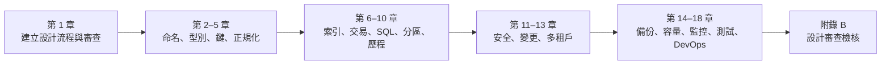
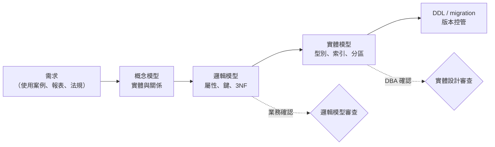
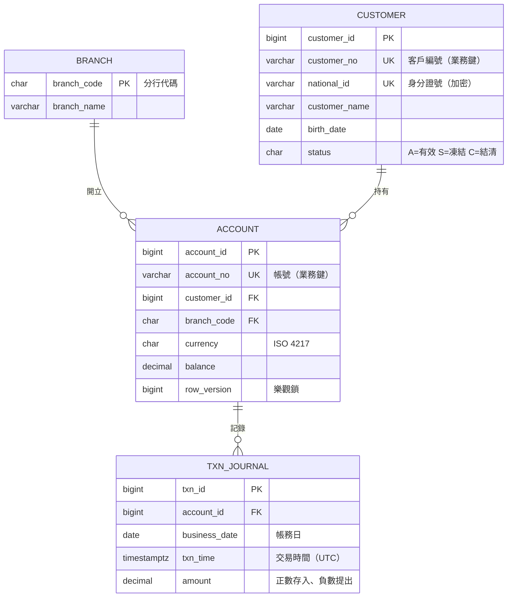
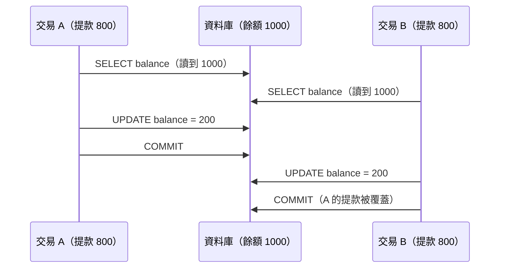
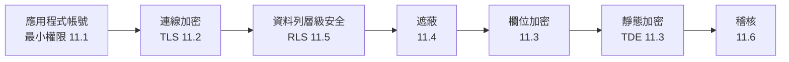
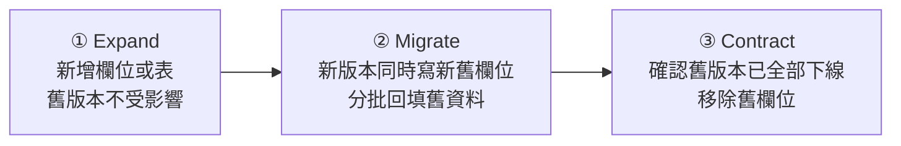
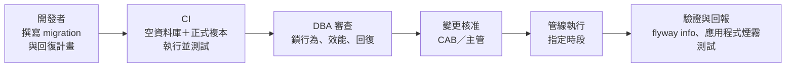
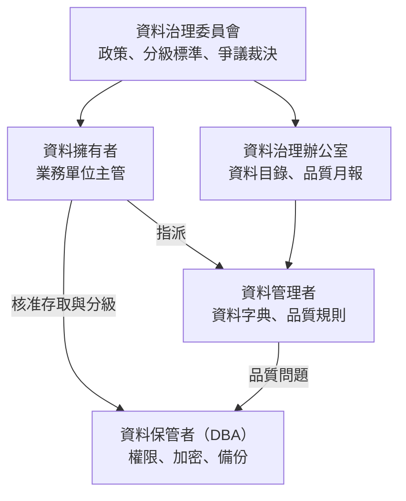

+++
date = '2025-10-31T00:00:00+08:00'
draft = false
title = '資料庫設計指引'
tags = ['指引', '設計開發']
categories = ['指引']
+++

# 銀行大型共用平台 - 資料庫設計指引

> 企業標準技術白皮書 v3.0｜適用於 Oracle、IBM Db2、Microsoft SQL Server、PostgreSQL 四種關聯式資料庫的實體設計與維運。本文共 185 條規則，每條規則都附有驗證方式與 ✅／❌ 範例，讓人能夠審查並驗證 AI 依本指引產出的 DDL 與 SQL。

## 目錄

<!-- TOC-AUTO-BEGIN -->

- [0. 文件資訊](#0-文件資訊)
  - [0.1 文件目的與讀者](#01-文件目的與讀者)
  - [0.2 技術基準版本](#02-技術基準版本)
  - [0.3 規範等級與規則格式](#03-規範等級與規則格式)
  - [0.4 範例慣例與如何執行範例](#04-範例慣例與如何執行範例)
  - [0.5 與其他指引的關係](#05-與其他指引的關係)
  - [0.6 例外與豁免流程](#06-例外與豁免流程)
  - [0.7 如何閱讀本指引](#07-如何閱讀本指引)
- [1. 設計流程與國際標準](#1-設計流程與國際標準)
  - [1.1 三層資料模型](#11-三層資料模型)
  - [1.2 資料元素命名與定義（ISO/IEC 11179）](#12-資料元素命名與定義isoiec-11179)
  - [1.3 業務邏輯的位置](#13-業務邏輯的位置)
  - [1.4 引用的國際標準與框架](#14-引用的國際標準與框架)
  - [1.5 審查重點與 AI 常見錯誤](#15-審查重點與-ai-常見錯誤)
- [2. 命名規範](#2-命名規範)
  - [2.1 識別字的字元、大小寫與長度](#21-識別字的字元大小寫與長度)
  - [2.2 物件命名格式](#22-物件命名格式)
  - [2.3 欄位命名](#23-欄位命名)
  - [2.4 縮寫與詞彙表](#24-縮寫與詞彙表)
  - [2.5 審查重點與 AI 常見錯誤](#25-審查重點與-ai-常見錯誤)
- [3. 資料型別與欄位設計](#3-資料型別與欄位設計)
  - [3.1 金額與數值](#31-金額與數值)
  - [3.2 日期與時間](#32-日期與時間)
  - [3.3 字元集與字串長度](#33-字元集與字串長度)
  - [3.4 布林、代碼與列舉](#34-布林代碼與列舉)
  - [3.5 NULL、預設值與魔術值](#35-null預設值與魔術值)
  - [3.6 半結構化資料（JSON）](#36-半結構化資料json)
  - [3.7 審查重點與 AI 常見錯誤](#37-審查重點與-ai-常見錯誤)
- [4. 鍵與限制條件](#4-鍵與限制條件)
  - [4.1 主鍵與代理鍵](#41-主鍵與代理鍵)
  - [4.2 UUID 主鍵](#42-uuid-主鍵)
  - [4.3 外鍵](#43-外鍵)
  - [4.4 檢查限制條件與條件式唯一](#44-檢查限制條件與條件式唯一)
  - [4.5 未驗證的限制條件與可延遲限制條件](#45-未驗證的限制條件與可延遲限制條件)
  - [4.6 審查重點與 AI 常見錯誤](#46-審查重點與-ai-常見錯誤)
- [5. 正規化與反正規化](#5-正規化與反正規化)
  - [5.1 正規化原則](#51-正規化原則)
  - [5.2 反正規化](#52-反正規化)
  - [5.3 審查重點與 AI 常見錯誤](#53-審查重點與-ai-常見錯誤)
- [6. 索引設計](#6-索引設計)
  - [6.1 索引設計原則](#61-索引設計原則)
  - [6.2 覆蓋索引與運算式索引](#62-覆蓋索引與運算式索引)
  - [6.3 線上建立索引](#63-線上建立索引)
  - [6.4 索引維護與未使用索引](#64-索引維護與未使用索引)
  - [6.5 審查重點與 AI 常見錯誤](#65-審查重點與-ai-常見錯誤)
- [7. 交易、隔離等級與並行控制](#7-交易隔離等級與並行控制)
  - [7.1 交易邊界與隔離等級](#71-交易邊界與隔離等級)
  - [7.2 遺失更新與樂觀鎖](#72-遺失更新與樂觀鎖)
  - [7.3 鎖定、重試與工作佇列](#73-鎖定重試與工作佇列)
  - [7.4 冪等與批次交易](#74-冪等與批次交易)
  - [7.5 審查重點與 AI 常見錯誤](#75-審查重點與-ai-常見錯誤)
- [8. SQL 撰寫與查詢效能](#8-sql-撰寫與查詢效能)
  - [8.1 安全與可維護的 SQL](#81-安全與可維護的-sql)
  - [8.2 讓查詢能使用索引](#82-讓查詢能使用索引)
  - [8.3 分頁與排序](#83-分頁與排序)
  - [8.4 執行計畫審查](#84-執行計畫審查)
  - [8.5 審查重點與 AI 常見錯誤](#85-審查重點與-ai-常見錯誤)
- [9. 分區與分片](#9-分區與分片)
  - [9.1 何時使用分區](#91-何時使用分區)
  - [9.2 分區鍵與分區修剪](#92-分區鍵與分區修剪)
  - [9.3 分區維護與資料清除](#93-分區維護與資料清除)
  - [9.4 分片](#94-分片)
  - [9.5 審查重點與 AI 常見錯誤](#95-審查重點與-ai-常見錯誤)
- [10. 時態資料、歷程與稽核欄位](#10-時態資料歷程與稽核欄位)
  - [10.1 稽核欄位](#101-稽核欄位)
  - [10.2 系統時間：自動保存歷程](#102-系統時間自動保存歷程)
  - [10.3 業務時間：有效期間](#103-業務時間有效期間)
  - [10.4 軟刪除](#104-軟刪除)
  - [10.5 審查重點與 AI 常見錯誤](#105-審查重點與-ai-常見錯誤)
- [11. 資料安全](#11-資料安全)
  - [11.1 帳號、角色與最小權限](#111-帳號角色與最小權限)
  - [11.2 連線與傳輸加密](#112-連線與傳輸加密)
  - [11.3 靜態加密與欄位加密](#113-靜態加密與欄位加密)
  - [11.4 資料遮蔽](#114-資料遮蔽)
  - [11.5 資料列層級安全](#115-資料列層級安全)
  - [11.6 稽核](#116-稽核)
  - [11.7 密碼、機密與組態強化](#117-密碼機密與組態強化)
  - [11.8 審查重點與 AI 常見錯誤](#118-審查重點與-ai-常見錯誤)
- [12. Schema 變更與版本控管](#12-schema-變更與版本控管)
  - [12.1 Migration 管理](#121-migration-管理)
  - [12.2 向後相容的變更：expand／contract](#122-向後相容的變更expandcontract)
  - [12.3 線上 DDL 與鎖](#123-線上-ddl-與鎖)
  - [12.4 回復計畫與變更流程](#124-回復計畫與變更流程)
  - [12.5 審查重點與 AI 常見錯誤](#125-審查重點與-ai-常見錯誤)
- [13. 多租戶設計](#13-多租戶設計)
  - [13.1 隔離模式的選擇](#131-隔離模式的選擇)
  - [13.2 共用 schema 的資料隔離](#132-共用-schema-的資料隔離)
  - [13.3 資源隔離與租戶生命週期](#133-資源隔離與租戶生命週期)
  - [13.4 審查重點與 AI 常見錯誤](#134-審查重點與-ai-常見錯誤)
- [14. 高可用、備份與災難復原](#14-高可用備份與災難復原)
  - [14.1 復原目標與備份策略](#141-復原目標與備份策略)
  - [14.2 備份驗證與還原演練](#142-備份驗證與還原演練)
  - [14.3 高可用架構](#143-高可用架構)
  - [14.4 審查重點與 AI 常見錯誤](#144-審查重點與-ai-常見錯誤)
- [15. 容量規劃與資料生命週期](#15-容量規劃與資料生命週期)
  - [15.1 容量估算](#151-容量估算)
  - [15.2 空間監控與自動擴充](#152-空間監控與自動擴充)
  - [15.3 保存期限與資料清除](#153-保存期限與資料清除)
  - [15.4 審查重點與 AI 常見錯誤](#154-審查重點與-ai-常見錯誤)
- [16. 監控與日常維運](#16-監控與日常維運)
  - [16.1 監控指標與告警](#161-監控指標與告警)
  - [16.2 慢查詢與查詢統計](#162-慢查詢與查詢統計)
  - [16.3 鎖、阻擋與長時間交易](#163-鎖阻擋與長時間交易)
  - [16.4 統計資訊與索引維護](#164-統計資訊與索引維護)
  - [16.5 日誌、可觀測性與連線池](#165-日誌可觀測性與連線池)
  - [16.6 審查重點與 AI 常見錯誤](#166-審查重點與-ai-常見錯誤)
- [17. 測試與驗證](#17-測試與驗證)
  - [17.1 以真實資料庫進行整合測試](#171-以真實資料庫進行整合測試)
  - [17.2 並行測試](#172-並行測試)
  - [17.3 效能測試](#173-效能測試)
  - [17.4 資料一致性檢查](#174-資料一致性檢查)
  - [17.5 審查重點與 AI 常見錯誤](#175-審查重點與-ai-常見錯誤)
- [18. 雲端與 DevOps](#18-雲端與-devops)
  - [18.1 基礎設施即程式碼與受管服務的安全基準](#181-基礎設施即程式碼與受管服務的安全基準)
  - [18.2 資料庫的 CI/CD 管線](#182-資料庫的-cicd-管線)
  - [18.3 在 Kubernetes 上執行資料庫](#183-在-kubernetes-上執行資料庫)
  - [18.4 審查重點與 AI 常見錯誤](#184-審查重點與-ai-常見錯誤)
- [19. 資料治理、品質與資料字典](#19-資料治理品質與資料字典)
  - [19.1 治理角色與資料分級](#191-治理角色與資料分級)
  - [19.2 資料字典](#192-資料字典)
  - [19.3 資料品質](#193-資料品質)
  - [19.4 參考資料、血緣與敏感資料探索](#194-參考資料血緣與敏感資料探索)
  - [19.5 審查重點與 AI 常見錯誤](#195-審查重點與-ai-常見錯誤)
- [20. 法規遵循](#20-法規遵循)
  - [20.1 法規需求對照](#201-法規需求對照)
  - [20.2 個人資料保護](#202-個人資料保護)
  - [20.3 委外與雲端](#203-委外與雲端)
  - [20.4 持卡人資料（PCI DSS 4.0.1）](#204-持卡人資料pci-dss-401)
  - [20.5 保存期限、GDPR 與財務資料控制](#205-保存期限gdpr-與財務資料控制)
  - [20.6 審查重點與 AI 常見錯誤](#206-審查重點與-ai-常見錯誤)
- [21. 升級與遷移](#21-升級與遷移)
  - [21.1 版本生命週期](#211-版本生命週期)
  - [21.2 升級方式與相容性測試](#212-升級方式與相容性測試)
  - [21.3 遷移、資料比對與切換](#213-遷移資料比對與切換)
  - [21.4 審查重點與 AI 常見錯誤](#214-審查重點與-ai-常見錯誤)
- [22. AI 輔助資料庫設計與審查](#22-ai-輔助資料庫設計與審查)
  - [22.1 給 AI 的輸入](#221-給-ai-的輸入)
  - [22.2 AI 工具的資料庫存取邊界](#222-ai-工具的資料庫存取邊界)
  - [22.3 審查與驗收 AI 的產出](#223-審查與驗收-ai-的產出)
  - [22.4 審查重點與 AI 常見錯誤](#224-審查重點與-ai-常見錯誤)
- [附錄 A 規則總表](#附錄-a-規則總表)
  - [A.1 依領域統計](#a1-依領域統計)
  - [A.2 驗證方式與範例覆蓋](#a2-驗證方式與範例覆蓋)
  - [A.3 規則清單](#a3-規則清單)
- [附錄 B 審查檢核表](#附錄-b-審查檢核表)
  - [B.1 邏輯模型審查（業務確認）](#b1-邏輯模型審查業務確認)
  - [B.2 實體設計審查（DBA）](#b2-實體設計審查dba)
  - [B.3 安全審查](#b3-安全審查)
  - [B.4 變更審查（每一個 migration）](#b4-變更審查每一個-migration)
  - [B.5 上線前審查](#b5-上線前審查)
  - [B.6 定期檢查](#b6-定期檢查)
- [附錄 C 範本](#附錄-c-範本)
  - [C.1 表格設計規格書](#c1-表格設計規格書)
  - [C.2 資料字典與一致性檢查查詢](#c2-資料字典與一致性檢查查詢)
  - [C.3 資料庫變更申請單](#c3-資料庫變更申請單)
  - [C.4 範例驗證環境](#c4-範例驗證環境)
- [附錄 D 術語](#附錄-d-術語)
- [附錄 E 參考標準與資源](#附錄-e-參考標準與資源)
- [附錄 F 修訂紀錄與查證紀錄](#附錄-f-修訂紀錄與查證紀錄)
  - [F.1 v2 → v3 章節對照](#f1-v2--v3-章節對照)
  - [F.2 v2 錯誤更正](#f2-v2-錯誤更正)
  - [F.3 查證紀錄](#f3-查證紀錄)
  - [F.4 待確認與待辦事項](#f4-待確認與待辦事項)
  - [F.5 版本歷程](#f5-版本歷程)
- [結語](#結語)

<!-- TOC-AUTO-END -->

---

## 0. 文件資訊

### 0.1 文件目的與讀者

本指引定義**關聯式資料庫的實體設計與維運標準**：資料表、欄位、鍵、索引、交易、安全、變更、備份與監控要怎麼設計，做到什麼程度才算合格，以及**如何驗證**。

資料通常比程式活得更久。程式可能改寫三次，資料表還是同一張；金額用了浮點數、時間沒有時區、外鍵沒有索引，這類錯誤一旦上線，往往要靠昂貴的資料轉置才能修正。因此本指引的每一條規則都要求能被檢查，而不是只靠經驗判斷。

| 項目 | 內容 |
| --- | --- |
| 文件名稱 | 資料庫設計指引 |
| 版本 | 3.0 |
| 建立日期 | 2025-08-11 |
| 最後更新 | 2026-10-07 |
| 作者 | 資料庫架構師 |
| 適用範圍 | 銀行大型共用平台專案；新建系統全面適用，既有系統於下次重大變更時適用 |
| 修訂紀錄 | 見 [附錄 F](#附錄-f-修訂紀錄與查證紀錄) |

| 讀者 | 主要用途 | 建議閱讀章節 |
| --- | --- | --- |
| 資料庫架構師、DBA | 制定與審查實體設計、維運標準 | 全部，特別是第 1–7、11、14 章與附錄 B |
| 後端工程師 | 撰寫 DDL、SQL 與 migration 腳本 | 第 2–8、10、12、17 章 |
| SRE、維運人員 | 備份、監控、容量與升級 | 第 14–16、18、21 章 |
| 資安與稽核人員 | 權限、加密、稽核與法規檢核 | 第 11、19、20 章 |
| 使用 AI 產生設計的人 | 撰寫提示、審查 AI 產出的 DDL 與 SQL | 第 22 章，以及各章的「審查重點」與「AI 常見錯誤」 |

### 0.2 技術基準版本

本指引的範例與規則以下列版本為準（查證日期 2026-10-07，查證來源見 [F.3](#f3-查證紀錄)）。版本更新時以各專案的實際環境為準，但不得低於「最低版本」欄。

| 類別 | 產品 | 基準版本 | 最低版本 | 備註 |
| --- | --- | --- | --- | --- |
| 資料庫 | PostgreSQL | 18.6 | 16 | PostgreSQL 19 仍在 Beta（19 Beta 4），GA 前不作為基準；14 於 2026-11 結束社群支援 |
| 資料庫 | Oracle AI Database | 26ai（Release Update 23.26.x） | 19c | 26ai 是 23ai 套用 2025-10 RU 後的新名稱，版號仍為 23.x；19c 仍在長期支援 |
| 資料庫 | Microsoft SQL Server | 2025（CU9，17.0.5005.3） | 2019 | 2025 新增原生 `json` 型別、正規表示式函式、optimized locking |
| 資料庫 | IBM Db2 for LUW | 12.1.5 | 11.5.9 | 本文的 Db2 一律指 Db2 for Linux, UNIX and Windows（LUW），z/OS 語法另見各節備註 |
| Schema 變更 | Flyway | 13.9.0 | 10.x | 設定檔改為 `flyway.toml`，舊的 `flyway.conf` 已不建議使用 |
| Schema 變更 | Liquibase Community | 5.0.4 | 4.29 | 5.0 起 Community 版改用 Functional Source License |
| 測試 | Testcontainers for Java | 2.0.5 | 1.21 | 2.0 起模組套件路徑改變，見第 17 章 |
| 可觀測性 | OpenTelemetry 資料庫語意慣例 | Stable（`db.system.name`、`db.query.text`） | — | 舊屬性 `db.system`、`db.statement` 已被取代 |
| 安全標準 | PCI DSS | 4.0.1 | 4.0.1 | 2025-03-31 起所有未來生效要求全部強制 |
| 安全標準 | ISO/IEC 27001／27002 | 2022 | 2022 | |
| SQL 標準 | ISO/IEC 9075 | 2023（SQL:2023） | — | |

> 💡 **為什麼同時列出四種資料庫？** 銀行共用平台通常同時存在主機或核心系統（Db2）、套裝軟體（Oracle、SQL Server）與新建的雲原生服務（PostgreSQL）。同一條規則在四種資料庫的寫法可能完全不同，例如「外鍵刪除時禁止連帶刪除」在 Oracle 不能寫 `ON DELETE RESTRICT`。本文每個 DDL 範例都提供四種寫法，並全部實際執行過（見 [F.3](#f3-查證紀錄)）。

### 0.3 規範等級與規則格式

本文規則採用 [RFC 2119](https://www.rfc-editor.org/rfc/rfc2119) 與 [RFC 8174](https://www.rfc-editor.org/rfc/rfc8174) 的語意：

| 等級 | 英文 | 意義 | 設計審查處理 |
| --- | --- | --- | --- |
| **必須** | MUST | 不遵守會造成重大風險（資料遺失、資料錯誤、資安事件、無法稽核） | 不通過審查；如需例外必須走 [0.6](#06-例外與豁免流程) 豁免流程 |
| **應該** | SHOULD | 業界共識的最佳實務，除非有充分理由 | 不遵守時必須在設計文件或 ADR 中記錄理由 |
| **可以** | MAY | 建議做法，依系統規模與情境選用 | 不阻擋 |
| **不應該** | SHOULD NOT | 通常是錯誤的做法，除非有充分理由 | 採用時必須在設計文件或 ADR 中記錄理由 |

每條規則都有編號，格式為 `DB-<領域>-<三位數序號>`，方便在設計審查、ADR、變更單與豁免單中引用。編號一經發布不會重編，新增規則使用該領域尚未使用的號碼。加上 `DB-` 前綴是為了和 [架構設計指引]() 的 `DATA-001`、[系統設計指引]() 的 `SD-DAT-001` 區分。

| 前綴 | 領域 | 章 | 前綴 | 領域 | 章 |
| --- | --- | --- | --- | --- | --- |
| `DB-PRC` | 設計流程與國際標準 | 1 | `DB-CHG` | Schema 變更與版本控管 | 12 |
| `DB-NAM` | 命名規範 | 2 | `DB-TEN` | 多租戶設計 | 13 |
| `DB-COL` | 資料型別與欄位設計 | 3 | `DB-BCK` | 高可用、備份與災難復原 | 14 |
| `DB-KEY` | 鍵與限制條件 | 4 | `DB-CAP` | 容量規劃與資料生命週期 | 15 |
| `DB-NRM` | 正規化與反正規化 | 5 | `DB-OPS` | 監控與日常維運 | 16 |
| `DB-IDX` | 索引設計 | 6 | `DB-TST` | 測試與驗證 | 17 |
| `DB-TXN` | 交易與並行控制 | 7 | `DB-CLD` | 雲端與 DevOps | 18 |
| `DB-SQL` | SQL 撰寫與查詢效能 | 8 | `DB-GOV` | 資料治理與品質 | 19 |
| `DB-PRT` | 分區與分片 | 9 | `DB-REG` | 法規遵循 | 20 |
| `DB-HIS` | 時態資料與歷程 | 10 | `DB-MIG` | 升級與遷移 | 21 |
| `DB-SEC` | 資料安全 | 11 | `DB-AI` | AI 輔助資料庫設計 | 22 |

**驗證方式欄位：** 每張規則表的最後一欄說明「怎麼確認設計符合這條規則」。審查者應先看這一欄，再決定要花多少心力人工檢查。

| 圖示 | 意義 | 範例 | 審查者該做什麼 |
| --- | --- | --- | --- |
| 🤖 | 工具或查詢可自動檢查 | 🤖 目錄檢查 SQL、🤖 SQLFluff、🤖 Flyway `validate` | 確認 CI 或例行作業有執行，而且沒有被停用或略過 |
| 🧪 | 需要以測試或演練證明 | 🧪 Testcontainers 整合測試、🧪 還原演練 | 確認有對應的測試或演練紀錄，而且違反規則時會失敗 |
| 👁 | 只能由人判斷 | 👁 設計審查 | 依各章「審查重點」的問題逐項確認 |

**範例標記：** 範例中以 `✅ <規則編號>` 標示符合規則的寫法，以 `❌ <規則編號>` 標示違規寫法。所有規則都至少出現在一個範例中（統計見 [附錄 A](#附錄-a-規則總表)）。

### 0.4 範例慣例與如何執行範例

本文所有 SQL 範例都以**存款帳務**為情境，使用相同的幾張表：客戶 `customer`、帳戶 `account`、交易明細 `txn_journal`、分行 `branch`。每一章的範例自成一體，可以在空的 schema 中從上到下依序執行。

每個 SQL 區塊的第一行標示適用的資料庫：

| 標記 | 意義 |
| --- | --- |
| `-- [PostgreSQL]` | 在 PostgreSQL 18 以 `psql` 執行 |
| `-- [Oracle]` | 在 Oracle AI Database 26ai 以 SQL\*Plus 或 SQLcl 執行；PL/SQL 區塊以 `/` 結束 |
| `-- [SQL Server]` | 在 SQL Server 2025 以 `sqlcmd` 執行；`GO` 是批次分隔符號，不是 T-SQL 指令 |
| `-- [Db2]` | 在 Db2 12.1 以命令列處理器（CLP）`db2 -tf` 執行；含 `--#SET TERMINATOR @` 時，之後的陳述式以 `@` 結束 |
| `-- [通用]` | 只使用 ISO SQL 標準語法，四種資料庫皆可執行 |
| `-- [Oracle｜不執行：理由]` | 需要特殊環境（金鑰庫、叢集、作業系統權限）而無法在測試容器中執行的片段，已依官方文件查證 |

區塊中出現下列註解時，代表這段 SQL 的**預期執行結果**，讀者可以自行執行並比對：

```sql
-- [PostgreSQL｜不執行：標記格式示意]
-- 預期錯誤：violates check constraint
-- 預期結果：Index Scan
```

- `預期錯誤：` 代表最後一個陳述式**應該失敗**，錯誤訊息包含冒號後的文字。這通常用來證明限制條件確實擋住了錯誤資料。
- `預期結果：` 代表輸出中應該出現冒號後的文字，例如執行計畫使用了索引。

> ⚠️ **腳本撰寫提醒：** Oracle SQL\*Plus（23ai 起回報 ORA-03405）與 Db2 CLP 都不接受「分號後面同一行的註解」，例如 `INSERT …;  -- 說明`。註解請放在陳述式的上一行。本文所有 Oracle、Db2 與通用範例都遵守這個寫法。
>
> 🧪 **自己驗證：** 四種資料庫都有免費的容器映像，可在個人電腦上重現本文的所有範例。附錄 [C.4](#c4-範例驗證環境) 提供啟動指令與執行腳本。

### 0.5 與其他指引的關係

本指引處理「實體資料庫」層級的決策。下列主題另有專門指引，本文只列出與資料庫相關的要求並連結過去：

| 主題 | 指引 | 本文的分工 |
| --- | --- | --- |
| 資料架構決策（權威來源、資料庫選型、讀寫分離） | [架構設計指引]() 第 8 章 `DATA-*` | 本文落實為 DDL、權限與維運規則 |
| 詳細設計的資料模型、ORM 映射、交易邊界 | [系統設計指引]() 第 8 章 `SD-DAT-*` | 本文處理實體欄位、索引、限制條件 |
| SQL 注入、參數綁定的程式寫法 | [安全程式碼指引]()、[JdbcTemplate 安全 SQL 實作指引文件]() | 本文處理資料庫端的權限與稽核 |
| 資料轉置（舊系統搬遷、對帳） | [系統資料轉置教學指引]() | 本文第 21 章只處理版本升級與遷移策略 |
| 測試方法與壓測 | [測試與品質保證指引]()、[壓測指引]() | 本文第 17 章只處理資料庫測試 |

### 0.6 例外與豁免流程

規則不可能涵蓋所有情境。專案無法遵守某條「必須」規則時，依下列流程申請豁免，**不得**直接忽略：

1. 填寫豁免單，寫明規則編號、原因、替代控制措施與到期日。
2. 由資料庫架構師（或架構審查委員會）核准，並記錄核准人與日期。
3. 到期前重新評估；到期未處理的豁免，在下一次設計審查視為不通過。

```markdown
# 豁免單 DBW-2026-007：帳務歷史表不建立外鍵

- 豁免規則：DB-KEY-004（子表參照父表必須宣告外鍵）
- 原因：txn_journal_hist 每日由 ETL 從核心主機批次載入，載入順序無法保證父表先到。
- 替代控制：載入後執行孤兒資料檢查（附錄 C.2 查詢），結果寫入資料品質日誌；
  發現孤兒資料時批次失敗並告警。
- 有效期限：2027-06-30
- 核准：資料庫架構師 王小明，2026-10-07
```

### 0.7 如何閱讀本指引

每一章依相同的結構撰寫，閱讀與審查時可以直接跳到需要的部分：

1. **為什麼重要**：這一章要解決的問題，以及做錯的代價。
2. **規則表**：編號、等級、規則內容、驗證方式。
3. **範例**：✅ 正確寫法與 ❌ 常見錯誤，四種資料庫的寫法並列。
4. **如何驗證**：可以直接執行的檢查 SQL 或工具指令。
5. **審查重點**與 **AI 常見錯誤**：審查者要問的問題，以及 AI 產出最常出錯的地方。

第一次導入時，建議依下列順序進行：



---

## 1. 設計流程與國際標準

資料庫設計最常見的失敗，不是某個欄位型別選錯，而是**跳過了邏輯設計**：拿到需求就直接寫 `CREATE TABLE`。結果是同一個概念散落在多張表、同一張表混雜多個概念，而且沒有人說得清楚每個欄位的業務意義。本章定義從需求到實體 DDL 的設計流程、每個階段的產出物與審查關卡，以及本指引引用的國際標準。

### 1.1 三層資料模型

資料模型依抽象程度分為三層，每一層回答不同的問題，也由不同的人確認：

| 層次 | 回答的問題 | 主要內容 | 誰來確認 | 產出物 |
| --- | --- | --- | --- | --- |
| 概念模型 | 業務上有哪些「東西」，彼此有什麼關係？ | 實體、關係、基數（1:1、1:N、M:N） | 業務單位、系統分析師 | 概念 ER 圖 |
| 邏輯模型 | 每個東西有哪些屬性？怎麼識別？ | 屬性、候選鍵、正規化到 3NF、業務規則 | 系統分析師、資料庫架構師 | 邏輯 ER 圖、資料元素定義 |
| 實體模型 | 在**這一種**資料庫上怎麼實作？ | 資料型別、索引、分區、表空間、權限 | DBA、資料庫架構師 | DDL（migration 腳本）、表格設計規格書 |



| 編號 | 等級 | 規則 | 驗證方式 |
| --- | --- | --- | --- |
| `DB-PRC-001` | 必須 | 新增或大幅修改資料表前，必須先完成邏輯模型（實體、屬性、鍵、關係），並由資料擁有者確認業務定義，才能進入實體設計 | 👁 邏輯模型審查紀錄 |
| `DB-PRC-002` | 必須 | 每張資料表都要指定**資料擁有者**（負責業務定義的單位）與**資料分級**（第 19 章），並記錄在資料字典 | 🤖 資料字典完整性查詢（附錄 C.2）；👁 設計審查 |
| `DB-PRC-003` | 必須 | ER 圖以文字格式（Mermaid `erDiagram` 或 DBML）和 migration 腳本放在同一個儲存庫，或以工具從資料庫自動產生；不得只存在簡報或圖片中 | 🤖 CI 以 tbls 比對文件與實際 schema（`tbls diff`） |
| `DB-PRC-004` | 必須 | 實體設計規格要寫下量化的非功能需求：預估筆數、年成長率、尖峰 TPS、保存期限、RPO／RTO，作為索引、分區與容量設計的依據 | 👁 實體設計審查（附錄 C.1 表格設計規格書） |

✅ 以 Mermaid `erDiagram` 描述邏輯模型。它是純文字，可以和 migration 腳本一起放進 Git、在合併請求中審查差異，而 Hugo、GitLab、GitHub 都能直接渲染：



✅ 以 [tbls](https://github.com/k1LoW/tbls) 從實際資料庫產生文件，並在 CI 中比對文件與資料庫是否一致。tbls 支援 PostgreSQL、SQL Server，Oracle 與 Db2 可改用 SchemaSpy：

```yaml
# .tbls.yml
# ✅ DB-PRC-003 文件由實際 schema 產生，CI 執行 `tbls diff` 發現不一致時失敗
dsn: postgres://doc_reader@db.example.internal:5432/deposit?sslmode=verify-full
docPath: docs/schema
er:
  format: mermaid
lint:
  requireTableComment:
    enabled: true          # ✅ DB-PRC-002 沒有表註解（業務定義）的表會被列出
  requireColumnComment:
    enabled: true
    exclude: [created_at, created_by, updated_at, updated_by, row_version]
  requireForeignKeyIndex:
    enabled: true          # 對應 DB-KEY-005
```

✅ 實體設計規格書必須寫下量化的非功能需求（完整範本見附錄 C.1）：

```markdown
## 表格：txn_journal（交易明細）

| 項目 | 內容 |
| --- | --- |
| 資料擁有者 | 存款業務部 |
| 資料分級 | 機密（含帳號、金額）              <!-- ✅ DB-PRC-002 --> |
| 預估筆數 | 上線時 8 億筆；每營業日新增 300 萬筆 <!-- ✅ DB-PRC-004 --> |
| 年成長率 | 約 8 億筆／年 |
| 尖峰寫入 | 1,200 TPS（月底、發薪日） |
| 保存期限 | 線上 2 年、歸檔 15 年（第 15 章） |
| RPO／RTO | 0／30 分鐘（第 14 章） |
| 分區 | 依 business_date 每月一個分區（第 9 章） |
```

### 1.2 資料元素命名與定義（ISO/IEC 11179）

[ISO/IEC 11179](https://www.iso.org/standard/78915.html)（元資料登錄）提供定義資料元素的方法：一個資料元素的名稱由**物件類別**（誰的資料）、**屬性**（什麼特性）與**表示法**（用什麼形式表示）組成。例如 `customer_birth_date` 是「客戶（物件類別）的出生（屬性）日期（表示法）」。

依這個方法定義的欄位，名稱本身就能說明意義，也能避免「同名不同義」（兩張表的 `status` 代表不同的狀態集合）和「同義不同名」（`cust_id`、`customer_id`、`cid` 指的是同一件事）。

| 編號 | 等級 | 規則 | 驗證方式 |
| --- | --- | --- | --- |
| `DB-PRC-005` | 應該 | 每個資料元素的定義要包含：名稱、業務定義（一句完整的句子）、資料型別與長度、允許值或格式、資料來源；同一個業務概念在全公司使用同一個名稱與型別 | 🤖 目錄查詢找出同名但型別不同的欄位；👁 資料字典審查 |
| `DB-PRC-006` | 應該 | 業務定義要寫成「是什麼」，而不是重複欄位名稱；例如「客戶首次在本行開戶的日期，以營業日表示」，而不是「開戶日期」 | 👁 資料字典審查 |

✅ 以目錄查詢找出「同名不同型別」的欄位。這類欄位通常代表同一個概念被定義了兩次，日後做 JOIN 時會出現隱含型別轉換而用不到索引（第 8 章）：

```sql
-- [PostgreSQL]
-- ✅ DB-PRC-005 找出同名但型別或長度不一致的欄位
CREATE TABLE customer (customer_no varchar(20) NOT NULL);
CREATE TABLE account  (customer_no varchar(12) NOT NULL);   -- ❌ DB-PRC-005 同一個概念長度不同

SELECT column_name,
       string_agg(DISTINCT format('%s.%s %s(%s)', table_name, column_name, data_type,
                                  coalesce(character_maximum_length::text, numeric_precision::text)), ', ') AS variants
FROM information_schema.columns
WHERE table_schema = current_schema()
GROUP BY column_name
HAVING count(DISTINCT (data_type, character_maximum_length, numeric_precision, numeric_scale)) > 1;
-- 預期結果：account.customer_no character varying(12)
```

```sql
-- [Oracle]
-- ✅ DB-PRC-005 Oracle：以 USER_TAB_COLUMNS 找出同名不同型別的欄位
CREATE TABLE customer (customer_no VARCHAR2(20 CHAR) NOT NULL);
CREATE TABLE account  (customer_no VARCHAR2(12 CHAR) NOT NULL);

SELECT column_name,
       LISTAGG(DISTINCT table_name || ' ' || data_type || '(' || char_length || ')', ', ') AS variants
FROM user_tab_columns
GROUP BY column_name
HAVING COUNT(DISTINCT data_type || char_length || data_precision || data_scale) > 1;
-- 預期結果：ACCOUNT VARCHAR2(12)
```

```sql
-- [SQL Server]
-- ✅ DB-PRC-005 SQL Server：以 INFORMATION_SCHEMA.COLUMNS 找出同名不同型別的欄位
CREATE TABLE dbo.customer (customer_no varchar(20) NOT NULL);
CREATE TABLE dbo.account  (customer_no varchar(12) NOT NULL);
GO
SELECT COLUMN_NAME,
       STRING_AGG(CONCAT(TABLE_NAME, ' ', DATA_TYPE, '(', CHARACTER_MAXIMUM_LENGTH, ')'), ', ') AS variants
FROM INFORMATION_SCHEMA.COLUMNS
WHERE TABLE_SCHEMA = 'dbo'
GROUP BY COLUMN_NAME
HAVING COUNT(DISTINCT CONCAT(DATA_TYPE, CHARACTER_MAXIMUM_LENGTH, NUMERIC_PRECISION, NUMERIC_SCALE)) > 1;
-- 預期結果：account varchar(12)
```

```sql
-- [Db2]
-- ✅ DB-PRC-005 Db2：以 SYSCAT.COLUMNS 找出同名不同型別的欄位
CREATE TABLE customer (customer_no VARCHAR(20) NOT NULL);
CREATE TABLE account  (customer_no VARCHAR(12) NOT NULL);

SELECT colname,
       LISTAGG(tabname || ' ' || typename || '(' || length || ')', ', ') AS variants
FROM syscat.columns
WHERE tabschema = CURRENT SCHEMA
GROUP BY colname
HAVING COUNT(DISTINCT typename || CHAR(length) || CHAR(scale)) > 1;
-- 預期結果：ACCOUNT VARCHAR(12)
```

✅ 資料字典中的業務定義寫法：

```markdown
| 欄位 | 業務定義 | 型別 | 允許值／格式 | 來源 |
| --- | --- | --- | --- | --- |
| customer.open_date | 客戶首次在本行開立任何帳戶的日期，以營業日表示 | DATE | 不得晚於系統營業日 | 開戶系統 |   <!-- ✅ DB-PRC-006 -->
| customer.open_date | 開戶日期 | DATE | | |                                                          <!-- ❌ DB-PRC-006 只重複了欄位名稱 -->
```

### 1.3 業務邏輯的位置

資料庫可以實作的邏輯分成兩類：**資料完整性**（這筆資料本身是否合法）與**業務流程**（資料要經過哪些步驟、呼叫哪些系統）。前者屬於資料庫，後者屬於應用程式。

| 放在資料庫 | 放在應用程式 |
| --- | --- |
| `NOT NULL`、`CHECK`、`UNIQUE`、外鍵 | 開戶流程、核貸流程、通知 |
| 歷程與稽核觸發程序（第 10 章） | 跨系統呼叫、訊息發送 |
| 批次中必須在資料庫內完成的大量運算（需 ADR 說明） | 費率計算、規則引擎 |

| 編號 | 等級 | 規則 | 驗證方式 |
| --- | --- | --- | --- |
| `DB-PRC-007` | 必須 | 資料完整性規則（必填、範圍、唯一、參照）必須以宣告式限制條件實作在資料庫中，不得只在應用程式檢查 | 🧪 以違規資料直接 `INSERT`，必須被資料庫拒絕（第 4、17 章） |
| `DB-PRC-008` | 不應該 | 以觸發程序或預存程序實作業務流程（狀態流轉、跨表的業務計算、呼叫外部系統）；確有效能需求時須以 ADR 說明，並提供單元測試（utPLSQL、tSQLt、pgTAP） | 🤖 目錄查詢列出所有觸發程序與預存程序並與核准清單比對；👁 設計審查 |

✅ 資料完整性規則以限制條件宣告在資料庫中。即使應用程式有漏洞，或有人以 SQL 工具直接修改資料，違規資料也進不來：

```sql
-- [PostgreSQL]
-- ✅ DB-PRC-007 狀態值與餘額規則以 CHECK 宣告，不只靠應用程式檢查
CREATE TABLE deposit_account (
    account_id bigint       NOT NULL PRIMARY KEY,
    status     char(1)      NOT NULL CONSTRAINT ck_deposit_account_status CHECK (status IN ('A', 'S', 'C')),
    balance    numeric(19,4) NOT NULL CONSTRAINT ck_deposit_account_balance CHECK (balance >= 0)
);
INSERT INTO deposit_account VALUES (1, 'A', 100);
-- 直接以 SQL 寫入不合法的狀態，被資料庫拒絕
INSERT INTO deposit_account VALUES (2, 'X', 100);
-- 預期錯誤：ck_deposit_account_status
```

✅ 以目錄查詢列出所有觸發程序，與設計文件中核准的清單比對。只有歷程、稽核類的觸發程序應該出現：

```sql
-- [PostgreSQL]
-- ✅ DB-PRC-008 列出所有使用者定義的觸發程序，與核准清單比對
CREATE TABLE savings_account (account_id bigint PRIMARY KEY, balance numeric(19,4) NOT NULL);
CREATE FUNCTION trg_fn_noop() RETURNS trigger LANGUAGE plpgsql AS $$ BEGIN RETURN NEW; END $$;
CREATE TRIGGER trg_savings_account_bu_calc_interest BEFORE UPDATE ON savings_account
    FOR EACH ROW EXECUTE FUNCTION trg_fn_noop();   -- ❌ DB-PRC-008 以觸發程序計算利息（業務流程）

SELECT event_object_table AS table_name, trigger_name, action_timing, event_manipulation
FROM information_schema.triggers
WHERE trigger_schema = current_schema()
ORDER BY 1, 2;
-- 預期結果：trg_savings_account_bu_calc_interest
```

```sql
-- [Oracle]
-- ✅ DB-PRC-008 Oracle：列出觸發程序
SELECT table_name, trigger_name, trigger_type, triggering_event, status
FROM user_triggers
ORDER BY table_name, trigger_name;
```

```sql
-- [SQL Server]
-- ✅ DB-PRC-008 SQL Server：列出觸發程序
SELECT OBJECT_NAME(parent_id) AS table_name, name AS trigger_name, is_disabled
FROM sys.triggers
WHERE parent_class = 1
ORDER BY 1, 2;
```

```sql
-- [Db2]
-- ✅ DB-PRC-008 Db2：列出觸發程序
SELECT tabname, trigname, trigtime, trigevent, valid
FROM syscat.triggers
WHERE tabschema = CURRENT SCHEMA
ORDER BY tabname, trigname;
```

### 1.4 引用的國際標準與框架

本指引的規則參考下列標準與框架。標準不需要逐條背誦，但設計審查與稽核時，能說明某條規則對應哪一個標準，有助於回應稽核人員的詢問。

| 標準或框架 | 版本 | 本指引引用的重點 | 對應章節 |
| --- | --- | --- | --- |
| ISO/IEC 9075（SQL） | 2023 | 標準 SQL 語法、時態表（SQL:2011）、JSON（SQL:2016／2023） | 3、8、10 |
| ISO/IEC 11179（元資料登錄） | Part 3:2023 | 資料元素的命名與定義方法 | 1.2、2、19 |
| ISO/IEC 25012（資料品質模型） | 2008 | 15 項資料品質特性（正確性、完整性、一致性等） | 19 |
| ISO 8000（資料品質） | Part 8、61 | 資料品質管理流程 | 19 |
| DAMA-DMBOK | 第 2 版修訂版（2024） | 資料治理、資料建模、資料安全等 11 個知識領域 | 1、19 |
| ISO/IEC 27001／27002 | 2022 | 8.10 資訊刪除、8.11 資料遮蔽、8.12 資料外洩預防、8.13 資訊備份、8.24 密碼學 | 11、14、15 |
| ISO/IEC 27040（儲存安全） | 2024 | 儲存媒體加密、清除與銷毀 | 11、15 |
| ISO/IEC 27701（隱私資訊管理） | 2025 | 個人資料處理的管理制度 | 20 |
| ISO/IEC 38505-1（資料治理） | 2017 | 董事會層級的資料治理責任 | 19 |
| ISO 4217／ISO 3166／ISO 8601 | 現行版 | 幣別代碼、國家代碼、日期時間格式 | 3 |
| ISO 20022 | 現行版 | 金融訊息資料字典，欄位定義可作為業務定義的參考 | 1.2、3 |
| RFC 9562 | 2024-05 | UUID 第 7 版（時間排序的 UUID） | 4 |
| PCI DSS | 4.0.1 | 持卡人資料的儲存、遮蔽、加密與存取記錄 | 11、20 |
| NIST SP 800-53 | Rev. 5 | 存取控制、稽核、備份的控制項 | 11、14 |
| CIS Benchmarks | 各資料庫最新版 | 資料庫組態強化檢核項目 | 11、18 |

### 1.5 審查重點與 AI 常見錯誤

**審查重點：**

- [ ] 實體設計之前，是否已有經業務確認的邏輯模型？每個實體的業務定義是誰確認的？（`DB-PRC-001`）
- [ ] 每張表是否都有資料擁有者與資料分級？（`DB-PRC-002`）
- [ ] ER 圖是否和 schema 一致？CI 是否會在不一致時失敗？（`DB-PRC-003`）
- [ ] 規格書是否寫下預估筆數、成長率、TPS、保存期限、RPO／RTO？索引與分區設計是否以這些數字為依據？（`DB-PRC-004`）
- [ ] 同一個業務概念在不同表是否使用相同的名稱與型別？（`DB-PRC-005`）
- [ ] 必填、範圍、唯一、參照規則是否都以限制條件實作，而不只是在應用程式檢查？（`DB-PRC-007`）
- [ ] 是否有觸發程序或預存程序在做業務流程？（`DB-PRC-008`）

**AI 常見錯誤：**

- 直接從一句需求產生 `CREATE TABLE`，沒有先列出實體與關係，導致把「客戶」與「帳戶」的屬性混在同一張表（`DB-PRC-001`）。
- 產生的欄位註解只是把欄位名稱翻成中文，例如 `open_date` 的註解是「開戶日期」（`DB-PRC-006`）。
- 為了「確保一致性」，產生大量觸發程序去更新其他表的彙總欄位（`DB-PRC-008`，正確做法見第 5 章）。
- 完全不提資料量與成長率，就決定索引和分區（`DB-PRC-004`）。

---

## 2. 命名規範

命名是資料庫最長壽的介面。表名和欄位名一旦被報表、ETL、下游系統引用，就幾乎不可能再改。好的命名讓人不必查文件就能猜到欄位的意義，也讓 AI 產生的 SQL 更容易被審查。本章的命名規則同時考慮四種資料庫的限制，讓同一套 DDL 能在不同資料庫之間移植。

### 2.1 識別字的字元、大小寫與長度

四種資料庫處理「沒有加雙引號的識別字」的方式不同，這是跨資料庫移植最常踩到的地雷：

| 資料庫 | 未加引號時的大小寫處理 | 加雙引號時 | 識別字最大長度 |
| --- | --- | --- | --- |
| PostgreSQL | 轉成**小寫** | 保留原樣且區分大小寫 | 63 位元組（超過時**自動截斷**，只發出 NOTICE） |
| Oracle | 轉成**大寫** | 保留原樣且區分大小寫 | 128 位元組（12.2 起，且 `COMPATIBLE` ≥ 12.2） |
| SQL Server | 保留原樣；是否區分大小寫由定序（collation）決定，預設不區分 | 等同方括號 `[ ]`，需 `QUOTED_IDENTIFIER ON` | 128 字元 |
| Db2 | 轉成**大寫** | 保留原樣且區分大小寫 | 128 位元組（表、欄位、限制條件、索引） |

因此，只要**全部使用小寫英文、數字與底線，而且永遠不加雙引號**，同一份 DDL 在四種資料庫都能正確建立，查詢時也不必在意大小寫。反過來，只要有人寫了一次 `"AccountNo"`，之後每一個查詢都必須寫成 `"AccountNo"`，少一個引號就會出現「欄位不存在」。

| 編號 | 等級 | 規則 | 驗證方式 |
| --- | --- | --- | --- |
| `DB-NAM-001` | 必須 | 識別字只使用英文字母、數字與底線，以字母開頭，在 DDL 與 SQL 中一律寫成小寫且**不加雙引號**（或方括號） | 🤖 SQLFluff `RF06`（references.quoting）與 `CP02`（identifier capitalisation）；🤖 目錄查詢找出含特殊字元或混合大小寫的名稱 |
| `DB-NAM-002` | 必須 | 識別字長度不得超過 63 位元組；需要和 Oracle 12.1 以前或 `COMPATIBLE` < 12.2 的資料庫交換時，不得超過 30 位元組 | 🤖 目錄查詢；🤖 migration 腳本靜態檢查 |
| `DB-NAM-003` | 必須 | 不得使用 SQL 保留字或各資料庫的關鍵字作為名稱（如 `order`、`user`、`date`、`level`、`comment`、`number`、`size`、`group`、`key`、`value`） | 🤖 SQLFluff `RF04`（references.keywords）；🧪 在四種資料庫執行 DDL |

❌ 加了雙引號的識別字變成區分大小寫，之後每個查詢都要照抄引號：

```sql
-- [PostgreSQL]
-- ❌ DB-NAM-001 以雙引號建立混合大小寫的名稱
CREATE TABLE "Customer" ("CustomerNo" varchar(20) NOT NULL);
INSERT INTO "Customer" ("CustomerNo") VALUES ('C0001');
-- 沒有加引號時，名稱被轉成小寫 customer，找不到表
SELECT CustomerNo FROM Customer;
-- 預期錯誤：relation "customer" does not exist
```

```sql
-- [Oracle]
-- ❌ DB-NAM-001 Oracle：加引號的小寫名稱，不加引號查詢時被轉成大寫而找不到
CREATE TABLE "customer" ("customer_no" VARCHAR2(20 CHAR) NOT NULL);
SELECT customer_no FROM customer;
-- 預期錯誤：ORA-00942
```

✅ 不加引號、全部小寫。資料庫各自轉成大寫或小寫，但查詢時不論怎麼寫都能找到：

```sql
-- [PostgreSQL]
-- ✅ DB-NAM-001 不加引號，名稱一律以小寫儲存
CREATE TABLE customer (customer_no varchar(20) NOT NULL);
SELECT CUSTOMER_NO FROM CUSTOMER;   -- 大寫寫法也會被轉成小寫，可以正常執行
```

```sql
-- [Oracle]
-- ✅ DB-NAM-001 Oracle：不加引號，名稱以大寫儲存，查詢時大小寫都能找到
CREATE TABLE customer_profile (customer_no VARCHAR2(20 CHAR) NOT NULL);
SELECT table_name FROM user_tables WHERE table_name = 'CUSTOMER_PROFILE';
-- 預期結果：CUSTOMER_PROFILE
```

```sql
-- [SQL Server]
-- ✅ DB-NAM-001 SQL Server：不加方括號；預設定序不區分大小寫
CREATE TABLE dbo.customer (customer_no varchar(20) NOT NULL);
GO
SELECT CUSTOMER_NO FROM dbo.CUSTOMER;
```

```sql
-- [Db2]
-- ✅ DB-NAM-001 Db2：不加引號，名稱以大寫儲存
CREATE TABLE customer (customer_no VARCHAR(20) NOT NULL);
SELECT tabname FROM syscat.tables WHERE tabschema = CURRENT SCHEMA AND tabname = 'CUSTOMER';
-- 預期結果：CUSTOMER
```

❌ PostgreSQL 的識別字超過 63 位元組時**不會報錯**，而是自動截斷。兩個前 63 個字元相同的索引名稱會互相衝突，而 migration 腳本中寫的名稱和資料庫中實際的名稱不一致：

```sql
-- [PostgreSQL]
-- ❌ DB-NAM-002 名稱超過 63 位元組，被自動截斷
CREATE TABLE txn_journal (account_id bigint, business_date date, txn_seq int);
CREATE INDEX ix_txn_journal_account_id_business_date_txn_seq_for_statement_query
    ON txn_journal (account_id, business_date, txn_seq);
-- 預期結果：will be truncated
```

✅ 以目錄查詢找出過長或含特殊字元的名稱，放進 CI 或例行檢查：

```sql
-- [PostgreSQL]
-- ✅ DB-NAM-001 DB-NAM-002 找出含大寫、特殊字元或長度接近上限的名稱
SELECT c.relname AS object_name, c.relkind, octet_length(c.relname) AS bytes
FROM pg_class c
JOIN pg_namespace n ON n.oid = c.relnamespace
WHERE n.nspname = current_schema()
  AND (c.relname !~ '^[a-z][a-z0-9_]*$' OR octet_length(c.relname) > 60);
-- 預期結果：Customer
```

```sql
-- [Oracle]
-- ✅ DB-NAM-001 DB-NAM-002 Oracle：找出非全大寫（代表建立時加了引號）或超過 30 位元組的名稱
SELECT object_name, object_type, LENGTHB(object_name) AS bytes
FROM user_objects
WHERE NOT REGEXP_LIKE(object_name, '^[A-Z][A-Z0-9_]*$')
   OR LENGTHB(object_name) > 30;
-- 預期結果：customer
```

```sql
-- [SQL Server]
-- ✅ DB-NAM-001 DB-NAM-002 SQL Server：找出含大寫或特殊字元、超過 63 字元的名稱
SELECT name, type_desc, LEN(name) AS chars
FROM sys.objects
WHERE is_ms_shipped = 0
  AND (name COLLATE Latin1_General_BIN LIKE '%[^a-z0-9_]%' OR LEN(name) > 63);
```

```sql
-- [Db2]
-- ✅ DB-NAM-001 DB-NAM-002 Db2：找出非全大寫或過長的表名與欄位名
SELECT tabname, colname
FROM syscat.columns
WHERE tabschema = CURRENT SCHEMA
  AND (NOT REGEXP_LIKE(tabname || colname, '^[A-Z][A-Z0-9_]*$')
       OR LENGTHB(colname) > 63);
```

❌ 以保留字命名。有些資料庫直接拒絕，有些允許但在其他資料庫失敗。以 `order` 為例，PostgreSQL、Oracle、SQL Server 都拒絕，Db2 LUW 卻允許，因此「在自己的資料庫能建立」不代表名稱是安全的：

```sql
-- [PostgreSQL]
-- ❌ DB-NAM-003 以保留字 order 作為表名
CREATE TABLE order (order_id bigint);
-- 預期錯誤：syntax error at or near "order"
```

```sql
-- [Oracle]
-- ❌ DB-NAM-003 Oracle：以保留字 order 作為表名
CREATE TABLE order (order_id NUMBER(19));
-- 預期錯誤：ORA-00903
```

```sql
-- [SQL Server]
-- ❌ DB-NAM-003 SQL Server：以保留字 order 作為表名
CREATE TABLE order (order_id bigint);
-- 預期錯誤：Incorrect syntax near the keyword 'order'
```

```sql
-- [Db2]
-- ❌ DB-NAM-003 Db2 LUW 允許 order 作為表名，但同一份 DDL 在其他三種資料庫會失敗
CREATE TABLE order (order_id BIGINT);
-- 預期結果：DB20000I
```

✅ 改用有業務意義的名稱：`purchase_order`、`app_user`、`txn_date`、`approval_level`、`remark`。

### 2.2 物件命名格式

| 編號 | 等級 | 規則 | 驗證方式 |
| --- | --- | --- | --- |
| `DB-NAM-004` | 應該 | 表名使用**單數名詞**、`snake_case`；模組或服務以 schema 區分，表名不加 `tbl_`、`t_` 等型別前綴 | 🤖 目錄查詢比對命名格式；👁 設計審查 |
| `DB-NAM-005` | 必須 | 限制條件與索引一律明確命名，不得使用資料庫自動產生的名稱（如 `SYS_C0012345`、`PK__account__3213E83F`、`SQL261007...`、`account_pkey`） | 🤖 目錄查詢找出系統產生的名稱 |
| `DB-NAM-006` | 必須 | 資料庫、schema、表與其他物件的名稱不得包含環境代碼（`dev`、`sit`、`uat`、`prod`）；環境由連線設定區分，同一份 migration 腳本必須能在所有環境執行 | 🤖 CI 以正規表示式檢查 migration 腳本；👁 設計審查 |
| `DB-NAM-007` | 不應該 | SQL Server 的預存程序以 `sp_` 開頭（系統會先到 `master` 資料庫尋找，造成額外查找且可能被同名系統程序取代） | 🤖 目錄查詢 |

各類物件的命名格式如下。`<table>` 是表名，`<cols>` 是以底線連接的欄位名，名稱過長時可使用核准縮寫（[2.4](#24-縮寫與詞彙表)）：

| 物件 | 格式 | 範例 |
| --- | --- | --- |
| Schema | `<模組>` | `deposit`、`loan`、`audit` |
| 表 | `<單數名詞>` | `customer`、`account`、`txn_journal` |
| 歷程表 | `<table>_hist` | `account_hist` |
| 檢視表 | `v_<描述>` | `v_account_summary` |
| 實體化檢視表 | `mv_<描述>` | `mv_daily_branch_balance` |
| 主鍵 | `pk_<table>` | `pk_account` |
| 外鍵 | `fk_<table>_<參照表>` | `fk_account_customer` |
| 唯一鍵 | `uk_<table>_<cols>` | `uk_account_account_no` |
| 檢查限制 | `ck_<table>_<規則>` | `ck_account_status` |
| 預設值（SQL Server） | `df_<table>_<col>` | `df_account_row_version` |
| 一般索引 | `ix_<table>_<cols>` | `ix_txn_journal_account_id_business_date` |
| 序列 | `seq_<table>` | `seq_txn_journal` |
| 函式 | `fn_<動詞>_<受詞>` | `fn_mask_national_id` |
| 預存程序 | `pr_<動詞>_<受詞>` | `pr_close_business_day` |
| 觸發程序 | `trg_<table>_<時機><事件>` | `trg_account_aiu_hist`（after insert／update） |

> ⚠️ **v2 更正：** v2 以 `FK_<表>_<參考表>` 命名「外鍵索引」，容易和外鍵限制條件同名而混淆。v3 規定外鍵**限制條件**用 `fk_`，支援外鍵的**索引**一律用 `ix_`。

❌ 沒有命名的限制條件，每個環境產生的名稱都不同。之後要刪除或修改限制條件時，migration 腳本無法寫出固定的名稱：

```sql
-- [PostgreSQL]
-- ❌ DB-NAM-005 限制條件沒有命名，名稱由資料庫產生
CREATE TABLE branch (branch_code char(4) PRIMARY KEY, branch_name varchar(50) NOT NULL UNIQUE);

-- ✅ DB-NAM-005 找出系統產生名稱的限制條件與索引（PostgreSQL 的預設名稱以 _pkey、_fkey、_key、_check 結尾）
SELECT conrelid::regclass AS table_name, conname, contype
FROM pg_constraint
WHERE connamespace = current_schema()::regnamespace
  AND conname ~ '_(pkey|fkey|key|check|excl|not_null)$';
-- 預期結果：branch_pkey
```

```sql
-- [Oracle]
-- ❌ DB-NAM-005 Oracle：未命名的限制條件會得到 SYS_Cnnnnnn 這樣的名稱
CREATE TABLE branch (branch_code CHAR(4) PRIMARY KEY, branch_name VARCHAR2(50 CHAR) NOT NULL);

-- ✅ DB-NAM-005 以 GENERATED 欄位找出系統命名的限制條件（NOT NULL 限制條件除外）
SELECT table_name, constraint_name, constraint_type
FROM user_constraints
WHERE generated = 'GENERATED NAME' AND constraint_type <> 'C';
-- 預期結果：SYS_C
```

```sql
-- [SQL Server]
-- ❌ DB-NAM-005 SQL Server：未命名的主鍵會得到 PK__branch__xxxxxxxx 這樣的名稱
CREATE TABLE dbo.branch (branch_code char(4) PRIMARY KEY, branch_name varchar(50) NOT NULL);
GO
-- ✅ DB-NAM-005 以 is_system_named 找出系統命名的限制條件
SELECT OBJECT_NAME(parent_object_id) AS table_name, name, type_desc
FROM sys.key_constraints WHERE is_system_named = 1
UNION ALL
SELECT OBJECT_NAME(parent_object_id), name, type_desc FROM sys.foreign_keys WHERE is_system_named = 1
UNION ALL
SELECT OBJECT_NAME(parent_object_id), name, type_desc FROM sys.check_constraints WHERE is_system_named = 1
UNION ALL
SELECT OBJECT_NAME(parent_object_id), name, type_desc FROM sys.default_constraints WHERE is_system_named = 1;
-- 預期結果：PK__branch__
```

```sql
-- [Db2]
-- ❌ DB-NAM-005 Db2：未命名的限制條件會得到 SQL 加上時間戳記的名稱
CREATE TABLE branch (branch_code CHAR(4) NOT NULL PRIMARY KEY, branch_name VARCHAR(50) NOT NULL);

-- ✅ DB-NAM-005 找出系統命名的限制條件
SELECT tabname, constname, type
FROM syscat.tabconst
WHERE tabschema = CURRENT SCHEMA AND constname LIKE 'SQL%';
-- 預期結果：BRANCH
```

✅ 明確命名每個限制條件，四種資料庫的寫法相同：

```sql
-- [通用]
-- ✅ DB-NAM-004 單數名詞、snake_case
-- ✅ DB-NAM-005 主鍵、唯一鍵明確命名
CREATE TABLE currency (
    currency_code CHAR(3)     NOT NULL,
    currency_name VARCHAR(50) NOT NULL,
    minor_unit    SMALLINT    NOT NULL,
    CONSTRAINT pk_currency PRIMARY KEY (currency_code),
    CONSTRAINT uk_currency_currency_name UNIQUE (currency_name),
    CONSTRAINT ck_currency_minor_unit CHECK (minor_unit BETWEEN 0 AND 4)
);
```

❌ 名稱中含環境代碼。v2 的 `BANK_PROD_DB` 就是這種寫法，結果每個環境的 migration 腳本都不一樣，測試環境驗證過的腳本不等於正式環境要執行的腳本：

```sql
-- [通用]
-- ❌ DB-NAM-006 物件名稱含環境代碼，同一份腳本無法在各環境執行
CREATE TABLE branch_uat_backup (branch_code CHAR(4) NOT NULL);
```

✅ CI 中以簡單的正規表示式擋下含環境代碼的 migration 腳本：

```bash
# ✅ DB-NAM-006 migration 腳本不得出現環境代碼
if grep -RniE '\b[a-z0-9_]*_(dev|sit|uat|prod)(_[a-z0-9_]*)?\b' db/migration/; then
  echo "migration 腳本含環境代碼，請改以連線設定區分環境" >&2
  exit 1
fi
```

❌ SQL Server 中以 `sp_` 開頭的預存程序。執行時 SQL Server 會先在 `master` 尋找同名程序；若日後的版本新增了同名的系統程序，呼叫的就會是系統程序：

```sql
-- [SQL Server]
-- ❌ DB-NAM-007 以 sp_ 開頭的使用者預存程序
CREATE PROCEDURE dbo.sp_close_day AS SELECT 1;
GO
-- ✅ DB-NAM-007 找出以 sp_ 開頭的使用者預存程序
SELECT name FROM sys.procedures WHERE name LIKE 'sp[_]%' AND is_ms_shipped = 0;
-- 預期結果：sp_close_day
```

### 2.3 欄位命名

欄位名稱以「業務屬性 + 表示法後綴」組成（[1.2](#12-資料元素命名與定義isoiec-11179)）。後綴讓人一眼看出欄位的型別與用途：

| 後綴或前綴 | 意義 | 型別 | 範例 |
| --- | --- | --- | --- |
| `_id` | 代理鍵（系統產生、無業務意義） | `BIGINT` 或 UUID | `customer_id` |
| `_no` | 業務編號（對外顯示、有格式） | `VARCHAR` | `account_no`、`customer_no` |
| `_code` | 代碼（有限集合、有代碼表） | `CHAR`／`VARCHAR` | `branch_code`、`currency_code` |
| `_name` | 名稱 | `VARCHAR` | `branch_name` |
| `_date` | 日曆日期或營業日（沒有時間） | `DATE` | `business_date`、`birth_date` |
| `_at` | 事件發生的時間點（含時區） | 帶時區的時間戳記 | `created_at`、`posted_at` |
| `_amount` | 金額 | `DECIMAL(19,4)` | `txn_amount` |
| `_rate` | 比率、利率 | `DECIMAL(9,6)` | `interest_rate` |
| `_count` | 數量 | `INTEGER` | `retry_count` |
| `is_`／`has_` | 布林 | 布林（第 3 章） | `is_active`、`has_overdraft` |

| 編號 | 等級 | 規則 | 驗證方式 |
| --- | --- | --- | --- |
| `DB-NAM-008` | 必須 | 外鍵欄位與被參照的主鍵或唯一鍵欄位**同名**（例如 `account.customer_id` 參照 `customer.customer_id`）；同一張表參照同一個父表兩次時，加上角色前綴（`payer_account_id`、`payee_account_id`） | 🤖 目錄查詢比對外鍵欄位與參照欄位名稱 |
| `DB-NAM-009` | 必須 | 稽核欄位在全公司使用相同的名稱與型別：`created_at`、`created_by`、`updated_at`、`updated_by`、`row_version` | 🤖 目錄查詢檢查每張表是否具備稽核欄位且型別一致 |

✅ 外鍵欄位與參照欄位同名，並以目錄查詢找出不一致的欄位：

```sql
-- [PostgreSQL]
-- ✅ DB-NAM-008 外鍵欄位 customer_id 與參照的主鍵同名
CREATE TABLE party (party_id bigint NOT NULL, CONSTRAINT pk_party PRIMARY KEY (party_id));
CREATE TABLE loan (
    loan_id   bigint NOT NULL,
    party_id  bigint NOT NULL,
    guarantor bigint,                    -- ❌ DB-NAM-008 應命名為 guarantor_party_id
    CONSTRAINT pk_loan PRIMARY KEY (loan_id),
    CONSTRAINT fk_loan_party FOREIGN KEY (party_id) REFERENCES party (party_id),
    CONSTRAINT fk_loan_guarantor FOREIGN KEY (guarantor) REFERENCES party (party_id)
);
SELECT c.conname, a.attname AS fk_column, af.attname AS referenced_column
FROM pg_constraint c
JOIN pg_attribute a  ON a.attrelid = c.conrelid  AND a.attnum = ANY (c.conkey)
JOIN pg_attribute af ON af.attrelid = c.confrelid AND af.attnum = c.confkey[array_position(c.conkey, a.attnum)]
WHERE c.contype = 'f' AND c.connamespace = current_schema()::regnamespace
  AND a.attname <> af.attname AND a.attname NOT LIKE '%\_' || af.attname;
-- 預期結果：fk_loan_guarantor
```

✅ 檢查每張表都有一致的稽核欄位（完整的稽核欄位設計見第 10 章）：

```sql
-- [PostgreSQL]
-- ✅ DB-NAM-009 列出缺少稽核欄位的表
SELECT t.table_name, a.col AS missing_column
FROM information_schema.tables t
CROSS JOIN (VALUES ('created_at'), ('created_by'), ('updated_at'), ('updated_by'), ('row_version')) AS a(col)
WHERE t.table_schema = current_schema() AND t.table_type = 'BASE TABLE'
  AND NOT EXISTS (SELECT 1 FROM information_schema.columns c
                  WHERE c.table_schema = t.table_schema AND c.table_name = t.table_name AND c.column_name = a.col)
ORDER BY 1, 2;
-- 預期結果：party
```

### 2.4 縮寫與詞彙表

| 編號 | 等級 | 規則 | 驗證方式 |
| --- | --- | --- | --- |
| `DB-NAM-010` | 不應該 | 使用未列入**核准縮寫表**的縮寫；核准縮寫表由資料治理單位維護，同一個詞在全公司只能有一種縮寫 | 🤖 CI 以詞彙表比對 migration 腳本中的名稱；👁 設計審查 |

核准縮寫表的範例（完整清單由資料治理單位維護，第 19 章）：

| 完整詞 | 縮寫 | 完整詞 | 縮寫 |
| --- | --- | --- | --- |
| transaction | `txn` | identifier | `id` |
| number | `no` | history | `hist` |
| maximum／minimum | `max`／`min` | sequence | `seq` |
| amount | （不縮寫） | customer | （不縮寫） |

✅ CI 中以 Python 檢查名稱中的每個單字是否在詞彙表中，未知的單字列出供人工確認：

```python
# ✅ DB-NAM-010 名稱中的單字必須是英文字典單字或核准縮寫
import re
import sys
from pathlib import Path

approved = set(Path("db/glossary.txt").read_text(encoding="utf-8").split())   # 英文單字 + 核准縮寫
unknown = set()
for f in Path("db/migration").glob("*.sql"):
    for name in re.findall(r"(?i)\b(?:table|column|index|constraint|view)\s+(?:if\s+not\s+exists\s+)?([a-z0-9_]+)",
                           f.read_text(encoding="utf-8")):
        unknown.update(w for w in name.lower().split("_") if w and not w.isdigit() and w not in approved)
if unknown:
    print("未列入詞彙表的單字：", ", ".join(sorted(unknown)))  # ❌ DB-NAM-010 例如 cust、acct、amt
    sys.exit(1)
```

### 2.5 審查重點與 AI 常見錯誤

**審查重點：**

- [ ] DDL 中是否出現雙引號或方括號包住的名稱？（`DB-NAM-001`）
- [ ] 是否有超過 63 位元組的名稱？在 PostgreSQL 會被截斷嗎？（`DB-NAM-002`）
- [ ] 表名或欄位名是否是保留字？是否在四種資料庫都能建立？（`DB-NAM-003`）
- [ ] 所有主鍵、外鍵、唯一鍵、檢查限制、索引是否都明確命名？（`DB-NAM-005`）
- [ ] migration 腳本中是否出現 `dev`、`uat`、`prod` 等環境代碼？（`DB-NAM-006`）
- [ ] 外鍵欄位是否與參照欄位同名？稽核欄位是否齊全且一致？（`DB-NAM-008`、`DB-NAM-009`）

**AI 常見錯誤：**

- 產生 `CREATE TABLE "Orders" ("OrderId" ...)` 這種駝峰式加引號的名稱，通常是從 ORM 實體類別直接轉換而來（`DB-NAM-001`）。
- 以 `user`、`order`、`comment`、`date` 作為表名或欄位名（`DB-NAM-003`）。
- 寫 `id BIGINT PRIMARY KEY`、`UNIQUE (email)` 而不命名限制條件（`DB-NAM-005`）。
- 每張表的主鍵都叫 `id`，外鍵叫 `customer`、`account`，看不出參照關係（`DB-NAM-008`）。
- 同一份 DDL 中混用 `create_time`、`created_at`、`gmt_create`（`DB-NAM-009`）。

---

## 3. 資料型別與欄位設計

資料型別決定了資料「能不能是錯的」。金額用浮點數，0.1 加 0.2 就不等於 0.3；時間不帶時區，夏令時間或跨國分行的資料就會錯一個小時；字串長度以位元組計算，中文姓名就可能被截斷，甚至在完全沒有錯誤訊息的情況下變成問號。本章的每一條規則都在四種資料庫實際執行過，可以照著範例重現這些問題。

### 3.1 金額與數值

| 編號 | 等級 | 規則 | 驗證方式 |
| --- | --- | --- | --- |
| `DB-COL-001` | 必須 | 金額、匯率、利率等需要精確計算的數值，使用定點小數（`DECIMAL`／`NUMERIC`，Oracle 為 `NUMBER(p,s)`）；不得使用 `FLOAT`、`REAL`、`DOUBLE`、`BINARY_DOUBLE`，SQL Server 也不得使用 `money`／`smallmoney` | 🤖 目錄查詢找出浮點數與 `money` 欄位 |
| `DB-COL-002` | 必須 | 金額欄位必須有對應的幣別欄位（ISO 4217 三碼，`CHAR(3)`），或由所屬帳戶明確決定幣別；精度至少 `DECIMAL(19,4)`，以容納外幣換算與分攤的中間結果 | 👁 設計審查；🤖 目錄查詢找出有 `_amount` 卻沒有 `currency_code` 的表 |
| `DB-COL-003` | 應該 | 帳號、身分證號、電話、郵遞區號等「看起來像數字的代碼」使用字串型別，以保留前導零並避免被拿來做算術運算 | 🤖 目錄查詢找出 `_no`、`_code` 結尾卻是數值型別的欄位 |

建議的數值型別對照：

| 用途 | PostgreSQL | Oracle | SQL Server | Db2 |
| --- | --- | --- | --- | --- |
| 代理鍵 | `bigint` | `NUMBER(19)` | `bigint` | `BIGINT` |
| 一般整數 | `integer` | `NUMBER(10)` | `int` | `INTEGER` |
| 金額 | `numeric(19,4)` | `NUMBER(19,4)` | `decimal(19,4)` | `DECIMAL(19,4)` |
| 利率、比率 | `numeric(9,6)` | `NUMBER(9,6)` | `decimal(9,6)` | `DECIMAL(9,6)` |
| 匯率 | `numeric(19,10)` | `NUMBER(19,10)` | `decimal(19,10)` | `DECIMAL(19,10)` |
| 科學量測（非金額） | `double precision` | `BINARY_DOUBLE` | `float` | `DOUBLE` |

❌ 浮點數無法精確表示 0.1，累加後就會出現誤差。下列範例在四種資料庫都會得到「不相等」：

```sql
-- [PostgreSQL]
-- ❌ DB-COL-001 浮點數：0.1 + 0.2 不等於 0.3
SELECT CASE WHEN 0.1::float8 + 0.2::float8 = 0.3::float8 THEN 'EQUAL' ELSE 'NOT EQUAL' END AS float_result,
       CASE WHEN 0.1::numeric + 0.2::numeric = 0.3::numeric THEN 'EQUAL' ELSE 'NOT EQUAL' END AS numeric_result;
-- 預期結果：NOT EQUAL
```

```sql
-- [Oracle]
-- ❌ DB-COL-001 Oracle：BINARY_DOUBLE 的 0.1 + 0.2 不等於 0.3；NUMBER 則相等
SELECT CASE WHEN 0.1d + 0.2d = 0.3d THEN 'EQUAL' ELSE 'NOT EQUAL' END AS float_result,
       CASE WHEN 0.1 + 0.2 = 0.3 THEN 'EQUAL' ELSE 'NOT EQUAL' END AS number_result
FROM dual;
-- 預期結果：NOT EQUAL
```

```sql
-- [SQL Server]
-- ❌ DB-COL-001 SQL Server：float 有誤差；money 只有 4 位小數，除法後再乘回來會少一點
SELECT CASE WHEN CAST(0.1 AS float) + CAST(0.2 AS float) = CAST(0.3 AS float)
            THEN 'EQUAL' ELSE 'NOT EQUAL' END AS float_result,
       CAST(100 AS money) / 3 * 3 AS money_result;
-- 預期結果：NOT EQUAL
-- 預期結果：99.9999
```

```sql
-- [Db2]
-- ❌ DB-COL-001 Db2：DOUBLE 的 0.1 + 0.2 不等於 0.3
VALUES CASE WHEN DOUBLE(0.1) + DOUBLE(0.2) = DOUBLE(0.3) THEN 'EQUAL' ELSE 'NOT EQUAL' END;
-- 預期結果：NOT EQUAL
```

✅ 金額以 `DECIMAL(19,4)` 搭配幣別欄位。四種資料庫的寫法：

```sql
-- [PostgreSQL]
-- ✅ DB-COL-001 金額使用 numeric(19,4)
-- ✅ DB-COL-002 金額搭配 ISO 4217 幣別
-- ✅ DB-COL-003 帳號以字串儲存
CREATE TABLE fx_trade (
    trade_id        bigint        NOT NULL,
    account_no      varchar(16)   NOT NULL,
    sell_currency   char(3)       NOT NULL,
    sell_amount     numeric(19,4) NOT NULL,
    buy_currency    char(3)       NOT NULL,
    buy_amount      numeric(19,4) NOT NULL,
    exchange_rate   numeric(19,10) NOT NULL,
    CONSTRAINT pk_fx_trade PRIMARY KEY (trade_id),
    CONSTRAINT ck_fx_trade_currency CHECK (sell_currency ~ '^[A-Z]{3}$' AND buy_currency ~ '^[A-Z]{3}$')
);
```

```sql
-- [Oracle]
-- ✅ DB-COL-001 DB-COL-002 DB-COL-003 Oracle：NUMBER(19,4) 與 CHAR(3) 幣別
CREATE TABLE fx_trade (
    trade_id        NUMBER(19)        NOT NULL,
    account_no      VARCHAR2(16 CHAR) NOT NULL,
    sell_currency   CHAR(3 CHAR)      NOT NULL,
    sell_amount     NUMBER(19,4)      NOT NULL,
    buy_currency    CHAR(3 CHAR)      NOT NULL,
    buy_amount      NUMBER(19,4)      NOT NULL,
    exchange_rate   NUMBER(19,10)     NOT NULL,
    CONSTRAINT pk_fx_trade PRIMARY KEY (trade_id),
    CONSTRAINT ck_fx_trade_currency CHECK (REGEXP_LIKE(sell_currency, '^[A-Z]{3}$') AND REGEXP_LIKE(buy_currency, '^[A-Z]{3}$'))
);
```

```sql
-- [SQL Server]
-- ✅ DB-COL-001 DB-COL-002 DB-COL-003 SQL Server：decimal(19,4)，不使用 money
CREATE TABLE dbo.fx_trade (
    trade_id        bigint         NOT NULL,
    account_no      varchar(16)    NOT NULL,
    sell_currency   char(3)        NOT NULL,
    sell_amount     decimal(19,4)  NOT NULL,
    buy_currency    char(3)        NOT NULL,
    buy_amount      decimal(19,4)  NOT NULL,
    exchange_rate   decimal(19,10) NOT NULL,
    CONSTRAINT pk_fx_trade PRIMARY KEY (trade_id),
    CONSTRAINT ck_fx_trade_currency CHECK (sell_currency LIKE '[A-Z][A-Z][A-Z]' COLLATE Latin1_General_BIN
                                       AND buy_currency  LIKE '[A-Z][A-Z][A-Z]' COLLATE Latin1_General_BIN)
);
```

```sql
-- [Db2]
-- ✅ DB-COL-001 DB-COL-002 DB-COL-003 Db2：DECIMAL(19,4) 與 CHAR(3) 幣別
CREATE TABLE fx_trade (
    trade_id        BIGINT         NOT NULL,
    account_no      VARCHAR(16)    NOT NULL,
    sell_currency   CHAR(3)        NOT NULL,
    sell_amount     DECIMAL(19,4)  NOT NULL,
    buy_currency    CHAR(3)        NOT NULL,
    buy_amount      DECIMAL(19,4)  NOT NULL,
    exchange_rate   DECIMAL(19,10) NOT NULL,
    CONSTRAINT pk_fx_trade PRIMARY KEY (trade_id),
    CONSTRAINT ck_fx_trade_currency CHECK (REGEXP_LIKE(sell_currency, '^[A-Z]{3}$') AND REGEXP_LIKE(buy_currency, '^[A-Z]{3}$'))
);
```

✅ 以目錄查詢找出浮點數欄位，放進 CI 或例行檢查。發現時要確認它是不是金額：

```sql
-- [PostgreSQL]
-- ✅ DB-COL-001 找出浮點數欄位
CREATE TABLE fee_rule (fee_rule_id bigint PRIMARY KEY, fee_amount double precision);   -- ❌ DB-COL-001
SELECT table_name, column_name, data_type
FROM information_schema.columns
WHERE table_schema = current_schema() AND data_type IN ('real', 'double precision', 'money');
-- 預期結果：fee_amount
```

```sql
-- [Oracle]
-- ✅ DB-COL-001 Oracle：找出浮點數欄位；NUMBER 未指定精度與小數位數也一併列出
SELECT table_name, column_name, data_type, data_precision, data_scale
FROM user_tab_columns
WHERE data_type IN ('FLOAT', 'BINARY_FLOAT', 'BINARY_DOUBLE')
   OR (data_type = 'NUMBER' AND data_precision IS NULL);
```

```sql
-- [SQL Server]
-- ✅ DB-COL-001 SQL Server：找出 float、real、money、smallmoney 欄位
SELECT TABLE_NAME, COLUMN_NAME, DATA_TYPE
FROM INFORMATION_SCHEMA.COLUMNS
WHERE DATA_TYPE IN ('float', 'real', 'money', 'smallmoney');
```

```sql
-- [Db2]
-- ✅ DB-COL-001 Db2：找出浮點數欄位
SELECT tabname, colname, typename
FROM syscat.columns
WHERE tabschema = CURRENT SCHEMA AND typename IN ('REAL', 'DOUBLE', 'DECFLOAT');
```

> 💡 Db2 與 SQL:2023 的 `DECFLOAT` 是十進位浮點數，可以精確表示 0.1，但它仍是浮點數：精度會隨數值大小變動，不適合需要固定小數位數的帳務金額。

### 3.2 日期與時間

時間相關的欄位分為兩類，型別完全不同：

| 類別 | 意義 | 範例 | 型別 |
| --- | --- | --- | --- |
| **日期** | 日曆上的一天，與時區無關 | 帳務日、生日、到期日 | `DATE` |
| **時間點** | 某個事件在全球唯一的發生時刻 | 交易時間、登入時間、建立時間 | 帶時區的時間戳記 |

四種資料庫對「帶時區的時間戳記」支援程度不同：

| 資料庫 | 時間點的型別 | 預設值 | 注意事項 |
| --- | --- | --- | --- |
| PostgreSQL | `timestamptz` | `now()` 或 `current_timestamp` | 內部存 UTC，依連線的 `TimeZone` 顯示 |
| Oracle | `TIMESTAMP(6) WITH TIME ZONE` | `SYSTIMESTAMP` | `DATE` 型別**含有時、分、秒**，不是純日期 |
| SQL Server | `datetimeoffset(6)` | `SYSDATETIMEOFFSET()` | v2 範例的 `GETDATE()` 只有毫秒級精度且不含時區，應改用 `SYSDATETIMEOFFSET()` 或 `SYSUTCDATETIME()` |
| Db2 LUW | `TIMESTAMP(6)`，**一律存 UTC** | `CURRENT TIMESTAMP`（伺服器時區必須設為 UTC） | Db2 LUW 沒有帶時區的時間戳記型別（z/OS 有），而且 `DEFAULT` 只接受特殊暫存器、不接受運算式；欄位註解必須寫明「UTC」 |

> ⚠️ **SQL Server 的 `TIMESTAMP` 不是時間。** 在 SQL Server 中，`TIMESTAMP` 是 `rowversion`（每次更新自動遞增的 8 位元組列版本號）的同義字。從其他資料庫複製過來的 `created_at TIMESTAMP` 在 SQL Server 不會報錯，但存的不是時間。SQL Server 的時間點欄位一律使用 `datetimeoffset` 或 `datetime2`。

| 編號 | 等級 | 規則 | 驗證方式 |
| --- | --- | --- | --- |
| `DB-COL-004` | 必須 | 代表事件發生時刻的欄位（`_at` 結尾）使用帶時區的時間戳記；不支援時區型別的資料庫（Db2 LUW）一律以 UTC 儲存，並在欄位註解註明 | 🤖 目錄查詢找出不帶時區的時間戳記欄位；🧪 以不同時區的連線寫入後比對 |
| `DB-COL-005` | 必須 | 帳務日、生日等「日期」使用 `DATE`；Oracle 的 `DATE` 含時間，必須加上 `CHECK (col = TRUNC(col))` 防止寫入時間部分 | 🧪 寫入含時間的值必須被拒絕 |
| `DB-COL-006` | 必須 | 時間戳記的預設值使用資料庫提供的、含時區或 UTC 的函式；不得使用 `GETDATE()`、`SYSDATE`、`LOCALTIMESTAMP` 等本地時間函式寫入時間點欄位 | 🤖 目錄查詢檢查預設值運算式；👁 設計審查 |

❌ Oracle 的 `DATE` 含時間。以 `SYSDATE` 寫入帳務日之後，`WHERE business_date = DATE '2026-10-07'` 查不到任何資料：

```sql
-- [Oracle]
-- ❌ DB-COL-005 Oracle 的 DATE 含時間，等值查詢找不到資料
CREATE TABLE txn_without_check (txn_id NUMBER(19) PRIMARY KEY, business_date DATE NOT NULL);
INSERT INTO txn_without_check VALUES (1, SYSDATE);
SELECT COUNT(*) AS found FROM txn_without_check WHERE business_date = TRUNC(SYSDATE);
-- 預期結果：0
```

✅ 加上 `CHECK (business_date = TRUNC(business_date))`，含時間的值直接被拒絕：

```sql
-- [Oracle]
-- ✅ DB-COL-005 以 CHECK 確保 DATE 欄位沒有時間部分
CREATE TABLE txn_with_check (
    txn_id        NUMBER(19) NOT NULL,
    business_date DATE       NOT NULL,
    CONSTRAINT pk_txn_with_check PRIMARY KEY (txn_id),
    CONSTRAINT ck_txn_with_check_bdate CHECK (business_date = TRUNC(business_date))
);
INSERT INTO txn_with_check VALUES (1, TRUNC(SYSDATE));
INSERT INTO txn_with_check VALUES (2, SYSDATE);
-- 預期錯誤：CK_TXN_WITH_CHECK_BDATE
```

✅ 時間點欄位使用帶時區的型別。下面的 PostgreSQL 範例以兩個不同時區的連線寫入同一個時刻，資料庫中存的是同一個瞬間，只是顯示不同：

```sql
-- [PostgreSQL]
-- ✅ DB-COL-004 時間點使用 timestamptz；DB-COL-006 預設值使用 now()
CREATE TABLE login_event (
    event_id   bigint      NOT NULL GENERATED ALWAYS AS IDENTITY,
    user_name  varchar(30) NOT NULL,
    login_at   timestamptz NOT NULL DEFAULT now(),
    CONSTRAINT pk_login_event PRIMARY KEY (event_id)
);
SET TIME ZONE 'Asia/Taipei';
INSERT INTO login_event (user_name, login_at) VALUES ('taipei',  '2026-10-07 09:00:00+08');
SET TIME ZONE 'America/New_York';
INSERT INTO login_event (user_name, login_at) VALUES ('newyork', '2026-10-06 21:00:00-04');
SET TIME ZONE 'UTC';
-- 兩筆是同一個時刻，以 UTC 顯示都是 01:00
SELECT count(DISTINCT login_at) AS distinct_instants FROM login_event;
-- 預期結果：1
```

```sql
-- [Oracle]
-- ✅ DB-COL-004 DB-COL-006 Oracle：TIMESTAMP WITH TIME ZONE，預設 SYSTIMESTAMP
CREATE TABLE login_event (
    event_id   NUMBER(19)        GENERATED ALWAYS AS IDENTITY,
    user_name  VARCHAR2(30 CHAR) NOT NULL,
    login_at   TIMESTAMP(6) WITH TIME ZONE DEFAULT SYSTIMESTAMP NOT NULL,
    CONSTRAINT pk_login_event PRIMARY KEY (event_id)
);
INSERT INTO login_event (user_name, login_at) VALUES ('taipei',  TIMESTAMP '2026-10-07 09:00:00 +08:00');
INSERT INTO login_event (user_name, login_at) VALUES ('newyork', TIMESTAMP '2026-10-06 21:00:00 -04:00');
SELECT COUNT(DISTINCT SYS_EXTRACT_UTC(login_at)) AS distinct_instants FROM login_event;
-- 預期結果：1
```

```sql
-- [SQL Server]
-- ✅ DB-COL-004 DB-COL-006 SQL Server：datetimeoffset，預設 SYSDATETIMEOFFSET()
CREATE TABLE dbo.login_event (
    event_id   bigint IDENTITY(1,1) NOT NULL,
    user_name  varchar(30)          NOT NULL,
    login_at   datetimeoffset(6)    NOT NULL CONSTRAINT df_login_event_login_at DEFAULT SYSDATETIMEOFFSET(),
    CONSTRAINT pk_login_event PRIMARY KEY (event_id)
);
INSERT INTO dbo.login_event (user_name, login_at) VALUES ('taipei',  '2026-10-07 09:00:00 +08:00');
INSERT INTO dbo.login_event (user_name, login_at) VALUES ('newyork', '2026-10-06 21:00:00 -04:00');
-- datetimeoffset 比較時以 UTC 比較
SELECT COUNT(DISTINCT login_at) AS distinct_instants FROM dbo.login_event;
-- 預期結果：1
```

```sql
-- [Db2]
-- ✅ DB-COL-004 DB-COL-006 Db2 LUW：沒有時區型別，一律存 UTC，預設值換算成 UTC
CREATE TABLE login_event (
    event_id   BIGINT       NOT NULL GENERATED ALWAYS AS IDENTITY,
    user_name  VARCHAR(30)  NOT NULL,
    login_at   TIMESTAMP(6) NOT NULL DEFAULT CURRENT TIMESTAMP,   -- 伺服器時區為 UTC 時才等於 UTC
    CONSTRAINT pk_login_event PRIMARY KEY (event_id)
);
COMMENT ON COLUMN login_event.login_at IS '登入時間（UTC）';
-- 確認伺服器時區為 UTC，否則 DEFAULT CURRENT TIMESTAMP 會寫入本地時間
VALUES CASE WHEN CURRENT TIMEZONE = 0 THEN 'SERVER IS UTC' ELSE 'SERVER IS NOT UTC' END;
-- 預期結果：SERVER IS UTC
INSERT INTO login_event (user_name, login_at) VALUES ('taipei',  TO_UTC_TIMESTAMP('2026-10-07 09:00:00', 'Asia/Taipei'));
INSERT INTO login_event (user_name, login_at) VALUES ('newyork', TO_UTC_TIMESTAMP('2026-10-06 21:00:00', 'America/New_York'));
SELECT COUNT(DISTINCT login_at) AS distinct_instants FROM login_event;
-- 預期結果：1
```

❌ 以本地時間函式寫入時間點。伺服器時區一改（例如資料庫搬到雲端、預設為 UTC），新舊資料就差了 8 小時，而且無法分辨哪些是舊資料：

```sql
-- [SQL Server]
-- ❌ DB-COL-004 DB-COL-006 datetime 不含時區，GETDATE() 取的是伺服器本地時間
CREATE TABLE dbo.audit_bad (
    audit_id   bigint IDENTITY(1,1) NOT NULL CONSTRAINT pk_audit_bad PRIMARY KEY,
    created_at datetime NOT NULL CONSTRAINT df_audit_bad_created_at DEFAULT GETDATE()
);
GO
-- ✅ DB-COL-006 找出以本地時間函式作為預設值的欄位
SELECT OBJECT_NAME(dc.parent_object_id) AS table_name, c.name AS column_name, dc.definition
FROM sys.default_constraints dc
JOIN sys.columns c ON c.object_id = dc.parent_object_id AND c.column_id = dc.parent_column_id
WHERE dc.definition LIKE '%getdate()%' OR dc.definition LIKE '%sysdatetime()%';
-- 預期結果：audit_bad
```

✅ 以目錄查詢找出不帶時區的時間戳記欄位：

```sql
-- [PostgreSQL]
-- ✅ DB-COL-004 找出 timestamp without time zone 欄位
SELECT table_name, column_name
FROM information_schema.columns
WHERE table_schema = current_schema() AND data_type = 'timestamp without time zone';
```

```sql
-- [Oracle]
-- ✅ DB-COL-004 Oracle：找出不帶時區的 TIMESTAMP 欄位，以及名稱以 _AT 結尾卻是 DATE 的欄位
SELECT table_name, column_name, data_type
FROM user_tab_columns
WHERE (data_type LIKE 'TIMESTAMP%' AND data_type NOT LIKE '%TIME ZONE')
   OR (data_type = 'DATE' AND column_name LIKE '%\_AT' ESCAPE '\');
```

### 3.3 字元集與字串長度

| 編號 | 等級 | 規則 | 驗證方式 |
| --- | --- | --- | --- |
| `DB-COL-007` | 必須 | 資料庫字元集使用 Unicode：PostgreSQL `UTF8`、Oracle `AL32UTF8`、Db2 `CODESET UTF-8`；SQL Server 儲存中文的欄位使用 `nvarchar`，或使用 `_UTF8` 定序的 `varchar` | 🤖 查詢資料庫字元集；🧪 寫入罕用字後讀回比對 |
| `DB-COL-008` | 必須 | 字串長度以「字元」為單位定義：Oracle 使用 `VARCHAR2(n CHAR)`，Db2 使用 `VARCHAR(n CODEUNITS32)`（或資料庫參數 `string_units = CODEUNITS32`）；不得依賴預設的位元組語意 | 🤖 目錄查詢找出位元組語意的欄位；🧪 寫入長度上限的中文字串 |
| `DB-COL-009` | 應該 | 字串長度依業務定義決定（如身分證號 10、統一編號 8），不得一律使用 `VARCHAR(255)`、`VARCHAR(MAX)`、`TEXT`、`CLOB` | 👁 設計審查；🤖 目錄查詢列出 `VARCHAR(255)` 與大型物件欄位 |

❌ SQL Server 的 `varchar` 在非 UTF-8 定序下儲存中文時，**不會報錯**，而是把字元換成問號，資料就此遺失：

```sql
-- [SQL Server]
-- ❌ DB-COL-007 預設定序的 varchar 無法儲存中文，寫入時靜默變成問號
CREATE TABLE dbo.customer_bad (customer_name varchar(30) NOT NULL);
INSERT INTO dbo.customer_bad VALUES (N'王小明');
SELECT customer_name, CAST(customer_name AS varbinary(10)) AS stored_bytes FROM dbo.customer_bad;
-- 預期結果：???
```

✅ 改用 `nvarchar`（UTF-16），或使用 `_UTF8` 定序的 `varchar`（UTF-8，SQL Server 2019 起）：

```sql
-- [SQL Server]
-- ✅ DB-COL-007 nvarchar 或 UTF-8 定序的 varchar 都能正確儲存中文
CREATE TABLE dbo.customer_ok (
    customer_name   nvarchar(30) NOT NULL,
    customer_name_u varchar(90) COLLATE Chinese_Taiwan_Stroke_90_CI_AS_SC_UTF8 NOT NULL
);
INSERT INTO dbo.customer_ok VALUES (N'王小明', N'王小明');
SELECT customer_name, customer_name_u, LEN(customer_name) AS chars FROM dbo.customer_ok;
-- 預期結果：王小明
```

❌ Oracle 與 Db2 的字串長度預設以**位元組**計算。UTF-8 中一個中文字佔 3 位元組，`VARCHAR2(10)` 只放得下 3 個中文字：

```sql
-- [Oracle]
-- ❌ DB-COL-008 VARCHAR2(10 BYTE) 放不下 4 個中文字（12 位元組）
CREATE TABLE name_byte (customer_name VARCHAR2(10 BYTE));
INSERT INTO name_byte VALUES ('歐陽小明');
-- 預期錯誤：ORA-12899
```

```sql
-- [Db2]
-- ❌ DB-COL-008 Db2 的 VARCHAR(10) 預設以位元組計算，放不下 4 個中文字
CREATE TABLE name_byte (customer_name VARCHAR(10));
INSERT INTO name_byte VALUES ('歐陽小明');
-- 預期錯誤：SQL0433N
```

✅ 明確指定字元語意：

```sql
-- [Oracle]
-- ✅ DB-COL-008 Oracle：VARCHAR2(n CHAR) 以字元計算長度
CREATE TABLE name_char (customer_name VARCHAR2(10 CHAR));
INSERT INTO name_char VALUES ('歐陽小明');
SELECT customer_name, LENGTH(customer_name) AS chars, LENGTHB(customer_name) AS bytes FROM name_char;
-- 預期結果：12
```

```sql
-- [Db2]
-- ✅ DB-COL-008 Db2：VARCHAR(n CODEUNITS32) 以 Unicode 字元計算長度
CREATE TABLE name_char (customer_name VARCHAR(10 CODEUNITS32));
INSERT INTO name_char VALUES ('歐陽小明');
SELECT customer_name, LENGTH(customer_name) AS chars, OCTET_LENGTH(customer_name) AS bytes FROM name_char;
-- 預期結果：12
```

```sql
-- [PostgreSQL]
-- ✅ DB-COL-008 PostgreSQL 的 varchar(n) 本來就以字元計算
CREATE TABLE name_char (customer_name varchar(10));
INSERT INTO name_char VALUES ('歐陽小明');
SELECT customer_name, char_length(customer_name) AS chars, octet_length(customer_name) AS bytes FROM name_char;
-- 預期結果：12
```

✅ 確認資料庫字元集與位元組語意的欄位：

```sql
-- [PostgreSQL]
-- ✅ DB-COL-007 確認資料庫編碼為 UTF8
SELECT pg_encoding_to_char(encoding) AS encoding FROM pg_database WHERE datname = current_database();
-- 預期結果：UTF8
```

```sql
-- [Oracle]
-- ✅ DB-COL-007 確認資料庫字元集為 AL32UTF8；DB-COL-008 找出以位元組定義長度的欄位
SELECT value AS charset FROM nls_database_parameters WHERE parameter = 'NLS_CHARACTERSET';
SELECT table_name, column_name, data_type, char_used
FROM user_tab_columns
WHERE data_type IN ('VARCHAR2', 'CHAR') AND char_used = 'B';
-- 預期結果：AL32UTF8
-- 預期結果：NAME_BYTE
```

```sql
-- [Db2]
-- ✅ DB-COL-007 確認資料庫字碼頁為 1208（UTF-8）；DB-COL-008 找出以位元組定義長度的欄位
SELECT codepage FROM syscat.datatypes FETCH FIRST 1 ROW ONLY;
SELECT value AS codeset FROM sysibmadm.dbcfg WHERE name = 'codeset';
SELECT tabname, colname, typename, typestringunits
FROM syscat.columns
WHERE tabschema = CURRENT SCHEMA AND typename IN ('VARCHAR', 'CHARACTER') AND typestringunits = 'OCTETS';
-- 預期結果：utf-8
-- 預期結果：NAME_BYTE
```

❌ 一律使用 `VARCHAR(255)`，長度不再具有任何驗證作用，也會讓記憶體排序與索引鍵長度的估算變得不準確：

```sql
-- [PostgreSQL]
-- ❌ DB-COL-009 所有字串都是 varchar(255) 或 text，長度沒有業務意義
CREATE TABLE customer_lazy (national_id varchar(255), tax_id varchar(255), remark text);
-- ✅ DB-COL-009 列出長度為 255 或無上限的字串欄位，逐一確認業務定義
SELECT table_name, column_name, data_type, character_maximum_length
FROM information_schema.columns
WHERE table_schema = current_schema()
  AND (character_maximum_length = 255 OR data_type = 'text'
       OR (data_type = 'character varying' AND character_maximum_length IS NULL));
-- 預期結果：national_id
```

### 3.4 布林、代碼與列舉

| 編號 | 等級 | 規則 | 驗證方式 |
| --- | --- | --- | --- |
| `DB-COL-010` | 必須 | 布林值使用資料庫的布林型別（PostgreSQL、Oracle 23ai 以上、Db2 的 `BOOLEAN`，SQL Server 的 `bit NOT NULL`）；Oracle 19c 使用 `NUMBER(1)` 加上 `CHECK (col IN (0, 1))`；不得使用沒有限制條件的 `CHAR(1)` 存 `'Y'`／`'N'` | 🤖 目錄查詢找出 `is_`／`has_` 開頭但不是布林或沒有 CHECK 的欄位 |
| `DB-COL-011` | 必須 | 代碼欄位的允許值必須由資料庫強制：值的集合固定且很少變動時用 `CHECK`；會增減或需要說明文字時用代碼表加外鍵 | 🧪 寫入不在集合中的值必須被拒絕 |

✅ 四種資料庫的布林欄位與代碼限制：

```sql
-- [PostgreSQL]
-- ✅ DB-COL-010 使用 boolean；DB-COL-011 狀態以 CHECK 限制
CREATE TABLE card (
    card_id      bigint  NOT NULL,
    is_virtual   boolean NOT NULL DEFAULT false,
    card_status  char(1) NOT NULL,
    CONSTRAINT pk_card PRIMARY KEY (card_id),
    CONSTRAINT ck_card_card_status CHECK (card_status IN ('A', 'L', 'C'))   -- A=有效 L=掛失 C=停用
);
INSERT INTO card VALUES (1, true, 'A');
INSERT INTO card VALUES (2, false, 'X');
-- 預期錯誤：ck_card_card_status
```

```sql
-- [Oracle]
-- ✅ DB-COL-010 Oracle 23ai 起支援 BOOLEAN；DB-COL-011 以 CHECK 限制狀態
CREATE TABLE card (
    card_id      NUMBER(19)   NOT NULL,
    is_virtual   BOOLEAN      DEFAULT FALSE NOT NULL,
    card_status  CHAR(1 CHAR) NOT NULL,
    CONSTRAINT pk_card PRIMARY KEY (card_id),
    CONSTRAINT ck_card_card_status CHECK (card_status IN ('A', 'L', 'C'))
);
INSERT INTO card VALUES (1, TRUE, 'A');
INSERT INTO card VALUES (2, FALSE, 'X');
-- 預期錯誤：CK_CARD_CARD_STATUS
```

```sql
-- [SQL Server]
-- ✅ DB-COL-010 SQL Server 使用 bit NOT NULL；DB-COL-011 以 CHECK 限制狀態
CREATE TABLE dbo.card (
    card_id      bigint  NOT NULL,
    is_virtual   bit     NOT NULL CONSTRAINT df_card_is_virtual DEFAULT 0,
    card_status  char(1) NOT NULL,
    CONSTRAINT pk_card PRIMARY KEY (card_id),
    CONSTRAINT ck_card_card_status CHECK (card_status IN ('A', 'L', 'C'))
);
INSERT INTO dbo.card VALUES (1, 1, 'A');
INSERT INTO dbo.card VALUES (2, 0, 'X');
-- 預期錯誤：ck_card_card_status
```

```sql
-- [Db2]
-- ✅ DB-COL-010 Db2 支援 BOOLEAN；DB-COL-011 以 CHECK 限制狀態
CREATE TABLE card (
    card_id      BIGINT  NOT NULL,
    is_virtual   BOOLEAN NOT NULL DEFAULT FALSE,
    card_status  CHAR(1) NOT NULL,
    CONSTRAINT pk_card PRIMARY KEY (card_id),
    CONSTRAINT ck_card_card_status CHECK (card_status IN ('A', 'L', 'C'))
);
INSERT INTO card VALUES (1, TRUE, 'A');
INSERT INTO card VALUES (2, FALSE, 'X');
-- 預期錯誤：SQL0545N
```

✅ 會增減的代碼（例如交易類別）改用代碼表加外鍵，新增代碼只要新增一筆資料，不必修改限制條件：

```sql
-- [通用]
-- ✅ DB-COL-011 代碼表加外鍵：新增代碼不需要修改 DDL
CREATE TABLE txn_type (
    txn_type_code VARCHAR(10)  NOT NULL,
    txn_type_name VARCHAR(50)  NOT NULL,
    CONSTRAINT pk_txn_type PRIMARY KEY (txn_type_code)
);
CREATE TABLE txn_entry (
    txn_entry_id  INTEGER      NOT NULL,
    txn_type_code VARCHAR(10)  NOT NULL,
    CONSTRAINT pk_txn_entry PRIMARY KEY (txn_entry_id),
    CONSTRAINT fk_txn_entry_txn_type FOREIGN KEY (txn_type_code) REFERENCES txn_type (txn_type_code)
);
CREATE INDEX ix_txn_entry_txn_type_code ON txn_entry (txn_type_code);
INSERT INTO txn_type VALUES ('DEP', '存款');
INSERT INTO txn_entry VALUES (1, 'DEP');
```

### 3.5 NULL、預設值與魔術值

`NULL` 代表「不知道」或「不適用」。它會讓 `=`、`<>`、`NOT IN`、`COUNT(col)` 的行為和直覺不同，所以每一個允許 `NULL` 的欄位都必須說得出 `NULL` 代表什麼。

| 編號 | 等級 | 規則 | 驗證方式 |
| --- | --- | --- | --- |
| `DB-COL-012` | 必須 | 欄位預設為 `NOT NULL`；允許 `NULL` 的欄位必須在欄位註解中說明 `NULL` 的業務意義（如「尚未結清」） | 🤖 目錄查詢列出可為 NULL 且沒有註解的欄位 |
| `DB-COL-013` | 不應該 | 以魔術值代表「未知」或「不適用」（如生日 `1900-01-01`、金額 `-1`、字串 `'N/A'`、空字串）；`9999-12-31` 只允許用在有效期間的結束日（第 10 章） | 🤖 資料品質檢查（第 19 章）；👁 設計審查 |
| `DB-COL-014` | 不應該 | 以預設值掩蓋必填資料的缺漏（如姓名 `DEFAULT ''`、金額 `DEFAULT 0`）；預設值只能用在業務上確實有預設的欄位（如狀態初始值、建立時間） | 👁 設計審查 |

> ⚠️ **Oracle 的空字串就是 NULL。** 在 Oracle 中 `''` 等於 `NULL`，因此 `NOT NULL` 的 `VARCHAR2` 欄位不能存空字串；在其他三種資料庫，空字串和 `NULL` 是不同的值。跨資料庫的程式不得依賴空字串的行為。

❌ `NOT IN` 遇到 `NULL` 時一筆都查不到，這是 `NULL` 最常造成的錯誤：

```sql
-- [PostgreSQL]
-- ❌ DB-COL-012 可為 NULL 的欄位造成 NOT IN 查不到資料
CREATE TABLE blacklist (national_id varchar(10));          -- 沒有 NOT NULL
INSERT INTO blacklist VALUES ('A123456789'), (NULL);
CREATE TABLE applicant (national_id varchar(10) NOT NULL);
INSERT INTO applicant VALUES ('B223456789');
-- 直覺上 B223456789 不在黑名單中，應該被查到；實際上一筆都沒有
SELECT count(*) AS not_blacklisted FROM applicant WHERE national_id NOT IN (SELECT national_id FROM blacklist);
-- 預期結果：0
```

✅ 欄位設為 `NOT NULL`，或改用 `NOT EXISTS`（不受 `NULL` 影響）：

```sql
-- [PostgreSQL]
-- ✅ DB-COL-012 改用 NOT EXISTS
SELECT count(*) AS not_blacklisted
FROM applicant a
WHERE NOT EXISTS (SELECT 1 FROM blacklist b WHERE b.national_id = a.national_id);
-- 預期結果：1
```

✅ 以目錄查詢列出可為 `NULL` 卻沒有說明的欄位：

```sql
-- [PostgreSQL]
-- ✅ DB-COL-012 列出可為 NULL 且沒有欄位註解的欄位
SELECT c.table_name, c.column_name
FROM information_schema.columns c
JOIN pg_class t ON t.relname = c.table_name AND t.relnamespace = current_schema()::regnamespace
WHERE c.table_schema = current_schema() AND c.is_nullable = 'YES'
  AND col_description(t.oid, c.ordinal_position::int) IS NULL
ORDER BY 1, 2;
-- 預期結果：blacklist
```

❌ 以魔術值與預設值掩蓋缺漏：

```sql
-- [PostgreSQL]
-- ❌ DB-COL-013 以 1900-01-01 表示生日未知
-- ❌ DB-COL-014 姓名預設空字串，漏填姓名也能寫入
CREATE TABLE prospect (
    prospect_id   bigint       NOT NULL,
    prospect_name varchar(50)  NOT NULL DEFAULT 'N/A',
    birth_date    date         NOT NULL DEFAULT DATE '1900-01-01',
    CONSTRAINT pk_prospect PRIMARY KEY (prospect_id)
);
```

✅ 生日未知時允許 `NULL` 並說明意義；姓名必填且不給預設值：

```sql
-- [PostgreSQL]
-- ✅ DB-COL-012 DB-COL-013 DB-COL-014 生日可為 NULL 並說明意義；姓名必填、沒有預設值
CREATE TABLE prospect_ok (
    prospect_id   bigint      NOT NULL,
    prospect_name varchar(50) NOT NULL,
    birth_date    date,
    CONSTRAINT pk_prospect_ok PRIMARY KEY (prospect_id)
);
COMMENT ON COLUMN prospect_ok.birth_date IS '出生日期；NULL 表示客戶未提供';
INSERT INTO prospect_ok (prospect_id) VALUES (1);
-- 預期錯誤：null value in column "prospect_name"
```

### 3.6 半結構化資料（JSON）

四種資料庫都能儲存與查詢 JSON，但型別與功能差異很大：

| 資料庫 | 儲存型別 | 驗證 JSON 格式 | 以 JSON 內容建立索引 |
| --- | --- | --- | --- |
| PostgreSQL | `jsonb`（二進位格式） | 寫入時自動驗證 | GIN 索引、運算式索引 |
| Oracle 26ai | `JSON`（OSON 二進位格式，21c 起） | 寫入時自動驗證 | 函式索引、多值索引、JSON 搜尋索引 |
| SQL Server 2025 | `json`（原生型別，2025 起） | 寫入時自動驗證 | `CREATE JSON INDEX`、計算欄位索引 |
| Db2 12.1 | `VARCHAR`／`CLOB` 加 `CHECK (JSON_EXISTS(col, '$'))`，或以 `JSON_TO_BSON` 轉成 BSON 存入 `VARBINARY` | 由限制條件或轉換函式驗證 | 運算式索引 |

| 編號 | 等級 | 規則 | 驗證方式 |
| --- | --- | --- | --- |
| `DB-COL-015` | 應該 | JSON 只用於結構多變、不參與限制條件與 JOIN 的資料（如外部系統的原始訊息、設定）；會被當作查詢條件、需要唯一或參照限制的屬性，必須拆成一般欄位 | 👁 設計審查；🤖 查詢計畫檢查 JSON 條件是否有索引 |
| `DB-COL-016` | 必須 | 儲存 JSON 的欄位必須保證內容是合法 JSON：使用原生 JSON 型別，或以限制條件驗證（Db2 為 `CHECK (JSON_EXISTS(col, '$'))`） | 🧪 寫入不合法的 JSON 必須被拒絕 |

✅ 外部系統的原始訊息以 JSON 保存，查詢會用到的欄位拆成一般欄位：

```sql
-- [PostgreSQL]
-- ✅ DB-COL-015 會被查詢的 msg_id、received_at 拆成欄位，原始內容保留為 jsonb
-- ✅ DB-COL-016 jsonb 寫入時自動驗證格式
CREATE TABLE swift_inbound (
    msg_id      varchar(35) NOT NULL,
    received_at timestamptz NOT NULL,
    payload     jsonb       NOT NULL,
    CONSTRAINT pk_swift_inbound PRIMARY KEY (msg_id)
);
INSERT INTO swift_inbound VALUES ('MSG001', now(), '{"mt":"103","amount":"1000.00"}');
INSERT INTO swift_inbound VALUES ('MSG002', now(), '{"mt":"103",');
-- 預期錯誤：invalid input syntax for type json
```

```sql
-- [Oracle]
-- ✅ DB-COL-015 DB-COL-016 Oracle 21c 起的原生 JSON 型別
CREATE TABLE swift_inbound (
    msg_id      VARCHAR2(35 CHAR)           NOT NULL,
    received_at TIMESTAMP(6) WITH TIME ZONE NOT NULL,
    payload     JSON                        NOT NULL,
    CONSTRAINT pk_swift_inbound PRIMARY KEY (msg_id)
);
INSERT INTO swift_inbound VALUES ('MSG001', SYSTIMESTAMP, '{"mt":"103","amount":"1000.00"}');
INSERT INTO swift_inbound VALUES ('MSG002', SYSTIMESTAMP, '{"mt":"103",');
-- 預期錯誤：ORA-40441
```

```sql
-- [SQL Server]
-- ✅ DB-COL-015 DB-COL-016 SQL Server 2025 的原生 json 型別
CREATE TABLE dbo.swift_inbound (
    msg_id      varchar(35)       NOT NULL,
    received_at datetimeoffset(6) NOT NULL,
    payload     json              NOT NULL,
    CONSTRAINT pk_swift_inbound PRIMARY KEY (msg_id)
);
INSERT INTO dbo.swift_inbound VALUES ('MSG001', SYSDATETIMEOFFSET(), '{"mt":"103","amount":"1000.00"}');
INSERT INTO dbo.swift_inbound VALUES ('MSG002', SYSDATETIMEOFFSET(), '{"mt":"103",');
-- 預期錯誤：JSON text is not properly formatted
```

```sql
-- [Db2]
-- ✅ DB-COL-015 DB-COL-016 Db2：不支援 IS JSON 述詞，改以 JSON_EXISTS 的 CHECK 保證格式
CREATE TABLE swift_inbound (
    msg_id      VARCHAR(35)   NOT NULL,
    received_at TIMESTAMP(6)  NOT NULL,
    payload     VARCHAR(8000) NOT NULL,
    CONSTRAINT pk_swift_inbound PRIMARY KEY (msg_id),
    CONSTRAINT ck_swift_inbound_payload CHECK (JSON_EXISTS(payload, '$'))
);
INSERT INTO swift_inbound VALUES ('MSG001', CURRENT TIMESTAMP - CURRENT TIMEZONE, '{"mt":"103","amount":"1000.00"}');
INSERT INTO swift_inbound VALUES ('MSG002', CURRENT TIMESTAMP - CURRENT TIMEZONE, '{"mt":"103",');
-- 預期錯誤：SQL0545N
```

❌ 把會被查詢、需要唯一的屬性藏在 JSON 裡：

```sql
-- [PostgreSQL]
-- ❌ DB-COL-015 客戶編號放在 JSON 中，無法宣告唯一鍵與外鍵，查詢也需要特殊索引
CREATE TABLE customer_doc (doc_id bigint PRIMARY KEY, doc jsonb NOT NULL);
INSERT INTO customer_doc VALUES (1, '{"customer_no":"C001"}'), (2, '{"customer_no":"C001"}');  -- 重複也寫得進去
SELECT doc->>'customer_no' AS customer_no, count(*) FROM customer_doc GROUP BY 1 HAVING count(*) > 1;
-- 預期結果：C001
```

### 3.7 審查重點與 AI 常見錯誤

**審查重點：**

- [ ] 金額、匯率、利率是否都是定點小數？是否有 `FLOAT`、`DOUBLE`、`money`？（`DB-COL-001`）
- [ ] 每個金額欄位是否知道幣別？（`DB-COL-002`）
- [ ] 帳號、身分證號是否用字串？（`DB-COL-003`）
- [ ] 時間點欄位是否帶時區（或明確以 UTC 儲存）？預設值是否使用本地時間函式？（`DB-COL-004`、`DB-COL-006`）
- [ ] Oracle 的 `DATE` 欄位若代表日期，是否有 `TRUNC` 檢查？（`DB-COL-005`）
- [ ] 中文欄位在 SQL Server 是否為 `nvarchar` 或 UTF-8 定序？Oracle 與 Db2 是否以字元計算長度？（`DB-COL-007`、`DB-COL-008`）
- [ ] 是否有大量的 `VARCHAR(255)`、`TEXT`、`CLOB`？（`DB-COL-009`）
- [ ] 每個可為 `NULL` 的欄位，是否說得出 `NULL` 代表什麼？（`DB-COL-012`）
- [ ] JSON 欄位中是否藏有需要查詢或限制的屬性？（`DB-COL-015`）

**AI 常見錯誤：**

- 以 `DOUBLE`／`FLOAT` 存金額，或在 SQL Server 使用 `money`（`DB-COL-001`）。
- 時間欄位一律使用 `TIMESTAMP` 或 `DATETIME`，預設值寫 `GETDATE()`、`SYSDATE`（`DB-COL-004`、`DB-COL-006`）。
- 在 SQL Server 的 DDL 中以 `TIMESTAMP` 宣告時間欄位（SQL Server 的 `TIMESTAMP` 是 `rowversion`，不是時間）（`DB-COL-004`）。
- 在 Oracle 寫 `VARCHAR2(50)` 而不加 `CHAR`，在 SQL Server 用 `varchar` 存中文姓名（`DB-COL-007`、`DB-COL-008`）。
- 所有字串都是 `VARCHAR(255)`（`DB-COL-009`），這是許多 ORM 的預設長度。
- 在 Oracle 19c 的 DDL 中使用 `BOOLEAN`（23ai 才支援），或在 SQL Server 使用 `BOOLEAN`（不存在）（`DB-COL-010`）。
- 將 `status` 設計成沒有任何限制的 `VARCHAR(20)`（`DB-COL-011`）。

---

## 4. 鍵與限制條件

限制條件是資料庫替你做的「永不休息的資料檢查」。應用程式會改版、會有漏洞、會有人用 SQL 工具直接修資料，但只要限制條件存在，錯誤資料就進不了資料庫。本章規範主鍵、唯一鍵、外鍵與檢查限制條件，並提供四種資料庫的檢查查詢，讓審查者不必逐行閱讀 DDL 也能找出缺漏。

### 4.1 主鍵與代理鍵

| 編號 | 等級 | 規則 | 驗證方式 |
| --- | --- | --- | --- |
| `DB-KEY-001` | 必須 | 每張資料表都必須有主鍵；沒有主鍵的表無法可靠地更新或刪除單一筆資料，也無法使用邏輯複寫（PostgreSQL）與多數 CDC 工具 | 🤖 目錄查詢找出沒有主鍵的表 |
| `DB-KEY-002` | 應該 | 主鍵使用沒有業務意義的代理鍵；帳號、身分證號、客戶編號等業務鍵以**唯一鍵**保護，以便業務鍵變更（如帳號重編）時不必連動修改所有子表 | 👁 設計審查；🤖 目錄查詢找出沒有唯一鍵的表 |
| `DB-KEY-003` | 必須 | 代理鍵使用 identity 欄位或序列產生；不得使用 `SELECT MAX(id) + 1`（並行時會重複）；PostgreSQL 不再使用 `serial`，改用 `GENERATED ALWAYS AS IDENTITY` | 🤖 目錄查詢找出 `serial`（預設值為 `nextval`）的欄位；👁 程式碼審查 |

各資料庫的代理鍵寫法：

| 資料庫 | 寫法 | 說明 |
| --- | --- | --- |
| PostgreSQL | `bigint GENERATED ALWAYS AS IDENTITY` | SQL 標準語法；`serial` 是舊式寫法，權限與 `pg_dump` 行為較不直觀 |
| Oracle | `NUMBER(19) GENERATED ALWAYS AS IDENTITY` | 12c 起支援；Oracle **沒有** `BIGINT` 型別 |
| SQL Server | `bigint IDENTITY(1,1)` | 也可以使用 `SEQUENCE` 物件 |
| Db2 | `BIGINT GENERATED ALWAYS AS IDENTITY` | |

> ⚠️ **identity 與序列的值會有跳號。** 交易回滾、資料庫重新啟動（快取的序號遺失）都會讓號碼不連續。這是正常且必要的設計：如果要求不跳號，所有寫入都必須排隊。傳票號碼、發票號碼等法規要求連續的號碼，必須另外設計（例如以「號碼表」加列鎖分配），不能使用 identity。

✅ 四種資料庫的代理鍵與業務唯一鍵：

```sql
-- [PostgreSQL]
-- ✅ DB-KEY-001 有主鍵；DB-KEY-002 業務鍵 customer_no 以唯一鍵保護
-- ✅ DB-KEY-003 使用 GENERATED ALWAYS AS IDENTITY，而不是 serial
CREATE TABLE customer (
    customer_id   bigint      NOT NULL GENERATED ALWAYS AS IDENTITY,
    customer_no   varchar(12) NOT NULL,
    customer_name varchar(50) NOT NULL,
    CONSTRAINT pk_customer PRIMARY KEY (customer_id),
    CONSTRAINT uk_customer_customer_no UNIQUE (customer_no)
);
INSERT INTO customer (customer_no, customer_name) VALUES ('C0001', '王小明');
-- GENERATED ALWAYS 不允許應用程式自行指定主鍵值
INSERT INTO customer (customer_id, customer_no, customer_name) VALUES (999, 'C0002', '李小華');
-- 預期錯誤：cannot insert a non-DEFAULT value into column "customer_id"
```

```sql
-- [Oracle]
-- ✅ DB-KEY-001 DB-KEY-002 DB-KEY-003 Oracle：NUMBER(19) 的 identity 欄位
CREATE TABLE customer (
    customer_id   NUMBER(19)        GENERATED ALWAYS AS IDENTITY,
    customer_no   VARCHAR2(12 CHAR) NOT NULL,
    customer_name VARCHAR2(50 CHAR) NOT NULL,
    CONSTRAINT pk_customer PRIMARY KEY (customer_id),
    CONSTRAINT uk_customer_customer_no UNIQUE (customer_no)
);
INSERT INTO customer (customer_no, customer_name) VALUES ('C0001', '王小明');
INSERT INTO customer (customer_id, customer_no, customer_name) VALUES (999, 'C0002', '李小華');
-- 預期錯誤：ORA-32795
```

```sql
-- [SQL Server]
-- ✅ DB-KEY-001 DB-KEY-002 DB-KEY-003 SQL Server：bigint IDENTITY
CREATE TABLE dbo.customer (
    customer_id   bigint IDENTITY(1,1) NOT NULL,
    customer_no   varchar(12)          NOT NULL,
    customer_name nvarchar(50)         NOT NULL,
    CONSTRAINT pk_customer PRIMARY KEY (customer_id),
    CONSTRAINT uk_customer_customer_no UNIQUE (customer_no)
);
INSERT INTO dbo.customer (customer_no, customer_name) VALUES ('C0001', N'王小明');
INSERT INTO dbo.customer (customer_id, customer_no, customer_name) VALUES (999, 'C0002', N'李小華');
-- 預期錯誤：IDENTITY_INSERT is set to OFF
```

```sql
-- [Db2]
-- ✅ DB-KEY-001 DB-KEY-002 DB-KEY-003 Db2：BIGINT GENERATED ALWAYS AS IDENTITY
CREATE TABLE customer (
    customer_id   BIGINT       NOT NULL GENERATED ALWAYS AS IDENTITY,
    customer_no   VARCHAR(12)  NOT NULL,
    customer_name VARCHAR(50 CODEUNITS32) NOT NULL,
    CONSTRAINT pk_customer PRIMARY KEY (customer_id),
    CONSTRAINT uk_customer_customer_no UNIQUE (customer_no)
);
INSERT INTO customer (customer_no, customer_name) VALUES ('C0001', '王小明');
INSERT INTO customer (customer_id, customer_no, customer_name) VALUES (999, 'C0002', '李小華');
-- 預期錯誤：SQL0798N
```

✅ 跳號是正常現象。回滾的交易已經用掉一個號碼：

```sql
-- [PostgreSQL]
-- ✅ DB-KEY-003 identity 的值不保證連續：回滾後號碼不會回收
BEGIN;
INSERT INTO customer (customer_no, customer_name) VALUES ('C0003', '回滾的客戶');
ROLLBACK;
INSERT INTO customer (customer_no, customer_name) VALUES ('C0004', '陳小美');
SELECT customer_id, customer_no FROM customer ORDER BY customer_id;
-- 預期結果：3 | C0004
```

❌ `MAX(id) + 1` 在兩個交易同時執行時會取得相同的號碼，其中一筆因主鍵衝突而失敗；PostgreSQL 的 `serial` 雖然不會重複，但已被 identity 取代：

```sql
-- [PostgreSQL]
-- ❌ DB-KEY-003 以 MAX + 1 產生主鍵（並行時重複）
CREATE TABLE branch_bad (branch_id int PRIMARY KEY, branch_name varchar(50) NOT NULL);
INSERT INTO branch_bad SELECT coalesce(max(branch_id), 0) + 1, '台北分行' FROM branch_bad;
-- ❌ DB-KEY-003 舊式 serial
CREATE TABLE branch_serial (branch_id serial PRIMARY KEY, branch_name varchar(50) NOT NULL);

-- ✅ DB-KEY-003 找出以 nextval 預設值實作的 serial 欄位
SELECT table_name, column_name, column_default
FROM information_schema.columns
WHERE table_schema = current_schema() AND column_default LIKE 'nextval(%';
-- 預期結果：branch_serial
```

✅ 以目錄查詢找出沒有主鍵的表（四種資料庫）：

```sql
-- [PostgreSQL]
-- ✅ DB-KEY-001 找出沒有主鍵的表
CREATE TABLE import_staging (line_no int, raw_line text);   -- ❌ DB-KEY-001
SELECT c.relname AS table_name
FROM pg_class c
WHERE c.relnamespace = current_schema()::regnamespace AND c.relkind IN ('r', 'p')
  AND NOT EXISTS (SELECT 1 FROM pg_constraint k WHERE k.conrelid = c.oid AND k.contype = 'p');
-- 預期結果：import_staging
```

```sql
-- [Oracle]
-- ✅ DB-KEY-001 Oracle：找出沒有主鍵的表
CREATE TABLE import_staging (line_no NUMBER(10), raw_line VARCHAR2(4000 CHAR));
SELECT t.table_name
FROM user_tables t
WHERE NOT EXISTS (SELECT 1 FROM user_constraints c WHERE c.table_name = t.table_name AND c.constraint_type = 'P');
-- 預期結果：IMPORT_STAGING
```

```sql
-- [SQL Server]
-- ✅ DB-KEY-001 SQL Server：找出沒有主鍵的表
CREATE TABLE dbo.import_staging (line_no int, raw_line nvarchar(4000));
GO
SELECT s.name AS schema_name, t.name AS table_name
FROM sys.tables t JOIN sys.schemas s ON s.schema_id = t.schema_id
WHERE OBJECTPROPERTY(t.object_id, 'TableHasPrimaryKey') = 0;
-- 預期結果：import_staging
```

```sql
-- [Db2]
-- ✅ DB-KEY-001 Db2：找出沒有主鍵的表
CREATE TABLE import_staging (line_no INTEGER, raw_line VARCHAR(4000));
SELECT t.tabname
FROM syscat.tables t
WHERE t.tabschema = CURRENT SCHEMA AND t.type = 'T'
  AND NOT EXISTS (SELECT 1 FROM syscat.tabconst c
                  WHERE c.tabschema = t.tabschema AND c.tabname = t.tabname AND c.type = 'P');
-- 預期結果：IMPORT_STAGING
```

### 4.2 UUID 主鍵

UUID 適合「需要在資料庫以外產生主鍵」的情境，例如離線產生的單據、多個資料中心同時寫入、或主鍵會出現在對外的 API 網址中（避免被猜出筆數）。選用 UUID 時必須注意版本與儲存型別：

| 版本 | 特性 | 適合作為主鍵嗎 |
| --- | --- | --- |
| UUIDv4 | 完全隨機 | 不適合：插入位置隨機，B-tree 索引頁頻繁分裂，快取命中率低 |
| UUIDv7（[RFC 9562](https://www.rfc-editor.org/rfc/rfc9562)） | 前 48 位元是毫秒時間戳記，依時間遞增 | 適合：插入集中在索引尾端，效能接近遞增整數 |

| 資料庫 | 儲存型別 | 產生 UUIDv7 |
| --- | --- | --- |
| PostgreSQL | `uuid`（16 位元組） | 18 起內建 `uuidv7()` |
| Oracle | `RAW(16)` | 26ai 的 `UUID()` 產生 v4；v7 由應用程式產生 |
| SQL Server | `uniqueidentifier` 或 `binary(16)` | 沒有內建；`NEWSEQUENTIALID()` 是 SQL Server 專有的遞增格式 |
| Db2 | `BINARY(16)` | 沒有內建；由應用程式產生 |

| 編號 | 等級 | 規則 | 驗證方式 |
| --- | --- | --- | --- |
| `DB-KEY-007` | 應該 | 以 UUID 作為主鍵時使用 UUIDv7，並以 16 位元組的二進位型別儲存，不得以 `CHAR(36)`／`VARCHAR(36)` 字串儲存；SQL Server 的 `uniqueidentifier` 排序規則與位元組順序不同，存 UUIDv7 時改用 `binary(16)` | 🤖 目錄查詢找出 36 字元的鍵欄位；🧪 以 `ORDER BY` 驗證插入順序 |

✅ PostgreSQL 18 內建 `uuidv7()`，產生的值依時間遞增：

```sql
-- [PostgreSQL]
-- ✅ DB-KEY-007 PostgreSQL 18 的 uuidv7()，以 uuid 型別（16 位元組）儲存
CREATE TABLE payment_order (
    payment_order_id uuid          NOT NULL DEFAULT uuidv7(),
    amount           numeric(19,4) NOT NULL,
    CONSTRAINT pk_payment_order PRIMARY KEY (payment_order_id)
);
INSERT INTO payment_order (amount) VALUES (100), (200), (300);
SELECT uuid_extract_version(payment_order_id) AS version,
       pg_column_size(payment_order_id) AS bytes
FROM payment_order LIMIT 1;
-- 預期結果：7 |    16
```

❌ SQL Server 比較 `uniqueidentifier` 時從**最後 6 個位元組**開始比，因此依時間產生的 UUIDv7 在索引中並不是遞增的：

```sql
-- [SQL Server]
-- ❌ DB-KEY-007 uniqueidentifier 不依位元組順序排序：第一組較大的值反而排在前面
SELECT TOP 1 v
FROM (VALUES (CAST('01000000-0000-0000-0000-000000000000' AS uniqueidentifier)),
             (CAST('00000000-0000-0000-0000-000000000001' AS uniqueidentifier))) AS t(v)
ORDER BY v DESC;
-- 預期結果：00000000-0000-0000-0000-000000000001
```

✅ 改以 `binary(16)` 儲存 UUIDv7，排序與位元組順序一致：

```sql
-- [SQL Server]
-- ✅ DB-KEY-007 UUIDv7 以 binary(16) 儲存，依位元組順序排序
SELECT TOP 1 CONVERT(varchar(34), v, 1) AS v
FROM (VALUES (CAST(0x01000000000000000000000000000000 AS binary(16))),
             (CAST(0x00000000000000000000000000000001 AS binary(16)))) AS t(v)
ORDER BY v DESC;
-- 預期結果：0x01000000000000000000000000000000
```

```sql
-- [Oracle]
-- ✅ DB-KEY-007 Oracle：以 RAW(16) 儲存；UUID() 產生的是 v4，主鍵要用 v7 時由應用程式產生後寫入
CREATE TABLE payment_order (
    payment_order_id RAW(16)      NOT NULL,
    amount           NUMBER(19,4) NOT NULL,
    CONSTRAINT pk_payment_order PRIMARY KEY (payment_order_id)
);
INSERT INTO payment_order VALUES (HEXTORAW('0192F3A1B2C37D4E8F00112233445566'), 100);
SELECT RAWTOHEX(payment_order_id) AS id, UTL_RAW.LENGTH(payment_order_id) AS bytes FROM payment_order;
-- 預期結果：16
```

```sql
-- [Db2]
-- ✅ DB-KEY-007 Db2：以 BINARY(16) 儲存由應用程式產生的 UUIDv7
CREATE TABLE payment_order (
    payment_order_id BINARY(16)    NOT NULL,
    amount           DECIMAL(19,4) NOT NULL,
    CONSTRAINT pk_payment_order PRIMARY KEY (payment_order_id)
);
INSERT INTO payment_order VALUES (BX'0192F3A1B2C37D4E8F00112233445566', 100);
SELECT HEX(payment_order_id) AS id, LENGTH(payment_order_id) AS bytes FROM payment_order;
-- 預期結果：0192F3A1B2C37D4E8F00112233445566
```

### 4.3 外鍵

| 編號 | 等級 | 規則 | 驗證方式 |
| --- | --- | --- | --- |
| `DB-KEY-004` | 必須 | 子表參照父表時必須宣告外鍵；不宣告外鍵必須依 [0.6](#06-例外與豁免流程) 申請豁免並提供替代的孤兒資料檢查 | 🧪 寫入孤兒資料必須被拒絕；👁 比對 ER 圖的關係與實際外鍵 |
| `DB-KEY-005` | 必須 | 外鍵欄位必須是某個索引的**前導欄位**；沒有索引時，刪除或更新父表會對子表做全表掃描，Oracle 與 Db2 還可能鎖住整張子表 | 🤖 目錄查詢找出沒有索引的外鍵（本節範例） |
| `DB-KEY-006` | 必須 | 外鍵的刪除規則預設為 `NO ACTION`（或 `RESTRICT`）；帳務、交易、客戶等資料不得使用 `ON DELETE CASCADE`，只有純屬父表一部分的明細（如暫存的批次明細）可在 ADR 說明後使用 | 🤖 目錄查詢列出所有 `CASCADE` 外鍵並與核准清單比對 |
| `DB-KEY-011` | 不應該 | 以觸發程序或應用程式取代外鍵來維護參照完整性 | 👁 設計審查 |

四種資料庫支援的刪除規則不同，**v2 的 Oracle 範例寫了 `ON DELETE RESTRICT`，在 Oracle 會直接失敗**：

| 刪除規則 | PostgreSQL | Oracle | SQL Server | Db2 |
| --- | --- | --- | --- | --- |
| 不寫（預設 `NO ACTION`） | ✅ | ✅ | ✅ | ✅ |
| `ON DELETE RESTRICT` | ✅ | ❌ 語法錯誤 | ❌ 語法錯誤 | ✅ |
| `ON DELETE CASCADE` | ✅ | ✅ | ✅ | ✅ |
| `ON DELETE SET NULL` | ✅ | ✅ | ✅ | ✅ |

> 💡 `NO ACTION` 與 `RESTRICT` 都會阻止刪除仍被參照的父表資料，差別只在檢查時機：`RESTRICT` 立即檢查，`NO ACTION` 在陳述式（或可延遲限制條件的交易）結束時檢查。可移植的寫法是**不寫** `ON DELETE`。

❌ Oracle 不支援 `ON DELETE RESTRICT`：

```sql
-- [Oracle]
-- ❌ DB-KEY-006 v2 的寫法：Oracle 沒有 ON DELETE RESTRICT
CREATE TABLE branch (branch_code CHAR(4 CHAR) NOT NULL, CONSTRAINT pk_branch PRIMARY KEY (branch_code));
CREATE TABLE teller (
    teller_id   NUMBER(19)   NOT NULL,
    branch_code CHAR(4 CHAR) NOT NULL,
    CONSTRAINT pk_teller PRIMARY KEY (teller_id),
    CONSTRAINT fk_teller_branch FOREIGN KEY (branch_code) REFERENCES branch (branch_code) ON DELETE RESTRICT
);
-- 預期錯誤：ORA-
```

✅ 可移植的寫法：不寫 `ON DELETE`，並為外鍵欄位建立索引。四種資料庫的 DDL 相同：

```sql
-- [通用]
-- ✅ DB-KEY-004 宣告外鍵；DB-KEY-005 外鍵欄位有索引；DB-KEY-006 不寫 ON DELETE（NO ACTION）
CREATE TABLE party (
    party_id   INTEGER     NOT NULL,
    party_name VARCHAR(50) NOT NULL,
    CONSTRAINT pk_party PRIMARY KEY (party_id)
);
CREATE TABLE deposit (
    deposit_id INTEGER NOT NULL,
    party_id   INTEGER NOT NULL,
    CONSTRAINT pk_deposit PRIMARY KEY (deposit_id),
    CONSTRAINT fk_deposit_party FOREIGN KEY (party_id) REFERENCES party (party_id)
);
CREATE INDEX ix_deposit_party_id ON deposit (party_id);
INSERT INTO party VALUES (1, 'P1');
INSERT INTO deposit VALUES (10, 1);
```

✅ 孤兒資料與刪除仍被參照的父表資料，都會被資料庫拒絕：

```sql
-- [PostgreSQL]
-- ✅ DB-KEY-004 寫入孤兒資料被拒絕
INSERT INTO deposit VALUES (11, 999);
-- 預期錯誤：violates foreign key constraint "fk_deposit_party"
```

```sql
-- [Oracle]
-- ✅ DB-KEY-004 DB-KEY-006 Oracle：刪除仍被參照的父表資料被拒絕
DELETE FROM party WHERE party_id = 1;
-- 預期錯誤：ORA-02292
```

```sql
-- [SQL Server]
-- ✅ DB-KEY-004 SQL Server：寫入孤兒資料被拒絕
INSERT INTO deposit VALUES (11, 999);
-- 預期錯誤：FOREIGN KEY constraint "fk_deposit_party"
```

```sql
-- [Db2]
-- ✅ DB-KEY-004 DB-KEY-006 Db2：刪除仍被參照的父表資料被拒絕
DELETE FROM party WHERE party_id = 1;
-- 預期錯誤：SQL0532N
```

✅ 找出**沒有索引的外鍵**。這是最值得放進 CI 的檢查之一，四種資料庫的寫法如下：

```sql
-- [PostgreSQL]
-- ✅ DB-KEY-005 找出沒有索引的外鍵（外鍵欄位必須是某個索引的前導欄位）
CREATE TABLE withdrawal (
    withdrawal_id int NOT NULL CONSTRAINT pk_withdrawal PRIMARY KEY,
    party_id      int NOT NULL CONSTRAINT fk_withdrawal_party REFERENCES party (party_id)
);   -- ❌ DB-KEY-005 沒有為 party_id 建立索引
SELECT c.conrelid::regclass AS table_name, c.conname AS fk_name
FROM pg_constraint c
WHERE c.contype = 'f' AND c.connamespace = current_schema()::regnamespace
  AND NOT EXISTS (
      SELECT 1 FROM pg_index i
      WHERE i.indrelid = c.conrelid
        AND (string_to_array(i.indkey::text, ' ')::int2[])[1:cardinality(c.conkey)] @> c.conkey);
-- 預期結果：fk_withdrawal_party
```

```sql
-- [Oracle]
-- ✅ DB-KEY-005 Oracle：找出沒有索引的外鍵
CREATE TABLE withdrawal (
    withdrawal_id NUMBER(10) NOT NULL CONSTRAINT pk_withdrawal PRIMARY KEY,
    party_id      INTEGER    NOT NULL CONSTRAINT fk_withdrawal_party REFERENCES party (party_id)
);
SELECT c.table_name, c.constraint_name
FROM user_constraints c
WHERE c.constraint_type = 'R'
  AND NOT EXISTS (
      SELECT 1 FROM user_indexes i
      WHERE i.table_name = c.table_name
        AND NOT EXISTS (
            SELECT 1 FROM user_cons_columns cc
            WHERE cc.constraint_name = c.constraint_name
              AND NOT EXISTS (
                  SELECT 1 FROM user_ind_columns ic
                  WHERE ic.index_name = i.index_name AND ic.column_name = cc.column_name
                    AND ic.column_position <= (SELECT COUNT(*) FROM user_cons_columns x
                                               WHERE x.constraint_name = c.constraint_name))));
-- 預期結果：FK_WITHDRAWAL_PARTY
```

```sql
-- [SQL Server]
-- ✅ DB-KEY-005 SQL Server：找出沒有索引的外鍵（SQL Server 不會自動為外鍵建立索引）
CREATE TABLE dbo.withdrawal (
    withdrawal_id int NOT NULL CONSTRAINT pk_withdrawal PRIMARY KEY,
    party_id      int NOT NULL CONSTRAINT fk_withdrawal_party REFERENCES dbo.party (party_id)
);
GO
SELECT OBJECT_NAME(fk.parent_object_id) AS table_name, fk.name AS fk_name
FROM sys.foreign_keys fk
WHERE NOT EXISTS (
    SELECT 1 FROM sys.indexes i
    WHERE i.object_id = fk.parent_object_id
      AND NOT EXISTS (
          SELECT 1 FROM sys.foreign_key_columns fkc
          WHERE fkc.constraint_object_id = fk.object_id
            AND NOT EXISTS (
                SELECT 1 FROM sys.index_columns ic
                WHERE ic.object_id = i.object_id AND ic.index_id = i.index_id
                  AND ic.column_id = fkc.parent_column_id AND ic.key_ordinal BETWEEN 1 AND
                      (SELECT COUNT(*) FROM sys.foreign_key_columns x WHERE x.constraint_object_id = fk.object_id))));
-- 預期結果：fk_withdrawal_party
```

```sql
-- [Db2]
-- ✅ DB-KEY-005 Db2：找出沒有索引的外鍵
CREATE TABLE withdrawal (
    withdrawal_id INTEGER NOT NULL CONSTRAINT pk_withdrawal PRIMARY KEY,
    party_id      INTEGER NOT NULL CONSTRAINT fk_withdrawal_party REFERENCES party (party_id)
);
SELECT r.tabname, r.constname
FROM syscat.references r
WHERE r.tabschema = CURRENT SCHEMA
  AND NOT EXISTS (
      SELECT 1 FROM syscat.indexes i
      WHERE i.tabschema = r.tabschema AND i.tabname = r.tabname
        AND LOCATE((SELECT LISTAGG('+' || k.colname, '') WITHIN GROUP (ORDER BY k.colseq)
                    FROM syscat.keycoluse k
                    WHERE k.constname = r.constname AND k.tabschema = r.tabschema AND k.tabname = r.tabname),
                   i.colnames) = 1);
-- 預期結果：FK_WITHDRAWAL_PARTY
```

✅ 列出所有 `CASCADE` 外鍵，與 ADR 核准清單比對：

```sql
-- [PostgreSQL]
-- ✅ DB-KEY-006 列出刪除規則為 CASCADE 的外鍵
CREATE TABLE batch_header (batch_id int CONSTRAINT pk_batch_header PRIMARY KEY);
CREATE TABLE batch_line (
    batch_id int NOT NULL CONSTRAINT fk_batch_line_batch_header REFERENCES batch_header ON DELETE CASCADE,
    line_no  int NOT NULL,
    CONSTRAINT pk_batch_line PRIMARY KEY (batch_id, line_no)
);   -- 暫存批次明細：ADR-0031 核准使用 CASCADE
SELECT conrelid::regclass AS table_name, conname
FROM pg_constraint
WHERE contype = 'f' AND confdeltype = 'c' AND connamespace = current_schema()::regnamespace;
-- 預期結果：fk_batch_line_batch_header
```

```sql
-- [Oracle]
-- ✅ DB-KEY-006 Oracle：列出刪除規則為 CASCADE 的外鍵
SELECT table_name, constraint_name, delete_rule FROM user_constraints
WHERE constraint_type = 'R' AND delete_rule = 'CASCADE';
```

```sql
-- [SQL Server]
-- ✅ DB-KEY-006 SQL Server：列出刪除規則為 CASCADE 的外鍵
SELECT OBJECT_NAME(parent_object_id) AS table_name, name, delete_referential_action_desc
FROM sys.foreign_keys WHERE delete_referential_action_desc = 'CASCADE';
```

```sql
-- [Db2]
-- ✅ DB-KEY-006 Db2：列出刪除規則為 CASCADE（deleterule = 'C'）的外鍵
SELECT tabname, constname, deleterule FROM syscat.references
WHERE tabschema = CURRENT SCHEMA AND deleterule = 'C';
```

❌ 以觸發程序取代外鍵。觸發程序看不到其他交易尚未提交的資料，在並行時無法可靠地維護參照完整性，而且會被 `TRUNCATE`、批次載入等操作略過：

```sql
-- [PostgreSQL]
-- ❌ DB-KEY-011 以觸發程序檢查父表是否存在（並行時不可靠，應改用外鍵）
CREATE TABLE loan_app (loan_app_id int PRIMARY KEY, party_id int NOT NULL);
CREATE FUNCTION fn_check_party() RETURNS trigger LANGUAGE plpgsql AS $$
BEGIN
    IF NOT EXISTS (SELECT 1 FROM party WHERE party_id = NEW.party_id) THEN
        RAISE EXCEPTION 'party % not found', NEW.party_id;
    END IF;
    RETURN NEW;
END $$;
CREATE TRIGGER trg_loan_app_biu_check_party BEFORE INSERT OR UPDATE ON loan_app
    FOR EACH ROW EXECUTE FUNCTION fn_check_party();
```

### 4.4 檢查限制條件與條件式唯一

| 編號 | 等級 | 規則 | 驗證方式 |
| --- | --- | --- | --- |
| `DB-KEY-008` | 必須 | 欄位值域（範圍、格式、正負號）與同一列內的跨欄位規則（如 `valid_to > valid_from`、「結清時必須有結清日」）以 `CHECK` 限制條件實作 | 🧪 寫入違規資料必須被拒絕 |
| `DB-KEY-009` | 應該 | 「在某個條件下才唯一」的業務規則（如每位客戶只能有一支**有效的**主要電話）以條件式唯一索引實作：PostgreSQL 與 SQL Server 的部分（篩選）索引、Oracle 的函式索引、Db2 的運算式索引加 `EXCLUDE NULL KEYS` | 🧪 寫入第二筆符合條件的資料必須被拒絕 |

✅ 跨欄位的檢查限制條件（四種資料庫相同）：

```sql
-- [通用]
-- ✅ DB-KEY-008 期間結束日必須晚於起始日；結清（C）時必須有結清日，未結清時不得有結清日
CREATE TABLE time_deposit (
    time_deposit_id INTEGER       NOT NULL,
    principal       DECIMAL(19,4) NOT NULL,
    start_date      DATE          NOT NULL,
    maturity_date   DATE          NOT NULL,
    status          CHAR(1)       NOT NULL,
    closed_date     DATE,
    CONSTRAINT pk_time_deposit PRIMARY KEY (time_deposit_id),
    CONSTRAINT ck_time_deposit_principal CHECK (principal > 0),
    CONSTRAINT ck_time_deposit_period CHECK (maturity_date > start_date),
    CONSTRAINT ck_time_deposit_status CHECK (status IN ('A', 'C')),
    CONSTRAINT ck_time_deposit_closed CHECK ((status = 'C' AND closed_date IS NOT NULL)
                                          OR (status = 'A' AND closed_date IS NULL))
);
```

```sql
-- [PostgreSQL]
-- ✅ DB-KEY-008 違反跨欄位規則的資料被拒絕
INSERT INTO time_deposit VALUES (1, 100000, DATE '2026-10-01', DATE '2026-09-30', 'A', NULL);
-- 預期錯誤：ck_time_deposit_period
```

```sql
-- [Db2]
-- ✅ DB-KEY-008 Db2：已結清卻沒有結清日，被拒絕
INSERT INTO time_deposit VALUES (2, 100000, '2026-10-01', '2027-10-01', 'C', NULL);
-- 預期錯誤：SQL0545N
```

✅ 每位客戶只能有一支有效的主要電話。非主要電話與已停用的電話不受限制：

```sql
-- [PostgreSQL]
-- ✅ DB-KEY-009 部分唯一索引：只對 is_primary = true 的資料檢查唯一
CREATE TABLE customer_phone (
    phone_id    int         NOT NULL CONSTRAINT pk_customer_phone PRIMARY KEY,
    customer_id int         NOT NULL,
    phone_no    varchar(20) NOT NULL,
    is_primary  boolean     NOT NULL
);
CREATE UNIQUE INDEX uk_customer_phone_primary ON customer_phone (customer_id) WHERE is_primary;
INSERT INTO customer_phone VALUES (1, 100, '0911000001', true), (2, 100, '0911000002', false);
INSERT INTO customer_phone VALUES (3, 100, '0911000003', true);
-- 預期錯誤：uk_customer_phone_primary
```

```sql
-- [SQL Server]
-- ✅ DB-KEY-009 SQL Server：篩選唯一索引
CREATE TABLE dbo.customer_phone (
    phone_id    int         NOT NULL CONSTRAINT pk_customer_phone PRIMARY KEY,
    customer_id int         NOT NULL,
    phone_no    varchar(20) NOT NULL,
    is_primary  bit         NOT NULL
);
CREATE UNIQUE INDEX uk_customer_phone_primary ON dbo.customer_phone (customer_id) WHERE is_primary = 1;
INSERT INTO dbo.customer_phone VALUES (1, 100, '0911000001', 1), (2, 100, '0911000002', 0);
INSERT INTO dbo.customer_phone VALUES (3, 100, '0911000003', 1);
-- 預期錯誤：uk_customer_phone_primary
```

```sql
-- [Oracle]
-- ✅ DB-KEY-009 Oracle 沒有部分索引；以函式索引達成：條件不成立時鍵值為 NULL，不會被索引
CREATE TABLE customer_phone (
    phone_id    NUMBER(10)        NOT NULL CONSTRAINT pk_customer_phone PRIMARY KEY,
    customer_id NUMBER(10)        NOT NULL,
    phone_no    VARCHAR2(20 CHAR) NOT NULL,
    is_primary  BOOLEAN           NOT NULL
);
CREATE UNIQUE INDEX uk_customer_phone_primary
    ON customer_phone (CASE WHEN is_primary THEN customer_id END);
INSERT INTO customer_phone VALUES (1, 100, '0911000001', TRUE);
INSERT INTO customer_phone VALUES (2, 100, '0911000002', FALSE);
INSERT INTO customer_phone VALUES (3, 100, '0911000003', TRUE);
-- 預期錯誤：ORA-00001
```

```sql
-- [Db2]
-- ✅ DB-KEY-009 Db2：運算式唯一索引加 EXCLUDE NULL KEYS
CREATE TABLE customer_phone (
    phone_id    INTEGER     NOT NULL CONSTRAINT pk_customer_phone PRIMARY KEY,
    customer_id INTEGER     NOT NULL,
    phone_no    VARCHAR(20) NOT NULL,
    is_primary  BOOLEAN     NOT NULL
);
CREATE UNIQUE INDEX uk_customer_phone_primary
    ON customer_phone (CASE WHEN is_primary THEN customer_id END) EXCLUDE NULL KEYS;
INSERT INTO customer_phone VALUES (1, 100, '0911000001', TRUE), (2, 100, '0911000002', FALSE);
INSERT INTO customer_phone VALUES (3, 100, '0911000003', TRUE);
-- 預期錯誤：SQL0803N
```

> ⚠️ **v2 更正：** v2 的 4.5「部分索引」列出了 Oracle 的 `CREATE INDEX ... WHERE STATUS = 'A'`，Oracle 並沒有這種語法。

### 4.5 未驗證的限制條件與可延遲限制條件

大量載入資料時，為了速度可能暫時停用限制條件，之後再啟用。重點在於「啟用」不等於「驗證」：四種資料庫都允許在**不檢查既有資料**的情況下重新啟用限制條件，這時資料庫中可能已經有違規資料，而且最佳化器也不會信任這個限制條件。

| 資料庫 | 不驗證既有資料的寫法 | 如何找出 | 如何補驗證 |
| --- | --- | --- | --- |
| PostgreSQL | `ADD CONSTRAINT ... NOT VALID` | `pg_constraint.convalidated = false` | `ALTER TABLE ... VALIDATE CONSTRAINT` |
| Oracle | `ENABLE NOVALIDATE` | `user_constraints.validated = 'NOT VALIDATED'` | `ENABLE VALIDATE` |
| SQL Server | `WITH NOCHECK`，或 `CHECK CONSTRAINT` 時沒有加 `WITH CHECK` | `sys.foreign_keys.is_not_trusted = 1` | `ALTER TABLE ... WITH CHECK CHECK CONSTRAINT` |
| Db2 | `NOT ENFORCED`（資訊性限制條件）、`SET INTEGRITY ... UNCHECKED` | `syscat.tabconst.enforced = 'N'` | `ALTER ... ENFORCED`、`SET INTEGRITY ... IMMEDIATE CHECKED` |

| 編號 | 等級 | 規則 | 驗證方式 |
| --- | --- | --- | --- |
| `DB-KEY-010` | 必須 | 暫停或以不驗證方式加入的限制條件，必須在同一次變更中重新驗證；正式環境不得存在未驗證或不受信任的限制條件 | 🤖 目錄查詢找出未驗證的限制條件（每日例行檢查） |
| `DB-KEY-012` | 可以 | 兩張表互相參照（如部門與部門主管）時，PostgreSQL 與 Oracle 可以使用 `DEFERRABLE INITIALLY DEFERRED` 外鍵，在交易結束時才檢查；SQL Server 與 Db2 不支援，需改以允許暫時為 `NULL` 再更新的方式處理 | 🧪 交易中暫時違反、提交前修正，必須提交成功 |

✅ 以目錄查詢找出未驗證的限制條件：

```sql
-- [PostgreSQL]
-- ❌ DB-KEY-010 以 NOT VALID 加入、卻沒有補驗證的限制條件
ALTER TABLE deposit ADD CONSTRAINT ck_deposit_deposit_id CHECK (deposit_id > 0) NOT VALID;
-- ✅ DB-KEY-010 找出未驗證的限制條件
SELECT conrelid::regclass AS table_name, conname
FROM pg_constraint
WHERE connamespace = current_schema()::regnamespace AND NOT convalidated;
-- 預期結果：ck_deposit_deposit_id
```

```sql
-- [Oracle]
-- ❌ DB-KEY-010 以 ENABLE NOVALIDATE 啟用的限制條件
ALTER TABLE deposit ADD CONSTRAINT ck_deposit_deposit_id CHECK (deposit_id > 0) ENABLE NOVALIDATE;
-- ✅ DB-KEY-010 找出未驗證的限制條件
SELECT table_name, constraint_name, status, validated
FROM user_constraints WHERE validated = 'NOT VALIDATED';
-- 預期結果：CK_DEPOSIT_DEPOSIT_ID
```

```sql
-- [SQL Server]
-- ❌ DB-KEY-010 停用後只寫 CHECK CONSTRAINT（沒有 WITH CHECK），限制條件不受信任
ALTER TABLE dbo.deposit NOCHECK CONSTRAINT fk_deposit_party;
ALTER TABLE dbo.deposit CHECK CONSTRAINT fk_deposit_party;
GO
-- ✅ DB-KEY-010 找出不受信任的外鍵與檢查限制條件
SELECT OBJECT_NAME(parent_object_id) AS table_name, name FROM sys.foreign_keys WHERE is_not_trusted = 1
UNION ALL
SELECT OBJECT_NAME(parent_object_id), name FROM sys.check_constraints WHERE is_not_trusted = 1;
-- 預期結果：fk_deposit_party
```

```sql
-- [SQL Server]
-- ✅ DB-KEY-010 以 WITH CHECK 重新驗證既有資料，限制條件恢復受信任
ALTER TABLE dbo.deposit WITH CHECK CHECK CONSTRAINT fk_deposit_party;
GO
SELECT COUNT(*) AS untrusted FROM sys.foreign_keys WHERE is_not_trusted = 1;
-- 預期結果：0
```

```sql
-- [Db2]
-- ❌ DB-KEY-010 NOT ENFORCED 的資訊性限制條件，資料庫不檢查
ALTER TABLE deposit ADD CONSTRAINT ck_deposit_deposit_id CHECK (deposit_id > 0) NOT ENFORCED;
-- ✅ DB-KEY-010 找出不強制的限制條件
SELECT tabname, constname, type, enforced FROM syscat.tabconst
WHERE tabschema = CURRENT SCHEMA AND enforced = 'N';
-- 預期結果：CK_DEPOSIT_DEPOSIT_ID
```

✅ 互相參照的兩張表，以可延遲的外鍵在同一個交易中寫入：

```sql
-- [PostgreSQL]
-- ✅ DB-KEY-012 部門與部門主管互相參照，外鍵延遲到 COMMIT 才檢查
CREATE TABLE department (dept_id int PRIMARY KEY, manager_id int NOT NULL);
CREATE TABLE employee (emp_id int PRIMARY KEY, dept_id int NOT NULL
    CONSTRAINT fk_employee_department REFERENCES department DEFERRABLE INITIALLY DEFERRED);
ALTER TABLE department ADD CONSTRAINT fk_department_manager
    FOREIGN KEY (manager_id) REFERENCES employee DEFERRABLE INITIALLY DEFERRED;
BEGIN;
INSERT INTO department VALUES (10, 1001);   -- 主管尚不存在，暫時違反
INSERT INTO employee   VALUES (1001, 10);
COMMIT;                                     -- 提交時兩邊都已存在，檢查通過
SELECT count(*) FROM department;
-- 預期結果：1
```

```sql
-- [Oracle]
-- ✅ DB-KEY-012 Oracle：DEFERRABLE INITIALLY DEFERRED 外鍵
CREATE TABLE department (dept_id NUMBER(10) PRIMARY KEY, manager_id NUMBER(10) NOT NULL);
CREATE TABLE employee (emp_id NUMBER(10) PRIMARY KEY, dept_id NUMBER(10) NOT NULL
    CONSTRAINT fk_employee_department REFERENCES department DEFERRABLE INITIALLY DEFERRED);
ALTER TABLE department ADD CONSTRAINT fk_department_manager
    FOREIGN KEY (manager_id) REFERENCES employee DEFERRABLE INITIALLY DEFERRED;
INSERT INTO department VALUES (10, 1001);
INSERT INTO employee   VALUES (1001, 10);
COMMIT;
```

### 4.6 審查重點與 AI 常見錯誤

**審查重點：**

- [ ] 每張表是否都有主鍵？業務鍵是否有唯一鍵保護？（`DB-KEY-001`、`DB-KEY-002`）
- [ ] 主鍵如何產生？是否有 `MAX + 1` 或 `serial`？（`DB-KEY-003`）
- [ ] 若使用 UUID，是 v4 還是 v7？以什麼型別儲存？（`DB-KEY-007`）
- [ ] ER 圖上的每一條關係，是否都有對應的外鍵？（`DB-KEY-004`）
- [ ] 每一個外鍵是否都有索引？（`DB-KEY-005`，執行 4.3 的查詢）
- [ ] 是否有 `ON DELETE CASCADE`？是否有 ADR 核准？Oracle 的 DDL 中是否出現 `ON DELETE RESTRICT`？（`DB-KEY-006`）
- [ ] 業務規則中的範圍、格式、跨欄位條件是否都有 `CHECK`？（`DB-KEY-008`）
- [ ] 正式環境是否有未驗證或不受信任的限制條件？（`DB-KEY-010`）

**AI 常見錯誤：**

- 為 Oracle 產生 `ON DELETE RESTRICT`、`BIGINT`、`AUTO_INCREMENT` 等其他資料庫的語法（`DB-KEY-003`、`DB-KEY-006`）。
- PostgreSQL 仍使用 `SERIAL`／`BIGSERIAL`（`DB-KEY-003`）。
- 宣告外鍵卻不建立索引，尤其在 SQL Server 與 PostgreSQL（兩者都不會自動建立）（`DB-KEY-005`）。
- 為了「方便刪除」在所有外鍵加上 `ON DELETE CASCADE`（`DB-KEY-006`）。
- 以 `CHAR(36)` 存 UUID，或以 UUIDv4 作為大表的主鍵（`DB-KEY-007`）。
- 在 Oracle 產生 `CREATE INDEX ... WHERE ...` 的部分索引語法（`DB-KEY-009`）。

---

## 5. 正規化與反正規化

正規化的目的不是「把表拆得越細越好」，而是讓**每一個事實只存在一個地方**。同一個事實存在兩個地方，遲早會不一致：客戶改了姓名，帳戶表上的姓名卻沒有跟著改；分行改了名稱，舊交易明細上的分行名稱還是舊的。反正規化是在效能需求明確時，**有意識地**讓同一個事實存在兩個地方，並且付出維護一致性的代價。

### 5.1 正規化原則

| 正規形式 | 要求 | 違反時的症狀 |
| --- | --- | --- |
| 第一正規化（1NF） | 每個欄位只存一個值；沒有重複的欄位群組 | `phone1`、`phone2`、`phone3`；以逗號分隔的多個值 |
| 第二正規化（2NF） | 符合 1NF，且非鍵欄位完全相依於**整個**主鍵（複合主鍵時才會違反） | 明細表 `(order_id, line_no)` 中存了只和 `order_id` 有關的 `order_date` |
| 第三正規化（3NF） | 符合 2NF，且非鍵欄位不相依於其他非鍵欄位 | 帳戶表存了 `branch_code` 又存 `branch_name` |
| BCNF | 每個決定因子都是候選鍵 | 多個重疊的候選鍵造成的更新異常（較少見） |

| 編號 | 等級 | 規則 | 驗證方式 |
| --- | --- | --- | --- |
| `DB-NRM-001` | 必須 | 交易處理（OLTP）的資料表至少正規化到第三正規化；未達 3NF 的設計必須依 [5.2](#52-反正規化) 視為反正規化並提出 ADR | 👁 邏輯模型審查；🤖 以函數相依檢查查詢找出不一致的資料 |
| `DB-NRM-002` | 必須 | 一個欄位只存一個值：不得以逗號、分號、JSON 陣列在單一欄位中存放多個值來表達一對多關係；不得使用 `xxx1`、`xxx2`、`xxx3` 的重複欄位群組 | 🤖 目錄查詢找出以數字結尾的同名欄位群組；🤖 資料檢查找出含分隔符號的值 |
| `DB-NRM-003` | 必須 | 子表不得重複存放可由父表取得、且會隨父表變動的屬性（如帳戶表上的客戶姓名、分行名稱）；需要保留「交易當時」的值時，以快照欄位命名並在註解說明（如 `branch_name_at_txn`） | 👁 設計審查；🤖 函數相依檢查查詢 |
| `DB-NRM-008` | 不應該 | 以 EAV（entity-attribute-value，「屬性名稱、屬性值」兩欄）儲存核心業務屬性；EAV 無法宣告型別、`NOT NULL`、`CHECK` 與外鍵 | 👁 設計審查 |

❌ 違反 1NF：重複欄位群組與以逗號分隔的多個值。要查「誰有 0922 開頭的電話」就必須同時查三個欄位，要查「誰有 TELLER 角色」就只能用 `LIKE '%TELLER%'`（連 `TELLER_ADMIN` 也會被查到）：

```sql
-- [PostgreSQL]
-- ❌ DB-NRM-002 重複欄位群組 phone1~phone3，以及逗號分隔的角色清單
CREATE TABLE staff_bad (
    staff_id   int          NOT NULL CONSTRAINT pk_staff_bad PRIMARY KEY,
    phone1     varchar(20),
    phone2     varchar(20),
    phone3     varchar(20),
    role_list  varchar(200)            -- 例如 'TELLER,TELLER_ADMIN'
);
INSERT INTO staff_bad VALUES (1, '0911000001', NULL, NULL, 'TELLER_ADMIN');
SELECT staff_id FROM staff_bad WHERE role_list LIKE '%TELLER%';   -- 錯把 TELLER_ADMIN 當成 TELLER

-- ✅ DB-NRM-002 以目錄查詢找出以數字結尾的同名欄位群組
SELECT table_name, regexp_replace(column_name, '[0-9]+$', '') AS column_group, count(*) AS columns
FROM information_schema.columns
WHERE table_schema = current_schema() AND column_name ~ '[0-9]+$'
GROUP BY 1, 2 HAVING count(*) > 1;
-- 預期結果：phone
```

✅ 一對多關係拆成子表，並以外鍵與檢查限制條件保護：

```sql
-- [通用]
-- ✅ DB-NRM-002 一個欄位只存一個值；多支電話、多個角色各自成為子表的一列
CREATE TABLE staff (
    staff_id   INTEGER     NOT NULL,
    staff_name VARCHAR(50) NOT NULL,
    CONSTRAINT pk_staff PRIMARY KEY (staff_id)
);
CREATE TABLE staff_phone (
    staff_id   INTEGER     NOT NULL,
    phone_type CHAR(1)     NOT NULL,
    phone_no   VARCHAR(20) NOT NULL,
    CONSTRAINT pk_staff_phone PRIMARY KEY (staff_id, phone_type),
    CONSTRAINT fk_staff_phone_staff FOREIGN KEY (staff_id) REFERENCES staff (staff_id),
    CONSTRAINT ck_staff_phone_phone_type CHECK (phone_type IN ('M', 'O', 'H'))
);
CREATE TABLE staff_role (
    staff_id  INTEGER     NOT NULL,
    role_code VARCHAR(20) NOT NULL,
    CONSTRAINT pk_staff_role PRIMARY KEY (staff_id, role_code),
    CONSTRAINT fk_staff_role_staff FOREIGN KEY (staff_id) REFERENCES staff (staff_id)
);
```

❌ 違反 3NF：帳戶表存了分行名稱。分行改名時，必須更新所有帳戶；漏改的帳戶就會出現同一個分行代碼對應兩個名稱：

```sql
-- [通用]
-- ❌ DB-NRM-001 DB-NRM-003 branch_name 相依於 branch_code（非鍵欄位），不是相依於主鍵
CREATE TABLE account_bad (
    account_id  INTEGER     NOT NULL,
    branch_code CHAR(4)     NOT NULL,
    branch_name VARCHAR(50) NOT NULL,
    CONSTRAINT pk_account_bad PRIMARY KEY (account_id)
);
INSERT INTO account_bad VALUES (1, '0101', '台北分行');
INSERT INTO account_bad VALUES (2, '0101', '台北營業部');
```

✅ 以「函數相依檢查」找出已經不一致的資料。這個查詢可以用在任何懷疑違反 3NF 的欄位組合上，四種資料庫寫法相同：

```sql
-- [通用]
-- ✅ DB-NRM-001 DB-NRM-003 同一個 branch_code 不應對應多個 branch_name
SELECT branch_code, COUNT(DISTINCT branch_name) AS name_variants
FROM account_bad
GROUP BY branch_code
HAVING COUNT(DISTINCT branch_name) > 1;
-- 預期結果：0101
```

✅ 需要保留「交易當時」的值（例如對帳單上要印出交易當時的分行名稱），這不是反正規化而是**不同的事實**，以快照欄位命名區分：

```sql
-- [PostgreSQL]
-- ✅ DB-NRM-003 交易當時的分行名稱是另一個事實，以 _at_txn 命名並在註解說明
CREATE TABLE txn_receipt (
    txn_id             bigint      NOT NULL CONSTRAINT pk_txn_receipt PRIMARY KEY,
    branch_code        char(4)     NOT NULL,
    branch_name_at_txn varchar(50) NOT NULL
);
COMMENT ON COLUMN txn_receipt.branch_name_at_txn IS '交易當時的分行名稱快照，分行改名時不更新';
```

❌ EAV 設計：所有屬性都是字串，無法宣告型別、必填與範圍：

```sql
-- [PostgreSQL]
-- ❌ DB-NRM-008 以 EAV 存放貸款的核心屬性：利率可以是 'abc'，必填屬性可以不存在
CREATE TABLE loan_attribute (
    loan_id    bigint       NOT NULL,
    attr_name  varchar(50)  NOT NULL,
    attr_value varchar(200),
    CONSTRAINT pk_loan_attribute PRIMARY KEY (loan_id, attr_name)
);
INSERT INTO loan_attribute VALUES (1, 'interest_rate', 'abc'), (1, 'term_months', '-12');
```

### 5.2 反正規化

反正規化不是錯誤，但必須是**經過計算的決定**。下列情境常見且合理：

| 情境 | 反正規化做法 | 一致性機制 |
| --- | --- | --- |
| 帳戶餘額 | 帳戶表存 `balance`，不每次加總所有明細 | 同一交易中更新餘額與寫入明細；每日對帳 |
| 報表彙總 | 實體化檢視表（MV）、索引檢視表、MQT | 由資料庫自動或排程重新整理 |
| 讀取模型 | CQRS 的查詢專用表 | 由事件或 CDC 非同步更新，可從權威來源重建（架構設計指引 `DATA-002`） |
| 歷史快照 | 對帳單、報表期末餘額 | 寫入後不再變動 |

| 編號 | 等級 | 規則 | 驗證方式 |
| --- | --- | --- | --- |
| `DB-NRM-004` | 必須 | 反正規化必須有 ADR，寫明：要解決的效能需求（量化）、哪些欄位是冗餘的、權威來源是哪一份、一致性如何維護、不一致時如何偵測與修正 | 👁 ADR 審查 |
| `DB-NRM-005` | 應該 | 彙總類的反正規化優先使用資料庫原生機制（PostgreSQL 實體化檢視表、Oracle fast refresh 實體化檢視表、SQL Server 索引檢視表、Db2 MQT），而不是以觸發程序或應用程式維護彙總欄位 | 👁 設計審查 |
| `DB-NRM-006` | 必須 | 每一個冗餘資料都要有可執行的**對帳查詢**，比對冗餘值與權威來源，並排入例行作業；差異必須告警 | 🤖 每日對帳作業；🧪 故意製造差異，確認會告警 |

✅ 帳戶餘額是最常見的反正規化。對帳查詢比對 `account.balance` 與所有交易明細的加總，四種資料庫寫法相同：

```sql
-- [通用]
-- ✅ DB-NRM-004 ADR-0012：帳戶表保留 balance 以避免每次查詢加總數億筆明細
-- ✅ DB-NRM-006 每日對帳：balance 必須等於所有交易明細的加總
CREATE TABLE acct (
    acct_id     INTEGER       NOT NULL,
    branch_code CHAR(4)       NOT NULL,
    balance     DECIMAL(19,4) NOT NULL,
    CONSTRAINT pk_acct PRIMARY KEY (acct_id)
);
CREATE TABLE acct_txn (
    acct_txn_id INTEGER       NOT NULL,
    acct_id     INTEGER       NOT NULL,
    amount      DECIMAL(19,4) NOT NULL,
    CONSTRAINT pk_acct_txn PRIMARY KEY (acct_txn_id),
    CONSTRAINT fk_acct_txn_acct FOREIGN KEY (acct_id) REFERENCES acct (acct_id)
);
CREATE INDEX ix_acct_txn_acct_id ON acct_txn (acct_id);
INSERT INTO acct VALUES (1, '0101', 300);
INSERT INTO acct VALUES (2, '0101', 999);
INSERT INTO acct_txn VALUES (1, 1, 500);
INSERT INTO acct_txn VALUES (2, 1, -200);
INSERT INTO acct_txn VALUES (3, 2, 1000);

SELECT a.acct_id, a.balance, COALESCE(t.txn_total, 0) AS txn_total
FROM acct a
LEFT JOIN (SELECT acct_id, SUM(amount) AS txn_total FROM acct_txn GROUP BY acct_id) t
       ON t.acct_id = a.acct_id
WHERE a.balance <> COALESCE(t.txn_total, 0);
-- 預期結果：999
```

✅ 分行餘額彙總以資料庫原生機制維護。四種資料庫的機制不同，但都由資料庫負責一致性：

```sql
-- [PostgreSQL]
-- ✅ DB-NRM-005 實體化檢視表；有唯一索引才能 REFRESH ... CONCURRENTLY（重新整理時不阻擋查詢）
CREATE MATERIALIZED VIEW mv_branch_balance AS
SELECT branch_code, SUM(balance) AS total_balance, COUNT(*) AS account_count
FROM acct GROUP BY branch_code;
CREATE UNIQUE INDEX uk_mv_branch_balance ON mv_branch_balance (branch_code);
INSERT INTO acct VALUES (3, '0102', 50);
REFRESH MATERIALIZED VIEW CONCURRENTLY mv_branch_balance;
SELECT branch_code, total_balance FROM mv_branch_balance ORDER BY branch_code;
-- 預期結果：0102
```

```sql
-- [Oracle]
-- ✅ DB-NRM-005 Oracle：實體化檢視表日誌 + REFRESH FAST ON COMMIT，提交時自動增量更新
CREATE MATERIALIZED VIEW LOG ON acct WITH ROWID, SEQUENCE (branch_code, balance) INCLUDING NEW VALUES;
CREATE MATERIALIZED VIEW mv_branch_balance
    REFRESH FAST ON COMMIT
AS SELECT branch_code, SUM(balance) AS total_balance, COUNT(balance) AS balance_count, COUNT(*) AS account_count
   FROM acct GROUP BY branch_code;
INSERT INTO acct VALUES (3, '0102', 50);
COMMIT;
SELECT branch_code, total_balance FROM mv_branch_balance ORDER BY branch_code;
-- 預期結果：0102
```

```sql
-- [SQL Server]
-- ✅ DB-NRM-005 SQL Server：索引檢視表，資料異動時由引擎同步維護
CREATE VIEW dbo.v_branch_balance WITH SCHEMABINDING AS
SELECT branch_code, SUM(balance) AS total_balance, COUNT_BIG(*) AS account_count
FROM dbo.acct GROUP BY branch_code;
GO
CREATE UNIQUE CLUSTERED INDEX ux_v_branch_balance ON dbo.v_branch_balance (branch_code);
GO
INSERT INTO dbo.acct VALUES (3, '0102', 50);
SELECT branch_code, total_balance FROM dbo.v_branch_balance WITH (NOEXPAND) ORDER BY branch_code;
-- 預期結果：0102
```

```sql
-- [Db2]
-- ✅ DB-NRM-005 Db2：REFRESH IMMEDIATE 的 MQT，基表異動時同步更新
CREATE TABLE mqt_branch_balance AS
    (SELECT branch_code, SUM(balance) AS total_balance, COUNT(*) AS account_count
     FROM acct GROUP BY branch_code)
    DATA INITIALLY DEFERRED REFRESH IMMEDIATE;
SET INTEGRITY FOR mqt_branch_balance IMMEDIATE CHECKED NOT INCREMENTAL;
INSERT INTO acct VALUES (3, '0102', 50);
SELECT branch_code, total_balance FROM mqt_branch_balance ORDER BY branch_code;
-- 預期結果：0102
```

❌ 以觸發程序維護彙總欄位。每一筆交易都要鎖住同一列彙總資料，所有交易在這一列上排隊；而且觸發程序被停用（例如批次載入時）之後，彙總就悄悄地錯了：

```sql
-- [PostgreSQL]
-- ❌ DB-NRM-005 以觸發程序維護分行總餘額：熱點列鎖，停用觸發程序後資料即不一致
CREATE TABLE branch_total (branch_code char(4) PRIMARY KEY, total_balance numeric(19,4) NOT NULL);
CREATE FUNCTION fn_branch_total() RETURNS trigger LANGUAGE plpgsql AS $$
BEGIN
    UPDATE branch_total SET total_balance = total_balance + NEW.balance WHERE branch_code = NEW.branch_code;
    RETURN NEW;
END $$;
CREATE TRIGGER trg_acct_ai_branch_total AFTER INSERT ON acct FOR EACH ROW EXECUTE FUNCTION fn_branch_total();
```

### 5.3 審查重點與 AI 常見錯誤

**審查重點：**

- [ ] 每張表的每個非鍵欄位，是否「只」描述這張表的主鍵？（`DB-NRM-001`）
- [ ] 是否有 `xxx1`、`xxx2` 欄位或以分隔符號存多個值的欄位？（`DB-NRM-002`）
- [ ] 子表是否重複存放父表的名稱、狀態等會變動的屬性？若是快照，是否有清楚命名？（`DB-NRM-003`）
- [ ] 每一個冗餘欄位是否有 ADR 與對帳查詢？對帳是否排入例行作業？（`DB-NRM-004`、`DB-NRM-006`）
- [ ] 彙總是否使用資料庫原生機制，而不是觸發程序？（`DB-NRM-005`）

**AI 常見錯誤：**

- 為了「減少 JOIN」在明細表加入客戶姓名、商品名稱等冗餘欄位，卻沒有任何同步機制（`DB-NRM-003`、`DB-NRM-004`）。
- 以 `tags VARCHAR(500)` 存逗號分隔的標籤，或以 JSON 陣列存一對多的關聯 ID（`DB-NRM-002`）。
- 為了「彈性」設計 EAV 表（`DB-NRM-008`）。
- 以觸發程序維護彙總表（`DB-NRM-005`）。
- 照搬 v2 的範例，把反正規化描述為「增加冗餘欄位以減少 JOIN」，而不說明一致性代價（`DB-NRM-004`）。

---

## 6. 索引設計

索引是用寫入成本換取讀取速度。每多一個索引，每一筆 `INSERT`、每一次更新索引欄位、每一筆 `DELETE` 都要多維護一份資料結構，也要多佔一份儲存與快取。因此索引設計的起點永遠是**查詢**：先列出系統要執行的關鍵查詢，再為它們設計索引，而不是看到欄位就建索引。

### 6.1 索引設計原則

| 編號 | 等級 | 規則 | 驗證方式 |
| --- | --- | --- | --- |
| `DB-IDX-001` | 必須 | 每個索引都要在表格設計規格書中對應到至少一個查詢（查詢條件、排序、預估執行頻率）；不得「每個欄位各建一個索引」 | 👁 實體設計審查；🤖 未使用索引報表（[6.4](#64-索引維護與未使用索引)） |
| `DB-IDX-002` | 必須 | 複合索引的欄位順序依查詢決定：**等值條件**的欄位在前，**範圍條件**或排序欄位在後；同一個查詢只能用到索引中「範圍條件之前」的欄位做精確定位 | 🧪 以執行計畫確認查詢使用索引且條件出現在 Index Cond（存取述詞） |
| `DB-IDX-004` | 必須 | 不得建立重複或冗餘的索引：兩個索引的欄位完全相同，或一個索引的欄位是另一個索引的前綴（且兩者都不是唯一索引）時，刪除較短的那個 | 🤖 目錄查詢找出重複與前綴索引 |
| `DB-IDX-007` | 不應該 | 只為低選擇性的欄位（如只有 3 種值的狀態欄位）單獨建立一般索引；若查詢只找少數值（如「待處理」），改用部分索引或篩選索引（[4.4](#44-檢查限制條件與條件式唯一)） | 👁 設計審查；🧪 執行計畫 |

**欄位順序的判斷方法：** 把查詢條件依「等值 → 範圍 → 排序」排列。例如查詢「某帳戶在某段期間的交易，依時間排序」：

```text
WHERE account_id = :acct              ← 等值：放第一個
  AND business_date BETWEEN :d1 AND :d2  ← 範圍：放第二個
ORDER BY business_date, txn_seq       ← 排序：與範圍欄位相同，接在後面
⇒ 索引 (account_id, business_date, txn_seq)
```

> 💡 「選擇性高的欄位放前面」是常見的誤解。對於 `account_id = ? AND business_date BETWEEN ? AND ?` 這種查詢，不論 `business_date` 的選擇性多高，把它放在前面都會讓資料庫掃描整段日期範圍再過濾帳戶。

✅ 依查詢設計的複合索引。執行計畫中兩個條件都出現在 `Index Cond`，代表兩個欄位都用來定位：

```sql
-- [PostgreSQL]
-- ✅ DB-IDX-001 索引對應查詢「帳戶期間交易明細」；DB-IDX-002 等值欄位在前、範圍欄位在後
CREATE TABLE txn_journal (
    txn_id        bigint        NOT NULL GENERATED ALWAYS AS IDENTITY,
    account_id    bigint        NOT NULL,
    business_date date          NOT NULL,
    txn_seq       int           NOT NULL,
    amount        numeric(19,4) NOT NULL,
    status        char(1)       NOT NULL,
    CONSTRAINT pk_txn_journal PRIMARY KEY (txn_id)
);
INSERT INTO txn_journal (account_id, business_date, txn_seq, amount, status)
SELECT g % 5000, DATE '2026-01-01' + (g % 270), g, (g % 1000) - 500, CASE WHEN g % 100 = 0 THEN 'P' ELSE 'D' END
FROM generate_series(1, 200000) AS g;
CREATE INDEX ix_txn_journal_account_id_business_date ON txn_journal (account_id, business_date, txn_seq);
ANALYZE txn_journal;
EXPLAIN (COSTS OFF)
SELECT txn_seq, amount FROM txn_journal
WHERE account_id = 42 AND business_date BETWEEN DATE '2026-03-01' AND DATE '2026-03-31'
ORDER BY business_date, txn_seq;
-- 預期結果：Index Cond: ((account_id = 42) AND (business_date >=
```

```sql
-- [Oracle]
-- ✅ DB-IDX-001 DB-IDX-002 Oracle：以 DBMS_XPLAN 確認存取述詞（access）同時包含兩個欄位
CREATE TABLE txn_journal (
    txn_id        NUMBER(19)   GENERATED ALWAYS AS IDENTITY,
    account_id    NUMBER(19)   NOT NULL,
    business_date DATE         NOT NULL,
    txn_seq       NUMBER(10)   NOT NULL,
    amount        NUMBER(19,4) NOT NULL,
    status        CHAR(1 CHAR) NOT NULL,
    CONSTRAINT pk_txn_journal PRIMARY KEY (txn_id)
);
INSERT INTO txn_journal (account_id, business_date, txn_seq, amount, status)
SELECT MOD(LEVEL, 5000), DATE '2026-01-01' + MOD(LEVEL, 270), LEVEL, MOD(LEVEL, 1000) - 500,
       CASE WHEN MOD(LEVEL, 100) = 0 THEN 'P' ELSE 'D' END
FROM dual CONNECT BY LEVEL <= 200000;
COMMIT;
CREATE INDEX ix_txn_journal_account_id_business_date ON txn_journal (account_id, business_date, txn_seq);
EXEC DBMS_STATS.GATHER_TABLE_STATS(USER, 'TXN_JOURNAL');
EXPLAIN PLAN FOR
SELECT txn_seq, amount FROM txn_journal
WHERE account_id = 42 AND business_date BETWEEN DATE '2026-03-01' AND DATE '2026-03-31'
ORDER BY business_date, txn_seq;
SELECT plan_table_output FROM TABLE(DBMS_XPLAN.DISPLAY(NULL, NULL, 'BASIC +PREDICATE'));
-- 預期結果：IX_TXN_JOURNAL_ACCOUNT_ID_BUSINESS_DATE
-- 預期結果：access("ACCOUNT_ID"=42 AND "BUSINESS_DATE">=
```

```sql
-- [SQL Server]
-- ✅ DB-IDX-001 DB-IDX-002 SQL Server：以 SHOWPLAN_TEXT 確認 Seek Keys 同時包含兩個欄位
CREATE TABLE dbo.txn_journal (
    txn_id        bigint IDENTITY(1,1) NOT NULL CONSTRAINT pk_txn_journal PRIMARY KEY,
    account_id    bigint        NOT NULL,
    business_date date          NOT NULL,
    txn_seq       int           NOT NULL,
    amount        decimal(19,4) NOT NULL,
    status        char(1)       NOT NULL
);
WITH n AS (SELECT TOP (200000) ROW_NUMBER() OVER (ORDER BY (SELECT NULL)) AS g
           FROM sys.all_objects a CROSS JOIN sys.all_objects b)
INSERT INTO dbo.txn_journal (account_id, business_date, txn_seq, amount, status)
SELECT g % 5000, DATEADD(day, g % 270, '2026-01-01'), g, (g % 1000) - 500, CASE WHEN g % 100 = 0 THEN 'P' ELSE 'D' END
FROM n;
CREATE INDEX ix_txn_journal_account_id_business_date ON dbo.txn_journal (account_id, business_date, txn_seq)
    INCLUDE (amount);
GO
SET SHOWPLAN_TEXT ON;
GO
SELECT txn_seq, amount FROM dbo.txn_journal
WHERE account_id = 42 AND business_date BETWEEN '2026-03-01' AND '2026-03-31'
ORDER BY business_date, txn_seq;
GO
SET SHOWPLAN_TEXT OFF;
GO
-- 預期結果：Index Seek
-- 預期結果：SEEK:([bank].[dbo].[txn_journal].[account_id]=
```

```sql
-- [Db2]
-- ✅ DB-IDX-001 DB-IDX-002 Db2：以 EXPLAIN 表確認使用索引掃描（IXSCAN），起止鍵包含兩個欄位
CREATE TABLE txn_journal (
    txn_id        BIGINT        NOT NULL GENERATED ALWAYS AS IDENTITY,
    account_id    BIGINT        NOT NULL,
    business_date DATE          NOT NULL,
    txn_seq       INTEGER       NOT NULL,
    amount        DECIMAL(19,4) NOT NULL,
    status        CHAR(1)       NOT NULL,
    CONSTRAINT pk_txn_journal PRIMARY KEY (txn_id)
);
INSERT INTO txn_journal (account_id, business_date, txn_seq, amount, status)
WITH n (g) AS (SELECT 1 FROM sysibm.sysdummy1 UNION ALL SELECT g + 1 FROM n WHERE g < 200000)
SELECT MOD(g, 5000), DATE('2026-01-01') + MOD(g, 270) DAYS, g, MOD(g, 1000) - 500,
       CASE WHEN MOD(g, 100) = 0 THEN 'P' ELSE 'D' END
FROM n;
CREATE INDEX ix_txn_journal_account_id_business_date ON txn_journal (account_id, business_date, txn_seq);
-- EXPLAIN 表每個資料庫只需由 DBA 建立一次：CALL SYSPROC.SYSINSTALLOBJECTS('EXPLAIN', 'C', NULL, NULL)
RUNSTATS ON TABLE txn_journal WITH DISTRIBUTION AND INDEXES ALL;
EXPLAIN PLAN FOR
SELECT txn_seq, amount FROM txn_journal
WHERE account_id = 42 AND business_date BETWEEN '2026-03-01' AND '2026-03-31'
ORDER BY business_date, txn_seq;
SELECT o.operator_type, VARCHAR(s.object_name, 40) AS object_name
FROM systools.explain_operator o LEFT JOIN systools.explain_stream s
  ON s.explain_time = o.explain_time AND s.target_id = o.operator_id AND s.object_name IS NOT NULL
WHERE o.explain_time = (SELECT MAX(explain_time) FROM systools.explain_operator)
ORDER BY o.operator_id;
-- 預期結果：IXSCAN
-- 預期結果：IX_TXN_JOURNAL_ACCOUNT_ID_BUSINESS_DATE
```

> 🧪 **自己驗證：** 執行計畫是審查索引設計最直接的證據。PostgreSQL 看 `Index Cond`、Oracle 看 `access(...)`、SQL Server 看 `SEEK:`、Db2 看 `IXSCAN` 的起止鍵（`START`／`STOP` 述詞）。條件出現在 `Filter`（PostgreSQL）、`filter(...)`（Oracle）、`WHERE:`（SQL Server）或 `SARG`（Db2）時，代表那個條件**沒有**用來定位，只是在讀出資料後才過濾。

❌ 重複與冗餘的索引。`ix_txn_journal_account_id` 是 `ix_txn_journal_account_id_business_date` 的前綴，任何能用前者的查詢都能用後者：

```sql
-- [PostgreSQL]
-- ❌ DB-IDX-004 前綴重複的索引
CREATE INDEX ix_txn_journal_account_id ON txn_journal (account_id);
-- ❌ DB-IDX-007 低選擇性欄位的單欄索引（status 只有 D、P 兩種值）
CREATE INDEX ix_txn_journal_status ON txn_journal (status);

-- ✅ DB-IDX-004 找出欄位為另一個非唯一索引前綴的索引
SELECT a.indexrelid::regclass AS redundant_index, b.indexrelid::regclass AS covered_by
FROM pg_index a
JOIN pg_index b ON a.indrelid = b.indrelid AND a.indexrelid <> b.indexrelid
WHERE a.indrelid IN (SELECT oid FROM pg_class WHERE relnamespace = current_schema()::regnamespace)
  AND NOT a.indisunique AND NOT a.indisprimary
  AND a.indexprs IS NULL AND a.indpred IS NULL AND b.indpred IS NULL
  AND (string_to_array(b.indkey::text, ' '))[1:a.indnatts] = string_to_array(a.indkey::text, ' ');
-- 預期結果：ix_txn_journal_account_id
```

✅ 只查少數值時，用部分索引取代低選擇性欄位的完整索引：

```sql
-- [PostgreSQL]
-- ✅ DB-IDX-007 只索引待處理（P，約 1%）的資料，索引小且只在查詢 P 時使用
DROP INDEX ix_txn_journal_status;
CREATE INDEX ix_txn_journal_pending ON txn_journal (business_date) WHERE status = 'P';
SELECT pg_size_pretty(pg_relation_size('ix_txn_journal_pending')) AS partial_index_size;
```

### 6.2 覆蓋索引與運算式索引

| 編號 | 等級 | 規則 | 驗證方式 |
| --- | --- | --- | --- |
| `DB-IDX-003` | 應該 | 高頻率的關鍵查詢可以使用**覆蓋索引**，讓查詢只讀索引而不回表：PostgreSQL 與 SQL Server 使用 `INCLUDE`，Db2 只有唯一索引可以 `INCLUDE`，Oracle 將欄位加在索引鍵尾端 | 🧪 執行計畫出現 Index Only Scan／不回表 |
| `DB-IDX-006` | 必須 | 查詢條件對欄位套用函式或運算（如 `UPPER(email)`、`TRUNC(txn_time)`）時，必須建立對應的運算式索引，或改寫查詢讓欄位保持原樣（第 8 章）；否則一般索引無法使用 | 🧪 執行計畫確認使用運算式索引 |

✅ 覆蓋索引：查詢需要的欄位都在索引中，PostgreSQL 的執行計畫出現 `Index Only Scan`：

```sql
-- [PostgreSQL]
-- ✅ DB-IDX-003 以 INCLUDE 把 amount 放進索引葉節點，查詢不必回表
CREATE INDEX ix_txn_journal_cover ON txn_journal (account_id, business_date) INCLUDE (amount);
VACUUM ANALYZE txn_journal;
EXPLAIN (COSTS OFF)
SELECT business_date, amount FROM txn_journal WHERE account_id = 42 AND business_date >= DATE '2026-09-01';
-- 預期結果：Index Only Scan using ix_txn_journal_cover
```

```sql
-- [Db2]
-- ✅ DB-IDX-003 Db2：INCLUDE 只能用在唯一索引；以唯一鍵 txn_id 加上 INCLUDE
CREATE UNIQUE INDEX ux_txn_journal_txn_id_cover ON txn_journal (txn_id) INCLUDE (account_id, amount);
SELECT indname, uniquerule, VARCHAR(colnames, 60) AS colnames FROM syscat.indexes
WHERE tabschema = CURRENT SCHEMA AND indname = 'UX_TXN_JOURNAL_TXN_ID_COVER';
-- 預期結果：+TXN_ID+ACCOUNT_ID+AMOUNT
```

✅ 運算式索引：客戶以不分大小寫的 Email 登入。四種資料庫的實作方式不同：

```sql
-- [PostgreSQL]
-- ✅ DB-IDX-006 以 lower(email) 建立運算式索引，查詢條件必須寫成相同的運算式
CREATE TABLE web_user (
    user_id bigint       NOT NULL GENERATED ALWAYS AS IDENTITY CONSTRAINT pk_web_user PRIMARY KEY,
    email   varchar(254) NOT NULL
);
INSERT INTO web_user (email) SELECT 'User' || g || '@Example.com' FROM generate_series(1, 50000) g;
CREATE UNIQUE INDEX uk_web_user_email_lower ON web_user (lower(email));
ANALYZE web_user;
EXPLAIN (COSTS OFF) SELECT user_id FROM web_user WHERE lower(email) = 'user42@example.com';
-- 預期結果：Index Scan using uk_web_user_email_lower
```

```sql
-- [Oracle]
-- ✅ DB-IDX-006 Oracle：函式索引
CREATE TABLE web_user (
    user_id NUMBER(19)         GENERATED ALWAYS AS IDENTITY CONSTRAINT pk_web_user PRIMARY KEY,
    email   VARCHAR2(254 CHAR) NOT NULL
);
INSERT INTO web_user (email) SELECT 'User' || LEVEL || '@Example.com' FROM dual CONNECT BY LEVEL <= 50000;
COMMIT;
CREATE UNIQUE INDEX uk_web_user_email_lower ON web_user (LOWER(email));
EXEC DBMS_STATS.GATHER_TABLE_STATS(USER, 'WEB_USER');
EXPLAIN PLAN FOR SELECT user_id FROM web_user WHERE LOWER(email) = 'user42@example.com';
SELECT plan_table_output FROM TABLE(DBMS_XPLAN.DISPLAY(NULL, NULL, 'BASIC'));
-- 預期結果：UK_WEB_USER_EMAIL_LOWER
```

```sql
-- [SQL Server]
-- ✅ DB-IDX-006 SQL Server：以計算欄位加索引實作運算式索引
CREATE TABLE dbo.web_user (
    user_id     bigint IDENTITY(1,1) NOT NULL CONSTRAINT pk_web_user PRIMARY KEY,
    email       varchar(254) NOT NULL,
    email_lower AS LOWER(email) PERSISTED
);
WITH n AS (SELECT TOP (50000) ROW_NUMBER() OVER (ORDER BY (SELECT NULL)) AS g
           FROM sys.all_objects a CROSS JOIN sys.all_objects b)
INSERT INTO dbo.web_user (email) SELECT CONCAT('User', g, '@Example.com') FROM n;
CREATE UNIQUE INDEX uk_web_user_email_lower ON dbo.web_user (email_lower);
GO
SET SHOWPLAN_TEXT ON;
GO
SELECT user_id FROM dbo.web_user WHERE LOWER(email) = 'user42@example.com';
GO
SET SHOWPLAN_TEXT OFF;
GO
-- 預期結果：uk_web_user_email_lower
```

```sql
-- [Db2]
-- ✅ DB-IDX-006 Db2：運算式索引（11.1 起）
CREATE TABLE web_user (
    user_id BIGINT       NOT NULL GENERATED ALWAYS AS IDENTITY CONSTRAINT pk_web_user PRIMARY KEY,
    email   VARCHAR(254) NOT NULL
);
CREATE UNIQUE INDEX uk_web_user_email_lower ON web_user (LOWER(email));
SELECT indname, VARCHAR(colnames, 40) AS colnames FROM syscat.indexes
WHERE tabschema = CURRENT SCHEMA AND tabname = 'WEB_USER' AND indname = 'UK_WEB_USER_EMAIL_LOWER';
-- 預期結果：UK_WEB_USER_EMAIL_LOWER
```

❌ 對欄位套用函式，但沒有對應的運算式索引。即使 `email` 有一般索引，執行計畫也只能全表掃描：

```sql
-- [PostgreSQL]
-- ❌ DB-IDX-006 email 有一般索引，但條件是 upper(email)，索引用不到
CREATE INDEX ix_web_user_email ON web_user (email);
EXPLAIN (COSTS OFF) SELECT user_id FROM web_user WHERE upper(email) = 'USER42@EXAMPLE.COM';
-- 預期結果：Seq Scan on web_user
```

### 6.3 線上建立索引

| 編號 | 等級 | 規則 | 驗證方式 |
| --- | --- | --- | --- |
| `DB-IDX-008` | 必須 | 在正式環境對既有的大表建立或重建索引時，必須使用不阻擋寫入的方式：PostgreSQL `CREATE INDEX CONCURRENTLY`、Oracle `ONLINE`、SQL Server `WITH (ONLINE = ON)`（Enterprise 版）；Db2 的 `CREATE INDEX` 預設允許並行讀寫 | 🤖 PostgreSQL 以 [Squawk](https://squawkhq.com/) 檢查 migration（`require-concurrent-index-creation`）；👁 變更審查 |

各資料庫的注意事項：

| 資料庫 | 線上建立 | 注意事項 |
| --- | --- | --- |
| PostgreSQL | `CREATE INDEX CONCURRENTLY` | 不能在交易區塊中執行（Flyway 需設定該腳本不使用交易）；失敗時會留下 `INVALID` 索引，必須刪除後重建 |
| Oracle | `CREATE INDEX ... ONLINE` | Enterprise Edition 功能 |
| SQL Server | `WITH (ONLINE = ON, RESUMABLE = ON)` | Enterprise Edition 功能；`RESUMABLE` 可在中斷後續做 |
| Db2 | `CREATE INDEX`（預設允許讀寫） | 建立結束時需要短暫的排他鎖 |

✅ 四種資料庫的線上建立索引：

```sql
-- [PostgreSQL]
-- ✅ DB-IDX-008 CONCURRENTLY：建立期間不阻擋 INSERT／UPDATE／DELETE（不可放在交易區塊中）
CREATE INDEX CONCURRENTLY ix_txn_journal_business_date ON txn_journal (business_date);
-- 建立失敗會留下 INVALID 索引，部署後檢查
SELECT indexrelid::regclass AS invalid_index FROM pg_index WHERE NOT indisvalid;
```

```sql
-- [Oracle]
-- ✅ DB-IDX-008 Oracle：ONLINE 建立索引
CREATE INDEX ix_txn_journal_business_date ON txn_journal (business_date) ONLINE;
```

```sql
-- [SQL Server]
-- ✅ DB-IDX-008 SQL Server：ONLINE 且可續做的索引建立
CREATE INDEX ix_txn_journal_business_date ON dbo.txn_journal (business_date)
    WITH (ONLINE = ON, RESUMABLE = ON, MAX_DURATION = 60 MINUTES);
```

```sql
-- [Db2]
-- ✅ DB-IDX-008 Db2：CREATE INDEX 預設允許其他交易同時讀寫
CREATE INDEX ix_txn_journal_business_date ON txn_journal (business_date);
```

❌ 在 PostgreSQL 的正式環境直接 `CREATE INDEX`。建立期間整張表的寫入都會被阻擋，數億筆的表可能要數十分鐘：

```sql
-- [PostgreSQL]
-- ❌ DB-IDX-008 一般的 CREATE INDEX 會持有 SHARE 鎖，阻擋所有寫入直到建立完成
CREATE INDEX ix_txn_journal_txn_seq ON txn_journal (txn_seq);
```

Squawk 可以在 CI 中攔下這類 migration：

```bash
# ✅ DB-IDX-008 以 Squawk 檢查 PostgreSQL migration 腳本
squawk --exclude=prefer-big-int,prefer-text-field db/migration/V*.sql
# 輸出範例：
# V42__add_index.sql:1:0: warning: require-concurrent-index-creation
#   Creating an index blocks writes. Create the index CONCURRENTLY.
```

### 6.4 索引維護與未使用索引

| 編號 | 等級 | 規則 | 驗證方式 |
| --- | --- | --- | --- |
| `DB-IDX-005` | 應該 | 每季檢視索引使用統計，連續一個完整業務週期（至少涵蓋月結、季結）都沒有被使用的非唯一索引，列入刪除候選；刪除前先設為不可見（Oracle `INVISIBLE`）或停用觀察 | 🤖 未使用索引查詢（本節範例） |
| `DB-IDX-009` | 可以 | 需要模糊搜尋（`LIKE '%關鍵字%'`）或全文檢索時，使用專用索引：PostgreSQL 的 `pg_trgm`（英數）或 `pg_bigm`（中文）、Oracle Text、SQL Server 全文檢索、Db2 Text Search；不得以全表掃描的 `LIKE '%…%'` 支撐線上查詢 | 🧪 執行計畫確認使用全文或 trigram 索引 |

✅ 四種資料庫的未使用索引查詢。統計值在資料庫重新啟動（SQL Server）或重設統計時會歸零，必須確認統計的涵蓋期間：

```sql
-- [PostgreSQL]
-- ✅ DB-IDX-005 自上次統計重設以來沒有被掃描過的非唯一索引
SELECT s.relname AS table_name, s.indexrelname AS index_name, s.idx_scan,
       pg_size_pretty(pg_relation_size(s.indexrelid)) AS size,
       (SELECT stats_reset FROM pg_stat_database WHERE datname = current_database()) AS stats_since
FROM pg_stat_user_indexes s
JOIN pg_index i ON i.indexrelid = s.indexrelid
WHERE s.idx_scan = 0 AND NOT i.indisunique AND NOT i.indisprimary
ORDER BY pg_relation_size(s.indexrelid) DESC;
```

```sql
-- [Oracle]
-- ✅ DB-IDX-005 Oracle 12.2 起的 DBA_INDEX_USAGE（取樣統計）；刪除前先設為 INVISIBLE 觀察
SELECT i.table_name, i.index_name, u.total_access_count, u.last_used
FROM user_indexes i
LEFT JOIN dba_index_usage u ON u.owner = USER AND u.name = i.index_name
WHERE i.uniqueness = 'NONUNIQUE' AND (u.total_access_count IS NULL OR u.total_access_count = 0);
ALTER INDEX ix_txn_journal_business_date INVISIBLE;
```

```sql
-- [SQL Server]
-- ✅ DB-IDX-005 SQL Server：sys.dm_db_index_usage_stats 在執行個體重新啟動時歸零
SELECT OBJECT_NAME(i.object_id) AS table_name, i.name AS index_name,
       ISNULL(u.user_seeks + u.user_scans + u.user_lookups, 0) AS reads,
       ISNULL(u.user_updates, 0) AS writes,
       (SELECT sqlserver_start_time FROM sys.dm_os_sys_info) AS stats_since
FROM sys.indexes i
LEFT JOIN sys.dm_db_index_usage_stats u
       ON u.object_id = i.object_id AND u.index_id = i.index_id AND u.database_id = DB_ID()
WHERE OBJECTPROPERTY(i.object_id, 'IsUserTable') = 1 AND i.is_unique = 0 AND i.type_desc = 'NONCLUSTERED'
  AND ISNULL(u.user_seeks + u.user_scans + u.user_lookups, 0) = 0;
```

```sql
-- [Db2]
-- ✅ DB-IDX-005 Db2：SYSCAT.INDEXES.LASTUSED 記錄最後使用日期
SELECT tabname, indname, lastused
FROM syscat.indexes
WHERE tabschema = CURRENT SCHEMA AND uniquerule = 'D'
  AND lastused < CURRENT DATE - 90 DAYS;
```

✅ 英數的模糊搜尋使用 `pg_trgm`。中文的 trigram 需要至少 3 個字，「小明」這種 2 個字的關鍵字用不到 `pg_trgm` 索引，中文搜尋改用 `pg_bigm`（2-gram）擴充套件：

```sql
-- [PostgreSQL]
-- ✅ DB-IDX-009 pg_trgm 的 GIN 索引支援 LIKE '%…%'
CREATE EXTENSION IF NOT EXISTS pg_trgm;
CREATE TABLE merchant (
    merchant_id   bigint       NOT NULL GENERATED ALWAYS AS IDENTITY CONSTRAINT pk_merchant PRIMARY KEY,
    merchant_name varchar(100) NOT NULL
);
INSERT INTO merchant (merchant_name) SELECT 'Merchant ' || md5(g::text) FROM generate_series(1, 50000) g;
CREATE INDEX ix_merchant_name_trgm ON merchant USING gin (merchant_name gin_trgm_ops);
ANALYZE merchant;
EXPLAIN (COSTS OFF) SELECT merchant_id FROM merchant WHERE merchant_name LIKE '%a1b2c%';
-- 預期結果：Bitmap Index Scan on ix_merchant_name_trgm
```

```sql
-- [Oracle｜不執行：需要安裝 Oracle Text 並設定 CTXSYS 權限]
-- ✅ DB-IDX-009 Oracle Text：CONTEXT 索引，以 CONTAINS 查詢；中文使用 CHINESE_LEXER
BEGIN
    CTX_DDL.CREATE_PREFERENCE('zh_lexer', 'CHINESE_LEXER');
END;
/
CREATE INDEX ix_merchant_name_text ON merchant (merchant_name)
    INDEXTYPE IS CTXSYS.CONTEXT PARAMETERS ('LEXER zh_lexer SYNC (ON COMMIT)');
SELECT merchant_id FROM merchant WHERE CONTAINS(merchant_name, '咖啡') > 0;
```

```sql
-- [SQL Server｜不執行：Linux 容器需另外安裝 mssql-server-fts 套件]
-- ✅ DB-IDX-009 SQL Server 全文檢索：中文使用繁體中文斷詞（LANGUAGE 1028）
CREATE FULLTEXT CATALOG ftc_merchant;
CREATE FULLTEXT INDEX ON dbo.merchant (merchant_name LANGUAGE 1028)
    KEY INDEX pk_merchant ON ftc_merchant WITH CHANGE_TRACKING AUTO;
SELECT merchant_id FROM dbo.merchant WHERE CONTAINS(merchant_name, N'咖啡');
```

```sql
-- [Db2｜不執行：需要啟用 Db2 Text Search 服務]
-- ✅ DB-IDX-009 Db2 Text Search：以 SYSPROC.SYSTS_CREATE 建立文字索引，以 CONTAINS 查詢
CALL SYSPROC.SYSTS_CREATE('BANK', 'IX_MERCHANT_NAME_TS', 'BANK.MERCHANT(MERCHANT_NAME)',
                          'UPDATE FREQUENCY NONE', 'zh_TW', ?);
SELECT merchant_id FROM merchant WHERE CONTAINS(merchant_name, '咖啡') = 1;
```

### 6.5 審查重點與 AI 常見錯誤

**審查重點：**

- [ ] 每個索引對應哪一個查詢？規格書中有沒有寫？（`DB-IDX-001`）
- [ ] 複合索引的欄位順序是否「等值在前、範圍在後」？有沒有執行計畫證明？（`DB-IDX-002`）
- [ ] 是否有欄位完全相同或互為前綴的索引？（`DB-IDX-004`）
- [ ] 查詢條件中是否有 `UPPER()`、`TRUNC()`、`CAST()` 套在欄位上？有沒有對應的運算式索引？（`DB-IDX-006`）
- [ ] 正式環境的 migration 是否以線上方式建立索引？PostgreSQL 的 `CONCURRENTLY` 腳本是否設定為不在交易中執行？（`DB-IDX-008`）
- [ ] 上一季的未使用索引報表結果為何？（`DB-IDX-005`）

**AI 常見錯誤：**

- 為每一個外鍵、每一個「可能被查詢」的欄位各建一個單欄索引，產生大量冗餘索引（`DB-IDX-001`、`DB-IDX-004`）。
- 依「選擇性高的放前面」決定複合索引順序，把範圍條件的欄位放在等值條件前面（`DB-IDX-002`）。
- 為 `status`、`is_deleted`、`gender` 建立單欄索引（`DB-IDX-007`）。
- 在 Db2 的非唯一索引上使用 `INCLUDE`（只有唯一索引支援），或在 Oracle 使用 `INCLUDE`（不支援）（`DB-IDX-003`）。
- 產生的 PostgreSQL migration 使用一般的 `CREATE INDEX`，或把 `CREATE INDEX CONCURRENTLY` 放在 `BEGIN … COMMIT` 中（`DB-IDX-008`）。
- 以 `LIKE '%keyword%'` 實作搜尋功能，沒有任何索引支援（`DB-IDX-009`）。

---

## 7. 交易、隔離等級與並行控制

銀行系統最嚴重的資料錯誤，多半不是單一使用者造成的，而是**兩個交易同時修改同一筆資料**：兩個櫃員同時從同一個帳戶提款，各自讀到餘額 1,000 元、各自扣掉 800 元，最後餘額變成 200 元而不是透支被拒絕。這類錯誤在測試環境幾乎不會出現，上線後卻一定會發生。本章規範交易邊界、隔離等級、鎖定、重試與冪等。

### 7.1 交易邊界與隔離等級

四種資料庫的預設隔離等級名稱相近，行為卻不同：

| 資料庫 | 預設隔離等級 | 讀取是否會被寫入阻擋 | 建議設定 |
| --- | --- | --- | --- |
| PostgreSQL | Read Committed（MVCC） | 不會：讀取看到陳述式開始時已提交的版本 | 維持預設 |
| Oracle | Read Committed（多版本讀取一致性） | 不會 | 維持預設 |
| SQL Server | Read Committed（**以鎖實作**） | **會**：讀取要等寫入交易提交 | 啟用 `READ_COMMITTED_SNAPSHOT`（RCSI）；2025 可再啟用 optimized locking |
| Db2 | Cursor Stability（CS），預設啟用 currently committed | 不會：讀到目前已提交的值 | 確認 `cur_commit = ON` |

| 編號 | 等級 | 規則 | 驗證方式 |
| --- | --- | --- | --- |
| `DB-TXN-001` | 必須 | 交易要短：不得在交易進行中等待使用者輸入、呼叫外部系統（API、訊息佇列、檔案傳輸）或執行與資料庫無關的長時間運算；並以資料庫參數限制閒置交易 | 👁 程式碼審查；🤖 監控長時間交易（第 16 章）；🤖 檢查逾時參數 |
| `DB-TXN-002` | 必須 | 系統設計文件必須寫明使用的隔離等級；SQL Server 的線上交易資料庫必須啟用 `READ_COMMITTED_SNAPSHOT`；Db2 必須確認 `cur_commit = ON` | 🤖 查詢資料庫設定（本節範例） |
| `DB-TXN-007` | 必須 | 線上交易與 migration 都要設定鎖等待逾時與陳述式逾時，避免一個卡住的交易拖垮整個系統；PostgreSQL 的 DDL 尤其必須先設 `lock_timeout` | 🤖 查詢連線與資料庫參數；👁 migration 審查 |

✅ 確認四種資料庫的隔離與逾時設定：

```sql
-- [PostgreSQL]
-- ✅ DB-TXN-001 DB-TXN-007 對應用程式帳號設定閒置交易、鎖等待、陳述式與交易逾時
CREATE ROLE deposit_app LOGIN;
ALTER ROLE deposit_app SET idle_in_transaction_session_timeout = '60s';
ALTER ROLE deposit_app SET lock_timeout = '5s';
ALTER ROLE deposit_app SET statement_timeout = '30s';
ALTER ROLE deposit_app SET transaction_timeout = '120s';   -- PostgreSQL 17 起
SELECT unnest(setconfig) AS setting FROM pg_db_role_setting WHERE setrole = 'deposit_app'::regrole;
-- ✅ DB-TXN-002 確認預設隔離等級
SHOW default_transaction_isolation;
-- 預期結果：lock_timeout=5s
-- 預期結果：read committed
```

```sql
-- [Oracle]
-- ✅ DB-TXN-007 Oracle：DDL 等待鎖的逾時；DML 以 FOR UPDATE WAIT n 控制等待秒數
ALTER SESSION SET ddl_lock_timeout = 5;
SELECT name, value FROM v$parameter WHERE name = 'ddl_lock_timeout';
-- 預期結果：ddl_lock_timeout
```

```sql
-- [SQL Server]
-- ❌ DB-TXN-002 新建資料庫預設 RCSI 為關閉：讀取會被寫入阻擋
SELECT name, is_read_committed_snapshot_on FROM sys.databases WHERE name = DB_NAME();
GO
-- ✅ DB-TXN-002 啟用 RCSI；SQL Server 2025 再啟用 ADR 與 optimized locking 以減少鎖的數量
ALTER DATABASE CURRENT SET READ_COMMITTED_SNAPSHOT ON WITH ROLLBACK IMMEDIATE;
ALTER DATABASE CURRENT SET ACCELERATED_DATABASE_RECOVERY = ON;
ALTER DATABASE CURRENT SET OPTIMIZED_LOCKING = ON;
GO
-- ✅ DB-TXN-007 連線層級的鎖等待逾時（毫秒）
SET LOCK_TIMEOUT 5000;
SELECT is_read_committed_snapshot_on AS rcsi,
       DATABASEPROPERTYEX(DB_NAME(), 'IsOptimizedLockingOn') AS optimized_locking,
       @@LOCK_TIMEOUT AS lock_timeout_ms
FROM sys.databases WHERE name = DB_NAME();
-- 預期結果：5000
```

```sql
-- [Db2]
-- ✅ DB-TXN-002 確認 currently committed 為 ON；DB-TXN-007 設定鎖等待逾時（秒）
SELECT VARCHAR(name, 20) AS name, VARCHAR(value, 20) AS value
FROM sysibmadm.dbcfg WHERE name IN ('cur_commit', 'locktimeout');
SET CURRENT LOCK TIMEOUT 5;
VALUES CURRENT LOCK TIMEOUT;
-- 預期結果：cur_commit
```

❌ 在交易中呼叫外部系統。外部系統慢 30 秒，這筆帳戶的列鎖就被持有 30 秒，期間所有對這個帳戶的交易都在排隊：

```java
// ❌ DB-TXN-001 交易中呼叫外部 API：鎖持有時間 = 資料庫時間 + 網路時間 + 對方處理時間
@Transactional
public void transfer(TransferCommand cmd) {
    accountRepository.debit(cmd.from(), cmd.amount());     // 取得列鎖
    fiscGateway.send(cmd);                                  // 呼叫財金跨行，可能等待數十秒
    accountRepository.credit(cmd.to(), cmd.amount());
}
```

✅ 先在短交易中寫入「待處理」紀錄（outbox），提交後再由另一個程序呼叫外部系統（交易式 outbox 的完整設計見系統設計指引第 10 章）：

```java
// ✅ DB-TXN-001 交易只包含資料庫操作；外部呼叫在交易提交後由 outbox 處理程序執行
@Transactional
public void transfer(TransferCommand cmd) {
    accountRepository.debit(cmd.from(), cmd.amount());
    outboxRepository.save(OutboxMessage.fiscTransfer(cmd));  // 同一個交易寫入 outbox
}
```

### 7.2 遺失更新與樂觀鎖

「讀取 → 在應用程式中計算 → 寫回」是遺失更新的典型來源：



| 編號 | 等級 | 規則 | 驗證方式 |
| --- | --- | --- | --- |
| `DB-TXN-003` | 必須 | 「讀取後修改」的資料必須以下列其中一種方式防止遺失更新：① 以單一的條件式 `UPDATE` 在資料庫中計算（`SET balance = balance - :amt WHERE balance >= :amt`）；② 樂觀鎖（`row_version` 欄位，`WHERE row_version = :expected`）；③ 悲觀鎖（`SELECT … FOR UPDATE`，只用於短交易） | 🧪 並行更新測試（第 17 章）；👁 程式碼審查 |
| `DB-TXN-005` | 應該 | 同一個交易需要鎖定多筆資料時（如轉帳的兩個帳戶），所有程式一律依固定順序（如帳戶 ID 由小到大）鎖定，以避免死結 | 👁 程式碼審查；🧪 並行轉帳測試 |

✅ 條件式 `UPDATE`：餘額檢查與扣款是同一個原子操作，影響 0 筆就代表餘額不足或帳戶不存在（四種資料庫寫法相同）：

```sql
-- [通用]
-- ✅ DB-TXN-003 ① 在資料庫中計算：檢查與扣款是同一個原子操作
CREATE TABLE wallet (
    wallet_id   INTEGER       NOT NULL,
    balance     DECIMAL(19,4) NOT NULL,
    row_version INTEGER       NOT NULL,
    CONSTRAINT pk_wallet PRIMARY KEY (wallet_id),
    CONSTRAINT ck_wallet_balance CHECK (balance >= 0)
);
INSERT INTO wallet VALUES (1, 1000, 1);
UPDATE wallet SET balance = balance - 800, row_version = row_version + 1
WHERE wallet_id = 1 AND balance >= 800;
```

✅ 樂觀鎖：更新時比對讀取當時的版本號，版本不符代表資料已被別人修改，影響筆數為 0，應用程式據此回報衝突或重新讀取：

```sql
-- [PostgreSQL]
-- ✅ DB-TXN-003 ② 樂觀鎖：讀取時拿到 row_version = 2，更新時帶入；第二次以舊版本更新，影響 0 筆
UPDATE wallet SET balance = balance + 100, row_version = row_version + 1 WHERE wallet_id = 1 AND row_version = 2;
UPDATE wallet SET balance = balance + 100, row_version = row_version + 1 WHERE wallet_id = 1 AND row_version = 2;
-- 預期結果：UPDATE 0
```

```sql
-- [Oracle]
-- ✅ DB-TXN-003 ② Oracle：第二次以舊版本更新，影響 0 筆
UPDATE wallet SET balance = balance + 100, row_version = row_version + 1 WHERE wallet_id = 1 AND row_version = 2;
UPDATE wallet SET balance = balance + 100, row_version = row_version + 1 WHERE wallet_id = 1 AND row_version = 2;
-- 預期結果：0 rows updated
```

```sql
-- [SQL Server]
-- ✅ DB-TXN-003 ② SQL Server：第二次以舊版本更新，影響 0 筆
UPDATE dbo.wallet SET balance = balance + 100, row_version = row_version + 1 WHERE wallet_id = 1 AND row_version = 2;
UPDATE dbo.wallet SET balance = balance + 100, row_version = row_version + 1 WHERE wallet_id = 1 AND row_version = 2;
-- 預期結果：(0 rows affected)
```

```sql
-- [Db2]
-- ✅ DB-TXN-003 ② Db2：第二次以舊版本更新，沒有符合的資料列（SQL0100W）
UPDATE wallet SET balance = balance + 100, row_version = row_version + 1 WHERE wallet_id = 1 AND row_version = 2;
UPDATE wallet SET balance = balance + 100, row_version = row_version + 1 WHERE wallet_id = 1 AND row_version = 2;
-- 預期結果：SQL0100W
```

❌ 在應用程式中計算後寫回絕對值，沒有任何條件。兩個交易同時執行時，後提交的會覆蓋先提交的：

```sql
-- [通用]
-- ❌ DB-TXN-003 讀取後在應用程式中計算，寫回絕對值（遺失更新）
UPDATE wallet SET balance = 200 WHERE wallet_id = 1;
```

✅ 轉帳時依帳戶 ID 由小到大鎖定。兩筆方向相反的轉帳（1→2 與 2→1）都會先鎖 1 再鎖 2，不會互相等待：

```java
// ✅ DB-TXN-005 依固定順序（ID 由小到大）鎖定兩個帳戶，避免死結
@Transactional
public void transfer(long fromId, long toId, BigDecimal amount) {
    long first = Math.min(fromId, toId);
    long second = Math.max(fromId, toId);
    jdbc.sql("SELECT account_id FROM account WHERE account_id IN (:a, :b) ORDER BY account_id FOR UPDATE")
        .param("a", first).param("b", second).query().listOfRows();
    debit(fromId, amount);
    credit(toId, amount);
}
```

### 7.3 鎖定、重試與工作佇列

| 編號 | 等級 | 規則 | 驗證方式 |
| --- | --- | --- | --- |
| `DB-TXN-004` | 必須 | 應用程式必須能辨識「可重試」的資料庫錯誤（序列化失敗、死結、鎖等待逾時），以有限次數與退避時間重試**整個交易**；不可重試的錯誤（限制條件違反）不得重試 | 👁 程式碼審查；🧪 以故障注入產生死結，確認交易重試成功 |
| `DB-TXN-006` | 應該 | 以資料表實作工作佇列（多個程序搶同一批待處理資料）時，使用 `FOR UPDATE SKIP LOCKED`（SQL Server 為 `READPAST`），讓各程序取得不同的資料，而不是互相等待 | 🧪 多個工作程序並行時沒有重複處理且沒有鎖等待 |

可重試的錯誤代碼：

| 情況 | PostgreSQL（SQLSTATE） | Oracle | SQL Server | Db2（SQLCODE／SQLSTATE） |
| --- | --- | --- | --- | --- |
| 序列化失敗 | `40001` | `ORA-08177` | `3960`（快照衝突） | `-911`／`40001` |
| 死結 | `40P01` | `ORA-00060` | `1205` | `-911` 原因碼 2／`40001` |
| 鎖等待逾時 | `55P03` | `ORA-30006`（`WAIT n` 逾時） | `1222` | `-911` 原因碼 68／`40001` |
| 唯一鍵違反（**不可重試**） | `23505` | `ORA-00001` | `2627`、`2601` | `-803`／`23505` |

✅ 以 Spring Framework 7 內建的 `@Retryable` 重試可重試的錯誤（Spring 將上表的錯誤轉換為 `PessimisticLockingFailureException`、`CannotAcquireLockException` 等例外）：

```java
// ✅ DB-TXN-004 只重試可重試的錯誤，重試的是整個交易（@Retryable 在 @Transactional 外層）
@Retryable(includes = { PessimisticLockingFailureException.class, CannotSerializeTransactionException.class },
           maxRetries = 3, delay = 50, multiplier = 2, jitter = 20)
public void transferWithRetry(long fromId, long toId, BigDecimal amount) {
    transferService.transfer(fromId, toId, amount);   // transfer() 本身標註 @Transactional
}
```

✅ 工作佇列：多個批次程序各自取得不同的待處理資料。四種資料庫的寫法：

```sql
-- [PostgreSQL]
-- ✅ DB-TXN-006 FOR UPDATE SKIP LOCKED：已被其他程序鎖定的資料直接略過
CREATE TABLE payout_task (
    task_id    bigint      NOT NULL GENERATED ALWAYS AS IDENTITY CONSTRAINT pk_payout_task PRIMARY KEY,
    status     char(1)     NOT NULL DEFAULT 'N',
    created_at timestamptz NOT NULL DEFAULT now()
);
CREATE INDEX ix_payout_task_pending ON payout_task (created_at) WHERE status = 'N';
INSERT INTO payout_task (status) SELECT 'N' FROM generate_series(1, 20);
BEGIN;
SELECT task_id FROM payout_task WHERE status = 'N' ORDER BY created_at
LIMIT 10 FOR UPDATE SKIP LOCKED;
COMMIT;
```

```sql
-- [Oracle]
-- ✅ DB-TXN-006 Oracle：FOR UPDATE SKIP LOCKED
CREATE TABLE payout_task (
    task_id    NUMBER(19)   GENERATED ALWAYS AS IDENTITY CONSTRAINT pk_payout_task PRIMARY KEY,
    status     CHAR(1 CHAR) DEFAULT 'N' NOT NULL,
    created_at TIMESTAMP(6) WITH TIME ZONE DEFAULT SYSTIMESTAMP NOT NULL
);
INSERT INTO payout_task (status) SELECT 'N' FROM dual CONNECT BY LEVEL <= 20;
SELECT task_id FROM payout_task WHERE status = 'N'
FOR UPDATE SKIP LOCKED;
COMMIT;
```

```sql
-- [SQL Server]
-- ✅ DB-TXN-006 SQL Server：UPDLOCK + READPAST 略過已被鎖定的資料列
CREATE TABLE dbo.payout_task (
    task_id    bigint IDENTITY(1,1) NOT NULL CONSTRAINT pk_payout_task PRIMARY KEY,
    status     char(1)           NOT NULL CONSTRAINT df_payout_task_status DEFAULT 'N',
    created_at datetimeoffset(6) NOT NULL CONSTRAINT df_payout_task_created_at DEFAULT SYSDATETIMEOFFSET()
);
INSERT INTO dbo.payout_task (status) SELECT TOP (20) 'N' FROM sys.all_objects;
BEGIN TRANSACTION;
SELECT TOP (10) task_id FROM dbo.payout_task WITH (UPDLOCK, READPAST, ROWLOCK)
WHERE status = 'N' ORDER BY created_at;
COMMIT;
```

```sql
-- [Db2]
-- ✅ DB-TXN-006 Db2：SKIP LOCKED DATA
CREATE TABLE payout_task (
    task_id    BIGINT       NOT NULL GENERATED ALWAYS AS IDENTITY CONSTRAINT pk_payout_task PRIMARY KEY,
    status     CHAR(1)      NOT NULL DEFAULT 'N',
    created_at TIMESTAMP(6) NOT NULL DEFAULT CURRENT TIMESTAMP
);
INSERT INTO payout_task (status) SELECT 'N' FROM syscat.tables FETCH FIRST 20 ROWS ONLY;
SELECT task_id FROM payout_task WHERE status = 'N' ORDER BY created_at
FETCH FIRST 10 ROWS ONLY FOR UPDATE SKIP LOCKED DATA;
COMMIT;
```

### 7.4 冪等與批次交易

| 編號 | 等級 | 規則 | 驗證方式 |
| --- | --- | --- | --- |
| `DB-TXN-008` | 必須 | 來自外部的交易請求（API、檔案、訊息）必須帶有冪等鍵（如 `request_id`、檔案名稱加序號），並以**唯一限制條件**保護；同一個請求重送時不得重複入帳 | 🧪 重送同一個請求，入帳筆數不變 |
| `DB-TXN-009` | 不應該 | 在單一交易中更新或刪除大量資料（例如數百萬筆）；應分批提交（如每批 1 萬筆），每一批都可以安全地重跑 | 👁 批次程式審查；🧪 中途中斷後重跑，結果與一次跑完相同 |

✅ 冪等鍵以唯一限制條件保護。重送時資料庫拒絕重複寫入，應用程式將唯一鍵違反視為「已處理過」：

```sql
-- [PostgreSQL]
-- ✅ DB-TXN-008 request_id 唯一；ON CONFLICT DO NOTHING 讓重送成為無作用的操作
CREATE TABLE inbound_transfer (
    transfer_id bigint        NOT NULL GENERATED ALWAYS AS IDENTITY CONSTRAINT pk_inbound_transfer PRIMARY KEY,
    request_id  varchar(64)   NOT NULL CONSTRAINT uk_inbound_transfer_request_id UNIQUE,
    amount      numeric(19,4) NOT NULL
);
INSERT INTO inbound_transfer (request_id, amount) VALUES ('FISC-20261007-000001', 5000)
ON CONFLICT (request_id) DO NOTHING;
INSERT INTO inbound_transfer (request_id, amount) VALUES ('FISC-20261007-000001', 5000)
ON CONFLICT (request_id) DO NOTHING;
-- 預期結果：INSERT 0 0
```

```sql
-- [Oracle]
-- ✅ DB-TXN-008 Oracle：唯一鍵擋下重送（應用程式捕捉 ORA-00001 視為已處理）
CREATE TABLE inbound_transfer (
    transfer_id NUMBER(19)        GENERATED ALWAYS AS IDENTITY CONSTRAINT pk_inbound_transfer PRIMARY KEY,
    request_id  VARCHAR2(64 CHAR) NOT NULL CONSTRAINT uk_inbound_transfer_request_id UNIQUE,
    amount      NUMBER(19,4)      NOT NULL
);
INSERT INTO inbound_transfer (request_id, amount) VALUES ('FISC-20261007-000001', 5000);
INSERT INTO inbound_transfer (request_id, amount) VALUES ('FISC-20261007-000001', 5000);
-- 預期錯誤：ORA-00001
```

```sql
-- [SQL Server]
-- ✅ DB-TXN-008 SQL Server：唯一鍵擋下重送（錯誤 2627）
CREATE TABLE dbo.inbound_transfer (
    transfer_id bigint IDENTITY(1,1) NOT NULL CONSTRAINT pk_inbound_transfer PRIMARY KEY,
    request_id  varchar(64)   NOT NULL CONSTRAINT uk_inbound_transfer_request_id UNIQUE,
    amount      decimal(19,4) NOT NULL
);
INSERT INTO dbo.inbound_transfer (request_id, amount) VALUES ('FISC-20261007-000001', 5000);
INSERT INTO dbo.inbound_transfer (request_id, amount) VALUES ('FISC-20261007-000001', 5000);
-- 預期錯誤：Msg 2627
```

```sql
-- [Db2]
-- ✅ DB-TXN-008 Db2：唯一鍵擋下重送（SQL0803N）
CREATE TABLE inbound_transfer (
    transfer_id BIGINT        NOT NULL GENERATED ALWAYS AS IDENTITY CONSTRAINT pk_inbound_transfer PRIMARY KEY,
    request_id  VARCHAR(64)   NOT NULL CONSTRAINT uk_inbound_transfer_request_id UNIQUE,
    amount      DECIMAL(19,4) NOT NULL
);
INSERT INTO inbound_transfer (request_id, amount) VALUES ('FISC-20261007-000001', 5000);
INSERT INTO inbound_transfer (request_id, amount) VALUES ('FISC-20261007-000001', 5000);
-- 預期錯誤：SQL0803N
```

✅ 大量資料分批處理。每一批是獨立的交易，中斷後重跑只會處理尚未處理的資料：

```sql
-- [PostgreSQL]
-- ✅ DB-TXN-009 預存程序中分批 COMMIT（PostgreSQL 11 起）；以狀態條件確保可重跑
CREATE TABLE stmt_line (line_id bigint PRIMARY KEY, archived boolean NOT NULL DEFAULT false);
INSERT INTO stmt_line (line_id) SELECT g FROM generate_series(1, 25000) g;
CREATE PROCEDURE pr_archive_stmt_line(batch_size int) LANGUAGE plpgsql AS $$
DECLARE n int;
BEGIN
    LOOP
        UPDATE stmt_line SET archived = true
        WHERE line_id IN (SELECT line_id FROM stmt_line WHERE NOT archived LIMIT batch_size);
        GET DIAGNOSTICS n = ROW_COUNT;
        COMMIT;
        EXIT WHEN n = 0;
    END LOOP;
END $$;
CALL pr_archive_stmt_line(10000);
SELECT count(*) FILTER (WHERE NOT archived) AS remaining FROM stmt_line;
-- 預期結果：0
```

```sql
-- [SQL Server]
-- ✅ DB-TXN-009 SQL Server：以 TOP (n) 分批更新，每批各自提交
CREATE TABLE dbo.stmt_line (line_id int NOT NULL CONSTRAINT pk_stmt_line PRIMARY KEY, archived bit NOT NULL);
INSERT INTO dbo.stmt_line SELECT TOP (25000) ROW_NUMBER() OVER (ORDER BY (SELECT NULL)), 0
FROM sys.all_objects a CROSS JOIN sys.all_objects b;
DECLARE @n int = 1;
WHILE @n > 0
BEGIN
    UPDATE TOP (10000) dbo.stmt_line SET archived = 1 WHERE archived = 0;
    SET @n = @@ROWCOUNT;
END;
SELECT COUNT(*) AS remaining FROM dbo.stmt_line WHERE archived = 0;
```

❌ 一個交易刪除數百萬筆。交易日誌（undo／redo／transaction log）暴增、鎖持有數十分鐘，失敗時回滾的時間和執行的時間一樣長：

```sql
-- [通用]
-- ❌ DB-TXN-009 單一交易刪除所有過期資料
DELETE FROM wallet WHERE wallet_id < 0;
```

### 7.5 審查重點與 AI 常見錯誤

**審查重點：**

- [ ] `@Transactional` 範圍內是否有 HTTP 呼叫、訊息發送、檔案 I/O？（`DB-TXN-001`）
- [ ] 系統使用的隔離等級是什麼？SQL Server 是否啟用 RCSI？（`DB-TXN-002`）
- [ ] 每一個「讀取後修改」的流程，用哪一種方式防止遺失更新？（`DB-TXN-003`）
- [ ] 應用程式是否會重試死結與序列化失敗？是否錯誤地重試了唯一鍵違反？（`DB-TXN-004`）
- [ ] 同時鎖定多筆資料時是否有固定順序？（`DB-TXN-005`）
- [ ] 外部請求是否有冪等鍵與唯一限制？（`DB-TXN-008`）
- [ ] 批次是否分批提交且可重跑？（`DB-TXN-009`）

**AI 常見錯誤：**

- 產生「先 `SELECT` 餘額、在 Java 中判斷、再 `UPDATE` 絕對值」的程式（`DB-TXN-003`）。
- 在 `@Transactional` 方法中呼叫 `RestTemplate`／`WebClient`／`KafkaTemplate`（`DB-TXN-001`）。
- 以 `catch (Exception e) { retry(); }` 重試所有錯誤，包括唯一鍵違反（`DB-TXN-004`）。
- 在 SQL Server 以 `WITH (NOLOCK)` 解決阻擋問題（會讀到未提交、甚至重複或遺漏的資料），而不是啟用 RCSI（`DB-TXN-002`）。
- 在 Oracle 寫 `SELECT ... LIMIT 10 FOR UPDATE SKIP LOCKED`（Oracle 沒有 `LIMIT`）（`DB-TXN-006`）。

---

## 8. SQL 撰寫與查詢效能

同樣的需求，兩種 SQL 寫法的執行時間可以差上千倍。大多數的效能問題不是因為資料庫不夠快，而是 SQL 讓資料庫「沒辦法用索引」：欄位上套了函式、型別不一致、分頁從第一筆數起。本章規範撰寫 SQL 的原則，並說明如何以執行計畫證明 SQL 的效能。程式端的參數綁定寫法請見 [安全程式碼指引]()。

### 8.1 安全與可維護的 SQL

| 編號 | 等級 | 規則 | 驗證方式 |
| --- | --- | --- | --- |
| `DB-SQL-001` | 必須 | 所有值都以參數綁定傳入；預存程序中的動態 SQL 也必須以參數綁定傳值（`USING`、`sp_executesql`、`PREPARE … EXECUTE USING`），必須動態組合的物件名稱要以 `quote_ident`／`format('%I')`、`DBMS_ASSERT`、`QUOTENAME` 或目錄白名單驗證 | 🤖 Semgrep／SpotBugs 檢查程式碼；🧪 以注入字串呼叫預存程序必須失敗 |
| `DB-SQL-002` | 必須 | 應用程式的查詢只選取需要的欄位，不得使用 `SELECT *`（新增欄位會改變結果集、浪費 I/O，也讓覆蓋索引失效）；`EXISTS` 子查詢與即席查詢除外 | 🤖 SQLFluff `AM04`（ambiguous.column_count） |
| `DB-SQL-009` | 應該 | 優先使用 ISO SQL 標準語法（`CASE`、`COALESCE`、`FETCH FIRST`、`CURRENT_TIMESTAMP`），只有標準語法無法達成時才使用專有語法，並集中在 Repository 層 | 🤖 SQLFluff 以目標方言檢查；👁 程式碼審查 |

標準語法與各資料庫專有語法的對照：

| 用途 | ISO SQL 標準 | 專有語法（避免） |
| --- | --- | --- |
| NULL 替代值 | `COALESCE(a, b)` | `NVL`（Oracle）、`ISNULL`（SQL Server）、`IFNULL`、`VALUE`（Db2） |
| 條件 | `CASE WHEN … END` | `DECODE`（Oracle）、`IIF`（SQL Server） |
| 限制筆數 | `FETCH FIRST n ROWS ONLY` | `LIMIT`（PostgreSQL）、`TOP`（SQL Server）、`ROWNUM`（Oracle） |
| 目前時間 | `CURRENT_TIMESTAMP` | `SYSDATE`、`GETDATE()`、`NOW()` |
| 字串串接 | `\|\|` | `+`（SQL Server 2022 以前；2025 起支援 `\|\|`）；或改用各資料庫都支援的 `CONCAT()` |
| 外部連接 | `LEFT JOIN` | `(+)`（Oracle 舊語法）、`*=`（已移除） |

> 💡 SQL Server 不支援 `FETCH FIRST n ROWS ONLY` 單獨使用，必須寫成 `ORDER BY … OFFSET 0 ROWS FETCH NEXT n ROWS ONLY`；字串串接運算子 `||` 要到 SQL Server 2025 才支援（本文已實測）。這類差異正是 `DB-SQL-009` 要求「集中在 Repository 層」的原因。

✅ 預存程序中的動態 SQL：物件名稱以引號函式處理、值以參數綁定。四種資料庫的寫法：

```sql
-- [PostgreSQL]
-- ✅ DB-SQL-001 物件名稱以 format('%I') 加引號，值以 USING 綁定
CREATE TABLE txn_journal (
    txn_id        bigint        NOT NULL GENERATED ALWAYS AS IDENTITY CONSTRAINT pk_txn_journal PRIMARY KEY,
    account_id    bigint        NOT NULL,
    account_no    varchar(16)   NOT NULL,
    business_date date          NOT NULL,
    amount        numeric(19,4) NOT NULL,
    status        char(1)       NOT NULL
);
INSERT INTO txn_journal (account_id, account_no, business_date, amount, status)
SELECT g % 2000, lpad((g % 2000)::text, 16, '0'), DATE '2025-01-01' + (g % 600), (g % 1000) - 500,
       CASE WHEN g % 50 = 0 THEN 'P' ELSE 'D' END
FROM generate_series(1, 100000) g;
CREATE INDEX ix_txn_journal_business_date ON txn_journal (business_date);
CREATE INDEX ix_txn_journal_account_no ON txn_journal (account_no);
ANALYZE txn_journal;

CREATE FUNCTION fn_count_by_status(p_table text, p_status char) RETURNS bigint LANGUAGE plpgsql AS $$
DECLARE n bigint;
BEGIN
    EXECUTE format('SELECT count(*) FROM %I WHERE status = $1', p_table) INTO n USING p_status;
    RETURN n;
END $$;
SELECT fn_count_by_status('txn_journal', 'P');
-- 注入字串被當成一個（不存在的）表名，而不是 SQL
SELECT fn_count_by_status('txn_journal; DROP TABLE txn_journal', 'P');
-- 預期錯誤：relation "txn_journal; DROP TABLE txn_journal" does not exist
```

```sql
-- [Oracle]
-- ✅ DB-SQL-001 Oracle：DBMS_ASSERT 驗證物件名稱，值以 USING 綁定
CREATE TABLE txn_journal (
    txn_id NUMBER(19) GENERATED ALWAYS AS IDENTITY CONSTRAINT pk_txn_journal PRIMARY KEY,
    status CHAR(1 CHAR) NOT NULL
);
INSERT INTO txn_journal (status) VALUES ('P');
CREATE FUNCTION fn_count_by_status(p_table VARCHAR2, p_status CHAR) RETURN NUMBER IS
    n NUMBER;
BEGIN
    EXECUTE IMMEDIATE 'SELECT COUNT(*) FROM ' || DBMS_ASSERT.SIMPLE_SQL_NAME(p_table) || ' WHERE status = :s'
        INTO n USING p_status;
    RETURN n;
END;
/
SELECT fn_count_by_status('txn_journal', 'P') AS n FROM dual;
SELECT fn_count_by_status('txn_journal; DROP TABLE txn_journal', 'P') AS n FROM dual;
-- 預期錯誤：ORA-44003
```

```sql
-- [SQL Server]
-- ✅ DB-SQL-001 SQL Server：QUOTENAME 處理物件名稱，sp_executesql 綁定參數
CREATE TABLE dbo.txn_journal (txn_id bigint IDENTITY(1,1) CONSTRAINT pk_txn_journal PRIMARY KEY, status char(1) NOT NULL);
INSERT INTO dbo.txn_journal (status) VALUES ('P');
GO
CREATE PROCEDURE dbo.pr_count_by_status @table sysname, @status char(1) AS
BEGIN
    DECLARE @sql nvarchar(400) = N'SELECT COUNT(*) AS n FROM dbo.' + QUOTENAME(@table) + N' WHERE status = @s';
    EXEC sys.sp_executesql @sql, N'@s char(1)', @s = @status;
END;
GO
EXEC dbo.pr_count_by_status @table = 'txn_journal', @status = 'P';
EXEC dbo.pr_count_by_status @table = 'txn_journal; DROP TABLE dbo.txn_journal', @status = 'P';
-- 預期錯誤：Invalid object name 'dbo.txn_journal; DROP TABLE dbo.txn_journal'
```

```sql
-- [Db2]
-- ✅ DB-SQL-001 Db2：動態 SQL 以參數標記（?）綁定值；物件名稱以目錄白名單驗證
CREATE TABLE txn_journal (txn_id BIGINT NOT NULL GENERATED ALWAYS AS IDENTITY PRIMARY KEY, status CHAR(1) NOT NULL);
INSERT INTO txn_journal (status) VALUES ('P');
--#SET TERMINATOR @
CREATE PROCEDURE pr_count_by_status (IN p_table VARCHAR(128), IN p_status CHAR(1), OUT p_count BIGINT)
LANGUAGE SQL
BEGIN
    DECLARE v_sql VARCHAR(400);
    DECLARE c1 CURSOR FOR s1;
    IF NOT EXISTS (SELECT 1 FROM syscat.tables WHERE tabschema = CURRENT SCHEMA AND tabname = UPPER(p_table)) THEN
        SIGNAL SQLSTATE '75001' SET MESSAGE_TEXT = 'table not allowed';
    END IF;
    SET v_sql = 'SELECT COUNT(*) FROM "' || UPPER(p_table) || '" WHERE status = ?';
    PREPARE s1 FROM v_sql;
    OPEN c1 USING p_status;
    FETCH c1 INTO p_count;
    CLOSE c1;
END@
--#SET TERMINATOR ;
CALL pr_count_by_status('txn_journal', 'P', ?);
CALL pr_count_by_status('txn_journal; DROP TABLE txn_journal', 'P', ?);
-- 預期錯誤：table not allowed
```

❌ v2 第 19 章的資料品質程序以字串串接組出 SQL，表名參數可以注入任意 SQL：

```sql
-- [Oracle｜不執行：違規示範]
-- ❌ DB-SQL-001 以字串串接組合表名與欄位名，沒有任何驗證
EXECUTE IMMEDIATE 'SELECT COUNT(*) FROM ' || p_table_name || ' WHERE ' || p_column_name || ' IS NULL'
INTO v_null_count;
```

❌ 應用程式中的 `SELECT *`：

```sql
-- [PostgreSQL]
-- ❌ DB-SQL-002 SELECT *：新增欄位後結果集改變，且無法使用覆蓋索引
SELECT * FROM txn_journal WHERE account_no = '0000000000000042';
-- ✅ DB-SQL-002 只選取需要的欄位
SELECT business_date, amount FROM txn_journal WHERE account_no = '0000000000000042';
```

SQLFluff 在 CI 中可以攔下 `SELECT *`：

```toml
# .sqlfluff（pyproject.toml 亦可）
# ✅ DB-SQL-002 DB-SQL-009 以目標方言檢查 SQL，AM04 禁止結果欄位不明確的查詢
[sqlfluff]
dialect = postgres          # oracle / tsql / db2 依專案設定
rules = core,AM04,RF04,RF06,CP02
```

### 8.2 讓查詢能使用索引

「Sargable」（search argument able）指的是條件能被用來定位索引。判斷方法很簡單：**索引欄位必須保持原樣，出現在比較運算子的一邊**。

| 不能使用索引 ❌ | 可以使用索引 ✅ |
| --- | --- |
| `WHERE EXTRACT(YEAR FROM business_date) = 2026` | `WHERE business_date >= DATE '2026-01-01' AND business_date < DATE '2027-01-01'` |
| `WHERE TRUNC(txn_time) = DATE '2026-10-07'` | `WHERE txn_time >= :d AND txn_time < :d + 1` |
| `WHERE amount * 1.05 > 1000` | `WHERE amount > 1000 / 1.05` |
| `WHERE account_no = 12345`（欄位是字串） | `WHERE account_no = '0000000000012345'` |
| `WHERE customer_name LIKE '%明'` | `WHERE customer_name LIKE '王%'`（或使用全文索引，[6.4](#64-索引維護與未使用索引)） |

| 編號 | 等級 | 規則 | 驗證方式 |
| --- | --- | --- | --- |
| `DB-SQL-003` | 必須 | 查詢條件中的索引欄位必須保持原樣：不得對欄位套用函式或運算，不得讓欄位發生隱含型別轉換（參數型別必須與欄位型別一致）；日期與時間範圍使用半開區間 `>= 起 AND < 迄` | 🧪 執行計畫確認使用索引且沒有隱含轉換（`TO_NUMBER`、`CONVERT_IMPLICIT`） |
| `DB-SQL-006` | 應該 | 「不存在於另一張表」的查詢使用 `NOT EXISTS`，不使用 `NOT IN (子查詢)`；子查詢欄位可為 `NULL` 時，`NOT IN` 會一筆都查不到（[3.5](#35-null預設值與魔術值)） | 👁 程式碼審查；🤖 SQLFluff |

❌ 對欄位套用函式，索引用不到（v2 範例的 `YEAR(TXN_DATE) = 2025` 是 MySQL 與 SQL Server 的寫法，同樣無法使用索引）：

```sql
-- [PostgreSQL]
-- ❌ DB-SQL-003 對 business_date 套用 extract()，只能全表掃描
EXPLAIN (COSTS OFF)
SELECT txn_id, amount FROM txn_journal WHERE extract(year FROM business_date) = 2026;
-- 預期結果：Seq Scan on txn_journal
```

✅ 改寫成半開區間，欄位保持原樣：

```sql
-- [PostgreSQL]
-- ✅ DB-SQL-003 半開區間：>= 年初 AND < 次年年初，可使用 business_date 索引
EXPLAIN (COSTS OFF)
SELECT txn_id, amount FROM txn_journal
WHERE business_date >= DATE '2026-08-01' AND business_date < DATE '2026-08-08';
-- 預期結果：ix_txn_journal_business_date
```

❌ 隱含型別轉換是最隱蔽的效能殺手：SQL 看起來完全正確，執行計畫卻是全表掃描。Oracle 會把**欄位**轉成數字（`TO_NUMBER(account_no)`），索引因此失效：

```sql
-- [Oracle]
-- ❌ DB-SQL-003 account_no 是字串，卻以數字比較：Oracle 對欄位套用 TO_NUMBER，索引失效
CREATE TABLE deposit_account (
    account_id NUMBER(19)        NOT NULL CONSTRAINT pk_deposit_account PRIMARY KEY,
    account_no VARCHAR2(16 CHAR) NOT NULL
);
INSERT INTO deposit_account SELECT LEVEL, LPAD(LEVEL, 16, '0') FROM dual CONNECT BY LEVEL <= 50000;
COMMIT;
CREATE INDEX ix_deposit_account_account_no ON deposit_account (account_no);
EXEC DBMS_STATS.GATHER_TABLE_STATS(USER, 'DEPOSIT_ACCOUNT');
EXPLAIN PLAN FOR SELECT account_id FROM deposit_account WHERE account_no = 12345;
SELECT plan_table_output FROM TABLE(DBMS_XPLAN.DISPLAY(NULL, NULL, 'BASIC +PREDICATE'));
-- 預期結果：TABLE ACCESS FULL
-- 預期結果：TO_NUMBER("ACCOUNT_NO")=12345
```

```sql
-- [Oracle]
-- ✅ DB-SQL-003 以相同型別（字串）比較，使用索引範圍掃描
EXPLAIN PLAN FOR SELECT account_id FROM deposit_account WHERE account_no = '0000000000012345';
SELECT plan_table_output FROM TABLE(DBMS_XPLAN.DISPLAY(NULL, NULL, 'BASIC +PREDICATE'));
-- 預期結果：INDEX RANGE SCAN
```

SQL Server 最常見的情況是 Java 以 `nvarchar`（Unicode）傳入參數，而欄位是 `varchar`。JDBC 驅動程式預設 `sendStringParametersAsUnicode=true`，所有字串參數都以 `nvarchar` 傳送：

```sql
-- [SQL Server]
-- ❌ DB-SQL-003 varchar 欄位以 nvarchar 參數比較：欄位被 CONVERT_IMPLICIT，只能掃描索引
CREATE TABLE dbo.deposit_account (
    account_id bigint      NOT NULL CONSTRAINT pk_deposit_account PRIMARY KEY,
    account_no varchar(16) NOT NULL
);
WITH n AS (SELECT TOP (50000) ROW_NUMBER() OVER (ORDER BY (SELECT NULL)) AS g
           FROM sys.all_objects a CROSS JOIN sys.all_objects b)
INSERT INTO dbo.deposit_account SELECT g, RIGHT(REPLICATE('0', 16) + CAST(g AS varchar(16)), 16) FROM n;
CREATE INDEX ix_deposit_account_account_no ON dbo.deposit_account (account_no);
GO
SET SHOWPLAN_TEXT ON;
GO
SELECT account_id FROM dbo.deposit_account WHERE account_no = N'0000000000012345';
GO
SET SHOWPLAN_TEXT OFF;
GO
-- 預期結果：CONVERT_IMPLICIT(nvarchar(16),[bank].[dbo].[deposit_account].[account_no]
```

```properties
# ✅ DB-SQL-003 SQL Server JDBC：varchar 欄位為主的資料庫，關閉以 Unicode 傳送字串參數
spring.datasource.url=jdbc:sqlserver://db.example.internal:1433;databaseName=deposit;encrypt=true;sendStringParametersAsUnicode=false
```

> ⚠️ `sendStringParametersAsUnicode=false` 只適合欄位全部是 `varchar` 的資料庫；若同時有 `nvarchar` 中文欄位，改為在 Repository 中以 `setNString`／明確型別綁定，或將欄位統一為 `nvarchar`。PostgreSQL 與 Db2 遇到型別不一致時多半直接報錯，問題比較容易在測試時發現。

✅ 以 `NOT EXISTS` 取代 `NOT IN`（四種資料庫寫法相同）：

```sql
-- [PostgreSQL]
-- ✅ DB-SQL-006 找出沒有任何交易的帳戶：NOT EXISTS 不受 NULL 影響
CREATE TABLE account_master (account_id bigint PRIMARY KEY);
INSERT INTO account_master SELECT g FROM generate_series(1, 2100) g;
SELECT count(*) AS dormant
FROM account_master a
WHERE NOT EXISTS (SELECT 1 FROM txn_journal t WHERE t.account_id = a.account_id);
-- 預期結果：101
```

### 8.3 分頁與排序

| 編號 | 等級 | 規則 | 驗證方式 |
| --- | --- | --- | --- |
| `DB-SQL-004` | 必須 | 大量資料（如交易明細、稽核紀錄）的分頁使用 **keyset 分頁**（以上一頁最後一筆的排序鍵作為下一頁的起點）；`OFFSET` 分頁只用於筆數有上限的小型結果，因為 `OFFSET 100000` 仍要讀取並丟棄前 10 萬筆 | 🧪 執行計畫與深頁數的回應時間測試 |
| `DB-SQL-005` | 必須 | 分頁與任何依賴順序的查詢，`ORDER BY` 必須能唯一決定順序（最後加上主鍵作為決勝欄位）；否則相同排序值的資料在不同頁之間可能重複或遺漏 | 👁 程式碼審查 |

keyset 分頁的條件「`(business_date, txn_id)` 大於上一頁最後一筆」，在支援列值比較的資料庫可以寫成 `(business_date, txn_id) > (:d, :id)`，但 Oracle 與 SQL Server 不支援列值的大小比較，可移植的寫法是展開成 `OR`：

✅ keyset 分頁，四種資料庫的寫法（以上一頁最後一筆為 `2026-03-01`、`txn_id = 500` 為例）：

```sql
-- [PostgreSQL]
-- ✅ DB-SQL-004 keyset 分頁：從上一頁最後一筆之後開始；DB-SQL-005 以 txn_id 作為決勝欄位
CREATE INDEX ix_txn_journal_account_date_id ON txn_journal (account_id, business_date, txn_id);
SELECT txn_id, business_date, amount
FROM txn_journal
WHERE account_id = 42
  AND (business_date, txn_id) > (DATE '2026-03-01', 500)
ORDER BY business_date, txn_id
FETCH FIRST 20 ROWS ONLY;
```

```sql
-- [Oracle]
-- ✅ DB-SQL-004 DB-SQL-005 Oracle：不支援列值大小比較，展開成 OR；FETCH FIRST（12c 起）
CREATE TABLE stmt_txn (
    txn_id        NUMBER(19)   NOT NULL CONSTRAINT pk_stmt_txn PRIMARY KEY,
    account_id    NUMBER(19)   NOT NULL,
    business_date DATE         NOT NULL,
    amount        NUMBER(19,4) NOT NULL
);
CREATE INDEX ix_stmt_txn_account_date_id ON stmt_txn (account_id, business_date, txn_id);
SELECT txn_id, business_date, amount
FROM stmt_txn
WHERE account_id = 42
  AND (business_date > DATE '2026-03-01' OR (business_date = DATE '2026-03-01' AND txn_id > 500))
ORDER BY business_date, txn_id
FETCH FIRST 20 ROWS ONLY;
```

```sql
-- [SQL Server]
-- ✅ DB-SQL-004 DB-SQL-005 SQL Server：OFFSET 0 ROWS FETCH NEXT（或 TOP），條件展開成 OR
CREATE TABLE dbo.stmt_txn (
    txn_id        bigint        NOT NULL CONSTRAINT pk_stmt_txn PRIMARY KEY,
    account_id    bigint        NOT NULL,
    business_date date          NOT NULL,
    amount        decimal(19,4) NOT NULL
);
CREATE INDEX ix_stmt_txn_account_date_id ON dbo.stmt_txn (account_id, business_date, txn_id);
SELECT txn_id, business_date, amount
FROM dbo.stmt_txn
WHERE account_id = 42
  AND (business_date > '2026-03-01' OR (business_date = '2026-03-01' AND txn_id > 500))
ORDER BY business_date, txn_id
OFFSET 0 ROWS FETCH NEXT 20 ROWS ONLY;
```

```sql
-- [Db2]
-- ✅ DB-SQL-004 DB-SQL-005 Db2：FETCH FIRST，條件展開成 OR
CREATE TABLE stmt_txn (
    txn_id        BIGINT        NOT NULL CONSTRAINT pk_stmt_txn PRIMARY KEY,
    account_id    BIGINT        NOT NULL,
    business_date DATE          NOT NULL,
    amount        DECIMAL(19,4) NOT NULL
);
CREATE INDEX ix_stmt_txn_account_date_id ON stmt_txn (account_id, business_date, txn_id);
SELECT txn_id, business_date, amount
FROM stmt_txn
WHERE account_id = 42
  AND (business_date > '2026-03-01' OR (business_date = '2026-03-01' AND txn_id > 500))
ORDER BY business_date, txn_id
FETCH FIRST 20 ROWS ONLY;
```

❌ `OFFSET` 深分頁與不唯一的排序：

```sql
-- [PostgreSQL]
-- ❌ DB-SQL-004 第 2,000 頁要先讀出並丟棄 39,980 筆
-- ❌ DB-SQL-005 只以 business_date 排序，同一天的交易在不同頁之間可能重複或遺漏
SELECT txn_id, business_date, amount FROM txn_journal
ORDER BY business_date
OFFSET 39980 ROWS FETCH NEXT 20 ROWS ONLY;
```

### 8.4 執行計畫審查

| 編號 | 等級 | 規則 | 驗證方式 |
| --- | --- | --- | --- |
| `DB-SQL-007` | 必須 | 新增或修改的關鍵查詢（線上交易、高頻 API、批次主查詢）必須附上在**接近正式環境資料量**下取得的實際執行計畫，作為合併請求的審查資料 | 🧪 合併請求附上執行計畫；👁 DBA 審查 |
| `DB-SQL-008` | 不應該 | 在迴圈中逐筆查詢資料庫（N+1 查詢）；改以 `JOIN` 或一次以 `IN`／暫存表批次取得 | 🤖 以 `pg_stat_statements`、Query Store 的執行次數找出高頻小查詢；👁 程式碼審查 |
| `DB-SQL-010` | 不應該 | 在應用程式 SQL 中使用最佳化器提示（hint）；計畫不穩定時優先更新統計資訊、調整索引，必要時使用資料庫的計畫管理功能（Oracle SQL Plan Management、SQL Server Query Store 強制計畫），並以 ADR 記錄 | 🤖 以正規表示式找出 `/*+` 與 `OPTION (`；👁 ADR 審查 |

取得實際執行計畫的方法（審查時要求提供**實際**計畫，而不是估計計畫）：

| 資料庫 | 實際執行計畫 | 關鍵判讀項目 |
| --- | --- | --- |
| PostgreSQL | `EXPLAIN (ANALYZE, BUFFERS) <query>` | 估計列數與實際列數差距、`Seq Scan`、`Rows Removed by Filter`、`Buffers: shared read` |
| Oracle | 執行後 `DBMS_XPLAN.DISPLAY_CURSOR(format => 'ALLSTATS LAST')`（需 `/*+ GATHER_PLAN_STATISTICS */` 或 `STATISTICS_LEVEL=ALL`） | `E-Rows` 與 `A-Rows` 差距、`TABLE ACCESS FULL`、`filter` 述詞 |
| SQL Server | `SET STATISTICS XML ON` 或 SSMS「包含實際執行計畫」 | 估計與實際列數、`Index Scan` 與 `Key Lookup`、`CONVERT_IMPLICIT` 警告 |
| Db2 | `db2exfmt` 格式化 `EXPLAIN` 表；或 `db2caem` 擷取實際值 | `TBSCAN`、估計基數、`SARG` 述詞 |

✅ PostgreSQL 的實際執行計畫。審查時重點看「估計列數」與「實際列數」是否接近，差距超過 10 倍通常代表統計資訊過舊或條件寫法有問題：

```sql
-- [PostgreSQL]
-- ✅ DB-SQL-007 實際執行計畫：rows=（估計）與 actual rows=（實際）
EXPLAIN (ANALYZE, BUFFERS, COSTS ON, TIMING OFF)
SELECT txn_id, amount FROM txn_journal WHERE account_id = 42 AND business_date >= DATE '2026-01-01';
-- 預期結果：actual rows=
```

```sql
-- [Oracle]
-- ✅ DB-SQL-007 Oracle：以 GATHER_PLAN_STATISTICS 執行後取得 E-Rows 與 A-Rows
-- SQL*Plus 必須先關閉 SERVEROUTPUT，否則「上一個游標」會是 DBMS_OUTPUT 的呼叫而不是你的查詢
SET SERVEROUTPUT OFF
SELECT /*+ GATHER_PLAN_STATISTICS */ COUNT(*) FROM deposit_account WHERE account_no = '0000000000012345';
SELECT plan_table_output FROM TABLE(DBMS_XPLAN.DISPLAY_CURSOR(format => 'ALLSTATS LAST'));
-- 預期結果：A-Rows
```

> 💡 上面的 `/*+ GATHER_PLAN_STATISTICS */` 只是取得實際列數的診斷用提示，不改變執行計畫，不屬於 `DB-SQL-010` 禁止的最佳化器提示；它只用於審查與診斷，不應留在正式的應用程式 SQL 中。

❌ N+1 查詢：先查出 100 個帳戶，再對每個帳戶各查一次餘額，資料庫被呼叫 101 次：

```java
// ❌ DB-SQL-008 迴圈中逐筆查詢
List<Account> accounts = accountRepository.findByCustomerId(customerId);
for (Account a : accounts) {
    a.setLastTxn(txnRepository.findLatestByAccountId(a.getId()));   // 每個帳戶一次查詢
}
```

```sql
-- [PostgreSQL]
-- ✅ DB-SQL-008 一次查詢取得每個帳戶的最新一筆交易
SELECT DISTINCT ON (t.account_id) t.account_id, t.txn_id, t.business_date, t.amount
FROM txn_journal t
WHERE t.account_id IN (40, 41, 42)
ORDER BY t.account_id, t.business_date DESC, t.txn_id DESC;
```

❌ 在應用程式 SQL 中寫死最佳化器提示。資料量改變後，提示指定的計畫可能變成最差的計畫，而且沒有人記得為什麼要加：

```sql
-- [Oracle｜不執行：違規示範]
-- ❌ DB-SQL-010 應用程式 SQL 中的最佳化器提示
SELECT /*+ INDEX(t ix_txn_journal_business_date) FULL(a) */ t.txn_id
FROM txn_journal t JOIN deposit_account a ON a.account_id = t.account_id;
```

### 8.5 審查重點與 AI 常見錯誤

**審查重點：**

- [ ] 預存程序與動態 SQL 是否以參數綁定傳值？物件名稱是否經過驗證？（`DB-SQL-001`）
- [ ] 是否有 `SELECT *`？（`DB-SQL-002`）
- [ ] 查詢條件中的欄位是否被函式包住？參數型別是否與欄位一致？SQL Server 的 JDBC 設定是否會造成 `CONVERT_IMPLICIT`？（`DB-SQL-003`）
- [ ] 分頁是否使用 keyset？`ORDER BY` 是否唯一？（`DB-SQL-004`、`DB-SQL-005`）
- [ ] 關鍵查詢是否附上實際執行計畫？估計與實際列數是否接近？（`DB-SQL-007`）
- [ ] 是否有迴圈中的查詢？（`DB-SQL-008`）

**AI 常見錯誤：**

- 產生 `WHERE YEAR(created_at) = 2026`、`WHERE DATE(created_at) = '2026-10-07'`、`WHERE TRUNC(txn_time) = :d` 這類無法使用索引的條件（`DB-SQL-003`）。
- 在預存程序中以 `'... WHERE name = ''' || p_name || ''''` 組合 SQL（`DB-SQL-001`）。
- 以 `OFFSET (:page - 1) * :size` 實作所有分頁（`DB-SQL-004`）。
- 混用方言：在 Oracle 寫 `LIMIT`、在 SQL Server 寫 `FETCH FIRST n ROWS ONLY` 而沒有 `OFFSET`、在 Db2 寫 `TOP`（`DB-SQL-009`）。
- 遇到慢查詢時直接加上最佳化器提示，而不是檢查統計資訊與索引（`DB-SQL-010`）。

---

## 9. 分區與分片

分區（partitioning）是把一張邏輯上的大表，在實體上拆成多個分區；應用程式看到的還是同一張表。它最大的價值不是「查詢變快」，而是**資料生命週期管理**：每月一個分區的交易明細表，要刪除五年前的資料只需要卸下一個分區，而不是執行一個刪除數億筆、持續數小時的 `DELETE`。分片（sharding）則是把資料分散到多個資料庫，複雜度高出許多，只有在單一資料庫無法承載時才考慮。

### 9.1 何時使用分區

| 編號 | 等級 | 規則 | 驗證方式 |
| --- | --- | --- | --- |
| `DB-PRT-001` | 應該 | 符合下列任一條件時才使用分區，並在表格設計規格書寫明目的：① 資料依時間定期整批歸檔或刪除；② 主要查詢都帶有分區鍵條件且可大幅減少讀取量；③ 單一分區可以獨立維護（重建索引、備份）。只為了「表很大」而分區，通常只會讓查詢變慢 | 👁 實體設計審查 |
| `DB-PRT-007` | 不應該 | 以應用程式手動分表（如 `txn_2025`、`txn_2026` 再以 `UNION ALL` 檢視表合併）取代資料庫原生分區；手動分表無法跨表宣告唯一鍵與外鍵，也無法自動分區修剪 | 👁 設計審查；🤖 目錄查詢找出名稱以年月結尾的表 |
| `DB-PRT-009` | 必須 | 使用分區前確認授權與版本：Oracle Partitioning 是 Enterprise Edition 的付費選項；SQL Server 2016 SP1 起各版本都支援；PostgreSQL 與 Db2 內建 | 👁 授權審查 |

✅ 表格設計規格書中的分區段落，必須寫出目的、分區鍵與維護方式：

```markdown
### 分區設計：txn_journal

- 目的（DB-PRT-001）：① 線上保留 24 個月，每月初卸下最舊的分區並歸檔；
  ② 對帳單查詢都帶有 business_date 範圍，可修剪到 1～2 個分區。
- 分區鍵：business_date，每月一個分區（範圍分區）。
- 主鍵：(txn_id, business_date)，符合 PostgreSQL 分區表的限制（DB-PRT-005）。
- 未來分區：pg_partman 預先建立 3 個月，每日監控（DB-PRT-003）。
- 授權（DB-PRT-009）：PostgreSQL 內建，不需額外授權；
  若移植到 Oracle，需確認 Enterprise Edition 與 Partitioning 選項。
```

❌ 應用程式手動分表：

```sql
-- [PostgreSQL]
-- ❌ DB-PRT-007 每年一張表，再以 UNION ALL 合併：無法跨年度保證 txn_no 唯一，新增年度要改檢視表
CREATE TABLE txn_2025 (txn_no varchar(20) PRIMARY KEY, business_date date NOT NULL);
CREATE TABLE txn_2026 (txn_no varchar(20) PRIMARY KEY, business_date date NOT NULL);
CREATE VIEW v_txn_all AS SELECT * FROM txn_2025 UNION ALL SELECT * FROM txn_2026;
INSERT INTO txn_2025 VALUES ('T0001', DATE '2025-12-31');
INSERT INTO txn_2026 VALUES ('T0001', DATE '2026-01-01');   -- 同一個交易序號寫入兩次也不會被擋下

-- ✅ DB-PRT-007 找出名稱以年份或年月結尾的表（可能是手動分表）
SELECT relname FROM pg_class
WHERE relnamespace = current_schema()::regnamespace AND relkind = 'r' AND relname ~ '_(19|20)[0-9]{2}([01][0-9])?$';
-- 預期結果：txn_2026
```

### 9.2 分區鍵與分區修剪

| 編號 | 等級 | 規則 | 驗證方式 |
| --- | --- | --- | --- |
| `DB-PRT-002` | 必須 | 分區鍵必須出現在主要查詢的條件中，讓資料庫只讀取相關分區（分區修剪）；以執行計畫證明 | 🧪 執行計畫只出現相關分區 |
| `DB-PRT-005` | 必須 | 設計主鍵與唯一鍵時考量分區限制：PostgreSQL 分區表的主鍵與唯一鍵**必須包含分區鍵**；SQL Server 對齊分區的唯一索引也必須包含分區鍵；Oracle 與 Db2 可以使用不含分區鍵的全域（非分區）唯一索引，但卸下分區時要維護全域索引 | 🧪 在目標資料庫執行 DDL |

✅ 依帳務日每月一個分區的交易明細表。四種資料庫的寫法：

```sql
-- [PostgreSQL]
-- ✅ DB-PRT-005 主鍵包含分區鍵 business_date
CREATE TABLE txn_journal (
    txn_id        bigint        NOT NULL GENERATED ALWAYS AS IDENTITY,
    business_date date          NOT NULL,
    account_id    bigint        NOT NULL,
    amount        numeric(19,4) NOT NULL,
    CONSTRAINT pk_txn_journal PRIMARY KEY (txn_id, business_date)
) PARTITION BY RANGE (business_date);
CREATE TABLE txn_journal_p202609 PARTITION OF txn_journal FOR VALUES FROM ('2026-09-01') TO ('2026-10-01');
CREATE TABLE txn_journal_p202610 PARTITION OF txn_journal FOR VALUES FROM ('2026-10-01') TO ('2026-11-01');
CREATE TABLE txn_journal_p202611 PARTITION OF txn_journal FOR VALUES FROM ('2026-11-01') TO ('2026-12-01');
CREATE TABLE txn_journal_p202612 PARTITION OF txn_journal FOR VALUES FROM ('2026-12-01') TO ('2027-01-01');
CREATE TABLE txn_journal_p202701 PARTITION OF txn_journal FOR VALUES FROM ('2027-01-01') TO ('2027-02-01');
CREATE INDEX ix_txn_journal_account_id_business_date ON txn_journal (account_id, business_date);
INSERT INTO txn_journal (business_date, account_id, amount)
SELECT DATE '2026-09-01' + (g % 120), g % 1000, 100 FROM generate_series(1, 50000) g;
ANALYZE txn_journal;

-- ✅ DB-PRT-002 條件含分區鍵：只掃描 2026-10 的分區
EXPLAIN (COSTS OFF)
SELECT txn_id, amount FROM txn_journal WHERE account_id = 42 AND business_date = DATE '2026-10-07';
-- 預期結果：txn_journal_p202610
```

```sql
-- [PostgreSQL]
-- ❌ DB-PRT-005 分區表的主鍵沒有包含分區鍵
CREATE TABLE txn_journal_bad (
    txn_id        bigint NOT NULL,
    business_date date   NOT NULL,
    CONSTRAINT pk_txn_journal_bad PRIMARY KEY (txn_id)
) PARTITION BY RANGE (business_date);
-- 預期錯誤：must include all partitioning columns
```

```sql
-- [Oracle]
-- ✅ DB-PRT-005 Oracle：區間分區（INTERVAL），新月份的分區在第一筆資料寫入時自動建立；主鍵以 LOCAL 索引實作
CREATE TABLE txn_journal (
    txn_id        NUMBER(19)   GENERATED ALWAYS AS IDENTITY,
    business_date DATE         NOT NULL,
    account_id    NUMBER(19)   NOT NULL,
    amount        NUMBER(19,4) NOT NULL,
    CONSTRAINT pk_txn_journal PRIMARY KEY (txn_id, business_date) USING INDEX LOCAL,
    CONSTRAINT ck_txn_journal_bdate CHECK (business_date = TRUNC(business_date))
)
PARTITION BY RANGE (business_date) INTERVAL (NUMTOYMINTERVAL(1, 'MONTH'))
(PARTITION p202608 VALUES LESS THAN (DATE '2026-09-01'),
 PARTITION p202609 VALUES LESS THAN (DATE '2026-10-01'));
CREATE INDEX ix_txn_journal_account_id_business_date ON txn_journal (account_id, business_date) LOCAL;
INSERT INTO txn_journal (business_date, account_id, amount)
SELECT DATE '2026-08-01' + MOD(LEVEL, 150), MOD(LEVEL, 1000), 100 FROM dual CONNECT BY LEVEL <= 50000;
COMMIT;
EXEC DBMS_STATS.GATHER_TABLE_STATS(USER, 'TXN_JOURNAL');
SELECT COUNT(*) AS partitions FROM user_tab_partitions WHERE table_name = 'TXN_JOURNAL';

-- ✅ DB-PRT-002 PARTITION RANGE SINGLE：只讀一個分區
EXPLAIN PLAN FOR
SELECT txn_id, amount FROM txn_journal WHERE account_id = 42 AND business_date = DATE '2026-10-07';
SELECT plan_table_output FROM TABLE(DBMS_XPLAN.DISPLAY(NULL, NULL, 'BASIC +PARTITION'));
-- 預期結果：PARTITION RANGE SINGLE
```

```sql
-- [SQL Server]
-- ✅ DB-PRT-005 SQL Server：分區函式＋分區配置；叢集主鍵包含分區鍵 business_date
CREATE PARTITION FUNCTION pf_txn_month (date)
    AS RANGE RIGHT FOR VALUES ('2026-09-01', '2026-10-01', '2026-11-01', '2026-12-01', '2027-01-01', '2027-02-01');
CREATE PARTITION SCHEME ps_txn_month AS PARTITION pf_txn_month ALL TO ([PRIMARY]);
CREATE TABLE dbo.txn_journal (
    txn_id        bigint IDENTITY(1,1) NOT NULL,
    business_date date          NOT NULL,
    account_id    bigint        NOT NULL,
    amount        decimal(19,4) NOT NULL,
    CONSTRAINT pk_txn_journal PRIMARY KEY CLUSTERED (txn_id, business_date)
) ON ps_txn_month (business_date);
CREATE INDEX ix_txn_journal_account_id_business_date ON dbo.txn_journal (account_id, business_date) ON ps_txn_month (business_date);
WITH n AS (SELECT TOP (50000) ROW_NUMBER() OVER (ORDER BY (SELECT NULL)) AS g
           FROM sys.all_objects a CROSS JOIN sys.all_objects b)
INSERT INTO dbo.txn_journal (business_date, account_id, amount)
SELECT DATEADD(day, g % 120, '2026-09-01'), g % 1000, 100 FROM n;
-- ✅ DB-PRT-002 確認某一天落在哪一個分區，以及每個分區的筆數
SELECT $PARTITION.pf_txn_month('2026-10-07') AS partition_number;
SELECT partition_number, rows FROM sys.partitions
WHERE object_id = OBJECT_ID('dbo.txn_journal') AND index_id = 1 ORDER BY partition_number;
-- 預期結果：3
```

```sql
-- [Db2]
-- ✅ DB-PRT-005 Db2：範圍分區表；主鍵包含分區鍵（分區索引）
CREATE TABLE txn_journal (
    txn_id        BIGINT        NOT NULL GENERATED ALWAYS AS IDENTITY,
    business_date DATE          NOT NULL,
    account_id    BIGINT        NOT NULL,
    amount        DECIMAL(19,4) NOT NULL,
    CONSTRAINT pk_txn_journal PRIMARY KEY (txn_id, business_date)
)
PARTITION BY RANGE (business_date)
(PARTITION p202609 STARTING '2026-09-01' ENDING '2026-09-30',
 PARTITION p202610 STARTING '2026-10-01' ENDING '2026-10-31',
 PARTITION p202611 STARTING '2026-11-01' ENDING '2026-11-30',
 PARTITION p202612 STARTING '2026-12-01' ENDING '2026-12-31');
CREATE INDEX ix_txn_journal_account_id_business_date ON txn_journal (account_id, business_date) PARTITIONED;
INSERT INTO txn_journal (business_date, account_id, amount)
WITH n (g) AS (SELECT 1 FROM sysibm.sysdummy1 UNION ALL SELECT g + 1 FROM n WHERE g < 50000)
SELECT DATE('2026-09-01') + MOD(g, 120) DAYS, MOD(g, 1000), 100 FROM n;
-- ✅ DB-PRT-002 DATAPARTITIONNUM 顯示資料所在的分區
SELECT DATAPARTITIONNUM(business_date) AS partition_no, COUNT(*) AS rows_in_partition
FROM txn_journal GROUP BY DATAPARTITIONNUM(business_date) ORDER BY 1;
-- 預期結果：rows_in_partition
```

### 9.3 分區維護與資料清除

| 編號 | 等級 | 規則 | 驗證方式 |
| --- | --- | --- | --- |
| `DB-PRT-003` | 必須 | 以時間分區的表，必須預先建立至少未來 3 個週期的分區（或使用 Oracle 區間分區、PostgreSQL `pg_partman` 自動建立），並每日監控；資料寫入時找不到分區會直接失敗 | 🤖 每日檢查最後一個分區的上界；🧪 寫入未來日期的測試 |
| `DB-PRT-004` | 必須 | 依時間清除或歸檔資料時，以卸下或刪除分區（`DETACH`／`DROP`／`TRUNCATE PARTITION`、SQL Server `SWITCH OUT`）取代大量 `DELETE` | 👁 批次設計審查 |

❌ 沒有預先建立分區，資料寫入時直接失敗：

```sql
-- [PostgreSQL]
-- ❌ DB-PRT-003 2027-02 的分區不存在，寫入失敗
INSERT INTO txn_journal (business_date, account_id, amount) VALUES (DATE '2027-02-01', 1, 100);
-- 預期錯誤：no partition of relation "txn_journal" found for row
```

✅ 每日監控：檢查未來 3 個月的分區是否都已建立：

```sql
-- [PostgreSQL]
-- ✅ DB-PRT-003 列出分區範圍；以基準日 2026-10-07 檢查未來 3 個月（11、12、1 月）是否都有分區
SELECT c.relname AS partition_name, pg_get_expr(c.relpartbound, c.oid) AS bound
FROM pg_inherits i JOIN pg_class c ON c.oid = i.inhrelid
WHERE i.inhparent = 'txn_journal'::regclass ORDER BY 1;

SELECT CASE WHEN bool_and(EXISTS (
           SELECT 1 FROM pg_inherits i JOIN pg_class c ON c.oid = i.inhrelid
           WHERE i.inhparent = 'txn_journal'::regclass
             AND pg_get_expr(c.relpartbound, c.oid) LIKE format('FOR VALUES FROM (%L)%%', m::date)))
            THEN 'ALL FUTURE PARTITIONS EXIST' ELSE 'MISSING PARTITION' END AS partition_check
FROM generate_series(date_trunc('month', DATE '2026-10-07') + interval '1 month',
                     date_trunc('month', DATE '2026-10-07') + interval '3 month', interval '1 month') AS m;
-- 預期結果：ALL FUTURE PARTITIONS EXIST
```

```sql
-- [Db2]
-- ✅ DB-PRT-003 Db2：列出分區範圍，並預先加入下一個月的分區
ALTER TABLE txn_journal ADD PARTITION p202701 STARTING '2027-01-01' ENDING '2027-01-31';
SELECT VARCHAR(datapartitionname, 10) AS name, VARCHAR(lowvalue, 14) AS low, VARCHAR(highvalue, 14) AS high
FROM syscat.datapartitions WHERE tabschema = CURRENT SCHEMA AND tabname = 'TXN_JOURNAL' ORDER BY seqno;
-- 預期結果：P202701
```

✅ 清除最舊一個月的資料：卸下分區只需要修改中繼資料，不論分區內有多少筆資料，都在數秒內完成：

```sql
-- [PostgreSQL]
-- ✅ DB-PRT-004 DETACH ... CONCURRENTLY 不阻擋查詢（不可在交易區塊中執行），之後可歸檔或刪除
ALTER TABLE txn_journal DETACH PARTITION txn_journal_p202609 CONCURRENTLY;
DROP TABLE txn_journal_p202609;
SELECT count(*) FROM txn_journal WHERE business_date < DATE '2026-10-01';
-- 預期結果：0
```

```sql
-- [Oracle]
-- ✅ DB-PRT-004 Oracle：DROP PARTITION 並同步維護全域索引
ALTER TABLE txn_journal DROP PARTITION p202608 UPDATE GLOBAL INDEXES;
SELECT COUNT(*) AS remaining FROM txn_journal WHERE business_date < DATE '2026-09-01';
-- 預期結果：0
```

```sql
-- [SQL Server]
-- ✅ DB-PRT-004 SQL Server：TRUNCATE 指定分區（2016 起）；需要保留資料時改用 SWITCH 到歸檔表
TRUNCATE TABLE dbo.txn_journal WITH (PARTITIONS (2));
SELECT COUNT(*) AS remaining FROM dbo.txn_journal WHERE business_date < '2026-10-01';
-- 預期結果：0
```

```sql
-- [Db2]
-- ✅ DB-PRT-004 Db2：DETACH PARTITION 成為獨立的表，之後可歸檔或刪除
ALTER TABLE txn_journal DETACH PARTITION p202609 INTO txn_journal_p202609_arch;
SELECT COUNT(*) AS remaining FROM txn_journal WHERE business_date < '2026-10-01';
-- 預期結果：0
```

❌ 以大量 `DELETE` 清除過期資料。數千萬筆的刪除會產生同等數量的交易日誌、持有鎖、留下大量需要回收的空間：

```sql
-- [PostgreSQL]
-- ❌ DB-PRT-004 以 DELETE 清除整個月份的資料
DELETE FROM txn_journal WHERE business_date < DATE '2026-11-01';
```

### 9.4 分片

| 編號 | 等級 | 規則 | 驗證方式 |
| --- | --- | --- | --- |
| `DB-PRT-008` | 應該 | 只有在垂直擴充、讀寫分離與分區都無法滿足需求時，才採用跨資料庫的分片，並以 ADR 說明；分片鍵（如客戶 ID）必須讓**單一業務交易只落在一個分片**，跨分片的查詢只用於報表並走資料倉儲 | 👁 ADR 審查 |

分片的選項與取捨：

| 做法 | 範例 | 取捨 |
| --- | --- | --- |
| 資料庫原生分散式 | Oracle Globally Distributed Database（Sharding）、Db2 DPF、PostgreSQL 的 Citus 擴充 | 由資料庫處理路由與跨分片查詢，授權與維運成本高 |
| 應用程式路由 | 依客戶 ID 雜湊決定連線（如 Apache ShardingSphere） | 彈性高，但跨分片交易、唯一鍵、報表都要自行處理 |
| 依業務切分 | 存款、放款、信用卡各自獨立的資料庫 | 最簡單，是微服務架構的自然結果（架構設計指引 `DATA-003`） |

✅ 分片設計的 ADR 摘要：

```markdown
# ADR-0045 信用卡交易依 customer_id 分成 8 個分片

- 豁免與依據：DB-PRT-008；單一 PostgreSQL 主機寫入已達 18,000 TPS（上限 20,000），讀寫分離無法分攤寫入。
- 分片鍵：customer_id（雜湊後取 8 的餘數）。同一位客戶的卡片、交易、帳單都在同一個分片，
  刷卡授權、入帳、繳款都是單一分片交易。
- 跨分片需求：全行報表改由 CDC 匯入資料倉儲，不在線上資料庫跨分片查詢。
- 全域唯一：交易序號使用 UUIDv7（DB-KEY-007），不依賴單一序列。
- 重新分片：以「虛擬分片 1,024 個對應實體分片 8 個」設計，擴充時搬移虛擬分片。
```

### 9.5 審查重點與 AI 常見錯誤

**審查重點：**

- [ ] 為什麼要分區？目的是生命週期管理、查詢修剪，還是維護？（`DB-PRT-001`）
- [ ] 主要查詢是否都帶有分區鍵條件？有沒有執行計畫證明分區修剪？（`DB-PRT-002`）
- [ ] 主鍵與唯一鍵是否符合目標資料庫的分區限制？（`DB-PRT-005`）
- [ ] 誰負責建立未來的分區？有沒有監控？（`DB-PRT-003`）
- [ ] 過期資料如何清除？是否使用分區操作而不是 `DELETE`？（`DB-PRT-004`）
- [ ] Oracle 是否有 Partitioning 選項授權？（`DB-PRT-009`）

**AI 常見錯誤：**

- 產生 PostgreSQL 分區表時，主鍵只有 `id` 而沒有包含分區鍵（`DB-PRT-005`）。
- 只建立了範例中的前三個月分區，沒有任何建立未來分區的機制（`DB-PRT-003`）。
- 以雜湊分區切分交易明細表，卻在查詢中以日期範圍查詢，完全無法修剪（`DB-PRT-002`）。
- 在 v2 的範例中，Oracle 與 PostgreSQL 的範圍分區只建立到 2025-03，之後的資料全部寫入失敗（`DB-PRT-003`）。
- 建議「每年建一張表」的手動分表（`DB-PRT-007`）。

---

## 10. 時態資料、歷程與稽核欄位

銀行的資料常常要回答「當時是什麼」：客戶去年申請貸款時登記的年收入是多少？這筆利息是用哪一天生效的利率計算的？帳戶在凍結期間是誰解除凍結的？只保留「目前的值」的資料表無法回答這些問題。本章區分兩種時間，並規範稽核欄位、歷程表與有效期間的設計。

| 時間種類 | SQL:2011 名稱 | 意義 | 範例 |
| --- | --- | --- | --- |
| **系統時間** | system time | 資料在資料庫中**被記錄**的期間，由資料庫自動維護，使用者不能修改 | 這筆利率資料何時被寫入、何時被修改 |
| **業務時間** | application time／business time | 資料在**業務上有效**的期間，由使用者輸入，可以是未來 | 這個利率從 2027-01-01 起生效 |

### 10.1 稽核欄位

| 編號 | 等級 | 規則 | 驗證方式 |
| --- | --- | --- | --- |
| `DB-HIS-001` | 必須 | 每張業務資料表具備稽核欄位 `created_at`、`created_by`、`updated_at`、`updated_by`、`row_version`（命名見 `DB-NAM-009`）；時間由資料庫產生，`created_by`／`updated_by` 記錄**實際操作的業務使用者**（由應用程式傳入），而不是資料庫連線帳號 | 🤖 目錄查詢檢查稽核欄位；🧪 整合測試確認 `updated_by` 為登入使用者 |

✅ 四種資料庫的稽核欄位：

```sql
-- [PostgreSQL]
-- ✅ DB-HIS-001 稽核欄位：時間由資料庫產生，使用者由應用程式傳入
CREATE TABLE customer (
    customer_id   bigint      NOT NULL GENERATED ALWAYS AS IDENTITY,
    customer_no   varchar(12) NOT NULL,
    risk_level    char(1)     NOT NULL,
    created_at    timestamptz NOT NULL DEFAULT now(),
    created_by    varchar(30) NOT NULL,
    updated_at    timestamptz NOT NULL DEFAULT now(),
    updated_by    varchar(30) NOT NULL,
    row_version   integer     NOT NULL DEFAULT 1,
    CONSTRAINT pk_customer PRIMARY KEY (customer_id),
    CONSTRAINT uk_customer_customer_no UNIQUE (customer_no)
);
```

```sql
-- [Oracle]
-- ✅ DB-HIS-001 Oracle：稽核欄位
CREATE TABLE customer (
    customer_id   NUMBER(19)        GENERATED ALWAYS AS IDENTITY,
    customer_no   VARCHAR2(12 CHAR) NOT NULL,
    risk_level    CHAR(1 CHAR)      NOT NULL,
    created_at    TIMESTAMP(6) WITH TIME ZONE DEFAULT SYSTIMESTAMP NOT NULL,
    created_by    VARCHAR2(30 CHAR) NOT NULL,
    updated_at    TIMESTAMP(6) WITH TIME ZONE DEFAULT SYSTIMESTAMP NOT NULL,
    updated_by    VARCHAR2(30 CHAR) NOT NULL,
    row_version   NUMBER(10)        DEFAULT 1 NOT NULL,
    CONSTRAINT pk_customer PRIMARY KEY (customer_id),
    CONSTRAINT uk_customer_customer_no UNIQUE (customer_no)
);
```

```sql
-- [SQL Server]
-- ✅ DB-HIS-001 SQL Server：稽核欄位，預設值具名
CREATE TABLE dbo.customer (
    customer_id   bigint IDENTITY(1,1) NOT NULL,
    customer_no   varchar(12)       NOT NULL,
    risk_level    char(1)           NOT NULL,
    created_at    datetimeoffset(6) NOT NULL CONSTRAINT df_customer_created_at DEFAULT SYSDATETIMEOFFSET(),
    created_by    varchar(30)       NOT NULL,
    updated_at    datetimeoffset(6) NOT NULL CONSTRAINT df_customer_updated_at DEFAULT SYSDATETIMEOFFSET(),
    updated_by    varchar(30)       NOT NULL,
    row_version   int               NOT NULL CONSTRAINT df_customer_row_version DEFAULT 1,
    CONSTRAINT pk_customer PRIMARY KEY (customer_id),
    CONSTRAINT uk_customer_customer_no UNIQUE (customer_no)
);
```

```sql
-- [Db2]
-- ✅ DB-HIS-001 Db2：稽核欄位；updated_at 以 ROW CHANGE TIMESTAMP 由資料庫自動更新
CREATE TABLE customer (
    customer_id   BIGINT       NOT NULL GENERATED ALWAYS AS IDENTITY,
    customer_no   VARCHAR(12)  NOT NULL,
    risk_level    CHAR(1)      NOT NULL,
    created_at    TIMESTAMP(6) NOT NULL DEFAULT CURRENT TIMESTAMP,
    created_by    VARCHAR(30)  NOT NULL,
    updated_at    TIMESTAMP(6) NOT NULL GENERATED ALWAYS FOR EACH ROW ON UPDATE AS ROW CHANGE TIMESTAMP,
    updated_by    VARCHAR(30)  NOT NULL,
    row_version   INTEGER      NOT NULL DEFAULT 1,
    CONSTRAINT pk_customer PRIMARY KEY (customer_id),
    CONSTRAINT uk_customer_customer_no UNIQUE (customer_no)
);
COMMENT ON COLUMN customer.created_at IS '建立時間（UTC，伺服器時區須為 UTC）';
```

❌ 以資料庫的 `CURRENT_USER` 作為操作人員。應用程式以同一個帳號連線，所有資料的操作人員都會是 `deposit_app`，稽核時毫無意義：

```sql
-- [PostgreSQL]
-- ❌ DB-HIS-001 created_by 預設為資料庫連線帳號，無法追溯到實際操作的櫃員
CREATE TABLE branch_note (
    note_id    bigint      NOT NULL GENERATED ALWAYS AS IDENTITY PRIMARY KEY,
    content    varchar(200) NOT NULL,
    created_by varchar(30) NOT NULL DEFAULT current_user
);
```

### 10.2 系統時間：自動保存歷程

| 編號 | 等級 | 規則 | 驗證方式 |
| --- | --- | --- | --- |
| `DB-HIS-002` | 必須 | 需要回答「某個時間點的值」或法規要求保留異動軌跡的資料（客戶基本資料、帳戶狀態、額度、利率、權限設定），必須保存完整的異動歷程；優先使用資料庫原生的系統版本時態表（SQL Server、Db2）或 Flashback Time Travel（Oracle），PostgreSQL 以觸發程序寫入歷程表 | 🧪 修改資料後，以「時間點查詢」取回修改前的值 |
| `DB-HIS-004` | 必須 | 歷程資料只能新增：應用程式帳號對歷程表只有 `SELECT`（原生時態表由資料庫寫入）或 `INSERT`（觸發程序寫入），不得有 `UPDATE`／`DELETE` 權限 | 🧪 以應用程式帳號修改歷程必須被拒絕；🤖 權限查詢 |

四種資料庫保存系統時間歷程的方式：

| 資料庫 | 機制 | 時間點查詢 | 說明 |
| --- | --- | --- | --- |
| SQL Server | System-versioned temporal table（2016 起） | `FOR SYSTEM_TIME AS OF '…'` | 時間以 UTC 記錄；歷程表由資料庫維護 |
| Db2 | System-period temporal table（10.1 起） | `FOR SYSTEM_TIME AS OF '…'` | 需要自行建立歷程表後 `ADD VERSIONING` |
| Oracle | Flashback Time Travel（舊稱 Flashback Data Archive） | `AS OF TIMESTAMP …` | 需要建立 flashback archive 並指定保存期間 |
| PostgreSQL | 無原生支援；以觸發程序寫入歷程表 | 查詢歷程表的期間欄位 | 也可使用 `temporal_tables` 等擴充套件 |

✅ SQL Server 的系統版本時態表。更新後，舊值自動移到歷程表，並可以用時間點查詢取回：

```sql
-- [SQL Server]
-- ✅ DB-HIS-002 system-versioned temporal table：資料庫自動保存每一次異動
CREATE TABLE dbo.credit_limit (
    account_id   bigint        NOT NULL CONSTRAINT pk_credit_limit PRIMARY KEY,
    limit_amount decimal(19,4) NOT NULL,
    updated_by   varchar(30)   NOT NULL,
    sys_start    datetime2(7) GENERATED ALWAYS AS ROW START NOT NULL,
    sys_end      datetime2(7) GENERATED ALWAYS AS ROW END NOT NULL,
    PERIOD FOR SYSTEM_TIME (sys_start, sys_end)
) WITH (SYSTEM_VERSIONING = ON (HISTORY_TABLE = dbo.credit_limit_hist));
INSERT INTO dbo.credit_limit (account_id, limit_amount, updated_by) VALUES (1, 100000, 'teller01');
WAITFOR DELAY '00:00:01';
UPDATE dbo.credit_limit SET limit_amount = 500000, updated_by = 'manager07' WHERE account_id = 1;
-- 所有版本（含歷程）
SELECT limit_amount, updated_by, sys_start, sys_end
FROM dbo.credit_limit FOR SYSTEM_TIME ALL WHERE account_id = 1 ORDER BY sys_start;
-- 預期結果：100000.0000
-- 預期結果：500000.0000
```

```sql
-- [Db2]
-- ✅ DB-HIS-002 Db2：system-period temporal table
CREATE TABLE credit_limit (
    account_id   BIGINT        NOT NULL CONSTRAINT pk_credit_limit PRIMARY KEY,
    limit_amount DECIMAL(19,4) NOT NULL,
    updated_by   VARCHAR(30)   NOT NULL,
    sys_start    TIMESTAMP(12) NOT NULL GENERATED ALWAYS AS ROW BEGIN,
    sys_end      TIMESTAMP(12) NOT NULL GENERATED ALWAYS AS ROW END,
    trans_start  TIMESTAMP(12) GENERATED ALWAYS AS TRANSACTION START ID,
    PERIOD SYSTEM_TIME (sys_start, sys_end)
);
CREATE TABLE credit_limit_hist LIKE credit_limit;
ALTER TABLE credit_limit ADD VERSIONING USE HISTORY TABLE credit_limit_hist;
INSERT INTO credit_limit (account_id, limit_amount, updated_by) VALUES (1, 100000, 'teller01');
UPDATE credit_limit SET limit_amount = 500000, updated_by = 'manager07' WHERE account_id = 1;
SELECT limit_amount, updated_by FROM credit_limit FOR SYSTEM_TIME FROM '0001-01-01' TO '9999-12-30'
WHERE account_id = 1 ORDER BY sys_start;
-- 預期結果：100000.0000
-- 預期結果：500000.0000
```

```sql
-- [Oracle]
-- ✅ DB-HIS-002 Oracle：Flashback Time Travel，指定保存 10 年；之後可以用 AS OF TIMESTAMP 查詢任一時間點
CREATE FLASHBACK ARCHIVE fda_credit_10y TABLESPACE users RETENTION 10 YEAR;
CREATE TABLE credit_limit (
    account_id   NUMBER(19)        NOT NULL CONSTRAINT pk_credit_limit PRIMARY KEY,
    limit_amount NUMBER(19,4)      NOT NULL,
    updated_by   VARCHAR2(30 CHAR) NOT NULL
) FLASHBACK ARCHIVE fda_credit_10y;
SELECT table_name, flashback_archive_name, status FROM user_flashback_archive_tables;
-- 預期結果：FDA_CREDIT_10Y
```

> 💡 啟用 Flashback Time Travel 的表**無法直接刪除**，連 `DROP USER … CASCADE` 也會失敗；必須由具備 `FLASHBACK ARCHIVE ADMINISTER` 權限的人先執行 `ALTER TABLE … NO FLASHBACK ARCHIVE`。這正是歷程保護的目的，但也代表測試環境的清除腳本要先處理這一步。

```sql
-- [Oracle｜不執行：AS OF 查詢需要表建立一段時間後才有可用的歷程]
-- ✅ DB-HIS-002 Oracle：查詢昨天下午 3 點的額度
SELECT limit_amount, updated_by
FROM credit_limit AS OF TIMESTAMP (TRUNC(SYSTIMESTAMP) - INTERVAL '9' HOUR)
WHERE account_id = 1;
```

✅ PostgreSQL 沒有原生的系統版本表，以觸發程序寫入歷程表。期間以 `tstzrange` 表示：

```sql
-- [PostgreSQL]
-- ✅ DB-HIS-002 觸發程序在 UPDATE／DELETE 前，把舊值連同有效期間寫入歷程表
CREATE TABLE credit_limit (
    account_id   bigint        NOT NULL CONSTRAINT pk_credit_limit PRIMARY KEY,
    limit_amount numeric(19,4) NOT NULL,
    updated_by   varchar(30)   NOT NULL,
    sys_start    timestamptz   NOT NULL DEFAULT now()
);
CREATE TABLE credit_limit_hist (
    account_id   bigint        NOT NULL,
    limit_amount numeric(19,4) NOT NULL,
    updated_by   varchar(30)   NOT NULL,
    sys_period   tstzrange     NOT NULL,
    CONSTRAINT pk_credit_limit_hist PRIMARY KEY (account_id, sys_period)
);
CREATE FUNCTION fn_credit_limit_hist() RETURNS trigger LANGUAGE plpgsql AS $$
BEGIN
    INSERT INTO credit_limit_hist VALUES (OLD.account_id, OLD.limit_amount, OLD.updated_by,
                                          tstzrange(OLD.sys_start, clock_timestamp()));
    IF TG_OP = 'UPDATE' THEN
        NEW.sys_start := clock_timestamp();
        RETURN NEW;
    END IF;
    RETURN OLD;
END $$;
CREATE TRIGGER trg_credit_limit_bud_hist BEFORE UPDATE OR DELETE ON credit_limit
    FOR EACH ROW EXECUTE FUNCTION fn_credit_limit_hist();
INSERT INTO credit_limit VALUES (1, 100000, 'teller01');
UPDATE credit_limit SET limit_amount = 500000, updated_by = 'manager07' WHERE account_id = 1;
-- 時間點查詢：目前值與歷程合併後，取出指定時間點有效的那一筆
SELECT limit_amount, updated_by FROM credit_limit_hist WHERE account_id = 1;
-- 預期結果：100000.0000 | teller01
```

✅ 歷程表只允許新增。以應用程式帳號修改歷程，必須被拒絕：

```sql
-- [PostgreSQL]
-- ✅ DB-HIS-004 應用程式帳號對歷程表只有 SELECT（寫入由 SECURITY DEFINER 的觸發程序函式負責）
ALTER FUNCTION fn_credit_limit_hist() SECURITY DEFINER SET search_path = public, pg_temp;
CREATE ROLE limit_app;
GRANT SELECT, INSERT, UPDATE ON credit_limit TO limit_app;
GRANT SELECT ON credit_limit_hist TO limit_app;
SET ROLE limit_app;
UPDATE credit_limit SET limit_amount = 600000, updated_by = 'manager07' WHERE account_id = 1;   -- 成功，並寫入歷程
UPDATE credit_limit_hist SET limit_amount = 1 WHERE account_id = 1;
-- 預期錯誤：permission denied for table credit_limit_hist
```

```sql
-- [SQL Server]
-- ✅ DB-HIS-004 SQL Server：系統版本表的歷程表不能直接修改（即使有權限也會被拒絕）
UPDATE dbo.credit_limit_hist SET limit_amount = 1 WHERE account_id = 1;
-- 預期錯誤：Cannot update rows in a temporal history table
```

### 10.3 業務時間：有效期間

利率、費率、匯率牌告、產品條件都有「生效期間」。期間一律以**半開區間** `[valid_from, valid_to)` 表示：包含起日、不包含迄日，因此相鄰的兩個期間可以首尾相接而不重疊；尚未結束的期間以 `9999-12-31` 表示迄日（`DB-COL-013` 允許的例外）。

| 編號 | 等級 | 規則 | 驗證方式 |
| --- | --- | --- | --- |
| `DB-HIS-003` | 必須 | 有效期間以 `valid_from`（含）與 `valid_to`（不含）兩個欄位表示，並由資料庫防止同一個鍵的期間重疊：PostgreSQL 18 的 `WITHOUT OVERLAPS` 主鍵、Db2 的 `BUSINESS_TIME WITHOUT OVERLAPS`；Oracle 與 SQL Server 沒有原生的重疊限制，必須以重疊檢查查詢納入每日資料品質檢查 | 🧪 寫入重疊期間必須被拒絕；🤖 重疊檢查查詢 |

✅ PostgreSQL 18 起支援時態主鍵 `WITHOUT OVERLAPS`，資料庫直接拒絕重疊的期間：

```sql
-- [PostgreSQL]
-- ✅ DB-HIS-003 PostgreSQL 18：時態主鍵，同一個方案的利率期間不得重疊（需要 btree_gist 擴充套件）
CREATE EXTENSION IF NOT EXISTS btree_gist;
CREATE TABLE rate_schedule (
    plan_code    varchar(10)  NOT NULL,
    valid_period daterange    NOT NULL,
    rate         numeric(9,6) NOT NULL,
    CONSTRAINT pk_rate_schedule PRIMARY KEY (plan_code, valid_period WITHOUT OVERLAPS)
);
INSERT INTO rate_schedule VALUES ('TD12M', daterange('2026-01-01', '2026-07-01'), 0.017000);
INSERT INTO rate_schedule VALUES ('TD12M', daterange('2026-07-01', '9999-12-31'), 0.016500);   -- 首尾相接，不重疊
INSERT INTO rate_schedule VALUES ('TD12M', daterange('2026-06-15', '2026-12-31'), 0.018000);
-- 預期錯誤：pk_rate_schedule
```

```sql
-- [Db2]
-- ✅ DB-HIS-003 Db2：BUSINESS_TIME 期間與 WITHOUT OVERLAPS 主鍵
CREATE TABLE rate_schedule (
    plan_code  VARCHAR(10)  NOT NULL,
    valid_from DATE         NOT NULL,
    valid_to   DATE         NOT NULL,
    rate       DECIMAL(9,6) NOT NULL,
    PERIOD BUSINESS_TIME (valid_from, valid_to),
    CONSTRAINT pk_rate_schedule PRIMARY KEY (plan_code, BUSINESS_TIME WITHOUT OVERLAPS)
);
INSERT INTO rate_schedule VALUES ('TD12M', '2026-01-01', '2026-07-01', 0.017000);
INSERT INTO rate_schedule VALUES ('TD12M', '2026-07-01', '9999-12-31', 0.016500);
INSERT INTO rate_schedule VALUES ('TD12M', '2026-06-15', '2026-12-31', 0.018000);
-- 預期錯誤：SQL0803N
```

✅ Oracle 與 SQL Server 沒有原生的重疊限制，以「期間合法」的檢查限制條件加上每日執行的重疊檢查查詢：

```sql
-- [SQL Server]
-- ✅ DB-HIS-003 SQL Server：檢查限制條件確保期間合法，重疊檢查查詢納入每日資料品質作業
CREATE TABLE dbo.rate_schedule (
    plan_code  varchar(10)  NOT NULL,
    valid_from date         NOT NULL,
    valid_to   date         NOT NULL,
    rate       decimal(9,6) NOT NULL,
    CONSTRAINT pk_rate_schedule PRIMARY KEY (plan_code, valid_from),
    CONSTRAINT ck_rate_schedule_period CHECK (valid_to > valid_from)
);
INSERT INTO dbo.rate_schedule VALUES ('TD12M', '2026-01-01', '2026-07-01', 0.017000),
                                     ('TD12M', '2026-06-15', '9999-12-31', 0.016500);   -- 重疊，但沒有被擋下
SELECT a.plan_code, a.valid_from, b.valid_from AS overlaps_with
FROM dbo.rate_schedule a
JOIN dbo.rate_schedule b
  ON b.plan_code = a.plan_code AND b.valid_from > a.valid_from AND b.valid_from < a.valid_to;
-- 預期結果：2026-06-15
```

```sql
-- [Oracle]
-- ✅ DB-HIS-003 Oracle：Temporal Validity（PERIOD FOR）支援依有效期間查詢，但不防止重疊，同樣需要重疊檢查
CREATE TABLE rate_schedule (
    plan_code  VARCHAR2(10 CHAR) NOT NULL,
    valid_from DATE              NOT NULL,
    valid_to   DATE              NOT NULL,
    rate       NUMBER(9,6)       NOT NULL,
    CONSTRAINT pk_rate_schedule PRIMARY KEY (plan_code, valid_from),
    CONSTRAINT ck_rate_schedule_period CHECK (valid_to > valid_from),
    PERIOD FOR valid_time (valid_from, valid_to)
);
INSERT INTO rate_schedule VALUES ('TD12M', DATE '2026-01-01', DATE '2026-07-01', 0.017);
INSERT INTO rate_schedule VALUES ('TD12M', DATE '2026-07-01', DATE '9999-12-31', 0.0165);
-- 依有效期間查詢 2026-10-07 適用的利率
SELECT rate FROM rate_schedule AS OF PERIOD FOR valid_time DATE '2026-10-07' WHERE plan_code = 'TD12M';
-- 預期結果：.0165
```

### 10.4 軟刪除

| 編號 | 等級 | 規則 | 驗證方式 |
| --- | --- | --- | --- |
| `DB-HIS-005` | 應該 | 優先以「刪除前寫入歷程或封存表」保留被刪除的資料，而不是在原表加上 `is_deleted` 旗標；必須使用軟刪除時，唯一鍵改為只對未刪除資料生效的條件式唯一（`DB-KEY-009`），並提供只含有效資料的檢視表給應用程式使用 | 👁 設計審查；🧪 刪除後以相同業務鍵重新建立必須成功 |

❌ 軟刪除加上一般的唯一鍵。客戶銷戶後又重新開戶，因為舊資料還在，同一個身分證號無法再建立：

```sql
-- [PostgreSQL]
-- ❌ DB-HIS-005 軟刪除的資料仍然佔用唯一鍵
CREATE TABLE member (
    member_id   bigint      NOT NULL GENERATED ALWAYS AS IDENTITY PRIMARY KEY,
    national_id varchar(10) NOT NULL CONSTRAINT uk_member_national_id UNIQUE,
    is_deleted  boolean     NOT NULL DEFAULT false
);
INSERT INTO member (national_id) VALUES ('A123456789');
UPDATE member SET is_deleted = true WHERE national_id = 'A123456789';
INSERT INTO member (national_id) VALUES ('A123456789');
-- 預期錯誤：uk_member_national_id
```

✅ 唯一鍵只對未刪除的資料生效，應用程式透過只含有效資料的檢視表存取：

```sql
-- [PostgreSQL]
-- ✅ DB-HIS-005 條件式唯一：只有未刪除的資料需要唯一；應用程式查詢 v_member_active
ALTER TABLE member DROP CONSTRAINT uk_member_national_id;
CREATE UNIQUE INDEX uk_member_national_id_active ON member (national_id) WHERE NOT is_deleted;
CREATE VIEW v_member_active AS SELECT member_id, national_id FROM member WHERE NOT is_deleted;
INSERT INTO member (national_id) VALUES ('A123456789');
SELECT count(*) AS active FROM v_member_active WHERE national_id = 'A123456789';
-- 預期結果：1
```

### 10.5 審查重點與 AI 常見錯誤

**審查重點：**

- [ ] 每張業務表是否都有完整的稽核欄位？`updated_by` 記錄的是業務使用者還是資料庫帳號？（`DB-HIS-001`）
- [ ] 哪些資料需要回答「當時的值」？是否有歷程機制？是否以時間點查詢測試過？（`DB-HIS-002`）
- [ ] 應用程式帳號能不能修改歷程？（`DB-HIS-004`）
- [ ] 有效期間是否以半開區間表示？重疊由誰防止？（`DB-HIS-003`）
- [ ] 是否使用軟刪除？唯一鍵是否改為條件式唯一？（`DB-HIS-005`）

**AI 常見錯誤：**

- `created_by DEFAULT CURRENT_USER`，或完全沒有 `updated_by`（`DB-HIS-001`）。
- 以 `valid_from`、`valid_to` 都是「包含」的閉區間表示期間，造成相鄰期間在交界日重疊，或以 `valid_to = valid_from - 1` 這種容易出錯的方式處理（`DB-HIS-003`）。
- 在 PostgreSQL 產生 SQL Server 的 `PERIOD FOR SYSTEM_TIME` 語法（PostgreSQL 不支援系統版本表）（`DB-HIS-002`）。
- 所有表都加上 `is_deleted`，卻保留原本的唯一鍵（`DB-HIS-005`）。
- 歷程表沒有收回 `UPDATE`／`DELETE` 權限（`DB-HIS-004`）。

---

## 11. 資料安全

資料庫是攻擊者的最終目標：網頁、API、應用程式伺服器都只是通往資料庫的路。因此資料庫的安全不能只依賴外層防護，必須假設「應用程式已經被入侵」時，損害仍然有限。本章依縱深防禦的順序，規範權限、連線加密、靜態加密、欄位加密、遮蔽、資料列層級安全、稽核與機密管理。對應的法規要求見第 20 章。



### 11.1 帳號、角色與最小權限

一個系統至少要有下列幾種帳號，各自的權限完全不同：

| 帳號類型 | 用途 | 權限 | 可否登入 |
| --- | --- | --- | --- |
| Schema 擁有者 | 擁有資料表等物件 | DDL | 不可（PostgreSQL `NOLOGIN`、Oracle `NO AUTHENTICATION`） |
| Migration 帳號 | 由 CI/CD 執行 schema 變更 | 以擁有者身分執行 DDL | 只允許部署管線使用 |
| 應用程式帳號 | 線上交易 | 自己 schema 的 `SELECT`／`INSERT`／`UPDATE`／`DELETE` | 可，密碼由機密管理系統提供 |
| 唯讀帳號 | 報表、查詢 | `SELECT`（建議連到唯讀副本） | 可 |
| DBA 個人帳號 | 維運 | 管理權限，所有操作被稽核 | 可，需多因素驗證與申請核准 |

| 編號 | 等級 | 規則 | 驗證方式 |
| --- | --- | --- | --- |
| `DB-SEC-001` | 必須 | 應用程式帳號只具備自己 schema 的 DML 權限，不得是物件擁有者，也不得具備 DDL、DBA、`sa`、`SYSTEM`、`db_owner`、`DBADM` 等管理權限；DDL 只由 migration 帳號執行（架構設計指引 `DATA-003`） | 🧪 以應用程式帳號執行 `CREATE TABLE` 必須失敗；🤖 權限查詢 |
| `DB-SEC-002` | 必須 | 權限一律授予**角色**，再把角色授予帳號，不得直接授予個人帳號；每季產出權限清冊由資料擁有者覆核 | 🤖 查詢直接授予使用者的權限；👁 季度權限覆核紀錄 |
| `DB-SEC-003` | 必須 | 不得將業務資料的權限授予 `PUBLIC`；PostgreSQL 收回 `public` schema 與資料庫的 `PUBLIC` 權限，Db2 建立資料庫時使用 `RESTRICTIVE` 或收回預設授予 `PUBLIC` 的權限，SQL Server 停用 `guest` | 🤖 查詢 `PUBLIC` 的權限 |

✅ 四種資料庫的最小權限設定。最後都以應用程式帳號嘗試建立資料表，必須失敗：

```sql
-- [PostgreSQL]
-- ✅ DB-SEC-001 擁有者不可登入；應用程式帳號只有 DML；DB-SEC-002 權限授予角色
-- ✅ DB-SEC-003 收回 PUBLIC 對資料庫與 public schema 的權限
REVOKE ALL ON DATABASE bank FROM PUBLIC;
REVOKE ALL ON SCHEMA public FROM PUBLIC;
CREATE ROLE deposit_owner NOLOGIN;
CREATE ROLE deposit_rw NOLOGIN;
CREATE ROLE deposit_ro NOLOGIN;
CREATE ROLE deposit_app LOGIN IN ROLE deposit_rw;          -- 密碼由機密管理系統設定與輪替
GRANT CONNECT ON DATABASE bank TO deposit_rw, deposit_ro;
CREATE SCHEMA deposit AUTHORIZATION deposit_owner;
GRANT USAGE ON SCHEMA deposit TO deposit_rw, deposit_ro;
-- 擁有者日後建立的表，自動授權給角色
ALTER DEFAULT PRIVILEGES FOR ROLE deposit_owner IN SCHEMA deposit
    GRANT SELECT, INSERT, UPDATE, DELETE ON TABLES TO deposit_rw;
ALTER DEFAULT PRIVILEGES FOR ROLE deposit_owner IN SCHEMA deposit GRANT SELECT ON TABLES TO deposit_ro;
SET ROLE deposit_owner;
CREATE TABLE deposit.account (account_id bigint PRIMARY KEY, balance numeric(19,4) NOT NULL);
RESET ROLE;
SET ROLE deposit_app;
INSERT INTO deposit.account VALUES (1, 100);               -- DML 可以
CREATE TABLE deposit.hack (x int);                          -- DDL 不行
-- 預期錯誤：permission denied for schema deposit
```

```sql
-- [Oracle]
-- ✅ DB-SEC-001 Oracle：schema-only 帳號（NO AUTHENTICATION，18c 起）擁有物件，應用程式帳號只有物件權限
-- ✅ DB-SEC-002 權限授予角色
CREATE USER deposit_owner NO AUTHENTICATION QUOTA UNLIMITED ON users;
CREATE TABLE deposit_owner.account (account_id NUMBER(19) PRIMARY KEY, balance NUMBER(19,4) NOT NULL);
CREATE ROLE deposit_rw;
-- 23ai 起可改用 schema 層級權限：GRANT SELECT ANY TABLE ON SCHEMA deposit_owner TO deposit_rw
GRANT SELECT, INSERT, UPDATE, DELETE ON deposit_owner.account TO deposit_rw;
-- 測試容器示範用的密碼；正式環境由機密管理系統產生（DB-SEC-010）
CREATE USER deposit_app IDENTIFIED BY "Demo_only_2026#";
GRANT CREATE SESSION, deposit_rw TO deposit_app;
CONNECT deposit_app/"Demo_only_2026#"@//localhost/FREEPDB1
INSERT INTO deposit_owner.account VALUES (1, 100);
CREATE TABLE hack (x NUMBER);
-- 預期錯誤：ORA-01031
```

```sql
-- [SQL Server]
-- ✅ DB-SEC-001 SQL Server：schema 層級授權給角色，應用程式使用者不在 db_owner／db_ddladmin
-- ✅ DB-SEC-003 停用 guest
CREATE SCHEMA deposit;
GO
CREATE TABLE deposit.account (account_id bigint PRIMARY KEY, balance decimal(19,4) NOT NULL);
CREATE ROLE deposit_rw;
GRANT SELECT, INSERT, UPDATE, DELETE ON SCHEMA::deposit TO deposit_rw;
CREATE USER deposit_app WITHOUT LOGIN;          -- 正式環境為 CREATE USER ... FOR LOGIN 或 Entra ID 帳號
ALTER ROLE deposit_rw ADD MEMBER deposit_app;
REVOKE CONNECT FROM guest;
GO
EXECUTE AS USER = 'deposit_app';
INSERT INTO deposit.account VALUES (1, 100);
CREATE TABLE deposit.hack (x int);
-- 預期錯誤：CREATE TABLE permission denied
```

```sql
-- [Db2]
-- ✅ DB-SEC-001 DB-SEC-002 Db2：權限授予角色；也可使用 SELECTIN／INSERTIN／UPDATEIN／DELETEIN 的 schema 層級權限
CREATE TABLE account (account_id BIGINT NOT NULL PRIMARY KEY, balance DECIMAL(19,4) NOT NULL);
CREATE ROLE deposit_rw;
GRANT SELECT, INSERT, UPDATE, DELETE ON account TO ROLE deposit_rw;
GRANT ROLE deposit_rw TO USER deposit_app;
SELECT VARCHAR(grantee, 12) AS grantee, granteetype, selectauth, insertauth, alterauth, controlauth
FROM syscat.tabauth WHERE tabschema = CURRENT SCHEMA AND tabname = 'ACCOUNT' AND grantee = 'DEPOSIT_RW';
-- 預期結果：DEPOSIT_RW
```

✅ 權限覆核：找出直接授予個人帳號（而不是角色）的權限，以及授予 `PUBLIC` 的權限：

```sql
-- [PostgreSQL]
-- ✅ DB-SEC-002 DB-SEC-003 列出直接授予可登入帳號或 PUBLIC 的表權限
GRANT SELECT ON deposit.account TO deposit_app;   -- ❌ DB-SEC-002 直接授予帳號
SELECT g.grantee, g.table_schema, g.table_name, string_agg(g.privilege_type, ',') AS privileges
FROM information_schema.role_table_grants g
LEFT JOIN pg_roles r ON r.rolname = g.grantee
WHERE g.table_schema NOT IN ('pg_catalog', 'information_schema')
  AND (g.grantee = 'PUBLIC' OR r.rolcanlogin)
  AND g.grantee <> 'postgres'
GROUP BY 1, 2, 3;
-- 預期結果：deposit_app
```

```sql
-- [SQL Server]
-- ✅ DB-SEC-002 DB-SEC-003 列出直接授予使用者或 public 的權限
SELECT pr.name AS grantee, pr.type_desc, pe.permission_name, OBJECT_NAME(pe.major_id) AS object_name
FROM sys.database_permissions pe
JOIN sys.database_principals pr ON pr.principal_id = pe.grantee_principal_id
WHERE pe.class = 1 AND (pr.type IN ('S', 'U', 'E') OR pr.name = 'public');
```

### 11.2 連線與傳輸加密

| 編號 | 等級 | 規則 | 驗證方式 |
| --- | --- | --- | --- |
| `DB-SEC-004` | 必須 | 所有資料庫連線使用 TLS 1.2 以上加密並**驗證伺服器憑證**（PostgreSQL `sslmode=verify-full`、SQL Server `encrypt=strict` 或 `encrypt=true;trustServerCertificate=false`、Oracle TCPS、Db2 SSL）；伺服器端拒絕未加密連線 | 🤖 查詢連線的加密狀態；🤖 掃描連線字串中的 `trustServerCertificate=true`、`sslmode=disable` |

✅ 伺服器端只接受加密連線，用戶端驗證憑證：

```text
# PostgreSQL pg_hba.conf
# ✅ DB-SEC-004 只接受 TLS 連線（hostssl），並使用 SCRAM 驗證；以 hostnossl ... reject 明確拒絕未加密連線
hostssl  deposit  deposit_app  10.20.0.0/16  scram-sha-256
hostnossl all     all          0.0.0.0/0     reject
```

```properties
# ✅ DB-SEC-004 用戶端驗證伺服器憑證與主機名稱
spring.datasource.url=jdbc:postgresql://db.example.internal:5432/deposit?sslmode=verify-full&sslrootcert=/etc/pki/db-ca.pem
# SQL Server（mssql-jdbc 12 起支援 TDS 8.0 的 strict）
# spring.datasource.url=jdbc:sqlserver://db.example.internal:1433;databaseName=deposit;encrypt=strict
```

❌ 關閉加密，或開啟加密卻不驗證憑證（等同於沒有防護中間人攻擊）：

```properties
# ❌ DB-SEC-004 不驗證伺服器憑證
spring.datasource.url=jdbc:sqlserver://db:1433;databaseName=deposit;encrypt=true;trustServerCertificate=true
spring.datasource.url=jdbc:postgresql://db:5432/deposit?sslmode=disable
```

✅ 確認目前連線是否加密：

```sql
-- [SQL Server]
-- ✅ DB-SEC-004 檢查目前連線的加密狀態
SELECT session_id, encrypt_option, auth_scheme FROM sys.dm_exec_connections WHERE session_id = @@SPID;
-- 預期結果：TRUE
```

```sql
-- [PostgreSQL]
-- ✅ DB-SEC-004 列出未加密的用戶端連線（本機 Unix socket 連線不會出現在 pg_stat_ssl 中）
SELECT a.pid, a.usename, a.client_addr, s.ssl, s.version
FROM pg_stat_activity a JOIN pg_stat_ssl s ON s.pid = a.pid
WHERE a.client_addr IS NOT NULL AND NOT s.ssl;
```

### 11.3 靜態加密與欄位加密

| 層次 | 防護對象 | PostgreSQL | Oracle | SQL Server | Db2 |
| --- | --- | --- | --- | --- | --- |
| 透明資料加密（TDE） | 遺失或被複製的資料檔、備份 | 核心無 TDE；使用磁碟或檔案系統加密，或商業版／擴充套件 | TDE（Advanced Security 選項） | TDE（2019 起 Standard 版也支援） | 原生加密（`CREATE DATABASE … ENCRYPT`） |
| 欄位加密 | DBA、備份、資料庫被入侵 | `pgcrypto`（金鑰由應用程式傳入） | 欄位 TDE、`DBMS_CRYPTO` | Always Encrypted（金鑰在用戶端） | 應用程式加密 |
| 應用程式加密／代碼化 | 以上全部，含資料庫管理者 | 應用程式以 KMS 金鑰加密後寫入 | 同左 | 同左 | 同左 |

| 編號 | 等級 | 規則 | 驗證方式 |
| --- | --- | --- | --- |
| `DB-SEC-005` | 必須 | 存放機密以上等級資料的資料庫，資料檔與備份都必須加密（TDE、原生加密或磁碟加密）；主金鑰存放在 HSM 或 KMS，與資料、備份分開保管，並依金鑰管理政策輪替；TDE 憑證必須另外備份，否則備份無法還原 | 🤖 查詢資料庫加密狀態；🧪 在另一台主機還原加密備份的演練 |
| `DB-SEC-006` | 必須 | 身分證號、卡號、帳號等高敏感欄位，以應用程式層加密、Always Encrypted 或代碼化保護；金鑰不得出現在 SQL、預存程序、程式碼或設定檔中；需要等值查詢時，另存以 HMAC 產生的「盲索引」欄位 | 🤖 以 gitleaks 掃描金鑰；👁 設計審查；🧪 以 DBA 帳號查詢只看到密文 |

❌ v2 的範例把加密金鑰寫在 SQL 中。任何能讀取預存程序原始碼、SQL 歷史紀錄或 Git 儲存庫的人都能解密：

```sql
-- [PostgreSQL｜不執行：違規示範]
-- ❌ DB-SEC-006 金鑰寫死在 SQL 中，而且以 crypt() 雜湊姓名（不可逆，無法再取回姓名）
INSERT INTO acc_customer (customer_name, phone)
VALUES (crypt('John Doe', gen_salt('bf')), pgp_sym_encrypt('0912345678', 'secret_key'));
```

✅ 金鑰由應用程式從 KMS 取得後以參數傳入（此處以 `psql` 變數模擬參數）。身分證號以 `pgp_sym_encrypt` 加密，另存 HMAC 盲索引供等值查詢；資料庫中看不到明文：

```sql
-- [PostgreSQL]
-- ✅ DB-SEC-006 加密欄位 + HMAC 盲索引；金鑰以參數傳入，不寫在 SQL 中
CREATE EXTENSION IF NOT EXISTS pgcrypto;
\set enc_key  'kms-data-key-from-application'
\set hmac_key 'kms-hmac-key-from-application'
CREATE TABLE customer_pii (
    customer_id      bigint NOT NULL CONSTRAINT pk_customer_pii PRIMARY KEY,
    national_id_enc  bytea  NOT NULL,
    national_id_hmac bytea  NOT NULL CONSTRAINT uk_customer_pii_nid_hmac UNIQUE
);
INSERT INTO customer_pii VALUES (1, pgp_sym_encrypt('A123456789', :'enc_key'),
                                    hmac('A123456789', :'hmac_key', 'sha256'));
-- 以盲索引做等值查詢，再解密
SELECT customer_id, pgp_sym_decrypt(national_id_enc, :'enc_key') AS national_id
FROM customer_pii WHERE national_id_hmac = hmac('A123456789', :'hmac_key', 'sha256');
-- 沒有金鑰的人只看得到密文
SELECT position('A123456789' IN encode(national_id_enc, 'escape')) AS plaintext_found FROM customer_pii;
-- 預期結果：A123456789
-- 預期結果：0
```

✅ SQL Server 的 TDE 設定（需要在 `master` 建立主金鑰與憑證，並**立即備份憑證**）：

```sql
-- [SQL Server｜不執行：需要 master 資料庫的主金鑰與憑證，且會影響整個執行個體]
-- ✅ DB-SEC-005 SQL Server TDE；憑證必須備份到與資料分開的位置，否則備份無法在其他主機還原
USE master;
CREATE MASTER KEY ENCRYPTION BY PASSWORD = '<由金鑰保管人產生>';
CREATE CERTIFICATE tde_cert_2026 WITH SUBJECT = 'TDE certificate 2026';
BACKUP CERTIFICATE tde_cert_2026 TO FILE = '/secure/tde_cert_2026.cer'
    WITH PRIVATE KEY (FILE = '/secure/tde_cert_2026.pvk', ENCRYPTION BY PASSWORD = '<另一組密碼>');
USE deposit;
CREATE DATABASE ENCRYPTION KEY WITH ALGORITHM = AES_256 ENCRYPTION BY SERVER CERTIFICATE tde_cert_2026;
ALTER DATABASE deposit SET ENCRYPTION ON;
```

```sql
-- [Oracle｜不執行：需要設定 WALLET_ROOT 與金鑰庫]
-- ✅ DB-SEC-005 Oracle TDE（v2 的 ALTER SYSTEM SET ENCRYPTION KEY 是 11g 的舊語法）
ADMINISTER KEY MANAGEMENT CREATE KEYSTORE IDENTIFIED BY "<keystore 密碼>";
ADMINISTER KEY MANAGEMENT SET KEYSTORE OPEN IDENTIFIED BY "<keystore 密碼>";
ADMINISTER KEY MANAGEMENT SET KEY USING TAG 'deposit-2026' IDENTIFIED BY "<keystore 密碼>" WITH BACKUP;
CREATE TABLESPACE deposit_data DATAFILE SIZE 10G ENCRYPTION USING 'AES256' ENCRYPT;
```

```sql
-- [Db2｜不執行：原生加密在建立資料庫時指定，需要設定金鑰庫]
-- ✅ DB-SEC-005 Db2 原生加密（金鑰庫可為 PKCS#12 檔或 KMIP 金鑰管理伺服器）
-- db2 update dbm cfg using keystore_type pkcs12 keystore_location /db2/keystore/db2.p12
CREATE DATABASE deposit ENCRYPT CIPHER AES KEY LENGTH 256;
```

✅ 確認加密狀態：

```sql
-- [SQL Server]
-- ✅ DB-SEC-005 列出資料庫的 TDE 狀態（encryption_state = 3 表示已加密）
SELECT DB_NAME(database_id) AS database_name, encryption_state, key_algorithm, key_length, encryptor_type
FROM sys.dm_database_encryption_keys;
```

```sql
-- [Oracle]
-- ✅ DB-SEC-005 Oracle：檢查金鑰庫狀態與表空間是否加密
SELECT wrl_type, status, wallet_type FROM v$encryption_wallet;
SELECT tablespace_name, encrypted FROM dba_tablespaces WHERE contents = 'PERMANENT';
-- 預期結果：TABLESPACE_NAME
```

```sql
-- [Db2]
-- ✅ DB-SEC-005 Db2：查詢資料庫的原生加密資訊
SELECT VARCHAR(object_name, 20) AS object_name, VARCHAR(algorithm, 10) AS algorithm, key_length
FROM TABLE(SYSPROC.ADMIN_GET_ENCRYPTION_INFO());
-- 預期結果：KEY_LENGTH
```

### 11.4 資料遮蔽

遮蔽分為兩種，用途完全不同：

| 類型 | 用途 | 做法 | 能否還原 |
| --- | --- | --- | --- |
| **靜態遮蔽**（去識別化） | 把正式資料複製到開發、測試環境 | 匯出時以假資料替換 | 不能（必須不可逆） |
| **動態遮蔽** | 正式環境中，依角色決定看到完整值或部分值 | SQL Server DDM、Oracle Data Redaction、Db2 欄位遮罩、PostgreSQL 檢視表 | 有權限的角色看得到原值 |

| 編號 | 等級 | 規則 | 驗證方式 |
| --- | --- | --- | --- |
| `DB-SEC-007` | 必須 | 正式環境的個人資料不得以原值複製到非正式環境，必須先經不可逆的去識別化；正式環境中，櫃員、客服等角色只看到業務需要的部分（如身分證號後 3 碼）。動態遮蔽不是存取控制：能執行任意查詢的使用者可以用 `WHERE` 條件推測原值，因此必須搭配限制查詢方式 | 🧪 以低權限角色查詢只看到遮蔽值；🤖 非正式環境的資料抽樣檢查 |

✅ 四種資料庫的動態遮蔽。以「沒有解除遮蔽權限」的帳號查詢，只看到遮蔽後的值：

```sql
-- [SQL Server]
-- ✅ DB-SEC-007 Dynamic Data Masking：沒有 UNMASK 權限的使用者只看到部分值
CREATE TABLE dbo.customer_pii (
    customer_id bigint      NOT NULL CONSTRAINT pk_customer_pii PRIMARY KEY,
    national_id char(10)    MASKED WITH (FUNCTION = 'partial(1,"XXXXXX",3)') NOT NULL,
    mobile      varchar(10) MASKED WITH (FUNCTION = 'partial(4,"XXX",3)') NOT NULL
);
INSERT INTO dbo.customer_pii VALUES (1, 'A123456789', '0912345678');
CREATE USER teller01 WITHOUT LOGIN;
GRANT SELECT ON dbo.customer_pii TO teller01;
GO
EXECUTE AS USER = 'teller01';
SELECT national_id, mobile FROM dbo.customer_pii;
REVERT;
-- 預期結果：AXXXXXX789
```

```sql
-- [Oracle]
-- ✅ DB-SEC-007 Oracle Data Redaction（v2 的 DBMS_DATA_MASKING 套件並不存在）
CREATE TABLE customer_pii (
    customer_id NUMBER(19)   NOT NULL CONSTRAINT pk_customer_pii PRIMARY KEY,
    national_id CHAR(10 CHAR) NOT NULL
);
INSERT INTO customer_pii VALUES (1, 'A123456789');
COMMIT;
BEGIN
    DBMS_REDACT.ADD_POLICY(
        object_schema       => USER,
        object_name         => 'CUSTOMER_PII',
        policy_name         => 'redact_national_id',
        column_name         => 'NATIONAL_ID',
        function_type       => DBMS_REDACT.PARTIAL,
        function_parameters => 'VVVVVVVVVV,VVVVVVVVVV,*,2,7',
        expression          => 'SYS_CONTEXT(''SYS_SESSION_ROLES'', ''PII_VIEWER'') = ''FALSE''');
END;
/
CREATE ROLE pii_viewer;
CREATE USER teller01 IDENTIFIED BY "Demo_only_2026#";
GRANT CREATE SESSION TO teller01;
GRANT SELECT ON customer_pii TO teller01;
CONNECT teller01/"Demo_only_2026#"@//localhost/FREEPDB1
SELECT national_id FROM bank.customer_pii;
-- 預期結果：A******789
```

```sql
-- [Db2]
-- ✅ DB-SEC-007 Db2 欄位遮罩（RCAC 的 CREATE MASK）：沒有 PII_VIEWER 角色的使用者只看到後 3 碼
CREATE TABLE customer_pii (customer_id BIGINT NOT NULL PRIMARY KEY, national_id CHAR(10) NOT NULL);
INSERT INTO customer_pii VALUES (1, 'A123456789');
CREATE ROLE pii_viewer;
CREATE MASK m_customer_pii_national_id ON customer_pii FOR COLUMN national_id RETURN
    CASE WHEN VERIFY_ROLE_FOR_USER(SESSION_USER, 'PII_VIEWER') = 1 THEN national_id
         ELSE 'XXXXXXX' || SUBSTR(national_id, 8, 3) END
    ENABLE;
ALTER TABLE customer_pii ACTIVATE COLUMN ACCESS CONTROL;
SELECT national_id FROM customer_pii;
-- 預期結果：XXXXXXX789
```

```sql
-- [PostgreSQL]
-- ✅ DB-SEC-007 PostgreSQL 核心沒有動態遮蔽；以檢視表提供遮蔽後的值，並收回基表權限
CREATE TABLE customer_contact (customer_id bigint PRIMARY KEY, mobile varchar(10) NOT NULL);
INSERT INTO customer_contact VALUES (1, '0912345678');
CREATE VIEW v_customer_contact_masked AS
    SELECT customer_id, left(mobile, 4) || 'XXX' || right(mobile, 3) AS mobile FROM customer_contact;
CREATE ROLE teller_role;
GRANT USAGE ON SCHEMA public TO teller_role;      -- 前面已收回 PUBLIC 的 schema 權限（DB-SEC-003），必須明確授予
GRANT SELECT ON v_customer_contact_masked TO teller_role;
SET ROLE teller_role;
SELECT mobile FROM v_customer_contact_masked;
-- 預期結果：0912XXX678
```

✅ 非正式環境使用不可逆的去識別化資料，例如以 HMAC 產生穩定但不可還原的假身分證號，同一個人在不同表中仍然對應得起來：

```sql
-- [PostgreSQL]
-- ✅ DB-SEC-007 靜態遮蔽：以 HMAC 產生不可逆、但同一個輸入永遠得到同一個輸出的假值
SELECT 'T' || lpad((('x' || substr(encode(hmac('A123456789', 'masking-key-per-refresh', 'sha256'), 'hex'), 1, 8))::bit(32)::bigint % 1000000000)::text, 9, '0')
       AS masked_national_id;
```

### 11.5 資料列層級安全

資料列層級安全（RLS）讓資料庫依使用者或連線的屬性，自動過濾查得到的資料列。銀行常見的用途是「分行人員只能看到自己分行的客戶」，以及多租戶平台的租戶隔離（第 13 章）。

| 編號 | 等級 | 規則 | 驗證方式 |
| --- | --- | --- | --- |
| `DB-SEC-008` | 應該 | 依分行、部門、租戶隔離資料時，以資料庫的 RLS 機制強制過濾（PostgreSQL `CREATE POLICY`、Oracle VPD、SQL Server Security Policy、Db2 `CREATE PERMISSION`），而不是只靠應用程式在每個查詢加上 `WHERE`；過濾依據（如分行代碼）由應用程式在連線取得時設定為工作階段變數 | 🧪 設定分行 A 的工作階段，查詢與更新分行 B 的資料必須查不到或失敗 |

✅ 四種資料庫的 RLS。工作階段設定為分行 `0101` 後，只看得到該分行的帳戶：

```sql
-- [PostgreSQL]
-- ✅ DB-SEC-008 RLS：以工作階段變數 app.branch_code 過濾；FORCE 讓表擁有者也受限
CREATE TABLE branch_account (
    account_id  bigint        NOT NULL CONSTRAINT pk_branch_account PRIMARY KEY,
    branch_code char(4)       NOT NULL,
    balance     numeric(19,4) NOT NULL
);
INSERT INTO branch_account VALUES (1, '0101', 100), (2, '0101', 200), (3, '0202', 300);
ALTER TABLE branch_account ENABLE ROW LEVEL SECURITY;
ALTER TABLE branch_account FORCE ROW LEVEL SECURITY;
CREATE POLICY p_branch_account_branch ON branch_account
    USING (branch_code = current_setting('app.branch_code', true))
    WITH CHECK (branch_code = current_setting('app.branch_code', true));
CREATE ROLE branch_app;
GRANT USAGE ON SCHEMA public TO branch_app;
GRANT SELECT, INSERT, UPDATE ON branch_account TO branch_app;
SET ROLE branch_app;
SET app.branch_code = '0101';
SELECT count(*) AS visible FROM branch_account;
-- 預期結果：2
```

```sql
-- [PostgreSQL]
-- ✅ DB-SEC-008 WITH CHECK：不能寫入其他分行的資料（superuser 與 BYPASSRLS 角色不受 RLS 限制，因此以應用程式角色測試）
SET ROLE branch_app;
SET app.branch_code = '0101';
INSERT INTO branch_account VALUES (4, '0202', 400);
-- 預期錯誤：new row violates row-level security policy
```

```sql
-- [Oracle]
-- ✅ DB-SEC-008 Oracle VPD：政策函式回傳過濾條件，以 DBMS_RLS.ADD_POLICY 掛到表上
-- （v2 只寫了政策函式，沒有 ADD_POLICY，因此沒有任何效果）
CREATE TABLE branch_account (
    account_id  NUMBER(19)   NOT NULL CONSTRAINT pk_branch_account PRIMARY KEY,
    branch_code CHAR(4 CHAR) NOT NULL,
    balance     NUMBER(19,4) NOT NULL
);
INSERT INTO branch_account VALUES (1, '0101', 100);
INSERT INTO branch_account VALUES (2, '0101', 200);
INSERT INTO branch_account VALUES (3, '0202', 300);
COMMIT;
CREATE FUNCTION fn_branch_predicate(p_schema VARCHAR2, p_object VARCHAR2) RETURN VARCHAR2 IS
BEGIN
    RETURN 'branch_code = SYS_CONTEXT(''USERENV'', ''CLIENT_IDENTIFIER'')';
END;
/
BEGIN
    DBMS_RLS.ADD_POLICY(object_schema => USER, object_name => 'BRANCH_ACCOUNT', policy_name => 'p_branch',
                        function_schema => USER, policy_function => 'FN_BRANCH_PREDICATE',
                        statement_types => 'SELECT,INSERT,UPDATE,DELETE', update_check => TRUE);
END;
/
CREATE USER teller02 IDENTIFIED BY "Demo_only_2026#";
GRANT CREATE SESSION TO teller02;
GRANT SELECT ON branch_account TO teller02;
CONNECT teller02/"Demo_only_2026#"@//localhost/FREEPDB1
EXEC DBMS_SESSION.SET_IDENTIFIER('0101');
SELECT COUNT(*) AS visible FROM bank.branch_account;
-- 預期結果：2
```

```sql
-- [SQL Server]
-- ✅ DB-SEC-008 SQL Server：內嵌資料表值函式作為過濾述詞，SESSION_CONTEXT 由應用程式設定
CREATE TABLE dbo.branch_account (
    account_id  bigint        NOT NULL CONSTRAINT pk_branch_account PRIMARY KEY,
    branch_code char(4)       NOT NULL,
    balance     decimal(19,4) NOT NULL
);
INSERT INTO dbo.branch_account VALUES (1, '0101', 100), (2, '0101', 200), (3, '0202', 300);
GO
CREATE SCHEMA sec;
GO
CREATE FUNCTION sec.fn_branch_predicate(@branch_code char(4))
RETURNS TABLE WITH SCHEMABINDING
AS RETURN SELECT 1 AS allowed WHERE @branch_code = CAST(SESSION_CONTEXT(N'branch_code') AS char(4));
GO
CREATE SECURITY POLICY sec.p_branch_account
    ADD FILTER PREDICATE sec.fn_branch_predicate(branch_code) ON dbo.branch_account,
    ADD BLOCK PREDICATE sec.fn_branch_predicate(branch_code) ON dbo.branch_account AFTER INSERT
    WITH (STATE = ON);
GO
EXEC sys.sp_set_session_context @key = N'branch_code', @value = '0101', @read_only = 1;
SELECT COUNT(*) AS visible FROM dbo.branch_account;
-- 預期結果：2
```

```sql
-- [Db2]
-- ✅ DB-SEC-008 Db2 RCAC：以全域變數保存分行代碼，CREATE PERMISSION 定義可見的資料列
CREATE TABLE branch_account (
    account_id  BIGINT        NOT NULL CONSTRAINT pk_branch_account PRIMARY KEY,
    branch_code CHAR(4)       NOT NULL,
    balance     DECIMAL(19,4) NOT NULL
);
INSERT INTO branch_account VALUES (1, '0101', 100), (2, '0101', 200), (3, '0202', 300);
CREATE VARIABLE app_branch_code CHAR(4) DEFAULT NULL;
CREATE PERMISSION p_branch_account_branch ON branch_account
    FOR ROWS WHERE branch_code = app_branch_code
    ENFORCED FOR ALL ACCESS ENABLE;
ALTER TABLE branch_account ACTIVATE ROW ACCESS CONTROL;
SET app_branch_code = '0101';
SELECT COUNT(*) AS visible FROM branch_account;
-- 預期結果：2
```

> ⚠️ **不受 RLS 限制的帳號：** PostgreSQL 的 superuser 與具有 BYPASSRLS 屬性的角色、SQL Server 的 sysadmin（RLS 對 dbo 仍然生效）、Oracle 具有 EXEMPT ACCESS POLICY 權限的帳號，都會略過資料列層級安全。測試 RLS 時一定要以應用程式實際使用的帳號執行，並定期檢查哪些帳號具有這些屬性。
>
> ⚠️ **連線池的陷阱：** 工作階段變數（`app.branch_code`、`CLIENT_IDENTIFIER`、`SESSION_CONTEXT`）會隨著連線被下一個使用者重用。應用程式必須在**每次**從連線池取得連線時重新設定，歸還時清除；SQL Server 以 `@read_only = 1` 防止被後續的 SQL 竄改。

### 11.6 稽核

| 編號 | 等級 | 規則 | 驗證方式 |
| --- | --- | --- | --- |
| `DB-SEC-009` | 必須 | 下列活動必須由資料庫稽核功能記錄，並即時送到集中的日誌平台（SIEM），資料庫管理者不得能修改或刪除已送出的稽核紀錄：① 登入成功與失敗；② 特權帳號的所有操作；③ DDL 與權限變更；④ 對高敏感資料表的存取。Oracle 使用 Unified Auditing（傳統的 `AUDIT … BY ACCESS` 在 23ai 已不支援），PostgreSQL 使用 `pgaudit` 擴充套件 | 🧪 執行受稽核的操作後，在 SIEM 查得到紀錄；🤖 查詢已啟用的稽核政策 |

✅ 四種資料庫的稽核設定：

```sql
-- [Oracle]
-- ✅ DB-SEC-009 Unified Auditing：對高敏感表的存取與 DDL 建立稽核政策
CREATE TABLE customer_secret (customer_id NUMBER(19) PRIMARY KEY, credit_score NUMBER(4));
CREATE AUDIT POLICY pol_customer_secret
    ACTIONS SELECT ON customer_secret, UPDATE ON customer_secret, DELETE ON customer_secret;
AUDIT POLICY pol_customer_secret;
CREATE AUDIT POLICY pol_ddl_changes ACTIONS CREATE TABLE, ALTER TABLE, DROP TABLE, GRANT, REVOKE;
AUDIT POLICY pol_ddl_changes;
SELECT policy_name, enabled_option FROM audit_unified_enabled_policies
WHERE policy_name IN ('POL_CUSTOMER_SECRET', 'POL_DDL_CHANGES');
-- 預期結果：POL_CUSTOMER_SECRET
```

```sql
-- [SQL Server]
-- ✅ DB-SEC-009 SQL Server Audit：伺服器層級的稽核目的地（在 master 建立），加上資料庫層級的稽核規格（腳本可重複執行）
USE master;
IF EXISTS (SELECT 1 FROM sys.server_audits WHERE name = 'aud_bank')
BEGIN
    ALTER SERVER AUDIT aud_bank WITH (STATE = OFF);
    DROP SERVER AUDIT aud_bank;
END;
CREATE SERVER AUDIT aud_bank TO FILE (FILEPATH = '/var/opt/mssql/data/', MAXSIZE = 256 MB)
    WITH (ON_FAILURE = CONTINUE);
ALTER SERVER AUDIT aud_bank WITH (STATE = ON);
GO
USE bank;
CREATE TABLE dbo.customer_secret (customer_id bigint PRIMARY KEY, credit_score smallint);
GO
CREATE DATABASE AUDIT SPECIFICATION das_customer_secret
    FOR SERVER AUDIT aud_bank
    ADD (SELECT, UPDATE, DELETE ON dbo.customer_secret BY public),
    ADD (SCHEMA_OBJECT_CHANGE_GROUP),
    ADD (DATABASE_PERMISSION_CHANGE_GROUP)
    WITH (STATE = ON);
GO
SELECT a.name AS audit_name, a.is_state_enabled, s.name AS spec_name
FROM sys.server_audits a JOIN sys.database_audit_specifications s ON s.audit_guid = a.audit_guid;
-- 預期結果：das_customer_secret
```

```sql
-- [Db2]
-- ✅ DB-SEC-009 Db2：建立稽核政策並套用到高敏感表（需要 SECADM 權限）
CREATE TABLE customer_secret (customer_id BIGINT NOT NULL PRIMARY KEY, credit_score SMALLINT);
CREATE AUDIT POLICY pol_customer_secret CATEGORIES EXECUTE STATUS BOTH ERROR TYPE AUDIT;
AUDIT TABLE customer_secret USING POLICY pol_customer_secret;
SELECT VARCHAR(auditpolicyname, 24) AS policy, objecttype, VARCHAR(objectname, 20) AS object_name
FROM syscat.audituse WHERE objectname = 'CUSTOMER_SECRET';
-- 預期結果：POL_CUSTOMER_SECRET
```

```text
# PostgreSQL：pgaudit 需要在 postgresql.conf 載入（雲端受管服務以參數群組設定）
# ✅ DB-SEC-009 記錄 DDL 與角色變更，並對指定角色的物件存取做物件稽核
shared_preload_libraries = 'pgaudit'
pgaudit.log = 'ddl, role'
pgaudit.role = 'auditor'          # 對 auditor 角色有權限的物件，所有存取都會被記錄
pgaudit.log_parameter = off       # 不記錄參數值，避免個資寫入日誌
log_connections = on
log_disconnections = on
```

❌ v2 的 Oracle 稽核寫法在 23ai 起已不支援：

```sql
-- [Oracle｜不執行：傳統稽核在 23ai 已不支援]
-- ❌ DB-SEC-009 傳統稽核語法與 DBA_AUDIT_TRAIL 檢視表
AUDIT ALL ON acc_customer BY ACCESS;
SELECT username, timestamp, action_name FROM dba_audit_trail;
```

### 11.7 密碼、機密與組態強化

| 編號 | 等級 | 規則 | 驗證方式 |
| --- | --- | --- | --- |
| `DB-SEC-010` | 必須 | 資料庫帳號的密碼與憑證不得寫在程式碼、設定檔、migration 腳本或 CI 變數的明文中，由機密管理系統（Vault、雲端 Secrets Manager、Kubernetes Secret 加外部金鑰）提供並定期輪替；密碼雜湊使用 SCRAM-SHA-256 等現行演算法（PostgreSQL 18 起使用 MD5 密碼會出現棄用警告） | 🤖 gitleaks 掃描儲存庫；🤖 查詢使用舊雜湊的帳號 |
| `DB-SEC-011` | 必須 | 資料庫組態依 CIS Benchmark 強化，上線前與每季以工具或腳本檢查，偏離項目必須有豁免 | 🤖 CIS-CAT 或自訂檢查腳本；👁 豁免審查 |

✅ 確認密碼雜湊演算法，並找出仍使用 MD5 的帳號：

```sql
-- [PostgreSQL]
-- ✅ DB-SEC-010 新密碼使用 SCRAM；列出仍以 MD5 儲存密碼的帳號
SHOW password_encryption;
SELECT rolname FROM pg_authid WHERE rolpassword LIKE 'md5%';
-- 預期結果：scram-sha-256
```

```sql
-- [Oracle]
-- ✅ DB-SEC-010 Oracle：以 profile 設定密碼期限、失敗鎖定與複雜度檢查
CREATE PROFILE app_profile LIMIT
    FAILED_LOGIN_ATTEMPTS 5
    PASSWORD_LOCK_TIME 1/24
    PASSWORD_LIFE_TIME 90
    PASSWORD_REUSE_MAX 12
    PASSWORD_VERIFY_FUNCTION ora12c_strong_verify_function;
SELECT resource_name, limit FROM dba_profiles WHERE profile = 'APP_PROFILE' AND resource_name = 'FAILED_LOGIN_ATTEMPTS';
DROP PROFILE app_profile;
-- 預期結果：FAILED_LOGIN_ATTEMPTS
```

```yaml
# ✅ DB-SEC-010 Kubernetes：密碼來自外部機密管理系統（External Secrets Operator），不寫在 Git 中
apiVersion: external-secrets.io/v1
kind: ExternalSecret
metadata:
  name: deposit-db
spec:
  refreshInterval: 1h
  secretStoreRef:
    name: vault-backend
    kind: ClusterSecretStore
  target:
    name: deposit-db
  data:
    - secretKey: password
      remoteRef:
        key: database/creds/deposit-app     # Vault 動態帳號，每次簽發不同的密碼
        property: password
```

❌ 密碼寫在設定檔中：

```yaml
# ❌ DB-SEC-010 明文密碼提交到 Git
spring:
  datasource:
    url: jdbc:postgresql://db:5432/deposit
    username: deposit_app
    password: P@ssw0rd123
```

✅ CIS Benchmark 檢查項目節錄。實際檢查以各資料庫最新版 Benchmark 為準：

```sql
-- [PostgreSQL]
-- ✅ DB-SEC-011 CIS PostgreSQL Benchmark 節錄：記錄連線、記錄 DDL、密碼雜湊、不允許 trust 驗證
SELECT name, setting,
       CASE WHEN (name = 'log_connections' AND setting = 'on')
              OR (name = 'password_encryption' AND setting = 'scram-sha-256')
              OR (name = 'log_statement' AND setting IN ('ddl', 'mod', 'all'))
              OR (name = 'ssl' AND setting = 'on')
            THEN 'PASS' ELSE 'REVIEW' END AS result
FROM pg_settings
WHERE name IN ('log_connections', 'password_encryption', 'log_statement', 'ssl')
ORDER BY name;
SELECT type, database, user_name, auth_method FROM pg_hba_file_rules WHERE auth_method = 'trust';
-- 預期結果：password_encryption
```

### 11.8 審查重點與 AI 常見錯誤

**審查重點：**

- [ ] 應用程式帳號是否為物件擁有者或具備 DDL、DBA 權限？以應用程式帳號執行 `CREATE TABLE` 是否失敗？（`DB-SEC-001`）
- [ ] 權限是否授予角色？有沒有直接授予個人或 `PUBLIC` 的權限？（`DB-SEC-002`、`DB-SEC-003`）
- [ ] 連線字串是否驗證伺服器憑證？（`DB-SEC-004`）
- [ ] 資料檔與備份是否加密？TDE 憑證或金鑰是否另外備份並演練過還原？（`DB-SEC-005`）
- [ ] 高敏感欄位如何保護？金鑰在哪裡？需要查詢時有沒有盲索引？（`DB-SEC-006`）
- [ ] 測試環境的資料是否經過不可逆的去識別化？（`DB-SEC-007`）
- [ ] 分行或租戶隔離是靠資料庫 RLS，還是只靠應用程式的 `WHERE`？（`DB-SEC-008`）
- [ ] 稽核紀錄送到哪裡？DBA 能否刪除？（`DB-SEC-009`）
- [ ] Git 儲存庫中是否有資料庫密碼？（`DB-SEC-010`）

**AI 常見錯誤：**

- 以 `postgres`、`sa`、`SYSTEM` 作為應用程式的連線帳號，或給應用程式帳號 `GRANT ALL`（`DB-SEC-001`）。
- 產生 `GRANT SELECT ON ... TO PUBLIC`（`DB-SEC-003`）。
- 在範例中把加密金鑰寫成字串常數，或以 `crypt()`／`MD5()` 處理需要還原的資料（`DB-SEC-006`）。
- 產生不存在的 API，例如 v2 的 `DBMS_DATA_MASKING.CREATE_MASK_POLICY`，或只寫 VPD 政策函式卻沒有 `DBMS_RLS.ADD_POLICY`（`DB-SEC-007`、`DB-SEC-008`）。
- 在 Oracle 23ai／26ai 使用傳統稽核 `AUDIT ... BY ACCESS`（`DB-SEC-009`）。
- 為了讓連線「先能用」而設定 `trustServerCertificate=true` 或 `sslmode=disable`（`DB-SEC-004`）。

---

## 12. Schema 變更與版本控管

應用程式的程式碼有版本控管、有 code review、有 CI，資料庫的 schema 也必須如此。最危險的資料庫變更有兩種：一種是「有人直接在正式環境下了 `ALTER TABLE`，沒有人知道」；另一種是「變更本身正確，但執行時鎖住了整張表 20 分鐘」。本章規範 migration 的管理方式、向後相容的變更模式、線上 DDL 與回復計畫。

### 12.1 Migration 管理

| 編號 | 等級 | 規則 | 驗證方式 |
| --- | --- | --- | --- |
| `DB-CHG-001` | 必須 | 所有 schema 變更（DDL、權限、參照資料）都以版本化的 migration 腳本管理（Flyway 或 Liquibase），由 CI/CD 管線以 migration 帳號執行；不得以人工方式在任何共用環境直接執行 DDL | 🤖 Flyway `validate`／`info`，或 Liquibase `status`；🤖 定期比對正式環境與 migration 結果的差異（漂移偵測） |
| `DB-CHG-002` | 必須 | 已經套用到任何共用環境的 migration 腳本不得修改；要修正時新增一個腳本。Flyway 以 checksum 偵測腳本被修改 | 🤖 CI 執行 `flyway validate`，checksum 不符時失敗 |
| `DB-CHG-008` | 應該 | 版本化腳本以 `V<yyyyMMddHHmm>__<描述>.sql` 命名，避免多個分支同時新增腳本時版本號衝突；檢視表、函式、預存程序等「可整個重建」的物件使用可重複執行的 `R__<物件名稱>.sql` | 🤖 Flyway `validateMigrationNaming = true` |
| `DB-CHG-010` | 不應該 | 由應用程式在啟動時自動執行 DDL：Hibernate 的 `ddl-auto` 只能是 `validate` 或 `none`；應用程式以應用程式帳號啟動時執行 Flyway migrate 會讓應用程式帳號需要 DDL 權限（違反 `DB-SEC-001`） | 🤖 以正規表示式檢查設定檔中的 `ddl-auto` |

✅ Flyway 的目錄結構與設定（Flyway 10 起使用 `flyway.toml`，舊的 `flyway.conf` 不再建議使用）：

```text
db/
├── flyway.toml
└── migration/
    ├── V202610010900__create_customer.sql
    ├── V202610051430__add_customer_email.sql
    ├── V202610071000__create_txn_journal.sql
    └── R__v_account_summary.sql          ← 可重複執行：內容改變時重新套用
```

```toml
# db/flyway.toml
# ✅ DB-CHG-001 由管線以 migration 帳號執行；密碼由環境變數提供（DB-SEC-010）
# ✅ DB-CHG-008 檢查腳本命名
[flyway]
locations = ["filesystem:db/migration"]
validateMigrationNaming = true
validateOnMigrate = true
cleanDisabled = true            # 禁止 flyway clean 誤刪正式資料
outOfOrder = false

[environments.ci]
url = "jdbc:postgresql://localhost:55432/bank"
user = "postgres"
password = "${env.FLYWAY_PASSWORD}"

[environments.prod]
url = "jdbc:postgresql://db.example.internal:5432/deposit?sslmode=verify-full"
user = "deposit_migrator"
password = "${env.FLYWAY_PASSWORD}"
```

✅ CI 管線：每次合併請求都在乾淨的資料庫上執行完整的 migration 與驗證：

```yaml
# .gitlab-ci.yml（節錄）
# ✅ DB-CHG-001 DB-CHG-002 每次合併請求都 validate 並在乾淨資料庫上 migrate
db-migration-test:
  stage: test
  image: redgate/flyway:13.9.0
  services:
    - name: postgres:18
      alias: db
  variables:
    POSTGRES_PASSWORD: $CI_DB_PASSWORD
    FLYWAY_URL: jdbc:postgresql://db:5432/postgres
    FLYWAY_USER: postgres
    FLYWAY_PASSWORD: $CI_DB_PASSWORD
  script:
    - flyway -configFiles=db/flyway.toml -environment=ci -url="$FLYWAY_URL" migrate
    - flyway -configFiles=db/flyway.toml -environment=ci -url="$FLYWAY_URL" validate
    - flyway -configFiles=db/flyway.toml -environment=ci -url="$FLYWAY_URL" info
```

❌ 修改已套用的 migration 腳本。Flyway 在下一次 `validate` 或 `migrate` 時會發現 checksum 不符而失敗：

```text
# ❌ DB-CHG-002 修改了已套用的 V202610010900__create_customer.sql（Flyway 13.9.0 實際輸出）
ERROR: Validate failed: Migrations have failed validation
Migration checksum mismatch for migration version 202610010900
-> Applied to database : 1488814980
-> Resolved locally    : -780734052
Either revert the changes to the migration, or run repair to update the schema history.
```

❌ 應用程式啟動時以 Hibernate 自動修改 schema：

```properties
# ❌ DB-CHG-010 應用程式啟動時自動執行 DDL；應用程式帳號因此需要 DDL 權限
spring.jpa.hibernate.ddl-auto=update
```

```properties
# ✅ DB-CHG-010 只驗證實體與 schema 是否一致；DDL 由 Flyway 在部署管線執行
spring.jpa.hibernate.ddl-auto=validate
spring.flyway.enabled=false
```

### 12.2 向後相容的變更：expand／contract

滾動部署或藍綠部署時，**新舊兩個版本的應用程式會同時連到同一個資料庫**。因此 schema 變更必須讓兩個版本都能運作。破壞相容性的變更要拆成三個階段，分別隨不同的版本部署：



| 變更 | 直接做的後果 | 向後相容的做法 |
| --- | --- | --- |
| 重新命名欄位 | 舊版本查詢失敗 | 新增欄位 → 雙寫並回填 → 新版本改讀新欄位 → 移除舊欄位 |
| 刪除欄位 | 舊版本查詢失敗 | 新版本不再使用 → 下一個版本再刪除（Oracle 可先 `SET UNUSED`） |
| 新增 `NOT NULL` 欄位 | 舊版本 `INSERT` 失敗 | 加上預設值，或先允許 `NULL`，回填後再加限制 |
| 修改型別（如加長） | 可能鎖表或重寫整張表 | 依資料庫確認是否為只改中繼資料的操作；否則新增欄位搬移 |
| 新增外鍵或檢查限制 | 驗證既有資料時鎖表 | 先以不驗證方式加入，再另外驗證（`DB-KEY-010`） |

| 編號 | 等級 | 規則 | 驗證方式 |
| --- | --- | --- | --- |
| `DB-CHG-003` | 必須 | 正式環境的 schema 變更必須與「目前正在執行的應用程式版本」相容；破壞相容性的變更依 expand → migrate → contract 拆成多個版本部署，contract 階段要在確認舊版本全部下線後才執行 | 👁 變更審查；🧪 以舊版本應用程式的整合測試套用到新 schema |
| `DB-CHG-007` | 必須 | 大量資料修正（回填、轉換）與 schema 變更分開：schema 腳本只做 DDL，資料修正以可重跑、分批提交的程序執行（`DB-TXN-009`） | 👁 變更審查 |

✅ 以 expand／contract 把 `customer_name` 改名為 `full_name`（PostgreSQL；其他資料庫的 DDL 語法相同）：

```sql
-- [PostgreSQL]
-- 初始狀態：舊版本應用程式使用 customer_name
CREATE TABLE customer (
    customer_id   bigint      NOT NULL GENERATED ALWAYS AS IDENTITY CONSTRAINT pk_customer PRIMARY KEY,
    customer_name varchar(50) NOT NULL
);
INSERT INTO customer (customer_name) SELECT 'C' || g FROM generate_series(1, 30000) g;

-- ✅ DB-CHG-003 ① Expand（版本 N+1 部署前）：新增可為 NULL 的新欄位，舊版本不受影響
ALTER TABLE customer ADD COLUMN full_name varchar(50);

-- ✅ DB-CHG-007 ② Migrate：版本 N+1 同時寫入兩個欄位；既有資料以分批程序回填（與 DDL 分開）
UPDATE customer SET full_name = customer_name WHERE customer_id BETWEEN 1 AND 10000 AND full_name IS NULL;
UPDATE customer SET full_name = customer_name WHERE customer_id BETWEEN 10001 AND 20000 AND full_name IS NULL;
UPDATE customer SET full_name = customer_name WHERE customer_id > 20000 AND full_name IS NULL;

-- ✅ DB-CHG-003 ③ Contract（版本 N+2，確認版本 N 全部下線後）：加上 NOT NULL，再移除舊欄位
ALTER TABLE customer ALTER COLUMN full_name SET NOT NULL;
ALTER TABLE customer DROP COLUMN customer_name;
SELECT count(*) AS migrated FROM customer WHERE full_name IS NOT NULL;
-- 預期結果：30000
```

❌ 直接重新命名欄位。新版本部署完成前，還在執行的舊版本全部查詢失敗：

```sql
-- [PostgreSQL]
-- ❌ DB-CHG-003 一次完成的破壞性變更：舊版本應用程式立刻出錯
ALTER TABLE customer RENAME COLUMN full_name TO display_name;
SELECT full_name FROM customer LIMIT 1;    -- 仍在執行的舊版本
-- 預期錯誤：column "full_name" does not exist
```

### 12.3 線上 DDL 與鎖

同一個 `ALTER TABLE`，在不同資料庫、不同版本中可能是「只改中繼資料，瞬間完成」，也可能是「重寫整張表，期間阻擋所有寫入」。下表整理常見操作的行為（以本文基準版本為準）：

| 操作 | PostgreSQL 18 | Oracle 26ai | SQL Server 2025 | Db2 12.1 |
| --- | --- | --- | --- | --- |
| 新增可為 NULL 的欄位 | 只改中繼資料 | 只改中繼資料 | 只改中繼資料 | 只改中繼資料 |
| 新增有預設值的 `NOT NULL` 欄位 | 只改中繼資料（11 起，預設值須為常數） | 只改中繼資料（11g 起） | 只改中繼資料（Enterprise 版） | 只改中繼資料 |
| 刪除欄位 | 只改中繼資料（空間在更新時回收） | 重寫資料；可先 `SET UNUSED` | 只改中繼資料 | 表進入 **reorg pending**，必須 `REORG` 後才能使用 |
| 加長 `VARCHAR` | 只改中繼資料 | 只改中繼資料 | 只改中繼資料（同一型別） | 只改中繼資料 |
| 新增外鍵 | `NOT VALID` 後再 `VALIDATE` 可避免長時間鎖 | `ENABLE NOVALIDATE` 後再 `VALIDATE` | `WITH NOCHECK` 後再 `WITH CHECK`（驗證期間仍會鎖） | `NOT ENFORCED` 後再改為強制 |
| 建立索引 | `CONCURRENTLY` | `ONLINE` | `ONLINE = ON` | 預設允許讀寫 |

| 編號 | 等級 | 規則 | 驗證方式 |
| --- | --- | --- | --- |
| `DB-CHG-004` | 必須 | 對正式環境的大表執行 DDL 前，必須確認該操作在目標資料庫的鎖行為；PostgreSQL 的 migration 開頭設定 `lock_timeout`（避免 DDL 排隊等鎖時，擋住後面所有的查詢），需要驗證既有資料的限制條件以「先加入、後驗證」兩步驟執行；Db2 會造成 reorg pending 的操作必須在同一個變更中排入 `REORG` | 🤖 PostgreSQL 以 Squawk 檢查 migration；🧪 以正式環境規模的資料預演並量測鎖定時間 |

> ⚠️ **PostgreSQL 的鎖佇列：** `ALTER TABLE` 需要 ACCESS EXCLUSIVE 鎖。如果有一個長時間的查詢正在讀這張表，`ALTER TABLE` 會排隊等待，而**排在 `ALTER TABLE` 後面的所有查詢也會一起等待**，即使它們只是普通的 `SELECT`。設定 `lock_timeout` 讓 DDL 拿不到鎖就放棄重試，而不是讓整個系統停擺。

✅ PostgreSQL 的安全 migration：設定鎖等待逾時、以兩步驟加入限制條件：

```sql
-- [PostgreSQL]
-- ✅ DB-CHG-004 lock_timeout：拿不到鎖就失敗，由管線重試，而不是擋住其他查詢
SET lock_timeout = '3s';
ALTER TABLE customer ADD COLUMN email varchar(254);
-- 兩步驟加入 NOT NULL（PostgreSQL 18 起 NOT NULL 也能 NOT VALID）：先加入不驗證，再驗證既有資料
UPDATE customer SET email = 'unknown+' || customer_id || '@example.com' WHERE email IS NULL;
ALTER TABLE customer ADD CONSTRAINT nn_customer_email NOT NULL email NOT VALID;
ALTER TABLE customer VALIDATE CONSTRAINT nn_customer_email;
ALTER TABLE customer ADD CONSTRAINT ck_customer_email CHECK (email LIKE '%@%') NOT VALID;
ALTER TABLE customer VALIDATE CONSTRAINT ck_customer_email;
SELECT conname, convalidated FROM pg_constraint WHERE conrelid = 'customer'::regclass AND conname LIKE '%email';
-- 預期結果：nn_customer_email
```

✅ Db2 刪除欄位後表進入 reorg pending，必須在同一個變更中執行 `REORG`：

```sql
-- [Db2]
-- ✅ DB-CHG-004 Db2：DROP COLUMN 使表進入 reorg pending，REORG 之前無法寫入
CREATE TABLE customer (customer_id BIGINT NOT NULL PRIMARY KEY, customer_name VARCHAR(50), legacy_code CHAR(4));
INSERT INTO customer VALUES (1, 'C1', 'X001');
ALTER TABLE customer DROP COLUMN legacy_code;
CALL SYSPROC.ADMIN_CMD('REORG TABLE bank.customer');
INSERT INTO customer VALUES (2, 'C2');
SELECT COUNT(*) AS rows_after_reorg FROM customer;
-- 預期結果：2
```

```sql
-- [Db2]
-- ❌ DB-CHG-004 Db2：刪除欄位後沒有 REORG，接下來的寫入失敗（SQL0668N 原因碼 7）
CREATE TABLE branch_note (note_id BIGINT NOT NULL PRIMARY KEY, note VARCHAR(100), legacy_code CHAR(4));
ALTER TABLE branch_note DROP COLUMN legacy_code;
INSERT INTO branch_note VALUES (1, 'note');
-- 預期錯誤：SQL0668N
```

✅ Oracle 刪除大表的欄位時，先 `SET UNUSED`（只改中繼資料，立即生效），在維護時段再實際回收空間：

```sql
-- [Oracle]
-- ✅ DB-CHG-004 Oracle：SET UNUSED 立即讓欄位消失；DROP UNUSED COLUMNS 在離峰時段執行
ALTER SESSION SET ddl_lock_timeout = 3;
CREATE TABLE customer (customer_id NUMBER(19) PRIMARY KEY, customer_name VARCHAR2(50 CHAR), legacy_code CHAR(4 CHAR));
INSERT INTO customer VALUES (1, 'C1', 'X001');
ALTER TABLE customer SET UNUSED (legacy_code) ONLINE;
SELECT column_name FROM user_tab_columns WHERE table_name = 'CUSTOMER' ORDER BY column_id;
ALTER TABLE customer DROP UNUSED COLUMNS CHECKPOINT 10000;
-- 預期結果：CUSTOMER_NAME
```

```sql
-- [SQL Server]
-- ✅ DB-CHG-004 SQL Server：有預設值的 NOT NULL 欄位只改中繼資料；外鍵以 NOCHECK 加入後再 WITH CHECK 驗證
CREATE TABLE dbo.branch (branch_code char(4) NOT NULL CONSTRAINT pk_branch PRIMARY KEY);
CREATE TABLE dbo.customer (customer_id bigint NOT NULL CONSTRAINT pk_customer PRIMARY KEY, branch_code char(4) NULL);
INSERT INTO dbo.branch VALUES ('0101');
INSERT INTO dbo.customer VALUES (1, '0101');
SET LOCK_TIMEOUT 3000;
ALTER TABLE dbo.customer ADD risk_level char(1) NOT NULL CONSTRAINT df_customer_risk_level DEFAULT 'L';
ALTER TABLE dbo.customer WITH NOCHECK ADD CONSTRAINT fk_customer_branch FOREIGN KEY (branch_code) REFERENCES dbo.branch (branch_code);
ALTER TABLE dbo.customer WITH CHECK CHECK CONSTRAINT fk_customer_branch;
SELECT name, is_not_trusted FROM sys.foreign_keys WHERE name = 'fk_customer_branch';
-- 預期結果：fk_customer_branch
```

### 12.4 回復計畫與變更流程

| 編號 | 等級 | 規則 | 驗證方式 |
| --- | --- | --- | --- |
| `DB-CHG-005` | 必須 | 每一個正式環境的 migration 都要有回復計畫：可逆的變更提供回復腳本或前滾修正方式；不可逆的變更（刪除欄位或表、資料轉換）在執行前保留資料（備份表、匯出檔或確認可由 PITR 還原），並寫明保留期限 | 👁 變更審查（附錄 C.3 變更申請單） |
| `DB-CHG-006` | 必須 | migration 在合併前於 CI 中執行兩次：在空資料庫上從頭執行，以及在「正式環境 schema 的複本」上執行增量 migration；兩者都要通過整合測試 | 🧪 CI 紀錄 |
| `DB-CHG-009` | 必須 | 正式環境的資料庫變更依變更管理流程執行：變更單、DBA 審查、核准、指定執行時段、執行後驗證與結果回報；緊急變更事後 2 個工作天內補齊紀錄 | 👁 變更單稽核 |

變更流程（v2 的五個步驟補上審查、核准與驗證）：



✅ 變更單的必要欄位（完整範本見附錄 C.3）。緊急變更也要事後補齊同樣的內容：

```markdown
# 變更單 CHG-2026-1031：customer 新增 email 欄位
<!-- ✅ DB-CHG-009 變更單、審查、核准、執行時段、驗證與回報 -->
- 申請人：存款系統組 林小華；DBA 審查：王大明（2026-10-06，鎖行為與回復計畫已確認）
- 核准：變更諮詢委員會（CAB）2026-10-07
- 執行時段：2026-10-09 22:00–22:30（非營業時間），由部署管線執行
- 腳本：V202610051430__add_customer_email.sql（只改中繼資料，預估 1 秒以內）
- 回復計畫：V202610051431__drop_customer_email.sql（版本 N 不使用此欄位，可直接回復）
- 驗證：flyway info 顯示 Success；應用程式煙霧測試「開戶」「查詢客戶」通過
- 結果回報：2026-10-09 22:07 完成，無異常
```
✅ 不可逆變更的回復計畫寫在 migration 腳本的開頭，並保留資料：

```sql
-- [PostgreSQL]
-- V202610081000__drop_customer_legacy_fax.sql
-- ✅ DB-CHG-005 回復計畫：
--   1. 刪除前把資料保留到 archive schema，保留 180 天（2027-04-06 後由 V2027... 刪除）
--   2. 回復方式：ALTER TABLE customer ADD COLUMN legacy_fax varchar(20);
--      UPDATE customer c SET legacy_fax = a.legacy_fax FROM archive.customer_legacy_fax_20261008 a
--      WHERE a.customer_id = c.customer_id;
ALTER TABLE customer ADD COLUMN legacy_fax varchar(20);
CREATE SCHEMA IF NOT EXISTS archive;
CREATE TABLE archive.customer_legacy_fax_20261008 AS
    SELECT customer_id, legacy_fax FROM customer WHERE legacy_fax IS NOT NULL;
ALTER TABLE customer DROP COLUMN legacy_fax;
```

✅ CI 中以「正式環境 schema 的複本」執行增量 migration。複本只含 schema 與去識別化的少量資料（`DB-SEC-007`）：

```bash
# ✅ DB-CHG-006 以正式環境的 schema（不含資料）建立測試資料庫，再套用本次的增量 migration
pg_dump --schema-only --no-owner --no-privileges "$PROD_REPLICA_URL" > prod_schema.sql
psql "$CI_DB_URL" -v ON_ERROR_STOP=1 -f prod_schema.sql
psql "$CI_DB_URL" -v ON_ERROR_STOP=1 -c "\copy flyway_schema_history FROM 'prod_flyway_history.csv' CSV HEADER"
flyway -configFiles=db/flyway.toml -environment=ci -url="$CI_JDBC_URL" migrate
./gradlew integrationTest
```

### 12.5 審查重點與 AI 常見錯誤

**審查重點：**

- [ ] 變更是否以 migration 腳本提交？是否修改了已套用的腳本？（`DB-CHG-001`、`DB-CHG-002`）
- [ ] 目前在正式環境執行的應用程式版本，能否在新 schema 上正常運作？（`DB-CHG-003`）
- [ ] 每一個 DDL 在目標資料庫的鎖行為為何？有沒有 `lock_timeout`？Db2 是否需要 `REORG`？（`DB-CHG-004`）
- [ ] 不可逆的變更有沒有保留資料與回復步驟？（`DB-CHG-005`）
- [ ] CI 是否在空資料庫與正式複本上都跑過？（`DB-CHG-006`）
- [ ] 大量資料修正是否和 DDL 分開？（`DB-CHG-007`）
- [ ] `ddl-auto` 是否為 `validate` 或 `none`？（`DB-CHG-010`）

**AI 常見錯誤：**

- 產生 `ALTER TABLE ... RENAME COLUMN` 或 `DROP COLUMN` 作為單一步驟的變更，沒有考慮正在執行的舊版本（`DB-CHG-003`）。
- 直接修改已存在的 `V1__init.sql` 來「補上」新欄位（`DB-CHG-002`）。
- 在同一個 migration 中加入 `NOT NULL` 欄位並以 `UPDATE` 回填數千萬筆資料（`DB-CHG-007`）。
- 產生 `flyway.conf`、`flyway.url=` 這類舊式設定，或在設定檔中寫入密碼（`DB-CHG-001`、`DB-SEC-010`）。
- 建議 `spring.jpa.hibernate.ddl-auto=update` 以「簡化部署」（`DB-CHG-010`）。
- 不知道 Db2 的 `DROP COLUMN` 會造成 reorg pending（`DB-CHG-004`）。

---

## 13. 多租戶設計

共用平台的「租戶」可能是集團內的不同子公司、不同業務單位，或是使用平台服務的外部機構。多租戶設計最重要的要求只有一個：**一個租戶永遠看不到、也改不到另一個租戶的資料**。其次才是成本、效能隔離與維運便利。本章說明三種隔離模式的取捨，並以資料庫機制強制租戶隔離。

### 13.1 隔離模式的選擇

| 模式 | 做法 | 隔離強度 | 成本與維運 | 適合情境 |
| --- | --- | --- | --- | --- |
| 共用 schema | 所有租戶共用資料表，以 `tenant_id` 區分 | 最弱：依賴 `tenant_id` 條件與 RLS | 最低；migration 只執行一次 | 租戶多、資料結構相同、資料敏感度一般 |
| 每租戶一個 schema | 同一個資料庫，每個租戶一個 schema | 中：權限可依 schema 隔離 | 中；migration 要對每個 schema 執行 | 租戶數十到數百，需要部分客製 |
| 每租戶一個資料庫 | 每個租戶獨立的資料庫或執行個體 | 最強：可獨立加密金鑰、備份、版本 | 最高 | 法規要求實體隔離、租戶規模差異大、需要獨立還原 |

| 編號 | 等級 | 規則 | 驗證方式 |
| --- | --- | --- | --- |
| `DB-TEN-001` | 必須 | 隔離模式以 ADR 決定，評估項目至少包含：資料敏感度與法規（是否要求實體隔離或獨立金鑰）、租戶數量與規模差異、單一租戶還原的需求、客製化程度、成本 | 👁 ADR 審查 |
| `DB-TEN-007` | 應該 | 採用每租戶一個 schema 時，以同一套 migration 依序套用到所有租戶 schema，並在部署後比對每個 schema 的版本一致；租戶數超過數百個時重新評估模式 | 🤖 部署後查詢每個 schema 的 `flyway_schema_history` 最新版本 |

✅ 隔離模式的 ADR 摘要：

```markdown
# ADR-0051 共用平台的租戶隔離模式

- 決策（DB-TEN-001）：一般子公司租戶採「共用 schema + RLS」；信用卡子公司因 PCI DSS 範圍隔離，
  採「獨立資料庫」，並使用獨立的 TDE 金鑰。
- 評估：子公司 12 家、資料結構相同；只有信用卡子公司的資料屬於 PCI DSS 持卡人資料環境（CDE），
  若與其他租戶共用資料庫，整個資料庫都會被納入 PCI DSS 稽核範圍。
- 單一租戶還原：共用 schema 模式以 PITR 還原到另一個執行個體後，再匯出該租戶資料（演練 RTO 4 小時）。
```

✅ 每租戶一個 schema 時，以迴圈對每個 schema 執行同一套 migration（Flyway 的 `-schemas` 參數決定 migration 的目標 schema 與 `flyway_schema_history` 的位置）：

```bash
# ✅ DB-TEN-007 依序對所有租戶 schema 套用同一套 migration，任何一個失敗就停止
for tenant in $(psql "$ADMIN_URL" -Atc "SELECT schema_name FROM platform.tenant WHERE status = 'A' ORDER BY 1"); do
  flyway -configFiles=db/flyway.toml -environment=prod -schemas="$tenant" migrate || exit 1
done
```

### 13.2 共用 schema 的資料隔離

共用 schema 模式最常見的漏洞，不是忘記在查詢加上 `tenant_id`，而是**跨租戶參照**：租戶 A 的帳戶，外鍵指向了租戶 B 的客戶。只要外鍵只包含 `customer_id`，資料庫就無法發現這個錯誤。

| 編號 | 等級 | 規則 | 驗證方式 |
| --- | --- | --- | --- |
| `DB-TEN-002` | 必須 | 共用 schema 模式下，每張租戶資料表都有 `tenant_id NOT NULL`，而且 `tenant_id` 是主鍵（或唯一鍵）與外鍵的一部分；子表的外鍵為 `(tenant_id, parent_id)` 參照父表的 `(tenant_id, parent_id)`，讓資料庫拒絕跨租戶參照 | 🧪 寫入跨租戶參照的資料必須被拒絕；🤖 目錄查詢找出缺少 `tenant_id` 的表 |
| `DB-TEN-003` | 必須 | 以資料庫的 RLS 強制租戶隔離（`DB-SEC-008`），租戶識別由應用程式在取得連線時從已驗證的身分（如 JWT 的租戶宣告）設定，不得由使用者輸入的參數決定 | 🧪 以租戶 A 的工作階段查詢、修改租戶 B 的資料必須查不到或失敗 |
| `DB-TEN-004` | 應該 | 租戶資料表的索引以 `tenant_id` 作為前導欄位，讓每個租戶的查詢只讀取該租戶的資料 | 🧪 執行計畫 |

✅ 外鍵包含 `tenant_id`，跨租戶參照直接被拒絕（四種資料庫寫法相同）：

```sql
-- [通用]
-- ✅ DB-TEN-002 主鍵與外鍵都包含 tenant_id
-- ✅ DB-TEN-004 索引以 tenant_id 為前導欄位
CREATE TABLE tenant_customer (
    tenant_id   VARCHAR(10) NOT NULL,
    customer_id INTEGER     NOT NULL,
    customer_no VARCHAR(12) NOT NULL,
    CONSTRAINT pk_tenant_customer PRIMARY KEY (tenant_id, customer_id),
    CONSTRAINT uk_tenant_customer_no UNIQUE (tenant_id, customer_no)
);
CREATE TABLE tenant_account (
    tenant_id   VARCHAR(10) NOT NULL,
    account_id  INTEGER     NOT NULL,
    customer_id INTEGER     NOT NULL,
    CONSTRAINT pk_tenant_account PRIMARY KEY (tenant_id, account_id),
    CONSTRAINT fk_tenant_account_customer FOREIGN KEY (tenant_id, customer_id)
        REFERENCES tenant_customer (tenant_id, customer_id)
);
CREATE INDEX ix_tenant_account_customer ON tenant_account (tenant_id, customer_id);
INSERT INTO tenant_customer VALUES ('SUB_A', 1, 'C0001');
-- 不同租戶可以有相同的客戶編號
INSERT INTO tenant_customer VALUES ('SUB_B', 2, 'C0001');
INSERT INTO tenant_account VALUES ('SUB_A', 100, 1);
```

```sql
-- [PostgreSQL]
-- ✅ DB-TEN-002 租戶 SUB_A 的帳戶參照租戶 SUB_B 的客戶 2：被外鍵拒絕
INSERT INTO tenant_account VALUES ('SUB_A', 101, 2);
-- 預期錯誤：fk_tenant_account_customer
```

```sql
-- [Oracle]
-- ✅ DB-TEN-002 Oracle：跨租戶參照被拒絕
INSERT INTO tenant_account VALUES ('SUB_A', 101, 2);
-- 預期錯誤：ORA-02291
```

```sql
-- [SQL Server]
-- ✅ DB-TEN-002 SQL Server：跨租戶參照被拒絕
INSERT INTO tenant_account VALUES ('SUB_A', 101, 2);
-- 預期錯誤：fk_tenant_account_customer
```

```sql
-- [Db2]
-- ✅ DB-TEN-002 Db2：跨租戶參照被拒絕
INSERT INTO tenant_account VALUES ('SUB_A', 101, 2);
-- 預期錯誤：SQL0530N
```

❌ 外鍵只包含 `customer_id`。客戶 ID 全域唯一，因此資料庫無從得知這筆參照跨越了租戶：

```sql
-- [PostgreSQL]
-- ❌ DB-TEN-002 外鍵沒有 tenant_id，跨租戶參照寫入成功
CREATE TABLE loose_customer (customer_id int PRIMARY KEY, tenant_id varchar(10) NOT NULL);
CREATE TABLE loose_account (
    account_id  int PRIMARY KEY,
    tenant_id   varchar(10) NOT NULL,
    customer_id int NOT NULL REFERENCES loose_customer (customer_id)
);
INSERT INTO loose_customer VALUES (1, 'SUB_A'), (2, 'SUB_B');
INSERT INTO loose_account VALUES (100, 'SUB_A', 2);   -- 租戶 A 的帳戶指向租戶 B 的客戶
SELECT a.account_id FROM loose_account a JOIN loose_customer c USING (customer_id) WHERE a.tenant_id <> c.tenant_id;
-- 預期結果：100
```

✅ 以 RLS 強制租戶隔離（PostgreSQL；其他三種資料庫的寫法見 [11.5](#115-資料列層級安全)）：

```sql
-- [PostgreSQL]
-- ✅ DB-TEN-003 租戶由應用程式在取得連線時設定（來自已驗證的 JWT），RLS 自動過濾
ALTER TABLE tenant_customer ENABLE ROW LEVEL SECURITY;
CREATE POLICY p_tenant_customer_isolation ON tenant_customer
    USING (tenant_id = current_setting('app.tenant_id', true))
    WITH CHECK (tenant_id = current_setting('app.tenant_id', true));
CREATE ROLE platform_app;
GRANT SELECT, INSERT, UPDATE, DELETE ON tenant_customer TO platform_app;
SET ROLE platform_app;
SET app.tenant_id = 'SUB_A';
SELECT tenant_id, customer_no FROM tenant_customer;
UPDATE tenant_customer SET customer_no = 'X' WHERE tenant_id = 'SUB_B';   -- 看不到 SUB_B 的資料，更新 0 筆
-- 預期結果：UPDATE 0
```

✅ 找出缺少 `tenant_id` 的租戶資料表（排除平台共用的參照資料表）：

```sql
-- [PostgreSQL]
-- ✅ DB-TEN-002 列出沒有 tenant_id 欄位的表
SELECT t.table_name
FROM information_schema.tables t
WHERE t.table_schema = current_schema() AND t.table_type = 'BASE TABLE'
  AND t.table_name NOT IN ('currency', 'country')           -- 平台共用參照資料
  AND NOT EXISTS (SELECT 1 FROM information_schema.columns c
                  WHERE c.table_schema = t.table_schema AND c.table_name = t.table_name
                    AND c.column_name = 'tenant_id');
```

### 13.3 資源隔離與租戶生命週期

| 編號 | 等級 | 規則 | 驗證方式 |
| --- | --- | --- | --- |
| `DB-TEN-005` | 應該 | 避免單一租戶耗盡共用資源（「吵鬧的鄰居」）：依租戶或租戶等級限制連線數、陳述式逾時與資源使用（PostgreSQL 角色的 `CONNECTION LIMIT`、Oracle Resource Manager 或 PDB 資源限制、SQL Server Resource Governor、Db2 Workload Manager） | 🤖 監控各租戶的連線數與資源使用；🧪 壓力測試時其他租戶的回應時間不受影響 |
| `DB-TEN-006` | 必須 | 租戶退出時，必須能完整匯出並刪除該租戶的所有資料，並產出可稽核的刪除證明（各表的刪除前後筆數）；共用 schema 模式要能列出所有含 `tenant_id` 的表 | 🧪 租戶退出演練；👁 刪除證明審查 |

✅ 依租戶限制連線與逾時（PostgreSQL 以每個租戶獨立的資料庫角色連線時）：

```sql
-- [PostgreSQL]
-- ✅ DB-TEN-005 每個租戶的應用程式角色有各自的連線上限與逾時
CREATE ROLE tenant_sub_a LOGIN CONNECTION LIMIT 50 IN ROLE platform_app;
ALTER ROLE tenant_sub_a SET statement_timeout = '15s';
SELECT rolname, rolconnlimit FROM pg_roles WHERE rolname = 'tenant_sub_a';
-- 預期結果：50
```

```sql
-- [SQL Server]
-- ✅ DB-TEN-005 SQL Server Resource Governor：依登入帳號把大型租戶分到獨立的資源集區
USE master;
GO
IF EXISTS (SELECT 1 FROM sys.resource_governor_workload_groups WHERE name = 'wg_tenant_large')
    DROP WORKLOAD GROUP wg_tenant_large;
IF EXISTS (SELECT 1 FROM sys.resource_governor_resource_pools WHERE name = 'rp_tenant_large')
    DROP RESOURCE POOL rp_tenant_large;
CREATE RESOURCE POOL rp_tenant_large WITH (MAX_CPU_PERCENT = 40, MAX_MEMORY_PERCENT = 30);
CREATE WORKLOAD GROUP wg_tenant_large WITH (REQUEST_MAX_CPU_TIME_SEC = 30) USING rp_tenant_large;
ALTER RESOURCE GOVERNOR RECONFIGURE;
GO
SELECT name, max_cpu_percent FROM sys.resource_governor_resource_pools WHERE name = 'rp_tenant_large';
-- 預期結果：rp_tenant_large
```

✅ 租戶退出：先產出各表的筆數作為刪除證明，再依外鍵順序刪除（子表先刪）：

```sql
-- [通用]
-- ✅ DB-TEN-006 刪除前的筆數清冊（刪除後再執行一次，結果應全部為 0）
SELECT 'tenant_account' AS table_name, COUNT(*) AS row_count FROM tenant_account WHERE tenant_id = 'SUB_A'
UNION ALL
SELECT 'tenant_customer', COUNT(*) FROM tenant_customer WHERE tenant_id = 'SUB_A';
DELETE FROM tenant_account WHERE tenant_id = 'SUB_A';
DELETE FROM tenant_customer WHERE tenant_id = 'SUB_A';
```

### 13.4 審查重點與 AI 常見錯誤

**審查重點：**

- [ ] 隔離模式的選擇是否有 ADR？是否評估了法規要求的實體隔離？（`DB-TEN-001`）
- [ ] 每張租戶資料表的主鍵與外鍵是否包含 `tenant_id`？能否寫入跨租戶參照？（`DB-TEN-002`）
- [ ] 租戶隔離由誰強制？租戶識別從哪裡來？（`DB-TEN-003`）
- [ ] 大型租戶的尖峰負載是否會影響其他租戶？（`DB-TEN-005`）
- [ ] 租戶退出時，能否完整刪除並提出證明？（`DB-TEN-006`）

**AI 常見錯誤：**

- 只在主表加 `tenant_id`，子表沒有，或外鍵只參照 `id`（`DB-TEN-002`）。
- 租戶識別直接取自 HTTP 標頭或查詢參數，沒有與身分驗證結果綁定（`DB-TEN-003`）。
- 建議「每個租戶一個資料庫」卻沒有考慮 migration、監控與備份的維運成本，或反過來建議所有租戶共用 schema 而忽略 PCI DSS 範圍（`DB-TEN-001`）。
- 索引沒有以 `tenant_id` 為前導欄位（`DB-TEN-004`）。

---

## 14. 高可用、備份與災難復原

備份的價值只在還原那一刻才會被檢驗。很多組織每天都有備份作業「成功」的報表，真正要還原時才發現：備份檔損壞、交易日誌有缺口、加密憑證沒有備份、還原需要的時間是 RTO 的五倍。更嚴重的是勒索軟體會先找到並加密備份，再加密正式資料。本章規範復原目標、備份策略、還原演練與高可用架構。架構層級的韌性設計見架構設計指引第 10 章。

### 14.1 復原目標與備份策略

| 名詞 | 意義 | 決定因素 |
| --- | --- | --- |
| **RPO**（Recovery Point Objective） | 最多可以遺失多久的資料 | 交易日誌的備份或複寫頻率；同步複寫才能做到 0 |
| **RTO**（Recovery Time Objective） | 最晚要在多久之內恢復服務 | 還原速度、切換程序、人員反應時間 |

依系統重要性分級設定目標（範例，實際數值依業務衝擊分析決定）：

| 等級 | 範例系統 | RPO | RTO | 必要機制 |
| --- | --- | --- | --- | --- |
| 第 1 級 | 核心帳務、支付 | 0 | 30 分鐘 | 同一區域同步複寫＋自動切換；異地非同步複寫；PITR |
| 第 2 級 | 網銀、授信 | 5 分鐘 | 4 小時 | 非同步複寫；PITR |
| 第 3 級 | 內部管理、報表 | 24 小時 | 24 小時 | 每日完整備份＋交易日誌備份 |

| 編號 | 等級 | 規則 | 驗證方式 |
| --- | --- | --- | --- |
| `DB-BCK-001` | 必須 | 每個資料庫依業務衝擊分析訂定 RPO 與 RTO，寫在表格設計規格書與維運手冊，備份與高可用設計必須能達成這兩個數字 | 👁 設計審查；🧪 還原演練量測實際 RPO／RTO |
| `DB-BCK-002` | 必須 | 備份遵循 **3-2-1-1-0** 原則：3 份資料、2 種儲存媒體、1 份異地、1 份不可變更或離線（防勒索軟體）、0 個驗證錯誤 | 👁 備份架構審查；🤖 不可變更儲存的保留設定檢查 |
| `DB-BCK-003` | 必須 | 第 1、2 級資料庫必須具備時間點還原（PITR）能力：持續歸檔交易日誌（PostgreSQL WAL 歸檔、Oracle `ARCHIVELOG`、SQL Server 完整復原模式加日誌備份、Db2 `LOGARCHMETH1`），並監控歸檔失敗 | 🤖 查詢日誌歸檔設定與失敗次數 |
| `DB-BCK-004` | 必須 | 備份必須加密，並存放在與正式環境不同的權限網域（不同帳號、不同管理者），正式環境的管理者無法刪除備份；TDE 憑證與備份加密金鑰另外保管（`DB-SEC-005`） | 👁 權限審查；🧪 以正式環境管理者帳號刪除備份必須失敗 |
| `DB-BCK-008` | 不應該 | 以邏輯匯出（`pg_dump`、`expdp`、`bcp`、`db2move`）作為唯一的備份方式；邏輯匯出無法做時間點還原，大型資料庫的匯入時間也遠超過 RTO。邏輯匯出只作為補充（跨版本搬移、單表還原） | 👁 備份架構審查 |

各資料庫的實體備份與 PITR 工具：

| 資料庫 | 實體備份 | 交易日誌歸檔 | 建議工具 |
| --- | --- | --- | --- |
| PostgreSQL | `pg_basebackup`（17 起支援增量） | `archive_command`／`archive_library` | pgBackRest、Barman |
| Oracle | RMAN 完整與增量備份 | `ARCHIVELOG` 模式 | RMAN＋Recovery Catalog、Zero Data Loss Recovery Appliance |
| SQL Server | `BACKUP DATABASE`（完整、差異） | `BACKUP LOG`（完整復原模式） | 原生備份＋備份到 URL（物件儲存） |
| Db2 | `BACKUP DATABASE … ONLINE` | `LOGARCHMETH1` | 原生備份、Spectrum Protect |

> ⚠️ **v2 更正：** v2 的 PostgreSQL 備份範例使用 `pg_start_backup()`／`pg_stop_backup()`，這兩個函式在 PostgreSQL 15 已改名為 `pg_backup_start()`／`pg_backup_stop()`；v2 還以 `pg_restore` 還原 `pg_dump` 產生的純文字 SQL 檔，這會直接失敗（純文字檔要用 `psql` 執行）。

✅ 確認四種資料庫的 PITR 前提設定。測試容器中的結果通常是「未啟用」，這正是正式環境上線前必須檢查的項目：

```sql
-- [PostgreSQL]
-- ✅ DB-BCK-003 WAL 歸檔設定與歸檔失敗次數（failed_count 增加時必須告警）
SELECT name, setting FROM pg_settings WHERE name IN ('wal_level', 'archive_mode', 'archive_command', 'archive_library');
SELECT archived_count, failed_count, last_failed_wal, last_failed_time FROM pg_stat_archiver;
-- 預期結果：archive_mode
```

```sql
-- [Oracle]
-- ✅ DB-BCK-003 Oracle：必須為 ARCHIVELOG；FORCE_LOGGING 防止 NOLOGGING 操作造成無法復原的區塊
SELECT log_mode, force_logging, flashback_on FROM v$database;
-- 預期結果：LOG_MODE
```

```sql
-- [SQL Server]
-- ✅ DB-BCK-003 SQL Server：復原模式必須為 FULL，並檢查最後一次各類備份的時間
SELECT d.name, d.recovery_model_desc,
       MAX(CASE WHEN b.type = 'D' THEN b.backup_finish_date END) AS last_full,
       MAX(CASE WHEN b.type = 'L' THEN b.backup_finish_date END) AS last_log
FROM sys.databases d
LEFT JOIN msdb.dbo.backupset b ON b.database_name = d.name
WHERE d.name = DB_NAME()
GROUP BY d.name, d.recovery_model_desc;
-- 預期結果：recovery_model_desc
```

```sql
-- [Db2]
-- ✅ DB-BCK-003 Db2：LOGARCHMETH1 為 OFF 時是循環日誌，無法做線上備份與前滾復原
SELECT VARCHAR(name, 16) AS name, VARCHAR(value, 40) AS value
FROM sysibmadm.dbcfg WHERE name IN ('logarchmeth1', 'logarchmeth2', 'trackmod');
-- 預期結果：logarchmeth1
```

✅ 正式環境的備份設定範例（pgBackRest 與 RMAN）：

```ini
# /etc/pgbackrest/pgbackrest.conf
# ✅ DB-BCK-002 DB-BCK-004 備份存到物件儲存（另一個帳號、開啟物件鎖定），並以 AES-256 加密
[global]
repo1-type=s3
repo1-s3-bucket=bank-db-backup-immutable
repo1-s3-endpoint=s3.ap-northeast-1.amazonaws.com
repo1-s3-region=ap-northeast-1
repo1-path=/deposit
repo1-retention-full=4
repo1-cipher-type=aes-256-cbc
process-max=4
start-fast=y

[deposit]
pg1-path=/var/lib/postgresql/18/main

# postgresql.conf：
# archive_mode = on
# archive_command = 'pgbackrest --stanza=deposit archive-push %p'
```

```text
# Oracle RMAN（每週 0 級、每日 1 級增量、每 15 分鐘備份歸檔日誌）
# ✅ DB-BCK-003 ARCHIVELOG + RMAN；DB-BCK-004 備份加密
CONFIGURE ENCRYPTION FOR DATABASE ON;
CONFIGURE ENCRYPTION ALGORITHM 'AES256';
CONFIGURE RETENTION POLICY TO RECOVERY WINDOW OF 35 DAYS;
CONFIGURE CONTROLFILE AUTOBACKUP ON;
BACKUP INCREMENTAL LEVEL 0 DATABASE PLUS ARCHIVELOG DELETE INPUT;
BACKUP INCREMENTAL LEVEL 1 CUMULATIVE DATABASE;
BACKUP ARCHIVELOG ALL NOT BACKED UP 1 TIMES;
```

❌ 以 `pg_dump` 作為唯一的備份（v2 的 10.1.1 寫法）：

```bash
# ❌ DB-BCK-008 只有每日的邏輯匯出：最多遺失 24 小時資料，數 TB 的資料庫匯入要數天
pg_dump -h localhost -U postgres -d bank_prod_db > bank_prod_db_full.sql
```

### 14.2 備份驗證與還原演練

| 編號 | 等級 | 規則 | 驗證方式 |
| --- | --- | --- | --- |
| `DB-BCK-005` | 必須 | 每次備份都要驗證完整性（checksum、`RESTORE VERIFYONLY`、`pgbackrest verify`、`RESTORE … VALIDATE`）；至少每季在隔離環境做一次**實際還原演練**，量測實際 RTO，並以筆數與一致性檢查（`DBCC CHECKDB`、`amcheck`、`DBVERIFY`、`db2dart`）確認資料正確，演練結果寫入紀錄 | 🧪 還原演練紀錄（附實際耗時與檢查結果） |

✅ SQL Server：備份時計算 checksum，備份後驗證，並在另一個資料庫名稱下實際還原、檢查一致性與筆數：

```sql
-- [SQL Server]
-- ✅ DB-BCK-005 備份（含 checksum 與壓縮）→ 驗證 → 還原到演練用資料庫 → DBCC CHECKDB → 比對筆數
CREATE TABLE dbo.ledger (ledger_id int NOT NULL CONSTRAINT pk_ledger PRIMARY KEY, amount decimal(19,4) NOT NULL);
INSERT INTO dbo.ledger SELECT TOP (1000) ROW_NUMBER() OVER (ORDER BY (SELECT NULL)), 100 FROM sys.all_objects;
BACKUP DATABASE bank TO DISK = N'/var/opt/mssql/data/bank_full.bak' WITH CHECKSUM, COMPRESSION, INIT, FORMAT;
RESTORE VERIFYONLY FROM DISK = N'/var/opt/mssql/data/bank_full.bak' WITH CHECKSUM;
GO
IF DB_ID('bank_drill') IS NOT NULL DROP DATABASE bank_drill;
RESTORE DATABASE bank_drill FROM DISK = N'/var/opt/mssql/data/bank_full.bak'
    WITH MOVE 'bank' TO N'/var/opt/mssql/data/bank_drill.mdf',
         MOVE 'bank_log' TO N'/var/opt/mssql/data/bank_drill_log.ldf', RECOVERY;
DBCC CHECKDB (bank_drill) WITH NO_INFOMSGS;
SELECT (SELECT COUNT(*) FROM bank.dbo.ledger) AS source_rows, (SELECT COUNT(*) FROM bank_drill.dbo.ledger) AS restored_rows;
DROP DATABASE bank_drill;
-- 預期結果：The backup set on file 1 is valid.
-- 預期結果：1000
```

✅ PostgreSQL 的還原演練（pgBackRest），並以 `amcheck` 檢查索引與資料表的結構：

```bash
# ✅ DB-BCK-005 每季還原演練：還原到隔離主機的指定時間點，記錄開始與結束時間
start=$(date +%s)
pgbackrest --stanza=deposit --type=time --target="2026-10-07 14:30:00+08" \
           --target-action=promote --pg1-path=/drill/pgdata restore
pg_ctl -D /drill/pgdata -o "-p 5499" start -w
psql -p 5499 -d deposit -c "CREATE EXTENSION IF NOT EXISTS amcheck" \
     -c "SELECT bt_index_check(c.oid, true) FROM pg_index i JOIN pg_class c ON c.oid = i.indexrelid
         JOIN pg_am am ON am.oid = c.relam WHERE am.amname = 'btree' AND c.relpersistence = 'p'"
psql -p 5499 -d deposit -Atc "SELECT count(*) FROM txn_journal WHERE business_date = '2026-10-07'"
echo "RTO 實測：$(( ($(date +%s) - start) / 60 )) 分鐘"
```

還原演練紀錄的格式：

```markdown
## 還原演練紀錄 2026-Q4（deposit，第 1 級）
<!-- ✅ DB-BCK-001 目標值來自規格書（第 1 級：RPO 0、RTO 30 分鐘）；DB-BCK-005 實際還原並量測 -->
| 項目 | 目標 | 實測 | 結果 |
| --- | --- | --- | --- |
| 還原到時間點 | 2026-10-07 14:30:00 | 2026-10-07 14:30:00（最後一筆交易 14:29:58.731） | 通過 |
| RTO | 30 分鐘 | 22 分鐘（下載 11、還原 8、啟動與檢查 3） | 通過 |
| 一致性 | amcheck 無錯誤 | 無錯誤 | 通過 |
| 筆數比對 | 與正式環境 14:30 的快照相同 | 3,012,455 筆，相同 | 通過 |
| 發現事項 | — | 還原主機的磁碟 IOPS 不足，建議升級 | 已開單 OPS-2213 |
```

### 14.3 高可用架構

| 資料庫 | 同步複寫（RPO = 0） | 非同步複寫（異地） | 自動切換 |
| --- | --- | --- | --- |
| PostgreSQL | `synchronous_standby_names`（建議 `ANY 1 (…)`） | 串流複寫 | Patroni、CloudNativePG、雲端受管服務 |
| Oracle | Data Guard 最大可用性模式（`SYNC AFFIRM`） | Data Guard `ASYNC`、Active Data Guard | Fast-Start Failover（Observer） |
| SQL Server | Always On 可用性群組，同步認可 | 可用性群組，非同步認可 | 可用性群組自動容錯移轉（Pacemaker／WSFC） |
| Db2 | HADR `SYNC`／`NEARSYNC` | HADR `SUPERASYNC` | Pacemaker 整合的 HADR 自動接手 |

| 編號 | 等級 | 規則 | 驗證方式 |
| --- | --- | --- | --- |
| `DB-BCK-006` | 必須 | 第 1 級資料庫採同步複寫並具備自動切換，切換機制必須能防止雙主（fencing）；應用程式連線字串支援多主機與切換後重新連線（PostgreSQL `targetServerType=primary`、SQL Server `multiSubnetFailover=true`、Oracle Application Continuity、Db2 自動用戶端重新路由） | 🧪 每半年一次切換演練，量測應用程式中斷時間 |
| `DB-BCK-007` | 必須 | 監控並告警：複寫延遲、複寫中斷、日誌歸檔失敗、最後一次成功備份的時間超過週期、備份驗證失敗 | 🤖 監控查詢（本節範例）與告警規則 |

✅ 應用程式的連線字串，切換後能自動連到新的主要節點：

```properties
# ✅ DB-BCK-006 多主機與切換後重新連線
# PostgreSQL：依序嘗試，連到可寫入的主要節點
spring.datasource.url=jdbc:postgresql://db-a.example.internal:5432,db-b.example.internal:5432/deposit?targetServerType=primary&sslmode=verify-full
# SQL Server 可用性群組接聽程式（跨子網路）
# spring.datasource.url=jdbc:sqlserver://ag-deposit.example.internal:1433;databaseName=deposit;multiSubnetFailover=true;encrypt=strict
# Db2 HADR 自動用戶端重新路由
# spring.datasource.url=jdbc:db2://db2-a.example.internal:50000/DEPOSIT:clientRerouteAlternateServerName=db2-b.example.internal;clientRerouteAlternatePortNumber=50000;
```

✅ 四種資料庫的複寫狀態監控查詢（單機的測試環境會回傳空結果）：

```sql
-- [PostgreSQL]
-- ✅ DB-BCK-007 每個備援節點的同步狀態與延遲
SELECT application_name, client_addr, state, sync_state, write_lag, flush_lag, replay_lag
FROM pg_stat_replication;
```

```sql
-- [Oracle]
-- ✅ DB-BCK-007 Data Guard：傳送延遲與套用延遲
SELECT name, value, time_computed FROM v$dataguard_stats WHERE name IN ('transport lag', 'apply lag');
```

```sql
-- [SQL Server]
-- ✅ DB-BCK-007 可用性群組：每個資料庫在各複本的同步狀態與待傳送、待重做的日誌量
SELECT DB_NAME(database_id) AS database_name, is_primary_replica, synchronization_state_desc,
       log_send_queue_size, redo_queue_size
FROM sys.dm_hadr_database_replica_states;
```

```sql
-- [Db2]
-- ✅ DB-BCK-007 Db2 HADR：角色、狀態、同步模式與日誌差距
SELECT hadr_role, hadr_state, hadr_syncmode, hadr_log_gap FROM TABLE(MON_GET_HADR(NULL));
```

### 14.4 審查重點與 AI 常見錯誤

**審查重點：**

- [ ] 這個資料庫的 RPO、RTO 是多少？目前的機制真的做得到嗎？（`DB-BCK-001`）
- [ ] 有沒有一份備份是正式環境的管理者刪不掉的？（`DB-BCK-002`、`DB-BCK-004`）
- [ ] 交易日誌是否持續歸檔？歸檔失敗有沒有告警？（`DB-BCK-003`）
- [ ] 上一次還原演練是什麼時候？實際花了多久？（`DB-BCK-005`）
- [ ] 主要節點故障時，應用程式要多久才能恢復？連線字串是否支援切換？（`DB-BCK-006`）
- [ ] 最後一次成功備份超過多久會告警？（`DB-BCK-007`）

**AI 常見錯誤：**

- 以 `pg_dump`／`mysqldump` 的排程作為完整的備份方案（`DB-BCK-008`）。
- 產生已移除的函式，如 `pg_start_backup()`（`DB-BCK-003`）。
- 備份腳本中寫入 `rm -rf` 刪除舊備份、以正式環境的帳號管理備份儲存（`DB-BCK-004`）。
- 只寫備份程序，完全沒有還原與驗證程序（`DB-BCK-005`）。
- 把「每日備份」說成可以達到 RPO 15 分鐘（`DB-BCK-001`）。

---

## 15. 容量規劃與資料生命週期

容量不足是少數「完全可以預測」的事故：資料每天以幾乎固定的速度成長，只要有人看，磁碟滿的日期可以提前幾個月算出來。資料生命週期則處理另一端的問題：資料不能永遠留著，法規要求保存的要保存到期，目的消失的個資要刪除，刪除本身還要留下紀錄。

### 15.1 容量估算

v2 以固定係數估算容量（索引為資料的 30%、暫存為 20%），但實際的索引比例因表而異，交易明細表常有多個索引，比例可能超過 100%。v3 要求以**實測值**估算：先在測試環境載入具代表性的資料，量測平均列大小與索引比例，再乘上預估筆數。

**估算公式：**

```text
每日新增空間 = 每日新增筆數 × 平均列大小 × (1 + 索引比例)
年度新增空間 = 每日新增空間 × 年度營業日數
N 年後總空間 = (現有空間 + Σ 第 i 年新增空間 × (1 + 年成長率)^(i-1)) × (1 + 預留比例)
其他需求     = 交易日誌（WAL／redo／transaction log）保留量 + 暫存空間 + 備份空間（另計）
```

**計算範例（txn_journal）：**

| 項目 | 數值 | 來源 |
| --- | --- | --- |
| 每營業日新增筆數 | 3,000,000 | 表格設計規格書（`DB-PRC-004`） |
| 平均列大小 | 162 位元組 | 實測（本節查詢） |
| 索引比例 | 0.85 | 實測：索引大小 ÷ 資料大小 |
| 每日新增空間 | 3,000,000 × 162 × 1.85 ≈ 0.90 GB | |
| 年度新增空間（250 營業日） | ≈ 225 GB | |
| 3 年總空間（年成長 15%、預留 30%） | (225 + 259 + 298) × 1.3 ≈ 1.0 TB | 線上保留 2 年，第 3 年起每月卸下分區（第 9 章） |

| 編號 | 等級 | 規則 | 驗證方式 |
| --- | --- | --- | --- |
| `DB-CAP-001` | 必須 | 容量以實測的平均列大小與索引比例估算至少 3 年，寫入表格設計規格書；每季以實際成長校正預估值，偏差超過 20% 時重新評估分區、歸檔與硬體需求 | 🤖 實際大小查詢（本節範例）；👁 季度容量檢討紀錄 |

✅ 四種資料庫實測平均列大小與索引比例。先載入具代表性的資料並更新統計資訊：

```sql
-- [PostgreSQL]
-- ✅ DB-CAP-001 平均列大小（資料＋TOAST）與索引比例
CREATE TABLE txn_journal (
    txn_id        bigint        NOT NULL GENERATED ALWAYS AS IDENTITY CONSTRAINT pk_txn_journal PRIMARY KEY,
    account_id    bigint        NOT NULL,
    business_date date          NOT NULL,
    amount        numeric(19,4) NOT NULL,
    memo          varchar(40)
);
CREATE INDEX ix_txn_journal_account_id_business_date ON txn_journal (account_id, business_date);
INSERT INTO txn_journal (account_id, business_date, amount, memo)
SELECT g % 5000, DATE '2026-01-01' + (g % 200), g % 1000, '轉帳 ' || g FROM generate_series(1, 100000) g;
ANALYZE txn_journal;
SELECT c.relname AS table_name, c.reltuples::bigint AS est_rows,
       round(pg_table_size(c.oid)::numeric / greatest(c.reltuples, 1)) AS avg_row_bytes,
       round(pg_indexes_size(c.oid)::numeric / pg_table_size(c.oid), 2) AS index_ratio
FROM pg_class c WHERE c.relname = 'txn_journal';
-- 預期結果：index_ratio
```

```sql
-- [Oracle]
-- ✅ DB-CAP-001 Oracle：段大小與統計資訊中的平均列長度
CREATE TABLE txn_journal (
    txn_id        NUMBER(19) GENERATED ALWAYS AS IDENTITY CONSTRAINT pk_txn_journal PRIMARY KEY,
    account_id    NUMBER(19)        NOT NULL,
    business_date DATE              NOT NULL,
    amount        NUMBER(19,4)      NOT NULL,
    memo          VARCHAR2(40 CHAR)
);
CREATE INDEX ix_txn_journal_account_id_business_date ON txn_journal (account_id, business_date);
INSERT INTO txn_journal (account_id, business_date, amount, memo)
SELECT MOD(LEVEL, 5000), DATE '2026-01-01' + MOD(LEVEL, 200), MOD(LEVEL, 1000), '轉帳 ' || LEVEL
FROM dual CONNECT BY LEVEL <= 100000;
COMMIT;
EXEC DBMS_STATS.GATHER_TABLE_STATS(USER, 'TXN_JOURNAL', cascade => TRUE);
SELECT t.table_name, t.num_rows, t.avg_row_len,
       ROUND((SELECT SUM(bytes) FROM user_segments s
              WHERE s.segment_name IN (SELECT index_name FROM user_indexes i WHERE i.table_name = t.table_name))
             / (SELECT SUM(bytes) FROM user_segments s WHERE s.segment_name = t.table_name), 2) AS index_ratio
FROM user_tables t WHERE t.table_name = 'TXN_JOURNAL';
-- 預期結果：AVG_ROW_LEN
```

```sql
-- [SQL Server]
-- ✅ DB-CAP-001 SQL Server：資料與索引的頁數換算成位元組
CREATE TABLE dbo.txn_journal (
    txn_id        bigint IDENTITY(1,1) NOT NULL CONSTRAINT pk_txn_journal PRIMARY KEY,
    account_id    bigint        NOT NULL,
    business_date date          NOT NULL,
    amount        decimal(19,4) NOT NULL,
    memo          nvarchar(40)
);
CREATE INDEX ix_txn_journal_account_id_business_date ON dbo.txn_journal (account_id, business_date);
WITH n AS (SELECT TOP (100000) ROW_NUMBER() OVER (ORDER BY (SELECT NULL)) AS g
           FROM sys.all_objects a CROSS JOIN sys.all_objects b)
INSERT INTO dbo.txn_journal (account_id, business_date, amount, memo)
SELECT g % 5000, DATEADD(day, g % 200, '2026-01-01'), g % 1000, CONCAT(N'轉帳 ', g) FROM n;
SELECT SUM(CASE WHEN index_id IN (0, 1) THEN row_count END) AS row_count,
       SUM(CASE WHEN index_id IN (0, 1) THEN used_page_count END) * 8192 / NULLIF(SUM(CASE WHEN index_id IN (0, 1) THEN row_count END), 0) AS avg_row_bytes,
       CAST(SUM(CASE WHEN index_id > 1 THEN used_page_count END) * 1.0
            / SUM(CASE WHEN index_id IN (0, 1) THEN used_page_count END) AS decimal(9,2)) AS index_ratio
FROM sys.dm_db_partition_stats WHERE object_id = OBJECT_ID('dbo.txn_journal');
-- 預期結果：index_ratio
```

```sql
-- [Db2]
-- ✅ DB-CAP-001 Db2：RUNSTATS 後的平均列大小，以及 ADMIN_GET_TAB_INFO 的實體大小（KB）
CREATE TABLE txn_journal (
    txn_id        BIGINT        NOT NULL GENERATED ALWAYS AS IDENTITY CONSTRAINT pk_txn_journal PRIMARY KEY,
    account_id    BIGINT        NOT NULL,
    business_date DATE          NOT NULL,
    amount        DECIMAL(19,4) NOT NULL,
    memo          VARCHAR(40 CODEUNITS32)
);
CREATE INDEX ix_txn_journal_account_id_business_date ON txn_journal (account_id, business_date);
INSERT INTO txn_journal (account_id, business_date, amount, memo)
WITH n (g) AS (SELECT 1 FROM sysibm.sysdummy1 UNION ALL SELECT g + 1 FROM n WHERE g < 100000)
SELECT MOD(g, 5000), DATE('2026-01-01') + MOD(g, 200) DAYS, MOD(g, 1000), '轉帳 ' || VARCHAR(g) FROM n;
RUNSTATS ON TABLE txn_journal WITH DISTRIBUTION AND INDEXES ALL;
SELECT t.card AS row_count, t.avgrowsize AS avg_row_bytes,
       DEC(i.index_object_p_size * 1.0 / NULLIF(i.data_object_p_size, 0), 9, 2) AS index_ratio
FROM syscat.tables t,
     TABLE(SYSPROC.ADMIN_GET_TAB_INFO(t.tabschema, t.tabname)) i
WHERE t.tabschema = CURRENT SCHEMA AND t.tabname = 'TXN_JOURNAL';
-- 預期結果：INDEX_RATIO
```

### 15.2 空間監控與自動擴充

| 編號 | 等級 | 規則 | 驗證方式 |
| --- | --- | --- | --- |
| `DB-CAP-002` | 必須 | 監控空間使用率並分級告警（75% 提醒、85% 警告、95% 緊急），並以過去 30 天的成長速度推估「剩餘天數」；剩餘天數少於 90 天時開立擴充需求 | 🤖 每日空間快照與剩餘天數查詢 |
| `DB-CAP-006` | 應該 | 資料檔的自動擴充設定上限，並以固定大小（而非百分比）擴充，避免單一表空間無限制地佔滿磁碟，或越大的檔案每次擴充越久：Oracle `AUTOEXTEND … MAXSIZE`、SQL Server `FILEGROWTH` 以 MB 指定、Db2 表空間 `MAXSIZE` | 🤖 查詢資料檔的擴充設定 |
| `DB-CAP-007` | 應該 | 監控並處理資料表膨脹與可回收空間：PostgreSQL 調整 autovacuum 並監控死資料列，Oracle 以段空間建議處理，Db2 以可回收儲存空間（`REDUCE`）處理；SQL Server 不得定期執行 `SHRINKDATABASE`（會造成嚴重的索引碎片） | 🤖 膨脹監控查詢 |

✅ 每日記錄資料庫大小，並推估剩餘天數（PostgreSQL；其他資料庫以各自的大小查詢寫入同樣的快照表）：

```sql
-- [PostgreSQL]
-- ✅ DB-CAP-002 每日快照＋以 30 天平均成長推估剩餘天數（容量上限 500 GB 為範例）
CREATE TABLE ops_db_size_snapshot (
    snapshot_date date   NOT NULL CONSTRAINT pk_ops_db_size_snapshot PRIMARY KEY,
    size_bytes    bigint NOT NULL
);
INSERT INTO ops_db_size_snapshot
SELECT DATE '2026-10-07' - g, (300::bigint * 1024 * 1024 * 1024) - g * (900::bigint * 1024 * 1024)
FROM generate_series(1, 30) g;
INSERT INTO ops_db_size_snapshot VALUES (DATE '2026-10-07', 300::bigint * 1024 * 1024 * 1024);
WITH g AS (
    SELECT (max(size_bytes) - min(size_bytes)) / greatest(max(snapshot_date) - min(snapshot_date), 1) AS bytes_per_day,
           max(size_bytes) AS current_bytes
    FROM ops_db_size_snapshot WHERE snapshot_date > DATE '2026-10-07' - 30)
SELECT pg_size_pretty(bytes_per_day) AS daily_growth,
       round(current_bytes * 100.0 / (500::bigint * 1024 * 1024 * 1024), 1) AS used_pct,
       ((500::bigint * 1024 * 1024 * 1024) - current_bytes) / bytes_per_day AS days_to_full
FROM g;
-- 預期結果：days_to_full
```

✅ 檢查資料檔的擴充設定：

```sql
-- [SQL Server]
-- ✅ DB-CAP-006 找出以百分比擴充或沒有上限的資料檔
SELECT name, type_desc, size * 8 / 1024 AS size_mb,
       CASE WHEN is_percent_growth = 1 THEN CONCAT(growth, ' %') ELSE CONCAT(CAST(growth AS bigint) * 8 / 1024, ' MB') END AS growth,
       CASE WHEN max_size = -1 THEN 'UNLIMITED' ELSE CONCAT(CAST(max_size AS bigint) * 8 / 1024, ' MB') END AS max_size
FROM sys.database_files;
ALTER DATABASE CURRENT MODIFY FILE (NAME = 'bank', FILEGROWTH = 256MB, MAXSIZE = 102400MB);
-- 預期結果：UNLIMITED
```

```sql
-- [Oracle]
-- ✅ DB-CAP-006 Oracle：列出自動擴充的資料檔與上限
SELECT tablespace_name, file_name, ROUND(bytes / 1048576) AS size_mb, autoextensible,
       ROUND(maxbytes / 1048576) AS max_mb, increment_by
FROM dba_data_files ORDER BY tablespace_name;
-- 預期結果：FILE_NAME
```

```sql
-- [Db2]
-- ✅ DB-CAP-006 DB-CAP-007 Db2：表空間使用量、上限與可回收空間
SELECT VARCHAR(tbsp_name, 20) AS tbsp_name, tbsp_used_pages, tbsp_total_pages, tbsp_max_size,
       tbsp_pending_free_pages
FROM TABLE(MON_GET_TABLESPACE(NULL, -2)) WHERE tbsp_type = 'DMS';
-- 預期結果：TBSP_MAX_SIZE
```

✅ PostgreSQL 的膨脹監控：死資料列比例過高、autovacuum 長時間沒有執行的表：

```sql
-- [PostgreSQL]
-- ✅ DB-CAP-007 死資料列比例與最後一次 autovacuum 時間
UPDATE txn_journal SET memo = memo || '*' WHERE txn_id % 3 = 0;
SELECT relname, n_live_tup, n_dead_tup,
       round(n_dead_tup * 100.0 / greatest(n_live_tup + n_dead_tup, 1), 1) AS dead_pct,
       last_autovacuum, last_autoanalyze
FROM pg_stat_user_tables ORDER BY n_dead_tup DESC LIMIT 10;
-- 預期結果：dead_pct
```

❌ 定期縮小資料庫。縮小會把索引頁搬到檔案前端，造成大量碎片；檔案之後又會再擴充，白白浪費 I/O：

```sql
-- [SQL Server｜不執行：違規示範]
-- ❌ DB-CAP-007 排程每週執行 SHRINKDATABASE
DBCC SHRINKDATABASE (bank, 10);
```

### 15.3 保存期限與資料清除

| 編號 | 等級 | 規則 | 驗證方式 |
| --- | --- | --- | --- |
| `DB-CAP-003` | 必須 | 每張表在表格設計規格書中定義保存期限與到期處置（刪除、歸檔、匿名化），依據為法規（第 20 章）、契約與業務需要；個資在蒐集目的消失或期限屆滿時必須刪除或停止處理 | 👁 設計審查；🤖 資料字典中保存期限欄位的完整性檢查 |
| `DB-CAP-004` | 必須 | 到期資料以排程批次或分區作業清除，每次清除寫入清除紀錄（表名、條件、筆數、時間、執行者、核准單號），清除紀錄本身依稽核要求保存 | 🧪 清除作業後查得到清除紀錄且筆數一致 |
| `DB-CAP-005` | 應該 | 歸檔資料以開放格式（如 Parquet、CSV）加上檢查碼保存，維持與線上資料相同等級的存取控制與加密；每年抽樣還原歸檔資料，確認可讀 | 🧪 年度歸檔還原抽測 |

保存期限的範例（實際期限以法遵單位確認的版本為準，見第 20 章）：

| 資料 | 保存期限 | 依據 | 到期處置 |
| --- | --- | --- | --- |
| 交易明細 | 交易完成後至少 5 年 | 洗錢防制法 | 線上 2 年 → 歸檔 → 屆滿刪除 |
| 會計憑證／帳簿與財務報表 | 5 年／10 年 | 商業會計法 | 歸檔 → 屆滿刪除 |
| 已結清客戶的基本資料 | 業務關係結束後 5 年 | 洗錢防制法（客戶審查資料） | 屆滿刪除或匿名化 |
| 行銷名單 | 至當事人撤回同意為止 | 個人資料保護法 | 撤回後刪除 |
| 資料庫稽核紀錄 | 至少 1 年，近 3 個月可立即查詢 | PCI DSS 4.0.1 要求 10.5.1 | 屆滿刪除 |

✅ 清除作業寫入清除紀錄（四種資料庫寫法相同）：

```sql
-- [PostgreSQL]
-- ✅ DB-CAP-003 依保存期限清除；DB-CAP-004 先記錄筆數與核准單號，再刪除
CREATE TABLE ops_purge_log (
    purge_id     INTEGER      NOT NULL,
    table_name   VARCHAR(128) NOT NULL,
    condition_text VARCHAR(400) NOT NULL,
    row_count    INTEGER      NOT NULL,
    executed_by  VARCHAR(30)  NOT NULL,
    approval_no  VARCHAR(20)  NOT NULL,
    executed_at  timestamptz  NOT NULL,
    CONSTRAINT pk_ops_purge_log PRIMARY KEY (purge_id)
);
CREATE TABLE marketing_contact (
    contact_id   INTEGER NOT NULL,
    withdrawn_at timestamptz,
    CONSTRAINT pk_marketing_contact PRIMARY KEY (contact_id)
);
INSERT INTO marketing_contact VALUES (1, NULL);
INSERT INTO marketing_contact VALUES (2, TIMESTAMPTZ '2026-09-01 10:00:00+08');
INSERT INTO ops_purge_log
SELECT 1, 'marketing_contact', 'withdrawn_at IS NOT NULL', COUNT(*), 'batch_purge', 'CHG-2026-1102', CURRENT_TIMESTAMP
FROM marketing_contact WHERE withdrawn_at IS NOT NULL;
DELETE FROM marketing_contact WHERE withdrawn_at IS NOT NULL;
SELECT table_name, row_count, approval_no FROM ops_purge_log;
-- 預期結果：CHG-2026-1102
```

> 💡 這個範例刻意不寫成四種資料庫通用的版本：SQL Server 的 `TIMESTAMP` 是 `rowversion`（列版本號）的同義字，**不是日期時間型別**，通用 DDL 中的 `TIMESTAMP` 欄位在 SQL Server 會變成一個自動遞增的二進位值。

✅ 歸檔檔案的清單與檢查碼，供日後驗證完整性：

```text
# ✅ DB-CAP-005 歸檔目錄（物件儲存，開啟物件鎖定與 KMS 加密）
s3://bank-archive/deposit/txn_journal/business_month=2024-09/
├── part-00000.parquet
├── part-00001.parquet
├── _manifest.json        ← 筆數 3,051,224、來源分區 txn_journal_p202409、匯出時間、匯出者
└── _SHA256SUMS           ← 每個檔案的 SHA-256
```

### 15.4 審查重點與 AI 常見錯誤

**審查重點：**

- [ ] 容量估算用的是實測值還是假設的係數？3 年後需要多少空間？（`DB-CAP-001`）
- [ ] 磁碟還能撐幾天？有沒有告警？（`DB-CAP-002`）
- [ ] 資料檔的自動擴充是否有上限？（`DB-CAP-006`）
- [ ] 每張表的保存期限是多少？依據是什麼？到期後誰負責清除？（`DB-CAP-003`）
- [ ] 清除作業有沒有留下紀錄？（`DB-CAP-004`）
- [ ] 歸檔資料能不能讀回來？（`DB-CAP-005`）

**AI 常見錯誤：**

- 照抄「索引 30%、暫存 20%、安全係數 1.5」的固定公式（`DB-CAP-001`）。
- 建議以 `DELETE … WHERE created_at < now() - interval '5 years'` 的每日排程清除數億筆的表，而不是分區作業（`DB-CAP-004`、`DB-PRT-004`）。
- 建議定期 `SHRINKDATABASE` 或 `VACUUM FULL` 回收空間（`DB-CAP-007`）。
- 保存期限一律寫「永久保存」，忽略個資法的刪除義務（`DB-CAP-003`）。

---

## 16. 監控與日常維運

資料庫的問題很少是突然發生的：慢查詢的數量會慢慢增加，空間會慢慢用完，統計資訊會慢慢過時，鎖等待會在每個月底越來越長。監控的目的是在使用者察覺之前發現這些趨勢，並讓值班人員知道「看到這個告警時該做什麼」。本章合併 v2 的第 13 章（日誌管理）與第 17 章（監控與維護）。

### 16.1 監控指標與告警

| 類別 | 指標 | 告警條件（範例） | 對應章節 |
| --- | --- | --- | --- |
| 可用性 | 資料庫可連線、主要節點角色 | 連續 1 分鐘無法連線 | 14.3 |
| 連線 | 使用中連線 ÷ 上限；連線池等待時間 | > 80%；等待 > 100 ms | 16.5 |
| 吞吐與延遲 | 每秒交易數、查詢延遲 p95 | 延遲 p95 超過基準值 2 倍持續 5 分鐘 | 16.2 |
| 鎖與等待 | 被阻擋的工作階段數、最長阻擋時間、死結次數 | 阻擋 > 30 秒；每小時死結 > 5 | 16.3 |
| 交易 | 最長執行中交易、閒置中交易 | > 5 分鐘 | 7.1 |
| 複寫與備份 | 複寫延遲、歸檔失敗、最後成功備份 | 延遲 > RPO；任何歸檔失敗；備份超過週期 | 14 |
| 儲存 | 使用率、剩餘天數 | 75／85／95%；< 90 天 | 15.2 |
| 統計資訊 | 過期統計資訊的大表數量 | 任何超過 10% 異動未分析的大表 | 16.4 |

| 編號 | 等級 | 規則 | 驗證方式 |
| --- | --- | --- | --- |
| `DB-OPS-001` | 必須 | 每個正式環境資料庫都要監控上表的指標並設定告警，指標保留至少 13 個月（可比較去年同期，例如月底、年底） | 🤖 監控平台的告警規則清單；👁 維運審查 |
| `DB-OPS-008` | 必須 | 每一個告警都要有對應的處理手冊（runbook）：症狀、確認用的查詢、處理步驟、升級對象；沒有處理手冊的告警不得上線 | 👁 告警規則與處理手冊的對照審查 |

✅ 以 Prometheus 與 postgres_exporter 實作告警規則（其他資料庫以對應的 exporter 或監控平台實作同樣的指標）。每條規則的 `runbook_url` 指向處理手冊：

```yaml
# ✅ DB-OPS-001 告警規則；DB-OPS-008 每條規則都連到處理手冊
groups:
  - name: postgresql
    rules:
      - alert: PostgresDown
        expr: pg_up == 0
        for: 1m
        labels: {severity: critical}
        annotations:
          summary: "資料庫 {{ $labels.instance }} 無法連線"
          runbook_url: https://runbooks.example.internal/db/postgres-down
      - alert: PostgresConnectionsHigh
        expr: sum by (instance) (pg_stat_activity_count) / max by (instance) (pg_settings_max_connections) > 0.8
        for: 5m
        labels: {severity: warning}
        annotations:
          summary: "連線使用率超過 80%"
          runbook_url: https://runbooks.example.internal/db/connections-high
      - alert: PostgresDeadlocks
        expr: increase(pg_stat_database_deadlocks{datname!~"template.*"}[1h]) > 5
        labels: {severity: warning}
        annotations:
          summary: "{{ $labels.datname }} 一小時內死結超過 5 次"
          runbook_url: https://runbooks.example.internal/db/deadlocks
      - alert: PostgresReplicationLagHigh
        expr: pg_replication_lag_seconds > 60
        for: 2m
        labels: {severity: critical}
        annotations:
          summary: "複寫延遲超過 60 秒（第 2 級 RPO 為 5 分鐘）"
          runbook_url: https://runbooks.example.internal/db/replication-lag
```

✅ 處理手冊的格式：

```markdown
# Runbook：資料庫阻擋超過 30 秒（DB-BLOCKING-30S）
<!-- ✅ DB-OPS-008 -->
- 症狀：告警「blocked_sessions_max_wait_seconds > 30」；應用程式回應時間上升。
- 確認：執行 16.3 的阻擋鏈查詢，找出最上游的阻擋者（blocking_pid）。
- 處理：
  1. 阻擋者是批次作業 → 通知批次負責人，確認是否可以中止；可以時才終止工作階段。
  2. 阻擋者是「閒置中交易」（idle in transaction）→ 記錄 SQL 與應用程式名稱後終止工作階段，開單給應用程式團隊。
  3. 阻擋者是 DDL → 確認是否為未經核准的變更（DB-CHG-001），通報變更管理。
- 升級：15 分鐘內無法排除 → 通知 DBA 主管與應用程式值班主管。
```

### 16.2 慢查詢與查詢統計

| 資料庫 | 查詢層級統計 | 注意事項 |
| --- | --- | --- |
| PostgreSQL | `pg_stat_statements` | 必須在 `shared_preload_libraries` 載入；13 起欄位改為 `total_exec_time`、`mean_exec_time`（v2 的 `total_time`、`mean_time` 已不存在） |
| Oracle | AWR／ASH（`DBA_HIST_SQLSTAT`）、`V$SQLSTATS` | AWR 與 ASH 屬於 Diagnostics Pack 授權；沒有授權時使用 Statspack 或 `V$SQLSTATS` |
| SQL Server | Query Store | 2022 起新建資料庫預設啟用；保存歷史執行計畫，可強制使用特定計畫 |
| Db2 | `MON_GET_PKG_CACHE_STMT`、事件監視器 | 套件快取只保留仍在快取中的陳述式，需要定期快照 |

| 編號 | 等級 | 規則 | 驗證方式 |
| --- | --- | --- | --- |
| `DB-OPS-002` | 必須 | 啟用查詢層級的效能統計，每週依「總執行時間」與「平均執行時間」列出前 20 名查詢，由 DBA 與應用程式團隊檢討；新版本上線後比對前後差異 | 🤖 每週報表；👁 檢討紀錄 |

✅ 四種資料庫的「最耗時查詢」：

```sql
-- [PostgreSQL]
-- ✅ DB-OPS-002 依總執行時間排序的前 20 名查詢（PostgreSQL 13 起的欄位名稱）
CREATE EXTENSION IF NOT EXISTS pg_stat_statements;
CREATE TABLE ops_sample (id int PRIMARY KEY, v text);
INSERT INTO ops_sample SELECT g, md5(g::text) FROM generate_series(1, 20000) g;
SELECT count(*) FROM ops_sample WHERE v LIKE '%abc%';
SELECT queryid, calls,
       round(total_exec_time::numeric, 1) AS total_ms,
       round(mean_exec_time::numeric, 2) AS mean_ms,
       rows, shared_blks_read,
       left(regexp_replace(query, '\s+', ' ', 'g'), 80) AS query
FROM pg_stat_statements
WHERE dbid = (SELECT oid FROM pg_database WHERE datname = current_database())
ORDER BY total_exec_time DESC
LIMIT 20;
-- 預期結果：total_ms
```

```sql
-- [Oracle]
-- ✅ DB-OPS-002 Oracle：V$SQLSTATS（不需要 Diagnostics Pack）依總耗時排序
SELECT sql_id, executions,
       ROUND(elapsed_time / 1000) AS total_ms,
       ROUND(elapsed_time / NULLIF(executions, 0) / 1000, 2) AS mean_ms,
       SUBSTR(sql_text, 1, 60) AS sql_text
FROM v$sqlstats
ORDER BY elapsed_time DESC
FETCH FIRST 20 ROWS ONLY;
-- 預期結果：TOTAL_MS
```

```sql
-- [SQL Server]
-- ✅ DB-OPS-002 SQL Server：確認 Query Store 已啟用，依總耗時列出前 20 名查詢
ALTER DATABASE CURRENT SET QUERY_STORE = ON (OPERATION_MODE = READ_WRITE, QUERY_CAPTURE_MODE = AUTO);
GO
SELECT actual_state_desc FROM sys.database_query_store_options;
SELECT TOP (20) q.query_id,
       SUM(rs.count_executions) AS calls,
       CAST(SUM(rs.avg_duration * rs.count_executions) / 1000.0 AS decimal(18,1)) AS total_ms,
       LEFT(qt.query_sql_text, 80) AS query_text
FROM sys.query_store_query q
JOIN sys.query_store_query_text qt ON qt.query_text_id = q.query_text_id
JOIN sys.query_store_plan p ON p.query_id = q.query_id
JOIN sys.query_store_runtime_stats rs ON rs.plan_id = p.plan_id
GROUP BY q.query_id, qt.query_sql_text
ORDER BY total_ms DESC;
-- 預期結果：READ_WRITE
```

```sql
-- [Db2]
-- ✅ DB-OPS-002 Db2：套件快取中依總執行時間排序的陳述式
SELECT num_executions AS calls, total_act_time AS total_ms,
       total_act_time / NULLIF(num_executions, 0) AS mean_ms,
       VARCHAR(SUBSTR(stmt_text, 1, 60), 60) AS stmt_text
FROM TABLE(MON_GET_PKG_CACHE_STMT(NULL, NULL, NULL, -2))
ORDER BY total_act_time DESC
FETCH FIRST 20 ROWS ONLY;
-- 預期結果：TOTAL_MS
```

### 16.3 鎖、阻擋與長時間交易

| 編號 | 等級 | 規則 | 驗證方式 |
| --- | --- | --- | --- |
| `DB-OPS-003` | 必須 | 每分鐘蒐集阻擋鏈（誰擋住誰、擋了多久、正在執行的 SQL）與長時間交易，超過門檻時告警，並保存歷史資料供事後分析；死結的詳細資訊（PostgreSQL `log_lock_waits`、SQL Server `system_health` 事件、Oracle 追蹤檔、Db2 鎖定事件監視器）必須集中收集 | 🤖 阻擋鏈查詢（本節範例）與告警 |

✅ 四種資料庫的阻擋鏈查詢：

```sql
-- [PostgreSQL]
-- ✅ DB-OPS-003 被阻擋的工作階段、阻擋者，以及長時間交易
SELECT a.pid, pg_blocking_pids(a.pid) AS blocked_by, a.usename, a.application_name,
       now() - a.xact_start AS xact_age, now() - a.query_start AS query_age,
       a.state, a.wait_event_type, a.wait_event, left(a.query, 60) AS query
FROM pg_stat_activity a
WHERE a.backend_type = 'client backend'
  AND (cardinality(pg_blocking_pids(a.pid)) > 0 OR now() - a.xact_start > interval '5 minutes')
ORDER BY a.xact_start;
```

```sql
-- [Oracle]
-- ✅ DB-OPS-003 Oracle：被阻擋的工作階段與阻擋者
SELECT s.sid, s.serial#, s.username, s.blocking_session, s.event, s.seconds_in_wait, s.sql_id
FROM v$session s
WHERE s.blocking_session IS NOT NULL
ORDER BY s.seconds_in_wait DESC;
```

```sql
-- [SQL Server]
-- ✅ DB-OPS-003 SQL Server：被阻擋的要求與阻擋者
SELECT r.session_id, r.blocking_session_id, r.wait_type, r.wait_time / 1000 AS wait_seconds,
       DB_NAME(r.database_id) AS database_name, LEFT(t.text, 80) AS sql_text
FROM sys.dm_exec_requests r
CROSS APPLY sys.dm_exec_sql_text(r.sql_handle) t
WHERE r.blocking_session_id <> 0;
```

```sql
-- [Db2]
-- ✅ DB-OPS-003 Db2：鎖等待中的應用程式與持有者
SELECT req_application_handle, hld_application_handle, lock_mode, lock_object_type,
       lock_wait_elapsed_time, VARCHAR(SUBSTR(req_stmt_text, 1, 60), 60) AS waiting_stmt
FROM SYSIBMADM.MON_LOCKWAITS;
```

### 16.4 統計資訊與索引維護

最佳化器依統計資訊估算每個步驟的筆數，統計資訊過時是執行計畫突然變差最常見的原因。四種資料庫都有自動維護機制，DBA 的工作是確認它在運作，並處理自動機制照顧不到的情況（例如批次大量載入後立即查詢）。

| 編號 | 等級 | 規則 | 驗證方式 |
| --- | --- | --- | --- |
| `DB-OPS-004` | 必須 | 啟用資料庫的自動統計資訊維護（PostgreSQL autovacuum／autoanalyze、Oracle 自動最佳化器統計任務、SQL Server `AUTO_UPDATE_STATISTICS`、Db2 `AUTO_RUNSTATS`），並監控過期的統計資訊；批次大量載入或刪除後，在同一個作業中立即更新該表的統計資訊 | 🤖 過期統計資訊查詢（本節範例） |
| `DB-OPS-005` | 應該 | 只在量測到碎片或膨脹確實影響效能時，才重建個別索引（PostgreSQL `REINDEX CONCURRENTLY`、Oracle `ALTER INDEX … REBUILD ONLINE`、SQL Server `ALTER INDEX … REBUILD WITH (ONLINE = ON)`、Db2 `REORG INDEXES`）；不得排程「每週重建所有索引」 | 👁 維運排程審查 |

✅ 四種資料庫的統計資訊狀態：

```sql
-- [PostgreSQL]
-- ✅ DB-OPS-004 自上次分析後異動筆數超過 10% 的表
SELECT relname, n_live_tup, n_mod_since_analyze, last_analyze, last_autoanalyze
FROM pg_stat_user_tables
WHERE n_mod_since_analyze > 0.1 * greatest(n_live_tup, 1000)
ORDER BY n_mod_since_analyze DESC;
-- 批次載入後立即更新統計資訊
ANALYZE ops_sample;
```

```sql
-- [Oracle]
-- ✅ DB-OPS-004 Oracle：被標記為過期的統計資訊，以及自動統計任務的狀態
SELECT table_name, num_rows, last_analyzed, stale_stats
FROM user_tab_statistics WHERE stale_stats = 'YES' OR last_analyzed IS NULL;
SELECT client_name, status FROM dba_autotask_client WHERE client_name = 'auto optimizer stats collection';
-- 預期結果：auto optimizer stats collection
```

```sql
-- [SQL Server]
-- ✅ DB-OPS-004 SQL Server：自動更新統計資訊的設定，與每個統計資訊的異動計數
SELECT is_auto_update_stats_on, is_auto_update_stats_async_on FROM sys.databases WHERE name = DB_NAME();
SELECT OBJECT_NAME(s.object_id) AS table_name, s.name AS stats_name, sp.last_updated, sp.rows, sp.modification_counter
FROM sys.stats s
CROSS APPLY sys.dm_db_stats_properties(s.object_id, s.stats_id) sp
WHERE OBJECTPROPERTY(s.object_id, 'IsUserTable') = 1 AND sp.modification_counter > 0.1 * sp.rows;
-- 預期結果：is_auto_update_stats_on
```

```sql
-- [Db2]
-- ✅ DB-OPS-004 Db2：自動 RUNSTATS 的設定，以及統計資訊時間
SELECT VARCHAR(name, 16) AS name, VARCHAR(value, 10) AS value
FROM sysibmadm.dbcfg WHERE name IN ('auto_maint', 'auto_tbl_maint', 'auto_runstats');
SELECT tabname, card, stats_time FROM syscat.tables
WHERE tabschema = CURRENT SCHEMA AND type = 'T' AND (stats_time IS NULL OR stats_time < CURRENT TIMESTAMP - 7 DAYS);
-- 預期結果：auto_runstats
```

✅ 只在量測到膨脹時重建個別索引（PostgreSQL 以 `pgstattuple` 量測）：

```sql
-- [PostgreSQL]
-- ✅ DB-OPS-005 量測索引的葉節點密度；密度過低時才以 CONCURRENTLY 重建
CREATE EXTENSION IF NOT EXISTS pgstattuple;
SELECT avg_leaf_density, leaf_fragmentation FROM pgstatindex('ops_sample_pkey');
REINDEX INDEX CONCURRENTLY ops_sample_pkey;
-- 預期結果：avg_leaf_density
```

❌ v2 的維護作業建議定期重建所有索引。現代儲存與最佳化器下，全面重建的收益很小，卻會產生大量的交易日誌與複寫流量，期間還可能阻擋寫入：

```sql
-- [Oracle｜不執行：違規示範]
-- ❌ DB-OPS-005 排程每週重建所有索引
BEGIN
    FOR r IN (SELECT index_name FROM user_indexes) LOOP
        EXECUTE IMMEDIATE 'ALTER INDEX ' || r.index_name || ' REBUILD';
    END LOOP;
END;
/
```

### 16.5 日誌、可觀測性與連線池

| 編號 | 等級 | 規則 | 驗證方式 |
| --- | --- | --- | --- |
| `DB-OPS-006` | 必須 | 資料庫的錯誤日誌、慢查詢日誌、連線日誌與稽核日誌集中收集到日誌平台，設定輪替與保存期限（稽核日誌依 `DB-SEC-009` 與第 20 章）；慢查詢日誌不得記錄綁定參數的值，以免個資寫入日誌 | 🤖 檢查日誌參數；🧪 產生一筆慢查詢，確認在日誌平台查得到且沒有參數值 |
| `DB-OPS-007` | 應該 | 應用程式以 OpenTelemetry 的穩定資料庫語意慣例記錄資料庫呼叫（`db.system.name`、`db.namespace`、`db.operation.name`、`db.query.text` 只記錄參數化後的 SQL），讓追蹤可以從 API 一路串到 SQL | 🤖 追蹤資料中檢查屬性名稱；👁 確認 `db.query.text` 沒有參數值 |
| `DB-OPS-009` | 應該 | 應用程式使用連線池，連線數依量測決定而不是越大越好（HikariCP 建議的起點約為「CPU 核心數 × 2 + 有效磁碟數」）；`maxLifetime` 必須短於資料庫、防火牆與負載平衡器的閒置逾時；監控連線池的等待時間 | 🤖 連線池指標（`hikaricp_connections_pending`）；👁 設定審查 |

✅ PostgreSQL 的日誌參數：

```text
# postgresql.conf
# ✅ DB-OPS-006 慢查詢、連線、鎖等待與暫存檔都寫入日誌，以 JSON 格式交給日誌收集器
logging_collector = on
log_destination = 'jsonlog'
log_min_duration_statement = 1000      # 超過 1 秒的陳述式
log_parameter_max_length = 0           # 不記錄綁定參數的值（避免個資）
log_parameter_max_length_on_error = 0
log_connections = on
log_disconnections = on
log_lock_waits = on                    # 等待鎖超過 deadlock_timeout 時記錄
log_temp_files = 0
log_autovacuum_min_duration = '10s'
log_rotation_age = '1d'
log_rotation_size = '100MB'
```

✅ 以 OpenTelemetry Java Agent 收集資料庫追蹤，並選用穩定的資料庫語意慣例：

```bash
# ✅ DB-OPS-007 使用穩定的資料庫語意慣例（db.system.name、db.query.text），而不是舊的 db.system、db.statement
export OTEL_SEMCONV_STABILITY_OPT_IN=database
export OTEL_INSTRUMENTATION_COMMON_DB_STATEMENT_SANITIZER_ENABLED=true   # SQL 中的常值以 ? 取代
java -javaagent:/opt/otel/opentelemetry-javaagent.jar -jar deposit-service.jar
```

✅ HikariCP 連線池設定：

```yaml
# ✅ DB-OPS-009 連線數依量測決定；maxLifetime 短於防火牆的 30 分鐘閒置逾時
spring:
  datasource:
    hikari:
      maximum-pool-size: 20          # 4 核心 × 2 + 有效磁碟數，再依壓測結果調整
      minimum-idle: 20
      connection-timeout: 3000       # 取不到連線 3 秒就失敗，不要無限等待
      max-lifetime: 1500000          # 25 分鐘
      keepalive-time: 300000
      leak-detection-threshold: 60000
```

❌ 連線池越大越好的迷思。200 個連線同時執行時，資料庫在 CPU 與鎖上的競爭反而讓整體吞吐量下降：

```yaml
# ❌ DB-OPS-009 每個應用程式節點 200 條連線 × 20 個 Pod = 4,000 條連線
spring.datasource.hikari.maximum-pool-size: 200
```

### 16.6 審查重點與 AI 常見錯誤

**審查重點：**

- [ ] 監控指標是否涵蓋 16.1 的所有類別？每個告警是否有處理手冊？（`DB-OPS-001`、`DB-OPS-008`）
- [ ] 每週是否檢視最耗時的查詢？新版本上線後是否比對？（`DB-OPS-002`）
- [ ] 能否在 1 分鐘內找出目前的阻擋者？（`DB-OPS-003`）
- [ ] 自動統計資訊是否啟用？批次載入後是否立即更新統計資訊？（`DB-OPS-004`）
- [ ] 日誌是否會記錄 SQL 參數值？（`DB-OPS-006`）
- [ ] 連線池的上限與 `maxLifetime` 怎麼決定的？（`DB-OPS-009`）

**AI 常見錯誤：**

- 使用 `pg_stat_statements` 的舊欄位 `total_time`、`mean_time`（`DB-OPS-002`）。
- 建議在 Oracle 查詢 `DBA_HIST_*` 而沒有提醒 Diagnostics Pack 授權（`DB-OPS-002`）。
- 產生「每週重建所有索引」或「每天 `UPDATE STATISTICS … WITH FULLSCAN` 所有表」的排程（`DB-OPS-004`、`DB-OPS-005`）。
- 開啟 `log_statement = 'all'` 且記錄參數值，把個資寫進日誌（`DB-OPS-006`）。
- 連線池設定 `maximum-pool-size: 100` 以上而沒有任何依據（`DB-OPS-009`）。

---

## 17. 測試與驗證

資料庫的錯誤有兩個特性：一是**只在真正的資料庫上才會出現**（H2 接受的 SQL，Oracle 不一定接受；在記憶體資料庫通過的限制條件測試，換成真的資料庫可能行為不同），二是**只在並行或大量資料下才會出現**（遺失更新、死結、執行計畫改變）。本章規範資料庫相關的測試，合併 v2 的第 14 章（測試與驗證）與第 18 章（性能測試）。測試策略的全貌見 [測試與品質保證指引]()。

| 測試類型 | 驗證什麼 | 工具 | 執行時機 |
| --- | --- | --- | --- |
| Migration 測試 | migration 能在空資料庫與正式複本上執行 | Flyway／Liquibase＋Testcontainers | 每次合併請求（`DB-CHG-006`） |
| 限制條件測試 | 違規資料會被拒絕 | JUnit＋Testcontainers、pgTAP、utPLSQL、tSQLt | 每次合併請求 |
| 並行測試 | 遺失更新、死結、重複處理 | JUnit 多執行緒、pgbench 自訂腳本 | 每次合併請求（關鍵流程） |
| 資料一致性檢查 | 孤兒資料、對帳、重複 | 檢查 SQL | 每日、上線後 |
| 效能測試 | 執行計畫、延遲、吞吐量 | 執行計畫、pgbench、HammerDB | 上線前、資料量大幅成長時 |

### 17.1 以真實資料庫進行整合測試

| 編號 | 等級 | 規則 | 驗證方式 |
| --- | --- | --- | --- |
| `DB-TST-001` | 必須 | 資料庫整合測試使用與正式環境**相同產品與主要版本**的資料庫（以 Testcontainers 啟動），並以正式的 migration 腳本建立 schema；不得以 H2、HSQLDB 或 SQLite 模擬 | 👁 測試程式審查；🤖 相依檢查禁止 `com.h2database:h2` 出現在測試相依中 |
| `DB-TST-002` | 必須 | 每一條資料完整性限制條件（`NOT NULL`、`CHECK`、唯一、外鍵、RLS）都要有負向測試：寫入違規資料必須被拒絕 | 🧪 測試報告；👁 審查限制條件與測試的對應 |

✅ Testcontainers 2.0 的資料庫容器（2.0 起各模組的套件路徑改變，例如 `org.testcontainers.postgresql.PostgreSQLContainer`，Maven 模組名稱為 `testcontainers-postgresql`）：

```java
// ✅ DB-TST-001 與正式環境相同的資料庫與版本；schema 由 Flyway 的正式 migration 建立
@Testcontainers
class AccountRepositoryIT {

    @Container
    static PostgreSQLContainer postgres = new PostgreSQLContainer("postgres:18.6");
    // Oracle：new org.testcontainers.oracle.OracleContainer("gvenzl/oracle-free:23-slim")
    // SQL Server：new org.testcontainers.mssqlserver.MSSQLServerContainer("mcr.microsoft.com/mssql/server:2025-latest").acceptLicense()
    // Db2：new org.testcontainers.db2.Db2Container("icr.io/db2_community/db2:12.1.5.0").acceptLicense()

    @DynamicPropertySource
    static void props(DynamicPropertyRegistry r) {
        r.add("spring.datasource.url", postgres::getJdbcUrl);
        r.add("spring.datasource.username", postgres::getUsername);
        r.add("spring.datasource.password", postgres::getPassword);
        r.add("spring.flyway.enabled", () -> true);      // 測試時由 Flyway 套用正式的 migration
    }

    @Autowired JdbcClient jdbc;

    // ✅ DB-TST-002 負向測試：違反 CHECK 的資料必須被資料庫拒絕
    @Test
    void rejectsNegativeBalance() {
        assertThatThrownBy(() -> jdbc.sql("INSERT INTO account (account_id, balance) VALUES (1, -1)").update())
            .isInstanceOf(DataIntegrityViolationException.class)
            .hasMessageContaining("ck_account_balance");
    }
}
```

```xml
<!-- ✅ DB-TST-001 Testcontainers 2.0 的模組名稱加上 testcontainers- 前綴 -->
<dependency>
  <groupId>org.testcontainers</groupId>
  <artifactId>testcontainers-postgresql</artifactId>
  <version>2.0.5</version>
  <scope>test</scope>
</dependency>
```

❌ 以 H2 的「相容模式」測試。H2 的 `MODE=Oracle` 只模擬部分語法，本文第 3、4 章的許多陷阱（Oracle 的 `DATE` 含時間、空字串等於 `NULL`、沒有 `ON DELETE RESTRICT`）在 H2 都測不出來：

```properties
# ❌ DB-TST-001 以 H2 模擬 Oracle
spring.datasource.url=jdbc:h2:mem:test;MODE=Oracle
```

✅ 以 pgTAP 在資料庫內撰寫限制條件測試，輸出 TAP 格式，可以接到 CI：

```sql
-- [PostgreSQL]
-- ✅ DB-TST-002 pgTAP：結構測試與負向測試（違規資料必須被拒絕）
CREATE EXTENSION IF NOT EXISTS pgtap;
CREATE TABLE account (
    account_id bigint        NOT NULL CONSTRAINT pk_account PRIMARY KEY,
    status     char(1)       NOT NULL CONSTRAINT ck_account_status CHECK (status IN ('A', 'S', 'C')),
    balance    numeric(19,4) NOT NULL CONSTRAINT ck_account_balance CHECK (balance >= 0)
);
BEGIN;
SELECT plan(4);
SELECT has_pk('account', '帳戶表必須有主鍵');
SELECT col_type_is('account', 'balance', 'numeric(19,4)', '金額必須是 numeric(19,4)');
SELECT throws_ok($$INSERT INTO account VALUES (1, 'X', 0)$$, '23514', NULL, '不合法的狀態被拒絕');
SELECT throws_ok($$INSERT INTO account VALUES (2, 'A', -1)$$, '23514', NULL, '負餘額被拒絕');
SELECT * FROM finish();
ROLLBACK;
-- 預期結果：ok 4 - 負餘額被拒絕
```

其他資料庫的單元測試框架：

| 資料庫 | 框架 | 說明 |
| --- | --- | --- |
| PostgreSQL | pgTAP | 以 SQL 撰寫測試，輸出 TAP；`pg_prove` 可批次執行 |
| Oracle | utPLSQL | 以 PL/SQL 套件撰寫測試，支援 JUnit XML 報表 |
| SQL Server | tSQLt | 以 T-SQL 撰寫測試，每個測試在交易中執行並回滾 |
| Db2 | db2unit | 以 SQL PL 撰寫測試 |

### 17.2 並行測試

| 編號 | 等級 | 規則 | 驗證方式 |
| --- | --- | --- | --- |
| `DB-TST-003` | 必須 | 第 7 章的並行控制（防止遺失更新、固定鎖定順序、`SKIP LOCKED` 工作分派、冪等）必須有多連線同時執行的測試，並以最終資料驗證結果（例如餘額等於起始值減去所有成功的扣款） | 🧪 並行測試報告 |

✅ 以 JUnit 啟動多個執行緒同時扣款，驗證沒有遺失更新：

```java
// ✅ DB-TST-003 100 個執行緒同時從同一個帳戶各扣 10 元；最後的餘額必須等於起始值 − 10 × 成功次數
@Test
void concurrentDebitsDoNotLoseUpdates() throws Exception {
    jdbc.sql("INSERT INTO wallet (wallet_id, balance, row_version) VALUES (1, 1000, 1)").update();
    var pool = Executors.newFixedThreadPool(16);
    var start = new CountDownLatch(1);
    var success = new AtomicInteger();
    List<Future<?>> futures = new ArrayList<>();
    for (int i = 0; i < 100; i++) {
        futures.add(pool.submit(() -> {
            start.await();
            if (walletService.debit(1L, new BigDecimal("10"))) success.incrementAndGet();   // 條件式 UPDATE
            return null;
        }));
    }
    start.countDown();
    for (var f : futures) f.get();
    BigDecimal balance = jdbc.sql("SELECT balance FROM wallet WHERE wallet_id = 1").query(BigDecimal.class).single();
    assertThat(success.get()).isEqualTo(100);
    assertThat(balance).isEqualByComparingTo(new BigDecimal("0"));
}
```

✅ 以 `pgbench` 的自訂腳本產生並行負載，測試結束後以 SQL 驗證不變量（本文以 PostgreSQL 18.6 實際執行）：

```bash
# ✅ DB-TST-003 32 個用戶端、30 秒，同時對 100 個錢包做隨機轉帳；轉帳總額守恆
cat > transfer.sql <<'EOF'
\set from random(1, 100)
\set to random(1, 100)
BEGIN;
UPDATE wallet SET balance = balance - 1 WHERE wallet_id = LEAST(:from, :to) AND :from <> :to;
UPDATE wallet SET balance = balance + 1 WHERE wallet_id = GREATEST(:from, :to) AND :from <> :to;
COMMIT;
EOF
psql -c "CREATE TABLE wallet (wallet_id int PRIMARY KEY, balance numeric(19,4) NOT NULL);
         INSERT INTO wallet SELECT g, 1000 FROM generate_series(1, 100) g;"
pgbench -n -c 32 -j 4 -T 30 -f transfer.sql
psql -Atc "SELECT sum(balance) FROM wallet"     # 必須等於 100000.0000
```

> 💡 上面的腳本依帳戶 ID 由小到大更新兩個錢包（`DB-TXN-005`），所以不會死結。本文以 PostgreSQL 18.6 實測（32 個用戶端）：依固定順序時 15 秒內完成 37,270 筆交易、0 筆失敗、總額維持 100000.0000；把兩個 `UPDATE` 改成「先扣 `:from`、再加 `:to`」之後，10 秒內出現 13 筆死結失敗（加上 `--failures-detailed` 可看到失敗原因），吞吐量也從約 2,480 TPS 降到約 520 TPS。這是驗證死結處理（`DB-TXN-004`）與鎖定順序最簡單的方法。

### 17.3 效能測試

| 編號 | 等級 | 規則 | 驗證方式 |
| --- | --- | --- | --- |
| `DB-TST-004` | 必須 | 上線前以**正式規模的資料量與資料分布**進行效能測試：資料量至少達到上線後 1 年的預估量，資料分布要包含熱點（如少數大戶擁有大量交易）；量測關鍵查詢的延遲 p95、吞吐量與執行計畫，與非功能需求比較並保存為基準 | 🧪 效能測試報告（含資料量、分布、執行計畫） |
| `DB-TST-006` | 必須 | 測試資料以合成資料產生，或使用經不可逆去識別化的資料（`DB-SEC-007`）；不得把未去識別化的正式資料載入任何非正式環境 | 👁 測試資料來源審查；🤖 非正式環境的個資掃描（第 19 章） |

> ⚠️ **v2 更正：** v2 的「TPC-C 測試」是一段在迴圈中隨機新增與更新的 PL/SQL，它不是 TPC-C，量出的數字也無法和任何基準比較。需要標準化的 OLTP 基準時，使用 HammerDB（支援四種資料庫的 TPROC-C／TPROC-H 工作負載）；需要評估自己系統的效能時，以應用程式的真實交易組合撰寫負載腳本。

✅ 以合成資料產生具有熱點的分布：少數帳戶擁有大部分的交易（接近冪次分布），這種分布才能測出「大戶查詢」的執行計畫問題：

```sql
-- [PostgreSQL]
-- ✅ DB-TST-006 合成資料：100 萬筆交易，帳戶 ID 依冪次分布（前 1% 的帳戶約佔一半的交易）
-- ✅ DB-TST-004 以正式規模的分布測試執行計畫
CREATE TABLE txn_journal (
    txn_id        bigint        NOT NULL GENERATED ALWAYS AS IDENTITY CONSTRAINT pk_txn_journal PRIMARY KEY,
    account_id    bigint        NOT NULL,
    business_date date          NOT NULL,
    amount        numeric(19,4) NOT NULL
);
INSERT INTO txn_journal (account_id, business_date, amount)
SELECT floor(power(random(), 4) * 100000)::bigint + 1,
       DATE '2026-01-01' + floor(random() * 270)::int,
       round((random() * 10000)::numeric, 2)
FROM generate_series(1, 1000000);
CREATE INDEX ix_txn_journal_account_id_business_date ON txn_journal (account_id, business_date);
ANALYZE txn_journal;
SELECT round(100.0 * sum(cnt) FILTER (WHERE rn <= 1000) / sum(cnt), 1) AS top1pct_share
FROM (SELECT account_id, count(*) AS cnt, row_number() OVER (ORDER BY count(*) DESC) AS rn
      FROM txn_journal GROUP BY account_id) t;
-- 預期結果：top1pct_share
```

```sql
-- [PostgreSQL]
-- ✅ DB-TST-004 同一個查詢，大戶與一般帳戶的執行計畫可能不同：兩種都要測
EXPLAIN (COSTS OFF) SELECT sum(amount) FROM txn_journal WHERE account_id = 1;
EXPLAIN (COSTS OFF) SELECT sum(amount) FROM txn_journal WHERE account_id = 99999;
-- 預期結果：Index Scan
```

### 17.4 資料一致性檢查

| 編號 | 等級 | 規則 | 驗證方式 |
| --- | --- | --- | --- |
| `DB-TST-005` | 必須 | 下列一致性檢查排入每日作業，並在每次上線與資料轉置後執行：孤兒資料（未宣告外鍵的關係）、對帳（`DB-NRM-006`）、業務鍵重複、未驗證的限制條件（`DB-KEY-010`）、期間重疊（`DB-HIS-003`）；任何差異都要告警 | 🤖 每日檢查作業；🧪 故意製造差異，確認會告警 |
| `DB-TST-007` | 應該 | 預存程序、函式與觸發程序以資料庫單元測試框架（pgTAP、utPLSQL、tSQLt、db2unit）測試，並納入 CI | 🧪 CI 測試報告 |

✅ 孤兒資料檢查（四種資料庫寫法相同）。適用於依 `0.6` 豁免而沒有宣告外鍵的關係：

```sql
-- [通用]
-- ✅ DB-TST-005 找出參照不存在帳戶的交易明細
CREATE TABLE acct_master (acct_id INTEGER NOT NULL, CONSTRAINT pk_acct_master PRIMARY KEY (acct_id));
CREATE TABLE acct_txn_hist (txn_id INTEGER NOT NULL, acct_id INTEGER NOT NULL, CONSTRAINT pk_acct_txn_hist PRIMARY KEY (txn_id));
INSERT INTO acct_master VALUES (1);
INSERT INTO acct_txn_hist VALUES (10, 1);
INSERT INTO acct_txn_hist VALUES (11, 2);
SELECT h.txn_id, h.acct_id
FROM acct_txn_hist h
WHERE NOT EXISTS (SELECT 1 FROM acct_master m WHERE m.acct_id = h.acct_id);
```

✅ tSQLt 的預存程序測試（SQL Server）：

```sql
-- [SQL Server｜不執行：需要先安裝 tSQLt 框架]
-- ✅ DB-TST-007 tSQLt：以 FakeTable 隔離相依的表，驗證預存程序的結果
EXEC tSQLt.NewTestClass 'test_close_day';
GO
CREATE PROCEDURE test_close_day.[test closes only open accounts]
AS
BEGIN
    EXEC tSQLt.FakeTable 'dbo.account';
    INSERT INTO dbo.account (account_id, status) VALUES (1, 'A'), (2, 'C');
    EXEC dbo.pr_close_business_day @business_date = '2026-10-07';
    SELECT account_id, status INTO #actual FROM dbo.account;
    SELECT account_id, status INTO #expected FROM (VALUES (1, 'D'), (2, 'C')) AS e(account_id, status);
    EXEC tSQLt.AssertEqualsTable '#expected', '#actual';
END;
GO
EXEC tSQLt.Run 'test_close_day';
```

### 17.5 審查重點與 AI 常見錯誤

**審查重點：**

- [ ] 整合測試使用哪一種資料庫？版本是否與正式環境相同？（`DB-TST-001`）
- [ ] 每一條限制條件是否都有違規資料的測試？（`DB-TST-002`）
- [ ] 關鍵的並行流程是否有多連線測試，並驗證最終資料？（`DB-TST-003`）
- [ ] 效能測試的資料量與分布從哪裡來？有沒有測大戶？（`DB-TST-004`）
- [ ] 每日的一致性檢查有哪些？上次告警是什麼時候？（`DB-TST-005`）
- [ ] 測試資料是否含有未去識別化的個資？（`DB-TST-006`）

**AI 常見錯誤：**

- 產生以 H2 為測試資料庫的 Spring Boot 測試設定（`DB-TST-001`）。
- 只寫「正向」的 Repository 測試，完全不測違規資料（`DB-TST-002`）。
- 以單執行緒的迴圈測試「並行」行為（`DB-TST-003`）。
- 以 `random()` 均勻分布產生測試資料，測不出熱點帳戶的問題（`DB-TST-004`）。
- 使用 Testcontainers 1.x 的套件路徑（`org.testcontainers.containers.PostgreSQLContainer`），在 2.0 中這些類別已移到各模組自己的套件（`DB-TST-001`）。

---

## 18. 雲端與 DevOps

雲端受管資料庫（Amazon RDS、Azure SQL、Cloud SQL、Oracle Autonomous Database 等）替我們處理了修補、備份與高可用的大部分工作，但**安全設定、權限、網路與資料存放地點仍然是使用者的責任**（共同責任模型）。本章規範以基礎設施即程式碼（IaC）管理資料庫、受管服務的安全基準、資料庫的 CI/CD 管線，以及在 Kubernetes 上執行資料庫的條件。本章合併 v2 的第 16 章（自動化與工具）、第 21 章（雲端資料庫）與第 22 章（DevOps 實踐）。

### 18.1 基礎設施即程式碼與受管服務的安全基準

| 編號 | 等級 | 規則 | 驗證方式 |
| --- | --- | --- | --- |
| `DB-CLD-001` | 必須 | 資料庫執行個體、參數群組、網路、加密金鑰與權限以 IaC（Terraform／OpenTofu、Bicep 等）管理，變更經合併請求審查；不得在雲端主控台手動修改，並以排程的 `terraform plan` 偵測漂移 | 🤖 每日漂移偵測；👁 合併請求審查 |
| `DB-CLD-002` | 必須 | 受管資料庫必須符合安全基準：不可公開存取、位於私有子網、以客戶管理金鑰加密儲存與備份、強制 TLS、啟用刪除保護、自動備份保留期限符合第 14 章、主帳號密碼由雲端機密管理服務產生與輪替、優先使用 IAM／Entra ID 驗證 | 🤖 checkov 掃描 IaC；🤖 雲端組態稽核（AWS Config、Azure Policy） |
| `DB-CLD-003` | 必須 | 資料、備份、快照、跨區複本與日誌的存放區域必須符合委外與資料存放地的規定（第 20 章）；跨境存放需先取得核准 | 👁 架構與法遵審查；🤖 雲端政策限制可用區域 |

✅ Terraform：符合安全基準的 Amazon RDS for PostgreSQL（AWS Provider 6.x）：

```hcl
# ✅ DB-CLD-001 以 IaC 管理；DB-CLD-002 安全基準；DB-CLD-003 區域固定在核准的區域
resource "aws_db_instance" "deposit" {
  identifier                          = "deposit-prod"
  engine                              = "postgres"
  engine_version                      = "18"
  auto_minor_version_upgrade          = true
  instance_class                      = "db.r7g.2xlarge"
  allocated_storage                   = 500
  max_allocated_storage               = 2000
  storage_type                        = "gp3"
  storage_encrypted                   = true
  kms_key_id                          = aws_kms_key.db.arn
  db_subnet_group_name                = aws_db_subnet_group.private.name
  vpc_security_group_ids              = [aws_security_group.db.id]
  publicly_accessible                 = false
  multi_az                            = true
  deletion_protection                 = true
  backup_retention_period             = 35
  copy_tags_to_snapshot               = true
  skip_final_snapshot                 = false
  final_snapshot_identifier           = "deposit-prod-final"
  username                            = "deposit_admin"
  manage_master_user_password         = true            # 由 Secrets Manager 產生與輪替
  master_user_secret_kms_key_id       = aws_kms_key.db.arn
  iam_database_authentication_enabled = true
  parameter_group_name                = aws_db_parameter_group.pg18.name
  enabled_cloudwatch_logs_exports     = ["postgresql", "upgrade", "iam-db-auth-error"]
  monitoring_interval                 = 30
  monitoring_role_arn                 = aws_iam_role.rds_monitoring.arn
  performance_insights_enabled        = true
  performance_insights_kms_key_id     = aws_kms_key.db.arn
  ca_cert_identifier                  = "rds-ca-rsa2048-g1"
}

resource "aws_db_parameter_group" "pg18" {
  name   = "deposit-pg18"
  family = "postgres18"
  parameter {
    name  = "rds.force_ssl"          # DB-SEC-004 強制 TLS
    value = "1"
  }
  parameter {
    name  = "password_encryption"
    value = "scram-sha-256"
  }
  parameter {
    name  = "log_min_duration_statement"
    value = "1000"
  }
  parameter {
    name         = "shared_preload_libraries"
    value        = "pg_stat_statements,pgaudit"
    apply_method = "pending-reboot"
  }
}
```

❌ 常見的不安全設定。checkov 等 IaC 掃描工具會在合併請求中攔下這些設定：

```hcl
# ❌ DB-CLD-002 可公開存取、未加密、沒有刪除保護、不保留備份、密碼寫在程式碼中
resource "aws_db_instance" "demo" {
  identifier              = "demo"
  engine                  = "postgres"
  instance_class          = "db.t4g.micro"
  allocated_storage       = 20
  publicly_accessible     = true
  storage_encrypted       = false
  deletion_protection     = false
  backup_retention_period = 0
  skip_final_snapshot     = true
  username                = "postgres"
  password                = "Passw0rd123"
}
```

```bash
# ✅ DB-CLD-002 以 checkov 掃描 Terraform，任何失敗的檢查都讓管線失敗
checkov -d infra/database --framework terraform --compact --quiet
```

以 checkov 3.3 實測本節的兩個範例：✅ 範例 16 項檢查全部通過；❌ 範例 12 項失敗，包括 `CKV_AWS_16`（未加密）、`CKV_AWS_17`（可公開存取）、`CKV_AWS_293`（未啟用刪除保護）、`CKV_AWS_133`（沒有備份保留）、`CKV_AWS_161`（未啟用 IAM 驗證）、`CKV_AWS_157`（未啟用 Multi-AZ）與 `CKV2_AWS_30`（未啟用查詢日誌）等。

### 18.2 資料庫的 CI/CD 管線

| 編號 | 等級 | 規則 | 驗證方式 |
| --- | --- | --- | --- |
| `DB-CLD-005` | 必須 | 資料庫變更的管線至少包含：SQL 靜態檢查（SQLFluff、PostgreSQL 加上 Squawk）、在真實資料庫上的 migration 與整合測試（`DB-CHG-006`）、機密與 IaC 掃描（gitleaks、checkov）、正式環境的人工核准，以及部署後驗證；映像與工具版本必須固定，不得使用 `latest` | 🤖 管線定義審查 |
| `DB-CLD-004` | 應該 | 大量短連線的工作負載（Serverless 函式、大量 Pod 的自動擴展）經由連線代理（RDS Proxy、PgBouncer、Azure SQL 的連線集區）連到資料庫，避免連線數暴增耗盡資料庫資源 | 🤖 連線數監控；👁 架構審查 |

✅ GitLab CI 的資料庫管線（v2 的範例使用 `flyway/flyway:latest`，改為固定版本並補上靜態檢查、安全掃描與核准）：

```yaml
# ✅ DB-CLD-005 靜態檢查 → 真實資料庫測試 → 安全掃描 → 人工核准 → 部署 → 部署後驗證
stages: [lint, test, scan, deploy-prod]

sql-lint:
  stage: lint
  image: python:3.13-slim
  script:
    - pip install sqlfluff==4.4.0
    - sqlfluff lint db/migration --dialect postgres
    - npx --yes squawk-cli@2 db/migration/*.sql      # DB-IDX-008、DB-CHG-004

migration-test:
  stage: test
  image: redgate/flyway:13.9.0
  services:
    - name: postgres:18.6
      alias: db
  variables:
    POSTGRES_PASSWORD: $CI_DB_PASSWORD
    FLYWAY_PASSWORD: $CI_DB_PASSWORD
  script:
    - flyway -configFiles=db/flyway.toml -environment=ci -url=jdbc:postgresql://db:5432/postgres migrate validate

security-scan:
  stage: scan
  image: python:3.13-slim
  script:
    - pip install checkov
    - checkov -d infra/database --framework terraform --compact --quiet

deploy-prod:
  stage: deploy-prod
  image: redgate/flyway:13.9.0
  environment: production
  when: manual                         # 正式環境需要人工核准（DB-CHG-009）
  rules:
    - if: $CI_COMMIT_BRANCH == "main"
  script:
    - flyway -configFiles=db/flyway.toml -environment=prod migrate
    - flyway -configFiles=db/flyway.toml -environment=prod info
```

✅ PgBouncer 以交易模式集中連線（Kubernetes 上大量 Pod 共用少量的資料庫連線）：

```ini
; ✅ DB-CLD-004 PgBouncer：2,000 個用戶端連線共用 50 條資料庫連線
[databases]
deposit = host=deposit-prod.cluster.internal port=5432 dbname=deposit

[pgbouncer]
listen_port = 6432
pool_mode = transaction            ; 交易模式：不可依賴工作階段狀態（SET、暫存表、advisory lock）
max_client_conn = 2000
default_pool_size = 50
server_tls_sslmode = verify-full
auth_type = scram-sha-256
```

> ⚠️ PgBouncer 的交易模式下，同一個用戶端的兩個交易可能使用不同的資料庫連線，因此 `SET app.tenant_id = …` 這類工作階段變數（`DB-SEC-008`、`DB-TEN-003`）必須改用 `SET LOCAL`，在每個交易開始時設定。

### 18.3 在 Kubernetes 上執行資料庫

| 編號 | 等級 | 規則 | 驗證方式 |
| --- | --- | --- | --- |
| `DB-CLD-006` | 應該 | 優先使用雲端受管資料庫；需要在 Kubernetes 上自行執行資料庫時，以 ADR 說明理由，並使用成熟的 Operator（如 PostgreSQL 的 CloudNativePG），至少 3 個執行個體分散在不同節點與可用區、設定 PodDisruptionBudget、備份與 WAL 歸檔到物件儲存，並定期演練還原 | 👁 ADR 審查；🧪 還原與節點故障演練 |

✅ CloudNativePG 的叢集定義：3 個執行個體分散在不同可用區，同步複寫，並以 Barman Cloud 外掛把備份與 WAL 歸檔到物件儲存：

```yaml
# ✅ DB-CLD-006 3 個執行個體、跨可用區、同步複寫、備份到物件儲存
apiVersion: postgresql.cnpg.io/v1
kind: Cluster
metadata:
  name: deposit
spec:
  instances: 3
  imageName: ghcr.io/cloudnative-pg/postgresql:18.6
  primaryUpdateStrategy: unsupervised
  postgresql:
    synchronous:
      method: any
      number: 1
    parameters:
      password_encryption: scram-sha-256
      log_min_duration_statement: "1000"
  storage:
    size: 500Gi
    storageClass: gp3-encrypted
  affinity:
    enablePodAntiAffinity: true
    topologyKey: topology.kubernetes.io/zone
  plugins:
    - name: barman-cloud.cloudnative-pg.io
      isWALArchiver: true
      parameters:
        barmanObjectName: deposit-backup-store
```

### 18.4 審查重點與 AI 常見錯誤

**審查重點：**

- [ ] 資料庫的設定是否全部在 IaC 中？上次漂移偵測的結果？（`DB-CLD-001`）
- [ ] 資料庫是否可從網際網路連線？儲存與備份是否以客戶管理金鑰加密？是否啟用刪除保護？（`DB-CLD-002`）
- [ ] 資料、備份與跨區複本放在哪些區域？是否經過核准？（`DB-CLD-003`）
- [ ] 管線是否固定工具版本？正式環境是否需要人工核准？（`DB-CLD-005`）
- [ ] 若在 Kubernetes 上執行資料庫，為什麼不用受管服務？還原演練過嗎？（`DB-CLD-006`）

**AI 常見錯誤：**

- 產生 `publicly_accessible = true` 或 `0.0.0.0/0` 的安全群組「方便測試」（`DB-CLD-002`）。
- 在 Terraform 中寫入 `password = "..."`，而不是 `manage_master_user_password`（`DB-CLD-002`、`DB-SEC-010`）。
- 使用 `image: flyway/flyway:latest`、`postgres:latest`（`DB-CLD-005`）。
- 在 Kubernetes 上以單一 Pod 的 StatefulSet 執行正式資料庫，沒有複寫與備份（`DB-CLD-006`）。
- 搭配 PgBouncer 交易模式時仍使用工作階段層級的 `SET`（`DB-CLD-004`）。

---

## 19. 資料治理、品質與資料字典

資料治理回答三個問題：這份資料**是誰的**（誰定義它、誰能用它）、它**有多敏感**（要怎麼保護）、它**正不正確**（品質是否達標）。這三個問題的答案必須寫進資料庫或資料目錄，而且要能被查詢，才能讓權限設定、遮蔽、稽核與 AI 產出的審查有所依據。本章合併 v2 的第 15 章（文件與註解）與第 19 章（資料治理與品質管理）。

### 19.1 治理角色與資料分級

| 角色 | 職責 | 典型人員 |
| --- | --- | --- |
| 資料擁有者（data owner） | 決定業務定義、資料分級、誰可以存取、保存期限 | 業務單位主管 |
| 資料管理者（data steward） | 維護資料字典、品質規則，處理品質問題 | 業務單位的資料專員 |
| 資料保管者（data custodian） | 依擁有者的決定實作保護措施：權限、加密、備份 | DBA、系統管理者 |
| 資料使用者 | 依授權使用資料 | 應用程式、分析人員 |

治理組織與決策流向（v2 的組織圖補上各角色的決策範圍）：



資料分級（範例；實際分級以公司的資訊分類政策為準）：

| 等級 | 定義 | 範例 | 最低保護要求 |
| --- | --- | --- | --- |
| 公開 | 可對外公開 | 分行地址、牌告利率 | 完整性保護 |
| 內部 | 僅限內部使用 | 內部代碼表、組織資料 | 存取控制 |
| 機密 | 外洩會造成客戶或公司損害 | 帳號、餘額、交易明細、一般個資 | 存取控制＋傳輸與靜態加密＋稽核 |
| 極機密 | 外洩會造成重大損害或違反法規 | 身分證號、卡號、生物特徵、密碼雜湊 | 以上全部＋欄位加密或代碼化＋遮蔽 |

| 編號 | 等級 | 規則 | 驗證方式 |
| --- | --- | --- | --- |
| `DB-GOV-001` | 必須 | 每個資料域（如存款、授信）指定資料擁有者與資料管理者，並在資料目錄中記錄；DBA 是保管者，不得自行決定資料的分級與存取 | 👁 治理組織文件與資料目錄 |
| `DB-GOV-002` | 必須 | 資料分級與個資類別標記到**欄位**層級，標記存放在資料庫目錄（SQL Server 敏感度分類、Oracle 23ai 起的 annotations、PostgreSQL 與 Db2 的結構化註解）或企業資料目錄中，必須可以用查詢列出所有「極機密」欄位 | 🤖 查詢未分級的欄位；👁 資料擁有者確認 |

✅ 四種資料庫在欄位上標記資料分級：

```sql
-- [SQL Server]
-- ✅ DB-GOV-002 SQL Server：原生的敏感度分類，可被稽核記錄與 SSMS 報表使用
CREATE TABLE dbo.customer (
    customer_id bigint       NOT NULL CONSTRAINT pk_customer PRIMARY KEY,
    national_id char(10)     NOT NULL,
    full_name   nvarchar(50) NOT NULL,
    branch_code char(4)      NOT NULL
);
ADD SENSITIVITY CLASSIFICATION TO dbo.customer.national_id
    WITH (LABEL = 'Highly Confidential', INFORMATION_TYPE = 'National ID', RANK = CRITICAL);
ADD SENSITIVITY CLASSIFICATION TO dbo.customer.full_name
    WITH (LABEL = 'Confidential', INFORMATION_TYPE = 'Name', RANK = HIGH);
SELECT OBJECT_NAME(sc.major_id) AS table_name, c.name AS column_name, sc.label, sc.information_type, sc.rank_desc
FROM sys.sensitivity_classifications sc
JOIN sys.columns c ON c.object_id = sc.major_id AND c.column_id = sc.minor_id;
-- 預期結果：Highly Confidential
```

```sql
-- [Oracle]
-- ✅ DB-GOV-002 Oracle 23ai 起的 annotations：在 DDL 中直接附加中繼資料
CREATE TABLE customer (
    customer_id NUMBER(19)        NOT NULL CONSTRAINT pk_customer PRIMARY KEY,
    national_id CHAR(10 CHAR)     NOT NULL ANNOTATIONS (classification 'highly_confidential', pii_type 'national_id'),
    full_name   VARCHAR2(50 CHAR) NOT NULL ANNOTATIONS (classification 'confidential', pii_type 'name'),
    branch_code CHAR(4 CHAR)      NOT NULL ANNOTATIONS (classification 'internal')
);
SELECT object_name, column_name, annotation_name, annotation_value
FROM user_annotations_usage WHERE object_name = 'CUSTOMER' ORDER BY column_name, annotation_name;
-- 預期結果：highly_confidential
```

```sql
-- [PostgreSQL]
-- ✅ DB-GOV-002 PostgreSQL：以結構化的欄位註解標記分級（[分級:…][個資:…] 開頭，後接業務定義）
CREATE TABLE customer (
    customer_id bigint      NOT NULL CONSTRAINT pk_customer PRIMARY KEY,
    national_id char(10)    NOT NULL,
    full_name   varchar(50) NOT NULL,
    branch_code char(4)     NOT NULL
);
COMMENT ON TABLE customer IS '[擁有者:存款業務部] 在本行開立任何帳戶的自然人或法人';
COMMENT ON COLUMN customer.national_id IS '[分級:極機密][個資:身分證號] 客戶的國民身分證統一編號';
COMMENT ON COLUMN customer.full_name IS '[分級:機密][個資:姓名] 客戶於開戶時登記的姓名';
COMMENT ON COLUMN customer.branch_code IS '[分級:內部] 客戶的歸屬分行代碼';
-- 列出所有極機密欄位，以及尚未分級的欄位
SELECT c.relname AS table_name, a.attname AS column_name,
       coalesce(substring(col_description(c.oid, a.attnum) FROM '\[分級:([^]]+)\]'), '（未分級）') AS classification
FROM pg_class c JOIN pg_attribute a ON a.attrelid = c.oid
WHERE c.relnamespace = current_schema()::regnamespace AND c.relkind = 'r' AND a.attnum > 0 AND NOT a.attisdropped
ORDER BY 1, 2;
-- 預期結果：極機密
-- 預期結果：（未分級）
```

```sql
-- [Db2]
-- ✅ DB-GOV-002 Db2：以結構化的欄位註解標記分級
CREATE TABLE customer (
    customer_id BIGINT      NOT NULL CONSTRAINT pk_customer PRIMARY KEY,
    national_id CHAR(10)    NOT NULL,
    full_name   VARCHAR(50 CODEUNITS32) NOT NULL
);
COMMENT ON COLUMN customer.national_id IS '[分級:極機密][個資:身分證號] 客戶的國民身分證統一編號';
COMMENT ON COLUMN customer.full_name IS '[分級:機密][個資:姓名] 客戶於開戶時登記的姓名';
SELECT colname, VARCHAR(remarks, 60) AS remarks FROM syscat.columns
WHERE tabschema = CURRENT SCHEMA AND tabname = 'CUSTOMER' AND remarks LIKE '[分級:極機密]%';
-- 預期結果：NATIONAL_ID
```

### 19.2 資料字典

| 編號 | 等級 | 規則 | 驗證方式 |
| --- | --- | --- | --- |
| `DB-GOV-003` | 必須 | 每張表與每個欄位都要有業務註解（`COMMENT ON`，SQL Server 為 `MS_Description` 擴充屬性），內容符合 `DB-PRC-006`；資料字典文件由資料庫目錄自動產生（tbls、SchemaSpy），不另外手寫維護 | 🤖 CI 以目錄查詢找出沒有註解的表與欄位 |

✅ 四種資料庫找出沒有註解的欄位（稽核欄位可以排除，因為它們的意義由命名規範定義）：

```sql
-- [PostgreSQL]
-- ✅ DB-GOV-003 沒有註解的表或欄位
SELECT c.relname AS table_name, a.attname AS column_name
FROM pg_class c JOIN pg_attribute a ON a.attrelid = c.oid
WHERE c.relnamespace = current_schema()::regnamespace AND c.relkind IN ('r', 'p')
  AND a.attnum > 0 AND NOT a.attisdropped
  AND col_description(c.oid, a.attnum) IS NULL
  AND a.attname NOT IN ('created_at', 'created_by', 'updated_at', 'updated_by', 'row_version');
-- 預期結果：customer_id
```

```sql
-- [Oracle]
-- ✅ DB-GOV-003 Oracle：沒有註解的欄位
SELECT c.table_name, c.column_name
FROM user_tab_columns c
JOIN user_col_comments m ON m.table_name = c.table_name AND m.column_name = c.column_name
WHERE m.comments IS NULL
  AND c.column_name NOT IN ('CREATED_AT', 'CREATED_BY', 'UPDATED_AT', 'UPDATED_BY', 'ROW_VERSION');
-- 預期結果：CUSTOMER_ID
```

```sql
-- [SQL Server]
-- ✅ DB-GOV-003 SQL Server：以 MS_Description 擴充屬性作為註解，並找出沒有註解的欄位
EXEC sys.sp_addextendedproperty @name = N'MS_Description', @value = N'客戶的國民身分證統一編號',
     @level0type = N'SCHEMA', @level0name = N'dbo', @level1type = N'TABLE', @level1name = N'customer',
     @level2type = N'COLUMN', @level2name = N'national_id';
SELECT t.name AS table_name, c.name AS column_name
FROM sys.tables t JOIN sys.columns c ON c.object_id = t.object_id
LEFT JOIN sys.extended_properties ep
       ON ep.major_id = c.object_id AND ep.minor_id = c.column_id AND ep.name = 'MS_Description'
WHERE ep.value IS NULL;
-- 預期結果：customer_id
```

```sql
-- [Db2]
-- ✅ DB-GOV-003 Db2：沒有註解的欄位
SELECT tabname, colname FROM syscat.columns
WHERE tabschema = CURRENT SCHEMA AND remarks IS NULL
  AND colname NOT IN ('CREATED_AT', 'CREATED_BY', 'UPDATED_AT', 'UPDATED_BY', 'ROW_VERSION');
-- 預期結果：CUSTOMER_ID
```

### 19.3 資料品質

[ISO/IEC 25012](https://www.iso.org/standard/35736.html) 定義了 15 項資料品質特性。下表列出資料庫層面最常用的六項，以及對應的檢查方式：

| 品質特性 | 定義 | 檢查範例 | 優先以限制條件實作？ |
| --- | --- | --- | --- |
| 完整性（completeness） | 必要的值是否存在 | `NOT NULL`；選填欄位的填寫率 | 是（`DB-COL-012`） |
| 正確性（accuracy） | 值是否反映真實 | 身分證號檢查碼、與外部來源比對 | 部分 |
| 一致性（consistency） | 同一事實在不同地方是否相同 | 對帳（`DB-NRM-006`）、跨系統比對 | 外鍵、對帳查詢 |
| 有效性（compliance） | 值是否符合格式與規則 | 格式、範圍、代碼表 | 是（`DB-KEY-008`） |
| 唯一性 | 是否有重複的實體 | 同一身分證號的多筆客戶 | 是（唯一鍵） |
| 即時性（currentness） | 資料是否夠新 | 最後更新時間、批次延遲 | 否，以監控檢查 |

| 編號 | 等級 | 規則 | 驗證方式 |
| --- | --- | --- | --- |
| `DB-GOV-004` | 必須 | 資料品質規則以 ISO/IEC 25012 的特性分類，寫明規則、閾值與負責的資料管理者；能以限制條件實作的優先以限制條件實作，其餘以排程的品質檢查執行，結果保存為可查詢的歷史紀錄，未達閾值時告警 | 🤖 品質檢查作業與結果表；👁 品質月報 |

✅ 以函式實作身分證號的檢查碼驗證，並以品質檢查作業記錄結果（PostgreSQL）。v2 的品質檢查程序以字串串接組合表名與欄位名（`DB-SQL-001`），這裡改為每條規則一段固定的 SQL：

```sql
-- [PostgreSQL]
-- ✅ DB-GOV-004 正確性：國民身分證統一編號的檢查碼驗證（第一碼字母對應兩位數，加權總和可被 10 整除）
CREATE FUNCTION fn_is_valid_tw_national_id(p_id text) RETURNS boolean
LANGUAGE sql IMMUTABLE STRICT AS $$
    SELECT p_id ~ '^[A-Z][12][0-9]{8}$' AND (
        WITH m AS (SELECT (ARRAY[10,11,12,13,14,15,16,17,34,18,19,20,21,22,35,23,24,25,26,27,28,29,32,30,31,33])
                          [ascii(substr(p_id, 1, 1)) - 64] AS n)
        SELECT (n / 10 + (n % 10) * 9
                + (SELECT sum(substr(p_id, i, 1)::int * (10 - i)) FROM generate_series(2, 9) AS i)
                + substr(p_id, 10, 1)::int) % 10 = 0
        FROM m)
$$;
CREATE TABLE dq_result (
    rule_id     varchar(20)  NOT NULL,
    dimension   varchar(20)  NOT NULL,
    checked_at  timestamptz  NOT NULL DEFAULT now(),
    total_rows  bigint       NOT NULL,
    failed_rows bigint       NOT NULL,
    threshold   numeric(5,2) NOT NULL,
    passed      boolean      NOT NULL,
    CONSTRAINT pk_dq_result PRIMARY KEY (rule_id, checked_at)
);
INSERT INTO customer VALUES (1, 'A123456789', '王小明', '0101'), (2, 'A123456788', '李小華', '0101');
-- 規則 DQ-CUS-001：身分證號正確率必須 ≥ 99.9%
INSERT INTO dq_result (rule_id, dimension, total_rows, failed_rows, threshold, passed)
SELECT 'DQ-CUS-001', 'accuracy', count(*), count(*) FILTER (WHERE NOT fn_is_valid_tw_national_id(national_id)), 99.9,
       100.0 * count(*) FILTER (WHERE fn_is_valid_tw_national_id(national_id)) / count(*) >= 99.9
FROM customer;
SELECT rule_id, total_rows, failed_rows, passed FROM dq_result;
-- 預期結果：DQ-CUS-001 |          2 |           1 | f
```

✅ 有效性檢查也可以用正規表示式在四種資料庫執行（SQL Server 2025 起支援 `REGEXP_LIKE`）：

```sql
-- [SQL Server]
-- ✅ DB-GOV-004 有效性：身分證號格式（SQL Server 2025 的 REGEXP_LIKE，需要相容性層級 170）
INSERT INTO dbo.customer VALUES (1, 'A123456789', N'王小明', '0101'), (2, 'a12345678X', N'李小華', '0101');
SELECT COUNT(*) AS invalid_format FROM dbo.customer WHERE NOT REGEXP_LIKE(national_id, '^[A-Z][12][0-9]{8}$');
-- 預期結果：1
```

### 19.4 參考資料、血緣與敏感資料探索

| 編號 | 等級 | 規則 | 驗證方式 |
| --- | --- | --- | --- |
| `DB-GOV-005` | 應該 | 監理申報、財務報表與關鍵管理報表的資料要能追溯血緣：從報表欄位回溯到來源系統的表與欄位，以及中間的轉換規則（如以 OpenLineage 自動收集） | 👁 血緣圖審查 |
| `DB-GOV-006` | 應該 | 幣別、國別、分行、產品代碼等參考資料由單一權威來源集中管理並發布給各系統，優先使用國際標準代碼（ISO 4217、ISO 3166-1），不得在各系統各自維護不同版本 | 👁 架構審查；🤖 跨系統代碼表比對 |
| `DB-GOV-007` | 必須 | 每季掃描所有環境（含非正式環境）中未標記的敏感資料：依欄位名稱與內容樣式（身分證號、手機、卡號）找出可能的個資欄位，與分級標記（`DB-GOV-002`）比對 | 🤖 敏感資料掃描作業 |

✅ 參考資料使用 ISO 標準代碼，並由權威來源同步：

```sql
-- [通用]
-- ✅ DB-GOV-006 ISO 4217 幣別代碼表；資料由參考資料服務同步，各系統不得自行新增
CREATE TABLE ref_currency (
    currency_code CHAR(3)     NOT NULL,
    numeric_code  CHAR(3)     NOT NULL,
    minor_unit    SMALLINT    NOT NULL,
    currency_name VARCHAR(60) NOT NULL,
    CONSTRAINT pk_ref_currency PRIMARY KEY (currency_code),
    CONSTRAINT uk_ref_currency_numeric UNIQUE (numeric_code)
);
INSERT INTO ref_currency VALUES ('TWD', '901', 2, 'New Taiwan Dollar');
INSERT INTO ref_currency VALUES ('USD', '840', 2, 'US Dollar');
INSERT INTO ref_currency VALUES ('JPY', '392', 0, 'Yen');
```

✅ 敏感資料探索：抽樣每個文字欄位的內容，找出看起來像身分證號、但沒有被標記為個資的欄位。物件名稱以 `format('%I')` 處理（`DB-SQL-001`）：

```sql
-- [PostgreSQL]
-- ✅ DB-GOV-007 以內容樣式找出未標記的身分證號欄位
CREATE TABLE loan_note (note_id int PRIMARY KEY, note_text varchar(200));
INSERT INTO loan_note VALUES (1, 'B223456780'), (2, 'C123456781');
DO $$
DECLARE r record; hits bigint;
BEGIN
    FOR r IN SELECT c.relname, a.attname
             FROM pg_class c JOIN pg_attribute a ON a.attrelid = c.oid
             WHERE c.relnamespace = current_schema()::regnamespace AND c.relkind = 'r'
               AND a.attnum > 0 AND NOT a.attisdropped AND a.atttypid IN ('text'::regtype, 'varchar'::regtype, 'bpchar'::regtype)
               AND coalesce(col_description(c.oid, a.attnum), '') NOT LIKE '%[個資:%'
    LOOP
        EXECUTE format('SELECT count(*) FROM (SELECT %I AS v FROM %I LIMIT 1000) s WHERE v ~ %L',
                       r.attname, r.relname, '^[A-Z][12][0-9]{8}$') INTO hits;
        IF hits > 0 THEN
            RAISE NOTICE '疑似未標記的身分證號欄位：%.%（樣本命中 % 筆）', r.relname, r.attname, hits;
        END IF;
    END LOOP;
END $$;
-- 預期結果：loan_note.note_text
```

✅ 監理申報欄位的血緣紀錄（以 OpenLineage 事件為例，由 ETL 工具在每次執行時自動送出）：

```json
{
  "eventType": "COMPLETE",
  "eventTime": "2026-10-07T18:30:00Z",
  "job": { "namespace": "regulatory-reporting", "name": "fsc_deposit_balance_monthly" },
  "inputs": [ { "namespace": "postgres://deposit-prod:5432", "name": "deposit.public.account" } ],
  "outputs": [ { "namespace": "postgres://dw-prod:5432", "name": "report.fsc_deposit_balance",
                 "facets": { "columnLineage": { "fields": { "total_balance": {
                   "inputFields": [ { "namespace": "postgres://deposit-prod:5432",
                                      "name": "deposit.public.account", "field": "balance" } ] } } } } } ],
  "_comment": "✅ DB-GOV-005 報表欄位 total_balance 可回溯到 account.balance"
}
```

### 19.5 審查重點與 AI 常見錯誤

**審查重點：**

- [ ] 每個資料域的擁有者與管理者是誰？（`DB-GOV-001`）
- [ ] 能否用一個查詢列出所有極機密欄位？有沒有未分級的欄位？（`DB-GOV-002`）
- [ ] 每張表與每個欄位是否都有業務註解？資料字典是否由資料庫自動產生？（`DB-GOV-003`）
- [ ] 品質規則有哪些？閾值多少？上個月的結果如何？（`DB-GOV-004`）
- [ ] 非正式環境上一次敏感資料掃描的結果？（`DB-GOV-007`）

**AI 常見錯誤：**

- 產生的 DDL 完全沒有 `COMMENT ON`，或註解只是欄位名稱的中文翻譯（`DB-GOV-003`、`DB-PRC-006`）。
- 品質檢查程序以字串串接動態組合表名與欄位名（`DB-GOV-004`、`DB-SQL-001`）。
- 只以欄位名稱判斷個資（`national_id`、`phone`），漏掉存在備註欄位中的個資（`DB-GOV-007`）。
- 在各系統各自建立幣別代碼表，代碼與小數位數不一致（`DB-GOV-006`）。

---

## 20. 法規遵循

法規不會告訴你資料庫要怎麼設計，但會要求你**證明**：個資可以被找到、更正與刪除；交易紀錄保存了法定期限；持卡人資料沒有以明文存放；正式資料的每一次修改都有授權與紀錄。本章整理銀行資料庫最常涉及的法規要求，並把它們對應到本指引的規則。v2 以美國的 HIPAA（醫療資訊）為主要範例，與銀行業務無關，v3 改以台灣金融法規為主，GDPR 只保留在有歐盟客戶或分支機構時適用的部分。

> ⚠️ 本章是**設計指引**，不是法律意見。法規條文與主管機關的函令會更新，實際的義務與期限以法遵單位確認的最新版本為準（查證狀態見 [F.4](#f4-待確認與待辦事項)）。

### 20.1 法規需求對照

| 法規或標準 | 與資料庫相關的主要要求 | 對應規則 |
| --- | --- | --- |
| 個人資料保護法 | 特定目的內蒐集利用；當事人得請求查詢、閱覽、更正、停止處理與刪除；目的消失或期限屆滿應刪除或停止處理；非公務機關應採行適當安全措施；外洩時通知當事人 | `DB-REG-002`、第 11 章、`DB-CAP-003` |
| 個人資料保護法（2025-11-11 公布修正） | 設立個人資料保護委員會；新增外洩事件通報主管機關的義務；施行日期由行政院另定 | `DB-REG-002`、`DB-SEC-009` |
| 金管會資通安全相關規範 | 存取控制、加密、日誌保存與監控、弱點管理、供應鏈安全；2025-12 發布「金融資安韌性發展藍圖」，零信任架構轉為要求 | 第 11、14、16 章 |
| 金融機構作業委託他人處理內部作業制度及程序辦法 | 委外（含雲端）的風險管理、客戶資料保密與加密、資料存放地點、主管機關與內部稽核的查核權、契約終止時的資料返還與刪除 | `DB-REG-003`、`DB-CLD-003` |
| 洗錢防制法及相關辦法 | 確認客戶身分的資料與交易紀錄，至少保存 5 年 | `DB-REG-005`、`DB-CAP-003` |
| 商業會計法 | 會計憑證保存 5 年；帳簿與財務報表保存 10 年（第 38 條） | `DB-REG-005` |
| PCI DSS 4.0.1 | 不得在授權後保存敏感驗證資料；卡號在儲存處不可讀；顯示時遮蔽；存取控制；稽核日誌保存 12 個月且近 3 個月可立即取得 | `DB-REG-004` |
| GDPR（有歐盟客戶或分支機構時） | 儲存限制、刪除權、處理活動紀錄、設計即保護、72 小時外洩通報、跨境傳輸限制 | `DB-REG-006` |
| 內部控制（含美國上市子公司的 SOX 404） | 財務資料的變更必須經授權、職責分離、可稽核 | `DB-REG-007`、`DB-CHG-009` |

| 編號 | 等級 | 規則 | 驗證方式 |
| --- | --- | --- | --- |
| `DB-REG-001` | 必須 | 維護一份「法規要求 → 資料庫控制措施 → 驗證證據」的對照表，每項控制措施都要指出可執行的驗證方式（查詢、報表、演練紀錄）；每年或法規修正時由法遵單位與資料庫架構師共同更新 | 👁 年度法遵檢視紀錄 |

✅ 對照表的格式。稽核人員詢問時，可以直接提出「證據」欄的查詢結果：

```markdown
| 要求 | 控制措施 | 證據 | 頻率 | 負責人 |
| --- | --- | --- | --- | --- |
| PCI DSS 3.5.1 卡號不可讀 | card.pan_token 為代碼；無明文卡號欄位（DB-REG-004） | 20.4 卡號樣式掃描查詢的結果為 0 筆 | 每季 | DBA |
| PCI DSS 10.5.1 日誌保存 | 稽核日誌送 SIEM，保存 13 個月（DB-SEC-009） | SIEM 保存設定截圖、最舊一筆紀錄的日期 | 每季 | 資安 |
| 個資法：目的消失應刪除 | 銷戶滿 5 年的客戶自動匿名化（DB-REG-002） | ops_purge_log 每月的匿名化筆數 | 每月 | 資料管理者 |
| 洗錢防制：交易紀錄保存 5 年 | txn_journal 線上 2 年＋歸檔 5 年（DB-CAP-003） | 歸檔清單中最舊的月份、還原抽測紀錄 | 每年 | DBA |
<!-- ✅ DB-REG-001 每項控制措施都有可提出的證據 -->
```

### 20.2 個人資料保護

| 編號 | 等級 | 規則 | 驗證方式 |
| --- | --- | --- | --- |
| `DB-REG-002` | 必須 | 資料庫設計必須支援當事人權利與個資生命週期：① 以個資欄位清冊（`DB-GOV-002`）列出每位客戶的個資存在哪些表與欄位，並能以客戶識別碼找出全部資料；② 能更正、停止處理與刪除（或不可逆匿名化）個資，並留下紀錄；③ 稽核紀錄足以在外洩事件中判斷影響範圍（哪些客戶、哪些欄位、何時、誰存取） | 🧪 當事人權利請求的演練（查詢、刪除）；🤖 個資欄位清冊查詢 |

✅ 依客戶識別碼找出所有含個資的資料（以 `DB-GOV-002` 的分級標記產生查詢清單）：

```sql
-- [PostgreSQL]
-- ✅ DB-REG-002 ① 由欄位註解中的 [個資:…] 標記，列出所有存放個資的表與欄位
CREATE TABLE customer (
    customer_id bigint      NOT NULL CONSTRAINT pk_customer PRIMARY KEY,
    national_id char(10)    NOT NULL,
    full_name   varchar(50) NOT NULL,
    status      char(1)     NOT NULL,
    closed_date date
);
CREATE TABLE customer_contact (
    customer_id bigint      NOT NULL CONSTRAINT fk_customer_contact_customer REFERENCES customer,
    mobile      varchar(10) NOT NULL,
    CONSTRAINT pk_customer_contact PRIMARY KEY (customer_id)
);
COMMENT ON COLUMN customer.national_id IS '[分級:極機密][個資:身分證號] 國民身分證統一編號';
COMMENT ON COLUMN customer.full_name IS '[分級:機密][個資:姓名] 姓名';
COMMENT ON COLUMN customer_contact.mobile IS '[分級:機密][個資:手機] 行動電話';
SELECT c.relname AS table_name, a.attname AS column_name,
       substring(col_description(c.oid, a.attnum) FROM '\[個資:([^]]+)\]') AS pii_type
FROM pg_class c JOIN pg_attribute a ON a.attrelid = c.oid
WHERE c.relnamespace = current_schema()::regnamespace AND a.attnum > 0
  AND col_description(c.oid, a.attnum) LIKE '%[個資:%'
ORDER BY 1, 2;
-- 預期結果：customer_contact | mobile
```

✅ 保存期限屆滿的客戶資料不可逆地匿名化，保留不含個資的統計所需欄位，並寫入處理紀錄：

```sql
-- [PostgreSQL]
-- ✅ DB-REG-002 ② 銷戶滿 5 年的客戶：個資欄位以不可逆的值取代，並記錄處理筆數
CREATE TABLE ops_pii_disposal_log (
    disposed_at   timestamptz NOT NULL DEFAULT now(),
    reason        varchar(100) NOT NULL,
    customer_count bigint      NOT NULL
);
INSERT INTO customer VALUES (1, 'A123456789', '王小明', 'C', DATE '2020-06-30'),
                            (2, 'B223456780', '李小華', 'A', NULL);
INSERT INTO customer_contact VALUES (1, '0912345678'), (2, '0922345678');
WITH expired AS (
    SELECT customer_id FROM customer WHERE status = 'C' AND closed_date < DATE '2026-10-07' - interval '5 years'
), anon_contact AS (
    UPDATE customer_contact SET mobile = '0000000000' WHERE customer_id IN (SELECT customer_id FROM expired)
), anon AS (
    UPDATE customer SET national_id = 'X' || lpad(customer_id::text, 9, '0'), full_name = '（已匿名化）'
    WHERE customer_id IN (SELECT customer_id FROM expired) RETURNING 1
)
INSERT INTO ops_pii_disposal_log (reason, customer_count)
SELECT '銷戶滿 5 年，依保存期限匿名化', count(*) FROM anon;
SELECT customer_id, national_id, full_name FROM customer ORDER BY customer_id;
-- 預期結果：X000000001
```

> 💡 匿名化而不是刪除整筆資料，是為了保留交易明細的外鍵與統計所需的非個資欄位；但匿名化必須**不可逆**：不得以可還原的加密、或可由其他欄位推回的編號取代個資。

### 20.3 委外與雲端

| 編號 | 等級 | 規則 | 驗證方式 |
| --- | --- | --- | --- |
| `DB-REG-003` | 必須 | 資料庫使用雲端或委外服務時，必須在設計文件與契約中確認：資料（含備份、日誌、複本）的存放地點；客戶資料的加密方式與金鑰由本行管理（BYOK 或 HYOK）；主管機關與內部稽核的查核權；契約終止時的資料返還、刪除與刪除證明 | 👁 委外審查與契約審查；🤖 雲端組態稽核（區域、金鑰來源） |

✅ 委外與雲端審查表中與資料庫相關的項目：

```markdown
## 雲端資料庫委外審查（deposit-prod）
<!-- ✅ DB-REG-003 -->
| 項目 | 設計 | 證據 |
| --- | --- | --- |
| 資料存放地點 | 主要與備份皆在核准的區域；跨區複本經核准（核准文號另附） | IaC 中的 region 設定；組態稽核規則 |
| 加密與金鑰 | 儲存與備份以本行管理的 KMS 金鑰加密（BYOK），金鑰政策只授權本行帳號 | KMS 金鑰政策、DB-CLD-002 的 checkov 報告 |
| 查核權 | 契約第 12 條：主管機關與本行稽核得查核 | 契約條文 |
| 退場 | 契約終止 30 日內返還資料並刪除，提供刪除證明；本行同時撤銷 KMS 金鑰 | 退場程序書 |
```

### 20.4 持卡人資料（PCI DSS 4.0.1）

| 編號 | 等級 | 規則 | 驗證方式 |
| --- | --- | --- | --- |
| `DB-REG-004` | 必須 | 處理卡片資料的資料庫：不得在授權後保存敏感驗證資料（完整磁軌、卡片驗證碼 CVV2／CVC2、PIN 區塊）；卡號（PAN）以代碼化、強加密或加金鑰的雜湊儲存，不得以明文或一般雜湊儲存；顯示時最多呈現前 6 碼與後 4 碼；卡號資料庫應盡量與其他系統隔離以縮小稽核範圍（`DB-TEN-001`） | 🤖 以卡號樣式掃描所有文字欄位；👁 PCI DSS 稽核 |

✅ 卡片資料表只存代碼、後 4 碼與加金鑰的雜湊（供比對重複卡號），並以限制條件防止寫入完整卡號：

```sql
-- [PostgreSQL]
-- ✅ DB-REG-004 不存明文卡號與 CVV；pan_token 由代碼化服務產生；pan_hmac 為加金鑰的雜湊
CREATE TABLE card (
    card_id      bigint      NOT NULL GENERATED ALWAYS AS IDENTITY CONSTRAINT pk_card PRIMARY KEY,
    pan_token    varchar(32) NOT NULL CONSTRAINT uk_card_pan_token UNIQUE,
    pan_last4    char(4)     NOT NULL CONSTRAINT ck_card_pan_last4 CHECK (pan_last4 ~ '^[0-9]{4}$'),
    pan_bin      char(6)     NOT NULL CONSTRAINT ck_card_pan_bin CHECK (pan_bin ~ '^[0-9]{6}$'),
    pan_hmac     bytea       NOT NULL CONSTRAINT uk_card_pan_hmac UNIQUE,
    expiry_month char(7)     NOT NULL,
    CONSTRAINT ck_card_pan_token_not_pan CHECK (pan_token !~ '^[0-9]{13,19}$')
);
INSERT INTO card (pan_token, pan_last4, pan_bin, pan_hmac, expiry_month)
VALUES ('tok_8f2a91c0d3e4', '1111', '411111', '\x9f86d081884c7d65', '2029-12');
-- 誤把完整卡號寫進 token 欄位：被限制條件擋下
INSERT INTO card (pan_token, pan_last4, pan_bin, pan_hmac, expiry_month)
VALUES ('4111111111111111', '1111', '411111', '\x0102', '2029-12');
-- 預期錯誤：ck_card_pan_token_not_pan
```

```sql
-- [Oracle]
-- ✅ DB-REG-004 Oracle：同樣的設計，以 REGEXP_LIKE 防止完整卡號寫入 token 欄位
CREATE TABLE card (
    card_id      NUMBER(19)        GENERATED ALWAYS AS IDENTITY CONSTRAINT pk_card PRIMARY KEY,
    pan_token    VARCHAR2(32 CHAR) NOT NULL CONSTRAINT uk_card_pan_token UNIQUE,
    pan_last4    CHAR(4 CHAR)      NOT NULL CONSTRAINT ck_card_pan_last4 CHECK (REGEXP_LIKE(pan_last4, '^[0-9]{4}$')),
    pan_hmac     RAW(32)           NOT NULL CONSTRAINT uk_card_pan_hmac UNIQUE,
    CONSTRAINT ck_card_pan_token_not_pan CHECK (NOT REGEXP_LIKE(pan_token, '^[0-9]{13,19}$'))
);
INSERT INTO card (pan_token, pan_last4, pan_hmac) VALUES ('4111111111111111', '1111', HEXTORAW('0102'));
-- 預期錯誤：CK_CARD_PAN_TOKEN_NOT_PAN
```

```sql
-- [SQL Server]
-- ✅ DB-REG-004 SQL Server 2025：REGEXP_LIKE 可用於 CHECK 限制條件
CREATE TABLE dbo.card (
    card_id   bigint IDENTITY(1,1) NOT NULL CONSTRAINT pk_card PRIMARY KEY,
    pan_token varchar(32)   NOT NULL CONSTRAINT uk_card_pan_token UNIQUE,
    pan_last4 char(4)       NOT NULL CONSTRAINT ck_card_pan_last4 CHECK (REGEXP_LIKE(pan_last4, '^[0-9]{4}$')),
    pan_hmac  varbinary(32) NOT NULL CONSTRAINT uk_card_pan_hmac UNIQUE,
    CONSTRAINT ck_card_pan_token_not_pan CHECK (NOT REGEXP_LIKE(pan_token, '^[0-9]{13,19}$'))
);
INSERT INTO dbo.card (pan_token, pan_last4, pan_hmac) VALUES ('4111111111111111', '1111', 0x0102);
-- 預期錯誤：ck_card_pan_token_not_pan
```

```sql
-- [Db2]
-- ✅ DB-REG-004 Db2：同樣以 REGEXP_LIKE 的 CHECK 限制條件防止完整卡號
CREATE TABLE card (
    card_id   BIGINT        NOT NULL GENERATED ALWAYS AS IDENTITY CONSTRAINT pk_card PRIMARY KEY,
    pan_token VARCHAR(32)   NOT NULL CONSTRAINT uk_card_pan_token UNIQUE,
    pan_last4 CHAR(4)       NOT NULL CONSTRAINT ck_card_pan_last4 CHECK (REGEXP_LIKE(pan_last4, '^[0-9]{4}$')),
    pan_hmac  VARBINARY(32) NOT NULL CONSTRAINT uk_card_pan_hmac UNIQUE,
    CONSTRAINT ck_card_pan_token_not_pan CHECK (NOT REGEXP_LIKE(pan_token, '^[0-9]{13,19}$'))
);
INSERT INTO card (pan_token, pan_last4, pan_hmac) VALUES ('4111111111111111', '1111', BX'0102');
-- 預期錯誤：SQL0545N
```

❌ 以明文或一般雜湊儲存卡號，並保存 CVV：

```sql
-- [PostgreSQL]
-- ❌ DB-REG-004 明文卡號、未加金鑰的 SHA-256（卡號只有約 10 億種可能，可被暴力還原）、保存 CVV
CREATE TABLE card_bad (
    card_id   bigint PRIMARY KEY,
    pan       varchar(19) NOT NULL,
    pan_sha   char(64)    NOT NULL,
    cvv       char(3)     NOT NULL
);
```

✅ 每季以卡號樣式（13～19 位數字且通過 Luhn 檢查）掃描所有文字欄位，確認沒有明文卡號：

```sql
-- [PostgreSQL]
-- ✅ DB-REG-004 Luhn 檢查函式，用於掃描疑似明文卡號
CREATE FUNCTION fn_luhn_ok(p text) RETURNS boolean LANGUAGE sql IMMUTABLE STRICT AS $$
    SELECT p ~ '^[0-9]{13,19}$' AND (
        SELECT sum(CASE WHEN i % 2 = 0 THEN (d * 2) / 10 + (d * 2) % 10 ELSE d END) % 10 = 0
        FROM (SELECT i, substr(reverse(p), i, 1)::int AS d FROM generate_series(1, length(p)) AS i) s)
$$;
INSERT INTO card_bad VALUES (1, '4111111111111111', repeat('0', 64), '123');
SELECT 'card_bad.pan' AS column_ref, count(*) AS suspected_pan FROM card_bad WHERE fn_luhn_ok(pan);
-- 預期結果：1
```

### 20.5 保存期限、GDPR 與財務資料控制

| 編號 | 等級 | 規則 | 驗證方式 |
| --- | --- | --- | --- |
| `DB-REG-005` | 必須 | 各類資料的法定保存期限（洗錢防制的交易紀錄與客戶資料至少 5 年、會計憑證 5 年、帳簿與財務報表 10 年等）由法遵單位確認後，寫入表格設計規格書的保存期限（`DB-CAP-003`）；保存期限與個資刪除義務衝突時，以法定保存義務優先，期滿後立即刪除或匿名化 | 👁 法遵確認紀錄 |
| `DB-REG-006` | 應該 | 有歐盟客戶或分支機構時，資料庫設計另需支援 GDPR：刪除權（與法定保存義務衝突時的處理方式寫入設計）、處理活動紀錄、72 小時外洩通報所需的稽核資料、跨境傳輸的資料存放地限制 | 👁 隱私影響評估（DPIA） |
| `DB-REG-007` | 必須 | 正式環境的財務與客戶資料只能經由應用程式修改；必須直接以 SQL 修正資料時，以資料修正單申請、雙人覆核、使用專用的限時帳號執行，並保存修正前後的資料與稽核紀錄 | 🧪 抽查資料修正單與稽核紀錄的對應；🤖 稽核非應用程式帳號的 DML |

✅ 資料修正：以專用的限時帳號執行，修正前後的值寫入修正紀錄（PostgreSQL）：

```sql
-- [PostgreSQL]
-- ✅ DB-REG-007 資料修正單 DFX-2026-0412：帳號 1 的姓名誤植；修正帳號有效期限 2 小時，所有異動被稽核
CREATE TABLE ops_data_fix_log (
    fix_no     varchar(20) NOT NULL,
    table_name varchar(63) NOT NULL,
    row_key    varchar(64) NOT NULL,
    before_val jsonb       NOT NULL,
    after_val  jsonb       NOT NULL,
    fixed_by   varchar(30) NOT NULL DEFAULT current_user,
    fixed_at   timestamptz NOT NULL DEFAULT now(),
    reviewer   varchar(30) NOT NULL
);
CREATE ROLE dfx_2026_0412 LOGIN VALID UNTIL '2026-10-08 18:00:00+08';
GRANT SELECT, UPDATE (full_name) ON customer TO dfx_2026_0412;
GRANT INSERT ON ops_data_fix_log TO dfx_2026_0412;
SET ROLE dfx_2026_0412;
WITH before AS (SELECT customer_id, full_name FROM customer WHERE customer_id = 2),
     fixed  AS (UPDATE customer SET full_name = '李曉華' WHERE customer_id = 2 RETURNING customer_id, full_name)
INSERT INTO ops_data_fix_log (fix_no, table_name, row_key, before_val, after_val, reviewer)
SELECT 'DFX-2026-0412', 'customer', b.customer_id::text, to_jsonb(b), to_jsonb(f), 'reviewer_chen'
FROM before b JOIN fixed f USING (customer_id);
RESET ROLE;
SELECT fix_no, before_val ->> 'full_name' AS before, after_val ->> 'full_name' AS after FROM ops_data_fix_log;
-- 預期結果：李小華
```

✅ GDPR 刪除請求與法定保存義務衝突時的處理（寫入設計文件）：

```markdown
### 刪除請求的處理（GDPR 第 17 條、個資法）
<!-- ✅ DB-REG-006 DB-REG-005 -->
1. 行銷、偏好等非法定保存的資料：收到請求後 30 日內刪除。
2. 交易紀錄與確認客戶身分資料：依洗錢防制規定保存至期滿，期間標記為「限制處理」，
   只供法令遵循與主管機關調閱使用（RLS 只允許法遵角色讀取）；期滿後自動匿名化（20.2）。
3. 處理結果與依據寫入 ops_pii_disposal_log，供回覆當事人與主管機關。
```

### 20.6 審查重點與 AI 常見錯誤

**審查重點：**

- [ ] 法規對照表是否涵蓋這個系統涉及的法規？每項控制措施能否提出證據？（`DB-REG-001`）
- [ ] 能否在一天內列出某位客戶在所有系統的個資？能否刪除或匿名化？（`DB-REG-002`）
- [ ] 雲端資料庫的資料、備份、日誌放在哪裡？金鑰由誰管理？（`DB-REG-003`）
- [ ] 是否有任何欄位存放明文卡號或 CVV？（`DB-REG-004`）
- [ ] 各表的保存期限是否經法遵確認？（`DB-REG-005`）
- [ ] 上個月有多少筆直接的資料修正？是否都有修正單與覆核？（`DB-REG-007`）

**AI 常見錯誤：**

- 以 HIPAA、CCPA 等與台灣金融業無關的法規為範例，或把個資法的條次、期限說錯（`DB-REG-001`）。
- 以 SHA-256 雜湊卡號並宣稱「已不可逆」（卡號空間太小，可被暴力還原；應使用加金鑰的雜湊或代碼化）（`DB-REG-004`）。
- 設計 `cvv` 欄位以便「重複扣款」（`DB-REG-004`）。
- 以「刪除整個客戶」實作刪除權，卻破壞了必須保存的交易紀錄（`DB-REG-005`、`DB-REG-006`）。
- 建議 DBA 直接以 `UPDATE` 修正正式資料而沒有任何流程（`DB-REG-007`）。

---

## 21. 升級與遷移

資料庫升級常被拖延，因為「現在運作正常」。但過了支援期限的資料庫不再有安全修補，在金融業等同於帶著已知弱點上線。遷移（換一種資料庫，或搬到雲端）的風險更高，因為每一個方言差異都可能讓資料在不報錯的情況下變得不一樣。本章規範版本生命週期、升級方式、切換與資料比對。完整的資料轉置方法（對照規格、轉換程式、對帳）見 [系統資料轉置教學指引]()。

### 21.1 版本生命週期

基準版本與支援期限（查證日期 2026-10-07）：

| 資料庫 | 版本 | 支援狀態 |
| --- | --- | --- |
| PostgreSQL | 每個主要版本支援 5 年 | 14 於 2026-11-12 結束支援；18 為本文基準；19 預計 2026 年第 4 季發布 |
| Oracle | 19c（長期版本） | Premier Support 至 2029-12-31，Extended Support 至 2032-12-31 |
| Oracle | 26ai（23.x 的長期版本） | 本文基準；19c 的後繼長期版本 |
| SQL Server | 2016 | Extended Support 已於 2026-07-14 結束（付費的延伸安全性更新至 2029-07） |
| SQL Server | 2017 | Extended Support 至 2027-10-12 |
| SQL Server | 2025 | 本文基準 |
| Db2 | 11.5 | 2027-04-30 結束支援，後繼版本為 12.1 |
| Db2 | 12.1 | 本文基準（12.1.5） |

| 編號 | 等級 | 規則 | 驗證方式 |
| --- | --- | --- | --- |
| `DB-MIG-001` | 必須 | 維護所有資料庫的版本清冊與支援期限；在支援結束前至少 12 個月完成升級規劃，並在支援結束前完成升級；無法如期升級的系統須依 [0.6](#06-例外與豁免流程) 申請豁免並提出補償控制（如網路隔離、延伸安全性更新） | 🤖 版本清冊與支援期限的自動比對；👁 季度檢視 |

✅ 四種資料庫查詢目前的版本，作為版本清冊的資料來源：

```sql
-- [PostgreSQL]
-- ✅ DB-MIG-001 版本清冊：主要版本與小版本
SELECT current_setting('server_version') AS version, current_setting('server_version_num')::int / 10000 AS major;
-- 預期結果：18.6
```

```sql
-- [Oracle]
-- ✅ DB-MIG-001 Oracle：完整版號（26ai 的版號仍為 23.x）
SELECT version_full FROM v$instance;
-- 預期結果：23.
```

```sql
-- [SQL Server]
-- ✅ DB-MIG-001 SQL Server：產品版本、更新層級與資料庫的相容性層級
SELECT SERVERPROPERTY('ProductVersion') AS product_version, SERVERPROPERTY('ProductUpdateLevel') AS update_level,
       (SELECT compatibility_level FROM sys.databases WHERE name = DB_NAME()) AS compatibility_level;
-- 預期結果：17.0
```

```sql
-- [Db2]
-- ✅ DB-MIG-001 Db2：服務層級
SELECT VARCHAR(service_level, 30) AS service_level FROM TABLE(SYSPROC.ENV_GET_INST_INFO());
-- 預期結果：DB2 v12.1
```

### 21.2 升級方式與相容性測試

| 資料庫 | 原地升級 | 並行升級（新舊同時存在） | 注意事項 |
| --- | --- | --- | --- |
| PostgreSQL | `pg_upgrade`（`--link`／18 起的 `--swap`） | 邏輯複寫到新版本後切換 | 18 起 `pg_upgrade` 會保留最佳化器統計資訊；之前的版本升級後必須立即 `ANALYZE` |
| Oracle | AutoUpgrade（`analyze` → `deploy`） | Data Guard 輪替升級、GoldenGate | 升級後先保留 `optimizer_features_enable`，以 SQL Plan Management 固定關鍵計畫 |
| SQL Server | 安裝程式原地升級 | 新執行個體＋記錄傳送或分散式可用性群組 | 升級後先維持原相容性層級，以 Query Store 擷取基準後再提高 |
| Db2 | `db2ckupgrade` → `UPGRADE DATABASE` | HADR 輪替升級（版本限制依官方文件） | 升級前檢查不支援的功能與物件 |

| 編號 | 等級 | 規則 | 驗證方式 |
| --- | --- | --- | --- |
| `DB-MIG-002` | 必須 | 升級方式以 ADR 決定，內容包含：停機時間需求、升級方式、預演結果（以正式環境複本預演並量測時間）、回退方式與回退的決策點；原地升級前必須先完成可還原的備份 | 👁 ADR 與預演紀錄 |
| `DB-MIG-003` | 必須 | 升級前在新版本執行完整的應用程式整合測試，並比較關鍵查詢的執行計畫與效能；SQL Server 升級後先維持原相容性層級，Oracle 先維持原 `optimizer_features_enable`，確認沒有效能回歸後再調整 | 🧪 回歸測試報告與執行計畫比較 |

✅ PostgreSQL 的原地升級：先以 `--check` 檢查相容性，再以 `--link` 升級（不複製資料檔，數 TB 也能在數分鐘內完成）：

```bash
# ✅ DB-MIG-002 先檢查、再升級；升級前已完成 pgBackRest 完整備份
/usr/lib/postgresql/18/bin/pg_upgrade \
  --old-bindir=/usr/lib/postgresql/17/bin --new-bindir=/usr/lib/postgresql/18/bin \
  --old-datadir=/var/lib/postgresql/17/main --new-datadir=/var/lib/postgresql/18/main \
  --link --check
# 檢查通過後移除 --check 正式執行；18 起統計資訊會被保留，仍建議執行：
vacuumdb --all --analyze-in-stages --missing-stats-only
```

✅ SQL Server 升級後的相容性層級：先維持原層級並啟用 Query Store 擷取基準，再提高到 170（SQL Server 2025）：

```sql
-- [SQL Server]
-- ✅ DB-MIG-003 升級後先維持舊的相容性層級（150 = 2019），擷取一段期間的基準後再提高
ALTER DATABASE CURRENT SET COMPATIBILITY_LEVEL = 150;
ALTER DATABASE CURRENT SET QUERY_STORE = ON (OPERATION_MODE = READ_WRITE);
GO
-- 一至兩週後，比對 Query Store 的基準，再提高相容性層級
ALTER DATABASE CURRENT SET COMPATIBILITY_LEVEL = 170;
GO
SELECT compatibility_level FROM sys.databases WHERE name = DB_NAME();
-- 預期結果：170
```

```text
# Oracle AutoUpgrade 設定檔（19c → 26ai）
# ✅ DB-MIG-002 先 -mode analyze 產生報告，修正問題後再 -mode deploy；保證還原點作為回退方式
global.autoupg_log_dir=/u01/autoupgrade/logs
upg1.source_home=/u01/app/oracle/product/19.0.0/dbhome_1
upg1.target_home=/u01/app/oracle/product/23.0.0/dbhome_1
upg1.sid=DEPOSIT
upg1.restoration=YES
upg1.timezone_upg=YES
# java -jar autoupgrade.jar -config deposit.cfg -mode analyze
```

### 21.3 遷移、資料比對與切換

| 編號 | 等級 | 規則 | 驗證方式 |
| --- | --- | --- | --- |
| `DB-MIG-004` | 必須 | 資料遷移後，每張表都要比對來源與目標的「指紋」：筆數、數值欄位的總和、鍵值的最小與最大值，必要時加上逐列雜湊；差異必須為 0 才能進入切換 | 🧪 比對報告 |
| `DB-MIG-005` | 必須 | 切換依書面的切換手冊執行：凍結寫入、最終同步、資料比對、切換連線、煙霧測試；手冊必須寫明「回退的條件」與「最晚可以回退的時間點」，需要回退能力時建立反向複寫 | 👁 切換手冊審查；🧪 切換預演 |
| `DB-MIG-006` | 應該 | 異質遷移（如 Oracle → PostgreSQL）以工具產生相容性評估報告（ora2pg、AWS SCT、SQL Server Migration Assistant），並逐項檢查本指引列出的方言差異：Oracle `DATE` 含時間、空字串等於 `NULL`、隱含型別轉換、識別字大小寫、序列與 identity、`ON DELETE` 規則 | 👁 評估報告審查 |

✅ 資料指紋比對：在來源與目標執行同一個指紋查詢，比對結果。指紋查詢本身四種資料庫寫法相同，但建立測試資料時的日期常值不同（Oracle 必須用 `DATE '…'`，SQL Server 不支援 `DATE '…'`），這正是遷移時要注意的方言差異：

```sql
-- [PostgreSQL]
-- ✅ DB-MIG-004 每張表的指紋：筆數、金額總和、鍵值範圍、日期範圍
CREATE TABLE mig_txn (
    txn_id        INTEGER       NOT NULL,
    business_date DATE          NOT NULL,
    amount        DECIMAL(19,4) NOT NULL,
    CONSTRAINT pk_mig_txn PRIMARY KEY (txn_id)
);
INSERT INTO mig_txn VALUES (1, DATE '2026-10-01', 100.5000);
INSERT INTO mig_txn VALUES (2, DATE '2026-10-02', -20.2500);
INSERT INTO mig_txn VALUES (3, DATE '2026-10-07', 300.0000);
SELECT COUNT(*) AS row_count, SUM(amount) AS amount_sum, MIN(txn_id) AS min_id, MAX(txn_id) AS max_id,
       SUM(CAST(txn_id AS DECIMAL(19,0))) AS id_sum, MIN(business_date) AS min_date, MAX(business_date) AS max_date
FROM mig_txn;
-- 預期結果：380.25
```

```sql
-- [Oracle]
-- ✅ DB-MIG-004 Oracle：同一個指紋查詢；日期常值必須寫成 DATE 常值
CREATE TABLE mig_txn (
    txn_id        INTEGER       NOT NULL,
    business_date DATE          NOT NULL,
    amount        DECIMAL(19,4) NOT NULL,
    CONSTRAINT pk_mig_txn PRIMARY KEY (txn_id)
);
INSERT INTO mig_txn VALUES (1, DATE '2026-10-01', 100.5000);
INSERT INTO mig_txn VALUES (2, DATE '2026-10-02', -20.2500);
INSERT INTO mig_txn VALUES (3, DATE '2026-10-07', 300.0000);
SELECT COUNT(*) AS row_count, SUM(amount) AS amount_sum, MIN(txn_id) AS min_id, MAX(txn_id) AS max_id,
       SUM(CAST(txn_id AS DECIMAL(19,0))) AS id_sum, MIN(business_date) AS min_date, MAX(business_date) AS max_date
FROM mig_txn;
-- 預期結果：380.25
```

```sql
-- [SQL Server]
-- ✅ DB-MIG-004 SQL Server：同一個指紋查詢；SQL Server 不支援 DATE 常值，以 ISO 格式字串表示
CREATE TABLE mig_txn (
    txn_id        INTEGER       NOT NULL,
    business_date DATE          NOT NULL,
    amount        DECIMAL(19,4) NOT NULL,
    CONSTRAINT pk_mig_txn PRIMARY KEY (txn_id)
);
INSERT INTO mig_txn VALUES (1, '2026-10-01', 100.5000);
INSERT INTO mig_txn VALUES (2, '2026-10-02', -20.2500);
INSERT INTO mig_txn VALUES (3, '2026-10-07', 300.0000);
SELECT COUNT(*) AS row_count, SUM(amount) AS amount_sum, MIN(txn_id) AS min_id, MAX(txn_id) AS max_id,
       SUM(CAST(txn_id AS DECIMAL(19,0))) AS id_sum, MIN(business_date) AS min_date, MAX(business_date) AS max_date
FROM mig_txn;
-- 預期結果：380.25
```

```sql
-- [Db2]
-- ✅ DB-MIG-004 Db2：同一個指紋查詢
CREATE TABLE mig_txn (
    txn_id        INTEGER       NOT NULL,
    business_date DATE          NOT NULL,
    amount        DECIMAL(19,4) NOT NULL,
    CONSTRAINT pk_mig_txn PRIMARY KEY (txn_id)
);
INSERT INTO mig_txn VALUES (1, DATE '2026-10-01', 100.5000);
INSERT INTO mig_txn VALUES (2, DATE '2026-10-02', -20.2500);
INSERT INTO mig_txn VALUES (3, DATE '2026-10-07', 300.0000);
SELECT COUNT(*) AS row_count, SUM(amount) AS amount_sum, MIN(txn_id) AS min_id, MAX(txn_id) AS max_id,
       SUM(CAST(txn_id AS DECIMAL(19,0))) AS id_sum, MIN(business_date) AS min_date, MAX(business_date) AS max_date
FROM mig_txn;
-- 預期結果：380.25
```

> 💡 四種資料庫的指紋結果相同（筆數 3、總和 380.25、鍵值 1～3、日期 2026-10-01～2026-10-07），本文已實際執行。金額總和在 Oracle 顯示為 `380.25`，其他資料庫顯示為 `380.2500`，比對時要以數值而不是字串比較。

❌ 方言差異造成的「靜默」資料差異：Oracle 把空字串視為 `NULL`，遷移到 PostgreSQL 後，同一個查詢的結果不同：

```sql
-- [PostgreSQL]
-- ❌ DB-MIG-006 從 Oracle 遷移的資料中，空字串在 PostgreSQL 不是 NULL：原本 Oracle 的
-- 「WHERE remark IS NULL」在 PostgreSQL 少算了這些資料
CREATE TABLE mig_remark (id int PRIMARY KEY, remark varchar(50));
INSERT INTO mig_remark VALUES (1, NULL), (2, '');
SELECT count(*) AS is_null_count FROM mig_remark WHERE remark IS NULL;
-- 預期結果：1
```

```sql
-- [Oracle]
-- ✅ DB-MIG-006 同樣的資料在 Oracle：空字串就是 NULL，兩筆都會被算到
CREATE TABLE mig_remark (id NUMBER(10) PRIMARY KEY, remark VARCHAR2(50 CHAR));
INSERT INTO mig_remark VALUES (1, NULL);
INSERT INTO mig_remark VALUES (2, '');
SELECT COUNT(*) AS is_null_count FROM mig_remark WHERE remark IS NULL;
-- 預期結果：2
```

✅ 切換手冊的關鍵段落：

```markdown
## 切換手冊：deposit 由 Oracle 19c 遷移到 PostgreSQL 18（2026-11-14 週六）
<!-- ✅ DB-MIG-005 -->
| 時間 | 步驟 | 負責人 | 完成條件 |
| --- | --- | --- | --- |
| 20:00 | 凍結寫入：應用程式切換為維護模式 | 應用程式組 | 來源資料庫 5 分鐘內無寫入交易 |
| 20:10 | 最終同步：CDC 延遲歸零 | DBA | 複寫延遲 = 0 |
| 20:20 | 資料比對：執行所有表的指紋查詢（DB-MIG-004） | DBA | 差異 = 0 |
| 20:50 | 切換連線字串，啟動應用程式 | 維運組 | 健康檢查通過 |
| 21:00 | 煙霧測試：開戶、存款、轉帳、查詢 | 測試組 | 全部通過 |
| 21:30 | **回退決策點**：任一項失敗即回退到 Oracle（反向複寫已啟動） | 專案經理 | — |
| 次日 08:00 | **最晚回退時間**：營業開始後不再回退，改以前滾修正 | 專案經理 | — |
```

### 21.4 審查重點與 AI 常見錯誤

**審查重點：**

- [ ] 哪些資料庫會在 18 個月內結束支援？升級計畫在哪裡？（`DB-MIG-001`）
- [ ] 升級方式是否預演過？預演花了多久？如何回退？（`DB-MIG-002`）
- [ ] 升級後的效能是否與升級前比較過？相容性層級或最佳化器版本何時調整？（`DB-MIG-003`）
- [ ] 遷移後的資料比對方式是什麼？差異是否為 0？（`DB-MIG-004`）
- [ ] 切換手冊是否寫明回退條件與最晚回退時間？（`DB-MIG-005`）

**AI 常見錯誤：**

- 只以「筆數相同」判斷遷移成功（`DB-MIG-004`）。
- 產生 Oracle → PostgreSQL 的轉換時，把 `DATE` 一律轉成 `date`（Oracle 的 `DATE` 含時間，應評估是否為 `timestamp`）、把 `NVL` 轉成 `COALESCE` 卻沒有處理空字串（`DB-MIG-006`）。
- 建議升級後立即提高相容性層級，沒有效能基準（`DB-MIG-003`）。
- 遺漏 PostgreSQL 17 以前的版本在 `pg_upgrade` 後必須重新收集統計資訊（`DB-MIG-002`）。

---

## 22. AI 輔助資料庫設計與審查

AI 可以在幾秒內產生一份看起來完整的 DDL，但前面各章的「AI 常見錯誤」說明了它最常犯的錯：混用方言、以浮點數存金額、不命名限制條件、外鍵沒有索引、把密碼寫進設定檔。這些錯誤的共同點是**看起來都很合理**，只有對照規則、在真實資料庫上執行之後才會發現。本章規範使用 AI 產生資料庫設計時的輸入、邊界與驗收方式，目標是讓人能有效地審查 AI 的產出，而不是被它說服。

### 22.1 給 AI 的輸入

| 編號 | 等級 | 規則 | 驗證方式 |
| --- | --- | --- | --- |
| `DB-AI-002` | 必須 | 要求 AI 產生 DDL 或 SQL 時，提示中必須包含：目標資料庫與版本、本指引的相關規則（或規則編號清單）、既有的 schema 與命名慣例、資料量與非功能需求；並要求 AI 在產出中以註解標示依循的規則編號 | 👁 審查時確認提示內容（保存在合併請求或設計文件中） |
| `DB-AI-003` | 必須 | 不得把正式環境的資料、個資、連線字串、密碼或金鑰放進提示或提供給 AI 工具；需要資料樣本時使用合成資料或經不可逆去識別化的資料（`DB-SEC-007`） | 👁 提示審查；🤖 以 gitleaks 等工具掃描提示紀錄與設定檔 |

✅ 產生 DDL 的提示範本。把目標資料庫、規則與既有慣例一次說清楚，AI 的產出就有可以對照的標準：

```markdown
## 任務
為「定期存款到期續存」功能設計資料表，產生 Flyway migration 腳本。

## 目標環境（DB-AI-002）
- 資料庫：PostgreSQL 18.6（同時需提供 Oracle 26ai 的 DDL 供核心系統使用）
- 既有表：customer、account（DDL 如附件），命名慣例見《資料庫設計指引》第 2 章
- 資料量：續存指示約 200 萬筆／年，保存 7 年；尖峰寫入 50 TPS（月初）

## 必須遵守的規則（節錄《資料庫設計指引》）
- DB-NAM-001／005：小寫、不加引號；所有限制條件與索引明確命名
- DB-COL-001／002：金額 numeric(19,4) 並有幣別；DB-COL-004：時間點用 timestamptz
- DB-KEY-003：主鍵用 GENERATED ALWAYS AS IDENTITY；DB-KEY-005：外鍵欄位必須有索引
- DB-KEY-006：不得使用 ON DELETE CASCADE；Oracle 不得出現 ON DELETE RESTRICT
- DB-HIS-001：稽核欄位 created_at／created_by／updated_at／updated_by／row_version
- DB-GOV-003：每張表與每個欄位都要有 COMMENT ON

## 輸出要求
- 每個 CREATE 陳述式上方以註解標示依循的規則編號（例如「-- ✅ DB-KEY-005」）。
- 列出你做的假設，以及你不確定、需要人確認的地方。
- 不要產生任何測試資料以外的 INSERT；不要包含密碼或連線字串（DB-AI-003）。
```

❌ 只給一句話的提示。AI 只能猜目標資料庫、命名慣例與資料量，產出的 DDL 通常是「某種 MySQL 與 PostgreSQL 的混合體」：

```text
# ❌ DB-AI-002 沒有目標資料庫、沒有規則、沒有既有 schema
幫我設計定存續存的資料表
```

❌ 把正式資料貼進提示：

```text
# ❌ DB-AI-003 正式環境的客戶資料與連線字串
這是我們的客戶資料，幫我看看為什麼查詢很慢：
A123456789,王小明,0912345678,...
jdbc:postgresql://deposit-prod.internal:5432/deposit?user=deposit_app&password=...
```

### 22.2 AI 工具的資料庫存取邊界

AI 代理（agent）與透過 MCP（Model Context Protocol）連線資料庫的工具，能自己執行 SQL。這讓分析與除錯更有效率，也讓「AI 執行了不該執行的 SQL」成為真實的風險。

| 編號 | 等級 | 規則 | 驗證方式 |
| --- | --- | --- | --- |
| `DB-AI-006` | 不應該 | 讓 AI 代理或 AI 工具以可寫入的帳號連線任何共用環境的資料庫，或直接連線正式環境；AI 工具只能使用唯讀、只看得到遮蔽後資料（或只看得到 schema）的專用帳號，且所有查詢都被稽核 | 🧪 以 AI 工具的帳號執行寫入必須失敗；🤖 帳號權限查詢 |

✅ 給 AI 工具使用的唯讀帳號：預設唯讀交易、陳述式逾時、只能讀取遮蔽後的檢視表：

```sql
-- [PostgreSQL]
-- ✅ DB-AI-006 AI 工具專用帳號：唯讀、逾時、只能看遮蔽後的資料
CREATE TABLE customer (customer_id bigint PRIMARY KEY, national_id char(10) NOT NULL, full_name varchar(50) NOT NULL);
INSERT INTO customer VALUES (1, 'A123456789', '王小明');
CREATE VIEW v_customer_for_ai AS
    SELECT customer_id, 'XXXXXXX' || right(national_id, 3) AS national_id_masked, left(full_name, 1) || '○○' AS full_name_masked
    FROM customer;
CREATE ROLE ai_reader LOGIN;
ALTER ROLE ai_reader SET default_transaction_read_only = on;
ALTER ROLE ai_reader SET statement_timeout = '10s';
GRANT USAGE ON SCHEMA public TO ai_reader;
GRANT SELECT ON v_customer_for_ai TO ai_reader;
SET ROLE ai_reader;
SET default_transaction_read_only = on;
SELECT national_id_masked, full_name_masked FROM v_customer_for_ai;
SELECT national_id FROM customer;
-- 預期錯誤：permission denied for table customer
```

```sql
-- [PostgreSQL]
-- ✅ DB-AI-006 即使取得了表的權限，唯讀交易也會擋下寫入
GRANT SELECT, INSERT ON customer TO ai_reader;
SET ROLE ai_reader;
SET default_transaction_read_only = on;
INSERT INTO customer VALUES (2, 'B223456780', '李小華');
-- 預期錯誤：cannot execute INSERT in a read-only transaction
```

> 💡 `default_transaction_read_only` 只是預設值，使用者可以在工作階段中改回去，因此它只是第二道防線；第一道防線永遠是**不授予寫入權限**。

### 22.3 審查與驗收 AI 的產出

| 編號 | 等級 | 規則 | 驗證方式 |
| --- | --- | --- | --- |
| `DB-AI-001` | 必須 | AI 產生的 DDL、SQL 與 migration 腳本，必須經人審查並在目標資料庫（與正式環境相同的產品與版本）實際執行與測試後才能合併；不得以「AI 產生的」為理由略過任何審查關卡 | 👁 合併請求審查紀錄；🧪 CI 在真實資料庫上執行 |
| `DB-AI-004` | 應該 | 以自動檢查作為 AI 產出的驗收門檻：本指引各章的目錄查詢（未命名限制條件、沒有索引的外鍵、浮點數金額、不帶時區的時間點、沒有註解的欄位）、SQLFluff、Squawk、執行計畫；自動檢查全部通過後，人工審查才聚焦在業務正確性 | 🤖 CI 執行驗收腳本 |
| `DB-AI-005` | 應該 | 審查 AI 產出時，以附錄 B 的檢核表與各章的「AI 常見錯誤」逐項確認，並要求 AI 列出它的假設與不確定之處 | 👁 審查紀錄 |

✅ AI 產出的驗收腳本：在 CI 中對套用 migration 後的資料庫執行本指引的目錄檢查，任何一項有結果就失敗：

```sql
-- [PostgreSQL]
-- ✅ DB-AI-004 驗收檢查：每一項都應該回傳 0 筆
CREATE TABLE ai_generated (
    id          serial PRIMARY KEY,
    customer_id int REFERENCES customer (customer_id),
    amount      double precision,
    created     timestamp DEFAULT now()
);   -- ❌ 典型的 AI 產出：serial、未命名限制條件、外鍵沒有索引、浮點數金額、不帶時區、沒有註解
SELECT check_name, count(*) AS violations FROM (
    SELECT 'DB-NAM-005 系統命名的限制條件' AS check_name FROM pg_constraint
     WHERE connamespace = current_schema()::regnamespace AND conname ~ '_(pkey|fkey|key|check)$'
    UNION ALL
    SELECT 'DB-KEY-003 serial 欄位' FROM information_schema.columns
     WHERE table_schema = current_schema() AND column_default LIKE 'nextval(%'
    UNION ALL
    SELECT 'DB-KEY-005 沒有索引的外鍵' FROM pg_constraint c
     WHERE c.contype = 'f' AND c.connamespace = current_schema()::regnamespace
       AND NOT EXISTS (SELECT 1 FROM pg_index i WHERE i.indrelid = c.conrelid
                       AND (string_to_array(i.indkey::text, ' ')::int2[])[1:cardinality(c.conkey)] @> c.conkey)
    UNION ALL
    SELECT 'DB-COL-001 浮點數欄位' FROM information_schema.columns
     WHERE table_schema = current_schema() AND data_type IN ('real', 'double precision', 'money')
    UNION ALL
    SELECT 'DB-COL-004 不帶時區的時間戳記' FROM information_schema.columns
     WHERE table_schema = current_schema() AND data_type = 'timestamp without time zone'
) v GROUP BY check_name ORDER BY check_name;
-- 預期結果：DB-KEY-005 沒有索引的外鍵
-- 預期結果：DB-COL-001 浮點數欄位
```

✅ 在專案的 AI 指示檔（如 `AGENTS.md`、`CLAUDE.md`、`.github/copilot-instructions.md`）中寫入資料庫規則，讓每次產生程式碼時都自動帶入：

```markdown
## 資料庫規則（摘自《資料庫設計指引》v3.0）
<!-- ✅ DB-AI-002 DB-AI-005 -->
- 目標資料庫：PostgreSQL 18；migration 放在 db/migration，檔名 V<yyyyMMddHHmm>__<描述>.sql（DB-CHG-008）。
- 產生 DDL 時必須遵守：DB-NAM-001／005、DB-COL-001／004、DB-KEY-003／005／006、DB-HIS-001、DB-GOV-003。
- 不得修改已存在的 migration 腳本（DB-CHG-002）；破壞相容性的變更依 expand／contract 拆分（DB-CHG-003）。
- 完成前必須執行：./gradlew integrationTest 與 db/checks/ai_acceptance.sql，結果全部為 0 筆。
- 不得在任何檔案中寫入密碼、連線字串或正式資料（DB-AI-003）。
- 列出你的假設與不確定之處，交由人審查（DB-AI-001）。
```

### 22.4 審查重點與 AI 常見錯誤

**審查重點：**

- [ ] 產生這份 DDL 的提示是否包含目標資料庫、版本與規則？（`DB-AI-002`）
- [ ] 提示或 AI 工具的設定中是否有正式資料或機密？（`DB-AI-003`）
- [ ] AI 工具連線資料庫用的是什麼帳號？能不能寫入？（`DB-AI-006`）
- [ ] 驗收腳本是否全部通過？是否在真實資料庫上執行過？（`DB-AI-001`、`DB-AI-004`）
- [ ] AI 列出的假設是否都經過人確認？（`DB-AI-005`）

**AI 常見錯誤（彙整各章最常見的項目）：**

| 錯誤 | 規則 | 章 |
| --- | --- | --- |
| 混用方言：Oracle 的 `BIGINT`／`LIMIT`／`ON DELETE RESTRICT`、SQL Server 的 `FETCH FIRST` 沒有 `OFFSET` | `DB-KEY-003`、`DB-KEY-006`、`DB-SQL-009` | 4、8 |
| 以 `DOUBLE`／`FLOAT`／`money` 存金額 | `DB-COL-001` | 3 |
| 時間欄位不帶時區、預設 `GETDATE()`／`SYSDATE` | `DB-COL-004`、`DB-COL-006` | 3 |
| 不命名限制條件，主鍵一律叫 `id` | `DB-NAM-005`、`DB-NAM-008` | 2 |
| 外鍵沒有索引；所有外鍵都 `ON DELETE CASCADE` | `DB-KEY-005`、`DB-KEY-006` | 4 |
| 「讀取 → 計算 → 寫回絕對值」造成遺失更新 | `DB-TXN-003` | 7 |
| 對欄位套用函式造成索引失效、`OFFSET` 深分頁 | `DB-SQL-003`、`DB-SQL-004` | 8 |
| 應用程式以 `sa`／`postgres` 連線、密碼寫在設定檔 | `DB-SEC-001`、`DB-SEC-010` | 11 |
| 直接 `RENAME COLUMN`、`ddl-auto=update` | `DB-CHG-003`、`DB-CHG-010` | 12 |
| 使用不存在或已移除的 API（`DBMS_DATA_MASKING`、`pg_start_backup`、`total_time`） | `DB-SEC-007`、`DB-BCK-003`、`DB-OPS-002` | 11、14、16 |

---

## 附錄 A 規則總表

本附錄由各章的規則表自動彙整，共 **185** 條規則，可作為資料庫設計審查與 AI 產出審查的檢核清單。

### A.1 依領域統計

| 前綴 | 領域 | 章 | 規則數 | 必須 | 應該 | 可以 | 不應該 |
| --- | --- | --- | --- | --- | --- | --- | --- |
| `DB-PRC` | 設計流程與國際標準 | 1 | 8 | 5 | 2 | 0 | 1 |
| `DB-NAM` | 命名規範 | 2 | 10 | 7 | 1 | 0 | 2 |
| `DB-COL` | 資料型別與欄位設計 | 3 | 16 | 11 | 3 | 0 | 2 |
| `DB-KEY` | 鍵與限制條件 | 4 | 12 | 7 | 3 | 1 | 1 |
| `DB-NRM` | 正規化與反正規化 | 5 | 7 | 5 | 1 | 0 | 1 |
| `DB-IDX` | 索引設計 | 6 | 9 | 5 | 2 | 1 | 1 |
| `DB-TXN` | 交易與並行控制 | 7 | 9 | 6 | 2 | 0 | 1 |
| `DB-SQL` | SQL 撰寫與查詢效能 | 8 | 10 | 6 | 2 | 0 | 2 |
| `DB-PRT` | 分區與分片 | 9 | 8 | 5 | 2 | 0 | 1 |
| `DB-HIS` | 時態資料與歷程 | 10 | 5 | 4 | 1 | 0 | 0 |
| `DB-SEC` | 資料安全 | 11 | 11 | 10 | 1 | 0 | 0 |
| `DB-CHG` | Schema 變更與版本控管 | 12 | 10 | 8 | 1 | 0 | 1 |
| `DB-TEN` | 多租戶設計 | 13 | 7 | 4 | 3 | 0 | 0 |
| `DB-BCK` | 高可用、備份與災難復原 | 14 | 8 | 7 | 0 | 0 | 1 |
| `DB-CAP` | 容量規劃與資料生命週期 | 15 | 7 | 4 | 3 | 0 | 0 |
| `DB-OPS` | 監控與日常維運 | 16 | 9 | 6 | 3 | 0 | 0 |
| `DB-TST` | 測試與驗證 | 17 | 7 | 6 | 1 | 0 | 0 |
| `DB-CLD` | 雲端與 DevOps | 18 | 6 | 4 | 2 | 0 | 0 |
| `DB-GOV` | 資料治理與品質 | 19 | 7 | 5 | 2 | 0 | 0 |
| `DB-REG` | 法規遵循 | 20 | 7 | 6 | 1 | 0 | 0 |
| `DB-MIG` | 升級與遷移 | 21 | 6 | 5 | 1 | 0 | 0 |
| `DB-AI` | AI 輔助資料庫設計 | 22 | 6 | 3 | 2 | 0 | 1 |
| **合計** | | | **185** | **129** | **39** | **2** | **15** |

### A.2 驗證方式與範例覆蓋

依各規則表的「驗證方式」欄統計（圖示定義見 [0.3](#03-規範等級與規則格式)）。一條規則可同時有多種驗證方式；「僅人工」表示沒有工具或測試可以替代人工判斷，審查時請特別依照各章「審查重點」的問題確認。

| 前綴 | 規則數 | 🤖 工具檢查 | 🧪 測試或演練 | 👁 僅人工 | 有範例 |
| --- | --- | --- | --- | --- | --- |
| `DB-PRC` | 8 | 4 | 1 | 3 | 8 |
| `DB-NAM` | 10 | 10 | 1 | 0 | 10 |
| `DB-COL` | 16 | 12 | 6 | 1 | 16 |
| `DB-KEY` | 12 | 7 | 5 | 1 | 12 |
| `DB-NRM` | 7 | 4 | 1 | 3 | 7 |
| `DB-IDX` | 9 | 4 | 5 | 0 | 9 |
| `DB-TXN` | 9 | 3 | 6 | 0 | 9 |
| `DB-SQL` | 10 | 6 | 4 | 1 | 10 |
| `DB-PRT` | 8 | 2 | 3 | 4 | 8 |
| `DB-HIS` | 5 | 3 | 5 | 0 | 5 |
| `DB-SEC` | 11 | 10 | 6 | 0 | 11 |
| `DB-CHG` | 10 | 5 | 3 | 3 | 10 |
| `DB-TEN` | 7 | 3 | 5 | 1 | 7 |
| `DB-BCK` | 8 | 3 | 4 | 1 | 8 |
| `DB-CAP` | 7 | 5 | 2 | 0 | 7 |
| `DB-OPS` | 9 | 7 | 1 | 2 | 9 |
| `DB-TST` | 7 | 3 | 5 | 0 | 7 |
| `DB-CLD` | 6 | 5 | 1 | 0 | 6 |
| `DB-GOV` | 7 | 5 | 0 | 2 | 7 |
| `DB-REG` | 7 | 4 | 2 | 3 | 7 |
| `DB-MIG` | 6 | 1 | 3 | 2 | 6 |
| `DB-AI` | 6 | 3 | 2 | 2 | 6 |
| **合計** | **185** | **109** | **71** | **29** | **185** |

> 「有範例」指規則編號出現在至少一個範例（程式碼區塊）的 ✅／❌ 標記中，由建置腳本自動檢查。

### A.3 規則清單

| 編號 | 等級 | 規則 | 所在章節 |
| --- | --- | --- | --- |
| `DB-PRC-001` | 必須 | 新增或大幅修改資料表前，必須先完成邏輯模型（實體、屬性、鍵、關係），並由資料擁有者確認業務定義，才能進入實體設計 | [1.1](#11-三層資料模型) |
| `DB-PRC-002` | 必須 | 每張資料表都要指定**資料擁有者**（負責業務定義的單位）與**資料分級**（第 19 章），並記錄在資料字典 | [1.1](#11-三層資料模型) |
| `DB-PRC-003` | 必須 | ER 圖以文字格式（Mermaid `erDiagram` 或 DBML）和 migration 腳本放在同一個儲存庫，或以工具從資料庫自動產生；不得只存在簡報或圖片中 | [1.1](#11-三層資料模型) |
| `DB-PRC-004` | 必須 | 實體設計規格要寫下量化的非功能需求：預估筆數、年成長率、尖峰 TPS、保存期限、RPO／RTO，作為索引、分區與容量設計的依據 | [1.1](#11-三層資料模型) |
| `DB-PRC-005` | 應該 | 每個資料元素的定義要包含：名稱、業務定義（一句完整的句子）、資料型別與長度、允許值或格式、資料來源；同一個業務概念在全公司使用同一個名稱與型別 | [1.2](#12-資料元素命名與定義isoiec-11179) |
| `DB-PRC-006` | 應該 | 業務定義要寫成「是什麼」，而不是重複欄位名稱；例如「客戶首次在本行開戶的日期，以營業日表示」，而不是「開戶日期」 | [1.2](#12-資料元素命名與定義isoiec-11179) |
| `DB-PRC-007` | 必須 | 資料完整性規則（必填、範圍、唯一、參照）必須以宣告式限制條件實作在資料庫中，不得只在應用程式檢查 | [1.3](#13-業務邏輯的位置) |
| `DB-PRC-008` | 不應該 | 以觸發程序或預存程序實作業務流程（狀態流轉、跨表的業務計算、呼叫外部系統）；確有效能需求時須以 ADR 說明，並提供單元測試（utPLSQL、tSQLt、pgTAP） | [1.3](#13-業務邏輯的位置) |
| `DB-NAM-001` | 必須 | 識別字只使用英文字母、數字與底線，以字母開頭，在 DDL 與 SQL 中一律寫成小寫且**不加雙引號**（或方括號） | [2.1](#21-識別字的字元大小寫與長度) |
| `DB-NAM-002` | 必須 | 識別字長度不得超過 63 位元組；需要和 Oracle 12.1 以前或 `COMPATIBLE` < 12.2 的資料庫交換時，不得超過 30 位元組 | [2.1](#21-識別字的字元大小寫與長度) |
| `DB-NAM-003` | 必須 | 不得使用 SQL 保留字或各資料庫的關鍵字作為名稱（如 `order`、`user`、`date`、`level`、`comment`、`number`、`size`、`group`、`key`、`value`） | [2.1](#21-識別字的字元大小寫與長度) |
| `DB-NAM-004` | 應該 | 表名使用**單數名詞**、`snake_case`；模組或服務以 schema 區分，表名不加 `tbl_`、`t_` 等型別前綴 | [2.2](#22-物件命名格式) |
| `DB-NAM-005` | 必須 | 限制條件與索引一律明確命名，不得使用資料庫自動產生的名稱（如 `SYS_C0012345`、`PK__account__3213E83F`、`SQL261007...`、`account_pkey`） | [2.2](#22-物件命名格式) |
| `DB-NAM-006` | 必須 | 資料庫、schema、表與其他物件的名稱不得包含環境代碼（`dev`、`sit`、`uat`、`prod`）；環境由連線設定區分，同一份 migration 腳本必須能在所有環境執行 | [2.2](#22-物件命名格式) |
| `DB-NAM-007` | 不應該 | SQL Server 的預存程序以 `sp_` 開頭（系統會先到 `master` 資料庫尋找，造成額外查找且可能被同名系統程序取代） | [2.2](#22-物件命名格式) |
| `DB-NAM-008` | 必須 | 外鍵欄位與被參照的主鍵或唯一鍵欄位**同名**（例如 `account.customer_id` 參照 `customer.customer_id`）；同一張表參照同一個父表兩次時，加上角色前綴（`payer_account_id`、`payee_account_id`） | [2.3](#23-欄位命名) |
| `DB-NAM-009` | 必須 | 稽核欄位在全公司使用相同的名稱與型別：`created_at`、`created_by`、`updated_at`、`updated_by`、`row_version` | [2.3](#23-欄位命名) |
| `DB-NAM-010` | 不應該 | 使用未列入**核准縮寫表**的縮寫；核准縮寫表由資料治理單位維護，同一個詞在全公司只能有一種縮寫 | [2.4](#24-縮寫與詞彙表) |
| `DB-COL-001` | 必須 | 金額、匯率、利率等需要精確計算的數值，使用定點小數（`DECIMAL`／`NUMERIC`，Oracle 為 `NUMBER(p,s)`）；不得使用 `FLOAT`、`REAL`、`DOUBLE`、`BINARY_DOUBLE`，SQL Server 也不得使用 `money`／`smallmoney` | [3.1](#31-金額與數值) |
| `DB-COL-002` | 必須 | 金額欄位必須有對應的幣別欄位（ISO 4217 三碼，`CHAR(3)`），或由所屬帳戶明確決定幣別；精度至少 `DECIMAL(19,4)`，以容納外幣換算與分攤的中間結果 | [3.1](#31-金額與數值) |
| `DB-COL-003` | 應該 | 帳號、身分證號、電話、郵遞區號等「看起來像數字的代碼」使用字串型別，以保留前導零並避免被拿來做算術運算 | [3.1](#31-金額與數值) |
| `DB-COL-004` | 必須 | 代表事件發生時刻的欄位（`_at` 結尾）使用帶時區的時間戳記；不支援時區型別的資料庫（Db2 LUW）一律以 UTC 儲存，並在欄位註解註明 | [3.2](#32-日期與時間) |
| `DB-COL-005` | 必須 | 帳務日、生日等「日期」使用 `DATE`；Oracle 的 `DATE` 含時間，必須加上 `CHECK (col = TRUNC(col))` 防止寫入時間部分 | [3.2](#32-日期與時間) |
| `DB-COL-006` | 必須 | 時間戳記的預設值使用資料庫提供的、含時區或 UTC 的函式；不得使用 `GETDATE()`、`SYSDATE`、`LOCALTIMESTAMP` 等本地時間函式寫入時間點欄位 | [3.2](#32-日期與時間) |
| `DB-COL-007` | 必須 | 資料庫字元集使用 Unicode：PostgreSQL `UTF8`、Oracle `AL32UTF8`、Db2 `CODESET UTF-8`；SQL Server 儲存中文的欄位使用 `nvarchar`，或使用 `_UTF8` 定序的 `varchar` | [3.3](#33-字元集與字串長度) |
| `DB-COL-008` | 必須 | 字串長度以「字元」為單位定義：Oracle 使用 `VARCHAR2(n CHAR)`，Db2 使用 `VARCHAR(n CODEUNITS32)`（或資料庫參數 `string_units = CODEUNITS32`）；不得依賴預設的位元組語意 | [3.3](#33-字元集與字串長度) |
| `DB-COL-009` | 應該 | 字串長度依業務定義決定（如身分證號 10、統一編號 8），不得一律使用 `VARCHAR(255)`、`VARCHAR(MAX)`、`TEXT`、`CLOB` | [3.3](#33-字元集與字串長度) |
| `DB-COL-010` | 必須 | 布林值使用資料庫的布林型別（PostgreSQL、Oracle 23ai 以上、Db2 的 `BOOLEAN`，SQL Server 的 `bit NOT NULL`）；Oracle 19c 使用 `NUMBER(1)` 加上 `CHECK (col IN (0, 1))`；不得使用沒有限制條件的 `CHAR(1)` 存 `'Y'`／`'N'` | [3.4](#34-布林代碼與列舉) |
| `DB-COL-011` | 必須 | 代碼欄位的允許值必須由資料庫強制：值的集合固定且很少變動時用 `CHECK`；會增減或需要說明文字時用代碼表加外鍵 | [3.4](#34-布林代碼與列舉) |
| `DB-COL-012` | 必須 | 欄位預設為 `NOT NULL`；允許 `NULL` 的欄位必須在欄位註解中說明 `NULL` 的業務意義（如「尚未結清」） | [3.5](#35-null預設值與魔術值) |
| `DB-COL-013` | 不應該 | 以魔術值代表「未知」或「不適用」（如生日 `1900-01-01`、金額 `-1`、字串 `'N/A'`、空字串）；`9999-12-31` 只允許用在有效期間的結束日（第 10 章） | [3.5](#35-null預設值與魔術值) |
| `DB-COL-014` | 不應該 | 以預設值掩蓋必填資料的缺漏（如姓名 `DEFAULT ''`、金額 `DEFAULT 0`）；預設值只能用在業務上確實有預設的欄位（如狀態初始值、建立時間） | [3.5](#35-null預設值與魔術值) |
| `DB-COL-015` | 應該 | JSON 只用於結構多變、不參與限制條件與 JOIN 的資料（如外部系統的原始訊息、設定）；會被當作查詢條件、需要唯一或參照限制的屬性，必須拆成一般欄位 | [3.6](#36-半結構化資料json) |
| `DB-COL-016` | 必須 | 儲存 JSON 的欄位必須保證內容是合法 JSON：使用原生 JSON 型別，或以限制條件驗證（Db2 為 `CHECK (JSON_EXISTS(col, '$'))`） | [3.6](#36-半結構化資料json) |
| `DB-KEY-001` | 必須 | 每張資料表都必須有主鍵；沒有主鍵的表無法可靠地更新或刪除單一筆資料，也無法使用邏輯複寫（PostgreSQL）與多數 CDC 工具 | [4.1](#41-主鍵與代理鍵) |
| `DB-KEY-002` | 應該 | 主鍵使用沒有業務意義的代理鍵；帳號、身分證號、客戶編號等業務鍵以**唯一鍵**保護，以便業務鍵變更（如帳號重編）時不必連動修改所有子表 | [4.1](#41-主鍵與代理鍵) |
| `DB-KEY-003` | 必須 | 代理鍵使用 identity 欄位或序列產生；不得使用 `SELECT MAX(id) + 1`（並行時會重複）；PostgreSQL 不再使用 `serial`，改用 `GENERATED ALWAYS AS IDENTITY` | [4.1](#41-主鍵與代理鍵) |
| `DB-KEY-007` | 應該 | 以 UUID 作為主鍵時使用 UUIDv7，並以 16 位元組的二進位型別儲存，不得以 `CHAR(36)`／`VARCHAR(36)` 字串儲存；SQL Server 的 `uniqueidentifier` 排序規則與位元組順序不同，存 UUIDv7 時改用 `binary(16)` | [4.2](#42-uuid-主鍵) |
| `DB-KEY-004` | 必須 | 子表參照父表時必須宣告外鍵；不宣告外鍵必須依 [0.6](#06-例外與豁免流程) 申請豁免並提供替代的孤兒資料檢查 | [4.3](#43-外鍵) |
| `DB-KEY-005` | 必須 | 外鍵欄位必須是某個索引的**前導欄位**；沒有索引時，刪除或更新父表會對子表做全表掃描，Oracle 與 Db2 還可能鎖住整張子表 | [4.3](#43-外鍵) |
| `DB-KEY-006` | 必須 | 外鍵的刪除規則預設為 `NO ACTION`（或 `RESTRICT`）；帳務、交易、客戶等資料不得使用 `ON DELETE CASCADE`，只有純屬父表一部分的明細（如暫存的批次明細）可在 ADR 說明後使用 | [4.3](#43-外鍵) |
| `DB-KEY-011` | 不應該 | 以觸發程序或應用程式取代外鍵來維護參照完整性 | [4.3](#43-外鍵) |
| `DB-KEY-008` | 必須 | 欄位值域（範圍、格式、正負號）與同一列內的跨欄位規則（如 `valid_to > valid_from`、「結清時必須有結清日」）以 `CHECK` 限制條件實作 | [4.4](#44-檢查限制條件與條件式唯一) |
| `DB-KEY-009` | 應該 | 「在某個條件下才唯一」的業務規則（如每位客戶只能有一支**有效的**主要電話）以條件式唯一索引實作：PostgreSQL 與 SQL Server 的部分（篩選）索引、Oracle 的函式索引、Db2 的運算式索引加 `EXCLUDE NULL KEYS` | [4.4](#44-檢查限制條件與條件式唯一) |
| `DB-KEY-010` | 必須 | 暫停或以不驗證方式加入的限制條件，必須在同一次變更中重新驗證；正式環境不得存在未驗證或不受信任的限制條件 | [4.5](#45-未驗證的限制條件與可延遲限制條件) |
| `DB-KEY-012` | 可以 | 兩張表互相參照（如部門與部門主管）時，PostgreSQL 與 Oracle 可以使用 `DEFERRABLE INITIALLY DEFERRED` 外鍵，在交易結束時才檢查；SQL Server 與 Db2 不支援，需改以允許暫時為 `NULL` 再更新的方式處理 | [4.5](#45-未驗證的限制條件與可延遲限制條件) |
| `DB-NRM-001` | 必須 | 交易處理（OLTP）的資料表至少正規化到第三正規化；未達 3NF 的設計必須依 [5.2](#52-反正規化) 視為反正規化並提出 ADR | [5.1](#51-正規化原則) |
| `DB-NRM-002` | 必須 | 一個欄位只存一個值：不得以逗號、分號、JSON 陣列在單一欄位中存放多個值來表達一對多關係；不得使用 `xxx1`、`xxx2`、`xxx3` 的重複欄位群組 | [5.1](#51-正規化原則) |
| `DB-NRM-003` | 必須 | 子表不得重複存放可由父表取得、且會隨父表變動的屬性（如帳戶表上的客戶姓名、分行名稱）；需要保留「交易當時」的值時，以快照欄位命名並在註解說明（如 `branch_name_at_txn`） | [5.1](#51-正規化原則) |
| `DB-NRM-008` | 不應該 | 以 EAV（entity-attribute-value，「屬性名稱、屬性值」兩欄）儲存核心業務屬性；EAV 無法宣告型別、`NOT NULL`、`CHECK` 與外鍵 | [5.1](#51-正規化原則) |
| `DB-NRM-004` | 必須 | 反正規化必須有 ADR，寫明：要解決的效能需求（量化）、哪些欄位是冗餘的、權威來源是哪一份、一致性如何維護、不一致時如何偵測與修正 | [5.2](#52-反正規化) |
| `DB-NRM-005` | 應該 | 彙總類的反正規化優先使用資料庫原生機制（PostgreSQL 實體化檢視表、Oracle fast refresh 實體化檢視表、SQL Server 索引檢視表、Db2 MQT），而不是以觸發程序或應用程式維護彙總欄位 | [5.2](#52-反正規化) |
| `DB-NRM-006` | 必須 | 每一個冗餘資料都要有可執行的**對帳查詢**，比對冗餘值與權威來源，並排入例行作業；差異必須告警 | [5.2](#52-反正規化) |
| `DB-IDX-001` | 必須 | 每個索引都要在表格設計規格書中對應到至少一個查詢（查詢條件、排序、預估執行頻率）；不得「每個欄位各建一個索引」 | [6.1](#61-索引設計原則) |
| `DB-IDX-002` | 必須 | 複合索引的欄位順序依查詢決定：**等值條件**的欄位在前，**範圍條件**或排序欄位在後；同一個查詢只能用到索引中「範圍條件之前」的欄位做精確定位 | [6.1](#61-索引設計原則) |
| `DB-IDX-004` | 必須 | 不得建立重複或冗餘的索引：兩個索引的欄位完全相同，或一個索引的欄位是另一個索引的前綴（且兩者都不是唯一索引）時，刪除較短的那個 | [6.1](#61-索引設計原則) |
| `DB-IDX-007` | 不應該 | 只為低選擇性的欄位（如只有 3 種值的狀態欄位）單獨建立一般索引；若查詢只找少數值（如「待處理」），改用部分索引或篩選索引（[4.4](#44-檢查限制條件與條件式唯一)） | [6.1](#61-索引設計原則) |
| `DB-IDX-003` | 應該 | 高頻率的關鍵查詢可以使用**覆蓋索引**，讓查詢只讀索引而不回表：PostgreSQL 與 SQL Server 使用 `INCLUDE`，Db2 只有唯一索引可以 `INCLUDE`，Oracle 將欄位加在索引鍵尾端 | [6.2](#62-覆蓋索引與運算式索引) |
| `DB-IDX-006` | 必須 | 查詢條件對欄位套用函式或運算（如 `UPPER(email)`、`TRUNC(txn_time)`）時，必須建立對應的運算式索引，或改寫查詢讓欄位保持原樣（第 8 章）；否則一般索引無法使用 | [6.2](#62-覆蓋索引與運算式索引) |
| `DB-IDX-008` | 必須 | 在正式環境對既有的大表建立或重建索引時，必須使用不阻擋寫入的方式：PostgreSQL `CREATE INDEX CONCURRENTLY`、Oracle `ONLINE`、SQL Server `WITH (ONLINE = ON)`（Enterprise 版）；Db2 的 `CREATE INDEX` 預設允許並行讀寫 | [6.3](#63-線上建立索引) |
| `DB-IDX-005` | 應該 | 每季檢視索引使用統計，連續一個完整業務週期（至少涵蓋月結、季結）都沒有被使用的非唯一索引，列入刪除候選；刪除前先設為不可見（Oracle `INVISIBLE`）或停用觀察 | [6.4](#64-索引維護與未使用索引) |
| `DB-IDX-009` | 可以 | 需要模糊搜尋（`LIKE '%關鍵字%'`）或全文檢索時，使用專用索引：PostgreSQL 的 `pg_trgm`（英數）或 `pg_bigm`（中文）、Oracle Text、SQL Server 全文檢索、Db2 Text Search；不得以全表掃描的 `LIKE '%…%'` 支撐線上查詢 | [6.4](#64-索引維護與未使用索引) |
| `DB-TXN-001` | 必須 | 交易要短：不得在交易進行中等待使用者輸入、呼叫外部系統（API、訊息佇列、檔案傳輸）或執行與資料庫無關的長時間運算；並以資料庫參數限制閒置交易 | [7.1](#71-交易邊界與隔離等級) |
| `DB-TXN-002` | 必須 | 系統設計文件必須寫明使用的隔離等級；SQL Server 的線上交易資料庫必須啟用 `READ_COMMITTED_SNAPSHOT`；Db2 必須確認 `cur_commit = ON` | [7.1](#71-交易邊界與隔離等級) |
| `DB-TXN-007` | 必須 | 線上交易與 migration 都要設定鎖等待逾時與陳述式逾時，避免一個卡住的交易拖垮整個系統；PostgreSQL 的 DDL 尤其必須先設 `lock_timeout` | [7.1](#71-交易邊界與隔離等級) |
| `DB-TXN-003` | 必須 | 「讀取後修改」的資料必須以下列其中一種方式防止遺失更新：① 以單一的條件式 `UPDATE` 在資料庫中計算（`SET balance = balance - :amt WHERE balance >= :amt`）；② 樂觀鎖（`row_version` 欄位，`WHERE row_version = :expected`）；③ 悲觀鎖（`SELECT … FOR UPDATE`，只用於短交易） | [7.2](#72-遺失更新與樂觀鎖) |
| `DB-TXN-005` | 應該 | 同一個交易需要鎖定多筆資料時（如轉帳的兩個帳戶），所有程式一律依固定順序（如帳戶 ID 由小到大）鎖定，以避免死結 | [7.2](#72-遺失更新與樂觀鎖) |
| `DB-TXN-004` | 必須 | 應用程式必須能辨識「可重試」的資料庫錯誤（序列化失敗、死結、鎖等待逾時），以有限次數與退避時間重試**整個交易**；不可重試的錯誤（限制條件違反）不得重試 | [7.3](#73-鎖定重試與工作佇列) |
| `DB-TXN-006` | 應該 | 以資料表實作工作佇列（多個程序搶同一批待處理資料）時，使用 `FOR UPDATE SKIP LOCKED`（SQL Server 為 `READPAST`），讓各程序取得不同的資料，而不是互相等待 | [7.3](#73-鎖定重試與工作佇列) |
| `DB-TXN-008` | 必須 | 來自外部的交易請求（API、檔案、訊息）必須帶有冪等鍵（如 `request_id`、檔案名稱加序號），並以**唯一限制條件**保護；同一個請求重送時不得重複入帳 | [7.4](#74-冪等與批次交易) |
| `DB-TXN-009` | 不應該 | 在單一交易中更新或刪除大量資料（例如數百萬筆）；應分批提交（如每批 1 萬筆），每一批都可以安全地重跑 | [7.4](#74-冪等與批次交易) |
| `DB-SQL-001` | 必須 | 所有值都以參數綁定傳入；預存程序中的動態 SQL 也必須以參數綁定傳值（`USING`、`sp_executesql`、`PREPARE … EXECUTE USING`），必須動態組合的物件名稱要以 `quote_ident`／`format('%I')`、`DBMS_ASSERT`、`QUOTENAME` 或目錄白名單驗證 | [8.1](#81-安全與可維護的-sql) |
| `DB-SQL-002` | 必須 | 應用程式的查詢只選取需要的欄位，不得使用 `SELECT *`（新增欄位會改變結果集、浪費 I/O，也讓覆蓋索引失效）；`EXISTS` 子查詢與即席查詢除外 | [8.1](#81-安全與可維護的-sql) |
| `DB-SQL-009` | 應該 | 優先使用 ISO SQL 標準語法（`CASE`、`COALESCE`、`FETCH FIRST`、`CURRENT_TIMESTAMP`），只有標準語法無法達成時才使用專有語法，並集中在 Repository 層 | [8.1](#81-安全與可維護的-sql) |
| `DB-SQL-003` | 必須 | 查詢條件中的索引欄位必須保持原樣：不得對欄位套用函式或運算，不得讓欄位發生隱含型別轉換（參數型別必須與欄位型別一致）；日期與時間範圍使用半開區間 `>= 起 AND < 迄` | [8.2](#82-讓查詢能使用索引) |
| `DB-SQL-006` | 應該 | 「不存在於另一張表」的查詢使用 `NOT EXISTS`，不使用 `NOT IN (子查詢)`；子查詢欄位可為 `NULL` 時，`NOT IN` 會一筆都查不到（[3.5](#35-null預設值與魔術值)） | [8.2](#82-讓查詢能使用索引) |
| `DB-SQL-004` | 必須 | 大量資料（如交易明細、稽核紀錄）的分頁使用 **keyset 分頁**（以上一頁最後一筆的排序鍵作為下一頁的起點）；`OFFSET` 分頁只用於筆數有上限的小型結果，因為 `OFFSET 100000` 仍要讀取並丟棄前 10 萬筆 | [8.3](#83-分頁與排序) |
| `DB-SQL-005` | 必須 | 分頁與任何依賴順序的查詢，`ORDER BY` 必須能唯一決定順序（最後加上主鍵作為決勝欄位）；否則相同排序值的資料在不同頁之間可能重複或遺漏 | [8.3](#83-分頁與排序) |
| `DB-SQL-007` | 必須 | 新增或修改的關鍵查詢（線上交易、高頻 API、批次主查詢）必須附上在**接近正式環境資料量**下取得的實際執行計畫，作為合併請求的審查資料 | [8.4](#84-執行計畫審查) |
| `DB-SQL-008` | 不應該 | 在迴圈中逐筆查詢資料庫（N+1 查詢）；改以 `JOIN` 或一次以 `IN`／暫存表批次取得 | [8.4](#84-執行計畫審查) |
| `DB-SQL-010` | 不應該 | 在應用程式 SQL 中使用最佳化器提示（hint）；計畫不穩定時優先更新統計資訊、調整索引，必要時使用資料庫的計畫管理功能（Oracle SQL Plan Management、SQL Server Query Store 強制計畫），並以 ADR 記錄 | [8.4](#84-執行計畫審查) |
| `DB-PRT-001` | 應該 | 符合下列任一條件時才使用分區，並在表格設計規格書寫明目的：① 資料依時間定期整批歸檔或刪除；② 主要查詢都帶有分區鍵條件且可大幅減少讀取量；③ 單一分區可以獨立維護（重建索引、備份）。只為了「表很大」而分區，通常只會讓查詢變慢 | [9.1](#91-何時使用分區) |
| `DB-PRT-007` | 不應該 | 以應用程式手動分表（如 `txn_2025`、`txn_2026` 再以 `UNION ALL` 檢視表合併）取代資料庫原生分區；手動分表無法跨表宣告唯一鍵與外鍵，也無法自動分區修剪 | [9.1](#91-何時使用分區) |
| `DB-PRT-009` | 必須 | 使用分區前確認授權與版本：Oracle Partitioning 是 Enterprise Edition 的付費選項；SQL Server 2016 SP1 起各版本都支援；PostgreSQL 與 Db2 內建 | [9.1](#91-何時使用分區) |
| `DB-PRT-002` | 必須 | 分區鍵必須出現在主要查詢的條件中，讓資料庫只讀取相關分區（分區修剪）；以執行計畫證明 | [9.2](#92-分區鍵與分區修剪) |
| `DB-PRT-005` | 必須 | 設計主鍵與唯一鍵時考量分區限制：PostgreSQL 分區表的主鍵與唯一鍵**必須包含分區鍵**；SQL Server 對齊分區的唯一索引也必須包含分區鍵；Oracle 與 Db2 可以使用不含分區鍵的全域（非分區）唯一索引，但卸下分區時要維護全域索引 | [9.2](#92-分區鍵與分區修剪) |
| `DB-PRT-003` | 必須 | 以時間分區的表，必須預先建立至少未來 3 個週期的分區（或使用 Oracle 區間分區、PostgreSQL `pg_partman` 自動建立），並每日監控；資料寫入時找不到分區會直接失敗 | [9.3](#93-分區維護與資料清除) |
| `DB-PRT-004` | 必須 | 依時間清除或歸檔資料時，以卸下或刪除分區（`DETACH`／`DROP`／`TRUNCATE PARTITION`、SQL Server `SWITCH OUT`）取代大量 `DELETE` | [9.3](#93-分區維護與資料清除) |
| `DB-PRT-008` | 應該 | 只有在垂直擴充、讀寫分離與分區都無法滿足需求時，才採用跨資料庫的分片，並以 ADR 說明；分片鍵（如客戶 ID）必須讓**單一業務交易只落在一個分片**，跨分片的查詢只用於報表並走資料倉儲 | [9.4](#94-分片) |
| `DB-HIS-001` | 必須 | 每張業務資料表具備稽核欄位 `created_at`、`created_by`、`updated_at`、`updated_by`、`row_version`（命名見 `DB-NAM-009`）；時間由資料庫產生，`created_by`／`updated_by` 記錄**實際操作的業務使用者**（由應用程式傳入），而不是資料庫連線帳號 | [10.1](#101-稽核欄位) |
| `DB-HIS-002` | 必須 | 需要回答「某個時間點的值」或法規要求保留異動軌跡的資料（客戶基本資料、帳戶狀態、額度、利率、權限設定），必須保存完整的異動歷程；優先使用資料庫原生的系統版本時態表（SQL Server、Db2）或 Flashback Time Travel（Oracle），PostgreSQL 以觸發程序寫入歷程表 | [10.2](#102-系統時間自動保存歷程) |
| `DB-HIS-004` | 必須 | 歷程資料只能新增：應用程式帳號對歷程表只有 `SELECT`（原生時態表由資料庫寫入）或 `INSERT`（觸發程序寫入），不得有 `UPDATE`／`DELETE` 權限 | [10.2](#102-系統時間自動保存歷程) |
| `DB-HIS-003` | 必須 | 有效期間以 `valid_from`（含）與 `valid_to`（不含）兩個欄位表示，並由資料庫防止同一個鍵的期間重疊：PostgreSQL 18 的 `WITHOUT OVERLAPS` 主鍵、Db2 的 `BUSINESS_TIME WITHOUT OVERLAPS`；Oracle 與 SQL Server 沒有原生的重疊限制，必須以重疊檢查查詢納入每日資料品質檢查 | [10.3](#103-業務時間有效期間) |
| `DB-HIS-005` | 應該 | 優先以「刪除前寫入歷程或封存表」保留被刪除的資料，而不是在原表加上 `is_deleted` 旗標；必須使用軟刪除時，唯一鍵改為只對未刪除資料生效的條件式唯一（`DB-KEY-009`），並提供只含有效資料的檢視表給應用程式使用 | [10.4](#104-軟刪除) |
| `DB-SEC-001` | 必須 | 應用程式帳號只具備自己 schema 的 DML 權限，不得是物件擁有者，也不得具備 DDL、DBA、`sa`、`SYSTEM`、`db_owner`、`DBADM` 等管理權限；DDL 只由 migration 帳號執行（架構設計指引 `DATA-003`） | [11.1](#111-帳號角色與最小權限) |
| `DB-SEC-002` | 必須 | 權限一律授予**角色**，再把角色授予帳號，不得直接授予個人帳號；每季產出權限清冊由資料擁有者覆核 | [11.1](#111-帳號角色與最小權限) |
| `DB-SEC-003` | 必須 | 不得將業務資料的權限授予 `PUBLIC`；PostgreSQL 收回 `public` schema 與資料庫的 `PUBLIC` 權限，Db2 建立資料庫時使用 `RESTRICTIVE` 或收回預設授予 `PUBLIC` 的權限，SQL Server 停用 `guest` | [11.1](#111-帳號角色與最小權限) |
| `DB-SEC-004` | 必須 | 所有資料庫連線使用 TLS 1.2 以上加密並**驗證伺服器憑證**（PostgreSQL `sslmode=verify-full`、SQL Server `encrypt=strict` 或 `encrypt=true;trustServerCertificate=false`、Oracle TCPS、Db2 SSL）；伺服器端拒絕未加密連線 | [11.2](#112-連線與傳輸加密) |
| `DB-SEC-005` | 必須 | 存放機密以上等級資料的資料庫，資料檔與備份都必須加密（TDE、原生加密或磁碟加密）；主金鑰存放在 HSM 或 KMS，與資料、備份分開保管，並依金鑰管理政策輪替；TDE 憑證必須另外備份，否則備份無法還原 | [11.3](#113-靜態加密與欄位加密) |
| `DB-SEC-006` | 必須 | 身分證號、卡號、帳號等高敏感欄位，以應用程式層加密、Always Encrypted 或代碼化保護；金鑰不得出現在 SQL、預存程序、程式碼或設定檔中；需要等值查詢時，另存以 HMAC 產生的「盲索引」欄位 | [11.3](#113-靜態加密與欄位加密) |
| `DB-SEC-007` | 必須 | 正式環境的個人資料不得以原值複製到非正式環境，必須先經不可逆的去識別化；正式環境中，櫃員、客服等角色只看到業務需要的部分（如身分證號後 3 碼）。動態遮蔽不是存取控制：能執行任意查詢的使用者可以用 `WHERE` 條件推測原值，因此必須搭配限制查詢方式 | [11.4](#114-資料遮蔽) |
| `DB-SEC-008` | 應該 | 依分行、部門、租戶隔離資料時，以資料庫的 RLS 機制強制過濾（PostgreSQL `CREATE POLICY`、Oracle VPD、SQL Server Security Policy、Db2 `CREATE PERMISSION`），而不是只靠應用程式在每個查詢加上 `WHERE`；過濾依據（如分行代碼）由應用程式在連線取得時設定為工作階段變數 | [11.5](#115-資料列層級安全) |
| `DB-SEC-009` | 必須 | 下列活動必須由資料庫稽核功能記錄，並即時送到集中的日誌平台（SIEM），資料庫管理者不得能修改或刪除已送出的稽核紀錄：① 登入成功與失敗；② 特權帳號的所有操作；③ DDL 與權限變更；④ 對高敏感資料表的存取。Oracle 使用 Unified Auditing（傳統的 `AUDIT … BY ACCESS` 在 23ai 已不支援），PostgreSQL 使用 `pgaudit` 擴充套件 | [11.6](#116-稽核) |
| `DB-SEC-010` | 必須 | 資料庫帳號的密碼與憑證不得寫在程式碼、設定檔、migration 腳本或 CI 變數的明文中，由機密管理系統（Vault、雲端 Secrets Manager、Kubernetes Secret 加外部金鑰）提供並定期輪替；密碼雜湊使用 SCRAM-SHA-256 等現行演算法（PostgreSQL 18 起使用 MD5 密碼會出現棄用警告） | [11.7](#117-密碼機密與組態強化) |
| `DB-SEC-011` | 必須 | 資料庫組態依 CIS Benchmark 強化，上線前與每季以工具或腳本檢查，偏離項目必須有豁免 | [11.7](#117-密碼機密與組態強化) |
| `DB-CHG-001` | 必須 | 所有 schema 變更（DDL、權限、參照資料）都以版本化的 migration 腳本管理（Flyway 或 Liquibase），由 CI/CD 管線以 migration 帳號執行；不得以人工方式在任何共用環境直接執行 DDL | [12.1](#121-migration-管理) |
| `DB-CHG-002` | 必須 | 已經套用到任何共用環境的 migration 腳本不得修改；要修正時新增一個腳本。Flyway 以 checksum 偵測腳本被修改 | [12.1](#121-migration-管理) |
| `DB-CHG-008` | 應該 | 版本化腳本以 `V<yyyyMMddHHmm>__<描述>.sql` 命名，避免多個分支同時新增腳本時版本號衝突；檢視表、函式、預存程序等「可整個重建」的物件使用可重複執行的 `R__<物件名稱>.sql` | [12.1](#121-migration-管理) |
| `DB-CHG-010` | 不應該 | 由應用程式在啟動時自動執行 DDL：Hibernate 的 `ddl-auto` 只能是 `validate` 或 `none`；應用程式以應用程式帳號啟動時執行 Flyway migrate 會讓應用程式帳號需要 DDL 權限（違反 `DB-SEC-001`） | [12.1](#121-migration-管理) |
| `DB-CHG-003` | 必須 | 正式環境的 schema 變更必須與「目前正在執行的應用程式版本」相容；破壞相容性的變更依 expand → migrate → contract 拆成多個版本部署，contract 階段要在確認舊版本全部下線後才執行 | [12.2](#122-向後相容的變更expandcontract) |
| `DB-CHG-007` | 必須 | 大量資料修正（回填、轉換）與 schema 變更分開：schema 腳本只做 DDL，資料修正以可重跑、分批提交的程序執行（`DB-TXN-009`） | [12.2](#122-向後相容的變更expandcontract) |
| `DB-CHG-004` | 必須 | 對正式環境的大表執行 DDL 前，必須確認該操作在目標資料庫的鎖行為；PostgreSQL 的 migration 開頭設定 `lock_timeout`（避免 DDL 排隊等鎖時，擋住後面所有的查詢），需要驗證既有資料的限制條件以「先加入、後驗證」兩步驟執行；Db2 會造成 reorg pending 的操作必須在同一個變更中排入 `REORG` | [12.3](#123-線上-ddl-與鎖) |
| `DB-CHG-005` | 必須 | 每一個正式環境的 migration 都要有回復計畫：可逆的變更提供回復腳本或前滾修正方式；不可逆的變更（刪除欄位或表、資料轉換）在執行前保留資料（備份表、匯出檔或確認可由 PITR 還原），並寫明保留期限 | [12.4](#124-回復計畫與變更流程) |
| `DB-CHG-006` | 必須 | migration 在合併前於 CI 中執行兩次：在空資料庫上從頭執行，以及在「正式環境 schema 的複本」上執行增量 migration；兩者都要通過整合測試 | [12.4](#124-回復計畫與變更流程) |
| `DB-CHG-009` | 必須 | 正式環境的資料庫變更依變更管理流程執行：變更單、DBA 審查、核准、指定執行時段、執行後驗證與結果回報；緊急變更事後 2 個工作天內補齊紀錄 | [12.4](#124-回復計畫與變更流程) |
| `DB-TEN-001` | 必須 | 隔離模式以 ADR 決定，評估項目至少包含：資料敏感度與法規（是否要求實體隔離或獨立金鑰）、租戶數量與規模差異、單一租戶還原的需求、客製化程度、成本 | [13.1](#131-隔離模式的選擇) |
| `DB-TEN-007` | 應該 | 採用每租戶一個 schema 時，以同一套 migration 依序套用到所有租戶 schema，並在部署後比對每個 schema 的版本一致；租戶數超過數百個時重新評估模式 | [13.1](#131-隔離模式的選擇) |
| `DB-TEN-002` | 必須 | 共用 schema 模式下，每張租戶資料表都有 `tenant_id NOT NULL`，而且 `tenant_id` 是主鍵（或唯一鍵）與外鍵的一部分；子表的外鍵為 `(tenant_id, parent_id)` 參照父表的 `(tenant_id, parent_id)`，讓資料庫拒絕跨租戶參照 | [13.2](#132-共用-schema-的資料隔離) |
| `DB-TEN-003` | 必須 | 以資料庫的 RLS 強制租戶隔離（`DB-SEC-008`），租戶識別由應用程式在取得連線時從已驗證的身分（如 JWT 的租戶宣告）設定，不得由使用者輸入的參數決定 | [13.2](#132-共用-schema-的資料隔離) |
| `DB-TEN-004` | 應該 | 租戶資料表的索引以 `tenant_id` 作為前導欄位，讓每個租戶的查詢只讀取該租戶的資料 | [13.2](#132-共用-schema-的資料隔離) |
| `DB-TEN-005` | 應該 | 避免單一租戶耗盡共用資源（「吵鬧的鄰居」）：依租戶或租戶等級限制連線數、陳述式逾時與資源使用（PostgreSQL 角色的 `CONNECTION LIMIT`、Oracle Resource Manager 或 PDB 資源限制、SQL Server Resource Governor、Db2 Workload Manager） | [13.3](#133-資源隔離與租戶生命週期) |
| `DB-TEN-006` | 必須 | 租戶退出時，必須能完整匯出並刪除該租戶的所有資料，並產出可稽核的刪除證明（各表的刪除前後筆數）；共用 schema 模式要能列出所有含 `tenant_id` 的表 | [13.3](#133-資源隔離與租戶生命週期) |
| `DB-BCK-001` | 必須 | 每個資料庫依業務衝擊分析訂定 RPO 與 RTO，寫在表格設計規格書與維運手冊，備份與高可用設計必須能達成這兩個數字 | [14.1](#141-復原目標與備份策略) |
| `DB-BCK-002` | 必須 | 備份遵循 **3-2-1-1-0** 原則：3 份資料、2 種儲存媒體、1 份異地、1 份不可變更或離線（防勒索軟體）、0 個驗證錯誤 | [14.1](#141-復原目標與備份策略) |
| `DB-BCK-003` | 必須 | 第 1、2 級資料庫必須具備時間點還原（PITR）能力：持續歸檔交易日誌（PostgreSQL WAL 歸檔、Oracle `ARCHIVELOG`、SQL Server 完整復原模式加日誌備份、Db2 `LOGARCHMETH1`），並監控歸檔失敗 | [14.1](#141-復原目標與備份策略) |
| `DB-BCK-004` | 必須 | 備份必須加密，並存放在與正式環境不同的權限網域（不同帳號、不同管理者），正式環境的管理者無法刪除備份；TDE 憑證與備份加密金鑰另外保管（`DB-SEC-005`） | [14.1](#141-復原目標與備份策略) |
| `DB-BCK-008` | 不應該 | 以邏輯匯出（`pg_dump`、`expdp`、`bcp`、`db2move`）作為唯一的備份方式；邏輯匯出無法做時間點還原，大型資料庫的匯入時間也遠超過 RTO。邏輯匯出只作為補充（跨版本搬移、單表還原） | [14.1](#141-復原目標與備份策略) |
| `DB-BCK-005` | 必須 | 每次備份都要驗證完整性（checksum、`RESTORE VERIFYONLY`、`pgbackrest verify`、`RESTORE … VALIDATE`）；至少每季在隔離環境做一次**實際還原演練**，量測實際 RTO，並以筆數與一致性檢查（`DBCC CHECKDB`、`amcheck`、`DBVERIFY`、`db2dart`）確認資料正確，演練結果寫入紀錄 | [14.2](#142-備份驗證與還原演練) |
| `DB-BCK-006` | 必須 | 第 1 級資料庫採同步複寫並具備自動切換，切換機制必須能防止雙主（fencing）；應用程式連線字串支援多主機與切換後重新連線（PostgreSQL `targetServerType=primary`、SQL Server `multiSubnetFailover=true`、Oracle Application Continuity、Db2 自動用戶端重新路由） | [14.3](#143-高可用架構) |
| `DB-BCK-007` | 必須 | 監控並告警：複寫延遲、複寫中斷、日誌歸檔失敗、最後一次成功備份的時間超過週期、備份驗證失敗 | [14.3](#143-高可用架構) |
| `DB-CAP-001` | 必須 | 容量以實測的平均列大小與索引比例估算至少 3 年，寫入表格設計規格書；每季以實際成長校正預估值，偏差超過 20% 時重新評估分區、歸檔與硬體需求 | [15.1](#151-容量估算) |
| `DB-CAP-002` | 必須 | 監控空間使用率並分級告警（75% 提醒、85% 警告、95% 緊急），並以過去 30 天的成長速度推估「剩餘天數」；剩餘天數少於 90 天時開立擴充需求 | [15.2](#152-空間監控與自動擴充) |
| `DB-CAP-006` | 應該 | 資料檔的自動擴充設定上限，並以固定大小（而非百分比）擴充，避免單一表空間無限制地佔滿磁碟，或越大的檔案每次擴充越久：Oracle `AUTOEXTEND … MAXSIZE`、SQL Server `FILEGROWTH` 以 MB 指定、Db2 表空間 `MAXSIZE` | [15.2](#152-空間監控與自動擴充) |
| `DB-CAP-007` | 應該 | 監控並處理資料表膨脹與可回收空間：PostgreSQL 調整 autovacuum 並監控死資料列，Oracle 以段空間建議處理，Db2 以可回收儲存空間（`REDUCE`）處理；SQL Server 不得定期執行 `SHRINKDATABASE`（會造成嚴重的索引碎片） | [15.2](#152-空間監控與自動擴充) |
| `DB-CAP-003` | 必須 | 每張表在表格設計規格書中定義保存期限與到期處置（刪除、歸檔、匿名化），依據為法規（第 20 章）、契約與業務需要；個資在蒐集目的消失或期限屆滿時必須刪除或停止處理 | [15.3](#153-保存期限與資料清除) |
| `DB-CAP-004` | 必須 | 到期資料以排程批次或分區作業清除，每次清除寫入清除紀錄（表名、條件、筆數、時間、執行者、核准單號），清除紀錄本身依稽核要求保存 | [15.3](#153-保存期限與資料清除) |
| `DB-CAP-005` | 應該 | 歸檔資料以開放格式（如 Parquet、CSV）加上檢查碼保存，維持與線上資料相同等級的存取控制與加密；每年抽樣還原歸檔資料，確認可讀 | [15.3](#153-保存期限與資料清除) |
| `DB-OPS-001` | 必須 | 每個正式環境資料庫都要監控上表的指標並設定告警，指標保留至少 13 個月（可比較去年同期，例如月底、年底） | [16.1](#161-監控指標與告警) |
| `DB-OPS-008` | 必須 | 每一個告警都要有對應的處理手冊（runbook）：症狀、確認用的查詢、處理步驟、升級對象；沒有處理手冊的告警不得上線 | [16.1](#161-監控指標與告警) |
| `DB-OPS-002` | 必須 | 啟用查詢層級的效能統計，每週依「總執行時間」與「平均執行時間」列出前 20 名查詢，由 DBA 與應用程式團隊檢討；新版本上線後比對前後差異 | [16.2](#162-慢查詢與查詢統計) |
| `DB-OPS-003` | 必須 | 每分鐘蒐集阻擋鏈（誰擋住誰、擋了多久、正在執行的 SQL）與長時間交易，超過門檻時告警，並保存歷史資料供事後分析；死結的詳細資訊（PostgreSQL `log_lock_waits`、SQL Server `system_health` 事件、Oracle 追蹤檔、Db2 鎖定事件監視器）必須集中收集 | [16.3](#163-鎖阻擋與長時間交易) |
| `DB-OPS-004` | 必須 | 啟用資料庫的自動統計資訊維護（PostgreSQL autovacuum／autoanalyze、Oracle 自動最佳化器統計任務、SQL Server `AUTO_UPDATE_STATISTICS`、Db2 `AUTO_RUNSTATS`），並監控過期的統計資訊；批次大量載入或刪除後，在同一個作業中立即更新該表的統計資訊 | [16.4](#164-統計資訊與索引維護) |
| `DB-OPS-005` | 應該 | 只在量測到碎片或膨脹確實影響效能時，才重建個別索引（PostgreSQL `REINDEX CONCURRENTLY`、Oracle `ALTER INDEX … REBUILD ONLINE`、SQL Server `ALTER INDEX … REBUILD WITH (ONLINE = ON)`、Db2 `REORG INDEXES`）；不得排程「每週重建所有索引」 | [16.4](#164-統計資訊與索引維護) |
| `DB-OPS-006` | 必須 | 資料庫的錯誤日誌、慢查詢日誌、連線日誌與稽核日誌集中收集到日誌平台，設定輪替與保存期限（稽核日誌依 `DB-SEC-009` 與第 20 章）；慢查詢日誌不得記錄綁定參數的值，以免個資寫入日誌 | [16.5](#165-日誌可觀測性與連線池) |
| `DB-OPS-007` | 應該 | 應用程式以 OpenTelemetry 的穩定資料庫語意慣例記錄資料庫呼叫（`db.system.name`、`db.namespace`、`db.operation.name`、`db.query.text` 只記錄參數化後的 SQL），讓追蹤可以從 API 一路串到 SQL | [16.5](#165-日誌可觀測性與連線池) |
| `DB-OPS-009` | 應該 | 應用程式使用連線池，連線數依量測決定而不是越大越好（HikariCP 建議的起點約為「CPU 核心數 × 2 + 有效磁碟數」）；`maxLifetime` 必須短於資料庫、防火牆與負載平衡器的閒置逾時；監控連線池的等待時間 | [16.5](#165-日誌可觀測性與連線池) |
| `DB-TST-001` | 必須 | 資料庫整合測試使用與正式環境**相同產品與主要版本**的資料庫（以 Testcontainers 啟動），並以正式的 migration 腳本建立 schema；不得以 H2、HSQLDB 或 SQLite 模擬 | [17.1](#171-以真實資料庫進行整合測試) |
| `DB-TST-002` | 必須 | 每一條資料完整性限制條件（`NOT NULL`、`CHECK`、唯一、外鍵、RLS）都要有負向測試：寫入違規資料必須被拒絕 | [17.1](#171-以真實資料庫進行整合測試) |
| `DB-TST-003` | 必須 | 第 7 章的並行控制（防止遺失更新、固定鎖定順序、`SKIP LOCKED` 工作分派、冪等）必須有多連線同時執行的測試，並以最終資料驗證結果（例如餘額等於起始值減去所有成功的扣款） | [17.2](#172-並行測試) |
| `DB-TST-004` | 必須 | 上線前以**正式規模的資料量與資料分布**進行效能測試：資料量至少達到上線後 1 年的預估量，資料分布要包含熱點（如少數大戶擁有大量交易）；量測關鍵查詢的延遲 p95、吞吐量與執行計畫，與非功能需求比較並保存為基準 | [17.3](#173-效能測試) |
| `DB-TST-006` | 必須 | 測試資料以合成資料產生，或使用經不可逆去識別化的資料（`DB-SEC-007`）；不得把未去識別化的正式資料載入任何非正式環境 | [17.3](#173-效能測試) |
| `DB-TST-005` | 必須 | 下列一致性檢查排入每日作業，並在每次上線與資料轉置後執行：孤兒資料（未宣告外鍵的關係）、對帳（`DB-NRM-006`）、業務鍵重複、未驗證的限制條件（`DB-KEY-010`）、期間重疊（`DB-HIS-003`）；任何差異都要告警 | [17.4](#174-資料一致性檢查) |
| `DB-TST-007` | 應該 | 預存程序、函式與觸發程序以資料庫單元測試框架（pgTAP、utPLSQL、tSQLt、db2unit）測試，並納入 CI | [17.4](#174-資料一致性檢查) |
| `DB-CLD-001` | 必須 | 資料庫執行個體、參數群組、網路、加密金鑰與權限以 IaC（Terraform／OpenTofu、Bicep 等）管理，變更經合併請求審查；不得在雲端主控台手動修改，並以排程的 `terraform plan` 偵測漂移 | [18.1](#181-基礎設施即程式碼與受管服務的安全基準) |
| `DB-CLD-002` | 必須 | 受管資料庫必須符合安全基準：不可公開存取、位於私有子網、以客戶管理金鑰加密儲存與備份、強制 TLS、啟用刪除保護、自動備份保留期限符合第 14 章、主帳號密碼由雲端機密管理服務產生與輪替、優先使用 IAM／Entra ID 驗證 | [18.1](#181-基礎設施即程式碼與受管服務的安全基準) |
| `DB-CLD-003` | 必須 | 資料、備份、快照、跨區複本與日誌的存放區域必須符合委外與資料存放地的規定（第 20 章）；跨境存放需先取得核准 | [18.1](#181-基礎設施即程式碼與受管服務的安全基準) |
| `DB-CLD-005` | 必須 | 資料庫變更的管線至少包含：SQL 靜態檢查（SQLFluff、PostgreSQL 加上 Squawk）、在真實資料庫上的 migration 與整合測試（`DB-CHG-006`）、機密與 IaC 掃描（gitleaks、checkov）、正式環境的人工核准，以及部署後驗證；映像與工具版本必須固定，不得使用 `latest` | [18.2](#182-資料庫的-cicd-管線) |
| `DB-CLD-004` | 應該 | 大量短連線的工作負載（Serverless 函式、大量 Pod 的自動擴展）經由連線代理（RDS Proxy、PgBouncer、Azure SQL 的連線集區）連到資料庫，避免連線數暴增耗盡資料庫資源 | [18.2](#182-資料庫的-cicd-管線) |
| `DB-CLD-006` | 應該 | 優先使用雲端受管資料庫；需要在 Kubernetes 上自行執行資料庫時，以 ADR 說明理由，並使用成熟的 Operator（如 PostgreSQL 的 CloudNativePG），至少 3 個執行個體分散在不同節點與可用區、設定 PodDisruptionBudget、備份與 WAL 歸檔到物件儲存，並定期演練還原 | [18.3](#183-在-kubernetes-上執行資料庫) |
| `DB-GOV-001` | 必須 | 每個資料域（如存款、授信）指定資料擁有者與資料管理者，並在資料目錄中記錄；DBA 是保管者，不得自行決定資料的分級與存取 | [19.1](#191-治理角色與資料分級) |
| `DB-GOV-002` | 必須 | 資料分級與個資類別標記到**欄位**層級，標記存放在資料庫目錄（SQL Server 敏感度分類、Oracle 23ai 起的 annotations、PostgreSQL 與 Db2 的結構化註解）或企業資料目錄中，必須可以用查詢列出所有「極機密」欄位 | [19.1](#191-治理角色與資料分級) |
| `DB-GOV-003` | 必須 | 每張表與每個欄位都要有業務註解（`COMMENT ON`，SQL Server 為 `MS_Description` 擴充屬性），內容符合 `DB-PRC-006`；資料字典文件由資料庫目錄自動產生（tbls、SchemaSpy），不另外手寫維護 | [19.2](#192-資料字典) |
| `DB-GOV-004` | 必須 | 資料品質規則以 ISO/IEC 25012 的特性分類，寫明規則、閾值與負責的資料管理者；能以限制條件實作的優先以限制條件實作，其餘以排程的品質檢查執行，結果保存為可查詢的歷史紀錄，未達閾值時告警 | [19.3](#193-資料品質) |
| `DB-GOV-005` | 應該 | 監理申報、財務報表與關鍵管理報表的資料要能追溯血緣：從報表欄位回溯到來源系統的表與欄位，以及中間的轉換規則（如以 OpenLineage 自動收集） | [19.4](#194-參考資料血緣與敏感資料探索) |
| `DB-GOV-006` | 應該 | 幣別、國別、分行、產品代碼等參考資料由單一權威來源集中管理並發布給各系統，優先使用國際標準代碼（ISO 4217、ISO 3166-1），不得在各系統各自維護不同版本 | [19.4](#194-參考資料血緣與敏感資料探索) |
| `DB-GOV-007` | 必須 | 每季掃描所有環境（含非正式環境）中未標記的敏感資料：依欄位名稱與內容樣式（身分證號、手機、卡號）找出可能的個資欄位，與分級標記（`DB-GOV-002`）比對 | [19.4](#194-參考資料血緣與敏感資料探索) |
| `DB-REG-001` | 必須 | 維護一份「法規要求 → 資料庫控制措施 → 驗證證據」的對照表，每項控制措施都要指出可執行的驗證方式（查詢、報表、演練紀錄）；每年或法規修正時由法遵單位與資料庫架構師共同更新 | [20.1](#201-法規需求對照) |
| `DB-REG-002` | 必須 | 資料庫設計必須支援當事人權利與個資生命週期：① 以個資欄位清冊（`DB-GOV-002`）列出每位客戶的個資存在哪些表與欄位，並能以客戶識別碼找出全部資料；② 能更正、停止處理與刪除（或不可逆匿名化）個資，並留下紀錄；③ 稽核紀錄足以在外洩事件中判斷影響範圍（哪些客戶、哪些欄位、何時、誰存取） | [20.2](#202-個人資料保護) |
| `DB-REG-003` | 必須 | 資料庫使用雲端或委外服務時，必須在設計文件與契約中確認：資料（含備份、日誌、複本）的存放地點；客戶資料的加密方式與金鑰由本行管理（BYOK 或 HYOK）；主管機關與內部稽核的查核權；契約終止時的資料返還、刪除與刪除證明 | [20.3](#203-委外與雲端) |
| `DB-REG-004` | 必須 | 處理卡片資料的資料庫：不得在授權後保存敏感驗證資料（完整磁軌、卡片驗證碼 CVV2／CVC2、PIN 區塊）；卡號（PAN）以代碼化、強加密或加金鑰的雜湊儲存，不得以明文或一般雜湊儲存；顯示時最多呈現前 6 碼與後 4 碼；卡號資料庫應盡量與其他系統隔離以縮小稽核範圍（`DB-TEN-001`） | [20.4](#204-持卡人資料pci-dss-401) |
| `DB-REG-005` | 必須 | 各類資料的法定保存期限（洗錢防制的交易紀錄與客戶資料至少 5 年、會計憑證 5 年、帳簿與財務報表 10 年等）由法遵單位確認後，寫入表格設計規格書的保存期限（`DB-CAP-003`）；保存期限與個資刪除義務衝突時，以法定保存義務優先，期滿後立即刪除或匿名化 | [20.5](#205-保存期限gdpr-與財務資料控制) |
| `DB-REG-006` | 應該 | 有歐盟客戶或分支機構時，資料庫設計另需支援 GDPR：刪除權（與法定保存義務衝突時的處理方式寫入設計）、處理活動紀錄、72 小時外洩通報所需的稽核資料、跨境傳輸的資料存放地限制 | [20.5](#205-保存期限gdpr-與財務資料控制) |
| `DB-REG-007` | 必須 | 正式環境的財務與客戶資料只能經由應用程式修改；必須直接以 SQL 修正資料時，以資料修正單申請、雙人覆核、使用專用的限時帳號執行，並保存修正前後的資料與稽核紀錄 | [20.5](#205-保存期限gdpr-與財務資料控制) |
| `DB-MIG-001` | 必須 | 維護所有資料庫的版本清冊與支援期限；在支援結束前至少 12 個月完成升級規劃，並在支援結束前完成升級；無法如期升級的系統須依 [0.6](#06-例外與豁免流程) 申請豁免並提出補償控制（如網路隔離、延伸安全性更新） | [21.1](#211-版本生命週期) |
| `DB-MIG-002` | 必須 | 升級方式以 ADR 決定，內容包含：停機時間需求、升級方式、預演結果（以正式環境複本預演並量測時間）、回退方式與回退的決策點；原地升級前必須先完成可還原的備份 | [21.2](#212-升級方式與相容性測試) |
| `DB-MIG-003` | 必須 | 升級前在新版本執行完整的應用程式整合測試，並比較關鍵查詢的執行計畫與效能；SQL Server 升級後先維持原相容性層級，Oracle 先維持原 `optimizer_features_enable`，確認沒有效能回歸後再調整 | [21.2](#212-升級方式與相容性測試) |
| `DB-MIG-004` | 必須 | 資料遷移後，每張表都要比對來源與目標的「指紋」：筆數、數值欄位的總和、鍵值的最小與最大值，必要時加上逐列雜湊；差異必須為 0 才能進入切換 | [21.3](#213-遷移資料比對與切換) |
| `DB-MIG-005` | 必須 | 切換依書面的切換手冊執行：凍結寫入、最終同步、資料比對、切換連線、煙霧測試；手冊必須寫明「回退的條件」與「最晚可以回退的時間點」，需要回退能力時建立反向複寫 | [21.3](#213-遷移資料比對與切換) |
| `DB-MIG-006` | 應該 | 異質遷移（如 Oracle → PostgreSQL）以工具產生相容性評估報告（ora2pg、AWS SCT、SQL Server Migration Assistant），並逐項檢查本指引列出的方言差異：Oracle `DATE` 含時間、空字串等於 `NULL`、隱含型別轉換、識別字大小寫、序列與 identity、`ON DELETE` 規則 | [21.3](#213-遷移資料比對與切換) |
| `DB-AI-002` | 必須 | 要求 AI 產生 DDL 或 SQL 時，提示中必須包含：目標資料庫與版本、本指引的相關規則（或規則編號清單）、既有的 schema 與命名慣例、資料量與非功能需求；並要求 AI 在產出中以註解標示依循的規則編號 | [22.1](#221-給-ai-的輸入) |
| `DB-AI-003` | 必須 | 不得把正式環境的資料、個資、連線字串、密碼或金鑰放進提示或提供給 AI 工具；需要資料樣本時使用合成資料或經不可逆去識別化的資料（`DB-SEC-007`） | [22.1](#221-給-ai-的輸入) |
| `DB-AI-006` | 不應該 | 讓 AI 代理或 AI 工具以可寫入的帳號連線任何共用環境的資料庫，或直接連線正式環境；AI 工具只能使用唯讀、只看得到遮蔽後資料（或只看得到 schema）的專用帳號，且所有查詢都被稽核 | [22.2](#222-ai-工具的資料庫存取邊界) |
| `DB-AI-001` | 必須 | AI 產生的 DDL、SQL 與 migration 腳本，必須經人審查並在目標資料庫（與正式環境相同的產品與版本）實際執行與測試後才能合併；不得以「AI 產生的」為理由略過任何審查關卡 | [22.3](#223-審查與驗收-ai-的產出) |
| `DB-AI-004` | 應該 | 以自動檢查作為 AI 產出的驗收門檻：本指引各章的目錄查詢（未命名限制條件、沒有索引的外鍵、浮點數金額、不帶時區的時間點、沒有註解的欄位）、SQLFluff、Squawk、執行計畫；自動檢查全部通過後，人工審查才聚焦在業務正確性 | [22.3](#223-審查與驗收-ai-的產出) |
| `DB-AI-005` | 應該 | 審查 AI 產出時，以附錄 B 的檢核表與各章的「AI 常見錯誤」逐項確認，並要求 AI 列出它的假設與不確定之處 | [22.3](#223-審查與驗收-ai-的產出) |

---

## 附錄 B 審查檢核表

依設計與維運的階段整理檢核項目。每一項都對應到規則編號，審查時可以直接引用；標示「🤖」的項目應該由 CI 或例行作業自動檢查，人工審查只需確認結果。

### B.1 邏輯模型審查（業務確認）

- [ ] 實體、屬性、關係與鍵是否已由資料擁有者確認？（`DB-PRC-001`）
- [ ] 每張表是否有資料擁有者與資料分級？（`DB-PRC-002`、`DB-GOV-001`、`DB-GOV-002`）
- [ ] 每個欄位的業務定義是否寫成完整的句子？（`DB-PRC-005`、`DB-PRC-006`）
- [ ] 是否正規化到 3NF？反正規化是否有 ADR 與對帳查詢？（`DB-NRM-001`～`DB-NRM-006`）
- [ ] 需要「當時的值」的資料是否有歷程設計？有效期間是否為半開區間？（`DB-HIS-002`、`DB-HIS-003`）
- [ ] 保存期限與到期處置是否經法遵確認？（`DB-CAP-003`、`DB-REG-005`）

### B.2 實體設計審查（DBA）

- [ ] 🤖 命名：小寫、不加引號、不超過 63 位元組、沒有保留字、限制條件都有名稱（`DB-NAM-001`～`DB-NAM-005`）
- [ ] 🤖 型別：金額為定點小數並有幣別、時間點帶時區、字串以字元計算長度（`DB-COL-001`～`DB-COL-009`）
- [ ] 🤖 每張表有主鍵；代理鍵使用 identity；外鍵都有索引；沒有未核准的 `CASCADE`（`DB-KEY-001`～`DB-KEY-006`）
- [ ] 業務規則是否都以 `CHECK`、唯一鍵、外鍵實作？（`DB-PRC-007`、`DB-KEY-008`、`DB-KEY-009`）
- [ ] 每個索引對應哪個查詢？有沒有執行計畫證明？（`DB-IDX-001`、`DB-IDX-002`、`DB-SQL-007`）
- [ ] 量化的非功能需求與容量估算是否以實測值計算？（`DB-PRC-004`、`DB-CAP-001`）
- [ ] 分區的目的、分區鍵、主鍵限制與未來分區的建立機制？（`DB-PRT-001`～`DB-PRT-005`）
- [ ] 🤖 稽核欄位與欄位註解是否齊全？（`DB-HIS-001`、`DB-GOV-003`）

### B.3 安全審查

- [ ] 🤖 應用程式帳號是否只有 DML？權限是否授予角色？有沒有 `PUBLIC` 權限？（`DB-SEC-001`～`DB-SEC-003`）
- [ ] 連線是否驗證伺服器憑證？（`DB-SEC-004`）
- [ ] 資料檔、備份是否加密？金鑰與憑證是否另外保管？（`DB-SEC-005`）
- [ ] 高敏感欄位如何保護？卡號是否代碼化？（`DB-SEC-006`、`DB-REG-004`）
- [ ] 遮蔽、RLS、稽核是否以資料庫機制實作並測試過？（`DB-SEC-007`～`DB-SEC-009`、`DB-TEN-003`）
- [ ] 🤖 儲存庫與設定檔中是否有密碼？（`DB-SEC-010`）

### B.4 變更審查（每一個 migration）

- [ ] 🤖 是否以 migration 腳本提交？是否修改了已套用的腳本？（`DB-CHG-001`、`DB-CHG-002`）
- [ ] 與目前執行中的應用程式版本是否相容？（`DB-CHG-003`）
- [ ] 鎖行為是否確認過？PostgreSQL 是否設定 `lock_timeout`？Db2 是否需要 `REORG`？（`DB-CHG-004`、`DB-IDX-008`）
- [ ] 回復計畫與資料保留？（`DB-CHG-005`）
- [ ] 🤖 是否在空資料庫與正式複本上執行並測試？（`DB-CHG-006`、`DB-TST-001`、`DB-TST-002`）
- [ ] 變更單、核准與執行時段？（`DB-CHG-009`）

### B.5 上線前審查

- [ ] RPO／RTO 是否明確？備份、PITR 與高可用是否到位並演練？（`DB-BCK-001`～`DB-BCK-007`）
- [ ] 監控指標、告警與處理手冊是否就緒？（`DB-OPS-001`、`DB-OPS-008`）
- [ ] 效能測試是否以正式規模與分布執行？（`DB-TST-004`）
- [ ] 並行測試是否通過？（`DB-TST-003`）
- [ ] 隔離等級、逾時與連線池設定？（`DB-TXN-002`、`DB-TXN-007`、`DB-OPS-009`）

### B.6 定期檢查

| 頻率 | 項目 | 規則 |
| --- | --- | --- |
| 每日 | 對帳、孤兒資料、未驗證限制條件、期間重疊、空間剩餘天數、備份與歸檔狀態 | `DB-TST-005`、`DB-CAP-002`、`DB-BCK-007` |
| 每週 | 最耗時查詢檢討 | `DB-OPS-002` |
| 每月 | 資料品質月報、資料修正單抽查 | `DB-GOV-004`、`DB-REG-007` |
| 每季 | 權限覆核、還原演練、未使用索引、容量校正、敏感資料掃描、CIS 檢查 | `DB-SEC-002`、`DB-BCK-005`、`DB-IDX-005`、`DB-CAP-001`、`DB-GOV-007`、`DB-SEC-011` |
| 每半年 | 高可用切換演練 | `DB-BCK-006` |
| 每年 | 法規對照表更新、版本生命週期檢視、歸檔還原抽測 | `DB-REG-001`、`DB-MIG-001`、`DB-CAP-005` |

---

## 附錄 C 範本

### C.1 表格設計規格書

```markdown
# 表格設計規格書：<schema>.<table>

## 1. 基本資訊
| 項目 | 內容 |
| --- | --- |
| 業務定義 | <一句完整的句子：這張表的一列代表什麼>（DB-PRC-006） |
| 資料擁有者／管理者 | <業務單位>／<資料管理者>（DB-GOV-001） |
| 資料分級 | 公開／內部／機密／極機密（DB-GOV-002） |
| 保存期限與到期處置 | <期限>，依據 <法規或契約>；到期 <刪除／歸檔／匿名化>（DB-CAP-003） |

## 2. 非功能需求（DB-PRC-004）
| 項目 | 數值 | 依據 |
| --- | --- | --- |
| 上線時筆數／每日新增 | | |
| 年成長率 | | |
| 尖峰讀取／寫入 TPS | | |
| RPO／RTO | | 系統分級（第 14 章） |

## 3. 欄位
| 欄位 | 型別 | NULL | 預設值 | 業務定義 | 分級／個資類別 |
| --- | --- | --- | --- | --- | --- |

## 4. 鍵與限制條件
| 名稱 | 類型 | 欄位 | 說明 |
| --- | --- | --- | --- |

## 5. 索引（DB-IDX-001：每個索引對應的查詢）
| 索引 | 欄位 | 支援的查詢 | 預估頻率 | 執行計畫附件 |
| --- | --- | --- | --- | --- |

## 6. 分區、歷程與安全
- 分區：<目的、分區鍵、未來分區機制>（DB-PRT-001）
- 歷程：<系統時間／業務時間的設計>（DB-HIS-002、DB-HIS-003）
- 安全：<RLS、遮蔽、欄位加密>（第 11 章）

## 7. 容量估算（DB-CAP-001）
<實測的平均列大小、索引比例、3 年預估>
```

### C.2 資料字典與一致性檢查查詢

`DB-PRC-002` 與 `0.6` 豁免單提到的檢查查詢。以下為 PostgreSQL 版本，其他資料庫的對應寫法見各章的範例。

```sql
-- [PostgreSQL]
-- ✅ DB-PRC-002 資料字典完整性：沒有表註解（業務定義、擁有者）的表
CREATE TABLE ledger_entry (entry_id bigint CONSTRAINT pk_ledger_entry PRIMARY KEY, account_id bigint NOT NULL);
CREATE TABLE ledger_account (account_id bigint CONSTRAINT pk_ledger_account PRIMARY KEY);
COMMENT ON TABLE ledger_account IS '[擁有者:會計部] 總帳科目';
SELECT c.relname AS table_without_owner
FROM pg_class c
WHERE c.relnamespace = current_schema()::regnamespace AND c.relkind IN ('r', 'p')
  AND coalesce(obj_description(c.oid, 'pg_class'), '') NOT LIKE '[擁有者:%';
-- 預期結果：ledger_entry
```

```sql
-- [PostgreSQL]
-- ✅ DB-TST-005 孤兒資料檢查（豁免外鍵時的替代控制，見 0.6）：結果寫入資料品質紀錄
INSERT INTO ledger_account VALUES (1);
INSERT INTO ledger_entry VALUES (100, 1), (101, 2);
SELECT e.entry_id, e.account_id
FROM ledger_entry e
WHERE NOT EXISTS (SELECT 1 FROM ledger_account a WHERE a.account_id = e.account_id);
-- 預期結果：101
```

### C.3 資料庫變更申請單

```markdown
# 資料庫變更申請單 CHG-<年>-<序號>

| 項目 | 內容 |
| --- | --- |
| 申請人／單位 | |
| 變更類型 | Schema 變更／權限變更／資料修正（DB-REG-007）／參數調整 |
| 目標環境與資料庫 | |
| migration 腳本 | V<yyyyMMddHHmm>__<描述>.sql（DB-CHG-008） |
| 相容性 | 與目前執行中的應用程式版本 <版本> 相容（DB-CHG-003）：是／否（說明分階段計畫） |
| 鎖與執行時間 | 預演結果：<時間>，鎖定類型：<…>（DB-CHG-004） |
| 回復計畫 | 回復腳本或資料保留方式、保留期限（DB-CHG-005） |
| 測試 | CI 紀錄連結：空資料庫＋正式複本（DB-CHG-006） |
| DBA 審查 | 審查人／日期／意見 |
| 核准 | 核准人／日期（DB-CHG-009） |
| 執行時段 | |
| 執行結果與驗證 | flyway info、煙霧測試、執行者、完成時間 |
```

### C.4 範例驗證環境

本文的所有 SQL 範例都以下列容器實際執行過（結果見 [F.3](#f3-查證紀錄)）。讀者可以用同樣的方式在個人電腦上重現：

```bash
# PostgreSQL 18.6（預先載入 pg_stat_statements；pgTAP 以 apt 安裝 postgresql-18-pgtap）
podman run -d --name dbg-pg -e POSTGRES_PASSWORD=<密碼> postgres:18.6 \
  -c shared_preload_libraries=pg_stat_statements -c track_io_timing=on
# Oracle AI Database 26ai Free（版號 23.x）
podman run -d --name dbg-ora -e ORACLE_PASSWORD=<密碼> gvenzl/oracle-free:23-slim
# SQL Server 2025 Developer
podman run -d --name dbg-mss -e ACCEPT_EULA=Y -e MSSQL_SA_PASSWORD=<密碼> mcr.microsoft.com/mssql/server:2025-latest
# Db2 12.1.5 Community（需要 --privileged；rootless 容器的 nosuid 掛載會讓 db2start 失敗，需以 rootful 執行）
podman run -d --name dbg-db2 --privileged -e LICENSE=accept -e DB2INST1_PASSWORD=<密碼> -e DBNAME=BANK \
  icr.io/db2_community/db2:12.1.5.0
```

各資料庫的執行方式：

| 資料庫 | 用戶端 | 注意事項 |
| --- | --- | --- |
| PostgreSQL | `psql -v ON_ERROR_STOP=1 -f` | 每章使用一個新的資料庫 `bank` |
| Oracle | `sqlplus` 前置 `SET SQLBLANKLINES ON`、`SET DEFINE OFF`、`WHENEVER SQLERROR EXIT FAILURE` | 空白行預設會結束陳述式；`&` 預設是替代變數；分號後不可接同一行的註解 |
| SQL Server | `sqlcmd -b -I -f 65001 -C` | `-f 65001` 以 UTF-8 讀取腳本；`-I` 啟用 `QUOTED_IDENTIFIER` |
| Db2 | `db2 -t -s -v -f` | 含 `--#SET TERMINATOR @` 的腳本切換陳述式結束符號；分號後不可接同一行的註解 |

---

## 附錄 D 術語

| 術語 | 說明 |
| --- | --- |
| 3-2-1-1-0 | 3 份資料、2 種媒體、1 份異地、1 份不可變更或離線、0 個驗證錯誤的備份原則 |
| ACID | 交易的原子性、一致性、隔離性、持久性 |
| ADR | Architecture Decision Record，架構決策紀錄 |
| BYOK／HYOK | Bring／Hold Your Own Key，雲端服務使用客戶自己管理的加密金鑰 |
| CDC | Change Data Capture，擷取資料異動並傳送到其他系統 |
| CDE | Cardholder Data Environment，PCI DSS 的持卡人資料環境 |
| DDL／DML | 定義資料結構的語言（`CREATE`、`ALTER`）／操作資料的語言（`INSERT`、`UPDATE`） |
| expand／contract | 先擴充（新增）、再收斂（移除）的向後相容變更模式 |
| identity 欄位 | 由資料庫自動產生值的欄位（SQL 標準的 `GENERATED … AS IDENTITY`） |
| MQT | Materialized Query Table，Db2 的實體化查詢表 |
| MVCC | 多版本並行控制：讀取看到一致的快照，讀寫不互相阻擋 |
| PITR | Point-In-Time Recovery，時間點還原 |
| RCAC | Row and Column Access Control，Db2 的資料列與欄位存取控制 |
| RCSI | Read Committed Snapshot Isolation，SQL Server 以版本控制實作的讀取已認可 |
| RLS | Row-Level Security，資料列層級安全 |
| RPO／RTO | 最多可遺失的資料時間／最晚恢復服務的時間 |
| sargable | 查詢條件能被用來定位索引（search argument able） |
| TDE | Transparent Data Encryption，透明資料加密 |
| UUIDv7 | RFC 9562 定義、以時間戳記開頭的 UUID |
| VPD | Virtual Private Database，Oracle 的資料列層級安全 |
| 半開區間 | `[起, 迄)`：包含起點、不包含終點 |
| 代理鍵／業務鍵 | 沒有業務意義的系統產生鍵／有業務意義的識別碼（帳號、身分證號） |
| 盲索引 | 以 HMAC 產生、可做等值查詢但無法還原原值的欄位 |

---

## 附錄 E 參考標準與資源

**標準與法規：**

- ISO/IEC 9075:2023 Information technology — Database languages — SQL
- [ISO/IEC 11179-3:2023](https://www.iso.org/standard/78915.html) Metadata registries — Part 3: Metamodel for registry common facilities
- [ISO/IEC 25012:2008](https://www.iso.org/standard/35736.html) Data quality model
- ISO/IEC 27001:2022／27002:2022 Information security controls
- ISO/IEC 27040:2024 Storage security
- [RFC 9562](https://www.rfc-editor.org/rfc/rfc9562) Universally Unique IDentifiers (UUIDs)
- [PCI DSS v4.0.1](https://www.pcisecuritystandards.org/document_library/)
- [全國法規資料庫](https://law.moj.gov.tw/)：個人資料保護法、洗錢防制法、商業會計法、金融機構作業委託他人處理內部作業制度及程序辦法
- [金融監督管理委員會](https://www.fsc.gov.tw/)：資通安全相關規範、金融資安韌性發展藍圖
- DAMA International, *DAMA-DMBOK: Data Management Body of Knowledge*, 2nd Edition Revised
- [OpenTelemetry Semantic Conventions for Database](https://opentelemetry.io/docs/specs/semconv/db/)
- [CIS Benchmarks](https://www.cisecurity.org/cis-benchmarks)

**產品文件：**

- [PostgreSQL 18 Documentation](https://www.postgresql.org/docs/18/)
- [Oracle AI Database 26ai Documentation](https://docs.oracle.com/en/database/oracle/oracle-database/26/)
- [SQL Server 2025 Documentation](https://learn.microsoft.com/sql/sql-server/)
- [Db2 12.1 Documentation](https://www.ibm.com/docs/en/db2/12.1)
- [Flyway Documentation](https://documentation.red-gate.com/flyway)、[Liquibase Documentation](https://docs.liquibase.com/)
- [Testcontainers for Java](https://java.testcontainers.org/)、[pgTAP](https://pgtap.org/)、[utPLSQL](https://www.utplsql.org/)、[tSQLt](https://tsqlt.org/)

**工具：**

- [SQLFluff](https://sqlfluff.com/)、[Squawk](https://squawkhq.com/)、[tbls](https://github.com/k1LoW/tbls)、[SchemaSpy](https://schemaspy.org/)
- [pgBackRest](https://pgbackrest.org/)、[CloudNativePG](https://cloudnative-pg.io/)、[PgBouncer](https://www.pgbouncer.org/)
- [checkov](https://www.checkov.io/)、[gitleaks](https://github.com/gitleaks/gitleaks)、[HammerDB](https://www.hammerdb.com/)

**相關指引：**

- [架構設計指引]()、[系統設計指引]()
- [安全程式碼指引]()、[測試與品質保證指引]()
- [系統資料轉置教學指引]()

---

## 附錄 F 修訂紀錄與查證紀錄

### F.1 v2 → v3 章節對照

v3 依「設計 → 實作 → 維運 → 治理」重新編排章節，並合併 v2 中重複的章節（第 9、17、18 章都在談監控與效能；第 14、18 章都在談測試；第 16、21、22 章都在談自動化與雲端）。下表列出 v2 每一節在 v3 的位置：

| v2 章節 | v3 位置 | 說明 |
| --- | --- | --- |
| 1.1 資料庫命名規範 | 2.2 | 刪除名稱中的環境代碼（`DB-NAM-006`） |
| 1.2 Schema 命名規範 | 2.2 | |
| 1.3 Table 命名規範 | 2.2 | 模組改以 schema 區分 |
| 1.4 Column 命名規範 | 2.3、10.1 | 稽核欄位統一為 `created_at` 等 |
| 1.5 Index 命名規範 | 2.2 | 外鍵索引改以 `ix_` 命名 |
| 1.6 View 命名規範 | 2.2 | |
| 1.7 Function 命名規範 | 2.2 | |
| 1.8 Trigger 命名規範 | 2.2 | |
| 2.1 資料型別選擇原則 | 3.1～3.4、3.6 | 補充時區、字元語意、布林、JSON |
| 2.2 長度設計標準 | 3.3 | 長度依業務定義（`DB-COL-009`） |
| 2.3 NULL 值設計原則 | 3.5 | |
| 2.4 預設值設計 | 3.2、3.5 | 更正 `GETDATE()`、魔術值 |
| 3.1 主鍵設計原則 | 4.1、4.2 | `SERIAL` 改為 identity；新增 UUIDv7 |
| 3.2 外鍵設計原則 | 4.3 | 更正 Oracle 的 `ON DELETE RESTRICT`；外鍵索引 |
| 3.3 唯一鍵設計 | 4.1、4.4 | 新增條件式唯一 |
| 4.1 索引設計原則 | 6.1 | |
| 4.2 單欄索引 | 6.1 | |
| 4.3 複合索引 | 6.1 | 欄位順序的判斷方法 |
| 4.4 全文索引 | 6.4 | |
| 4.5 部分索引 | 4.4、6.1 | 更正 Oracle 沒有部分索引語法 |
| 5.1 分區策略 | 9.1～9.3 | |
| 5.2 分表策略 | 9.1、9.4 | 手動分表改為不建議；新增分片 |
| 6.1 正規化原則 | 5.1 | |
| 6.2 反正規化策略 | 5.2 | 新增 ADR 與對帳要求 |
| 7.1 加密策略 | 11.3 | 更正金鑰寫死在 SQL 中 |
| 7.2 資料遮蔽 | 11.4 | 更正不存在的 `DBMS_DATA_MASKING` |
| 7.3 存取權限控制 | 11.1、11.5 | 補上 VPD 的 `ADD_POLICY` |
| 7.4 稽核機制 | 11.6 | Oracle 改為 Unified Auditing |
| 8.1 版本控管策略 | 12.1 | `flyway.conf` 改為 `flyway.toml`；移除自建版本表 |
| 8.2 變更管理流程 | 12.4 | 補上審查、核准與驗證 |
| 8.3 回滾策略 | 12.4 | 以回復計畫取代刪除版本紀錄 |
| 9.1 查詢優化原則 | 8.1～8.4 | |
| 9.2 性能監控 | 16.1、16.2 | 更正 `pg_stat_statements` 欄位 |
| 10.1 備份策略 | 14.1 | 更正 `pg_start_backup`；邏輯匯出不得作為唯一備份 |
| 10.2 災難復原計劃 | 14.1～14.3 | 新增還原演練與高可用 |
| 11.1 容量評估 | 15.1 | 改以實測值估算 |
| 11.2 空間管理 | 15.2 | |
| 12.1 升級策略 | 21.2 | |
| 12.2 資料遷移 | 21.3 | 新增資料指紋比對 |
| 13.1 日誌類型 | 16.5、11.6 | |
| 13.2 日誌輪替策略 | 16.5 | |
| 14.1 功能測試 | 17.1、17.4 | |
| 14.2 性能測試 | 17.3 | |
| 15.1 文件標準 | 19.2 | |
| 15.2 資料字典 | 19.2、附錄 C.2 | 改由資料庫目錄自動產生 |
| 16.1 自動化部署 | 18.2 | |
| 16.2 監控工具 | 16.1 | 以監控平台與告警規則取代自寫的監控程序 |
| 17.1 日常監控 | 16.1～16.3 | |
| 17.2 維護作業 | 16.4 | 取消定期重建所有索引 |
| 18.1 基準測試 | 17.3 | 更正「TPC-C 測試」 |
| 18.2 壓力測試 | 17.2、17.3 | |
| 19.1 資料治理框架 | 19.1 | |
| 19.2 資料品質管理 | 19.3 | 更正動態 SQL 注入 |
| 19.3 資料分類與標記 | 19.1、19.4 | 改為欄位層級的標記 |
| 20.1 多租戶模式選擇 | 13.1 | |
| 20.2 租戶管理 | 13.2 | 新增含 `tenant_id` 的複合外鍵 |
| 20.3 租戶資源管理 | 13.3 | 計費邏輯屬於應用程式，移出本指引 |
| 21.1 雲端原生設計原則 | 18.1、18.3 | Docker Compose 範例中的明文密碼移除 |
| 21.2 雲端資料庫安全 | 18.1 | |
| 21.3 雲端資料庫監控 | 16.1、16.5 | |
| 22.1 基礎設施即程式碼 (IaC) | 18.1 | |
| 22.2 CI/CD 管道 | 18.2 | 固定映像版本 |
| 22.3 環境管理 | 2.2、18.1 | 環境差異只由設定區分 |
| 23.1 GDPR 合規設計 | 20.5 | 只保留跨境情境 |
| 23.2 HIPAA 合規設計 | — | 刪除：美國醫療資訊法規，與本行業務無關 |
| 23.3 SOX 合規設計 | 20.5 | 併入財務資料控制 |
| 23.4 PCI DSS 合規設計 | 20.4 | 更新為 4.0.1 |
| 23.5 資料本地化合規 | 20.3、18.1 | 改以金融委外與雲端規範為主 |
| 23.6 合規報告與稽核 | 20.1 | 法規對照表 |
| 24.1 設計階段最佳實務 | 附錄 B.1、B.2 | v2 第 24 章重述前面的內容，改為檢核表 |
| 24.2 開發階段最佳實務 | 附錄 B.4 | |
| 24.3 部署階段最佳實務 | 附錄 B.5 | |
| 24.4 維運階段最佳實務 | 附錄 B.6 | |
| 24.5 安全最佳實務 | 附錄 B.3 | |
| 24.6 災難復原最佳實務 | 14.2、附錄 B.6 | |
| 25.1 資料庫設計的演進趨勢 | 22、0.2 | 改為 AI 輔助設計的具體規則與版本基準 |
| 25.2 新興技術的影響 | — | 刪除：區塊鏈、量子計算等推測性內容不屬於設計規範；後量子密碼遷移列入 F.4 追蹤 |
| 25.3 最終建議 | 0.7、附錄 B | |
| 25.4 最後的話 | — | 刪除（v2 另有一段重複的「最後的話」） |

### F.2 v2 錯誤更正

| # | v2 位置 | 問題 | v3 更正 |
| --- | --- | --- | --- |
| 1 | 1.1 | 資料庫名稱含環境代碼（`BANK_PROD_DB`），各環境的腳本不同 | `DB-NAM-006` |
| 2 | 1.5 | 以 `FK_` 命名外鍵**索引**，與外鍵限制條件混淆 | 2.2 |
| 3 | 2.1.1 | 各資料庫主鍵型別範圍不一致（Oracle `NUMBER(10)`、Db2 `INTEGER`）；金額 `DECIMAL(15,2)` 不足以容納外幣換算 | `BIGINT`／`NUMBER(19)`；`DECIMAL(19,4)`（`DB-COL-002`） |
| 4 | 2.1.3 | 時間欄位不帶時區；未說明 Oracle `DATE` 含時間 | `DB-COL-004`、`DB-COL-005` |
| 5 | 2.4 | SQL Server 以 `GETDATE()` 作為 `DATETIME2` 的預設值（精度與時區） | `DB-COL-006` |
| 6 | 3.1 | PostgreSQL 使用 `SERIAL` | `DB-KEY-003` |
| 7 | 3.2 | Oracle 與 SQL Server 不支援 `ON DELETE RESTRICT`，v2 的 Oracle 範例會直接失敗 | 4.3（已在 Oracle 26ai 實測） |
| 8 | 4.5 | Oracle 沒有 `CREATE INDEX … WHERE` 的部分索引語法 | `DB-KEY-009` 以函式索引實作 |
| 9 | 5.1.1 | 範圍分區只建立到 2025-03，之後的資料全部寫入失敗 | `DB-PRT-003` |
| 10 | 7.1.1 | Oracle TDE 使用 11g 的 `ALTER SYSTEM SET ENCRYPTION KEY` | `ADMINISTER KEY MANAGEMENT`（11.3） |
| 11 | 7.1.2 | 加密金鑰寫死在 SQL 中；以 `crypt()` 雜湊需要還原的姓名 | `DB-SEC-006` |
| 12 | 7.2 | `DBMS_DATA_MASKING.CREATE_MASK_POLICY` 不存在 | Oracle Data Redaction（`DBMS_REDACT`） |
| 13 | 7.3 | VPD 只寫了政策函式，沒有 `DBMS_RLS.ADD_POLICY`，沒有任何效果 | `DB-SEC-008` |
| 14 | 7.4、13.1.2 | Oracle 傳統稽核 `AUDIT … BY ACCESS` 與 `DBA_AUDIT_TRAIL` 在 23ai 已不支援 | Unified Auditing（`DB-SEC-009`） |
| 15 | 8.1 | 自建 `DB_VERSION` 表與 Flyway 重複；`flyway.conf` 中寫入密碼 | `DB-CHG-001`、`flyway.toml` |
| 16 | 8.3 | 以刪除版本紀錄作為回滾 | `DB-CHG-005` |
| 17 | 9.1.1 | `YEAR(TXN_DATE) = 2025` 無法使用索引（且是 MySQL／SQL Server 函式） | `DB-SQL-003` |
| 18 | 9.2.2 | `pg_stat_statements` 的 `total_time`、`mean_time` 在 PostgreSQL 13 已改名 | `total_exec_time`、`mean_exec_time` |
| 19 | 10.1.1 | 以 `pg_dump` 作為完整備份 | `DB-BCK-008` |
| 20 | 10.1.3 | `pg_start_backup()`／`pg_stop_backup()` 在 PostgreSQL 15 已改名 | 14.1 |
| 21 | 10.2.2 | 以 `pg_restore` 還原純文字 SQL 匯出檔（會失敗） | 14.1 |
| 22 | 10.x、12.2 | RMAN、`expdp`、`bcp`、shell 指令放在 `sql` 程式碼區塊中，且以命令列傳遞密碼 | 區分語言標記；密碼由機密管理提供 |
| 23 | 11.1.2 | 以固定係數（索引 30%、暫存 20%）估算容量 | `DB-CAP-001` 以實測值估算 |
| 24 | 17.2.2 | 建議定期重建索引 | `DB-OPS-005` |
| 25 | 18.1.1 | 將隨機新增與更新的 PL/SQL 稱為「TPC-C 測試」 | 17.3 |
| 26 | 19.2.2 | 資料品質程序以字串串接動態 SQL（可注入），且空表時除以零 | `DB-SQL-001`、19.3 |
| 27 | 19.2.3 | 檢視表定義中包含 `ORDER BY` | 改由查詢端排序 |
| 28 | 20.1.2、20.1.3、21.1.1、21.3.2、22.3.1 | 範例中寫入明文密碼（`IDENTIFIED BY password`、`POSTGRES_PASSWORD: password`） | `DB-SEC-010` |
| 29 | 21.1.1、21.1.2、22.1.1、22.2.1 | `postgres:15`、`engine_version = "15.4"`、`flyway/flyway:latest` | 基準版本與固定版本（`DB-CLD-005`） |
| 30 | 23.2 | 以 HIPAA 為主要法規範例 | 改為台灣金融法規（第 20 章） |
| 31 | 25.4 與檔尾 | 「最後的話」重複兩次；目錄只有章層級，與內文不一致 | 重建目錄（章、節兩層，自動產生） |

v3 撰寫過程中以實際執行發現並修正的問題（避免讀者重蹈覆轍）：

| 發現 | 說明 | 位置 |
| --- | --- | --- |
| Db2 允許 `order` 作為表名 | 「保留字在所有資料庫都會失敗」的說法不成立 | 2.1 |
| Oracle 沒有 `BIGINT` | 通用 DDL 不能使用 `BIGINT` | 4.1 |
| SQL Server 不支援 `DATE '…'` 常值、`TIMESTAMP` 是 `rowversion` | 通用 DDL 不能使用這兩者 | 3.2、15.3、21.3 |
| Db2 的 `DEFAULT` 不接受運算式、沒有 `IS JSON` 述詞 | 改以伺服器時區 UTC 與 `JSON_EXISTS` 檢查 | 3.2、3.6 |
| SQL*Plus（ORA-03405）與 Db2 CLP 不接受分號後同一行的註解 | 註解放在上一行 | 0.4 |
| SQL*Plus 在 `SERVEROUTPUT ON` 時 `DISPLAY_CURSOR` 顯示的是 DBMS_OUTPUT 的呼叫 | 先 `SET SERVEROUTPUT OFF` | 8.4 |
| 啟用 Flashback Time Travel 的表無法直接刪除 | 先 `NO FLASHBACK ARCHIVE` | 10.2 |
| 收回 `public` schema 權限後，新角色查詢時回報「relation does not exist」 | 需明確 `GRANT USAGE` | 11.4 |

### F.3 查證紀錄

**版本與事實查證（2026-10-07）：**

| 項目 | 查證結果 | 來源 |
| --- | --- | --- |
| PostgreSQL | 18.6 為最新小版本（容器實測 `PostgreSQL 18.6`）；19 為 Beta 4；14 於 2026-11-12 結束支援 | postgresql.org、`postgres/postgres` 標籤 |
| Oracle | 26ai 為 23ai 套用 2025-10 RU 後的名稱，版號 23.26.x；19c Premier Support 至 2029-12-31、Extended 至 2032-12-31 | Oracle 部落格、oracle-base.com |
| SQL Server | 2025 CU9（17.0.5005.3，2026-09-15）；2016 已於 2026-07-14 結束 Extended Support；2017 至 2027-10-12；2025 起支援 `\|\|`、`REGEXP_LIKE`、原生 `json`（容器實測） | Microsoft 支援頁面 |
| Db2 | 12.1.5（容器實測 `DB2/LINUXX8664 12.1.5.0`）；11.5 於 2027-04-30 結束支援 | IBM Support |
| Flyway | 13.9.0（2026-10-01）；`flyway.toml` 與 checksum 驗證以 `redgate/flyway:13.9.0` 實測 | GitHub flyway/flyway |
| Liquibase | 5.0.4（2026-08-20） | GitHub liquibase/liquibase |
| Testcontainers | 2.0.5；類別位於 `org.testcontainers.postgresql`、`.oracle`、`.mssqlserver`、`.db2`，模組名稱 `testcontainers-*` | `testcontainers-java` 原始碼（2.0.5 標籤） |
| PCI DSS | 4.0.1 為現行版本；未來生效要求自 2025-03-31 起強制 | PCI SSC |
| 個人資料保護法 | 2025-11-11 公布修正（設立個資會、外洩通報），施行日期由行政院另定 | 法律事務所新知 |
| OpenTelemetry | 資料庫用戶端 span 語意慣例為 Stable（`db.system.name`、`db.query.text`） | opentelemetry.io |
| 映像標籤 | `postgres:18.6`、`ghcr.io/cloudnative-pg/postgresql:18.6`、`icr.io/db2_community/db2:12.1.5.0`、`redgate/flyway:13.9.0` 皆存在 | skopeo inspect |

**範例實測結果：**

本文所有標示資料庫的 SQL 範例都在 [C.4](#c4-範例驗證環境) 的容器中依章節順序實際執行，並自動比對「預期錯誤」與「預期結果」：

| 資料庫 | 版本 | 執行的範例數 | 通過 | 不執行（需特殊環境，依官方文件查證） |
| --- | --- | --- | --- | --- |
| PostgreSQL | 18.6 | 149 | 149 | 2（其中 1 段為標記格式示意） |
| Oracle | 26ai Free（23.x） | 85 | 85 | 7 |
| SQL Server | 2025 Developer | 86 | 86 | 4 |
| Db2 | 12.1.5 Community | 78 | 78 | 2 |

> 執行數包含 16 個「通用」區塊（在四種資料庫各執行一次），每章開始前重建乾淨的資料庫，並以同一份腳本重複執行兩次確認可重複。失敗數為 0。

**其他驗證：**

- Prometheus 告警規則（16.1）以 `promtool check rules` 驗證：4 條規則通過。
- Terraform（18.1）以 checkov 3.3 掃描：✅ 範例 16 項全部通過，❌ 範例 12 項失敗（符合預期）。
- pgbench 並行轉帳（17.2）：依固定順序 0 筆失敗、總額守恆；反向順序出現死結（實測數字見 17.2）。
- 所有 YAML 範例以 YAML 解析器檢查；SQLFluff 4.4.0 的規則代碼（`AM04`、`CP02`、`RF04`、`RF06`）確認存在。
- 目錄與錨點：以 Hugo 實際產生頁面，逐一比對所有內部連結與標題 ID。

### F.4 待確認與待辦事項

| 項目 | 狀態 | 下次處理 |
| --- | --- | --- |
| 個人資料保護法修正條文的施行日期與個資會的子法 | 施行日期未公布 | 公布後更新第 20 章與 `DB-REG-002` |
| 洗錢防制法 2024 年修正後，交易紀錄保存規定的條次 | 本文只寫期限，未引用條次 | 法遵單位確認後補上條次 |
| 金管會資安防護與委外辦法的最新修正內容與條次 | 本文以要求類別描述，未引用條次 | 法遵單位確認後補上 |
| 後量子密碼（PQC）遷移：金管會 2026 年預計發布參考指引；Db2 12.1.5 已支援 TLS 的量子安全演算法 | 追蹤中 | 指引發布後評估對 `DB-SEC-004`、`DB-SEC-005` 的影響 |
| PostgreSQL 19 GA | Beta 4 | GA 後評估是否調整基準版本 |
| Oracle 26ai 的 UUIDv7 產生函式 | 目前 `UUID()` 為 v4 | 推出後更新 `DB-KEY-007` |
| CloudNativePG 的 Barman Cloud 外掛設定（18.3） | 依官方文件撰寫，未在 Kubernetes 實際部署 | 下次改版時以 kind 叢集實測 |
| Terraform 範例（18.1） | 以 checkov 掃描，未執行 `terraform plan` | 有 AWS 測試帳號時實際 plan |
| Oracle Text、SQL Server 全文檢索、Db2 Text Search、TDE 設定 | 需要特殊環境，標示為「不執行」 | 有對應環境時實測 |

### F.5 版本歷程

| 版本 | 日期 | 說明 |
| --- | --- | --- |
| 1.0 | 2025-08-11 | 初版 |
| 2.0 | 2025-08-29 | 擴充為 25 章 |
| 3.0 | 2026-10-07 | 全面改寫：22 章＋附錄 A～F，185 條規則（含編號、等級、驗證方式與範例）；四種資料庫的 SQL 範例全部實際執行；更正 v2 的 31 項錯誤；法規改以台灣金融法規為主 |

---

## 結語

好的資料庫設計很少被注意到：資料一直是對的、查詢一直是快的、稽核時證據一直找得到。這份指引把這些「沒有被注意到的工作」寫成可以檢查的規則，讓人與 AI 都能依循，也讓審查者能確認它們真的被做到了。規則會隨著資料庫版本與法規更新，請依附錄 F.4 持續追蹤，並在每次改版時重新執行所有範例。
