+++
date = '2026-02-05T19:18:27+08:00'
draft = false
title = '軟體開發標準程序（Software Development Standard Process）教學手冊'
tags = ['指引', '設計開發']
categories = ['指引']
+++

# 軟體開發標準程序（Software Development Standard Process）教學手冊

> **版本**：1.0  
> **最後更新**：2026 年 2 月  
> **適用對象**：軟體開發團隊全體成員  
> **文件性質**：內部技術規範與教育訓練教材

## 📋 目錄

- [第一章：前言與目的](#第一章前言與目的)
  - [1.1 為什麼需要軟體開發標準程序](#11-為什麼需要軟體開發標準程序)
  - [1.2 對組織與工程師的價值](#12-對組織與工程師的價值)
  - [1.3 本手冊適用範圍](#13-本手冊適用範圍)
- [第二章：軟體開發生命週期（SDLC）總覽](#第二章軟體開發生命週期sdlc總覽)
  - [2.1 SDLC 各階段說明](#21-sdlc-各階段說明)
  - [2.2 與實務專案的關係](#22-與實務專案的關係)
  - [2.3 敏捷與瀑布的選擇](#23-敏捷與瀑布的選擇)
- [第三章：需求管理（Requirements Engineering）](#第三章需求管理requirements-engineering)
  - [3.1 需求來源與分類](#31-需求來源與分類)
  - [3.2 功能性與非功能性需求](#32-功能性與非功能性需求)
  - [3.3 需求文件標準](#33-需求文件標準)
  - [3.4 需求異動管理流程](#34-需求異動管理流程)
- [第四章：系統分析與設計](#第四章系統分析與設計)
  - [4.1 系統架構設計原則](#41-系統架構設計原則)
  - [4.2 邏輯架構與實體架構](#42-邏輯架構與實體架構)
  - [4.3 API 設計規範](#43-api-設計規範)
  - [4.4 資料庫設計與資料治理](#44-資料庫設計與資料治理)
  - [4.5 非功能性設計](#45-非功能性設計)
- [第五章：開發實作規範](#第五章開發實作規範)
  - [5.1 程式碼風格與命名規範](#51-程式碼風格與命名規範)
  - [5.2 架構分層原則](#52-架構分層原則)
  - [5.3 重用性與模組化](#53-重用性與模組化)
  - [5.4 Secure Coding 基本原則](#54-secure-coding-基本原則)
- [第六章：測試策略與品質保證](#第六章測試策略與品質保證)
  - [6.1 測試類型與層級](#61-測試類型與層級)
  - [6.2 測試責任分工](#62-測試責任分工)
  - [6.3 測試資料管理](#63-測試資料管理)
  - [6.4 缺陷（Bug）管理流程](#64-缺陷bug管理流程)
- [第七章：版本控制與組態管理](#第七章版本控制與組態管理)
  - [7.1 Git 分支策略](#71-git-分支策略)
  - [7.2 版號管理原則](#72-版號管理原則)
  - [7.3 設定檔與環境管理](#73-設定檔與環境管理)
- [第八章：CI/CD 與部署流程](#第八章cicd-與部署流程)
  - [8.1 自動化建置流程](#81-自動化建置流程)
  - [8.2 部署策略](#82-部署策略)
  - [8.3 回滾與風險控管](#83-回滾與風險控管)
- [第九章：資安與 SSDLC](#第九章資安與-ssdlc)
  - [9.1 安全需求納入時機](#91-安全需求納入時機)
  - [9.2 程式碼掃描與弱點管理](#92-程式碼掃描與弱點管理)
  - [9.3 權限、稽核與日誌](#93-權限稽核與日誌)
- [第十章：上線、維運與監控](#第十章上線維運與監控)
  - [10.1 上線檢核清單](#101-上線檢核清單)
  - [10.2 監控與告警](#102-監控與告警)
  - [10.3 問題處理與 RCA](#103-問題處理與-rca)
- [第十一章：文件化與知識交接](#第十一章文件化與知識交接)
  - [11.1 必備文件清單](#111-必備文件清單)
  - [11.2 文件維護責任](#112-文件維護責任)
- [第十二章：持續改善與流程治理](#第十二章持續改善與流程治理)
  - [12.1 專案回顧（Post-mortem）](#121-專案回顧post-mortem)
  - [12.2 指標與成熟度模型](#122-指標與成熟度模型)
  - [12.3 流程優化建議](#123-流程優化建議)
- [附錄 A：檢查清單（Checklist）](#附錄-a檢查清單checklist)
  - [A.1 開發階段檢查清單](#a1-開發階段檢查清單)
  - [A.2 部署階段檢查清單](#a2-部署階段檢查清單)
  - [A.3 Code Review 檢查清單](#a3-code-review-檢查清單)
  - [A.4 安全性檢查清單](#a4-安全性檢查清單)
- [附錄 B：文件範本索引](#附錄-b文件範本索引)
- [附錄 C：術語對照表](#附錄-c術語對照表)

---

## 第一章：前言與目的

### 1.1 為什麼需要軟體開發標準程序

在企業軟體開發環境中，缺乏標準化流程將導致以下問題：

| 問題類型 | 具體影響 |
|---------|---------|
| **品質不一致** | 不同團隊、不同人員產出的程式碼品質差異大 |
| **溝通成本高** | 缺乏共同語言，跨團隊協作困難 |
| **知識斷層** | 人員異動時，系統維護難以交接 |
| **稽核風險** | 無法滿足內控、資安、法遵要求 |
| **重工浪費** | 相同問題反覆發生，沒有經驗累積 |

**建立標準程序的核心目的：**

```
┌─────────────────────────────────────────────────────────┐
│                  軟體開發標準程序目標                      │
├─────────────────────────────────────────────────────────┤
│  ✓ 確保可預期的品質輸出                                   │
│  ✓ 降低人員異動的衝擊                                     │
│  ✓ 提供可稽核的開發過程                                   │
│  ✓ 建立持續改善的基礎                                     │
│  ✓ 符合企業治理與法規要求                                  │
└─────────────────────────────────────────────────────────┘
```

### 1.2 對組織與工程師的價值

#### 對組織的價值

1. **風險管控**：透過標準化流程，降低專案失敗風險
2. **成本可控**：減少重工、返工，提升開發效率
3. **法規遵循**：滿足金融監理、資安稽核等要求
4. **知識資產**：將開發經驗轉化為可重複利用的組織資產

#### 對工程師的價值

1. **減少決策疲勞**：遵循標準，專注於解決業務問題
2. **技能提升**：學習業界最佳實務
3. **職涯發展**：培養可攜帶的專業能力
4. **減少加班**：流程順暢，減少意外狀況

### 1.3 本手冊適用範圍

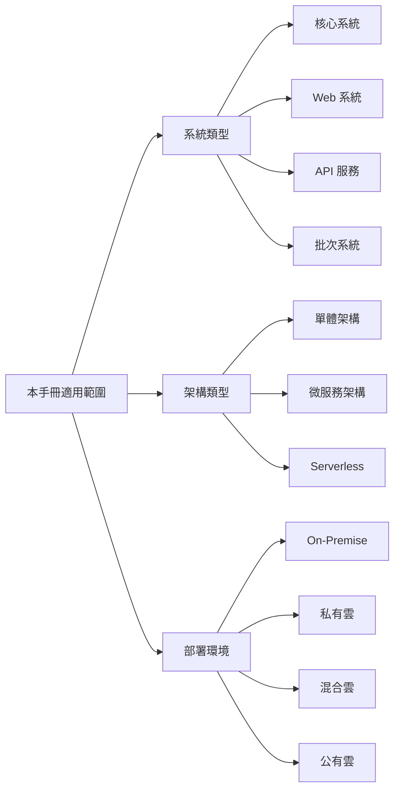

> ⚠️ **注意事項**  
> 本手冊為通用指引，各專案可依實際需求調整細節，但核心原則應予遵循。重大調整需經架構審查委員會核准。

---

## 第二章：軟體開發生命週期（SDLC）總覽

### 2.1 SDLC 各階段說明

軟體開發生命週期（Software Development Life Cycle, SDLC）定義了軟體從構想到退役的完整過程。

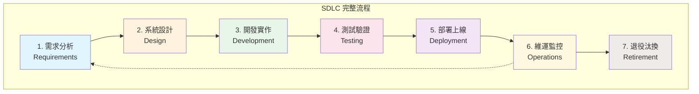

#### 各階段詳細說明

| 階段 | 主要活動 | 關鍵產出 | 負責角色 |
|------|---------|---------|---------|
| **1. 需求分析** | 收集需求、訪談、分析 | BRD、FRD、Use Case | BA、SA、PM |
| **2. 系統設計** | 架構設計、API 設計、DB 設計 | SAD、API Spec、ERD | SA、架構師 |
| **3. 開發實作** | 編碼、單元測試、Code Review | Source Code、Unit Test | 開發工程師 |
| **4. 測試驗證** | 整合測試、系統測試、UAT | Test Report、Bug List | QA、測試人員 |
| **5. 部署上線** | 環境部署、資料移轉、切換 | Release Note、部署文件 | DevOps、維運 |
| **6. 維運監控** | 監控、問題處理、效能調校 | 監控報表、事件記錄 | 維運團隊 |
| **7. 退役汰換** | 資料遷移、系統下線 | 退役計畫、資料備份 | PM、維運 |

### 2.2 與實務專案的關係

#### 階段與文件對應關係

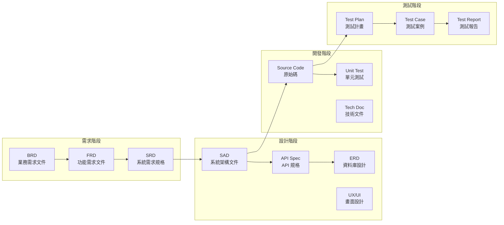

### 2.3 敏捷與瀑布的選擇

#### 選擇指引

| 評估面向 | 適合瀑布（Waterfall） | 適合敏捷（Agile） |
|---------|---------------------|------------------|
| **需求明確度** | 需求明確、變動少 | 需求模糊、可能變動 |
| **專案規模** | 大型、跨系統整合 | 中小型、獨立系統 |
| **法規要求** | 高度監管、需完整文件 | 監管較少 |
| **團隊經驗** | 敏捷經驗不足 | 團隊熟悉敏捷 |
| **客戶參與** | 客戶無法頻繁參與 | 客戶可持續參與 |

#### 混合模式建議

實務上，多數企業專案採用「**混合模式**」：

```
需求階段 → 瀑布式（確保需求完整性）
     ↓
設計階段 → 瀑布式（架構穩定性）
     ↓
開發測試 → 敏捷式（快速迭代、持續交付）
     ↓
上線維運 → DevOps（自動化、持續監控）
```

> 💡 **實務建議**  
> 金融、醫療等高監管產業，建議採用「文件驅動的敏捷」模式：保持敏捷的迭代精神，但確保每個迭代都有完整的文件產出以滿足稽核要求。

---

## 第三章：需求管理（Requirements Engineering）

### 3.1 需求來源與分類

#### 需求來源

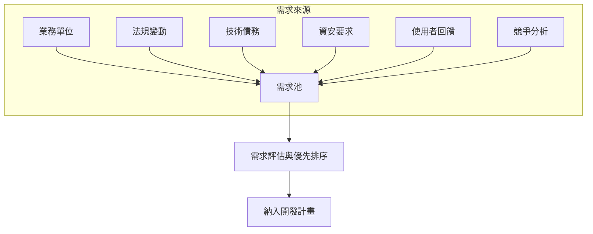

#### 需求分類

| 分類 | 說明 | 範例 |
|------|------|------|
| **業務需求（BR）** | 來自業務目標的需求 | 新增線上開戶功能 |
| **法規需求（RR）** | 因法規變動的需求 | 配合洗錢防制法修正 |
| **技術需求（TR）** | 技術面改善需求 | 資料庫效能優化 |
| **資安需求（SR）** | 資訊安全相關需求 | 弱點修補、權限控管 |

### 3.2 功能性與非功能性需求

#### 功能性需求（Functional Requirements）

描述系統「**做什麼**」的需求：

```markdown
## 功能需求範例：使用者登入

### FR-001：使用者登入功能

**需求描述**：
系統應提供使用者以帳號密碼進行身分驗證登入。

**前置條件**：
- 使用者已完成註冊
- 使用者帳號為啟用狀態

**處理流程**：
1. 使用者輸入帳號與密碼
2. 系統驗證帳號密碼正確性
3. 驗證成功後建立 Session
4. 導向至系統首頁

**驗收條件**：
- [ ] 正確帳密可成功登入
- [ ] 錯誤帳密顯示錯誤訊息
- [ ] 連續失敗 5 次鎖定帳號 30 分鐘
- [ ] 登入成功記錄稽核日誌
```

#### 非功能性需求（Non-Functional Requirements）

描述系統「**表現如何**」的需求：

| NFR 類型 | 指標範例 | 量化標準 |
|---------|---------|---------|
| **效能（Performance）** | 回應時間 | 95% 請求 < 2 秒 |
| **可用性（Availability）** | 系統可用率 | ≥ 99.9%（年停機 < 8.76 小時） |
| **延展性（Scalability）** | 併發用戶 | 支援 10,000 同時在線 |
| **安全性（Security）** | 資料加密 | 傳輸 TLS 1.3、儲存 AES-256 |
| **可維護性（Maintainability）** | 程式碼品質 | 測試覆蓋率 ≥ 80% |

### 3.3 需求文件標準

#### 文件層級關係

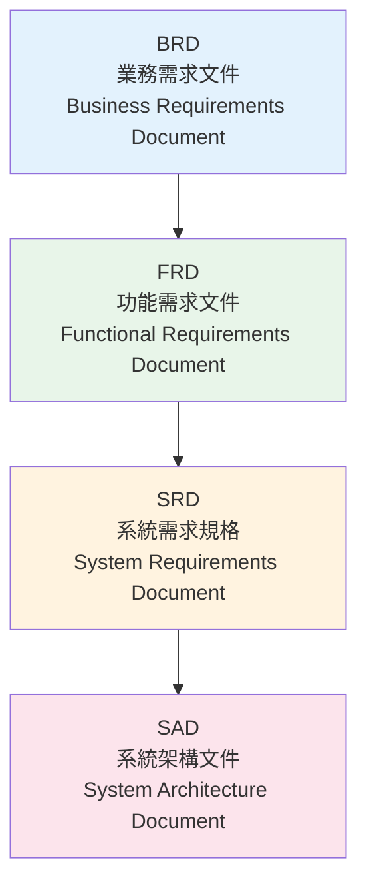

#### 各文件內容要求

**BRD（業務需求文件）**

```markdown
## BRD 標準章節

1. 文件資訊（版本、作者、審核）
2. 專案背景與目標
3. 業務流程現況（As-Is）
4. 業務流程目標（To-Be）
5. 效益分析（量化指標）
6. 風險評估
7. 時程與資源需求
8. 利害關係人簽核
```

**FRD（功能需求文件）**

```markdown
## FRD 標準章節

1. 文件資訊
2. 功能清單與優先序
3. 使用案例（Use Case）
4. 業務規則（Business Rules）
5. 畫面流程（UI Flow）
6. 介面需求（外部系統整合）
7. 資料需求
8. 非功能性需求摘要
9. 術語定義
```

### 3.4 需求異動管理流程

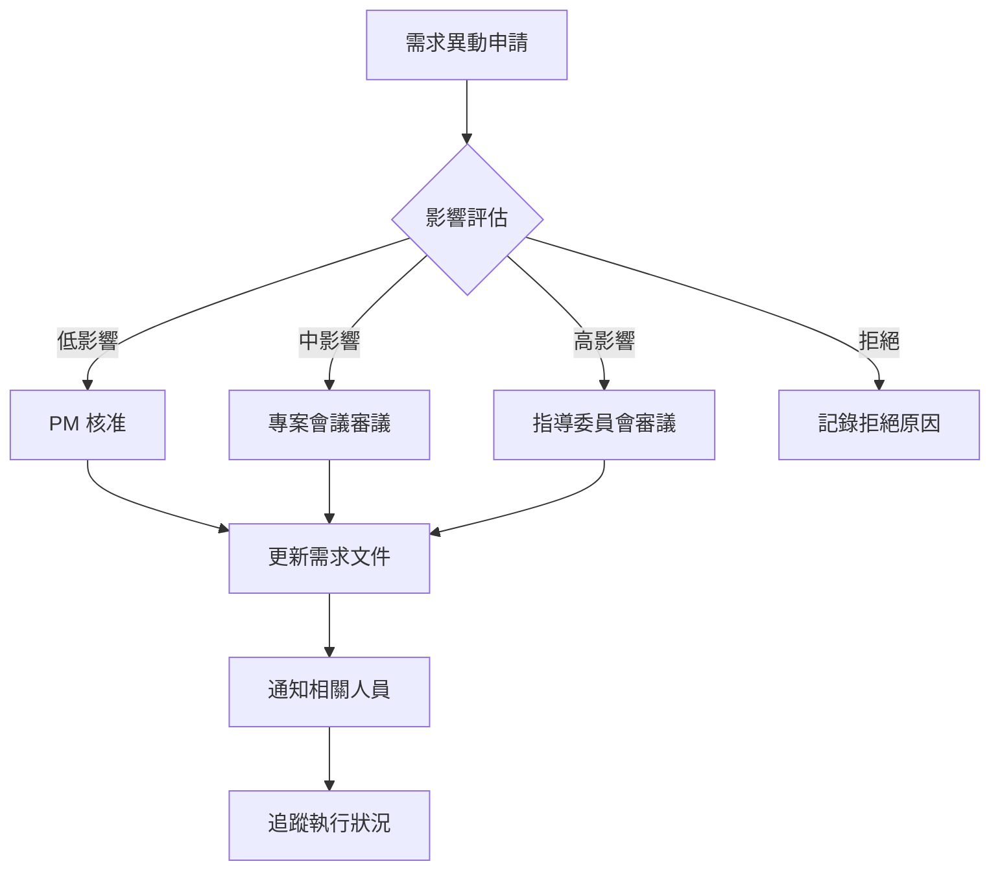

#### 異動影響評估標準

| 影響等級 | 評估標準 | 審核層級 |
|---------|---------|---------|
| **低** | 僅 UI 調整、文字修改 | PM |
| **中** | 邏輯變更、新增欄位 | 專案會議 |
| **高** | 架構變更、跨系統影響 | 指導委員會 |

> ⚠️ **實務注意事項**
> 1. 需求凍結（Freeze）後的異動，需評估對時程與預算的影響
> 2. 所有異動必須留下書面記錄，作為稽核依據
> 3. 避免「口頭需求」，所有需求須正式文件化

---

## 第四章：系統分析與設計

### 4.1 系統架構設計原則

#### 核心設計原則

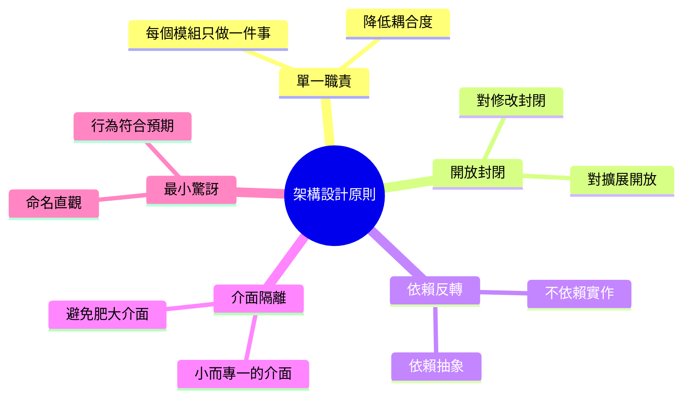

#### 企業架構分層

```
┌─────────────────────────────────────────────────────────┐
│                    Presentation Layer                    │
│              （Web / Mobile / API Gateway）               │
├─────────────────────────────────────────────────────────┤
│                    Application Layer                     │
│                （Business Logic / Services）              │
├─────────────────────────────────────────────────────────┤
│                      Domain Layer                        │
│              （Domain Model / Business Rules）            │
├─────────────────────────────────────────────────────────┤
│                   Infrastructure Layer                   │
│          （Database / External Services / MQ）            │
└─────────────────────────────────────────────────────────┘
```

### 4.2 邏輯架構與實體架構

#### 邏輯架構範例

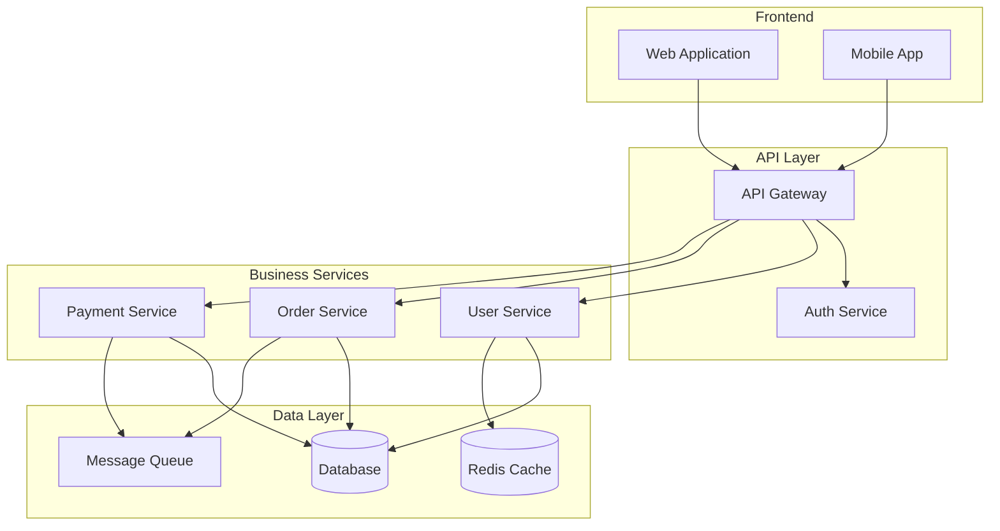

#### 實體架構範例

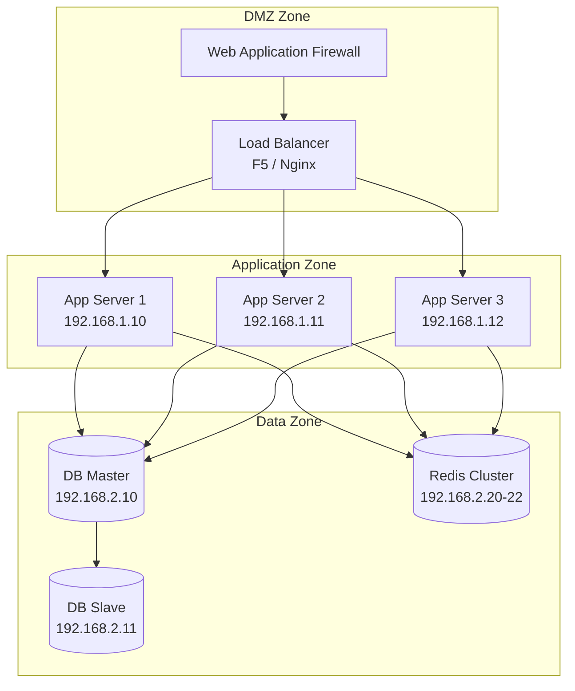

### 4.3 API 設計規範

#### RESTful API 設計原則

```markdown
## URL 命名規範

✅ 正確範例：
- GET    /api/v1/users              # 取得用戶列表
- GET    /api/v1/users/{id}         # 取得特定用戶
- POST   /api/v1/users              # 建立用戶
- PUT    /api/v1/users/{id}         # 更新用戶（完整）
- PATCH  /api/v1/users/{id}         # 更新用戶（部分）
- DELETE /api/v1/users/{id}         # 刪除用戶

❌ 錯誤範例：
- GET    /api/v1/getUsers           # 動詞不應出現在 URL
- POST   /api/v1/user/create        # 使用 HTTP Method 表達動作
- GET    /api/v1/Users              # 應使用小寫
```

#### API Response 標準格式

```json
{
  "success": true,
  "code": "0000",
  "message": "Success",
  "data": {
    "id": "U001",
    "name": "張三",
    "email": "zhang@example.com"
  },
  "timestamp": "2026-02-05T10:30:00Z",
  "traceId": "abc123-def456"
}
```

#### 錯誤回應標準格式

```json
{
  "success": false,
  "code": "E1001",
  "message": "使用者不存在",
  "errors": [
    {
      "field": "userId",
      "message": "找不到指定的使用者 ID"
    }
  ],
  "timestamp": "2026-02-05T10:30:00Z",
  "traceId": "abc123-def456"
}
```

#### HTTP 狀態碼使用規範

| 狀態碼 | 使用情境 |
|-------|---------|
| `200 OK` | 成功取得資料 |
| `201 Created` | 成功建立資源 |
| `204 No Content` | 成功刪除，無回傳內容 |
| `400 Bad Request` | 請求參數錯誤 |
| `401 Unauthorized` | 未認證 |
| `403 Forbidden` | 無權限 |
| `404 Not Found` | 資源不存在 |
| `409 Conflict` | 資源衝突（如重複） |
| `422 Unprocessable Entity` | 業務邏輯驗證失敗 |
| `500 Internal Server Error` | 伺服器錯誤 |

### 4.4 資料庫設計與資料治理

#### 命名規範

```sql
-- 資料表命名：使用大寫底線分隔
CREATE TABLE CUSTOMER_ORDER (
    -- 主鍵：表名_ID
    CUSTOMER_ORDER_ID   BIGINT PRIMARY KEY,
    
    -- 外鍵：關聯表名_ID
    CUSTOMER_ID         BIGINT NOT NULL,
    
    -- 一般欄位：語意清楚的名稱
    ORDER_DATE          DATE NOT NULL,
    ORDER_STATUS        VARCHAR(20) NOT NULL,
    TOTAL_AMOUNT        DECIMAL(15,2) NOT NULL,
    
    -- 標準稽核欄位
    CREATED_BY          VARCHAR(50) NOT NULL,
    CREATED_AT          TIMESTAMP NOT NULL,
    UPDATED_BY          VARCHAR(50),
    UPDATED_AT          TIMESTAMP,
    
    -- 軟刪除欄位
    IS_DELETED          CHAR(1) DEFAULT 'N',
    DELETED_AT          TIMESTAMP,
    DELETED_BY          VARCHAR(50)
);

-- 索引命名：IDX_表名_欄位名
CREATE INDEX IDX_CUSTOMER_ORDER_CUSTOMER_ID 
    ON CUSTOMER_ORDER(CUSTOMER_ID);

-- 外鍵命名：FK_表名_關聯表名
ALTER TABLE CUSTOMER_ORDER 
    ADD CONSTRAINT FK_CUSTOMER_ORDER_CUSTOMER 
    FOREIGN KEY (CUSTOMER_ID) REFERENCES CUSTOMER(CUSTOMER_ID);
```

#### 資料治理要點

| 面向 | 規範內容 |
|------|---------|
| **資料分類** | 依敏感度分級：公開、內部、機密、極機密 |
| **個資保護** | 敏感欄位加密儲存、遮罩顯示 |
| **資料保留** | 定義各類資料保留年限 |
| **稽核軌跡** | 關鍵資料異動需記錄完整軌跡 |

### 4.5 非功能性設計

#### 效能設計要點

```markdown
## 效能設計檢核清單

### 資料庫層
- [ ] 查詢使用適當索引
- [ ] 避免 SELECT *
- [ ] 批次處理使用分頁
- [ ] 連線池配置適當大小

### 應用層
- [ ] 適當使用快取（Redis）
- [ ] 非同步處理長時間任務
- [ ] 避免 N+1 查詢問題
- [ ] API 回應啟用 GZIP

### 架構層
- [ ] 靜態資源使用 CDN
- [ ] 讀寫分離（主從架構）
- [ ] 水平擴展能力
```

#### 高可用設計模式

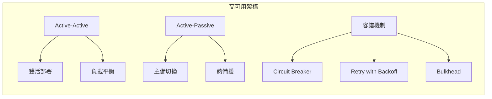

> 💡 **實務建議**
> 1. 關鍵系統 RPO（Recovery Point Objective）應 < 1 分鐘
> 2. RTO（Recovery Time Objective）視業務需求，一般 < 30 分鐘
> 3. 定期執行災難演練（DR Drill）

---

## 第五章：開發實作規範

### 5.1 程式碼風格與命名規範

#### 通用命名原則

| 元素 | 命名風格 | 範例 |
|------|---------|------|
| **類別（Class）** | PascalCase | `CustomerService`, `OrderRepository` |
| **方法（Method）** | camelCase | `findByCustomerId()`, `calculateTotal()` |
| **變數（Variable）** | camelCase | `orderCount`, `customerName` |
| **常數（Constant）** | UPPER_SNAKE_CASE | `MAX_RETRY_COUNT`, `DEFAULT_TIMEOUT` |
| **套件（Package）** | lowercase | `com.company.project.service` |
| **資料表（Table）** | UPPER_SNAKE_CASE | `CUSTOMER_ORDER`, `PRODUCT_CATEGORY` |
| **API 路徑** | kebab-case | `/api/v1/customer-orders` |

#### Java 程式碼規範範例

```java
package com.company.project.service;

import org.springframework.stereotype.Service;
import org.springframework.transaction.annotation.Transactional;

/**
 * 客戶服務類別
 * 
 * <p>負責處理客戶相關的業務邏輯，包含查詢、建立、更新等操作。</p>
 * 
 * @author 開發團隊
 * @since 1.0.0
 */
@Service
public class CustomerService {

    private static final int MAX_RETRY_COUNT = 3;
    private static final String DEFAULT_STATUS = "ACTIVE";
    
    private final CustomerRepository customerRepository;
    private final NotificationService notificationService;
    
    /**
     * 建構子注入依賴
     */
    public CustomerService(CustomerRepository customerRepository,
                          NotificationService notificationService) {
        this.customerRepository = customerRepository;
        this.notificationService = notificationService;
    }
    
    /**
     * 根據客戶 ID 查詢客戶資訊
     * 
     * @param customerId 客戶識別碼
     * @return 客戶資訊 DTO
     * @throws CustomerNotFoundException 當客戶不存在時拋出
     */
    public CustomerDTO findByCustomerId(String customerId) {
        // 參數驗證
        if (customerId == null || customerId.isBlank()) {
            throw new IllegalArgumentException("Customer ID cannot be empty");
        }
        
        // 查詢客戶
        Customer customer = customerRepository.findById(customerId)
            .orElseThrow(() -> new CustomerNotFoundException(customerId));
        
        // 轉換並返回
        return CustomerMapper.toDTO(customer);
    }
    
    /**
     * 建立新客戶
     * 
     * @param request 建立客戶請求
     * @return 建立後的客戶資訊
     */
    @Transactional
    public CustomerDTO createCustomer(CreateCustomerRequest request) {
        // 1. 驗證請求
        validateCreateRequest(request);
        
        // 2. 檢查重複
        checkDuplicateEmail(request.getEmail());
        
        // 3. 建立實體
        Customer customer = Customer.builder()
            .name(request.getName())
            .email(request.getEmail())
            .status(DEFAULT_STATUS)
            .build();
        
        // 4. 儲存
        Customer saved = customerRepository.save(customer);
        
        // 5. 發送通知
        notificationService.sendWelcomeEmail(saved);
        
        // 6. 返回結果
        return CustomerMapper.toDTO(saved);
    }
    
    private void validateCreateRequest(CreateCustomerRequest request) {
        // 驗證邏輯...
    }
    
    private void checkDuplicateEmail(String email) {
        // 重複檢查邏輯...
    }
}
```

#### 程式碼註解規範

```java
/**
 * 類別層級 JavaDoc（必要）
 * - 說明類別職責
 * - 標註 @author 與 @since
 */

/**
 * 方法層級 JavaDoc（公開方法必要）
 * - 說明方法用途
 * - @param 說明參數
 * - @return 說明回傳值
 * - @throws 說明可能拋出的例外
 */

// 單行註解：說明複雜邏輯的「為什麼」
// 不要寫「做什麼」（程式碼本身應該自我說明）

/*
 * 多行註解：
 * 用於暫時停用的程式碼區塊
 * 或較長的說明文字
 */

// TODO: 待完成的功能（需標註負責人與預計完成時間）
// FIXME: 需要修復的問題
// HACK: 臨時解法，需要重構
```

### 5.2 架構分層原則

#### Clean Architecture 分層

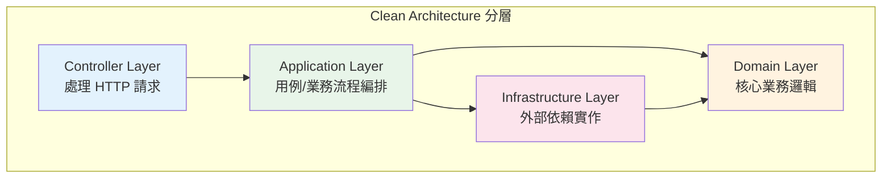

#### 各層職責與規範

| 層級 | 職責 | 可依賴 | 禁止依賴 |
|------|------|-------|---------|
| **Controller** | 處理 HTTP、參數驗證、回應格式 | Application | Domain, Infrastructure |
| **Application** | 用例編排、交易控制、DTO 轉換 | Domain, Infrastructure（介面） | Controller |
| **Domain** | 核心業務規則、領域模型 | 無 | 所有其他層 |
| **Infrastructure** | 資料庫、外部 API、訊息佇列 | Domain（實作介面） | Controller, Application |

#### 專案目錄結構範例

```
src/main/java/com/company/project/
├── controller/                    # 控制器層
│   ├── CustomerController.java
│   ├── OrderController.java
│   └── dto/                       # Request/Response DTO
│       ├── request/
│       └── response/
│
├── application/                   # 應用層
│   ├── service/                   # 應用服務
│   │   ├── CustomerApplicationService.java
│   │   └── OrderApplicationService.java
│   ├── usecase/                   # 用例
│   └── mapper/                    # DTO 轉換器
│
├── domain/                        # 領域層
│   ├── model/                     # 領域模型
│   │   ├── Customer.java
│   │   └── Order.java
│   ├── service/                   # 領域服務
│   ├── repository/                # Repository 介面
│   ├── event/                     # 領域事件
│   └── exception/                 # 領域例外
│
├── infrastructure/                # 基礎設施層
│   ├── persistence/               # 資料庫存取
│   │   ├── repository/            # Repository 實作
│   │   ├── entity/                # JPA Entity
│   │   └── mapper/                # Entity 轉換
│   ├── external/                  # 外部服務整合
│   │   ├── payment/
│   │   └── notification/
│   └── config/                    # 設定類別
│
└── common/                        # 共用元件
    ├── exception/                 # 通用例外
    ├── util/                      # 工具類別
    └── constant/                  # 常數定義
```

### 5.3 重用性與模組化

#### 模組化設計原則

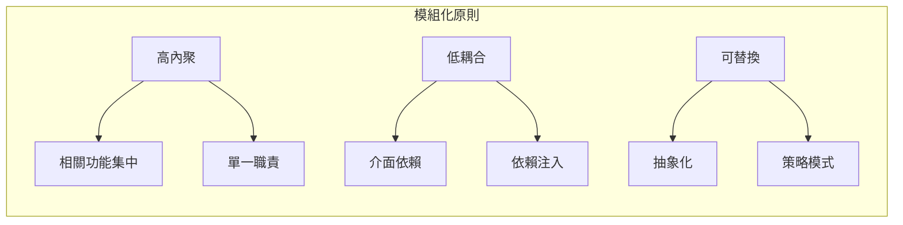

#### 共用模組設計

```java
// ✅ 良好的共用模組設計

// 1. 定義清楚的介面
public interface NotificationService {
    void send(Notification notification);
    NotificationResult getStatus(String notificationId);
}

// 2. 提供多種實作
@Service
@ConditionalOnProperty(name = "notification.type", havingValue = "email")
public class EmailNotificationService implements NotificationService {
    // Email 實作
}

@Service
@ConditionalOnProperty(name = "notification.type", havingValue = "sms")
public class SmsNotificationService implements NotificationService {
    // SMS 實作
}

// 3. 使用時依賴介面
@Service
public class OrderService {
    private final NotificationService notificationService;
    
    public OrderService(NotificationService notificationService) {
        this.notificationService = notificationService;
    }
}
```

#### 避免重複的實務作法

| 情境 | 解決方案 |
|------|---------|
| **重複的驗證邏輯** | 建立共用 Validator 類別 |
| **重複的資料轉換** | 使用 MapStruct 等映射工具 |
| **重複的例外處理** | 建立全域例外處理器 |
| **重複的日誌記錄** | 使用 AOP 切面 |
| **重複的 CRUD** | 建立 Generic Repository |

### 5.4 Secure Coding 基本原則

#### 安全編碼檢核清單

```markdown
## 輸入驗證
- [ ] 所有外部輸入都經過驗證
- [ ] 使用白名單而非黑名單驗證
- [ ] 限制輸入長度與格式
- [ ] 驗證檔案上傳類型與大小

## SQL Injection 防護
- [ ] 使用 Prepared Statement
- [ ] 避免字串拼接 SQL
- [ ] ORM 使用參數綁定

## XSS 防護
- [ ] 輸出編碼（HTML Encode）
- [ ] 使用 Content Security Policy
- [ ] HttpOnly Cookie

## 認證與授權
- [ ] 密碼加密儲存（bcrypt/scrypt）
- [ ] Session 管理安全
- [ ] 實作適當的權限檢查

## 敏感資料處理
- [ ] 傳輸加密（TLS 1.3）
- [ ] 儲存加密（AES-256）
- [ ] 日誌不記錄敏感資訊
- [ ] 記憶體中敏感資料及時清除
```

#### 安全編碼範例

```java
// ❌ 不安全的寫法 - SQL Injection
public User findUser(String username) {
    String sql = "SELECT * FROM users WHERE username = '" + username + "'";
    return jdbcTemplate.queryForObject(sql, User.class);
}

// ✅ 安全的寫法 - Prepared Statement
public User findUser(String username) {
    String sql = "SELECT * FROM users WHERE username = ?";
    return jdbcTemplate.queryForObject(sql, new Object[]{username}, User.class);
}

// ❌ 不安全的寫法 - 密碼明文比對
public boolean authenticate(String username, String password) {
    User user = userRepository.findByUsername(username);
    return user.getPassword().equals(password);  // 明文比對
}

// ✅ 安全的寫法 - 密碼雜湊比對
public boolean authenticate(String username, String password) {
    User user = userRepository.findByUsername(username);
    return passwordEncoder.matches(password, user.getPasswordHash());
}

// ❌ 不安全的寫法 - 日誌記錄敏感資訊
log.info("User login: username={}, password={}", username, password);

// ✅ 安全的寫法 - 遮罩敏感資訊
log.info("User login: username={}", username);
// 或使用遮罩
log.info("User login: username={}, password={}", username, maskPassword(password));
```

#### OWASP Top 10 對應措施

| OWASP 風險 | 防護措施 |
|-----------|---------|
| **A01: Broken Access Control** | RBAC、最小權限、權限檢查 |
| **A02: Cryptographic Failures** | 強加密演算法、金鑰管理 |
| **A03: Injection** | 參數化查詢、輸入驗證 |
| **A04: Insecure Design** | 威脅建模、安全設計審查 |
| **A05: Security Misconfiguration** | 安全基準、自動化檢查 |
| **A06: Vulnerable Components** | 依賴掃描、及時更新 |
| **A07: Authentication Failures** | MFA、安全 Session 管理 |
| **A08: Software Integrity Failures** | 程式碼簽章、CI/CD 安全 |
| **A09: Logging Failures** | 完整稽核日誌、監控告警 |
| **A10: SSRF** | 白名單、網路隔離 |

> ⚠️ **實務注意事項**
> 1. 定期執行弱點掃描（SAST/DAST）
> 2. 第三方套件需檢查已知弱點
> 3. 敏感操作需記錄稽核日誌
> 4. 定期進行安全教育訓練

---

## 第六章：測試策略與品質保證

### 6.1 測試類型與層級

#### 測試金字塔

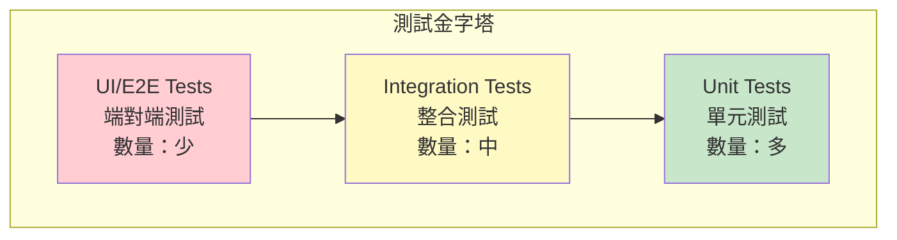

#### 各類測試說明

| 測試類型 | 測試範圍 | 執行時機 | 執行速度 | 維護成本 |
|---------|---------|---------|---------|---------|
| **Unit Test** | 單一類別/方法 | 每次 Commit | 極快（ms） | 低 |
| **Integration Test** | 多元件互動 | 每次 Build | 中等（秒） | 中 |
| **System Test** | 完整系統流程 | 每日/Release | 慢（分鐘） | 高 |
| **UAT** | 業務場景驗證 | Release 前 | 慢 | 高 |
| **Performance Test** | 效能壓力 | Release 前 | 慢 | 高 |

#### 單元測試範例

```java
import org.junit.jupiter.api.Test;
import org.junit.jupiter.api.DisplayName;
import org.junit.jupiter.api.BeforeEach;
import org.junit.jupiter.api.Nested;
import static org.assertj.core.api.Assertions.*;
import static org.mockito.Mockito.*;

class CustomerServiceTest {

    private CustomerRepository customerRepository;
    private NotificationService notificationService;
    private CustomerService customerService;

    @BeforeEach
    void setUp() {
        customerRepository = mock(CustomerRepository.class);
        notificationService = mock(NotificationService.class);
        customerService = new CustomerService(customerRepository, notificationService);
    }

    @Nested
    @DisplayName("findByCustomerId 方法測試")
    class FindByCustomerIdTests {

        @Test
        @DisplayName("當客戶存在時，應返回客戶資訊")
        void shouldReturnCustomer_WhenCustomerExists() {
            // Given
            String customerId = "C001";
            Customer customer = Customer.builder()
                .id(customerId)
                .name("張三")
                .email("zhang@example.com")
                .build();
            when(customerRepository.findById(customerId))
                .thenReturn(Optional.of(customer));

            // When
            CustomerDTO result = customerService.findByCustomerId(customerId);

            // Then
            assertThat(result).isNotNull();
            assertThat(result.getId()).isEqualTo(customerId);
            assertThat(result.getName()).isEqualTo("張三");
            verify(customerRepository).findById(customerId);
        }

        @Test
        @DisplayName("當客戶不存在時，應拋出 CustomerNotFoundException")
        void shouldThrowException_WhenCustomerNotFound() {
            // Given
            String customerId = "INVALID";
            when(customerRepository.findById(customerId))
                .thenReturn(Optional.empty());

            // When & Then
            assertThatThrownBy(() -> customerService.findByCustomerId(customerId))
                .isInstanceOf(CustomerNotFoundException.class)
                .hasMessageContaining(customerId);
        }

        @Test
        @DisplayName("當客戶 ID 為空時，應拋出 IllegalArgumentException")
        void shouldThrowException_WhenCustomerIdIsEmpty() {
            // When & Then
            assertThatThrownBy(() -> customerService.findByCustomerId(""))
                .isInstanceOf(IllegalArgumentException.class)
                .hasMessage("Customer ID cannot be empty");
        }
    }

    @Nested
    @DisplayName("createCustomer 方法測試")
    class CreateCustomerTests {

        @Test
        @DisplayName("建立客戶成功時，應發送歡迎郵件")
        void shouldSendWelcomeEmail_WhenCustomerCreated() {
            // Given
            CreateCustomerRequest request = new CreateCustomerRequest("李四", "li@example.com");
            Customer savedCustomer = Customer.builder()
                .id("C002")
                .name("李四")
                .email("li@example.com")
                .build();
            when(customerRepository.save(any())).thenReturn(savedCustomer);

            // When
            customerService.createCustomer(request);

            // Then
            verify(notificationService).sendWelcomeEmail(savedCustomer);
        }
    }
}
```

#### 整合測試範例

```java
@SpringBootTest
@AutoConfigureMockMvc
@Transactional
class CustomerControllerIntegrationTest {

    @Autowired
    private MockMvc mockMvc;

    @Autowired
    private ObjectMapper objectMapper;

    @Autowired
    private CustomerRepository customerRepository;

    @Test
    @DisplayName("GET /api/v1/customers/{id} - 成功取得客戶")
    void getCustomer_Success() throws Exception {
        // Given
        Customer customer = customerRepository.save(
            Customer.builder()
                .name("測試客戶")
                .email("test@example.com")
                .build()
        );

        // When & Then
        mockMvc.perform(get("/api/v1/customers/{id}", customer.getId())
                .contentType(MediaType.APPLICATION_JSON))
            .andExpect(status().isOk())
            .andExpect(jsonPath("$.success").value(true))
            .andExpect(jsonPath("$.data.name").value("測試客戶"))
            .andExpect(jsonPath("$.data.email").value("test@example.com"));
    }

    @Test
    @DisplayName("POST /api/v1/customers - 成功建立客戶")
    void createCustomer_Success() throws Exception {
        // Given
        CreateCustomerRequest request = new CreateCustomerRequest("新客戶", "new@example.com");

        // When & Then
        mockMvc.perform(post("/api/v1/customers")
                .contentType(MediaType.APPLICATION_JSON)
                .content(objectMapper.writeValueAsString(request)))
            .andExpect(status().isCreated())
            .andExpect(jsonPath("$.success").value(true))
            .andExpect(jsonPath("$.data.id").isNotEmpty());
    }
}
```

### 6.2 測試責任分工

#### RACI 矩陣

| 測試活動 | 開發工程師 | QA 工程師 | 業務單位 | PM |
|---------|-----------|----------|---------|-----|
| **單元測試** | R/A | C | - | I |
| **整合測試** | R | A | - | I |
| **系統測試** | C | R/A | C | I |
| **UAT** | C | C | R/A | A |
| **效能測試** | C | R | - | A |
| **安全測試** | C | R | - | A |

> R = Responsible（執行）、A = Accountable（當責）、C = Consulted（諮詢）、I = Informed（知會）

### 6.3 測試資料管理

#### 測試資料策略

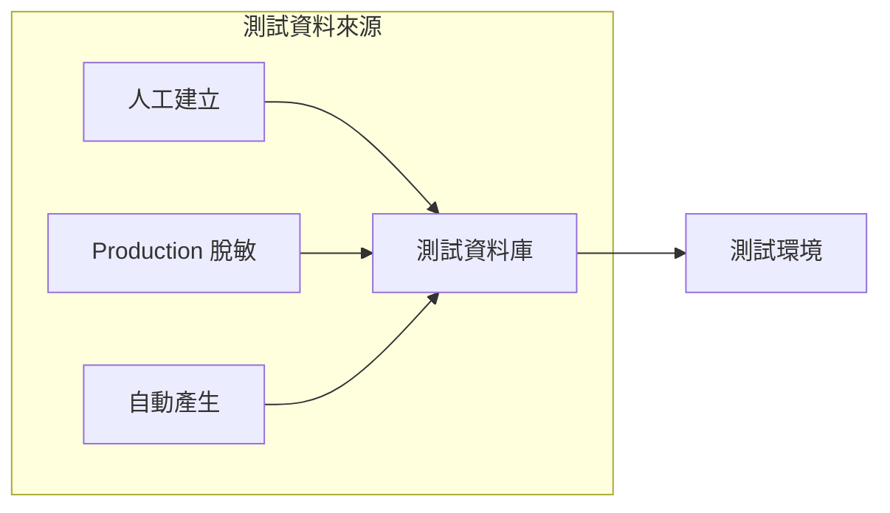

#### 測試資料規範

```markdown
## 測試資料管理原則

### 1. 資料隔離
- 各測試案例使用獨立資料
- 測試後清理（或使用 @Transactional 自動 Rollback）
- 避免測試間的資料依賴

### 2. 敏感資料處理
- 禁止使用生產環境真實資料
- 個資欄位需脫敏處理
- 使用假資料產生器（Faker）

### 3. 資料版本控制
- 測試資料腳本納入版本控制
- 與程式碼一同維護
- 支援自動化初始化
```

#### 測試資料產生範例

```java
// 使用 Java Faker 產生測試資料
import com.github.javafaker.Faker;

public class TestDataFactory {
    
    private static final Faker faker = new Faker(new Locale("zh-TW"));
    
    public static Customer createRandomCustomer() {
        return Customer.builder()
            .name(faker.name().fullName())
            .email(faker.internet().emailAddress())
            .phone(faker.phoneNumber().cellPhone())
            .address(faker.address().fullAddress())
            .birthDate(faker.date().birthday())
            .build();
    }
    
    public static List<Customer> createRandomCustomers(int count) {
        return IntStream.range(0, count)
            .mapToObj(i -> createRandomCustomer())
            .collect(Collectors.toList());
    }
}
```

### 6.4 缺陷（Bug）管理流程

#### Bug 生命週期

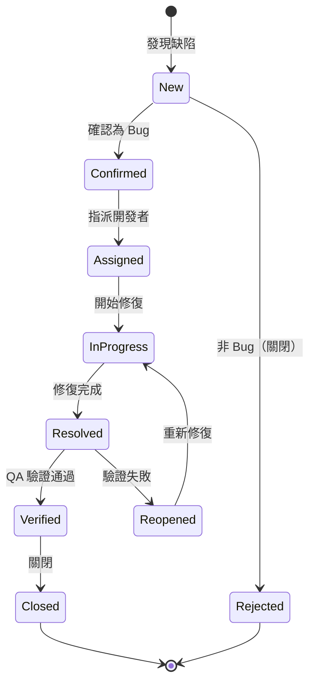

#### Bug 嚴重度定義

| 等級 | 名稱 | 定義 | 修復時限 |
|------|------|------|---------|
| **P1** | Critical | 系統無法使用、資料遺失、安全漏洞 | 4 小時內 |
| **P2** | High | 主要功能異常、無替代方案 | 24 小時內 |
| **P3** | Medium | 功能異常但有替代方案 | 本週內 |
| **P4** | Low | 輕微問題、UI 問題 | 下版本 |

#### Bug 報告範本

```markdown
## Bug 標題
[模組名稱] 簡述問題現象

## 環境資訊
- 環境：SIT / UAT / Production
- 版本：v1.2.3
- 瀏覽器：Chrome 120
- 作業系統：Windows 11

## 重現步驟
1. 開啟客戶查詢頁面
2. 輸入客戶 ID: C001
3. 點擊查詢按鈕

## 預期結果
顯示客戶詳細資訊

## 實際結果
顯示錯誤訊息「系統異常，請稍後再試」

## 截圖/日誌
[附上錯誤截圖或相關日誌]

## 影響範圍
- 影響功能：客戶查詢
- 影響用戶：所有使用者
```

> 💡 **實務建議**
> 1. 測試覆蓋率目標：核心業務邏輯 ≥ 80%
> 2. 每個 Bug 修復必須附帶對應的測試案例
> 3. 定期檢視測試效能，移除低價值測試
> 4. 重要功能需包含邊界條件與負面測試

---

## 第七章：版本控制與組態管理

### 7.1 Git 分支策略

#### Git Flow 分支模型

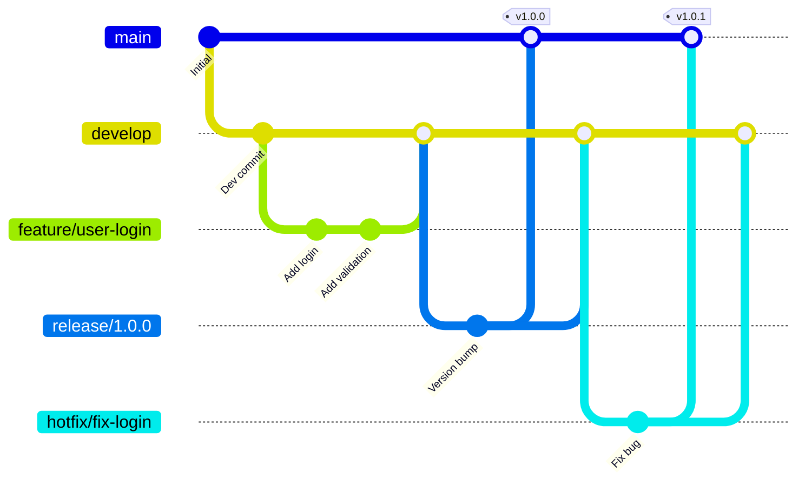

#### 分支命名規範

| 分支類型 | 命名格式 | 範例 | 用途 |
|---------|---------|------|------|
| **主分支** | `main` | main | 生產環境程式碼 |
| **開發分支** | `develop` | develop | 開發整合 |
| **功能分支** | `feature/{issue-id}-{description}` | feature/PROJ-123-user-login | 新功能開發 |
| **修復分支** | `bugfix/{issue-id}-{description}` | bugfix/PROJ-456-fix-null | Bug 修復 |
| **熱修復** | `hotfix/{issue-id}-{description}` | hotfix/PROJ-789-security-fix | 生產環境緊急修復 |
| **發布分支** | `release/{version}` | release/1.2.0 | 版本發布準備 |

#### Commit Message 規範

```markdown
## Commit Message 格式

<type>(<scope>): <subject>

<body>

<footer>

## Type 類型
- feat:     新功能
- fix:      Bug 修復
- docs:     文件更新
- style:    程式碼格式（不影響功能）
- refactor: 重構（不是新功能也不是修 Bug）
- perf:     效能優化
- test:     測試相關
- chore:    建置/工具相關

## 範例
feat(customer): 新增客戶查詢功能

- 實作根據 ID 查詢客戶 API
- 新增客戶不存在的錯誤處理
- 補充單元測試

Closes #123
```

#### 程式碼審查（Code Review）規範

```markdown
## Code Review Checklist

### 功能正確性
- [ ] 程式碼符合需求規格
- [ ] 邊界條件處理完整
- [ ] 錯誤處理適當

### 程式碼品質
- [ ] 命名清楚有意義
- [ ] 程式碼簡潔易讀
- [ ] 沒有重複程式碼
- [ ] 適當的註解

### 測試
- [ ] 包含單元測試
- [ ] 測試覆蓋重要邏輯
- [ ] 測試案例有意義

### 安全性
- [ ] 輸入驗證完整
- [ ] 無硬編碼敏感資訊
- [ ] 權限檢查正確

### 效能
- [ ] 無明顯效能問題
- [ ] 資料庫查詢優化
- [ ] 資源正確釋放
```

### 7.2 版號管理原則

#### 語意化版本（Semantic Versioning）

```
MAJOR.MINOR.PATCH[-PRERELEASE][+BUILD]

範例：
1.0.0          # 正式版
1.0.1          # Patch 更新（Bug 修復）
1.1.0          # Minor 更新（新功能，向下相容）
2.0.0          # Major 更新（重大變更，不向下相容）
1.0.0-alpha.1  # 預發布版本
1.0.0-rc.1     # Release Candidate
1.0.0+20260205 # 包含建置資訊
```

#### 版號變更規則

| 變更類型 | 版號變動 | 範例 |
|---------|---------|------|
| Bug 修復（向下相容） | PATCH +1 | 1.0.0 → 1.0.1 |
| 新功能（向下相容） | MINOR +1, PATCH = 0 | 1.0.1 → 1.1.0 |
| 重大變更（不向下相容） | MAJOR +1, MINOR = 0, PATCH = 0 | 1.1.0 → 2.0.0 |

### 7.3 設定檔與環境管理

#### 環境分類

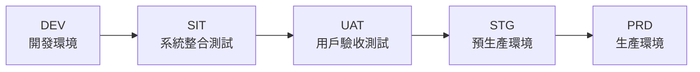

#### 設定檔管理原則

```yaml
# application.yml - 基礎設定（共用）
spring:
  application:
    name: customer-service
  jackson:
    date-format: yyyy-MM-dd HH:mm:ss
    time-zone: Asia/Taipei

# application-dev.yml - 開發環境
spring:
  datasource:
    url: jdbc:postgresql://localhost:5432/dev_db
    username: dev_user
  
logging:
  level:
    root: DEBUG
    com.company: DEBUG

# application-prd.yml - 生產環境
spring:
  datasource:
    url: ${DB_URL}           # 從環境變數讀取
    username: ${DB_USERNAME}
    password: ${DB_PASSWORD}
  
logging:
  level:
    root: INFO
    com.company: INFO
```

#### 敏感設定管理

```markdown
## 敏感設定禁止事項

❌ 禁止將以下資訊放入版本控制：
- 資料庫密碼
- API Key / Secret
- 私鑰 / 憑證
- 加密金鑰

## 建議方案

✅ 環境變數
- 透過 CI/CD 工具注入
- K8s Secrets

✅ 設定中心
- Spring Cloud Config
- HashiCorp Vault
- AWS Secrets Manager

✅ 設定檔範本
- 提供 application-prd.yml.template
- 實際設定檔加入 .gitignore
```

> 💡 **實務建議**
> 1. 每個環境使用獨立的資料庫與外部服務
> 2. 生產環境設定變更需經過審核流程
> 3. 定期輪換敏感設定（密碼、金鑰）
> 4. 保留設定變更歷史記錄

---

## 第八章：CI/CD 與部署流程

### 8.1 自動化建置流程

#### CI/CD Pipeline 概覽

```mermaid
graph LR
    subgraph "CI - 持續整合"
        A[Code Commit] --> B[Build]
        B --> C[Unit Test]
        C --> D[Code Analysis]
        D --> E[Security Scan]
        E --> F[Package]
    end
    
    subgraph "CD - 持續部署"
        F --> G[Deploy to DEV]
        G --> H[Integration Test]
        H --> I[Deploy to SIT]
        I --> J[System Test]
        J --> K[Deploy to UAT]
        K --> L[Approval]
        L --> M[Deploy to PRD]
    end
    
    style A fill:#e3f2fd
    style F fill:#fff9c4
    style M fill:#c8e6c9
```

#### GitHub Actions Pipeline 範例

```yaml
# .github/workflows/ci-cd.yml
name: CI/CD Pipeline

on:
  push:
    branches: [main, develop]
  pull_request:
    branches: [main, develop]

env:
  JAVA_VERSION: '21'
  MAVEN_OPTS: '-Xmx1024m'

jobs:
  build:
    name: Build & Test
    runs-on: ubuntu-latest
    
    steps:
      - name: Checkout Code
        uses: actions/checkout@v4

      - name: Setup Java
        uses: actions/setup-java@v4
        with:
          java-version: ${{ env.JAVA_VERSION }}
          distribution: 'temurin'
          cache: maven

      - name: Build with Maven
        run: mvn clean compile -B

      - name: Run Unit Tests
        run: mvn test -B

      - name: Run Integration Tests
        run: mvn verify -B -Pintegration-test

      - name: Upload Test Results
        if: always()
        uses: actions/upload-artifact@v4
        with:
          name: test-results
          path: target/surefire-reports/

  code-quality:
    name: Code Quality Analysis
    runs-on: ubuntu-latest
    needs: build
    
    steps:
      - name: Checkout Code
        uses: actions/checkout@v4

      - name: Setup Java
        uses: actions/setup-java@v4
        with:
          java-version: ${{ env.JAVA_VERSION }}
          distribution: 'temurin'
          cache: maven

      - name: SonarQube Scan
        env:
          SONAR_TOKEN: ${{ secrets.SONAR_TOKEN }}
        run: |
          mvn sonar:sonar \
            -Dsonar.projectKey=customer-service \
            -Dsonar.host.url=${{ secrets.SONAR_HOST_URL }} \
            -Dsonar.login=${{ secrets.SONAR_TOKEN }}

  security-scan:
    name: Security Scan
    runs-on: ubuntu-latest
    needs: build
    
    steps:
      - name: Checkout Code
        uses: actions/checkout@v4

      - name: Run OWASP Dependency Check
        uses: dependency-check/Dependency-Check_Action@main
        with:
          project: 'customer-service'
          path: '.'
          format: 'HTML'
          
      - name: Upload Dependency Check Report
        uses: actions/upload-artifact@v4
        with:
          name: dependency-check-report
          path: reports/

  deploy-dev:
    name: Deploy to DEV
    runs-on: ubuntu-latest
    needs: [build, code-quality, security-scan]
    if: github.ref == 'refs/heads/develop'
    environment: development
    
    steps:
      - name: Checkout Code
        uses: actions/checkout@v4

      - name: Setup Java
        uses: actions/setup-java@v4
        with:
          java-version: ${{ env.JAVA_VERSION }}
          distribution: 'temurin'
          cache: maven

      - name: Package Application
        run: mvn package -DskipTests -B

      - name: Build Docker Image
        run: |
          docker build -t customer-service:${{ github.sha }} .
          docker tag customer-service:${{ github.sha }} ${{ secrets.REGISTRY }}/customer-service:dev

      - name: Push to Registry
        run: |
          echo ${{ secrets.REGISTRY_PASSWORD }} | docker login -u ${{ secrets.REGISTRY_USERNAME }} --password-stdin ${{ secrets.REGISTRY }}
          docker push ${{ secrets.REGISTRY }}/customer-service:dev

      - name: Deploy to Kubernetes
        run: |
          kubectl set image deployment/customer-service \
            customer-service=${{ secrets.REGISTRY }}/customer-service:dev \
            --namespace=development

  deploy-production:
    name: Deploy to Production
    runs-on: ubuntu-latest
    needs: [build, code-quality, security-scan]
    if: github.ref == 'refs/heads/main'
    environment: production
    
    steps:
      - name: Checkout Code
        uses: actions/checkout@v4
        
      # ... 生產部署步驟（需人工審核）
```

### 8.2 部署策略

#### 常見部署策略比較

| 策略 | 說明 | 優點 | 缺點 | 適用場景 |
|------|------|------|------|---------|
| **Rolling** | 逐步替換舊版本 | 零停機、資源效率高 | 回滾較慢 | 一般應用 |
| **Blue-Green** | 兩套環境切換 | 快速回滾 | 資源成本高 | 重要系統 |
| **Canary** | 小比例流量測試 | 風險低 | 複雜度高 | 高風險變更 |
| **Recreate** | 停機後更新 | 簡單 | 有停機時間 | 非關鍵系統 |

#### Blue-Green 部署流程

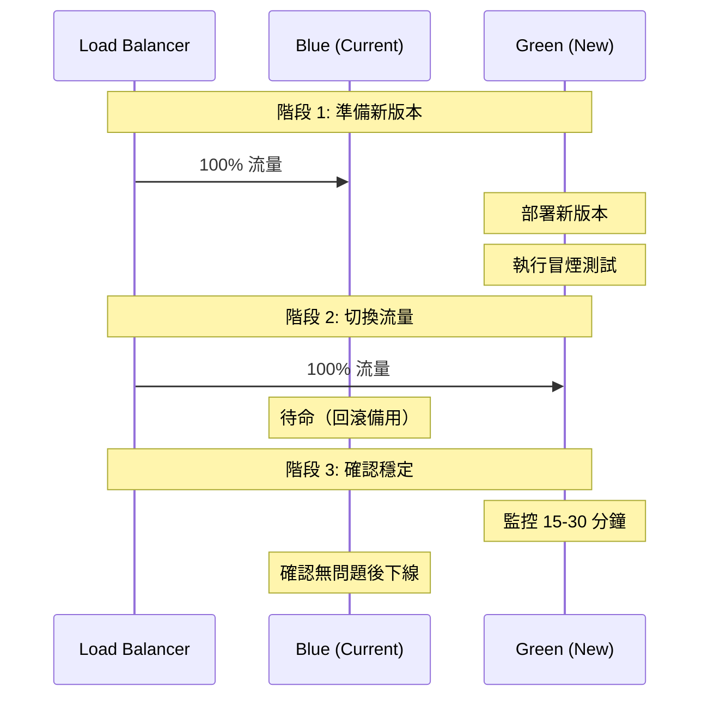

#### Canary 部署流程

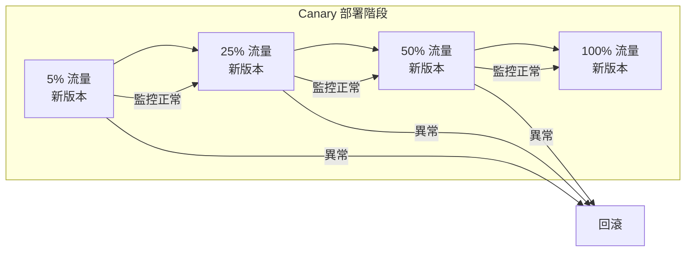

### 8.3 回滾與風險控管

#### 回滾策略

```markdown
## 自動回滾觸發條件

1. **健康檢查失敗**
   - Pod 連續 3 次 Readiness Probe 失敗
   - 錯誤率超過閾值（> 5%）

2. **效能指標異常**
   - 回應時間超過 SLA（P95 > 2s）
   - CPU/Memory 使用率異常飆升

3. **業務指標異常**
   - 交易成功率下降
   - 關鍵 API 錯誤率上升
```

#### Kubernetes 回滾指令

```bash
# 查看部署歷史
kubectl rollout history deployment/customer-service -n production

# 回滾到上一版本
kubectl rollout undo deployment/customer-service -n production

# 回滾到指定版本
kubectl rollout undo deployment/customer-service -n production --to-revision=3

# 查看回滾狀態
kubectl rollout status deployment/customer-service -n production
```

#### 部署風險檢核清單

```markdown
## 部署前檢核

### 程式碼品質
- [ ] 所有測試通過
- [ ] Code Review 完成
- [ ] 靜態分析無重大問題
- [ ] 弱點掃描通過

### 環境準備
- [ ] 資料庫 Migration 已準備
- [ ] 設定檔已更新
- [ ] 相依服務已就緒
- [ ] 監控告警已設定

### 部署計畫
- [ ] 部署時間已排定
- [ ] 相關人員已通知
- [ ] 回滾計畫已準備
- [ ] 緊急聯絡人已確認

## 部署後驗證

- [ ] 健康檢查通過
- [ ] 冒煙測試通過
- [ ] 關鍵指標正常
- [ ] 日誌無異常錯誤
```

> ⚠️ **實務注意事項**
> 1. 生產環境部署需在低峰時段執行
> 2. 重大變更需準備詳細回滾計畫
> 3. 部署後持續監控至少 30 分鐘
> 4. 保留至少 3 個可回滾版本

---

## 第九章：資安與 SSDLC

### 9.1 安全需求納入時機

#### SSDLC（Secure Software Development Life Cycle）

```mermaid
graph TB
    subgraph "SSDLC 各階段安全活動"
        A[需求階段] --> A1[安全需求識別<br/>威脅建模]
        B[設計階段] --> B1[安全架構設計<br/>風險評估]
        C[開發階段] --> C1[安全編碼<br/>程式碼審查]
        D[測試階段] --> D1[安全測試<br/>滲透測試]
        E[部署階段] --> E1[安全設定<br/>弱點掃描]
        F[維運階段] --> F1[安全監控<br/>事件回應]
    end
    
    A --> B --> C --> D --> E --> F
```

#### 各階段安全活動清單

| SDLC 階段 | 安全活動 | 產出物 | 負責角色 |
|-----------|---------|-------|---------|
| **需求分析** | 安全需求收集、合規要求識別 | 安全需求清單 | SA、資安人員 |
| **系統設計** | 威脅建模（STRIDE）、安全架構審查 | 威脅模型、安全設計文件 | 架構師、資安人員 |
| **開發實作** | 安全編碼、SAST 掃描、Code Review | 掃描報告、審查記錄 | 開發人員、資安人員 |
| **測試驗證** | 安全測試、DAST 掃描、滲透測試 | 弱點報告、修復追蹤 | QA、資安人員 |
| **部署上線** | 設定檢核、弱點掃描、合規檢查 | 部署檢核表、掃描報告 | DevOps、資安人員 |
| **維運監控** | 安全監控、事件回應、定期掃描 | 監控報告、事件記錄 | 維運、資安人員 |

#### 威脅建模（STRIDE）

```markdown
## STRIDE 威脅分類

| 威脅類型 | 說明 | 對應安全屬性 | 防護措施範例 |
|---------|------|-------------|-------------|
| **S**poofing（偽冒） | 冒充他人身分 | 認證 | MFA、憑證驗證 |
| **T**ampering（竄改） | 未授權修改資料 | 完整性 | 數位簽章、MAC |
| **R**epudiation（否認） | 否認執行過的動作 | 不可否認性 | 稽核日誌、時戳 |
| **I**nformation Disclosure（資訊洩露） | 未授權存取資訊 | 機密性 | 加密、存取控制 |
| **D**enial of Service（阻斷服務） | 使服務無法使用 | 可用性 | 限流、CDN |
| **E**levation of Privilege（權限提升） | 獲取更高權限 | 授權 | 最小權限、RBAC |
```

### 9.2 程式碼掃描與弱點管理

#### 掃描工具分類

```mermaid
graph LR
    subgraph "應用安全掃描工具"
        A[SAST<br/>靜態分析] --> A1[SonarQube<br/>Checkmarx<br/>Fortify]
        B[DAST<br/>動態分析] --> B1[OWASP ZAP<br/>Burp Suite]
        C[SCA<br/>軟體組成分析] --> C1[OWASP Dependency-Check<br/>Snyk<br/>Trivy]
        D[IAST<br/>互動式分析] --> D1[Contrast Security]
    end
```

#### 弱點嚴重度分級

| 等級 | CVSS 分數 | 修復時限 | 範例 |
|------|----------|---------|------|
| **Critical** | 9.0 - 10.0 | 24 小時 | RCE、SQL Injection |
| **High** | 7.0 - 8.9 | 7 天 | 認證繞過、敏感資料洩露 |
| **Medium** | 4.0 - 6.9 | 30 天 | CSRF、XSS |
| **Low** | 0.1 - 3.9 | 90 天 | 資訊洩露（非敏感） |
| **Info** | 0.0 | 下一版本 | 最佳實務建議 |

#### 弱點管理流程

```mermaid
stateDiagram-v2
    [*] --> Identified: 掃描發現
    Identified --> Assessed: 評估嚴重度
    Assessed --> Prioritized: 排定優先序
    Prioritized --> Assigned: 指派負責人
    Assigned --> InRemediation: 進行修復
    InRemediation --> Verified: 驗證修復
    Verified --> Closed: 關閉
    
    Assessed --> Accepted: 接受風險
    Accepted --> Closed: 定期檢視
    
    Verified --> InRemediation: 驗證失敗
```

#### 安全掃描整合 CI/CD 範例

```yaml
# 安全掃描 Job
security-scan:
  name: Security Scan
  runs-on: ubuntu-latest
  
  steps:
    # SAST - 靜態程式碼分析
    - name: Run SonarQube SAST
      run: |
        mvn sonar:sonar \
          -Dsonar.projectKey=${{ env.PROJECT_KEY }} \
          -Dsonar.qualitygate.wait=true
    
    # SCA - 軟體組成分析
    - name: Run OWASP Dependency Check
      uses: dependency-check/Dependency-Check_Action@main
      with:
        project: 'my-project'
        path: '.'
        format: 'JSON'
        args: >
          --failOnCVSS 7
          --enableRetired
    
    # Container 掃描
    - name: Run Trivy Container Scan
      uses: aquasecurity/trivy-action@master
      with:
        image-ref: '${{ env.IMAGE_NAME }}:${{ github.sha }}'
        format: 'sarif'
        severity: 'CRITICAL,HIGH'
        exit-code: '1'
    
    # 上傳掃描結果
    - name: Upload Security Reports
      uses: github/codeql-action/upload-sarif@v2
      with:
        sarif_file: trivy-results.sarif
```

### 9.3 權限、稽核與日誌

#### 權限控制設計原則

```markdown
## 權限設計原則

### 1. 最小權限原則（Principle of Least Privilege）
- 僅授予完成工作所需的最小權限
- 定期檢視並移除不必要的權限

### 2. 職責分離（Separation of Duties）
- 重要操作需多人協作完成
- 開發人員不應有生產環境直接存取權

### 3. 角色型存取控制（RBAC）
- 透過角色管理權限，而非個人
- 角色設計應符合業務需求
```

#### RBAC 設計範例

```java
// 角色定義
public enum Role {
    VIEWER,      // 只能檢視
    OPERATOR,    // 可執行一般操作
    MANAGER,     // 可管理資料
    ADMIN        // 系統管理員
}

// 權限定義
public enum Permission {
    CUSTOMER_READ,
    CUSTOMER_CREATE,
    CUSTOMER_UPDATE,
    CUSTOMER_DELETE,
    REPORT_VIEW,
    REPORT_EXPORT,
    SYSTEM_CONFIG
}

// 角色權限對應
public class RolePermissionConfig {
    
    private static final Map<Role, Set<Permission>> ROLE_PERMISSIONS = Map.of(
        Role.VIEWER, Set.of(
            Permission.CUSTOMER_READ,
            Permission.REPORT_VIEW
        ),
        Role.OPERATOR, Set.of(
            Permission.CUSTOMER_READ,
            Permission.CUSTOMER_CREATE,
            Permission.CUSTOMER_UPDATE,
            Permission.REPORT_VIEW,
            Permission.REPORT_EXPORT
        ),
        Role.MANAGER, Set.of(
            Permission.CUSTOMER_READ,
            Permission.CUSTOMER_CREATE,
            Permission.CUSTOMER_UPDATE,
            Permission.CUSTOMER_DELETE,
            Permission.REPORT_VIEW,
            Permission.REPORT_EXPORT
        ),
        Role.ADMIN, EnumSet.allOf(Permission.class)
    );
}

// 權限檢查 Annotation
@Target(ElementType.METHOD)
@Retention(RetentionPolicy.RUNTIME)
public @interface RequirePermission {
    Permission[] value();
}

// 使用範例
@RestController
@RequestMapping("/api/v1/customers")
public class CustomerController {
    
    @GetMapping
    @RequirePermission(Permission.CUSTOMER_READ)
    public List<CustomerDTO> listCustomers() {
        // ...
    }
    
    @DeleteMapping("/{id}")
    @RequirePermission(Permission.CUSTOMER_DELETE)
    public void deleteCustomer(@PathVariable String id) {
        // ...
    }
}
```

#### 稽核日誌設計

```java
// 稽核日誌實體
@Entity
@Table(name = "AUDIT_LOG")
public class AuditLog {
    
    @Id
    @GeneratedValue(strategy = GenerationType.IDENTITY)
    private Long id;
    
    @Column(name = "EVENT_TIME", nullable = false)
    private LocalDateTime eventTime;
    
    @Column(name = "USER_ID", nullable = false)
    private String userId;
    
    @Column(name = "USER_NAME")
    private String userName;
    
    @Column(name = "CLIENT_IP")
    private String clientIp;
    
    @Column(name = "ACTION", nullable = false)
    @Enumerated(EnumType.STRING)
    private AuditAction action;
    
    @Column(name = "RESOURCE_TYPE", nullable = false)
    private String resourceType;
    
    @Column(name = "RESOURCE_ID")
    private String resourceId;
    
    @Column(name = "DESCRIPTION", length = 2000)
    private String description;
    
    @Column(name = "REQUEST_DATA", columnDefinition = "CLOB")
    private String requestData;
    
    @Column(name = "RESPONSE_STATUS")
    private String responseStatus;
    
    @Column(name = "TRACE_ID")
    private String traceId;
}

// 稽核動作類型
public enum AuditAction {
    CREATE, READ, UPDATE, DELETE,
    LOGIN, LOGOUT, LOGIN_FAILED,
    EXPORT, IMPORT,
    APPROVE, REJECT,
    CONFIG_CHANGE
}

// AOP 自動記錄稽核日誌
@Aspect
@Component
@Slf4j
public class AuditLogAspect {
    
    private final AuditLogRepository auditLogRepository;
    
    @Around("@annotation(auditable)")
    public Object audit(ProceedingJoinPoint joinPoint, Auditable auditable) throws Throwable {
        AuditLog auditLog = new AuditLog();
        auditLog.setEventTime(LocalDateTime.now());
        auditLog.setUserId(SecurityContextHolder.getCurrentUserId());
        auditLog.setClientIp(RequestContextHolder.getClientIp());
        auditLog.setAction(auditable.action());
        auditLog.setResourceType(auditable.resourceType());
        auditLog.setTraceId(MDC.get("traceId"));
        
        try {
            Object result = joinPoint.proceed();
            auditLog.setResponseStatus("SUCCESS");
            return result;
        } catch (Exception e) {
            auditLog.setResponseStatus("FAILED: " + e.getMessage());
            throw e;
        } finally {
            auditLogRepository.save(auditLog);
        }
    }
}
```

#### 日誌規範

```markdown
## 日誌等級使用規範

| 等級 | 使用情境 | 範例 |
|------|---------|------|
| **ERROR** | 需要立即處理的錯誤 | 資料庫連線失敗、外部服務異常 |
| **WARN** | 潛在問題，但系統仍可運作 | 重試成功、降級處理 |
| **INFO** | 重要業務事件 | 交易完成、使用者登入 |
| **DEBUG** | 開發除錯資訊 | 方法參數、中間結果 |
| **TRACE** | 詳細追蹤資訊 | 迴圈內容、SQL 語句 |

## 日誌格式標準

```json
{
  "timestamp": "2026-02-05T10:30:00.123Z",
  "level": "INFO",
  "logger": "com.company.service.CustomerService",
  "message": "Customer created successfully",
  "traceId": "abc123-def456",
  "spanId": "span-789",
  "userId": "user001",
  "customerId": "C001",
  "duration": 150
}
```

## 日誌禁止事項

❌ 禁止記錄：
- 密碼、Token、API Key
- 完整信用卡號
- 身分證字號（需遮罩）
- 個人敏感資訊
```

> ⚠️ **實務注意事項**
> 1. 稽核日誌需保留至少 7 年（依法規要求）
> 2. 日誌應集中管理，便於查詢與分析
> 3. 重要操作需雙人覆核機制
> 4. 定期進行權限檢視（每季至少一次）

---

## 第十章：上線、維運與監控

### 10.1 上線檢核清單

#### 上線前檢核（Go-Live Checklist）

```markdown
## 一、程式碼品質 ✅

### 1.1 開發完成確認
- [ ] 所有功能開發完成
- [ ] 所有 User Story 已驗收
- [ ] Code Review 全數通過
- [ ] 技術債務已記錄（如有）

### 1.2 測試完成確認
- [ ] 單元測試通過（覆蓋率 ≥ 80%）
- [ ] 整合測試通過
- [ ] 系統測試通過
- [ ] UAT 簽核完成
- [ ] 效能測試通過（符合 NFR）
- [ ] 安全測試通過（無 Critical/High 弱點）

### 1.3 程式碼掃描
- [ ] SAST 掃描通過
- [ ] SCA 掃描通過（無已知高風險漏洞）
- [ ] Container 掃描通過

## 二、環境準備 ✅

### 2.1 基礎設施
- [ ] 伺服器資源已配置
- [ ] 網路設定已完成
- [ ] 防火牆規則已設定
- [ ] SSL 憑證已安裝
- [ ] DNS 設定已完成

### 2.2 應用環境
- [ ] 應用程式設定檔已準備
- [ ] 資料庫 Migration 已執行
- [ ] 快取服務已設定
- [ ] 訊息佇列已設定
- [ ] 外部服務連線已驗證

### 2.3 監控告警
- [ ] 監控 Dashboard 已設定
- [ ] 告警規則已設定
- [ ] 告警通知管道已驗證
- [ ] Log 收集已設定

## 三、文件與知識 ✅

### 3.1 文件準備
- [ ] Release Note 已撰寫
- [ ] 使用手冊已更新
- [ ] API 文件已更新
- [ ] 維運手冊已更新
- [ ] 回滾計畫已準備

### 3.2 教育訓練
- [ ] 客服人員已訓練
- [ ] 維運人員已訓練
- [ ] FAQ 已準備

## 四、上線執行 ✅

### 4.1 上線準備
- [ ] 上線時間已公告
- [ ] 相關人員已通知
- [ ] 緊急聯絡清單已確認
- [ ] War Room 已準備（如需要）

### 4.2 上線執行
- [ ] 資料備份完成
- [ ] 部署執行完成
- [ ] 冒煙測試通過
- [ ] 核心功能驗證通過

### 4.3 上線後監控
- [ ] 系統運作正常
- [ ] 效能指標正常
- [ ] 無異常錯誤
- [ ] 業務指標正常
```

#### 上線流程

```mermaid
flowchart TD
    A[上線申請] --> B{檢核清單<br/>全數通過?}
    B -->|否| C[補足缺項]
    C --> B
    B -->|是| D[上線審核會議]
    D --> E{審核通過?}
    E -->|否| F[修正後重審]
    F --> D
    E -->|是| G[排定上線時間]
    G --> H[發送上線通知]
    H --> I[執行部署]
    I --> J[冒煙測試]
    J --> K{測試通過?}
    K -->|否| L[執行回滾]
    L --> M[問題分析]
    K -->|是| N[監控觀察]
    N --> O{運作正常?}
    O -->|否| L
    O -->|是| P[上線完成通知]
```

### 10.2 監控與告警

#### 監控層級

```mermaid
graph TB
    subgraph "監控層級"
        A[Infrastructure<br/>基礎設施監控] --> A1[CPU / Memory / Disk<br/>Network / Container]
        B[Application<br/>應用程式監控] --> B1[Response Time / Error Rate<br/>Throughput / Availability]
        C[Business<br/>業務監控] --> C1[Transaction Volume<br/>Success Rate / Revenue]
        D[Security<br/>安全監控] --> D1[Login Attempts<br/>Suspicious Activities]
    end
```

#### 關鍵指標（KPI）定義

| 指標類型 | 指標名稱 | 計算方式 | 目標值 |
|---------|---------|---------|-------|
| **可用性** | Uptime | (總時間 - 停機時間) / 總時間 | ≥ 99.9% |
| **效能** | P95 Response Time | 95th percentile 回應時間 | < 2 秒 |
| **效能** | P99 Response Time | 99th percentile 回應時間 | < 5 秒 |
| **錯誤率** | Error Rate | 錯誤請求數 / 總請求數 | < 0.1% |
| **吞吐量** | TPS | 每秒處理交易數 | 依 SLA |

#### 告警規則設定範例

```yaml
# Prometheus AlertManager 規則範例
groups:
  - name: application-alerts
    rules:
      # 高錯誤率告警
      - alert: HighErrorRate
        expr: |
          sum(rate(http_requests_total{status=~"5.."}[5m])) 
          / sum(rate(http_requests_total[5m])) > 0.05
        for: 5m
        labels:
          severity: critical
        annotations:
          summary: "High error rate detected"
          description: "Error rate is {{ $value | humanizePercentage }} for the last 5 minutes"

      # 回應時間過長告警
      - alert: HighLatency
        expr: |
          histogram_quantile(0.95, 
            sum(rate(http_request_duration_seconds_bucket[5m])) by (le)
          ) > 2
        for: 5m
        labels:
          severity: warning
        annotations:
          summary: "High latency detected"
          description: "P95 latency is {{ $value }}s"

      # Pod 重啟告警
      - alert: PodRestartingTooMuch
        expr: increase(kube_pod_container_status_restarts_total[1h]) > 3
        for: 5m
        labels:
          severity: warning
        annotations:
          summary: "Pod restarting frequently"
          description: "Pod {{ $labels.pod }} has restarted {{ $value }} times in the last hour"

      # 記憶體使用率告警
      - alert: HighMemoryUsage
        expr: |
          container_memory_usage_bytes / container_spec_memory_limit_bytes > 0.85
        for: 5m
        labels:
          severity: warning
        annotations:
          summary: "High memory usage"
          description: "Memory usage is {{ $value | humanizePercentage }}"
```

#### 監控 Dashboard 設計

```markdown
## Dashboard 設計原則

### 1. 概覽儀表板（Overview Dashboard）
- 系統整體健康狀態（紅綠燈）
- 關鍵 KPI 即時數值
- 重大告警列表

### 2. 應用儀表板（Application Dashboard）
- Request Rate（QPS）
- Error Rate
- Response Time（P50/P95/P99）
- Active Connections
- Thread Pool Status

### 3. 基礎設施儀表板（Infrastructure Dashboard）
- CPU / Memory / Disk 使用率
- Network I/O
- Container 狀態
- Pod 數量與狀態

### 4. 業務儀表板（Business Dashboard）
- 交易量趨勢
- 成功/失敗率
- 各功能使用統計
```

### 10.3 問題處理與 RCA

#### 事件分級

| 等級 | 定義 | 回應時間 | 範例 |
|------|------|---------|------|
| **P1 - Critical** | 系統完全無法使用 | 15 分鐘內 | 系統當機、資料庫無法連線 |
| **P2 - High** | 主要功能異常 | 1 小時內 | 登入失敗、交易無法完成 |
| **P3 - Medium** | 次要功能異常 | 4 小時內 | 報表錯誤、部分頁面異常 |
| **P4 - Low** | 輕微問題 | 24 小時內 | UI 顯示問題、效能輕微下降 |

#### 事件處理流程

```mermaid
flowchart TD
    A[事件發生/告警觸發] --> B[事件識別與分級]
    B --> C{是否 P1/P2?}
    C -->|是| D[啟動緊急應變]
    C -->|否| E[一般處理流程]
    
    D --> F[通知相關人員]
    F --> G[組成處理小組]
    G --> H[問題診斷]
    H --> I[實施緊急修復]
    I --> J[驗證修復]
    J --> K{修復成功?}
    K -->|否| H
    K -->|是| L[撰寫事件報告]
    
    E --> M[問題分析]
    M --> N[排定修復時間]
    N --> O[執行修復]
    O --> L
    
    L --> P[RCA 分析]
    P --> Q[改善措施追蹤]
```

#### RCA（Root Cause Analysis）報告範本

```markdown
## 事件報告

### 基本資訊
- **事件編號**：INC-2026-0001
- **事件標題**：客戶查詢 API 回應逾時
- **發生時間**：2026-02-05 14:30 ~ 15:45
- **影響時間**：75 分鐘
- **事件等級**：P2
- **影響範圍**：所有使用客戶查詢功能的用戶

### 時間軸
| 時間 | 事件 |
|------|------|
| 14:30 | 監控告警觸發（API 回應時間 > 5s） |
| 14:35 | 維運人員確認問題 |
| 14:40 | 通知開發團隊 |
| 14:50 | 定位問題：資料庫 Slow Query |
| 15:00 | 執行緊急修復（新增索引） |
| 15:30 | 觀察修復效果 |
| 15:45 | 確認恢復正常，關閉事件 |

### 根本原因分析
**直接原因**：
- 客戶資料表缺少必要索引，導致全表掃描

**根本原因**：
- 需求評估時未考慮資料量成長
- Code Review 未檢查資料庫效能
- 缺乏 Slow Query 監控告警

### 五問分析（5 Whys）
1. **為什麼 API 回應逾時？**
   → 資料庫查詢耗時過長
2. **為什麼資料庫查詢耗時過長？**
   → 執行全表掃描
3. **為什麼執行全表掃描？**
   → 查詢欄位缺少索引
4. **為什麼缺少索引？**
   → 設計時未考慮效能
5. **為什麼設計時未考慮效能？**
   → 缺乏效能設計檢核流程

### 改善措施
| 項目 | 措施 | 負責人 | 預計完成日 | 狀態 |
|------|------|-------|-----------|------|
| 1 | 新增資料庫索引設計檢核清單 | 架構師 | 2026-02-15 | 進行中 |
| 2 | 建立 Slow Query 監控告警 | DevOps | 2026-02-10 | 已完成 |
| 3 | 新增 Code Review 效能檢核項目 | TL | 2026-02-12 | 進行中 |
| 4 | 執行現有 SQL 效能檢視 | DBA | 2026-02-20 | 待開始 |

### 經驗教訓
1. 資料量成長需在設計階段評估
2. 建立 Slow Query 監控的重要性
3. Code Review 需包含效能面向
```

> 💡 **實務建議**
> 1. 重大事件 24 小時內完成初步報告
> 2. RCA 分析需找出根本原因，而非停留在直接原因
> 3. 改善措施需有明確負責人與時程
> 4. 定期檢視過去事件，避免重複發生

---

## 第十一章：文件化與知識交接

### 11.1 必備文件清單

#### 專案文件矩陣

```mermaid
graph LR
    subgraph "專案文件體系"
        A[需求文件] --> A1[BRD / FRD / SRD<br/>Use Case / User Story]
        B[設計文件] --> B1[SAD / API Spec<br/>ERD / Sequence Diagram]
        C[開發文件] --> C1[程式碼註解<br/>技術文件 / README]
        D[測試文件] --> D1[Test Plan / Test Case<br/>Test Report]
        E[維運文件] --> E1[部署手冊 / 維運手冊<br/>SOP / FAQ]
    end
```

#### 各階段必備文件

| 階段 | 文件名稱 | 用途 | 維護責任 |
|------|---------|------|---------|
| **需求** | BRD | 說明業務背景與目標 | BA/PM |
| **需求** | FRD | 詳細功能規格 | SA/BA |
| **需求** | Use Case | 使用者操作情境 | SA/BA |
| **設計** | SAD | 系統架構設計 | 架構師 |
| **設計** | API Spec | API 介面規格（OpenAPI） | 開發人員 |
| **設計** | ERD | 資料庫設計 | SA/DBA |
| **開發** | README | 專案說明、快速開始 | 開發人員 |
| **開發** | CHANGELOG | 版本異動記錄 | 開發人員 |
| **測試** | Test Plan | 測試策略與範圍 | QA |
| **測試** | Test Report | 測試結果報告 | QA |
| **維運** | 部署手冊 | 部署步驟說明 | DevOps |
| **維運** | 維運手冊 | 日常維運操作 | 維運人員 |
| **維運** | SOP | 標準作業程序 | 維運人員 |

#### README 範本

```markdown
# 專案名稱

> 專案簡短描述（一句話說明專案用途）

## 目錄

- [功能特色](#功能特色)
- [系統需求](#系統需求)
- [快速開始](#快速開始)
- [設定說明](#設定說明)
- [API 文件](#api-文件)
- [開發指南](#開發指南)
- [測試](#測試)
- [部署](#部署)
- [貢獻指南](#貢獻指南)
- [版本歷程](#版本歷程)

## 功能特色

- ✅ 功能 1：說明
- ✅ 功能 2：說明
- ✅ 功能 3：說明

## 系統需求

- Java 21+
- Maven 3.9+
- PostgreSQL 15+
- Redis 7+

## 快速開始

### 1. 複製專案
```bash
git clone https://github.com/company/project.git
cd project
```

### 2. 設定環境變數
```bash
cp .env.example .env
# 編輯 .env 設定資料庫連線等資訊
```

### 3. 啟動服務
```bash
mvn spring-boot:run
```

### 4. 驗證服務
```bash
curl http://localhost:8080/actuator/health
```

## 設定說明

| 環境變數 | 說明 | 預設值 |
|---------|------|-------|
| `DB_URL` | 資料庫連線 URL | localhost:5432 |
| `DB_USERNAME` | 資料庫帳號 | postgres |
| `REDIS_HOST` | Redis 主機 | localhost |

## API 文件

啟動服務後，開啟 Swagger UI：
- http://localhost:8080/swagger-ui.html

## 開發指南

### 分支策略
- `main`: 生產環境
- `develop`: 開發整合
- `feature/*`: 功能開發

### Commit 規範
請遵循 [Conventional Commits](https://www.conventionalcommits.org/)

## 測試

```bash
# 單元測試
mvn test

# 整合測試
mvn verify -Pintegration-test

# 測試覆蓋率報告
mvn jacoco:report
```

## 部署

詳見 [部署手冊](docs/deployment.md)

## 貢獻指南

1. Fork 專案
2. 建立功能分支
3. 提交變更
4. 發送 Pull Request

## 版本歷程

詳見 [CHANGELOG.md](CHANGELOG.md)

## 授權

Copyright © 2026 Company Name
```

### 11.2 文件維護責任

#### 文件維護 RACI

| 文件類型 | 撰寫(R) | 審核(A) | 諮詢(C) | 知會(I) |
|---------|--------|--------|--------|--------|
| BRD/FRD | BA | PM | SA、用戶 | 開發團隊 |
| SAD | 架構師 | 技術主管 | SA、開發人員 | 全團隊 |
| API Spec | 開發人員 | SA | 前端、測試 | PM |
| Test Plan | QA | QA主管 | SA、開發 | PM |
| 部署手冊 | DevOps | 技術主管 | 維運 | 開發團隊 |

#### 文件版本控制

```markdown
## 文件版本控制原則

### 1. 版本編號規則
- 格式：v{主版本}.{次版本}
- 範例：v1.0、v1.1、v2.0
- 重大變更升主版本，小幅修改升次版本

### 2. 變更記錄
每份文件需包含變更記錄表：

| 版本 | 日期 | 修改人 | 修改內容 |
|------|------|-------|---------|
| v1.0 | 2026-01-15 | 張三 | 初版 |
| v1.1 | 2026-02-05 | 李四 | 新增 API 規格 |

### 3. 文件審核流程
1. 撰寫完成
2. 自我檢查
3. 同儕審查
4. 主管審核
5. 發布
```

#### 知識交接檢核

```markdown
## 知識交接檢核清單

### 一、文件交接
- [ ] 所有文件已更新至最新版本
- [ ] 文件存放位置已說明
- [ ] 權限已移交

### 二、系統知識
- [ ] 系統架構已說明
- [ ] 關鍵業務邏輯已說明
- [ ] 已知問題與解法已說明
- [ ] 技術債務已列舉

### 三、維運知識
- [ ] 部署流程已說明
- [ ] 監控設定已說明
- [ ] 常見問題處理已說明
- [ ] 緊急聯絡人已更新

### 四、權限交接
- [ ] 程式碼倉庫權限
- [ ] 伺服器存取權限
- [ ] 監控系統權限
- [ ] 文件系統權限

### 五、實際演練
- [ ] 完成一次部署
- [ ] 處理一個問題
- [ ] 回答交接問題
```

> 💡 **實務建議**
> 1. 文件應與程式碼一起進行版本控制
> 2. 定期（每季）檢視文件正確性
> 3. 重大變更後 1 週內更新文件
> 4. 建立文件範本，降低撰寫門檻

---

## 第十二章：持續改善與流程治理

### 12.1 專案回顧（Post-mortem）

#### 回顧會議時機

| 情境 | 回顧類型 | 時機 | 參與者 |
|------|---------|------|-------|
| 版本上線 | Release Retrospective | 上線後 1 週 | 專案團隊 |
| 重大事件 | Incident Post-mortem | 事件後 3 天 | 相關人員 |
| Sprint 結束 | Sprint Retrospective | Sprint 最後一天 | Scrum Team |
| 專案結案 | Project Retrospective | 專案結束 | 全專案團隊 |

#### 回顧會議框架

```mermaid
graph LR
    subgraph "回顧會議框架（Start-Stop-Continue）"
        A[Start<br/>開始做什麼] --> B[Stop<br/>停止做什麼]
        B --> C[Continue<br/>繼續做什麼]
    end
```

#### 回顧會議範本

```markdown
## Sprint/Release 回顧會議記錄

### 會議資訊
- **日期**：2026-02-05
- **Sprint/版本**：Sprint 10 / v1.5.0
- **參與者**：團隊全員

### What Went Well（做得好的）
1. ✅ CI/CD Pipeline 穩定，部署零失敗
2. ✅ Code Review 落實，程式碼品質提升
3. ✅ 團隊溝通順暢

### What Didn't Go Well（待改善的）
1. ❌ 需求變更頻繁，影響開發進度
2. ❌ 測試環境不穩定
3. ❌ 文件更新落後

### Action Items（改善行動）
| 項目 | 行動 | 負責人 | 完成日 |
|------|------|-------|-------|
| 1 | 與 PM 討論需求凍結機制 | TL | 2026-02-10 |
| 2 | 優化測試環境自動化 | DevOps | 2026-02-15 |
| 3 | 建立文件更新提醒機制 | SA | 2026-02-12 |

### 團隊滿意度
- 專案進度：⭐⭐⭐⭐☆
- 程式碼品質：⭐⭐⭐⭐⭐
- 團隊合作：⭐⭐⭐⭐⭐
- 工作負荷：⭐⭐⭐☆☆
```

### 12.2 指標與成熟度模型

#### 研發效能指標（DORA Metrics）

```mermaid
graph TB
    subgraph "DORA 四大指標"
        A[部署頻率<br/>Deployment Frequency] --> A1[多久部署一次?]
        B[變更前置時間<br/>Lead Time for Changes] --> B1[從提交到上線需多久?]
        C[變更失敗率<br/>Change Failure Rate] --> C1[多少比例部署導致問題?]
        D[平均復原時間<br/>Mean Time to Recovery] --> D1[發生問題後多久恢復?]
    end
```

#### 效能等級標準

| 指標 | Elite | High | Medium | Low |
|------|-------|------|--------|-----|
| **部署頻率** | 按需（每天多次） | 每天~每週 | 每週~每月 | 每月~每半年 |
| **變更前置時間** | < 1 小時 | 1 天~1 週 | 1 週~1 月 | 1 月~6 月 |
| **變更失敗率** | 0~15% | 16~30% | 16~30% | 46~60% |
| **平均復原時間** | < 1 小時 | < 1 天 | < 1 週 | > 1 週 |

#### 其他常用指標

| 類別 | 指標 | 計算方式 | 目標值 |
|------|------|---------|-------|
| **品質** | 測試覆蓋率 | 測試程式碼行數 / 總程式碼行數 | ≥ 80% |
| **品質** | Bug 逃逸率 | 生產環境 Bug 數 / 總 Bug 數 | < 10% |
| **效率** | Cycle Time | 從開始開發到上線的時間 | 依團隊 |
| **效率** | Code Review 時間 | PR 建立到合併的平均時間 | < 24 小時 |
| **穩定** | MTBF | 平均故障間隔時間 | 依 SLA |
| **穩定** | MTTR | 平均修復時間 | < 1 小時 |

### 12.3 流程優化建議

#### 持續改善循環（PDCA）

```mermaid
graph LR
    A[Plan<br/>計畫] --> B[Do<br/>執行]
    B --> C[Check<br/>檢核]
    C --> D[Act<br/>行動]
    D --> A
    
    style A fill:#e3f2fd
    style B fill:#e8f5e9
    style C fill:#fff3e0
    style D fill:#fce4ec
```

#### 流程優化建議清單

```markdown
## 流程優化方向

### 1. 自動化
- 增加測試自動化覆蓋
- 自動化部署流程
- 自動化文件生成
- 自動化程式碼品質檢查

### 2. 標準化
- 建立程式碼範本
- 統一開發環境
- 標準化 API 設計
- 統一日誌格式

### 3. 可視化
- 建立即時監控儀表板
- 專案進度看板
- 效能指標趨勢圖
- 品質指標報表

### 4. 簡化
- 減少不必要的審核流程
- 簡化部署步驟
- 精簡文件範本
- 移除冗餘工具
```

#### 成熟度評估模型

```markdown
## 軟體開發成熟度等級

### Level 1 - Initial（初始級）
- 流程不可預測
- 依賴個人能力
- 缺乏文件化

### Level 2 - Managed（管理級）
- 專案層級流程已建立
- 基本版本控制
- 有基本測試

### Level 3 - Defined（定義級）
- 組織層級標準流程
- 流程文件化
- 持續整合已實施

### Level 4 - Quantitatively Managed（量化管理級）
- 流程效能可量測
- 使用數據做決策
- 預防性品質管理

### Level 5 - Optimizing（最佳化級）
- 持續改善機制
- 創新與最佳實務分享
- 自動化程度高
```

> 💡 **實務建議**
> 1. 從小處著手，逐步改善
> 2. 改善措施需有可量測的目標
> 3. 定期檢視指標趨勢，而非單點數據
> 4. 建立改善案例分享機制

---

## 附錄 A：檢查清單（Checklist）

### A.1 開發階段檢查清單

```markdown
## 開發開始前

### 需求確認
- [ ] 需求文件已閱讀並理解
- [ ] 不清楚的需求已釐清
- [ ] 技術可行性已評估
- [ ] 工時已估算

### 設計確認
- [ ] 架構設計已完成
- [ ] API 規格已定義
- [ ] 資料庫設計已審核
- [ ] 相關人員已對齊

## 開發進行中

### 程式碼品質
- [ ] 遵循命名規範
- [ ] 適當的註解
- [ ] 無重複程式碼
- [ ] 無硬編碼

### 測試
- [ ] 單元測試已撰寫
- [ ] 測試覆蓋核心邏輯
- [ ] 測試可重複執行

### 安全性
- [ ] 輸入驗證
- [ ] SQL Injection 防護
- [ ] 無敏感資訊在日誌

## 開發完成後

### 提交前
- [ ] 本地測試全數通過
- [ ] 程式碼已格式化
- [ ] Commit Message 符合規範
- [ ] 無不必要的檔案

### Code Review
- [ ] PR 描述清楚
- [ ] 變更範圍適當
- [ ] 已處理 Review 意見
```

### A.2 部署階段檢查清單

```markdown
## 部署前

### 程式碼
- [ ] 所有測試通過
- [ ] Code Review 完成
- [ ] 版本號已更新
- [ ] CHANGELOG 已更新

### 環境
- [ ] 設定檔已準備
- [ ] 資料庫 Migration 已準備
- [ ] 相依服務已確認

### 計畫
- [ ] 部署步驟已確認
- [ ] 回滾計畫已準備
- [ ] 相關人員已通知

## 部署中

### 執行
- [ ] 備份已完成
- [ ] 部署腳本執行成功
- [ ] 健康檢查通過

### 驗證
- [ ] 冒煙測試通過
- [ ] 核心功能驗證
- [ ] 日誌無異常

## 部署後

### 監控
- [ ] 監控指標正常
- [ ] 無異常告警
- [ ] 效能指標正常

### 收尾
- [ ] 部署結果已通知
- [ ] 文件已更新
- [ ] 經驗已記錄
```

### A.3 Code Review 檢查清單

```markdown
## Code Review Checklist

### 功能正確性
- [ ] 實作符合需求
- [ ] 邊界條件處理完整
- [ ] 錯誤處理適當

### 程式碼品質
- [ ] 命名清楚有意義
- [ ] 程式碼簡潔易讀
- [ ] 無重複程式碼（DRY）
- [ ] 函式職責單一
- [ ] 適當的抽象層級

### 測試
- [ ] 有對應的測試案例
- [ ] 測試涵蓋重要邏輯
- [ ] 測試案例易讀易懂

### 安全性
- [ ] 輸入驗證完整
- [ ] 無 SQL Injection 風險
- [ ] 無硬編碼敏感資訊
- [ ] 權限檢查正確

### 效能
- [ ] 無明顯效能問題
- [ ] 資料庫查詢已優化
- [ ] 資源正確釋放
- [ ] 無 N+1 查詢

### 維護性
- [ ] 適當的註解
- [ ] 符合專案規範
- [ ] 可設定性適當
- [ ] 日誌記錄適當
```

### A.4 安全性檢查清單

```markdown
## 安全性檢查清單

### 認證與授權
- [ ] 實作適當的認證機制
- [ ] 密碼加密儲存（bcrypt/scrypt）
- [ ] Session 管理安全
- [ ] 實作 RBAC 權限控制
- [ ] 敏感操作需重新驗證

### 輸入驗證
- [ ] 所有輸入經過驗證
- [ ] 使用白名單驗證
- [ ] 檔案上傳類型/大小限制
- [ ] API 參數驗證

### 資料保護
- [ ] 傳輸加密（TLS 1.3）
- [ ] 敏感資料加密儲存
- [ ] 個資適當遮罩
- [ ] 定期清理不需要的資料

### 注入防護
- [ ] SQL 使用 Prepared Statement
- [ ] 避免 OS Command Injection
- [ ] XSS 防護（輸出編碼）
- [ ] CSRF Token 驗證

### 日誌與監控
- [ ] 登入/登出記錄
- [ ] 敏感操作稽核
- [ ] 異常存取監控
- [ ] 日誌不含敏感資訊

### 設定安全
- [ ] 關閉不必要的服務
- [ ] 移除預設帳號密碼
- [ ] 錯誤訊息不洩漏系統資訊
- [ ] 安全的 HTTP Headers
```

---

## 附錄 B：文件範本索引

| 文件類型 | 範本名稱 | 存放位置 |
|---------|---------|---------|
| 需求文件 | BRD_Template.md | /templates/requirements/ |
| 需求文件 | FRD_Template.md | /templates/requirements/ |
| 設計文件 | SAD_Template.md | /templates/design/ |
| 設計文件 | API_Spec_Template.yaml | /templates/design/ |
| 測試文件 | TestPlan_Template.md | /templates/testing/ |
| 測試文件 | TestCase_Template.xlsx | /templates/testing/ |
| 維運文件 | Deployment_Guide_Template.md | /templates/operations/ |
| 維運文件 | Runbook_Template.md | /templates/operations/ |
| 專案文件 | README_Template.md | /templates/project/ |
| 專案文件 | CHANGELOG_Template.md | /templates/project/ |

---

## 附錄 C：術語對照表

| 英文術語 | 中文名稱 | 說明 |
|---------|---------|------|
| SDLC | 軟體開發生命週期 | Software Development Life Cycle |
| SSDLC | 安全軟體開發生命週期 | Secure SDLC |
| BRD | 業務需求文件 | Business Requirements Document |
| FRD | 功能需求文件 | Functional Requirements Document |
| SRD | 系統需求規格 | System Requirements Document |
| SAD | 系統架構文件 | System Architecture Document |
| API | 應用程式介面 | Application Programming Interface |
| CI/CD | 持續整合/持續部署 | Continuous Integration/Continuous Deployment |
| UAT | 使用者驗收測試 | User Acceptance Testing |
| SIT | 系統整合測試 | System Integration Testing |
| SAST | 靜態應用安全測試 | Static Application Security Testing |
| DAST | 動態應用安全測試 | Dynamic Application Security Testing |
| SCA | 軟體組成分析 | Software Composition Analysis |
| RBAC | 角色型存取控制 | Role-Based Access Control |
| RCA | 根本原因分析 | Root Cause Analysis |
| MTTR | 平均修復時間 | Mean Time To Recovery |
| MTBF | 平均故障間隔 | Mean Time Between Failures |
| RPO | 復原點目標 | Recovery Point Objective |
| RTO | 復原時間目標 | Recovery Time Objective |
| TPS | 每秒交易數 | Transactions Per Second |
| SLA | 服務等級協議 | Service Level Agreement |

---

## 文件資訊

| 項目 | 內容 |
|------|------|
| **文件名稱** | 軟體開發標準程序教學手冊 |
| **版本** | v1.0 |
| **建立日期** | 2026-02-05 |
| **最後更新** | 2026-02-05 |
| **撰寫者** | 軟體架構團隊 |
| **審核者** | 技術委員會 |
| **適用範圍** | 軟體開發專案 |

### 版本歷程

| 版本 | 日期 | 修改人 | 修改內容 |
|------|------|-------|---------|
| v1.0 | 2026-02-05 | 架構團隊 | 初版發布 |

---

> 📌 **備註**  
> 本手冊為持續更新文件，如有建議或疑問，請聯繫軟體架構團隊。

