+++
date = '2026-02-05T19:18:27+08:00'
draft = false
title = '軟體開發標準程序（Software Development Standard Process）教學手冊'
tags = ['指引', '設計開發','專案管理','分析與設計']
categories = ['指引']
+++

# 軟體開發標準程序（Software Development Standard Process）教學手冊

| 項目 | 內容 |
|------|------|
| **版本** | v2.1 |
| **最後更新** | 2026-10-06（v2.1：文件範本同步更新，見[附錄 D.3](#d3-v21-文件範本更新)；各標準版本查證日：2026-10-06，見[附錄 E](#附錄-e查證紀錄)） |
| **適用對象** | 軟體開發團隊全體成員：PM、BA/SA、架構師、開發、QA、DevOps/SRE、資安、稽核 |
| **文件性質** | 企業內部技術規範（白皮書等級）與教育訓練教材 |
| **閱讀方式** | 第一次閱讀請先看 [1.4 如何使用本手冊](#14-如何使用本手冊)；要驗證 AI 依本手冊產出的成果，請看各章最後一節「審查與驗證」與[附錄 A.5](#a5-ai-產出審查檢查清單) |

## 📋 目錄

<!-- TOC-AUTO-BEGIN -->

- [第一章：前言與目的](#第一章前言與目的)
  - [1.1 為什麼需要軟體開發標準程序](#11-為什麼需要軟體開發標準程序)
  - [1.2 對組織與工程師的價值](#12-對組織與工程師的價值)
  - [1.3 本手冊適用範圍](#13-本手冊適用範圍)
  - [1.4 如何使用本手冊](#14-如何使用本手冊)
  - [1.5 AI 輔助開發的人機責任](#15-ai-輔助開發的人機責任)
  - [1.6 參考標準與版本基準](#16-參考標準與版本基準)
- [第二章：軟體開發生命週期（SDLC）總覽](#第二章軟體開發生命週期sdlc總覽)
  - [2.1 SDLC 各階段說明](#21-sdlc-各階段說明)
  - [2.2 與實務專案的關係](#22-與實務專案的關係)
  - [2.3 敏捷與瀑布的選擇](#23-敏捷與瀑布的選擇)
  - [2.4 階段閘門（Stage Gate）與 DoR／DoD](#24-階段閘門stage-gate與-dordod)
  - [2.5 專案裁剪（Tailoring）](#25-專案裁剪tailoring)
  - [2.6 AI 輔助 SDLC 的產出與審查點](#26-ai-輔助-sdlc-的產出與審查點)
  - [2.7 審查與驗證](#27-審查與驗證)
- [第三章：需求管理（Requirements Engineering）](#第三章需求管理requirements-engineering)
  - [3.1 需求來源與分類](#31-需求來源與分類)
  - [3.2 功能性與非功能性需求](#32-功能性與非功能性需求)
  - [3.3 需求文件標準](#33-需求文件標準)
  - [3.4 PRD、SDD、TSD、程式規格書 四大文件體系](#34-prdsddtsd程式規格書-四大文件體系)
  - [3.5 需求異動管理流程](#35-需求異動管理流程)
  - [3.6 需求品質檢核](#36-需求品質檢核)
  - [3.7 需求追溯矩陣（RTM）](#37-需求追溯矩陣rtm)
  - [3.8 審查與驗證](#38-審查與驗證)
- [第四章：系統分析與設計](#第四章系統分析與設計)
  - [4.1 系統架構設計原則](#41-系統架構設計原則)
  - [4.2 邏輯架構與實體架構](#42-邏輯架構與實體架構)
  - [4.3 API 設計規範](#43-api-設計規範)
  - [4.4 資料庫設計與資料治理](#44-資料庫設計與資料治理)
  - [4.5 非功能性設計](#45-非功能性設計)
  - [4.6 架構決策紀錄（ADR）](#46-架構決策紀錄adr)
  - [4.7 C4 Model 架構圖](#47-c4-model-架構圖)
  - [4.8 審查與驗證](#48-審查與驗證)
- [第五章：開發實作規範](#第五章開發實作規範)
  - [5.1 程式碼風格與命名規範](#51-程式碼風格與命名規範)
  - [5.2 架構分層原則](#52-架構分層原則)
  - [5.3 重用性與模組化](#53-重用性與模組化)
  - [5.4 Secure Coding 基本原則](#54-secure-coding-基本原則)
  - [5.5 AI 生成程式碼審查](#55-ai-生成程式碼審查)
  - [5.6 審查與驗證](#56-審查與驗證)
- [第六章：測試策略與品質保證](#第六章測試策略與品質保證)
  - [6.1 測試類型與層級](#61-測試類型與層級)
  - [6.2 測試責任分工](#62-測試責任分工)
  - [6.3 測試資料管理](#63-測試資料管理)
  - [6.4 缺陷（Bug）管理流程](#64-缺陷bug管理流程)
  - [6.5 測試進入與退出準則](#65-測試進入與退出準則)
  - [6.6 效能測試](#66-效能測試)
  - [6.7 審查與驗證](#67-審查與驗證)
- [第七章：版本控制與組態管理](#第七章版本控制與組態管理)
  - [7.1 Git 分支策略](#71-git-分支策略)
  - [7.2 版號管理原則](#72-版號管理原則)
  - [7.3 設定檔與環境管理](#73-設定檔與環境管理)
  - [7.4 機密資訊（Secrets）防護](#74-機密資訊secrets防護)
  - [7.5 審查與驗證](#75-審查與驗證)
- [第八章：CI/CD 與部署流程](#第八章cicd-與部署流程)
  - [8.1 自動化建置流程](#81-自動化建置流程)
  - [8.2 部署策略](#82-部署策略)
  - [8.3 回滾與風險控管](#83-回滾與風險控管)
  - [8.4 Feature Flag 與漸進式交付](#84-feature-flag-與漸進式交付)
  - [8.5 審查與驗證](#85-審查與驗證)
- [第九章：資安與 SSDLC](#第九章資安與-ssdlc)
  - [9.1 安全需求納入時機](#91-安全需求納入時機)
  - [9.2 程式碼掃描與弱點管理](#92-程式碼掃描與弱點管理)
  - [9.3 權限、稽核與日誌](#93-權限稽核與日誌)
  - [9.4 軟體供應鏈安全](#94-軟體供應鏈安全)
  - [9.5 AI／LLM 應用安全](#95-aillm-應用安全)
  - [9.6 法規遵循重點（台灣）](#96-法規遵循重點台灣)
  - [9.7 審查與驗證](#97-審查與驗證)
- [第十章：上線、維運與監控](#第十章上線維運與監控)
  - [10.1 上線檢核清單](#101-上線檢核清單)
  - [10.2 監控與告警](#102-監控與告警)
  - [10.3 問題處理與 RCA](#103-問題處理與-rca)
  - [10.4 審查與驗證](#104-審查與驗證)
- [第十一章：文件化與知識交接](#第十一章文件化與知識交接)
  - [11.1 必備文件清單](#111-必備文件清單)
  - [11.2 文件維護責任](#112-文件維護責任)
  - [11.3 審查與驗證](#113-審查與驗證)
- [第十二章：持續改善與流程治理](#第十二章持續改善與流程治理)
  - [12.1 專案回顧（Post-mortem）](#121-專案回顧post-mortem)
  - [12.2 指標與成熟度模型](#122-指標與成熟度模型)
  - [12.3 流程優化建議](#123-流程優化建議)
  - [12.4 審查與驗證](#124-審查與驗證)
- [附錄 A：檢查清單（Checklist）](#附錄-a檢查清單checklist)
  - [A.1 開發階段檢查清單](#a1-開發階段檢查清單)
  - [A.2 部署階段檢查清單](#a2-部署階段檢查清單)
  - [A.3 Code Review 檢查清單](#a3-code-review-檢查清單)
  - [A.4 安全性檢查清單](#a4-安全性檢查清單)
  - [A.5 AI 產出審查檢查清單](#a5-ai-產出審查檢查清單)
- [附錄 B：文件範本索引](#附錄-b文件範本索引)
  - [需求分析階段（Requirements Phase）](#需求分析階段requirements-phase)
  - [系統設計階段（Design Phase）](#系統設計階段design-phase)
  - [測試驗證階段（Testing Phase）](#測試驗證階段testing-phase)
  - [部署上線階段（Deployment Phase）](#部署上線階段deployment-phase)
  - [維運監控階段（Operations Phase）](#維運監控階段operations-phase)
  - [專案管理（Project Management）](#專案管理project-management)
- [附錄 C：術語對照表](#附錄-c術語對照表)
- [附錄 D：修正紀錄](#附錄-d修正紀錄)
  - [D.1 錯誤修正](#d1-錯誤修正)
  - [D.2 新增內容](#d2-新增內容)
  - [D.3 v2.1 文件範本更新](#d3-v21-文件範本更新)
- [附錄 E：查證紀錄](#附錄-e查證紀錄)
  - [E.1 待確認與後續更新事項](#e1-待確認與後續更新事項)
  - [E.2 標準、法規與工具版本查證](#e2-標準法規與工具版本查證)
  - [E.3 範例實測紀錄](#e3-範例實測紀錄)
  - [E.4 如何重做驗證](#e4-如何重做驗證)
- [文件資訊](#文件資訊)
  - [版本歷程](#版本歷程)

<!-- TOC-AUTO-END -->

---

## 第一章：前言與目的

### 1.1 為什麼需要軟體開發標準程序

在企業軟體開發環境中，缺乏標準化流程將導致以下問題：

| 問題類型 | 具體影響 |
|---------|---------|
| **品質不一致** | 不同團隊、不同人員產出的程式碼品質差異大 |
| **溝通成本高** | 缺乏共同語言，跨團隊協作困難 |
| **知識斷層** | 人員異動時，系統維護難以交接 |
| **稽核風險** | 無法滿足內控、資安、法遵要求 |
| **重工浪費** | 相同問題反覆發生，沒有經驗累積 |

**建立標準程序的核心目的：**

```text
┌─────────────────────────────────────────────────────────┐
│                  軟體開發標準程序目標                      │
├─────────────────────────────────────────────────────────┤
│  ✓ 確保可預期的品質輸出                                   │
│  ✓ 降低人員異動的衝擊                                     │
│  ✓ 提供可稽核的開發過程                                   │
│  ✓ 建立持續改善的基礎                                     │
│  ✓ 符合企業治理與法規要求                                  │
└─────────────────────────────────────────────────────────┘
```

### 1.2 對組織與工程師的價值

#### 對組織的價值

1. **風險管控**：透過標準化流程，降低專案失敗風險
2. **成本可控**：減少重工、返工，提升開發效率
3. **法規遵循**：滿足金融監理、資安稽核等要求
4. **知識資產**：將開發經驗轉化為可重複利用的組織資產

#### 對工程師的價值

1. **減少決策疲勞**：遵循標準，專注於解決業務問題
2. **技能提升**：學習業界最佳實務
3. **職涯發展**：培養可攜帶的專業能力
4. **減少加班**：流程順暢，減少意外狀況

### 1.3 本手冊適用範圍

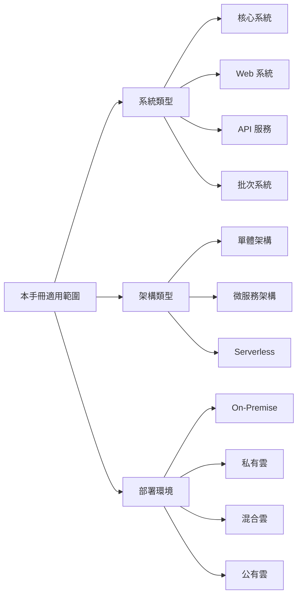
```mermaid
graph LR
    A[本手冊適用範圍] --> B[系統類型]
    A --> C[架構類型]
    A --> D[部署環境]
    
    B --> B1[核心系統]
    B --> B2[Web 系統]
    B --> B3[API 服務]
    B --> B4[批次系統]
    
    C --> C1[單體架構]
    C --> C2[微服務架構]
    C --> C3[Serverless]
    
    D --> D1[On-Premise]
    D --> D2[私有雲]
    D --> D3[混合雲]
    D --> D4[公有雲]
```

> ⚠️ **注意事項**
>
> 本手冊為通用指引，各專案可依 [2.5 專案裁剪（Tailoring）](#25-專案裁剪tailoring)調整細節，但標示為「必須（MUST）」的核心原則應予遵循。重大調整需經架構審查委員會核准，並留下裁剪紀錄。

**本手冊不涵蓋的內容**（請參閱對應的專門指引，本手冊只定義「流程」與「交付物」，不重複細部規則）：

| 主題 | 權威文件 | 本手冊的角色 |
|------|---------|------------|
| 各語言程式寫作規則（Java、TypeScript、SQL…） | 《程式寫作指引》 | 第五章只列流程層級的原則與審查方式 |
| 安全程式碼細則 | 《安全程式碼指引》、OWASP ASVS 5.0 | 第五、九章列出必做的安全活動與驗證點 |
| Code Review 細則 | 《code review 指引》 | 第七章列出審查流程與最低檢核 |
| 測試技術細節 | 《測試與品質保證指引》 | 第六章列出測試層級、進出準則與責任 |
| 平行測試（新舊系統並行） | 《軟體開發平行測試標準程序與計劃書教學手冊》 | 第八、十章引用 |

### 1.4 如何使用本手冊

#### 角色導讀路徑

不同角色不需要從頭讀到尾。下表是建議的最短路徑（✅ 必讀、◐ 選讀）：

| 章節 | PM | BA/SA | 架構師 | 開發 | QA | DevOps/SRE | 資安 | 稽核 |
|------|:--:|:-----:|:-----:|:---:|:--:|:---------:|:---:|:---:|
| 第一、二章 流程總覽與裁剪 | ✅ | ✅ | ✅ | ✅ | ✅ | ✅ | ✅ | ✅ |
| 第三章 需求管理 | ✅ | ✅ | ◐ | ◐ | ✅ | | ◐ | ◐ |
| 第四章 系統分析與設計 | ◐ | ✅ | ✅ | ✅ | ◐ | ◐ | ✅ | |
| 第五章 開發實作 | | | ✅ | ✅ | ◐ | | ✅ | |
| 第六章 測試 | ◐ | ◐ | ◐ | ✅ | ✅ | ◐ | ◐ | ◐ |
| 第七、八章 版本控制與 CI/CD | | | ✅ | ✅ | ◐ | ✅ | ✅ | ◐ |
| 第九章 資安與 SSDLC | ◐ | ◐ | ✅ | ✅ | ✅ | ✅ | ✅ | ✅ |
| 第十章 上線與維運 | ✅ | | ◐ | ◐ | ◐ | ✅ | ◐ | ✅ |
| 第十一、十二章 文件與持續改善 | ✅ | ◐ | ✅ | ◐ | ◐ | ◐ | | ✅ |

#### 規範用語（依 RFC 2119 / RFC 8174）

本手冊的規範句使用下列關鍵字。只有**全大寫英文或粗體中文**時才具規範效力，一般敘述中的「應該」不算。

| 關鍵字 | 意義 | 違反時的處理 |
|-------|------|------------|
| **必須（MUST）／禁止（MUST NOT）** | 絕對要求，沒有例外 | 無法上線；如確實無法遵循，須經架構審查委員會核准例外並記錄於裁剪紀錄 |
| **應（SHOULD）／不應（SHOULD NOT）** | 強烈建議；不遵循須有充分理由 | 在 PR、設計文件或裁剪紀錄中寫明理由 |
| **得（MAY）** | 選擇性，由團隊自行決定 | 不需記錄 |

**範例**（同一件事的三種寫法）：

```text
❌ 模糊：API 最好要有版本控制。
     → 無法判斷「沒有版本控制」算不算違規，Reviewer 也無從檢查。

✅ 明確：對外公開的 API 必須（MUST）在 URL 路徑中包含主版本號（例：/api/v1/...）。
     → 可用自動化檢查（例如掃描 OpenAPI 檔案的 paths 是否都以 /api/v\d+/ 開頭）。

✅ 有彈性：內部 API 應（SHOULD）遵循相同規則；若僅供單一前端使用，得（MAY）省略版本號，
     但須在 API 規格書中註明。
```

#### 每章結構

第二章到第十二章都以「**N.x 審查與驗證**」一節作結，內容固定分成三塊，讓沒有參與撰寫的人也能檢查成果（不論成果是人寫的還是 AI 產生的）：

1. **自動檢查**：可放進 CI 或在本機執行的工具與指令。
2. **人工審查問題**：工具抓不到、需要人判斷的問題清單。
3. **AI 常見錯誤**：AI 依本手冊產出文件或程式碼時，實務上最常出現的錯誤型態。

### 1.5 AI 輔助開發的人機責任

> 📎 範本：[Pull Request 說明範本]()

生成式 AI（例如 GitHub Copilot、Claude Code）已普遍用在需求整理、設計草稿、程式碼、測試與文件撰寫。DORA 2025 年報告（*State of AI-assisted Software Development*）調查近 5,000 名技術人員，約 90% 在工作中使用 AI；同時發現 AI 採用與**更高的交付吞吐量**相關，但也與**更高的交付不穩定性**相關。換句話說，AI 會放大團隊既有流程的優缺點，流程不健全時，AI 只會讓問題更快出現。

#### 五項原則

| # | 原則 | 規範 | 說明 |
|---|------|------|------|
| 1 | **人負最終責任** | 必須（MUST） | 合併、核准、上線的責任人是「人」。PR 作者對 AI 產生的每一行內容負責，「是 AI 寫的」不是可接受的理由。 |
| 2 | **AI 產出視為未審查的草稿** | 必須（MUST） | AI 產出的程式碼、測試、文件，一律走與人寫內容相同的審查與 CI 關卡，不得因為「AI 寫的通常沒問題」而降低標準。 |
| 3 | **先驗證、再信任** | 必須（MUST） | 任何 AI 宣稱的事實（API 是否存在、函式庫版本、法規條文、標準版本）都要能被工具或官方來源證實。無法證實的內容不得進入正式文件。 |
| 4 | **資料保護** | 禁止（MUST NOT） | 不得將客戶個資、正式環境連線資訊、金鑰、未公開的營業秘密輸入未經公司核准的 AI 服務。 |
| 5 | **可追溯** | 應（SHOULD） | 在 PR 說明中標註 AI 參與的範圍，方便 Reviewer 分配審查力道，也方便日後事件調查。 |

#### 範例：PR 說明中的 AI 參與揭露

````markdown
## 變更摘要
新增客戶查詢 API 的分頁功能（JIRA: CUST-1234）

## AI 參與範圍
- 使用工具：GitHub Copilot（公司核准版本）
- AI 產生：`CustomerQueryService#findPage` 初版、`CustomerQueryServiceTest` 的 6 個測試案例
- 人工修改：分頁上限檢查（AI 版本未限制 pageSize）、補上 pageSize=0 的邊界測試
- 人工驗證方式：本機 `mvn verify` 全部通過；手動以 Postman 測試 pageSize=1000 回 400

## 審查重點（請 Reviewer 特別注意）
- `findPage` 的排序欄位是否有白名單（避免 ORDER BY 注入）
````

#### 責任分工（RACI）

| 活動 | 開發者（使用 AI 者） | Reviewer | Tech Lead | 資安 |
|------|:------------------:|:--------:|:---------:|:---:|
| 選用 AI 工具與設定 | I | I | C | A/R（核准工具清單） |
| 產出內容並自我檢查 | A/R | | | |
| 審查 AI 產出 | C | A/R | C | C（高風險模組） |
| AI 產出造成的缺陷處理 | R | C | A | C |

#### 🔍 審查與驗證

- **自動檢查**：PR 範本加入「AI 參與範圍」欄位，並以 CI 檢查該欄位不是空白（例如 GitHub Actions 讀取 `github.event.pull_request.body`，搜尋 `## AI 參與範圍` 之後是否有內容）。
- **人工審查問題**：
  1. PR 說明的「人工驗證方式」是否真的能證明功能正確？（「看起來沒問題」不算）
  2. AI 產生的測試是否只是把現有實作的行為抄成斷言？（這類測試永遠會通過，沒有驗證價值）
  3. 是否引用了不存在的 API、套件或設定參數？
- **AI 常見錯誤**：捏造套件或 API（Package Hallucination，攻擊者會預先註冊這類名稱進行供應鏈攻擊）、引用已棄用的 API、遺漏邊界條件與錯誤處理、把機敏資訊寫死在範例中。

### 1.6 參考標準與版本基準

本手冊引用的標準與框架如下。「查證日」是本版實際上網確認版本的日期；查證來源列於[附錄 E](#附錄-e查證紀錄)。標準改版後，應（SHOULD）在下一個手冊版本中評估影響。

| 領域 | 標準／框架 | 本版採用 | 狀態（查證日 2026-10-06） |
|------|-----------|---------|------------------------|
| 軟體生命週期流程 | ISO/IEC/IEEE 12207 | **12207:2026** | 2026 年版已發行，取代 2017 年版（細部差異列入 E.1 待確認） |
| 系統生命週期流程 | ISO/IEC/IEEE 15288 | 15288:2023 | 現行版 |
| 需求工程 | ISO/IEC/IEEE 29148 | 29148:2018 | 現行版 |
| 架構描述 | ISO/IEC/IEEE 42010 | 42010:2022 | 現行版 |
| 產品品質模型 | ISO/IEC 25010 | 25010:2023 | 現行版（9 項品質特性） |
| 軟體測試 | ISO/IEC/IEEE 29119 系列 | -1:2022、-2:2021、-3:2021、-4:2021、-5:2024 | 現行版 |
| 資訊安全管理 | ISO/IEC 27001 | 27001:2022（含 Amd 1:2024） | 現行版 |
| 安全軟體開發框架 | NIST SP 800-218 SSDF | **v1.1**（正式版） | v1.2（SP 800-218r1）已於 2025-12-17 發布初稿，本版先對照 v1.1 並標註 v1.2 新增項 |
| Web 應用風險 | OWASP Top 10 | **2025** | 2025 年版已發布，取代 2021 年版 |
| 應用安全驗證 | OWASP ASVS | **5.0.0** | 2025-05-30 發布，取代 4.0.3 |
| LLM 應用風險 | OWASP Top 10 for LLM Applications | 2025 | 現行版 |
| 安全成熟度 | OWASP SAMM | v2.1 | 現行版 |
| 軟體供應鏈 | SLSA | **v1.2** | 2025-11 發布（新增 Source Track） |
| SBOM 格式 | CycloneDX／SPDX | CycloneDX 1.7／SPDX 3.0.1 | 現行版 |
| 弱點評分與排序 | CVSS／EPSS／CISA KEV | **CVSS v4.0**／EPSS v4 | CVSS 4.0 已取代 3.1 作為新評分基準；EPSS v4 於 2025-03-17 發布 |
| API 規格 | OpenAPI／RFC 9457 | OpenAPI 3.1（得用 3.2.0）／RFC 9457 | OpenAPI 3.2.0 於 2025-09-19 發布；RFC 9457 取代 RFC 7807 |
| 版號與提交訊息 | SemVer／Conventional Commits／Keep a Changelog | 2.0.0／1.0.0／1.1.0 | 現行版 |
| 交付績效 | DORA 軟體交付指標 | **5 項指標** | dora.dev 2026-01-05 更新：新增 Deployment Rework Rate |
| 流程成熟度 | CMMI | **V3.0** | 2023-04 發布，成熟度等級 0–5 |
| IT 服務管理 | ITIL | ITIL 4（得參考 ITIL Version 5） | ITIL Version 5 已於 2026-01-29 發布，ITIL 4 過渡期間仍有效 |
| 台灣法規 | 資通安全管理法 | 2025-09-24 修正公布，**2025-12-01 施行** | 委外資通系統的受託者須具備資安管理機制或通過第三方驗證 |
| 台灣法規 | 個人資料保護法 | 2025-11-11 修正公布 | 部分條文施行日期由行政院另定（截至查證日尚未全部生效） |

> 💡 **為什麼要寫版本**
>
> 「依 OWASP Top 10 檢查」是無法驗證的要求，因為 2021 與 2025 年版的分類不同（例如 2025 年版新增 A03 軟體供應鏈失效、A10 例外狀況處理不當）。規範文件與 AI 提示詞中引用標準時，必須（MUST）寫出版本。

---

## 第二章：軟體開發生命週期（SDLC）總覽

### 2.1 SDLC 各階段說明

軟體開發生命週期（Software Development Life Cycle, SDLC）定義了軟體從構想到退役的完整過程。

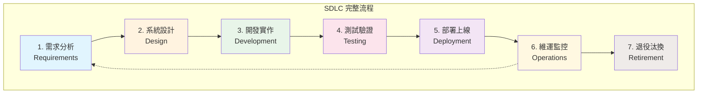
```mermaid
graph TB
    subgraph "SDLC 完整流程"
        A[1. 需求分析<br/>Requirements] --> B[2. 系統設計<br/>Design]
        B --> C[3. 開發實作<br/>Development]
        C --> D[4. 測試驗證<br/>Testing]
        D --> E[5. 部署上線<br/>Deployment]
        E --> F[6. 維運監控<br/>Operations]
        F --> G[7. 退役汰換<br/>Retirement]
        
        F -.-> A
    end
    
    style A fill:#e1f5fe
    style B fill:#fff3e0
    style C fill:#e8f5e9
    style D fill:#fce4ec
    style E fill:#f3e5f5
    style F fill:#fff8e1
    style G fill:#efebe9
```

#### 各階段詳細說明

| 階段 | 主要活動 | 關鍵產出 | 負責角色 |
|------|---------|---------|---------|
| **1. 需求分析** | 收集需求、訪談、分析 | BRD、PRD、FRD、Use Case | BA、SA、PM、產品經理 |
| **2. 系統設計** | 架構設計、API 設計、DB 設計 | SAD、SDD、API Spec、ERD | SA、架構師 |
| **3. 開發實作** | 編碼、單元測試、Code Review | TSD、程式規格書、Source Code、Unit Test | 開發工程師 |
| **4. 測試驗證** | 整合測試、系統測試、UAT | Test Report、Bug List | QA、測試人員 |
| **5. 部署上線** | 環境部署、資料移轉、切換 | Release Note、部署文件 | DevOps、維運 |
| **6. 維運監控** | 監控、問題處理、效能調校 | 監控報表、事件記錄 | 維運團隊 |
| **7. 退役汰換** | 資料遷移、系統下線 | 退役計畫、資料備份 | PM、維運 |

### 2.2 與實務專案的關係

#### 階段與文件對應關係

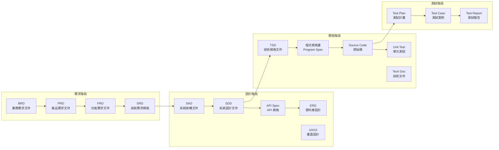
```mermaid
flowchart LR
    subgraph 需求階段
        R1[BRD<br/>業務需求文件]
        R0[PRD<br/>產品需求文件]
        R2[FRD<br/>功能需求文件]
        R3[SRD<br/>系統需求規格]
    end
    
    subgraph 設計階段
        D1[SAD<br/>系統架構文件]
        D5[SDD<br/>系統設計文件]
        D2[API Spec<br/>API 規格]
        D3[ERD<br/>資料庫設計]
        D4[UX/UI<br/>畫面設計]
    end
    
    subgraph 開發階段
        C0[TSD<br/>技術規格文件]
        CS[程式規格書<br/>Program Spec]
        C1[Source Code<br/>原始碼]
        C2[Unit Test<br/>單元測試]
        C3[Tech Doc<br/>技術文件]
    end
    
    subgraph 測試階段
        T1[Test Plan<br/>測試計畫]
        T2[Test Case<br/>測試案例]
        T3[Test Report<br/>測試報告]
    end
    
    R1 --> R0 --> R2 --> R3
    R3 --> D1 --> D5 --> D2 --> D3
    D5 --> C0 --> CS --> C1 --> C2
    C1 --> T1 --> T2 --> T3
```

### 2.3 敏捷與瀑布的選擇

#### 選擇指引

| 評估面向 | 適合瀑布（Waterfall） | 適合敏捷（Agile） |
|---------|---------------------|------------------|
| **需求明確度** | 需求明確、變動少 | 需求模糊、可能變動 |
| **專案規模** | 大型、跨系統整合 | 中小型、獨立系統 |
| **法規要求** | 高度監管、需完整文件 | 監管較少 |
| **團隊經驗** | 敏捷經驗不足 | 團隊熟悉敏捷 |
| **客戶參與** | 客戶無法頻繁參與 | 客戶可持續參與 |

#### 混合模式建議

實務上，多數企業專案採用「**混合模式**」：

```text
需求階段 → 瀑布式（確保需求完整性）
     ↓
設計階段 → 瀑布式（架構穩定性）
     ↓
開發測試 → 敏捷式（快速迭代、持續交付）
     ↓
上線維運 → DevOps（自動化、持續監控）
```

> 💡 **實務建議**
>
> 金融、醫療等高監管產業，建議採用「文件驅動的敏捷」模式：保持敏捷的迭代精神，但確保每個迭代都有完整的文件產出以滿足稽核要求。

**範例：混合模式的實際排程**（12 週專案，2 週一個 Sprint）

| 週次 | 活動 | 產出 | 閘門 |
|------|------|------|------|
| W1–W2 | 需求訪談、BRD/PRD 定稿 | BRD v1.0、PRD v1.0 | G1 需求核准 |
| W3–W4 | 架構與介面設計 | SAD、SDD、OpenAPI 檔、ADR | G2 設計核准 |
| W5–W10 | Sprint 1–3：開發 + 單元/整合測試，每個 Sprint 結束 Demo | 可運作增量、測試報告、更新後的 SDD | 每個 Sprint 的 DoD |
| W11 | SIT + UAT | UAT 簽核單、測試報告 | G3 上線核准 |
| W12 | 上線、Hypercare | Release Note、上線檢核表 | G4 結案 |

### 2.4 階段閘門（Stage Gate）與 DoR／DoD

> 📎 範本：[階段閘門審查紀錄範本]()、[DoR／DoD 範本]()

階段閘門是「進入下一階段前必須滿足的條件」。沒有閘門的流程，問題會一路累積到上線前才爆發。敏捷團隊則用 **DoR（Definition of Ready，就緒定義）** 與 **DoD（Definition of Done，完成定義）** 在每張工作項目上落實同樣的概念。

#### 四道閘門

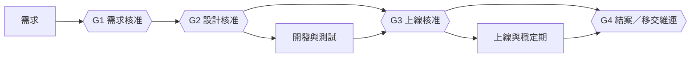
```mermaid
flowchart LR
    G1{{"G1 需求核准"}} --> G2{{"G2 設計核准"}} --> G3{{"G3 上線核准"}} --> G4{{"G4 結案／移交維運"}}
    R[需求] --> G1
    G2 --> DEV[開發與測試]
    DEV --> G3
    G3 --> OPS[上線與穩定期]
    OPS --> G4
```

| 閘門 | 進入條件（全部滿足才能通過） | 核准者 | 證據 |
|------|---------------------------|-------|------|
| **G1 需求核准** | ① PRD／FRD 已審查且無未決的「必須」議題；② 每條需求有驗收條件；③ 非功能需求有量化指標；④ 已完成資料分級與初步威脅辨識 | 產品負責人、業務代表 | 簽核紀錄、需求審查會議紀錄 |
| **G2 設計核准** | ① SAD／SDD 已審查；② 重大技術決策有 ADR；③ API 規格（OpenAPI）通過 lint；④ 威脅模型完成且高風險項目有對策；⑤ 需求追溯矩陣（RTM）中每條需求都對應到設計項目 | 架構師、資安代表 | 架構審查紀錄、威脅模型 |
| **G3 上線核准** | ① 測試退出準則全數達成（見 6.5）；② 無未關閉的 Critical／High 弱點（或有核准的例外）；③ UAT 簽核；④ 回滾計畫已演練；⑤ 監控與告警已設定 | 變更諮詢委員會（CAB）／產品負責人 | 上線檢核表、測試報告、掃描報告 |
| **G4 結案** | ① 穩定期（Hypercare）內無 P1／P2 事件；② 維運文件與知識交接完成；③ 專案回顧完成 | PM、維運主管 | 交接檢核表、回顧紀錄 |

#### DoR 與 DoD 範例

```markdown
## Definition of Ready（User Story 可以排入 Sprint 的條件）
- [ ] 符合 INVEST 原則（見 3.2）
- [ ] 有 Given/When/Then 格式的驗收條件，至少涵蓋 1 個正常情境與 1 個例外情境
- [ ] 相依的 API／資料表已存在或已排入同一 Sprint
- [ ] UI 需求已附 Figma 連結或線框圖
- [ ] 已估點，且不超過 8 點（超過要拆分）

## Definition of Done（User Story 可以標示完成的條件）
- [ ] 程式碼已合併至主幹，PR 至少 1 位 Reviewer 核准
- [ ] CI 全數通過：建置、單元測試、整合測試、SAST、SCA、Secrets 掃描
- [ ] 新增程式碼的行覆蓋率 ≥ 80%（品質閘門設定見 6.1）
- [ ] 驗收條件均有對應的自動化測試或手動測試紀錄
- [ ] API 異動已更新 OpenAPI 檔；設計異動已更新 SDD 或新增 ADR
- [ ] 已部署到測試環境並由 PO 驗收
```

> ⚠️ **常見誤區**：把 DoD 寫成「測試通過」這類無法檢查的句子。DoD 的每一條都必須能回答「證據在哪裡？」——是 CI 紀錄、PR 連結，還是簽核單。

### 2.5 專案裁剪（Tailoring）

> 📎 範本：[專案裁剪紀錄範本]()

一套流程不可能同時適合「三人兩週的內部工具」與「跨十個系統的核心帳務改版」。裁剪（Tailoring）是依專案的**規模**與**風險**，決定哪些活動與文件可以簡化。裁剪必須（MUST）留下紀錄，否則稽核時無法區分「刻意省略」與「忘記做」。

#### 風險分級

| 等級 | 判斷條件（符合任一條即適用該級） | 範例 |
|------|-------------------------------|------|
| **L1 高風險** | 處理金流、個資或機密資料；對外公開服務；法規要求（資通安全管理法、金融監理）；停機會造成重大營運損失 | 網路銀行、核心帳務、會員個資系統 |
| **L2 中風險** | 內部營運系統但影響多部門；與 L1 系統有介接 | 內部簽核系統、報表平台 |
| **L3 低風險** | 單一部門內部工具；無個資；停機僅造成不便 | 內部查詢小工具、PoC |

#### 裁剪矩陣

| 活動／文件 | L1 高風險 | L2 中風險 | L3 低風險 |
|-----------|:--------:|:--------:|:--------:|
| BRD／PRD | 必須 | 必須（可合併為一份） | 得以 User Story 清單代替 |
| SAD／SDD | 必須 | 必須（可合併） | 得以 README + ADR 代替 |
| 威脅模型 | 必須（完整 STRIDE） | 必須（輕量版） | 應（檢核表即可） |
| SAST／SCA／Secrets 掃描 | 必須 | 必須 | 必須 |
| DAST／滲透測試 | 必須（上線前 + 每年） | 應 | 得 |
| 效能測試 | 必須 | 應 | 得 |
| UAT 正式簽核 | 必須 | 必須 | 應（PO 驗收即可） |
| CAB 核准上線 | 必須 | 應 | 得（Tech Lead 核准） |
| G1–G4 閘門 | 四道全做 | G1、G3 必須；G2、G4 得合併 | G3 必須 |

> 安全掃描在所有等級都是「必須」：成本幾乎為零（自動化），卻能擋下最常見的問題。

#### 範例：裁剪紀錄

```markdown
## 裁剪紀錄：內部會議室預約系統（專案代號 ROOM-2026）

| 項目 | 內容 |
|------|------|
| 風險等級 | L3（理由：僅內部員工使用，不含個資以外的敏感資料，停機僅造成不便） |
| 核准者 | 架構審查委員會 王大明，2026-10-01 |

| 活動 | 標準要求 | 本專案作法 | 理由 |
|------|---------|-----------|------|
| SAD／SDD | 得以 README + ADR 代替 | 採用 README + 3 份 ADR | 單體應用，架構單純 |
| 效能測試 | 得 | 不執行 | 使用者 < 200 人，尖峰 < 5 TPS |
| UAT | 應 | PO 驗收 + Demo 錄影 | 使用者為內部同仁 |
```

### 2.6 AI 輔助 SDLC 的產出與審查點

AI 可以加速每個階段，但每個階段的「AI 擅長的事」與「必須由人把關的事」不同。

| 階段 | AI 適合協助 | 必須由人把關 | 驗證方式 |
|------|-----------|------------|---------|
| 需求 | 整理訪談逐字稿、草擬 User Story 與驗收條件、找出需求間的矛盾 | 需求是否真的是業務要的；優先順序；法規要求 | 業務代表審查；需求品質檢核（3.6） |
| 設計 | 草擬 ADR 選項比較、產生 OpenAPI 骨架、畫 C4／ERD 草圖 | 架構取捨；非功能需求是否達成；安全設計 | 架構審查；OpenAPI lint；威脅模型審查 |
| 開發 | 產生程式碼、重構、補註解 | 業務邏輯正確性；安全性；是否符合既有架構 | CI 品質閘門 + Code Review（5.5） |
| 測試 | 產生測試案例、測試資料、邊界值 | 測試是否真的驗證需求（而非抄實作） | Mutation testing（6.1）；RTM 對照 |
| 部署 | 產生 Pipeline、K8s manifest、IaC | 權限範圍、機密管理、回滾方式 | actionlint、kubeconform、政策檢查 |
| 維運 | 分析日誌、草擬 RCA、建議告警規則 | 根因判斷；改善行動的優先順序 | promtool 檢查告警規則；RCA 審查會 |

### 2.7 審查與驗證

**自動檢查**

| 檢查項目 | 方法 |
|---------|------|
| 每張 Story 有驗收條件 | 在 Jira／Azure Boards 建立篩選器：狀態為「Ready」但「驗收條件」欄位為空 → 應為 0 筆 |
| 每個 PR 都關聯工作項目 | CI 檢查 PR 標題或分支名稱含工作項目編號（例：`CUST-\d+`） |
| DoD 中的自動化項目 | 分支保護規則設定「必要狀態檢查」，CI 未通過不得合併（見 7.1） |

**人工審查問題**

1. 這個專案的風險等級判定理由是否成立？有沒有因為「想少寫文件」而刻意降級？
2. 裁剪紀錄是否經過核准，核准者是否有權限？
3. 閘門是否真的「擋得住」——過去三個月有沒有閘門未通過卻仍然上線的案例？
4. DoD 的每一條是否都能指出證據所在？

**AI 常見錯誤**

- 產生的 DoD 包含無法驗證的條款（例：「程式碼品質良好」）。
- 把所有活動都標成「必須」，或反過來把安全掃描裁掉。
- 混合模式排程中忽略 UAT 與上線準備所需的時間。

---

## 第三章：需求管理（Requirements Engineering）

### 3.1 需求來源與分類

#### 需求來源

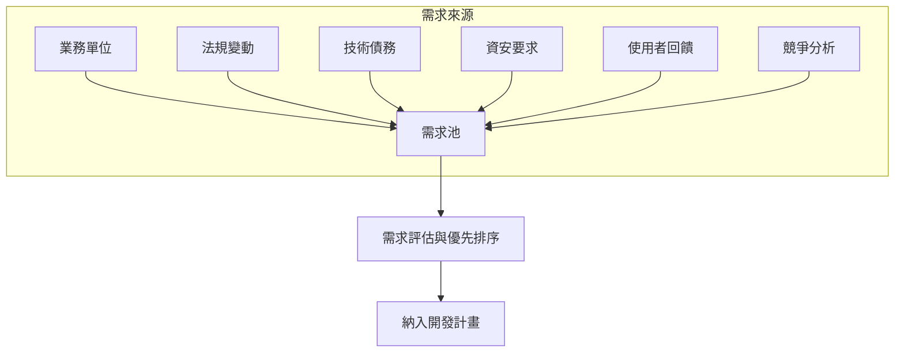
```mermaid
graph TD
    subgraph "需求來源"
        A[業務單位] --> N[需求池]
        B[法規變動] --> N
        C[技術債務] --> N
        D[資安要求] --> N
        E[使用者回饋] --> N
        F[競爭分析] --> N
    end
    
    N --> P[需求評估與優先排序]
    P --> Q[納入開發計畫]
```

#### 需求分類

| 分類 | 說明 | 範例 |
|------|------|------|
| **業務需求（BR）** | 來自業務目標的需求 | 新增線上開戶功能 |
| **法規需求（RR）** | 因法規變動的需求 | 配合洗錢防制法修正 |
| **技術需求（TR）** | 技術面改善需求 | 資料庫效能優化 |
| **資安需求（SR）** | 資訊安全相關需求 | 弱點修補、權限控管 |

### 3.2 功能性與非功能性需求

#### 功能性需求（Functional Requirements）

描述系統「**做什麼**」的需求：

```markdown
## 功能需求範例：使用者登入

### FR-001：使用者登入功能

**需求描述**：
系統應提供使用者以帳號密碼進行身分驗證登入。

**前置條件**：
- 使用者已完成註冊
- 使用者帳號為啟用狀態

**處理流程**：
1. 使用者輸入帳號與密碼
2. 系統驗證帳號密碼正確性
3. 驗證成功後建立 Session
4. 導向至系統首頁

**驗收條件**：
- [ ] 正確帳密可成功登入
- [ ] 錯誤帳密顯示錯誤訊息
- [ ] 連續失敗 5 次鎖定帳號 30 分鐘
- [ ] 登入成功記錄稽核日誌
```

#### 敏捷團隊的寫法：User Story + Gherkin 驗收條件

> 📎 範本：[User Story 與驗收條件範本]()

敏捷團隊以 User Story 表達功能需求，格式為「身為〈角色〉，我想要〈功能〉，以便〈價值〉」。好的 User Story 應（SHOULD）符合 **INVEST** 原則：

| 字母 | 原則 | 檢查問題 |
|------|------|---------|
| **I** | Independent 獨立 | 能否不依賴其他 Story 單獨交付？ |
| **N** | Negotiable 可協商 | 是描述需求，而不是規定實作方式嗎？ |
| **V** | Valuable 有價值 | 使用者或業務能感受到價值嗎？ |
| **E** | Estimable 可估算 | 團隊能估出大小嗎？ |
| **S** | Small 夠小 | 能在一個 Sprint 內完成嗎？ |
| **T** | Testable 可測試 | 有明確的驗收條件嗎？ |

驗收條件建議（SHOULD）使用 Gherkin（Given／When／Then）撰寫，因為它可以直接轉成自動化測試（例如 Cucumber），而且非技術人員也讀得懂：

```gherkin
# language: zh-TW
功能: 使用者登入（FR-001）

  場景: 連續輸錯密碼 5 次後鎖定帳號
    假設 使用者 "alice" 的帳號為啟用狀態
    而且 "alice" 已連續輸錯密碼 4 次
    當 "alice" 第 5 次輸入錯誤密碼
    那麼 系統顯示 "帳號已鎖定，請於 30 分鐘後再試"
    而且 稽核日誌新增一筆事件類型為 "ACCOUNT_LOCKED" 的紀錄

  場景: 鎖定期間輸入正確密碼仍無法登入
    假設 "alice" 的帳號已於 10 分鐘前被鎖定
    當 "alice" 輸入正確密碼
    那麼 系統顯示 "帳號已鎖定，請於 20 分鐘後再試"
```

> 💡 中文 Gherkin 關鍵字（`功能`、`場景`、`假設`、`當`、`那麼`、`而且`）需在檔案第一行宣告 `# language: zh-TW`；也可以直接使用英文關鍵字 `Feature`／`Scenario`／`Given`／`When`／`Then`／`And`。

#### 非功能性需求（Non-Functional Requirements）

描述系統「**表現如何**」的需求。非功能需求必須（MUST）量化，並寫出**量測方式**——沒有量測方式的 NFR 在驗收時無法判定。

| NFR 類型 | 指標範例 | 量化標準 | 量測方式 |
|---------|---------|---------|---------|
| **效能（Performance）** | 回應時間 | 尖峰 200 TPS 下，95% 請求 < 2 秒 | k6 負載測試報告的 `http_req_duration p(95)` |
| **可用性（Availability）** | 系統可用率 | 每月 ≥ 99.9%（每月停機 ≤ 43.2 分鐘） | 外部合成監控（Synthetic Monitoring）每分鐘探測 |
| **延展性（Scalability）** | 併發用戶 | 支援 10,000 同時在線，水平擴充至 3 倍不需改程式 | 負載測試 + 擴充演練紀錄 |
| **安全性（Security）** | 資料加密 | 傳輸 TLS 1.2 以上（優先 TLS 1.3）、儲存 AES-256-GCM | `testssl.sh` 掃描報告；資料庫加密設定稽核 |
| **可維護性（Maintainability）** | 程式碼品質 | 新增程式碼測試覆蓋率 ≥ 80%、無新增 Blocker／Critical 問題 | SonarQube 品質閘門 |
| **復原能力（Recoverability）** | RPO／RTO | RPO ≤ 15 分鐘、RTO ≤ 1 小時 | 每半年災難復原演練紀錄 |

#### NFR 對照 ISO/IEC 25010:2023 品質模型

ISO/IEC 25010:2023 把產品品質分為 9 項特性。撰寫 NFR 時可逐項檢查，避免遺漏：

| 品質特性（25010:2023） | 中文 | 常見 NFR 範例 |
|---------------------|------|-------------|
| Functional Suitability | 功能適合性 | 計算結果正確率 100%（利息計算與核心系統比對） |
| Performance Efficiency | 效能效率 | 回應時間、吞吐量、資源使用率 |
| Compatibility | 相容性 | 支援的瀏覽器版本；與既有系統共存 |
| Interaction Capability | 互動能力（原「易用性」） | 符合 WCAG 2.2 AA；新手 5 分鐘內完成首次申辦 |
| Reliability | 可靠性 | 可用率、MTBF、故障自動切換時間 |
| Security | 安全性 | 加密、身分驗證、稽核日誌保存年限 |
| Maintainability | 可維護性 | 模組化、可測試性、覆蓋率 |
| Flexibility | 彈性（原「可攜性」） | 可擴充性、容器化部署、環境可替換 |
| Safety | 安全防護（2023 年版新增） | 故障時進入安全狀態（Fail-safe），例如轉帳中斷時不得重複扣款 |

### 3.3 需求文件標準

#### 文件層級關係

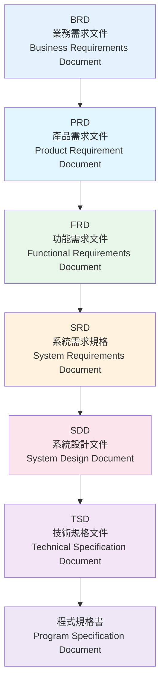
```mermaid
graph TB
    BRD[BRD<br/>業務需求文件<br/>Business Requirements Document] --> PRD[PRD<br/>產品需求文件<br/>Product Requirement Document]
    PRD --> FRD[FRD<br/>功能需求文件<br/>Functional Requirements Document]
    FRD --> SRD[SRD<br/>系統需求規格<br/>System Requirements Document]
    SRD --> SDD[SDD<br/>系統設計文件<br/>System Design Document]
    SDD --> TSD[TSD<br/>技術規格文件<br/>Technical Specification Document]
    TSD --> PSD[程式規格書<br/>Program Specification Document]
    
    style BRD fill:#e3f2fd
    style PRD fill:#e1f5fe
    style FRD fill:#e8f5e9
    style SRD fill:#fff3e0
    style SDD fill:#fce4ec
    style TSD fill:#f3e5f5
    style PSD fill:#ede7f6
```

> 💡 **PRD / SDD / TSD / 程式規格書 四大文件角色說明**
>
> - **PRD（產品需求文件）**：轉譯商業目標為具體功能，定義「產品要做什麼」。包含使用者輪廓、核心功能清單、流程圖、介面原型（Wireframe）與非功能性需求，是 UI/UX 設計師與工程團隊的主要開發依據。
> - **SDD（系統設計文件）**：制定技術解決方案，規劃「系統要如何實作」。包含系統架構、資料庫綱要（Schema）、API 介面規格、模組劃分與資安規範，確保系統具備擴展性與穩定性。
> - **TSD（技術規格文件）**：工程師的實作指南，詳細說明「底層技術與程式碼邏輯」。包含類別與函式設計、演算法邏輯、資料結構、錯誤處理機制及自動化測試規劃。
> - **程式規格書（Program Specification）**：以「單一程式/批次工作」為單位的實作藍圖，將 TSD 進一步展開為輸入輸出欄位、處理邏輯、畫面或報表版面與錯誤代碼，讓開發人員（含委外廠商）可直接依規格編碼，無需再澄清需求。

#### 各文件內容要求

**BRD（業務需求文件）**

```markdown
## BRD 標準章節

1. 文件資訊（版本、作者、審核）
2. 專案背景與目標
3. 業務流程現況（As-Is）
4. 業務流程目標（To-Be）
5. 效益分析（量化指標）
6. 風險評估
7. 時程與資源需求
8. 利害關係人簽核
```

### 3.4 PRD、SDD、TSD、程式規格書 四大文件體系

> 以下四份文件構成從「需求定義」到「技術實作」的完整文件鏈，確保業務目標可追溯至底層程式碼。

**PRD（產品需求文件）**

> 📎 完整範本請參閱：[PRD_Template]()

```markdown
## PRD 標準章節

1. 文件資訊（版本、作者、審核）
2. 產品概述（願景、商業目標、範圍、成功標準）
3. 使用者輪廓（Persona）與使用者旅程地圖
4. 核心功能清單（MoSCoW 優先序、User Story、驗收條件）
5. 流程圖（業務流程、使用者操作流程）
6. 介面原型（Wireframe 與互動規格）
7. 非功能性需求（效能、安全、可用性、相容性）
8. 依賴與限制
9. 里程碑與時程
10. 風險與緩解措施
```

> 💡 **PRD 實務要點**
>
> - PRD 橋接 BRD 的商業目標與 FRD 的功能細節，著重「使用者視角」
> - 每個功能需搭配 User Story 與 Gherkin 格式的驗收條件
> - Wireframe 應標注 RWD 斷點與 WCAG 無障礙要求

**FRD（功能需求文件）**

```markdown
## FRD 標準章節

1. 文件資訊
2. 功能清單與優先序
3. 使用案例（Use Case）
4. 業務規則（Business Rules）
5. 畫面流程（UI Flow）
6. 介面需求（外部系統整合）
7. 資料需求
8. 非功能性需求摘要
9. 術語定義
```

**SDD（系統設計文件）**

> 📎 完整範本請參閱：[SDD_Template]()

```markdown
## SDD 標準章節

1. 文件資訊與關聯文件
2. 系統概述（背景、設計約束、利害關係人）
3. 系統架構（架構風格、架構圖、部署圖、技術棧）
4. 模組劃分（模組清單、依賴關係、詳細設計）
5. 資料庫綱要設計（ER 圖、資料表設計、遷移策略）
6. API 介面規格（設計原則、API 清單、認證授權）
7. 資安規範（安全架構、威脅模型、敏感資料處理）
8. 非功能性設計（效能、高可用、可擴展性）
9. 整合設計（外部系統整合、序列圖）
10. 錯誤處理與容錯設計
11. 可觀測性設計（監控指標、日誌、分散式追蹤）
12. 設計決策記錄（ADR）
```

> 💡 **SDD 實務要點**
>
> - SDD 將 PRD/FRD 的需求轉化為可實作的技術架構方案
> - 每個設計決策須記錄 ADR（Architecture Decision Record），含替代方案與理由
> - 架構圖建議使用 C4 Model 分層呈現（Context → Container → Component）
> - 資安設計需參照 OWASP ASVS 與 STRIDE 威脅模型

**TSD（技術規格文件）**

> 📎 完整範本請參閱：[TSD_Template]()

```markdown
## TSD 標準章節

1. 文件資訊與關聯文件
2. 技術概述（模組範圍、技術環境、相依套件）
3. 類別與函式設計（類別圖、方法規格、虛擬碼）
4. 演算法邏輯（演算法清單、詳細描述、時間/空間複雜度）
5. 資料結構（Entity、DTO、列舉、快取結構）
6. 錯誤處理機制（例外階層、全域處理器、重試策略）
7. 自動化測試規劃（測試策略、覆蓋率目標、測試案例規格）
8. 組態與環境設定
9. 建置與部署指引
10. 程式碼品質標準
```

> 💡 **TSD 實務要點**
>
> - TSD 是 SDD 的實作層延伸，規格需精確到可直接轉換為程式碼
> - 每個公開方法需標注參數、回傳值、例外與業務規則
> - 關鍵演算法需標注時間/空間複雜度
> - 每個模組需附帶完整的單元測試案例規格

**程式規格書（Program Specification）**

> 📎 完整範本請參閱：[ProgramSpec_Template]()

```markdown
## 程式規格書 標準章節

1. 文件資訊與關聯文件（TSD、SDD）
2. 程式基本資訊（程式代號、類型、所屬系統、觸發方式/排程、前後置程式）
3. 功能說明
4. 輸入規格（輸入來源、欄位定義）
5. 輸出規格（輸出目的、欄位定義、報表/檔案格式）
6. 處理邏輯（前置條件、流程敘述、虛擬碼/流程圖、業務規則）
7. 畫面/報表版面配置
8. 資料庫/檔案存取設計
9. 錯誤處理與訊息代碼
10. 效能與作業排程考量
11. 測試要點
12. 附錄（呼叫關係圖、特殊注意事項）
```

> 💡 **程式規格書實務要點**
>
> - 顆粒度比 TSD 更細：TSD 描述模組/服務層級的類別與方法設計，程式規格書則以「單一程式或批次工作」為單位，精確到欄位、訊息代碼與版面配置
> - 特別適用於批次程式、報表程式、介面轉檔程式、委外開發或需逐支程式驗收的場景
> - 處理邏輯章節建議採用 ISO/IEC 8631 定義的流程圖/虛擬碼慣例撰寫，確保不同撰寫者的表示法一致
> - 委外開發時，程式規格書是驗收的直接依據，內容須避免「口頭補充」

### 3.5 需求異動管理流程

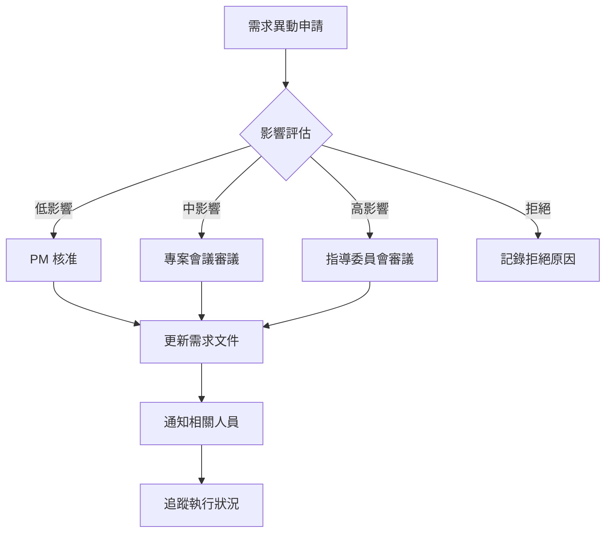
```mermaid
flowchart TD
    A[需求異動申請] --> B{影響評估}
    B -->|低影響| C[PM 核准]
    B -->|中影響| D[專案會議審議]
    B -->|高影響| E[指導委員會審議]
    
    C --> F[更新需求文件]
    D --> F
    E --> F
    
    F --> G[通知相關人員]
    G --> H[追蹤執行狀況]
    
    B -->|拒絕| I[記錄拒絕原因]
```

#### 異動影響評估標準

| 影響等級 | 評估標準 | 審核層級 |
|---------|---------|---------|
| **低** | 僅 UI 調整、文字修改 | PM |
| **中** | 邏輯變更、新增欄位 | 專案會議 |
| **高** | 架構變更、跨系統影響 | 指導委員會 |

> ⚠️ **實務注意事項**
>
> 1. 需求凍結（Freeze）後的異動，需評估對時程與預算的影響
> 2. 所有異動必須留下書面記錄，作為稽核依據
> 3. 避免「口頭需求」，所有需求須正式文件化

#### 範例：一份填寫完整的需求異動申請（CR）

```markdown
## CR-2026-017：登入失敗鎖定次數由 5 次改為 3 次

| 欄位 | 內容 |
|------|------|
| 申請人／日期 | 資安部 李小華／2026-09-15 |
| 異動原因 | 配合年度資安稽核建議（稽核報告編號 IA-2026-08 第 3 項） |
| 影響需求 | FR-001 驗收條件第 3 條 |
| 影響範圍 | 認證服務設定值、登入頁錯誤訊息、FR-001 的 2 個 Gherkin 場景、客服 FAQ |
| 影響等級 | 低（僅設定值與文字；不涉及架構） |
| 工時／時程影響 | 0.5 人日；不影響上線日 |
| 審核 | PM 陳大文 核准，2026-09-16 |
| 追蹤 | Jira CUST-1388；RTM 已更新 FR-001 對應的測試案例 TC-001-03 |
```

> 好的 CR 有三個特徵：能追溯到原需求編號、寫出受影響的**測試案例**（不只是程式）、有明確核准紀錄。

### 3.6 需求品質檢核

ISO/IEC/IEEE 29148:2018 定義了「單條需求」應具備的品質特性。需求審查會議中，應（SHOULD）逐條以這些特性檢查：

| 特性 | 意義 | ❌ 不合格範例 | ✅ 合格範例 |
|------|------|-------------|-----------|
| 必要（Necessary） | 拿掉後會缺少能力 | 「系統應支援未來可能的所有支付方式」 | 「系統應支援信用卡與 LINE Pay 付款」 |
| 無歧義（Unambiguous） | 只有一種解讀 | 「查詢應快速回應」 | 「查詢在 95% 情況下應於 2 秒內回應」 |
| 單一（Singular） | 一條只講一件事 | 「系統應匯出報表並寄送通知並記錄日誌」 | 拆成 FR-021 匯出、FR-022 通知、FR-023 日誌 |
| 可行（Feasible） | 在限制內做得到 | 「系統可用率 100%」 | 「每月可用率 ≥ 99.9%」 |
| 可驗證（Verifiable） | 能用測試或檢查證明 | 「介面應友善易用」 | 「新使用者在無說明下 5 分鐘內完成首次申辦（可用性測試 5 人中至少 4 人達成）」 |
| 正確（Correct） | 正確反映利害關係人需要 | 法規要求保存 7 年，需求寫 5 年 | 依法規寫 7 年，並註明法源 |
| 符合規範（Conforming） | 符合組織的需求撰寫格式 | 沒有編號、沒有優先序 | 有編號（FR-xxx）、優先序（MoSCoW）、來源 |

**禁用詞清單**（出現即需改寫）：快速、友善、適當的、盡量、等等、支援所有、彈性的、高效能、穩定的、相容的。

> 💡 禁用詞可用簡單的指令自動找出：
>
> `grep -nE "快速|友善|適當的|盡量|等等|支援所有|高效能" docs/requirements/*.md`

### 3.7 需求追溯矩陣（RTM）

> 📎 範本：[需求追溯矩陣範本]()

需求追溯矩陣（Requirements Traceability Matrix, RTM）把「需求 → 設計 → 程式 → 測試」串起來，用來回答兩個問題：

- **前向追溯**：每一條需求都有被設計、實作、測試嗎？（防止遺漏）
- **反向追溯**：每一段程式與測試都對應到某條需求嗎？（防止鍍金與範圍蔓延）

#### RTM 範例

| 需求編號 | 需求摘要 | 優先序 | 設計（SDD 章節／API） | 實作（模組／類別） | 測試案例 | 狀態 |
|---------|---------|-------|---------------------|------------------|---------|------|
| FR-001 | 使用者登入 | Must | SDD 5.2／`POST /api/v1/auth/login` | `auth-service`／`LoginService` | TC-001-01～03（自動化） | ✅ 通過 |
| FR-002 | 忘記密碼 | Must | SDD 5.3／`POST /api/v1/auth/password-reset` | `auth-service`／`PasswordResetService` | TC-002-01～04 | ✅ 通過 |
| FR-015 | 匯出交易明細 | Should | SDD 7.1／`GET /api/v1/transactions/export` | `report-service`／`ExportService` | TC-015-01 | ⏳ 測試中 |
| NFR-003 | 查詢 p95 < 2 秒 | Must | SDD 8.1 快取設計 | `CustomerQueryService` | PT-003（k6） | ❌ 未達成（2.6 秒） |

#### 讓 RTM 可以自動檢查

人工維護的 Excel RTM 很快就會過時。比較可靠的作法是**讓測試程式碼本身帶有需求編號**，再用工具反查：

```java
// 在測試上用 @Tag 標註需求編號（JUnit 5 以上）
@Tag("FR-001")
@DisplayName("TC-001-03 連續輸錯 5 次鎖定帳號")
@Test
void shouldLockAccountAfterFiveFailures() { /* ... */ }
```

```bash
# 列出需求清單中有、但測試程式碼中找不到的需求編號（前向追溯缺口）
grep -ohE "^\| (FR|NFR)-[0-9]{3}" docs/requirements/rtm.md | tr -d '| ' | sort -u > /tmp/req.txt
grep -rohE "@Tag\(\"(FR|NFR)-[0-9]{3}\"\)" src/test | grep -oE "(FR|NFR)-[0-9]{3}" | sort -u > /tmp/tested.txt
comm -23 /tmp/req.txt /tmp/tested.txt   # 輸出不為空 → 有需求沒有測試
```

> 非功能需求（例如 NFR-003）通常由效能或安全測試驗證，不一定有 `@Tag`；這類需求請在 RTM 中填寫對應的測試報告編號，並從上述檢查中排除。

### 3.8 審查與驗證

**自動檢查**

| 檢查項目 | 方法 |
|---------|------|
| 需求文件中的禁用詞 | `grep -nE` 禁用詞清單（見 3.6） |
| 每條需求都有測試 | RTM 前向追溯腳本（見 3.7） |
| Gherkin 語法正確 | 以 Cucumber 執行 `--dry-run`，確認每個步驟都有對應的 Step Definition |
| 需求文件格式 | markdownlint 檢查標題層級、表格格式 |

**人工審查問題**

1. 每條非功能需求是否都有「量化標準」與「量測方式」兩欄？
2. 驗收條件是否涵蓋例外情境（輸入錯誤、逾時、權限不足），而不只是正常流程？
3. 法規需求是否註明法源與條號？版本是否最新（見 1.6）？
4. 需求之間有沒有互相矛盾（例如 A 需求要求保存 7 年，B 需求要求 90 天自動刪除）？

**AI 常見錯誤**

- 產生的需求充滿禁用詞（「快速」「友善」），看起來完整其實不可驗證。
- 自行「補充」業務沒有提出的功能（鍍金），或捏造法規條文。
- 只寫正常流程的驗收條件，漏掉例外與邊界情境。
- 把多件事寫在同一條需求，導致無法單獨測試與追溯。

---

## 第四章：系統分析與設計

> 📎 本章對應之標準文件範本：
>
> - **SDD（系統設計文件）**：[SDD_Template]()
> - **SAD（系統架構文件）**：[SAD_Template]()
>
> SDD 是本章最核心的產出文件，將 PRD/FRD 的需求轉化為系統架構、模組劃分、資料庫設計、API 規格與資安規範等技術方案。

### 4.1 系統架構設計原則

#### 核心設計原則

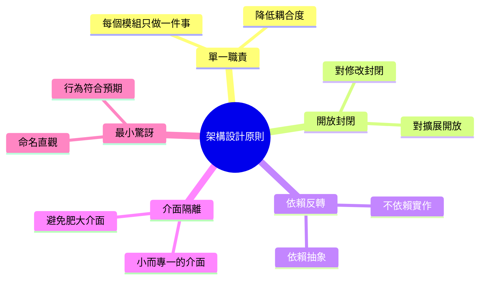
```mermaid
mindmap
  root((架構設計原則))
    單一職責
      每個模組只做一件事
      降低耦合度
    開放封閉
      對擴展開放
      對修改封閉
    依賴反轉
      依賴抽象
      不依賴實作
    介面隔離
      小而專一的介面
      避免肥大介面
    最小驚訝
      行為符合預期
      命名直觀
```

#### 企業架構分層

```text
┌─────────────────────────────────────────────────────────┐
│                    Presentation Layer                    │
│              （Web / Mobile / API Gateway）               │
├─────────────────────────────────────────────────────────┤
│                    Application Layer                     │
│                （Business Logic / Services）              │
├─────────────────────────────────────────────────────────┤
│                      Domain Layer                        │
│              （Domain Model / Business Rules）            │
├─────────────────────────────────────────────────────────┤
│                   Infrastructure Layer                   │
│          （Database / External Services / MQ）            │
└─────────────────────────────────────────────────────────┘
```

### 4.2 邏輯架構與實體架構

#### 邏輯架構範例

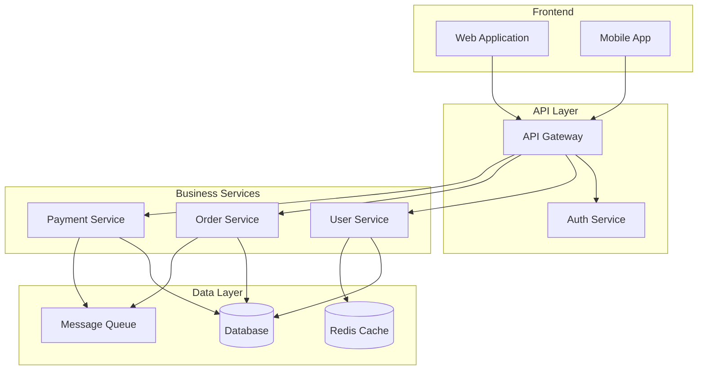
```mermaid
graph TB
    subgraph "Frontend"
        WEB[Web Application]
        APP[Mobile App]
    end
    
    subgraph "API Layer"
        GW[API Gateway]
        AUTH[Auth Service]
    end
    
    subgraph "Business Services"
        US[User Service]
        OS[Order Service]
        PS[Payment Service]
    end
    
    subgraph "Data Layer"
        DB[(Database)]
        CACHE[(Redis Cache)]
        MQ[Message Queue]
    end
    
    WEB --> GW
    APP --> GW
    GW --> AUTH
    GW --> US
    GW --> OS
    GW --> PS
    
    US --> DB
    US --> CACHE
    OS --> DB
    OS --> MQ
    PS --> DB
    PS --> MQ
```

#### 實體架構範例

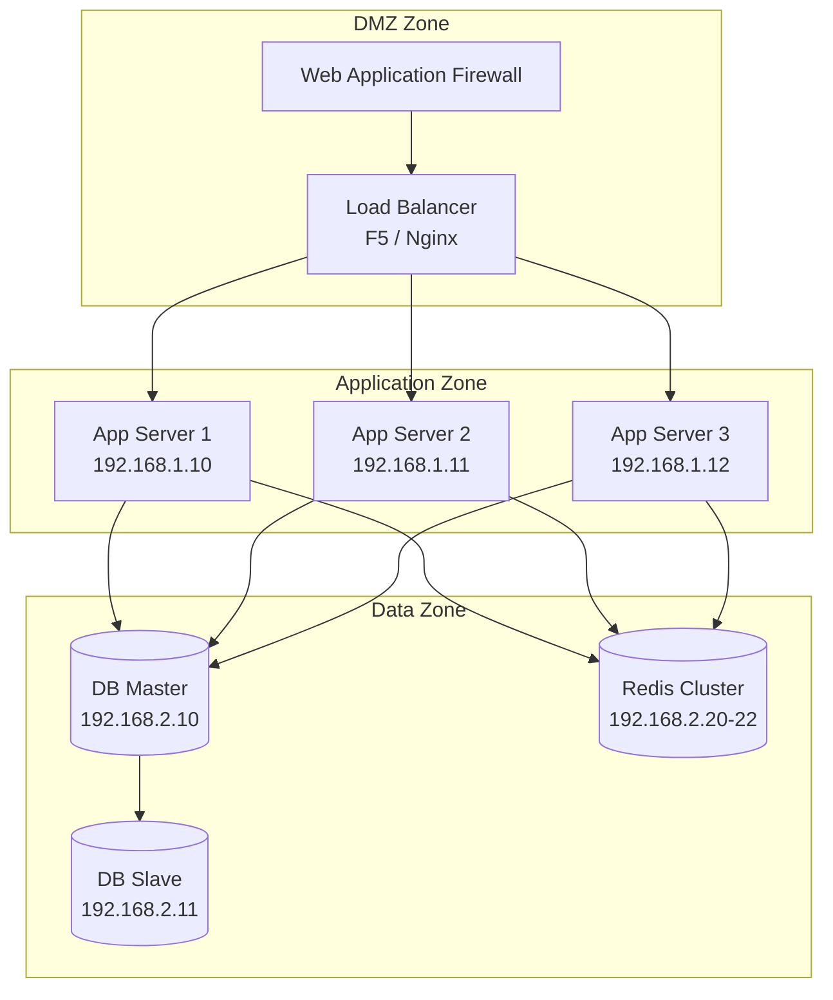
```mermaid
graph TB
    subgraph "DMZ Zone"
        LB[Load Balancer<br/>F5 / Nginx]
        WAF[Web Application Firewall]
    end
    
    subgraph "Application Zone"
        APP1[App Server 1<br/>192.168.1.10]
        APP2[App Server 2<br/>192.168.1.11]
        APP3[App Server 3<br/>192.168.1.12]
    end
    
    subgraph "Data Zone"
        DB_M[(DB Master<br/>192.168.2.10)]
        DB_S[(DB Slave<br/>192.168.2.11)]
        REDIS[(Redis Cluster<br/>192.168.2.20-22)]
    end
    
    WAF --> LB
    LB --> APP1
    LB --> APP2
    LB --> APP3
    
    APP1 --> DB_M
    APP2 --> DB_M
    APP3 --> DB_M
    DB_M --> DB_S
    
    APP1 --> REDIS
    APP2 --> REDIS
    APP3 --> REDIS
```

### 4.3 API 設計規範

#### RESTful API 設計原則

```markdown
## URL 命名規範

✅ 正確範例：
- GET    /api/v1/users              # 取得用戶列表
- GET    /api/v1/users/{id}         # 取得特定用戶
- POST   /api/v1/users              # 建立用戶
- PUT    /api/v1/users/{id}         # 更新用戶（完整）
- PATCH  /api/v1/users/{id}         # 更新用戶（部分）
- DELETE /api/v1/users/{id}         # 刪除用戶

❌ 錯誤範例：
- GET    /api/v1/getUsers           # 動詞不應出現在 URL
- POST   /api/v1/user/create        # 使用 HTTP Method 表達動作
- GET    /api/v1/Users              # 應使用小寫
```

#### API 設計規則摘要

| # | 規則 | 規範 | ✅ 正確 | ❌ 錯誤 |
|---|------|------|--------|--------|
| 1 | 資源用複數名詞、kebab-case | 必須 | `/api/v1/credit-cards` | `/api/v1/creditCard` |
| 2 | 對外 API 在路徑帶主版本號；不相容變更才升版 | 必須 | `/api/v2/orders` | 在同一版本中刪除欄位 |
| 3 | 錯誤回應採 RFC 9457 Problem Details | 必須 | `Content-Type: application/problem+json` | 錯誤也回 `200 OK` + `success=false` |
| 4 | 清單查詢必須分頁並設上限 | 必須 | `?size=50`（上限 100） | 一次回傳全部資料 |
| 5 | 會產生副作用的 POST 支援冪等鍵 | 應 | `Idempotency-Key: 8e03...` | 網路重試造成重複扣款 |
| 6 | 時間一律 ISO 8601 含時區 | 必須 | `2026-10-06T10:30:00+08:00` | `2026/10/06 10:30` |
| 7 | 金額用字串或整數最小單位，不用浮點數 | 必須 | `"amount": "1234.50"` 或 `123450`（分） | `"amount": 1234.5` |
| 8 | 每個 API 都要有 OpenAPI 規格且通過 lint | 必須 | CI 執行 Spectral | 規格寫在 Word 文件 |

#### API Response 標準格式

成功回應的 HTTP 狀態碼必須（MUST）反映結果（`200`／`201`／`204`）。新系統應（SHOULD）直接回傳資源本身；既有系統若已使用下列「信封（Envelope）」格式，得（MAY）沿用以維持相容：

```json
{
  "success": true,
  "code": "0000",
  "message": "Success",
  "data": {
    "id": "U001",
    "name": "張三",
    "email": "zhang@example.com"
  },
  "timestamp": "2026-02-05T10:30:00Z",
  "traceId": "abc123-def456"
}
```

#### 錯誤回應標準格式（RFC 9457 Problem Details）

錯誤回應必須（MUST）使用 RFC 9457 定義的 Problem Details 格式（取代舊的 RFC 7807），`Content-Type` 為 `application/problem+json`。標準欄位為 `type`、`title`、`status`、`detail`、`instance`；企業自訂的錯誤代碼、追蹤編號等以「擴充欄位（extension members）」加入。

```json
{
  "type": "https://api.example.com/problems/validation-error",
  "title": "輸入資料驗證失敗",
  "status": 400,
  "detail": "共有 2 個欄位驗證失敗",
  "instance": "/api/v1/customers",
  "code": "E1002",
  "traceId": "4bf92f3577b34da6a3ce929d0e0e4736",
  "errors": [
    { "pointer": "#/email", "detail": "Email 格式不正確" },
    { "pointer": "#/birthDate", "detail": "生日不可晚於今天" }
  ]
}
```

| 欄位 | 必要性 | 說明 |
|------|-------|------|
| `type` | 必須 | 指向錯誤類型說明文件的 URI；同一種錯誤固定使用同一個 URI |
| `title` | 必須 | 錯誤類型的簡短說明，同一個 `type` 的 `title` 不隨個案改變 |
| `status` | 必須 | 與 HTTP 狀態碼相同 |
| `detail` | 應 | 此次錯誤的具體說明，給人看的，不放堆疊追蹤（Stack Trace） |
| `instance` | 應 | 發生錯誤的請求路徑 |
| `code`、`traceId`、`errors` | 企業擴充 | 錯誤代碼對照表、分散式追蹤 ID、欄位錯誤清單（`pointer` 使用 JSON Pointer） |

**Spring Boot 實作範例**（Spring Framework 6 起內建 `ProblemDetail`）：

```java
import jakarta.servlet.http.HttpServletRequest;
import java.net.URI;
import org.slf4j.MDC;
import org.springframework.http.HttpStatus;
import org.springframework.http.ProblemDetail;
import org.springframework.web.bind.annotation.ExceptionHandler;
import org.springframework.web.bind.annotation.RestControllerAdvice;

@RestControllerAdvice
public class GlobalExceptionHandler {

    @ExceptionHandler(CustomerNotFoundException.class)
    public ProblemDetail handleNotFound(CustomerNotFoundException ex, HttpServletRequest request) {
        ProblemDetail pd = ProblemDetail.forStatusAndDetail(HttpStatus.NOT_FOUND, ex.getMessage());
        pd.setType(URI.create("https://api.example.com/problems/customer-not-found"));
        pd.setTitle("找不到客戶");
        pd.setInstance(URI.create(request.getRequestURI()));
        pd.setProperty("code", "E1001");
        pd.setProperty("traceId", MDC.get("traceId"));
        return pd; // Spring 會自動以 application/problem+json 回應
    }

    @ExceptionHandler(Exception.class)
    public ProblemDetail handleUnexpected(Exception ex) {
        // ❌ 不可把 ex.getMessage() 或堆疊追蹤回給客戶端，避免洩漏內部資訊
        ProblemDetail pd = ProblemDetail.forStatusAndDetail(HttpStatus.INTERNAL_SERVER_ERROR, "系統發生錯誤，請稍後再試");
        pd.setType(URI.create("https://api.example.com/problems/internal-error"));
        pd.setTitle("系統錯誤");
        pd.setProperty("code", "E9999");
        pd.setProperty("traceId", MDC.get("traceId"));
        return pd;
    }
}
```

> 💡 Spring Boot 也可以設定 `spring.mvc.problemdetails.enabled=true`，讓框架內建的例外（例如參數驗證失敗）自動以 Problem Details 格式回應。

#### HTTP 狀態碼使用規範

狀態碼名稱以 RFC 9110（HTTP Semantics）為準：

| 狀態碼 | 使用情境 | 備註 |
|-------|---------|------|
| `200 OK` | 成功取得或更新資料 | |
| `201 Created` | 成功建立資源 | 應附 `Location` 標頭指向新資源 |
| `202 Accepted` | 已接受、非同步處理中 | 回傳可查詢進度的 URL |
| `204 No Content` | 成功，無回傳內容（例如刪除） | |
| `400 Bad Request` | 請求格式或參數錯誤 | |
| `401 Unauthorized` | 未認證或憑證失效 | 應附 `WWW-Authenticate` 標頭 |
| `403 Forbidden` | 已認證但無權限 | |
| `404 Not Found` | 資源不存在 | 無權查看的資源也可回 404，避免洩漏存在與否 |
| `409 Conflict` | 資源狀態衝突（重複建立、版本衝突） | |
| `412 Precondition Failed` | `If-Match` 樂觀鎖檢查失敗 | |
| `422 Unprocessable Content` | 格式正確但業務規則不允許（例：餘額不足） | RFC 9110 已將舊名稱 Unprocessable Entity 改為 Unprocessable Content |
| `429 Too Many Requests` | 超過流量限制 | 應附 `Retry-After` 標頭 |
| `500 Internal Server Error` | 未預期的伺服器錯誤 | |
| `503 Service Unavailable` | 暫時無法服務（維護、過載） | 應附 `Retry-After` 標頭 |

#### 分頁、版本與冪等設計

**分頁**：資料量小、需要跳頁時用 Offset 分頁；資料量大或持續新增（例如交易明細）時用 Cursor 分頁，避免翻頁時資料重複或遺漏。

```http
GET /api/v1/transactions?size=50&cursor=eyJpZCI6MTAwMjN9 HTTP/1.1

HTTP/1.1 200 OK
Content-Type: application/json

{
  "items": [ ... ],
  "page": { "size": 50, "nextCursor": "eyJpZCI6MTAwNzN9", "hasNext": true }
}
```

**版本策略**：

| 變更類型 | 範例 | 是否需要升主版本 |
|---------|------|---------------|
| 新增選填欄位、新增 API | 回應增加 `nickname` 欄位 | 否 |
| 刪除或改名欄位、改型別、改語意 | `amount` 從數字改字串 | **是**（`/v1` → `/v2`） |
| 新增必填的請求欄位 | 建立訂單時必填 `channel` | **是** |

舊版 API 下線前應（SHOULD）以 `Deprecation` 與 `Sunset` 回應標頭（RFC 9745、RFC 8594）預告，並至少保留一個公告週期（例如 6 個月）。

**冪等鍵（Idempotency Key）**：轉帳、下單等 POST 請求，用戶端產生唯一的 `Idempotency-Key` 標頭；伺服器記住「鍵 → 第一次的回應」，重複的請求直接回傳第一次的結果，不再執行一次。

```http
POST /api/v1/transfers HTTP/1.1
Idempotency-Key: 8e03978e-40d5-43e8-bc93-6894a57f9324
Content-Type: application/json

{ "fromAccount": "001-123456", "toAccount": "001-654321", "amount": "5000" }
```

> `Idempotency-Key` 標頭來自 IETF HTTPAPI 工作小組的草案（`draft-ietf-httpapi-idempotency-key-header`，截至查證日最新為 2025-10 的 -07 版，尚未成為 RFC），業界（例如 Stripe）已廣泛採用。伺服器端的鍵保存期限（例如 24 小時）與「同鍵不同內容」的處理方式（應回 `422`）需寫入 API 規格。

#### OpenAPI 規格範例與自動檢查

每個 API 必須（MUST）有 OpenAPI 規格檔，並與程式碼一起放在版本控制中。以下為 OpenAPI 3.1 片段：

```yaml
openapi: 3.1.0
info:
  title: Customer API
  version: 1.4.0
  description: 客戶資料查詢與維護
  contact:
    name: 客戶服務開發部
    email: customer-api@example.com
servers:
  - url: https://api.example.com
tags:
  - name: customers
    description: 客戶資料
paths:
  /api/v1/customers/{customerId}:
    get:
      operationId: getCustomer
      summary: 查詢單一客戶
      description: 依客戶編號查詢客戶基本資料；呼叫者只能查詢其權限範圍內的客戶。
      tags: [customers]
      parameters:
        - name: customerId
          in: path
          required: true
          schema:
            type: string
            pattern: '^C[0-9]{6}$'
      responses:
        '200':
          description: 成功
          content:
            application/json:
              schema:
                $ref: '#/components/schemas/Customer'
        '404':
          description: 客戶不存在
          content:
            application/problem+json:
              schema:
                $ref: '#/components/schemas/Problem'
components:
  schemas:
    Customer:
      type: object
      required: [customerId, name]
      properties:
        customerId:
          type: string
        name:
          type: string
        email:
          type: string
          format: email
    Problem:
      type: object
      required: [type, title, status]
      properties:
        type:
          type: string
          format: uri
        title:
          type: string
        status:
          type: integer
        detail:
          type: string
        instance:
          type: string
        code:
          type: string
        traceId:
          type: string
```

用 Spectral 在 CI 中檢查規格（`spectral:oas` 為內建規則集）：

```bash
npx @stoplight/spectral-cli lint openapi.yaml --ruleset .spectral.yaml --fail-severity=warn
```

```yaml
# .spectral.yaml：在內建規則外加上企業規則
extends: ["spectral:oas"]
rules:
  paths-must-have-version:
    description: 路徑必須以 /api/v{主版本}/ 開頭
    given: $.paths
    severity: error
    then:
      field: "@key"
      function: pattern
      functionOptions:
        match: "^/api/v[0-9]+/"
```

### 4.4 資料庫設計與資料治理

#### 命名規範

```sql
-- 資料表命名：使用大寫底線分隔
CREATE TABLE CUSTOMER_ORDER (
    -- 主鍵：表名_ID
    CUSTOMER_ORDER_ID   BIGINT PRIMARY KEY,
    
    -- 外鍵：關聯表名_ID
    CUSTOMER_ID         BIGINT NOT NULL,
    
    -- 一般欄位：語意清楚的名稱
    ORDER_DATE          DATE NOT NULL,
    ORDER_STATUS        VARCHAR(20) NOT NULL,
    TOTAL_AMOUNT        DECIMAL(15,2) NOT NULL,
    
    -- 標準稽核欄位
    CREATED_BY          VARCHAR(50) NOT NULL,
    CREATED_AT          TIMESTAMP NOT NULL,
    UPDATED_BY          VARCHAR(50),
    UPDATED_AT          TIMESTAMP,
    
    -- 軟刪除欄位
    IS_DELETED          CHAR(1) DEFAULT 'N',
    DELETED_AT          TIMESTAMP,
    DELETED_BY          VARCHAR(50)
);

-- 索引命名：IDX_表名_欄位名
CREATE INDEX IDX_CUSTOMER_ORDER_CUSTOMER_ID 
    ON CUSTOMER_ORDER(CUSTOMER_ID);

-- 外鍵命名：FK_表名_關聯表名
ALTER TABLE CUSTOMER_ORDER 
    ADD CONSTRAINT FK_CUSTOMER_ORDER_CUSTOMER 
    FOREIGN KEY (CUSTOMER_ID) REFERENCES CUSTOMER(CUSTOMER_ID);
```

#### 資料治理要點

| 面向 | 規範內容 |
|------|---------|
| **資料分類** | 依敏感度分級：公開、內部、機密、極機密 |
| **個資保護** | 敏感欄位加密儲存、遮罩顯示 |
| **資料保留** | 定義各類資料保留年限 |
| **稽核軌跡** | 關鍵資料異動需記錄完整軌跡 |

#### 範例：資料分級對照表

> 📎 範本：[資料分級對照表範本]()

設計階段就要為每個欄位標註分級，後續的加密、遮罩、日誌、測試資料處理都以此為依據：

| 資料表.欄位 | 分級 | 儲存 | 畫面顯示 | 日誌 | 測試環境 |
|------------|------|------|---------|------|---------|
| `CUSTOMER.NAME` | 機密（個資） | 明文 | `王○明` | 禁止記錄 | 以假資料替換 |
| `CUSTOMER.ID_NO` | 極機密（個資） | 欄位加密 | `A12****789` | 禁止記錄 | 以假資料替換 |
| `CUSTOMER.EMAIL` | 機密（個資） | 明文 | `a***@example.com` | 遮罩後記錄 | 以假資料替換 |
| `CUSTOMER_ORDER.TOTAL_AMOUNT` | 內部 | 明文 | 完整顯示 | 可記錄 | 可沿用 |

#### 資料庫變更管理（Schema Migration）

資料庫結構變更必須（MUST）以版本化的遷移腳本（Migration Script）管理，並與程式碼放在同一個 Repository，由 CI/CD 自動套用。禁止（MUST NOT）在正式環境手動執行未納管的 DDL。以 Flyway 為例：

```text
src/main/resources/db/migration/
├── V1__create_customer.sql
├── V2__create_customer_order.sql
├── V3__add_customer_phone.sql
└── V4__backfill_customer_phone.sql
```

| 規則 | 說明 |
|------|------|
| 檔名 `V{版本}__{說明}.sql` | 版本號遞增，說明用底線分隔 |
| 已套用的腳本不得修改 | Flyway 會比對 checksum，修改後在其他環境驗證會失敗；要修正請新增下一版腳本 |
| 每支腳本只做一件事 | 方便定位問題與回滾 |
| 大表變更採 Expand／Contract | 見下方範例，避免長時間鎖表與新舊版本不相容 |

**Expand／Contract（擴充／收斂）範例**：把 `PHONE` 欄位拆成 `MOBILE_PHONE`，同時讓新舊版程式都能運作（才能做到零停機與藍綠部署）：

| 步驟 | 部署內容 | 新舊程式是否都能運作 |
|------|---------|------------------|
| 1. Expand | `V5__add_mobile_phone.sql`：新增可為 NULL 的 `MOBILE_PHONE` 欄位 | ✅ 舊程式不認識新欄位，不受影響 |
| 2. 雙寫 | 新版程式同時寫 `PHONE` 與 `MOBILE_PHONE` | ✅ |
| 3. 回填 | `V6__backfill_mobile_phone.sql`：分批把舊資料複製到新欄位 | ✅ |
| 4. 切換讀取 | 新版程式只讀 `MOBILE_PHONE` | ✅ |
| 5. Contract | 確認沒有任何程式讀 `PHONE` 後，`V7__drop_phone.sql` 刪除舊欄位 | ✅（此時已無舊程式） |

```sql
-- V5__add_mobile_phone.sql（Expand：只新增，不刪除、不改名）
ALTER TABLE CUSTOMER ADD MOBILE_PHONE VARCHAR(20);

-- V6__backfill_mobile_phone.sql（回填：示範語法，大表應改用分批的批次程式）
UPDATE CUSTOMER SET MOBILE_PHONE = PHONE WHERE MOBILE_PHONE IS NULL;
```

### 4.5 非功能性設計

#### 效能設計要點

```markdown
## 效能設計檢核清單

### 資料庫層
- [ ] 查詢使用適當索引
- [ ] 避免 SELECT *
- [ ] 批次處理使用分頁
- [ ] 連線池配置適當大小

### 應用層
- [ ] 適當使用快取（Redis）
- [ ] 非同步處理長時間任務
- [ ] 避免 N+1 查詢問題
- [ ] API 回應啟用 GZIP

### 架構層
- [ ] 靜態資源使用 CDN
- [ ] 讀寫分離（主從架構）
- [ ] 水平擴展能力
```

#### 高可用設計模式

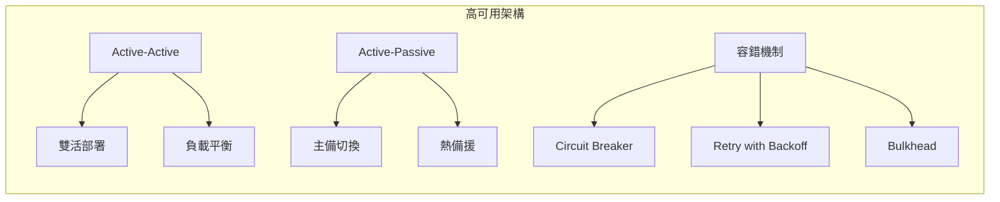
```mermaid
graph LR
    subgraph "高可用架構"
        A[Active-Active] --> A1[雙活部署]
        A[Active-Active] --> A2[負載平衡]
        
        B[Active-Passive] --> B1[主備切換]
        B[Active-Passive] --> B2[熱備援]
        
        C[容錯機制] --> C1[Circuit Breaker]
        C[容錯機制] --> C2[Retry with Backoff]
        C[容錯機制] --> C3[Bulkhead]
    end
```

> 💡 **實務建議**
>
> 1. 關鍵系統 RPO（Recovery Point Objective）應 < 1 分鐘
> 2. RTO（Recovery Time Objective）視業務需求，一般 < 30 分鐘
> 3. 定期執行災難演練（DR Drill）
> 4. RPO／RTO 應來自營運衝擊分析（BIA），由業務單位確認，而不是由技術團隊自行決定

#### 範例：容錯設定（Resilience4j）

「Circuit Breaker」「Retry with Backoff」若沒有具體參數，設計審查時無法判斷是否合理。設計文件應（SHOULD）寫出參數與理由：

```yaml
# application.yml：呼叫外部徵信服務的容錯設定
resilience4j:
  circuitbreaker:
    instances:
      creditBureau:
        sliding-window-size: 20            # 以最近 20 次呼叫計算失敗率
        failure-rate-threshold: 50         # 失敗率 ≥ 50% 時斷路
        wait-duration-in-open-state: 30s   # 斷路 30 秒後進入半開狀態試探
        permitted-number-of-calls-in-half-open-state: 3
  retry:
    instances:
      creditBureau:
        max-attempts: 3                    # 含第一次，共 3 次
        wait-duration: 500ms
        enable-exponential-backoff: true
        exponential-backoff-multiplier: 2  # 500ms → 1s
  timelimiter:
    instances:
      creditBureau:
        timeout-duration: 2s               # 必須小於上游的逾時設定
```

> ⚠️ 只對「冪等」的操作重試。對轉帳這類非冪等操作重試，必須搭配冪等鍵（見 4.3），否則可能重複扣款。

### 4.6 架構決策紀錄（ADR）

> 📎 範本：[架構決策紀錄範本]()

架構決策紀錄（Architecture Decision Record, ADR）是一份短文件，記錄「一個重要的技術決策、當時的背景、考慮過的選項與取捨」。半年後有人問「為什麼當初選 Kafka 而不是 RabbitMQ？」時，答案就在 ADR 裡。

**什麼時候必須（MUST）寫 ADR**：選用或更換框架、資料庫、訊息系統；改變系統間的整合方式；偏離本手冊或公司標準；任何難以反悔（回頭成本高）的決策。

#### ADR 範例（MADR 4.0 格式）

ADR 以 Markdown 存放在 Repository 的 `docs/decisions/` 目錄，檔名 `NNNN-標題.md`，與程式碼一起審查：

```markdown
---
status: accepted
date: 2026-09-20
decision-makers: 架構師 林志明、Tech Lead 陳大文
consulted: DBA 王小美、資安 李小華
informed: 開發團隊全體
---

# 0007 訂單事件採用 Kafka 作為訊息骨幹

## Context and Problem Statement

訂單服務需要把「訂單成立」事件通知庫存、出貨、點數三個服務。目前以同步 REST 呼叫，
任一服務故障就會讓下單失敗（2026 Q3 發生 3 次，見 INC-2026-031）。

## Decision Drivers

* 下游服務故障不得影響下單
* 尖峰 2,000 筆/秒，需能重播 7 天內的事件
* 維運團隊已有 Kafka 維運經驗

## Considered Options

* Apache Kafka
* RabbitMQ
* 維持同步 REST + 重試

## Decision Outcome

選擇 Apache Kafka，因為它是唯一能同時滿足「事件可重播 7 天」與「2,000 筆/秒」且團隊有維運經驗的選項。

### Consequences

* Good：下游故障不再影響下單；新服務可自行訂閱事件
* Bad：需處理事件重複投遞（消費端必須冪等）；增加 Kafka 叢集維運成本

### Confirmation

以整合測試驗證「點數服務停止時仍可下單」；上線後監控 consumer lag < 1,000。

## Pros and Cons of the Options

### RabbitMQ

* Good：團隊較熟悉 AMQP 路由
* Bad：訊息被消費後即刪除，不支援 7 天重播
```

> 💡 ADR 一經接受就不修改內容。決策改變時，新增一份 ADR，並把舊 ADR 的 `status` 改為 `superseded by 0012`。

### 4.7 C4 Model 架構圖

C4 Model 用四個縮放層級畫架構圖，讓不同讀者看到需要的細節：

| 層級 | 回答的問題 | 讀者 |
|------|----------|------|
| 1. System Context | 系統跟誰互動？（使用者、外部系統） | 所有人，含業務 |
| 2. Container | 系統由哪些可部署單元組成？（應用程式、資料庫、訊息佇列） | 架構師、開發、維運 |
| 3. Component | 一個 Container 內有哪些主要元件？ | 開發 |
| 4. Code | 類別層級 | 通常不畫，由 IDE 產生 |

**Container 層級範例**（每個方塊都寫出「名稱、技術、職責」，每條線都寫出「做什麼、用什麼協定」）：

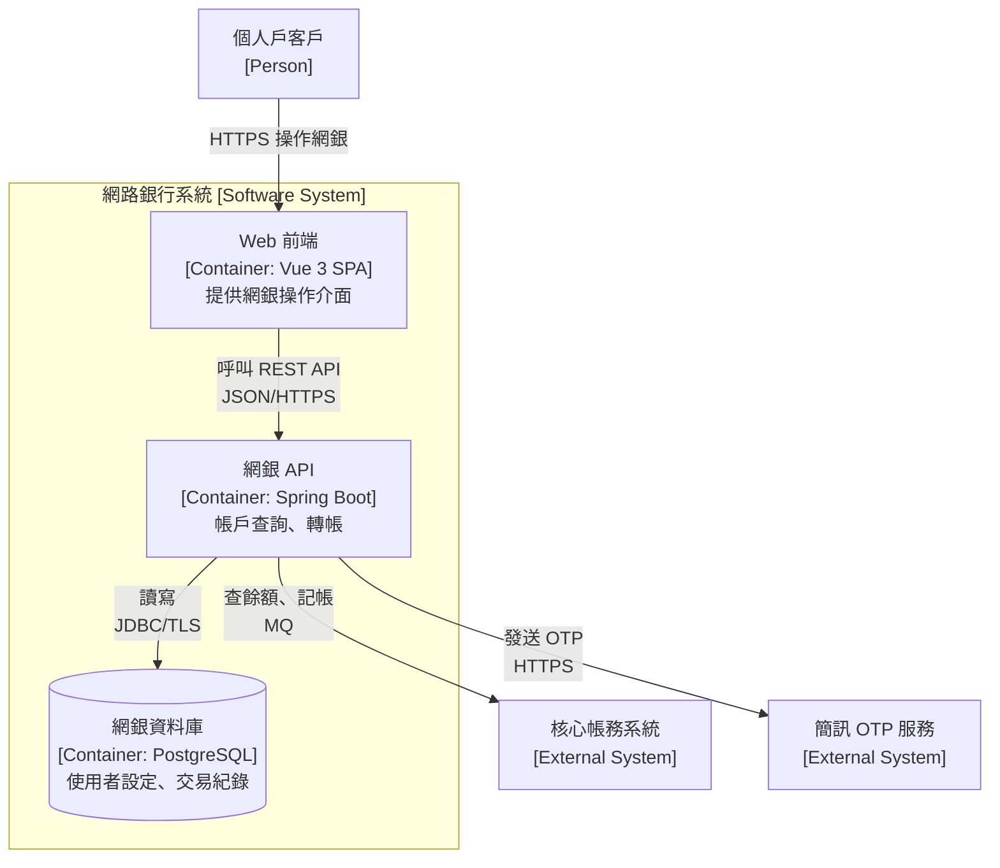
```mermaid
flowchart TB
    user["個人戶客戶<br/>[Person]"]
    subgraph bank["網路銀行系統 [Software System]"]
        spa["Web 前端<br/>[Container: Vue 3 SPA]<br/>提供網銀操作介面"]
        api["網銀 API<br/>[Container: Spring Boot]<br/>帳戶查詢、轉帳"]
        db[("網銀資料庫<br/>[Container: PostgreSQL]<br/>使用者設定、交易紀錄")]
    end
    core["核心帳務系統<br/>[External System]"]
    otp["簡訊 OTP 服務<br/>[External System]"]

    user -->|"HTTPS 操作網銀"| spa
    spa -->|"呼叫 REST API<br/>JSON/HTTPS"| api
    api -->|"讀寫<br/>JDBC/TLS"| db
    api -->|"查餘額、記帳<br/>MQ"| core
    api -->|"發送 OTP<br/>HTTPS"| otp
```

> ⚠️ 常見錯誤：圖上只有方塊沒有說明、線條沒有標示協定、把不同層級的元素混在同一張圖（例如在 Container 圖中畫出類別）。

### 4.8 審查與驗證

**自動檢查**

| 檢查項目 | 工具／指令 |
|---------|-----------|
| OpenAPI 規格符合規則 | `npx @stoplight/spectral-cli lint openapi.yaml --fail-severity=warn` |
| 程式實作與 OpenAPI 一致 | 以 springdoc 產生規格後與 Repository 中的規格比對（例如 `openapi-diff`），或執行契約測試（見 6.1） |
| 錯誤回應格式 | 整合測試斷言 `Content-Type` 為 `application/problem+json` 且含 `type`、`title`、`status` |
| Migration 腳本 | CI 中以 Testcontainers 啟動空資料庫，執行 `flyway migrate` + `flyway validate` |
| Mermaid 架構圖語法 | 以 Mermaid CLI 或 repo 的 `test-mermaid-syntax.ps1` 檢查 |

**人工審查問題**

1. 每個重大技術決策都有 ADR 嗎？ADR 中有沒有列出被否決的選項與理由？
2. 架構圖是否標示了協定、資料分級邊界（例如哪些線路傳輸個資）？
3. 非功能需求（第三章）的每一項，在設計中能找到對應的設計手段嗎？例如「可用率 99.9%」對應到哪些高可用設計？
4. 資料庫變更是否會造成新舊版本程式不相容？是否需要 Expand／Contract？
5. 容錯參數（逾時、重試次數）是否與上下游一致？下游逾時是否小於上游逾時？

**AI 常見錯誤**

- 錯誤回應仍用 `200 OK` + `success=false`，或自創與 RFC 9457 不同的欄位名稱。
- 產生的 OpenAPI 規格與實際程式不一致（欄位名稱、必填欄位不同）。
- 在 ADR 中只列優點、不列缺點，或捏造「業界都採用」等無法驗證的理由。
- 直接產生 `ALTER TABLE ... RENAME COLUMN` 之類的破壞性變更，沒有考慮新舊版本並存。
- 對非冪等操作設定自動重試。

---

## 第五章：開發實作規範

> 📎 本章對應之標準文件範本：
>
> - **TSD（技術規格文件）**：[TSD_Template]()
> - **程式規格書（Program Specification）**：[ProgramSpec_Template]()
>
> TSD 是開發階段最重要的技術參考文件，工程師應依據 TSD 中的類別設計、演算法邏輯、資料結構與測試規劃進行編碼實作。程式規格書則是 TSD 向下展開至「單一程式/批次工作」的實作藍圖，涵蓋輸入輸出欄位、處理邏輯與錯誤代碼，特別適用於批次、報表、介面轉檔或委外開發場景。

### 5.1 程式碼風格與命名規範

> 📘 本節只列流程層級的原則。各語言的完整規則（共 590 條，每條附範例與驗證方式）以《程式寫作指引》為準；兩者不一致時，以《程式寫作指引》為準。

**原則：風格規則必須（MUST）由工具強制，而不是靠 Code Review 提醒。** Reviewer 的時間應花在邏輯與設計，不是縮排與命名。

| 層級 | 作法 | 範例 |
|------|------|------|
| 編輯器 | 共用 `.editorconfig` | 統一縮排、換行字元、檔尾換行 |
| 提交前 | Git hook 自動格式化 | Spotless、Prettier、lefthook／husky |
| CI | 格式或規則不符即失敗 | `mvn spotless:check`、`mvn checkstyle:check`、`npx eslint .` |

```xml
<!-- pom.xml：CI 執行 mvn verify 時，格式不符即建置失敗 -->
<plugin>
  <groupId>com.diffplug.spotless</groupId>
  <artifactId>spotless-maven-plugin</artifactId>
  <version>${spotless.version}</version>
  <configuration>
    <java>
      <palantirJavaFormat/>
      <removeUnusedImports/>
    </java>
  </configuration>
  <executions>
    <execution>
      <goals><goal>check</goal></goals>
      <phase>verify</phase>
    </execution>
  </executions>
</plugin>
```

#### 通用命名原則

| 元素 | 命名風格 | 範例 |
|------|---------|------|
| **類別（Class）** | PascalCase | `CustomerService`, `OrderRepository` |
| **方法（Method）** | camelCase | `findByCustomerId()`, `calculateTotal()` |
| **變數（Variable）** | camelCase | `orderCount`, `customerName` |
| **常數（Constant）** | UPPER_SNAKE_CASE | `MAX_RETRY_COUNT`, `DEFAULT_TIMEOUT` |
| **套件（Package）** | lowercase | `com.company.project.service` |
| **資料表（Table）** | UPPER_SNAKE_CASE | `CUSTOMER_ORDER`, `PRODUCT_CATEGORY` |
| **API 路徑** | kebab-case | `/api/v1/customer-orders` |

#### Java 程式碼規範範例

```java
package com.company.project.application.service;

import org.springframework.context.ApplicationEventPublisher;
import org.springframework.stereotype.Service;
import org.springframework.transaction.annotation.Transactional;

/**
 * 客戶服務類別
 * 
 * <p>負責處理客戶相關的業務邏輯，包含查詢、建立、更新等操作。</p>
 * 
 * @author 開發團隊
 * @since 1.0.0
 */
@Service
public class CustomerService {

    private static final int MAX_RETRY_COUNT = 3;
    private static final String DEFAULT_STATUS = "ACTIVE";
    
    private final CustomerRepository customerRepository;
    private final ApplicationEventPublisher eventPublisher;
    
    /**
     * 建構子注入依賴
     */
    public CustomerService(CustomerRepository customerRepository,
                          ApplicationEventPublisher eventPublisher) {
        this.customerRepository = customerRepository;
        this.eventPublisher = eventPublisher;
    }
    
    /**
     * 根據客戶 ID 查詢客戶資訊
     * 
     * @param customerId 客戶識別碼
     * @return 客戶資訊 DTO
     * @throws CustomerNotFoundException 當客戶不存在時拋出
     */
    public CustomerDTO findByCustomerId(String customerId) {
        // 參數驗證
        if (customerId == null || customerId.isBlank()) {
            throw new IllegalArgumentException("Customer ID cannot be empty");
        }
        
        // 查詢客戶
        Customer customer = customerRepository.findById(customerId)
            .orElseThrow(() -> new CustomerNotFoundException(customerId));
        
        // 轉換並返回
        return CustomerMapper.toDTO(customer);
    }
    
    /**
     * 建立新客戶
     * 
     * @param request 建立客戶請求
     * @return 建立後的客戶資訊
     */
    @Transactional
    public CustomerDTO createCustomer(CreateCustomerRequest request) {
        // 1. 驗證請求
        validateCreateRequest(request);
        
        // 2. 檢查重複
        checkDuplicateEmail(request.getEmail());
        
        // 3. 建立實體
        Customer customer = Customer.builder()
            .name(request.getName())
            .email(request.getEmail())
            .status(DEFAULT_STATUS)
            .build();
        
        // 4. 儲存
        Customer saved = customerRepository.save(customer);
        
        // 5. 發布事件：歡迎信由 @TransactionalEventListener(phase = AFTER_COMMIT) 在交易提交後才寄出，
        //    避免「信已寄出但資料因交易回滾而不存在」
        eventPublisher.publishEvent(new CustomerCreatedEvent(saved.getId()));
        
        // 6. 返回結果
        return CustomerMapper.toDTO(saved);
    }
    
    private void validateCreateRequest(CreateCustomerRequest request) {
        // 驗證邏輯...
    }
    
    private void checkDuplicateEmail(String email) {
        // 重複檢查邏輯...
    }
}
```

> ⚠️ v1.2 版範例在 `@Transactional` 方法中直接寄送歡迎信。若之後的步驟失敗導致交易回滾，信已經寄出、客戶資料卻不存在。凡是「不能回滾的副作用」（寄信、呼叫外部 API、送訊息），都應（SHOULD）放到交易提交之後執行。

#### 程式碼註解規範

```java
/**
 * 類別層級 JavaDoc（必要）
 * - 說明類別職責
 * - 標註 @author 與 @since
 */

/**
 * 方法層級 JavaDoc（公開方法必要）
 * - 說明方法用途
 * - @param 說明參數
 * - @return 說明回傳值
 * - @throws 說明可能拋出的例外
 */

// 單行註解：說明複雜邏輯的「為什麼」
// 不要寫「做什麼」（程式碼本身應該自我說明）

/*
 * 多行註解：
 * 用於較長的說明文字
 * ❌ 不要用來「暫時停用」程式碼：不再使用的程式碼直接刪除，需要時從 Git 歷史找回
 */

// TODO(CUST-1234): 待完成的功能——必須附上工作項目編號，才能追蹤與清理
// FIXME(CUST-1240): 需要修復的問題
// ❌ TODO: 之後再改            ← 沒有編號，永遠不會被處理
```

> 💡 可在 CI 中用 `grep -rnE "(TODO|FIXME)(:| )" src/` 找出沒有附工作項目編號的 TODO／FIXME。

### 5.2 架構分層原則

#### Clean Architecture 分層

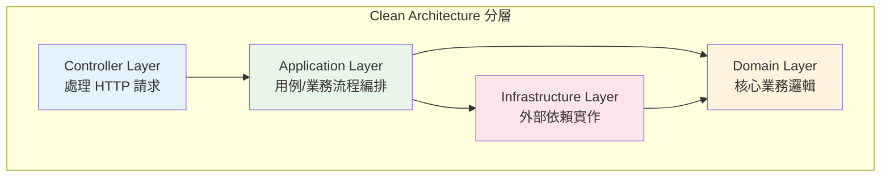
```mermaid
graph TB
    subgraph "Clean Architecture 分層"
        A[Controller Layer<br/>處理 HTTP 請求] --> B[Application Layer<br/>用例/業務流程編排]
        B --> C[Domain Layer<br/>核心業務邏輯]
        B --> D[Infrastructure Layer<br/>外部依賴實作]
        D --> C
    end
    
    style A fill:#e3f2fd
    style B fill:#e8f5e9
    style C fill:#fff3e0
    style D fill:#fce4ec
```

#### 各層職責與規範

| 層級 | 職責 | 可依賴 | 禁止依賴 |
|------|------|-------|---------|
| **Controller** | 處理 HTTP、參數驗證、回應格式 | Application | Domain, Infrastructure |
| **Application** | 用例編排、交易控制、DTO 轉換 | Domain, Infrastructure（介面） | Controller |
| **Domain** | 核心業務規則、領域模型 | 無 | 所有其他層 |
| **Infrastructure** | 資料庫、外部 API、訊息佇列 | Domain（實作介面） | Controller, Application |

#### 用 ArchUnit 自動檢查分層

上表的「禁止依賴」若只寫在文件裡，很快就會被違反。用 ArchUnit 把規則寫成單元測試，違反時 CI 直接失敗：

```java
import static com.tngtech.archunit.library.Architectures.layeredArchitecture;

import com.tngtech.archunit.core.importer.ImportOption;
import com.tngtech.archunit.junit.AnalyzeClasses;
import com.tngtech.archunit.junit.ArchTest;
import com.tngtech.archunit.lang.ArchRule;

@AnalyzeClasses(packages = "com.company.project", importOptions = ImportOption.DoNotIncludeTests.class)
class LayeredArchitectureTest {

    @ArchTest
    static final ArchRule layers_are_respected = layeredArchitecture()
            .consideringOnlyDependenciesInLayers()
            .layer("Controller").definedBy("..controller..")
            .layer("Application").definedBy("..application..")
            .layer("Domain").definedBy("..domain..")
            .layer("Infrastructure").definedBy("..infrastructure..")
            .whereLayer("Controller").mayNotBeAccessedByAnyLayer()
            .whereLayer("Application").mayOnlyBeAccessedByLayers("Controller")
            .whereLayer("Domain").mayOnlyBeAccessedByLayers("Application", "Infrastructure")
            .whereLayer("Infrastructure").mayOnlyBeAccessedByLayers("Application");
}
```

> 這個測試同時也是「活的文件」：新人看測試就知道分層規則，而且規則永遠和程式碼一致。
>
> ⚠️ ArchUnit 1.x 預設把「沒有任何類別的層」視為違規（錯誤訊息為 `Layer 'Infrastructure' is empty`）。專案初期某層還沒有類別時，可在 `layeredArchitecture()` 之後加上 `.withOptionalLayers(true)`。（以 ArchUnit 1.5.1 驗證）

#### 專案目錄結構範例

```text
src/main/java/com/company/project/
├── controller/                    # 控制器層
│   ├── CustomerController.java
│   ├── OrderController.java
│   └── dto/                       # Request/Response DTO
│       ├── request/
│       └── response/
│
├── application/                   # 應用層
│   ├── service/                   # 應用服務
│   │   ├── CustomerApplicationService.java
│   │   └── OrderApplicationService.java
│   ├── usecase/                   # 用例
│   └── mapper/                    # DTO 轉換器
│
├── domain/                        # 領域層
│   ├── model/                     # 領域模型
│   │   ├── Customer.java
│   │   └── Order.java
│   ├── service/                   # 領域服務
│   ├── repository/                # Repository 介面
│   ├── event/                     # 領域事件
│   └── exception/                 # 領域例外
│
├── infrastructure/                # 基礎設施層
│   ├── persistence/               # 資料庫存取
│   │   ├── repository/            # Repository 實作
│   │   ├── entity/                # JPA Entity
│   │   └── mapper/                # Entity 轉換
│   ├── external/                  # 外部服務整合
│   │   ├── payment/
│   │   └── notification/
│   └── config/                    # 設定類別
│
└── common/                        # 共用元件
    ├── exception/                 # 通用例外
    ├── util/                      # 工具類別
    └── constant/                  # 常數定義
```

### 5.3 重用性與模組化

#### 模組化設計原則

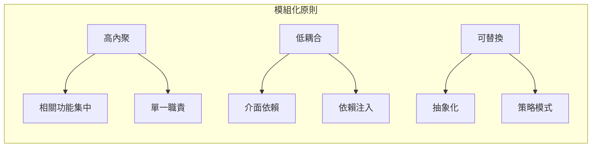
```mermaid
graph LR
    subgraph "模組化原則"
        A[高內聚] --> A1[相關功能集中]
        A --> A2[單一職責]
        
        B[低耦合] --> B1[介面依賴]
        B --> B2[依賴注入]
        
        C[可替換] --> C1[抽象化]
        C --> C2[策略模式]
    end
```

#### 共用模組設計

```java
// ✅ 良好的共用模組設計

// 1. 定義清楚的介面
public interface NotificationService {
    void send(Notification notification);
    NotificationResult getStatus(String notificationId);
}

// 2. 提供多種實作
@Service
@ConditionalOnProperty(name = "notification.type", havingValue = "email")
public class EmailNotificationService implements NotificationService {
    // Email 實作
}

@Service
@ConditionalOnProperty(name = "notification.type", havingValue = "sms")
public class SmsNotificationService implements NotificationService {
    // SMS 實作
}

// 3. 使用時依賴介面
@Service
public class OrderService {
    private final NotificationService notificationService;
    
    public OrderService(NotificationService notificationService) {
        this.notificationService = notificationService;
    }
}
```

#### 避免重複的實務作法

| 情境 | 解決方案 |
|------|---------|
| **重複的驗證邏輯** | 建立共用 Validator 類別 |
| **重複的資料轉換** | 使用 MapStruct 等映射工具 |
| **重複的例外處理** | 建立全域例外處理器 |
| **重複的日誌記錄** | 使用 AOP 切面 |
| **重複的 CRUD** | 建立 Generic Repository |

### 5.4 Secure Coding 基本原則

> 📘 細部規則見《安全程式碼指引》與《程式寫作指引》第 16 章。驗證標準以 **OWASP ASVS 5.0.0** 為準。

#### 依風險等級選用 ASVS 驗證等級

OWASP ASVS 5.0 把約 350 條安全需求分成 17 章（V1 編碼與淨化、V2 驗證與業務邏輯、V3 Web 前端安全、V4 API 與 Web 服務、V5 檔案處理、V6 身分驗證、V7 Session 管理、V8 授權、V9 自含式 Token、V10 OAuth 與 OIDC、V11 密碼學、V12 安全通訊、V13 組態、V14 資料保護、V15 安全編碼與架構、V16 安全日誌與錯誤處理、V17 WebRTC），每條需求標示適用等級 L1／L2／L3。依 2.5 的風險分級選用：

| 專案風險等級（2.5） | ASVS 等級 | 說明 |
|------------------|----------|------|
| L1 高風險 | **L2**（金流核心、身分驗證中心等關鍵元件採 **L3**） | 處理個資與金流的系統的基本要求 |
| L2 中風險 | **L2** | |
| L3 低風險 | **L1** | 最基本、可大部分以自動化工具驗證的要求 |

> ⚠️ ASVS 5.0 的需求編號與 4.0.3 不同（章節重新編排）。引用需求時必須（MUST）寫出版本，例如 `v5.0.0-6.2.1`，避免與舊版編號混淆。

#### 安全編碼檢核清單

```markdown
## 輸入驗證
- [ ] 所有外部輸入（含 HTTP 標頭、檔案、訊息佇列）都在伺服器端驗證
- [ ] 使用白名單（允許清單）而非黑名單驗證
- [ ] 限制輸入長度與格式
- [ ] 驗證檔案上傳的類型（檢查內容，不只看副檔名）與大小

## 注入防護（SQL、OS 指令、LDAP）
- [ ] 使用 Prepared Statement／參數綁定
- [ ] 禁止字串拼接 SQL；動態排序欄位使用白名單
- [ ] ORM 使用參數綁定，原生查詢同樣不得拼接

## XSS 防護
- [ ] 依輸出位置編碼（HTML、屬性、JavaScript、URL）
- [ ] 設定 Content Security Policy
- [ ] Cookie 設定 HttpOnly、Secure、SameSite

## 認證與授權
- [ ] 密碼以 Argon2id 雜湊儲存（既有 bcrypt 可沿用並逐步升級）
- [ ] Session 登入後重新產生 ID，登出時伺服器端失效
- [ ] 每個 API 在伺服器端檢查「這個使用者能不能存取這筆資料」（不只檢查是否登入）

## 敏感資料處理
- [ ] 傳輸加密：TLS 1.2 以上，優先 TLS 1.3；停用 TLS 1.0／1.1
- [ ] 儲存加密：AES-256-GCM 等經認證的加密模式；金鑰由 KMS／Vault 管理
- [ ] 日誌不記錄密碼、Token、完整卡號、身分證字號
- [ ] 錯誤訊息不回傳堆疊追蹤或 SQL 內容

## 例外處理（OWASP Top 10:2025 A10）
- [ ] 例外發生時「預設拒絕」（Fail Closed），不得因例外而跳過權限檢查
- [ ] 不得吞掉例外（空的 catch 區塊）
```

#### 安全編碼範例

**SQL Injection**：

```java
// ❌ 不安全的寫法 - 字串拼接 SQL，輸入 ' OR '1'='1 即可查出所有使用者
public User findUser(String username) {
    String sql = "SELECT * FROM users WHERE username = '" + username + "'";
    return jdbcTemplate.queryForObject(sql, USER_ROW_MAPPER);
}

// ✅ 安全的寫法 - 參數綁定 + RowMapper
private static final RowMapper<User> USER_ROW_MAPPER = (rs, rowNum) ->
        new User(rs.getLong("id"), rs.getString("username"), rs.getString("email"));

public Optional<User> findUser(String username) {
    String sql = "SELECT id, username, email FROM users WHERE username = ?";
    return jdbcTemplate.query(sql, USER_ROW_MAPPER, username).stream().findFirst();
}

// ✅ Spring Framework 6.1 以上也可以使用 JdbcClient（具名參數，可讀性較佳）
public Optional<User> findUserByJdbcClient(String username) {
    return jdbcClient.sql("SELECT id, username, email FROM users WHERE username = :username")
            .param("username", username)
            .query(User.class)
            .optional();
}
```

> ⚠️ **v1.2 版範例的錯誤**：`jdbcTemplate.queryForObject(sql, new Object[]{username}, User.class)` 有兩個問題：① `Object[]` 參數的多載自 Spring 5.3 起已標示 `@Deprecated`；② 傳入 `Class<T>` 的 `queryForObject` 只能用在「單列、單欄」的結果（例如 `SELECT COUNT(*)`），用來查整列資料會拋出 `IncorrectResultSetColumnCountException`。查詢整列資料必須使用 `RowMapper`，或改用 `JdbcClient`。

**ORDER BY 無法用參數綁定**，排序欄位必須用白名單：

```java
private static final Set<String> SORTABLE_COLUMNS = Set.of("created_at", "username");

public List<User> listUsers(String sortBy) {
    if (!SORTABLE_COLUMNS.contains(sortBy)) {
        throw new IllegalArgumentException("不支援的排序欄位");
    }
    return jdbcTemplate.query("SELECT id, username, email FROM users ORDER BY " + sortBy, USER_ROW_MAPPER);
}
```

> 💡 **SAST 誤判的處理**：Semgrep 1.179.0（規則集 `p/java`）會把上面的 `ORDER BY` 那一行標為 `java.spring.security.audit.spring-sqli.spring-sqli`——工具看不出前面已經有白名單檢查。Reviewer 確認是誤判後，在該行加上 `// nosemgrep: java.spring.security.audit.spring-sqli.spring-sqli -- sortBy 已經過 SORTABLE_COLUMNS 白名單檢查` 標註理由；**禁止**以停用整條規則的方式處理，否則真正的注入也會被放過。

**密碼儲存**：OWASP Password Storage Cheat Sheet 建議優先使用 Argon2id，最低設定為記憶體 19 MiB、迭代 2 次、平行度 1。Spring Security 以 `DelegatingPasswordEncoder` 讓新密碼用 Argon2id，同時仍能驗證既有的 bcrypt 雜湊：

```java
@Bean
PasswordEncoder passwordEncoder() {
    // Argon2id：saltLength=16 bytes、hashLength=32 bytes、parallelism=1、memory=19456 KiB（19 MiB）、iterations=2
    // （需加入 org.bouncycastle:bcprov-jdk18on 依賴）
    Map<String, PasswordEncoder> encoders = Map.of(
            "argon2", new Argon2PasswordEncoder(16, 32, 1, 19456, 2),
            "bcrypt", new BCryptPasswordEncoder());
    return new DelegatingPasswordEncoder("argon2", encoders);
}

// ❌ 不安全的寫法 - 密碼明文比對
public boolean authenticate(String username, String password) {
    User user = userRepository.findByUsername(username);
    return user.getPassword().equals(password);
}

// ✅ 安全的寫法 - 雜湊比對（雜湊值格式如 {argon2}$argon2id$v=19$m=19456,t=2,p=1$...）
public boolean authenticate(String username, String password) {
    return userRepository.findOptionalByUsername(username)
            .map(user -> passwordEncoder.matches(password, user.getPasswordHash()))
            .orElse(false); // 帳號不存在與密碼錯誤回傳相同結果，避免帳號列舉
}
```

**日誌中的敏感資訊**：

```java
// ❌ 不安全的寫法 - 記錄密碼
log.info("User login: username={}, password={}", username, password);

// ❌ 仍不安全 - 「遮罩後」的密碼也不應記錄（長度與前後字元仍會洩漏資訊）
log.info("User login: username={}, password={}", username, maskPassword(password));

// ✅ 安全的寫法 - 只記錄必要的識別資訊
log.info("User login attempt: username={}, result={}", username, result);
```

**例外處理與「預設拒絕」**（OWASP Top 10:2025 新增 A10）：

```java
// ❌ 例外時預設允許：權限服務逾時，結果變成所有人都能存取
public boolean canAccess(String userId, String resourceId) {
    try {
        return permissionClient.check(userId, resourceId);
    } catch (Exception e) {
        return true;
    }
}

// ✅ 例外時預設拒絕（Fail Closed），並記錄事件
public boolean canAccess(String userId, String resourceId) {
    try {
        return permissionClient.check(userId, resourceId);
    } catch (RuntimeException e) {
        log.warn("Permission check failed, access denied: userId={}, resourceId={}", userId, resourceId, e);
        return false;
    }
}
```

#### OWASP Top 10:2025 對應措施

OWASP Top 10 於 2025 年改版，與 2021 年版的主要差異：新增 **A03 軟體供應鏈失效**（由原 A06 易受攻擊元件擴大範圍）與 **A10 例外狀況處理不當**；原 A10 SSRF 併入 A01；A09 改名為「安全日誌與**告警**失效」。

| OWASP 2025 風險 | 防護措施 | 本手冊對應 |
|----------------|---------|-----------|
| **A01: Broken Access Control**（含 SSRF） | 伺服器端逐筆授權檢查、預設拒絕、對外連線目的地白名單 | 9.3 |
| **A02: Security Misconfiguration** | 安全基準、關閉預設帳號與除錯端點、設定以 IaC 管理並掃描 | 7.3、8.1 |
| **A03: Software Supply Chain Failures** | SCA、SBOM、依賴版本鎖定、Action／映像檔 pin 版本、建置來源證明 | 9.4 |
| **A04: Cryptographic Failures** | TLS 1.2+、Argon2id、AES-GCM、金鑰由 KMS 管理 | 5.4 |
| **A05: Injection** | 參數化查詢、輸出編碼、白名單驗證 | 5.4 |
| **A06: Insecure Design** | 威脅建模、安全設計審查、濫用案例（Abuse Case） | 9.1 |
| **A07: Authentication Failures** | MFA、防暴力破解、Session 管理 | 5.4 |
| **A08: Software or Data Integrity Failures** | 程式碼與套件簽章驗證、CI/CD 權限最小化、反序列化防護 | 8.1、9.4 |
| **A09: Security Logging and Alerting Failures** | 完整稽核日誌、**告警規則與值班回應** | 9.3、10.2 |
| **A10: Mishandling of Exceptional Conditions** | 預設拒絕、不吞例外、錯誤不洩漏內部資訊 | 4.3、5.4 |

> ⚠️ **實務注意事項**
>
> 1. 定期執行弱點掃描（SAST/DAST），並納入 CI（見 9.2）
> 2. 第三方套件需檢查已知弱點與授權條款（見 9.4）
> 3. 敏感操作需記錄稽核日誌
> 4. 定期進行安全教育訓練

### 5.5 AI 生成程式碼審查

AI 產生的程式碼「看起來」通常很合理——語法正確、命名漂亮、還附註解——這正是風險所在。審查 AI 產出時，Reviewer 必須（MUST）比審查人寫的程式碼更注意下列幾類問題：

| 風險類型 | 典型表現 | 如何發現 |
|---------|---------|---------|
| **幻覺依賴** | 匯入不存在的套件或類別；套件名稱與真實套件只差一個字 | 建置失敗即可發現；新增依賴一律人工確認來源與下載量（防 Slopsquatting 攻擊） |
| **過時 API** | 使用已棄用的方法（例如本章的 `queryForObject(..., Object[], Class)`） | 編譯器警告設為錯誤（`-Werror` 或 `-Xlint:deprecation`）；SonarQube 規則 |
| **缺少安全控制** | 沒有授權檢查、沒有輸入驗證、SQL 拼接 | SAST（Semgrep／CodeQL）；Reviewer 檢查清單 |
| **錯誤處理不完整** | 空的 catch、例外時預設允許 | SpotBugs／Error Prone；Code Review |
| **測試自我驗證** | 測試只斷言「實作目前的輸出」，沒有對照需求 | Mutation testing（見 6.1）；比對驗收條件 |
| **機敏資訊寫死** | 範例中的連線字串、API Key 被直接沿用 | gitleaks 掃描（見 7.4） |
| **授權條款** | 產生的程式碼與某開源專案高度相似 | 工具的公開程式碼比對功能；授權掃描 |

#### 審查流程

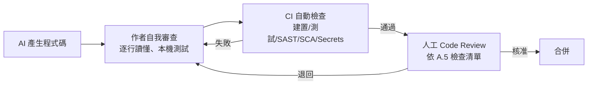
```mermaid
flowchart LR
    A[AI 產生程式碼] --> B[作者自我審查<br/>逐行讀懂、本機測試]
    B --> C[CI 自動檢查<br/>建置/測試/SAST/SCA/Secrets]
    C -->|失敗| B
    C -->|通過| D[人工 Code Review<br/>依 A.5 檢查清單]
    D -->|退回| B
    D -->|核准| E[合併]
```

> 💡 **作者自我審查的最低標準**：作者必須（MUST）能向 Reviewer 解釋每一行程式在做什麼、為什麼這樣寫。無法解釋的程式碼不得送審。

### 5.6 審查與驗證

**自動檢查**

| 檢查項目 | 工具／指令 | 失敗條件 |
|---------|-----------|---------|
| 格式 | `mvn spotless:check`、`npx prettier --check .` | 任何差異 |
| 程式碼規則 | Checkstyle、PMD、ESLint（規則見《程式寫作指引》） | 任何違規 |
| 分層架構 | ArchUnit 測試（見 5.2） | 測試失敗 |
| 已棄用 API | `javac -Xlint:deprecation -Werror` | 出現棄用警告 |
| 安全弱點 | Semgrep（`p/owasp-top-ten`）、CodeQL、SonarQube | 新增 High 以上問題 |
| TODO 無工作項目編號 | `grep -rnE "(TODO\|FIXME)(:\| )" src/` | 有輸出 |

**人工審查問題**

1. 每個新增或修改的 API，伺服器端是否檢查了「這個使用者能不能存取這筆資料」？
2. 例外發生時，系統是預設拒絕還是預設允許？
3. 交易內是否有不能回滾的副作用（寄信、呼叫外部 API）？
4. 新增的依賴套件是否真實存在、仍在維護、授權條款可接受？
5. 日誌是否可能記錄到個資或機敏資訊？

**AI 常見錯誤**

- 使用已棄用的 API（例如 `queryForObject(..., Object[], Class)`、`WebSecurityConfigurerAdapter`）。
- 以 `Class<T>` 版本的 `queryForObject` 查詢整列資料。
- 在 `@Transactional` 方法中呼叫外部服務。
- 產生的密碼雜湊仍使用 MD5／SHA-256（未加鹽、非慢速雜湊）。
- catch 例外後回傳 `true` 或空集合，掩蓋錯誤。

---

## 第六章：測試策略與品質保證

### 6.1 測試類型與層級

#### 測試金字塔

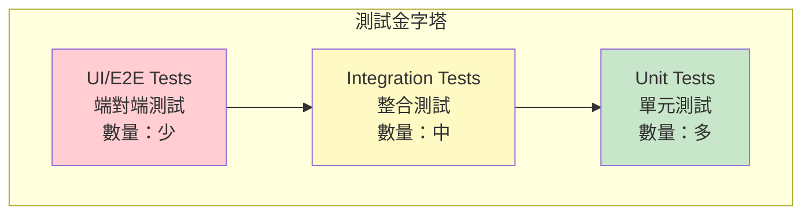
```mermaid
graph TB
    subgraph "測試金字塔"
        A[UI/E2E Tests<br/>端對端測試<br/>數量：少]
        B[Integration Tests<br/>整合測試<br/>數量：中]
        C[Unit Tests<br/>單元測試<br/>數量：多]
    end
    
    A --> B --> C
    
    style A fill:#ffcdd2
    style B fill:#fff9c4
    style C fill:#c8e6c9
```

#### 各類測試說明

| 測試類型 | 測試範圍 | 執行時機 | 執行速度 | 維護成本 |
|---------|---------|---------|---------|---------|
| **Unit Test** | 單一類別/方法 | 每次 Commit | 極快（ms） | 低 |
| **Integration Test** | 多元件互動 | 每次 Build | 中等（秒） | 中 |
| **Contract Test** | 服務間的 API 約定 | 每次 Build | 快（秒） | 中 |
| **System Test（SIT）** | 完整系統流程 | 每日/Release | 慢（分鐘） | 高 |
| **UAT** | 業務場景驗證 | Release 前 | 慢 | 高 |
| **Performance Test** | 效能壓力 | Release 前 | 慢 | 高 |
| **Security Test（DAST／滲透測試）** | 執行中的系統 | Release 前／定期 | 慢 | 中 |

#### 單元測試範例

以下測試對應 5.1 的 `CustomerService`。每個測試的 `@DisplayName` 描述「情境 → 預期結果」，失敗時一眼就能看出哪個需求被破壞。

```java
import static org.assertj.core.api.Assertions.assertThat;
import static org.assertj.core.api.Assertions.assertThatThrownBy;
import static org.mockito.ArgumentMatchers.any;
import static org.mockito.Mockito.mock;
import static org.mockito.Mockito.verify;
import static org.mockito.Mockito.when;

import java.util.Optional;
import org.junit.jupiter.api.BeforeEach;
import org.junit.jupiter.api.DisplayName;
import org.junit.jupiter.api.Nested;
import org.junit.jupiter.api.Test;
import org.springframework.context.ApplicationEventPublisher;

class CustomerServiceTest {

    private CustomerRepository customerRepository;
    private ApplicationEventPublisher eventPublisher;
    private CustomerService customerService;

    @BeforeEach
    void setUp() {
        customerRepository = mock(CustomerRepository.class);
        eventPublisher = mock(ApplicationEventPublisher.class);
        customerService = new CustomerService(customerRepository, eventPublisher);
    }

    @Nested
    @DisplayName("findByCustomerId 方法測試")
    class FindByCustomerIdTests {

        @Test
        @DisplayName("當客戶存在時，應返回客戶資訊")
        void shouldReturnCustomer_WhenCustomerExists() {
            // Given
            String customerId = "C001";
            Customer customer = Customer.builder()
                .id(customerId)
                .name("張三")
                .email("zhang@example.com")
                .build();
            when(customerRepository.findById(customerId))
                .thenReturn(Optional.of(customer));

            // When
            CustomerDTO result = customerService.findByCustomerId(customerId);

            // Then
            assertThat(result.id()).isEqualTo(customerId);
            assertThat(result.name()).isEqualTo("張三");
        }

        @Test
        @DisplayName("當客戶不存在時，應拋出 CustomerNotFoundException")
        void shouldThrowException_WhenCustomerNotFound() {
            // Given
            String customerId = "INVALID";
            when(customerRepository.findById(customerId))
                .thenReturn(Optional.empty());

            // When & Then
            assertThatThrownBy(() -> customerService.findByCustomerId(customerId))
                .isInstanceOf(CustomerNotFoundException.class)
                .hasMessageContaining(customerId);
        }

        @Test
        @DisplayName("當客戶 ID 為空白時，應拋出 IllegalArgumentException")
        void shouldThrowException_WhenCustomerIdIsBlank() {
            // When & Then
            assertThatThrownBy(() -> customerService.findByCustomerId(" "))
                .isInstanceOf(IllegalArgumentException.class)
                .hasMessage("Customer ID cannot be empty");
        }
    }

    @Nested
    @DisplayName("createCustomer 方法測試")
    class CreateCustomerTests {

        @Test
        @DisplayName("建立客戶成功時，應發布 CustomerCreatedEvent（交易提交後寄送歡迎信）")
        void shouldPublishCustomerCreatedEvent_WhenCustomerCreated() {
            // Given
            CreateCustomerRequest request = new CreateCustomerRequest("李四", "li@example.com");
            Customer savedCustomer = Customer.builder()
                .id("C002")
                .name("李四")
                .email("li@example.com")
                .build();
            when(customerRepository.save(any())).thenReturn(savedCustomer);

            // When
            customerService.createCustomer(request);

            // Then
            verify(eventPublisher).publishEvent(new CustomerCreatedEvent("C002"));
        }
    }
}
```

> 💡 **好的單元測試的特徵（FIRST）**：Fast（快）、Independent（彼此獨立）、Repeatable（任何環境結果相同）、Self-validating（自動判定通過與否）、Timely（與程式碼同時撰寫）。

#### 整合測試範例（Testcontainers）

整合測試應（SHOULD）使用與正式環境**相同種類**的資料庫，而不是 H2 這類記憶體資料庫——SQL 方言、索引行為、交易隔離等級的差異，常讓「測試通過、上線失敗」。Testcontainers 在測試時以容器啟動真實的資料庫：

```java
import static org.springframework.test.web.servlet.request.MockMvcRequestBuilders.get;
import static org.springframework.test.web.servlet.result.MockMvcResultMatchers.content;
import static org.springframework.test.web.servlet.result.MockMvcResultMatchers.jsonPath;
import static org.springframework.test.web.servlet.result.MockMvcResultMatchers.status;

import org.junit.jupiter.api.DisplayName;
import org.junit.jupiter.api.Test;
import org.springframework.beans.factory.annotation.Autowired;
import org.springframework.boot.test.context.SpringBootTest;
import org.springframework.boot.testcontainers.service.connection.ServiceConnection;
import org.springframework.boot.webmvc.test.autoconfigure.AutoConfigureMockMvc;
import org.springframework.http.MediaType;
import org.springframework.test.web.servlet.MockMvc;
import org.testcontainers.junit.jupiter.Container;
import org.testcontainers.junit.jupiter.Testcontainers;
import org.testcontainers.postgresql.PostgreSQLContainer;

@SpringBootTest
@AutoConfigureMockMvc
@Testcontainers
class CustomerControllerIntegrationTest {

    @Container
    @ServiceConnection // Spring Boot 自動把容器的連線資訊設定為 DataSource
    static PostgreSQLContainer postgres = new PostgreSQLContainer("postgres:18-alpine");

    @Autowired
    private MockMvc mockMvc;

    @Autowired
    private CustomerRepository customerRepository;

    @Test
    @DisplayName("GET /api/v1/customers/{id} - 客戶存在時回 200 與客戶資料")
    void getCustomer_Success() throws Exception {
        Customer customer = customerRepository.save(
            Customer.builder().id("C900001").name("測試客戶").email("test@example.com").build());

        mockMvc.perform(get("/api/v1/customers/{id}", customer.getId()))
            .andExpect(status().isOk())
            .andExpect(jsonPath("$.name").value("測試客戶"))
            .andExpect(jsonPath("$.email").value("test@example.com"));
    }

    @Test
    @DisplayName("GET /api/v1/customers/{id} - 客戶不存在時回 404 Problem Details")
    void getCustomer_NotFound() throws Exception {
        mockMvc.perform(get("/api/v1/customers/{id}", "C999999"))
            .andExpect(status().isNotFound())
            .andExpect(content().contentTypeCompatibleWith(MediaType.APPLICATION_PROBLEM_JSON))
            .andExpect(jsonPath("$.type").value("https://api.example.com/problems/customer-not-found"))
            .andExpect(jsonPath("$.code").value("E1001"));
    }
}
```

> 💡 版本說明：上例使用 Spring Boot 4 與 Testcontainers 2。Spring Boot 4 把 `@AutoConfigureMockMvc` 移到 `org.springframework.boot.webmvc.test.autoconfigure` 套件（需 `spring-boot-webmvc-test` 依賴）；Testcontainers 2 的 PostgreSQL 模組改為 `org.testcontainers:testcontainers-postgresql`、類別位於 `org.testcontainers.postgresql`。Spring Boot 3／Testcontainers 1.x 的專案請改用舊套件名稱。

#### 契約測試（Contract Test）

微服務之間最常見的事故是「提供方改了 API，消費方不知道」。契約測試讓**消費方**把它對 API 的期待寫成契約，**提供方**在自己的 CI 中驗證沒有違反契約，不必把所有服務都部署起來做端對端測試。常用工具：Pact（跨語言）、Spring Cloud Contract（Spring 生態）。

| 情境 | 沒有契約測試 | 有契約測試 |
|------|------------|-----------|
| 提供方把 `customerName` 改名為 `name` | SIT 或上線後才發現消費方解析失敗 | 提供方 PR 的 CI 就失敗，並指出是哪個消費方的哪個契約 |

#### 品質閘門：覆蓋率與 Mutation Testing

覆蓋率只能證明「程式碼被執行過」，不能證明「結果被檢查過」。一個沒有任何斷言的測試也能達到 100% 覆蓋率。**Mutation Testing** 會故意修改程式碼（例如把 `>` 改成 `>=`），如果測試仍然通過，代表測試沒有真正驗證這段邏輯——這對審查 AI 產生的測試特別有用。

```xml
<!-- pom.xml：JaCoCo 覆蓋率門檻 + PIT Mutation Testing -->
<plugin>
  <groupId>org.jacoco</groupId>
  <artifactId>jacoco-maven-plugin</artifactId>
  <version>0.8.15</version>
  <executions>
    <execution>
      <goals><goal>prepare-agent</goal></goals>
    </execution>
    <execution>
      <id>check</id>
      <phase>verify</phase>
      <goals><goal>check</goal></goals>
      <configuration>
        <rules>
          <rule>
            <element>BUNDLE</element>
            <limits>
              <limit>
                <counter>LINE</counter>
                <value>COVEREDRATIO</value>
                <minimum>0.80</minimum>
              </limit>
              <limit>
                <counter>BRANCH</counter>
                <value>COVEREDRATIO</value>
                <minimum>0.70</minimum>
              </limit>
            </limits>
          </rule>
        </rules>
      </configuration>
    </execution>
  </executions>
</plugin>
<plugin>
  <groupId>org.pitest</groupId>
  <artifactId>pitest-maven</artifactId>
  <version>1.30.0</version>
  <dependencies>
    <dependency>
      <groupId>org.pitest</groupId>
      <artifactId>pitest-junit5-plugin</artifactId>
      <version>${pitest-junit5-plugin.version}</version>
    </dependency>
  </dependencies>
  <configuration>
    <targetClasses>
      <param>com.company.project.domain.*</param>
    </targetClasses>
    <mutationThreshold>70</mutationThreshold>
  </configuration>
</plugin>
```

```bash
mvn verify                                  # 覆蓋率未達門檻即失敗
mvn test-compile org.pitest:pitest-maven:mutationCoverage   # 產生 target/pit-reports，mutation score < 70% 即失敗
```

> 💡 **建議門檻**：新增程式碼行覆蓋率 ≥ 80%、分支覆蓋率 ≥ 70%（在 SonarQube 以「New Code」條件設定，不要求舊程式一次補齊）；核心領域模組的 mutation score ≥ 70%。Mutation testing 較耗時，可只在每日建置或核心模組執行。

### 6.2 測試責任分工

#### RACI 矩陣

| 測試活動 | 開發工程師 | QA 工程師 | 業務單位 | PM |
|---------|-----------|----------|---------|-----|
| **單元測試** | R/A | C | - | I |
| **整合測試** | R | A | - | I |
| **系統測試** | C | R/A | C | I |
| **UAT** | C | C | R/A | A |
| **效能測試** | C | R | - | A |
| **安全測試** | C | R | - | A |

> R = Responsible（執行）、A = Accountable（當責）、C = Consulted（諮詢）、I = Informed（知會）

### 6.3 測試資料管理

#### 測試資料策略

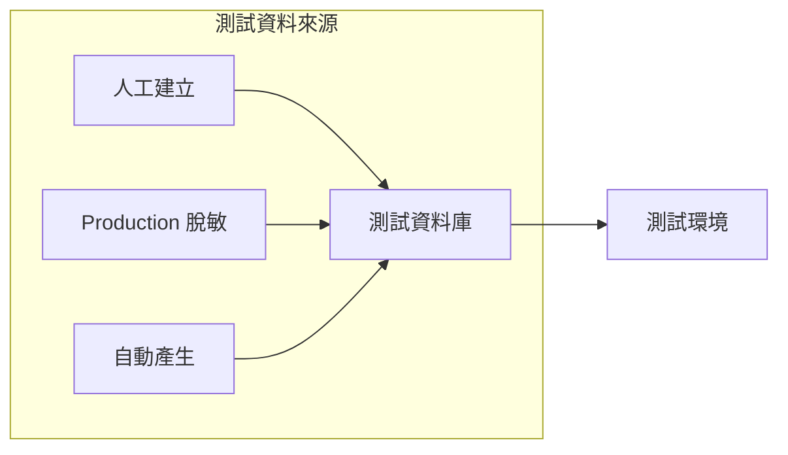
```mermaid
graph LR
    subgraph "測試資料來源"
        A[人工建立] --> D[測試資料庫]
        B[Production 脫敏] --> D
        C[自動產生] --> D
    end
    
    D --> E[測試環境]
```

#### 測試資料規範

```markdown
## 測試資料管理原則

### 1. 資料隔離
- 各測試案例使用獨立資料
- 測試後清理（或使用 @Transactional 自動 Rollback）
- 避免測試間的資料依賴

### 2. 敏感資料處理
- 禁止使用生產環境真實資料
- 個資欄位需脫敏處理
- 使用假資料產生器（Faker）

### 3. 資料版本控制
- 測試資料腳本納入版本控制
- 與程式碼一同維護
- 支援自動化初始化
```

#### 測試資料產生範例

使用 Datafaker 產生假資料（v1.2 版範例使用的 `com.github.javafaker` 自 2020 年後已停止維護，Datafaker 是其後繼專案）。固定亂數種子（seed）可以讓每次產生的資料相同，測試失敗時才能重現：

```java
import java.time.LocalDate;
import java.util.List;
import java.util.Locale;
import java.util.Random;
import java.util.stream.IntStream;
import net.datafaker.Faker;

public final class TestDataFactory {

    // ✅ Locale.forLanguageTag("zh-TW")；❌ new Locale("zh-TW") 會被當成語言代碼 "zh-tw"，且該建構子自 Java 19 起已棄用
    private static final Faker FAKER = new Faker(Locale.forLanguageTag("zh-TW"), new Random(20261006L));

    private TestDataFactory() {
    }

    public static Customer createRandomCustomer() {
        LocalDate birthDate = FAKER.timeAndDate().birthday(20, 70); // 20～70 歲
        return Customer.builder()
            .name(FAKER.name().fullName())
            .email(FAKER.internet().emailAddress())
            .phone(FAKER.phoneNumber().cellPhone())
            .address(FAKER.address().fullAddress())
            .birthDate(birthDate)
            .build();
    }

    public static List<Customer> createRandomCustomers(int count) {
        return IntStream.range(0, count)
            .mapToObj(i -> createRandomCustomer())
            .toList();
    }
}
```

> ⚠️ 若測試環境必須使用由正式資料轉出的資料（例如效能測試需要真實的資料分布），必須（MUST）先依 4.4 的資料分級對照表完成去識別化（遮罩、替換、雜湊），並經資料擁有者核准；去識別化後仍應抽樣檢查，確認沒有遺漏的個資欄位。

### 6.4 缺陷（Bug）管理流程

> 📎 範本：[缺陷報告範本]()

#### Bug 生命週期

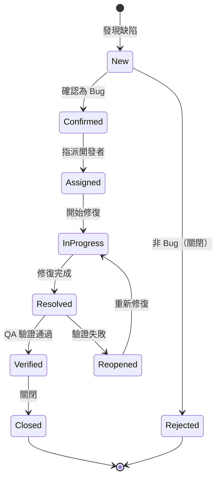
```mermaid
stateDiagram-v2
    [*] --> New: 發現缺陷
    New --> Confirmed: 確認為 Bug
    New --> Rejected: 非 Bug（關閉）
    Confirmed --> Assigned: 指派開發者
    Assigned --> InProgress: 開始修復
    InProgress --> Resolved: 修復完成
    Resolved --> Verified: QA 驗證通過
    Resolved --> Reopened: 驗證失敗
    Reopened --> InProgress: 重新修復
    Verified --> Closed: 關閉
    Rejected --> [*]
    Closed --> [*]
```

#### Bug 嚴重度定義

| 等級 | 名稱 | 定義 | 修復時限 |
|------|------|------|---------|
| **P1** | Critical | 系統無法使用、資料遺失、安全漏洞 | 4 小時內 |
| **P2** | High | 主要功能異常、無替代方案 | 24 小時內 |
| **P3** | Medium | 功能異常但有替代方案 | 本週內 |
| **P4** | Low | 輕微問題、UI 問題 | 下版本 |

#### Bug 報告範本

```markdown
## Bug 標題
[模組名稱] 簡述問題現象

## 環境資訊
- 環境：SIT / UAT / Production
- 版本：v1.2.3
- 瀏覽器：Chrome 120
- 作業系統：Windows 11

## 重現步驟
1. 開啟客戶查詢頁面
2. 輸入客戶 ID: C001
3. 點擊查詢按鈕

## 預期結果
顯示客戶詳細資訊

## 實際結果
顯示錯誤訊息「系統異常，請稍後再試」

## 截圖/日誌
[附上錯誤截圖或相關日誌]

## 影響範圍
- 影響功能：客戶查詢
- 影響用戶：所有使用者
```

> 💡 **實務建議**
>
> 1. 測試覆蓋率目標：核心業務邏輯 ≥ 80%
> 2. 每個 Bug 修復必須附帶對應的測試案例
> 3. 定期檢視測試效能，移除低價值測試
> 4. 重要功能需包含邊界條件與負面測試
>
> 💡 **嚴重度（Severity）與優先序（Priority）不同**：嚴重度描述「影響有多大」，由 QA 判定；優先序描述「多快要修」，由 PO／PM 依業務決定。例如：報表標題打錯字是嚴重度低，但若明天要交給主管機關，優先序就是最高。上表的修復時限是嚴重度的**預設值**，PO 可調整優先序並記錄理由。

### 6.5 測試進入與退出準則

ISO/IEC/IEEE 29119-3 要求測試計畫明確定義「什麼時候可以開始測」（進入準則）與「什麼時候可以停止測」（退出準則）。沒有退出準則，「測完了沒？」就只能憑感覺回答。

| 測試階段 | 進入準則 | 退出準則 |
|---------|---------|---------|
| **SIT** | ① 所有元件已部署到 SIT 環境且健康檢查通過；② 單元與整合測試在 CI 全數通過；③ 冒煙測試（Smoke Test）通過 | ① 計畫內測試案例執行率 100%；② 通過率 ≥ 95%；③ 無未關閉的 P1／P2；④ P3 有處理計畫 |
| **UAT** | ① SIT 退出準則已達成；② UAT 環境資料已準備；③ 使用者已完成操作說明 | ① 業務關鍵情境 100% 通過；② 業務代表簽核 |
| **效能測試** | ① 環境規格與正式環境的差異已記錄；② 測試資料量達正式環境的 ≥ 80% | ① 達成 NFR 中定義的回應時間與吞吐量；② 長時間測試（Soak Test）無記憶體洩漏趨勢 |

**範例：SIT 結束報告的判定段落**

```markdown
## SIT 退出準則判定（2026-10-03）

| 準則 | 目標 | 實際 | 判定 |
|------|------|------|------|
| 測試案例執行率 | 100% | 100%（412/412） | ✅ |
| 通過率 | ≥ 95% | 97.3%（401/412） | ✅ |
| 未關閉 P1/P2 | 0 | 0 | ✅ |
| P3 處理計畫 | 全部有計畫 | 11 件，皆排入 v2.1.1 | ✅ |

結論：達成退出準則，建議進入 UAT。（QA Lead 黃小玲）
```

### 6.6 效能測試

效能測試必須（MUST）以 NFR 為驗收標準，並把標準寫成**工具可自動判定的門檻**，而不是由人看圖判斷。以 k6 為例，`thresholds` 不達標時程式以非零狀態碼結束，CI 可直接判定失敗：

```javascript
// load-test.js：對應 NFR-003「尖峰 200 TPS 下，95% 請求 < 2 秒」
import http from 'k6/http';
import { check } from 'k6';

export const options = {
  scenarios: {
    peak: {
      executor: 'constant-arrival-rate',
      rate: 200,             // 每秒 200 個請求
      timeUnit: '1s',
      duration: '10m',
      preAllocatedVUs: 100,
      maxVUs: 400,
    },
  },
  thresholds: {
    http_req_duration: ['p(95)<2000'],   // NFR-003
    http_req_failed: ['rate<0.01'],      // 錯誤率 < 1%
    checks: ['rate>0.99'],
  },
};

export default function () {
  const res = http.get(`${__ENV.BASE_URL}/api/v1/customers/C000123`);
  check(res, { 'status is 200': (r) => r.status === 200 });
}
```

```bash
k6 run -e BASE_URL=https://perf.example.internal load-test.js
# 任一 threshold 未達成 → 結束狀態碼非 0 → CI 失敗
```

| 測試類型 | 目的 | 典型設定 |
|---------|------|---------|
| Load Test（負載） | 驗證預期尖峰下是否達標 | 尖峰流量，持續 10–30 分鐘 |
| Stress Test（壓力） | 找出系統極限與崩潰方式 | 逐步加壓直到錯誤率明顯上升 |
| Soak Test（耐久） | 找出記憶體洩漏、連線耗盡 | 一般流量，持續 4–24 小時 |
| Spike Test（突波） | 驗證瞬間暴增時的行為 | 數秒內流量放大 5–10 倍 |

> ⚠️ 使用 `constant-arrival-rate`（固定到達率）而不是只設定虛擬使用者數。只設定虛擬使用者數時，系統一變慢，送出的請求數就跟著減少，會掩蓋效能問題。

### 6.7 審查與驗證

**自動檢查**

| 檢查項目 | 工具／指令 | 失敗條件 |
|---------|-----------|---------|
| 單元＋整合測試 | `mvn verify` | 任一測試失敗 |
| 覆蓋率 | JaCoCo `check`、SonarQube New Code 條件 | 低於門檻 |
| 測試有效性 | PIT `mutationCoverage` | mutation score 低於門檻 |
| 效能 | `k6 run`（thresholds） | 任一門檻未達成 |
| 測試與需求對應 | RTM 前向追溯腳本（見 3.7） | 有需求沒有測試 |

**人工審查問題**

1. 每條驗收條件（含例外情境）都有對應的測試嗎？
2. 測試的斷言是依據「需求」寫的，還是依據「目前的實作輸出」寫的？
3. 整合測試使用的資料庫種類與版本是否與正式環境一致？
4. 測試資料是否含真實個資？
5. 退出準則的判定是否有數據佐證，還是只有「已完成」三個字？

**AI 常見錯誤**

- 產生的測試只覆蓋正常流程，沒有邊界值與例外情境。
- 斷言過於寬鬆（例如只檢查 `isNotNull()`），讓錯誤的實作也能通過——用 mutation testing 可以抓出來。
- 為了讓測試通過而修改被測程式的行為，或直接 `@Disabled` 失敗的測試。
- 沿用已停止維護的套件（`com.github.javafaker`）或錯誤的 `new Locale("zh-TW")`。
- 用 H2 代替正式環境的資料庫做整合測試。

---

## 第七章：版本控制與組態管理

### 7.1 Git 分支策略

#### 分支策略選擇

分支策略沒有唯一正解，取決於「多久發布一次」與「是否需要同時維護多個版本」。Git Flow 的作者 Vincent Driessen 在 2020 年也補充說明：持續交付的軟體（例如 Web 應用）應考慮採用更簡單的流程（例如 GitHub Flow），Git Flow 較適合需要明確版本號、同時維護多個版本的軟體。

| 評估面向 | Trunk-Based Development | GitHub Flow | Git Flow |
|---------|------------------------|-------------|----------|
| 長期分支 | 只有 `main` | 只有 `main` | `main` + `develop` |
| 功能分支壽命 | 數小時～1 天 | 數天內 | 可長達數週 |
| 發布頻率 | 每天多次 | 每天～每週 | 每週～每季，依版本 |
| 未完成功能 | 以 Feature Flag 隱藏（見 8.4） | 不合併，或以 Feature Flag 隱藏 | 留在 feature 分支 |
| 同時維護多個版本 | 不適合 | 不適合 | 適合（release／hotfix 分支） |
| 前提條件 | 完整的自動化測試、Feature Flag | CI 與 PR 審查 | 版本管理紀律 |
| 適用情境 | 成熟 DevOps 團隊的 SaaS／內部系統 | 大多數 Web 應用與 API | 套件、App、需定版交付客戶或監理單位的系統 |

> 💡 **建議**：新專案預設採用 GitHub Flow；需要定版交付（例如委外驗收、監理報備）或同時維護多版本時，採用 Git Flow。DORA 研究顯示，短命分支（主幹開發）與更好的交付績效相關。

#### GitHub Flow 分支模型

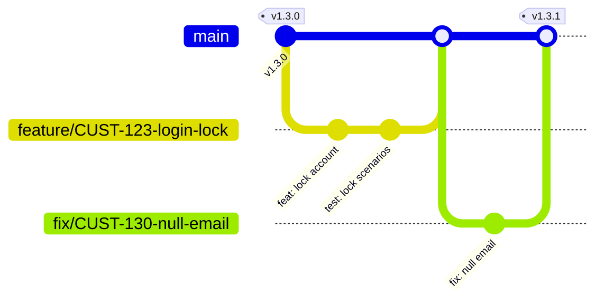
```mermaid
gitGraph
    commit id: "v1.3.0" tag: "v1.3.0"
    branch feature/CUST-123-login-lock
    checkout feature/CUST-123-login-lock
    commit id: "feat: lock account"
    commit id: "test: lock scenarios"
    checkout main
    merge feature/CUST-123-login-lock
    branch fix/CUST-130-null-email
    checkout fix/CUST-130-null-email
    commit id: "fix: null email"
    checkout main
    merge fix/CUST-130-null-email tag: "v1.3.1"
```

規則只有三條：① `main` 隨時可部署；② 所有變更都從 `main` 開短命分支，經 PR 審查與 CI 通過後合併；③ 合併後立即（或依發布節奏）部署。

#### Git Flow 分支模型

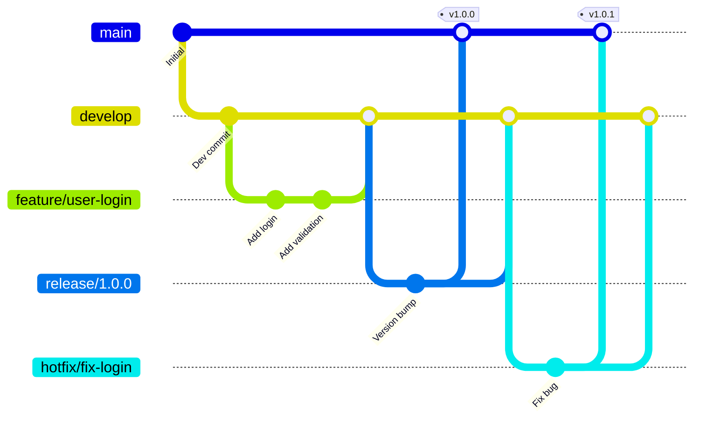
```mermaid
gitGraph
    commit id: "Initial"
    branch develop
    checkout develop
    commit id: "Dev commit"
    branch feature/user-login
    checkout feature/user-login
    commit id: "Add login"
    commit id: "Add validation"
    checkout develop
    merge feature/user-login
    branch release/1.0.0
    checkout release/1.0.0
    commit id: "Version bump"
    checkout main
    merge release/1.0.0 tag: "v1.0.0"
    checkout develop
    merge release/1.0.0
    branch hotfix/fix-login
    checkout hotfix/fix-login
    commit id: "Fix bug"
    checkout main
    merge hotfix/fix-login tag: "v1.0.1"
    checkout develop
    merge hotfix/fix-login
```

#### 分支命名規範

| 分支類型 | 命名格式 | 範例 | 用途 | 適用策略 |
|---------|---------|------|------|---------|
| **主分支** | `main` | main | 生產環境程式碼 | 全部 |
| **開發分支** | `develop` | develop | 開發整合 | Git Flow |
| **功能分支** | `feature/{issue-id}-{description}` | feature/PROJ-123-user-login | 新功能開發 | 全部 |
| **修復分支** | `fix/{issue-id}-{description}` | fix/PROJ-456-fix-null | Bug 修復 | 全部 |
| **熱修復** | `hotfix/{issue-id}-{description}` | hotfix/PROJ-789-security-fix | 生產環境緊急修復 | Git Flow |
| **發布分支** | `release/{version}` | release/1.2.0 | 版本發布準備 | Git Flow |

> 分支名稱必須（MUST）包含工作項目編號，CI 可用正規表示式 `^(feature|fix|hotfix)/[A-Z]+-[0-9]+-[a-z0-9-]+$|^release/[0-9]+\.[0-9]+\.[0-9]+$` 檢查。

#### Commit Message 規範（Conventional Commits 1.0.0）

Commit Message 採用 Conventional Commits 1.0.0 規格。結構化的訊息可以自動產生 CHANGELOG、自動判斷下一個版號（`feat` → MINOR、`fix` → PATCH、`BREAKING CHANGE` → MAJOR）。

```text
<type>[(scope)][!]: <description>

[body]

[footer(s)]
```

| type | 用途 | 對版號的影響 |
|------|------|------------|
| `feat` | 新功能 | MINOR |
| `fix` | Bug 修復 | PATCH |
| `docs` | 文件 | 無 |
| `style` | 格式調整（不影響邏輯） | 無 |
| `refactor` | 重構（非新功能也非修 Bug） | 無 |
| `perf` | 效能改善 | PATCH |
| `test` | 測試 | 無 |
| `build` | 建置系統、依賴套件 | 無 |
| `ci` | CI 設定 | 無 |
| `chore` | 其他雜項 | 無 |
| `revert` | 還原先前的 commit | 視還原內容 |

> `feat` 與 `fix` 是 Conventional Commits 規格本身定義的類型，其餘類型來自業界慣例（`@commitlint/config-conventional`）。任何類型加上 `!` 或 footer 中出現 `BREAKING CHANGE:`，都代表不相容變更（MAJOR）。

**範例**：

```text
feat(customer): 新增客戶查詢分頁功能

- 支援 cursor 分頁，單頁上限 100 筆
- 新增 pageSize 超過上限的 400 錯誤

Refs: CUST-1234
```

```text
feat(api)!: 客戶查詢回應移除 success/data 信封格式

BREAKING CHANGE: GET /api/v1/customers/{id} 改為直接回傳客戶物件，
錯誤改為 RFC 9457 Problem Details。消費端需改用 /api/v2。

Refs: CUST-1301
```

**用 commitlint 自動檢查**：

```javascript
// commitlint.config.mjs
import createPreset from 'conventional-changelog-conventionalcommits';

// 沿用 config-conventional 的解析規則（支援 feat!: 與 BREAKING CHANGE），只增加工作項目編號前綴
const { parser } = await createPreset();

export default {
  extends: ['@commitlint/config-conventional'],
  parserPreset: {
    parserOpts: { ...parser, issuePrefixes: ['CUST-', 'PROJ-'] },
  },
  rules: {
    // 公司規則：必須引用工作項目編號（例：Refs: CUST-1234）
    'references-empty': [2, 'never'],
  },
};
```

> ⚠️ 不要只寫 `parserPreset: { parserOpts: { issuePrefixes: [...] } }`：這會**取代** config-conventional 的解析規則，導致 `feat(api)!:` 這類不相容變更的標題被誤判為「type／subject 為空」。上面的寫法先取得原本的解析規則，再加上自訂前綴。（以 commitlint 21.2.3、conventional-changelog-conventionalcommits 10.4.1 驗證）

```bash
npm install --save-dev @commitlint/cli @commitlint/config-conventional conventional-changelog-conventionalcommits

printf 'feat(customer): 新增查詢\n\nRefs: CUST-1234\n' | npx commitlint          # 通過
printf 'feat(api)!: 移除信封格式\n\nBREAKING CHANGE: 改為直接回傳物件\n\nRefs: CUST-1301\n' | npx commitlint  # 通過
printf 'update code\n' | npx commitlint                                        # 失敗：type-empty、subject-empty、references-empty
printf 'feat(customer): 新增查詢\n' | npx commitlint                            # 失敗：references-empty
printf 'feature(customer): 新增查詢\n\nRefs: CUST-1\n' | npx commitlint         # 失敗：type-enum
```

#### Pull Request 與程式碼審查規則

| 規則 | 規範 | 理由 |
|------|------|------|
| `main` 禁止直接推送，所有變更經 PR | 必須 | 確保每個變更都經過審查與 CI |
| PR 至少 1 位 Reviewer 核准（風險 L1 專案 2 位） | 必須 | 四眼原則 |
| 作者不得核准自己的 PR；最後一次推送後需重新核准 | 必須 | 防止審查後再偷改 |
| CI 必要檢查全數通過才能合併 | 必須 | 見 8.1 |
| 以 `CODEOWNERS` 指定模組負責人自動成為 Reviewer | 應 | 確保懂該模組的人審查 |
| 單一 PR 變更 ≤ 400 行（不含自動產生的檔案） | 應 | 研究與實務都顯示，變更越大審查品質越差 |
| 所有審查意見需回覆或解決後才能合併 | 應 | 避免意見被忽略 |
| Commit 需簽章（GPG／SSH／S/MIME） | 得（L1 專案應） | 確認提交者身分 |

**GitHub 設定方式**：在 Repository 的 *Settings → Rules → Rulesets* 建立針對預設分支的規則集，啟用 *Restrict deletions*、*Block force pushes*、*Require a pull request before merging*（設定核准人數、*Dismiss stale pull request approvals when new commits are pushed*、*Require approval of the most recent reviewable push*、*Require review from Code Owners*、*Require conversation resolution before merging*）、*Require status checks to pass*。GitLab 對應功能為 *Protected branches* 與 *Merge request approvals*。

```text
# .github/CODEOWNERS：路徑 → 負責人（後面的規則優先）
*                         @company/backend-team
/src/main/resources/db/   @company/dba-team
/.github/workflows/       @company/devops-team
/src/**/security/         @company/security-team
```

**Code Review Checklist**（完整版見附錄 A.3；AI 產出另見 A.5）：

```markdown
## Code Review Checklist

### 功能正確性
- [ ] 程式碼符合需求規格與驗收條件
- [ ] 邊界條件處理完整
- [ ] 錯誤處理適當（例外時預設拒絕）

### 程式碼品質
- [ ] 命名清楚有意義
- [ ] 程式碼簡潔易讀
- [ ] 沒有重複程式碼
- [ ] 適當的註解（說明「為什麼」）

### 測試
- [ ] 包含單元測試
- [ ] 測試覆蓋重要邏輯與例外情境
- [ ] 測試斷言依據需求，而非抄寫實作輸出

### 安全性
- [ ] 輸入驗證完整
- [ ] 無硬編碼敏感資訊
- [ ] 伺服器端權限檢查正確

### 效能
- [ ] 無明顯效能問題（N+1 查詢、迴圈內呼叫外部服務）
- [ ] 資料庫查詢有適當索引
- [ ] 資源正確釋放
```

### 7.2 版號管理原則

#### 語意化版本（Semantic Versioning）

```text
MAJOR.MINOR.PATCH[-PRERELEASE][+BUILD]

範例：
1.0.0          # 正式版
1.0.1          # Patch 更新（Bug 修復）
1.1.0          # Minor 更新（新功能，向下相容）
2.0.0          # Major 更新（重大變更，不向下相容）
1.0.0-alpha.1  # 預發布版本
1.0.0-rc.1     # Release Candidate
1.0.0+20260205 # 包含建置資訊
```

#### 版號變更規則

| 變更類型 | 版號變動 | 範例 |
|---------|---------|------|
| Bug 修復（向下相容） | PATCH +1 | 1.0.0 → 1.0.1 |
| 新功能（向下相容） | MINOR +1, PATCH = 0 | 1.0.1 → 1.1.0 |
| 重大變更（不向下相容） | MAJOR +1, MINOR = 0, PATCH = 0 | 1.1.0 → 2.0.0 |

**SemVer 2.0.0 容易誤解的規則**：

| 規則 | 說明 |
|------|------|
| 版本優先順序 | `1.0.0-alpha < 1.0.0-alpha.1 < 1.0.0-beta < 1.0.0-rc.1 < 1.0.0` |
| 建置資訊不影響優先順序 | `1.0.0+20260205` 與 `1.0.0+20260301` 的優先順序相同 |
| `0.y.z` 代表初期開發 | 任何變動都可能不相容，公開 API 穩定後才發布 `1.0.0` |
| 已發布的版本不得修改 | 發現問題要發布新版本，不得覆蓋同一個版號（Git tag 同理，不得移動） |

> 💡 「是否不相容」的判斷以**對外 API 契約**為準（4.3 的版本策略表）。內部重構即使改動很大，只要對外行為不變，就是 PATCH 或 MINOR。

### 7.3 設定檔與環境管理

#### 環境分類

```mermaid
graph LR
    DEV[DEV<br/>開發環境] --> SIT[SIT<br/>系統整合測試]
    SIT --> UAT[UAT<br/>用戶驗收測試]
    UAT --> STG[STG<br/>預生產環境]
    STG --> PRD[PRD<br/>生產環境]
```

#### 設定檔管理原則

遵循 12-Factor App 的「設定與程式碼分離」：同一個建置產出物（Artifact）部署到所有環境，環境差異只來自設定。**禁止（MUST NOT）為不同環境各自建置一次。**

以 Spring Boot 為例，共用設定與各環境設定可寫在同一個 `application.yml`，以 `---` 分隔文件、以 `spring.config.activate.on-profile` 指定適用環境：

```yaml
# application.yml
spring:
  application:
    name: customer-service
management:
  endpoints:
    web:
      exposure:
        include: health,info,prometheus   # 只公開必要的管理端點
---
spring:
  config:
    activate:
      on-profile: dev
  datasource:
    url: jdbc:postgresql://localhost:5432/dev_db
    username: dev_user
    password: ${DB_PASSWORD}             # 開發環境也不寫死密碼
logging:
  level:
    root: INFO
    com.company: DEBUG
---
spring:
  config:
    activate:
      on-profile: prd
  datasource:
    url: ${DB_URL}                       # 從環境變數或 Secret 注入
    username: ${DB_USERNAME}
    password: ${DB_PASSWORD}
logging:
  level:
    root: INFO
    com.company: INFO
```

> ⚠️ v1.2 版範例把三個檔案的內容寫在同一個 YAML 區塊中，`spring:` 鍵重複出現，複製使用時後面的設定會覆蓋前面的設定（或被解析器拒絕）。另外移除了 `spring.jackson.date-format: yyyy-MM-dd HH:mm:ss`：此格式不含時區，與 4.3「時間一律 ISO 8601 含時區」的規則衝突。

#### 敏感設定管理

```markdown
## 敏感設定禁止事項

❌ 禁止將以下資訊放入版本控制：
- 資料庫密碼
- API Key / Secret
- 私鑰 / 憑證
- 加密金鑰

## 建議方案

✅ 環境變數
- 透過 CI/CD 工具注入
- K8s Secrets（需啟用 etcd 加密，或搭配 External Secrets Operator）

✅ 設定中心／金鑰管理
- HashiCorp Vault
- AWS Secrets Manager、Azure Key Vault、GCP Secret Manager
- Spring Cloud Config（敏感值仍應存放於 Vault 等後端）

✅ 設定檔範本
- 提供 application-prd.yml.template
- 實際設定檔加入 .gitignore
```

> 💡 **實務建議**
>
> 1. 每個環境使用獨立的資料庫與外部服務
> 2. 生產環境設定變更需經過審核流程
> 3. 定期輪換敏感設定（密碼、金鑰）
> 4. 保留設定變更歷史記錄

### 7.4 機密資訊（Secrets）防護

GitHub 每年的公開報告都顯示，被提交到 Repository 的金鑰數量持續增加；外洩的金鑰通常在幾分鐘內就會被自動化工具找到並濫用。防護必須多層：

| 層級 | 作法 | 工具 |
|------|------|------|
| 開發者電腦 | 提交前掃描 | gitleaks（pre-commit hook） |
| Repository | 推送時阻擋 | GitHub Secret Protection（Push Protection）、GitLab Secret Detection |
| CI | 每次 PR 掃描完整差異 | gitleaks、TruffleHog |
| 執行環境 | 不在映像檔與設定檔中存放機密 | Vault、雲端 Secret Manager、K8s Secret + 加密 |

**gitleaks 設定範例**（在內建規則外加上公司內部的 Token 格式）：

```toml
# .gitleaks.toml
title = "company gitleaks config"

[extend]
useDefault = true

[[rules]]
id = "company-internal-api-token"
description = "公司內部 API Token（格式：cmp_ 開頭 + 32 位英數字）"
regex = '''cmp_[A-Za-z0-9]{32}'''
keywords = ["cmp_"]

[allowlist]
description = "測試用的假資料"
paths = ['''src/test/resources/fixtures/.*''']
```

```bash
gitleaks git --config .gitleaks.toml --redact -v     # 掃描整個 Git 歷史
gitleaks dir --config .gitleaks.toml --redact .      # 掃描目前的檔案
```

**金鑰外洩時的處理順序**（順序很重要）：

1. **立即撤銷並輪換**該金鑰——這是唯一真正有效的步驟。
2. 檢查存取日誌，確認金鑰被提交後是否有異常使用。
3. 依事件管理流程通報（見 10.3）。
4. 從 Git 歷史移除（`git filter-repo`）只是收尾，**不能**取代輪換：金鑰一旦推送到遠端，就應視為已外洩。

### 7.5 審查與驗證

**自動檢查**

| 檢查項目 | 工具／指令 | 失敗條件 |
|---------|-----------|---------|
| Commit Message 格式 | `npx commitlint --from origin/main` | 任何違規 |
| 分支名稱 | CI 以正規表示式檢查 | 不符合命名規範 |
| 分支保護設定 | `gh api repos/{owner}/{repo}/rulesets` 定期稽核 | 規則被關閉或例外過多 |
| 機密資訊 | `gitleaks git --redact` | 發現任何機密 |
| 設定檔語法 | `yamllint`；Spring Boot 啟動測試 | 解析失敗或啟動失敗 |

**人工審查問題**

1. 團隊選擇的分支策略與實際發布頻率相符嗎？是否有存活超過兩週的功能分支？
2. 不相容變更是否確實標示 `!` 或 `BREAKING CHANGE`，並升主版號？
3. 有沒有人擁有繞過分支保護的權限？例外是否有紀錄？
4. 設定檔中是否仍有寫死的密碼、內部 IP 或正式環境網址？

**AI 常見錯誤**

- 產生的 Commit Message 只有 `update`、`fix bug`，或 type 不在允許清單內。
- 把多個環境的設定寫在同一個 YAML 區塊且鍵重複，或在範例中寫死密碼。
- 建議以 `git filter-repo` 清除外洩金鑰，卻沒有先輪換金鑰。
- 把 Git Flow 當成唯一正確的分支策略。

---

## 第八章：CI/CD 與部署流程

### 8.1 自動化建置流程

#### CI/CD Pipeline 概覽

```mermaid
graph LR
    subgraph "CI - 持續整合"
        A[Code Commit] --> B[Build]
        B --> C[Unit Test]
        C --> D[Code Analysis]
        D --> E[Security Scan]
        E --> F[Package]
    end
    
    subgraph "CD - 持續部署"
        F --> G[Deploy to DEV]
        G --> H[Integration Test]
        H --> I[Deploy to SIT]
        I --> J[System Test]
        J --> K[Deploy to UAT]
        K --> L[Approval]
        L --> M[Deploy to PRD]
    end
    
    style A fill:#e3f2fd
    style F fill:#fff9c4
    style M fill:#c8e6c9
```

#### Pipeline 安全原則

Pipeline 本身就是攻擊目標：它擁有原始碼、金鑰與正式環境的部署權限。OWASP Top 10:2025 新增的 A03（軟體供應鏈失效）與 A08（軟體或資料完整性失效）都與 CI/CD 直接相關。

| # | 原則 | 規範 | 說明 |
|---|------|------|------|
| 1 | 第三方 Action 以完整 commit SHA 固定版本 | 必須 | tag 可以被移動。2025-03 的 `tj-actions/changed-files`（CVE-2025-30066）與 2026-03 的 `aquasecurity/trivy-action`（CVE-2026-33634，75 個 tag 被強制改寫）事件中，只有以 SHA 固定版本的使用者不受影響 |
| 2 | `GITHUB_TOKEN` 預設唯讀，各 Job 只加需要的權限 | 必須 | 在 workflow 層級設定 `permissions: contents: read` |
| 3 | 雲端與套件庫認證優先使用 OIDC 短效憑證 | 應 | 避免在 Secrets 中存放長效金鑰 |
| 4 | 正式環境部署需人工核准 | 必須 | GitHub Environments 的 *Required reviewers* |
| 5 | 部署以映像檔 digest（`@sha256:...`）而非 tag | 必須 | tag 可變、digest 不可變；確保部署的就是被掃描與核准的映像檔 |
| 6 | 產生 SBOM 與建置來源證明（Provenance） | 應（L1 專案必須） | 對應 SLSA Build Level 2 以上，見 9.4 |
| 7 | 用 Dependabot／Renovate 自動更新 Action 的 SHA | 應 | 固定版本不等於不更新 |

#### GitHub Actions Pipeline 範例

以下範例已用 `actionlint` 1.7.12 檢查通過，Action 版本為 2026-10-06 查證的最新版。

```yaml
# .github/workflows/ci-cd.yml
name: CI/CD Pipeline

on:
  push:
    branches: [main]
  pull_request:
    branches: [main]

# 原則 2：預設唯讀，各 Job 再個別加權限
permissions:
  contents: read

# 同一個 PR 有新推送時，取消舊的執行
concurrency:
  group: ${{ github.workflow }}-${{ github.ref }}
  cancel-in-progress: ${{ github.event_name == 'pull_request' }}

env:
  JAVA_VERSION: '25'
  IMAGE: ghcr.io/${{ github.repository_owner }}/customer-service

jobs:
  build:
    name: Build & Test
    runs-on: ubuntu-latest
    steps:
      # 原則 1：以 commit SHA 固定版本，註解標示對應的 tag 方便人閱讀與自動更新
      - uses: actions/checkout@3d3c42e5aac5ba805825da76410c181273ba90b1 # v7.0.1
        with:
          fetch-depth: 0            # SonarQube 需要完整歷史以判斷 New Code
          persist-credentials: false

      - uses: actions/setup-java@de7274f081f381c8f8158605e0321c36c376e2e6 # v6.0.1
        with:
          java-version: ${{ env.JAVA_VERSION }}
          distribution: temurin
          cache: maven

      # 一個指令完成：格式檢查、靜態分析、單元與整合測試（Testcontainers）、JaCoCo 覆蓋率門檻
      - name: Build and verify
        run: mvn -B verify

      - name: SonarQube analysis
        env:
          SONAR_TOKEN: ${{ secrets.SONAR_TOKEN }}       # ❌ 不再使用已棄用的 -Dsonar.login
          SONAR_HOST_URL: ${{ vars.SONAR_HOST_URL }}
        run: mvn -B sonar:sonar -Dsonar.projectKey=customer-service -Dsonar.qualitygate.wait=true

      - name: Upload test results
        if: always()
        uses: actions/upload-artifact@043fb46d1a93c77aae656e7c1c64a875d1fc6a0a # v7.0.1
        with:
          name: test-results
          path: target/surefire-reports/

      - name: Upload application jar
        uses: actions/upload-artifact@043fb46d1a93c77aae656e7c1c64a875d1fc6a0a # v7.0.1
        with:
          name: app-jar
          path: target/*.jar

  security-scan:
    name: Security Scan
    runs-on: ubuntu-latest
    steps:
      - uses: actions/checkout@3d3c42e5aac5ba805825da76410c181273ba90b1 # v7.0.1
        with:
          fetch-depth: 0            # gitleaks 需要掃描完整歷史
          persist-credentials: false

      - name: Secrets scan (gitleaks)
        run: |
          docker run --rm -v "$PWD:/repo" ghcr.io/gitleaks/gitleaks:v8.30.1 \
            git /repo --redact --exit-code 1

      - name: Dependency review (PR only)
        if: github.event_name == 'pull_request'
        uses: actions/dependency-review-action@a1d282b36b6f3519aa1f3fc636f609c47dddb294 # v5.0.0
        with:
          fail-on-severity: high

      - uses: actions/setup-java@de7274f081f381c8f8158605e0321c36c376e2e6 # v6.0.1
        with:
          java-version: ${{ env.JAVA_VERSION }}
          distribution: temurin
          cache: maven

      - name: SCA (OWASP Dependency-Check)
        env:
          NVD_API_KEY: ${{ secrets.NVD_API_KEY }}
        run: mvn -B org.owasp:dependency-check-maven:13.0.0:check -DfailBuildOnCVSS=7 -DnvdApiKey="$NVD_API_KEY"

  image:
    name: Build, Scan & Attest Image
    needs: [build, security-scan]
    if: github.event_name == 'push' && github.ref == 'refs/heads/main'
    runs-on: ubuntu-latest
    permissions:
      contents: read
      packages: write         # 推送映像檔到 GHCR
      id-token: write         # OIDC：建置來源證明（Sigstore）
      attestations: write
    outputs:
      digest: ${{ steps.push.outputs.digest }}
    steps:
      - uses: actions/checkout@3d3c42e5aac5ba805825da76410c181273ba90b1 # v7.0.1
        with:
          persist-credentials: false

      - uses: actions/download-artifact@3e5f45b2cfb9172054b4087a40e8e0b5a5461e7c # v8.0.1
        with:
          name: app-jar
          path: target/

      - uses: docker/setup-buildx-action@f87e5991a6d7451dcb8d9637bfbc97413f497069 # v4.4.1

      - uses: docker/login-action@dbcb813823bdd20940b903addbd779551569679f # v4.6.0
        with:
          registry: ghcr.io
          username: ${{ github.actor }}
          password: ${{ secrets.GITHUB_TOKEN }}

      - name: Build and push
        id: push
        uses: docker/build-push-action@c3c9e263c25d99ce0380d002d59b67737d91b0dc # v7.4.0
        with:
          context: .
          push: true
          tags: ${{ env.IMAGE }}:${{ github.sha }}

      - name: Image vulnerability scan (Trivy)
        uses: aquasecurity/trivy-action@ed142fd0673e97e23eac54620cfb913e5ce36c25 # v0.36.0
        with:
          image-ref: ${{ env.IMAGE }}@${{ steps.push.outputs.digest }}
          version: v0.75.0          # 同時固定 Trivy 本體版本
          severity: CRITICAL,HIGH
          ignore-unfixed: true
          exit-code: '1'

      - name: Generate SBOM (CycloneDX)
        uses: anchore/sbom-action@66cbf4bc1f1c0d2edc94016e65bc221b6bb0ad6c # v0.24.3
        with:
          image: ${{ env.IMAGE }}@${{ steps.push.outputs.digest }}
          format: cyclonedx-json
          output-file: sbom.cdx.json

      - name: Attest build provenance (SLSA)
        uses: actions/attest-build-provenance@4d101475d8b20a2381f78447822ac1eab6504dd8 # v4.2.2
        with:
          subject-name: ${{ env.IMAGE }}
          subject-digest: ${{ steps.push.outputs.digest }}
          push-to-registry: true

  deploy-dev:
    name: Deploy to DEV
    needs: image
    runs-on: ubuntu-latest
    environment: development
    steps:
      - uses: azure/setup-kubectl@829323503d1be3d00ca8346e5391ca0b07a9ab0d # v5.1.0

      - name: Deploy by digest
        env:
          KUBECONFIG_DATA: ${{ secrets.DEV_KUBECONFIG }}
          DIGEST: ${{ needs.image.outputs.digest }}
        run: |
          echo "$KUBECONFIG_DATA" > "$RUNNER_TEMP/kubeconfig"
          export KUBECONFIG="$RUNNER_TEMP/kubeconfig"
          kubectl set image deployment/customer-service \
            customer-service="${IMAGE}@${DIGEST}" -n development
          kubectl rollout status deployment/customer-service -n development --timeout=5m

  deploy-production:
    name: Deploy to Production
    needs: [image, deploy-dev]
    runs-on: ubuntu-latest
    environment: production   # 原則 4：在 Environment 設定 Required reviewers，核准後才會執行
    steps:
      - name: Verify provenance before deploy
        env:
          GH_TOKEN: ${{ github.token }}
          DIGEST: ${{ needs.image.outputs.digest }}
        run: gh attestation verify "oci://${IMAGE}@${DIGEST}" --owner "${{ github.repository_owner }}"

      # ... 其餘步驟同 deploy-dev，改用正式環境的 kubeconfig 與 namespace
```

**這個 Pipeline 如何對應前面各章的要求**：

| 要求 | 對應的 Job／Step |
|------|----------------|
| 格式、靜態分析、測試、覆蓋率（5.1、6.1） | `build` → `mvn -B verify` |
| 品質閘門（2.4 DoD） | `build` → `sonar:sonar -Dsonar.qualitygate.wait=true`，品質閘門未通過即失敗 |
| Secrets 掃描（7.4） | `security-scan` → gitleaks |
| SCA（9.2） | `security-scan` → Dependency Review、OWASP Dependency-Check |
| 映像檔弱點掃描、SBOM、Provenance（9.4） | `image` |
| 正式環境人工核准（2.4 G3） | `deploy-production` 的 `environment: production` |

**本機驗證 workflow 語法**：

```bash
# 下載 actionlint（Windows／Linux／macOS 皆有預先編譯版本）後執行
actionlint .github/workflows/ci-cd.yml
# 沒有輸出代表通過；常見錯誤如表達式拼錯、needs 引用不存在的 job、未定義的 output 都會被抓出
```

> 💡 **GitLab CI 對應**：`permissions` 對應 *CI/CD job token* 的存取範圍設定；`environment` 的人工核准對應 *Protected environments* 的 *Required approvals*；`include: template: Jobs/SAST.gitlab-ci.yml`、`Jobs/Secret-Detection.gitlab-ci.yml`、`Jobs/Dependency-Scanning.gitlab-ci.yml` 提供 SAST、Secrets 與依賴掃描；OIDC 使用 `id_tokens` 關鍵字。

### 8.2 部署策略

#### 常見部署策略比較

| 策略 | 說明 | 優點 | 缺點 | 適用場景 |
|------|------|------|------|---------|
| **Rolling** | 逐步替換舊版本 | 零停機、資源效率高 | 回滾較慢 | 一般應用 |
| **Blue-Green** | 兩套環境切換 | 快速回滾 | 資源成本高 | 重要系統 |
| **Canary** | 小比例流量測試 | 風險低 | 複雜度高 | 高風險變更 |
| **Recreate** | 停機後更新 | 簡單 | 有停機時間 | 非關鍵系統 |

#### Blue-Green 部署流程

```mermaid
flowchart LR
    subgraph S1["階段 1：準備新版本"]
        LB1[Load Balancer] -->|100% 流量| B1[Blue 現行版本]
        G1[Green 新版本] -.- T1[部署並執行冒煙測試]
    end
    subgraph S2["階段 2：切換流量"]
        LB2[Load Balancer] -->|100% 流量| G2[Green 新版本]
        B2[Blue] -.- W2[待命，作為回滾備用]
    end
    subgraph S3["階段 3：確認穩定"]
        G3[Green] -.- M3[監控 15–30 分鐘]
        B3[Blue] -.- D3[確認無問題後下線]
    end
    S1 --> S2 --> S3
```

> ⚠️ Blue-Green 切換的前提是**新舊版本可共用同一個資料庫**。若新版本包含不相容的 Schema 變更，必須先以 Expand／Contract（見 4.4）拆成多次部署，否則切回 Blue 時舊程式會無法運作。

#### Canary 部署流程

```mermaid
graph LR
    subgraph "Canary 部署階段"
        A[5% 流量<br/>新版本] --> B[25% 流量<br/>新版本]
        B --> C[50% 流量<br/>新版本]
        C --> D[100% 流量<br/>新版本]
    end
    
    A -->|監控正常| B
    B -->|監控正常| C
    C -->|監控正常| D
    
    A -->|異常| E[回滾]
    B -->|異常| E
    C -->|異常| E
```

### 8.3 回滾與風險控管

#### 回滾策略

```markdown
## 自動回滾觸發條件

1. **健康檢查失敗**
   - Pod 連續 3 次 Readiness Probe 失敗
   - 錯誤率超過閾值（> 5%）

2. **效能指標異常**
   - 回應時間超過 SLA（P95 > 2s）
   - CPU/Memory 使用率異常飆升

3. **業務指標異常**
   - 交易成功率下降
   - 關鍵 API 錯誤率上升
```

#### Kubernetes 回滾指令

```bash
# 查看部署歷史
kubectl rollout history deployment/customer-service -n production

# 回滾到上一版本
kubectl rollout undo deployment/customer-service -n production

# 回滾到指定版本
kubectl rollout undo deployment/customer-service -n production --to-revision=3

# 查看回滾狀態
kubectl rollout status deployment/customer-service -n production
```

#### 部署風險檢核清單

```markdown
## 部署前檢核

### 程式碼品質
- [ ] 所有測試通過
- [ ] Code Review 完成
- [ ] 靜態分析無重大問題
- [ ] 弱點掃描通過

### 環境準備
- [ ] 資料庫 Migration 已準備
- [ ] 設定檔已更新
- [ ] 相依服務已就緒
- [ ] 監控告警已設定

### 部署計畫
- [ ] 部署時間已排定
- [ ] 相關人員已通知
- [ ] 回滾計畫已準備
- [ ] 緊急聯絡人已確認

## 部署後驗證

- [ ] 健康檢查通過
- [ ] 冒煙測試通過
- [ ] 關鍵指標正常
- [ ] 日誌無異常錯誤
```

> ⚠️ **實務注意事項**
>
> 1. 生產環境部署需在低峰時段執行
> 2. 重大變更需準備詳細回滾計畫
> 3. 部署後持續監控至少 30 分鐘
> 4. 保留至少 3 個可回滾版本

#### 回滾的限制

| 情境 | `kubectl rollout undo` 是否足夠 | 正確作法 |
|------|------------------------------|---------|
| 只有程式碼變更 | ✅ | 回滾 Deployment 即可 |
| 包含 ConfigMap／Secret 變更 | ❌ `rollout undo` 不會還原 ConfigMap | 設定以版本化名稱（例如 `app-config-v42`）管理，或透過 GitOps 回滾 |
| 包含資料庫 Schema 變更 | ❌ 程式回滾後可能無法讀新 Schema | 事前採 Expand／Contract；回滾腳本需事先演練 |
| 採用 GitOps（Argo CD／Flux） | ❌ 直接改叢集會被自動同步覆蓋 | 在 Git 中 `git revert` 部署設定的 commit，由 GitOps 工具同步 |
| 已寫入新格式的資料、已發出的通知 | ❌ 無法回滾 | 改用「向前修復（Roll Forward）」+ Feature Flag 關閉功能 |

### 8.4 Feature Flag 與漸進式交付

> 📎 範本：[Feature Flag 登記表範本]()

Feature Flag（功能開關）把「部署」與「發布」分開：程式碼可以先部署到正式環境但不啟用，再依使用者群組逐步開放；出問題時關閉開關即可，不需要重新部署。

#### OpenFeature 範例

OpenFeature 是 CNCF 的廠商中立 Feature Flag API 標準。程式只依賴 OpenFeature API，後端（LaunchDarkly、Flagsmith、Unleash、flagd 或自建）可以替換：

```java
import dev.openfeature.sdk.Client;
import dev.openfeature.sdk.MutableContext;
import dev.openfeature.sdk.OpenFeatureAPI;

public class TransferService {

    private final Client flags = OpenFeatureAPI.getInstance().getClient("transfer-service");

    public TransferResult transfer(TransferRequest request) {
        MutableContext ctx = new MutableContext(request.customerId());
        ctx.add("branch", request.branchCode());

        // 旗標評估失敗（例如旗標服務斷線）時回傳預設值 false：預設走舊流程，符合「預設安全」原則
        if (flags.getBooleanValue("new-transfer-limit-check", false, ctx)) {
            return transferWithNewLimitCheck(request);
        }
        return transferWithLegacyLimitCheck(request);
    }
}
```

#### Feature Flag 管理規則

| 規則 | 規範 | 理由 |
|------|------|------|
| 每個旗標有擁有者與預計移除日期 | 必須 | 旗標是技術債；長期不清理的旗標會讓程式出現無法測試的組合 |
| 預設值必須是「安全」的行為（通常是舊流程） | 必須 | 旗標服務故障時不應啟用未完成的功能 |
| 發布型旗標在功能全面開放後 30 天內移除 | 應 | 避免旗標累積 |
| 正式環境的旗標變更需留稽核紀錄 | 必須 | 旗標變更等同於上線，需能追溯誰在何時開放了什麼 |
| 測試需涵蓋旗標開啟與關閉兩種狀態 | 必須 | 兩條路徑都可能在正式環境執行 |

#### 漸進式交付（Progressive Delivery）

漸進式交付把 8.2 的 Canary 自動化：每個階段由監控指標自動判斷是否繼續，指標異常時自動回滾，不需要人盯著儀表板。以 Argo Rollouts 為例：

```yaml
apiVersion: argoproj.io/v1alpha1
kind: Rollout
metadata:
  name: customer-service
spec:
  replicas: 10
  selector:
    matchLabels:
      app: customer-service
  template:
    metadata:
      labels:
        app: customer-service
    spec:
      containers:
        - name: customer-service
          image: ghcr.io/company/customer-service@sha256:0123456789abcdef0123456789abcdef0123456789abcdef0123456789abcdef
  strategy:
    canary:
      steps:
        - setWeight: 5
        - pause: { duration: 10m }
        - analysis:
            templates:
              - templateName: error-rate-below-1pct
        - setWeight: 25
        - pause: { duration: 10m }
        - setWeight: 50
        - pause: { duration: 10m }
---
apiVersion: argoproj.io/v1alpha1
kind: AnalysisTemplate
metadata:
  name: error-rate-below-1pct
spec:
  metrics:
    - name: error-rate
      interval: 1m
      count: 5
      failureLimit: 1                         # 5 次量測中失敗超過 1 次即中止並自動回滾
      successCondition: result[0] < 0.01
      provider:
        prometheus:
          address: http://prometheus.monitoring:9090
          query: |
            sum(rate(http_server_requests_seconds_count{app="customer-service",status=~"5.."}[2m]))
            /
            sum(rate(http_server_requests_seconds_count{app="customer-service"}[2m]))
```

### 8.5 審查與驗證

**自動檢查**

| 檢查項目 | 工具／指令 | 失敗條件 |
|---------|-----------|---------|
| Workflow 語法與表達式 | `actionlint .github/workflows/*.yml` | 任何錯誤 |
| Action 未以 SHA 固定 | `grep -nE "uses: [^ ]+@(v[0-9]+[^ ]*\|main\|master)\s*$" .github/workflows/*.yml` | 有輸出（未加 SHA 的 tag 或分支） |
| K8s manifest 結構 | `kubeconform -strict -summary deploy/*.yaml`（CRD 需另外提供 schema） | 驗證失敗 |
| 映像檔來源證明 | `gh attestation verify oci://IMAGE@DIGEST --owner ORG` | 驗證失敗 |
| 部署後健康狀態 | `kubectl rollout status --timeout=5m` | 逾時 |

**人工審查問題**

1. 每個 Job 的 `permissions` 是否只有必要的權限？有沒有 Job 在不需要時取得 `id-token: write` 或 `contents: write`？
2. `pull_request_target` 或 `workflow_run` 觸發的 workflow，是否會執行來自 fork 的程式碼？（這是 Pipeline 被入侵最常見的路徑）
3. 正式環境部署是否有人工核准，核准者是否與 PR 作者不同？
4. 部署的是 digest 還是可變的 tag？
5. 回滾計畫是否涵蓋設定與資料庫，而不只是程式？
6. Feature Flag 有沒有擁有者與移除日期？

**AI 常見錯誤**

- 使用 `@main`、`@master` 或只寫 `@v4` 引用第三方 Action，且版本過舊。
- 省略 `permissions`，讓 `GITHUB_TOKEN` 使用預設（可能是讀寫）權限。
- 使用已棄用的參數（例如 `-Dsonar.login`），或已停止維護的 Action（例如 2021 年後未再發版的 `dependency-check/Dependency-Check_Action`）。
- 在 `run:` 中直接嵌入 `${{ github.event.pull_request.title }}` 等使用者可控內容，造成指令注入。
- 把 Secrets 用 `echo` 印出或寫入 Artifact。
- 部署步驟沒有 `rollout status` 等待與逾時，部署失敗卻顯示成功。

---

## 第九章：資安與 SSDLC

### 9.1 安全需求納入時機

#### SSDLC（Secure Software Development Life Cycle）

```mermaid
graph TB
    subgraph "SSDLC 各階段安全活動"
        A[需求階段] --> A1[安全需求識別<br/>威脅建模]
        B[設計階段] --> B1[安全架構設計<br/>風險評估]
        C[開發階段] --> C1[安全編碼<br/>程式碼審查]
        D[測試階段] --> D1[安全測試<br/>滲透測試]
        E[部署階段] --> E1[安全設定<br/>弱點掃描]
        F[維運階段] --> F1[安全監控<br/>事件回應]
    end
    
    A --> B --> C --> D --> E --> F
```

#### 各階段安全活動清單

| SDLC 階段 | 安全活動 | 產出物 | 負責角色 |
|-----------|---------|-------|---------|
| **需求分析** | 安全需求收集、合規要求識別 | 安全需求清單 | SA、資安人員 |
| **系統設計** | 威脅建模（STRIDE）、安全架構審查 | 威脅模型、安全設計文件 | 架構師、資安人員 |
| **開發實作** | 安全編碼、SAST 掃描、Code Review | 掃描報告、審查記錄 | 開發人員、資安人員 |
| **測試驗證** | 安全測試、DAST 掃描、滲透測試 | 弱點報告、修復追蹤 | QA、資安人員 |
| **部署上線** | 設定檢核、弱點掃描、合規檢查 | 部署檢核表、掃描報告 | DevOps、資安人員 |
| **維運監控** | 安全監控、事件回應、定期掃描 | 監控報告、事件記錄 | 維運、資安人員 |

#### 對照 NIST SSDF

美國 NIST SP 800-218《安全軟體開發框架》（SSDF）是目前最常被引用的 SSDLC 基準（政府採購、供應商資安問卷常要求對照）。SSDF v1.1 把實務分成四組：PO（組織準備）、PS（保護軟體）、PW（產出安全的軟體）、RV（回應弱點）。下表列出本手冊各章與 SSDF v1.1 實務的對應，可直接用於回覆客戶或稽核的資安問卷：

| SSDF v1.1 實務 | 內容摘要 | 本手冊對應 |
|---------------|---------|-----------|
| PO.1 定義軟體開發的安全要求 | 組織與專案層級的安全要求 | 1.6、3.2 NFR、5.4 ASVS 等級 |
| PO.2 角色與責任 | 安全相關角色、訓練 | 1.5、各章 RACI |
| PO.3 支援工具鏈 | 自動化安全工具 | 8.1 Pipeline |
| PO.4 定義安全檢查的準則 | 每個階段的通過條件 | 2.4 閘門、6.5 退出準則 |
| PO.5 建置安全的開發環境 | 開發與建置環境的防護 | 7.4、8.1 Pipeline 安全原則 |
| PS.1 保護程式碼不被未授權存取與竄改 | 存取控制、分支保護 | 7.1 PR 規則 |
| PS.2 提供驗證軟體完整性的機制 | 簽章、雜湊 | 8.1 Provenance、9.4 |
| PS.3 保存與保護每個版本 | 版本保存、SBOM | 7.2、9.4 |
| PW.1 依安全要求設計軟體 | 威脅建模、風險分析 | 9.1 威脅建模 |
| PW.2 審查設計 | 安全設計審查 | 2.4 G2 閘門、4.8 |
| PW.4 重用安全的既有軟體 | 第三方元件管理 | 9.4 |
| PW.5 依安全編碼實務撰寫程式 | 安全編碼 | 5.4 |
| PW.6 設定安全的編譯與建置流程 | 編譯器警告、建置設定 | 5.6、8.1 |
| PW.7 審查與分析程式碼 | Code Review、SAST | 7.1、9.2 |
| PW.8 測試可執行檔 | DAST、滲透測試 | 9.2、6.5 |
| PW.9 預設安全設定 | 安全預設值 | 5.4（預設拒絕）、7.3 |
| RV.1 持續識別弱點 | 監控弱點情報 | 9.2 |
| RV.2 評估、排序、修補弱點 | 弱點管理流程 | 9.2 |
| RV.3 分析根本原因 | 從弱點中學習 | 10.3 RCA、12.1 |

> 💡 NIST 已於 2025-12-17 發布 SSDF v1.2 草案（SP 800-218r1 初稿，意見徵詢至 2026-01-30），新增實務並擴充範例。截至本版查證日，NIST 網站仍標示為草案；正式版發布後應重新對照（列於附錄 E.1）。

#### 威脅建模（STRIDE）

| 威脅類型 | 說明 | 對應安全屬性 | 防護措施範例 |
|---------|------|-------------|-------------|
| **S**poofing（偽冒） | 冒充他人身分 | 認證 | MFA、憑證驗證 |
| **T**ampering（竄改） | 未授權修改資料 | 完整性 | 數位簽章、MAC |
| **R**epudiation（否認） | 否認執行過的動作 | 不可否認性 | 稽核日誌、時戳 |
| **I**nformation Disclosure（資訊洩露） | 未授權存取資訊 | 機密性 | 加密、存取控制 |
| **D**enial of Service（阻斷服務） | 使服務無法使用 | 可用性 | 限流、CDN |
| **E**levation of Privilege（權限提升） | 獲取更高權限 | 授權 | 最小權限、RBAC |

#### 威脅建模範例：網路銀行轉帳功能

威脅建模不需要昂貴的工具，用「威脅建模宣言（Threat Modeling Manifesto）」的四個問題就能進行：

1. **我們在做什麼？** → 畫資料流程圖（DFD），標出信任邊界。
2. **可能出什麼錯？** → 沿著每條跨越信任邊界的資料流，用 STRIDE 逐項發想。
3. **我們要怎麼處理？** → 每個威脅選擇：緩解、轉移、接受或消除。
4. **我們做得夠好嗎？** → 審查會議確認，並把緩解措施轉成需求與測試案例。

```mermaid
flowchart LR
    U[客戶瀏覽器] -->|"① HTTPS 轉帳請求"| API
    subgraph TB1["信任邊界：銀行內網"]
        API[網銀 API] -->|"② 查詢約定帳號"| DB[(網銀資料庫)]
        API -->|"③ 記帳電文"| CORE[核心帳務系統]
        API -->|"④ 發送 OTP"| OTP[簡訊服務]
    end
```

| 編號 | 資料流 | STRIDE | 威脅描述 | 風險 | 處理方式 | 轉成的需求／測試 |
|------|-------|--------|---------|------|---------|----------------|
| T-01 | ① | S | 攻擊者以竊得的 Session 發動轉帳 | 高 | 緩解：非約定轉帳需 OTP；Session 綁定裝置指紋 | FR-031；TC-031-02 |
| T-02 | ① | T | 竄改請求中的轉入帳號或金額 | 高 | 緩解：OTP 簡訊內容顯示轉入帳號與金額，交易簽章 | FR-032；TC-032-01 |
| T-03 | ① | E | 修改 `fromAccount` 參數，從他人帳戶轉出（BOLA） | 高 | 緩解：伺服器端檢查 `fromAccount` 屬於登入者 | SR-005；TC-SR-005-01 |
| T-04 | ① | D | 大量請求造成服務癱瘓 | 中 | 緩解：API Gateway 每用戶每分鐘 30 次限流 | NFR-011 |
| T-05 | ③ | R | 客戶否認曾進行轉帳 | 中 | 緩解：完整稽核日誌（含 OTP 驗證結果、IP、裝置） | SR-009 |
| T-06 | ④ | I | 簡訊服務商取得交易資訊 | 低 | 接受：合約保密條款 + 簡訊只含末 4 碼帳號 | 風險接受單 RA-2026-03 |

> ⚠️ 威脅建模的價值在「轉成的需求／測試」這一欄。只列威脅、沒有對應的需求與測試，等於沒做。

### 9.2 程式碼掃描與弱點管理

#### 掃描工具分類

```mermaid
graph LR
    subgraph "應用安全掃描工具"
        A[SAST<br/>靜態分析] --> A1[SonarQube<br/>Checkmarx<br/>Fortify]
        B[DAST<br/>動態分析] --> B1[OWASP ZAP<br/>Burp Suite]
        C[SCA<br/>軟體組成分析] --> C1[OWASP Dependency-Check<br/>Snyk<br/>Trivy]
        D[IAST<br/>互動式分析] --> D1[Contrast Security]
    end
```

| 工具類型 | 開源／免費選項 | 執行時機 | 適合找出 |
|---------|--------------|---------|---------|
| SAST | Semgrep CE、CodeQL（公開 Repository 免費）、SonarQube Community | 每次 PR | 注入、硬編碼機敏資訊、不安全的 API 用法 |
| SCA | OWASP Dependency-Check、Trivy、Dependency Review | 每次 PR + 每日 | 已知弱點的第三方套件 |
| Secrets | gitleaks、TruffleHog | 每次 PR + 提交前 | 金鑰、Token、密碼 |
| 映像檔／IaC | Trivy、Checkov | 每次建置 | 映像檔弱點、錯誤的雲端設定 |
| DAST | ZAP | 部署到測試環境後、每週 | 執行期的設定錯誤、XSS、缺少安全標頭 |

#### 弱點嚴重度分級

嚴重度以 CVSS 分數為基礎（CVSS v4.0 與 v3.1 的分數區間相同）。CVSS v4.0 由 FIRST 於 2023 年 11 月發布；新弱點優先參考 v4.0 分數，只有 v3.1 分數時沿用 v3.1。

| 等級 | CVSS 分數 | 修復時限 | 範例 |
|------|----------|---------|------|
| **Critical** | 9.0 - 10.0 | 24 小時內緩解、7 天內修復 | RCE、SQL Injection |
| **High** | 7.0 - 8.9 | 7 天 | 認證繞過、敏感資料洩露 |
| **Medium** | 4.0 - 6.9 | 30 天 | CSRF、XSS |
| **Low** | 0.1 - 3.9 | 90 天 | 資訊洩露（非敏感） |
| **Info** | 0.0 | 下一版本 | 最佳實務建議 |

> 時限從「確認為有效弱點」之日起算。「緩解」是指以 WAF 規則、關閉功能、Feature Flag 等方式先阻斷攻擊路徑；「修復」是指修改程式或升級套件。

#### 弱點優先排序：CVSS + EPSS + KEV

CVSS 描述「如果被利用，影響有多嚴重」，卻不回答「會不會真的被利用」。一個專案常有數百個 CVSS ≥ 7 的套件弱點，全部當成急件反而會讓團隊忽略真正危險的那幾個。實務上應同時參考：

| 資訊來源 | 回答的問題 | 用法 |
|---------|----------|------|
| **CVSS**（FIRST） | 影響有多嚴重？ | 決定基礎嚴重度 |
| **EPSS**（FIRST，v4 於 2025-03-17 發布） | 未來 30 天內被利用的機率？ | 機率高的優先處理 |
| **CISA KEV**（已知被利用弱點目錄） | 是否已確認在野外被利用？ | 在 KEV 中 → 不論分數，一律以 Critical 處理 |
| **可達性（Reachability）** | 我們的程式有沒有呼叫到有弱點的函式？ | 不可達的弱點可降級，但需記錄依據 |

**範例：排序規則（可寫成 CI 腳本或 Dependency-Track 政策）**

```text
1. 列於 CISA KEV                                  → Critical（24 小時內緩解）
2. CVSS ≥ 7.0 且 EPSS ≥ 0.1（10%）                 → 升一級
3. CVSS ≥ 7.0 但經確認「不可達」                     → 降一級，於風險登記簿記錄分析依據與複核日期
4. 其他                                          → 依 CVSS 等級
```

#### 弱點管理流程

```mermaid
stateDiagram-v2
    [*] --> Identified: 掃描發現
    Identified --> Assessed: 評估嚴重度
    Assessed --> Prioritized: 排定優先序
    Prioritized --> Assigned: 指派負責人
    Assigned --> InRemediation: 進行修復
    InRemediation --> Verified: 驗證修復
    Verified --> Closed: 關閉
    
    Assessed --> Accepted: 接受風險
    Accepted --> Closed: 定期檢視
    
    Verified --> InRemediation: 驗證失敗
```

#### 安全掃描整合 CI/CD 範例

SCA、Secrets、映像檔掃描已整合在 8.1 的完整 Pipeline 中。以下補充 SAST（Semgrep）與 DAST（ZAP）兩個 Job，可加入同一個 workflow：

```yaml
  sast:
    name: SAST (Semgrep)
    runs-on: ubuntu-latest
    permissions:
      contents: read
      security-events: write      # 上傳 SARIF 到 GitHub Code Scanning
    steps:
      - uses: actions/checkout@3d3c42e5aac5ba805825da76410c181273ba90b1 # v7.0.1
        with:
          persist-credentials: false
      - name: Semgrep scan
        run: |
          docker run --rm -v "$PWD:/src" -w /src semgrep/semgrep:1.179.0 \
            semgrep scan --config p/owasp-top-ten --config p/java \
            --sarif --output semgrep.sarif --error
      - name: Upload SARIF
        if: always()
        uses: github/codeql-action/upload-sarif@2892aa5e19bbd11bc0cff5427e3b750a04d9e3c2 # v4.38.2
        with:
          sarif_file: semgrep.sarif

  dast:
    name: DAST (ZAP baseline)
    needs: deploy-dev
    runs-on: ubuntu-latest
    steps:
      - name: ZAP baseline scan
        run: |
          docker run --rm -v "$PWD:/zap/wrk:rw" ghcr.io/zaproxy/zaproxy:2.17.0 \
            zap-baseline.py -t "${{ vars.DEV_BASE_URL }}" -r zap-report.html -I
```

> ⚠️ **v1.2 版範例的問題**：使用 `aquasecurity/trivy-action@master`、`dependency-check/Dependency-Check_Action@main` 等未固定版本的寫法。2026-03 trivy-action 遭入侵時，攻擊者改寫了大量 tag，以分支或 tag 引用的 Pipeline 會在掃描前先執行竊取 Secrets 的惡意程式。另外 `github/codeql-action/upload-sarif@v2` 已停止支援。
>
> 💡 ZAP 的 `-I` 參數讓「警告」不使建置失敗，只有「失敗」等級的規則會讓建置失敗。導入初期可先使用 `-I`，再以規則設定檔（`-c`）逐步把重要規則提升為「失敗」。

#### 風險接受（弱點例外）

> 📎 範本：[風險接受單範本]()

無法在時限內修復的弱點，必須（MUST）提出風險接受申請，不得默默放著。

```markdown
## 風險接受單 RA-2026-07

| 欄位 | 內容 |
|------|------|
| 弱點 | CVE-2026-12345（commons-foo 2.3.1，CVSS 4.0：7.5 High；EPSS 0.4%；未列於 KEV） |
| 影響系統 | customer-service v2.4.0 |
| 無法修復的原因 | 上游尚未發布修補版本 |
| 可達性分析 | 有弱點的 `Foo#parseXml` 僅在管理後台匯入功能使用，該功能限內網且需 ADMIN 權限 |
| 補償控制 | 1. 匯入功能以 Feature Flag 暫時關閉；2. WAF 加入 XXE 特徵規則 |
| 接受期限 | 2026-11-30（屆期須重新評估） |
| 核准 | 資安主管 李小華、系統擁有者 陳大文，2026-10-02 |
```

### 9.3 權限、稽核與日誌

#### 權限控制設計原則

```markdown
## 權限設計原則

### 1. 最小權限原則（Principle of Least Privilege）
- 僅授予完成工作所需的最小權限
- 定期檢視並移除不必要的權限

### 2. 職責分離（Separation of Duties）
- 重要操作需多人協作完成
- 開發人員不應有生產環境直接存取權

### 3. 角色型存取控制（RBAC）
- 透過角色管理權限，而非個人
- 角色設計應符合業務需求

### 4. 物件層級授權（Object-Level Authorization）
- 不只檢查「能不能使用這個功能」，還要檢查「能不能存取這一筆資料」
- OWASP API Security Top 10 第一名（BOLA）即為此類問題
```

#### RBAC 設計範例

v1.2 版範例自訂了 `@RequirePermission` 註解，但沒有說明由誰執行檢查——只宣告註解而沒有攔截器時，**所有 API 都不會被檢查**。以下改用 Spring Security 內建的方法層級授權：

```java
// 角色與權限定義
public enum Role { VIEWER, OPERATOR, MANAGER, ADMIN }

public enum Permission {
    CUSTOMER_READ, CUSTOMER_CREATE, CUSTOMER_UPDATE, CUSTOMER_DELETE,
    ACCOUNT_READ, REPORT_VIEW, REPORT_EXPORT, SYSTEM_CONFIG
}

// 角色 → 權限對應，登入時轉換成 Spring Security 的 GrantedAuthority
public final class RolePermissionConfig {

    private static final Map<Role, Set<Permission>> ROLE_PERMISSIONS = Map.of(
        Role.VIEWER, EnumSet.of(Permission.CUSTOMER_READ, Permission.REPORT_VIEW),
        Role.OPERATOR, EnumSet.of(Permission.CUSTOMER_READ, Permission.CUSTOMER_CREATE,
            Permission.CUSTOMER_UPDATE, Permission.ACCOUNT_READ, Permission.REPORT_VIEW, Permission.REPORT_EXPORT),
        Role.MANAGER, EnumSet.of(Permission.CUSTOMER_READ, Permission.CUSTOMER_CREATE,
            Permission.CUSTOMER_UPDATE, Permission.CUSTOMER_DELETE, Permission.ACCOUNT_READ,
            Permission.REPORT_VIEW, Permission.REPORT_EXPORT),
        Role.ADMIN, EnumSet.allOf(Permission.class));

    private RolePermissionConfig() {
    }

    public static List<GrantedAuthority> authoritiesOf(Role role) {
        return ROLE_PERMISSIONS.get(role).stream()
            .map(p -> (GrantedAuthority) new SimpleGrantedAuthority(p.name()))
            .toList();
    }
}

// 啟用方法層級授權
@Configuration
@EnableMethodSecurity
public class MethodSecurityConfig {
}

@RestController
@RequestMapping("/api/v1")
public class CustomerController {

    @GetMapping("/customers")
    @PreAuthorize("hasAuthority('CUSTOMER_READ')")
    public List<CustomerDTO> listCustomers() {
        return List.of();
    }

    @DeleteMapping("/customers/{id}")
    @PreAuthorize("hasAuthority('CUSTOMER_DELETE')")
    public void deleteCustomer(@PathVariable String id) {
    }

    // 物件層級授權：除了有 ACCOUNT_READ 權限，還必須是該帳戶的擁有者
    @GetMapping("/accounts/{accountId}/transactions")
    @PreAuthorize("hasAuthority('ACCOUNT_READ') and @accountGuard.isOwner(authentication, #accountId)")
    public List<TransactionDTO> listTransactions(@PathVariable String accountId) {
        return List.of();
    }
}

@Component("accountGuard")
public class AccountGuard {

    private final AccountRepository accountRepository;

    public AccountGuard(AccountRepository accountRepository) {
        this.accountRepository = accountRepository;
    }

    public boolean isOwner(Authentication authentication, String accountId) {
        return accountRepository.existsByIdAndOwnerId(accountId, authentication.getName());
    }
}
```

> 💡 **驗證方式**：每個 API 至少要有一個「權限不足」的整合測試（例如以 `@WithMockUser(authorities = "CUSTOMER_READ")` 呼叫刪除 API，斷言回 `403`），以及一個「存取他人資料」的測試（斷言回 `403` 或 `404`）。

#### 稽核日誌設計

```java
// 稽核日誌實體
@Entity
@Table(name = "AUDIT_LOG")
public class AuditLog {

    @Id
    @GeneratedValue(strategy = GenerationType.IDENTITY)
    private Long id;

    @Column(name = "EVENT_TIME", nullable = false)
    private Instant eventTime;          // 使用 Instant（UTC），避免時區混淆

    @Column(name = "USER_ID", nullable = false)
    private String userId;

    @Column(name = "CLIENT_IP")
    private String clientIp;

    @Column(name = "ACTION", nullable = false)
    @Enumerated(EnumType.STRING)
    private AuditAction action;

    @Column(name = "RESOURCE_TYPE", nullable = false)
    private String resourceType;

    @Column(name = "RESOURCE_ID")
    private String resourceId;

    @Column(name = "DESCRIPTION", length = 2000)
    private String description;         // 寫入前必須遮罩個資

    @Column(name = "RESPONSE_STATUS")
    private String responseStatus;

    @Column(name = "TRACE_ID")
    private String traceId;

    // getter／setter 省略
}

// 稽核動作類型
public enum AuditAction {
    CREATE, READ, UPDATE, DELETE,
    LOGIN, LOGOUT, LOGIN_FAILED,
    EXPORT, IMPORT,
    APPROVE, REJECT,
    CONFIG_CHANGE
}

// AOP 自動記錄稽核日誌
@Aspect
@Component
public class AuditLogAspect {

    private final AuditLogWriter auditLogWriter;
    private final CurrentUserProvider currentUser; // 自訂介面：從 SecurityContext 與 HttpServletRequest 取得使用者與 IP

    public AuditLogAspect(AuditLogWriter auditLogWriter, CurrentUserProvider currentUser) {
        this.auditLogWriter = auditLogWriter;
        this.currentUser = currentUser;
    }

    @Around("@annotation(auditable)")
    public Object audit(ProceedingJoinPoint joinPoint, Auditable auditable) throws Throwable {
        AuditLog auditLog = new AuditLog();
        auditLog.setEventTime(Instant.now());
        auditLog.setUserId(currentUser.userId());
        auditLog.setClientIp(currentUser.clientIp());
        auditLog.setAction(auditable.action());
        auditLog.setResourceType(auditable.resourceType());
        auditLog.setTraceId(MDC.get("traceId"));

        try {
            Object result = joinPoint.proceed();
            auditLog.setResponseStatus("SUCCESS");
            return result;
        } catch (Throwable e) {
            // 只記錄例外類型；e.getMessage() 可能含個資或 SQL 內容
            auditLog.setResponseStatus("FAILED: " + e.getClass().getSimpleName());
            throw e;
        } finally {
            auditLogWriter.write(auditLog);
        }
    }
}

// 稽核紀錄以「獨立交易」寫入：業務交易回滾時，失敗的稽核紀錄仍會保留
@Component
public class AuditLogWriter {

    private final AuditLogRepository auditLogRepository;

    public AuditLogWriter(AuditLogRepository auditLogRepository) {
        this.auditLogRepository = auditLogRepository;
    }

    @Transactional(propagation = Propagation.REQUIRES_NEW)
    public void write(AuditLog auditLog) {
        auditLogRepository.save(auditLog);
    }
}
```

> ⚠️ **v1.2 版範例的三個問題**：
>
> 1. 呼叫 `SecurityContextHolder.getCurrentUserId()` 與 `RequestContextHolder.getClientIp()`——Spring 的這兩個類別**沒有**這些方法，名稱相同容易讓人誤以為是框架內建 API。
> 2. 在業務交易中儲存稽核紀錄：業務失敗回滾時，「失敗」的稽核紀錄也一起被回滾，最需要的紀錄反而不見了。必須以 `REQUIRES_NEW` 在獨立交易寫入，且寫入方法必須位於另一個 Bean（同一個類別內呼叫不會經過 Spring 代理，交易設定不會生效）。
> 3. 把 `e.getMessage()` 寫入稽核紀錄，可能把個資或 SQL 內容寫進長期保存的日誌。

#### 日誌規範

````markdown
## 日誌等級使用規範

| 等級 | 使用情境 | 範例 |
|------|---------|------|
| **ERROR** | 需要立即處理的錯誤 | 資料庫連線失敗、外部服務異常 |
| **WARN** | 潛在問題，但系統仍可運作 | 重試成功、降級處理 |
| **INFO** | 重要業務事件 | 交易完成、使用者登入 |
| **DEBUG** | 開發除錯資訊 | 方法參數、中間結果 |
| **TRACE** | 詳細追蹤資訊 | 迴圈內容、SQL 語句 |

## 日誌格式標準

採用 JSON 結構化日誌；traceId／spanId 遵循 W3C Trace Context 格式（32／16 位十六進位），
與 OpenTelemetry 追蹤串接（見 10.2）。

```json
{
  "timestamp": "2026-02-05T10:30:00.123Z",
  "level": "INFO",
  "logger": "com.company.service.CustomerService",
  "message": "Customer created successfully",
  "traceId": "4bf92f3577b34da6a3ce929d0e0e4736",
  "spanId": "00f067aa0ba902b7",
  "userId": "user001",
  "customerId": "C001",
  "duration": 150
}
```

## 日誌禁止事項

❌ 禁止記錄：
- 密碼、Token、API Key
- 完整信用卡號
- 身分證字號（需遮罩）
- 個人敏感資訊
````

> 💡 Spring Boot 3.4 起內建結構化日誌，設定 `logging.structured.format.console=ecs`（或 `logstash`、`gelf`）即可輸出 JSON 格式，不需自行撰寫 Logback encoder。
>
> ⚠️ **實務注意事項**
>
> 1. 稽核日誌保存期限依適用法規與主管機關要求訂定（例如金融業常見要求為 5–7 年），並在需求文件中寫明法源
> 2. 日誌應集中管理，便於查詢與分析；稽核日誌應防竄改（例如寫入 WORM 儲存或另存雜湊）
> 3. 重要操作需雙人覆核機制
> 4. 定期進行權限檢視（每季至少一次）

### 9.4 軟體供應鏈安全

OWASP Top 10:2025 把「軟體供應鏈失效」列為第 3 名。現代應用程式中，第三方套件常占程式碼的八成以上；任何一個套件、建置工具或 CI Action 被入侵，都會直接影響我們的系統。

#### 四道防線

| 防線 | 作法 | 工具／標準 |
|------|------|-----------|
| **1. 知道用了什麼** | 每次建置產生 SBOM（軟體物料清單） | CycloneDX 1.7、SPDX 3.0.1；`cyclonedx-maven-plugin`、Syft |
| **2. 知道有沒有問題** | 持續比對 SBOM 與弱點資料庫；以 VEX 說明「不受影響」的弱點 | Dependency-Track、Trivy、OSV |
| **3. 控制進來的東西** | 透過內部套件代理（Nexus／Artifactory）下載；鎖定版本（lockfile）；新版本冷靜期 | Dependabot `cooldown`、Renovate `minimumReleaseAge` |
| **4. 證明產出的東西** | 產生並驗證建置來源證明（Provenance）與簽章 | SLSA v1.2、Sigstore、`gh attestation verify` |

#### 產生 SBOM

```bash
# Maven 專案：產生 CycloneDX 格式 SBOM（target/bom.json、target/bom.xml）
mvn org.cyclonedx:cyclonedx-maven-plugin:2.9.3:makeAggregateBom

# 映像檔：使用 Syft（8.1 Pipeline 中的 anchore/sbom-action 即是呼叫 Syft）
syft ghcr.io/company/customer-service@sha256:<digest> -o cyclonedx-json=sbom.cdx.json
```

#### VEX：說明「為什麼這個弱點不影響我們」

掃描工具會回報所有已知弱點，但其中很多在我們的使用方式下不會被觸發。VEX（Vulnerability Exploitability eXchange）以機器可讀的方式記錄分析結論，讓下次掃描自動略過，也讓客戶能驗證我們的判斷。CycloneDX 格式範例：

```json
{
  "bomFormat": "CycloneDX",
  "specVersion": "1.7",
  "version": 1,
  "vulnerabilities": [
    {
      "id": "CVE-2026-12345",
      "source": { "name": "NVD", "url": "https://nvd.nist.gov/vuln/detail/CVE-2026-12345" },
      "analysis": {
        "state": "not_affected",
        "justification": "code_not_reachable",
        "detail": "有弱點的 Foo#parseXml 僅用於已停用的匯入功能，見 RA-2026-07"
      },
      "affects": [ { "ref": "pkg:maven/com.example/commons-foo@2.3.1" } ]
    }
  ]
}
```

#### 依賴更新與冷靜期

固定版本之後，仍要持續更新。以 Dependabot 為例，同時管理 Maven 套件與 GitHub Actions 的 SHA，並設定**冷靜期**：新版本發布後等待數天再更新，降低剛發布就被植入惡意程式的套件（例如 2025–2026 年多起 npm 蠕蟲事件）直接進入系統的風險：

```yaml
# .github/dependabot.yml
version: 2
updates:
  - package-ecosystem: maven
    directory: /
    schedule:
      interval: weekly
    cooldown:
      default-days: 7          # 新版本發布 7 天後才提出更新
    groups:
      spring:
        patterns: ["org.springframework*"]
  - package-ecosystem: github-actions
    directory: /
    schedule:
      interval: weekly
    cooldown:
      default-days: 7
```

> 💡 安全性更新（Security Updates）不受版本更新的冷靜期限制，已知弱點的修補會立即提出。

#### SLSA 等級

SLSA（Supply-chain Levels for Software Artifacts）v1.2 定義了 Build Track（建置）與 2025 年新增的 Source Track（原始碼）。Build Track 等級如下：

| 等級 | 要求 | 本手冊的作法 |
|------|------|-----------|
| Build L1 | 產生描述建置過程的來源證明（Provenance） | — |
| Build L2 | 在託管的建置平台上建置，來源證明由平台簽章 | 8.1 的 `actions/attest-build-provenance`（GitHub 託管 Runner） |
| Build L3 | 建置平台強化隔離，建置過程無法竄改來源證明 | 以可重用 workflow 隔離建置與簽章步驟 |

### 9.5 AI／LLM 應用安全

當系統本身整合了大型語言模型（例如客服聊天機器人、文件摘要、RAG 知識庫查詢），會出現傳統 OWASP Top 10 沒有涵蓋的風險。OWASP Top 10 for LLM Applications 2025：

| 編號 | 風險 | 防護重點 |
|------|------|---------|
| LLM01 | Prompt Injection（提示注入） | 把使用者輸入與外部內容視為不可信；不讓模型輸出直接觸發高風險動作 |
| LLM02 | Sensitive Information Disclosure（敏感資訊洩漏） | 不把個資、機密放入提示詞或 RAG 索引；輸出過濾 |
| LLM03 | Supply Chain（供應鏈） | 模型、資料集、外掛來源驗證 |
| LLM04 | Data and Model Poisoning（資料與模型投毒） | 訓練與 RAG 資料來源管控 |
| LLM05 | Improper Output Handling（輸出處理不當） | 模型輸出依用途編碼與驗證（HTML、SQL、Shell） |
| LLM06 | Excessive Agency（過度授權） | 工具／函式呼叫最小權限；高風險動作需人工確認 |
| LLM07 | System Prompt Leakage（系統提示詞洩漏） | 系統提示詞不放機密與授權邏輯 |
| LLM08 | Vector and Embedding Weaknesses（向量與嵌入弱點） | RAG 檢索時依使用者權限過濾文件 |
| LLM09 | Misinformation（錯誤資訊） | 標示 AI 產生內容、提供來源、關鍵資訊人工確認 |
| LLM10 | Unbounded Consumption（無限制資源消耗） | Token 與請求次數限制、成本告警 |

**範例：模型輸出必須當成「不可信的輸入」處理（LLM05、LLM06）**

```java
// ❌ 直接執行模型產生的 SQL：提示注入即可讓模型產生 DROP TABLE 或查詢他人資料
String sql = llm.generate("把以下問題轉成 SQL：" + userQuestion);
jdbcTemplate.queryForList(sql);

// ✅ 模型只負責「選擇」預先定義、參數化的查詢，並以白名單驗證輸出
record QueryIntent(String name, Map<String, String> params) { }

QueryIntent intent = llm.generateStructured(userQuestion, QueryIntent.class); // 要求 JSON 格式輸出
NamedQuery query = ALLOWED_QUERIES.get(intent.name());                       // 白名單
if (query == null) {
    throw new IllegalArgumentException("不支援的查詢");
}
// 資料範圍一律以登入者身分限制，不採用模型輸出中的任何 customerId
return query.execute(currentUser.customerId(), query.validate(intent.params()));
```

### 9.6 法規遵循重點（台灣）

| 法規 | 狀態（查證日 2026-10-06） | 對軟體開發的影響 |
|------|------------------------|----------------|
| **資通安全管理法** | 2025-09-24 修正公布，2025-12-01 施行；主管機關改為數位發展部 | 公務機關與特定非公務機關**委外**建置或維運資通系統時，受託者須具備完善的資安管理措施或通過第三方驗證——承接政府或關鍵基礎設施專案的開發團隊，需能提出 SSDLC 執行證據（本手冊各章的產出物即可作為證據） |
| **個人資料保護法** | 2025-11-11 修正公布，**施行日期由行政院另定**（尚未全部生效） | 設立個人資料保護委員會為主管機關；明定個資外洩時須通知當事人、重大事故須通報主管機關；公務機關須設個資保護長。系統設計應預先具備：個資盤點（4.4 資料分級）、外洩偵測與通知所需的稽核紀錄（9.3） |
| **產業主管機關規範** | 依產業而定 | 金融、醫療、電信等業者另有主管機關的資安與委外規範，專案啟動時由法遵單位提供適用清單，列入需求（3.1 法規需求） |

> ⚠️ 本節為摘要，不構成法律意見。實際適用條文、施行日期與子法以全國法規資料庫公告為準，並由法遵單位確認。

### 9.7 審查與驗證

**自動檢查**

| 檢查項目 | 工具／指令 | 失敗條件 |
|---------|-----------|---------|
| SAST | `semgrep scan --config p/owasp-top-ten --error` | 有發現 |
| SCA | `mvn org.owasp:dependency-check-maven:check -DfailBuildOnCVSS=7`；Trivy | CVSS ≥ 7 |
| Secrets | `gitleaks git --redact` | 有發現 |
| DAST | ZAP baseline | 「失敗」等級規則觸發 |
| SBOM 存在且完整 | 檢查 `target/bom.json` 存在、元件數 > 0 | 缺少 SBOM |
| 授權測試 | 每個 API 的「權限不足」整合測試 | 測試缺漏或失敗 |
| 來源證明 | `gh attestation verify` | 驗證失敗 |

**人工審查問題**

1. 威脅模型的每一個高風險威脅，都有對應的需求與測試案例嗎？
2. 有沒有 API 只檢查了功能權限，沒有檢查物件層級權限（能不能存取這一筆資料）？
3. 稽核紀錄在業務交易失敗時是否仍會保留？是否可能寫入個資？
4. 風險接受單是否有期限與補償控制？過期的風險接受是否已重新評估？
5. 整合 LLM 的功能，模型輸出是否可能直接觸發資料庫查詢、系統指令或對外動作？

**AI 常見錯誤**

- 產生 `@RequirePermission` 之類的自訂註解，卻沒有實作執行檢查的攔截器。
- 呼叫不存在的框架方法（例如 `SecurityContextHolder.getCurrentUserId()`）。
- 只依 CVSS 排序弱點，或把「沒有修補版本」當成可以不處理的理由。
- CI 範例使用 `@master`／`@main` 引用安全掃描 Action。
- 引用已被取代的標準版本（OWASP Top 10:2021、ASVS 4.0.3、CVSS 3.1 作為唯一依據）。

---

## 第十章：上線、維運與監控

### 10.1 上線檢核清單

#### 上線前檢核（Go-Live Checklist）

```markdown
## 一、程式碼品質 ✅

### 1.1 開發完成確認
- [ ] 所有功能開發完成
- [ ] 所有 User Story 已驗收
- [ ] Code Review 全數通過
- [ ] 技術債務已記錄（如有）

### 1.2 測試完成確認
- [ ] 單元測試通過（覆蓋率 ≥ 80%）
- [ ] 整合測試通過
- [ ] 系統測試通過
- [ ] UAT 簽核完成
- [ ] 效能測試通過（符合 NFR）
- [ ] 安全測試通過（無 Critical/High 弱點）

### 1.3 程式碼掃描
- [ ] SAST 掃描通過
- [ ] SCA 掃描通過（無已知高風險漏洞）
- [ ] Container 掃描通過

## 二、環境準備 ✅

### 2.1 基礎設施
- [ ] 伺服器資源已配置
- [ ] 網路設定已完成
- [ ] 防火牆規則已設定
- [ ] TLS 憑證已安裝，並已設定到期監控
- [ ] DNS 設定已完成

### 2.2 應用環境
- [ ] 應用程式設定檔已準備
- [ ] 資料庫 Migration 已執行
- [ ] 快取服務已設定
- [ ] 訊息佇列已設定
- [ ] 外部服務連線已驗證

### 2.3 監控告警
- [ ] 監控 Dashboard 已設定
- [ ] 告警規則已設定
- [ ] 告警通知管道已驗證
- [ ] Log 收集已設定

## 三、文件與知識 ✅

### 3.1 文件準備
- [ ] Release Note 已撰寫
- [ ] 使用手冊已更新
- [ ] API 文件已更新
- [ ] 維運手冊已更新
- [ ] 回滾計畫已準備

### 3.2 教育訓練
- [ ] 客服人員已訓練
- [ ] 維運人員已訓練
- [ ] FAQ 已準備

## 四、上線執行 ✅

### 4.1 上線準備
- [ ] 上線時間已公告
- [ ] 相關人員已通知
- [ ] 緊急聯絡清單已確認
- [ ] War Room 已準備（如需要）

### 4.2 上線執行
- [ ] 資料備份完成
- [ ] 部署執行完成
- [ ] 冒煙測試通過
- [ ] 核心功能驗證通過

### 4.3 上線後監控
- [ ] 系統運作正常
- [ ] 效能指標正常
- [ ] 無異常錯誤
- [ ] 業務指標正常
```

#### 上線流程

```mermaid
flowchart TD
    A[上線申請] --> B{檢核清單<br/>全數通過?}
    B -->|否| C[補足缺項]
    C --> B
    B -->|是| D[上線審核會議]
    D --> E{審核通過?}
    E -->|否| F[修正後重審]
    F --> D
    E -->|是| G[排定上線時間]
    G --> H[發送上線通知]
    H --> I[執行部署]
    I --> J[冒煙測試]
    J --> K{測試通過?}
    K -->|否| L[執行回滾]
    L --> M[問題分析]
    K -->|是| N[監控觀察]
    N --> O{運作正常?}
    O -->|否| L
    O -->|是| P[上線完成通知]
```

### 10.2 監控與告警

#### 監控層級

```mermaid
graph TB
    subgraph "監控層級"
        A[Infrastructure<br/>基礎設施監控] --> A1[CPU / Memory / Disk<br/>Network / Container]
        B[Application<br/>應用程式監控] --> B1[Response Time / Error Rate<br/>Throughput / Availability]
        C[Business<br/>業務監控] --> C1[Transaction Volume<br/>Success Rate / Revenue]
        D[Security<br/>安全監控] --> D1[Login Attempts<br/>Suspicious Activities]
    end
```

#### 關鍵指標（KPI）定義

| 指標類型 | 指標名稱 | 計算方式 | 目標值 |
|---------|---------|---------|-------|
| **可用性** | Uptime | (總時間 - 停機時間) / 總時間 | ≥ 99.9% |
| **效能** | P95 Response Time | 95th percentile 回應時間 | < 2 秒 |
| **效能** | P99 Response Time | 99th percentile 回應時間 | < 5 秒 |
| **錯誤率** | Error Rate | 錯誤請求數 / 總請求數 | < 0.1% |
| **吞吐量** | TPS | 每秒處理交易數 | 依 SLA |

#### SLI、SLO 與錯誤預算

> 📎 範本：[SLO 定義與錯誤預算政策範本]()

上表的目標值要能落實到告警與決策，需要區分三個概念（出自 Google SRE）：

| 名詞 | 意義 | 範例 |
|------|------|------|
| **SLI**（Service Level Indicator，服務水準指標） | 量測「使用者感受」的指標，通常是「好事件 / 總事件」 | 回應狀態非 5xx 的請求比例 |
| **SLO**（Service Level Objective，服務水準目標） | 團隊對 SLI 設定的內部目標 | 30 天滾動視窗內 ≥ 99.9% |
| **SLA**（Service Level Agreement，服務水準協議） | 與客戶的合約承諾，未達成有罰則 | 每月 ≥ 99.5%，未達成退費 |
| **錯誤預算**（Error Budget） | 1 − SLO，代表「允許失敗的額度」 | 99.9% → 30 天內允許 0.1%（約 43 分鐘）的失敗 |

> SLO 應（SHOULD）比 SLA 嚴格，留出緩衝。錯誤預算用來做決策：預算充足時可以加快發布；預算即將耗盡時，應凍結非必要的功能發布，優先處理穩定性問題。

#### 告警規則設定範例

告警規則由 Prometheus 評估（Alerting Rules），觸發後送到 Alertmanager 進行分組、抑制與通知。以下範例的指標名稱對應 Spring Boot（Micrometer）的預設輸出，並已用 `promtool check rules` 驗證語法：

```yaml
# prometheus/rules/customer-service.rules.yml
groups:
  - name: customer-service-slo
    rules:
      # 錄製規則（Recording Rules）：先算好各時間視窗的錯誤率，告警規則再引用
      - record: job:http_server_requests:error_ratio_rate5m
        expr: |
          sum by (job) (rate(http_server_requests_seconds_count{job="customer-service",status=~"5.."}[5m]))
          /
          sum by (job) (rate(http_server_requests_seconds_count{job="customer-service"}[5m]))
      - record: job:http_server_requests:error_ratio_rate30m
        expr: |
          sum by (job) (rate(http_server_requests_seconds_count{job="customer-service",status=~"5.."}[30m]))
          /
          sum by (job) (rate(http_server_requests_seconds_count{job="customer-service"}[30m]))
      - record: job:http_server_requests:error_ratio_rate1h
        expr: |
          sum by (job) (rate(http_server_requests_seconds_count{job="customer-service",status=~"5.."}[1h]))
          /
          sum by (job) (rate(http_server_requests_seconds_count{job="customer-service"}[1h]))
      - record: job:http_server_requests:error_ratio_rate6h
        expr: |
          sum by (job) (rate(http_server_requests_seconds_count{job="customer-service",status=~"5.."}[6h]))
          /
          sum by (job) (rate(http_server_requests_seconds_count{job="customer-service"}[6h]))

      # SLO 99.9%：錯誤預算 0.1%。多視窗、多燃燒率告警（Google SRE Workbook 建議）
      # 燃燒率 14.4 = 1 小時內耗掉 30 天預算的 2%，需立即處理
      - alert: ErrorBudgetFastBurn
        expr: |
          job:http_server_requests:error_ratio_rate1h > (14.4 * 0.001)
          and
          job:http_server_requests:error_ratio_rate5m > (14.4 * 0.001)
        for: 2m
        labels:
          severity: critical
        annotations:
          summary: "customer-service 錯誤預算快速消耗"
          description: "最近 1 小時錯誤率 {{ $value | humanizePercentage }}，若持續將在 2 天內耗盡 30 天的錯誤預算"
          runbook_url: "https://wiki.example.com/runbooks/customer-service#error-budget"

      # 燃燒率 6 = 6 小時內耗掉 30 天預算的 5%，於上班時間處理
      - alert: ErrorBudgetSlowBurn
        expr: |
          job:http_server_requests:error_ratio_rate6h > (6 * 0.001)
          and
          job:http_server_requests:error_ratio_rate30m > (6 * 0.001)
        for: 15m
        labels:
          severity: warning
        annotations:
          summary: "customer-service 錯誤預算持續消耗"
          description: "最近 6 小時錯誤率 {{ $value | humanizePercentage }}"
          runbook_url: "https://wiki.example.com/runbooks/customer-service#error-budget"

  - name: customer-service-resources
    rules:
      # 回應時間過長（需在 Spring Boot 設定 management.metrics.distribution.percentiles-histogram.http.server.requests=true）
      - alert: HighLatency
        expr: |
          histogram_quantile(0.95,
            sum by (le) (rate(http_server_requests_seconds_bucket{job="customer-service"}[5m]))
          ) > 2
        for: 10m
        labels:
          severity: warning
        annotations:
          summary: "customer-service P95 回應時間超過 2 秒"
          description: "P95 latency is {{ $value | humanizeDuration }}"
          runbook_url: "https://wiki.example.com/runbooks/customer-service#latency"

      # Pod 頻繁重啟
      - alert: PodRestartingTooMuch
        expr: increase(kube_pod_container_status_restarts_total{namespace="production"}[1h]) > 3
        labels:
          severity: warning
        annotations:
          summary: "Pod restarting frequently"
          description: "Pod {{ $labels.pod }} has restarted {{ $value }} times in the last hour"

      # 記憶體使用率：用 working set（OOM Killer 判斷依據），並排除未設定 limit 的容器
      - alert: HighMemoryUsage
        expr: |
          container_memory_working_set_bytes{namespace="production",container!=""}
          / on (namespace, pod, container)
          (container_spec_memory_limit_bytes{namespace="production",container!=""} > 0)
          > 0.85
        for: 10m
        labels:
          severity: warning
        annotations:
          summary: "High memory usage"
          description: "{{ $labels.pod }}/{{ $labels.container }} memory usage is {{ $value | humanizePercentage }}"
```

```bash
promtool check rules prometheus/rules/customer-service.rules.yml
# SUCCESS: 9 rules found
```

> ⚠️ **v1.2 版範例的問題**：① 標題寫「AlertManager 規則」，但告警規則是由 Prometheus 評估，Alertmanager 只負責通知；② `http_requests_total`、`http_request_duration_seconds_bucket` 不是 Spring Boot 的預設指標名稱，照抄會得到永遠不觸發的告警；③ `container_memory_usage_bytes` 含可回收的快取，會誤報；未設定 limit 的容器（limit 為 0）會產生除以零的結果。**告警規則上線前，必須（MUST）在 Prometheus 的查詢介面確認運算式能查到資料。**

#### 可觀測性：OpenTelemetry

日誌（Logs）、指標（Metrics）、追蹤（Traces）是可觀測性的三大支柱。OpenTelemetry（OTel）是 CNCF 的廠商中立標準，一套 instrumentation 可以把資料送到 Prometheus、Jaeger、Elastic、Grafana 或商業 APM。Java 應用程式最簡單的導入方式是使用 Java Agent，不需修改程式碼：

```bash
java -javaagent:/opt/otel/opentelemetry-javaagent.jar \
     -jar customer-service.jar
```

```yaml
# Kubernetes Deployment 中以環境變數設定（節錄）
env:
  - name: OTEL_SERVICE_NAME
    value: customer-service
  - name: OTEL_RESOURCE_ATTRIBUTES
    value: deployment.environment.name=production,service.version=2.4.0
  - name: OTEL_EXPORTER_OTLP_ENDPOINT
    value: http://otel-collector.monitoring:4318
  - name: OTEL_TRACES_SAMPLER
    value: parentbased_traceidratio
  - name: OTEL_TRACES_SAMPLER_ARG
    value: "0.1"          # 取樣 10%；錯誤請求的完整取樣可在 Collector 以 tail sampling 處理
```

導入後，日誌中的 `traceId`（9.3 日誌格式）可以直接連到該請求的完整追蹤，RCA 時能快速看出是哪個下游服務變慢。

#### 監控 Dashboard 設計

```markdown
## Dashboard 設計原則

### 1. 概覽儀表板（Overview Dashboard）
- 系統整體健康狀態（紅綠燈）
- 關鍵 KPI 即時數值
- 重大告警列表

### 2. 應用儀表板（Application Dashboard）
- Request Rate（QPS）
- Error Rate
- Response Time（P50/P95/P99）
- Active Connections
- Thread Pool Status

### 3. 基礎設施儀表板（Infrastructure Dashboard）
- CPU / Memory / Disk 使用率
- Network I/O
- Container 狀態
- Pod 數量與狀態

### 4. 業務儀表板（Business Dashboard）
- 交易量趨勢
- 成功/失敗率
- 各功能使用統計
```

### 10.3 問題處理與 RCA

#### 事件分級

| 等級 | 定義 | 回應時間 | 範例 |
|------|------|---------|------|
| **P1 - Critical** | 系統完全無法使用 | 15 分鐘內 | 系統當機、資料庫無法連線 |
| **P2 - High** | 主要功能異常 | 1 小時內 | 登入失敗、交易無法完成 |
| **P3 - Medium** | 次要功能異常 | 4 小時內 | 報表錯誤、部分頁面異常 |
| **P4 - Low** | 輕微問題 | 24 小時內 | UI 顯示問題、效能輕微下降 |

#### 事件處理流程

```mermaid
flowchart TD
    A[事件發生/告警觸發] --> B[事件識別與分級]
    B --> C{是否 P1/P2?}
    C -->|是| D[啟動緊急應變]
    C -->|否| E[一般處理流程]
    
    D --> F[通知相關人員]
    F --> G[組成處理小組]
    G --> H[問題診斷]
    H --> I[實施緊急修復]
    I --> J[驗證修復]
    J --> K{修復成功?}
    K -->|否| H
    K -->|是| L[撰寫事件報告]
    
    E --> M[問題分析]
    M --> N[排定修復時間]
    N --> O[執行修復]
    O --> L
    
    L --> P[RCA 分析]
    P --> Q[改善措施追蹤]
```

#### RCA（Root Cause Analysis）報告範本

```markdown
## 事件報告

### 基本資訊
- **事件編號**：INC-2026-0001
- **事件標題**：客戶查詢 API 回應逾時
- **發生時間**：2026-02-05 14:30 ~ 15:45
- **影響時間**：75 分鐘
- **事件等級**：P2
- **影響範圍**：所有使用客戶查詢功能的用戶

### 時間軸
| 時間 | 事件 |
|------|------|
| 14:30 | 監控告警觸發（API 回應時間 > 5s） |
| 14:35 | 維運人員確認問題 |
| 14:40 | 通知開發團隊 |
| 14:50 | 定位問題：資料庫 Slow Query |
| 15:00 | 執行緊急修復（新增索引） |
| 15:30 | 觀察修復效果 |
| 15:45 | 確認恢復正常，關閉事件 |

### 根本原因分析
**直接原因**：
- 客戶資料表缺少必要索引，導致全表掃描

**根本原因**：
- 需求評估時未考慮資料量成長
- Code Review 未檢查資料庫效能
- 缺乏 Slow Query 監控告警

### 五問分析（5 Whys）
1. **為什麼 API 回應逾時？**
   → 資料庫查詢耗時過長
2. **為什麼資料庫查詢耗時過長？**
   → 執行全表掃描
3. **為什麼執行全表掃描？**
   → 查詢欄位缺少索引
4. **為什麼缺少索引？**
   → 設計時未考慮效能
5. **為什麼設計時未考慮效能？**
   → 缺乏效能設計檢核流程

### 改善措施
| 項目 | 措施 | 負責人 | 預計完成日 | 狀態 |
|------|------|-------|-----------|------|
| 1 | 新增資料庫索引設計檢核清單 | 架構師 | 2026-02-15 | 進行中 |
| 2 | 建立 Slow Query 監控告警 | DevOps | 2026-02-10 | 已完成 |
| 3 | 新增 Code Review 效能檢核項目 | TL | 2026-02-12 | 進行中 |
| 4 | 執行現有 SQL 效能檢視 | DBA | 2026-02-20 | 待開始 |

### 經驗教訓
1. 資料量成長需在設計階段評估
2. 建立 Slow Query 監控的重要性
3. Code Review 需包含效能面向
```

> 💡 **實務建議**
>
> 1. 重大事件 24 小時內完成初步報告
> 2. RCA 分析需找出根本原因，而非停留在直接原因
> 3. 改善措施需有明確負責人與時程
> 4. 定期檢視過去事件，避免重複發生
> 5. RCA 採「不究責（Blameless）」原則：目的是找出流程與系統的缺口，而不是找出「犯錯的人」。若結論是「某某人疏失」，代表分析還沒有到根本原因

#### 事件處理角色

P1／P2 事件應（SHOULD）明確指派下列角色，避免「所有人都在查、沒有人在指揮、沒有人對外說明」：

| 角色 | 職責 |
|------|------|
| **事件指揮官（Incident Commander）** | 統籌決策（例如是否回滾），不親自除錯 |
| **技術負責人（Ops／Tech Lead）** | 帶領診斷與修復 |
| **溝通負責人（Communications Lead）** | 定時（例如每 30 分鐘）向業務、客服、主管更新狀態 |
| **紀錄者（Scribe）** | 記錄時間軸與決策，作為事後 RCA 依據 |

> ⚠️ 資安事件（例如個資外洩、系統遭入侵）另有法定通報義務與時限（資通安全管理法、個人資料保護法，見 9.6）。事件分級時必須（MUST）同時判斷是否屬於資安事件，並依公司的資安事件應變程序通知資安單位。

#### 事件指標

| 指標 | 定義 | 用途 |
|------|------|------|
| **MTTD**（Mean Time To Detect） | 事件發生到被偵測的平均時間 | 衡量監控與告警的有效性 |
| **MTTA**（Mean Time To Acknowledge） | 告警發出到有人回應的平均時間 | 衡量值班機制 |
| **MTTR**（Mean Time To Restore） | 事件發生到服務恢復的平均時間 | 衡量回復能力；對應 DORA 的 Failed Deployment Recovery Time（見 12.2） |

> 💡 範例 RCA 中，14:30 告警觸發，但事件可能更早就開始。RCA 時應從日誌與指標回推「實際開始時間」，才能算出真正的 MTTD；若 MTTD 很長，「新增監控」就應該列為改善措施。

### 10.4 審查與驗證

**自動檢查**

| 檢查項目 | 工具／指令 | 失敗條件 |
|---------|-----------|---------|
| 告警規則語法 | `promtool check rules *.rules.yml` | 語法錯誤 |
| 告警規則邏輯 | `promtool test rules`（以假資料驗證告警是否在預期時間觸發） | 測試失敗 |
| 告警運算式有資料 | 在 Prometheus 查詢運算式（不含門檻），確認有回傳序列 | 查無資料 |
| 告警附 Runbook | 檢查每個 `alert` 都有 `runbook_url` | 缺漏 |
| 上線檢核表 | 檢核表的每一項都附證據連結（CI、簽核單、Dashboard） | 有項目無證據 |

**人工審查問題**

1. 每個告警都有人知道收到後要做什麼嗎？（沒有 Runbook 的告警只會被忽略）
2. 告警是針對「使用者感受到的症狀」（錯誤率、延遲），還是「可能的原因」（CPU 高）？後者應降為 warning 或只放 Dashboard。
3. SLO 的目標值是否經業務確認？錯誤預算耗盡時，有沒有約定好的處理方式？
4. RCA 的改善措施是否有負責人、期限，並在下次回顧時追蹤？
5. 是否判斷了事件是否屬於資安事件、是否需要法定通報？

**AI 常見錯誤**

- 產生的告警規則使用與實際系統不符的指標名稱（例如把 `http_requests_total` 套用到 Spring Boot 專案）。
- 告警門檻沒有 `for` 期間，造成瞬間波動就發出通知（告警疲勞）。
- RCA 停在直接原因，或把根本原因寫成「人員疏失」。
- 混淆 SLA 與 SLO，或把 SLO 設成 100%。

---

## 第十一章：文件化與知識交接

### 11.1 必備文件清單

#### 專案文件矩陣

```mermaid
graph LR
    subgraph "專案文件體系"
        A[需求文件] --> A1[BRD / FRD / SRD<br/>Use Case / User Story]
        B[設計文件] --> B1[SAD / API Spec<br/>ERD / Sequence Diagram]
        C[開發文件] --> C1[程式碼註解<br/>技術文件 / README]
        D[測試文件] --> D1[Test Plan / Test Case<br/>Test Report]
        E[維運文件] --> E1[部署手冊 / 維運手冊<br/>SOP / FAQ]
    end
```

#### 各階段必備文件

| 階段 | 文件名稱 | 用途 | 維護責任 |
|------|---------|------|---------|
| **需求** | BRD | 說明業務背景與目標 | BA/PM |
| **需求** | PRD | 產品功能、使用者旅程、驗收條件 | PO／產品經理 |
| **需求** | FRD | 詳細功能規格 | SA/BA |
| **需求** | Use Case | 使用者操作情境 | SA/BA |
| **設計** | SAD | 系統架構設計 | 架構師 |
| **設計** | SDD／TSD | 系統設計與技術規格 | 架構師／SA |
| **設計** | ADR | 重大技術決策與取捨（見 4.6） | 架構師／Tech Lead |
| **設計** | 威脅模型 | 威脅與對策（見 9.1） | 架構師／資安 |
| **設計** | API Spec | API 介面規格（OpenAPI） | 開發人員 |
| **設計** | ERD | 資料庫設計 | SA/DBA |
| **開發** | 程式規格書 | 程式邏輯與輸入輸出規格說明 | 開發人員/SA |
| **開發** | README | 專案說明、快速開始 | 開發人員 |
| **開發** | CHANGELOG | 版本異動記錄 | 開發人員 |
| **開發** | SBOM | 軟體物料清單（每次建置自動產生，見 9.4） | CI 自動產生 |
| **測試** | Test Plan | 測試策略與範圍 | QA |
| **測試** | Test Report | 測試結果報告 | QA |
| **維運** | 部署手冊 | 部署步驟說明 | DevOps |
| **維運** | 維運手冊 | 日常維運操作 | 維運人員 |
| **維運** | SOP | 標準作業程序 | 維運人員 |
| **維運** | Runbook | 每個告警的處理步驟（見 10.2） | SRE／維運人員 |

#### Docs-as-Code：文件與程式碼同等對待

「文件過時」的根本原因通常是文件與程式碼分開存放：改程式的人不會順手改另一個系統裡的 Word 檔。Docs-as-Code 的作法是把技術文件（README、ADR、API 規格、Runbook、架構圖原始碼）以 Markdown／OpenAPI／Mermaid 等純文字格式放在 Repository，與程式碼走同一個 PR 流程。

| 作法 | 效果 |
|------|------|
| 文件與程式碼在同一個 PR 中修改 | Reviewer 可以同時檢查程式與文件是否一致 |
| CI 檢查文件格式與連結 | 格式錯誤、失效連結在合併前就被擋下 |
| 架構圖用 Mermaid／PlantUML 原始碼 | 圖可以被 diff、被審查，不會只剩一張無法修改的圖片 |
| OpenAPI 檔由 CI 與程式碼比對（見 4.8） | API 文件不會與實作脫節 |

> 需要業務簽核的正式文件（例如 BRD、UAT 簽核單）仍可使用公司的文件管理系統，但應在 Repository 的 README 中連結到最新版本。

**範例：文件的 CI 檢查**

```yaml
# .markdownlint.yaml：markdownlint 規則設定
default: true
MD013: false          # 不限制行長（中文段落常超過 80 字元）
MD033:
  allowed_elements: [br, details, summary]
MD024:
  siblings_only: true # 允許不同章節下有相同的子標題
```

```bash
npx markdownlint-cli2 "docs/**/*.md" "README.md"     # 格式檢查
lychee --offline docs README.md                      # 檢查 Repository 內的相對連結是否失效
```

#### README 範本

````markdown
# 專案名稱

> 專案簡短描述（一句話說明專案用途）

## 目錄

- [功能特色](#功能特色)
- [系統需求](#系統需求)
- [快速開始](#快速開始)
- [設定說明](#設定說明)
- [API 文件](#api-文件)
- [開發指南](#開發指南)
- [測試](#測試)
- [部署](#部署)
- [貢獻指南](#貢獻指南)
- [版本歷程](#版本歷程)

## 功能特色

- ✅ 功能 1：說明
- ✅ 功能 2：說明
- ✅ 功能 3：說明

## 系統需求

- Java 21+（建議 Java 25 LTS）
- Maven 3.9+
- PostgreSQL 15+
- Redis 7+

## 快速開始

### 1. 複製專案

```bash
git clone https://github.com/company/project.git
cd project
```

### 2. 設定環境變數

```bash
cp .env.example .env
# 編輯 .env 設定資料庫連線等資訊
```

### 3. 啟動服務

```bash
mvn spring-boot:run
```

### 4. 驗證服務

```bash
curl http://localhost:8080/actuator/health
```

## 設定說明

| 環境變數 | 說明 | 預設值 |
|---------|------|-------|
| `DB_URL` | 資料庫連線 URL | localhost:5432 |
| `DB_USERNAME` | 資料庫帳號 | postgres |
| `REDIS_HOST` | Redis 主機 | localhost |

## API 文件

啟動服務後，開啟 Swagger UI：

- http://localhost:8080/swagger-ui.html

## 開發指南

### 分支策略

採 GitHub Flow（見軟體開發標準程序 7.1）：

- `main`：隨時可部署
- `feature/*`、`fix/*`：短命分支，經 PR 合併

### 架構決策

重大技術決策記錄於 [docs/decisions/](docs/decisions/)（ADR）。

### Commit 規範

請遵循 [Conventional Commits](https://www.conventionalcommits.org/)

## 測試

```bash
# 只跑單元測試
mvn test

# 單元 + 整合測試（Testcontainers，需可用的 Docker／Podman）+ 覆蓋率門檻
mvn verify

# 覆蓋率報告：target/site/jacoco/index.html
```

## 部署

詳見 [部署手冊](docs/deployment.md)

## 貢獻指南

1. Fork 專案
2. 建立功能分支
3. 提交變更
4. 發送 Pull Request

## 版本歷程

詳見 [CHANGELOG.md](CHANGELOG.md)

## 安全性

發現安全問題請依 [SECURITY.md](SECURITY.md) 通報，勿開公開 Issue。

## 授權

Copyright © 2026 Company Name
````

### 11.2 文件維護責任

#### 文件維護 RACI

| 文件類型 | 撰寫(R) | 審核(A) | 諮詢(C) | 知會(I) |
|---------|--------|--------|--------|--------|
| BRD/FRD | BA | PM | SA、用戶 | 開發團隊 |
| SAD | 架構師 | 技術主管 | SA、開發人員 | 全團隊 |
| API Spec | 開發人員 | SA | 前端、測試 | PM |
| Test Plan | QA | QA主管 | SA、開發 | PM |
| 部署手冊 | DevOps | 技術主管 | 維運 | 開發團隊 |

#### 文件版本控制

```markdown
## 文件版本控制原則

### 1. 版本編號規則
- 格式：v{主版本}.{次版本}
- 範例：v1.0、v1.1、v2.0
- 重大變更升主版本，小幅修改升次版本

### 2. 變更記錄
每份文件需包含變更記錄表：

| 版本 | 日期 | 修改人 | 修改內容 |
|------|------|-------|---------|
| v1.0 | 2026-01-15 | 張三 | 初版 |
| v1.1 | 2026-02-05 | 李四 | 新增 API 規格 |

### 3. 文件審核流程
1. 撰寫完成
2. 自我檢查
3. 同儕審查
4. 主管審核
5. 發布
```

#### 知識交接檢核

> 📎 範本：[知識交接檢核範本]()

```markdown
## 知識交接檢核清單

### 一、文件交接
- [ ] 所有文件已更新至最新版本
- [ ] 文件存放位置已說明
- [ ] 權限已移交

### 二、系統知識
- [ ] 系統架構已說明
- [ ] 關鍵業務邏輯已說明
- [ ] 已知問題與解法已說明
- [ ] 技術債務已列舉

### 三、維運知識
- [ ] 部署流程已說明
- [ ] 監控設定已說明
- [ ] 常見問題處理已說明
- [ ] 緊急聯絡人已更新

### 四、權限交接
- [ ] 程式碼倉庫權限
- [ ] 伺服器存取權限
- [ ] 監控系統權限
- [ ] 文件系統權限
- [ ] 交出方的權限已移除或降級，個人持有的金鑰／Token 已輪換

### 五、實際演練
- [ ] 完成一次部署
- [ ] 處理一個問題
- [ ] 回答交接問題
```

> 💡 **實務建議**
>
> 1. 文件應與程式碼一起進行版本控制
> 2. 定期（每季）檢視文件正確性
> 3. 重大變更後 1 週內更新文件
> 4. 建立文件範本，降低撰寫門檻

### 11.3 審查與驗證

**自動檢查**

| 檢查項目 | 工具／指令 | 失敗條件 |
|---------|-----------|---------|
| Markdown 格式 | `npx markdownlint-cli2 "docs/**/*.md"` | 任何違規 |
| 文件內連結 | `lychee --offline docs README.md` | 有失效連結 |
| 必備文件存在 | CI 檢查 `README.md`、`CHANGELOG.md`、`docs/decisions/`、`openapi.yaml` 存在 | 缺少檔案 |
| README 的快速開始可執行 | 在乾淨的容器中依 README 步驟執行，最後的健康檢查回 `UP` | 任一步驟失敗 |
| CHANGELOG 已更新 | 發布前檢查 `CHANGELOG.md` 包含本次版號 | 缺少版號 |

**人工審查問題**

1. 一位新進同仁只看 README，能在半天內把系統跑起來嗎？（最好的驗證方式是真的請新人試）
2. 文件中的架構圖、API 規格與目前的程式碼一致嗎？
3. 交接檢核表中的「實際演練」是否由接手者獨立完成，而不是在旁觀看？
4. 文件的擁有者是誰？最後一次更新是什麼時候？

**AI 常見錯誤**

- 產生的 README 包含不存在的指令、設定參數或 Maven Profile（例如本範本 v1.2 版的 `-Pintegration-test`，專案未定義該 Profile 時，Maven 只顯示警告並照常執行，讀者會誤以為整合測試已執行）。
- 文件內容與程式碼不一致（AI 依「常見寫法」產生，而不是依實際程式碼）。
- 產生大量空泛的段落，增加閱讀負擔卻沒有資訊量。

---

## 第十二章：持續改善與流程治理

### 12.1 專案回顧（Post-mortem）

#### 回顧會議時機

| 情境 | 回顧類型 | 時機 | 參與者 |
|------|---------|------|-------|
| 版本上線 | Release Retrospective | 上線後 1 週 | 專案團隊 |
| 重大事件 | Incident Post-mortem | 事件後 3 天 | 相關人員 |
| Sprint 結束 | Sprint Retrospective | Sprint 最後一天 | Scrum Team |
| 專案結案 | Project Retrospective | 專案結束 | 全專案團隊 |

#### 回顧會議框架

```mermaid
graph LR
    subgraph "回顧會議框架（Start-Stop-Continue）"
        A[Start<br/>開始做什麼] --> B[Stop<br/>停止做什麼]
        B --> C[Continue<br/>繼續做什麼]
    end
```

#### 回顧會議範本

```markdown
## Sprint/Release 回顧會議記錄

### 會議資訊
- **日期**：2026-02-05
- **Sprint/版本**：Sprint 10 / v1.5.0
- **參與者**：團隊全員

### What Went Well（做得好的）
1. ✅ CI/CD Pipeline 穩定，部署零失敗
2. ✅ Code Review 落實，程式碼品質提升
3. ✅ 團隊溝通順暢

### What Didn't Go Well（待改善的）
1. ❌ 需求變更頻繁，影響開發進度
2. ❌ 測試環境不穩定
3. ❌ 文件更新落後

### Action Items（改善行動）
| 項目 | 行動 | 負責人 | 完成日 |
|------|------|-------|-------|
| 1 | 與 PM 討論需求凍結機制 | TL | 2026-02-10 |
| 2 | 優化測試環境自動化 | DevOps | 2026-02-15 |
| 3 | 建立文件更新提醒機制 | SA | 2026-02-12 |

### 團隊滿意度
- 專案進度：⭐⭐⭐⭐☆
- 程式碼品質：⭐⭐⭐⭐⭐
- 團隊合作：⭐⭐⭐⭐⭐
- 工作負荷：⭐⭐⭐☆☆
```

### 12.2 指標與成熟度模型

#### 研發效能指標（DORA Metrics）

DORA（DevOps Research and Assessment）的軟體交付績效指標已由「四大指標」演進為**五項指標**，分為「吞吐量」與「不穩定性」兩類（dora.dev，2026-01-05 更新）：

```mermaid
graph TB
    subgraph T["吞吐量 Throughput"]
        A[變更前置時間<br/>Change Lead Time] --> A1[從提交到上線需多久?]
        B[部署頻率<br/>Deployment Frequency] --> B1[多久部署一次?]
        C[失敗部署復原時間<br/>Failed Deployment Recovery Time] --> C1[部署失敗後多久恢復?]
    end
    subgraph I["不穩定性 Instability"]
        D[變更失敗率<br/>Change Fail Rate] --> D1[多少比例的部署需要立即介入?]
        E[部署重工率<br/>Deployment Rework Rate] --> E1[多少比例的部署是為了修正線上事件而臨時進行?]
    end
```

| 指標 | 定義 | 量測方式（資料來源） |
|------|------|-------------------|
| **變更前置時間** | 變更從提交到版本控制，到部署至正式環境的時間 | Git commit 時間 → CD 工具的正式環境部署時間，取中位數 |
| **部署頻率** | 一段期間內部署到正式環境的次數 | CD 工具的部署紀錄（例如 GitHub Deployments API、Argo CD 同步紀錄） |
| **失敗部署復原時間** | 部署失敗且需要立即介入時，恢復服務所需的時間 | 事件管理系統：與部署關聯的事件，開始 → 恢復 |
| **變更失敗率** | 部署後需要立即介入（回滾、緊急修補）的比例 | 需介入的部署數 ÷ 總部署數 |
| **部署重工率** | 為了處理正式環境事件而進行的非計畫部署比例（2024 年新增） | 標記為 hotfix 的部署數 ÷ 總部署數 |

> 💡 **演進說明**：2023 年起，原本的「平均復原時間（MTTR）」更名並重新定義為「失敗部署復原時間」，只計算由部署造成的失敗，排除機房斷電等外部因素；2024 年新增「部署重工率」。

#### 效能等級參考

下表為 DORA **2024 年報告**的四級分群結果，是最後一次以 Elite／High／Medium／Low 分群。2025 年報告（更名為 *State of AI-assisted Software Development*）改以吞吐量、穩定性、團隊績效、產品績效、個人效能、有價值工作時間、摩擦、倦怠等八項量測，歸納出七種團隊原型（Archetypes），不再提供四級門檻。

| 指標 | Elite | High | Medium | Low |
|------|-------|------|--------|-----|
| **部署頻率** | 按需（每天多次） | 每天～每週 | 每週～每月 | 每月～每半年 |
| **變更前置時間** | < 1 天 | 1 天～1 週 | 1 週～1 月 | 1 月～6 月 |
| **變更失敗率** | 5% | 20% | 10% | 40% |
| **失敗部署復原時間** | < 1 小時 | < 1 天 | < 1 天 | 1 週～1 月 |

> ⚠️ **使用注意**：
>
> 1. v1.2 版此表的變更失敗率（High、Medium 皆為 16~30%）有誤，已依 2024 年報告更正。2024 年的 Medium 群組變更失敗率反而低於 High，這是分群統計的結果，代表「速度」與「穩定」需要一起看。
> 2. 這些數字是**業界調查的分布**，不是考核目標。DORA 明確建議用指標觀察**自己團隊的趨勢**，不要拿來比較不同團隊或做績效考核——指標一旦變成考核目標，就會被「優化」到失去意義（Goodhart 定律）。

#### 其他常用指標

| 類別 | 指標 | 計算方式 | 目標值 |
|------|------|---------|-------|
| **品質** | 測試覆蓋率 | 測試執行到的可執行程式碼行數 ÷ 可執行程式碼總行數 | 新增程式碼 ≥ 80% |
| **品質** | Bug 逃逸率 | 正式環境發現的 Bug 數 ÷ 總 Bug 數 | < 10% |
| **效率** | Cycle Time | 從開始開發到上線的時間 | 依團隊 |
| **效率** | Code Review 時間 | PR 建立到合併的平均時間 | < 24 小時 |
| **穩定** | MTBF | 平均故障間隔時間 | 依 SLA |
| **穩定** | 失敗部署復原時間 | 見上方 DORA 指標 | < 1 小時 |
| **開發者體驗** | 開發者滿意度／阻礙 | 每季問卷（可參考 SPACE 框架） | 趨勢改善 |

> 💡 **SPACE 框架**：只看產出速度容易忽略工程師的負擔。SPACE 提醒從五個面向衡量開發效能——Satisfaction and well-being（滿意度與福祉）、Performance（成果）、Activity（活動量）、Communication and collaboration（溝通協作）、Efficiency and flow（效率與心流）——且至少同時看三個面向。DORA 2025 年報告把「倦怠」與「摩擦」納入原型分析，也是同樣的精神。

#### 範例：用 GitHub CLI 計算部署頻率與變更失敗率

```bash
# 取得最近 100 次正式環境部署（GitHub Deployments API）
gh api "repos/company/customer-service/deployments?environment=production&per_page=100" \
  --jq '.[] | [.id, .created_at, .sha] | @tsv' > deployments.tsv

# 部署頻率：最近 30 天的正式環境部署次數
awk -v since="$(date -u -d '30 days ago' +%Y-%m-%dT%H:%M:%SZ)" '$2 >= since' deployments.tsv | wc -l

# 變更失敗率：需搭配事件系統，以「事件關聯的部署 SHA」計算
# 需介入的部署數 ÷ 總部署數
```

### 12.3 流程優化建議

#### 持續改善循環（PDCA）

```mermaid
graph LR
    A[Plan<br/>計畫] --> B[Do<br/>執行]
    B --> C[Check<br/>檢核]
    C --> D[Act<br/>行動]
    D --> A
    
    style A fill:#e3f2fd
    style B fill:#e8f5e9
    style C fill:#fff3e0
    style D fill:#fce4ec
```

#### 流程優化建議清單

```markdown
## 流程優化方向

### 1. 自動化
- 增加測試自動化覆蓋
- 自動化部署流程
- 自動化文件生成
- 自動化程式碼品質檢查

### 2. 標準化
- 建立程式碼範本
- 統一開發環境
- 標準化 API 設計
- 統一日誌格式

### 3. 可視化
- 建立即時監控儀表板
- 專案進度看板
- 效能指標趨勢圖
- 品質指標報表

### 4. 簡化
- 減少不必要的審核流程
- 簡化部署步驟
- 精簡文件範本
- 移除冗餘工具
```

#### 成熟度評估模型（CMMI V3.0）

> 📎 範本：[流程成熟度自我評估範本]()

ISACA 的 CMMI（Capability Maturity Model Integration）於 2023 年 4 月發布 V3.0，成熟度等級為 **0～5 級**（舊版為 1～5 級），並把範圍擴大到安全、安全防護（Safety）、資料管理、人員管理與虛擬工作等領域。

| 等級 | 名稱 | 特徵 | 在本手冊中的對應證據 |
|------|------|------|-------------------|
| **0** | Incomplete（不完整） | 工作臨時、不完整或未持續執行 | — |
| **1** | Initial（初始） | 能完成工作，但被動、不可預測，常延遲或超支 | 有基本的需求與程式碼 |
| **2** | Managed（已管理） | 專案層級有規劃、執行、監控與控制 | 2.4 閘門、3.5 需求異動、7.1 PR 規則、8.1 CI |
| **3** | Defined（已定義） | 組織有標準流程，各專案依規則裁剪後一致使用 | 本手冊 + 2.5 裁剪紀錄 |
| **4** | Quantitatively Managed（量化管理） | 以量化與統計方法控制績效 | 12.2 DORA 指標、6.1 品質閘門、10.2 SLO 與錯誤預算 |
| **5** | Optimizing（最佳化） | 持續改善並適應變化 | 12.1 回顧、10.3 RCA 改善行動的追蹤與成效驗證 |

> 💡 成熟度評估不是為了拿到等級，而是找出「下一步最值得投資的地方」。等級 4、5 合稱「高成熟度」，前提是等級 2、3 的流程已穩定執行——在沒有標準流程時就導入量化指標，只會量到雜訊。

**範例：自我評估（節錄）**

```markdown
## 2026 Q3 流程成熟度自我評估：客戶服務開發部

| 實務領域 | 目前等級 | 證據 | 缺口 | 下季行動 |
|---------|---------|------|------|---------|
| 需求開發與管理 | 3 | 所有專案使用 PRD 範本，RTM 由 CI 檢查 | 非功能需求量測方式缺漏率 30% | 需求審查加入 NFR 檢核（負責：BA 主管） |
| 驗證與確認 | 2 | 各專案有測試計畫 | 退出準則各自定義，無組織標準 | 採用 6.5 退出準則（負責：QA 主管） |
| 組態管理 | 3 | 分支保護、Conventional Commits、SBOM 皆自動化 | — | 維持 |
| 績效與量測管理 | 2 | 有收集 DORA 指標 | 只有收集，沒有用於決策 | 每月回顧會議檢視趨勢（負責：部門主管） |
```

> 💡 **實務建議**
>
> 1. 從小處著手，逐步改善
> 2. 改善措施需有可量測的目標
> 3. 定期檢視指標趨勢，而非單點數據
> 4. 建立改善案例分享機制

### 12.4 審查與驗證

**自動檢查**

| 檢查項目 | 工具／指令 | 失敗條件 |
|---------|-----------|---------|
| DORA 指標資料完整 | 每次正式環境部署都產生 Deployment 紀錄；每個事件都關聯到部署 SHA 或標記「非部署造成」 | 有部署沒有紀錄 |
| 改善行動追蹤 | 在 Jira 篩選「回顧／RCA 產生的 Action Item」中已逾期者 | 逾期項目超過 0 件且未說明 |

**人工審查問題**

1. 回顧會議的 Action Items 在下一次回顧時有沒有被檢查？完成率多少？
2. 指標是否被拿來比較團隊或做個人考核？（如果是，指標很快就會失真）
3. 指標的變化有沒有帶來具體決策？（例如變更失敗率上升 → 加強了哪個測試？）
4. 成熟度自評的每個等級，是否都能指出證據？

**AI 常見錯誤**

- 引用過時或錯誤的 DORA 分級數字，或仍稱「四大指標」而遺漏部署重工率。
- 把 DORA 2024 的分群門檻當成 2025 年的標準（2025 年已改為團隊原型）。
- 混用 CMMI V2.0（1～5 級）與 V3.0（0～5 級）的等級定義。
- 把測試覆蓋率定義成「測試程式碼行數 ÷ 總程式碼行數」（v1.2 版的錯誤）。

---

## 附錄 A：檢查清單（Checklist）

### A.1 開發階段檢查清單

```markdown
## 開發開始前

### 需求確認
- [ ] 需求文件已閱讀並理解
- [ ] 不清楚的需求已釐清
- [ ] 技術可行性已評估
- [ ] 工時已估算

### 設計確認
- [ ] 架構設計已完成
- [ ] API 規格已定義
- [ ] 資料庫設計已審核
- [ ] 相關人員已對齊

## 開發進行中

### 程式碼品質
- [ ] 遵循命名規範
- [ ] 適當的註解
- [ ] 無重複程式碼
- [ ] 無硬編碼

### 測試
- [ ] 單元測試已撰寫
- [ ] 測試覆蓋核心邏輯
- [ ] 測試可重複執行

### 安全性
- [ ] 輸入驗證
- [ ] SQL Injection 防護
- [ ] 無敏感資訊在日誌

## 開發完成後

### 提交前
- [ ] 本地測試全數通過
- [ ] 程式碼已格式化
- [ ] Commit Message 符合規範
- [ ] 無不必要的檔案

### Code Review
- [ ] PR 描述清楚
- [ ] 變更範圍適當
- [ ] 已處理 Review 意見
```

### A.2 部署階段檢查清單

```markdown
## 部署前

### 程式碼
- [ ] 所有測試通過
- [ ] Code Review 完成
- [ ] 版本號已更新
- [ ] CHANGELOG 已更新

### 環境
- [ ] 設定檔已準備
- [ ] 資料庫 Migration 已準備
- [ ] 相依服務已確認

### 計畫
- [ ] 部署步驟已確認
- [ ] 回滾計畫已準備
- [ ] 相關人員已通知

## 部署中

### 執行
- [ ] 備份已完成
- [ ] 部署腳本執行成功
- [ ] 健康檢查通過

### 驗證
- [ ] 冒煙測試通過
- [ ] 核心功能驗證
- [ ] 日誌無異常

## 部署後

### 監控
- [ ] 監控指標正常
- [ ] 無異常告警
- [ ] 效能指標正常

### 收尾
- [ ] 部署結果已通知
- [ ] 文件已更新
- [ ] 經驗已記錄
```

### A.3 Code Review 檢查清單

```markdown
## Code Review Checklist

### 功能正確性
- [ ] 實作符合需求
- [ ] 邊界條件處理完整
- [ ] 錯誤處理適當

### 程式碼品質
- [ ] 命名清楚有意義
- [ ] 程式碼簡潔易讀
- [ ] 無重複程式碼（DRY）
- [ ] 函式職責單一
- [ ] 適當的抽象層級

### 測試
- [ ] 有對應的測試案例
- [ ] 測試涵蓋重要邏輯
- [ ] 測試案例易讀易懂

### 安全性
- [ ] 輸入驗證完整
- [ ] 無 SQL Injection 風險
- [ ] 無硬編碼敏感資訊
- [ ] 權限檢查正確

### 效能
- [ ] 無明顯效能問題
- [ ] 資料庫查詢已優化
- [ ] 資源正確釋放
- [ ] 無 N+1 查詢

### 維護性
- [ ] 適當的註解
- [ ] 符合專案規範
- [ ] 可設定性適當
- [ ] 日誌記錄適當
```

### A.4 安全性檢查清單

```markdown
## 安全性檢查清單

### 認證與授權
- [ ] 實作適當的認證機制
- [ ] 密碼以 Argon2id 雜湊儲存（既有 bcrypt 可沿用並逐步升級，見 5.4）
- [ ] Session 管理安全
- [ ] 實作 RBAC 權限控制
- [ ] 敏感操作需重新驗證

### 輸入驗證
- [ ] 所有輸入經過驗證
- [ ] 使用白名單驗證
- [ ] 檔案上傳類型/大小限制
- [ ] API 參數驗證

### 資料保護
- [ ] 傳輸加密（TLS 1.2 以上，優先 TLS 1.3；停用 TLS 1.0／1.1）
- [ ] 敏感資料加密儲存
- [ ] 個資適當遮罩
- [ ] 定期清理不需要的資料

### 注入防護
- [ ] SQL 使用 Prepared Statement
- [ ] 避免 OS Command Injection
- [ ] XSS 防護（輸出編碼）
- [ ] CSRF Token 驗證

### 日誌與監控
- [ ] 登入/登出記錄
- [ ] 敏感操作稽核
- [ ] 異常存取監控
- [ ] 日誌不含敏感資訊

### 設定安全
- [ ] 關閉不必要的服務
- [ ] 移除預設帳號密碼
- [ ] 錯誤訊息不洩漏系統資訊
- [ ] 安全的 HTTP Headers
```

### A.5 AI 產出審查檢查清單

本清單用於審查「依本手冊、由 AI 產生」的文件、程式碼、測試與設定。每一項都附上「怎麼驗證」，Reviewer 不需要依賴 AI 自己的說明。

```markdown
## 一、通用（所有 AI 產出）
- [ ] 引用的標準、法規、套件都寫出版本，且與 1.6 基準表一致
      驗證：對照 1.6；套件版本以 Maven Central／npm 官方頁面確認
- [ ] 沒有捏造的 API、類別、設定參數、CLI 選項
      驗證：編譯／執行；設定參數以官方文件或 `--help` 確認
- [ ] 沒有機敏資訊（密碼、Token、內部 IP、真實個資）
      驗證：gitleaks 掃描；人工檢查範例資料
- [ ] 作者能逐段說明內容（1.5 原則 1）
      驗證：Reviewer 抽問 2～3 段「為什麼這樣寫」

## 二、需求與設計文件
- [ ] 需求沒有禁用詞（快速、友善、適當…），每條都可驗證
      驗證：3.6 的 grep 指令
- [ ] 驗收條件含例外情境
      驗證：每條需求至少 1 個例外場景
- [ ] 沒有業務未提出的功能（鍍金）
      驗證：逐條追溯到訪談紀錄或 BRD
- [ ] ADR 列出被否決的選項與缺點
      驗證：檢查 Considered Options 至少 2 項、Consequences 有 Bad
- [ ] OpenAPI 規格通過 lint，錯誤回應採 RFC 9457
      驗證：`npx @stoplight/spectral-cli lint`

## 三、程式碼
- [ ] 沒有使用已棄用的 API
      驗證：`javac -Xlint:deprecation -Werror`；IDE 警告
- [ ] 每個 API 有伺服器端授權檢查（含物件層級）
      驗證：每個 API 都有「權限不足」與「存取他人資料」的測試
- [ ] 例外時預設拒絕，沒有空的 catch
      驗證：SpotBugs／Semgrep；人工搜尋 `catch`
- [ ] 交易內沒有不可回滾的副作用
      驗證：人工檢查 `@Transactional` 方法內的外部呼叫
- [ ] 新增依賴真實存在、仍在維護、授權可接受
      驗證：Maven Central／npm 頁面；`mvn dependency:tree`；授權掃描

## 四、測試
- [ ] 斷言依據需求，不是抄寫實作輸出
      驗證：比對驗收條件；PIT mutation score
- [ ] 涵蓋邊界值與例外情境
      驗證：對照 Gherkin 場景清單
- [ ] 沒有 `@Disabled`、沒有為了通過而修改被測程式
      驗證：`git diff` 檢查被測程式的變更

## 五、CI/CD 與基礎設施
- [ ] 第三方 Action 以 SHA 固定版本，`permissions` 最小化
      驗證：`actionlint`；8.5 的 grep 指令
- [ ] 部署使用 digest，有 `rollout status` 與逾時
      驗證：檢查 workflow
- [ ] 告警規則的指標名稱存在於實際系統
      驗證：`promtool check rules` + 在 Prometheus 查詢
- [ ] K8s manifest 結構正確
      驗證：`kubeconform -strict`
```

---

## 附錄 B：文件範本索引

v2.1 起，全部範本已依本手冊 v2.0 的查證結果更新（標準版本、ASVS 5.0 編號、RFC 9457、CVSS 4.0 等），並在每份範本末尾加上「審查與驗證」章節；🆕 為 v2.1 新增的範本。範本中的程式碼範例皆已實測（見[附錄 E.3](#e3-範例實測紀錄)）。

### 需求分析階段（Requirements Phase）

| 文件類型 | 範本 | 參照標準 | 手冊對應章節 |
|---------|------|---------|------------|
| BRD 業務需求文件 | [BRD_Template]() | IIBA BABOK Guide v3 / ISO/IEC/IEEE 29148:2018 | 2.4（G1 需求核准）、3.3 |
| 需求異動申請表 | [ChangeRequest_Template]() | ISO/IEC/IEEE 15288:2023（系統生命週期）、ITIL 4 Change Enablement、CMMI V3.0 | 3.5 |
| FRD 功能需求文件 | [FRD_Template]() | ISO/IEC/IEEE 29148:2018（取代 IEEE 830-1998） | 3.2、3.3、3.6、3.7 |
| PRD | [PRD_Template]() | ISO/IEC/IEEE 29148:2018、ISO 9241-210:2019、IIBA BABOK v3 | 3.2、3.3、3.4 |
| 🆕 需求追溯矩陣 | [RTM_Template]() | ISO/IEC/IEEE 29148:2018（需求追溯）/ ISO/IEC/IEEE 29119-3:2021 | 3.7、2.4 |
| 安全需求清單 | [SecurityRequirements_Template]() | OWASP ASVS 5.0.0（Application Security Verification Standard）/ ISO/IEC 27001:2022 Annex A | 3.2、5.4、9.1 |
| 系統需求規格書 | [SRD_Template]() | ISO/IEC/IEEE 29148:2018（Systems and Software Engineering — Requirements Engineering） | 3.2、3.3、5.4 |
| 使用案例文件 | [UseCase_Template]() | ISO/IEC/IEEE 29148:2018、UML 2.5.1（Unified Modeling Language） | 3.2、3.7 |
| 🆕 User Story 與驗收條件 | [UserStory_Template]() | INVEST 原則 / Gherkin（Cucumber）/ ISO/IEC/IEEE 29148:2018 需求品質特性 | 3.2、2.4（DoR） |

### 系統設計階段（Design Phase）

| 文件類型 | 範本 | 參照標準 | 手冊對應章節 |
|---------|------|---------|------------|
| 🆕 架構決策紀錄 | [ADR_Template]() | MADR 4.0.0（Markdown Architectural Decision Records）/ ISO/IEC/IEEE 42010:2022 | 4.6 |
| API 規格文件 | [API_Spec_Template]() | OpenAPI Specification 3.1（OAS 3.1）/ Linux Foundation 標準 | 4.3 |
| 資料庫設計文件 | [DatabaseDesign_Template]() | ISO/IEC 11179（Metadata Registries）、DAMA DMBOK 2.0、ISO/IEC/IEEE 42010:2022 | 4.4 |
| 🆕 資料分級對照表 | [DataClassification_Template]() | OWASP ASVS 5.0.0 V14（Data Protection）/ ISO/IEC 27001:2022 A.5.12（資訊分類）/ 個人資料保護法 | 4.4、6.3、9.3 |
| 基礎設施架構設計文件 | [InfrastructureArchitecture_Template]() | ISO/IEC/IEEE 42010:2022（架構描述）、TOGAF ADM、C4 Model、ISO/IEC 27001:2022（資安） | 4.2、4.5、8.2 |
| 非功能性需求設計規格 | [NFR_Design_Template]() | ISO/IEC 25010:2023（SQuaRE - 系統與軟體品質模型）、ISO/IEC/IEEE 29148:2018 | 3.2、4.5、10.2、12.2 |
| 程式規格書 | [ProgramSpec_Template]() | IEEE 1016-2009、ISO/IEC/IEEE 12207:2026、ISO/IEC 8631:1989 | 3.4 |
| SAD 系統架構文件 | [SAD_Template]() | ISO/IEC/IEEE 42010:2022（取代 IEEE 1471-2000） | 4.1、4.2、4.6、4.7 |
| SDD | [SDD_Template]() | ISO/IEC/IEEE 42010:2022、ISO/IEC 25010:2023、ISO/IEC/IEEE 15288:2023 | 4.1–4.8 |
| 安全設計文件 | [SecurityDesign_Template]() | OWASP SAMM v2.1、OWASP ASVS 5.0.0、NIST SP 800-218 SSDF、ISO/IEC 27034（應用安全）、NIST SP 800-53、ISO/IEC 27001:2022 | 5.4、9.1–9.5 |
| 威脅模型 | [ThreatModel_Template]() | Microsoft STRIDE / OWASP Threat Modeling / ISO/IEC 27005:2022 | 9.1 |
| TSD | [TSD_Template]() | ISO/IEC/IEEE 15288:2023、ISO/IEC 25010:2023、IEEE 1016-2009 | 5.1–5.6、6.1 |
| UX/UI 畫面設計規格 | [UI_Spec_Template]() | ISO 9241-210:2019（Human-centred Design）、WCAG 2.2（Web Content Accessibility Guidelines） | 3.2（NFR）、4.1 |

### 測試驗證階段（Testing Phase）

| 文件類型 | 範本 | 參照標準 | 手冊對應章節 |
|---------|------|---------|------------|
| 🆕 缺陷報告 | [BugReport_Template]() | ISO/IEC/IEEE 29119-3:2021（Incident Report） | 6.4 |
| 效能測試報告 | [PerformanceTestReport_Template]() | ISO/IEC/IEEE 29119-3:2021（測試文件）、RFC 2544（Benchmarking） | 6.6、10.2 |
| 🆕 風險接受單 | [RiskAcceptance_Template]() | ISO/IEC 27005:2022（風險處理）/ ISO/IEC 27001:2022 6.1.3 / CVSS v4.0、EPSS、CISA KEV | 9.2 |
| 安全測試與弱點掃描報告 | [SecurityScanReport_Template]() | OWASP WSTG v4.2（Web Security Testing Guide）、CVSS v4.0（相容 v3.1）、EPSS v4、CISA KEV、CWE、OWASP ASVS 5.0.0 | 9.2、9.4 |
| 測試案例 | [TestCase_Template]() | ISO/IEC/IEEE 29119-3:2021（取代 IEEE 829-2008）/ ISO/IEC/IEEE 29119-4:2021（Test Techniques） | 6.1、3.7 |
| 測試計畫 | [TestPlan_Template]() | ISO/IEC/IEEE 29119-3:2021（取代 IEEE 829-2008） | 6.1、6.2、6.5 |
| 測試報告 | [TestReport_Template]() | ISO/IEC/IEEE 29119-3:2021（Test Completion Report） | 6.4、6.5 |

### 部署上線階段（Deployment Phase）

| 文件類型 | 範本 | 參照標準 | 手冊對應章節 |
|---------|------|---------|------------|
| 資料遷移計畫 | [DataMigrationPlan_Template]() | ISO/IEC 25024（資料品質）、DAMA DMBOK 2.0（Data Management） | 4.4、8.3 |
| 🆕 Feature Flag 登記表 | [FeatureFlagRegister_Template]() | OpenFeature 規格（CNCF） | 8.4 |
| 上線檢核清單 | [GoLiveChecklist_Template]() | ITIL 4 Release Management（ITIL Version 5 已於 2026-01 發布，過渡期間 ITIL 4 仍適用）、ISO/IEC 20000-1:2018 | 2.4（G3）、10.1 |
| 版本發行說明 | [ReleaseNote_Template]() | Keep a Changelog 1.1.0 / SemVer 2.0.0 / ISO/IEC/IEEE 12207:2026（Release Management） | 7.2、8.1 |
| 回滾計畫 | [RollbackPlan_Template]() | ITIL 4（Release and Deployment Management）/ ISO/IEC 20000-1:2018 | 8.3 |

### 維運監控階段（Operations Phase）

| 文件類型 | 範本 | 參照標準 | 手冊對應章節 |
|---------|------|---------|------------|
| 部署指南 | [Deployment_Guide_Template]() | ITIL 4 Release Management / ISO/IEC 20000-1:2018 第 8.5.2 節「Release management」 | 8.1、8.2、10.1 |
| 事件報告與根因分析 | [IncidentReport_Template]() | ITIL 4（Incident Management & Problem Management）/ ISO/IEC 20000-1:2018 / SRE Postmortem | 10.3、12.1 |
| 🆕 知識交接檢核 | [KnowledgeTransfer_Template]() | ISO/IEC 20000-1:2018（服務移轉）/ ITIL 4 Knowledge Management | 11.2、2.4（G4） |
| 監控與告警設定文件 | [MonitoringAlertConfig_Template]() | Google SRE Workbook、ISO/IEC 20000-1:2018（Service Monitoring） | 10.2 |
| 系統退役計畫 | [RetirementPlan_Template]() | ISO/IEC/IEEE 15288:2023（System Life Cycle - Disposal Process） | 2.1（退役階段） |
| 運維手冊 | [Runbook_Template]() | ITIL 4 Service Operation / ISO/IEC 20000-1:2018 第 8.5 節「Service delivery」 | 10.2、10.3 |
| 🆕 SLO 定義與錯誤預算政策 | [SLO_Template]() | Google SRE Book／SRE Workbook（SLO、Error Budget、Multiwindow Multi-burn-rate Alerts） | 10.2 |
| 標準作業程序 | [SOP_Template]() | ISO 9001:2015（Quality Management）/ ISO/IEC 20000-1:2018 / ITIL 4 | 10.1、11.2 |

### 專案管理（Project Management）

| 文件類型 | 範本 | 參照標準 | 手冊對應章節 |
|---------|------|---------|------------|
| 變更日誌 | [CHANGELOG_Template]() | Keep a Changelog 1.1.0 / Semantic Versioning 2.0.0 | 7.1、7.2 |
| 🆕 DoR／DoD | [DefinitionOfReadyDone_Template]() | Scrum Guide 2020（Definition of Done）/ 業界 Definition of Ready 慣例 | 2.4 |
| 🆕 流程成熟度自我評估 | [MaturityAssessment_Template]() | CMMI V3.0（成熟度等級 0–5）/ DORA 軟體交付績效指標（五項）/ OWASP SAMM v2.1 | 12.2、12.3 |
| 🆕 Pull Request 說明 | [PullRequest_Template]() | GitHub Pull Request Templates / Conventional Commits 1.0.0 | 1.5、7.1 |
| README | [README_Template]() | GitHub Community Standards / Open Source Guides / Make a README | 11.1 |
| 專案回顧報告 | [Retrospective_Template]() | Agile Retrospectives（Esther Derby & Diana Larsen）、SRE Postmortem Culture | 12.1 |
| 🆕 安全政策 | [SecurityPolicy_Template]() | GitHub Security Policy / ISO/IEC 29147:2018（弱點揭露）/ ISO/IEC 30111:2019（弱點處理流程）/ RFC 9116（security.txt） | 9.2、11.1 |
| 🆕 階段閘門審查紀錄 | [StageGateReview_Template]() | ISO/IEC/IEEE 12207:2026 / ISO/IEC/IEEE 15288:2023（決策管理流程） | 2.4 |
| 🆕 專案裁剪紀錄 | [TailoringRecord_Template]() | ISO/IEC/IEEE 12207:2026（流程裁剪）/ CMMI V3.0（組織標準流程裁剪） | 2.5 |
| 使用者手冊 | [UserManual_Template]() | ISO/IEC/IEEE 26514:2022（系統與軟體使用者文件設計） | 11.1 |

> 💡 使用方式：把範本複製到專案的 `docs/` 目錄，依「📝 範本」填寫、參考「💡 範例」，完成後依範本最後的「審查與驗證」章節自我檢查，再送審。

---

## 附錄 C：術語對照表

| 英文術語 | 中文名稱 | 說明 |
|---------|---------|------|
| SDLC | 軟體開發生命週期 | Software Development Life Cycle |
| SSDLC | 安全軟體開發生命週期 | Secure SDLC |
| BRD | 業務需求文件 | Business Requirements Document |
| PRD | 產品需求文件 | Product Requirement Document |
| FRD | 功能需求文件 | Functional Requirements Document |
| SRD | 系統需求規格 | System Requirements Document |
| SAD | 系統架構文件 | System Architecture Document |
| SDD | 系統設計文件 | System Design Document |
| TSD | 技術規格文件 | Technical Specification Document |
| PSD | 程式規格書 | Program Specification Document |
| API | 應用程式介面 | Application Programming Interface |
| CI/CD | 持續整合/持續部署 | Continuous Integration/Continuous Deployment |
| UAT | 使用者驗收測試 | User Acceptance Testing |
| SIT | 系統整合測試 | System Integration Testing |
| SAST | 靜態應用安全測試 | Static Application Security Testing |
| DAST | 動態應用安全測試 | Dynamic Application Security Testing |
| SCA | 軟體組成分析 | Software Composition Analysis |
| RBAC | 角色型存取控制 | Role-Based Access Control |
| RCA | 根本原因分析 | Root Cause Analysis |
| MTTR | 平均修復時間 | Mean Time To Restore／Recovery；DORA 2023 起改用「失敗部署復原時間」 |
| MTBF | 平均故障間隔 | Mean Time Between Failures |
| RPO | 復原點目標 | Recovery Point Objective |
| RTO | 復原時間目標 | Recovery Time Objective |
| TPS | 每秒交易數 | Transactions Per Second |
| SLA | 服務等級協議 | Service Level Agreement |
| ADR | 架構決策紀錄 | Architecture Decision Record |
| ASVS | 應用安全驗證標準 | OWASP Application Security Verification Standard |
| BOLA | 物件層級授權失效 | Broken Object Level Authorization（亦稱 IDOR） |
| CAB | 變更諮詢委員會 | Change Advisory Board |
| CVSS | 通用弱點評分系統 | Common Vulnerability Scoring System |
| DoD | 完成定義 | Definition of Done |
| DoR | 就緒定義 | Definition of Ready |
| DORA | DevOps 研究與評估 | DevOps Research and Assessment |
| EPSS | 弱點利用預測評分系統 | Exploit Prediction Scoring System |
| KEV | 已知被利用弱點目錄 | CISA Known Exploited Vulnerabilities Catalog |
| MTTD | 平均偵測時間 | Mean Time To Detect |
| NFR | 非功能性需求 | Non-Functional Requirement |
| OIDC | 開放身分連結 | OpenID Connect；CI/CD 中用於取得短效雲端憑證 |
| OTel | OpenTelemetry | CNCF 可觀測性標準 |
| RTM | 需求追溯矩陣 | Requirements Traceability Matrix |
| SBOM | 軟體物料清單 | Software Bill of Materials |
| SLI | 服務水準指標 | Service Level Indicator |
| SLO | 服務水準目標 | Service Level Objective |
| SLSA | 軟體成品供應鏈等級 | Supply-chain Levels for Software Artifacts |
| SSDF | 安全軟體開發框架 | NIST Secure Software Development Framework（SP 800-218） |
| VEX | 弱點可利用性交換 | Vulnerability Exploitability eXchange |

---

## 附錄 D：修正紀錄

本附錄記錄 v1.2 → v2.0 的修正與新增內容（D.1、D.2），以及 v2.1 的文件範本更新（D.3），方便已熟悉舊版的讀者快速掌握差異，也作為「為什麼要這樣改」的依據。

### D.1 錯誤修正

| # | 位置 | v1.2 的問題 | v2.0 的修正 | 依據 |
|---|------|-----------|-----------|------|
| 1 | 9.3 日誌規範、11.1 README 範本 | 外層 ```` ```markdown ```` 內含 ```` ```json ````／```` ```bash ````，內層圍欄提前結束外層，**第十章標題與後續數百行渲染錯亂** | 外層改用 4 個反引號 | CommonMark 規格 |
| 2 | 5.4 SQL Injection 範例 | `queryForObject(sql, new Object[]{..}, User.class)`：該多載自 Spring 5.3 起棄用；`Class<T>` 版本只適用單列單欄結果，查整列資料會拋出例外 | 改用 `RowMapper`，並補充 `JdbcClient` 寫法 | Spring Framework 7.0.9 原始碼（`JdbcOperations`） |
| 3 | 5.4 OWASP 對照表 | 仍為 Top 10:2021 | 改為 Top 10:2025，並說明差異 | OWASP Top 10:2025 |
| 4 | 5.4、附錄 A.4 | 密碼雜湊只列 bcrypt／scrypt；TLS 寫死 1.3 | Argon2id（m=19 MiB、t=2、p=1）為優先；TLS 1.2 以上、優先 1.3 | OWASP Password Storage Cheat Sheet；ASVS 5.0 V12 |
| 5 | 5.4 日誌範例 | 允許記錄「遮罩後的密碼」 | 改為完全不記錄密碼 | ASVS 5.0 V16 |
| 6 | 5.1 `CustomerService` | `@Transactional` 方法內直接寄送歡迎信，交易回滾時信已寄出 | 改為發布事件，交易提交後才寄送；6.1 單元測試同步更新 | Spring `@TransactionalEventListener` |
| 7 | 5.1 註解規範 | 建議用多行註解「暫時停用程式碼」；TODO 無追蹤編號 | 不再使用的程式碼直接刪除；TODO 必須附工作項目編號 | 《程式寫作指引》 |
| 8 | 6.3 測試資料 | `com.github.javafaker` 已停止維護；`new Locale("zh-TW")` 用法錯誤且建構子已棄用 | 改用 Datafaker 2.x 與 `Locale.forLanguageTag("zh-TW")`，固定亂數種子 | Datafaker 2.7.0；Java 19 `Locale` 棄用說明 |
| 9 | 6.1 整合測試 | 依賴記憶體資料庫的寫法；斷言信封格式 | 改用 Testcontainers + `@ServiceConnection`；新增 404 Problem Details 測試 | Spring Boot 4.1、Testcontainers 2.0 |
| 10 | 4.3 錯誤回應 | 自訂格式、錯誤也可能回 200 | 採 RFC 9457 Problem Details；`422` 名稱依 RFC 9110 更正為 Unprocessable Content | RFC 9457、RFC 9110 |
| 11 | 7.3 設定檔 | 三個檔案寫在同一個 YAML 區塊，鍵重複；日期格式不含時區，與 ISO 8601 規則衝突 | 改為合法的多文件 YAML（`spring.config.activate.on-profile`） | YAML 1.2、Spring Boot 文件 |
| 12 | 8.1 Pipeline | `-Dsonar.login` 已棄用；Action 以舊 tag 或 `@main` 引用；未設定 `permissions`；使用 2021 年後未再發版的 Dependency-Check Action | 全面改寫：SHA 固定版本、最小權限、`SONAR_TOKEN`、Dependency-Check Maven 外掛、SBOM、Provenance | GitHub 安全強化指引；SonarQube 文件 |
| 13 | 9.2 掃描範例 | `aquasecurity/trivy-action@master`（2026-03 遭入侵）、`upload-sarif@v2`（已停止支援） | 改以 SHA 固定版本；新增 Semgrep／ZAP 範例 | CVE-2026-33634 |
| 14 | 9.3 RBAC | 自訂 `@RequirePermission` 但沒有執行檢查的機制，實際上不會擋任何請求 | 改用 Spring Security `@PreAuthorize`，新增物件層級授權 | Spring Security 文件；OWASP API Security Top 10 |
| 15 | 9.3 稽核 AOP | 呼叫不存在的 `SecurityContextHolder.getCurrentUserId()`；稽核紀錄與業務同交易，失敗時一起回滾；記錄 `e.getMessage()` | 自訂 `CurrentUserProvider`；`REQUIRES_NEW` 獨立交易；只記錄例外類型 | Spring 交易傳播行為 |
| 16 | 10.2 告警規則 | 標題誤為「AlertManager 規則」；指標名稱非 Spring Boot 預設；記憶體指標含快取且可能除以零 | 改用 Micrometer 指標名稱、working set、SLO 燃燒率告警；以 promtool 驗證 | Prometheus 文件；Google SRE Workbook |
| 17 | 10.1 檢核表 | 「SSL 憑證」 | 「TLS 憑證」並加入到期監控 | — |
| 18 | 11.1 README 範本 | `-Pintegration-test` 未定義時 Maven 只警告；`mvn jacoco:report` 需先執行測試 | 改為 `mvn verify` | Maven 行為 |
| 19 | 12.2 DORA 分級表 | High 與 Medium 的變更失敗率都寫 16~30%；仍稱四大指標；仍用 MTTR | 依 DORA 2024 年報告更正；改為五項指標；說明 2025 年改用團隊原型 | dora.dev |
| 20 | 12.2 測試覆蓋率定義 | 「測試程式碼行數 ÷ 總程式碼行數」 | 「測試執行到的可執行行數 ÷ 可執行總行數」 | JaCoCo 文件 |
| 21 | 12.3 成熟度模型 | 舊版 CMMI 1～5 級 | CMMI V3.0（0～5 級） | ISACA |
| 22 | 附錄 B | ASVS 4.0.3、CVSS 3.1、12207:2017 等舊版 | 更新為現行版本 | 1.6 基準表 |
| 23 | 全書格式 | 行尾空白 34 處、標題前後缺空行、7 個程式碼區塊未標語言、目錄未列出部分章節且無自動目錄標記 | 全數修正；目錄改為自動產生並驗證每個連結 | markdownlint 規則 MD009／MD022／MD040 |

### D.2 新增內容

| 章節 | 新增內容 |
|------|---------|
| 第一章 | 1.4 角色導讀與 RFC 2119 規範用語；1.5 AI 輔助開發人機責任；1.6 參考標準與版本基準表 |
| 第二章 | 混合模式排程範例；2.4 階段閘門與 DoR／DoD；2.5 專案裁剪；2.6 AI 輔助 SDLC；2.7 審查與驗證 |
| 第三章 | User Story／INVEST／Gherkin；NFR 量測方式與 ISO/IEC 25010:2023 對照；CR 範例；3.6 需求品質檢核；3.7 RTM；3.8 審查與驗證 |
| 第四章 | API 規則摘要、分頁／版本／冪等、OpenAPI + Spectral；資料分級、Flyway 與 Expand／Contract；Resilience4j 參數；4.6 ADR；4.7 C4 Model；4.8 審查與驗證 |
| 第五章 | 工具強制風格（Spotless）；ArchUnit；ASVS 5.0 等級選用；ORDER BY 白名單；Argon2id 設定；預設拒絕範例；5.5 AI 生成程式碼審查；5.6 審查與驗證 |
| 第六章 | Testcontainers、契約測試、JaCoCo 門檻與 PIT；6.5 進入／退出準則；6.6 k6 效能測試；6.7 審查與驗證 |
| 第七章 | 分支策略比較與 GitHub Flow；Conventional Commits 1.0.0 + commitlint；PR 規則、Rulesets、CODEOWNERS；SemVer 細節；7.4 Secrets 防護（gitleaks）；7.5 審查與驗證 |
| 第八章 | Pipeline 安全原則；完整 GitHub Actions 範例（SHA 固定、SBOM、Provenance、digest 部署）；回滾的限制；8.4 Feature Flag（OpenFeature）與 Argo Rollouts；8.5 審查與驗證 |
| 第九章 | NIST SSDF 對照；威脅模型完整範例；CVSS + EPSS + KEV 排序；風險接受單；物件層級授權；9.4 供應鏈安全（SBOM、VEX、Dependabot 冷靜期、SLSA）；9.5 OWASP LLM Top 10；9.6 台灣法規；9.7 審查與驗證 |
| 第十章 | SLI／SLO／錯誤預算與燃燒率告警；OpenTelemetry；事件角色與指標；10.4 審查與驗證 |
| 第十一章 | Docs-as-Code 與文件 CI；文件矩陣補 PRD／SDD／ADR／威脅模型／SBOM／Runbook；11.3 審查與驗證 |
| 第十二章 | DORA 五項指標與量測方式；SPACE；CMMI V3.0 自我評估範例；12.4 審查與驗證 |
| 附錄 | A.5 AI 產出審查檢查清單；C 術語補充 21 項；D 修正紀錄；E 查證紀錄 |

### D.3 v2.1 文件範本更新

v2.1 依本手冊 v2.0 的查證結果，逐份更新 `/posts/教學/templates/` 下的 37 份範本，並新增 15 份範本（清單見附錄 B，標示 🆕）。

#### 範本中發現並修正的錯誤

| # | 範本 | 原本的問題 | 修正 |
|---|------|-----------|------|
| 1 | SecurityRequirements、SRD、ThreatModel、SecurityScanReport | 引用 ASVS 4.0.3 的章節與需求編號（例：身分驗證寫成 V2.x） | 全部改為 ASVS 5.0.0 編號；以 ASVS 官方 5.0 章節檔逐條比對編號存在且等級相符 |
| 2 | SecurityRequirements | 密碼政策範例「12 字元 + 複雜度 + 90 天更換」 | 違反 ASVS 5.0 6.2.5（不得要求組成規則）與 6.2.10（不得強制定期更換），改為長度 + 外洩密碼比對 |
| 3 | SecurityScanReport | 範例「7.5（CVSS:3.1/AV:N/AC:L/PR:L/UI:N/S:U/C:H/I:N/A:N）」 | 該向量以計算器重算實為 6.5 Medium；改為 CVSS 4.0 向量（7.1 High），並說明分數必須由計算器產生 |
| 4 | SecurityScanReport | 「CVE-2024-XXXXX + log4j-core 2.14.1」佔位 CVE 搭配真實套件 | 改為 CVE-2021-44228（Log4Shell），附 EPSS（0.99999）與 KEV（2021-12-10 加入）；Top 10 改為 2025 年版 |
| 5 | CHANGELOG | 引用 `conventional-changelog/conventional-changelog-action@v3` | 該 Repository **不存在**（GitHub 404）；改為 `TriPSs/conventional-changelog-action` 並以 SHA 固定版本，actionlint 通過 |
| 6 | API_Spec | 錯誤格式非 RFC 9457；`422 Unprocessable Entity`；JSON 範例含 `//` 註解與 `[...]` 佔位（非合法 JSON）；OpenAPI 範例引用未定義的 schema | 改為 RFC 9457 Problem Details；422 依 RFC 9110 更名；JSON 改為合法格式；OpenAPI 範例補齊 schema，Spectral 通過 |
| 7 | TSD | `CreateUserRequest` 為 record，服務層卻呼叫 `request.getEmail()`（無法編譯）；例外處理器方法本體為空、回傳自訂格式；實體隱含 Lombok 卻未標註 | 改用 record 存取方法；例外處理器改用 `ProblemDetail`；補 Lombok 註解。16 個原始檔編譯成功、2 個單元測試通過 |
| 8 | MonitoringAlertConfig | 99.9%／30 天錯誤預算寫 43.8 分鐘；「上班時段 99.95%」用全月時間計算預算；`node_cpu_usage_percent` 等非 node_exporter 實際指標；`http_requests_total` 非 Spring Boot 指標；YAML 佔位符未加引號無法解析 | 改為 43.2 分鐘與正確的時段計算；改用實際指標名稱；新增多視窗燃燒率告警，promtool 語法與邏輯測試通過 |
| 9 | PRD | Gherkin 範例缺 `Feature:` 行，Cucumber 無法解析 | 補上並縮排，解析通過 |
| 10 | SDD、TSD、SecurityDesign、InfrastructureArchitecture 等 | bcrypt、TLS 1.3 only、Spring Boot 3.x、`SSL` 用語、`sslmode=require` | Argon2id 優先、TLS 1.2 以上（優先 1.3）、Spring Boot 4.1、TLS 用語、`sslmode=verify-full` |
| 11 | ReleaseNote、SAD、README、FRD、SRD | Kubernetes 1.27／1.29、Node.js 20、WCAG 2.1、ISO/IEC/IEEE 12207:2017 | 改為仍在支援期內的版本、WCAG 2.2、12207:2026 |
| 12 | IncidentReport | MTTR 定義為「解決時間 − 偵測時間」，低估影響 | 改為從實際發生起算，並新增「是否由部署造成」（DORA）與「是否為資安事件」欄位 |
| 13 | 全部範本 | 行尾空白 221 處、未標語言圍欄 55 處、清單／標題／表格／圍欄前後缺空行；4 份範本沒有目錄 | 全數修正（check-md.ps1 與 markdownlint-cli2 皆 0 問題）；補上目錄並以 Hugo 渲染驗證 3,053 個頁內連結 |

#### 所有範本共同新增

- 標頭新增「範本版本」與「對應手冊章節」。
- 末尾新增「審查與驗證」章節（自動檢查／人工審查問題／AI 常見錯誤），與本手冊各章的審查與驗證一致。

---

## 附錄 E：查證紀錄

本附錄記錄 v2.0 的查證來源與範例實測結果，讓讀者能自行複核，也讓下一版更新時知道從哪裡開始。查證日皆為 2026-10-06。

### E.1 待確認與後續更新事項

| # | 項目 | 目前狀態 | 下一步 |
|---|------|---------|-------|
| 1 | NIST SSDF v1.2（SP 800-218r1） | 2025-12-17 發布初稿，意見徵詢至 2026-01-30；查證日 NIST 網站仍標示為草案 | 正式版發布後，更新 9.1 對照表（新增的實務編號與名稱） |
| 2 | ISO/IEC/IEEE 12207:2026 | 2026 年版已發行；iso.org 頁面無法直接讀取，版次與流程異動細節取自次級來源 | 取得標準全文後，確認與 2017 年版的流程差異，評估是否影響第二章 |
| 3 | 個人資料保護法 2025-11-11 修正 | 施行日期由行政院另定，查證日尚未全部生效 | 施行後更新 9.6，並依子法（事故通報辦法等）補充開發面要求 |
| 4 | ITIL Version 5 | 2026-01-29 發行（取自訓練機構等次級來源） | 以 PeopleCert 官方資料確認後，評估第十章的事件與變更管理用語 |
| 5 | ~~文件範本更新~~ | ✅ v2.1 已完成：37 份範本更新、新增 15 份（見附錄 D.3） | 範本內「個人資料保護法第 27 條」等引用，待 2025-11-11 修正條文施行後更新 |
| 6 | DORA 2025 年報告七種團隊原型 | 確認 2025 年報告改用團隊原型、不再提供四級門檻；原型完整名稱未逐一查證 | 取得報告全文後，於 12.2 補充原型說明 |
| 7 | OpenAPI 3.2 | 本版範例使用 3.1.0；Spectral 6.17.0 對 3.2 的支援未驗證 | 工具鏈支援 3.2 後評估是否升級範例 |
| 8 | 未實際執行的範例 | k6 腳本只以 `k6 inspect` 驗證設定；ZAP、Dependency-Check、SonarQube、`gh attestation verify` 步驟未在真實 Repository 中執行 | 於試點專案實跑完整 Pipeline 後補充結果 |
| 9 | 9.5 LLM 範例、5.3 共用模組範例 | 為示意程式碼（含未定義的 `llm` 物件或空實作），未編譯 | 若需要，補成可編譯的完整範例 |

### E.2 標準、法規與工具版本查證

| 項目 | 查證結果 | 來源 |
|------|---------|------|
| OWASP Top 10 | 2025 年版 10 個類別（A01 存取控制失效 … A10 例外狀況處理不當）；A01 含 CWE-918 SSRF | top10.owasp.org/2025 |
| OWASP ASVS | 5.0.0，2025-05-30 發布，V1–V17 共 17 章 | github.com/OWASP/ASVS（`5.0/en` 目錄） |
| OWASP Top 10 for LLM | 2025 年版 LLM01–LLM10 | genai.owasp.org |
| OWASP Password Storage | Argon2id 最低設定 m=19 MiB、t=2、p=1 | cheatsheetseries.owasp.org |
| NIST SSDF | v1.1 正式版（2022-02-04）；v1.2 初稿（2025-12-17） | csrc.nist.gov/projects/ssdf |
| SLSA | v1.2（2025-11，新增 Source Track） | slsa.dev/spec/v1.2 |
| CycloneDX／SPDX | CycloneDX 1.7.2（2026-09-17）；SPDX 3.0.1 | GitHub releases |
| CVSS／EPSS | CVSS v4.0（FIRST，2023-11）；EPSS v4（2025-03-17） | first.org |
| OpenAPI | 3.2.0（2025-09-19） | spec.openapis.org/oas/v3.2 |
| RFC 9457／9745／9110 | Problem Details；Deprecation 標頭（2025-03）；422 名稱為 Unprocessable Content | rfc-editor.org |
| Idempotency-Key | `draft-ietf-httpapi-idempotency-key-header-07`（2025-10），尚未成為 RFC | datatracker.ietf.org |
| DORA | 五項指標（dora.dev，2026-01-05 更新）；2023 更名失敗部署復原時間、2024 新增部署重工率；2025 年報告改用七種團隊原型 | dora.dev/guides/dora-metrics；dora.dev/guides/dora-metrics/history；RedMonk 2025-12-18 |
| CMMI | V3.0（2023-04），成熟度 0–5 級 | isaca.org |
| 資通安全管理法 | 2025-09-24 修正公布全文 35 條；行政院定自 2025-12-01 施行 | law.moj.gov.tw（pcode=A0030297 沿革） |
| 個人資料保護法 | 2025-11-11 修正公布；施行日期由行政院定 | law.moj.gov.tw（pcode=I0050021） |
| CI/CD 供應鏈事件 | tj-actions/changed-files CVE-2025-30066（2025-03）；trivy-action CVE-2026-33634（2026-03，75 個 tag 被改寫） | GitHub Advisory、Aqua Security、Wiz |
| Spring `queryForObject(String, Object[], Class)` | 自 5.3 標示 `@Deprecated`，Spring Framework 7.0.9 仍存在 | spring-framework v7.0.9 原始碼 |
| Dependabot `cooldown` | 支援 `default-days`、`semver-*-days` 等鍵 | docs.github.com Dependabot options reference |
| GitHub Actions 版本 | checkout v7.0.1、setup-java v6.0.1、upload-artifact v7.0.1、download-artifact v8.0.1、attest-build-provenance v4.2.2、dependency-review-action v5.0.0、docker/build-push-action v7.4.0、docker/login-action v4.6.0、docker/setup-buildx-action v4.4.1、trivy-action v0.36.0（Trivy v0.75.0）、anchore/sbom-action v0.24.3、codeql-action v4.38.2、azure/setup-kubectl v5.1.0 | `gh api repos/{owner}/{repo}/releases/latest`，SHA 以 `gh api repos/{owner}/{repo}/commits/{tag}` 取得 |
| 其他工具版本 | Spring Boot 4.1.1、Spring Framework 7.0.9、Testcontainers 2.0.5、JUnit 6.1.3、ArchUnit 1.5.1、Datafaker 2.7.0、JaCoCo 0.8.15、PIT 1.30.0、OpenFeature Java SDK 1.23.0、Dependency-Check 13.0.0、CycloneDX Maven 2.9.3、Semgrep 1.179.0、ZAP 2.17.0、gitleaks 8.30.1、k6 2.3.0、Prometheus 3.15.0、commitlint 21.2.3 | GitHub releases；容器映像檔以 `podman manifest inspect` 確認存在 |

### E.3 範例實測紀錄

所有實測都包含「反向測試」：故意放入錯誤，確認工具真的會報錯，避免「工具沒在檢查卻顯示通過」。

| 範例 | 驗證方式 | 結果 | 反向測試 |
|------|---------|------|---------|
| 全部 YAML／JSON／TOML 區塊（15 個） | PyYAML、json、tomllib 解析 | ✅ 全數通過 | — |
| 8.1 Pipeline + 9.2 SAST／DAST Job | actionlint 1.7.12 | ✅ 無錯誤 | 引用不存在的 job output → 報錯 ✅ |
| 10.2 告警規則 | `promtool check rules`（Prometheus 3.15.0） | ✅ 9 rules | — |
| 10.2 燃燒率告警邏輯 | `promtool test rules`：錯誤率 2% 應觸發、0.5% 不觸發 | ✅ | — |
| 8.4 Argo Rollouts | kubeconform 0.8.0 `-strict` + CRDs-catalog schema | ✅ 2 resources valid | 欄位拼錯 → invalid ✅ |
| 4.3 OpenAPI + `.spectral.yaml` | Spectral 6.17.0 `--fail-severity=warn` | ✅（初版缺 `info.contact` 與 operation `description`，已補正） | 路徑缺版本號 → 企業規則報錯 ✅ |
| 7.1 commitlint 設定 | commitlint 21.2.3，6 種訊息 | ✅（初版的 `parserPreset` 寫法會讓 `feat!:` 誤判失敗，已修正） | 無 type、無工作項目、錯誤前綴、錯誤 type → 皆失敗 ✅ |
| 3.2 Gherkin（zh-TW） | @cucumber/gherkin 解析 | ✅ 2 個場景、關鍵字正確 | 改用不存在的關鍵字 → 解析失敗 ✅ |
| 7.4 gitleaks 設定 | gitleaks 8.30.1 `dir`／`git` 模式 | ✅ 偵測自訂 Token，fixtures 依 allowlist 排除 | — |
| 9.4 Dependabot 設定 | SchemaStore `dependabot-2.0.json` | ✅ | 錯誤的 `cooldown` 鍵 → 報錯 ✅ |
| 9.4 VEX | CycloneDX 1.7.2 JSON Schema | ✅ | 錯誤的 `analysis.state` → 報錯 ✅ |
| 3.7 RTM、5.1 TODO、8.5 Action 未固定 SHA 的 shell 檢查 | 以樣本檔執行 | ✅ 輸出符合說明 | — |
| 6.6 k6 腳本 | `k6 inspect`（k6 2.3.0） | ✅ 設定解析正確 | — |
| Java 範例（4.3、5.1、5.2、5.4、6.1、6.3、8.4、9.3，共 13 個區塊） | Spring Boot 4.1.1 + JDK 21 編譯（`-Xlint:deprecation`） | ✅ 47 個原始檔編譯成功，無棄用警告 | 放回 v1.2 寫法 → `queryForObject(..., Object[], Class)` 與 `new Locale(String)` 皆出現棄用警告 ✅ |
| 6.1 單元測試 + 5.2 ArchUnit | `mvn test` | ✅ 5 tests passed（發現 ArchUnit 空層會失敗，已於 5.2 補註） | Controller 直接依賴 Repository → ArchUnit 報錯 ✅ |
| 6.1 Testcontainers 整合測試 | Podman + PostgreSQL 18 | ✅ 2 tests passed（200 與 404 Problem Details） | — |
| 4.4 SQL（命名範例、Expand／Contract） | PostgreSQL 18 `psql -v ON_ERROR_STOP=1` | ✅ | — |
| 5.4 安全範例 | Semgrep 1.179.0（`p/owasp-top-ten`、`p/java`） | ✅ 偵測 ❌ 範例的 SQL 拼接 | 同時把白名單 ORDER BY 判為疑似注入 → 已於 5.4 補充誤判處理方式 |
| Spring Boot 設定鍵 | 比對 Spring Boot 4.1.1 jar 中的 configuration metadata | ✅ 7 個鍵皆存在 | — |
| Mermaid 圖（35 張） | Mermaid 12.1.0 官方解析器 + repo `test-mermaid-syntax.ps1` | ✅ 35/35 | 未閉合的節點 → 解析失敗 ✅ |
| 目錄與錨點 | 依 Hugo 規則產生錨點並比對；Hugo 實際輸出比對所有 `href="#…"` | ✅ | — |
| **v2.1 範本**：OpenAPI 範例（API_Spec） | Spectral 6.17.0 + 企業規則 | ✅ | — |
| **v2.1 範本**：告警規則（MonitoringAlertConfig） | `promtool check rules` + `promtool test rules` | ✅ 7 rules；2% 觸發、0.5% 不觸發 | — |
| **v2.1 範本**：SLO PromQL（SLO） | 包成 recording rule 以 promtool 檢查 | ✅ | — |
| **v2.1 範本**：CHANGELOG、Pull Request workflow | actionlint 1.7.12 | ✅ | — |
| **v2.1 範本**：TSD Java 範例 | Spring Boot 4.1.1 + Lombok 編譯、JUnit 測試 | ✅ 16 檔編譯、2 tests passed | 放回 v1.x 的 `request.getEmail()` → 編譯失敗 ✅ |
| **v2.1 範本**：SQL（DatabaseDesign、ReleaseNote） | PostgreSQL 18 `psql -v ON_ERROR_STOP=1` | ✅ | — |
| **v2.1 範本**：Gherkin（PRD、UserStory） | @cucumber/gherkin 解析 | ✅（PRD 原缺 `Feature:` 行，已修正） | — |
| **v2.1 範本**：JSON／YAML（16 個區塊） | json／PyYAML 解析 | ✅（原有 4 個不合法，已修正） | — |
| **v2.1 範本**：ASVS 5.0 編號 | 比對 OWASP ASVS `5.0/en` 章節檔（345 條需求），並檢查等級 | ✅ 0 問題 | — |
| **v2.1 範本**：CVSS 分數 | Python `cvss` 套件重算 | ✅（發現原範例 7.5 實為 6.5） | — |
| **v2.1 範本**：RTM 追溯腳本 | 以樣本檔執行前向與反向追溯 | ✅ | — |
| **v2.1 範本**：Mermaid（20 張） | Mermaid 12.1.0 官方解析器 | ✅ 20/20 | — |
| **v2.1 範本**：格式與連結（52 份） | check-md.ps1、markdownlint-cli2、Hugo 渲染比對頁內連結 | ✅ 0 問題；3,053 個頁內連結全部可解析 | — |

### E.4 如何重做驗證

下次更新本手冊時，可依下列順序重做：

1. 把手冊中的程式碼區塊依語言抽出成獨立檔案（以圍欄的語言標記分類）。
2. 依 E.3 的「驗證方式」欄逐類執行；工具版本以當時最新版為準，並更新 E.2。
3. 每一類都做至少一個反向測試。
4. 版本有變動的標準（E.2）與待確認事項（E.1）優先處理。
5. 最後執行 repo 的 `check-md.ps1`、`check-toc.ps1`，並以 `hugo` 輸出頁面比對所有頁內連結。

---

## 文件資訊

| 項目 | 內容 |
|------|------|
| **文件名稱** | 軟體開發標準程序教學手冊 |
| **版本** | v2.1 |
| **建立日期** | 2026-02-05 |
| **最後更新** | 2026-10-06 |
| **撰寫者** | 軟體架構團隊 |
| **審核者** | 技術委員會 |
| **適用範圍** | 軟體開發專案 |

### 版本歷程

| 版本 | 日期 | 修改人 | 修改內容 |
|------|------|-------|---------|
| v1.0 | 2026-02-05 | 架構團隊 | 初版發布 |
| v1.1 | 2026-05-19 | 架構團隊 | 新增 PRD、SDD、TSD 範本與章節整合 |
| v1.2 | 2026-08-17 | 架構團隊 | 新增程式規格書（Program Specification）文件定義與範本 |
| v2.0 | 2026-10-06 | 架構團隊 | 全面查證與改版：依現行標準更新（OWASP Top 10:2025、ASVS 5.0、SSDF、SLSA v1.2、DORA 五項指標、CMMI V3.0、RFC 9457）；修正 23 項錯誤（見附錄 D.1）；每章新增「審查與驗證」；新增 AI 輔助開發人機責任、階段閘門與裁剪、RTM、ADR、C4、供應鏈安全、LLM 應用安全、SLO 與錯誤預算等內容；所有範例實測（見附錄 E.3） |
| v2.1 | 2026-10-06 | 架構團隊 | 文件範本同步更新：37 份範本依 v2.0 查證結果修正（ASVS 5.0、RFC 9457、CVSS 4.0 等，13 類錯誤見附錄 D.3），新增 15 份範本（ADR、RTM、裁剪紀錄、階段閘門、DoR／DoD、PR、SECURITY.md、資料分級、風險接受、Feature Flag、SLO、知識交接等）；各章加上範本連結 |

---

> 📌 **備註**
>
> 本手冊為持續更新文件，如有建議或疑問，請聯繫軟體架構團隊。
