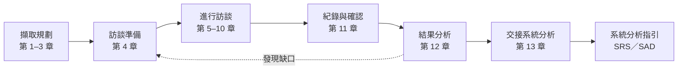
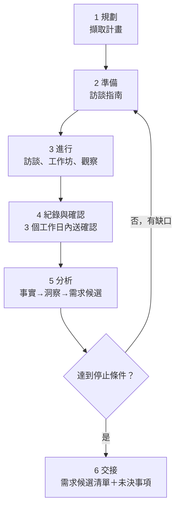
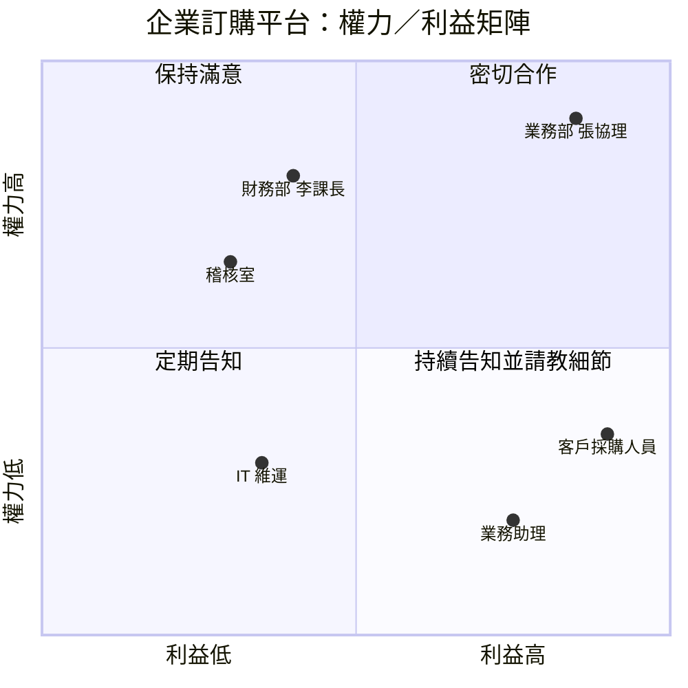
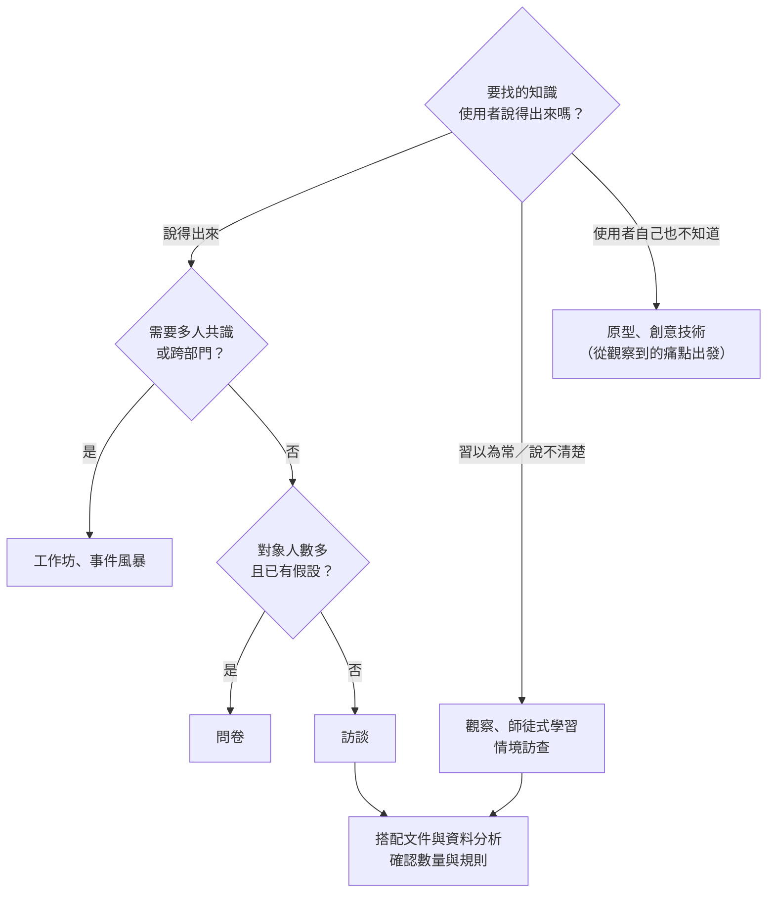
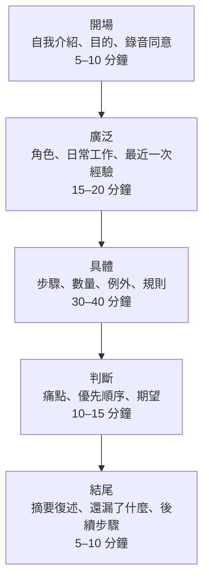
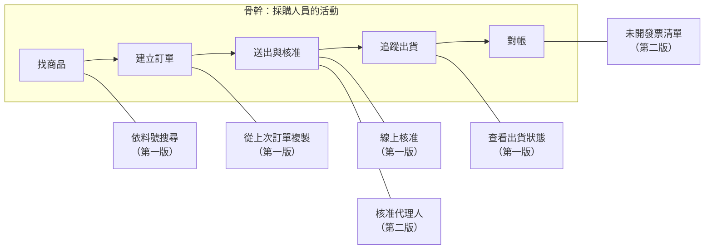
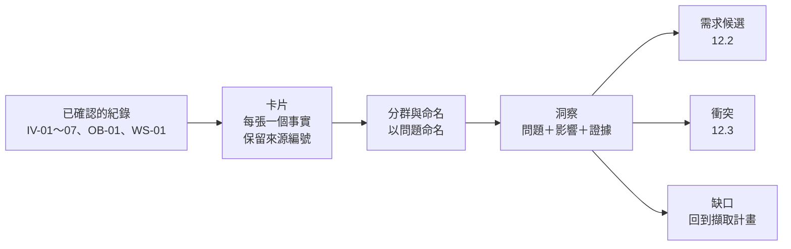

+++
date = '2025-10-31T00:00:00+08:00'
draft = false
title = '客戶需求訪談與分析技巧'
tags = ['指引', '需求分析']
categories = ['指引']
+++

# 客戶需求訪談與分析技巧指引

> **企業標準技術白皮書｜版本 v2.0｜2026-10-08**
>
> 適用範圍：企業應用系統專案中，從「找出該問誰」到「把訪談結果交給系統分析」的需求擷取工作。內容涵蓋擷取流程與規劃、利害關係人與受訪者選擇、擷取技術選擇、訪談前準備、開場與告知同意、提問技巧、傾聽與觀察、時間與困難情境控制、工作坊、遠端與跨文化訪談、訪談紀錄、訪談結果分析、交接、AI 輔助訪談、隱私與倫理，以及品質與能力發展。
>
> v2.0 全面改寫 v1.1：依 IREB CPRE Foundation Level 3.3、IIBA BABOK Guide v3 的「擷取與協作」知識領域、ISO/IEC/IEEE 29148:2018 與我國個資法、通訊保障及監察法重新組織，並刪除 v1.1 中查無出處的統計數字。每條規則都附有範例與「驗證方式」，每節結尾都有「🔍 審查與驗證」，讓審查者能判斷 AI 或同事產出的訪談指南、訪談紀錄與分析結果是否正確。附錄 C 提供可直接執行的檢查工具 `check_interview.py`，所有工具輸出都是實際執行結果（見 [附錄 F](#附錄-f-修訂紀錄與查證紀錄)）。需求寫成規格、驗證、追溯與變更控制，請見 [系統分析指引]()。本文聚焦在「問對人、問對問題、記對內容、正確解讀」。

## 目錄

<!-- TOC-AUTO-BEGIN -->

- [0. 文件資訊](#0-文件資訊)
  - [0.1 文件目的與讀者](#01-文件目的與讀者)
  - [0.2 參考標準與版本](#02-參考標準與版本)
  - [0.3 規範等級與規則格式](#03-規範等級與規則格式)
  - [0.4 範圍與相關指引](#04-範圍與相關指引)
  - [0.5 貫穿全文的範例](#05-貫穿全文的範例)
  - [0.6 如何使用本指引](#06-如何使用本指引)
- [1. 需求擷取流程與規劃](#1-需求擷取流程與規劃)
  - [1.1 為什麼需求擷取需要方法](#11-為什麼需求擷取需要方法)
  - [1.2 擷取流程](#12-擷取流程)
  - [1.3 擷取的節奏與停止條件](#13-擷取的節奏與停止條件)
- [2. 利害關係人與受訪者選擇](#2-利害關係人與受訪者選擇)
  - [2.1 識別利害關係人](#21-識別利害關係人)
  - [2.2 分析利害關係人的影響與態度](#22-分析利害關係人的影響與態度)
  - [2.3 選擇受訪者與安排順序](#23-選擇受訪者與安排順序)
- [3. 擷取技術選擇](#3-擷取技術選擇)
  - [3.1 擷取技術的分類](#31-擷取技術的分類)
  - [3.2 依需求類型選擇技術](#32-依需求類型選擇技術)
  - [3.3 組合技術與三角驗證](#33-組合技術與三角驗證)
- [4. 訪談前準備](#4-訪談前準備)
  - [4.1 背景資料蒐集](#41-背景資料蒐集)
  - [4.2 設定訪談目標](#42-設定訪談目標)
  - [4.3 訪談指南與問題設計](#43-訪談指南與問題設計)
  - [4.4 邀請與後勤](#44-邀請與後勤)
- [5. 開場、告知與信任](#5-開場告知與信任)
  - [5.1 開場流程](#51-開場流程)
  - [5.2 角色澄清與期望管理](#52-角色澄清與期望管理)
  - [5.3 建立信任與保持中立](#53-建立信任與保持中立)
- [6. 提問技巧](#6-提問技巧)
  - [6.1 開放式、封閉式與漏斗提問](#61-開放式封閉式與漏斗提問)
  - [6.2 問過去的具體經驗](#62-問過去的具體經驗)
  - [6.3 追問技巧](#63-追問技巧)
  - [6.4 避免偏誤的問題](#64-避免偏誤的問題)
  - [6.5 非功能需求的提問](#65-非功能需求的提問)
- [7. 傾聽與觀察](#7-傾聽與觀察)
  - [7.1 積極傾聽與摘要復述](#71-積極傾聽與摘要復述)
  - [7.2 觀察與情境訪查](#72-觀察與情境訪查)
  - [7.3 非語言訊號、沉默與隱性需求](#73-非語言訊號沉默與隱性需求)
- [8. 時間、議題與困難情境](#8-時間議題與困難情境)
  - [8.1 時間與議題控制](#81-時間與議題控制)
  - [8.2 困難情境](#82-困難情境)
  - [8.3 結尾](#83-結尾)
- [9. 工作坊與群體擷取](#9-工作坊與群體擷取)
  - [9.1 工作坊的規劃與引導](#91-工作坊的規劃與引導)
  - [9.2 事件風暴](#92-事件風暴)
  - [9.3 使用者故事地圖](#93-使用者故事地圖)
  - [9.4 焦點團體與問卷](#94-焦點團體與問卷)
- [10. 遠端與跨文化訪談](#10-遠端與跨文化訪談)
  - [10.1 遠端訪談](#101-遠端訪談)
  - [10.2 跨文化訪談](#102-跨文化訪談)
  - [10.3 跨時區與非同步擷取](#103-跨時區與非同步擷取)
- [11. 訪談紀錄](#11-訪談紀錄)
  - [11.1 現場記錄](#111-現場記錄)
  - [11.2 紀錄的結構](#112-紀錄的結構)
  - [11.3 會後確認](#113-會後確認)
  - [11.4 擷取紀錄清單](#114-擷取紀錄清單)
- [12. 訪談結果分析](#12-訪談結果分析)
  - [12.1 從紀錄到洞察](#121-從紀錄到洞察)
  - [12.2 從痛點到需求候選](#122-從痛點到需求候選)
  - [12.3 衝突與矛盾](#123-衝突與矛盾)
  - [12.4 在訪談中問出優先順序](#124-在訪談中問出優先順序)
  - [12.5 主題矩陣與擷取完整性](#125-主題矩陣與擷取完整性)
- [13. 交接到系統分析](#13-交接到系統分析)
  - [13.1 需求候選清單](#131-需求候選清單)
  - [13.2 未決事項、假設與限制的交接](#132-未決事項假設與限制的交接)
  - [13.3 交接審查](#133-交接審查)
- [14. AI 輔助訪談與人工審查](#14-ai-輔助訪談與人工審查)
  - [14.1 AI 適合與不適合的工作](#141-ai-適合與不適合的工作)
  - [14.2 逐字稿與摘要的查證](#142-逐字稿與摘要的查證)
  - [14.3 用 AI 準備訪談與分析](#143-用-ai-準備訪談與分析)
  - [14.4 AI 工具治理與資料保護](#144-ai-工具治理與資料保護)
- [15. 隱私、倫理與合規](#15-隱私倫理與合規)
  - [15.1 告知與同意](#151-告知與同意)
  - [15.2 資料最小化、保存與刪除](#152-資料最小化保存與刪除)
  - [15.3 保密與訪談倫理](#153-保密與訪談倫理)
- [16. 品質指標與能力發展](#16-品質指標與能力發展)
  - [16.1 擷取品質指標](#161-擷取品質指標)
  - [16.2 擷取回顧與知識累積](#162-擷取回顧與知識累積)
  - [16.3 能力發展](#163-能力發展)
- [17. 案例分析](#17-案例分析)
  - [17.1 企業訂購平台：擷取過程回顧](#171-企業訂購平台擷取過程回顧)
  - [17.2 綜合案例：金融業核心系統更新](#172-綜合案例金融業核心系統更新)
  - [17.3 綜合案例：製造業 ERP 導入](#173-綜合案例製造業-erp-導入)
  - [17.4 綜合案例：公部門跨機關系統（失敗）](#174-綜合案例公部門跨機關系統失敗)
  - [17.5 綜合案例：新創公司產品開發（失敗後修正）](#175-綜合案例新創公司產品開發失敗後修正)
  - [17.6 如何在訓練中使用案例](#176-如何在訓練中使用案例)
- [18. 常見錯誤與避免方法](#18-常見錯誤與避免方法)
  - [18.1 準備階段的錯誤](#181-準備階段的錯誤)
  - [18.2 訪談進行中的錯誤](#182-訪談進行中的錯誤)
  - [18.3 紀錄與分析階段的錯誤](#183-紀錄與分析階段的錯誤)
  - [18.4 溝通與管理的錯誤](#184-溝通與管理的錯誤)
- [附錄 A 規則總表](#附錄-a-規則總表)
  - [A.1 依領域統計](#a1-依領域統計)
  - [A.2 驗證方式與範例覆蓋](#a2-驗證方式與範例覆蓋)
  - [A.3 規則清單](#a3-規則清單)
- [附錄 B 訪談審查檢核清單](#附錄-b-訪談審查檢核清單)
  - [B.1 擷取計畫](#b1-擷取計畫)
  - [B.2 訪談指南（訪談前）](#b2-訪談指南訪談前)
  - [B.3 訪談進行（旁聽或錄音抽查）](#b3-訪談進行旁聽或錄音抽查)
  - [B.4 訪談紀錄](#b4-訪談紀錄)
  - [B.5 分析與交接](#b5-分析與交接)
  - [B.6 AI 產出](#b6-ai-產出)
- [附錄 C 範本與檢查工具](#附錄-c-範本與檢查工具)
  - [C.1 訪談指南範本](#c1-訪談指南範本)
  - [C.2 訪談紀錄範本](#c2-訪談紀錄範本)
  - [C.3 錄音告知暨同意書範本](#c3-錄音告知暨同意書範本)
  - [C.4 擷取紀錄清單與需求候選清單範本](#c4-擷取紀錄清單與需求候選清單範本)
  - [C.5 檢查工具 check_interview.py](#c5-檢查工具-check_interviewpy)
  - [C.6 測試樣本與實際輸出](#c6-測試樣本與實際輸出)
  - [C.7 在 CI 中執行](#c7-在-ci-中執行)
  - [C.8 訪談問題庫](#c8-訪談問題庫)
- [附錄 D 名詞解釋](#附錄-d-名詞解釋)
- [附錄 E 參考資料](#附錄-e-參考資料)
  - [E.1 標準與知識體系](#e1-標準與知識體系)
  - [E.2 研究與實證](#e2-研究與實證)
  - [E.3 方法與技巧](#e3-方法與技巧)
  - [E.4 法規與政策](#e4-法規與政策)
  - [E.5 工具類別與選擇要點](#e5-工具類別與選擇要點)
  - [E.6 相關指引](#e6-相關指引)
- [附錄 F 修訂紀錄與查證紀錄](#附錄-f-修訂紀錄與查證紀錄)
  - [F.1 v1.1 → v2.0 章節對照](#f1-v11--v20-章節對照)
  - [F.2 v1.1 內容與格式更正](#f2-v11-內容與格式更正)
  - [F.3 查證紀錄](#f3-查證紀錄)
  - [F.4 待查證與後續追蹤](#f4-待查證與後續追蹤)
  - [F.5 版本紀錄](#f5-版本紀錄)

<!-- TOC-AUTO-END -->

---

## 0. 文件資訊

### 0.1 文件目的與讀者

本指引定義**需求擷取（requirements elicitation）**的作法與品質標準，重點是訪談。它回答四個問題：該找誰談、該用什麼方式談、該怎麼問與怎麼記，以及談完之後如何把聽到的內容整理成可以交給系統分析的「需求候選」。

需求擷取的品質很難事後補救。訪談時漏問的情境、記錯的數字、把一位使用者的偏好當成全體的需求，都會一路流到規格、設計與測試，直到驗收時才被發現。本指引的每條規則，都是為了讓第三者（審查者、接手的分析師或 AI 審查工具）可以回頭檢查：這個需求是誰說的、在什麼情境下說的、有沒有被確認過。



| 讀者 | 主要用途 | 建議閱讀章節 |
| --- | --- | --- |
| 系統分析師（SA）、業務分析師（BA） | 規劃與主持訪談、整理紀錄、分析結果 | 全部，特別是第 4、6、11、12、13 章與附錄 B、C |
| 專案經理（PM） | 擷取規劃、利害關係人管理、時程與品質指標 | 第 1、2、3、8、16 章 |
| 產品負責人（PO）、業務代表 | 協助安排受訪者、確認訪談結果、處理衝突 | 第 2、11、12 章 |
| 新進人員 | 從零學會訪談 | 依序閱讀第 4–8 章，再看第 17、18 章的案例與常見錯誤 |
| UX 研究人員 | 使用者訪談、觀察與工作坊 | 第 6、7、9 章 |
| 資安、法遵與個資管理人員 | 審查錄音、紀錄保存與 AI 工具使用 | 第 14、15 章 |
| 使用 AI 準備訪談或整理紀錄的人 | 撰寫提示、審查 AI 產出 | 第 14 章，以及各節的「🔍 審查與驗證」 |

### 0.2 參考標準與版本

本指引依據下列標準、知識體系與法規（查證日期 2026-10-08）。標準或法規更新時，以「狀態」欄註明的處理方式為準，未定事項列在 [附錄 F.4](#f4-待查證與後續追蹤)。

| 類別 | 標準或文件 | 本文採用版本 | 狀態與處理方式 |
| --- | --- | --- | --- |
| 需求工程認證 | IREB CPRE Foundation Level 課綱 | 3.3.0（2026-04-01） | 擷取技術分為詢問、協作、觀察、以文件為本四類，另有輔助技術；本文第 3 章沿用 |
| 需求擷取進階 | IREB CPRE Requirements Elicitation 課綱／手冊 | 課綱 3.2.0／手冊 2.2.0 | 涵蓋溝通理論、擷取規劃、需求來源、擷取技術與衝突處理；本文第 2、3、12 章參考 |
| 業務分析 | IIBA BABOK Guide | v3（2015） | 第 4 章「擷取與協作」知識領域；v4 尚未公布發布日期 |
| 業務分析 | IIBA The Business Analysis Standard | 2022 | BABOK 的精簡標準版 |
| 需求工程流程 | ISO/IEC/IEEE 29148 | 2018 | 「利害關係人需要與需求定義」流程；新版草案狀態見系統分析指引 |
| 產品品質模型 | ISO/IEC 25010 | 2023 | 第 6.5 節的非功能需求提問清單依其 9 個品質特性編排 |
| 專案管理 | PMI PMBOK Guide | 第 8 版（2025） | 利害關係人與溝通相關內容 |
| 跨文化溝通 | Erin Meyer, *The Culture Map* | 2014 | 八個量表，第 10 章參考 |
| 個人資料 | 個人資料保護法 | 2025-11-11 修正公布 | 修正條文施行日由行政院另定（截至 2026-10-08 未定），本文以現行條文為準並提示修正方向 |
| 通訊錄音 | 通訊保障及監察法第 29 條 | 現行 | 通訊一方錄音不違法，但本文要求一律事先告知並取得同意，見第 15 章 |
| 人工智慧 | 人工智慧基本法 | 2026-01-14 公布施行 | 原則性立法，子法陸續訂定 |
| 歐盟 AI 法 | EU AI Act 第 5 條第 1 項 (f) 款 | 2025-02-02 起適用 | 禁止在職場以 AI 從生物特徵推論情緒；對歐盟客戶或受訪者適用，見第 14 章 |

### 0.3 規範等級與規則格式

本文規則採用 [RFC 2119](https://www.rfc-editor.org/rfc/rfc2119) 與 [RFC 8174](https://www.rfc-editor.org/rfc/rfc8174) 的語意：

| 等級 | 英文 | 意義 | 訪談審查處理 |
| --- | --- | --- | --- |
| **必須** | MUST | 不遵守會造成重大風險（需求遺漏、來源無法追溯、誤解未被發現、違反法規） | 不通過審查；如需例外必須依 0.6 記錄理由並經 PM 核准 |
| **應該** | SHOULD | 業界共識的最佳實務，除非有充分理由 | 不遵守時在擷取計畫或訪談紀錄的「備註」寫明理由 |
| **可以** | MAY | 建議做法，依專案規模與情境選用 | 不阻擋 |
| **不應該** | SHOULD NOT | 通常是錯誤的做法，除非有充分理由 | 採用時寫明理由 |

每條規則都有編號，格式為 `RI-<領域>-<三位數序號>`（RI 是 Requirements Interview 的縮寫）。開頭的 `RI` 用來和 [系統分析指引]() 的 `SA-` 規則區分。編號一經發布不會重編，新增規則使用該領域尚未使用的號碼。

| 前綴 | 領域 | 章 | 前綴 | 領域 | 章 |
| --- | --- | --- | --- | --- | --- |
| `RI-PRC` | 擷取流程與規劃 | 1 | `RI-WSP` | 工作坊與群體擷取 | 9 |
| `RI-STK` | 利害關係人與受訪者 | 2 | `RI-RMT` | 遠端與跨文化 | 10 |
| `RI-TEC` | 擷取技術選擇 | 3 | `RI-REC` | 訪談紀錄 | 11 |
| `RI-PRE` | 訪談前準備 | 4 | `RI-ANA` | 訪談結果分析 | 12 |
| `RI-OPN` | 開場、告知與信任 | 5 | `RI-HND` | 交接到系統分析 | 13 |
| `RI-ASK` | 提問技巧 | 6 | `RI-AI` | AI 輔助訪談 | 14 |
| `RI-LIS` | 傾聽與觀察 | 7 | `RI-PRV` | 隱私、倫理與合規 | 15 |
| `RI-CTL` | 時間、議題與困難情境 | 8 | `RI-QLT` | 品質與能力發展 | 16 |

**驗證方式欄位：** 每張規則表的最後一欄說明「怎麼確認有遵守這條規則」。審查者應先看這一欄，再決定要花多少心力人工檢查。

| 圖示 | 意義 | 範例 | 審查者該做什麼 |
| --- | --- | --- | --- |
| 🤖 | 工具可自動檢查 | 🤖 `check_interview.py record`、🤖 `check_interview.py guide` | 確認工具有執行、錯誤為 0，並人工看過所有警告 |
| 🧪 | 需要以演練、試訪或回饋證明 | 🧪 試訪、🧪 受訪者確認、🧪 角色扮演演練 | 確認有演練或確認紀錄，且結果有回饋到訪談指南或紀錄 |
| 👁 | 只能由人判斷 | 👁 訪談審查、👁 同儕旁聽 | 依該節「🔍 審查與驗證」的問題逐項確認 |

**範例標記：** 範例中以 `✅ <規則編號>` 標示符合規則的寫法，以 `❌ <規則編號>` 標示違規寫法。所有規則都至少出現在一個範例中（統計見 [附錄 A](#附錄-a-規則總表)）。

### 0.4 範圍與相關指引

需求擷取與系統分析是連續的工作，但本指引與 [系統分析指引]() 有明確分工：本指引負責「把利害關係人知道的事情，正確地取出來並記下來」；系統分析指引負責「把取出來的內容寫成可設計、可測試的規格」。

| 主題 | 本指引 | 其他指引 |
| --- | --- | --- |
| 擷取來源與技術選擇 | 第 1、3 章：如何規劃與選擇 | 系統分析指引第 3 章：擷取完整性與紀錄的最低要求（`SA-ELI-001`～`SA-ELI-009`） |
| 利害關係人 | 第 2 章：為訪談選人、安排訪談順序 | 系統分析指引第 2 章：利害關係人登錄與 RACI |
| 訪談紀錄 | 第 11 章：紀錄格式與自動檢查 | 系統分析指引第 3.3 節：紀錄要區分事實、需求與假設，3 個工作日內確認 |
| 初步優先順序 | 第 12.4 節：訪談中如何問出優先順序 | 系統分析指引第 15 章：正式的優先級與範圍決策 |
| 需求撰寫、驗證、追溯、變更 | 第 13 章只定義交接內容 | 系統分析指引第 4、14、16 章 |
| 畫面原型 | 第 3 章：原型作為擷取技術 | [UIUX指引]() |
| 開發流程與文件範本 | 附錄 C 的訪談範本 | [軟體開發標準程序教學手冊]() |

本指引的規則與系統分析指引一致：凡是兩份指引都提到的要求（例如 3 個工作日內送確認、事實與假設分開記錄、錄音需同意），本指引說明「怎麼做到」，系統分析指引規定「做到什麼程度才算合格」。

### 0.5 貫穿全文的範例

為了讓範例前後一致，本文以「企業訂購平台」（B2B 訂單系統）為例，與系統分析指引、系統設計指引使用同一個系統：企業客戶的採購人員線上下單，系統檢查信用額度與庫存，主管核准大額訂單，倉儲出貨後由會計系統開立發票。

| 角色 | 範例人物 | 在本文的用途 |
| --- | --- | --- |
| 系統分析師（主談） | 林怡君 | 規劃與主持訪談 |
| 產品負責人 | 業務部 張協理 | 決定優先順序、處理衝突 |
| 領域專家 | 業務部 陳經理 | 確認業務規則與假設 |
| 財務窗口 | 財務部 李課長 | 信用額度與發票相關訪談 |
| 客戶端使用者 | 客戶 A 採購專員 王小姐、採購課長 李先生 | 訪談 IV-03 的受訪者 |
| 紀錄人員 | 業務助理 蔡佩珊 | 協助記錄 |

本文使用的編號與系統分析指引相同，因此訪談結果可以直接追溯到需求：

| 編號 | 意義 | 範例 |
| --- | --- | --- |
| `IV-nn` | 訪談 | `IV-03` 客戶 A 採購人員訪談（2026-09-15） |
| `WS-nn` | 工作坊 | `WS-01` 事件風暴工作坊 |
| `OB-nn` | 觀察 | `OB-01` 業務助理接單作業觀察 |
| `FG-nn`、`SV-nn` | 焦點團體、問卷 | `SV-01` 客戶滿意度與優先順序問卷 |
| `F#`、`N#`、`A#`、`Q#`、`T#` | 紀錄內的事實、需求、假設、未決事項、行動項目 | `IV-03` 的 `N2`：大額訂單線上核准 |
| `StR-ORD-nnn` | 利害關係人需求（交接給系統分析） | `StR-ORD-004` 採購人員需要在送出訂單時就知道是否需要核准 |

### 0.6 如何使用本指引

**用來規劃與執行訪談：** 新進人員可以把附錄 C 的範本當成起點，依第 4 章準備訪談指南，依第 5–8 章進行訪談，依第 11 章整理紀錄，並在送出前執行 `check_interview.py`。

**用來審查 AI 或同事的產出：** 審查者不需要旁聽每一場訪談，但可以依下列順序檢查產出物：

1. 執行 `check_interview.py guide` 與 `check_interview.py record`，錯誤必須為 0，警告逐一判斷。
2. 依附錄 B 的檢核清單，針對「👁 僅人工」的規則抽查。
3. 抽一段錄音或逐字稿，與紀錄比對（14.2 節的抽樣比對法）。這是發現 AI 摘要幻覺與遺漏最有效的方法。

**例外處理：** 若因專案條件無法遵守「必須」等級的規則（例如客戶禁止任何錄音、受訪者只能以書面回覆），在擷取計畫的「例外」欄記錄規則編號、原因、替代措施與核准人，並在下次階段審查時檢視。

## 1. 需求擷取流程與規劃

### 1.1 為什麼需求擷取需要方法

需求擷取是「從利害關係人、文件與現行系統中找出需求」的活動。它的困難不在於「問問題」，而在於三個事實：

1. **利害關係人知道的比說出來的多。** 每天重複的作業會變成習慣，使用者不覺得值得一提（隱性知識）。例如業務助理每天下午 4 點會手動把當天訂單抄到倉儲的 Excel，因為「一直都是這樣做」，訪談時沒有人提起。
2. **利害關係人說的不一定是他們需要的。** 使用者常直接提出解法（「我要一個匯出按鈕」），真正的需要可能是「月底對帳時要拿到資料」，而對帳也許根本不需要匯出。
3. **分析師聽到的不一定是對方的意思。** 「即時」對採購人員可能是「當天」，對工程師是「一秒內」。

需求問題對專案的影響有實證支持。PMI 2014 年的 *Pulse of the Profession* 需求管理深度報告指出，37% 的組織把「需求不準確」列為專案失敗的主要原因，未達成目標的專案中有 47% 與需求管理不良有關。v1.1 引用的「85% 專案失敗源於需求」查無出處，已刪除。

常被引用的「需求錯誤到上線後修正，成本是 100 倍」也要謹慎使用。Laurent Bossavit 在 *The Leprechauns of Software Engineering* 中追查這條曲線的來源，發現原始資料不足以支持如此精確的倍數。比較穩健的說法是：**越晚發現的需求錯誤，影響範圍越大、需要重做的工作越多**。本文用這個說法取代 v1.1 的「10–100 倍」。

| 擷取失誤 | 常見原因 | 本文對應章節 |
| --- | --- | --- |
| 漏掉重要的利害關係人 | 只訪談客戶指派的窗口 | 第 2 章 |
| 漏掉「理所當然」的需求 | 只用訪談，沒有觀察或文件分析 | 第 3、7 章 |
| 得到受訪者「想像中的自己」 | 問未來或假設性的問題 | 第 6.2 節 |
| 問題本身引導了答案 | 引導式問題、一次問兩件事 | 第 6.4 節 |
| 紀錄與受訪者原意不同 | 沒有復述確認、會後沒有送確認 | 第 7.1、11.3 節 |
| 把個人偏好當成全體需求 | 樣本太少、沒有交叉比對 | 第 1.3、12.3 節 |

### 1.2 擷取流程

本指引把需求擷取分成六個步驟。這不是一次走完的瀑布流程，而是一個循環：分析訪談結果時發現的缺口，會成為下一輪訪談的問題。



| 步驟 | 主要產出 | 負責人 | 本文章節 |
| --- | --- | --- | --- |
| 1 規劃 | 擷取計畫（目標、來源、技術、時程、停止條件） | SA（PM 核准） | 1.2、1.3、第 2、3 章 |
| 2 準備 | 每場訪談的訪談指南、邀請函、同意書 | SA | 第 4 章 |
| 3 進行 | 錄音（經同意）、現場筆記、白板照片 | SA（主談）＋紀錄人員 | 第 5–10 章 |
| 4 紀錄與確認 | 訪談紀錄、受訪者確認紀錄 | SA | 第 11 章 |
| 5 分析 | 洞察、需求候選、衝突清單、缺口清單 | SA、PO | 第 12 章 |
| 6 交接 | 需求候選清單、未決事項、擷取紀錄清單 | SA | 第 13 章 |

| 編號 | 等級 | 規則 | 驗證方式 |
| --- | --- | --- | --- |
| `RI-PRC-001` | 必須 | 第一場訪談之前必須有擷取計畫，至少包含：擷取目標、要回答的關鍵問題、需求來源（利害關係人、文件、系統）、使用的技術、時程、角色分工與停止條件 | 👁 擷取計畫審查（附錄 B.1） |
| `RI-PRC-002` | 必須 | 每一場擷取活動都必須有具體目標，且目標能對應到擷取計畫中的關鍵問題；不得以「了解需求」「認識客戶」作為唯一目標 | 🤖 `check_interview.py guide`（訪談指南必須有 G# 目標，每個問題對應目標）；👁 訪談審查 |
| `RI-PRC-003` | 應該 | 每完成一輪擷取（例如同一類受訪者的訪談全部完成），應檢視缺口清單並更新擷取計畫，記錄新增或取消的活動與原因 | 👁 擷取計畫的變更紀錄 |

````markdown
<!-- ✅ RI-PRC-001：擷取計畫（企業訂購平台，摘錄） -->
# 擷取計畫 EP-ORD v1.1（2026-09-08）

## 擷取目標
建立企業訂購平台第一版的利害關係人需求，作為 SRS v1.0 的輸入。

## 關鍵問題
- KQ1 企業客戶從決定採購到收到貨，經過哪些步驟？哪一步最耗時？
- KQ2 哪些訂單需要核准？核准規則由誰決定？
- KQ3 信用額度與庫存檢查目前如何進行？錯誤率多少？
- KQ4 哪些法規與合約條款會限制訂單與發票流程？

## 需求來源與技術
| 來源 | 對象或文件 | 技術 | 編號 | 對應 |
| --- | --- | --- | --- | --- |
| 利害關係人 | 3 家客戶的採購人員與核准主管 | 半結構式訪談 | IV-01～06 | KQ1、KQ2 |
| 利害關係人 | 業務、財務、倉儲 | 事件風暴工作坊 | WS-01 | KQ1～KQ3 |
| 系統 | 現行 Excel 接單檔、Email 訂單 | 觀察、資料分析 | OB-01、DOC-05 | KQ1、KQ3 |
| 文件 | 授信作業辦法、客戶合約範本 | 文件分析 | DOC-01～03 | KQ2、KQ4 |

## 時程與分工
- 2026-09-10～09-30；主談 林怡君，紀錄 蔡佩珊，核准 PM

## 停止條件
- 每類受訪者至少訪談 3 人，且最後 2 場沒有新的需求主題（見 1.3）
- KQ1～KQ4 都有至少兩種來源支持的答案

## 例外
- 無
````

````markdown
<!-- ❌ RI-PRC-001、RI-PRC-002：沒有計畫，目標空泛 -->
下週開始訪談客戶，先了解需求，之後再看要訪談誰。
訪談目標：了解客戶需求。
````

````markdown
<!-- ✅ RI-PRC-003：一輪訪談後更新擷取計畫 -->
## 變更紀錄
| 版本 | 日期 | 變更 | 原因 |
| --- | --- | --- | --- |
| v1.1 | 2026-09-22 | 新增 IV-10 訪談稽核室 | IV-03、IV-05 都提到「核准紀錄要給稽核看」，原計畫沒有稽核室 |
| v1.1 | 2026-09-22 | 取消客戶 C 第二場訪談 | 客戶 C 的採購流程與客戶 A 相同，連續 2 場沒有新主題 |
````

#### 🔍 1.2 審查與驗證

- **自動檢查：** `check_interview.py guide` 會檢查訪談指南有沒有 `## 目標` 與 G# 目標，每個問題有沒有標示「目的：G#」。
- **人工審查問題：**
  1. 擷取計畫的關鍵問題，是否都至少有一項擷取活動負責回答？有沒有關鍵問題「沒人負責」？
  2. 需求來源是否三類都有（利害關係人、文件、系統）？只有訪談的計畫，請要求補上觀察或文件分析（與系統分析指引 `SA-ELI-001` 一致）。
  3. 計畫有變更紀錄嗎？完全沒有變更的計畫，通常代表沒有依訪談結果調整。
- **AI 常見錯誤：** 請 AI 產生擷取計畫時，它會列出很完整的「通用利害關係人清單」（例如 CEO、IT 主管、所有使用者），但沒有對應到本專案的關鍵問題。審查時逐列問：「這個活動要回答哪個 KQ？」答不出來的就刪除。

### 1.3 擷取的節奏與停止條件

「要訪談幾個人才夠？」沒有固定答案，但有實證可參考。質性研究中，「飽和」（saturation）指再多訪談也不會出現新主題。Guest、Bunce 與 Johnson（2006）在同質的受訪者群中，約 12 場訪談後就沒有新的主題；Hennink 與 Kaiser（2022）的系統性回顧發現，同質群體的飽和點多在 9 到 17 場之間。企業專案的受訪者通常同質性更高、問題更聚焦，因此實務上可以每類受訪者先排 3 到 5 場，再依「最後幾場是否還有新主題」決定是否加場。

停止條件要事先寫進擷取計畫，否則擷取會因為時程壓力提前結束（遺漏），或因為「再問問看」而無限延長（分析癱瘓）。

| 編號 | 等級 | 規則 | 驗證方式 |
| --- | --- | --- | --- |
| `RI-PRC-004` | 必須 | 擷取計畫必須定義可判斷的停止條件，例如「每類受訪者最後 2 場訪談沒有出現新的需求主題」與「每個關鍵問題都有至少兩個來源支持」；停止時必須記錄判斷依據 | 👁 擷取計畫審查；🤖 主題矩陣（12.5）可計算每場新增主題數 |
| `RI-PRC-005` | 不應該 | 不應該以單一受訪者的意見代表整個使用者群體；同一類受訪者少於 3 人時，結果必須標示為「待驗證」並以其他來源（觀察、資料、問卷）佐證 | 👁 需求候選清單審查（來源欄位） |
| `RI-PRC-006` | 應該 | 擷取活動應排定時間預算（場次、每場時間、整理時間），整理與確認的時間應至少等於訪談本身的時間 | 👁 擷取計畫審查 |

```markdown
<!-- ✅ RI-PRC-004：停止判斷有依據（主題矩陣摘要） -->
| 受訪者類別 | 場次 | 每場新增主題數 | 判斷 |
| --- | --- | --- | --- |
| 客戶採購人員 | IV-01, 02, 03, 05, 06 | 7, 4, 3, 0, 0 | 已飽和，停止 |
| 核准主管 | IV-04 | 5 | 只有 1 場，需加場（新增 IV-08、IV-09） |

<!-- ❌ RI-PRC-004：沒有判斷依據 -->
訪談已經差不多了，可以開始寫規格。
```

```markdown
<!-- ✅ RI-PRC-005：單一來源標示待驗證 -->
| 需求候選 | 來源 | 狀態 |
| --- | --- | --- |
| 訂單要能指定希望到貨時段 | IV-05（客戶 C 採購 1 人） | 待驗證：以 DOC-05 查詢過去一年備註欄指定到貨時段的比例 |

<!-- ❌ RI-PRC-005：一個人說的就變成全體需求 -->
所有客戶都需要指定到貨時段。（來源：IV-05）
```

```markdown
<!-- ✅ RI-PRC-006：時間預算包含整理與確認 -->
| 活動 | 場次 | 每場 | 整理與確認 | 合計 |
| --- | --- | --- | --- | --- |
| 客戶訪談 IV-01～06 | 6 | 1.5 小時 | 每場 2 小時 | 21 小時 |
| 事件風暴 WS-01 | 1 | 4 小時 | 6 小時 | 10 小時 |

<!-- ❌ RI-PRC-006：只排訪談，沒有排整理時間 -->
9/15～9/18 每天排 4 場訪談，9/19 開始寫 SRS。
```

#### 🔍 1.3 審查與驗證

- **自動檢查：** 若團隊依 12.5 節維護主題矩陣，可以用試算表公式計算每場新增主題數，作為停止條件的證據。
- **人工審查問題：**
  1. 停止時，最後幾場訪談真的沒有新主題嗎？還是因為時程到了？
  2. 有沒有某一類受訪者只訪談了 1 人？他說的需求是否被當成全體需求？
  3. 每天排 4 場以上訪談的計畫，整理時間從哪裡來？
- **AI 常見錯誤：** AI 常引用「訪談 5 位使用者就能發現 85% 問題」。這個數字來自 Nielsen 的**可用性測試**研究，不適用於需求擷取的訪談數量。看到這個說法時請要求改用飽和判斷。

## 2. 利害關係人與受訪者選擇

### 2.1 識別利害關係人

訪談的品質上限，取決於「找對人」。客戶通常會指派一位窗口，窗口會推薦他熟悉的同事，結果訪談對象集中在同一個部門、同一個層級。真正會受系統影響、或能否決專案的人，常常不在名單上。

識別利害關係人時，可以用「洋蔥模型」由內而外檢查：最內層是**直接操作系統的人**，第二層是**使用系統產出的人**（例如看報表的主管），第三層是**影響或被影響的組織內單位**（財務、稽核、資安、法務），最外層是**組織外部**（客戶、供應商、主管機關）。每一層都要問：「有沒有人會因為這個系統而改變工作方式、承擔風險，或有權說不？」

| 類別 | 檢查問題 | 企業訂購平台的例子 |
| --- | --- | --- |
| 直接使用者 | 誰每天會操作？有沒有不同熟練度、不同據點的使用者？ | 客戶採購人員、業務助理 |
| 間接使用者 | 誰使用系統的產出？ | 核准主管、業務主管（看報表） |
| 決策者與出資者 | 誰決定預算、範圍與上線？ | 業務部 張協理（PO）、總經理室 |
| 營運與支援 | 誰維護、誰接客服電話？ | IT 維運、客服 |
| 控制與合規 | 誰會稽核、誰定規則？ | 財務部（信用額度）、稽核室、資安 |
| 相鄰系統負責人 | 誰負責要介接的系統？ | 倉儲系統、會計系統的負責人 |
| 外部 | 誰在組織外但會受影響或有規範權？ | 企業客戶、物流商、主管機關（電子發票） |
| 反對者或利益受損者 | 誰的工作會被取代或權力會改變？ | 目前手工接單的業務助理 |

| 編號 | 等級 | 規則 | 驗證方式 |
| --- | --- | --- | --- |
| `RI-STK-001` | 必須 | 擷取開始前必須以檢核表（直接使用者、間接使用者、決策者、營運支援、控制與合規、相鄰系統、外部、利益受損者）識別利害關係人，每一類都要列出具體對象或寫明「不適用」的理由 | 👁 利害關係人清單審查 |
| `RI-STK-002` | 應該 | 利害關係人清單應包含利益可能受損或可能反對的對象，並規劃如何讓他們參與，而不是迴避 | 👁 利害關係人清單審查 |

```markdown
<!-- ✅ RI-STK-001、RI-STK-002：依檢核表識別，含利益受損者 -->
| 類別 | 對象 | 參與方式 | 備註 |
| --- | --- | --- | --- |
| 直接使用者 | 3 家客戶的採購人員；業務助理 2 人 | 訪談、觀察 | 客戶 A、B 規模大，C 規模小 |
| 間接使用者 | 客戶端核准主管 | 訪談 | |
| 決策者 | 業務部 張協理 | 啟動會議、優先順序工作坊 | PO |
| 控制與合規 | 財務部 李課長、稽核室 | 訪談 | 稽核室於 v1.1 計畫新增 |
| 相鄰系統 | 倉儲課 趙組長、會計系統負責人 | 訪談、介面文件分析 | |
| 外部 | 物流商 | 不適用 | 物流商介面不在第一版範圍（範圍說明書 3.2） |
| 利益受損者 | 業務助理（手工接單工作將減少） | 訪談、觀察，並邀請參與原型測試 | 先與張協理確認工作調整說明 |

<!-- ❌ RI-STK-001：只有客戶窗口推薦的名單 -->
受訪者：業務部 張協理、陳經理（由張協理推薦）。
```

#### 🔍 2.1 審查與驗證

- **人工審查問題：**
  1. 清單的每一類都有對象或理由嗎？「控制與合規」與「相鄰系統」最常被漏掉。
  2. 有沒有人的工作會因系統而減少或改變？他們在名單上嗎？
  3. 名單是否全部來自同一位窗口的推薦？
- **AI 常見錯誤：** AI 產生的利害關係人清單通常是通用職稱（「IT 部門」「終端使用者」），沒有具體人名或單位。審查時要求每列至少有一個可以邀請的具體對象。

### 2.2 分析利害關係人的影響與態度

識別之後，要決定「每個人投入多少時間、用什麼方式參與」。常用的工具是**權力／利益矩陣**：權力高且利益高的人要密切合作（例如 PO），權力高但利益低的人要讓他們滿意（例如財務主管只在乎信用風險），權力低但利益高的人要持續告知並請他們提供細節（例如第一線使用者），兩者都低的人定期告知即可。

除了權力與利益，還要記錄**態度**（支持、中立、反對）與**決策權**。決策權特別重要：訪談中常出現兩個部門要求衝突的情況（例如業務希望放寬信用額度、財務希望收緊），若事先不知道誰能拍板，衝突會一直懸而未決。



| 編號 | 等級 | 規則 | 驗證方式 |
| --- | --- | --- | --- |
| `RI-STK-003` | 必須 | 擷取開始前必須確認需求衝突的決策者：每一類可能衝突的議題（例如範圍、業務規則、優先順序）都要有一位有權決定的人，並取得其同意 | 👁 擷取計畫審查（決策權欄位） |
| `RI-STK-004` | 應該 | 每個利害關係人群組應記錄權力、利益、目前態度與參與方式，並在每一輪擷取後更新態度 | 👁 利害關係人清單審查 |

```markdown
<!-- ✅ RI-STK-003、RI-STK-004：決策權與態度 -->
| 議題 | 決策者 | 同意日期 |
| --- | --- | --- |
| 第一版範圍 | 業務部 張協理 | 2026-09-08 |
| 信用額度與核准門檻規則 | 財務部 李課長（業務部陳經理提供意見） | 2026-09-09 |
| 倉儲介面 | 倉儲課 趙組長 | 2026-09-09 |

| 群組 | 權力 | 利益 | 態度（9/8 → 9/22） | 參與方式 |
| --- | --- | --- | --- | --- |
| 業務助理 | 低 | 高 | 反對 → 中立 | 訪談、觀察、原型測試；說明工作調整 |
| 財務部 | 高 | 中 | 中立 → 支持 | 訪談 2 次、核准規則確認 |

<!-- ❌ RI-STK-003：衝突出現才找人決定 -->
業務部和財務部對核准門檻意見不同，待雙方再討論。
```

#### 🔍 2.2 審查與驗證

- **人工審查問題：**
  1. 每類可能衝突的議題都有決策者嗎？決策者本人同意擔任嗎？
  2. 「反對」態度的群組有參與計畫嗎？還是只被記錄下來？
- **AI 常見錯誤：** AI 會把矩陣位置畫得很整齊，但權力與利益的判斷需要組織內部資訊。矩陣必須由熟悉客戶組織的人（PM 或 PO）確認，不能只用 AI 推測。

### 2.3 選擇受訪者與安排順序

同一個角色的人，作法可能差很多：大客戶與小客戶的採購流程不同，資深與新進人員處理例外的方式不同，總公司與分公司的作業時間不同。選受訪者時要刻意涵蓋這些**差異**，而不是只找「最懂的人」。最懂的人往往會描述「應該怎麼做」，新進人員才會說出「實際上怎麼做」與「哪裡最容易出錯」。

另一個常見問題是**代理人**：由主管代替第一線人員回答。主管知道目標與規則，但不一定知道實際作業的細節與變通作法。

訪談順序通常是：**先決策者，後使用者，再回到決策者**。先與決策者確認目標、範圍與成功標準，訪談使用者時才知道該深入哪裡；使用者訪談後再回到決策者，確認發現的衝突與優先順序。

| 編號 | 等級 | 規則 | 驗證方式 |
| --- | --- | --- | --- |
| `RI-STK-005` | 必須 | 選擇受訪者時必須涵蓋會影響作業方式的差異（例如客戶規模、據點、熟練度、使用頻率），並在受訪者清單中記錄每位受訪者代表哪一種差異 | 👁 受訪者清單審查 |
| `RI-STK-006` | 不應該 | 不應該以主管或窗口的描述作為第一線作業需求的唯一來源；若無法接觸第一線人員，必須將相關需求標示為「代理人來源」，並以觀察或資料分析佐證 | 👁 需求候選清單審查（來源欄位） |
| `RI-STK-007` | 應該 | 訪談順序應先與決策者確認目標、範圍與成功標準，再訪談使用者；使用者訪談後應再與決策者確認衝突與優先順序 | 👁 擷取計畫審查（時程） |

```markdown
<!-- ✅ RI-STK-005：受訪者清單記錄代表的差異 -->
| 編號 | 受訪者 | 代表的差異 |
| --- | --- | --- |
| IV-01 | 客戶 B 採購（年資 8 年） | 大型客戶、資深、每日下單 |
| IV-02 | 客戶 B 採購（年資 6 個月） | 大型客戶、新進 |
| IV-03 | 客戶 A 採購專員、採購課長 | 中型客戶、有核准流程 |
| IV-05 | 客戶 C 採購（兼會計） | 小型客戶、每月下單 1～2 次、一人多職 |

<!-- ❌ RI-STK-005、RI-STK-006：只找最熟的人，由主管代答 -->
受訪者：客戶 B 採購主管（他最了解流程，可以代表所有採購人員）。
```

```markdown
<!-- ✅ RI-STK-007：訪談順序 -->
1. 9/10 張協理（PO）：確認目標、範圍、成功標準 → 啟動會議紀錄 KO-01
2. 9/11～9/18 客戶與內部使用者：IV-01～IV-07、OB-01
3. 9/18 WS-01 事件風暴（跨部門）
4. 9/22 張協理、李課長：確認 IV 中發現的 3 項衝突與優先順序

<!-- ❌ RI-STK-007：最後才問決策者，發現範圍不同 -->
完成 12 場使用者訪談後，PO 表示第一版不含退貨，其中 4 場訪談的主題白費。
```

#### 🔍 2.3 審查與驗證

- **人工審查問題：**
  1. 受訪者清單有記錄「代表的差異」嗎？有沒有某種差異完全沒有人代表（例如小型客戶、新進人員）？
  2. 需求候選的來源中，有多少只來自主管？這些需求有沒有觀察或資料佐證？
  3. 決策者是在使用者訪談之前就確認過目標嗎？
- **AI 常見錯誤：** AI 不知道受訪者是誰，常把「採購人員」當成同質群體。請要求 AI 列出「哪些差異會讓流程不同」，再由人判斷要找誰。

## 3. 擷取技術選擇

### 3.1 擷取技術的分類

訪談只是擷取技術的一種。IREB CPRE Foundation Level 3.x 把擷取技術分成四類，另外搭配輔助技術：

| 類別 | 技術 | 擅長取得 | 限制 |
| --- | --- | --- | --- |
| 詢問技術 | 訪談（結構式、半結構式、非結構式）、問卷 | 明確知識：目標、痛點、規則、期望 | 受訪者只會說出意識到的事；問卷無法追問 |
| 協作技術 | 需求工作坊、JAD、事件風暴、使用者故事地圖、焦點團體 | 跨部門流程、衝突、共識 | 耗費人力與場地；強勢者容易主導 |
| 觀察技術 | 現場觀察、師徒式學習（apprenticing）、情境訪查（contextual inquiry） | 隱性知識：習慣、變通作法、例外處理 | 耗時；被觀察者可能改變行為 |
| 以文件為本 | 文件分析、現行系統考古（system archaeology）、資料分析、再利用既有需求 | 法規、業務規則、資料欄位、實際數量 | 文件可能過時；要分辨相關與不相關資訊 |
| 輔助技術 | 原型、心智圖、使用案例、情境描述、腦力激盪、類比法 | 讓抽象想法變具體；引出新點子 | 原型容易被誤認為規格 |

**訪談的三種形式**依結構程度區分：

| 形式 | 作法 | 適用時機 | 企業訂購平台的例子 |
| --- | --- | --- | --- |
| 結構式 | 依固定問題、固定順序 | 比較不同受訪者的答案、確認已知事項 | 對 6 位採購人員問相同的 5 題，比較下單頻率與等待時間 |
| 半結構式 | 有訪談指南，但可依回答追問與調整順序 | 大多數需求訪談 | IV-03 |
| 非結構式 | 只有主題，自由對談 | 專案極早期、領域完全陌生 | 啟動前與張協理了解業務背景 |

### 3.2 依需求類型選擇技術

選擇技術時，先問「要找的是哪一種知識」。Kano 模型把需求分成三類，各自適合不同技術：

- **基本需求**（使用者認為理所當然，例如訂單一定要能查詢）：使用者很少主動提，要靠**觀察**與**文件分析**。
- **期望需求**（越多越滿意，例如更快知道庫存）：使用者能說得出來，**訪談**與**問卷**有效。
- **魅力需求**（使用者沒想到、但會驚喜，例如自動建議替代品）：要靠**原型**、**創意技術**與觀察中發現的痛點。

此外還要考慮：受訪者能投入多少時間、是否分散在不同地點、專案風險多高，以及分析師對領域熟悉程度。



| 編號 | 等級 | 規則 | 驗證方式 |
| --- | --- | --- | --- |
| `RI-TEC-001` | 必須 | 擷取計畫中，使用者每天重複執行的核心作業必須安排觀察技術（現場觀察、師徒式學習或情境訪查）；若無法觀察，必須記錄原因並以作業紀錄或資料分析替代 | 👁 擷取計畫審查 |
| `RI-TEC-002` | 應該 | 每項擷取活動應依目的選擇訪談形式：比較不同受訪者時用結構式，探索與了解時用半結構式，並在擷取計畫中寫明 | 👁 擷取計畫審查 |
| `RI-TEC-003` | 不應該 | 不應該用問卷發掘新需求；問卷應用於驗證訪談得到的假設、了解大量使用者的分布或排序，且題目要先經過試答 | 👁 問卷審查；🧪 試答紀錄 |
| `RI-TEC-004` | 必須 | 使用文件分析時，必須向文件負責人確認文件版本仍然有效，並記錄文件版本、確認者與日期 | 👁 擷取紀錄清單審查 |

```markdown
<!-- ✅ RI-TEC-001、RI-TEC-002：依知識類型選擇技術 -->
| 擷取對象 | 知識類型 | 技術 | 理由 |
| --- | --- | --- | --- |
| 業務助理接單作業 | 隱性（每天重複） | 現場觀察 OB-01（半天） | 訪談 IV-06 時她說「就是收信、輸入」，但 Excel 中有 12 個人工檢查步驟 |
| 6 位採購人員的下單頻率 | 明確，需比較 | 結構式訪談（固定 5 題） | 要比較不同規模客戶 |
| 核准流程的例外 | 明確，需探索 | 半結構式訪談 | 需要依回答追問 |

<!-- ❌ RI-TEC-001：核心作業只靠訪談 -->
接單流程：訪談業務助理 1 小時。
```

```markdown
<!-- ✅ RI-TEC-003：問卷用來驗證訪談假設 -->
SV-01 目的：訪談中 4/6 位採購人員提到「想在下單時看到預計到貨日」，
以問卷確認 120 家客戶中這項需求的重要程度分布。
試答：2026-09-24 由客戶 A、C 各 1 人試答，修改第 3 題的用語（「交期」改為「預計到貨日」）。

<!-- ❌ RI-TEC-003：用問卷問「你需要什麼功能」 -->
問卷第 1 題：請列出您希望新系統提供的功能。
```

```markdown
<!-- ✅ RI-TEC-004：文件分析記錄版本與確認 -->
| 編號 | 文件 | 版本 | 確認仍有效 |
| --- | --- | --- | --- |
| DOC-01 | 授信作業辦法 | 2025-07 修訂版 | 財務部 李課長，2026-09-09 |
| DOC-02 | 客戶合約範本 | 2024 版 | 法務 林律師，2026-09-10：第 7 條付款條件 2026 年將修訂，待新版 |

<!-- ❌ RI-TEC-004：直接引用不知是否有效的文件 -->
依共用資料夾中的「授信辦法.doc」，核准門檻為 30 萬元。
```

#### 🔍 3.2 審查與驗證

- **人工審查問題：**
  1. 核心作業有安排觀察嗎？只有訪談的核心作業，最容易漏掉「理所當然」的基本需求。
  2. 問卷的題目是在驗證什麼假設？找不到假設的問卷，結果通常無法使用。
  3. 文件分析引用的文件，有負責人確認仍然有效嗎？
- **AI 常見錯誤：** AI 推薦技術時傾向列出所有技術（「建議使用訪談、問卷、工作坊、觀察、原型」），沒有說明各自要回答什麼問題。要求 AI 以「擷取對象 × 知識類型 × 技術 × 理由」的表格回答，並檢查理由是否具體。

### 3.3 組合技術與三角驗證

單一技術的結果都有偏誤：訪談得到的是受訪者的認知，觀察得到的是當下的行為，資料得到的是過去的結果。**三角驗證**是用至少兩種不同來源或技術確認同一件事。三者一致時可以放心；不一致時，往往就是最有價值的發現。

例如 IV-06 業務助理說「每天大約 500 張訂單」，DOC-05 接單紀錄顯示平均每天 820 張、季底尖峰 3,150 張。差異的原因是她只算自己處理的 Email 訂單，電話與傳真訂單由另一組處理；季底的尖峰她認為「是特殊情況」。這個差異直接改變了容量需求（系統分析指引中的 NFR-CAP-001 因此以每日 3,500 張設計）。

| 編號 | 等級 | 規則 | 驗證方式 |
| --- | --- | --- | --- |
| `RI-TEC-005` | 應該 | 會影響範圍、容量或業務規則的關鍵事實，應以至少兩種技術或來源確認（與系統分析指引 `SA-ELI-003` 一致），並在需求候選清單記錄所有來源 | 👁 需求候選清單審查（來源欄位至少兩個） |
| `RI-TEC-006` | 必須 | 不同來源的說法不一致時，必須記錄為「差異」並追查原因，不得自行選擇其中一個說法 | 👁 差異清單審查 |
| `RI-TEC-007` | 可以 | 為引出使用者沒想到的需求，可以使用低擬真度原型（紙本、線框圖）作為擷取技術，但必須標示「僅供討論，不是規格」，並在討論後記錄回饋 | 👁 原型紀錄審查 |

```markdown
<!-- ✅ RI-TEC-005、RI-TEC-006：三角驗證與差異追查 -->
| 編號 | 事實 | 來源 1 | 來源 2 | 差異與原因 | 結論 |
| --- | --- | --- | --- | --- | --- |
| DIF-01 | 每日訂單量 | IV-06：約 500 張 | DOC-05：平均 820、季底尖峰 3,150 | 受訪者只計 Email 訂單；認為季底是特例 | 採 DOC-05，容量依尖峰設計（已與陳經理確認） |

<!-- ❌ RI-TEC-006：自行選擇說法 -->
業務助理說每天 500 張，資料是 820 張，取平均 660 張。
```

```markdown
<!-- ✅ RI-TEC-007：原型作為擷取技術，標示並記錄回饋 -->
PT-01（紙本原型，僅供討論，不是規格）：下單畫面顯示「庫存充足／部分缺貨／缺貨」
回饋（IV-03 延伸，2026-09-15）：
- 王小姐：缺貨時希望看到「預計補貨日」，而不只是「缺貨」→ 新的需求候選 N4
- 李先生：部分缺貨時想選「先出有貨的」或「全部等齊」→ 與 IV-07 部分出貨議題合併

<!-- ❌ RI-TEC-007：原型被當成規格 -->
客戶已看過畫面並同意，請依此畫面開發。
```

#### 🔍 3.3 審查與驗證

- **人工審查問題：**
  1. 影響容量或範圍的數字，有第二個來源嗎？
  2. 差異清單是空的嗎？完全沒有差異的專案，通常代表沒有做三角驗證。
  3. 原型有標示「不是規格」嗎？客戶的「同意」是同意概念，還是同意畫面細節？
- **AI 常見錯誤：** AI 整理多份訪談紀錄時，會把矛盾的說法「調和」成一個平均或折衷說法，讓差異消失。審查 AI 彙整時，要求它另外列出「各來源說法不一致之處」。

## 4. 訪談前準備

### 4.1 背景資料蒐集

受訪者的時間很寶貴。凡是可以從文件、網站、既有紀錄查到的事情，都不應該在訪談中問。先做功課有三個好處：問題可以更深入；受訪者感受到被尊重，更願意分享；分析師聽得懂行話，不會在訪談中打斷對方問名詞。

| 資料類別 | 內容 | 企業訂購平台的例子 |
| --- | --- | --- |
| 組織 | 組織圖、部門職掌、決策流程 | 客戶 A 的採購課有 3 人，50 萬以上由課長核准 |
| 業務 | 產品、客戶類型、營運流程、旺季與淡季 | 季底與年底是訂單尖峰 |
| 現行作業 | 表單、作業手冊、現行系統畫面、Excel | 接單 Excel、訂單 Email 範本 |
| 先前的擷取成果 | 其他訪談紀錄、工作坊成果、需求文件 | IV-01、IV-02 已確認的事實 |
| 法規與合約 | 相關法規、合約條款、內部規章 | 授信作業辦法、電子發票相關規定 |
| 用語 | 客戶內部的專有名詞與縮寫 | 「轉單」＝把 Email 訂單輸入 Excel；「壓單」＝信用額度不足暫停 |

| 編號 | 等級 | 規則 | 驗證方式 |
| --- | --- | --- | --- |
| `RI-PRE-001` | 必須 | 訪談前必須閱讀可取得的背景資料與先前的擷取紀錄，並在訪談指南中記錄「已知事項」；已知事項只需在訪談中簡短確認，不得當成新問題重問 | 👁 訪談指南審查（已知事項欄位） |
| `RI-PRE-002` | 應該 | 應維護專案用語表，記錄客戶的專有名詞、縮寫與同詞異義；訪談中出現新用語時，訪談後補進用語表並請受訪者確認意思 | 👁 用語表審查 |

```markdown
<!-- ✅ RI-PRE-001：訪談指南記錄已知事項 -->
## 已知事項（訪談中只確認，不重問）
- 客戶 A 以 Email 寄送 Excel 訂單（來源：IV-01 客戶 B 同樣作法；DOC-05 寄件人網域統計）
- 50 萬元以上訂單由採購課長核准（來源：客戶 A 合約附件 2）
- 確認方式：「我們了解您們是用 Email 寄 Excel 訂單，50 萬以上要課長核准，這樣對嗎？」

<!-- ❌ RI-PRE-001：重問已知事項 -->
Q1 請問貴公司是怎麼下單的？
Q2 請問大額訂單需要核准嗎？金額門檻是多少？
```

```markdown
<!-- ✅ RI-PRE-002：用語表 -->
| 用語 | 意思 | 使用者 | 易混淆 | 確認 |
| --- | --- | --- | --- | --- |
| 轉單 | 把 Email 訂單輸入接單 Excel | 業務助理 | 不是「轉給其他業務」 | IV-06，2026-09-17 |
| 壓單 | 信用額度不足，訂單暫停出貨 | 業務、財務 | 倉儲的「壓單」是指延後揀貨 | IV-06、IV-07 |

<!-- ❌ RI-PRE-002：同詞異義沒有記錄 -->
需求：壓單時系統要通知業務。（未說明是哪一種「壓單」）
```

#### 🔍 4.1 審查與驗證

- **人工審查問題：**
  1. 訪談指南有「已知事項」嗎？問題中有沒有可以從文件查到的？
  2. 用語表有「易混淆」欄位嗎？同一個詞在不同部門意思不同時，需求最容易出錯。
- **AI 常見錯誤：** 請 AI 產生訪談問題時，若沒有提供背景資料，它會產生通用問題（「請描述您的工作流程」），這些問題有一半可以從文件查到。提示中應附上已知事項，並要求 AI「不要問已知事項中已有答案的問題」。

### 4.2 設定訪談目標

每一場訪談都要有具體的目標，目標決定了要問什麼、不問什麼。好的目標描述的是「訪談結束後我們要知道什麼」，而且數量有限：一場 60 到 90 分鐘的訪談，通常只能深入 2 到 3 個目標。

| 不好的目標 | 問題 | 改寫後 |
| --- | --- | --- |
| 了解客戶需求 | 太廣，無法判斷是否達成 | G1 了解客戶 A 從決定採購到確認有庫存的步驟與每步的等待時間 |
| 確認系統功能 | 預設了解法 | G2 了解大額訂單核准的規則、核准人與例外情況 |
| 收集意見 | 沒有說明要用在哪裡 | G3 找出採購人員目前最常遇到的 3 個下單問題，作為優先順序的依據 |

| 編號 | 等級 | 規則 | 驗證方式 |
| --- | --- | --- | --- |
| `RI-PRE-003` | 必須 | 每場訪談必須在訪談指南中寫出 1 到 3 個具體目標（G#），每個目標說明訪談後要知道的內容，並對應到擷取計畫的關鍵問題（KQ#） | 🤖 `check_interview.py guide`（檢查 G# 存在）；👁 訪談指南審查（KQ 對應） |
| `RI-PRE-004` | 應該 | 每個目標應定義「達成」的判斷方式，例如「取得最近一次實際案例的步驟與時間」，訪談結束前依此檢查 | 👁 訪談指南審查 |

```markdown
<!-- ✅ RI-PRE-003、RI-PRE-004：目標具體、對應 KQ、可判斷達成 -->
## 目標
- G1 了解目前下單到確認庫存的作業與等待時間（KQ1、KQ3）
  - 達成：取得最近一次下單的實際步驟與等待時間
- G2 了解大額訂單的核准方式與例外情況（KQ2）
  - 達成：取得核准門檻、核准人、最近一次例外的處理方式

<!-- ❌ RI-PRE-003：目標空泛、數量太多 -->
## 目標
- 了解客戶需求、系統功能、報表、權限、效能、介面、資安、訓練需求
```

#### 🔍 4.2 審查與驗證

- **自動檢查：** `check_interview.py guide` 會在缺少 `## 目標` 或沒有 G# 時回報 E101。
- **人工審查問題：**
  1. 每個目標都能說出「怎樣算達成」嗎？
  2. 一場訪談有超過 3 個目標嗎？若有，請拆成兩場或交給其他技術。
- **AI 常見錯誤：** AI 產生的目標通常很多且彼此重疊。請 AI 只產生 3 個目標並說明各自對應哪個 KQ，人再刪減。

### 4.3 訪談指南與問題設計

**訪談指南**是訪談的劇本：目標、已知事項、開場說明、依主題分組的問題、每題的追問方向、要展示的資料，以及結尾。半結構式訪談不需要照順序逐題問，但指南確保重要主題不會遺漏。

問題的排列採**漏斗結構**：先問廣泛、容易回答的問題（例如角色與日常工作），建立信任後再問具體細節（例如例外處理、數量），最後問敏感或需要判斷的問題（例如對現行作法的不滿、對其他部門的看法）。



v1.1 用 SMART 原則設計問題。SMART 是設定**目標**的原則，套用在問題上會產生「請問 3 秒內回應是否足夠？」這類封閉且引導的問題。本版改用「**可查證的問題**」原則：好的問題讓回答可以被具體事件、數量或文件查證。

| 原則 | 說明 | 不好的問題 | 好的問題 |
| --- | --- | --- | --- |
| 問具體事件 | 問最近一次發生的實際經驗 | 「下單通常順利嗎？」 | 「請帶我走一遍最近一次下單的過程。」 |
| 問數量與頻率 | 讓回答可以和資料比對 | 「量大嗎？」 | 「上個月大約下了幾張訂單？最多的一天是哪天？」 |
| 問例外 | 例外處理常是需求的關鍵 | 「流程都一樣嗎？」 | 「上一次跟平常不一樣的訂單是什麼情況？」 |
| 問證據 | 請對方展示文件或畫面 | 「表單有哪些欄位？」 | 「可以給我看一張最近填的訂單嗎？」 |
| 不預設解法 | 讓受訪者描述問題，而不是選功能 | 「你要不要自動通知功能？」 | 「核准完成後，您是怎麼知道的？」 |

| 編號 | 等級 | 規則 | 驗證方式 |
| --- | --- | --- | --- |
| `RI-PRE-005` | 必須 | 每場訪談必須有訪談指南，包含目標、已知事項、開場、依主題分組的問題、結尾；每個問題都要標示對應的目標（目的：G#） | 🤖 `check_interview.py guide`（E101～E103） |
| `RI-PRE-006` | 應該 | 問題應依漏斗結構排列（廣泛→具體→判斷），並為重要問題預先寫好追問方向 | 👁 訪談指南審查 |
| `RI-PRE-007` | 應該 | 新的訪談指南應先試訪（找同事扮演受訪者，或以第一場訪談作為試訪），並依試訪結果修改問題、時間分配與用語 | 🧪 試訪紀錄 |

````markdown
<!-- ✅ RI-PRE-005、RI-PRE-006：訪談指南（摘錄，完整範本見附錄 C.1） -->
# IV-03 訪談指南：客戶 A 採購人員

## 目標
- G1 了解目前下單到確認庫存的作業與等待時間
- G2 了解大額訂單的核准方式與例外情況

## 已知事項
- 以 Email 寄送 Excel 訂單（來源：DOC-05 寄件人網域統計）
- 50 萬元以上訂單由採購課長核准（來源：客戶 A 合約附件 2）

## 開場
- 自我介紹、說明訪談目的與預計 90 分鐘
- 說明錄音用途、保存期限，取得同意後才開始錄音

## 主題一：下單與庫存確認
- Q1 請您帶我走一遍最近一次下單的過程，從決定要買到確定有貨為止。（目的：G1）
  - 追問：每一步花多久？誰參與？用了哪些檔案？
- Q2 那一次從寄出訂單到知道有沒有庫存，大約等了多久？（目的：G1）
- Q3 最近一次遇到缺貨時，您是怎麼處理的？（目的：G1）

## 主題二：大額訂單核准
- Q4 上一張需要課長簽核的訂單，從填好到寄出經過哪些步驟？（目的：G2）
- Q5 上一次核准人出差或休假時，那張訂單是怎麼處理的？（目的：G2）

## 結尾
- Q6 關於下單和核准，還有什麼是我應該問、但沒有問到的？（目的：G1）
- 說明會後 3 個工作日內寄送摘要請您確認
````

```text
$ python check_interview.py guide IV-03-guide.md
檢查 1 個檔案：錯誤 0，警告 0
```

```markdown
<!-- ✅ RI-PRE-007：試訪紀錄 -->
試訪：2026-09-11，由業務助理 蔡佩珊扮演客戶採購
- 主題一花了 45 分鐘，超出預估 → 把 Q3 改為追問，不另外問
- 「庫存確認」對方理解成「盤點」→ 改為「確定有貨」
- 「核准」對方理解成內部財務核准 → 改為「課長簽核」

<!-- ❌ RI-PRE-005、RI-PRE-007：沒有指南、沒有試訪 -->
到現場再看情況問。
```

#### 🔍 4.3 審查與驗證

- **自動檢查：** `check_interview.py guide` 檢查目標、已知事項、開場、結尾與每個問題的目的標示（E101～E103），並以警告提示引導式問題（W101）、一次問兩件事（W102）、假設性問題（W103）與技術術語（W104）。警告是啟發式判斷，必須由人逐一確認。
- **人工審查問題：**
  1. 問題是否大多在問「最近一次的具體經驗」？還是在問「通常」「一般」？
  2. 敏感問題是否放在後段？一開場就問「您覺得現在的流程哪裡不好」容易讓對方防衛。
  3. 指南有試訪紀錄嗎？用語有依試訪結果修改嗎？
- **AI 常見錯誤：** AI 產生的問題常是「您希望系統具備哪些功能？」「您對效能有什麼要求？」這類請受訪者直接設計系統的問題。把這類問題改寫成「最近一次……的時候，發生了什麼事？」

### 4.4 邀請與後勤

邀請函的品質決定受訪者是否有準備。好的邀請函讓受訪者知道為什麼找他、要談什麼、要花多久、可以帶什麼資料，以及會不會錄音。

**兩人一組**是訪談的基本配置：主談者專心提問與追問，紀錄者專心記錄並在最後補問遺漏。一個人邊問邊記，會漏掉一半的內容，也無法觀察對方的反應。

| 項目 | 建議 | 理由 |
| --- | --- | --- |
| 時間長度 | 60 到 90 分鐘 | 超過 90 分鐘，雙方注意力明顯下降 |
| 人數 | 訪談者 2 人，受訪者 1 到 2 人 | 受訪者超過 2 人就變成小組討論，應改用工作坊 |
| 同一層級 | 主管與部屬分開訪談 | 部屬在主管面前很少說出變通作法或抱怨 |
| 地點 | 受訪者的工作現場 | 可以順便看實際作業、文件與系統畫面 |
| 遠端 | 見第 10 章 | |

| 編號 | 等級 | 規則 | 驗證方式 |
| --- | --- | --- | --- |
| `RI-PRE-008` | 必須 | 邀請函必須至少在訪談前 2 個工作日送出，內容包含目的、主題、時間長度、參與者、可準備的資料，以及是否錄音與錄音用途 | 👁 邀請函審查 |
| `RI-PRE-009` | 應該 | 訪談應由兩人進行（主談與紀錄），單場不超過 90 分鐘；超過時應拆成兩場 | 👁 擷取計畫審查 |
| `RI-PRE-010` | 不應該 | 不應該讓主管與部屬在同一場訪談中回答作業細節；需要兩者時應分開訪談，或以工作坊形式並由引導者控制發言 | 👁 擷取計畫審查（受訪者組合） |

```markdown
<!-- ✅ RI-PRE-008：邀請函 -->
主旨：【企業訂購平台】訪談邀請：下單與核准作業（9/15 14:00–15:30）

王小姐、李課長您好：

我們正在規劃企業訂購平台，希望了解貴公司目前下單與核准的實際作業，
讓新平台能減少等待與往返。

- 時間：2026-09-15（二）14:00–15:30（90 分鐘）
- 地點：貴公司採購課（希望能順便看一下目前的下單檔案）
- 我方：系統分析師 林怡君（主談）、業務助理 蔡佩珊（記錄）
- 主題：(1) 最近一次下單到確認庫存的過程 (2) 大額訂單的簽核方式
- 可準備：最近一張訂單 Excel、一封簽核後寄出的 Email（可遮蔽金額）
- 錄音：我們希望錄音以避免記錯，錄音只供專案團隊整理紀錄，
  2027-03-31 刪除。現場會再徵求您的同意，您可以拒絕。
- 會後 3 個工作日內，我們會寄送摘要請您確認。

<!-- ❌ RI-PRE-008：邀請函沒有內容 -->
主旨：訪談
明天下午可以聊一下新系統的需求嗎？
```

```markdown
<!-- ✅ RI-PRE-009、RI-PRE-010：分工與受訪者組合 -->
| 場次 | 受訪者 | 主談 | 紀錄 | 時間 |
| --- | --- | --- | --- | --- |
| IV-06 | 業務助理 2 人（不含主管） | 林怡君 | 蔡佩珊 | 90 分鐘 |
| IV-06b | 業務部 陳經理 | 林怡君 | 蔡佩珊 | 60 分鐘 |

<!-- ❌ RI-PRE-009、RI-PRE-010：一人包辦，主管與部屬同場 -->
IV-06：陳經理與業務助理 2 人，林怡君一人訪談並記錄，預計 3 小時。
```

#### 🔍 4.4 審查與驗證

- **人工審查問題：**
  1. 邀請函有提到錄音嗎？受訪者第一次在現場才聽到要錄音，容易拒絕或不安。
  2. 有沒有主管與部屬同場的訪談？那一場的「作業細節」可信度要打折，應以觀察補強。
  3. 有沒有超過 90 分鐘的訪談？
- **AI 常見錯誤：** AI 寫的邀請函常過度正式且冗長，或承諾「訪談內容絕對保密」這類專案無法保證的事。審查時刪除無法兌現的承諾，保留第 15 章規定的告知內容。

## 5. 開場、告知與信任

### 5.1 開場流程

開場的 5 到 10 分鐘決定了受訪者接下來願意說多少。受訪者心中通常有幾個沒說出口的疑問：「你們是誰？為什麼找我？我說的話會被誰看到？會不會影響我的工作？」開場要主動回答這些問題。

| 步驟 | 內容 | 時間 |
| --- | --- | --- |
| 1 問候與介紹 | 雙方姓名與角色；說明紀錄者的工作 | 1 分鐘 |
| 2 目的 | 為什麼做這個專案、為什麼找您 | 1 分鐘 |
| 3 結果的用途 | 訪談結果會整理成摘要請您確認，再成為需求的來源 | 1 分鐘 |
| 4 時間與議程 | 今天的主題與預計結束時間 | 1 分鐘 |
| 5 錄音與保密 | 錄音用途、誰會看到、保存多久、可以拒絕或隨時暫停 | 2 分鐘 |
| 6 角色澄清 | 我們今天是來了解，不是來決定功能 | 1 分鐘 |
| 7 暖身問題 | 請對方介紹自己的工作 | 3–5 分鐘 |

| 編號 | 等級 | 規則 | 驗證方式 |
| --- | --- | --- | --- |
| `RI-OPN-001` | 必須 | 開場必須說明：訪談者身分、訪談目的、結果的用途與確認方式、預計時間、是否錄音與錄音的用途、誰可以看到紀錄、受訪者可以拒絕回答或要求暫停 | 👁 訪談指南審查（開場段落）；👁 錄音抽查 |
| `RI-OPN-002` | 應該 | 開場應以受訪者熟悉、容易回答的暖身問題（例如自己的角色與日常工作）開始，再進入主題 | 🤖 `check_interview.py guide`（必須有開場段落）；👁 訪談指南審查 |

```markdown
<!-- ✅ RI-OPN-001、RI-OPN-002：開場說明稿 -->
「王小姐、李課長，謝謝兩位撥出時間。我是系統分析師林怡君，這位是佩珊，她今天負責記錄。

我們正在規劃企業訂購平台，希望讓貴公司下單、確認庫存和簽核更快。今天想聽聽兩位實際怎麼下單，
大約 90 分鐘，3 點半前結束。

結束後 3 個工作日內，我會把今天的重點整理成摘要寄給兩位確認，確認後的內容才會成為需求的依據。

為了避免記錯，我們希望錄音。錄音只有專案團隊 4 個人會聽，用來整理紀錄，明年 3 月底刪除。
兩位可以拒絕錄音，也可以隨時說『這段不要錄』或不回答某個問題。請問可以錄音嗎？

（取得同意後開始錄音，並在錄音開頭再請對方說一次同意）

先請王小姐簡單介紹一下您平常的工作，一天大概會花多少時間在下單上？」

<!-- ❌ RI-OPN-001：直接開錄、沒有說明 -->
「我們開始吧，我先開錄音。請問你們需要新系統有哪些功能？」
```

#### 🔍 5.1 審查與驗證

- **自動檢查：** `check_interview.py guide` 檢查訪談指南是否有 `## 開場` 段落（E101），內容是否完整仍需人工確認。
- **人工審查問題：**
  1. 開場說明有沒有提到「可以拒絕」「誰會看到」「保存多久」？
  2. 抽聽錄音的前 3 分鐘，錄音開頭是否有受訪者的同意？
- **AI 常見錯誤：** AI 寫的開場稿常出現「本次訪談內容將完全保密」。紀錄要給專案團隊與確認者看，並不是「完全保密」。請改成具體說明誰會看到。

### 5.2 角色澄清與期望管理

受訪者常把訪談者當成「可以決定功能的人」，在訪談中提出要求並期待被實現。若訪談者回答「這個可以做」，受訪者會把它當成承諾；之後功能因優先順序被延後，信任就會受損。另一個極端是受訪者把訪談者當成「來評估我工作的人」，因而只說標準答案。

| 受訪者的話 | 不好的回應 | 好的回應 |
| --- | --- | --- |
| 「新系統可以自動幫我們挑替代品嗎？」 | 「可以，這個不難。」 | 「我記下來了。可以說說最近一次需要找替代品的情況嗎？這會幫助我們判斷優先順序。」 |
| 「這個功能什麼時候會上線？」 | 「應該年底吧。」 | 「功能的範圍和時程會由張協理在 10 月的優先順序會議決定，我會把您的需要帶過去。」 |
| 「你們是不是要用系統取代我們？」 | 「不會啦。」（無法保證） | 「這次的目標是減少重複輸入，工作內容怎麼調整，張協理會另外和大家說明。我今天想了解的是您實際怎麼做。」 |

| 編號 | 等級 | 規則 | 驗證方式 |
| --- | --- | --- | --- |
| `RI-OPN-003` | 不應該 | 訪談者不應該在訪談中承諾功能、範圍或時程；受訪者提出要求時，應記錄為需求候選並說明後續由誰決定 | 👁 錄音抽查；👁 訪談紀錄審查（行動項目中不得出現「已同意開發」） |
| `RI-OPN-004` | 應該 | 受訪者擔心工作被取代或被評估時，應使用事先與 PO 確認過的說法回應，不應自行保證 | 👁 擷取計畫審查（是否有事先準備的說法） |

```markdown
<!-- ✅ RI-OPN-003：記錄為需求候選，說明決策者 -->
- N5 缺貨時希望系統建議替代品。（← F3）
  - 已向受訪者說明：優先順序由 PO 張協理於 10 月會議決定

<!-- ❌ RI-OPN-003：紀錄中出現承諾 -->
- 客戶要求缺貨時自動建議替代品，林怡君表示可以做，年底上線。
```

```markdown
<!-- ✅ RI-OPN-004：事先準備的說法（擷取計畫附件） -->
## 對業務助理的說明（2026-09-08 張協理確認）
「新平台的目標是讓客戶自己下單，減少大家重複輸入的時間。
省下來的時間會用在客戶服務與例外處理，部門會另外說明工作調整，
今天的訪談不會用來評估個人表現。」

<!-- ❌ RI-OPN-004：自行保證 -->
「放心，絕對不會有人因為新系統被調職。」
```

#### 🔍 5.2 審查與驗證

- **人工審查問題：**
  1. 訪談紀錄或行動項目中，有沒有「已同意」「會做」「預計某月上線」等承諾字眼？
  2. 若受訪者中有利益受損者（2.1），擷取計畫是否有事先準備的說法？
- **AI 常見錯誤：** AI 整理紀錄時會把「受訪者希望」寫成「確認需要」，把訪談者的回應寫成承諾。比對錄音確認語氣。

### 5.3 建立信任與保持中立

信任不是靠客套建立的，而是靠讓受訪者感覺「對方真的想了解我的工作」。具體作法：使用受訪者的用語而不是自己的術語；對細節表現出真正的好奇；讓受訪者當老師，訪談者當學生。這也是情境訪查（contextual inquiry）的「師徒模式」：受訪者是師傅，訪談者是學徒。

中立同樣重要。訪談者若對現行作法表現出評價（「這樣做好沒效率」），受訪者會開始為現行作法辯護，或改說訪談者想聽的話。

| 編號 | 等級 | 規則 | 驗證方式 |
| --- | --- | --- | --- |
| `RI-OPN-005` | 應該 | 訪談者應使用受訪者的用語，避免技術術語；必須使用術語時，先以受訪者的例子說明 | 🤖 `check_interview.py guide`（W104 技術術語警告）；👁 錄音抽查 |
| `RI-OPN-006` | 不應該 | 訪談者不應該對受訪者的現行作法、其他部門或其他受訪者的說法表示評價或比較 | 👁 錄音抽查；👁 同儕旁聽 |

```markdown
<!-- ✅ RI-OPN-005：使用受訪者的語言 -->
「您剛才說『轉單』，是把 Email 裡的訂單打進 Excel 嗎？可以示範一次給我看嗎？」

<!-- ❌ RI-OPN-005：使用術語 -->
「你們的訂單資料有沒有透過 API 同步到 ERP？主檔的 master data 是誰維護？」
```

```markdown
<!-- ✅ RI-OPN-006：保持中立 -->
「所以每張訂單您會先在 Excel 裡逐行檢查庫存，再回信給客戶。這樣一張大約要多久？」

<!-- ❌ RI-OPN-006：評價現行作法、引用其他受訪者 -->
「每張都手動檢查，這樣很沒效率吧？客戶 B 說他們早就不這樣做了。」
```

#### 🔍 5.3 審查與驗證

- **自動檢查：** `check_interview.py guide` 的 W104 會提示訪談指南中的技術術語（如 API、SSO、SLA）。
- **人工審查問題：**
  1. 抽聽一段錄音：訪談者說話的時間占多少？理想上不超過 20%～30%。
  2. 訪談者有沒有評論受訪者的作法或引用其他受訪者的話？
- **AI 常見錯誤：** AI 產生的訪談問題常混入術語（「主檔」「同步」「權限矩陣」）。依受訪者角色要求 AI「用該角色日常使用的詞彙」改寫，並以用語表（4.1）核對。

## 6. 提問技巧

### 6.1 開放式、封閉式與漏斗提問

**開放式問題**讓受訪者用自己的話描述，適合探索（「請描述……」「……是怎麼進行的？」）。**封閉式問題**得到明確的答案，適合確認（「核准門檻是 50 萬嗎？」）。兩者沒有好壞，問題在於使用時機：在探索階段用封閉式問題，會讓受訪者只回答你想到的選項，而漏掉你沒想到的情況。

每個主題都應該遵循「**先開放、後封閉**」：先用開放式問題讓受訪者描述，再用封閉式問題確認細節與數字。

| 問題類型 | 例子 | 用途 | 風險 |
| --- | --- | --- | --- |
| 開放式 | 「請帶我走一遍最近一次下單的過程。」 | 探索流程與情境 | 回答可能發散，需要引導回主題 |
| 半開放式 | 「下單時最花時間的是哪一步？」 | 聚焦 | 預設了「有一步最花時間」 |
| 封閉式 | 「那一次等了 2 小時，是平常的情況嗎？」 | 確認、量化 | 太早使用會限制回答 |
| 選擇式 | 「這類訂單是每週一次、每月一次，還是更少？」 | 量化頻率 | 選項本身可能引導 |

| 編號 | 等級 | 規則 | 驗證方式 |
| --- | --- | --- | --- |
| `RI-ASK-001` | 必須 | 每個主題必須先以開放式問題探索，再以封閉式問題確認細節；訪談指南中每個主題的第一個問題必須是開放式 | 👁 訪談指南審查 |
| `RI-ASK-002` | 應該 | 需要量化時，應先請受訪者自己描述，再以選項或範圍確認，避免訪談者先提出數字造成錨定效應 | 👁 訪談指南審查；👁 錄音抽查 |

```markdown
<!-- ✅ RI-ASK-001、RI-ASK-002：先開放、後封閉；先讓對方說數字 -->
- Q4 上一張需要課長簽核的訂單，從填好到寄出經過哪些步驟？（開放）
  - 追問：從您填好到課長簽完，大概多久？（讓對方先說）
  - 確認：所以通常是半天以內，最久一次是課長出差時等了 3 天？（封閉確認）

<!-- ❌ RI-ASK-001、RI-ASK-002：一開始就封閉，並先提出數字 -->
- Q4 簽核需要課長簽名嗎？大概 1 小時內會簽完吧？
```

#### 🔍 6.1 審查與驗證

- **人工審查問題：**
  1. 每個主題的第一個問題是開放式嗎？
  2. 訪談者有沒有在受訪者回答之前就說出數字（「應該 1 小時吧？」）？
- **AI 常見錯誤：** AI 產生的問題清單常是一連串的封閉式問題（「是否需要……？」）。請要求 AI 依「開放式起頭、追問、封閉式確認」三層結構重寫每個主題。

### 6.2 問過去的具體經驗

人很難準確描述「通常」怎麼做，更難預測自己「將來」會怎麼做。問「您通常怎麼下單」，得到的是受訪者心中的理想流程；問「請帶我走一遍最近一次下單」，得到的是實際發生的步驟，包括變通作法與例外。這就是 Teresa Torres 在持續探索（continuous discovery）中推廣的**故事式訪談**：以「請告訴我最近一次……」開頭，蒐集具體的故事。

Rob Fitzpatrick 在 *The Mom Test* 中提出同樣的原則：問對方生活中實際發生的事，而不是問對方對你的想法的意見；問具體的過去，而不是泛泛的未來。「如果有這個功能，您會用嗎？」幾乎每個人都會說「會」，但這個回答沒有任何預測力。

當要了解「為什麼開始找新的作法」時，可以參考 Bob Moesta 的 JTBD **轉換訪談**（switch interview）：沿著時間軸問「第一次覺得現在的方法不夠好是什麼時候？之後發生了什麼事讓您開始認真找方法？」並找出推動改變的力量（現況的推力、新作法的拉力）與阻礙改變的力量（對新作法的焦慮、舊習慣）。

| 問未來或通常（避免） | 問過去的具體經驗（建議） |
| --- | --- |
| 「您通常怎麼確認庫存？」 | 「最近一次確認庫存是什麼時候？那次是怎麼做的？」 |
| 「如果系統能自動通知核准結果，您會用嗎？」 | 「上一張訂單核准後，您是怎麼知道的？花了多久？」 |
| 「缺貨對您影響大嗎？」 | 「上次遇到缺貨時，接下來發生了什麼事？」 |
| 「您會願意改用線上下單嗎？」 | 「您們過去換過下單方式嗎？那次是什麼原因開始換的？」 |

| 編號 | 等級 | 規則 | 驗證方式 |
| --- | --- | --- | --- |
| `RI-ASK-003` | 必須 | 了解作業方式、頻率與痛點時，必須以「最近一次的具體經驗」提問，並追問當時的時間、步驟、參與者與使用的文件 | 👁 訪談指南審查；👁 訪談紀錄審查（事實是否有具體時間或案例） |
| `RI-ASK-004` | 不應該 | 不應該以假設性或未來行為的問題（「如果有……您會用嗎？」）作為需求存在的證據；若為了解態度而問，回答必須在紀錄中標示為「意見」，不得記為事實 | 🤖 `check_interview.py guide`（W103）；👁 訪談紀錄審查 |

```markdown
<!-- ✅ RI-ASK-003：事實有具體時間與案例 -->
## 事實
- F1 目前以 Email 寄送 Excel 訂單，最近一次（9/11）等了約 2 小時才收到庫存回覆。（王小姐）
- F3 上個月有 3 張訂單因為庫存不足被退回，重新找替代品花了半天。（王小姐，附退件 Email 3 封）

<!-- ❌ RI-ASK-003：只有概括描述 -->
## 事實
- 確認庫存通常很慢。
- 常常缺貨。
```

```text
$ python check_interview.py guide bad-guide.md
...
bad-guide.md:11: W103 Q3 問的是未來假設行為，改問過去的具體經驗
```

```markdown
<!-- ✅ RI-ASK-004：意見與事實分開記錄 -->
## 事實
- F6 過去一年沒有使用過任何供應商的線上下單網站。（李先生）
## 意見
- O1 「如果有線上下單，應該會用。」（李先生）→ 不作為需求證據，以原型測試 PT-02 驗證

<!-- ❌ RI-ASK-004：把假設性回答當成事實 -->
- F6 客戶確定會使用線上下單功能。
```

#### 🔍 6.2 審查與驗證

- **自動檢查：** `check_interview.py guide` 的 W103 會提示「會不會使用」「願意付」「如果有……功能……嗎」等假設性問句。
- **人工審查問題：**
  1. 紀錄中的「事實」有沒有具體的時間、案例或數量？只有「通常」「常常」的事實要回頭追問。
  2. 有沒有需求的唯一證據是「受訪者說會用」？
- **AI 常見錯誤：** AI 擅長產生「您希望……嗎？」「您會考慮……嗎？」的問題。用 `check_interview.py guide` 掃描後，把 W103 的問題全部改寫成「最近一次……」。

### 6.3 追問技巧

第一次回答通常只是表面。追問是訪談品質的分水嶺：沒有追問的訪談，只得到受訪者事先想好的說法。常用的追問方式：

| 技巧 | 作法 | 例子 |
| --- | --- | --- |
| TEDW | 用 Tell me（說說看）、Explain（解釋）、Describe（描述）、Walk me through（帶我走一遍）開頭 | 「可以帶我走一遍您收到退件後做的事嗎？」 |
| 量化追問 | 把模糊的形容詞變成數字 | 「您說很久，大概是幾分鐘、幾小時，還是幾天？」 |
| 例子追問 | 請對方舉出實際案例 | 「可以舉上一次發生的例子嗎？」 |
| 例外追問 | 問「不一樣的時候」 | 「什麼情況下會跟剛才說的流程不一樣？」 |
| 階梯追問（laddering） | 由「要什麼」往上問「為什麼重要」，找到背後的目標 | 「能匯出 Excel 之後，您會拿它做什麼？」 |
| 5 Whys | 對一個問題連續追問原因，找出根本原因 | 見 12.2 節 |
| 沉默 | 對方說完後停 3 到 5 秒，對方常會補充 | （不說話，點頭） |
| 復述 | 用自己的話說一次，請對方修正 | 「所以我理解的是……對嗎？」見 7.1 節 |

**問「為什麼」要小心。** 直接問「為什麼要這樣做？」容易讓對方覺得被質疑。改成「這樣做可以幫您達到什麼？」「如果不這樣做會發生什麼事？」效果更好。

**模糊詞彙必須量化。** 下列詞彙在需求中出現時，幾乎都會造成誤解，訪談中聽到時要立即追問：

| 模糊詞 | 追問 |
| --- | --- |
| 快、即時、馬上 | 「多快算快？等多久您會開始覺得有問題？」 |
| 很多、大量 | 「大概多少？最多的一天是多少？」 |
| 常常、偶爾 | 「上個月發生了幾次？」 |
| 簡單、好用 | 「現在哪一步讓您覺得不簡單？」 |
| 所有、全部 | 「有沒有例外？」 |
| 等等、之類的 | 「還有哪些？可以列出來嗎？」 |

| 編號 | 等級 | 規則 | 驗證方式 |
| --- | --- | --- | --- |
| `RI-ASK-005` | 必須 | 受訪者使用模糊詞彙（快、很多、常常、即時、簡單、所有）描述需求時，訪談者必須當場追問具體的數字、範圍或例子；未能取得時，必須記為未決事項 | 👁 訪談紀錄審查（需求中不得殘留未量化的模糊詞） |
| `RI-ASK-006` | 應該 | 受訪者提出解法（例如「要一個匯出按鈕」）時，應以階梯追問找出背後的需要與目標，並把需要與原本的解法都記錄下來 | 🤖 `check_interview.py record`（W02 需求含介面細節）；👁 訪談紀錄審查 |
| `RI-ASK-007` | 必須 | 每個主要流程都必須追問例外與錯誤情況（不一樣的時候、出錯的時候、有人不在的時候），並記錄處理方式 | 👁 訪談紀錄審查（每個流程至少有一項例外的事實或未決事項） |

```markdown
<!-- ✅ RI-ASK-005：當場量化 -->
王小姐：「庫存要即時知道。」
林怡君：「即時是指送出訂單的當下，還是當天內？等多久您會開始覺得有問題？」
王小姐：「送出的時候就要知道，超過半小時我就得先跟主管說可能延誤。」
→ N1 送出訂單時就能知道是否有庫存；可容忍上限 30 分鐘。（← F1）

<!-- ❌ RI-ASK-005：模糊詞直接寫進需求 -->
- N1 庫存要即時顯示。
```

```markdown
<!-- ✅ RI-ASK-006：由解法往上找到需要 -->
王小姐：「我需要一個匯出 Excel 的按鈕。」
林怡君：「匯出之後，您會拿那個檔案做什麼？」
王小姐：「月底要跟會計對帳，看每張訂單有沒有開發票。」
林怡君：「對帳時最花時間的是哪一部分？」
王小姐：「找出哪幾張還沒開發票。」
→ N6 月底對帳時，需要知道哪些訂單尚未開立發票。（← F7）
  受訪者提出的解法：匯出 Excel（保留，供分析時評估）

<!-- ❌ RI-ASK-006：把解法直接記成需求 -->
- N6 訂單列表要有匯出 Excel 按鈕。
```

```markdown
<!-- ✅ RI-ASK-007：主要流程都追問了例外 -->
## 事實
- F2 金額超過 50 萬元的訂單，要李課長在紙本上簽名，掃描後再寄出。（李先生）
- F8 李課長出差時，由副理代簽；副理也不在時，訂單會等到課長回來，最久等過 3 天。（李先生）
## 未決事項
| Q1 | 核准人出差時是否有正式的代理人規定？ | 林怡君 | 2026-09-22 | 處理中 |

<!-- ❌ RI-ASK-007：只有正常流程 -->
- F2 50 萬以上的訂單由課長核准。
```

#### 🔍 6.3 審查與驗證

- **自動檢查：** `check_interview.py record` 的 W02 會提示需求中的介面或實作字眼（按鈕、欄位、API 等），提醒審查者確認是不是把解法記成了需求。
- **人工審查問題：**
  1. 需求中還有「快」「即時」「很多」「簡單」嗎？每一個都要有數字或未決事項。
  2. 每個主要流程都有例外嗎？「有人不在」「資料錯誤」「系統當機」三種最常被漏掉。
  3. 受訪者提出的解法，有找到背後的需要嗎？
- **AI 常見錯誤：** AI 摘要會把模糊詞「美化」成看起來精確的句子（例如把「要快」寫成「系統回應時間應在 3 秒內」），而 3 秒是 AI 自己加的。凡是紀錄中的數字，都要能在錄音或逐字稿中找到出處。

### 6.4 避免偏誤的問題

問題的措辭會改變答案。下表是最常見的問題缺陷，每一種都會讓訪談結果偏向訪談者原本的想法：

| 缺陷 | 例子 | 問題 | 改寫 |
| --- | --- | --- | --- |
| 引導式 | 「您不覺得現在用 Excel 很沒效率嗎？」 | 暗示了答案 | 「用 Excel 處理出貨時，哪一步最花時間？」 |
| 預設前提 | 「您遇到哪些核准的問題？」 | 預設有問題 | 「上一次核准的過程是怎樣的？」 |
| 一次問兩件事 | 「出貨量多少？尖峰在什麼時候？」 | 對方只會回答其中一個 | 拆成兩題 |
| 假設性 | 「如果新系統有自動排程，您會用嗎？」 | 回答沒有預測力 | 「上次排出貨順序時是怎麼決定的？」 |
| 否定句 | 「系統不需要支援手機嗎？」 | 回答「對」意思不清 | 「最近一次在外面需要查訂單時，您是怎麼查的？」 |
| 術語 | 「倉儲系統有提供 API 嗎？」 | 受訪者可能不懂或誤解 | 問 IT 負責人，或改問「倉儲系統的資料是怎麼給其他系統的？」 |
| 社會期望 | 「您都有依規定先檢查信用額度嗎？」 | 對方會說「有」 | 「上一張訂單送出前，您做了哪些檢查？」 |

訪談者本身的認知偏誤也會影響結果：**確認偏誤**（只聽見支持自己想法的話）、**錨定效應**（先提出的數字影響對方回答）、**權威偏誤**（主管說的就是對的）、**近因效應**（最後一場訪談的印象最深）。對策是：事先寫下自己的假設，訪談後檢查有沒有聽到反對的證據；分析時以紀錄而不是記憶為準。

| 編號 | 等級 | 規則 | 驗證方式 |
| --- | --- | --- | --- |
| `RI-ASK-008` | 不應該 | 訪談指南不應該包含引導式、預設前提、否定句或社會期望式的問題；工具提示的引導式問題必須改寫或寫明保留理由 | 🤖 `check_interview.py guide`（W101）；👁 訪談指南審查 |
| `RI-ASK-009` | 不應該 | 一個問題不應該同時詢問兩件事 | 🤖 `check_interview.py guide`（W102） |
| `RI-ASK-010` | 應該 | 訪談者應在訪談前寫下自己對該主題的假設，訪談後檢查是否取得支持與反對的證據，並記錄在紀錄的備註中 | 👁 訪談紀錄審查 |

````markdown
<!-- ❌ RI-ASK-008、RI-ASK-009：有缺陷的訪談指南（bad-guide.md） -->
# 訪談指南：倉儲課

## 目標

- G1 了解出貨作業

## 問題

- Q1 您不覺得現在用 Excel 管出貨很沒效率嗎？（目的：G1）
- Q2 出貨量多少？尖峰在什麼時候？（目的：G1）
- Q3 如果新系統有自動排程功能，您會用嗎？（目的：G1）
- Q4 倉儲系統有提供 API 嗎？（目的：G3）
- Q5 系統要支援條碼列印嗎？
````

```text
$ python check_interview.py guide bad-guide.md
bad-guide.md:1: E101 缺少「## 已知事項」章節
bad-guide.md:1: E101 缺少「## 結尾」章節
bad-guide.md:1: E101 缺少「## 開場」章節
bad-guide.md:9: W101 Q1 可能是引導式問題：不覺得
bad-guide.md:10: W102 Q2 可能一次問兩件事，請拆開
bad-guide.md:11: W103 Q3 問的是未來假設行為，改問過去的具體經驗
bad-guide.md:12: E102 Q4 對應的目標 G3 不存在
bad-guide.md:12: W104 Q4 含技術術語，確認受訪者能理解
bad-guide.md:13: E102 Q5 沒有標示對應目標（目的：G#）
檢查 1 個檔案：錯誤 5，警告 4
```

```markdown
<!-- ✅ RI-ASK-008、RI-ASK-009：改寫後 -->
- Q1 用 Excel 處理出貨時，哪一步最花時間？（目的：G1）
- Q2 上個月每天大約出幾張出貨單？（目的：G1）
- Q3 一個月中哪幾天出貨最多？（目的：G1）
- Q4 上次排出貨順序時，是怎麼決定先出哪一張的？（目的：G1）
```

```markdown
<!-- ✅ RI-ASK-010：事先寫下假設，事後檢查 -->
## 備註：訪談者的假設檢查
- 事前假設：核准延誤主要是因為紙本簽核。
- 支持證據：F2 需掃描後寄出。
- 反對證據：F8 最久的延誤（3 天）是因為沒有代理人，與紙本無關。
- 結論：線上核准不足以解決延誤，還需要代理人機制 → 需求候選 N7。

<!-- ❌ RI-ASK-010：只記下支持自己想法的內容 -->
受訪者都同意紙本簽核是延誤主因。
```

#### 🔍 6.4 審查與驗證

- **自動檢查：** `check_interview.py guide` 的 W101、W102 以關鍵字與標點判斷，會有誤報與漏報：例如「您同意這個說法嗎？」會被抓到，但「這個流程應該很順吧」只有在符合「應該……吧」的句型時才會被抓到。工具只是第一道篩選，仍需人工閱讀每個問題。
- **人工審查問題：**
  1. 逐題念出來，問自己：「如果我是受訪者，我能從問題聽出訪談者想要的答案嗎？」
  2. 紀錄的備註中，有沒有反對訪談者原本假設的證據？完全沒有反對證據的紀錄，要懷疑確認偏誤。
- **AI 常見錯誤：** 請 AI 改寫引導式問題時，它常改成另一種引導（例如把「您不覺得很沒效率嗎？」改成「哪些地方讓您覺得沒效率？」，仍預設了「沒效率」）。改寫後再跑一次工具，並由人確認問題中沒有評價詞。

### 6.5 非功能需求的提問

非功能需求（效能、可靠度、安全等）最容易在訪談中被漏掉，因為受訪者不會主動說「我需要 99.9% 可用性」，被直接問時也只會說「越快越好、不能當機」。有效的作法是**以情境提問**：問受訪者實際遇到過的情況與可以容忍的界線，再由分析師轉成可量測的需求。

下表依 ISO/IEC 25010:2023 的 9 個品質特性整理提問方向（2023 版把 2011 版的「可用性」改為「互動能力」、「可攜性」改為「彈性」，並新增「安全性（safety）」）：

| 品質特性 | 情境提問 | 從回答中取得 |
| --- | --- | --- |
| 功能適合性 | 「上一次算錯金額是什麼情況？誰發現的？」 | 正確性要求、驗證規則 |
| 效能效率 | 「最忙的那一天，同時有幾個人在下單？等多久您會開始抱怨？」 | 尖峰負載、可容忍回應時間 |
| 相容性 | 「下單時還會同時開哪些系統或檔案？」 | 需要共存或介接的系統 |
| 互動能力 | 「新來的同事學會下單花了多久？最常問什麼？」 | 易學性、無障礙需求 |
| 可靠度 | 「上次系統不能用時，您怎麼處理？最多可以停多久？」 | 可接受停機時間、替代作業 |
| 資訊安全 | 「哪些人不應該看到訂單金額？發生過看錯人的情況嗎？」 | 存取控制、稽核需求 |
| 維護性 | 「業務規則（例如核准門檻）多久改一次？由誰改？」 | 可設定性、變更頻率 |
| 彈性 | 「明年會增加新的據點或客戶類型嗎？」 | 擴充性、部署環境 |
| 安全性（safety） | 「系統出錯時，有沒有可能造成人員受傷或重大財損？」 | 安全相關需求（企業訂購平台通常不適用，需確認） |

| 編號 | 等級 | 規則 | 驗證方式 |
| --- | --- | --- | --- |
| `RI-ASK-011` | 必須 | 擷取計畫必須安排非功能需求的提問，至少涵蓋效能、可靠度、資訊安全與互動能力；每一項都要以情境提問取得「可容忍界線」與實際案例，不得只問「需要多快」 | 👁 擷取計畫審查；👁 訪談紀錄審查 |
| `RI-ASK-012` | 應該 | 非功能需求的數字應同時取得受訪者的說法與實際資料（例如尖峰量、過去停機紀錄），兩者不一致時記錄為差異（`RI-TEC-006`） | 👁 需求候選清單審查 |

```markdown
<!-- ✅ RI-ASK-011、RI-ASK-012：以情境取得可容忍界線，並對照資料 -->
## 事實
- F9 7 月 1 日 Email 系統故障半天，當天所有訂單改用電話，業務助理加班到晚上 9 點。（業務助理）
- F10 季底當天下午 3 點後，客戶 A 會一次送出 20～30 張訂單。（王小姐）
## 需求
- N8 季底下午尖峰時，送出訂單要能在 30 分鐘內知道庫存結果。（← F10）
- N9 平台停止服務超過 2 小時，業務需要改用電話接單的替代作業。（← F9）
## 備註
- DOC-05：季底當日尖峰 3,150 張，與 F10 推估的整體尖峰一致。

<!-- ❌ RI-ASK-011：直接問數字，得到無法使用的回答 -->
問：系統需要多快？
答：越快越好。
需求：系統要快速回應。
```

#### 🔍 6.5 審查與驗證

- **人工審查問題：**
  1. 效能、可靠度、資訊安全、互動能力四項，每一項都有至少一個事實（實際案例）嗎？
  2. 非功能需求的數字，是受訪者說的、分析師推估的，還是資料算出來的？來源有標示嗎？
- **AI 常見錯誤：** AI 會直接填入「業界標準」數字（回應時間 3 秒、可用性 99.9%）。這些數字沒有來源，必須刪除，改以本專案的情境提問與資料取得。正式的非功能需求寫法見系統分析指引第 9 章。

## 7. 傾聽與觀察

### 7.1 積極傾聽與摘要復述

訪談中最重要的技巧不是提問，而是聽。積極傾聽包含三件事：**專注**（不急著想下一題，不打斷）、**理解**（聽出事實、感受與需要的差別）、**確認**（用自己的話復述，請對方修正）。

復述是發現誤解最便宜的方法。每個主題結束時，用 30 秒說出你理解的重點，對方常會說「不完全是這樣」，並補充剛才沒說的細節。這些補充往往是最有價值的資訊。

| 技巧 | 說法 | 作用 |
| --- | --- | --- |
| 復述 | 「所以您是說……對嗎？」 | 確認理解 |
| 摘要 | 「剛才談到三件事：第一……第二……第三……還有遺漏的嗎？」 | 結束一個主題、檢查完整性 |
| 反映感受 | 「聽起來那次等了三天，對您造成很大的壓力。」 | 讓對方感到被理解，願意說更多 |
| 澄清 | 「您說的『系統』是指 Excel 還是倉儲系統？」 | 消除歧義 |
| 逐字記下 | 在筆記中以引號記下關鍵原話 | 保留原意，避免轉述失真 |

| 編號 | 等級 | 規則 | 驗證方式 |
| --- | --- | --- | --- |
| `RI-LIS-001` | 必須 | 每個主題結束時，訪談者必須以摘要復述重點並請受訪者修正；受訪者修正的內容要在紀錄中更新，而不是保留訪談者原本的理解 | 👁 錄音抽查；👁 訪談指南審查（每個主題後有復述提示） |
| `RI-LIS-002` | 應該 | 影響範圍、業務規則或數字的關鍵說法，應以引號逐字記錄受訪者的原話，並註明說話者 | 👁 訪談紀錄審查 |

```markdown
<!-- ✅ RI-LIS-001：復述後修正 -->
林怡君：「我整理一下：50 萬以上的訂單要課長簽名，課長不在時由副理代簽。對嗎？」
李先生：「不完全是。副理只能代簽 100 萬以下的，100 萬以上一定要等課長。」
→ F8 修正：副理可代簽 50～100 萬的訂單；100 萬以上只能由課長核准，課長不在時等待。

<!-- ❌ RI-LIS-001：沒有復述，紀錄保留錯誤理解 -->
- F8 課長不在時由副理代簽。
```

```markdown
<!-- ✅ RI-LIS-002：關鍵說法逐字記錄 -->
- F2 「超過 50 萬一定要我簽，簽完掃描寄出去，這是我們總經理定的。」（李先生）

<!-- ❌ RI-LIS-002：轉述後失去原意（「總經理定的」代表規則不能由採購課自行調整） -->
- F2 大額訂單需要主管核准。
```

#### 🔍 7.1 審查與驗證

- **人工審查問題：**
  1. 抽聽一個主題的結尾：訪談者有沒有復述？受訪者修正的內容有沒有反映在紀錄中？
  2. 影響業務規則的事實，有沒有保留受訪者的原話？
- **AI 常見錯誤：** AI 摘要會把對話中「先說錯、後修正」的兩個版本都寫進紀錄，或只留第一個版本。審查 AI 摘要時，特別搜尋錄音中「不是」「不完全」「應該說」之後的修正內容。

### 7.2 觀察與情境訪查

觀察能取得訪談取不到的隱性知識：使用者自己發明的變通作法、貼在螢幕旁的便利貼、私人的 Excel 檔、在兩個系統之間複製貼上的動作。這些往往是最真實的需求來源。

**情境訪查**（contextual inquiry，Beyer 與 Holtzblatt 提出）是在使用者工作的現場，一邊觀察一邊訪談，遵循四個原則：

| 原則 | 意思 | 作法 |
| --- | --- | --- |
| 情境 | 在實際工作的地方、看實際的工作 | 不在會議室，在使用者的座位旁 |
| 夥伴關係 | 使用者是師傅，觀察者是學徒 | 「請您像教新同事一樣，一邊做一邊告訴我。」 |
| 詮釋 | 觀察者的解讀要當場和使用者確認 | 「您剛才把這一行標黃色，是代表要回頭處理嗎？」 |
| 焦點 | 觀察者事先知道要看什麼 | 依觀察目標決定要記錄哪些動作 |

觀察紀錄要把「看到的行為」與「觀察者的解讀」分開。「她每張訂單都打電話確認庫存」是行為；「她不信任 Excel 的庫存數字」是解讀，需要當場確認或列為假設。

| 編號 | 等級 | 規則 | 驗證方式 |
| --- | --- | --- | --- |
| `RI-LIS-003` | 必須 | 觀察紀錄必須逐項記錄時間、行為、使用的工具或文件，並把觀察者的解讀與觀察到的行為分欄記錄；解讀未經使用者確認時必須標示為假設 | 👁 觀察紀錄審查 |
| `RI-LIS-004` | 應該 | 觀察時應記錄變通作法（workaround）與自製工具（私人 Excel、便利貼、紙本清單），並在自然的停頓點詢問其用途 | 👁 觀察紀錄審查（變通作法欄位） |

```markdown
<!-- ✅ RI-LIS-003、RI-LIS-004：觀察紀錄 OB-01（摘錄） -->
| 時間 | 行為 | 工具或文件 | 觀察者解讀 | 確認 |
| --- | --- | --- | --- | --- |
| 09:12 | 開啟 Email，把附件 Excel 的內容複製到接單 Excel | Outlook、接單 Excel | 兩份 Excel 欄位順序不同，需逐欄貼上 | 已確認：「客戶的格式每家都不一樣」 |
| 09:18 | 打電話給倉儲確認 3 個品項的庫存 | 電話、紙本便利貼 | 不信任 Excel 的庫存數字 | 假設：待確認（她說「習慣了」） |
| 09:25 | 在私人 Excel「VIP 客戶.xlsx」查客戶是否可以超額 | 私人 Excel | 存在未登錄的客戶例外規則 | 已確認：陳經理口頭授權的 5 家客戶 |

變通作法：
- W1 私人 Excel「VIP 客戶.xlsx」記錄可超過信用額度的客戶 → 交給分析：未登錄的業務規則
- W2 螢幕旁便利貼寫著 3 位倉儲人員的分機 → 庫存資訊不可靠的訊號

<!-- ❌ RI-LIS-003：行為與解讀混在一起 -->
- 業務助理不信任系統，所以每張都打電話，流程很沒效率。
```

#### 🔍 7.2 審查與驗證

- **人工審查問題：**
  1. 觀察紀錄是否分開了「行為」與「解讀」？未確認的解讀有沒有標示假設？
  2. 有記錄變通作法與自製工具嗎？這些是隱藏業務規則最常出現的地方（系統分析指引 `SA-ELI-005`）。
- **AI 常見錯誤：** 若把觀察筆記交給 AI 整理，它會把解讀寫成事實（「使用者不信任庫存數字」）。要求 AI 保持「行為／解讀／確認」三欄格式。

### 7.3 非語言訊號、沉默與隱性需求

受訪者的猶豫、停頓、語氣改變、看向主管，常常代表「這裡有沒說出口的事」。這些訊號不能直接當成結論，但值得在適當時機追問，或在會後以其他方式確認。

| 訊號 | 可能代表 | 作法 |
| --- | --- | --- |
| 回答前看向主管 | 實際作法與規定不同 | 會後另約一對一訪談或改用觀察 |
| 「理論上……」「規定是……」 | 接下來描述的是規定，不是實際作法 | 追問「實際上上一次是怎麼做的？」 |
| 答案很快、很順 | 可能是背熟的標準說法 | 請對方舉最近一次的例子 |
| 突然變得簡短 | 碰觸到敏感議題 | 不在當下逼問，記為未決事項，之後以適當方式確認 |
| 兩次說法不一致 | 可能有例外或誤解 | 記錄兩種說法，請對方說明差異 |

| 編號 | 等級 | 規則 | 驗證方式 |
| --- | --- | --- | --- |
| `RI-LIS-005` | 應該 | 訪談中觀察到的猶豫、前後矛盾或「規定上／實際上」的落差，應記錄為需要追問的未決事項，並以後續訪談、觀察或資料確認，不得直接寫成結論 | 🤖 `check_interview.py record`（未決事項必須有負責人與期限）；👁 訪談紀錄審查 |

```markdown
<!-- ✅ RI-LIS-005：記為未決事項，安排確認方式 -->
## 未決事項
| 編號 | 問題 | 負責人 | 期限 | 狀態 |
| --- | --- | --- | --- | --- |
| Q2 | 王小姐說信用額度「理論上」每張都會檢查，回答前看了課長；需確認實際作法 | 林怡君（安排 OB-02 觀察） | 2026-09-25 | 處理中 |

<!-- ❌ RI-LIS-005：把推測寫成結論 -->
- F11 客戶 A 的採購人員實際上沒有檢查信用額度。
```

#### 🔍 7.3 審查與驗證

- **自動檢查：** `check_interview.py record` 檢查未決事項有負責人與 YYYY-MM-DD 期限（E08）。
- **人工審查問題：**
  1. 紀錄中有「理論上」「規定上」的描述嗎？有沒有對應的「實際上」？
  2. 有沒有根據表情或語氣下的結論，被寫成事實？
- **AI 常見錯誤：** 部分 AI 會議工具提供「情緒分析」或「參與度分數」。這類推論不可靠，且在歐盟對職場使用 AI 從生物特徵推論情緒已被禁止（第 14.4 節），不得作為訪談紀錄的內容。

## 8. 時間、議題與困難情境

### 8.1 時間與議題控制

半結構式訪談允許依回答調整順序，但不代表可以任意延伸。常見情況是第一個主題聊得很順，結果花掉 70% 的時間，最重要的主題只剩 10 分鐘。控制時間的方法：

- **主題時間盒：** 訪談指南中每個主題標示預計時間，紀錄者在主題過半時提醒。
- **停車場（parking lot）：** 與主題無關但有價值的內容，先寫在停車場清單，告訴對方「這個很重要，我先記下來，最後再回來談」或「我會轉給負責的同事」。
- **重新導回：** 「這點很有幫助，我記下來了。為了把握時間，我們回到剛才的核准流程……」
- **中途檢查：** 訪談進行一半時，確認剩下的主題與時間，必要時與受訪者商量取捨。

| 編號 | 等級 | 規則 | 驗證方式 |
| --- | --- | --- | --- |
| `RI-CTL-001` | 應該 | 訪談指南應為每個主題標示預計時間，並由紀錄者在主題時間過半時提醒；訪談過半時應確認剩下的主題與時間 | 👁 訪談指南審查 |
| `RI-CTL-002` | 必須 | 停車場中的議題必須在訪談紀錄中記錄為未決事項或行動項目，並指定負責人與期限；不屬於本專案的議題要註明轉交對象 | 🤖 `check_interview.py record`（E08）；👁 訪談紀錄審查 |
| `RI-CTL-003` | 不應該 | 未經受訪者同意，不應該超過約定的結束時間；未完成的主題應另約時間 | 👁 訪談紀錄審查（實際時間） |

```markdown
<!-- ✅ RI-CTL-001：主題標示時間 -->
## 主題一：下單與庫存確認（14:10–14:45，35 分鐘）
## 主題二：大額訂單核准（14:45–15:15，30 分鐘）
## 結尾（15:15–15:30）

<!-- ❌ RI-CTL-001：沒有時間分配 -->
## 問題（共 25 題）
```

```markdown
<!-- ✅ RI-CTL-002、RI-CTL-003：停車場議題轉成追蹤項目，未完成的另約 -->
## 行動項目
| 編號 | 行動 | 負責人 | 期限 | 狀態 |
| --- | --- | --- | --- | --- |
| T3 | 停車場：發票抬頭錯誤的問題轉交會計系統專案（窗口 吳主任） | 林怡君 | 2026-09-18 | 已完成 |
| T4 | 主題二「核准代理人」未談完，另約 30 分鐘 | 林怡君 | 2026-09-22 | 已排定 9/21 |

<!-- ❌ RI-CTL-002、RI-CTL-003：停車場議題消失，訪談超時 -->
（訪談延長 50 分鐘。紀錄中沒有提到客戶抱怨的發票問題。）
```

#### 🔍 8.1 審查與驗證

- **自動檢查：** `check_interview.py record` 確認未決事項與行動項目都有負責人與期限。
- **人工審查問題：**
  1. 錄音中訪談者說過「我先記下來」的內容，紀錄中都找得到嗎？
  2. 實際訪談時間與邀請函的時間相符嗎？
- **AI 常見錯誤：** AI 摘要傾向只保留與主題相關的內容，停車場議題常被省略。要求 AI 另外列出「與主題無關但受訪者提出的事項」。

### 8.2 困難情境

| 情境 | 徵兆 | 作法 | 避免 |
| --- | --- | --- | --- |
| 受訪者主導、離題 | 長篇敘述、不斷換話題 | 感謝並摘要，重新導回；必要時用停車場 | 直接打斷、表現不耐煩 |
| 受訪者沉默、簡短 | 只回答「是」「還好」 | 改問具體經驗（「上一次……」），請對方示範或拿文件 | 連續丟封閉式問題 |
| 抱怨或敵意 | 抱怨過去的系統、對專案不滿 | 承認對方的感受，把抱怨轉成具體事件（「上次發生了什麼事？」） | 辯解、替過去的專案說話 |
| 直接要求解法 | 「你們就做一個像 X 系統那樣的」 | 問 X 系統的哪一部分對他有幫助、為什麼 | 當場答應或否定 |
| 範圍擴張 | 提出明顯超出範圍的需求 | 記錄並說明範圍由 PO 決定 | 承諾或直接拒絕 |
| 多位受訪者意見衝突 | 同場兩人說法不同 | 兩種說法都記錄，不當場裁決，會後交給決策者 | 自己選邊 |
| 「我不知道」 | 受訪者不清楚 | 問「誰會知道？」，記為行動項目 | 要對方猜 |
| 受訪者情緒激動 | 談到工作壓力、人事 | 暫停、表達理解，詢問是否繼續 | 追問私人細節 |

| 編號 | 等級 | 規則 | 驗證方式 |
| --- | --- | --- | --- |
| `RI-CTL-004` | 必須 | 同場受訪者意見衝突時，訪談者必須記錄各方說法與理由，不得當場裁決或只記錄其中一方；衝突要交給 `RI-STK-003` 指定的決策者 | 👁 訪談紀錄審查；👁 衝突清單審查（12.3） |
| `RI-CTL-005` | 應該 | 受訪者回答「不知道」或「要問別人」時，應詢問誰會知道，並記為行動項目或新增受訪者 | 👁 訪談紀錄審查 |
| `RI-CTL-006` | 應該 | 受訪者抱怨或表達不滿時，應先承認其感受，再請對方描述具體事件，並把事件記錄為事實 | 👁 錄音抽查 |

```markdown
<!-- ✅ RI-CTL-004：記錄衝突各方說法 -->
## 未決事項
| 編號 | 問題 | 負責人 | 期限 | 狀態 |
| --- | --- | --- | --- | --- |
| Q3 | 衝突：王小姐希望 50 萬以下免核准；李課長要求 30 萬以上都要核准（理由：上季有 2 張 40 萬訂單買錯規格）。交客戶 A 決定後回覆 | 林怡君（轉客戶 A 採購經理） | 2026-09-25 | 處理中 |

<!-- ❌ RI-CTL-004：只記一方 -->
- N3 50 萬以下訂單免核准。
```

```markdown
<!-- ✅ RI-CTL-005、RI-CTL-006：不知道→找到誰知道；抱怨→具體事件 -->
王小姐：「上一套系統根本不能用，每次都當機。」
林怡君：「聽起來那段時間很辛苦。可以說說印象最深的一次嗎？」
王小姐：「去年年底結帳那天，下午整個系統進不去，我們只好打電話一張一張報。」
→ F12 2025 年 12 月底結帳日下午，上一套供應商系統無法登入，改以電話下單。（王小姐）
王小姐：「那次停了多久我不確定，要問 IT 的阿明。」
→ T5 向客戶 A IT 人員確認該次停機時間與原因 | 林怡君 | 2026-09-22

<!-- ❌ RI-CTL-006：辯解，沒有取得事件 -->
林怡君：「那是別家的系統，我們的不會這樣。」
```

#### 🔍 8.2 審查與驗證

- **人工審查問題：**
  1. 多人同場的訪談，紀錄中有沒有出現「雙方意見不同」？若沒有，要懷疑紀錄只保留了較強勢一方的說法。
  2. 「不知道」的地方有沒有轉成行動項目？
  3. 抱怨是否轉成了有時間、有情境的事實？
- **AI 常見錯誤：** AI 會議摘要常把衝突寫成「雙方討論後達成共識」。若錄音中沒有明確的決定，紀錄不得寫「共識」。

### 8.3 結尾

結尾的 10 分鐘常能得到整場訪談最重要的資訊。受訪者放鬆之後，常會說出「其實還有一件事……」。結尾要完成五件事：

1. **整體摘要：** 用 1 分鐘摘要今天的重點，請對方補充或修正。
2. **開放問題：** 「關於這些，還有什麼是我應該問、但沒有問到的？」
3. **轉介：** 「還有誰是我們應該談的？」「有沒有文件或資料可以參考？」
4. **後續步驟：** 說明何時寄送摘要、需要對方確認什麼、何時可能再聯絡。
5. **致謝：** 感謝對方的時間與分享。

| 編號 | 等級 | 規則 | 驗證方式 |
| --- | --- | --- | --- |
| `RI-CTL-007` | 必須 | 訪談結尾必須包含整體摘要、開放式的「還有什麼我應該問的」、轉介問題（還應該找誰、還有哪些資料），以及說明確認摘要的時程 | 🤖 `check_interview.py guide`（必須有結尾段落）；👁 訪談指南審查 |

```markdown
<!-- ✅ RI-CTL-007：結尾段落 -->
## 結尾（15:15–15:30）
- 摘要今天的重點（下單等待、缺貨處理、核准代簽），請對方修正
- Q6 關於下單和核准，還有什麼是我應該問、但沒有問到的？（目的：G1）
- Q7 關於核准，還有誰是我們應該談的？（目的：G2）
- Q8 有沒有我們應該看的表單或文件？（目的：G1）
- 說明：9/18 前寄出摘要，請在 9/22 前回覆；若有需要會再約 30 分鐘

<!-- ❌ RI-CTL-007：沒有結尾 -->
（時間到了，謝謝，再聯絡。）
```

#### 🔍 8.3 審查與驗證

- **自動檢查：** `check_interview.py guide` 會在缺少 `## 結尾` 時回報 E101。
- **人工審查問題：**
  1. 結尾的開放問題得到了什麼？若紀錄中結尾一片空白，可能是沒有問，或問了但沒有記。
  2. 轉介問題得到的人選，有沒有更新到利害關係人清單？
- **AI 常見錯誤：** AI 產生的訪談指南常省略結尾，或只寫「感謝受訪者」。依本節五件事補齊。

## 9. 工作坊與群體擷取

### 9.1 工作坊的規劃與引導

當需求橫跨多個部門、需要在不同意見之間取得共識時，一對一訪談效率很低：分析師要在部門之間來回傳話，衝突只能事後處理。**需求工作坊**把相關的人放在同一個空間，讓衝突當場浮現、當場釐清。聯合應用開發（JAD）是較早期的正式作法，事件風暴與使用者故事地圖是近年常見的形式。

工作坊的風險是：強勢的人主導、安靜的人沒有發言、討論沒有產出。因此工作坊需要明確的角色與結構：

| 角色 | 職責 | 企業訂購平台 WS-01 |
| --- | --- | --- |
| 引導者 | 設計流程、控制時間、確保每個人都發言；保持中立，不提出自己的需求 | 林怡君 |
| 紀錄者 | 拍照、記錄決定與未決事項 | 蔡佩珊 |
| 決策者 | 當場無法共識時做決定，或說明會後如何決定 | 張協理（只出席最後 1 小時） |
| 領域專家 | 提供業務知識 | 業務、財務、倉儲代表各 2～3 人 |

**先寫後說**（brainwriting）是降低強勢者影響的有效方法：每個人先在便利貼上安靜寫下自己的想法 5 分鐘，再輪流貼上並說明。這樣每個人的意見都會出現在牆上，而不只是第一個發言的人。

| 編號 | 等級 | 規則 | 驗證方式 |
| --- | --- | --- | --- |
| `RI-WSP-001` | 必須 | 工作坊必須事先定義目標、預期產出、議程與角色（引導者、紀錄者、決策者）；引導者不得同時擔任需求提出者或決策者 | 👁 工作坊計畫審查 |
| `RI-WSP-002` | 應該 | 每組參與者應控制在 12 人以內，並涵蓋所有相關部門；收集意見時應先讓每個人獨立寫下，再進行討論 | 👁 工作坊計畫審查 |
| `RI-WSP-003` | 必須 | 工作坊結束後 3 個工作日內，必須將成果（照片、整理後的清單、決定、未決事項）送參與者確認；未解決的爭議與熱點必須列為未決事項並指定負責人 | 🤖 `check_interview.py record`（WS- 紀錄同樣適用）；👁 工作坊紀錄審查 |

```markdown
<!-- ✅ RI-WSP-001、RI-WSP-002：工作坊計畫 -->
# WS-01 事件風暴工作坊計畫
- 目標：建立從客戶下單到開立發票的業務事件時間軸，找出部門之間的交接與爭議
- 預期產出：業務事件清單、熱點（爭議與問題）清單、待確認的業務規則
- 日期：2026-09-18 13:00–17:00；地點：3F 大會議室（整面白牆）
- 參與者（9 人）：業務 3、財務 2、倉儲 2、客服 1、IT 維運 1
- 角色：引導 林怡君｜紀錄 蔡佩珊｜決策 張協理（16:00 起出席）
- 流程：
  1. 13:00 說明規則（事件用過去式、橘色便利貼）
  2. 13:15 每人安靜寫下事件 15 分鐘
  3. 13:30 貼上牆、排出時間軸
  4. 14:30 標出熱點（粉紅色）
  5. 15:30 整理順序與遺漏
  6. 16:00 張協理加入，決定可當場決定的熱點

<!-- ❌ RI-WSP-001、RI-WSP-002：沒有結構 -->
請各部門主管下午來會議室討論新系統需求，大家自由發言。
```

```markdown
<!-- ✅ RI-WSP-003：工作坊紀錄（摘錄） -->
| 欄位 | 內容 |
| --- | --- |
| 編號 | WS-01 |
| 日期 | 2026-09-18 |
| 技術 | 事件風暴（Big Picture） |
| 受訪者 | 業務 3、財務 2、倉儲 2、客服 1、IT 維運 1 |
| 訪談者 | 林怡君（引導）、蔡佩珊（紀錄） |
| 目標 | G1 建立下單到開立發票的事件時間軸；G2 找出部門交接的爭議 |
| 錄音 | 無（以白板照片記錄，照片存於 docs/elicitation/WS-01/） |

## 確認
- 送出：2026-09-22，以 Email 寄送事件清單與熱點清單給 9 位參與者

<!-- ❌ RI-WSP-003：只有照片，沒有整理也沒有確認 -->
附件：IMG_2201.jpg ～ IMG_2236.jpg
```

#### 🔍 9.1 審查與驗證

- **自動檢查：** 工作坊紀錄使用與訪談紀錄相同的格式，可以用 `check_interview.py record` 檢查欄位、未決事項與確認時程。
- **人工審查問題：**
  1. 引導者有沒有同時提出需求或做決定？
  2. 爭議點（熱點）都變成了有負責人的未決事項嗎？
  3. 有沒有部門完全沒有代表出席？
- **AI 常見錯誤：** 把白板照片交給 AI 轉成文字時，AI 會猜測模糊的字，或把相鄰的便利貼合併。轉出的清單必須由紀錄者對照照片逐張核對。

### 9.2 事件風暴

事件風暴（Event Storming）由 Alberto Brandolini 提出，用便利貼在一面長牆上排出業務流程中發生的**事件**。它的好處是：參與者不需要懂任何建模語言，只要能說出「發生了什麼事」。

| 便利貼顏色 | 代表 | 寫法 | 例子 |
| --- | --- | --- | --- |
| 橘色 | 領域事件 | 過去式，「某某已……」 | 訂單已送出、訂單已核准、出貨單已建立 |
| 藍色 | 命令（引發事件的動作） | 動詞 | 送出訂單、核准訂單 |
| 黃色（小） | 行為者 | 角色 | 採購人員、核准主管 |
| 紫色 | 政策或規則 | 「當……就……」 | 當訂單超過核准門檻，就送主管核准 |
| 粉紅色（大） | 外部系統 | 系統名稱 | 倉儲系統、會計系統 |
| 粉紅色（斜放） | 熱點：問題、爭議、疑問 | 問句或問題描述 | 「部分缺貨時要等齊還是先出？」 |

Big Picture 階段只需要橘色事件與熱點；需要更細的流程時，再加入命令、行為者、政策與外部系統。完成後，事件時間軸可以轉成業務流程（系統分析指引第 5 章），熱點轉成未決事項。

| 編號 | 等級 | 規則 | 驗證方式 |
| --- | --- | --- | --- |
| `RI-WSP-004` | 應該 | 事件風暴的事件應以過去式描述業務上有意義的結果（而不是系統操作），並依時間排列；參與者提出的問題與爭議應以熱點標記，不得在當下忽略 | 👁 事件清單審查 |

```markdown
<!-- ✅ RI-WSP-004：WS-01 事件清單（摘錄） -->
| 順序 | 事件 | 行為者 | 熱點 |
| --- | --- | --- | --- |
| E01 | 訂單已送出 | 採購人員 | |
| E02 | 信用額度已檢查 | 系統（財務規則） | H1 超過額度時是退回還是暫停？（業務與財務不同意見） |
| E03 | 訂單已核准 | 核准主管 | H2 核准人不在時誰代理？ |
| E04 | 庫存已保留 | 倉儲 | H3 部分缺貨要等齊還是先出？ |
| E05 | 出貨單已建立 | 倉儲 | |
| E06 | 貨品已出貨 | 物流 | |
| E07 | 發票已開立 | 會計系統 | H4 分批出貨時發票開幾張？ |

<!-- ❌ RI-WSP-004：寫成系統操作，熱點遺失 -->
1. 點選新增訂單 2. 輸入品項 3. 按儲存 4. 列印出貨單
```

#### 🔍 9.2 審查與驗證

- **人工審查問題：**
  1. 事件是業務結果（「訂單已核准」）還是畫面操作（「按下核准鈕」）？
  2. 熱點都有轉成未決事項嗎？H1～H4 這類爭議若在會後消失，最後會在驗收時重新出現。
- **AI 常見錯誤：** 請 AI 從流程描述產生事件清單時，它會產生完整而「正確」的標準流程，但沒有任何熱點。熱點只能從參與者的討論中產生，不能由 AI 補。

### 9.3 使用者故事地圖

使用者故事地圖（User Story Mapping，Jeff Patton 提出）把使用者的活動從左到右排成「骨幹」，每個活動下方由上而下排列細節，再用水平線切出版本。它適合在敏捷專案中把訪談與工作坊的結果，整理成可以排優先順序的形式，並避免只看單一故事而失去整體流程。



| 編號 | 等級 | 規則 | 驗證方式 |
| --- | --- | --- | --- |
| `RI-WSP-005` | 應該 | 使用者故事地圖的骨幹應由使用者確認是他們實際的活動順序；版本切分應以「使用者能完成的結果」為單位，並記錄每個版本要達成的目標 | 👁 故事地圖審查；🧪 使用者走查 |

```markdown
<!-- ✅ RI-WSP-005：版本以可完成的結果切分 -->
| 版本 | 目標 | 包含 |
| --- | --- | --- |
| 第一版 | 採購人員可以從找商品到確認出貨，全程不用 Email | 依料號搜尋、複製訂單、線上核准、查看出貨狀態 |
| 第二版 | 核准不再因為人不在而延誤；月底對帳時間減半 | 核准代理人、未開發票清單 |
骨幹確認：2026-09-24 由客戶 A 王小姐、客戶 C 採購走查，調整「送出與核准」在「追蹤出貨」之前。

<!-- ❌ RI-WSP-005：依技術元件切版本，使用者無法完成任何事 -->
| 第一版 | 訂單資料表、商品 API |
| 第二版 | 訂單畫面 |
```

#### 🔍 9.3 審查與驗證

- **人工審查問題：**
  1. 骨幹是使用者確認過的嗎？還是分析師自己排的？
  2. 第一版完成後，使用者能完成一件完整的事嗎？
- **AI 常見錯誤：** AI 產生的故事地圖常依「模組」排列（訂單管理、商品管理、使用者管理），這是系統的結構，不是使用者的活動。要求 AI 以「使用者依序做什麼」重排。

### 9.4 焦點團體與問卷

**焦點團體**是 6 到 10 位同質的使用者在引導下討論一個主題，適合了解態度與看法，但不適合了解個人的實際作業（同儕面前容易附和）。**問卷**適合在訪談之後，向大量使用者確認訪談得到的假設（3.2 節）。

問卷的題目設計與訪談問題有相同的陷阱（引導、一次問兩件事、假設性），而且無法追問，因此更需要事先試答。常見的設計要點：

| 要點 | 說明 | 不好的題目 | 好的題目 |
| --- | --- | --- | --- |
| 一題一事 | 不合併兩個概念 | 「下單流程快速且方便嗎？」 | 分成速度與方便兩題 |
| 平衡量表 | 正反選項數量相同，有中間選項 | 「非常好／好／普通」 | 「非常不重要」到「非常重要」五級 |
| 問行為 | 問過去的頻率 | 「您會常用預計到貨日嗎？」 | 「過去一個月，您詢問到貨日幾次？」 |
| 有「不適用」 | 避免強迫作答 | | 「不適用／不清楚」選項 |
| 連結假設 | 每題對應一個要驗證的假設 | | 見範例 |

| 編號 | 等級 | 規則 | 驗證方式 |
| --- | --- | --- | --- |
| `RI-WSP-006` | 必須 | 問卷的每一題都必須對應一個要驗證的假設，發出前必須至少由 2 位目標對象試答並修改；結果報告必須註明發送數、回收數與回收率 | 🧪 試答紀錄；👁 問卷報告審查 |

```markdown
<!-- ✅ RI-WSP-006：題目對應假設，報告註明回收率 -->
| 題號 | 題目 | 驗證的假設 |
| --- | --- | --- |
| 1 | 過去一個月，您以電話或 Email 詢問到貨日大約幾次？（0／1–3／4–10／10 次以上） | H-SV1 多數客戶每月詢問到貨日 4 次以上 |
| 2 | 下單時看到預計到貨日，對您的重要程度？（五級＋不適用） | H-SV2 預計到貨日是期望需求 |

SV-01 結果：發送 120 家，回收 47 家（回收率 39%）；第 1 題 4 次以上者 62%。
限制：回收者以中大型客戶為主（小型客戶回收率 18%），結論不一定代表小型客戶。

<!-- ❌ RI-WSP-006：題目沒有假設，報告沒有回收率 -->
問卷結果：85% 客戶希望有預計到貨日功能。
```

#### 🔍 9.4 審查與驗證

- **人工審查問題：**
  1. 問卷報告有回收率與回收者的組成嗎？回收率低時，結論可能只代表願意回覆的人。
  2. 每一題能說出要驗證什麼假設嗎？
- **AI 常見錯誤：** AI 產生問卷時題目數量通常太多（30 題以上），且以「您是否需要……功能」為主。請限制題數（10 題以內）並套用本節的設計要點。

## 10. 遠端與跨文化訪談

### 10.1 遠端訪談

遠端訪談節省交通時間，也讓跨據點的受訪者更容易參與，但會失去兩樣東西：**現場**（看不到受訪者的工作環境、文件與螢幕）與**非語言訊號**（表情、肢體、看向誰）。遠端訪談的技巧，主要就是把這兩樣東西找回來。

| 面向 | 作法 |
| --- | --- |
| 找回現場 | 請受訪者分享螢幕，示範實際操作；請對方用手機拍攝紙本表單或工作環境（需同意） |
| 找回非語言訊號 | 經同意開啟鏡頭；更頻繁地復述與確認；注意停頓 |
| 降低疲勞 | 單場 45 到 60 分鐘；超過時分兩場 |
| 技術準備 | 事前測試平台、分享螢幕、錄影；準備備援（電話號碼） |
| 協作 | 使用線上白板，讓受訪者也能拖曳便利貼或修改流程圖 |
| 隱私 | 確認受訪者所在環境是否方便談論（開放式辦公室、家中有其他人） |

| 編號 | 等級 | 規則 | 驗證方式 |
| --- | --- | --- | --- |
| `RI-RMT-001` | 必須 | 遠端訪談前必須測試會議平台、螢幕分享與錄影功能，並在邀請函中提供備援聯絡方式；開場時必須確認受訪者所在環境方便談論 | 👁 訪談指南審查（遠端檢查表） |
| `RI-RMT-002` | 應該 | 遠端訪談單場應在 60 分鐘以內；了解作業方式時，應請受訪者分享螢幕實際操作，而不是只用口頭描述 | 👁 訪談紀錄審查 |
| `RI-RMT-003` | 必須 | 啟用會議平台的錄影、逐字稿或 AI 摘要功能前，必須確認該功能是組織核准的工具，並在開場時告知受訪者、取得同意；受訪者拒絕時必須關閉 | 👁 錄音／錄影開頭抽查；👁 AI 工具清冊（14.4） |

```markdown
<!-- ✅ RI-RMT-001、RI-RMT-002、RI-RMT-003：遠端訪談檢查表（IV-05 客戶 C） -->
## 遠端檢查表
- [x] 9/16 與客戶 C 採購測試 Teams 連線與螢幕分享
- [x] 邀請函附備援：林怡君手機（訪談時改用電話）
- [x] 時間 60 分鐘（主題只談下單；核准另約）
- [x] 錄影與逐字稿：公司核准的 Teams（AI 工具清冊 AI-03）；開場告知並取得同意
- [x] 開場確認：受訪者在獨立辦公室，方便談論
- [x] 請受訪者分享螢幕，示範最近一次的下單 Excel

<!-- ❌ RI-RMT-001、RI-RMT-003：沒有準備，擅自啟用第三方 AI 筆記 -->
訪談開始 10 分鐘後才發現對方公司禁止螢幕分享；
訪談者另外開啟個人帳號的 AI 筆記工具自動錄音並產生摘要，未告知受訪者。
```

#### 🔍 10.1 審查與驗證

- **人工審查問題：**
  1. 遠端訪談的錄影或逐字稿，開頭有告知與同意嗎？使用的工具在組織的 AI 工具清冊中嗎？
  2. 有沒有請受訪者實際操作？只有口頭描述的遠端訪談，要用觀察或資料補強。
- **AI 常見錯誤：** 會議平台的 AI 摘要預設會寄給所有與會者，有時包含外部受訪者看不到、不該看到的內部討論。會議結束後，先由訪談者審查摘要，再決定分享對象。

### 10.2 跨文化訪談

跨國專案或與外商客戶合作時，文化差異會影響訪談中的每一件事：受訪者是否會直接說「不」、是否會在主管面前表達不同意見、對「準時」的理解、對書面確認的態度。Erin Meyer 在 *The Culture Map* 中以八個量表描述這些差異，對訪談特別有用的是下列五個：

| 量表 | 兩端 | 對訪談的影響 | 作法 |
| --- | --- | --- | --- |
| 溝通 | 低情境（話說清楚）↔ 高情境（言外之意） | 高情境文化中「我們再研究看看」可能代表「不行」 | 復述時明確詢問；會後書面確認 |
| 評價 | 直接負面回饋 ↔ 間接負面回饋 | 受訪者可能不直接批評現行系統或其他部門 | 改問具體事件，而不是請對方評價 |
| 領導 | 平等 ↔ 階層 | 階層文化中部屬不會在主管面前表達不同意見 | 不同層級分開訪談（`RI-PRE-010`） |
| 決策 | 共識 ↔ 由上而下 | 共識文化中單一受訪者無法代表決定 | 確認決策方式與決策者（`RI-STK-003`） |
| 不同意 | 正面衝突 ↔ 避免衝突 | 避免衝突的文化中，工作坊上沒有人反對，不代表同意 | 先寫後說；會後個別確認 |

量表描述的是群體的傾向，不是個人的性格。同一國家內的不同產業、世代與企業文化也有差異，因此量表只能用來提醒「可能有哪些誤解」，不能用來預測某個人的行為。

| 編號 | 等級 | 規則 | 驗證方式 |
| --- | --- | --- | --- |
| `RI-RMT-004` | 應該 | 跨文化訪談前，應了解受訪者所屬組織的溝通、評價、領導、決策與表達不同意的習慣，並在訪談指南中記錄因應作法（例如分開訪談、改問具體事件、書面確認） | 👁 訪談指南審查 |
| `RI-RMT-005` | 必須 | 使用口譯或非母語進行訪談時，用語表中的關鍵詞必須事先翻譯並經雙方確認；送給受訪者確認的摘要必須使用受訪者能閱讀的語言 | 👁 用語表審查；👁 確認紀錄審查 |

```markdown
<!-- ✅ RI-RMT-004、RI-RMT-005：日本子公司訪談的準備 -->
## 跨文化因應（IV-12 日本子公司 採購部）
- 階層：課長與擔當者分開訪談；先拜會部長說明目的
- 間接負面回饋：不問「現行系統有什麼問題」，改問「上一次訂單延誤時發生了什麼事」
- 「検討します」（研究看看）不視為同意，於摘要中列為未決事項
- 口譯：陳小姐（日語）；用語表 20 個詞事先由子公司窗口確認，例如：
  | 中文 | 日文 | 確認 |
  | --- | --- | --- |
  | 核准 | 承認 | 子公司 佐藤課長，2026-10-02 |
  | 預計到貨日 | 納期 | 同上（注意：子公司的「納期」指出貨日，不是到貨日） |
- 確認摘要：日文版（口譯翻譯，訪談者核對專有名詞）

<!-- ❌ RI-RMT-004、RI-RMT-005：沒有準備，摘要用中文寄給日方 -->
一次訪談部長與 3 位擔當者；摘要以中文寄出請對方確認。
```

#### 🔍 10.2 審查與驗證

- **人工審查問題：**
  1. 跨文化訪談的指南有因應作法嗎？是否避免了在階層文化中讓主管與部屬同場？
  2. 用語表中有沒有「同一個字、意思不同」的詞（例如「納期」）？
  3. 確認摘要是用受訪者能讀的語言嗎？
- **AI 常見錯誤：** 使用 AI 翻譯摘要時，業務專有名詞常被翻成字面意思（例如「壓單」被翻成 press order）。翻譯結果必須以用語表核對，專有名詞以用語表為準。

### 10.3 跨時區與非同步擷取

當受訪者分散在不同時區、或無法安排同步時間時，可以用非同步方式補充擷取：書面問題、受訪者自行錄製的操作影片、共用文件上的留言討論。非同步擷取的缺點是無法即時追問，因此較適合「確認」與「補充」，而不適合第一次探索。

| 編號 | 等級 | 規則 | 驗證方式 |
| --- | --- | --- | --- |
| `RI-RMT-006` | 可以 | 無法安排同步訪談時，可以使用書面問題或受訪者自行錄製的操作影片作為補充擷取，但必須有期限、有編號，並與同步訪談的紀錄一樣經過確認 | 🤖 `check_interview.py record`；👁 擷取紀錄清單審查 |

```markdown
<!-- ✅ RI-RMT-006：非同步擷取也有編號、期限與確認 -->
| 編號 | 技術 | 對象 | 內容 | 期限 | 確認 |
| --- | --- | --- | --- | --- | --- |
| IV-13 | 書面問題（6 題）＋操作影片 | 越南工廠 採購 Nguyen 先生 | 下單與收貨流程 | 2026-10-09 | 2026-10-12 視訊 20 分鐘確認影片中的 3 個疑問 |

<!-- ❌ RI-RMT-006：零散的 Email 往返，沒有紀錄 -->
（需求來源：和越南工廠的 Email，詳細內容在林怡君的信箱）
```

#### 🔍 10.3 審查與驗證

- **人工審查問題：**
  1. 非同步取得的資訊有編號並登錄在擷取紀錄清單嗎？還是散落在個人信箱？
  2. 影片中有疑問的地方，有沒有同步追問？
- **AI 常見錯誤：** 用 AI 摘要受訪者錄製的影片時，AI 只能描述畫面與語音，無法知道「為什麼這樣做」。摘要中的「原因」若影片中沒有說明，必須列為假設。

## 11. 訪談紀錄

### 11.1 現場記錄

人的記憶衰退得很快，訪談結束一天後，細節與數字就會開始混淆，不同場訪談的內容也會互相混雜。因此紀錄要在現場完成大部分，並在當天整理。

**錄音不能取代筆記。** 錄音是查證的依據，但沒有人有時間重聽每一場 90 分鐘的錄音。現場筆記要記下「重點在錄音的哪個時間點」，之後查證時才能快速找到。

| 現場紀錄要點 | 作法 |
| --- | --- |
| 分工 | 主談者只記關鍵字；紀錄者完整記錄並標記時間 |
| 時間標記 | 關鍵事實旁記下錄音時間，例如 `[00:23:40]` |
| 原話 | 影響規則或數字的話用引號逐字記下（`RI-LIS-002`） |
| 分類標記 | 現場就用 F（事實）、N（需求）、A（假設）、Q（問題）、T（行動）標記 |
| 證據 | 受訪者展示的文件、畫面，記下名稱並請對方提供（拍照需同意） |

| 編號 | 等級 | 規則 | 驗證方式 |
| --- | --- | --- | --- |
| `RI-REC-001` | 應該 | 有錄音時，影響範圍、業務規則或數字的事實應在紀錄中標示錄音時間點，讓審查者可以直接查證 | 👁 訪談紀錄審查；👁 錄音抽查（14.2） |
| `RI-REC-002` | 應該 | 訪談紀錄草稿應在訪談後 1 個工作日內完成，由主談者與紀錄者共同校對 | 👁 文件版本紀錄 |

```markdown
<!-- ✅ RI-REC-001：關鍵事實標示錄音時間 -->
- F2 「超過 50 萬一定要我簽，簽完掃描寄出去，這是我們總經理定的。」（李先生）[00:41:12]
- F8 副理可代簽 50～100 萬的訂單；100 萬以上只能由課長核准。（李先生）[00:47:30，復述後修正]

<!-- ❌ RI-REC-001：沒有時間點，審查者無法查證 -->
- F2 大額訂單要主管核准。
```

```markdown
<!-- ✅ RI-REC-002：草稿與校對紀錄 -->
| 版本 | 日期 | 內容 | 人員 |
| --- | --- | --- | --- |
| v0.1 | 2026-09-15 | 現場筆記整理 | 蔡佩珊 |
| v0.2 | 2026-09-16 | 對照錄音校對 F2、F8 | 林怡君 |
| v1.0 | 2026-09-17 | 送受訪者確認 | 林怡君 |

<!-- ❌ RI-REC-002：一週後才憑記憶整理 -->
（9/22 整理 9/15 的訪談，筆記只剩關鍵字。）
```

#### 🔍 11.1 審查與驗證

- **人工審查問題：**
  1. 隨機挑 2 個有時間點的事實，聽錄音確認內容一致（14.2 節的抽樣比對）。
  2. 紀錄完成日期與訪談日期相差多少？超過 1 個工作日的紀錄，要多抽查幾處。
- **AI 常見錯誤：** AI 逐字稿的時間點是可靠的，但 AI 摘要中的事實通常沒有時間點。要求 AI 摘要時，每個事實都附上逐字稿的時間點，沒有時間點的事實視為未經查證。

### 11.2 紀錄的結構

訪談紀錄最重要的原則是：**分開記錄不同性質的內容**。系統分析指引 `SA-ELI-008` 要求紀錄區分事實、需求與分析師的假設；本指引進一步定義紀錄的標準格式，讓工具可以自動檢查。

| 區段 | 內容 | 編號 | 寫法要求 |
| --- | --- | --- | --- |
| 基本欄位 | 編號、日期、技術、受訪者、訪談者、目標、錄音 | — | 以「欄位／內容」表格呈現；錄音要寫同意方式與刪除日 |
| 事實 | 受訪者陳述或觀察到的作法、數量、事件 | F# | 寫明說話者；有具體時間或案例；不含推測 |
| 需求 | 受訪者需要的結果 | N# | 引用支持的事實（← F#）；描述需要而不是解法 |
| 意見 | 受訪者的看法、偏好、對未來的猜測 | O# | 不作為需求的唯一依據（`RI-ASK-004`） |
| 假設 | 訪談者的解讀或推測 | A# | 寫明待確認的負責人與日期 |
| 未決事項 | 尚待回答的問題、衝突 | Q# | 表格：編號、問題、負責人、期限、狀態 |
| 行動項目 | 雙方承諾要做的事 | T# | 表格：編號、行動、負責人、期限、狀態 |
| 確認 | 送出確認的日期、回覆內容 | — | 「送出：YYYY-MM-DD」 |

**需求要能追溯到事實。** 每個需求（N#）都要以「← F#」引用支持它的事實。若一個需求找不到支持的事實，代表它是訪談者的推論或受訪者的意見，應該改記為假設或意見。這條規則讓審查者能判斷：這個需求是有根據的，還是「聽起來合理」而已。

| 編號 | 等級 | 規則 | 驗證方式 |
| --- | --- | --- | --- |
| `RI-REC-003` | 必須 | 訪談紀錄必須使用標準格式：基本欄位（編號、日期、技術、受訪者、訪談者、目標、錄音）與六個區段（事實、需求、假設、未決事項、行動項目、確認）；編號必須符合 `IV-`／`WS-`／`OB-`／`FG-`／`SV-` 加兩位以上數字 | 🤖 `check_interview.py record`（E01～E03） |
| `RI-REC-004` | 必須 | 每個需求（N#）必須引用至少一個存在的事實（← F#）；找不到支持事實的內容必須改記為意見或假設 | 🤖 `check_interview.py record`（E05、E06） |
| `RI-REC-005` | 必須 | 事實必須寫明說話者或觀察來源，且不得包含推測用語（大概、應該是、可能、好像、據說）；含推測的內容要改記為假設，或追問後再記為事實 | 🤖 `check_interview.py record`（W01）；👁 訪談紀錄審查 |
| `RI-REC-006` | 必須 | 每個假設必須寫明待確認的負責人與日期；每個未決事項與行動項目必須有負責人與 YYYY-MM-DD 格式的期限 | 🤖 `check_interview.py record`（E07、E08） |

下面是一份初稿（IV-07 倉儲課訪談），以及工具的實際檢查結果：

````markdown
<!-- ❌ RI-REC-003、RI-REC-004、RI-REC-005、RI-REC-006：IV-07 初稿（IV-07-draft.md） -->
# IV-7 訪談紀錄：倉儲課

| 欄位 | 內容 |
| --- | --- |
| 編號 | IV-7 |
| 日期 | 2026-09-24 |
| 技術 | 訪談 |
| 受訪者 | 倉儲課 趙組長（手機 0912-345-678） |
| 訪談者 | 林怡君 |
| 目標 |  |
| 錄音 | 有錄音 |

## 事實

- F1 出貨單大概每天 300 張左右。
- F2 月底會加班到晚上 9 點。

## 需求

- N1 出貨單要有一個「一鍵列印」按鈕。
- N2 月底的出貨單要能分批處理。（← F2、F5）

## 假設

- A1 倉儲系統可以提供 API。

## 行動項目

| 編號 | 行動 | 負責人 | 期限 | 狀態 |
| --- | --- | --- | --- | --- |
| T1 | 提供出貨單樣本 | 待定 | 下週 | 未開始 |

## 確認

- 送出：2026-10-01
````

```text
$ python check_interview.py record IV-07-draft.md
IV-07-draft.md:1: E01 缺少基本欄位「目標」
IV-07-draft.md:1: E03 缺少章節「## 未決事項」
IV-07-draft.md:5: E02 編號 IV-7 不符合 IV-/WS-/OB-/FG-/SV- 加兩位以上數字
IV-07-draft.md:8: E11 紀錄含手機號碼，請改用角色或代號（個資最小化）
IV-07-draft.md:11: E10 有錄音或錄影，但沒有記錄刪除日（刪除日 YYYY-MM-DD）
IV-07-draft.md:11: E10 有錄音或錄影，但沒有記錄同意方式
IV-07-draft.md:15: W01 事實含推測用語，確認是否應移到「假設」
IV-07-draft.md:20: E05 需求 N1 沒有引用事實（← F#）
IV-07-draft.md:20: W02 需求 N1 含介面或實作細節，確認是需求還是解法
IV-07-draft.md:21: E06 需求 N2 引用了不存在的事實 F5
IV-07-draft.md:25: E07 假設沒有「待確認：負責人，YYYY-MM-DD」
IV-07-draft.md:31: E08 T1 期限不是 YYYY-MM-DD
IV-07-draft.md:31: E08 T1 沒有負責人
IV-07-draft.md:33: E09 訪談後第 5 個工作日才送確認（上限 3）
檢查 1 個檔案：錯誤 12，警告 2
```

修正後的紀錄（IV-07.md）：

````markdown
<!-- ✅ RI-REC-003、RI-REC-004、RI-REC-005、RI-REC-006：IV-07 修正後 -->
# IV-07 訪談紀錄：倉儲課

| 欄位 | 內容 |
| --- | --- |
| 編號 | IV-07 |
| 日期 | 2026-09-24 |
| 技術 | 半結構式訪談（倉儲現場，60 分鐘） |
| 受訪者 | 倉儲課 趙組長 |
| 訪談者 | 系統分析師 林怡君（主談）、業務助理 蔡佩珊（記錄） |
| 目標 | G1 了解出貨單的產生與揀貨流程；G2 了解缺貨與部分出貨的處理方式 |
| 錄音 | 已取得口頭同意（錄音開頭 00:00:15）；存於專案加密資料夾；刪除日 2027-03-31 |

## 事實

- F1 8 月每天平均開出 310 張出貨單，最多一天（8/31）540 張。（趙組長，出示倉儲系統 8 月報表）
- F2 月底最後兩個工作日加班到晚上 9 點，8 月共加班 4 天。（趙組長）
- F3 部分缺貨時，目前由業務助理打電話問客戶要等齊還是先出，8 月共 37 次。（趙組長，電話紀錄表）

## 需求

- N1 月底尖峰時，出貨單要能依出貨日分批產生，避免最後兩天集中處理。（← F1、F2）
- N2 部分缺貨時，客戶下單當下就能選擇「先出有貨的」或「全部等齊」。（← F3）（→ TBD-021）

## 假設

- A1 倉儲系統可以接收分批出貨的指示。（待確認：倉儲系統負責人 吳主任，2026-10-01）

## 未決事項

| 編號 | 問題 | 負責人 | 期限 | 狀態 |
| --- | --- | --- | --- | --- |
| Q1 | 分批出貨時，運費由誰負擔？ | 業務部 陳經理 | 2026-10-01 | 處理中 |

## 行動項目

| 編號 | 行動 | 負責人 | 期限 | 狀態 |
| --- | --- | --- | --- | --- |
| T1 | 提供 8 月出貨單樣本 3 張（遮蔽客戶名稱） | 倉儲課 趙組長 | 2026-09-29 | 已完成 |

## 確認

- 送出：2026-09-30，以 Email 寄送本摘要給趙組長（9/25 中秋節、9/28 教師節放假）
- 回覆：2026-10-01 趙組長回覆「F1 的 540 張是 8/31，不是 8/30」，已修正（v1.1）
````

修正後的初稿說明：「一鍵列印按鈕」是受訪者提出的解法，追問後發現真正的困擾是月底集中處理（N1）；「倉儲系統可以提供 API」是訪談者的技術假設，改寫成業務能力並指定確認人。N2 引用的 TBD-021 是系統分析指引中的待確認事項，後來成為 FR-ORD-038（部分出貨）。

#### 🔍 11.2 審查與驗證

- **自動檢查：** `check_interview.py record` 的 E01～E08 檢查格式、事實引用與追蹤欄位；W01、W02 是需要人工判斷的警告。
- **人工審查問題：**
  1. 需求引用的事實，真的支持這個需求嗎？工具只檢查「有引用」，不檢查「引用得對不對」。
  2. 有沒有本應是「意見」的內容被寫成事實（例如「客戶都會喜歡線上下單」）？
  3. 需求是在描述需要，還是在描述畫面或技術？
- **AI 常見錯誤：** AI 整理紀錄時，會為每個需求「找」一個看起來相關的事實來引用，使工具檢查通過，但兩者其實沒有因果關係。審查時逐條問：「如果這個事實不存在，這個需求還成立嗎？」

### 11.3 會後確認

送受訪者確認是發現誤解最後、也最便宜的機會。系統分析指引 `SA-ELI-007` 要求擷取活動結束後 3 個工作日內送出確認；本節說明怎麼做。

**確認的內容是「我們的理解」，不是原始筆記。** 送出的摘要應該是整理後的事實、需求、假設與待辦，讓受訪者能在 10 分鐘內讀完並指出錯誤。附上明確的問題（「F2 的門檻 50 萬是否正確？」）比只寫「請確認」更容易得到有用的回覆。

**受訪者的修正要留下紀錄。** 修正後的紀錄要更新版本，並在確認區段記錄修正了什麼。不能直接覆蓋，否則之後無法知道「原本的理解哪裡錯了」，也無法發現同類錯誤是否在其他紀錄中重複出現。

| 編號 | 等級 | 規則 | 驗證方式 |
| --- | --- | --- | --- |
| `RI-REC-007` | 必須 | 訪談紀錄必須在訪談後 3 個工作日內送受訪者確認（工作日依組織行事曆扣除國定假日），並在確認區段記錄送出日期 | 🤖 `check_interview.py record --holidays`（E09） |
| `RI-REC-008` | 必須 | 受訪者的修正必須以新版本記錄，並在確認區段寫明修正的內容；受訪者未回覆時，應在 5 個工作日後追蹤一次，仍未回覆者標示為「未確認」，其需求候選不得標示為已確認 | 👁 訪談紀錄審查（版本與確認區段） |
| `RI-REC-009` | 應該 | 送出確認時應列出 2 到 3 個需要受訪者特別確認的具體問題（例如數字、門檻、例外），而不是只請對方「確認內容」 | 👁 確認郵件抽查 |

```text
$ python check_interview.py record IV-07.md
IV-07.md:40: E09 訪談後第 4 個工作日才送確認（上限 3）
檢查 1 個檔案：錯誤 1，警告 0

$ python check_interview.py record IV-03.md IV-07.md --holidays holidays-2026.txt
檢查 2 個檔案：錯誤 0，警告 0
```

上面的結果說明為什麼要提供假日檔：IV-07 在 9/24（四）訪談、9/30（三）送出確認。不扣除假日時是第 4 個工作日；扣除 9/25 中秋節與 9/28 教師節（`holidays-2026.txt`）後是第 2 個工作日，符合規定。

```markdown
<!-- ✅ RI-REC-007、RI-REC-008、RI-REC-009：3 個工作日內送出、列出具體問題、記錄修正 -->
主旨：【企業訂購平台】IV-07 訪談摘要確認（請於 10/2 前回覆）

趙組長您好，附件是 9/24 訪談的摘要，請特別確認：
1. F1：8 月最多一天開出 540 張出貨單，是 8/30 嗎？
2. F3：8 月因部分缺貨打電話詢問客戶 37 次，這個數字來自電話紀錄表，對嗎？
3. A1：倉儲系統能否接收分批出貨指示，我們會另外請教吳主任，您是否知道有其他人可以問？

## 確認
- 送出：2026-09-30
- 回覆：2026-10-01 趙組長回覆「F1 的 540 張是 8/31，不是 8/30」，已修正（v1.1）

<!-- ❌ RI-REC-007、RI-REC-008：沒有送出日期，直接覆蓋，沒有修正紀錄 -->
## 確認
- 已確認
```

#### 🔍 11.3 審查與驗證

- **自動檢查：** `check_interview.py record --holidays holidays.txt` 計算送出確認的工作日數（E09）。假日檔請每年依人事行政總處公布的行事曆更新。
- **人工審查問題：**
  1. 有沒有紀錄的狀態是「未確認」，但它的需求候選已被當成確認的需求使用？
  2. 受訪者修正了哪些內容？同一類錯誤（例如數字、日期）是否在其他紀錄中也出現？
- **AI 常見錯誤：** 使用 AI 起草確認郵件時，AI 會寫「如無回覆將視為同意」。沉默不代表同意，請刪除這句，改依 `RI-REC-008` 追蹤。

### 11.4 擷取紀錄清單

一個專案會有數十場擷取活動。擷取紀錄清單（elicitation log）是所有活動的索引，讓需求可以追溯到來源，也讓 PM 能掌握確認進度。系統分析指引 `SA-ELI-002` 要求每項活動以編號登錄；`check_trace.py` 會檢查需求的來源編號是否存在於這份清單。

| 編號 | 等級 | 規則 | 驗證方式 |
| --- | --- | --- | --- |
| `RI-REC-010` | 必須 | 每一場擷取活動都必須登錄在擷取紀錄清單中，包含編號、技術、日期、受訪者、紀錄檔位置、確認狀態；紀錄檔必須存放在專案的受控位置，不得只存在個人電腦或信箱 | 👁 擷取紀錄清單審查；🤖 系統分析指引 `check_trace.py`（來源編號存在） |

```markdown
<!-- ✅ RI-REC-010：擷取紀錄清單 -->
| 編號 | 技術 | 日期 | 受訪者 | 紀錄 | 確認 |
| --- | --- | --- | --- | --- | --- |
| IV-03 | 訪談 | 2026-09-15 | 客戶 A 採購 2 人 | docs/elicitation/IV-03.md | 已確認 2026-09-18 |
| WS-01 | 事件風暴 | 2026-09-18 | 業務、財務、倉儲等 9 人 | docs/elicitation/WS-01.md | 已確認 2026-09-24 |
| IV-07 | 訪談 | 2026-09-24 | 倉儲課 趙組長 | docs/elicitation/IV-07.md | 已確認 2026-10-01（v1.1） |
| IV-05 | 訪談（遠端） | 2026-09-17 | 客戶 C 採購 1 人 | docs/elicitation/IV-05.md | 未確認（9/24、10/1 已追蹤） |

<!-- ❌ RI-REC-010：紀錄散落 -->
訪談紀錄在怡君的筆電裡，WS-01 的照片在佩珊的手機。
```

#### 🔍 11.4 審查與驗證

- **自動檢查：** 在專案儲存庫的 CI 中，對 `docs/elicitation/*.md` 執行 `check_interview.py record`，對需求檔執行系統分析指引的 `check_trace.py`。
- **人工審查問題：**
  1. 「未確認」的紀錄有多少？它們的需求候選是否已被標示？
  2. 清單中的每一筆紀錄檔都打得開嗎？
- **AI 常見錯誤：** AI 彙整需求時，常引用「訪談」「會議」等沒有編號的來源。凡是來源沒有擷取紀錄編號的需求，都要退回補上。

## 12. 訪談結果分析

### 12.1 從紀錄到洞察

完成多場訪談之後，手上有數十頁紀錄、數百個事實。分析的目標是找出**跨訪談的模式**：哪些問題反覆出現、哪些人說法不同、哪些需求只有一個人提到。常用的方法是**主題分析**（thematic analysis），實作上通常以**親和圖**（affinity diagram）進行：

1. 把每個事實與需求寫成一張卡片（或線上白板的便利貼），保留來源編號（例如 `IV-03 F1`）。
2. 不預設分類，把意思相近的卡片放在一起。
3. 為每一群卡片命名，名稱要描述「發生了什麼問題」，例如「確認庫存要等待且結果不可靠」，而不是「庫存模組」。
4. 檢查每一群卡片來自多少位受訪者、哪些類型的受訪者。
5. 把主題寫成洞察：一句話說明問題、影響與證據。



| 編號 | 等級 | 規則 | 驗證方式 |
| --- | --- | --- | --- |
| `RI-ANA-001` | 必須 | 分析必須以已確認的紀錄為依據；每個洞察必須列出支持的紀錄編號與受訪者數，只有單一來源的洞察必須標示「單一來源」 | 👁 洞察清單審查 |
| `RI-ANA-002` | 應該 | 主題分群應由至少兩人共同進行（例如分析師與紀錄者），分群結果有歧見時記錄討論結果，以降低單一分析者的偏誤 | 👁 分析工作紀錄 |

```markdown
<!-- ✅ RI-ANA-001：洞察有證據與來源數 -->
| 編號 | 洞察 | 證據 | 來源數 |
| --- | --- | --- | --- |
| INS-01 | 客戶在下單後要等 1～4 小時才知道有沒有庫存，期間無法回覆內部需求單位，且結果常不準（電話再確認） | IV-01 F2、IV-03 F1、IV-05 F1、OB-01 09:18、DOC-05 | 4 位受訪者＋觀察＋資料 |
| INS-02 | 核准延誤主要發生在核准人不在時，而不是簽核本身 | IV-03 F8、IV-04 F3 | 2 位受訪者（同為客戶 A，需以客戶 B 驗證） |
| INS-03 | 小型客戶希望指定到貨時段 | IV-05 F4 | 單一來源 |

<!-- ❌ RI-ANA-001：沒有證據 -->
洞察：客戶普遍對現行下單流程不滿意，需要更好的系統。
```

```markdown
<!-- ✅ RI-ANA-002：兩人分群，記錄歧見 -->
分群：2026-09-25，林怡君、蔡佩珊（線上白板，卡片 142 張 → 11 群）
歧見：
- 「電話確認庫存」（OB-01 09:18）應歸「庫存等待」還是「庫存不準」？
  → 討論後歸「庫存不準」，並在「庫存等待」加註關聯；理由：打電話的原因是數字不可信，不是慢
- 「VIP 客戶可超額」（OB-01 W1）原歸「信用額度」，佩珊認為是「未登錄的業務規則」
  → 兩群都放，交 12.3 衝突清單確認是否為正式規則

<!-- ❌ RI-ANA-002：一人分群，沒有紀錄 -->
（分析師自行整理後產出 5 個主題，無分群紀錄。）
```

#### 🔍 12.1 審查與驗證

- **人工審查問題：**
  1. 洞察引用的紀錄是已確認的嗎？未確認紀錄的內容要特別標示。
  2. 「4 位受訪者」是否來自不同類型（大、中、小型客戶）？還是同一家公司的 4 個人？
- **AI 常見錯誤：** 把多份紀錄交給 AI 做主題分析很有效率，但 AI 會產生「聽起來合理但沒有足夠證據」的主題，也會把只出現一次的說法寫成「多位受訪者表示」。要求 AI 每個主題都列出引用的紀錄編號與原文，人工抽查引用是否正確。

### 12.2 從痛點到需求候選

受訪者描述的通常是**症狀**（「庫存資訊很慢」），分析要找到**根本原因**與**真正的需要**，否則容易只處理表面。**5 Whys** 是找根因的簡單方法：對一個問題連續問「為什麼會這樣」，直到找到可以處理的原因。5 只是參考，可能 3 次就到底，也可能需要更多次；每一層的答案都要有事實支持，否則就變成猜測。

```markdown
<!-- ✅ RI-ANA-004：每一層都有事實或資料 -->
5 Whys：INS-01 庫存資訊要等 1～4 小時
1. 為什麼要等？ 業務助理要逐張把 Email 訂單輸入 Excel 後才查庫存。（OB-01 09:12）
2. 為什麼要先輸入 Excel？ 客戶的訂單格式各不相同，無法直接查。（OB-01 確認）
3. 為什麼查完還要打電話？ Excel 的庫存是前一天晚上的數字，白天已出貨的沒有扣除。（IV-06 F5）
4. 為什麼是前一天的數字？ 倉儲系統每晚批次匯出一次庫存給業務。（DOC-04 介面說明）
根因：庫存資料每天只同步一次，且訂單格式不一致，造成人工輸入與再確認。

<!-- ❌ RI-ANA-004：沒有證據，推論到無法處理的「根因」 -->
1. 為什麼要等？ 因為效率差。
2. 為什麼效率差？ 因為員工不熟悉系統。
3. 為什麼不熟悉？ 因為公司沒有數位轉型策略。
```

找到根因之後，把需要寫成**需求候選**。需求候選還不是正式需求，它是交給系統分析的「待分析項目」，寫法要描述問題與期望的結果，不描述解法：

> **〔角色〕需要〔結果〕，因為〔目的或問題〕。**（來源：紀錄編號）

| 編號 | 等級 | 規則 | 驗證方式 |
| --- | --- | --- | --- |
| `RI-ANA-003` | 必須 | 需求候選必須以「角色需要結果，因為目的」的形式描述需要，並列出來源紀錄編號；受訪者提出的解法要另外記錄在「建議解法」欄，不得直接成為需求候選 | 👁 需求候選清單審查 |
| `RI-ANA-004` | 應該 | 對影響範圍或優先順序的主要痛點，應以 5 Whys 等方法分析根本原因，每一層原因都要引用事實或資料 | 👁 分析工作紀錄 |

```markdown
<!-- ✅ RI-ANA-003：需求候選與建議解法分開 -->
| 編號 | 需求候選 | 來源 | 建議解法（僅供參考） |
| --- | --- | --- | --- |
| NC-01 | 採購人員需要在送出訂單時就知道是否有庫存，因為等待期間無法回覆內部需求單位 | INS-01；IV-01、03、05；OB-01 | 客戶建議：下單畫面顯示即時庫存 |
| NC-02 | 核准主管需要在不在辦公室時，也能讓大額訂單不被延誤，因為核准人不在是延誤主因 | INS-02；IV-03 F8 | 客戶建議：手機核准；分析師補充：代理人機制 |

<!-- ❌ RI-ANA-003：需求候選就是解法 -->
| NC-01 | 下單畫面要串接倉儲 API 顯示即時庫存 |
| NC-02 | 開發手機 App 核准功能 |
```

#### 🔍 12.2 審查與驗證

- **人工審查問題：**
  1. 需求候選中有沒有出現技術或畫面（API、App、按鈕）？
  2. 5 Whys 的每一層都有事實或資料嗎？還是到後面變成推測？
  3. 根因分析的結論，有沒有改變原本以為的解法（例如 NC-02 從「手機核准」變成「代理人」）？
- **AI 常見錯誤：** AI 做 5 Whys 時會一路推論到很遠的「根因」（例如「公司缺乏數位轉型策略」）。每一層要求附上紀錄來源，沒有來源的層級刪除。

### 12.3 衝突與矛盾

不同利害關係人的需求衝突是常態，不是失敗。重要的是**及早發現、分辨類型、交給對的人決定**。IREB 的需求擷取課程把衝突分成幾種類型，不同類型適合不同的處理方式：

| 衝突類型 | 說明 | 例子 | 適合的處理方式 |
| --- | --- | --- | --- |
| 事實衝突 | 對事實的認知不同 | 業務說每天 500 張，資料是 820 張 | 以資料或觀察確認（`RI-TEC-006`） |
| 資料衝突 | 對資料的解讀或來源不同 | 業務與財務對「逾期」的定義不同 | 統一定義，寫入用語表 |
| 利益衝突 | 目標或利益不同 | 業務要放寬信用額度，財務要收緊 | 協商、折衷、由決策者裁決 |
| 價值衝突 | 原則或價值觀不同 | 稽核要求所有訂單留紀錄，業務重視速度 | 找出雙方都能接受的方案，或上呈決策 |
| 關係衝突 | 人際或部門間的歷史問題 | 兩個部門長期互不信任 | 分開訪談、由中立者引導；不在需求文件中處理 |
| 結構衝突 | 組織結構或權責造成 | 兩個部門都認為自己是核准規則的負責人 | 由上層確認權責（`RI-STK-003`） |

處理方式包括：**共識**（雙方達成一致）、**折衷**（各退一步）、**投票**、**變體**（兩種需求都做，可依客戶設定）、**由上而下裁決**，以及**全面考量**（列出所有選項的利弊再決定）。分析師的角色是讓衝突清楚呈現、提供選項與影響，而不是替利害關係人做決定。

| 編號 | 等級 | 規則 | 驗證方式 |
| --- | --- | --- | --- |
| `RI-ANA-005` | 必須 | 發現的衝突必須登錄在衝突清單，包含衝突類型、各方立場與背後的理由、可能的選項、決策者與期限；解決後記錄採用的處理方式與決定者 | 👁 衝突清單審查 |
| `RI-ANA-006` | 不應該 | 分析師不應該在需求候選中自行選擇衝突的一方，或把衝突改寫成模糊的描述（例如「依實際情況決定」）來迴避衝突 | 👁 需求候選清單審查 |

```markdown
<!-- ✅ RI-ANA-005：衝突清單 -->
| 編號 | 類型 | 各方立場與理由 | 選項 | 決策者 | 期限 | 結果 |
| --- | --- | --- | --- | --- | --- | --- |
| CF-01 | 利益 | 業務：超過信用額度的訂單先暫停、通知業務（怕失去客戶）／財務：直接退回（控制風險） | A 退回 B 暫停 24 小時 C 依客戶等級 | 財務部 李課長 | 2026-09-30 | 9/29 決定 B，超過 24 小時自動退回（共識） |
| CF-02 | 結構 | 業務與財務都認為核准門檻由自己設定 | 由張協理確認權責 | 業務部 張協理 | 2026-09-25 | 門檻由財務設定，業務可提出調整申請 |

<!-- ❌ RI-ANA-005、RI-ANA-006：衝突被模糊化 -->
- NC-05 超過信用額度的訂單，依實際情況處理。
```

#### 🔍 12.3 審查與驗證

- **人工審查問題：**
  1. 衝突清單是空的嗎？涉及 3 個以上部門的專案，衝突清單為空通常表示衝突被忽略了。
  2. 需求候選中有沒有「視情況」「彈性處理」「依實際需求」這類迴避衝突的字眼？
  3. 每一個衝突的決策者，是 `RI-STK-003` 中指定的人嗎？
- **AI 常見錯誤：** AI 遇到衝突時傾向提出「兩全其美」的折衷方案並直接寫進需求。折衷方案可以列為選項，但決定必須由決策者做出並記錄。

### 12.4 在訪談中問出優先順序

正式的優先級與範圍決策屬於系統分析（系統分析指引第 15 章），但訪談是取得優先順序資訊的主要來源。直接問「這個重要嗎？」幾乎所有答案都是「重要」，因此要用**強迫取捨**的問法：

| 方法 | 作法 | 適用 |
| --- | --- | --- |
| 排序 | 「如果只能先做三件事，您選哪三件？」 | 訪談中快速取得 |
| 100 點分配 | 給受訪者 100 點分配到各個需求 | 工作坊、多人比較 |
| 買功能（Buy a Feature） | 每個需求有「價格」，受訪者用有限預算購買 | 工作坊，讓成本成為考量 |
| MoSCoW | Must／Should／Could／Won't（這次不做） | 由 PO 決定時使用；必須先定義「Must」的判斷標準 |
| Kano 問卷 | 對每個功能問一對問題：「有這個功能您覺得如何？」「沒有這個功能您覺得如何？」 | 大量使用者，區分基本、期望、魅力需求 |

MoSCoW 最常見的問題是所有東西都變成 Must。事先定義判斷標準可以避免：「Must 代表沒有它，第一版就無法上線或違反法規」。

| 編號 | 等級 | 規則 | 驗證方式 |
| --- | --- | --- | --- |
| `RI-ANA-007` | 應該 | 在訪談或工作坊中取得優先順序時，應使用強迫取捨的方法（排序、點數分配、買功能），不應只問「是否重要」；使用 MoSCoW 時必須先寫下 Must 的判斷標準 | 👁 訪談紀錄或工作坊紀錄審查 |
| `RI-ANA-008` | 可以 | 需要從大量使用者區分基本、期望與魅力需求時，可以使用 Kano 問卷；每個功能必須以正向與反向的成對問題詢問，並依 Kano 評估表分類 | 👁 問卷審查 |

```markdown
<!-- ✅ RI-ANA-007：強迫取捨 -->
IV-03 Q9：「如果第一版只能先做三件事，您會選哪三件？」
- 王小姐：1 送出時知道有沒有庫存 2 線上核准 3 查出貨狀態
- 李先生：1 線上核准 2 核准代理人 3 送出時知道有沒有庫存

WS-02 100 點分配（業務 3 人、財務 2 人）：NC-01 庫存 35、NC-02 核准 25、NC-06 對帳 20、其他 20
MoSCoW 判斷標準（張協理，2026-09-26）：Must＝沒有它客戶仍須用 Email 下單，或違反授信辦法

<!-- ❌ RI-ANA-007：只問重要嗎 -->
Q9 線上核准對您重要嗎？ 答：重要。
Q10 庫存查詢對您重要嗎？ 答：重要。
```

```markdown
<!-- ✅ RI-ANA-008：Kano 成對問題 -->
| 功能 | 正向問題 | 反向問題 |
| --- | --- | --- |
| 預計到貨日 | 下單時能看到預計到貨日，您覺得如何？ | 下單時看不到預計到貨日，您覺得如何？ |
選項（兩題相同）：我喜歡／理所當然／無所謂／可以忍受／我不喜歡
分類：依 Kano 評估表交叉判定（例如正向「我喜歡」、反向「我不喜歡」→ 期望需求）

<!-- ❌ RI-ANA-008：只有正向問題，無法分類 -->
您希望有預計到貨日功能嗎？ □是 □否
```

#### 🔍 12.4 審查與驗證

- **人工審查問題：**
  1. 優先順序是怎麼取得的？只有「重要／不重要」的結果，不能作為取捨依據。
  2. MoSCoW 的 Must 比例是多少？超過 60% 時，請檢查判斷標準是否被遵守。
  3. 不同受訪者的排序差異（例如王小姐與李先生）有沒有被保留，還是只取平均？
- **AI 常見錯誤：** AI 會依「常識」為需求標上 MoSCoW，例如把「登入」標為 Must。優先順序必須來自利害關係人與 PO 的決定，AI 只能整理取捨的結果。

### 12.5 主題矩陣與擷取完整性

**主題矩陣**是以「主題 × 來源」排列的表格，用來回答三個問題：每個關鍵問題（KQ）都有答案了嗎？每個主題有多少來源支持？最近幾場訪談是否還有新主題（停止條件，`RI-PRC-004`）？

| 編號 | 等級 | 規則 | 驗證方式 |
| --- | --- | --- | --- |
| `RI-ANA-009` | 必須 | 分析階段必須維護主題矩陣，記錄每個主題出現在哪些擷取活動、對應哪個關鍵問題，以及每場活動新增的主題數；沒有任何主題對應的關鍵問題必須列為缺口並回到擷取計畫 | 👁 主題矩陣審查；🤖 試算表公式計算新增主題數 |

```markdown
<!-- ✅ RI-ANA-009：主題矩陣（摘錄） -->
| 主題 | KQ | IV-01 | IV-02 | IV-03 | IV-05 | IV-06 | OB-01 | WS-01 | 來源數 |
| --- | --- | --- | --- | --- | --- | --- | --- | --- | --- |
| T01 庫存等待 | KQ1 | ● | ● | ● | ● | ● | ● | ● | 7 |
| T02 核准延誤 | KQ2 | | ● | ● | | | | ● | 3 |
| T03 信用額度暫停 | KQ3 | | | | | ● | ● | ● | 3 |
| T04 指定到貨時段 | KQ1 | | | | ● | | | | 1 |
| 新增主題數 | | 7 | 4 | 3 | 1 | 0 | 2 | 0 | |

缺口：KQ4（法規與合約限制）只有 DOC-01、DOC-02，尚無利害關係人確認 → 新增 IV-11 法務訪談

<!-- ❌ RI-ANA-009：沒有矩陣，無法判斷完整性 -->
訪談已經做了 10 場，應該差不多了。
```

#### 🔍 12.5 審查與驗證

- **自動檢查：** 主題矩陣若以試算表維護，可以用公式計算每欄的新增主題數（該欄有 ● 且左側各欄皆無 ● 的列數），並標示來源數為 1 的主題。
- **人工審查問題：**
  1. 每個 KQ 都有主題對應嗎？
  2. 來源數為 1 的主題，有沒有被當成多數人的需求？
  3. 新增主題數有遞減到 0 嗎？若最後一場仍有新主題，擷取可能尚未完成。
- **AI 常見錯誤：** AI 可以快速產生主題矩陣，但會把意思相近的不同主題合併（例如把「庫存等待」與「庫存不準」合併），讓來源數看起來比較多。抽查合併的主題，確認它們真的是同一件事。

## 13. 交接到系統分析

### 13.1 需求候選清單

擷取的最終產出是**需求候選清單**：每一項都是經過分析、有來源、有確認狀態的「待寫成規格的需要」。系統分析師依這份清單撰寫利害關係人需求（StR）與系統需求（FR、NFR），並在需求的 `source` 欄位引用擷取紀錄編號，讓系統分析指引的 `check_trace.py` 可以檢查追溯。

即使訪談者與系統分析師是同一個人，這份清單仍然必要：它把「我記得客戶說過」變成「誰在哪一場、經過確認地說過」，也讓接手的人或審查者能理解每個需求的來由。

| 欄位 | 說明 | 例子 |
| --- | --- | --- |
| 編號 | NC-nn | NC-02 |
| 需求候選 | 角色需要結果，因為目的（`RI-ANA-003`） | 核准主管需要不在辦公室時也不延誤大額訂單，因為核准人不在是延誤主因 |
| 來源 | 擷取紀錄編號（含事實編號） | IV-03 F2、F8；IV-04 F3；WS-01 H2 |
| 支持程度 | 來源數與類型 | 2 位受訪者（客戶 A）、1 場工作坊 |
| 確認狀態 | 已確認／未確認／單一來源待驗證 | 已確認 |
| 優先資訊 | 訪談或工作坊取得的排序 | IV-03 李先生排第 1；WS-02 25 點 |
| 相關衝突、假設、未決事項 | 編號 | Q1（代理人規定）、CF-02 |
| 建議解法 | 受訪者或分析師提出的解法，僅供參考 | 手機核准；代理人機制 |
| 對應 StR | 系統分析階段填寫 | StR-ORD-004 |

| 編號 | 等級 | 規則 | 驗證方式 |
| --- | --- | --- | --- |
| `RI-HND-001` | 必須 | 交接的需求候選清單必須包含編號、需求候選、來源（擷取紀錄與事實編號）、支持程度、確認狀態、優先資訊、相關衝突與未決事項，以及建議解法 | 👁 交接審查（附錄 B.5） |
| `RI-HND-002` | 必須 | 只有確認狀態為「已確認」的需求候選可以直接寫成利害關係人需求；「未確認」或「單一來源待驗證」的項目，寫成需求時必須保留該狀態並列入系統分析的待確認事項 | 👁 交接審查；🤖 系統分析指引 `check_trace.py`（來源存在） |

```markdown
<!-- ✅ RI-HND-001、RI-HND-002：需求候選清單（摘錄） -->
| 編號 | 需求候選 | 來源 | 支持程度 | 確認 | 優先資訊 | 相關 | 建議解法 | 對應 StR |
| --- | --- | --- | --- | --- | --- | --- | --- | --- |
| NC-01 | 採購人員需要在送出訂單時就知道是否有庫存，因為等待期間無法回覆內部需求單位 | IV-01 F2、IV-03 F1、IV-05 F1、OB-01、DOC-05 | 4 位受訪者＋觀察＋資料 | 已確認 | WS-02 35 點 | DIF-01 | 即時庫存顯示 | StR-ORD-002 |
| NC-02 | 核准主管需要不在辦公室時也不延誤大額訂單，因為核准人不在是延誤主因 | IV-03 F2、F8；IV-04 F3；WS-01 H2 | 2 位受訪者＋工作坊 | 已確認 | WS-02 25 點 | Q1、CF-02 | 代理人機制 | StR-ORD-004 |
| NC-07 | 小型客戶需要指定到貨時段，因為收貨人員只有上午在 | IV-05 F4 | 單一來源 | 單一來源待驗證 | — | SV-01 第 5 題驗證中 | 下單時選時段 | 待定 |

<!-- ❌ RI-HND-001、RI-HND-002：只有功能清單，未確認的項目被當成確定需求 -->
1. 即時庫存查詢
2. 手機核准
3. 指定到貨時段
```

#### 🔍 13.1 審查與驗證

- **自動檢查：** 需求寫成規格後，系統分析指引的 `check_trace.py` 會檢查需求的 `source` 是否引用存在的擷取紀錄編號。
- **人工審查問題：**
  1. 「單一來源待驗證」的項目，在 SRS 中有沒有被寫成確定的需求？
  2. 建議解法有沒有被系統分析直接當成需求？
- **AI 常見錯誤：** 請 AI 把需求候選轉成 StR 或使用者故事時，它會把確認狀態與來源丟掉。要求 AI 輸出時保留「來源」與「確認狀態」兩欄，並逐筆比對。

### 13.2 未決事項、假設與限制的交接

擷取結束時，一定還有沒解決的問題。最大的風險不是「有未決事項」，而是未決事項在交接中消失：訪談紀錄中的 Q1、A1 沒有被帶到系統分析的待確認清單，直到設計或測試時才被重新發現。

除了未決事項，擷取報告也要誠實說明**限制**：哪些利害關係人沒有訪談到、哪些主題只有單一來源、哪些假設沒有驗證。限制本身不是問題，隱藏限制才是。

| 編號 | 等級 | 規則 | 驗證方式 |
| --- | --- | --- | --- |
| `RI-HND-003` | 必須 | 交接時必須彙整所有擷取紀錄中狀態未完成的未決事項、假設與衝突，逐項轉入系統分析的待確認清單（保留原編號與負責人），不得在交接中遺漏 | 👁 交接審查（比對紀錄中的 Q#、A#、CF# 與待確認清單） |
| `RI-HND-004` | 應該 | 擷取結束時應產出擷取摘要報告，說明完成的活動、涵蓋與未涵蓋的利害關係人、達到的停止條件、主要洞察、限制與風險 | 👁 交接審查 |

```markdown
<!-- ✅ RI-HND-003：未決事項逐項轉入（保留原編號） -->
| 待確認編號 | 來源 | 問題 | 負責人 | 期限 |
| --- | --- | --- | --- | --- |
| TBD-007 | IV-03 A1 | 核准門檻是否依客戶等級不同？ | 業務部 陳經理 | 2026-10-20 |
| TBD-021 | IV-07 N2 | 訂單是否需要支援部分出貨？ | 倉儲課 趙組長 | 2026-10-08 |
| TBD-023 | IV-07 A1 | 倉儲系統能否接收分批出貨指示？ | 倉儲系統 吳主任 | 2026-10-01 |

<!-- ❌ RI-HND-003：未決事項沒有轉入 -->
（IV-07 的 A1 在交接後沒有出現在任何清單，設計階段才發現倉儲系統不支援分批。）
```

```markdown
<!-- ✅ RI-HND-004：擷取摘要報告（摘錄） -->
## 涵蓋範圍
- 完成：IV-01～07、IV-10、IV-11、OB-01、OB-02、WS-01、WS-02、SV-01、DOC-01～05
- 未涵蓋：物流商（第一版範圍外）；客戶 B 的核准主管（請假至 10/15，以客戶 A 結果暫代）
## 停止條件
- 採購人員：最後 2 場（IV-05、IV-06）新增主題 1、0 → 已飽和
- 核准主管：只有客戶 A → 未飽和，列為限制
## 限制與風險
- L1 核准相關洞察只來自客戶 A，客戶 B 規模較大，流程可能不同（風險：中）
- L2 SV-01 小型客戶回收率 18%，NC-07 仍待驗證

<!-- ❌ RI-HND-004：只說完成 -->
需求訪談已全部完成，需求清單如附件。
```

#### 🔍 13.2 審查與驗證

- **人工審查問題：**
  1. 把所有紀錄中狀態不是「已完成」的 Q#、A#、CF# 列出來，逐一確認是否在待確認清單中。
  2. 擷取摘要報告有「限制」章節嗎？限制寫「無」的報告，要特別質疑。
- **AI 常見錯誤：** AI 彙整多份紀錄時，未決事項與假設是最常被省略的部分，因為它們不像「需求」。要求 AI 另外輸出「所有未完成的 Q#、A#、CF#」清單，並與原始紀錄的數量比對。

### 13.3 交接審查

交接審查是擷取階段的出口檢查。參與者包括擷取負責人、系統分析師、PO，最好也包括一位設計或測試代表：設計與測試人員常能從「我要怎麼做／怎麼測」的角度，發現需求候選的模糊之處。

| 編號 | 等級 | 規則 | 驗證方式 |
| --- | --- | --- | --- |
| `RI-HND-005` | 應該 | 擷取階段結束時應舉行交接審查，以附錄 B 的檢核清單逐項確認，並記錄審查結論、待改善事項與負責人 | 👁 審查紀錄 |

```markdown
<!-- ✅ RI-HND-005：交接審查紀錄 -->
# HR-01 擷取交接審查（2026-10-05）
- 出席：PO 張協理、SA 林怡君、測試 黃美玲、紀錄 蔡佩珊
- 檢核：附錄 B.5 共 8 項，通過 7 項
- 未通過：B.5-6「單一來源項目已標示」— NC-09 未標示 → 林怡君 10/6 前修正
- 結論：有條件通過，修正後進入 SRS 撰寫

<!-- ❌ RI-HND-005：沒有審查 -->
訪談結束，下週開始寫 SRS。
```

#### 🔍 13.3 審查與驗證

- **人工審查問題：**
  1. 交接審查有測試或設計代表參加嗎？
  2. 「有條件通過」的待改善事項，有追蹤到完成嗎？
- **AI 常見錯誤：** 用 AI 產生審查紀錄時，它會依會議內容寫成「全部通過」。審查結論必須依檢核清單的實際結果填寫。

## 14. AI 輔助訪談與人工審查

### 14.1 AI 適合與不適合的工作

生成式 AI 已經內建在主流會議平台中：Microsoft Teams 的 Copilot 與 Facilitator 可以在會議中產生即時筆記、決定與行動項目（2026 年起也擴及 Teams Rooms 的實體會議），Zoom AI Companion 會在會後寄出含重點摘要與下一步的會議摘要。這些工具確實能減輕記錄負擔，但它們的產出是**草稿**，不是紀錄。

AI 的價值在於「快速產生可以被檢查的初稿」；風險在於它的產出看起來流暢、完整、有自信，讓人放下戒心。下表區分適合與不適合交給 AI 的工作：

| 階段 | 適合交給 AI（產出需人工審查） | 不適合交給 AI |
| --- | --- | --- |
| 準備 | 整理公開的產業背景；依目標與已知事項起草訪談問題；建立用語表初稿 | 決定要訪談誰（需要組織內部資訊） |
| 進行 | 逐字稿；即時筆記（經同意） | 代替訪談者提問；推論受訪者情緒或可信度 |
| 整理 | 依逐字稿起草紀錄（事實附時間點）；起草確認郵件；翻譯 | 決定什麼是「事實」或「需求」而不經人工確認 |
| 分析 | 主題分群初稿；找出各來源說法不一致之處；檢查格式 | 決定優先順序；解決衝突；判斷根因是否成立 |

| 編號 | 等級 | 規則 | 驗證方式 |
| --- | --- | --- | --- |
| `RI-AI-001` | 必須 | AI 產生的訪談指南、紀錄、摘要與分析結果在經人工審查前，必須標示為「AI 草稿」；審查後記錄審查者與日期，才能作為正式產出 | 👁 文件版本紀錄 |
| `RI-AI-002` | 不應該 | 不應該由 AI 決定需求的優先順序、衝突的處理結果或受訪者說法的可信度；AI 只能整理選項與證據 | 👁 分析工作紀錄審查 |

```markdown
<!-- ✅ RI-AI-001：AI 草稿標示與審查紀錄 -->
| 版本 | 日期 | 內容 | 人員 |
| --- | --- | --- | --- |
| v0.1 | 2026-09-15 | AI 草稿：Teams 逐字稿 → 紀錄初稿（公司核准工具 AI-03） | 自動產生 |
| v0.2 | 2026-09-16 | 人工審查：抽樣比對 8 個事實，修正 2 處（見 14.2） | 林怡君 |
| v1.0 | 2026-09-17 | 送受訪者確認 | 林怡君 |

<!-- ❌ RI-AI-001、RI-AI-002：AI 摘要直接寄出，並由 AI 排優先順序 -->
附件為 AI 自動產生的會議摘要與需求優先順序，請各位依此執行。
```

#### 🔍 14.1 審查與驗證

- **人工審查問題：**
  1. 文件的版本紀錄中，有沒有 AI 草稿與人工審查兩個步驟？
  2. 優先順序或衝突的決定，能追溯到人的決定嗎？
- **AI 常見錯誤：** AI 摘要的語氣常比實際對話更確定（「客戶確認需要……」），把討論寫成決定。審查時特別注意「確認」「同意」「決定」等字眼是否有錄音支持。

### 14.2 逐字稿與摘要的查證

AI 逐字稿與摘要常見的錯誤類型：

| 錯誤類型 | 例子 | 如何發現 |
| --- | --- | --- |
| 幻覺（無中生有） | 摘要出現「回應時間需在 3 秒內」，對話中沒有人說過 | 每個事實都要能在逐字稿中找到時間點 |
| 遺漏 | 受訪者在結尾補充的例外沒有出現在摘要中 | 比對結尾 10 分鐘的逐字稿 |
| 說話者錯置 | 李課長說的話被標成王小姐 | 多人訪談時抽查說話者標記 |
| 數字錯誤 | 「五十」被轉成「15」；「3 天」被轉成「3 小時」 | 所有數字都要對照錄音 |
| 否定反轉 | 「不是每張都要核准」被摘要成「每張都要核准」 | 抽查含否定詞的句子 |
| 確定性膨脹 | 「可能需要」被寫成「需要」 | 比對語氣詞 |
| 衝突抹平 | 兩人意見不同被寫成「達成共識」 | 檢查多人訪談的未決事項 |
| 修正遺失 | 受訪者先說錯、後修正，摘要保留了錯的版本 | 搜尋「不是」「應該說」之後的內容 |
| 專有名詞錯誤 | 「壓單」被轉成「押單」 | 以用語表比對 |

**抽樣比對法**是有效率的查證方式：不需要重聽整場錄音，而是有系統地挑選最容易出錯、影響最大的內容比對。

1. **全數比對：** 所有數字、金額、門檻、日期，以及含否定詞的事實。
2. **抽樣比對：** 其餘事實中抽 5 個或 20%（取較多者），優先抽影響範圍或業務規則的事實。
3. **結尾比對：** 聽最後 10 分鐘，確認結尾的補充有被記錄。
4. **判斷：** 抽樣中發現任何幻覺或否定反轉，該份紀錄全部重新比對。
5. **記錄：** 在紀錄的版本欄寫明比對範圍與修正數。

| 編號 | 等級 | 規則 | 驗證方式 |
| --- | --- | --- | --- |
| `RI-AI-003` | 必須 | AI 產生的紀錄中，每個事實都必須附上逐字稿或錄音的時間點；沒有時間點的事實不得視為已查證 | 👁 訪談紀錄審查 |
| `RI-AI-004` | 必須 | AI 產生的紀錄送出確認前，必須以抽樣比對法查證：所有數字、門檻、日期與含否定詞的事實全數比對，其餘事實至少抽 5 個或 20%（取較多者），並聽最後 10 分鐘；抽樣中發現幻覺或否定反轉時，必須全部重新比對 | 👁 查證紀錄（比對範圍、錯誤數、修正內容） |
| `RI-AI-005` | 必須 | 多人參與的訪談或工作坊，必須抽查 AI 逐字稿的說話者標記；影響業務規則的事實必須確認說話者正確 | 👁 查證紀錄 |

```markdown
<!-- ✅ RI-AI-003、RI-AI-004、RI-AI-005：查證紀錄 -->
## AI 草稿查證（IV-03，2026-09-16，林怡君）
- 全數比對：數字與門檻 6 項、含否定詞 2 項
- 抽樣比對：其餘 14 個事實抽 5 個（F2、F3、F8、F9、F11）
- 結尾 10 分鐘：補記 1 項（F12 去年年底系統停擺）
- 說話者：抽查 6 處，1 處錯置（F8 原標王小姐，實為李先生 [00:47:30]）
- 發現錯誤：
  - F2「50 萬」被轉成「15 萬」[00:41:12] → 已修正
  - F8 說話者錯置 → 已修正
  - 無幻覺、無否定反轉 → 不需全部重新比對

<!-- ❌ RI-AI-003、RI-AI-004：沒有時間點，沒有查證 -->
（AI 摘要共 20 點，已直接貼入紀錄並寄給客戶確認。）
```

#### 🔍 14.2 審查與驗證

- **人工審查問題：**
  1. 查證紀錄有寫比對範圍嗎？「已查證」三個字不夠，要能看出查了哪些。
  2. 抽查審查者沒查過的 2 個事實，自己聽一次錄音。若又發現錯誤，代表查證不足。
- **AI 常見錯誤：** 請 AI「檢查自己的摘要是否正確」並不能取代人工比對：同一個模型對同一份逐字稿，常會重複同樣的誤解。可以請 AI 列出「摘要中每個事實對應的逐字稿原文」，再由人比對原文與錄音。

### 14.3 用 AI 準備訪談與分析

AI 產出的品質取決於提示提供的脈絡。只寫「幫我產生需求訪談問題」，會得到一份適用於任何專案的通用清單。有效的提示包含：受訪者角色、訪談目標、已知事項、要避免的問題類型，以及輸出格式。輸出格式最好直接採用本指引的範本，這樣可以用 `check_interview.py` 檢查。

````markdown
<!-- ✅ RI-AI-006：有脈絡的提示，並要求可檢查的格式 -->
你是需求訪談的助理。請為以下訪談起草訪談指南。

背景：企業訂購平台（B2B）。受訪者是客戶 A 的採購專員與採購課長。
目標：
- G1 了解目前下單到確認庫存的作業與等待時間
- G2 了解大額訂單的核准方式與例外情況
已知事項（不要再問）：
- 以 Email 寄送 Excel 訂單
- 50 萬元以上訂單由採購課長核准
要求：
1. 每個主題第一題用開放式問題，問「最近一次」的具體經驗
2. 不要問「如果有……功能，您會用嗎」這類假設性問題
3. 不要使用技術術語（API、資料庫等）
4. 每題一件事，每題標示（目的：G#）
5. 輸出格式：Markdown，章節依序為「## 目標」「## 已知事項」「## 開場」
   「## 主題…」「## 結尾」，問題寫成「- Q# 問題（目的：G#）」
````

```text
$ python check_interview.py guide IV-03-guide.md
檢查 1 個檔案：錯誤 0，警告 0
```

````markdown
<!-- ❌ RI-AI-006：沒有脈絡，輸出無法檢查 -->
幫我產生 30 個需求訪談問題。
````

| 編號 | 等級 | 規則 | 驗證方式 |
| --- | --- | --- | --- |
| `RI-AI-006` | 應該 | 使用 AI 起草訪談指南或紀錄時，提示應包含受訪者角色、目標、已知事項、問題設計限制與本指引的輸出格式；AI 產出必須通過 `check_interview.py`，警告須逐一人工判斷 | 🤖 `check_interview.py guide`／`record`；👁 訪談指南審查 |
| `RI-AI-007` | 必須 | AI 從公開資料或「業界慣例」補充的內容（例如產業常見流程、通用需求），必須標示為「外部參考」，不得寫成受訪者的事實或需求 | 👁 訪談紀錄與需求候選審查（來源欄位） |

```markdown
<!-- ✅ RI-AI-007：外部參考與訪談事實分開 -->
## 外部參考（AI 整理，非受訪者陳述）
- R1 B2B 訂購平台常見功能：常用品項清單、重複下單、預算控管（來源：AI 整理公開產品介紹，2026-09-12）
  → 用途：作為 IV-01～06 的追問方向，不作為需求證據

<!-- ❌ RI-AI-007：AI 補充的內容混入事實 -->
## 事實
- F13 客戶需要預算控管功能。（來源：業界慣例）
```

#### 🔍 14.3 審查與驗證

- **自動檢查：** AI 產生的訪談指南與紀錄都要執行 `check_interview.py`；E 開頭的錯誤必須修正，W 開頭的警告要逐一判斷。
- **人工審查問題：**
  1. 提示有提供已知事項嗎？AI 產生的問題中，有沒有已知事項中已有答案的問題？
  2. 紀錄或需求候選中，有沒有來源是「業界慣例」「一般需求」的項目？
- **AI 常見錯誤：** AI 會為了「完整」而補上受訪者沒提過的需求（例如權限管理、報表匯出）。這些項目可以列為下次訪談要問的問題，但不能寫成需求。

### 14.4 AI 工具治理與資料保護

訪談錄音與逐字稿含有個人資料（姓名、聲音）、客戶的營業資訊，有時還有受訪者對主管或其他部門的批評。把這些資料上傳到未經核准的 AI 服務，可能違反個資法、客戶合約的保密條款，以及組織的資安規範。系統分析指引 `SA-ELI-009` 已規定不得將原始錄音或逐字稿上傳到未經核准的外部服務；本節說明如何落實。

**AI 工具清冊**是落實的基礎：組織列出核准使用的 AI 工具，以及每個工具可以處理的資料類別、資料保存位置與期間、是否會用於模型訓練。訪談者只能使用清冊中的工具，並在開場時告知受訪者（`RI-RMT-003`）。

**情緒與可信度推論：** 部分工具提供「情緒分析」「參與度」或「可信度」分數。歐盟 AI 法第 5 條第 1 項 (f) 款自 2025 年 2 月 2 日起，禁止在職場與教育場域使用 AI 系統從生物特徵（例如聲音、表情）推論人的情緒（醫療或安全用途除外）。即使專案不在歐盟，這類推論的準確性也有限，且可能讓受訪者因語氣被不公平地評價。我國人工智慧基本法（2026 年 1 月 14 日公布施行）亦揭示隱私保護與人類自主等原則。

| 編號 | 等級 | 規則 | 驗證方式 |
| --- | --- | --- | --- |
| `RI-AI-008` | 必須 | 訪談錄音、逐字稿與紀錄只能使用組織 AI 工具清冊中核准的工具處理；清冊必須記錄每個工具可處理的資料類別、資料保存位置與期間，以及是否用於模型訓練 | 👁 AI 工具清冊審查；👁 專案稽核 |
| `RI-AI-009` | 必須 | 不得使用 AI 推論受訪者的情緒、可信度或參與度，也不得將此類推論寫入任何訪談紀錄或分析結果 | 👁 訪談紀錄審查；👁 會議平台設定檢查 |

```markdown
<!-- ✅ RI-AI-008：AI 工具清冊（摘錄） -->
| 編號 | 工具 | 可處理資料 | 保存位置與期間 | 用於訓練 | 核准 |
| --- | --- | --- | --- | --- | --- |
| AI-03 | Teams 逐字稿與 Copilot 摘要（公司租用戶） | 內部與客戶訪談錄音、逐字稿 | 公司 SharePoint，依專案保存期限 | 否（企業合約） | 資安室 2026-03 |
| AI-07 | 公司內部 LLM 閘道 | 去識別化的紀錄、需求候選 | 不保存提示內容 | 否 | 資安室 2026-05 |

<!-- ❌ RI-AI-008：使用個人帳號的免費服務 -->
把 IV-03 錄音上傳到個人帳號的免費轉錄網站，產生逐字稿後貼到聊天機器人摘要。
```

```markdown
<!-- ✅ RI-AI-009：關閉推論功能，紀錄只寫內容 -->
會議平台設定：已關閉「發言者情緒分析」「參與度分數」（IT 2026-09-01 全公司停用）

<!-- ❌ RI-AI-009：情緒推論寫入紀錄 -->
- 李課長談到核准時情緒分數為負面（-0.62），可能不支持線上核准。
```

#### 🔍 14.4 審查與驗證

- **人工審查問題：**
  1. 這份紀錄的錄音與逐字稿，是用哪個工具處理的？在清冊中嗎？
  2. 紀錄或分析中有沒有「情緒」「態度分數」「可信度」之類的 AI 推論？
- **AI 常見錯誤：** 會議平台的 AI 功能常在使用者不知情下預設啟用，或在更新後新增功能。由 IT 定期檢查平台設定，並把新功能納入清冊審查。

## 15. 隱私、倫理與合規

### 15.1 告知與同意

訪談會蒐集個人資料：受訪者的姓名、職稱、聲音、影像，以及受訪者談到的其他人。依個人資料保護法第 8 條，蒐集個人資料時應告知六項事項：蒐集者名稱、蒐集目的、個人資料類別、利用的期間地區對象與方式、當事人的權利與行使方式，以及不提供時對其權益的影響。

錄音的合法性與「是否應該錄音」是兩件事。依通訊保障及監察法第 29 條第 3 款，通訊的一方為了非不法目的而錄音不構成犯罪，所以訪談者在法律上可以錄下自己參與的訪談。但本指引要求**一律事先告知並取得同意**，理由有三：受訪者知道被錄音卻沒被告知時，信任會受到嚴重傷害；錄音是個人資料，仍受個資法規範；歐盟等地的受訪者適用更嚴格的規定。

個資法於 2025 年 11 月 11 日修正公布，修正重點包括由個人資料保護委員會統一擔任主管機關、明定個資事故應通報個資會並通知當事人、未通報事故或未訂定安全維護計畫的罰則等；修正條文的施行日期由行政院另定，截至 2026 年 10 月 8 日尚未公布（見附錄 F.4）。本節的要求在新舊條文下都適用。

| 編號 | 等級 | 規則 | 驗證方式 |
| --- | --- | --- | --- |
| `RI-PRV-001` | 必須 | 錄音、錄影或記錄受訪者個人資料前，必須告知個資法第 8 條的六項事項，並以書面或錄音方式保存受訪者的同意；受訪者拒絕時不得錄音，改以筆記記錄並在紀錄中註明 | 🤖 `check_interview.py record`（E10 錄音須有同意方式）；👁 同意書或錄音開頭抽查 |
| `RI-PRV-002` | 必須 | 訪談者不得在受訪者不知情的情況下錄音或錄影，即使法律上允許通訊一方錄音 | 👁 錄音開頭抽查；👁 擷取計畫審查 |

```markdown
<!-- ✅ RI-PRV-001：訪談錄音告知暨同意書（附錄 C.3 完整範本） -->
1. 蒐集者：○○股份有限公司 企業訂購平台專案
2. 目的：整理需求訪談紀錄（特定目的：契約、類似契約或其他法律關係事務）
3. 資料類別：姓名、職稱、聲音（錄音）、訪談中提供的工作資訊
4. 利用：
   - 期間：至 2027-03-31，屆期刪除錄音
   - 地區：中華民國
   - 對象：專案成員 4 人
   - 方式：轉成文字紀錄，經您確認後作為需求來源
5. 權利：您可以查詢、閱覽、要求複本、補充或更正、停止利用或刪除；
   聯絡：林怡君（專案 Email）
6. 不同意錄音不影響訪談進行，我們將改以筆記記錄。
□ 同意錄音　□ 不同意錄音　　簽名：＿＿＿＿　日期：＿＿＿＿

<!-- ❌ RI-PRV-001、RI-PRV-002：未告知即錄音 -->
（手機放在桌上錄音，沒有告知受訪者。）
```

#### 🔍 15.1 審查與驗證

- **自動檢查：** `check_interview.py record` 在「錄音」欄位不是「無」時，檢查是否記錄同意方式與刪除日（E10）。
- **人工審查問題：**
  1. 同意書或錄音開頭的同意，能找得到嗎？
  2. 告知內容有六項嗎？「目的」是否寫得具體？
- **AI 常見錯誤：** AI 產生的同意書範本常引用他國法規（例如 GDPR 的條號）或寫「依相關法令」。在台灣執行的訪談，請依個資法第 8 條的六項事項撰寫，並由法務確認。

### 15.2 資料最小化、保存與刪除

訪談紀錄會被很多人閱讀：專案成員、審查者、客戶的確認者，有時還會被節錄到報告中。紀錄中只應保留需求分析需要的資訊。受訪者的手機號碼、身分證字號、私人 Email，對需求分析沒有用處，卻會讓紀錄變成需要高度保護的個資文件。

錄音與逐字稿的風險更高：它們完整保留了受訪者的聲音與所有對話（包括對同事的抱怨）。錄音的用途是製作與查證紀錄，紀錄確認並完成查證後，錄音就應該依計畫刪除。

| 編號 | 等級 | 規則 | 驗證方式 |
| --- | --- | --- | --- |
| `RI-PRV-003` | 必須 | 訪談紀錄只能記錄需求分析需要的個人資料（姓名或代號、職稱、所屬單位）；不得記錄身分證字號、私人電話、私人電子郵件等與需求無關的個人資料 | 🤖 `check_interview.py record`（E11） |
| `RI-PRV-004` | 必須 | 錄音、錄影與逐字稿必須存放在專案的加密受控位置，存取權限限於擷取計畫列出的成員，並設定刪除日；到期刪除時必須留下刪除紀錄 | 🤖 `check_interview.py record`（E10 刪除日）；👁 存取權限與刪除紀錄稽核 |

```text
$ python check_interview.py record IV-07-draft.md
...
IV-07-draft.md:8: E11 紀錄含手機號碼，請改用角色或代號（個資最小化）
IV-07-draft.md:11: E10 有錄音或錄影，但沒有記錄刪除日（刪除日 YYYY-MM-DD）
IV-07-draft.md:11: E10 有錄音或錄影，但沒有記錄同意方式
```

```markdown
<!-- ✅ RI-PRV-003、RI-PRV-004：紀錄只有角色資訊；錄音有保存與刪除紀錄 -->
| 受訪者 | 倉儲課 趙組長 |
| 錄音 | 已取得口頭同意（錄音開頭 00:00:15）；存於專案加密資料夾；刪除日 2027-03-31 |

錄音刪除紀錄：
| 檔案 | 刪除日 | 執行者 | 見證 |
| --- | --- | --- | --- |
| IV-01～IV-07 錄音與逐字稿 | 2027-03-31 | 林怡君 | PM 簽核 |

<!-- ❌ RI-PRV-003、RI-PRV-004：紀錄含私人聯絡方式，錄音沒有刪除日 -->
| 受訪者 | 倉儲課 趙組長（手機 0912-345-678） |
| 錄音 | 有錄音 |
```

#### 🔍 15.2 審查與驗證

- **自動檢查：** `check_interview.py record` 以規則運算式偵測身分證字號、手機號碼與電子郵件（E11）。它無法偵測所有個資（例如地址、病史），仍需人工檢查。
- **人工審查問題：**
  1. 錄音資料夾的存取權限名單，和擷取計畫的成員一致嗎？
  2. 已過刪除日的錄音，有刪除紀錄嗎？
- **AI 常見錯誤：** AI 從逐字稿產生紀錄時，會原樣保留受訪者在對話中提到的電話、Email 或同事姓名。產生後先執行 `check_interview.py record` 再人工檢查。

### 15.3 保密與訪談倫理

訪談者會接觸到許多不該外流的資訊：客戶的營業秘密、受訪者對主管或其他部門的批評、組織內部的問題。訪談倫理的核心是：**受訪者因為信任才分享，訪談結果不得被用來傷害受訪者**。

| 情況 | 作法 |
| --- | --- |
| 受訪者批評主管或其他部門 | 紀錄只保留與需求相關的事實；報告中不標示說話者 |
| 一位客戶的資訊與另一位客戶有關 | 訪談其他客戶時不提及（`RI-OPN-006`） |
| 受訪者事後要求刪除某段話 | 依要求刪除或去識別化，並記錄處理方式 |
| 受訪者揭露違規作法（例如繞過核准） | 只記錄作業事實與需求；涉及重大違規時，依組織規定向 PM 回報，而不是寫進共享紀錄 |
| 報告或簡報引用原話 | 以角色代替姓名（「客戶 A 採購人員」），除非取得同意 |

| 編號 | 等級 | 規則 | 驗證方式 |
| --- | --- | --- | --- |
| `RI-PRV-005` | 應該 | 擷取摘要報告、簡報等對外或跨部門的文件引用受訪者原話時，應以角色代替姓名；受訪者對他人的批評不得標示說話者 | 👁 報告審查 |
| `RI-PRV-006` | 必須 | 受訪者要求更正、刪除或不公開其陳述時，必須在 5 個工作日內處理並在紀錄的確認區段記錄處理方式；已引用該陳述的需求候選必須重新評估來源 | 👁 訪談紀錄審查（確認區段） |
| `RI-PRV-007` | 必須 | 不得在訪談中向一位客戶或受訪者透露另一位客戶的營業資訊或其他受訪者的陳述 | 👁 錄音抽查；👁 保密協議遵循檢查 |

```markdown
<!-- ✅ RI-PRV-005、RI-PRV-006：去識別化引用；依要求刪除並記錄 -->
擷取摘要報告：
> 「超過 50 萬一定要我簽，這是總經理定的。」——客戶 A 採購主管

IV-06 確認區段：
- 2026-09-20 受訪者要求刪除對財務部的評論（原 F9），已刪除；
  NC-04 原引用 F9，改引用 OB-01 09:25 與 DOC-01，來源重新評估後仍成立

<!-- ❌ RI-PRV-005、RI-PRV-007：標示姓名並轉述其他客戶資訊 -->
簡報：「業務助理○○○說財務部常常卡單。」
訪談客戶 C：「客戶 B 一個月下單 300 萬，您們呢？」
```

#### 🔍 15.3 審查與驗證

- **人工審查問題：**
  1. 對外或跨部門的報告中，有沒有可以識別出受訪者的批評性引用？
  2. 受訪者要求的刪除，有記錄並重新評估相關需求嗎？
- **AI 常見錯誤：** 讓 AI 從多份紀錄產生簡報時，它會挑選最生動的原話並附上姓名。要求 AI 一律以角色代替姓名，並刪除對他人的批評性引用。

## 16. 品質指標與能力發展

### 16.1 擷取品質指標

擷取品質不容易直接量測，但可以從過程與結果兩方面觀察。指標的目的是找出改善點，不是評比個人；若把指標當成績效，紀錄會被「美化」，指標就失去意義。

| 指標 | 計算方式 | 參考目標 | 代表什麼 |
| --- | --- | --- | --- |
| 準時確認率 | 3 個工作日內送出確認的紀錄數 ÷ 紀錄總數 | ≥ 90% | 紀錄的時效 |
| 確認修正率 | 受訪者確認時提出修正的紀錄數 ÷ 已確認紀錄數 | 觀察趨勢 | 修正率高代表現場理解或記錄有問題；為 0 可能代表受訪者沒有認真看 |
| 來源可追溯率 | 有擷取紀錄編號的需求數 ÷ 需求總數 | 100% | 需求是否有根據 |
| 工具錯誤數 | `check_interview.py` 首次執行的錯誤數 | 逐月下降 | 紀錄格式的成熟度 |
| 擷取遺漏變更數 | 根因為「擷取遺漏或誤解」的變更需求數 | 逐期下降 | 擷取的完整性與正確性 |
| 利害關係人涵蓋率 | 有參與擷取的利害關係人類別數 ÷ 檢核表類別數（扣除不適用） | 100% | `RI-STK-001` 的落實 |

最有價值的是**擷取遺漏變更數**：每一個變更需求（CR）在系統分析指引的變更流程中標記根因，若根因是「訪談沒有問到」「誤解受訪者的意思」「沒有找到該找的人」，就回饋到擷取的改善。

| 編號 | 等級 | 規則 | 驗證方式 |
| --- | --- | --- | --- |
| `RI-QLT-001` | 應該 | 專案應至少追蹤準時確認率、確認修正率、來源可追溯率與擷取遺漏變更數四項指標，並在階段審查時檢視 | 👁 階段審查紀錄 |
| `RI-QLT-002` | 應該 | 變更需求的根因分類應包含「擷取遺漏」「擷取誤解」「利害關係人遺漏」，並在擷取回顧中分析這些變更 | 👁 變更紀錄審查 |

```markdown
<!-- ✅ RI-QLT-001、RI-QLT-002：指標與變更根因 -->
| 指標 | 2026-09 | 2026-10 | 說明 |
| --- | --- | --- | --- |
| 準時確認率 | 11/12（92%） | 6/6（100%） | IV-05 遠端訪談延誤 1 天 |
| 確認修正率 | 5/11（45%） | 2/6（33%） | 主要為數字與日期錯誤 |
| 來源可追溯率 | 47/52（90%） | 63/63（100%） | 9 月 5 筆來源寫「會議」，已補編號 |
| 擷取遺漏變更數 | — | 2 | CR-0024 代理核准人（利害關係人遺漏：未訪談客戶 B 核准主管） |

<!-- ❌ RI-QLT-001：只有活動數 -->
本月完成訪談 12 場。
```

#### 🔍 16.1 審查與驗證

- **人工審查問題：**
  1. 確認修正率為 0 嗎？這可能代表受訪者沒有認真確認，而不是紀錄完美。
  2. 擷取遺漏的變更，有沒有找到具體的原因（哪一場、哪個問題沒問）？
- **AI 常見錯誤：** AI 能快速計算指標，但它無法判斷 CR 的根因。根因分類必須由處理該 CR 的人判斷。

### 16.2 擷取回顧與知識累積

每個擷取階段結束時，花 1 小時做回顧，問三個問題：**什麼做得好、要保留？什麼沒做好、下次怎麼改？有什麼可以變成組織的資產？**組織的資產包括：訪談指南範本、各產業的用語表、常見的例外清單、好的提問與不好的提問案例。這些資產讓下一個專案的訪談者不必從零開始。

| 編號 | 等級 | 規則 | 驗證方式 |
| --- | --- | --- | --- |
| `RI-QLT-003` | 應該 | 擷取階段結束時應進行回顧，產出改善行動（含負責人與期限），並把可重用的訪談指南、用語表與問題範例更新到組織的知識庫 | 👁 回顧紀錄；👁 知識庫更新紀錄 |

```markdown
<!-- ✅ RI-QLT-003：擷取回顧 -->
# 擷取回顧（企業訂購平台，2026-10-06）
- 保留：事件風暴 WS-01 一次找到 4 個跨部門熱點；試訪修正了 3 個用語
- 改善：核准主管只訪談 1 家 → 行動：擷取計畫範本新增「每類受訪者至少 2 個組織」
  （負責：林怡君，2026-10-20）
- 改善：AI 摘要把 50 萬轉成 15 萬 → 行動：查證清單新增「所有金額全數比對」（已納入 14.2）
- 知識庫：新增 B2B 訂購用語表（轉單、壓單、納期）、核准流程例外清單 12 項

<!-- ❌ RI-QLT-003：沒有回顧 -->
訪談結束，進入下一階段。
```

#### 🔍 16.2 審查與驗證

- **人工審查問題：**
  1. 回顧的改善行動有負責人與期限嗎？上一次回顧的行動完成了嗎？
  2. 知識庫有實際被更新嗎？
- **AI 常見錯誤：** AI 產生的回顧結論常是通用建議（「加強溝通」「提早準備」）。每一項改善都要對應到本專案的具體事件。

### 16.3 能力發展

訪談是一種技能，只能透過練習與回饋養成。閱讀本指引可以知道「該做什麼」，但要在真實訪談中做到，需要循序漸進的練習：

| 階段 | 練習方式 | 完成條件 |
| --- | --- | --- |
| 1 觀摩 | 擔任紀錄者，參與至少 2 場資深人員主談的訪談 | 產出的紀錄通過 `check_interview.py` 並經主談者校對 |
| 2 演練 | 角色扮演：同事扮演沉默、離題、抱怨等困難受訪者（8.2） | 由資深人員依附錄 B.3 回饋 |
| 3 帶領 | 主談 2 場以上，由資深人員擔任紀錄者並在會後回饋 | 回饋紀錄中沒有「必須」等級的問題 |
| 4 獨立 | 獨立主談；定期由同儕抽聽錄音（經受訪者同意） | 每季至少一次同儕回饋 |

外部認證可以作為能力發展的參考架構：IREB 的 CPRE Foundation Level 與需求擷取進階課程；IIBA 的 ECBA、CCBA、CBAP（ECBA 自 2025 年 7 月 21 日起採用新版考試，著重情境應用）；PMI 的 PMI-PBA。認證證明的是知識，不能取代實際的訪談練習與回饋。

| 編號 | 等級 | 規則 | 驗證方式 |
| --- | --- | --- | --- |
| `RI-QLT-004` | 應該 | 新進人員獨立主談前，應完成觀摩（至少 2 場）、演練與帶領（至少 2 場，含資深人員回饋）三個階段，並保存回饋紀錄 | 👁 能力發展紀錄 |
| `RI-QLT-005` | 可以 | 團隊可以定期以同儕抽聽錄音（經受訪者同意）的方式互相回饋，回饋以本指引的規則編號具體指出問題與好的作法 | 👁 回饋紀錄 |

```markdown
<!-- ✅ RI-QLT-004、RI-QLT-005：帶領階段的回饋紀錄 -->
# 回饋：IV-06（主談 蔡佩珊，回饋 林怡君，2026-09-17）
- 做得好：每個主題結束都有復述（RI-LIS-001），受訪者修正了 2 處
- 待改善：
  - [00:12:40] 「這樣很沒效率吧？」→ 引導式問題（RI-ASK-008），可改為「這一步大約花多久？」
  - [00:35:10] 受訪者說「月底很多」沒有追問數字（RI-ASK-005）
- 結論：再帶領 1 場後可獨立主談

<!-- ❌ RI-QLT-004：沒有具體回饋 -->
新人訪談表現不錯，下次可以自己去。
```

#### 🔍 16.3 審查與驗證

- **人工審查問題：**
  1. 新進人員的回饋紀錄有具體的時間點與規則編號嗎？
  2. 抽聽錄音用於回饋時，有取得受訪者同意嗎（`RI-PRV-001` 告知的利用方式是否涵蓋）？
- **AI 常見錯誤：** 可以請 AI 依本指引的規則掃描逐字稿，找出可能的引導式問題或未追問的模糊詞，作為回饋的初稿；但最後的回饋必須由資深人員聽過相關片段後確認。

## 17. 案例分析

本章的案例中，17.1 是貫穿全文的企業訂購平台；17.2～17.5 是**綜合案例**，由多個專案的常見情境改寫而成，人名、機構與數字均為示意，用於說明擷取作法與後果的關係。每個案例最後都對應到本指引的規則，方便在訓練時討論。

### 17.1 企業訂購平台：擷取過程回顧

| 階段 | 作法 | 發現 | 對應規則 |
| --- | --- | --- | --- |
| 規劃 | 擷取計畫 EP-ORD 定義 4 個關鍵問題與停止條件 | v1.1 依訪談結果新增稽核室與法務訪談 | `RI-PRC-001`、`RI-PRC-003` |
| 選人 | 依客戶規模與年資選擇採購人員 | 新進採購人員說出了資深人員不會提的「找不到料號」問題 | `RI-STK-005` |
| 技術 | 業務助理接單作業安排現場觀察 | 找到私人 Excel「VIP 客戶.xlsx」中未登錄的信用額度例外 | `RI-TEC-001`、`RI-LIS-004` |
| 三角驗證 | 訂單量以接單紀錄驗證 | 受訪者說每天 500 張，實際平均 820 張、季底 3,150 張 | `RI-TEC-005`、`RI-TEC-006` |
| 提問 | 問最近一次核准的經驗 | 延誤主因是核准人不在，而不是紙本簽核 | `RI-ASK-003`、`RI-ASK-010` |
| 紀錄 | 3 個工作日內送確認（扣除假日） | 確認時修正了 5 處數字與日期 | `RI-REC-007`、`RI-REC-008` |
| AI | Teams 逐字稿＋抽樣比對 | AI 把「50 萬」轉成「15 萬」，比對時發現 | `RI-AI-004` |
| 分析 | 衝突清單 CF-01、CF-02 交決策者 | 信用額度處理方式在設計前就已決定 | `RI-ANA-005` |
| 交接 | 需求候選含確認狀態與限制 | 核准主管只訪談 1 家客戶，列為限制 L1 | `RI-HND-004` |

**仍然發生的問題：** 限制 L1 在交接時已經揭露，但系統分析階段沒有安排補訪。結果在 SRS 審查後，客戶 B 提出需要「代理核准人」，成為變更需求 CR-0024。回顧中把「每類受訪者至少 2 個組織」加入擷取計畫範本（16.2）。

### 17.2 綜合案例：金融業核心系統更新

**背景：** 一家銀行更新存款核心系統，專案初期由資訊處窗口安排訪談對象，名單集中在營運部門。

**擷取作法：** 分析師依利害關係人檢核表檢查名單，發現「控制與合規」類別只有法遵科，缺少風險管理部。補訪後得知，風險管理部對「大額交易的即時監控」有否決權，且其要求會影響帳務處理的時序。

**結果：** 風險管理部的需求在需求凍結前納入。若沒有發現，依該行過去經驗，這類需求通常在上線前的風險審查才被提出，屆時要調整帳務時序需要大幅重工。

**教訓：**

- 窗口推薦的名單反映窗口的人脈，不等於利害關係人全貌（`RI-STK-001`）。
- 先確認誰有否決權（`RI-STK-003`），比訪談更多使用者更重要。

### 17.3 綜合案例：製造業 ERP 導入

**背景：** 一家有 5 座工廠的製造集團導入 ERP。總部生管主管在訪談中描述了標準的排程流程，並表示「各廠作法都一樣」。

**擷取作法：** 分析師依 `RI-TEC-001` 在兩座工廠安排各半天的現場觀察。觀察中發現，其中一座工廠因為有一條老舊產線，排程人員每天早上會依當天的設備狀況手動調整順序，調整的依據寫在白板上，從來沒有進入任何系統。

**結果：** 「依設備狀況調整排程」成為需求候選，並以第三座工廠的觀察驗證，發現它也有類似作法。這項需求後來成為排程模組的關鍵功能。

**教訓：**

- 總部主管描述的是「規定的流程」，不是各廠「實際的流程」（`RI-STK-006`）。
- 白板、便利貼、私人 Excel 是隱性需求最常出現的地方（`RI-LIS-004`）。

### 17.4 綜合案例：公部門跨機關系統（失敗）

**背景：** 一個由三個機關共用的申辦系統，承包商在 2 個月內完成 30 場訪談，訪談對象由各機關自行指派。

**發生的問題：**

1. 三個機關對同一個申辦流程的審核層級說法不同，訪談紀錄中各自記錄，但沒有人負責整合。需求規格以主辦機關的說法為準。
2. 協辦機關的承辦人在訪談中多次說「這要再研究」，紀錄寫成「原則同意」。
3. 訪談紀錄沒有送受訪者確認，因為「時程太趕」。

**結果：** 系統測試時，協辦機關表示審核流程不符法規，要求修改。修改涉及資料結構與權限設計，專案大幅延誤。

**教訓：**

- 跨組織的衝突要登錄並交給有權限的決策者（`RI-ANA-005`、`RI-STK-003`）；「以主辦方為準」是分析師自行選邊（`RI-ANA-006`）。
- 「再研究」不是同意，應列為未決事項（`RI-LIS-005`、10.2 節）。
- 省下的確認時間，最後以更高的代價付出（`RI-REC-007`）。

### 17.5 綜合案例：新創公司產品開發（失敗後修正）

**背景：** 一家新創公司開發中小企業的請款管理工具。創辦團隊訪談了 20 位潛在客戶，問題包括「如果有自動催款功能，您會使用嗎？」「您願意每月付多少錢？」幾乎所有人都說「會用」，願付價格平均每月 1,500 元。

**發生的問題：** 上線 3 個月，試用轉付費的比例不到 5%。回頭檢視訪談紀錄發現：20 場訪談中沒有任何一題問到受訪者過去實際怎麼處理逾期帳款。

**修正：** 團隊改採故事式訪談（6.2 節），問「最近一次有客戶逾期付款時，您做了什麼？」結果發現：多數受訪者是打電話催款，而且不希望用自動訊息催款，因為擔心傷害客戶關係；他們真正花時間的是「查哪些發票已經逾期」。產品方向因此從「自動催款」改為「逾期帳款總覽與提醒自己」。

**教訓：**

- 假設性問題的回答沒有預測力（`RI-ASK-004`）。
- 問過去的具體經驗，才能找到真正的痛點（`RI-ASK-003`）。

### 17.6 如何在訓練中使用案例

案例最好的用法不是閱讀，而是討論。建議的作法：

1. 只發給學員案例的「背景」，請學員在 15 分鐘內寫出擷取計畫的關鍵問題、受訪者與技術。
2. 揭露「發生的問題」或「擷取作法」，請學員比對自己的計畫遺漏了什麼。
3. 請學員找出對應的規則編號，並說明這條規則可以用什麼方式驗證。
4. 以 IV-07 初稿（11.2 節）練習：學員先人工找錯，再執行 `check_interview.py`，比較人工與工具各自找到了什麼。

## 18. 常見錯誤與避免方法

本章依擷取階段整理最常見的錯誤。每一列都對應到規則與發現方式，可以作為訪談前的自我檢查，或審查時的快速查詢表。

### 18.1 準備階段的錯誤

| 錯誤 | 徵兆 | 後果 | 避免方法 | 發現方式 |
| --- | --- | --- | --- | --- |
| 準備不足 | 訪談中問可以從文件查到的問題；聽不懂客戶用語 | 浪費受訪者時間、失去信任 | 閱讀背景資料，記錄已知事項；維護用語表 | `RI-PRE-001`、`RI-PRE-002`；👁 訪談指南審查 |
| 目標空泛 | 目標寫「了解需求」 | 訪談發散、無法判斷是否完成 | 1 到 3 個具體目標，對應 KQ | `RI-PRE-003`；🤖 `check_interview.py guide` |
| 只找窗口推薦的人 | 受訪者集中在同一部門 | 漏掉有否決權或受影響的人 | 依檢核表識別，涵蓋差異 | `RI-STK-001`、`RI-STK-005` |
| 只用訪談 | 擷取計畫只有 IV- | 漏掉隱性的基本需求 | 核心作業安排觀察；三角驗證 | `RI-TEC-001`、`RI-TEC-005` |
| 主管與部屬同場 | 部屬回答前看主管 | 只得到「規定的流程」 | 分開訪談 | `RI-PRE-010` |

### 18.2 訪談進行中的錯誤

| 錯誤 | 徵兆 | 後果 | 避免方法 | 發現方式 |
| --- | --- | --- | --- | --- |
| 主導性過強 | 訪談者說話時間超過 30%；替受訪者把話說完 | 得到訪談者想聽的答案 | 開放式問題、沉默、復述 | `RI-ASK-001`、`RI-LIS-001`；👁 錄音抽查 |
| 技術偏見 | 用術語提問；一開始就討論解法 | 受訪者聽不懂或被帶向特定解法 | 用受訪者的語言；從解法往上找需要 | `RI-OPN-005`、`RI-ASK-006`；🤖 W104、W02 |
| 引導式問題 | 「您不覺得……嗎？」 | 確認偏誤 | 改寫問題；寫下並檢查自己的假設 | `RI-ASK-008`、`RI-ASK-010`；🤖 W101 |
| 問未來與假設 | 「如果有……您會用嗎？」 | 回答沒有預測力 | 問最近一次的具體經驗 | `RI-ASK-003`、`RI-ASK-004`；🤖 W103 |
| 接受模糊詞 | 紀錄出現「即時」「很多」 | 需求無法設計與測試 | 當場追問數字 | `RI-ASK-005` |
| 只問正常流程 | 沒有例外的事實 | 例外在測試或上線後才出現 | 每個流程追問例外 | `RI-ASK-007` |
| 當場承諾 | 「這個可以做」 | 期望落差、信任受損 | 記錄並說明由誰決定 | `RI-OPN-003` |
| 當場裁決衝突 | 只記錄強勢一方的說法 | 衝突在後期爆發 | 記錄各方說法，交給決策者 | `RI-CTL-004` |

### 18.3 紀錄與分析階段的錯誤

| 錯誤 | 徵兆 | 後果 | 避免方法 | 發現方式 |
| --- | --- | --- | --- | --- |
| 需求描述不清 | 需求寫成解法或含模糊詞 | 設計方向錯誤 | 「角色需要結果，因為目的」；解法另列 | `RI-ANA-003`；🤖 W02 |
| 事實與推測混雜 | 事實含「大概」「應該」 | 推測被當成事實 | 推測改記為假設 | `RI-REC-005`；🤖 W01 |
| 需求沒有根據 | 需求沒有引用事實 | 無法判斷真偽 | 每個需求引用事實 | `RI-REC-004`；🤖 E05、E06 |
| 遺漏非功能需求 | 紀錄只有功能 | 上線後效能或可靠度不足 | 以情境提問取得可容忍界線 | `RI-ASK-011` |
| 忽略相依性與限制 | 沒有記錄相鄰系統與法規 | 介面或合規問題在後期出現 | 識別相鄰系統負責人；文件分析 | `RI-STK-001`、`RI-TEC-004` |
| 沒有送確認 | 確認區段空白 | 誤解直到驗收才發現 | 3 個工作日內送確認 | `RI-REC-007`；🤖 E09 |
| 單一來源當全體 | 一個人說的變成「所有客戶」 | 做了少數人需要的功能 | 標示單一來源並驗證 | `RI-PRC-005`、`RI-ANA-001` |
| 未經查證的 AI 摘要 | 事實沒有時間點 | 幻覺與數字錯誤進入需求 | 抽樣比對法 | `RI-AI-003`、`RI-AI-004` |

### 18.4 溝通與管理的錯誤

| 錯誤 | 徵兆 | 後果 | 避免方法 | 發現方式 |
| --- | --- | --- | --- | --- |
| 利害關係人管理不當 | 反對者沒有參與；決策者最後才出現 | 範圍變動、上線阻力 | 權力利益分析；先決策者後使用者 | `RI-STK-002`～`RI-STK-004`、`RI-STK-007` |
| 文件管理混亂 | 紀錄在個人電腦或信箱 | 無法追溯、交接遺漏 | 擷取紀錄清單、受控位置 | `RI-REC-010` |
| 交接遺漏未決事項 | 設計階段才發現 A#、Q# | 重工 | 逐項轉入待確認清單 | `RI-HND-003` |
| 沒有學習機制 | 同樣的錯誤每個專案重複 | 品質無法提升 | 擷取回顧、知識庫 | `RI-QLT-003` |
| 範本與工具不一致 | 每個人的紀錄格式不同 | 無法自動檢查、交接困難 | 使用附錄 C 範本與 `check_interview.py` | `RI-REC-003` |
| 隱私疏失 | 未告知錄音；紀錄含私人電話 | 違法風險、信任受損 | 告知同意、資料最小化 | `RI-PRV-001`、`RI-PRV-003`；🤖 E10、E11 |

## 附錄 A 規則總表

本附錄由各章的規則表自動彙整，共 **117** 條規則，可作為訪談審查與 AI 產出審查的檢核清單。

### A.1 依領域統計

| 前綴 | 領域 | 章 | 規則數 | 必須 | 應該 | 可以 | 不應該 |
| --- | --- | --- | --- | --- | --- | --- | --- |
| `RI-PRC` | 擷取流程與規劃 | 1 | 6 | 3 | 2 | 0 | 1 |
| `RI-STK` | 利害關係人與受訪者 | 2 | 7 | 3 | 3 | 0 | 1 |
| `RI-TEC` | 擷取技術選擇 | 3 | 7 | 3 | 2 | 1 | 1 |
| `RI-PRE` | 訪談前準備 | 4 | 10 | 4 | 5 | 0 | 1 |
| `RI-OPN` | 開場、告知與信任 | 5 | 6 | 1 | 3 | 0 | 2 |
| `RI-ASK` | 提問技巧 | 6 | 12 | 5 | 4 | 0 | 3 |
| `RI-LIS` | 傾聽與觀察 | 7 | 5 | 2 | 3 | 0 | 0 |
| `RI-CTL` | 時間、議題與困難情境 | 8 | 7 | 3 | 3 | 0 | 1 |
| `RI-WSP` | 工作坊與群體擷取 | 9 | 6 | 3 | 3 | 0 | 0 |
| `RI-RMT` | 遠端與跨文化 | 10 | 6 | 3 | 2 | 1 | 0 |
| `RI-REC` | 訪談紀錄 | 11 | 10 | 7 | 3 | 0 | 0 |
| `RI-ANA` | 訪談結果分析 | 12 | 9 | 4 | 3 | 1 | 1 |
| `RI-HND` | 交接到系統分析 | 13 | 5 | 3 | 2 | 0 | 0 |
| `RI-AI` | AI 輔助訪談 | 14 | 9 | 7 | 1 | 0 | 1 |
| `RI-PRV` | 隱私、倫理與合規 | 15 | 7 | 6 | 1 | 0 | 0 |
| `RI-QLT` | 品質與能力發展 | 16 | 5 | 0 | 4 | 1 | 0 |
| **合計** | | | **117** | **57** | **44** | **4** | **12** |

### A.2 驗證方式與範例覆蓋

依各規則表的「驗證方式」欄統計（圖示定義見 [0.3](#03-規範等級與規則格式)）。一條規則可同時有多種驗證方式；「僅人工」表示沒有工具或測試可以替代人工判斷，審查時請特別依照各節「🔍 審查與驗證」的問題確認。

| 前綴 | 規則數 | 🤖 工具檢查 | 🧪 測試或演練 | 👁 僅人工 | 有範例 |
| --- | --- | --- | --- | --- | --- |
| `RI-PRC` | 6 | 2 | 0 | 4 | 6 |
| `RI-STK` | 7 | 0 | 0 | 7 | 7 |
| `RI-TEC` | 7 | 0 | 1 | 6 | 7 |
| `RI-PRE` | 10 | 2 | 1 | 7 | 10 |
| `RI-OPN` | 6 | 2 | 0 | 4 | 6 |
| `RI-ASK` | 12 | 4 | 0 | 8 | 12 |
| `RI-LIS` | 5 | 1 | 0 | 4 | 5 |
| `RI-CTL` | 7 | 2 | 0 | 5 | 7 |
| `RI-WSP` | 6 | 1 | 2 | 3 | 6 |
| `RI-RMT` | 6 | 1 | 0 | 5 | 6 |
| `RI-REC` | 10 | 6 | 0 | 4 | 10 |
| `RI-ANA` | 9 | 1 | 0 | 8 | 9 |
| `RI-HND` | 5 | 1 | 0 | 4 | 5 |
| `RI-AI` | 9 | 1 | 0 | 8 | 9 |
| `RI-PRV` | 7 | 3 | 0 | 4 | 7 |
| `RI-QLT` | 5 | 0 | 0 | 5 | 5 |
| **合計** | **117** | **27** | **4** | **86** | **117** |

> 「有範例」指規則編號出現在至少一個範例（程式碼區塊）的 ✅／❌ 標記中，由建置腳本自動檢查。

### A.3 規則清單

| 編號 | 等級 | 規則 | 所在章節 |
| --- | --- | --- | --- |
| `RI-PRC-001` | 必須 | 第一場訪談之前必須有擷取計畫，至少包含：擷取目標、要回答的關鍵問題、需求來源（利害關係人、文件、系統）、使用的技術、時程、角色分工與停止條件 | [1.2](#12-擷取流程) |
| `RI-PRC-002` | 必須 | 每一場擷取活動都必須有具體目標，且目標能對應到擷取計畫中的關鍵問題；不得以「了解需求」「認識客戶」作為唯一目標 | [1.2](#12-擷取流程) |
| `RI-PRC-003` | 應該 | 每完成一輪擷取（例如同一類受訪者的訪談全部完成），應檢視缺口清單並更新擷取計畫，記錄新增或取消的活動與原因 | [1.2](#12-擷取流程) |
| `RI-PRC-004` | 必須 | 擷取計畫必須定義可判斷的停止條件，例如「每類受訪者最後 2 場訪談沒有出現新的需求主題」與「每個關鍵問題都有至少兩個來源支持」；停止時必須記錄判斷依據 | [1.3](#13-擷取的節奏與停止條件) |
| `RI-PRC-005` | 不應該 | 不應該以單一受訪者的意見代表整個使用者群體；同一類受訪者少於 3 人時，結果必須標示為「待驗證」並以其他來源（觀察、資料、問卷）佐證 | [1.3](#13-擷取的節奏與停止條件) |
| `RI-PRC-006` | 應該 | 擷取活動應排定時間預算（場次、每場時間、整理時間），整理與確認的時間應至少等於訪談本身的時間 | [1.3](#13-擷取的節奏與停止條件) |
| `RI-STK-001` | 必須 | 擷取開始前必須以檢核表（直接使用者、間接使用者、決策者、營運支援、控制與合規、相鄰系統、外部、利益受損者）識別利害關係人，每一類都要列出具體對象或寫明「不適用」的理由 | [2.1](#21-識別利害關係人) |
| `RI-STK-002` | 應該 | 利害關係人清單應包含利益可能受損或可能反對的對象，並規劃如何讓他們參與，而不是迴避 | [2.1](#21-識別利害關係人) |
| `RI-STK-003` | 必須 | 擷取開始前必須確認需求衝突的決策者：每一類可能衝突的議題（例如範圍、業務規則、優先順序）都要有一位有權決定的人，並取得其同意 | [2.2](#22-分析利害關係人的影響與態度) |
| `RI-STK-004` | 應該 | 每個利害關係人群組應記錄權力、利益、目前態度與參與方式，並在每一輪擷取後更新態度 | [2.2](#22-分析利害關係人的影響與態度) |
| `RI-STK-005` | 必須 | 選擇受訪者時必須涵蓋會影響作業方式的差異（例如客戶規模、據點、熟練度、使用頻率），並在受訪者清單中記錄每位受訪者代表哪一種差異 | [2.3](#23-選擇受訪者與安排順序) |
| `RI-STK-006` | 不應該 | 不應該以主管或窗口的描述作為第一線作業需求的唯一來源；若無法接觸第一線人員，必須將相關需求標示為「代理人來源」，並以觀察或資料分析佐證 | [2.3](#23-選擇受訪者與安排順序) |
| `RI-STK-007` | 應該 | 訪談順序應先與決策者確認目標、範圍與成功標準，再訪談使用者；使用者訪談後應再與決策者確認衝突與優先順序 | [2.3](#23-選擇受訪者與安排順序) |
| `RI-TEC-001` | 必須 | 擷取計畫中，使用者每天重複執行的核心作業必須安排觀察技術（現場觀察、師徒式學習或情境訪查）；若無法觀察，必須記錄原因並以作業紀錄或資料分析替代 | [3.2](#32-依需求類型選擇技術) |
| `RI-TEC-002` | 應該 | 每項擷取活動應依目的選擇訪談形式：比較不同受訪者時用結構式，探索與了解時用半結構式，並在擷取計畫中寫明 | [3.2](#32-依需求類型選擇技術) |
| `RI-TEC-003` | 不應該 | 不應該用問卷發掘新需求；問卷應用於驗證訪談得到的假設、了解大量使用者的分布或排序，且題目要先經過試答 | [3.2](#32-依需求類型選擇技術) |
| `RI-TEC-004` | 必須 | 使用文件分析時，必須向文件負責人確認文件版本仍然有效，並記錄文件版本、確認者與日期 | [3.2](#32-依需求類型選擇技術) |
| `RI-TEC-005` | 應該 | 會影響範圍、容量或業務規則的關鍵事實，應以至少兩種技術或來源確認（與系統分析指引 `SA-ELI-003` 一致），並在需求候選清單記錄所有來源 | [3.3](#33-組合技術與三角驗證) |
| `RI-TEC-006` | 必須 | 不同來源的說法不一致時，必須記錄為「差異」並追查原因，不得自行選擇其中一個說法 | [3.3](#33-組合技術與三角驗證) |
| `RI-TEC-007` | 可以 | 為引出使用者沒想到的需求，可以使用低擬真度原型（紙本、線框圖）作為擷取技術，但必須標示「僅供討論，不是規格」，並在討論後記錄回饋 | [3.3](#33-組合技術與三角驗證) |
| `RI-PRE-001` | 必須 | 訪談前必須閱讀可取得的背景資料與先前的擷取紀錄，並在訪談指南中記錄「已知事項」；已知事項只需在訪談中簡短確認，不得當成新問題重問 | [4.1](#41-背景資料蒐集) |
| `RI-PRE-002` | 應該 | 應維護專案用語表，記錄客戶的專有名詞、縮寫與同詞異義；訪談中出現新用語時，訪談後補進用語表並請受訪者確認意思 | [4.1](#41-背景資料蒐集) |
| `RI-PRE-003` | 必須 | 每場訪談必須在訪談指南中寫出 1 到 3 個具體目標（G#），每個目標說明訪談後要知道的內容，並對應到擷取計畫的關鍵問題（KQ#） | [4.2](#42-設定訪談目標) |
| `RI-PRE-004` | 應該 | 每個目標應定義「達成」的判斷方式，例如「取得最近一次實際案例的步驟與時間」，訪談結束前依此檢查 | [4.2](#42-設定訪談目標) |
| `RI-PRE-005` | 必須 | 每場訪談必須有訪談指南，包含目標、已知事項、開場、依主題分組的問題、結尾；每個問題都要標示對應的目標（目的：G#） | [4.3](#43-訪談指南與問題設計) |
| `RI-PRE-006` | 應該 | 問題應依漏斗結構排列（廣泛→具體→判斷），並為重要問題預先寫好追問方向 | [4.3](#43-訪談指南與問題設計) |
| `RI-PRE-007` | 應該 | 新的訪談指南應先試訪（找同事扮演受訪者，或以第一場訪談作為試訪），並依試訪結果修改問題、時間分配與用語 | [4.3](#43-訪談指南與問題設計) |
| `RI-PRE-008` | 必須 | 邀請函必須至少在訪談前 2 個工作日送出，內容包含目的、主題、時間長度、參與者、可準備的資料，以及是否錄音與錄音用途 | [4.4](#44-邀請與後勤) |
| `RI-PRE-009` | 應該 | 訪談應由兩人進行（主談與紀錄），單場不超過 90 分鐘；超過時應拆成兩場 | [4.4](#44-邀請與後勤) |
| `RI-PRE-010` | 不應該 | 不應該讓主管與部屬在同一場訪談中回答作業細節；需要兩者時應分開訪談，或以工作坊形式並由引導者控制發言 | [4.4](#44-邀請與後勤) |
| `RI-OPN-001` | 必須 | 開場必須說明：訪談者身分、訪談目的、結果的用途與確認方式、預計時間、是否錄音與錄音的用途、誰可以看到紀錄、受訪者可以拒絕回答或要求暫停 | [5.1](#51-開場流程) |
| `RI-OPN-002` | 應該 | 開場應以受訪者熟悉、容易回答的暖身問題（例如自己的角色與日常工作）開始，再進入主題 | [5.1](#51-開場流程) |
| `RI-OPN-003` | 不應該 | 訪談者不應該在訪談中承諾功能、範圍或時程；受訪者提出要求時，應記錄為需求候選並說明後續由誰決定 | [5.2](#52-角色澄清與期望管理) |
| `RI-OPN-004` | 應該 | 受訪者擔心工作被取代或被評估時，應使用事先與 PO 確認過的說法回應，不應自行保證 | [5.2](#52-角色澄清與期望管理) |
| `RI-OPN-005` | 應該 | 訪談者應使用受訪者的用語，避免技術術語；必須使用術語時，先以受訪者的例子說明 | [5.3](#53-建立信任與保持中立) |
| `RI-OPN-006` | 不應該 | 訪談者不應該對受訪者的現行作法、其他部門或其他受訪者的說法表示評價或比較 | [5.3](#53-建立信任與保持中立) |
| `RI-ASK-001` | 必須 | 每個主題必須先以開放式問題探索，再以封閉式問題確認細節；訪談指南中每個主題的第一個問題必須是開放式 | [6.1](#61-開放式封閉式與漏斗提問) |
| `RI-ASK-002` | 應該 | 需要量化時，應先請受訪者自己描述，再以選項或範圍確認，避免訪談者先提出數字造成錨定效應 | [6.1](#61-開放式封閉式與漏斗提問) |
| `RI-ASK-003` | 必須 | 了解作業方式、頻率與痛點時，必須以「最近一次的具體經驗」提問，並追問當時的時間、步驟、參與者與使用的文件 | [6.2](#62-問過去的具體經驗) |
| `RI-ASK-004` | 不應該 | 不應該以假設性或未來行為的問題（「如果有……您會用嗎？」）作為需求存在的證據；若為了解態度而問，回答必須在紀錄中標示為「意見」，不得記為事實 | [6.2](#62-問過去的具體經驗) |
| `RI-ASK-005` | 必須 | 受訪者使用模糊詞彙（快、很多、常常、即時、簡單、所有）描述需求時，訪談者必須當場追問具體的數字、範圍或例子；未能取得時，必須記為未決事項 | [6.3](#63-追問技巧) |
| `RI-ASK-006` | 應該 | 受訪者提出解法（例如「要一個匯出按鈕」）時，應以階梯追問找出背後的需要與目標，並把需要與原本的解法都記錄下來 | [6.3](#63-追問技巧) |
| `RI-ASK-007` | 必須 | 每個主要流程都必須追問例外與錯誤情況（不一樣的時候、出錯的時候、有人不在的時候），並記錄處理方式 | [6.3](#63-追問技巧) |
| `RI-ASK-008` | 不應該 | 訪談指南不應該包含引導式、預設前提、否定句或社會期望式的問題；工具提示的引導式問題必須改寫或寫明保留理由 | [6.4](#64-避免偏誤的問題) |
| `RI-ASK-009` | 不應該 | 一個問題不應該同時詢問兩件事 | [6.4](#64-避免偏誤的問題) |
| `RI-ASK-010` | 應該 | 訪談者應在訪談前寫下自己對該主題的假設，訪談後檢查是否取得支持與反對的證據，並記錄在紀錄的備註中 | [6.4](#64-避免偏誤的問題) |
| `RI-ASK-011` | 必須 | 擷取計畫必須安排非功能需求的提問，至少涵蓋效能、可靠度、資訊安全與互動能力；每一項都要以情境提問取得「可容忍界線」與實際案例，不得只問「需要多快」 | [6.5](#65-非功能需求的提問) |
| `RI-ASK-012` | 應該 | 非功能需求的數字應同時取得受訪者的說法與實際資料（例如尖峰量、過去停機紀錄），兩者不一致時記錄為差異（`RI-TEC-006`） | [6.5](#65-非功能需求的提問) |
| `RI-LIS-001` | 必須 | 每個主題結束時，訪談者必須以摘要復述重點並請受訪者修正；受訪者修正的內容要在紀錄中更新，而不是保留訪談者原本的理解 | [7.1](#71-積極傾聽與摘要復述) |
| `RI-LIS-002` | 應該 | 影響範圍、業務規則或數字的關鍵說法，應以引號逐字記錄受訪者的原話，並註明說話者 | [7.1](#71-積極傾聽與摘要復述) |
| `RI-LIS-003` | 必須 | 觀察紀錄必須逐項記錄時間、行為、使用的工具或文件，並把觀察者的解讀與觀察到的行為分欄記錄；解讀未經使用者確認時必須標示為假設 | [7.2](#72-觀察與情境訪查) |
| `RI-LIS-004` | 應該 | 觀察時應記錄變通作法（workaround）與自製工具（私人 Excel、便利貼、紙本清單），並在自然的停頓點詢問其用途 | [7.2](#72-觀察與情境訪查) |
| `RI-LIS-005` | 應該 | 訪談中觀察到的猶豫、前後矛盾或「規定上／實際上」的落差，應記錄為需要追問的未決事項，並以後續訪談、觀察或資料確認，不得直接寫成結論 | [7.3](#73-非語言訊號沉默與隱性需求) |
| `RI-CTL-001` | 應該 | 訪談指南應為每個主題標示預計時間，並由紀錄者在主題時間過半時提醒；訪談過半時應確認剩下的主題與時間 | [8.1](#81-時間與議題控制) |
| `RI-CTL-002` | 必須 | 停車場中的議題必須在訪談紀錄中記錄為未決事項或行動項目，並指定負責人與期限；不屬於本專案的議題要註明轉交對象 | [8.1](#81-時間與議題控制) |
| `RI-CTL-003` | 不應該 | 未經受訪者同意，不應該超過約定的結束時間；未完成的主題應另約時間 | [8.1](#81-時間與議題控制) |
| `RI-CTL-004` | 必須 | 同場受訪者意見衝突時，訪談者必須記錄各方說法與理由，不得當場裁決或只記錄其中一方；衝突要交給 `RI-STK-003` 指定的決策者 | [8.2](#82-困難情境) |
| `RI-CTL-005` | 應該 | 受訪者回答「不知道」或「要問別人」時，應詢問誰會知道，並記為行動項目或新增受訪者 | [8.2](#82-困難情境) |
| `RI-CTL-006` | 應該 | 受訪者抱怨或表達不滿時，應先承認其感受，再請對方描述具體事件，並把事件記錄為事實 | [8.2](#82-困難情境) |
| `RI-CTL-007` | 必須 | 訪談結尾必須包含整體摘要、開放式的「還有什麼我應該問的」、轉介問題（還應該找誰、還有哪些資料），以及說明確認摘要的時程 | [8.3](#83-結尾) |
| `RI-WSP-001` | 必須 | 工作坊必須事先定義目標、預期產出、議程與角色（引導者、紀錄者、決策者）；引導者不得同時擔任需求提出者或決策者 | [9.1](#91-工作坊的規劃與引導) |
| `RI-WSP-002` | 應該 | 每組參與者應控制在 12 人以內，並涵蓋所有相關部門；收集意見時應先讓每個人獨立寫下，再進行討論 | [9.1](#91-工作坊的規劃與引導) |
| `RI-WSP-003` | 必須 | 工作坊結束後 3 個工作日內，必須將成果（照片、整理後的清單、決定、未決事項）送參與者確認；未解決的爭議與熱點必須列為未決事項並指定負責人 | [9.1](#91-工作坊的規劃與引導) |
| `RI-WSP-004` | 應該 | 事件風暴的事件應以過去式描述業務上有意義的結果（而不是系統操作），並依時間排列；參與者提出的問題與爭議應以熱點標記，不得在當下忽略 | [9.2](#92-事件風暴) |
| `RI-WSP-005` | 應該 | 使用者故事地圖的骨幹應由使用者確認是他們實際的活動順序；版本切分應以「使用者能完成的結果」為單位，並記錄每個版本要達成的目標 | [9.3](#93-使用者故事地圖) |
| `RI-WSP-006` | 必須 | 問卷的每一題都必須對應一個要驗證的假設，發出前必須至少由 2 位目標對象試答並修改；結果報告必須註明發送數、回收數與回收率 | [9.4](#94-焦點團體與問卷) |
| `RI-RMT-001` | 必須 | 遠端訪談前必須測試會議平台、螢幕分享與錄影功能，並在邀請函中提供備援聯絡方式；開場時必須確認受訪者所在環境方便談論 | [10.1](#101-遠端訪談) |
| `RI-RMT-002` | 應該 | 遠端訪談單場應在 60 分鐘以內；了解作業方式時，應請受訪者分享螢幕實際操作，而不是只用口頭描述 | [10.1](#101-遠端訪談) |
| `RI-RMT-003` | 必須 | 啟用會議平台的錄影、逐字稿或 AI 摘要功能前，必須確認該功能是組織核准的工具，並在開場時告知受訪者、取得同意；受訪者拒絕時必須關閉 | [10.1](#101-遠端訪談) |
| `RI-RMT-004` | 應該 | 跨文化訪談前，應了解受訪者所屬組織的溝通、評價、領導、決策與表達不同意的習慣，並在訪談指南中記錄因應作法（例如分開訪談、改問具體事件、書面確認） | [10.2](#102-跨文化訪談) |
| `RI-RMT-005` | 必須 | 使用口譯或非母語進行訪談時，用語表中的關鍵詞必須事先翻譯並經雙方確認；送給受訪者確認的摘要必須使用受訪者能閱讀的語言 | [10.2](#102-跨文化訪談) |
| `RI-RMT-006` | 可以 | 無法安排同步訪談時，可以使用書面問題或受訪者自行錄製的操作影片作為補充擷取，但必須有期限、有編號，並與同步訪談的紀錄一樣經過確認 | [10.3](#103-跨時區與非同步擷取) |
| `RI-REC-001` | 應該 | 有錄音時，影響範圍、業務規則或數字的事實應在紀錄中標示錄音時間點，讓審查者可以直接查證 | [11.1](#111-現場記錄) |
| `RI-REC-002` | 應該 | 訪談紀錄草稿應在訪談後 1 個工作日內完成，由主談者與紀錄者共同校對 | [11.1](#111-現場記錄) |
| `RI-REC-003` | 必須 | 訪談紀錄必須使用標準格式：基本欄位（編號、日期、技術、受訪者、訪談者、目標、錄音）與六個區段（事實、需求、假設、未決事項、行動項目、確認）；編號必須符合 `IV-`／`WS-`／`OB-`／`FG-`／`SV-` 加兩位以上數字 | [11.2](#112-紀錄的結構) |
| `RI-REC-004` | 必須 | 每個需求（N#）必須引用至少一個存在的事實（← F#）；找不到支持事實的內容必須改記為意見或假設 | [11.2](#112-紀錄的結構) |
| `RI-REC-005` | 必須 | 事實必須寫明說話者或觀察來源，且不得包含推測用語（大概、應該是、可能、好像、據說）；含推測的內容要改記為假設，或追問後再記為事實 | [11.2](#112-紀錄的結構) |
| `RI-REC-006` | 必須 | 每個假設必須寫明待確認的負責人與日期；每個未決事項與行動項目必須有負責人與 YYYY-MM-DD 格式的期限 | [11.2](#112-紀錄的結構) |
| `RI-REC-007` | 必須 | 訪談紀錄必須在訪談後 3 個工作日內送受訪者確認（工作日依組織行事曆扣除國定假日），並在確認區段記錄送出日期 | [11.3](#113-會後確認) |
| `RI-REC-008` | 必須 | 受訪者的修正必須以新版本記錄，並在確認區段寫明修正的內容；受訪者未回覆時，應在 5 個工作日後追蹤一次，仍未回覆者標示為「未確認」，其需求候選不得標示為已確認 | [11.3](#113-會後確認) |
| `RI-REC-009` | 應該 | 送出確認時應列出 2 到 3 個需要受訪者特別確認的具體問題（例如數字、門檻、例外），而不是只請對方「確認內容」 | [11.3](#113-會後確認) |
| `RI-REC-010` | 必須 | 每一場擷取活動都必須登錄在擷取紀錄清單中，包含編號、技術、日期、受訪者、紀錄檔位置、確認狀態；紀錄檔必須存放在專案的受控位置，不得只存在個人電腦或信箱 | [11.4](#114-擷取紀錄清單) |
| `RI-ANA-001` | 必須 | 分析必須以已確認的紀錄為依據；每個洞察必須列出支持的紀錄編號與受訪者數，只有單一來源的洞察必須標示「單一來源」 | [12.1](#121-從紀錄到洞察) |
| `RI-ANA-002` | 應該 | 主題分群應由至少兩人共同進行（例如分析師與紀錄者），分群結果有歧見時記錄討論結果，以降低單一分析者的偏誤 | [12.1](#121-從紀錄到洞察) |
| `RI-ANA-003` | 必須 | 需求候選必須以「角色需要結果，因為目的」的形式描述需要，並列出來源紀錄編號；受訪者提出的解法要另外記錄在「建議解法」欄，不得直接成為需求候選 | [12.2](#122-從痛點到需求候選) |
| `RI-ANA-004` | 應該 | 對影響範圍或優先順序的主要痛點，應以 5 Whys 等方法分析根本原因，每一層原因都要引用事實或資料 | [12.2](#122-從痛點到需求候選) |
| `RI-ANA-005` | 必須 | 發現的衝突必須登錄在衝突清單，包含衝突類型、各方立場與背後的理由、可能的選項、決策者與期限；解決後記錄採用的處理方式與決定者 | [12.3](#123-衝突與矛盾) |
| `RI-ANA-006` | 不應該 | 分析師不應該在需求候選中自行選擇衝突的一方，或把衝突改寫成模糊的描述（例如「依實際情況決定」）來迴避衝突 | [12.3](#123-衝突與矛盾) |
| `RI-ANA-007` | 應該 | 在訪談或工作坊中取得優先順序時，應使用強迫取捨的方法（排序、點數分配、買功能），不應只問「是否重要」；使用 MoSCoW 時必須先寫下 Must 的判斷標準 | [12.4](#124-在訪談中問出優先順序) |
| `RI-ANA-008` | 可以 | 需要從大量使用者區分基本、期望與魅力需求時，可以使用 Kano 問卷；每個功能必須以正向與反向的成對問題詢問，並依 Kano 評估表分類 | [12.4](#124-在訪談中問出優先順序) |
| `RI-ANA-009` | 必須 | 分析階段必須維護主題矩陣，記錄每個主題出現在哪些擷取活動、對應哪個關鍵問題，以及每場活動新增的主題數；沒有任何主題對應的關鍵問題必須列為缺口並回到擷取計畫 | [12.5](#125-主題矩陣與擷取完整性) |
| `RI-HND-001` | 必須 | 交接的需求候選清單必須包含編號、需求候選、來源（擷取紀錄與事實編號）、支持程度、確認狀態、優先資訊、相關衝突與未決事項，以及建議解法 | [13.1](#131-需求候選清單) |
| `RI-HND-002` | 必須 | 只有確認狀態為「已確認」的需求候選可以直接寫成利害關係人需求；「未確認」或「單一來源待驗證」的項目，寫成需求時必須保留該狀態並列入系統分析的待確認事項 | [13.1](#131-需求候選清單) |
| `RI-HND-003` | 必須 | 交接時必須彙整所有擷取紀錄中狀態未完成的未決事項、假設與衝突，逐項轉入系統分析的待確認清單（保留原編號與負責人），不得在交接中遺漏 | [13.2](#132-未決事項假設與限制的交接) |
| `RI-HND-004` | 應該 | 擷取結束時應產出擷取摘要報告，說明完成的活動、涵蓋與未涵蓋的利害關係人、達到的停止條件、主要洞察、限制與風險 | [13.2](#132-未決事項假設與限制的交接) |
| `RI-HND-005` | 應該 | 擷取階段結束時應舉行交接審查，以附錄 B 的檢核清單逐項確認，並記錄審查結論、待改善事項與負責人 | [13.3](#133-交接審查) |
| `RI-AI-001` | 必須 | AI 產生的訪談指南、紀錄、摘要與分析結果在經人工審查前，必須標示為「AI 草稿」；審查後記錄審查者與日期，才能作為正式產出 | [14.1](#141-ai-適合與不適合的工作) |
| `RI-AI-002` | 不應該 | 不應該由 AI 決定需求的優先順序、衝突的處理結果或受訪者說法的可信度；AI 只能整理選項與證據 | [14.1](#141-ai-適合與不適合的工作) |
| `RI-AI-003` | 必須 | AI 產生的紀錄中，每個事實都必須附上逐字稿或錄音的時間點；沒有時間點的事實不得視為已查證 | [14.2](#142-逐字稿與摘要的查證) |
| `RI-AI-004` | 必須 | AI 產生的紀錄送出確認前，必須以抽樣比對法查證：所有數字、門檻、日期與含否定詞的事實全數比對，其餘事實至少抽 5 個或 20%（取較多者），並聽最後 10 分鐘；抽樣中發現幻覺或否定反轉時，必須全部重新比對 | [14.2](#142-逐字稿與摘要的查證) |
| `RI-AI-005` | 必須 | 多人參與的訪談或工作坊，必須抽查 AI 逐字稿的說話者標記；影響業務規則的事實必須確認說話者正確 | [14.2](#142-逐字稿與摘要的查證) |
| `RI-AI-006` | 應該 | 使用 AI 起草訪談指南或紀錄時，提示應包含受訪者角色、目標、已知事項、問題設計限制與本指引的輸出格式；AI 產出必須通過 `check_interview.py`，警告須逐一人工判斷 | [14.3](#143-用-ai-準備訪談與分析) |
| `RI-AI-007` | 必須 | AI 從公開資料或「業界慣例」補充的內容（例如產業常見流程、通用需求），必須標示為「外部參考」，不得寫成受訪者的事實或需求 | [14.3](#143-用-ai-準備訪談與分析) |
| `RI-AI-008` | 必須 | 訪談錄音、逐字稿與紀錄只能使用組織 AI 工具清冊中核准的工具處理；清冊必須記錄每個工具可處理的資料類別、資料保存位置與期間，以及是否用於模型訓練 | [14.4](#144-ai-工具治理與資料保護) |
| `RI-AI-009` | 必須 | 不得使用 AI 推論受訪者的情緒、可信度或參與度，也不得將此類推論寫入任何訪談紀錄或分析結果 | [14.4](#144-ai-工具治理與資料保護) |
| `RI-PRV-001` | 必須 | 錄音、錄影或記錄受訪者個人資料前，必須告知個資法第 8 條的六項事項，並以書面或錄音方式保存受訪者的同意；受訪者拒絕時不得錄音，改以筆記記錄並在紀錄中註明 | [15.1](#151-告知與同意) |
| `RI-PRV-002` | 必須 | 訪談者不得在受訪者不知情的情況下錄音或錄影，即使法律上允許通訊一方錄音 | [15.1](#151-告知與同意) |
| `RI-PRV-003` | 必須 | 訪談紀錄只能記錄需求分析需要的個人資料（姓名或代號、職稱、所屬單位）；不得記錄身分證字號、私人電話、私人電子郵件等與需求無關的個人資料 | [15.2](#152-資料最小化保存與刪除) |
| `RI-PRV-004` | 必須 | 錄音、錄影與逐字稿必須存放在專案的加密受控位置，存取權限限於擷取計畫列出的成員，並設定刪除日；到期刪除時必須留下刪除紀錄 | [15.2](#152-資料最小化保存與刪除) |
| `RI-PRV-005` | 應該 | 擷取摘要報告、簡報等對外或跨部門的文件引用受訪者原話時，應以角色代替姓名；受訪者對他人的批評不得標示說話者 | [15.3](#153-保密與訪談倫理) |
| `RI-PRV-006` | 必須 | 受訪者要求更正、刪除或不公開其陳述時，必須在 5 個工作日內處理並在紀錄的確認區段記錄處理方式；已引用該陳述的需求候選必須重新評估來源 | [15.3](#153-保密與訪談倫理) |
| `RI-PRV-007` | 必須 | 不得在訪談中向一位客戶或受訪者透露另一位客戶的營業資訊或其他受訪者的陳述 | [15.3](#153-保密與訪談倫理) |
| `RI-QLT-001` | 應該 | 專案應至少追蹤準時確認率、確認修正率、來源可追溯率與擷取遺漏變更數四項指標，並在階段審查時檢視 | [16.1](#161-擷取品質指標) |
| `RI-QLT-002` | 應該 | 變更需求的根因分類應包含「擷取遺漏」「擷取誤解」「利害關係人遺漏」，並在擷取回顧中分析這些變更 | [16.1](#161-擷取品質指標) |
| `RI-QLT-003` | 應該 | 擷取階段結束時應進行回顧，產出改善行動（含負責人與期限），並把可重用的訪談指南、用語表與問題範例更新到組織的知識庫 | [16.2](#162-擷取回顧與知識累積) |
| `RI-QLT-004` | 應該 | 新進人員獨立主談前，應完成觀摩（至少 2 場）、演練與帶領（至少 2 場，含資深人員回饋）三個階段，並保存回饋紀錄 | [16.3](#163-能力發展) |
| `RI-QLT-005` | 可以 | 團隊可以定期以同儕抽聽錄音（經受訪者同意）的方式互相回饋，回饋以本指引的規則編號具體指出問題與好的作法 | [16.3](#163-能力發展) |

---

## 附錄 B 訪談審查檢核清單

本附錄依擷取的六個步驟整理檢核項目，供審查者與自我檢查使用。「方法」欄的 🤖 項目先以工具檢查，👁 項目依各節「🔍 審查與驗證」的問題判斷。每一項都標示對應規則，詳細說明請見附錄 A 的連結。

### B.1 擷取計畫

| 編號 | 檢查項目 | 規則 | 方法 |
| --- | --- | --- | --- |
| B.1-1 | 有擷取計畫，含目標、關鍵問題、來源、技術、時程、角色與停止條件 | `RI-PRC-001` | 👁 |
| B.1-2 | 每項活動都對應到關鍵問題 | `RI-PRC-002` | 👁 |
| B.1-3 | 停止條件可判斷，停止時有依據 | `RI-PRC-004` | 👁 主題矩陣 |
| B.1-4 | 利害關係人依檢核表識別，含利益受損者 | `RI-STK-001`、`RI-STK-002` | 👁 |
| B.1-5 | 衝突議題都有決策者並經其同意 | `RI-STK-003` | 👁 |
| B.1-6 | 受訪者涵蓋會影響作業的差異；沒有只靠代理人 | `RI-STK-005`、`RI-STK-006` | 👁 |
| B.1-7 | 核心作業安排了觀察 | `RI-TEC-001` | 👁 |
| B.1-8 | 時間預算包含整理與確認 | `RI-PRC-006` | 👁 |

### B.2 訪談指南（訪談前）

| 編號 | 檢查項目 | 規則 | 方法 |
| --- | --- | --- | --- |
| B.2-1 | 工具檢查錯誤為 0，警告逐一判斷 | `RI-PRE-005`、`RI-ASK-008`、`RI-ASK-009` | 🤖 `check_interview.py guide` |
| B.2-2 | 有 1 到 3 個具體目標，並定義達成方式 | `RI-PRE-003`、`RI-PRE-004` | 🤖＋👁 |
| B.2-3 | 列出已知事項，沒有重問 | `RI-PRE-001` | 👁 |
| B.2-4 | 每個主題以開放式問題開始，問最近一次的具體經驗 | `RI-ASK-001`、`RI-ASK-003` | 👁 |
| B.2-5 | 沒有假設性問題作為需求證據 | `RI-ASK-004` | 🤖 W103＋👁 |
| B.2-6 | 安排非功能需求的情境提問 | `RI-ASK-011` | 👁 |
| B.2-7 | 主題標示時間；有完整結尾 | `RI-CTL-001`、`RI-CTL-007` | 🤖＋👁 |
| B.2-8 | 邀請函提前 2 個工作日送出，含錄音說明 | `RI-PRE-008` | 👁 |
| B.2-9 | 已試訪並依結果修改 | `RI-PRE-007` | 🧪 |

### B.3 訪談進行（旁聽或錄音抽查）

| 編號 | 檢查項目 | 規則 | 方法 |
| --- | --- | --- | --- |
| B.3-1 | 開場說明完整，錄音前取得同意 | `RI-OPN-001`、`RI-PRV-001`、`RI-PRV-002` | 👁 錄音開頭 |
| B.3-2 | 沒有承諾功能、範圍或時程 | `RI-OPN-003` | 👁 |
| B.3-3 | 使用受訪者的用語，沒有評價現行作法 | `RI-OPN-005`、`RI-OPN-006` | 👁 |
| B.3-4 | 模糊詞當場追問數字 | `RI-ASK-005` | 👁 |
| B.3-5 | 追問了例外與錯誤情況 | `RI-ASK-007` | 👁 |
| B.3-6 | 每個主題結束有復述，修正有更新 | `RI-LIS-001` | 👁 |
| B.3-7 | 衝突記錄了各方說法，沒有當場裁決 | `RI-CTL-004` | 👁 |
| B.3-8 | 沒有超時；停車場議題有轉成追蹤項目 | `RI-CTL-002`、`RI-CTL-003` | 👁 |

### B.4 訪談紀錄

| 編號 | 檢查項目 | 規則 | 方法 |
| --- | --- | --- | --- |
| B.4-1 | 工具檢查錯誤為 0（含假日檔），警告逐一判斷 | `RI-REC-003`～`RI-REC-007` | 🤖 `check_interview.py record --holidays` |
| B.4-2 | 需求引用的事實確實支持該需求 | `RI-REC-004` | 👁 |
| B.4-3 | 事實有說話者、時間點，沒有推測 | `RI-REC-001`、`RI-REC-005` | 🤖 W01＋👁 |
| B.4-4 | 意見與事實分開 | `RI-ASK-004` | 👁 |
| B.4-5 | 受訪者修正以新版本記錄；未回覆者標示未確認 | `RI-REC-008` | 👁 |
| B.4-6 | 沒有與需求無關的個資；錄音有刪除日 | `RI-PRV-003`、`RI-PRV-004` | 🤖 E10、E11 |
| B.4-7 | 已登錄在擷取紀錄清單，存放於受控位置 | `RI-REC-010` | 👁 |

### B.5 分析與交接

| 編號 | 檢查項目 | 規則 | 方法 |
| --- | --- | --- | --- |
| B.5-1 | 洞察有來源與來源數；分析依據已確認的紀錄 | `RI-ANA-001` | 👁 |
| B.5-2 | 需求候選描述需要，解法另列 | `RI-ANA-003` | 👁 |
| B.5-3 | 衝突登錄完整，交給決策者；沒有模糊化 | `RI-ANA-005`、`RI-ANA-006` | 👁 |
| B.5-4 | 優先順序以強迫取捨取得 | `RI-ANA-007` | 👁 |
| B.5-5 | 主題矩陣涵蓋所有關鍵問題 | `RI-ANA-009` | 👁 |
| B.5-6 | 單一來源項目已標示，未確認項目未被當成確定需求 | `RI-PRC-005`、`RI-HND-002` | 👁 |
| B.5-7 | 所有未完成的 Q#、A#、CF# 已轉入待確認清單 | `RI-HND-003` | 👁 數量比對 |
| B.5-8 | 擷取摘要報告揭露限制與風險 | `RI-HND-004` | 👁 |

### B.6 AI 產出

| 編號 | 檢查項目 | 規則 | 方法 |
| --- | --- | --- | --- |
| B.6-1 | AI 草稿有標示，審查者與日期有記錄 | `RI-AI-001` | 👁 版本紀錄 |
| B.6-2 | 每個事實有逐字稿時間點 | `RI-AI-003` | 👁 |
| B.6-3 | 依抽樣比對法查證，數字與否定句全數比對 | `RI-AI-004` | 👁 查證紀錄 |
| B.6-4 | 多人訪談抽查說話者標記 | `RI-AI-005` | 👁 |
| B.6-5 | AI 補充的外部內容標示為外部參考 | `RI-AI-007` | 👁 |
| B.6-6 | 只使用 AI 工具清冊中的工具；沒有情緒或可信度推論 | `RI-AI-008`、`RI-AI-009` | 👁 |
| B.6-7 | 優先順序與衝突結果由人決定 | `RI-AI-002` | 👁 |

---

## 附錄 C 範本與檢查工具

本附錄的範本可以直接複製使用。C.5 的 `check_interview.py` 只使用 Python 標準函式庫（3.9 以上），C.6 的輸出都是對本附錄範例檔實際執行的結果。

### C.1 訪談指南範本

以下是 IV-03 的完整訪談指南，可作為範本。`check_interview.py guide` 會檢查 `## 目標`、`## 已知事項`、`## 開場`、`## 結尾` 四個章節，以及每個「- Q# 問題（目的：G#）」的目標對應。

````markdown
# IV-03 訪談指南：客戶 A 採購人員

| 欄位 | 內容 |
| --- | --- |
| 編號 | IV-03 |
| 日期與時間 | 2026-09-15（二）14:00–15:30，客戶 A 採購課 |
| 受訪者 | 採購專員 王小姐（代表：中型客戶、每日下單）、採購課長 李先生（代表：核准者） |
| 訪談者 | 林怡君（主談）、蔡佩珊（記錄） |
| 對應關鍵問題 | KQ1、KQ2 |
| 試訪 | 2026-09-11，由蔡佩珊扮演受訪者，已依結果修改用語 |

## 目標

- G1 了解目前下單到確認庫存的作業與等待時間（KQ1）
  - 達成：取得最近一次下單的實際步驟與等待時間
- G2 了解大額訂單的核准方式與例外情況（KQ2）
  - 達成：取得核准門檻、核准人、最近一次例外的處理方式

## 已知事項

- 以 Email 寄送 Excel 訂單（來源：DOC-05 寄件人網域統計）
- 50 萬元以上訂單由採購課長核准（來源：客戶 A 合約附件 2）
- 確認說法：「我們了解您們是用 Email 寄 Excel 訂單，50 萬以上要課長核准，這樣對嗎？」

## 訪談者的假設

- H1 核准延誤主要是因為紙本簽核（訪談後檢查支持與反對證據）

## 開場

- 14:00–14:10（10 分鐘）
- 自我介紹、說明訪談目的與預計 90 分鐘
- 說明結果的用途：3 個工作日內寄送摘要請您確認
- 說明錄音用途、誰會聽、保存到 2027-03-31，可以拒絕或隨時暫停；取得同意後才開始錄音
- 說明今天是來了解作業，功能與時程由 PO 決定
- 暖身：請王小姐介紹平常的工作，一天花多少時間在下單上

## 主題一：下單與庫存確認

- 14:10–14:45（35 分鐘）
- Q1 請您帶我走一遍最近一次下單的過程，從決定要買到確定有貨為止。（目的：G1）
  - 追問：每一步花多久？誰參與？用了哪些檔案？可以給我看那張訂單嗎？
- Q2 那一次從寄出訂單到知道有沒有庫存，大約等了多久？（目的：G1）
  - 追問：等待的時候您在做什麼？等多久您會開始覺得有問題？
- Q3 最近一次遇到缺貨時，您是怎麼處理的？（目的：G1）
  - 追問：後來花了多少時間？有沒有其他人受影響？
- 復述：摘要主題一的重點，請對方修正

## 主題二：大額訂單核准

- 14:45–15:15（30 分鐘）
- Q4 上一張需要課長簽核的訂單，從填好到寄出經過哪些步驟？（目的：G2）
  - 追問：從填好到課長簽完大概多久？最久的一次是什麼情況？
- Q5 上一次核准人出差或休假時，那張訂單是怎麼處理的？（目的：G2）
  - 追問：有沒有書面的代理規定？誰可以代簽？金額有限制嗎？
- 復述：摘要主題二的重點，請對方修正

## 結尾

- 15:15–15:30（15 分鐘）
- 整體摘要，請對方補充或修正
- Q6 關於下單和核准，還有什麼是我應該問、但沒有問到的？（目的：G1）
- Q7 關於核准，還有誰是我們應該談的？（目的：G2）
- Q8 有沒有我們應該看的表單或文件？（目的：G1）
- Q9 如果第一版只能先做三件事，您會選哪三件？（目的：G1）
- 說明：9/18 前寄出摘要，請在 9/22 前回覆；若有需要會再約 30 分鐘
- 致謝
````

### C.2 訪談紀錄範本

紀錄範本的欄位與區段由 `check_interview.py record` 檢查（11.2 節）。完整的填寫範例見 11.2 節的 IV-07 與 C.6 的 IV-03。

````markdown
# <編號> 訪談紀錄：<受訪對象>

| 欄位 | 內容 |
| --- | --- |
| 編號 | IV-nn（工作坊 WS-nn、觀察 OB-nn、焦點團體 FG-nn、問卷 SV-nn） |
| 日期 | YYYY-MM-DD |
| 技術 | 半結構式訪談（地點或遠端平台，時間長度） |
| 受訪者 | <單位> <姓名或代號> <職稱>（代表的差異） |
| 訪談者 | <姓名>（主談）、<姓名>（記錄） |
| 目標 | G1 …；G2 … |
| 錄音 | 無／已取得<書面或口頭>同意（<同意書檔名或錄音時間點>）；存於<位置>；刪除日 YYYY-MM-DD |

## 事實

- F1 <具體事實，含時間或案例>。（<說話者>，<證據>）[hh:mm:ss]

## 需求

- N1 <角色需要的結果>。（← F1）（→ StR-xxx-nnn，交接後填寫）

## 意見

- O1 「<原話>」（<說話者>）→ <如何驗證>

## 假設

- A1 <訪談者的推測>。（待確認：<負責人>，YYYY-MM-DD）

## 未決事項

| 編號 | 問題 | 負責人 | 期限 | 狀態 |
| --- | --- | --- | --- | --- |
| Q1 | | | YYYY-MM-DD | |

## 行動項目

| 編號 | 行動 | 負責人 | 期限 | 狀態 |
| --- | --- | --- | --- | --- |
| T1 | | | YYYY-MM-DD | |

## 備註

- 訪談者的假設檢查：事前假設、支持證據、反對證據、結論（`RI-ASK-010`）
- AI 草稿查證：比對範圍、錯誤數、修正內容（`RI-AI-004`）

## 確認

- 送出：YYYY-MM-DD，<方式與對象>
- 回覆：YYYY-MM-DD <回覆者與內容>；修正內容（版本）
````

### C.3 錄音告知暨同意書範本

依個人資料保護法第 8 條的六項告知事項撰寫（15.1 節）。使用前請由組織的法務或個資管理單位確認。

````markdown
# 需求訪談錄音告知暨同意書

為了正確記錄您在需求訪談中提供的資訊，我們希望在訪談中錄音。請您閱讀以下說明後勾選是否同意。

1. 蒐集者：<公司名稱> <專案名稱>
2. 蒐集目的：整理需求訪談紀錄，作為系統需求分析的依據
3. 個人資料類別：姓名、職稱、所屬單位、聲音（錄音）、訪談中提供的工作資訊
4. 利用之期間、地區、對象及方式：
   - 期間：自訪談日起至 YYYY-MM-DD，屆期刪除錄音與逐字稿
   - 地區：中華民國（錄音存放於<公司>的受控儲存空間）
   - 對象：本專案成員（名單：<姓名或角色>）
   - 方式：轉成文字紀錄，經您確認後作為需求來源；
     使用<核准的轉錄或 AI 工具名稱>產生逐字稿，資料不用於模型訓練
5. 您的權利：您可以向我們查詢、閱覽、要求複本、補充或更正、停止蒐集處理利用，或要求刪除。
   聯絡方式：<姓名、專案信箱>
6. 不同意錄音不影響訪談進行，我們將改以筆記記錄；您也可以在訪談中隨時要求暫停錄音。

□ 同意錄音　□ 不同意錄音
□ 同意錄音片段經去識別化後，用於本公司內部的訪談技巧訓練（可不勾選）

受訪者簽名：＿＿＿＿＿＿　日期：＿＿＿＿＿＿
````

### C.4 擷取紀錄清單與需求候選清單範本

````markdown
## 擷取紀錄清單

| 編號 | 技術 | 日期 | 受訪者 | 代表的差異 | 紀錄 | 確認 |
| --- | --- | --- | --- | --- | --- | --- |
| IV-nn | 訪談 | YYYY-MM-DD | | | docs/elicitation/IV-nn.md | 已確認 YYYY-MM-DD／未確認（追蹤日期） |

## 需求候選清單

| 編號 | 需求候選 | 來源 | 支持程度 | 確認 | 優先資訊 | 相關 | 建議解法 | 對應 StR |
| --- | --- | --- | --- | --- | --- | --- | --- | --- |
| NC-nn | <角色>需要<結果>，因為<目的> | IV-nn F#、OB-nn | n 位受訪者＋觀察＋資料 | 已確認／未確認／單一來源待驗證 | | Q#、A#、CF# | | |

## 衝突清單

| 編號 | 類型 | 各方立場與理由 | 選項 | 決策者 | 期限 | 結果 |
| --- | --- | --- | --- | --- | --- | --- |
| CF-nn | 事實／資料／利益／價值／關係／結構 | | | | YYYY-MM-DD | |
````

### C.5 檢查工具 check_interview.py

| 代碼 | 模式 | 檢查內容 | 對應規則 |
| --- | --- | --- | --- |
| E01 | record | 缺少基本欄位 | `RI-REC-003` |
| E02 | record | 編號或日期格式錯誤 | `RI-REC-003` |
| E03 | record | 缺少六個區段之一 | `RI-REC-003` |
| E04 | record | F/N/A/Q/T 編號重複 | `RI-REC-003` |
| E05 | record | 需求沒有引用事實 | `RI-REC-004` |
| E06 | record | 需求引用不存在的事實 | `RI-REC-004` |
| E07 | record | 假設沒有待確認負責人與日期 | `RI-REC-006` |
| E08 | record | 未決事項或行動項目缺負責人或期限 | `RI-REC-006`、`RI-CTL-002` |
| E09 | record | 沒有送出確認日期，或超過 3 個工作日 | `RI-REC-007` |
| E10 | record | 有錄音但沒有同意方式或刪除日 | `RI-PRV-001`、`RI-PRV-004` |
| E11 | record | 含身分證字號、手機號碼或電子郵件 | `RI-PRV-003` |
| W01 | record | 事實含推測用語 | `RI-REC-005` |
| W02 | record | 需求含介面或實作細節 | `RI-ASK-006` |
| E101 | guide | 缺少目標、已知事項、開場或結尾 | `RI-PRE-005` |
| E102 | guide | 問題沒有對應目標，或目標不存在 | `RI-PRE-005`、`RI-PRC-002` |
| E103 | guide | 沒有任何問題 | `RI-PRE-005` |
| W101 | guide | 可能是引導式問題 | `RI-ASK-008` |
| W102 | guide | 可能一次問兩件事 | `RI-ASK-009` |
| W103 | guide | 問未來假設行為 | `RI-ASK-004` |
| W104 | guide | 含技術術語 | `RI-OPN-005` |

W 開頭的警告以關鍵字與句型判斷，會有誤報與漏報，用途是提醒人工檢查，不是取代人工檢查。工具的限制：它只能檢查格式與明顯的模式，無法判斷事實是否正確、需求引用的事實是否真的支持該需求、問題是否適合該受訪者。

```python
#!/usr/bin/env python3
"""check_interview.py：檢查訪談紀錄與訪談指南（客戶需求訪談與分析技巧 附錄 C）。

用法：
    python check_interview.py record IV-03.md [IV-04.md ...] [--holidays holidays.txt]
    python check_interview.py guide  IV-03-guide.md

只使用 Python 標準函式庫（3.9 以上）。有 E 開頭的錯誤時結束碼為 1；只有 W 警告時為 0。
holidays.txt 每行一個 YYYY-MM-DD，用於計算「工作日」。
"""
import argparse
import datetime as dt
import re
import sys
from pathlib import Path

DATE = r"\d{4}-\d{2}-\d{2}"
RECORD_FIELDS = ["編號", "日期", "技術", "受訪者", "訪談者", "目標", "錄音"]
RECORD_SECTIONS = ["事實", "需求", "假設", "未決事項", "行動項目", "確認"]
ID_FORMAT = re.compile(r"^(IV|WS|OB|FG|SV)-\d{2,}$")
CONFIRM_DAYS = 3  # 與系統分析指引 SA-ELI-007 一致：3 個工作日內送確認

# 中文字也算 \w，所以不用 \b，改用「前後不是英數字」判斷邊界
PERSONAL_DATA = [
    (re.compile(r"(?<![A-Za-z0-9])[A-Z][12]\d{8}(?![0-9])"), "身分證字號"),
    (re.compile(r"(?<![0-9])09\d{2}-?\d{3}-?\d{3}(?![0-9])"), "手機號碼"),
    (re.compile(r"[A-Za-z0-9._%+-]+@[A-Za-z0-9-]+(\.[A-Za-z0-9-]+)+"), "電子郵件地址"),
]
HEDGE = re.compile(r"大概|應該是|可能|好像|據說|聽說")
SOLUTION = re.compile(r"按鈕|下拉|欄位|資料表|API|彈出視窗|選單")
LEADING = re.compile(r"不覺得|難道|是不是很|對吧|對不對|應該.{0,12}吧|同意.{0,12}嗎|會不會很")
HYPOTHETICAL = re.compile(r"會不會使用|會用嗎|願意.{0,8}付|如果有.{0,20}功能.{0,10}嗎|想要.{0,12}功能嗎")
JARGON = re.compile(r"(?<![A-Za-z])(API|SSO|SLA|RTO|RPO)(?![A-Za-z])|微服務|資料庫正規化")


class Report:
    def __init__(self, path):
        self.path = path
        self.items = []

    def add(self, line, code, msg):
        self.items.append((line, code, msg))

    def errors(self):
        return [i for i in self.items if i[1].startswith("E")]

    def print(self):
        for line, code, msg in sorted(self.items):
            print(f"{self.path.name}:{line}: {code} {msg}")


def parse_date(text):
    try:
        return dt.date.fromisoformat(text)
    except ValueError:
        return None


def business_days_between(start, end, holidays):
    """start 之後到 end（含）之間的工作日數。"""
    days, d = 0, start
    while d < end:
        d += dt.timedelta(days=1)
        if d.weekday() < 5 and d not in holidays:
            days += 1
    return days


def sections_of(lines):
    """回傳 {二級標題: (起始行號, [(行號, 內容), ...])}。"""
    out, cur = {}, None
    for no, line in enumerate(lines, 1):
        m = re.match(r"^## (.+?)\s*$", line)
        if m:
            cur = m.group(1)
            out[cur] = (no, [])
        elif cur:
            out[cur][1].append((no, line))
    return out


def table_rows(body):
    rows = []
    for no, line in body:
        if line.startswith("|") and not re.match(r"^\|\s*-", line):
            cells = [c.strip() for c in line.strip().strip("|").split("|")]
            rows.append((no, cells))
    return rows[1:] if rows else []  # 去掉表頭


def header_fields(lines):
    """基本欄位：第一個二級標題之前的「| 欄位 | 內容 |」表格。"""
    head = []
    for no, line in enumerate(lines, 1):
        if line.startswith("## "):
            break
        head.append((no, line))
    return {cells[0]: (no, cells[1]) for no, cells in table_rows(head) if len(cells) >= 2}


def check_fields(rep, fields):
    for f in RECORD_FIELDS:
        if f not in fields or not fields[f][1]:
            rep.add(1, "E01", f"缺少基本欄位「{f}」")
    rid = fields.get("編號", (1, ""))[1]
    if rid and not ID_FORMAT.match(rid):
        rep.add(fields["編號"][0], "E02", f"編號 {rid} 不符合 IV-/WS-/OB-/FG-/SV- 加兩位以上數字")
    date = parse_date(fields.get("日期", (1, ""))[1])
    if "日期" in fields and not date:
        rep.add(fields["日期"][0], "E02", "日期不是 YYYY-MM-DD 格式")
    no, rec = fields.get("錄音", (1, ""))
    if rec and not rec.startswith("無"):
        if "同意" not in rec:
            rep.add(no, "E10", "有錄音或錄影，但沒有記錄同意方式")
        if not re.search(r"刪除日\s*" + DATE, rec):
            rep.add(no, "E10", "有錄音或錄影，但沒有記錄刪除日（刪除日 YYYY-MM-DD）")
    return date


def check_ids(rep, lines):
    ids = {}
    for no, line in enumerate(lines, 1):
        m = re.match(r"^- ([FNAQT]\d+) ", line) or re.match(r"^\| ([FNAQT]\d+) \|", line)
        if not m:
            continue
        if m.group(1) in ids:
            rep.add(no, "E04", f"項目編號 {m.group(1)} 重複（第一次在第 {ids[m.group(1)]} 行）")
        else:
            ids[m.group(1)] = no
    return {k for k in ids if k.startswith("F")}


def check_facts(rep, body):
    for no, line in body:
        if line.startswith("- F") and HEDGE.search(line):
            rep.add(no, "W01", "事實含推測用語，確認是否應移到「假設」")


def check_needs(rep, body, facts):
    for no, line in body:
        m = re.match(r"^- (N\d+) ", line)
        if not m:
            continue
        refs = re.findall(r"← ?((?:F\d+[、,]? ?)+)", line)
        cited = re.findall(r"F\d+", " ".join(refs))
        if not cited:
            rep.add(no, "E05", f"需求 {m.group(1)} 沒有引用事實（← F#）")
        for f in cited:
            if f not in facts:
                rep.add(no, "E06", f"需求 {m.group(1)} 引用了不存在的事實 {f}")
        if SOLUTION.search(line):
            rep.add(no, "W02", f"需求 {m.group(1)} 含介面或實作細節，確認是需求還是解法")


def check_assumptions(rep, body):
    for no, line in body:
        if line.startswith("- A") and not re.search(r"待確認：[^，,]+[，,]\s*" + DATE, line):
            rep.add(no, "E07", "假設沒有「待確認：負責人，YYYY-MM-DD」")


def check_tracking_table(rep, name, body):
    for no, cells in table_rows(body):
        if len(cells) < 5:
            rep.add(no, "E08", f"{name}表格欄位不足（需要 編號、內容、負責人、期限、狀態）")
            continue
        if not cells[2] or cells[2] in ("-", "待定", "TBD"):
            rep.add(no, "E08", f"{cells[0]} 沒有負責人")
        if not parse_date(cells[3]):
            rep.add(no, "E08", f"{cells[0]} 期限不是 YYYY-MM-DD")


def check_confirmation(rep, start, body, date, holidays):
    m = re.search(r"送出：\s*(" + DATE + ")", " ".join(l for _, l in body))
    if not m:
        rep.add(start, "E09", "沒有記錄送出確認的日期（送出：YYYY-MM-DD）")
        return
    sent = parse_date(m.group(1))
    if not (date and sent):
        return
    if sent < date:
        rep.add(start, "E09", "送出確認日期早於訪談日期")
        return
    n = business_days_between(date, sent, holidays)
    if n > CONFIRM_DAYS:
        rep.add(start, "E09", f"訪談後第 {n} 個工作日才送確認（上限 {CONFIRM_DAYS}）")


def check_personal_data(rep, lines):
    for no, line in enumerate(lines, 1):
        for rx, name in PERSONAL_DATA:
            if rx.search(line):
                rep.add(no, "E11", f"紀錄含{name}，請改用角色或代號（個資最小化）")


def check_record(path, holidays):
    rep = Report(path)
    lines = path.read_text(encoding="utf-8-sig").splitlines()
    secs = sections_of(lines)
    date = check_fields(rep, header_fields(lines))
    for s in RECORD_SECTIONS:
        if s not in secs:
            rep.add(1, "E03", f"缺少章節「## {s}」")
    facts = check_ids(rep, lines)
    empty = (1, [])
    check_facts(rep, secs.get("事實", empty)[1])
    check_needs(rep, secs.get("需求", empty)[1], facts)
    check_assumptions(rep, secs.get("假設", empty)[1])
    for s in ("未決事項", "行動項目"):
        check_tracking_table(rep, s, secs.get(s, empty)[1])
    if "確認" in secs:
        check_confirmation(rep, secs["確認"][0], secs["確認"][1], date, holidays)
    check_personal_data(rep, lines)
    return rep


def check_question(rep, no, qid, q, goals):
    g = re.findall(r"目的：(G\d+)", q)
    if not g:
        rep.add(no, "E102", f"{qid} 沒有標示對應目標（目的：G#）")
    for x in g:
        if goals and x not in goals:
            rep.add(no, "E102", f"{qid} 對應的目標 {x} 不存在")
    text = re.sub(r"（目的：[^）]*）", "", q)
    lead = LEADING.search(text)
    if lead:
        rep.add(no, "W101", f"{qid} 可能是引導式問題：{lead.group(0)}")
    if text.count("？") > 1 or re.search(r"(以及|和|還有).{0,30}嗎？", text):
        rep.add(no, "W102", f"{qid} 可能一次問兩件事，請拆開")
    if HYPOTHETICAL.search(text):
        rep.add(no, "W103", f"{qid} 問的是未來假設行為，改問過去的具體經驗")
    if JARGON.search(text):
        rep.add(no, "W104", f"{qid} 含技術術語，確認受訪者能理解")


def check_guide(path):
    rep = Report(path)
    lines = path.read_text(encoding="utf-8-sig").splitlines()
    secs = sections_of(lines)
    goal_text = " ".join(l for _, l in secs.get("目標", (0, []))[1])
    goals = set(re.findall(r"G\d+", goal_text))
    if not goals:
        rep.add(1, "E101", "缺少「## 目標」章節或沒有 G# 目標")
    for s in ("已知事項", "開場", "結尾"):
        if s not in secs:
            rep.add(1, "E101", f"缺少「## {s}」章節")
    nq = 0
    for no, line in enumerate(lines, 1):
        m = re.match(r"^\s*- (Q\d+) (.+)$", line)
        if m:
            nq += 1
            check_question(rep, no, m.group(1), m.group(2), goals)
    if nq == 0:
        rep.add(1, "E103", "沒有任何問題（- Q# ...）")
    return rep


def main():
    ap = argparse.ArgumentParser(description=__doc__.splitlines()[0])
    ap.add_argument("mode", choices=["record", "guide"])
    ap.add_argument("files", nargs="+", type=Path)
    ap.add_argument("--holidays", type=Path)
    a = ap.parse_args()
    holidays = set()
    if a.holidays:
        holidays = {parse_date(l.strip()) for l in a.holidays.read_text(encoding="utf-8").splitlines() if l.strip()}
    total_e = total_w = 0
    for f in a.files:
        rep = check_record(f, holidays) if a.mode == "record" else check_guide(f)
        rep.print()
        e = len(rep.errors())
        total_e += e
        total_w += len(rep.items) - e
    print(f"檢查 {len(a.files)} 個檔案：錯誤 {total_e}，警告 {total_w}")
    return 1 if total_e else 0


if __name__ == "__main__":
    sys.exit(main())
```

### C.6 測試樣本與實際輸出

測試樣本（`fx/` 目錄）：

| 檔案 | 用途 | 預期結果 |
| --- | --- | --- |
| `IV-03-guide.md` | C.1 的完整訪談指南 | 錯誤 0、警告 0 |
| `bad-guide.md` | 6.4 節有缺陷的訪談指南 | 錯誤 5、警告 4，結束碼 1 |
| `IV-03.md` | 客戶 A 採購人員訪談紀錄 | 錯誤 0、警告 0 |
| `IV-07-draft.md` | 11.2 節的 IV-07 初稿 | 錯誤 12、警告 2，結束碼 1 |
| `IV-07.md` | 11.2 節修正後的 IV-07 | 不帶假日檔時 E09；帶假日檔時通過 |
| `holidays-2026.txt` | 2026 年 9～10 月的國定假日 | — |

IV-03 訪談紀錄（通過檢查的完整範例）：

````markdown
# IV-03 訪談紀錄：客戶 A 採購人員

| 欄位 | 內容 |
| --- | --- |
| 編號 | IV-03 |
| 日期 | 2026-09-15 |
| 技術 | 半結構式訪談（現場，90 分鐘） |
| 受訪者 | 客戶 A 採購專員 王小姐、採購課長 李先生 |
| 訪談者 | 系統分析師 林怡君（主談）、業務助理 蔡佩珊（記錄） |
| 目標 | G1 了解目前下單到確認庫存的作業；G2 了解大額訂單的核准方式 |
| 錄音 | 已取得書面同意（IV-03-consent.pdf）；存於專案加密資料夾；刪除日 2027-03-31 |

## 事實

- F1 目前以 Email 寄送 Excel 訂單，最近一次（9/11）等了約 2 小時才收到庫存回覆。（王小姐）
- F2 金額超過 50 萬元的訂單，要李課長在紙本上簽名，掃描後再寄出。（李先生）
- F3 上個月有 3 張訂單因為庫存不足被退回，重新找替代品花了半天。（王小姐，附退件 Email 3 封）

## 需求

- N1 送出訂單時就能知道是否有庫存。（← F1、F3）（→ StR-ORD-002）
- N2 大額訂單的核准在線上完成，不需要列印與掃描。（← F2）（→ StR-ORD-004）

## 假設

- A1 「50 萬元」是客戶 A 的內規，其他客戶的門檻可能不同。（待確認：業務部 陳經理，2026-09-22）

## 未決事項

| 編號 | 問題 | 負責人 | 期限 | 狀態 |
| --- | --- | --- | --- | --- |
| Q1 | 核准人出差時是否有代理人？ | 林怡君 | 2026-09-22 | 處理中 |

## 行動項目

| 編號 | 行動 | 負責人 | 期限 | 狀態 |
| --- | --- | --- | --- | --- |
| T1 | 提供近三個月的退件 Email 樣本 | 客戶 A 王小姐 | 2026-09-18 | 已完成 |
| T2 | 寄送訪談摘要請受訪者確認 | 林怡君 | 2026-09-18 | 已完成 |

## 確認

- 送出：2026-09-17，以 Email 寄送本摘要給王小姐、李先生
- 回覆：2026-09-18 王小姐回覆「內容正確」，附件存於 IV-03-confirm.eml
````

假日檔：

```text
2026-09-25
2026-09-28
2026-10-09
```

實際執行結果：

```text
$ python check_interview.py guide IV-03-guide.md
檢查 1 個檔案：錯誤 0，警告 0
$ echo $?
0
```

```text
$ python check_interview.py guide bad-guide.md
bad-guide.md:1: E101 缺少「## 已知事項」章節
bad-guide.md:1: E101 缺少「## 結尾」章節
bad-guide.md:1: E101 缺少「## 開場」章節
bad-guide.md:9: W101 Q1 可能是引導式問題：不覺得
bad-guide.md:10: W102 Q2 可能一次問兩件事，請拆開
bad-guide.md:11: W103 Q3 問的是未來假設行為，改問過去的具體經驗
bad-guide.md:12: E102 Q4 對應的目標 G3 不存在
bad-guide.md:12: W104 Q4 含技術術語，確認受訪者能理解
bad-guide.md:13: E102 Q5 沒有標示對應目標（目的：G#）
檢查 1 個檔案：錯誤 5，警告 4
$ echo $?
1
```

```text
$ python check_interview.py record IV-03.md
檢查 1 個檔案：錯誤 0，警告 0
$ echo $?
0
```

```text
$ python check_interview.py record IV-07-draft.md
IV-07-draft.md:1: E01 缺少基本欄位「目標」
IV-07-draft.md:1: E03 缺少章節「## 未決事項」
IV-07-draft.md:5: E02 編號 IV-7 不符合 IV-/WS-/OB-/FG-/SV- 加兩位以上數字
IV-07-draft.md:8: E11 紀錄含手機號碼，請改用角色或代號（個資最小化）
IV-07-draft.md:11: E10 有錄音或錄影，但沒有記錄刪除日（刪除日 YYYY-MM-DD）
IV-07-draft.md:11: E10 有錄音或錄影，但沒有記錄同意方式
IV-07-draft.md:15: W01 事實含推測用語，確認是否應移到「假設」
IV-07-draft.md:20: E05 需求 N1 沒有引用事實（← F#）
IV-07-draft.md:20: W02 需求 N1 含介面或實作細節，確認是需求還是解法
IV-07-draft.md:21: E06 需求 N2 引用了不存在的事實 F5
IV-07-draft.md:25: E07 假設沒有「待確認：負責人，YYYY-MM-DD」
IV-07-draft.md:31: E08 T1 期限不是 YYYY-MM-DD
IV-07-draft.md:31: E08 T1 沒有負責人
IV-07-draft.md:33: E09 訪談後第 5 個工作日才送確認（上限 3）
檢查 1 個檔案：錯誤 12，警告 2
$ echo $?
1
```

```text
$ python check_interview.py record IV-07.md
IV-07.md:40: E09 訪談後第 4 個工作日才送確認（上限 3）
檢查 1 個檔案：錯誤 1，警告 0
$ echo $?
1
```

```text
$ python check_interview.py record IV-03.md IV-07.md --holidays holidays-2026.txt
檢查 2 個檔案：錯誤 0，警告 0
$ echo $?
0
```

### C.7 在 CI 中執行

把擷取紀錄放在專案儲存庫的 `docs/elicitation/`，即可在每次提交時自動檢查。以下是 GitHub Actions 的範例：

```yaml
# .github/workflows/elicitation-check.yml
name: elicitation-check
on:
  pull_request:
    paths:
      - "docs/elicitation/**"
jobs:
  check:
    runs-on: ubuntu-latest
    steps:
      - uses: actions/checkout@v5
      - uses: actions/setup-python@v6
        with:
          python-version: "3.13"
      - name: 檢查訪談指南
        run: python tools/check_interview.py guide docs/elicitation/*-guide.md
      - name: 檢查訪談紀錄
        run: |
          python tools/check_interview.py record \
            $(ls docs/elicitation/*.md | grep -v -- '-guide.md') \
            --holidays tools/holidays.txt
```

CI 只阻擋 E 開頭的錯誤；W 開頭的警告會出現在執行紀錄中，由審查者在合併請求中逐一判斷。

### C.8 訪談問題庫

以下問題依主題整理，全部依第 6 章的原則撰寫：以最近一次的具體經驗起頭，一題一事，不預設解法。使用時依訪談目標挑選並改寫成受訪者的用語，不要整份照搬。

| 主題 | 開放式起頭 | 追問方向 | 取得的資訊 |
| --- | --- | --- | --- |
| 角色與日常工作 | 請介紹一下您平常一天的工作。 | 哪些工作每天做？哪些每月做？ | 角色、作業頻率 |
| 業務流程 | 請帶我走一遍最近一次〔處理某件事〕的過程。 | 每一步花多久？誰參與？用了什麼檔案或系統？ | 流程步驟、參與者、工具 |
| 流程的起點與終點 | 這件事通常是怎麼開始的？上一次是誰、因為什麼開始的？ | 做完之後，結果交給誰？ | 觸發事件、產出與下游 |
| 例外 | 上一次跟平常不一樣的情況是什麼？ | 那次怎麼處理？多久發生一次？ | 例外流程、頻率 |
| 錯誤 | 最近一次出錯是什麼情況？誰發現的？ | 怎麼修正？造成什麼影響？ | 驗證規則、錯誤處理 |
| 人不在 | 上一次負責的人不在時，事情是怎麼處理的？ | 有代理規定嗎？最久等過多久？ | 代理、授權需求 |
| 痛點 | 上個月這件事中最花時間的是哪一部分？ | 大約多久？為什麼會那麼久？ | 痛點與根因線索 |
| 變通作法 | 有沒有您自己做的表格、清單或提醒？可以給我看嗎？ | 它是用來做什麼的？從什麼時候開始用？ | 隱性需求、未登錄規則 |
| 資料 | 可以給我看一張最近填的〔表單〕嗎？ | 哪些欄位最常填錯？哪些欄位從來不填？ | 資料項目、資料品質 |
| 業務規則 | 上一次〔需要判斷的情況〕時，您是依據什麼決定的？ | 這個規則是誰定的？多久改一次？ | 業務規則、規則負責人 |
| 報表與決策 | 最近一次您用這份報表做了什麼決定？ | 報表上哪些數字真的有用到？ | 報表需求的真正用途 |
| 效能 | 最忙的那一天是哪一天？那天發生了什麼事？ | 等多久您會開始覺得有問題？ | 尖峰負載、可容忍回應時間 |
| 可靠度 | 上一次系統不能用時，您怎麼處理？ | 那次停了多久？最多可以停多久？ | 可接受停機時間、替代作業 |
| 資訊安全 | 哪些資料是不應該讓其他人看到的？有發生過看錯人的情況嗎？ | 現在怎麼控制誰能看？ | 存取控制、稽核需求 |
| 互動能力 | 最近一位新同事學會這件事花了多久？他最常問什麼？ | 有沒有需要特別協助的使用者？ | 易學性、無障礙需求 |
| 相鄰系統 | 做這件事時，還會同時開哪些系統或檔案？ | 資料是怎麼從那裡過來的？ | 介面需求、資料來源 |
| 法規與稽核 | 上一次稽核或檢查時，被要求提供什麼資料？ | 有沒有被指出問題？ | 法規與稽核需求 |
| 結尾 | 關於今天的主題，還有什麼是我應該問、但沒有問到的？ | 還有誰是我們應該談的？ | 遺漏的主題與受訪者 |

---

## 附錄 D 名詞解釋

| 名詞 | 英文 | 說明 | 本文章節 |
| --- | --- | --- | --- |
| 需求擷取 | Requirements elicitation | 從利害關係人、文件與系統中找出需求的活動 | 1.1 |
| 擷取計畫 | Elicitation plan | 定義擷取目標、關鍵問題、來源、技術、時程與停止條件的文件 | 1.2 |
| 關鍵問題 | Key question（KQ） | 擷取要回答的主要問題，每項擷取活動都要對應到它 | 1.2 |
| 飽和 | Saturation | 再增加訪談也不會出現新主題的狀態，用來判斷何時停止 | 1.3 |
| 利害關係人 | Stakeholder | 會影響系統或受系統影響的個人或組織 | 2.1 |
| 權力／利益矩陣 | Power/interest grid | 依權力與利益決定利害關係人參與方式的工具 | 2.2 |
| 代理人 | Proxy | 代替實際使用者回答的人，例如主管代替第一線人員 | 2.3 |
| 隱性知識 | Tacit knowledge | 當事人習以為常、難以用言語說明的知識 | 1.1、7.2 |
| 半結構式訪談 | Semi-structured interview | 有訪談指南、但可依回答調整順序與追問的訪談 | 3.1 |
| 情境訪查 | Contextual inquiry | 在使用者工作現場一邊觀察一邊訪談的技術 | 7.2 |
| 師徒式學習 | Apprenticing | 擷取者像學徒一樣向使用者學習實際作業 | 3.1、7.2 |
| 三角驗證 | Triangulation | 以兩種以上的來源或技術確認同一件事 | 3.3 |
| Kano 模型 | Kano model | 把需求分為基本、期望、魅力等類型的模型 | 3.2、12.4 |
| 訪談指南 | Interview guide | 訪談的劇本：目標、已知事項、開場、問題、結尾 | 4.3 |
| 漏斗結構 | Funnel structure | 問題由廣泛到具體、由容易到敏感的排列方式 | 4.3 |
| 試訪 | Pilot interview | 正式訪談前以同事或第一場訪談測試訪談指南 | 4.3 |
| 故事式訪談 | Story-based interview | 以「請告訴我最近一次……」蒐集具體經驗的訪談方式 | 6.2 |
| 轉換訪談 | Switch interview | JTBD 方法中，沿時間軸了解人為何改變作法的訪談 | 6.2 |
| TEDW | Tell, Explain, Describe, Walk me through | 四種開放式追問的開頭 | 6.3 |
| 階梯追問 | Laddering | 從「要什麼」往上追問「為什麼重要」，找到背後目標 | 6.3 |
| 5 Whys | 5 Whys | 連續追問原因以找出根本原因的方法 | 12.2 |
| 引導式問題 | Leading question | 問題本身暗示了答案 | 6.4 |
| 確認偏誤 | Confirmation bias | 只注意支持自己想法的資訊 | 6.4 |
| 錨定效應 | Anchoring | 先出現的數字影響後續判斷 | 6.1、6.4 |
| 復述 | Paraphrasing | 用自己的話說出理解，請對方修正 | 7.1 |
| 變通作法 | Workaround | 使用者為了彌補系統或流程不足而自行發展的作法 | 7.2 |
| 停車場 | Parking lot | 暫存與主題無關但有價值議題的清單 | 8.1 |
| 引導者 | Facilitator | 設計並主持工作坊流程、保持中立的人 | 9.1 |
| 先寫後說 | Brainwriting | 先各自寫下想法再討論，降低強勢者影響 | 9.1 |
| 事件風暴 | Event Storming | 以便利貼排出業務事件時間軸的協作技術 | 9.2 |
| 熱點 | Hotspot | 事件風暴中標記的問題、爭議或疑問 | 9.2 |
| 使用者故事地圖 | User story mapping | 以使用者活動為骨幹，排列並切分版本的技術 | 9.3 |
| 事實／需求／意見／假設 | Fact / Need / Opinion / Assumption | 訪談紀錄中分開記錄的四種內容（F#、N#、O#、A#） | 11.2 |
| 擷取紀錄清單 | Elicitation log | 所有擷取活動的索引 | 11.4 |
| 親和圖 | Affinity diagram | 把相近的資訊分群並命名的分析方法 | 12.1 |
| 洞察 | Insight | 跨訪談的模式，說明問題、影響與證據 | 12.1 |
| 需求候選 | Need candidate（NC） | 經分析、有來源與確認狀態，待寫成規格的需要 | 12.2、13.1 |
| 主題矩陣 | Theme matrix | 以主題 × 來源排列，檢查完整性與飽和的表格 | 12.5 |
| 抽樣比對法 | Sampling verification | 有系統地挑選內容比對 AI 紀錄與錄音的查證方法 | 14.2 |
| AI 工具清冊 | AI tool register | 組織核准的 AI 工具與其可處理資料、保存與訓練設定 | 14.4 |
| 資料最小化 | Data minimisation | 只蒐集與目的相關的必要個人資料 | 15.2 |

---

## 附錄 E 參考資料

查證日期：2026-10-08。v1.1 列出的書籍與網站中，內容仍有效者保留；個別軟體產品的比較表已刪除（產品更新快且與擷取方法無直接關係），改為 E.5 的工具類別與選擇要點。

### E.1 標準與知識體系

| 文件 | 說明 | 本文章節 |
| --- | --- | --- |
| [IREB CPRE 下載中心](https://cpre.ireb.org/en/knowledge-and-resources/downloads) | Foundation Level 課綱 3.3.0；Requirements Elicitation 課綱 3.2.0、手冊 2.2.0 | 第 1～3、12 章 |
| [IIBA BABOK Guide](https://www.iiba.org/career-resources/a-business-analysis-professionals-foundation-for-success/babok/) | v3，第 4 章「擷取與協作」 | 第 1～4、11 章 |
| [ISO/IEC/IEEE 29148:2018](https://www.iso.org/standard/72089.html) | 需求工程流程 | 第 1、13 章 |
| [ISO/IEC 25010:2023](https://www.iso.org/standard/78176.html) | 產品品質模型（9 個品質特性） | 6.5 |
| [PMI PMBOK Guide](https://www.pmi.org/standards/pmbok) | 第 8 版，利害關係人與溝通 | 第 2 章 |
| [RFC 2119](https://www.rfc-editor.org/rfc/rfc2119)、[RFC 8174](https://www.rfc-editor.org/rfc/rfc8174) | 規範等級用語 | 0.3 |

### E.2 研究與實證

| 文件 | 說明 | 本文章節 |
| --- | --- | --- |
| [PMI, *Pulse of the Profession: Requirements Management — A Core Competency for Project and Program Success*（2014）](https://www.pmi.org/learning/thought-leadership/pulse/core-competency-project-program-success) | 37% 組織以需求不準確為專案失敗主因；47% 未達目標的專案與需求管理不良有關 | 1.1 |
| Laurent Bossavit, [*The Leprechauns of Software Engineering*](https://leanpub.com/leprechauns) | 追查「缺陷修正成本 100 倍」等說法的來源 | 1.1 |
| Guest, Bunce & Johnson,「How Many Interviews Are Enough?」*Field Methods* 18(1), 2006 | 同質群體約 12 場訪談達到飽和 | 1.3 |
| Hennink & Kaiser,「Sample sizes for saturation in qualitative research: A systematic review」*Social Science & Medicine* 292, 2022 | 飽和多在 9～17 場訪談 | 1.3 |

### E.3 方法與技巧

| 文件 | 說明 | 本文章節 |
| --- | --- | --- |
| Teresa Torres, *Continuous Discovery Habits*（2021）；[Product Talk](https://www.producttalk.org/) | 故事式訪談、持續探索 | 6.2 |
| Rob Fitzpatrick, [*The Mom Test*](https://www.momtestbook.com/)（2013） | 問過去的具體事實，不問意見與未來 | 6.2 |
| Bob Moesta；[Switch Interview](https://jobstobedone.org/switch-interview/) | JTBD 轉換訪談與改變的四種力量 | 6.2 |
| Nielsen Norman Group, [Five User Interview Mistakes to Avoid](https://www.nngroup.com/videos/interview-mistakes-to-avoid/)、[Probing in User Interviews](https://www.nngroup.com/videos/probing-user-interviews/) | 引導式問題、追問 | 6.3、6.4 |
| Hugh Beyer & Karen Holtzblatt, *Contextual Design*（第 2 版，2017） | 情境訪查的四個原則 | 7.2 |
| Alberto Brandolini, [EventStorming](https://www.eventstorming.com/) | 事件風暴 | 9.2 |
| Jeff Patton, *User Story Mapping*（2014） | 使用者故事地圖 | 9.3 |
| 狩野紀昭等,「魅力的品質と当り前品質」（1984） | Kano 模型 | 3.2、12.4 |
| Erin Meyer, *The Culture Map*（2014） | 跨文化溝通的八個量表 | 10.2 |
| Karl Wiegers & Joy Beatty, *Software Requirements*（第 3 版，2013） | 需求擷取與分析的實務 | 全文 |
| Mike Cohn, *User Stories Applied*（2004） | 使用者故事的撰寫與使用者角色建模 | 9.3 |

### E.4 法規與政策

| 文件 | 說明 | 本文章節 |
| --- | --- | --- |
| [個人資料保護法](https://law.moj.gov.tw/LawClass/LawAll.aspx?PCode=I0050021) | 第 8 條告知義務；2025-11-11 修正公布，施行日未定 | 15.1 |
| [個人資料保護委員會籌備處公告](https://www.pdpc.gov.tw/News_Content/20/1010/) | 修正條文施行日期由行政院另定 | 15.1 |
| [通訊保障及監察法](https://law.moj.gov.tw/LawClass/LawAll.aspx?PCode=K0060044) | 第 29 條第 3 款：通訊一方非出於不法目的之錄音 | 15.1 |
| 人工智慧基本法 | 2026-01-14 公布施行 | 14.4 |
| [EU AI Act（Regulation (EU) 2024/1689）](https://eur-lex.europa.eu/eli/reg/2024/1689/oj) | 第 5 條第 1 項 (f) 款：職場與教育場域的情緒推論禁止，2025-02-02 起適用 | 14.4 |
| 行政院人事行政總處 115 年政府行政機關辦公日曆表 | 2026 年 9/25 中秋節、9/28 教師節、10/9 國慶日補假 | 11.3、C.6 |

### E.5 工具類別與選擇要點

| 類別 | 用途 | 選擇要點 |
| --- | --- | --- |
| 會議平台的逐字稿與 AI 摘要 | 錄音、逐字稿、會議摘要（例如 Microsoft Teams Copilot／Facilitator、Zoom AI Companion） | 必須在組織 AI 工具清冊中；確認資料保存位置、是否用於訓練、可否關閉情緒推論（14.4） |
| 線上白板 | 遠端工作坊、事件風暴、親和圖 | 外部受訪者能否以訪客身分參與；匯出格式；資料保存位置 |
| 原型工具 | 低擬真度與互動原型（3.3、`RI-TEC-007`） | 能否清楚標示「僅供討論」；是否能快速修改 |
| 需求管理與議題追蹤 | 需求候選、未決事項、追溯 | 能否保留來源編號與確認狀態；能否匯出供 `check_trace.py` 檢查 |
| 文件儲存庫 | 擷取紀錄、錄音的受控存放 | 加密、存取權限、刪除紀錄（`RI-PRV-004`） |
| 檢查工具 | `check_interview.py`（附錄 C） | 能否在 CI 執行；警告是否需要人工判斷 |

### E.6 相關指引

| 指引 | 關係 |
| --- | --- |
| [系統分析指引]() | 承接本指引的需求候選，撰寫 SRS／SAD；擷取紀錄的最低要求（`SA-ELI-001`～`SA-ELI-009`） |
| [系統設計指引]() | 使用相同的企業訂購平台範例 |
| [UIUX指引]() | 原型與使用者研究 |
| [軟體開發標準程序教學手冊]() | 開發流程與文件範本 |

---

## 附錄 F 修訂紀錄與查證紀錄

### F.1 v1.1 → v2.0 章節對照

v2.0 依「擷取的六個步驟」重新組織全文。下表列出 v1.1 每一節在 v2.0 的位置與處理方式（建置腳本會檢查 v1.1 的每個小節標題都出現在本表）。

| v1.1 小節 | v2.0 位置 | 處理方式 |
| --- | --- | --- |
| 1.1 指引目的 | 0.1 | 改寫，擴大讀者範圍 |
| 1.2 需求訪談的重要性 | 1.1 | 改寫；刪除無出處統計，改引 PMI 2014 |
| 1.3 適用情境 | 0.1、0.4 | 併入讀者與範圍 |
| 2.1 訪談前資料蒐集 | 4.1 | 改寫，新增已知事項與用語表 |
| 2.2 訪談議程與問題設計 | 4.3、第 6 章 | 改寫；SMART 改為可查證的問題 |
| 2.3 訪談目標與參與人員確認 | 4.2、第 2 章 | 擴充為利害關係人分析與受訪者選擇 |
| 3.1 開場與建立信任感 | 第 5 章 | 擴充告知同意、期望管理、中立 |
| 3.2 問答技巧 | 第 6 章 | 擴充故事式訪談、追問、偏誤、非功能需求提問 |
| 3.3 控制時間與議題 | 第 8 章 | 擴充困難情境與結尾 |
| 4.1 記錄重點技巧 | 11.1 | 改寫，新增時間點標記 |
| 4.2 訪談紀錄格式範例 | 11.2、附錄 C.2 | 改為可由工具檢查的標準格式 |
| 4.3 避免資訊遺漏或誤解 | 7.1、11.3 | 改寫為復述與會後確認規則 |
| 5.1 需求分類 | 6.5；系統分析指引第 4、9 章 | 分類方式移至系統分析指引；本文保留非功能需求的提問 |
| 5.2 優先順序設定方法 | 12.4；系統分析指引第 15 章 | 本文保留「在訪談中問出優先順序」 |
| 5.3 確認需求真實性與可行性 | 3.3、12.1、12.2 | 改為三角驗證、洞察證據與根因分析；可行性分析移至系統分析指引 |
| 6.1 需求驗證技術 | 系統分析指引第 14 章；3.3（原型作為擷取技術） | 移出，避免與系統分析指引重複 |
| 6.2 利害關係人確認流程 | 11.3、13.3 | 改為紀錄確認與交接審查 |
| 6.3 需求變更控制 | 系統分析指引第 16 章；16.1（變更根因回饋） | 移出 |
| 7.1 跨文化溝通技巧 | 10.2 | 改寫，引用 Culture Map |
| 7.2 遠端訪談技巧 | 10.1、10.3 | 擴充 AI 功能告知與非同步擷取 |
| 8.1 AI 輔助工具 | 第 14 章 | 全面改寫：查證方法、工具治理、情緒推論禁止 |
| 8.2 視覺化工具應用 | 9.2、9.3、附錄 E.5 | 改為事件風暴、故事地圖與工具類別 |
| 8.3 協作平台整合 | 11.4、附錄 E.5 | 改為擷取紀錄清單與受控存放 |
| 9.1 品質指標建立 | 16.1 | 改寫，指標附計算方式 |
| 9.2 持續改善機制 | 16.2 | 改寫為擷取回顧 |
| 9.3 團隊能力發展 | 16.3 | 改寫為四階段練習；更新認證資訊 |
| 10.1 成功案例分析 | 17.1～17.3 | 改為企業訂購平台回顧與綜合案例，對應規則 |
| 10.2 失敗案例教訓 | 17.4、17.5 | 改為綜合案例，刪除無法查證的預算數字 |
| 10.3 案例應用指引 | 17.6 | 改寫為訓練用法 |
| 6.1 訪談階段常見錯誤（v1.1 第 11 章） | 18.1、18.2 | 修正編號，對應規則 |
| 6.2 需求分析常見錯誤（v1.1 第 11 章） | 18.3 | 修正編號，對應規則 |
| 6.3 溝通協調常見錯誤（v1.1 第 11 章） | 18.4 | 修正編號，對應規則 |
| 6.4 持續改善建議（v1.1 第 11 章） | 16.2、18.4 | 併入 |
| 12.1 訪談問題範例清單 | 附錄 C.8 | 依第 6 章原則全部改寫 |
| 12.2 訪談紀錄表格模板 | 附錄 C.2 | 改為標準格式 |
| 12.3 需求分析報告範例 | 13.2（擷取摘要報告）、附錄 C.4 | 改寫 |
| 12.4 檢核清單範本 | 附錄 B | 依六個步驟重編，每項對應規則 |
| 12.5 工具清單與比較 | 附錄 E.5 | 刪除產品比較，改為工具類別與選擇要點 |
| 13.1 專業書籍 | 附錄 E.3 | 保留 Wiegers；新增訪談方法相關書籍 |
| 13.2 專業認證 | 16.3 | 更新（ECBA 2025 改版） |
| 13.3 實用工具 | 附錄 E.5 | 改為工具類別 |
| 13.4 線上資源 | 附錄 E.1～E.3 | 保留 IIBA、PMI，新增 IREB 下載中心 |
| 13.5 延伸學習 | 16.3、附錄 E | 併入 |

### F.2 v1.1 內容與格式更正

| 編號 | v1.1 問題 | 更正 |
| --- | --- | --- |
| C-01 | 手寫目錄的 13 個錨點（如 `#前言`）缺少章節編號，Hugo 實際產生的 id 為 `1-前言`，13 個連結全部失效（以 Hugo 渲染後比對確認） | 改為建置腳本依標題自動產生二、三層目錄，並以 Hugo 輸出逐一比對 |
| C-02 | 目錄第 10、11 項（常見錯誤、實際案例）順序與本文相反 | 目錄自動產生 |
| C-03 | 第 11 章「常見錯誤」的小節編號誤為 6.1～6.4 | 重編為 18.1～18.4，建置腳本檢查小節編號與章號一致 |
| C-04 | 「85% 的專案失敗源於需求理解不足」查無出處 | 改引 PMI 2014 年調查（37%、47%） |
| C-05 | 「前期需求分析可降低後期變更成本達 10–100 倍」的實證基礎薄弱 | 改為定性說明，並註明 Bossavit 的查證 |
| C-06 | 以 SMART（目標設定原則）設計問題，範例「系統回應時間是否需要在 3 秒內？」是封閉式且有錨定效應的問題 | 改為可查證的問題原則與情境提問（4.3、6.5） |
| C-07 | 範例需求多處直接寫「回應時間 < 3 秒」，沒有來源 | 刪除；非功能需求以情境與資料取得（`RI-ASK-011`、`RI-ASK-012`） |
| C-08 | 建議單次訪談 90–120 分鐘 | 改為 60–90 分鐘，遠端 60 分鐘以內（`RI-PRE-009`、`RI-RMT-002`） |
| C-09 | 訪談成功指標「需求清單覆蓋率達 90%」無法量測 | 改為目標的達成判斷與主題矩陣（`RI-PRE-004`、`RI-ANA-009`） |
| C-10 | 第 5、6 章的需求分類、驗證、變更控制與系統分析指引重複且標準不一致 | 移至系統分析指引，本文以 relref 連結並定義分工（0.4） |
| C-11 | 文件資訊寫版本 1.0，版本記錄卻有 v1.1；「下次檢閱 2025-11-29」已過期 | 更新文件資訊與版本紀錄（F.5） |
| C-12 | 沒有錄音告知、同意與個資保存的要求 | 新增第 15 章，依個資法第 8 條 |
| C-13 | AI 工具只列出功能，沒有說明如何查證 AI 產出 | 新增第 14 章抽樣比對法與工具治理 |
| C-14 | 案例使用具體預算與延誤數字（如 5 億、2 億），無法查證 | 改為綜合案例並標示數字為示意 |
| C-15 | 56 個程式碼區塊全部沒有標示語言 | 全部標示語言（markdown、text、python、yaml、mermaid） |
| C-16 | 150 行以粗體文字代替標題（MD036）；6 行行尾空白 | 改用標題或段落；建置腳本檢查 |
| C-17 | 規則沒有編號、範例與驗證方式，無法用於審查 | 新增 `RI-` 規則體系，每條規則附範例與驗證方式（附錄 A） |

### F.3 查證紀錄

| 項目 | 查證方式 | 結果 |
| --- | --- | --- |
| 目錄與錨點 | `hugo -d <暫存目錄> --quiet` 渲染全站，解析本頁 HTML，比對每個 `href="#…"` 與元素 id（先做 URL 解碼） | v2.0 所有頁內連結皆能對應；v1.1 有 13 個失效（C-01） |
| relref 連結 | 建置腳本檢查目標檔案存在；Hugo 渲染無錯誤 | 通過 |
| `check_interview.py` | 以 6 個測試樣本實際執行（附錄 C.6），本文第 6、11、15 章引用的輸出與附錄 C.6 一致 | 結果與預期相同；IV-07 在不帶與帶假日檔時分別為失敗與通過 |
| 規則與範例 | 建置腳本檢查規則編號唯一、等級合法、驗證方式欄位格式、每條規則都出現在範例中、每個有規則的小節都有「🔍 審查與驗證」 | 通過（統計見附錄 A） |
| Markdown 格式 | 建置腳本檢查標題前後空行、表格欄數、程式碼區塊語言、行尾空白；另以 repo 的 `check-md.ps1`、`check-toc.ps1` 檢查 | 通過；`check-md.ps1` 對 4 個反引號巢狀區塊的已知誤報不計 |
| Mermaid 圖 | `test-mermaid-syntax.ps1`，並以 mermaid-cli 實際渲染每張圖 | 通過 |
| GitHub Actions 範例 | actionlint | 通過 |
| 個資法第 8 條、通保法第 29 條 | 全國法規資料庫條文 | 與本文引用一致 |
| 個資法修正施行日 | 個資會籌備處公告、法規資料庫 | 截至 2026-10-08 施行日仍未定 |
| 2026 年國定假日 | 人事行政總處 115 年辦公日曆表 | 9/25 中秋節、9/28 教師節、10/9 國慶日補假 |
| IREB 課綱版本 | CPRE 下載中心 | Foundation Level 3.3.0；Requirements Elicitation 課綱 3.2.0、手冊 2.2.0 |
| ISO/IEC 25010:2023 品質特性 | 標準摘要與系統分析指引查證紀錄 | 9 個特性，含互動能力、彈性、安全性 |
| 與系統分析指引的一致性 | 比對 `SA-ELI-001`～`SA-ELI-009`、範例編號（IV-03、IV-07、TBD-007、TBD-021、CR-0024、DOC-05 數字） | 一致；本文新增的 TBD-023 不與既有編號衝突 |

### F.4 待查證與後續追蹤

| 項目 | 原因 | 下次處理 |
| --- | --- | --- |
| 個資法修正條文施行日與個資會子法 | 行政院尚未公布施行日 | 公布後更新 15.1 與同意書範本（C.3） |
| 人工智慧基本法子法 | 子法陸續訂定中 | 若有涉及會議錄音或 AI 摘要的規範，更新 14.4 |
| BABOK Guide v4 | 尚未公布發布日期 | 發布後檢查第 4 章「擷取與協作」的變動 |
| IREB Requirements Elicitation 課綱新版 | 現行 3.2.0 | 改版時檢查衝突類型與技術分類 |
| 會議平台 AI 功能 | Teams Facilitator、Zoom AI Companion 等功能更新頻繁 | 每半年檢查 14.1、E.5 的描述與預設設定 |
| `check_interview.py` 的啟發式規則 | W101～W104 以關鍵字判斷，有誤報與漏報 | 依實際使用回饋擴充關鍵字並補測試樣本 |
| 2027 年假日檔 | 人事行政總處公布 116 年辦公日曆表後 | 更新 `holidays.txt` |

### F.5 版本紀錄

| 版本 | 日期 | 說明 |
| --- | --- | --- |
| v1.0 | 2025-08-13 | 初版 |
| v1.1 | 2025-08-29 | 新增需求驗證與確認、跨文化與遠端訪談、數位化工具、品質控制、案例分析等章節 |
| v2.0 | 2026-10-08 | 全面改寫：依擷取六步驟重組為 0～18 章與附錄 A～F；新增 117 條 `RI-` 規則（每條附範例與驗證方式）、「🔍 審查與驗證」、`check_interview.py` 與測試樣本、AI 輔助與隱私章節；與系統分析指引分工；修正 F.2 所列問題 |

**文件所有者：** 專案管理辦公室　**下次檢閱：** 2027-04-08，或 F.4 任一項目有變動時
