+++
date = '2025-10-31T00:00:00+08:00'
draft = false
title = '系統分析指引'
tags = ['指引', '需求分析']
categories = ['指引']
+++

# 專案系統分析指引

> **企業標準技術白皮書｜版本 v3.0｜2026-10-08**
>
> 適用範圍：企業應用系統從「業務需求」到「系統分析文件（需求規格書 SRS 與系統分析文件 SAD）」的系統分析階段。內容涵蓋分析流程與國際標準、角色、需求擷取、需求撰寫品質、業務流程與業務規則、功能需求、資料與領域分析、行為建模、非功能需求、介面與整合需求、安全隱私與合規需求、使用者體驗與無障礙、國際化、需求驗證、優先級、追溯與變更管理、敏捷模式、AI 輔助分析，以及分析交付物與審查。
>
> v3.0 全面改寫 v2.0：依 ISO/IEC/IEEE 29148:2018（並參考 2026 年進入 DIS 階段的新版草案）、IIBA BABOK Guide v3、IREB CPRE Foundation Level 3.x、ISO/IEC 25010:2023、ISO/IEC 25019:2023、OWASP ASVS 5.0、WCAG 2.2（ISO/IEC 40500:2025）與我國個資法、資安法等法規重新組織。每條規則都附有範例與「驗證方式」，每節結尾都有「🔍 審查與驗證」，讓審查者能判斷 AI 或同事產出的分析文件是否正確。範例均經工具實測（見 [附錄 F](#附錄-f-修訂紀錄與查證紀錄)）。訪談技巧請見 [客戶需求訪談與分析技巧]()；分析完成後如何轉成設計，請見 [系統設計指引]()。本文聚焦在「把需求分析到可以設計、可以測試、可以審查」。

## 目錄

<!-- TOC-AUTO-BEGIN -->

- [0. 文件資訊](#0-文件資訊)
  - [0.1 文件目的與讀者](#01-文件目的與讀者)
  - [0.2 參考標準與版本](#02-參考標準與版本)
  - [0.3 規範等級與規則格式](#03-規範等級與規則格式)
  - [0.4 與其他指引的關係](#04-與其他指引的關係)
  - [0.5 如何閱讀本指引](#05-如何閱讀本指引)
  - [0.6 例外與豁免流程](#06-例外與豁免流程)
- [1. 系統分析流程與國際標準](#1-系統分析流程與國際標準)
  - [1.1 國際標準與分析流程](#11-國際標準與分析流程)
  - [1.2 分析的進入與退出準則](#12-分析的進入與退出準則)
  - [1.3 分析產出物與資訊項目](#13-分析產出物與資訊項目)
  - [1.4 分析計畫與裁適](#14-分析計畫與裁適)
  - [1.5 系統範圍與脈絡](#15-系統範圍與脈絡)
- [2. 角色與職責](#2-角色與職責)
  - [2.1 分析團隊的角色](#21-分析團隊的角色)
  - [2.2 責任分派矩陣（RACI）](#22-責任分派矩陣raci)
  - [2.3 利害關係人識別與分析](#23-利害關係人識別與分析)
- [3. 需求來源與需求擷取](#3-需求來源與需求擷取)
  - [3.1 需求來源與擷取技術的選擇](#31-需求來源與擷取技術的選擇)
  - [3.2 現行系統與資料分析](#32-現行系統與資料分析)
  - [3.3 擷取紀錄與確認](#33-擷取紀錄與確認)
- [4. 需求撰寫品質](#4-需求撰寫品質)
  - [4.1 良好需求的特性](#41-良好需求的特性)
  - [4.2 需求句型：EARS](#42-需求句型ears)
  - [4.3 需求屬性與編號](#43-需求屬性與編號)
  - [4.4 模糊用語與常見缺陷](#44-模糊用語與常見缺陷)
  - [4.5 需求的驗證方法](#45-需求的驗證方法)
- [5. 業務分析與流程建模](#5-業務分析與流程建模)
  - [5.1 業務問題與目標](#51-業務問題與目標)
  - [5.2 業務流程建模](#52-業務流程建模)
  - [5.3 業務規則與決策表](#53-業務規則與決策表)
  - [5.4 差距分析與轉換需求](#54-差距分析與轉換需求)
- [6. 功能需求建模](#6-功能需求建模)
  - [6.1 使用案例](#61-使用案例)
  - [6.2 使用者故事與故事地圖](#62-使用者故事與故事地圖)
  - [6.3 驗收條件與 Gherkin](#63-驗收條件與-gherkin)
  - [6.4 系統功能清單](#64-系統功能清單)
- [7. 資料與領域分析](#7-資料與領域分析)
  - [7.1 詞彙表與通用語言](#71-詞彙表與通用語言)
  - [7.2 概念資料模型](#72-概念資料模型)
  - [7.3 資料字典與資料品質需求](#73-資料字典與資料品質需求)
  - [7.4 事件風暴與領域事件](#74-事件風暴與領域事件)
  - [7.5 資料生命週期、保存與轉置範圍](#75-資料生命週期保存與轉置範圍)
- [8. 行為建模](#8-行為建模)
  - [8.1 活動圖與資料流程圖](#81-活動圖與資料流程圖)
  - [8.2 狀態模型](#82-狀態模型)
  - [8.3 系統循序圖](#83-系統循序圖)
  - [8.4 分析模型之間的一致性](#84-分析模型之間的一致性)
- [9. 非功能需求](#9-非功能需求)
  - [9.1 ISO/IEC 25010:2023 品質模型](#91-isoiec-250102023-品質模型)
  - [9.2 品質情境](#92-品質情境)
  - [9.3 效能與容量需求](#93-效能與容量需求)
  - [9.4 可用性、可靠性與營運持續需求](#94-可用性可靠性與營運持續需求)
  - [9.5 可維護性、彈性與營運需求](#95-可維護性彈性與營運需求)
- [10. 介面與整合需求](#10-介面與整合需求)
  - [10.1 介面清單](#101-介面清單)
  - [10.2 線上介面需求（API 與事件）](#102-線上介面需求api-與事件)
  - [10.3 檔案與批次介面需求](#103-檔案與批次介面需求)
  - [10.4 介面協議與責任分工](#104-介面協議與責任分工)
- [11. 安全、隱私與合規需求](#11-安全隱私與合規需求)
  - [11.1 安全需求的來源與等級](#111-安全需求的來源與等級)
  - [11.2 濫用案例與威脅導出的需求](#112-濫用案例與威脅導出的需求)
  - [11.3 個人資料保護需求](#113-個人資料保護需求)
  - [11.4 法規與標準合規需求](#114-法規與標準合規需求)
  - [11.5 稽核軌跡需求](#115-稽核軌跡需求)
- [12. 使用者體驗與無障礙需求](#12-使用者體驗與無障礙需求)
  - [12.1 原型與畫面需求](#121-原型與畫面需求)
  - [12.2 無障礙需求](#122-無障礙需求)
  - [12.3 可用性需求與使用品質](#123-可用性需求與使用品質)
  - [12.4 訊息與使用者協助](#124-訊息與使用者協助)
- [13. 國際化與地區化需求](#13-國際化與地區化需求)
  - [13.1 語系與文字](#131-語系與文字)
  - [13.2 時區、日期、數字與幣別](#132-時區日期數字與幣別)
  - [13.3 字元、姓名與地址](#133-字元姓名與地址)
- [14. 需求驗證與確認](#14-需求驗證與確認)
  - [14.1 驗證與確認的區別](#141-驗證與確認的區別)
  - [14.2 需求審查](#142-需求審查)
  - [14.3 以原型、情境走查與測試案例確認需求](#143-以原型情境走查與測試案例確認需求)
  - [14.4 需求的核准與基準化](#144-需求的核准與基準化)
- [15. 優先級、範圍與估算](#15-優先級範圍與估算)
  - [15.1 優先順序方法](#151-優先順序方法)
  - [15.2 範圍控管與版本規劃](#152-範圍控管與版本規劃)
  - [15.3 估算的基礎](#153-估算的基礎)
- [16. 需求追溯與變更管理](#16-需求追溯與變更管理)
  - [16.1 追溯矩陣](#161-追溯矩陣)
  - [16.2 需求的版本控制](#162-需求的版本控制)
  - [16.3 變更控制流程](#163-變更控制流程)
  - [16.4 需求健康度指標](#164-需求健康度指標)
- [17. 敏捷與混合模式下的系統分析](#17-敏捷與混合模式下的系統分析)
  - [17.1 敏捷中的需求工程](#171-敏捷中的需求工程)
  - [17.2 產品待辦清單與就緒定義](#172-產品待辦清單與就緒定義)
  - [17.3 混合模式：固定範圍合約與敏捷交付](#173-混合模式固定範圍合約與敏捷交付)
- [18. AI 輔助系統分析與人工審查](#18-ai-輔助系統分析與人工審查)
  - [18.1 AI 適合與不適合的分析工作](#181-ai-適合與不適合的分析工作)
  - [18.2 提示的輸入與脈絡](#182-提示的輸入與脈絡)
  - [18.3 AI 產出的審查與查證](#183-ai-產出的審查與查證)
  - [18.4 資料保護與 AI 治理](#184-資料保護與-ai-治理)
  - [18.5 系統本身包含 AI 功能時的需求](#185-系統本身包含-ai-功能時的需求)
- [19. 交付物與分析審查](#19-交付物與分析審查)
  - [19.1 交付清單](#191-交付清單)
  - [19.2 分析審查與結論](#192-分析審查與結論)
  - [19.3 交接給設計與測試](#193-交接給設計與測試)
  - [19.4 上線後的效益確認](#194-上線後的效益確認)
- [附錄 A 規則總表](#附錄-a-規則總表)
  - [A.1 依領域統計](#a1-依領域統計)
  - [A.2 驗證方式與範例覆蓋](#a2-驗證方式與範例覆蓋)
  - [A.3 規則清單](#a3-規則清單)
- [附錄 B 分析審查檢核清單](#附錄-b-分析審查檢核清單)
  - [B.1 流程、範圍與角色](#b1-流程範圍與角色)
  - [B.2 需求擷取與撰寫品質](#b2-需求擷取與撰寫品質)
  - [B.3 業務、功能與資料](#b3-業務功能與資料)
  - [B.4 行為模型與一致性](#b4-行為模型與一致性)
  - [B.5 非功能需求](#b5-非功能需求)
  - [B.6 介面、安全與合規](#b6-介面安全與合規)
  - [B.7 使用者體驗與國際化](#b7-使用者體驗與國際化)
  - [B.8 驗證、優先級、追溯與交付](#b8-驗證優先級追溯與交付)
- [附錄 C 範本與檢查工具](#附錄-c-範本與檢查工具)
  - [C.1 SRS 範本](#c1-srs-範本)
  - [C.2 SAD 範本](#c2-sad-範本)
  - [C.3 使用案例規格範本](#c3-使用案例規格範本)
  - [C.4 使用者故事與驗收條件範本](#c4-使用者故事與驗收條件範本)
  - [C.5 品質情境範本](#c5-品質情境範本)
  - [C.6 介面需求範本](#c6-介面需求範本)
  - [C.7 SRS 檢查工具 check_srs.py](#c7-srs-檢查工具-check_srspy)
  - [C.8 需求登錄與追溯檢查工具 check_trace.py](#c8-需求登錄與追溯檢查工具-check_tracepy)
  - [C.9 需求變更申請單範本](#c9-需求變更申請單範本)
- [附錄 D 名詞解釋](#附錄-d-名詞解釋)
- [附錄 E 參考資料](#附錄-e-參考資料)
  - [E.1 國際標準](#e1-國際標準)
  - [E.2 知識體系、規格與方法](#e2-知識體系規格與方法)
  - [E.3 我國法規與主管機關指引](#e3-我國法規與主管機關指引)
  - [E.4 本系列相關指引](#e4-本系列相關指引)
- [附錄 F 修訂紀錄與查證紀錄](#附錄-f-修訂紀錄與查證紀錄)
  - [F.1 v2.0 與 v3.0 章節對照](#f1-v20-與-v30-章節對照)
  - [F.2 v2.0 內容更正紀錄](#f2-v20-內容更正紀錄)
  - [F.3 查證紀錄](#f3-查證紀錄)
  - [F.4 待確認事項](#f4-待確認事項)
  - [F.5 版本歷程](#f5-版本歷程)

<!-- TOC-AUTO-END -->

---

## 0. 文件資訊

### 0.1 文件目的與讀者

本指引定義**系統分析階段的標準**：從業務構想與利害關係人的需要出發，產出哪些分析成果、每項成果要做到什麼程度才算合格，以及審查者要如何驗證。它回答的是「系統必須做什麼、做到多好、受到哪些限制」，而不是「系統要怎麼做」。後者屬於架構與設計。

系統分析做得好不好，最後會反映在三件事上：設計者能不能只靠分析文件就開始設計、測試人員能不能直接從需求寫出測試案例，以及業務單位能不能在驗收時判斷系統是否符合需要。本指引的每條規則都是為了讓這三件事成立。

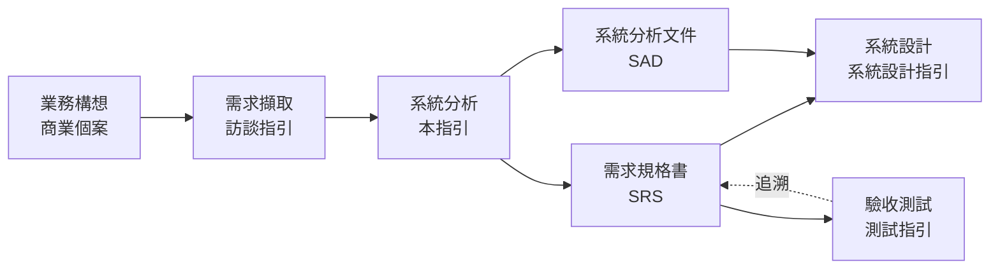

| 讀者 | 主要用途 | 建議閱讀章節 |
| --- | --- | --- |
| 系統分析師（SA）、業務分析師（BA） | 撰寫 SRS 與 SAD、主持需求審查 | 全部，特別是第 1、4、14、16、19 章與附錄 B、C |
| 產品負責人（PO）、業務代表 | 提供需求、排定優先順序、確認需求 | 第 3、5、6、15、17 章 |
| 架構師、系統設計師 | 從分析文件接手設計、審查非功能需求是否可設計 | 第 7–11 章、第 19 章 |
| 測試人員、品保 | 審查可測試性、從需求產生測試 | 第 4、6、9、14、16 章 |
| 資安與法遵人員 | 審查安全、隱私與合規需求 | 第 11 章 |
| 專案經理 | 範圍、優先級、變更控制與交付物 | 第 1、15、16、19 章 |
| 使用 AI 產生分析文件的人 | 撰寫提示、審查 AI 產出 | 第 18 章，以及各節的「🔍 審查與驗證」 |

### 0.2 參考標準與版本

本指引以下列標準與知識體系為依據（查證日期 2026-10-08）。標準更新時，以「狀態」欄註明的處理方式為準。

| 類別 | 標準或文件 | 本文採用版本 | 狀態與處理方式 |
| --- | --- | --- | --- |
| 需求工程流程 | ISO/IEC/IEEE 29148 | 2018 | 新版已於 2026 年進入 DIS 階段；正式發布前仍以 2018 版為準，見附錄 F.4 |
| 生命週期流程 | ISO/IEC/IEEE 12207、15288 | 最新版 | 本文對應其「利害關係人需要與需求定義」「系統／軟體需求定義」流程 |
| 業務分析 | IIBA BABOK Guide | v3（2015） | v4 尚無發布日期 |
| 需求工程認證 | IREB CPRE Foundation Level 課綱 | 3.3.0（2026-04-01） | 3.2.0 仍可用於考試準備 |
| 產品品質模型 | ISO/IEC 25010 | 2023 | 9 個品質特性，取代 2011 版的 8 個 |
| 使用品質模型 | ISO/IEC 25019 | 2023 | 由 25010:2011 拆出 |
| 資料品質模型 | ISO/IEC 25012 | 2008 | 15 個資料品質特性 |
| 建模語言 | OMG UML／BPMN／DMN | 2.5.1／2.0.2／1.5 | DMN 1.6 仍為 beta |
| 需求語法 | EARS（Easy Approach to Requirements Syntax） | Mavin 等，2009 | 5 種基本句型＋複合句型 |
| 驗收條件 | Gherkin | Cucumber Gherkin 語法 | 可用 `@cucumber/gherkin` 解析器檢查語法 |
| 應用程式安全 | OWASP ASVS／Top 10 | 5.0.0／2025 | ASVS 5.0 以 L1–L3 三個等級定義約 350 項要求 |
| 無障礙 | WCAG | 2.2 AA（ISO/IEC 40500:2025） | WCAG 3.0 仍為工作草案；台灣網站無障礙規範以 WCAG 2.1 為基礎 |
| 專案管理 | PMI PMBOK Guide | 第 8 版（2025-11） | 6 項原則、5 個焦點領域 |
| 敏捷 | Scrum Guide | 2020（另有 2025 Expansion Pack） | Expansion Pack 為選用補充 |
| 個人資料 | 個人資料保護法 | 2025-11-11 修正公布 | 修正條文施行日由行政院另定，見第 11 章 |
| 資通安全 | 資通安全管理法 | 2025-09-24 修正公布 | 主管機關為數位發展部；施行日由行政院另定 |
| 人工智慧 | 人工智慧基本法 | 2026-01-14 公布施行 | 原則性立法，主管機關為國科會，子法陸續訂定，見第 18 章 |

### 0.3 規範等級與規則格式

本文規則採用 [RFC 2119](https://www.rfc-editor.org/rfc/rfc2119) 與 [RFC 8174](https://www.rfc-editor.org/rfc/rfc8174) 的語意：

| 等級 | 英文 | 意義 | 分析審查處理 |
| --- | --- | --- | --- |
| **必須** | MUST | 不遵守會造成重大風險（需求遺漏、無法設計、無法測試、違反法規） | 不通過審查；如需例外必須走 0.6 豁免流程 |
| **應該** | SHOULD | 業界共識的最佳實務，除非有充分理由 | 不遵守時必須在分析文件的「分析決策」章節記錄理由 |
| **可以** | MAY | 建議做法，依專案規模與情境選用 | 不阻擋 |
| **不應該** | SHOULD NOT | 通常是錯誤的做法，除非有充分理由 | 採用時必須在「分析決策」章節記錄理由 |

每條規則都有編號，格式為 `SA-<領域>-<三位數序號>`。開頭的 `SA` 用來和系統設計指引（`SD-`）、架構設計指引與程式寫作指引的規則區分。編號一經發布不會重編，新增規則使用該領域尚未使用的號碼。

| 前綴 | 領域 | 章 | 前綴 | 領域 | 章 |
| --- | --- | --- | --- | --- | --- |
| `SA-PRC` | 分析流程與標準 | 1 | `SA-SEC` | 安全、隱私與合規 | 11 |
| `SA-ROL` | 角色與職責 | 2 | `SA-UX` | UI/UX 與無障礙 | 12 |
| `SA-ELI` | 需求擷取 | 3 | `SA-I18N` | 國際化需求 | 13 |
| `SA-REQ` | 需求撰寫品質 | 4 | `SA-VAL` | 需求驗證與確認 | 14 |
| `SA-BIZ` | 業務分析與流程 | 5 | `SA-PRI` | 優先級與範圍 | 15 |
| `SA-FUN` | 功能需求建模 | 6 | `SA-TRC` | 追溯與變更管理 | 16 |
| `SA-DAT` | 資料與領域分析 | 7 | `SA-AGL` | 敏捷與混合模式 | 17 |
| `SA-BEH` | 行為建模 | 8 | `SA-AI` | AI 輔助分析 | 18 |
| `SA-NFR` | 非功能需求 | 9 | `SA-DLV` | 交付物與分析審查 | 19 |
| `SA-INT` | 介面與整合需求 | 10 | | | |

**驗證方式欄位：** 每張規則表的最後一欄說明「怎麼確認分析成果符合這條規則」。審查者應先看這一欄，再決定要花多少心力人工檢查。

| 圖示 | 意義 | 範例 | 審查者該做什麼 |
| --- | --- | --- | --- |
| 🤖 | 工具可自動檢查 | 🤖 `check_srs.py`、🤖 `check_trace.py`、🤖 mermaid-cli、🤖 Gherkin 解析器 | 確認 CI 有執行該工具，且沒有被停用或略過 |
| 🧪 | 需要以測試、原型或演練證明 | 🧪 原型可用性測試、🧪 驗收測試 | 確認有對應的測試或演練紀錄，且結果有回饋到需求 |
| 👁 | 只能由人判斷 | 👁 需求審查 | 依該節「🔍 審查與驗證」的問題逐項確認 |

**範例標記：** 範例中以 `✅ <規則編號>` 標示符合規則的寫法，以 `❌ <規則編號>` 標示違規寫法。所有規則都至少出現在一個範例中（統計見 [附錄 A](#附錄-a-規則總表)）。

**貫穿全文的範例系統：** 為了讓範例前後一致，本文以「企業訂購平台」（B2B 訂單系統）為例：企業客戶的採購人員線上下單，系統檢查信用額度與庫存，主管核准大額訂單，倉儲出貨後由會計系統開立發票。[系統設計指引]() 也使用同一個系統，因此可以對照本文的分析成果如何轉成設計。本文使用的編號慣例如下：

| 項目 | 編號格式 | 範例 |
| --- | --- | --- |
| 業務需求 | `BR-<系統>-<三位數>` | `BR-ORD-001` 降低人工接單成本 |
| 利害關係人需求 | `StR-<系統>-<三位數>` | `StR-ORD-004` 採購人員需要即時知道訂單是否需要核准 |
| 功能需求 | `FR-<系統>-<三位數>` | `FR-ORD-012` 訂單金額超過核准門檻時送主管核准 |
| 非功能需求 | `NFR-<特性>-<三位數>` | `NFR-PERF-001` 下單回應時間 |
| 品質情境 | `QS-<系統>-<兩位數>` | `QS-ORD-01` 尖峰下單 |
| 業務規則 | `RULE-<系統>-<三位數>` | `RULE-ORD-003` 核准門檻 |
| 使用案例 | `UC-<系統>-<兩位數>` | `UC-ORD-01` 建立訂單 |
| 介面需求 | `IF-<系統>-<兩位數>` | `IF-ORD-03` 會計系統開立發票 |
| 待確認事項 | `TBD-<三位數>` | `TBD-007` 核准門檻是否依客戶等級不同 |

> 業務規則使用 `RULE-` 而不是 `BR-`，因為 `BR-` 已用於業務需求（Business Requirement）。兩者混用是常見的審查發現。

### 0.4 與其他指引的關係

本指引處理「需求層級」的分析。下列主題另有專門指引，本文只列出分析時必須確認的事項並連結過去：

| 主題 | 指引 | 本文的分工 |
| --- | --- | --- |
| 訪談規劃、提問技巧、訪談紀錄 | [客戶需求訪談與分析技巧]() | 本文第 3 章只規範擷取的完整性與紀錄要求 |
| 詳細設計、介面契約、資料庫結構 | [系統設計指引]() | 本文產出 SRS／SAD，作為設計的輸入；第 19 章定義交接 |
| 架構風格、雲端平台、高可用與災難復原 | [架構設計指引]() | 本文只寫可量測的需求目標（例如 RTO、RPO），不決定方案 |
| 資料庫實體設計 | [資料庫設計指引]() | 本文產出概念資料模型與資料字典，第 7 章 |
| 測試方法與測試管理 | [測試與品質保證指引]() | 本文定義驗收條件與可測試性，第 6、14 章 |
| 安全程式碼 | [安全程式碼指引]() | 本文只定義安全需求，第 11 章 |
| 畫面設計 | [UIUX指引]() | 本文定義使用者體驗與無障礙需求，第 12 章 |
| 開發流程與文件範本 | [軟體開發標準程序教學手冊]() | 本文的 SRS 範本與該手冊共用，附錄 C |
| 資料轉置 | [系統資料轉置教學指引]() | 本文只要求在分析階段盤點轉置範圍，第 7 章 |

### 0.5 如何閱讀本指引

每一節都依相同的結構撰寫，閱讀與審查時可以直接跳到需要的部分：

1. **概念說明**：為什麼需要這項分析、有哪些做法、如何取捨。
2. **規則表**：編號、等級、規則內容、驗證方式。
3. **範例**：✅ 正確寫法與 ❌ 常見錯誤，範例中標註規則編號。
4. **🔍 審查與驗證**：自動檢查指令、人工審查問題、AI 常見錯誤。

第一次導入時，建議依下列順序進行：

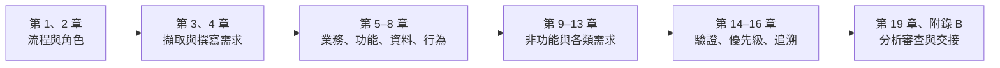

### 0.6 例外與豁免流程

規則不可能涵蓋所有情境。專案無法遵守某條「必須」規則時，依下列流程申請豁免，**不得**直接忽略：

1. 在 SAD 的「分析決策」章節寫明豁免的規則編號，說明原因、替代控制措施與到期日。
2. 由需求審查會議的主持人（或指定的分析主管）核准，並記錄核准人與日期。
3. 到期前重新評估；到期未處理的豁免，在下一次分析審查視為不通過。

```markdown
# AD-005 豁免 SA-INT-004：舊版庫存系統介面暫無錯誤碼清單

- 狀態：accepted（有效至 2027-03-31）
- 豁免規則：SA-INT-004（每個介面需求必須列出錯誤情境與處理方式）
- 原因：庫存系統由外部廠商維護，規格書未提供錯誤碼；廠商承諾 2027-Q1 提供。
- 替代控制：IF-ORD-02 先以 HTTP 狀態碼分類處理；所有非 2xx 回應記錄完整內容並告警。
- 追蹤：TBD-012；負責人：整合組 王小明
- 核准：需求審查會議，2026-10-08
```

#### 🔍 0.6 審查與驗證

- **自動檢查：** 以 `grep -rn "豁免 SA-" docs/` 列出所有豁免，並檢查每一筆都有「有效至」日期與對應的 `TBD-` 追蹤編號。
- **人工審查問題：**
  1. 豁免是否寫明替代控制措施，而不只是「時程不足」？
  2. 到期日是否合理？有沒有已過期仍在使用的豁免？
- **AI 常見錯誤：** AI 產生的分析文件常直接寫「本系統不適用此需求」，但沒有提出替代控制或到期日。這類說法應改走豁免流程。

---

## 1. 系統分析流程與國際標準

### 1.1 國際標準與分析流程

系統分析不是「把訪談內容整理成文件」，而是一組有明確輸入、輸出與品質標準的工程流程。ISO/IEC/IEEE 29148:2018 把需求工程放在 ISO/IEC/IEEE 15288（系統）與 12207（軟體）的技術流程中，分成三個層次。每一層的產出都是下一層的輸入：

| 29148 流程 | 回答的問題 | 主要產出 | 本文章節 |
| --- | --- | --- | --- |
| 業務或任務分析（Business or Mission Analysis） | 組織要解決什麼問題？成功的樣子是什麼？ | 業務需求規格（BRS）、商業個案、範圍 | 1.5、第 5 章 |
| 利害關係人需要與需求定義（Stakeholder Needs and Requirements Definition） | 誰會使用或受影響？他們需要什麼？ | 利害關係人需求規格（StRS）、營運概念（OpsCon） | 第 2、3 章 |
| 系統／軟體需求定義（System / Software Requirements Definition） | 系統必須做什麼、做到多好？ | 系統需求規格（SyRS）、軟體需求規格（SRS） | 第 4、6–13 章 |

IIBA BABOK Guide v3 從「業務分析」角度描述同一件事，分成 6 個知識領域：業務分析規劃與監控、擷取與協作、需求生命週期管理、策略分析、需求分析與設計定義、解決方案評估。IREB CPRE 則把需求工程分成擷取、文件化、驗證與協商、管理四項活動。三者用詞不同，但流程一致：**先理解問題，再定義需求，最後驗證需求並管理變更**。本文採用 29148 的結構，並在各章引用 BABOK 與 CPRE 的技術。

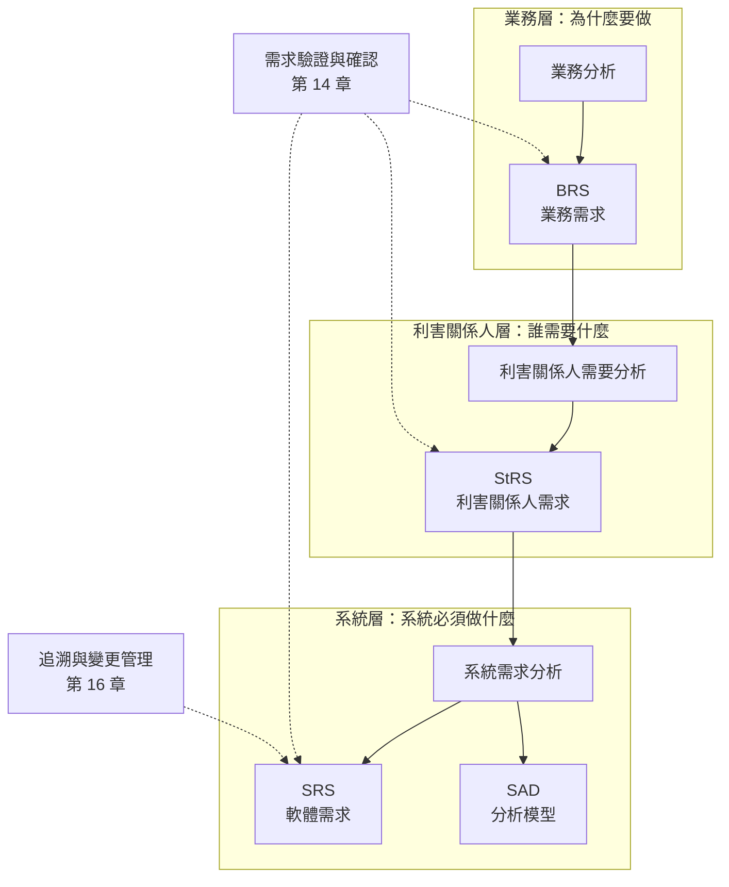

| 編號 | 等級 | 規則 | 驗證方式 |
| --- | --- | --- | --- |
| `SA-PRC-001` | 必須 | 系統分析必須依「業務需求 → 利害關係人需求 → 系統／軟體需求」三層進行；每一筆系統需求都必須能追溯到上一層的利害關係人需求或業務需求 | 🤖 `check_trace.py`（附錄 C.8）；👁 需求審查 |
| `SA-PRC-002` | 必須 | 分析文件必須區分「需求」（系統必須做什麼）與「解決方案」（系統要怎麼做）；除非是利害關係人明確要求的限制條件，需求敘述不得指定技術實作 | 👁 需求審查（以 4.4 的檢查表逐條確認） |
| `SA-PRC-003` | 應該 | 專案應在分析計畫中寫明採用的標準（例如 ISO/IEC/IEEE 29148:2018）與裁適方式，讓審查者知道以什麼標準審查 | 👁 分析計畫審查 |

```markdown
<!-- ✅ SA-PRC-001：每層需求都有上一層來源 -->
| 編號 | 需求 | 來源 |
| --- | --- | --- |
| BR-ORD-001 | 人工接單成本在上線一年內降低 40% | 商業個案 v1.2 |
| StR-ORD-004 | 採購人員需要在送出訂單時就知道是否需要主管核准 | BR-ORD-001；訪談紀錄 IV-03 |
| FR-ORD-012 | 當訂單總額超過客戶的核准門檻時，系統應將訂單狀態設為「待核准」 | StR-ORD-004 |
| FR-ORD-019 | 當訂單狀態變為「待核准」時，系統應通知該客戶的核准主管 | StR-ORD-004 |

<!-- ❌ SA-PRC-001：系統需求沒有來源，無法判斷是否為多餘需求 -->
| 編號 | 需求 |
| --- | --- |
| FR-ORD-012 | 大額訂單要核准 |
| FR-ORD-013 | 支援匯出 PDF |
```

```markdown
<!-- ❌ SA-PRC-002：需求寫成了解決方案 -->
FR-ORD-020 系統應使用 Redis 快取客戶信用額度，並以 Kafka 通知倉儲系統。

<!-- ✅ SA-PRC-002：只寫系統必須達成的結果；技術選擇留給設計 -->
FR-ORD-020 當訂單核准後，系統應在 1 分鐘內將出貨要求送達倉儲系統（IF-ORD-02）。
NFR-PERF-003 信用額度檢查的回應時間在尖峰負載下第 95 百分位數應不超過 300 毫秒。

<!-- ✅ SA-PRC-002：利害關係人明確要求的限制條件，標示為「限制」並寫明來源 -->
CON-ORD-002（限制）系統必須部署於本公司既有的 Kubernetes 平台。來源：資訊處技術政策 IT-POL-07。
```

```markdown
<!-- ✅ SA-PRC-003：分析計畫寫明採用標準與裁適 -->
## 2. 適用標準與裁適
- 需求工程：ISO/IEC/IEEE 29148:2018。本專案將 StRS 與 SRS 合併為一份 SRS，第 2 章為利害關係人需求。
- 品質模型：ISO/IEC 25010:2023。安全性（safety）特性不適用：本系統不控制實體設備。
- 驗收條件：Gherkin，存放於 `docs/srs/features/`。
```

#### 🔍 1.1 審查與驗證

- **自動檢查：** 以 `check_trace.py` 檢查每筆 `FR-`／`NFR-` 都有 `source` 欄位，且來源編號存在。
- **人工審查問題：**
  1. 隨機抽 5 筆系統需求，問「這筆需求是為了滿足哪個利害關係人的什麼需要？」能否從文件直接找到答案？
  2. 需求中是否出現產品名稱、框架、資料表或類別名稱？如果有，是利害關係人要求的限制，還是分析師自己的設計？
- **AI 常見錯誤：** AI 擅長把訪談摘要直接改寫成「系統應……」的句子，但常省略來源，也常把熟悉的技術方案（快取、訊息佇列）寫進需求。審查時特別檢查這兩點。

### 1.2 分析的進入與退出準則

沒有進入準則，分析會在目標不明時開始，最後變成反覆重寫；沒有退出準則，分析不是無限延長，就是在不完整時被迫交給設計。進入與退出準則應寫在分析計畫中，並在階段審查時逐項打勾。

| 準則 | 項目 | 證據 |
| --- | --- | --- |
| 進入 | 商業個案或專案章程已核准，目標可量測 | 核准紀錄 |
| 進入 | 主要利害關係人已識別，並有可聯繫的代表 | 利害關係人登錄表（2.3） |
| 進入 | 範圍邊界已初步定義 | 脈絡圖與範圍表（1.5） |
| 退出 | 所有「必須」優先級的需求已通過審查並基準化 | 審查紀錄、基準標籤 |
| 退出 | 所有需求都有驗收條件與驗證方法 | `check_srs.py` 報告 |
| 退出 | 待確認事項（TBD）都有負責人與期限，且不影響架構決策 | TBD 清單 |
| 退出 | 設計團隊已確認可以依文件開始設計 | 交接會議紀錄（19.3） |

| 編號 | 等級 | 規則 | 驗證方式 |
| --- | --- | --- | --- |
| `SA-PRC-004` | 必須 | 分析計畫必須定義進入與退出準則，每項準則都要列出可檢查的證據；階段審查以準則逐項判定 | 👁 分析計畫審查；👁 階段審查 |
| `SA-PRC-005` | 必須 | 退出時仍未解決的待確認事項必須以 `TBD-` 編號登錄，寫明影響的需求、負責人與期限；影響架構或範圍的 TBD 未解決前不得退出 | 🤖 `check_srs.py`（檢查 TBD 欄位完整）；👁 階段審查 |
| `SA-PRC-006` | 不應該 | 不應以「時程到了」作為唯一的退出理由；未達退出準則而進入設計時，必須記錄風險與補救計畫 | 👁 階段審查 |

```markdown
<!-- ✅ SA-PRC-004：退出準則逐項列出證據，審查時打勾 -->
## 分析階段退出檢查（RV-05，2026-10-30）
- [x] 「必須」需求 48 筆已審查並基準化：tag `srs-v1.3`
- [x] 所有需求都有驗收條件：check_srs.py 報告 0 筆缺漏（附 CI 連結）
- [ ] 待確認事項都有負責人與期限：TBD-015 缺負責人 → 會後 2 日內補齊
- [x] 設計團隊確認可開始設計：交接會議紀錄 HO-01

<!-- ❌ SA-PRC-004：準則無法檢查，也沒有證據 -->
退出準則：需求大致完成、各方沒有意見。
```

```markdown
<!-- ✅ SA-PRC-005：TBD 有影響範圍、負責人與期限 -->
| 編號 | 問題 | 影響需求 | 影響架構 | 負責人 | 期限 | 狀態 |
| --- | --- | --- | --- | --- | --- | --- |
| TBD-007 | 核准門檻是否依客戶等級不同？ | FR-ORD-012、RULE-ORD-003 | 否 | 業務部 陳經理 | 2026-10-20 | 處理中 |
| TBD-012 | 庫存系統的錯誤碼清單 | IF-ORD-02 | 否 | 整合組 王小明 | 2027-03-31 | 等待廠商 |

<!-- ❌ SA-PRC-005：TBD 散落在需求文字中，沒有人負責 -->
FR-ORD-012 大額訂單需核准（門檻待確認）。
FR-ORD-030 支援多幣別？（再問業務）
```

```markdown
<!-- ✅ SA-PRC-006：未達退出準則仍進入設計時，記錄風險與補救 -->
## 階段審查結論（2026-10-30）
- 結論：有條件通過。
- 未達準則：報表模組 12 筆需求尚無驗收條件。
- 風險：報表模組的設計可能需要重工。
- 補救：報表模組延後至第二次迭代設計；驗收條件於 2026-11-15 前補齊，PO 負責。
```

#### 🔍 1.2 審查與驗證

- **自動檢查：** `check_srs.py` 會列出沒有負責人或期限的 `TBD-` 項目，以及需求本文中出現「待確認」「TBD」「?」但沒有對應 `TBD-` 編號的句子。
- **人工審查問題：**
  1. 退出準則的每一項都有證據嗎？證據是文件連結、審查紀錄，還是只有口頭確認？
  2. 尚未解決的 TBD 中，有沒有會影響架構選擇（例如交易量、部署地點、整合方式）的項目？
- **AI 常見錯誤：** AI 會在需求中寫「（假設為 100 筆）」之類的臆測值來補洞。這些值必須轉成 `TBD-` 或請利害關係人確認，不能當作需求。

### 1.3 分析產出物與資訊項目

29148 定義了 BRS、StRS、SyRS、SRS 四種需求資訊項目（information item），並列出各自建議的章節。實務上，企業應用系統常將它們合併成兩份文件：**SRS**（需求本身，給利害關係人確認、給測試人員驗收）與 **SAD**（分析模型，給設計者理解問題）。合併沒有問題，但每一種資訊都必須有固定的位置。

| 產出物 | 內容 | 主要讀者 | 範本 |
| --- | --- | --- | --- |
| SRS 需求規格書 | 目的與範圍、利害關係人、業務需求、功能需求、非功能需求、介面需求、限制、假設、驗收條件、TBD | 業務、PO、測試、設計 | 附錄 C.1 |
| SAD 系統分析文件 | 脈絡圖、業務流程模型、使用案例模型、概念資料模型、狀態模型、業務規則、分析決策 | 設計、架構、測試 | 附錄 C.2 |
| 需求追溯矩陣 | 需求與來源、設計、測試的對應 | PM、品保、審查者 | 附錄 C.8 |
| 詞彙表 | 業務名詞的定義 | 所有人 | 7.1 |
| 驗收條件 | 以 Gherkin 撰寫的情境 | 測試、PO | 6.3、附錄 C.4 |

| 編號 | 等級 | 規則 | 驗證方式 |
| --- | --- | --- | --- |
| `SA-PRC-007` | 必須 | 分析產出物必須至少包含 SRS、SAD（可合併為一份）、追溯矩陣與詞彙表；每份文件都要有版本號、狀態（草稿／審查中／已核准）與變更紀錄 | 🤖 `check_srs.py`（檢查必要章節與文件資訊）；👁 需求審查 |
| `SA-PRC-008` | 必須 | SRS 與 SAD 必須以文字格式（Markdown、AsciiDoc）撰寫並納入版本控制；圖表以 Mermaid 或 PlantUML 等文字格式保存，不得只有圖片 | 🤖 CI 檢查文件格式與圖表渲染；👁 需求審查 |
| `SA-PRC-009` | 應該 | 需求應以可被工具讀取的結構保存（表格或 YAML front matter），讓追溯、統計與檢查可以自動化 | 🤖 `check_srs.py`、`check_trace.py` |

```markdown
<!-- ✅ SA-PRC-007：SRS 開頭的文件資訊 -->
# 企業訂購平台 軟體需求規格書（SRS）

| 項目 | 內容 |
| --- | --- |
| 文件編號 | SRS-ORD |
| 版本 | 1.3 |
| 狀態 | 已核准（2026-09-30，需求審查會議 RV-05） |
| 負責人 | 系統分析師 林怡君 |
| 相關文件 | SAD-ORD v1.3、詞彙表 GLO-ORD v1.1、追溯矩陣 docs/srs/trace.yaml |

## 變更紀錄
| 版本 | 日期 | 變更 | 核准 |
| --- | --- | --- | --- |
| 1.3 | 2026-09-30 | 新增 FR-ORD-012 核准流程（CR-0021） | RV-05 |
```

```markdown
<!-- ❌ SA-PRC-008：流程圖只有截圖，無法審查差異，也無法更新 -->


<!-- ✅ SA-PRC-008：以 Mermaid 撰寫，PR 中可以看到差異 -->
（見 5.2 的 Mermaid 流程圖原始碼）
```

```yaml
# ✅ SA-PRC-009：需求以 YAML 保存，可供 check_trace.py 讀取（完整格式見附錄 C.8）
- id: FR-ORD-012
  title: 大額訂單送主管核准
  type: functional
  priority: must
  source: [StR-ORD-004]
  rules: [RULE-ORD-003]
  acceptance: features/order-approval.feature
  status: approved
```

#### 🔍 1.3 審查與驗證

- **自動檢查：** `python check_srs.py docs/srs/srs.md` 會檢查必要章節（附錄 C.1 列出的章節）與文件資訊表是否存在；CI 以 mermaid-cli 渲染所有圖表。
- **人工審查問題：**
  1. SRS 和 SAD 對同一件事的描述一致嗎？（例如 SRS 說訂單有 5 個狀態，SAD 的狀態圖畫了 6 個。）
  2. 詞彙表的名詞和需求本文使用的名詞一致嗎？
- **AI 常見錯誤：** AI 產生文件時常編造版本號與核准紀錄（「已核准 v1.0」）。版本與狀態必須由版本控制與審查紀錄決定，不由撰寫者自行填寫。

### 1.4 分析計畫與裁適

不同規模的專案需要的分析深度不同。一個三人兩個月的內部工具，和一個連接十個外部系統的核心交易系統，不應使用同一份分析範本的全部章節。裁適（tailoring）的原則是：**可以刪減文件形式，但不能刪減該回答的問題**。例如小專案可以不畫完整的使用案例圖，但仍必須回答「誰會用、要做什麼、失敗時怎麼辦」。

| 專案特性 | 建議分析深度 | 可省略 | 不可省略 |
| --- | --- | --- | --- |
| 小型內部工具（< 3 人月、無外部介面、無個資） | 精簡 SRS（使用者故事 + 驗收條件） | 獨立 SAD、完整 UML | 範圍、NFR 最低要求、驗收條件 |
| 一般企業應用（有個資或外部介面） | 完整 SRS + SAD | 部分選用模型（例如活動圖） | 介面需求、安全與隱私需求、追溯 |
| 關鍵系統（金融交易、法規申報、高可用） | 完整 SRS + SAD + 獨立 NFR 規格 | — | 全部，且需正式審查與簽核 |

| 編號 | 等級 | 規則 | 驗證方式 |
| --- | --- | --- | --- |
| `SA-PRC-010` | 必須 | 分析開始前必須有分析計畫，寫明範圍、分析深度（依上表分級）、產出物、參與角色、時程、審查點與裁適項目 | 👁 分析計畫審查 |
| `SA-PRC-011` | 必須 | 裁適只能刪減文件形式，不得刪減以下問題的答案：範圍邊界、使用者與角色、功能與驗收條件、非功能目標、介面、安全與隱私、限制與假設 | 👁 分析計畫審查；👁 需求審查 |

```markdown
<!-- ✅ SA-PRC-010、SA-PRC-011：分析計畫摘要 -->
## 分析計畫（企業訂購平台）
- 分級：一般企業應用（含個資、4 個外部介面）
- 產出物：SRS、SAD、詞彙表、追溯矩陣、Gherkin 驗收條件
- 裁適：不畫 UML 使用案例圖，以使用案例清單表代替（6.1）；
        活動圖只畫「下單」「核准」兩個主要流程。
- 不裁適：介面需求（4 個外部系統）、個資盤點、NFR 品質情境。
- 審查點：RV-01 範圍（10/09）、RV-03 功能需求（10/23）、RV-05 全文（10/30）

<!-- ❌ SA-PRC-011：以「敏捷」為由刪掉非功能需求與介面需求 -->
## 分析計畫
- 本專案採敏捷，不撰寫 SRS，需求以 Jira 故事為準。
```

#### 🔍 1.4 審查與驗證

- **自動檢查：** 無法自動判斷裁適是否合理；可以 `check_srs.py --profile=standard` 依分級檢查必要章節。
- **人工審查問題：**
  1. 被裁掉的章節原本要回答的問題，現在在哪裡被回答？
  2. 分級是否低估了專案？（例如有個資卻被歸為「小型內部工具」。）
- **AI 常見錯誤：** 請 AI「寫一份分析計畫」時，它會產生大而全的範本，所有章節都標示「必要」。裁適必須由人依專案特性決定。

### 1.5 系統範圍與脈絡

範圍不清是需求變更與爭議的頭號來源。系統範圍要用兩種方式同時表達：**脈絡圖**畫出系統與外部參與者、外部系統之間交換什麼；**範圍表**以文字明確列出「包含」與「不包含」。「不包含」清單和「包含」清單一樣重要：它記錄了已經討論過、決定不做的事，避免同一個問題在每次會議重新討論。

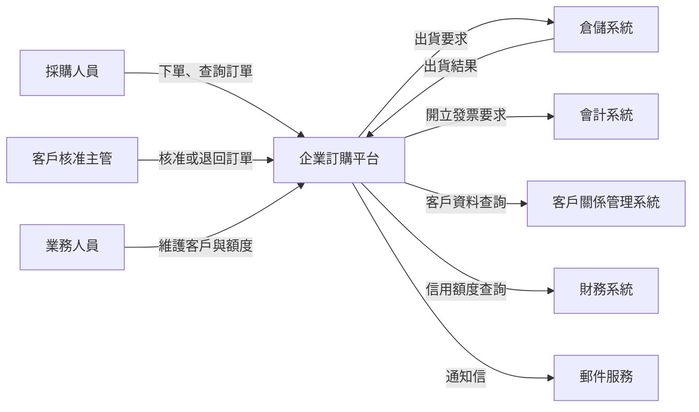

| 編號 | 等級 | 規則 | 驗證方式 |
| --- | --- | --- | --- |
| `SA-PRC-012` | 必須 | SAD 必須有脈絡圖，畫出所有外部參與者與外部系統，每條連線標示交換的資訊；每個外部系統都必須對應到至少一筆介面需求（第 10 章） | 🤖 mermaid-cli 渲染；👁 需求審查（核對脈絡圖與介面清單） |
| `SA-PRC-013` | 必須 | SRS 必須有範圍表，以「包含」與「不包含」兩欄列出範圍；「不包含」中的每一項要寫明理由或預計處理的階段 | 🤖 `check_srs.py`（檢查範圍表兩欄都非空）；👁 需求審查 |
| `SA-PRC-014` | 應該 | 範圍應以業務能力或業務流程描述，而不是以畫面或模組名稱描述，避免範圍隨畫面設計而改變 | 👁 需求審查 |

```markdown
<!-- ✅ SA-PRC-013、SA-PRC-014：以業務能力描述範圍，並列出不包含項目與理由 -->
| 包含 | 不包含（理由或預計階段） |
| --- | --- |
| 企業客戶線上下單與訂單查詢 | 個人消費者下單（另有電商平台，不重複建置） |
| 信用額度檢查與大額訂單核准 | 信用額度的核定流程（由財務部既有系統處理） |
| 將出貨要求送交倉儲系統、接收出貨結果 | 倉儲揀貨與物流排程（倉儲系統範圍） |
| 送出開立發票要求 | 發票開立與電子發票上傳（會計系統範圍） |
| 訂單取消（出貨前） | 退貨與退款（第二階段，預計 2027-Q2） |

<!-- ❌ SA-PRC-013、SA-PRC-014：以畫面列出範圍，且沒有不包含清單 -->
範圍：下單畫面、訂單查詢畫面、核准畫面、後台管理畫面。
```

#### 🔍 1.5 審查與驗證

- **自動檢查：** `check_srs.py` 檢查範圍表存在且兩欄都有內容；CI 渲染脈絡圖。可用 `grep` 比對脈絡圖中的外部系統名稱是否都出現在介面清單（10.1）。
- **人工審查問題：**
  1. 請業務代表看「不包含」清單：有沒有他們以為包含、但其實被排除的項目？
  2. 脈絡圖中每個外部系統，都有負責對接的窗口與介面需求嗎？
- **AI 常見錯誤：** AI 畫的脈絡圖常加入「資料庫」「快取」等系統內部元件。脈絡圖只畫系統**外部**的參與者與系統，內部元件屬於設計。

---

## 2. 角色與職責

### 2.1 分析團隊的角色

系統分析需要多種角色共同參與。角色不等於職位：小專案中一個人可能同時擔任系統分析師與業務分析師；大專案中一個角色可能由數人分擔。重要的是每個角色的**責任有人承擔**，而且有人能對需求做最後決定。

| 角色 | 主要責任 | 不負責 | 常見問題 |
| --- | --- | --- | --- |
| 業務分析師（BA） | 理解業務問題、擷取需求、建立業務流程與業務規則模型 | 技術方案 | 只記錄使用者「想要的功能」，沒有追問背後的問題 |
| 系統分析師（SA） | 將需求轉為系統需求、建立分析模型、撰寫 SRS／SAD、維護追溯 | 決定業務優先順序 | 太早進入設計（畫資料表、決定框架） |
| 產品負責人（PO）／業務負責人 | 決定需求優先順序與範圍、核准需求、接受驗收結果 | 撰寫所有需求細節 | 授權不足，每項決定都要再請示 |
| 領域專家（SME） | 提供業務知識、確認業務規則正確 | 決定範圍 | 只有一位，個人習慣被當成組織規則 |
| 架構師 | 評估需求的技術可行性、確認非功能需求可以達成 | 撰寫功能需求 | 太晚加入，非功能需求在設計階段才被挑戰 |
| 測試人員／品保 | 審查需求可測試性、撰寫驗收條件 | 定義需求 | 只在測試階段才讀需求 |
| 資安與法遵人員 | 識別安全、隱私與法規需求，審查濫用案例 | 業務需求 | 只在上線前做檢查 |
| UX 設計師 | 使用者研究、原型、可用性需求 | 後端邏輯 | 原型被當成需求規格，畫面細節變成合約 |

| 編號 | 等級 | 規則 | 驗證方式 |
| --- | --- | --- | --- |
| `SA-ROL-001` | 必須 | 每個專案必須指定一位對需求有最終決定權的人（通常為 PO 或業務負責人），並寫入分析計畫；需求衝突無法協調時由此人決定 | 👁 分析計畫審查 |
| `SA-ROL-002` | 必須 | 架構師、測試人員與資安人員必須在分析階段參與需求審查，而不是在設計或測試階段才第一次閱讀需求 | 👁 審查紀錄（核對出席者） |
| `SA-ROL-003` | 應該 | 業務規則與領域知識應由至少兩位領域專家確認，避免個人習慣被記錄為組織規則 | 👁 需求審查（核對業務規則的確認者） |

```markdown
<!-- ✅ SA-ROL-001：分析計畫寫明決策者與升級路徑 -->
## 決策權
- 需求最終決定者：業務部 張協理（產品負責人）
- 需求衝突處理：分析師整理選項與影響 → PO 於 3 個工作日內決定 → 記錄於 AD-xxx
- 超出預算或範圍的變更：送變更控制委員會（16.3）

<!-- ❌ SA-ROL-001：沒有決策者，衝突只能在會議中反覆討論 -->
## 決策權
- 需求由各部門共同討論決定。
```

```markdown
<!-- ✅ SA-ROL-002、SA-ROL-003：審查紀錄的出席者與業務規則確認者 -->
## RV-03 功能需求審查（2026-10-23）
- 出席：PO 張協理、SA 林怡君、架構師 周大衛、測試 黃美玲、資安 吳志豪
- RULE-ORD-003（核准門檻）確認者：業務部 陳經理、財務部 李課長

<!-- ❌ SA-ROL-002：只有業務與分析師，測試與資安沒有參與 -->
- 出席：PO、SA
```

#### 🔍 2.1 審查與驗證

- **自動檢查：** 可從審查紀錄統計每次審查的出席角色，缺少架構、測試或資安角色時提出警告。
- **人工審查問題：**
  1. 分析計畫中的決策者，真的有權決定範圍與優先順序嗎？還是每件事都要回到更高層？
  2. 業務規則的確認者是誰？只有一位時，是否有第二位專家可以確認？
- **AI 常見錯誤：** AI 產生的 RACI 常把所有活動的 A（最終負責）都指派給「專案經理」。需求內容的最終決定權應在業務端，而不是專案管理端。

### 2.2 責任分派矩陣（RACI）

RACI 矩陣把每項分析活動指派給角色：**R**（執行）、**A**（最終負責，每項活動只能有一個）、**C**（諮詢，雙向溝通）、**I**（告知，單向通知）。它的價值在於讓「這件事誰決定」在專案開始時就說清楚。

| 活動 | PO | BA／SA | SME | 架構師 | 測試 | 資安 | PM |
| --- | --- | --- | --- | --- | --- | --- | --- |
| 定義範圍與業務需求 | A | R | C | C | I | I | C |
| 擷取與撰寫功能需求 | C | A／R | C | I | C | I | I |
| 定義非功能需求 | A | R | C | R | C | C | I |
| 定義安全與隱私需求 | C | R | I | C | C | A | I |
| 撰寫驗收條件 | A | R | C | I | R | I | I |
| 需求審查與核准 | A | R | C | C | C | C | I |
| 需求變更影響分析 | C | A／R | C | R | R | C | C |
| 優先順序排定 | A | C | C | C | I | I | C |

| 編號 | 等級 | 規則 | 驗證方式 |
| --- | --- | --- | --- |
| `SA-ROL-004` | 必須 | 分析計畫必須包含 RACI 矩陣，涵蓋上表所列活動；每項活動有且只有一個 A | 🤖 RACI 表格檢查腳本（每列恰好一個 A）；👁 分析計畫審查 |
| `SA-ROL-005` | 應該 | RACI 中被指派為 R 或 A 的人，應在分析計畫中寫明姓名與可投入的時間比例；投入不足 20% 的關鍵角色應列為風險 | 👁 分析計畫審查 |

```python
# ✅ SA-ROL-004：檢查 RACI 表每一列恰好一個 A（「A／R」也算一個 A）
import re
import sys

def check_raci(markdown: str) -> list[str]:
    errors = []
    for line in markdown.splitlines():
        if not line.startswith("| ") or line.startswith("| 活動") or line.startswith("| ---"):
            continue
        cells = [c.strip() for c in line.strip("|").split("|")]
        activity, roles = cells[0], cells[1:]
        count = sum(1 for c in roles if re.search(r"(^|／)A($|／)", c))
        if count != 1:
            errors.append(f"{activity}: 有 {count} 個 A，應該恰好 1 個")
    return errors

if __name__ == "__main__":
    problems = check_raci(open(sys.argv[1], encoding="utf-8").read())
    print("\n".join(problems) or "RACI OK")
    sys.exit(1 if problems else 0)
```

```markdown
<!-- ❌ SA-ROL-004：同一活動兩個 A，發生爭議時沒有人能決定 -->
| 活動 | PO | BA／SA | 架構師 |
| --- | --- | --- | --- |
| 定義非功能需求 | A | R | A |

<!-- ✅ SA-ROL-005：關鍵角色寫明姓名與投入比例 -->
| 角色 | 姓名 | 投入比例 | 風險 |
| --- | --- | --- | --- |
| PO | 張協理 | 30% | — |
| SME | 陳經理 | 15% | 投入不足，已安排每週二固定 2 小時工作坊 |
```

#### 🔍 2.2 審查與驗證

- **自動檢查：** 以本節腳本檢查 RACI 表每一列恰好一個 A。
- **人工審查問題：**
  1. 被指派為 A 的人知道自己是 A 嗎？他們同意這份矩陣嗎？
  2. 有沒有角色在每一列都是 I？如果有，這個角色是否真的需要參與分析？
- **AI 常見錯誤：** AI 常產生「A／R」大量重疊、或每列有多個 A 的矩陣，因為它傾向讓每個角色都「負責」。

### 2.3 利害關係人識別與分析

利害關係人是「會影響系統，或會被系統影響」的人或組織，不只是使用者。漏掉一個利害關係人，就會漏掉他們的需求，常見例子是稽核單位（需要稽核軌跡）、維運單位（需要監控與批次控制）與法遵單位（需要保存期限）。

識別利害關係人可以使用「洋蔥模型」由內而外檢查：系統本身 → 直接操作系統的使用者 → 受系統產出影響的人 → 組織內的其他利害關係人 → 組織外部（客戶、主管機關、合作廠商）。每位利害關係人再以「影響力 × 關注度」分類，決定參與方式。

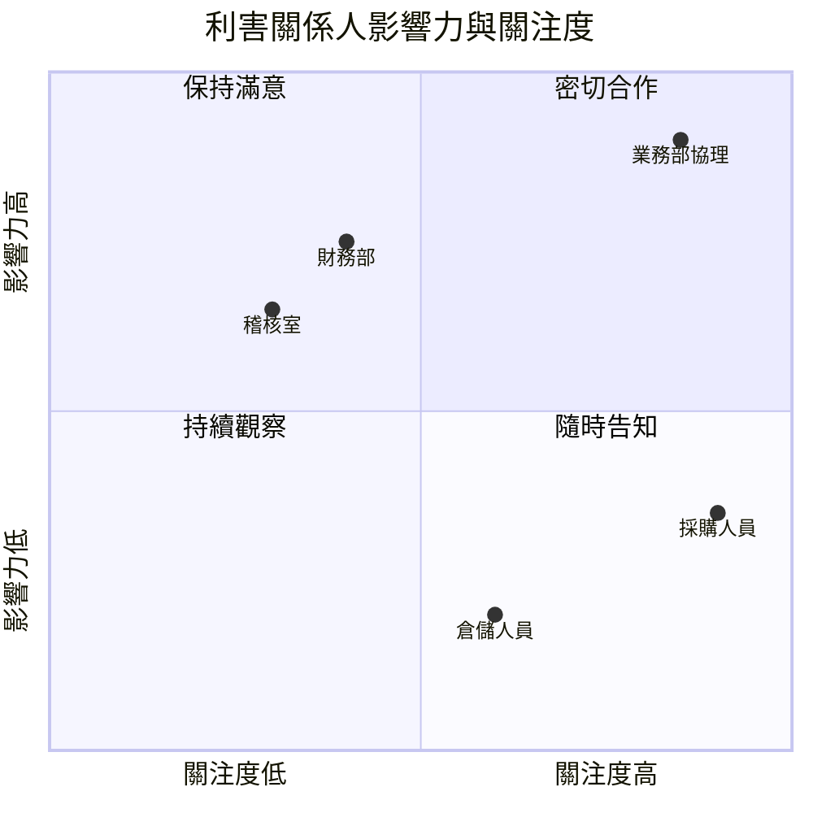

| 編號 | 等級 | 規則 | 驗證方式 |
| --- | --- | --- | --- |
| `SA-ROL-006` | 必須 | 必須建立利害關係人登錄表，至少包含名稱、類別（使用者、受影響者、組織內部、外部）、關注事項、影響力、關注度、代表人與參與方式 | 🤖 `check_srs.py`（檢查登錄表欄位）；👁 需求審查 |
| `SA-ROL-007` | 必須 | 識別利害關係人時必須逐一檢查下列類別：直接使用者、間接使用者、維運人員、資安與稽核、法遵與主管機關、外部系統擁有者、客戶與合作廠商；不適用的類別要寫明理由 | 👁 需求審查（以本規則清單逐項核對） |
| `SA-ROL-008` | 應該 | 每類使用者應建立使用者分類（user class）或人物誌，寫明使用頻率、專業程度、使用環境與特殊需要（例如無障礙），作為功能與 UX 需求的依據 | 👁 需求審查 |

```markdown
<!-- ✅ SA-ROL-006、SA-ROL-007：利害關係人登錄表，涵蓋非使用者類別 -->
| 利害關係人 | 類別 | 關注事項 | 影響力 | 關注度 | 代表人 | 參與方式 |
| --- | --- | --- | --- | --- | --- | --- |
| 採購人員（客戶端） | 直接使用者 | 下單快速、知道訂單狀態 | 低 | 高 | 客戶代表 3 家 | 訪談、原型測試 |
| 客戶核准主管 | 直接使用者 | 核准方便、不漏單 | 中 | 中 | 客戶代表 2 家 | 訪談 |
| 倉儲人員 | 間接使用者 | 出貨要求資料正確 | 低 | 中 | 倉儲課 趙組長 | 介面審查 |
| 維運人員 | 維運 | 監控、批次重跑、告警 | 中 | 中 | 資訊處 維運組 | 需求審查 |
| 稽核室 | 資安與稽核 | 核准紀錄不可竄改、保存 7 年 | 高 | 低 | 稽核室 劉稽核 | 需求審查 |
| 會計系統擁有者 | 外部系統擁有者 | 發票資料格式與時效 | 中 | 中 | 會計資訊組 | 介面協調會議 |
| 主管機關 | 法遵 | 不適用：本系統不涉及特許業務的申報 | — | — | — | — |

<!-- ❌ SA-ROL-007：只列出使用者，漏掉稽核、維運與外部系統擁有者 -->
| 利害關係人 | 需求 |
| --- | --- |
| 採購人員 | 下單 |
| 主管 | 核准 |
```

```markdown
<!-- ✅ SA-ROL-008：使用者分類 -->
### 使用者分類：採購人員
- 人數與頻率：約 1,200 人，每人每週下單 3–10 次，月底集中
- 專業程度：熟悉產品料號，不熟悉系統操作；多數每次只用 5 分鐘
- 使用環境：公司桌機為主，約 20% 使用平板；部分客戶網路需經過代理伺服器
- 特殊需要：部分使用者使用螢幕放大軟體（需符合 WCAG 2.2 AA，12.2）
```

#### 🔍 2.3 審查與驗證

- **自動檢查：** `check_srs.py` 檢查登錄表包含必要欄位，且每一列都有代表人或不適用理由。
- **人工審查問題：**
  1. 稽核、維運、法遵三類利害關係人有被列出嗎？他們的需求有出現在 SRS 中嗎？
  2. 每位利害關係人的代表人真的能代表該群體嗎？（例如只訪談一家客戶，能代表 300 家客戶嗎？）
- **AI 常見錯誤：** AI 列出的利害關係人通常只有「使用者、管理員、系統管理員」三類，且「影響力、關注度」是猜的。代表人與評分必須來自實際訪談。

---

## 3. 需求來源與需求擷取

### 3.1 需求來源與擷取技術的選擇

需求不會只來自訪談。IREB CPRE 把需求來源分成三類：**利害關係人**、**文件**（法規、合約、作業手冊、現行系統規格）與**系統**（現行系統、競品、相鄰系統）。只靠訪談會漏掉使用者「習以為常、所以不會說」的需求（例如月底結帳的批次時間），也會漏掉法規等沒有人主動提起的需求。

擷取技術的選擇取決於需求的類型。Kano 模型提醒我們：**基本需求**（使用者認為理所當然）很少在訪談中被提起，要靠觀察與文件分析；**期望需求**可以直接問；**魅力需求**使用者自己也不知道，要靠原型與創意技術引出。

| 技術 | 適合找出 | 不適合 | 注意事項 |
| --- | --- | --- | --- |
| 訪談 | 期望需求、目標、痛點 | 隱性知識、大量使用者的意見 | 細節見訪談指引；一次只訪談同一層級的人 |
| 工作坊（例如 JAD、事件風暴） | 跨部門流程、業務規則衝突 | 個別使用者偏好 | 需要有權決定的人在場 |
| 觀察（現場觀察、師徒式） | 基本需求、例外處理、實際作業方式 | 少見的情境 | 觀察實際工作，不是聽描述 |
| 文件分析 | 法規需求、業務規則、資料欄位 | 使用者偏好 | 確認文件版本仍有效 |
| 問卷 | 大量使用者的優先順序、滿意度 | 發掘新需求 | 先有假設再設計問題 |
| 原型 | 介面需求、魅力需求、確認理解 | 非功能需求 | 原型不是規格（12.1） |
| 現行系統與資料分析 | 實際使用量、資料品質、隱藏規則 | 未來的需要 | 見 3.2 |

| 編號 | 等級 | 規則 | 驗證方式 |
| --- | --- | --- | --- |
| `SA-ELI-001` | 必須 | 擷取計畫必須涵蓋三類來源：利害關係人、文件（法規、合約、作業規範）與系統（現行系統、相鄰系統）；每類來源至少列出一項具體項目或寫明不適用的理由 | 👁 分析計畫審查 |
| `SA-ELI-002` | 必須 | 每項擷取活動都必須記錄所用技術、參與者、日期與產出，並以 `IV-`（訪談）、`WS-`（工作坊）、`OB-`（觀察）、`DOC-`（文件）等編號登錄，供需求追溯來源 | 🤖 `check_trace.py`（需求來源編號必須存在於擷取紀錄清單）；👁 需求審查 |
| `SA-ELI-003` | 應該 | 擷取應至少使用兩種互補的技術（例如訪談搭配觀察或文件分析），特別是核心業務流程，以找出使用者不會主動說出的基本需求 | 👁 分析計畫審查 |

```markdown
<!-- ✅ SA-ELI-001、SA-ELI-003：擷取計畫涵蓋三類來源並使用互補技術 -->
| 來源類別 | 具體來源 | 技術 | 預計產出 |
| --- | --- | --- | --- |
| 利害關係人 | 採購人員（3 家客戶）、核准主管、業務人員 | 訪談 IV-01～06、原型測試 | 痛點、目標、期望功能 |
| 利害關係人 | 業務部、財務部、倉儲課 | 事件風暴工作坊 WS-01 | 下單到出貨的業務事件與規則 |
| 文件 | 授信作業辦法、客戶合約範本、電子發票相關規定 | 文件分析 DOC-01～03 | 業務規則、法規需求 |
| 系統 | 現行 Excel 接單檔、電話接單紀錄、倉儲系統介面規格 | 資料分析、觀察 OB-01 | 實際訂單量、例外處理方式 |

<!-- ❌ SA-ELI-001、SA-ELI-003：只有訪談一種來源 -->
擷取方式：訪談業務部同仁。
```

```markdown
<!-- ✅ SA-ELI-002：擷取紀錄清單 -->
| 編號 | 技術 | 日期 | 參與者 | 紀錄 |
| --- | --- | --- | --- | --- |
| IV-03 | 訪談 | 2026-09-15 | 客戶 A 採購 2 人 | docs/elicitation/IV-03.md |
| WS-01 | 事件風暴 | 2026-09-18 | 業務、財務、倉儲共 9 人 | docs/elicitation/WS-01.md（含照片與事件清單） |
| OB-01 | 現場觀察 | 2026-09-20 | 業務助理 2 人 | docs/elicitation/OB-01.md |
```

#### 🔍 3.1 審查與驗證

- **自動檢查：** `check_trace.py` 檢查需求的 `source` 欄位若引用 `IV-`、`WS-`、`OB-`、`DOC-` 編號，該編號必須存在於擷取紀錄清單。
- **人工審查問題：**
  1. 核心流程是否只靠訪談得出？有沒有用觀察或資料驗證使用者說的話？
  2. 法規與合約這類「沒有人會主動提」的來源，有被分析嗎？
- **AI 常見錯誤：** AI 可以根據產業常識「補完」需求，但這些需求沒有來源。審查時凡是來源寫「業界慣例」「一般需求」的項目，都要回到利害關係人確認。

### 3.2 現行系統與資料分析

新系統幾乎都是取代或擴充某個現行作業，即使現行作業只是 Excel 或紙本。分析現行系統可以得到兩類訪談得不到的資訊：**實際數量**（每天幾筆、尖峰在何時、資料多大）與**隱藏規則**（程式或試算表公式中寫死、但沒有人記得的規則）。這些資訊直接決定非功能需求與資料轉置範圍。

數據驅動的分析也用於驗證需求的價值：在提出「需要某功能」之前，先看資料是否支持。例如使用者說「常常要修改訂單」，資料分析可以回答是 1% 還是 30% 的訂單被修改，這會改變功能的優先順序。

| 分析對象 | 要回答的問題 | 產出 |
| --- | --- | --- |
| 交易量與時間分布 | 平均與尖峰量、尖峰時段、成長率 | 容量需求（9.3） |
| 資料量與資料品質 | 筆數、重複、缺漏、格式不一致的比例 | 資料品質需求（7.3）、轉置範圍 |
| 使用紀錄與錯誤紀錄 | 哪些功能常用、哪裡常出錯 | 優先順序、可用性需求 |
| 程式與試算表中的邏輯 | 計算公式、例外判斷 | 業務規則（5.3） |
| 客服與問題單 | 使用者常遇到的問題 | 痛點、功能需求 |

| 編號 | 等級 | 規則 | 驗證方式 |
| --- | --- | --- | --- |
| `SA-ELI-004` | 必須 | 若有現行系統或現行作業，必須分析其交易量（平均、尖峰、成長趨勢）與資料量，並以實際資料作為容量需求的依據；資料期間至少涵蓋一個完整的業務週期（例如一年中包含月底、季底與年底） | 🤖 資料分析查詢或報表（保存於擷取紀錄）；👁 需求審查 |
| `SA-ELI-005` | 必須 | 從現行程式或試算表中找出的計算公式與判斷邏輯，必須登錄為業務規則，並由領域專家確認仍然有效，不得直接照搬 | 👁 需求審查（核對業務規則的確認者） |
| `SA-ELI-006` | 應該 | 功能優先順序或價值主張應盡量以資料佐證（使用頻率、錯誤率、處理時間），並在需求的理由欄位引用資料來源 | 👁 需求審查 |

```sql
-- ✅ SA-ELI-004：以現行接單紀錄計算日訂單量的平均、尖峰與尖峰日（PostgreSQL）
-- 資料期間：2025-10-01～2026-09-30，涵蓋月底、季底與年底
SELECT
    round(avg(daily_orders), 1)                                         AS avg_per_day,
    max(daily_orders)                                                   AS peak_per_day,
    percentile_cont(0.95) WITHIN GROUP (ORDER BY daily_orders)          AS p95_per_day,
    (array_agg(order_date ORDER BY daily_orders DESC))[1]               AS peak_date
FROM (
    SELECT order_date, count(*) AS daily_orders
    FROM legacy_orders
    WHERE order_date BETWEEN DATE '2025-10-01' AND DATE '2026-09-30'
    GROUP BY order_date
) d;
```

```markdown
<!-- ✅ SA-ELI-004、SA-ELI-006：容量與優先順序引用實際資料 -->
- 依 2025-10～2026-09 接單紀錄（DOC-05）：平均每日 820 筆，第 95 百分位數 1,900 筆，
  尖峰為 2026-06-30 的 3,150 筆（季底）。→ NFR-CAP-001 以每日 3,500 筆設計。
- 訂單修改：12 個月內 6.8% 的訂單在出貨前被修改（DOC-05）。→ FR-ORD-018 訂單修改列為 must。

<!-- ❌ SA-ELI-004：容量需求沒有依據 -->
- 系統應支援大量訂單，預估每日 10 萬筆。
```

```markdown
<!-- ✅ SA-ELI-005：從試算表找出的邏輯，登錄為業務規則並請專家確認 -->
| 編號 | 業務規則 | 來源 | 確認者 | 狀態 |
| --- | --- | --- | --- | --- |
| RULE-ORD-007 | 訂單金額未滿 3,000 元時加收運費 150 元 | 接單試算表 Sheet「報價」儲存格 F12 公式 | 業務部 陳經理（2026-09-22） | 有效 |
| RULE-ORD-008 | 客戶等級為 VIP 時免運費 | 同上，儲存格 F13 | 業務部 陳經理 | 已廢止（2025 起取消，不實作） |
```

#### 🔍 3.2 審查與驗證

- **自動檢查：** 容量需求的數字應能由擷取紀錄中保存的查詢重新計算；審查者可要求重新執行查詢。
- **人工審查問題：**
  1. 容量數字的資料期間有涵蓋業務尖峰嗎？（只取三月份資料會低估季底尖峰。）
  2. 從現行系統找出的規則中，有沒有已經不再適用、但被照搬的規則？
- **AI 常見錯誤：** AI 會給出「一般電商每秒 1,000 筆」之類的通用數字。容量需求必須來自本組織的實際資料或有依據的業務預測。

### 3.3 擷取紀錄與確認

擷取的成果要能被追溯與確認。訪談後沒有回寫確認，常見結果是分析師與使用者對同一句話有不同理解，直到驗收時才發現。每次擷取活動後，應在短時間內把「我們理解的需求」寫回給參與者確認，確認紀錄是需求來源的一部分。

| 編號 | 等級 | 規則 | 驗證方式 |
| --- | --- | --- | --- |
| `SA-ELI-007` | 必須 | 每次擷取活動結束後 3 個工作日內，必須將整理後的需求摘要送參與者確認，並保存確認紀錄（郵件、簽核或議題系統留言） | 👁 需求審查（抽查擷取紀錄的確認欄） |
| `SA-ELI-008` | 必須 | 擷取紀錄必須區分「事實」（使用者陳述或觀察到的作法）、「需求」（使用者需要的結果）與「分析師的解讀或假設」，假設要另外標示並追蹤確認 | 👁 需求審查 |
| `SA-ELI-009` | 必須 | 訪談錄音、錄影或含個人資料的紀錄，必須事先取得參與者同意並依組織的個資規範保存與刪除；不得將原始錄音或逐字稿上傳到未經核准的外部服務（包括 AI 服務） | 👁 需求審查；👁 個資盤點（11.3） |

```markdown
<!-- ✅ SA-ELI-007、SA-ELI-008：擷取紀錄區分事實、需求與假設，並有確認紀錄 -->
# IV-03 訪談紀錄：客戶 A 採購人員

- 日期：2026-09-15；參與者：客戶 A 採購 王小姐、李先生；分析師：林怡君
- 錄音：已取得口頭與書面同意，保存於專案加密資料夾，2027-03-31 刪除

## 事實
- F1 目前以 Email 寄送 Excel 訂單，約 2 小時後才知道是否有庫存。
- F2 金額超過 50 萬的訂單，需要課長在紙本上簽名後再寄出。

## 需求
- N1 送出訂單時就知道是否有庫存。（→ StR-ORD-002）
- N2 大額訂單的核准在線上完成，不需要列印。（→ StR-ORD-004）

## 分析師的假設（待確認）
- A1 核准門檻 50 萬可能因客戶而不同。→ TBD-007

## 確認
- 2026-09-17 以 Email 寄送本摘要，王小姐 2026-09-18 回覆「內容正確」，附件存於 IV-03-confirm.eml

<!-- ❌ SA-ELI-008：把分析師的推測寫成使用者需求 -->
- 使用者需要 AI 自動推薦訂購數量。
```

```markdown
<!-- ❌ SA-ELI-009：沒有同意紀錄，且把錄音上傳到未核准的服務 -->
- 錄音檔已上傳至免費的線上轉逐字稿網站，逐字稿如附件。
```

#### 🔍 3.3 審查與驗證

- **自動檢查：** 可檢查每份擷取紀錄都有「確認」小節，且確認日期在擷取日期後 3 個工作日內。
- **人工審查問題：**
  1. 需求摘要中的「需求」是使用者說的，還是分析師推論的？推論的部分有被標示為假設嗎？
  2. 錄音與逐字稿存放在哪裡？何時刪除？
- **AI 常見錯誤：** 用 AI 整理訪談逐字稿時，AI 會把多位受訪者的意見合併成單一結論，並刪掉「但是」「例外是」這類關鍵限定詞。整理後的摘要必須由參與者確認，不能直接採用。訪談技巧與紀錄格式的細節，請見 [客戶需求訪談與分析技巧]()。

---

## 4. 需求撰寫品質

### 4.1 良好需求的特性

ISO/IEC/IEEE 29148:2018 第 5.2 節列出單筆需求與需求集合應具備的特性。這些特性是需求審查的共同語言：審查意見不應該是「這條寫得不好」，而應該是「這條不具備『可驗證』特性，因為沒有量測標準」。

| 層級 | 特性 | 意義 | 違反的例子 |
| --- | --- | --- | --- |
| 單筆需求 | 必要（necessary） | 刪掉它會造成能力或品質的缺口 | 「系統應支援匯出 PDF」，但沒有人需要 |
| 單筆需求 | 適當（appropriate） | 抽象程度與所在層級相符 | 在業務需求中寫欄位長度 |
| 單筆需求 | 明確（unambiguous） | 只有一種解讀方式 | 「系統應快速回應」 |
| 單筆需求 | 完整（complete） | 不需要其他資訊就能理解 | 「同上，但金額不同」 |
| 單筆需求 | 單一（singular） | 只描述一項能力或特性 | 「系統應建立訂單並寄送通知並更新庫存」 |
| 單筆需求 | 可行（feasible） | 在限制內可以實現 | 「可用性 100%」 |
| 單筆需求 | 可驗證（verifiable） | 可以證明系統滿足它 | 「介面應友善」 |
| 單筆需求 | 正確（correct） | 準確反映來源的需要 | 把「出貨前可取消」寫成「核准前可取消」 |
| 單筆需求 | 符合（conforming） | 符合組織的格式與範本 | 沒有編號、沒有優先順序 |
| 需求集合 | 完整（complete） | 包含所有需要的需求 | 只有成功流程，沒有錯誤處理 |
| 需求集合 | 一致（consistent） | 需求之間不衝突，用詞一致 | 一處說「客戶」，另一處說「會員」指同一對象 |
| 需求集合 | 可行（feasible） | 整體在預算與時程內可實現 | 全部需求都是 must |
| 需求集合 | 可理解（comprehensible） | 讀者能理解整體系統的行為 | 只有需求清單，沒有脈絡圖與流程 |
| 需求集合 | 可確認（able to be validated） | 可以證明滿足業務需要 | 業務目標無法量測 |

| 編號 | 等級 | 規則 | 驗證方式 |
| --- | --- | --- | --- |
| `SA-REQ-001` | 必須 | 每筆需求必須具備 29148 的單筆需求特性；審查意見必須指出違反的特性名稱，讓撰寫者知道如何修正 | 🤖 `check_srs.py`（可自動檢查的部分：單一、明確、符合）；👁 需求審查 |
| `SA-REQ-002` | 必須 | 每筆需求只能描述一項能力或特性；一個句子中出現兩個以上的「應」，或以「並」「且」「以及」連接多個動作時，必須拆成多筆需求 | 🤖 `check_srs.py`（偵測多個「應」與連接詞） |
| `SA-REQ-003` | 必須 | 同一概念在整份文件中必須使用同一個名詞，並登錄於詞彙表；同義詞要在詞彙表中標示「不使用」並指向標準用詞 | 🤖 詞彙表同義詞掃描（7.1）；👁 需求審查 |

```markdown
<!-- ❌ SA-REQ-002：一筆需求包含三項能力，無法個別追溯、測試與排序 -->
FR-ORD-010 系統應建立訂單並寄送確認信給採購人員，且應更新庫存保留數量。

<!-- ✅ SA-REQ-002：拆成三筆，各自有驗收條件 -->
FR-ORD-010 當採購人員送出通過檢查的訂單時，系統應建立狀態為「已建立」的訂單。
FR-ORD-011 當訂單建立後，系統應寄送訂單確認信給下單的採購人員。
FR-ORD-014 當訂單建立後，系統應向倉儲系統保留訂單明細的庫存數量（IF-ORD-02）。
```

```markdown
<!-- ✅ SA-REQ-001：審查意見指出違反的特性與修正方向 -->
| 需求 | 違反特性 | 審查意見 |
| --- | --- | --- |
| FR-ORD-022 系統應快速查詢訂單 | 明確、可驗證 | 「快速」無量測標準；請改為「查詢回應時間第 95 百分位數 ≤ 2 秒」並移到 NFR |
| FR-ORD-025 系統應支援各種付款方式 | 完整、可驗證 | 請列出付款方式清單，或引用 RULE- 業務規則 |

<!-- ❌ SA-REQ-003：同一個對象有三種稱呼 -->
FR-ORD-090 客戶可以查詢訂單。
FR-ORD-091 會員可以取消訂單。
FR-ORD-092 買方可以下載發票。
```

#### 🔍 4.1 審查與驗證

- **自動檢查：** `python check_srs.py srs.md` 會報告：一句中有多個「應」、使用連接詞串接多個動作、使用詞彙表標示「不使用」的同義詞。
- **人工審查問題：**
  1. 隨機抽 10 筆需求，請兩位審查者各自寫出測試方式；兩人的理解相同嗎？不同的地方就是不明確之處。
  2. 每筆需求刪掉後，會有利害關係人反對嗎？沒有人反對的需求可能不是必要的。
- **AI 常見錯誤：** AI 寫出的需求句型通常很流暢，但常把多個動作寫在同一句，並混用同義詞（「使用者」「用戶」「客戶」）。流暢不等於明確。

### 4.2 需求句型：EARS

EARS（Easy Approach to Requirements Syntax）由 Rolls-Royce 的 Alistair Mavin 等人於 2009 年提出，以少數固定句型限制自然語言，大幅減少歧義、遺漏與「條件寫在句尾所以被忽略」的問題。中文版句型如下，條件一律放在句首，主詞一律是「系統」：

| 句型 | 英文 | 中文句型 | 用於 |
| --- | --- | --- | --- |
| 普遍（Ubiquitous） | The \<system\> shall \<response\> | 系統應〈回應〉。 | 永遠成立的要求 |
| 事件驅動（Event-driven） | When \<trigger\>, the \<system\> shall \<response\> | 當〈觸發事件〉時，系統應〈回應〉。 | 對事件的回應 |
| 狀態驅動（State-driven） | While \<state\>, the \<system\> shall \<response\> | 在〈狀態〉期間，系統應〈回應〉。 | 某狀態持續期間的要求 |
| 非預期行為（Unwanted behaviour） | If \<condition\>, then the \<system\> shall \<response\> | 若〈非預期情況〉，則系統應〈回應〉。 | 錯誤、異常、例外 |
| 選用功能（Optional feature） | Where \<feature\>, the \<system\> shall \<response\> | 在具備〈功能或設定〉的情況下，系統應〈回應〉。 | 只在特定版本或設定下成立 |
| 複合（Complex） | 組合上述關鍵字 | 在〈狀態〉期間，當〈事件〉時，系統應〈回應〉。 | 多重條件 |

「若……則……」專用於**非預期行為**。把它和「當……時」分開，讓審查者可以一眼找出所有錯誤處理需求，並檢查每個正常流程是否都有對應的錯誤處理。

| 編號 | 等級 | 規則 | 驗證方式 |
| --- | --- | --- | --- |
| `SA-REQ-004` | 必須 | 功能需求必須使用 EARS 句型撰寫，條件放在句首，主詞為「系統」（或明確的子系統名稱），動詞使用「應」 | 🤖 `check_srs.py`（EARS 句型比對） |
| `SA-REQ-005` | 必須 | 每個事件驅動需求所描述的正常流程，都必須檢查是否需要對應的非預期行為需求（「若……則系統應……」），例如外部系統無回應、資料不合法、權限不足 | 👁 需求審查（以 6.1 的例外流程核對）；🤖 `check_srs.py`（統計非預期行為需求的比例） |
| `SA-REQ-006` | 不應該 | 不應以「可以」「能夠」「支援」作為需求的主要動詞；這類動詞無法判斷是強制還是選用，也無法判斷完成的程度 | 🤖 `check_srs.py`（模糊動詞掃描） |

```markdown
<!-- ✅ SA-REQ-004：五種 EARS 句型 -->
FR-ORD-001（普遍）系統應以新臺幣顯示訂單金額，精確到元。
FR-ORD-012（事件驅動）當訂單總額超過該客戶的核准門檻（RULE-ORD-003）時，系統應將訂單狀態設為「待核准」。
FR-ORD-040（狀態驅動）在每月結帳作業執行期間，系統應拒絕修改當月已出貨的訂單。
FR-ORD-013（非預期行為）若信用額度服務在 3 秒內沒有回應，則系統應將訂單狀態設為「額度待確認」。
FR-ORD-050（選用功能）在客戶啟用「多層核准」設定的情況下，系統應依核准層級表依序通知各層核准主管。

<!-- ❌ SA-REQ-004：條件寫在句尾、主詞不明、動詞模糊 -->
大額訂單需要核准，若是 VIP 客戶的話可以不用。
```

```markdown
<!-- ✅ SA-REQ-005：正常流程與對應的非預期行為 -->
FR-ORD-014 當訂單建立後，系統應向倉儲系統保留訂單明細的庫存數量。
FR-ORD-015 若倉儲系統回覆庫存不足，則系統應將訂單狀態設為「庫存不足」。
FR-ORD-021 當訂單狀態變為「庫存不足」時，系統應通知下單的採購人員各明細目前可出貨的數量。
FR-ORD-016 若倉儲系統在 5 秒內沒有回應，則系統應每隔 1 分鐘重送保留要求，最多 3 次。

<!-- ❌ SA-REQ-006：「支援」「可以」無法判斷完成的程度 -->
FR-ORD-060 系統支援多幣別。
FR-ORD-061 使用者可以匯出報表。
```

#### 🔍 4.2 審查與驗證

- **自動檢查：** `check_srs.py` 會列出不符合任何 EARS 句型的功能需求，並統計「若……則」需求占事件驅動需求的比例；比例低於 30% 時提出警告，表示錯誤處理可能不足。
- **人工審查問題：**
  1. 每個「當……時」的需求，有沒有想過外部系統失敗、資料錯誤、使用者沒有權限的情況？
  2. 「在……期間」的狀態，有明確的開始與結束條件嗎？
- **AI 常見錯誤：** AI 可以很快把需求改寫成 EARS 句型，但會把非預期行為也寫成「當發生錯誤時，系統應顯示錯誤訊息」。這是無效的需求：沒有指出哪一種錯誤、系統要保持什麼狀態、使用者接下來能做什麼。

### 4.3 需求屬性與編號

需求不只是一句話。29148 建議每筆需求附帶屬性，讓需求可以被排序、追溯、驗證與管理。屬性應存在可被工具讀取的位置（需求表格欄位或 YAML），不要散落在敘述中。

| 屬性 | 必要性 | 說明 |
| --- | --- | --- |
| 編號 | 必須 | 唯一且永不重複使用；刪除的需求保留編號並標示「已刪除」 |
| 需求敘述 | 必須 | EARS 句型 |
| 類型 | 必須 | 功能、非功能（標示 25010 特性）、介面、限制、業務規則 |
| 優先順序 | 必須 | must／should／could／won't（第 15 章） |
| 來源 | 必須 | 上層需求或擷取紀錄編號 |
| 理由（rationale） | 應該 | 為什麼需要；避免日後被誤刪 |
| 驗證方法 | 必須 | 檢查、分析、展示、測試（4.5） |
| 驗收條件 | 必須 | Gherkin 情境或可量測的標準 |
| 狀態 | 必須 | 草稿、審查中、已核准、已實作、已驗證、已刪除 |
| 負責人 | 應該 | 可回答問題的業務端負責人 |
| 穩定度 | 可以 | 高、中、低；低穩定度的需求在設計時應保留彈性 |

| 編號 | 等級 | 規則 | 驗證方式 |
| --- | --- | --- | --- |
| `SA-REQ-007` | 必須 | 需求編號必須唯一，格式依 0.3 的編號慣例；編號不得重新使用，刪除的需求保留編號並將狀態設為「已刪除」，註明刪除原因與變更單號 | 🤖 `check_srs.py`（編號格式與重複檢查）；🤖 `check_trace.py`（比對前一基準，偵測編號被重用） |
| `SA-REQ-008` | 必須 | 每筆需求必須有類型、優先順序、來源、驗證方法、驗收條件與狀態六項屬性 | 🤖 `check_trace.py`（屬性完整性） |
| `SA-REQ-009` | 應該 | 優先順序為 must 或與法規相關的需求，應填寫理由，說明不實作的後果 | 🤖 `check_trace.py`（must 需求缺理由時警告）；👁 需求審查 |

```yaml
# ✅ SA-REQ-007、SA-REQ-008、SA-REQ-009：需求屬性完整，刪除的需求保留編號
- id: FR-ORD-012
  statement: 當訂單總額超過該客戶的核准門檻（RULE-ORD-003）時，系統應將訂單狀態設為「待核准」。
  type: functional
  priority: must
  source: [StR-ORD-004, IV-03]
  rationale: 客戶內控要求大額採購須經主管核准；沒有此功能客戶 A、C 不會採用本平台。
  verification: test
  acceptance: features/order-approval.feature
  status: approved
  owner: 業務部 陳經理
- id: FR-ORD-017
  statement: 系統應每日寄送未處理訂單摘要給業務人員。
  status: deleted
  deleted_reason: 改由儀表板呈現（CR-0018），編號不再使用。
```

```markdown
<!-- ❌ SA-REQ-007：刪除需求後重新使用編號，舊的測試與追溯紀錄會指向錯誤的需求 -->
FR-ORD-017（v1.1）系統應每日寄送未處理訂單摘要給業務人員。
FR-ORD-017（v1.2）系統應支援批次匯入訂單。

<!-- ❌ SA-REQ-008：只有編號與敘述，無法排序、追溯或驗收 -->
| 編號 | 需求 |
| --- | --- |
| FR-ORD-012 | 大額訂單送主管核准 |
```

#### 🔍 4.3 審查與驗證

- **自動檢查：** `check_srs.py` 檢查 SRS 中的編號格式與重複定義；`check_trace.py` 檢查需求登錄的屬性完整，加上 `--baseline srs-v1.2` 時比對前一基準，偵測編號消失或同一編號的敘述被完全替換（可能是編號重用）。
- **人工審查問題：**
  1. 「來源」欄引用的編號真的支持這筆需求嗎？還是隨便填了一個？
  2. must 需求的理由是否具體說明了不實作的後果？
- **AI 常見錯誤：** AI 產生的需求表常自動遞增編號，重新產生時編號會整批位移，導致追溯全部錯亂。請 AI 修改需求時，必須提供現有編號並要求保持不變。

### 4.4 模糊用語與常見缺陷

有些詞彙幾乎必然造成歧義。把它們列成檢查清單，由工具自動掃描，是投資報酬率最高的需求品質措施。下表的「替代寫法」說明應補充什麼資訊，而不是換一個同樣模糊的詞。

| 類別 | 模糊用語 | 問題 | 替代寫法 |
| --- | --- | --- | --- |
| 主觀形容 | 友善、簡單、直覺、美觀、容易 | 無法驗證 | 可用性指標（12.3）：完成率、時間、錯誤次數 |
| 未定量 | 快速、即時、大量、高效能、穩定 | 無量測標準 | 數值與量測條件（第 9 章） |
| 不完整列舉 | 等、等等、例如、包括但不限於、相關 | 範圍開放 | 完整清單或引用業務規則 |
| 含糊程度 | 適當、必要時、儘可能、盡量、通常 | 由實作者自行決定 | 明確條件與門檻 |
| 未定義對象 | 使用者、資料、系統（指外部系統時） | 指哪一個？ | 使用者分類、資料實體、系統名稱 |
| 選擇性 | 和／或、及／或 | 兩種解讀 | 拆成兩筆或寫明組合 |
| 模糊動詞 | 支援、處理、管理、可以 | 範圍不明 | 具體動作（建立、計算、拒絕、通知） |
| 否定的否定 | 不得不、非不 | 難以理解 | 改為肯定句 |
| 解決方案 | 使用 Redis、資料表、下拉選單 | 指定實作 | 寫出要達成的結果（1.1） |

| 編號 | 等級 | 規則 | 驗證方式 |
| --- | --- | --- | --- |
| `SA-REQ-010` | 必須 | 需求敘述不得包含上表的模糊用語；確實需要使用時（例如引用法規原文），必須在同一筆需求中補充量化標準或引用定義 | 🤖 `check_srs.py`（模糊用語掃描） |
| `SA-REQ-011` | 必須 | 需求中的每個數值都必須附單位與量測條件（例如「第 95 百分位數」「在 500 個同時使用者下」），每個時間都必須寫明時區或以系統時區為準 | 🤖 `check_srs.py`（偵測無單位的數字）；👁 需求審查 |
| `SA-REQ-012` | 應該 | 組織應維護自己的模糊用語清單，納入審查中反覆出現的問題用語，並納入 `check_srs.py` 的設定檔 | 👁 每季檢討模糊用語清單 |

```markdown
<!-- ❌ SA-REQ-010、SA-REQ-011：模糊用語與無單位數字 -->
NFR-PERF-001 系統應快速回應，查詢時間儘可能在 2 以內。
FR-ORD-070 系統應適當處理大量訂單等相關資料。

<!-- ✅ SA-REQ-010、SA-REQ-011：量化標準與量測條件 -->
NFR-PERF-001 在 500 個同時使用者、每分鐘 300 筆下單的負載下，訂單查詢回應時間的第 95 百分位數應不超過 2 秒（量測點：API 閘道）。
```

```yaml
# ✅ SA-REQ-012：組織自訂的模糊用語清單（check_srs.py 的設定檔 ambiguous.yaml）
ambiguous_terms:
  - 友善
  - 簡單
  - 快速
  - 即時
  - 大量
  - 適當
  - 儘可能
  - 盡量
  - 等等
  - 相關
  - 支援
  - 和/或
  - 及/或
  # 2026-Q3 審查新增：反覆被誤用
  - 一般情況下
  - 視情況
```

#### 🔍 4.4 審查與驗證

- **自動檢查：** `python check_srs.py srs.md --terms ambiguous.yaml` 列出所有命中的模糊用語與行號。命中不一定是錯誤（例如詞彙表中定義「即時」為「5 秒內」），但每一個都要有人看過。
- **人工審查問題：**
  1. 工具沒有命中的需求，是否仍有主觀判斷的空間？（例如「主要欄位」「重要通知」。）
  2. 數值需求的量測條件夠完整嗎？負載、量測點、統計方式都有寫嗎？
- **AI 常見錯誤：** 要求 AI「改寫成不模糊的需求」時，它常會自行填入數字（「2 秒」「99.9%」）。這些數字看起來具體，但沒有來源。數值必須來自利害關係人或現行系統資料（3.2），並記錄在來源欄位。

### 4.5 需求的驗證方法

每筆需求在撰寫時就要決定**如何證明系統滿足它**。29148 與 15288 定義了四種驗證方法，選擇方法時也同時在檢查需求是否可驗證：如果想不出任何一種方法，需求本身就有問題。

| 方法 | 英文 | 做法 | 適用 |
| --- | --- | --- | --- |
| 檢查 | Inspection | 以目視或審查文件、程式、畫面確認 | 畫面文字、文件存在、設定值 |
| 分析 | Analysis | 以計算、模型、模擬證明 | 容量、可用性、無法實測的極端情境 |
| 展示 | Demonstration | 操作系統，觀察功能結果，不做量測 | 操作流程、可用性 |
| 測試 | Test | 在受控條件下執行並量測結果 | 功能邏輯、效能、安全 |

| 編號 | 等級 | 規則 | 驗證方式 |
| --- | --- | --- | --- |
| `SA-REQ-013` | 必須 | 每筆需求必須指定驗證方法（檢查、分析、展示、測試之一或組合）；以「分析」驗證的需求，必須說明分析方法與所用的資料或模型 | 🤖 `check_trace.py`（驗證方法欄位值檢查） |
| `SA-REQ-014` | 必須 | 驗證方法為「測試」的需求，必須有可執行的驗收條件（Gherkin 情境或量測標準），測試人員不需要再詢問分析師就能設計測試 | 🤖 `check_trace.py`（驗收條件檔案存在）；👁 測試人員審查 |

```yaml
# ✅ SA-REQ-013、SA-REQ-014：不同需求選擇不同驗證方法
- id: NFR-AVAIL-001
  statement: 系統在營業時間（週一至週六 08:00–22:00，Asia/Taipei）的每月可用率應不低於 99.9%。
  verification: analysis
  verification_note: 以上線後 3 個月的監控資料計算；上線前以架構可用性模型（含單點故障分析）估算。
- id: FR-ORD-012
  verification: test
  acceptance: features/order-approval.feature
- id: NFR-UX-004
  statement: 系統的所有畫面應以繁體中文顯示，用詞符合詞彙表 GLO-ORD。
  verification: inspection

# ❌ SA-REQ-013：驗證方法空白或寫「UAT」，看不出如何證明
- id: NFR-SEC-010
  statement: 系統應安全。
  verification: UAT
```

#### 🔍 4.5 審查與驗證

- **自動檢查：** `check_trace.py` 檢查驗證方法只能是 `inspection`、`analysis`、`demonstration`、`test` 的組合，以「分析」驗證的需求必須有 `verification_note`，以「測試」驗證的需求其驗收條件檔案必須存在。
- **人工審查問題：**
  1. 由測試人員挑選 5 筆需求，嘗試只根據文件寫出測試案例；卡住的地方是什麼？
  2. 以「分析」驗證的需求，分析所需的資料或模型存在嗎？由誰負責？
- **AI 常見錯誤：** AI 常把所有需求的驗證方法都填成「測試」，包括「系統應符合個資法」這種需要逐項拆解的需求。驗證方法無法選定時，代表需求需要再拆分。

---

## 5. 業務分析與流程建模

### 5.1 業務問題與目標

系統是解決業務問題的手段之一，但不一定是最好的手段。BABOK 的「策略分析」要求在定義需求之前，先回答：**目前的狀態是什麼、期望的狀態是什麼、差距的根本原因是什麼**。跳過這一步，常見結果是系統完全照需求做出來，業務問題卻沒有解決，因為問題的根因在流程或組織，不在系統。

業務目標要能量測，才能在上線後判斷系統是否成功。建議用「指標、基準值、目標值、期限、量測方式」五個元素描述業務目標。

| 編號 | 等級 | 規則 | 驗證方式 |
| --- | --- | --- | --- |
| `SA-BIZ-001` | 必須 | SRS 必須有問題陳述，寫明受影響的對象、問題造成的影響（以數據表示）與成功的樣子；問題陳述應經過根因分析（例如五個為什麼、魚骨圖），而不是只重述症狀 | 👁 需求審查 |
| `SA-BIZ-002` | 必須 | 每個業務需求（`BR-`）都必須以指標、基準值、目標值、期限與量測方式描述，讓上線後可以判斷是否達成 | 🤖 `check_srs.py`（檢查 BR 的五個欄位）；👁 需求審查 |
| `SA-BIZ-003` | 應該 | 若根因分析顯示問題主要來自流程或組織，分析文件應記錄非系統的改善措施，並說明系統需求與這些措施的關係 | 👁 需求審查 |

```markdown
<!-- ✅ SA-BIZ-001：問題陳述含對象、影響數據與根因 -->
## 問題陳述
- 對象：業務助理（6 人）與企業客戶採購人員（約 1,200 人）
- 影響：訂單以 Email 寄送 Excel，業務助理每天花 4.5 小時人工輸入（DOC-05 工時紀錄）；
  每月約 3.2% 的訂單因輸入錯誤需要更正出貨（DOC-06 客訴統計）。
- 根因（五個為什麼，WS-01）：
  1. 為什麼要人工輸入？→ 客戶沒有線上下單管道。
  2. 為什麼錯誤率高？→ Excel 格式由各客戶自訂，料號欄位沒有檢核。
  3. 為什麼需要等待庫存回覆？→ 業務助理需另外查詢倉儲系統。
- 成功的樣子：客戶自行線上下單，送出時立即得到庫存與核准結果。

<!-- ❌ SA-BIZ-001：只有症狀與解法 -->
問題：業務助理很忙。解法：建立訂購平台。
```

```markdown
<!-- ✅ SA-BIZ-002：業務需求可量測 -->
| 編號 | 指標 | 基準值 | 目標值 | 期限 | 量測方式 |
| --- | --- | --- | --- | --- | --- |
| BR-ORD-001 | 業務助理每日人工接單工時 | 4.5 小時 | ≤ 1.5 小時 | 上線後 6 個月 | 工時系統「接單」工作代碼 |
| BR-ORD-002 | 因輸入錯誤更正出貨的訂單比例 | 3.2% | ≤ 0.5% | 上線後 6 個月 | 客訴系統「訂單錯誤」分類 ÷ 出貨訂單數 |

<!-- ❌ SA-BIZ-002：無法量測 -->
BR-ORD-001 提升接單效率，改善客戶滿意度。
```

```markdown
<!-- ✅ SA-BIZ-003：記錄非系統的改善措施 -->
## 非系統改善措施
- 統一料號主檔：由產品部於上線前清理重複料號（負責：產品部，2026-12-31）。
  系統需求 FR-ORD-005「僅允許選擇有效料號」依賴此措施完成。
- 修訂授信作業辦法第 8 條，明訂核准門檻的設定權責（負責：財務部）。
```

#### 🔍 5.1 審查與驗證

- **自動檢查：** `check_srs.py` 檢查每個 `BR-` 都有指標、基準值、目標值、期限、量測方式五欄，且基準值與目標值都含數字。
- **人工審查問題：**
  1. 如果系統完全依需求完成，業務目標一定會達成嗎？還需要哪些非系統的改變？
  2. 基準值的資料來源存在嗎？上線後誰負責量測？
- **AI 常見錯誤：** AI 寫的業務目標常是「提升效率、降低成本、改善體驗」這類無法量測的句子，並附上沒有依據的百分比。基準值必須來自實際資料。

### 5.2 業務流程建模

業務流程模型讓所有人對「工作如何進行」有共同的理解。先畫**現況流程（As-Is）**找出問題點，再畫**未來流程（To-Be）**說明系統導入後的工作方式。兩者的差異就是系統需求與變革管理的來源。

正式的流程模型使用 BPMN 2.0.2，它有明確的語意（事件、活動、閘道、泳道），也可被流程引擎執行。在分析文件中，若只需要溝通，可以用 Mermaid 流程圖搭配泳道（subgraph）表達；但要遵守相同的建模紀律：每個活動是「動詞＋名詞」、每個判斷都有所有出口、每條路徑都有結束。

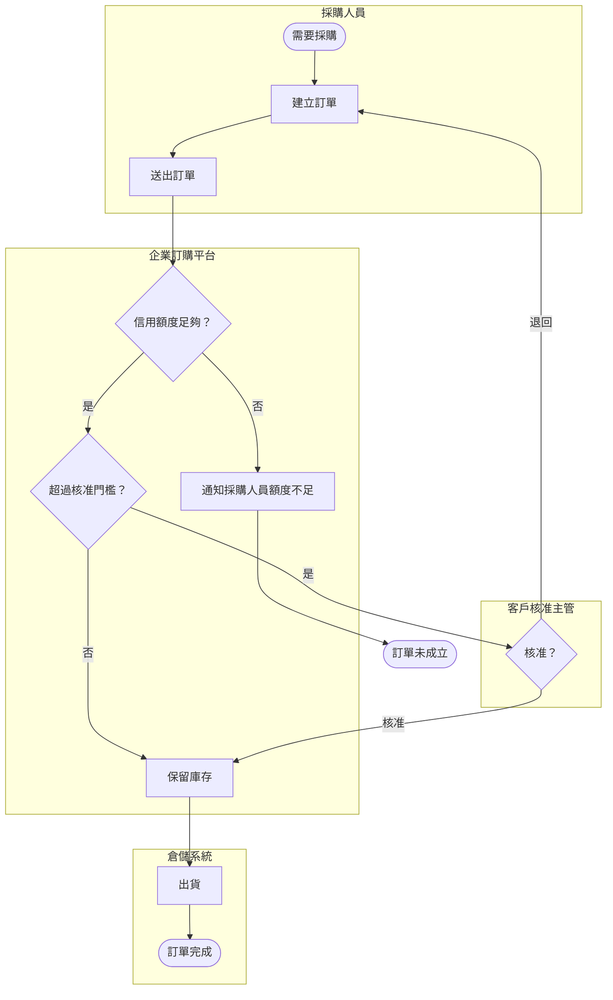

| 編號 | 等級 | 規則 | 驗證方式 |
| --- | --- | --- | --- |
| `SA-BIZ-004` | 必須 | 範圍內的每個核心業務流程都必須有 To-Be 流程模型，以泳道標示執行者（人員角色或系統）；有現行作業時也必須有 As-Is 模型，並標示問題點 | 🤖 mermaid-cli 或 BPMN 工具渲染；👁 需求審查 |
| `SA-BIZ-005` | 必須 | 流程模型中每個判斷都必須畫出所有出口（包括「否」與例外），每條路徑都必須到達結束事件；不得只畫成功路徑 | 👁 需求審查（逐一檢查判斷節點） |
| `SA-BIZ-006` | 應該 | 流程模型應有層級：第 0 層為端到端價值鏈，第 1 層為業務流程，第 2 層為活動細節；同一張圖只畫同一層級，每張圖的活動數不應超過約 15 個 | 👁 需求審查 |

```markdown
<!-- ✅ SA-BIZ-004：As-Is 流程標示問題點，對應到 To-Be 的改善 -->
| As-Is 步驟 | 問題點 | 證據 | To-Be 對應 |
| --- | --- | --- | --- |
| 客戶寄 Excel 訂單 | P1 格式不一，人工輸入耗時 | DOC-05 每日 4.5 小時 | 線上下單（FR-ORD-010） |
| 業務助理查倉儲系統 | P2 庫存回覆需 2 小時 | IV-03 | 送出時即時保留庫存（FR-ORD-014） |
| 紙本核准後回寄 | P3 核准單遺失，訂單延誤 | 客訴 12 件／年 | 線上核准（FR-ORD-012、FR-ORD-019） |
```

```markdown
<!-- ❌ SA-BIZ-005、SA-BIZ-006：只有成功路徑，且同一張圖混合價值鏈與畫面操作 -->
客戶登入 → 點選「新增訂單」按鈕 → 選擇料號 → 主管核准 → 出貨 → 開發票 → 收款 → 結案
```

#### 🔍 5.2 審查與驗證

- **自動檢查：** CI 以 mermaid-cli 渲染流程圖，確認語法正確；BPMN 檔可用 bpmn-js 等工具開啟檢查。可用簡單腳本檢查 Mermaid 中每個 `{判斷}` 節點至少有兩條出線。
- **人工審查問題：**
  1. 請流程中的每個執行者看自己的泳道：這是你未來實際的工作方式嗎？
  2. 每個判斷的「否」走向哪裡？退回、取消、逾時的情況有畫出來嗎？
- **AI 常見錯誤：** AI 產生的流程圖通常只有一條直線的成功路徑，或在判斷節點只畫「是」的出口。此外，AI 常把系統內部步驟（「寫入資料庫」）畫成業務活動。

### 5.3 業務規則與決策表

業務規則是組織用來約束或引導業務行為的規定，例如核准門檻、折扣計算、資格判斷。業務規則與功能需求應**分開管理**：規則變動的頻率遠高於功能，分開後，規則改變時只需要更新規則，不必修改每一個引用它的功能需求。

| 規則類型 | 說明 | 範例 |
| --- | --- | --- |
| 事實 | 業務概念之間的關係 | 每張訂單屬於一個客戶 |
| 限制 | 必須或不得發生的事 | 已出貨的訂單不得取消 |
| 推導（計算） | 由其他資料計算出的值 | 訂單總額 ＝ 明細金額合計 ＋ 運費 |
| 推論 | 依條件得出結論 | 客戶逾期帳款超過 30 天時，視為信用凍結 |
| 行動觸發 | 條件成立時要執行的動作 | 庫存低於安全存量時通知採購 |

條件組合較多的規則，用 DMN（Decision Model and Notation）的決策表表達最清楚。決策表要指定**命中政策**（hit policy）：最常用的 `U`（Unique）表示任何輸入組合只能符合一列。決策表的價值在於可以**機械式檢查完整性與重疊**：每個輸入組合都要被涵蓋（沒有缺口），而且在 `U` 政策下只能被一列涵蓋（沒有重疊）。

以 RULE-ORD-003「核准層級」為例，決策表如下（命中政策：U）：

| # | 客戶等級 | 訂單總額（新臺幣） | 核准層級 |
| --- | --- | --- | --- |
| 1 | 一般 | < 500,000 | 不需核准 |
| 2 | 一般 | [500,000 .. 2,000,000) | 單層核准 |
| 3 | 一般 | ≥ 2,000,000 | 雙層核准 |
| 4 | 金級 | < 1,000,000 | 不需核准 |
| 5 | 金級 | ≥ 1,000,000 | 單層核准 |
| 6 | 策略 | - | 不需核准 |

| 編號 | 等級 | 規則 | 驗證方式 |
| --- | --- | --- | --- |
| `SA-BIZ-007` | 必須 | 業務規則必須以 `RULE-` 編號獨立登錄，寫明類型、來源（法規、內規、合約或主管決定）、負責人與生效日期；功能需求以編號引用規則，不重複描述規則內容 | 🤖 `check_trace.py`（引用的 RULE 編號存在）；👁 需求審查 |
| `SA-BIZ-008` | 必須 | 兩個以上條件組合的業務規則必須以決策表表達，並指定命中政策；`U` 政策的決策表必須證明沒有缺口也沒有重疊 | 🤖 決策表完整性檢查腳本（本節範例） |
| `SA-BIZ-009` | 必須 | 決策表的數值區間必須寫明邊界是否包含（例如 `[500,000 .. 2,000,000)`），並至少為每個邊界值撰寫一個驗收情境 | 🤖 決策表完整性檢查腳本；🤖 Gherkin 情境（6.3） |
| `SA-BIZ-010` | 應該 | 預期會由業務單位自行調整的規則參數（門檻、費率），應在需求中標示為「可設定」，並寫明由誰在何處調整、是否需要覆核 | 👁 需求審查 |

```python
# ✅ SA-BIZ-008、SA-BIZ-009：檢查 U 命中政策的決策表沒有缺口與重疊
# 做法：列舉每個類別值，並以每個區間邊界與邊界兩側的值作為數值測試點。
from itertools import product

RULES = [  # (客戶等級, (下限含, 上限不含), 核准層級)；None 表示不限
    ("一般", (None, 500_000), "不需核准"),
    ("一般", (500_000, 2_000_000), "單層核准"),
    ("一般", (2_000_000, None), "雙層核准"),
    ("金級", (None, 1_000_000), "不需核准"),
    ("金級", (1_000_000, None), "單層核准"),
    ("策略", (None, None), "不需核准"),
]
GRADES = ["一般", "金級", "策略"]

def in_range(x, rng):
    lo, hi = rng
    return (lo is None or x >= lo) and (hi is None or x < hi)

def test_points():
    bounds = sorted({b for _, rng, _ in RULES for b in rng if b is not None})
    return sorted({0, *bounds, *(b - 1 for b in bounds), *(b + 1 for b in bounds)})

def check(rules):
    problems = []
    for grade, amount in product(GRADES, test_points()):
        hits = [i + 1 for i, (g, rng, _) in enumerate(rules) if g == grade and in_range(amount, rng)]
        if not hits:
            problems.append(f"缺口：客戶等級={grade}、金額={amount:,} 沒有任何規則")
        elif len(hits) > 1:
            problems.append(f"重疊：客戶等級={grade}、金額={amount:,} 同時符合第 {hits} 列")
    return problems

if __name__ == "__main__":
    result = check(RULES)
    print("\n".join(result) or "決策表完整且無重疊")
    # ❌ SA-BIZ-008：把第 2 列上限誤寫為 2_000_001 → 報告 2,000,000 重疊
    broken = RULES[:1] + [("一般", (500_000, 2_000_001), "單層核准")] + RULES[2:]
    print("\n".join(check(broken)))
```

```gherkin
# language: zh-TW
# ✅ SA-BIZ-009：每個邊界值都有驗收情境
功能: 大額訂單核准層級（RULE-ORD-003）

  場景大綱: 依客戶等級與訂單總額決定核准層級
    假如 客戶「<客戶>」的等級為「<等級>」
    當 採購人員送出總額 <金額> 元的訂單
    那麼 訂單的核准層級應為「<層級>」

    例子:
      | 客戶   | 等級 | 金額      | 層級     |
      | 甲公司 | 一般 | 499999    | 不需核准 |
      | 甲公司 | 一般 | 500000    | 單層核准 |
      | 甲公司 | 一般 | 1999999   | 單層核准 |
      | 甲公司 | 一般 | 2000000   | 雙層核准 |
      | 乙公司 | 金級 | 999999    | 不需核准 |
      | 乙公司 | 金級 | 1000000   | 單層核准 |
      | 丙公司 | 策略 | 50000000  | 不需核准 |
```

```markdown
<!-- ✅ SA-BIZ-007、SA-BIZ-010：業務規則獨立登錄，可設定參數寫明調整權責 -->
| 編號 | 類型 | 規則 | 來源 | 負責人 | 生效 | 可設定 |
| --- | --- | --- | --- | --- | --- | --- |
| RULE-ORD-003 | 推論 | 核准層級依決策表（5.3） | 授信作業辦法第 8 條 | 財務部 李課長 | 2027-01-01 | 門檻金額可由財務部於後台調整，需經主管覆核，變更留存稽核紀錄 |

<!-- ❌ SA-BIZ-007：規則內容寫死在多筆功能需求中，門檻改變時要改三處 -->
FR-ORD-012 一般客戶訂單超過 50 萬時需核准。
FR-ORD-033 核准畫面顯示超過 50 萬的訂單。
FR-ORD-045 報表統計超過 50 萬的訂單數。
```

#### 🔍 5.3 審查與驗證

- **自動檢查：** 執行本節腳本檢查每張 `U` 政策決策表；用 Gherkin 解析器檢查驗收情境語法；`check_trace.py` 檢查需求引用的 `RULE-` 編號都存在。
- **人工審查問題：**
  1. 決策表的每個輸入，其所有可能值都列出來了嗎？（例如未來新增的客戶等級。）
  2. 規則的來源是成文規定，還是某人的口頭說法？口頭說法要找到可以核准的人確認。
- **AI 常見錯誤：** AI 產生的決策表最常見的錯誤是邊界重疊（`≤ 500,000` 與 `≥ 500,000` 同時出現）與遺漏某個類別值。請一律以腳本檢查，不要用目視。

### 5.4 差距分析與轉換需求

To-Be 與 As-Is 的差距不只產生系統需求，也產生**轉換需求**（transition requirements）：BABOK 將其定義為「從現況過渡到未來狀態期間才需要的能力」，例如資料轉置、新舊系統並行、使用者訓練、過渡期的人工作業。轉換需求常被遺漏，直到上線前才發現沒有人負責。

| 差距類型 | 例子 | 產生的需求 |
| --- | --- | --- |
| 系統功能 | 沒有線上核准 | 功能需求 |
| 資料 | 客戶資料分散在 Excel 與 CRM | 資料轉置需求、資料品質需求 |
| 流程與組織 | 核准權責未明文化 | 非系統改善措施（5.1） |
| 人員能力 | 採購人員未使用過線上系統 | 訓練需求、使用者文件需求 |
| 過渡期 | 新舊系統並行 1 個月 | 並行期間的資料同步與對帳需求 |

| 編號 | 等級 | 規則 | 驗證方式 |
| --- | --- | --- | --- |
| `SA-BIZ-011` | 必須 | SRS 必須有差距分析表，將 As-Is 與 To-Be 的每個差距對應到系統需求、轉換需求或非系統措施；沒有對應的差距要說明為何不處理 | 👁 需求審查 |
| `SA-BIZ-012` | 必須 | 轉換需求（資料轉置、並行運作、訓練、過渡期作業、舊系統下線）必須以 `TR-` 編號登錄，寫明完成條件與負責人，並納入追溯矩陣 | 🤖 `check_trace.py`（TR 需求必須有負責人與驗收條件）；👁 需求審查 |

```markdown
<!-- ✅ SA-BIZ-011、SA-BIZ-012：差距對應到需求，轉換需求有完成條件 -->
| 差距 | 對應 | 說明 |
| --- | --- | --- |
| 線上核准 | FR-ORD-012、FR-ORD-019 | — |
| 客戶資料分散 | TR-ORD-001 | 見下表 |
| 核准權責未明文化 | 非系統措施（5.1） | 財務部修訂作業辦法 |
| 過渡期 | TR-ORD-002 | 見下表 |

| 編號 | 轉換需求 | 完成條件 | 負責人 |
| --- | --- | --- | --- |
| TR-ORD-001 | 將 CRM 與 Excel 中的有效客戶資料轉入新系統 | 轉置後客戶筆數與核定清單一致；抽樣 100 筆欄位比對 0 差異 | 資訊處 轉置小組 |
| TR-ORD-002 | 上線後 1 個月內，Email 訂單仍由業務助理代客戶線上輸入 | 每日 Email 訂單數與代輸入筆數一致；第 31 天停止收件並公告 | 業務部 |

<!-- ❌ SA-BIZ-012：轉換工作只寫在專案時程，沒有需求與負責人 -->
上線前完成資料轉換。
```

#### 🔍 5.4 審查與驗證

- **自動檢查：** `check_trace.py` 檢查每筆 `TR-` 需求都有負責人與完成條件，並出現在追溯矩陣。
- **人工審查問題：**
  1. 上線當天，舊系統與舊作業怎麼處理？誰通知客戶？
  2. 資料轉置的範圍與驗收方式，資料擁有者同意嗎？（細節見 [系統資料轉置教學指引]()。）
- **AI 常見錯誤：** AI 產生的需求清單幾乎不會包含轉換需求，因為它們不屬於「系統功能」。審查時以本節的差距類型表逐項詢問。

---

## 6. 功能需求建模

### 6.1 使用案例

使用案例（use case）描述一位參與者為了達成一個目標，與系統之間的一連串互動。它的價值在於強迫分析師把**例外情況**想清楚：每個步驟都問「如果這一步失敗了呢？」。Alistair Cockburn 將使用案例分成三個目標層級：**摘要層**（多次工作階段，例如「採購物品」）、**使用者目標層**（一次坐下來完成的事，例如「建立訂單」）、**子功能層**（例如「選擇料號」）。需求規格以使用者目標層為主。

企業訂購平台的使用案例清單如下：

| 編號 | 名稱 | 主要參與者 | 目標層級 | 優先順序 | 相關需求 |
| --- | --- | --- | --- | --- | --- |
| UC-ORD-01 | 建立訂單 | 採購人員 | 使用者目標 | must | FR-ORD-010～016 |
| UC-ORD-02 | 核准訂單 | 客戶核准主管 | 使用者目標 | must | FR-ORD-012、FR-ORD-019 |
| UC-ORD-03 | 查詢訂單 | 採購人員 | 使用者目標 | must | FR-ORD-022 |
| UC-ORD-04 | 取消訂單 | 採購人員 | 使用者目標 | should | FR-ORD-035 |

| 編號 | 等級 | 規則 | 驗證方式 |
| --- | --- | --- | --- |
| `SA-FUN-001` | 必須 | 使用案例必須以「動詞＋名詞」命名，描述參與者的目標，而不是系統的功能或畫面（例如「建立訂單」，而不是「訂單管理」或「訂單畫面」） | 👁 需求審查 |
| `SA-FUN-002` | 必須 | 使用者目標層的使用案例規格必須包含：主要參與者、利害關係人與關注事項、前置條件、成功保證（後置條件）、觸發事件、主要成功流程、替代流程、例外流程、相關業務規則 | 🤖 `check_srs.py`（使用案例必要小節檢查） |
| `SA-FUN-003` | 必須 | 主要成功流程的每一個步驟都必須檢查是否有例外；例外流程以「步驟編號＋字母」標示（例如 3a），並寫明系統如何回應與流程之後的去向 | 👁 需求審查（逐步驟檢查） |
| `SA-FUN-004` | 不應該 | 使用案例不應描述畫面元件（按鈕、下拉選單）或內部處理（寫入資料表），只描述參與者意圖與系統的可觀察回應 | 👁 需求審查 |

```markdown
<!-- ✅ SA-FUN-001、SA-FUN-002、SA-FUN-003：使用者目標層的使用案例規格 -->
## UC-ORD-01 建立訂單

- 主要參與者：採購人員
- 利害關係人與關注事項：
  - 採購人員：快速下單，立即知道是否需要核准與是否有庫存
  - 業務部：訂單資料正確，不需人工修正
  - 財務部：不超過客戶信用額度（RULE-ORD-002）
- 前置條件：採購人員已登入，且所屬客戶狀態為「有效」
- 成功保證：訂單已建立並保留庫存；需核准時，核准主管已收到通知
- 觸發事件：採購人員開始建立新訂單

### 主要成功流程
1. 採購人員選擇收貨地址。
2. 採購人員輸入料號與數量。
3. 系統顯示各明細的單價、小計與可出貨數量。
4. 採購人員送出訂單。
5. 系統檢查信用額度（RULE-ORD-002）通過。
6. 系統依核准層級（RULE-ORD-003）判定不需核准。
7. 系統建立訂單、保留庫存，並顯示訂單編號。

### 替代流程
- 6a. 需要核准：
  1. 系統將訂單狀態設為「待核准」（FR-ORD-012）並通知核准主管（FR-ORD-019）。
  2. 系統顯示「訂單已送出，等待核准」。使用案例結束。

### 例外流程
- 2a. 料號無效或已停售：系統標示該明細並說明原因；採購人員修改後回到步驟 2。
- 3a. 可出貨數量小於訂購數量：系統顯示可出貨數量；採購人員可修改數量或保留為延後出貨。
- 5a. 信用額度不足：系統顯示不足金額，訂單不成立；使用案例結束（FR-ORD-023）。
- 5b. 信用額度服務無回應：系統將訂單狀態設為「額度待確認」（FR-ORD-013）；使用案例結束。
- 7a. 倉儲系統回覆庫存不足：見 FR-ORD-015。

### 相關業務規則
RULE-ORD-002 信用額度檢查、RULE-ORD-003 核准層級、RULE-ORD-007 運費
```

```markdown
<!-- ❌ SA-FUN-001、SA-FUN-004：以功能模組命名，並描述畫面元件與內部處理 -->
## UC-05 訂單管理
1. 使用者點選左側選單「訂單管理」。
2. 使用者按下「新增」按鈕，系統開啟彈出視窗。
3. 使用者在下拉選單選擇料號，按「儲存」。
4. 系統將資料 INSERT 到 orders 資料表。
```

#### 🔍 6.1 審查與驗證

- **自動檢查：** `check_srs.py` 檢查每個 `UC-` 規格都包含 SA-FUN-002 列出的小節。
- **人工審查問題：**
  1. 主要成功流程的每一步，你能想到至少一種失敗情況嗎？有寫在例外流程中嗎？
  2. 成功保證寫的是「系統狀態」嗎？測試人員能用它判斷測試是否通過嗎？
- **AI 常見錯誤：** AI 寫的使用案例通常主要流程完整，但例外流程只有「系統顯示錯誤訊息」一條。例外要針對每個步驟，並寫明之後的去向（回到哪一步、或使用案例結束）。

### 6.2 使用者故事與故事地圖

使用者故事是敏捷團隊常用的需求形式：「身為〈角色〉，我想要〈功能〉，以便〈價值〉」。它刻意保持簡短，是**對話的提醒**而不是完整規格；細節以驗收條件補足。好的故事符合 INVEST 原則：獨立（Independent）、可協商（Negotiable）、有價值（Valuable）、可估算（Estimable）、小（Small）、可測試（Testable）。

使用者故事與使用案例不是二選一：使用案例適合描述完整的互動與例外，故事適合規劃交付。常見做法是以使用案例或流程建立全貌，再切成故事放入待辦清單（第 17 章）。**故事地圖**把故事依使用者活動由左到右排列，由上到下依優先順序排列，可以看出每個版本是否交付了一條完整、可用的流程。

| 編號 | 等級 | 規則 | 驗證方式 |
| --- | --- | --- | --- |
| `SA-FUN-005` | 必須 | 使用者故事必須包含角色、功能與價值三部分，角色必須是使用者分類（2.3）中定義的角色，不得使用「使用者」或「系統」作為角色 | 🤖 故事格式檢查（正規表示式）；👁 待辦清單審查 |
| `SA-FUN-006` | 必須 | 每個使用者故事必須有驗收條件，並追溯到上層需求或使用案例；不得只有一句故事敘述 | 🤖 `check_trace.py`；👁 待辦清單審查 |
| `SA-FUN-007` | 應該 | 太大的故事應依「業務規則變化」「資料變化」「流程步驟」「例外處理」等方式垂直切分，每個切分後的故事都要能單獨交付價值；不應依技術層切分（前端、後端、資料庫） | 👁 待辦清單審查 |

```markdown
<!-- ✅ SA-FUN-005、SA-FUN-006：角色明確、有價值、有驗收條件與追溯 -->
### US-ORD-031 送出時即知是否需要核准
身為**採購人員**，我想要在送出訂單時就知道訂單是否需要主管核准，
以便提前通知主管，避免延誤到貨。

- 追溯：UC-ORD-01 步驟 6、FR-ORD-012、RULE-ORD-003
- 驗收條件：features/order-approval.feature（6.3）

<!-- ❌ SA-FUN-005、SA-FUN-006：角色是「使用者」、沒有價值、沒有驗收條件 -->
### US-31
身為使用者，我想要核准功能。
```

```markdown
<!-- ✅ SA-FUN-007：依業務規則變化垂直切分，每個故事都可單獨交付 -->
US-ORD-031  一般客戶的單層核准（金額 50 萬～200 萬）
US-ORD-032  一般客戶的雙層核准（金額 ≥ 200 萬）
US-ORD-033  金級客戶的核准門檻
US-ORD-034  核准主管退回訂單

<!-- ❌ SA-FUN-007：依技術層切分，單獨完成任何一個都無法交付價值 -->
US-41 核准功能前端畫面
US-42 核准功能後端 API
US-43 核准功能資料表
```

#### 🔍 6.2 審查與驗證

- **自動檢查：** 以正規表示式 `^身為\*\*(.+?)\*\*，我想要(.+?)，\s*以便(.+)` 檢查故事格式，並比對角色是否在使用者分類清單中；`check_trace.py` 檢查每個 `US-` 都有驗收條件與追溯。
- **人工審查問題：**
  1. 「以便」後面寫的是真正的業務價值，還是功能的重述？
  2. 故事地圖的第一個版本是否已涵蓋一條完整的端到端流程（即使很陽春）？
- **AI 常見錯誤：** AI 能大量產生故事，但常把一個功能依 CRUD 切成四個故事（新增、查詢、修改、刪除），而不考慮使用者是否真的需要每一項；也常把「以便」寫成「以便使用此功能」。

### 6.3 驗收條件與 Gherkin

驗收條件定義「做到什麼程度才算完成」。以 Gherkin 的「假如（Given）—當（When）—那麼（Then）」撰寫，可以讓業務、分析、開發、測試用同一份文字溝通，也可以直接被 Cucumber 等工具執行。Gherkin 支援繁體中文關鍵字，在檔案第一行加上 `# language: zh-TW` 即可。

撰寫驗收情境時，應描述**業務行為**（宣告式），而不是**操作步驟**（命令式）。命令式情境（「點選按鈕、輸入欄位」）會隨畫面改變而失效，也看不出業務規則。

| 編號 | 等級 | 規則 | 驗證方式 |
| --- | --- | --- | --- |
| `SA-FUN-008` | 必須 | 驗證方法為「測試」的功能需求，其驗收條件必須以 Gherkin 撰寫並納入版本控制；檔案必須能被 Gherkin 解析器解析 | 🤖 Gherkin 解析器（`@cucumber/gherkin`）語法檢查 |
| `SA-FUN-009` | 必須 | 每個情境只驗證一個行為；「那麼」必須描述可觀察的結果（狀態、訊息、資料），不得只寫「成功」或「正確」 | 👁 需求審查；👁 測試人員審查 |
| `SA-FUN-010` | 應該 | 情境應以宣告式描述業務行為，不應描述畫面操作細節；畫面操作屬於測試腳本或 UI 規格 | 👁 需求審查 |

```gherkin
# language: zh-TW
# ✅ SA-FUN-008、SA-FUN-009、SA-FUN-010：宣告式、一個情境一個行為、結果可觀察
@FR-ORD-012 @FR-ORD-019
功能: 大額訂單送主管核准

  背景:
    假如 客戶「甲公司」的等級為「一般」
    而且 「王課長」是甲公司的核准主管

  場景: 超過核准門檻的訂單進入待核准
    當 甲公司的採購人員送出總額 600000 元的訂單
    那麼 訂單狀態應為「待核准」

  場景: 進入待核准時通知核准主管
    當 甲公司的一張訂單進入「待核准」狀態
    那麼 王課長應收到一封主旨包含該訂單編號的核准通知

  場景: 未超過門檻的訂單直接成立
    當 甲公司的採購人員送出總額 499999 元的訂單
    那麼 訂單狀態應為「已建立」
    而且 王課長不應收到核准通知
```

```gherkin
# language: zh-TW
# ❌ SA-FUN-009、SA-FUN-010：命令式、一個情境驗證多個行為、結果只寫「成功」
功能: 核准

  場景: 測試核准
    假如 使用者開啟瀏覽器並登入
    當 使用者點選「新增訂單」按鈕
    而且 使用者在金額欄位輸入 600000 並按下「送出」
    而且 主管登入並按下「核准」
    那麼 系統顯示成功
```

#### 🔍 6.3 審查與驗證

- **自動檢查：** 以 `@cucumber/gherkin` 解析器（Node.js 套件，用法見附錄 F.3）解析所有 `.feature` 檔，並列出每個情境的步驟數；以標籤（`@FR-ORD-012`）連結需求，`check_trace.py` 可據此檢查每筆 `test` 需求至少有一個情境。
- **人工審查問題：**
  1. 只讀「那麼」，你能判斷系統是否正確嗎？
  2. 業務規則的每個邊界值（5.3）都有情境嗎？
- **AI 常見錯誤：** AI 產生的 Gherkin 常是命令式（點按鈕、填欄位），並在一個情境中串接多個行為。另外，AI 常混用英文與中文關鍵字（`Given` 與「當」混用）。實測 `@cucumber/gherkin` 的行為：混用的英文步驟若出現在情境的第一行，不會報錯，而是被當成情境描述而**默默略過**；出現在其他位置才會解析失敗。因此除了解析器，還要檢查每個情境的步驟數是否與預期相符。

### 6.4 系統功能清單

系統功能清單是功能需求的**目錄**：以業務能力分組，列出每項功能、優先順序與對應的需求、使用案例或故事。它讓利害關係人在不讀完整份 SRS 的情況下確認範圍，也是估算與規劃版本的基礎。功能清單本身不是需求，不應包含需求細節。

| 編號 | 等級 | 規則 | 驗證方式 |
| --- | --- | --- | --- |
| `SA-FUN-011` | 必須 | 功能清單必須以業務能力分組，每項功能列出編號、名稱、優先順序、目標版本與對應的需求或使用案例編號；功能清單中的每一項都必須至少對應到一筆需求 | 🤖 `check_trace.py`（功能與需求雙向對應） |
| `SA-FUN-012` | 應該 | 功能清單應標示每項功能的穩定度與相依關係，讓版本規劃時能看出哪些功能必須一起交付 | 👁 需求審查 |

```markdown
<!-- ✅ SA-FUN-011、SA-FUN-012：功能清單以業務能力分組，對應到需求，標示相依 -->
| 業務能力 | 編號 | 功能 | 優先順序 | 版本 | 對應 | 相依 | 穩定度 |
| --- | --- | --- | --- | --- | --- | --- | --- |
| 下單 | F-ORD-01 | 建立訂單 | must | R1 | UC-ORD-01 | F-CUS-02 | 高 |
| 下單 | F-ORD-02 | 大額訂單核准 | must | R1 | UC-ORD-02 | F-ORD-01 | 中（TBD-007） |
| 下單 | F-ORD-03 | 取消訂單 | should | R2 | UC-ORD-04 | F-ORD-01 | 高 |
| 客戶 | F-CUS-02 | 信用額度查詢 | must | R1 | FR-CUS-004 | IF-ORD-04 | 高 |

<!-- ❌ SA-FUN-011：功能清單混入畫面與技術項目，沒有對應需求 -->
1. 登入畫面
2. 訂單維護畫面
3. Redis 快取
4. 報表（待定）
```

#### 🔍 6.4 審查與驗證

- **自動檢查：** `check_trace.py` 檢查功能清單中的每個 `F-` 都對應到至少一筆需求或使用案例，且每筆 must 需求都屬於某個功能。
- **人工審查問題：**
  1. 業務代表能只看功能清單就確認範圍嗎？
  2. R1 的功能組合能否完成一條完整的業務流程？
- **AI 常見錯誤：** AI 產生的功能清單常以畫面或資料表為單位（「客戶維護」「訂單維護」），並自動加入「系統管理」「權限管理」等通用模組，即使需求中沒有提到。

---

## 7. 資料與領域分析

### 7.1 詞彙表與通用語言

同一個詞在不同部門可能有不同意思。「訂單金額」對業務是含稅總價，對會計可能是未稅金額；「客戶」對業務是簽約公司，對客服可能是打電話來的人。這些差異如果沒有在分析階段釐清，會變成資料錯誤與報表對不起來的問題。詞彙表（glossary）是需求文件中所有名詞的唯一定義來源，也是領域驅動設計中「通用語言」（ubiquitous language）的起點。

| 編號 | 等級 | 規則 | 驗證方式 |
| --- | --- | --- | --- |
| `SA-DAT-001` | 必須 | 需求文件中出現的每個業務名詞都必須在詞彙表中定義，定義要寫明判斷標準或計算方式，並列出負責確認定義的業務單位 | 🤖 詞彙表覆蓋檢查（本節範例）；👁 需求審查 |
| `SA-DAT-002` | 必須 | 詞彙表必須列出同義詞與禁用詞，並指向標準用詞；同一名詞在不同業務單位有不同意義時，必須分成不同名詞或明確界定適用的情境 | 🤖 詞彙表同義詞掃描；👁 需求審查 |
| `SA-DAT-003` | 應該 | 詞彙表應同時記錄英文名稱，作為後續設計中類別、欄位與 API 命名的依據 | 👁 需求審查；👁 設計審查（核對命名） |

```yaml
# ✅ SA-DAT-001、SA-DAT-002、SA-DAT-003：詞彙表（docs/srs/glossary.yaml）
- term: 客戶
  english: Customer
  definition: 與本公司簽訂供貨合約的法人；以統一編號識別，一個統一編號只對應一個客戶。
  owner: 業務部
  synonyms_forbidden: [會員, 買方, 用戶]
- term: 訂單總額
  english: Order Total
  definition: 訂單所有明細的未稅金額合計，加上運費（RULE-ORD-007），不含營業稅。單位新臺幣元，四捨五入至元。
  owner: 財務部
  synonyms_forbidden: [訂單金額]
- term: 核准主管
  english: Approver
  definition: 由客戶指定、有權核准該客戶訂單的人員；一個客戶可指定多位，依核准層級（RULE-ORD-003）通知。
  owner: 業務部
```

```python
# ✅ SA-DAT-002：掃描需求文件中的禁用同義詞（片段：完整版見附錄 C.7 check_srs.py）
import sys
import yaml

def forbidden_terms(glossary_path):
    entries = yaml.safe_load(open(glossary_path, encoding="utf-8"))
    return {bad: e["term"] for e in entries for bad in e.get("synonyms_forbidden", [])}

def scan(srs_path, glossary_path):
    terms = forbidden_terms(glossary_path)
    hits = []
    for no, line in enumerate(open(srs_path, encoding="utf-8"), 1):
        for bad, good in terms.items():
            if bad in line:
                hits.append(f"{srs_path}:{no}: 使用禁用詞「{bad}」，請改用「{good}」")
    return hits

if __name__ == "__main__":
    result = scan(sys.argv[1], sys.argv[2])
    print("\n".join(result) or "未發現禁用詞")
    sys.exit(1 if result else 0)
```

```markdown
<!-- ❌ SA-DAT-001、SA-DAT-002：定義循環、沒有判斷標準、沒有同義詞 -->
| 名詞 | 定義 |
| --- | --- |
| 客戶 | 本公司的客戶 |
| 訂單金額 | 訂單的金額 |
```

#### 🔍 7.1 審查與驗證

- **自動檢查：** 執行本節腳本掃描禁用詞；也可以抽取需求中所有以「」括住的名詞，檢查是否都在詞彙表中。
- **人工審查問題：**
  1. 請業務、財務、客服三個單位各自解釋同一個名詞（例如「訂單總額」），答案相同嗎？
  2. 定義有沒有循環（以自己解釋自己）？
- **AI 常見錯誤：** AI 產生的詞彙表定義通常是字典式的通用解釋（「客戶：購買商品或服務的人」），沒有本組織的判斷標準，而且不會發現同義詞衝突。

### 7.2 概念資料模型

概念資料模型描述業務上有哪些**資料實體**、實體之間的**關係**與**多重性**（一對多、多對多）。它在分析階段回答「業務需要記住哪些事情」，而不是「資料表怎麼設計」。主鍵型別、索引、正規化、資料表拆分都屬於設計階段，請見 [資料庫設計指引]()。

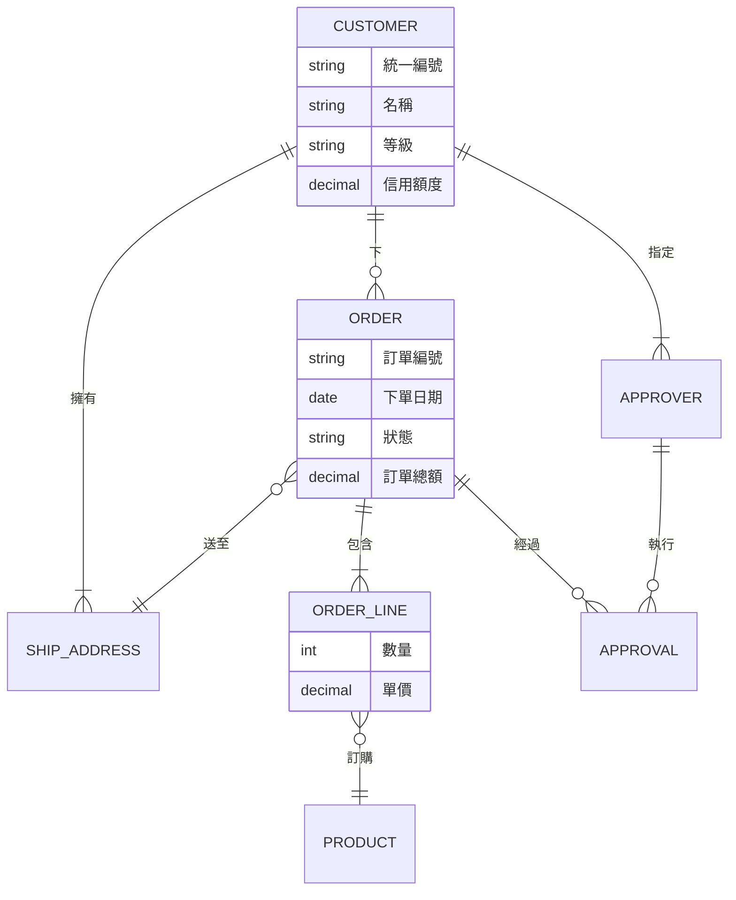

| 編號 | 等級 | 規則 | 驗證方式 |
| --- | --- | --- | --- |
| `SA-DAT-004` | 必須 | SAD 必須有概念資料模型，涵蓋功能需求中提到的所有業務實體；每條關係都要標示兩端的多重性與關係名稱 | 🤖 mermaid-cli 渲染；👁 需求審查（核對實體與詞彙表） |
| `SA-DAT-005` | 不應該 | 概念資料模型不應包含主鍵型別、外鍵欄位、索引、技術欄位（建立時間、版本號）或關聯表；這些屬於設計階段 | 👁 需求審查 |
| `SA-DAT-006` | 必須 | 每個實體的多重性都必須由業務人員確認，特別是「一個……可以有幾個……」的上限與下限（例如一張訂單可以有幾個收貨地址） | 👁 需求審查（以問句逐條確認） |

```markdown
<!-- ✅ SA-DAT-006：把多重性轉成問句，請業務人員逐條確認 -->
| 關係 | 問題 | 業務回答 | 確認者 |
| --- | --- | --- | --- |
| 客戶—核准主管 | 一個客戶最少要指定幾位核准主管？ | 至少 1 位；雙層核准的客戶至少 2 位 | 業務部 陳經理 |
| 訂單—收貨地址 | 一張訂單可以送到多個地址嗎？ | 不行，多地址要拆成多張訂單 | 業務部 陳經理 |
| 訂單明細—料號 | 同一張訂單可以出現相同料號兩次嗎？ | 不行，合併數量 | 倉儲課 趙組長 |
```

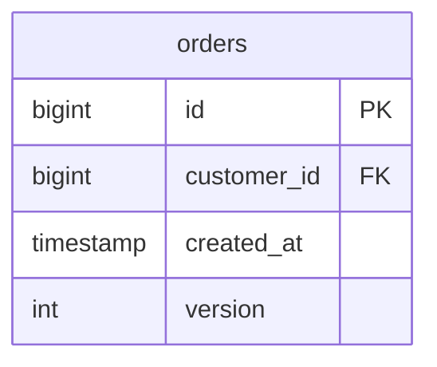

#### 🔍 7.2 審查與驗證

- **自動檢查：** CI 以 mermaid-cli 渲染 `erDiagram`；可比對圖中的實體名稱與詞彙表的英文名稱。
- **人工審查問題：**
  1. 功能需求中出現的每個名詞，在模型中都有對應的實體或屬性嗎？
  2. 多對多關係背後是否藏著一個業務實體？（例如「核准主管—訂單」其實是「核准紀錄」。）
- **AI 常見錯誤：** AI 一被要求畫 ER 圖，就會直接產生實體資料表設計（`id PK`、`created_at`），而且多重性多半是猜的。分析階段只要概念模型，多重性要請業務確認。

### 7.3 資料字典與資料品質需求

資料字典為每個業務屬性定義格式、值域、來源與擁有者。它是畫面欄位檢核、API 欄位定義與資料轉置規則的共同來源。

資料品質需求則定義資料要「多好」才可用。ISO/IEC 25012 定義了 15 個資料品質特性，分析階段最常需要明確定義的有：**正確性**（accuracy）、**完整性**（completeness）、**一致性**（consistency）、**時效性**（currentness）與**可信度**（credibility）。

| 編號 | 等級 | 規則 | 驗證方式 |
| --- | --- | --- | --- |
| `SA-DAT-007` | 必須 | 資料字典必須為每個業務屬性定義：名稱、定義（引用詞彙表）、資料型態與格式、值域或檢核規則、必填與否、來源（使用者輸入、外部系統、計算）、資料擁有者與資料分級 | 🤖 資料字典欄位完整性檢查；👁 需求審查 |
| `SA-DAT-008` | 必須 | 由外部系統取得或需要轉置的關鍵資料，必須以 ISO/IEC 25012 特性定義可量測的資料品質需求（例如完整性、正確性比例與量測方式） | 👁 需求審查 |
| `SA-DAT-009` | 必須 | 金額、數量、比率等數值屬性必須定義精度、捨入規則與單位；日期時間屬性必須定義時區與精度 | 🤖 資料字典欄位完整性檢查；👁 需求審查 |

```markdown
<!-- ✅ SA-DAT-007、SA-DAT-009：資料字典 -->
| 屬性 | 定義 | 型態與格式 | 值域或檢核 | 必填 | 來源 | 擁有者 | 分級 |
| --- | --- | --- | --- | --- | --- | --- | --- |
| 客戶.統一編號 | 營利事業統一編號 | 8 位數字字串 | 符合財政部統一編號檢查碼規則 | 是 | 業務人員輸入 | 業務部 | 內部 |
| 客戶.信用額度 | 客戶可使用的未結訂單金額上限 | 整數，新臺幣元 | 0～999,999,999 | 是 | 財務系統（IF-ORD-04） | 財務部 | 機密 |
| 訂單.訂單總額 | 見詞彙表 | 整數，新臺幣元 | ≥ 0；明細合計四捨五入至元後加運費 | 是 | 計算（RULE-ORD-007） | 財務部 | 內部 |
| 訂單.下單時間 | 採購人員送出訂單的時間 | 日期時間，精確到秒，Asia/Taipei | — | 是 | 系統產生 | 業務部 | 內部 |
| 核准主管.電子郵件 | 接收核准通知的地址 | RFC 5322 地址格式 | — | 是 | 客戶提供 | 業務部 | 個資（11.3） |
```

```markdown
<!-- ✅ SA-DAT-008：可量測的資料品質需求 -->
| 編號 | 對象 | 特性 | 需求 | 量測方式 |
| --- | --- | --- | --- | --- |
| NFR-DQ-001 | 轉置後的客戶資料 | 完整性 | 統一編號、名稱、等級、信用額度四欄的填值率應為 100% | 轉置後執行 SQL 統計空值筆數 |
| NFR-DQ-002 | 轉置後的客戶資料 | 正確性 | 統一編號檢查碼錯誤的比例應為 0% | 轉置後以檢查碼規則逐筆驗證 |
| NFR-DQ-003 | 自財務系統取得的信用額度 | 時效性 | 系統使用的額度與財務系統的差異時間應不超過 5 分鐘 | 比對介面紀錄時間戳記 |

<!-- ❌ SA-DAT-008：無法量測 -->
資料應正確完整。
```

#### 🔍 7.3 審查與驗證

- **自動檢查：** 以腳本檢查資料字典每一列都填寫了 SA-DAT-007 列出的欄位，數值屬性有精度與單位，日期時間屬性有時區。
- **人工審查問題：**
  1. 每個「計算」來源的屬性，計算公式都在業務規則中定義了嗎？
  2. 由外部系統提供的資料，如果品質不符需求，系統要怎麼處理？（拒收、標示、通知？）
- **AI 常見錯誤：** AI 產生的資料字典常自行決定欄位長度（`VARCHAR(255)`）與型態，而沒有業務依據；金額欄位常忽略捨入規則與幣別。

### 7.4 事件風暴與領域事件

事件風暴（Event Storming）是 Alberto Brandolini 提出的工作坊技術：讓業務與技術人員一起，以便利貼依時間順序貼出業務中「已經發生的事情」（領域事件，以過去式描述），再補上觸發事件的命令、執行者、業務規則與外部系統。在分析階段，事件風暴的產出是**業務事件清單**與**候選的業務邊界**，可以作為使用案例、狀態模型與介面需求的輸入；它找出的邊界在設計階段才會正式決定為限界上下文（bounded context）。

| 編號 | 等級 | 規則 | 驗證方式 |
| --- | --- | --- | --- |
| `SA-DAT-010` | 應該 | 跨部門或流程複雜的系統，應以事件風暴工作坊建立業務事件清單；事件以「名詞＋過去式動詞」命名（例如「訂單已核准」），並記錄觸發命令、執行者與相關業務規則 | 👁 工作坊紀錄審查 |
| `SA-DAT-011` | 必須 | 業務事件清單中，與外部系統交換的事件必須對應到介面需求（第 10 章），影響實體狀態的事件必須對應到狀態模型（8.2） | 👁 需求審查（交叉核對事件清單、介面清單與狀態圖） |

```markdown
<!-- ✅ SA-DAT-010、SA-DAT-011：事件風暴產出的業務事件清單 -->
| 事件 | 觸發命令 | 執行者 | 業務規則 | 外部系統 | 對應 |
| --- | --- | --- | --- | --- | --- |
| 訂單已送出 | 送出訂單 | 採購人員 | RULE-ORD-002 | — | UC-ORD-01、狀態圖 8.2 |
| 訂單已進入待核准 | （由規則觸發） | 系統 | RULE-ORD-003 | — | FR-ORD-012、狀態圖 8.2 |
| 訂單已核准 | 核准訂單 | 核准主管 | — | — | UC-ORD-02、狀態圖 8.2 |
| 庫存已保留 | 保留庫存 | 系統 | — | 倉儲系統 | IF-ORD-02 |
| 訂單已出貨 | （外部事件） | 倉儲系統 | — | 倉儲系統 | IF-ORD-02、狀態圖 8.2 |
| 發票開立已要求 | 要求開立發票 | 系統 | — | 會計系統 | IF-ORD-03 |

<!-- ❌ SA-DAT-010：事件以命令或畫面命名，看不出業務上發生了什麼 -->
- 新增訂單
- 按下核准
- 更新狀態
```

#### 🔍 7.4 審查與驗證

- **自動檢查：** 可檢查事件名稱是否符合「……已……」的命名格式，並交叉比對事件清單中的外部系統是否都出現在介面清單。
- **人工審查問題：**
  1. 事件清單中有沒有「失敗」類的事件（例如「核准已逾時」「出貨已失敗」）？
  2. 每個事件發生後，誰需要知道？有被列出來嗎？
- **AI 常見錯誤：** AI 可以從需求文字萃取出事件清單，但通常只有成功路徑的事件，缺少逾時、取消、退回等事件；也常把「資料已寫入資料庫」這類技術事件當成業務事件。

### 7.5 資料生命週期、保存與轉置範圍

每一類資料都有生命週期：何時建立、誰可以修改、何時封存、何時刪除。**CRUD 矩陣**（實體 × 使用案例，標示 Create、Read、Update、Delete）可以快速找出遺漏：沒有任何使用案例建立的實體（資料從哪來？）、沒有任何使用案例刪除或封存的實體（資料永遠留著？）。

保存期限常由法規決定（例如商業會計法規定會計憑證保存 5 年、帳簿保存 10 年），個人資料則要求在特定目的消失後刪除（第 11 章），兩者可能衝突，必須在分析階段由法遵確認。

| 編號 | 等級 | 規則 | 驗證方式 |
| --- | --- | --- | --- |
| `SA-DAT-012` | 必須 | SAD 必須有 CRUD 矩陣（實體 × 使用案例或功能）；每個實體都必須至少有一個建立來源（使用案例、外部系統或轉置），且必須定義刪除或封存的方式 | 🤖 CRUD 矩陣檢查（每列至少一個 C）；👁 需求審查 |
| `SA-DAT-013` | 必須 | 每類資料都必須定義保存期限與到期處理方式（刪除、匿名化、封存），並寫明依據（法規條文、合約或內規）；依據衝突時由法遵單位決定 | 👁 需求審查；👁 法遵審查 |
| `SA-DAT-014` | 必須 | 有資料轉置時，分析階段必須定義轉置範圍（資料類別、期間、筆數估計）、轉置後的驗收標準與資料擁有者，並登錄為轉換需求（5.4） | 👁 需求審查 |

```markdown
<!-- ✅ SA-DAT-012：CRUD 矩陣 -->
| 實體＼使用案例 | UC-ORD-01 建立訂單 | UC-ORD-02 核准訂單 | UC-ORD-04 取消訂單 | 轉置 TR-ORD-001 | 封存批次 |
| --- | --- | --- | --- | --- | --- |
| 客戶 | R | R | | C | |
| 訂單 | C | R、U | U | | D（封存） |
| 核准紀錄 | | C | | | D（封存） |
| 料號 | R | | | C | |

<!-- ✅ SA-DAT-013：保存期限與依據 -->
| 資料類別 | 保存期限 | 到期處理 | 依據 |
| --- | --- | --- | --- |
| 訂單與明細 | 年度決算後 10 年 | 第 3 年起封存至唯讀儲存區，期滿刪除 | 訂單為交易原始憑證，商業會計法第 38 條規定會計憑證至少保存 5 年；財務部內規 FIN-POL-02 延長為 10 年。法遵確認 2026-10-02 |
| 核准紀錄 | 同訂單 | 同訂單 | 稽核室要求（StR-ORD-011） |
| 核准主管電子郵件 | 客戶終止合約後 1 年 | 刪除 | 個資法特定目的消失；合約終止後 1 年處理爭議 |
| 系統操作日誌 | 2 年 | 刪除 | 內部資安政策 SEC-POL-03 |

<!-- ❌ SA-DAT-013：沒有依據，也沒有處理方式 -->
資料永久保存。
```

```markdown
<!-- ✅ SA-DAT-014：轉置範圍與驗收標準 -->
| 資料類別 | 來源 | 期間 | 筆數估計 | 驗收標準 | 擁有者 |
| --- | --- | --- | --- | --- | --- |
| 客戶 | CRM、業務部 Excel | 現行有效客戶 | 約 320 | NFR-DQ-001、NFR-DQ-002 | 業務部 |
| 歷史訂單 | 不轉置（舊資料保留於舊系統唯讀查詢 2 年） | — | — | — | 業務部 |
```

#### 🔍 7.5 審查與驗證

- **自動檢查：** 以腳本檢查 CRUD 矩陣中每一列至少有一個 C，且每一列有刪除或封存欄位；也可以檢查每個實體都出現在保存期限表中。
- **人工審查問題：**
  1. 保存期限的依據是否經過法遵確認？個資刪除與帳簿保存是否衝突？
  2. 不轉置的資料，使用者之後要怎麼查詢？
- **AI 常見錯誤：** AI 常引用不存在或錯誤的法規條號來說明保存期限。法規條號必須以全國法規資料庫查證，並由法遵確認適用性。

---

## 8. 行為建模

### 8.1 活動圖與資料流程圖

使用案例以文字描述互動，活動圖以圖形描述流程中的**順序、分支與平行**。當一個使用案例的流程有多個判斷或平行處理（例如同時保留庫存與檢查額度），活動圖比文字更容易檢查遺漏。

資料流程圖（DFD）以「處理、資料儲存、外部實體、資料流」四種元素描述資料如何被轉換。它適合以資料處理為主的系統（批次對帳、報表、資料交換），可以檢查每個處理的輸入是否足以產生輸出。DFD 的分析紀律是**平衡**：上層處理的輸入與輸出，必須與展開後下層圖的輸入與輸出一致。

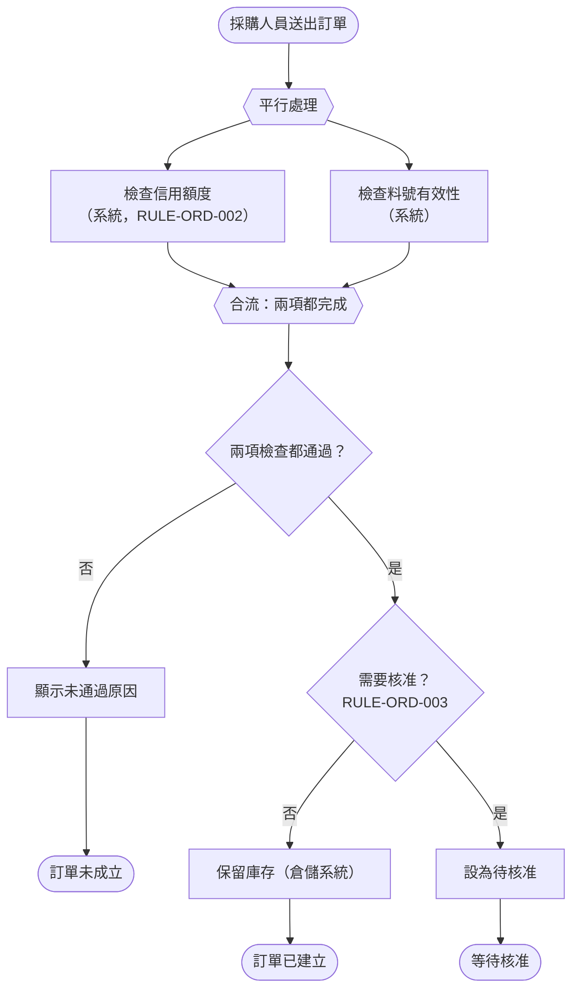

| 編號 | 等級 | 規則 | 驗證方式 |
| --- | --- | --- | --- |
| `SA-BEH-001` | 應該 | 有三個以上判斷或含平行處理的流程，應以活動圖補充使用案例；平行分支必須畫出合流條件（全部完成或任一完成） | 🤖 mermaid-cli 渲染；👁 需求審查 |
| `SA-BEH-002` | 可以 | 以資料轉換為主的流程（批次、對帳、報表）可以使用資料流程圖；使用時，展開後的下層圖必須與上層處理的輸入輸出平衡 | 👁 需求審查（核對上下層資料流） |

```markdown
<!-- ✅ SA-BEH-002：DFD 平衡檢查表 -->
| 上層處理 | 上層輸入 | 上層輸出 | 下層展開後的輸入 | 下層展開後的輸出 | 平衡 |
| --- | --- | --- | --- | --- | --- |
| P3 每日出貨對帳 | 出貨結果（倉儲）、訂單 | 對帳差異報表、發票開立要求 | 出貨結果、訂單 | 對帳差異報表、發票開立要求 | 是 |
| P4 月結 | 訂單、發票號碼 | 月結報表 | 訂單、發票號碼、**客戶等級** | 月結報表 | 否：下層多了「客戶等級」，上層圖要補上 |
```

#### 🔍 8.1 審查與驗證

- **自動檢查：** CI 以 mermaid-cli 渲染所有圖表；DFD 的平衡可以把每層的輸入輸出寫成表格，以腳本比對集合是否相等。
- **人工審查問題：**
  1. 平行處理中如果一個分支失敗，另一個分支的結果怎麼處理？
  2. 活動圖與使用案例文字是否一致？（同一個判斷在兩處的條件相同嗎？）
- **AI 常見錯誤：** AI 畫的活動圖常把平行處理畫成循序，或有分叉卻沒有合流；DFD 則常出現沒有輸入卻有輸出的處理（「奇蹟處理」）。

### 8.2 狀態模型

業務實體的生命週期（訂單、申請案、合約）最適合用狀態模型描述：有哪些狀態、哪些事件會造成狀態轉換、轉換的條件（guard）與轉換時要做的事。狀態模型能找出流程圖看不出的問題，例如「已核准但尚未出貨的訂單能不能取消？」「待核准的訂單逾時怎麼辦？」。

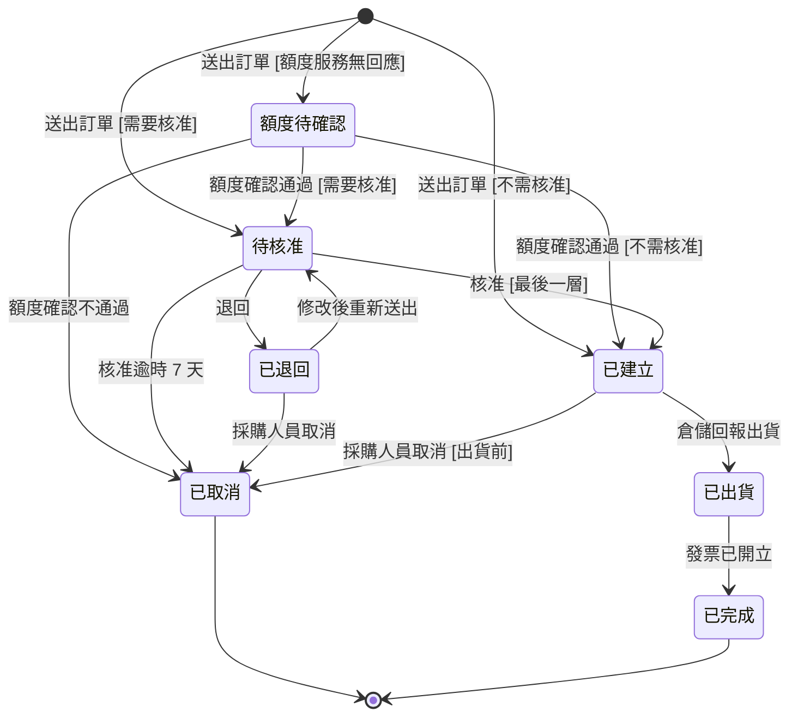

狀態圖適合溝通，**狀態轉換表**則適合檢查。把轉換寫成表格後，可以用腳本檢查三件事：每個狀態都能從初始狀態到達、每個非終止狀態都有離開的路徑、每個狀態對每個事件都有明確的處理（轉換或拒絕）。

| 目前狀態 | 事件 | 條件 | 下一狀態 | 相關需求 |
| --- | --- | --- | --- | --- |
| （初始） | 送出訂單 | 不需核准 | 已建立 | FR-ORD-010 |
| （初始） | 送出訂單 | 需要核准 | 待核准 | FR-ORD-012 |
| 待核准 | 核准 | 最後一層 | 已建立 | UC-ORD-02 |
| 待核准 | 核准逾時 | 送出後 7 天 | 已取消 | FR-ORD-024 |
| 已建立 | 採購人員取消 | 尚未出貨 | 已取消 | FR-ORD-035 |
| 已出貨 | 採購人員取消 | — | （拒絕，維持已出貨） | FR-ORD-036 |

| 編號 | 等級 | 規則 | 驗證方式 |
| --- | --- | --- | --- |
| `SA-BEH-003` | 必須 | 有三個以上狀態的業務實體，SAD 必須有狀態模型，以業務語言命名狀態與事件；狀態名稱必須與詞彙表及畫面顯示一致 | 🤖 mermaid-cli 渲染；👁 需求審查 |
| `SA-BEH-004` | 必須 | 狀態模型必須通過完整性檢查：每個狀態都可從初始狀態到達，每個非終止狀態都至少有一條離開的轉換（含逾時或人工處理），不存在無法離開的非終止狀態 | 🤖 狀態轉換表檢查腳本（本節範例） |
| `SA-BEH-005` | 必須 | 每個「狀態 × 事件」的組合都必須有明確的處理：轉換、或拒絕並說明原因；不得留給實作者決定 | 🤖 狀態轉換表檢查腳本（列出未定義的組合）；👁 需求審查 |
| `SA-BEH-006` | 應該 | 需要人工等待的狀態（待核准、待補件）應定義逾時與逾時後的處理，避免實體永遠停留在中間狀態 | 👁 需求審查 |

```python
# ✅ SA-BEH-004、SA-BEH-005：狀態轉換表的完整性檢查
from collections import deque

INITIAL, FINAL = "（初始）", {"已取消", "已完成"}
EVENTS = {"送出訂單", "核准", "退回", "核准逾時", "採購人員取消", "倉儲回報出貨", "發票已開立"}
# (目前狀態, 事件) -> 下一狀態；"REJECT" 表示明確拒絕
T = {
    (INITIAL, "送出訂單"): "待核准",
    ("待核准", "核准"): "已建立", ("待核准", "退回"): "已退回",
    ("待核准", "核准逾時"): "已取消", ("待核准", "採購人員取消"): "已取消",
    ("已退回", "送出訂單"): "待核准", ("已退回", "採購人員取消"): "已取消",
    ("已建立", "倉儲回報出貨"): "已出貨", ("已建立", "採購人員取消"): "已取消",
    ("已出貨", "發票已開立"): "已完成", ("已出貨", "採購人員取消"): "REJECT",
}

def check(table, events):
    states = {s for s, _ in table} | {n for n in table.values() if n != "REJECT"}
    problems = []
    seen, queue = {INITIAL}, deque([INITIAL])
    while queue:  # 可到達性
        s = queue.popleft()
        for (src, _), dst in table.items():
            if src == s and dst != "REJECT" and dst not in seen:
                seen.add(dst)
                queue.append(dst)
    problems += [f"無法到達：{s}" for s in sorted(states - seen)]
    for s in sorted(states - FINAL - {INITIAL}):
        exits = [d for (src, _), d in table.items() if src == s and d not in ("REJECT", s)]
        if not exits:
            problems.append(f"無法離開的非終止狀態：{s}")
        undefined = sorted(e for e in events if (s, e) not in table)
        if undefined:
            problems.append(f"未定義處理：{s} × {undefined}")
    return problems

print("\n".join(check(T, EVENTS)) or "狀態模型完整")
```

```markdown
<!-- ❌ SA-BEH-004、SA-BEH-006：「待核准」沒有逾時，主管離職時訂單永遠卡住 -->
待核准 --核准--> 已建立
待核准 --退回--> 已退回
```

#### 🔍 8.2 審查與驗證

- **自動檢查：** 把狀態轉換表轉成腳本中的字典，執行完整性檢查。腳本會列出「未定義處理」的組合，分析師要逐一決定是轉換還是拒絕，並補進表格。
- **人工審查問題：**
  1. 每個中間狀態，如果沒有人處理，會停留多久？之後會怎樣？
  2. 畫面上顯示的狀態名稱、報表的狀態名稱與狀態模型一致嗎？
- **AI 常見錯誤：** AI 產生的狀態圖通常只有正常路徑的狀態，缺少「退回」「逾時」「待確認」等狀態，也很少考慮「已出貨時收到取消」這類不合法事件的處理。用腳本列出未定義組合，是補齊這些缺口最快的方法。本節範例腳本執行時，就會列出「已建立 × 核准」等尚未定義處理的組合。

### 8.3 系統循序圖

分析階段的循序圖是**系統循序圖**（system sequence diagram）：把整個系統視為一個黑箱，只畫參與者、系統與外部系統之間的訊息。它回答「誰在什麼時候需要什麼資訊」，用來確認介面需求與回應時間需求；系統內部的元件互動屬於設計階段（請見 [系統設計指引]() 的循序圖章節）。

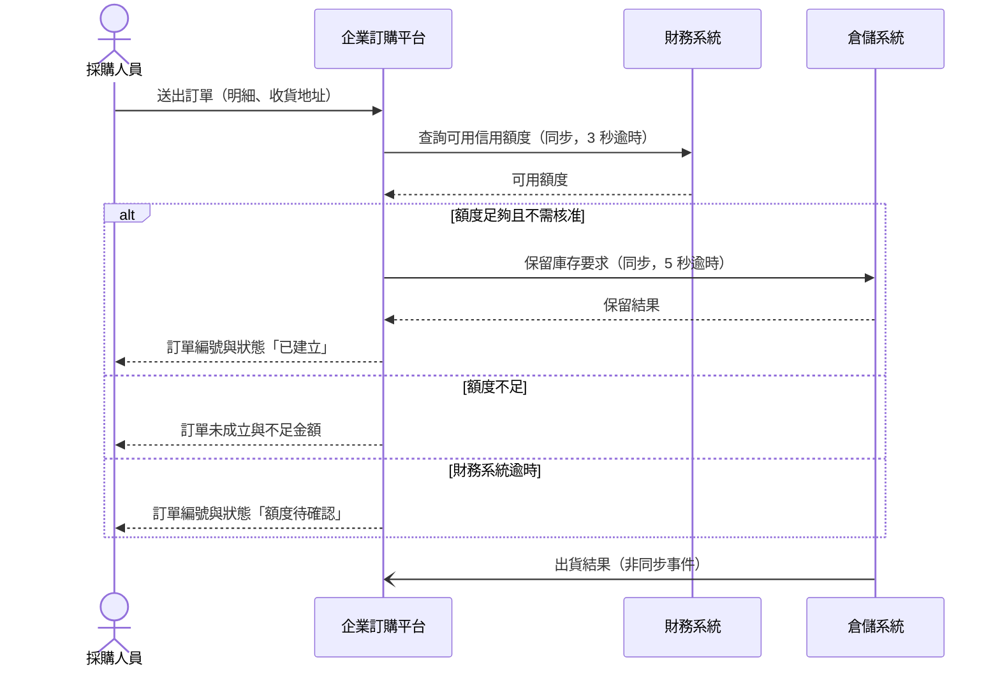

| 編號 | 等級 | 規則 | 驗證方式 |
| --- | --- | --- | --- |
| `SA-BEH-007` | 應該 | 涉及外部系統的使用案例，應以系統循序圖描述系統與外部系統的訊息順序；系統以單一參與者表示，不畫內部元件 | 🤖 mermaid-cli 渲染；👁 需求審查 |
| `SA-BEH-008` | 必須 | 系統循序圖中每個跨系統的訊息都必須標示同步或非同步，並以 `alt` 區塊畫出至少一條失敗或逾時路徑；訊息必須對應到介面需求（第 10 章） | 👁 需求審查（核對介面清單） |

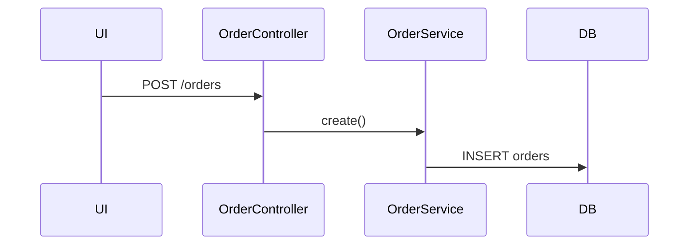

#### 🔍 8.3 審查與驗證

- **自動檢查：** CI 渲染循序圖；可用 `test-mermaid-syntax.ps1` 檢查常見語法問題，並以 mermaid-cli 實際渲染確認。
- **人工審查問題：**
  1. 每個外部系統的呼叫，失敗時系統怎麼回應使用者？在 SRS 中有對應的需求嗎？
  2. 同步呼叫的逾時時間，加總起來是否超過使用者可以接受的回應時間（第 9 章）？
- **AI 常見錯誤：** AI 畫循序圖時會自動展開系統內部（Controller、Service、Repository），這是設計而不是分析。另外，Mermaid 循序圖的訊息文字中若有半形分號，會被當成敘述結尾而造成解析錯誤；中文標點請用全形。

### 8.4 分析模型之間的一致性

SRS 與 SAD 中的各種模型從不同角度描述同一個系統，它們之間的**不一致**往往就是需求錯誤所在。例如：使用案例的步驟提到「取消訂單」，但狀態圖中沒有「已取消」狀態；CRUD 矩陣顯示某個使用案例會修改訂單，但使用案例文字沒有提到。

| 交叉檢查 | 檢查內容 |
| --- | --- |
| 使用案例 ↔ 狀態模型 | 使用案例中造成狀態改變的步驟，都對應到狀態模型中的轉換 |
| 使用案例 ↔ CRUD 矩陣 | 使用案例中提到建立或修改的資料，都出現在 CRUD 矩陣 |
| 事件清單 ↔ 狀態模型 | 影響實體的業務事件，都是狀態模型中的事件 |
| 脈絡圖 ↔ 系統循序圖 ↔ 介面清單 | 三者的外部系統與訊息一致 |
| 概念資料模型 ↔ 詞彙表 | 實體與屬性名稱都在詞彙表中 |
| 業務規則 ↔ 需求 ↔ 驗收條件 | 每條規則都有引用它的需求與驗證它的情境 |

| 編號 | 等級 | 規則 | 驗證方式 |
| --- | --- | --- | --- |
| `SA-BEH-009` | 必須 | 分析審查前必須完成上表的交叉檢查，並將發現的不一致記錄為審查發現；交叉檢查結果附在審查紀錄中 | 👁 需求審查（附交叉檢查紀錄）；🤖 可自動化的項目以 `check_trace.py` 執行 |
| `SA-BEH-010` | 應該 | 模型中的名稱（狀態、事件、實體、外部系統）應集中定義在詞彙表或模型清單中，各模型引用同一名稱，以便工具交叉比對 | 🤖 名稱一致性比對腳本；👁 需求審查 |

```markdown
<!-- ✅ SA-BEH-009：交叉檢查紀錄 -->
| 檢查 | 結果 | 發現 |
| --- | --- | --- |
| 使用案例 ↔ 狀態模型 | 不一致 1 項 | RV-04-07：UC-ORD-04 允許「已退回」時取消，但狀態轉換表沒有（已退回 × 採購人員取消）→ 已補上 |
| 脈絡圖 ↔ 介面清單 | 一致 | — |
| 業務規則 ↔ 驗收條件 | 不一致 1 項 | RV-04-08：RULE-ORD-007 運費沒有驗收情境 → 測試組補寫 |
```

```yaml
# ✅ SA-BEH-010：模型名稱集中定義（docs/sad/model-names.yaml），各模型引用同一名稱
order_states: [已建立, 待核准, 額度待確認, 已退回, 已出貨, 已完成, 已取消]
external_systems: [財務系統, 倉儲系統, 會計系統, 客戶關係管理系統, 郵件服務]
```

#### 🔍 8.4 審查與驗證

- **自動檢查：** 以腳本讀取 `model-names.yaml`，檢查 Mermaid 狀態圖、脈絡圖與介面清單中出現的名稱都在清單中，且清單中的每個名稱都至少被一個模型使用。
- **人工審查問題：**
  1. 交叉檢查表的每一列都做了嗎？還是只做了容易的幾項？
  2. 發現不一致時，修正的是正確的那一方嗎？（不一致代表至少有一方錯，不一定是後寫的那一方。）
- **AI 常見錯誤：** 分章節請 AI 產生模型時，各章使用的名稱會逐漸偏移（「已建立」「建立完成」「新建」）。請在提示中提供 `model-names.yaml`，並要求 AI 只能使用清單中的名稱。

---

## 9. 非功能需求

### 9.1 ISO/IEC 25010:2023 品質模型

非功能需求（NFR）定義系統「做得多好」與「受到什麼限制」。它們決定架構：同樣的功能，可用率 99% 與 99.99% 的系統，架構與成本完全不同。NFR 也是最常被遺漏的需求，因為利害關係人很少主動提起，總是假設「理所當然」。

ISO/IEC 25010:2023 定義產品品質的 9 個特性，比 2011 版多了**安全性（safety）**，並把「可用性（usability）」改名為**互動能力（interaction capability）**、「可攜性（portability）」改名為**彈性（flexibility）**。分析時以這 9 個特性作為檢查清單，逐一確認是否適用，可以避免遺漏。

| 特性 | 子特性（2023） | 常見需求例子 | 本文章節 |
| --- | --- | --- | --- |
| 功能適合性 | 功能完整性、功能正確性、功能適當性 | 計算精度、業務規則正確 | 第 4–6 章 |
| 效能效率 | 時間行為、資源使用、容量 | 回應時間、吞吐量、資料量 | 9.3 |
| 相容性 | 共存性、互通性 | 與外部系統交換資料、瀏覽器支援 | 第 10 章 |
| 互動能力 | 適當性可辨識、易學性、易操作性、使用者錯誤防護、使用者投入、包容性、使用者協助、自我描述性 | 完成任務的時間、無障礙 | 第 12 章 |
| 可靠性 | 無缺陷性、可用性、容錯性、可恢復性 | 可用率、RTO、RPO | 9.4 |
| 資訊安全性 | 機密性、完整性、不可否認性、可歸責性、真實性、抗攻擊性 | 身分驗證、稽核軌跡 | 第 11 章 |
| 可維護性 | 模組化、可重用性、易分析性、易修改性、易測試性 | 規則可設定、日誌與監控 | 9.5 |
| 彈性 | 適應性、可擴展性、易安裝性、可替換性 | 部署環境、擴充能力 | 9.5 |
| 安全性（safety） | 運作限制、風險識別、失效安全、危害警告、安全整合 | 控制實體設備的系統才需要 | 9.5 |

> 「互動能力」中的「包容性」（inclusivity）是 2023 版新增的子特性，涵蓋過去「無障礙」的範圍，但更廣，也包括不同年齡、文化與語言的使用者。

| 編號 | 等級 | 規則 | 驗證方式 |
| --- | --- | --- | --- |
| `SA-NFR-001` | 必須 | SRS 必須以 ISO/IEC 25010:2023 的 9 個品質特性逐一檢查，每個特性要列出對應的 NFR，或寫明不適用的理由 | 🤖 `check_srs.py`（檢查 NFR 章節涵蓋 9 個特性）；👁 需求審查 |
| `SA-NFR-002` | 必須 | 每筆 NFR 都必須標示所屬的品質特性與子特性，並以可量測的方式描述（數值、單位、量測條件、量測方式） | 🤖 `check_srs.py`（效能、容量、可用性、可靠性、資料品質類 NFR 必須含數值）；🤖 `check_trace.py`（品質特性欄位） |

```markdown
<!-- ✅ SA-NFR-001、SA-NFR-002：以 9 個特性檢查，標示子特性，不適用要寫理由 -->
| 特性 | 子特性 | 需求 | 編號 |
| --- | --- | --- | --- |
| 效能效率 | 時間行為 | 下單回應時間第 95 百分位數 ≤ 2 秒（QS-ORD-01） | NFR-PERF-001 |
| 效能效率 | 容量 | 每日 3,500 筆訂單，5 年後 7,000 筆 | NFR-CAP-001 |
| 可靠性 | 可用性 | 營業時間每月可用率 ≥ 99.9% | NFR-AVAIL-001 |
| 可靠性 | 可恢復性 | RTO ≤ 4 小時、RPO ≤ 15 分鐘 | NFR-REL-002 |
| 互動能力 | 包容性 | 符合 WCAG 2.2 AA | NFR-UX-001 |
| 安全性（safety） | — | 不適用：本系統不控制實體設備，失效不會造成人身傷害 | — |

<!-- ❌ SA-NFR-001、SA-NFR-002：籠統的 NFR 清單，無法量測，也沒檢查遺漏 -->
- 系統要穩定、安全、好用、效能佳。
```

#### 🔍 9.1 審查與驗證

- **自動檢查：** `check_srs.py` 檢查 NFR 總表涵蓋 9 個品質特性（不適用者也要列出並寫明理由），效能、容量、可用性等類別的 NFR 含數值；`check_trace.py` 檢查每筆非功能需求都標示了品質特性。
- **人工審查問題：**
  1. 標示「不適用」的特性，理由站得住嗎？（例如「資訊安全性不適用」幾乎一定是錯的。）
  2. NFR 的數值是誰提出的？有業務依據嗎？（見 3.2。）
- **AI 常見錯誤：** AI 仍常使用 ISO 25010:2011 的 8 個特性與舊名稱（usability、portability），漏掉 2023 版新增的 safety 與 inclusivity。也常為每個特性填上「業界標準」的數值，例如 99.99%，而沒有成本與依據。

### 9.2 品質情境

只寫「回應時間 ≤ 2 秒」仍然不夠：在什麼負載下？量測哪個操作？從哪裡量測？Carnegie Mellon SEI 提出的**品質屬性情境**（quality attribute scenario）以六個部分完整描述一個品質需求，讓架構師能依此做設計決策，測試人員能依此設計效能或韌性測試。

| 部分 | 說明 | 範例（QS-ORD-01） |
| --- | --- | --- |
| 來源（source） | 誰或什麼產生刺激 | 採購人員 |
| 刺激（stimulus） | 發生了什麼 | 送出含 20 筆明細的訂單 |
| 對象（artifact） | 受影響的部分 | 企業訂購平台（下單功能） |
| 環境（environment） | 當時的條件 | 季底尖峰：500 個同時使用者、每分鐘 300 筆下單 |
| 回應（response） | 系統要做什麼 | 完成額度檢查、核准判定與庫存保留，回覆訂單狀態 |
| 回應量測（response measure） | 如何判斷合格 | 第 95 百分位數 ≤ 2 秒、第 99 百分位數 ≤ 4 秒，錯誤率 < 0.1%（量測點：API 閘道） |

| 編號 | 等級 | 規則 | 驗證方式 |
| --- | --- | --- | --- |
| `SA-NFR-003` | 必須 | 影響架構的 NFR（效能、可用性、可恢復性、擴展性、安全性）必須以品質情境的六個部分描述，並以 `QS-` 編號登錄 | 🤖 `check_trace.py`（品質情境六欄檢查）；👁 需求審查 |
| `SA-NFR-004` | 必須 | 品質情境必須由業務代表與架構師共同排定優先順序（業務重要性 × 技術難度），高／高的情境必須在架構設計中有對應的設計決策 | 👁 需求審查；👁 架構審查（核對設計決策） |

```yaml
# ✅ SA-NFR-003、SA-NFR-004：品質情境以六個部分描述，並有優先順序
- id: QS-ORD-01
  quality: 效能效率／時間行為
  source: 採購人員
  stimulus: 送出含 20 筆明細的訂單
  artifact: 企業訂購平台（下單功能）
  environment: 季底尖峰，500 個同時使用者，每分鐘 300 筆下單
  response: 完成額度檢查、核准判定與庫存保留，回覆訂單狀態
  response_measure: p95 ≤ 2 秒、p99 ≤ 4 秒、錯誤率 < 0.1%（量測點 API 閘道）
  business_importance: high
  technical_difficulty: high
  related: [NFR-PERF-001, FR-ORD-010, IF-ORD-02, IF-ORD-04]
- id: QS-ORD-05
  quality: 可靠性／容錯性
  source: 倉儲系統
  stimulus: 停止回應 30 分鐘
  artifact: 企業訂購平台（庫存保留）
  environment: 營業時間正常負載
  response: 仍可接受下單，訂單標示「庫存確認中」，倉儲恢復後 15 分鐘內完成補保留
  response_measure: 期間下單成功率 ≥ 99%；恢復後 15 分鐘內所有訂單完成保留或標示失敗
  business_importance: high
  technical_difficulty: medium
```

```markdown
<!-- ❌ SA-NFR-003：缺少環境與量測，架構師無法據以設計 -->
QS-01 系統效能要好，尖峰時也不能慢。
```

#### 🔍 9.2 審查與驗證

- **自動檢查：** `check_trace.py` 檢查每個 `QS-` 都有六個部分與業務重要性、技術難度兩個優先順序欄位。
- **人工審查問題：**
  1. 請測試人員讀一個品質情境，說明他會怎麼設計測試；能說得出負載、量測點與合格標準嗎？
  2. 高優先的品質情境，架構文件中有對應的設計決策嗎？
- **AI 常見錯誤：** AI 寫的品質情境常把「回應」與「回應量測」混在一起，或環境只寫「正常情況」。尖峰、故障、維護中這些環境才是最需要定義的。

### 9.3 效能與容量需求

效能需求描述「多快」，容量需求描述「多少」。兩者都要以實際資料為依據（3.2），並考慮成長。回應時間要用**百分位數**而不是平均值：平均 1 秒可能代表 90% 的請求 0.5 秒、10% 的請求 5.5 秒，後者才是使用者抱怨的來源。

| 需求類型 | 要定義的內容 | 範例 |
| --- | --- | --- |
| 回應時間 | 操作、百分位數、負載條件、量測點 | 下單 p95 ≤ 2 秒（QS-ORD-01） |
| 吞吐量 | 每單位時間的交易數、尖峰倍數 | 尖峰每分鐘 300 筆下單 |
| 同時使用者 | 同時在線、同時操作 | 同時在線 1,500 人，同時操作 500 人 |
| 資料量 | 筆數、成長率、保存期間 | 每日 3,500 筆、年成長 15%、保存 10 年 |
| 批次時間窗 | 批次必須完成的時間 | 每日對帳 02:00 開始，06:00 前完成 |
| 資源限制 | 可用的硬體或預算上限 | 部署於既有平台，配額 16 vCPU |

| 編號 | 等級 | 規則 | 驗證方式 |
| --- | --- | --- | --- |
| `SA-NFR-005` | 必須 | 回應時間需求必須以百分位數（至少 p95）描述，並寫明操作、負載條件與量測點；不得只以平均值描述 | 🤖 `check_srs.py`（偵測「平均」且無百分位數的效能需求） |
| `SA-NFR-006` | 必須 | 容量需求必須包含目前量、尖峰量（含尖峰時段與倍數）與至少 3 年的成長預估，並寫明預估依據 | 👁 需求審查 |
| `SA-NFR-007` | 必須 | 有批次作業時，必須定義每個批次的時間窗、處理量與逾時的業務影響，並確認與其他系統的批次時間不衝突 | 👁 需求審查；👁 維運單位審查 |

```markdown
<!-- ✅ SA-NFR-006：容量需求含目前量、尖峰與成長依據 -->
| 編號 | 項目 | 目前（2026） | 尖峰 | 3 年後（2029） | 依據 |
| --- | --- | --- | --- | --- | --- |
| NFR-CAP-001 | 每日訂單數 | 平均 820 | 3,150（季底） | 平均 1,250、尖峰 4,800 | DOC-05 實績；業務部預估年成長 15% |
| NFR-CAP-002 | 訂單累積筆數 | 0（不轉置） | — | 約 110 萬筆 | 每年約 30 萬筆 × 3 年 + 15% 成長 |
| NFR-CAP-003 | 同時操作使用者 | 200 | 500（月底 16:00–18:00） | 760 | 現行 Email 收件時間分布 |
```

```markdown
<!-- ✅ SA-NFR-007：批次時間窗與衝突確認 -->
| 批次 | 時間窗 | 處理量 | 逾時影響 | 衝突確認 |
| --- | --- | --- | --- | --- |
| 每日出貨對帳 | 02:00–06:00 | 尖峰 5,000 筆 | 08:00 前業務無法看到昨日對帳結果 | 倉儲系統出貨檔 01:30 產出（IF-ORD-02），已與倉儲課確認 |

<!-- ❌ SA-NFR-005、SA-NFR-007：只寫平均，批次沒有時間窗 -->
系統平均回應時間 3 秒內。批次每天晚上執行。
```

#### 🔍 9.3 審查與驗證

- **自動檢查：** `check_srs.py` 偵測效能需求中出現「平均」但沒有 `p95`／「百分位數」的情況。
- **人工審查問題：**
  1. 容量預估的成長率是誰提出的？有業務計畫支持嗎？
  2. 批次時間窗內，依賴的外部檔案什麼時候會到？晚到時怎麼辦？
- **AI 常見錯誤：** AI 常寫「系統應支援 10,000 個同時使用者」這類與實際規模無關的數字，造成過度設計；或寫「平均回應時間 ≤ 1 秒」而沒有百分位數與負載條件。

### 9.4 可用性、可靠性與營運持續需求

可用率要寫清楚**計算期間與排除條件**。99.9% 的每月可用率，若以全天 24 小時計算，允許停機約 43 分鐘；若只計算營業時間（每週 6 天、每天 14 小時），允許停機約 22 分鐘。是否排除預先公告的維護時間，也會大幅改變架構需求。

營運持續需求以**營運衝擊分析**（BIA）為依據：業務單位評估系統中斷 1 小時、4 小時、1 天的業務影響，得出可容忍的最長中斷時間，進而定義 RTO（恢復時間目標）與 RPO（恢復點目標，可容忍遺失的資料時間範圍）。RTO 與 RPO 是**需求**；要用什麼方式達成（備援機房、雲端多區域）是架構決策，請見 [架構設計指引]()。

| 可用率 | 每月允許停機（24×7，30 天） | 每月允許停機（營業時間 14 小時 × 26 天） |
| --- | --- | --- |
| 99% | 約 7 小時 12 分 | 約 3 小時 38 分 |
| 99.5% | 約 3 小時 36 分 | 約 1 小時 49 分 |
| 99.9% | 約 43 分 | 約 22 分 |
| 99.95% | 約 22 分 | 約 11 分 |
| 99.99% | 約 4 分 | 約 2 分 |

| 編號 | 等級 | 規則 | 驗證方式 |
| --- | --- | --- | --- |
| `SA-NFR-008` | 必須 | 可用性需求必須寫明可用率、計算期間（每月、營業時間或 24×7）、排除條件（例如預先公告的維護）與量測方式 | 🤖 `check_srs.py`（可用性需求必須含期間與量測方式）；👁 需求審查 |
| `SA-NFR-009` | 必須 | RTO 與 RPO 必須依營運衝擊分析的結果由業務單位提出並核准，記錄依據；不得由分析師或架構師自行訂定 | 👁 需求審查（核對 BIA 紀錄與核准人） |
| `SA-NFR-010` | 應該 | 應定義降級運作需求：關鍵外部系統或部分功能失效時，系統仍須提供哪些功能，以及使用者看到什麼 | 👁 需求審查 |

```python
# ✅ SA-NFR-008：由可用率計算允許停機時間，避免估算錯誤
def allowed_downtime_minutes(availability: float, hours_per_day: float, days: int) -> float:
    return (1 - availability) * hours_per_day * days * 60

for a in (0.99, 0.995, 0.999, 0.9995, 0.9999):
    full = allowed_downtime_minutes(a, 24, 30)
    business = allowed_downtime_minutes(a, 14, 26)
    print(f"{a:.2%}  24x7: {full:7.1f} 分  營業時間: {business:7.1f} 分")
```

```markdown
<!-- ✅ SA-NFR-008、SA-NFR-009、SA-NFR-010：可用性、RTO／RPO 與降級運作 -->
NFR-AVAIL-001 系統在營業時間（週一至週六 08:00–22:00，Asia/Taipei）的每月可用率應不低於 99.9%。
  排除：每月第一個週日 00:00–06:00 的公告維護。量測：外部合成監控每分鐘探測下單 API。
NFR-REL-002 RTO ≤ 4 小時、RPO ≤ 15 分鐘。
  依據：BIA-ORD（2026-09-25），業務部評估中斷超過 4 小時需改回 Email 接單，
  遺失 15 分鐘以上訂單需逐一聯繫客戶；業務部 張協理核准。
NFR-REL-003 若倉儲系統無法使用，則系統應仍接受下單，並將訂單標示為「庫存確認中」（QS-ORD-05）。

<!-- ❌ SA-NFR-008、SA-NFR-009：沒有期間與排除條件，RTO 由架構師自訂 -->
NFR-01 系統可用率 99.99%。
NFR-02 RTO 0、RPO 0（架構師建議）。
```

#### 🔍 9.4 審查與驗證

- **自動檢查：** 以本節腳本核對 SRS 中可用率與允許停機時間的換算；`check_srs.py` 檢查可用性需求包含期間與量測方式。
- **人工審查問題：**
  1. 業務單位知道 99.99% 與 99.9% 的成本差異嗎？他們在知情的情況下做選擇了嗎？
  2. RTO／RPO 有 BIA 紀錄支持嗎？核准人是業務單位嗎？
- **AI 常見錯誤：** AI 很容易寫出「RTO 0、RPO 0」或「99.999%」，並把允許停機時間算錯。可用率與停機時間的換算請以腳本計算。

### 9.5 可維護性、彈性與營運需求

可維護性與彈性需求常被當成「設計品質」而沒有在分析階段提出，但其中許多是業務需要：業務單位希望自行調整門檻（易修改性）、稽核需要查詢誰在何時做了什麼（可歸責性，第 11 章）、維運單位需要知道批次是否失敗（易分析性）。雲端部署、既有平台等組織政策則以**限制條件**（`CON-`）表達，而不是需求。

| 類型 | 需求例子 | 提出者 |
| --- | --- | --- |
| 易修改性 | 核准門檻由財務部於後台調整，不需改版 | 業務單位 |
| 易分析性（營運需求） | 批次失敗時 5 分鐘內通知值班人員，並可從失敗點重跑 | 維運單位 |
| 易分析性（營運需求） | 每筆訂單的處理過程可依訂單編號查詢完整軌跡 | 客服、維運 |
| 適應性、可擴展性 | 尖峰時可在不停機的情況下增加處理能力 | 業務單位（季底尖峰） |
| 易安裝性 | 部署至既有 Kubernetes 平台 | 資訊處（限制條件） |
| 可替換性 | 郵件服務可替換為其他供應商，不影響業務功能 | 採購單位 |

| 編號 | 等級 | 規則 | 驗證方式 |
| --- | --- | --- | --- |
| `SA-NFR-011` | 必須 | 必須邀請維運單位提出營運需求，至少包含：監控與告警、批次控制（重跑、略過、暫停）、問題追查所需的軌跡、維護時段、交接文件 | 👁 需求審查（核對維運單位出席與意見） |
| `SA-NFR-012` | 必須 | 組織政策、既有平台、指定技術等限制必須以 `CON-` 編號列為限制條件，寫明來源與是否可協商；不得混入功能或品質需求 | 🤖 `check_srs.py`（CON 需求必須有來源）；👁 需求審查 |
| `SA-NFR-013` | 應該 | 安全性（safety）特性若判定適用（例如系統控制實體設備、醫療或交通相關），應依產業安全標準（例如 IEC 61508）另訂安全需求並由安全工程人員審查 | 👁 需求審查 |

```markdown
<!-- ✅ SA-NFR-011：維運單位提出的營運需求 -->
NFR-OPS-001 當每日出貨對帳批次失敗時，系統應在 5 分鐘內通知值班人員，通知內容包含批次名稱、失敗步驟與錯誤摘要。
NFR-OPS-002 系統應允許維運人員從失敗的步驟重新執行每日出貨對帳批次，且重新執行不會產生重複的發票開立要求。
NFR-OPS-003 系統應可依訂單編號查詢該訂單所有狀態變更與外部系統呼叫的時間與結果，保存 90 天。

<!-- ✅ SA-NFR-012：限制條件寫明來源與可協商性 -->
| 編號 | 限制 | 來源 | 可協商 |
| --- | --- | --- | --- |
| CON-ORD-001 | 必須使用公司單一登入（SSO）進行內部人員身分驗證 | 資安政策 SEC-POL-01 | 否 |
| CON-ORD-002 | 必須部署於公司既有 Kubernetes 平台 | 資訊處技術政策 IT-POL-07 | 否 |
| CON-ORD-003 | 第一階段預算上限 600 萬元 | 專案章程 | 可（需經指導委員會） |

<!-- ❌ SA-NFR-012：限制混在需求中，沒有來源，無法判斷能否協商 -->
NFR-20 系統要用 Java 開發並上公有雲。
```

```markdown
<!-- ✅ SA-NFR-013：判定安全性（safety）不適用時寫明理由；適用時另訂安全需求 -->
- 安全性（safety）：不適用。本系統不控制實體設備，失效時最壞情況為訂單延誤，不會造成人身或環境危害。
- （對照）若系統直接控制倉儲自動搬運設備，則應依 IEC 61508 進行危害分析，另訂 SR-WMS-xxx 安全需求。
```

#### 🔍 9.5 審查與驗證

- **自動檢查：** `check_srs.py` 檢查 `CON-` 都有來源與可協商欄位；檢查 NFR 中是否有 `NFR-OPS-` 類需求，沒有時提出警告。
- **人工審查問題：**
  1. 維運單位看過 SRS 嗎？他們在凌晨 3 點收到告警時，需要哪些資訊？
  2. 每個限制條件真的不能協商嗎？誰有權改變它？
- **AI 常見錯誤：** AI 產生的 NFR 很少包含營運需求（重跑、軌跡查詢、維護時段），並常把技術選擇（「使用 Kubernetes」「採用微服務」）寫成需求而非有來源的限制。

---

## 10. 介面與整合需求

### 10.1 介面清單

企業系統很少獨立運作。整合問題是專案延誤的主要原因之一，原因通常不是技術困難，而是**太晚發現**：對方系統沒有提供需要的資料、對方的批次時間與我方衝突、對方的測試環境要排隊三個月。分析階段的任務是儘早列出所有介面，並取得對方的承諾。

| 編號 | 對象系統 | 方向 | 交換的資訊 | 觸發與頻率 | 同步／非同步 | 對方窗口 |
| --- | --- | --- | --- | --- | --- | --- |
| IF-ORD-01 | 客戶關係管理系統 | 讀取 | 客戶基本資料、收貨地址 | 下單時查詢；尖峰每分鐘 300 次 | 同步 | 業務資訊組 |
| IF-ORD-02 | 倉儲系統 | 雙向 | 庫存保留要求／結果；出貨結果 | 下單時；出貨結果每日 01:30 檔案 | 保留：同步；出貨：檔案 | 倉儲資訊組 |
| IF-ORD-03 | 會計系統 | 送出 | 發票開立要求 | 出貨完成後；每日約 1,000 筆 | 非同步 | 會計資訊組 |
| IF-ORD-04 | 財務系統 | 讀取 | 可用信用額度 | 下單時查詢 | 同步 | 財務資訊組 |
| IF-ORD-05 | 郵件服務 | 送出 | 通知信 | 事件觸發；尖峰每分鐘 100 封 | 非同步 | 資訊處 |

| 編號 | 等級 | 規則 | 驗證方式 |
| --- | --- | --- | --- |
| `SA-INT-001` | 必須 | SRS 必須有介面清單，涵蓋脈絡圖中的每個外部系統；每個介面列出對象、方向、交換的資訊、觸發與頻率、同步或非同步、對方窗口 | 🤖 脈絡圖與介面清單比對腳本；👁 需求審查 |
| `SA-INT-002` | 必須 | 每個介面都必須在分析階段取得對方系統擁有者的書面確認（介面可行、資料可提供、時程可配合），並記錄確認日期 | 👁 需求審查（核對確認紀錄） |
| `SA-INT-003` | 應該 | 介面清單應標示每個介面的業務關鍵度，以及對方系統不可用時的業務影響，作為可用性與降級需求（9.4）的依據 | 👁 需求審查 |

```python
# ✅ SA-INT-001：比對脈絡圖（Mermaid）中的外部系統與介面清單（Markdown 表格）
import re
import sys

def systems_in_context(mermaid: str) -> set[str]:
    # 抓出 SYS 以外、名稱以「系統」或「服務」結尾的節點標籤
    return {m for m in re.findall(r'\["([^"]+)"\]', mermaid) if m.endswith(("系統", "服務"))} - {"企業訂購平台"}

def systems_in_interface_table(md: str) -> set[str]:
    return {cells[2].strip() for line in md.splitlines()
            if line.startswith("| IF-") and len(cells := line.split("|")) > 3}

if __name__ == "__main__":
    ctx = systems_in_context(open(sys.argv[1], encoding="utf-8").read())
    tbl = systems_in_interface_table(open(sys.argv[2], encoding="utf-8").read())
    for s in sorted(ctx - tbl):
        print(f"脈絡圖有、介面清單沒有：{s}")
    for s in sorted(tbl - ctx):
        print(f"介面清單有、脈絡圖沒有：{s}")
    sys.exit(1 if ctx != tbl else 0)
```

```markdown
<!-- ✅ SA-INT-002、SA-INT-003：對方確認紀錄與業務關鍵度 -->
| 介面 | 對方確認 | 業務關鍵度 | 對方不可用時的影響 |
| --- | --- | --- | --- |
| IF-ORD-02 | 倉儲資訊組 趙組長，2026-10-05 Email（附件 IF02-confirm.eml） | 高 | 無法保留庫存；依 NFR-REL-003 降級運作 |
| IF-ORD-04 | 財務資訊組 尚未確認 → TBD-014 | 高 | 無法下單（額度待確認） |

<!-- ❌ SA-INT-002：介面只有我方想法，對方不知情 -->
IF-ORD-04 從財務系統取得額度（財務系統應提供 API）。
```

#### 🔍 10.1 審查與驗證

- **自動檢查：** 執行本節腳本比對脈絡圖與介面清單。
- **人工審查問題：**
  1. 每個介面的對方窗口知道這個專案嗎？他們確認了嗎？
  2. 對方系統近期有改版或汰換計畫嗎？
- **AI 常見錯誤：** AI 會「假設」外部系統提供某個 API（「呼叫財務系統的 /credit API」），但這個 API 可能不存在。介面的存在與內容只能由對方確認。

### 10.2 線上介面需求（API 與事件）

分析階段的介面需求描述**交換什麼資料、何時交換、品質要求與錯誤情境**，不描述端點路徑、HTTP 方法或資料結構。後者屬於設計階段的介面契約（OpenAPI、AsyncAPI），請見系統設計指引。分析師要確認的是業務上的需要：例如「同一筆訂單的發票開立要求不得重複」是業務需求，設計階段才決定用冪等鍵實現。

| 編號 | 等級 | 規則 | 驗證方式 |
| --- | --- | --- | --- |
| `SA-INT-004` | 必須 | 每個介面需求必須列出錯誤情境與處理方式：對方無回應、對方回覆錯誤、資料不合法、重複送出；每種情境寫明系統的業務處理（重試、降級、通知、人工處理） | 👁 需求審查（以本規則清單逐項核對） |
| `SA-INT-005` | 必須 | 介面需求必須寫明資料項目（引用資料字典）、回應時間或時效要求、交易量（平均與尖峰），以及資料是否可重複送出或必須恰好處理一次 | 🤖 `check_srs.py`（介面需求必要欄位）；👁 需求審查 |
| `SA-INT-006` | 不應該 | 分析文件不應指定端點路徑、HTTP 方法、訊息佇列產品或資料結構，除非對方系統已存在且規格固定；此時應引用對方的規格文件與版本 | 👁 需求審查 |

```markdown
<!-- ✅ SA-INT-004、SA-INT-005、SA-INT-006：需求層級的介面規格 -->
## IF-ORD-03 會計系統開立發票

- 目的：訂單出貨後，要求會計系統開立電子發票。
- 觸發：訂單狀態變為「已出貨」。
- 資料項目：訂單編號、客戶統一編號、出貨日期、明細（料號、數量、未稅金額）、運費。（資料字典 7.3）
- 時效：出貨後 24 小時內送達會計系統；每日約 1,000 筆，季底尖峰 4,800 筆。
- 恰好一次：同一訂單只能開立一次發票，重複送出時會計系統不得重複開立。
- 對方規格：會計系統既有「發票開立介面規格書 ACC-IF-07 v3.2」，本介面依該規格。

| 錯誤情境 | 業務處理 |
| --- | --- |
| 會計系統無回應 | 每 10 分鐘重送，24 小時內未成功則通知會計資訊組與業務人員 |
| 會計系統回覆資料錯誤（例如統一編號無效） | 不重送；標示訂單「發票待處理」，通知業務人員更正客戶資料 |
| 重複送出（例如重送時前一次其實已成功） | 會計系統以訂單編號判斷已開立，回覆既有發票號碼；平台視為成功 |
| 出貨結果被倉儲更正（數量改變） | 由人工作廢重開，不自動處理（TBD-016 確認流程） |

<!-- ❌ SA-INT-004、SA-INT-006：指定技術，沒有錯誤情境 -->
IF-ORD-03 平台以 Kafka topic invoice-request 傳送 JSON 給會計系統，會計系統 POST /invoices 開立發票。
```

#### 🔍 10.2 審查與驗證

- **自動檢查：** `check_srs.py` 檢查每個 `IF-` 規格小節都包含目的、觸發、資料項目、時效（含交易量）與錯誤情境。
- **人工審查問題：**
  1. 每個錯誤情境的「業務處理」是由業務單位決定的嗎？還是分析師自己想的？
  2. 這個介面的資料，是可以重複處理，還是必須恰好一次？業務上重複會造成什麼後果？
- **AI 常見錯誤：** AI 擅長產生 OpenAPI 或 JSON 範例，常在分析階段就寫出完整 API 規格，而錯誤情境只有「回傳 500」。分析階段要先回答業務上的錯誤處理。

### 10.3 檔案與批次介面需求

檔案介面在企業與金融環境仍然普遍（銀行對帳檔、政府申報檔、合作廠商交換檔）。檔案介面的問題多半出在細節：字元編碼（Big5 與 UTF-8）、換行字元、日期格式、檔案到達時間、重送規則與筆數核對。這些細節必須在分析階段由雙方確認。

| 編號 | 等級 | 規則 | 驗證方式 |
| --- | --- | --- | --- |
| `SA-INT-007` | 必須 | 檔案介面需求必須定義：檔名規則、字元編碼、換行字元、格式（固定長度或分隔字元）、欄位規格、產出與到達時間、傳輸方式與目錄、保存期限 | 🤖 `check_srs.py`（檔案介面必要項目）；👁 需求審查 |
| `SA-INT-008` | 必須 | 檔案介面必須有完整性控制：首尾錄或控制檔，包含筆數與金額合計；接收方必須核對，不符時整檔拒收並通知 | 🧪 介面測試（以筆數錯誤的檔案驗證拒收）；👁 需求審查 |
| `SA-INT-009` | 必須 | 必須定義檔案晚到、缺檔、重複送達與部分錯誤時的業務處理，以及重送的規則（整檔重送或僅錯誤筆） | 👁 需求審查 |

```markdown
<!-- ✅ SA-INT-007、SA-INT-008、SA-INT-009：出貨結果檔（IF-ORD-02 的檔案部分） -->
| 項目 | 規格 |
| --- | --- |
| 檔名 | `SHIP_YYYYMMDD.csv`（YYYYMMDD 為出貨日期） |
| 編碼與換行 | UTF-8（無 BOM），LF |
| 格式 | 逗號分隔，第一列為欄位名稱；欄位：訂單編號、料號、出貨數量、出貨時間（ISO 8601，+08:00） |
| 控制檔 | `SHIP_YYYYMMDD.ctl`：筆數、出貨數量合計；資料檔傳完後才放控制檔 |
| 到達時間 | 每日 01:30 前，SFTP 目錄 `/inbound/wms/` |
| 保存 | 處理後移至 `/archive/`，保存 1 年 |
| 核對不符 | 整檔拒收，通知倉儲資訊組；倉儲修正後整檔重送，檔名不變 |
| 晚到或缺檔 | 02:00 未到達時告警值班人員；對帳批次延至檔案到達後執行，最晚 06:00 |
| 重複送達 | 以檔名判斷，已處理成功的檔案不重複處理，記錄並告警 |
```

```text
# ❌ SA-INT-007、SA-INT-008：只有欄位，沒有編碼、控制資訊與到達時間
出貨檔：訂單編號、料號、數量、時間，每天傳一次。
```

#### 🔍 10.3 審查與驗證

- **自動檢查：** `check_srs.py` 檢查檔案介面規格包含 SA-INT-007 列出的項目；介面測試以「筆數不符」「編碼錯誤」「缺控制檔」的測試檔驗證拒收行為。
- **人工審查問題：**
  1. 對方系統真的能產出 UTF-8 嗎？舊系統常只能產出 Big5。
  2. 檔案晚到 4 小時，業務上會發生什麼事？誰要處理？
- **AI 常見錯誤：** AI 產生的檔案規格常省略編碼與換行字元，日期格式寫「YYYY/MM/DD」卻沒有時區；也常忘記控制檔與重送規則。

### 10.4 介面協議與責任分工

跨單位或跨公司的介面，應以**介面協議**（interface agreement，或介面控制文件 ICD）記錄雙方的責任：誰提供什麼、服務水準、變更通知方式、測試環境與聯絡窗口。介面協議讓介面的變更有正式的管道，而不是對方改版後我方才發現。

| 編號 | 等級 | 規則 | 驗證方式 |
| --- | --- | --- | --- |
| `SA-INT-010` | 必須 | 每個跨單位介面都必須有雙方核准的介面協議，至少包含：服務時間與可用率、變更通知期限、測試環境與測試時程、問題聯絡窗口與升級方式 | 👁 需求審查（核對介面協議與簽核） |
| `SA-INT-011` | 應該 | 介面協議應約定對方提供測試資料與測試環境的時間，並列入專案時程的相依項目 | 👁 專案計畫審查 |

```markdown
<!-- ✅ SA-INT-010、SA-INT-011：介面協議摘要 -->
## 介面協議 IA-ORD-02（企業訂購平台 ↔ 倉儲系統）
| 項目 | 約定 |
| --- | --- |
| 服務時間 | 庫存保留 API：週一至週六 07:00–23:00；出貨檔：每日 01:30 前 |
| 可用率 | 服務時間內 99.5%（倉儲系統既有水準） |
| 變更通知 | 介面變更至少 30 天前書面通知，並提供 2 週雙版本並行 |
| 測試環境 | 倉儲 UAT 環境，2026-12-01 起可用；測試資料由倉儲資訊組準備 50 個料號 |
| 窗口 | 倉儲資訊組 趙組長；緊急時 24 小時值班電話（見維運手冊） |
| 簽核 | 平台 PO 張協理、倉儲課 林課長，2026-10-12 |
```

```markdown
<!-- ❌ SA-INT-010：沒有協議，只有口頭約定 -->
倉儲系統的同事說 API 隨時可以用。
```

#### 🔍 10.4 審查與驗證

- **自動檢查：** 可檢查每個 `IF-` 都有對應的 `IA-` 文件與簽核日期。
- **人工審查問題：**
  1. 對方系統的可用率低於我方需求時，我方的需求還能成立嗎？（例如我方要求 99.9%，但依賴一個 99.5% 的系統。）
  2. 測試環境的可用日期，是否早於我方的整合測試時程？
- **AI 常見錯誤：** AI 不知道組織間的協議與承諾，會假設外部系統的服務水準與我方相同。依賴系統的實際可用率必須向對方取得。

---

## 11. 安全、隱私與合規需求

### 11.1 安全需求的來源與等級

安全需求要在分析階段提出，原因很簡單：越晚發現的安全缺口，修正成本越高，而且有些安全需求（例如稽核軌跡、資料分級、職務分工）會影響資料模型與流程，到設計階段才補會牽動整個系統。這是安全軟體開發生命週期（SSDLC）與 NIST SSDF（SP 800-218）「在需求階段定義安全需求」的核心精神。

安全需求的來源有四類：**法規與合約**（個資法、資安法、產業規範）、**組織政策**（資安政策、密碼政策）、**資料分級**（資料越敏感，控制越嚴格）與**威脅分析**（濫用案例，11.2）。OWASP ASVS 5.0 提供現成的應用程式安全需求清單，並分成三個等級：L1 適用於所有應用程式、L2 適用於處理個資或財務等敏感資料的一般業務系統、L3 適用於高價值或高風險的系統。分析師不需要自己發明安全需求，而是**選擇適用的等級，再依系統特性增補**。

| 編號 | 等級 | 規則 | 驗證方式 |
| --- | --- | --- | --- |
| `SA-SEC-001` | 必須 | SRS 必須依資料分級與業務風險選定 OWASP ASVS 5.0 的目標等級（L1／L2／L3），記錄選定理由，並由資安人員核准；處理個資或財務資料的系統不得低於 L2 | 👁 資安審查（核對選定理由與核准） |
| `SA-SEC-002` | 必須 | 安全需求必須以 `NFR-SEC-` 編號登錄，每筆寫明來源（法規條文、政策編號、ASVS 要求編號或濫用案例），並與其他需求一樣具備驗收條件 | 🤖 `check_srs.py`（NFR-SEC 來源欄位）；👁 資安審查 |
| `SA-SEC-003` | 必須 | 系統處理的每類資料都必須標示資料分級（例如公開、內部、機密、個資、特種個資），分級依組織的資料分級政策；分級結果寫入資料字典（7.3） | 🤖 資料字典分級欄位檢查；👁 資安審查 |

```markdown
<!-- ✅ SA-SEC-001、SA-SEC-002：選定 ASVS 等級並列出有來源的安全需求 -->
## 安全需求
- 目標等級：OWASP ASVS 5.0 Level 2。
  理由：處理客戶聯絡人個資與信用額度（機密）；非金融特許業務，不需 L3。
  核准：資安 吳志豪，2026-10-15。

| 編號 | 需求 | 來源 |
| --- | --- | --- |
| NFR-SEC-001 | 客戶端使用者登入必須支援多因素驗證，核准主管必須啟用 | ASVS 5.0 V6 Authentication（L2）；濫用案例 MC-02 |
| NFR-SEC-002 | 採購人員只能查詢所屬客戶的訂單 | ASVS 5.0 V8 Authorization；MC-01 |
| NFR-SEC-003 | 信用額度只顯示給業務人員與財務人員 | 資料分級：機密；SEC-POL-02 |

<!-- ❌ SA-SEC-001、SA-SEC-002：沒有等級、沒有來源、無法驗證 -->
系統應符合 OWASP 規範，確保資料安全。
```

```markdown
<!-- ✅ SA-SEC-003：資料分級結果（摘自資料字典） -->
| 資料 | 分級 | 依據 |
| --- | --- | --- |
| 料號、單價 | 內部 | 資料分級政策 DC-01 |
| 客戶信用額度 | 機密 | DC-01：財務評等資料 |
| 核准主管姓名、電子郵件、電話 | 個資 | 個資法第 2 條第 1 款 |
```

#### 🔍 11.1 審查與驗證

- **自動檢查：** `check_srs.py` 檢查 SRS 中每筆 `NFR-SEC-` 都有來源；資料字典每列都有分級，可用 7.3 的欄位完整性檢查一併確認。
- **人工審查問題：**
  1. 選定的 ASVS 等級與系統處理的資料相符嗎？資安人員同意嗎？
  2. 安全需求都有驗收條件嗎？測試人員能據以設計安全測試嗎？
- **AI 常見錯誤：** AI 常引用舊版 ASVS 的章節編號（4.0.3 的 V2 是 Authentication、V4 是 Access Control），但 ASVS 5.0 已重新編排為 V1～V17（V6 Authentication、V8 Authorization）。引用要求編號時，請以 OWASP 官方的 5.0.0 版本查證。

### 11.2 濫用案例與威脅導出的需求

使用案例描述合法使用者想做的事；**濫用案例**（misuse case）描述攻擊者或不當使用者想做的事，以及系統必須如何防止。分析階段的濫用案例不需要完整的威脅建模（那屬於設計階段），但要找出**業務層級的濫用**：越權查看他人訂單、規避核准門檻、重複送出造成重複出貨、離職員工仍能核准。

一個實用的方法是：對每個使用案例，以 STRIDE 的六個類別各問一次「攻擊者能不能……？」：冒用身分（Spoofing）、竄改（Tampering）、否認（Repudiation）、資訊外洩（Information disclosure）、阻斷服務（Denial of service）、提權（Elevation of privilege）。

| 編號 | 等級 | 規則 | 驗證方式 |
| --- | --- | --- | --- |
| `SA-SEC-004` | 必須 | 每個處理敏感資料、金額或核准的使用案例，都必須至少以 STRIDE 六個類別檢查一次，並將找到的濫用情境以 `MC-` 編號登錄 | 👁 資安審查 |
| `SA-SEC-005` | 必須 | 每個濫用案例都必須對應到至少一筆防止或偵測它的安全需求，並有驗收條件；無法防止的必須記錄為已接受的風險並由業務負責人核准 | 🤖 `check_trace.py`（MC 必須對應到 NFR-SEC）；👁 資安審查 |
| `SA-SEC-006` | 應該 | 業務流程中的職務分工（例如建立者不得核准自己的訂單）應明確列為安全需求，並納入權限需求矩陣 | 👁 需求審查 |

```markdown
<!-- ✅ SA-SEC-004、SA-SEC-005、SA-SEC-006：濫用案例對應到安全需求 -->
| 編號 | 使用案例 | STRIDE | 濫用情境 | 對應需求 |
| --- | --- | --- | --- | --- |
| MC-01 | UC-ORD-03 查詢訂單 | 資訊外洩 | 採購人員修改網址中的訂單編號，查看其他客戶的訂單 | NFR-SEC-002 |
| MC-02 | UC-ORD-02 核准訂單 | 冒用身分 | 他人取得核准主管密碼後核准大額訂單 | NFR-SEC-001 |
| MC-03 | UC-ORD-01 建立訂單 | 提權 | 採購人員把大額訂單拆成多張小額訂單規避核准（ASVS 5.0 V2 Validation and Business Logic） | NFR-SEC-004 |
| MC-04 | UC-ORD-02 核准訂單 | 提權 | 採購人員同時具有核准主管身分，核准自己建立的訂單 | NFR-SEC-005 |
| MC-05 | UC-ORD-02 核准訂單 | 否認 | 主管事後否認核准過某張訂單 | NFR-SEC-010 |

NFR-SEC-004 當同一客戶在 24 小時內送出的不需核准訂單合計超過其核准門檻時，系統應將使該合計超過門檻的訂單設為「待核准」。
NFR-SEC-005 系統應拒絕核准主管核准由自己建立的訂單。

<!-- ❌ SA-SEC-005：只列出威脅名稱，沒有對應的需求 -->
- 威脅：SQL Injection、XSS、CSRF。
```

#### 🔍 11.2 審查與驗證

- **自動檢查：** `check_trace.py` 檢查每個 `MC-` 都對應到至少一筆 `NFR-SEC-` 或一筆已接受風險紀錄。
- **人工審查問題：**
  1. 濫用案例有涵蓋「內部人員」嗎？（例如業務人員自行提高客戶額度。）
  2. 有沒有業務邏輯層級的濫用（拆單、重複送出、時間差攻擊），而不只是技術弱點？
- **AI 常見錯誤：** AI 列出的威脅幾乎都是技術弱點（SQL Injection、XSS），那是設計與實作階段的控制。分析階段要找的是業務邏輯的濫用，這需要了解業務規則，AI 很少主動想到。

### 11.3 個人資料保護需求

只要系統蒐集、處理或利用個人資料，就必須在分析階段完成**個資盤點**：蒐集哪些個資、特定目的與法律依據為何、誰可以存取、保存多久、如何回應當事人的權利請求。個資保護需求影響資料模型（哪些欄位要加密或遮罩）與流程（刪除與匿名化），必須在分析階段確定。

個人資料保護法於 2025-11-11 修正公布，主要變更包括由**個人資料保護委員會**擔任主管機關、公務機關應設置個人資料保護長，以及強化個資事故的通報與通知當事人義務（修正後第 12 條）。修正條文的施行日期由行政院另定，事故通報的時限與門檻等細節由個資會以子法訂定；個資會籌備處預告的子法草案以「知悉後 72 小時內通報」為原則。專案應追蹤施行日期與子法定稿（附錄 F.4），並在需求中預留事故通報所需的資訊。

當事人依個資法第 3 條享有的權利，必須轉成系統需求：查詢或請求閱覽、請求製給複製本、請求補充或更正、請求停止蒐集處理或利用、請求刪除。

| 編號 | 等級 | 規則 | 驗證方式 |
| --- | --- | --- | --- |
| `SA-SEC-007` | 必須 | 系統蒐集、處理或利用個人資料時，必須完成個資盤點表：個資類別、特定目的、法律依據、蒐集方式與告知、存取角色、保存期限、跨境傳輸、委外處理；由法遵或個資管理人員核准 | 👁 法遵審查（核對盤點表與核准） |
| `SA-SEC-008` | 必須 | 必須為個資法第 3 條的當事人權利（查詢閱覽、製給複製本、補充更正、停止蒐集處理利用、刪除）各訂定需求，寫明受理方式、處理時限與例外 | 👁 法遵審查 |
| `SA-SEC-009` | 必須 | 必須定義個資事故通報所需的資訊需求：能依時間範圍找出受影響的當事人與個資類別、影響筆數，以支援法定期限內的通報與通知當事人 | 👁 法遵審查；🧪 演練（依日誌產出影響清單） |

```markdown
<!-- ✅ SA-SEC-007：個資盤點表 -->
| 個資類別 | 項目 | 特定目的 | 法律依據 | 告知 | 存取角色 | 保存 | 跨境 | 委外 |
| --- | --- | --- | --- | --- | --- | --- | --- | --- |
| 識別類（C001） | 核准主管姓名、電子郵件、電話 | 069 契約、類似契約或其他法律關係事務 | 個資法第 19 條第 1 項第 2 款（與當事人有契約或類似契約之關係） | 客戶簽約時之個資告知書 v2 | 業務人員、系統通知 | 合約終止後 1 年 | 無 | 郵件服務供應商（IF-ORD-05），已簽委外契約 |
| 識別類（C001） | 採購人員姓名、帳號 | 069 | 同上 | 同上 | 業務人員 | 合約終止後 1 年 | 無 | 無 |

核准：法遵 周律師，2026-10-16
```

```markdown
<!-- ✅ SA-SEC-008、SA-SEC-009：當事人權利與事故通報的需求 -->
FR-PRV-001 當客戶管理者提出更正核准主管聯絡資料的請求時，系統應允許業務人員於 3 個工作日內完成更正，並記錄請求與處理結果。
FR-PRV-002 當客戶終止合約滿 1 年時，系統應刪除該客戶核准主管與採購人員的聯絡資料，訂單中的姓名以代碼取代。
FR-PRV-003 系統應能依指定的時間範圍與資料類別，產出可能受影響的當事人清單與筆數，供個資事故通報使用。

<!-- ❌ SA-SEC-008：只寫原則 -->
系統應遵循個資法規定保護個人資料。
```

#### 🔍 11.3 審查與驗證

- **自動檢查：** 可檢查資料字典中分級為「個資」的屬性，都出現在個資盤點表中。
- **人工審查問題：**
  1. 每項個資的特定目的與法律依據，法遵確認過嗎？有沒有蒐集超出目的的個資？
  2. 刪除個資時，訂單、日誌、備份中的個資怎麼處理？
- **AI 常見錯誤：** AI 常把 GDPR 的條文與概念（72 小時通報監管機關、DPO）直接套用到我國個資法，或引用錯誤的條號與特定目的代碼。條文與代碼請以全國法規資料庫與「個人資料保護法之特定目的及個人資料之類別」查證。

### 11.4 法規與標準合規需求

合規需求的分析流程是：**識別適用的法規與標準 → 拆解為具體義務 → 轉成可驗證的需求 → 追溯到驗證證據**。分析文件中最常見的錯誤是只寫「系統應符合 ISO 27001」或「應符合金管會規定」：這種需求無法驗證，也無法設計。

| 法規或標準 | 典型適用情境 | 常見的系統需求 |
| --- | --- | --- |
| 個人資料保護法（2025-11-11 修正公布） | 處理個人資料 | 個資盤點、當事人權利、事故通報（11.3） |
| 資通安全管理法（2025-09-24 修正公布） | 公務機關、特定非公務機關（關鍵基礎設施提供者等） | 資安事件通報、資安防護基準、稽核 |
| 商業會計法 | 涉及會計憑證與帳簿 | 保存期限（7.5）、不可竄改 |
| 電子簽章法 | 電子文件與簽章具法律效力 | 簽章與驗證、保存 |
| 金融監督管理委員會相關規範 | 金融機構與其委外廠商 | 資安、委外、營運持續、金融業運用 AI 指引（2024-06） |
| ISO/IEC 27001:2022 | 組織取得資訊安全管理系統驗證 | 附錄 A 的 93 項控制（組織、人員、實體、技術四類），其中 A.8 技術控制多與系統需求相關 |
| GDPR | 處理歐盟境內當事人的個資 | 合法性基礎、資料主體權利、72 小時通報監管機關 |

> ISO/IEC 27001:2022 的附錄 A 已改為 4 個主題（A.5 組織、A.6 人員、A.7 實體、A.8 技術）共 93 項控制。舊版（2013）的 A.5～A.18 共 14 個領域、114 項控制已不再使用；引用時請確認版本。

| 編號 | 等級 | 規則 | 驗證方式 |
| --- | --- | --- | --- |
| `SA-SEC-010` | 必須 | SRS 必須有法規對照表，列出適用的法規、標準與合約條款，並將每項拆解為具體義務與對應的需求編號；不適用的常見法規要寫明理由 | 👁 法遵審查 |
| `SA-SEC-011` | 必須 | 合規需求不得只寫「符合某法規」；必須拆解為可驗證的需求，並引用到條文或控制項編號（例如「ISO/IEC 27001:2022 A.8.15 Logging」） | 🤖 `check_srs.py`（偵測「符合…法」「遵循…規範」且無條號的需求）；👁 法遵審查 |
| `SA-SEC-012` | 應該 | 法規或標準有新版本或修正時，應評估對既有需求的影響，並以變更單處理；法規施行日期未定的修正應登錄於 TBD 追蹤 | 👁 每季法規追蹤 |

```markdown
<!-- ✅ SA-SEC-010、SA-SEC-011、SA-SEC-012：法規對照表拆解到具體義務 -->
| 法規或標準 | 條文或控制項 | 義務 | 需求 |
| --- | --- | --- | --- |
| 個資法 | 第 3 條 | 當事人權利 | FR-PRV-001、FR-PRV-002 |
| 個資法（2025 修正） | 修正後第 12 條 | 事故通知當事人與通報 | FR-PRV-003；施行日待定 → TBD-020 |
| 商業會計法 | 第 38 條 | 會計憑證保存 5 年 | 保存期限表（7.5） |
| ISO/IEC 27001:2022 | A.8.15 Logging | 記錄使用者活動與例外 | NFR-SEC-010、NFR-OPS-003 |
| ISO/IEC 27001:2022 | A.5.15 Access control | 依業務需要授予存取權 | NFR-SEC-002、NFR-SEC-003 |
| 資通安全管理法 | — | 不適用：本公司非公務機關，亦非指定之特定非公務機關（法遵確認 2026-10-16） | — |

<!-- ❌ SA-SEC-011：無法驗證的合規需求，並引用已廢止的 2013 版控制項 -->
NFR-SEC-099 系統應符合 ISO 27001 A.12 作業安全及金管會相關規定。
```

#### 🔍 11.4 審查與驗證

- **自動檢查：** `check_srs.py` 偵測含「符合」「遵循」加上法規名稱、但沒有條號或控制項編號的需求。
- **人工審查問題：**
  1. 法規對照表經過法遵審查了嗎？「不適用」的判斷有書面依據嗎？
  2. 引用的標準版本是現行版本嗎？（例如 ISO 27001:2022，而不是 2013。）
- **AI 常見錯誤：** AI 很常引用過時的標準結構（ISO 27001:2013 的 A.12、A.14）與錯誤的法規條號，或把其他國家的法規要求當成我國法規。所有法規引用都必須查證原文。

### 11.5 稽核軌跡需求

稽核軌跡回答「誰、在何時、從哪裡、對什麼、做了什麼、結果如何」。它同時滿足安全（不可否認性與可歸責性）、合規（法規要求的紀錄）與營運（問題追查）的需要。稽核軌跡要在分析階段定義，因為**需要記錄哪些事件、保存多久、誰能查詢**是業務與稽核單位的決定，而不是開發人員的決定。

| 編號 | 等級 | 規則 | 驗證方式 |
| --- | --- | --- | --- |
| `SA-SEC-013` | 必須 | 必須列出需要稽核的事件清單（至少包含：登入與登入失敗、權限變更、核准與退回、敏感資料查詢與匯出、業務參數變更、個資刪除），並為每類事件定義要記錄的欄位：執行者、時間（含時區）、來源、對象、動作、結果、變更前後值 | 👁 稽核單位審查 |
| `SA-SEC-014` | 必須 | 稽核紀錄必須定義保存期限、查詢權限與防竄改要求；一般使用者與系統管理者都不得修改或刪除稽核紀錄 | 👁 稽核單位審查；🧪 驗收測試（嘗試以管理者身分修改稽核紀錄應失敗） |

```markdown
<!-- ✅ SA-SEC-013、SA-SEC-014：稽核事件清單與保存要求 -->
| 事件 | 記錄欄位 | 保存 | 查詢權限 |
| --- | --- | --- | --- |
| 核准、退回訂單 | 執行者帳號、時間（Asia/Taipei）、來源 IP、訂單編號、動作、核准層級、結果 | 同訂單（10 年） | 稽核室、業務主管 |
| 核准門檻參數變更 | 執行者、覆核者、時間、變更前值、變更後值、變更原因 | 10 年 | 稽核室、財務部 |
| 匯出含個資的清單 | 執行者、時間、查詢條件、匯出筆數 | 2 年 | 稽核室、個資管理人員 |
| 登入失敗 | 帳號、時間、來源 IP、失敗原因 | 1 年 | 資安人員 |

NFR-SEC-010 系統應記錄上表所列事件，紀錄寫入後不得被任何帳號（包括系統管理者）修改或刪除。

<!-- ❌ SA-SEC-013：沒有事件清單與欄位，由開發人員自行決定 -->
系統應有完整的 log 記錄。
```

#### 🔍 11.5 審查與驗證

- **自動檢查：** 可檢查稽核事件清單的每一列都有記錄欄位、保存與查詢權限三欄。
- **人工審查問題：**
  1. 稽核室看過事件清單嗎？他們查核時實際需要哪些欄位？
  2. 稽核紀錄的保存期限與業務資料的保存期限一致嗎？（核准紀錄刪了，訂單還在，就無法證明核准過。）
- **AI 常見錯誤：** AI 產生的稽核需求常是「記錄所有操作」，這不可行也無法驗證；而且常忽略「變更前後值」與「管理者不得修改」這兩項稽核單位最在意的要求。

---

## 12. 使用者體驗與無障礙需求

### 12.1 原型與畫面需求

原型是確認需求最有效的工具之一：使用者看到畫面，才會說出「不對，我們其實需要……」。但原型也是最常被誤用的工具：低擬真的草圖被當成最終設計，或高擬真原型的每個像素被當成合約。分析階段要釐清**原型的目的**（探索需求、確認流程、驗證可用性）與**原型中哪些部分是需求**。

| 擬真度 | 形式 | 適合 | 不適合 |
| --- | --- | --- | --- |
| 低 | 紙本、白板、線框圖 | 探索需求、確認流程與資訊內容 | 確認視覺與互動細節 |
| 中 | 可點擊的線框原型 | 確認流程、初步可用性測試 | 效能、真實資料的呈現 |
| 高 | 接近成品的視覺原型 | 可用性測試、視覺確認 | 早期探索（使用者會只注意顏色與字型） |

| 編號 | 等級 | 規則 | 驗證方式 |
| --- | --- | --- | --- |
| `SA-UX-001` | 必須 | 用於確認需求的原型必須標示擬真度與目的，並在 SRS 中寫明「原型中屬於需求的部分」（例如必須顯示的資訊、流程步驟），其餘視為示意 | 👁 需求審查 |
| `SA-UX-002` | 必須 | 原型確認會議的結論必須回寫為需求或驗收條件；不得以「依原型」作為需求內容 | 🤖 `check_srs.py`（偵測「依原型」「如畫面」等引用）；👁 需求審查 |
| `SA-UX-003` | 應該 | 畫面需求應描述資訊與操作（顯示哪些資訊、可以做哪些動作、在什麼條件下），不應指定元件型式與版面，除非組織的設計系統已有規範 | 👁 需求審查 |

```markdown
<!-- ✅ SA-UX-001、SA-UX-002、SA-UX-003：原型的目的與回寫的需求 -->
## 原型 PT-03：訂單送出結果
- 擬真度：中（Figma 可點擊線框）；目的：確認送出後採購人員需要看到的資訊。
- 確認會議：2026-10-08，客戶 A、B 採購各 2 人。
- 回寫的需求：
  - FR-ORD-026 當訂單送出後，系統應顯示訂單編號、訂單狀態、需核准時的核准主管姓名，以及每筆明細的可出貨數量。
  - FR-ORD-027 當訂單狀態為「待核准」時，系統應提供重新寄送核准通知的操作，每 30 分鐘最多一次。
- 示意（非需求）：版面配置、顏色、按鈕位置。

<!-- ❌ SA-UX-002：需求只引用原型，原型改版後需求就不見了 -->
FR-ORD-026 訂單送出結果畫面依原型 v3 第 12 頁。
```

#### 🔍 12.1 審查與驗證

- **自動檢查：** `check_srs.py` 偵測需求中的「依原型」「如畫面」「參考附件畫面」等字樣，提醒將內容回寫為需求。
- **人工審查問題：**
  1. 原型確認會議中，使用者提出的意見都回寫到需求了嗎？
  2. 業務單位知道原型的哪些部分還會改變嗎？
- **AI 常見錯誤：** AI 能從文字快速生成畫面原型，但畫面中常出現需求中沒有的欄位與按鈕。這些多出來的元素要逐一確認是否需要，否則會悄悄擴大範圍。

### 12.2 無障礙需求

無障礙是互動能力中「包容性」的一部分，也是許多國家的法定要求。WCAG 2.2 於 2025-10-21 成為國際標準 ISO/IEC 40500:2025；WCAG 3.0 目前仍是工作草案，預計數年內不會定案。我國數位發展部的「網站無障礙規範」以 WCAG 2.1 為基礎，政府網站須符合；企業系統則多以 WCAG 2.2 AA 為目標，並涵蓋網站無障礙規範。

WCAG 2.2 相較於 2.1 新增的 AA 以下成功準則，特別容易影響需求：

| 成功準則 | 等級 | 對需求的影響 |
| --- | --- | --- |
| 2.4.11 焦點不被遮蔽（最低） | AA | 固定式頁首、浮動視窗不得完全遮住目前焦點 |
| 2.5.7 拖曳動作 | AA | 拖曳排序等功能必須有不需拖曳的替代操作 |
| 2.5.8 目標尺寸（最低） | AA | 可點擊目標至少 24 × 24 CSS 像素（或有足夠間距） |
| 3.2.6 一致的協助 | A | 協助方式（客服電話、說明連結）在各頁位置一致 |
| 3.3.7 重複輸入 | A | 同一流程中已輸入過的資訊不得要求再次輸入，除非必要 |
| 3.3.8 無障礙驗證（最低） | AA | 登入不得只依賴認知測試（例如記憶密碼、辨識圖形驗證碼），除非有替代方式 |

| 編號 | 等級 | 規則 | 驗證方式 |
| --- | --- | --- | --- |
| `SA-UX-004` | 必須 | SRS 必須訂定無障礙目標（例如 WCAG 2.2 AA），寫明適用範圍（對外或內部、網頁或行動 App）與依據（法規、合約或組織政策）；政府網站或委辦案必須另符合數位發展部「網站無障礙規範」 | 👁 需求審查 |
| `SA-UX-005` | 必須 | 影響流程的無障礙要求（替代拖曳的操作、驗證碼的替代方式、不重複輸入）必須寫成功能需求，而不是只引用 WCAG | 👁 需求審查；🤖 axe-core 等自動檢測（實作後）；🧪 螢幕報讀器測試 |

```markdown
<!-- ✅ SA-UX-004、SA-UX-005：無障礙目標與影響流程的功能需求 -->
NFR-UX-001 客戶端網頁應符合 WCAG 2.2 AA。範圍：採購人員與核准主管使用的所有頁面。依據：客戶合約附件 C 第 4 條。
FR-ORD-028 系統應提供以「上移」「下移」操作調整訂單明細順序的方式，作為拖曳排序的替代（WCAG 2.2 2.5.7）。
FR-ORD-029 當採購人員從「再訂一次」建立訂單時，系統應帶入原訂單的收貨地址與明細，不要求重新輸入（WCAG 2.2 3.3.7）。
NFR-SEC-006 登入時若需驗證是否為真人，系統應提供不需辨識圖形或文字的替代驗證方式（WCAG 2.2 3.3.8）。

<!-- ❌ SA-UX-004：沒有等級與範圍，無法驗收 -->
NFR-UX-001 系統應符合無障礙規範。
```

#### 🔍 12.2 審查與驗證

- **自動檢查：** 分析階段無法自動檢測；實作後以 axe-core、Lighthouse 等工具檢測，再以螢幕報讀器人工測試（自動工具只能找出部分問題）。
- **人工審查問題：**
  1. 無障礙目標的依據是什麼？客戶合約、法規還是組織政策？
  2. 有拖曳、圖形驗證碼、計時操作的流程嗎？它們的替代方式寫成需求了嗎？
- **AI 常見錯誤：** AI 常引用 WCAG 2.1 的成功準則清單而漏掉 2.2 新增項目，或把已在 2.2 中移除的 4.1.1 剖析（Parsing）列為要求；也常把台灣「網站無障礙規範」誤稱為以 WCAG 2.2 為基礎。

### 12.3 可用性需求與使用品質

「容易使用」無法驗證，但「新進採購人員在沒有訓練的情況下，5 分鐘內完成第一張訂單的比例至少 90%」可以。ISO 9241-11 以**有效性**（能否完成任務）、**效率**（花多少時間與心力）與**滿意度**定義可用性；ISO/IEC 25019:2023 的使用品質模型則以**有益性**（含可用性、無障礙性、適合性）、**免於風險**與**可接受性**（含體驗、可信度、合規）描述系統在實際使用情境中的品質。

| 指標 | 量測方式 | 範例需求 |
| --- | --- | --- |
| 任務完成率 | 可用性測試中成功完成的比例 | 首次使用完成下單 ≥ 90% |
| 任務時間 | 完成任務的時間 | 熟練使用者下 10 筆明細的訂單 ≤ 3 分鐘 |
| 錯誤率 | 每次任務的錯誤次數 | 平均每次任務 ≤ 0.5 次可恢復錯誤 |
| 滿意度 | SUS（System Usability Scale）問卷 | SUS 平均分數 ≥ 70 |

| 編號 | 等級 | 規則 | 驗證方式 |
| --- | --- | --- | --- |
| `SA-UX-006` | 必須 | 主要使用者分類的核心任務，必須訂定至少一項可量測的可用性需求（完成率、時間、錯誤率或滿意度），並寫明測試條件（受測者條件、人數、任務情境） | 🤖 `check_srs.py`（NFR-UX 數值檢查）；🧪 可用性測試 |
| `SA-UX-007` | 應該 | 高頻率使用或高錯誤代價的任務，應在分析階段以原型進行至少一輪可用性測試，並將結果回饋到需求 | 🧪 原型可用性測試紀錄 |

```markdown
<!-- ✅ SA-UX-006、SA-UX-007：可量測的可用性需求與測試條件 -->
NFR-UX-002 首次使用的採購人員，在沒有訓練的情況下，5 分鐘內完成一張 3 筆明細訂單的比例應不低於 90%。
  測試條件：受測者 8 人，來自 3 家客戶，未使用過本系統；任務卡如附件 UT-01。
NFR-UX-003 採購人員對下單功能的 SUS 平均分數應不低於 70（上線後 3 個月以問卷量測，至少 50 份）。

原型可用性測試 UT-01（2026-10-12，中擬真原型）：8 人中 6 人完成（75%），
失敗原因為找不到「收貨地址」選擇 → 需求 FR-ORD-037 改為預設帶入最近一次的收貨地址。

<!-- ❌ SA-UX-006：無法驗證 -->
系統介面應簡單易用、操作直覺。
```

#### 🔍 12.3 審查與驗證

- **自動檢查：** `check_srs.py` 檢查 `NFR-UX-` 需求含數值與測試條件。
- **人工審查問題：**
  1. 可用性的目標值是怎麼訂出來的？有現況基準可以比較嗎？
  2. 可用性測試的受測者，是真正的目標使用者嗎？
- **AI 常見錯誤：** AI 常把可用性需求寫成設計原則清單（「一致性」「回饋」「容錯」），這些是設計啟發法，不是可驗證的需求。

### 12.4 訊息與使用者協助

錯誤訊息是使用者在最困難的時刻看到的內容。分析階段應定義訊息的**內容要求**：發生了什麼、為什麼、使用者可以怎麼做；以及哪些錯誤需要提供協助管道。訊息文字的最終措辭可以在設計階段調整，但必須包含的資訊是需求。

| 編號 | 等級 | 規則 | 驗證方式 |
| --- | --- | --- | --- |
| `SA-UX-008` | 應該 | 每個非預期行為需求（4.2）中需要讓使用者知道的情況，應定義訊息必須包含的資訊：發生什麼事、原因（在不洩漏安全資訊的前提下）、使用者可以採取的下一步 | 👁 需求審查；👁 UX 審查 |

```markdown
<!-- ✅ SA-UX-008：訊息需求包含發生什麼、原因與下一步 -->
FR-ORD-023 若信用額度不足，則系統應顯示包含下列資訊的訊息：可用額度、本訂單金額、不足金額，
          以及負責業務人員的姓名與電話。

<!-- ❌ SA-UX-008：沒有原因與下一步，使用者只能打電話問客服 -->
若額度不足，顯示「交易失敗」。
```

#### 🔍 12.4 審查與驗證

- **自動檢查：** 可檢查每個「若……則系統應顯示」的需求，是否同時描述了訊息內容。
- **人工審查問題：**
  1. 使用者看到訊息後，知道下一步該做什麼嗎？
  2. 訊息會不會洩漏不該讓使用者知道的資訊（例如「此帳號不存在」可能被用來探測帳號）？
- **AI 常見錯誤：** AI 寫錯誤處理需求時，訊息常是「系統發生錯誤，請稍後再試」這類通用文字，對使用者毫無幫助。

---

## 13. 國際化與地區化需求

### 13.1 語系與文字

即使系統目前只有繁體中文使用者，分析階段也要確認**未來是否需要支援其他語系或地區**。國際化（i18n）是讓系統具備支援多語系的能力，地區化（l10n）是針對特定地區提供內容。前者在設計初期幾乎沒有成本，事後補做則要修改所有畫面、報表與資料結構。

| 項目 | 分析時要確認的問題 |
| --- | --- |
| 語系 | 需要哪些語系？何時需要？預設語系如何決定？ |
| 翻譯 | 誰負責翻譯？業務資料（料號名稱）也要翻譯嗎？ |
| 內容 | 通知信、報表、匯出檔、錯誤訊息都要多語系嗎？ |
| 法律文件 | 條款、告知書是否有地區差異？ |

| 編號 | 等級 | 規則 | 驗證方式 |
| --- | --- | --- | --- |
| `SA-I18N-001` | 必須 | SRS 必須寫明支援的語系與地區（目前與預計），以及預設語系的決定方式；只支援單一語系時也必須寫明，並說明未來擴充的可能性 | 👁 需求審查 |
| `SA-I18N-002` | 應該 | 需要多語系時，應寫明多語系的範圍（介面文字、通知、報表、業務資料）與翻譯責任；業務資料的多語系會影響資料模型，必須在分析階段決定 | 👁 需求審查 |

```markdown
<!-- ✅ SA-I18N-001、SA-I18N-002：語系範圍與翻譯責任 -->
NFR-I18N-001 系統應以繁體中文（zh-TW）提供所有介面、通知與報表。
NFR-I18N-002 系統應能於 2028 年前擴充英文（en）介面，擴充時不需修改業務邏輯。
  範圍：介面文字、通知信。業務資料（料號名稱）的英文名稱由產品部維護於料號主檔，本系統只顯示。
  翻譯責任：業務部提供英文用語表。

<!-- ❌ SA-I18N-001：沒有寫明，設計者只能猜 -->
系統為中文介面。
```

#### 🔍 13.1 審查與驗證

- **自動檢查：** 無；可在 SRS 範本中將語系列為必填欄位。
- **人工審查問題：**
  1. 業務有海外擴展計畫嗎？客戶中有外籍使用者嗎？
  2. 業務資料要多語系時，誰負責維護翻譯？
- **AI 常見錯誤：** AI 常預設「支援多語系」並列出十幾種語言，造成不必要的範圍擴大；或反過來完全忽略這個問題。

### 13.2 時區、日期、數字與幣別

時間與金額是國際化中最容易出錯、後果也最嚴重的部分。「訂單日期」是哪個時區的日期？跨午夜的訂單算哪一天？「月底結帳」以哪個時區為準？金額以哪個幣別、幾位小數、如何捨入？這些都是業務規則，必須在分析階段由業務與財務單位決定。

| 項目 | 要定義的內容 | 範例 |
| --- | --- | --- |
| 業務時區 | 計算「日」「月」的時區 | 以 Asia/Taipei 計算日期與月結 |
| 顯示時區 | 使用者看到的時間 | 依使用者設定，預設 Asia/Taipei |
| 日期格式 | 西元或民國年、顯示格式 | 介面顯示西元；發票依法規格式 |
| 營業日 | 假日與補班日的來源 | 依行政院人事行政總處公告 |
| 幣別 | 使用的幣別、小數位數 | 新臺幣（TWD），ISO 4217 小數位數 2，但本系統以元為最小單位 |
| 捨入 | 捨入方式與時點 | 明細金額先捨入至元再加總 |
| 匯率 | 來源、時點 | 不適用（只有新臺幣） |

| 編號 | 等級 | 規則 | 驗證方式 |
| --- | --- | --- | --- |
| `SA-I18N-003` | 必須 | SRS 必須定義業務時區，所有涉及「日」「月」「營業時間」「截止時間」的需求都以此時區為準；跨時區使用者的顯示方式必須另外定義 | 🤖 `check_srs.py`（時間需求缺時區時警告）；👁 需求審查 |
| `SA-I18N-004` | 必須 | 金額需求必須定義幣別、最小單位、捨入方式（四捨五入、無條件捨去、銀行家捨入）與捨入時點（逐筆或合計後）；多幣別時必須定義匯率來源與適用時點 | 👁 財務單位審查；🤖 決策表或計算範例測試 |
| `SA-I18N-005` | 應該 | 營業日與假日的計算應寫明資料來源與維護責任（例如每年依人事行政總處公告更新），不應寫死在需求中 | 👁 需求審查 |

```markdown
<!-- ✅ SA-I18N-003、SA-I18N-004、SA-I18N-005：時區、金額與營業日的定義 -->
NFR-I18N-003 系統以 Asia/Taipei 作為業務時區；「下單日期」「月結」「營業時間」皆依此時區計算。
RULE-ORD-010 訂單明細金額 ＝ 單價 × 數量，四捨五入至元；訂單總額 ＝ 明細金額合計 ＋ 運費（逐筆捨入後加總）。
RULE-ORD-011 營業日依行政院人事行政總處每年公告的辦公日曆表，由業務部於每年 12 月 15 日前在系統中維護次年度資料。

| 單價 | 數量 | 未捨入 | 明細金額（四捨五入至元） |
| --- | --- | --- | --- |
| 12.35 | 3 | 37.05 | 37 |
| 0.5 | 1 | 0.5 | 1 |
| 99.49 | 2 | 198.98 | 199 |

<!-- ❌ SA-I18N-004：沒有捨入時點，逐筆捨入與合計後捨入的結果會不同 -->
金額計算到小數 2 位，四捨五入。
```

```python
# ✅ SA-I18N-004：以計算範例驗證捨入規則（Python 的 round() 是銀行家捨入，業務上的四捨五入要用 Decimal）
from decimal import Decimal, ROUND_HALF_UP

def line_amount(price: str, qty: int) -> int:
    return int((Decimal(price) * qty).quantize(Decimal("1"), rounding=ROUND_HALF_UP))

assert line_amount("12.35", 3) == 37
assert line_amount("0.5", 1) == 1      # round(0.5) 會得到 0，這正是要避免的錯誤
assert line_amount("99.49", 2) == 199
print("捨入規則範例全部通過")
```

#### 🔍 13.2 審查與驗證

- **自動檢查：** 以本節腳本執行計算範例；`check_srs.py` 偵測含「每日」「當日」「月底」「截止」但沒有時區定義的需求。
- **人工審查問題：**
  1. 財務單位確認捨入方式與時點了嗎？與會計系統、發票的計算方式一致嗎？
  2. 23:59 送出、00:01 才完成檢查的訂單，訂單日期是哪一天？
- **AI 常見錯誤：** AI 常寫「四捨五入」但在範例或程式中使用銀行家捨入（Python `round()`、Java `RoundingMode.HALF_EVEN`），也常忽略捨入時點。金額規則請一律附計算範例。

### 13.3 字元、姓名與地址

我國系統常見的字元問題是**罕用字**：姓名或地址中有 Big5 沒有、甚至 Unicode 沒有的字。分析階段要確認資料來源中是否有這類資料、需要支援到什麼程度，以及無法顯示時如何處理。姓名與地址的格式也會隨地區而不同，不應假設所有人都有「姓」與「名」兩欄。

| 編號 | 等級 | 規則 | 驗證方式 |
| --- | --- | --- | --- |
| `SA-I18N-006` | 必須 | SRS 必須定義字元集需求（例如 Unicode），並確認姓名、地址等欄位是否需要支援罕用字（含 Unicode 擴充區或 CNS 11643 全字庫的字），以及無法顯示或傳輸到外部系統時的處理方式 | 👁 需求審查；🧪 以罕用字測試資料驗證 |
| `SA-I18N-007` | 應該 | 與只支援 Big5 等舊編碼的外部系統交換資料時，應定義無法轉換字元的處理規則（拒絕、替代字元、人工處理）並列入介面需求 | 👁 需求審查（核對介面需求） |

```markdown
<!-- ✅ SA-I18N-006、SA-I18N-007：罕用字需求與舊編碼介面的處理 -->
NFR-I18N-004 系統應以 Unicode 儲存與顯示所有文字欄位，收貨地址與聯絡人姓名須支援 Unicode 擴充區的字（例如「𡘙」U+21619）。
IF-ORD-03 補充：會計系統僅支援 Big5。若發票抬頭或地址含無法轉換為 Big5 的字，
  則系統應以「？」替代並將訂單標示「發票資料待人工確認」，通知業務人員。

<!-- ❌ SA-I18N-006：沒有考慮罕用字 -->
姓名欄位 10 個中文字。
```

#### 🔍 13.3 審查與驗證

- **自動檢查：** 準備含罕用字、Unicode 擴充區字與表情符號的測試資料，在驗收測試中驗證輸入、顯示、匯出與介面傳輸。
- **人工審查問題：**
  1. 現行資料中有造字或罕用字嗎？轉置時如何處理？
  2. 哪些外部系統、報表或印表機只支援 Big5？
- **AI 常見錯誤：** AI 通常以「字數」定義欄位長度，沒有考慮 UTF-8 的位元組數與 Unicode 擴充區的字（一個字占 4 個位元組，在部分程式語言中算 2 個字元）。

---

## 14. 需求驗證與確認

### 14.1 驗證與確認的區別

需求階段的「驗證」與「確認」回答不同的問題：

| 活動 | 問題 | 方法 | 參與者 |
| --- | --- | --- | --- |
| 需求驗證（verification） | 需求**寫得對**嗎？（符合 29148 特性、格式、一致、可測試） | 需求審查、工具檢查、交叉檢查 | 分析師、測試、架構師、工具 |
| 需求確認（validation） | 寫的是**對的需求**嗎？（真的能滿足利害關係人的需要） | 原型、情境走查、模擬、利害關係人審查 | 業務代表、使用者、PO |

只做驗證不做確認，會得到一份格式完美、但業務不需要的規格；只做確認不做驗證，會得到一份業務同意、但無法設計與測試的規格。兩者都要做，並保存紀錄。

| 編號 | 等級 | 規則 | 驗證方式 |
| --- | --- | --- | --- |
| `SA-VAL-001` | 必須 | 分析計畫必須分別安排需求驗證（文件品質）與需求確認（業務正確性）活動；兩者的紀錄都必須保存，作為退出準則（1.2）的證據 | 👁 分析計畫審查；👁 階段審查 |

```markdown
<!-- ✅ SA-VAL-001：分析計畫中分別安排驗證與確認 -->
| 活動 | 類型 | 對象 | 方法 | 參與者 | 日期 |
| --- | --- | --- | --- | --- | --- |
| RV-03 | 驗證 | 功能需求 | 檢核清單審查 + check_srs.py | SA、測試、架構師 | 10/23 |
| VD-02 | 確認 | 下單與核准流程 | 原型情境走查 | 客戶 A、B 採購與主管各 2 人、PO | 10/24 |
| VD-03 | 確認 | 業務規則 | 決策表逐列確認 | 業務部、財務部 | 10/25 |

<!-- ❌ SA-VAL-001：只有一次「需求確認會議」，無法區分驗證與確認 -->
10/30 需求確認會議（全體）。
```

#### 🔍 14.1 審查與驗證

- **自動檢查：** 無；可檢查分析計畫中同時有「驗證」與「確認」兩類活動。
- **人工審查問題：**
  1. 確認活動中，是否有真正的使用者參與，而不只是他們的主管？
  2. 驗證活動中，測試人員有參與嗎？
- **AI 常見錯誤：** AI 可以協助驗證（檢查格式、找出模糊用語、比對一致性），但不能做確認：它不知道業務真正需要什麼。不要以「AI 已審查」取代利害關係人的確認。

### 14.2 需求審查

需求審查是找出需求缺陷成本最低的方法：在需求階段修正一個缺陷，比在測試或上線後修正便宜得多。有效的審查需要**明確的檢核清單、不同視角的審查者、可追蹤的缺陷紀錄**。「大家看過沒意見」不是審查。

**視角導向閱讀**（perspective-based reading）讓每位審查者從自己的角色出發：測試人員問「我能寫出測試嗎？」、設計者問「我能據此設計嗎？」、使用者問「這是我需要的嗎？」。不同視角找出的缺陷類型不同，重疊很少。

| 缺陷類別 | 說明 | 例子 |
| --- | --- | --- |
| 遺漏 | 缺少需要的需求或資訊 | 沒有逾時處理 |
| 錯誤 | 與來源不符 | 核准門檻寫錯 |
| 模糊 | 可有多種解讀 | 「即時通知」 |
| 不一致 | 與其他需求或模型衝突 | 狀態名稱不同 |
| 不可測試 | 無法驗證 | 「介面友善」 |
| 多餘 | 沒有來源或不必要 | 沒人要的匯出功能 |

| 編號 | 等級 | 規則 | 驗證方式 |
| --- | --- | --- | --- |
| `SA-VAL-002` | 必須 | 需求審查必須使用書面檢核清單（附錄 B），審查者在會議前個別審閱並記錄發現；會議用於確認與討論發現，而不是第一次閱讀文件 | 👁 審查紀錄（核對會前發現紀錄） |
| `SA-VAL-003` | 必須 | 每次審查至少要有三種視角的審查者：業務（確認）、測試（可測試性）、設計或架構（可設計性）；必須以 `RV-` 編號記錄審查範圍、參與者與結論 | 👁 審查紀錄 |
| `SA-VAL-004` | 必須 | 審查發現必須逐項編號，標示缺陷類別與嚴重度，並追蹤到關閉；未關閉的嚴重發現不得核准該部分需求 | 🤖 審查發現清單統計（未關閉的嚴重發現數）；👁 審查紀錄 |
| `SA-VAL-005` | 應該 | 審查前應先以工具完成自動檢查（`check_srs.py`、`check_trace.py`、圖表渲染），讓人工審查專注於工具無法判斷的問題 | 🤖 CI 執行結果 |

```markdown
<!-- ✅ SA-VAL-002、SA-VAL-003、SA-VAL-004：審查紀錄與發現清單 -->
## RV-03 功能需求審查
- 範圍：SRS 第 3 章 FR-ORD-010～040；版本 srs-v1.2-rc1
- 審查者：業務 陳經理（確認）、測試 黃美玲（可測試性）、架構 周大衛（可設計性）
- 會前：三位審查者於 10/21 前填寫發現清單；check_srs.py 0 錯誤、12 警告（已逐一處理）
- 結論：有條件通過，嚴重發現 RV-03-02 關閉後核准

| 編號 | 需求 | 類別 | 嚴重度 | 發現 | 處理 | 狀態 |
| --- | --- | --- | --- | --- | --- | --- |
| RV-03-01 | FR-ORD-013 | 遺漏 | 中 | 額度待確認的訂單，額度服務恢復後如何處理沒有定義 | 新增 FR-ORD-031 | 已關閉 |
| RV-03-02 | RULE-ORD-003 | 錯誤 | 高 | 金級客戶門檻應為 100 萬，文件寫 50 萬 | 已更正，財務部確認 | 已關閉 |
| RV-03-03 | FR-ORD-022 | 不可測試 | 中 | 「快速查詢」無標準 | 移至 NFR-PERF-002 | 已關閉 |

<!-- ❌ SA-VAL-002、SA-VAL-004：沒有檢核清單與發現紀錄 -->
需求審查會議：與會人員無意見，審查通過。
```

```yaml
# ✅ SA-VAL-005：CI 在審查前自動執行的檢查（GitHub Actions 片段）
name: srs-checks
on:
  pull_request:
    paths: ["docs/srs/**", "docs/sad/**"]
jobs:
  check:
    runs-on: ubuntu-latest
    steps:
      - uses: actions/checkout@v5
      - uses: actions/setup-python@v6
        with:
          python-version: "3.12"
      - run: pip install pyyaml
      - run: python tools/check_srs.py docs/srs/srs.md --terms tools/ambiguous.yaml
      - run: python tools/check_trace.py docs/srs/trace.yaml
      - uses: actions/setup-node@v5
        with:
          node-version: "22"
      - run: npx --yes @mermaid-js/mermaid-cli@12 -i docs/sad/sad.md -o /tmp/sad-rendered.md
```

#### 🔍 14.2 審查與驗證

- **自動檢查：** 統計審查發現清單中「嚴重度＝高」且「狀態≠已關閉」的筆數；大於 0 時不得核准。
- **人工審查問題：**
  1. 審查者在會前真的讀過文件嗎？（看會前發現紀錄。）
  2. 審查發現的類別分布如何？若幾乎沒有「遺漏」類發現，可能審查不夠深入。
- **AI 常見錯誤：** 請 AI 審查需求時，它會產生大量格式性意見（用詞、標點），而忽略遺漏與業務錯誤。AI 審查可以作為會前的輔助，但發現清單仍須由人篩選與確認。

### 14.3 以原型、情境走查與測試案例確認需求

確認需求最有效的方法，是讓利害關係人「經歷」需求，而不是「閱讀」需求。**情境走查**以一個具體的業務情境（「甲公司的王小姐週五下午要下一張 60 萬的訂單」）帶領利害關係人逐步走過流程，每一步問「接下來會發生什麼？」。**先寫測試案例**也是確認需求的方法：測試人員試著從需求寫出測試時，會立刻發現遺漏與模糊之處。

| 編號 | 等級 | 規則 | 驗證方式 |
| --- | --- | --- | --- |
| `SA-VAL-006` | 必須 | 每個核心業務流程都必須以至少一個具體情境（含真實的資料值）與業務代表進行情境走查，走查中發現的問題必須回寫為需求變更或 TBD | 🧪 情境走查紀錄 |
| `SA-VAL-007` | 應該 | 測試人員應在需求核准前，為 must 需求撰寫驗收測試的大綱；寫不出測試的需求應退回修正 | 🧪 驗收測試大綱；👁 測試人員審查 |

```markdown
<!-- ✅ SA-VAL-006：情境走查紀錄 -->
## VD-02 情境走查：大額訂單核准
- 情境：甲公司（一般客戶）採購王小姐於週五 17:30 送出 60 萬元訂單；核准主管王課長週末不上班。
- 參與者：甲公司 王小姐、王課長；PO 張協理；SA 林怡君

| 步驟 | 預期 | 參與者回饋 | 處理 |
| --- | --- | --- | --- |
| 送出訂單 | 狀態「待核准」，通知王課長 | 王小姐：希望能看到主管是否已讀通知 | 列為 could，US-ORD-045 |
| 王課長週一 09:00 核准 | 狀態「已建立」，保留庫存 | 王小姐：週末期間庫存可能被別人訂走 | TBD-018：待核准期間是否預先保留庫存 |
| 核准逾時 | 7 天後自動取消 | 王課長：休假兩週時怎麼辦？ | 新增 FR-ORD-032 代理核准人 |
```

```gherkin
# language: zh-TW
# ✅ SA-VAL-007：測試人員在需求核准前撰寫驗收測試大綱，發現「代理核准人」需求遺漏
@FR-ORD-032 @draft
功能: 代理核准人

  場景: 核准主管休假時由代理人核准
    假如 王課長將 2026-11-01 至 2026-11-14 設為休假，代理人為李副理
    當 甲公司的一張訂單於 2026-11-03 進入「待核准」狀態
    那麼 李副理應收到核准通知
```

#### 🔍 14.3 審查與驗證

- **自動檢查：** Gherkin 解析器檢查驗收測試大綱的語法；`check_trace.py` 檢查每筆 must 需求都有至少一個情境。
- **人工審查問題：**
  1. 情境走查使用的是真實的資料值與真實的人嗎？還是抽象的「使用者 A」？
  2. 走查中發現的問題，都回寫到需求或 TBD 了嗎？
- **AI 常見錯誤：** AI 可以快速產生大量驗收情境，但這些情境多半只是把需求換句話說，不會發現遺漏。真正有價值的是測試人員與業務代表在寫情境時提出的「那如果……呢？」。

### 14.4 需求的核准與基準化

需求核准表示利害關係人同意「依此開發，並依此驗收」。核准後的需求要**基準化**（baseline）：凍結為一個可識別的版本，之後的任何修改都要經過變更管理（第 16 章）。沒有基準，就無法判斷什麼是變更，範圍蔓延也無從管理。

| 編號 | 等級 | 規則 | 驗證方式 |
| --- | --- | --- | --- |
| `SA-VAL-008` | 必須 | 需求核准必須由 RACI 中的 A（2.2）簽核，紀錄核准範圍（需求編號或文件版本）、日期與附帶條件；口頭同意不視為核准 | 👁 核准紀錄 |
| `SA-VAL-009` | 必須 | 核准後的需求必須以版本控制標籤（例如 git tag `srs-v1.3`）建立基準；基準之後的修改必須經過變更控制，並更新版本號 | 🤖 版本控制標籤檢查；🤖 `check_trace.py --baseline`（比對基準差異） |

```bash
# ✅ SA-VAL-009：以 git tag 建立需求基準，之後可比對差異
git tag -a srs-v1.3 -m "SRS v1.3 核准：RV-05，2026-10-30，PO 張協理"
git push origin srs-v1.3

# 審查變更單時，列出自基準以來 SRS 的變更
git diff srs-v1.3 -- docs/srs/
```

```markdown
<!-- ✅ SA-VAL-008：核准紀錄 -->
| 項目 | 內容 |
| --- | --- |
| 核准範圍 | SRS-ORD v1.3（tag srs-v1.3），排除報表模組（第 3.9 節） |
| 核准人 | PO 張協理（RACI：A） |
| 日期 | 2026-10-30 |
| 附帶條件 | TBD-007、TBD-014 於 11/15 前關閉；報表模組另行核准 |

<!-- ❌ SA-VAL-008、SA-VAL-009：口頭同意，沒有版本 -->
業務部已口頭同意需求內容，可以開始開發。
```

#### 🔍 14.4 審查與驗證

- **自動檢查：** 檢查核准紀錄中的標籤存在於版本庫；`check_trace.py --baseline srs-v1.3` 列出自基準以來新增、刪除、修改的需求。
- **人工審查問題：**
  1. 核准人是否就是 RACI 中的 A？核准範圍有沒有排除項目？
  2. 基準之後的修改，都有對應的變更單嗎？
- **AI 常見錯誤：** AI 產生文件時會在文件資訊中寫「狀態：已核准」，但核准是一個要由人執行並留下紀錄的行為，不是文件中的一個欄位值。

---

## 15. 優先級、範圍與估算

### 15.1 優先順序方法

資源永遠有限，所以需求必須排優先順序。排序的目的不是決定「做不做」，而是決定「時間或預算不足時，先放棄什麼」。如果每項需求都是最高優先，等於沒有排序。

| 方法 | 做法 | 適合 |
| --- | --- | --- |
| MoSCoW | Must（必須，沒有它系統不能上線）、Should（應該，重要但有替代方案）、Could（可以，有時間才做）、Won't（這次不做） | 定義版本範圍；與業務溝通 |
| Kano 模型 | 基本型、期望型、魅力型、無差異型 | 了解需求對滿意度的影響；搭配問卷 |
| WSJF（加權最短工作優先） | 延遲成本 ÷ 工作規模；延遲成本＝業務價值＋時間急迫性＋降低風險或創造機會 | 敏捷待辦清單排序（SAFe） |
| 價值與成本 | 業務價值 ÷ 成本，搭配風險 | 一般專案 |

MoSCoW 的常見建議是：Must 需求的工作量不超過總工作量的約 60%，保留 Should 與 Could 作為時程緩衝。若 Must 占了 90%，任何估算誤差都會造成延誤。

| 編號 | 等級 | 規則 | 驗證方式 |
| --- | --- | --- | --- |
| `SA-PRI-001` | 必須 | 每筆需求都必須有優先順序，並使用專案明確定義的方法（例如 MoSCoW），定義中要寫明每個等級的判斷標準 | 🤖 `check_trace.py`（優先順序欄位與合法值） |
| `SA-PRI-002` | 必須 | must 需求的估計工作量占比必須計算並揭露；超過 60% 時必須在分析計畫中記錄風險與因應方式 | 🤖 優先順序統計腳本（本節範例）；👁 階段審查 |
| `SA-PRI-003` | 應該 | 優先順序應由 PO 依業務價值決定，並參考技術相依與風險；分析師與開發團隊提供成本與相依資訊，但不決定優先順序 | 👁 需求審查（核對優先順序決定者） |

```python
# ✅ SA-PRI-002：計算 must 需求的工作量占比（需求 YAML 須有 priority 與 estimate 欄位）
import sys
import yaml

reqs = [r for r in yaml.safe_load(open(sys.argv[1], encoding="utf-8")) if r.get("status") != "deleted"]
total = sum(r["estimate"] for r in reqs)
by_priority = {}
for r in reqs:
    by_priority[r["priority"]] = by_priority.get(r["priority"], 0) + r["estimate"]
for p in ("must", "should", "could", "wont"):
    share = by_priority.get(p, 0) / total
    print(f"{p:6} {by_priority.get(p, 0):5} 人天  {share:6.1%}")
if by_priority.get("must", 0) / total > 0.6:
    print("警告：must 需求超過 60%，請記錄風險與因應方式")
    sys.exit(1)
```

```markdown
<!-- ✅ SA-PRI-001、SA-PRI-003：優先順序定義與決定者 -->
| 等級 | 判斷標準 | 決定者 |
| --- | --- | --- |
| must | 沒有它，R1 不能上線（法規、核心流程、合約承諾） | PO |
| should | 重要，但有暫時的替代方案（人工作業、報表） | PO |
| could | 改善體驗或效率，R1 時間允許才做 | PO |
| wont | 本次不做，保留於待辦清單，R2 以後再評估 | PO |

<!-- ❌ SA-PRI-001：所有需求都是「高」，無法用來做取捨 -->
| 需求 | 優先 |
| --- | --- |
| FR-ORD-010 | 高 |
| FR-ORD-026 | 高 |
| FR-ORD-028 | 高 |
```

#### 🔍 15.1 審查與驗證

- **自動檢查：** 以本節腳本統計各優先順序的工作量占比；`check_trace.py` 檢查每筆需求的優先順序是合法值。
- **人工審查問題：**
  1. 如果時程縮短 30%，PO 知道要放棄哪些需求嗎？
  2. must 需求中，有沒有其實可以用人工替代的項目？
- **AI 常見錯誤：** AI 排定的優先順序常偏向「功能完整」，把大部分需求都標為 must；它也不知道合約承諾與法規期限。優先順序必須由 PO 決定。

### 15.2 範圍控管與版本規劃

範圍控管的關鍵是讓「不做」與「之後做」被明確記錄。版本規劃要確保每個版本都交付**完整、可用的業務流程**，而不是每個模組各做一半。第一個版本常稱為最小可行產品（MVP），它的目的是以最小成本驗證最大的業務假設。

WSJF 適合在待辦清單中排序候選項目。以下範例計算 WSJF，延遲成本的三項分數由 PO 與業務代表以相對值（1、2、3、5、8、13、20）評估。

| 編號 | 等級 | 規則 | 驗證方式 |
| --- | --- | --- | --- |
| `SA-PRI-004` | 必須 | 版本規劃必須說明每個版本交付的端到端業務流程與要驗證的業務假設；每個版本都必須能讓至少一類使用者完成一個完整任務 | 👁 版本規劃審查 |
| `SA-PRI-005` | 應該 | 以 WSJF 等量化方法排序時，應保存各項評分與評分者，讓排序結果可以被重現與討論 | 🤖 WSJF 計算腳本（本節範例）；👁 待辦清單審查 |

```python
# ✅ SA-PRI-005：WSJF 排序，保存評分以便重現
items = [
    # (編號, 業務價值, 時間急迫性, 降低風險或創造機會, 工作規模)
    ("F-ORD-02 大額訂單核准", 13, 8, 5, 8),
    ("F-ORD-03 取消訂單", 5, 3, 1, 3),
    ("F-RPT-01 月結報表", 8, 13, 2, 5),
    ("F-ORD-05 再訂一次", 3, 1, 1, 2),
]
ranked = sorted(items, key=lambda i: (i[1] + i[2] + i[3]) / i[4], reverse=True)
for name, bv, tc, rr, size in ranked:
    cod = bv + tc + rr
    print(f"{name:20}  延遲成本 {cod:3}  規模 {size:3}  WSJF {cod / size:5.2f}")
```

```markdown
<!-- ✅ SA-PRI-004：每個版本交付完整流程，並說明驗證的假設 -->
| 版本 | 交付的流程 | 驗證的業務假設 | 不包含 |
| --- | --- | --- | --- |
| R1（2027-03） | 採購人員下單 → 額度與核准判定 → 保留庫存 → 出貨 → 發票開立要求 | 客戶願意改用線上下單（目標 3 家試辦客戶 80% 訂單線上化） | 取消、再訂一次、報表 |
| R2（2027-06） | 取消訂單、再訂一次、月結報表 | 線上化後業務助理工時降至 1.5 小時（BR-ORD-001） | 退貨 |

<!-- ❌ SA-PRI-004：依模組切版本，R1 無法完成任何完整流程 -->
R1：客戶模組、料號模組。R2：訂單模組。R3：核准與出貨。
```

#### 🔍 15.2 審查與驗證

- **自動檢查：** 以本節腳本重算 WSJF，確認排序與待辦清單一致。
- **人工審查問題：**
  1. R1 上線後，使用者能不能完成一件完整的工作？
  2. R1 要驗證的業務假設是什麼？如何量測？
- **AI 常見錯誤：** AI 規劃版本時傾向依模組或技術層切分（先做基礎、再做功能），這樣的版本無法交付業務價值，也無法驗證假設。

### 15.3 估算的基礎

估算在分析階段不需要精確，但需要**有依據**，而且依據要能隨需求的細化而更新。以需求為基礎的規模估算方法有國際標準：IFPUG 功能點（ISO/IEC 20926）與 COSMIC（ISO/IEC 19761）。它們以需求中的資料移動與資料群組計算規模，與實作技術無關，適合在分析完成時估算與比較。敏捷團隊則多以故事點相對估算。

| 編號 | 等級 | 規則 | 驗證方式 |
| --- | --- | --- | --- |
| `SA-PRI-006` | 應該 | 分析完成時應以功能規模（功能點或 COSMIC）或故事點估算需求規模，記錄估算方法、假設與不確定範圍（例如 ±30%） | 👁 估算審查 |
| `SA-PRI-007` | 必須 | 估算必須寫明假設與排除範圍；需求變更時必須重新估算受影響的部分，並更新總估算 | 👁 估算審查；👁 變更影響分析（16.3） |

```markdown
<!-- ✅ SA-PRI-006、SA-PRI-007：有方法、假設與不確定範圍的估算 -->
## 規模估算（2026-10-30，SRS v1.3）
- 方法：COSMIC（ISO/IEC 19761），由 2 位估算人員獨立計算後取平均。
- 結果：R1 共 186 CFP；以組織歷史生產力 0.9 人天／CFP，估計 167 人天，不確定範圍 ±25%。
- 假設：倉儲系統庫存保留 API 已存在（IF-ORD-02）；財務系統額度 API 需新建，不在本估算內。
- 排除：資料轉置（TR-ORD-001，另行估算）、報表模組。
- 變更：CR-0024 新增代理核准人（FR-ORD-032），+6 CFP，總估算更新為 192 CFP。

<!-- ❌ SA-PRI-006、SA-PRI-007：沒有方法與假設 -->
估計開發 6 個月。
```

#### 🔍 15.3 審查與驗證

- **自動檢查：** 無法自動判斷估算正確性；可檢查估算紀錄包含方法、假設、排除與不確定範圍四項。
- **人工審查問題：**
  1. 估算的假設中，有沒有尚未確認的外部依賴（例如對方 API 是否存在）？
  2. 需求變更後，估算有被更新嗎？
- **AI 常見錯誤：** AI 可以列出 COSMIC 或功能點的計算步驟，但計算結果常不正確（重複計算資料移動、混淆資料群組）。正式估算應由受過訓練的人員執行，AI 結果只作參考。

---

## 16. 需求追溯與變更管理

### 16.1 追溯矩陣

追溯（traceability）讓團隊能回答三類問題：**往前追溯**（這筆需求從哪裡來？誰要求的？）、**往後追溯**（這筆需求由哪個設計元素實現？由哪個測試驗證？）、**影響分析**（改了這筆需求，會影響哪些設計與測試？）。29148 要求需求具備可追溯性，而 ISO/IEC/IEEE 12207 的驗證與確認流程也依賴追溯關係。

追溯矩陣必須是**機器可讀**的檔案，與需求一起版本控制，並在 CI 中自動檢查。以試算表手動維護的矩陣，通常在第二次需求變更後就不再正確。

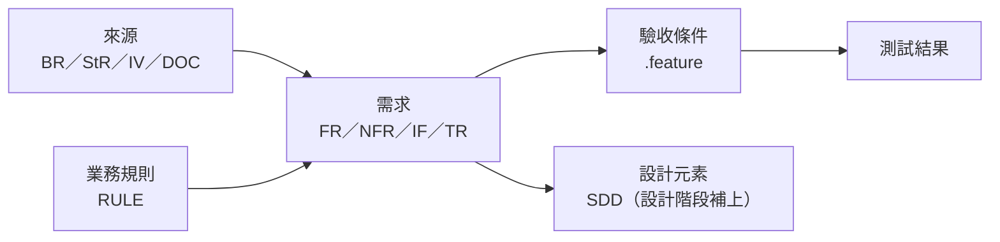

| 編號 | 等級 | 規則 | 驗證方式 |
| --- | --- | --- | --- |
| `SA-TRC-001` | 必須 | 追溯矩陣必須以機器可讀格式（YAML、CSV 或需求管理工具）與需求一起版本控制，至少包含需求到來源、需求到驗收條件的雙向關係；設計與測試的關係由後續階段補上 | 🤖 `check_trace.py` |
| `SA-TRC-002` | 必須 | CI 必須自動檢查追溯完整性：每筆需求都有來源；每筆以測試驗證的需求都有驗收條件與標示該需求的情境；沒有指向不存在編號的關係；沒有孤立的來源（業務需求沒有被任何系統需求實現） | 🤖 `check_trace.py`（附錄 C.8） |
| `SA-TRC-003` | 應該 | 驗收情境應以標籤（例如 Gherkin 的 `@FR-ORD-012`）標示所驗證的需求，讓追溯可以從測試檔自動產生，而不是手動填寫 | 🤖 `check_trace.py --features`（掃描標籤） |

```yaml
# ✅ SA-TRC-001、SA-TRC-002：機器可讀的追溯矩陣（docs/srs/trace.yaml，完整格式見附錄 C.8）
sources:
  - {id: BR-ORD-001, title: 降低人工接單成本}
  - {id: StR-ORD-004, title: 送出時就知道是否需要核准, source: [BR-ORD-001, IV-03]}
requirements:
  - id: FR-ORD-012
    priority: must
    source: [StR-ORD-004]
    acceptance: [features/order-approval.feature]
    design: []        # 設計階段由 SDD 補上，例如 [SDD-ORD 5.3 OrderPlacementService]
  - id: FR-ORD-019
    priority: must
    source: [StR-ORD-004]
    acceptance: [features/order-approval.feature]
```

```gherkin
# language: zh-TW
# ✅ SA-TRC-003：以標籤標示驗證的需求，check_trace.py 可掃描產生追溯
@FR-ORD-023
功能: 信用額度不足

  場景: 額度不足時訂單不成立
    假如 客戶「甲公司」的可用信用額度為 100000 元
    當 甲公司的採購人員送出總額 150000 元的訂單
    那麼 訂單不應成立
    而且 採購人員應看到不足金額 50000 元
```

#### 🔍 16.1 審查與驗證

- **自動檢查：** `python check_trace.py docs/srs/trace.yaml --features docs/srs/features` 會報告：沒有來源的需求、沒有驗收條件的測試類需求、指向不存在編號的關係、沒有被實現的業務需求，以及 `.feature` 標籤中不存在的需求編號。
- **人工審查問題：**
  1. 抽查 5 筆追溯關係：來源真的支持這筆需求嗎？驗收情境真的驗證了這筆需求嗎？
  2. 有沒有業務需求（`BR-`）沒有任何系統需求實現？那它要怎麼達成？
- **AI 常見錯誤：** AI 填寫追溯矩陣時，傾向讓每筆需求都對應到某個來源，即使關係很牽強。工具只能檢查關係「存在」，關係是否「正確」仍需人工抽查。

### 16.2 需求的版本控制

需求文件與程式碼一樣需要版本控制：誰在何時改了什麼、為什麼改、經過誰的審查。以 Markdown 撰寫並放在 Git 中，需求的修改可以透過 Pull Request 審查，差異一目了然，也能與程式碼的版本對應。

| 版本號變動 | 時機 | 例子 |
| --- | --- | --- |
| 主版本（2.0） | 範圍有重大改變，或新的版本規劃（R2） | 新增退貨模組 |
| 次版本（1.3） | 經變更控制核准的需求新增、修改、刪除 | CR-0021 新增核准流程 |
| 修訂（1.3.1） | 不改變需求意義的修正（錯字、格式、澄清） | 修正錯字 |

| 編號 | 等級 | 規則 | 驗證方式 |
| --- | --- | --- | --- |
| `SA-TRC-004` | 必須 | 需求文件必須放在版本控制系統中，所有修改以 Pull Request（或同等的審查機制）進行；修改需求意義的 PR 必須引用變更單編號 | 🤖 PR 檢查（修改 docs/srs/ 的 PR 標題或內容須含 CR- 編號）；👁 PR 審查 |
| `SA-TRC-005` | 必須 | 每次版本變更都必須更新文件的版本號與變更紀錄（版本、日期、變更摘要、變更單編號、核准者） | 🤖 `check_srs.py`（變更紀錄最新一列與文件版本一致） |

```yaml
# ✅ SA-TRC-004：PR 修改需求時必須引用變更單（GitHub Actions 片段）
name: srs-change-reference
on:
  pull_request:
    paths: ["docs/srs/**"]
jobs:
  require-cr:
    runs-on: ubuntu-latest
    steps:
      - name: 檢查 PR 標題或內容含 CR- 編號，或標示為 editorial
        env:
          TITLE: ${{ github.event.pull_request.title }}
          BODY: ${{ github.event.pull_request.body }}
        run: |
          if echo "$TITLE $BODY" | grep -Eq 'CR-[0-9]{4}|\[editorial\]'; then
            echo "OK"
          else
            echo "修改需求的 PR 必須引用變更單編號（CR-xxxx），純文字修正請標示 [editorial]"
            exit 1
          fi
```

```markdown
<!-- ✅ SA-TRC-005：變更紀錄與版本一致 -->
| 版本 | 日期 | 變更 | 變更單 | 核准 |
| --- | --- | --- | --- | --- |
| 1.3.1 | 2026-11-04 | 修正 FR-ORD-021 錯字 | [editorial] | SA 林怡君 |
| 1.4 | 2026-11-10 | 新增代理核准人 FR-ORD-032 | CR-0024 | CCB-07 |

<!-- ❌ SA-TRC-005：檔名代替版本控制 -->
SRS_訂購平台_v1.3_final_修改版_新.docx
```

#### 🔍 16.2 審查與驗證

- **自動檢查：** CI 檢查修改需求的 PR 含變更單編號；`check_srs.py` 檢查文件資訊表的版本與變更紀錄最新一列一致。
- **人工審查問題：**
  1. 標示 `[editorial]` 的 PR 真的沒有改變需求意義嗎？
  2. 需求版本與程式版本的對應關係清楚嗎？（例如 release notes 寫明依據 SRS v1.4。）
- **AI 常見錯誤：** 請 AI 修改需求文件時，它常會順手「改善」其他段落的文字，造成未經變更控制的修改。請要求 AI 只修改指定的需求，並以 PR 差異逐行審查。

### 16.3 變更控制流程

需求一定會變，變更控制的目的不是阻止變更，而是讓每個變更都**經過影響分析、由有權限的人決定、並留下紀錄**。影響分析要涵蓋需求、設計、程式、測試、時程、成本與風險；有了追溯矩陣（16.1），影響分析可以從「猜」變成「查」。

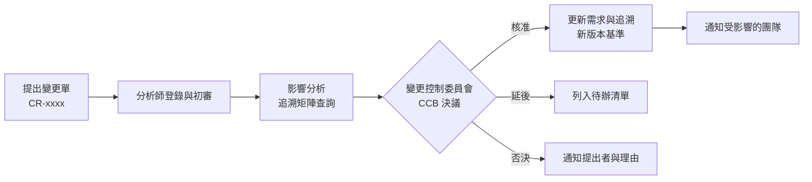

| 編號 | 等級 | 規則 | 驗證方式 |
| --- | --- | --- | --- |
| `SA-TRC-006` | 必須 | 基準化後的需求變更必須以變更單（`CR-`）提出，寫明變更內容、理由、提出者與期望時程，並經變更控制委員會（或 RACI 中的 A）決議 | 👁 變更紀錄審查 |
| `SA-TRC-007` | 必須 | 每張變更單都必須有影響分析：受影響的需求、設計、測試（以追溯矩陣查詢）、時程、成本、風險，以及不實施的影響 | 🤖 追溯查詢（`check_trace.py --impact`）；👁 CCB 審查 |
| `SA-TRC-008` | 必須 | 變更核准後，必須同時更新需求、追溯矩陣、驗收條件與估算，並通知所有受影響的團隊；只更新需求而不更新驗收條件，視為變更未完成 | 🤖 `check_trace.py`；👁 變更紀錄審查 |
| `SA-TRC-009` | 應該 | 應定義緊急變更（例如法規生效、重大事故）的快速流程，允許先實施後補件，但必須在限定期間內（例如 5 個工作日）補齊影響分析與核准 | 👁 變更紀錄審查 |

```markdown
<!-- ✅ SA-TRC-006、SA-TRC-007：變更單與影響分析 -->
## CR-0024 新增代理核准人

- 提出：客戶 A 王課長（經 VD-02 情境走查），2026-11-03
- 內容：核准主管可設定休假期間的代理核准人（FR-ORD-032）
- 理由：主管休假時訂單會因核准逾時被取消（FR-ORD-024）

### 影響分析（check_trace.py --impact FR-ORD-012 FR-ORD-019 FR-ORD-024）
| 類別 | 影響 |
| --- | --- |
| 需求 | 新增 FR-ORD-032；修改 FR-ORD-019（通知對象含代理人）；RULE-ORD-003 不變 |
| 資料 | 新增「代理設定」實體（概念資料模型 7.2） |
| 狀態模型 | 無新狀態；「待核准」的核准者範圍擴大 |
| 驗收條件 | features/order-approval.feature 新增 2 個情境 |
| 估算 | +6 CFP（約 5.4 人天） |
| 時程 | R1 內可吸收（使用 should 需求的緩衝） |
| 風險 | 代理期間的權限控制（新增濫用案例 MC-06） |
| 不實施的影響 | 主管休假期間的大額訂單會被自動取消，客戶 A、C 表示無法接受 |

- 決議：CCB-07（2026-11-10）核准，納入 R1；FR-ORD-037 由 must 降為 should 以吸收工作量。

<!-- ❌ SA-TRC-007：沒有影響分析 -->
CR-0024 新增代理人功能，工作量不大，請直接加入。
```

```markdown
<!-- ✅ SA-TRC-008：變更完成檢查（CR-0024），全部完成才關閉變更單 -->
- [x] SRS：新增 FR-ORD-032，修改 FR-ORD-019（PR #151，SRS v1.4）
- [x] trace.yaml：新增 FR-ORD-032 的來源與驗收條件；check_trace.py 通過
- [x] 驗收條件：features/order-approval.feature 新增 2 個情境（@FR-ORD-032）
- [x] 估算：規模估算更新為 192 CFP
- [x] 通知：設計、測試、客戶 A 與 C 的窗口（2026-11-11 Email）

<!-- ✅ SA-TRC-009：緊急變更先實施、限期補件 -->
## CR-0031（緊急）個資事故通報欄位
- 原因（假設情境）：主管機關公告的事故通報子法將於 7 天後生效，需於生效日前提供 FR-PRV-003 的影響清單匯出。
- 處理：PO 與資安長於 2027-01-10 口頭核准先行實施；5 個工作日內（2027-01-17 前）補齊影響分析並提交 CCB 追認。
- 追認：CCB-12（2027-01-16）核准。
```

#### 🔍 16.3 審查與驗證

- **自動檢查：** `check_trace.py --impact <需求編號>` 列出所有直接與間接相關的需求、規則、驗收條件與設計元素；變更完成後再執行一次完整檢查，確認沒有斷鏈。
- **人工審查問題：**
  1. 影響分析是用追溯矩陣查出來的，還是憑印象寫的？
  2. 變更核准後，驗收條件與估算都更新了嗎？
- **AI 常見錯誤：** AI 做影響分析時，只會根據文字相似度找出「看起來相關」的需求，可能漏掉以編號引用的業務規則與狀態模型。影響分析應以追溯矩陣查詢為準，AI 可以協助撰寫說明。

### 16.4 需求健康度指標

需求的品質與穩定度可以量測。定期追蹤以下指標，能及早發現問題：需求變動率持續偏高，表示擷取不完整或業務方向未定；未關閉的 TBD 停滯，表示有決策卡住；驗收條件覆蓋率偏低，表示測試會在後期遇到困難。

| 指標 | 計算方式 | 警示門檻（範例） |
| --- | --- | --- |
| 需求變動率 | 基準後每月新增、修改、刪除的需求數 ÷ 需求總數 | 連續兩個月 > 10% |
| 未關閉 TBD | 逾期未關閉的 TBD 數 | > 0 且影響 must 需求 |
| 驗收條件覆蓋率 | 有驗收條件的 must 需求 ÷ must 需求總數 | < 100% |
| 追溯完整率 | 有來源的需求 ÷ 需求總數 | < 100% |
| 審查缺陷密度 | 審查發現數 ÷ 審查的需求數 | 遠高於或遠低於組織平均 |

| 編號 | 等級 | 規則 | 驗證方式 |
| --- | --- | --- | --- |
| `SA-TRC-010` | 應該 | 專案應至少每月計算需求變動率、未關閉 TBD、驗收條件覆蓋率與追溯完整率，並在專案會議中報告 | 🤖 `check_trace.py --metrics`；👁 專案會議紀錄 |
| `SA-TRC-011` | 應該 | 指標超過警示門檻時，應分析原因並記錄因應措施，而不只是報告數字 | 👁 專案會議紀錄 |

```text
# ✅ SA-TRC-010：check_trace.py --metrics 的輸出範例（2026-11 月報）
需求總數                 132（must 61、should 42、could 21、wont 8）
自基準變動（新增/修改/刪除） 4 / 9 / 1    變動率 10.6%   ← 超過警示門檻
未關閉 TBD               5（逾期 1：TBD-018）
驗收條件覆蓋率（must）    61 / 61
追溯完整率               132 / 132

# ✅ SA-TRC-011：因應措施
變動率偏高原因：情境走查 VD-02 後新增核准相關需求。核准流程已於 CCB-07 確認，預期下月回落。
```

#### 🔍 16.4 審查與驗證

- **自動檢查：** `check_trace.py --metrics` 每月產出指標，並與前一個月比較。
- **人工審查問題：**
  1. 指標超過門檻時，有分析原因嗎？還是只有報告？
  2. 變動率長期為 0 是好事嗎？（也可能是需求沒有被維護。）
- **AI 常見錯誤：** AI 可以快速產生漂亮的指標報表，但數字必須來自工具計算，不能由 AI 從文件中「估計」。

---

## 17. 敏捷與混合模式下的系統分析

### 17.1 敏捷中的需求工程

敏捷開發沒有取消系統分析，而是改變了**分析的時機與形式**：從「開發前一次完成所有細節」改為「先建立全貌，細節在需要時才補足」。Scrum Guide（2020）以產品目標（Product Goal）與產品待辦清單描述「要做什麼」；2025 年發布的 Scrum Guide Expansion Pack 是選用的補充，加強了利害關係人、價值與成果量測的說明，但不改變 Scrum Guide 本身。

敏捷團隊常見的誤解是「敏捷不寫文件」。敏捷宣言說的是「可用的軟體**重於**詳盡的文件」，不是「不要文件」。以下內容在敏捷專案中仍然必須存在，只是形式可以更輕量：範圍與產品目標、使用者分類、非功能需求、介面需求、業務規則、安全與合規需求、詞彙表。

| 分析內容 | 傳統做法 | 敏捷做法 |
| --- | --- | --- |
| 範圍 | SRS 第 1 章 | 產品目標、故事地圖第一層 |
| 功能需求 | 完整的 FR 清單 | 待辦清單中的故事 + 驗收條件，逐步細化 |
| 非功能需求 | NFR 章節 | 獨立的 NFR 清單 + 完成定義（DoD）中的品質門檻 |
| 業務規則 | 業務規則章節 | 獨立維護的規則清單或決策表，故事引用規則編號 |
| 確認 | 階段審查 | 每個 Sprint 的 Sprint Review |

| 編號 | 等級 | 規則 | 驗證方式 |
| --- | --- | --- | --- |
| `SA-AGL-001` | 必須 | 敏捷專案仍必須在開始開發前建立「足以做架構決策」的全貌：範圍與產品目標、使用者分類、主要業務流程、非功能需求（品質情境）、外部介面清單、安全與合規需求 | 👁 Sprint 0 或啟動階段審查 |
| `SA-AGL-002` | 必須 | 跨多個故事共用的需求（非功能需求、業務規則、詞彙）必須獨立維護並被故事引用，不得只寫在單一故事中，避免故事完成後規則就消失 | 👁 待辦清單審查 |

```markdown
<!-- ✅ SA-AGL-001：Sprint 0 產出的全貌文件（輕量 SRS 的目錄） -->
docs/srs/
├── 00-product-goal.md        產品目標、範圍與不包含
├── 01-users.md               使用者分類（2.3）
├── 02-context.md             脈絡圖與介面清單（1.5、10.1）
├── 03-processes.md           To-Be 流程（5.2）
├── 04-quality-scenarios.yaml 品質情境（9.2）
├── 05-security.md            ASVS 等級、濫用案例、個資盤點（第 11 章）
├── rules/RULE-ORD-*.md       業務規則與決策表（5.3）
├── glossary.yaml             詞彙表（7.1）
└── features/*.feature        驗收條件（隨故事逐步增加）

<!-- ❌ SA-AGL-002：業務規則只寫在某個故事的驗收條件中，故事關閉後無人維護 -->
US-31 驗收條件：一般客戶超過 50 萬需核准、金級客戶超過 100 萬需核准……
```

#### 🔍 17.1 審查與驗證

- **自動檢查：** 可檢查 `docs/srs/` 是否包含 SA-AGL-001 列出的檔案；`check_trace.py` 檢查故事引用的 `RULE-` 編號存在。
- **人工審查問題：**
  1. 架構師能否只靠 Sprint 0 的產出做出架構決策？還缺什麼？
  2. 業務規則改變時，要修改幾個地方？
- **AI 常見錯誤：** 以「敏捷」為由，AI 常建議只寫使用者故事，完全省略非功能需求與介面需求。

### 17.2 產品待辦清單與就緒定義

產品待辦清單是敏捷專案中需求的主要載體。待辦項目從粗到細逐步細化（refinement）：接近開發的項目要夠細、夠清楚，遠期的項目可以只是一句話。許多團隊會訂定**就緒定義**（Definition of Ready，DoR），作為項目進入 Sprint 的條件。DoR 不是 Scrum Guide 的正式要素，但是一種常見而有效的實務；使用時要避免它變成新的「需求凍結關卡」。

| 編號 | 等級 | 規則 | 驗證方式 |
| --- | --- | --- | --- |
| `SA-AGL-003` | 應該 | 團隊應訂定就緒定義，至少包含：故事格式完整（6.2）、驗收條件已撰寫、引用的業務規則與介面已確認、相依項目已解決、團隊已估算 | 👁 待辦清單精煉會議 |
| `SA-AGL-004` | 必須 | 完成定義（DoD）必須包含需求面的項目：驗收條件全部通過、追溯關係已更新、受影響的業務規則與詞彙已更新、非功能需求的品質門檻已驗證 | 🤖 CI 品質門檻；👁 Sprint Review |
| `SA-AGL-005` | 應該 | 分析師（或 BA）應參與每次待辦清單精煉，並在下一個 Sprint 開始前，讓接下來 1～2 個 Sprint 的項目達到就緒狀態 | 👁 待辦清單精煉紀錄 |

```markdown
<!-- ✅ SA-AGL-003、SA-AGL-004：就緒定義與完成定義 -->
## 就緒定義（DoR）
- [ ] 故事包含角色、功能、價值，並追溯到 UC 或 FR
- [ ] 驗收條件以 Gherkin 撰寫，PO 已確認
- [ ] 引用的 RULE- 已核准；引用的 IF- 已取得對方確認
- [ ] 無未解決的相依（或已排定在同一 Sprint）
- [ ] 團隊已估算，規模 ≤ 8 點

## 完成定義（DoD）中與需求相關的項目
- [ ] 所有 Gherkin 情境自動化並通過
- [ ] trace.yaml 已更新，check_trace.py 通過
- [ ] 受影響的業務規則、詞彙表已更新
- [ ] 相關品質情境（例如 QS-ORD-01）的效能測試通過

<!-- ❌ SA-AGL-004：DoD 只有技術項目 -->
DoD：程式碼審查完成、單元測試覆蓋率 80%。
```

```markdown
<!-- ✅ SA-AGL-005：精煉紀錄顯示未來兩個 Sprint 的項目已就緒 -->
| Sprint | 項目 | 就緒 | 待處理 |
| --- | --- | --- | --- |
| S7 | US-ORD-031、032、034 | 3/3 | — |
| S8 | US-ORD-033、035、FR-ORD-032 | 2/3 | FR-ORD-032 等 IF 確認（TBD-019） |
```

#### 🔍 17.2 審查與驗證

- **自動檢查：** CI 在 DoD 的品質門檻中執行 Gherkin 情境、`check_trace.py` 與效能測試。
- **人工審查問題：**
  1. 進入 Sprint 的項目，在 Sprint 中被發現需求不清楚而卡住的比例有多高？
  2. DoD 是否包含需求與追溯的更新？
- **AI 常見錯誤：** AI 產生的 DoR 常非常冗長（十幾項），讓 DoR 變成官僚程序；DoD 則常只有技術項目，缺少需求與追溯的更新。

### 17.3 混合模式：固定範圍合約與敏捷交付

企業與政府專案常是**混合模式**：合約要求在簽約時定義範圍與驗收標準，交付卻希望以敏捷方式進行。可行的做法是把需求分成兩層：**合約層**定義功能範圍（功能清單、使用案例、非功能需求、介面），在簽約時基準化；**交付層**的細節（畫面、故事、驗收情境）在每個 Sprint 前細化，只要不超出合約層的範圍，就不需走正式的合約變更。

| 編號 | 等級 | 規則 | 驗證方式 |
| --- | --- | --- | --- |
| `SA-AGL-006` | 必須 | 混合模式的專案必須在 SRS 中明確區分合約層需求（基準化，變更需走合約變更程序）與交付層細節（Sprint 前細化，變更由 PO 決定），並寫明判斷某項修改屬於哪一層的準則 | 👁 需求審查；👁 合約審查 |
| `SA-AGL-007` | 應該 | 混合模式的專案應在合約中約定變更額度（例如總功能規模的 10%），額度內的交付層變更以同規模交換的方式處理，不另行議價 | 👁 合約審查 |

```markdown
<!-- ✅ SA-AGL-006、SA-AGL-007：合約層與交付層的區分 -->
| 層級 | 內容 | 變更方式 |
| --- | --- | --- |
| 合約層 | 功能清單 F-*（6.4）、使用案例 UC-*、NFR、介面 IF-*、法規需求 | 合約變更（CCB ＋ 雙方簽核） |
| 交付層 | 使用者故事、畫面、驗收情境、訊息文字 | PO 於 Sprint 前決定 |

判斷準則：修改是否新增或刪除 F- 功能、改變 NFR 數值、新增介面或改變法規需求的實現方式；
是 → 合約層；否 → 交付層。
變更額度：合約總規模 192 CFP 的 10%（約 19 CFP）內，可以同規模交換，不另行議價。

<!-- ❌ SA-AGL-006：所有需求都凍結在合約中，任何畫面調整都要走合約變更 -->
需求以簽約時的 SRS 為準，任何變更須經雙方用印。
```

#### 🔍 17.3 審查與驗證

- **自動檢查：** 可以 `check_trace.py --baseline` 比對合約基準，列出合約層項目的變動。
- **人工審查問題：**
  1. 判斷準則夠明確嗎？雙方對「這是不是合約變更」會有不同看法嗎？
  2. 變更額度的使用情況有被追蹤嗎？
- **AI 常見錯誤：** AI 撰寫合約需求時，傾向把所有細節（包括畫面欄位）都放入合約層，讓之後每個小調整都變成合約變更。

---

## 18. AI 輔助系統分析與人工審查

### 18.1 AI 適合與不適合的分析工作

生成式 AI 能大幅加快系統分析的許多工作，但它不了解組織的業務、不知道利害關係人真正的意圖，而且會**以流暢、自信的語氣產生錯誤內容**。在系統分析中，錯誤的需求比錯誤的程式碼更難發現，因為它看起來完全合理，直到驗收或上線才暴露。因此，AI 的定位是**加速撰寫與檢查的助手**，不是需求的來源或決策者。

| 工作 | AI 適合程度 | 說明 |
| --- | --- | --- |
| 整理已核准使用的訪談逐字稿為摘要初稿 | 適合（需確認） | 摘要必須送參與者確認（3.3） |
| 把需求改寫成 EARS 句型 | 適合 | 改寫後須確認意義沒有改變 |
| 找出模糊用語、不一致的名詞、遺漏的例外流程 | 適合 | 可作為審查前的輔助（14.2） |
| 從需求產生驗收情境初稿 | 適合（需審查） | 測試人員必須補充邊界與例外 |
| 從需求產生模型初稿（狀態圖、ER 圖） | 部分適合 | 模型須以工具檢查並與業務確認 |
| 提出可能遺漏的需求類別（檢查清單） | 適合 | 只作為提問清單，不直接成為需求 |
| 決定優先順序、範圍、業務規則的數值 | **不適合** | 必須由有權限的人決定 |
| 提供容量、可用率等數值 | **不適合** | 必須來自實際資料或利害關係人 |
| 解釋法規適用性、引用條文 | **不適合單獨使用** | 必須由法遵查證原文 |

| 編號 | 等級 | 規則 | 驗證方式 |
| --- | --- | --- | --- |
| `SA-AI-001` | 必須 | AI 只能用於撰寫、整理與檢查分析成果，不得作為需求的來源；AI 產生的每一筆需求都必須追溯到利害關係人、文件或系統來源（3.1），沒有來源的必須刪除或轉為待確認問題 | 🤖 `check_trace.py`（來源不得為「AI」「業界慣例」）；👁 需求審查 |
| `SA-AI-002` | 必須 | 優先順序、範圍、業務規則參數、非功能需求的數值，以及法規適用性的判斷，必須由有權限的人決定並留下紀錄，不得直接採用 AI 的建議值 | 👁 需求審查（核對決定者） |

```markdown
<!-- ✅ SA-AI-001：AI 建議的遺漏項目轉為待確認問題，而不是直接成為需求 -->
| 編號 | 問題（AI 檢查清單提出） | 確認對象 | 結果 |
| --- | --- | --- | --- |
| TBD-021 | 訂單是否需要支援部分出貨？ | 倉儲課 趙組長 | 需要 → 新增 FR-ORD-038（來源：IV-07） |
| TBD-022 | 是否需要訂單範本功能？ | 客戶 A 採購 | 不需要 → 列入「不包含」 |

<!-- ❌ SA-AI-001、SA-AI-002：AI 產生的需求直接加入，數值與來源都是 AI 給的 -->
FR-ORD-080 系統應支援訂單範本。（來源：AI 建議）
NFR-PERF-009 系統應支援每秒 5,000 筆交易。（來源：業界標準）
```

#### 🔍 18.1 審查與驗證

- **自動檢查：** `check_trace.py` 拒絕來源欄位為「AI」「ChatGPT」「業界慣例」「一般需求」等值的需求。
- **人工審查問題：**
  1. 這份文件中，哪些內容是 AI 產生的？每一項都有人確認過嗎？
  2. 數值型需求的來源是什麼？
- **AI 常見錯誤：** 本節本身就是對 AI 常見錯誤的總結：編造來源、編造數值、編造法規條文、把業界常識當成本組織的需求。

### 18.2 提示的輸入與脈絡

AI 產出的品質取決於輸入。沒有提供脈絡時，AI 會用「一般情況」補足空白，而一般情況就是錯誤需求的來源。撰寫提示時要提供：本指引適用的規則編號、詞彙表、模型名稱清單（8.4）、現有的需求編號範圍，以及明確的輸出格式。

| 編號 | 等級 | 規則 | 驗證方式 |
| --- | --- | --- | --- |
| `SA-AI-003` | 必須 | 請 AI 產生或修改需求時，提示必須提供：詞彙表、模型名稱清單、相關的既有需求與業務規則、適用的本指引規則編號、輸出格式；並明確要求「資訊不足時列為待確認問題，不得自行假設」 | 👁 提示審查（PR 中附上提示或提示範本編號） |
| `SA-AI-004` | 必須 | 請 AI 修改既有需求時，必須要求保留需求編號、只修改指定的需求，並以差異比對（PR diff）確認沒有非預期的修改 | 🤖 `check_trace.py --baseline`（偵測非預期的編號變動）；👁 PR 審查 |

```text
# ✅ SA-AI-003、SA-AI-004：需求改寫的提示範本（docs/prompts/rewrite-ears.md）
你是系統分析師的助手。請依下列規則改寫需求：

1. 只改寫我指定的需求編號：FR-ORD-040～FR-ORD-045。不得修改其他內容，不得變更編號。
2. 使用 EARS 句型（系統分析指引 4.2，SA-REQ-004），主詞為「系統」，動詞用「應」。
3. 每筆需求只描述一項能力（SA-REQ-002）；需要拆分時，新編號從 FR-ORD-046 開始。
4. 只能使用附件 glossary.yaml 中的名詞與 model-names.yaml 中的狀態名稱。
5. 不得加入原文沒有的數值、條件或功能。原文資訊不足時，在最後列出「待確認問題」。
6. 輸出 Markdown 表格：編號｜改寫後需求｜與原文的差異說明。

附件：glossary.yaml、model-names.yaml、FR-ORD-040～045 原文、RULE-ORD-003

# ❌ SA-AI-003：沒有脈絡、沒有限制，AI 會自行補上數值與功能
幫我把這些需求寫得更專業、更完整。
```

#### 🔍 18.2 審查與驗證

- **自動檢查：** 修改需求的 PR 應附上使用的提示範本編號；`check_trace.py --baseline` 檢查未指定的需求是否被修改。
- **人工審查問題：**
  1. 提示中有沒有提供詞彙表與既有需求？
  2. AI 輸出的「待確認問題」有被處理嗎？
- **AI 常見錯誤：** 沒有明確限制時，AI 會「改善」它認為不完整的內容，例如自動補上逾時秒數、新增欄位，或把多筆需求合併成一筆。

### 18.3 AI 產出的審查與查證

AI 產出要以「同事寫的初稿」的標準審查，而且要特別注意 AI 特有的錯誤型態：**幻覺**（編造不存在的標準條號、法規、API）、**過時知識**（舊版標準，例如 ISO 25010:2011、ASVS 4.0、ISO 27001:2013）、**合理但錯誤的推論**（以產業常識推論本組織的規則），以及**遺漏限定條件**（刪掉「但是」「除非」）。

| 錯誤型態 | 例子 | 查證方式 |
| --- | --- | --- |
| 編造標準或法規條號 | 「依個資法第 27 條第 3 項，資料須加密」 | 全國法規資料庫查原文 |
| 過時版本 | 引用 ISO 27001:2013 A.12 | 確認標準現行版本（0.2） |
| 編造數值 | 「業界標準回應時間 200 毫秒」 | 要求提供來源；無來源即刪除 |
| 遺漏限定條件 | 原文「出貨前可取消，但已保留庫存者需倉儲確認」→ AI 摘要「出貨前可取消」 | 與原文逐句比對 |
| 名詞漂移 | 「已建立」變成「新建立」「建立完成」 | 詞彙表與模型名稱掃描 |

| 編號 | 等級 | 規則 | 驗證方式 |
| --- | --- | --- | --- |
| `SA-AI-005` | 必須 | 由 AI 產生或大幅修改的分析內容，必須在 PR 或文件變更紀錄中標示，並由具名的人審查；審查者對內容負責 | 👁 PR 審查（核對 AI 標示與審查者） |
| `SA-AI-006` | 必須 | AI 產出中的標準條號、法規條文、版本號、數值與外部系統名稱，必須逐一以原始來源查證；無法查證的內容必須刪除或標示為待確認 | 👁 需求審查（附查證紀錄）；🤖 詞彙表與模型名稱掃描 |
| `SA-AI-007` | 應該 | AI 產出應先通過與人工產出相同的自動檢查（`check_srs.py`、`check_trace.py`、Gherkin 解析、圖表渲染），再進入人工審查 | 🤖 CI 執行結果 |

```markdown
<!-- ✅ SA-AI-005、SA-AI-006、SA-AI-007：PR 說明中標示 AI 使用、查證結果與自動檢查結果 -->
## PR #142 改寫 FR-ORD-040～045 為 EARS 句型

- AI 使用：以提示範本 rewrite-ears.md 產生初稿（模型與日期記錄於 PR 附件）。
- 審查者：SA 林怡君（逐筆比對原文）、測試 黃美玲（可測試性）。
- 查證：
  - AI 在 FR-ORD-043 加入「依商業會計法第 38 條保存 10 年」→ 原文第 38 條規定會計憑證至少 5 年，已更正並請法遵確認。
  - AI 新增「逾時 30 秒」→ 原文沒有，已刪除並列為 TBD-023。
- check_srs.py、check_trace.py 通過。

<!-- ❌ SA-AI-005：沒有標示 AI 使用，也沒有查證 -->
## PR #142 需求優化
已用 AI 優化需求文字。
```

#### 🔍 18.3 審查與驗證

- **自動檢查：** CI 對所有 PR 執行相同的檢查；可在 PR 範本中加入「是否使用 AI」「查證紀錄」兩個必填欄位。
- **人工審查問題：**
  1. AI 產出中的每個條號、版本、數值，都有查證紀錄嗎？
  2. 逐句比對原文：有沒有被刪掉的「但是」「除非」「例外」？
- **AI 常見錯誤：** 見本節錯誤型態表。

### 18.4 資料保護與 AI 治理

把訪談逐字稿、客戶資料或內部規章貼到 AI 服務，等於把資料提供給第三方。這可能違反個資法、保密協議或組織的資安政策。我國《人工智慧基本法》於 2025-12-23 經立法院三讀通過、2026-01-14 公布施行，由國家科學及技術委員會擔任主管機關，以隱私保護、資安、透明、問責等原則建立治理方向，具體規範由後續子法與各目的事業主管機關訂定；金融業另有金管會 2024-06 發布的「金融業運用人工智慧（AI）指引」。專案應遵守組織核准的 AI 使用政策。

| 編號 | 等級 | 規則 | 驗證方式 |
| --- | --- | --- | --- |
| `SA-AI-008` | 必須 | 只能使用組織核准的 AI 服務處理分析資料；不得將個人資料、客戶機密、未公開的商業資訊或金鑰貼入未經核准的服務；需要使用時應先去識別化 | 👁 資安審查；👁 抽查 AI 使用紀錄 |
| `SA-AI-009` | 應該 | 專案應記錄 AI 在分析工作中的使用情況（工作項目、使用的服務、處理的資料類別、審查者），作為治理與稽核的依據 | 👁 專案稽核 |

```markdown
<!-- ✅ SA-AI-008、SA-AI-009：AI 使用紀錄與去識別化 -->
| 日期 | 工作 | AI 服務 | 資料類別 | 去識別化 | 審查者 |
| --- | --- | --- | --- | --- | --- |
| 2026-09-16 | IV-03 訪談摘要初稿 | 組織核准的內部 AI 服務 | 訪談逐字稿 | 姓名改為代號、公司名改為「客戶 A」 | SA 林怡君 |
| 2026-10-20 | 需求改寫 EARS | 同上 | 需求文件（內部） | 不需要 | SA 林怡君 |

<!-- ❌ SA-AI-008：把含個資的逐字稿貼到個人帳號的免費 AI 服務 -->
已將客戶訪談錄音轉文字並貼到免費 AI 網站整理重點。
```

#### 🔍 18.4 審查與驗證

- **自動檢查：** 可在組織閘道或 DLP 工具中監測資料外傳；專案層級以 AI 使用紀錄抽查。
- **人工審查問題：**
  1. 使用的 AI 服務在組織核准清單中嗎？資料會被用於訓練嗎？
  2. 送給 AI 的資料有去識別化嗎？
- **AI 常見錯誤：** AI 不會主動提醒你資料不應該貼給它。保護資料是使用者的責任。

### 18.5 系統本身包含 AI 功能時的需求

如果被分析的系統本身會使用 AI（例如以機器學習預測訂購量、以生成式 AI 回答客戶問題），需求分析要額外處理 AI 特有的品質問題：**正確性無法保證**、**結果可能有偏誤**、**需要人類監督**、**需要可解釋**。ISO/IEC 25059:2023 在 25010 的基礎上定義了 AI 系統的品質模型（例如功能適應性、使用者可控性、透明度、穩健性），ISO/IEC 42001:2023 則定義 AI 管理系統。

| 編號 | 等級 | 規則 | 驗證方式 |
| --- | --- | --- | --- |
| `SA-AI-010` | 必須 | 系統包含 AI 功能時，必須定義可量測的品質需求（例如準確率、召回率、錯誤的業務代價）、評估資料集的來源與代表性，以及上線後的監控與重新評估方式 | 🧪 模型評估報告；👁 需求審查 |
| `SA-AI-011` | 必須 | 必須定義人類監督需求：哪些 AI 結果需要人工確認才能生效、使用者如何得知內容由 AI 產生、如何覆寫或回報錯誤；影響當事人權益的決定不得完全由 AI 自動做出 | 👁 需求審查；👁 法遵審查 |

```markdown
<!-- ✅ SA-AI-010、SA-AI-011：建議訂購量功能的 AI 需求 -->
FR-AI-001 當採購人員建立訂單時，系統應依過去 12 個月的訂購紀錄顯示各料號的建議訂購量，並標示「AI 建議」。
FR-AI-002 系統應允許採購人員修改或忽略建議訂購量；建議值不得自動填入訂單數量。
NFR-AI-001 以 2025 年訂購紀錄回測時，建議訂購量與實際訂購量的平均絕對百分比誤差（MAPE）應不超過 25%。
  評估資料：2025-01～12 全部客戶訂單（不含試辦客戶），每季重新評估一次。
NFR-AI-002 當連續兩季 MAPE 超過 35% 時，系統應停用建議功能並通知產品負責人。

<!-- ❌ SA-AI-010、SA-AI-011：沒有量測、沒有監督 -->
系統應使用 AI 自動決定訂購數量，提升效率。
```

#### 🔍 18.5 審查與驗證

- **自動檢查：** 模型評估可在 CI 中以固定資料集回測，結果低於門檻時失敗。
- **人工審查問題：**
  1. AI 出錯時的業務代價是什麼？誰會受影響？
  2. 使用者知道這是 AI 產生的結果嗎？可以拒絕嗎？
- **AI 常見錯誤：** 請 AI 撰寫 AI 功能的需求時，它常寫出「準確率 99%」之類沒有評估資料與業務依據的數字，也很少主動提出人類監督與停用條件。

---

## 19. 交付物與分析審查

### 19.1 交付清單

系統分析階段結束時，交付物要能讓三群人開始工作：**設計者**開始設計、**測試人員**開始規劃測試、**業務單位**確認將要得到什麼。交付清單依專案分級（1.4）調整，但每一項都要有明確的位置與狀態。

| 交付物 | 小型 | 一般 | 關鍵 | 位置（範例） | 範本 |
| --- | --- | --- | --- | --- | --- |
| 分析計畫（含 RACI、進入退出準則） | 精簡 | ✅ | ✅ | docs/srs/plan.md | 第 1、2 章 |
| SRS（範圍、利害關係人、需求、限制、TBD） | 精簡 | ✅ | ✅ | docs/srs/srs.md | 附錄 C.1 |
| SAD（脈絡圖、流程、使用案例、資料、狀態模型） | 選用 | ✅ | ✅ | docs/sad/sad.md | 附錄 C.2 |
| 需求登錄與追溯矩陣 | ✅ | ✅ | ✅ | docs/srs/trace.yaml | 附錄 C.8 |
| 詞彙表、模型名稱清單 | ✅ | ✅ | ✅ | docs/srs/glossary.yaml | 7.1、8.4 |
| 驗收條件（Gherkin） | ✅ | ✅ | ✅ | docs/srs/features/ | 附錄 C.4 |
| 業務規則與決策表 | 選用 | ✅ | ✅ | docs/srs/rules/ | 5.3 |
| 品質情境 | 選用 | ✅ | ✅ | docs/srs/trace.yaml | 附錄 C.5 |
| 介面需求與介面協議 | 有介面時 | ✅ | ✅ | docs/srs/interfaces/ | 附錄 C.6 |
| 安全需求、濫用案例、個資盤點、法規對照 | 有個資時 | ✅ | ✅ | docs/srs/security.md | 第 11 章 |
| 審查紀錄與核准紀錄 | ✅ | ✅ | ✅ | docs/reviews/ | 第 14 章 |
| 擷取紀錄 | 選用 | ✅ | ✅ | docs/elicitation/ | 3.3 |

| 編號 | 等級 | 規則 | 驗證方式 |
| --- | --- | --- | --- |
| `SA-DLV-001` | 必須 | 分析階段結束時，必須依專案分級提交上表的交付物；不適用的項目必須寫明理由，並經分析審查同意 | 🤖 交付物存在檢查（本節範例）；👁 分析審查 |
| `SA-DLV-002` | 必須 | 所有交付物必須在同一個版本庫中，以同一個基準標籤（例如 `srs-v1.3`）識別；交付物之間的引用使用相對路徑，不使用個人電腦或共用磁碟路徑 | 🤖 連結檢查；👁 分析審查 |

```bash
# ✅ SA-DLV-001、SA-DLV-002：以基準標籤檢查一般專案的交付物是否齊全
TAG=srs-v1.3
for f in docs/srs/plan.md docs/srs/srs.md docs/sad/sad.md docs/srs/trace.yaml \
         docs/srs/glossary.yaml docs/srs/security.md; do
  git cat-file -e "$TAG:$f" 2>/dev/null && echo "OK      $f" || echo "MISSING $f"
done
git ls-tree -r --name-only "$TAG" docs/srs/features | grep -c '\.feature$'
```

```markdown
<!-- ❌ SA-DLV-002：交付物散落在不同位置，無法確認是哪個版本 -->
- SRS：\\fileserver\專案\訂購平台\需求\SRS_v1.3_final.docx
- 流程圖：見 Email 附件
- 追溯矩陣：林怡君電腦上的 Excel
```

#### 🔍 19.1 審查與驗證

- **自動檢查：** 以本節腳本依基準標籤檢查交付物；以 Markdown 連結檢查工具確認交付物之間的引用有效。
- **人工審查問題：**
  1. 標示「不適用」的交付物，理由經過審查同意嗎？
  2. 所有交付物都屬於同一個基準嗎？
- **AI 常見錯誤：** AI 產生交付清單時，常把所有項目都列為必要，或列出組織沒有使用的文件類型（例如 IEEE 830 的 SRS 範本，該標準已被 29148 取代）。

### 19.2 分析審查與結論

分析審查（有時稱為需求審查會議或階段審查）判斷分析成果是否可以進入設計。審查結論只有三種，每種都有明確的條件，避免「大致可以」這種模糊的結論。

| 結論 | 條件 | 後續 |
| --- | --- | --- |
| 通過 | 退出準則全部滿足；沒有未關閉的高嚴重度發現 | 建立基準，進入設計 |
| 有條件通過 | 退出準則大致滿足；未滿足項目不影響架構，且有負責人與期限 | 建立基準，進入設計；條件項目追蹤到關閉 |
| 不通過 | 有未關閉的高嚴重度發現，或未滿足的項目影響架構或範圍 | 修正後重新審查 |

| 編號 | 等級 | 規則 | 驗證方式 |
| --- | --- | --- | --- |
| `SA-DLV-003` | 必須 | 分析審查必須以附錄 B 的檢核清單逐項判定，結論只能是通過、有條件通過或不通過；有條件通過時必須列出每個條件的負責人與期限 | 👁 審查紀錄 |
| `SA-DLV-004` | 必須 | 審查必須有業務（PO）、分析、設計或架構、測試四種角色參與；資安、法遵、維運依系統特性參與（2.1）；缺少必要角色時審查無效 | 👁 審查紀錄（核對出席者） |

```markdown
<!-- ✅ SA-DLV-003、SA-DLV-004：分析審查結論 -->
## RV-05 分析審查（2026-10-30）
- 範圍：SRS-ORD v1.3、SAD-ORD v1.3、trace.yaml、features/
- 出席：PO 張協理、SA 林怡君、架構 周大衛、測試 黃美玲、資安 吳志豪、維運 鄭組長
- 檢核清單：附錄 B.1～B.8 共 59 項，符合 56、有條件 3、不符合 0
- 結論：**有條件通過**

| 條件 | 負責人 | 期限 |
| --- | --- | --- |
| TBD-014 財務系統額度介面確認 | 整合組 王小明 | 2026-11-15 |
| 報表模組 12 筆需求補驗收條件 | PO 張協理 | 2026-11-15 |
| MC-06 代理期間權限的安全需求 | 資安 吳志豪 | 2026-11-08 |

<!-- ❌ SA-DLV-003：結論模糊，沒有條件與負責人 -->
結論：原則通過，細節後續再討論。
```

#### 🔍 19.2 審查與驗證

- **自動檢查：** 可檢查審查紀錄的結論欄位只能是三個值之一；有條件通過時，條件表的每一列都有負責人與期限。
- **人工審查問題：**
  1. 有條件通過的條件，真的不影響架構嗎？
  2. 前一次審查的條件都關閉了嗎？
- **AI 常見錯誤：** AI 撰寫審查紀錄時，常把結論寫得模稜兩可（「整體良好，部分需改善」），並省略條件的負責人與期限。

### 19.3 交接給設計與測試

分析完成不代表分析師的工作結束。設計與測試階段一定會出現新的問題，分析師需要繼續回答問題、處理變更。交接會議的目的，是讓設計與測試團隊理解需求的**重點與風險**，而不是逐頁朗讀文件。

| 編號 | 等級 | 規則 | 驗證方式 |
| --- | --- | --- | --- |
| `SA-DLV-005` | 必須 | 進入設計前必須舉行交接會議，說明：範圍與不包含、高優先的品質情境、複雜的業務規則與狀態模型、尚未關閉的 TBD 與風險；設計與測試團隊必須在會後確認可以開始工作 | 👁 交接會議紀錄 |
| `SA-DLV-006` | 必須 | 設計與測試階段提出的需求問題必須以問題清單（Q&A log）記錄，分析師在約定時間內回覆；回覆若改變需求意義，必須走變更控制（16.3） | 👁 問題清單審查 |

```markdown
<!-- ✅ SA-DLV-005、SA-DLV-006：交接會議紀錄與問題清單 -->
## HO-01 交接會議（2026-11-02）
- 重點：QS-ORD-01（尖峰下單 p95 ≤ 2 秒）、RULE-ORD-003 決策表、訂單狀態模型（7 個狀態）
- 風險：TBD-014 財務系統額度介面尚未確認，影響下單流程的設計
- 確認：架構 周大衛、測試 黃美玲確認可開始設計與測試規劃（會議紀錄簽名）

| 編號 | 提問者 | 問題 | 回覆 | 回覆日 | 需變更 |
| --- | --- | --- | --- | --- | --- |
| QA-007 | 設計 周大衛 | 「額度待確認」的訂單何時重新檢查？ | 依 FR-ORD-031，額度服務恢復後 15 分鐘內 | 11/05 | 否 |
| QA-008 | 測試 黃美玲 | 部分出貨時如何開發票？ | 原需求未定義 → CR-0026 | 11/06 | 是 |

<!-- ❌ SA-DLV-006：問題在即時通訊中回答，沒有紀錄 -->
（設計問題請直接在群組問我）
```

#### 🔍 19.3 審查與驗證

- **自動檢查：** 可統計問題清單中逾期未回覆的項目，以及「需變更＝是」但沒有對應 `CR-` 的項目。
- **人工審查問題：**
  1. 設計與測試團隊真的確認可以開始工作了嗎？還是只是出席會議？
  2. 問題清單中的回覆，有沒有實質改變需求、卻沒有走變更控制？
- **AI 常見錯誤：** 以 AI 回答設計團隊的需求問題時，AI 會根據文件「推論」答案，但文件沒寫的事應該回到利害關係人確認，而不是由 AI 推論。

### 19.4 上線後的效益確認

系統分析的最終目標是業務需求（`BR-`）的達成。上線後要依業務需求定義的量測方式（5.1）實際量測，判斷系統是否達成目標。這一步常被忽略，但它是唯一能證明分析是否正確的證據，也是下一個專案最寶貴的經驗。

| 編號 | 等級 | 規則 | 驗證方式 |
| --- | --- | --- | --- |
| `SA-DLV-007` | 應該 | 上線後應依每個業務需求的量測方式與期限量測實際值，與目標值比較並記錄差異原因；未達成的項目應提出改善措施或新的需求 | 👁 效益確認報告 |

```markdown
<!-- ✅ SA-DLV-007：上線 6 個月後的效益確認 -->
| 業務需求 | 基準值 | 目標值 | 實際值（2027-09） | 達成 | 差異原因與措施 |
| --- | --- | --- | --- | --- | --- |
| BR-ORD-001 人工接單工時 | 4.5 小時/日 | ≤ 1.5 小時 | 1.2 小時 | 是 | — |
| BR-ORD-002 輸入錯誤更正比例 | 3.2% | ≤ 0.5% | 0.9% | 否 | 多為收貨地址錯誤；新增 FR-ORD-041 地址常用清單（CR-0040） |
```

#### 🔍 19.4 審查與驗證

- **自動檢查：** 業務需求的量測方式若是系統資料，可設定定期報表自動產出。
- **人工審查問題：**
  1. 未達成的業務需求，原因是系統、流程還是組織？
  2. 這次學到的經驗，有回饋到組織的分析範本或檢核清單嗎？
- **AI 常見錯誤：** AI 撰寫效益報告時，傾向強調達成項目而淡化未達成項目。效益確認的重點恰恰是未達成的部分。

---

## 附錄 A 規則總表

本附錄由各章的規則表自動彙整，共 **198** 條規則，可作為分析審查與 AI 產出審查的檢核清單。

### A.1 依領域統計

| 前綴 | 領域 | 章 | 規則數 | 必須 | 應該 | 可以 | 不應該 |
| --- | --- | --- | --- | --- | --- | --- | --- |
| `SA-PRC` | 分析流程與標準 | 1 | 14 | 10 | 3 | 0 | 1 |
| `SA-ROL` | 角色與職責 | 2 | 8 | 5 | 3 | 0 | 0 |
| `SA-ELI` | 需求擷取 | 3 | 9 | 7 | 2 | 0 | 0 |
| `SA-REQ` | 需求撰寫品質 | 4 | 14 | 11 | 2 | 0 | 1 |
| `SA-BIZ` | 業務分析與流程 | 5 | 12 | 9 | 3 | 0 | 0 |
| `SA-FUN` | 功能需求建模 | 6 | 12 | 8 | 3 | 0 | 1 |
| `SA-DAT` | 資料與領域分析 | 7 | 14 | 11 | 2 | 0 | 1 |
| `SA-BEH` | 行為建模 | 8 | 10 | 5 | 4 | 1 | 0 |
| `SA-NFR` | 非功能需求 | 9 | 13 | 11 | 2 | 0 | 0 |
| `SA-INT` | 介面與整合需求 | 10 | 11 | 8 | 2 | 0 | 1 |
| `SA-SEC` | 安全、隱私與合規 | 11 | 14 | 12 | 2 | 0 | 0 |
| `SA-UX` | UI/UX 與無障礙 | 12 | 8 | 5 | 3 | 0 | 0 |
| `SA-I18N` | 國際化需求 | 13 | 7 | 4 | 3 | 0 | 0 |
| `SA-VAL` | 需求驗證與確認 | 14 | 9 | 7 | 2 | 0 | 0 |
| `SA-PRI` | 優先級與範圍 | 15 | 7 | 4 | 3 | 0 | 0 |
| `SA-TRC` | 追溯與變更管理 | 16 | 11 | 7 | 4 | 0 | 0 |
| `SA-AGL` | 敏捷與混合模式 | 17 | 7 | 4 | 3 | 0 | 0 |
| `SA-AI` | AI 輔助分析 | 18 | 11 | 9 | 2 | 0 | 0 |
| `SA-DLV` | 交付物與分析審查 | 19 | 7 | 6 | 1 | 0 | 0 |
| **合計** | | | **198** | **143** | **49** | **1** | **5** |

### A.2 驗證方式與範例覆蓋

依各規則表的「驗證方式」欄統計（圖示定義見 [0.3](#03-規範等級與規則格式)）。一條規則可同時有多種驗證方式；「僅人工」表示沒有工具或測試可以替代人工判斷，審查時請特別依照各節「🔍 審查與驗證」的問題確認。

| 前綴 | 規則數 | 🤖 工具檢查 | 🧪 測試或演練 | 👁 僅人工 | 有範例 |
| --- | --- | --- | --- | --- | --- |
| `SA-PRC` | 14 | 7 | 0 | 7 | 14 |
| `SA-ROL` | 8 | 2 | 0 | 6 | 8 |
| `SA-ELI` | 9 | 2 | 0 | 7 | 9 |
| `SA-REQ` | 14 | 13 | 0 | 1 | 14 |
| `SA-BIZ` | 12 | 6 | 0 | 6 | 12 |
| `SA-FUN` | 12 | 5 | 0 | 7 | 12 |
| `SA-DAT` | 14 | 6 | 0 | 8 | 14 |
| `SA-BEH` | 10 | 7 | 0 | 3 | 10 |
| `SA-NFR` | 13 | 6 | 0 | 7 | 13 |
| `SA-INT` | 11 | 3 | 1 | 7 | 11 |
| `SA-SEC` | 14 | 4 | 2 | 8 | 14 |
| `SA-UX` | 8 | 3 | 3 | 4 | 8 |
| `SA-I18N` | 7 | 2 | 1 | 4 | 7 |
| `SA-VAL` | 9 | 3 | 2 | 4 | 9 |
| `SA-PRI` | 7 | 3 | 0 | 4 | 7 |
| `SA-TRC` | 11 | 8 | 0 | 3 | 11 |
| `SA-AGL` | 7 | 1 | 0 | 6 | 7 |
| `SA-AI` | 11 | 4 | 1 | 6 | 11 |
| `SA-DLV` | 7 | 2 | 0 | 5 | 7 |
| **合計** | **198** | **87** | **10** | **103** | **198** |

> 「有範例」指規則編號出現在至少一個範例（程式碼區塊）的 ✅／❌ 標記中，由建置腳本自動檢查。

### A.3 規則清單

| 編號 | 等級 | 規則 | 所在章節 |
| --- | --- | --- | --- |
| `SA-PRC-001` | 必須 | 系統分析必須依「業務需求 → 利害關係人需求 → 系統／軟體需求」三層進行；每一筆系統需求都必須能追溯到上一層的利害關係人需求或業務需求 | [1.1](#11-國際標準與分析流程) |
| `SA-PRC-002` | 必須 | 分析文件必須區分「需求」（系統必須做什麼）與「解決方案」（系統要怎麼做）；除非是利害關係人明確要求的限制條件，需求敘述不得指定技術實作 | [1.1](#11-國際標準與分析流程) |
| `SA-PRC-003` | 應該 | 專案應在分析計畫中寫明採用的標準（例如 ISO/IEC/IEEE 29148:2018）與裁適方式，讓審查者知道以什麼標準審查 | [1.1](#11-國際標準與分析流程) |
| `SA-PRC-004` | 必須 | 分析計畫必須定義進入與退出準則，每項準則都要列出可檢查的證據；階段審查以準則逐項判定 | [1.2](#12-分析的進入與退出準則) |
| `SA-PRC-005` | 必須 | 退出時仍未解決的待確認事項必須以 `TBD-` 編號登錄，寫明影響的需求、負責人與期限；影響架構或範圍的 TBD 未解決前不得退出 | [1.2](#12-分析的進入與退出準則) |
| `SA-PRC-006` | 不應該 | 不應以「時程到了」作為唯一的退出理由；未達退出準則而進入設計時，必須記錄風險與補救計畫 | [1.2](#12-分析的進入與退出準則) |
| `SA-PRC-007` | 必須 | 分析產出物必須至少包含 SRS、SAD（可合併為一份）、追溯矩陣與詞彙表；每份文件都要有版本號、狀態（草稿／審查中／已核准）與變更紀錄 | [1.3](#13-分析產出物與資訊項目) |
| `SA-PRC-008` | 必須 | SRS 與 SAD 必須以文字格式（Markdown、AsciiDoc）撰寫並納入版本控制；圖表以 Mermaid 或 PlantUML 等文字格式保存，不得只有圖片 | [1.3](#13-分析產出物與資訊項目) |
| `SA-PRC-009` | 應該 | 需求應以可被工具讀取的結構保存（表格或 YAML front matter），讓追溯、統計與檢查可以自動化 | [1.3](#13-分析產出物與資訊項目) |
| `SA-PRC-010` | 必須 | 分析開始前必須有分析計畫，寫明範圍、分析深度（依上表分級）、產出物、參與角色、時程、審查點與裁適項目 | [1.4](#14-分析計畫與裁適) |
| `SA-PRC-011` | 必須 | 裁適只能刪減文件形式，不得刪減以下問題的答案：範圍邊界、使用者與角色、功能與驗收條件、非功能目標、介面、安全與隱私、限制與假設 | [1.4](#14-分析計畫與裁適) |
| `SA-PRC-012` | 必須 | SAD 必須有脈絡圖，畫出所有外部參與者與外部系統，每條連線標示交換的資訊；每個外部系統都必須對應到至少一筆介面需求（第 10 章） | [1.5](#15-系統範圍與脈絡) |
| `SA-PRC-013` | 必須 | SRS 必須有範圍表，以「包含」與「不包含」兩欄列出範圍；「不包含」中的每一項要寫明理由或預計處理的階段 | [1.5](#15-系統範圍與脈絡) |
| `SA-PRC-014` | 應該 | 範圍應以業務能力或業務流程描述，而不是以畫面或模組名稱描述，避免範圍隨畫面設計而改變 | [1.5](#15-系統範圍與脈絡) |
| `SA-ROL-001` | 必須 | 每個專案必須指定一位對需求有最終決定權的人（通常為 PO 或業務負責人），並寫入分析計畫；需求衝突無法協調時由此人決定 | [2.1](#21-分析團隊的角色) |
| `SA-ROL-002` | 必須 | 架構師、測試人員與資安人員必須在分析階段參與需求審查，而不是在設計或測試階段才第一次閱讀需求 | [2.1](#21-分析團隊的角色) |
| `SA-ROL-003` | 應該 | 業務規則與領域知識應由至少兩位領域專家確認，避免個人習慣被記錄為組織規則 | [2.1](#21-分析團隊的角色) |
| `SA-ROL-004` | 必須 | 分析計畫必須包含 RACI 矩陣，涵蓋上表所列活動；每項活動有且只有一個 A | [2.2](#22-責任分派矩陣raci) |
| `SA-ROL-005` | 應該 | RACI 中被指派為 R 或 A 的人，應在分析計畫中寫明姓名與可投入的時間比例；投入不足 20% 的關鍵角色應列為風險 | [2.2](#22-責任分派矩陣raci) |
| `SA-ROL-006` | 必須 | 必須建立利害關係人登錄表，至少包含名稱、類別（使用者、受影響者、組織內部、外部）、關注事項、影響力、關注度、代表人與參與方式 | [2.3](#23-利害關係人識別與分析) |
| `SA-ROL-007` | 必須 | 識別利害關係人時必須逐一檢查下列類別：直接使用者、間接使用者、維運人員、資安與稽核、法遵與主管機關、外部系統擁有者、客戶與合作廠商；不適用的類別要寫明理由 | [2.3](#23-利害關係人識別與分析) |
| `SA-ROL-008` | 應該 | 每類使用者應建立使用者分類（user class）或人物誌，寫明使用頻率、專業程度、使用環境與特殊需要（例如無障礙），作為功能與 UX 需求的依據 | [2.3](#23-利害關係人識別與分析) |
| `SA-ELI-001` | 必須 | 擷取計畫必須涵蓋三類來源：利害關係人、文件（法規、合約、作業規範）與系統（現行系統、相鄰系統）；每類來源至少列出一項具體項目或寫明不適用的理由 | [3.1](#31-需求來源與擷取技術的選擇) |
| `SA-ELI-002` | 必須 | 每項擷取活動都必須記錄所用技術、參與者、日期與產出，並以 `IV-`（訪談）、`WS-`（工作坊）、`OB-`（觀察）、`DOC-`（文件）等編號登錄，供需求追溯來源 | [3.1](#31-需求來源與擷取技術的選擇) |
| `SA-ELI-003` | 應該 | 擷取應至少使用兩種互補的技術（例如訪談搭配觀察或文件分析），特別是核心業務流程，以找出使用者不會主動說出的基本需求 | [3.1](#31-需求來源與擷取技術的選擇) |
| `SA-ELI-004` | 必須 | 若有現行系統或現行作業，必須分析其交易量（平均、尖峰、成長趨勢）與資料量，並以實際資料作為容量需求的依據；資料期間至少涵蓋一個完整的業務週期（例如一年中包含月底、季底與年底） | [3.2](#32-現行系統與資料分析) |
| `SA-ELI-005` | 必須 | 從現行程式或試算表中找出的計算公式與判斷邏輯，必須登錄為業務規則，並由領域專家確認仍然有效，不得直接照搬 | [3.2](#32-現行系統與資料分析) |
| `SA-ELI-006` | 應該 | 功能優先順序或價值主張應盡量以資料佐證（使用頻率、錯誤率、處理時間），並在需求的理由欄位引用資料來源 | [3.2](#32-現行系統與資料分析) |
| `SA-ELI-007` | 必須 | 每次擷取活動結束後 3 個工作日內，必須將整理後的需求摘要送參與者確認，並保存確認紀錄（郵件、簽核或議題系統留言） | [3.3](#33-擷取紀錄與確認) |
| `SA-ELI-008` | 必須 | 擷取紀錄必須區分「事實」（使用者陳述或觀察到的作法）、「需求」（使用者需要的結果）與「分析師的解讀或假設」，假設要另外標示並追蹤確認 | [3.3](#33-擷取紀錄與確認) |
| `SA-ELI-009` | 必須 | 訪談錄音、錄影或含個人資料的紀錄，必須事先取得參與者同意並依組織的個資規範保存與刪除；不得將原始錄音或逐字稿上傳到未經核准的外部服務（包括 AI 服務） | [3.3](#33-擷取紀錄與確認) |
| `SA-REQ-001` | 必須 | 每筆需求必須具備 29148 的單筆需求特性；審查意見必須指出違反的特性名稱，讓撰寫者知道如何修正 | [4.1](#41-良好需求的特性) |
| `SA-REQ-002` | 必須 | 每筆需求只能描述一項能力或特性；一個句子中出現兩個以上的「應」，或以「並」「且」「以及」連接多個動作時，必須拆成多筆需求 | [4.1](#41-良好需求的特性) |
| `SA-REQ-003` | 必須 | 同一概念在整份文件中必須使用同一個名詞，並登錄於詞彙表；同義詞要在詞彙表中標示「不使用」並指向標準用詞 | [4.1](#41-良好需求的特性) |
| `SA-REQ-004` | 必須 | 功能需求必須使用 EARS 句型撰寫，條件放在句首，主詞為「系統」（或明確的子系統名稱），動詞使用「應」 | [4.2](#42-需求句型ears) |
| `SA-REQ-005` | 必須 | 每個事件驅動需求所描述的正常流程，都必須檢查是否需要對應的非預期行為需求（「若……則系統應……」），例如外部系統無回應、資料不合法、權限不足 | [4.2](#42-需求句型ears) |
| `SA-REQ-006` | 不應該 | 不應以「可以」「能夠」「支援」作為需求的主要動詞；這類動詞無法判斷是強制還是選用，也無法判斷完成的程度 | [4.2](#42-需求句型ears) |
| `SA-REQ-007` | 必須 | 需求編號必須唯一，格式依 0.3 的編號慣例；編號不得重新使用，刪除的需求保留編號並將狀態設為「已刪除」，註明刪除原因與變更單號 | [4.3](#43-需求屬性與編號) |
| `SA-REQ-008` | 必須 | 每筆需求必須有類型、優先順序、來源、驗證方法、驗收條件與狀態六項屬性 | [4.3](#43-需求屬性與編號) |
| `SA-REQ-009` | 應該 | 優先順序為 must 或與法規相關的需求，應填寫理由，說明不實作的後果 | [4.3](#43-需求屬性與編號) |
| `SA-REQ-010` | 必須 | 需求敘述不得包含上表的模糊用語；確實需要使用時（例如引用法規原文），必須在同一筆需求中補充量化標準或引用定義 | [4.4](#44-模糊用語與常見缺陷) |
| `SA-REQ-011` | 必須 | 需求中的每個數值都必須附單位與量測條件（例如「第 95 百分位數」「在 500 個同時使用者下」），每個時間都必須寫明時區或以系統時區為準 | [4.4](#44-模糊用語與常見缺陷) |
| `SA-REQ-012` | 應該 | 組織應維護自己的模糊用語清單，納入審查中反覆出現的問題用語，並納入 `check_srs.py` 的設定檔 | [4.4](#44-模糊用語與常見缺陷) |
| `SA-REQ-013` | 必須 | 每筆需求必須指定驗證方法（檢查、分析、展示、測試之一或組合）；以「分析」驗證的需求，必須說明分析方法與所用的資料或模型 | [4.5](#45-需求的驗證方法) |
| `SA-REQ-014` | 必須 | 驗證方法為「測試」的需求，必須有可執行的驗收條件（Gherkin 情境或量測標準），測試人員不需要再詢問分析師就能設計測試 | [4.5](#45-需求的驗證方法) |
| `SA-BIZ-001` | 必須 | SRS 必須有問題陳述，寫明受影響的對象、問題造成的影響（以數據表示）與成功的樣子；問題陳述應經過根因分析（例如五個為什麼、魚骨圖），而不是只重述症狀 | [5.1](#51-業務問題與目標) |
| `SA-BIZ-002` | 必須 | 每個業務需求（`BR-`）都必須以指標、基準值、目標值、期限與量測方式描述，讓上線後可以判斷是否達成 | [5.1](#51-業務問題與目標) |
| `SA-BIZ-003` | 應該 | 若根因分析顯示問題主要來自流程或組織，分析文件應記錄非系統的改善措施，並說明系統需求與這些措施的關係 | [5.1](#51-業務問題與目標) |
| `SA-BIZ-004` | 必須 | 範圍內的每個核心業務流程都必須有 To-Be 流程模型，以泳道標示執行者（人員角色或系統）；有現行作業時也必須有 As-Is 模型，並標示問題點 | [5.2](#52-業務流程建模) |
| `SA-BIZ-005` | 必須 | 流程模型中每個判斷都必須畫出所有出口（包括「否」與例外），每條路徑都必須到達結束事件；不得只畫成功路徑 | [5.2](#52-業務流程建模) |
| `SA-BIZ-006` | 應該 | 流程模型應有層級：第 0 層為端到端價值鏈，第 1 層為業務流程，第 2 層為活動細節；同一張圖只畫同一層級，每張圖的活動數不應超過約 15 個 | [5.2](#52-業務流程建模) |
| `SA-BIZ-007` | 必須 | 業務規則必須以 `RULE-` 編號獨立登錄，寫明類型、來源（法規、內規、合約或主管決定）、負責人與生效日期；功能需求以編號引用規則，不重複描述規則內容 | [5.3](#53-業務規則與決策表) |
| `SA-BIZ-008` | 必須 | 兩個以上條件組合的業務規則必須以決策表表達，並指定命中政策；`U` 政策的決策表必須證明沒有缺口也沒有重疊 | [5.3](#53-業務規則與決策表) |
| `SA-BIZ-009` | 必須 | 決策表的數值區間必須寫明邊界是否包含（例如 `[500,000 .. 2,000,000)`），並至少為每個邊界值撰寫一個驗收情境 | [5.3](#53-業務規則與決策表) |
| `SA-BIZ-010` | 應該 | 預期會由業務單位自行調整的規則參數（門檻、費率），應在需求中標示為「可設定」，並寫明由誰在何處調整、是否需要覆核 | [5.3](#53-業務規則與決策表) |
| `SA-BIZ-011` | 必須 | SRS 必須有差距分析表，將 As-Is 與 To-Be 的每個差距對應到系統需求、轉換需求或非系統措施；沒有對應的差距要說明為何不處理 | [5.4](#54-差距分析與轉換需求) |
| `SA-BIZ-012` | 必須 | 轉換需求（資料轉置、並行運作、訓練、過渡期作業、舊系統下線）必須以 `TR-` 編號登錄，寫明完成條件與負責人，並納入追溯矩陣 | [5.4](#54-差距分析與轉換需求) |
| `SA-FUN-001` | 必須 | 使用案例必須以「動詞＋名詞」命名，描述參與者的目標，而不是系統的功能或畫面（例如「建立訂單」，而不是「訂單管理」或「訂單畫面」） | [6.1](#61-使用案例) |
| `SA-FUN-002` | 必須 | 使用者目標層的使用案例規格必須包含：主要參與者、利害關係人與關注事項、前置條件、成功保證（後置條件）、觸發事件、主要成功流程、替代流程、例外流程、相關業務規則 | [6.1](#61-使用案例) |
| `SA-FUN-003` | 必須 | 主要成功流程的每一個步驟都必須檢查是否有例外；例外流程以「步驟編號＋字母」標示（例如 3a），並寫明系統如何回應與流程之後的去向 | [6.1](#61-使用案例) |
| `SA-FUN-004` | 不應該 | 使用案例不應描述畫面元件（按鈕、下拉選單）或內部處理（寫入資料表），只描述參與者意圖與系統的可觀察回應 | [6.1](#61-使用案例) |
| `SA-FUN-005` | 必須 | 使用者故事必須包含角色、功能與價值三部分，角色必須是使用者分類（2.3）中定義的角色，不得使用「使用者」或「系統」作為角色 | [6.2](#62-使用者故事與故事地圖) |
| `SA-FUN-006` | 必須 | 每個使用者故事必須有驗收條件，並追溯到上層需求或使用案例；不得只有一句故事敘述 | [6.2](#62-使用者故事與故事地圖) |
| `SA-FUN-007` | 應該 | 太大的故事應依「業務規則變化」「資料變化」「流程步驟」「例外處理」等方式垂直切分，每個切分後的故事都要能單獨交付價值；不應依技術層切分（前端、後端、資料庫） | [6.2](#62-使用者故事與故事地圖) |
| `SA-FUN-008` | 必須 | 驗證方法為「測試」的功能需求，其驗收條件必須以 Gherkin 撰寫並納入版本控制；檔案必須能被 Gherkin 解析器解析 | [6.3](#63-驗收條件與-gherkin) |
| `SA-FUN-009` | 必須 | 每個情境只驗證一個行為；「那麼」必須描述可觀察的結果（狀態、訊息、資料），不得只寫「成功」或「正確」 | [6.3](#63-驗收條件與-gherkin) |
| `SA-FUN-010` | 應該 | 情境應以宣告式描述業務行為，不應描述畫面操作細節；畫面操作屬於測試腳本或 UI 規格 | [6.3](#63-驗收條件與-gherkin) |
| `SA-FUN-011` | 必須 | 功能清單必須以業務能力分組，每項功能列出編號、名稱、優先順序、目標版本與對應的需求或使用案例編號；功能清單中的每一項都必須至少對應到一筆需求 | [6.4](#64-系統功能清單) |
| `SA-FUN-012` | 應該 | 功能清單應標示每項功能的穩定度與相依關係，讓版本規劃時能看出哪些功能必須一起交付 | [6.4](#64-系統功能清單) |
| `SA-DAT-001` | 必須 | 需求文件中出現的每個業務名詞都必須在詞彙表中定義，定義要寫明判斷標準或計算方式，並列出負責確認定義的業務單位 | [7.1](#71-詞彙表與通用語言) |
| `SA-DAT-002` | 必須 | 詞彙表必須列出同義詞與禁用詞，並指向標準用詞；同一名詞在不同業務單位有不同意義時，必須分成不同名詞或明確界定適用的情境 | [7.1](#71-詞彙表與通用語言) |
| `SA-DAT-003` | 應該 | 詞彙表應同時記錄英文名稱，作為後續設計中類別、欄位與 API 命名的依據 | [7.1](#71-詞彙表與通用語言) |
| `SA-DAT-004` | 必須 | SAD 必須有概念資料模型，涵蓋功能需求中提到的所有業務實體；每條關係都要標示兩端的多重性與關係名稱 | [7.2](#72-概念資料模型) |
| `SA-DAT-005` | 不應該 | 概念資料模型不應包含主鍵型別、外鍵欄位、索引、技術欄位（建立時間、版本號）或關聯表；這些屬於設計階段 | [7.2](#72-概念資料模型) |
| `SA-DAT-006` | 必須 | 每個實體的多重性都必須由業務人員確認，特別是「一個……可以有幾個……」的上限與下限（例如一張訂單可以有幾個收貨地址） | [7.2](#72-概念資料模型) |
| `SA-DAT-007` | 必須 | 資料字典必須為每個業務屬性定義：名稱、定義（引用詞彙表）、資料型態與格式、值域或檢核規則、必填與否、來源（使用者輸入、外部系統、計算）、資料擁有者與資料分級 | [7.3](#73-資料字典與資料品質需求) |
| `SA-DAT-008` | 必須 | 由外部系統取得或需要轉置的關鍵資料，必須以 ISO/IEC 25012 特性定義可量測的資料品質需求（例如完整性、正確性比例與量測方式） | [7.3](#73-資料字典與資料品質需求) |
| `SA-DAT-009` | 必須 | 金額、數量、比率等數值屬性必須定義精度、捨入規則與單位；日期時間屬性必須定義時區與精度 | [7.3](#73-資料字典與資料品質需求) |
| `SA-DAT-010` | 應該 | 跨部門或流程複雜的系統，應以事件風暴工作坊建立業務事件清單；事件以「名詞＋過去式動詞」命名（例如「訂單已核准」），並記錄觸發命令、執行者與相關業務規則 | [7.4](#74-事件風暴與領域事件) |
| `SA-DAT-011` | 必須 | 業務事件清單中，與外部系統交換的事件必須對應到介面需求（第 10 章），影響實體狀態的事件必須對應到狀態模型（8.2） | [7.4](#74-事件風暴與領域事件) |
| `SA-DAT-012` | 必須 | SAD 必須有 CRUD 矩陣（實體 × 使用案例或功能）；每個實體都必須至少有一個建立來源（使用案例、外部系統或轉置），且必須定義刪除或封存的方式 | [7.5](#75-資料生命週期保存與轉置範圍) |
| `SA-DAT-013` | 必須 | 每類資料都必須定義保存期限與到期處理方式（刪除、匿名化、封存），並寫明依據（法規條文、合約或內規）；依據衝突時由法遵單位決定 | [7.5](#75-資料生命週期保存與轉置範圍) |
| `SA-DAT-014` | 必須 | 有資料轉置時，分析階段必須定義轉置範圍（資料類別、期間、筆數估計）、轉置後的驗收標準與資料擁有者，並登錄為轉換需求（5.4） | [7.5](#75-資料生命週期保存與轉置範圍) |
| `SA-BEH-001` | 應該 | 有三個以上判斷或含平行處理的流程，應以活動圖補充使用案例；平行分支必須畫出合流條件（全部完成或任一完成） | [8.1](#81-活動圖與資料流程圖) |
| `SA-BEH-002` | 可以 | 以資料轉換為主的流程（批次、對帳、報表）可以使用資料流程圖；使用時，展開後的下層圖必須與上層處理的輸入輸出平衡 | [8.1](#81-活動圖與資料流程圖) |
| `SA-BEH-003` | 必須 | 有三個以上狀態的業務實體，SAD 必須有狀態模型，以業務語言命名狀態與事件；狀態名稱必須與詞彙表及畫面顯示一致 | [8.2](#82-狀態模型) |
| `SA-BEH-004` | 必須 | 狀態模型必須通過完整性檢查：每個狀態都可從初始狀態到達，每個非終止狀態都至少有一條離開的轉換（含逾時或人工處理），不存在無法離開的非終止狀態 | [8.2](#82-狀態模型) |
| `SA-BEH-005` | 必須 | 每個「狀態 × 事件」的組合都必須有明確的處理：轉換、或拒絕並說明原因；不得留給實作者決定 | [8.2](#82-狀態模型) |
| `SA-BEH-006` | 應該 | 需要人工等待的狀態（待核准、待補件）應定義逾時與逾時後的處理，避免實體永遠停留在中間狀態 | [8.2](#82-狀態模型) |
| `SA-BEH-007` | 應該 | 涉及外部系統的使用案例，應以系統循序圖描述系統與外部系統的訊息順序；系統以單一參與者表示，不畫內部元件 | [8.3](#83-系統循序圖) |
| `SA-BEH-008` | 必須 | 系統循序圖中每個跨系統的訊息都必須標示同步或非同步，並以 `alt` 區塊畫出至少一條失敗或逾時路徑；訊息必須對應到介面需求（第 10 章） | [8.3](#83-系統循序圖) |
| `SA-BEH-009` | 必須 | 分析審查前必須完成上表的交叉檢查，並將發現的不一致記錄為審查發現；交叉檢查結果附在審查紀錄中 | [8.4](#84-分析模型之間的一致性) |
| `SA-BEH-010` | 應該 | 模型中的名稱（狀態、事件、實體、外部系統）應集中定義在詞彙表或模型清單中，各模型引用同一名稱，以便工具交叉比對 | [8.4](#84-分析模型之間的一致性) |
| `SA-NFR-001` | 必須 | SRS 必須以 ISO/IEC 25010:2023 的 9 個品質特性逐一檢查，每個特性要列出對應的 NFR，或寫明不適用的理由 | [9.1](#91-isoiec-250102023-品質模型) |
| `SA-NFR-002` | 必須 | 每筆 NFR 都必須標示所屬的品質特性與子特性，並以可量測的方式描述（數值、單位、量測條件、量測方式） | [9.1](#91-isoiec-250102023-品質模型) |
| `SA-NFR-003` | 必須 | 影響架構的 NFR（效能、可用性、可恢復性、擴展性、安全性）必須以品質情境的六個部分描述，並以 `QS-` 編號登錄 | [9.2](#92-品質情境) |
| `SA-NFR-004` | 必須 | 品質情境必須由業務代表與架構師共同排定優先順序（業務重要性 × 技術難度），高／高的情境必須在架構設計中有對應的設計決策 | [9.2](#92-品質情境) |
| `SA-NFR-005` | 必須 | 回應時間需求必須以百分位數（至少 p95）描述，並寫明操作、負載條件與量測點；不得只以平均值描述 | [9.3](#93-效能與容量需求) |
| `SA-NFR-006` | 必須 | 容量需求必須包含目前量、尖峰量（含尖峰時段與倍數）與至少 3 年的成長預估，並寫明預估依據 | [9.3](#93-效能與容量需求) |
| `SA-NFR-007` | 必須 | 有批次作業時，必須定義每個批次的時間窗、處理量與逾時的業務影響，並確認與其他系統的批次時間不衝突 | [9.3](#93-效能與容量需求) |
| `SA-NFR-008` | 必須 | 可用性需求必須寫明可用率、計算期間（每月、營業時間或 24×7）、排除條件（例如預先公告的維護）與量測方式 | [9.4](#94-可用性可靠性與營運持續需求) |
| `SA-NFR-009` | 必須 | RTO 與 RPO 必須依營運衝擊分析的結果由業務單位提出並核准，記錄依據；不得由分析師或架構師自行訂定 | [9.4](#94-可用性可靠性與營運持續需求) |
| `SA-NFR-010` | 應該 | 應定義降級運作需求：關鍵外部系統或部分功能失效時，系統仍須提供哪些功能，以及使用者看到什麼 | [9.4](#94-可用性可靠性與營運持續需求) |
| `SA-NFR-011` | 必須 | 必須邀請維運單位提出營運需求，至少包含：監控與告警、批次控制（重跑、略過、暫停）、問題追查所需的軌跡、維護時段、交接文件 | [9.5](#95-可維護性彈性與營運需求) |
| `SA-NFR-012` | 必須 | 組織政策、既有平台、指定技術等限制必須以 `CON-` 編號列為限制條件，寫明來源與是否可協商；不得混入功能或品質需求 | [9.5](#95-可維護性彈性與營運需求) |
| `SA-NFR-013` | 應該 | 安全性（safety）特性若判定適用（例如系統控制實體設備、醫療或交通相關），應依產業安全標準（例如 IEC 61508）另訂安全需求並由安全工程人員審查 | [9.5](#95-可維護性彈性與營運需求) |
| `SA-INT-001` | 必須 | SRS 必須有介面清單，涵蓋脈絡圖中的每個外部系統；每個介面列出對象、方向、交換的資訊、觸發與頻率、同步或非同步、對方窗口 | [10.1](#101-介面清單) |
| `SA-INT-002` | 必須 | 每個介面都必須在分析階段取得對方系統擁有者的書面確認（介面可行、資料可提供、時程可配合），並記錄確認日期 | [10.1](#101-介面清單) |
| `SA-INT-003` | 應該 | 介面清單應標示每個介面的業務關鍵度，以及對方系統不可用時的業務影響，作為可用性與降級需求（9.4）的依據 | [10.1](#101-介面清單) |
| `SA-INT-004` | 必須 | 每個介面需求必須列出錯誤情境與處理方式：對方無回應、對方回覆錯誤、資料不合法、重複送出；每種情境寫明系統的業務處理（重試、降級、通知、人工處理） | [10.2](#102-線上介面需求api-與事件) |
| `SA-INT-005` | 必須 | 介面需求必須寫明資料項目（引用資料字典）、回應時間或時效要求、交易量（平均與尖峰），以及資料是否可重複送出或必須恰好處理一次 | [10.2](#102-線上介面需求api-與事件) |
| `SA-INT-006` | 不應該 | 分析文件不應指定端點路徑、HTTP 方法、訊息佇列產品或資料結構，除非對方系統已存在且規格固定；此時應引用對方的規格文件與版本 | [10.2](#102-線上介面需求api-與事件) |
| `SA-INT-007` | 必須 | 檔案介面需求必須定義：檔名規則、字元編碼、換行字元、格式（固定長度或分隔字元）、欄位規格、產出與到達時間、傳輸方式與目錄、保存期限 | [10.3](#103-檔案與批次介面需求) |
| `SA-INT-008` | 必須 | 檔案介面必須有完整性控制：首尾錄或控制檔，包含筆數與金額合計；接收方必須核對，不符時整檔拒收並通知 | [10.3](#103-檔案與批次介面需求) |
| `SA-INT-009` | 必須 | 必須定義檔案晚到、缺檔、重複送達與部分錯誤時的業務處理，以及重送的規則（整檔重送或僅錯誤筆） | [10.3](#103-檔案與批次介面需求) |
| `SA-INT-010` | 必須 | 每個跨單位介面都必須有雙方核准的介面協議，至少包含：服務時間與可用率、變更通知期限、測試環境與測試時程、問題聯絡窗口與升級方式 | [10.4](#104-介面協議與責任分工) |
| `SA-INT-011` | 應該 | 介面協議應約定對方提供測試資料與測試環境的時間，並列入專案時程的相依項目 | [10.4](#104-介面協議與責任分工) |
| `SA-SEC-001` | 必須 | SRS 必須依資料分級與業務風險選定 OWASP ASVS 5.0 的目標等級（L1／L2／L3），記錄選定理由，並由資安人員核准；處理個資或財務資料的系統不得低於 L2 | [11.1](#111-安全需求的來源與等級) |
| `SA-SEC-002` | 必須 | 安全需求必須以 `NFR-SEC-` 編號登錄，每筆寫明來源（法規條文、政策編號、ASVS 要求編號或濫用案例），並與其他需求一樣具備驗收條件 | [11.1](#111-安全需求的來源與等級) |
| `SA-SEC-003` | 必須 | 系統處理的每類資料都必須標示資料分級（例如公開、內部、機密、個資、特種個資），分級依組織的資料分級政策；分級結果寫入資料字典（7.3） | [11.1](#111-安全需求的來源與等級) |
| `SA-SEC-004` | 必須 | 每個處理敏感資料、金額或核准的使用案例，都必須至少以 STRIDE 六個類別檢查一次，並將找到的濫用情境以 `MC-` 編號登錄 | [11.2](#112-濫用案例與威脅導出的需求) |
| `SA-SEC-005` | 必須 | 每個濫用案例都必須對應到至少一筆防止或偵測它的安全需求，並有驗收條件；無法防止的必須記錄為已接受的風險並由業務負責人核准 | [11.2](#112-濫用案例與威脅導出的需求) |
| `SA-SEC-006` | 應該 | 業務流程中的職務分工（例如建立者不得核准自己的訂單）應明確列為安全需求，並納入權限需求矩陣 | [11.2](#112-濫用案例與威脅導出的需求) |
| `SA-SEC-007` | 必須 | 系統蒐集、處理或利用個人資料時，必須完成個資盤點表：個資類別、特定目的、法律依據、蒐集方式與告知、存取角色、保存期限、跨境傳輸、委外處理；由法遵或個資管理人員核准 | [11.3](#113-個人資料保護需求) |
| `SA-SEC-008` | 必須 | 必須為個資法第 3 條的當事人權利（查詢閱覽、製給複製本、補充更正、停止蒐集處理利用、刪除）各訂定需求，寫明受理方式、處理時限與例外 | [11.3](#113-個人資料保護需求) |
| `SA-SEC-009` | 必須 | 必須定義個資事故通報所需的資訊需求：能依時間範圍找出受影響的當事人與個資類別、影響筆數，以支援法定期限內的通報與通知當事人 | [11.3](#113-個人資料保護需求) |
| `SA-SEC-010` | 必須 | SRS 必須有法規對照表，列出適用的法規、標準與合約條款，並將每項拆解為具體義務與對應的需求編號；不適用的常見法規要寫明理由 | [11.4](#114-法規與標準合規需求) |
| `SA-SEC-011` | 必須 | 合規需求不得只寫「符合某法規」；必須拆解為可驗證的需求，並引用到條文或控制項編號（例如「ISO/IEC 27001:2022 A.8.15 Logging」） | [11.4](#114-法規與標準合規需求) |
| `SA-SEC-012` | 應該 | 法規或標準有新版本或修正時，應評估對既有需求的影響，並以變更單處理；法規施行日期未定的修正應登錄於 TBD 追蹤 | [11.4](#114-法規與標準合規需求) |
| `SA-SEC-013` | 必須 | 必須列出需要稽核的事件清單（至少包含：登入與登入失敗、權限變更、核准與退回、敏感資料查詢與匯出、業務參數變更、個資刪除），並為每類事件定義要記錄的欄位：執行者、時間（含時區）、來源、對象、動作、結果、變更前後值 | [11.5](#115-稽核軌跡需求) |
| `SA-SEC-014` | 必須 | 稽核紀錄必須定義保存期限、查詢權限與防竄改要求；一般使用者與系統管理者都不得修改或刪除稽核紀錄 | [11.5](#115-稽核軌跡需求) |
| `SA-UX-001` | 必須 | 用於確認需求的原型必須標示擬真度與目的，並在 SRS 中寫明「原型中屬於需求的部分」（例如必須顯示的資訊、流程步驟），其餘視為示意 | [12.1](#121-原型與畫面需求) |
| `SA-UX-002` | 必須 | 原型確認會議的結論必須回寫為需求或驗收條件；不得以「依原型」作為需求內容 | [12.1](#121-原型與畫面需求) |
| `SA-UX-003` | 應該 | 畫面需求應描述資訊與操作（顯示哪些資訊、可以做哪些動作、在什麼條件下），不應指定元件型式與版面，除非組織的設計系統已有規範 | [12.1](#121-原型與畫面需求) |
| `SA-UX-004` | 必須 | SRS 必須訂定無障礙目標（例如 WCAG 2.2 AA），寫明適用範圍（對外或內部、網頁或行動 App）與依據（法規、合約或組織政策）；政府網站或委辦案必須另符合數位發展部「網站無障礙規範」 | [12.2](#122-無障礙需求) |
| `SA-UX-005` | 必須 | 影響流程的無障礙要求（替代拖曳的操作、驗證碼的替代方式、不重複輸入）必須寫成功能需求，而不是只引用 WCAG | [12.2](#122-無障礙需求) |
| `SA-UX-006` | 必須 | 主要使用者分類的核心任務，必須訂定至少一項可量測的可用性需求（完成率、時間、錯誤率或滿意度），並寫明測試條件（受測者條件、人數、任務情境） | [12.3](#123-可用性需求與使用品質) |
| `SA-UX-007` | 應該 | 高頻率使用或高錯誤代價的任務，應在分析階段以原型進行至少一輪可用性測試，並將結果回饋到需求 | [12.3](#123-可用性需求與使用品質) |
| `SA-UX-008` | 應該 | 每個非預期行為需求（4.2）中需要讓使用者知道的情況，應定義訊息必須包含的資訊：發生什麼事、原因（在不洩漏安全資訊的前提下）、使用者可以採取的下一步 | [12.4](#124-訊息與使用者協助) |
| `SA-I18N-001` | 必須 | SRS 必須寫明支援的語系與地區（目前與預計），以及預設語系的決定方式；只支援單一語系時也必須寫明，並說明未來擴充的可能性 | [13.1](#131-語系與文字) |
| `SA-I18N-002` | 應該 | 需要多語系時，應寫明多語系的範圍（介面文字、通知、報表、業務資料）與翻譯責任；業務資料的多語系會影響資料模型，必須在分析階段決定 | [13.1](#131-語系與文字) |
| `SA-I18N-003` | 必須 | SRS 必須定義業務時區，所有涉及「日」「月」「營業時間」「截止時間」的需求都以此時區為準；跨時區使用者的顯示方式必須另外定義 | [13.2](#132-時區日期數字與幣別) |
| `SA-I18N-004` | 必須 | 金額需求必須定義幣別、最小單位、捨入方式（四捨五入、無條件捨去、銀行家捨入）與捨入時點（逐筆或合計後）；多幣別時必須定義匯率來源與適用時點 | [13.2](#132-時區日期數字與幣別) |
| `SA-I18N-005` | 應該 | 營業日與假日的計算應寫明資料來源與維護責任（例如每年依人事行政總處公告更新），不應寫死在需求中 | [13.2](#132-時區日期數字與幣別) |
| `SA-I18N-006` | 必須 | SRS 必須定義字元集需求（例如 Unicode），並確認姓名、地址等欄位是否需要支援罕用字（含 Unicode 擴充區或 CNS 11643 全字庫的字），以及無法顯示或傳輸到外部系統時的處理方式 | [13.3](#133-字元姓名與地址) |
| `SA-I18N-007` | 應該 | 與只支援 Big5 等舊編碼的外部系統交換資料時，應定義無法轉換字元的處理規則（拒絕、替代字元、人工處理）並列入介面需求 | [13.3](#133-字元姓名與地址) |
| `SA-VAL-001` | 必須 | 分析計畫必須分別安排需求驗證（文件品質）與需求確認（業務正確性）活動；兩者的紀錄都必須保存，作為退出準則（1.2）的證據 | [14.1](#141-驗證與確認的區別) |
| `SA-VAL-002` | 必須 | 需求審查必須使用書面檢核清單（附錄 B），審查者在會議前個別審閱並記錄發現；會議用於確認與討論發現，而不是第一次閱讀文件 | [14.2](#142-需求審查) |
| `SA-VAL-003` | 必須 | 每次審查至少要有三種視角的審查者：業務（確認）、測試（可測試性）、設計或架構（可設計性）；必須以 `RV-` 編號記錄審查範圍、參與者與結論 | [14.2](#142-需求審查) |
| `SA-VAL-004` | 必須 | 審查發現必須逐項編號，標示缺陷類別與嚴重度，並追蹤到關閉；未關閉的嚴重發現不得核准該部分需求 | [14.2](#142-需求審查) |
| `SA-VAL-005` | 應該 | 審查前應先以工具完成自動檢查（`check_srs.py`、`check_trace.py`、圖表渲染），讓人工審查專注於工具無法判斷的問題 | [14.2](#142-需求審查) |
| `SA-VAL-006` | 必須 | 每個核心業務流程都必須以至少一個具體情境（含真實的資料值）與業務代表進行情境走查，走查中發現的問題必須回寫為需求變更或 TBD | [14.3](#143-以原型情境走查與測試案例確認需求) |
| `SA-VAL-007` | 應該 | 測試人員應在需求核准前，為 must 需求撰寫驗收測試的大綱；寫不出測試的需求應退回修正 | [14.3](#143-以原型情境走查與測試案例確認需求) |
| `SA-VAL-008` | 必須 | 需求核准必須由 RACI 中的 A（2.2）簽核，紀錄核准範圍（需求編號或文件版本）、日期與附帶條件；口頭同意不視為核准 | [14.4](#144-需求的核准與基準化) |
| `SA-VAL-009` | 必須 | 核准後的需求必須以版本控制標籤（例如 git tag `srs-v1.3`）建立基準；基準之後的修改必須經過變更控制，並更新版本號 | [14.4](#144-需求的核准與基準化) |
| `SA-PRI-001` | 必須 | 每筆需求都必須有優先順序，並使用專案明確定義的方法（例如 MoSCoW），定義中要寫明每個等級的判斷標準 | [15.1](#151-優先順序方法) |
| `SA-PRI-002` | 必須 | must 需求的估計工作量占比必須計算並揭露；超過 60% 時必須在分析計畫中記錄風險與因應方式 | [15.1](#151-優先順序方法) |
| `SA-PRI-003` | 應該 | 優先順序應由 PO 依業務價值決定，並參考技術相依與風險；分析師與開發團隊提供成本與相依資訊，但不決定優先順序 | [15.1](#151-優先順序方法) |
| `SA-PRI-004` | 必須 | 版本規劃必須說明每個版本交付的端到端業務流程與要驗證的業務假設；每個版本都必須能讓至少一類使用者完成一個完整任務 | [15.2](#152-範圍控管與版本規劃) |
| `SA-PRI-005` | 應該 | 以 WSJF 等量化方法排序時，應保存各項評分與評分者，讓排序結果可以被重現與討論 | [15.2](#152-範圍控管與版本規劃) |
| `SA-PRI-006` | 應該 | 分析完成時應以功能規模（功能點或 COSMIC）或故事點估算需求規模，記錄估算方法、假設與不確定範圍（例如 ±30%） | [15.3](#153-估算的基礎) |
| `SA-PRI-007` | 必須 | 估算必須寫明假設與排除範圍；需求變更時必須重新估算受影響的部分，並更新總估算 | [15.3](#153-估算的基礎) |
| `SA-TRC-001` | 必須 | 追溯矩陣必須以機器可讀格式（YAML、CSV 或需求管理工具）與需求一起版本控制，至少包含需求到來源、需求到驗收條件的雙向關係；設計與測試的關係由後續階段補上 | [16.1](#161-追溯矩陣) |
| `SA-TRC-002` | 必須 | CI 必須自動檢查追溯完整性：每筆需求都有來源；每筆以測試驗證的需求都有驗收條件與標示該需求的情境；沒有指向不存在編號的關係；沒有孤立的來源（業務需求沒有被任何系統需求實現） | [16.1](#161-追溯矩陣) |
| `SA-TRC-003` | 應該 | 驗收情境應以標籤（例如 Gherkin 的 `@FR-ORD-012`）標示所驗證的需求，讓追溯可以從測試檔自動產生，而不是手動填寫 | [16.1](#161-追溯矩陣) |
| `SA-TRC-004` | 必須 | 需求文件必須放在版本控制系統中，所有修改以 Pull Request（或同等的審查機制）進行；修改需求意義的 PR 必須引用變更單編號 | [16.2](#162-需求的版本控制) |
| `SA-TRC-005` | 必須 | 每次版本變更都必須更新文件的版本號與變更紀錄（版本、日期、變更摘要、變更單編號、核准者） | [16.2](#162-需求的版本控制) |
| `SA-TRC-006` | 必須 | 基準化後的需求變更必須以變更單（`CR-`）提出，寫明變更內容、理由、提出者與期望時程，並經變更控制委員會（或 RACI 中的 A）決議 | [16.3](#163-變更控制流程) |
| `SA-TRC-007` | 必須 | 每張變更單都必須有影響分析：受影響的需求、設計、測試（以追溯矩陣查詢）、時程、成本、風險，以及不實施的影響 | [16.3](#163-變更控制流程) |
| `SA-TRC-008` | 必須 | 變更核准後，必須同時更新需求、追溯矩陣、驗收條件與估算，並通知所有受影響的團隊；只更新需求而不更新驗收條件，視為變更未完成 | [16.3](#163-變更控制流程) |
| `SA-TRC-009` | 應該 | 應定義緊急變更（例如法規生效、重大事故）的快速流程，允許先實施後補件，但必須在限定期間內（例如 5 個工作日）補齊影響分析與核准 | [16.3](#163-變更控制流程) |
| `SA-TRC-010` | 應該 | 專案應至少每月計算需求變動率、未關閉 TBD、驗收條件覆蓋率與追溯完整率，並在專案會議中報告 | [16.4](#164-需求健康度指標) |
| `SA-TRC-011` | 應該 | 指標超過警示門檻時，應分析原因並記錄因應措施，而不只是報告數字 | [16.4](#164-需求健康度指標) |
| `SA-AGL-001` | 必須 | 敏捷專案仍必須在開始開發前建立「足以做架構決策」的全貌：範圍與產品目標、使用者分類、主要業務流程、非功能需求（品質情境）、外部介面清單、安全與合規需求 | [17.1](#171-敏捷中的需求工程) |
| `SA-AGL-002` | 必須 | 跨多個故事共用的需求（非功能需求、業務規則、詞彙）必須獨立維護並被故事引用，不得只寫在單一故事中，避免故事完成後規則就消失 | [17.1](#171-敏捷中的需求工程) |
| `SA-AGL-003` | 應該 | 團隊應訂定就緒定義，至少包含：故事格式完整（6.2）、驗收條件已撰寫、引用的業務規則與介面已確認、相依項目已解決、團隊已估算 | [17.2](#172-產品待辦清單與就緒定義) |
| `SA-AGL-004` | 必須 | 完成定義（DoD）必須包含需求面的項目：驗收條件全部通過、追溯關係已更新、受影響的業務規則與詞彙已更新、非功能需求的品質門檻已驗證 | [17.2](#172-產品待辦清單與就緒定義) |
| `SA-AGL-005` | 應該 | 分析師（或 BA）應參與每次待辦清單精煉，並在下一個 Sprint 開始前，讓接下來 1～2 個 Sprint 的項目達到就緒狀態 | [17.2](#172-產品待辦清單與就緒定義) |
| `SA-AGL-006` | 必須 | 混合模式的專案必須在 SRS 中明確區分合約層需求（基準化，變更需走合約變更程序）與交付層細節（Sprint 前細化，變更由 PO 決定），並寫明判斷某項修改屬於哪一層的準則 | [17.3](#173-混合模式固定範圍合約與敏捷交付) |
| `SA-AGL-007` | 應該 | 混合模式的專案應在合約中約定變更額度（例如總功能規模的 10%），額度內的交付層變更以同規模交換的方式處理，不另行議價 | [17.3](#173-混合模式固定範圍合約與敏捷交付) |
| `SA-AI-001` | 必須 | AI 只能用於撰寫、整理與檢查分析成果，不得作為需求的來源；AI 產生的每一筆需求都必須追溯到利害關係人、文件或系統來源（3.1），沒有來源的必須刪除或轉為待確認問題 | [18.1](#181-ai-適合與不適合的分析工作) |
| `SA-AI-002` | 必須 | 優先順序、範圍、業務規則參數、非功能需求的數值，以及法規適用性的判斷，必須由有權限的人決定並留下紀錄，不得直接採用 AI 的建議值 | [18.1](#181-ai-適合與不適合的分析工作) |
| `SA-AI-003` | 必須 | 請 AI 產生或修改需求時，提示必須提供：詞彙表、模型名稱清單、相關的既有需求與業務規則、適用的本指引規則編號、輸出格式；並明確要求「資訊不足時列為待確認問題，不得自行假設」 | [18.2](#182-提示的輸入與脈絡) |
| `SA-AI-004` | 必須 | 請 AI 修改既有需求時，必須要求保留需求編號、只修改指定的需求，並以差異比對（PR diff）確認沒有非預期的修改 | [18.2](#182-提示的輸入與脈絡) |
| `SA-AI-005` | 必須 | 由 AI 產生或大幅修改的分析內容，必須在 PR 或文件變更紀錄中標示，並由具名的人審查；審查者對內容負責 | [18.3](#183-ai-產出的審查與查證) |
| `SA-AI-006` | 必須 | AI 產出中的標準條號、法規條文、版本號、數值與外部系統名稱，必須逐一以原始來源查證；無法查證的內容必須刪除或標示為待確認 | [18.3](#183-ai-產出的審查與查證) |
| `SA-AI-007` | 應該 | AI 產出應先通過與人工產出相同的自動檢查（`check_srs.py`、`check_trace.py`、Gherkin 解析、圖表渲染），再進入人工審查 | [18.3](#183-ai-產出的審查與查證) |
| `SA-AI-008` | 必須 | 只能使用組織核准的 AI 服務處理分析資料；不得將個人資料、客戶機密、未公開的商業資訊或金鑰貼入未經核准的服務；需要使用時應先去識別化 | [18.4](#184-資料保護與-ai-治理) |
| `SA-AI-009` | 應該 | 專案應記錄 AI 在分析工作中的使用情況（工作項目、使用的服務、處理的資料類別、審查者），作為治理與稽核的依據 | [18.4](#184-資料保護與-ai-治理) |
| `SA-AI-010` | 必須 | 系統包含 AI 功能時，必須定義可量測的品質需求（例如準確率、召回率、錯誤的業務代價）、評估資料集的來源與代表性，以及上線後的監控與重新評估方式 | [18.5](#185-系統本身包含-ai-功能時的需求) |
| `SA-AI-011` | 必須 | 必須定義人類監督需求：哪些 AI 結果需要人工確認才能生效、使用者如何得知內容由 AI 產生、如何覆寫或回報錯誤；影響當事人權益的決定不得完全由 AI 自動做出 | [18.5](#185-系統本身包含-ai-功能時的需求) |
| `SA-DLV-001` | 必須 | 分析階段結束時，必須依專案分級提交上表的交付物；不適用的項目必須寫明理由，並經分析審查同意 | [19.1](#191-交付清單) |
| `SA-DLV-002` | 必須 | 所有交付物必須在同一個版本庫中，以同一個基準標籤（例如 `srs-v1.3`）識別；交付物之間的引用使用相對路徑，不使用個人電腦或共用磁碟路徑 | [19.1](#191-交付清單) |
| `SA-DLV-003` | 必須 | 分析審查必須以附錄 B 的檢核清單逐項判定，結論只能是通過、有條件通過或不通過；有條件通過時必須列出每個條件的負責人與期限 | [19.2](#192-分析審查與結論) |
| `SA-DLV-004` | 必須 | 審查必須有業務（PO）、分析、設計或架構、測試四種角色參與；資安、法遵、維運依系統特性參與（2.1）；缺少必要角色時審查無效 | [19.2](#192-分析審查與結論) |
| `SA-DLV-005` | 必須 | 進入設計前必須舉行交接會議，說明：範圍與不包含、高優先的品質情境、複雜的業務規則與狀態模型、尚未關閉的 TBD 與風險；設計與測試團隊必須在會後確認可以開始工作 | [19.3](#193-交接給設計與測試) |
| `SA-DLV-006` | 必須 | 設計與測試階段提出的需求問題必須以問題清單（Q&A log）記錄，分析師在約定時間內回覆；回覆若改變需求意義，必須走變更控制（16.3） | [19.3](#193-交接給設計與測試) |
| `SA-DLV-007` | 應該 | 上線後應依每個業務需求的量測方式與期限量測實際值，與目標值比較並記錄差異原因；未達成的項目應提出改善措施或新的需求 | [19.4](#194-上線後的效益確認) |

---

## 附錄 B 分析審查檢核清單

本清單用於分析審查（19.2）與 AI 產出的審查。每一項標註相關規則，結果填寫「符合」「有條件」「不符合」或「不適用（附理由）」。標示 🤖 的項目應先以工具完成檢查，審查會議只確認工具結果與例外。

### B.1 流程、範圍與角色

| # | 檢查項目 | 相關規則 | 結果 |
| --- | --- | --- | --- |
| B1-01 | 每筆系統需求都能追溯到利害關係人需求或業務需求 🤖 | `SA-PRC-001` | |
| B1-02 | 需求只描述「做什麼」，技術選擇只出現在有來源的限制條件中 | `SA-PRC-002`、`SA-NFR-012` | |
| B1-03 | 分析計畫有分級、裁適、進入與退出準則，退出準則都有證據 | `SA-PRC-004`、`SA-PRC-010`、`SA-PRC-011` | |
| B1-04 | 未解決事項都以 TBD 編號登錄，有負責人與期限 🤖 | `SA-PRC-005` | |
| B1-05 | SRS、SAD、追溯矩陣、詞彙表齊全，以文字格式版本控制 🤖 | `SA-PRC-007`、`SA-PRC-008` | |
| B1-06 | 脈絡圖只含外部參與者與系統，範圍表有「不包含」與理由 🤖 | `SA-PRC-012`、`SA-PRC-013` | |
| B1-07 | 有明確的需求決策者，RACI 每項活動只有一個 A 🤖 | `SA-ROL-001`、`SA-ROL-004` | |
| B1-08 | 利害關係人涵蓋稽核、維運、法遵與外部系統擁有者 | `SA-ROL-006`、`SA-ROL-007` | |

### B.2 需求擷取與撰寫品質

| # | 檢查項目 | 相關規則 | 結果 |
| --- | --- | --- | --- |
| B2-01 | 擷取涵蓋利害關係人、文件、系統三類來源，並使用互補技術 | `SA-ELI-001`、`SA-ELI-003` | |
| B2-02 | 擷取紀錄有編號、確認紀錄，事實與假設分開 🤖 | `SA-ELI-002`、`SA-ELI-007`、`SA-ELI-008` | |
| B2-03 | 容量與數值以現行資料為依據，資料期間涵蓋業務尖峰 | `SA-ELI-004`、`SA-NFR-006` | |
| B2-04 | 每筆需求只描述一項能力，使用 EARS 句型 🤖 | `SA-REQ-002`、`SA-REQ-004` | |
| B2-05 | 事件驅動需求都有對應的非預期行為需求 | `SA-REQ-005` | |
| B2-06 | 沒有模糊用語，數值都有單位與量測條件 🤖 | `SA-REQ-010`、`SA-REQ-011` | |
| B2-07 | 編號唯一且未重用，刪除的需求保留編號 🤖 | `SA-REQ-007` | |
| B2-08 | 每筆需求有類型、優先順序、來源、驗證方法、驗收條件、狀態 🤖 | `SA-REQ-008`、`SA-REQ-013`、`SA-REQ-014` | |

### B.3 業務、功能與資料

| # | 檢查項目 | 相關規則 | 結果 |
| --- | --- | --- | --- |
| B3-01 | 問題陳述經根因分析；業務需求可量測 🤖 | `SA-BIZ-001`、`SA-BIZ-002` | |
| B3-02 | 核心流程有 To-Be 模型，判斷節點都有所有出口 | `SA-BIZ-004`、`SA-BIZ-005` | |
| B3-03 | 業務規則獨立登錄；多條件規則以決策表表達且通過完整性檢查 🤖 | `SA-BIZ-007`、`SA-BIZ-008`、`SA-BIZ-009` | |
| B3-04 | 差距分析完整，轉換需求有完成條件與負責人 🤖 | `SA-BIZ-011`、`SA-BIZ-012` | |
| B3-05 | 使用案例有完整小節，每個步驟都檢查過例外 🤖 | `SA-FUN-002`、`SA-FUN-003` | |
| B3-06 | 使用者故事有角色、價值、驗收條件與追溯 🤖 | `SA-FUN-005`、`SA-FUN-006` | |
| B3-07 | 驗收條件以 Gherkin 撰寫、可解析，一個情境一個行為 🤖 | `SA-FUN-008`、`SA-FUN-009` | |
| B3-08 | 詞彙表定義有判斷標準，列出禁用同義詞 🤖 | `SA-DAT-001`、`SA-DAT-002` | |
| B3-09 | 概念資料模型涵蓋所有業務實體，多重性經業務確認 | `SA-DAT-004`、`SA-DAT-006` | |
| B3-10 | 資料字典完整，數值有精度與捨入，時間有時區 | `SA-DAT-007`、`SA-DAT-009` | |
| B3-11 | CRUD 矩陣、保存期限與依據、轉置範圍已定義 | `SA-DAT-012`、`SA-DAT-013`、`SA-DAT-014` | |

### B.4 行為模型與一致性

| # | 檢查項目 | 相關規則 | 結果 |
| --- | --- | --- | --- |
| B4-01 | 狀態模型通過完整性檢查，所有「狀態 × 事件」都有處理 🤖 | `SA-BEH-003`、`SA-BEH-004`、`SA-BEH-005` | |
| B4-02 | 人工等待的狀態有逾時處理 | `SA-BEH-006` | |
| B4-03 | 系統循序圖標示同步或非同步，並有失敗路徑 | `SA-BEH-008` | |
| B4-04 | 已完成模型交叉檢查並記錄結果 | `SA-BEH-009` | |

### B.5 非功能需求

| # | 檢查項目 | 相關規則 | 結果 |
| --- | --- | --- | --- |
| B5-01 | 以 ISO/IEC 25010:2023 的 9 個特性逐一檢查 🤖 | `SA-NFR-001` | |
| B5-02 | 影響架構的 NFR 以品質情境描述，並排定優先順序 🤖 | `SA-NFR-003`、`SA-NFR-004` | |
| B5-03 | 回應時間使用百分位數，容量有成長預估 🤖 | `SA-NFR-005`、`SA-NFR-006` | |
| B5-04 | 批次有時間窗與衝突確認 | `SA-NFR-007` | |
| B5-05 | 可用率有期間與排除條件；RTO／RPO 有 BIA 依據並由業務核准 | `SA-NFR-008`、`SA-NFR-009` | |
| B5-06 | 維運單位已提出營運需求 🤖 | `SA-NFR-011` | |

### B.6 介面、安全與合規

| # | 檢查項目 | 相關規則 | 結果 |
| --- | --- | --- | --- |
| B6-01 | 介面清單涵蓋脈絡圖中所有外部系統，並經對方確認 🤖 | `SA-INT-001`、`SA-INT-002` | |
| B6-02 | 每個介面有錯誤情境、時效、交易量與恰好一次要求 🤖 | `SA-INT-004`、`SA-INT-005` | |
| B6-03 | 檔案介面有編碼、控制檔與晚到、重送規則 🤖 | `SA-INT-007`、`SA-INT-008`、`SA-INT-009` | |
| B6-04 | 跨單位介面有雙方核准的介面協議 | `SA-INT-010` | |
| B6-05 | 選定 ASVS 等級並經資安核准；安全需求有來源 🤖 | `SA-SEC-001`、`SA-SEC-002` | |
| B6-06 | 濫用案例涵蓋業務邏輯濫用，每個都有對應需求 🤖 | `SA-SEC-004`、`SA-SEC-005` | |
| B6-07 | 個資盤點經法遵核准，當事人權利與事故通報已轉成需求 | `SA-SEC-007`、`SA-SEC-008`、`SA-SEC-009` | |
| B6-08 | 法規對照表拆解到條文或控制項 🤖 | `SA-SEC-010`、`SA-SEC-011` | |
| B6-09 | 稽核事件清單、欄位、保存與防竄改要求經稽核單位確認 | `SA-SEC-013`、`SA-SEC-014` | |

### B.7 使用者體驗與國際化

| # | 檢查項目 | 相關規則 | 結果 |
| --- | --- | --- | --- |
| B7-01 | 原型確認的結論已回寫為需求，沒有「依原型」 🤖 | `SA-UX-001`、`SA-UX-002` | |
| B7-02 | 無障礙目標與依據明確，影響流程的要求已寫成功能需求 | `SA-UX-004`、`SA-UX-005` | |
| B7-03 | 核心任務有可量測的可用性需求 🤖 | `SA-UX-006` | |
| B7-04 | 語系、業務時區、金額捨入、罕用字需求已定義 🤖 | `SA-I18N-001`、`SA-I18N-003`、`SA-I18N-004`、`SA-I18N-006` | |

### B.8 驗證、優先級、追溯與交付

| # | 檢查項目 | 相關規則 | 結果 |
| --- | --- | --- | --- |
| B8-01 | 已分別完成需求驗證與需求確認，並有情境走查紀錄 | `SA-VAL-001`、`SA-VAL-006` | |
| B8-02 | 審查有三種以上視角，發現逐項追蹤，嚴重發現已關閉 🤖 | `SA-VAL-003`、`SA-VAL-004` | |
| B8-03 | 需求已由 A 核准並以標籤建立基準 🤖 | `SA-VAL-008`、`SA-VAL-009` | |
| B8-04 | 優先順序有定義，must 工作量占比已揭露 🤖 | `SA-PRI-001`、`SA-PRI-002` | |
| B8-05 | 每個版本交付完整流程；估算有方法與假設 | `SA-PRI-004`、`SA-PRI-007` | |
| B8-06 | 追溯矩陣機器可讀並在 CI 中檢查通過 🤖 | `SA-TRC-001`、`SA-TRC-002` | |
| B8-07 | 基準後的變更都有變更單與影響分析 | `SA-TRC-006`、`SA-TRC-007`、`SA-TRC-008` | |
| B8-08 | AI 產出已標示、查證，並由具名人員審查 | `SA-AI-001`、`SA-AI-005`、`SA-AI-006` | |
| B8-09 | 交付物齊全且屬於同一基準；交接會議已確認可開始設計 🤖 | `SA-DLV-001`、`SA-DLV-002`、`SA-DLV-005` | |

---

## 附錄 C 範本與檢查工具

本附錄的範本與腳本都可以直接複製使用。C.1 的 SRS 範本與 C.8 的追溯矩陣範例，就是 C.7、C.8 兩支腳本的正向測試資料；腳本另以違規的負向測試資料驗證能抓到錯誤（結果見各節與附錄 F.3）。建議的目錄結構如下：

```text
docs/
├── srs/
│   ├── srs.md              SRS（C.1）
│   ├── trace.yaml          需求登錄與追溯矩陣（C.8）
│   ├── glossary.yaml       詞彙表（7.1）
│   ├── features/*.feature  驗收條件（C.4）
│   ├── rules/              業務規則與決策表（5.3）
│   └── interfaces/         介面需求與介面協議（C.6）
├── sad/sad.md              SAD（C.2）
├── elicitation/            擷取紀錄（3.3）
└── reviews/                審查與核准紀錄（第 14 章）
tools/
├── check_srs.py            （C.7）
├── check_trace.py          （C.8）
└── ambiguous.yaml          模糊用語清單（4.4）
```

### C.1 SRS 範本

以企業訂購平台填寫的精簡範例，章節結構即為 `check_srs.py --profile standard` 檢查的必要章節。實際專案依 1.4 的分級增減內容，但不得刪除章節。

```markdown
# 企業訂購平台 軟體需求規格書（SRS）

## 文件資訊

| 項目 | 內容 |
| --- | --- |
| 文件編號 | SRS-ORD |
| 版本 | 1.4 |
| 狀態 | 已核准（RV-05，2026-10-30） |
| 負責人 | 系統分析師 林怡君 |
| 相關文件 | SAD-ORD v1.4、glossary.yaml、trace.yaml、features/ |

## 變更紀錄

| 版本 | 日期 | 變更 | 變更單 | 核准 |
| --- | --- | --- | --- | --- |
| 1.3 | 2026-10-30 | 初版基準 | — | RV-05 |
| 1.4 | 2026-11-10 | 新增代理核准人 FR-ORD-032 | CR-0024 | CCB-07 |

## 1. 目的與範圍

業務時區：Asia/Taipei。本文件中的日期、營業時間與截止時間皆以業務時區計算。

| 包含 | 不包含（理由或預計階段） |
| --- | --- |
| 企業客戶線上下單與訂單查詢 | 個人消費者下單（另有電商平台） |
| 信用額度檢查與大額訂單核准 | 信用額度核定（財務部既有系統） |

## 2. 利害關係人

| 利害關係人 | 類別 | 關注事項 | 影響力 | 關注度 | 代表人 | 參與方式 |
| --- | --- | --- | --- | --- | --- | --- |
| 採購人員 | 直接使用者 | 下單快速、知道訂單狀態 | 低 | 高 | 客戶代表 3 家 | 訪談、原型測試 |
| 稽核室 | 資安與稽核 | 核准紀錄保存 | 高 | 低 | 稽核室 劉稽核 | 需求審查 |

## 3. 業務需求

| 編號 | 指標 | 基準值 | 目標值 | 期限 | 量測方式 |
| --- | --- | --- | --- | --- | --- |
| BR-ORD-001 | 業務助理每日人工接單工時 | 4.5 小時 | ≤ 1.5 小時 | 上線後 6 個月 | 工時系統「接單」工作代碼 |

## 4. 功能需求

| 編號 | 需求 | 優先順序 | 來源 |
| --- | --- | --- | --- |
| FR-ORD-010 | 當採購人員送出通過檢查的訂單時，系統應建立狀態為「已建立」的訂單。 | must | StR-ORD-002 |
| FR-ORD-012 | 當訂單總額超過該客戶的核准門檻（RULE-ORD-003）時，系統應將訂單狀態設為「待核准」。 | must | StR-ORD-004 |
| FR-ORD-013 | 若信用額度服務在 3 秒內沒有回應，則系統應將訂單狀態設為「額度待確認」。 | must | IV-03 |
| FR-ORD-019 | 當訂單狀態變為「待核准」時，系統應通知該客戶的核准主管。 | must | StR-ORD-004 |
| FR-ORD-032 | 在核准主管設定的休假期間，當訂單進入「待核准」狀態時，系統應通知其代理核准人。 | should | CR-0024 |

### UC-ORD-01 建立訂單

- 主要參與者：採購人員
- 利害關係人與關注事項：採購人員要快速下單；財務部要求不超過信用額度
- 前置條件：採購人員已登入，所屬客戶狀態為「有效」
- 成功保證：訂單已建立並保留庫存
- 觸發事件：採購人員開始建立新訂單
- 主要成功流程：1. 輸入明細 2. 送出 3. 系統檢查額度 4. 系統建立訂單
- 替代流程：3a. 需要核准 → FR-ORD-012
- 例外流程：3b. 額度服務無回應 → FR-ORD-013
- 相關業務規則：RULE-ORD-002、RULE-ORD-003

## 5. 非功能需求

| 特性 | 子特性 | 需求 | 編號 |
| --- | --- | --- | --- |
| 功能適合性 | 功能正確性 | 金額計算依 RULE-ORD-010 | — |
| 效能效率 | 時間行為 | 下單回應時間 | NFR-PERF-001 |
| 相容性 | 互通性 | 外部介面見第 6 章 | — |
| 互動能力 | 包容性 | WCAG 2.2 AA | NFR-UX-001 |
| 可靠性 | 可用性 | 營業時間可用率 | NFR-AVAIL-001 |
| 資訊安全性 | 機密性 | 見第 7 章 | — |
| 可維護性 | 易修改性 | 核准門檻可設定 | — |
| 彈性 | 易安裝性 | 見 CON-ORD-002 | — |
| 安全性（safety） | — | 不適用：本系統不控制實體設備 | — |

NFR-PERF-001 在 500 個同時使用者、每分鐘 300 筆下單的負載下，下單回應時間的第 95 百分位數應不超過 2 秒。
NFR-AVAIL-001 系統在營業時間（週一至週六 08:00–22:00）的每月可用率應不低於 99.9%。
  量測：外部合成監控每分鐘探測下單 API；排除每月第一個週日 00:00–06:00 的公告維護。
NFR-UX-001 客戶端網頁應符合 WCAG 2.2 AA。
NFR-OPS-001 當每日出貨對帳批次失敗時，系統應在 5 分鐘內通知值班人員。

## 6. 介面需求

### IF-ORD-03 會計系統開立發票

- 目的：訂單出貨後，要求會計系統開立電子發票。
- 觸發：訂單狀態變為「已出貨」。
- 資料項目：訂單編號、客戶統一編號、出貨日期、明細、運費。
- 時效：出貨後 24 小時內送達；每日約 1,000 筆。
- 錯誤情境：無回應每 10 分鐘重送；資料錯誤通知業務人員；重複送出由會計系統回覆既有發票號碼。

## 7. 安全、隱私與合規需求

| 編號 | 需求 | 來源 |
| --- | --- | --- |
| NFR-SEC-002 | 系統應只允許採購人員查詢所屬客戶的訂單。 | ASVS 5.0 V8 Authorization；MC-01 |
| NFR-SEC-005 | 系統應拒絕核准主管核准由自己建立的訂單。 | MC-04 |

## 8. 限制條件與假設

| 編號 | 限制 | 來源 | 可協商 |
| --- | --- | --- | --- |
| CON-ORD-002 | 必須部署於公司既有 Kubernetes 平台 | 資訊處技術政策 IT-POL-07 | 否 |

假設：倉儲系統的庫存保留功能維持現行可用率 99.5%（IA-ORD-02）。

## 9. 驗收條件

驗收條件以 Gherkin 撰寫，存放於 `features/`，以標籤標示需求編號。

## 10. 待確認事項

| 編號 | 問題 | 影響需求 | 負責人 | 期限 | 狀態 |
| --- | --- | --- | --- | --- | --- |
| TBD-007 | 核准門檻是否依客戶等級不同？ | FR-ORD-012 | 業務部 陳經理 | 2026-10-20 | 處理中 |
```

### C.2 SAD 範本

SAD 收錄分析模型，回答「系統所處的業務世界長什麼樣子」。每個章節開頭寫明它回應的問題與主要讀者。

```markdown
# 企業訂購平台 系統分析文件（SAD）

## 文件資訊
（同 SRS：文件編號、版本、狀態、負責人、相關文件）

## 1. 系統脈絡
- 脈絡圖（1.5）：外部參與者、外部系統與交換的資訊
- 對應的介面清單：SRS 第 6 章

## 2. 業務流程模型
- As-Is 流程與問題點（5.2）
- To-Be 流程（每個核心流程一張，泳道標示執行者）
- 差距分析（5.4）

## 3. 使用案例模型
- 使用案例清單（6.1）
- 使用案例規格（C.3），或連結到 SRS 第 4 章

## 4. 業務規則
- 業務規則清單（5.3）：編號、類型、來源、負責人、生效日
- 決策表與完整性檢查結果

## 5. 資料與領域模型
- 詞彙表連結（7.1）
- 概念資料模型（7.2）與多重性確認紀錄
- 資料字典（7.3）與資料品質需求
- 業務事件清單（7.4）
- CRUD 矩陣、保存期限、轉置範圍（7.5）

## 6. 行為模型
- 活動圖或資料流程圖（8.1）
- 狀態模型與狀態轉換表、完整性檢查結果（8.2）
- 系統循序圖（8.3）

## 7. 模型一致性
- 交叉檢查紀錄（8.4）

## 8. 分析決策
- AD-xxx：分析過程中的重要決定、豁免（0.6）與理由
```

### C.3 使用案例規格範本

```markdown
## UC-<系統>-<兩位數> <動詞＋名詞>

- 主要參與者：<使用者分類（2.3）>
- 利害關係人與關注事項：
  - <利害關係人>：<關注事項>
- 前置條件：<開始前必須成立的系統狀態>
- 成功保證：<成功結束後的系統狀態，可被測試驗證>
- 觸發事件：<什麼事讓使用案例開始>

### 主要成功流程
1. <參與者意圖或系統的可觀察回應>
2. …

### 替代流程
- <步驟編號><字母>. <條件>：
  1. <處理>
  2. <回到第 n 步，或使用案例結束>

### 例外流程
- <步驟編號><字母>. <失敗情況>：<系統回應>；<之後的去向>

### 相關業務規則
<RULE- 編號清單>

### 相關需求與驗收條件
<FR- 編號清單>；<features/*.feature>
```

### C.4 使用者故事與驗收條件範本

```markdown
### US-<系統>-<三位數> <標題>
身為**<使用者分類>**，我想要<功能>，
以便<業務價值>。

- 追溯：<UC- 或 FR- 編號>、<RULE- 編號>
- 驗收條件：features/<檔名>.feature
- 就緒定義：見 17.2
```

```gherkin
# language: zh-TW
@<需求編號>
功能: <功能名稱>（<RULE- 或 FR- 編號>）

  背景:
    假如 <所有情境共用的前提>

  場景: <一個業務行為>
    假如 <前提>
    當 <業務事件>
    那麼 <可觀察的結果>

  場景大綱: <以資料驅動的行為，例如決策表邊界>
    假如 <前提，含 <參數>>
    當 <事件，含 <參數>>
    那麼 <結果，含 <預期>>

    例子:
      | 參數 | 預期 |
      | 值1  | 結果1 |
```

### C.5 品質情境範本

```yaml
- id: QS-<系統>-<兩位數>
  quality: <ISO/IEC 25010:2023 特性>/<子特性>
  source: <誰或什麼產生刺激>
  stimulus: <發生了什麼>
  artifact: <受影響的系統部分>
  environment: <當時的條件：正常、尖峰、故障、維護中>
  response: <系統要做什麼>
  response_measure: <可量測的合格標準，含統計方式與量測點>
  business_importance: <high|medium|low>
  technical_difficulty: <high|medium|low>
  related: [<NFR- 編號>, <FR- 編號>, <IF- 編號>]
```

### C.6 介面需求範本

```markdown
## IF-<系統>-<兩位數> <對象系統><交換的目的>

- 目的：<為什麼需要這個介面>
- 對象與窗口：<系統名稱>；<單位與聯絡人>；對方確認：<日期與紀錄>
- 方向與方式：<送出／讀取／雙向>；<同步／非同步／檔案>
- 觸發：<什麼事件或時間觸發>
- 資料項目：<引用資料字典的屬性清單>
- 時效：<回應時間或送達期限>；交易量：平均 <n>、尖峰 <n>
- 恰好一次：<是否可重複處理；重複時的業務後果>
- 對方規格：<既有規格文件與版本，或「待設計」>

| 錯誤情境 | 業務處理 |
| --- | --- |
| 對方無回應 | <重試、降級、通知> |
| 對方回覆錯誤 | <處理> |
| 資料不合法 | <處理> |
| 重複送出 | <處理> |

（檔案介面另加：檔名、編碼與換行、格式、控制檔、到達時間、傳輸目錄、保存、核對不符、晚到或缺檔、重複送達。見 10.3。）
```

### C.7 SRS 檢查工具 check_srs.py

`check_srs.py` 檢查 SRS（Markdown）的結構與需求敘述，對應本指引中標示「🤖 `check_srs.py`」的規則。它只做機械式檢查，無法判斷需求是否正確。使用方式：

```bash
pip install pyyaml
python tools/check_srs.py docs/srs/srs.md --terms tools/ambiguous.yaml --glossary docs/srs/glossary.yaml
```

```python
"""check_srs.py：檢查 SRS（Markdown）的結構與需求敘述品質。

用法：
    python check_srs.py docs/srs/srs.md [--terms ambiguous.yaml] [--glossary glossary.yaml]
                        [--profile small|standard|critical]
結束碼：有錯誤（ERROR）時為 1；只有警告（WARN）時為 0。
需要：Python 3.10+、PyYAML（僅在使用 --terms 或 --glossary 時）。
"""
import argparse
import re
import sys
from pathlib import Path

PROFILES = {
    "small": ["文件資訊", "變更紀錄", "範圍", "功能需求", "非功能需求", "驗收條件", "待確認事項"],
    "standard": ["文件資訊", "變更紀錄", "範圍", "利害關係人", "業務需求", "功能需求", "非功能需求",
                 "介面需求", "安全", "限制條件", "驗收條件", "待確認事項"],
}
PROFILES["critical"] = PROFILES["standard"] + ["轉換需求", "營運需求"]

ID_FORMATS = {  # 編號慣例（指引 0.3）
    "BR": r"BR-[A-Z]+-\d{3}", "StR": r"StR-[A-Z]+-\d{3}", "FR": r"FR-[A-Z]+-\d{3}",
    "NFR": r"NFR-[A-Z]+-\d{3}", "RULE": r"RULE-[A-Z]+-\d{3}", "TR": r"TR-[A-Z]+-\d{3}",
    "CON": r"CON-[A-Z]+-\d{3}", "UC": r"UC-[A-Z]+-\d{2}", "QS": r"QS-[A-Z]+-\d{2}",
    "IF": r"IF-[A-Z]+-\d{2}", "TBD": r"TBD-\d{3}", "MC": r"MC-\d{2}",
}
ANY_ID = re.compile(r"\b(?:BR|StR|FR|NFR|RULE|TR|CON|UC|QS|IF|TBD|MC)-[A-Za-z0-9-]*\d\b")
DEFAULT_TERMS = ["友善", "簡單", "直覺", "美觀", "容易", "快速", "即時", "大量", "高效能", "穩定",
                 "等等", "包括但不限於", "適當", "必要時", "儘可能", "盡量", "通常", "和/或", "及/或",
                 "支援", "例如"]
NOT_SHALL = ["回應", "反應", "適應", "供應", "對應", "應用", "相應", "因應", "呼應", "應付", "應收",
             "答應", "感應", "效應", "響應"]
EARS = [r"^系統應", r"^當.+時，系統應", r"^在.+期間，(當.+時，)?系統應", r"^若.+，則系統應",
        r"^在(具備|啟用).+的情況下，系統應"]
UNITS = ("毫秒", "秒", "分鐘", "分", "小時", "天", "日", "週", "個月", "月", "年", "筆", "人", "次", "%", "％",
         "元", "個", "位", "封", "張", "件", "層", "CFP", "MB", "GB", "KB", "TB", "px", "像素", "字", "倍",
         "點", "項", "家", "百分位數", "萬", "億", "千")
CHARACTERISTICS = ["功能適合性", "效能效率", "相容性", "互動能力", "可靠性", "資訊安全性", "可維護性", "彈性", "安全性"]


class Report:
    def __init__(self):
        self.errors, self.warnings = [], []

    def error(self, line, msg):
        self.errors.append(f"ERROR L{line}: {msg}")

    def warn(self, line, msg):
        self.warnings.append(f"WARN  L{line}: {msg}")


def cells(line):
    return [c.strip() for c in line.strip().strip("|").split("|")]


def tables(lines):
    """回傳 (起始行號, 表頭欄位, [(行號, 欄位)])；略過程式碼區塊。"""
    out, i, fence = [], 0, False
    while i < len(lines):
        if lines[i].lstrip().startswith("```"):
            fence = not fence
        if not fence and lines[i].startswith("|") and i + 1 < len(lines) and re.match(r"^\|[\s:|-]+\|$", lines[i + 1]):
            header, rows, j = cells(lines[i]), [], i + 2
            while j < len(lines) and lines[j].startswith("|"):
                rows.append((j + 1, cells(lines[j])))
                j += 1
            out.append((i + 1, header, rows))
            i = j
            continue
        i += 1
    return out


def requirement_defs(lines):
    """需求定義：表格第一欄是編號，或段落以編號開頭。回傳 (行號, 編號, 敘述, 補充說明)。"""
    defs, fence = [], False
    for i, line in enumerate(lines):
        if line.lstrip().startswith("```"):
            fence = not fence
            continue
        if fence:
            continue
        m = re.match(r"^\| (\S+) \| (.+?) \|", line)
        if m and ANY_ID.fullmatch(m.group(1)):
            defs.append((i + 1, m.group(1), m.group(2), ""))
            continue
        m = re.match(r"^(\S+?)(（[^）]*）)?\s+(.+)$", line)
        if m and ANY_ID.fullmatch(m.group(1)):
            details = []
            for nxt in lines[i + 1:]:
                if not nxt.startswith("  "):
                    break
                details.append(nxt.strip())
            defs.append((i + 1, m.group(1), m.group(3), " ".join(details)))
    return defs


def strip_ids(text):
    return ANY_ID.sub("", text)


def count_shall(text):
    for w in NOT_SHALL:
        text = text.replace(w, "")
    return text.count("應")


def numbers_without_unit(text):
    text = strip_ids(text)
    bad = []
    for m in re.finditer(r"\d[\d,]*(?:\.\d+)?", text):
        before, after = text[:m.start()], text[m.end():]
        if re.search(r"([A-Za-z+:\-./]|[A-Za-z]\s)$", before) or re.match(r"[:\-./\d]", after):
            continue
        if not after.lstrip().startswith(UNITS):
            bad.append(m.group(0))
    return bad


def check(path, terms, forbidden, profile):
    text = Path(path).read_text(encoding="utf-8-sig")
    lines = text.splitlines()
    rep = Report()
    heads = [(i + 1, l) for i, l in enumerate(lines) if re.match(r"^#{1,3} ", l)]

    # 1. 必要章節（SA-PRC-007、SA-PRC-011）
    for key in PROFILES[profile]:
        if not any(key in h for _, h in heads):
            rep.error(1, f"缺少必要章節：{key}（profile={profile}）")

    tbls = tables(lines)

    # 2. 文件資訊與變更紀錄一致（SA-PRC-007、SA-TRC-005）
    info = {r[0]: r[1] for t in tbls for _, r in t[2] if len(r) >= 2 and r[0] in ("版本", "狀態")}
    for k in ("版本", "狀態"):
        if k not in info:
            rep.error(1, f"文件資訊表缺少「{k}」")
    log = [t for t in tbls if t[1][:2] == ["版本", "日期"]]
    if log and "版本" in info:
        versions = [r[0] for _, r in log[0][2] if re.fullmatch(r"\d+(\.\d+)*", r[0])]
        latest = max(versions, key=lambda v: tuple(map(int, v.split("."))), default=None)
        if latest and not info["版本"].startswith(latest):
            rep.error(log[0][0], f"文件版本 {info['版本']} 與變更紀錄最新版本 {latest} 不一致")

    # 3. 表格檢查
    for start, header, rows in tbls:
        if header[:2] == ["包含", "不包含（理由或預計階段）"] or header[:2] == ["包含", "不包含"]:
            if not rows or any(not r[0] and not r[1] for _, r in rows):
                rep.error(start, "範圍表的「包含」「不包含」不得為空（SA-PRC-013）")
            for ln, r in rows:
                if len(r) > 1 and r[1] and "（" not in r[1]:
                    rep.warn(ln, f"「不包含」項目缺少理由：{r[1]}")
        if header and header[0] == "利害關係人":
            need = ["類別", "關注事項", "影響力", "關注度", "代表人", "參與方式"]
            for col in need:
                if col not in header:
                    rep.error(start, f"利害關係人登錄表缺少欄位「{col}」（SA-ROL-006）")
            if "代表人" in header:
                k = header.index("代表人")
                for ln, r in rows:
                    if (len(r) <= k or not r[k] or r[k] == "—") and "不適用" not in "".join(r):
                        rep.error(ln, f"利害關係人「{r[0]}」沒有代表人，也沒有不適用理由")
        if rows and rows[0][1][0].startswith("BR-"):
            for col in ["指標", "基準值", "目標值", "期限", "量測方式"]:
                if col not in header:
                    rep.error(start, f"業務需求表缺少欄位「{col}」（SA-BIZ-002）")
            for col in ("基準值", "目標值"):
                if col in header:
                    k = header.index(col)
                    for ln, r in rows:
                        if len(r) <= k or not re.search(r"\d", r[k]):
                            rep.error(ln, f"{r[0]} 的{col}沒有數值")
        if rows and rows[0][1][0].startswith("TBD-"):
            for col in ("負責人", "期限"):
                if col not in header:
                    rep.error(start, f"待確認事項表缺少欄位「{col}」（SA-PRC-005）")
                else:
                    k = header.index(col)
                    for ln, r in rows:
                        if len(r) <= k or not r[k]:
                            rep.error(ln, f"{r[0]} 沒有{col}")
        if rows and rows[0][1][0].startswith("CON-"):
            for col in ("來源", "可協商"):
                k = header.index(col) if col in header else None
                for ln, r in rows:
                    if k is None or len(r) <= k or not r[k]:
                        rep.error(ln, f"{r[0]} 沒有{col}（SA-NFR-012）")
        if rows and rows[0][1][0].startswith("NFR-SEC-"):
            k = header.index("來源") if "來源" in header else None
            for ln, r in rows:
                if k is None or len(r) <= k or not r[k]:
                    rep.error(ln, f"{r[0]} 沒有來源（SA-SEC-002）")
        if header and header[0] == "特性":
            names = {re.sub(r"（.*?）", "", r[0]) for _, r in rows}
            for c in CHARACTERISTICS:
                if c not in names:
                    rep.error(start, f"非功能需求未涵蓋 ISO/IEC 25010:2023 特性「{c}」（SA-NFR-001）")

    # 4. 需求敘述
    defs = requirement_defs(lines)
    seen = {}
    for ln, rid, stmt, details in defs:
        kind = rid.split("-")[0]
        if not re.fullmatch(ID_FORMATS[kind], rid):
            rep.error(ln, f"編號格式錯誤：{rid}（應為 {ID_FORMATS[kind]}）")
        if kind in ("FR", "NFR", "BR", "RULE", "TR", "CON", "IF", "UC", "QS"):
            if rid in seen:
                rep.error(ln, f"編號重複：{rid}（第一次定義於 L{seen[rid]}）")
            seen.setdefault(rid, ln)
    ears_when = ears_if = 0
    timezone_defined = "業務時區" in text
    for ln, rid, stmt, details in defs:
        kind = rid.split("-")[0]
        if kind not in ("FR", "NFR"):
            continue
        body = strip_ids(stmt)
        if count_shall(body) > 1:
            rep.error(ln, f"{rid} 一句中有多個「應」，請拆成多筆需求（SA-REQ-002）")
        if re.search(r"並且|以及|，並(?!行)|，且", body):
            rep.warn(ln, f"{rid} 以連接詞串接，請確認是否描述了多項能力（SA-REQ-002）")
        for t in terms:
            if t in body:
                rep.error(ln, f"{rid} 使用模糊用語「{t}」（SA-REQ-010）")
        if re.search(r"(?<![平相初均])等(?=[。，、；）)]|$)", body):
            rep.error(ln, f"{rid} 使用不完整列舉「等」（SA-REQ-010）")
        for bad, good in forbidden.items():
            if bad in body:
                rep.error(ln, f"{rid} 使用禁用詞「{bad}」，請改用「{good}」（SA-REQ-003）")
        nums = numbers_without_unit(body)
        if nums:
            rep.warn(ln, f"{rid} 的數字缺少單位：{', '.join(nums)}（SA-REQ-011）")
        unquoted = re.sub(r"「[^」]*」", "", body)  # 狀態名稱如「額度待確認」不算待確認內容
        if re.search(r"TBD|待確認|[？?]", unquoted) and not re.search(r"TBD-\d{3}", stmt):
            rep.error(ln, f"{rid} 含未登錄的待確認內容，請建立 TBD- 編號（SA-PRC-005）")
        if re.search(r"依原型|如畫面|依畫面|參考附件畫面", body):
            rep.error(ln, f"{rid} 以原型或畫面代替需求內容（SA-UX-002）")
        if re.search(r"(符合|遵循|依照).{0,20}(法|規範|規定|標準|ISO)", body) and not re.search(
                r"第\s*\d+\s*條|[A-Z]\.\d+|\d+\.\d+\.\d+|WCAG", body):
            rep.error(ln, f"{rid} 合規需求沒有條文或控制項編號（SA-SEC-011）")
        if not timezone_defined and re.search(r"每日|當日|月底|月結|截止|營業時間|\d{1,2}:\d{2}", body):
            rep.warn(ln, f"{rid} 涉及日期時間，但文件未定義業務時區（SA-I18N-003）")
        if kind == "FR":
            if not any(re.match(p, body) for p in EARS):
                rep.error(ln, f"{rid} 不符合 EARS 句型（SA-REQ-004）")
            if re.search(r"(支援|可以|能夠)", body) and not body.startswith(("系統應允許", "系統應提供")):
                rep.warn(ln, f"{rid} 使用模糊動詞（支援、可以、能夠）（SA-REQ-006）")
            ears_when += bool(re.match(r"^當", body))
            ears_if += bool(re.match(r"^若", body))
        if kind == "NFR":
            cat = rid.split("-")[1]
            if cat in ("PERF", "CAP", "AVAIL", "REL", "DQ") and not re.search(r"\d", body):
                rep.error(ln, f"{rid} 沒有可量測的數值（SA-NFR-002）")
            if "平均" in body and not re.search(r"百分位數|p\d{2}", body):
                rep.error(ln, f"{rid} 以平均值描述效能，請改用百分位數（SA-NFR-005）")
            if cat == "AVAIL":
                if not re.search(r"每月|每季|每年|營業時間|24", body):
                    rep.error(ln, f"{rid} 可用性需求沒有計算期間（SA-NFR-008）")
                if "量測" not in body + details:
                    rep.error(ln, f"{rid} 可用性需求沒有量測方式（SA-NFR-008）")
            if cat == "UX" and re.search(r"完成|時間|比例|SUS", body):
                if not re.search(r"\d", body) or "測試條件" not in details + body and "量測" not in details + body:
                    rep.error(ln, f"{rid} 可用性需求缺少數值或測試條件（SA-UX-006）")
    if ears_when and ears_if / ears_when < 0.3:
        rep.warn(1, f"「若……則」需求只有 {ears_if} 筆，事件驅動需求 {ears_when} 筆，錯誤處理可能不足（SA-REQ-005）")
    if not any(rid.startswith("NFR-OPS-") for _, rid, _, _ in defs):
        rep.warn(1, "沒有營運需求（NFR-OPS-），請邀請維運單位提出（SA-NFR-011）")

    # 5. 使用案例與介面規格的必要小節
    for idx, (ln, h) in enumerate(heads):
        level = len(h) - len(h.lstrip("#"))
        end = next((n for n, h2 in heads[idx + 1:] if len(h2) - len(h2.lstrip("#")) <= level), len(lines) + 1)
        section = "\n".join(lines[ln:end - 1])
        if re.match(r"^#+ UC-", h):
            for key in ["主要參與者", "利害關係人", "前置條件", "成功保證", "觸發事件", "主要成功流程", "替代流程", "例外流程", "業務規則"]:
                if key not in section:
                    rep.error(ln, f"使用案例缺少「{key}」（SA-FUN-002）")
        if re.match(r"^#+ IF-", h):
            for key in ["目的", "觸發", "資料項目", "時效", "錯誤情境"]:
                if key not in section:
                    rep.error(ln, f"介面需求缺少「{key}」（SA-INT-005）")
            if "檔名" in section:
                for key in ["編碼", "換行", "格式", "控制", "到達", "保存"]:
                    if key not in section:
                        rep.error(ln, f"檔案介面缺少「{key}」（SA-INT-007）")
    return rep


def load_yaml(path):
    import yaml  # 只有使用 --terms 或 --glossary 時才需要 PyYAML
    return yaml.safe_load(Path(path).read_text(encoding="utf-8"))


def main():
    ap = argparse.ArgumentParser()
    ap.add_argument("srs")
    ap.add_argument("--terms", help="模糊用語清單 YAML（ambiguous_terms: [...]）")
    ap.add_argument("--glossary", help="詞彙表 YAML（含 synonyms_forbidden）")
    ap.add_argument("--profile", default="standard", choices=sorted(PROFILES))
    args = ap.parse_args()
    terms = load_yaml(args.terms)["ambiguous_terms"] if args.terms else DEFAULT_TERMS
    forbidden = {}
    if args.glossary:
        forbidden = {b: e["term"] for e in load_yaml(args.glossary) for b in e.get("synonyms_forbidden", [])}
    rep = check(args.srs, terms, forbidden, args.profile)
    for m in rep.errors + rep.warnings:
        print(m)
    print(f"結果：{len(rep.errors)} 個錯誤、{len(rep.warnings)} 個警告")
    sys.exit(1 if rep.errors else 0)


if __name__ == "__main__":
    main()
```

以 C.1 範本執行，結果為「0 個錯誤、0 個警告」。以負向測試資料（刻意違反規則的 SRS）執行的部分輸出：

```text
ERROR L1: 缺少必要章節：利害關係人（profile=standard）
ERROR L1: 缺少必要章節：業務需求（profile=standard）
ERROR L1: 缺少必要章節：介面需求（profile=standard）
ERROR L1: 缺少必要章節：安全（profile=standard）
ERROR L1: 缺少必要章節：限制條件（profile=standard）
ERROR L1: 缺少必要章節：驗收條件（profile=standard）
ERROR L12: 文件版本 1.2 與變更紀錄最新版本 1.3 不一致
ERROR L36: 非功能需求未涵蓋 ISO/IEC 25010:2023 特性「功能適合性」（SA-NFR-001）
ERROR L36: 非功能需求未涵蓋 ISO/IEC 25010:2023 特性「相容性」（SA-NFR-001）
ERROR L36: 非功能需求未涵蓋 ISO/IEC 25010:2023 特性「互動能力」（SA-NFR-001）
ERROR L36: 非功能需求未涵蓋 ISO/IEC 25010:2023 特性「可靠性」（SA-NFR-001）
ERROR L36: 非功能需求未涵蓋 ISO/IEC 25010:2023 特性「資訊安全性」（SA-NFR-001）
ERROR L36: 非功能需求未涵蓋 ISO/IEC 25010:2023 特性「可維護性」（SA-NFR-001）
ERROR L36: 非功能需求未涵蓋 ISO/IEC 25010:2023 特性「彈性」（SA-NFR-001）
…（以下省略 29 行）
結果：39 個錯誤、4 個警告
```

### C.8 需求登錄與追溯檢查工具 check_trace.py

`trace.yaml` 是需求的機器可讀登錄，也是追溯矩陣。各區段的意義：`sources`（業務需求與利害關係人需求）、`elicitation`（擷取紀錄）、`rules`（業務規則）、`requirements`（系統需求與屬性）、`quality_scenarios`、`misuse_cases`、`features`（功能清單）、`stories`、`tbd`。

```yaml
# 企業訂購平台 需求登錄與追溯矩陣（docs/srs/trace.yaml）
sources:
  - {id: BR-ORD-001, title: 降低人工接單成本}
  - {id: StR-ORD-002, title: 送出時就知道是否有庫存, source: [BR-ORD-001, IV-03]}
  - {id: StR-ORD-004, title: 送出時就知道是否需要核准, source: [BR-ORD-001, IV-03]}

elicitation:
  - {id: IV-03, technique: interview, date: 2026-09-15, record: elicitation/IV-03.md}
  - {id: WS-01, technique: event-storming, date: 2026-09-18, record: elicitation/WS-01.md}

rules:
  - {id: RULE-ORD-002, title: 信用額度檢查, owner: 財務部}
  - {id: RULE-ORD-003, title: 核准層級決策表, owner: 財務部}

requirements:
  - id: FR-ORD-010
    statement: 當採購人員送出通過檢查的訂單時，系統應建立狀態為「已建立」的訂單。
    type: functional
    priority: must
    source: [StR-ORD-002]
    rationale: 線上下單是本專案的核心目標（BR-ORD-001）。
    verification: test
    acceptance: [features/order-approval.feature]
    status: approved
  - id: FR-ORD-012
    statement: 當訂單總額超過該客戶的核准門檻（RULE-ORD-003）時，系統應將訂單狀態設為「待核准」。
    type: functional
    priority: must
    source: [StR-ORD-004]
    rules: [RULE-ORD-003]
    rationale: 客戶內控要求大額採購須經主管核准。
    verification: test
    acceptance: [features/order-approval.feature]
    status: approved
  - id: FR-ORD-017
    statement: 系統應每日寄送未處理訂單摘要給業務人員。
    status: deleted
    deleted_reason: 改由儀表板呈現（CR-0018），編號不再使用。
  - id: FR-ORD-019
    statement: 當訂單狀態變為「待核准」時，系統應通知該客戶的核准主管。
    type: functional
    priority: must
    source: [StR-ORD-004]
    rationale: 未通知主管時訂單會停留在待核准。
    verification: test
    acceptance: [features/order-approval.feature]
    status: approved
  - id: FR-ORD-023
    statement: 若信用額度不足，則系統應顯示包含下列資訊的訊息：可用額度、本訂單金額、不足金額，以及負責業務人員的姓名與電話。
    type: functional
    priority: must
    source: [StR-ORD-002]
    rules: [RULE-ORD-002]
    rationale: 授信作業辦法要求不得超過信用額度。
    verification: test
    acceptance: [features/credit.feature]
    status: approved
  - id: NFR-PERF-001
    statement: 在 500 個同時使用者的負載下，下單回應時間的第 95 百分位數應不超過 2 秒。
    type: nonfunctional
    quality: 效能效率/時間行為
    priority: must
    source: [StR-ORD-002]
    rationale: 季底尖峰時客戶集中下單。
    verification: [test, analysis]
    verification_note: 上線前以 k6 負載測試量測；容量以 NFR-CAP-001 推估。
    acceptance: [features/order-approval.feature]
    status: approved
  - id: NFR-SEC-005
    statement: 系統應拒絕核准主管核准由自己建立的訂單。
    type: nonfunctional
    quality: 資訊安全性/可歸責性
    priority: must
    source: [StR-ORD-004]
    rationale: 職務分工，防止 MC-04。
    verification: test
    acceptance: [features/order-approval.feature]
    status: approved
  - id: TR-ORD-001
    statement: 系統應匯入 CRM 與 Excel 中的有效客戶資料。
    type: transition
    priority: must
    source: [BR-ORD-001]
    rationale: 上線時客戶必須已存在才能下單。
    verification: inspection
    owner: 資訊處 轉置小組
    done_when: 轉置後客戶筆數與核定清單一致；抽樣 100 筆欄位比對 0 差異
    status: approved

quality_scenarios:
  - id: QS-ORD-01
    source: 採購人員
    stimulus: 送出含 20 筆明細的訂單
    artifact: 企業訂購平台（下單功能）
    environment: 季底尖峰，500 個同時使用者
    response: 完成額度檢查、核准判定與庫存保留
    response_measure: p95 ≤ 2 秒、p99 ≤ 4 秒、錯誤率 < 0.1%
    business_importance: high
    technical_difficulty: high
    related: [NFR-PERF-001, FR-ORD-010]

misuse_cases:
  - {id: MC-04, title: 核准自己建立的訂單, mitigated_by: [NFR-SEC-005]}

features:
  - {id: F-ORD-01, title: 建立訂單, maps: [FR-ORD-010, FR-ORD-023]}
  - {id: F-ORD-02, title: 大額訂單核准, maps: [FR-ORD-012, FR-ORD-019]}

stories:
  - {id: US-ORD-031, title: 送出時即知是否需要核准, acceptance: features/order-approval.feature, trace: [FR-ORD-012]}

tbd:
  - {id: TBD-007, question: 核准門檻是否依客戶等級不同, affects: [FR-ORD-012], owner: 業務部 陳經理, due: 2026-10-20, status: closed}
  - {id: TBD-014, question: 財務系統額度介面, affects: [FR-ORD-023], owner: 整合組 王小明, due: 2026-11-15, status: open}
```

```python
"""check_trace.py：檢查需求登錄與追溯矩陣（trace.yaml）。

用法：
    python check_trace.py docs/srs/trace.yaml [--features docs/srs/features]
                          [--baseline <git 參照或檔案路徑>] [--impact ID ...] [--metrics]
結束碼：有錯誤（ERROR）時為 1；只有警告（WARN）時為 0。
需要：Python 3.10+、PyYAML。
"""
import argparse
import datetime
import difflib
import re
import subprocess
import sys
from collections import deque
from pathlib import Path

import yaml

TYPES = {"functional", "nonfunctional", "interface", "constraint", "transition"}
PRIORITIES = {"must", "should", "could", "wont"}
STATUSES = {"draft", "review", "approved", "implemented", "verified", "deleted"}
METHODS = {"inspection", "analysis", "demonstration", "test"}
FORBIDDEN_SOURCES = {"AI", "ChatGPT", "業界慣例", "一般需求", "業界標準"}
QS_PARTS = ["source", "stimulus", "artifact", "environment", "response", "response_measure",
            "business_importance", "technical_difficulty"]
TAG = re.compile(r"@([A-Za-z]+-[A-Za-z0-9-]*\d)\b")


def as_list(v):
    if v is None:
        return []
    return v if isinstance(v, list) else [v]


def load(path_or_ref, path):
    p = Path(path_or_ref)
    if p.exists():
        return yaml.safe_load(p.read_text(encoding="utf-8"))
    out = subprocess.run(["git", "show", f"{path_or_ref}:{path}"], capture_output=True, text=True,
                         encoding="utf-8", check=True)
    return yaml.safe_load(out.stdout)


def index(doc):
    """把所有區段的項目以編號建立索引：{編號: (區段, 項目)}。"""
    idx, dups = {}, []
    for section in ("sources", "elicitation", "rules", "requirements", "quality_scenarios",
                    "misuse_cases", "features", "stories", "tbd"):
        for item in doc.get(section) or []:
            rid = item["id"]
            if rid in idx:
                dups.append(rid)
            idx[rid] = (section, item)
    return idx, dups


def check(doc, base_dir, features_dir, today):
    errors, warnings = [], []
    idx, dups = index(doc)
    errors += [f"編號重複：{d}" for d in dups]
    reqs = [r for r in doc.get("requirements") or [] if r.get("status") != "deleted"]

    def exists(ref, who):
        if ref not in idx:
            errors.append(f"{who} 引用不存在的編號 {ref}")

    for r in doc.get("requirements") or []:
        rid = r["id"]
        if r.get("status") == "deleted":
            if not r.get("deleted_reason"):
                errors.append(f"{rid} 已刪除但沒有 deleted_reason（SA-REQ-007）")
            continue
        for key in ("statement", "type", "priority", "source", "verification", "status"):
            if not r.get(key):
                errors.append(f"{rid} 缺少屬性 {key}（SA-REQ-008）")
        if r.get("type") and r["type"] not in TYPES:
            errors.append(f"{rid} 的 type 不合法：{r['type']}")
        if r.get("priority") and r["priority"] not in PRIORITIES:
            errors.append(f"{rid} 的 priority 不合法：{r['priority']}（SA-PRI-001）")
        if r.get("status") and r["status"] not in STATUSES:
            errors.append(f"{rid} 的 status 不合法：{r['status']}")
        methods = set(as_list(r.get("verification")))
        if methods - METHODS:
            errors.append(f"{rid} 的驗證方法不合法：{sorted(methods - METHODS)}（SA-REQ-013）")
        if "analysis" in methods and not r.get("verification_note"):
            errors.append(f"{rid} 以分析驗證但沒有說明分析方法（SA-REQ-013）")
        if "test" in methods:
            acc = as_list(r.get("acceptance"))
            if not acc:
                errors.append(f"{rid} 以測試驗證但沒有驗收條件（SA-REQ-014）")
            for a in acc:
                if not (base_dir / a).exists():
                    errors.append(f"{rid} 的驗收條件檔案不存在：{a}")
        if r.get("priority") == "must" and not r.get("rationale"):
            warnings.append(f"{rid} 是 must 需求但沒有 rationale（SA-REQ-009）")
        if r.get("type") == "nonfunctional" and not r.get("quality"):
            errors.append(f"{rid} 沒有標示 ISO/IEC 25010 品質特性（SA-NFR-002）")
        if r.get("type") == "transition" and not (r.get("owner") and r.get("done_when")):
            errors.append(f"{rid} 轉換需求缺少 owner 或 done_when（SA-BIZ-012）")
        for s in as_list(r.get("source")):
            if s in FORBIDDEN_SOURCES:
                errors.append(f"{rid} 的來源「{s}」不是可追溯的來源（SA-AI-001）")
            elif not s.startswith("CR-"):
                exists(s, rid)
        for rule in as_list(r.get("rules")):
            exists(rule, rid)

    # 業務需求必須被實現（SA-TRC-002）
    referenced = {s for item in (doc.get("sources") or []) + reqs for s in as_list(item.get("source"))}
    for s in doc.get("sources") or []:
        if s["id"].startswith("BR-") and s["id"] not in referenced:
            errors.append(f"{s['id']} 沒有任何利害關係人需求或系統需求實現它（SA-TRC-002）")
        for ref in as_list(s.get("source")):
            exists(ref, s["id"])

    for q in doc.get("quality_scenarios") or []:
        missing = [p for p in QS_PARTS if not q.get(p)]
        if missing:
            errors.append(f"{q['id']} 品質情境缺少 {missing}（SA-NFR-003、SA-NFR-004）")
        for ref in as_list(q.get("related")):
            exists(ref, q["id"])

    for m in doc.get("misuse_cases") or []:
        mitig = as_list(m.get("mitigated_by"))
        if not mitig and not m.get("accepted_risk"):
            errors.append(f"{m['id']} 沒有對應的安全需求，也沒有已接受的風險（SA-SEC-005）")
        for ref in mitig:
            exists(ref, m["id"])

    feats = doc.get("features") or []
    for f in feats:
        if not as_list(f.get("maps")):
            errors.append(f"{f['id']} 沒有對應任何需求或使用案例（SA-FUN-011）")
        for ref in as_list(f.get("maps")):
            exists(ref, f["id"])
    if feats:
        mapped = {ref for f in feats for ref in as_list(f.get("maps"))}
        for r in reqs:
            if r.get("priority") == "must" and r["type"] == "functional" and r["id"] not in mapped:
                errors.append(f"{r['id']} 是 must 功能需求，但不屬於功能清單中的任何功能（SA-FUN-011）")

    for s in doc.get("stories") or []:
        if not s.get("acceptance") or not as_list(s.get("trace")):
            errors.append(f"{s['id']} 缺少驗收條件或追溯（SA-FUN-006）")
        for ref in as_list(s.get("trace")):
            exists(ref, s["id"])

    for t in doc.get("tbd") or []:
        if t.get("status") != "closed":
            if not t.get("owner") or not t.get("due"):
                errors.append(f"{t['id']} 沒有負責人或期限（SA-PRC-005）")
            elif datetime.date.fromisoformat(str(t["due"])) < today:
                warnings.append(f"{t['id']} 已逾期（期限 {t['due']}）")

    # Gherkin 標籤（SA-TRC-003、SA-FUN-008）
    if features_dir:
        tagged = set()
        for fp in sorted(Path(features_dir).rglob("*.feature")):
            for no, line in enumerate(fp.read_text(encoding="utf-8").splitlines(), 1):
                for tag in TAG.findall(line):
                    tagged.add(tag)
                    if tag not in idx:
                        errors.append(f"{fp.name}:{no} 標籤 @{tag} 不是已登錄的編號")
        for r in reqs:
            if "test" in as_list(r.get("verification")) and r["id"] not in tagged:
                errors.append(f"{r['id']} 以測試驗證，但沒有任何情境標示 @{r['id']}（SA-TRC-003）")
    return errors, warnings


def compare(base, doc):
    """與基準比較（SA-REQ-007、SA-VAL-009）。回傳 (錯誤, 警告, 統計)。"""
    errors, warnings = [], []
    old = {r["id"]: r for r in base.get("requirements") or []}
    new = {r["id"]: r for r in doc.get("requirements") or []}
    added = [i for i in new if i not in old]
    removed = [i for i in old if i not in new]
    modified, deleted = [], []
    for i in removed:
        errors.append(f"{i} 從登錄中消失；刪除需求應保留編號並設 status: deleted（SA-REQ-007）")
    for i in set(old) & set(new):
        if new[i].get("status") == "deleted" and old[i].get("status") != "deleted":
            deleted.append(i)
        elif old[i].get("statement") != new[i].get("statement"):
            modified.append(i)
            ratio = difflib.SequenceMatcher(None, old[i].get("statement", ""), new[i].get("statement", "")).ratio()
            if ratio < 0.3:
                warnings.append(f"{i} 的敘述幾乎完全改變（相似度 {ratio:.0%}），請確認不是重用編號（SA-REQ-007）")
    return errors, warnings, {"added": added, "modified": sorted(modified), "deleted": sorted(deleted)}


def impact(doc, ids):
    """影響分析（SA-TRC-007）：遞移找出所有引用這些項目的項目（下游），
    再加上這些項目直接引用的上游項目與驗收條件檔案。"""
    idx, _ = index(doc)
    refs, dependents = {}, {}
    for rid, (_, item) in idx.items():
        for key in ("source", "rules", "related", "mitigated_by", "maps", "trace", "affects"):
            for ref in as_list(item.get(key)):
                if ref in idx:
                    refs.setdefault(rid, set()).add(ref)
                    dependents.setdefault(ref, set()).add(rid)
    seen, queue = set(ids), deque(ids)
    while queue:
        for nxt in dependents.get(queue.popleft(), ()):
            if nxt not in seen:
                seen.add(nxt)
                queue.append(nxt)
    upstream = {r for i in ids for r in refs.get(i, ())}
    files = {a for i in seen if i in idx for a in as_list(idx[i][1].get("acceptance"))}
    return sorted((seen | upstream | files) - set(ids))


def metrics(doc, stats, today):
    reqs = [r for r in doc.get("requirements") or [] if r.get("status") != "deleted"]
    by_p = {p: sum(1 for r in reqs if r.get("priority") == p) for p in ("must", "should", "could", "wont")}
    must = [r for r in reqs if r.get("priority") == "must"]
    with_acc = sum(1 for r in must if r.get("acceptance"))
    with_src = sum(1 for r in reqs if r.get("source"))
    open_tbd = [t for t in doc.get("tbd") or [] if t.get("status") != "closed"]
    overdue = [t["id"] for t in open_tbd if t.get("due") and datetime.date.fromisoformat(str(t["due"])) < today]
    print(f"需求總數                 {len(reqs)}（must {by_p['must']}、should {by_p['should']}、"
          f"could {by_p['could']}、wont {by_p['wont']}）")
    if stats:
        changed = len(stats["added"]) + len(stats["modified"]) + len(stats["deleted"])
        print(f"自基準變動（新增/修改/刪除） {len(stats['added'])} / {len(stats['modified'])} / "
              f"{len(stats['deleted'])}    變動率 {changed / max(len(reqs), 1):.1%}")
    print(f"未關閉 TBD               {len(open_tbd)}（逾期 {len(overdue)}：{'、'.join(overdue) or '無'}）")
    print(f"驗收條件覆蓋率（must）    {with_acc} / {len(must)}")
    print(f"追溯完整率               {with_src} / {len(reqs)}")


def main():
    ap = argparse.ArgumentParser()
    ap.add_argument("trace")
    ap.add_argument("--features")
    ap.add_argument("--baseline", help="git 參照（例如 srs-v1.3）或基準檔案路徑")
    ap.add_argument("--impact", nargs="+")
    ap.add_argument("--metrics", action="store_true")
    ap.add_argument("--today", default=str(datetime.date.today()))
    args = ap.parse_args()
    today = datetime.date.fromisoformat(args.today)
    path = Path(args.trace)
    doc = yaml.safe_load(path.read_text(encoding="utf-8"))
    errors, warnings = check(doc, path.parent, args.features, today)
    stats = None
    if args.baseline:
        e, w, stats = compare(load(args.baseline, path.as_posix()), doc)
        errors += e
        warnings += w
        print(f"自基準 {args.baseline}：新增 {stats['added']}、修改 {stats['modified']}、刪除 {stats['deleted']}")
    if args.impact:
        print("受影響項目：" + "、".join(impact(doc, args.impact)))
    if args.metrics:
        metrics(doc, stats, today)
    for m in errors:
        print("ERROR " + m)
    for m in warnings:
        print("WARN  " + m)
    print(f"結果：{len(errors)} 個錯誤、{len(warnings)} 個警告")
    sys.exit(1 if errors else 0)


if __name__ == "__main__":
    main()
```

使用方式如下。`--baseline` 可以是 git 參照（例如標籤 `srs-v1.3`）或基準檔案路徑；`--today` 用於固定日期以便重現，平常省略即以今天計算。

```bash
python tools/check_trace.py docs/srs/trace.yaml --features docs/srs/features \
       --baseline srs-v1.3 --metrics --impact RULE-ORD-003
```

以範例檔案執行的正向測試輸出（基準以檔案 `fx/trace_base.yaml` 代替 git 標籤）：

```text
自基準 fx/trace_base.yaml：新增 []、修改 ['FR-ORD-019']、刪除 ['FR-ORD-017']
受影響項目：F-ORD-02、FR-ORD-012、TBD-007、US-ORD-031、features/order-approval.feature
需求總數                 7（must 7、should 0、could 0、wont 0）
自基準變動（新增/修改/刪除） 0 / 1 / 1    變動率 28.6%
未關閉 TBD               1（逾期 1：TBD-014）
驗收條件覆蓋率（must）    6 / 7
追溯完整率               7 / 7
WARN  TBD-014 已逾期（期限 2026-11-15）
結果：0 個錯誤、1 個警告
```

以負向測試資料執行的部分輸出：

```text
ERROR 編號重複：FR-ORD-012
ERROR FR-ORD-012 缺少屬性 type（SA-REQ-008）
ERROR FR-ORD-012 缺少屬性 priority（SA-REQ-008）
ERROR FR-ORD-012 缺少屬性 source（SA-REQ-008）
ERROR FR-ORD-012 缺少屬性 verification（SA-REQ-008）
ERROR FR-ORD-012 缺少屬性 status（SA-REQ-008）
ERROR FR-ORD-012 的 priority 不合法：high（SA-PRI-001）
ERROR FR-ORD-012 的驗證方法不合法：['UAT']（SA-REQ-013）
ERROR FR-ORD-017 已刪除但沒有 deleted_reason（SA-REQ-007）
ERROR FR-ORD-080 的驗收條件檔案不存在：features/missing.feature
ERROR FR-ORD-080 的來源「AI」不是可追溯的來源（SA-AI-001）
ERROR FR-ORD-080 引用不存在的編號 RULE-ORD-099
ERROR NFR-PERF-009 以分析驗證但沒有說明分析方法（SA-REQ-013）
ERROR NFR-PERF-009 沒有標示 ISO/IEC 25010 品質特性（SA-NFR-002）
ERROR NFR-PERF-009 的來源「業界標準」不是可追溯的來源（SA-AI-001）
ERROR TR-ORD-001 轉換需求缺少 owner 或 done_when（SA-BIZ-012）
…（以下省略 16 行）
結果：30 個錯誤、2 個警告
```

### C.9 需求變更申請單範本

```markdown
## CR-<四位數> <變更標題>

- 提出者與日期：<姓名、單位、日期>
- 變更類型：<新增／修改／刪除>需求；<合約層／交付層>（17.3）
- 變更內容：<受影響的需求編號與修改後的敘述>
- 理由與業務價值：<為什麼需要；不變更的後果>
- 期望時程：<日期或版本>

### 影響分析（check_trace.py --impact 的結果附後）
| 類別 | 影響 |
| --- | --- |
| 需求與業務規則 | |
| 資料、狀態模型與介面 | |
| 驗收條件與測試 | |
| 設計與程式（設計階段後填寫） | |
| 估算（規模、工作量） | |
| 時程與成本 | |
| 風險（含安全與合規） | |
| 不實施的影響 | |

### 決議
- 變更控制委員會：<CCB 編號、日期>
- 結論：<核准／延後／否決>；理由：<說明>
- 後續：<更新需求、追溯、驗收條件、估算；通知對象>
```

---

## 附錄 D 名詞解釋

| 名詞 | 英文 | 說明 | 本文章節 |
| --- | --- | --- | --- |
| 業務需求規格 | BRS, Business Requirements Specification | 組織層級的目標、問題與成功標準 | 1.1、5.1 |
| 利害關係人需求規格 | StRS, Stakeholder Requirements Specification | 利害關係人對系統的需要，以其語言描述 | 1.1、第 2、3 章 |
| 系統／軟體需求規格 | SyRS／SRS | 系統必須做什麼、做到多好的規格，給設計與測試使用 | 1.3、附錄 C.1 |
| 系統分析文件 | SAD, System Analysis Document | 本文用語：收錄脈絡、流程、使用案例、資料與狀態等分析模型 | 1.3、附錄 C.2 |
| 需求驗證 | Requirements verification | 確認需求「寫得對」：符合品質特性、一致、可測試 | 14.1 |
| 需求確認 | Requirements validation | 確認寫的是「對的需求」：能滿足利害關係人的需要 | 14.1 |
| 基準 | Baseline | 經核准並凍結的需求版本，之後的修改須經變更控制 | 14.4 |
| 追溯 | Traceability | 需求與來源、設計、測試之間的雙向關係 | 16.1 |
| 待確認事項 | TBD, To Be Determined | 尚未決定的問題，須有編號、負責人與期限 | 1.2 |
| EARS | Easy Approach to Requirements Syntax | 以固定句型撰寫需求的方法：普遍、事件驅動、狀態驅動、非預期行為、選用功能與複合 | 4.2 |
| Gherkin | Gherkin | 以「假如、當、那麼」撰寫驗收情境的語言，可由 Cucumber 等工具執行 | 6.3 |
| 使用案例 | Use case | 參與者為達成目標與系統的一連串互動，含替代與例外流程 | 6.1 |
| 使用者故事 | User story | 「身為〈角色〉，我想要〈功能〉，以便〈價值〉」形式的需求 | 6.2 |
| INVEST | INVEST | 好的使用者故事：獨立、可協商、有價值、可估算、小、可測試 | 6.2 |
| 就緒定義／完成定義 | DoR／DoD, Definition of Ready／Done | 待辦項目進入 Sprint 與完成的條件 | 17.2 |
| BPMN | Business Process Model and Notation | OMG 的業務流程建模標準，現行版本 2.0.2 | 5.2 |
| DMN | Decision Model and Notation | OMG 的決策建模標準，以決策表表達業務規則 | 5.3 |
| 命中政策 | Hit policy | 決策表中多列符合時的處理方式，例如 U（唯一） | 5.3 |
| 業務規則 | Business rule | 約束或引導業務行為的規定，本文以 `RULE-` 編號 | 5.3 |
| 轉換需求 | Transition requirement | 只在從現況過渡到未來狀態期間需要的能力 | 5.4 |
| 事件風暴 | Event Storming | 以領域事件為中心的協作工作坊技術 | 7.4 |
| 詞彙表 | Glossary | 業務名詞的唯一定義來源 | 7.1 |
| 概念資料模型 | Conceptual data model | 業務實體、關係與多重性，不含實作細節 | 7.2 |
| CRUD 矩陣 | CRUD matrix | 實體 × 功能，標示建立、讀取、更新、刪除 | 7.5 |
| 系統循序圖 | System sequence diagram | 把系統視為黑箱，描述與外部參與者和系統的訊息 | 8.3 |
| 品質情境 | Quality attribute scenario | 以來源、刺激、對象、環境、回應、回應量測描述品質需求 | 9.2 |
| 營運衝擊分析 | BIA, Business Impact Analysis | 評估中斷對業務的影響，作為 RTO、RPO 的依據 | 9.4 |
| 恢復時間目標 | RTO, Recovery Time Objective | 中斷後必須恢復服務的時間上限 | 9.4 |
| 恢復點目標 | RPO, Recovery Point Objective | 可容忍遺失的資料時間範圍 | 9.4 |
| 介面協議 | Interface agreement／ICD | 介面雙方對服務水準、變更與窗口的書面約定 | 10.4 |
| ASVS | OWASP Application Security Verification Standard | 應用程式安全需求標準，5.0 版分 L1～L3 | 11.1 |
| 濫用案例 | Misuse case | 攻擊者或不當使用者想做的事，以及系統如何防止 | 11.2 |
| STRIDE | STRIDE | 冒用身分、竄改、否認、資訊外洩、阻斷服務、提權六類威脅 | 11.2 |
| MoSCoW | MoSCoW | must、should、could、won't 四級優先順序 | 15.1 |
| WSJF | Weighted Shortest Job First | 延遲成本 ÷ 工作規模的排序方法 | 15.2 |
| Kano 模型 | Kano model | 以基本型、期望型、魅力型分類需求對滿意度的影響 | 3.1、15.1 |
| COSMIC／IFPUG | COSMIC（ISO/IEC 19761）／IFPUG（ISO/IEC 20926） | 以需求計算功能規模的國際標準方法 | 15.3 |
| 變更控制委員會 | CCB, Change Control Board | 決議需求變更的權責單位 | 16.3 |
| 視角導向閱讀 | Perspective-based reading | 審查者從自己的角色（測試、設計、使用者）審查需求 | 14.2 |
| 包容性 | Inclusivity | ISO/IEC 25010:2023 互動能力的子特性，涵蓋無障礙 | 9.1、12.2 |

---

## 附錄 E 參考資料

### E.1 國際標準

| 標準 | 名稱 | 說明 |
| --- | --- | --- |
| [ISO/IEC/IEEE 29148:2018](https://www.iso.org/standard/72089.html) | Life cycle processes — Requirements engineering | 需求工程流程、良好需求特性、資訊項目（第 1、4 章） |
| [ISO/IEC/IEEE DIS 29148](https://www.iso.org/standard/94091.html) | 同上（新版草案） | 2026 年進入 DIS 階段，正式發布後取代 2018 版 |
| [ISO/IEC 25010:2023](https://www.iso.org/standard/78176.html) | Product quality model | 9 個產品品質特性（第 9 章） |
| [ISO/IEC 25019:2023](https://www.iso.org/standard/78177.html) | Quality-in-use model | 使用品質模型（12.3） |
| [ISO/IEC 25012:2008](https://www.iso.org/standard/35736.html) | Data quality model | 15 個資料品質特性（7.3） |
| [ISO/IEC 25059:2023](https://www.iso.org/standard/80655.html) | Quality model for AI systems | AI 系統品質模型（18.5） |
| [ISO/IEC 42001:2023](https://www.iso.org/standard/81230.html) | AI management system | AI 管理系統（18.5） |
| [ISO/IEC 27001:2022](https://www.iso.org/standard/27001) | Information security management systems | 附錄 A 的 93 項控制（11.4） |
| [ISO/IEC 40500:2025](https://www.iso.org/standard/91029.html) | W3C WCAG 2.2 | WCAG 2.2 的 ISO 版本（12.2） |
| ISO/IEC 19761、ISO/IEC 20926 | COSMIC、IFPUG 功能規模量測 | 規模估算（15.3） |

### E.2 知識體系、規格與方法

| 資料 | 說明 |
| --- | --- |
| [IIBA BABOK Guide v3](https://www.iiba.org/career-resources/a-business-analysis-professionals-foundation-for-success/babok/) | 業務分析知識體系（第 1、5 章） |
| [IREB CPRE Foundation Level 課綱](https://cpre.ireb.org/en/downloads-and-resources/downloads) | 需求工程認證課綱，3.3.0 版（2026-04-01） |
| [OMG UML](https://www.omg.org/spec/UML/)、[BPMN](https://www.omg.org/spec/BPMN/)、[DMN](https://www.omg.org/spec/DMN/) | 建模語言規格（第 5、8 章） |
| [EARS（Alistair Mavin）](https://alistairmavin.com/ears/) | 需求句型（4.2） |
| [Gherkin Reference](https://cucumber.io/docs/gherkin/reference/) | 驗收情境語法，含多國語言關鍵字（6.3） |
| [OWASP ASVS](https://owasp.org/www-project-application-security-verification-standard/)、[ASVS 5.0 原始檔](https://github.com/OWASP/ASVS) | 應用程式安全需求（11.1） |
| [OWASP Top 10:2025](https://owasp.org/Top10/2025/) | 常見應用程式安全風險 |
| [NIST SP 800-218 SSDF](https://csrc.nist.gov/pubs/sp/800/218/final) | 安全軟體開發框架（11.1） |
| [WCAG 2.2](https://www.w3.org/TR/WCAG22/)、[WCAG 3.0 工作草案](https://www.w3.org/TR/wcag-3.0/) | 無障礙準則（12.2） |
| [Scrum Guide](https://scrumguides.org/scrum-guide.html) | Scrum 定義（第 17 章） |
| [PMI PMBOK Guide](https://www.pmi.org/standards/pmbok) | 專案管理知識體系，第 8 版 |
| [Event Storming](https://www.eventstorming.com/) | 事件風暴工作坊（7.4） |
| [COSMIC](https://cosmic-sizing.org/) | 功能規模量測方法（15.3） |
| Alistair Cockburn，*Writing Effective Use Cases*，Addison-Wesley，2000 | 使用案例目標層級與寫法（6.1） |
| Len Bass、Paul Clements、Rick Kazman，*Software Architecture in Practice*（第 4 版），Addison-Wesley，2021 | 品質屬性情境（9.2） |
| Karl Wiegers、Candase Hokanson，*Software Requirements Essentials*，Addison-Wesley，2023 | 20 項核心需求實務 |

### E.3 我國法規與主管機關指引

| 法規或指引 | 說明 |
| --- | --- |
| [個人資料保護法](https://law.moj.gov.tw/LawClass/LawAll.aspx?PCode=I0050021) | 2025-11-11 修正公布，修正條文施行日由行政院另定（11.3） |
| [資通安全管理法](https://law.moj.gov.tw/LawClass/LawAll.aspx?PCode=A0030297) | 2025-09-24 修正公布，主管機關為數位發展部（11.4） |
| [商業會計法](https://law.moj.gov.tw/LawClass/LawAll.aspx?PCode=J0080009) | 第 38 條會計憑證與帳簿的保存期限（7.5） |
| [數位發展部 無障礙網路空間服務網](https://accessibility.moda.gov.tw/) | 網站無障礙規範與檢測（12.2） |
| 人工智慧基本法 | 2025-12-23 三讀、2026-01-14 公布施行（18.4） |
| 金融監督管理委員會「金融業運用人工智慧（AI）指引」 | 2024-06-20 發布（18.4） |

### E.4 本系列相關指引

| 指引 | 關係 |
| --- | --- |
| [客戶需求訪談與分析技巧]() | 需求擷取的訪談技巧（第 3 章） |
| [系統設計指引]() | 本文產出的 SRS／SAD 是其輸入（第 19 章） |
| [架構設計指引]() | 非功能需求的架構方案（第 9 章） |
| [資料庫設計指引]() | 概念資料模型之後的實體設計（第 7 章） |
| [測試與品質保證指引]() | 驗收測試與測試管理（第 6、14 章） |

---

## 附錄 F 修訂紀錄與查證紀錄

### F.1 v2.0 與 v3.0 章節對照

v3.0 依 ISO/IEC/IEEE 29148 的流程重新組織章節。下表列出 v2.0 的每一節在 v3.0 中的位置，方便熟悉舊版的讀者查找；「處理」欄說明內容是保留改寫、合併、移出（改由其他指引負責），還是刪除。

| v2.0 章節 | v3.0 位置 | 處理 |
| --- | --- | --- |
| 1.1 階段目標 | 0.1、1.1 | 改寫：以 29148 三層需求流程說明 |
| 1.2 工作範圍 | 1.4、1.5 | 改寫：加入分級裁適、範圍表與脈絡圖 |
| 1.3 主要產出物清單 | 1.3、19.1 | 改寫：產出物依專案分級 |
| 2.1 需求收集流程 | 3.1、3.3 | 改寫：三類來源、擷取紀錄與確認 |
| 2.2 需求分析流程 | 1.1、第 4–8 章 | 擴充為各分析章節 |
| 2.3 需求驗證與確認 | 第 14 章 | 改寫：區分驗證與確認，加入審查與基準化 |
| 2.4 需求優先級排序 | 15.1 | 改寫：MoSCoW 定義與工作量占比檢查 |
| 3.1 核心分析團隊 | 2.1 | 改寫：角色責任與常見問題 |
| 3.2 業務利害關係人 | 2.3 | 改寫：利害關係人登錄表與洋蔥模型 |
| 3.3 技術利害關係人 | 2.1、2.3 | 合併 |
| 4.1 UML 建模方法 | 6.1、8.1–8.3 | 改寫：只保留分析層級的模型 |
| 4.2 資料流程圖 (Data Flow Diagrams, DFD) | 8.1 | 改寫：加入上下層平衡檢查 |
| 4.3 實體關係圖 (Entity Relationship Diagrams, ERD) | 7.2 | 改寫：限定為概念資料模型 |
| 4.4 狀態圖 (State Diagrams) | 8.2 | 合併（v2.0 有兩個 4.4 與重複的 4.5） |
| 4.4 物件導向分析方法 (Object-Oriented Analysis, OOA) | 7.2、7.4 | 改寫：類別與 CRC 屬於設計，分析階段改以概念模型與事件風暴 |
| 4.5 狀態圖 (State Diagrams) | 8.2 | 合併，加入狀態轉換表完整性檢查 |
| 4.6 分析模型整合 | 8.4 | 改寫：模型交叉檢查表 |
| 5.1 整合需求識別 | 10.1 | 改寫：介面清單與對方確認 |
| 5.2 API 整合需求分析 | 10.2 | 改寫：只寫需求層級，契約設計移至系統設計指引 |
| 5.3 批次處理整合分析 | 9.3、10.3 | 改寫：批次時間窗、檔案介面控制 |
| 5.4 資料交換格式與協定 | 10.3、10.4 | 改寫：檔案規格與介面協議 |
| 6.1 SSDLC 安全分析階段 | 11.1 | 改寫：ASVS 5.0 等級與資料分級 |
| 6.2 OWASP 安全考量 | 11.1、11.2 | 改寫：由 Top 10 檢查表改為濫用案例導出需求 |
| 6.3 法規合規要求 | 11.3、11.4 | 改寫：個資盤點、法規對照表；更新為現行法規 |
| 6.4 安全測試需求 | 11.1、11.2 | 改寫：安全需求的驗收條件；測試方法移至測試指引 |
| 7.1 需求文件版本控制 | 16.2 | 改寫：以 Git 與 PR 管理 |
| 7.2 變更控制流程 | 16.3 | 改寫：影響分析以追溯矩陣查詢 |
| 7.3 審核流程與角色 | 14.2、19.2 | 改寫：視角導向審查與審查結論 |
| 7.4 需求追蹤矩陣 | 16.1、附錄 C.8 | 改寫：機器可讀追溯與 `check_trace.py` |
| 8.1 需求規格書模板 | 附錄 C.1 | 改寫：範本可通過 `check_srs.py` |
| 8.2 用例描述表模板 | 6.1、附錄 C.3 | 改寫：統一用語為「使用案例」 |
| 8.3 物件導向分析模板 | 刪除 | 類別規格、CRC 卡屬於設計，見系統設計指引 |
| 8.4 系統功能列表模板 | 6.4 | 改寫：功能清單與需求雙向對應 |
| 8.5 需求變更申請表模板 | 附錄 C.9 | 改寫（v2.0 本文誤編為 8.4） |
| 9.1 系統分析成功關鍵因素 | 分散於各章 | 改寫為具體規則 |
| 9.2 常見挑戰與解決方案 | 各節「AI 常見錯誤」與審查問題 | 改寫 |
| 9.3 持續改善建議 | 16.4、19.4 | 改寫：需求健康度指標與效益確認 |
| 10.1 敏捷分析原則 | 17.1 | 改寫 |
| 10.2 敏捷需求分析技術 | 6.2、17.2 | 改寫：使用者故事、就緒與完成定義 |
| 10.3 敏捷環境下的文件策略 | 17.1、17.3 | 改寫：必須保留的全貌與混合模式 |
| 11.1 數據分析在需求收集中的應用 | 3.2 | 改寫：現行系統與資料分析 |
| 11.2 需求優先級的數據化決策 | 3.2、15.2 | 改寫：以資料佐證價值、WSJF |
| 12.1 雲端原生需求分析 | 9.5 | 移出：雲端方案屬架構設計指引；分析階段只寫限制條件 |
| 12.2 雲端安全與合規 | 11.4 | 移出：合規需求保留，雲端控制屬架構設計指引 |
| 13.1 多語言支援需求分析 | 13.1 | 改寫 |
| 13.2 多時區與多幣別處理 | 13.2 | 改寫：業務時區、捨入規則與計算範例 |
| 14.1 效能需求分析方法 | 9.2、9.3 | 改寫：品質情境與百分位數 |
| 14.2 容量規劃方法 | 3.2、9.3 | 改寫：以現行資料為依據；容量方案屬架構 |
| 15.1 業務連續性規劃 | 9.4 | 改寫：BIA 與 RTO／RPO 需求 |
| 15.2 災難恢復策略 | 9.4 | 移出：復原方案屬架構設計指引 |
| 16.1 縮寫與術語表 | 附錄 D | 改寫 |
| 16.2 參考資源 | 附錄 E | 更新為現行標準與法規 |

### F.2 v2.0 內容更正紀錄

| # | v2.0 內容 | 問題 | v3.0 處理 |
| --- | --- | --- | --- |
| 1 | 目錄列出 4.4 OOA、4.5 狀態圖 | 本文有兩個 4.4（狀態圖、OOA）與重複的 4.5 狀態圖，目錄連結與本文不符 | 重新編排，目錄由建置腳本自動產生並以 Hugo 輸出比對錨點 |
| 2 | 第 8 章 8.4、目錄 8.5 | 本文有兩個 8.4，目錄的 8.5 錨點不存在，8.4 下的小節編為 8.3.1 | 範本移至附錄 C，編號由腳本檢查 |
| 3 | 第 8 章範本 | 以三個反引號巢狀包住程式碼區塊，造成圍欄錯位：「# Email 格式錯誤」等範本內容被渲染成本文標題，8.4 節標題反而被包進程式碼區塊 | 範本改為單層圍欄，建置腳本檢查圍欄成對與每個圍欄都有語言標示 |
| 4 | 6.2「2021 OWASP Top 10」 | 已有 OWASP Top 10:2025；且未引用 ASVS | 改以 ASVS 5.0 等級定義安全需求（11.1） |
| 5 | 6.3 ISO 27001 控制措施 A.5～A.18 | 這是 2013 版結構（14 個領域、114 項控制）；2022 版為 A.5～A.8 共 93 項 | 改用 ISO/IEC 27001:2022（11.4） |
| 6 | 6.3「金管會資安規範重點：個人資料保護法」 | 個資法不是金管會的規範；2025 修正後主管機關為個人資料保護委員會。資安法的主管機關為數位發展部 | 法規對照表分列各法與主管機關（11.4） |
| 7 | 16.2 參考 IEEE 830-1998、ISO 9126 | 已分別由 ISO/IEC/IEEE 29148 與 ISO/IEC 25010 取代 | 改引用 29148:2018、25010:2023（附錄 E） |
| 8 | 11.1「Google Optimize」 | Google Optimize 已於 2023-09-30 停止服務 | 刪除工具清單，改寫為以資料佐證需求的方法（3.2） |
| 9 | 4.4、8.3「協作圖（Collaboration Diagram）」 | UML 2.x 已改稱「通訊圖（Communication Diagram）」，且屬設計層級 | 分析階段改用系統循序圖（8.3） |
| 10 | 10.1「敏捷分析十二原則」 | 內容是敏捷宣言背後的十二條原則，不是系統分析原則，部分文字與原文不符 | 改寫為敏捷中的需求工程（17.1） |
| 11 | 15.1 RTO 範例值（< 1 小時等） | 沒有說明依據，容易被直接套用 | 規定 RTO／RPO 必須依 BIA 由業務核准（9.4） |
| 12 | 6.3 GDPR 列在「金融資安規範」之下 | GDPR 適用於處理歐盟當事人個資，與金融業無直接關係 | 法規對照表中獨立列出並註明適用情境（11.4） |
| 13 | 文件資訊「版本 2.0，最後更新 2025-08-29」 | 與 front matter 日期不一致，且沒有變更紀錄 | 開頭標示版本，本附錄 F.5 記錄版本歷程 |
| 14 | 全文「用例」 | 與臺灣常用術語不一致 | 統一為「使用案例」，並列入詞彙對照（附錄 D） |

### F.3 查證紀錄

查證日期 2026-10-08。標準與法規以官方或原始來源查證；範例以工具實際執行。

| 項目 | 查證方式 | 結果 |
| --- | --- | --- |
| ISO/IEC/IEEE 29148 新版 | ISO 標準頁、IEEE Xplore 草案頁 | 新版於 2026 年進入 DIS 階段，尚未正式發布（列入 F.4） |
| IREB CPRE 課綱 | IREB 下載頁 | 3.3.0（2026-04-01）為最新，3.2.0 仍可用 |
| BABOK | IIBA 網站 | v3 仍為現行版本，v4 無發布日期 |
| OWASP ASVS 5.0 章節 | `gh api repos/OWASP/ASVS/contents/5.0/en` | V1～V17，V2 Validation and Business Logic、V6 Authentication、V8 Authorization |
| WCAG 2.2 | W3C 新聞（2025-10-21） | 成為 ISO/IEC 40500:2025；WCAG 3.0 為 2026-03 工作草案 |
| ISO/IEC 25010／25019／25012／25059／42001 | ISO 標準頁與查詢結果 | 25010、25019 為 2023 版；25012:2008 於 2025 年確認仍有效；25059、42001 為 2023 版 |
| OMG UML／BPMN／DMN | OMG 規格頁 | UML 2.5.1、BPMN 2.0.2 為正式版；DMN 1.6 為 beta |
| EARS 句型 | alistairmavin.com/ears | 5 種基本句型＋複合句型 |
| PMBOK、Scrum Guide | PMI、Scrum.org 相關公告 | PMBOK 第 8 版 2025-11 發布；Scrum Guide Expansion Pack 2025-06 為選用補充 |
| 個人資料保護法 | 全國法規資料庫、事務所解析 | 2025-11-11 修正公布，修正條文施行日未定；事故通報時限由子法訂定（草案 72 小時） |
| 資通安全管理法 | 數位發展部資安署公告 | 2025-09-24 修正公布，主管機關為數位發展部，施行日由行政院定 |
| 人工智慧基本法 | 行政院、事務所月刊 | 2025-12-23 三讀、2026-01-14 公布施行，主管機關為國科會 |
| 商業會計法第 38 條 | 全國法規資料庫原文 | 會計憑證至少保存 5 年；帳簿與財務報表至少保存 10 年 |
| 金融業運用 AI 指引 | 金管會新聞稿 | 2024-06-20 發布 |
| 罕用字範例「𡘙」 | Python `unicodedata` | U+21619，CJK Unified Ideographs Extension B |
| Mermaid 圖表 14 張 | `@mermaid-js/mermaid-cli` 12.0.0 逐張渲染 | 全部成功（含 quadrantChart、erDiagram、stateDiagram-v2、sequenceDiagram） |
| Gherkin 區塊 6 個與範例 `.feature` 2 個 | `@cucumber/gherkin` 42.0.1 解析（`# language: zh-TW`） | 全部成功。負向測試：混用的英文步驟出現在情境第一行時被當成描述而略過，出現在其他位置則解析失敗（已寫入 6.3） |
| Python 範例 11 個 | Python 3.12.8、PyYAML 6.0.3；每個檢查腳本都以正向與負向資料執行 | RACI、決策表、禁用詞、狀態模型、停機時間、脈絡圖比對、捨入、must 占比、WSJF 結果皆符合預期 |
| `check_srs.py` | 正向：附錄 C.1；負向：刻意違規的 SRS | 正向 0 錯誤 0 警告；負向 39 個錯誤、4 個警告 |
| `check_trace.py` | 正向：附錄 C.8 範例；負向：刻意違規的登錄 | 正向 0 錯誤；負向 35 個錯誤、5 個警告；`--impact`、`--baseline`、`--metrics` 皆實際執行 |
| SQL 範例（3.2） | PostgreSQL 18.6，以 365 天的模擬資料執行 | 成功，尖峰日與數值符合模擬資料 |
| YAML 區塊 12 個 | PyYAML `safe_load` | 全部可解析 |
| GitHub Actions 範例 2 個 | actionlint 1.7.12 | 無錯誤 |
| Shell 範例 4 個 | `bash -n`；交付物檢查腳本於暫存 git 版本庫實際執行 | 語法正確；腳本能列出缺少的交付物 |
| 目錄與錨點 | 建置腳本產生目錄；Hugo 0.151.0 輸出頁面逐一比對 `href="#…"`（解碼後）與標題 id；repo 的 `check-md.ps1`、`check-toc.ps1`、`test-mermaid-syntax.ps1` | 218 個標題、138 個目錄連結、558 個頁內連結全部可解析（只有佈景主題的 `#top` 不在本文中）；9 個 relref 都指向存在的頁面；`check-md.ps1` 0 筆（v2.0 為 73 筆） |

### F.4 待確認事項

| # | 事項 | 影響章節 | 下次更新時處理 |
| --- | --- | --- | --- |
| 1 | ISO/IEC/IEEE 29148 新版正式發布 | 第 1、4 章，附錄 E | 對照新版的良好需求特性與資訊項目 |
| 2 | 個資法修正條文施行日與個資會子法（事故通報時限、門檻、通知當事人方式）定稿 | 11.3、11.4 | 以定稿條文更新 SA-SEC-009 的範例 |
| 3 | 資通安全管理法修正條文施行日與子法 | 11.4 | 更新法規對照表 |
| 4 | 人工智慧基本法子法與各目的事業主管機關規範 | 18.4、18.5 | 補充 AI 功能需求的法規依據 |
| 5 | 數位發展部網站無障礙規範是否改採 WCAG 2.2；WCAG 3.0 進度 | 12.2 | 更新無障礙目標 |
| 6 | BABOK v4、DMN 1.6 正式版 | 第 1、5 章 | 更新知識體系與決策表說明 |
| 7 | IREB CPRE 3.3.0 與 3.2.0 的差異 | 第 1、3 章 | 本版以 3.x 共通概念撰寫，尚未逐條對照 |
| 8 | ASVS 5.0 的具體要求編號 | 11.1、11.2 | 本版範例只引用到章（V2、V6、V8）；引用到要求編號前須逐條查證 |
| 9 | `check_srs.py` 的單位偵測與時區偵測為啟發式規則 | 4.4、13.2、附錄 C.7 | 依組織實際文件調整，收集誤報與漏報 |

### F.5 版本歷程

| 版本 | 日期 | 說明 |
| --- | --- | --- |
| v3.0 | 2026-10-08 | 全面改寫：依 ISO/IEC/IEEE 29148 重新組織為第 0～19 章與附錄 A～F；範圍聚焦「需求 → SRS／SAD」，雲端、災難復原與容量方案移至架構設計指引；新增 198 條 `SA-` 規則，每條都有驗證方式與範例；新增 AI 輔助分析章節、`check_srs.py` 與 `check_trace.py`；更正 v2.0 的 14 項錯誤（F.2）；所有範例經工具實測（F.3） |
| v2.0 | 2025-08-29 | 原文件資訊所列版本：新增敏捷、數據驅動、雲端、國際化、效能、災難復原等章節 |
| 初版 | 2025-08-11 | 建立（v2.0 文件資訊所載的建立日期） |
