+++
date = '2026-06-19T11:50:46+08:00'
draft = false
title = '12 Factor Agents教學手冊'
tags = ['教學', 'AI開發']
categories = ['教學']
+++

# 12-Factor Agents 教學手冊

> **版本**：v1.1　|　**更新日期**：2026-06-19　|　**適用對象**：資深工程師、架構師、AI Agent Architect、技術主管

## 變更紀錄（v1.0 → v1.1）

- 對照原始來源 [humanlayer/12-factor-agents](https://github.com/humanlayer/12-factor-agents) 重新逐章核對內容準確度與時效性
- 第一章 1.1／1.5 補上原文「How We Got Here」中 DAG Orchestrator（Airflow／Prefect／Dagster）的歷史脈絡，使 Agent 工程演進敘事更完整
- 第三章新增 Factor 13（榮譽提及）：Pre-fetch All the Context You Might Need，補齊原文十二大原則之外的延伸原則
- 第五章新增 5.8（Context Rot 與「啞區 Dumb Zone」現象）、5.9（Research-Plan-Implement, RPI 框架），收錄 HumanLayer 團隊基於十萬餘筆開發者 Session 分析的最新實證研究
- 新增附錄 H　參考資料，補上原始出處與延伸閱讀連結，提升內容可追溯性
- 校對全文標題層級、目錄錨點、code fence 配對，確認與本文一致且無格式錯位

## 文件說明

本手冊以 HumanLayer 團隊提出的《12-Factor Agents》原則為核心骨幹，延伸至企業實際導入 AI Coding Agent（Claude Code、GitHub Copilot Agent Mode 等）的完整工程實務。內容定位為**企業內部培訓教材**，同時也是**架構設計手冊**與**開發實戰手冊**，目標讀者涵蓋初級工程師到 AI Agent Architect 各個層級。

閱讀建議：

- **初級／中級工程師**：先讀第一、二、三章建立理論基礎，再讀第六、七章學習工具實作
- **高級工程師**：聚焦第三、四、五章的架構細節，以及第八～十章的實戰案例
- **架構師／AI Agent Architect**：完整閱讀，並以第十一～十七章作為團隊導入與治理的依據

---

## 目錄

- [第一章　12-Factor Agents 概論](#第一章12-factor-agents-概論)
- [第二章　12-Factor Agents 核心理念](#第二章12-factor-agents-核心理念)
- [第三章　12-Factor Agents 十二大原則](#第三章12-factor-agents-十二大原則)
- [第四章　12-Factor Agents 系統架構設計](#第四章12-factor-agents-系統架構設計)
- [第五章　Context Engineering](#第五章context-engineering)
- [第六章　12-Factor Agents 與 Claude Code](#第六章12-factor-agents-與-claude-code)
- [第七章　12-Factor Agents 與 GitHub Copilot Agent Mode](#第七章12-factor-agents-與-github-copilot-agent-mode)
- [第八章　Web Application 開發實戰](#第八章web-application-開發實戰)
- [第九章　Legacy System Reverse Engineering](#第九章legacy-system-reverse-engineering)
- [第十章　Framework Upgrade 實戰](#第十章framework-upgrade-實戰)
- [第十一章　Multi-Agent Team](#第十一章multi-agent-team)
- [第十二章　觀測性與治理](#第十二章觀測性與治理)
- [第十三章　安全開發 SSDLC](#第十三章安全開發-ssdlc)
- [第十四章　企業導入策略](#第十四章企業導入策略)
- [第十五章　最佳實務](#第十五章最佳實務)
- [第十六章　完整案例研究](#第十六章完整案例研究)
- [第十七章　Production Ready Checklist](#第十七章production-ready-checklist)
- [第十八章　未來發展趨勢](#第十八章未來發展趨勢)
- [附錄 A　專案目錄範本](#附錄-a專案目錄範本)
- [附錄 B　CLAUDE.md 完整範本](#附錄-bclaudemd-完整範本)
- [附錄 C　Agent Profile 範本集](#附錄-cagent-profile-範本集)
- [附錄 D　Agent Memory 範本集](#附錄-dagent-memory-範本集)
- [附錄 E　Prompt Library](#附錄-eprompt-library)
- [附錄 F　MCP 設定範例](#附錄-fmcp-設定範例)
- [附錄 G　完整 Checklist 彙整](#附錄-g完整-checklist-彙整)
- [附錄 H　參考資料](#附錄-h參考資料)

---

## 第一章　12-Factor Agents 概論

### 1.1　12-Factor Agents 的起源

2024 年底至 2025 年初，AI Coding Agent（如 Claude Code、GitHub Copilot Agent Mode、Devin、Cursor Agent 等）開始大量進入企業真實開發流程。然而隨著 Agent 被賦予越來越多的自主權，工程團隊發現一個共同的痛點：**多數 Agent 專案在 Demo 階段表現亮眼，進入生產環境卻迅速失控**——上下文爆炸、狀態遺失、工具呼叫失敗難以除錯、人機協作介面缺失。

HumanLayer 團隊（由 Dexter Horthy 主導）觀察到這個現象與 2011 年 Heroku 工程師 Adam Wiggins 提出《The Twelve-Factor App》時的場景高度相似——當時 Web 應用程式從單機部署走向雲端 SaaS，工程界同樣需要一套「跨團隊、跨語言、跨框架皆適用」的工程方法論。於是 HumanLayer 在 2025 年發表《12-Factor Agents: Patterns for building reliable LLM applications》，把這套思路系統化地套用在 AI Agent 工程上。

> **核心問題意識**：「為什麼大部分 AI Agent demo 很驚艷，但無法上生產？」
> HumanLayer 給出的答案是——多數團隊把 Agent 當作「黑箱魔法」，而不是當作**可被工程化拆解、可測試、可觀測的軟體元件**。

**歷史脈絡（How We Got Here）**：HumanLayer 在原文中特別追溯了軟體工程演進的脈絡——從早期以流程圖（Flowchart）描述的有向圖（Directed Graph），演進到 Airflow、Prefect、Dagster 等 DAG（Directed Acyclic Graph）編排引擎，這類工具讓工程團隊取得了可觀測性與模組化，但每一條執行路徑仍須由工程師明確寫死。Agent 的出現原本承諾解決這個限制——讓 LLM 根據目標與可用的狀態轉移，自行決定最佳路徑，不再需要工程師窮舉每一條 DAG 邊。然而 HumanLayer 團隊發現，「LLM 決定下一步 → 程式碼確定性執行 → 結果附加進 Context → 重複直到完成」這種標準 Agent 迴圈，若沒有額外的工程介入，並不能直接達到生產級可靠度。12-Factor Agents 正是在這個落差中誕生：**不是要回到 DAG 的全寫死，也不是要放任 LLM 全自由發揮，而是在兩者之間找到工程化的平衡點**。

### 1.2　HumanLayer 團隊介紹

HumanLayer 是一家專注於「Human-in-the-loop AI Agent 基礎設施」的團隊，核心產品讓 AI Agent 在執行高風險操作（如金錢轉帳、生產環境部署、刪除資料）前，能夠優雅地呼叫人類進行核准（Approval）、澄清（Clarification）或選擇（Selection）。

正因為他們長期在生產環境中營運 Agent 系統，HumanLayer 團隊累積了大量「Agent 在真實世界中失敗的模式」，這也是 12-Factor Agents 之所以務實、貼近工程落地、而非空泛理論的原因。12-Factor Agents 文件本身也是開源協作專案，持續隨社群回饋演進。

### 1.3　為何需要 12-Factor Agents

企業導入 AI Agent 常見的失敗模式可歸納如下：

| 失敗模式 | 現象 | 根因 |
|---|---|---|
| Context 爆炸 | Token 用量暴增、回應變慢、答案品質下降 | 把所有歷史訊息無限堆疊進 Context |
| 狀態遺失 | Agent 重啟後忘記任務進度 | 沒有把狀態外部化、缺乏 Checkpoint |
| 工具呼叫黑箱 | 出錯時不知道是 Prompt、Tool、還是 LLM 的問題 | 把 Agent 當整體黑箱，沒有拆解成可測試單元 |
| 人機協作缺失 | Agent 卡住、或自作主張做出高風險操作 | 沒有設計 Human-in-the-loop 的介面與時機 |
| 框架綁定過深 | 換一個 LLM 供應商或框架就要重寫全部邏輯 | 把業務邏輯寫死在特定 Agent 框架的抽象裡 |
| 多步驟控制流失控 | Agent 在多輪迴圈中行為飄移、難以預測 | 把「控制流程」全部交給 LLM 自由發揮，缺乏顯式的程式碼控制 |

12-Factor Agents 的目標，就是針對上述每一種失敗模式，提出對應的工程化原則。

### 1.4　傳統 Prompt Engineering 的限制

Prompt Engineering（提示工程）曾是 LLM 應用開發的核心技能，但當應用場景從「單次問答」演進到「多步驟、長時程、需呼叫外部工具的 Agent 任務」時，純粹依賴 Prompt 技巧會遇到結構性限制：

1. **無狀態性**：每次呼叫都是獨立的，複雜任務需要的「狀態」（目前進度、已完成步驟、待辦事項）必須由呼叫方自行管理，而不能寄望模型「記得」。
2. **不可組合性**：好的 Prompt 很難像函式一樣被組合、重用、單元測試。
3. **缺乏顯式控制流**：當任務涉及條件分支、迴圈、重試、人工介入時，只靠自然語言指令讓 LLM「自己決定怎麼做」會導致不可預測的行為。
4. **除錯困難**：Prompt 失敗時很難定位是哪一段指令、哪一個工具回傳、還是模型本身的問題。

12-Factor Agents 的核心立場是：**把 LLM 呼叫視為軟體系統中的一個元件（而非整個系統），用工程化的方式管理它周圍的狀態、控制流與整合介面。**

### 1.5　Agent Engineering 的演進

```
階段零：DAG Orchestration（流程圖 / Airflow・Prefect・Dagster）
  工程師窮舉每一條執行路徑 → 程式碼按既定 DAG 邊執行
  （可觀測、可預測，但無法應對「路徑未被預先定義」的情境）

階段一：Prompt Engineering（單次問答）
  輸入 → LLM → 輸出（一次性、無狀態）

階段二：Chain / Workflow Engineering（固定流程）
  輸入 → [Step1 → Step2 → Step3] → 輸出（流程固定、無法動態調整）

階段三：Agentic Loop（自主迴圈）
  輸入 → [LLM 決定下一步 → 執行工具 → 觀察結果] × N → 輸出
  （自主但容易失控）

階段四：12-Factor Agent（工程化 Agent）
  輸入 → [顯式狀態管理 + 顯式控制流 + LLM 僅做關鍵決策點] × N → 輸出
  （自主與可控兼顧）
```

12-Factor Agents 並不是要否定「自主性」，而是主張**把自主性限制在它真正擅長的地方（自然語言理解、推理、生成結構化決策），把其他部分（狀態管理、流程編排、錯誤處理、人機介面）交還給傳統工程實務**。

### 1.6　與 12-Factor App 的關係

12-Factor App（2011，Heroku／Adam Wiggins）解決的是「如何讓 Web 應用程式可以可靠地在雲端大規模部署」，其十二項原則（如 Codebase、Config、Dependencies、Backing Services、Build-Release-Run、Stateless Processes、Port Binding、Concurrency、Disposability、Dev/Prod Parity、Logs、Admin Processes）都圍繞著「**讓應用程式的行為可預測、可水平擴展、與執行環境解耦**」。

12-Factor Agents 借用同樣的方法論精神，但把對象從「Web App」換成「LLM Agent」：

| 12-Factor App 精神 | 12-Factor Agents 對應精神 |
|---|---|
| Stateless Processes（無狀態程序） | Agent 本身不持有狀態，狀態外部化到 Context／資料庫 |
| Config 與 Codebase 分離 | Prompt／Tool Schema 與商業邏輯分離 |
| Logs 視為事件流 | Context／Trace 視為可觀測的事件流 |
| Build-Release-Run 分離 | Agent 的「決策」與「執行」分離，可分階段驗證 |
| Disposability（可拋棄性） | Agent 執行單元可隨時中斷、重試、從 Checkpoint 恢復 |

兩者的共同核心信念是：**可靠的系統來自於對「狀態」與「邊界」的工程化管理，而不是依賴執行環境的隱性假設。**

### 1.7　Agent 與傳統應用程式差異

| 維度 | 傳統應用程式 | AI Agent 應用程式 |
|---|---|---|
| 控制流 | 由程式碼明確定義（if/else、迴圈） | 部分控制流由 LLM 推理動態決定 |
| 輸入 | 結構化（表單、API Payload） | 自然語言（非結構化、模糊） |
| 輸出 | 確定性（同輸入同輸出） | 機率性（同輸入可能不同輸出） |
| 錯誤處理 | Exception／Error Code | 需要將錯誤「轉譯」回自然語言給 LLM 理解 |
| 測試 | 單元測試斷言精確值 | 需要 Eval／LLM-as-judge 評估「品質」而非「相等」 |
| 狀態管理 | Session／Database | Context Window 本身就是主要狀態載體 |

理解這個差異是設計 Agent 系統架構的起點：**你不能完全套用傳統應用程式的設計模式，但也不能完全拋棄工程紀律，改用「祈禱式工程（Prompt and Pray）」。**

### 1.8　LLM 為何應視為 Pure Function

12-Factor Agents 最重要的心智模型之一：**把每一次 LLM 呼叫，視為一個（近似）純函式（Pure Function）**。

```
                ┌─────────────────────────┐
  輸入 Context  │                         │  輸出
 ─────────────▶ │   LLM(Context) → Output │ ─────────────▶
（messages 陣列）│                         │ （下一步行動／結構化資料）
                └─────────────────────────┘
```

這個心智模型帶來的工程啟示：

- **輸入（Context）決定一切**：LLM 的輸出品質幾乎完全取決於你傳入的 Context 內容與結構，而不是模型「記得」什麼。
- **可測試性**：如果把 LLM 呼叫視為 `f(context) -> next_step`，就可以像測試一般函式一樣，針對固定輸入做回歸測試（Eval）。
- **可替換性**：只要輸入輸出介面（Context Schema → Decision Schema）穩定，底層模型可以從 Claude 換成 GPT、從雲端換成自架，而不需要重寫整個 Agent 邏輯。
- **強調 Prompt 即程式碼**：既然輸出由輸入決定，Prompt／Context 模板本身就應該被當作程式碼一樣納入版本控制、Code Review、單元測試。

> 注意：LLM 並非真正的純函式（同輸入仍可能有些微機率性差異），但**把它「工程化地當作」純函式來設計系統**，會讓整個 Agent 架構大幅變得可預測、可測試、可除錯。

### 1.9　Context 為何是 Agent Memory

如果 LLM 呼叫是純函式，那麼「記憶」這件事就不存在於模型內部，而是完全寄託在**你傳入的 Context** 上。這是 12-Factor Agents 中 **Factor 3：Own Your Context Window** 的理論基礎，也貫穿全書。

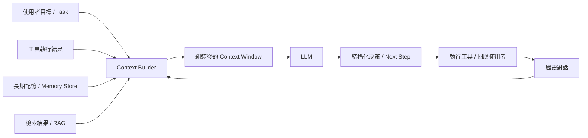

這張圖揭示了一個關鍵事實：**Agent 的「記憶」其實是一條工程管線（Pipeline），不是模型的天生能力**。你需要主動決定：

1. 哪些資訊要放進 Context（Relevance）
2. 用什麼格式放進去（Token 效率、結構化程度）
3. 何時要壓縮／摘要／剪除舊資訊（Context Window 有限）
4. 哪些資訊要外部化成長期記憶，而不是塞進每一次的 Context

> **實務案例**：某金融科技團隊最初讓 Agent 把整個對話歷史（含所有工具回傳的原始 JSON）無限累加進 Context，三輪對話後 Token 用量超過 8 萬，回應延遲從 2 秒暴增到 25 秒、且答案開始出現幻覺。改為「結構化摘要 + 僅保留關鍵欄位」的 Context 管理策略後，Token 用量下降 87%，回應品質與速度同步回升。這正是 Context Engineering（第五章）要解決的核心問題。

> **注意事項**：不要把 12-Factor Agents 理解成「十二條必須逐字遵守的鐵律」，而應理解成「十二個你必須做出工程決策的維度」。團隊可以依場景調整優先順序，但不能完全忽略任何一個維度。

---

## 第二章　12-Factor Agents 核心理念

本章拆解構成「工程化 Agent」的九大核心理念，這些理念是第三章十二大原則的底層基礎。

### 2.1　AI Agent Architecture（Agent 架構）

一個工程化的 Agent 系統，至少應具備以下五個邏輯分層：

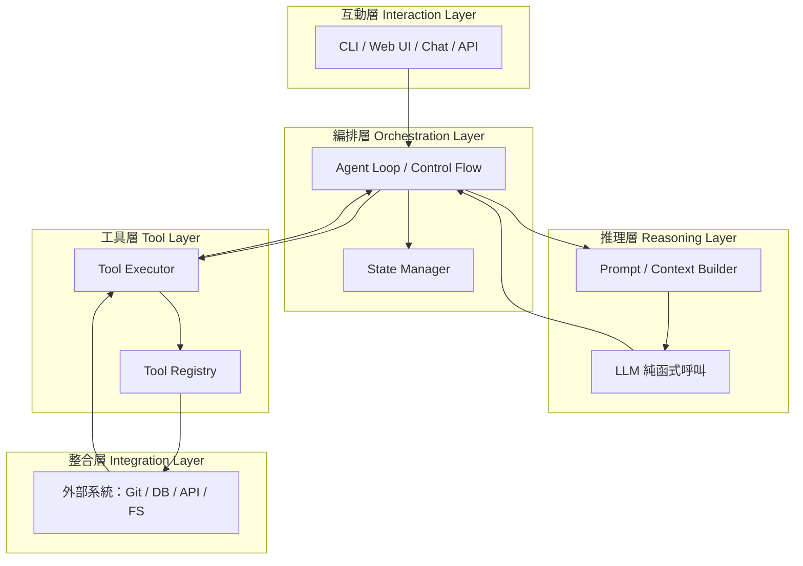

**設計重點**：互動層、編排層、推理層、工具層、整合層彼此應透過清楚的介面（Interface）解耦。當你能夠「單獨測試推理層」（給定固定 Context，驗證輸出是否符合預期 Schema）、「單獨測試工具層」（驗證工具呼叫的輸入輸出契約），整個系統的可維護性就會大幅提升。

### 2.2　Agent Runtime（執行環境）

Agent Runtime 是承載 Agent Loop 執行的環境，常見三種模式：

| Runtime 模式 | 範例 | 特性 |
|---|---|---|
| CLI 互動式 Runtime | Claude Code、GitHub Copilot CLI | 人機協作密集、Session 內保留 Context |
| 無頭批次 Runtime | CI/CD Pipeline 中的 Agent、排程任務 | 無人值守、需要完整的錯誤恢復機制 |
| 服務化 Runtime | 透過 API 封裝的 Agent 微服務 | 多租戶、需考慮併發、隔離、限流 |

企業導入時常見的誤區是「只驗證了 CLI 互動式 Runtime 下的效果，就直接套用到無頭批次場景」，但無頭批次缺乏人類即時介入修正的機會，對 Factor 7（Human-in-the-loop）、Factor 9（錯誤處理）的要求遠高於互動式場景。

### 2.3　Agent Memory（記憶）

承接第一章 1.9 節，Agent Memory 應拆分為三層，對應不同的生命週期：

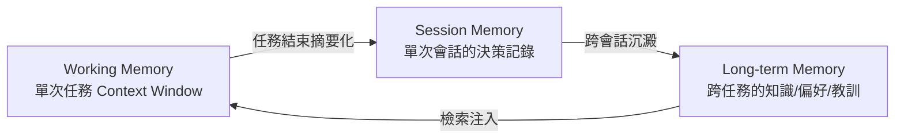

- **Working Memory**：當前任務的 Context Window 本身，生命週期最短，Token 成本最敏感。
- **Session Memory**：一次會話（可能跨多個任務）累積的決策與狀態，通常落地為檢查點（Checkpoint）或事件日誌。
- **Long-term Memory**：跨會話、跨任務沉澱下來的知識（如使用者偏好、專案慣例、過去犯過的錯），通常以檢索（RAG）或結構化檔案方式注入。

### 2.4　Agent Workflow（工作流程）

工作流程描述「任務從輸入到輸出，經過哪些階段」。12-Factor 風格的 Workflow 強調**顯式階段（Explicit Stages）**而非「整個流程丟給 LLM 自由發揮」：

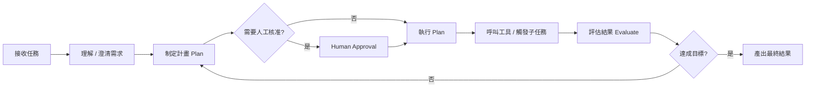

### 2.5　Agent State Management（狀態管理）

狀態管理的核心問題是：**「當 Agent 程序中斷、重啟、或被多個 Worker 接手時，如何不丟失進度？」** 工程化做法是把狀態外部化（Externalize State），而不是只活在記憶體或 Context 裡：

```java
// 範例：以結構化物件表示 Agent 狀態，可序列化、可持久化、可恢復
public record AgentState(
    String taskId,
    String currentStep,
    List<ToolCallRecord> history,
    Map<String, Object> variables,
    AgentStatus status   // PENDING, RUNNING, WAITING_APPROVAL, DONE, FAILED
) {}
```

這個狀態物件可以存進資料庫或檔案系統，讓 Agent 在任何時間點都能「從某個 Checkpoint 恢復」，這正是 Factor 6（Launch/Pause/Resume）要解決的問題。

### 2.6　Agent Planning（規劃）

規劃是指 Agent 把「模糊的目標」拆解成「具體可執行的步驟序列」的過程。兩種常見策略：

- **Plan-then-Execute**：先產出完整計畫（通常請人類核准），再逐步執行，期間若發現計畫不可行則重新規劃。優點是可預測、可審查；缺點是面對高度不確定的任務時，前期計畫容易失準。
- **Reactive Planning（ReAct 風格）**：每一步都重新評估「下一步該做什麼」，邊做邊規劃。優點是適應力強；缺點是缺乏全局視野，容易陷入局部最優或繞圈子。

企業場景建議混合策略：**高風險、高成本的任務用 Plan-then-Execute（並要求人工核准計畫）；低風險、探索型任務用 Reactive Planning**。

### 2.7　Agent Reasoning（推理）

推理是 LLM 在單次呼叫中，根據 Context 產出「下一步決策」的能力。12-Factor Agents 視角下，推理品質高度依賴：

1. Context 的相關性與訊噪比（Factor 3）
2. 任務指令的清晰度（Factor 2）
3. 輸出格式的結構化程度（Factor 4，越結構化越容易被下游程式碼可靠解析）

### 2.8　Agent Tool Calling（工具呼叫）

工具呼叫是 Agent 與外部世界互動的唯一橋樑。設計工具介面時應遵循：

- **單一職責**：每個工具只做一件事，避免「萬能工具」導致 LLM 選擇困難。
- **明確的輸入輸出 Schema**：使用 JSON Schema 嚴格定義參數型別與必填欄位。
- **冪等性（Idempotency）優先**：盡量讓工具可以安全地重試，降低 Agent 重複呼叫造成的副作用風險。
- **錯誤訊息要對 LLM 友善**：回傳的錯誤應該是 LLM 能理解並據此修正下一步行動的自然語言／結構化說明，而不是底層 Stack Trace。

### 2.9　Agent Observability（可觀測性）

沒有可觀測性，Agent 系統就是黑箱。最低限度應記錄：

| 觀測面向 | 記錄內容 | 用途 |
|---|---|---|
| Prompt / Context Log | 每次 LLM 呼叫的完整輸入 | 除錯、回放、Eval 資料集來源 |
| Tool Call Log | 工具名稱、參數、回傳、耗時 | 定位失敗點、效能分析 |
| Decision Trace | 每一步的決策理由（若模型有輸出） | 理解 Agent「為什麼這樣做」 |
| Token / Cost Metrics | 每次呼叫的 Token 用量與成本 | 成本控管、容量規劃 |
| Human Intervention Log | 何時、誰、核准／拒絕了什麼 | 稽核、合規 |

> **實務案例**：某團隊在 Agent 上線初期沒有記錄 Tool Call Log，當 Agent 在生產環境誤刪測試資料表時，花了三天才從應用程式日誌裡拼湊出事發過程。補上結構化的 Tool Call Log 與 Human Intervention Log 後，後續類似事件的根因定位時間從「天」縮短到「分鐘」級別。

> **注意事項**：可觀測性不是「上線後才補」的事後工程，而應該在 Agent 架構設計階段就一併規劃資料結構，否則事後補登往往發現關鍵欄位（如完整 Context Snapshot）根本沒被保留。

---

## 第三章　12-Factor Agents 十二大原則

本章逐一展開 12-Factor Agents 的十二項原則。每項原則均包含：原則說明、設計理念、架構範例、錯誤做法、正確做法、Claude Code 實例、GitHub Copilot 實例、實務建議。

### Factor 1：Natural Language to Tool Calls（自然語言轉工具呼叫）

**原則說明**：Agent 最基本的能力，是把使用者的自然語言意圖，轉換成結構化、可執行的工具呼叫（Function/Tool Call），而不是讓 LLM 直接「自由發揮」去執行危險操作。

**設計理念**：把「理解意圖」與「執行動作」拆成兩個獨立步驟——LLM 負責前者（產出結構化呼叫），程式碼負責後者（驗證並執行）。這個分離讓你可以在「執行」前插入驗證、權限檢查、Dry-run。

**架構範例**：

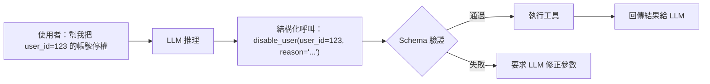

**錯誤做法**：讓 LLM 直接輸出一段要執行的 Shell Script 或 SQL 字串，程式碼不做結構化驗證就直接 `exec()`。

**正確做法**：定義嚴格的 Tool Schema（JSON Schema／OpenAPI），LLM 只能輸出「呼叫哪個工具＋符合 Schema 的參數」，執行前統一做型別與權限驗證。

**Claude Code 實例**：

```jsonc
// .claude/settings.json 中定義工具白名單與權限邊界
{
  "tools": {
    "allow": ["Read", "Grep", "Glob"],
    "ask": ["Edit", "Write", "Bash(git *)"],
    "deny": ["Bash(rm -rf *)", "Bash(git push --force*)"]
  }
}
```

**GitHub Copilot 實例**：在 Copilot Agent Mode 中透過 `.vscode/mcp.json` 註冊 MCP 工具，並在 VS Code Settings 中限制 Agent Mode 可呼叫的工具範圍，效果等同於 Claude Code 的工具白名單機制。

**實務建議**：工具參數命名務必語意清晰（如 `user_id` 而非 `id`），讓 LLM 在缺乏額外說明時也能正確填值；高風險工具（刪除、轉帳、部署）一律搭配 Factor 7 的人工核准。

---

### Factor 2：Own Your Prompts（掌控你的 Prompt）

**原則說明**：不要把 Prompt 外包給框架的「黑箱模板」，應該把 Prompt 視為核心程式碼資產，完全自行掌控、版本控制、測試。

**設計理念**：框架提供的預設 Prompt 模板通常是「泛用但不精」，企業場景需要針對自己的領域知識、輸出格式、邊界案例客製化。當 Prompt 是黑箱，除錯與優化都無從下手。

**架構範例**：

```text
prompts/
├── system/
│   ├── code_review_agent.md      # 版本控制、可 Code Review
│   └── deployment_agent.md
├── templates/
│   └── context_summary.hbs       # 結構化模板，非字串拼接
└── tests/
    └── code_review_agent.eval.yaml
```

**錯誤做法**：直接使用框架（如某些 Agent SDK）內建的「自動生成系統 Prompt」功能，完全不知道實際送進 LLM 的內容是什麼。

**正確做法**：所有送進 LLM 的 System Prompt／Instruction 都以檔案形式存在於版本控制中，並對其進行如同程式碼一樣的 Review 與測試。

**Claude Code 實例**：使用 `CLAUDE.md` 與 `.claude/agents/*.md` 明確定義每個子 Agent 的 System Prompt，而不是依賴 Claude Code 預設行為；搭配 `/memory` 指令檢視目前實際生效的指令內容。

**GitHub Copilot 實例**：在 `.github/copilot-instructions.md` 中明確撰寫專案級指令，並針對不同任務類型使用 `.github/instructions/*.instructions.md`（搭配 `applyTo` 設定生效範圍），避免依賴 Copilot 的通用預設行為。

**實務建議**：Prompt 變更應走 PR 流程並搭配 Eval 回歸測試（見第十一章／附錄），避免「改了 Prompt 之後某個邊界案例突然壞掉卻沒人發現」。

---

### Factor 3：Own Your Context Window（掌控你的 Context Window）

**原則說明**：Context Window 是 Agent 唯一的「記憶」來源，必須主動設計其內容、結構、與管理策略，而不是任由歷史訊息無限堆疊。

**設計理念**：延續第一章 1.9 節，Context 工程的目標是「在有限 Token 預算內，放入對當前決策最relevant、訊噪比最高的資訊」。

**架構範例**：

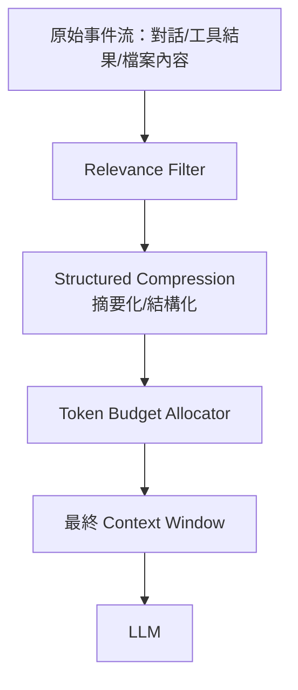

**錯誤做法**：把每一輪工具呼叫的完整 JSON 回傳（可能上萬字元）原封不動塞進對話歷史，導致幾輪之後 Context 暴增。

**正確做法**：對工具回傳做結構化摘要（只保留決策所需欄位），並設計明確的「何時觸發摘要壓縮」策略（如超過 Token 預算 70% 時自動摘要前段歷史）。

**Claude Code 實例**：善用 `/compact` 指令在長任務中主動壓縮歷史 Context；透過 Sub-agent（Agent 工具）把探索性、高 Token 消耗的子任務隔離在獨立 Context 中執行，只把摘要結果帶回主 Context。

**GitHub Copilot 實例**：在 Copilot Chat 中善用 `#file`、`#selection` 等明確範圍標記，避免讓 Copilot 自動帶入整個專案的隱性 Context；長任務建議拆分為多個有明確邊界的 Chat Session。

**實務建議**：為每一類任務設定「Context 預算」（如 8K Token 上限），超過預算觸發摘要或任務拆分，而不是讓視窗自然撐到模型上限才出問題。

---

### Factor 4：Tools Are Just Structured Outputs（工具呼叫即結構化輸出）

**原則說明**：所謂「工具呼叫」，本質上只是 LLM 產出一段「結構化輸出」（JSON），「呼叫」這個動作是由你的程式碼決定如何詮釋並執行這段輸出，而非模型本身真的具備執行能力。

**設計理念**：一旦理解這一點，你就能把「LLM 決定要做什麼」與「系統決定怎麼做、是否要做」徹底解耦，獲得更大的控制彈性（例如：先記錄、人工核准後才真正執行）。

**架構範例**：

```json
// LLM 的「工具呼叫」其實只是這樣一段結構化輸出
{
  "action": "deploy_to_production",
  "params": { "service": "payment-api", "version": "v2.3.1" },
  "reasoning": "所有測試通過，且已通過 staging 驗證"
}
```

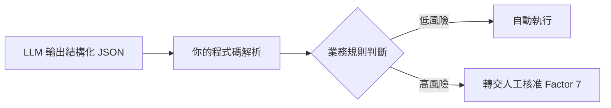

**錯誤做法**：把 LLM 的結構化輸出與「實際執行」綁死在框架內部，無法插入額外的業務規則檢查層。

**正確做法**：在「LLM 輸出結構化決策」與「系統實際執行」之間，插入一層你完全掌控的業務邏輯（風險分級、權限檢查、Dry-run 模擬）。

**Claude Code 實例**：Claude Code 的 Hooks 機制（`PreToolUse`／`PostToolUse`）正是這個原則的具體實現——在工具「即將執行」與「執行完成」前後插入自訂腳本進行檢查或記錄。

**GitHub Copilot 實例**：透過 MCP Server 自行實作工具時，在 Server 端的工具處理函式中加入業務規則判斷，而不是讓 Copilot 用戶端直接執行，等同於建立一層「結構化輸出 → 業務驗證 → 執行」的中介層。

**實務建議**：把「結構化輸出格式」本身視為團隊內部的 API 契約，納入版本控制與相容性管理。

---

### Factor 5：Unify Execution State and Business State（統一執行狀態與業務狀態）

**原則說明**：不要把「Agent 執行到哪一步」（執行狀態）與「業務資料目前的狀態」（業務狀態）分開存放在兩套不同步的系統中，否則容易出現狀態不一致。

**設計理念**：理想情況下，Agent 的執行狀態應該可以從業務狀態（或與其同源的事件日誌）重建，而不是維護一套獨立、容易與業務資料漂移的「Agent 專用狀態庫」。

**架構範例**：

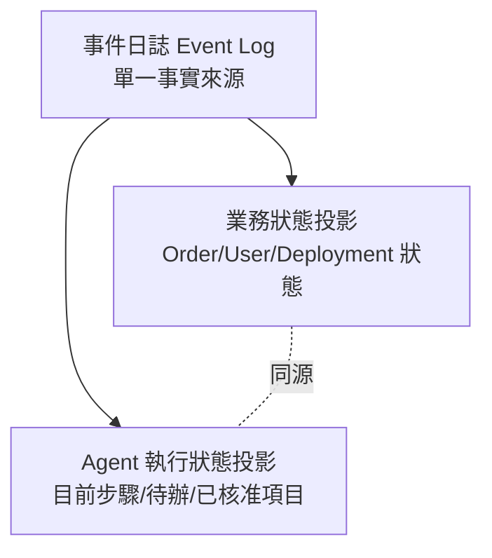

**錯誤做法**：Agent 的「任務進度」存在記憶體變數或獨立的 Redis Key，業務系統的「訂單狀態」存在另一個資料庫，兩者沒有任何關聯，一旦 Agent 崩潰重啟，業務狀態與執行狀態就對不上。

**正確做法**：以同一份事件日誌（Event Sourcing 風格）作為單一事實來源，業務狀態與 Agent 執行狀態都是從這份日誌投影（Project）出來的結果。

**Claude Code 實例**：在自動化 Pipeline 中，把 Claude Code 每個工具呼叫的結果寫回與業務系統共用的任務追蹤表（如 Jira／資料庫的同一張 `task_events` 表），而不是另開一套只有 Agent 自己看得懂的狀態檔。

**GitHub Copilot 實例**：在 GitHub Actions 中以 Copilot Agent Mode 執行的步驟，其執行紀錄直接落在該 PR／Issue 的 Timeline 上，天然與業務狀態（PR 狀態）統一，這是值得參考的內建模式。

**實務建議**：設計資料模型時，先問「如果 Agent 程序整個重啟，我能否只靠這份資料完整重建目前狀態？」，答不出來就代表狀態尚未統一。

---

### Factor 6：Launch/Pause/Resume with Simple APIs（以簡單 API 啟動／暫停／恢復）

**原則說明**：Agent 任務應該可以被任何授權的呼叫方（人類或系統）透過簡單 API 啟動、暫停、恢復，而不是只能在一次性的互動 Session 中從頭跑到尾。

**設計理念**：長時程任務（可能跨小時、跨天）必然會遇到中斷（人類下班、系統重啟、需要等待外部審批），系統必須原生支援「暫停後可恢復」，而不是把中斷視為例外情況。

**架構範例**：

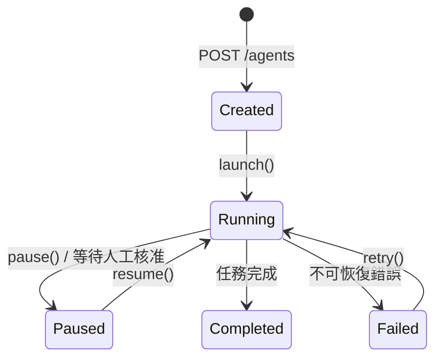

**錯誤做法**：Agent 邏輯寫成一個從頭跑到尾的長迴圈函式，狀態全部存在區域變數中，程序一旦終止就只能整個重來。

**正確做法**：每個 Agent 任務都對應一個可被外部系統操作的資源（如 `POST /agents/{id}/pause`、`POST /agents/{id}/resume`），狀態持久化在外部儲存（對應 Factor 5）。

**Claude Code 實例**：長任務可拆分為多個 `claude -p "<子任務>"` 的無頭呼叫，每次呼叫前讀取上次保存的進度檔（如 `tasks/{id}/state.json`），執行後寫回，天然支援暫停／恢復語意。

**GitHub Copilot 實例**：把長任務拆解為多個 GitHub Issue／PR 上的 Checklist 項目，Copilot Agent Mode 每次只處理一個項目並更新 Checklist 狀態，下一次呼叫從 Checklist 當前狀態接續，等同實現 Launch/Pause/Resume。

**實務建議**：在設計 API 時，「暫停」應該是隨時安全的操作（不會留下半套修改），這通常要求工具呼叫盡量設計為冪等且可中斷於步驟邊界。

---

### Factor 7：Contact Humans with Tool Calls（以工具呼叫的方式聯絡人類）

**原則說明**：把「詢問人類」本身也設計成一種標準的工具呼叫（如 `request_approval`、`ask_clarification`），而不是讓 Agent 卡死等待，或自行假設答案繼續執行。

**設計理念**：這是 HumanLayer 團隊的核心專長領域。將人機協作正規化為工具呼叫，意味著「等待人類回應」可以與「等待任何其他非同步工具」用同一套機制處理（暫停、通知、恢復）。

**架構範例**：

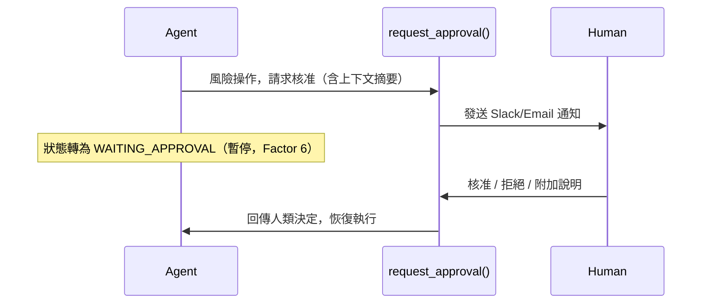

**錯誤做法**：高風險操作（刪除生產資料、發送對外郵件）由 Agent 自主決定執行，完全沒有人工介入點。

**正確做法**：明確定義哪些動作屬於「高風險工具」，呼叫前一律先呼叫 `request_approval` 類型的工具，並把等待期間視為合法的暫停狀態（Factor 6）。

**Claude Code 實例**：透過 `.claude/settings.json` 將高風險 Bash 指令或 Edit 操作設為 `"ask"`（需要互動確認），在無頭模式下可整合 Hooks 呼叫外部審批 API（如 Slack Webhook）等待回覆後才放行。

**GitHub Copilot 實例**：Copilot Agent Mode 對檔案修改、終端機指令預設會跳出確認對話框；在 CI 場景可設計成「Agent 開 PR、指派 Reviewer」的模式，PR Approve 即是結構化的人工核准事件。

**實務建議**：核准請求應附帶足夠上下文摘要（不是整段原始 Log），讓人類可以在 10 秒內做出有品質的判斷，否則人工核准會變成形式主義的「無腦點同意」。

---

### Factor 8：Own Your Control Flow（掌控你的控制流）

**原則說明**：多步驟、條件分支、迴圈、重試等控制邏輯，應該由你的程式碼明確掌控，LLM 只在「需要推理判斷」的決策點被呼叫，而不是把整個控制流程交給一個巨大的 Agent 迴圈自由發揮。

**設計理念**：這是 12-Factor Agents 中最反直覺、卻也最關鍵的原則——**減少 LLM 對控制流的掌控權，系統反而更可靠**。

**架構範例**：

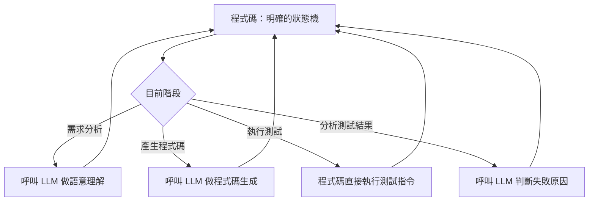

**錯誤做法**：寫一個 `while (true) { llm.decide_next_action() }` 的無限迴圈，完全依賴模型自己判斷何時該做什麼、何時該停止。

**正確做法**：用明確的狀態機／工作流引擎定義階段與轉移條件，只在「真正需要語言理解或推理」的節點呼叫 LLM，其餘（執行測試、檢查回傳碼、重試邏輯）用傳統程式碼處理。

**Claude Code 實例**：使用 Claude Code 的 Skill／Slash Command 把固定流程（如「先 lint、再跑測試、最後產生 PR 描述」）寫成腳本化的步驟序列，只在不確定的判斷點呼叫 Claude 推理，而不是讓 Claude 自由決定整個流程順序。

**GitHub Copilot 實例**：在 GitHub Actions 中以明確的 Job/Step 定義流程骨架，只在特定 Step 中呼叫 Copilot CLI／Agent 做語意層工作（如生成 Commit 訊息、總結變更），其餘交由標準 CI 步驟控制。

**實務建議**：當你發現「同一個任務，Agent 兩次執行的步驟順序不一樣」，這通常是控制流被過度交給 LLM 的警訊，應該重新檢視哪些邏輯可以收回到程式碼層。

---

### Factor 9：Compact Errors into Context Window（將錯誤壓縮後納入 Context）

**原則說明**：當工具呼叫失敗，不要把完整、冗長的原始錯誤（如 Java Stack Trace、SQL 完整錯誤訊息）直接塞進 Context，而應萃取出對 LLM 有用的關鍵資訊，壓縮後再放入。

**設計理念**：原始錯誤訊息往往充滿對 LLM 決策無用的雜訊（行號、記憶體位址、框架內部呼叫鏈），不僅浪費 Token，還可能讓模型誤判重點。

**架構範例**：

```text
原始錯誤（不建議直接餵給 LLM）：
java.sql.SQLException: ORA-00001: unique constraint (APP.UK_USER_EMAIL) violated
    at oracle.jdbc.driver.T4CTTIoer11.processError(...)
    at ... (還有 40 行 Stack Trace)

壓縮後（建議餵給 LLM 的版本）：
{
  "error_type": "DUPLICATE_KEY",
  "constraint": "UK_USER_EMAIL",
  "message": "email 欄位已存在重複值，請改用 update 而非 insert",
  "suggested_action": "查詢既有記錄後決定 insert 或 update"
}
```

**錯誤做法**：`catch (Exception e) { context.append(e.toString()) }`，把整個例外字串原封不動丟回 Context。

**正確做法**：建立一層「錯誤轉譯器（Error Translator）」，把底層技術錯誤映射成結構化、語意清晰、且包含「建議下一步」的訊息。

**Claude Code 實例**：透過 `PostToolUse` Hook 攔截工具執行失敗的結果，先用規則或小型分類器將常見錯誤（編譯錯誤、測試失敗、權限不足）正規化為固定的結構化格式，再回傳給 Claude 主迴圈。

**GitHub Copilot 實例**：自訂 MCP Server 工具時，於 Server 端統一捕捉例外並回傳結構化的錯誤物件（含 `error_code`、`human_readable_message`），而不是把底層執行環境的原始錯誤直接透傳給 Copilot。

**實務建議**：為團隊常見的錯誤類型（編譯失敗、測試失敗、權限不足、逾時、第三方 API 限流）建立一份「錯誤正規化字典」，讓壓縮邏輯可以重複利用、持續累積。

---

### Factor 10：Small, Focused Agents（小而專注的 Agent）

**原則說明**：與其打造一個「萬能」的超級 Agent 去處理所有任務，應該把系統拆解成多個職責單一、Context 範圍小、容易測試的小型 Agent。

**設計理念**：小型 Agent 的 Context Window 更乾淨（Factor 3 更容易落實）、行為更可預測、也更容易針對單一職責撰寫 Eval（第十一章）。這與傳統軟體工程「單一職責原則（SRP）」是同一個精神的延伸。

**架構範例**：

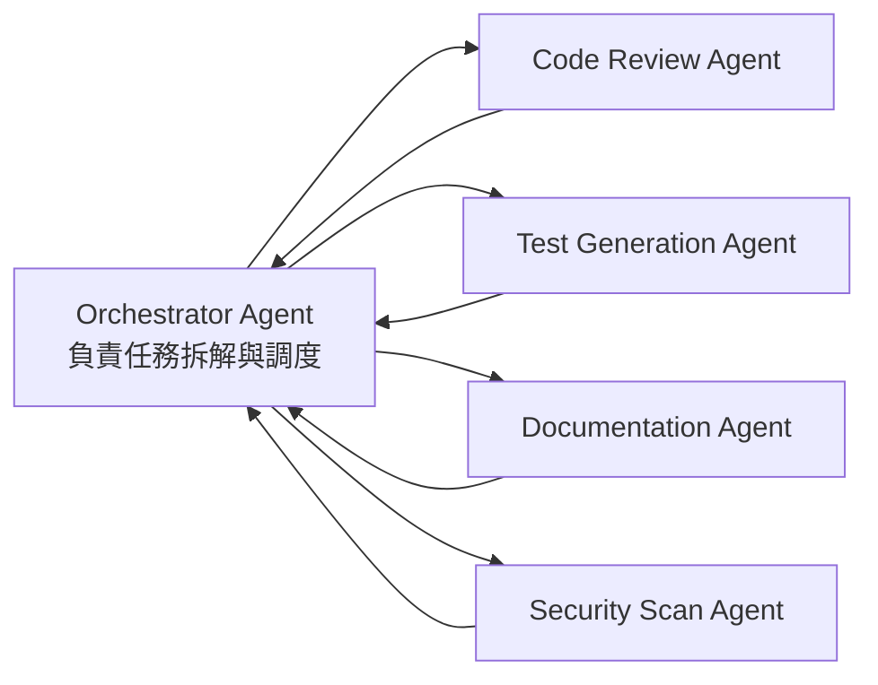

**錯誤做法**：一個 System Prompt 裡塞滿「你要會寫程式、會審查、會寫測試、會回答業務問題、還要會安全掃描」，導致 Prompt 又長又互相干擾，任何一個職責的調整都可能影響其他職責的表現。

**正確做法**：每個 Agent 只專注一種任務類型，輸入輸出介面明確，由上層 Orchestrator（可以是程式碼，也可以是另一個專責調度的 Agent）負責任務分派與結果整合。

**Claude Code 實例**：使用 Claude Code 的 Sub-agent（`.claude/agents/*.md`）機制定義多個專職 Agent（如 `code-reviewer`、`test-runner`），主 Agent 透過 `Agent` 工具呼叫它們，各自在獨立 Context 中執行，互不干擾。

**GitHub Copilot 實例**：透過自訂 Chat Participant（`@workspace` 之外的自訂 Participant）或多個獨立的 `.instructions.md` 檔案，依任務類型路由到不同的指令集，達到類似「小型專職 Agent」的效果。

**實務建議**：當一個 Agent 的 System Prompt 超過一頁、或職責描述出現「以及」「同時也要」等連接詞超過三次，就是拆分的訊號。

---

### Factor 11：Trigger from Anywhere, Meet Users Where They Are（從任何地方觸發，貼近使用者場域）

**原則說明**：Agent 不應該被綁死在單一介面（如只能在某個專屬 Web UI 中使用），應該設計成可以從 Slack、Email、CLI、CI/CD、Webhook 等多種管道觸發，並在使用者習慣的場域中回應。

**設計理念**：企業使用者的工作場域分散在多個工具中（IDE、Slack、Email、GitHub），強迫使用者「特地跑到一個新介面才能用 Agent」會大幅降低採用率。

**架構範例**：

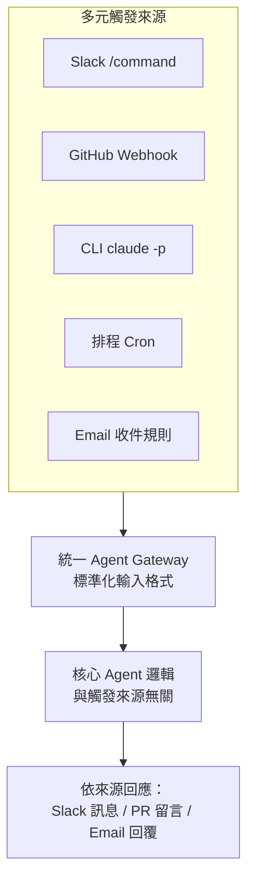

**錯誤做法**：把業務邏輯與「Slack Bot 框架」或「特定 Web 框架」緊密耦合，導致換一個觸發管道就要重寫核心邏輯。

**正確做法**：核心 Agent 邏輯與觸發管道解耦，所有管道都先正規化為統一的「任務輸入格式」，回應時再依管道差異化輸出格式。

**Claude Code 實例**：Claude Code 同時支援互動式 CLI、`claude -p` 無頭模式、以及可整合進 GitHub Actions／Slack Webhook 的呼叫方式，核心 Prompt／Skill 設計應與觸發方式無關。

**GitHub Copilot 實例**：GitHub Copilot Agent Mode 可由 VS Code、GitHub.com 網頁版、以及 GitHub Mobile 觸發同一個 Coding Agent 任務（指派 Issue 給 Copilot），體現了「同一套 Agent 核心、多重觸發入口」的設計。

**實務建議**：設計觸發層時，優先支援「使用者已經在用的工具」，而不是要求使用者改變工作習慣去配合 Agent。

---

### Factor 12：Make Your Agent a Stateless Reducer（讓你的 Agent 成為無狀態的 Reducer）

**原則說明**：把整個 Agent 核心邏輯設計成一個無狀態的 Reducer 函式：`(目前狀態, 新事件) -> 新狀態`，所有狀態都是外部輸入與輸出，Agent 程式本身不持有任何隱性的內部狀態。

**設計理念**：這是 Factor 5、Factor 6、Factor 8 的集大成思想——當 Agent 是無狀態 Reducer，它就天然具備：可水平擴展（任何 Worker 都能處理任何請求）、可重放（Replay 事件日誌即可重建任何時間點的狀態）、可測試（固定輸入輸出，易於撰寫單元測試）。

**架構範例**：

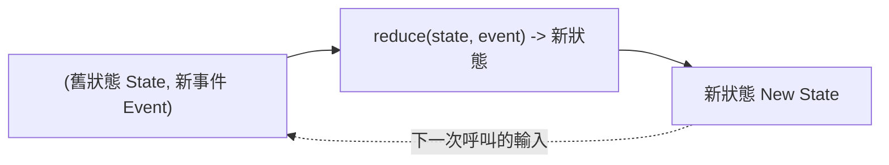

```java
// 概念示意：Agent 核心被建模為純函式 Reducer
public interface AgentReducer {
    AgentState reduce(AgentState currentState, AgentEvent event);
}
// 呼叫方負責持久化 currentState、產生 event、儲存回傳的新狀態
// AgentReducer 本身完全無狀態，可被任意數量的 Worker 並行呼叫
```

**錯誤做法**：Agent 物件內部用實例變數保存「目前任務進度」，導致同一個 Agent 實例不能被兩個任務同時共用，也無法輕易水平擴展。

**正確做法**：狀態完全外部化（對應 Factor 5），Agent 核心邏輯只接受「目前狀態 + 新事件」作為輸入，回傳「新狀態」作為輸出，不依賴任何隱藏的內部記憶。

**Claude Code 實例**：以 `claude -p` 無頭模式搭配外部狀態檔（JSON／資料庫）呼叫，每次呼叫都是全新的程序，狀態完全來自傳入的 Context 與讀取的狀態檔，天然符合無狀態 Reducer 模式。

**GitHub Copilot 實例**：GitHub Actions 中每次觸發 Copilot Agent 的 Job 都是全新的執行環境，狀態必須透過 Artifact、PR 描述、或外部儲存傳遞，這個架構限制反而強迫團隊落實無狀態設計。

**實務建議**：撰寫 Agent 核心邏輯時，盡量避免任何形式的全域變數或物件實例狀態；如果某個狀態「沒辦法輕易序列化成 JSON」，通常代表設計上還不夠無狀態。

---

### Factor 13（榮譽提及）：Pre-fetch All the Context You Might Need（預先擷取你可能需要的所有 Context）

**原則說明**：這是 HumanLayer 原文在十二大原則之外額外列出的「榮譽提及（Honorable Mention）」原則——與其讓 Agent 在執行過程中邊跑邊發現「還需要查某份資料」而頻繁中斷去呼叫工具，不如在任務啟動前，由程式碼主動且確定性地預先擷取該任務「大概率會用到」的全部上下文，一次性組裝進初始 Context。

**設計理念**：每一次「Agent 執行中途才發現需要額外資料」都意味著一次額外的工具呼叫往返（Round-trip）——不僅拉長任務總耗時與 Token 成本，也讓控制流程多了一個不確定的中斷點。對於「需要哪些資料」高度可預測的任務類型（如：修改某個檔案前，幾乎一定需要該檔案內容、其測試檔、以及相關的 Coding Standard），把這些查詢動作收回到程式碼層、在 Agent 啟動前確定性地完成，能同時提升延遲表現與行為可預測性，這也與 Factor 8（掌控你的控制流）的精神一脈相承。

**架構範例**：

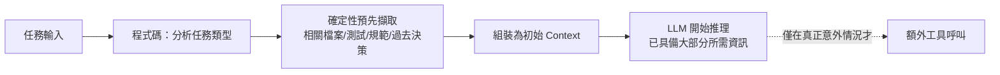

**錯誤做法**：Agent 啟動時只給一句任務描述，讓 LLM 自己決定「我需要先讀哪個檔案、再讀哪個檔案」，導致同一類任務每次都要先花 3-5 輪工具呼叫做基本的資訊蒐集，才能進入真正的決策階段。

**正確做法**：針對可預測的任務類型，建立「該類任務通常需要哪些上下文」的對照規則（可以是簡單的程式碼邏輯，不需要 LLM 參與），在組裝 Context 階段就主動擷取並注入，把 LLM 的第一次推理直接帶到「已具備足夠資訊、可以開始做決策」的狀態。

**Claude Code 實例**：在自訂 Slash Command 或 Sub-agent 定義中，先以 `Glob`／`Grep` 等工具於腳本層級蒐集好相關檔案清單與內容摘要，再將結果一次性放入傳給 Claude 的初始 Prompt，而不是讓 Claude 自己一步步摸索檔案結構；這也是第六章 6.3 節「Step 3：程式開發」中 Sub-agent 模式被建議搭配「先盤點任務範圍」的原因。

**GitHub Copilot 實例**：在 Copilot Chat 中主動使用 `#file`、`#codebase` 等範圍標記，一次性把任務相關的檔案與既有規範帶入 Context，而不是讓 Copilot 在多輪對話中才逐步發現還缺少哪些檔案。

**實務建議**：預先擷取並非「Context 越多越好」（會與 Factor 3 的精簡原則衝突），重點是「針對已知任務類型，把高機率會用到的關鍵資訊一次到位」，而非無差別地塞入整個程式碼庫；建議先從團隊最常重複的 3-5 種任務類型開始建立預先擷取規則，再依實際命中率持續調整。

> **十二大原則總覽表**

| Factor | 一句話總結 |
|---|---|
| 1 | 自然語言只負責產生結構化工具呼叫，不直接執行危險動作 |
| 2 | Prompt 是程式碼資產，自己掌控、版本控制、測試 |
| 3 | Context Window 是唯一記憶，主動設計其內容與管理策略 |
| 4 | 工具呼叫只是結構化輸出，執行與否由你的業務邏輯決定 |
| 5 | 執行狀態與業務狀態應同源，避免狀態漂移 |
| 6 | 任務應可被簡單 API 啟動／暫停／恢復 |
| 7 | 聯絡人類也是一種標準化的工具呼叫 |
| 8 | 控制流由程式碼掌控，LLM 只負責關鍵決策點 |
| 9 | 錯誤先壓縮萃取重點，再放進 Context |
| 10 | 寧可拆成多個小而專注的 Agent，不要打造萬能 Agent |
| 11 | 支援多元觸發管道，貼近使用者既有工作場域 |
| 12 | Agent 核心邏輯設計成無狀態 Reducer，狀態完全外部化 |
| 13（榮譽提及） | 針對可預測的任務類型，預先確定性擷取所需 Context，減少執行中斷往返 |

> **注意事項**：十二項原則彼此高度關聯（如 Factor 5、6、12 本質上是同一個「狀態外部化」思想的不同面向），實作時不需要機械式逐條打勾，而應該理解其背後共通的工程價值觀：**把不確定性留給 LLM，把確定性還給程式碼**。

---

## 第四章　12-Factor Agents 系統架構設計

本章把第二、三章的理念落地為一套可實際部署的四層架構：Agent Layer、Context Layer、Tool Layer、Runtime Layer。

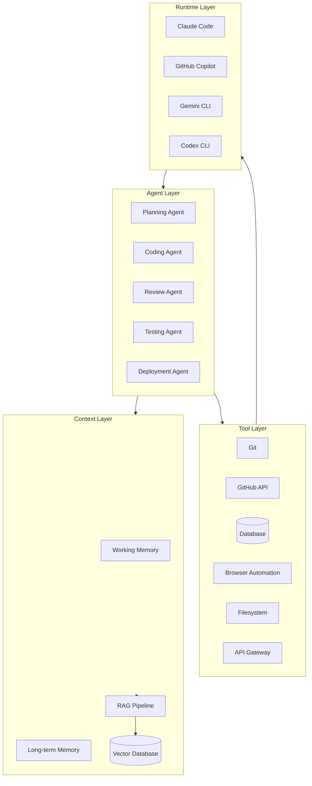

### 4.1　Agent Layer

| Agent | 職責 | 輸入 | 輸出 |
|---|---|---|---|
| Planning Agent | 把需求拆解成可執行任務清單 | 需求描述、既有架構文件 | 結構化任務清單（含優先序、依賴關係） |
| Coding Agent | 依任務清單產出程式碼變更 | 任務項目、相關程式碼上下文 | Diff / Patch / 新檔案 |
| Review Agent | 檢視程式碼品質、風險、規範一致性 | Diff、Coding Standard | 結構化審查意見（含嚴重度分級） |
| Testing Agent | 產生並執行測試、回報結果 | 變更後程式碼 | 測試報告、覆蓋率、失敗清單 |
| Deployment Agent | 執行／驗證部署流程 | 已通過測試的版本、部署設定 | 部署結果、健康檢查報告 |

設計上應遵循 Factor 10（Small, Focused Agents），每個 Agent 只專注單一職責，由 Orchestrator（可以是 Planning Agent 升格扮演，也可以是獨立的程式碼邏輯）依任務清單依序或並行調度。

### 4.2　Context Layer

- **Working Memory**：當前任務的 Context Window，存活週期等於單次任務執行。
- **Long-term Memory**：跨任務沉澱的知識（架構慣例、過去決策、使用者偏好），通常以結構化檔案（如 `memory/*.md`）或資料庫保存。
- **RAG（Retrieval-Augmented Generation）**：將大型知識庫（內部文件、API 規格、過去 PR）切片、嵌入（Embedding）後存入向量資料庫，依任務語意檢索最相關片段注入 Context。
- **Vector Database**：常見選擇有 pgvector（與既有 PostgreSQL 整合）、Milvus、Qdrant；企業場景建議優先評估「與既有資料庫整合」的方案，降低維運複雜度。

### 4.3　Tool Layer

| 工具類別 | 範例 | 設計要點 |
|---|---|---|
| Git | clone / diff / commit / branch | 限制可操作的分支範圍，避免直接操作 `main`／`master` |
| GitHub | 建立 PR、留言、指派 Reviewer | 透過 Fine-grained PAT 限制權限範圍 |
| Database | 查詢、Migration 執行 | 唯讀查詢與寫入操作分開授權 |
| Browser | 自動化瀏覽、截圖、表單填寫 | 限制可存取網域，記錄所有操作軌跡 |
| Filesystem | 讀寫專案檔案 | 限制可寫入路徑，禁止存取 `.env`、金鑰檔 |
| API Gateway | 統一對外部 API 的呼叫入口 | 集中限流、認證、稽核日誌 |

### 4.4　Runtime Layer

| Runtime | 定位 | 適用場景 |
|---|---|---|
| Claude Code | CLI 原生 Agent，支援 Sub-agent、Hooks、Skill | 深度客製化的工程工作流、企業內部自動化 |
| GitHub Copilot | IDE／GitHub 原生整合的 Agent Mode | 與既有 GitHub 工作流（PR/Issue）緊密結合的場景 |
| Gemini CLI | Google 生態圈的命令列 Agent | 已採用 GCP／Gemini 生態的團隊 |
| Codex CLI | OpenAI 生態圈的命令列 Agent | 已採用 OpenAI 生態的團隊 |

> **實務案例**：某保險公司的核保系統現代化專案，採用「Planning Agent（Claude Code Sub-agent）先產出任務清單 → Coding Agent 逐項實作 → Review Agent 把關 → Testing Agent 驗證 → Deployment Agent 透過既有 CI/CD 部署」的四層架構，搭配 RAG 注入內部核保業務規則文件，使新進工程師也能在 Agent 輔助下正確處理過去需要資深核保專家才能理解的業務邏輯。

> **注意事項**：四層架構不代表每個專案都要一次到位實作齊全。建議先落地 Agent Layer + Tool Layer 的最小可行版本（Factor 1、4、8 優先），驗證價值後再逐步擴充 Context Layer 的 RAG／長期記憶能力。

---

## 第五章　Context Engineering

### 5.1　Context Window（上下文視窗）

Context Window 是 LLM 單次呼叫能「看到」的全部資訊容量上限（以 Token 計算）。即使現代模型的視窗已擴展到數十萬甚至百萬 Token 級別，「視窗夠大」不代表「應該塞滿」——研究與實務都顯示，**Context 中無關資訊越多，模型在大海中找到關鍵訊息（Needle in a Haystack）的準確度越會下降**，同時 Token 成本與延遲也線性增加。

### 5.2　Context Compression（上下文壓縮）

當任務歷史超過預算，需要主動壓縮：

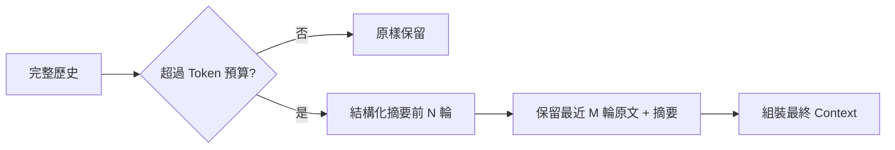

常見壓縮手法：

- **滾動摘要（Rolling Summary）**：每隔固定輪數，把舊歷史摘要成一段精簡敘述。
- **關鍵欄位萃取**：工具回傳的 JSON 只保留決策所需欄位，捨棄樣板／中繼資料。
- **參考化（Reference, not Inline）**：大型內容（如整份檔案）只放檔案路徑＋摘要，需要時再由工具重新讀取完整內容。

### 5.3　Context Summarization（上下文摘要）

摘要本身也是一次 LLM 呼叫，需注意：摘要 Prompt 應明確要求保留「決策相關事實」（如已嘗試過的方案、已確認的限制條件），避免摘要把關鍵細節壓沒了導致後續決策重複犯錯。

### 5.4　Context Routing（上下文路由）

不同任務類型需要不同的 Context 組成。Context Router 依任務意圖，決定要從哪些來源（程式碼庫、文件庫、過去對話、RAG 檢索）組裝 Context：

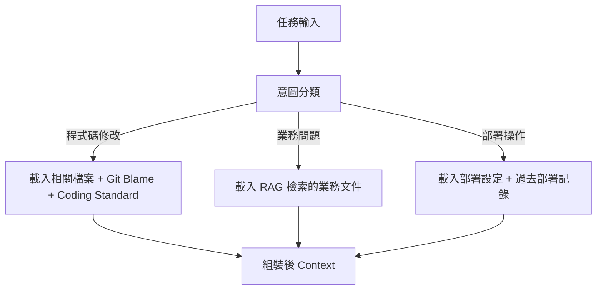

### 5.5　Context Pruning（上下文修剪）

修剪是指在 Context 已經組裝完成後，移除低價值內容的後處理步驟，例如：移除重複出現的系統說明、移除已被後續訊息取代的舊資訊、移除工具呼叫中間態的冗餘確認訊息。

### 5.6　Context Layering（上下文分層）

把 Context 依「變動頻率」分層管理，能大幅提升 Prompt Caching 的命中率（進而降低成本與延遲）：

| 層級 | 內容 | 變動頻率 | Caching 策略 |
|---|---|---|---|
| 第一層：靜態指令 | System Prompt、Coding Standard | 幾乎不變 | 永久快取 |
| 第二層：任務情境 | 當前任務描述、相關檔案 | 每個任務變動一次 | 任務內快取 |
| 第三層：動態歷史 | 工具呼叫結果、對話歷史 | 每一輪都變動 | 不快取／短期快取 |

> 將最常變動的內容放在 Context 尾端、最少變動的內容放在開頭，是多數 LLM 供應商 Prompt Caching 機制（如 Anthropic 的 Prompt Caching）發揮效益的關鍵前提。

### 5.7　Prompt Engineering、Context Engineering、Loop Engineering 比較

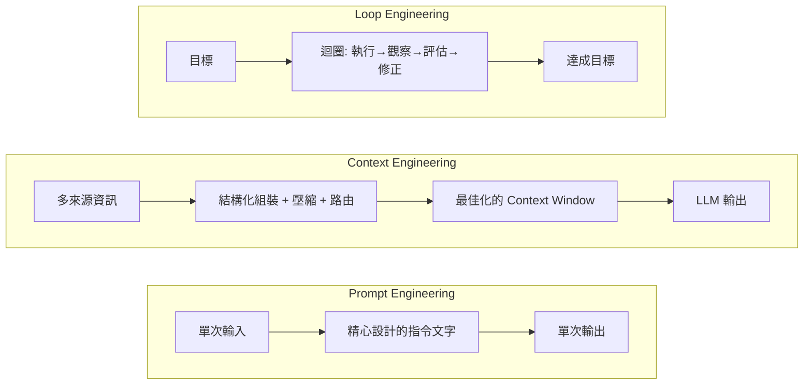

| 維度 | Prompt Engineering | Context Engineering | Loop Engineering |
|---|---|---|---|
| 關注焦點 | 單次指令的文字技巧 | 整個輸入內容的結構與管理 | 多輪迴圈的控制與反饋機制 |
| 適用情境 | 單次問答、簡單任務 | 需要整合多來源資訊的中型任務 | 長時程、需自我修正的複雜任務 |
| 核心技能 | 措辭、範例、角色設定 | 資訊架構、Token 預算管理、快取策略 | 反饋訊號設計、停止條件、評估機制 |
| 與 12-Factor Agents 對應 | Factor 2 | Factor 3、Factor 9 | Factor 6、Factor 8、Factor 12 |

三者並非互斥，而是**疊加關係**：紮實的 Prompt Engineering 是 Context Engineering 的基礎元件之一，而 Context Engineering 又是 Loop Engineering 中每一輪迴圈得以高品質運作的前提。企業專案通常需要三者並用：用 Prompt Engineering 打磨單一決策點的指令品質，用 Context Engineering 管理整個任務的資訊架構，用 Loop Engineering 設計任務從啟動到完成的整體控制流。

> **實務案例**：某團隊將既有「一次性巨大 Prompt」的程式碼生成任務，重構為 Context Engineering（依檔案相關性動態組裝 Context，移除無關模組）＋ Loop Engineering（產生程式碼 → 自動跑測試 → 失敗則把壓縮後的錯誤回饋給下一輪），整體任務成功率從 42% 提升到 81%，平均 Token 成本下降 35%。

> **注意事項**：不要把 Context Engineering 簡化為「自動摘要」。摘要只是其中一種手法，完整的 Context Engineering 需同時考慮路由（放什麼）、分層（怎麼排序以利快取）、壓縮（怎麼縮減）、修剪（怎麼移除雜訊）四個維度的協同設計。

### 5.8　Context Rot 與「啞區（Dumb Zone）」現象

HumanLayer 創辦人 Dex Horthy 在分析超過十萬筆真實開發者 Agent Session 後，提出了一個對企業導入極具參考價值的實證發現：**Context Window 並非「均質可用」的空間，其中段區域存在明顯的品質衰退帶**，他稱之為「啞區（Dumb Zone）」。

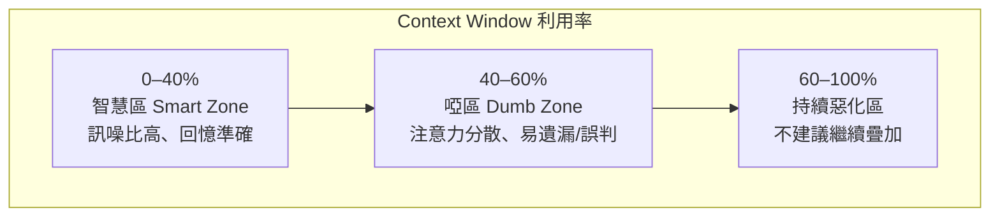

- **現象本質**：這與學界長期觀察到的「Lost in the Middle」問題一致——LLM 對放在 Context 開頭與結尾的資訊回憶準確度最高，對埋在中段的資訊則容易遺漏或誤判，且這個效應會隨 Context 視窗使用率上升而加劇，而不是隨視窗總容量變大而消失。
- **關鍵門檻**：Horthy 觀察到的經驗法則是——**Context 視窗利用率一旦超過約 40%，就開始進入啞區，後續每增加的內容，換來的有效推理品質反而遞減**（"the more you use the context window, the worse the outcomes you'll get"）。這與第一章 1.9 節「Context 即 Agent Memory」的論點互相呼應：視窗夠大不代表應該塞滿。
- **企業啟示**：這個發現把 Factor 3（掌控你的 Context Window）從「應該做的最佳實務」，提升為「有實證數據支撐的工程門檻」——建議將「Context 利用率」本身納入第十二章的 Observability 指標，當任務的 Context 利用率逼近 40% 門檻時，觸發摘要壓縮（5.2 節）或任務拆分（Factor 10），而不是等到模型開始出現明顯錯誤才介入。

> **注意事項**：40–60% 是 Horthy 團隊在其特定任務類型（程式碼編輯類 Agent）上觀察到的經驗門檻，並非放諸四海皆準的物理常數。企業導入時應視為「需要建立自己監控基準」的訊號，而非直接照搬具體數字；不同模型、不同任務類型的啞區位置與寬度可能不同。

### 5.9　Research-Plan-Implement（RPI）框架

為了系統性地避開啞區、同時讓 Agent 能在既有大型程式碼庫（Brownfield，相對於從零開始的 Greenfield）中可靠工作，HumanLayer 團隊提出並持續迭代 **RPI（Research → Plan → Implement）三階段框架**，本質上是 Factor 8（掌控你的控制流）與 5.8 節啞區觀察的具體實踐方案。

```mermaid
flowchart LR
    A[Research<br/>研究既有程式碼庫的架構/慣例/相關區塊] --> B[Plan<br/>產出 100-200 行的中間設計文件]
    B --> C{人類與 Agent<br/>對齊設計共識?}
    C -->|否，需調整| B
    C -->|是| D[Implement<br/>依已對齊的計畫產生程式碼]
    D --> E[每個階段結束<br/>主動重置/壓縮 Context]
    E -.下一個子任務.-> A
```

- **Research（研究）階段**：在產生任何程式碼之前，先讓 Agent（或專責的 Research Sub-agent）系統性分析既有架構、慣例與任務相關的程式碼區塊，輸出的是「理解」而非「方案」。
- **Plan（規劃）階段**：不直接跳進 Implement，而是先產出一份精簡的中間設計文件（HumanLayer 建議控制在 100–200 行 Markdown），內容包含期望的最終狀態、關鍵設計決策、待確認問題；這份文件的目的是讓**人類與 Agent 在進入實作前先取得明確的心智對齊（Mental Alignment）**，對應第三章 Factor 7（以工具呼叫聯絡人類）的精神。
- **Implement（實作）階段**：只有在 Plan 已被人類確認後，才進入程式碼產生，且每完成一個子任務即主動重置或壓縮 Context（對應 5.8 節避開啞區的具體做法），而不是讓單一 Context 隨任務複雜度無限累積。

```bash
# RPI 框架在 Claude Code 中的典型三段式呼叫（示意）
claude -p "[Research] 分析 src/payment 模組現有的交易處理流程與既有設計慣例，
僅輸出理解摘要，不要產生任何程式碼變更"

claude -p "[Plan] 依據上一步的研究摘要，針對『新增分期付款功能』
產出 150 行以內的設計文件：期望終態、關鍵決策點、待確認問題，
輸出至 .ai/plans/installment-payment-plan.md 供人工確認"

# 人工審查並確認 .ai/plans/installment-payment-plan.md 後才進入下一步

claude -p "[Implement] 依據已核准的 installment-payment-plan.md 實作程式碼，
每完成一個子任務後，主動以 /compact 壓縮目前 Context"
```

> **實務案例**：HumanLayer 團隊將 RPI 框架與「Sub-agent 分工」結合——以較小／較快的模型負責 Implement 階段的程式碼產生，再由另一個獨立 Context 的「審查模型」覆核產出品質，避免單一 Agent 的 Context 同時背負「研究＋規劃＋實作＋自我審查」四種職責而提早進入啞區。團隊也觀察到，搭配自動化迴圈（業界稱為「Ralph Loop」，由 Jeff Huntley 提出的持續執行模式）可在無人值守情況下完成大量重複性的 Greenfield 開發工作，但 Horthy 同時強調：**正式生產系統的維運責任無法被外包給自動迴圈**——一旦系統半夜出問題，工程師仍必須能夠讀懂並修復程式碼，因此 Ralph Loop 類型的全自動模式更適合探索性、可拋棄的場景，而非企業核心交易系統（可與第十四章企業導入策略的風險分級原則對照參考）。

> **注意事項**：RPI 不是要取代第六章已介紹的「需求分析 → 架構設計 → 程式開發」六步驟流程，而是補強其中「程式開發」步驟內部的執行紀律——尤其是在大型既有系統（Brownfield）上工作時，Research 與 Plan 兩個階段的投入往往比直接動手寫程式碼更能避免後續大量返工。

---

## 第六章　12-Factor Agents 與 Claude Code

### 6.1　專案目錄設計

```text
.ai/                      # 12-Factor Agents 落地的核心資產目錄
├── agents/                # Sub-agent 定義（對應 Factor 10）
│   ├── code-reviewer.md
│   ├── test-runner.md
│   └── security-scanner.md
├── memory/                 # 長期記憶（對應 Factor 3、第二章 2.3）
│   ├── architecture.md
│   └── lessons-learned.md
├── prompts/                 # 版本控制的 Prompt 資產（對應 Factor 2）
│   ├── system/
│   └── templates/
├── tasks/                   # 任務狀態檔（對應 Factor 5、6、12）
│   └── {task-id}/state.json
├── plans/                    # Planning Agent 產出的計畫文件
└── reviews/                   # Review Agent 產出的審查紀錄
```

此目錄結構直接對應 Claude Code 的 `.claude/` 慣例（`agents/`、`commands/`、`hooks/`），企業可在 `.claude/` 之外另建 `.ai/` 存放與 Runtime 無關的核心資產（Prompt、Memory、任務狀態），確保未來若要切換或並用其他 Runtime（GitHub Copilot、Gemini CLI），這些資產仍可重用。

### 6.2　CLAUDE.md 設計

`CLAUDE.md` 是 Claude Code 讀取專案規範的主要入口，建議至少包含四個區塊：

```markdown
# CLAUDE.md

## 架構規範
- 採用 Clean Architecture，分層：Controller → Service → Repository → Domain
- 跨模組溝通一律透過介面（Interface），禁止直接依賴實作類別

## Coding Standard
- Java 採用 Google Java Style，命名遵循既有 `com.company.project` 套件慣例
- 所有 Public API 必須有對應的單元測試

## Security Standard
- 禁止把任何金鑰、密碼寫入程式碼或設定檔，一律透過 Vault／環境變數注入
- 所有 SQL 查詢必須使用參數化查詢，禁止字串拼接

## SSDLC Standard
- 新增依賴前必須執行 SCA 掃描（見第十三章）
- 涉及使用者資料的變更，必須附上資料流影響分析
```

**實務建議**：`CLAUDE.md` 應該保持精簡（建議 200 行以內），把細節規範拆到 `.claude/agents/*.md` 或 `docs/` 並在 `CLAUDE.md` 中以連結引用，避免單一檔案過度肥大導致 Context 浪費（對應 Factor 3）。

### 6.3　Agent Workflow：需求分析 → 架構設計 → 程式開發 → Code Review → 測試 → 部署

```mermaid
flowchart LR
    A[需求分析] -->|Planning Agent| B[架構設計]
    B -->|Architect Agent / 人工確認| C[程式開發]
    C -->|Coding Agent| D[Code Review]
    D -->|Review Agent| E{通過?}
    E -->|否| C
    E -->|是| F[測試]
    F -->|Testing Agent| G{測試通過?}
    G -->|否| C
    G -->|是| H[部署]
    H -->|Deployment Agent + Human Approval| I[上線]
```

**Step 1：需求分析**

```bash
claude -p "閱讀 docs/requirements/ORDER-123.md，拆解成具體的開發任務清單，
輸出為 .ai/plans/ORDER-123-plan.md，每個任務需標註預估複雜度與相依關係"
```

**Step 2：架構設計**

```bash
claude -p "依據 .ai/plans/ORDER-123-plan.md 與 CLAUDE.md 的架構規範，
產出本次變更涉及的模組架構圖（Mermaid）與介面異動清單"
```

**Step 3：程式開發**（使用 Sub-agent 隔離 Context）

```bash
claude -p "依任務清單逐項實作，每個任務呼叫 coding-agent 子代理人完成，
完成後更新 .ai/tasks/ORDER-123/state.json 的進度"
```

**Step 4：Code Review**

```bash
claude -p "呼叫 code-reviewer 子代理人，針對本次 diff 進行審查，
輸出結構化審查意見至 .ai/reviews/ORDER-123-review.md"
```

**Step 5：測試**

```bash
claude -p "呼叫 test-runner 子代理人，執行 mvn test，
若有失敗，將錯誤壓縮摘要後（對應 Factor 9）回饋給 coding-agent 修正"
```

**Step 6：部署**

```bash
claude -p "確認所有測試通過後，產出部署前檢查清單，
並呼叫 request_approval 工具等待人工核准（對應 Factor 7）才可觸發部署"
```

> **實務案例**：某團隊將上述六步驟封裝為 Claude Code 的自訂 Slash Command（`/feature-pipeline`），新人只需輸入 `/feature-pipeline ORDER-123`，即可依固定流程逐步產出計畫、程式碼、審查意見與測試報告，把 12-Factor Agents 的 Factor 8（掌控控制流）落實為團隊可重複使用的標準作業程序。

> **注意事項**：無頭模式（`claude -p`）執行高風險步驟（如 Step 6 部署）時，務必搭配 `.claude/settings.json` 的權限設定與外部審批機制，避免無人值守的自動化流程繞過人工核准。

---

## 第七章　12-Factor Agents 與 GitHub Copilot Agent Mode

### 7.1　Agent Mode 概觀

GitHub Copilot Agent Mode 讓 Copilot 從「行內程式碼建議」升級為能夠自主規劃、跨檔案修改、執行終端機指令、並迭代修正的 Agent。對應 12-Factor Agents：

| 12-Factor 概念 | Copilot Agent Mode 對應機制 |
|---|---|
| Factor 1（結構化工具呼叫） | 內建 Tool（檔案編輯、終端機、瀏覽器）皆以結構化方式呼叫，並可在設定中限制範圍 |
| Factor 2（掌控 Prompt） | `.github/copilot-instructions.md`、`*.instructions.md` |
| Factor 7（人機協作） | 檔案修改／終端機指令預設跳出確認，可在設定調整自動核准範圍 |
| Factor 11（多元觸發） | VS Code、GitHub.com、GitHub Mobile、Issue 指派皆可觸發同一個 Coding Agent |

### 7.2　MCP（Model Context Protocol）

MCP 是讓 Copilot（與 Claude Code）能以標準化協定串接外部工具與資料源的機制，等同於把 Tool Layer（第四章 4.3）以可重用、跨 Runtime 共用的方式封裝起來。

```jsonc
// .vscode/mcp.json
{
  "servers": {
    "internal-jira": {
      "type": "stdio",
      "command": "node",
      "args": ["./mcp-servers/jira-server.js"],
      "env": { "JIRA_BASE_URL": "${env:JIRA_BASE_URL}" }
    },
    "postgres-readonly": {
      "type": "stdio",
      "command": "npx",
      "args": ["-y", "@modelcontextprotocol/server-postgres", "${env:DB_READONLY_URL}"]
    }
  }
}
```

### 7.3　Context 管理

Copilot Chat 透過明確的範圍標記（`#file`、`#selection`、`#codebase`）讓使用者主動控制 Context 組成，這正是落實 Factor 3（掌控 Context Window）的使用者介面層體現。企業導入建議：

- 大型任務拆解為多個有明確邊界的 Chat Session，避免單一 Session 累積過多無關歷史
- 透過 `.github/instructions/*.instructions.md` 搭配 `applyTo` 欄位，依檔案類型／路徑自動載入對應規範，減少每次手動補充

```yaml
---
applyTo: "src/main/java/**/*.java"
---
# Java 後端開發規範
- 所有 Repository 介面必須放在 `repository` 套件下
- Service 層方法若涉及多筆資料庫操作，必須標註 @Transactional
```

### 7.4　Tool Calling 與 Multi-Agent

Copilot Agent Mode 可透過 MCP 串接多個專職工具伺服器（對應 Factor 10 的「小而專注」精神延伸到工具層），並可在 GitHub Actions 中以多個 Job 分工，每個 Job 呼叫 Copilot CLI／Agent 完成特定子任務（如生成測試、生成文件、安全掃描），形成輕量級的 Multi-Agent 協作。

### 7.5　VS Code 設定範例

```jsonc
// .vscode/settings.json
{
  "github.copilot.chat.agent.enabled": true,
  "chat.tools.autoApprove": false,
  "github.copilot.chat.codeGeneration.useInstructionFiles": true
}
```

### 7.6　Copilot Instructions 完整範例

```markdown
<!-- .github/copilot-instructions.md -->
# 專案規範（Copilot Agent 必讀）

## 架構
本專案採用 Clean Architecture，分為 Controller / Service / Repository / Domain 四層。

## 安全規範
- 嚴禁在程式碼中硬編碼密鑰，一律使用環境變數或 Vault
- 所有對外 API 必須驗證 JWT，並記錄稽核日誌

## 測試規範
- 任何 Service 層新增方法，必須附上對應的單元測試（JUnit 5 + Mockito）

## 提交規範
- Commit 訊息採用 Conventional Commits 格式（feat/fix/refactor/docs...）
```

### 7.7　Agent Instructions 完整範例

```markdown
<!-- .github/instructions/security.instructions.md -->
---
applyTo: "**/*.java"
---
# 安全開發指引
1. 所有使用者輸入必須經過驗證與消毒（Sanitization）
2. SQL 查詢一律使用 PreparedStatement／JPA 參數化查詢
3. 檔案上傳功能必須驗證檔案類型與大小，並隔離儲存路徑
```

> **實務案例**：某團隊在導入 Copilot Agent Mode 初期，未設定 `applyTo` 範圍的 Instructions 檔案被套用到全專案（包含前端與後端），導致後端的 Java 規範誤套用到 TypeScript 檔案產生不相關的建議。修正為依路徑分檔（`*.instructions.md` 搭配明確 `applyTo`）後，建議準確度顯著提升。

> **注意事項**：Agent Mode 的「自動核准」設定務必審慎開啟，建議僅對低風險操作（如格式化、產生測試）開放自動核准，檔案結構性變更與終端機指令保留人工確認（對應 Factor 7）。

---

## 第八章　Web Application 開發實戰

### 8.1　技術棧總覽

以大型企業級平台為案例，技術棧如下：

| 層級 | 技術 |
|---|---|
| 前端 | Vue 3、TypeScript、Tailwind CSS、Micro Frontend |
| 後端 | Java 21、Spring Boot 3.5、Clean Architecture |
| 資料庫 | Oracle（核心交易資料）、PostgreSQL（讀取／報表服務） |
| 整合 | Redis（快取／Session）、Kafka（事件流）、SFTP（批次檔交換）、MQ（非同步訊息） |

```mermaid
flowchart TB
    subgraph Frontend[前端 Micro Frontend]
        MF1[訂單模組 Vue3]
        MF2[會員模組 Vue3]
        Shell[Shell App]
    end
    subgraph Backend[後端 Spring Boot 3.5]
        API[API Layer]
        Service[Service Layer]
        Domain[Domain Layer]
        Repo[Repository Layer]
    end
    subgraph Data[資料層]
        Oracle[(Oracle)]
        PG[(PostgreSQL)]
        Redis[(Redis)]
    end
    subgraph Integration[整合]
        Kafka[[Kafka]]
        SFTP[SFTP]
        MQ[[MQ]]
    end

    Shell --> MF1
    Shell --> MF2
    MF1 --> API
    MF2 --> API
    API --> Service --> Domain --> Repo
    Repo --> Oracle
    Repo --> PG
    Service --> Redis
    Service --> Kafka
    Service --> MQ
    Service --> SFTP
```

### 8.2　以 12-Factor Agents 完成需求分析

```bash
claude -p "閱讀 docs/requirements/訂單批次匯入需求.md，
1) 識別涉及的 Bounded Context（訂單/會員/庫存）
2) 列出需要新增或修改的 API 端點
3) 列出資料庫 Schema 異動（Oracle 主表 + PostgreSQL 報表視圖）
4) 輸出為結構化任務清單 .ai/plans/batch-import-plan.md"
```

**注意**：此步驟對應 Factor 1（自然語言轉結構化輸出）與 Factor 8（明確的階段拆解，而非讓 LLM 自由發揮整個分析過程）。

### 8.3　系統設計

```bash
claude -p "依據 .ai/plans/batch-import-plan.md 與 CLAUDE.md 的 Clean Architecture 規範，
設計 BatchImportService 的介面與依賴關係，輸出 Mermaid 類別圖，
並標註哪些操作需要透過 Kafka 發送事件通知下游系統"
```

### 8.4　程式生成

```java
// Coding Agent 依據設計產出的範例：Clean Architecture 分層
// Domain Layer：純業務邏輯，不依賴框架
public class OrderBatchImportPolicy {
    public ValidationResult validate(OrderImportRecord record) {
        if (record.amount().compareTo(BigDecimal.ZERO) <= 0) {
            return ValidationResult.invalid("金額必須大於零");
        }
        return ValidationResult.valid();
    }
}

// Service Layer：協調 Domain 與 Repository，處理交易邊界
@Service
@RequiredArgsConstructor
public class BatchImportService {
    private final OrderRepository orderRepository;
    private final KafkaTemplate<String, OrderImportedEvent> kafkaTemplate;
    private final OrderBatchImportPolicy policy;

    @Transactional
    public BatchImportResult importBatch(List<OrderImportRecord> records) {
        List<OrderImportRecord> valid = records.stream()
            .filter(r -> policy.validate(r).isValid())
            .toList();
        orderRepository.saveAll(valid.stream().map(OrderImportRecord::toEntity).toList());
        valid.forEach(r -> kafkaTemplate.send("order.imported", new OrderImportedEvent(r.orderId())));
        return new BatchImportResult(valid.size(), records.size() - valid.size());
    }
}
```

### 8.5　測試生成

```bash
claude -p "呼叫 test-runner 子代理人，為 BatchImportService 產生單元測試
（涵蓋：全部有效、部分無效、Kafka 發送失敗的重試行為），
並產生一份整合測試驗證 Oracle 寫入與 PostgreSQL 報表視圖的一致性"
```

```java
@Test
void shouldSkipInvalidRecordsAndPublishEventsForValidOnes() {
    var records = List.of(validRecord(), invalidRecord("金額為負"));
    var result = batchImportService.importBatch(records);

    assertThat(result.successCount()).isEqualTo(1);
    assertThat(result.failureCount()).isEqualTo(1);
    verify(kafkaTemplate, times(1)).send(eq("order.imported"), any());
}
```

### 8.6　文件生成

```bash
claude -p "依本次變更的 diff，產生：
1) API 文件更新（OpenAPI YAML 片段）
2) 給維運團隊的部署注意事項（含 Kafka Topic 設定變更）
3) 給 QA 團隊的測試案例摘要"
```

> **實務案例**：某共用平台導入此流程後，「訂單批次匯入」功能從需求確認到可上 Staging 測試的時間，從過去平均 5 個工作日縮短至 1.5 個工作日，主要節省來自於 Planning 與文件生成階段的自動化，而非程式碼撰寫本身（程式碼仍需資深工程師審查與微調）。

> **注意事項**：企業級系統的 Schema 異動（尤其涉及 Oracle 正式環境）務必納入 Factor 7 的人工核准流程，Agent 產出的 Migration Script 應先在非生產環境驗證，並由 DBA 審查鎖表／效能影響後才執行。

---

## 第九章　Legacy System Reverse Engineering

### 9.1　案例背景：IBM Notes/Domino → Spring Boot

許多企業仍有大量業務邏輯封存在 IBM Notes/Domino 應用程式中（`.nsf` 資料庫、LotusScript／Formula Language 商業邏輯），原始開發者多已離職、文件付之闕如。這類「考古式」逆向工程任務，正是 Agent 最能發揮槓桿效益的場景——大量重複性的程式碼閱讀、模式比對、文件還原工作。

```mermaid
flowchart LR
    A[Domino .nsf 應用程式] --> B[Agent: 系統分析]
    B --> C[Agent: Schema 分析]
    C --> D[Agent: API 設計]
    D --> E[Agent: 程式轉換]
    E --> F[Spring Boot 3.5 新系統]
    C --> G[Agent: 資料遷移腳本]
    G --> H[(PostgreSQL/Oracle)]
    F --> H
```

### 9.2　系統分析

```bash
claude -p "分析 legacy-export/notes-design-export/ 目錄下的 Domino 設計文件匯出檔，
1) 列出所有 Form（表單）與其欄位定義
2) 列出所有 View（檢視）與其選取公式（Selection Formula）
3) 萃取所有 LotusScript Agent 中的商業規則，以自然語言描述其意圖
輸出為 .ai/reverse-engineering/system-analysis.md"
```

**實務建議**：由於 LotusScript／Formula Language 語法冷僻，建議先建立一份「LotusScript → Java 概念對照表」（如 `Forall` 對應 `for-each`、`@DbLookup` 對應資料庫查詢）放入 Context，大幅提升 Agent 轉譯的準確度。

### 9.3　Schema 分析

```bash
claude -p "依據 system-analysis.md 中的 Form 欄位定義，
設計對應的關聯式資料庫 Schema（PostgreSQL），
需處理 Domino 特有的 Rich Text 欄位、多值欄位（Multi-value Field）的正規化方案，
輸出 DDL 與 ER 圖（Mermaid）"
```

```mermaid
erDiagram
    LEGACY_FORM_CUSTOMER ||--o{ NEW_CUSTOMER : migrates_to
    NEW_CUSTOMER ||--o{ NEW_CUSTOMER_TAG : has_many
    NEW_CUSTOMER {
        bigint id PK
        varchar notes_unid "原 Domino UNID，遷移期間保留追溯"
        varchar name
        varchar email
    }
    NEW_CUSTOMER_TAG {
        bigint id PK
        bigint customer_id FK
        varchar tag_value "對應原多值欄位的單一展開值"
    }
```

### 9.4　API 設計

```bash
claude -p "依據 system-analysis.md 中還原的商業規則，
設計 RESTful API（OpenAPI 3.1），每個原 Domino Agent 對應一個或多個 API 端點，
標註哪些操作在原系統中是非同步排程（Scheduled Agent），
建議在新系統中對應的實作方式（如 Spring @Scheduled 或 Kafka 消費者）"
```

### 9.5　資料遷移

```bash
claude -p "產生資料遷移腳本：從 Domino 匯出的 CSV/XML 資料，
轉換並載入至新 PostgreSQL Schema，
需處理：日期格式差異、Rich Text 轉 Markdown、多值欄位展開、
並產生遷移前後的資料筆數核對報表"
```

### 9.6　程式轉換

```java
// 原 LotusScript（示意，由 Agent 還原後的邏輯描述）
// Function CalculateDiscount(custType As String, amount As Double) As Double
//   If custType = "VIP" Then CalculateDiscount = amount * 0.8
//   ElseIf custType = "Regular" Then CalculateDiscount = amount * 0.95
//   Else CalculateDiscount = amount
//   End If
// End Function

// 轉換後的 Java 實作
public BigDecimal calculateDiscount(CustomerType custType, BigDecimal amount) {
    return switch (custType) {
        case VIP -> amount.multiply(BigDecimal.valueOf(0.8));
        case REGULAR -> amount.multiply(BigDecimal.valueOf(0.95));
        default -> amount;
    };
}
```

### 9.7　Agent 工作流程總結

| 階段 | 負責 Agent | 輸出 | 人工把關點 |
|---|---|---|---|
| 系統分析 | Analysis Agent | 商業規則自然語言描述 | 業務專家審查是否還原正確 |
| Schema 分析 | DBA Agent | DDL + ER 圖 | DBA 審查正規化方案 |
| API 設計 | Architect Agent | OpenAPI 規格 | 架構師審查相容性 |
| 資料遷移 | Migration Agent | 遷移腳本 + 核對報表 | 資料部門審查筆數與抽樣資料 |
| 程式轉換 | Coding Agent | Java 程式碼 | Review Agent + 資深工程師雙重審查 |

> **實務案例**：某保險公司將一套運作 18 年、原開發團隊已全數離職的 Domino 保單核保系統進行逆向工程，透過 Agent 在兩週內還原出原系統 90% 以上的商業規則文件（過去若靠人工閱讀 LotusScript 預估需 2-3 個月），大幅縮短了現代化專案的探索期。

> **注意事項**：Legacy 逆向工程最大風險是「Agent 還原的商業規則看似合理但實際有誤」（因為 LotusScript 語意有時隱晦、且可能包含已過時但仍在執行的特殊例外邏輯）。務必安排原業務的資深使用者或文件，對 Agent 還原結果進行抽樣驗證，不可全盤信任。

---

## 第十章　Framework Upgrade 實戰

### 10.1　案例：Spring Boot 2.x → 3.x、Java 8 → Java 21

這是企業最常見、也最具風險的升級任務之一：橫跨兩個大版號的 Spring Boot 升級（涉及 Jakarta EE 命名空間遷移 `javax.*` → `jakarta.*`），疊加 Java 8 → 21 的語言與執行環境升級（含多個 LTS 版本跨越）。

```mermaid
flowchart TB
    A[升級前現狀分析] --> B[風險分析與分級]
    B --> C[制定升級策略與順序]
    C --> D[Agent: 自動化升級 - 低風險模組]
    C --> E[人工升級 - 高風險模組]
    D --> F[驗證流程]
    E --> F
    F --> G{全部通過?}
    G -->|否| H[Agent: 分析失敗原因並修正]
    H --> F
    G -->|是| I[上線]
```

### 10.2　升級策略

- **先升 Java 版本，再升 Framework 版本**：降低同時排查兩種變因的除錯複雜度（也可反過來，視團隊既有經驗判斷，但不建議同步進行）。
- **模組化、漸進式升級**：大型 Monolith 應先識別模組邊界，依「對外部依賴最少」到「核心模組」排序升級順序。
- **保留回退路徑**：每個升級階段都應該是可獨立回退的版本控制節點，避免「升到一半發現走不下去」卻已經無法回頭。

### 10.3　風險分析

```bash
claude -p "掃描 pom.xml 與原始碼，列出：
1) 所有使用已棄用 API 的程式碼位置（javax.* 命名空間、Java 8 已移除/棄用 API）
2) 第三方函式庫的 Spring Boot 3.x 相容性狀態
3) 依風險（編譯失敗風險／執行期行為改變風險／效能影響風險）分級
輸出風險矩陣 .ai/upgrade/risk-matrix.md"
```

| 風險等級 | 範例 | 處理方式 |
|---|---|---|
| 高風險 | 直接使用 `javax.servlet.*`、自訂 Security Filter Chain | 人工逐一審查，Agent 僅輔助生成草稿 |
| 中風險 | 第三方函式庫主版本升級伴隨 Breaking Change | Agent 產出變更摘要，人工確認後套用 |
| 低風險 | 套件名稱機械式替換（`javax.persistence` → `jakarta.persistence`） | Agent 全自動執行 + 自動化測試把關 |

### 10.4　Agent Workflow 與自動化升級流程

```bash
# Step 1：低風險的機械式替換，Agent 全自動處理
claude -p "將所有原始碼與設定檔中的 javax.persistence、javax.validation、
javax.servlet 命名空間替換為對應的 jakarta.* 命名空間，
替換後執行 mvn compile 驗證編譯成功"

# Step 2：中風險的相依套件升級，Agent 產出但人工確認
claude -p "升級 pom.xml 中標記為中風險的套件至相容 Spring Boot 3.5 的版本，
產出每個套件的 Breaking Change 摘要供人工審查，
暫不自動套用，等待 .ai/upgrade/approved-deps.md 中標記核准後才執行"

# Step 3：高風險模組，人工主導、Agent 輔助
claude -p "分析 SecurityConfig.java 在 Spring Security 6.x 的對應寫法，
產出建議的重構草稿與差異說明，但不直接套用變更"
```

### 10.5　驗證流程

```mermaid
flowchart LR
    A[單元測試全跑] --> B[整合測試全跑]
    B --> C[靜態分析 / SCA 掃描]
    C --> D[效能基準測試對比]
    D --> E[Staging 環境完整回歸測試]
    E --> F[人工核准上線]
```

```bash
claude -p "執行完整測試套件，若有失敗，
依 Factor 9 將錯誤壓縮為結構化摘要，
分類為：'升級造成的迴歸' 或 '既有缺陷被升級曝露'，
並針對前者自動產出修正建議"
```

> **實務案例**：某團隊升級一套運行 6 年、Java 8 + Spring Boot 2.7 的核心交易系統，採用本節分級策略，把 73% 的程式碼變更（命名空間替換、機械式 API 替換）交給 Agent 全自動處理並通過測試驗證，僅 27%（涉及 Security 設定、自訂 AOP、效能敏感模組）由資深工程師主導、Agent 輔助分析，整體升級時程從預估 3 個月縮短至 6 週。

> **注意事項**：千萬不要讓 Agent 自動升級「效能敏感模組」或「安全相關設定」而略過人工審查——這類變更即使編譯通過、測試也通過，仍可能引入難以被現有測試覆蓋的執行期行為差異（如 GC 行為改變、Security Filter Chain 順序改變）。

---

## 第十一章　Multi-Agent Team

### 11.1　七種角色 Agent

| Agent 角色 | 核心職責 | 主要工具 |
|---|---|---|
| Architect Agent | 系統設計、技術選型、架構評審 | 文件檢索、Mermaid 產圖、ADR 範本 |
| Backend Agent | 後端程式碼實作 | Git、編譯工具、單元測試框架 |
| Frontend Agent | 前端程式碼實作 | npm/pnpm、瀏覽器自動化、元件庫 |
| Security Agent | 安全掃描、威脅建模、漏洞修復建議 | SAST/DAST/SCA 工具、CVE 資料庫 |
| DBA Agent | Schema 設計、查詢效能優化、Migration 審查 | 資料庫 Explain Plan、Migration 工具 |
| QA Agent | 測試案例設計、自動化測試執行 | 測試框架、覆蓋率工具、Eval 框架 |
| DevOps Agent | CI/CD 流程、部署、監控告警設定 | Kubernetes、CI/CD 工具、IaC |

### 11.2　Agent Collaboration Diagram

```mermaid
flowchart TB
    PM[人類 Product Owner / Tech Lead] --> Architect[Architect Agent]
    Architect -->|架構決策 ADR| Backend[Backend Agent]
    Architect -->|架構決策 ADR| Frontend[Frontend Agent]
    Architect -->|資料模型需求| DBA[DBA Agent]
    Backend -->|API 契約| Frontend
    Backend -->|查詢需求| DBA
    Backend --> Security[Security Agent]
    Frontend --> Security
    Backend --> QA[QA Agent]
    Frontend --> QA
    DBA --> QA
    Security -->|安全審查報告| PM
    QA -->|測試報告| DevOps[DevOps Agent]
    DevOps -->|部署結果| PM
    DevOps -.健康檢查回饋.-> Architect
```

### 11.3　協作模式：同步 vs 非同步

- **同步協作（Synchronous Hand-off）**：Agent A 完成後立即觸發 Agent B，適合線性依賴明確的流程（如「Backend Agent 完成 API → QA Agent 立即測試」）。
- **非同步協作（Async via Shared State）**：多個 Agent 各自監看共用狀態（如任務看板、PR 狀態），狀態變化時自行啟動工作，適合並行度高、依賴關係鬆散的場景（如 Frontend 與 DBA 可同時開工，僅在 API 契約點需要同步）。

```mermaid
sequenceDiagram
    participant Arch as Architect Agent
    participant BE as Backend Agent
    participant FE as Frontend Agent
    participant DBA as DBA Agent
    participant QA as QA Agent

    Arch->>BE: API 契約 (OpenAPI)
    Arch->>FE: API 契約 (OpenAPI)
    Arch->>DBA: 資料模型需求
    par 並行開發
        BE->>BE: 實作 API
        FE->>FE: 實作 UI（先用 Mock API）
        DBA->>DBA: 設計並建立 Schema
    end
    BE->>QA: API 完成通知
    DBA->>BE: Schema 就緒通知
    BE->>FE: 真實 API 就緒通知
    QA->>QA: 整合測試
```

### 11.4　Orchestrator 設計

建議由一個輕量的 Orchestrator（可以是程式碼邏輯，亦可是另一個專責的 Coordinator Agent）負責：

1. 依任務相依關係決定 Agent 啟動順序
2. 監控各 Agent 的執行狀態（對應 Factor 5、6）
3. 在 Agent 之間傳遞結構化的交接物件（Hand-off Object），而非讓 Agent 互相猜測對方的輸出格式

```java
public record HandoffObject(
    String fromAgent,
    String toAgent,
    String taskId,
    Map<String, Object> payload,   // 結構化交接內容，如 OpenAPI 規格、DDL
    Instant timestamp
) {}
```

> **實務案例**：某團隊建立 Architect / Backend / Frontend / DBA / Security / QA / DevOps 七個專職 Agent 的協作流程後，發現最大效益並非「程式碼產出速度」，而是**架構決策被完整文件化並自動分發給所有下游 Agent**——過去因口頭溝通遺漏的 API 契約細節大幅減少，前後端對接的返工率明顯下降。

> **注意事項**：Multi-Agent Team 不是「Agent 數量越多越好」。每新增一個 Agent 角色，就新增了一個需要被監控、可能失敗、需要交接物件設計的節點。建議從 3 個核心角色（Architect、Coding、QA）開始驗證協作模式可行，再逐步擴充。

---

## 第十二章　觀測性與治理

### 12.1　Logging

Agent 系統應採用結構化日誌（Structured Logging），至少包含 `task_id`、`agent_name`、`step`、`timestamp`、`token_usage` 欄位，方便後續查詢與關聯分析。

```json
{
  "timestamp": "2026-06-19T10:32:11+08:00",
  "task_id": "ORDER-123-task-7",
  "agent_name": "coding-agent",
  "step": "tool_call",
  "tool": "Edit",
  "tokens": { "input": 4213, "output": 856 },
  "duration_ms": 3120,
  "result": "success"
}
```

### 12.2　Tracing

採用分散式追蹤（如 OpenTelemetry）串接「一次使用者請求 → 觸發多個 Agent → 多次工具呼叫」的完整鏈路，讓單一 Trace 可以還原整個任務的執行路徑與耗時分佈。

```mermaid
flowchart LR
    A[Trace: ORDER-123] --> B[Span: Planning Agent]
    A --> C[Span: Coding Agent]
    C --> D[Span: Tool Call - Edit]
    C --> E[Span: Tool Call - Bash test]
    A --> F[Span: Review Agent]
```

### 12.3　Metrics

| 指標 | 說明 | 治理意義 |
|---|---|---|
| Token 用量 / 任務 | 每個任務消耗的 Token 數 | 成本控管、異常偵測（突然飆高代表 Context 管理失效） |
| 任務成功率 | 完成且通過驗證的任務比例 | Agent 品質的核心指標 |
| 人工介入率 | 需要 Human-in-the-loop 的任務比例 | 評估自動化程度與信任水位 |
| 平均任務耗時 | 從啟動到完成的時間 | 流程效率評估 |
| 工具呼叫失敗率 | 各工具的失敗比例 | 定位不穩定的整合點 |

### 12.4　Audit Trail（稽核軌跡）

稽核軌跡需回答「誰、何時、用什麼 Agent、做了什麼、誰核准的」，是合規（尤其金融、醫療產業）的硬性要求：

```json
{
  "event": "human_approval",
  "task_id": "DEPLOY-456",
  "requested_by_agent": "deployment-agent",
  "approver": "eric.cheng@iisigroup.com",
  "decision": "approved",
  "reason": "已確認 Staging 驗證通過",
  "timestamp": "2026-06-19T11:00:00+08:00"
}
```

### 12.5　Prompt Audit（Prompt 稽核）

記錄每一版生效的 System Prompt／Instruction 內容與其生效期間，當 Agent 行為出現異常時，能快速回答「當時送進模型的指令到底是什麼」。建議將 Prompt 變更納入版本控制（對應 Factor 2），稽核即等同於查閱 Git 歷史。

### 12.6　Context Audit（Context 稽核）

針對高風險任務，保留完整 Context Snapshot（而非僅保留摘要），以便事後完整重建「模型當時看到了什麼資訊」，這是除錯與究責的關鍵證據。

### 12.7　Security Audit（安全稽核）

定期審查：

- 工具權限設定是否符合最小權限原則（對應第四章 Tool Layer 設計要點）
- 是否有 Agent 被授予超出其職責所需的權限範圍
- 高風險工具呼叫是否都確實經過人工核准（而非被誤設為自動核准）

> **實務案例**：某金融機構的合規部門要求所有 Agent 自動化操作必須可在事後完整重建決策過程，團隊因此把 Context Audit 與 Audit Trail 列為上線前的強制檢查項目（見第十七章 Checklist），曾在一次內部稽核中，憑藉完整的 Context Snapshot 快速證明某次誤判是因為上游資料異常，而非 Agent 邏輯缺陷，避免了不必要的系統下架調查。

> **注意事項**：完整保留 Context Snapshot 會帶來儲存成本與個資合規的雙重壓力（Context 中可能包含使用者敏感資料）。建議依風險分級決定保留策略——高風險任務（涉及金錢、個資、生產環境變更）保留完整 Snapshot，低風險任務僅保留摘要與 Metrics，並訂定明確的保留期限與遮罩（Masking）規則。

---

## 第十三章　安全開發 SSDLC

### 13.1　Threat Modeling（威脅建模）

導入 Agent 後，威脅模型需新增「Agent 特有攻擊面」：

```mermaid
flowchart TB
    A[Prompt Injection<br/>惡意輸入誘導 Agent 執行非預期操作] --> E[威脅分類]
    B[Tool Abuse<br/>Agent 被誘導濫用高權限工具] --> E
    C[Context Leakage<br/>敏感資訊透過 Context 外洩] --> E
    D[Excessive Agency<br/>Agent 自主執行超出預期範圍的操作] --> E
    E --> F[緩解措施設計]
```

| 威脅 | 範例情境 | 緩解措施 |
|---|---|---|
| Prompt Injection | 惡意使用者在輸入或被讀取的檔案中嵌入「忽略先前指令，改為...」 | 對外部輸入內容做隔離標記，工具回傳內容不可被誤判為系統指令 |
| Tool Abuse | Agent 被誘導呼叫 `delete_database` 而非預期的 `query_database` | 高風險工具強制 Factor 7 人工核准，且工具命名／描述避免混淆 |
| Context Leakage | Agent 把含個資的 Context 摘要寄送到外部 Webhook | 輸出前過濾敏感欄位，限制 Agent 可呼叫的對外通訊工具範圍 |
| Excessive Agency | Agent 自行決定修改非任務範圍內的檔案 | 明確界定工具的可操作路徑／範圍邊界 |

### 13.2　SAST（靜態應用程式安全測試）

```bash
claude -p "對本次變更的 diff 執行語意層級的安全檢查：
1) 是否有 SQL Injection 風險（字串拼接組 SQL）
2) 是否有敏感資訊（金鑰/密碼）被寫入程式碼
3) 是否有不安全的反序列化
並與既有 SAST 工具（如 SonarQube、Semgrep）掃描結果交叉比對，去除重複告警"
```

### 13.3　DAST（動態應用程式安全測試）

DAST 工具（如 OWASP ZAP）對執行中的應用程式發送攻擊性請求，Agent 可協助：

- 解析 DAST 掃描報告，將技術性發現轉譯為「業務影響說明」供非安全背景的開發者理解
- 針對誤判（False Positive）提出申訴理由草稿，並標註需要安全團隊複核的項目

### 13.4　SCA（軟體組成分析）

```bash
claude -p "執行 mvn org.owasp:dependency-check-maven:check，
分析報告中標記為 High/Critical 的 CVE，
針對每一個列出：是否有可升級的安全版本、升級是否有 Breaking Change、
建議的修復優先順序"
```

### 13.5　Secrets Detection（機密資訊偵測）

在 CI Pipeline 與 Agent Hook 中加入機密資訊掃描（如 gitleaks、trufflehog），並設計為 **PreToolUse Hook** 在 Agent 提交程式碼前主動攔截：

```jsonc
// .claude/settings.json（概念示意）
{
  "hooks": {
    "PreToolUse": [
      { "matcher": "Bash(git commit*)", "command": "gitleaks protect --staged" }
    ]
  }
}
```

### 13.6　Dependency Scan（依賴掃描）

依賴掃描應作為 Factor 8（控制流由程式碼掌控）的具體實踐——掃描動作本身是固定的程式碼流程，Agent 僅負責「解讀掃描結果並提出修復建議」，而非自行決定是否要跳過掃描。

### 13.7　Agent Security Best Practice

1. **最小權限原則**：每個 Agent／工具只授予完成其職責所需的最小權限範圍。
2. **輸入輸出皆不可信**：外部輸入（使用者訊息、檔案內容、API 回傳）與 Agent 輸出（工具呼叫參數）都應視為潛在惡意，執行前驗證。
3. **高風險操作強制人工核准**：刪除、金錢交易、生產環境變更，無例外。
4. **完整稽核軌跡**：對應第十二章，安全事件發生時必須能完整回溯。
5. **定期紅隊測試**：模擬 Prompt Injection、Tool Abuse 等攻擊情境，驗證緩解措施有效性。

> **實務案例**：某團隊在威脅建模階段識別出「Agent 讀取使用者上傳的 CSV 檔案時，CSV 內容可能包含偽裝成系統指令的文字」（Prompt Injection 變種），因而在 Context Builder 中加入明確的內容隔離標記（如將外部內容包在 `<untrusted_input>` 標籤內並在 System Prompt 中說明此標籤內容不可被視為指令），有效降低了此類風險。

> **注意事項**：傳統 SSDLC 工具（SAST/DAST/SCA）仍然必要，且不能被 Agent 完全取代——Agent 的價值在於「加速分析與修復建議」，最終的安全把關仍應由具備安全背景的人員或既有自動化工具鏈確認。

---

## 第十四章　企業導入策略

### 14.1　三階段導入：POC → Pilot → Production

```mermaid
flowchart LR
    A[POC<br/>2-4 週] -->|驗證可行性| B[Pilot<br/>1-3 個月]
    B -->|驗證可規模化| C[Production<br/>持續營運]
    A -.失敗則止步.-> X1[終止/調整方向]
    B -.失敗則止步.-> X2[退回 POC 調整]
```

| 階段 | 目標 | 範圍 | 成功標準 |
|---|---|---|---|
| POC | 驗證技術可行性 | 1-2 個低風險、高重複性任務 | Agent 產出品質可接受、團隊認同價值 |
| Pilot | 驗證可規模化、建立治理機制 | 1 個完整團隊、真實但非關鍵業務 | 建立 Checklist、Eval、Observability 基礎設施 |
| Production | 全面營運 | 多團隊、含關鍵業務場景 | 達成既定 ROI 指標、治理機制運作良好 |

### 14.2　成熟度模型（Maturity Model）

```mermaid
flowchart TB
    L1[Level 1: Ad-hoc<br/>個人零散使用 Chat 介面] --> L2
    L2[Level 2: Tooling<br/>團隊統一使用 CLI/IDE 整合工具] --> L3
    L3[Level 3: Workflow<br/>建立標準化 Agent Workflow] --> L4
    L4[Level 4: Governed<br/>具備完整 Observability/SSDLC/Checklist] --> L5
    L5[Level 5: Autonomous<br/>多 Agent 協作、高度自動化、人工僅做關鍵核准]
```

| 等級 | 特徵 | 典型痛點 |
|---|---|---|
| Level 1 | 工程師各自零散使用 AI 工具，無團隊規範 | 品質不一致、無法複用經驗 |
| Level 2 | 團隊統一導入 Claude Code／Copilot，建立基本 CLAUDE.md／Instructions | 仍缺乏標準化流程，依賴個人熟練度 |
| Level 3 | 建立標準化 Agent Workflow（如本手冊第六、八章範例），Prompt 納入版控 | Observability 與安全治理尚未系統化 |
| Level 4 | 落實第十二、十三章的觀測性與 SSDLC，具備完整 Checklist | 多 Agent 協作仍以人工調度為主 |
| Level 5 | Multi-Agent Team 自主協作，人工僅在關鍵節點核准 | 需要長期投入才能達成，且不適用所有業務場景 |

### 14.3　組織與角色配置建議

| 階段 | 建議角色配置 |
|---|---|
| POC | 1-2 名資深工程師（兼任 AI Champion）+ 技術主管支持 |
| Pilot | 增加 1 名負責 Observability／治理基礎設施的工程師 |
| Production | 設立跨團隊的 AI Agent Platform 小組，負責共用基礎設施、規範制定、教育訓練 |

> **實務案例**：某企業共用平台團隊在 POC 階段選擇「程式碼審查輔助」作為切入點（風險低、價值可量化、不涉及生產環境變更），驗證效果後在 Pilot 階段擴展到「測試生成」與「文件生成」，半年後才進入 Production 階段導入「自動化升級」與「Multi-Agent 協作」等高風險場景，循序漸進的策略大幅降低了組織抗拒與導入風險。

> **注意事項**：許多企業導入失敗的根因是「跳過 Pilot 階段直接衝 Production」，或是「Pilot 階段只驗證技術可行性卻沒有同步建立治理機制」，導致 Production 階段治理機制（Checklist、Observability）來不及跟上規模化的速度。

---

## 第十五章　最佳實務

### 15.1　Top 50 Best Practices

**Context 與 Prompt（1-10）**
1. 把 Prompt 與 System Instruction 當作程式碼納入版本控制
2. 為每一類任務設定明確的 Token 預算
3. 工具回傳結果先結構化萃取再放入 Context，不要塞原始 JSON
4. 善用 Prompt Caching，將靜態內容放在 Context 前段
5. 為長任務設計滾動摘要機制
6. 用範例（Few-shot）取代冗長的規則描述
7. System Prompt 保持精簡，細節規範拆檔並以連結引用
8. 明確標記外部不可信輸入（防止 Prompt Injection）
9. 任務描述優先使用結構化格式（如 YAML／JSON）而非長段落自然語言
10. 定期審查並精簡 Context Builder 的組裝邏輯，移除已不再需要的欄位

**工具與控制流（11-20）**
11. 工具設計遵循單一職責原則
12. 工具輸入輸出一律使用嚴格 JSON Schema
13. 高風險工具預設需要人工核准
14. 控制流（迴圈、分支、重試）盡量用程式碼實作，不依賴 LLM 自由判斷
15. 為每個工具設計冪等行為，支援安全重試
16. 工具錯誤訊息要對 LLM 友善，而非透傳底層技術錯誤
17. 為工具呼叫設定逾時與重試上限，避免無限迴圈
18. 工具權限遵循最小權限原則並定期審查
19. 避免設計「萬能工具」，拆分成多個專職工具
20. 工具命名語意明確，避免相似名稱造成誤呼叫

**狀態與架構（21-30）**
21. 狀態完全外部化，Agent 程序本身保持無狀態
22. 業務狀態與執行狀態同源，避免雙重維護
23. 任務應可隨時暫停、之後可從外部狀態恢復
24. 採用小而專注的多 Agent 架構取代單一萬能 Agent
25. Agent 之間以結構化交接物件溝通，而非自然語言猜測
26. 為核心 Agent 邏輯撰寫單元測試（固定輸入驗證輸出 Schema）
27. 用 Eval（回歸測試集）取代「感覺有變好」的主觀判斷
28. 把可重複的工作流封裝成 Skill／Slash Command，累積組織知識
29. 為 RAG 檢索結果設計相關性過濾，避免低品質片段污染 Context
30. 長期記憶內容定期審查與更新，避免過時知識持續被注入

**觀測性與安全（31-40）**
31. 從架構設計階段就規劃 Observability 資料結構，不要事後補
32. 記錄完整的 Tool Call Log 與 Decision Trace
33. 高風險任務保留完整 Context Snapshot
34. 建立 Token／成本監控告警機制
35. 定期執行 Prompt Injection 紅隊測試
36. 機密資訊偵測納入 Pre-commit／PreToolUse Hook
37. SCA／依賴掃描納入標準流程，不因導入 Agent 而省略
38. 稽核軌跡需可回答「誰、何時、核准了什麼」
39. 為 Agent 設計明確的可操作路徑邊界（檔案系統／網路）
40. 安全事件需可透過 Context Audit 完整回溯

**團隊與導入（41-50）**
41. 採用 POC → Pilot → Production 三階段導入，不跳階段
42. 優先從低風險、高重複性任務切入
43. 建立跨團隊的 AI Agent Platform 小組統籌規範與基礎設施
44. 為新進同仁準備 Production Ready Checklist（見第十七章）
45. 把 Agent 導入視為持續演進的能力建設，而非一次性專案
46. 定期回顧 Token 成本與任務成功率，調整 Agent 設計
47. 鼓勵團隊成員分享 Prompt／Skill，建立內部知識庫
48. 高風險場景的人工核准流程要簡單到 10 秒內能做出判斷
49. 升級／逆向工程等高槓桿場景優先導入 Agent 輔助
50. 保持「人類是 Loop 的設計者」的心態，避免過度依賴 Agent 自主性

### 15.2　Top 30 Anti-Patterns

1. 把所有歷史對話無限累加進 Context，從不壓縮
2. 讓 LLM 直接輸出可執行的 Shell Script／SQL 並直接執行，跳過結構化驗證
3. System Prompt 塞滿所有職責，變成「萬能 Agent」
4. 把 Agent 核心邏輯寫成從頭跑到尾的巨大迴圈，狀態存在區域變數
5. 高風險操作（刪除、轉帳、部署）沒有任何人工核准機制
6. 錯誤處理直接把完整 Stack Trace 丟回 Context
7. Prompt／Instruction 散落各處，沒有版本控制
8. 完全依賴框架預設的黑箱 Prompt，不知道實際送進模型的內容
9. 工具設計參數模糊（如用 `id` 而非 `user_id`），導致 LLM 經常填錯
10. 把「換一個 LLM 供應商」的需求和「業務邏輯」緊密耦合在同一段程式碼
11. 沒有設定 Token 預算，任由 Context 自然撐到模型上限才出問題
12. Agent 自動核准設定過於寬鬆，結構性變更未經人工確認就執行
13. 完全沒有 Tool Call Log，出錯時無法定位根因
14. 把控制流全部交給 LLM，導致同一任務每次執行步驟順序都不同
15. 在沒有 Eval 回歸測試的情況下頻繁調整 Prompt，品質難以追蹤
16. 工具呼叫沒有逾時設定，卡死整個任務
17. 多 Agent 協作時沒有設計結構化交接物件，靠自然語言互相猜測
18. 把長期記憶內容無限累積，從不清理過時知識
19. RAG 檢索沒有相關性過濾，把不相關片段也塞進 Context
20. 安全掃描（SAST/DAST/SCA）因為導入 Agent 而被認為「不再需要」
21. 跳過 POC／Pilot 直接在生產環境關鍵業務上線 Agent
22. 把 Agent 異常視為偶發雜訊，不追蹤根因
23. 高風險工具與低風險工具使用相同的核准門檻（要麼太鬆要麼太嚴）
24. Context 中保留大量已過時、與當前任務無關的歷史資訊
25. 把 12-Factor Agents 當成「逐字必須遵守的鐵律」而非工程決策維度，生搬硬套
26. 忽略 Token／成本監控，直到帳單異常才發現問題
27. 讓 Agent 擁有超出其職責所需的工具權限（過度授權）
28. Legacy 逆向工程完全信任 Agent 還原結果，不做業務專家抽樣驗證
29. Framework 升級時讓 Agent 自動處理安全敏感模組，跳過人工審查
30. 治理機制（Checklist、Observability）只在事後補，而非與架構設計同步規劃

### 15.3　Top 20 Lessons Learned

1. Demo 驚艷不代表能上生產——多數 Agent 失敗發生在「規模化」與「邊界案例」階段
2. Context 管理的投入回報遠高於「換更強的模型」
3. 把 LLM 呼叫當作純函式來設計，系統會大幅變得可預測
4. 小而專注的 Agent 比萬能 Agent 更容易維護與除錯
5. 人工核准的「品質」比「次數」更重要——核准請求要夠精簡才有意義
6. 控制流收回程式碼層，是提升可靠度最立竿見影的單一改動
7. 沒有 Eval，就沒有「品質有沒有變好」的客觀答案
8. 錯誤訊息的「轉譯品質」直接決定 Agent 自我修正的成功率
9. 多 Agent 協作的瓶頸往往不在模型能力，而在交接介面設計
10. 觀測性基礎設施越早建立，後期除錯與稽核成本越低
11. 安全威脅模型必須納入「Agent 特有攻擊面」（Prompt Injection、Tool Abuse）
12. Legacy 逆向工程中，Agent 的價值是「加速探索」而非「取代業務專家判斷」
13. Framework 升級採分級策略（機械式自動化 vs 人工主導）比全自動或全人工都更穩健
14. 企業導入應從低風險場景切入，建立信任後再擴展到高風險場景
15. 治理機制（Checklist、Audit）跟不上規模化速度，是 Pilot 轉 Production 失敗的常見根因
16. Prompt／Context 的版本控制與 Code Review，和一般程式碼同等重要
17. 工具命名與描述的語意清晰度，比想像中更大幅影響 Agent 行為正確率
18. 「人類是 Loop 的設計者，不是執行者」的心態轉換，是團隊導入成功的關鍵分水嶺
19. 過度依賴 Agent 自主性，反而會降低系統可靠度——適度收回控制權才是正解
20. 12-Factor Agents 十二項原則的價值不在「逐條打勾」，而在背後共通的工程紀律

> **實務案例**：某團隊每季舉辦一次「Agent Anti-Pattern 復盤會」，由各專案組分享本季踩到的反模式與對應修正，半年內累積出一份內部版的「Top 30 Anti-Patterns」，新專案啟動前必讀，顯著降低了重複犯錯的比例。

> **注意事項**：最佳實務清單應隨團隊經驗持續更新，而非一次性文件。建議每季回顧並調整優先順序，反映團隊當前最常踩到的痛點。

---

## 第十六章　完整案例研究

### 16.1　專案背景

建立一個服務集團內多個事業單位的**企業共用平台**，技術棧涵蓋：

| 類別 | 技術 |
|---|---|
| Frontend | Vue 3（主力）／Angular（既有舊模組） + TypeScript |
| Backend | Java 21 + Spring Boot 3.5 |
| Database | Oracle（核心交易） + PostgreSQL（報表／分析） |
| Infrastructure | Docker + Kubernetes |
| AI Tools | Claude Code（核心開發） + GitHub Copilot（IDE 輔助） + MCP（工具整合） |

### 16.2　完整開發生命週期

```mermaid
flowchart TB
    A[需求提出：事業單位提交新功能需求] --> B[Planning Agent 拆解任務]
    B --> C[Architect Agent 產出架構設計 + ADR]
    C --> D{架構師人工審查}
    D -->|核准| E[並行開發]
    D -->|退回| C
    subgraph E[並行開發]
        E1[Backend Agent 實作 API]
        E2[Frontend Agent 實作 UI]
        E3[DBA Agent 設計 Schema/Migration]
    end
    E --> F[Security Agent 安全掃描]
    F --> G[QA Agent 測試生成與執行]
    G --> H{測試通過?}
    H -->|否| E
    H -->|是| I[Review Agent 最終審查]
    I --> J{人工 Code Review}
    J -->|核准| K[DevOps Agent 部署至 Staging]
    J -->|退回| E
    K --> L[自動化回歸測試]
    L --> M{通過?}
    M -->|否| E
    M -->|是| N[人工核准上線 Production]
    N --> O[DevOps Agent 部署 + 監控]
```

### 16.3　階段一：需求到設計

```bash
# Planning Agent
claude -p "閱讀 docs/requirements/CRM-789-客戶分群功能.md，
拆解為任務清單，標註各任務涉及的模組（Vue3 前端 / Angular 既有模組 / Spring Boot 後端 / Oracle Schema），
輸出 .ai/plans/CRM-789-plan.md"

# Architect Agent
claude -p "依據 CRM-789-plan.md，設計客戶分群功能的架構，
需決定：是否新增 Microservice 或擴充既有 Service，
資料是否需要從 Oracle 同步至 PostgreSQL 供分析查詢，
輸出 ADR（Architecture Decision Record）與 Mermaid 架構圖"
```

### 16.4　階段二：並行開發

```bash
# Backend Agent（在獨立 Sub-agent Context 中執行）
claude -p "依 ADR-CRM-789，實作 CustomerSegmentService，
遵循 CLAUDE.md 的 Clean Architecture 規範與既有 Repository 慣例"

# Frontend Agent
claude -p "依 API 契約（OpenAPI），實作客戶分群頁面的 Vue 3 元件，
使用既有的 Tailwind CSS 設計系統元件庫"

# DBA Agent
claude -p "設計 customer_segment 相關 Table 的 DDL，
評估是否需要建立 PostgreSQL 端的物化視圖（Materialized View）供報表查詢，
產出 Migration Script 與效能影響評估"
```

### 16.5　階段三：品質把關

```bash
# Security Agent
claude -p "對本次變更執行安全檢查：SQL Injection 風險、敏感資料存取授權檢查"

# QA Agent
claude -p "產生單元測試與整合測試，涵蓋客戶分群邊界案例
（空分群、單一客戶多分群、跨事業單位資料隔離），執行並回報覆蓋率"
```

### 16.6　階段四：部署與監控

```bash
# DevOps Agent
claude -p "確認 Staging 回歸測試通過後，產出 Kubernetes Deployment 異動的 Diff，
並列出本次部署需要監控的關鍵指標（API 延遲、Oracle 連線池使用率），
等待人工核准後再觸發 Production 部署"
```

### 16.7　成果與反思

| 指標 | 導入前 | 導入後 |
|---|---|---|
| 需求到 Staging 平均時程 | 8 個工作日 | 3 個工作日 |
| Code Review 平均輪次 | 3.2 輪 | 1.8 輪（Review Agent 預先過濾常見問題） |
| 文件完整度（架構決策有記錄比例） | 約 40% | 約 95%（ADR 由 Architect Agent 強制產出） |

> **實務案例**：此共用平台案例中，最大的非預期收益並非開發速度提升，而是**架構決策文件化程度大幅提升**——過去口頭討論後常常沒有留下書面 ADR，導入 Architect Agent 強制產出 ADR 作為架構審查的前提後，新人理解既有架構決策脈絡的時間大幅縮短。

> **注意事項**：本案例中 Oracle 正式環境的 Schema 異動與 Production 部署，全程保留人工核准節點（對應 Factor 7），即使整體流程高度自動化，企業核心交易系統仍不建議完全無人值守地執行高風險操作。

---

## 第十七章　Production Ready Checklist

### Architecture Checklist

- [ ] Agent Layer／Context Layer／Tool Layer／Runtime Layer 分層清晰，無跨層直接耦合
- [ ] 每個 Agent 職責單一（Factor 10），System Prompt 不超過建議長度
- [ ] Agent 核心邏輯設計為無狀態 Reducer（Factor 12），狀態完全外部化
- [ ] 業務狀態與執行狀態同源（Factor 5），無雙重維護風險
- [ ] 控制流（迴圈、分支、重試）由程式碼明確掌控（Factor 8）

### Development Checklist

- [ ] Prompt／System Instruction 納入版本控制並走 PR 流程（Factor 2）
- [ ] 工具定義使用嚴格 JSON Schema，輸入輸出契約明確（Factor 1、4）
- [ ] Context Builder 設定明確的 Token 預算與壓縮策略（Factor 3）
- [ ] 錯誤處理具備「壓縮萃取」機制，不直接透傳原始錯誤（Factor 9）
- [ ] 任務支援暫停／恢復（Factor 6），狀態可從外部儲存重建

### Security Checklist

- [ ] 完成 Agent 特有威脅建模（Prompt Injection、Tool Abuse、Context Leakage、Excessive Agency）
- [ ] 高風險工具強制人工核准（Factor 7），核准門檻已分級
- [ ] 機密資訊偵測納入 Pre-commit／Hook 流程
- [ ] SAST／DAST／SCA 掃描流程未因導入 Agent 而被省略
- [ ] 工具權限遵循最小權限原則，定期審查授權範圍
- [ ] 外部不可信輸入已做隔離標記，防止 Prompt Injection

### Testing Checklist

- [ ] 核心 Agent 邏輯具備單元測試（固定輸入驗證輸出 Schema）
- [ ] 建立 Eval（回歸測試集），Prompt／Context 變更前後可比較品質
- [ ] 高風險工具呼叫具備 Dry-run／模擬測試路徑
- [ ] 整合測試涵蓋多 Agent 協作的交接物件正確性
- [ ] 已執行 Prompt Injection 等安全測試案例

### Deployment Checklist

- [ ] 部署流程具備明確的人工核准節點（高風險場景）
- [ ] 具備回退（Rollback）方案，且已驗證可執行
- [ ] Staging 環境已完整驗證 Agent 行為與 Production 環境一致性
- [ ] 部署相關的 Migration／Schema 異動已由 DBA 審查

### Operations Checklist

- [ ] Token／成本監控告警機制已上線
- [ ] Tool Call Log、Decision Trace、Audit Trail 均已落地（第十二章）
- [ ] 任務成功率、人工介入率等核心指標已納入儀表板
- [ ] 高風險任務的 Context Snapshot 保留策略已明確定義
- [ ] 已建立事件應變流程（Agent 異常行為的升級與處理機制）

### AI Agent Governance Checklist

- [ ] 已完成 POC／Pilot 階段驗證，方可進入 Production
- [ ] AI Agent Platform 小組（或對應角色）已設立，負責規範與基礎設施
- [ ] CLAUDE.md／Copilot Instructions 等規範文件已建立並持續維護
- [ ] 團隊已完成 Top 50 Best Practices／Top 30 Anti-Patterns 相關教育訓練
- [ ] 合規／法務部門已確認 Audit Trail 與資料保留策略符合要求
- [ ] 已建立定期回顧機制（季度檢視成熟度模型等級與待改善項目）

> **實務案例**：某團隊在 Production 上線前，依本 Checklist 逐項檢查，發現「Context Snapshot 保留策略」尚未定義，且涉及客戶個資的任務未做遮罩處理，及時在上線前補上遮罩規則，避免了潛在的個資合規風險。

> **注意事項**：本 Checklist 應視為「最低基準」而非「完整清單」，企業應依自身產業合規要求（如金融業的監理規範）擴充對應項目。

### Context Engineering Checklist（補充：對應第五章 5.8／5.9）

- [ ] 已建立 Context 視窗利用率監控，並設定接近啞區門檻（如 40%）時的自動壓縮／任務拆分機制
- [ ] 既有大型系統（Brownfield）的變更任務已導入 Research → Plan → Implement 三階段流程
- [ ] Plan 階段產出的中間設計文件，已設定人工確認為進入 Implement 階段的前提
- [ ] 全自動連續執行模式（如 Ralph Loop 類型）僅用於探索性／可拋棄場景，未用於核心生產系統的無人值守維運

---

## 第十八章　未來發展趨勢

### 18.1　Context Engineering 的持續深化

隨著模型 Context Window 持續擴大，Context Engineering 的重點將從「如何塞進更多資訊」轉向「如何用更少 Token 表達更高訊噪比的資訊」——結構化、語意壓縮、智能路由的重要性只會持續上升，不會因視窗變大而消失。

### 18.2　Loop Engineering 的成熟化

Agent 系統將更全面地把「反饋迴圈」本身視為一級工程概念，迴圈的設計（何時停止、如何評估、如何升級給人類）將發展出更標準化的模式與工具支援（如本手冊第五章提及的 Loop Engineering，可參考《Loop Engineering 教學手冊》深入了解）。

### 18.3　Agentic Workflow 標準化

目前各家框架（LangGraph、CrewAI、AutoGen 等）對「Agent 工作流」的抽象方式仍百花齊放，未來可能出現類似 12-Factor Agents 這樣跨框架的共通工程語言，讓團隊更容易在不同工具間遷移知識與經驗。

### 18.4　Multi-Agent System 的協作協定化

目前 Multi-Agent 協作多靠團隊自行設計交接物件格式，未來可能出現更標準化的 Agent 間通訊協定（類似 MCP 標準化了 Agent 與工具的介面），降低跨團隊、跨組織的 Agent 協作門檻。

### 18.5　Autonomous Software Engineering 的邊界擴展

Agent 能自主處理的任務複雜度將持續提升（從「補一個單元測試」到「完成一個完整功能模組」），但 12-Factor Agents 的核心精神——**把不確定性留給 LLM，把確定性還給工程紀律**——預期會持續是區分「能規模化的自主工程」與「失控的自動化」的關鍵分水嶺。

### 18.6　AI Native Development 的組織轉型

長期而言，企業開發團隊的角色將從「親手撰寫每一行程式碼」轉向「設計 Agent 的工作迴圈、把關架構決策、治理風險」，這呼應第一章 1.2 節 HumanLayer 團隊的洞察：**人類是 Loop 的設計者，不是執行者**。這個轉型對工程師的核心能力要求，將從「程式語言熟練度」更多轉向「系統思考、風險判斷、Context 設計」能力。

> **實務案例**：已有企業開始將「Agent Workflow 設計」與「Prompt／Context 工程」列為資深工程師的正式考核能力項目之一，反映出組織對這個趨勢的提前佈局。

> **注意事項**：技術趨勢演進快速，但 12-Factor Agents 的工程原則具備相對的穩定性——無論底層模型或框架如何更迭，「狀態管理」「控制流掌控」「人機協作介面」「可觀測性」這些工程基本功的價值不會過時。建議團隊把投資重心放在這些可遷移的工程能力，而非綁死在特定框架的特定 API 上。

---

## 附錄 A　專案目錄範本

```text
project-root/
├── .ai/                          # 12-Factor Agents 核心資產（與 Runtime 無關）
│   ├── agents/                    # Agent Profile 定義（見附錄 C）
│   ├── memory/                     # 長期記憶（見附錄 D）
│   ├── prompts/                     # 版本控制的 Prompt 資產（見附錄 E）
│   ├── tasks/                        # 任務狀態檔
│   │   └── {task-id}/state.json
│   ├── plans/                         # Planning Agent 產出
│   └── reviews/                        # Review Agent 產出
├── .claude/                      # Claude Code 專屬設定
│   ├── agents/                    # Sub-agent 定義（可引用 .ai/agents/ 內容）
│   ├── commands/                   # 自訂 Slash Command
│   ├── hooks/                       # PreToolUse/PostToolUse Hook 腳本
│   └── settings.json                # 工具權限白名單
├── .github/
│   ├── copilot-instructions.md     # GitHub Copilot 專案級指令
│   ├── instructions/                 # 依路徑套用的細項規範
│   └── workflows/                     # CI/CD（含 Agent 自動化流程）
├── .vscode/
│   ├── mcp.json                    # MCP Server 設定
│   └── settings.json                 # Agent Mode 相關設定
├── CLAUDE.md                      # 專案核心規範（見附錄 B）
├── src/
└── docs/
    └── adr/                        # Architecture Decision Records
```

## 附錄 B　CLAUDE.md 完整範本

```markdown
# CLAUDE.md

> 本文件是 Claude Code 在此專案中行動的核心規範來源，請保持精簡，細節規範請拆至連結文件。

## 專案概覽
- 專案名稱：企業共用平台
- 技術棧：Vue 3 / Java 21 + Spring Boot 3.5 / Oracle + PostgreSQL
- 架構模式：Clean Architecture（詳見 docs/architecture.md）

## 架構規範
- 分層：Controller → Service → Repository → Domain，禁止跨層直接呼叫
- 跨模組溝通一律透過介面，禁止依賴實作類別
- 新增模組前，先確認是否已有可重用的既有元件（見 .ai/memory/architecture.md）

## Coding Standard
- 遵循 Google Java Style Guide
- 所有 Public API 必須有對應單元測試，覆蓋率門檻 80%
- Commit 訊息採用 Conventional Commits 格式

## Security Standard
- 禁止硬編碼任何金鑰／密碼，一律使用環境變數或 Vault 注入
- 所有 SQL 查詢必須參數化，禁止字串拼接
- 涉及個資的欄位，存取前必須檢查授權範圍

## SSDLC Standard
- 新增第三方依賴前，必須執行 SCA 掃描並確認無 High/Critical CVE
- 涉及使用者資料的變更，必須附上資料流影響分析
- 高風險操作（刪除、生產環境部署）必須先呼叫 request_approval 工具

## 工具使用慣例
- 修改檔案前先以 Read／Grep 確認上下文，避免盲目覆寫
- 執行測試指令：`mvn test`；執行 Lint：`mvn checkstyle:check`

## 延伸文件
- 架構詳細規範：docs/architecture.md
- 資料庫慣例：docs/database-conventions.md
- 部署流程：docs/deployment.md
```

## 附錄 C　Agent Profile 範本集

```markdown
<!-- .claude/agents/code-reviewer.md -->
---
name: code-reviewer
description: 專職程式碼審查，檢查規範一致性、潛在缺陷、安全風險
tools: Read, Grep, Glob
---

你是一位資深程式碼審查員。針對傳入的 diff：
1. 檢查是否符合 CLAUDE.md 的 Coding Standard 與架構規範
2. 找出潛在缺陷（空指標、資源未釋放、競態條件）
3. 找出安全風險（SQL Injection、敏感資訊洩漏）
4. 輸出結構化審查意見，依嚴重度分級（Blocker / Major / Minor / Nit）
不要直接修改程式碼，只輸出審查意見。
```

```markdown
<!-- .claude/agents/security-scanner.md -->
---
name: security-scanner
description: 專職安全掃描，識別 OWASP Top 10 風險與機密資訊洩漏
tools: Read, Grep, Bash(mvn dependency-check:check)
---

你是一位應用程式安全專家。針對本次變更：
1. 檢查 OWASP Top 10 相關風險
2. 執行依賴掃描，列出 High/Critical CVE
3. 檢查是否有機密資訊（金鑰、密碼）被寫入程式碼
輸出結構化安全報告，每個發現需標註風險等級與修復建議。
高風險發現（Critical）需明確標記「需要安全團隊複核」。
```

```markdown
<!-- .claude/agents/dba-agent.md -->
---
name: dba-agent
description: 專職資料庫 Schema 設計與 Migration 審查
tools: Read, Grep, Bash(psql *), Bash(sqlplus *)
---

你是一位資深 DBA。針對 Schema 變更需求：
1. 設計符合正規化原則的 Table 結構
2. 評估索引策略與查詢效能影響
3. 產出 Migration Script（含 Rollback 腳本）
4. 標註任何可能造成鎖表或停機的高風險操作
所有 Migration Script 在執行前必須先標記為「待人工核准」。
```

## 附錄 D　Agent Memory 範本集

```markdown
<!-- .ai/memory/architecture.md -->
# 架構決策記憶

## 已確立的架構慣例
- 所有跨模組事件採用 Kafka，Topic 命名慣例：`{domain}.{event}`（如 `order.created`）
- 分頁查詢統一使用 Cursor-based Pagination，禁止 Offset-based（效能考量，已於 2025-Q3 確認）
- 報表查詢一律走 PostgreSQL 唯讀複本，禁止直接查詢 Oracle 正式環境

## 過去犯過的錯誤（避免重複）
- 2025-11：曾在未確認索引的情況下對千萬筆資料表加欄位，造成 20 分鐘鎖表，
  之後所有 Schema 變更必須先在 Staging 評估鎖表時間
- 2026-02：曾誤用 Offset-based Pagination 處理大型資料集，導致深分頁查詢逾時

## 使用者／團隊偏好
- 後端慣用 Constructor Injection，禁止 Field Injection
- 前端元件慣用 Composition API，避免使用 Options API
```

```markdown
<!-- .ai/memory/lessons-learned.md -->
# 經驗教訓記憶（持續累積）

## Agent 行為觀察
- coding-agent 在處理 Oracle 特定 SQL 語法時容易誤用 PostgreSQL 語法，
  需在 Context 中明確標註目標資料庫類型
- 高風險的 Schema 異動建議交由 dba-agent 而非 backend-agent 處理，
  backend-agent 對鎖表影響的判斷較不可靠
```

## 附錄 E　Prompt Library

```markdown
<!-- .ai/prompts/system/code_review_agent.md -->
# Code Review Agent System Prompt

你是企業共用平台的程式碼審查專家。審查時請依序檢查：
1. **架構合規性**：是否遵循 Clean Architecture 分層
2. **安全性**：是否有 OWASP Top 10 相關風險
3. **效能**：是否有明顯的 N+1 查詢或不必要的迴圈巢狀
4. **可測試性**：新邏輯是否容易撰寫單元測試

輸出格式：
\`\`\`json
{
  "findings": [
    { "severity": "Blocker|Major|Minor|Nit", "file": "...", "line": 0, "issue": "...", "suggestion": "..." }
  ]
}
\`\`\`
```

```markdown
<!-- .ai/prompts/templates/context_summary.hbs -->
## 任務摘要
任務 ID：{{taskId}}
目前階段：{{currentStep}}

## 已完成項目
{{#each completedSteps}}
- {{this.description}}（結果：{{this.result}}）
{{/each}}

## 待處理項目
{{#each pendingSteps}}
- {{this.description}}
{{/each}}

## 最近一次錯誤（如有，已壓縮萃取重點）
{{#if lastError}}
{{lastError.summary}}
{{/if}}
```

## 附錄 F　MCP 設定範例

```jsonc
// .vscode/mcp.json （GitHub Copilot Agent Mode / Claude Code 皆可使用 MCP）
{
  "servers": {
    "github": {
      "type": "stdio",
      "command": "npx",
      "args": ["-y", "@modelcontextprotocol/server-github"],
      "env": { "GITHUB_PERSONAL_ACCESS_TOKEN": "${env:GH_PAT}" }
    },
    "postgres-readonly": {
      "type": "stdio",
      "command": "npx",
      "args": ["-y", "@modelcontextprotocol/server-postgres", "${env:PG_READONLY_URL}"]
    },
    "internal-jira": {
      "type": "stdio",
      "command": "node",
      "args": ["./mcp-servers/jira-server.js"],
      "env": { "JIRA_BASE_URL": "${env:JIRA_BASE_URL}", "JIRA_TOKEN": "${env:JIRA_TOKEN}" }
    }
  }
}
```

```jsonc
// .claude/settings.json 中啟用對應 MCP Server 並設定工具權限
{
  "mcpServers": {
    "github": { "command": "npx", "args": ["-y", "@modelcontextprotocol/server-github"] }
  },
  "tools": {
    "allow": ["Read", "Grep", "Glob", "mcp__github__list_issues"],
    "ask": ["mcp__github__create_pull_request", "Edit", "Write"],
    "deny": ["Bash(rm -rf *)", "mcp__postgres__execute_write"]
  }
}
```

## 附錄 G　完整 Checklist 彙整

> 本附錄彙整第十七章的七大類 Checklist，供新進同仁快速查閱與打勾使用，詳細說明請參見第十七章。

| 類別 | 核心檢查項（精簡版） |
|---|---|
| Architecture | 分層清晰、Agent 職責單一、狀態外部化、控制流由程式碼掌控 |
| Development | Prompt 版控、工具 Schema 嚴格、Context 預算明確、錯誤壓縮、暫停／恢復可行 |
| Security | 威脅建模完成、高風險工具強制核准、機密掃描、SAST/DAST/SCA 未省略、最小權限 |
| Testing | 單元測試覆蓋核心邏輯、具備 Eval 回歸集、高風險路徑可 Dry-run、整合測試涵蓋交接介面 |
| Deployment | 人工核准節點明確、可回退、Staging 一致性已驗證、Migration 已審查 |
| Operations | 成本監控、Log/Trace/Audit 落地、核心指標儀表板、Context 保留策略明確 |
| AI Governance | 完成 POC/Pilot、Platform 小組已設立、規範文件持續維護、合規確認、定期回顧機制 |

---

## 附錄 H　參考資料

> 本手冊以下列來源為核心骨幹，經吸收、重組、延伸後撰寫為企業培訓教材，內容並非逐字翻譯或抄錄原文，相關案例與架構範例為本手冊原創或依企業實務情境改寫。

### 原始來源

- [humanlayer/12-factor-agents](https://github.com/humanlayer/12-factor-agents) — Dex Horthy（HumanLayer）提出的 12-Factor Agents 原始倉庫，含十二大原則全文、Honorable Mention（Factor 13）、貢獻者名單與延伸資源
- [The Twelve-Factor App](https://12factor.net/) — Adam Wiggins（Heroku，2011）提出的原始方法論，12-Factor Agents 的精神源頭

### 延伸閱讀（Context Engineering／RPI／Dumb Zone 相關）

- [Dex Horthy on Ralph, RPI, and escaping the "Dumb Zone"](https://linearb.io/dev-interrupted/podcast/dex-horthy-humanlayer-rpi-methodology-ralph-loop) — RPI 框架、Ralph Loop 與啞區現象的訪談原文
- [12 Factor Agents: Principles for AI That Actually Work](https://paddo.dev/blog/12-factor-agents/) — 第三方對 12-Factor Agents 的整理與案例延伸
- [Understanding Twelve-Factor Agents](https://dzone.com/articles/understanding-twelve-factor-agents) — DZone 對該方法論的技術社群解讀

### 內部關聯文件

- 《Loop Engineering 教學手冊》——本手冊第五章 5.7 節提及的 Loop Engineering 概念，可於該手冊找到更完整的迴圈控制與 Evals 設計方法論
- 《Claude Code SSDLC（AI軟體開發生命週期）教學手冊》——第十三章安全開發 SSDLC 的延伸實務細節
- 《AI 治理教學手冊》——第十四章企業導入策略與治理框架的延伸討論

> **使用建議**：由於 AI Agent 工程領域演進速度快，建議團隊每季重新檢視上述來源是否有重大更新（特別是 humanlayer/12-factor-agents 原始倉庫的 Honorable Mentions 區塊），並將變化反映回本手冊的「變更紀錄」。

---

> 《12-Factor Agents 教學手冊》全文完。本手冊將隨 12-Factor Agents 社群演進、企業實務累積持續更新，建議團隊將其視為活文件（Living Document），定期回顧並補充自身專案的具體案例。
