+++
date = '2026-05-06T14:17:08+08:00'
draft = false
title = 'AI 治理教學手冊'
tags = ['教學', 'AI開發']
categories = ['教學']
+++


# AI 治理教學手冊（AI Governance Handbook）

> **版本**：v3.0  
> **適用對象**：管理團隊 + 開發團隊  
> **最後更新**：2026-05-06  
> **分類**：企業內部標準文件（技術白皮書等級）  
> **文件編號**：GOV-AI-001  
> **機密等級**：內部使用

---

## 版本歷程

| 版本 | 日期 | 修訂內容 | 修訂人 |
|------|------|----------|--------|
| v1.0 | 2026-05-06 | 初版發行 | AI 治理委員會 |
| v2.0 | 2026-05-06 | 全面更新法規對照、新增生成式 AI 治理專章、補充台灣《人工智慧基本法》與國際標準最新動態 | AI 治理委員會 |
| v3.0 | 2026-05-06 | 依據 EU AI Act 最新施行進度更新（含八大禁止實踐、GPAI Code of Practice 第三版）、補充金管會 AI 自律規範、強化 AI 素養與跨境治理章節、新增數位發展部評測指引落地實務 | AI 治理委員會 |

---

## 目錄

- [1. AI 治理總體架構（Governance Framework）](#1-ai-治理總體架構governance-framework)
  - [1.1 AI 治理目標](#11-ai-治理目標)
  - [1.2 三道防線（Three Lines of Defense）](#12-三道防線three-lines-of-defense)
  - [1.3 AI 風險分類](#13-ai-風險分類)
  - [1.4 與 IT Governance / Data Governance 關聯](#14-與-it-governance--data-governance-關聯)
- [2. AI 在 SSDLC 各階段治理](#2-ai-在-ssdlc-各階段治理)
  - [2.0 SSDLC 全景圖](#20-ssdlc-全景圖)
  - [2.1 Requirement（需求階段）](#21-requirement需求階段)
  - [2.2 Design（設計階段）](#22-design設計階段)
  - [2.3 Development（開發階段）— AI Coding](#23-development開發階段-ai-coding)
  - [2.4 Testing（測試階段）](#24-testing測試階段)
  - [2.5 Deployment（部署階段）](#25-deployment部署階段)
  - [2.6 Maintenance（維護階段）](#26-maintenance維護階段)
- [3. AI Coding 工具治理](#3-ai-coding-工具治理)
  - [3.1 工具對照與管理](#31-工具對照與管理)
  - [3.2 Prompt 管理（Prompt Governance）](#32-prompt-管理prompt-governance)
  - [3.3 輸出驗證（Output Validation）](#33-輸出驗證output-validation)
  - [3.4 Code Review 政策](#34-code-review-政策)
  - [3.5 禁止事項](#35-禁止事項)
  - [3.6 AI Hallucination 控制](#36-ai-hallucination-控制)
- [4. 公司 AI 治理章程（Policy）](#4-公司-ai-治理章程policy)
  - [4.1 AI 使用政策](#41-ai-使用政策)
  - [4.2 AI 開發規範](#42-ai-開發規範)
  - [4.3 資料使用規範](#43-資料使用規範)
  - [4.4 模型使用規範](#44-模型使用規範)
  - [4.5 第三方 AI 管理](#45-第三方-ai-管理)
- [5. 標準作業程序（SOP）](#5-標準作業程序sop)
  - [5.1 AI 開發流程 SOP](#51-ai-開發流程-sop)
  - [5.2 Prompt 使用 SOP](#52-prompt-使用-sop)
  - [5.3 AI Code Review SOP](#53-ai-code-review-sop)
  - [5.4 AI 產出驗證 SOP](#54-ai-產出驗證-sop)
  - [5.5 AI 事件通報 SOP](#55-ai-事件通報-sop)
- [6. 驗證與稽核機制（Validation & Audit）](#6-驗證與稽核機制validation--audit)
  - [6.1 AI 產出驗證方法（Test Strategy）](#61-ai-產出驗證方法test-strategy)
  - [6.2 安全掃描（SAST / DAST）](#62-安全掃描sast--dast)
  - [6.3 AI 風險評估](#63-ai-風險評估)
  - [6.4 稽核流程（Audit Checklist）](#64-稽核流程audit-checklist)
  - [6.5 Logging & Traceability](#65-logging--traceability)
- [7. AI 風險管理（Risk Management）](#7-ai-風險管理risk-management)
  - [7.1 風險總覽](#71-風險總覽)
  - [7.2 各風險詳細分析與控制](#72-各風險詳細分析與控制)
- [8. 技術落地架構（Architecture）](#8-技術落地架構architecture)
  - [8.1 AI Gateway 架構](#81-ai-gateway-架構)
  - [8.2 Prompt Registry 設計](#82-prompt-registry-設計)
  - [8.3 Audit Log 系統](#83-audit-log-系統)
  - [8.4 Secure Proxy 設計](#84-secure-proxy-設計)
  - [8.5 DevSecOps 整合](#85-devsecops-整合)
- [9. 管理層決策建議（Executive Guide）](#9-管理層決策建議executive-guide)
  - [9.1 KPI / KRI](#91-kpi--kri)
  - [9.2 AI 成本控管](#92-ai-成本控管)
  - [9.3 導入策略（Phase 1~3）](#93-導入策略phase-13)
  - [9.4 組織設計（AI Governance Team）](#94-組織設計ai-governance-team)
- [10. 生成式 AI 治理專章（Generative AI Governance）](#10-生成式-ai-治理專章generative-ai-governance)
  - [10.1 生成式 AI 風險特論](#101-生成式-ai-風險特論)
  - [10.2 大型語言模型（LLM）使用規範](#102-大型語言模型llm使用規範)
  - [10.3 AI Agent 與自動化工作流治理](#103-ai-agent-與自動化工作流治理)
  - [10.4 生成式 AI 倫理框架](#104-生成式-ai-倫理框架)
- [11. 附錄（Templates）](#11-附錄templates)
  - [11.1 AI 使用申請表](#111-ai-使用申請表)
  - [11.2 Prompt Template 範例](#112-prompt-template-範例)
  - [11.3 AI Risk Assessment 表](#113-ai-risk-assessment-表)
  - [11.4 Code Review Checklist（AI 產出專用）](#114-code-review-checklistai-產出專用)
- [12. AI 素養與教育訓練體系（AI Literacy & Training）](#12-ai-素養與教育訓練體系ai-literacy--training)
  - [12.1 AI 素養框架](#121-ai-素養框架)
  - [12.2 分層培訓體系](#122-分層培訓體系)
  - [12.3 培訓成效評估](#123-培訓成效評估)
- [13. 跨境資料傳輸與多法域合規（Cross-border & Multi-jurisdiction）](#13-跨境資料傳輸與多法域合規cross-border--multi-jurisdiction)
  - [13.1 跨境資料傳輸治理](#131-跨境資料傳輸治理)
  - [13.2 多法域合規矩陣](#132-多法域合規矩陣)
  - [13.3 國際合作與互認機制](#133-國際合作與互認機制)
- [檢查清單（Checklist）](#檢查清單checklist)

---

## 法規與標準對照表

### 台灣法規

| 法規/標準 | 主管機關 | 核心要求 | 最新動態 | 與本手冊對應章節 |
|-----------|----------|----------|----------|-----------------|
| 《人工智慧基本法》 | 行政院/國科會 | AI 發展與治理基本原則、風險分級管理、產業推動、人才培育、倫理規範；確立七大基本原則為我國 AI 施政主軸 | 2024 年 7 月行政院通過草案、2025 年 1 月立法院三讀通過並經總統公布，為台灣首部 AI 專法。國科會據此研擬各領域子法與施行細則，預計 2026 年陸續公告 | 1, 4, 7, 10, 12 |
| 金管會「金融業運用AI核心原則與相關推動政策」 | 金管會 | 建立治理與問責機制、重視公平性及以人為本、保護隱私及客戶權益、確保系統穩健及安全、落實透明性及可解釋性、促進永續發展 | 2023 年 10 月發布六大核心原則；2024 年底要求金融機構完成 AI 應用盤點與風險評估；2025 年公布「金融業 AI 應用自律規範」作為補充指引，要求金融機構於 2026 年底前完成治理架構建置 | 1, 4, 7 |
| 金管會「金融業 AI 應用自律規範」 | 金管會 | 涵蓋 AI 模型驗證、風險分級管理、客戶告知義務、內部稽核要求、委外管理、AI 模型生命週期管理 | 2025 年發布，為金融業 AI 治理最具體之操作指引，要求金融機構建立 AI 模型清冊與模型風險管理制度 | 1, 4, 6, 7 |
| 《個人資料保護法》 | 國發會（個資保護委員會籌備中） | 資料蒐集/處理/利用需取得當事人同意、安全維護義務、跨境傳輸限制、自動化決策當事人權利保護 | 2023 年修正通過，強化自動化決策當事人權利保護，增訂資料可攜權。個人資料保護委員會（獨立機關）持續籌備中 | 4, 7, 13 |
| 《資通安全管理法》 | 數位發展部 | 資安防護基準、事件通報（一至四級）、稽核評鑑、供應鏈安全管理 | 2023 年修正，納入 AI 系統為關鍵資通系統之安全要求；2025 年增修「資安事件通報及應變辦法」納入 AI 相關事件態樣 | 5, 6 |
| 行政院「AI 新十大建設推動方案」 | 國發會/行政院 | AI 基礎建設、算力提升、產業應用、人才培育、法制環境、國際合作 | 114 年至 117 年（2025-2028）推動中，包含建置國家級 AI 算力中心、推動 AI 人才培育計畫、建立 AI 沙盒機制 | 9 |
| 數位發展部「AI 產品與系統評測指引」 | 數位發展部 | AI 系統可信賴性評測、技術驗證、七大評測面向（準確性、公平性、透明性、安全性、隱私保護、可靠性、可課責性） | 2024 年發布草案，2025 年正式施行。配合推出「AI 評測實驗室認證計畫」，協助企業取得第三方驗證 | 6, 12 |
| 國科會「負責任 AI 研發指引」 | 國科會 | AI 研發倫理規範、資料治理原則、利害關係人參與、風險評估方法論 | 2025 年發布，供學研界與產業界遵循，強調以人為本的 AI 研發實踐 | 10, 12 |

### 國際法規與標準

| 法規/標準 | 管轄範圍 | 核心要求 | 最新動態 | 與本手冊對應章節 |
|-----------|----------|----------|----------|-----------------|
| EU AI Act（Regulation 2024/1689） | 歐盟/具域外效力 | AI 風險四級分類（不可接受/高/有限/最低）+ 通用目的 AI（GPAI）專章；明定八大禁止實踐 | 2024 年 8 月 1 日正式生效；2025 年 2 月起八大禁止實踐生效（含操控行為、社會評分、特定生物辨識等），歐盟委員會同步發布《禁止 AI 實踐指南》與《AI 系統定義指南》；2025 年 8 月起 GPAI 規定適用（Code of Practice 第三版草案已於 2025 年 3 月公布）；2026 年 8 月起高風險 AI 與透明度規定全面適用（部分延至 2027 年 8 月）；2026 年 3 月發布 AI 生成內容標記與標籤 Code of Practice 第二版草案 | 1, 7, 10, 13 |
| ISO/IEC 42001:2023 | 國際 | AI 管理系統（AIMS）建立、實施、維護與持續改善之要求；為全球首個 AI 管理系統國際標準 | 2023 年 12 月正式發布，可作為第三方認證依據。截至 2025 年底全球已有超過 500 家組織取得認證，台灣已有認證機構提供服務 | 1, 6 |
| ISO/IEC 23894:2023 | 國際 | AI 風險管理指引，與 ISO 31000 整合，提供 AI 特定風險識別與處理方法 | 2023 年 2 月發布，已成為各國 AI 風險管理實務之重要參考 | 7 |
| ISO/IEC 38507:2022 | 國際 | AI 使用之治理影響，為組織治理層提供 AI 治理指引 | 2022 年發布，與 ISO/IEC 42001 形成互補的治理標準體系 | 1, 9 |
| ISO/IEC 25059:2023 | 國際 | AI 系統品質模型，擴展 SQuaRE 系列至 AI 系統品質評估 | 2023 年發布，為 AI 系統品質量測提供標準化框架 | 6 |
| NIST AI RMF 1.0 | 美國/國際參考 | AI 風險管理四大功能：治理（Govern）、對應（Map）、量測（Measure）、管理（Manage） | 2023 年 1 月發布；NIST 生成式 AI 風險概覽（AI 600-1）於 2024 年 7 月發布，涵蓋 12 類生成式 AI 獨有風險；NIST 持續發展 AI 評估方法論（AI 100 系列） | 7 |
| OECD AI Principles | 國際（38 國+夥伴國） | 包容性成長、永續發展、以人為本、透明與可解釋、穩健安全、問責 | 2024 年 5 月更新修訂版，新增生成式 AI 與基礎模型相關建議；2025 年持續推動 AI 治理指標框架與跨國比較研究 | 1, 9, 10 |
| UNESCO AI 倫理建議書 | 國際（193 國） | AI 倫理四大價值：尊重人權、多元包容、和平公正、環境永續；十大原則 | 2021 年 11 月通過，2024 年進行首次全球執行狀況評估（Readiness Assessment），顯示約 60% 會員國已啟動相關立法 | 10 |
| 美國白宮 AI 行政命令 | 美國 | 安全、可信賴 AI 發展與使用 | EO 14110 於 2023 年 10 月發布，**2025 年 1 月 20 日被新任總統撤銷**；惟 NIST 技術標準工作持續進行，各州級 AI 立法（如科羅拉多州 SB24-205）持續推動 | 7 |
| G7 廣島 AI 程序與行為準則 | G7 國家 | 先進 AI 系統開發者的國際行為準則，含 11 項自願承諾 | 2023 年 10 月發布；2024 年 G7 峰會持續推動並擴大至非 G7 夥伴國參與；2025 年加拿大 G7 輪值主席持續深化 AI 治理議題 | 1, 9 |
| 新加坡 AI Verify | 亞太 | AI 系統可信賴性測試框架，涵蓋透明度、公平性等九大面向 | 持續更新，已成為亞太地區重要的 AI 治理參考框架 | 6 |
| 中國《生成式人工智能服務管理暫行辦法》 | 中國大陸 | 生成式 AI 服務提供者之義務、內容安全、資料標註要求 | 2023 年 8 月施行；後續陸續發布《人工智能安全治理框架》等配套規範 | 10, 13 |

---

# 1. AI 治理總體架構（Governance Framework）

## 1.1 AI 治理目標

本公司 AI 治理制度之目標：

1. **合規性**：符合台灣《人工智慧基本法》、金管會 AI 核心原則、《個人資料保護法》、《資通安全管理法》及 ISO/IEC 42001 等國際標準
2. **安全性**：確保 AI 輔助開發不引入安全漏洞、不洩漏敏感資料，符合 OWASP Top 10 與企業資安基線
3. **品質性**：AI 產出經多層驗證，符合企業程式碼品質標準與架構規範
4. **可追溯性**：所有 AI 使用行為可稽核、可追蹤，滿足主管機關檢查要求
5. **效率性**：在治理框架下最大化 AI 開發效益，提升團隊生產力
6. **倫理性**：遵循以人為本、公平無偏見、透明可解釋之倫理原則，呼應 UNESCO AI 倫理建議書精神
7. **永續性**：建立持續改善機制，確保 AI 治理框架隨技術演進與法規更新而迭代

### 治理原則

#### 台灣《人工智慧基本法》七大基本原則

台灣《人工智慧基本法》於 2025 年由立法院三讀通過，為我國首部 AI 專法，確立以下基本原則：

| 原則 | 說明 | 企業落地方式 |
|------|------|-------------|
| 永續發展與福祉 | AI 應促進人類福祉與環境永續 | 評估 AI 使用之環境影響、落實綠色 IT |
| 人權保障 | 尊重人性尊嚴與基本權利 | Human-in-the-loop、申訴機制 |
| 透明與可解釋 | AI 決策過程應可理解 | Audit Log + Explainability 機制 |
| 安全與隱私 | 確保資料安全與隱私保護 | Data Masking + Secure Proxy + DLP |
| 公平與不歧視 | 避免演算法偏見 | Bias 檢測 + 公平性測試 |
| 問責 | 明確 AI 使用之權責歸屬 | RACI 矩陣 + AI Governance Team |
| 創新與開放 | 鼓勵負責任創新 | AI 沙盒機制 + Pilot 專案 |

#### 金管會「金融業運用AI核心原則」六大核心原則

金管會於 2023 年 10 月正式發布「金融業運用AI核心原則與相關推動政策」，適用於銀行、證券、保險等金融機構，為金融業 AI 治理最重要的監管指引：

| 原則 | 說明 | 落地方式 |
|------|------|----------|
| 建立治理及問責機制 | 董事會/高階管理層負最終責任，指定專責單位 | AI Governance Team + RACI 矩陣 + 定期向董事會報告 |
| 重視公平性及以人為本 | 避免演算法偏誤與歧視，保障消費者知情權 | Bias 檢測 + Human-in-the-loop + 消費者告知機制 |
| 保護隱私及客戶權益 | 遵循個資法，落實資料最小化原則 | Data Masking + Secure Proxy + 隱私影響評估（PIA） |
| 確保系統穩健性及安全性 | AI 系統應具備韌性，持續監控效能 | SAST/DAST + Guardrails + 模型監控 + 壓力測試 |
| 落實透明性及可解釋性 | 對客戶說明 AI 參與程度，決策邏輯可解釋 | Audit Log + Prompt Registry + 模型解釋報告 |
| 促進永續發展 | 持續精進 AI 治理，關注技術發展趨勢 | KPI 追蹤 + 定期覆審 + 教育訓練 |

#### ISO/IEC 42001:2023 AIMS 核心要求

ISO/IEC 42001 是全球首個 AI 管理系統（AIMS）國際標準，於 2023 年 12 月正式發布。企業可依此標準建立、實施、維護並持續改善 AI 管理系統，並取得第三方認證：

| 條款 | 要求 | 企業對應 |
|------|------|----------|
| 4. 組織脈絡 | 理解內外部利害關係人需求 | 利害關係人分析 + 範圍界定 |
| 5. 領導力 | 高階管理層承諾與政策 | AI 治理政策 + 管理階層定期審查 |
| 6. 規劃 | 風險與機會評估、目標設定 | AI 風險評估 + 治理目標 KPI |
| 7. 支持 | 資源、能力、溝通、文件化 | 教育訓練 + 文件管理 |
| 8. 營運 | AI 系統開發、部署的營運控制 | SSDLC 各階段治理 |
| 9. 績效評估 | 監控、量測、內部稽核 | KPI/KRI 追蹤 + 稽核 |
| 10. 改善 | 不符合事項處理、持續改善 | 事件管理 + PDCA |

---

## 1.2 三道防線（Three Lines of Defense）

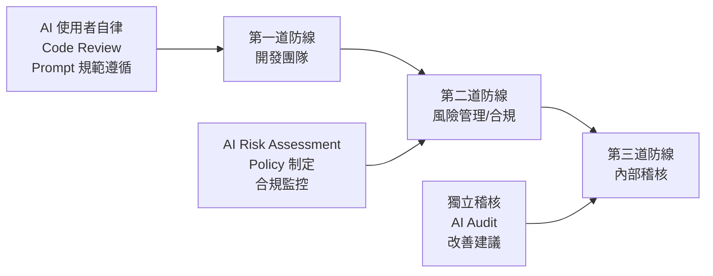

### 第一道防線：開發團隊（業務單位）

- **職責**：日常 AI 使用遵循規範
- **控制措施**：
  - 遵循 Prompt 使用 SOP
  - 執行 AI 產出 Code Review
  - 不輸入敏感資料至 AI 工具
  - 記錄 AI 使用日誌

### 第二道防線：風險管理 / 合規部門

- **職責**：制定政策、監控風險
- **控制措施**：
  - 制定 AI 使用政策與規範
  - 執行 AI 風險評估
  - 監控 AI 使用合規狀態
  - 管理第三方 AI 供應商

### 第三道防線：內部稽核

- **職責**：獨立驗證治理有效性
- **控制措施**：
  - 定期稽核 AI 使用紀錄
  - 驗證控制措施有效性
  - 出具稽核報告與改善建議
  - 向董事會/管理層報告

---

## 1.3 AI 風險分類

### EU AI Act 風險分級對照（Regulation 2024/1689）

EU AI Act 已於 2024 年 8 月 1 日正式生效，建立全球首個全面性 AI 監管框架。歐盟委員會已於 2025 年 2 月同步發布《禁止 AI 實踐指南》與《AI 系統定義指南》，協助利害關係人理解法規範圍。以下為其風險分級制度與企業對照：

| 風險等級 | EU AI Act 定義 | 企業使用場景範例 | 生效時間 | 治理要求 |
|----------|---------------|-----------------|----------|----------|
| **不可接受風險** | 八大禁止實踐：(1)有害的 AI 操控與欺騙行為 (2)利用弱勢群體之 AI (3)社會評分系統 (4)個人犯罪風險預測 (5)無差別抓取網路/CCTV 影像建置人臉辨識資料庫 (6)工作場所及教育機構之情緒辨識 (7)利用生物辨識推斷特定受保護特徵 (8)公共場所即時遠端生物辨識（執法用途） | 不適用（禁止使用） | **2025 年 2 月已生效** | 完全禁止，違反者最高可處全球營業額 7% 或 3,500 萬歐元罰款 |
| **高風險** | 涉及健康、安全或基本權利之 AI 系統（含關鍵基礎設施、教育、就業、信用評分、司法、移民等領域） | 信用評分系統、KYC 自動化、交易監控、HR 自動篩選、自動核保 | 2026 年 8 月（部分延至 2027 年 8 月） | 需合格評鑑（Conformity Assessment）、基本權利影響評估（FRIA）、持續監控、完整技術文件、品質管理系統、嚴重事件通報 |
| **有限風險（透明度風險）** | 與人互動之 AI 系統、生成內容之 AI 系統 | 客服聊天機器人、Deepfake 產生器、AI 生成文字/圖像/影音 | 2026 年 8 月 | 透明度義務：告知使用者正在與 AI 互動；AI 生成內容需可辨識標記；深偽內容需明確標示 |
| **最低風險** | 大多數 AI 應用 | AI 輔助開發、垃圾郵件過濾、推薦系統 | 無強制要求 | 建議遵循自願性行為準則（AI Pact） |
| **通用目的 AI（GPAI）** | 基礎模型與通用 AI 系統 | GPT、Claude、Gemini 等 LLM | **2025 年 8 月已適用** | 透明度義務（含訓練資料著作權政策揭露）；具系統性風險者（如 >$10^{25}$ FLOPs）需額外進行模型評估、對抗性測試、系統性風險緩解措施、嚴重事件追蹤通報。GPAI Code of Practice 第三版草案已於 2025 年 3 月公布 |

> **企業行動建議**：即使營運範圍不在歐盟，EU AI Act 具域外效力（Article 2(1)），若 AI 系統之輸出在歐盟境內使用，仍可能受規範。建議企業及早進行差距分析，尤其是使用 LLM 之場景需關注 GPAI 合規要求。

### 企業內部 AI 風險分級

結合 EU AI Act 與金管會指引，建立企業三級風險分類：

| 風險等級 | 定義 | 使用場景範例 | 治理要求 |
|----------|------|-------------|----------|
| **高風險** | 涉及客戶權益、交易決策、個資處理、自動化決策 | 信用評分系統、KYC 自動化、交易監控、自動核保 | 需經 AI 委員會審核、完整風險評估（含 PIA）、持續監控、模型可解釋性報告 |
| **中風險** | 涉及內部系統核心邏輯、營運關鍵流程 | Web App 核心業務邏輯、API 開發、DB 操作、內部報表自動化 | 需經主管審核、Code Review 強化、安全掃描、AI 使用紀錄 |
| **低風險** | 輔助性、非核心功能、不涉及敏感資料 | 文件產生、測試程式碼、Prototype、Refactoring、程式碼補全 | 遵循基本規範、自我驗證、登錄使用紀錄 |

### 風險分類決策樹

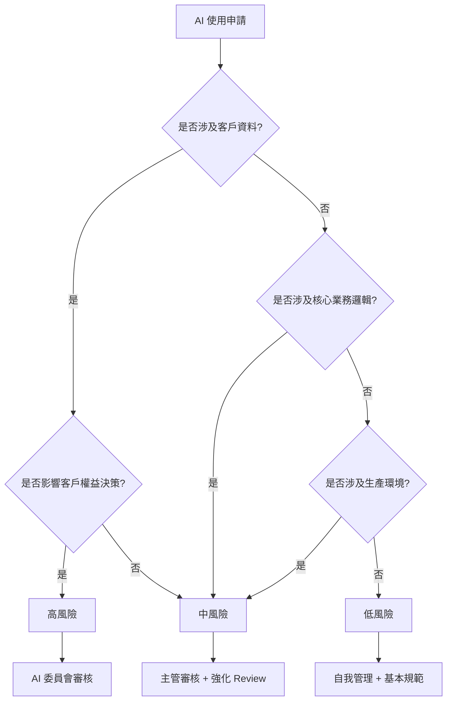

---

## 1.4 與 IT Governance / Data Governance 關聯

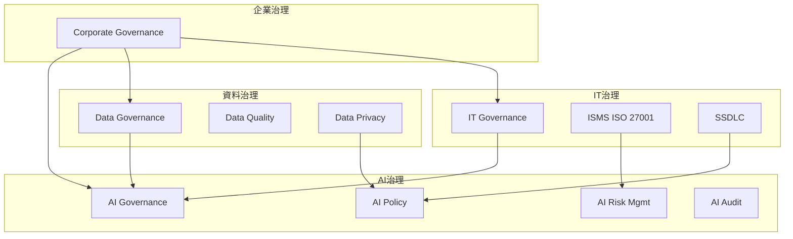

**關鍵整合點**：

| 治理領域 | 與 AI 治理的關聯 | 整合方式 |
|----------|-----------------|----------|
| IT Governance | AI 工具屬 IT 資產 | AI 工具納入 IT 資產管理、變更管理 |
| Data Governance | AI 使用涉及資料處理 | 資料分級套用至 AI 輸入限制 |
| ISMS | AI 引入新安全風險 | AI 風險納入 ISMS 風險評估 |
| SSDLC | AI 改變開發流程 | AI 治理嵌入各 SSDLC 階段 |
| 個資保護 | AI 處理可能涉及個資 | 隱私影響評估（PIA）整合至 AI 風險評估 |
| 法規遵循 | AI 基本法與金管會指引 | 合規監控納入 AI 稽核範圍 |

### 與國際標準對齊

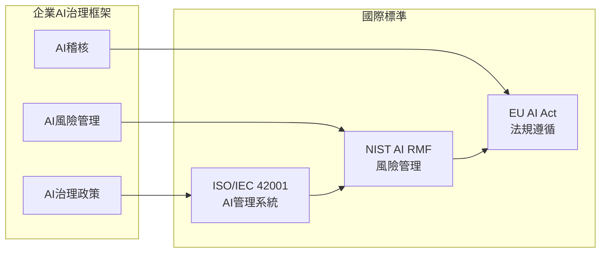

**NIST AI RMF 1.0 四大核心功能對應**：

| NIST 功能 | 說明 | 企業對應機制 |
|-----------|------|-------------|
| Govern（治理） | 建立 AI 風險管理文化與架構，含組織政策、角色分工 | AI 治理委員會 + 政策制定（第 1、4 章） |
| Map（對應） | 識別 AI 系統脈絡、利害關係人與風險來源 | AI 風險分類 + 利害關係人分析（第 1.3、7 章） |
| Measure（量測） | 運用定性與定量方法評估 AI 風險，建立指標體系 | KPI/KRI + 風險評估（第 6.3、9.1 章） |
| Manage（管理） | 依優先順序實施風險處置措施，含監控與回應 | 控制措施 + 事件管理（第 5、7 章） |

**NIST AI 600-1 生成式 AI 風險概覽（2024 年 7 月發布）**：

針對生成式 AI 獨有的 12 類風險進行分類，與本手冊第 10 章對應：

| 風險編號 | 風險類型 | 說明 | 本手冊對應 |
|----------|----------|------|-----------|
| GAI-1 | CBRN 資訊 | 生成化學/生物/放射/核子武器相關知識 | 10.1 |
| GAI-2 | 假訊息（Confabulation） | 生成看似可信但不正確的內容 | 10.1（Hallucination） |
| GAI-3 | 資料隱私 | 訓練資料中個資洩漏風險 | 10.1, 10.2 |
| GAI-4 | 環境影響 | 大量運算資源消耗 | 10.1 |
| GAI-5 | 智慧財產權 | 著作權與訓練資料權利爭議 | 10.1 |
| GAI-6 | 有害偏見（Bias） | 模型輸出中的系統性偏見 | 10.1, 10.4 |
| GAI-7 | 人機互動 | 過度擬人化與過度依賴風險 | 10.1 |
| GAI-8 | 資訊完整性 | 深偽與合成媒體之濫用 | 10.1 |
| GAI-9 | 資訊安全 | 對抗性攻擊與模型安全 | 10.1, 10.2 |
| GAI-10 | 模型透明度 | 黑箱模型之可解釋性不足 | 10.1, 10.4 |
| GAI-11 | 有害內容 | 生成暴力、仇恨等有害內容 | 10.1, 10.2 |
| GAI-12 | 第三方風險 | 供應鏈中第三方模型與套件之風險 | 10.1, 4.5 |

---

### 📋 實務案例

> **案例**：某金融機構開發團隊使用 GitHub Copilot 撰寫交易系統 API，未經審核直接將 AI 產出的程式碼提交，導致 SQL Injection 漏洞進入生產環境。
>
> **教訓**：
> 1. AI 產出程式碼必須經過與人工撰寫相同等級的 Code Review
> 2. 涉及交易系統屬「高風險」，需額外安全掃描
> 3. 需建立 AI 使用追溯機制，事後可追查問題來源

---

# 2. AI 在 SSDLC 各階段治理

## 2.0 SSDLC 全景圖

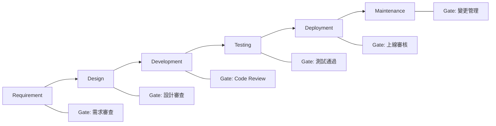

每個階段的 AI 治理遵循統一框架：

```
┌─────────────────────────────────────────┐
│  AI 使用方式 → 風險識別 → 控制措施     │
│  → 審核點（Gate）→ 產出文件（Artifact） │
└─────────────────────────────────────────┘
```

---

## 2.1 Requirement（需求階段）

### AI 使用方式

| 用途 | AI 工具 | 範例 |
|------|---------|------|
| 需求分析 | Copilot Chat / Claude | 分析既有需求文件，找出矛盾點 |
| User Story 產生 | Claude Code / Gemini | 從 PRD 自動產出 User Story |
| 逆向工程需求萃取 | Claude Code | 從舊系統程式碼萃取業務邏輯 |
| 規格書撰寫 | Copilot / Claude | 產出 API 規格、DB Schema |

### 風險

- AI 可能產出不完整或錯誤的需求（Hallucination）
- 輸入舊系統程式碼可能包含敏感業務邏輯
- AI 產出可能缺乏產業特定知識（如金融法規）

### 控制措施

1. **需求驗證**：AI 產出的需求必須由 BA/SA 逐項驗證
2. **輸入過濾**：禁止將含客戶資料的文件直接餵入 AI
3. **交叉比對**：AI 產出需與原始需求文件交叉比對
4. **領域知識補充**：AI 產出需經具備金融領域知識的人員審核

### 審核點（Gate）

- [ ] AI 產出需求已經 BA/SA 逐項確認
- [ ] 未輸入敏感資料至 AI 工具
- [ ] 需求文件標註 AI 輔助產出部分
- [ ] 通過需求審查會議

### 產出文件

| 文件 | 說明 |
|------|------|
| AI 使用紀錄表 | 記錄使用的 AI 工具、Prompt、產出 |
| 需求規格書 | 標註 AI 輔助產出段落 |
| 風險評估表 | 該需求的 AI 風險等級 |

---

## 2.2 Design（設計階段）

### AI 使用方式

| 用途 | AI 工具 | 範例 |
|------|---------|------|
| 架構設計建議 | Claude Code / Gemini | 產出微服務拆分建議 |
| DB Schema 設計 | Copilot / Claude | 產出 ERD、DDL |
| API 設計 | Copilot | 產出 OpenAPI Spec |
| 設計模式建議 | Claude / Gemini | 推薦適用的 Design Pattern |

### 風險

- AI 可能建議不適合的架構（如過度設計）
- 產出的 Schema 可能有效能問題
- 架構建議可能不符合企業標準

### 控制措施

1. **架構審查**：AI 產出的架構設計需經 SA 審查
2. **標準對照**：與企業架構標準（Clean Architecture）對照
3. **效能考量**：DB Schema 需經 DBA 審核
4. **安全設計**：安全設計需經資安人員確認

### 審核點（Gate）

- [ ] 架構設計通過 SA 審查
- [ ] DB Schema 通過 DBA 審核
- [ ] 安全設計通過資安審查
- [ ] 設計文件標註 AI 輔助產出部分

### 產出文件

| 文件 | 說明 |
|------|------|
| 架構設計書 | 含 AI 建議與人工調整紀錄 |
| API 規格書 | OpenAPI Spec |
| DB 設計書 | ERD + DDL |
| 設計決策紀錄（ADR） | 記錄為何採用/不採用 AI 建議 |

---

## 2.3 Development（開發階段）— AI Coding

### AI 使用方式

| 用途 | AI 工具 | 範例 |
|------|---------|------|
| 程式碼產生 | Copilot / Claude Code | 依據設計產出 Service/Controller |
| 程式碼補全 | Copilot | 即時程式碼建議 |
| Refactoring | Claude Code / Codex | 舊系統程式碼重構 |
| 文件產生 | Copilot / Claude | JavaDoc、README |
| Bug Fix | Claude Code / Gemini | 分析錯誤並建議修正 |

### 風險

| 風險類型 | 說明 | 嚴重度 |
|----------|------|--------|
| 安全漏洞 | AI 產出含 SQL Injection、XSS 等 | 高 |
| 授權問題 | AI 產出可能含開源授權衝突程式碼 | 中 |
| 品質問題 | 不符合企業 Coding Standard | 中 |
| 資料外洩 | 將敏感資料作為 Prompt 輸入 | 高 |
| Hallucination | 使用不存在的 API/Library | 低 |

### 控制措施

1. **Prompt 規範**：
   ```
   ✅ 允許：描述功能需求、提供介面定義
   ❌ 禁止：輸入客戶資料、密碼、API Key、營業秘密
   ```

2. **Code Review 強化**：
   - AI 產出程式碼標記為 `[AI-Generated]`
   - 需至少一位資深工程師 Review
   - 高風險模組需兩位 Reviewer

3. **自動化檢查**：
   ```yaml
   # CI Pipeline AI Code Check
   stages:
     - ai-code-scan:
         - SAST (SonarQube)
         - Dependency Check (OWASP)
         - License Check
         - Code Style (Checkstyle)
   ```

4. **安全掃描**：所有 AI 產出必須通過 SAST/DAST

### 審核點（Gate）

- [ ] AI 產出程式碼通過 Code Review
- [ ] SAST 掃描無高/嚴重漏洞
- [ ] 通過單元測試（覆蓋率 ≥ 80%）
- [ ] 通過 Coding Standard 檢查
- [ ] License 合規檢查通過
- [ ] AI 使用紀錄已登錄

### 產出文件

| 文件 | 說明 |
|------|------|
| AI 使用日誌 | 記錄 Prompt 與產出摘要 |
| Code Review 紀錄 | 含 AI 產出標記 |
| SAST 報告 | 安全掃描結果 |
| 測試報告 | 單元測試結果 |

---

## 2.4 Testing（測試階段）

### AI 使用方式

| 用途 | AI 工具 | 範例 |
|------|---------|------|
| 測試案例產生 | Copilot / Claude | 自動產生 JUnit 測試 |
| 測試資料產生 | Claude / Gemini | 產生 Mock Data |
| 測試腳本 | Copilot | 產出 Integration Test |
| Bug 分析 | Claude Code | 分析 Failure 原因 |

### 風險

- AI 產出的測試可能覆蓋不足（只測 Happy Path）
- 測試資料可能不夠邊界值
- AI 可能產出與實作耦合的測試（形同虛設）

### 控制措施

1. **測試覆蓋率要求**：
   - 單元測試：≥ 80%
   - 分支覆蓋率：≥ 70%
   - AI 產出測試需人工補充邊界案例

2. **測試品質審查**：
   - 測試是否真正驗證業務邏輯
   - 是否包含負面測試
   - 是否包含邊界值測試

3. **測試資料管控**：
   - 禁止使用真實客戶資料
   - AI 產出測試資料需脫敏

### 審核點（Gate）

- [ ] 測試覆蓋率達標
- [ ] 含負面測試與邊界值測試
- [ ] 測試資料不含敏感資料
- [ ] Integration Test 通過
- [ ] Performance Test 通過（如適用）

### 產出文件

| 文件 | 說明 |
|------|------|
| 測試計畫書 | 含 AI 輔助測試策略 |
| 測試報告 | 含覆蓋率與結果 |
| 測試案例清單 | 標註 AI 產出 vs 人工產出 |

---

## 2.5 Deployment（部署階段）

### AI 使用方式

| 用途 | AI 工具 | 範例 |
|------|---------|------|
| CI/CD Pipeline | Copilot / Claude | 產出 GitHub Actions yaml |
| 部署腳本 | Claude Code | 產出 Kubernetes manifest |
| 環境設定 | Copilot | 產出 Dockerfile |
| 回滾策略 | Claude | 設計回滾 SOP |

### 風險

- AI 產出的部署設定可能有安全配置缺失
- 容器設定可能暴露不必要的 port
- 權限設定可能過於寬鬆

### 控制措施

1. **部署設定審查**：AI 產出的部署設定需經 DevOps 審查
2. **安全基線**：對照企業安全基線檢查
3. **最小權限**：確認遵循最小權限原則
4. **環境隔離**：禁止 AI 直接存取生產環境設定

### 審核點（Gate）

- [ ] 部署設定通過 DevOps 審查
- [ ] 安全基線檢查通過
- [ ] Staging 環境驗證通過
- [ ] 回滾計畫已備妥

---

## 2.6 Maintenance（維護階段）

### AI 使用方式

| 用途 | AI 工具 | 範例 |
|------|---------|------|
| 事件分析 | Claude / Gemini | 分析 Log 找出 Root Cause |
| Hotfix | Copilot / Claude Code | 快速修復生產問題 |
| 版本升級 | Claude Code | Framework 升級輔助 |
| 技術債清理 | Claude Code / Codex | Refactoring 建議 |

### 風險

- 緊急修復時可能跳過審查流程
- AI 修復可能引入新問題
- 版本升級建議可能不完整

### 控制措施

1. **緊急變更流程**：即使使用 AI 快速修復，仍需事後補審
2. **影響分析**：AI 修改需評估影響範圍
3. **回歸測試**：所有 AI 修改需通過回歸測試

### 審核點（Gate）

- [ ] Hotfix 通過 Code Review（可事後補審）
- [ ] 回歸測試通過
- [ ] 變更紀錄已登錄
- [ ] 影響分析已完成

---

### 📋 實務案例

> **案例**：開發團隊使用 Claude Code 進行 Spring Boot 2 → 3 升級，AI 建議的 Migration 步驟遺漏了 javax → jakarta namespace 變更中的某些 edge case，導致部分模組在 Staging 環境啟動失敗。
>
> **教訓**：
> 1. Framework 升級屬「中風險」，需 SA 審核 AI 建議的完整性
> 2. 需建立升級 Checklist，不可完全依賴 AI
> 3. 需在 Staging 完整驗證後才進入 Production

---

# 3. AI Coding 工具治理

## 3.1 工具對照與管理

### 主流 AI 開發工具比較（2025 年更新）

| 工具 | 供應商 | 底層模型 | 資料傳輸 | 模型位置 | 企業管控能力 | 備註 |
|------|--------|----------|----------|----------|-------------|------|
| GitHub Copilot | Microsoft/GitHub | GPT-4o / Claude 3.5 | 傳至雲端（可設 No Retention） | 雲端 | 高（Enterprise 版可管控） | 支援 Agent Mode |
| GitHub Copilot Workspace | Microsoft/GitHub | GPT-4o | 傳至雲端 | 雲端 | 高 | 多檔案協作 |
| Claude Code | Anthropic | Claude 4 / Sonnet 4 | 傳至雲端 | 雲端 | 中（API 級別管控） | CLI 工具，支援 Agent |
| Cursor | Anysphere | GPT-4o / Claude 4 | 傳至雲端 | 雲端 | 中 | IDE 整合式 |
| Amazon Q Developer | AWS | 自研模型 | AWS 區域 | 雲端（可選區域） | 高（AWS IAM 整合） | 符合 AWS 合規 |
| Google Gemini Code Assist | Google | Gemini 2.5 | 傳至 GCP | 雲端 | 中（GCP IAM） | 多模態 |
| Windsurf | Codeium | 自研模型 | 傳至雲端 | 雲端 | 中 | 強調隱私 |

### 工具選用原則

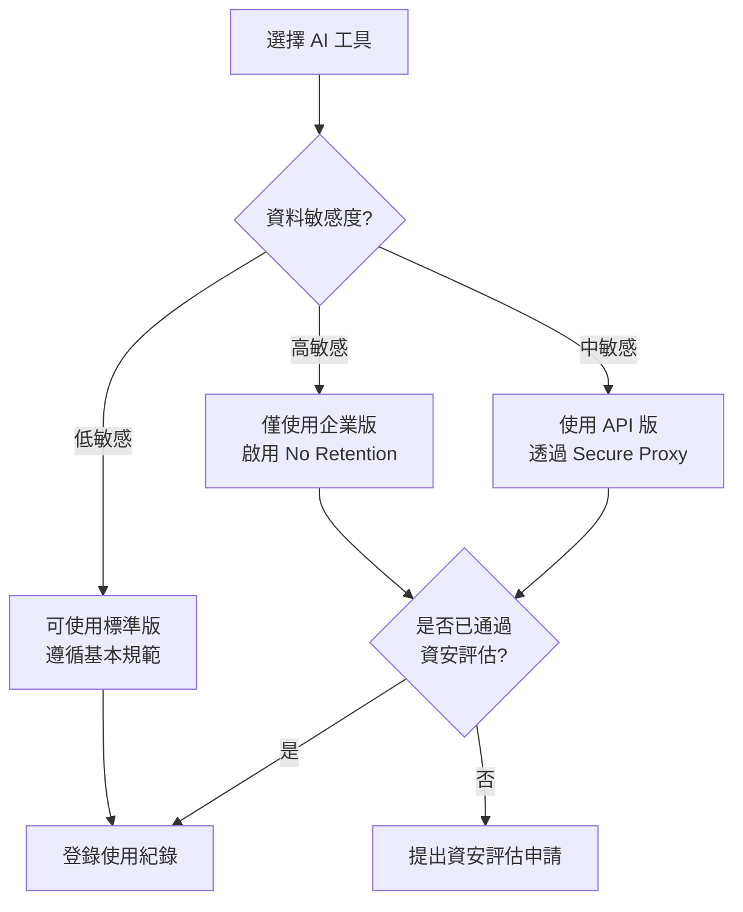

---

## 3.2 Prompt 管理（Prompt Governance）

### Prompt 分級

| 等級 | 說明 | 範例 | 管理方式 |
|------|------|------|----------|
| Level 1 | 通用 Prompt | 「請解釋這段程式碼」 | 無限制 |
| Level 2 | 含業務描述 | 「請產出訂單查詢 API」 | 不含敏感細節 |
| Level 3 | 含架構資訊 | 「我們的 DB Schema 如下...」 | 需脫敏處理 |
| Level 4 | 含敏感資料 | 含客戶資料、密碼 | **禁止** |

### Prompt 使用規範

```markdown
## ✅ 允許的 Prompt 內容

- 功能需求描述（不含客戶資料）
- 公開的技術規格（如 OpenAPI Spec）
- 通用的設計模式討論
- 開源框架使用問題
- 程式碼結構與邏輯問題

## ❌ 禁止的 Prompt 內容

- 客戶姓名、身分證字號、帳號
- 資料庫連線字串、密碼、API Key
- 內部 IP 位址、網路架構圖
- 未公開的營業秘密或商業策略
- 客戶交易資料（即使已部分遮蔽）
- 內部稽核報告或法遵文件
```

### Prompt Template 管理

建立公司內部 Prompt Registry，統一管理常用 Prompt：

```yaml
# prompt-registry/code-generation/spring-boot-controller.yaml
name: "Spring Boot Controller 產生"
version: "1.0"
risk_level: "Level 2"
template: |
  請產出一個 Spring Boot REST Controller：
  - 資源名稱：{resource_name}
  - 操作：{operations}  # CRUD
  - 驗證：使用 Jakarta Validation
  - 錯誤處理：使用統一例外處理
  - 回傳格式：統一 Response 格式
  
  注意事項：
  - 不使用 Lombok
  - 遵循 Clean Architecture
  - 加入適當的 Log
  
prohibited_inputs:
  - 客戶資料
  - 連線資訊
  - API Key
```

---

## 3.3 輸出驗證（Output Validation）

### 驗證流程

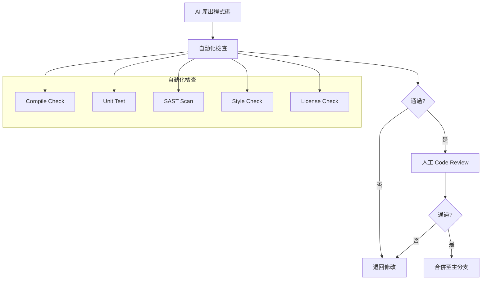

### 驗證項目清單

| 驗證類型 | 工具 | 標準 |
|----------|------|------|
| 編譯檢查 | Maven/Gradle | 零錯誤 |
| 單元測試 | JUnit 5 | 覆蓋率 ≥ 80% |
| 靜態分析 | SonarQube | 無 Critical/Blocker |
| 安全掃描 | SonarQube SAST | 無高風險漏洞 |
| 相依性檢查 | OWASP Dependency Check | 無已知 CVE |
| 程式碼風格 | Checkstyle/SpotBugs | 符合企業標準 |
| 授權檢查 | License Plugin | 無 GPL 衝突 |

### AI 產出標記機制

在 Git commit 中標記 AI 輔助：

```bash
# Commit Message 格式
git commit -m "[AI-Assisted] feat: 新增訂單查詢 API

Tool: GitHub Copilot
Prompt: 產生訂單查詢 REST API（遵循 Clean Architecture）
Review: @senior-dev-001
Risk-Level: Medium"
```

---

## 3.4 Code Review 政策

### AI 產出 Code Review 要求

| 風險等級 | Reviewer 數量 | Reviewer 資格 | 額外要求 |
|----------|--------------|--------------|----------|
| 高風險 | 2 人 | 至少 1 位 SA/資深 | + 資安審查 |
| 中風險 | 1 人 | 資深工程師以上 | + SAST 掃描 |
| 低風險 | 1 人 | 一般工程師以上 | 標準流程 |

### Code Review Checklist（AI 產出專用）

```markdown
## AI Code Review 檢查項目

### 安全性
- [ ] 無 SQL Injection 風險（使用 Parameterized Query）
- [ ] 無 XSS 風險（適當 Escape）
- [ ] 無硬編碼密碼/Token
- [ ] 輸入驗證完整
- [ ] 適當的權限檢查

### 正確性
- [ ] 業務邏輯正確（對照需求文件）
- [ ] 邊界條件處理
- [ ] 例外處理適當
- [ ] 無 AI Hallucination（使用不存在的 API）

### 品質
- [ ] 符合 Clean Architecture 分層
- [ ] 命名規範遵循
- [ ] 無重複程式碼
- [ ] 適當的日誌記錄
- [ ] 效能考量（N+1 Query 等）

### 合規
- [ ] 無敏感資料殘留
- [ ] 無授權衝突的程式碼片段
- [ ] AI 使用紀錄已登錄
```

---

## 3.5 禁止事項

### 絕對禁止清單

| 項目 | 說明 | 違反處理 |
|------|------|----------|
| 輸入客戶個資 | 姓名、身分證、帳號等 | 立即通報資安事件 |
| 輸入認證資訊 | 密碼、API Key、Token | 立即更換認證資訊 |
| 輸入未公開財務數據 | 營收、利潤等 | 通報合規部門 |
| 將 AI 產出直接部署 | 未經 Review 直接上線 | 回滾 + 補審 |
| 使用未核准的 AI 工具 | Shadow AI | 違規警告 |
| 關閉安全掃描 | 跳過 SAST/DAST | 無法合併 |

### 情境判斷指引

```
Q: 可以把資料庫 Schema（不含資料）給 AI 嗎？
A: ✅ 可以，但需移除：
   - 註解中的業務說明（如涉及營業秘密）
   - 欄位名稱若直接暴露敏感資訊需重命名
   
Q: 可以把 Error Log 給 AI 分析嗎？
A: ⚠️ 有條件：
   - 移除所有 IP 位址
   - 移除所有使用者資訊
   - 移除 Token/Session ID
   
Q: 可以讓 AI 存取 git repo 嗎？
A: ⚠️ 有條件：
   - 僅限該專案程式碼
   - 確認 repo 無 secrets（已有 .gitignore）
   - 使用企業版工具（有 data retention policy）
```

---

## 3.6 AI Hallucination 控制

### 常見 Hallucination 類型

| 類型 | 範例 | 檢測方法 |
|------|------|----------|
| 不存在的 API | 呼叫 `String.isBlank()` 在 Java 8 | 編譯檢查 |
| 不存在的 Library | import 不存在的套件 | Dependency Resolution |
| 錯誤的業務邏輯 | 計算公式錯誤 | 單元測試 + 人工審查 |
| 過時的用法 | 使用已 Deprecated 的 API | IDE 警告 + SonarQube |
| 虛構的設定 | 不存在的 Config Property | 啟動測試 |

### 防控措施

1. **編譯即驗證**：所有 AI 產出必須通過編譯
2. **測試即驗證**：必須有對應的單元測試
3. **IDE 輔助**：利用 IDE 的即時錯誤提示
4. **Reference Check**：核對 AI 提及的 API/Library 是否存在
5. **版本鎖定**：在 Prompt 中明確指定技術版本

```yaml
# 在 Prompt 中明確指定版本，減少 Hallucination
prompt_template: |
  技術約束：
  - Java 21
  - Spring Boot 3.2.x
  - Jakarta EE 10
  - JUnit 5.10
  - Maven 3.9
  
  請勿使用：
  - javax.* (已遷移至 jakarta.*)
  - Spring WebMVC 舊版 API
  - 未在 pom.xml 中宣告的相依套件
```

---

### 📋 實務案例

> **案例**：開發者使用 Copilot 產出 Spring Security 設定，AI 使用了 `WebSecurityConfigurerAdapter`（已在 Spring Security 5.7 廢棄），導致升級後編譯錯誤。
>
> **控制措施**：
> 1. 在 Custom Instructions 中明確標註使用版本
> 2. CI Pipeline 加入 Deprecated API 檢查
> 3. 建立企業 Prompt Template 包含版本約束

---

# 4. 公司 AI 治理章程（Policy）

## 4.1 AI 使用政策

### 政策名稱：AI 工具使用管理辦法

**發布單位**：資訊安全管理委員會  
**適用範圍**：全公司資訊系統開發人員  
**生效日期**：____年____月____日

---

#### 第一條　目的

為規範本公司人員使用人工智慧（AI）工具進行軟體開發，確保資訊安全、個人資料保護及法規遵循，依據台灣《人工智慧基本法》、金管會「金融業運用 AI 核心原則」、《個人資料保護法》及《資通安全管理法》等法規，特訂定本辦法。

#### 第二條　適用範圍

本辦法適用於本公司所有使用 AI 工具進行軟體開發、維護、測試之人員，包含正式員工、約聘人員及外包廠商。

#### 第三條　核准工具

本公司核准使用之 AI 開發工具如下：

| 工具名稱 | 版本/方案 | 管理單位 | 使用條件 |
|----------|----------|----------|----------|
| GitHub Copilot | Enterprise | IT 部門 | 需完成教育訓練 |
| Claude Code | API (via Proxy) | AI 治理小組 | 需透過 Secure Proxy |
| Cursor | Business (via Proxy) | AI 治理小組 | 需透過 Secure Proxy |
| Amazon Q Developer | Pro | IT 部門 | 需完成教育訓練 |
| Google Gemini Code Assist | Enterprise (via Proxy) | AI 治理小組 | 需透過 Secure Proxy |

未經核准之 AI 工具一律禁止使用（Shadow AI 禁令）。

#### 第四條　使用原則

1. **人類負責原則**：AI 產出之所有程式碼，由提交者負完全責任
2. **最小輸入原則**：僅提供完成任務所必要之最少資訊給 AI
3. **驗證原則**：所有 AI 產出必須經過驗證方可使用
4. **紀錄原則**：AI 使用行為須留存紀錄供稽核

#### 第五條　禁止事項

嚴禁下列行為：
1. 將客戶個人資料輸入任何 AI 工具
2. 將系統密碼、API Key、憑證輸入 AI 工具
3. 將未公開之財務資料、營業秘密輸入 AI 工具
4. 未經 Code Review 直接將 AI 產出部署至生產環境
5. 使用未經核准之 AI 工具
6. 關閉或繞過 AI 安全管控機制

#### 第六條　教育訓練

所有使用 AI 工具之人員，須於使用前完成以下訓練：
1. AI 治理政策說明（2 小時）
2. AI 工具安全使用實務（4 小時）
3. Prompt Engineering 基礎（2 小時）
4. 年度複訓（2 小時/年）

#### 第七條　違規處理

| 違規等級 | 行為範例 | 處理方式 |
|----------|----------|----------|
| 重大 | 洩漏客戶個資至 AI | 停權 + 資安事件通報 + 懲處 |
| 中度 | 使用未核准工具 | 警告 + 補訓 |
| 輕微 | 未登錄使用紀錄 | 提醒 + 補登 |

#### 第八條　修訂

本辦法由 AI 治理委員會每年至少檢討一次，必要時隨時修訂。

---

## 4.2 AI 開發規範

### 規範名稱：AI 輔助軟體開發作業規範

#### 一、程式碼品質要求

AI 產出之程式碼須符合以下標準：

```yaml
quality_gates:
  compilation: "zero_errors"
  unit_test_coverage: ">= 80%"
  branch_coverage: ">= 70%"
  sonarqube_quality_gate: "passed"
  security_vulnerabilities: "zero_critical_high"
  code_smells: "< 5 per class"
  duplicated_lines: "< 3%"
```

#### 二、版本控制要求

```bash
# AI 產出程式碼的 Commit 規範
# Format: [AI-Assisted] <type>: <subject>
# 
# Types: feat, fix, refactor, test, docs
# 
# Body 須包含：
# - Tool: 使用的 AI 工具
# - Risk-Level: High/Medium/Low
# - Verified-By: reviewer ID

# 範例：
git commit -m "[AI-Assisted] feat: 新增客戶查詢 Service

Tool: Claude Code
Risk-Level: Medium
Verified-By: @senior-dev-001
Prompt-ID: PR-2024-0042"
```

#### 三、分支策略

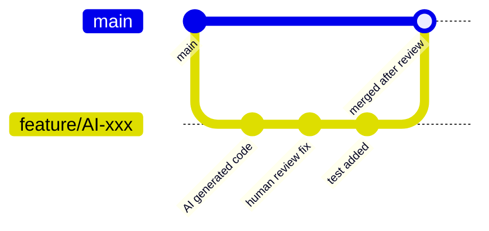

- AI 產出程式碼須在 feature branch 開發
- 禁止直接 push 至 main/develop branch
- PR 須標記 `ai-assisted` label

#### 四、文件要求

AI 產出的程式碼需附帶：
1. 對應的單元測試
2. 必要的 JavaDoc
3. 更新相關設計文件（如有變更）

---

## 4.3 資料使用規範

### 資料分級與 AI 使用限制

| 資料等級 | 定義 | AI 使用限制 |
|----------|------|-------------|
| 機密 | 客戶個資、交易資料、認證資訊 | **完全禁止** 輸入 AI |
| 內部 | 系統架構、業務邏輯、DB Schema | **脫敏後** 可使用 |
| 一般 | 公開技術文件、通用設計模式 | 可直接使用 |

### 脫敏處理規則

```java
// 脫敏處理範例 - 將真實資料替換為虛擬資料後再給 AI

// ❌ 禁止：直接將含敏感資料的程式碼給 AI
String sql = "SELECT * FROM CUSTOMER WHERE ID = 'A123456789'";

// ✅ 正確：脫敏後提供
String sql = "SELECT * FROM {TABLE} WHERE ID = :id";
// 然後描述：「請幫我優化這個查詢，TABLE 是客戶表，ID 是主鍵」
```

---

## 4.4 模型使用規範

### 模型選用原則

| 場景 | 建議模型 | 理由 |
|------|----------|------|
| 程式碼補全 | GitHub Copilot | IDE 整合度高、延遲低 |
| 複雜邏輯產生 | Claude Code | 推理能力強、上下文長 |
| 快速原型 | Gemini / Codex | 多模態、速度快 |
| Code Review | Claude / Gemini | 分析能力強 |

### 模型版本管理

- 新模型版本上線前需經 AI 治理小組評估
- 評估項目：準確度、安全性、合規性、成本
- 重大版本升級需進行 Pilot 測試

---

## 4.5 第三方 AI 管理

### 供應商評估清單

| 評估項目 | 說明 | 最低要求 |
|----------|------|----------|
| 資料處理政策 | 是否保留使用者輸入 | No Retention 或可設定 |
| 合規認證 | SOC2、ISO 27001 等 | 至少一項 |
| 資料落地區域 | 資料存放位置 | 符合法規要求 |
| SLA | 服務水準保證 | 99.9% |
| 事件通報 | 安全事件通知機制 | 24 小時內通報 |
| 退場機制 | 合約終止後資料處理 | 確認刪除 |

### 供應商定期覆審

- 頻率：每年至少一次
- 觸發條件：供應商重大變更、安全事件、法規變動
- 負責單位：AI 治理小組 + 採購部門

---

# 5. 標準作業程序（SOP）

## 5.1 AI 開發流程 SOP

### SOP 編號：AI-SOP-001

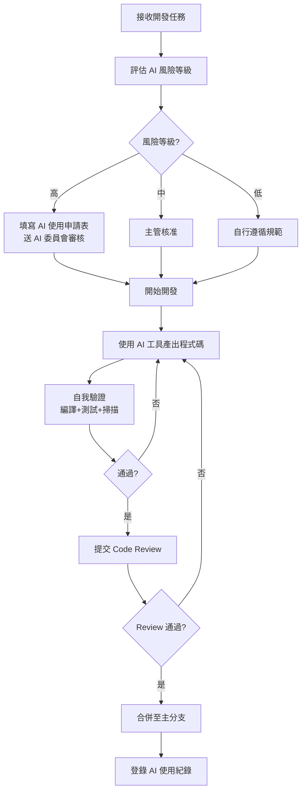

### 作業步驟

| 步驟 | 作業內容 | 負責人 | 產出 |
|------|----------|--------|------|
| 1 | 評估任務 AI 風險等級 | 開發者 | 風險評估結果 |
| 2 | 取得必要核准（依風險等級） | 開發者/主管 | 核准紀錄 |
| 3 | 選擇適當 AI 工具 | 開發者 | - |
| 4 | 準備 Prompt（遵循規範） | 開發者 | Prompt 紀錄 |
| 5 | AI 產出程式碼 | 開發者 | 原始產出 |
| 6 | 自我驗證（編譯/測試/掃描） | 開發者 | 驗證結果 |
| 7 | 提交 Pull Request | 開發者 | PR |
| 8 | Code Review | Reviewer | Review 紀錄 |
| 9 | 合併與部署 | 開發者 | 合併紀錄 |
| 10 | 登錄 AI 使用紀錄 | 開發者 | AI 使用日誌 |

---

## 5.2 Prompt 使用 SOP

### SOP 編號：AI-SOP-002

#### 步驟一：確認 Prompt 內容安全性

```
檢查清單：
□ 不含客戶個資
□ 不含認證資訊（密碼/Key/Token）
□ 不含未公開財務數據
□ 不含內部網路資訊
□ 敏感欄位已脫敏
```

#### 步驟二：選擇或建立 Prompt

1. 優先查詢 Prompt Registry 是否有適用範本
2. 若無，依據 Prompt Template 結構撰寫
3. 標明技術版本約束

#### 步驟三：執行並記錄

```yaml
# AI 使用紀錄格式
record:
  date: "2026-05-06"
  developer: "員工編號"
  project: "專案名稱"
  tool: "GitHub Copilot"
  prompt_id: "PR-2026-0001"  # 若使用 Registry 範本
  prompt_summary: "產出訂單查詢 Service"  # 摘要，不記錄完整 Prompt
  risk_level: "Medium"
  output_verified: true
  reviewer: "@senior-dev-001"
```

#### 步驟四：驗證 AI 產出

依據「AI 產出驗證 SOP（AI-SOP-004）」執行

---

## 5.3 AI Code Review SOP

### SOP 編號：AI-SOP-003

#### 目的

確保 AI 產出之程式碼符合安全、品質及合規要求。

#### 適用範圍

所有標記為 `[AI-Assisted]` 的 Pull Request。

#### 作業流程

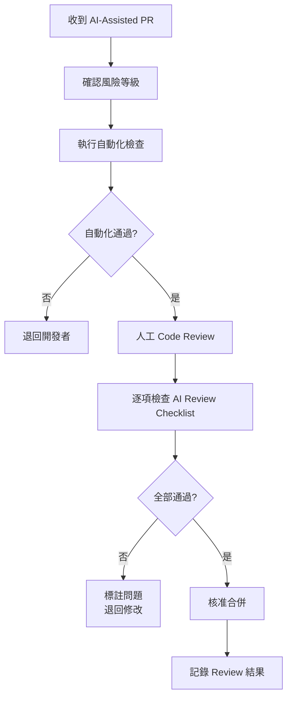

#### Review 重點（AI 產出特有）

1. **Hallucination 檢查**：確認使用的 API/Library 確實存在
2. **安全性檢查**：AI 常忽略的安全問題（如未驗證輸入）
3. **業務正確性**：AI 不理解業務背景的邏輯錯誤
4. **效能問題**：AI 常產出的效能隱患（如 N+1 Query）
5. **風格一致性**：是否符合專案既有風格

---

## 5.4 AI 產出驗證 SOP

### SOP 編號：AI-SOP-004

#### 驗證層次

| 層次 | 驗證方式 | 工具 | 通過標準 |
|------|----------|------|----------|
| L1 | 編譯檢查 | Maven/Gradle | 零錯誤 |
| L2 | 單元測試 | JUnit 5 | 覆蓋率 ≥ 80% |
| L3 | 靜態分析 | SonarQube | Quality Gate Pass |
| L4 | 安全掃描 | OWASP/SonarQube | 無 Critical/High |
| L5 | 整合測試 | TestContainers | 全部通過 |
| L6 | 人工審查 | Code Review | Reviewer 核准 |

#### 驗證指令範例

```bash
# L1: 編譯
mvn compile

# L2: 單元測試 + 覆蓋率
mvn test jacoco:report

# L3: 靜態分析
mvn sonar:sonar

# L4: 安全掃描
mvn org.owasp:dependency-check-maven:check

# L5: 整合測試
mvn verify -P integration-test
```

---

## 5.5 AI 事件通報 SOP

### SOP 編號：AI-SOP-005

#### 事件分類

| 事件類型 | 範例 | 嚴重度 | 通報時限 |
|----------|------|--------|----------|
| 資料外洩 | 敏感資料誤輸入 AI | 緊急 | 立即（1小時內） |
| 安全漏洞 | AI 產出含漏洞已上線 | 高 | 4 小時內 |
| 合規違反 | 使用未核准工具 | 中 | 24 小時內 |
| 品質問題 | AI 產出導致生產異常 | 中 | 24 小時內 |

#### 通報流程

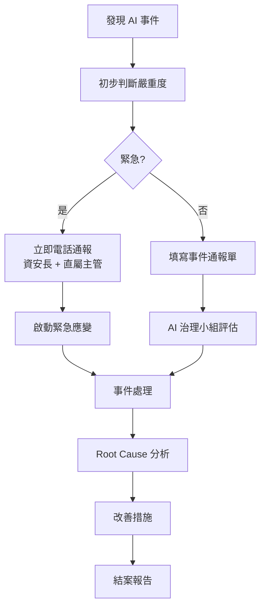

#### 通報單內容

```yaml
incident_report:
  id: "AI-INC-2026-001"
  date: "2026-05-06"
  reporter: "員工編號"
  severity: "高/中/低"
  type: "資料外洩/安全漏洞/合規違反/品質問題"
  description: "事件描述"
  ai_tool: "使用的 AI 工具"
  impact: "影響範圍"
  immediate_action: "已採取的立即措施"
  root_cause: "（事後補填）"
  corrective_action: "（事後補填）"
```

---

# 6. 驗證與稽核機制（Validation & Audit）

## 6.1 AI 產出驗證方法（Test Strategy）

### 測試金字塔（含 AI 考量）

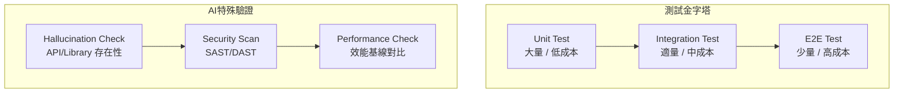

### AI 產出專用測試策略

| 測試類型 | 目的 | AI 產出特殊考量 |
|----------|------|-----------------|
| 單元測試 | 驗證邏輯正確性 | AI 測試可能只測 Happy Path |
| 邊界測試 | 極端值處理 | AI 常忽略 null/empty/超長 |
| 安全測試 | 漏洞檢測 | AI 常忽略 Input Validation |
| 回歸測試 | 確保無破壞 | AI 修改可能影響其他模組 |
| 契約測試 | API 相容性 | AI 可能改變 API 簽章 |

### 驗證自動化 Pipeline

```yaml
# .github/workflows/ai-code-validation.yml
name: AI Code Validation

on:
  pull_request:
    labels: ['ai-assisted']

jobs:
  validate:
    runs-on: ubuntu-latest
    steps:
      - uses: actions/checkout@v4
      
      - name: Compile Check
        run: mvn compile -q
        
      - name: Unit Test + Coverage
        run: mvn test jacoco:report
        
      - name: Coverage Gate
        run: |
          COVERAGE=$(grep -o 'Total[^%]*%' target/site/jacoco/index.html | grep -o '[0-9]*')
          if [ "$COVERAGE" -lt 80 ]; then
            echo "❌ Coverage $COVERAGE% < 80%"
            exit 1
          fi
          
      - name: SonarQube Scan
        run: mvn sonar:sonar
        
      - name: OWASP Dependency Check
        run: mvn org.owasp:dependency-check-maven:check
        
      - name: License Check
        run: mvn license:check
        
      - name: Checkstyle
        run: mvn checkstyle:check
```

---

## 6.2 安全掃描（SAST / DAST）

### SAST（靜態應用安全測試）

| 工具 | 掃描項目 | 整合方式 |
|------|----------|----------|
| SonarQube | SQL Injection, XSS, CSRF 等 | CI Pipeline |
| SpotBugs + FindSecBugs | Java 安全漏洞 | Maven Plugin |
| OWASP Dependency Check | 已知 CVE | Maven Plugin |
| Checkmarx（如有） | 深度安全分析 | CI Pipeline |

### DAST（動態應用安全測試）

| 工具 | 掃描項目 | 執行時機 |
|------|----------|----------|
| OWASP ZAP | Runtime 漏洞 | Staging 部署後 |
| Burp Suite | API 安全 | 上線前 |

### AI 產出常見安全問題

```java
// ❌ AI 常產出的不安全程式碼

// 1. SQL Injection
String query = "SELECT * FROM users WHERE name = '" + name + "'";

// 2. 未驗證輸入
@PostMapping("/api/order")
public Order createOrder(@RequestBody Order order) {
    return orderService.create(order); // 未驗證
}

// 3. 硬編碼 Secret
private static final String API_KEY = "sk-xxxxx";

// 4. 不安全的反序列化
ObjectInputStream ois = new ObjectInputStream(input);
Object obj = ois.readObject(); // 不安全
```

```java
// ✅ 正確的做法

// 1. Parameterized Query
@Query("SELECT u FROM User u WHERE u.name = :name")
User findByName(@Param("name") String name);

// 2. 輸入驗證
@PostMapping("/api/order")
public Order createOrder(@Valid @RequestBody OrderRequest request) {
    return orderService.create(request);
}

// 3. 外部化設定
@Value("${api.key}")
private String apiKey;

// 4. 安全的反序列化
ObjectMapper mapper = new ObjectMapper();
mapper.activateDefaultTyping(/* 限制允許的類別 */);
```

---

## 6.3 AI 風險評估

### 風險評估矩陣

| | 影響低 | 影響中 | 影響高 |
|---|--------|--------|--------|
| **機率高** | 中 | 高 | 極高 |
| **機率中** | 低 | 中 | 高 |
| **機率低** | 極低 | 低 | 中 |

### AI 特定風險評估項目

```yaml
ai_risk_assessment:
  project: "專案名稱"
  date: "2026-05-06"
  assessor: "評估人"
  
  risks:
    - id: "R001"
      category: "資料外洩"
      description: "敏感資料透過 AI API 傳輸"
      likelihood: "中"
      impact: "高"
      risk_level: "高"
      controls:
        - "Secure Proxy 過濾敏感資料"
        - "DLP 工具監控"
        - "教育訓練"
      residual_risk: "低"
      
    - id: "R002"
      category: "程式碼品質"
      description: "AI 產出含安全漏洞"
      likelihood: "高"
      impact: "高"
      risk_level: "極高"
      controls:
        - "SAST/DAST 掃描"
        - "強制 Code Review"
        - "自動化測試"
      residual_risk: "低"
      
    - id: "R003"
      category: "Hallucination"
      description: "AI 使用不存在的 API"
      likelihood: "中"
      impact: "低"
      risk_level: "低"
      controls:
        - "編譯檢查"
        - "IDE 整合"
      residual_risk: "極低"
```

---

## 6.4 稽核流程（Audit Checklist）

### 稽核頻率

| 稽核類型 | 頻率 | 負責單位 |
|----------|------|----------|
| 日常自查 | 每日 | 開發團隊 |
| 專案稽核 | 每季 | AI 治理小組 |
| 全面稽核 | 每年 | 內部稽核 |
| 主管機關檢查 | 依通知 | 合規部門 |

### AI 治理稽核 Checklist

```markdown
## AI 治理稽核檢查表

### A. 政策與規範
- [ ] AI 使用政策已公告且員工知悉
- [ ] AI 開發規範已納入開發流程
- [ ] 禁止事項清單已明確公告
- [ ] 教育訓練紀錄完整
- [ ] 政策已對齊《人工智慧基本法》七大原則
- [ ] 政策已對齊金管會六大核心原則

### B. 工具管理
- [ ] 僅使用核准之 AI 工具
- [ ] AI 工具設定符合安全要求（No Retention 等）
- [ ] Secure Proxy 運作正常
- [ ] API Key 管理符合規範
- [ ] AI 供應商年度覆審已完成

### C. 開發流程
- [ ] AI 產出程式碼均有 Code Review 紀錄
- [ ] AI 使用紀錄完整
- [ ] Commit Message 含 AI 標記
- [ ] SAST/DAST 掃描結果正常
- [ ] AI Agent 使用符合權限分級規範

### D. 風險管理
- [ ] AI 風險評估已執行
- [ ] 高風險專案有額外管控
- [ ] 事件通報機制運作正常
- [ ] 改善措施已落實
- [ ] 生成式 AI 風險已納入評估範圍

### E. 合規
- [ ] 符合《人工智慧基本法》要求
- [ ] 符合金管會 AI 核心原則要求
- [ ] 個資保護措施落實（含 PIA）
- [ ] 資安管理法要求符合
- [ ] 供應商管理紀錄完整
- [ ] EU AI Act 風險分級已對照（如適用）

### F. ISO/IEC 42001 對齊（選項）
- [ ] AI 管理系統範圍已界定（條款 4）
- [ ] 高階管理層承諾與政策已建立（條款 5）
- [ ] AI 風險與機會已識別與評估（條款 6）
- [ ] 支持資源與教育訓練已到位（條款 7）
- [ ] AI 系統營運控制已實施（條款 8）
- [ ] 績效監控與內部稽核已執行（條款 9）
- [ ] 持續改善機制已建立（條款 10）
```

---

## 6.5 Logging & Traceability

### 日誌架構

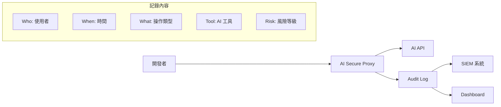

### Log 記錄規範

```json
{
  "timestamp": "2026-05-06T10:30:00+08:00",
  "user_id": "EMP001",
  "project": "order-service",
  "ai_tool": "github-copilot",
  "action": "code_generation",
  "risk_level": "medium",
  "prompt_hash": "sha256:abc123...",
  "prompt_category": "service_generation",
  "output_size_bytes": 2048,
  "validation_result": "passed",
  "reviewer": "EMP002",
  "metadata": {
    "language": "java",
    "framework": "spring-boot",
    "module": "order-service"
  }
}
```

**注意**：
- 不記錄完整 Prompt 內容（可能含敏感資訊）
- 記錄 Prompt Hash 供追溯
- 記錄 Prompt Category（從 Registry 對應）
- 保留期限：至少 3 年（依金管會要求）

---

# 7. AI 風險管理（Risk Management）

## 7.1 風險總覽

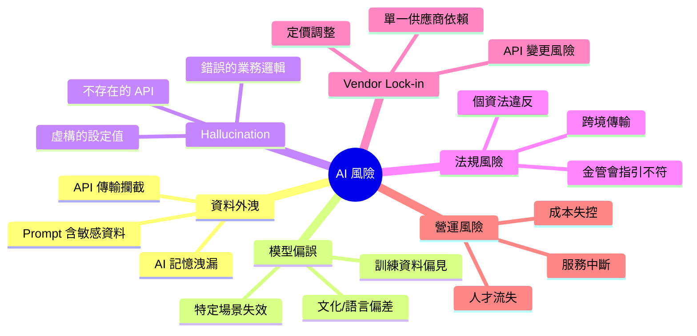

---

## 7.2 各風險詳細分析與控制

### 7.2.1 資料外洩風險

| 風險情境 | 控制措施 | 偵測方式 |
|----------|----------|----------|
| 開發者將客戶資料貼入 Prompt | Secure Proxy + DLP 過濾 | 即時掃描 + 告警 |
| AI 在回覆中引用其他使用者資料 | 使用企業版（隔離環境） | 定期抽查 |
| API 傳輸被攔截 | TLS 1.3 加密 | 網路監控 |
| AI 供應商資料外洩 | 契約約束 + No Retention | 供應商監控 |

**技術控制措施**：

```yaml
# Secure Proxy 設定
secure_proxy:
  filters:
    - type: "regex"
      pattern: "[A-Z][12]\\d{8}"  # 身分證字號
      action: "block_and_alert"
    - type: "regex"
      pattern: "\\d{4}-\\d{4}-\\d{4}-\\d{4}"  # 信用卡號
      action: "block_and_alert"
    - type: "keyword"
      keywords: ["password", "api_key", "secret"]
      action: "warn"
    - type: "entropy"
      threshold: 4.5  # 高亂度字串（可能是 Key）
      action: "block_and_alert"
```

### 7.2.2 Hallucination 風險

| 風險情境 | 控制措施 | 偵測方式 |
|----------|----------|----------|
| 使用不存在的 API | 編譯檢查 | CI 自動偵測 |
| 錯誤的業務邏輯 | 單元測試 + 人工 Review | 測試 + Review |
| 虛構的 Library 版本 | Dependency Resolution | Maven/Gradle |
| 錯誤的設定建議 | 啟動測試 | Integration Test |

**防控策略**：

1. **技術約束**：在 Prompt 中明確指定版本
2. **即時驗證**：編譯 → 測試 → 掃描
3. **知識庫對照**：與企業內部知識庫交叉驗證
4. **多工具交叉**：用不同 AI 工具交叉驗證重要邏輯

### 7.2.3 法規風險

| 法規 | 風險情境 | 控制措施 |
|------|----------|----------|
| 《人工智慧基本法》 | 未遵循七大基本原則、未建立問責機制 | AI 治理政策對齊基本法 + 定期合規檢視 |
| 個資法 | AI 處理個資未取得同意 | 禁止輸入個資 + DLP + PIA 評估 |
| 金管會 AI 核心原則 | 未建立治理問責機制、未確保透明性 | AI Governance Team + RACI + Audit Log |
| 資安法 | AI 事件未通報、未納入 ISMS | 事件通報 SOP + ISMS 整合 |
| EU AI Act | 高風險 AI 未合規評鑑、GPAI 未揭露 | 風險分級 + 合規評鑑 + 技術文件 |
| GDPR（如涉及） | 資料跨境傳輸 | 確認 AI 服務區域 + SCC |

### 7.2.4 Vendor Lock-in 風險

**控制措施**：

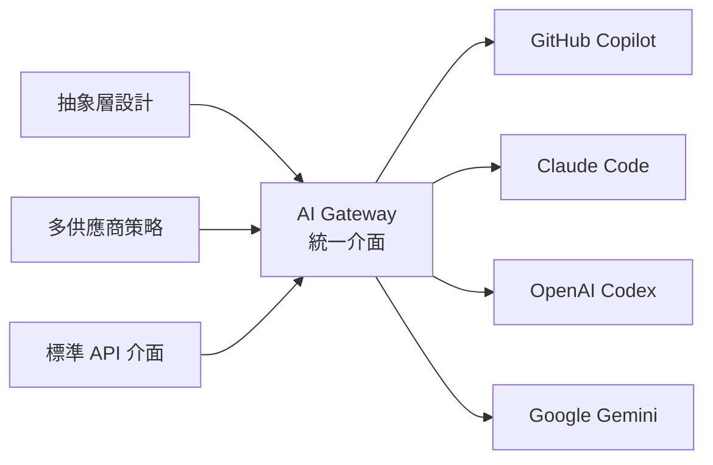

- 建立 AI Gateway 抽象層，避免直接依賴單一供應商 API
- 維持至少兩個 AI 供應商的能力
- 定期評估新供應商
- Prompt 設計保持供應商中立（不使用特有語法）

### 7.2.5 成本失控風險

| 控制措施 | 說明 |
|----------|------|
| 預算上限 | 每專案/每月設定 AI 使用額度 |
| 用量監控 | Token 使用量即時監控 |
| 分級策略 | 簡單任務用便宜模型，複雜任務用強模型 |
| Cache 機制 | 常見 Prompt 結果快取 |

---

# 8. 技術落地架構（Architecture）

## 8.1 AI Gateway 架構

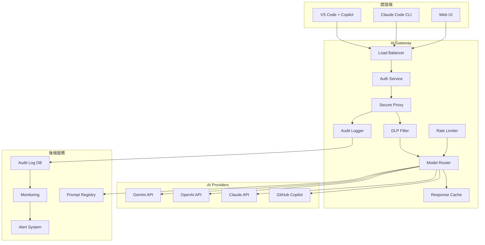

### 元件說明

| 元件 | 職責 | 技術選型 |
|------|------|----------|
| Load Balancer | 流量分配 | Nginx / HAProxy |
| Auth Service | 身分驗證與授權 | OAuth2 / JWT |
| Secure Proxy | 請求轉發與過濾 | Spring Cloud Gateway |
| DLP Filter | 敏感資料過濾 | Custom + Regex + ML |
| Model Router | 智慧路由 | 依任務/成本/可用性 |
| Response Cache | 回覆快取 | Redis |
| Audit Logger | 稽核日誌 | ELK Stack |
| Rate Limiter | 流量控管 | Redis + Lua |
| Prompt Registry | Prompt 範本管理 | Git-based + API |

---

## 8.2 Prompt Registry 設計

```yaml
# prompt-registry 結構
prompt-registry/
├── code-generation/
│   ├── spring-boot-controller.yaml
│   ├── spring-boot-service.yaml
│   ├── jpa-repository.yaml
│   └── junit-test.yaml
├── code-review/
│   ├── security-review.yaml
│   └── performance-review.yaml
├── refactoring/
│   ├── legacy-to-modern.yaml
│   └── framework-upgrade.yaml
└── documentation/
    ├── javadoc.yaml
    └── api-spec.yaml
```

### Prompt 版本管理

```yaml
# 範例：spring-boot-controller.yaml
metadata:
  id: "CG-001"
  name: "Spring Boot Controller 產生"
  version: "2.1.0"
  author: "AI Governance Team"
  last_updated: "2026-05-01"
  risk_level: "Level 2"
  approved_by: "SA Lead"
  
constraints:
  java_version: "21"
  spring_boot_version: "3.2.x"
  architecture: "Clean Architecture"
  
template: |
  請產出 Spring Boot REST Controller：
  - 資源：{resource}
  - 操作：{operations}
  - 使用 Jakarta Validation
  - 統一例外處理
  - 遵循 Clean Architecture（Controller → UseCase → Repository）
  
  技術約束：
  - Java 21
  - Spring Boot 3.2
  - jakarta.* namespace
  
prohibited_inputs:
  - 客戶資料
  - 認證資訊
  
validation_rules:
  - "must_compile"
  - "must_pass_checkstyle"
  - "must_have_test"
```

---

## 8.3 Audit Log 系統

### 日誌分層

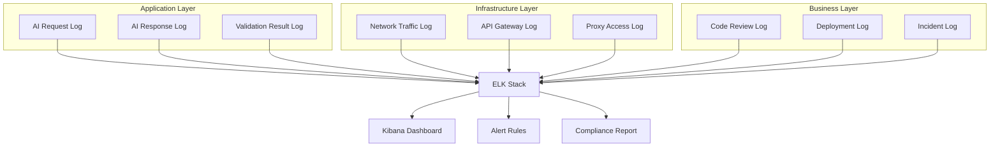

### 日誌保留政策

| 日誌類型 | 保留期限 | 儲存方式 |
|----------|----------|----------|
| AI 使用紀錄 | 5 年 | 冷存儲（S3/MinIO） |
| 安全事件 | 7 年 | 熱存儲 + 冷存儲 |
| 一般操作 | 1 年 | 熱存儲 |
| 稽核報告 | 永久 | 文件管理系統 |

---

## 8.4 Secure Proxy 設計

### 資料過濾流程

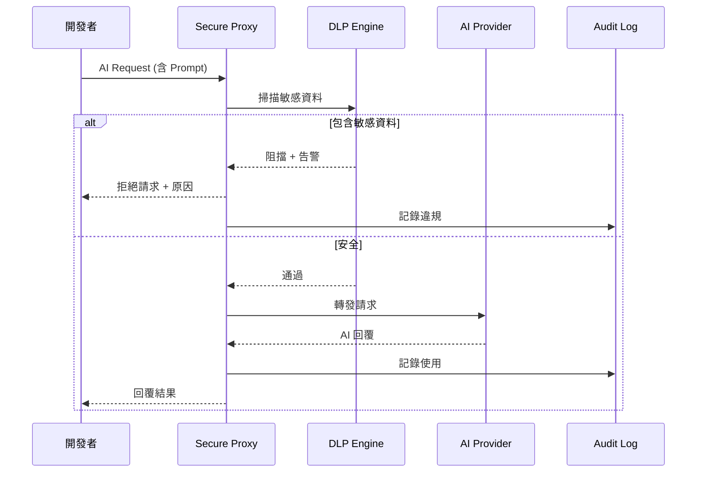

### DLP 規則設定

```yaml
dlp_rules:
  - name: "Taiwan ID"
    pattern: "[A-Z][12]\\d{8}"
    action: "block"
    severity: "critical"
    
  - name: "Credit Card"
    pattern: "\\d{4}[- ]?\\d{4}[- ]?\\d{4}[- ]?\\d{4}"
    action: "block"
    severity: "critical"
    
  - name: "Email"
    pattern: "[a-zA-Z0-9._%+-]+@[a-zA-Z0-9.-]+\\.[a-zA-Z]{2,}"
    action: "warn"
    severity: "medium"
    
  - name: "IP Address"
    pattern: "\\b(?:\\d{1,3}\\.){3}\\d{1,3}\\b"
    action: "warn"
    severity: "low"
    
  - name: "JWT Token"
    pattern: "eyJ[A-Za-z0-9-_=]+\\.[A-Za-z0-9-_=]+\\.?"
    action: "block"
    severity: "high"
    
  - name: "Connection String"
    pattern: "(jdbc|mongodb|redis)://[^\\s]+"
    action: "block"
    severity: "high"
```

---

## 8.5 DevSecOps 整合

### CI/CD Pipeline 整合 AI 治理

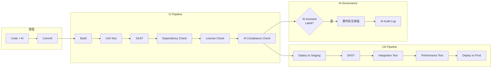

### GitHub Actions 整合範例

```yaml
# .github/workflows/ai-governance.yml
name: AI Governance Pipeline

on:
  pull_request:
    types: [opened, synchronize]

jobs:
  ai-compliance:
    if: contains(github.event.pull_request.labels.*.name, 'ai-assisted')
    runs-on: ubuntu-latest
    steps:
      - uses: actions/checkout@v4
      
      - name: Check AI Commit Convention
        run: |
          # 驗證 commit message 含 [AI-Assisted] 標記
          git log --oneline origin/main..HEAD | while read line; do
            if ! echo "$line" | grep -q "\[AI-Assisted\]"; then
              echo "⚠️ Commit missing [AI-Assisted] tag: $line"
            fi
          done
          
      - name: Enhanced Security Scan
        run: |
          mvn compile
          mvn spotbugs:check -Dspotbugs.includeFilter=ai-security-rules.xml
          
      - name: AI Usage Log
        run: |
          echo "Recording AI-assisted PR metrics..."
          # 記錄至 AI Audit System
```

---

# 9. 管理層決策建議（Executive Guide）

## 9.1 KPI / KRI

### Key Performance Indicators（KPI）

| KPI | 定義 | 目標值 | 量測方式 |
|-----|------|--------|----------|
| AI 生產力提升 | AI 輔助後開發速度變化 | +30% | Story Point / Sprint |
| AI 產出品質 | AI 程式碼一次 Review 通過率 | ≥ 70% | PR 統計 |
| 安全漏洞率 | AI 產出含漏洞比例 | < 5% | SAST 報告 |
| 教育訓練完成率 | 已完成 AI 訓練人員比例 | 100% | LMS 紀錄 |
| Prompt 規範遵循率 | 符合規範的 Prompt 使用比例 | ≥ 95% | Proxy Log |

### Key Risk Indicators（KRI）

| KRI | 定義 | 閾值 | 行動 |
|-----|------|------|------|
| DLP 攔截次數 | Proxy 攔截敏感資料次數 | > 5 次/月 | 強化訓練 |
| AI 事件數 | AI 相關資安事件 | > 0 次/季 | 根因分析 |
| 未審查直接合併 | AI 產出跳過 Review | 0 容忍 | 立即調查 |
| 供應商 SLA 違反 | AI 服務中斷 | > 2 次/月 | 備援啟動 |
| 成本超支率 | AI 使用超出預算比例 | > 20% | 調整策略 |

---

## 9.2 AI 成本控管

### 成本結構

| 成本項目 | 說明 | 估算方式 |
|----------|------|----------|
| 工具授權 | Copilot Enterprise 等 | 人數 × 單價/月 |
| API 使用 | Claude/OpenAI/Gemini Token | Token 用量 × 單價 |
| 基礎設施 | Proxy/Gateway/Log 系統 | 固定 + 變動 |
| 人力 | AI 治理團隊 | 人數 × 薪資 |
| 訓練 | 教育訓練費用 | 課程 × 人數 |

### 成本最佳化策略

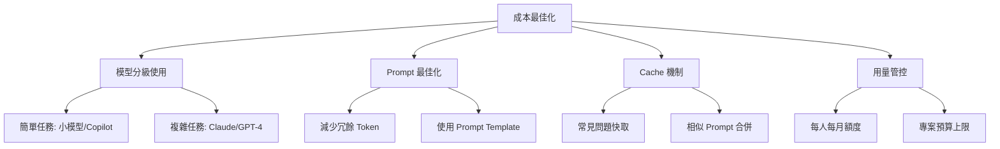

---

## 9.3 導入策略（Phase 1~3）

### Phase 1：基礎建設（1-3 個月）

| 項目 | 內容 | 產出 |
|------|------|------|
| 政策制定 | AI 使用政策、開發規範 | 政策文件 |
| 工具評估 | 評估並採購 AI 工具 | 採購合約 |
| 基礎建設 | 建立 Secure Proxy、Audit Log | 系統上線 |
| 教育訓練 | 全員基礎訓練 | 訓練紀錄 |
| Pilot | 選擇 1-2 低風險專案試行 | 試行報告 |

### Phase 2：擴大應用（3-6 個月）

| 項目 | 內容 | 產出 |
|------|------|------|
| 全面導入 | 所有專案啟用 AI 工具 | 導入報告 |
| 流程優化 | 依 Pilot 經驗調整流程 | 更新 SOP |
| Prompt Registry | 建立企業 Prompt 庫 | Prompt 範本 |
| 監控強化 | Dashboard + Alert | 監控系統 |
| 稽核 | 第一次正式稽核 | 稽核報告 |

### Phase 3：成熟優化（6-12 個月）

| 項目 | 內容 | 產出 |
|------|------|------|
| AI Gateway | 建立完整 AI Gateway | 系統上線 |
| 自動化治理 | 自動化合規檢查 | 自動化流程 |
| 進階應用 | AI Agent 工作流、自動化測試、Multi-Agent | 進階應用案例 |
| ISO 42001 評估 | 評估 ISO/IEC 42001 認證可行性 | 差距分析報告 |
| 績效評估 | KPI/KRI 年度評估 | 績效報告 |
| 持續改進 | 依據數據優化策略 | 改善計畫 |

---

## 9.4 組織設計（AI Governance Team）

### 組織架構

```mermaid
graph TB
    BOARD[董事會/高階管理層] --> AIGC[AI 治理委員會]
    
    AIGC --> TEAM[AI 治理小組]
    AIGC --> CISO[資安長]
    AIGC --> CTO[技術長]
    
    TEAM --> POLICY[政策制定]
    TEAM --> RISK[風險管理]
    TEAM --> AUDIT[稽核監控]
    TEAM --> TRAIN[教育訓練]
    
    subgraph AI治理小組成員
        M1[AI 架構師]
        M2[資安專家]
        M3[合規人員]
        M4[資深工程師代表]
    end
```

### RACI 矩陣

| 活動 | AI 治理小組 | 開發團隊 | 資安部門 | 管理層 | 合規部門 |
|------|------------|----------|----------|--------|----------|
| 政策制定 | R/A | C | C | A | C |
| 風險評估 | R | I | C | A | C |
| 工具選用 | R | C | C | A | I |
| 教育訓練 | R/A | I | C | I | I |
| 日常監控 | R | I | C | I | I |
| 事件處理 | R | R | R | I | C |
| 稽核 | C | I | R | A | R |
| 法規合規追蹤 | C | I | C | I | R/A |
| AI 倫理審查 | R | C | I | A | C |

> R=Responsible, A=Accountable, C=Consulted, I=Informed

---

# 10. 生成式 AI 治理專章（Generative AI Governance）

隨著大型語言模型（LLM）與生成式 AI 技術快速普及，其獨特風險態樣需要專門的治理框架。本章依據 EU AI Act 通用目的 AI（GPAI）專章、NIST AI 600-1 生成式 AI 風險概覽及金管會指引，建立生成式 AI 專屬治理機制。

## 10.1 生成式 AI 風險特論

### 生成式 AI 獨有風險

| 風險類型 | 說明 | 嚴重度 | 控制措施 |
|----------|------|--------|----------|
| Hallucination（幻覺） | 生成看似正確但實際錯誤的內容，如不存在的 API、虛構的法規引用 | 高 | 事實查核 + 編譯驗證 + 人工審查 |
| Prompt Injection | 惡意指令注入 Prompt，繞過安全限制 | 高 | 輸入過濾 + Guardrails + 輸出驗證 |
| 資料汙染（Data Poisoning） | 訓練資料被惡意篡改，導致模型輸出偏差 | 中 | 使用可信供應商 + 輸出驗證 |
| 模型輸出偏見（Bias） | 訓練資料中的歷史偏見被模型放大 | 中 | 公平性測試 + 多元測試資料 |
| 智慧財產權風險 | AI 產出可能包含受著作權保護的內容 | 中 | 授權檢查 + License 掃描 |
| 過度依賴（Over-reliance） | 開發者過度信任 AI 輸出，降低人工審查品質 | 中 | 強制 Review 機制 + 意識培訓 |
| 資料外洩（透過模型記憶） | 模型可能在回覆中洩漏其他使用者的訓練資料 | 高 | 使用企業版（隔離環境）+ No Retention |
| 環境影響 | 大模型推論消耗大量運算資源與能源 | 低 | 模型分級使用 + 用量管控 |

### 生成式 AI 與傳統 AI 風險比較

| 風險面向 | 傳統 AI / ML | 生成式 AI | 差異管控重點 |
|----------|-------------|-----------|-------------|
| 輸出可預測性 | 較高（特定任務） | 較低（開放式生成） | 需加強輸出驗證 |
| 資料外洩管道 | 模型反推 | Prompt 輸入 + 模型記憶 | Secure Proxy + DLP |
| 偏見來源 | 訓練資料 | 訓練資料 + RLHF | 公平性測試 |
| 智財風險 | 較低 | 較高（大規模訓練資料） | 授權掃描 |
| 可解釋性 | 部分可解釋 | 黑箱程度更高 | Prompt 紀錄 + Chain-of-Thought |

---

## 10.2 大型語言模型（LLM）使用規範

### LLM 選用評估矩陣

| 評估面向 | 評估項目 | 最低要求 |
|----------|----------|----------|
| 安全性 | 資料處理政策、加密傳輸 | TLS 1.3 + No Retention 或可設定 |
| 合規性 | SOC 2、ISO 27001 認證 | 至少具備一項 |
| 隱私性 | 資料落地區域、GDPR 遵循 | 符合台灣個資法跨境傳輸規定 |
| 可控性 | API 管控能力、Content Filtering | 支援企業級管控 |
| 透明度 | 模型能力聲明、已知限制揭露 | 供應商提供書面說明 |
| 穩定性 | SLA、服務可用性 | 99.9% 以上 |

### LLM 使用護欄（Guardrails）

```yaml
llm_guardrails:
  input_controls:
    - name: "敏感資料過濾"
      type: "DLP"
      action: "block_and_alert"
    - name: "Prompt Injection 偵測"
      type: "pattern_matching + ML"
      action: "block_and_log"
    - name: "Token 長度限制"
      type: "rate_limit"
      max_tokens_per_request: 8000
      
  output_controls:
    - name: "有害內容過濾"
      type: "content_safety"
      action: "filter_and_log"
    - name: "程式碼安全掃描"
      type: "inline_sast"
      action: "warn"
    - name: "事實一致性檢查"
      type: "reference_validation"
      action: "flag_for_review"
      
  operational_controls:
    - name: "使用量監控"
      type: "rate_limiter"
      max_requests_per_user_per_day: 500
    - name: "成本監控"
      type: "budget_alert"
      monthly_budget_per_project: "USD 1000"
```

---

## 10.3 AI Agent 與自動化工作流治理

隨著 AI Agent（如 Claude Code、GitHub Copilot Agent）能自主執行多步驟任務，需建立額外治理機制：

### AI Agent 權限分級

| 權限等級 | 允許操作 | 禁止操作 | 適用場景 |
|----------|----------|----------|----------|
| Level 1（唯讀） | 程式碼分析、Bug 分析、文件產生建議 | 任何寫入操作 | 初步評估 |
| Level 2（受限寫入） | 在 feature branch 修改程式碼、產生測試 | 合併至主分支、修改設定檔 | 一般開發 |
| Level 3（監督式執行） | 執行 build、測試指令（需人工確認） | 部署至任何環境 | 開發與測試 |
| Level 4（完全自主） | **不建議使用** | N/A | N/A |

### AI Agent 使用準則

1. **最小權限原則**：AI Agent 僅授予完成任務所需的最低權限
2. **人工審核閘門**：所有 AI Agent 的輸出須經人工確認後方可採用
3. **操作可逆性**：AI Agent 的操作應可回滾，不得執行不可逆操作
4. **日誌完整性**：AI Agent 的所有操作需完整記錄
5. **隔離環境**：AI Agent 不得直接存取生產環境

---

## 10.4 生成式 AI 倫理框架

### 倫理原則（對齊 UNESCO AI 倫理建議書與台灣 AI 基本法）

| 倫理原則 | 內涵 | 企業實踐 |
|----------|------|----------|
| 以人為本 | AI 應作為輔助工具，不取代人類判斷 | 所有 AI 產出需人工審核，重大決策由人類負責 |
| 公平無歧視 | AI 不應產生或放大歧視 | 定期進行偏見檢測，多元化測試資料 |
| 透明可解釋 | AI 使用過程與結果應可追溯 | Prompt 紀錄、Audit Log、AI 標記機制 |
| 隱私保護 | 尊重個人資料主體權利 | PIA 評估、資料最小化、脫敏處理 |
| 安全可靠 | AI 系統應具備韌性與容錯能力 | 多層驗證、Guardrails、備援機制 |
| 問責機制 | 明確 AI 使用之法律責任歸屬 | AI 產出由提交者負責、RACI 矩陣 |
| 環境永續 | 考量 AI 使用之環境影響 | 模型分級使用、Token 用量監控 |

### 倫理審查機制

對於高風險 AI 應用場景，須通過倫理審查：

```mermaid
flowchart TD
    A[AI 應用提案] --> B{是否涉及自動化決策<br/>影響個人權益?}
    B -->|是| C[倫理影響評估]
    B -->|否| D{是否涉及<br/>敏感群體?}
    D -->|是| C
    D -->|否| E[標準治理流程]
    C --> F[AI 倫理委員會審查]
    F --> G{審查結果}
    G -->|通過| H[附帶條件執行]
    G -->|有條件通過| I[修改後重審]
    G -->|不通過| J[禁止實施]
```

---

# 11. 附錄（Templates）

## 11.1 AI 使用申請表

```markdown
# AI 使用申請表

## 基本資訊
- 申請日期：____年____月____日
- 申請人：______________（員工編號：________）
- 所屬部門：______________
- 專案名稱：______________

## AI 使用說明
- 使用工具：□ GitHub Copilot  □ Claude Code  □ Codex  □ Gemini
- 使用目的：
  □ 程式碼產生  □ Code Review  □ 測試產生
  □ 文件產生    □ Refactoring   □ Bug Fix
  □ 其他：______________

## 風險評估
- 風險等級：□ 高  □ 中  □ 低
- 是否涉及客戶資料：□ 是  □ 否
- 是否涉及核心業務邏輯：□ 是  □ 否
- 是否涉及生產環境：□ 是  □ 否

## 資料安全確認
- [ ] 確認不會將客戶個資輸入 AI
- [ ] 確認不會將認證資訊輸入 AI
- [ ] 確認不會將營業秘密輸入 AI
- [ ] 確認已完成 AI 安全使用訓練

## 核准
- 主管簽核：______________ 日期：__________
- AI 治理小組（高風險時）：______________ 日期：__________
```

---

## 11.2 Prompt Template 範例

### 範例一：Spring Boot Service 產生

```yaml
id: "PT-001"
name: "Spring Boot Service Layer"
version: "1.0"
risk_level: "Level 2"

prompt: |
  請產出一個 Spring Boot Service 類別：
  
  需求：
  - 服務名稱：{service_name}
  - 功能：{功能描述}
  - 使用 Constructor Injection
  - 加入 @Transactional（適當位置）
  - 使用 Log4j2 記錄日誌
  - 例外使用自訂 BusinessException
  
  技術約束：
  - Java 21
  - Spring Boot 3.2
  - Clean Architecture（Application Layer）
  - 不使用 Lombok
  
  品質要求：
  - 方法需有 JavaDoc
  - 適當的 Input Validation
  - 統一回傳格式
```

### 範例二：JUnit 測試產生

```yaml
id: "PT-002"
name: "JUnit Test Generation"
version: "1.0"
risk_level: "Level 1"

prompt: |
  請為以下類別產出完整的 JUnit 5 測試：
  
  目標類別：
  {paste_class_here}
  
  測試要求：
  - 使用 @ExtendWith(MockitoExtension.class)
  - Mock 所有外部依賴
  - 包含正向測試（Happy Path）
  - 包含負向測試（例外情境）
  - 包含邊界值測試（null / empty / 超長）
  - 使用 @DisplayName 標註測試名稱
  - 覆蓋率目標 ≥ 80%
  
  技術約束：
  - JUnit 5.10
  - Mockito 5.x
  - AssertJ
```

### 範例三：逆向工程分析

```yaml
id: "PT-003"
name: "Legacy Code Analysis"
version: "1.0"
risk_level: "Level 2"

prompt: |
  請分析以下舊系統程式碼，產出：
  
  1. 業務邏輯摘要（用中文）
  2. 資料流程圖（Mermaid）
  3. 建議的現代化架構
  4. Migration 步驟
  
  程式碼：
  {paste_legacy_code_here}
  
  注意：
  - 程式碼中的變數名稱可能是縮寫，請推測其意義
  - 忽略程式碼中的硬編碼值（已脫敏）
  - 著重於業務邏輯而非技術實作
```

---

## 11.3 AI Risk Assessment 表

```markdown
# AI 風險評估表

## 專案資訊
- 專案名稱：______________
- 評估日期：____年____月____日
- 評估人員：______________
- 核准人員：______________

## 風險評估

| # | 風險項目 | 說明 | 可能性(1-5) | 影響(1-5) | 風險值 | 控制措施 | 殘餘風險 |
|---|---------|------|------------|----------|--------|----------|----------|
| 1 | 資料外洩 | | | | | | |
| 2 | 程式碼漏洞 | | | | | | |
| 3 | Hallucination | | | | | | |
| 4 | 合規違反 | | | | | | |
| 5 | 服務中斷 | | | | | | |
| 6 | 成本超支 | | | | | | |
| 7 | 授權衝突 | | | | | | |
| 8 | 品質不足 | | | | | | |

## 風險等級判定
- 風險值 = 可能性 × 影響
- 1-6：低風險（綠）
- 7-14：中風險（黃）
- 15-25：高風險（紅）

## 總體風險等級：□ 高  □ 中  □ 低

## 結論與建議
______________________________________________

## 簽核
- 評估人員：______________ 日期：__________
- 主管：______________ 日期：__________
- AI 治理小組：______________ 日期：__________
```

---

## 11.4 Code Review Checklist（AI 產出專用）

```markdown
# AI 產出 Code Review Checklist

## PR 資訊
- PR 編號：#________
- 開發者：______________
- AI 工具：______________
- 風險等級：□ 高  □ 中  □ 低
- Review 日期：____年____月____日

## 安全性檢查
- [ ] 無 SQL Injection（使用 Parameterized Query / ORM）
- [ ] 無 XSS（適當 Output Encoding）
- [ ] 無 CSRF 風險
- [ ] 無硬編碼機密（密碼/Token/Key）
- [ ] 輸入驗證完整（長度/格式/白名單）
- [ ] 適當的存取控制（Authorization）
- [ ] 無不安全的反序列化
- [ ] 無敏感資料日誌輸出

## 正確性檢查
- [ ] 業務邏輯正確（對照需求文件）
- [ ] 邊界條件已處理
- [ ] 例外處理適當且有意義的錯誤訊息
- [ ] 無 AI Hallucination（API/Library 確實存在）
- [ ] 併發安全（Thread Safety）
- [ ] 資源正確釋放（Connection / Stream）

## 品質檢查
- [ ] 符合 Clean Architecture 分層規範
- [ ] 命名清楚且符合慣例
- [ ] 無重複程式碼（DRY）
- [ ] 方法長度合理（< 30 行）
- [ ] 類別職責單一（SRP）
- [ ] 適當的日誌記錄（Level 正確）

## 效能檢查
- [ ] 無 N+1 Query
- [ ] 適當的索引使用
- [ ] 無不必要的 DB 呼叫
- [ ] 集合操作效率合理
- [ ] 無記憶體洩漏風險

## 測試檢查
- [ ] 單元測試覆蓋率 ≥ 80%
- [ ] 含負面測試
- [ ] 含邊界值測試
- [ ] 測試有意義（非形式化）

## 合規檢查
- [ ] Commit Message 含 [AI-Assisted] 標記
- [ ] 無授權衝突的程式碼
- [ ] AI 使用紀錄已登錄
- [ ] 無殘留敏感資料

## Review 結果
- [ ] ✅ 核准合併
- [ ] 🔄 需修改後重審
- [ ] ❌ 拒絕（重大問題）

## 備註
______________________________________________

## Reviewer 簽名：______________ 日期：__________
```

---

# 12. AI 素養與教育訓練體系（AI Literacy & Training）

EU AI Act 第 4 條明確要求 AI 系統之提供者與部署者須確保其人員具備充分的 AI 素養（AI Literacy），台灣《人工智慧基本法》亦將人才培育列為核心目標。本章建立系統化的 AI 素養培訓體系，確保組織各層級人員具備適當的 AI 治理知識與技能。

## 12.1 AI 素養框架

### AI 素養能力模型

| 能力構面 | 說明 | 對應角色 |
|----------|------|----------|
| AI 認知（Awareness） | 理解 AI 基本概念、能力與局限 | 全體員工 |
| AI 應用（Application） | 能有效且安全地使用 AI 工具 | 開發人員、業務人員 |
| AI 評估（Assessment） | 能評估 AI 產出品質與風險 | 技術主管、Reviewer |
| AI 治理（Governance） | 能制定與執行 AI 治理政策 | 管理層、AI 治理團隊 |
| AI 倫理（Ethics） | 能辨識與處理 AI 倫理議題 | 全體員工（深度因角色而異） |

### EU AI Act AI 素養要求（第 4 條）

EU AI Act 第 4 條自 2025 年 2 月起即已適用，要求：

- AI 系統提供者與部署者應採取措施，確保其人員及代理其運營之人員，在 AI 素養方面具有充足的訓練水準
- AI 素養之範圍與內容應考量：技術知識、經驗、教育背景、AI 系統使用的脈絡、以及受影響之個人或群體
- 此義務適用於所有 AI 風險等級，為 EU AI Act 最早生效之規定之一

### 數位發展部 AI 評測指引與素養結合

企業可依據數位發展部「AI 產品與系統評測指引」之七大評測面向，建立對應的素養培訓內容：

| 評測面向 | 培訓重點 | 對應課程 |
|----------|----------|----------|
| 準確性 | AI 產出驗證方法、Hallucination 辨識 | AI 工具實務操作 |
| 公平性 | 偏見辨識、公平性測試方法 | AI 倫理與公平性 |
| 透明性 | 可解釋性技術、Audit Log 實務 | AI 治理實務 |
| 安全性 | Prompt Injection 防護、資安掃描 | AI 安全使用 |
| 隱私保護 | 資料脫敏、PIA 實務 | 個資保護與 AI |
| 可靠性 | AI 系統韌性、監控機制 | AI 系統運維 |
| 可課責性 | 責任歸屬、紀錄保存 | AI 治理政策 |

---

## 12.2 分層培訓體系

### 培訓課程架構

```mermaid
graph TB
    subgraph 基礎層_全體員工
        A1[AI 治理政策說明 2h]
        A2[AI 安全意識 1h]
        A3[AI 倫理基礎 1h]
    end
    
    subgraph 應用層_開發人員
        B1[AI 工具安全使用實務 4h]
        B2[Prompt Engineering 基礎 2h]
        B3[AI 產出驗證實務 2h]
    end
    
    subgraph 進階層_技術主管
        C1[AI 風險評估實務 3h]
        C2[AI Code Review 專題 2h]
        C3[AI 架構治理 2h]
    end
    
    subgraph 管理層_高階主管
        D1[AI 治理策略 2h]
        D2[AI 法規趨勢 2h]
        D3[AI 投資決策 1h]
    end
    
    A1 --> B1
    A2 --> B1
    B1 --> C1
    C1 --> D1
```

### 各層級培訓內容

| 層級 | 對象 | 必修課程 | 總時數 | 頻率 |
|------|------|----------|--------|------|
| L1 基礎 | 全體員工 | AI 治理政策、安全意識、倫理基礎 | 4 小時 | 年度必修 |
| L2 應用 | 開發人員 | AI 工具實務、Prompt Engineering、產出驗證 | 8 小時 | 初次 + 年度複訓 |
| L3 進階 | 技術主管 / Reviewer | 風險評估、Code Review 專題、架構治理 | 7 小時 | 初次 + 年度複訓 |
| L4 管理 | 部門主管以上 | 治理策略、法規趨勢、投資決策 | 5 小時 | 半年度 |
| 特定主題 | 依需求指派 | AI Agent 治理、生成式 AI 專題、跨境合規 | 依主題 | 依需求 |

---

## 12.3 培訓成效評估

### 評估指標

| 指標 | 量測方式 | 目標值 |
|------|----------|--------|
| 完訓率 | LMS 系統統計 | 100%（必修課程） |
| 測驗通過率 | 課後測驗（70 分及格） | ≥ 90% |
| Prompt 安全遵循率 | Proxy Log 分析 | ≥ 95% |
| DLP 攔截率（負向指標） | 月度統計 | 逐月下降 |
| AI 事件數（負向指標） | 季度統計 | 0 |
| 實務演練通過率 | 情境模擬測驗 | ≥ 85% |

### 持續學習機制

- **月度 AI 治理通報**：彙整國內外 AI 治理最新動態，推送至全體員工
- **季度案例研討**：以實際案例（含公司內部與業界）進行研討
- **年度紅隊演練**：模擬 AI 安全事件，演練應變流程
- **知識庫維護**：持續更新企業 AI 治理知識庫（含 FAQ、Best Practice）

---

# 13. 跨境資料傳輸與多法域合規（Cross-border & Multi-jurisdiction）

隨著企業使用之 AI 工具多為跨境雲端服務（如 OpenAI 位於美國、Anthropic 位於美國、Google 橫跨多國資料中心），跨境資料傳輸之法規遵循已成為 AI 治理不可迴避的課題。

## 13.1 跨境資料傳輸治理

### AI 工具資料流向分析

```mermaid
graph LR
    subgraph 台灣_企業端
        DEV[開發者]
        PROXY[AI Gateway / Proxy]
    end
    
    subgraph 美國
        COPILOT[GitHub Copilot<br/>Microsoft Azure]
        CLAUDE[Claude API<br/>Anthropic / AWS]
        OPENAI[OpenAI API<br/>Azure / OpenAI]
    end
    
    subgraph 歐盟
        GCLOUD[Gemini<br/>GCP EU Region]
    end
    
    subgraph 亞太
        AWS_AP[Amazon Q<br/>AWS AP Region]
    end
    
    DEV --> PROXY
    PROXY --> COPILOT
    PROXY --> CLAUDE
    PROXY --> OPENAI
    PROXY --> GCLOUD
    PROXY --> AWS_AP
```

### 跨境傳輸法規要求

| 法規 | 跨境傳輸要求 | 企業因應措施 |
|------|-------------|-------------|
| 台灣《個資法》第 21 條 | 國際傳輸不得侵害當事人權益；主管機關得限制特定國家/地區 | 確認 AI 供應商資料處理地區、簽訂資料處理契約、進行跨境傳輸影響評估 |
| EU GDPR（如涉歐盟資料） | 需有適足性認定、標準契約條款（SCC）或拘束企業規則（BCR） | 與 AI 供應商簽訂 SCC、確認資料處理地區符合適足性認定 |
| 中國《數據安全法》（如涉中國資料） | 重要數據出境需安全評估 | 避免將涉及中國客戶資料之 Prompt 傳送至境外 AI 服務 |

### 資料在地化評估

| 資料敏感度 | 是否可跨境傳輸 | 條件 |
|-----------|---------------|------|
| 機密（客戶個資、交易資料） | **禁止** | 不得輸入任何 AI 工具 |
| 內部機密（營業秘密） | **禁止** | 不得輸入任何 AI 工具 |
| 內部一般（系統架構、業務邏輯） | 有條件允許 | 脫敏後透過 Secure Proxy、使用企業版（No Retention） |
| 一般（公開技術文件） | 允許 | 遵循基本使用規範 |

---

## 13.2 多法域合規矩陣

### 企業 AI 使用之法域合規對照

| 合規面向 | 台灣要求 | EU 要求（如適用） | 美國要求（如適用） | 企業統一標準 |
|----------|---------|------------------|------------------|-------------|
| AI 風險分級 | 《AI 基本法》風險分級原則 | EU AI Act 四級分類 | NIST AI RMF 風險管理 | 採最嚴格標準（EU AI Act） |
| 透明度揭露 | 金管會透明性原則 | EU AI Act 第 50 條 | NIST 透明度建議 | 全面揭露 AI 使用 |
| 個資保護 | 《個資法》 | GDPR | 各州法律（如 CCPA） | 採最嚴格標準（GDPR） |
| 自動化決策 | 《個資法》修正案 | GDPR 第 22 條 | 無聯邦統一要求 | 提供 opt-out + 解釋權 |
| 事件通報 | 《資安法》四級通報 | EU AI Act 嚴重事件通報 | 依產業別 | 最短時限內通報所有適用法域 |
| AI 素養 | 《AI 基本法》人才培育 | EU AI Act 第 4 條 | NIST 建議 | 全員必修 AI 素養課程 |

### 合規差異處理原則

1. **最高標準原則**：當不同法域要求存在差異時，採行最嚴格之標準
2. **屬地管轄優先**：優先遵循營運所在地之法規要求
3. **預防性合規**：針對即將生效之法規提前準備（如 2026 年 8 月 EU AI Act 高風險規定）
4. **文件化紀錄**：所有合規決策與差異分析須留存文件供稽核

---

## 13.3 國際合作與互認機制

### 標準互認趨勢

| 互認機制 | 參與方 | 進展 | 企業影響 |
|----------|--------|------|----------|
| ISO/IEC 42001 認證 | 全球 | 已可進行第三方認證 | 一次認證，多法域認可 |
| EU AI Act 調和標準 | 歐盟 + CEN/CENELEC | 標準制定中（2025-2026） | 符合調和標準可推定合規 |
| AI Safety Institute 合作 | 美/英/日/韓/新加坡等 | 2024 年起建立 | 前沿模型安全測試互認 |
| 亞太 AI 治理合作 | APEC/ASEAN | 推動中 | 區域合規框架趨同 |

### 企業全球合規建議

```mermaid
flowchart TD
    A[識別 AI 使用場景] --> B[分析涉及法域]
    B --> C[進行法域合規差異分析]
    C --> D{是否存在衝突?}
    D -->|是| E[法務評估 + 採最嚴格標準]
    D -->|否| F[依最高標準建立統一政策]
    E --> G[建立合規矩陣文件]
    F --> G
    G --> H[定期覆審<br/>至少每半年一次]
    H --> I{法規是否更新?}
    I -->|是| C
    I -->|否| H
```

---

# 檢查清單（Checklist）

## 新進成員快速上手清單

### 第一天

- [ ] 閱讀本手冊第 1 章（治理架構）
- [ ] 閱讀本手冊第 4.1 節（AI 使用政策）
- [ ] 閱讀本手冊第 10 章（生成式 AI 治理專章）
- [ ] 完成「AI 治理政策說明」線上課程（2h）
- [ ] 簽署 AI 使用承諾書

### 第一週

- [ ] 完成「AI 工具安全使用實務」訓練（4h）
- [ ] 完成「Prompt Engineering 基礎」訓練（2h）
- [ ] 熟悉 Prompt Registry 使用方式
- [ ] 瞭解 AI 風險分級判斷方式
- [ ] 在 Pilot 環境實際操作 AI 工具

### 開始使用 AI 開發前

- [ ] 確認已通過所有必要訓練
- [ ] 瞭解所屬專案的 AI 風險等級
- [ ] 瞭解 Code Review 流程（第 3.4 節）
- [ ] 瞭解 AI Agent 權限分級（第 10.3 節）
- [ ] 知道如何登錄 AI 使用紀錄
- [ ] 知道事件通報流程（第 5.5 節）
- [ ] 完成 AI 素養基礎課程（第 12.1 節）
- [ ] 瞭解跨境資料傳輸限制（第 13.1 節）

### 日常開發

- [ ] 每次使用 AI 前檢查 Prompt 安全性
- [ ] AI 產出必經「編譯 → 測試 → 掃描」驗證
- [ ] Commit 加上 `[AI-Assisted]` 標記
- [ ] PR 加上 `ai-assisted` label
- [ ] 定期登錄 AI 使用紀錄

### 禁止事項（牢記）

- ❌ 不輸入客戶個資
- ❌ 不輸入密碼/API Key/Token
- ❌ 不輸入營業秘密
- ❌ 不跳過 Code Review 直接合併
- ❌ 不使用未核准的 AI 工具
- ❌ 不關閉安全掃描

---

## 管理者快速參考

| 需要做的事 | 參考章節 | 頻率 |
|-----------|----------|------|
| 確認團隊已完成 AI 訓練 | 4.1 第六條、12.2 | 每季 |
| 審核高風險 AI 使用申請 | 5.1 | 依需求 |
| 檢視 AI 使用 KPI/KRI | 9.1 | 每月 |
| 確認稽核結果與改善 | 6.4 | 每季 |
| 檢視 AI 成本 | 9.2 | 每月 |
| 供應商覆審 | 4.5 | 每年 |
| 培訓成效追蹤 | 12.3 | 每季 |
| 跨境合規覆審 | 13.2 | 每半年 |

---

> **文件結束**  
> 本手冊由 AI 治理委員會維護，如有疑問請聯繫 AI 治理小組。  
> 下次預定修訂日期：____年____月____日

