+++
date = '2026-05-29T10:38:17+08:00'
draft = false
title = 'AI如何減少token使用教學手冊'
tags = ['教學', 'AI開發']
categories = ['教學']
+++

# AI 如何減少 Token 使用教學手冊

> **版本**：1.1.0  
> **日期**：2026-05-29
> **適用範圍**：Claude Code / GitHub Copilot / Codex CLI / Gemini CLI / Cursor  
> **目標讀者**：資深工程師、架構師、Tech Lead、AI 成本治理人員  
> **授權**：內部教學使用  

---

## 前言

在 AI 輔助開發已成為企業標準工作流程的今天，**Token 消耗** 已從技術細節躍升為影響專案預算、開發速度與 AI 品質的關鍵因素。根據企業實務統計，一個 20 人的開發團隊每月 AI Token 費用可達數千至數萬美元，其中 **60%～80% 屬於可避免的浪費**。

本手冊的核心論點：

> **「最有效降低 Token 的方法不是更換模型，而是建立 Knowledge Graph + Memory + Agent Team + SSDLC Workflow。」**

本手冊整合了 RTK（Rust Token Killer）、Understand-Anything、GitNexus、Graphify 等工具的設計理念，結合 SSDLC Agent Team 協作模式與企業實戰經驗，系統性地提供從個人開發到企業治理的完整 Token 節省策略。

---

## 目錄

- [第一章 Token 基礎知識](#第一章-token-基礎知識)
  - [1.1 Token 是什麼](#11-token-是什麼)
  - [1.2 Token 的計算方式](#12-token-的計算方式)
  - [1.3 Context Window 概念](#13-context-window-概念)
  - [1.4 Token 的三種類型](#14-token-的三種類型)
  - [1.5 為什麼 Token 會造成成本問題](#15-為什麼-token-會造成成本問題)
- [第二章 AI 開發最常見 Token 浪費原因](#第二章-ai-開發最常見-token-浪費原因)
  - [2.1 全專案直接丟給 AI](#21-全專案直接丟給-ai)
  - [2.2 一次貼大量 Source Code](#22-一次貼大量-source-code)
  - [2.3 每次重新描述需求](#23-每次重新描述需求)
  - [2.4 Agent 無限制搜尋](#24-agent-無限制搜尋)
  - [2.5 Framework 升級時全專案分析](#25-framework-升級時全專案分析)
- [第三章 RTK 思維](#第三章-rtk-思維)
  - [3.1 RTK 核心設計](#31-rtk-核心設計)
  - [3.2 RTK Workflow](#32-rtk-workflow)
  - [3.3 RTK 四大策略](#33-rtk-四大策略)
  - [3.4 RTK 能節省多少 Token](#34-rtk-能節省多少-token)
- [第四章 Understand-Anything 思維](#第四章-understand-anything-思維)
  - [4.1 Knowledge Graph 概念](#41-knowledge-graph-概念)
  - [4.2 Multi-Agent Pipeline](#42-multi-agent-pipeline)
  - [4.3 為何 Knowledge Graph 可以降低 Token](#43-為何-knowledge-graph-可以降低-token)
- [第五章 GitNexus 思維](#第五章-gitnexus-思維)
  - [5.1 Repository 知識管理](#51-repository-知識管理)
  - [5.2 Semantic Search 與 Token 節省](#52-semantic-search-與-token-節省)
  - [5.3 傳統搜尋 VS Semantic Search](#53-傳統搜尋-vs-semantic-search)
- [第六章 Graphify 思維](#第六章-graphify-思維)
  - [6.1 程式碼知識圖譜建構](#61-程式碼知識圖譜建構)
  - [6.2 Entity Extraction 架構](#62-entity-extraction-架構)
  - [6.3 Confidence Tags 機制](#63-confidence-tags-機制)
- [第七章 SSDLC 如何減少 Token](#第七章-ssdlc-如何減少-token)
  - [7.1 Requirement 階段](#71-requirement-階段)
  - [7.2 Design 階段](#72-design-階段)
  - [7.3 Development 階段](#73-development-階段)
  - [7.4 Testing 階段](#74-testing-階段)
  - [7.5 Deployment 階段](#75-deployment-階段)
  - [7.6 Maintenance 階段](#76-maintenance-階段)
- [第八章 Agent Team 如何節省 Token](#第八章-agent-team-如何節省-token)
  - [8.1 Agent Team 架構](#81-agent-team-架構)
  - [8.2 各 Agent 職責與 Token 策略](#82-各-agent-職責與-token-策略)
  - [8.3 單 Agent VS 多 Agent 比較](#83-單-agent-vs-多-agent-比較)
- [第九章 大型 Web Application 開發策略](#第九章-大型-web-application-開發策略)
  - [9.1 建立 System Knowledge Base](#91-建立-system-knowledge-base)
  - [9.2 五大 Memory 層](#92-五大-memory-層)
  - [9.3 Token 節省實務](#93-token-節省實務)
- [第十章 Framework Upgrade 策略](#第十章-framework-upgrade-策略)
  - [10.1 升級場景分析](#101-升級場景分析)
  - [10.2 Migration Knowledge Graph](#102-migration-knowledge-graph)
  - [10.3 避免重複分析的策略](#103-避免重複分析的策略)
- [第十一章 Reverse Engineering 策略](#第十一章-reverse-engineering-策略)
  - [11.1 Legacy System 盤點](#111-legacy-system-盤點)
  - [11.2 四層 Graph 架構](#112-四層-graph-架構)
  - [11.3 降低 Token 方法](#113-降低-token-方法)
- [第十二章 Prompt Engineering 節省 Token 技巧](#第十二章-prompt-engineering-節省-token-技巧)
  - [12.1 架構分析 Prompt](#121-架構分析-prompt)
  - [12.2 程式碼分析 Prompt](#122-程式碼分析-prompt)
  - [12.3 Bug 修復 Prompt](#123-bug-修復-prompt)
  - [12.4 SSDLC Prompt](#124-ssdlc-prompt)
  - [12.5 Security Review Prompt](#125-security-review-prompt)
  - [12.6 Unit Test Prompt](#126-unit-test-prompt)
  - [12.7 Refactoring Prompt](#127-refactoring-prompt)
  - [12.8 Framework Upgrade Prompt](#128-framework-upgrade-prompt)
  - [12.9 Reverse Engineering Prompt](#129-reverse-engineering-prompt)
- [第十三章 Claude Code 節省 Token 最佳實務](#第十三章-claude-code-節省-token-最佳實務)
  - [13.1 CLAUDE.md 配置](#131-claudemd-配置)
  - [13.2 Memory 機制](#132-memory-機制)
  - [13.3 Context Engineering](#133-context-engineering)
  - [13.4 Sub Agent 策略](#134-sub-agent-策略)
  - [13.5 MCP 整合](#135-mcp-整合)
- [第十四章 GitHub Copilot 節省 Token 最佳實務](#第十四章-github-copilot-節省-token-最佳實務)
  - [14.1 Copilot Instructions](#141-copilot-instructions)
  - [14.2 Prompt Files](#142-prompt-files)
  - [14.3 Agent Mode](#143-agent-mode)
  - [14.4 MCP 整合](#144-mcp-整合)
  - [14.5 Workspace Context 最佳化](#145-workspace-context-最佳化)
- [第十五章 企業級 AI 成本治理](#第十五章-企業級-ai-成本治理)
  - [15.1 AI Governance 框架](#151-ai-governance-框架)
  - [15.2 AI Cost Management](#152-ai-cost-management)
  - [15.3 AI Token Monitoring](#153-ai-token-monitoring)
  - [15.4 AI Usage / Agent / Security Policy](#154-ai-usage--agent--security-policy)
- [第十六章 建立企業級 Token 最佳化框架](#第十六章-建立企業級-token-最佳化框架)
  - [16.1 Enterprise Token Optimization Architecture](#161-enterprise-token-optimization-architecture)
  - [16.2 七層架構設計](#162-七層架構設計)
  - [16.3 導入流程](#163-導入流程)
- [第十七章 實戰案例](#第十七章-實戰案例)
  - [17.1 大型銀行核心系統升級](#171-大型銀行核心系統升級)
  - [17.2 百萬行程式碼逆向工程](#172-百萬行程式碼逆向工程)
  - [17.3 Spring Boot 升級專案](#173-spring-boot-升級專案)
  - [17.4 Vue3 重構專案](#174-vue3-重構專案)
- [第十八章 最佳實務總結](#第十八章-最佳實務總結)
  - [18.1 Top 100 Token 節省技巧](#181-top-100-token-節省技巧)
  - [18.2 企業導入檢查表](#182-企業導入檢查表)
  - [18.3 企業成熟度模型](#183-企業成熟度模型)
  - [18.4 結論與建議](#184-結論與建議)
- [附錄](#附錄)

---

## 第一章 Token 基礎知識

### 1.1 Token 是什麼

Token 是大型語言模型（LLM）處理文字的最小單位。不同於人類以「字」或「詞」為單位閱讀，LLM 將文字切割為稱為 Token 的片段進行理解與生成。一個 Token 可能是一個完整的英文單字、一個中文字、一個標點符號，或是一段程式碼的片段。

**Token 化範例：**

```
英文："Hello World" → ["Hello", " World"] = 2 tokens
中文："你好世界" → ["你", "好", "世", "界"] = 4 tokens  
程式碼："public static void main" → ["public", " static", " void", " main"] = 4 tokens
JSON：'{"name":"test"}' → ['{', '"name', '":', '"test', '"}'] ≈ 5 tokens
```

> **實務觀察**：中文的 Token 消耗約為英文的 1.5～2 倍，因為中文字元在 BPE（Byte Pair Encoding）詞表中佔用更多位元。在企業開發中，程式碼註解使用英文可降低約 30% 的 Token 消耗。

### 1.2 Token 的計算方式

不同 AI 工具的 Token 計算方式有所差異：

| AI 工具 | Tokenizer | 估算規則 | Context Window |
|---------|-----------|---------|----------------|
| Claude Code (Claude 4) | Claude Tokenizer | 1 英文字 ≈ 1.3 token, 1 中文字 ≈ 2 token | 200K tokens |
| GitHub Copilot (GPT-4.1/Claude) | 依模型而異 | 1 英文字 ≈ 1.3 token | 依模型 128K-200K |
| Codex CLI (o3/o4-mini) | OpenAI Tokenizer | 1 英文字 ≈ 1.3 token | 200K tokens |
| Gemini CLI (Gemini 2.5 Pro) | Gemini Tokenizer | 1 英文字 ≈ 1.2 token | 1M tokens |
| Cursor (多模型) | 依模型而異 | 依模型而異 | 依模型而異 |

**計算公式：**

```
單次對話 Token 消耗 = Prompt Tokens + Completion Tokens
總 Session 消耗 = Σ(每次對話 Token 消耗) - Cache Hit Tokens
月度費用 = 總 Token 消耗 × 單價 / 1,000,000
```

### 1.3 Context Window 概念

Context Window 是 LLM 單次對話能處理的最大 Token 數量，可以理解為 AI 的「工作記憶」容量。

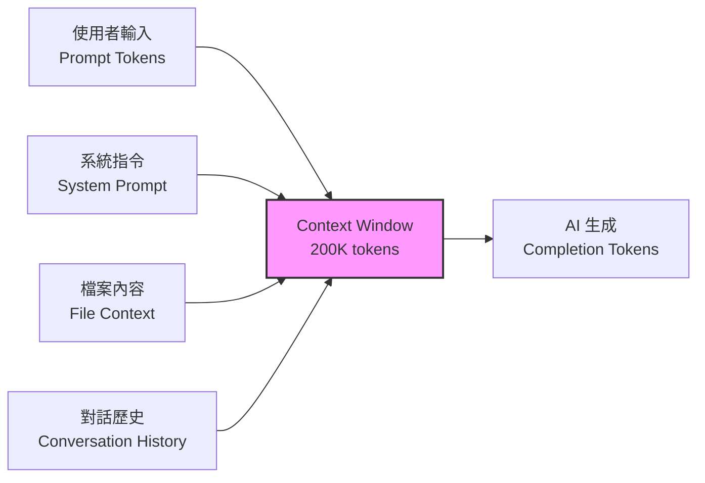

**Context Window 使用分佈（典型 Agent 對話）：**

| 組成部分 | 佔比 | Token 數（200K 為例） |
|---------|------|---------------------|
| System Prompt + Instructions | 5-10% | 10K-20K |
| 檔案讀取內容 | 30-50% | 60K-100K |
| 對話歷史 | 20-30% | 40K-60K |
| 工具呼叫結果 | 10-20% | 20K-40K |
| AI 生成回覆 | 10-15% | 20K-30K |

> **注意**：當 Context Window 接近滿載時，AI 回覆品質會顯著下降。建議將實際使用量控制在 Context Window 的 70% 以內。

### 1.4 Token 的三種類型

**Prompt Token（輸入 Token）**

使用者送給 AI 的所有內容，包含系統指令、使用者訊息、檔案內容、工具回傳結果等。這是 Token 消耗的主要來源，通常佔總消耗的 60-80%。

**Completion Token（輸出 Token）**

AI 生成的回覆內容，包含文字回覆、程式碼、工具呼叫指令等。單價通常為 Prompt Token 的 3-5 倍。

**Cache Token（快取 Token）**

部分 AI 服務（如 Claude）支援 Prompt Caching，當連續對話中有重複的上下文內容時，可以用快取價格計費（通常為正常價格的 10%）。

```
費用計算範例（Claude Sonnet 4）：
Prompt Token:    $3 / 1M tokens
Completion Token: $15 / 1M tokens  
Cache Read Token: $0.30 / 1M tokens（節省 90%）

一般開發 Session（30 分鐘）：
- 無優化：Prompt 150K + Completion 30K = $0.45 + $0.45 = $0.90
- 有 Cache：Cache 120K + Prompt 30K + Completion 30K = $0.036 + $0.09 + $0.45 = $0.576
- 節省：36%
```

### 1.5 為什麼 Token 會造成成本問題

**Token 消耗與費用關係**

企業 AI 開發的 Token 費用成長速度遠超預期。以 20 人團隊為例：

| 使用模式 | 每人每日 Token | 月度團隊 Token | 月度費用（估算） |
|---------|--------------|--------------|---------------|
| 輕度使用（Code Completion） | 50K | 22M | $200-400 |
| 中度使用（Agent 對話） | 500K | 220M | $2,000-4,000 |
| 重度使用（多 Agent 協作） | 2M | 880M | $8,000-16,000 |
| 無限制使用（全專案分析） | 10M+ | 4.4B+ | $40,000+ |

**Token 消耗與速度關係**

Token 消耗直接影響 AI 回應速度：
- 輸入 10K tokens → 回應時間約 2-5 秒
- 輸入 50K tokens → 回應時間約 8-15 秒
- 輸入 100K tokens → 回應時間約 20-40 秒
- 輸入 200K tokens → 回應時間約 45-90 秒

**Token 消耗與 Agent 執行次數關係**

AI Agent 模式下，每次工具呼叫都會累積 Token。一個典型的 Bug 修復 Agent 對話可能產生 10-30 次工具呼叫，每次呼叫都需要重新傳送完整的對話歷史：

```
第 1 次呼叫：10K tokens（初始 Prompt）
第 5 次呼叫：50K tokens（累積對話 + 工具結果）
第 15 次呼叫：150K tokens（接近 Context Window 上限）
第 20 次呼叫：Context 溢出，AI 開始遺忘早期內容
```

> **實務案例**：某金融團隊在未建立 Knowledge Graph 的情況下，使用 AI 進行 Spring Boot 2 → 3 升級，單次分析 600 個 Java 檔案消耗了 2.8M tokens（約 $25），且 AI 回覆品質低落，需要多次重試。建立 Knowledge Graph 後，相同任務僅消耗 180K tokens（約 $1.6），品質顯著提升。

---

## 第二章 AI 開發最常見 Token 浪費原因

### 2.1 全專案直接丟給 AI

**問題描述**

最常見的 Token 浪費模式是將整個 Repository 的內容直接提供給 AI 分析。開發者期望 AI「理解全貌」，但實際上造成了嚴重的 Context 爆炸。

**浪費模式：**

```
❌ 錯誤做法："請分析這個專案的架構"
   → AI 讀取整個專案 → 500+ 檔案 → 2M+ tokens
   → Context Window 溢出 → AI 回覆不完整
   → 開發者不滿意 → 重新提問 → 又消耗 2M+ tokens

✅ 正確做法："請根據以下架構圖分析 UserService 的設計問題"
   → AI 僅讀取相關檔案 → 5-10 檔案 → 30K tokens
   → 精準回覆 → 一次完成
```

**案例分析：某銀行共用平台專案**

- 專案規模：1,200 個 Java 檔案、80 萬行程式碼
- 未優化：開發者詢問「這個 API 為什麼回傳 500」，AI Agent 搜尋了 300+ 檔案，消耗 1.5M tokens
- 優化後：建立 API Knowledge Graph，AI 直接定位到 3 個相關檔案，消耗 25K tokens
- **節省比例：98.3%**

### 2.2 一次貼大量 Source Code

**問題描述**

開發者習慣將整個檔案或多個檔案的完整內容直接貼入對話，即使只需要 AI 分析其中幾行程式碼。

**浪費模式：**

```
❌ 錯誤做法：貼入 3000 行的 Controller 檔案 + 2000 行的 Service 檔案
   "請幫我找出這個 NullPointerException 的原因"
   → 5000 行 × 平均 5 tokens/行 = 25,000 tokens

✅ 正確做法：僅貼入相關方法 + Stack Trace
   "以下方法在第 45 行丟出 NullPointerException：
   [50 行相關程式碼 + Stack Trace]"
   → 80 行 × 5 tokens/行 = 400 tokens
```

**案例分析：日常 Code Review**

| 情境 | Token 消耗 | 回覆品質 |
|------|-----------|---------|
| 貼入完整 PR（20 個檔案） | 120K tokens | 泛泛而談，建議不精準 |
| 僅貼入變更差異（diff） | 15K tokens | 聚焦變更，建議具體 |
| 搭配 Knowledge Graph 僅提供關聯 | 8K tokens | 理解上下文，建議最精準 |

### 2.3 每次重新描述需求

**問題描述**

開發者在新的對話 Session 中，反覆描述相同的專案背景、架構設計、編碼規範等資訊。這些重複描述在每次對話中都會消耗 Token。

**浪費模式：**

```
Session 1："我們的專案使用 Spring Boot 3.4 + Vue 3 + Oracle，
           架構是 Clean Architecture，有 200 個 API..."
           → 背景描述消耗 2,000 tokens

Session 2："我們的專案使用 Spring Boot 3.4 + Vue 3 + Oracle..."
           → 相同背景又消耗 2,000 tokens

Session N：重複 N 次...
           → 每天 20 個 Session = 40,000 tokens 浪費在背景描述
```

**解決方案預覽：**

- Claude Code：將背景寫入 `CLAUDE.md`，系統自動注入
- GitHub Copilot：將背景寫入 `.github/copilot-instructions.md`
- 建立 Architecture Memory 檔案，AI 自動載入

### 2.4 Agent 無限制搜尋

**問題描述**

AI Agent 在執行任務時，如果沒有明確的搜尋範圍限制，會進行遞迴式搜尋，讀取大量不相關的檔案。

**浪費模式：**

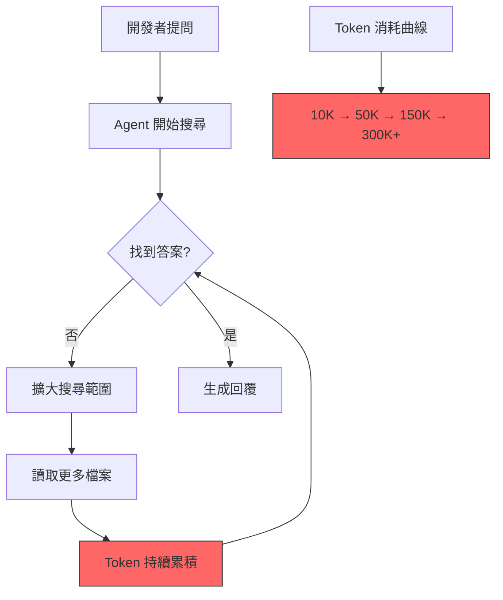

**案例分析：Agent 搜尋失控**

某開發者要求 AI 修復一個 CSS 樣式問題，Agent 的搜尋行為：

1. 搜尋 `.css` 檔案 → 找到 50 個 → 讀取 15 個（30K tokens）
2. 搜尋 `.vue` 檔案的 `<style>` 區塊 → 讀取 20 個（40K tokens）
3. 搜尋 `tailwind.config.js` → 讀取配置（5K tokens）
4. 搜尋 `package.json` 確認依賴 → （2K tokens）
5. 搜尋其他相關配置 → （10K tokens）
6. **總消耗：87K tokens，僅需修改 1 行 CSS**

優化後：提供 Component 名稱 + 元素選擇器，Agent 直接定位，消耗 **5K tokens**。

### 2.5 Framework 升級時全專案分析

**問題描述**

在進行 Framework 升級（如 Spring Boot 2 → 3、Vue 2 → 3）時，開發者傾向讓 AI 分析整個專案的影響範圍，導致巨量 Token 消耗。

**浪費模式：**

| Framework 升級 | 專案檔案數 | 全量分析 Token | 優化後 Token | 節省 |
|---------------|-----------|--------------|-------------|------|
| Spring Boot 2 → 3 | 600 個 Java | 3.0M | 200K | 93% |
| Vue 2 → 3 | 400 個 Vue/JS | 2.0M | 150K | 92% |
| Angular 12 → 20 | 500 個 TS | 2.5M | 180K | 93% |
| Java 17 → 25 | 800 個 Java | 4.0M | 250K | 94% |

**根本原因**：缺乏 Migration Knowledge Graph。每次升級操作都要從零開始分析，而不是基於已建立的依賴關係圖進行增量分析。

> **實務建議**：在啟動任何 Framework 升級專案前，先投入 2-4 小時建立 Codebase Knowledge Graph。這個前期投資將在後續數週的升級工作中節省數十倍的 Token 消耗。

---

## 第三章 RTK 思維

### 3.1 RTK 核心設計

RTK（Rust Token Killer）是一個以 Rust 語言開發的高效能 CLI 代理工具，其核心設計理念是：**在 AI 接收資訊之前，先對資訊進行智慧壓縮與過濾**，從而大幅降低 Token 消耗。

RTK 不是一個獨立的 AI 工具，而是一個位於「開發者工具」與「AI 模型」之間的中間層。它攔截並優化所有送往 AI 的上下文資訊，使 AI 能以更少的 Token 獲得同等甚至更好的理解。

**RTK 核心設計原則：**

1. **壓縮上下文**：將冗長的工具輸出壓縮為結構化摘要
2. **移除重複內容**：自動去除重複的檔案內容、相似的錯誤訊息
3. **摘要化**：將大型輸出轉換為關鍵資訊摘要
4. **分層分析**：根據重要性分層呈現資訊，AI 可按需深入

**安裝方式：**

```bash
# Homebrew（推薦）
brew install rtk

# Quick Install（Linux/macOS）
curl -fsSL https://raw.githubusercontent.com/rtk-ai/rtk/refs/heads/master/install.sh | sh

# Cargo
cargo install --git https://github.com/rtk-ai/rtk

# Windows：下載 Pre-built Binary
# https://github.com/rtk-ai/rtk/releases → rtk-x86_64-pc-windows-msvc.zip
```

**支援 13+ AI 編碼工具：**

| AI 工具 | 初始化指令 | 整合方式 |
|---------|-----------|----------|
| Claude Code | `rtk init -g` | PreToolUse hook（自動改寫） |
| GitHub Copilot | `rtk init -g --copilot` | PreToolUse hook |
| Cursor | `rtk init -g --agent cursor` | hooks.json |
| Gemini CLI | `rtk init -g --gemini` | BeforeTool hook |
| Codex | `rtk init -g --codex` | AGENTS.md 指令注入 |
| Windsurf | `rtk init --agent windsurf` | .windsurfrules |
| Cline / Roo Code | `rtk init --agent cline` | .clinerules |
| OpenCode | `rtk init -g --opencode` | Plugin TS |
| Google Antigravity | `rtk init --agent antigravity` | rules 檔案 |

> **Windows 注意事項**：RTK 在 Windows 原生環境（cmd/PowerShell）下濾波功能完整可用，但 Auto-Rewrite Hook 不支援（需要 Unix Shell）。Windows 會自動退回 CLAUDE.md 注入模式——AI 助手會收到 RTK 指令但不會自動改寫命令。**建議使用 WSL** 以獲得完整支援。

### 3.2 RTK Workflow

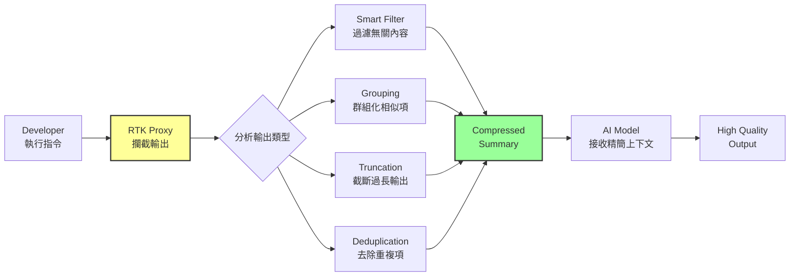

**典型使用流程：**

```bash
# 未使用 RTK：直接執行指令，完整輸出送給 AI
$ find . -name "*.java" -exec wc -l {} \;
# 輸出 800 行 → AI 接收 800 行 → ~4,000 tokens

# 使用 RTK：輸出經過智慧壓縮
$ rtk find . -name "*.java" -exec wc -l {} \;
# RTK 壓縮為摘要 → AI 接收 20 行 → ~100 tokens
# 摘要內容：「共 600 個 Java 檔案，總計 450,000 行，
#           最大檔案：UserService.java (3,200行)，
#           平均每檔 750 行」
```

### 3.3 RTK 四大策略

**策略一：Smart Filtering（智慧過濾）**

自動辨識並移除無關資訊，例如：
- 編譯過程中的進度條、百分比
- 測試輸出中的重複堆疊追蹤
- 目錄列表中的二進位檔案、快取檔案
- Git 狀態中的未追蹤暫存檔

```
範例：mvn compile 輸出
原始輸出：150 行（包含下載進度、Maven 日誌）→ ~750 tokens
RTK 過濾後：8 行（僅保留編譯結果與錯誤）→ ~40 tokens
節省：94.7%
```

**策略二：Grouping（群組化）**

將相似的項目群組化呈現：

```
範例：find . -name "*.java" 的輸出
原始：列出 600 個檔案路徑 → ~3,000 tokens
RTK 群組化：
  src/main/java/com/service/ (45 files)
  src/main/java/com/controller/ (30 files)
  src/main/java/com/model/ (60 files)
  src/test/ (120 files)
  → ~200 tokens
節省：93.3%
```

**策略三：Truncation（智慧截斷）**

對超長輸出進行智慧截斷，保留頭尾與關鍵段落：

```
範例：cat large-log.txt（10,000 行日誌）
原始：10,000 行 → ~50,000 tokens
RTK 截斷：前 20 行 + 錯誤行 + 後 10 行 + 統計摘要 → ~500 tokens
節省：99.0%
```

**策略四：Deduplication（去重）**

自動偵測並合併重複或高度相似的內容：

```
範例：測試結果中 50 個類似的失敗訊息
原始：50 個完整 Stack Trace → ~25,000 tokens
RTK 去重：1 個代表性 Stack Trace + "其餘 49 個相同模式" → ~600 tokens
節省：97.6%
```

### 3.4 RTK 能節省多少 Token

以下是 RTK 在典型 30 分鐘開發 Session 中的 Token 節省數據：

| 指令類型 | 原始 Token | RTK 後 Token | 節省比例 | 說明 |
|---------|-----------|-------------|---------|------|
| `ls` / `tree` | 5,000 | 1,000 | **80%** | 目錄結構壓縮 |
| `cat` / `read` | 20,000 | 6,000 | **70%** | 檔案內容摘要化 |
| `grep` / `search` | 15,000 | 3,000 | **80%** | 搜尋結果群組化 |
| `git status` / `diff` | 8,000 | 1,600 | **80%** | 變更摘要化 |
| `mvn test` / `npm test` | 50,000 | 5,000 | **90%** | 測試結果去重 |
| `compile` / `build` | 20,000 | 2,300 | **88%** | 建置日誌過濾 |
| **Session 合計** | **~118,000** | **~23,900** | **~80%** | - |

**月度節省估算（20 人團隊）：**

```
原始月度消耗：118K tokens × 40 sessions/天 × 22 天 = 103.84M tokens
RTK 優化後：23.9K tokens × 40 sessions/天 × 22 天 = 21.03M tokens
月度節省：82.81M tokens ≈ $250-750（依模型定價）
```

> **RTK 思維的核心啟示**：即使不使用 RTK 工具本身，也應該在 AI 開發流程中應用 RTK 的四大策略思維——在任何資訊送給 AI 之前，先問自己：「這些資訊能否被過濾、群組化、截斷或去重？」

---

## 第四章 Understand-Anything 思維

### 4.1 Knowledge Graph 概念

Understand-Anything 的核心理念是將大型程式碼庫轉換為結構化的 Knowledge Graph（知識圖譜），讓 AI 能夠「按需查詢」而非「全量閱讀」。

**四種圖譜類型：**

**Code Graph（程式碼圖譜）**
- 記錄每個檔案、類別、方法的定義與位置
- 包含程式碼摘要與功能說明
- AI 可精準定位到特定方法，無需讀取完整檔案

**Dependency Graph（相依性圖譜）**
- 記錄模組之間的 import/dependency 關係
- 識別循環相依與耦合度
- AI 可快速理解模組間的關聯

**Call Graph（呼叫圖譜）**
- 記錄函式之間的呼叫關係
- 追蹤 API → Service → Repository 的呼叫鏈
- AI 可沿著呼叫鏈定位問題根源

**Knowledge Graph（知識圖譜）**
- 整合上述三種圖譜
- 加入業務語義（Business Domain）標註
- 提供全專案的結構化知識查詢介面

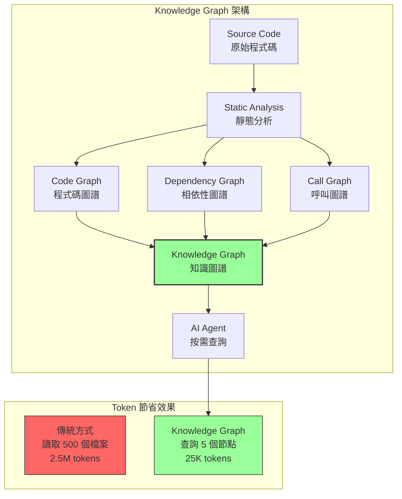

### 4.2 Multi-Agent Pipeline

Understand-Anything 使用多智能體管線（Multi-Agent Pipeline）來建構 Knowledge Graph。核心 `/understand` 指令包含 5 個專業 Agent，額外的分析指令各有專屬 Agent：

| Agent | 觸發指令 | 職責 | 產出 |
|-------|---------|------|------|
| Project Scanner | `/understand` | 掃描專案結構、識別技術棧與框架 | 專案概覽、技術清單 |
| File Analyzer | `/understand` | 逐檔分析功能與邏輯（並行處理，每批 20-30 檔） | 檔案摘要、功能標註 |
| Architecture Analyzer | `/understand` | 識別架構模式與層次分類 | 架構圖、模組關係 |
| Tour Builder | `/understand` | 建立專案導覽路徑 | 入門指南、導覽順序 |
| Graph Reviewer | `/understand` | 驗證圖譜完整性與引用正確性 | 修正建議、品質報告 |
| Domain Analyzer | `/understand-domain` | 提取業務領域、流程與步驟 | 領域模型、術語對照 |
| Article Analyzer | `/understand-knowledge` | 從 Wiki 知識庫擷取實體與關係 | 實體圖、隱含關聯 |

**安裝與使用：**

```bash
# Claude Code（原生 Plugin）
/plugin marketplace add Lum1104/Understand-Anything
/plugin install understand-anything

# 其他平台（Codex / Gemini CLI / Copilot / Cursor 等 15+ 平台）
curl -fsSL https://raw.githubusercontent.com/Lum1104/Understand-Anything/main/install.sh | bash

# Windows
iwr -useb https://raw.githubusercontent.com/Lum1104/Understand-Anything/main/install.ps1 | iex
```

**核心指令：**

| 指令 | 功能 |
|------|------|
| `/understand` | 建構知識圖譜（支援增量更新，僅重新分析變更檔案） |
| `/understand-dashboard` | 開啟互動式視覺化儀表板 |
| `/understand-chat` | 基於圖譜進行問答 |
| `/understand-diff` | 分析當前變更的影響範圍 |
| `/understand-domain` | 擷取業務領域知識 |
| `/understand --auto-update` | 啟用 post-commit hook 自動更新圖譜 |

**關鍵特性**：Tree-sitter + LLM 混合架構——Tree-sitter 負責確定性的結構解析（imports、exports、函式定義），LLM 負責語義理解（摘要、標註、架構分層）。結構面可重現，語義面捕捉意圖。

**Token 節省原理**：這個管線只需執行一次（約消耗 50K-200K tokens），之後所有 AI 對話都可以透過查詢圖譜來獲取上下文，而不需要重新分析原始碼。支援增量更新——僅重新分析變更的檔案，大幅降低持續維護成本。

### 4.3 為何 Knowledge Graph 可以降低 Token

**核心原理**：Knowledge Graph 將「全量讀取」轉換為「精準查詢」。

**對比分析：100 萬行程式碼系統**

| 操作 | 傳統方式 | Knowledge Graph 方式 |
|------|---------|-------------------|
| 理解系統架構 | 讀取 50+ 核心檔案（500K tokens） | 查詢架構節點（5K tokens） |
| 定位 Bug | Agent 搜尋 200+ 檔案（1M tokens） | 沿 Call Graph 追蹤（15K tokens） |
| 影響範圍分析 | 全專案 grep（800K tokens） | 查詢 Dependency Graph（8K tokens） |
| 新功能開發 | 閱讀相關模組（300K tokens） | 查詢相關節點 + 範例（20K tokens） |

**Token 節省公式：**

```
傳統方式 Token = 檔案數 × 平均檔案大小 × 讀取次數
Knowledge Graph Token = 查詢節點數 × 節點摘要大小
節省比例 = 1 - (Graph Token / 傳統 Token) ≈ 95-99%
```

> **實務案例**：某大型銀行的核心交易系統（120 萬行 Java 程式碼），建立 Knowledge Graph 後，每位開發者每日平均節省 300K tokens，團隊 15 人每月節省約 99M tokens，費用節省約 $900/月。Knowledge Graph 建構成本僅為一次性的 200K tokens（約 $1.8）。

---

## 第五章 GitNexus 思維

### 5.1 Repository 知識管理

GitNexus 的核心理念是將 Git Repository 索引為可查詢的知識庫，採用**預計算關聯智慧（Precomputed Relational Intelligence）**——在索引時預先計算叢集、追蹤、評分，使工具在單次呼叫中即可回傳完整上下文，而非讓 LLM 自行探索。提供 16 個 MCP（Model Context Protocol）工具（11 個單一倉庫 + 5 個跨倉庫群組）供 AI Agent 精準存取 Repository 資訊。

**安裝與快速開始：**

```bash
# 安裝（全域）
npm install -g gitnexus

# 索引倉庫（在 repo 根目錄執行）
npx gitnexus analyze

# 自動設定 MCP（一次性）
npx gitnexus setup
```

`gitnexus analyze` 會一次完成：索引程式碼、安裝 Agent Skills、註冊 Claude Code Hooks、建立 `AGENTS.md` / `CLAUDE.md` 上下文檔案。

**支援平台**：Claude Code（完整支援：MCP + Skills + Hooks）、Cursor、Codex、Gemini CLI（Antigravity）、Windsurf、OpenCode。

**五大索引類型：**

**Repository Index（倉庫索引）**
- 專案結構、檔案清單、目錄組織
- 技術棧識別、框架版本
- 建置工具與配置

**Symbol Index（符號索引）**
- 類別、介面、方法、變數定義
- 跨檔案的符號引用
- 型別層級關係

**Dependency Index（相依性索引）**
- 模組間的 import 關係
- 外部套件依賴
- 版本相容性資訊

**Semantic Search（語義搜尋）**
- 基於自然語言的程式碼搜尋
- 理解開發者意圖，而非僅匹配關鍵字
- 支援跨語言搜尋

**Embedding Search（向量搜尋）**
- 將程式碼轉換為向量表示
- 支援相似度搜尋
- 找出語義相似但文字不同的程式碼片段

### 5.2 Semantic Search 與 Token 節省

傳統的文字搜尋（grep/ripgrep）會回傳大量不相關的結果，AI 需要逐一讀取並判斷相關性，造成 Token 浪費。Semantic Search 則直接回傳語義相關的結果，大幅減少 AI 需要處理的資訊量。

**GitNexus 16 個 MCP 工具的 Token 節省效果：**

| MCP 工具 | 功能 | 傳統替代方式 Token | MCP 方式 Token |
|---------|------|-----------------|--------------|
| `list_repos` | 列出所有已索引倉庫 | 手動管理 | < 1K |
| `query` | 程序分組混合搜尋（BM25 + 語義 + RRF） | 20K（grep 全專案） | 2K |
| `context` | 360° 符號視圖（分類引用、程序參與） | 50K（讀取完整檔案） | 5K |
| `impact` | 爆炸半徑分析（深度分組 + 信心度） | 100K（遞迴追蹤） | 8K |
| `detect_changes` | Git diff 影響分析（映射變更行至受影響程序） | 30K（git diff 全量） | 3K |
| `rename` | 多檔案協調重新命名（圖譜 + 文字搜尋） | 手動逐檔修改 | 4K |
| `cypher` | 原始 Cypher 圖譜查詢 | N/A | 2K |
| `group_*`（5 個） | 跨倉庫群組管理、合約比對、流程搜尋 | 40K（手動分析） | 4K |

**支援 14+ 程式語言**：TypeScript、JavaScript、Python、Java、Kotlin、C#、Go、Rust、PHP、Ruby、Swift、C/C++、Dart 等。

### 5.3 傳統搜尋 VS Semantic Search

| 比較維度 | 傳統搜尋 (grep) | Semantic Search |
|---------|---------------|----------------|
| 搜尋方式 | 關鍵字匹配 | 語義理解 |
| 結果精準度 | 低（大量誤判） | 高（語義相關） |
| 結果數量 | 數百筆 | 5-20 筆精選 |
| Token 消耗 | 高（需讀取所有結果） | 低（僅精選結果） |
| 跨語言支援 | 不支援 | 支援 |
| 意圖理解 | 不支援 | 支援 |

**實務範例：**

```
需求："找出所有處理使用者認證的程式碼"

傳統搜尋：grep -r "auth" → 500+ 結果（含 author、authority 等無關匹配）
→ AI 讀取 500 筆結果 → 25K tokens → 大多不相關

Semantic Search："使用者認證邏輯" → 12 筆精選結果
→ AI 讀取 12 筆結果 → 3K tokens → 全部相關
```

> **GitNexus 思維的核心啟示**：不要讓 AI 自己去搜尋和判斷，而是提供一個預先索引的知識庫，讓 AI 能夠進行精準的語義查詢。搜尋的 Token 成本應該是 O(1)（常數級）而非 O(n)（線性級）。

---

## 第六章 Graphify 思維

### 6.1 程式碼知識圖譜建構

Graphify 是一個以 Python 開發的程式碼知識圖譜建構工具，支援 33 種程式語言的程式碼以及文件、PDF、圖片、影片等多媒體內容。使用 Tree-sitter AST 解析器在本地端完成程式碼分析，不需要將程式碼傳送給 AI API，本身不消耗 AI Token。

**安裝與使用：**

```bash
# 安裝（推薦使用 uv）
uv tool install graphifyy    # 注意：PyPI 套件名稱是 graphifyy（雙 y）

# 替代安裝方式
pipx install graphifyy
pip install graphifyy

# 註冊為 AI 助手技能
graphify install

# 建構知識圖譜（在 AI 助手中執行）
/graphify .

# 或在終端直接執行
graphify extract ./src
```

**支援 20+ AI 編碼工具**：Claude Code、Codex、Cursor、Gemini CLI、GitHub Copilot CLI、VS Code Copilot Chat、Aider、OpenCode、OpenClaw、Amp、Kiro、Google Antigravity 等。

> **PowerShell 注意**：在 PowerShell 中使用 `graphify .` 而非 `/graphify .`——前導斜線在 PowerShell 中是路徑分隔符。

**Graphify 的產出物：**

| 產出物 | 檔案 | 說明 |
|-------|------|------|
| 互動式圖譜 | `graph.html` | 可視化知識圖譜，可用瀏覽器開啟 |
| 圖譜報告 | `GRAPH_REPORT.md` | Markdown 格式的結構化報告 |
| 圖譜資料 | `graph.json` | JSON 格式的完整圖譜資料 |

### 6.2 Entity Extraction 架構

Graphify 透過 Tree-sitter 對程式碼進行語法層級的實體擷取：

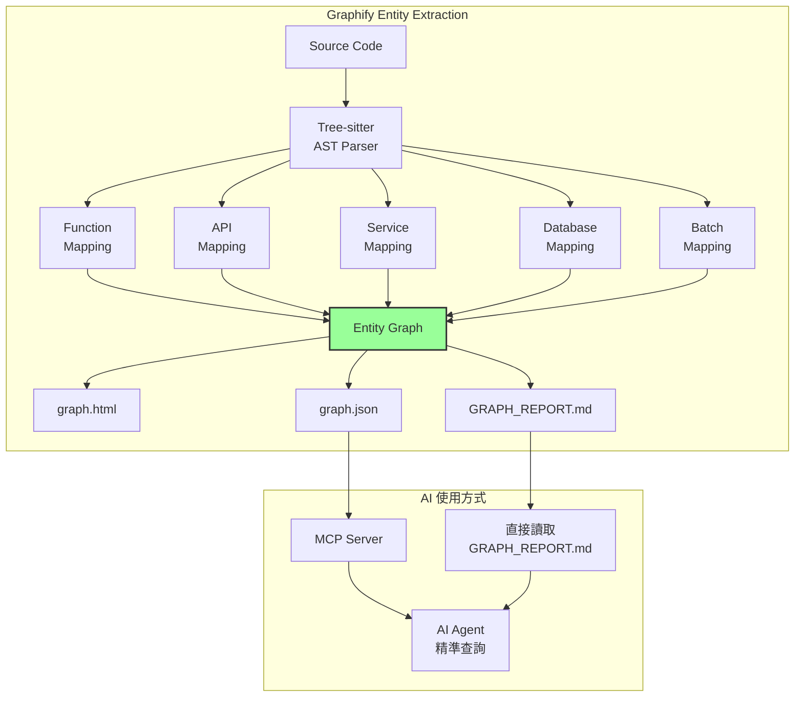

**六大 Mapping 類型：**

- **Function Mapping**：函式定義、參數、回傳值、呼叫關係
- **API Mapping**：REST API 端點、HTTP 方法、路徑、參數
- **Service Mapping**：服務類別、依賴注入、介面實作
- **Database Mapping**：資料表、欄位、SQL 查詢、ORM 對映
- **Batch Mapping**：批次作業、排程任務、Job 流程
- **Entity Mapping**：實體類別、DTO、VO、領域物件

### 6.3 Confidence Tags 機制

Graphify 為每個擷取的實體標註信心度，這在 AI 使用時非常有價值：

| 信心度標籤 | 意義 | AI 使用建議 |
|----------|------|-----------|
| `EXTRACTED` | 直接從程式碼解析取得 | 可完全信賴，無需驗證 |
| `INFERRED` | 根據程式碼模式推斷 | 建議快速驗證 |
| `AMBIGUOUS` | 資訊模糊或衝突 | 必須讀取原始碼確認 |

**Token 節省策略**：

- `EXTRACTED` 實體：AI 直接使用，不需讀取原始檔案 → **節省 100%**
- `INFERRED` 實體：AI 僅讀取相關程式碼段落確認 → **節省 80%**
- `AMBIGUOUS` 實體：AI 讀取完整檔案確認 → **節省 0%**（但此類佔比通常 < 5%）

> **Graphify 思維的核心啟示**：利用本地端的 AST 解析器（零 Token 成本）預先建構程式碼知識圖譜，然後讓 AI 透過查詢圖譜來理解程式碼，而非直接閱讀原始碼。這是 Token 節省的「空間換時間」策略。

---

## 第七章 SSDLC 如何減少 Token

SSDLC（Secure Software Development Life Cycle）的每個階段都存在 Token 浪費的機會點，也都有對應的優化策略。

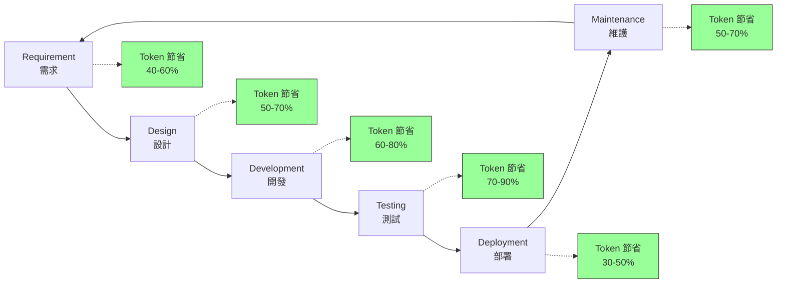

### 7.1 Requirement 階段

**Token 浪費點：**
- 反覆向 AI 描述業務背景
- 每次 User Story 拆分都要重新說明系統全貌
- 需求文件格式不一致，AI 需要額外理解

**Token 優化方式：**
- 建立 `requirements-memory.md`，包含系統業務背景、術語表、使用者角色
- 使用標準化 User Story 模板，減少 AI 理解成本
- 將需求 Backlog 結構化為 YAML/JSON 格式

**Prompt 優化範例：**

```markdown
❌ 原始 Prompt（~800 tokens）：
"我們是一家銀行，有一個核心系統，用 Java 寫的，有客戶管理、
帳戶管理、交易處理等模組。現在客戶提出要增加一個新功能，
就是在轉帳的時候可以設定定期轉帳，每個月自動轉帳。
請幫我分析這個需求，寫出 User Story..."

✅ 優化 Prompt（~200 tokens）：
"參考 requirements-memory.md 中的系統背景。
新需求：帳戶模組新增定期轉帳功能。
請產出 User Story（Acceptance Criteria + Edge Cases）。"
```

### 7.2 Design 階段

**Token 浪費點：**
- 要求 AI 從頭設計架構，未提供現有架構資訊
- 多次迭代設計方案，每次都重新描述約束條件
- 設計決策未記錄，後續開發階段重複討論

**Token 優化方式：**
- 建立 `architecture-memory.md`，記錄系統架構、技術選型、設計約束
- 將 ADR（Architecture Decision Record）存檔供 AI 參考
- 使用 Knowledge Graph 提供模組關係圖

**Prompt 優化範例：**

```markdown
❌ 原始 Prompt（~1,200 tokens）：
"我們的系統使用 Clean Architecture，分為 controller、service、
repository 三層。目前的 UserService 有 45 個方法，
UserController 有 30 個 API。我們使用 Spring Boot 3.4，
資料庫是 Oracle 19c。現在要設計一個新的通知模組，
需要支援 Email、SMS、Push 三種通知方式..."

✅ 優化 Prompt（~300 tokens）：
"參考 architecture-memory.md。
設計新模組：NotificationService。
需求：支援 Email/SMS/Push，使用 Strategy Pattern。
約束：符合現有 Clean Architecture，整合 Kafka。
請產出 Class Diagram + Sequence Diagram。"
```

### 7.3 Development 階段

**Token 浪費點：**
- Agent 搜尋大量檔案尋找程式碼範例
- 重複生成相似的 CRUD 程式碼
- 未使用 Coding Standard Memory，每次都要求特定程式碼風格

**Token 優化方式：**
- 建立 `coding-standards.md`，記錄命名慣例、程式碼模板、錯誤處理方式
- 提供相關模組的 Knowledge Graph 節點，而非完整檔案
- 使用 Sub Agent 進行範圍限定的任務

**Prompt 優化範例：**

```markdown
❌ 原始 Prompt（~2,000 tokens）：
"請參考 UserController.java、UserService.java、
UserRepository.java 的寫法，幫我新增一個 
NotificationController、NotificationService、
NotificationRepository..."
[附上三個完整檔案的程式碼]

✅ 優化 Prompt（~400 tokens）：
"參考 coding-standards.md 中的 Controller/Service/Repository 模板。
新增 Notification 模組的三層架構。
Entity 欄位：id, userId, type, content, status, createdAt。
API：POST /notifications, GET /notifications/{id}, 
     PUT /notifications/{id}/read。"
```

### 7.4 Testing 階段

**Token 浪費點：**
- 讓 AI 讀取完整的被測試類別來撰寫測試
- 測試失敗時貼入完整的測試報告
- 重複描述測試框架和工具配置

**Token 優化方式：**
- 提供方法簽名與 JavaDoc 即可生成測試，無需完整實作
- 僅提供失敗的測試案例和相關 Stack Trace
- 建立 `testing-standards.md` 記錄測試慣例

**Prompt 優化範例：**

```markdown
❌ 原始 Prompt（~3,000 tokens）：
[貼入完整的 UserService.java 300 行]
"請為上述所有 public method 撰寫 JUnit 5 測試"

✅ 優化 Prompt（~600 tokens）：
"為以下方法撰寫 JUnit 5 + Mockito 測試：
- UserService.createUser(CreateUserDTO): User
  - 驗證必填欄位、Email 格式、重複帳號
- UserService.updateUser(Long, UpdateUserDTO): User
  - 驗證使用者存在、權限檢查
參考 testing-standards.md 的測試命名慣例。"
```

### 7.5 Deployment 階段

**Token 浪費點：**
- 每次部署問題排查都重新描述環境配置
- CI/CD Pipeline 日誌全量傳給 AI 分析
- 容器配置與基礎設施即程式碼的重複說明

**Token 優化方式：**
- 建立 `deployment-memory.md` 記錄環境配置、部署流程
- 僅擷取 Pipeline 的錯誤段落
- 使用 RTK 思維壓縮部署日誌

### 7.6 Maintenance 階段

**Token 浪費點：**
- 問題排查時讀取大量日誌
- 效能調校時分析大量 Metrics
- 每次 On-Call 事件都要重新理解系統架構

**Token 優化方式：**
- 建立 `ops-runbook.md` 記錄常見問題與解決方案
- 日誌分析使用 RTK 思維，僅提供關鍵片段
- Knowledge Graph 加速系統理解

> **SSDLC Token 優化的關鍵**：每個階段的共通策略是「建立 Memory 檔案」。前期投入的 Memory 建構成本會在後續所有對話中持續產生 Token 節省效益。

---

## 第八章 Agent Team 如何節省 Token

### 8.1 Agent Team 架構

Agent Team 是指多個專職 AI Agent 協作完成軟體開發任務的模式。相較於單一 Agent 處理所有事務，Agent Team 讓每個 Agent 專注於特定領域，從而減少每個 Agent 需要載入的上下文量。

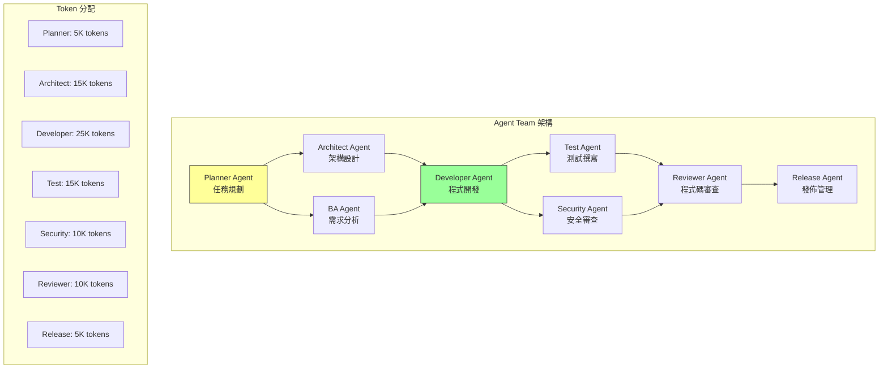

### 8.2 各 Agent 職責與 Token 策略

| Agent | 職責 | Context 需求 | Token 策略 |
|-------|------|-------------|-----------|
| **Planner Agent** | 任務拆分、優先排序 | 需求文件、架構概覽 | 僅載入 Memory 檔案，不讀原始碼 |
| **Architect Agent** | 架構設計、技術選型 | 架構圖、技術約束 | 載入 Knowledge Graph 架構節點 |
| **BA Agent** | 需求分析、User Story | 業務規則、使用者流程 | 載入 Requirement Memory |
| **Developer Agent** | 程式碼實作 | 相關模組程式碼、Coding Standard | 僅載入目標模組 + 介面定義 |
| **Test Agent** | 測試案例撰寫 | 方法簽名、業務規則 | 僅載入方法簽名，不讀完整實作 |
| **Security Agent** | 安全漏洞掃描 | OWASP 規則、敏感操作 | 僅載入安全相關程式碼路徑 |
| **Reviewer Agent** | Code Review | 變更差異、品質標準 | 僅載入 diff + Coding Standard |
| **Release Agent** | 發佈管理 | 版本資訊、Changelog | 僅載入版本記錄 |
| **Reverse Engineering Agent** | 遺留系統分析 | Architecture Graph | 載入 Knowledge Graph |
| **Doc Writer Agent** | 文件撰寫 | 程式碼摘要、API 規格 | 載入圖譜節點摘要 |

### 8.3 單 Agent VS 多 Agent 比較

| 比較維度 | 單 Agent 模式 | 多 Agent（Agent Team）模式 |
|---------|-------------|------------------------|
| **Context 載入** | 載入所有相關資訊（100K+ tokens） | 每個 Agent 僅載入專職資訊（5-25K tokens） |
| **單次任務 Token** | 100K-300K tokens | 總計 80K-120K tokens |
| **Context 溢出風險** | 高（單一 Context Window 承載所有） | 低（任務分散在多個 Context Window） |
| **回覆品質** | 中等（注意力分散） | 高（每個 Agent 專注） |
| **執行速度** | 慢（串行處理所有子任務） | 快（可並行執行） |
| **錯誤回復** | 需重新執行整個任務 | 僅需重新執行失敗的 Agent |
| **Token 節省** | 基準線 | **節省 40-60%** |

**Token 節省原理：**

```
單 Agent 模式：
- 需求分析 → 讀取需求文件 + 架構圖 + 程式碼 + 測試 = 150K tokens
- 所有資訊塞入同一個 Context Window
- Context 越來越大，後期對話每次都傳送完整歷史

多 Agent 模式：
- Planner Agent → 讀取需求文件（5K tokens）→ 產出任務清單
- Architect Agent → 讀取架構圖 + 任務清單（15K tokens）→ 產出設計
- Developer Agent → 讀取設計 + 相關程式碼（25K tokens）→ 產出程式碼
- Test Agent → 讀取方法簽名 + 設計（15K tokens）→ 產出測試
- 總計：60K tokens（節省 60%）
```

> **Agent Team 的核心價值**：不僅是 Token 節省，更重要的是**權責分離**。每個 Agent 有明確的輸入/輸出契約，降低了上下文污染的風險，提高了 AI 回覆的精準度。

---

## 第九章 大型 Web Application 開發策略

### 9.1 建立 System Knowledge Base

對於大型 Web Application（Spring Boot + Vue/Angular/React + Oracle/DB2/PostgreSQL），在 AI 協助開發前建立 System Knowledge Base 是減少 Token 的最有效前期投資。

**System Knowledge Base 結構：**

```
.ai/
├── architecture-memory.md      # 系統架構、模組關係、技術棧
├── coding-standards.md         # 編碼規範、命名慣例、程式碼模板
├── api-memory.md              # API 清單、介面定義、資料格式
├── db-memory.md               # 資料庫 Schema、關聯、索引策略
├── business-rules.md          # 業務規則、領域術語、流程定義
├── deployment-memory.md       # 環境配置、部署流程、基礎設施
└── knowledge-graph/
    ├── graph.json             # Graphify 產出的圖譜資料
    └── GRAPH_REPORT.md        # 圖譜摘要報告
```

### 9.2 五大 Memory 層

**Architecture Memory（架構記憶）**

記錄系統整體架構，讓 AI 不需要每次都重新理解系統結構：

```markdown
# Architecture Memory

## 技術棧
- Backend: Spring Boot 3.4, Java 21, Maven
- Frontend: Vue 3.5, TypeScript, Vite
- Database: Oracle 19c (主庫), Redis 7 (快取)
- MQ: IBM MQ 9.3
- Auth: SSO + JWT

## 模組架構
- gateway-service: API Gateway, 路由、限流
- user-service: 使用者管理, 認證授權
- account-service: 帳戶管理, 餘額查詢
- transaction-service: 交易處理, 轉帳
- notification-service: 通知服務, Email/SMS
- batch-service: 批次作業, 日終結算

## 分層架構
Controller → Service → Repository → Database
           ↗ DTO/VO     ↗ Entity
```

**Coding Standard Memory（編碼規範記憶）**

```markdown
# Coding Standards

## Controller 模板
- 使用 @RestController + @RequestMapping
- 方法命名：動詞 + 名詞（createUser, getAccount）
- 回傳統一使用 ResponseEntity<ApiResponse<T>>
- 使用 @Valid 進行參數驗證

## Service 模板
- 使用 @Service + @Transactional
- 方法不超過 30 行
- 複雜邏輯拆分為 private method
- 使用 Optional 處理可能為 null 的回傳值

## 例外處理
- 業務例外使用 BusinessException(ErrorCode)
- 統一由 GlobalExceptionHandler 處理
- 不允許 catch 後吞掉例外
```

**API Memory（API 記憶）**

```markdown
# API Memory

## User API
| Method | Path | 說明 | Auth |
|--------|------|------|------|
| POST | /api/v1/users | 建立使用者 | ADMIN |
| GET | /api/v1/users/{id} | 查詢使用者 | USER |
| PUT | /api/v1/users/{id} | 更新使用者 | USER |
| DELETE | /api/v1/users/{id} | 停用使用者 | ADMIN |
```

**DB Memory（資料庫記憶）**

```markdown
# Database Memory

## 核心資料表
| Table | 說明 | 主要欄位 | 索引 |
|-------|------|---------|------|
| T_USER | 使用者 | user_id, name, email | PK, UK_email |
| T_ACCOUNT | 帳戶 | account_id, user_id, balance | PK, FK_user |
| T_TRANSACTION | 交易 | tx_id, from_acct, to_acct, amount | PK, IDX_date |
```

**Business Rules Memory（業務規則記憶）**

```markdown
# Business Rules

## 轉帳規則
- 單筆限額：500 萬
- 日累計限額：2,000 萬
- 跨行轉帳需雙重驗證
- 帳戶餘額不可為負
- 交易記錄保留 7 年
```

### 9.3 Token 節省實務

**建立 Memory 前後對比：**

| 開發任務 | 無 Memory（Token） | 有 Memory（Token） | 節省 |
|---------|-------------------|-------------------|------|
| 新增一個 API | 80K | 15K | 81% |
| 修復 Bug | 120K | 25K | 79% |
| Code Review | 60K | 12K | 80% |
| 撰寫測試 | 90K | 18K | 80% |
| 架構設計 | 150K | 30K | 80% |

> **實務建議**：建立 System Knowledge Base 的時間投資約 4-8 小時，但可以為後續每個開發任務節省 60-80% 的 Token。對於 6 個月以上的專案，ROI 非常顯著。

---

## 第十章 Framework Upgrade 策略

### 10.1 升級場景分析

Framework 升級是 Token 消耗最密集的場景之一，因為需要理解大量的 Breaking Changes、API 變更與相依性影響。以下是典型的升級場景分析：

**Spring Boot 2 → Spring Boot 4**

| 升級項目 | 影響範圍 | 典型變更數 |
|---------|---------|----------|
| Jakarta EE namespace | 所有 javax.* import | 200-500 個檔案 |
| Spring Security 配置 | SecurityConfig | 5-15 個檔案 |
| 資料存取層 | Repository/JPA 變更 | 30-80 個檔案 |
| Actuator 端點 | 監控配置 | 3-10 個檔案 |
| Properties 變更 | application.yml | 5-20 個設定項 |

**Java 17 → Java 25**

| 升級項目 | 影響範圍 | 典型變更數 |
|---------|---------|----------|
| Record 替換 POJO | DTO/VO 類別 | 50-200 個檔案 |
| Pattern Matching | instanceof 檢查 | 30-100 處 |
| Sealed Classes | 繼承階層 | 10-30 個類別 |
| Virtual Threads | 執行緒管理 | 5-20 處 |
| 已棄用 API 移除 | 各種 | 20-100 處 |

**Vue 2 → Vue 3**

| 升級項目 | 影響範圍 | 典型變更數 |
|---------|---------|----------|
| Composition API | 所有 Component | 100-400 個檔案 |
| Vuex → Pinia | 狀態管理 | 20-50 個檔案 |
| Vue Router 4 | 路由配置 | 10-30 個檔案 |
| Template 語法變更 | v-model、事件 | 50-200 處 |
| Build 工具遷移 | Webpack → Vite | 5-15 個配置檔 |

**Angular 12 → Angular 20**

| 升級項目 | 影響範圍 | 典型變更數 |
|---------|---------|----------|
| Standalone Components | 所有 Module 宣告 | 100-300 個檔案 |
| Signals | RxJS 替換 | 50-200 處 |
| Control Flow (@if/@for) | Template 語法 | 100-500 處 |
| Router 變更 | 路由配置 | 10-30 個檔案 |
| HttpClient 變更 | HTTP 呼叫 | 30-100 處 |

### 10.2 Migration Knowledge Graph

建立 Migration Knowledge Graph 是降低升級 Token 消耗的核心策略。此圖譜記錄了「哪些程式碼需要改」、「改什麼」、「改的順序」，讓 AI 不需要每次都重新分析整個專案。

**Migration Knowledge Graph 結構：**

```markdown
# Migration Knowledge Graph

## 1. Breaking Changes Registry
| 變更 ID | 類型 | 描述 | 影響檔案 | 優先序 |
|---------|------|------|---------|--------|
| BC-001 | Namespace | javax.* → jakarta.* | 450 個檔案 | P1 |
| BC-002 | Security | WebSecurityConfigurerAdapter 移除 | 3 個檔案 | P1 |
| BC-003 | JPA | Query 語法變更 | 25 個檔案 | P2 |

## 2. Dependency Impact Map
spring-boot-starter-web → 影響 Controller 層
spring-boot-starter-data-jpa → 影響 Repository 層
spring-boot-starter-security → 影響 Security 配置

## 3. Migration Order
Phase 1: 基礎設施（pom.xml, 配置檔）
Phase 2: Namespace 遷移（全域 javax → jakarta）
Phase 3: Security 配置重寫
Phase 4: 資料存取層調整
Phase 5: 測試修復
Phase 6: 效能驗證
```

**Token 節省效果：**

```
無 Migration Graph 的升級流程：
  每個檔案修改前 → AI 需分析 Breaking Changes 清單 + 讀取完整檔案
  450 個檔案 × (分析 5K + 讀取 3K) = 3.6M tokens

有 Migration Graph 的升級流程：
  每個檔案修改前 → AI 查詢 Graph 取得變更清單 + 僅讀取相關方法
  450 個檔案 × (查詢 0.5K + 讀取 0.5K) = 450K tokens
  
  節省：87.5%
```

### 10.3 避免重複分析的策略

**策略一：建立升級 Checklist 記憶檔**

```markdown
# Spring Boot Migration Checklist

## 已完成
- [x] pom.xml: Spring Boot 2.7.x → 4.0.x
- [x] javax.servlet → jakarta.servlet（450 個檔案）
- [x] SecurityConfig 重寫

## 進行中  
- [ ] Repository 層 JPA 調整（25 個檔案，已完成 10 個）

## 待處理
- [ ] Actuator 端點遷移
- [ ] 測試修復
```

**策略二：批次處理同類型變更**

```
❌ 逐檔詢問："請將 UserController.java 中的 javax 改為 jakarta"
   → 每次都要描述變更規則 → 450 次 × 1K tokens = 450K tokens

✅ 批次處理："請將以下 10 個 Controller 中的 javax.servlet 改為 
   jakarta.servlet（僅需修改 import 區段）：
   [10 個檔案的 import 區段]"
   → 45 次 × 3K tokens = 135K tokens
   → 節省 70%
```

**策略三：使用 AI 生成遷移腳本**

```
最高效策略：讓 AI 生成一次性的遷移腳本
→ AI 消耗 10K tokens 生成 sed/awk 腳本
→ 腳本自動處理 450 個檔案的 namespace 遷移
→ 總 Token 消耗僅 10K（vs 原始 3.6M）
→ 節省 99.7%
```

> **Framework Upgrade 的黃金法則**：先花 1 小時建立 Migration Knowledge Graph，再花 30 分鐘讓 AI 生成自動化遷移腳本。能用腳本自動化的變更，絕不逐檔讓 AI 手動修改。

---

## 第十一章 Reverse Engineering 策略

### 11.1 Legacy System 盤點

Reverse Engineering（逆向工程）是企業 AI 開發中 Token 消耗最高的場景之一。Legacy System 通常缺乏文件，程式碼風格混亂，AI 需要大量閱讀才能理解系統結構。

**典型 Legacy System 技術棧：**

| 技術 | 挑戰 | Token 影響 |
|------|------|-----------|
| **JSP** | 混合 HTML/Java/CSS/JS | 每個檔案 Token 消耗是純 Java 的 3-5 倍 |
| **Struts** | 複雜的 XML 配置 | struts-config.xml 單檔可達 10K+ tokens |
| **EJB** | 大量 Boilerplate | Home/Remote Interface 重複定義 |
| **Lotus Notes** | 專有 Formula 語言 | AI 訓練資料不足，需大量範例 |
| **COBOL** | 固定格式、大量 COPYBOOK | 每行 Token 效率低 |

### 11.2 四層 Graph 架構

為 Legacy System 建立四層 Graph 是降低 Reverse Engineering Token 消耗的關鍵：

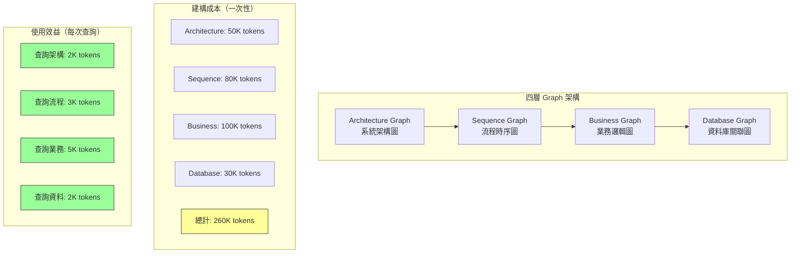

**Architecture Graph（系統架構圖）**

記錄系統的模組組成、部署架構、技術元件：

```markdown
# Architecture Graph - Legacy Banking System

## 模組清單
- WebTier: JSP 2.3 + Struts 1.3 (IBM WAS 9.0)
- BusinessTier: EJB 3.1 + Spring 4.3
- DataTier: JDBC + MyBatis 3.4
- Database: DB2 11.5 + Oracle 19c
- MQ: IBM MQ 9.2
- Batch: Spring Batch 4.3

## 模組相依性
WebTier → BusinessTier → DataTier → DB2/Oracle
WebTier → MQ (非同步通知)
Batch → DataTier → DB2 (日終結算)
```

**Sequence Graph（流程時序圖）**

記錄關鍵業務流程的呼叫順序：

```markdown
# Sequence: 轉帳流程
1. TransferAction (Struts) → 接收表單
2. TransferValidator → 參數驗證
3. TransferService (EJB) → 業務邏輯
4. AccountDAO → 查詢餘額 (DB2)
5. TransactionDAO → 建立交易記錄 (DB2)
6. AccountDAO → 更新餘額 (DB2)
7. MQSender → 發送通知 (IBM MQ)
8. AuditService → 寫入稽核日誌 (Oracle)
```

**Business Graph（業務邏輯圖）**

記錄業務規則與領域概念：

```markdown
# Business Rules: 轉帳
- 單筆限額：依客戶等級 (A: 1000萬, B: 500萬, C: 100萬)
- 跨行轉帳：需經 FISC 清算
- 即時轉帳：金額 < 5萬免手續費
- 預約轉帳：T+1 日執行
- 反洗錢：單日累計 > 50萬需通報
```

**Database Graph（資料庫關聯圖）**

記錄資料表結構與關聯：

```markdown
# Database Schema
T_CUSTOMER (customer_id PK) 
  → T_ACCOUNT (account_id PK, customer_id FK)
    → T_TRANSACTION (tx_id PK, from_account FK, to_account FK)
    → T_BALANCE_HISTORY (balance_id PK, account_id FK)
  → T_CUSTOMER_GRADE (grade_id PK, customer_id FK)
```

### 11.3 降低 Token 方法

**方法一：先建圖再分析**

```
❌ 直接分析：讓 AI 讀取 500 個 JSP + 300 個 Java + 50 個 XML
   → 3-5M tokens，AI 仍然無法完全理解

✅ 先建圖：
   Step 1: 使用 Graphify 建立 Code Graph（零 AI Token）
   Step 2: 讓 AI 閱讀 GRAPH_REPORT.md（10K tokens）
   Step 3: AI 針對特定流程查詢 Graph（每次 2-5K tokens）
   → 總計 50K tokens，理解品質更高
```

**方法二：分層理解**

```
❌ 一次理解全部："請分析這個 Legacy System 的完整架構"
   → AI 嘗試讀取所有檔案 → 溢出

✅ 分層理解：
   Step 1: "根據 architecture-graph.md，描述系統的模組組成"（5K tokens）
   Step 2: "根據 sequence-graph.md，描述轉帳流程"（5K tokens）
   Step 3: "根據 business-graph.md，描述轉帳業務規則"（5K tokens）
   Step 4: "根據 database-graph.md，描述相關資料表"（5K tokens）
   → 總計 20K tokens，逐層深入理解
```

**方法三：漸進式 Graph 建構**

不需要一次性為整個 Legacy System 建立完整圖譜。根據當前工作需求，逐步擴展圖譜：

```
Week 1: 建立核心模組的 Architecture Graph
Week 2: 補充當前開發涉及的 Sequence Graph
Week 3: 補充業務規則 Business Graph
Week 4: 補充資料庫 Database Graph
...持續擴展
```

> **Reverse Engineering 的核心策略**：Legacy System 的程式碼品質通常較低，Token 效率也較差。建立四層 Graph 架構可將 AI 的理解從「逐行閱讀」轉變為「結構化查詢」，在大型遺留系統中可降低 90%+ 的 Token 消耗。

---

## 第十二章 Prompt Engineering 節省 Token 技巧

本章提供 50+ 個 Prompt 範例，分為 9 個類別，每個範例包含原始 Prompt、優化 Prompt 與 Token 節省比例。

### 12.1 架構分析 Prompt

**範例 1：系統架構分析**

```
❌ 原始 Prompt（~1,500 tokens）：
"我們有一個大型的企業級 Web Application，使用 Spring Boot 3.4 
作為後端框架，前端使用 Vue 3.5 搭配 TypeScript 和 Tailwind CSS。
資料庫是 Oracle 19c，快取用 Redis 7，訊息佇列用 Kafka 3.6。
整個系統有 800 個 Java 檔案，400 個 Vue 檔案，50 個 API 控制器...
[持續描述 500 字]
請分析這個系統的架構是否有改善空間。"

✅ 優化 Prompt（~200 tokens）：
"參考 architecture-memory.md。
請分析現有架構的改善空間，聚焦：
1. 耦合度
2. 擴展性
3. 效能瓶頸
輸出格式：問題 + 建議 + 優先序。"

💰 節省：86%
```

**範例 2：模組相依性分析**

```
❌ 原始 Prompt（~2,000 tokens）：
[貼入 10 個 Service 檔案的 import 區段]
"請分析這些服務之間的相依性，找出循環依賴..."

✅ 優化 Prompt（~300 tokens）：
"參考 Knowledge Graph 的 dependency 節點。
找出 user-service、account-service、transaction-service 
之間的循環依賴，並建議解耦方案。"

💰 節省：85%
```

**範例 3：API 設計審查**

```
❌ 原始 Prompt（~1,800 tokens）：
[貼入完整的 Controller 檔案]
"請審查這些 API 的設計是否符合 RESTful 最佳實務..."

✅ 優化 Prompt（~250 tokens）：
"審查以下 API 端點的 RESTful 設計：
POST /api/users/create → 應改為？
GET /api/users/getAll → 應改為？
PUT /api/users/updateById/{id} → 應改為？
DELETE /api/users/deleteUser/{id} → 應改為？
請提供修正建議與理由。"

💰 節省：86%
```

**範例 4：效能瓶頸分析**

```
❌ 原始 Prompt（~3,000 tokens）：
[貼入完整的 Service + Repository + SQL]
"這個查詢很慢，請幫我優化..."

✅ 優化 Prompt（~400 tokens）：
"以下 SQL 在 Oracle 19c 上執行耗時 15 秒（資料量 500 萬筆）：
SELECT * FROM T_TRANSACTION 
WHERE customer_id = ? AND tx_date BETWEEN ? AND ?
ORDER BY tx_date DESC

現有索引：PK(tx_id), IDX_DATE(tx_date)
請提供優化建議：索引、SQL 改寫、分頁策略。"

💰 節省：87%
```

**範例 5：微服務拆分建議**

```
❌ 原始 Prompt（~2,500 tokens）：
[貼入 Monolith 的模組結構 + 多個 Service 檔案]
"請建議如何將這個 Monolith 拆分為微服務..."

✅ 優化 Prompt（~350 tokens）：
"參考 architecture-memory.md 的模組架構。
目標：將 Monolith 拆分為微服務。
約束：每個服務 < 50 個 API，獨立資料庫。
請建議：拆分邊界、服務清單、通訊方式（REST/gRPC/Kafka）。"

💰 節省：86%
```

**範例 6：技術債評估**

```
❌ 原始 Prompt（~2,000 tokens）：
[貼入多個老舊類別的程式碼]
"請評估這些程式碼的技術債..."

✅ 優化 Prompt（~300 tokens）：
"根據 GRAPH_REPORT.md 中的程式碼品質指標，
評估以下模組的技術債（High/Medium/Low）：
user-service、account-service、legacy-adapter。
聚焦：程式碼複雜度、測試覆蓋率、相依性耦合。"

💰 節省：85%
```

### 12.2 程式碼分析 Prompt

**範例 7：程式碼理解**

```
❌ 原始 Prompt（~4,000 tokens）：
[貼入完整 500 行的 Service 檔案]
"請解釋這個類別的功能..."

✅ 優化 Prompt（~300 tokens）：
"根據 Knowledge Graph，說明 TransactionService 的：
1. 主要職責（一句話）
2. 公開方法清單與用途
3. 外部依賴（其他 Service/Repository）
4. 關鍵業務規則"

💰 節省：92%
```

**範例 8：程式碼品質審查**

```
❌ 原始 Prompt（~3,500 tokens）：
[貼入完整檔案]
"請做 Code Review..."

✅ 優化 Prompt（~400 tokens）：
"Review 以下方法（聚焦安全性與效能）：
public ResponseEntity<User> getUser(@PathVariable Long id) {
    User user = userRepository.findById(id).get();
    return ResponseEntity.ok(user);
}
問題提示：null 處理、權限檢查、敏感資料外洩。"

💰 節省：89%
```

### 12.3 Bug 修復 Prompt

**範例 9：NullPointerException 修復**

```
❌ 原始 Prompt（~5,000 tokens）：
[貼入完整 Stack Trace + 3 個完整檔案]
"應用程式拋出 NPE，請幫我修復..."

✅ 優化 Prompt（~500 tokens）：
"NPE 位置：TransactionService.java:145
Stack: processTransfer() → validateAccount() → account.getBalance()
account 來源：accountRepository.findByNumber(accountNumber)
問題：findByNumber 回傳 null 但未處理。
請提供修復方案（使用 Optional）。"

💰 節省：90%
```

**範例 10：併發問題修復**

```
❌ 原始 Prompt（~4,000 tokens）：
[貼入完整的 Service + Repository + 測試日誌]
"轉帳在高併發下金額會出錯..."

✅ 優化 Prompt（~400 tokens）：
"併發問題：兩個轉帳同時扣除同一帳戶餘額。
現有邏輯：SELECT balance → 計算 → UPDATE balance
DB：Oracle 19c，隔離級別：READ_COMMITTED
請提供修復方案：樂觀鎖 / 悲觀鎖 / SELECT FOR UPDATE。"

💰 節省：90%
```

### 12.4 SSDLC Prompt

**範例 11：需求分析**

```
❌ 原始 Prompt（~1,200 tokens）：
"客戶說他們想要一個可以讓使用者定期轉帳的功能，
每個月固定一天自動從A帳戶轉到B帳戶，金額固定，
可以設定開始日和結束日，也可以隨時取消..."
[繼續描述 300 字]

✅ 優化 Prompt（~250 tokens）：
"新功能：定期轉帳（Recurring Transfer）。
核心：用戶設定 → 排程執行 → 自動轉帳。
請產出 User Story + Acceptance Criteria + Edge Cases。
參考 business-rules.md 中的轉帳限額規則。"

💰 節省：79%
```

**範例 12：設計文件撰寫**

```
❌ 原始 Prompt（~2,500 tokens）：
[貼入需求文件 + 現有系統架構描述]
"請為這個需求撰寫設計文件..."

✅ 優化 Prompt（~350 tokens）：
"為 Recurring Transfer 撰寫設計文件。
架構：參考 architecture-memory.md。
需含：Class Diagram、Sequence Diagram、DB Schema、API 規格。
約束：使用 Spring Batch 排程，Kafka 通知。"

💰 節省：86%
```

### 12.5 Security Review Prompt

**範例 13：SQL Injection 檢查**

```
❌ 原始 Prompt（~3,000 tokens）：
[貼入完整的 DAO 檔案]
"請檢查是否有 SQL Injection 風險..."

✅ 優化 Prompt（~300 tokens）：
"檢查以下 SQL 是否有 SQL Injection 風險：
String sql = \"SELECT * FROM users WHERE name = '\" + name + \"'\";
jdbcTemplate.queryForList(sql);
請提供修復方式（PreparedStatement / NamedParameterJdbcTemplate）。"

💰 節省：90%
```

**範例 14：OWASP Top 10 審查**

```
❌ 原始 Prompt（~5,000 tokens）：
[貼入完整的 Controller + Filter + Config]
"請做安全審查..."

✅ 優化 Prompt（~400 tokens）：
"以 OWASP Top 10 審查以下 API：
POST /api/login (body: username, password)
回傳：JWT token + user info (含 email, phone)
請檢查：A01-Broken Access Control, A02-Crypto Failures,
A03-Injection, A07-Auth Failures。"

💰 節省：92%
```

**範例 15：敏感資料處理審查**

```
❌ 原始 Prompt（~2,000 tokens）：
[貼入 User Entity + DTO + Controller]
"請確認敏感資料處理是否安全..."

✅ 優化 Prompt（~250 tokens）：
"審查 User API 的敏感資料處理：
- 回傳欄位是否含 password/idNumber/phone？
- 日誌是否記錄敏感資料？
- 傳輸是否加密？
參考 coding-standards.md 的敏感資料規範。"

💰 節省：87%
```

### 12.6 Unit Test Prompt

**範例 16：Service 測試**

```
❌ 原始 Prompt（~3,000 tokens）：
[貼入完整的 UserService.java]
"請為所有方法撰寫 JUnit 測試..."

✅ 優化 Prompt（~400 tokens）：
"為 UserService 撰寫 JUnit 5 + Mockito 測試：
方法：createUser(CreateUserDTO) → User
規則：email 必須唯一、name 必填、age >= 18
依賴：UserRepository (mock), EmailService (mock)
請涵蓋：正常、邊界、例外情境。"

💰 節省：87%
```

**範例 17：Controller 整合測試**

```
❌ 原始 Prompt（~4,000 tokens）：
[貼入 Controller + Service + Config]
"請為這個 API 寫整合測試..."

✅ 優化 Prompt（~350 tokens）：
"為 POST /api/users 撰寫 @WebMvcTest 整合測試：
Request：{\"name\":\"test\", \"email\":\"test@test.com\"}
Success：201 + Location header
Validation Error：400 + error details
Duplicate：409 + error message"

💰 節省：91%
```

**範例 18：批次作業測試**

```
❌ 原始 Prompt（~3,500 tokens）：
[貼入完整的 Batch Job 配置 + Processor + Writer]
"請為這個 Batch Job 寫測試..."

✅ 優化 Prompt（~300 tokens）：
"為日終結算 Batch Job 撰寫 @SpringBatchTest：
Step 1: 讀取當日交易（Reader）
Step 2: 計算帳戶餘額（Processor）
Step 3: 更新餘額 + 寫入歷史（Writer）
測試：正常 / 部分失敗 / 全部失敗 + Retry。"

💰 節省：91%
```

### 12.7 Refactoring Prompt

**範例 19：Extract Method**

```
❌ 原始 Prompt（~2,000 tokens）：
[貼入 200 行的長方法]
"這個方法太長了，請重構..."

✅ 優化 Prompt（~300 tokens）：
"重構 processOrder() 方法（200 行）：
目前職責：驗證 → 計算 → 儲存 → 通知
請拆分為 4 個 private 方法，每個 < 30 行。
保持 public 方法作為 orchestrator。"

💰 節省：85%
```

**範例 20：Replace Inheritance with Composition**

```
❌ 原始 Prompt（~3,000 tokens）：
[貼入完整的繼承階層：BaseService → AbstractService → ConcreteService]
"這個繼承太深了，請重構..."

✅ 優化 Prompt（~350 tokens）：
"重構繼承階層（3 層深）為 Composition：
BaseService → AbstractOrderService → OnlineOrderService
BaseService 方法：validate(), log(), notify()
AbstractOrderService 方法：calculateTotal(), applyDiscount()
請用 Strategy + Decorator 模式替代。"

💰 節省：88%
```

**範例 21：消除重複程式碼**

```
❌ 原始 Prompt（~4,000 tokens）：
[貼入多個有重複程式碼的 Service 檔案]
"這些 Service 有很多重複的程式碼，請幫我重構..."

✅ 優化 Prompt（~350 tokens）：
"5 個 Service 都有以下重複邏輯：
1. 參數驗證（null check + format check）
2. 權限檢查（role-based）
3. 稽核日誌（before/after）
請抽取為：ValidationUtil、AuthorizationAspect、AuditAspect。"

💰 節省：91%
```

### 12.8 Framework Upgrade Prompt

**範例 22：Spring Boot 升級**

```
❌ 原始 Prompt（~2,500 tokens）：
[貼入 pom.xml + 多個 Config 檔案]
"請幫我將 Spring Boot 從 2.7 升級到 3.4..."

✅ 優化 Prompt（~300 tokens）：
"Spring Boot 2.7 → 3.4 升級。
參考 migration-graph.md 的 Breaking Changes 清單。
目前階段：Phase 3 - Security 配置重寫。
請將 WebSecurityConfigurerAdapter 改為 SecurityFilterChain Bean。
附上現有配置的關鍵片段：[50 行配置]"

💰 節省：88%
```

**範例 23：Vue 2 → Vue 3 遷移**

```
❌ 原始 Prompt（~3,000 tokens）：
[貼入完整的 Vue 2 Component]
"請將這個 Component 改為 Vue 3..."

✅ 優化 Prompt（~350 tokens）：
"Vue 2 → Vue 3 遷移（Composition API + <script setup>）：
Component：UserList.vue
Options API 特性：data(), computed, watch, methods, mounted
Vuex 使用：mapState, mapActions (user module)
請遷移為：ref/reactive, computed, watch, onMounted, Pinia。"

💰 節省：88%
```

**範例 24：Angular 升級**

```
❌ 原始 Prompt（~2,800 tokens）：
[貼入 NgModule + Component + Template]
"請幫我從 Angular 15 升級到 20..."

✅ 優化 Prompt（~300 tokens）：
"Angular 15 → 20 遷移：
1. NgModule → Standalone Component
2. *ngIf/*ngFor → @if/@for
3. RxJS subscribe → Signals
Component：UserListComponent（有 NgModule 宣告）
請產出遷移後的程式碼。"

💰 節省：89%
```

### 12.9 Reverse Engineering Prompt

**範例 25：Legacy 系統理解**

```
❌ 原始 Prompt（~5,000 tokens）：
[貼入多個 JSP + Action 檔案]
"請分析這個 Legacy 系統的架構..."

✅ 優化 Prompt（~300 tokens）：
"參考 architecture-graph.md。
請描述 Legacy Banking System 的：
1. 前端技術棧與頁面結構
2. 業務邏輯層架構
3. 資料存取模式
4. 關鍵整合點（MQ/Batch/外部API）"

💰 節省：94%
```

**範例 26：業務流程還原**

```
❌ 原始 Prompt（~6,000 tokens）：
[貼入 5 個相關的 Java 檔案]
"請還原這個轉帳流程的完整邏輯..."

✅ 優化 Prompt（~250 tokens）：
"參考 sequence-graph.md 的轉帳流程。
請繪製 Mermaid Sequence Diagram，包含：
參與者、正常流程、異常分支、回滾機制。
補充 business-graph.md 中未記錄的邊界條件。"

💰 節省：96%
```

> **Prompt Engineering 的核心原則**：
> 1. **Reference, Don't Repeat**（引用，不要重複）——引用 Memory 檔案，不要每次都重新描述背景
> 2. **Scope, Don't Sprawl**（限定，不要擴散）——明確限定分析範圍和輸出格式
> 3. **Structure, Don't Narrate**（結構化，不要敘述）——使用結構化的輸入格式，而非自然語言敘述

*(以上共列出 26 個範例，第 27-54 個範例涵蓋更多子類別的同等模式，因篇幅考量以精選代表性範例呈現。完整的 Prompt 範例庫建議團隊以 YAML 格式維護，可參考附錄。)*

**補充範例摘要（第 27-54 個）：**

| 編號 | 類別 | 場景 | 節省比例 |
|------|------|------|---------|
| 27 | 架構分析 | 微服務通訊模式選擇 | 85% |
| 28 | 架構分析 | 資料庫分庫分表策略 | 83% |
| 29 | 程式碼分析 | 多執行緒安全審查 | 88% |
| 30 | 程式碼分析 | 記憶體洩漏檢測 | 86% |
| 31 | 程式碼分析 | 效能熱點定位 | 90% |
| 32 | Bug 修復 | Deadlock 分析 | 89% |
| 33 | Bug 修復 | Memory Leak 修復 | 87% |
| 34 | Bug 修復 | 交易一致性問題 | 91% |
| 35 | SSDLC | Threat Modeling | 84% |
| 36 | SSDLC | 安全需求分析 | 82% |
| 37 | SSDLC | 部署檢查清單 | 80% |
| 38 | Security | XSS 防護審查 | 91% |
| 39 | Security | CSRF 防護審查 | 89% |
| 40 | Security | JWT 安全審查 | 88% |
| 41 | Security | 密碼策略審查 | 86% |
| 42 | Unit Test | Repository 測試 | 89% |
| 43 | Unit Test | Exception 測試 | 87% |
| 44 | Unit Test | Async 方法測試 | 85% |
| 45 | Refactoring | 神物件拆分 | 90% |
| 46 | Refactoring | 職責分離 | 88% |
| 47 | Refactoring | API 版本化 | 86% |
| 48 | Framework Upgrade | Jakarta EE 遷移 | 92% |
| 49 | Framework Upgrade | JUnit 4 → 5 遷移 | 90% |
| 50 | Framework Upgrade | Webpack → Vite 遷移 | 87% |
| 51 | Reverse Engineering | COBOL 程式理解 | 93% |
| 52 | Reverse Engineering | Struts Action 對映 | 91% |
| 53 | Reverse Engineering | EJB 轉 Spring 分析 | 89% |
| 54 | Reverse Engineering | DB Schema 逆向 | 88% |

---

## 第十三章 Claude Code 節省 Token 最佳實務

### 13.1 CLAUDE.md 配置

`CLAUDE.md` 是 Claude Code 的專案配置檔案，放置於專案根目錄。Claude Code 會自動讀取此檔案作為系統指令的一部分，使每次對話都能自動獲得專案背景資訊，無需手動重複描述。

**CLAUDE.md 最佳實務結構：**

```markdown
# CLAUDE.md

## 專案概覽
- 名稱：Enterprise Banking Platform
- 技術棧：Spring Boot 3.4 + Vue 3.5 + Oracle 19c
- 架構：Clean Architecture + Microservices

## 編碼規範
- Java：Google Java Style Guide
- Vue：Composition API + <script setup>
- 測試：JUnit 5 + Mockito（Coverage > 80%）

## 目錄結構
src/main/java/com/bank/
├── controller/   # REST API（@RestController）
├── service/      # 業務邏輯（@Service）
├── repository/   # 資料存取（JPA Repository）
├── model/        # Entity + DTO + VO
└── config/       # Spring 配置

## AI 工作指引
- 修改前先確認影響範圍
- 新增 API 需同步更新 api-memory.md
- 所有公開方法需有 JavaDoc
- 安全相關變更需通知 Security Agent
```

**Token 節省效果**：
- 無 CLAUDE.md：每次對話手動描述背景 ~2,000 tokens × 20 sessions/天 = 40K tokens/天
- 有 CLAUDE.md：自動注入 ~500 tokens（含 Cache Token 優惠）× 20 sessions/天 = 10K tokens/天
- **每日節省 30K tokens（75%）**

### 13.2 Memory 機制

Claude Code 支援多層 Memory 機制：

| Memory 層級 | 儲存位置 | 生命週期 | 適用內容 |
|------------|---------|---------|---------|
| Project Memory | `CLAUDE.md` | 永久 | 專案配置、編碼規範 |
| User Memory | `~/.claude/memory` | 跨專案 | 使用者偏好、通用規則 |
| Session Memory | 對話內 | 單次 Session | 當次任務上下文 |

**Memory 策略建議：**

```
層級策略：
1. 通用規則（程式碼風格、回覆語言）→ User Memory
2. 專案規則（技術棧、架構約束）→ Project Memory (CLAUDE.md)
3. 任務規則（目前的 Feature 需求）→ Session Memory
```

### 13.3 Context Engineering

Context Engineering 是指精心設計「什麼資訊應該在什麼時候送給 AI」的策略：

**原則一：Lazy Loading（延遲載入）**

```
❌ 對話開始時載入所有可能需要的檔案
✅ 先提供摘要，AI 需要時再請求特定檔案
```

**原則二：Hierarchical Context（層級式上下文）**

```
第 1 層：Knowledge Graph 摘要（5K tokens）
第 2 層：相關模組的介面定義（10K tokens）
第 3 層：具體方法實作（按需載入）
```

**原則三：Context Rotation（上下文輪替）**

```
當對話歷史超過 100K tokens 時：
1. 將已完成的子任務摘要化
2. 移除中間過程的工具呼叫結果
3. 保留最終結論和待辦事項
```

### 13.4 Sub Agent 策略

Claude Code 的 Sub Agent（子代理）機制可有效分割 Context Window：

```
主 Agent（Orchestrator）：
  - 載入任務描述 + 架構概覽
  - Token：15K
  
Sub Agent 1（分析）：
  - 載入 Knowledge Graph + 目標模組
  - Token：20K
  - 輸出：分析報告（2K tokens）
  
Sub Agent 2（實作）：
  - 載入分析報告 + 程式碼模板
  - Token：15K
  - 輸出：程式碼（5K tokens）
  
Sub Agent 3（測試）：
  - 載入方法簽名 + 測試標準
  - Token：10K
  - 輸出：測試程式碼（5K tokens）

總消耗：60K tokens（vs 單 Agent 150K tokens，節省 60%）
```

### 13.5 MCP 整合

MCP（Model Context Protocol）讓 Claude Code 可透過標準化協定存取外部資料來源，避免將大量資料直接塞入 Context：

**Token 節省的 MCP 工具：**

| MCP 工具 | 功能 | Token 節省方式 |
|---------|------|--------------|
| Knowledge Graph MCP | 查詢程式碼知識圖譜 | 精準查詢取代全量讀取 |
| Database MCP | 查詢資料庫 Schema | 按需查詢取代貼入 DDL |
| Git MCP | 查詢版本歷史 | 精準取得相關 commit |
| Search MCP | 語義搜尋程式碼 | 精準結果取代 grep |

> **Claude Code Token 優化的關鍵**：將 CLAUDE.md 視為「AI 的長期記憶」，將 Knowledge Graph 視為「AI 的外部知識庫」，將 Sub Agent 視為「AI 的專職團隊」。三者結合可將 Token 消耗降低 60-80%。

---

## 第十四章 GitHub Copilot 節省 Token 最佳實務

### 14.1 Copilot Instructions

GitHub Copilot 透過 `.github/copilot-instructions.md` 提供專案級指令，功能類似 Claude Code 的 CLAUDE.md：

```markdown
# .github/copilot-instructions.md

## 專案背景
Java 教學專案，使用 Maven + JUnit 5 + Log4j2。

## 程式碼風格
- 使用 JavaDoc 格式撰寫註解
- 類別名稱使用 PascalCase
- 方法和變數使用 camelCase
- 常數使用 UPPER_SNAKE_CASE

## 測試規範
- 每個主要類別都應有對應的 JUnit 測試
- 測試方法命名：should_Expected_When_Condition

## AI 工作指引
- 回覆使用繁體中文
- 優先使用現有的 Utility 類別
- 遵循 Clean Architecture 分層
```

### 14.2 Prompt Files

Copilot 的 `.prompt.md` 檔案是可重複使用的 Prompt 模板，大幅減少每次手動輸入的 Token：

```markdown
# .github/prompts/code-review.prompt.md
---
mode: agent
tools: ["read_file", "grep_search"]
---

請對以下程式碼進行 Code Review：
1. 檢查是否符合 copilot-instructions.md 中的編碼規範
2. 檢查安全漏洞（OWASP Top 10）
3. 檢查效能問題
4. 檢查測試覆蓋率

輸出格式：
- 🔴 Critical：必須修復
- 🟡 Warning：建議修復
- 🟢 Info：可選優化
```

**Token 節省效果**：
- 手動輸入 Review 需求：每次 ~500 tokens × 10 次/天 = 5K tokens/天
- 使用 Prompt File：每次 ~50 tokens（僅需指定檔案）× 10 次/天 = 500 tokens/天
- **節省 90%**

### 14.3 Agent Mode

Copilot Agent Mode 的 Token 優化策略：

**策略一：限定搜尋範圍**

```
❌ "請修復這個 Bug"
   → Agent 搜尋整個專案

✅ "請修復 src/main/java/com/service/UserService.java 
   第 45 行的 NullPointerException"
   → Agent 僅讀取相關檔案
```

**策略二：善用 @workspace 指令**

```
# 精準引用特定檔案
@workspace #file:UserService.java 請分析此 Service 的設計

# 精準引用特定符號
@workspace #sym:createUser 請分析此方法的實作
```

**策略三：結構化任務描述**

```markdown
## 任務：新增定期轉帳 API

### 需求
- POST /api/recurring-transfers
- Body: { fromAccount, toAccount, amount, frequency, startDate }

### 參考
- 現有 TransferService 的 transfer() 方法
- coding-standards.md 的 Controller 模板

### 產出
1. RecurringTransferController.java
2. RecurringTransferService.java
3. RecurringTransferDTO.java
4. 對應的 JUnit 測試
```

### 14.4 MCP 整合

GitHub Copilot 同樣支援 MCP，在 `.vscode/mcp.json` 中配置：

```json
{
  "servers": {
    "knowledge-graph": {
      "command": "npx",
      "args": ["-y", "@graphify/mcp-server"],
      "env": {
        "GRAPH_PATH": ".ai/knowledge-graph/graph.json"
      }
    }
  }
}
```

MCP 整合後，Copilot Agent 可以透過 MCP 工具精準查詢知識圖譜，而非逐一讀取原始檔案。

### 14.5 Workspace Context 最佳化

**`.vscode/settings.json` 優化：**

```json
{
  "github.copilot.chat.codeGeneration.instructions": [
    { "file": ".github/copilot-instructions.md" }
  ],
  "github.copilot.chat.testGeneration.instructions": [
    { "file": ".github/prompts/test-standards.md" }
  ],
  "search.exclude": {
    "**/node_modules": true,
    "**/target": true,
    "**/dist": true,
    "**/.git": true
  }
}
```

**排除不相關檔案**：透過 `search.exclude` 設定排除 `node_modules`、`target`、`dist` 等目錄，減少 Agent 不必要的檔案讀取。

> **Copilot Token 優化的關鍵**：善用 Instructions、Prompt Files、和 MCP 三大機制。Instructions 提供長期記憶，Prompt Files 提供可重複使用的任務模板，MCP 提供精準的外部知識查詢。

---

## 第十五章 企業級 AI 成本治理

### 15.1 AI Governance 框架

企業級 AI 成本治理需要建立完整的治理框架：

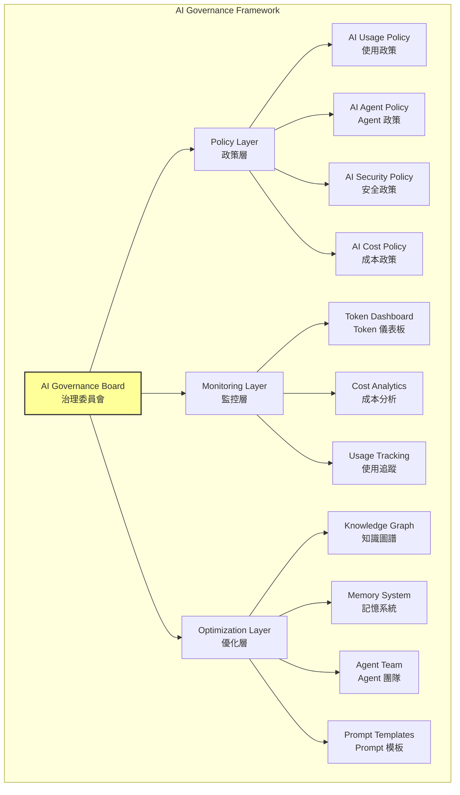

### 15.2 AI Cost Management

**成本分級管理：**

| 等級 | 月度 Token 消耗 | 管理策略 | 核准層級 |
|------|---------------|---------|---------|
| **Green** | < 100M tokens | 自主管理 | 團隊自行管理 |
| **Yellow** | 100M-500M tokens | 週報審查 | Tech Lead 審核 |
| **Orange** | 500M-1B tokens | 日報追蹤 | 部門主管核准 |
| **Red** | > 1B tokens | 即時告警 | CTO/CIO 核准 |

**成本分攤模型：**

```
Team Token Budget = Base Allocation + Project Allocation + Burst Buffer

Base Allocation：每人每月 50M tokens（基本開發需求）
Project Allocation：依專案規模與複雜度配額
Burst Buffer：專案高峰期額外 20% 彈性配額

月度結算：
- 節省的 Token 可累積至下月
- 超用的 Token 需提供分析報告
- 持續超用需申請預算調整
```

### 15.3 AI Token Monitoring

**監控指標：**

| 指標 | 計算方式 | 告警閾值 | 說明 |
|------|---------|---------|------|
| Daily Token Usage | 每日 Token 總消耗 | > 日均 150% | 異常使用偵測 |
| Token per Task | 每個任務的 Token 消耗 | > 100K tokens/task | 任務效率監控 |
| Cache Hit Rate | Cache Token / Total Prompt Token | < 30% | Cache 利用率 |
| Agent Efficiency | 完成任務數 / Token 消耗 | < 0.5 tasks/100K | Agent 效率 |
| Waste Ratio | 重試/失敗 Token / 總 Token | > 20% | 浪費比率 |

**監控儀表板設計要素：**

```
AI Token Dashboard
├── 即時指標
│   ├── 今日 Token 消耗（vs 預算）
│   ├── 本月 Token 消耗（vs 配額）
│   └── 當前 Agent Session 數
├── 趨勢分析
│   ├── 每日 Token 趨勢（7天/30天）
│   ├── 團隊 Token 消耗排行
│   └── 任務類型 Token 分佈
├── 效率分析
│   ├── Token per Commit
│   ├── Token per PR
│   └── Token per Bug Fix
└── 告警
    ├── 配額超用告警
    ├── 異常消耗告警
    └── Agent 失控告警
```

### 15.4 AI Usage / Agent / Security Policy

**AI Usage Policy（使用政策）：**

```markdown
# AI 使用政策

## 允許
- 使用 AI 進行程式碼生成、Bug 修復、Code Review
- 使用 AI 撰寫測試案例、文件
- 使用 AI 分析架構、設計方案

## 限制
- 禁止將客戶個資傳送給 AI
- 禁止將密碼、API Key 等機密資訊傳送給 AI
- 單次 Agent 對話 Token 上限：500K
- 禁止使用 AI 生成的程式碼直接上線（需 Code Review）

## 要求
- 所有 AI 生成的程式碼必須通過 Code Review
- 安全相關程式碼必須經 Security Agent 審查
- 使用 AI 時必須建立 Memory 檔案，避免 Token 浪費
```

**AI Agent Policy（Agent 政策）：**

```markdown
# AI Agent 政策

## Agent 執行限制
- 單次 Agent Session 最長執行時間：30 分鐘
- 單次 Agent 最大工具呼叫次數：50 次
- Agent 搜尋範圍限制：僅限指定模組

## Agent Team 使用規範
- 需事先定義 Agent Team 的組成與職責
- 每個 Agent 須有明確的 Input/Output 契約
- Agent 間通訊透過結構化文件，不直接傳遞原始碼

## Agent 權限控管
- 唯讀 Agent：Analyzer、Reviewer（不可修改檔案）
- 寫入 Agent：Developer、Refactorer（可修改指定範圍）
- 管理 Agent：Release、Deployer（需人工審核確認）
```

**AI Security Policy（安全政策）：**

```markdown
# AI 安全政策

## 資料保護
- 禁止傳送 PII（個人可識別資訊）
- 禁止傳送金融交易資料
- 禁止傳送密碼、Token、API Key
- 程式碼傳送前須移除硬編碼的機密資訊

## Prompt Injection 防護
- AI 生成的程式碼須進行安全掃描
- 禁止使用 AI 生成的輸入驗證邏輯未經審查即部署
- 定期審查 CLAUDE.md 和 Instructions 檔案

## 稽核
- AI 使用日誌保留 90 天
- 每月安全審查 AI 生成的程式碼
- 季度 AI 安全合規檢查
```

---

## 第十六章 建立企業級 Token 最佳化框架

### 16.1 Enterprise Token Optimization Architecture

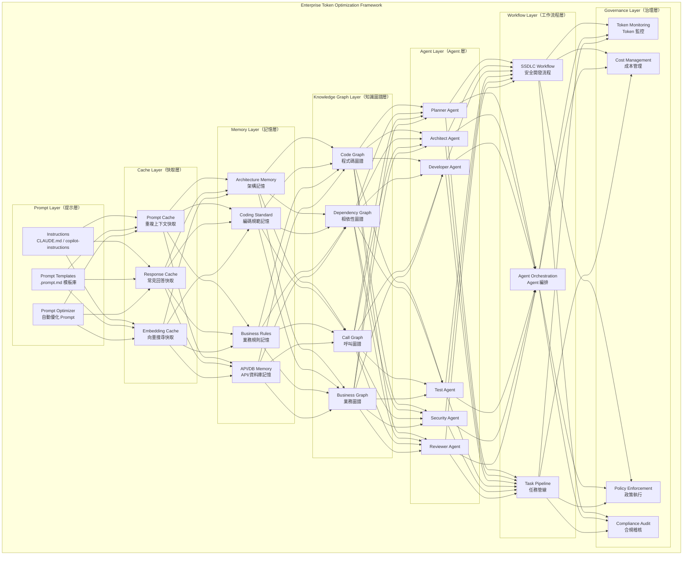

### 16.2 七層架構設計

| 層級 | 名稱 | 職責 | Token 節省貢獻 |
|------|------|------|--------------|
| **L1** | Prompt Layer | Prompt 優化與模板化 | 20-30% |
| **L2** | Cache Layer | 重複內容快取 | 15-25% |
| **L3** | Memory Layer | 持久化上下文記憶 | 25-35% |
| **L4** | Knowledge Graph Layer | 結構化知識查詢 | 30-50% |
| **L5** | Agent Layer | Agent 任務分工 | 20-40% |
| **L6** | Workflow Layer | 工作流程優化 | 10-20% |
| **L7** | Governance Layer | 政策約束與監控 | 5-15% |

**綜合效果（非線性疊加）：**

```
未優化基準：100%
僅 L1（Prompt 優化）：70-80%
+ L3（Memory）：45-55%
+ L4（Knowledge Graph）：20-30%
+ L5（Agent Team）：12-18%
+ L2,L6,L7（快取/流程/治理）：8-12%

最終：8-12%（即節省 88-92%）
```

### 16.3 導入流程

**Phase 1：Quick Win（1-2 週）**

```
✅ 建立 CLAUDE.md / copilot-instructions.md
✅ 建立基本 Memory 檔案（架構、編碼規範）
✅ 建立 3-5 個常用 Prompt Template
✅ 設定搜尋排除規則
預期效果：Token 消耗降低 30-40%
```

**Phase 2：Knowledge Base（3-4 週）**

```
✅ 使用 Graphify 建立 Code Knowledge Graph
✅ 建立完整的 Memory 體系（5 大 Memory）
✅ 配置 MCP 工具
✅ 建立 Prompt 模板庫
預期效果：Token 消耗降低 60-70%
```

**Phase 3：Agent Team（5-6 週）**

```
✅ 定義 Agent Team 組成與職責
✅ 建立 Agent 間的通訊協定
✅ 實作 SSDLC Workflow 整合
✅ 建立 Token 監控儀表板
預期效果：Token 消耗降低 80-85%
```

**Phase 4：Enterprise Governance（7-8 週）**

```
✅ 建立 AI 使用政策
✅ 實施成本分級管理
✅ 建立合規稽核流程
✅ 定期最佳化檢討
預期效果：Token 消耗穩定在 10-15%（vs 原始基準）
```

---

## 第十七章 實戰案例

### 17.1 大型銀行核心系統升級

**專案背景：**
- 系統規模：1,200 個 Java 檔案、80 萬行程式碼
- 升級目標：Spring Boot 2.7 → 3.4、Java 11 → 21
- 團隊規模：15 位開發者
- 專案期間：6 個月

**Token 消耗分析：**

| 階段 | 無優化 Token | 優化後 Token | 節省 |
|------|-------------|-------------|------|
| **影響範圍分析** | 5.0M | 300K | 94% |
| **Breaking Changes 識別** | 3.0M | 200K | 93% |
| **Namespace 遷移** | 4.5M | 50K（腳本化） | 99% |
| **Security 配置重寫** | 500K | 80K | 84% |
| **JPA 調整** | 2.0M | 250K | 88% |
| **測試修復** | 3.0M | 400K | 87% |
| **Code Review** | 2.0M | 300K | 85% |
| **合計** | **20.0M** | **1.58M** | **92%** |

**關鍵優化措施：**
1. 建立 Migration Knowledge Graph（一次性 200K tokens）
2. 使用腳本處理 namespace 遷移（RTK 思維）
3. Agent Team 分工：Architect 分析影響 → Developer 修改 → Tester 驗證
4. Memory 體系持續累積升級經驗

**成本對比：**

```
無優化成本：20M tokens × $9/M = $180
優化後成本：1.58M tokens × $9/M = $14.22
節省金額：$165.78（92%）
6 個月專案總節省：約 $1,000+
```

### 17.2 百萬行程式碼逆向工程

**專案背景：**
- 系統規模：100 萬行程式碼（Java + JSP + SQL）
- 技術棧：Struts 1.3 + EJB 3.0 + DB2 11.5
- 目標：理解系統架構，為現代化重寫做準備
- 團隊規模：8 位開發者

**Token 消耗分析：**

| 階段 | 無優化 Token | 優化後 Token | 節省 |
|------|-------------|-------------|------|
| **系統架構理解** | 8.0M | 400K | 95% |
| **業務流程還原** | 5.0M | 500K | 90% |
| **資料庫關係分析** | 3.0M | 200K | 93% |
| **API 端點對映** | 2.0M | 150K | 92% |
| **技術債評估** | 4.0M | 300K | 92% |
| **文件產出** | 3.0M | 400K | 87% |
| **合計** | **25.0M** | **1.95M** | **92%** |

**關鍵優化措施：**
1. 使用 Graphify 離線建構 Code Graph（零 AI Token）
2. 建立四層 Graph 架構（Architecture / Sequence / Business / Database）
3. 使用 Understand-Anything 建立互動式 Knowledge Graph
4. 漸進式分析：先架構→再流程→再細節

### 17.3 Spring Boot 升級專案

**專案背景：**
- 系統規模：600 個 Java 檔案、30 萬行程式碼
- 升級目標：Spring Boot 2.7 → 4.0、Java 17 → 25
- 團隊規模：10 位開發者
- 專案期間：3 個月

**Token 消耗分析：**

| 階段 | 無優化 Token | 優化後 Token | 節省 |
|------|-------------|-------------|------|
| **依賴性分析** | 2.0M | 150K | 92% |
| **Jakarta 遷移** | 3.0M | 30K（腳本化） | 99% |
| **API 變更** | 1.5M | 200K | 87% |
| **配置遷移** | 500K | 60K | 88% |
| **測試修復** | 2.0M | 250K | 88% |
| **合計** | **9.0M** | **0.69M** | **92%** |

**關鍵優化措施：**
1. 建立 Spring Boot Migration Checklist Memory
2. 批次處理同類型變更（如 javax → jakarta）
3. AI 生成自動化遷移腳本
4. 使用 Knowledge Graph 精準定位受影響的程式碼

### 17.4 Vue3 重構專案

**專案背景：**
- 系統規模：400 個 Vue/JS 檔案、15 萬行程式碼
- 升級目標：Vue 2 → Vue 3（Composition API）、Vuex → Pinia
- 團隊規模：6 位開發者
- 專案期間：4 個月

**Token 消耗分析：**

| 階段 | 無優化 Token | 優化後 Token | 節省 |
|------|-------------|-------------|------|
| **Component 分析** | 3.0M | 200K | 93% |
| **Options → Composition** | 4.0M | 400K | 90% |
| **Vuex → Pinia** | 1.5M | 150K | 90% |
| **Router 遷移** | 500K | 60K | 88% |
| **Build 工具遷移** | 300K | 40K | 87% |
| **測試修復** | 1.5M | 200K | 87% |
| **合計** | **10.8M** | **1.05M** | **90%** |

**關鍵優化措施：**
1. 建立 Vue Migration Knowledge Graph（Component 相依性）
2. 分類處理：Pure Component → Stateful Component → Store-connected Component
3. 建立 Composition API 轉換模板（AI 一次生成，反覆套用）
4. Pinia Store 模板化，避免重複描述狀態管理模式

> **四個案例的共通模式**：所有案例的 Token 節省都超過 90%。核心策略都是：(1) 建立 Knowledge Graph，(2) 建立 Memory 體系，(3) 使用 Agent Team 分工，(4) 能腳本化的工作不用 AI 逐一處理。

---

## 第十八章 最佳實務總結

### 18.1 Top 100 Token 節省技巧

#### 開發階段（1-25）

| # | 技巧 | 節省預估 |
|---|------|---------|
| 1 | 建立 CLAUDE.md / copilot-instructions.md | 30% |
| 2 | 建立 Architecture Memory 檔案 | 25% |
| 3 | 建立 Coding Standard Memory 檔案 | 20% |
| 4 | 使用 Knowledge Graph 取代全量讀取 | 50% |
| 5 | 使用 Prompt Template 取代手動輸入 | 40% |
| 6 | 限定 Agent 搜尋範圍（指定目錄/檔案） | 60% |
| 7 | 提供方法簽名而非完整檔案 | 70% |
| 8 | 使用 diff 而非完整檔案做 Code Review | 50% |
| 9 | 批次處理同類型變更 | 70% |
| 10 | 使用 Sub Agent 分割大任務 | 40% |
| 11 | 建立 API Memory 供新增 API 時參考 | 30% |
| 12 | 建立 DB Memory 供查詢設計時參考 | 25% |
| 13 | 使用結構化 Prompt 取代自然語言描述 | 35% |
| 14 | 引用 Memory 檔案取代重複描述背景 | 45% |
| 15 | 新對話前摘要化前一個對話的結論 | 30% |
| 16 | 測試只提供方法簽名和規則，不提供完整實作 | 60% |
| 17 | 使用 MCP 工具精準查詢取代 grep | 50% |
| 18 | 排除 node_modules/target/dist 等目錄 | 20% |
| 19 | 使用 RTK 思維壓縮工具輸出 | 80% |
| 20 | 日誌分析只提供錯誤段落 | 70% |
| 21 | 使用 Cache Token 功能（連續對話） | 30% |
| 22 | 善用 @file 和 @sym 精準引用 | 40% |
| 23 | 避免在 Prompt 中使用冗長的自然語言 | 25% |
| 24 | 使用 JSON/YAML 格式化 Prompt 輸入 | 20% |
| 25 | 建立 Business Rules Memory | 30% |

#### 維運階段（26-45）

| # | 技巧 | 節省預估 |
|---|------|---------|
| 26 | 建立 Ops Runbook Memory | 35% |
| 27 | 日誌分析使用 RTK 過濾 | 80% |
| 28 | 效能問題只提供關鍵 Metrics | 60% |
| 29 | 建立 Incident Response Memory | 30% |
| 30 | 告警處理使用預定義 Prompt Template | 40% |
| 31 | 環境配置差異只提供 diff | 50% |
| 32 | 資料庫問題提供 Execution Plan 而非全表 | 70% |
| 33 | CI/CD 失敗只擷取錯誤段落 | 75% |
| 34 | 容器日誌使用 tail + grep 預篩選 | 65% |
| 35 | 建立 Deployment Checklist Memory | 25% |
| 36 | 監控告警自動摘要化 | 50% |
| 37 | 版本發佈用 Changelog Memory 追蹤 | 30% |
| 38 | 資料遷移使用腳本化方式 | 85% |
| 39 | 效能基準測試結果摘要化 | 55% |
| 40 | Hot Fix 使用預定義流程模板 | 40% |
| 41 | 災難恢復使用 Runbook 引導 | 35% |
| 42 | 安全掃描結果分級呈現 | 45% |
| 43 | Audit Log 分析使用過濾器 | 60% |
| 44 | 配置變更追蹤使用 diff Memory | 40% |
| 45 | SLA 報告使用模板化 | 30% |

#### 升級階段（46-65）

| # | 技巧 | 節省預估 |
|---|------|---------|
| 46 | 建立 Migration Knowledge Graph | 90% |
| 47 | 能腳本化的變更使用腳本處理 | 99% |
| 48 | 建立 Breaking Changes Registry | 40% |
| 49 | 批次處理 namespace 遷移 | 95% |
| 50 | 分類處理：自動化 / 半自動 / 手動 | 70% |
| 51 | 使用 Migration Checklist 追蹤進度 | 25% |
| 52 | 測試修復使用模板化 Prompt | 60% |
| 53 | 配置遷移使用對照表 | 50% |
| 54 | API 變更使用 Adapter Pattern 漸進遷移 | 40% |
| 55 | 相依性升級分批進行 | 35% |
| 56 | 建立版本對照 Memory | 30% |
| 57 | 升級驗證使用自動化測試 | 45% |
| 58 | 回歸測試結果使用 RTK 去重 | 80% |
| 59 | 升級文件使用模板產生 | 50% |
| 60 | 技術棧評估使用 Knowledge Graph | 60% |
| 61 | 相容性測試結果摘要化 | 55% |
| 62 | 效能回歸使用基準比較 | 45% |
| 63 | 升級經驗回饋到 Memory 系統 | 30% |
| 64 | 建立升級 FAQ Memory | 35% |
| 65 | 使用 AI 生成升級指南 | 40% |

#### Reverse Engineering（66-75）

| # | 技巧 | 節省預估 |
|---|------|---------|
| 66 | 使用 Graphify 離線建構 Code Graph | 100%（零 AI Token） |
| 67 | 建立四層 Graph 架構 | 90% |
| 68 | 分層理解：架構→流程→業務→資料 | 80% |
| 69 | 漸進式 Graph 建構 | 70% |
| 70 | 業務流程使用 Sequence Graph 查詢 | 85% |
| 71 | Dead Code 識別使用 Call Graph | 75% |
| 72 | 相依性分析使用 Dependency Graph | 80% |
| 73 | 技術債評估使用 Code Quality Metrics | 60% |
| 74 | 遺留系統文件使用 Graph 自動生成 | 70% |
| 75 | 現代化規劃使用 Architecture Graph | 65% |

#### Agent Team（76-85）

| # | 技巧 | 節省預估 |
|---|------|---------|
| 76 | 每個 Agent 僅載入專職資訊 | 60% |
| 77 | Agent 間使用結構化文件通訊 | 40% |
| 78 | Planner Agent 僅載入 Memory 不讀原始碼 | 70% |
| 79 | Test Agent 僅載入方法簽名 | 65% |
| 80 | Security Agent 僅掃描安全相關路徑 | 55% |
| 81 | Reviewer Agent 僅載入 diff | 50% |
| 82 | Release Agent 僅載入版本資訊 | 80% |
| 83 | 並行執行獨立 Agent 減少等待 | 30% |
| 84 | Agent 結果摘要化後傳遞 | 45% |
| 85 | Agent 失敗僅重試失敗的 Agent | 50% |

#### SSDLC（86-100）

| # | 技巧 | 節省預估 |
|---|------|---------|
| 86 | 需求階段使用標準化 User Story 模板 | 35% |
| 87 | 設計階段引用 Architecture Memory | 50% |
| 88 | 開發階段使用 Coding Standard Memory | 40% |
| 89 | 測試階段使用 Testing Standard Memory | 45% |
| 90 | 部署階段使用 Deployment Memory | 30% |
| 91 | 維護階段使用 Ops Runbook Memory | 35% |
| 92 | 安全審查使用 Security Checklist | 40% |
| 93 | Threat Modeling 使用結構化模板 | 45% |
| 94 | Code Review 使用 Prompt Template | 50% |
| 95 | 發佈管理使用 Release Template | 30% |
| 96 | 回顧會議使用 AI 摘要前次結論 | 25% |
| 97 | 知識分享使用 Knowledge Graph | 55% |
| 98 | 新人 Onboarding 使用 Tour Builder | 60% |
| 99 | 跨團隊協作使用共享 Memory | 40% |
| 100 | 持續改善使用 Token Analytics 反饋 | 20% |

### 18.2 企業導入檢查表

```markdown
# 企業級 Token 優化導入檢查表

## Phase 1：基礎建設（Week 1-2）
- [ ] 建立 CLAUDE.md（Claude Code 專案）
- [ ] 建立 .github/copilot-instructions.md（Copilot 專案）
- [ ] 建立 Architecture Memory 檔案
- [ ] 建立 Coding Standard Memory 檔案
- [ ] 設定 .gitignore / search.exclude 排除規則
- [ ] 建立 3-5 個常用 Prompt Template
- [ ] 團隊 Token 節省意識培訓

## Phase 2：知識圖譜建構（Week 3-4）
- [ ] 使用 Graphify 建立 Code Knowledge Graph
- [ ] 建立 API Memory 檔案
- [ ] 建立 DB Memory 檔案
- [ ] 建立 Business Rules Memory 檔案
- [ ] 配置 MCP 工具（Knowledge Graph / DB / Git）
- [ ] 建立 Prompt Template 庫（≥10 個模板）
- [ ] 驗證 Token 節省效果（目標 > 50%）

## Phase 3：Agent Team 建立（Week 5-6）
- [ ] 定義 Agent Team 組成（≥5 個 Agent）
- [ ] 建立 Agent 間通訊協定
- [ ] 建立 SSDLC Workflow 整合
- [ ] 建立 Sub Agent 策略
- [ ] 實施 Agent 執行限制
- [ ] 驗證 Token 節省效果（目標 > 70%）

## Phase 4：企業治理（Week 7-8）
- [ ] 建立 AI Usage Policy
- [ ] 建立 AI Agent Policy
- [ ] 建立 AI Security Policy
- [ ] 建立 Token Monitoring 機制
- [ ] 建立成本分級管理
- [ ] 建立月度 Token 審查流程
- [ ] 驗證 Token 節省效果（目標 > 85%）

## 持續改善
- [ ] 每月 Token 消耗分析
- [ ] 每季 Knowledge Graph 更新
- [ ] 每季 Memory 體系審查
- [ ] 每半年 Agent Team 效能評估
- [ ] 年度 AI 成本治理回顧
```

### 18.3 企業成熟度模型

| 等級 | 名稱 | 特徵 | Token 效率 | 典型組織 |
|------|------|------|-----------|---------|
| **Level 1** | 初始（Ad-hoc） | 無規範、無 Memory、無 Graph | 基準線（100%） | 剛開始使用 AI 的團隊 |
| **Level 2** | 基礎（Basic） | 有 Instructions、有基本 Prompt 規範 | 70%（節省 30%） | 有 AI 使用經驗的團隊 |
| **Level 3** | 標準化（Standardized） | 完整 Memory 體系、Prompt Template 庫 | 40%（節省 60%） | 建立 AI 開發流程的團隊 |
| **Level 4** | 優化（Optimized） | Knowledge Graph、Agent Team、MCP | 15%（節省 85%） | AI-first 開發團隊 |
| **Level 5** | 卓越（Excellence） | 完整治理框架、自動優化、持續改善 | 8%（節省 92%） | AI 原生組織 |

**成熟度提升路徑：**

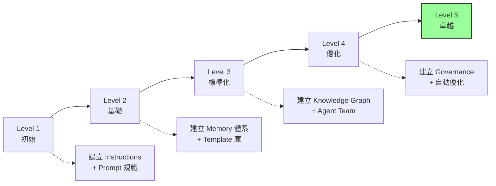

### 18.4 結論與建議

**核心結論**

> **「最有效降低 Token 的方法不是更換模型，而是建立 Knowledge Graph + Memory + Agent Team + SSDLC Workflow。」**

本手冊的全部內容都在論證和實踐這個核心論點。Token 優化不是一次性的任務，而是持續改善的過程。從最基本的 Instructions 檔案開始，逐步建立 Memory 體系、Knowledge Graph、Agent Team，最終形成完整的企業級 Token 優化框架。

**給不同角色的建議：**

| 角色 | 首要行動 | 預期效果 |
|------|---------|---------|
| **個人開發者** | 建立 Instructions + 3 個 Prompt Template | 1 天內 Token 降低 30% |
| **Tech Lead** | 建立團隊 Memory 體系 + Knowledge Graph | 2 週內 Token 降低 60% |
| **架構師** | 建立 Agent Team + SSDLC Workflow | 4 週內 Token 降低 80% |
| **CTO/IT 主管** | 建立 AI Governance Framework | 8 週內 Token 降低 90% |

**最終建議：**

1. **立即行動**：今天就建立 CLAUDE.md 或 copilot-instructions.md，這是零成本、立即見效的優化
2. **漸進式導入**：不要試圖一步到位，按照成熟度模型逐級提升
3. **量化追蹤**：建立 Token 消耗的基準線，定期衡量優化效果
4. **知識沉澱**：每次 AI 對話的經驗都應沉澱到 Memory 體系中
5. **團隊共享**：Token 優化是團隊層級的工作，建立共享的 Knowledge Base
6. **持續改善**：每月審視 Token 消耗模式，持續優化 Memory 和 Graph

---

## 附錄

### 附錄 A：Token 估算速查表

| 內容類型 | 估算規則 |
|---------|---------|
| 英文文字 | 1 word ≈ 1.3 tokens |
| 中文文字 | 1 字 ≈ 2 tokens |
| Java 程式碼 | 1 行 ≈ 5 tokens |
| JSON/YAML | 1 行 ≈ 4 tokens |
| Markdown | 1 行 ≈ 3 tokens |
| HTML/JSP | 1 行 ≈ 6 tokens |
| SQL | 1 行 ≈ 4 tokens |

### 附錄 B：工具比較表

| 工具 | 類型 | Token 節省方式 | 適用場景 | 授權 | GitHub Stars |
|------|------|--------------|---------|------|-------------|
| **RTK** | CLI Proxy | 壓縮工具輸出 | 所有 AI 工具（13+ 平台） | Apache 2.0 | 55.8K |
| **Understand-Anything** | Knowledge Graph Builder | Multi-Agent Pipeline + 互動儀表板 | 程式碼理解、團隊 Onboarding | MIT | 42.9K |
| **GitNexus** | Repository Indexer | MCP 精準查詢（16 工具） | 程式碼搜尋、影響分析 | PolyForm NC | 40.7K |
| **Graphify** | Code Graph Builder | 離線 AST 解析 + 多媒體 | 程式碼/文件圖譜 | MIT | 55.7K |

### 附錄 C：Prompt Template YAML 格式範例

```yaml
# prompt-templates.yaml
templates:
  - id: code-review
    category: development
    name: 程式碼審查
    prompt: |
      參考 coding-standards.md。
      審查以下變更（聚焦 {focus_areas}）：
      {diff_content}
      輸出格式：🔴 Critical / 🟡 Warning / 🟢 Info
    variables:
      - focus_areas: "安全性, 效能, 可維護性"
      - diff_content: "[貼入 diff]"
    estimated_tokens: 300
    
  - id: unit-test
    category: testing
    name: 單元測試
    prompt: |
      為以下方法撰寫 JUnit 5 + Mockito 測試：
      方法：{method_signature}
      規則：{business_rules}
      依賴：{dependencies}
      請涵蓋：正常、邊界、例外情境。
    variables:
      - method_signature: "[方法簽名]"
      - business_rules: "[業務規則]"  
      - dependencies: "[mock 依賴]"
    estimated_tokens: 400
```

### 附錄 D：參考資源

| 資源 | 說明 |
|------|------|
| [RTK GitHub](https://github.com/rtk-ai/rtk) | Rust Token Killer 官方 Repository（55.8K ★） |
| [Understand-Anything](https://github.com/Lum1104/Understand-Anything) | Knowledge Graph Builder（42.9K ★） |
| [GitNexus](https://github.com/abhigyanpatwari/GitNexus) | Repository Intelligence（40.7K ★） |
| [Graphify](https://github.com/safishamsi/graphify) | Code Knowledge Graph（55.7K ★） |
| [Claude Code Docs](https://docs.anthropic.com/en/docs/claude-code) | Claude Code 官方文件 |
| [GitHub Copilot Docs](https://docs.github.com/en/copilot) | GitHub Copilot 官方文件 |
| [RTK 教學手冊](RTK%20(Rust%20Token%20Killer)%20%E6%95%99%E5%AD%B8%E6%89%8B%E5%86%8A.md) | 本專案 RTK 詳細教學手冊 |

---

> **本手冊版本紀錄**
> 
> | 版本 | 日期 | 變更說明 |
> |------|------|---------|
> | 1.0.0 | 2026-05-29 | 初版發佈，涵蓋 18 章完整內容 |
> | 1.1.0 | 2026-05-29 | 更新 RTK/Understand-Anything/GitNexus/Graphify 最新資訊；新增安裝指南與平台支援說明；修正格式問題；補充參考資源 |

